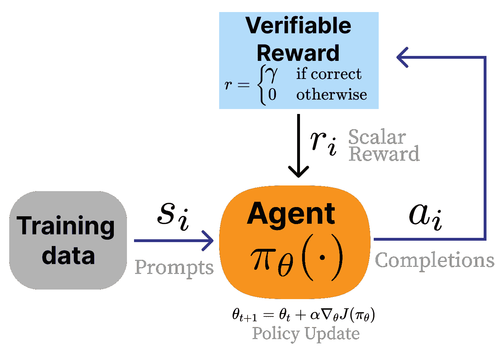

# 推理训练与推理时间缩放

推理模型和推理时间缩放——这是语言模型充分利用的底层属性——在 2024 年末、2025 年以及未来，使语言模型性能迈出了巨大的步伐。这些模型通过大量可验证奖励的强化学习（RLVR）[[6]](ch021.xhtml#ref-lambert2024t)进行训练，仍然使用了大量的 RLHF。在本章中，我们回顾了引导 AI 社区对 RL 在语言模型中潜力的转变欣赏之路，回顾了 RLVR 的基本原理，突出了关键工作，并指出了未来几年将定义该领域的辩论。

首先，在 2016 年神经信息处理系统（NeurIPS）会议的 2016 版上，Yann LeCun 首次介绍了他现在著名的蛋糕隐喻，用于说明现代机器学习系统中学习发生的地方：

> 如果智能是一块蛋糕，那么蛋糕的主体是无监督学习，蛋糕上的糖霜是监督学习，而蛋糕上的樱桃则是强化学习（RL）。

现代语言模型和后训练堆栈的最近变化使得这个类比现在基本完成。在这个类比中：

+   在大量互联网数据上进行的自监督学习构成了蛋糕的大部分（特别是在计算花费在 FLOPs 上时），

+   监督微调（SFT）后的训练初期将模型调整到一个更窄的分布（在所选示例的 RLHF 帮助下），并且

+   最后，“纯粹”的强化学习（RL）是蛋糕上的樱桃。

我们通过仅仅几个训练样本，用 RL 学习到“少量”的信息。这种推理训练随着**推理模型**的出现而出现，这些模型结合了本书中讨论的微调技术，并在可验证领域进行 RL 训练，以显著提高推理、编码和数学问题解决等能力。

这些模型的训练方法，可验证奖励的强化学习（RLVR）[[6]](ch021.xhtml#ref-lambert2024t)，与 RLHF 非常相似，但它将奖励模型作为可选的，而不是一个评分函数，当答案正确时返回正奖励，否则返回 0。RLVR 背后的思想在 RL 文献中并不新颖，在语言模型文献中也有许多相关思想，其中模型从答案是否正确的反馈中学习。

最初，具有可验证奖励的强化学习（RLVR）原本要被命名为具有真实值奖励的强化学习（RLGT）。然而，RLVR 与仅从真实值答案中学习的强化学习有细微的差别。在数学等领域，只有一个真实值答案可用于验证解决方案。在其他领域，如代码生成或精确指令遵循，即使有多个正确答案而不是只有一个真实值答案，也可以使用检查函数（例如，单元测试）进行验证。RLVR 进步的核心是拥有各种深度可验证问题，即使确切解决方案事先未知。

图 20：RLVR 以 RL 反馈环的形式呈现。我们使用验证函数而不是奖励模型。

首次成功部署此类训练的模型是 OpenAI 的 o1 [[48]](ch021.xhtml#ref-openai2024o1)和开放权重模型 DeepSeek R1 [[61]](ch021.xhtml#ref-guo2025deepseek)。不久之后，整个 AI 行业都将此训练过程和模型风格作为优先事项。这里的核心变化更多的是对训练阶段和不同行为优先级的重新分配，而不是这种 RL 设置完全新颖。推理模型带来了一个期望扩展 RL 训练的时代。

至于这些模型积累的行为类型，考虑以下示例，DeepSeek V3 0325 与它们的推理模型 DeepSeek R1 在查询“为我写一首关于金鱼的短诗”上的比较。DeepSeek V3 非常直接：

> 金鱼之梦
> 
> 在一个透明而圆润的玻璃鱼缸中，一只小小的金鱼无声地游动。它的鳞片像阳光的吻一样闪闪发光，它在水中悠闲地漂荡。
> 
> 尾鳍轻轻一摆，一道如此明亮的光芒，追逐着光中的气泡。它梦想着广阔的海洋吗？还是它的小小世界已经足够——它的骄傲？

同时，DeepSeek R1 的经验不同。它在向用户做出回应之前，首先生成许多思考标记来构建一个回答。答案看起来像这样：

> `<思考>` 好吧，用户想要一首关于金鱼的短诗。让我先从一些与金鱼相关的意象开始头脑风暴。金鱼通常在鱼缸里，对吧？所以也许可以从环境开始。像“金色的鱼缸”或“水晶球”这样的词可能适用。
> 
> 接下来，考虑金鱼的游动。它们游得很顺畅，所以像“冲刺”、“滑行”或“旋转”这样的词会浮现在脑海中。也许描述它们的鳍为“丝滑”以强调精致。
> 
> 然后，考虑金鱼周围的环境。阳光透过水面产生闪烁的效果。像“阳光舞动”或“波纹旋转”这样的词可能捕捉到这一点。包括城堡或鹅卵石等元素可以增加趣味性。
> 
> 主题？也许是小金鱼的小世界与它对自由的感知之间的对比。碗作为一个宇宙，微小但完整。以神秘或沉默的观察结束，可以增加深度。需要保持简洁，可能四节诗，有押韵模式。让我检查节奏和流畅度。避免陈词滥调，但要易于理解。好吧，让我们把它拼在一起。`</thinking>`
> 
> 液态玻璃中的金色梦想
> 
> 一个镀金碗、一个水晶球，微小的潮汐在寂静中流淌——一抹橙色、低语般的袍子，你穿梭在阳光下的靛蓝色中。
> 
> 你的世界虽小，却又无边无际——每一颗鹅卵石、城堡、展开的杂草。水面弯曲天空至蓝色，涟漪旋转你的液态世界。
> 
> 你在我们永远不知道的神话中滑行，一个沉默的君主，被雾气所遮蔽。梦想是否飘向气泡所在之处？或者记忆在紫水晶中？
> 
> 我们看着你描绘你无尽的球体——一个在泪滴中的宇宙。

`<thinking>`标签中的标记是模型的推理。对于更复杂的问题，推理阶段可能需要数千个标记才能生成答案。因此，长上下文语言模型是高级推理行为的先决条件，但这不是本章的重点。

这种训练的核心直觉是，对于给定的模型，我们重复以下循环：

1.  对多个问题进行多次答案采样，

1.  朝着正确的答案逐步前进，

1.  重复，重新访问相同的数据。

令人惊讶的是，这种极其简单的方法（在仔细分布数据和稳定的训练基础设施下进行）通过反复回顾相同的问题来帮助模型学习。更令人惊讶的是，这些训练问题的改进可以推广到模型从未见过的问题和（某些）领域！

这种简单的方法允许模型轻松搜索行为空间，并且强化学习算法增加了与正确答案相关的行为发生的可能性。

## 新推理模型起源

在这里，我们详细说明了导致 2025 年推理模型爆炸的高层次趋势。

### 为什么强化学习现在有效？

尽管有许多关于“强化学习还没有起作用”[[253]](ch021.xhtml#ref-irpan2018deep)或论文详细说明了强化学习的深度可重复性问题[[254]](ch021.xhtml#ref-henderson2018deep)，但该领域克服了这些问题，找到了高影响力的应用。专注于语言模型的强化学习训练起飞，标志着该研究领域的许多基本问题的进展，包括：

+   **强化学习的稳定性可以解决**：在其整个存在期间，限制强化学习采用的因素一直是稳定性。这表现在两个方面。首先，学习本身可能是不稳定的，并不总是有效。其次，训练本身已知比标准语言模型训练更脆弱，更容易出现损失峰值、崩溃等问题。无数发布都使用了这种强化学习训练风格，并且已经发生了大量的学术采用。在强化学习上的技术门槛已经达到历史最低点。

+   **开源版本已经“存在”**：许多工具已经存在，用于使用 RLVR 和相关技术训练语言模型。例如，TRL [[42]](ch021.xhtml#ref-vonwerra2022trl)、Open Instruct [[6]](ch021.xhtml#ref-lambert2024t)、veRL [[255]](ch021.xhtml#ref-sheng2024hybridflow)和 OpenRLHF [[256]](ch021.xhtml#ref-hu2024openrlhf)，其中许多都是基于 RLHF 和后训练阶段早期的优化。工具的可用性正在推动大量研究，这些研究可能会很快使本章过时。

多种资源指出，仅用于推理的强化学习训练只有在大约 2024 年及以后的领先模型上才是可行的，这表明在推理训练成为可能之前，模型需要具备一定的基础能力。

### 强化学习训练与推理时间缩放

使用强化学习来激发推理行为并在可验证领域上提高性能，与推理时间缩放的理念密切相关。推理时间缩放，也称为测试时间缩放，是一类在推理时使用更多计算能力以在下游任务中表现更好的方法。在 DeepSeek R1 和 OpenAI 的 o1 发布之前，已经研究了推理时间缩放的方法，这两者都极大地推广了针对强化学习训练的投资。例如，价值引导采样[[257]](ch021.xhtml#ref-liu2023don)或带有答案提取的重复随机采样[[238]](ch021.xhtml#ref-brown2024large)。除此之外，推理时间缩放还可以用于改进除思维链推理之外的更多人工智能训练方法，以解决问题，例如使用考虑选项深度的奖励模型[[137]](ch021.xhtml#ref-ankner2024critique) [[251]](ch021.xhtml#ref-liu2025inference)。

强化学习训练是推理时间缩放定律被使用的捷径，但从长远来看，我们将有更多方法来激发我们需要的推理时间权衡，以获得最佳性能。使用强化学习大量训练模型会改变它们，使它们在每次响应中生成更多标记，这与下游性能高度相关。这与早期 RLHF 系统中看到的长度偏差有显著不同[[9]](ch021.xhtml#ref-singhal2023long)，其中人类偏好训练的副作用是增加了响应率，以在偏好排名中获得微小的收益。

在 RL 训练模型下游，有许多方法正在探索，以继续推动推理和推理时间计算的极限。这些内容大多超出了本书的范围，因为它们的快速演变性质，但它们包括通过指令微调从更大的 RL 训练模型中提取推理行为到一个更小的模型 [[258]](ch021.xhtml#ref-muennighoff2025s1)，组合更多的推理调用 [[259]](ch021.xhtml#ref-chen2024more)，等等。这里重要的是下游性能与生成的 token 数量增加之间的相关性——否则这只是浪费的能量。

### RLVR 的未来（超越推理）

在许多领域，这些新的 RLVR 变体更加符合开发者的目标，因为它们更关注性能而不是行为。标准的微调 API 通常使用参数高效的微调方法，如 LoRA，通过指令的监督微调。开发者传入提示和完成内容，模型通过更新模型参数以匹配完成内容来进行调整，这增加了你的数据特征在模型生成中的普及率。

RLVR 专注于匹配答案。给定查询和正确答案，RLVR 帮助模型学习获取正确答案。虽然标准的指令微调是在数据上通过 1 或 2 个 epoch 的损失更新来完成的，但 RLVR 通过在相同的一些数据点上执行数百或数千个 epoch 来获得名称，这给模型提供了学习新行为的时间。这可以被视为在 RLVR 之后将基础模型版本中偶尔起作用的积极行为强化为稳健的行为。

**语言模型 RL 训练的范围持续扩大**：在基础科学层面上，o1 和 R1 的最大收获是我们有更多方法来训练语言模型以实现可能有价值的行为。研究人员和工程师可用的门越多，我们对 AI 总体轨迹的乐观态度就越高。

## 理解推理训练方法

对推理的投资推动了模型训练艺术中如何遵循人类指令的重大演变。这些配方仍然使用了前面章节中讨论的常见元素，包括指令微调、从人类反馈中进行强化学习和具有可验证奖励的强化学习（RLVR）。核心变化是使用更多的 RLVR，并以不同的顺序应用其他训练技术——传统上，对于推理模型，核心训练步骤要么是大规模的 RL 运行，要么是在另一个模型上进行的、经过大量 RLVR 训练的大规模指令微调运行（称为蒸馏）。

### 预 OpenAI 的 o1 或 DeepSeek R1 的推理研究

在推理模型起飞之前，人们投入了大量努力来理解如何训练语言模型以在验证领域表现得更好。这些工作的主要区别在于，它们的方法没有像 DeepSeek R1 和随后的模型那样扩展到相同的程度，或者它们导致了在整体性能上做出牺牲以换取更高数学或编码能力的模型。包括基本思想和动机在内，以描绘推理模型在整体景观中出现的更广阔图景。

在验证领域训练语言模型的早期努力包括自学习推理器（STaR）系列工作[[260]](ch021.xhtml#ref-zelikman2022star) [[261]](ch021.xhtml#ref-Zelikman2024QuietSTaRLM) 和 TRICE [[262]](ch021.xhtml#ref-hoffman2023training)，它们都使用了真实奖励信号来鼓励模型在 2022 年和 2023 年进行思维链推理。STaR 有效地近似策略梯度算法，但在实践中以不同的方式过滤样本，并使用交叉熵度量而不是对数概率，而 Quiet-STaR 通过在尝试回答可验证问题之前生成标记来扩展这一思路（这有助于训练性能）。TRICE [[262]](ch021.xhtml#ref-hoffman2023training) 通过生成轨迹并使用受启发于马尔可夫链蒙特卡洛的期望最大化算法进行优化来改进推理。VinePPO [[263]](ch021.xhtml#ref-VinePPO) 遵循这些方法，并使用一种更接近现代推理模型的设置。VinePPO 使用基于 PPO 算法的二进制奖励数学问题（论文中的 GSM8K 和 MATH 训练集）的正确性。在 OpenAI 的 o1 和 DeepSeek R1 之前的工作使用了代码执行作为训练的反馈信号[[264]](ch021.xhtml#ref-gehring2024rlefgroundingcodellms)，[[265]](ch021.xhtml#ref-xudpoppo) 或用于定理证明的验证（在此称为从验证器反馈的强化学习，RLVF，见[[266]](ch021.xhtml#ref-amit2024models)）。Tülu 3 通过使用简单的 PPO 训练器来奖励正确答案的完成来扩展这些方法——最重要的是在保持模型在广泛评估套件上的整体性能的同时。Tülu 3 的二进制奖励和现代推理训练技术可以与 STaR 的迭代方法或 Quiet-STaR 的对数似然奖励进行对比。

### 早期推理模型

以下是对 DeepSeek R1 之后的基础推理研究报告的总结，其中一些报告附带开放数据和模型权重。

表 6：2025 年（RLHF 大量推理时间缩放的第一年）显著的推理模型技术报告概览。

| 日期 | 名称 | TLDR | 开放权重 | 开放数据 |
| --- | --- | --- | --- | --- |
| 2025-01-22 | DeepSeek R1 [[61]](ch021.xhtml#ref-guo2025deepseek) | 基于 RL 的 DeepSeek 升级，在数学和代码推理上取得重大进展 | 是 | 否 |
| 2025-01-22 | Kimi 1.5 [[205]](ch021.xhtml#ref-team2025kimi) | 在中文/英文数据上扩展 PPO/GRPO；强大的 AIME 数学能力 | 否 | 否 |
| 2025-03-31 | Open-Reasoner-Zero [[267]](ch021.xhtml#ref-hu2025openreasonerzero) | 基础模型 RL 的完全开源复制 | 是 | 是 |
| 2025-04-10 | Seed-Thinking 1.5 [[64]](ch021.xhtml#ref-seed2025seed) | 字节跳动 RL 管道，具有动态 CoT 阀门 | 是（7B） | 否 |
| 2025-04-30 | Phi-4 Reasoning [[268]](ch021.xhtml#ref-abdin2025phi4) | 14B 模型；谨慎的 SFT→RL；擅长 STEM 推理 | 是 | 否 |
| 2025-05-02 | Llama-Nemotron [[269]](ch021.xhtml#ref-bercovich2025llamanemotron) | 多尺寸“推理切换”模型 | 是 | 是 |
| 2025-05-12 | INTELLECT-2 [[198]](ch021.xhtml#ref-primeintellectteam2025intellect2reasoningmodeltrained) | 首次全球去中心化 RL 训练运行（32B） | 是 | 是 |
| 2025-05-12 | Xiaomi MiMo [[63]](ch021.xhtml#ref-xia2025mimo) | 从预训练到后训练的端到端推理管道 | 是 | 否 |
| 2025-05-14 | Qwen 3 [[62]](ch021.xhtml#ref-yang2025qwen3) | 将 R1 食谱应用于新模型的类似方法 | 是 | 否 |
| 2025-05-21 | Hunyuan-TurboS [[270]](ch021.xhtml#ref-liu2025hunyuan) | Mamba-Transformer MoE，自适应长/短 CoT | 否 | 否 |
| 2025-05-28 | Skywork OR-1 [[271]](ch021.xhtml#ref-he2025skyworkor1) | 避免熵崩溃的 RL 食谱；在 AIME 上击败 DeepSeek | 是 | 是 |
| 2025-06-04 | Xiaomi MiMo VL [[272]](ch021.xhtml#ref-coreteam2025mimovltechnicalreport) | 将推理管道端到端适应以包含多模态任务 | 是 | 否 |
| 2025-06-04 | OpenThoughts [[273]](ch021.xhtml#ref-guha2025openthoughts) | 从 QwQ-32B 中提取的 1.2M 个示例指令数据集的公开 | 是 | 是 |
| 2025-06-10 | Magistral [[274]](ch021.xhtml#ref-mistral2025magistral) | 在 Mistral 3 上纯 RL；多语言 CoT；小型模型开源 | 是（24B） | 否 |
| 2025-06-16 | MiniMax-M1 [[275]](ch021.xhtml#ref-minimax2025minimaxm1scalingtesttimecompute) | 开放权重 456B MoE 混合/Lightning Attention 推理模型；1M 上下文；RL w/CISPO；发布 40K/80K 思考预算检查点 | 是 | 否 |
| 2025-07-10 | Kimi K2 [[276]](ch021.xhtml#ref-kimiteam2025kimik2) | 1T MoE (32B active) with MuonClip (QK-clip) for stability; 15.5T token pretrain without loss spikes; multi-stage post-train with agentic data synthesis + joint RL; releases base + post-trained checkpoints. | 是 | 否 |
| 2025-07-28 | GLM-4.5 [[277]](ch021.xhtml#ref-zeng2025glm45) | 开放权重 355B-A32B MoE “ARC” 模型，具有思考/非思考模式；23T-token 多阶段训练 + 后训练与专家迭代和 RL；发布 GLM-4.5 + GLM-4.5-Air (MIT)。 | 是 | 否 |
| 2025-08-20 | Nemotron Nano 2 [[278]](ch021.xhtml#ref-nvidia2025nemotronnano2) | 用于长“思考轨迹”的混合 Mamba-Transformer；在 20T tokens 上进行 FP8 预训练然后压缩/蒸馏；明确发布多个检查点以及“大多数”预/后训练数据集。 | 是 | 是（大多数） |
| 2025-09-09 | K2-Think [[279]](ch021.xhtml#ref-llm3602025k2think) | 参数高效的数学推理系统：一个 32B 的开源权重模型，带有测试时缩放配方；定位为完全开源，包括训练数据/代码（根据发布材料）。 | 是 | 是 |
| 2025-09-23 | LongCat-Flash-Thinking [[280]](ch021.xhtml#ref-mlcteam2025longcat) | 560B MoE 推理模型；报告明确关于从长-CoT 冷启动到大规模 RL 的阶段配方；开源发布。 | 是 | 否 |
| 2025-10-21 | Ring-1T [[281]](ch021.xhtml#ref-ringteam2025everystepevolves) | 以 RL 缩放为重点的万亿规模“思考模型”；报告了在 1T 规模上缩放 RL 的瓶颈/解决方案，并发布了一个开源模型。 | 是 | 否 |
| 2025-11-20 | OLMo 3 Think [[282]](ch021.xhtml#ref-teamolmo2025olmo3) | 完全开放的“模型流”发布：报告了整个生命周期（阶段、检查点和数据点），并将 OLMo 3 Think 32B 定位为旗舰开放思维模型。 | 是 | 是 |
| 2025-12-02 | DeepSeek V3.2 [[283]](ch021.xhtml#ref-deepseekai2025v32) | 开源权重 MoE 前沿推进，报告突出了注意力效率变化、RL 框架升级和数据合成以提升代理/推理性能。 | 是 | 否 |
| 2025-12-15 | Nemotron 3 Nano [[284]](ch021.xhtml#ref-nvidia2025nemotron3nano) | 30B-A3B MoE hybrid Mamba-Transformer; pretrain on 25T tokens and includes SFT + large-scale RL; explicitly states it ships weights + recipe/code + most training data. | 是 | 是（大多数） |
| 2025-12-16 | MiMo-V2-Flash [[285]](ch021.xhtml#ref-mimo2025flash) | 309B MoE (15B active) optimized for speed: hybrid SWA/GA attention (5:1, 128-token window) + lightweight MTP; FP8 pretrain on 27T tokens; post-train with MOPD + large-scale agentic RL for reasoning/coding. | 是 | 否 |

### 推理模型训练的常见实践

在本节中，我们详细介绍了用于序列化训练阶段和修改数据以最大化推理模型训练性能的常用方法。

注意，这些论文可能使用了列出的技术但没有提及，而他们的同行则提到了，因此这些例子是已知实现的子集，应作为参考，但不应作为最终宣言，即什么是最优配方。

+   **离线难度过滤**：RLVR 的核心直觉是模型只能从存在梯度的例子中学习。如果 RLVR 的起始模型可以 100%或 0%的时间解决一个问题，那么不同完成之间的梯度将不存在（即，所有策略对策略梯度算法来说都看起来相同）。许多模型在开始大规模 RL 之前使用了难度过滤，将训练问题限制在起始点模型只能解决 20-80%的那些问题上。这种数据是通过在训练集中对每个提示进行 N 次，例如 16 次，完成并验证正确百分比来收集的。Seed-Thinking 1.5、Open Reasoner Zero、Phi 4、INTELLECT-2、MiMo RL、Skywork OR-1 和其他一些模型使用了这种形式。

+   **批在线过滤**（或训练过程中的难度课程）：为了补充离线过滤以找到合适的训练问题，另一个主要问题是“我们应该以什么顺序在训练过程中向模型展示问题。”为了解决这个问题，许多模型使用批次的在线过滤问题，预建的课程/数据调度器，将更难的问题留到训练后期，或者采用其他方法来提高长期稳定性。Kimi 1.5、Magistral、Llama-Nemotron、INTELLECT-2、MiMo-RL、Hunyuan-TurboS 和其他一些模型采用了相关想法。

+   **移除 KL 惩罚**：随着推理模型相对于 RLHF 训练的 RL 运行长度增加，奖励函数变得不太容易过度优化，许多模型移除了约束 RL 学习策略与训练基模型相似的 KL 惩罚。这允许模型在训练过程中进一步探索。RAGEN[[286]](ch021.xhtml#ref-wang2025ragenunderstandingselfevolutionllm)、Magistral、OpenReasonerZero、Skywork OR-1 和其他一些模型使用了这种方法。

+   **放宽策略梯度裁剪**：算法 GRPO 的新变体，如 DAPO [[193]](ch021.xhtml#ref-yu2025dapo)，对 GRPO（或 PPO）中使用的双向裁剪目标进行了修改，以实现更好的探索。裁剪也已被证明在奖励不完美时可能导致潜在的虚假学习信号[[287]](ch021.xhtml#ref-shao2025spurious)。这种具有不同梯度方向范围的两侧裁剪被 RAGEN、Magistral、INTELLECT-2 和其他一些模型使用。

+   **离线数据（或完全异步更新）**：随着使用 RL 解决任务所需的完成长度随着问题的难度增加而显著增加（尤其是在响应长度的*方差*方面），RL 运行中的计算可能会闲置。为了解决这个问题，训练正在转向异步更新或改变问题如何安排到批次中，以提高整体吞吐量。Seed-Thinking 1.5、INTELLECT-2 和其他一些模型使用了部分到完全异步（离线）数据。

+   **额外的格式奖励**：为了使推理过程可预测，许多模型添加了微小的奖励，以确保模型在回答之前遵循正确的格式，例如`<think>...</think>`。这被 DeepSeek R1、OpenReasonerZero、Magistral、Skywork OR-1 和其他模型所采用。

+   **语言一致性奖励**：与格式奖励类似，一些多语言推理模型使用语言一致性奖励来优先考虑在推理过程中不改变语言的模型（以获得更好的和更可预测的用户体验）。这些包括 DeepSeek R1、Magistral 和其他模型。

+   **长度惩罚**：许多模型在 RL 训练期间使用不同形式的长度惩罚，要么是为了在时间上稳定学习过程，要么是为了减轻对难题的过度思考。一些例子包括 Kimi 1.5 逐渐扩展目标长度以对抗过度思考（同时训练精度在难度课程中保持较高）或 INTELLECT-2 在整个过程中运行小的长度惩罚。其他人使用过长的过滤和其他相关实现来提高吞吐量。

+   **损失归一化**：关于原始 GRPO 算法的按组归一化项可能引入的潜在长度或难度偏差有一些讨论（参见关于策略梯度的章节或 [[185]](ch021.xhtml#ref-liu2025understanding))。因此，一些模型，如 Magistral 或 MiMo，选择在批量级别而不是组级别对损失或优势进行归一化。

+   **并行测试时计算扩展**：结合来自多个并行、独立采样的 rollout 的答案可以显著提高使用单个 rollout 答案的效果。最简单形式的并行测试时计算扩展，如 DeepSeek-R1、Phi-4 和其他模型所做的那样，涉及使用大多数 rollout 返回的答案作为最终答案。一种更高级的技术是使用一个评分模型，该模型经过训练，可以从并行 rollout 的答案中选择最佳答案。这种技术尚未被开放推理模型配方（截至 2025 年 6 月）采用，但在 Claude 4 公告[[288]](ch021.xhtml#ref-anthropic2025claude4)中提到，并在 DeepSeek-GRM [[251]](ch021.xhtml#ref-liu2025inference)中使用。

除了常见的技巧之外，还有许多关于如何在不牺牲辅助能力的情况下通过推理训练创建有用模型的常见发现：

+   **仅文本推理提升多模态性能**：Magistral、MiMo-VL 和其他模型发现，在训练多模态模型后进行仅文本推理训练可以提高最终模型的多模态性能。

+   **使用系统提示切换推理**（或长度控制）：Llama-Nemotron、Qwen 3 和其他模型使用特定的系统提示（可能结合长度控制的 RL 训练 [[289]](ch021.xhtml#ref-aggarwal2025l1))来启用用户可切换的思考长度。
