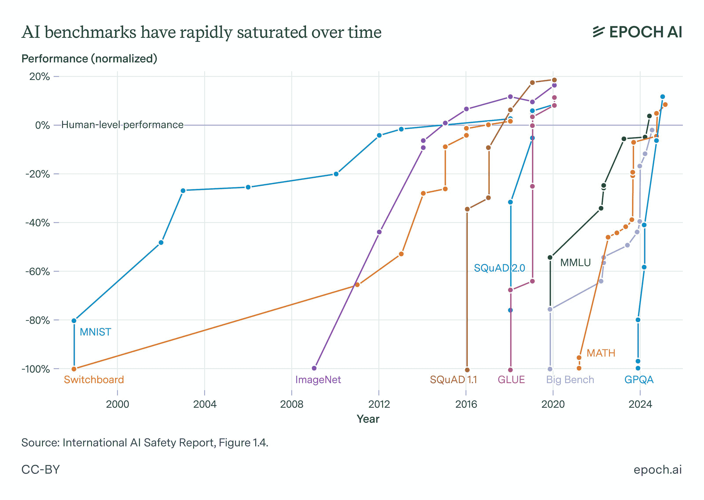

# 评估

评估是一个不断发展的方法。理解语言模型评估的关键，尤其是后训练评估，在于当前流行的评估制度反映了流行的训练最佳实践和目标。虽然具有挑战性的评估推动了语言模型向新领域的发展，但大多数评估都是为了构建对新模型有用的信号。

在许多方面，本章旨在展示 RLHF 早期历史中流行的评估制度的片段，以便读者可以了解常见的主题、细节和失败模式。

RLHF 和后训练评估在其早期历史中经历了几个不同的阶段：

1.  **早期聊天阶段**：早期使用 RLHF 或偏好调整训练的模型，其评估重点在于捕捉模型的聊天性能，特别是相对于 GPT-4 等已知强大模型。早期例子包括 MT-Bench [[131]](ch021.xhtml#ref-zheng2023judging)，AlpacaEval [[132]](ch021.xhtml#ref-dubois2024length)，和 Arena-Hard [[133]](ch021.xhtml#ref-li2024crowdsourced)。模型评估范围较窄，这些现在被认为是“聊天”或“指令遵循”领域。

1.  **多技能时代**：随着时间的推移，常见的做法是 RLHF 可以用来提高比聊天更多的技能。例如，Tülu 评估套件包括知识（MMLU [[310]](ch021.xhtml#ref-hendrycks2020measuring)，PopQA [[311]](ch021.xhtml#ref-mallen2023llm_memorization)，TruthfulQA [[312]](ch021.xhtml#ref-lin2021truthfulqa))，推理（BigBenchHard [[313]](ch021.xhtml#ref-suzgun2022challenging)，DROP [[314]](ch021.xhtml#ref-dua2019drop))，数学（MATH [[315]](ch021.xhtml#ref-hendrycksmath2021)，GSM8K [[129]](ch021.xhtml#ref-cobbe2021gsm8k))，编码（HumanEval [[316]](ch021.xhtml#ref-chen2021codex)，HumanEval+ [[317]](ch021.xhtml#ref-evalplus))，指令遵循 [[115]](ch021.xhtml#ref-zhou2023instructionfollowingevaluationlargelanguage)和安全（许多评估的组合）。这反映了后训练被接受为一个多方面的解决方案，超越了安全和聊天领域。

1.  **推理与工具**：后训练的当前时代以关注具有挑战性的推理和工具使用问题为特征。这些问题包括许多更难的知识密集型任务，如 GPQA Diamond [[318]](ch021.xhtml#ref-rein2023gpqa)和人类最后的考试 [[319]](ch021.xhtml#ref-phan2025hle)，复杂的软件工程任务，如 SWE-Bench+ [[320]](ch021.xhtml#ref-aleithan2024swebenchplus)和 LiveCodeBench [[321]](ch021.xhtml#ref-jain2024livecodebench)，或由最近的 AIME 竞赛展示的具有挑战性的数学问题。

此外，新的领域将会发展。随着人工智能越来越成为一个工业化的领域，评估的激励正在转变并成为多利益相关者。自从 ChatGPT 发布以来，私人评估如 Scale Leaderboard [[322]](ch021.xhtml#ref-scale2024seal)，社区驱动的评估如 ChatBotArena [[113]](ch021.xhtml#ref-chiang2024chatbot)，以及第三方评估公司如 ArtificialAnalysis 和 Epoch AI 已经大量涌现。在本章中，我们将包括如何实施和理解这些评估的详细信息。

## 提示格式化：从少样本到零样本再到 CoT

**提示**语言模型主要是一个动词，但它也被认为是一种可以练习和/或训练的技艺或艺术 [[323]](ch021.xhtml#ref-schulhoff2024prompt)。提示是结构化信息并为语言模型提供上下文的方式。对于常见的交互，提示相对基础。对于高级场景，一个精心制作的提示将意味着在特定的一次性用例中的成功或失败。

当谈到评估时，提示技术可以对模型的性能产生重大影响。一些提示技术——例如下面讨论的格式化——可以使模型的表现从 60%下降到几乎 0%。同样，改变提示可以帮助模型在训练期间更好地学习。通俗地说，良好地提示模型可以提供使用未来模型的主观体验，解锁正常使用之外的性能。

使用现代语言模型进行良好提示可能包括为模型准备一份完整的报告以供其回应（通常包含成千上万的生成文本标记）。这种行为是语言模型性能测量和理解方面许多变化的下游。

早期的语言模型仅被用作智能自动完成。为了更开放地使用这些模型，向模型展示了多个示例，然后是一个不完整的短语提示。这被称为少样本或上下文学习 [[167]](ch021.xhtml#ref-brown2020language)，当时指令调整或 RLHF 并未涉及。在流行评估的情况下，这看起来可能如下：

```py
# Few-Shot Prompt for a Question-Answering Task
You are a helpful assistant. Below are example interactions to guide your style:

### Example 1
User: "What is the capital of France?"
Assistant: "The capital of France is Paris."

### Example 2
User: "Who wrote the novel '1984'?"
Assistant: "George Orwell wrote '1984.'"

# Now continue the conversation using the same style.
User: "Can you explain what a neural network is?"
Assistant:
```

这里，评估答案有多种方式。如果我们考虑 MMLU 风格的提问，其中模型需要在多个答案之间进行选择：

```py
# Few-Shot Prompt

Below are examples of MMLU-style questions and answers:

### Example 1
Q: A right triangle has legs of lengths 3 and 4\. What is the length of its hypotenuse?
Choices:
(A) 5
(B) 6
(C) 7
(D) 8

Correct Answer: (A)

### Example 2
Q: Which of the following is the chemical symbol for Sodium?
Choices:
(A) Na
(B) S
(C) N
(D) Ca

Correct Answer: (A)

### Now answer the new question in the same style:

Q: Which theorem states that if a function f is continuous on a closed interval [a,b], then f must attain both a maximum and a minimum on that interval?
Choices:
(A) The Mean Value Theorem
(B) The Intermediate Value Theorem
(C) The Extreme Value Theorem
(D) Rolle's Theorem

Correct Answer:
```

要在这里提取答案，可以基于某些采样参数生成一个标记，并查看答案是否正确，A、B、C 或 D（如上所述的格式化，如[[324]](ch021.xhtml#ref-robinson2023leveraging)中提出的那样），或者可以查看每个标记的概率，如果正确答案更有可能，则标记任务为正确。第二种方法有两种潜在的实施方式——首先，可以查看字母（A）或答案“平均值定理”的概率。这两个都是允许的指标，但基于概率的指标中，答案预测更为常见。

少量提示的一个常见挑战是模型不会遵循格式，这被视为错误答案。在设计评估领域时，上下文中使用的示例数量通常被视为设计参数，范围从 3 到 8 个或更多。

在少量提示的演变过程中，出现了为模型提供思维链示例的想法。这些示例包括在上下文中写出的推理，如下所示（后来被生成推理步骤的明确提示所取代） [[54]](ch021.xhtml#ref-wei2022chain):

```py
# standard prompting
Q: Roger has 5 tennis balls. He buys 2 more cans of tennis balls. Each can has 3 tennis balls. How many tennis balls does he have now?

A: The answer is 11.

Q: The cafeteria had 23 apples. If they used 20 to make lunch and bought 6 more, how many apples do they have?

A: The answer is ...

# chain of thought prompting
Q: Roger has 5 tennis balls. He buys 2 more cans of tennis balls. Each can has 3 tennis balls. How many tennis balls does he have now?

A: Roger started with 5 balls. 2 cans of 3 tennis balls each is 6 tennis balls. 5 + 6 = 11\. The answer is 11.

Q: The cafeteria had 23 apples. If they used 20 to make lunch and bought 6 more, how many apples do they have?

A: The cafeteria had 23 apples originally. They..
```

随着时间推移，随着语言模型变得更强大，它们演变为零样本评估，也称为“零样本学习器” [[325]](ch021.xhtml#ref-wei2022finetuned)。微调语言网络（FLAN）表明，在特定任务中微调的语言模型，作为现代指令微调的先导，可以推广到它们未训练过的零样本问题 [[325]](ch021.xhtml#ref-wei2022finetuned)（在 T0 [[326]](ch021.xhtml#ref-sanh2022multitask)中也发现了类似的结果）。这是指令微调（IFT）的出现，它是 RLHF 和训练后的重要先导。一个零样本问题可能看起来像：

```py
User: "What is the capital of France?"
Assistant:
```

从 2022 年开始，时间线开始包括关键的早期 RLHF 工作，例如 InstructGPT。伴随这些模型的核心能力和用例转变是更加开放的使用方式。随着更加开放的使用，生成式评估因其与实际使用相似而越来越受欢迎。在这个时期，从 ChatGPT 出现后的近几年，一些多项选择题评估仍然在 RLHF 研究中作为对常见实践的制约因素被使用。

2024 年底和 2025 年初，随着推理模型的出现，模型行为发生了重大变化，即在每次回答之前添加了长思维链（CoT）推理过程。这些模型不再需要使用“逐步思考”的规范修改来提示，正如[[327]](ch021.xhtml#ref-kojima2022large)中提出的。

例如，对于每个问题或类别，都有专门设计的提示来帮助从模型中提取行为。Tülu 3 详细说明了用于多项选择题 CoT 回答的一些提示 [[6]](ch021.xhtml#ref-lambert2024t):

```py
Answer the following multiple-choice question by giving the correct answer letter in parentheses. Provide CONCISE reasoning for the answer, and make sure to finish the response with "Therefore, the answer is (ANSWER_LETTER)" where (ANSWER_LETTER) is one of (A), (B), (C), (D), (E), etc.

Question: {question}
(A) {choice_A}
(B) {choice_B}
(C) ...

Answer the above question and REMEMBER to finish your response with the exact phrase "Therefore, the answer is (ANSWER_LETTER)" where (ANSWER_LETTER) is one of (A), (B), (C), (D), (E), etc.
```

尤其当模型使用特殊格式来区分思维标记和答案标记时，这促使最近的重大评估制度更新。评估正在转向测试模型以生成式方式响应思维链提示。

## 使用评估与观察评估



Epoch AI 的报告显示主要 AI 评估如何随着时间的推移迅速饱和。许可 CC-BY。

公司内部进行的语言模型评估只能与具有大误差栏的同行进行比较，因为它们用于内部评估的过程与外部评估不匹配。内部评估是为了在训练中爬山，就像在传统机器学习中被称为“训练集”的那样。社区使用的公共评估，用于比较领先模型，如果它们在所谓的训练集中，或者作为未见的“测试集”或“验证集”，是无法知道的。

由于评估分数已成为企业营销方案的核心组成部分，公司内部的实施已经发生了变化。有传言称，一些主要的 AI 实验室使用“定制提示”来进行像 GSM8k 或 MATH 这样重要评估。这些做法发展迅速。

语言模型评估栈被视为营销，因为评估没有硬的真实来源。前沿实验室内部发生的事情是，评估套件正在调整以适应其内部需求。当结果被分享时，我们得到的是实验室为其模型获得的数字输出，但不是该函数的所有输入。输入是非常敏感的配置，而且在 OpenAI、Meta、Anthropic 和 Google 都不同。即使是完全开放的评估标准也难以保证可重复性。专注于自己的模型是接近可重复评估技术的唯一方法。营销背后有良好的意图，首先是技术团队。

前沿语言模型的评估在今天既是一门艺术，也是一门科学。

不同的群体选择不同的评估方法以保持独立性，即使它们成为真正的测试集，但没有人公开他们选择了哪些。例如，流行的推理评估 MATH 和 GSM8k 都拥有带有提示的训练集，这些提示可以轻易地用来提高性能。使用同一分布的提示来提高性能与通过一般数学数据训练来泛化这些任务非常不同。

事实上，这些**训练集**是高质量的数据，因此模型从训练它们中受益。如果这些公司**没有**将相应的评估作为核心指标来跟踪，那么在评估集上训练可能是一个实际的决定，因为高质量数据是模型发展的主要限制因素。

领先的 AI 实验室通过关注几个关键评估来进行爬山，并在最后报告核心公共集的分数。关键点是，他们用于跟踪进度的某些评估，例如从 GPT-4 报告中缩放时的交叉熵损失预测数据集 [[328]](ch021.xhtml#ref-achiam2023gpt)，通常是不公开的。

后期训练的评估在很大程度上依赖于人工评估。对于生成语言模型的人工评估产生 Elo 排名（在早期 Anthropic 论文中很受欢迎，如宪法 AI），而对于奖励模型的人工评估则显示一致性。这些也可以通过向用户服务两个不同的模型并使用 A/B 测试窗口（如本章所述的偏好数据章节）来获得。

他们选择关注的一组有限的评估形成了一个紧密的联系，即评估与训练之间的联系。在某个时刻，一个关注的评估是 MMLU。GPQA 是推理模型出现时的一个选择。实验室会改变评估，以使它们更适合他们的需求，例如 OpenAI 发布了 SWE-Bench-Verified [[329]](ch021.xhtml#ref-openai2024swebench)。还有许多其他公众无法访问的内部评估。

内部改进评估对下游训练的关键“能力”在于**提高比较训练运行时的统计功效**。通过改变评估，这些实验室减少了他们优先考虑的信号上的噪声，以便做出更明智的训练决策。

这种复杂性在现代语言模型训练堆栈的后期训练的复杂性上进一步加剧。今天评估语言模型涉及生成一定数量的标记（而不仅仅是查看答案的日志概率）。人们普遍认为，前沿实验室为了提高许多任务的表现，会使用一些小技巧——最常见的解释是为某些评估提供一次性的提示。

另一个在比较多个实验室的评估时产生混淆的例子是将推理时间缩放添加到评估比较中。推理时间缩放表明，模型可以通过在推理时使用更多标记来提高性能。因此，通过推理的总标记数来控制评估分数是很重要的，但还不是常见的做法。

根据你的数据在后期训练中的格式，模型在评估格式上会有很大的差异。例如，两个流行的、公开的数学数据集 NuminaMath [[330]](ch021.xhtml#ref-li2024numinamath) 和 MetaMath [[331]](ch021.xhtml#ref-yu2023metamath) 由于答案格式上的微小差异而在训练中相互冲突——Numina 将答案放在`\boxed{XYZ}`中，而 MetaMath 将答案放在`The answer is: XYZ`之后——在两者上训练可能会使性能不如仅在一个上训练。强大的模型被训练成能够使用多种格式运行，但它们通常有一个最强的格式。

最后，我们留下了关于评估封闭模型状态的几个关键点：

+   我们不知道或不一定拥有实验室正在攀登的关键测试集，因此一些评估只是代理。

+   前沿模型的推理变得越来越复杂，有特殊的系统提示、特殊的标记等，而我们不知道它如何影响评估，

+   我们不知道用于数值报告封闭评估的所有格式和细节。

## 污染

当前语言模型实践（即不仅限于 RLHF 和训练后）的一个主要问题是故意或无意中使用评估数据集的数据进行训练。这被称为*数据集污染*，相应地，避免这种做法的实践是*去污*。为了去污一个数据集，一个人会在训练和测试数据集中进行搜索，寻找 n-gram（字符）或标记的匹配 [[332]](ch021.xhtml#ref-singh2024evaluation)。数据可能以多种方式被污染，但最常见的是从网络上抓取多个阶段的训练数据。基准通常列在公共网络域名上，这些域名会被爬取，或者用户将问题输入到模型中，这可能导致未来模型的候选训练数据。

例如，在 Tülu 3 评估套件的去污过程中，作者发现流行的开源数据集被流行的 RLHF 评估污染 [[6]](ch021.xhtml#ref-lambert2024t)。这些重叠包括：UltraFeedback 与 TruthfulQA 的污染，Evol-CodeAlpaca 与 HumanEval 的污染，NuminaMath 与 MATH 的污染，以及 WildChat 与安全评估的污染。这些是通过从训练提示到评估集中确切提示的 8-gram 重叠发现的。

为了理解不披露或发布训练数据的模型污染，创建了带有略微扰动的原始问题的基准新版本，例如，对于 MATH [[333]](ch021.xhtml#ref-huang2025math)，以查看哪些模型被训练来匹配原始格式或问题。这些扰动基准上的高方差并不是污染的确认，污染难以证明，但可能表明那些以特定格式进行训练的模型，这些格式可能不会转化为现实世界的性能。

## 工具

有许多开源评估工具供人们选择。例如，来自英国安全研究所的 Inspect AI [[334]](ch021.xhtml#ref-inspectAI2024)，由 HuggingFace 提供的 LightEval [[335]](ch021.xhtml#ref-fourrier2023lighteval)，它为 Open LLM 排行榜 [[336]](ch021.xhtml#ref-open-llm-leaderboard-v2) 提供动力，Eleuther AI 基于其 GPT-Neo-X 模型（大约是 GPT-3 评估配置）构建的评估工具 [[337]](ch021.xhtml#ref-gao2023evalharness)，AI2 基于 OLMES 的库 [[339]](ch021.xhtml#ref-gu2024olmes)，斯坦福大学基础模型研究中心的 HELM [[340]](ch021.xhtml#ref-liang2023helm)，Mosaic（现在是 Databricks）的 Eval Gauntlet [[341]](ch021.xhtml#ref-mosaicml2024gauntlet)，以及其他更多。
