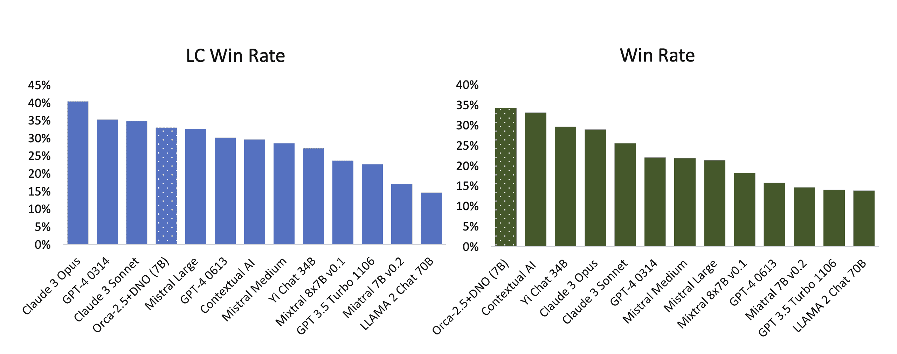

# 风格与信息

RLHF（强化学习与人类反馈）的早期发展给它带来了“仅仅是风格迁移”或其他对 RLHF 如何操纵输出中信息呈现方式的严厉批评。本章解释了为什么风格对于理解 RLHF 所提供价值的核心地位至关重要。阅读本章应有助于你理解 RLHF 对模型所做的改变以及它为何对用户行为产生积极影响。

单纯关于风格迁移的想法有两个原因阻碍了 RLHF 叙事的发展。首先，当人们讨论风格迁移时，他们并不将其描述为重要或令人兴奋的。风格是人类价值的永恒源泉，这就是为什么重述故事可以导致新的畅销书（如[Sapiens](https://en.wikipedia.org/wiki/Sapiens:_A_Brief_History_of_Humankind)），并且它是继续推进我们知识生态系统的基础部分。风格与信息内容是交织在一起的。

其次，我们已经看到不同的风格实际上如何通过 Llama 3 [[24]](ch021.xhtml#ref-dubey2024llama)来提高评估改进。Llama 3 Instruct 模型在 ChatBotArena 上得分极高，并被认为是因为它们拥有更有趣的个性。如果 RLHF 能让语言模型变得更有趣，那么这就是其带来的价值。

在本章中，“chattiness”（健谈度）一词被用来概括使用 RLHF 训练的模型响应长度的增长，但它也包括了像大量使用 Markdown、表情符号以及以项目符号列表格式化答案等技术。

## 健谈度悖论

RLHF 或偏好微调方法主要被用来提升像 AlpacaEval 和其他自动排行榜的分数，而没有在像 ChatBotArena 这样更难以操纵的评估上成比例地提升。悖论在于，虽然对齐方法在这些模型上提供了可衡量的改进，并且这种改进确实转化为人们关心的性能，但大量进行类似操作且效果相同的模型却将这种改进过度放大，并发布了明显无意义的评估分数。

这些方法如果做得恰当，会使模型更容易操作和更有趣。这通常伴随着在 MT Bench 或 AlpacaEval 等评估工具上几个百分点的改进。问题是，你也可以使用 DPO 和 PPO 等技术，在反馈循环或大量数据中实际上严重损害模型在其他任务上的表现，如数学或编码，以牺牲 LLM 作为评判者的性能为代价。

在 DPO 与 PPO 争论泛滥期间，出现了许多论文，提出了令人难以置信的基准，但没有模型权重被广泛使用。在应用 RLHF 时，没有方法可以使一个 70 亿参数模型的版本在全面基准上真正击败 GPT-4。这似乎很明显，但有些论文声称这些结果。图 23 来自一篇名为《直接纳什优化》（DNO）的论文，该论文认为他们的模型在 AlpacaEval 上处于最先进水平或类似水平。这些挑战出现在学术激励与对更广泛社会极端感兴趣的技术接口时。

图 23：直接纳什优化（DNO）论文的结果，突出显示他们的小型模型优于 GPT-4 等模型。Rosset 等人，2024。许可 CC-BY。

即使是开创性的论文《自我奖励语言模型》[[354]](ch021.xhtml#ref-yuan2025selfrewardinglanguagemodels)也披露了 Llama 2 70B 上的不切实际的成绩。一个 70B 模型可以比 7B 模型更接近 GPT-4，正如我们通过 Llama 3 所看到的，但重要的是要将模型的现实与现代 RLHF 论文中的声明区分开来。许多类似的方法都来了又去，分享了有价值的见解，但过度夸大了结果，这使得 RLHF 难以理解。

应用“古怪 RLHF”的模型的症状通常是长度偏差。这种情况变得如此普遍，以至于像 AlpacaEval 和 WildBench 这样的多个评估系统都包含了线性长度校正机制。这修补了在聊天上“击败 GPT-4”的激励措施，并增加了一个不那么游戏化的缺陷，即短小而实用的模型实际上可能获胜。

然而，仅仅为了聊天而使聊天模型对齐在文献中仍然有一定的代价。Qwen 模型中的这个注释在早期的对齐实验中已经多次出现，夸大了聊天和性能之间的权衡[[355]](ch021.xhtml#ref-qwen)。

> 我们用大量数据预训练了模型，并用监督微调和直接偏好优化对模型进行了后训练。然而，DPO 在人类偏好评估中带来了改进，但在基准评估中却有所下降。

这种权衡做得好的一个好例子是 Starling Beta [[126]](ch021.xhtml#ref-zhu2024starling)模型。这是一个从另一个聊天模型 OpenChat [[356]](ch021.xhtml#ref-wang2023openchat)微调的模型，而 OpenChat 实际上是由另一个组织训练的。它的训练完全集中在 k-wise 奖励模型训练和 PPO 优化上，并在 ChatBotArena 中提升了 10 个位置。模型的平均响应长度增加了，但以一种足够好的方式，实际上有助于人类评分者。

### 聊天如何出现

一个自然的问题就是：为什么 RLHF 会让模型响应更长？从根本上讲，像 ChatBotArena 这样的评估已经向我们展示了，与简洁的回应相比，平均用户通常更喜欢更长、更完整的答案。这并不代表每个用户的偏好，但这些模型被训练去匹配许多数据标注者的偏好。

目前大多数用于对齐的流行数据集都是合成偏好，其中像 GPT-4 这样的模型会评估其他模型的输出，并判定为胜者或败者。鉴于 GPT-4 已知对与其匹配的输出具有长度和风格偏差，数据集中“首选”部分的许多文本要么来自 OpenAI 的模型，要么在风格上与之相似。重要的区别是，数据集中并非所有文本都具有这种特征。它们通常来自其他公开模型，如 Alpaca、Vicuna 或更近期的例子。这些模型具有非常不同的特性。

接下来，既然我们已经确定我们有一个偏好数据集，其中大多数选定的模型与 ChatGPT（或一些其他被接受为“强大”的模型）相似，这些对齐方法只是增加了这些序列的概率。数学上有些复杂，因为数据批次同时处理许多选定的-拒绝对，但在实践中，模型正在对标记序列（子词片段）进行信用分配。偏好对聊天的对齐使得在 GPT-4 等模型输出中找到的序列更有可能，而来自其他较弱模型的序列则不太可能。反复这样做会导致生成更长的模型，并且具有人们更喜欢的特性。

在你们中熟悉 RLHF 方法的人可能会问，优化中的 KL 约束是否应该阻止这种情况发生。KL 约束是原始模型分布与结果模型分布之间的距离项。它有助于使优化对过度优化更加稳健，但这使得好模型和坏模型之间的边界变得更加微妙。因此，基于感觉的评估变得普遍。尽管如此，模型通常具有足够的参数，它们可以发生显著变化，同时仍然满足被测量数据的 KL 约束——例如，不能是整个预训练数据集。
