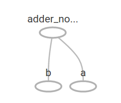

# 实验 01 基础

# 实验 01 TensorFlow 入门

[`www.tensorflow.org/get_started/get_started`](https://www.tensorflow.org/get_started/get_started)

## 检查 TensorFlow 版本

```
import tensorflow as tf
tf.__version__ 
```

```
'1.0.0' 
```

## 你好 TensorFlow！

```
# Create a constant op
# This op is added as a node to the default graph
hello = tf.constant("Hello, TensorFlow!")

# start a TF session
sess = tf.Session()

# run the op and get result
print(sess.run(hello)) 
```

```
b'Hello, TensorFlow!' 
```

## 张量

```
3 # a rank 0 tensor; this is a scalar with shape []
[1. ,2., 3.] # a rank 1 tensor; this is a vector with shape [3]
[[1., 2., 3.], [4., 5., 6.]] # a rank 2 tensor; a matrix with shape [2, 3]
[[[1., 2., 3.]], [[7., 8., 9.]]] # a rank 3 tensor with shape [2, 1, 3] 
```

```
[[[1.0, 2.0, 3.0]], [[7.0, 8.0, 9.0]]] 
```

## 计算图

```
node1 = tf.constant(3.0, tf.float32)
node2 = tf.constant(4.0) # also tf.float32 implicitly
node3 = tf.add(node1, node2) 
```

```
print("node1:", node1, "node2:", node2)
print("node3: ", node3) 
```

```
node1: Tensor("Const_1:0", shape=(), dtype=float32) node2: Tensor("Const_2:0", shape=(), dtype=float32)
node3:  Tensor("Add:0", shape=(), dtype=float32) 
```



```
sess = tf.Session()
print("sess.run(node1, node2): ", sess.run([node1, node2]))
print("sess.run(node3): ", sess.run(node3)) 
```

```
sess.run(node1, node2):  [3.0, 4.0]
sess.run(node3):  7.0 
```

```
a = tf.placeholder(tf.float32)
b = tf.placeholder(tf.float32)
adder_node = a + b  # + provides a shortcut for tf.add(a, b)

print(sess.run(adder_node, feed_dict={a: 3, b: 4.5}))
print(sess.run(adder_node, feed_dict={a: [1,3], b: [2, 4]})) 
```

```
7.5
[ 3\.  7.] 
```

```
add_and_triple = adder_node * 3.
print(sess.run(add_and_triple, feed_dict={a: 3, b:4.5})) 
```

```
22.5 
```
