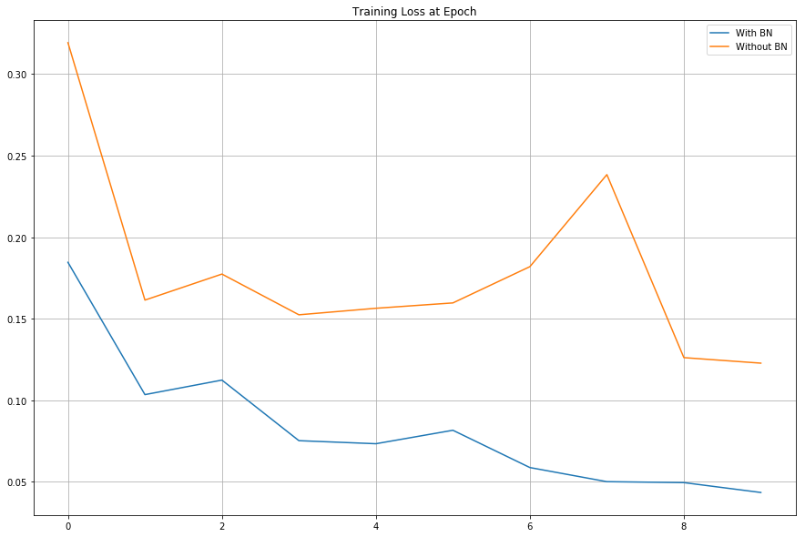
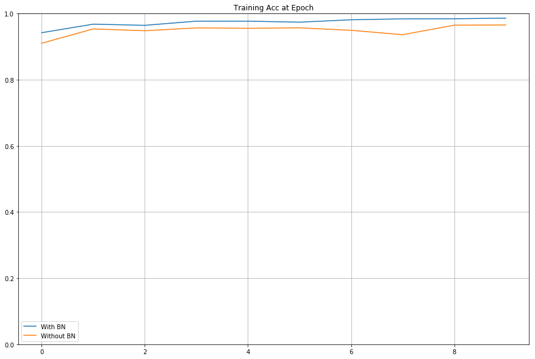
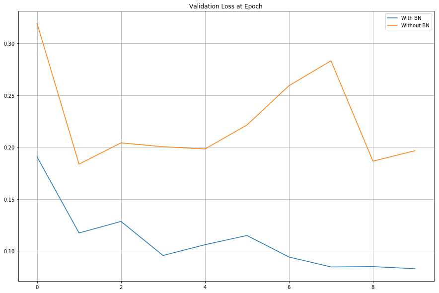
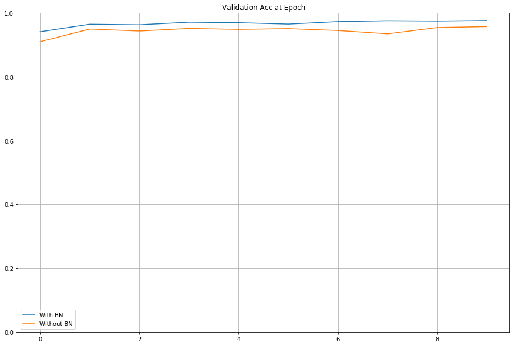

# lab 10.6 mnist nn batchnorm

# lab 10.6 批归一化层

## 什么是批归一化层？

这是一个在激活层之前对输出进行归一化的层。[原始论文](https://arxiv.org/abs/1502.03167)是由 Sergey Ioffe 在 2015 年提出的。

批归一化层看起来像这样：

## 为什么要使用批归一化？

每一层的输入分布会发生变化，因为前一层的权重会随着梯度下降的权重更新而改变。这被称为协变量转移，这使得网络训练变得困难。

例如，如果激活层是一个 relu 层，而激活层的输入被移动到小于零，那么没有权重会被激活！

还值得一提的是，$$ y = \gamma \hat{x} + \beta $$ 中的$\gamma$和$\beta$参数也是可训练的。

**这意味着如果我们不需要批归一化，它的参数将被更新，以抵消归一化步骤。**

例如，假设

\begin{align} \gamma &= \sqrt{\sigma²_B + \epsilon}\ \beta &= \mu_B \end{align}

然后

$$ y_i = \gamma \hat{x_i} + \beta = x_i $$

还要注意，在训练步骤中，$\mu$和$\sigma$是使用移动平均值计算的。然而，在测试时，计算得到的$\mu$和$\sigma$将被固定使用

## 结论

+   总是使用批归一化！

## 足够的讨论：如何在 Tensorflow 中实现

### 1\. 加载库

+   我们使用著名的 MNIST 数据

```
import tensorflow as tf
import matplotlib.pyplot as plt
from tensorflow.examples.tutorials.mnist import input_data
%matplotlib inline

mnist = input_data.read_data_sets("MNIST_data/", one_hot=True) 
```

```
Extracting MNIST_data/train-images-idx3-ubyte.gz
Extracting MNIST_data/train-labels-idx1-ubyte.gz
Extracting MNIST_data/t10k-images-idx3-ubyte.gz
Extracting MNIST_data/t10k-labels-idx1-ubyte.gz 
```

```
mnist.train.images.shape 
```

```
(55000, 784) 
```

### 2\. 定义模型和解算器类

+   面向对象编程允许轻松定义多个模型

+   为什么我们要将模型和解算器类分开？

    +   当我们需要不同的网络架构时，我们可以在解算器类中轻松更换模型类

    +   通常我们只需要一个解算器类

```
class Model:
    """Network Model Class

    Note that this class has only the constructor.
    The actual model is defined inside the constructor.

    Attributes
    ----------
    X : tf.float32
        This is a tensorflow placeholder for MNIST images
        Expected shape is [None, 784]

    y : tf.float32
        This is a tensorflow placeholder for MNIST labels (one hot encoded)
        Expected shape is [None, 10]

    mode : tf.bool
        This is used for the batch normalization
        It's `True` at training time and `False` at test time

    loss : tf.float32
        The loss function is a softmax cross entropy

    train_op
        This is simply the training op that minimizes the loss

    accuracy : tf.float32
        The accuracy operation

    Examples
    ----------
    >>> model = Model("Batch Norm", 32, 10)

    """
    def __init__(self, name, input_dim, output_dim, hidden_dims=[32, 32], use_batchnorm=True, activation_fn=tf.nn.relu, optimizer=tf.train.AdamOptimizer, lr=0.01):
        """ Constructor

        Parameters
        --------
        name : str
            The name of this network
            The entire network will be created under `tf.variable_scope(name)`

        input_dim : int
            The input dimension
            In this example, 784

        output_dim : int
            The number of output labels
            There are 10 labels

        hidden_dims : list (default: [32, 32])
            len(hidden_dims) = number of layers
            each element is the number of hidden units

        use_batchnorm : bool (default: True)
            If true, it will create the batchnormalization layer

        activation_fn : TF functions (default: tf.nn.relu)
            Activation Function

        optimizer : TF optimizer (default: tf.train.AdamOptimizer)
            Optimizer Function

        lr : float (default: 0.01)
            Learning rate

        """
        with tf.variable_scope(name):
            # Placeholders are defined
            self.X = tf.placeholder(tf.float32, [None, input_dim], name='X')
            self.y = tf.placeholder(tf.float32, [None, output_dim], name='y')
            self.mode = tf.placeholder(tf.bool, name='train_mode')            

            # Loop over hidden layers
            net = self.X
            for i, h_dim in enumerate(hidden_dims):
                with tf.variable_scope('layer{}'.format(i)):
                    net = tf.layers.dense(net, h_dim)

                    if use_batchnorm:
                        net = tf.layers.batch_normalization(net, training=self.mode)

                    net = activation_fn(net)

            # Attach fully connected layers
            net = tf.contrib.layers.flatten(net)
            net = tf.layers.dense(net, output_dim)

            self.loss = tf.nn.softmax_cross_entropy_with_logits(logits=net, labels=self.y)
            self.loss = tf.reduce_mean(self.loss, name='loss')    

            # When using the batchnormalization layers,
            # it is necessary to manually add the update operations
            # because the moving averages are not included in the graph 
            update_ops = tf.get_collection(tf.GraphKeys.UPDATE_OPS, scope=name)
            with tf.control_dependencies(update_ops):                     
                self.train_op = optimizer(lr).minimize(self.loss)

            # Accuracy etc 
            softmax = tf.nn.softmax(net, name='softmax')
            self.accuracy = tf.equal(tf.argmax(softmax, 1), tf.argmax(self.y, 1))
            self.accuracy = tf.reduce_mean(tf.cast(self.accuracy, tf.float32)) 
```

```
class Solver:
    """Solver class

    This class will contain the model class and session

    Attributes
    ----------
    model : Model class
    sess : TF session

    Methods
    ----------
    train(X, y)
        Run the train_op and Returns the loss

    evalulate(X, y, batch_size=None)
        Returns "Loss" and "Accuracy"
        If batch_size is given, it's computed using batch_size
        because most GPU memories cannot handle the entire training data at once

    Example
    ----------
    >>> sess = tf.InteractiveSession()
    >>> model = Model("BatchNorm", 32, 10)
    >>> solver = Solver(sess, model)

    # Train
    >>> solver.train(X, y)

    # Evaluate
    >>> solver.evaluate(X, y)
    """
    def __init__(self, sess, model):
        self.model = model
        self.sess = sess

    def train(self, X, y):
        feed = {
            self.model.X: X,
            self.model.y: y,
            self.model.mode: True
        }
        train_op = self.model.train_op
        loss = self.model.loss

        return self.sess.run([train_op, loss], feed_dict=feed)

    def evaluate(self, X, y, batch_size=None):
        if batch_size:
            N = X.shape[0]

            total_loss = 0
            total_acc = 0

            for i in range(0, N, batch_size):
                X_batch = X[i:i + batch_size]
                y_batch = y[i:i + batch_size]

                feed = {
                    self.model.X: X_batch,
                    self.model.y: y_batch,
                    self.model.mode: False
                }

                loss = self.model.loss
                accuracy = self.model.accuracy

                step_loss, step_acc = self.sess.run([loss, accuracy], feed_dict=feed)

                total_loss += step_loss * X_batch.shape[0]
                total_acc += step_acc * X_batch.shape[0]

            total_loss /= N
            total_acc /= N

            return total_loss, total_acc

        else:
            feed = {
                self.model.X: X,
                self.model.y: y,
                self.model.mode: False
            }

            loss = self.model.loss            
            accuracy = self.model.accuracy

            return self.sess.run([loss, accuracy], feed_dict=feed) 
```

### 3\. 实例化模型/解算器类

```
input_dim = 784
output_dim = 10
N = 55000

tf.reset_default_graph()
sess = tf.InteractiveSession()

# We create two models: one with the batch norm and other without
bn = Model('batchnorm', input_dim, output_dim, use_batchnorm=True)
nn = Model('no_norm', input_dim, output_dim, use_batchnorm=False)

# We create two solvers: to train both models at the same time for comparison
# Usually we only need one solver class
bn_solver = Solver(sess, bn)
nn_solver = Solver(sess, nn) 
```

```
epoch_n = 10
batch_size = 32

# Save Losses and Accuracies every epoch
# We are going to plot them later
train_losses = []
train_accs = []

valid_losses = []
valid_accs = [] 
```

### 4\. 运行训练步骤

```
init = tf.global_variables_initializer()
sess.run(init)

for epoch in range(epoch_n):
    for _ in range(N//batch_size):
        X_batch, y_batch = mnist.train.next_batch(batch_size)

        _, bn_loss = bn_solver.train(X_batch, y_batch)
        _, nn_loss = nn_solver.train(X_batch, y_batch)       

    b_loss, b_acc = bn_solver.evaluate(mnist.train.images, mnist.train.labels, batch_size)
    n_loss, n_acc = nn_solver.evaluate(mnist.train.images, mnist.train.labels, batch_size)

    # Save train losses/acc
    train_losses.append([b_loss, n_loss])
    train_accs.append([b_acc, n_acc])
    print(f'[Epoch {epoch}-TRAIN] Batchnorm Loss(Acc): {b_loss:.5f}({b_acc:.2%}) vs No Batchnorm Loss(Acc): {n_loss:.5f}({n_acc:.2%})')

    b_loss, b_acc = bn_solver.evaluate(mnist.validation.images, mnist.validation.labels)
    n_loss, n_acc = nn_solver.evaluate(mnist.validation.images, mnist.validation.labels)

    # Save valid losses/acc
    valid_losses.append([b_loss, n_loss])
    valid_accs.append([b_acc, n_acc])
    print(f'[Epoch {epoch}-VALID] Batchnorm Loss(Acc): {b_loss:.5f}({b_acc:.2%}) vs No Batchnorm Loss(Acc): {n_loss:.5f}({n_acc:.2%})')
    print() 
```

```
[Epoch 0-TRAIN] Batchnorm Loss(Acc): 0.18456(94.19%) vs No Batchnorm Loss(Acc): 0.31917(91.01%)
[Epoch 0-VALID] Batchnorm Loss(Acc): 0.19054(94.10%) vs No Batchnorm Loss(Acc): 0.31920(91.00%)

[Epoch 1-TRAIN] Batchnorm Loss(Acc): 0.10349(96.78%) vs No Batchnorm Loss(Acc): 0.16142(95.34%)
[Epoch 1-VALID] Batchnorm Loss(Acc): 0.11720(96.48%) vs No Batchnorm Loss(Acc): 0.18348(94.96%)

[Epoch 2-TRAIN] Batchnorm Loss(Acc): 0.11239(96.43%) vs No Batchnorm Loss(Acc): 0.17737(94.79%)
[Epoch 2-VALID] Batchnorm Loss(Acc): 0.12829(96.30%) vs No Batchnorm Loss(Acc): 0.20401(94.34%)

[Epoch 3-TRAIN] Batchnorm Loss(Acc): 0.07526(97.69%) vs No Batchnorm Loss(Acc): 0.15240(95.65%)
[Epoch 3-VALID] Batchnorm Loss(Acc): 0.09549(97.12%) vs No Batchnorm Loss(Acc): 0.20025(95.16%)

[Epoch 4-TRAIN] Batchnorm Loss(Acc): 0.07339(97.68%) vs No Batchnorm Loss(Acc): 0.15641(95.53%)
[Epoch 4-VALID] Batchnorm Loss(Acc): 0.10588(96.96%) vs No Batchnorm Loss(Acc): 0.19816(94.86%)

[Epoch 5-TRAIN] Batchnorm Loss(Acc): 0.08164(97.38%) vs No Batchnorm Loss(Acc): 0.15969(95.67%)
[Epoch 5-VALID] Batchnorm Loss(Acc): 0.11476(96.52%) vs No Batchnorm Loss(Acc): 0.22123(95.10%)

[Epoch 6-TRAIN] Batchnorm Loss(Acc): 0.05879(98.10%) vs No Batchnorm Loss(Acc): 0.18191(94.92%)
[Epoch 6-VALID] Batchnorm Loss(Acc): 0.09402(97.30%) vs No Batchnorm Loss(Acc): 0.25907(94.50%)

[Epoch 7-TRAIN] Batchnorm Loss(Acc): 0.05014(98.38%) vs No Batchnorm Loss(Acc): 0.23831(93.59%)
[Epoch 7-VALID] Batchnorm Loss(Acc): 0.08446(97.58%) vs No Batchnorm Loss(Acc): 0.28310(93.46%)

[Epoch 8-TRAIN] Batchnorm Loss(Acc): 0.04956(98.41%) vs No Batchnorm Loss(Acc): 0.12616(96.48%)
[Epoch 8-VALID] Batchnorm Loss(Acc): 0.08479(97.48%) vs No Batchnorm Loss(Acc): 0.18636(95.44%)

[Epoch 9-TRAIN] Batchnorm Loss(Acc): 0.04351(98.61%) vs No Batchnorm Loss(Acc): 0.12277(96.54%)
[Epoch 9-VALID] Batchnorm Loss(Acc): 0.08275(97.66%) vs No Batchnorm Loss(Acc): 0.19641(95.74%) 
```

### 5\. 性能比较

+   使用批归一化后，损失更低，而且更准确！

```
bn_solver.evaluate(mnist.test.images, mnist.test.labels) 
```

```
[0.089340471, 0.97370011] 
```

```
nn_solver.evaluate(mnist.test.images, mnist.test.labels) 
```

```
[0.20733583, 0.95130014] 
```

```
def plot_compare(loss_list: list, ylim=None, title=None) -> None:

    bn = [i[0] for i in loss_list]
    nn = [i[1] for i in loss_list]

    plt.figure(figsize=(15, 10))
    plt.plot(bn, label='With BN')
    plt.plot(nn, label='Without BN')
    if ylim:
        plt.ylim(ylim)

    if title:
        plt.title(title)
    plt.legend()
    plt.grid('on')
    plt.show() 
```

```
plot_compare(train_losses, title='Training Loss at Epoch') 
```



```
plot_compare(train_accs, [0, 1.0], title="Training Acc at Epoch") 
```



```
plot_compare(valid_losses, title='Validation Loss at Epoch') 
```



```
plot_compare(valid_accs, [0, 1.], title='Validation Acc at Epoch') 
```


