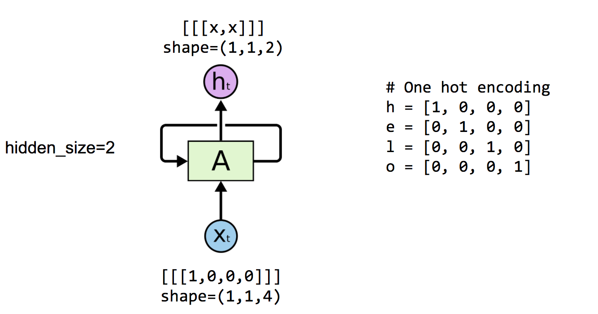
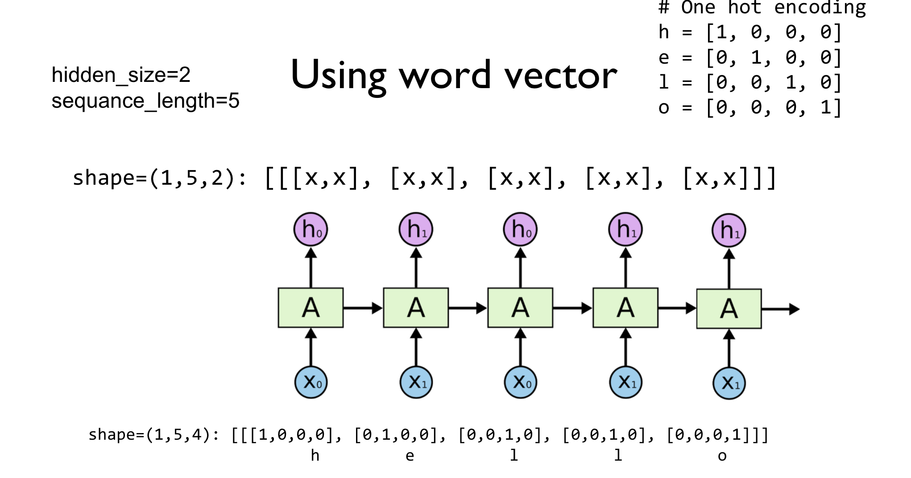
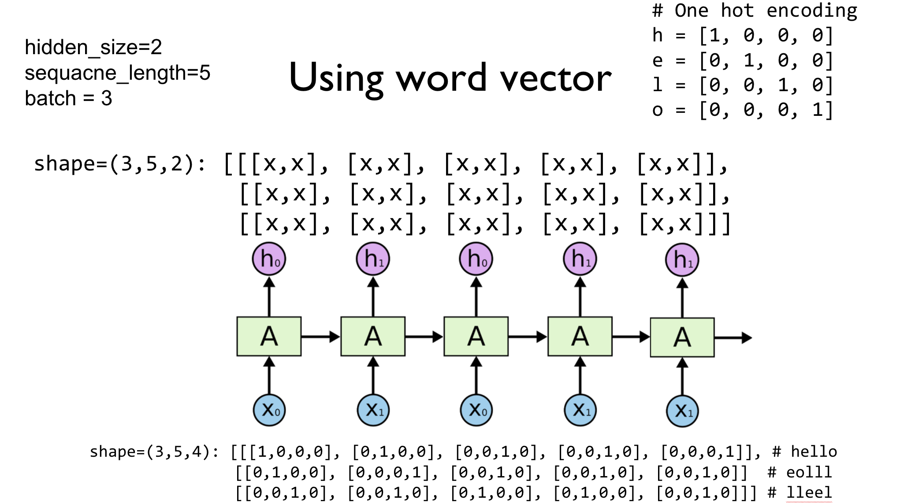

# 实验 12.0 循环神经网络基础

# 实验 12.0 循环神经网络基础

```
# http://www.wildml.com/2016/08/rnns-in-tensorflow-a-practical-guide-and-undocumented-features/
# http://learningtensorflow.com/index.html
# http://suriyadeepan.github.io/2016-12-31-practical-seq2seq/

import tensorflow as tf
import numpy as np
from tensorflow.contrib import rnn
import pprint
pp = pprint.PrettyPrinter(indent=4)
sess = tf.InteractiveSession() 
```

```
# One hot encoding for each char in 'hello'
h = [1, 0, 0, 0]
e = [0, 1, 0, 0]
l = [0, 0, 1, 0]
o = [0, 0, 0, 1] 
```



```
with tf.variable_scope('one_cell') as scope:
    # One cell RNN input_dim (4) -> output_dim (2)
    hidden_size = 2
    cell = tf.contrib.rnn.BasicRNNCell(num_units=hidden_size)
    print(cell.output_size, cell.state_size)

    x_data = np.array([[h]], dtype=np.float32) # x_data = [[[1,0,0,0]]]
    pp.pprint(x_data)
    outputs, _states = tf.nn.dynamic_rnn(cell, x_data, dtype=tf.float32)

    sess.run(tf.global_variables_initializer())
    pp.pprint(outputs.eval()) 
```

```
2 2
array([[[ 1.,  0.,  0.,  0.]]], dtype=float32)
array([[[ 0.28406101,  0.53163123]]], dtype=float32) 
```



```
with tf.variable_scope('two_sequances') as scope:
    # One cell RNN input_dim (4) -> output_dim (2). sequence: 5
    hidden_size = 2
    cell = tf.contrib.rnn.BasicRNNCell(num_units=hidden_size)
    x_data = np.array([[h, e, l, l, o]], dtype=np.float32)
    print(x_data.shape)
    pp.pprint(x_data)
    outputs, _states = tf.nn.dynamic_rnn(cell, x_data, dtype=tf.float32)
    sess.run(tf.global_variables_initializer())
    pp.pprint(outputs.eval()) 
```

```
(1, 5, 4)
array([[[ 1.,  0.,  0.,  0.],
        [ 0.,  1.,  0.,  0.],
        [ 0.,  0.,  1.,  0.],
        [ 0.,  0.,  1.,  0.],
        [ 0.,  0.,  0.,  1.]]], dtype=float32)
array([[[ 0.50641137,  0.55783308],
        [-0.61545879, -0.04334207],
        [-0.77109283, -0.23411733],
        [-0.76478487, -0.07172935],
        [-0.72683465,  0.5266667 ]]], dtype=float32) 
```



```
with tf.variable_scope('3_batches') as scope:
    # One cell RNN input_dim (4) -> output_dim (2). sequence: 5, batch 3
    # 3 batches 'hello', 'eolll', 'lleel'
    x_data = np.array([[h, e, l, l, o],
                       [e, o, l, l, l],
                       [l, l, e, e, l]], dtype=np.float32)
    pp.pprint(x_data)

    hidden_size = 2
    cell = rnn.BasicLSTMCell(num_units=hidden_size, state_is_tuple=True)
    outputs, _states = tf.nn.dynamic_rnn(
        cell, x_data, dtype=tf.float32)
    sess.run(tf.global_variables_initializer())
    pp.pprint(outputs.eval()) 
```

```
array([[[ 1.,  0.,  0.,  0.],
        [ 0.,  1.,  0.,  0.],
        [ 0.,  0.,  1.,  0.],
        [ 0.,  0.,  1.,  0.],
        [ 0.,  0.,  0.,  1.]],

       [[ 0.,  1.,  0.,  0.],
        [ 0.,  0.,  0.,  1.],
        [ 0.,  0.,  1.,  0.],
        [ 0.,  0.,  1.,  0.],
        [ 0.,  0.,  1.,  0.]],

       [[ 0.,  0.,  1.,  0.],
        [ 0.,  0.,  1.,  0.],
        [ 0.,  1.,  0.,  0.],
        [ 0.,  1.,  0.,  0.],
        [ 0.,  0.,  1.,  0.]]], dtype=float32)
array([[[ 0.05147979, -0.12499733],
        [-0.03096316,  0.0606184 ],
        [ 0.07608285, -0.03678102],
        [ 0.13522112, -0.0920362 ],
        [ 0.0235186 ,  0.02936662]],

       [[-0.08701393,  0.11020429],
        [-0.10396396,  0.17681563],
        [ 0.04137699,  0.01251686],
        [ 0.11497379, -0.06123064],
        [ 0.15778907, -0.10736831]],

       [[ 0.09156778, -0.06834684],
        [ 0.14449464, -0.11151826],
        [ 0.0351325 ,  0.04766054],
        [-0.06127799,  0.13465708],
        [ 0.06125095,  0.00202556]]], dtype=float32) 
```

```
with tf.variable_scope('3_batches_dynamic_length') as scope:
    # One cell RNN input_dim (4) -> output_dim (5). sequence: 5, batch 3
    # 3 batches 'hello', 'eolll', 'lleel'
    x_data = np.array([[h, e, l, l, o],
                       [e, o, l, l, l],
                       [l, l, e, e, l]], dtype=np.float32)
    pp.pprint(x_data)

    hidden_size = 2
    cell = rnn.BasicLSTMCell(num_units=hidden_size, state_is_tuple=True)
    outputs, _states = tf.nn.dynamic_rnn(
        cell, x_data, sequence_length=[5,3,4], dtype=tf.float32)
    sess.run(tf.global_variables_initializer())
    pp.pprint(outputs.eval()) 
```

```
array([[[ 1.,  0.,  0.,  0.],
        [ 0.,  1.,  0.,  0.],
        [ 0.,  0.,  1.,  0.],
        [ 0.,  0.,  1.,  0.],
        [ 0.,  0.,  0.,  1.]],

       [[ 0.,  1.,  0.,  0.],
        [ 0.,  0.,  0.,  1.],
        [ 0.,  0.,  1.,  0.],
        [ 0.,  0.,  1.,  0.],
        [ 0.,  0.,  1.,  0.]],

       [[ 0.,  0.,  1.,  0.],
        [ 0.,  0.,  1.,  0.],
        [ 0.,  1.,  0.,  0.],
        [ 0.,  1.,  0.,  0.],
        [ 0.,  0.,  1.,  0.]]], dtype=float32)
array([[[-0.05008912, -0.01069659],
        [-0.12182344, -0.10044969],
        [-0.07028138, -0.16675197],
        [-0.04712334, -0.20867857],
        [-0.08468042, -0.22286232]],

       [[-0.06402468, -0.09570512],
        [-0.10435093, -0.13225234],
        [-0.06158386, -0.17562068],
        [ 0\.        ,  0\.        ],
        [ 0\.        ,  0\.        ]],

       [[-0.03898201, -0.07288275],
        [-0.0454888 , -0.13435912],
        [-0.07696934, -0.17394406],
        [-0.08638199, -0.20610151],
        [ 0\.        ,  0\.        ]]], dtype=float32) 
```

```
with tf.variable_scope('initial_state') as scope:
    batch_size = 3
    x_data = np.array([[h, e, l, l, o],
                      [e, o, l, l, l],
                      [l, l, e, e, l]], dtype=np.float32)
    pp.pprint(x_data)

    # One cell RNN input_dim (4) -> output_dim (5). sequence: 5, batch: 3
    hidden_size=2
    cell = rnn.BasicLSTMCell(num_units=hidden_size, state_is_tuple=True)
    initial_state = cell.zero_state(batch_size, tf.float32)
    outputs, _states = tf.nn.dynamic_rnn(cell, x_data,
                                         initial_state=initial_state, dtype=tf.float32)
    sess.run(tf.global_variables_initializer())
    pp.pprint(outputs.eval()) 
```

```
array([[[ 1.,  0.,  0.,  0.],
        [ 0.,  1.,  0.,  0.],
        [ 0.,  0.,  1.,  0.],
        [ 0.,  0.,  1.,  0.],
        [ 0.,  0.,  0.,  1.]],

       [[ 0.,  1.,  0.,  0.],
        [ 0.,  0.,  0.,  1.],
        [ 0.,  0.,  1.,  0.],
        [ 0.,  0.,  1.,  0.],
        [ 0.,  0.,  1.,  0.]],

       [[ 0.,  0.,  1.,  0.],
        [ 0.,  0.,  1.,  0.],
        [ 0.,  1.,  0.,  0.],
        [ 0.,  1.,  0.,  0.],
        [ 0.,  0.,  1.,  0.]]], dtype=float32)
array([[[-0.10699597, -0.06735446],
        [-0.01214837, -0.03093243],
        [-0.11962769,  0.10190663],
        [-0.20870663,  0.20675965],
        [-0.0284863 ,  0.1948234 ]],

       [[ 0.06502327,  0.01373457],
        [ 0.11152857,  0.07884337],
        [-0.00791237,  0.20213564],
        [-0.14327727,  0.27671731],
        [-0.2389248 ,  0.32179514]],

       [[-0.11509674,  0.13784541],
        [-0.20916083,  0.231289  ],
        [-0.12755771,  0.12080902],
        [-0.03355049,  0.0995911 ],
        [-0.14717762,  0.24482173]]], dtype=float32) 
```

```
# Create input data
batch_size=3
sequence_length=5
input_dim=3

x_data = np.arange(45, dtype=np.float32).reshape(batch_size, sequence_length, input_dim)
pp.pprint(x_data)  # batch, sequence_length, input_dim 
```

```
array([[[  0.,   1.,   2.],
        [  3.,   4.,   5.],
        [  6.,   7.,   8.],
        [  9.,  10.,  11.],
        [ 12.,  13.,  14.]],

       [[ 15.,  16.,  17.],
        [ 18.,  19.,  20.],
        [ 21.,  22.,  23.],
        [ 24.,  25.,  26.],
        [ 27.,  28.,  29.]],

       [[ 30.,  31.,  32.],
        [ 33.,  34.,  35.],
        [ 36.,  37.,  38.],
        [ 39.,  40.,  41.],
        [ 42.,  43.,  44.]]], dtype=float32) 
```

```
with tf.variable_scope('generated_data') as scope:
    # One cell RNN input_dim (3) -> output_dim (5). sequence: 5, batch: 3
    cell = rnn.BasicLSTMCell(num_units=5, state_is_tuple=True)
    initial_state = cell.zero_state(batch_size, tf.float32)
    outputs, _states = tf.nn.dynamic_rnn(cell, x_data,
                                         initial_state=initial_state, dtype=tf.float32)
    sess.run(tf.global_variables_initializer())
    pp.pprint(outputs.eval()) 
```

```
array([[[  2.22847834e-01,  -1.12753026e-02,  -2.09515661e-01,
           1.33116916e-01,   2.59324769e-03],
        [  4.09052998e-01,   1.67620078e-01,  -6.23385966e-01,
           2.95646906e-01,   6.76166117e-02],
        [  3.84651929e-01,   2.06338793e-01,  -8.70478570e-01,
           2.97074020e-01,   2.39257380e-01],
        [  3.59520555e-01,   1.37896106e-01,  -9.57255721e-01,
           2.04702541e-01,   4.43462312e-01],
        [  3.53975475e-01,   7.35354945e-02,  -9.84238148e-01,
           1.21178836e-01,   5.96657693e-01]],

       [[  3.25354218e-01,   1.92702170e-02,  -6.57426417e-01,
           5.44418097e-02,   4.50136989e-01],
        [  3.43781590e-01,   1.43233798e-02,  -8.98284197e-01,
           3.75912562e-02,   6.67491138e-01],
        [  3.27331871e-01,   7.51791801e-03,  -9.64996517e-01,
           2.11958308e-02,   7.30534494e-01],
        [  3.09874654e-01,   3.57595109e-03,  -9.84839082e-01,
           1.17445569e-02,   7.47434497e-01],
        [  2.92880654e-01,   1.65894395e-03,  -9.91725981e-01,
           6.53389702e-03,   7.52497494e-01]],

       [[  2.50953138e-01,   4.36680217e-04,  -7.03740895e-01,
           3.34404502e-03,   6.93815947e-01],
        [  2.70643830e-01,   3.10635078e-04,  -9.09156263e-01,
           2.06257636e-03,   7.49875069e-01],
        [  2.49837011e-01,   1.57007758e-04,  -9.63405490e-01,
           1.15697947e-03,   7.56247699e-01],
        [  2.32801229e-01,   7.37999653e-05,  -9.80127990e-01,
           6.45897642e-04,   7.57673502e-01],
        [  2.17864171e-01,   3.41164960e-05,  -9.86101806e-01,
           3.62177641e-04,   7.58471072e-01]]], dtype=float32) 
```

```
with tf.variable_scope('MultiRNNCell') as scope:
    # Make rnn
    cell = rnn.BasicLSTMCell(num_units=5, state_is_tuple=True)
    cell = rnn.MultiRNNCell([cell] * 3, state_is_tuple=True) # 3 layers

    # rnn in/out
    outputs, _states = tf.nn.dynamic_rnn(cell, x_data, dtype=tf.float32)
    print("dynamic rnn: ", outputs)
    sess.run(tf.global_variables_initializer())
    pp.pprint(outputs.eval())  # batch size, unrolling (time), hidden_size 
```

```
dynamic rnn:  Tensor("MultiRNNCell/rnn/transpose:0", shape=(3, 5, 5), dtype=float32)
array([[[  1.20540499e-03,   1.09513826e-03,   2.20310478e-03,
           3.41569167e-03,  -3.82219645e-04],
        [  2.57245242e-03,   1.25761738e-03,   4.36156709e-03,
           6.17466075e-03,   4.01454419e-03],
        [  5.22803096e-03,  -1.61505232e-04,   7.24773575e-03,
           8.18122737e-03,   1.67929009e-02],
        [  9.85822361e-03,  -2.62762001e-03,   1.19020101e-02,
           1.00588454e-02,   3.70351225e-02],
        [  1.61787979e-02,  -5.48204128e-03,   1.84861515e-02,
           1.19717196e-02,   6.11032583e-02]],

       [[  6.90252695e-04,  -1.99922113e-04,   8.86004767e-04,
           2.22551913e-04,   5.27152233e-03],
        [  2.40178546e-03,  -4.28301457e-04,   3.41633009e-03,
           8.02060647e-04,   1.65986698e-02],
        [  5.17574837e-03,  -4.83547512e-04,   7.89437629e-03,
           1.74584519e-03,   3.25243883e-02],
        [  8.80666822e-03,  -2.78592808e-04,   1.41408108e-02,
           2.94073927e-03,   5.08417375e-02],
        [  1.29447393e-02,   1.63523509e-04,   2.16512978e-02,
           4.22920240e-03,   6.95042834e-02]],

       [[  1.66354628e-04,   1.25368184e-04,   4.29028471e-04,
           8.79739600e-05,   2.20423983e-03],
        [  5.88878815e-04,   4.49586252e-04,   1.61941827e-03,
           3.03511770e-04,   7.01069506e-03],
        [  1.31306029e-03,   9.97182331e-04,   3.73112643e-03,
           6.62667328e-04,   1.40041607e-02],
        [  2.34889123e-03,   1.75245479e-03,   6.76015578e-03,
           1.16268732e-03,   2.24791896e-02],
        [  3.67631158e-03,   2.67310557e-03,   1.05806263e-02,
           1.78660743e-03,   3.17095295e-02]]], dtype=float32) 
```

```
with tf.variable_scope('dynamic_rnn') as scope:
    cell = rnn.BasicLSTMCell(num_units=5, state_is_tuple=True)
    outputs, _states = tf.nn.dynamic_rnn(cell, x_data, dtype=tf.float32,
                                         sequence_length=[1, 3, 2])
    # lentgh 1 for batch 1, lentgh 2 for batch 2

    print("dynamic rnn: ", outputs)
    sess.run(tf.global_variables_initializer())
    pp.pprint(outputs.eval())  # batch size, unrolling (time), hidden_size 
```

```
dynamic rnn:  Tensor("dynamic_rnn/rnn/transpose:0", shape=(3, 5, 5), dtype=float32)
array([[[  2.78908219e-02,  -1.48126215e-01,  -7.39237070e-02,
           2.88070235e-02,   6.32265732e-02],
        [  0.00000000e+00,   0.00000000e+00,   0.00000000e+00,
           0.00000000e+00,   0.00000000e+00],
        [  0.00000000e+00,   0.00000000e+00,   0.00000000e+00,
           0.00000000e+00,   0.00000000e+00],
        [  0.00000000e+00,   0.00000000e+00,   0.00000000e+00,
           0.00000000e+00,   0.00000000e+00],
        [  0.00000000e+00,   0.00000000e+00,   0.00000000e+00,
           0.00000000e+00,   0.00000000e+00]],

       [[  4.35886432e-06,   2.38276646e-03,   3.29953309e-06,
           1.10525981e-01,   1.76965340e-08],
        [  6.48097910e-07,   1.61049131e-03,   2.29394141e-06,
           1.04240455e-01,   8.04429634e-10],
        [  7.62259091e-08,   8.23478971e-04,   1.28897921e-06,
           8.51678029e-02,   3.12711766e-11],
        [  0.00000000e+00,   0.00000000e+00,   0.00000000e+00,
           0.00000000e+00,   0.00000000e+00],
        [  0.00000000e+00,   0.00000000e+00,   0.00000000e+00,
           0.00000000e+00,   0.00000000e+00]],

       [[  6.94665575e-11,   7.26437429e-05,   5.22463635e-11,
           3.71553451e-02,   1.31825178e-15],
        [  1.02408203e-11,   3.06548645e-05,   2.59286290e-11,
           3.11325025e-02,   6.17112537e-17],
        [  0.00000000e+00,   0.00000000e+00,   0.00000000e+00,
           0.00000000e+00,   0.00000000e+00],
        [  0.00000000e+00,   0.00000000e+00,   0.00000000e+00,
           0.00000000e+00,   0.00000000e+00],
        [  0.00000000e+00,   0.00000000e+00,   0.00000000e+00,
           0.00000000e+00,   0.00000000e+00]]], dtype=float32) 
```

```
with tf.variable_scope('bi-directional') as scope:
    # bi-directional rnn
    cell_fw = rnn.BasicLSTMCell(num_units=5, state_is_tuple=True)
    cell_bw = rnn.BasicLSTMCell(num_units=5, state_is_tuple=True)

    outputs, states = tf.nn.bidirectional_dynamic_rnn(cell_fw, cell_bw, x_data,
                                                      sequence_length=[2, 3, 1],
                                                      dtype=tf.float32)

    sess.run(tf.global_variables_initializer())
    pp.pprint(sess.run(outputs))
    pp.pprint(sess.run(states)) 
```

```
(   array([[[ -1.00286074e-01,   2.11599812e-01,   4.26371992e-02,
           3.00979782e-02,   9.23170671e-02],
        [  4.75897230e-02,   3.76924574e-01,  -4.24038619e-02,
           1.01732194e-01,   4.52822745e-02],
        [  0.00000000e+00,   0.00000000e+00,   0.00000000e+00,
           0.00000000e+00,   0.00000000e+00],
        [  0.00000000e+00,   0.00000000e+00,   0.00000000e+00,
           0.00000000e+00,   0.00000000e+00],
        [  0.00000000e+00,   0.00000000e+00,   0.00000000e+00,
           0.00000000e+00,   0.00000000e+00]],

       [[  1.03152019e-03,   2.08642017e-02,  -8.34622793e-03,
           3.03512835e-03,   7.79041613e-07],
        [  3.73781077e-04,   3.19686793e-02,  -4.44590999e-03,
           1.57183059e-03,   2.03600507e-07],
        [  1.10292378e-04,   3.78062688e-02,  -1.95636135e-03,
           6.04417117e-04,   4.30081180e-08],
        [  0.00000000e+00,   0.00000000e+00,   0.00000000e+00,
           0.00000000e+00,   0.00000000e+00],
        [  0.00000000e+00,   0.00000000e+00,   0.00000000e+00,
           0.00000000e+00,   0.00000000e+00]],

       [[  2.00289901e-06,   7.53075059e-04,  -1.73141569e-04,
           1.94623790e-05,   1.57498038e-12],
        [  0.00000000e+00,   0.00000000e+00,   0.00000000e+00,
           0.00000000e+00,   0.00000000e+00],
        [  0.00000000e+00,   0.00000000e+00,   0.00000000e+00,
           0.00000000e+00,   0.00000000e+00],
        [  0.00000000e+00,   0.00000000e+00,   0.00000000e+00,
           0.00000000e+00,   0.00000000e+00],
        [  0.00000000e+00,   0.00000000e+00,   0.00000000e+00,
           0.00000000e+00,   0.00000000e+00]]], dtype=float32),
    array([[[ -6.70132190e-02,  -9.79832560e-02,   4.76102352e-01,
          -4.57281440e-01,   1.74056783e-01],
        [ -6.16685301e-03,  -8.18507746e-03,   6.10428035e-01,
          -4.55797821e-01,   3.88450697e-02],
        [  0.00000000e+00,   0.00000000e+00,   0.00000000e+00,
           0.00000000e+00,   0.00000000e+00],
        [  0.00000000e+00,   0.00000000e+00,   0.00000000e+00,
           0.00000000e+00,   0.00000000e+00],
        [  0.00000000e+00,   0.00000000e+00,   0.00000000e+00,
           0.00000000e+00,   0.00000000e+00]],

       [[ -1.84493047e-07,  -1.42245389e-08,   9.95001912e-01,
          -9.34846520e-01,   1.78247530e-04],
        [ -1.38226666e-08,  -4.68234562e-10,   9.63908970e-01,
          -9.22717512e-01,   3.82163526e-05],
        [ -1.21463872e-09,  -1.61447106e-11,   7.61411786e-01,
          -7.34403074e-01,   7.10739550e-06],
        [  0.00000000e+00,   0.00000000e+00,   0.00000000e+00,
           0.00000000e+00,   0.00000000e+00],
        [  0.00000000e+00,   0.00000000e+00,   0.00000000e+00,
           0.00000000e+00,   0.00000000e+00]],

       [[ -4.17174026e-13,  -5.10518192e-16,   7.61586428e-01,
          -7.53889859e-01,   7.72119435e-08],
        [  0.00000000e+00,   0.00000000e+00,   0.00000000e+00,
           0.00000000e+00,   0.00000000e+00],
        [  0.00000000e+00,   0.00000000e+00,   0.00000000e+00,
           0.00000000e+00,   0.00000000e+00],
        [  0.00000000e+00,   0.00000000e+00,   0.00000000e+00,
           0.00000000e+00,   0.00000000e+00],
        [  0.00000000e+00,   0.00000000e+00,   0.00000000e+00,
           0.00000000e+00,   0.00000000e+00]]], dtype=float32))
(   LSTMStateTuple(c=array([[  3.18704367e-01,   5.48799157e-01,  -1.17933072e-01,
          4.72177684e-01,   3.20702165e-01],
       [  2.99980783e+00,   3.81983854e-02,  -5.47450874e-03,
          2.26725507e+00,   4.89415321e-03],
       [  1.00000000e+00,   7.54415756e-04,  -4.99026908e-04,
          8.86694312e-01,   2.51370238e-05]], dtype=float32), h=array([[  4.75897230e-02,   3.76924574e-01,  -4.24038619e-02,
          1.01732194e-01,   4.52822745e-02],
       [  1.10292378e-04,   3.78062688e-02,  -1.95636135e-03,
          6.04417117e-04,   4.30081180e-08],
       [  2.00289901e-06,   7.53075059e-04,  -1.73141569e-04,
          1.94623790e-05,   1.57498038e-12]], dtype=float32)),
    LSTMStateTuple(c=array([[ -3.15686703e-01,  -3.91717076e-01,   7.36252010e-01,
         -9.45747852e-01,   7.38465428e-01],
       [ -6.19174778e-01,  -4.69935462e-02,   2.99472475e+00,
         -2.98918104e+00,   2.54934883e+00],
       [ -7.41944671e-01,  -1.55421533e-03,   9.99981403e-01,
         -9.99999642e-01,   9.77244020e-01]], dtype=float32), h=array([[ -6.70132190e-02,  -9.79832560e-02,   4.76102352e-01,
         -4.57281440e-01,   1.74056783e-01],
       [ -1.84493047e-07,  -1.42245389e-08,   9.95001912e-01,
         -9.34846520e-01,   1.78247530e-04],
       [ -4.17174026e-13,  -5.10518192e-16,   7.61586428e-01,
         -7.53889859e-01,   7.72119435e-08]], dtype=float32))) 
```

```
# flattern based softmax
hidden_size=3
sequence_length=5
batch_size=3
num_classes=5

pp.pprint(x_data) # hidden_size=3, sequence_length=4, batch_size=2
x_data = x_data.reshape(-1, hidden_size)
pp.pprint(x_data)

softmax_w = np.arange(15, dtype=np.float32).reshape(hidden_size, num_classes)
outputs = np.matmul(x_data, softmax_w)
outputs = outputs.reshape(-1, sequence_length, num_classes) # batch, seq, class
pp.pprint(outputs) 
```

```
array([[[  0.,   1.,   2.],
        [  3.,   4.,   5.],
        [  6.,   7.,   8.],
        [  9.,  10.,  11.],
        [ 12.,  13.,  14.]],

       [[ 15.,  16.,  17.],
        [ 18.,  19.,  20.],
        [ 21.,  22.,  23.],
        [ 24.,  25.,  26.],
        [ 27.,  28.,  29.]],

       [[ 30.,  31.,  32.],
        [ 33.,  34.,  35.],
        [ 36.,  37.,  38.],
        [ 39.,  40.,  41.],
        [ 42.,  43.,  44.]]], dtype=float32)
array([[  0.,   1.,   2.],
       [  3.,   4.,   5.],
       [  6.,   7.,   8.],
       [  9.,  10.,  11.],
       [ 12.,  13.,  14.],
       [ 15.,  16.,  17.],
       [ 18.,  19.,  20.],
       [ 21.,  22.,  23.],
       [ 24.,  25.,  26.],
       [ 27.,  28.,  29.],
       [ 30.,  31.,  32.],
       [ 33.,  34.,  35.],
       [ 36.,  37.,  38.],
       [ 39.,  40.,  41.],
       [ 42.,  43.,  44.]], dtype=float32)
array([[[   25.,    28.,    31.,    34.,    37.],
        [   70.,    82.,    94.,   106.,   118.],
        [  115.,   136.,   157.,   178.,   199.],
        [  160.,   190.,   220.,   250.,   280.],
        [  205.,   244.,   283.,   322.,   361.]],

       [[  250.,   298.,   346.,   394.,   442.],
        [  295.,   352.,   409.,   466.,   523.],
        [  340.,   406.,   472.,   538.,   604.],
        [  385.,   460.,   535.,   610.,   685.],
        [  430.,   514.,   598.,   682.,   766.]],

       [[  475.,   568.,   661.,   754.,   847.],
        [  520.,   622.,   724.,   826.,   928.],
        [  565.,   676.,   787.,   898.,  1009.],
        [  610.,   730.,   850.,   970.,  1090.],
        [  655.,   784.,   913.,  1042.,  1171.]]], dtype=float32) 
```

```
# [batch_size, sequence_length]
y_data = tf.constant([[1, 1, 1]])

# [batch_size, sequence_length, emb_dim ]
prediction = tf.constant([[[0.2, 0.7], [0.6, 0.2], [0.2, 0.9]]], dtype=tf.float32)

# [batch_size * sequence_length]
weights = tf.constant([[1, 1, 1]], dtype=tf.float32)

sequence_loss = tf.contrib.seq2seq.sequence_loss(logits=prediction, targets=y_data, weights=weights)
sess.run(tf.global_variables_initializer())
print("Loss: ", sequence_loss.eval()) 
```

```
Loss:  0.596759 
```

```
# [batch_size, sequence_length]
y_data = tf.constant([[1, 1, 1]])

# [batch_size, sequence_length, emb_dim ]
prediction1 = tf.constant([[[0.3, 0.7], [0.3, 0.7], [0.3, 0.7]]], dtype=tf.float32)
prediction2 = tf.constant([[[0.1, 0.9], [0.1, 0.9], [0.1, 0.9]]], dtype=tf.float32)

prediction3 = tf.constant([[[1, 0], [1, 0], [1, 0]]], dtype=tf.float32)
prediction4 = tf.constant([[[0, 1], [1, 0], [0, 1]]], dtype=tf.float32)

# [batch_size * sequence_length]
weights = tf.constant([[1, 1, 1]], dtype=tf.float32)

sequence_loss1 = tf.contrib.seq2seq.sequence_loss(prediction1, y_data, weights)
sequence_loss2 = tf.contrib.seq2seq.sequence_loss(prediction2, y_data, weights)
sequence_loss3 = tf.contrib.seq2seq.sequence_loss(prediction3, y_data, weights)
sequence_loss4 = tf.contrib.seq2seq.sequence_loss(prediction3, y_data, weights)

sess.run(tf.global_variables_initializer())
print("Loss1: ", sequence_loss1.eval(),
      "Loss2: ", sequence_loss2.eval(),
      "Loss3: ", sequence_loss3.eval(),
      "Loss4: ", sequence_loss4.eval()) 
```

```
Loss1:  0.513015 Loss2:  0.371101 Loss3:  1.31326 Loss4:  1.31326 
```
