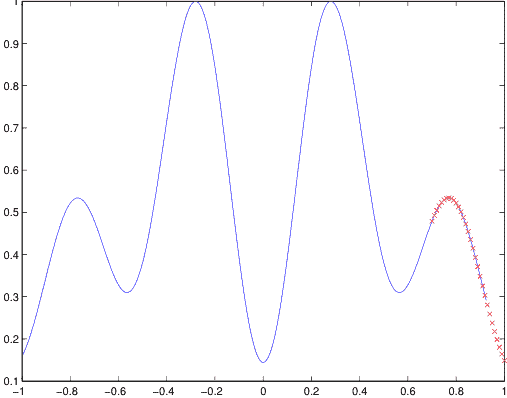
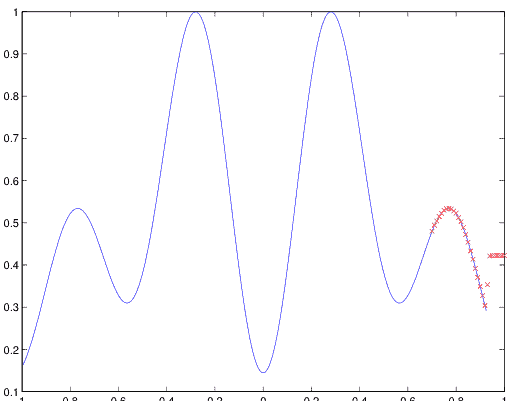
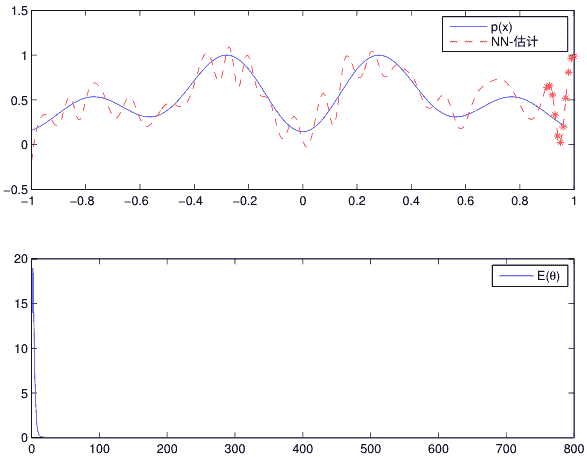

# 多变量金融时间序列的深度学习

吉尔伯托·巴特雷斯-埃斯特拉达
2015年6月4日

## 摘要

深度学习是一种训练和建模神经网络的框架，最近在许多学习任务中超过了所有传统方法，尤其是图像和语音识别。

本论文使用深度学习算法来预测金融数据。使用深度学习框架来训练神经网络。深度神经网络是DBN和MLP的组合。它用于选择股票组成投资组合。投资组合的回报率优于股票列表的中位数。研究中包括了组成标准普尔500指数的股票。

从深度神经网络获得的结果与逻辑回归网络、多层感知器和朴素基准进行了比较。从深度神经网络获得的结果比基准更好且更稳定。研究结果支持深度学习方法在金融领域的可靠性和良好性能。

关键词：反向传播算法，神经网络，深度置信网络，多层感知器，深度学习，对比散度，贪婪逐层预训练。

## 致谢

我想感谢Söderberg & Partners，我的导师Peng Zhou在Söderberg & Partners，我的导师Jonas Hallgren和考官Filip Lindskog在KTH皇家理工学院在这个有趣的项目期间对我的支持和指导。

斯德哥尔摩，2015年5月
Gilberto Batres-Estrada

## 目录

- 1 引言
  - 1.1 背景
  - 1.2 文献综述
- 2 神经网络
  - 2.1 单层神经网络
    - 2.1.1 人工神经元
    - 2.1.2 激活函数
    - 2.1.3 单层前馈网络
    - 2.1.4 感知器
    - 2.1.5 感知器作为分类器
  - 2.2 多层神经网络
    - 2.2.1 多层感知器
    - 2.2.2 用多层感知器进行函数逼近
    - 2.2.3 回归和分类
    - 2.2.4 深度架构
  - 2.3 深度置信网络
    - 2.3.1 波尔兹曼机
    - 2.3.2 限制性波尔兹曼机
    - 2.3.3 深度置信网络
    - 2.3.4 金融应用模型
- 3 训练神经网络
  - 3.1 反向传播算法
    - 3.1.1 最速下降法
    - 3.1.2 Delta规则
      - 案例1 输出层
      - 案例2 隐藏层
      - 总结
    - 3.1.3 前向和后向阶段
    - 3.1.4 已知激活函数的 $\delta$ 计算
    - 3.1.5 选择学习率
    - 3.1.6 停止准则
      - 提前停止
    - 3.1.7 反向传播算法的启发式方法
  - 3.2 批量学习和在线学习
    - 3.2.1 批量学习
    - 3.2.2 批量的使用
    - 3.2.3 在线学习
    - 3.2.4 泛化
    - 3.2.5 示例：神经网络回归
  - 3.3 训练受限玻尔兹曼机
    - 3.3.1 对比散度
  - 3.4 训练深度置信网络
    - 3.4.1 实现
- 4 金融模型
  - 4.1 模型
  - 4.1.1 输入数据和金融模型
- 5 实验和结果
  - 5.1 实验
  - 5.2 基准测试
  - 5.3 结果
    - 5.3.1 结果总结
- 6 讨论
- 附录
- A 附录
  - A.1 统计物理学
    - A.1.1 逻辑信念网络
    - A.1.2 Gibbs采样
    - A.1.3 反向传播：回归
  - A.2 其他

## 第1章 引言

深度学习在机器学习社区中越来越受欢迎，尤其是像谷歌、微软和Facebook这样的大型技术公司正在投资这个研究领域。深度学习是一组用于训练所谓的人工神经网络的学习算法，是机器学习和人工智能（AI）研究领域的一部分。如果神经网络变得过于复杂，例如具有许多层的网络，那么它们将很难训练，详见神经网络章节。深度学习是一种框架，可以方便地训练具有许多隐藏层的深度神经网络。

在它的发明之前，这是不可能的。

这篇硕士论文的主要任务是使用深度学习的方法来构建投资组合。这是通过根据深度神经网络学习到的函数来选择股票完成的。这个函数将取值于离散集合{0, 1}，表示一个类别标签。预测任务将作为一个分类任务进行，根据股票的过去历史为股票分配一个类别或标签，详见第4章。

我们首先介绍了背景，详细介绍了要解决的任务的公式化，然后继续介绍了研究文献的简要调查，以了解深度学习的领域。我们试图区分神经网络架构的理论和如何训练它们的理论。理论和架构在第2章中给出，神经网络的训练在第3章中介绍。第4章介绍了金融模型以及所做的假设。第5章描述了所做的实验并展示了实验结果。论文以第6章结束，其中讨论了结果并对模型选择和研究领域的新方向进行了思考。

### 1.1 背景

我们的人工智能系统将建立在神经网络的基础上。神经网络，特别是浅层网络，多年来一直被研究用于预测金融市场的走势，有很多相关的文章，例如（Kuo等，2014年）。在那篇论文中，有一个很长的参考文献列表。我们将使用一种称为DBN的神经网络类型。它是一种随机学习机，我们将其连接到多层感知器（MLP）上。

描述这些网络的理论在神经网络章节中介绍。预测金融市场随时间演变的任务是一个重要的研究课题，也是一个复杂的任务。原因是股票价格以随机方式变动。许多因素可以归因于这种随机行为，其中大部分都很复杂且难以预测，但其中一个肯定是人类行为和心理的一部分解释。

我们依靠过去的经验，并试图通过金融市场的价格历史来经验性地建模未来。特别是，历史收益被认为是未来收益的良好代表（Hult, Lindskog等，2012年）。适当转换历史样本将产生决定未来投资组合价值的随机收益样本。如果我们认为收益是相同分布的随机变量，那么我们可以假设过去产生收益的机制与未来产生收益的机制相同（Hult, Lindskog等，2012年）。我们从金融市场收集数据，并将其呈现给我们的学习算法。所做的假设在金融模型的第4章中介绍。我们选择研究标准普尔500指数。

### 1.2 文献综述

除了计算机实验外，这项工作还基于机器学习的标准书籍以及有关深度学习的论文的文献研究。在Hastie, Tibshirani和Friedman的《统计学习的要素》中可以找到人工神经网络的介绍（Hastie和Friedman，2009年）。Simon Haykin在他的书《神经网络与学习机器》中更深入地探讨了神经网络的理论，他还介绍了一些关于深度学习的理论（Haykin，2009年）。

深度学习的研究主要集中在人工智能领域，旨在使机器在视觉识别、语音识别等任务上表现更好。在许多论文中，例如 (Hinton等, 2006年), (Larochelle等, 2009年) 和 (Erhan等, 2010年)，都对一组手写数字进行了测试，称为MNIST，并且这是研究人员之间比较结果的标准，以查看他们的算法是否比其他算法表现更好。

一篇经典的论文是 (Hinton等, 2006年)，关于训练DBN。他们展示了他们的测试误差仅为1.25%。在同一篇文章中，与他们比较结果的第二好结果是支持向量机，其测试误差为1.40%。测试误差衡量模型的泛化能力或其对新的未见数据的预测能力有多好。这个术语在后面的章节中会更深入地解释。对于本论文中使用的网络训练，参考了技术报告 (Hinton, 2010年) 中关于如何训练RBM的建议，因为RBM是DBN的构建模块。关于DBN的理论可以在 (Bengio, 2009年)、(Haykin, 2009年) 和 (Salakhutdinov, 2009年) 等文献中找到。

在 (Takeuchi et al., 2013) 中发现了关于将深度学习应用于金融领域的相关工作，他们进行了与本研究类似的研究，但在那份报告中他们使用了自编码器，一种不同类型的网络，并使用了来自标普500、纳斯达克综合指数和AMEX列表的训练和测试数据。他们的测试误差约为46.2%。在 (Zhu and Yin, 2014) 中，使用深度学习方法构建了一个基于DBN的股票决策支持系统，使用了标普500的训练和测试数据。他们得出的结论是他们的系统优于买入并持有策略。在 (Kuremoto et al., 2014) 和 (Kuremoto et al., 2014) 中介绍了其他深度学习在诸如混沌时间序列回归等任务上的方法，其中第一篇论文仅使用了DBN，而第二篇论文使用了DBN-MLP，两篇论文都展示了良好的结果。

下一章介绍了人工神经网络的理论。它从单层神经网络开始，继续介绍了多层神经网络的理论，并以深度置信网络的理论结束。

## 第二章 神经网络

本章从人工神经元的理论开始，这是神经网络的构建模块。然后我们逐步介绍理论，先介绍单层网络，然后是多层神经网络。本章以深度神经网络结束。

人工神经网络的研究受到了人类和其他哺乳动物大脑工作的研究和模型的启发（Haykin, 2009）。研究人员将大脑视为一个高度复杂、非线性并行的计算机或信息处理系统，能够执行高度复杂的任务。事实上，大脑由称为神经元的细胞组成。这些神经元负责执行复杂的计算，如模式识别、感知或控制等，比今天最快的数字计算机更快。

对于人类大脑来说，识别一个熟悉的面孔可能需要几毫秒的时间。人类大脑通过经验学习新任务和解决问题，并适应新的环境。由于这种适应性，大脑被认为是可塑的，这意味着神经元学会建立新的连接。可塑性似乎对于人类大脑作为信息处理单元的神经元的功能至关重要。这对于由人工神经元组成的神经网络也是如此（Haykin, 2009）。

神经网络被认为是一种模拟大脑执行特定任务的机器。神经网络由一组计算单元（称为神经元）构建而成。这些计算单元在网络中表示为节点，并通过权重相互连接。有关神经网络的正式定义，请参阅附录。

### 2.1 单层神经网络

我们通过介绍人工神经元和激活函数的理论来开始本节，这是神经网络的构建模块。

#### 2.1.1 人工神经元

神经网络中的计算单元被称为人工神经元或简称为神经元。图2.1的框图展示了一个人工神经元模型。神经模型由以下构建模块组成：

- 1. 一组突触或连接链路，每个链路都有一个权重或强度。连接到神经元 $k$ 的突触 $j$ 的输入信号 $x_j$ 被突触权重 $w_{kj}$ 乘以。
- 2. 用于加总输入信号的加法器，根据神经元的相应突触强度进行加权。这里的操作构成了一个线性组合器。
- 3. 用于限制神经元输出幅度的激活函数 $\varphi(\cdot)$。

在图2.1中呈现的神经模型中，我们可以看到一个偏差 $b_k$ 应用于网络中。偏差的作用是根据其是否为负或正来减少或增加激活函数的净输入。关于激活函数的更多内容将在下一节中介绍。图2.1中神经网络的数学表示由以下方程给出：

$$u_k = \sum_{j=1}^m w_{kj} x_j, \qquad (2.1)$$
$$y_k = \varphi(u_k + b_k),$$

其中，$x_1, x_2, \dots, x_m$ 是输入信号，而 $w_{k1}, w_{k2}, \dots, w_{km}$ 是神经元 $k$ 的相应突触权重。神经元的输出为 $y_k$，$u_k$ 表示由输入信号引起的线性组合器输出。偏置项用 $b_k$ 表示，激活函数用 $\varphi$ 表示。偏置项 $b_k$ 是线性组合器输出 $u_k$ 的仿射变换。现在我们定义引发的局部场或激活电位为：

$$v_k = u_k + b_k \qquad (2.2)$$

将神经网络的所有组件放入更紧凑的形式中，我们得到以下方程：

$$v_k = \sum_{j=0}^m w_{kj}x_j, \qquad (2.3)$$

和

$$y_k = \varphi(v_k), \qquad (2.4)$$

其中我们现在添加了一个新的突触，输入为 $x_0 = 1$ 和权重 $w_{k0} = b_k$，考虑到偏差。在图2.2中，我们将偏差作为一个固定的输入信号 $x_0 = 1$，权重为 $w_{k0} = b_k$，展示了如何解释(2.3)。

#### 2.1.2 激活函数

激活函数 $\varphi(v)$ 定义了神经元的输出，以感应的局部场 $v$ 为基础。在本节中，我们介绍一些激活函数，包括阈值函数、Sigmoid函数和线性整流函数。

- 1. **阈值函数**：阈值函数如图2.3所示，并且定义为：

$$\varphi(v) = \begin{cases} 1 & \text{如果: } v \ge 0 \\ 0 & \text{如果: } v < 0 \end{cases}$$

阈值函数通常被称为海维赛德函数。使用阈值函数作为激活函数的神经元 $k$ 的输出是：

$$y_k = \begin{cases} 1 & \text{如果: } v_k \ge 0 \\ 0 & \text{如果: } v_k < 0 \end{cases}$$

其中 $v_k$ 是神经元的感应局部场，即：

$$v_k = \sum_{j=1}^{m} w_{kj}x_j + b_k. \qquad (2.5)$$

这个模型被称为McCulloch-Pitts模型。神经元的输出在感应到的局部场非负时取值为1，在其他情况下取值为0。

- 2. **Sigmoid函数**：Sigmoid函数是建模神经网络中最常用的激活函数形式。在本文引用的大部分文章中都使用了Sigmoid函数。它被定义为一种严格递增的函数，展现了线性和非线性行为之间的平衡。Sigmoid函数的一个例子是逻辑函数，其图像在图2.4中展示了不同值的 $a$ 时的情况，其数学公式为：

$$\varphi(v) = \frac{1}{1 + \exp(-av)}. \qquad (2.6)$$

参数 $a$ 是斜率参数。Sigmoid函数最有趣的一个特性之一是它是可微分的，这在训练神经网络时非常有用。

- 3. **修正线性单元**：修正线性单元（ReLU）是真实神经元的一个更有趣的模型（Nair和Hinton, 2010）。它是通过从Sigmoid函数中制作大量副本构建的。这是在假设所有副本具有相同的学习权重和偏置的情况下完成的。偏置具有不同的固定偏移量，分别为-0.5，-1.5，-2.5，等等。然后概率的总和由以下公式给出：

$$\sum_{i=1}^{N} \varphi(v - i + 0.5) \approx \log(1 + e^v), \quad (2.7)$$

其中 $v = \mathbf{w}^T \mathbf{x} + b$。这个模型的一个缺点是需要多次使用sigmoid函数来获得正确采样整数值所需的概率。一个快速的近似方法是：

$$\varphi(v) = \max \left( 0, v + N\left(0, \varphi(v)\right) \right), \quad (2.8)$$

其中 $N(0, \sigma)$ 是均值为零，方差为 $\sigma$ 的高斯噪声。

- 4. **奇数激活函数**：值得注意的是，在这些激活函数的示例中，它们的范围从 0 到 +1。在某些情况下，最好使用一个范围从 -1 到 +1 的激活函数，这种情况下激活函数是局部的奇函数。范围从 -1 到 +1 的阈值函数被称为符号函数：

$$\varphi(v) = \begin{cases} 1 & \text{如果：} v > 0 \\ 0 & \text{如果：} v = 0 \\ -1 & \text{如果：} v < 0 \end{cases}$$

相应的Sigmoid函数是由双曲正切定义的：

$$\varphi(v) = \tanh(v). \qquad (2.9)$$

到目前为止，我们一直在讨论确定性神经网络模型，其中输入输出行为对所有输入都有准确定义。有时需要使用随机模型。对于McCulloch-Pitts模型，我们可以通过为某些状态分配概率来给激活函数赋予概率解释。我们可以允许该网络以概率 $p(v)$ 和 $1-p(v)$ 分别达到两个状态 $+1$ 和 $-1$，这可以表示为：

$$x = \begin{cases} +1 & \text{的概率为: } p(v) \\ -1 & \text{的概率为: } 1-p(v) \end{cases}$$

其中，$x$ 是系统的状态，$p(v)$ 是给定的函数：

$$p(v) = \frac{1}{1 + \exp(-v/T)}, \qquad (2.10)$$

其中，$T$ 是一个用于控制噪声水平和状态变化不确定性的参数。在这个模型中，我们可以认为网络通过从关闭到打开的状态改变来做出概率性决策。

#### 2.1.3 单层前馈网络

在单层网络中，有一个输入层和一个输出层的神经元。这是前馈网络的定义，数据从输入层传输到输出层，但不能反过来。图2.6显示了一个单层前馈网络。

#### 2.1.4 感知器

感知器是神经网络的一个模型。心理学家罗森布拉特在1957年发表了他的论文（Rosenblatt, 1957）关于感知器。这篇文章是监督学习领域的起点。工程师、物理学家和数学家开始对神经网络产生兴趣，并在他们各自的领域中使用这些理论（Haykin, 2009）。McCulloch和Pitts（1943）提出了神经网络作为计算机的概念，Hebb（1949）提出了自组织学习的第一个规则。罗森布拉特的感知器是基于非线性神经元的McCulloch-Pitts模型，如图2.1所示。

#### 2.1.5 感知器作为分类器

感知器由线性组合器和硬限制器组成，执行符号函数 $\varphi(\cdot)$。神经网络中的求和节点计算应用于其突触的输入的线性组合，并且它包含一个偏置。得到的总和应用于硬限制器。然后，如果硬限制器的输入为正，则神经元产生一个等于+1的输出，如果输入为负，则产生一个等于-1的输出。

在图2.1的神经元模型中，我们有 $m$ 个输入信号 $x_1, x_2, \dots, x_m$ 和 $m$ 个权重 $w_1, w_2, \dots, w_m$。将外部应用的偏置称为 $b$，我们可以看到神经元的硬限制器输入或诱导的局部场为：

$$v = \sum_{i=1}^{m} w_i x_i + b \qquad (2.11)$$

感知器可以正确地对外部应用的输入信号 $x_1, x_2, \dots, x_m$ 进行分类，将其分为 $\mathcal{C}_1$ 类或 $\mathcal{C}_2$ 类之一。分类的决策基于与输入信号对应的 $y$ 的结果值，其中 $y=1$ 属于 $\mathcal{C}_1$，$y=-1$ 属于 $\mathcal{C}_2$。为了了解模式分类器的行为，通常会在由输入变量 $x_1, x_2, \dots, x_m$ 构成的 $m$ 维信号空间中绘制决策区域。感知器网络的最简单情况是由一个超平面分隔的两个决策区域，该超平面由以下方式定义：

$$\sum_{i=1}^{m} w_i x_i + b = 0. \qquad (2.12)$$

这在图2.7中有所说明，对于两个变量 $x_1, x_2$ 的情况，决策线是一条直线。位于边界线上方的点 $(x_1, x_2)$ 被分类为属于类别一 $\mathcal{C}_1$，而位于边界线下方的点 $(x_1, x_2)$ 被分类为属于类别二 $\mathcal{C}_2$。我们可以从图中看出，偏置的作用仅仅是将边界区域从原点偏移。

感知器的突触权重通过适应进行调整迭代。这是通过使用一个错误修正规则来完成的，该规则被称为感知器收敛算法。在采用更一般的设置时，我们可以将偏置定义为由固定输入驱动的突触权重，该输入等于 1。我们将 $(m+1) \times 1$ 输入向量定义为：

$$\mathbf{x}(n) = [1, x_1(n), x_2(n), \dots, x_m(n)]^T, \quad (2.13)$$

其中 $n$ 是时间步长，$T$ 表示转置。以同样的方式，我们将 $(m+1) \times 1$ 权重向量定义为：

$$\mathbf{w}(n) = [b, w_1(n), w_2(n), \dots, w_m(n)]^T, \quad (2.14)$$

然后，线性输出组合器可以写成：

$$\begin{aligned} v(n) &= \sum_{i=0}^{m} w_i(n)x_i(n) \\ &= \mathbf{w}^T(n)\mathbf{x}(n), \quad (2.15) \end{aligned}$$

其中 $w_0(n) = b$ 是偏置。固定 $n$ 并在具有坐标 $x_1, x_2, \dots, x_m$ 的 $m$ 维空间中绘制 $\mathbf{w}^T \mathbf{x} = 0$，边界表面是定义两个类别之间的决策面的超平面。

为了使感知器正常工作，两个类别 $\mathcal{C}_1$ 和 $\mathcal{C}_2$ 必须是线性可分的。这意味着分类的两个模式必须足够分离，以确保决策面由一个超平面组成。在二维情况下，线性可分模式的示例如图2.8所示，而不可分模式的示例如图2.9所示。在金融数据预测中，深度学习是一种强大的工具，但这对于处理不可分离的情况是不够的。

假设我们有两个线性可分的类别。将 $\mathcal{H}_1$ 定义为训练向量 $\mathbf{x}$ 所属的子空间，对应类别 $\mathcal{C}_1$；将 $\mathcal{H}_2$ 定义为训练向量 $\mathbf{x}$ 所属的子空间，对应类别 $\mathcal{C}_2$。那么 $\mathcal{H} = \mathcal{H}_1 \cup \mathcal{H}_2$ 是完整的空间。通过这些定义，我们可以将分类问题表述为：

对于属于类别 $\mathcal{C}_1$ 的每个输入向量 $\mathbf{x}$，$\mathbf{w}^T\mathbf{x} > 0$；对于属于类别 $\mathcal{C}_2$ 的每个输入向量 $\mathbf{x}$，$\mathbf{w}^T\mathbf{x} \le 0$。 (2.16)

感知器的训练过程是找到满足关系式 2.16 的权重向量 $\mathbf{w}$。其更新规则如下：

- 1. 如果训练集中的第 $n$ 个成员 $\mathbf{x}(n)$ 被权重向量 $\mathbf{w}(n)$ 正确分类，则不对感知器的权重进行修正，即：
  $\mathbf{w}(n+1) = \mathbf{w}(n)$ 如果 $\mathbf{w}^T(n)\mathbf{x}(n) > 0$ 且 $\mathbf{x}(n) \in \mathcal{C}_1$，或 $\mathbf{w}^T(n)\mathbf{x}(n) \le 0$ 且 $\mathbf{x}(n) \in \mathcal{C}_2$。
- 2. 否则，根据以下规则更新权重向量：
  $\mathbf{w}(n+1) = \mathbf{w}(n) + \eta(n)\mathbf{x}(n)$ 如果 $\mathbf{x}(n) \in \mathcal{C}_1$ 但被误分；
  $\mathbf{w}(n+1) = \mathbf{w}(n) - \eta(n)\mathbf{x}(n)$ 如果 $\mathbf{x}(n) \in \mathcal{C}_2$ 但被误分。

其中学习率参数 $\eta(n)$ 控制了在时间步骤 $n$ 时对权重向量的调整。

### 2.2 多层神经网络

多层网络与单层前馈网络在一个方面不同（Haykin, 2009）。多层网络有一个或多个隐藏层，其计算节点称为隐藏神经元或隐藏单元。之所以称之为隐藏层，是因为这些层对于输入层和输出层都是不可见的。这些隐藏单元的任务是参与分析输入和输出层之间的数据流。通过添加一个或多个隐藏层，网络可以提取输入数据的高阶统计量。

输入信号通过第一个隐藏层进行计算。然后，得到的信号成为下一个隐藏层的输入信号。如果存在多个隐藏层，这个过程将继续，直到信号到达输出层，此时它被认为网络的总响应。图2.10展示了一个具有3个输入单元、3个隐藏单元和1个输出单元的多层前馈网络的示例。由于这种结构，该网络被称为一个3-3-1网络。

#### 2.2.1 多层感知器

多层感知器（MLP）由具有可微分激活函数的神经元组成（Haykin, 2009）。该网络由一个或多个隐藏层组成，并具有高度的连接性，这由突触权重决定。分析这些网络的困难主要在于其神经元的非线性和高度连接性。除了这些困难之外，当网络具有隐藏单元时，学习成为一个问题。

在使用多层感知器时，我们将使用术语“函数信号”来表示输入信号。函数信号是从输入到输出方向上一个前一层神经元的输出。然后，这些信号被传递给其他神经元作为输入。错误信号出现在输出单元，并通过逐层向后传播。多层感知器的每个隐藏层或输出神经元执行以下计算：

- 1. 计算每个神经元输出的函数信号。
- 2. 估计梯度向量，用于网络的反向传播。

隐藏神经元充当特征检测器，随着学习过程的进行，隐藏神经元会发现训练数据中的潜在特征。隐藏单元对输入数据进行非线性转换，转换到一个称为“特征空间”的新空间。在特征空间中，模式分类问题中感兴趣的类别可能比在原始输入空间中更容易分类。

#### 2.2.2 用多层感知器进行函数逼近

多层感知器可以执行非线性的输入输出映射，因此适用于近似函数 $f(x_1, \dots, x_m)$。

$m_0$ 是输入节点的数量，$M=m_L$ 是输出层中的神经元数量，则网络的输入输出关系定义了从 $m_0$ 维欧几里得输入空间到 $M$ 维欧几里得输出空间的映射。通用逼近定理告诉我们在近似函数 $f(x_1, \dots, x_{m_0})$ 中所需的最小隐藏层数量。定理如下 (Haykin, 2009)：

**定理 2.1** 设 $\varphi(\cdot)$ 为一个非常数、有界且单调递增的连续函数。设 $I_{m_0}$ 为 $m_0$ 维单位超立方体 $[0, 1]^{m_0}$，用 $C(I_{m_0})$ 表示 $I_{m_0}$ 上的连续函数空间。给定任意函数 $f \in C(I_{m_0})$ 和 $\epsilon > 0$，存在整数 $m_1$ 和一组实常数 $\alpha_i, b_i$ 和 $w_{ij}$，其中 $i=1, \dots, m_1, j=1, \dots, m_0$，使得我们可以定义：

$$F(x_1, \dots, x_{m_0}) = \sum_{i=1}^{m_1} \alpha_i \varphi \left( \sum_{j=1}^{m_0} w_{ij} x_j + b_i \right), \quad (2.17)$$

作为函数 $f(\cdot)$ 的近似实现：

$$| F(x_1, \dots, x_{m_0}) - f(x_1, \dots, x_{m_0}) | < \epsilon$$

对于所有的 $x_1, x_2, \dots, x_{m_0}$，这些都位于输入空间中。

任何 Sigmoid 函数都满足定理的要求，并可以在逼近过程中使用。多层感知器的输出，如 (2.17) 所示，具有以下特点：

- 该网络具有 $m_0$ 个输入节点和一个具有 $m_1$ 个神经元的隐藏层。该方程中的输入由 $x_1, \dots, x_{m_0}$ 给出。
- 隐藏层神经元 $i$ 具有权重 $w_{i1}, \dots, w_{im_0}$ 和偏置 $b_i$。
- 输出是隐藏层神经元输出的线性组合，其中 $\alpha_1, \dots, \alpha_{m_1}$ 是输出层的突触权重。

在定理的假设下，通用逼近定理允许我们使用神经网络来逼近函数。因此，神经网络既适用于回归任务，也适用于分类任务。

#### 2.2.3 回归和分类

神经网络经常被用来解决分类和回归问题。由于通用逼近定理告诉我们如何使用神经网络来逼近函数，我们可以看到它适用于回归任务。我们还看到感知器可以用于分类。

从更一般的角度来看，我们可以说这些任务之间唯一的区别在于如何表示网络的输出以及如何定义成本函数。

例如，如果网络的输出是 $f_k(X)$，那么我们可以将分类或回归解决方案表示为：

$$Z_m = \varphi(\alpha_{0m} + \alpha_m^T X), \quad m = 1, 2, \dots, M$$
$$T_k = \beta_{0k} + \beta_k^T Z, \quad Z = (Z_1, Z_2, \dots, Z_M)$$
$$f_k(X) = g_k(T), \quad k = 1, 2, \dots, K, \quad T = (T_1, T_2, \dots, T_K)$$

其中 $Z_m$ 是网络中的第 $m$ 个隐藏单元，$\varphi(\cdot)$ 是激活函数，通常为 Sigmoid 类型，而 $f_k(X)$ 是由输入 $X$ 引起的网络响应。对于回归问题，我们有 $g_k(T) = T_k$；对于分类问题，我们有 Softmax 函数：

$$g_k(T) = \frac{e^{T_k}}{\sum_{l=1}^K e^{T_l}}. \quad (2.18)$$

在学习过程中，有一个参数估计步骤，需要估计突触权重。估计是通过反向传播来完成的，其目标是最小化成本函数。该过程在神经网络训练章节中介绍。对于回归问题，我们有一个类似的成本函数：

$$\mathcal{E}(\theta) = \sum_{k=1}^K \sum_{i=1}^N (y_{ik} - f_k(x_i; \theta))^2, \quad (2.19)$$

其中，$y_{ik}$ 是期望的响应，$\theta = \{ \alpha_{ml}, \beta_{km} \}$ 是模型的参数集合，$f_k(x_i; \theta)$ 是网络的实际响应。对于分类问题，代价函数（有时被称为交叉熵）是：

$$\mathcal{E}(\theta) = -\sum_{k=1}^K \sum_{i=1}^N y_{ik} \log f_k(x_i; \theta). \quad (2.20)$$

#### 2.2.4 深度架构

深度神经网络是建立在深度架构基础上的，通常包含多个隐藏层。在这里，我们介绍深度或多层神经网络的理论。

我们将神经网络的深度定义为其包含的层级或层数。每一层对输入数据进行非线性操作，以学习所研究的函数。传统网络被认为具有浅层架构，通常由 1、2 或 3 层组成。长期以来，研究人员尝试训练由深层架构组成的神经网络，但往往达到一个边界，只有深度为最多 3 层（有两个隐藏层）可以进行训练（Bengio, 2009）。

在 (Hinton, 2006) 中，展示了如何使用贪婪学习算法逐层训练 DBN。深度学习中使用的原则是使用无监督学习训练中间层，这在每个层次上都是局部进行的。有关如何训练深度神经网络的理论将在训练神经网络的章节中进行详细介绍。

深度神经网络以无监督的方式进行训练，但在许多应用中，它们也用于初始化前馈神经网络。一旦在每个层次上找到了良好的表示，就可以使用监督梯度优化来初始化和训练深度神经网络。

在机器学习中，我们谈论有标签和无标签的数据，其中第一种情况是指我们有一个目标或已知结果，可以将我们的网络输出与之进行比较。在第二种情况下，我们没有这样的目标。使用深度学习算法可以在没有标签或目标值的情况下训练深度神经网络。深度学习算法应该处理以下问题（Bengio, 2009）：

- 具有学习复杂、高度变化的函数的能力，其变化数量远大于训练样本数量。
- 能够在输入数据中以较少的人工干预下学习低级、中级和高级抽象。
- 计算时间应该随着示例数量的增加而良好缩放，并且接近线性。
- 能够从大部分未标记的数据中学习，并在半监督设置中工作，其中示例可能具有错误的标签。
- 强大的无监督学习可以捕捉到观察数据中的大部分统计结构。

复杂函数的表示需要深层架构，而这对于浅层架构来说可能很难处理。如果一个函数的表达具有较少的自由度需要通过学习进行调整，则被认为是紧凑的。可以由深度为 $k$ 的架构紧凑地表示的函数可能需要指数级的计算元素才能由深度为 $k-1$ 的架构表示。

计算单元的数量消耗大量资源，并且取决于可用的训练样本数量。这种依赖性导致了计算和统计性能问题，从而导致了较差的泛化能力。正如我们将看到的，这可以通过深度架构来解决。网络的深度使得在网络中使用较少的计算神经元成为可能。深度被定义为从输入节点到输出节点的层数。有趣的是，并不是绝对层数的数量重要，而是相对于有效表示目标函数所需的层数的数量重要。

下一个定理说明了当网络具有深度 $k$ 时，表示函数所需的计算单元的数量 (Håstad & Goldmann, 1991), (Bengio, 2009)。

**定理 2.2**：深度为 $k-1$ 的单调加权阈值网络计算函数 $f_k \in \mathcal{F}_{k,N}$ 的大小至少为 $2^{cN}$，其中 $c > 0$ 且 $N > n_0$。

这里，$\mathcal{F}, k, N$ 是函数类，其中每个函数具有 $N^{2k-2}$ 个输入，由 $k$ 深度树定义。定理的解释是，网络没有“正确”的深度，而是研究的数据应该帮助我们决定网络的深度。网络的深度与所研究的函数变化程度相关联。一般来说，高度变化的函数需要深层结构以便以紧凑的方式表示它们。如果网络具有不合适的架构，浅层结构将需要大量的计算单元。

对于深度神经网络，我们用 $\mathbf{h}_k$ 表示第 $k$ 层神经元的输出，用 $\mathbf{h}_{k-1}$ 表示来自前一层的输入向量，则有：

$$\mathbf{h}_k = \varphi(\mathbf{b}_k + W_k \mathbf{h}_{k-1}), \quad (2.21)$$

其中 $\mathbf{b}_k$ 是偏置向量，$W_k$ 是权重矩阵，$\varphi(\cdot)$ 是逐元素应用的激活函数。在输入层，输入向量 $\mathbf{x} = \mathbf{h}_0$ 是网络要分析的原始数据。

输出向量在输出层中用于进行预测。对于分类任务，我们有一个称为 Softmax 的输出：

$$\mathbf{h}_i^\ell = \frac{\exp(\mathbf{b}_i^\ell + W_i^\ell \mathbf{h}^{\ell-1})}{\sum_j \exp(\mathbf{b}_j^\ell + W_j^\ell \mathbf{h}^{\ell-1})}, \quad (2.22)$$

其中，$W_i^\ell$ 是 $W^\ell$ 的第 $i$ 行，$h_i^\ell$ 是正数，且 $\sum_i h_i^\ell = 1$。对于回归任务，输出为：

$$\mathbf{h}_k^{out} = \alpha_{0k} + \alpha_k \varphi(\mathbf{b}_i^\ell + W_i^\ell \mathbf{h}^{\ell-1}), \quad (2.23)$$

这是我们在过去章节中已经见过的一个定义，其中 $\alpha_{0k}$ 是应用于最后输出层的偏置，$\alpha_k$ 表示最后一层和倒数第二层之间的一组权重。输出与目标函数或标签 $y$ 一起用于构建凸损失函数 $\mathcal{E}(\mathbf{h}^\ell, y)$。我们已经熟悉了回归和分类任务的成本函数：

$$\begin{aligned} \mathcal{E}(\theta, y) &= -\log(\hat{\theta}_y), & \text{分类} \\ \mathcal{E}(\theta, y) &= ||y - \hat{\theta}_y||^2, & \text{回归} \end{aligned} \tag{2.24}$$

其中 $\hat{\theta}$ 是网络输出，$y$ 是目标或期望响应。注意，我们改变了每层输出的符号表示，从 $y$ 变为 $\theta$，这是文献中的标准符号表示法。

接下来，我们介绍深度神经网络的理论、构建模块和工作原理。我们将重点介绍深度置信网络，这是用来解决我们的分类任务的模型。

### 2.3 深度置信网络

深度置信网络（DBN）是通过堆叠受限玻尔兹曼机（RBM）构建的 (Hinton et al., 2006), (Erhan et al., 2010)。通过逐层训练和添加更多层，我们可以构建一个深度神经网络。一旦这个 RBM 堆栈被训练好，它可以用来初始化一个用于分类的多层神经网络 (Erhan et al., 2010)。为了理解这个学习机器的工作原理，我们需要了解玻尔兹曼机的理论，特别是受限玻尔兹曼机的理论。

#### 2.3.1 玻尔兹曼机

玻尔兹曼机理论的方法是统计物理学的方法，关于这些方法的详细说明请参考附录。

玻尔兹曼机是一种由随机神经元和对称权重组成的随机二进制学习机。随机神经元可以处于两种状态，+1 表示开启状态，-1 表示关闭状态。但是在文献和应用中，+1 表示开启状态，0 表示关闭状态也很常见。

玻尔兹曼机的神经元分为两组或两层，分别是可见层和隐藏层。这可以表示为 $\mathbf{v} \in \{0,1\}^V$ 和 $\mathbf{h} \in \{0,1\}^H$，其中 $V$ 和 $H$ 分别表示可见层和隐藏层的索引。可见神经元彼此相连，并与环境接口相连。在训练过程中，可见神经元被固定在由环境确定的特定状态上。隐藏神经元自由运行，并通过捕捉夹持向量中的高阶统计相关性来提取输入信号的特征。

在图 2.11 中，我们可以看到一个玻尔兹曼机，可见神经元之间以及与隐藏层中的神经元相连接。隐藏层神经元之间也是相同类型的连接。请注意，两层之间的连接是对称的，对于同一层中的神经元之间的连接也是如此。

网络通过处理发送到可见神经元的固定模式来学习数据的潜在概率分布。只有在部分信息可用的情况下，网络才能完成模式，假设网络已经经过适当的训练。

图 2.11：玻尔兹曼机，具有 $K$ 个可见神经元和 $L$ 个隐藏神经元。

玻尔兹曼机假设以下情况：

- 1. 输入向量持续足够长的时间，以使网络达到热平衡。
- 2. 在将输入向量固定到可见神经元中的顺序中，没有结构。

如果玻尔兹曼机的某个权重配置在可见单元自由运行时导致相同的状态概率分布，那么它被认为是以输入数据的完美模型。要实现这样一个完美的模型，需要比可见单元数量指数级别更多的隐藏单元。但是，如果数据中存在规则结构，尤其是当网络使用隐藏单元来捕捉这些规律时，这台机器可以实现良好的性能。在这种情况下，机器可以用可管理的隐藏单元数量重构潜在的分布。

玻尔兹曼机有两个操作阶段：

- 1. 正相位：在这个阶段，机器处于固定状态，也就是说它受到训练样本 $\mathscr{P}$ 的影响。
- 2. 负相位：在这个阶段，机器被允许自由运行，这意味着没有环境输入。

#### 2.3.2 受限玻尔兹曼机

在 Boltzmann 机中，除了输入神经元之间的连接和隐藏神经元之间的连接之外，还有输入和隐藏层之间的连接（参见图 2.11）。在 RBM 中，只有输入和隐藏层之间的连接，同一层中的单元之间没有连接（参见图 2.12）。RBM 机器是一种生成模型，后面我们将看到它被用作 DBN 中的构建模块。RBM 也被用作深度自编码器中的构建模块。RBM 由一个可见层和一个隐藏层的二进制单元组成，它们之间通过对称权重连接。在 RBM 中，隐藏单元被视为特征检测器。网络根据分布为每对可见和隐藏神经元向量分配概率：

$$P(\mathbf{v}, \mathbf{h} ; \theta)=\frac{1}{Z(\theta)} e^{-E(\mathbf{v}, \mathbf{h} ; \theta)}, \quad (2.25)$$

其中配分函数由 $Z(\theta) = \sum_{\mathbf{v}, \mathbf{h}} \exp(-E(\mathbf{v}, \mathbf{h}; \theta))$ 给出。系统的能量是：

$$E(\mathbf{v}, \mathbf{h}) = -\mathbf{a}^T\mathbf{h} - \mathbf{b}^T\mathbf{v} - \mathbf{v}^T\mathbf{w}\mathbf{h} = -\sum_i b_i v_i - \sum_j a_j h_j - \sum_{i,j} w_{ij}v_ih_j, \quad (2.26)$$

其中 $a_j$ 和 $b_i$ 分别是隐藏变量 $h_j$ 和输入变量 $v_i$ 的偏置，$w_{ij}$ 是可见层和隐藏层之间成对交互的权重。数据向量 $\mathbf{v}$ 的边际概率分布 $P$ 是由 (Salakhutdinov, 2009) 给出的：

$$P(\mathbf{v}; \theta) = \frac{1}{Z(\theta)} \sum_{\mathbf{h}} e^{-E(\mathbf{v}, \mathbf{h} ; \theta)} = \frac{1}{Z(\theta)} \exp(\mathbf{b}^T\mathbf{v}) \prod_{j=1}^F \left( 1 + \exp \left( a_j + \sum_{i=1}^D w_{ij}v_i \right) \right). \quad (2.27)$$

在这个方程中，$\mathbf{v}$ 是输入向量，$\mathbf{h}$ 是隐藏单元的向量。这是可见单元的边际分布函数。能量较低的系统 $(\mathbf{v}, \mathbf{h})$ 具有较高的概率，而能量较高的系统具有较低的概率。借助能量函数，我们可以定义以下概率：

$$P(\mathbf{v} | \mathbf{h} ; \theta)=\prod_{i} P\left(v_{i} | \mathbf{h}\right) \quad \text{and} \quad P\left(v_{i}=1 | \mathbf{h}\right)=\varphi\left(b_{i}+\sum_{j} h_{j} w_{i j}\right), \quad (2.28)$$
$$P(\mathbf{h} | \mathbf{v} ; \theta)=\prod_{j} P\left(h_{j} | \mathbf{v}\right) \quad \text{and} \quad P\left(h_{j}=1 | \mathbf{v}\right)=\varphi\left(a_{j}+\sum_{i} v_{i} w_{i j}\right), \quad (2.29)$$

其中，$\varphi$ 是 Sigmoid 函数 $\varphi(x)=1 / (1+\exp(-x))$。能量函数定义在二进制向量上，不适用于连续数据。但通过修改能量函数，定义高斯-伯努利受限玻尔兹曼机，通过在可见单元上包含二次项，我们也可以用 RBM 处理连续数据：

$$E(\mathbf{v}, \mathbf{h} ; \theta)=\sum_{i} \frac{\left(v_{i}-b_{i}\right)^{2}}{2 \sigma_{i}^{2}}-\sum_{j} a_{j} h_{j}-\sum_{i, j} w_{i j} \frac{v_{i}}{\sigma_{i}} h_{j} . \quad (2.30)$$

向量 $\theta = \{W, \mathbf{a}, \mathbf{b}, \sigma^2\}$，$\sigma_i$ 表示输入变量 $v_i$ 的标准差。可见向量 $\mathbf{v}$ 的边际分布由以下公式给出（Salakhutdinov, 2009）：

$$P(\mathbf{v} ; \theta)=\sum_{\mathbf{h}} \frac{\exp (-E(\mathbf{v}, \mathbf{h} ; \theta))}{\int_{\mathbf{v}^{\prime}} \sum_{\mathbf{h}} \exp \left(-E\left(\mathbf{v}^{\prime}, \mathbf{h} ; \theta\right)\right) \mathrm{d} \mathbf{v}^{\prime}}, \quad (2.31)$$

$P(\mathbf{v} | \mathbf{h})$ 成为具有均值 $b_i+\sigma_i \sum_j w_{ij} h_j$ 和对角协方差矩阵的高斯分布。可见单元和隐藏单元的条件分布为：

$$P\left(v_{i}=x | \mathbf{h}\right)=\frac{1}{\sigma_{i} \sqrt{2 \pi}} \exp \left(-\frac{(x-b_{i}-\sigma_{i} \sum_{j} w_{i j} h_{j})^2}{2 \sigma_{i}^{2}}\right), \quad (2.32)$$
$$P\left(h_{j}=1 | \mathbf{v}\right)=\varphi\left(a_{j}+\sum_{i} \frac{v_{i}}{\sigma_{i}} w_{i j}\right),$$

其中 $\varphi(x)=1 /(1+\exp (-x))$ 是 Sigmoid 激活函数。(Hinton et al., 2006) 和 (Salakhutdinov, 2009) 提到，如果数据被归一化到区间 [0,1]，二项式-伯努利 RBM 也适用于连续数据。这在实验中已经得到了测试，并且似乎效果很好。

#### 2.3.3 深度置信网络

在深度置信网络中，顶部两层被建模为一个无向的双分区关联记忆，即 RBM。较低的层构成...

图2.12: 受限玻尔兹曼机的图片。

图2.13: 深度置信网络。

一个有向图模型，即所谓的sigmoid信念网络（请参见附录）。sigmoid信念网络和DBN之间的区别在于隐藏层的参数化（Bengio, 2009）：

$$P(\mathbf{v}, \mathbf{h}^1, \dots, \mathbf{h}^l) = P(\mathbf{h}^{l-1}, \mathbf{h}^l) \left( \prod_{k=0}^{l-2} P(\mathbf{h}^k | \mathbf{h}^{k+1}) \right), \quad (2.33)$$

其中，$\mathbf{v}$是可见单元的向量，$P(\mathbf{h}^{k-1}|\mathbf{h}^k)$是在第$k$层RBM中给定隐藏单元的条件概率。在顶层的联合分布 $P(\mathbf{h}^{l-1}, \mathbf{h}^l)$ 是一个RBM，参见图2.13。用一个更简单的模型来描述DBN的另一种方式如图2.14所示，它解释了为什么DBN是一个生成模型。我们可以看到有两种箭头：虚线箭头和实线箭头。

点线箭头表示特征学习，而实线箭头表示DBN是一个生成模型。点线箭头表示学习过程，不是模型的一部分。实线箭头展示了数据生成在网络中的流动方式。生成模型不包括下层的向上箭头。

DBN是将RBM叠加在一起形成的。堆叠RBM时，每个RBM的可见层设置为前一个RBM的隐藏层。当学习一组数据的模型时，我们希望找到一个真实后验概率为 $P(\mathbf{h}^l|\mathbf{h}^{l-1})$ 的模型 $Q(\mathbf{h}^l|\mathbf{h}^{l-1})$。除了顶层 $Q(\mathbf{h}^l|\mathbf{h}^{l-1})$ 后验概率是真实后验概率 $P(\mathbf{h}^l|\mathbf{h}^{l-1})$ 之外，其他后验概率 $Q$ 都是近似值（Bengio, 2009）。顶层RBM使我们能够进行精确推断。

在下一章中，我们将介绍训练神经网络的理论。我们介绍了反向传播算法，该算法用于训练浅层和深层神经网络。我们还介绍了一些在训练神经网络中常用的启发式方法，然后我们深入研究了训练深层神经网络的理论。

#### 2.3.4 金融应用模型

在本论文中选择的模型是一个将DBN与MLP相结合的模型，其中后者执行分类任务。在DBN实现的初始化阶段，RBM与MLP共享权重和偏置。这意味着RBM使用与MLP相同的参数集进行初始化。在DBN-MLP的初始化中，我们在DBN模块和MLP模块中使用相同的权重矩阵和偏置向量。

图2.14：DBN的一般表示，该模型提取输入的多个层次的表示。顶部的两层 $h^2$ 和 $h^3$ 形成一个RBM。较低的层形成一个有向图模型，即一个sigmoid信念网络。

当训练开始时，这些矩阵和向量将根据学习规则进行调整。随着训练的进行，权重矩阵和偏置向量在DBN和MLP中都会发生变化，它们将不再相同。

在训练整个网络时，参数根据神经网络训练章节中介绍的理论进行调整。正如后面解释的，在金融模型章节中，我们决定在DBN中有三个隐藏层，在MLP中有一个隐藏层。下图显示了一个草图。后面我们将看到输入向量由33个特征或变量组成，输出层由softmax函数组成。

我们的神经网络将对输入空间 $x$ 到输出空间 $Y=\{0,1\}$ 建模：

$$F_{\theta} : \mathbf{x} \rightarrow Y, \quad (2.34)$$

其中 $\theta$ 是神经网络的参数。我们将展示我们最终的模型为：

$$Y_{t+1} = F_{\theta}(\mathbf{x}), \quad (2.35)$$

最终导致估计器：

$$Y_{t+1} = \mathbb{E}[Y_{t+1}]. \quad (2.36)$$

图2.15: DBN-MLP的草图，由一个3层DBN和一个具有1个隐藏层的MLP组成。这里 $h^i$ 表示隐藏层，$i=\{1,2,3\}$，$o$ 是由softmax函数组成的输出层。输入向量具有33个特征或变量，Y取值为 $Y=\{0,1\}$ 之一。

# 第三章 训练神经网络

本章介绍了训练浅层和深层神经网络的理论。首先介绍的算法是所谓的反向传播算法。该算法用于训练多层感知机，但也用于训练深度神经网络，在训练的最后一步中用于微调参数。然后，我们介绍了训练RBM和DBN的理论。对比散度（CD）是训练RBM的近似学习规则，并且是DBN的逐层预训练的一部分。

### 3.1 反向传播算法

神经网络理论中更新权重的最常见方法是所谓的最速下降法，下面将介绍该方法。

#### 3.1.1 最速下降法

最速下降法沿着梯度向量 $\nabla\mathcal{E}(\mathbf{w})$ 的相反方向更新权重。这里，$\mathcal{E} = 1/2 \sum [e_j(n)]^2$，其中 $e_j(n) = d_j(n) - h_j(n)$ 表示网络输出 $h_j(n)$ 与期望响应 $d_j(n)$ 之间的误差。最速下降算法的形式为：

$$\mathbf{w}(n + 1) = \mathbf{w}(n) - \eta \nabla\mathcal{E}(\mathbf{w}), \quad (3.1)$$

其中 $\eta$ 是步长或学习率。从时间步 $n$ 到时间步 $n+1$，修正变为：

$$\begin{aligned} \Delta \mathbf{w} (n) &= \mathbf{w} (n+1) - \mathbf{w} (n) \\ &= -\eta \nabla\mathcal{E} (\mathbf{w}). \end{aligned} \quad (3.2)$$

上述方程可用于利用一阶泰勒级数展开近似计算 $\mathcal{E}(\mathbf{w}(n+1))$：

$$\mathcal{E} (\mathbf{w} (n+1)) \approx \mathcal{E} (\mathbf{w} (n)) + \nabla\mathcal{E}^T (n) \Delta \mathbf{w} (n). \quad (3.3)$$

在 (Haykin, 2009) 中证明了该规则满足迭代下降的条件，该条件如下所示：

**命题**：从 $\mathbf{w}(0)$ 开始生成一系列权重向量 $\mathbf{w}(1), \mathbf{w}(2), \dots$ 使得每次迭代时成本函数都减少，即 $\mathcal{E}(\mathbf{w}(n+1)) < \mathcal{E}(\mathbf{w}(n))$，

$$\qquad(3.4)$$

其中 $\mathbf{w}(n)$ 是权重向量的旧值，$\mathbf{w}(n+1)$ 是更新后的值。

考虑接收输入信号 $h_1(n), h_2(n), \dots$ 的神经元 $j$，对于这个输入，它产生输出 $v_j(n)$：

$$v_j(n) = \sum_{i=0}^m w_{ji}(n)h_i(n) \qquad (3.5)$$

注：$w_{ji}(n)$ 是输入 $h_i(n)$ 对神经元 $j$ 的权重。

在这个模型中，我们将 $h_0 = 1$ 视为偏置，对应的权重为 $w_{j0} = b_j$。神经元的输出经过激活函数，产生该神经元的刺激：

$$h_j(n) = \varphi_j(v_j(n)). \qquad (3.6)$$

对梯度进行计算，并利用链式法则进行微分：

$$\begin{aligned} \frac{\partial \mathcal{E}(n)}{\partial w_{ji}(n)} &= \frac{\partial \mathcal{E}(n)}{\partial e_j(n)} \frac{\partial e_j(n)}{\partial h_j(n)} \frac{\partial h_j(n)}{\partial v_j(n)} \frac{\partial v_j(n)}{\partial w_{ji}(n)} \qquad (3.7) \\ &= -e_j(n)\varphi'_j(v_j(n))h_i(n), \end{aligned}$$

在这里我们使用了误差信号的导数 $e_j(n) = d_j(n) - h_j(n)$，误差能量 $\mathcal{E}(n) = \frac{1}{2} e_j^2(n)$，神经元 $j$ 的函数信号 $h_j(n)$ 和局部场 $v_j(n)$。

#### 3.1.2 Delta规则

Delta规则是对 $w_{ji}(n)$ 应用的修正，表示为：

$$\Delta w_{ji}(n) = -\eta \frac{\partial \mathcal{E}(n)}{\partial w_{ji}(n)}, \qquad (3.8)$$

其中 $\eta$ 是学习参数。负号表示在权重空间中的梯度下降。Delta规则可以通过误差能量来表示：

$$\Delta w_{ji}(n) = \eta\delta_j(n)h_i(n), \quad \text{其中 } \delta_j(n) = e_j(n)\varphi'_j(v_j(n)) \quad (3.9)$$

是局部梯度。Delta规则的一个有趣特点是它通过神经元 $j$ 输出的误差信号给出了权重调整。因此，我们需要考虑两种不同情况，取决于产生输出信号的神经元 $j$ 是在输出层还是隐藏层中。

#### 案例1 输出层
当神经元 $j$ 位于输出层时，我们可以使用 (3.9) 来计算局部梯度，借助于误差信号 $e_j(n) = d_j(n) - h_j(n)$。

#### 案例2 隐藏层
当神经元 $j$ 是隐藏层的一部分时，我们可以将局部梯度写成：

$$\begin{aligned} \delta_j(n) &= -\frac{\partial \mathcal{E}(n)}{\partial h_j(n)} \frac{\partial h_j(n)}{\partial v_j(n)} \\ &= -\frac{\partial \mathcal{E}}{\partial h_j(n)} \varphi'_j(v_j(n)). \end{aligned} \quad (3.10)$$

如果神经元 $k$ 是输出神经元，则成本函数为 $\mathcal{E}(n) = \frac{1}{2} \sum_{k \in C} e_k(n)^2$，参见 (Haykin, 2009) 第162页。将其放入成本函数的梯度中得到：

$$\frac{\partial \mathcal{E}(n)}{\partial h_j(n)} = \sum_k e_k \frac{\partial e_k(n)}{\partial h_j(n)}. \quad (3.11)$$

误差是：

$$\begin{aligned} e_k(n) &= d_k(n) - h_k(n) \\ &= d_k(n) - \varphi_k(v_k(n)), \end{aligned} \quad (3.12)$$

这给出了：

$$\frac{\partial e_k(n)}{\partial v_k(n)} = -\varphi'_k(v_k(n)). \quad (3.13)$$

最后，成本函数的梯度变为：

$$\begin{aligned} \frac{\partial \mathcal{E}(n)}{\partial h_j(n)} &= -\sum_k e_k(n) \varphi'_k(v_k(n)) w_{kj}(n) \\ &= -\sum_k \delta_k(n) w_{kj}(n), \end{aligned} \quad (3.14)$$

其中 $v_k(n) = \sum_k w_{kj}(n) h_j(n)$。这些计算给出了隐藏神经元 $j$ 的局部梯度：

$$\delta_j(n) = \varphi'_j(v_j(n)) \sum_k \delta_k(n) w_{kj}(n). \quad (3.15)$$

##### 总结

在这里，我们介绍了网络参数更新规则的摘要：

- 1. 根据delta规则更新参数：
  $$\Delta w_{ji}(n) = \eta \delta_j(n) h_i(n). \quad (3.16)$$
- 2. 如果神经元 $j$ 是输出节点，则使用上述“案例1”的结果用于输出层。
- 3. 如果神经元 $j$ 是隐藏节点，则使用上述“案例2”的结果用于隐藏层，此时我们需要来自下一个隐藏层或输出层的神经元的 $\delta$。

反向传播算法用于更新权重，并通过前向和后向阶段来工作。接下来我们解释什么是前向和后向阶段。

#### 3.1.3 前向和后向阶段

##### 前向阶段
反向传播算法分为两个阶段应用。在第一个阶段或前向阶段中，输入数据通过突触权重从一层传递到下一层，直到最终在输出神经元中输出数据。网络中的输出信号函数表示为：

$$h_j(n) = \varphi \left( \sum_{i=0}^m w_{ij}(n) h_i(n) \right), \quad (3.17)$$

其中 $\varphi$ 是激活函数。输入总数为 $m$（不包括偏差），应用于神经元 $j$，并且 $w_{ji}(n)$ 是连接神经元 $i$ 和神经元 $j$ 的突触权重。神经元 $j$ 的输入信号是 $h_i(n)$。回想一下 $h_i(n)$ 同时也是神经元 $i$ 的输出。如果神经元 $j$ 在第一隐藏层中，则：

$$h_i(n) = x_i(n), \quad (3.18)$$

其中 $x_i(n)$ 是网络输入数据的第 $i$ 个元素。如果神经元 $j$ 在输出层中，则：

$$h_j(n) = o_j(n), \quad (3.19)$$

其中 $o_j(n)$ 是输出向量的第 $j$ 个元素。将输出与期望响应 $d_j(n)$ 进行比较，得到误差 $e_j(n)$。

##### 后向阶段
在反向传播阶段，我们从输出节点开始，通过网络中的所有层，并递归计算每个层中每个神经元的梯度 $\delta$。通过这种方式，我们根据梯度更新突触权重。对于Delta规则，在输出层，$\delta$ 简单地是误差乘以其激活函数的一阶导数。我们使用 (3.9) 来计算导致输出层的所有连接的权重的变化。

当我们获得输出层的 $\delta$ 后，我们可以通过使用 (3.15) 来计算前一层的 $\delta$。这个递归计算通过将变化传播到网络中的所有突触权重来继续进行。

在正向阶段和反向阶段的往返过程中，每个训练样本在输入模式中的呈现是固定的。在训练过程中，有两种将数据传递给学习算法的方法：在线学习模式和批量学习模式。还有第三种方法，称为小批量训练（mini-batch），它是前两种方法的混合体，这也是本硕士论文中选择的训练方法。

### 3.1.4 已知激活函数计算 $\delta$

在这里，我们计算 sigmoid (logistic) 函数以及双曲正切函数的 $\delta$，它们分别由 $a \cdot \tanh(b \cdot v_j(n))$ 给出。它们的导数分别是：

$$\begin{aligned} \varphi'_j(v_j(n)) &= \frac{a \exp(-a v_j(n))}{\left(1 + \exp\left(-a v_j(n)\right)\right)^2} & (3.20) \\ \varphi'_j(v_j(n)) &= a \cdot b \operatorname{sech}^2(b v_j(n)) \end{aligned}$$

我们注意到 $h_j(n) = \varphi_j(v_j(n))$，它可以在导数的公式中使用。现在我们根据神经元是否位于输出层或隐藏层展示两个 $\delta$ 的公式：

- 1. **神经元位于输出层**：使用函数信号在神经元输出处 $o_j(n)$，其中 $d_j(n)$ 是期望的响应：
$$\delta_j(n) = \begin{cases} a [ d_j(n) - o_j(n) ] o_j(n) [ 1 - o_j(n) ], & \text{sigmoid} \\ (b/a) [ d_j(n) - o_j(n) ] [ a - o_j(n) ] [ a + o_j(n) ], & \text{h. tangent} \end{cases}$$
其中，h. tangent 是指双曲正切函数的缩写。

- 2. **神经元位于隐藏层**：
$$\delta_j(n) = \begin{cases} a \cdot h_j(n) [ 1 - h_j(n) ] \sum_k \delta_k(n) w_{kj}(n), & \text{sigmoid} \\ (b/a) [ a - h_j(n) ] [ a + h_j(n) ] \sum_k \delta_k(n) w_{kj}(n), & \text{h. tangent} \end{cases}$$

#### 3.1.5 选择学习率

选择一个较小的学习率可以使权重空间中的交互平滑，但代价是学习时间较长。选择一个较大的学习率参数会使调整过大，导致网络不稳定。为了加快计算速度，同时不危及网络的稳定性，引入了动量项，使得增量规则变为：

$$\Delta w_{ji}(n) = \alpha \Delta w_{ji}(n - 1) + \eta \delta_j(n) h_i(n), \quad (3.21)$$

这里 $\alpha$ 是一个正常数，称为动量常数。当以这种形式书写时，增量规则被称为广义增量规则。通过引入从 0 到当前时间 $n$ 的索引 $t$，可以将其转化为时间序列。解方程 $\Delta w_{ji}(n)$，我们得到：

$$\Delta w_{ji}(n) = \eta \sum_{t=0}^n \alpha^{n-t} \delta_j(t) h_i(t). \quad (3.22)$$

我们可以使用之前的方程式，通过误差能量函数来表达这个最后的方程式：

$$\Delta w_{ji}(n) = -\eta \sum_{t=0}^n \alpha^{n-t} \frac{\partial \mathcal{E}(t)}{\partial w_{ji}(t)}. \quad (3.23)$$

#### 3.1.6 停止准则

假设权重向量 $\mathbf{w}^*$ 是一个最小值（局部或全局）。可以通过对 $w$ 的错误曲面梯度为零来找到它。反向传播算法的收敛准则是 (Kramer and Sangiovanni-Vincentelli, 1989)：

当梯度向量的欧几里德范数达到足够小的梯度阈值时，认为反向传播算法已经收敛。

负的一面是我们需要计算梯度，此外学习时间可能很长。对所述标准的改进是使用 $\mathcal{E}_{av}(\mathbf{w})$，其在 $\mathbf{w} = \mathbf{w}^*$ 处是稳定的。根据 Haykin (2009)，以下标准成立：

当每个时期的平均平方误差的绝对变化率足够小时，反向传播算法被认为已经收敛。

当变化率在每个时期之间介于 0% 和 1% 之间时，被认为变化率很小。更好的方法是测试算法的泛化性能。反向传播算法在算法 1 中总结。

##### 提前停止

我们将训练数据分为两组：估计数据和验证数据。通常我们用估计数据训练网络，验证集用于测试泛化能力。训练定期停止，例如每 5 个时期后，在每个训练周期后在验证子集上测试网络。我们按照以下步骤进行：

- 1. 经过一段训练时间（例如每五个周期），多层感知机（MLP）的突触权重和偏置被固定，网络以前向模式运行。验证误差是针对验证子集中的每个示例进行测量的。
- 2. 当验证完成后，继续进行训练一段时间，然后重复该过程。

我们的实验将使用这种训练方法。在图 3.1 中，我们可以看到基于交叉验证的早停示例。

**图 3.1: 基于交叉验证的早停示例。**

在算法 1 中，我们展示了反向传播算法的伪代码。让我们通过以下方式定义第 $i$ 层所有神经元的输出：

$$\mathbf{h}^{(i)} = \varphi(\mathbf{w}^{(i)}\mathbf{h}^{(i-1)}),$$

其中 $\varphi(\cdot)$ 是 sigmoid 函数，$\mathbf{h}^{(i-1)}$ 是前一层所有神经元的输出，$\mathbf{w}^{(i)}$ 是第 $i-1$ 层和第 $i$ 层之间的突触权重矩阵。对于第一个隐藏层 $i=1$，我们设置：

$$\mathbf{h}^{0} = \mathbf{x}_{t}.$$

网络的输出是：

$$\mathbf{h}^{\ell} = \mathbf{o}(\mathbf{x}_{t}).$$

Softmax 输出 $\mathbf{h}^{\ell}$ 可以用作 $P(Y = i|x)$ 的估计，其中 $Y$ 是与输入 $x$ 相关联的类别。当我们解决分类问题时，我们使用给定的条件对数似然：

$$\mathcal{E}(\mathbf{h}^{\ell}, y) = -\log \mathbf{h}_{y}^{\ell}.$$

让 $|\mathbf{h}^i|$ 表示第 $i$ 层的大小，$\mathbf{b}$ 表示偏置向量，$K$ 表示网络的输出数量，$n_{in}$ 表示第 $(i-1)$ 层的单元数量，$n_{out}$ 表示第 $i$ 层的单元数量。最后，让 $\eta > 0$ 表示学习参数，然后我们可以总结具有 $\ell$ 层的网络的算法如下所示：

```text
算法1：反向传播算法
---
初始化：
权重 W^i 服从 U(-4√a, 4√a)，其中 a = 6 / (n_in + n_out)，偏置 b = 0
当停止准则未满足时：
    从训练集中选择输入样本 (x_t, y_t)
    前向传播：
    h^0(x_t) ← x_t
    对于 i 从 1 到 ℓ：
        a^i(x_t) = b^i + W^i h^{i-1}(x_t)
        h^i(x_t) = φ(a^i(x_t))
    结束循环
    a^{ℓ+1}(x_t) = b^{ℓ+1} + W^{ℓ+1} h^ℓ(x_t)
    o(x_t) = h^{ℓ+1}(x_t) = softmax(a^{ℓ+1}(x_t))
    
    反向梯度传播和参数更新：
    ∂log o_{y_t}(x_t) / ∂a_j^{ℓ+1}(x_t) ← I(y_t = j) - o_j(x_t)  对于 j ∈ {1, ..., K}
    b^{ℓ+1} ← b^{ℓ+1} + η * ∂log o_{y_t}(x_t) / ∂a^{ℓ+1}(x_t)
    W^{ℓ+1} ← W^{ℓ+1} + η * (∂log o_{y_t}(x_t) / ∂a^{ℓ+1}(x_t)) * h^ℓ(x_t)^T
    
    对于 i 从 ℓ 递减到 1：
        ∂log o_{y_t}(x_t) / ∂h_j^i(x_t) ← (W^{i+1})^T * ∂log o_{y_t}(x_t) / ∂a^{i+1}(x_t) 对于 j ∈ {1, ..., |h^i|}
        ∂log o_{y_t}(x_t) / ∂a_j^i(x_t) ← (∂log o_{y_t}(x_t) / ∂h_j^i(x_t)) * h_j^i * (1 - h_j^i(x_t))
        b^i ← b^i + η * ∂log o_{y_t}(x_t) / ∂a^i
        W^i ← W^i + η * (∂log o_{y_t}(x_t) / ∂a^i) * h^{i-1}(x_t)^T
    结束循环
结束循环
```

#### 3.1.7 反向传播算法的启发式方法

有一些经过测试的设计选择可以提高反向传播算法的性能。以下是一些经过验证的方法列表 (Haykin, 2009)：

- 1. **更新选择**。算法的随机或顺序模式意味着通过逐个示例呈现训练集来进行学习。这使得算法比批处理模式运行更快。
- 2. **最大化信息内容**。在这里，选择是挑选使训练误差不同的数据示例，以此方式我们在整个权重空间中搜索。实现这一目标的一种方法是在每个时期中以随机顺序呈现训练数据。
- 3. **激活函数**。使用一个奇函数的 Sigmoid 激活函数 $\varphi(-v) = -\varphi(v)$ 可以加快学习过程。一个好的选择是双曲正切函数：
  $$\varphi(v) = a \tanh(bv)$$
  其中，LeCun (1993) 建议的值为 $a= 1.7159$ 和 $b= 2/3$。
- 4. **目标值**。目标值应该在 Sigmoid 激活函数的范围内。例如，目标的最大值应该与激活函数的极限值相差一定的距离。如果神经元 $j$ 的目标值为 $d_j$，则对于极限值 $+a$，$d_j = a - \epsilon$；对于极限值 $-a$，$d_j = -a + \epsilon$。否则，反向传播算法会导致自由参数趋向无穷大，使学习过程减慢并使隐藏神经元饱和。
- 5. **输入归一化**。数据应该被归一化，使得其平均值在整个训练样本上接近零。数据中的相关性应该被消除，其协方差应该相同。关于这个过程的更深入讨论，请参见 Haykin (2009)。
- 6. **初始化**。如果初始值较大，则神经元会饱和，导致局部梯度变小，学习过程减慢。另一方面，如果权重值太小，算法可能在误差曲面原点周围的平坦区域运行（原点对于双曲正切函数通常是一个鞍点）。因此，应根据从均值为零、方差等于神经元突触连接数倒数的均匀分布中随机抽取的值来初始化权重。
- 7. **从提示中学习**。如果对映射 $f(\cdot)$ 有先验知识（如对称性或不变性属性），应将其应用于训练中以加速学习过程。
- 8. **学习率**。所有神经元应以相同速率学习，但通常最后几层的局部梯度比前端层大。因此，最后几层的学习率应比前几层小。LeCun (1993) 建议学习率应与连接到该神经元的连接数的平方成反比。

### 3.2 批量学习和在线学习

反向传播算法可以与在线学习或批量学习一起使用。在本论文中，我们将使用这些方法的混合——小批量随机梯度下降。这种方法足够随机，可以避免在权重空间中陷入坏的局部最小值。对于多层感知机，令 $\mathcal{T}=\{\mathbf{x}(n), \mathbf{d}(n)\}^N_{n=1}$ 为训练样本。记 $h_j(n)$ 为输出层神经元 $j$ 处的函数信号，则误差信号为：

$$e_j(n) = d_j(n) - h_j(n), \tag{3.24}$$

其中 $d$ 是期望响应向量的第 $j$ 个元素。神经元 $j$ 的瞬时误差能量为：

$$\mathcal{E}_j(n) = \frac{1}{2} e_j^2(n). \tag{3.25}$$

对输出层中所有输出神经元求和：

$$\mathcal{E}(n) = \sum_{j \in C} \mathcal{E}_j(n) = \frac{1}{2} \sum_{j \in C} e_j^2(n), \tag{3.26}$$

其中 $C$ 是输出层所有神经元的集合。对所有训练样本取平均，我们得到了在训练过程中所有误差能量的平均样本值：

$$\mathcal{E}(\mathscr{P}) = \frac{1}{2N} \sum_{n=1}^N \sum_{j \in C} e_j^2(n). \tag{3.27}$$

#### 3.2.1 批量学习

使用批处理意味着在呈现训练集 $\mathscr{P}$ 中的所有 $N$ 个示例之后，调整多层感知器的所有权重。我们使用平均误差函数 $\mathcal{E}_{av}$，并在每个时期逐渐调整权重。使用批处理梯度下降有两个好处：

- 1. 准确估计梯度向量并收敛到局部最小值。
- 2. 学习过程的并行化。

负面的一面是需要较大的存储空间。

#### 3.2.2 批量的使用

我们可以通过更一般的成本函数来推广感知器算法。在这种设置下，感知器的成本函数定义为：

$$J(\mathbf{w}) = \sum_{\mathbf{x} \in \mathcal{H}} (-\mathbf{w}^T \mathbf{x}), \tag{3.28}$$

其中 $\mathcal{H}$ 表示被错误分类的样本集合。对成本函数求导得到：

$$\nabla J(\mathbf{w}) = \sum_{\mathbf{x} \in \mathcal{H}} (-\mathbf{x}), \tag{3.29}$$

其中梯度算子由以下形式给出：

$$\nabla = \left[ \frac{\partial}{\partial w_1}, \frac{\partial}{\partial w_2}, \dots, \frac{\partial}{\partial w_m} \right]^T$$

在最速下降法中，对权重向量 $\mathbf{w}$ 的调整是沿着梯度向量的反方向进行的：

$$\mathbf{w}(n+1) = \mathbf{w}(n) - \eta(n) \nabla J(\mathbf{w}) = \mathbf{w}(n) + \eta(n) \sum_{\mathbf{x} \in \mathcal{H}} \mathbf{x} \tag{3.30}$$

#### 3.2.3 在线学习

在线学习意味着权重的调整是基于逐个样本的。代价函数是误差能量函数 $\mathcal{E}(n)$。在线学习以随机方式运行，有助于避免陷入局部最小值。该方法需要较少的存储资源，非常适合大规模模式分类问题，但并行化效果不好。

#### 3.2.4 泛化

泛化是指模型对新数据的预测能力。学习过程可以被视为曲线拟合问题。构建网络时的一个问题是过拟合，即网络记住了训练数据中的噪声。当网络过度训练时，它在类似的输入-输出模式中不会很好地泛化。

根据奥卡姆剃刀准则，选择描述数据最简单的模型通常更好。已经确定了对泛化有贡献的三个关键属性：

- 1. 训练数据的规模
- 2. 神经网络的架构
- 3. 要研究的问题的物理复杂性。

为了良好的泛化，训练样本的数量 $N$ 应当满足：

$$N = O \left( \frac{W}{\epsilon} \right), \tag{3.31}$$

其中 $W$ 是权重和偏差的数量，$\epsilon$ 是分类错误比例或回归问题的成本阈值。

#### 3.2.5 示例：神经网络回归

在本节中，我们使用反向传播算法对以下函数给出的玩具示例进行回归预测：

$$y(x) = e^{(-2x^2)} * (4\sin^2 6x + 3\cos^2 2x * \sin^2 4x + 1) \tag{3.32}$$

成本函数为：

$$\mathcal{E}(\theta) = \frac{1}{2} \sum_{i=1}^N \left( y(x_i) - f(x_i; \theta) \right)^2, \tag{3.33}$$

我们比较了 MATLAB 标准实现和自行实现的结果。

**图 3.2：显示我们神经网络的 MATLAB 实现的图表。**

在回归中，该模型（由具有 8 个神经元的隐藏层和 1 个神经元的输出层组成）实现了完美匹配。从头开始的实现如图 3.3 所示，同样显示出完美的拟合。两者均基于在线学习。批处理实现效果似乎略逊，因为它仅在处理完所有样本后才更新，而在线学习对梯度的近似更接近真实梯度，且不易陷入误差曲面的低谷。

图3.3：具有8个隐藏层神经元的神经网络，自己实现。与MATLAB实现中的归一化不同，但显示出完美的拟合。以在线学习模式实现。

图3.4：具有170个隐藏层神经元的反向传播回归。以批处理学习模式实现。

在第二个示例中，我们测试了更多的神经元，并且发现模型在MATLAB的实现和我们自己的实现中都不太擅长泛化，见附录中的图表。更多的神经元说明模型过拟合，可能不太擅长泛化。在这两个示例中，网络使用了170个权重。该网络是一个具有一个包含170个神经元的隐藏层和一个仅有1个神经元的输出层的2层网络。

### 3.3 训练受限玻尔兹曼机

RBM的训练是马尔可夫随机场的最大似然学习（Carreira-Perpiñán和Hinton），因此是一个棘手的问题。原因是学习规则中涉及的平均值估计中的指数项数量非常庞大。蒙特卡洛方法需要很长时间才能得到无偏估计，但是（Hinton, 2002）表明，如果马尔可夫链运行几步，我们仍然可以得到一个很好的估计。

这种新的梯度估计方法被称为对比散度（CD）。Carreira-Perpiñán和Hinton在他们的论文中介绍了CD的理论。

无监督学习意味着我们希望在没有标签的情况下对未知分布 $Q$ 进行建模，只给定一些样本数据。RBM是马尔可夫随机场（MRF）（Fischer和Igel，2014），在这种情况下的无监督学习就是估计模型的参数 $\theta$。要学习的模型由 $P(x|\theta)$ 给出，其中 $x$ 是数据， $\theta$ 是我们想要估计的参数集。设 $S=\{x_1, x_2, \dots, x_l\}$ 为数据向量，然后我们可以通过最大似然估计参数。

从基本统计学知识我们知道，最大似然等价于最大化对数似然。

$$\log \mathcal{L}(\theta | S)=\log \prod_{i=1}^{l} P(x_{i} | \theta)=\sum_{i=1}^{l} \log P(x_{i} | \theta). \quad (3.34)$$

最大化对数似然等价于通过Kullback-Leibler散度（KL散度）来最小化未知分布 $Q$ 与真实分布 $P$ 之间的距离（Fischer and Igel, 2014）。

$$\begin{aligned} \mathrm{KL}(Q \| P) &=\sum_{x \in \Omega} Q(x) \log \left(\frac{Q(x)}{P(x)}\right) \\ &=\sum_{x \in \Omega} Q(x) \log Q(x)-\sum_{x \in \Omega} Q(x) \log P(x). \end{aligned} \quad (3.35)$$

在RBM框架中的学习是通过梯度下降或梯度上升来完成的，唯一的区别只是在更新规则中使用的符号是加号还是减号。考虑更新规则：

$$\begin{aligned} \theta^{(t+1)} &=\theta^{(t)}+\eta \frac{\partial}{\partial \theta^{(t)}}\left(\log \mathcal{L}(\theta^{(t)} | S)\right)-\lambda \theta^{(t)}+\mu \Delta \theta^{(t-1)} \\ &=\theta^{(t)}+\Delta \theta^{(t)}, \end{aligned} \quad (3.36)$$

其中， $\eta$ 是学习参数， $\lambda$ 是对应于权重衰减（一种正则化方法，$L_2$ 范数）的参数， $\mu$ 是对应于动量项的参数。动量可以用来稳定更新规则，防止震荡并加快学习过程。

对于 $p(\mathbf{v})=\sum_{\mathbf{h}} P(\mathbf{v}, \mathbf{h})=\frac{1}{Z} \sum e^{-E(\mathbf{v}, \mathbf{h})}$，通过计算（Fischer and Igel, 2014），我们得到单个训练的对数似然梯度为：

$$\begin{aligned} \frac{\partial \log \mathcal{L}(\theta | \mathbf{v})}{\partial \theta} &=\frac{\partial}{\partial \theta}\left(\log \sum_{\mathbf{h}} e^{-E(\mathbf{v}, \mathbf{h})}\right)-\frac{\partial}{\partial \theta}\left(\log \sum_{\mathbf{v}, \mathbf{h}} e^{-E(\mathbf{v}, \mathbf{h})}\right) \\ &=-\sum_{\mathbf{h}} P(\mathbf{h} | \mathbf{v}) \frac{\partial E(\mathbf{v}, \mathbf{h})}{\partial \theta}+\sum_{\mathbf{v}, \mathbf{h}} P(\mathbf{v}, \mathbf{h}) \frac{\partial E(\mathbf{v}, \mathbf{h})}{\partial \theta} \\ &=-\left\langle\frac{\partial E(\mathbf{v}, \mathbf{h})}{\partial \theta}\right\rangle_{d}+\left\langle\frac{\partial E(\mathbf{v}, \mathbf{h})}{\partial \theta}\right\rangle_{m}, \end{aligned} \quad (3.37)$$

其中尖括号表示期望，它们的索引 $d$ 和 $m$ 分别表示这些期望是针对数据分布还是模型分布。在这种情况下，可以写成 (Salakhutdinov, 2009)：

$$\begin{aligned} \frac{\partial \log P(\mathbf{v}; \theta)}{\partial W} &= \mathbb{E}_d[\mathbf{vh}^T] - \mathbb{E}_m[\mathbf{vh}^T] = \langle \mathbf{vh}^T \rangle_d - \langle \mathbf{vh}^T \rangle_m, \\ \frac{\partial \log P(\mathbf{v}; \theta)}{\partial \mathbf{a}} &= \mathbb{E}_d[\mathbf{h}] - \mathbb{E}_m[\mathbf{h}] = \langle \mathbf{h} \rangle_d - \langle \mathbf{h} \rangle_m, \\ \frac{\partial \log P(\mathbf{v}; \theta)}{\partial \mathbf{b}} &= \mathbb{E}_d[\mathbf{v}] - \mathbb{E}_m[\mathbf{v}] = \langle \mathbf{v} \rangle_d - \langle \mathbf{v} \rangle_m, \end{aligned} \tag{3.38}$$

其中 $\mathbb{E}_d[\cdot]$ 是关于数据分布 $P_d(\mathbf{h,v}; \theta) = P(\mathbf{h|v}; \theta)P_d(\mathbf{v})$ 的期望，$P_d(\mathbf{v}) = \frac{1}{N} \sum_n \delta(\mathbf{v} - \mathbf{v}_n)$ 是经验分布，$P_m = \frac{1}{Z(\theta)} e^{-E(\mathbf{x};\theta)}$ 是模型的分布，在这种情况下是吉布斯分布，有时也表示为 $P_m = P_{\infty}(\mathbf{x}; \theta)$。在文献中，我们有时看到指数 $\infty$ 代替 $m$，但为了简化问题，我们采用 $m$ 指数，并在其他情况下指出。

#### 3.3.1 对比散度

难以计算的期望是在模型分布下的期望，其中涉及配分函数作为归一化常数。这个归一化常数有指数数量的项，因此无法精确计算。所使用的近似方法是通过从 $P(\mathbf{x};\theta)$ 的样本估计平均值，并通过收敛到 $P(\mathbf{x};\theta)$ 的马尔可夫链运行链到平衡状态。但最终这种方法非常耗时，为了解决这个问题 (Hinton, 2002) 表明，对比散度 (CD) 是计算对数似然梯度的更好方法。据称，CD 遵循不同函数的梯度。

如果我们将我们的 Kullback-Leibler 散度称为 (Carreira-Perpiñán 和 Hinton)

$$\text{KL}(P_d || P_m) = \sum_{\mathbf{x}} P_d(\mathbf{x}) \log \left( \frac{P_d(\mathbf{x})}{P_m(\mathbf{x}; \theta)} \right), \tag{3.39}$$

CD 将近似为：

$$\text{CD}_n = \text{KL}(P_d || P_m) - \text{KL}(P_n || P_m), \tag{3.40}$$

其中马尔可夫链的学习过程从数据分布 $P_d$ 开始，并运行 $n$ 个完整的交替 Gibbs 采样步骤。我们可以重新定义 CD 为：

$$\text{CD} = \eta \left( \mathbb{E}_d[\mathbf{vh}^T] - \mathbb{E}[\mathbf{vh}^T] \right) = \eta \left( \langle \mathbf{vh}^T \rangle_d - \langle \mathbf{vh}^T \rangle_{KG} \right), \tag{3.41}$$

其中 $\eta$ 是学习率，$\langle \cdot \rangle_G$ 是从数据初始化的 Gibbs 链中采样的分布，经过 $K$ 个完整步骤。对比散度是一种用于加速 RBM 训练的算法。该方法使用两个技巧来加速采样过程：

- 我们希望 $P(v) \approx P(d(v))$, 然后我们可以用一个训练样本初始化马尔可夫链。
- 对比散度不需要等待链收敛，在实践中 $K=1$ 对于大多数常见任务已经足够，并且能够得到良好的结果。

因为在 RBM 中隐藏单元之间没有直接连接，所以从 $\mathbb{E}[v_i h_j]$ 中进行采样非常简单。给定一个随机选择的训练样本 $v$，每个隐藏单元 $h_j$ 的二进制状态 $h_j$ 等于 1 的概率为：

$$P(h_j = 1|\mathbf{v}) = \varphi\left(b_j + \sum_i v_i w_{ij}\right), \quad (3.42)$$

其中 $\varphi(\cdot)$ 是逻辑 $sigmoid$ 函数，$v_i h_j$ 是一个无偏样本。同样地，因为可见单元之间没有连接，我们可以根据隐藏向量得到一个可见单元状态的无偏样本：

$$P(v_i = 1|\mathbf{h}) = \varphi\left(a_i + \sum_j h_j w_{ij}\right), \quad (3.43)$$

我们得到了一个无偏样本 $\mathbb{E}_m[v_i h_j]$。但是这次采样要更加困难。采样可以通过从可见单元的任意随机状态开始，并进行交替的吉布斯采样很长时间来完成。Hinton (2002) 提出了一种更快的方法，通过将可见单元的状态设置为训练向量，然后使用 (3.42) 计算所有隐藏单元的状态。一旦我们采样了隐藏状态，我们就可以继续构建一个“重建”，通过使用 (3.43) 给出的概率将每个 $v_i$ 设置为 1。然后可以通过更新权重来进行：

$$\Delta W = \eta\bigg(\mathbb{E}_d[\mathbf{v}\mathbf{h}^T] - \mathbb{E}_{recon}[\mathbf{v}\mathbf{h}^T]\bigg), \quad (3.44)$$

其中 $\eta$ 是学习率，在第二个期望中，我们有重建状态的索引。对于偏置，我们可以进一步简化使用与成对乘积不同的学习规则版本，该版本使用单个单元的状态。学习规则更接近逼近 CD。众所周知，在交替吉布斯采样中的步骤越多，RBM 在收集统计数据之前学习的模型越好。下图描述了交替吉布斯采样，在第一次更新后测量链的状态，然后在链的末尾测量。经过多次步骤后，可见向量和隐藏向量从由模型的当前参数定义的稳态分布中进行采样。然后通过将此信号提供给学习规则来更新权重。

图3.6: 交替进行吉布斯采样的马尔可夫链。在吉布斯采样的一步中，所有隐藏单元同时更新，接收来自可见层的输入，然后所有可见单元同时更新，给定隐藏单元。可见单元从数据向量开始。经过多次迭代，可见和隐藏向量从模型当前参数定义的稳态分布中采样。

接下来，在算法2中，我们介绍了 RBM 的对比散度更新规则。符号 $a \sim P(\cdot)$ 表示从 $P(\cdot)$ 中随机抽取了一个样本。在算法中进行随机抽样时，我们还将使用以下条件分布。这些是高斯-伯努利 RBM 的分布，其中可见单元从二项分布改变为正态分布，以适应连续数据。向量 $\mathbf{\hat{h}}$ 表示具有帽子的后验，以强调这是一个确定性的表示。

我们再次展示了高斯-伯努利 RBM 的条件分布，这是我们用来构建 DBN 的模型。这个模型适用于连续数据，但是如果数据被归一化到 [0,1]，也可以使用常规的二项-伯努利 RBM。我们注意到，在训练过程中，使用高斯-伯努利 RBM 作为构建块时，成本函数的演化更好。在 RBM 的对比散度更新规则中，使用的条件分布如下：

$$P(v_i = x | \mathbf{h}) = \frac{1}{\sigma_i \sqrt{2\pi}} \exp \left( -\frac{(x - a_i - \sigma_i \sum_j w_{ij} h_j)^2}{2\sigma_i^2} \right), \quad (3.45)$$

$$P(h_j = 1 | \mathbf{v}) = \varphi \left( b_j + \sum_i \frac{v_i}{\sigma_i} w_{ij} \right). \quad (3.46)$$

接下来，我们介绍对比散度的伪代码。权重从均匀分布中初始化，a 是可见层的偏置，b 是隐藏层的偏置。

**算法2：受限玻尔兹曼机更新的伪代码（对比散度）**

- **输入**：训练输入 $x$，学习率 $\epsilon$
- **初始化**：
  - 权重 $w$ 和偏置 $b$ 的初始化服从 $U(-4\sqrt{c}, 4\sqrt{c})$，其中 $c=6/(n\_in + n\_out)$；
  - $b_i = 0$；$w \leftarrow w_i$；$b \leftarrow b_i$；$a \leftarrow b_i^{-1}$
- **正相位**：
  - $v_0 \leftarrow x$；
  - $h^0 \leftarrow \varphi(\mathbf{b} + w v_0)$
- **负相位**（根据式 3.45 和 3.46 的条件分布）：
  - $h_0 \sim P(h|v_0)$；
  - $v_1 \sim P(v|h_0)$；
  - $h^1 \leftarrow \varphi(\mathbf{b} + w v_1)$
- **更新**：
  - $w \leftarrow w + \epsilon \left( \mathbf{h}^0(\mathbf{v}_0)^T - \mathbf{h}^1(\mathbf{v}_1)^T \right)$
  - $\mathbf{b} \leftarrow \mathbf{b} + \epsilon ( \hat{\mathbf{h}}^0 - \hat{\mathbf{h}}^1 )$
  - $\mathbf{a} \leftarrow \mathbf{a} + \epsilon ( \mathbf{v}_0 - \mathbf{v}_1 )$

### 3.4 训练深度置信网络

DBNs 由堆叠的受限玻尔兹曼机组成。DBN 的训练是通过先训练输入实例的第一个 RBM，然后顺序训练 DBN 中的其他 RBM 来完成的。通过仅使用条件概率，由顶部 RBM 生成的模式可以向后传播到输入层，就像在信念网络中一样。这种安排就是 DBN 的定义。

当进行自下而上的训练时，顶层 RBM 从下面的隐藏层学习。当进行自上而下的生成时，顶层 RBM 是生成建模的发起者。回想一下图 2.14 中的 DBN 图像，数据生成如下：

1. 从顶层 RBM 中进行平衡样本采样，通过执行吉布斯采样多个时间步骤，直到达到平衡状态（如图 3.6 所示）。
2. 从顶层 RBM 的可见单元开始进行单向自上而下的传递，用于随机选择网络中所有其他隐藏层的状态（参见图 3.7）。

图 3.7: 具有绑定权重 $W^2 =(W^1)^T$ 的两个隐藏层深度置信网络。由此 DBN 定义的联合分布与 RBM 的联合分布相同，$P(\mathbf{v}, \mathbf{h}; W^1)$。

设计了一种贪婪学习算法来训练 DBN（Hinton & Osindero）。在设计之前，深度神经网络被认为相当困难。为了简化分析，我们只考虑具有两个隐藏层 $\{\mathbf{h}^1, \mathbf{h}^2\}$ 的 DBN，并紧密遵循（Salakhutdinov, 2009）的方法。我们将第二个隐藏层中的隐藏单元数量设置为可见层的数量。从可见层向上的前两层图中的 RBM 代表一个有向 sigmoid 信念网络，底层是一个有向 sigmoid 信念网络。对于 $(\mathbf{v}, \mathbf{h}^1, \mathbf{h}^2)$ 的联合分布是：

$$P(\mathbf{v}, \mathbf{h}^1, \mathbf{h}^2; \theta) = P(\mathbf{v}|\mathbf{h}^1; W^1)P(\mathbf{h}^1, \mathbf{h}^2; W^2), \quad\quad (3.47)$$

其中 $\theta=\{W^1, W^2\}$ 是模型的参数，$P(\mathbf{v}|\mathbf{h}^1; W^1)$ 是有向 sigmoid 信念网络，$P(\mathbf{h}^1, \mathbf{h}^2; W^2)$ 是第二层的联合分布。这些分布具有以下形式：

$$P(\mathbf{v}|\mathbf{h}^1; W^1) = \prod_i p(v_i|\mathbf{h}^1; W^1),$$
$$P(v_i = 1|\mathbf{h}^1; W^1) = g\left( \sum_j W_{ij}^1 h_j^1 \right), \quad\quad (3.48)$$
$$P(\mathbf{h}^1, \mathbf{h}^2; W^2) = \frac{1}{Z(W^2)} \exp \left( (\mathbf{h}^1)^T W^2 \mathbf{h}^2 \right).$$

贪婪算法的步骤如下。在我们的两个隐藏层 DBN 中，我们有所谓的绑定参数，意味着权重被定义为 $W^2 = (W^1)^T$。然后 DBN 的联合分布由 $P(\mathbf{v, h^1; \theta}) = \sum_{\mathbf{h^2}} P(\mathbf{v, h^1, h^2; \theta})$ 与 RBM 的联合分布 $P(\mathbf{v, h^1}; W^1)$ 相同。使用我们之前的方程和 $W^2 = (W^1)^T$，我们的 DBN 的联合分布由 (Salakhutdinov, 2009) 给出：

$$ \begin{aligned} P(\mathbf{v}|\mathbf{h}^1; \theta) &= P(\mathbf{v}|\mathbf{h}^1; W^1) \cdot \sum_{\mathbf{h}^2} P(\mathbf{h}^1, \mathbf{h}^2; W^2) \\ &= \prod_i p(v_i|\mathbf{h}^1; W^1) \cdot \frac{1}{Z(W^2)} \prod_i \left( 1 + \exp \left( \sum_j W_{ji}^2 h_j^1 \right) \right) \\ &= \prod_i \frac{\exp\left( v_i \sum_j W_{ij}^1 h_j^1 \right)}{1 + \exp\left( \sum_j W_{ij}^1 h_j^1 \right)} \cdot \frac{1}{Z(W^2)} \prod_i \left( 1 + \exp \left( \sum_j W_{ji}^2 h_j^1 \right) \right) \\ &= \frac{1}{Z(W^1)} \prod_i \left( \exp \left( v_i \sum_j W_{ij}^1 h_j^1 \right) \right) \\ &= \frac{1}{Z(W^1)} \exp \left( \sum_{ij} W_{ij}^1 v_i h_j^1 \right), \end{aligned} $$

在倒数第二行中，我们使用了 $W_{ji}^2 = W_{ij}^1$。这个最后的联合分布与 RBM 的分布相同。因此，贪婪学习算法与一堆 RBM 一起使用。

算法的步骤如下。首先，使用参数 $W^1$ 对底层 RBM 进行训练。第二层的权重初始化为...这是为了确保两个隐藏的DBN至少和我们的RBM一样好。然后通过解绑和重新定义 $W^2$ 来改进DBN。对于任何近似分布 $Q(\mathbf{h}^1|\mathbf{v})$，两个隐藏层DBN模型的对数似然具有以下变分下界，其中状态 $\mathbf{h}^2$ 被求和消除 (Salakhutdinov, 2009)：

$$\begin{aligned} \log P(\mathbf{v} ; \theta) & \geq \sum_{\mathbf{h}^1} Q\left(\mathbf{h}^1 \mid \mathbf{v}\right) \log P\left(\mathbf{v}, \mathbf{h}^1 ; \theta\right)+H\left(Q\left(\mathbf{h}^1 \mid \mathbf{v}\right)\right) \\ & =\sum_{\mathbf{h}^1} Q\left(\mathbf{h}^1 \mid \mathbf{v}\right) \left[ \log P\left(\mathbf{h}^1 ; W^2\right)+\log P\left(\mathbf{v} \mid \mathbf{h}^1 ; W^1\right) \right]+H\left(Q\left(\mathbf{h}^1 \mid \mathbf{v}\right)\right), \end{aligned} \eqno(3.49)$$

这里 $H(\cdot)$ 是熵函数。我们让 $Q(\mathbf{h}^1|\mathbf{v}) = P(\mathbf{h}^1|\mathbf{v}; W^1)$，它由底层RBM定义。学习算法试图通过冻结参数向量 $W^1$ 来学习更好的 $P(\mathbf{h}^1; W^2)$ 模型，并相对于 $W^2$ 最大化变分下界。使用冻结的 $W^1$ 进行估计过程相当于最大化：

$$\sum_{\mathbf{h}^1} Q\left(\mathbf{h}^1 \mid \mathbf{v}\right) \log P\left(\mathbf{h}^1 ; W^2\right), \eqno(3.50)$$

这是第二层RBM的最大似然训练，使用从 $Q(\mathbf{h}^1|\mathbf{v})$ 中抽取的向量 $\mathbf{h}^1$ 作为数据。如果RBM的第二层 $P(\mathbf{h}^1; W^2)$ 被提供 $N$ 个输入向量，则该层将学习到一个更好的关于 $\mathbf{h}^1$ 的聚合后验模型。这个后验是一系列因子后验的混合。

我们可以继续这样训练后续的层，其中当前隐藏层的输出作为下一个隐藏层的输入。对于下一层，这意味着我们初始化 $W^3 = (W^2)^T$，并且如果添加更多层，则继续这样进行。在贪婪逐层预训练开始之前，参数的初始化如下：

权重从均匀分布中初始化，范围与激活函数的范围相同，在我们的情况下是 sigmoid 激活函数 (Bengio, 2012)：

$$W \sim U(-a, a), \eqno(3.51)$$

其中 $a=4 \sqrt{\frac{6}{n_{\text{in}}+n_{\text{out}}}}$，$n_{\text{in}}$ 是第 ($i-1$) 层的单元数，$n_{\text{out}}$ 是第 $i$ 层的单元数。可见层和隐藏层的偏置初始化为零。

我们通过总结用于训练DBNs的算法来结束本章。这些算法可以在 (Larochelle et al., 2009) 中找到。我们使用符号 $\mathbf{h}^i(\mathbf{x})$ 表示 $\mathbf{x}$ 的后验概率，并强调它是确定性的。设 $\mathbf{h}^i$ 为第 $i$ 层的输出，$\mathbf{o}$ 为整个网络的输出，$K$ 为网络的输出数，$L$ 为总层数，$|\mathbf{h}^i|$ 为第 $i$ 层的大小。通常情况下，我们用 $\mathbf{w}$ 表示两层之间的权重矩阵，$\mathbf{b}$ 表示网络中每层的偏置，$\varphi(\cdot)$ 表示 $sigmoid$ 激活函数。

| 算法3: 贪婪逐层预训练的伪代码 |
| :--- |
| **输入**: 训练集 $\mathcal{D} = \{\mathbf{x}_t\}_{t=1}^{T_t}$，预训练学习率 $\epsilon_p$。 |
| **初始化**: |
| 权重 $\mathbf{w}^i_{jk} \sim U(-4 \cdot \sqrt{a}, 4 \cdot \sqrt{a}), a = 6/(n_{in} + n_{out})$ |
| 偏置 $\mathbf{b}=0$ |
| **预训练过程**: |
| 对于 $i \in \{1, \dots, \ell\}$: |
| &nbsp;&nbsp;当误差未收敛时: |
| &nbsp;&nbsp;&nbsp;&nbsp;从训练集中选择输入样本 $\mathbf{x}_t$ |
| &nbsp;&nbsp;&nbsp;&nbsp;$\hat{\mathbf{h}}^0(\mathbf{x}_t) \leftarrow \mathbf{x}_t$ |
| &nbsp;&nbsp;&nbsp;&nbsp;对于 $j \in \{1, \dots, i - 1\}$: |
| &nbsp;&nbsp;&nbsp;&nbsp;&nbsp;&nbsp;$\mathbf{a}^j(\mathbf{x}_t) = \mathbf{b}^j + \mathbf{w}^j \hat{\mathbf{h}}^{j-1}(\mathbf{x}_t)$ |
| &nbsp;&nbsp;&nbsp;&nbsp;&nbsp;&nbsp;$\hat{\mathbf{h}}^j(\mathbf{x}_t) = \varphi(\mathbf{a}^j(\mathbf{x}_t))$ |
| &nbsp;&nbsp;&nbsp;&nbsp;使用对比散度 (CD) 更新 $\mathbf{w}^i, \mathbf{b}^i, \mathbf{b}^{i-1}_{vis}$ |
| 结束循环 |

我们将训练分为三个算法的集合。首先，我们介绍预训练的伪代码，该伪代码应用于 DBN 模块。第二个算法，反向传播，应用于整个网络 DBN-MLP。这一步是为了微调网络的参数。最后一个算法是调用这些算法的一个步骤。

#### 算法4: 微调的伪代码
$\mathcal{D}=\{\mathbf{x}_t, y_t\}, T=1$, 微调学习率 $\epsilon_f$。
当误差未收敛时:
  从训练集中选择输入样本 $(\mathbf{x}_t, y_t)$
  **前向传播**:
  $\hat{\mathbf{h}}^{(0)}(\mathbf{x}_t) \leftarrow \mathbf{x}_t$
  对于 $i \in \{1, \dots, \ell\}$:
    $\mathbf{a}^i(\mathbf{x}_t) = \mathbf{b}^i + \mathbf{w}^i \hat{\mathbf{h}}^{(i-1)}(\mathbf{x}_t)$
    $\hat{\mathbf{h}}^{(i)}(\mathbf{x}_t) = \varphi(\mathbf{a}^i(\mathbf{x}_t))$
  $\mathbf{a}^{\ell+1}(\mathbf{x}_t) = \mathbf{b}^{\ell+1} + \mathbf{w}^{\ell+1} \hat{\mathbf{h}}^{\ell}(\mathbf{x}_t)$
  $\mathbf{o}(\mathbf{x}_t) = \hat{\mathbf{h}}^{\ell+1}(\mathbf{x}_t) = \text{softmax}(\mathbf{a}^{\ell+1}(\mathbf{x}_t))$
  
  **反向梯度传播和参数更新**:
  对于 $j \in \{1, \dots, K\}$:
    $\frac{\partial \log o_{y_t}(\mathbf{x}_t)}{\partial a_j^{\ell+1}(\mathbf{x}_t)} \leftarrow \mathbf{I}(y_t = j) - o_j(\mathbf{x}_t)$ 
  $\mathbf{b}^{\ell+1} \leftarrow \mathbf{b}^{\ell+1} + \epsilon_f \frac{\partial \log o_{y_t}(\mathbf{x}_t)}{\partial \mathbf{a}^{\ell+1}(\mathbf{x}_t)}$
  $\mathbf{w}^{\ell+1} \leftarrow \mathbf{w}^{\ell+1} + \epsilon_f \frac{\partial \log o_{y_t}(\mathbf{x}_t)}{\partial \mathbf{a}^{\ell+1}(\mathbf{x}_t)} \hat{\mathbf{h}}^{\ell}(\mathbf{x}_t)^T$
  对于 $i \in \{1, \dots, \ell\}$, 按降序排列:
    $\frac{\partial \log o_{y_t}(\mathbf{x}_t)}{\partial \hat{h}_j^i(\mathbf{x}_t)} \leftarrow (\mathbf{w}^{i+1})^T \frac{\partial \log o_{y_t}(\mathbf{x}_t)}{\partial \mathbf{a}^{i+1}}$
    对于 $j \in \{1, \dots, |\hat{\mathbf{h}}^i|\}$:
      $\frac{\partial \log o_{y_t}(\mathbf{x}_t)}{\partial a_j^i(\mathbf{x}_t)} \leftarrow \frac{\partial \log o_{y_t}(\mathbf{x}_t)}{\partial \hat{h}_j^i(\mathbf{x}_t)} \hat{h}_j^i (1 - \hat{h}_j^i(\mathbf{x}_t))$ 
    $\mathbf{b}^i \leftarrow \mathbf{b}^i + \epsilon_f \frac{\partial \log o_{y_t}(\mathbf{x}_t)}{\partial \mathbf{a}^i}$
    $\mathbf{w}^i \leftarrow \mathbf{w}^i + \epsilon_f \frac{\partial \log o_{y_t}(\mathbf{x}_t)}{\partial \mathbf{a}^i} \hat{\mathbf{h}}^{i-1}(\mathbf{x}_t)^T$

整个网络的伪代码是先调用预训练阶段，然后调用微调阶段。

#### 算法5: DBN训练的伪代码
1. **预训练**:
   估计RBM的参数: $\{\mathbf{w}, \mathbf{b}\} \leftarrow \text{pre-train}(\mathbf{x}_t)$
2. **对整个网络DBN-MLP进行微调**: 
   $\{\mathbf{w}, \mathbf{b}\} \leftarrow \text{fine-tuning}(\mathbf{x}_t, \mathbf{y}_t)$

#### 3.4.1 实现

该实现使用 Theano，这是一个用于 Python 中数学表达式的编译器。该库优化为本地机器语言，其优势之一是提供符号微分。Theano 将表达式转换为 C++（用于 CPU 编程）或者转换为 CUDA（用于 GPU 编程），并将其编译为动态加载的 Python 模块。根据（Bergstra 等人，2010年）的研究，使用 Theano 实现的常见学习算法比竞争对手（例如使用 C/C++, Numpy/Scipy 和 MATLAB 实现）快 1.6 到 7.5 倍，当在相同的计算机架构上进行测试时。

## 第四章 金融模型

我们假设股票价格是来自同一分布的样本。通过这种方式，我们可以不加区分地使用所有股票的对数收益率。我们做出以下假设：

- 长期上，大多数股票之间存在相关性，因此大多数股票平均而言朝着同一方向移动。
- 基于这个断言，我们假设股票市场在长期内平均而言朝着同一方向移动。在短期内可能没有任何相关性，但最终会出现相关性。
- 我们相信大多数股票之间存在相关性，推动它们朝着同一方向，无论是上涨还是下跌。

### 4.1 模型

本硕士论文选择的模型是一个与 MLP 耦合的 DBN。DBN 位于与环境的接口处，并接收输入信号。输入信号通过每一层，直到达到 MLP 中的隐藏层。从 MLP 的隐藏层，信号到达输出层，该层是一个具有两个输出神经元的 softmax 层，用于分类到两个类别 0 或 1，稍后将进行解释。MLP 有一个隐藏层，包含与 DBN 的最后一层相同数量的神经元。选择层数和计算单元的目的是将验证错误和测试错误最小化。我们系统的任务是从 S&P 500 中选择股票，并通过将训练错误与验证错误和测试错误进行比较来验证结果。

#### 4.1.1 输入数据和金融模型

我们的研究与（Takeuchi 等人, 2013）中提出的研究类似。我们根据他们的假设准备了我们的数据，但我们使用对数收益率，并使用 DBN 来解决我们的任务，而不是自编码器。我们相信 DBN 也应该能产生良好的结果，因为它已经被用于建模时间序列模型（Kuremoto 等人, 2014）和股票决策系统（Zhu 和 Yin, 2014），这些论文中报告了良好的结果。月度收益和日度收益的对数收益率定义如下：

$$r_t^i = \log \left( \frac{S_t^i}{S_{t-1}^i} \right),$$

其中 $S_t^i$ 是股票 $i$ 在时间 $t$ 的价格。

我们模型的输入是一个包含 33 个变量或特征的矩阵。这些特征是第 $t-2$ 至第 $t-13$ 个月的对数收益率和每个股票在第 $t$ 个月的 20 个日度对数收益率。每个月最后交易日收盘价低于 5 美元的股票将被从数据中丢弃，但这并不意味着这些股票不会对数据产生任何贡献。

在为每只股票每个月准备特征向量时，可能会包含过去的收益率，这些收益率可能是使用低于 5 美元的收盘价计算得出的，这将给数据引入一些噪音，但我们希望通过这个过程减少噪音的数量。一个指示变量 $I(\cdot)$ 用于标记选择股票的月份。

如果月份是一月，则它的值为 1，否则为 0，以考虑一月效应 (Jegadeesh 和 Titman, 1993)。股票根据它们的 Z 分数进行归一化，我们使用每个月同一列表中所有股票的均值进行归一化。类似的计算也适用于标准差。

如果我们将时间步长为 $t$ 的月度对数收益率表示为 $r_{mi}(t)$，将时间步长为 $t$ 的 20 日收益率表示为 $r_{di}(t)$，则我们的模型或假设由以下方程给出：

$$Y_{(t+1)} = F_{(\theta)} \left( r_{di}(t), \dots , r_{di}(t- 19), r_{mi}(t- 2), \dots , r_{mi}(t- 13), I(t) \right) \quad (4.1)$$
$$\hat{Y}(t+1) = \mathbb{E}[Y_{(t+1)}].$$

这里，$F_{(\theta)}$ 是我们的 DBN-MLP 模型建模的函数，$\theta$ 是该模型的参数集合，$Y_{(t+1)}$ 取值为 0 或 1，对应于两个不同的类别。这些类别根据股票 $i$ 的月度对数收益率是否低于或高于下个月所有股票的对数收益率中位数来定义。

标签的分配方式如下：首先，我们计算月份 $t$ 所有股票的对数收益率。然后，我们通过计算所有这些对数收益率的中位数来得到基准：

$$ \text{中位数}\left[r(t)^{(\text{所有股票})}\right] = \text{中位数}\left[ \log \left( \frac{S_t^{(\text{所有股票})}}{S_{t-1}^{(\text{所有股票})}} \right) \right]. $$

接下来，我们将每只股票 $i$ 在时间 $t$ 的对数收益率 $\log(S_t^i/S_{t-1}^i)$ 与中位数进行比较，并根据 (Takeuchi 等人，2013) 的规则分配标签：

$$ \begin{aligned} \log\left(\frac{S_t^i}{S_{t-1}^i}\right) \le \text{中位数}\left[r(t)^{(\text{所有股票})}\right] & \implies \text{分配标签 } 0 \\ \log\left(\frac{S_t^i}{S_{t-1}^i}\right) > \text{中位数}\left[r(t)^{(\text{所有股票})}\right] & \implies \text{分配标签 } 1 \end{aligned} $$

要在时间 $t+1$ 进行预测，这些标签在计算时需要考虑时间偏置。这些标签是在时间 $t$ 计算的，并分配给时间步长 $t-1$ 的各个股票。

通过将标签从时间步骤 $t$ 移动到时间步骤 $t-1$，我们可以预测一个时间步骤之后的结果。我们得到在时间 $t$ 计算的标签，并将这些标签分配给每只股票 $S_t^i$ 在时间 $t-1$ 的对数收益率 $\log(S_{t-1}^i/S_{t-2}^i)$。这个过程确保我们将个别股票的对数收益率与其未来的对数收益率进行比较。未来的对数收益率与所有股票的中位数进行比较。因此，在某种意义上，我们将时间 $t$ 的对数收益率与时间 $t+1$ 的未来中位数进行比较，这个中位数对我们来说是未知的，但我们希望我们的 DBN-MLP 能够学习到它。

这是在类空间中的回归，我们将曲线拟合到分隔类 $\{0,1\}$ 的边界上。这个边界由所有股票的中位数表示。因为我们没有任何带标注的收集数据，所以我们使用这个过程来创建标签。

在时间 $t-1$ 时，输入向量由过去一个月的 20 个日对数收益率和过去几个月的月对数收益率组合而成。同时，还会考虑一个指示函数来判断是否为一月份。对于这个输入向量，会有一个相应的标签在时间 $t$ 计算得出，并将标签向前移动到时间 $t-1$。然后，我们将 1 解释为买入该股票的信号，将 0 解释为不买入或卖出的信号。

更正式地说，我们可以用以下方式表示我们的模型。假设我们的标签为 $y \in \{0,1\}$，输入向量 $\mathbf{x}$ 由对数收益率组成：

$$ \mathbf{x} = \left\{ r_{di}(t), \dots, r_{di}(t-19), r_{mi}(t-2), \dots, r_{mi}(t-13), I(t \in \text{一月}) \right\} $$输入向量包含33个元素，即 $\mathbf{x} \in \mathbb{R}^{33}$。如果我们有 $k$个训练点，我们的训练数据可以表示为 $(\mathbf{x}_k, y_k)$，我们的神经网络将学习模型 $F_{\theta}$。

$$F_{\theta} : \mathbf{x} \rightarrow y, \quad (4.2)$$

将输入向量空间映射到输出空间 $y = \{0, 1\}$。

图4.1: DBN-MLP的示意图，由一个3层的DBN和一个具有1个隐藏层的MLP组成。$h^i$ 对于 $i = \{1, 2, 3\}$ 表示隐藏层，$o$ 是由 softmax 函数构成的输出层。输入向量有33个特征或变量，并且 $Y$ 取值为集合 $Y = \{0, 1\}$。

通过网络将输入空间映射到输出空间的过程在图4.1的示意图中显示。用于分类任务的两个类别或标签是指在时间 $t$ 时，月度对数收益率低于中位数或等于中位数的股票为0，月度对数收益率高于中位数的股票为1。

## 第五章 实验和结果

在这里，我们记录了实验的进行情况，并展示了我们得到的结果。我们收集了从1985年1月1日到2006年12月31日的标准普尔500指数的数据。训练数据进一步分为训练集、验证集和测试集，共包含134,350个示例。这样得到了一个维度为 $134,350 \times 33$ 的输入矩阵和一个包含134,350个标签的向量。

训练数据的划分如下：

- 70%的数据用于训练
- 15%的数据用于验证
- 15%的数据用于测试

验证集用于交叉验证模型以选择超参数。这些参数包括预训练和微调的学习率、隐藏层的数量、神经元的数量、权重衰减 $L_2$ 和 $L_1$ 正则化。这两个参数在训练中非常有用，因为它们有助于优化，防止权重在训练过程中饱和。我们在DBN中使用高斯-伯努利RBM作为构建块，因为我们注意到这种改变使得成本函数的收敛性更好。我们使用了权重衰减和 $L_1$ 正则化。

在使用高斯-伯努利受限玻尔兹曼机时，有一件重要的事情要记住，学习率必须比二项-伯努利受限玻尔兹曼机小几个数量级，以防止成本函数爆炸（Hinton，2010），我们在测试中遇到了这个问题。

我们测试了持续对比散度 $\text{PCD}_1$，而不是标准的对比散度方法，其中包括一步 Gibbs 块采样（$\text{CD}_1$）。持续对比散度 $\text{PCD}_1$ 跟踪了一些持久链或“幻想粒子”的状态，而不是将每个交替的 Gibbs 马尔可夫链初始化为数据向量，请参阅（Hinton，2010）了解详细信息。Hinton建议在构建数据的最佳密度模型时使用PCD。我们的测试结果显示，在比较 $\text{PCD}_1$ 和 $\text{CD}_1$ 时，验证和测试错误没有任何差异。预训练算法在 Gibbs 采样过程中使用 $\text{CD}_1$ 比使用 $\text{CD}_k$（$k > 1$）步骤表现更好。

在（Larochelle等人，2009年）中指出，在许多情况下，具有3个隐藏层的DBN的性能可能比具有4个隐藏层的DBN更好。这可能不适用于所有情况，我们还没有对这个主题进行广泛的研究。我们对更深的网络进行了一些测试，结果与具有3个隐藏层的网络相同。因此，我们选择将DBN中的层数固定为三个隐藏层，并尝试优化每个层中的神经元数量。预训练学习参数影响成本函数的收敛，而在微调中使用的学习参数影响学习。我们模型学习得有多好是通过我们实现的验证误差和测试误差有多低来衡量的。

（Larochelle等人，2009年）还指出，表现最好的网络是在所有隐藏层中具有相同数量的神经元的网络。他们指出，这可能是使用相同的无监督学习参数为每个层次进行训练的结果，我们在实验中也是这样做的。我们尝试了不同数量的神经元，并取得了与保持相同数量神经元一样好的结果。

### 5.1 实验

在进行实验时，我们按照以下方式进行推理。由于使用搜索算法进行参数优化在计算上是昂贵的，因此我们遵循一些准则并没有自动化搜索参数。在 (Hinton, 2010) 中找到的关于训练 RBM 的准则是非常有帮助的，还有在 (Bengio, 2012) 中找到的准则。搜索最佳参数是一项耗时的任务，原因如下。

我们需要优化贪婪逐层部分和微调训练算法的学习参数。需要找到的其他参数包括层数、神经元数量、权重衰减参数 $L_2$、正则化参数 $L_1$ 以及逐层预训练和微调部分的迭代次数。此外，还需要考虑用于训练的数据量。使用搜索最佳参数的算法是进行训练的最佳方式，但这在计算上是昂贵的。它需要计算机集群或至少在计算机图形处理单元 (GPU) 中进行编程。

为了选择参数，我们总是根据验证误差进行测试，并采用提前停止来防止过拟合。我们选择使验证误差最低的参数。当涉及到贪婪逐层部分的迭代次数时，我们发现100次迭代已经足够，在一些实验中，似乎甚至更少的迭代次数能够得到更好的验证误差和测试误差结果。为了使训练可管理，我们选择保持100次迭代。对于微调部分，我们开始时使用了3000次迭代，然后减少到1000次迭代。我们发现1000次迭代相对于验证误差和测试误差来说效果更好。

我们测试了不同数量的隐藏层中的计算单元是否会影响结果，并发现一些配置会给出更差的结果，或者至少和所有隐藏层中具有相同数量的单元一样好的结果。我们选择在DBN中使用相同数量的单元，例如参考（Larochelle et al., 2009）。在创建网络时，我们决定在MLP模块中只有1个隐藏层。在做出所有这些决策后，我们需要跟踪以下参数：

- 逐层预训练的学习参数。
- 使用反向传播进行微调的学习参数。
- DBN中所有隐藏层中的计算单元数量（对于所有层都相同）。
- 权重衰减参数。
- $L_1$ 正则化参数。

### 5.2 基准测试

为了比较我们的模型学习效果，我们使用逻辑回归网络和MLP进行实验，并将这些模型的结果作为基准。逻辑回归网络执行逻辑回归。MLP有一个隐藏层和一个具有2个输出神经元的 softmax 输出层。我们还将我们的结果与一个简单的基准进行测试，该基准由 $Y_{t+1} = Y_t$ 给出。

逻辑回归网络只有一个可以调整的学习参数，除了迭代次数之外。在MLP中，我们可以调整更多的参数，例如隐藏单元的数量、迭代次数、学习参数以及成本函数中的 $L_1$ 和 $L_2$ 正则化项。这些正则化项被添加到成本函数中作为惩罚约束，以帮助我们的模型更好地学习。$L_2$ 也被称为权重衰减，这是我们在训练DBN时使用的术语。

在所有实验中，网络架构保持不变，如下所示：

- DBN-MLP由DBN模块中的三个隐藏层和MLP模块中的一个隐藏层组成。
- 逻辑回归由一个神经元组成。
- MLP 由一个隐藏层组成。

请注意，在DBN-MLP中，我们在每一层中使用相同数量的计算单元。当我们的结果中给出神经元的数量时，应该理解为所有层中的神经元数量。为了简化表格中的信息，我们引入以下符号：

- DBN-MLP的预训练学习率由 $\epsilon_p$ 给出。
- DBN-MLP的微调学习参数由 $\epsilon_f$ 给出。
- 逻辑回归和MLP的学习参数由 $\epsilon$ 给出。
- 验证误差由 $E_V$ 给出。
- 测试误差由 $E_T$ 给出。

### 5.3 结果

在表5.1中，展示了来自天真基准（Naive Benchmark）的结果。结果包括验证误差和测试误差。测试误差是模型的预测能力的度量。在表5.2中，我们展示了来自逻辑回归的结果。

| $E_V$ (%) | $E_T$ (%) |
| :---: | :---: |
| 50.03 | 50.93 |

表5.1: 天真基准。

| $E_V$ (%) | $E_T$ (%) |
| :---: | :---: |
| 49.96 | 50.74 |

表5.2: 逻辑回归。

多层感知机的结果显示在表5.3中。这里还有两个参数，$L_1$ 和 $L_2$ 正则化。我们发现 $L_1=L_2=0.0001$ 时，验证误差最小。我们还发现学习率为 $0.1$ 时，获得了最好的结果。因此，我们在实验中保持这些值不变。使用20个神经元的网络获得了最佳结果。

| 神经元 | $\epsilon$ | $E_V$ (%) | $E_T$ (%) |
| :---: | :---: | :---: | :---: |
| 20 | 0.1 | 49.66 | 50.84 |

表5.3: 多层感知器。

| 神经元 | $\epsilon_p$ | $\epsilon_f$ | $E_V$ (%) | $E_T$ (%) |
| :---: | :---: | :---: | :---: | :---: |
| 100 | $10^{-10}$ | $10^{-2}$ | 47.39 | 48.67 |
| 100 | $10^{-10}$ | $10^{-3}$ | 47.96 | 48.64 |
| 100 | $10^{-11}$ | $10^{-3}$ | 47.86 | 48.29 |
| 300 | $10^{-11}$ | $10^{-4}$ | 48.16 | 47.17 |
| 400 | $10^{-11}$ | $10^{-3}$ | 46.52 | 47.11 |
| 500 | $10^{-11}$ | $10^{-4}$ | 47.24 | 47.56 |
| 500 | $10^{-11}$ | $10^{-3}$ | 46.93 | 47.50 |

表5.4: 深度置信网络 (DBN-MLP)。

表5.4显示了使用DBN-MLP进行的实验结果。请记住，DBN有三个隐藏层，每个层都有相同数量的计算单元。这个限制使得MLP的隐藏单元数量与从DBN接收输入的神经元数量相同。测试表明，0.001 和 0.01 是 $L_1$ 正则化和权重衰减 $L_2$ 的良好值。从结果可以看出，DBN-MLP是一个稳健的模型。我们还可以看到我们的网络具有令人满意的预测能力，但还有改进的空间。

#### 5.3.1 结果总结

为了使表5.5中的最终结果更易读，我们引入了一些符号。让 DBN 代表 DBN-MLP 模型，让 LReg 代表逻辑回归。DBN-MLP 模型中具有400个神经元的模型具有最低的验证误差。我们的结果表明，验证误差通常低于测试误差。从表5.5中我们可以看到，DBN-MLP 的表现优于所有基准模型。

| 模型 | 神经元 | $\epsilon_p$ | $\epsilon_f$ | $E_V$ (%) | $E_T$ (%) |
| :--- | :--- | :--- | :--- | :--- | :--- |
| Naive | - | - | - | 50.03 | 50.93 |
| LReg | - | - | - | 49.96 | 50.74 |
| MLP | 20 | - | 0.1 | 49.66 | 50.84 |
| DBN | 400 | $10^{-11}$ | $10^{-3}$ | 46.52 | 47.11 |

表5.5: DBN-MLP和基准模型的结果。

尽管结果令人满意，但还有改进的空间。我们列表中需要改进的事项有：

- 自动搜索最佳参数。
- 我们的数学模型中的假设似乎过于普遍，无法捕捉到真实的基础模型。
- 或者我们可以使用我们的模型来研究按行业划分的股票。
- 尝试在短期内进行预测。

深度学习是解决金融问题的一个很好的选择。我们可以看到测试误差是衡量模型学习基础分布情况的一个很好的指标。

## 第六章 讨论

本论文的主要问题是实现了一个与多层感知机相结合的深度信念网络。我们使用逻辑回归网络和多层感知机的结果作为基准。对所有网络进行了类似的测试。我们使用深度信念网络-多层感知机来选择股票并预测市场走势。解决这个问题的主要假设是股票在长期内相互关联。通过这种方式，我们可以使用股票价格计算对数收益率，并将其视为来自同一分布的样本。

DBN是由一系列RBM堆叠而成的。这些RBM是随机网络，其概率在DBN理论章节中介绍过。MLP是一个众所周知的神经网络，其理论在神经网络章节中介绍过。DBN-MLP是一个深度神经网络，使用深度学习方法进行训练。深度神经网络是指具有两个以上隐藏层的网络。深度学习可以通过一组训练算法来总结，这是一个两步过程。第一步是在DBN上应用贪婪逐层训练，第二步是在整个网络上应用反向传播训练来微调DBN-MLP的参数。我们尝试了不同的方法，比如使用多次 Gibbs 采样运行算法，与仅使用一次采样相比较。在深度学习中，主要的方法是只使用一次采样，因为这样可以得到良好的结果，我们也有相应的经验。我们测试了对比散度（CD）和持续对比散度（PCD），这些方法在之前的章节中有解释。我们选择使用CD，因为这种方法在计算上更高效。

这项工作包括大量的测试，以研究模型中所有参数的影响。我们列出了涉及的参数：

- 预训练学习率。
- 微调学习率。
- 预训练的迭代次数或轮数。
- 微调的迭代次数。
- DBN中的隐藏层数量。
- 每层中的神经元数量。
- CD的步数。
- $L_1$ 正则化。
- 权重衰减，也称为 $L_2$ 正则化。

我们还测试了不同的权重初始化的值，因为有不同的指导方针。RBM中的可见层使用二项分布单元进行测试，也可以使用正态分布。本文中呈现的结果是使用正态分布可见单元的RBM生成的。为了选择特定的参数，我们测试了不同的配置，以确保参数对所有配置的影响相同。这些配置用于本文中呈现的结果。

从1985年1月1日到2006年12月31日，收集了标准普尔500指数的数据。数据被分为：70%用于训练，15%用于验证，15%用于测试。在训练过程中，跟踪验证误差和测试误差被认为是一种良好的训练方法。这些量被认为是DBN-MLP在面对来自与训练数据相同分布的新数据时的预测能力的度量。

从标准普尔500指数获得的结果是令人满意的。验证误差为46.52%，测试误差为47.11%。测试误差被认为是我们模型对未知数据的预测能力的度量。

我们的工作取得了令人满意的结果，并引发了更多有趣的问题，并给出了如何在金融领域继续深度学习研究的一些线索。如果我们研究属于同一市场部门的股票，是否可能获得更好的结果？我们相信，如果我们按部门研究市场，可能会获得更好的结果，因为同一部门的股票之间可能存在更强的相关性，而不是我们更一般的假设。

有改进的空间，例如我们可以构建一个模型，使用更近期的数据和较少的月度对数收益率。我们还可以使用日内数据和其他变量，如每个交易日的最高价或最低价。本研究中所做的金融假设可以进行更改，数学模型可以得到改进。我们可以使用与股市更相关的市场指标，例如货币或其他资产类别。甚至使用某些定性数据可以提高性能，例如财务报表中的数字等。

通过使用优化算法，可以自动化寻找模型最佳参数的优化过程。由于需要的计算时间，这条路径在这里没有使用。通常，这类任务需要计算机集群，或者至少需要在计算机的图形处理单元（GPU）中编写算法。相反，参数是通过从一组合理的参数中选择而得到的，这些参数经常出现在深度学习人工智能任务中。我们遵循了文献中的建议，例如（Hinton, 2010）或（Larochelle et al., 2009）给出的指导方针。

另一种方法是测试其他类型的神经网络与我们的DBN相结合。我们也可以解决回归问题而不是分类问题。DBN-MLP似乎比我们用作基准的简单网络更稳定可靠，因此是继续研究股票市场的一个很好的选择。

## 附录

### 附录A

#### A.1 统计物理学

一个处于状态 $i$ 的多粒子系统的分布，概率为 $p_i$，具有以下特性：

$$p_i \geq 0, \quad \forall i$$  
$$\sum_i p_i = 1. \quad (A.1)$$

如果系统处于状态 $i$，其能量为 $E_i$，如果系统处于热平衡，处于状态 $i$ 的概率为：

$$p_i = \frac{1}{Z} \exp \left( -\frac{E_i}{k_B T} \right), \quad (A.2)$$

其中 $T$ 是绝对温度，$k_B = 1.38 \times 10^{-23}$ 焦耳/开尔文是玻尔兹曼常数，$Z$ 是与状态无关的常数，定义为：

$$Z = \sum_i \exp \left( -\frac{E_i}{k_B T} \right). \quad (A.3)$$

$p_i$ 被称为规范分布、吉布斯分布或玻尔兹曼分布。从玻尔兹曼分布我们可以得出以下结论：
- 1. 低能量状态的发生概率比高能量状态的发生概率更高。
- 2. 随着温度 $T$ 的降低，概率集中在能量较低的子集上。

在机器学习中，我们在构建玻尔兹曼机时使用了这个分布，但是我们让 $k_B = 1$。物理系统的自由能被定义为：

$$F = -T \log Z, \quad (A.4)$$

系统的平均能量为：

$$\langle E\rangle = \sum_{i} p_{i} E_{i}, \tag{A.5}$$

其中 $\langle\cdot\rangle$ 表示对粒子集合的平均值。可以证明平均能量也可以表示为：

$$\langle E\rangle = F - T \sum_{i} p_{i} \log p_{i} = F + T H, \tag{A.6}$$

其中系统的熵定义为 $H = -\sum_{i} p_{i} \log p_{i}$。

##### A.1.1 逻辑信念网络

逻辑信念网络是一个具有二进制随机单元的模型。打开单元 $i$ 的概率由其直接祖先 $j$ 的状态和连接权重 $w_{ij}$ 的逻辑函数给出：

$$p(s_i=1) = \frac{1}{1+\exp(-b_i-\sum_{j} s_j w_{ij})}. \tag{A.7}$$

在上述方程中，$b_i$ 是单元 $i$ 的偏置。

##### A.1.2 Gibbs采样

通过一系列采样步骤，可以对 $N$ 个随机变量 $S=(S_1, S_2, \dots, S_N)$ 的联合分布进行吉布斯采样：

$$S_i \sim p(S_i|S_{-i}), \tag{A.8}$$

其中，$S_{-i}$ 是排除 $S_i$ 的随机变量集合。在我们的受限玻尔兹曼机设置中，$S$ 将包含可见单元和隐藏单元。

在RBM中，可见单元和隐藏单元是条件独立的，因此我们可以进行块 Gibbs 采样，其形式为：

$$h^{(n+1)} \sim \varphi(W^T v^{(n)} + c), \quad v^{(n+1)} \sim \varphi(W h^{(n+1)} + b), \tag{A.9}$$

其中，$h^{(n)}$ 是马尔可夫链第 $n$ 步的所有隐藏单元的集合。

这个采样过程非常耗时，其收敛需要 $t \rightarrow \infty$ 以确保 $(v(t), h(t)) \sim p(v, h)$。形式上，吉布斯采样是一种模拟随机变量的方法，并且正如之前提到的，它被用于训练RBM。吉布斯采样器生成一个具有吉布斯分布作为其稳态分布的马尔可夫链。转移概率是非稳态的。

然后，一个 $K$ 维随机向量 $\mathbf{X}$，其分量为 $X_1, X_2, \dots, X_K$。假设我们知道对于 $k = 1, 2, \dots, K$，给定 $\mathbf{X}$ 的所有其他分量的条件分布。现在我们想要对每个 $k$ 获得随机变量 $X_k$ 的边际密度的数值估计。吉布斯采样器（Gibbs Sampler）通过生成随机向量 $\mathbf{X}$ 的每个分量的条件分布的值，给定 $\mathbf{X}$ 的所有其他分量的值。从一个初始配置 $\{x_1(0), x_2(0), \dots, x_K(0)\}$ 开始，我们在第一次吉布斯采样迭代中进行以下抽取：

- 绘制 $x_1(1) \sim f(X_1|x_2(0), x_3(0), \dots, x_K(0))$
- 绘制 $x_2(1) \sim f(X_2|x_1(1), x_3(0), \dots, x_K(0))$
- $\vdots$
- 绘制 $x_k(1) \sim f(X_k|x_1(1), \dots, x_{k-1}(1), x_{k+1}(0), \dots, x_K(0))$
- $\vdots$
- 绘制 $x_K(1) \sim f(X_K|x_1(1), x_2(1), \dots, x_{K-1}(1))$

其中，$f(X_k|X_{-k})$ 是给定其他组件 $X_{-k}$ 的条件分布。这个过程可以在采样方案中重复多次。在采样中，我们将访问随机向量 $X$ 中的每个组件，这将在每次迭代中给我们 $K$ 个新的变量。

我们注意到，当为 $k = 2, 3, \dots, K$ 绘制 $X_k$ 的新值时，$X_{k-1}$ 的新值会立即被使用。经过 $n$ 次 Gibbs 采样迭代，我们生成 $K$ 个变量：

$$X_1(n), X_2(n), \dots, X_K(n)$$

Gibbs 采样器的平稳分布是 $f$。在温和条件下，遍历定理表明对于任何随机变量 $X_1, X_2, \dots, X_K$ 的函数 $g$，如果其期望存在，则以下成立：

$$\lim_{n \to \infty} \frac{1}{n} \sum_{i=1}^n g(X_1(i), X_2(i), \dots, X_K(i)) \rightarrow \mathbb{E}[g(X_1, X_2, \dots, X_K)], \quad (\text{A.10})$$

以 1 的概率成立。

#### A.1.3 反向传播：回归

在图 A.1 中，我们可以看到 MATLAB 在面对新数据时，反向传播的实现效果如何。在下一个图 A.2 中，我们可以看到当模型面对新数据时，泛化能力变差。这是因为模型过拟合了数据，隐藏层中有 170 个神经元。



图 A.1: MATLAB 的反向传播实现。一个包含 8 个神经元的隐藏层的网络。



图 A.2: 一个包含 170 个神经元的网络的 MATLAB 反向传播实现。



图 A.3: 隐藏层中有 170 个神经元的网络。在学习的批处理模式中实现。

从最后一个图（图 A.3）我们可以看到，网络的泛化能力已经下降，对新数据的表现不太好。这个模型是在学习的批处理模式下实现的。

#### A.2 其他

根据 (Haykin, 2009) 的定义，神经网络的定义如下：

**定义 A.1** 神经网络是由简单的处理单元组成的大规模并行分布式处理器，具有存储经验知识并使其可用的属性。它在两个方面类似于大脑：

- 1. 网络通过学习过程从环境中获取知识。
- 2. 用于存储获取的知识的内部神经元连接强度，称为突触权重（Synaptic weights）。

在学习过程中，神经网络使用所谓的学习算法。学习算法的目的是修改网络的突触权重，以达到所需的设计目标。知识可以根据以下定义进行定义 (Haykin, 2009)：

**定义 A.2** 知识是指人或机器用来解释、预测和适当应对外部世界的存储信息或模型。

神经网络的计算能力来自于其并行分布的结构和学习或泛化的能力。泛化被定义为对训练过程中未遇到的输入产生合理输出。神经网络的这两个特性使得它能够找到复杂或大规模问题的良好近似解。神经网络具有以下特性：

- 1. **非线性性**：由非线性神经元组成的神经网络本身也是非线性的。
- 2. **输入-输出映射**：例如，我们可以提到有监督学习或带有教师的学习。这指的是通过应用带有标签的训练样例或任务样例来修改网络的突触权重的情况。一个示例包括一个输入信号，我们将其发送到系统中并将其与期望的响应进行比较。我们继续发送随机选择的输入信号，并修改权重以最小化期望响应与网络实际响应之间的差异。最小化是根据统计准则进行的。网络的训练对许多示例进行重复，直到网络达到稳定状态。如果我们通过不同顺序应用输入信号来重复训练，那么网络最终将学习。对于学习过程，神经网络为所提出的问题构建了输入-输出映射。
- 3. **适应性**：神经网络具有内置的能力，可以根据周围环境的变化来调整其突触权重。这种适应性使神经网络能够执行模式分类、信号处理和控制任务。在网络中存在一个权衡，通过使其更适应非平稳数据，可以使网络更加稳健。但是，如果时间常数太小，使系统过于适应可能会导致响应变差。在这种情况下，系统对虚假干扰的响应会导致系统性能下降。
- 4. **证据响应**：在模式分类中，神经网络被设计为以一定的置信度选择特定的模式。
- 5. **上下文信息**：知识由神经网络的结构和激活状态表示。网络中的每个神经元都可能受到网络中其他神经元的影响。因此，神经网络能够有效地处理上下文信息。
- 6. **容错性**：神经网络具有容错性，这意味着即使网络中连接神经元的链路存在一些损坏，网络仍能进行稳健的计算。
- 7. **分析和设计的一致性**：在神经网络领域，我们可以使用来自不同技术、科学和工程应用的理论和算法。

神经网络的一个主要任务是学习世界的模型。对世界的了解可以归类为：

- 1. **先验信息**：即已知的世界状态事实。
- 2. **观察**：即从环境中收集测量数据。

## 参考文献

[Bastien et al., 2012] Bastien, F; Lamblin, P; Pascanu, R; Bergstra, J; Goodfellow, I; Bergeron, A; Bouchard, N; Warde-Farley, D and Bengio, Y. *Theano*: 新功能和速度改进。*NIPS 2012 深度学习研讨会*。

[Bengio, 2009] Bengio, Yoshua. 学习人工智能的深度架构。*机器学习基础与趋势*, 第 2 卷第 1 期 (2009) 1-127. 2009 Y. Bengio *DOI*: 10.1561/2200000006。

[Bengio et al., 2006] Bengio, Yoshua; Lamblin, Pascal; Popovici, Dan; Larochelle, Hugo. 深度网络的贪婪逐层训练。技术报告 1282, 计算机科学与运筹学系. 2006 年 8 月 21 日。

[Bengio, 2012] Bengio, Yoshua. 深度架构的梯度训练实用建议。第 2 版, 2012 年 9 月 16 日。

[Bergstra et al., 2010] Bergstra, J; Breuleux, O; Bastien, F; Lamblin, P; Pascanu, R; Desjardins, G; Turian, D; Warde-Farley, D and Bengio, Y. *Theano*: 一个 CPU 和 GPU 数学表达式编译器。*科学计算会议论文集 (SciPy)* 2010 年. 6 月 30 日至 7 月 3 日, 德克萨斯州奥斯汀市。

[Carreira-Perpiñán 和 Hinton] Carreira-Perpiñán, Miguel Á; Hinton, Geoffrey E. 对比散度学习。www.gatsby.ucl.ac.uk/aistats/fullpapers/217.pdf

[Erhan 等人, 2010 年] Erhan, Dumitru; Bengio, Yoshua; Courville, Aaron; Manzagol, Pierre-Antoine; Vincent, Pascal; Bengio, Samy. 为什么无监督预训练有助于深度学习? *机器学习研究杂志* 11 (2010) 625-660.

[Fischer 和 Igel, 2014 年] Fischer, Asja; Igel, Christian。训练受限玻尔兹曼机：简介。*模式识别* 47: 25-39, 2014 年。

[Glorot 和 Bengio] Glorot, Xavier; Bengio, Yoshua。理解训练深度前馈神经网络的困难。*第 13 届国际人工智能与统计学会议*, 意大利。JMLR 第 9 卷：W&CP9。

[Hastie and Friedman, 2009] Hastie, Trevor; Tibshirani, Robert; Friedman, Jerome. 统计学习的要素：数据挖掘，推断和预测。Springer 统计学系列。2009 年。

[Haykin, 2009] Haykin, Simon. 神经网络和学习机器。Pearson 国际版，第 3 版，2009 年。

[Hinton, 2002] Hinton, Geoffrey. 通过最小化对比散度训练专家产品。*神经计算* 14, 1771-1800 (2002) 2,002 麻省理工学院。

[Hinton, 2006] Hinton, Geoffrey. 要识别形状，首先学会生成图像。*UTML TR 2006-004*, 计算机科学系, 多伦多大学。2006 年 10 月 26 日。

[Hinton et al., 2006] Hinton, Geoffrey E.; Osindero, Simon; Teh, Yee-Whye. 一个用于深度信念网络的快速学习算法. *Neural Computation*, 18(7): 1527-1554. 2006.

[Hinton, 2007] Hinton, Geoffrey E. 学习多层次的表示。《认知科学趋势》第 11 卷第 10 期. www.sciencedirects.com

[Hinton, 2010] Hinton, Geoffrey. 一份训练受限玻尔兹曼机的实用指南. *UTML Technical Report 2010-003*, *Department of Computer Science, University of Toronto*. *August 2, 2010*.

[Hornik et al., 1989] Hornik, Kurt; Stinchcombe, Maxwell; White, Halbert. 多层前馈网络是通用逼近器. *Neural Networks*, *vol. 2, pp. 359-366*, 1989.

[Hult, Lindskog 等, 2012] Hult, Henrik; Lindskog, Filip; Hammarlind, Ola; Rehn, Carl Johan. 风险和投资组合分析：原理和方法. Springer 运营研究和金融工程系列. ISBN 978-1-4614-4102-1. Springer 2012.

[Jaggedish 和 Titman, 1993] Jaggedish, Narasimhan; Titman, Sheridan. 购买赢家和卖出输家的回报：对股票 market 效率的影响。*金融学杂志*, 第 48 卷, 第 1 期 (1993 年 3 月), 第 65-91 页。美国金融协会的 Blackwell 出版社。

[Kuo 等, 2014] Kuo, R. J; Chen, C. H; Hwang, Y. C. 通过集成基于通用算法的模糊神经网络和人工神经网络的智能股票交易决策支持系统。*模糊集合和系统* 118 (2001) 21-45. PII: S0165-0114(98)00399-6。

[Kuremoto 等, 2014] Kuremoto, Takashi; Kimura, Shinsuke; Kobayashi, Kunikazu; Obayashi, Masanao。使用受限玻尔兹曼机的深度置信网络进行时间序列预测。*神经计算* 137 (2014) 47-56, 爱思唯尔。2014 年 1 月 22 日在线发布。

[Kuremoto 等, 2014] Kuremoto, Takashi; Obayashi, Masanao; Kobayashi, Kunikazu; Hirata, Takaomi; Mabu, Shingo。通过 DBNs 预测混沌时间序列数据。*2014 年第 7 届国际图像和信号处理大会*, 页码: 1130-1135, DOI: 10.1109/CISP.2014.7003950.

[Larochelle et al., 2009] Larochelle, Hugo; Bengio, Yoshua; Louradour, Jérôme; Lamblin, Pascal. 探索深度神经网络训练策略。*机器学习研究杂志* 1 (2009) 1-40。

[LISA Lab, 2014] LISA 实验室，蒙特利尔大学。*Theano: Theano 文档*。发布 0.6 版，2014 年 11 月 12 日。

[LISA Lab, 2014] 深度学习教程。LISA 实验室，蒙特利尔大学。2014 年。

[Mitchell, 1997] Mitchell, Tom M. 机器学习。麦格劳-希尔国际系列, 1997 年。

[Nair and Hinton, 2010] Nair, Vinod; Hinton, Geoffrey E. 修正线性单元改进了受限玻尔兹曼机。*第 27 届国际机器学习大会论文集*，以色列海法，2010 年。

[Rojas, 1996] Rojas, R. 神经网络。*Springer-Verlag, Berlin* 1996.

[Rosenblatt, 1957] Rosenblatt, Frank. 感知器：一个感知和识别自动机。*Project Para Report* no. 85-460-1, Cornell *Aeronautical Laboratory (CAL)*, Jan. 1957.

[Rudin, 1976] Rudin, Walter. 数学分析原理。*McGraw-Hill International Series*, 1976.

[Salakhutdinov, 2009] Salakhutdinov, Ruslan. 博士论文：学习深度生成模型。多伦多大学计算机科学系, 2009 年。

[Salakhutdinov and Hinton, 2012] Salakhutdinov, Ruslan; Hinton, Geoffrey E. 一种高效的深度玻尔兹曼机学习过程. *神经计算*, 24, 1967-2006 (2012). 2012.

[Takeuchi et al., 2013] Takeuchi, Lawrence; Lee, Yu-Ying. 应用深度学习增强股票动量交易策略。2013 年 12 月 12 日. http://cs229.stanford.edu/proj2013/TakeuchiLee-ApplyingDeepLearningToEnhanceStockMomentumTradingStrategies.pdf

[Zhu and Yin, 2014] Zhu, Chengzhang; Yin, Jianping; Li, Qian. 基于 DBNs 的股票决策支持系统。*计算机信息系统杂志* 10: 2 (2014) 883-893。DOI: 10.12733/jcis9653。2014 年 1 月 15 日。