# 强化学习导论中文第二版

Richard S. Sutton 和 Andrew G. Barto

麻省理工学院出版社

马萨诸塞州剑桥市

英格兰伦敦

© 2018 Richard S. Sutton 和 Andrew G. Barto

本作品根据知识共享署名-非商业性使用-禁止演绎 2.0 通用许可证进行许可。要查看此许可证的副本，请访问 http://creativecommons.org/licenses/by-nc-nd/2.0/ 或发送信件至 Creative Commons, PO Box 1866, Mountain View, CA 94042, USA。

本书由 Westchester Publishing Services 使用 10/12, CMR 进行排版，并在美国印刷和装订。

## 国会图书馆编目数据

- 姓名：Sutton, Richard S., 作者。 | Barto, Andrew G., 作者。
- 标题：强化学习：导论 / Richard S. Sutton 和 Andrew G. Barto。 描述：第二版。 | 剑桥，马萨诸塞州：麻省理工学院出版社，[2018] | 系列：自适应计算和机器学习系列 | 包括参考文献和索引。
- 标识符：LCCN 2018023826 | ISBN 9780262039246 (精装：碱性纸)
- 主题：LCSH：强化学习
- 分类：LCC Q325.6 .R45 2018 | DDC 006.3/1--dc23 LC 记录可在 https://lccn.loc.gov/2018023826 上找到

10 9 8 7 6 5 4 3 2 1

献给 A. Harry Klopf 的记忆

## 目录

- 第二版前言 xiii
- 第一版前言 xvii
- 符号总结 xix

- 1 引言 1
  - 1.1 强化学习 1
  - 1.2 示例 4
  - 1.3 强化学习的要素 6
  - 1.4 限制和范围 7
  - 1.5 扩展示例：井字棋 8
  - 1.6 总结 13
  - 1.7 强化学习的早期历史 13

## I 表格解决方法

- 2 多臂赌博机 25
  - 2.1 一个 k 臂赌博机问题 25
  - 2.2 行动价值方法 27
  - 2.3 十臂测试平台 28
  - 2.4 增量实现 30
  - 2.5 追踪非平稳问题 32
  - 2.6 乐观初始值 34
  - 2.7 上置信界行动选择 35
  - 2.8 梯度赌博算法 37
  - 2.9 关联搜索（上下文赌博机） 41
  - 2.10 总结 42

- 3 有限马尔可夫决策过程 47
  - 3.1 代理-环境接口 47
  - 3.2 目标和奖励 53
  - 3.3 回报和回合 54
  - 3.4 用于回合和连续任务的统一符号 57
  - 3.5 策略和值函数 58
  - 3.6 最优策略和最优值函数 62
  - 3.7 最优性和近似 67
  - 3.8 总结 68

- 4 动态规划 73
  - 4.1 策略评估（预测） 74
  - 4.2 策略改进 76
  - 4.3 策略迭代 80
  - 4.4 值迭代 82
  - 4.5 异步动态规划 85
  - 4.6 广义策略迭代 86
  - 4.7 动态规划的效率 87
  - 4.8 总结 88

- 5 蒙特卡洛方法 91
  - 5.1 蒙特卡洛预测 92
  - 5.2 蒙特卡洛估计动作值 96
  - 5.3 蒙特卡洛控制 97
  - 5.4 无探索起点的蒙特卡洛控制 100
  - 5.5 通过重要性采样的离策略预测 103
  - 5.6 增量实现 109
  - 5.7 离策略蒙特卡洛控制 110
  - 5.8 *考虑折扣的重要性采样 112
  - 5.9 *每决策重要性采样 114
  - 5.10 总结 115

- 6 时间差分学习 119
  - 6.1 TD 预测 119
  - 6.2 TD 预测方法的优势 124
  - 6.3 TD(0)的最优性 126
  - 6.4 Sarsa：离策略 TD 控制 129
  - 6.5 Q 学习：离策略 TD 控制 131
  - 6.6 预期 Sarsa 133
  - 6.7 最大化偏差和双学习 134
  - 6.8 游戏、后状态和其他特殊情况 136
  - 6.9 总结 138

- 7 n 步引导 141
  - 7.1 n 步 TD 预测 142
  - 7.2 n 步 Sarsa 145
  - 7.3 n 步 Off-策略学习 148
  - 7.4 *带有控制变量的每个决策方法 150
  - 7.5 Off-策略学习无需重要性采样：n 步树备份算法 152
  - 7.6 *统一算法：n 步 Q(σ) 154
  - 7.7 总结 157

- 8 通过表格方法进行规划和学习 159
  - 8.1 模型和规划 159
  - 8.2 Dyna：集成规划、行动和学习 161
  - 8.3 当模型错误时 166
  - 8.4 优先扫描 168
  - 8.5 预期更新与样本更新 172
  - 8.6 轨迹采样 174
  - 8.7 实时动态规划 177
  - 8.8 决策时的规划 180
  - 8.9 启发式搜索 181
  - 8.10 模拟算法 183
  - 8.11 蒙特卡罗树搜索 185
  - 8.12 总结 188
  - 8.13 部分总结：维度 189

## II 近似解决方法 195

- 9 基于策略的近似预测 197
  - 9.1 值函数近似 198
  - 9.2 预测目标（VE） 199
  - 9.3 随机梯度和半梯度方法 200
  - 9.4 线性方法 204
  - 9.5 线性方法的特征构造 210
    - 9.5.1 多项式 210
    - 9.5.2 傅里叶基 211
    - 9.5.3 粗编码 215
    - 9.5.4 平铺编码 217
    - 9.5.5 径向基函数 221
  - 9.6 手动选择步长参数 222
  - 9.7 非线性函数逼近：人工神经网络 223
  - 9.8 最小二乘 TD 228
  - 9.9 基于记忆的函数逼近 230
  - 9.10 基于核的函数逼近 232
  - 9.11 深入研究基于策略的学习：兴趣和强调 234
  - 9.12 总结 236

- 10 基于策略的近似控制 243
  - 10.1 基于情节的半梯度控制 243
  - 10.2 半梯度 n 步 Sarsa 247
  - 10.3 平均奖励：连续任务的新问题设置 249
  - 10.4 废弃折扣设置 253
  - 10.5 差分半梯度 n 步 Sarsa 255
  - 10.6 总结 256

- 11 *基于策略的近似方法 257
  - 11.1 半梯度方法 258
  - 11.2 基于策略的离散例子 260
  - 11.3 致命三角 264
  - 11.4 线性值函数几何 266
  - 11.5 贝尔曼误差的梯度下降 269
  - 11.6 贝尔曼误差不可学习 274
  - 11.7 梯度-TD 方法 278
  - 11.8 强调-TD 方法 281
  - 11.9 减少方差 283
  - 11.10 总结 284

- 12 资格追踪 287
  - 12.1 λ 回报 288
  - 12.2 TD(λ) 292
  - 12.3 n 步截断 λ 回报方法 295
  - 12.4 重新进行更新：在线 λ 回报算法 297
  - 12.5 真实在线 TD(λ) 299
  - 12.6 *荷兰痕迹在蒙特卡洛学习中 301
  - 12.7 Sarsa(λ) 303
  - 12.8 变量 λ 和 γ 307
  - 12.9 *Off-策略跟踪与控制变量 309
  - 12.10 Watkins 的 Q(λ) 到 Tree-Backup(λ) 312
  - 12.11 带有跟踪的稳定 Off-策略方法 314
  - 12.12 实施问题 316
  - 12.13 结论 317

# 13 策略梯度方法

- 13.1 策略逼近及其优势
- 13.2 策略梯度定理
- 13.3 REINFORCE: 蒙特卡洛策略梯度
- 13.4 带有基准的REINFORCE
- 13.5 演员-评论家方法
- 13.6 连续问题的策略梯度
- 13.7 连续动作的策略参数化
- 13.8 总结

# III 深入探讨

# 14 心理学

- 14.1 预测和控制
- 14.2 经典条件作用
- 14.2.1 阻塞和高阶条件作用
- 14.2.2 Rescorla-Wagner模型
- 14.2.3 TD模型
- 14.2.4 TD模型模拟
- 14.3 仪器条件作用
- 14.4 延迟强化
- 14.5 认知地图
- 14.6 习惯性和目标导向行为
- 14.7 总结

# 15 神经科学

- 15.1 神经科学基础
- 15.2 奖励信号、强化信号、价值和预测误差
- 15.3 奖励预测误差假设
- 15.4 多巴胺
- 15.5 奖励预测误差假设的实验支持
- 15.6 TD误差/多巴胺对应关系
- 15.7 神经演员-评论家
- 15.8 演员和评论家学习规则
- 15.9 快乐神经元
- 15.10 集体强化学习
- 15.11 大脑中的基于模型的方法
- 15.12 上瘾
- 15.13 总结

# 16 应用和案例研究

- 16.1 TD-Gammon
- 16.2 Samuel的跳棋选手
- 16.3 Watson的每日双重下注
- 16.4 优化内存控制
- 16.5 人类水平的视频游戏玩法
- 16.6 掌握围棋
- 16.6.1 AlphaGo
- 16.6.2 AlphaGo Zero
- 16.7 个性化网络服务
- 16.8 热气上升

# 17 前沿

- 17.1 通用价值函数和辅助任务
- 17.2 通过选项进行时间抽象
- 17.3 观察和状态
- 17.4 设计奖励信号
- 17.5 剩余问题
- 17.6 人工智能的未来

## 参考文献

## 索引

## 第二版前言

自从本书第一版出版以来的二十年间，人工智能取得了巨大的进展，其中包括强化学习的进步，这在很大程度上得益于机器学习的进步。尽管令人印象深刻的计算能力是其中一些进展的原因，但理论和算法的新发展也是推动力。面对这一进展，我们的1998年版书籍的第二版早就应该出版了，我们终于在2012年开始了这个项目。我们第二版的目标与第一版的目标相同：为读者提供关于强化学习的关键思想和算法的清晰简明的介绍，以便各个相关学科的读者都能理解。本版仍然是一本导论，我们仍然专注于核心的在线学习算法。本版包括一些在过去几年中变得重要的新主题，并扩展了我们对现在更好理解的主題的覆盖范围。但我们没有试图提供对这个领域的全面覆盖，这个领域已经朝着许多不同的方向迅速发展。我们很抱歉只能涵盖其中少数几个贡献。

与第一版一样，我们选择不对强化学习进行严格的形式化处理，也不以最一般的术语来表述。然而，自第一版以来，我们对某些主题有了更深入的理解，需要更多的数学来解释；我们在阴影框中设置了更多数学部分，以供不擅长数学的人选择跳过。我们还使用了与第一版略有不同的符号表示。在教学中，我们发现新的符号表示有助于解决一些常见的困惑点。它强调了随机变量（用大写字母表示）和它们的实例化（用小写字母表示）之间的差异。例如，时间步骤 t 的状态、动作和奖励分别表示为 S_t、A_t 和 R_t，而它们的可能值可以表示为 s、a 和 r。除此之外，对于值函数（例如 v_π）自然使用小写字母，并将大写字母限制为表格估计（例如 Q_t(s, a)）。近似值函数是随机参数的确定性函数，因此也使用小写字母（例如 \hat{v}(s, w_t) ≈ v_π(s)）。向量，如权重向量 w_t（以前是 θ_t）和特征向量 x_t（以前是 φ_t），以粗体和小写字母书写，即使它们是随机变量。大写粗体字母保留给矩阵。在第一版中，我们使用了特殊的符号 P^a_{ss'} 和 R^a_{ss'} 来表示转移概率和期望奖励。该符号的一个缺点是它仍然没有完全描述奖励的动态特性，只给出了它们的期望值，这对于动态规划来说是足够的，但对于强化学习来说不够。另一个缺点是下标和上标的过剩。 在本版中，我们使用显式符号表示 $p(s', r | s, a)$ 表示给定当前状态和动作，下一个状态和奖励的联合概率。 所有符号变化都总结在第xix页的表格中。

第二版有显著的扩展，并且其顶层组织结构已经改变。

在引言的第一章之后，第二版分为三个新的部分。第一部分（第2-8章）尽可能多地涵盖了强化学习的内容，而不超出可以找到精确解的表格情况。我们涵盖了表格情况下的学习和规划方法，以及它们在$n$步方法和Dyna中的统一。本部分介绍的许多算法都是第二版的新内容，包括UCB、 Expected Sarsa、 Double learning、 tree-backup、 $Q(\sigma)$、RTDP和MCTS。首先在表格情况下进行全面而彻底的研究，可以在最简单的情况下发展核心思想。

本书的第二部分（第9-13章）致力于将这些思想扩展到函数逼近。它新增了关于人工神经网络、傅里叶基、LSTD、基于核的方法、 Gradient-TD和Emphatic-TD方法、平均奖励方法、 true online TD($\sigma$)和策略梯度方法的章节。第二版显著扩展了离策略学习的内容，首先是表格情况下的第5-7章，然后是函数逼近的第11和12章。另一个变化是第二版将前向视图的$n$步引导（现在在第7章中更全面地讨论）与后向视图的资格追踪（现在在第12章中独立讨论）分开。

本书的第三部分包括关于强化学习与心理学（第14章）和神经科学（第15章）的大型新章节，以及一个更新的案例研究章节，包括Atari游戏、 Watson的投注策略以及AlphaGo和AlphaGo Zero的围棋程序（第16章）。然而，出于必要性，我们只包含了该领域中所做工作的一小部分。我们的选择反映了我们长期以来对廉价的无模型方法的兴趣，这些方法应该能够很好地适用于大型应用。

最后一章现在包括了对强化学习未来社会影响的讨论。无论好坏，第二版的内容大约是第一版的两倍。

本书旨在作为一学期或两学期强化学习课程的主要教材。对于一学期课程，应按顺序学习前十章，并形成一个良好的核心，可以根据兴趣从其他章节、其他书籍（如Bertsekas和Tsitsiklis（1996）、 Wiering和van Otterlo（2012）和Szepesvári（2010） ）或文献中添加材料。根据学生的背景，一些关于在线监督学习的额外材料可能会有帮助。选项和选项模型的思想是一个自然的补充（Sutton， Precup和Singh， 1999）。两学期课程可以涵盖所有章节以及补充材料。本书还可以作为机器学习、人工智能或神经网络等更广泛课程的一部分使用。在这种情况下，可能只希望涵盖部分内容。我们建议简要概述第1章，学习第2章到第2.4节，学习第3章，然后根据时间和兴趣选择剩余章节的部分内容。第6章对于这个主题和整本书来说是最重要的。专注于机器学习或神经网络的课程应该学习第9章和第10章，而专注于人工智能或规划的课程应该学习第8章。在整本书中，标记了一些更难和对整本书不是必要的章节和部分，带有一个 *。这些在第一次阅读时可以省略，而不会在后面造成问题。一些练习也标有一个 *，表示它们更高级，不是理解本章基本材料所必需的。

大多数章节以“参考文献和历史评论”一节结束，在这一节中，我们列出了该章节中所提出的思想的来源，提供了进一步阅读和正在进行的研究的指引，并描述了相关的历史背景。尽管我们努力使这些部分权威和完整，但我们无疑会遗漏一些重要的先前工作。对此我们再次道歉，并欢迎纠正和扩展以纳入电子版书籍。

与第一版一样，本书的这个版本致力于纪念A. Harry Klopf。正是Harry介绍我们认识了彼此，并且正是他关于大脑和人工智能的思想启动了我们对强化学习的长期探索。

哈里在神经生理学方面接受过培训，并对机器智能产生了浓厚的兴趣。他是美国空军科学研究办公室（AFOSR）航空电子学研究所的高级科学家，驻扎在俄亥俄州赖特-帕特森空军基地。他对均衡寻求过程（包括稳态和纠错模式分类方法）在解释自然智能和构建机器智能方面所赋予的重要性感到不满。他指出，试图最大化某种东西（无论是什么）的系统与寻求均衡的系统在性质上有所不同，并且他认为最大化系统是理解自然智能的重要方面和构建人工智能的关键。哈里在从AFOSR获得资金方面发挥了重要作用，用于评估这些相关想法的科学价值。该项目于1970年代末在马萨诸塞大学阿默斯特分校（UMass Amherst）进行，最初由迈克尔·阿比布（Michael Arbib）、威廉·基尔默（William Kilmer）和尼科·斯皮内利（Nico Spinelli）教授领导，他们是UMass Amherst计算机与信息科学系的创始成员，也是该大学系统神经科学控制论中心的创始成员，该中心是一个睿智的团队，专注于神经科学和人工智能的交叉领域。巴托（Barto）是该项目的博士后研究员，他最近从密歇根大学获得博士学位。与此同时，桑顿（Sutton）是一名斯坦福大学计算机科学和心理学专业的本科生，他一直与哈里保持联系，讨论他们对经典条件作用中刺激时机的共同兴趣。哈里向UMass团队建议，桑顿将是该项目的重要补充。因此，桑顿成为UMass的研究生，他的博士学位由巴托指导，巴托已经成为副教授。本书中介绍的强化学习研究正是由哈里发起并受其思想启发的项目的成果。此外，哈里还负责将我们这些作者聚集在一起，这是一段长期而愉快的互动经历。

通过将这本书献给哈利，我们向他的重要贡献致敬，不仅是对强化学习领域的贡献，也是对我们的合作的致敬。我们还要感谢Arbib教授、Kilmer教授和Spinelli教授为我们提供开始探索这些想法的机会。最后，我们要感谢AFOSR在我们研究的早期年份提供的慷慨支持，以及NSF在随后的许多年份提供的慷慨支持。

我们有很多人要感谢他们对第二版的启发和帮助。 我们感谢所有在第一版中为他们的启发和帮助而致谢的人们。对于这个版本，我们深深地感谢他们的贡献，如果没有他们对第一版的贡献，这个版本也不会存在。在这个长长的名单上，我们还必须加上许多其他人对第二版的贡献。多年来，我们教授这门课程的学生以各种方式做出了贡献：发现错误，提供修正意见，并且在我们可能解释得更好的地方感到困惑。

我们特别感谢玛莎·斯廷斯特鲁普读过并提供了详细的评论。心理学和神经科学的章节没有没有许多领域的专家的帮助下无法撰写。我们感谢约翰·摩尔多年来在动物学习实验、理论和神经科学方面的耐心辅导，以及他对第14章和第15章多个草稿的仔细阅读。我们还要感谢马特·博特维尼克、纳撒尼尔·道恩、彼得·戴恩和雅埃尔·尼夫对这些章节草稿的深入评论，对大量文献的重要指导以及在早期草稿中拦截我们错误的帮助。当然，这些章节中剩下的错误（如果还有的话）完全是我们自己的。我们感谢菲尔·托马斯帮助我们使这些章节对非心理学家和非神经科学家易于理解，也感谢彼得·斯特林帮助我们改进表达。我们感谢吉姆·霍克介绍我们到基底神经节的信息处理主题，并提醒我们其他相关的神经科学方面。何塞·马丁内斯、特里·塞诺斯基、大卫·西尔弗、杰里·特萨罗、乔治奥斯·西奥卡鲁斯和菲尔·托马斯慷慨地帮助我们理解他们在强化学习应用中的细节，以便包含在案例研究章节中，并对这些部分的草稿提供了有益的评论。

特别感谢David Silver对我们更好地理解蒙特卡洛树搜索和DeepMind围棋程序的帮助。我们感谢George Konidaris对傅里叶基础部分的帮助。Emilio Cartoni, Thomas Cederborg, Stefan Dernbach, Clemens Rosenbaum, Patrick Taylor, Thomas Colin和Pierre-Luc Bacon在许多重要方面给予了我们帮助，我们非常感激。

Sutton还要感谢阿尔伯塔大学强化学习和人工智能实验室的成员对第二版的贡献。他特别感谢Rupam Mahmood在第5章中对脱机蒙特卡洛方法的重要贡献，感谢Hamid Maei在第11章中对脱机学习观点的发展的帮助，感谢Eric Graves在第13章中进行实验，感谢Shangtong Zhang复制并验证几乎所有实验结果，感谢Kris De Asis改进第7章和第12章的新技术内容，感谢Harm van Seijen在第12章中将n步方法与资格痕迹分离的见解，以及Hado van Hasselt提出的关于资格痕迹前向和后向视图的确切等价性的想法。Sutton还要感谢阿尔伯塔政府和加拿大国家科学与工程研究委员会在第二版构思和撰写期间给予他的支持和自由。特别是，他要感谢Randy Goebel在阿尔伯塔州为研究创造了一个支持和有远见的环境。他还要感谢DeepMind在书写过程的最后六个月中对他的支持。

最后，我们要感谢第二版草稿的许多仔细读者，他们在互联网上发布后发现了许多我们忽视的错误，并提醒我们可能存在的混淆点。他们发现了许多我们忽视的错误，并提醒我们可能存在的混淆点。

## 第一版前言

我们第一次关注现在被称为强化学习的内容是在1979年末。我们当时都在马萨诸塞大学工作，致力于恢复神经元网络的想法，这可能是一种有前途的人工智能方法。该项目探索了A. Harry Klopf开发的“异态理论自适应系统”，Harry的工作是一个丰富的思想来源，我们被允许对其进行批判性探索，并将其与自适应系统的长期历史进行比较。我们的任务是将这些思想分开并理解它们之间的关系和相对重要性。这种工作至今仍在进行中，但在1979年，我们意识到也许最简单的想法，长期以来被认为是理所当然的，从计算的角度来看却受到了惊人的少关注。这就是一个学习系统想要某些东西的想法，它根据环境中的特殊信号来调整自己的行为。这就是“享乐主义”学习系统的想法，或者现在我们所说的强化学习的想法。

与其他人一样，我们有一种感觉，强化学习在控制论和人工智能的早期已经被彻底探索过了。然而，仔细检查后，我们发现它只被稍微探索过。虽然强化学习显然激发了一些最早的学习计算研究，但是这些研究者中的大多数已经转向其他事物，比如模式分类、监督学习和自适应控制，或者完全放弃了学习的研究。因此，学习如何从环境中获得东西的特殊问题受到了相对较少的关注。回顾起来，专注于这个想法是推动这个研究领域发展的关键一步。在认识到这个基本思想尚未被彻底探索之前，计算强化学习的研究进展很小。

从那时起，这个领域已经取得了长足的发展，在几个方向上不断演化和成熟。强化学习逐渐成为机器学习、人工智能和神经网络研究中最活跃的研究领域之一。这个领域已经建立了坚实的数学基础并取得了令人印象深刻的应用。强化学习的计算研究现在是一个庞大的领域，拥有来自心理学、控制论、人工智能和神经科学等不同学科的数百名活跃研究人员。特别重要的是建立和发展与最优控制和动态规划理论的关系的贡献。

从互动中学习以实现目标的整体问题仍然远未解决，但我们对此的理解已经显著提高。现在我们可以将组件思想，如时序差分学习、动态规划和函数逼近，放在整体问题的一致视角中。

我们撰写本书的目标是提供关于强化学习的关键思想和算法的清晰简明的介绍。我们希望我们的内容对相关学科的读者都能够理解，但我们无法详细涵盖所有这些视角。在大部分情况下，我们的内容从人工智能和工程的角度出发。与其他领域的联系我们留给其他人或以后再讨论。我们还选择不提供严格的形式化强化学习处理。

我们没有追求最高级别的数学抽象，也没有依赖定理-证明的格式。我们试图选择适当的数学细节水平，指引数学倾向的读者朝着正确的方向前进，同时不分散对基本思想的简单性和潜在普适性的注意力。

...

从某种意义上说，我们已经为这本书工作了三十年，我们有很多人要感谢。首先，我们要感谢那些在本书中帮助我们发展整体观点的人：哈里·克洛普夫（Harry Klopf），帮助我们认识到强化学习需要复兴；克里斯·沃特金斯（Chris Watkins）、迪米特里·伯特塞卡斯（Dimitri Bertsekas）、约翰·齐齐克利斯（John Tsitsiklis）和保罗·韦尔博斯（Paul Werbos），帮助我们看到与动态规划的关系的价值；约翰·摩尔（John Moore）和吉姆·基霍（Jim Kehoe），从动物学习理论中获得的洞察和启发；奥利弗·塞尔弗里奇（Oliver Selfridge），强调适应的广度和重要性；还有我们的同事和学生们，以无数种方式做出了贡献：罗恩·威廉姆斯（Ron Williams）、查尔斯·安德森（Charles Anderson）、萨廷德·辛格（Satinder Singh）、斯里达尔·马哈德万（Sridhar Mahadevan）、史蒂夫·布拉特克（Steve Bradtke）、鲍勃·克里茨（Bob Crites）、彼得·戴安（Peter Dayan）和利蒙·贝尔德（Leemon Baird）。我们对强化学习的观点得到了与保罗·科恩（Paul Cohen）、保罗·乌特戈（Paul Utgoff）、玛莎·斯廷斯特鲁普（Martha Steenstrup）、杰里·特萨罗（Gerry Tesauro）、迈克·乔丹（Mike Jordan）、莱斯利·凯尔布林（Leslie Kaelbling）、安德鲁·摩尔（Andrew Moore）、克里斯·阿特克森（Chris Atkeson）、汤姆·米切尔（Tom Mitchell）、尼尔斯·尼尔森（Nils Nilsson）、斯图尔特·拉塞尔（Stuart Russell）、汤姆·迪特里希（Tom Dietterich）、汤姆·迪恩（Tom Dean）和鲍勃·纳伦德拉（Bob Narendra）的讨论大大丰富了我们的观点。我们感谢迈克尔·利特曼（Michael Littman）、杰里·特萨罗（Gerry Tesauro）、鲍勃·克里茨（Bob Crites）、萨廷德·辛格（Satinder Singh）和张伟（Wei Zhang）分别提供了第4.7节、第15.1节、第15.4节、第15.4节和第15.6节的具体内容。我们感谢美国空军科学研究办公室、美国国家科学基金会和GTE实验室长期而有远见地支持我们。

我们还要感谢许多人阅读了本书的草稿并提供了宝贵的评论，包括Tom Kalt、John Tsitsiklis、Pawel Cichosz、Olle Gällmo、Chuck Anderson、Stuart Russell、Ben Van Roy、Paul Steenstrup、Paul Cohen、Sridhar Mahadevan、Jette Randlov、Brian Sheppard、Thomas O'Connell、Richard Coggins、Cristina Versino、John H. Hiett、Andreas Badelt、Jay Ponte、Joe Beck、Justus Piater、Martha Steenstrup、Satinder Singh、Tommi Jaakkola、Dimitri Bertsekas、Torbjörn Ekman、Christina Björkman、Jakob Carlström和Olle Palmgren。最后，我们感谢Gwyn Mitchell在许多方面的帮助，以及Harry Stanton和Bob Prior在MIT Press的支持。

## 符号总结

大写字母用于表示随机变量，而小写字母用于表示随机变量的值和标量函数。需要是实值向量的量用粗体和小写字母表示（即使是随机变量）。

矩阵用粗体大写字母表示。

- $\doteq$：等式关系在定义上是成立的。
- $\approx$：近似相等。
- $\propto$：与……成比例。
- $\Pr\{X=x\}$：随机变量 $X$ 取值为 $x$ 的概率。
- $X \sim p$：从分布 $p(x)$ 中选择的随机变量 $X$ 的概率为 $\Pr\{X=x\}$。
- $\mathbb{E}[X]$：随机变量 $X$ 的期望，即 $\mathbb{E}[X] \doteq \sum_{x} p(x)x$。
- $\arg\max_{a} f(a)$：表示 $f(a)$ 取得最大值时的 $a$ 的值。
- $\ln x$：以 $x$ 为底的自然对数。
- $e^x$：自然对数的底数，$e \approx 2.71828$，以 $x$ 为底的幂次方；$e^{\ln x} = x$。
- $\mathbb{R}$：实数集。
- $f : \mathcal{X} \rightarrow \mathcal{Y}$：函数 $f$ 从集合 $\mathcal{X}$ 的元素到集合 $\mathcal{Y}$ 的元素的映射。
- $(a, b]$：实数区间，包括 $a$ 但不包括 $b$ 的区间。
- $\varepsilon$：在 $\varepsilon$-贪婪策略中随机采取行动的概率。
- $\alpha, \beta$：步长参数。
- $\gamma$：折扣率参数。
- $\lambda$：用于资格迹的衰减率参数。
- $\mathbb{1}$ 谓词：指示函数（谓词 = $1$ 如果谓词为真，否则为 $0$）。

### 在多臂老虎机问题中

- $k$：动作（臂）的数量。
- $t$：离散时间步长或玩的次数。
- $q_{*}(a)$：动作 $a$ 的真实值（期望奖励）。
- $Q_{t}(a)$：时间 $t$ 时对 $q_{*}(a)$ 的估计。
- $N_{t}(a)$：动作 $a$ 在时间 $t$ 之前被选择的次数。
- $H_{t}(a)$：在时间 $t$ 选择动作 $a$ 的学习偏好。
- $\pi_{t}(a)$：在时间 $t$ 选择动作 $a$ 的概率。
- $\bar{R}_{t}$：在时间 $t$ 对给定 $\pi_{t}$ 的预期奖励的估计。

### 在马尔可夫决策过程中

- $s, s'$：状态。
- $a$：一个动作。
- $r$：一个奖励。
- $\mathcal{S}$：所有非终止状态的集合。
- $\mathcal{S}^+$：所有状态的集合，包括终止状态。
- $\mathcal{A}(s)$：在状态 $s$ 中可用的所有动作的集合。
- $\mathcal{R}$：所有可能的奖励的集合，是 $\mathbb{R}$ 的有限子集。
- $\subset$：是……的子集；例如，$\mathbb{R} \subset \mathcal{R}$。
- $\in$：是……的元素；例如，$s \in \mathcal{S}$，$r \in \mathcal{R}$。
- $|\mathcal{S}|$：集合 $\mathcal{S}$ 中的元素数量。
- $t$：离散时间步长。
- $T, T(t)$：一个回合的最后时间步，或包括时间步 $t$ 的回合的最后时间步。
- $A_t$：时间 $t$ 的动作。
- $S_t$：时间 $t$ 的状态，通常由于 $S_{t-1}$ 和 $A_{t-1}$ 的随机性。
- $R_t$：时间 $t$ 的奖励，通常由于 $S_{t-1}$ 和 $A_{t-1}$ 的随机性。
- $\pi$：策略（决策规则）。
- $\pi(s)$：在状态 $s$ 下根据确定性策略 $\pi$ 采取的动作。
- $\pi(a|s)$：在状态 $s$ 下根据随机策略 $\pi$ 采取动作 $a$ 的概率。
- $G_t$：时间 $t$ 后的回报。
- $h$：时间步长，在前向视图中所关注的时间步长。
- $G_{t:t+n}, G_{t:h}$：从 $t+1$ 到 $t+n$ 的 $n$ 步回报，或者到 $h$ 的回报（经过折扣和修正）。
- $\bar{G}_{t:h}$：从 $t+1$ 到 $h$ 的平坦回报（未折扣和未校正）（第5.8节）。
- $G_t^\lambda$：$\lambda$-回报（第12.1节）。
- $G_{t:h}^\lambda$：截断、校正 $\lambda$-回报（第12.3节）。
- $G_t^{\lambda s}, G_t^{\lambda a}$：$\lambda$-回报，通过估计的状态或动作值校正（第12.8节）。
- $p(s', r | s, a)$：从状态 $s$ 和动作 $a$ 转移到状态 $s'$ 的概率，带有奖励 $r$（第12.1节）。
- $p(s' | s, a)$：从状态 $s$ 经过动作 $a$ 转移到状态 $s'$ 的概率。
- $r(s, a)$：在执行动作 $a$ 后，从状态 $s$ 获得的预期即时奖励。
- $r(s, a, s')$：在执行动作 $a$ 时，从状态 $s$ 转移到状态 $s'$ 的预期即时奖励。
- $v_\pi(s)$：状态 $s$ 在策略 $\pi$ 下的价值（预期回报）。
- $v_*(s)$：状态 $s$ 在最优策略下的价值。
- $q_\pi(s, a)$：在策略 $\pi$ 下，在状态 $s$ 中采取行动 $a$ 的价值。
- $q_*(s, a)$：在最优策略下，在状态 $s$ 中采取行动 $a$ 的价值。
- $V, V_t$：状态值函数 $v_\pi$ 或 $v_*$ 的数组估计。
- $Q, Q_t$：动作值函数 $q_\pi$ 或 $q_*$ 的数组估计。
- $\bar{V}_t(s)$：预期近似动作值，例如，$\bar{V}_t(s) \doteq \sum_a \pi(a|s)Q_t(s, a)$。
- $U_t$：时间 $t$ 的估计目标。

## 符号总结

- $\delta_t$：时间差分（TD）误差在 $t$ （随机变量）（第6.1节）。
- $\delta_t^s, \delta_t^a$：状态和动作特定的TD误差形式（第12.9节）。
- $n$：在 $n$ 步方法中，$n$ 是引导步骤的数量。
- $d$：维度-权重的组成部分数量。
- $d'$：备用维度-权重的组成部分数量。
- $w, w_t$：$d$-权重的向量，用于近似值函数。
- $w_i, w_{t,i}$：可学习权重向量的第 $i$ 个分量。
- $\hat{v}(s, w)$：给定权重向量 $w$ 时，状态 $s$ 的近似值。
- $v_w(s)$：$\hat{v}(s, w)$ 的备用表示。
- $\hat{q}(s, a, w)$：给定权重向量 $w$ 时，状态-动作对 $s, a$ 的近似值。
- $\nabla\hat{v}(s, w)$：关于 $w$ 的偏导数的列向量 $\hat{v}(s, w)$ 的分量。
- $\nabla\hat{q}(s, a, w)$：关于 $w$ 的偏导数的列向量 $\hat{q}(s, a, w)$ 的分量。
- $x(s)$：在状态 $s$ 时可见的特征向量。
- $x(s, a)$：在状态 $s$ 下采取行动 $a$ 时可见的特征向量。
- $x_i(s), x_i(s, a)$：是向量 $x(s)$ 或 $x(s, a)$ 的第 $i$ 个分量。
- $x_t$：简写形式，表示 $x(S_t)$ 或 $x(S_t, A_t)$。
- $w^T x$：向量的内积，$w^T x = \sum_i w_i x_i$；例如，$\hat{v}(s, w) = w^T x(s)$。
- $v, v_t$：用于学习 $w$ （第11章） 的次要 $d$ 权重向量。
- $z_t$：时间 $t$ （第12章） 的资格痕迹 $d$ 向量。
- $\theta, \theta_t$：目标策略的参数向量 （第13章）。
- $\pi(a|s, \theta)$：在状态 $s$ 中采取行动 $a$ 的概率，给定参数向量 $\theta$。
- $\pi_\theta$：与参数 $\theta$ 对应的策略。
- $\nabla\pi(a|s, \theta)$：对 $\pi (a|s, \theta)$ 关于 $\theta$ 的梯度。
- $J(\theta)$：策略 $\pi_\theta$ 的性能度量。
- $\nabla J(\theta)$：对 $J(\theta)$ 关于 $\theta$ 的偏导数的列向量。
- $h(s, a, \theta)$：选择动作的偏好在状态 $s$ 基于 $\theta$。
- $b(a|s)$：学习目标策略时用于选择动作的行为策略。
- $b(s)$：基线函数 $b: S \rightarrow \mathbb{R}$ 用于策略梯度方法。
- $b$：MDP或搜索树的分支因子。
- $\rho_{t:h}$：通过时间 $h$ 的时间 $t$ 的重要性采样比率(第5.5节)。
- $\rho_t$：仅针对时间 $t$ 的重要性采样比率 $\rho_t = \rho_{t:t}$。
- $r(\pi)$：策略 $\pi$ 的平均奖励（奖励率）(第10.3节)。
- $R_t$：时间 $t$ 的 $r(\pi)$ 估计。
- $\mu(s)$：状态上的策略分布 （第9.2节）。
- $\mu$：$|\mathcal{S}|$ 维向量，其分量为所有 $s \in \mathcal{S}$ 的 $\mu(s)$。
- $||v||_\mu^2$：$\mu$-加权平方范数的值函数 $v$，即 $||v||_\mu^2 = \sum_{s \in \mathcal{S}} \mu(s) v(s)^2$。
- $\eta(s)$：每个回合对状态 $s$ 的预期访问次数（第199页）。
- $\Pi$：值函数的投影算子（第268页）。
- $B_\pi$：值函数的贝尔曼算子 （第11.4节）。

## 符号总结

| 符号 | 定义 |
| :--- | :--- |
| A | $d \times d$ 矩阵 $A = \mathbb{E}[x_t(x_t - \gamma x_{t+1})^T]$ |
| b | $d$ 维向量 $b = \mathbb{E}[R_{t+1}x_t]$ |
| $w_{TD}$ | TD固定点 $w_{TD} = A^{-1}b$ ($d$ 维向量，第9.4节) |
| I | 单位矩阵 |
| P | $|\mathcal{S}|\times|\mathcal{S}|$ 状态转移概率矩阵 (在 $\pi$ 下) |
| D | $|\mathcal{S}|\times|\mathcal{S}|$ 对角线上有 $\mu$ 的对角矩阵 |
| X | $|\mathcal{S}|\times d$ 矩阵，其行是 $x(s)$ |
| $\delta_w(s)$ | 贝尔曼误差 (期望的TD误差) 对于状态 $s$ 的 $v_w$ (第11.4节) |
| $\delta_w, \text{BE}$ | 贝尔曼误差向量，其分量为 $\delta_w(s)$ |
| VE(w) | 均方值误差 $\text{VE}(w) = ||v_w - v_\pi||^2_\mu$ (第9.2节) |
| BE(w) | 均方贝尔曼误差 $\text{BE}(w) = ||\delta_w||^2_\mu$ |
| PBE(w) | 均方投影贝尔曼误差 $\text{PBE}(w) = ||\Pi\delta_w||^2_\mu$ |
| TDE(w) | 均方时序差分误差 $\text{TDE}(w) = \mathbb{E}_b [\rho_t \delta_t^2]$ (第11.5节) |
| RE(w) | 均方回报误差 (第11.6节) |

## 第1章 导论

我们通过与环境互动来学习的想法可能是我们在思考学习的本质时首先想到的。当婴儿玩耍、挥动手臂或四处张望时，它没有明确的老师，但它与环境有直接的感知运动连接。通过这种连接，我们可以获得大量关于因果关系、行动后果以及实现目标的信息。在我们的生活中，这种互动无疑是我们对环境和自己的知识的主要来源之一。无论我们是在学开车还是进行对话，我们都非常清楚我们的环境如何对我们的行为做出反应，并通过我们的行为来影响发生的事情。从互动中学习是几乎所有学习和智能理论的基本思想。

在这本书中，我们探索了一种从互动中学习的计算方法。与其直接理论化人类或动物的学习方式，我们主要探索理想化的学习情境，并评估各种学习方法的有效性。也就是说，我们采用了人工智能研究员或工程师的视角。我们探索了解决科学或经济问题的学习问题的机器设计，通过数学分析或计算实验来评估设计的有效性。我们探索的方法称为强化学习，与其他机器学习方法相比，更加专注于目标导向的互动学习。

### 1.1 强化学习

强化学习是学习如何做事情——如何将情境映射到行动——以最大化数值奖励信号。学习者不被告知应该采取哪些行动，而是必须通过尝试来发现哪些行动产生最大的奖励。在最有趣和具有挑战性的情况下，行动可能不仅影响即时的奖励，还有下一个情境，通过这个情境，所有后续的奖励。这两个特征——试错搜索和延迟奖励——是强化学习最重要的两个区别特征。

强化学习，像许多以“ing”结尾的主题一样，如机器学习和登山，同时是一个问题，一类在该问题上表现良好的解决方法，以及研究这个问题及其解决方法的领域。使用一个名称来表示这三个事物是方便的，但同时也必须将它们在概念上分开。特别是在强化学习中，问题和解决方法之间的区别非常重要；忽视这种区别是许多困惑的根源。

我们使用动态系统理论的思想来形式化强化学习的问题，具体来说，作为不完全已知的马尔可夫决策过程的最优控制。这种形式化的细节必须等到第3章才能讨论，但基本思想很简单，即捕捉学习代理与其环境随时间交互以实现目标所面临的最重要方面。学习代理必须能够在一定程度上感知环境的状态，并能够采取影响状态的行动。代理还必须有与环境状态相关的目标或目标。马尔可夫决策过程旨在以最简单的形式包括这三个方面——感知、行动和目标——而不使它们变得琐碎。任何适合解决这类问题的方法，我们都认为是一种强化学习方法。

强化学习与监督学习不同，后者是机器学习领域中大部分当前研究所关注的学习类型。监督学习是从一个由知识丰富的外部监督者提供的带有标签的训练集中学习。每个示例都是一个描述情境的说明，以及系统应该对该情境采取的正确行动的规范——标签——通常是识别情境所属类别。这种学习的目标是使系统能够推断或概括其响应，以便在训练集中不存在的情境下正确行动。这是一种重要的学习方式，但单独使用它无法满足从互动中学习的要求。在互动问题中，获取既正确又代表代理人必须行动的所有情境的所需行为示例通常是不切实际的。在未知领域——人们期望学习最有益的地方——代理人必须能够从自己的经验中学习。

强化学习与机器学习研究人员所称的无监督学习不同，后者通常是指在未标记数据集中寻找隐藏结构。监督学习和无监督学习这两个术语似乎可以全面分类机器学习范式，但实际上并不是这样。尽管人们可能会认为强化学习是一种无监督学习的一种形式，因为它不依赖于正确行为的示例，但强化学习的目标是最大化奖励信号，而不是寻找隐藏结构。在强化学习中，揭示代理的经验结构当然是有用的，但它本身并不能解决最大化奖励信号的强化学习问题。因此，我们将强化学习视为第三种机器学习范式，与监督学习和无监督学习以及其他范式并列。

### 1.1. 强化学习

强化学习中出现的一个挑战，而其他学习方法中没有的，是探索和利用之间的权衡。为了获得更多的奖励，强化学习代理必须更喜欢过去尝试过并发现有效产生奖励的行为。但是，为了发现这样的行为，它必须尝试之前未选择过的行为。代理必须利用已经经历过的内容来获得奖励，但也必须探索以便在未来做出更好的行动选择。问题在于，无论是探索还是利用都不能单独追求，否则任务将无法完成。代理必须尝试各种行为，并逐渐偏爱那些看起来最好的行为。在随机任务中，每个行为必须尝试多次才能获得其预期奖励的可靠估计。探索-利用困境已经被数学家们深入研究了几十年，但仍然没有解决。目前，我们只是注意到在监督学习和无监督学习中，探索和利用之间的平衡问题甚至不会出现，至少在这些范式的最纯形式中是如此。

强化学习的另一个关键特点是它明确考虑了一个目标导向代理与不确定环境交互的整个问题。这与许多方法相反，这些方法只考虑子问题，而不考虑它们如何适应更大的整体。例如，我们已经提到，许多机器学习研究关注的是有监督学习，但并没有明确指定这种能力最终如何有用。其他研究人员已经发展了关于具有一般目标的规划理论，但没有考虑规划在实时决策中的作用，或者规划所需的预测模型从何而来的问题。尽管这些方法已经产生了许多有用的结果，但它们对孤立的子问题的关注是一个重要的限制。

强化学习采取相反的方法，从一个完整的、互动的、寻求目标的代理开始。所有强化学习代理都有明确的目标，可以感知环境的各个方面，并选择行动来影响环境。此外，通常假设代理人在面对环境的时候存在很大的不确定性。当强化学习涉及到规划时，它必须解决规划和实时行动选择之间的相互作用问题，以及环境模型如何被获取和改进的问题。

当强化学习涉及到监督学习时，它是出于特定的原因这样做的，这些原因决定了哪些能力是关键的，哪些不是。为了推动学习研究的进展，必须将重要的子问题分离出来并进行研究，但这些子问题应该在完整的、互动的、以目标为导向的代理人中起到明确的作用，即使完整代理人的所有细节尚未填充。

通过完整、互动、以目标为导向的代理人，我们并不总是指像完整的有机体或机器人那样的东西。这些显然是例子，但是一个完整、互动、以目标为导向的代理人也可以是更大行为系统的一个组成部分。在这种情况下，代理人直接与更大的系统的其余部分进行交互，并间接地与更大系统的环境进行交互。一个简单的例子是一个代理人监控机器人电池的电量，并向机器人的控制架构发送命令。这个代理的环境是机器人的其余部分和机器人的环境。人们必须超越最明显的代理和环境的例子，才能理解强化学习框架的普遍性。

欣赏强化学习框架的普遍性需要超越最明显的代理和环境的例子。现代强化学习最令人兴奋的方面之一是它与其他工程和科学学科的实质性和富有成果的互动。强化学习是人工智能和机器学习与统计学、优化和其他数学学科更紧密融合的几十年趋势的一部分。

例如，一些强化学习方法使用参数化逼近器进行学习，解决了运筹学和控制理论中的“维度灾难”问题。更具特色的是，强化学习还与心理学和神经科学密切互动，双方都获得了实质性的好处。在所有形式的机器学习中，强化学习最接近人类和其他动物的学习方式，许多核心强化学习算法最初受到生物学习系统的启发。强化学习也通过心理学模型和大脑奖励系统的有影响力的模型回馈。本书的主体部分发展了与工程和人工智能相关的强化学习思想，并在第14章和第15章总结了与心理学和神经科学的联系。

最后，强化学习也是人工智能领域中一个更大趋势的一部分，即回归简单的普遍原则。自20世纪60年代末以来，许多人工智能研究者认为没有普遍原则可供发现，智能取决于拥有大量特定目的的技巧、程序和启发式方法。有时候有人说，如果我们能够将足够多的相关事实输入到机器中，比如一百万或十亿个，那么它就会变得智能。基于搜索或学习等普遍原则的方法被称为“弱方法”，而基于特定知识的方法被称为“强方法”。这种观点在今天仍然很常见，但不再占主导地位。从我们的角度来看，这只是过早的结论：对于寻找普遍原则的研究付出的努力太少，无法得出没有普遍原则的结论。现代人工智能现在包括许多寻找学习、搜索和决策制定的普遍原则的研究。目前还不清楚钟摆会摆动多远，但强化学习研究无疑是回归人工智能更简单、更少的普遍原则的一部分。

### 1.2 示例

理解强化学习的一个好方法是考虑一些例子和可能的应用，这些例子和应用指导了其发展。

- 一位国际象棋大师下一步棋。选择是通过规划——预测可能的回应和反击——以及对特定位置和移动的可取性的即时、直观判断来决定的。
- 自适应控制器实时调整石油炼厂的操作参数。该控制器基于指定的边际成本优化产量/成本/质量的权衡，而不严格遵循工程师最初建议的设定点。

一只小羚羊在出生几分钟后挣扎着站起来。半小时后，它以每小时20英里的速度奔跑。
一台移动机器人决定是否进入一个新的房间寻找更多的垃圾收集，还是开始试图找到回到充电站的路。它的决策是基于电池的当前电量以及过去能够多快、多容易地找到充电器的情况。
菲尔准备早餐。仔细观察，即使这个表面上平凡的活动也揭示了一系列复杂的条件行为和目标-子目标之间的相互关系：走到橱柜前，打开橱柜，选择一个谷物盒子，然后伸手、抓住和取出盒子。拿取碗、勺子和牛奶盒也需要其他复杂、调整的、互动的行为序列。每一步都涉及一系列眼动来获取信息和指导伸手和行走。在搬运物品或者在获取其他物品之前是否更好地将其中一些物品运送到餐桌上，需要不断做出快速判断。每一步都是以目标为导向的，比如抓取勺子或者到达冰箱，并为其他目标服务，比如在准备好谷物后用勺子进食，最终获得营养。无论菲尔是否意识到，他都在获取关于自己身体状态的信息，这些信息决定了他的营养需求、饥饿程度和食物偏好。

这些示例具有如此基本的特征，以至于很容易忽视。所有涉及到一个主动决策代理和其环境之间的交互，在其中代理寻求实现目标，尽管对环境的不确定性。代理的行为允许影响环境的未来状态（例如，下一个国际象棋位置，炼油厂的储罐水平，机器人的下一个位置以及其电池的未来充电水平），从而影响代理在以后的时间可用的行动和机会。正确的选择需要考虑行动的间接、延迟的后果，因此可能需要远见或计划。

同时，在所有这些示例中，行动的效果无法完全预测；因此，代理必须频繁监视其环境并做出适当反应。例如，菲尔必须观察他倒入麦片碗中的牛奶，以防止溢出。

所有这些例子都涉及到明确的目标，即代理可以根据直接感知到的情况来判断自己朝着目标的进展。国际象棋棋手知道自己是否获胜，炼油厂控制员知道正在生产多少石油，小羚羊幼崽知道自己何时摔倒，移动机器人知道电池何时耗尽，菲尔知道自己是否享受早餐。

在所有这些例子中，代理可以利用自己的经验来提高自己的性能。国际象棋棋手改进了评估局势的直觉，从而提高了自己的下棋水平；小羚羊幼崽提高了奔跑的效率；菲尔学会了简化自己做早餐的流程。代理在任务开始时所具备的知识（无论是来自与相关任务的先前经验还是通过设计或演化内置在其中）会影响到什么是有用或容易学习的，但与环境的互动对于调整行为以利用任务的特定特征是必不可少的。

### 1.3 强化学习的要素

除了代理和环境之外，人们可以确定强化学习系统的四个主要子元素：一个策略，一个奖励信号，一个值函数，以及，可选的，一个环境的模型。

一个策略定义了学习代理在给定时间的行为方式。粗略地说，策略是从环境的感知状态到在这些状态下采取的行动的映射。它对应于心理学中被称为刺激-反应规则或关联的概念。在某些情况下，策略可以是一个简单的函数或查找表，而在其他情况下，它可能涉及大量的计算，如搜索过程。策略是强化学习代理的核心，因为它独自足以确定行为。一般来说，策略可以是随机的，为每个动作指定概率。

一个奖励信号定义了强化学习问题的目标。在每个时间步骤上，环境向强化学习代理发送一个称为奖励的单个数字。代理的唯一目标是在长期内最大化接收到的总奖励。因此，奖励信号定义了对代理来说什么是好的和坏的事件。在生物系统中，我们可以将奖励视为快乐或痛苦的体验。它们是代理所面临问题的即时和定义特征。奖励信号是改变策略的主要依据；如果策略选择的动作后获得低奖励，那么策略可能会在将来的情况下选择其他动作。一般来说，奖励信号可能是环境状态和采取的动作的随机函数。

尽管奖励信号指示了即时意义上的好处，但价值函数指定了从长远来看什么是好的。粗略地说，一个状态的价值是指从该状态开始，代理可以期望在未来累积的奖励总量。尽管奖励决定了环境状态的即时内在可取性，但价值指示了在考虑到可能跟随的状态和这些状态中可用的奖励后的长期可取性。例如，一个状态可能总是产生较低的即时奖励，但仍然具有较高的价值，因为它经常后跟着产生高奖励的其他状态。或者反过来也可能是真的。为了进行人类类比，奖励有点像快乐（如果高）和痛苦（如果低），而价值则对我们对环境处于特定状态的满意程度进行了更精细和长远的判断。

奖励在某种意义上是首要的，而值作为奖励的预测是次要的。没有奖励就没有值，估计值的唯一目的是为了获得更多的奖励。然而，在做出和评估决策时，我们最关心的是值。行动选择是基于价值判断的。我们寻求能够带来最高价值状态的行动，而不是最高奖励，因为这些行动在长期内为我们获得最大的奖励。不幸的是，确定值比确定奖励要困难得多。奖励基本上是由环境直接给出的，但值必须根据代理在其整个生命周期内进行的观察序列进行估计和重新估计。事实上，我们考虑的几乎所有强化学习算法中最重要的组成部分是一个高效估计值的方法。价值估计的核心作用可以说是关于强化学习的最重要的发现，这个发现已经持续了六十年。

一些强化学习系统的第四个和最后一个元素是环境的模型。这是模仿环境行为的东西，或者更一般地说，允许推断环境行为的方式。例如，给定一个状态和动作，模型可以预测下一个状态和奖励。模型被用于规划，也就是通过考虑可能的未来情况来决定行动的任何方式。使用模型和规划来解决强化学习问题的方法被称为基于模型的方法，与更简单的无模型方法相对，后者是显式的试错学习者，被视为规划的几乎相反。在第8章中，我们探讨了同时通过试错学习、学习环境模型和使用模型进行规划的强化学习系统。现代强化学习涵盖了从低层次的试错学习到高层次的审慎规划的范围。

### 1.4 限制和范围

强化学习在很大程度上依赖于状态的概念——作为策略和价值函数的输入，以及模型的输入和输出。非正式地说，我们可以将状态看作是在特定时间向代理传达环境“如何”的一种信号。我们在这里使用的状态的正式定义是在第3章中介绍的马尔可夫决策过程框架中给出的。然而，更一般地说，我们鼓励读者遵循非正式的含义，并将状态视为代理关于其环境的任何可用信息。实际上，我们假设状态信号是由某个预处理系统产生的，该系统名义上是代理环境的一部分。在本书中，我们不讨论构建、改变或学习状态信号的问题（除了在第17.3节中简要介绍）。我们之所以采取这种方法，不是因为我们认为状态表示不重要，而是为了完全专注于决策问题。换句话说，在本书中，我们关注的不是设计状态信号，而是根据可用的任何状态信号决定采取什么行动。

本书中考虑的大部分强化学习方法都是围绕估计值函数展开的，但解决强化学习问题并不一定需要这样做。例如，解决方法如遗传算法、遗传编程、模拟退火和其他优化方法从不估计值函数。这些方法应用多个静态策略，每个策略在一个独立的环境实例上进行长时间交互。获得最大奖励的策略以及其随机变化将被传递到下一代策略中，并且这个过程会重复。我们将这些方法称为进化方法，因为它们的运作方式类似于生物进化在个体生命周期内产生具有技能行为的生物。如果策略空间足够小，或者可以结构化使得好的策略如果问题很常见或很容易找到，或者有很多时间可以用于搜索，那么进化方法可以是有效的。此外，进化方法在学习代理无法感知环境的完整状态的问题上具有优势。

我们的重点是与环境互动学习的强化学习方法，进化方法不会这样做。能够利用个体行为交互细节的方法在许多情况下比进化方法更高效。进化方法忽略了强化学习问题的许多有用结构：它们不使用要搜索的策略是从状态到动作的函数这一事实；它们不注意个体在其生命周期中经过的状态，或者选择的动作。在某些情况下，这些信息可能会误导（例如，当状态被错误感知时），但更常见的情况是它能够实现更高效的搜索。尽管进化和学习有许多共同特点，并且自然地相互配合，但我们不认为进化方法本身特别适合强化学习问题，因此我们在本书中不涵盖它们。

### 1.5 扩展示例：井字棋

为了说明强化学习的一般思想并将其与其他方法进行对比，我们接下来详细考虑一个例子。

考虑一个熟悉的儿童游戏井字棋。两名玩家轮流在一个三乘三的棋盘上下棋。一名玩家执X，另一名玩家执O，直到一名玩家通过在一行、一列或对角线上放置三个标记来获胜，如右侧的X玩家在游戏中所示。如果棋盘填满而没有任何一方获得三个连续的标记，则游戏为平局。

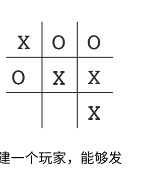

因为一个熟练的玩家可以玩得不输，让我们假设我们正在与一个不完美的玩家对战，他的玩法有时是错误的，这使得我们能够赢。暂时来说，在事实上，让我们认为平局和失败对我们来说同样糟糕。我们如何构建一个玩家，能够发现对手玩法中的不完美，并学会最大化自己获胜的机会呢？

虽然这是一个简单的问题，但它不能通过传统的技术来令人满意地解决。例如，传统的博弈论中的“极小化极大”解法在这里是不正确的，因为它假设对手有一种特定的玩法方式。例如，极小化极大玩家永远不会达到一个游戏状态，即使实际上它总是因为对手的错误而赢得了那个状态。传统的顺序决策问题的优化方法，如动态规划，可以计算出任何对手的最优解，但需要完整地指定对手的规范，包括对手在每个棋盘状态下进行每个移动的概率。让我们假设这个问题的先验信息对于这个问题是不可用的，就像对于绝大多数实际问题一样。另一方面，这样的信息可以通过经验估计，例如通过与对手进行多场比赛。关于这个问题，我们能做的最好的事情首先学习对手的行为模型，达到一定的信心水平，然后应用动态规划来计算给定近似对手模型的最优解。最后，这与我们在本书中稍后讨论的一些强化学习方法并没有太大的不同。

应用进化方法解决这个问题将直接搜索可能策略空间，以找到一个高概率击败对手的策略。在这里，策略是一条规则，告诉玩家在游戏的每个状态下应该采取什么行动-在三乘三的棋盘上的每种可能的X和O的配置。对于每个考虑的策略，通过与对手进行一定数量的游戏来获得其获胜概率的估计。然后，这个评估将指导下一个考虑的策略或策略。典型的进化方法将在策略空间中进行爬山，不断生成和评估策略，以获取逐步改进。或者，也可以使用一种遗传算法来维护和评估一组策略。可以应用数百种不同的优化方法。

下面是如何使用一个利用值函数的方法来解决井字棋问题。首先，我们将建立一个表格，其中包含游戏的每种可能状态的数字。每个数字将是我们从该状态获胜的概率的最新估计。我们将这个估计视为状态的价值，并且整个表格是学习到的值函数。如果从状态A获胜的概率的当前估计值高于从状态B获胜的概率的当前估计值，则状态A的价值高于状态B，或者被认为是“更好的”。假设我们总是执X子，那么对于所有有三个X子连成一行的状态，获胜的概率为1，因为我们已经赢了。同样，对于所有有三个O子连成一行的状态，或者已经填满的状态，正确的概率为0，因为我们无法从中获胜。我们将所有其他状态的初始值设为0.5，表示我们有50%的机会获胜的猜测。

然后我们与对手玩很多游戏。为了选择我们的移动，我们检查每个可能移动（棋盘上的每个空格）导致的状态，并在表中查找它们的当前值。大多数时候，我们会贪婪地移动，选择导致价值最大的状态的移动，也就是估计获胜概率最高的移动。然而，偶尔我们会随机选择其他移动。这些被称为探索性移动，因为它们使我们能够体验到我们可能从未见过的状态。在游戏过程中，所做和考虑的一系列移动可以如图1.1所示的方式进行描述。

在我们玩游戏的过程中，我们会改变我们所处状态的值。我们试图使它们更准确地估计获胜的概率。为了做到这一点，我们在每次贪婪移动之后将该移动后的状态的值“回溯”到移动之前的状态，如图1.1中的箭头所示。更准确地说，较早状态的当前值会更新为更接近较晚状态的值。这可以通过将先前状态的值移动到后续状态值的一部分来完成。如果我们将 $S_t$ 表示为贪婪移动之前的状态，将 $S_{t+1}$ 表示为移动后的状态，那么对于 $S_t$ 的估计值的更新，表示为 $V(S_t)$，可以写成

```
$$V(S_t) \leftarrow V(S_t) + \alpha [V(S_{t+1}) - V(S_t)]$$
```

其中 α 是一个小的正分数，称为步长参数，它影响学习速度。这个更新规则是一种时序差分学习方法的例子，因为它的变化是基于两个连续时间点的估计之间的差异， V(St+1)−V(St)。

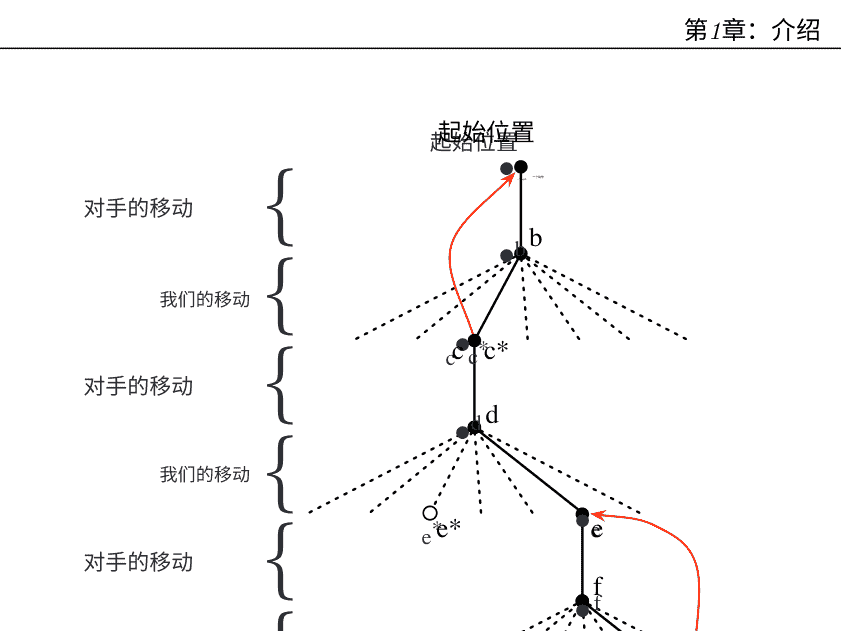

上述方法在这个任务上表现得相当好。例如，如果步长参数适当地随时间减小，那么该方法对于任何固定的对手都会收敛到每个状态下获胜的真实概率，前提是我们的玩家采取最优策略。此外，除了探索性移动之外，所采取的移动实际上是针对这个（不完美的）对手的最优移动。换句话说，该方法收敛到了与该对手对战的最优策略。如果步长参数随时间没有降低到零，那么该玩家也能够很好地对抗那些慢慢改变玩法的对手。

这个例子说明了进化方法和学习价值函数方法之间的差异。为了评估一个策略，进化方法保持策略不变，并与对手进行多次游戏，或者使用对手的模型模拟多次游戏。胜利的频率给出了使用该策略获胜的概率的无偏估计，并可用于指导下一个策略的选择。但是，每次策略变化只在经过多次游戏后进行，并且只使用每个游戏的最终结果：游戏过程中发生的事情被忽略。例如，如果玩家获胜，则无论其在游戏中的具体移动是否关键，都会给予其行为以赞扬。甚至给予从未发生过的移动以赞扬！相比之下，价值函数方法允许评估各个状态。最后，进化方法和价值函数方法都在策略空间中搜索，但学习价值函数利用了游戏过程中可用的信息。

这个简单的例子说明了强化学习方法的一些关键特点。首先，强调在与环境互动的过程中学习，这种情况下是与对手玩家互动。其次，有一个明确的目标，并且正确的行为需要考虑到自己选择的延迟效应的规划或预见。例如，简单的强化学习玩家会学会为一个目光短浅的对手设置多步陷阱。强化学习解决方案的一个显著特点是，它可以在不使用对手模型和不对未来可能的状态和行动序列进行显式搜索的情况下实现规划和前瞻的效果。

虽然这个例子说明了强化学习的一些关键特点，但它太简单了，可能会给人一种强化学习的限制更多的印象。尽管井字棋是一个双人游戏，但强化学习也适用于没有外部对手的情况，即“与自然对战”的情况。强化学习也不限于行为分解为单独的剧集的问题，比如井字棋的单独游戏，每个剧集只有在结束时才有奖励。当行为持续不断并且可以在任何时间接收到各种大小的奖励时，强化学习同样适用。强化学习也适用于不分离散时间步骤的问题，比如井字棋的下棋步骤。这些基本原理同样适用于连续时间问题，尽管理论变得更加复杂，我们在这个入门教程中省略了它。

井字游戏具有相对较小的有限状态集，而当状态集非常大甚至无限时，可以使用强化学习。例如，Gerry Tesauro（1992年，1995年）将上述算法与人工神经网络相结合，学习玩双陆棋，该游戏大约有10^{20}个状态。有这么多状态，几乎不可能体验到其中的一小部分。Tesauro的程序学会了比以前的任何程序都要好，最终甚至超过了世界上最好的人类玩家（第16.1节）。人工神经网络使程序能够从经验中进行泛化，在新的状态下，根据过去面临的类似状态保存的信息选择移动，由其网络确定。强化学习系统在具有如此大的状态集的问题中能够工作得多好，与它能够如何适当地从过去的经验中进行泛化密切相关。在这个角色中，我们最需要有监督学习方法与强化学习相结合。人工神经网络和深度学习（第9.6节）不是唯一的，也不一定是最好的方法。

在这个井字棋的例子中，学习从没有超出游戏规则的先验知识开始，但是强化学习并不意味着对学习和智能有一个白板的观点。相反，先前的信息可以以多种方式纳入强化学习中，这对于高效学习至关重要（例如，请参见第9.5节、第17.4节和第13.1节）。在井字棋的例子中，我们还可以访问真实的状态，而强化学习也可以应用于部分状态被隐藏或者学习者认为不同状态相同的情况。

最后，井字棋选手能够预测每个可能移动的结果状态。为了做到这一点，它必须拥有一个游戏模型，使其能够预见环境如何随着可能永远不会发生的移动而改变。许多问题都是这样的，但在其他情况下，甚至缺乏短期行动效果的模型。强化学习可以应用于任何一种情况。

虽然不需要模型，但如果有可用的模型或者可以学习的模型，那么模型可以很容易地被使用（第8章）。另一方面，有一些强化学习方法根本不需要任何环境模型。无模型系统甚至无法考虑到单个动作对环境的影响会如何改变。就对手而言，井字游戏选手在这个意义上是无模型的：它没有对手的任何模型。因为模型必须足够准确才能有用，所以当问题的真正瓶颈是构建一个足够准确的环境模型的难度时，无模型方法可以比更复杂的方法具有优势。无模型方法也是构建模型方法的重要组成部分。

在本书中，我们在讨论如何将无模型方法作为更复杂的构建模型方法的组成部分之前，专门讨论了几章无模型方法。

强化学习可以在系统的高层和低层都使用。尽管井字游戏选手只学习了游戏的基本动作，但强化学习并不妨碍在更高层次上工作，其中每个“动作”本身可能是一个复杂的问题解决方法的应用。在分层学习系统中，强化学习可以同时在多个层次上工作。

练习1.1：自我对弈 假设，与其与随机对手对战，上述强化学习算法与自身对战，双方都在学习。你认为在这种情况下会发生什么？它会学习一种不同的选择移动策略吗？ □

练习1.2：对称性 许多井字棋的局面看起来不同，但实际上是相同的，因为存在对称性。我们如何修改上述学习过程以利用这一点？这种改变将如何改善学习过程？现在再想一想。假设对手没有利用对称性。在这种情况下，我们应该利用对称性吗？那么，对称等价的局面必然具有相同的价值吗？ □

练习1.3：贪婪策略 假设强化学习玩家是贪婪的，也就是说，它总是选择使其达到评分最高的位置的移动。它可能比非贪婪玩家玩得更好还是更差？可能会出现什么问题？ □

练习1.4：从探索中学习 假设学习更新发生在所有移动之后，包括探索性移动。如果步长参数适当减小随着时间的推移（但不是探索的倾向），状态值将收敛到一组不同的概率。在我们进行探索性移动时，计算了哪两组概率（在概念上）？假设我们继续进行探索性移动，哪组概率可能更好地学习？哪种情况会导致更多的胜利？

练习1.5: 其他改进 你能想到其他改进强化学习玩家的方法吗？ 你能想到解决井字棋问题的更好方法吗？

### 1.6 总结

强化学习是一种理解和自动化目标导向学习和决策的计算方法。它与其他计算方法的区别在于强调通过与环境的直接交互，而无需示范监督或完整的环境模型来学习。在我们看来，强化学习是第一个认真解决从与环境的交互中学习以实现长期目标时出现的计算问题的领域。

强化学习使用马尔可夫决策过程的形式框架来定义学习代理和环境之间的交互，涉及状态、动作和奖励。这个框架旨在简单地表示人工智能问题的基本特征。这些特征包括因果关系的感知、不确定性和非确定性的感知，以及明确目标的存在。

价值和价值函数的概念是我们在本书中考虑的大多数强化学习方法的关键。我们认为价值函数对于在策略空间中进行高效搜索是重要的。使用价值函数将强化学习方法与通过对整个策略进行评估来直接搜索策略空间的进化方法区分开来。

### 1.7 强化学习的早期历史

强化学习的早期历史有两个主要的线索，都很长且丰富，在现代强化学习中独立追求，然后交织在一起。一个线索涉及试错学习，起源于动物学习的心理学。这个线索贯穿于人工智能的一些最早的工作，并在20世纪80年代初重新引起了强化学习的兴起。第二个线索涉及最优控制问题及其使用价值函数和动态规划的解决方法。在很大程度上，这个线索不涉及学习。这两个线索大部分是独立的，但在某种程度上与第三个不太明显的线索相关，该线索涉及时间差分方法，例如本章中使用的井字棋示例。这三个线索在20世纪80年代末汇聚在一起，形成了我们在本书中所介绍的现代强化学习领域。

关注试错学习的线程是我们最熟悉的，并且在这个简短的历史中我们有最多的话要说的。在那之前，我们简要讨论一下最优控制的线程。

术语“最优控制”在20世纪50年代末开始使用，用于描述设计控制器以最小化或最大化动态系统行为度量的问题。这个问题的一种方法是由Richard Bellman和其他人在20世纪50年代中期开发的，通过扩展19世纪Hamilton和Jacobi的理论。这种方法使用动态系统状态和价值函数或“最优回报函数”的概念来定义一个泛函方程，现在通常称为Bellman方程。通过解决这个方程来解决最优控制问题的方法类被称为动态规划（Bellman, 1957a）。

Bellman (1957b) 还引入了离散随机版本的最优控制问题，即马尔可夫决策过程（MDPs）。Ronald Howard (1960) 发明了MDPs的策略迭代方法。所有这些都是现代强化学习理论和算法的基本要素。

动态规划被广泛认为是解决一般随机最优控制问题的唯一可行方法。它遭受了Bellman所称的“维度诅咒”，这意味着其计算要求随状态变量的数量呈指数增长，但它仍然比任何其他一般方法更高效且更广泛适用。自20世纪50年代末以来，动态规划得到了广泛发展，包括对部分可观测MDPs的扩展（由Lovejoy, 1991调查），许多应用（由White, 1985, 1988, 1993调查），逼近方法（由Rust, 1996调查）和异步方法（Bertsekas, 1982, 1983）。有许多优秀的现代动态规划教材可供参考（例如，Bertsekas, 2005, 2012; Puterman, 1994; Ross, 1983; 和Whittle, 1982, 1983）。Bryson (1996) 提供了一部权威的最优控制历史。

最优控制和动态规划之间的联系一方面，与学习之间的联系另一方面，被认识到得比较慢。我们不能确定是什么导致了这种分离，但其主要原因可能是涉及的学科和它们不同的目标之间的分离。还有可能的原因是动态规划被普遍视为一种离线计算，主要依赖于准确的系统模型和贝尔曼方程的解析解。此外，最简单的动态规划形式是一种向后进行的计算，这使得很难看出它如何参与到必须向前进行的学习过程中。动态规划中最早的一些工作，例如Bellman和Dreyfus（1959）的工作，现在可以被归类为遵循学习方法。Witten（1977）的工作（下面讨论）无疑符合学习和动态规划思想的结合。Werbos（1987）明确主张动态规划和学习方法之间的更大相互关联，并且动态规划与理解神经和认知机制的相关性。对于我们来说，动态规划方法与在线学习的完全整合直到1989年Chris Watkins的工作才发生，他使用MDP形式主义对强化学习进行了广泛采用。此后，这些关系已经被许多研究人员广泛发展，尤其是Dimitri Bertsekas和John Tsitsiklis（1996）创造了术语“神经动态规划”，用来指代动态规划和人工神经网络的组合。另一个目前使用的术语是“近似动态规划”。这些不同的方法强调主题的不同方面，但它们都与强化学习共享对规划动态的经典缺点的兴趣。

我们认为所有最优控制的工作也可以看作是对强化学习的工作。我们将强化学习方法定义为解决强化学习问题的任何有效方法，现在清楚地看到这些问题与最优控制问题密切相关，特别是那些被规定为MDPs的随机最优控制问题。因此，我们必须将动态规划等最优控制的解决方法也视为强化学习方法。因为几乎所有传统方法都需要对要控制的系统有完全的了解，所以说它们是强化学习的一部分感觉有点不自然。另一方面，许多动态规划算法是增量和迭代的。像学习方法一样，它们通过逐步逼近逐渐达到正确答案。正如我们在本书的其余部分所展示的那样，这些相似之处远不止表面上的。完全和不完全知识的理论和解决方法如此密切相关，以至于我们认为它们必须一起被视为同一主题的一部分。

现在让我们回到另一个主要线索，引领到现代强化学习领域的线索，这个线索集中在试错学习的思想上。我们在这里只涉及主要的接触点，更详细地讨论这个主题将在第14.3节中进行。根据美国心理学家R.S.伍德沃思（1938年）的说法，试错学习的思想可以追溯到19世纪50年代亚历山大·贝恩对“摸索和实验”学习的讨论，更明确地说，可以追溯到英国行为学家和心理学家康威·洛伊德·摩根（1894年）对该术语的使用，以描述他对动物行为的观察。也许第一个简洁地表达试错学习本质的人是爱德华·桑代克：

> > 在同一情境下做出的几种反应中，那些伴随着动物满意或紧随其后的反应，其他条件相同，将与情境更牢固地联系在一起，因此当情境再次出现时，它们更有可能再次出现；那些伴随着动物不适或紧随其后的反应，其他条件相同，将使它们与该情境的联系减弱，因此当情境再次出现时，它们更不可能发生。满意或不适的程度越大，联系的强化或减弱就越大。（桑代克，1911年，第244页）

桑代克称之为“效应法则”，因为它描述了强化事件对选择行为倾向的影响。桑代克后来修改了这个法则，以更好地解释动物学习的后续数据（例如奖励和惩罚之间的差异），这个法则以其各种形式在学习理论家中引起了相当大的争议（例如，参见加利斯特尔，2005年；赫恩斯坦，1970年；金布尔，1961年，1967年；马祖尔，1994年）。尽管如此，效应法则以一种形式或另一种形式被广泛认为是许多行为的基本原则（例如，希尔加德和鲍尔，1975年；丹尼特，1978年；坎贝尔，1960年；奇科，1995年）。这是有影响力的基础克拉克·赫尔（1943年，1952年）的学习理论和B·F·斯金纳（1938年）的有影响力的实验方法。在动物学习的背景下，术语“强化”在桑代克表达效应定律之后才开始使用，首次出现在1927年巴甫洛夫关于条件反射的专著的英文翻译中（据我们所知）。巴甫洛夫将强化描述为一种模式行为的加强，这是由于动物在适当的时间关系中接收到一个刺激（强化剂）与另一个刺激或反应相关。一些心理学家将强化的概念扩展到行为的削弱和加强，并将强化剂的概念扩展到可能的刺激的省略或终止。要被视为强化剂，强化或削弱必须在强化剂撤离后持续存在；仅仅吸引动物注意力或激发其行为而不产生持久变化的刺激不会被视为强化剂。

在计算机中实现试错学习的想法最早出现在对人工智能可能性的思考中。在1948年的一份报告中，艾伦·图灵描述了一个“快乐-痛苦系统”的设计，其工作原理类似于效应法则：

> > 当达到一个行动未确定的配置时，会随机选择缺失数据，并且进行相应的描述，暂时应用。当出现痛苦刺激时，所有暂时的描述都会被取消，而当出现快乐刺激时，它们都会变为永久的。（图灵，1948年）

许多巧妙的机电机械装置被制造出来，展示了试错学习的能力。最早的可能是由托马斯·罗斯（1933年）建造的一台机器，它能够通过开关的设置找到自己的路径并记住路径。1951年，W·格雷·沃尔特（Walter，1950年）建造了他的“机械乌龟”的一个版本，能够进行简单形式的学习。1952年，克劳德·香农展示了一只名为Theseus的迷宫走鼠，它使用试错方法找到迷宫的出口，迷宫本身通过地板下的磁铁和继电器记住成功的方向（参见香农，1951年）。J·A·德意志（1954年）描述了一台基于他的行为理论（Deutsch，1953年）的迷宫解决机器，它与基于模型的强化学习（第8章）具有一些共同的特性。

在他的博士论文中，Marvin Minsky（1954年）讨论了强化学习的计算模型，并描述了他构建的模拟机器，由他称之为SNARCs（随机神经模拟强化计算器）的组件组成，旨在模拟大脑中可修改的突触连接（第15章）。网站cyberneticzoo.com包含了大量关于这些和许多其他电机学习机器的信息。

构建电机学习机逐渐转向编程数字计算机来执行各种类型的学习，其中一些实现了试错学习。Farley和Clark（1954年）描述了一个通过试错学习的神经网络学习机的数字模拟。但是他们的兴趣很快从试错学习转向了泛化和模式识别，即从强化学习转向了监督学习（Clark和Farley，1955年）。这开始了一个模式对于这些学习类型之间的关系存在很多困惑。许多研究人员似乎认为他们在研究强化学习，实际上他们在研究监督学习。例如，人工神经网络的先驱者，如Rosenblatt（1962）和Widrow和Hoff（1960），明显受到强化学习的启发，他们使用奖励和惩罚的语言，但他们研究的系统是适用于模式识别和感知学习的监督学习系统。即使在今天，一些研究人员和教科书也会将这些学习类型最小化或模糊化。例如，一些人工神经网络教科书使用“试错”一词来描述从训练示例中学习的网络。这是一个可以理解的困惑，因为这些网络使用错误信息来更新连接权重，但这忽略了试错学习的基本特征，即根据评估反馈选择行动，而不依赖于正确行动的知识。

部分由于这些混淆，对真正的试错学习的研究在20世纪60年代和70年代变得罕见，尽管有一些值得注意的例外。在20世纪60年代，术语“强化”和“强化学习”首次被用于工程文献中，用于描述试错学习的工程应用（例如，Waltz和Fu，1965年；Mendel，1966年；Fu，1970年；Mendel和McClaren，1970年）。尤其有影响力的是明斯基的论文“迈向人工智能”（Minsky，1961年），其中讨论了与试错学习相关的几个问题，包括预测、期望以及他所称的复杂强化学习系统的基本信用分配问题：如何在可能涉及其中的许多决策中分配成功的信用？我们在本书中讨论的所有方法在某种程度上都是为了解决这个问题。明斯基的论文今天仍然值得一读。

在接下来的几段中，我们将讨论一些其他的例外情况和部分例外情况，这些例外情况相对忽视了在20世纪60年代和70年代对真正的试错学习的计算和理论研究。

一个例外是新西兰研究员约翰·安德烈的工作，他开发了一个名为STeLLA的系统，该系统通过与环境的互动进行试错学习。该系统包括一个对世界的内部模型，以及后来的一个“内部独白”来处理隐藏状态的问题（安德烈，1963年，1969年a，b）。安德烈的后期工作（1977年）更加强调从教师那里学习，但仍然包括通过试错学习，生成新事件是系统目标之一。这项工作的一个特点是“回漏过程”，在安德烈（1998年）中更加详细地阐述了类似于我们描述的备份更新操作的信用分配机制。不幸的是，他的开创性研究并不为人所知，并没有对随后的强化学习研究产生很大影响。最近的摘要可在（Andreae，2017a，b）中找到。

更有影响力的是Donald Michie的工作。在1961年和1963年，他描述了一个简单的试错学习系统，用于学习如何玩井字游戏（或叉叉叉）称为MENACE（Matchbox Educable Naughts and Crosses Engine）。它由每个可能的游戏位置的火柴盒组成，每个火柴盒都包含一些有色珠子，每个可能的移动都有不同的颜色。通过从与当前游戏位置对应的火柴盒中随机取出一颗珠子，来确定MENACE的下一步。当游戏结束时，珠子会被添加到或从在在游戏中使用的盒子中移除，以奖励或惩罚MENACE的决策。

Michie和Chambers (1968) 描述了另一个井字棋强化学习者，名为GLEE (Game Learning Expectimaxing Engine)，以及一个强化学习控制器，名为BOXES。他们将BOXES应用于学习在仅在杆子倒下或小车到达轨道末端时发生故障信号的基础上平衡杆子铰接到可移动车上的任务。这个任务是根据Widrow和Smith (1964) 的早期工作进行调整的，他们使用监督学习方法，假设已经能够平衡杆子的教师的指导。Michie和Chambers的平衡杆子版本是在不完全了解的条件下进行强化学习任务的最佳早期示例之一。它对强化学习的许多后续研究产生了影响，包括我们自己的一些研究 (Barto, Sutton和Anderson, 1983; Sutton, 1984)。Michie始终强调试错和学习作为人工智能的基本要素 (Michie, 1974)。

Widrow, Gupta和Maitra (1973年) 修改了Widrow和Hoff (1960年) 的最小均方 (LMS) 算法，以产生一种能够从成功和失败信号中学习而不是从训练样例中学习的强化学习规则。他们将这种学习形式称为“选择性引导自适应”，并将其描述为“与评论家一起学习”而不是“与教师一起学习”。他们分析了这个规则，并展示了它如何学会玩二十一点。这是Widrow在强化学习方面的一次孤立尝试，他在监督学习方面的贡献更具影响力。我们对“评论家”一词的使用源自Widrow, Gupta和Maitra的论文。Buchanan, Mitchell, Smith和Johnson (1978年) 在机器学习的背景下独立使用了评论家这个术语 (另见Dietterich和Buchanan, 1984年)，但对于他们来说，评论家是能够做更多评估性能的专家系统。

对于现代强化学习研究的试错线程有着更直接的影响，研究了学习自动机。这些方法是解决非关联性、纯选择性学习问题的方法，被称为k臂赌博机，类似于老虎机，只不过有k个杠杆 (见第2章)。

学习自动机是简单的、低内存的机器，用于改善这些问题中的奖励概率。学习自动机起源于20世纪60年代俄罗斯数学家和物理学家M.L. Tsetlin及其同事的工作 (Tsetlin, 1973年发表)，并在工程领域得到了广泛发展 (见Narendra和Thathachar, 1974年, 1989年)。这些发展包括研究基于奖励信号更新动作概率的随机学习自动机方法。虽然不是在随机学习自动机的传统中开发的，但Harth和Tzanakou (1974年) 的Alopex算法 (用于Algorithm of pattern extraction) 是一种检测行动和强化之间相关性的随机方法，影响了我们早期的研究 (Barto, Sutton和Brouwer, 1981年)。随机学习自动机的先驱是早期的心理学研究，起初由William Estes (1950年) 提出的学习统计理论的努力，并由其他人进一步发展 (例如，Bush和Mosteller, 1955年; Sternberg, 1963年)。

心理学中发展的统计学习理论被研究人员采用到经济学，导致了该领域对强化学习的研究。这项工作始于1973年，当时将布什和莫斯特勒的学习理论应用于一系列经典经济模型（Cross，1973）。这项研究的一个目标是研究更像真实人类而不是传统理想化经济代理人的智能代理人（Arthur，1991）。这种方法扩展到了对博弈论中的强化学习的研究。经济学中的强化学习在很大程度上是独立发展的与人工智能中的强化学习的早期工作，尽管博弈论仍然是两个领域都感兴趣的话题（超出本书的范围）。

Camerer（2011）讨论了经济学中的强化学习传统，Nowé，Vrancx和De Hauwere（2012）从多智能体扩展的角度提供了一个概述我们在本书中介绍的方法。在博弈论的背景下，强化学习是一个与在程序中用于玩井字游戏，跳棋和其他娱乐游戏的强化学习完全不同的主题。例如，Szita（2012）概述了强化学习和游戏的这个方面。

约翰·霍兰德（1975年）根据选择原则概述了一般的自适应系统理论。他早期的工作主要涉及试错，主要是在非关联形式中，如进化方法和多臂赌博机。在1976年和1986年更详细地介绍了分类器系统，真正的强化学习系统包括关联和价值函数。霍兰德的分类器系统的一个关键组成部分是用于信用分配的“桶队列算法”，它与我们在井字棋示例中使用的时序差异算法密切相关，并在第6章中进行了讨论。另一个关键组成部分是遗传算法，一种进化方法，其作用是演化出有用的表示。分类器系统已经被许多研究人员广泛发展成为强化学习研究的一个重要分支（由Urbanowicz和Moore在2009年进行了综述），但遗传算法本身并不被认为是强化学习系统，因此受到了更多的关注，以及其他进化计算方法（例如，Fogel、Owens和Walsh在1966年以及Koza在1992年）。

在人工智能中，最有责任重新引入试错法到强化学习领域的人是哈里·克洛普夫（1972年，1975年，1982年）。克洛普夫认识到，自适应行为的重要方面正在丧失，因为学习研究人员几乎完全专注于监督学习。克洛普夫认为，缺失的是行为的快乐方面，即从环境中实现某种结果的动力，以控制环境朝着期望的目标迈进，远离不希望的目标（参见第15.9节）。这就是试错学习的基本思想。克洛普夫的思想对于我们的影响特别大，因为我们对它们的评估（Barto和Sutton，1981a）使我们意识到了监督学习和强化学习之间的区别，并最终专注于强化学习。我们和同事们早期的许多工作都是为了证明强化学习和监督学习确实是不同的（Barto，Sutton和Brouwer，1981年；Barto和Sutton，1981b；Barto和Anandan，1985年）。其他研究表明，强化学习可以解决人工神经网络学习中的重要问题，特别是如何为多层网络生成学习算法（Barto，Anderson和Sutton，1982年；Barto和Anderson，1985年；Barto，1985年，1986年；Barto和Jordan，1987年；参见第15.10节）。

现在我们转向强化学习历史的第三个线索，即涉及时间差分学习的线索。时间差分学习方法在于通过计算相邻时间点上对同一量的估计之间的差异来驱动学习，例如在井字棋示例中计算获胜的概率。这个线索相对较小且不太明显，但它在该领域中起到了特别重要的作用，部分原因是时间差分方法似乎是强化学习中的新颖和独特方法。

时间差分学习的起源部分源于动物学习心理学，特别是次级强化剂的概念。次级强化剂是一种与食物或疼痛等主要强化剂配对的刺激物，因此具有类似的强化特性。Minsky（1954年）可能是第一个意识到这种心理原理对于人工学习系统非常重要的人。

Arthur Samuel（1959年）是第一个提出并实现了一种学习方法的人，其中包括时序差分思想，作为他著名的跳棋程序的一部分（第16.2节）。Samuel没有提到Minsky的工作或与动物学习的可能联系。他的灵感显然来自Claude Shannon（1950年）的建议，即计算机可以被编程使用评估函数来下棋，并且通过在线修改这个函数来改善下棋能力。（Shannon的这些想法可能也影响了Bellman，但我们没有找到任何证据支持这一点。）Minsky（1961年）在他的“步骤”论文中广泛讨论了Samuel的工作，提出了与自然和人工次级强化理论的联系。正如我们所讨论的，在Minsky和Samuel的工作之后的十年里，几乎没有关于试错学习的计算工作，而且似乎根本没有关于时序差分学习的计算工作。1972年，Klopf将试错学习与时序差分学习的一个重要组成部分结合在一起。

Klopf对能够适用于大型系统学习的原则感兴趣，因此对局部强化的概念产生了兴趣，即整体学习系统的子组件可以相互强化。他提出了“广义强化学习”的概念，即每个组件（通常是每个神经元）都将其所有输入视为强化项：兴奋性输入作为奖励，抑制性输入作为惩罚。这与我们现在所知的时序差分学习的概念不同，回顾起来，它与Samuel的工作相比离它更远。另一方面，Klopf将这个想法与试错学习联系起来，并将其与动物学习心理学的大量经验数据库相关联。

Sutton（1978a，b，c）进一步发展了Klopf的想法，特别是与动物学习理论的联系，描述了由时间上连续的预测变化驱动的学习规则。他和Barto进一步完善了这些想法，并基于时序差分学习开发了一个心理模型来解释经典条件反射（Sutton和Barto，1981a；Barto和Sutton，1982）。随后出现了几个基于时序差分学习的经典条件反射的重要心理模型（例如，Klopf，1988；Moore等，1986；Sutton和Barto，1987，1990）。当时开发的一些神经科学模型可以很好地解释为时序差分学习（Hawkins和Kandel，1984；Byrne，Gingrich和Baxter，1990；Gelperin，Hopfield和Tank，1985；Tesauro，1994）。

1986年，Friston等人，1994年），尽管在大多数情况下没有历史联系。我们对时间差分学习的早期工作受到动物学习理论和Klopf的工作的强烈影响。与Minsky的“步骤”论文和Samuel的跳棋选手的关系只有后来才被认可。然而，到1981年，我们已经完全意识到了上述所有先前工作，作为时间差分和试错线程的一部分。这时，我们开发了一种将时间差分学习与试错学习相结合的方法，称为“演员-评论家架构”，并将该方法应用于Michie和Chambers的平衡杆问题（Barto, Sutton和Anderson, 1983年）。这种方法在Sutton（1984年）的博士论文中得到了广泛研究，并在Anderson（1986年）的博士论文中扩展为使用反向传播神经网络。在这个时候，Holland（1986年）将时间差分思想明确地纳入他的分类器系统中，形成了他的桶旅队算法。

Sutton (1988)采取了一个关键步骤，将时差学习与控制分开，将其视为一种通用的预测方法。该论文还介绍了TD(λ)算法，并证明了一些其收敛性质。

当我们在1981年完成我们关于演员-评论家架构的工作时，我们发现了Ian Witten (1977, 1976a)的一篇论文，该论文似乎是时差学习规则的最早发表。他提出了我们现在称之为表格TD(0)的方法，用作解决MDP的自适应控制器的一部分。这项工作首次在1974年提交给期刊发表，并在Witten的1976年博士论文中出现。

Witten的工作是Andreae早期使用STeLLA和其他试错学习系统的后裔。因此，Witten的1977年论文涵盖了强化学习研究的两个主要方向-试错学习和最优控制-同时对时差学习做出了独特的早期贡献。

在1989年，Chris Watkins开发了Q-learning算法，将时序差分和最优控制线程完全结合在一起。这项工作扩展并整合了强化学习研究的三个线程之前的工作。Paul Werbos (1987年) 通过论证从1977年开始试错学习和动态规划的收敛性，为这种整合做出了贡献。在Watkins的工作之前，强化学习研究取得了巨大的发展，主要集中在人工智能的机器学习子领域，但也涉及人工神经网络和人工智能的其他领域。1992年，Gerry Tesauro的背棋程序TD-Gammon取得了显著的成功，进一步引起了该领域的关注。

自本书第一版出版以来，神经科学领域发展迅速，重点研究强化学习算法与神经系统中的强化学习之间的关系。导致这种发展的最主要原因是时序差分算法的行为与大脑中产生多巴胺的神经元的活动之间存在惊人的相似性，这是由许多研究人员指出的（Friston等, 1994年; Barto, 1995a; Houk, Adams和Barto, 1995年; Montague, Dayan和Sejnowski, 1996年; Schultz, Dayan和Montague, 1997年）。第15章介绍了强化学习中这一令人兴奋的方面。在强化学习的最近历史中，还有许多重要的贡献，无法在这个简短的介绍中一一提及；我们在各个章节的末尾引用了其中许多。

### 文献评论

对于强化学习的更多一般性覆盖，我们建议读者参考Szepesv´ari (2010)、Bertsekas和Tsitsiklis (1996)、Kaelbling (1993a) 和Sugiyama、Hachiya和Morimura (2013) 的书籍。从控制或运筹学的角度来看，涉及强化学习的书籍包括Si、Barto、Powell和Wunsch (2004)、Powell (2011)、Lewis和Liu (2012) 以及Bertsekas (2012) 的著作。Cao (2009) 的综述将强化学习置于其他学习和优化随机动态系统方法的背景下。机器学习杂志的三个特刊专注于强化学习：Sutton (1992a)、Kaelbling (1996) 和Singh (2002)。Barto (1995b)、Kaelbling、Littman和Moore (1996) 以及Keerthi和Ravindran (1997) 提供了有用的调查报告。Weiring和van Otterlo (2012) 编辑的这本书提供了对最新发展的优秀概述。

-   1.2 本章中Phil早餐的例子受到了Agre (1988) 的启发。
-   1.5 在井字棋的例子中使用的时序差分方法是在第6章中开发的。

## 第一部分：表格解决方法

在本书的这一部分中，我们以最简单的形式描述了强化学习算法的几乎所有核心思想：即状态和动作空间足够小，可以将近似值函数表示为数组或表格。在这种情况下，这些方法通常可以找到精确解，也就是说，它们通常可以找到最优值函数和最优策略。这与本书下一部分中描述的近似方法形成对比，后者只能找到近似解，但可以有效地应用于更大的问题。

本书的这一部分的第一章描述了强化学习问题的特殊情况的解决方法，即只有一个状态的赌博机问题。第二章描述了我们在本书的其余部分中处理的一般问题形式——有限马尔可夫决策过程及其主要思想，包括贝尔曼方程和值函数。

接下来的三章描述了解决有限马尔可夫决策问题的三种基本方法：动态规划、蒙特卡洛方法和时序差分学习。每种方法类别都有其优点和缺点。动态规划方法在数学上已经很成熟，但需要一个完整准确的环境模型。蒙特卡洛方法不需要模型，概念上简单，但不适合逐步增量计算。

最后，时序差分方法不需要模型，完全增量，但分析起来更加复杂。这些方法在几个方面也有所不同。效率和收敛速度。

剩下的两章描述了如何将这三类方法结合起来，以获得它们各自的最佳特点。在一章中，我们描述了如何通过多步引导方法将蒙特卡罗方法的优势与时序差分方法的优势相结合。在本书的最后一部分的最后一章中，我们展示了如何将时序差分学习方法与模型学习和规划方法（如动态规划）相结合，从而完整而统一地解决表格强化学习问题。

## 第二章

### 多臂赌博机

强化学习与其他类型的学习最重要的区别在于它使用评估采取的行动的训练信息，而不是通过给出正确的行动来指导。这就是为什么需要主动探索，明确寻找良好行为的原因。纯粹的评估反馈指示采取的行动有多好，但不指示它是否是最好或最差的行动。另一方面，纯粹的指导反馈指示采取的正确行动，而不考虑实际采取的行动。这种反馈是监督学习的基础，其中包括模式分类、人工神经网络和系统识别的大部分内容。在纯粹的形式中，这两种反馈是完全不同的：评估反馈完全依赖于采取的行动，而指导反馈与采取的行动无关。

在本章中，我们研究了强化学习中的评估方面，这是一个简化的设置，不涉及在多种情况下学习行动。这个非关联的设置是大多数涉及评估反馈的先前工作所做的设置，它避免了完全强化学习问题的复杂性。研究这种情况使我们能够最清楚地看到评估反馈与指导反馈的不同之处，以及它们如何结合。

我们探索的特定非关联的评估反馈问题是简单的k臂赌博机问题。我们使用这个问题来介绍一些基本的学习方法，我们在后面的章节中将其扩展应用于完全的强化学习问题。在本章的结尾，我们通过讨论当赌博机问题变得关联时会发生什么来更接近完全的强化学习问题，也就是在多种情况下采取行动时。

### 2.1 一个 k臂赌博机问题

考虑以下学习问题。你反复面临选择k个不同选项或行动。在每次选择后，你会收到一个从与所选行动有关的固定概率分布中选择的数值奖励。你的目标是在一段时间内最大化预期总奖励，例如，在1000次行动选择或时间步骤中。

这是原始形式的$k$臂赌博机问题，因其类似于老虎机或“单臂赌徒”，但有$k$个杠杆而不是一个。每次行动选择就像是拉动老虎机的一个杠杆，奖励是命中大奖的回报。通过反复的行动选择，你要通过集中行动在最佳杠杆上来最大化你的收益。另一个类比是医生在一系列重病患者中选择实验性治疗方法。每个动作都是一种治疗的选择，每个奖励都是患者的生存或幸福。

今天，“赌徒问题”这个术语有时被用来泛指上述问题的推广，但在本书中，我们仅指这个简单的情况。

在我们的 $k$臂赌徒问题中，每个 $k$个动作都有一个期望或平均奖励，假设选择该动作；让我们称之为该动作的值。 我们将时间步骤 $t$上选择的动作表示为 $A_t$，相应的奖励表示为 $R_t$。然后，任意动作 $a$的值，表示为 $q_*(a)$，是给定选择 $a$的期望奖励：

```
$$
q_*(a) = E[R_t | A_t = a]
$$
```

如果你知道每个动作的值，解决 $k$臂赌徒问题将是微不足道的：你总是选择具有最高值的动作。 我们假设你不确定动作的值，尽管你可能有估计值。 我们将时间步骤 $t$上动作 $a$的估计值表示为 $Q_t(a)$。 我们希望 $Q_t(a)$接近 $q_*(a)$。

如果你保持对行动价值的估计，那么在任何时间步骤中，至少有一个行动的估计值是最大的。 我们称这些为贪婪行动。 当你选择其中一个行动时，我们说你正在利用你对行动价值的当前知识。 相反，如果你选择其中一个非贪婪的行动，那么我们说你正在探索，因为这可以帮助你改进对非贪婪行动价值的估计。 在一步中，利用是为了最大化预期奖励的正确做法，但是在长期内，探索可能会产生更大的总奖励。 例如，假设一个贪婪行动的价值是确定的，而其他几个行动的估计值几乎一样好，但存在相当大的不确定性。 不确定性是如此之大，以至于这些其他行动中至少有一个可能实际上比贪婪行动更好，但你不知道哪一个。 如果你有很多时间步骤可以进行行动选择，那么探索非贪婪行动并发现哪些行动比贪婪行动更好可能会更好。 在探索过程中，短期内奖励较低，但在长期内奖励较高，因为在你发现更好的行动之后，你可以多次利用它们。 因为不可能同时进行探索和利用任何单个行动选择，所以人们常常提到探索和利用之间的“冲突”。

在任何具体情况下，是探索还是利用更好，取决于估计值、不确定性和剩余步数的精确值的复杂方式。 对于特定的数学公式和相关问题，有许多复杂的方法来平衡探索和利用。 然而，大多数这些方法对于稳定性和先验知识都有很强的假设，这些假设在应用和我们在后续章节中考虑的完整强化学习问题中要么被违反，要么无法验证。 当这些方法的理论假设不适用时，它们的最优性或有界损失的保证并不能给人以安慰。

在本书中，我们不担心以复杂的方式平衡探索和利用；我们只关心如何平衡它们。在本章中，我们提出了几种简单的平衡方法来解决k臂赌博机问题，并且证明它们比总是利用的方法要好得多。 在强化学习中，平衡探索和利用的需求是一个独特的挑战；我们版本的k臂赌博机问题的简单性使我们能够以特别清晰的形式展示这一点。

### 2.2 行动价值方法

我们首先更详细地研究估计行动价值和使用估计值进行行动选择决策的方法，我们统称为行动价值方法。 回想一下，一个行动的真实价值是当选择该行动时的平均奖励。 一种自然的估计方法是通过平均实际获得的奖励：

在$t$之前选择$a$时的奖励总和 / 在$t$之前选择$a$的次数 = 
$$\frac{\sum_{i=1}^{t-1} R_i \cdot \mathbb{1}_{A_i=a}}{\sum_{i=1}^{t-1} \mathbb{1}_{A_i=a}},$$ (2.1)

其中，$\mathbb{1}_{predicate}$表示随机变量，如果$predicate$为真则为1，否则为0。如果分母为零，则我们将$Q_t(a)$定义为某个默认值，例如0。 当分母趋向无穷大时，根据大数定律，$Q_t(a$) 收敛于
我们称之为采样平均法来估计动作值，因为每个估计值都是相关奖励样本的平均值。 当然，这只是一种估计动作值的方法，并不一定是最好的方法。然而，现在让我们继续使用这种简单的估计方法，并转向如何利用这些估计值来选择动作的问题。

最简单的动作选择规则是选择具有最高估计值的动作之一，也就是在前一节中定义的贪婪动作之一。如果有多个贪婪动作，则可以以任意方式进行选择，例如随机选择。 我们将这种贪婪动作选择方法表示为

$$A_t \doteq \mathrm{argmax}_a Q_t(a),$$ (2.2)

其中$\mathrm{argmax}_a$表示使得后面的表达式最大化的动作$a$（再次强调，如果有多个最大值，则任意选择一个）。 贪婪动作选择始终利用当前知识来最大化即时奖励；它不会花费任何时间来采样明显较差的动作，以查看它们是否真的更好。 一个简单的替代方法是大部分时间都贪婪地行动，但是偶尔，例如以小概率$\varepsilon$，选择另一种行动，从所有动作中随机选择，概率相等，与动作值估计无关。我们称使用这种近似贪婪的动作选择规则的方法为 $\epsilon$-贪婪方法。这些方法的一个优点是，在步数增加的极限情况下，每个动作都会被无限次采样，从而确保所有的 $Q_t(a)$ 收敛到 $q_*(a)$。当然，这意味着选择最优动作的概率收敛到大于 $1-\epsilon$，即接近确定性。然而，这些只是渐近保证，对于方法的实际有效性说的很少。

-   练习2.1 在 $\epsilon$-贪婪动作选择中，对于两个动作和 $\epsilon=0.5$ 的情况下，选择贪婪动作的概率是多少？ $\square$

### 2.3 十臂测试平台

为了粗略评估贪婪和 $\epsilon$-贪婪行动值方法的相对有效性，我们在一套测试问题上进行了数值比较。这是一组2000个随机生成的 $k$臂赌博机问题，其中 $k=10$。对于每个赌博机问题，例如图2.1所示的问题，动作值， $q_*(a), a=1,\dots,10,$

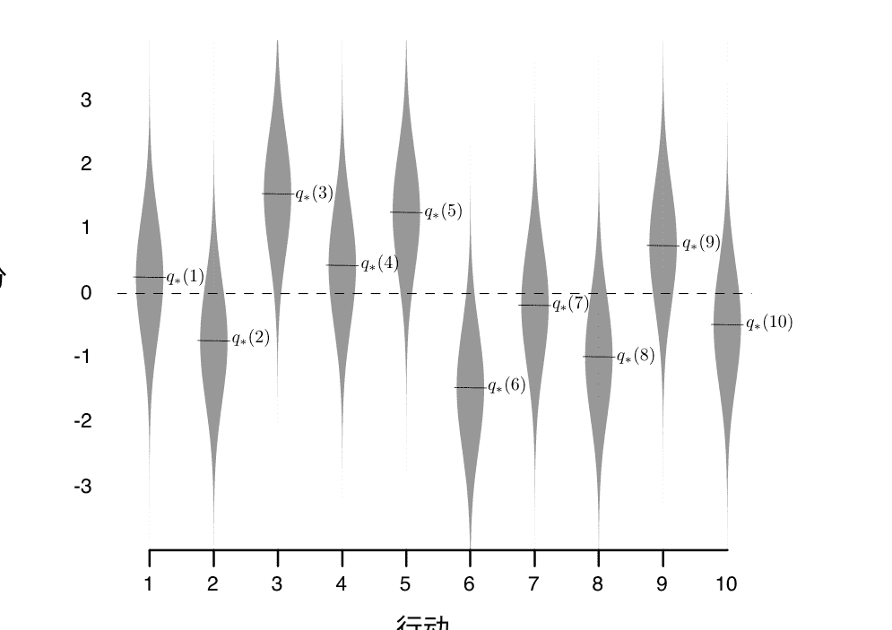

图2.1：一个来自10臂赌博机测试平台的示例问题。每个十个动作的真实值 $q_*(a)$ 都是根据均值为零、方差为一的正态分布选择的，然后根据均值为 $q_*(a)$、方差为一的正态分布选择实际奖励，正如这些灰色分布所示。

根据均值为0、方差为1的正态（高斯）分布选择。然后，当应用于该问题的学习方法在时间步骤$t$选择动作 $A_t$ 时，实际奖励 $R_t$ 是从均值为 $q_*(A_t)$、方差为1的正态分布中选择的。这些分布在图2.1中以灰色显示。我们称这套测试任务为十臂赌博机测试平台。对于任何学习方法，当应用于其中一个赌博机问题时，我们可以测量其在1000个时间步骤中随着经验的积累而改善的性能和行为。这构成了一个运行。重复进行2000次独立运行，每次都有一个不同的赌博机问题，我们得到了学习算法的平均行为度量。

图2.2将贪婪方法与两种 $\varepsilon$-贪婪方法（$\varepsilon=0.01$和 $\varepsilon=0.1$）进行了比较，如上所述，在10臂测试床上。所有方法都使用样本平均技术形成其动作值估计。上图显示了随着经验的增加，预期奖励的增加。贪婪方法在开始时稍微快一些改进，但后来在较低水平上趋于稳定。在这个测试床上，它每步只能获得约1的奖励，而最佳情况下可以达到约1.55。贪婪方法在长期内表现明显较差，因为它经常陷入执行次优动作的困境。下面的图表显示，贪婪方法只在大约三分之一的任务中找到了最优动作。在另外三分之二的任务中，它最初对最优动作的样本结果令人失望，并且从未回到最优动作。$\varepsilon$-贪婪方法最终表现更好，因为它们继续探索并提高识别最优动作的机会。$\varepsilon=0.1$方法探索更多，并且通常更早地找到最优动作，但它从未超过91%的时间选择该动作。$\varepsilon=0.01$方法改进速度较慢，但最终在图表中显示的两个性能指标上表现更好。随着时间的推移，也可以逐渐减小$\varepsilon$的值，以尝试获得高值和低值的最佳效果。

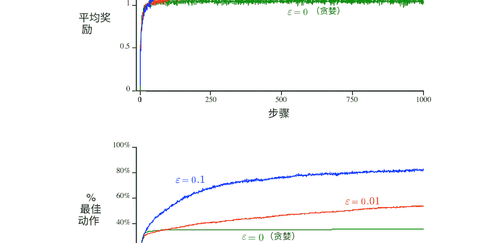

图2.2：10臂测试床上 $\varepsilon$-贪婪动作值方法的平均性能。这些数据是2000次不同赌博问题的平均值。所有方法都使用样本平均作为它们的动作值估计。

在任务上，$\varepsilon$-贪婪方法相比贪婪方法的优势取决于。例如，假设奖励方差较大，比如10而不是1。对于嘈杂的奖励，需要更多的探索才能找到最优动作，而$\varepsilon$-贪婪方法相对于贪婪方法应该表现得更好。另一方面，如果奖励方差为零，则贪婪方法在尝试一次后就会知道每个动作的真实值。在这种情况下，贪婪方法实际上可能表现最好，因为它很快就会找到最优动作，然后不再进行探索。但是，即使在确定性情况下，如果我们削弱一些其他假设，探索也有很大的优势。例如，假设赌徒任务是非平稳的，即动作的真实值随时间变化。在这种情况下，即使在确定性情况下，探索也是必要的，以确保非贪婪动作没有变得比贪婪动作更好。正如我们将在接下来的几章中看到的，非平稳性是强化学习中最常见的情况。即使基础任务是稳定和确定性的，学习者也面临一组类似赌徒决策任务，每个任务随着学习的进行和代理的决策策略的变化而变化。强化学习需要在探索和利用之间取得平衡。

-   练习2.2：赌博机示例考虑一个有k个臂的赌博机问题，其中k=4个动作，分别表示为1、2、3和4。考虑应用赌博算法解决这个问题，$\varepsilon$-贪婪动作选择，样本平均动作值估计和初始估计 $Q_1(a)=0$，对于所有的 $a$。假设初始的动作和奖励序列是 $A_1=1$，$R_1=1$，$A_2=2$，$R_2=0$，$A_3=3$，$R_3=2$，$A_4=3$，$R_4=4$，$A_5=3$，$R_5=1$，$A_6=2$，$R_6=0$，$A_7=2$，$R_7=1$。在其中的一些时间步骤中，可能发生了$\varepsilon$情况，导致随机选择了一个动作。在哪些时间步骤中肯定发生了这种情况？在哪些时间步骤中可能发生了这种情况？

-   练习2.3 在图2.2中所示的比较中，哪种方法在长期累积奖励和选择最佳动作的概率方面表现最好？会好多少？请用数量化的方式回答。

### 2.4 增量实现

到目前为止，我们讨论的所有行动值方法都是通过观察到的奖励的样本平均值来估计行动值。现在我们转向一个问题，即如何以计算效率高的方式计算这些平均值，特别是使用恒定的内存和恒定的每个时间步计算。

为了简化符号，我们集中讨论单个动作。让 $R_i$ 表示在选择该动作后收到的奖励，让 $Q_n$ 表示在该动作被选择后的第 $n$ 次选择之后的其行动值的估计，现在我们可以简单地写成

$$Q_n \doteq \frac{R_1 + R_2 + \cdots + R_{n-1}}{n-1}.$$

显而易见的实现方法是在需要时维护所有奖励的记录，然后进行计算。然而，如果这样做，随着看到更多奖励，内存和计算需求会随时间增长。每个额外的奖励都需要额外的内存来存储，并需要额外的计算来计算分子的总和。

正如你可能猜到的那样，这并不是真正必要的。很容易设计出增量公式来更新平均值，每个新奖励只需要少量的恒定计算来处理。给定 $Q_n$ 和第 $n$ 个奖励 $R_n$，可以通过以下方式计算所有 $n$ 个奖励的新平均值：

$$\begin{align*}
Q_{n+1} &= \frac{1}{n} \sum_{i=1}^{n} R_i \\
&= \frac{1}{n} \left( R_n + \sum_{i=1}^{n-1} R_i \right) \\
&= \frac{1}{n} \left( R_n + (n-1) \frac{1}{n-1} \sum_{i=1}^{n-1} R_i \right) \\
&= \frac{1}{n} \left( R_n + (n-1) Q_n \right) \\
&= \frac{1}{n} \left( R_n + nQ_n - Q_n \right) \\
&= Q_n + \frac{1}{n} [R_n - Q_n], \tag{2.3}
\end{align*}$$

即使对于 $n=1$，也可以得到任意 $Q_2 = R_1$。这个实现只需要为 $Q_n$ 和 $n$ 分配内存，并且每个新的奖励只需要进行小的计算 (2.3)。

这个更新规则 (2.3) 在本书中经常出现。一般形式为

$$\text{新估计} \leftarrow \text{旧估计} + \text{步长} \times [\text{目标} - \text{旧估计}]. \tag{2.4}$$

这个表达式 $[\text{目标} - \text{旧估计}]$ 是估计中的一个错误。通过向“目标”迈出一步来减少它。目标被假定为指示一个希望的方向，尽管可能有噪声。例如，在上面的情况下，目标是第 $n$ 个奖励。

请注意，增量方法 (2.3) 中使用的步长参数 ($StepSize$) 会随时间步长而改变。在处理第 $n$ 个奖励时，对于动作 $a$，步长是 $1/n$。

该方法使用步长参数 $\frac{1}{n}$。在本书中，我们用 $\alpha$ 表示步长参数，或者更一般地说，用 $\alpha_{n}(a)$ 来表示。

完整的赌博算法伪代码使用逐步计算的样本平均值和 $\varepsilon$ 贪婪动作选择如下所示。函数 $bandit(A)$ 被假设为接受一个动作并返回相应的奖励。

```
一个简单的赌博算法

初始化，对于 $a=1$ 到 $k$：
$Q(a) \leftarrow 0$
$N(a) \leftarrow 0$

无限循环：
$A \leftarrow \begin{cases} \arg\max_a Q(a) & \text{以概率} 1-\varepsilon \\ \text{随机动作} & \text{以概率} \varepsilon \end{cases}$（随机打破平局）
$R \leftarrow bandit(A)$
$N(A) \leftarrow N(A) + 1$
$Q(A) \leftarrow Q(A) + \frac{1}{N(A)}[R - Q(A)]$
```

### 2.5 追踪非平稳问题

到目前为止讨论的平均方法适用于固定赌博机问题，也就是说，奖励概率随时间不变。

正如前面所指出的，我们经常遇到实际上是非固定的强化学习问题。在这种情况下，将最近的奖励与过去的奖励相比，更加重视最近的奖励是有意义的。其中一种最流行的方法是使用一个恒定的步长参数。例如，用于更新过去奖励的增量更新规则（2.3）被修改为

$$Q_{n+1} \doteq Q_n + \alpha[R_n - Q_n], \tag{2.5}$$

其中步长参数 $\alpha \in (0,1]$ 是恒定的。这导致 $Q_{n+1}$ 成为过去奖励和初始估计 $Q_1$ 的加权平均：

$$
\begin{align*}
Q_{n+1} &= Q_n + \alpha[R_n - Q_n]\\
&= \alpha R_n + (1-\alpha)Q_n\\
&= \alpha R_n + (1-\alpha)[\alpha R_{n-1} + (1-\alpha)Q_{n-1}]\\
&= \alpha R_n + (1-\alpha)\alpha R_{n-1} + (1-\alpha)^2 Q_{n-1}\\
&= \alpha R_n + (1-\alpha)\alpha R_{n-1} + (1-\alpha)^2 \alpha R_{n-2} + \\
&\quad\quad\quad\cdots + (1-\alpha)^{n-1} \alpha R_1 + (1-\alpha)^n Q_1\\
&= (1-\alpha)^n Q_1 + \sum_{i=1}^{n} \alpha(1-\alpha)^{n-i} R_i. \tag{2.6}
\end{align*}
$$

我们称之为加权平均，因为权重的总和是 $(1 - \alpha)^n + \sum_{i=1}^{n} \alpha (1 - \alpha)^{n-i} = 1$，你可以自己验证。请注意，给予奖励 $R_i$ 的权重取决于多少个奖励之前，$n - i$ 观察到。数量 $1-\alpha$ 小于1，因此给予 $R_i$ 的权重随着中间奖励数量的增加而减少。实际上，权重按指数方式衰减，指数为 $1-\alpha$。（如果 $1-\alpha = 0$，则所有权重都放在最后一个奖励 $R_n$ 上，因为 $0^0 = 1$ 的约定。）因此，有时将其称为指数最近加权平均。

有时候，从一步到另一步改变步长参数是很方便的。让 $\alpha_n(a)$ 表示在选择动作 $a$ 后接收到的奖励的步长参数。正如我们所指出的，选择 $\alpha_n(a) = \frac{1}{n}$ 会得到样本平均方法，根据大数定律，它保证收敛到真实的动作值。

但是，对于序列 $\{\alpha_n(a)\}$ 的所有选择，并不保证收敛。随机逼近理论中的一个著名结果给出了保证以概率1收敛所需的条件：

$$\sum_{n=1}^{\infty} \alpha_n(a) = \infty \quad \text{和} \quad \sum_{n=1}^{\infty} \alpha_n^2(a) < \infty. \tag{2.7}$$

第一个条件是为了保证步长足够大，以克服任何初始条件或随机波动。第二个条件保证步长最终变得足够小，以确保收敛。

请注意，对于样本平均情况，两个收敛条件都得到满足，$\alpha_n(a) = \frac{1}{n}$，但对于恒定步长参数的情况，收敛条件不满足，$\alpha_n(a) = \alpha$。在后一种情况下，第二个条件不满足，表明估计值永远不会完全收敛，而是会继续根据最近接收到的奖励而变化。正如我们上面提到的，在非稳态环境中，这实际上是可取的，并且是一些问题的。

在强化学习中，非稳态问题是最常见的。此外，满足条件 (2.7) 的步长参数序列通常收敛非常缓慢，或者需要进行大量调整才能获得令人满意的收敛速度。尽管满足这些收敛条件的步长参数序列经常在理论工作中使用，但在应用和实证研究中很少使用。

### 练习2.4

如果步长参数不是常数，那么估计值 $Q_n$ 是先前接收到的奖励的加权平均值，其权重与 (2.6) 中给出的不同。对于一般情况，类似于 (2.6)，在步长参数序列中，每个先前奖励的权重是多少？

### 练习2.5（编程）

设计并进行一个实验，以展示对于非平稳问题，样本平均方法的困难。使用一个修改后的10臂赌博机测试平台，在每一步中，所有的 $q_*(a)$ 都相等，并且独立地进行随机游走（例如，对每一步的 $q_*(a)$ 都加上一个均值为零、标准差为0.01的正态分布增量）。为使用样本平均法的动作值方法和使用恒定步长参数的另一种动作值方法准备类似于图2.2的图表，增量计算，并且 $\alpha = 0.1$。使用 $\varepsilon = 0.1$ 和更长的运行时间，比如10,000步。

### 2.6 乐观初始值

到目前为止，我们讨论的所有方法在一定程度上都依赖于初始的动作值估计 $Q_1(a)$。从统计学的角度来看，这些方法都受到初始估计的偏差的影响。对于样本平均方法，一旦所有的动作都至少被选择一次，偏差就会消失，但对于具有恒定 $\alpha$ 的方法，偏差是永久的，尽管随着时间的推移而减小，如式（2.6）所示。在实践中，这种偏差通常不是一个问题，有时甚至非常有帮助。不足之处在于，初始估计实际上成为了用户必须选择的一组参数，即使只是将它们全部设置为零。好处在于，它们提供了一种简单的方式来提供一些关于预期奖励水平的先验知识。

初始动作值也可以作为一种简单的鼓励探索的方式。假设我们将初始动作值设置为零，就像在十臂老虎机测试中所做的那样，我们将它们都设置为+5。回想一下，在这个问题中，$q_*(a)$ 是从均值为0，方差为1的正态分布中选择的。因此，+5的初始估计值是非常乐观的。但这种乐观主义鼓励了动作值方法的探索。无论最初选择哪些动作，奖励都小于起始估计值；学习者会转而选择其他动作，对自己所获得的奖励感到“失望”。结果是，在值估计收敛之前，所有的动作都会尝试多次。即使一直选择贪婪动作，系统也会进行相当多的探索。

图2.3显示了一个贪婪方法在十臂老虎机测试中的表现，$Q_1(a) = +5$，对于所有的 $a$。为了比较，还显示了一个 $\varepsilon$ 贪婪方法，其中 $Q_1(a) = 0$。最初，乐观方法表现较差，因为它探索更多，但最终它表现更好，因为随着时间的推移，它的探索减少。我们称之为鼓励探索的技术 optimistic 初始值。我们认为这是一个简单的技巧，在静态问题上非常有效，但远非是鼓励探索的普遍有效方法。例如，它不适用于非静态问题，因为它对探索的驱动本质上是乐观的。

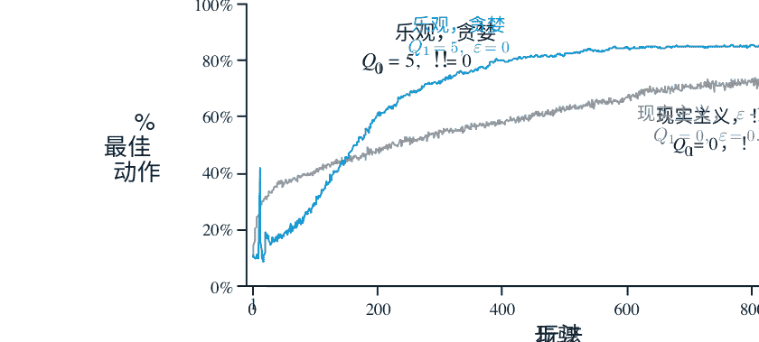

图2.3：乐观初始动作值估计对10臂赌博机测试的影响。这两种方法都使用了一个恒定的步长参数，$\alpha = 0.1$。

临时的。如果任务发生变化，重新需要探索，这种方法无法帮助。事实上，任何以任何特殊方式关注初始条件的方法都不太可能帮助解决一般的非平稳情况。时间的开始只会发生一次，因此我们不应该过分关注它。这个批评也适用于样本平均方法，它们也将时间的开始视为一个特殊事件，将所有后续的奖励都以相等的权重进行平均。尽管如此，所有这些方法都非常简单，其中一个或它们的简单组合通常在实践中是足够的。在本书的其余部分，我们经常使用这几种简单的探索技术。

### 练习2.6

神秘的尖峰图2.3中显示的结果应该是相当可靠的，因为它们是对2000个个体、随机选择的10臂赌博任务的平均值。那么，为什么在乐观方法的曲线早期会出现振荡和尖峰呢？换句话说，什么因素可能使这种方法在特定的早期步骤上表现特别好或特别差？

### 练习2.7

无偏常数步长技巧。在本章的大部分内容中，我们使用样本平均值来估计动作值，因为样本平均值不会产生常数步长所产生的初始偏差（参见导致（2.6）的分析）。然而，样本平均值并不是一个完全令人满意的解决方案，因为它们在非平稳问题上可能表现不佳。有没有可能避免常数步长的偏差，同时保留它们在非平稳问题上的优势？一种方法是使用步长

$$\beta_n \doteq \alpha / \bar{o}_n, \tag{2.8}$$

处理特定动作的第$n$个奖励，其中 $\alpha >0$ 是一个常规的常数步长，而 $\bar{o}_n$ 是一个从0开始的跟踪：

$$\bar{o}_n = \bar{o}_{n-1} + \alpha(1 - \bar{o}_{n-1}), \text{ 对于 } n > 0, \text{ 带有 } \bar{o}_0 \doteq 0. \tag{2.9}$$

进行类似于 (2.6) 的分析，以证明 $Q_n$ 是一个指数加权的最近性平均值没有初始偏差。

### 2.7 上置信界行动选择

探索是必要的，因为对于动作值估计的准确性总是存在不确定性。贪婪动作是那些在目前看起来最好的，但实际上其他动作可能更好。$\epsilon$-贪婪动作选择强制非贪婪动作被尝试，但是没有区分对待，对于那些几乎是贪婪或特别不确定的动作没有偏好。更好的选择非贪婪动作是根据它们实际上成为最优动作的潜力，考虑到它们的估计值与最大值的接近程度以及这些估计值的不确定性。

一种有效的方法是根据选择动作

$$A_t \doteq \underset{a}{\text{argmax}} \left[ Q_t(a) + c \sqrt{ \frac{\ln t}{N_t(a)} } \right], \tag{2.10}$$

其中$\ln t$表示$t$的自然对数（使得$e \approx 2.71828$的幂等于$t$），$N_t(a)$表示在时间$t$之前选择动作$a$的次数（公式（2.1）中的分母），而数字$c>0$控制探索的程度。如果$N_t(a) = 0$，则认为$a$是最大化的动作。

这种上置信界（UCB）动作选择的思想是，平方根项是对$a$值估计的不确定性或方差的度量。被最大化的量因此是动作$a$可能的真实值的一种上界，其中$c$确定置信水平。每次选择动作$a$时，不确定性可能会减少：$N_t(a)$增加，并且由于它出现在分母中，不确定性项减少。另一方面，每次选择除$a$以外的其他动作时，$t$增加但$N_t(a)$不增加；因为$t$出现在分子中，不确定性估计增加。

使用自然对数意味着随着时间的推移增长变得越来越小，但是不受限制；所有的动作最终都会被选择，但是估计值较低或已经经常被选择的动作会随着时间的推移被选择的频率逐渐减少。

在10臂赌博机测试中使用UCB的结果如图2.4所示。UCB通常表现良好，如此处所示，但是在超越赌博机到本书其余部分考虑的更一般的强化学习设置方面，UCB比$\varepsilon$贪婪策略更加困难。
一个困难在于处理非稳态问题；需要比第2.5节中介绍的方法更复杂的方法。另一个困难是处理大的状态空间，特别是在本书第二部分中使用函数逼近时。在这些更高级的设置中，UCB动作选择的思想通常不可行。

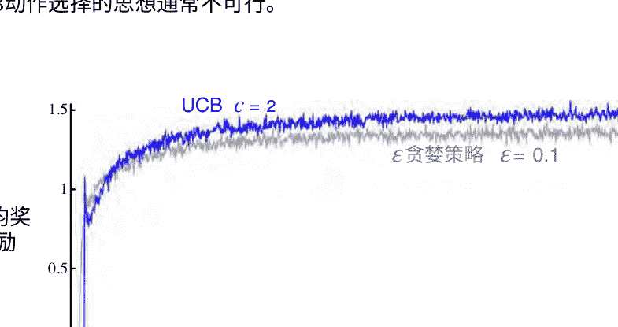

### 练习2.8

$UCB$尖峰在图2.4中，$UCB$算法在第11步显示出明显的性能尖峰。为什么会这样？请注意，为了使您的答案完全令人满意，您必须解释为什么奖励在第11步增加，以及为什么在随后的步骤中减少。提示：如果$c=1$，则尖峰不太明显。$\square$

## 2.8 梯度赌博算法

到目前为止，在本章中，我们考虑了估计动作值并使用这些估计值选择动作的方法。这通常是一个很好的方法，但不是唯一可能的方法。在本节中，我们考虑学习每个动作的数值偏好 $H_t(a)$。偏好越大，就越经常选择该动作，但偏好没有与奖励相关的解释。只有一个动作相对于另一个动作的偏好是重要的；如果我们将所有动作偏好都加上1000，对动作概率没有影响，动作概率根据 $soft$-$max$ 分布（即Gibbs或Boltzmann分布）确定，如下所示：

$$\mathrm{Pr}\{A_t = a\} \doteq \frac{e^{H_t(a)}}{\sum_{b=1}^{k} e^{H_t(b)}} \doteq \pi_t(a), \quad (2.11)$$

在这里，我们还引入了一个有用的新符号，$\pi_t(a)$，表示在时间 $t$ 时采取行动A的概率。最初，所有的行动偏好都是相同的（例如，$H_1(a) = 0$，对于所有的A），因此所有的行动被选择的概率相等。

### 练习2.9

证明在两个行动的情况下，软最大分布与统计学和人工神经网络中常用的逻辑函数或S型函数给出的分布相同。

在每次选择一个动作后，根据如下规则更新偏好：

$$H_{t+1}(A_t) \doteq H_t(A_t) + \alpha (R_t - \bar{R}_t) (1 - \pi_t(A_t)), \quad \text{和}$$
$$H_{t+1}(a) \doteq H_t(a) - \alpha (R_t - \bar{R}_t) \pi_t(a), \quad \text{对于所有的 } a \neq A_t, \quad (2.12)$$

其中 $\alpha > 0$ 是一个步长参数，而 $\bar{R}_t \in \mathbb{R}$ 是所有奖励的平均值，包括时间 $t$ 在内，可以根据描述的方式逐步计算，如第2.4节（或第2.5节，如果问题是非定态的）。$\bar{R}_t$ 项作为基线，与奖励进行比较。如果奖励高于基准值，则未来选择 $A_t$ 的概率增加，如果奖励低于基准值，则概率减少。未选择的动作朝相反的方向移动。

图2.5展示了梯度赌博机算法在一个变种的10臂赌博机测试平台上的结果，其中真实的期望奖励是根据均值为+4的正态分布选择的（与之前一样方差为1）。所有奖励的上移对梯度赌博机算法没有任何影响，这是因为奖励基准项会立即适应新的水平。但是，如果省略了基准项（即在（2.12）中将 $\bar{R}_t$ 设为常数零），性能将显著下降，如图所示。

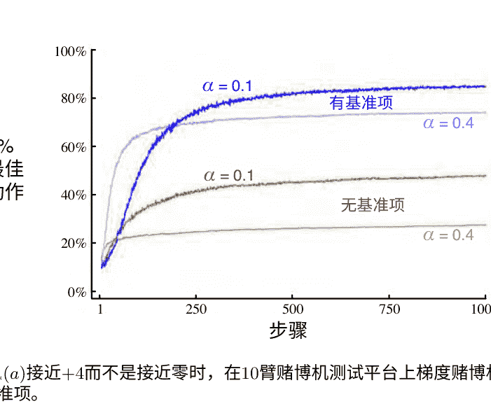

### 作为随机梯度上升的贪婪梯度算法

通过将其视为梯度上升的随机逼近，可以更深入地理解梯度贪婪算法。在精确的梯度上升中，每个动作偏好$H_t(a)$的增量将与增量对性能的影响成比例地增加：

$$H_{t+1}(a) \doteq H_t(a) + \alpha \frac{\partial \mathbb{E}[R_t]}{\partial H_t(a)}, \quad \quad (2.13)$$

这里的性能度量是预期奖励：

$$\mathbb{E}[R_t] = \sum_{x} \pi_t(x) q_*(x),$$

增量的影响度量是该性能度量相对于动作偏好的偏导数。当然，在我们的情况下，不可能完全实现梯度上升，因为根据假设，我们不知道 $q_*(x)$，但实际上，我们的算法更新(2.12)与(2.13)在期望值上是相等的，使得该算法成为随机梯度上升的一个实例。

这些计算只需要初步的微积分，但需要几个步骤。首先，我们仔细研究一下准确的性能梯度：

$$
\begin{align*}
\frac{\partial \mathbb{E}[R_t]}{\partial H_t(a)} &= \frac{\partial}{\partial H_t(a)} \left[ \sum_{x} \pi_t(x) q_*(x) \right] \\
&= \sum_{x} q_*(x) \frac{\partial \pi_t(x)}{\partial H_t(a)} \\
&= \sum_{x} (q_*(x) - B_t) \frac{\partial \pi_t(x)}{\partial H_t(a)},
\end{align*}
$$

其中 $B_t$，称为基准，可以是不依赖于 $x$ 的任何标量。我们可以在这里包含一个基准，而不改变等式，因为梯度在所有动作上的总和为零，即 $\sum_{x} \frac{\partial \pi_t(x)}{\partial H_t(a)} = 0$——当 $H_t(a)$ 改变时，一些动作的概率增加，一些动作的概率减少，但变化的总和必须为零，因为概率的总和始终为一。接下来，我们将每个求和项乘以 $\pi_t(x) / \pi_t(x)$：

$$
\frac{\partial \mathbb{E}[R_t]}{\partial H_t(a)} = \sum_{x} \pi_t(x) (q_*(x) - B_t) \frac{\partial \pi_t(x)}{\partial H_t(a)} / \pi_t(x).
$$

方程现在以期望的形式呈现，对所有可能的值求和 $x$ 随机变量 $A_t$，然后乘以取这些值的概率。因此：

$$
\begin{align*}
&= \mathbb{E} \left[ (q_*(A_t) - B_t) \left( \frac{\partial \pi_t(A_t)}{\partial H_t(a)} \right) / \pi_t(A_t) \right] \\
&= \mathbb{E} \left[ (R_t - \bar{R}_t) \left( \frac{\partial \pi_t(A_t)}{\partial H_t(a)} \right) / \pi_t(A_t) \right],
\end{align*}
$$

在这里，我们选择了基准线 $B_t = \bar{R}_t$ 并替换 $R_t$ 为 $q_*(A_t)$，这是允许的，因为 $\mathbb{E}[R_t|A_t] = q_*(A_t)$。不久我们将证明 $\frac{\partial \pi_t(x)}{\partial H_t(a)} = \pi_t(x) (\mathbb{1}_{a=x} - \pi_t(a))$，其中 $\mathbb{1}_{a=x}$ 被定义为1，如果 $a = x$，否则为0。假设现在我们有

$$
\begin{align*}
&= \mathbb{E} \left[(R_t - \bar{R}_t) \frac{ \pi_t(A_t) (\mathbb{1}_{a=A_t} - \pi_t(a)) }{ \pi_t(A_t) }\right] \\
&= \mathbb{E} \left[(R_t - \bar{R}_t) (\mathbb{1}_{a=A_t} - \pi_t(a))\right].
\end{align*}
$$

回想一下，我们的计划是将性能梯度写成我们可以在每一步上进行采样的期望值，并且在每一步上按比例更新样本。将上述期望值的一个样本代替(2.13)中的性能梯度得到：

$$H_{t+1}(a) = H_t(a) + \alpha (R_t - \bar{R}_t) (\mathbb{1}_{a=A_t} - \pi_t(a)),$$

对于所有的a，
你可能会认出这与我们的原始算法(2.12)等价。

因此，只需证明 $\frac{\partial \pi_t(x)}{\partial H_t(a)} = \pi_t(x)(\mathbb{I}_{a=x} - \pi_t(a))$，正如我们所假设的。回顾导数的标准商规则：

$$ \frac{\partial}{\partial x}\left[\frac{f(x)}{g(x)}\right] = \frac{\frac{\partial f(x)}{\partial x}g(x) - f(x)\frac{\partial g(x)}{\partial x}}{g(x)^2} $$

利用这个，我们可以写成

$$ \frac{\partial \pi_t(x)}{\partial H_t(a)} = \frac{\partial}{\partial H_t(a)} \pi_t(x) \\
= \frac{\partial}{\partial H_t(a)} \left[ \frac{e^{H_t(x)}}{\sum_{y=1}^k e^{H_t(y)}} \right] \\
= \frac{ \frac{\partial e^{H_t(x)}}{\partial H_t(a)} \sum_{y=1}^k e^{H_t(y)} - e^{H_t(x)} \frac{\partial \sum_{y=1}^k e^{H_t(y)}}{\partial H_t(a)} }{ \left( \sum_{y=1}^k e^{H_t(y)} \right)^2 } \quad \text{(根据商规则)} \\
= \frac{ \mathbb{I}_{a=x} e^{H_t(x)} \sum_{y=1}^k e^{H_t(y)} - e^{H_t(x)} e^{H_t(a)} }{ \left( \sum_{y=1}^k e^{H_t(y)} \right)^2 } \quad \text{(因为 } \frac{\partial e^{H_t(x)}}{\partial H_t(a)} = \mathbb{I}_{a=x}e^{H_t(x)} \text{)} \\
= \frac{ \mathbb{I}_{a=x} e^{H_t(x)} }{ \sum_{y=1}^k e^{H_t(y)} } - \frac{ e^{H_t(x)} e^{H_t(a)} }{ \left( \sum_{y=1}^k e^{H_t(y)} \right)^2 } \\
= \mathbb{I}_{a=x} \pi_t(x) - \pi_t(x) \pi_t(a) \\
= \pi_t(x) ( \mathbb{I}_{a=x} - \pi_t(a) ) \quad \text{证毕} $$

我们刚刚证明了梯度赌博机算法的期望更新等于期望奖励的梯度，因此该算法是随机梯度上升的一个实例。这保证了该算法具有稳健的收敛性质。

请注意，我们对奖励基线的要求仅仅是它不依赖于选择的动作。例如，我们可以将其设置为零，或者1000，该算法仍然是随机梯度上升的一个实例。基线的选择不会影响算法的期望更新，但会影响更新的方差和收敛速度（如图2.5所示）。将其设置为奖励的平均值可能不是最好的选择，但在实践中简单且有效。

## 2.9 关联搜索（上下文赌博机）

到目前为止，在本章中我们只考虑了非关联任务，也就是说，在这些任务中，没有必要将不同的动作与不同的情境关联起来。在这些任务中，当任务是静态的时候，学习者要么试图找到一个最佳动作，要么在任务是非静态的时候，试图跟踪最佳动作随时间变化的情况。然而，在一般的强化学习任务中，存在多种情境，并且目标是学习一种策略：从情境到在这些情境中最好的动作的映射。为了为完整问题做准备，我们简要讨论了非关联任务如何扩展到关联设置的最简单方式。

举个例子，假设有几个不同的赌博机任务，每一步你都随机面对其中一个任务。因此，赌博机任务会随机地从一步变到另一步。对你来说，这看起来就像一个单一的、非静态的赌博机任务，其真实的动作值会随机地从一步变到另一步。你可以尝试使用本章中描述的一种可以处理非静态任务的方法，但是除非真实的动作值变化缓慢，否则这些方法效果不会很好。

现在假设，当为您选择一个赌博机任务时，您会得到一些关于其身份的独特线索（但不包括其动作值）。也许您面对的是一个实际的老虎机，它会随着其动作值的变化而改变显示颜色。现在，您可以学习一个策略，将您所看到的颜色与面对该任务时要采取的最佳动作相关联 - 例如，如果是红色，则选择臂1；如果是绿色，则选择臂2。通过正确的策略，您通常可以比没有任何区分一个赌博机任务和另一个赌博机任务的信息时做得更好。

这是一个关联搜索任务的示例，因为它既涉及试错学习以搜索最佳动作，又涉及将这些动作与最佳情境相关联。在文献中，关联搜索任务通常被称为上下文赌博机。关联搜索任务介于k臂赌博机问题和完整强化学习问题之间。它们与完整强化学习问题类似，因为它们涉及学习策略，但与我们的k臂赌博机问题类似，因为每个动作只影响即时奖励。如果允许动作影响下一个情境以及奖励，那么我们就有了完整的强化学习问题。我们将在下一章中介绍这个问题，并在本书的其余部分考虑其影响。

### 练习2.10
假设你面对一个两臂赌博任务，其真实动作值从时间步到时间步随机变化。具体而言，假设对于任何时间步，动作1和动作2的真实值分别为0.1和0.2的概率为0.5（情况A），以及0.9和0.8的概率为0.5（情况B）。如果你无法确定每一步面对的情况，你能够实现的最佳成功期望是多少，以及你应该如何行动才能实现它？现在假设在每一步中，你被告知你面对的是情况A还是情况B（尽管你仍然不知道真实的动作值）。这是一个关联搜索任务。在这个任务中，你能够实现的最佳成功期望是多少，以及你应该如何行动才能实现它？

### 2.10 总结

在本章中，我们提出了几种简单的方法来平衡探索和利用。贪婪方法随机选择一小部分时间，而UCB方法通过在每一步中微妙地偏爱到目前为止接收较少样本来实现探索。梯度赌博机算法估计的不是动作值，而是动作偏好，并以概率方式使用softmax分布有利于更受偏爱的动作。即使是贪婪方法，通过乐观地初始化估计值也会显著地进行探索。

自然而然地会问哪种方法最好。虽然这是一个难以一般性回答的问题，但我们肯定可以在整个本章中使用10臂赌博测试台运行它们，并比较它们的性能。一个复杂之处在于它们都有一个参数；为了进行有意义的比较，我们必须考虑它们作为参数函数的性能。到目前为止，我们的图表显示了每个算法和参数设置的学习过程，以产生该算法和参数设置的学习曲线。如果我们为所有算法和所有参数设置绘制学习曲线，那么图表将过于复杂和拥挤，无法进行清晰的比较。相反，我们通过其在1000步骤上的平均值来总结完整的学习曲线；这个值与学习曲线下的面积成比例。图2.6显示了本章中各种赌博机算法的这个度量，每个算法的参数在x轴上以单一刻度显示。这种图表被称为参数研究。请注意，参数值按照两倍的因子变化，并以对数刻度呈现。还要注意每个算法性能的特征倒U形状；所有算法在其参数的中间值时表现最佳。在评估时作为一种方法，我们不仅应该关注它在最佳参数设置下的表现，还应该关注它对参数值的敏感性。所有这些算法都相对不敏感，在参数值变化一个数量级的范围内表现良好。总体而言，在这个问题上，UCB算法似乎表现最好。

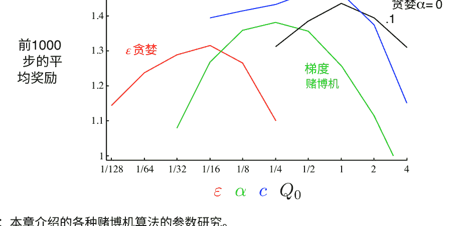

图2.6：本章介绍的各种赌博机算法的参数研究。每个点是在特定参数设置下，使用特定算法在1000步中获得的平均奖励。

尽管这些方法很简单，但在我们看来，它们可以被认为是最先进的方法。还有更复杂的方法，但它们的复杂性和假设使它们在我们真正关注的完整强化学习问题上不实用。从第5章开始，我们将介绍解决完整强化学习问题的学习方法，其中部分使用了本章探讨的简单方法。

尽管本章中探讨的简单方法可能是目前我们所能做的最好的，但它们远远不能满意地解决平衡探索和利用问题。

在$k$臂赌博机问题中，一种被广泛研究的平衡探索和利用的方法是计算一种特殊的动作价值，称为Gittins指数。在某些重要的特殊情况下，这种计算是可行的，并直接导致最优解，尽管它需要完全了解可能问题的先验分布，而我们通常假设这是不可用的。此外，这种方法的理论和计算可行性似乎不能推广到我们在本书中考虑的完全强化学习问题。

Gittins指数方法是贝叶斯方法的一个实例，它假设对动作价值有一个已知的初始分布，然后在每一步之后精确地更新分布（假设真实的动作价值是稳定的）。一般来说，更新计算可能非常复杂，但对于某些特殊分布（称为共轭先验），它们是简单的。一种可能性是根据每一步的后验概率选择动作，以便它们成为最佳动作。这种方法有时被称为后验抽样或汤普森抽样，在本章中我们介绍的无分布方法中通常表现得很好。

在贝叶斯设置中，甚至可以计算出探索和利用之间的最优平衡。可以计算出任何可能动作的每个可能即时奖励的概率以及结果后验分布。这个不断演变的分布成为问题的信息状态。给定一个时间段，比如1000步，可以考虑所有可能的动作，所有可能的即时奖励，所有可能的下一个动作，所有下一个奖励，以此类推，直到1000步。在给定假设的情况下，可以确定每个可能事件链的奖励和概率，并且只需要选择最好的。但是可能性树增长得非常快；即使只有两个动作和两个奖励，树也会有$2^{2000}$个叶子。精确执行这个巨大的计算通常是不可行的，但是也许可以高效地近似计算。这种方法实际上将赌博机问题转化为完整强化学习问题的一个实例。最终，我们可以使用近似强化学习方法，如本书第二部分所介绍的方法，来接近这个最优解。但这是一个研究课题，超出了本入门书的范围。

### 练习2.11 (编程)
制作一个类似于练习2.5中概述的非定态情况下的图形，包括常数步长 $\epsilon$-贪婪算法 $\alpha= 0.1$。使用200,000步的运行，并且作为每个算法和参数设置的性能度量，使用最后100,000步的平均奖励。

### 参考文献和历史评论

2.1 赌博机问题已经在统计学、工程学和心理学中进行了研究。在统计学中，赌博机问题属于“顺序实验设计”的范畴，由汤普森（1933年，1934年）和罗宾斯（1952年）引入，并由贝尔曼（1956年）研究。Berry和Fristedt（1985年）从统计学的角度对赌博机问题进行了广泛的研究。Narendra和Thathachar（1989年）从工程的角度处理赌博机问题，对专注于赌博机问题的各种理论传统进行了很好的讨论。在心理学中，赌博机问题在统计学习理论中起到了作用（例如，Bush和Mosteller，1955年；Estes，1950年）。

在启发式搜索文献中经常使用术语贪婪（例如，Pearl，1984）。在控制工程中，探索和利用之间的冲突被称为识别（或估计）和控制之间的冲突（例如，Witten，1976b）。Feldbaum（1965）将其称为双重控制问题，指的是在试图在不确定性下控制系统时同时解决识别和控制两个问题的需求。在讨论遗传算法的方面时，Holland（1975）强调了这种冲突的重要性，将其称为利用需求和获取新信息需求之间的冲突。

2.2 我们的 k 臂赌博机问题的动作值方法最早由Thathachar和Sastry（1985）提出。在学习自动机文献中，这些通常被称为估计算法。术语动作值是由Watkins（1989）提出的。第一个使用 $\epsilon$ 贪婪方法的可能是Watkins（1989年，第187页），但这个想法非常简单，所以可能有一些更早的使用。

2.4-5 这个材料属于随机迭代算法的一般范畴，这在Bertsekas和Tsitsiklis（1996年）的著作中有很好的涵盖。

2.6 Sutton（1996年）在强化学习中使用了乐观初始化。

2.7 使用上界估计来选择动作的早期工作是由Lai和Robbins（1985年）、Kaelbling（1993b年）和Agrawal（1995年）完成的。我们在这里介绍的UCB算法在文献中被称为UCB1，最早由Auer、Cesa-Bianchi和Fischer（2002年）开发。

2.8 梯度赌博机算法是基于梯度的强化学习算法的一个特例，这些算法由Williams（1992年）引入，并在本书后面发展成了演员-评论家和策略梯度算法。我们的发展受到了Balaraman Ravindran的影响（个人交流）。

### 2.9
术语关联搜索和相应的问题是由Barto，Sutton和Brouwer（1981年）引入的。术语关联强化学习也被用于关联搜索（Barto和Anandan，1985年），但我们更倾向于将该术语保留为完全强化学习的同义词（如Sutton，1984年）。（而且，正如我们所指出的，现代文献也将“情境赌博机”这个术语用于这个问题。）我们注意到Thorndike的效应定律（在第1章引用）通过引用情境（状态）和动作之间的关联链接的形成来描述关联搜索。根据操作性或工具性条件作用的术语（例如，斯金纳，1938年），刺激判别是一种信号，表明存在特定的强化条件。在我们的术语中，不同的刺激判别对应于不同的状态。

### 2.10
Bellman（1956年）首次展示了如何使用动态规划在问题的贝叶斯公式中计算探索和利用之间的最佳平衡。Gittins指数方法归功于Gittins和Jones（1974年）。Du（1995年）展示了如何通过强化学习学习Gittins指数来解决赌博机问题。Kumar（1985年）的调查对这些问题的贝叶斯和非贝叶斯方法进行了很好的讨论。术语信息状态来自部分可观察的MDP文献；参见，例如，Lovejoy（1991年）。

其他理论研究关注的是探索的效率，通常表达为算法能够快速接近最优决策策略的速度。一种形式化探索效率的方法是将强化学习中的样本复杂度概念应用于监督学习算法，即算法在学习目标函数时需要的训练样本数量来达到所需的准确度。强化学习算法的样本复杂度定义是算法在选择接近最优动作之前所经历的时间步数（Kakade，2003）。Li（2012）在对强化学习中探索效率的理论方法进行调查时讨论了这一点以及其他几种方法。Russo，Van Roy，Kazerouni，Osband和Wen（2018）对汤普森抽样进行了全面的现代处理。

## 第三章 有限马尔可夫决策过程

在本章中，我们介绍了有限马尔可夫决策过程（或有限MDPs）的形式问题，我们将在本书的其余部分中尝试解决该问题。这个问题涉及到评估性反馈，就像赌博机一样，但也涉及到选择不同的动作在不同的情境中。MDPs是顺序决策制定的经典形式化，其中动作不仅影响即时奖励，还影响后续情境或状态，并通过这些未来奖励。因此，MDPs涉及到延迟奖励和需要权衡即时和延迟奖励。而在赌博机问题中，我们估计了每个动作$a$的值$q_{*}(a)$，在MDPs中，我们估计了每个状态$s$中每个动作$a$的值$q_{*}(s,a)$，或者我们估计了每个状态$s$的值$v_{*}(s)$给定最优的动作选择。

这些状态相关的数量对于准确地分配长期后果给个体行动选择至关重要。

MDPs是强化学习问题的数学理想化形式，可以进行精确的理论陈述。我们介绍了问题的数学结构的关键要素，如回报、值函数和贝尔曼方程。我们试图传达可以被表述为有限MDPs的广泛应用范围。与所有人工智能一样，存在着适用范围和数学可行性之间的紧张关系。在本章中，我们介绍了这种紧张关系，并讨论了其中涉及的一些权衡和挑战。在第17章中，我们介绍了超越MDPs的一些强化学习方法。

### 3.1 代理-环境接口

MDPs旨在成为从交互中学习以实现目标的问题的直接框架。学习者和决策者被称为代理。它与之交互的东西，包括代理之外的一切，被称为环境。

这些不断地互动，代理选择动作，环境做出响应并提供奖励。环境状态是代理所感知到的东西。代理基于其对环境状态的理解来选择动作。

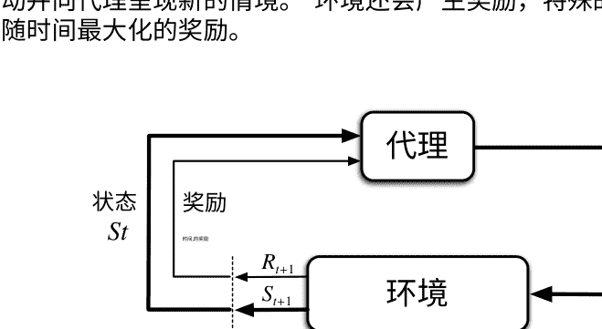

更具体地说，代理和环境在一系列离散的时间步骤中相互作用，$t = 0, 1, 2, 3, \ldots$。在每个时间步骤 $t$，代理接收到环境状态的某种表示，$S_t \in \mathcal{S}$，并基于此选择一个动作，$A_t \in \mathcal{A}(s)$。一个时间步骤后，作为其动作的结果，代理接收到一个数值奖励，$R_{t+1} \in \mathcal{R} \subset \mathbb{R}$，并处于一个新的状态，$S_{t+1}$。因此，MDP和代理共同产生了一个如下所示的序列或轨迹：

$$S_0, A_0, R_1, S_1, A_1, R_2, S_2, A_2, R_3, \ldots \qquad (3.1)$$

在一个有限的MDP中，状态、动作和奖励的集合 ($\mathcal{S}$, $\mathcal{A}$ 和 $\mathcal{R}$) 都有有限个元素。在这种情况下，随机变量 $R_t$ 和 $S_t$ 具有明确定义的离散概率分布，仅依赖于前一状态和动作。 也就是说，对于这些随机变量的特定值，$s' \in \mathcal{S}$ 和 $r \in \mathcal{R}$，在时间 $t$ 发生这些值的概率，给定前一状态和动作的特定值：

$$\mathrm{Pr}\{S_t = s', R_t = r \mid S_{t-1} = s, A_{t-1} = a\} = p(s', r \mid s, a), \qquad (3.2)$$

函数 $p$ 定义了 MDP 的动力学。方程中等号上的点提醒我们这是一个定义（在这种情况下是函数 $p$ 的定义），而不是从先前定义中得出的事实。 动力学函数 $p: \mathcal{S} \times \mathcal{R} \times \mathcal{S} \times \mathcal{A} \rightarrow [0, 1]$ 是一个具有四个参数的普通确定性函数。 其中的‘|’来自条件概率的符号表示法，但在这里它只是提醒我们，$p$为每个选择的$s$和$a$指定了一个概率分布

$$\sum_{s' \in \mathcal{S}} \sum_{r \in \mathcal{R}} p(s', r \mid s, a) = 1, \text{对于所有的 } s \in \mathcal{S}, a \in \mathcal{A}(s). \qquad (3.3)$$

在一个马尔可夫决策过程中，由$p$给出的概率完全描述了环境的动态。也就是说，每个可能的$S_t$和$R_t$的概率仅取决于前一个状态和动作，$S_{t-1}$和$A_{t-1}$，并且在给定它们的情况下，不依赖于之前的状态和动作。这最好被视为对决策过程的限制，而不是对状态的限制。状态必须包含有关过去的代理-环境交互的所有方面的信息，这些信息对于未来有所影响。如果是这样，那么该状态被称为具有马尔可夫性质。在本书的整个过程中，我们将假设具有马尔可夫性质，尽管从第二部分开始，我们将考虑不依赖于马尔可夫性质的近似方法，并且在第17章中，我们将考虑如何从非马尔可夫观察中学习和构建马尔可夫状态。

从四个参数的动力学函数$p$，可以计算环境的其他任何信息，例如状态转移概率（我们滥用符号表示为三个参数函数$p: \mathcal{S} \times \mathcal{S} \times \mathcal{A} \rightarrow [0, 1]$）

$$p(s' \mid s, a) \doteq \mathrm{Pr}\{S_t = s' \mid S_{t-1} = s, A_{t-1} = a\} = \sum_{r \in \mathcal{R}} p(s', r \mid s, a). \qquad (3.4)$$

我们还可以计算状态-动作对的预期奖励，作为一个二元函数$r: \mathcal{S} \times \mathcal{A} \rightarrow \mathbb{R}$:

$$r(s, a) \doteq \mathbb{E}[R_t \mid S_{t-1} = s, A_{t-1} = a] = \sum_{r \in \mathcal{R}} r \sum_{s' \in \mathcal{S}} p(s', r \mid s, a), \qquad (3.5)$$

以及状态-动作-下一个状态三元组的预期奖励作为三参数函数$r: \mathcal{S} \times \mathcal{A} \times \mathcal{S} \rightarrow \mathbb{R}$,

$$r(s, a, s') \doteq \mathbb{E}[R_t \mid S_{t-1} = s, A_{t-1} = a, S_t = s'] = \sum_{r \in \mathcal{R}} r \frac{p(s', r \mid s, a)}{p(s' \mid s, a)}. \qquad (3.6)$$

在本书中，我们通常使用四参数的$p$函数（3.2），但这些其他符号有时也很方便。

MDP框架是抽象和灵活的，可以应用于许多不同的问题。例如，时间步骤不一定要参考固定的实际时间间隔；它们可以参考决策和动作的任意连续阶段。动作可以是低级控制，例如应用于机器人臂的电压，也可以是高级决策，例如是否吃午餐或上研究生。同样，状态可以采用各种形式。它们可以完全由低级感觉确定，例如直接传感器读数，也可以更高级和抽象，例如房间中物体的符号描述。状态的一部分可能基于过去感觉的记忆或内部状态。唯一真正的限制是代理和环境之间的接口，状态需要捕捉环境的所有相关信息，动作需要是代理可用的所有选择。MDP框架是基于这种相对抽象的接口定义的，这使得它能够广泛适用。

甚至可以完全是心理或主观的。例如，一个智能体可能处于不确定物体位置的状态，或者刚刚在某种明确定义的意义上感到惊讶。同样，某些行为可能完全是心理或计算的。例如，某些行为可能控制智能体选择思考的内容，或者它的注意力集中在哪里。一般来说，行为可以是我们想要学习如何做出的任何决策，而状态可以是我们可以知道的任何对于做出这些决策可能有用的东西。

特别是，智能体和环境之间的边界通常不同于机器人或动物身体的物理边界。通常，边界被画得比智能体更近。例如，机器人的电机和机械连接以及其感知硬件通常应被视为环境的一部分，而不是智能体的一部分。同样，如果我们将马尔可夫决策过程（MDP）框架应用于人或动物，肌肉、骨骼和感觉器官应被视为环境的一部分。

奖励也被认为是自然和人工学习系统内部计算的一部分，但被视为代理外部的因素。

我们遵循的一般规则是，代理无法任意改变的任何事物都被视为代理外部的环境的一部分。我们并不假设环境中的一切对代理来说都是未知的。例如，代理通常对其奖励如何根据其行动和所处状态计算有相当多的了解。但我们始终将奖励计算视为代理外部的因素，因为它定义了代理面临的任务，并且必须超出其任意更改的能力。实际上，在某些情况下，代理可能对其环境的工作方式了如指掌，但仍面临着困难的强化学习任务，就像我们可能完全了解魔方等谜题的工作方式，但仍无法解决它一样。代理-环境边界代表了代理的绝对控制的限度，而不是其知识的限度。

代理-环境边界可以根据不同的目的放置在不同的位置。在一个复杂的机器人中，许多不同的代理可能同时运行，每个代理都有自己的边界。例如，一个代理可能会做出高层决策，这些决策构成了一个实施高层决策的低层代理所面临的状态的一部分。在实践中，代理-环境边界是在选择特定的状态、动作和奖励之后确定的，从而确定了一个特定的决策任务。

MDP框架是从交互中学习目标导向学习问题的一个相当抽象的表示。它提出，无论感知、记忆和控制装置的细节如何，无论试图实现什么目标，任何目标导向行为学习问题都可以简化为代理和环境之间传递的三个信号：一个信号表示代理所做的选择（动作），一个信号表示选择的基础（状态），一个信号定义代理的目标（奖励）。这个框架可能不能很好地表示所有的决策学习问题，但它已经被广泛地证明是有用和适用的。

当然，具体的状态和动作在不同的任务中变化很大，以及如何表示它们会强烈影响性能。在强化学习中，就像在其他类型的学习中一样，这些表示选择目前更多地是艺术而不是科学。

在本书中，我们提供了一些建议和示例，关于如何有效地表示状态和动作，但我们的主要重点是学习一旦表示选择完成后如何行为。

例子3.1：生物反应器 假设强化学习被应用于确定生物反应器（一个用于生产有用化学物质的大型营养物和细菌的容器）的时刻温度和搅拌速率。在这样的应用中，动作可能是目标温度和目标搅拌速率，这些动作会传递给低级控制系统，然后直接激活加热元件和电机以达到目标。状态可能是热电偶和其他传感器读数，可能经过滤波和延迟处理，加上表示容器中成分和目标化学物质的符号输入。奖励可能是生物反应器产生有用化学物质的时刻测量值。注意，在这里，每个状态是传感器读数和符号输入的列表或向量，每个动作是由目标温度和搅拌速率组成的向量。对于强化学习任务来说，具有这种结构化表示的状态和动作是很典型的。另一方面，奖励始终是单个数字。

示例3.2：拾取和放置机器人 考虑使用强化学习来控制机器人手臂在重复的拾取和放置任务中的运动。如果我们想要学习快速而平滑的动作，学习代理将需要直接控制电机，并且具有关于当前位置和速度的低延迟信息。在这种情况下，动作可能是应用于每个关节的电压，状态可能是关节角度和速度的最新读数。

奖励可能是每次成功拾取和放置物体时的+1。为了鼓励平滑运动，在每个时间步上，可以根据运动的瞬时“颠簸”程度给予一个小的负奖励。

练习3.1 设计三个符合MDP框架的示例任务，为每个任务确定其状态、动作和奖励。使这三个示例尽可能不同。该框架是抽象和灵活的，可以以许多不同的方式应用。在至少一个示例中，以某种方式推动其极限。

练习3.2 MDP框架是否足够有效地表示所有目标导向的学习任务？你能想到任何明显的例外吗？

练习3.3 考虑驾驶问题。你可以根据油门、方向盘和刹车来定义动作，也就是说，你的身体与机器相遇的地方。或者你可以将它们定义得更远一些——比如说，你的动作是轮胎扭矩，考虑到你的动作是轮胎扭矩。或者你可以将它们定义得更近一些——比如说，你的大脑与身体相遇的地方，动作是控制肢体的肌肉抽搐。或者你可以提升到一个非常高的层次，说你的动作是选择驾驶的地方。什么是正确的层次，什么是代理和环境之间划界的正确位置？根据什么标准，一个位置的划界比另一个位置更好？有没有任何根本原因可以优先选择一个位置，还是这是一个自由选择？

## 例子 3.3 回收机器人

一个移动机器人的任务是在办公环境中收集空的苏打罐。它有用于检测罐子的传感器，还有一个可以捡起罐子并放入机身储物箱的机械臂和夹爪；它使用可充电电池供电。机器人的控制系统包括用于解释传感器信息、导航和控制机械臂和夹爪的组件。关于如何搜索罐子的高级决策是基于电池的当前电量的强化学习代理进行的。为了举一个简单的例子，我们假设只能区分两个电量水平，包括一个小的状态集合 𝒮 = {高, 低}。在每个状态下，代理可以决定是否（1）主动搜索一段时间的罐子，（2）保持静止并等待有人给它带来罐子，或者（3）返回到基地充电电池。

当能量水平很高时，充电总是愚蠢的，所以我们不将其包括在此状态的动作集中。然后，动作集为 𝒜(高) = {搜索, 等待} 和 𝒜(低) = {搜索, 等待, 充电}。

大部分时间奖励为零，但当机器人找到一个空罐时，奖励变为正值；如果电池完全耗尽，则奖励变为负值。找到罐子的最佳方法是积极搜索，但这会耗尽机器人的电池，而等待则不会。每当机器人在搜索时，都有可能电池耗尽。在这种情况下，机器人必须关闭并等待救援（产生低奖励）。如果能量水平很高，则始终可以在不耗尽电池的情况下完成一段积极搜索的时间。能量水平为高时开始的搜索时间段以概率 𝛼 使能量水平保持高，并以概率 1−𝛼 降低为低。另一方面，能量水平为低时开始的搜索时间段以概率 𝛽 使能量水平保持低，并以概率 1−𝛽 耗尽电池。在后一种情况下，机器人必须被救援，并且电池会重新充电至高。机器人收集的每个罐子都计为一个单位的奖励，而每当机器人需要被救援时，奖励为 −3。假设搜索和等待的奖励分别为搜索 > 等待，那么它们分别表示机器人在搜索和等待时预期收集的罐子数量（因此是预期奖励）。最后，假设在返回充电时无法收集到罐子，并且在电池耗尽的步骤中也无法收集到罐子。然后，该系统是一个有限MDP，我们可以写出转移概率和预期奖励，其动态如左侧表格所示：

| s    | 动作 | s'   | p(s'|s,a) | r(s,a,s') |
| :--- | :--- | :--- | :-------- | :-------- |
| 高   | 搜索 | 高   | α         | r搜索     |
| 高   | 搜索 | 低   | 1−α       | r搜索     |
| 低   | 搜索 | 高   | 1−β       | −3        |
| 低   | 搜索 | 低   | β         | r搜索     |
| 高   | 等待 | 高   | 1         | r等待     |
| 高   | 等待 | 低   | 0         | -         |
| 低   | 等待 | 高   | 0         | -         |
| 低   | 等待 | 低   | 1         | r等待     |
| 低   | 充电 | 高   | 1         | 0         |
| 低   | 充电 | 低   | 0         | -         |

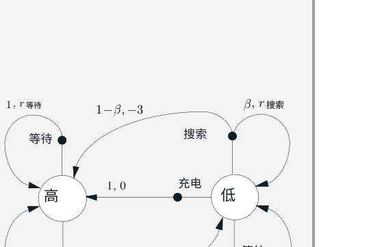

请注意，表格中的每个可能的当前状态 s、动作 a ∈ 𝒜(s) 和下一个状态 s' 都有一行。某些转换的发生概率为零，因此没有指定预期奖励。右侧显示了另一种有用的方式。

总结有限MDP的动态的另一种有用方式是作为一个转换图。有两种类型的节点：状态节点和动作节点。每个可能的状态都有一个状态节点（由状态名称标记的大型空圆圈），每个状态-动作对都有一个动作节点（由动作名称标记的小实心圆圈，并通过一条线连接到状态节点）。从状态节点 s 开始并采取动作 a 将沿着从状态节点 s 到动作节点（s，a）的线移动。然后环境通过离开动作节点（s，a）的箭头之一响应，转换到下一个状态节点。每个箭头对应于一个三元组（s，s'，a），其中 s' 是下一个状态，并且我们用转换概率 p(s'|s，a) 和该转换的预期奖励 r(s，a，s') 标记箭头。请注意，离开动作节点的转换概率总和始终为1。

练习3.4 给出一个类似于示例3.3中的表格，但是对于 p(s', r|s, a)。它应该有 s, a, s', r 和 p(s', r|s, a)的列，并且对于每个4元组都有一行，其中 p(s', r|s, a) > 0。

### 3.2 目标和奖励

在强化学习中，代理的目标或目的是通过一个特殊的信号来形式化，称为奖励，从环境传递给代理。在每个时间步骤中，奖励是一个简单的数字，R_t ∈ ℝ。非正式地说，代理的目标是最大化它接收到的总奖励。这意味着不是最大化即时奖励，而是长期累积奖励。我们可以明确将这个非正式的想法陈述为奖励假设：

> 我们所说的目标和目的的全部意义可以很好地被认为是最大化接收到的标量信号（称为奖励）的累积和的期望值。

使用奖励信号来形式化目标的想法是强化学习最独特的特征之一。

虽然用奖励信号来制定目标可能一开始看起来有限，但在实践中已被证明是灵活且广泛适用的。最好的方法是通过考虑如何使用它的例子来理解这一点。例如，为了让机器人学会走路，研究人员每个时间步都提供与机器人前进运动成比例的奖励。在让机器人学会如何从迷宫中逃脱时，奖励通常是每个时间步的-1，这鼓励代理尽快逃脱。为了让机器人学会寻找和收集空的汽水罐进行回收，大部分时间内可能给予它零奖励，然后每收集一个罐子给予奖励+1。当机器人撞到东西或有人对它大喊时，也可以给予负面奖励。对于学会下棋或国际象棋的代理，自然奖励是赢得比赛的+1，输掉比赛的-1，以及平局和所有非终止位置的奖励为0。

你可以看到所有这些例子中发生了什么。代理始终学习如何最大化其奖励。如果我们希望它为我们做某事，我们必须以一种使代理最大化奖励的方式来提供奖励，从而实现我们的目标。

因此，我们设置的奖励必须真正表明我们想要实现的目标。特别是，奖励信号不是向代理传授关于如何实现我们想要的目标的先前知识的地方。例如，一个下棋的代理只应该在真正赢棋时获得奖励，而不是在实现子目标（如夺取对手的棋子或控制棋盘中心）时获得奖励。如果实现这些子目标会得到奖励，那么代理可能会找到一种在不实现真正目标的情况下实现它们的方法。例如，它可能会找到一种在失去比赛的代价下夺取对手的棋子的方法。奖励信号是你与机器人沟通你想要实现的目标的方式，而不是你想要实现目标的方式。

### 3.3 回报和回合

到目前为止，我们已经非正式地讨论了学习的目标。我们已经说过，智能体的目标是在长期内最大化累积奖励。这个目标如何被正式地定义呢？如果在时间步骤 $t$ 之后接收到的奖励序列被表示为 $R_{t+1}, R_{t+2}, R_{t+3}, \dots$，那么我们希望最大化这个序列的哪个具体方面呢？一般来说，我们寻求最大化期望回报，其中回报用 $G_t$ 表示，它被定义为奖励序列的某个特定函数。在最简单的情况下，回报是奖励的总和：

$G_t \doteq R_{t+1} + R_{t+2} + R_{t+3} + \cdots + R_T, \quad \quad (3.7)$

其中 $T$ 是最终时间步骤。这种方法在存在自然的最终时间步骤的应用中是有意义的，也就是当智能体与环境的交互自然地分解为子序列时，我们称之为回合，比如游戏的进行、迷宫的探索或者任何形式的重复交互。每个回合以一个特殊的状态，称为终止状态，结束，然后重置为标准的起始状态或者从标准分布的起始状态中进行采样。即使你认为回合以不同的方式结束，比如赢得或者输掉一场游戏，下一个回合的开始与前一个回合的结束无关。因此，所有的回合都可以被认为是以相同的终止状态结束，不同的结果有不同的奖励。具有这种回合性的任务被称为回合性任务。在回合性任务中，我们有时需要区分所有非终止状态的集合，表示为 $\mathcal{S}$，和所有状态加上终止状态的集合，表示为 $\mathcal{S}^+$。终止时间 $T$ 是一个随机变量，通常在每个回合中都有所不同。

另一方面，在许多情况下，代理-环境交互并不自然地分解为可识别的情节，而是持续进行而没有限制。例如，这将是表达一个持续的过程控制任务或者一个具有长寿命的机器人的自然方式。我们称之为持续任务。回报公式（3.7）对于持续任务是有问题的，因为最后一个时间步骤是 T=∞，而我们试图最大化的回报本身很容易是无限的。（例如，假设代理每个时间步骤都获得+1的奖励。）因此，在本书中，我们通常使用一个在概念上稍微复杂但在数学上更简单的回报定义。

我们需要的另一个概念是折扣。根据这种方法，代理尝试选择行动，使得未来收到的折扣奖励的总和最大化。特别地，它选择 A_t 以最大化预期的折扣回报：

$G_t \doteq R_{t+1} + \gamma R_{t+2} + \gamma^2 R_{t+3} + \cdots = \sum_{k=0}^{\infty} \gamma^k R_{t+k+1}, \quad (3.8)$

其中 $\gamma$ 是一个参数，$0 \leq \gamma \leq 1$，称为折扣率。

折扣率决定未来奖励的现值：未来 $k$ 个时间步骤收到的奖励只有它立即收到时的 $\gamma^{k-1}$ 倍。如果 $\gamma < 1$，那么(3.8)中的无限和有限值，只要奖励序列 $\{R_t\}$ 有界。如果 $\gamma = 0$，代理只关注最大化即时奖励：在这种情况下，它的目标是学习如何选择 $A_t$ 以最大化 $R_{t+1}$。如果代理的每个行动只影响即时奖励，而不影响未来奖励，那么一个近视的代理可以通过分别最大化每个即时奖励来最大化(3.8)。但是一般情况下，为了最大化即时奖励，可能会减少未来奖励的获取，从而降低回报。当 $\gamma$ 接近1时，回报目标更加考虑未来奖励；代理变得更加有远见。

连续时间步的回报与强化学习的理论和算法有重要关系：

$$
\begin{align*}
G_t &\doteq R_{t+1} + \gamma R_{t+2} + \gamma^2 R_{t+3} + \gamma^3 R_{t+4} + \cdots \\
&= R_{t+1} + \gamma \left( R_{t+2} + \gamma R_{t+3} + \gamma^2 R_{t+4} + \cdots \right) \\
&= R_{t+1} + \gamma G_{t+1} \quad (3.9)
\end{align*}
$$

请注意，即使在 $t < T$ 时终止发生在 $t+1$，如果我们定义 $G_T=0$，这仍然适用于所有时间步 $t < T$。这通常使得从奖励序列计算回报变得容易。

请注意，尽管回报 (3.8) 是无限多项的和，但如果奖励非零且恒定，则仍然是有限的——如果 $\gamma < 1$。例如，如果奖励是一个恒定的+1，则回报为

$G_t = \sum_{k=0}^{\infty} \gamma^k = \frac{1}{1 - \gamma}. \quad (3.10)$

练习3.5 第3.1节中的方程适用于连续情况，需要进行（非常轻微的）修改以适用于情节任务。通过给出 (3.3) 的修改版本来展示你了解所需的修改。

## 例子3.4: 杆平衡

这个任务的目标是在轨道上移动的小车上施加力，以保持连接到小车上的杆不倒下：如果杆从垂直位置倒下或者小车离开轨道，则发生故障。每次故障后，杆都会重新恢复到垂直位置。这个任务可以被视为情节性任务，其中自然的情节是重复尝试平衡杆。在这种情况下，每个时间步骤上的奖励可以是+1，表示没有发生故障的时间步骤，因此每个时间步骤的回报将是直到发生故障的步骤数。在这种情况下，永远成功平衡将意味着回报为无穷大。或者，我们可以将杆平衡视为连续任务，使用折扣。在这种情况下，每次故障的奖励将为 −1，其他时间为零。然后，每个时间步骤的回报将与 −γ^K相关，其中 K是故障之前的时间步骤数。无论哪种情况，通过尽可能长时间地保持杆平衡来最大化回报。


练习3.6 假设你将平衡杆视为一个情节性任务，但同时使用折扣，除了失败时的奖励为零外，其他奖励都为 −1。那么每个时间点的回报是多少？这个回报与折扣的持续形式的任务有什么不同？

练习3.7 想象一下，你正在设计一个机器人来跑迷宫。你决定给它逃离迷宫的奖励为+1，其他时间的奖励为零。这个任务似乎自然地分解成情节性任务——连续通过迷宫的运行——所以你决定将其视为情节性任务，目标是最大化预期总奖励（3.7）。在运行学习代理一段时间后，你发现它在逃离迷宫方面没有任何改进。出了什么问题？你是否有效地向代理传达了你想要实现的目标？

练习3.8 假设 γ= 0.5，并且接收到以下奖励序列 R₁ = −1, R₂= 2, R₃= 6, R₄= 3，以及 R₅= 2，且 T= 5。那么 G₀, G₁,..., G₅是多少？提示：从后往前计算。

练习3.9 假设 γ= 0.9，并且奖励序列为 R₁= 2，后面是无限个7。那么 G₁和 G₀是多少？

练习3.10 证明(3.10)中的第二个等式。

### 3.4 用于回合和连续任务的统一符号

在前一节中，我们描述了两种强化学习任务，一种是自然地将代理-环境交互分解为一系列独立的情节（情节性任务），另一种则不是（持续性任务）。前一种情况在数学上更容易，因为每个动作只影响在情节期间随后收到的有限数量的奖励。在本书中，我们有时考虑一种问题，有时考虑另一种问题，但通常两者都有。因此，建立一种符号表示法，使我们能够同时准确地讨论这两种情况是很有用的。

要准确地描述关于情节任务，需要一些额外的符号。与其说是一个长时间步序列，我们需要考虑一系列的情节，每个情节由一系列有限的时间步组成。我们从零开始对每个情节的时间步进行编号。因此，我们不仅要引用 $S_t$，即时间 $t$ 的状态表示，还要引用 $S_{t,i}$，即情节 $i$ 的时间 $t$ 的状态表示（对于 $A_{t,i}$、$R_{t,i}$、$\pi_{t,i}$、$T_i$ 等也是如此）。然而，事实证明，当我们讨论情节任务时，我们几乎不需要区分不同的情节。我们几乎总是考虑一个特定的单一情节，或者陈述对所有情节都成立的事实。因此，在实践中，我们几乎总是会稍微滥用符号，省略对情节编号的明确引用。也就是说，我们写 $S_t$ 来引用 $S_{t,i}$，等等。

我们需要另一种约定来获得一个统一的符号，以涵盖一次性任务和持续性任务。我们已经定义了回报作为一种在有限项中求和的情况（3.7），以及在另一种情况下在无限项中求和（3.8）。通过将情节终止视为进入一个特殊的吸收状态，它只转移到自身并且只产生零奖励，这两种情况可以统一起来。例如，考虑状态转移图：

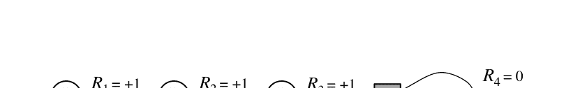

这里的实心方块表示对应于情节结束的特殊吸收状态。从 $S_0$ 开始，我们得到奖励序列 $+1, +1, +1, 0, 0, 0, ...$ 对这些进行求和，无论我们是对前 $T$ 个奖励（这里 $T=3$）求和还是对整个无限序列求和，我们得到相同的回报。即使我们引入折扣，这仍然成立。因此，根据（3.8）的约定，我们可以一般地定义回报，当不需要情节编号时，可以省略，并且如果和仍然被定义（例如，因为所有情节都终止），则包括 $\gamma=1$ 的可能性。或者，我们可以写成

$G_t \doteq \sum_{k=t+1}^{T} \gamma^{k-t-1} R_k,$

包括可能性 $T=\infty$ 或 $\gamma=1$（但不能同时）。我们在本书的其余部分中使用这些约定以简化符号并表达情节和持续任务之间的密切相似之处。（稍后，在第10章中，我们将介绍一种既持续又不折扣的表述。）

### 3.5 策略和值函数

几乎所有的强化学习算法都涉及估计值函数——状态（或状态-动作对）的函数，用于估计智能体在给定状态下的好坏（或在给定状态下执行给定动作的好坏）。这里的“好坏”概念是根据未来预期的回报来定义的，或者更准确地说，是根据预期回报来定义的。当然，智能体在未来可以期望获得的回报取决于它将采取的行动。因此，值函数是针对特定的行动方式（称为策略）定义的。

严格来说，一个策略是从状态到选择每个可能行动的概率的映射。如果智能体按照策略 π 在时间 t 上进行行动，那么 π(a|s) 表示在状态 s 下选择行动 a 的概率。和 p 一样，π 是一个普通的函数；π(a|s) 中间的“|”只是提醒它定义了一个在每个状态 s ∈ S 下对行动 a ∈ A 的概率分布。强化学习方法规定了智能体的策略如何根据其经验进行改变。

**练习3.11** 如果当前状态是 S_t，并且根据随机策略 π 选择行动，那么 R_{t+1} 的期望是多少，用 π 和四个参数的函数 p (3.2) 表示？

状态 s 在策略 π 下的价值函数 v_π(s) 表示从状态 s 开始并按照策略 π 后续行动的预期回报。对于 MDP，我们可以通过以下方式形式化定义 v_π：

$$ \mathbb{E}_{\pi}[G_t \mid S_t = s] = \mathbb{E}_{\pi} \left[ \sum_{k=0}^{\infty} \gamma^k R_{t+k+1} \mid S_t = s \right] \text{，对于所有的状态 } s \in \mathcal{S}, \quad (3.12) $$

其中 $\mathbb{E}_{\pi}[\cdot]$ 表示在智能体按照策略 π 行动的情况下，随机变量的期望值，t 是任意时间步。请注意，终止状态（如果有）的值始终为零。我们将函数 v_π 称为策略 π 的状态价值函数。

同样地，我们定义在策略 π 下，在状态 s 采取行动 a 的价值为 q_π(s, a)，表示从状态 s 开始，采取行动 a 后，按照策略 π 继续行动的预期回报：

$$ q_{\pi}(s, a) \doteq \mathbb{E}_{\pi}[G_t \mid S_t = s, A_t = a] = \mathbb{E}_{\pi} \left[ \sum_{k=0}^{\infty} \gamma^k R_{t+k+1} \mid S_t = s, A_t = a \right]. \quad (3.13) $$

我们称 q_π 为策略 π 的动作价值函数。

**练习3.12** 给出 v_π 的方程，其中包含 q_π 和 π。

**练习3.13** 给出 q_π 的方程，其中包含 v_π 和四个参数的 p。

价值函数 v_π 和 q_π 可以通过经验进行估计。例如，如果一个智能体遵循策略 π 并对每个遇到的状态维护一个实际回报的平均值，那么当该状态被遇到的次数趋近于无穷大时，这个平均值将会收敛到该状态的值 v_π(s)。如果为每个状态中采取的每个动作保留单独的平均值，那么这些平均值也将收敛到动作值 q_π(s, a)。我们将这种估计方法称为蒙特卡洛方法，因为它们涉及对实际回报的许多随机样本进行平均。这些方法在第5章中介绍。当然，如果有很多状态，那么为每个状态单独保留平均值可能是不切实际的。

相反，智能体需要将 $v_{\pi}$ 和 $q_{\pi}$ 作为参数化函数（参数比状态少）来维护，并调整参数以更好地匹配观察到的回报。这也可以产生准确的估计，尽管很大程度上取决于参数化函数逼近器的性质。这些可能性在本书的第二部分中进行了讨论。

在强化学习和动态规划中，值函数的一个基本属性是它们满足类似于回报（3.9）已经建立的递归关系的一致性条件。对于任何策略 $\pi$ 和任何状态 $s$，以下一致性条件成立：

$$ \begin{aligned} v_{\pi}(s) &\doteq \mathbb{E}_{\pi}[G_t \mid S_t = s] \\ &= \mathbb{E}_{\pi}[R_{t+1} + \gamma G_{t+1} \mid S_t = s] \quad \text{(通过 (3.9))} \\ &= \sum_{a} \pi(a|s) \sum_{s', r} p(s', r \mid s, a) \left[ r + \gamma \mathbb{E}_{\pi}[G_{t+1} \mid S_{t+1} = s'] \right] \\ &= \sum_{a} \pi(a|s) \sum_{s', r} p(s', r \mid s, a) \left[ r + \gamma v_{\pi}(s') \right], \quad \text{对于所有的状态 } s \in \mathcal{S}, \quad (3.14) \end{aligned} $$

其中隐含了动作 $a$ 来自于集合 $\mathcal{A}(s)$，下一个状态 $s'$ 来自于集合 $\mathcal{S}$（或者在一个情节问题中来自于 $\mathcal{S}^+$），奖励 $r$ 来自于集合 $\mathcal{R}$。还要注意在最后一个方程中，我们将两个求和合并了起来，一个是对 $s'$ 的所有值求和，另一个是对 $r$ 的所有值求和，合并成了对两者所有可能值的求和。我们经常使用这种合并求和的方式来简化公式。注意最终的表达式可以很容易地理解为一个期望值。这实际上是对三个变量 $a$，$s'$ 和 $r$ 的所有值进行求和。对于每个三元组，我们计算其概率 $\pi(a|s)p(s', r|s, a)$，将括号中的数量乘以该概率，然后对所有可能性求和得到一个期望值。

方程 (3.14) 是 $v_{\pi}$ 的贝尔曼方程。它表达了一个状态的值与其后继状态的值之间的关系。想象从一个状态向前看到其可能的后继状态，就像右边的图表所建议的那样。每个空心圆代表一个状态，每个实心圆代表一个状态-动作对。从状态 $s$ 开始，顶部的根节点，智能体可以根据其策略 $\pi$ 采取一些动作中的任何一个——图表中显示了其中三个。从这些动作中的每一个，环境可以根据其由函数 $p$ 给出的动态响应其中几个下一个状态，如图中所示，并伴随着一个奖励 $r$。贝尔曼方程（3.14）对所有可能性进行平均，按其发生的概率加权。它表明起始状态的值必须等于预期下一个状态的（折现）值加上沿途预期的奖励。值函数 $v_{\pi}$ 是其贝尔曼方程的唯一解。我们在后续章节中将展示这个贝尔曼方程如何构成多种方法的基础。

我们将上面那样的图称为备份图，因为它们图示了构成强化学习方法更新或备份操作基础的关系。这些操作将价值信息从后继状态（或状态-动作对）传递回到一个状态（或状态-动作对）。我们在本书中使用备份图来提供我们讨论的算法的图形摘要。（请注意，与转移图不同，备份图的状态节点不一定代表不同的状态；例如，一个状态可能是它自己的后继状态。）

**例子3.5：网格世界** 图3.2（左）显示了一个简单有限MDP的矩形网格世界表示。网格的单元格对应于环境的状态。在每个单元格中，有四个可能的动作：北、南、东、西，它们确定性地使智能体在网格上向相应的方向移动一个单元格。将智能体带离网格的动作不会改变其位置，但会导致奖励为 -1。其他动作的奖励为0，除了将智能体移出特殊状态 A 和 B 的动作。从状态 A，所有四个动作都会产生+10的奖励，并将智能体带到 A'。从状态 B，所有动作都会产生+5的奖励，并将智能体带到 B'。

假设智能体在所有状态下以相等的概率选择四个动作。图3.2（右）显示了该策略下的值函数 v̂_π，对于折扣奖励情况下的 γ = 0.9。这个值函数是通过解线性方程组（3.14）计算得出的。请注意，在下边缘附近的负值；这是由于在随机策略下，撞到网格边缘的概率很高。状态 A 是该策略下的最佳状态，但其预期回报小于10，即其即时奖励，因为从 A 被带到 A'，从那里很可能撞到网格边缘。另一方面，状态 B 的价值高于其即时奖励5，因为从 B 被带到 B'，后者具有正值。从 B' 开始，可能撞到边缘的预期惩罚（负奖励）被可能遇到 A 或 B 的预期收益所补偿。

**练习3.14** 贝尔曼方程（3.14）必须对每个状态的值函数 v_π 成立。在例子3.5的图3.2（右侧）中显示的值函数，数值上证明这个方程对于中心状态是成立的，中心状态的值为+0.7，其四个相邻状态的值分别为+2.3，+0.4，-0.4和+0.7。（这些数字只精确到小数点后一位。） □

**练习3.15** 在网格世界的例子中，目标的奖励是正的，撞到世界边缘的奖励是负的，其余时间奖励为零。这些奖励的符号重要吗，还是只有它们之间的间隔重要？奖励的符号重要吗，还是只有它们之间的间隔重要？使用（3.8）证明，将常数 c 添加到所有奖励中将会给所有状态的值添加一个常数 v_c，因此不会影响任何策略下任何状态的相对值。以 c 和 γ 为变量，v_c 是多少？

**练习3.16** 现在考虑在一个情节任务中给所有奖励添加一个常数 c，比如迷宫寻路。这会任何影响吗，还是会像上面的连续任务一样保持不变？为什么或为什么不？给出一个例子。

**例子3.6：高尔夫** 将打一洞高尔夫球作为一个强化学习任务，我们计算每一杆的惩罚（负奖励）为 -1，直到将球打入洞中。状态是球的位置。状态的值是从该位置到洞的杆数的负值。我们的行动是我们瞄准和挥杆的方式，当然还有我们选择的球杆。让我们将前者视为已知，并仅考虑球杆的选择，我们假设球杆可以是推杆或驱动器。图3.3的上部显示了一个可能的状态值函数，v_putt(s)，对于始终使用推杆的策略。终端洞内的状态值为0。从绿色上的任何位置，我们假设我们可以推杆；这些状态的值为 -1。在绿色上，我们无法通过推杆到达洞，因此值更大。如果我们可以通过推杆从一个状态到达绿色，那么该状态的值必须比绿色的值小1，即 -2。为简单起见，让我们假设我们可以非常精确和确定性地推杆，但是有限的范围。这给我们提供了图中标记为 -2 的尖锐等高线；该等高线和绿色之间的所有位置都需要完全两杆才能完成洞。同样，任何在 -2 等高线的推杆范围内的位置必须具有值 -3，以此类推，以获得图中显示的所有等高线。推杆无法使我们摆脱沙坑，因此它们的值为 ∞。

图3.3：高尔夫示例：推杆的状态值函数（上）和使用驱动器的最优动作值函数（下）。

总体而言，我们需要六杆才能从发球区到洞口。

**练习3.17** 动作值的贝尔曼方程是什么，即 q_π 的方程是什么？它必须根据可能的后继状态-动作对（s', a'）的动作值 q_π（s', a'）来给出动作值 q_π（s, a）的表达式。提示：右侧的备份图对应于这个方程。展示类似于（3.14）的方程序列，但是针对动作值。

**练习3.18** 一个状态的价值取决于该状态下可能的动作的价值以及每个动作在当前策略下被采取的可能性。我们可以将其视为以该状态为根的小型备份图，并考虑每个可能的动作：给出与该直觉和图示相对应的方程，用于根节点的值 $v_{\pi}(s)$，以期望叶节点的值 $q_{\pi}(s, a)$ 给定 $S_t = s$。这个方程应该包括在遵循策略 $\pi$ 的条件下的期望。然后给出第二个方程，其中期望值用 $\pi(a|s)$ 明确写出，使得方程中不出现期望值符号。□

**练习3.19** 一个动作的值，$q_{\pi}(s, a)$，取决于预期的下一个奖励和剩余奖励的预期总和。同样，我们可以从一个小的备份图来思考，这个图以一个动作（状态-动作对）为根，并分支到可能的下一个状态：给出与此直觉和图表相对应的方程，用于行动值 $q_{\pi}(s, a)$，以期望的下一个奖励 $R_{t+1}$ 和期望的下一个状态值为条件，这个方程应该包含一个期望，但不应该是在遵循策略的条件下的期望。然后给出第二个方程，将期望值明确地写成 $p(s', r|s, a)$ 的形式，由(3.2)定义，使得方程中不出现期望值符号。□

### 3.6 最优策略和最优值函数

解决强化学习任务的意思是，大致上找到一个能在长期内获得很多奖励的策略。对于有限MDP，我们可以精确地定义一个最优策略如下。价值函数对策略进行了部分排序。如果一个策略 $\pi$ 的期望回报大于或等于另一个策略 $\pi'$ 的期望回报，那么策略 $\pi$ 被定义为优于或等于策略 $\pi'$。换句话说，当且仅当对于所有状态 $s \in \mathcal{S}$，$\pi \geq \pi'$ 当且仅当 $v_{\pi}(s) \geq v_{\pi'}(s)$。总是至少存在一个策略优于或等于所有其他策略。这是一个最优策略。虽然可能有多个最优策略，我们用 $\pi_*$ 来表示所有最优策略。它们共享相同的状态值函数，称为最优状态值函数，表示为 $v_*$，并定义为

$$ v_{*}(s) \doteq \max_{\pi} v_{\pi}(s), \quad \text{对于所有 } s \in \mathcal{S}. $$

最优策略也共享相同的最优行动值函数 $q_*$，表示为

$$ q_*(s, a) \doteq \max_{\pi} q_{\pi}(s, a), \quad (3.16) $$

对于状态-动作对 $(s, a)$，该函数给出了在状态 $s$ 中采取行动 $a$ 后按照最优策略继续的预期回报。因此，我们可以用 $v_*$ 来表示 $q_*$ 如下：

$$ q_*(s, a) = \mathbb{E}[R_{t+1} + \gamma v_*(S_{t+1}) \mid S_t = s, A_t = a], \quad (3.17) $$

**例子3.7：高尔夫的最优值函数** 图3.3的下半部分显示了可能的最优动作值函数 $q_*(s, driver)$ 的等高线。如果我们先用球杆击球，然后选择更好的球杆或推杆，这些是每个状态的值。球杆可以让我们打得更远，但准确性较低。如果我们已经非常接近洞，只有使用球杆才能一杆进洞；因此，$-1$ 等高线表示 $q_*(s, driver)$ 只覆盖了绿地的一小部分。然而，如果我们有两杆，那么我们可以从更远的地方打到洞里，如 $-2$ 等高线所示。在这种情况下，我们不必一直开到 $-1$ 等高线内，只需开到绿地上的任何地方；然后我们可以使用推杆。最优动作值函数给出了在承诺采取特定的第一个动作之后的值，本例中是使用球杆，但之后使用最佳动作。$-3$ 等高线仍然更远，并包括起始发球台。从发球台开始，最佳的动作序列是两次开球和一次推杆，将球在三杆内打入洞中。

因为 $v_*$ 是一个策略的值函数，它必须满足贝尔曼方程给出的状态值 (3.14) 的一致性条件。然而，因为它是最优的值函数，$v_*$ 的一致性条件可以以一种特殊的形式写出，而不需要参考任何特定的策略。这是 $v_*$ 的贝尔曼方程，或者是贝尔曼最优方程。直观地说，贝尔曼最优方程表达了在最优策略下，一个状态的值必须等于从该状态选择最佳动作的预期回报：

$$ \begin{aligned} v_*(s) &= \max_{a \in \mathcal{A}(s)} q_{\pi_*}(s, a) \\ &= \max_{a} \mathbb{E}_{\pi_*}[G_t \mid S_t = s, A_t = a] \\ &= \max_{a} \mathbb{E}_{\pi_*}[R_{t+1} + \gamma G_{t+1} \mid S_t = s, A_t = a] \quad \text{(通过 (3.9))} \\ &= \max_{a} \mathbb{E}[R_{t+1} + \gamma v_*(S_{t+1}) \mid S_t = s, A_t = a] \quad (3.18) \\ &= \max_{a} \sum_{s', r} p(s', r \mid s, a) [r + \gamma v_*(s')] \quad (3.19) \end{aligned} $$

最后两个方程是 $v_*$ 的贝尔曼最优方程的两种形式。贝尔曼最优方程对于 $q_*$ 是

$$ \begin{aligned} q_*(s, a) &= \mathbb{E}\left[R_{t+1} + \gamma \max_{a'} q_*(S_{t+1}, a') \mid S_t = s, A_t = a\right] \\ &= \sum_{s', r} p(s', r \mid s, a) \left[r + \gamma \max_{a'} q_*(s', a')\right], \quad (3.20) \end{aligned} $$

下图中的备份图形以图形方式显示了贝尔曼最优方程中考虑的未来状态和动作的范围。这些与之前介绍的用于 $v_*$ 和 $q_*$ 的备份图形相同，只是在代理选择点添加了弧来表示选择的最大值，而不是给定某个策略的期望值。左侧的备份图形以图形方式表示了贝尔曼最优方程（3.19），右侧的备份图形以图形方式表示了（3.20）。

图3.4：$v_*$ 和 $q_*$ 的备份图形

对于有限 MDP，$v_*$ 的贝尔曼最优方程（3.19）有唯一解。贝尔曼最优方程实际上是一组方程，每个状态对应一个方程，所以如果有 $n$ 个状态，则有 $n$ 个未知数的方程。如果动态方程 $p$ 已知，原则上可以使用各种方法解决这个方程系统来求解 $v_*$。可以解决一组相关的方程来求解 $q_*$。

一旦有 $v_*$，确定最优策略相对容易。对于每个状态 $s$，在贝尔曼最优方程中，将会有一个或多个动作使得最大值被取得。只有分配非零概率给这些动作的策略才是最优策略。你可以将其视为一步搜索。如果你有最优的价值函数 $v_*$，那么在一步搜索之后看起来最好的动作将是最优的动作。另一种说法是，任何与最优评估函数 $v_*$ 一致的贪婪策略都是最优策略。在计算机科学中，贪婪一词用于描述仅基于局部或即时考虑选择替代方案的搜索或决策过程，而不考虑这种选择可能会阻止未来访问更好的替代方案的可能性。因此，它描述了仅基于短期后果选择动作的策略。价值函数 $v_*$ 的美妙之处在于，如果将其用于评估动作的短期后果——具体来说，是一步后果——那么贪婪策略实际上是我们感兴趣的长期意义上的最优策略，因为 $v_*$ 已经考虑了所有可能的未来行为的奖励后果。通过 $v_*$，最优的预期长期回报被转化为每个状态局部和立即可用的数量。因此，一步前瞻搜索得到了长期最优的动作。

拥有 $q_*$ 使选择最优动作变得更容易。有了 $q_*$，代理甚至不需要进行一步搜索：对于任何状态 $s$，它只需找到最大化 $q_*(s, a)$ 的任何动作。动作值函数有效地缓存了所有一步搜索的结果。它提供了每个状态-动作对的最优预期长期回报作为一个局部和立即可用的值。因此，以代价为表示状态-动作对的函数，而不仅仅是状态，最优动作值函数允许选择最优动作而无需了解可能的后继状态及其值，也就是说，无需了解环境的动态。

示例3.8：解决网格世界假设我们解决了贝尔曼方程 $v_*$ 对于在示例3.5中介绍的简单网格任务，并再次显示在图3.5（左）中。回想一下，状态 A 后面跟着奖励+10和转移到状态 A'，而状态B后面跟着奖励+5和转移到状态 B'。图3.5（中间）显示了最优值函数，图3.5（右边）显示了相应的最优策略。
当一个单元格中有多个箭头时，所有对应的动作都是最优的。

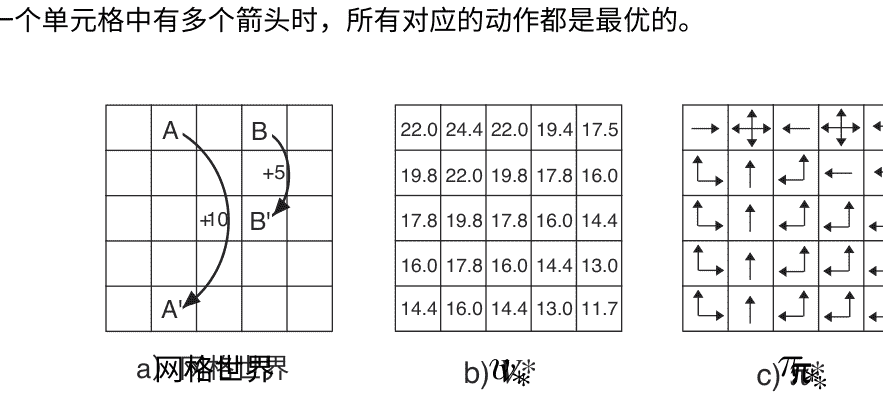

示例3.9：回收机器人的贝尔曼最优性方程使用（3.19），我们可以明确给出回收机器人示例的贝尔曼最优性方程。为了使事情更简洁，我们将状态高和低，以及动作搜索、等待和充电分别缩写为 h，l，s，w 和 re。因为只有两个状态，贝尔曼最优性方程包含两个方程。对于 $v_*$（高），方程可以写成如下形式：

$$
\begin{aligned}
v_*(h) &= \max \left\{ \begin{array}{l}
p(h|h, s)[r(h, s, h) + \gamma v_*(h)] + p(l|h, s)[r(h, s, l) + \gamma v_*(l)], \\
p(h|h, w)[r(h, w, h) + \gamma v_*(h)] + p(l|h, w)[r(h, w, l) + \gamma v_*(l)]
\end{array} \right\} \\
&= \max \left\{ \begin{array}{l}
\alpha[r_s + \gamma v_*(h)] + (1 - \alpha)[r_s + \gamma v_*(l)], \\
1[r_w + \gamma v_*(h)] + 0[r_w + \gamma v_*(l)]
\end{array} \right\} \\
&= \max \left\{ \begin{array}{l}
r_s + \gamma[\alpha v_*(h) + (1 - \alpha)v_*(l)], \\
r_w + \gamma v_*(h)
\end{array} \right\} .
\end{aligned}
$$
按照相同的步骤进行 $v_*(l)$得到方程
$$
v_*(l) = \max \left\{ \begin{array}{l}
\beta r_s - 3(1 - \beta) + \gamma[(1 - \beta)v_*(h) + \beta v_*(l)], \\
r_w + \gamma v_*(l), \\
\gamma v_*(h)
\end{array} \right\} .
$$

对于任意选择的 $r_s$，$r_w$，$\alpha$，$\beta$ 和 $\gamma$，其中 $0 \leq \gamma < 1, 0 \leq \alpha, \beta \leq 1$，存在唯一一对数，$v_*(h)$ 和 $v_*(l)$，同时满足这两个非线性方程。

明确解决贝尔曼最优方程提供了一种寻找最优策略的途径，从而解决了强化学习问题。然而，这个解决方案很少直接有用。它类似于穷举搜索，预先考虑所有可能性，计算它们发生的概率和预期奖励的可取性。这个解决方案至少依赖于三个在实践中很少成立的假设：(1)我们准确地了解环境的动态；(2)我们有足够的计算资源来完成解决方案的计算；(3)马尔可夫性质。对于我们感兴趣的任务类型，由于违反了各种假设的组合，通常无法精确实现这个解决方案。例如，虽然对于博弈的第一和第三个假设没有问题，但第二个假设是一个重要的障碍。

因为这个游戏大约有10^20个状态，要解决贝尔曼方程 $v_*$ 需要在今天最快的计算机上花费数千年的时间，对于找到 $q_*$。在强化学习中，通常需要接受近似解决方案。许多不同的决策方法可以被视为近似解决贝尔曼最优方程的方法。例如，启发式搜索方法可以被视为多次扩展(3.19)的右侧，达到一定的深度，形成一个“树”形的可能性，然后使用启发式评估函数来近似在“叶子”节点上近似 $v_*$。 (启发式搜索方法如A*几乎总是基于情节性案例。) 动态规划的方法与贝尔曼最优方程更加密切相关。许多强化学习方法可以清楚地理解为使用实际经验转换来近似解决贝尔曼最优方程，而不是使用预期转换的知识。我们在下面的章节中考虑了各种这样的方法。

- 练习3.20 绘制或描述高尔夫示例的最优状态值函数。
- 练习3.21 绘制或描述高尔夫示例中推杆动作的最优动作值函数的等高线。推杆动作为 $q_*(s, \text{推杆})$。
- 练习3.22 考虑右侧显示的连续MDP。唯一需要做出的决策是在顶部状态下，有两个可用的动作，即左和右。数字表示在每个动作之后确定性地获得的奖励。有两个确定性策略，$\pi_{\text{左}}$和$\pi_{\text{右}}$，如果 $\gamma=0$，哪个策略是最优的？如果 $\gamma=0.9$？如果 $\gamma=0.5$？
- 练习3.23 给出回收机器人的贝尔曼方程 $q_*$。
- 练习3.24 图3.5给出了网格世界最佳状态的最优值为24.4，保留一位小数。利用最优策略和(3.8)的知识，将此值符号化，然后计算到三位小数。
- 练习3.25 给出一个关于 $v_*$ 的方程，用 $q_*$ 表示。
- 练习3.26 给出一个关于 $q_*$ 的方程，用 $v_*$ 和四个参数 $p$ 表示。

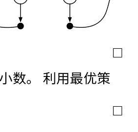

- 练习3.27 给出一个关于 $\pi_*$ 的方程，用 $q_*$ 表示。
- 练习3.28 给出一个关于 $\pi_*$ 的方程，用 $v_*$ 和四个参数 $p$ 表示。
- 练习3.29 用三个参数函数 $p$ (3.4) 和两个参数函数 $r$ (3.5)，重新写出四个值函数 ($v_{\square}, v_*, q_{\square}, \text{和} q_*$) 的贝尔曼方程。

### 3.7 最优性和近似

我们已经定义了最优值函数和最优策略。显然，学习最优策略的代理做得非常好，但在实践中这很少发生。对于我们感兴趣的任务类型，只能以极高的计算成本生成最优策略。明确定义的最优性概念组织了我们在本书中描述的学习方法，并提供了一种理解各种学习算法的理论属性的方式，但这只是代理能够以不同程度近似的理想。正如我们上面讨论的，即使我们拥有完整准确的环境动态模型，通常也不可能通过解决贝尔曼最优方程来简单计算出最优策略。例如，象棋等棋盘游戏只占人类经验的一小部分，然而大型定制计算机仍然无法计算出最优的走法。代理面临的问题的一个关键方面始终是其可用的计算能力，特别是它在单个时间步骤中可以执行的计算量。

可用内存也是一个重要的限制条件。通常需要大量的内存来构建价值函数、策略和模型的近似。在具有小的有限状态集的任务中，可以使用数组或表格来形成这些近似，每个状态（或状态-动作对）有一个条目。我们称之为表格情况，并且相应的方法称为表格方法。然而，在许多实际问题中，状态远远超过表格中可能的条目数。在这些情况下，必须使用某种更紧凑的参数化函数表示来近似这些函数。

我们对强化学习问题的界定迫使我们接受近似。然而，它也为我们提供了一些实现有用近似的独特机会。例如，在近似最优行为时，代理可能面临许多状态，其发生的概率非常低，选择次优动作对其获得的奖励几乎没有影响。例如，Tesauro的西洋双陆棋选手即使在与专家对局中从未出现的棋局配置上做出非常糟糕的决策，也能展现出卓越的技巧。事实上，TD-Gammon可能在游戏状态集的很大一部分上做出糟糕的决策。强化学习的在线性质使得可以通过更多努力学习为经常遇到的状态做出良好决策的方式来近似最优策略，而对于不经常遇到的状态则付出较少努力。这是强化学习与其他近似解决MDP问题方法的一个关键特性。

### 3.8 总结

让我们总结一下我们在本章中提出的强化学习问题的要素。强化学习是关于从互动中学习如何行为以实现目标的。强化学习代理和其环境在一系列离散时间步骤上进行互动。它们接口的规范定义了一个特定的任务：动作是代理人所做的选择；状态是做出选择的基础；奖励是评估选择的基础。代理人内部的一切都是完全已知和可控的；外部的一切都是不完全可控的，但可能完全已知也可能不完全已知。策略是代理人根据状态选择动作的随机规则。代理人的目标是在时间上最大化获得的奖励量。

当上述描述的强化学习设置具有明确定义的转移概率时，它构成了一个马尔可夫决策过程（MDP）。有限MDP是具有有限状态、动作和（按我们的定义）奖励集的MDP。目前强化学习的大部分理论都局限于有限MDP，但这些方法和思想更普遍适用。

回报是代理寻求最大化的未来奖励函数（按预期值计算）。根据任务的性质和是否希望对延迟奖励进行折现，它有几种不同的定义。无折现的形式适用于分割成自然的剧集的情况，折现的形式适用于连续的任务，其中交互没有自然地分割成剧集而是无限继续。我们试图定义这两种任务的回报，使得一组方程可以适用于剧集和连续情况。

策略的价值函数为每个状态或状态-动作对分配了使用该策略时从该状态或状态-动作对获得的预期回报。最优价值函数为每个状态或状态-动作对分配了任何策略可实现的最大预期回报。价值函数最优的策略是最优策略。

对于给定的MDP，状态和状态-动作对的最优值函数是唯一的，但可以存在许多最优策略。任何相对于最优值函数贪婪的策略都必须是最优策略。贝尔曼最优性方程是最优值函数必须满足的特殊一致性条件，原则上可以通过求解最优值函数来确定最优策略。

强化学习问题可以根据对代理程序最初可用知识水平的假设以多种不同的方式提出。在完全知识的问题中，代理程序对环境动态的模型是完整且准确的。如果环境是MDP，则这样的模型包括完整的四参数动态函数 $p$ (3.2)。在不完全知识的问题中，没有完整和完美的环境模型可用。

即使代理有一个完整准确的环境模型，代理通常无法在每个时间步骤中执行足够的计算来充分利用它。可用的内存也是一个重要的限制。可能需要内存来构建准确的价值函数、策略和模型的近似。在大多数实际感兴趣的情况下，状态远远超过表中可能的条目数量，必须进行近似。

在这本书中，我们描述的学习方法是基于一个明确定义的最优性概念，并且提供了一种理解各种学习算法的理论性质的方式，但这只是强化学习代理能够以不同程度近似的理想。在强化学习中，我们非常关注那些无法找到最优解但必须以某种方式近似的情况。

### 参考文献和历史评论

强化学习问题深受最优控制领域的马尔可夫决策过程（MDPs）的思想的影响。这些历史影响和其他来自心理学的主要影响在第1章中的简要历史中有所描述。

强化学习在MDPs的基础上，注重对于真实大问题的近似和不完全信息。MDPs和强化学习问题与传统的人工智能学习和决策问题只有弱关联。然而，人工智能现在正在积极探索从各种角度进行规划和决策的MDP形式。MDPs比人工智能中以前的形式更加通用，因为它们允许更一般的目标和不确定性。

MDPs的理论由Bertsekas（2005）、White（1969）、Whittle（1982,1983）和Puterman（1994）等人进行了研究。Ross（1983）对有限情况进行了特别简洁的处理。MDPs也在随机最优控制的范畴下进行研究，其中自适应最优控制方法与强化学习最为相关（例如，Kumar，1985；Kumar和Varaiya，1986）。

马尔可夫决策过程（MDPs）的理论起源于对在不确定性下进行决策序列的问题的理解，其中每个决策都可以依赖于先前的决策及其结果。它有时被称为多阶段决策过程或顺序决策过程，并且在统计文献中有与顺序抽样相关的根源，这始于Thompson（1933,1934）和Robbins（1952）的论文，我们在第2章中与赌博机问题（作为典型的MDPs问题）有关时引用了这些论文。

我们所知道的最早使用MDPs形式化描述强化学习的实例是Andreae（1969b）对学习机器的统一视角的描述。Witten和Corbin（1973）在MDP形式化后对一个强化学习系统进行了实验，并由Witten（1977, 1976a）进行了分析。尽管他没有明确提到MDPs，但Werbos（1977）提出了与现代强化学习方法相关的随机最优控制问题的近似解决方法（另请参阅Werbos，1982, 1987, 1988, 1989, 1992）。尽管Werbos的想法当时没有得到广泛认可，但他们在强调在各种领域中近似解决最优控制问题的重要性方面是有远见的，包括人工智能。强化学习和MDPs最有影响力的整合是由Watkins（1989）提出的。

### 3.1

我们对MDP的动力学特性的描述稍微有些不同，用 $p(s', r | s, a)$ 来描述。在MDP的文献中，更常见的是用状态转移概率 $p(s' | s, a)$ 和预期的下一个奖励值 $r(s, a)$ 来描述动力学特性。然而，在强化学习中，我们更经常需要引用个别的实际或样本奖励（而不仅仅是它们的预期值）。我们的符号表示也更清晰地表明 $S_t$ 和 $R_t$ 通常是联合决定的，因此必须具有相同的时间索引。在教授强化学习时，我们发现我们的符号表示在概念上更直观和更容易理解。

关于系统理论概念中状态的直观讨论，请参见Minsky（1967）的著作。

生物反应器的例子基于Ungar（1990）和Miller和Williams（1992）的工作。回收机器人的例子是受Jonathan Connell（1989）制作的收集罐机器人的启发。Kober和Peters（2012）提供了一系列强化学习在机器人领域的应用案例。

### 3.2

奖励假设是由迈克尔·利特曼（个人通信）提出的。

### 3.3-4

在MDP文献中，关于情节性和持续性任务的术语与通常使用的术语不同。在那些文献中，通常区分三种类型的任务：（1）有限时间任务，在特定的固定时间步骤后交互终止；（2）无限时间任务，交互可以持续任意长时间，但必须最终终止；以及（3）无限时间任务，交互不会终止。我们的情节性和持续性任务类似于无限时间和无限时间任务，但我们更喜欢强调交互性质上的差异。这种差异似乎比通常术语强调的目标函数差异更为基本。通常情节性任务使用无限时间目标函数，而持续性任务使用无限时间目标函数，但我们认为这是一个常见的巧合，而不是一个根本性的差异。

杆平衡的例子来自于Michie和Chambers（1968年）以及Barto、Sutton和Anderson（1983年）。

### 3.5-6

根据长期来看什么是好的或者是坏的来分配价值具有悠久的历史根源。在控制理论中，将状态映射到代表控制决策的长期后果的数值是最优控制理论的关键部分，该理论是在1950年代通过扩展19世纪经典力学的状态函数理论（例如Schultz和Melsa，1967年）而发展起来的。在描述计算机如何编程下棋时，Shannon（1950年）建议使用一个评估函数，该函数考虑了下棋位置的长期优势和劣势。

Watkins（1989年）的Q-learning算法用于估计 $q_*$（第6章），使得动作值函数成为强化学习的重要组成部分，因此这些函数通常被称为“Q函数”，但是动作值函数的概念比这个要古老得多。Shannon（1950年）建议使用一个函数 $h(P, M)$ 可以被一个下棋程序用来决定是否值得探索一个位置 $P$ 中的移动 $M$。Michie（1961年，1963年）的MENACE系统和Michie和Chambers（1968年）的BOXES系统可以理解为估计动作值函数。在经典物理学中，Hamilton的主函数是一个动作值函数；牛顿动力学对于这个函数是贪婪的（例如，Goldstein，1957年）。动作值函数在Denardo（1967年）的动态规划的理论处理中也起着核心作用，以收缩映射的形式。

Bellman最优性方程（对于 $v_*$）是由Richard Bellman（1957a）推广的，他称之为“基本的函数方程”。连续时间和状态问题的Bellman最优性方程的对应方程被称为Hamilton-Jacobi-Bellman方程（或者通常只是Hamilton-Jacobi方程），表明它在经典物理学中的根源（例如，Schultz和Melsa，1967年）。高尔夫球的例子是由Chris Watkins提出的。

## 第四章 动态规划

动态规划（DP）一词指的是一组算法，可以在将环境视为马尔可夫决策过程（MDP）的完美模型的情况下计算最优策略。经典的DP算法在强化学习中的实用性有限，这是因为它们假设了一个完美的模型，并且计算开销很大，但从理论上来说它们仍然很重要。DP为本书中介绍的方法的理解提供了基本的基础。事实上，所有这些方法都可以被视为试图实现与DP相同的效果，只是计算量较小，并且不假设环境具有完美的模型。

我们通常假设环境是一个有限MDP。也就是说，我们假设其状态、动作和奖励集合，S、A和R，是有限的，并且其动态由一组概率 $p(s', r | s, a)$ 给出，其中 $s \in S$，$a \in A(s)$，$r \in R$，$s' \in S^+$（如果问题是周期性的，则 $S^+$ 包括一个终止状态）。尽管DP的思想可以应用于具有连续状态和动作空间的问题，但只有在特殊情况下才可能得到精确解。对于具有连续状态和动作的任务，一种常见的获得近似解的方法是对状态和动作空间进行量化，然后应用有限状态DP方法。我们在第9章探讨的方法适用于连续问题，并且是该方法的重要扩展。

DP的关键思想，以及强化学习的一般思路，是使用值函数来组织和结构化寻找良好策略的搜索。在本章中，我们展示了如何使用DP来计算第3章中定义的值函数。正如在那里讨论的那样，一旦我们找到了最优值函数，我们可以轻松地获得最优策略，即 $v_*$ 或 $q_*$。

满足贝尔曼最优性方程的 $v_*$ 或 $q_*$ 为最优值函数：
$$
v_*(s) = \max_a \mathbb{E}[R_{t+1} + \gamma v_*(S_{t+1}) \mid S_t = s, A_t = a] \\ = \max_a \sum_{s', r} p(s', r \mid s, a) [r + \gamma v_*(s')], \quad \text{或} \quad (4.1)
$$
$$
q_*(s, a) = \mathbb{E}[R_{t+1} + \gamma \max_{a'} q_*(S_{t+1}, a') \mid S_t = s, A_t = a] \\ = \sum_{s', r} p(s', r \mid s, a) [r + \gamma \max_{a'} q_*(s', a')], \quad (4.2)
$$
正如我们将看到的，DP算法是通过将这样的贝尔曼方程转化为赋值，即用于改进所需值函数的近似的更新规则。

### 4.1 策略评估（预测）

首先，我们考虑如何计算任意策略下的状态值函数 $v_{\pi}$。在DP文献中，这被称为策略评估。我们也将其称为预测问题。回顾第3章，对于所有的状态 $s \in S$，
$$ \begin{aligned} v_{\pi}(s) &\doteq \mathbb{E}_{\pi}[G_t \mid S_t = s] \\ &= \mathbb{E}_{\pi}[R_{t+1} + \gamma G_{t+1} \mid S_t = s] \quad \text{(来自 (3.9))} \\ &= \mathbb{E}_{\pi}[R_{t+1} + \gamma v_{\pi}(S_{t+1}) \mid S_t = s] \quad (4.3) \\ &= \sum_{a} \pi(a|s) \sum_{s', r} p(s', r \mid s, a) \left[ r + \gamma v_{\pi}(s') \right], \quad (4.4) \end{aligned} $$
其中 $\pi(a|s)$ 是在状态 $s$ 下根据策略 $\pi$ 采取行动 $a$ 的概率，期望值以 $\pi$ 为下标表示它们在 $\pi$ 被遵循的条件下。只要 $\gamma<1$ 或者在策略 $\pi$ 下从所有状态都能保证最终终止，$v_{\pi}$ 的存在性和唯一性就得到保证。

如果环境的动态完全已知，则 (4.4) 是一个 $|S|$ 未知数 ($v_{\pi}(s)$, $s \in S$) 的同时线性方程组。原则上，它的解是一个直接的，但繁琐的计算。对于我们的目的，迭代解法是最合适的。考虑一个近似值函数序列 $v_0$, $v_1$, $v_2$, ...。每个映射 $S^+$ 到 $\mathbb{R}$ (实数)。初始近似值函数 $v_0$ 是任意选择的（除了终止状态，如果有的话，必须给定值为0），每个后续的近似值函数通过使用贝尔曼方程作为更新规则来获得：
$$ \begin{aligned} v_{k+1}(s) &= \mathbb{E}_{\pi}[R_{t+1} + \gamma v_{k}(S_{t+1}) \mid S_t = s] \\ &= \sum_{a} \pi(a|s) \sum_{s', r} p(s', r \mid s, a) \left[ r + \gamma v_{k}(s') \right], \quad (4.5) \end{aligned} $$
对于所有的 $s \in S$。显然，$v_k = v_{\pi}$ 是这个更新规则的一个不动点，因为对于 $v_{\pi}$ 的贝尔曼方程在这种情况下保证了相等。事实上，序列 $\{v_k\}$ 通常收敛到 $v_{\pi}$，在保证 $v_{\pi}$ 存在的条件下。这个算法被称为迭代策略评估。

为了产生每个连续的近似值 $v_{k+1}$ 从 $v_k$，迭代策略评估对每个状态 $s$ 应用相同的操作：它用来自正在评估的策略下的后继状态的旧值和预期即时奖励替换 $s$ 的旧值，并且沿着所有可能的一步转换。我们称这种操作为期望更新。每次迭代策略评估更新每个状态的值一次，以产生新的近似值函数。

4.1  根据更新的方式和后继状态的估计值如何组合，预期更新有几种不同的类型，取决于更新状态（如此处）还是状态-动作对，并取决于后继状态的估计值的具体方式。DP算法中进行的所有更新都被称为预期更新，因为它们基于对所有可能的下一个状态的期望，而不是基于样本下一个状态。更新的性质可以用方程式（如上所示）或备份图表示，备份图在第3章中介绍。例如，迭代策略评估中使用的预期更新对应的备份图显示在第59页。

要编写一个顺序计算机程序来实现如（4.5）所示的迭代策略评估，您需要使用两个数组，一个用于旧值，$v_k (s)$，一个用于新值，$v_{k+1} (s)$。有了两个数组，可以从旧值逐个计算出新值，而不会改变旧值。当然，使用一个数组并在原地更新值（即每个新值立即覆盖旧值）更容易。然后，根据更新状态的顺序，有时在（4.5）的右侧使用新值而不是旧值。这种原地算法也收敛到$v_\pi$；实际上，它通常比两个数组版本收敛更快，这是可以预期的，因为它尽快使用新数据。我们将更新视为对状态空间的一次扫描。对于原地算法，状态在扫描过程中更新值的顺序对收敛速度有重要影响。当我们思考DP算法时，通常考虑的是原地版本。

迭代策略评估的完整原地版本在下面的伪代码中显示。注意它如何处理终止。形式上，迭代策略评估只在极限情况下收敛，但在实践中必须提前停止。伪代码在每次扫描后测试数量$\max_{s \in S} |v_{k+1}(s)-v_k(s)|$，并在其足够小的时候停止。

```
迭代策略评估，用于估计 $V \approx v_\pi$

输入 π，要评估的策略
算法参数：一个小阈值 θ >0，用于确定估计的准确性
初始化 V(s)，对于所有 s ∈ S+，除了 V(终止)=0

循环:
  Δ ← 0
  循环每个 s ∈ S:
    v ← V(s)
    V(s) ← Σ_a π(a|s) Σ_{s',r} p(s', r | s, a)[r + γ V(s')]
    Δ ← max(Δ, |v - V(s)|)
直到 Δ < θ

```

### 4.2 策略改进

我们计算策略的值函数是为了帮助找到更好的策略。
假设我们已经确定了任意确定性策略的值函数 $v_{\pi}$。
$\pi$。 对于某个状态 $s$，我们想知道是否应该改变策略，以确定性地选择一个动作 $a = \pi(s)$。 我们知道从 $s$ 遵循当前策略的好处——即 $v_{\pi}(s)$——但改变到新策略会更好还是更差呢？ 回答这个问题的一种方法是考虑在 $s$ 中选择 $a$，然后遵循现有策略 $\pi$ 的方式。 这种行为方式的价值是

> $$
\begin{aligned}
q_{\pi}(s, a) &\doteq \mathbb{E}[R_{t+1} + \gamma v_{\pi}(S_{t+1}) \mid S_t = s, A_t = a] \\
&= \sum_{s', r} p(s', r \mid s, a) \big[r + \gamma v_{\pi}(s')\big].
\end{aligned}
$$
(4.6)

关键标准是这是否大于或小于 $v_{\pi}(s)$。如果它更大——也就是说，在 $s$ 中选择 $a$ 一次然后遵循 $\pi$ 比遵循 $\pi$ 一直——那么人们预期每次遇到 $s$ 时选择 $a$ 仍然更好，并且新策略实际上将是一个更好的策略。

这是一个特殊情况，属于一个称为 *policy improvement theorem* 的一般结果。让 $\pi$ 和 $\pi'$ 是任何一对确定性策略，使得对于所有 $s \in \mathcal{S}$，

> $$q_{\pi}(s, \pi'(s)) \geq v_{\pi}(s).$$
(4.7)

那么策略 $\pi'$ 必须至少和 $\pi$ 一样好，或者更好。也就是说，它必须从所有状态 $s \in \mathcal{S}$ 中获得更大或相等的预期回报：

> $$v_{\pi'}(s) \geq v_{\pi}(s).$$
(4.8)

此外，如果在任何状态上存在(4.7)的严格不等式，则在该状态上必须存在(4.8)的严格不等式。这个结果特别适用于我们在前一段中考虑的两个策略，一个是原始的确定性策略 $\pi$，另一个是一个与 $\pi$ 相同的改变策略 $\pi'$，只是 $\pi'(s) = a \ne \pi(s)$。显然，(4.7)在除了 $s$ 之外的所有状态上成立。因此，如果 $q_{\pi}(s, a) > v_{\pi}(s)$，那么改变的策略确实比 $\pi$ 更好。

策略改进定理的证明思路很容易理解。从(4.7)开始，我们不断用(4.6)扩展 $q_{\pi}$ 的一侧，并重新应用(4.7)，直到我们得到 $v_{\pi'}(s)$ 为止：

```
$$
\begin{aligned}
v_{\pi}(s) &\leq q_{\pi}(s, \pi'(s)) \\
&= \mathbb{E}[R_{t+1} + \gamma v_{\pi}(S_{t+1}) \mid S_t = s, A_t = \pi'(s)] & \text{(通过(4.6))} \\
&= \mathbb{E}_{\pi'}[R_{t+1} + \gamma v_{\pi}(S_{t+1}) \mid S_t = s] \\
&\leq \mathbb{E}_{\pi'}[R_{t+1} + \gamma q_{\pi}(S_{t+1}, \pi'(S_{t+1})) \mid S_t = s] & \text{(通过(4.7))} \\
&= \mathbb{E}_{\pi'}[R_{t+1} + \gamma \mathbb{E}_{\pi'}[R_{t+2} + \gamma v_{\pi}(S_{t+2})|S_{t+1}, A_{t+1}=\pi'(S_{t+1})] \mid S_t = s] \\
&= \mathbb{E}_{\pi'}[R_{t+1} + \gamma R_{t+2} + \gamma^2 v_{\pi}(S_{t+2}) \mid S_t = s] \\
&\leq \mathbb{E}_{\pi'}[R_{t+1} + \gamma R_{t+2} + \gamma^2 R_{t+3} + \gamma^3 v_{\pi}(S_{t+3}) \mid S_t = s] \\
&\vdots \\
&\leq \mathbb{E}_{\pi'}[R_{t+1} + \gamma R_{t+2} + \gamma^2 R_{t+3} + \gamma^3 R_{t+4} + \cdots \mid S_t = s] \\
&= v_{\pi'}(s).
\end{aligned}
$$
```

到目前为止，我们已经看到了如何在给定策略及其值函数的情况下，可以轻松评估策略在单个状态到特定动作的变化。这是一个自然的扩展

考虑在所有状态和所有可能的动作上进行更改，在每个状态选择出现最佳的动作，根据$q_{\pi}(s, a)$。换句话说，考虑新的贪婪策略，$\pi'$，由以下给出

```
$\pi'(s) \doteq \underset{a}{\text{argmax}} \, q_{\pi}(s, a)$  
$= \underset{a}{\text{argmax}} \, \mathbb{E}[R_{t+1} + \gamma v_{\pi}(S_{t+1}) \mid S_t = s, A_t = a] \quad (4.9)$  
$= \underset{a}{\text{argmax}} \, \sum_{s', r} p(s', r \mid s, a) \left[ r + \gamma v_{\pi}(s') \right],$
```

其中$\underset{a}{\text{argmax}}$表示在其后的表达式最大化时的$a$的值（以任意方式解决平局）。贪婪策略根据$v_{\pi}$，在短期内（向前看一步）选择看起来最好的动作。通过构建，贪婪策略满足策略改进定理（4.7）的条件，因此我们知道它与原始策略一样好，或者更好。通过使原始策略相对于原始策略的值函数变得贪婪，从而制定出改进原始策略的新策略，称为策略改进。

假设新的贪婪策略，$\pi'$，与旧策略$\pi$一样好，但不更好。那么$v_{\pi} = v_{\pi'}$，根据(4.9)可知对于所有的$s \in \mathcal{S}$：

```
$v_{\pi'}(s) = \max_{a} \mathbb{E}[R_{t+1} + \gamma v_{\pi'}(S_{t+1}) \mid S_t = s, A_t = a]$  
$= \max_{a} \sum_{s', r} p(s', r \mid s, a) \left[ r + \gamma v_{\pi'}(s') \right].$
```

但这与贝尔曼最优方程(4.1)相同，因此，$v_{\pi'}$必须是$v_{*}$，而$\pi$和$\pi'$都必须是最优策略。因此，策略改进必须给我们一个严格更好的策略，除非原始策略已经是最优的。到目前为止，在本节中，我们只考虑了确定性策略的特殊情况。在一般情况下，随机策略$\pi$指定了在每个状态下采取每个动作的概率$\pi(a \mid s)$。我们不会详细介绍，但实际上，本节的所有思想都很容易扩展到随机策略。特别是，策略改进定理对于随机情况仍然成立。此外，如果在策略改进步骤中存在平局，例如(4.9)，即存在多个动作达到最大值，则在随机情况下，我们不需要从中选择单个动作。相反，每个最大化的动作可以在新的贪婪策略中被赋予一部分被选择的概率。只要所有次优动作都被赋予零概率，任何分配方案都是允许的。

图4.1的最后一行显示了随机策略的策略改进示例。这里原始策略$\pi$是等概率随机策略，新策略$\pi'$是相对于$v_{\pi}$贪婪的。值函数$v_{\pi}$显示在左下图中，可能的$\pi'$集合显示在右下图中。在$\pi'$图中有多个箭头的状态是那些在(4.9)中有多个动作达到最大值的状态；可以对这些动作之间的概率进行任意分配。

任何这样的策略的值函数，$v(\pi)$，可以通过检查得出是1、1或2，而$v(\pi')$在所有状态$s \in \mathcal{S}$上最多为14。因此，$v(\pi) \leq v(\pi')$，对于所有的$s \in \mathcal{S}$，说明了策略改进。尽管在这种情况下新策略$\pi'$恰好是最优的，但一般情况下只能保证改进。

### 4.3 策略迭代

一旦使用v(π)改进了策略π，得到了更好的策略π'，我们可以计算出v(π')并再次改进它以得到更好的策略π''。因此，我们可以得到一系列单调改进的策略和值函数：

在每次改进中，策略和值函数都会逐渐提高。这样，我们可以得到一系列单调递增的策略和值函数：

π₀ --E--> vπ₀ --I--> π₁ --E--> vπ₁ --I--> π₂ --E--> ... --I--> π* --E--> v*,

其中 --E--> 表示策略评估和 --I--> 表示策略改进。每个策略都保证比前一个策略有明显的改进（除非它已经是最优的）。因为有限MDP只有有限数量的策略，所以这个过程必须在有限次迭代中收敛到最优策略和最优值函数。

这种寻找最优策略的方法被称为策略迭代。完整的算法如下方框所示。请注意，每次策略评估都是一个迭代计算，它从前一个策略的值函数开始。这通常会大大加快策略评估的收敛速度（可能是因为值函数在一个策略到另一个策略时变化很小）。

```
使用迭代策略评估的策略迭代算法，用于估计 π ≈ π*

1. 初始化
   对于所有的状态 s ∈ S，任意选择初始值函数V(s)和策略 π(s)

2. 策略评估
   循环:
      Δ ← 0
      循环每个 s ∈ S:
          v ← V(s)
          V(s) ← Σ_{s',r} p(s', r | s, π(s)) [r + γV(s')]
          Δ ← max(Δ, |v - V(s)|)
   直到 Δ < θ (一个小正数，决定估计的准确度)

3. 策略改进
   策略稳定 ← True
   对于每个状态 s ∈ S
       旧动作 ← π(s)
       π(s) ← argmax_a Σ_{s',r} p(s', r | s, a) [r + γV(s')]
       如果旧动作 ≠ π(s)，则策略稳定 ← False
   如果策略稳定，停止并返回 V ≈ v* 和 π ≈ π*；否则返回2
```

### 例子4.2：杰克的汽车租赁

杰克为一家全国性汽车租赁公司管理两个地点。 每天，一些顾客到达每个地点租车。如果杰克有可用的汽车，他会出租并得到全国公司的10美元信用。如果他在该地点没有汽车，则业务会丢失。 汽车在归还后的第二天可供出租。 为了确保汽车在需要的地方可用，杰克可以在夜间将汽车在两个地点之间移动，每辆汽车的成本为2美元。 我们假设每个地点请求和归还的汽车数量都是泊松随机变量，即数量为n的概率为

```
$n$是 $\frac{\lambda^n}{n!}e^{-\lambda}$，其中 $\lambda$是期望数量。
```

假设租赁请求的第一个和第二个地点的期望数量分别为3和4，归还数量分别为3和2。 为了简化问题，我们假设每个地点最多可以有20辆汽车（任何额外的汽车都会归还给全国公司，因此从问题中消失） ，并且一夜之间最多可以将5辆汽车从一个地点移动到另一个地点。 我们将折扣率取为 $\lambda=0.9$，并将其制定为一个连续的有限MDP，其中时间步长为天，状态为每天结束时每个地点的汽车数量，动作为一夜之间在两个地点之间移动的净汽车数量。 图4.2显示了从从不移动任何汽车的策略开始的策略迭代找到的策略序列。

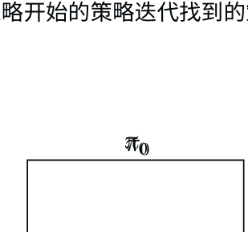

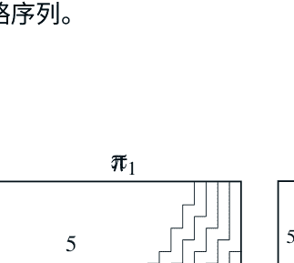

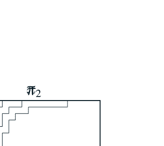

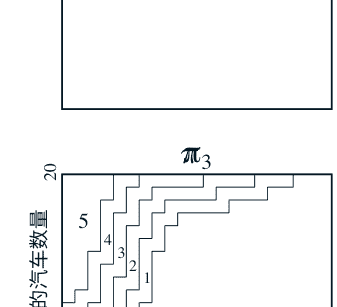

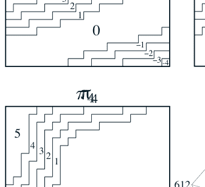

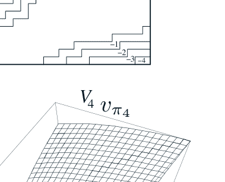

图4.2: 杰克汽车租赁问题上策略迭代找到的策略序列和最终状态值函数。 前五个图表显示了每天结束时每个位置的汽车数量，从第一个位置移动到第二个位置的汽车数量（负数表示从第二个位置转移至第一个位置）。每个连续的策略都比前一个策略有所改进，最后一个策略是最优的。

练习4.1 在示例4.1中，如果 $\pi$是等概率随机策略，那么 $q_{\pi}(11,\text{下})$是多少？ $\pi(7,\text{下})$是多少？

练习4.2 在示例4.1中，假设在网格世界中新增一个位于13号状态下方的新状态15，它的动作为左、上、右和下，分别将代理器移动到状态12、13、14和15。 假设从原始状态的转换保持不变。
那么，对于等概率随机策略，$v_{\pi}(15)$是多少？ 现在假设状态13的动态也发生了变化，即从状态13执行动作下会将代理器移动到新的状态15。 在这种情况下，对于等概率随机策略，$v_{\pi}(15)$是多少？

练习4.3 类似于(4.3)、(4.4)和(4.5)的方程是什么，用于行动-值函数 $q_{\pi}$及其通过一系列函数 $q_0$、$q_1$、$q_2$等的逐步逼近？

例子 4.1 考虑下面所示的 $4 \times 4$ 网格世界。

非终止状态为 $S = \{1, 2, \ldots, 14\}$。 每个状态有四个可能的动作， $\mathcal{A} = \{\text{上}, \text{下}, \text{右}, \text{左}\}$，它们确定性地导致相应的状态转换，除了会将代理从网格上移开的动作实际上不会改变状态。 因此，例如， $p(6, -1 | 5, \text{右}) = 1$， $p(7, -1 | 7, \text{右}) = 1$，并且对于所有的 $r \in \mathcal{R}$，$p(10, r | 5, \text{右}) = 0$。 这是一个无折扣的、分集的任务。 在达到终止状态之前，所有转换的奖励为 $-1$。 终止状态在图中被阴影标记（虽然它在两个位置显示，但实际上是一个状态）。 因此，期望奖励函数为 $r(s, a, s') = -1$，对于所有的状态 $s, s'$ 和动作 $a$。 假设代理按照等概率的随机策略（所有动作同等可能）。 图 4.1 的左侧显示了通过迭代策略评估计算的值函数序列 $\{v_k\}$。 最终的估计实际上是 $v_{\pi}$，在这种情况下，对于每个状态，它给出了从该状态到终止状态的预期步数的负值。

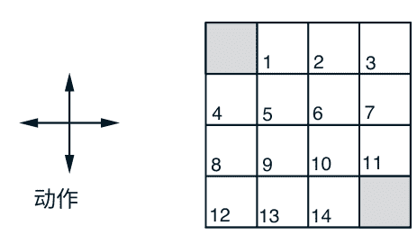

# $V_k$ 对于随机策略

# 基于价值函数$v_k$的贪心策略

| 0.0 | 0.0 | 0.0 | 0.0 |
| 0.0 | 0.0 | 0.0 | 0.0 |
| 0.0 | 0.0 | 0.0 | 0.0 |
| 0.0 | 0.0 | 0.0 | 0.0 |

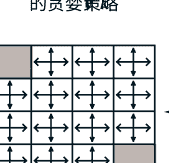

随机策略

| 0.0 | -1.0 | -1.0 | -1.0 |
| -1.0 | -1.0 | -1.0 | -1.0 |
| -1.0 | -1.0 | -1.0 | -1.0 |
| -1.0 | -1.0 | -1.0 | 0.0 |

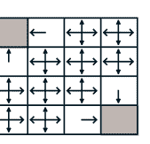

| 0.0 | -1.7 | -2.0 | -2.0 |
| -1.7 | -2.0 | -2.0 | 2.0 |
| -2.0 | -2.0 | -2.0 | 1.7 |
| -2.0 | -2.0 | -1.7 | 0.0 |

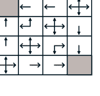

| 0.0 | -2.4 | -2.9 | -3.0 |
| -2.4 | -2.9 | -3.0 | 2.9 |
| -2.9 | -3.0 | 2.9 | 2.4 |
| -3.0 | -2.9 | -2.4 | 0.0 |

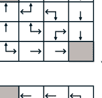

| 0.0 | -6.1 | -8.4 | -9.0 |
| -6.1 | -7.7 | -8.4 | 8.4 |
| -8.4 | -8.4 | -7.7 | 6.1 |
| -9.0 | -8.4 | -6.1 | 0.0 |

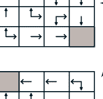

最优策略

| 0.0 | -14 | -20 | -22 |
| -14 | -18 | -20 | 20 |
| -20 | -20 | -18 | 14 |
| -22 | -20 | -14 | 0.0 |

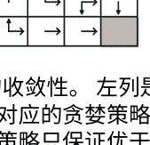

图4.1：在一个小的网格世界上进行迭代策略评估的收敛性。左列是随机策略（所有动作等可能）的状态值函数逼近序列。右列是与值函数估计相对应的贪心策略序列（箭头表示所有达到最大值的动作，数字显示为两位有效数字）。最后一个策略只保证优于随机策略，但在这种情况下，它以及第三次迭代之后的所有策略都是最优的。

策略迭代通常在很少的迭代次数内收敛，正如杰克汽车租赁问题的例子所示，以及图4.1中的例子所示。图4.1的左下图显示了等概率随机策略的值函数，右下图显示了该值函数的贪婪策略。策略改进定理保证这些策略比原始的随机策略更好。然而，在这种情况下，这些策略不仅更好，而且是最优的，以最少的步骤到达终止状态。在这个例子中，策略迭代只需一次迭代就能找到最优策略。

- 练习4.4 第80页上的策略迭代算法存在一个微妙的错误，即如果策略不断在两个或多个同样好的策略之间切换，可能永远无法终止。这对于教学来说是可以的，但对于实际使用来说不行。修改伪代码以确保收敛。

- 练习4.5 如何为动作值定义策略迭代？给出一个完整的算法来计算 \(q_*\)，类似于第80页上计算 \(v_*\) 的算法。请特别注意这个练习，因为其中涉及的思想将在本书的其余部分中使用。

- 练习4.6 假设你只能考虑每个状态\(s\)中选择每个动作的概率至少为 \(\epsilon/|A(s)|\) 的策略。以第80页上的 \(v_*\) 的策略迭代算法为例，定性地描述步骤3、2和1所需的变化。

- 练习4.7 (编程) 编写一个策略迭代的程序，并重新解决杰克的汽车租赁问题，以下是更改内容。杰克的第一个位置的一个员工每天晚上乘公交车回家，住在第二个位置附近。她很乐意免费将一辆车接送到第二个位置。每辆额外的车仍然需要2美元，所有车辆在另一个方向上移动时也需要2美元。此外，杰克在每个位置都有有限的停车位。如果在一个位置过夜的车辆超过10辆（在任何车辆移动之后），则必须支付额外的4美元费用以使用第二个停车场（与在那里停放的车辆数量无关）。这些非线性和任意动态经常出现在实际问题中，除了动态规划之外，很难用其他优化方法处理。为了检查您的程序，首先复制原始问题给出的结果。

### 4.4 值迭代

策略迭代的一个缺点是它的每个迭代都涉及策略评估，这本身可能是一个漫长的迭代计算，需要多次遍历状态集。如果策略评估是迭代进行的，那么只有在极限情况下才会完全收敛到\(v_\pi\)。我们必须等待完全收敛，还是可以提前停止？图4.1中的例子确实表明可以截断策略评估。在该例子中，超过前三次策略评估迭代对应的贪婪策略没有影响。事实上，策略迭代的策略评估步骤可以通过多种方式进行截断，而不会失去策略迭代的收敛保证。一个重要的特殊情况是，在仅进行一次扫描（每个状态的一次更新）后停止策略评估。

当策略评估仅在一次扫描后停止时，这种情况被称为值迭代。这个算法被称为值迭代。它可以被写成一个特别简单的更新操作，结合了策略改进和截断的策略评估步骤：

$$v_{k+1}(s) \doteq \max_{a} \mathbb{E}[R_{t+1} + \gamma v_k(S_{t+1}) | S_t=s, A_t=a] = \max_{a} \sum_{s',r} p(s', r|s,a)[r + \gamma v_k(s')]$$  (4.10)

对于所有的 $s \in \mathcal{S}$。对于任意的 $v_0$，可以证明序列 $\{v_k\}$在满足存在 $v_*$的条件下收敛到 $v_*$。

理解值迭代的另一种方式是参考贝尔曼最优方程 (4.1)。注意，值迭代仅仅是将贝尔曼最优方程转化为一个更新规则。还要注意，值迭代的更新与策略评估的更新 (4.5) 完全相同，只是需要对所有动作取最大值。另一种看待这种密切关系的方式是比较页面59上这些算法的备份图（策略评估）和图3.4左侧的备份图（值迭代）。这两种方法是计算的自然备份操作。

$v_\pi$ 和 $v_*$。

最后，让我们考虑价值迭代如何终止。与策略评估类似，值迭代正式要求无限次迭代才能完全收敛到 $v_*$。实际上，我们在值函数在一次扫描中只发生微小变化时停止。

下面的框显示了具有这种终止条件的完整算法。

```
**值迭代，用于估计 $\pi \approx \pi_*$**

**算法参数：** 一个小阈值 $\theta > 0$，用于确定估计的准确性
**初始化** $V(s)$，对于所有 $s \in \mathcal{S}^+$，除了 $V(\text{终止}) = 0$

**循环：**
| $\Delta \leftarrow 0$
| **对于每个状态** $s \in \mathcal{S}$ **的循环：**
| | $v \leftarrow V(s)$
| | $V(s) \leftarrow \max_a \sum_{s',r} p(s',r|s,a)[r + \gamma V(s')]$
| | $\Delta \leftarrow \max(\Delta, |v - V(s)|)$
**直到** $\Delta < \theta$

**输出一个确定性策略** $\pi \approx \pi_*$，使得
$\pi(s) = \mathrm{argmax}_a \sum_{s',r} p(s', r|s, a)[r + \gamma V(s')]$
```

值迭代在每次迭代中有效地结合了一次策略评估和一次策略改进。通过在每次策略改进之间插入多次策略评估，通常可以实现更快的收敛。一般来说，整个截断策略迭代算法类可以被看作是一系列扫描，其中一些使用策略评估更新，一些使用值迭代更新。因为(4.10)中的max操作是唯一的不同之处这些更新，这意味着最大操作被添加到一些策略评估的扫描中。所有这些算法都收敛到折扣有限MDPs的最优策略。

## 例子4.3：赌徒问题

一个赌徒有机会在一系列硬币翻转的结果上下注。如果硬币正面朝上，他赢得他在那次翻转上下注的美元数；如果是反面，他失去他的赌注。游戏在赌徒达到他的100美元目标或者用完所有的钱时结束。

在每次翻转中，赌徒必须决定他的资本的哪一部分下注，以整数美元的形式。这个问题可以被形式化为一个非折扣、分集、有限的问题。MDP。状态是赌徒的资本，$s \in \{1, 2, \ldots, 99\}$和行动是赌注，$a \in \{0, 1, \ldots, \min(s, 100 - s)\}$。所有转移上的奖励都为零，除非赌徒达到目标时为+1。

状态值函数然后给出了从每个状态获胜的概率。策略是从资本水平到赌注的映射。最优策略最大化达到目标的概率。让$p_h$ denote the probability of the coin coming up heads。如果$p_h$已知，则整个问题已知，可以通过值迭代等方法解决。

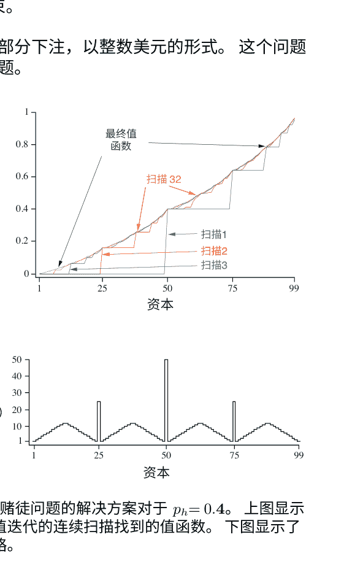

图4.3显示了值迭代中值函数随连续迭代的变化以及找到的最终策略，对于$p_h = 0.4$的情况。这个策略是最优的，但不是唯一的。事实上，存在一整个最优策略家族，都对应于与最优值函数相关的argmax动作选择的并列情况。

你能猜出整个家族是什么样子吗？

- 练习4.8 为什么赌徒问题的最优策略具有如此奇特的形式？特别是，对于资本为50的情况，它会把所有的筹码都押在一个翻转上，但对于资本为51的情况，它不会这样做。为什么这是一个好策略？

- 练习4.9（编程） 为赌徒问题实现值迭代，并解决$p_h = 0.25$和$p_h = 0.55$的情况。在编程中，你可能会发现引入两个虚拟状态对应于资本为0和100的终止状态很方便，给它们分别赋值为0和1。像图4.3一样以图形方式展示你的结果。你的结果稳定吗 $\theta \rightarrow 0$?

- 练习4.10 什么是值迭代更新（4.10）的动作值的类比？$q_{k+1}(s, a)$?

### 4.5 异步动态规划

到目前为止，我们讨论的DP方法的一个主要缺点是它们涉及到整个MDP状态集的操作，也就是说，它们需要对状态集进行扫描。如果状态集非常大，那么即使进行一次扫描也可能代价高昂。例如，双陆棋游戏有超过$10^{20}$个状态。即使我们每秒可以在一百万个状态上执行值迭代更新，完成一次扫描也需要一千多年的时间。

异步DP算法是就地迭代DP算法，不按照系统化的状态集扫描进行组织。这些算法以任意顺序更新状态的值，使用其他状态的任意值。某些状态的值可能会被更新多次，而其他状态的值可能只更新一次。然而，为了正确收敛，异步算法必须继续更新所有状态的值：在计算的某个点之后不能忽略任何状态。异步DP算法在选择要更新的状态方面具有很大的灵活性。

例如，异步值迭代的一个版本在每一步中只更新一个状态$s_k$的值，使用值迭代更新公式(4.10)。如果$0 \leq \gamma < 1$，只要所有状态在序列{ $s_k$ }中出现无限次数（序列甚至可以是随机的），就可以保证渐近收敛到$v_*$。（在无折扣的情况下，可能存在一些更新顺序不会收敛的情况，但很容易避免这种情况。）类似地，可以混合策略评估和值迭代更新，产生一种异步截断策略迭代的方法。尽管这本书的范围超出了这些和其他更不寻常的DP算法的细节，但很明显，一些不同的更新形成了可以在各种无扫描DP算法中灵活使用的构建块。

当然，避免扫描不一定意味着我们可以减少计算量。这只是意味着算法在改进策略之前不需要陷入任何无望的长扫描中。我们可以尝试利用这种灵活性，通过选择我们应用更新的状态来提高算法的进展速度。我们可以尝试对更新进行排序，以便让值信息以高效的方式从一个状态传播到另一个状态。有些状态可能不需要经常更新其值。如果某些状态与最优行为无关，我们甚至可以尝试跳过对其进行更新。关于如何做到这一点的一些想法在第8章中讨论。

异步算法还使得将计算与实时交互更容易混合在一起。为了解决给定的MDP问题，我们可以同时运行迭代DP算法，而代理实际上正在体验MDP。代理的经验可以被利用来确定DP算法应用其更新的状态。同时，DP算法的最新值和策略信息可以指导代理的决策。例如，我们可以在代理访问它们时对状态进行更新。这使得DP算法的更新可以集中在对代理最相关的状态部分上。这种集中是强化学习中的一个重复主题。

### 4.6 广义策略迭代

策略迭代由两个同时交互的过程组成，一个使值函数与当前策略一致（策略评估），另一个使策略相对于当前值函数贪婪（策略改进）。在策略迭代中，这两个过程交替进行，每个过程在另一个开始之前完成，但这并不是真正必要的。例如，在值迭代中，每次策略改进之间只执行一次策略评估。在异步DP方法中，评估和改进过程以更细粒度的方式交错进行。

在某些情况下，一个状态在返回到另一个进程之前会更新一次。只要两个进程都继续更新所有状态，最终的结果通常是相同的——收敛到最优值函数和最优策略。

我们使用术语广义策略迭代(GPI)来指代让策略评估和策略改进过程相互交互的一般思想，独立于两个过程的粒度和其他细节。几乎所有的强化学习方法都可以很好地描述为GPI。也就是说，所有方法都有可识别的策略和值函数，策略总是相对于值函数进行改进，而值函数总是朝着策略的值函数驱动，如右侧的图表所示。如果评估过程和改进过程都稳定下来，即不再产生变化，那么值函数和策略必须是最优的。只有当值函数与当前策略一致时，值函数才稳定下来，只有当策略相对于当前值函数是贪婪的时，策略才稳定下来。

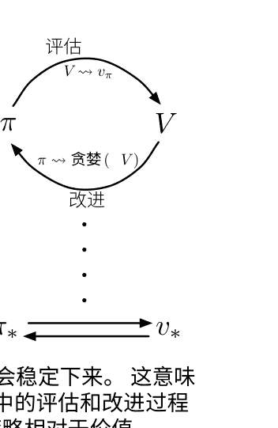

因此，只有找到一个对自己的评估函数贪婪的策略，这两个过程才会稳定下来。这意味着贝尔曼最优方程(4.1)成立，因此策略和价值函数是最优的。GPI中的评估和改进过程可以看作是竞争和合作的双方。它们在拉扯方向上相互竞争。使策略相对于价值函数贪婪通常会使价值函数对于改变的策略不正确，使价值函数与策略一致通常会导致该策略不再贪婪。然而，从长远来看，这两个过程相互作用，找到一个共同的解决方案：最优的价值函数和最优的策略。

人们也可以将GPI中的评估和改进过程之间的相互作用看作是两个约束或目标，例如，如右侧图表所示的二维空间中的两条线。尽管真实的几何形状比这复杂得多，但该图表揭示了真实情况中发生的情况。

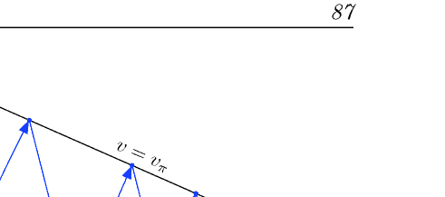

每个过程都驱动值函数或策略朝着表示解决方案之一的线条靠近。两个目标之一这两个目标相互作用，因为这两条线不正交。直接朝一个目标驱动会导致远离另一个目标。然而，不可避免地，这两个过程会更接近整体最优目标。图中的箭头对应于策略迭代的行为，每个箭头将系统完全带到实现两个目标之一。在GPI中，也可以朝着每个目标迈出较小的、不完整的步骤。无论哪种情况，这两个过程共同实现了整体最优目标，尽管它们都没有直接尝试实现它。

### 4.7 动态规划的效率

对于非常大的问题，DP可能不实用，但与其他解决MDPs的方法相比，DP方法实际上非常高效。如果我们忽略一些技术细节，那么DP方法在找到最优策略的（最坏情况）时间复杂度是多项式级别的，与状态和动作的数量成正比。如果n和k表示状态和动作的数量，这意味着DP方法所需的计算操作次数少于n和k的某个多项式函数。DP方法保证在多项式时间内找到最优策略，即使（确定性的）策略总数是k的n次方。从这个意义上说，DP比在策略空间中进行直接搜索要指数级别更快，因为直接搜索需要逐个检查每个策略才能提供相同的保证。线性规划方法也可以用于解决MDPs，并且在某些情况下，它们的最坏情况收敛保证比DP方法更好。

但是线性规划方法在状态数量较少时变得不切实际。相比之下，动态规划方法的状态数量要多大约100倍。对于最大的问题，只有动态规划方法是可行的。

由于维度灾难的原因，有时认为动态规划的适用性有限-事实上，状态数量通常随着状态变量的增加呈指数级增长。大的状态集确实会带来困难，但这些困难是问题本身固有的困难而不是动态规划作为解决方法的困难。事实上，与直接搜索和线性规划等竞争方法相比，动态规划更适合处理大规模状态空间。

实际上，动态规划方法可以在今天的计算机上解决具有数百万个状态的MDP问题。策略迭代和值迭代都被广泛使用，目前还不清楚哪种方法更好实际上，这些方法通常比它们的理论最坏情况运行时间更快，特别是如果它们被启动

### 4.8 总结

在本章中，我们熟悉了与解决有限MDP相关的动态规划的基本思想和算法。策略评估是指对给定策略的值函数进行（通常是迭代的）计算。策略改进是指根据该策略的值函数计算改进后的策略。

将这两个计算结合起来，我们得到了策略迭代和值迭代，这是两种最流行的DP方法。在完全了解MDP的情况下，可以使用其中任何一种方法可靠地计算有限MDP的最优策略和值函数。

经典的DP方法通过对状态集进行扫描操作，对每个状态执行一个预期的更新操作。每个这样的操作根据所有可能的后继状态的值和它们发生的概率来更新一个状态的值。

预期更新与贝尔曼方程密切相关：它们只不过是将这些方程转化为赋值语句。当更新不再导致任何值的变化时，收敛已经发生，达到了满足相应贝尔曼方程的值。正如有四个主要的值函数（v_π，v_*，q_π 和 q_*），有四个相应的贝尔曼方程和四个相应的预期更新。

通过它们的备份图可以直观地了解DP更新的操作。通过将它们视为广义策略迭代（GPI），可以获得对DP方法和几乎所有强化学习方法的洞察。GPI是围绕近似策略和近似值函数的两个相互作用过程的一般思想。一个过程将策略视为给定，并执行某种形式的策略评估，将值函数更接近策略的真实值函数。另一个过程将值函数视为给定，并执行某种形式的策略改进，改变策略使其更好，假设值函数是它的值函数。尽管每个过程都改变了另一个过程的基础，但它们共同努力找到一个联合解决方案：一个策略和值函数，它们都不受任何过程的影响，因此是最优的。在某些情况下，可以证明GPI收敛，尤其是对于我们在本章中介绍的经典DP方法。在其他情况下，尽管收敛性尚未被证明，但GPI的思想仍然提高了我们对这些方法的理解。

在完整地遍历状态集合的过程中，执行DP方法并不是必要的。异步DP方法是一种原地迭代方法，可以以任意顺序更新状态，可能是随机确定的，并且使用过时的信息。这些方法中的许多可以被视为细粒度的GPI形式。最后，我们注意到DP方法的最后一个特殊属性。它们都基于后继状态的值的估计来更新状态的值的估计。也就是说，它们基于其他估计值来更新估计值。我们将这个通用思想称为自举。许多强化学习方法都执行自举，即使不像DP那样需要环境的完整和准确的模型。在下一章中，我们将探讨不需要模型且不进行自举的强化学习方法。在随后的章节中，我们将探讨不需要模型但进行自举的方法。这些关键特征和属性是可分离的，但可以以有趣的组合方式混合在一起。

### 参考文献和历史评论

动态规划这个术语是由贝尔曼（1957a）提出的，他展示了这些方法如何应用于各种问题。关于动态规划的详细讨论可以在许多文献中找到，包括Bertsekas（2005, 2012），Bertsekas和Tsitsiklis（1996），Dreyfus和Law（1977），Ross（1983），White（1969）和Whittle（1982, 1983）。我们对动态规划的兴趣仅限于其在解决MDP问题中的应用，但动态规划也适用于其他类型的问题。Kumar和Kanal（1988）对动态规划提供了更一般的视角。据我们所知，动态规划与强化学习之间的第一个联系是由Minsky（1961）在评论Samuel的跳棋程序时提出的。在一个脚注中，Minsky提到可以将动态规划应用于Samuel的备份过程可以用闭合解析形式处理的问题。这个备注可能让人工智能研究人员误以为动态规划仅适用于解析可处理的问题，因此在人工智能中基本上是无关紧要的。

Andreae (1969b)在强化学习的背景下提到了DP，具体是策略迭代，尽管他没有在DP和学习算法之间建立具体的联系。Werbos (1977)提出了一种近似DP的方法，称为“启发式动态规划”，强调连续状态问题的梯度下降方法(Werbos, 1982, 1987, 1988, 1989, 1992)。这些方法与我们在本书中讨论的强化学习算法密切相关。Watkins (1989)明确将强化学习与DP联系起来，将一类强化学习方法描述为“增量动态规划”。

4.1–4 这些部分描述了任何一本引用的一般DP参考书中涵盖的成熟DP算法。策略改进定理和策略迭代算法归功于Bellman (1957a)和Howard (1960)。我们的讲解受到Watkins (1989)对策略改进的局部观点的影响。我们对值迭代作为截断策略迭代的一种形式的讨论基于Puterman和Shin (1978)的方法，他们提出了一类算法，称为“修改的策略迭代”，其中包括策略迭代和值迭代作为特殊情况。Bertsekas (1987)给出了一种分析，展示了如何使值迭代在有限时间内找到最优策略。

迭代策略评估是经典连续逼近的一个例子用于解决线性方程组的算法。该算法的版本使用两个数组，一个保存旧值，另一个更新值，通常被称为雅可比式算法，以纪念雅可比对该方法的经典应用。它有时也被称为同步算法，因为效果就好像所有值都同时更新。第二个数组用于顺序模拟这个并行计算。原地算法的版本通常被称为高斯-塞德尔式算法，以纪念经典的高斯-塞德尔算法用于解决线性方程组。除了迭代策略评估，其他动态规划算法也可以用这些不同版本实现。Bertsekas和Tsitsiklis（1989）对这些变体及其性能差异进行了详细介绍。

4.5 异步动态规划算法是由Bertsekas（1982, 1983）提出的，他也称之为分布式动态规划算法。异步动态规划最初的动机是在具有处理器之间通信延迟和无全局同步时钟的多处理器系统上实现。Bertsekas和Tsitsiklis（1989）对这些算法进行了广泛讨论。雅可比式和高斯-塞德尔式动态规划算法是异步版本的特例。Williams和Baird（1990）提出了比我们讨论的更细粒度的异步DP算法：更新操作本身被分解为可以异步执行的步骤。

4.7 这一部分是在Michael Littman的帮助下撰写的，基于Littman，Dean和Kaelbling（1995）的工作。“维度诅咒”一词源于Bellman（1957a）。Daniela de Farias（de Farias, 2002; de Farias and Van Roy, 2003）对强化学习的线性规划方法进行了基础性的研究。

## 第5章 蒙特卡洛方法

在本章中，我们考虑了用于估计值函数和发现最优策略的第一种学习方法。与前一章不同，这里我们不假设对环境有完全的了解。蒙特卡洛方法只需要经验-从实际或模拟的与环境的交互中采样的状态、动作和奖励序列。从实际经验中学习是令人惊讶的，因为它不需要对环境动态的先验知识，但仍然可以达到最优行为。从模拟经验中学习也是强大的。虽然需要一个模型，但该模型只需要生成样本转换，而不需要动态规划（DP）所需的所有可能转换的完整概率分布。在许多情况下，根据所需的概率分布生成经验是很容易的，但以明确的形式获得分布是不可行的。

蒙特卡洛方法是基于平均样本来回报解决强化学习问题的一种方式。为了确保有明确定义的回报可用，我们在这里仅为时序任务定义蒙特卡洛方法。也就是说，我们假设经验被划分为时序，而且无论选择什么动作，所有时序最终都会终止。只有在一个时序完成后，才会改变值估计和策略。

因此，蒙特卡洛方法在时序逐个增量上是增量的，但在逐步（在线）上不是增量的。术语“蒙特卡洛”通常更广泛地用于任何操作涉及显著随机成分的估计方法。在这里，我们特指基于平均完整回报的方法（与下一章中考虑的从部分回报中学习的方法相对）。蒙特卡洛方法样本和平均每个状态-动作对的回报，就像我们在第二章中探索的赌博机方法样本和平均每个动作的奖励一样。

主要的区别是现在有多个状态，每个状态都像一个不同的赌博机问题（如关联搜索或上下文赌博机），而不同的赌博机问题是相互关联的。也就是说，在同一次试验中，在一个状态中采取行动后的回报取决于后续状态中采取的行动。因为所有的行动选择都在学习中进行，所以从早期状态的角度来看，问题变得非稳定。

为了处理非稳定性，我们借鉴了第4章中为DP开发的一般策略迭代（GPI）的思想。在那里，我们根据对MDP的了解计算值函数，而在这里，我们通过样本来学习值函数。值函数和相应的策略仍然以基本相同的方式相互作用以达到最优性（GPI）。与DP章节一样，首先我们考虑预测问题（计算固定任意策略的v_π和q_π），然后是策略改进，最后是控制问题及其通过GPI的解决方案。这些从DP中借鉴的思想在只有样本经验可用的蒙特卡洛情况下得到了扩展。

### 5.1 蒙特卡洛预测

我们首先考虑蒙特卡洛方法来学习给定策略下的状态值函数。回想一下，一个状态的值是从该状态开始的预期回报-预期累积未来折扣奖励。一种明显的估计方法是根据经验简单地对该状态的访问后观察到的回报进行平均。随着观察到更多的回报，平均值应该收敛到期望值。这个想法是所有蒙特卡洛方法的基础。

特别是，假设我们希望估计在遵循策略和经过状态s的一组剧集的情况下，状态s的值v_π(s)。剧集中状态s的每次出现被称为对s的一次访问。当然，状态s可能在同一个剧集中被多次访问；让我们称其为第一次访问s的第一次访问。第一次访问MC方法将v_π(s)估计为对s的第一次访问后的回报的平均值，而每次访问MC方法则是对s的所有访问后的回报进行平均。这两种蒙特卡洛（MC）方法非常相似，但具有略微不同的理论性质。第一次访问MC方法是最广泛研究的，可以追溯到1940年代，在本章中我们重点讨论这种方法。每次访问MC方法更自然地扩展到函数逼近和资格迹，如第9章和第12章所讨论的。第一次访问MC方法在程序形式中显示在方框中。每次访问MC方法将没有检查S_t是否在剧集中之前出现。

```
首次访问MC预测，用于估计 V ≈ v_π
输入：要评估的策略 π
初始化：
V(s) ∈ R，任意地，对于所有的 s ∈ S
Returns(s) 一个空列表，对于所有的 s ∈ S
无限循环（对于每个回合）：
    按照 π生成一个回合： S0, A0, R1, S1, A1, R2, ..., S_{T-1}, A_{T-1}, R_T
    G ← 0
    对于回合的每一步， t = T-1, T-2, ..., 0:
        G ← γG + R_{t+1}
        除非 S_t 出现在 S0, S1, ..., S_{t-1}:
            将 G 添加到 Returns(S_t)
            V(S_t) ← average(Returns(S_t))
```

当访问（或首次访问）s的次数趋近于无穷大时，首次访问蒙特卡洛和每次访问蒙特卡洛都会收敛到v_π(s)。对于首次访问蒙特卡洛，这一点很容易理解。在这种情况下，每个返回值都是v_π(s)的独立、同分布的估计，具有有限的方差。根据大数定律，这些估计的平均序列收敛到它们的期望值。每个平均值本身也是一个无偏估计，其误差的标准差随着1/√n的增加而下降，其中n是平均返回值的数量。

每次访问蒙特卡洛不太直观，但它的估计也会二次收敛到v_π(s)（Singh和Sutton，1996年）。

蒙特卡洛方法的使用最好通过一个例子来说明。

### 例5.1：二十一点
流行的赌场纸牌游戏二十一点的目标是获得数值之和尽可能大的牌，但不能超过21。所有的花牌都算作10点，A可以算作1点或者11点。我们考虑每个玩家独立与庄家竞争的版本。游戏开始时，庄家和玩家各发两张牌。庄家的一张牌是明牌，另一张是暗牌。如果玩家立即获得21点（一张A和一张10点牌），这被称为“自然”。然后他赢了，除非庄家也有“自然”，这种情况下游戏是平局。如果玩家没有“自然”，那么他可以逐个请求额外的牌（称为“要牌”），直到他停止（称为“停牌”）或超过21点（称为“爆牌”）。如果他爆牌，他就输了；如果他停牌，那么轮到庄家了。庄家按照固定策略进行要牌或停牌：如果总点数达到17或更高，他就停牌，否则就要牌。如果庄家爆牌，玩家就赢了；否则，最后的结果（赢、输或平局）取决于谁的总点数更接近21点。

玩二十一点自然地被制定为一个有限的马尔可夫决策过程。每一局二十一点都是一个回合。赢得游戏、输掉游戏和平局分别给予+1、-1和0的奖励。游戏中的所有奖励都是零，并且我们不打折（γ=1）；因此这些终止奖励也是回报。玩家的动作是要牌还是停牌。状态取决于玩家的牌和庄家的明牌。我们假设牌是从一个无限的牌堆中发出的（即，有替换），因此没有优势可以追踪已经发出的牌。如果玩家手中有一张可以计为11而不爆牌的A牌，则称该A牌为可用的。在这种情况下，它总是计为11，因为将其计为1会使总和小于等于11，在这种情况下，显然没有决策要做，因为玩家应该总是要牌。因此，玩家基于三个变量做出决策：他当前的总和（12-21），庄家的明牌（A-10），以及他是否有可用的A牌。总共有200个状态。

考虑策略，如果玩家的总和为20或21，则停止，否则继续要牌。通过蒙特卡洛方法找到此策略的状态值函数，需要模拟许多使用该策略的二十一点游戏，并对每个状态的回报进行平均。通过这种方式，我们得到了图5.1中显示的状态值函数的估计值。由于可用的Ace状态较少，因此对于具有可用Ace的状态，估计值更不确定且更不规则。无论如何，在进行了500,000次游戏后，值函数的近似非常好。

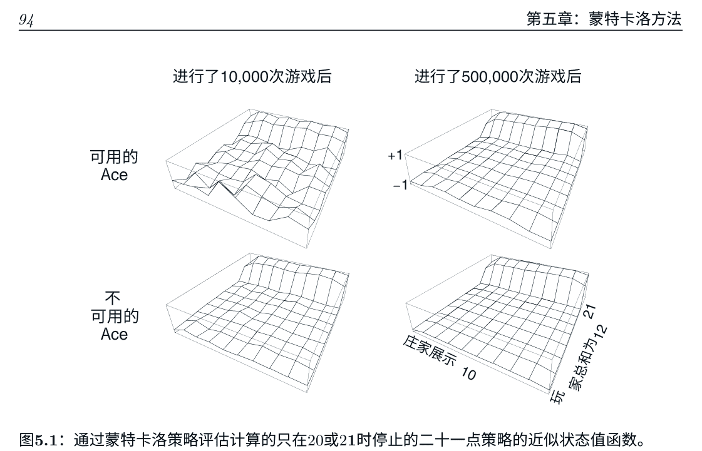

### 练习5.1：
考虑图5.1右侧的图表。为什么估计值函数在后两行上升？为什么估计值函数在最后一行整体下降？为什么上方图表中最前面的值比下方图表中的值更高？

### 练习5.2：
假设在二十一点游戏中使用每次访问的蒙特卡洛方法而不是首次访问的蒙特卡洛方法。你是否期望结果会有很大的不同？为什么或为什么不？

尽管我们对二十一点游戏的环境有完全的了解，但应用动态规划方法来计算值函数并不容易。动态规划方法需要下一个事件的分布，特别是它们需要由四个参数函数 p 给出的环境动态，而对于二十一点游戏来说确定这个函数并不容易。例如，假设玩家的点数是14，他选择停牌。作为庄家的明牌，他以+1的奖励终止的概率是多少？在应用动态规划之前，必须计算所有的概率，而这样的计算通常是复杂且容易出错的。相比之下，生成蒙特卡洛方法所需的样本游戏很容易。这种情况出现得相当频繁；即使对环境动态有完全的了解，蒙特卡洛方法仅通过样本回合就能工作，这是一个重要的优势。

我们能将备份图的思想推广到蒙特卡洛算法吗？备份图的一般思想是在顶部显示要更新的根节点，并在下面显示所有转换和叶节点，其奖励和估计值对更新有贡献。对于蒙特卡洛估计的 v_π，根节点是一个状态节点，在其下方是沿着特定单个回合的整个转换轨迹，最终在终端状态，如右图所示。而DP图（第59页）显示了所有可能的转换，蒙特卡洛图仅显示了在一个回合中采样的转换。而DP图仅包含一步转换，蒙特卡洛图一直延伸到回合结束。这些图中的差异准确地反映了算法之间的基本差异。

关于蒙特卡洛方法的一个重要事实是，每个状态的估计是独立的。一个状态的估计不依赖于任何其他状态的估计，这与动态规划不同。换句话说，蒙特卡洛方法不像我们在前一章中定义的那样进行自举。

特别要注意的是，估计单个状态的值的计算开销与状态数量无关。当只需要一个或一部分状态的值时，蒙特卡洛方法特别有吸引力。可以从感兴趣的状态开始生成许多样本轨迹，只对这些状态的回报进行平均，忽略其他所有状态。这是蒙特卡洛方法在DP方法之上的第三个优势（在能够从实际经验和模拟经验中学习的能力之后）。

### 例5.2：肥皂泡
假设一个形成闭合环的金属线框被浸入肥皂水中，形成一个与线框边缘相符的肥皂表面或泡沫。如果金属线框的几何形状是不规则的但已知的，如何计算表面的形状？该形状具有这样的特性，即相邻点对每个点施加的总力为零（否则形状将发生变化）。这意味着任意点的表面高度是该点周围小圆中点的高度的平均值。此外，表面必须在边界处与线框相连。解决这类问题的常见方法是在所覆盖区域上放置一个网格，并通过迭代计算来解决网格点的高度。

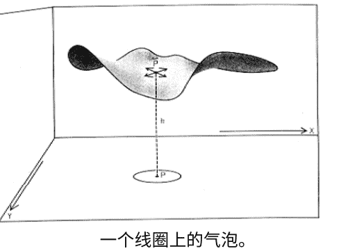

> 引自Hersh和Griego (1969年)。经许可复制。© 1969年Scientific American, Nature America, Inc. 保留所有权利。

边界上的网格点被强制与线框相连，其他所有点都朝着其四个最近邻点的高度的平均值进行调整。然后，这个过程进行迭代，类似于DP的迭代策略评估，并最终收敛到所需表面的近似值。这类问题与蒙特卡洛方法最初设计的问题类似。

与上述迭代计算不同，想象站在表面上并进行随机行走，以相等的概率随机从一个网格点移动到相邻的网格点，直到到达边界。事实证明，边界处的高度的期望值是起始点所需表面高度的一个近似值（实际上，它正是上述迭代方法计算出的值）。因此，可以近似计算出所需表面的高度。这与蒙特卡洛方法最初设计的问题类型相似。

通过简单地对许多从该点开始的行走的边界高度进行平均，可以估计出该点的表面。如果只对一个点或任意固定的小集合的值感兴趣，那么这种蒙特卡洛方法比基于局部一致性的迭代方法更加高效。

### 5.2 蒙特卡洛估计动作值
如果没有可用的模型，那么估计动作值（状态-动作对的值）而不是状态值特别有用。有了模型，仅凭状态值就足以确定策略；只需向前看一步，选择能够获得最佳奖励和下一个状态组合的动作，就像我们在DP章节中所做的那样。然而，如果没有模型，仅凭状态值是不够的。为了使值在建议策略时有用，必须明确地估计每个动作的值。

因此，蒙特卡洛方法的主要目标之一是估计 q<sub>∗</sub>。为了实现这一目标，我们首先考虑动作值的策略评估问题。对于动作值的策略评估问题是估计 q<sub>π</sub>(s, a)，即在状态 s 开始，采取动作 a，并随后遵循策略 π 时的预期回报。蒙特卡洛方法与状态值的方法基本相同，只是现在我们讨论的是对状态-动作对的访问，而不是对状态的访问。如果在一个回合中状态 s 被访问并且动作 a 被执行，那么状态-动作对 (s, a) 被称为在该回合中被访问。每次访问的蒙特卡洛方法估计一个状态-动作对的值，作为所有访问该对的回报的平均值。首次访问的蒙特卡洛方法则是对每个回合中状态首次被访问且动作被选择的时候的回报进行平均。这些方法与之前一样，当对每个状态-动作对的访问次数趋近于无穷大时，以二次收敛到真实的期望值。

唯一的复杂之处在于许多状态-动作对可能永远不会被访问。如果 π 是一个确定性策略，那么在跟随 π 时，我们只会观察到每个状态的一个动作的回报。由于没有回报可供平均，蒙特卡洛估计的其他动作不会随着经验的积累而改善。这是一个严重的问题，因为学习动作值的目的是帮助在每个状态下选择可用的动作。为了比较不同的选择，我们需要估计每个状态的所有动作的值，而不仅仅是我们目前偏爱的那个动作。

这是在第2章中讨论的 k 臂赌博机问题的背景下讨论的维持探索的一般问题。为了使策略评估适用于动作值，我们必须确保持续进行探索。一种方法是指定剧集从一个状态-动作对开始，并且每个对都有非零的被选为开始的概率。这保证了在无限剧集的极限下，所有状态-动作对都将被访问无限次。我们称之为探索开始的假设。

探索开始的假设有时是有用的，但当直接从实际与环境的交互中学习时，通常不能依赖它。在这种情况下，初始条件不太可能有帮助。确保遇到所有状态-动作对的最常见的替代方法是只考虑在每个状态中选择所有动作的非零概率的随机策略。我们将在后面的章节中讨论这种方法的两个重要变体。现在，我们保留探索开始的假设，并完成完整的蒙特卡洛控制方法的介绍。

### 练习5.3
蒙特卡洛估计的备份图是什么 qπ？

### 5.3 蒙特卡洛控制
现在我们准备考虑蒙特卡洛估计如何用于控制，即近似最优策略。总体思路与DP章节中的思路相同，即根据广义策略迭代的思想进行（GPI）。在GPI中，同时维护近似策略和近似值函数。值函数被反复修改以更接近当前策略的值函数，策略则根据当前值函数反复改进，如右侧图所示。这两种变化在一定程度上相互抵消，因为每种变化都为另一种变化创造了一个移动目标，但它们共同使策略和值函数都趋近于最优。

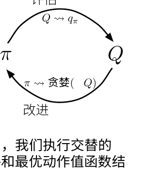

首先，让我们考虑经典策略迭代的蒙特卡洛版本。在这种方法中，我们执行交替的策略评估和策略改进的完整步骤，从任意策略π₀开始，以最优策略和最优动作值函数结束：

```
π₀ --E→ qπ₀ --I→ π₁ --E→ qπ₁ --I→ π₂ --E→ ... --I→ π* --E→ q*
```

其中，--E→ 表示完整的策略评估，--I→ 表示完整的策略改进。策略评估的过程与前一节中描述的完全一样。进行多个回合，近似的动作值函数渐进地接近真实函数。暂时假设我们确实观察到无限多个回合，并且这些回合是通过探索性起点生成的。在这些假设下，蒙特卡洛方法将精确计算每个动作值函数 q<sub>πk</sub>。

策略改进是通过使策略相对于当前值函数变得贪婪来完成的。在这种情况下，我们有一个动作-值函数，因此不需要构建贪婪策略的模型。对于任何动作值函数 q，相应的贪婪策略是对于每个 S 中的 s，确定性地选择具有最大动作值的动作：

```
π(s) = argmax_a q(s, a)  (5.1)
```

然后，通过构建每个 π<sub>k+1</sub> 作为贪婪策略相对于 q<sub>πk</sub>。策略改进定理（第4.2节）然后适用于 π<sub>k</sub> 和 $\pi_{k+1}$，因为对于所有的 $s \in \mathcal{S}$，

$$\begin{aligned}
q_{\pi_k}(s, \pi_{k+1}(s)) & = q_{\pi_k}(s, \argmax_{a} q_{\pi_k}(s, a)) \\
& = \max_{a} q_{\pi_k}(s, a) \\
& \geq q_{\pi_k}(s, \pi_k(s)) \\
& = v_{\pi_k}(s).
\end{aligned}$$

正如我们在前一章中讨论的，该定理确保每个 $\pi_{k+1}$ 都比 $\pi_k$ 均匀地更好，或者与 $\pi_k$ 一样好，这两种情况下都是最优策略。这反过来保证了整个过程收敛到最优策略和最优值函数。通过蒙特卡洛方法，可以仅通过样本轨迹而无需其他环境动态知识来找到最优策略。

为了方便获得蒙特卡洛方法的收敛保证，我们在上面做了两个不太可能的假设。一个是每个回合都有探索的开始，另一个是策略评估可以使用无限多个回合来完成。为了得到一个实用的算法，我们需要去除这两个假设。我们将在本章后面再考虑第一个假设。

现在我们专注于策略评估操作在无限多个回合上的假设。这个假设相对容易去除。事实上，即使在经典的动态规划方法中，如迭代策略评估，也只能渐近地收敛到真实的值函数。在动态规划和蒙特卡洛的情况下，解决这个问题有两种方法。一种是坚持近似计算每个策略评估中的 $q_{\pi_k}$，通过测量和假设来获得对估计误差的幅度和概率的界限，然后在每个策略评估中采取足够的步骤来确保这些界限足够小。这种方法可能完全令人满意，可以保证收敛到某个近似水平。然而，在实践中，除了最小的问题外，它也可能需要太多的回合才能有用。

有一种避免无限次数的策略评估的第二种方法，即在返回策略改进之前，放弃完成策略评估。在每个评估步骤中，我们将值函数向 $q_{\pi_k}$ 移动，但是我们不指望真的接近，除非经过多次步骤。我们在第4.6节首次介绍GPI思想时使用了这个想法。这个想法的一个极端形式是值迭代，在每个策略改进步骤之间只执行一次迭代策略评估。原地值迭代的版本更加极端；在那里，我们在改进和评估步骤之间交替处理单个状态。

对于蒙特卡洛策略迭代，按照每个回合的方式在评估和改进之间交替进行是很自然的。每个回合之后，观察到的回报用于策略评估，然后在回合中访问的所有状态上改进策略。在下一页的方框中，给出了一个完整的简单算法，我们称之为蒙特卡洛ES（带有探索起点的蒙特卡洛），以伪代码的形式给出。

### 蒙特卡洛ES（探索开始），用于估计 π ≈ π_*
```
初始化：
π(s) ∈ A(s) (任意选择), 对于所有 s ∈ S
Q(s, a) ∈ R (任意选择), 对于所有 s ∈ S, a ∈ A(s)
Returns(s, a) 空列表, 对于所有 s ∈ S, a ∈ A(s)

无限循环 (对于每个回合):
    随机选择 S0 ∈ S, A0 ∈ A(S0), 使得所有对的概率 > 0
    从 S0, A0, 按照 π 生成一个序列: S0, A0, R1, ..., ST-1, AT-1, RT
    G ← 0
    循环每个阶段的步骤, t = T-1, T-2, ........., 0:
        G ← γG + Rt+1
        除非对 (St, At) 出现在 (S0, A0, S1, A1 ..., St-1, At-1):
            将 G 添加到 Returns(St, At)
            Q(St, At) ← average(Returns(St, At))
            π(St) ← argmax_a Q(St, a)
```

### 练习5.4
蒙特卡洛ES的伪代码效率低下，因为对于每个状态-动作对，它维护了所有返回值的列表，并重复计算它们的平均值。使用类似于第2.4节中解释的技术来增量地维护平均值和计数（对于每个状态-动作对）将更加高效。描述如何修改伪代码以实现此目标。

在蒙特卡洛ES中，对每个状态-动作对的所有回报进行累积和平均，无论观察时采用的是什么策略。很容易看出，蒙特卡洛ES无法收敛到任何次优策略。如果可以的话，那么值函数最终会收敛到该策略的值函数，从而导致策略发生变化。只有当策略和值函数都是最优时，才能实现稳定性。随着时间的推移，对动作值函数的更改减少，收敛到这个最优的固定点似乎是不可避免的，但尚未得到正式证明。在我们看来，这是强化学习中最基本的开放性理论问题之一（有关部分解决方案，请参见Tsitsiklis，2002年）。

### 例5.3： 解决二十一点游戏
将蒙特卡洛ES应用于二十一点游戏非常直观。由于所有的情节都是模拟游戏，很容易安排包含所有可能性的探索开始。在这种情况下，只需随机选择庄家的牌、玩家的总和以及玩家是否有可用的A，每个选择的概率都相等。作为初始策略，我们使用前面二十一点游戏示例中评估的策略，即只在总和为20或21时停牌。初始动作值函数可以对所有状态-动作对都为零。图5.2显示了蒙特卡洛ES找到的二十一点游戏的最优策略。该策略与Thorp（1966年）的“基本”策略完全相同，唯一的例外是在可用的A的策略的最左侧刻度上，Thorp的策略中没有这个刻度。我们对这种差异的原因不确定，但确信这里展示的确实是我们所描述的二十一点游戏的最优策略。

### 5.4 无探索起点的蒙特卡洛控制

我们如何避免探索开始的不太可能的假设？ 确保所有动作都被无限次选择的唯一一般方法是让代理继续选择它们。 有两种方法可以确保这一点，分别称为基于策略的方法和基于离策略的方法。 基于策略的方法试图评估或改进用于决策的策略，而基于离策略的方法评估或改进与生成数据所使用的策略不同的策略。 上面介绍的蒙特卡洛ES方法是基于策略的方法的一个例子。 在本节中，我们将展示如何设计一个基于策略的蒙特卡洛控制方法，而不使用不切实际的探索开始的假设。 基于离策略的方法将在下一节中讨论。

在策略控制方法中，策略通常是软性的，意味着对于所有的$s\in S$和$a\in A(s)$，$\pi(a|s)>0$，但逐渐地逼近确定性最优策略。 第6章讨论的许多方法都提供了这方面的机制。 本节介绍的策略方法使用“$\epsilon$-贪婪”策略，意味着大部分时间它们选择具有最大估计动作值的动作，但以概率$\epsilon$选择一个随机动作。 也就是说，所有非贪婪动作的选择概率都是最小的。

贪婪动作。 $\frac{\epsilon}{|A(s)|}$，则分配给贪婪动作。 $\epsilon$-贪婪策略是“软性”策略的例子，定义为对于所有的$a\in A(s)$，$\pi(a|s) \geq 0$。 $\frac{\epsilon}{|A(s)|}$对于所有状态和动作，对于一些$\epsilon>0$。 在$\epsilon$-软策略中， $\epsilon$-贪婪策略在某种意义上是那些剩余的概率$1-\epsilon$则分配给最接近贪婪的。

关于策略蒙特卡洛控制的整体思想仍然是GPI的思想。与蒙特卡洛ES一样，我们使用首次访问MC方法来估计当前策略的动作值函数。然而，如果没有探索起点的假设，我们不能简单地通过使其贪婪来改进策略，因为那样会阻止对非贪婪动作的进一步探索。幸运的是，GPI并不要求策略完全变为贪婪策略，只要朝着贪婪策略的方向移动即可。在我们的策略上的方法中，我们只将其移动到一个 ε-贪婪策略。对于任何 ε-软策略， π，任何相对于 q_π 的 ε-贪婪策略都保证优于或等于 π。完整的算法如下方框所示。

```
在策略第一次访问MC控制（对于 ε-软策略），估计 π ≈ π_*
算法参数：小 ε > 0
初始化：
π 任意的 ε-软策略
Q(s, a) ∈ ℝ (任意选择)，对于所有 s ∈ S, a ∈ A(s)
返回 (s, a) 空列表，对于所有 s ∈ S, a ∈ A(s)
无限循环（对于每个回合）：
生成一个回合，遵循 π： S0, A0, R1, . . . . . . . ., ST−1, AT−1, RT
G 0
循环每个阶段的步骤， = T−1, T−2, . . . . . . . . ., 0:
G γG + Rt+1
除非对 St, At 出现在 S0, A0, S1, A1 . . . , St−1, At−1:
将 G 添加到 Returns(St, At)
Q(St, At) average(Returns(St, At))
A* argmax_a Q(St, a) (以任意方式打破平局)
对于所有 a ∈ A (St) :
π(a|St) { 1 − ε + ε/|A(St)| if a = A*
ε/|A(St)| 如果 a = A*
```

对于任何 ε-贪婪策略，相对于 q_π，都比任何 ε-软策略更好通过策略改进定理可以保证π。设π'为 ε-贪婪策略。策略改进定理的条件适用于任何 s ∈ S，因为：

$$q_π(s, π'(s)) = \sum π'(a|s)q_π(s, a)$$
$$= \frac{ε}{|A(s)|} \sum q_π(s, a) + (1 - ε) \max q_π(s, a) \quad (5.2)$$
$$- \frac{ε}{|A(s)|} \sum q_π(s, a) + (1 - ε) \sum \frac{π(a|s) - \frac{ε}{|A(s)|}}{1 - ε} q_π(s, a)$$
（总和是带有非负权重的加权平均值，权重之和为1，因此它必须小于或等于最大平均数）

$$= \frac{\varepsilon}{|\mathcal{A}(s)|} \sum q_{\pi}(s, a) - \frac{\varepsilon}{|\mathcal{A}(s)|} \sum q_{\pi}(s, a) + \sum \pi(a|s) q_{\pi}(s, a) \newline = v_{\pi}(s).$$

因此，根据策略改进定理， $\pi' - \pi$（即，$v_{\pi'}(s) - v_{\pi}(s)$，对于所有 $s \in \mathcal{S}$）。我们现在证明，只有当 $\pi'$ 和 $\pi$ 在所有其他 $\varepsilon$-soft策略中都更好或相等时，等式才能成立。

考虑一个新的环境，它与原始环境完全相同，只是要求策略被“移入”环境中。新环境具有与原始环境相同的动作和状态集，并且行为如下。如果在状态 $s$ 下采取行动 $a$，则以概率 $1-\varepsilon$ 新环境的行为与旧环境完全相同。以概率 $\varepsilon$ 随机重新选择动作，并以相等的概率行为像旧环境一样，但使用新的随机动作。

在这个新环境中，使用通用策略所能做的最好的事情与在原始环境中使用 $\varepsilon$-软策略所能做的最好的事情是一样的。让 $\widetilde{v}_{*}$ 和 $\widetilde{q}_{*}$ 表示新环境的最优值函数。那么，一个策略 $\pi$ 在其中是最优的 $\varepsilon$-软策略当且仅当 $v_{\pi} = \widetilde{v}_{*}$。从 $\widetilde{v}_{*}$ 的定义我们知道它是唯一的解

$$\widetilde{v}_{*}(s) = (1 - \varepsilon) \max_{a} \widetilde{q}_{*}(s, a) + \frac{\varepsilon}{|\mathcal{A}(s)|} \sum \widetilde{q}_{*}(s, a) \newline = (1 - \varepsilon) \max_{a} \sum_{s',r} p(s', r|s, a) [r + \gamma \widetilde{v}_{*}(s')] \newline + \frac{\varepsilon}{|\mathcal{A}(s)|} \sum_{a} \sum_{s',r} p(s', r|s, a) [r + \gamma \widetilde{v}_{*}(s')].$$

当等式成立且 $\varepsilon$-软策略 $\pi$ 不再改进时，我们也知道，从（5.2）中，

$$v_{\pi}(s) = (1 - \varepsilon) \max_{a} q_{\pi}(s, a) + \frac{\varepsilon}{|\mathcal{A}(s)|} \sum q_{\pi}(s, a) \newline = (1 - \varepsilon) \max_{a} \sum_{s',r} p(s', r|s, a) [r + \gamma v_{\pi}(s')] \newline + \frac{\varepsilon}{|\mathcal{A}(s)|} \sum_{a} \sum_{s',r} p(s', r|s, a) [r + \gamma v_{\pi}(s')].$$

然而，这个方程与之前的方程相同，只是将 $v_{\pi}$ 替换为 $\widetilde{v}_{*}$。因为 $\widetilde{v}_{*}$ 是唯一的解，所以必须有 $v_{\pi} = \widetilde{v}_{*}$。

实质上，在过去的几页中，我们已经证明了策略迭代对于 $\varepsilon$-soft策略是有效的。对于 $\varepsilon$-soft策略，使用贪婪策略的自然概念，可以确保每一步都有改进，除非在 $\varepsilon$-soft策略中找到了最佳策略。这个分析与每个阶段如何确定动作值函数无关，但它假设它们是精确计算的。这使我们得出大致上与前一节相同的观点。现在我们只能在$\epsilon$-软策略中实现最佳策略，但另一方面，我们已经消除了探索开始的假设。

### 5.5 通过重要性采样的离策略预测

所有学习控制方法面临一个困境：它们试图学习在随后的最优行为条件下的动作值，但它们需要以非最优的方式行动，以便探索所有的动作（找到最优的动作）。他们如何在按照探索性策略行动的同时学习最优策略呢？在前一节中，基于策略的方法实际上是一种妥协——它学习的是不是最优策略的动作值，而是一个仍然进行探索的近似最优策略。一个更直接的方法是使用两个策略，一个是被学习的目标策略，它成为最优策略，另一个是更具探索性的行为策略，用于生成行为。正在学习的策略被称为目标策略，用于生成行为的策略被称为行为策略。在这种情况下，我们说学习是从数据“off”目标策略中进行的，整个过程被称为离策略学习。

在本书的其余部分，我们考虑同时采用on-policy和off-policy方法。on-policy方法通常更简单，因此首先被考虑。off-policy方法需要额外的概念和符号，并且由于数据是由不同的策略产生的，离策略方法通常具有更大的方差，并且收敛速度较慢。另一方面，离策略方法更强大和通用。它们包括同策略方法作为特殊情况，其中目标策略和行为策略相同。离策略方法在应用中还有各种其他用途。例如，它们经常用于从传统非学习控制器生成的数据中学习，或者从人类专家那里学习。一些人认为离策略学习对于学习世界动态的多步预测模型至关重要（参见第17.2节；Sutton，2009；Sutton等，2011年）。

在本节中，我们开始研究离策略方法，通过考虑预测问题，其中目标策略和行为策略都是固定的。也就是说，假设我们希望估计$v$或$q$，但我们只有按照另一个策略$b$进行的回合。其中$b \neq \pi$。在这种情况下，$\pi$是目标策略，$b$是行为策略，两个策略都被认为是固定的和给定的。为了使用来自$b$的回合来估计$\pi$的值，我们要求在$\pi$下采取的每个动作也至少在$b$下采取过。也就是说，我们要求这被称为覆盖假设。从覆盖性质可以得出，在不与$\pi$相同的状态下，$b$必须是随机的。另一方面，目标策略$\pi$可以是确定性的，实际上，在控制应用中，这是一个特别感兴趣的情况。在控制中，目标策略通常是相对于动作值函数的当前估计的确定性贪婪策略。而行为策略仍然是随机的和更具探索性的，例如，一个$\epsilon$-贪婪策略。然而，在本节中，我们考虑预测问题，其中$\pi$是不变的且给定的。

几乎所有的离策略方法都使用重要性采样，这是一种估计在一个分布下给定另一个分布的样本的期望值的通用技术。我们通过根据目标策略和行为策略下其轨迹发生的相对概率对回报进行加权，将重要性采样应用于离策略学习。给定一个起始状态 $S_t$，任何策略 $\pi$ 下发生的后续状态-动作轨迹 $A_t, S_{t+1}, A_{t+1}, ...$的概率 在任何策略$b$下发生的后续状态-动作轨迹$A_t, S_{t+1}, A_{t+1}, ...$的概率

$$\begin{aligned}
&\text{Pr}\{A_t, S_{t+1}, A_{t+1}, \dots, S_T \mid S_t, A_{t:T-1} \sim \pi\} \n&\quad= \prod_{k=t}^{T-1} \pi(A_k|S_k)p(S_{k+1}|S_k, A_k),
\end{aligned}$$
在任何策略 $\pi$下发生的后续状态-动作轨迹$A_t, S_{t+1}, A_{t+1}, ...$的概率

其中 $p$是由(3.4)定义的状态转移概率函数。因此，轨迹在目标策略和行为策略下的相对概率（重要性采样比率）为

$$\rho_{t:T-1} \doteq \frac{\prod_{k=t}^{T-1} \pi(A_k|S_k)p(S_{k+1}|S_k, A_k)}{\prod_{k=t}^{T-1} b(A_k|S_k)p(S_{k+1}|S_k, A_k)} = \prod_{k=t}^{T-1} \frac{\pi(A_k|S_k)}{b(A_k|S_k)}.\qquad (5.3)$$

尽管轨迹概率取决于MDP的转移概率，这些概率通常是未知的，但它们在分子和分母中都以相同的方式出现，因此相互抵消。重要性采样比率最终只取决于两个策略和序列，而不取决于MDP。

请记住，我们希望估计目标策略下的预期回报（值），但我们只有由行为策略产生的回报 $G_{\text{due}}$。这些回报的期望值错误 $\mathbb{E}[G_t|S_t = s] = v_b(s)$，因此不能对其进行平均以获得 $v_\pi$。这就是重要性采样的作用。比率 $\rho_{t:T-1}$将回报转换为具有正确的期望值：

$$\mathbb{E}[\rho_{t:T-1}G_t \mid S_t = s] = v_\pi(s).\qquad (5.4)$$

现在我们准备给出一个蒙特卡洛算法，它从一批观察到的遵循策略 $b$的回报中取平均值来估计 $v_\pi(s)$。在这里，方便起见，我们按照跨越不同回合的方式对时间步骤进行编号。也就是说，如果批次的第一个回合在时间步骤100处结束于一个终止状态，那么下一个回合将从时间 $t=101$开始。这使我们能够使用时间步骤编号来指代特定回合中的特定步骤。特别地，我们可以定义所有访问到状态 $s$的时间步骤的集合，表示为 $\mathcal{T}(s)$。这适用于每次访问的方法；对于首次访问的方法，$\mathcal{T}(s)$只包括在其回合中首次访问 $s$的时间步骤。此外，让 $T(t)$表示在时间 $t$之后首次终止的时间，$G_t$表示从 $t$开始到结束的回报。

$T(t)$。然后 $\{G_t\}_{t\in\mathcal{T}(s)}$是与状态 $s$相关的回报，而 $\{\rho_{t:T(t)-1}\}_{t\in\mathcal{T}(s)}$是相应的重要性采样比率。为了估计 $v_\pi(s)$，我们只需按比率缩放回报并对结果进行平均：

$$V(s) \doteq \frac{\sum_{t \in \mathcal{T}(s)} \rho_{t:T(t)-1} G_t}{|\mathcal{T}(s)|}.\qquad (5.5)$$

当以这种方式进行重要性采样时，它被称为普通重要性采样。

一种重要的替代方法是加权重要性采样，它使用加权平均值，定义为

$$V(s) \doteq \frac{\sum_{t \in \mathcal{T}(s)} \rho_{t:T(t)-1} G_t}{\sum_{t \in \mathcal{T}(s)} \rho_{t:T(t)-1}}, \tag{5.6}$$

或者分母为零时为零。 要理解这两种重要性抽样的变体，在观察到单个返回后，考虑它们的首次访问方法的估计值从状态 $s$。 在加权平均估计中，单个返回的比率 $\rho_{t:T(t)-1}$ 在分子和分母中相互抵消，因此估计值等于观察到的返回，与比率无关（假设比率非零）。 鉴于这个返回是唯一观察到的，这是一个合理的估计，但它的期望是 $v_b(s)$ 而不是 $v_\pi(s)$，在统计意义上是有偏差的。 相比之下，普通重要性抽样估计器（5.5）的首次访问版本始终是 $v_\pi(s)$ 的期望（无偏），但可能极端。 假设比率为十，表示观察到的轨迹在目标策略下比在行为策略下可能性高十倍。在这种情况下，普通重要性抽样估计将是观察到的返回的十倍。 也就是说，即使这一集的轨迹被认为非常代表目标策略，普通重要性抽样估计与观察到的返回相差很远。

从形式上讲，两种重要性抽样的首次访问方法之间的差异在于它们的偏差和方差。普通重要性抽样是无偏的，而加权重要性抽样是有偏的（尽管偏差渐近地趋近于零）。另一方面，普通重要性抽样的方差通常是无界的，因为比率的方差可以是无界的，而在加权估计器中，任何单个回报的最大权重为一。实际上，假设回报有界，加权重要性抽样估计器的方差即使比率本身的方差是无穷大的（Precup、Sutton和Dasgupta 2001），也会收敛于零。实际上，加权估计器通常具有显著较低的方差，并且被强烈推荐使用。然而，我们不会完全放弃普通重要性抽样，因为它更容易扩展到我们在本书的第二部分中探索的使用函数逼近的近似方法。

对于普通和加权重要性采样的每次访问方法都存在偏差，尽管偏差随着样本数量的增加而渐近地趋近于零。在实践中，通常更喜欢每次访问方法，因为它们不需要跟踪已访问的状态，并且更容易扩展到近似。下一节（第110页）给出了一个完整的基于加权重要性采样的离策略策略评估的每次访问MC算法。

练习5.5考虑一个具有单个非终止状态和单个动作的MDP，该动作以概率 $p$ 返回到非终止状态，并以概率 $1-p$ 转移到终止状态。 让奖励在所有转换上为 $+1$，并且 $\gamma=1$。 假设你观察到一个持续10步的情节，回报为10。 非终止状态的首次访问估计器和每次访问估计器是什么？

示例5.4: Off-策略估计一个Blackjack状态值我们应用了普通和加权重要性采样方法来估计一个单一的Blackjack状态（示例5.1）的值，这些数据是来自off-策略数据。回想一下，蒙特卡洛方法的一个优点是它们可以用来评估一个单一状态，而不需要为任何其他状态形成估计。在这个例子中，我们评估了庄家展示一张二的状态，玩家的牌的总和是13，玩家有一个可用的Ace（也就是说，玩家持有一个Ace和一张二，或者等价地持有三个Ace）。

数据是通过从这个状态开始，以相等的概率选择要继续要么停止（行为策略）来生成的。目标策略是只在总和为20或21时停止，就像示例5.1中一样。在目标策略下，这个状态的值大约是 -0.27726（这是通过分别使用目标策略生成一亿个回合并对它们的回报进行平均来确定的）。在使用随机策略进行1000个off-策略回合后，这两种off-策略方法都能很好地近似这个值。为了确保它们可靠地完成这个任务，我们进行了100次独立运行，每次从零开始估计并学习10000个回合。图5.3显示了结果学习曲线——每种方法的估计误差的平方作为回合数的函数，这是在100次运行中平均得到的。这两种算法的误差都趋近于零，但加权重要性采样方法在开始时的误差要小得多，这在实践中是典型的。

图5.3：加权重要性抽样从离策略剧集中产生较低的价值估计误差，针对单个黑杰克状态。

例5.5：无限方差普通重要性抽样的估计通常具有无限方差，因此在离策略学习中具有不令人满意的收敛性质，每当缩放回报具有无限方差时，这很容易发生，并且在轨迹包含循环时更容易发生。图5.4的插图中显示了一个简单的例子。只有一个非终止状态 s 和两个动作， right和 left。右动作导致确定性转换到终止状态，而 left动作以0.9的概率返回 s，以0.1的概率转移到终止状态。在后一次转换上奖励为+1，否则为零。考虑始终选择 left的目标策略。

在此策略下的所有情节都包含一些转换（可能为零）后跟奖励和返回值+1的终止。因此，目标策略下的值为1（γ=1）。假设我们正在使用选择等概率的行为策略从离策略数据中估计该值。

普通重要性抽样在插图所示的单状态MDP上产生出乎意料的不稳定估计（示例5.5）。这里的正确估计值为1（γ=1），即使这是样本回报的期望值（经过重要性抽样），样本的方差是无穷大，估计值也不会收敛到这个值。这些结果是针对离策略首次访问MC的。

图5.4的下部显示了使用普通重要性采样的首次访问MC算法的十次独立运行。即使经过数百万个回合，估计值也无法收敛到正确的值₁。相比之下，加权重要性采样算法在第一个以左动作结束的回合后将给出一个恒定为₁的估计。所有不等于₁的回报（即以右动作结束的回合）都与目标策略不一致，因此在（5.6）的分子和分母中都没有贡献。加权重要性采样算法只对与目标策略一致的回报进行加权平均，而这些回报都是恒定为₁的。

我们可以通过简单的计算验证在这个例子中，重要性采样缩放回报的方差是无穷大的。任意随机变量 X的方差是其与其均值 X̄之间的偏差的期望值，可以表示为

```
Var[X] := E[(X - X̄)²] = E[X² - 2X X̄ + X̄²] = E[X²] - X̄².
```

因此，如果均值是有限的，就像我们的情况一样，方差是无限的，当且仅当随机变量的平方的期望是无穷大。因此，我们只需要证明重要性采样缩放回报的平方的期望是无穷大：

```
\mathbb{E}_b \left[ \prod_{t=0}^{T-1} \frac{\pi(A_t|S_t)}{b(A_t|S_t)} G_0 \right]^2
```

为了计算这个期望，我们根据情节长度和终止情况将其分解为不同的情况。首先注意，对于以正确动作结束的任何情节，重要性采样比率为零，因为目标策略永远不会采取这个动作；因此，这些情节对期望没有贡献（括号中的数量将为零），可以忽略。我们只需要考虑涉及一些数量（可能为零）的向左动作转换回非终止状态的情节，然后是一个向左动作转换到终止状态的情节。所有这些情节的回报都为1，因此 G0因子可以忽略。为了得到期望的平方，我们只需要考虑每个长度的情节，将情节发生的概率乘以其重要性采样比率的平方，并将其相加：

```
\begin{aligned}
&= \frac{1}{2} \cdot 0.1 \left( \frac{1}{0.5} \right)^2 \quad \text{(长度为1的情节)} \\
&+ \frac{1}{2} \cdot 0.9 \cdot \frac{1}{2} \cdot 0.1 \left( \frac{1}{0.5} \frac{1}{0.5} \right)^2 \quad \text{(长度为2的情节)} \\
&+ \frac{1}{2} \cdot 0.9 \cdot \frac{1}{2} \cdot 0.9 \cdot \frac{1}{2} \cdot 0.1 \left( \frac{1}{0.5} \frac{1}{0.5} \frac{1}{0.5} \right)^2 \quad \text{(长度为3的情节)} \\
&+ \cdots \\
&= 0.1 \sum_{k=0}^\infty 0.9^k \cdot 2^k \cdot 2 = 0.2 \sum_{k=0}^\infty 1.8^k = \infty.
\end{aligned}
```

练习5.6 对于动作值$Q(s, a)$而不是状态值$V(s)$，类似于（5.6）的方程是什么，再次给出使用b生成的回报？

练习5.7 在学习曲线中，如图5.3所示，误差通常随着训练而减小，就像普通的重要性采样方法一样。但是对于加权重要性采样方法，误差首先增加然后减小。你认为这是为什么？

练习5.8 使用示例5.5和图5.4的结果使用了一种首次访问MC方法。假设相同的问题使用了每次访问MC方法。估计器的方差是否仍然是无穷大？为什么或为什么不是？

### 5.6 增量实现

蒙特卡洛预测方法可以逐步实施，按照每个情节进行，使用第2章（第2.4节）中描述的技术的扩展。在第2章中我们对奖励进行了平均，而在蒙特卡洛方法中我们对回报进行了平均。

在其他方面，与第2章中使用的方法完全相同，可以用于非策略蒙特卡洛方法。对于离策略蒙特卡洛方法，我们需要分别考虑使用普通重要性采样和加权重要性采样的方法。

在普通的重要性采样中，回报通过重要性采样比例 $\rho_{t:T(t)-1}$ (5.3)进行缩放，然后简单地取平均值，就像(5.5)中一样。对于这些方法，我们可以再次使用第2章的增量方法，但是使用缩放后的回报代替该章节的奖励。这样留下了使用加权重要性采样的离策略方法的情况。在这种情况下，我们需要形成回报的加权平均值，并且需要稍微不同的增量算法。

假设我们有一系列回报 $G_1, G_2, \ldots, G_{n-1}$，它们都从相同的状态开始，并且每个都有相应的随机权重 $W_i$（例如，$W_i = \rho_{t:T(t_i)-1}$）。我们希望形成估计值

$$V_n = \frac{\sum_{k=1}^{n-1} W_k G_k}{\sum_{k=1}^{n-1} W_k}, \quad n \geq 2, \qquad (5.7)$$

并在获得单个额外回报 $G_n$ 时保持其最新状态。除了跟踪 $V_n$，我们还必须为每个状态维护权重的累积和 $C_n$ of the weights given to the first $n$ returns。更新规则为 $V_n$ is

$$V_{n+1} = V_n + \frac{W_n}{C_n} [G_n - V_n], \quad n \geq 1, \qquad (5.8)$$

和

$$C_{n+1} = C_n + W_{n+1},$$

其中 $C_0 = 0$ (and $V_1$ is arbitrary and thus need not be specified)。下一页的方框中包含了一个完整的逐个回合增量算法，用于蒙特卡洛策略评估。该算法名义上是用于离策略情况，使用加权重要性采样，但只要将目标策略和行为策略选择为相同（在这种情况下 $\pi = b$，$W$始终为1），它也适用于在策略情况。在选择动作时，近似 $Q$ 收敛到 $q_\pi$（对于所有遇到的状态-动作对），而根据可能不同的策略选择动作，$b$。

练习5.9 修改第一次访问MC策略评估算法（第5.1节）以使用第2.4节中描述的样本平均增量实现。 □

练习5.10 从（5.7）中推导出加权平均更新规则（5.8）。按照无权规则（2.3）的推导模式进行。 □

用于估计 Q ≈ q_π 的离策略MC预测（策略评估）

输入：任意目标策略 π
初始化，对于所有的 s ∈ S, a ∈ A(s):
    Q(s, a) ∈ ℝ （任意值）
    C(s, a) 0

无限循环（对于每个回合）:
    b 具有覆盖率 π 的任意策略
    按照 b 生成一个序列：S₀, A₀, R₁, . . . . . . . , S_{T-1}, A_{T-1}, R_T
    G 0
    W 1
    对于每个回合的每个步骤， t = T-1, T-2, . . . . . . ., 0, 当 W= 0 时:
        G γG + R_{t+1}
        C(S_t, A_t) C(S_t, A_t) + W
        Q(S_t, A_t) Q(S_t, A_t) + W/(C(S_t,A_t)) [G - Q(S_t, A_t)]
        W W (π(A_t|S_t)/b(A_t|S_t))

### 5.7 离策略蒙特卡洛控制

我们现在准备在本书中介绍第二类学习控制方法的一个例子：离策略方法。回想一下，离策略方法的区别特征是它们在使用策略进行控制时估计策略的价值。

在离策略方法中，这两个函数是分开的。用于生成行为的策略称为行为策略，实际上可能与评估和改进的目标策略无关。这种分离的优点是目标策略可以是确定性的（例如，贪婪策略），而行为策略可以继续采样所有可能的动作。

离策略蒙特卡洛控制方法使用前两节介绍的技术之一。它们在学习和改进目标策略时遵循行为策略。这些技术要求行为策略在选择可能被目标策略选择的所有动作时具有非零概率（覆盖率）。为了探索所有可能性，我们要求行为策略是软性的（即，在所有状态下选择所有动作的概率非零）。

下一页的框图显示了一种基于GPI和加权重要性采样的离策略蒙特卡洛控制方法，用于估计 π_* 和 q_*。目标策略 π ≈ π_* 是相对于 Q 的贪婪策略，它是 q_π 的估计。行为策略 b 可以是任何策略，但为了确保 π 收敛到最优策略，必须对每个状态和动作对获得无限次回报。这可以通过选择 b 为 ε-soft 来保证。即使根据不同的软性策略 b 选择动作（可能在不同的剧集之间甚至在剧集内部改变），策略 π 在所有遇到的状态上都收敛到最优。

离策略MC控制，用于估计π*

初始化，对于所有的s∈S，a∈A(s)：
Q(s, a) ∈ R （任意值）
C(s, a) 0
π(s) argmax_a Q(s, a)（如果有多个最大值，则一致地选择）

无限循环（对于每个回合）：
b 任意软策略
使用b生成一个序列： S_0, A_0, R_1, ... , S_{T-1}, A_{T-1}, R_T
G 0
W 1
循环每个阶段的步骤，t = T-1, T-2, ....... ,0:
G γG + R_{t+1}
C(S_t, A_t) C(S_t, A_t) + W
Q(S_t, A_t) Q(S_t, A_t) + W / C(S_t, A_t) [G - Q(S_t, A_t)]
π(S_t) argmax_a Q(S_t, a)（如果有多个最大值，则一致地选择）
如果A_t = π(S_t)，则退出内循环（继续下一个序列）
W W / b(A_t|S_t)

一个潜在的问题是该方法仅从序列的尾部学习，即当序列中的所有剩余动作都是贪婪动作时。如果非贪婪动作很常见，则学习速度会很慢，特别是对于出现在序列早期部分的状态。潜在地，这可能会大大减慢学习速度。对于离策略蒙特卡洛方法，目前还没有足够的经验来评估这个问题的严重性。如果问题很严重，解决它的最重要方法可能是将时间差分学习纳入其中，这是下一章中开发的算法思想。或者，如果γ小于1，则下一节中开发的思想也可能有助于显著改善。

练习 5.11 在off-policy MC控制的算法中，你可能期望W的更新涉及重要性采样比率 \( \frac{\pi(A_t|S_t)}{b(A_t|S_t)} \)，但实际上它涉及 \( \frac{1}{b(A_t|S_t)} \)。为什么这仍然是正确的？

练习 5.12：赛车场（编程）考虑驾驶赛车绕过转弯，就像图5.5中所示。你想尽可能快地行驶，但不要太快以至于跑出赛道。在我们简化的赛车场中，汽车位于离散的一组网格位置，即图中的单元格。速度也是离散的，表示每个时间步骤水平和垂直移动的网格单元数。动作是速度分量的增量。每个分量可以在每个步骤中通过+1、-1或0进行更改，总共有九个（3×3）动作。两个速度分量都限制为非负且小于5，除了起始线上，它们不能同时为零。每个情节从随机选择的起始状态之一开始，两个速度分量都为零，并在汽车越过终点线时结束。奖励是每一步的-1，直到汽车越过终点线。如果汽车撞到赛道边界，它将被移回到起始线上的随机位置，两个速度分量将被减为零，而且剧集继续。在每个时间步更新汽车位置之前，请检查汽车的预计路径是否与赛道边界相交。如果与终点线相交，则剧集结束；如果与其他地方相交，则认为汽车撞到了赛道边界并被送回起始线。为了增加任务的挑战性，在每个时间步以0.1的概率，速度增量都为零，与预期增量无关。对这个任务应用蒙特卡洛控制方法来计算每个起始状态的最优策略。展示几条遵循最优策略的轨迹（但关闭这些轨迹的噪音）。

### 5.8 *考虑折扣的重要性采样

到目前为止，我们考虑的离策略方法是基于将返回值视为单位整体形成重要性采样权重，而不考虑返回值的内部结构，即折扣奖励的总和。现在我们简要讨论使用这种结构来显著减少方差的前沿研究思路。

离线策略估计器。

例如，考虑情况，其中剧集很长，$\gamma$远小于1。为了具体起见，假设剧集持续100步，$\gamma = 0.$ 从时间0开始的回报将只是 $G_0 = R_1$，但其重要性采样比将是100个因子的乘积，$\frac{\pi(A_0|S_0)}{b(A_0|S_0)} \frac{\pi(A_1|S_1)}{b(A_1|S_1)} \cdots \frac{\pi(A_{99}|S_{99})}{b(A_{99}|S_{99})}$。在普通的重要性采样中，回报将被整个乘积缩放，但实际上只需要按照第一个因子缩放，即 $\frac{\pi(A_0|S_0)}{b(A_0|S_0)}$。其他99个因素 $\frac{\pi(A_1|S_1)}{b(A_1|S_1)} \cdots \frac{\pi(A_{99}|S_{99})}{b(A_{99}|S_{99})}$在第一个奖励之后，其他99个因素都是无关紧要的，因为回报已经确定。这些后续因素与回报和期望值1都是独立的；它们不会改变期望更新，但会极大地增加方差。在某些情况下，它们甚至可能导致方差无限大。

方差无穷大。现在让我们考虑一种避免这种大量无关方差的方法。这个想法的核心是将折扣视为确定终止的概率，或者等价地，部分终止的程度。对于任何 $\gamma \in [0,1)$，我们可以将回报 $G_0$ 看作在一步中部分终止，程度为 $1-\gamma$，仅产生第一个奖励 $R_1$ 的回报；也可以将其看作在两步之后部分终止，程度为 $(1-\gamma)\gamma$，产生 $R_1 + R_2$ 的回报，依此类推。后一种程度对应于在第二步终止，程度为 $1-\gamma$，并且在第一步尚未终止，程度为 $\gamma$。因此，第三步的终止程度为 $(1-\gamma)\gamma^2$，其中 $\gamma^2$ 反映终止未发生在前两步中的任何一步上。这里的部分回报称为平坦部分回报：

$\bar{G}_{t:h} \doteq R_{t+1} + R_{t+2} + \cdots + R_h, \quad 0 \leq t < h \leq T,$

其中“flat”表示没有折扣，“partial”表示这些回报不会一直延伸到终止，而是在 $h$ 处停止（$horizon$ 是剧集终止的时间）。传统的完整回报 $G_t$ 可以被视为上述建议的一系列flat partial returns的总和，如下所示：

$\begin{aligned}
G_t &\doteq R_{t+1} + \gamma R_{t+2} + \gamma^2 R_{t+3} + \cdots + \gamma^{T-t-1} R_T \\
&= (1-\gamma) R_{t+1} \\
&\quad + (1-\gamma)\gamma (R_{t+1} + R_{t+2}) \\
&\quad + (1-\gamma)\gamma^2 (R_{t+1} + R_{t+2} + R_{t+3}) \\
&\quad \vdots \\
&\quad + (1-\gamma)\gamma^{T-t-2} (R_{t+1} + R_{t+2} + \cdots + R_{T-1}) \\
&\quad + \gamma^{T-t-1} (R_{t+1} + R_{t+2} + \cdots + R_T) \\
&= (1-\gamma) \sum_{h=t+1}^{T-1} \gamma^{h-t-1} \bar{G}_{t:h} + \gamma^{T-t-1} \bar{G}_{t:T}.
\end{aligned}$

现在我们需要通过一个类似截断的重要性抽样比例来缩放平坦的部分回报。由于 $G_t$ 只涉及到一个地平线上的奖励，我们只需要计算到 $h$ 的概率比例。我们定义一个普通的重要性抽样估计器，类似于(5.5)，如下：

$V(s) \doteq \frac{\sum_{t \in \mathcal{T}(s)} \left( (1-\gamma) \sum_{h=t+1}^{T(t)-1} \gamma^{h-t-1} \rho_{t:h-1} \bar{G}_{t:h} + \gamma^{T(t)-t-1} \rho_{t:T(t)-1} \bar{G}_{t:T(t)} \right)}{|\mathcal{T}(s)|}, \quad (5.9)$

以及加权重要性抽样估计器，类似于 (5.6)

$V(s) \doteq \frac{\sum_{t \in \mathcal{T}(s)} \left( (1-\gamma) \sum_{h=t+1}^{T(t)-1} \gamma^{h-t-1} \rho_{t:h-1} \bar{G}_{t:h} + \gamma^{T(t)-t-1} \rho_{t:T(t)-1} \bar{G}_{t:T(t)} \right)}{\sum_{t \in \mathcal{T}(s)} \left( (1-\gamma) \sum_{h=t+1}^{T(t)-1} \gamma^{h-t-1} \rho_{t:h-1} + \gamma^{T(t)-t-1} \rho_{t:T(t)-1} \right)}, \quad (5.10)$

我们称这两个估计器为折扣感知重要性抽样估计器。如果 $\gamma=1$，它们考虑到折扣率但没有影响（与第5.5节中的离策略估计器相同）

### 5.9 *每决策重要性采样

在离线策略重要性采样中，可以考虑将回报的结构作为奖励之和的一种方式，即使没有折扣（即，即使 $\gamma=1$），也可能能够减少方差。在离线策略估计器（5.5）和（5.6）中，分子求和式的每一项本身都是一个求和：

$$\begin{aligned} \rho_{t:T-1}G_t &= \rho_{t:T-1}\left(R_{t+1} + \gamma R_{t+2} + \cdots + \gamma^{T-t-1}R_T \right) \\ &= \rho_{t:T-1}R_{t+1} + \gamma\rho_{t:T-1}R_{t+2} + \cdots + \gamma^{T-t-1}\rho_{t:T-1}R_T. \end{aligned} \tag{5.11}$$

离线策略估计器依赖于这些项的期望值，可以用更简单的方式来表示。注意，(5.11)的每个子项都是一个随机奖励和一个随机重要性采样比率的乘积。例如，第一个子项可以使用(5.3)来表示，如下所示

$$\rho_{t:T-1}R_{t+1} = \frac{\pi(A_t|S_t)}{b(A_t|S_t)} \frac{\pi(A_{t+1}|S_{t+1})}{b(A_{t+1}|S_{t+1})} \frac{\pi(A_{t+2}|S_{t+2})}{b(A_{t+2}|S_{t+2})} \cdots \frac{\pi(A_{T-1}|S_{T-1})}{b(A_{T-1}|S_{T-1})} R_{t+1}. \tag{5.12}$$

在所有这些因素中，人们可能怀疑只有第一个和最后一个（奖励）是相关的；其他所有因素都是在奖励之后发生的事件。此外，所有这些其他因素的期望值都是一：

$$\mathbb{E}\left[ \frac{\pi(A_k|S_k)}{b(A_k|S_k)} \right] = \sum b(a|S_k)\frac{\pi(a|S_k)}{b(a|S_k)} = \sum \pi(a|S_k) = 1. \tag{5.13}$$

通过更多的步骤，可以证明，正如怀疑的那样，所有这些其他因素在期望值上没有影响，换句话说，

$$\mathbb{E}[\rho_{t:T-1}R_{t+1}] = \mathbb{E}[\rho_{t:t}R_{t+1}]. \tag{5.14}$$

如果我们对(5.11)的第$k$个子项重复这个过程，我们得到

$$\mathbb{E}[\rho_{t:T-1}R_{t+k}] = \mathbb{E}[\rho_{t:t+k-1}R_{t+k}].$$

由此可见，我们原始项(5.11)的期望可以写成

$$\mathbb{E}[\rho_{t:T-1}G_t] = \mathbb{E}\left[ \tilde{G}_t \right],$$

其中

$$\tilde{G}_t = \rho_{t:t}R_{t+1} + \gamma\rho_{t:t+1}R_{t+2} + \gamma^2\rho_{t:t+2}R_{t+3} + \cdots + \gamma^{T-t-1}\rho_{t:T-1}R_T.$$

我们称这个想法为每次决策的重要性采样。由此立即得出，在第一次访问的情况下，有一个替代的重要性采样估计器，与普通重要性采样估计器(5.5)具有相同的无偏期望，使用$\tilde{G}_t$:

$$V(s) \doteq \frac{\sum_{t \in \mathcal{T}(s)} \tilde{G}_t}{|\mathcal{T}(s)|}, \tag{5.15}$$我们可能预期有时方差较低。
是否有一种每个决策版本的加权重要性采样？这一点不太清楚。到目前为止，我们所知道的所有为此提出的估计器都不一致（即，它们不会在无限数据下收敛到真实值）。

- *练习5.13* 展示从（5.12）推导（5.14）的步骤。
- *练习5.14* 修改离策略蒙特卡洛控制算法（第111页）以使用截断加权平均估计器（5.10）的思想。请注意，您首先需要将此方程转换为动作值。

### 5.10 总结

本章介绍的蒙特卡洛方法通过样本回合从经验中学习值函数和最优策略。这至少给它们带来了三种优势，与DP方法相比。首先，它们可以直接从与环境的交互中学习最优行为，而无需环境动态模型。其次，它们可以与模拟或样本模型一起使用。对于许多应用程序来说，即使很难构建DP方法所需的显式转移概率模型，但很容易模拟样本序列。

第三，将蒙特卡洛方法集中在状态的一个小子集上是容易且高效的。可以准确评估感兴趣的区域，而无需花费精力准确评估其余的状态集（我们在第8章中进一步探讨此问题）。

蒙特卡洛方法的第四个优点是，它们可能不太受马尔可夫性质违规的影响（我们在本书后面讨论此问题）。这是因为它们不会根据后继状态的值估计来更新自己的值估计。

换句话说，这是因为它们不会进行自举。

在设计蒙特卡洛控制方法时，我们遵循了在第4章中介绍的广义策略迭代（GPI）的总体模式。GPI涉及策略评估和策略改进的相互作用过程。蒙特卡洛方法提供了一种替代的策略评估过程。它们不使用模型来计算每个状态的值，而是简单地对从该状态开始的多个回报进行平均。因为状态的值是期望回报，所以这个平均值可以成为对值的良好近似。在控制方法中，我们特别关注近似动作值函数，因为这些函数可以用来改进策略，而无需环境转换动力学模型。蒙特卡洛方法在每个回合中交替进行策略评估和策略改进步骤，并可以逐步地在每个回合中实施。

在蒙特卡洛控制方法中，保持足够的探索是一个问题。仅仅选择当前估计为最佳的动作是不够的，因为这样就无法获得替代动作的回报，并且可能永远不会学到它们实际上更好。一种方法是通过假设剧集始于随机选择的状态-动作对来忽略这个问题，以涵盖所有可能性。这样的探索开始有时可以在模拟剧集的应用中安排，但在从真实经验中学习时不太可能。在政策上的方法中，代理承诺始终如一地探索并尝试找到仍在探索的最佳策略。在政策方法中，代理也进行探索，但学习的是可能与所遵循的政策无关的确定性最优政策。

政策预测是指从由不同行为策略生成的数据中学习目标策略的值函数。这些学习方法基于某种形式的重要性采样，即通过将返回值按照两个策略下观察到的动作的概率比率加权来转换其期望值，从行为策略转换到目标策略。普通重要性采样使用加权返回值的简单平均值，而加权重要性采样使用加权平均值。普通重要性采样产生无偏估计，但可能具有较大、可能无限的方差，而加权重要性采样始终具有有限方差，在实践中更受青睐。尽管它们在概念上很简单，但政策蒙特卡洛方法在预测和控制方面仍然存在争议，并且是一个正在进行研究的课题。

本章介绍的蒙特卡洛方法与前一章介绍的动态规划方法有两个主要区别。首先，它们基于样本经验进行操作，因此可以在没有模型的情况下进行直接学习。其次，它们不进行自举。
也就是说，它们不根据其他价值估计更新自己的价值估计。
这两个差异并不紧密相关，可以分开讨论。在下一章中，我们将介绍一些从经验中学习的方法，例如蒙特卡洛方法，但也进行自举，就像动态规划方法一样。

### 参考文献和历史评论

“蒙特卡洛”一词可以追溯到20世纪40年代，当时洛斯阿拉莫斯的物理学家们设计了一些可以用来研究复杂物理现象（与原子弹有关）的概率游戏。关于蒙特卡洛方法的介绍可以在几本教科书中找到（例如，Kalos和Whitlock，1986年；Rubinstein，1981年）。

5.1-2 Singh和Sutton（1996年）区分了每次访问和首次访问的蒙特卡洛方法，并证明了这些方法与强化学习算法之间的关系。这个二十一点的例子是基于Widrow、Gupta和Maitra（1973年）的一个例子。这个肥皂泡问题是一个经典的狄利克雷问题，其蒙特卡洛解法最早由Kakutani（1945年）提出（参见Hersh和Griego，1969年；Doyle和Snell，1984年）。

Barto和Duff（1994）在解决线性方程组的经典蒙特卡洛算法的背景下讨论了策略评估。他们使用了Curtiss（1954）的分析来指出蒙特卡洛策略评估在解决大问题时的计算优势。

本书的1998年版中引入了5.3-4 蒙特卡洛ES。这可能是蒙特卡洛估计和基于策略迭代的控制方法之间的首次明确联系。Michie和其他人早期在强化学习环境中使用蒙特卡洛方法估计动作值。

Chambers (1968)。在极点平衡（第56页）中，他们使用每个状态下的剧集持续时间的平均值来评估每个可能动作的价值（预期平衡“寿命”），然后使用这些评估来控制动作选择。他们的方法在精神上类似于蒙特卡洛ES，使用每次访问的MC估计。

Narendra和Wheeler (1986) 研究了一种蒙特卡洛方法，用于调整学习自动机的动作概率，该方法使用连续访问同一状态之间累积的回报作为奖励。

5.5 高效的离线策略学习已经被认为是几个领域中的一个重要挑战，例如，它与概率图模型（贝叶斯模型）中的“干预”和“反事实”概念密切相关（例如，Pearl, 1995; Balke和Pearl, 1994）。使用重要性抽样的离线策略方法有着悠久的历史，但仍然不为人们所理解。加权重要性抽样，有时也被称为归一化重要性抽样（例如，Koller和Friedman, 2009），被Rubinstein (1981)、Hesterberg (1988)、Shelton (2001) 和Liu (2001) 等人讨论过。

离线策略学习中的目标策略有时在文献中被称为“估计”策略，就像本书的第一版中一样。

5.7 赛车场练习改编自Barto，Bradtke和Singh (1995) 以及Gardner (1973)。

5.8 我们对折扣感知重要性采样的理念的处理基于Sutton，Mahmood，Precup和van Hasselt (2014) 的分析。Mahmood (2017; Mahmood, van Hasselt和Sutton, 2014) 最完整地解决了这个问题。

5.9 Per-decision重要性采样是由Precup，Sutton和Singh (2000) 引入的。他们还将离线策略学习与时序差分学习，资格追踪和逼近方法相结合，引入了我们在后面章节中考虑的微妙问题。

## 第6章

## 时序差分学习

如果必须确定强化学习中的一个中心和新颖的思想，那无疑是时序差分（TD）学习。TD学习是蒙特卡洛思想和动态规划（DP）思想的结合。与蒙特卡洛方法一样，TD方法可以直接从原始经验中学习，而不需要环境动态的模型。与DP类似，TD方法根据其他学习到的估计值更新估计值，而不需要等待最终结果（它们进行自举）。TD，DP和蒙特卡洛方法之间的关系是强化学习理论中的一个重要主题；本章是我们对其探索的开端。在我们完成之前，我们将看到这些思想和方法相互融合，并可以以许多方式组合在一起。特别是，在第7章中，我们介绍了n步算法，它们为TD方法和蒙特卡洛方法之间提供了桥梁，并且在第12章中，我们介绍了TD(λ)算法，它将它们无缝地统一起来。

通常情况下，我们首先关注策略评估或预测问题，即估计给定策略π的值函数v_π的问题。对于控制问题（寻找最优策略），DP、TD和蒙特卡洛方法都使用了某种形式的广义策略迭代（GPI）。这些方法之间的差异主要在于它们对预测问题的处理方法上的差异。

### 6.1 TD预测

TD和蒙特卡洛方法都利用经验来解决预测问题。给定遵循策略π的一些经验，这两种方法都会更新其对在该经验中出现的非终止状态S_t的值函数估计V of v_π。粗略地说，蒙特卡洛方法会等到访问结束后返回值已知，然后将该返回值作为V(S_t)的目标。适用于非平稳环境的简单的每次访问蒙特卡洛方法是

```
V(S_t) ← V(S_t) + α [G_t - V(S_t)]   (6.1)
```

其中 $G_t$是时间 $t$后的实际回报，$\alpha$是一个常数步长参数（参见方程2.4）。我们称这种方法为常数-$\alpha$ MC。而蒙特卡洛方法必须等到一集结束才能确定 $V(S_t)$ 的增量（只有在那时才知道$G_t$已知），TD方法只需要等到下一个时间步骤。在时间 $t+1$，它们立即形成一个目标，并使用观察到的奖励 $R_{t+1}$和估计值 $V(S_{t+1})$ 进行有用的更新。最简单的TD方法进行更新

```
V(S_t) ← V(S_t) + α [R_{t+1} + γ V(S_{t+1}) - V(S_t)]   (6.2)
```

立即在转换到 $S_{t+1}$并接收 $R_{t+1}$时进行。实际上，蒙特卡洛更新的目标是 $G_t$，而TD更新的目标是 $R_{t+1} + \gamma V(S_{t+1})$。这种TD方法称为 $TD(0)$，或一步TD，因为它是$TD(\lambda)$和的特例n步TD方法在第12章和第7章中开发。下面的框完整地说明了TD(0)的过程形式。

- ### 用表格形式的TD(0)来估计 $v_\pi$
  - 输入：要评估的策略 $\pi$算法参数：
    - 步长 $\alpha \in (0,1]$
    - 初始化 $V(s)$，对于所有的 $s \in S^+$，除了 $V(\text{终止状态}) = 0$
  - 循环每个回合：
    - 初始化 $S$
    - 循环每个回合的每个步骤：
      - $A$ 根据 $\pi$ 给出的动作选择 $S$
      - 执行动作 $A$，观察到 $R, S'$
      - $V(S) ← V(S) + α [R + γ V(S') - V(S)]$
      - $S ← S'$
    - 直到 $S$ 是终止状态

因为TD(0)的更新部分基于现有的估计，我们说它是一种像DP一样的自举方法。我们从第3章知道

$$\begin{align}
v_\pi(s) \doteq \mathbb{E}_\pi[G_t \mid S_t = s] \quad &(6.3) \\
= \mathbb{E}_\pi[R_{t+1} + \gamma G_{t+1} \mid S_t = s] \quad &\text{(来自 (3.9) )} \\
= \mathbb{E}_\pi[R_{t+1} + \gamma v_\pi(S_{t+1}) \mid S_t = s]. \quad &(6.4)
\end{align}$$

粗略地说，蒙特卡洛方法使用(6.3)的估计作为目标，而DP方法使用(6.4)的估计作为目标。蒙特卡洛目标是一个估计，因为(6.3)中的期望值是未知的；在真实期望回报的位置上使用样本回报。DP目标是一个估计，不是因为期望值，而是因为环境模型完全提供了期望值。

$v_\pi(S_{t+1})$是未知的，而当前估计值 $V(S_{t+1})$被使用。TD目标是一个估计，因为它在(6.4)中采样了期望值，并且使用当前估计值 V而不是真实值 $v_\pi$。因此，TD方法结合了采样和更新估计值的特点。

蒙特卡洛与 DP 的引导。正如我们将看到的，通过小心和想象力，这可以让我们在蒙特卡洛和 DP 方法的优势方面走得更远。

右侧显示的是表格 TD(0) 的备份图。备份图顶部的状态节点的值估计是根据从该节点到紧随其后的状态的一次样本来转换更新的。我们将 TD 和蒙特卡洛更新称为“样本更新”，因为它们涉及向前看一个样本后继状态（或状态-动作对），使用后继状态的值和沿途的奖励来计算备份值，然后相应地更新原始状态（或状态-动作对）的值。与 DP 方法的预期更新不同，样本更新是基于单个样本后继状态而不是所有可能后继状态的完整分布。

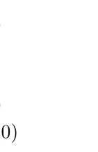

最后，注意TD(0)更新中括号中的数量是一种错误的形式，衡量了估计的值与更好的估计之间的差异
这个数量被称为TD错误，在强化学习中以各种形式出现：

$$\delta_t \doteq R_{t+1} + \gamma V(S_{t+1}) - V(S_t). \tag{6.5}$$

注意每个时间点的TD错误是在该时间点进行估计时的错误。因为TD错误取决于下一个状态和下一个奖励，所以实际上要等到下一个时间步才能获得。也就是说，$\delta_t$是在时间$t + 1$时的 $V(S_t)$的错误。还要注意，如果数组V在整个回合中没有改变（如蒙特卡洛方法中），那么蒙特卡洛错误可以写成一系列TD错误的和：

$$\begin{align*}
G_t - V(S_t) &= R_{t+1} + \gamma G_{t+1} - V(S_t) + \gamma V(S_{t+1}) - \gamma V(S_{t+1}) &&\text{(来自 (3.9) )} \\
&= \delta_t + \gamma(G_{t+1} - V(S_{t+1}) \\
&= \delta_t + \gamma \delta_{t+1} + \gamma^2(G_{t+2} - V(S_{t+2}) \\
&= \delta_t + \gamma \delta_{t+1} + \gamma^2 \delta_{t+2} + \dots + \gamma^{T-t-1} \delta_{T-1} + \gamma^{T-t}(G_T - V(S_T)) \\
&= \delta_t + \gamma \delta_{t+1} + \gamma^2 \delta_{t+2} + \dots + \gamma^{T-t-1} \delta_{T-1} + \gamma^{T-t}(0 - 0) \\
&= \sum_{k=t}^{T-1} \gamma^{k-t} \delta_k.
\end{align*}$$
(6.6)

如果在整个过程中更新了 $V$（如在TD(0)中），则此等式不再准确，但如果步长很小，则可能仍然近似成立。这个等式的推广在时序差分学习的理论和算法中起着重要作用。

练习6.1 如果在整个过程中 $V$ 发生了变化，则（6.6）只近似成立；两边之间的差异是什么？让 $V_t$表示在TD误差（6.5）和TD更新（6.2）中在时间 $t$使用的状态值数组。重新推导上述过程，以确定必须添加到TD误差总和中的额外量，以使其等于蒙特卡罗误差。

## 例子6.1：回家开车

每天下班回家时，你试图预测回家需要多长时间。当你离开办公室时，你记录下时间、星期几、天气和其他可能相关的事情。假设在这个星期五，你在6点钟准时离开，并估计需要30分钟回家。当你到达车辆时，已经是6:05了，你注意到开始下雨了。下雨时交通通常会变慢，所以你重新估计从那时起需要35分钟，总共需要40分钟。15分钟后，你已经顺利完成了高速公路的一段旅程。当你驶出到次要道路时，你将总体旅行时间的估计缩短到35分钟。不幸的是，在这个时候你被一辆慢车堵住了，而且道路太窄无法超车。最终，你不得不一直跟着卡车，直到你在6:40转入你住的小路。三分钟后，你到家了。

因此，状态、时间和预测的序列如下所示：

| 状态 | 经过时间 (分钟) | 预测的剩余时间 | 预测的总时间 |
| :--- | :---: | :---: | :---: |
| 星期五下午6点离开办公室 | 0 | 30 | 30 |
| 到达车辆，下雨 | 5 | 35 | 40 |
| 离开高速公路 | 20 | 15 | 35 |
| 次要道路，卡车后面 | 30 | 10 | 40 |
| 进入家庭街道 | 40 | 3 | 43 |
| 到达家 | 43 | 0 | 43 |

在这个例子中，奖励是旅程中每个阶段的经过时间。¹我们不打折（γ=1），因此每个状态的回报是实际到达该状态所需的时间。每个状态的价值是预期的到达时间。第二列数字给出了遇到的每个状态的当前估计值。

观察蒙特卡洛方法的运行方式的一种简单方法是绘制预测的总时间（最后一列）随序列的变化，如图6.1（左）所示。红色箭头显示了常数-αMC方法（6.1）推荐的预测变化，用于α=1。这些正是在每个状态下估计值（预测剩余时间）与实际回报（实际剩余时间）之间的误差。例如，当你离开高速公路时，你认为回家只需要再花15分钟，但实际上花了23分钟。方程6.1适用于此时点，并确定离开高速公路后剩余时间的增量。此时的误差， G_t - V(S_t)，为八分钟。假设步长参数，α，为1/2。因此，根据这次经验，离开高速公路后的预测剩余时间将上调四分钟。在这种情况下，这可能是一个过大的改变；卡车可能只是一个不幸的情况。无论如何，这种改变只能在离家后进行，也就是说，在你到达家之后。只有在这个时候，你才会知道任何实际回报。

在学习开始之前，是否有必要等到最终结果已知？
假设在另一天，你再次估计离开办公室后需要30分钟回家，但是你却陷入了一场大规模的交通堵塞。离开办公室25分钟后，你仍然在高速公路上一辆挨着一辆地行驶。你现在估计还需要25分钟才能回家，总共50分钟。当你在交通拥堵中等待时，你已经知道你最初估计的30分钟太乐观了。在增加你的初始估计之前，你必须等到回家吗？根据蒙特卡洛方法，你必须等待，因为你还不知道真实的回报。

另一方面，根据TD方法，你会立即学习，将你的初始估计从30分钟向50分钟调整。实际上，每个估计值都会向紧随其后的估计值调整。回到我们的第一天开车，图6.1（右侧）显示了TD规则（6.2）推荐的预测变化（如果 α= 1）。每个错误与预测的时间变化成比例，即与预测中的时间差异成比例。

除了在交通拥堵时给你一些事情做之外，根据当前预测学习的计算原因有几个优势，我们简要讨论一些这方面的内容在下一节中。

练习6.2 这是一个帮助你理解为什么时序差分方法通常比蒙特卡洛方法更高效的练习。考虑一下开车回家的例子以及时序差分和蒙特卡洛方法来解决。你能想象出一种情况，时序差分更新平均比蒙特卡洛更新更好吗？给出一个例子场景-描述过去的经历和当前状态-在这种情况下，你会期望时序差分更新更好。这里有一个提示：假设你有很多从工作回家的经验。然后你搬到了一个新的建筑和一个新的停车场（但你仍然从同一个地方上高速公路）。现在你开始学习新建筑的预测。你能看出为什么在这种情况下，时序差分更新在最初可能会更好吗？在原始情景中可能会发生同样的事情吗？

### 6.2 TD预测方法的优势

TD方法根据其他估计值部分更新其估计值。它们从一个猜测中学习另一个猜测——它们进行自举。这样做好吗？TD方法相对于蒙特卡洛和DP方法有哪些优势？开发和回答这样的问题将占据本书的剩余部分和更多内容。在本节中，我们简要预测一些答案。

显然，TD方法相对于DP方法具有优势，因为它们不需要环境模型、奖励和下一个状态的概率分布。

TD方法相对于蒙特卡洛方法的下一个最明显的优势是它们可以在线、完全增量的方式自然地实现。使用蒙特卡洛方法，必须等到一个回合结束，因为只有在那时才知道回报，而使用TD方法只需要等待一个时间步骤。令人惊讶的是，这经常是一个关键的考虑因素。一些应用程序具有非常长的回合，因此将所有学习延迟到回合结束太慢。其他应用程序是连续任务，根本没有回合。最后，正如我们在上一章中指出的，一些蒙特卡洛方法必须忽略或折扣实验性动作的回合，这可能会大大减慢学习速度。相对于这些问题，TD方法不太容易受到影响，因为它们从每个转换中学习，而不管后续采取什么动作。

但是TD方法可靠吗？当然，从下一个猜测中学习而不必等待实际结果是很方便的，但我们仍然能保证收敛到正确答案吗？幸运的是，答案是肯定的。对于任何固定策略 π，如果步长参数足够小且恒定，TD(0)已被证明在均值意义下收敛到 vπ，并且如果步长参数按照通常的随机逼近条件(2.7)递减，那么收敛概率为1。大多数收敛证明仅适用于上述算法的基于表格的情况(6.2)，但也有一些适用于一般线性函数逼近的情况。这些结果在第9章中以更一般的设置进行了讨论。

如果TD和蒙特卡洛方法都渐近地收敛到正确的预测值，那么一个自然的下一个问题是“哪个方法更快地达到目标？”换句话说，哪种方法学习更快？哪种方法更有效地利用有限的数据？目前还没有人能够在数学上证明哪种方法比另一种方法收敛更快，因此这是一个未解之谜。事实上，甚至不清楚最合适的形式化方式来表述这个问题！然而，在实践中，TD方法通常被发现在随机任务上比常数-αMC方法更快地收敛，如示例6.2所示。

### 例子6.2 随机行走

在这个例子中，我们通过实证比较了TD(0)和常数-αMC在以下马尔可夫奖励过程中的预测能力：


马尔可夫奖励过程，简称MRP，是一个没有动作的马尔可夫决策过程。在关注预测问题时，我们经常使用MRP，不需要区分环境动力学和代理动力学。在这个MRP中，所有的回合都从中心状态 C开始，然后每一步都向左或向右移动一个状态，概率相等。回合要么在极左边结束，要么在极右边结束。当一个回合在右边结束时，奖励为+1；其他奖励都为零。例如，一个典型的回合可能包含以下状态和奖励序列： C，0，B，0，C，0，D，0，E，1。因为这个任务是无折扣的，每个状态的真实值是从该状态开始到右边结束的概率。 因此，中心状态的真实值是$v_{\pi}(\mathrm{C}) = 0.5$。所有状态 A到 E的真实值是

$\frac{1}{6}$, $\frac{2}{6}$, $\frac{3}{6}$, $\frac{4}{6}$, 和 $\frac{5}{6}$。

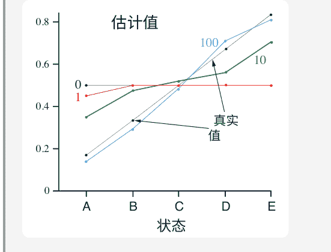

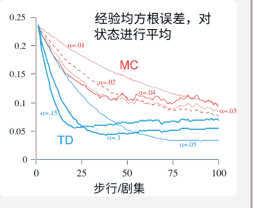

上面的左图显示了在单次TD(0)运行中不同剧集数后学到的值。100个剧集后的估计值与真实值非常接近，对于一个恒定的步长参数（在这个例子中为α= 0.1)，值会根据最近剧集的结果不断波动。右图显示了两种方法在不同 α值下的学习曲线。所显示的性能度量是学到的值函数与真实值函数之间的均方根误差，先对五个状态进行平均，然后再对100次运行进行平均。在所有情况下，近似值函数的初始值被设定为中间值 V(s)=0.5，对于所有的 s。在这个任务中，TD方法始终优于MC方法。

### 练习6.3
从随机行走示例的左图中显示的结果来看，第一集似乎只对V(A)产生了变化。这告诉你什么关于第一集发生了什么？为什么只有这一个状态的估计值发生了变化？它变化了多少？

### 练习6.4
随机行走示例右图中显示的具体结果取决于步长参数的值，即α。你认为如果使用更广泛的α值，对于哪个算法更好的结论会受到影响吗？

是否存在一个不同的固定值α，在这个值下，任一算法的表现都会明显优于所示的结果？为什么或为什么不？

### *练习6.5
在随机行走示例的右图中，TD方法的均方根误差似乎先下降然后再上升，特别是在高α值时。这可能是什么原因引起的？你认为这种情况总是发生，还是可能是由于近似值函数的初始化方式而产生的？

### 练习6.6
在例子6.2中，我们声明了随机行走示例的真实值为 $\frac{1}{6}$, $\frac{2}{6}$, $\frac{3}{6}$, $\frac{4}{6}$, 和 $\frac{5}{6}$, 对应状态 A到E。描述至少两种不同的计算方式。你猜我们实际使用了哪一种？为什么？

### 6.3 TD(0)的最优性

假设只有有限的经验可用，比如10个回合或100个时间步骤。在这种情况下，增量学习方法的常见方法是重复呈现经验，直到方法收敛到一个答案。给定一个近似值函数, V，根据(6.1)或(6.2)计算在每个非终止状态被访问的时间步骤 $t$ 上的增量，但值函数只改变一次，通过所有增量的总和。然后，所有可用的经验再次处理，使用新的值函数产生一个新的总增量，如此循环，直到值函数收敛。我们将此称为批量更新，因为只有在处理完整个批次of训练数据后才进行更新。

在批量更新下，TD(0)以确定性方式收敛到一个独立于步长参数的单一答案，只要 α被选择得足够小。常数-αMC方法在相同条件下也以确定性方式收敛，但得到不同的答案。理解这两个答案将帮助我们理解这两种方法之间的差异。在正常更新下，这些方法并不完全移动到它们各自的批量答案，但从某种意义上说，它们朝着这些方向迈出了一步。

在试图理解这两个答案在所有可能的任务中的一般情况之前，我们首先看几个例子。

### 例子6.3：批量更新下的随机漫步
将TD(0)和常数-αMC的批量更新版本应用于随机漫步预测例子(例子6.2)。在每个新的回合之后，迄今为止看到的所有回合都被视为一个批次。它们被反复呈现给算法，要么是TD(0)，要么是常数-αMC，步长足够小，使得值函数收敛。然后将得到的值函数与 $v_{\pi}$进行比较，并在五个状态上（以及整个实验的100次独立重复中）计算平均均方根误差，得到

如图6.2所示，可以看出批处理TD方法始终优于批处理蒙特卡罗方法。

在批处理训练中，常数-αMC收敛到值函数 V(s)，这些值函数是访问每个状态 s后实际返回的样本平均值。从实际返回中计算的这些估计值在某种意义上是最优的，因为它们最小化了训练集中与实际返回之间的均方误差。因此，根据右图所示的均方根误差度量，批处理TD方法能够表现得更好，这一点令人惊讶。为什么批处理TD方法能够比这种最优方法表现得更好呢？答案是蒙特卡罗方法只在有限的情况下是最优的，而

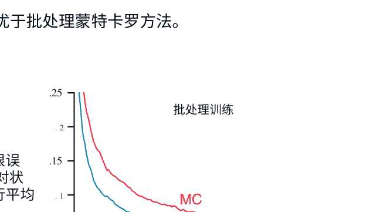

这意味着TD在某种程度上是最优的，与预测回报更相关。

### 例子6.4: 你是预测者
现在把自己放在一个未知的马尔可夫奖励过程的预测者的角色中。假设你观察到以下八个情节：

- A, 0, B, 0
- B, 1
- B, 1
- B, 1
- B, 1
- B, 1
- B, 1
- B, 0

这意味着第一个情节从状态 A开始，转移到状态 B并获得奖励0，然后从状态 B终止并获得奖励0。其他七个情节更短，从状态 B开始并立即终止。根据这批数据，你会说最优的预测是什么，估计值 V(A)和 V(B)? 大家可能都会同意 V(B)的最优值是 3/4，因为在状态 B中有八次中有六次过程立即终止并获得回报1，另外两次过程立即终止并获得回报0。

但是在给定这些数据的情况下，估计值 V(A)的最优值是多少？这里有两个合理的答案。一个是观察到100%的时间，过程处于状态 A时，它立即转移到B（奖励为0）；而且因为我们已经决定 B的值为 3/4，所以 A的值也必须为 3/4。

这个答案的一种观点是，它基于对马尔可夫过程的建模，如右图所示，然后根据模型计算出正确的估计值，即 V(A) = 3/4。这也是

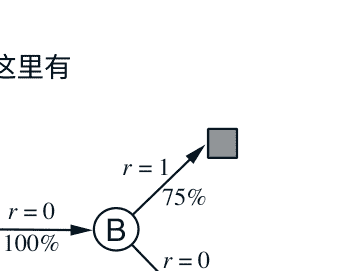

批处理TD(0)给出的答案。

另一个合理的答案是简单地观察到我们曾经看到过 A一次，后面的回报是0; 因此我们估计 V(A)为0。这是批处理蒙特卡洛方法给出的答案。 请注意，这也是在训练数据上给出最小平方误差的答案。 实际上，它在数据上给出了零误差。 但是我们仍然期望第一个答案更好。 如果过程是马尔可夫的，我们期望第一个答案在未来数据上产生更低的误差，尽管蒙特卡洛答案在现有数据上更好。

例子6.4说明了批处理TD(0)和批处理蒙特卡罗方法之间的一般差异。 批处理蒙特卡罗方法总是找到最小均方误差的估计值，而批处理TD(0)总是找到对马尔可夫过程的最大似然模型完全正确的估计值。 一般来说，参数的最大似然估计值是生成数据概率最大的参数值。 在这种情况下，最大似然是从观察到的情节中以明显的方式形成的马尔可夫过程模型: 从i到j的估计转移概率是从i到j的观察到的转移的比例，相关的预期奖励是在这些转移上观察到的奖励的平均值。 在给定这个模型的情况下，我们可以计算出如果模型完全正确的话，价值函数的估计将完全正确。 这被称为确定等价估计，因为它等价于假设对底层过程的估计是有不确定性的，而不是近似的。 一般来说，批处理TD(0)收敛到确定等价估计。

这有助于解释为什么TD方法比蒙特卡洛方法收敛更快。 在批处理形式中，TD(0)比蒙特卡洛方法更快，因为它计算了真正的等价确定性估计。 这解释了TD(0)在随机行走任务的批处理结果中的优势(图6.2)。 与等价确定性估计的关系也可以在一定程度上解释非批处理TD(0)的速度优势(例如，例子6.2，第125页，右图)。 尽管非批处理方法既不能达到等价确定性估计，也不能达到最小平方误差估计，但它们可以被理解为大致朝着这些方向移动。 非批处理TD(0)可能比常数-αMC更快，因为它正在朝着更好的估计值前进，尽管没有完全达到那里。 目前还不能对在线TD和蒙特卡洛方法的相对效率做出更明确的说法。

最后，值得注意的是，尽管等价确定性估计在某种意义上是最优解，但直接计算它几乎是不可行的。 如果状态的数量为n=|S|，那么仅仅形成过程的最大似然估计可能需要n^2的内存，并且计算相应的值函数需要n^3的计算步骤(如果按照常规方式进行)。 从这些角度来看，令人惊讶的是，TD方法可以使用不超过n的内存和对训练集的重复计算来近似相同的解。 在具有大状态空间的任务中，TD方法可能是近似等价解的唯一可行方法。

## 6.4 Sarsa: 离策略TD控制

任意目标策略π和覆盖行为策略b，使用每一步t的重要性采样比率ρt：(5.3)。

现在我们转向使用TD预测方法来解决控制问题。和往常一样，我们遵循广义策略迭代（GPI）的模式，只是这次使用TD方法来进行评估或预测部分。和蒙特卡洛方法一样，我们面临着在探索和利用之间进行权衡的需求，而且方法又可以分为两类：基于策略和离策略。在本节中，我们介绍一种基于策略的TD控制方法。

第一步是学习一个动作值函数而不是状态值函数。特别是对于基于策略的方法，我们必须估计当前行为策略π下的qπ(s,a)以及所有状态s和动作a。这可以使用基本上与上述学习vπ的TD方法相同的方法来完成。回想一下，一个回合由状态和状态-动作对的交替序列组成：


在前一节中，我们考虑了从状态到状态的转换，并学习了状态的值。现在我们考虑从状态-动作对到状态-动作对的转换，并学习状态-动作对的值。从形式上看，这些情况是相同的：它们都是具有奖励过程的马尔可夫链。在TD(0)下保证状态值收敛的定理也适用于相应的动作值算法：

$$ Q(S_t, A_t) \leftarrow Q(S_t, A_t) + \alpha[R_{t+1} + \gamma Q(S_{t+1}, A_{t+1}) - Q(S_t, A_t)] \tag{6.7} $$

在每次从非终止状态St转换后进行此更新。如果如果St+1是终止状态，则Q(St+1, At+1)定义为零。这个规则使用了转换从一个状态-动作对到下一个状态-动作对的五元组事件(St, At, R_{t+1}, S_{t+1}, A_{t+1})的每个元素。这个五元组导致了算法被称为Sarsa。Sarsa的备份图如右图所示。

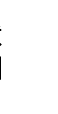

基于Sarsa预测方法设计一个基于策略的控制算法是直接的。和所有基于策略的方法一样，我们不断地估计行为策略π的qπ，并同时改变π朝着对qπ的贪婪度增加。

Sarsa控制算法的一般形式在下一页的方框中给出。

Sarsa算法的收敛性质取决于策略对Q的依赖性。例如，可以使用ε贪婪或ε软策略。只要所有状态-动作对被无限次访问，并且策略在极限下收敛到贪婪策略（例如，通过设置ε贪婪策略为1/t，即ε=1/t）。

### 练习6.8
证明(6.6)的动作值版本对于TD误差的动作值形式也成立，假设值在每一步都不改变。

### Sarsa（基于策略的时间差分控制）用于估计Q≈q*

```
算法参数：步长α∈（0，1]，ε>0
初始化Q（s，a），对于所有s∈S+，a∈A（s），除了Q（终止，·）=0
循环每个回合：
  初始化S
  根据Q导出的策略从S中选择A（例如，ε-greedy）
  循环每个回合的每个步骤：
    执行动作A，观察R，S'
    根据Q导出的策略从S'中选择A'（例如，ε-greedy）
    Q(S, A) ← Q(S, A) + α[R + γQ(S', A') - Q(S, A)]
    S ← S'; A ← A';
  直到S是终止状态
```

### 例子6.5：多风格网格世界
下图是一个标准的网格世界，有起始和目标状态，但有一个不同之处：网格中间有一股向上的侧风。动作是标准的四个——上、下、右、左——但在中间区域，结果的下一个状态会向上移动，受到不同列的风力的影响。风力的强度在每一列下面给出，以向上移动的单元格数表示。例如，如果你离目标的右边一个单元格，那么动作左会将你带到目标上方的单元格。这是一个无折扣的回合任务，直到到达目标状态，奖励一直是恒定的−1。

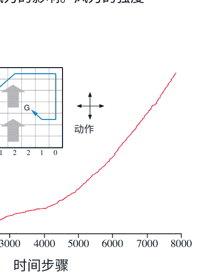

右侧的图显示了将ε-贪婪Sarsa应用于此任务的结果，其中ε=0.1，α=0.5，并且初始值Q(s,a)=0对于所有的s,a。图的上升斜率显示随着时间的推移目标更快地达到了。通过8000个时间步骤，贪婪策略早已达到最优（插图中显示了一条轨迹）；持续的ε-贪婪探索使平均每个回合的长度保持在约17个步骤，比最小值15多两个。请注意，蒙特卡洛方法在这里不能轻易使用，因为并不保证所有策略都会终止。如果找到了一种使代理程序保持在同一状态的策略，那么下一个回合将永远不会结束。在线学习方法（如Sarsa）没有这个问题，因为它们在回合过程中很快学到这样的策略是不好的，并切换到其他策略。

### 练习6.9：带有国王移动的多风格网格世界（编程）
重新解决多风格网格世界的问题，假设有八种可能的动作，包括对角线移动，而不是通常的四个。 有了额外的动作，你能做得更好吗？ 通过包括第九个动作（除了风引起的移动之外不动），你能做得更好吗？ □

### 练习6.10: 随机风（编程）
重新解决多风格网格世界任务，假设风的影响（如果有的话）是随机的，有时会与每列给出的平均值有所不同。 也就是说，有三分之一的时间，你按照这些值移动，就像前面的练习一样，但也有三分之一的时间，你向上移动一个单元格，还有三分之一的时间，你向下移动一个单元格。 例如，如果你离目标右边一个单元格，并向左移动，那么三分之一的时间你向上移动一个单元格，三分之一的时间你向上移动两个单元格，三分之一的时间你移动到目标位置。 □

### 6.5 Q学习：离策略TD控制

强化学习的早期突破之一是开发了一种off-策略TD控制算法，称为 Q学习(Watkins, 1989)，定义为

$$ Q(S_t, A_t) \leftarrow Q(S_t, A_t) + \alpha[R_{t+1} + \gamma \max_a Q(S_{t+1}, a) - Q(S_t, A_t)]. \tag{6.8} $$

在这种情况下，学习到的动作值函数 Q直接逼近最优动作值函数 q_*，而不依赖于所遵循的策略。这极大地简化了算法的分析，并实现了早期的收敛证明。策略仍然会产生影响，因为它决定了哪些状态-动作对被访问和更新。

然而，正确收敛所需的仅仅是所有对继续被更新。正如我们在第5章中观察到的，这是一个最小的要求，意味着在一般情况下，任何保证找到最优行为的方法都必须要求它。在这个假设和通常的随机逼近条件的一个变体下， Q已经被证明以概率1收敛到 q_*。 Q学习算法以过程形式如下所示。

### Q学习（离策略TD控制）用于估计 π ≈ π_*
```
算法参数: 步长α∈ (0, 1], ε>0
初始化Q (s, a) , 对于所有s∈S^+, a∈A (s) , 除了Q (终止, ·) = 0
循环每个回合:
    初始化S
    循环每个回合的每个步骤:
        使用从 Q派生的策略选择 S中的 A (例如, ε贪婪)
        执行动作 A, 观察 R, S'
        Q(S, A) ← Q(S, A) + α[R + γ max_a Q(S', a) - Q(S, A)]
        S ← S'
    直到 S 是终止状态
```

Q学习的备份图是什么？规则（6.8）更新一个状态-动作对，因此更新的顶部节点必须是一个小的、填充的动作节点。更新也来自动作节点，最大化下一个状态中所有可能的动作。因此，备份图的底部节点应该是所有这些动作节点。

最后，请记住，我们用一条弧线表示取这些“下一个动作”节点的最大值（图3.4-右）。现在你能猜到图是什么了吗？如果是这样，请在翻到第134页上的图6.4之前先猜一下。

### 例子 6.6：Cliff 行走
这个网格世界的例子比较了Sarsa和Q-learning，突出显示了on-policy（Sarsa）和off-policy（Q-learning）方法之间的差异。考虑右侧显示的网格世界。这是一个标准的未折扣、分段式任务，具有起始和目标状态，以及通常的上、下、右、左移动动作。奖励是 -1，除了那些进入标有“悬崖”的区域的转换。进入该区域会导致一个奖励 -100并立即将代理发送回起点。

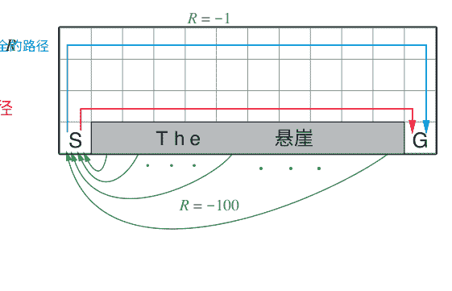

右侧的图表显示了Sarsa和Q-学习方法的性能，使用ε贪婪动作选择，ε = 0.1。在初始瞬态之后，Q-learning学习了最优策略的值，沿着边缘向右移动。不幸的是，这导致它偶尔掉下来，因为ε贪婪动作选择。另一方面，Sarsa考虑了动作选择并学习了更长但更安全的路径通过网格的上部分。尽管Q-learning实际上学习了最优策略的值，但其在线性能比Sarsa差。

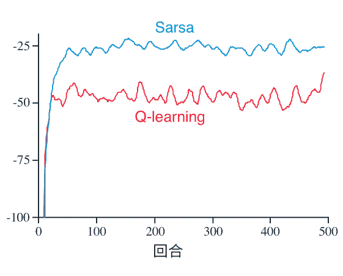

学习了绕圈策略。当然，如果ε逐渐减小，那么两种方法都会渐近地收敛到最优策略。

### 练习6.11
为什么Q学习被认为是一种离策略控制方法？

### 练习6.12
假设动作选择是贪婪的。那么Q学习和Sarsa算法完全相同吗？它们会完全相同的动作选择和权重更新吗？

### 6.6 期望Sarsa

考虑学习算法，它与Q学习完全相同，只是在计算下一个状态-动作对的最大值时使用了期望值，考虑了每个动作在当前策略下的可能性。也就是说，考虑具有以下更新规则的算法

```
$$Q(S_t, A_t) \leftarrow Q(S_t, A_t) + \alpha \left[ R_{t+1} + \gamma \mathbb{E}_{\pi}[Q(S_{t+1}, A_{t+1}) | S_{t+1}] - Q(S_t, A_t) \right]$$
$$= Q(S_t, A_t) + \alpha \left[ R_{t+1} + \gamma \sum_{a} \pi(a|S_{t+1}) Q(S_{t+1}, a) - Q(S_t, A_t) \right], \quad (6.9)$$
```

期望Sarsa和Q-learning一样，但在计算下一个状态-动作对的最大值时使用了期望值。在 cliff-walking 问题中，期望Sarsa在计算上比Sarsa更复杂，但是作为回报，它消除了由于随机选择 \(A_{t+1}\) 而产生的方差。在相同的经验量下，我们可能期望它的表现略好于Sarsa，事实上它通常确实如此。图6.3显示了期望Sarsa与Sarsa和Q-learning在cliff-walking任务上的总结结果。期望Sarsa在这个问题上保留了Sarsa相对于Q-learning的显著优势。此外，期望Sarsa显示出显著的改进。

使用悬崖行走导航任务。在这个任务中，代理在一个没有目标的确定性世界中，悬崖是一个危险区域（见图）。四个移动动作：其中一个是将代理移动到目标的步骤。每一步都会导致总奖励为-1。步骤进入悬崖区域，并立即返回到起点[S]移动到悬崖区域。在前n个回合中的结果为50,000次运行的结果。

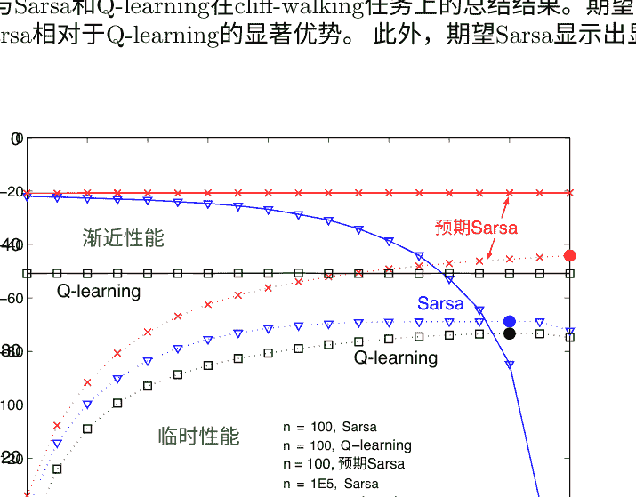

图6.3：TD控制方法在cliff-walking上的临时和渐近性能。任务的函数 \(\alpha\)。所有算法都使用了 \(\varepsilon\)-贪婪策略，其中 \(\varepsilon = 0.1\)。渐近性能是100,000个回合的平均值，而临时性能是前100个回合的平均值。这些数据分别是临时和渐近情况下的50,000次和10次运行的平均值。实心圆标记了每种方法的最佳临时性能。改编自van Seijen等人（2009年）的研究。

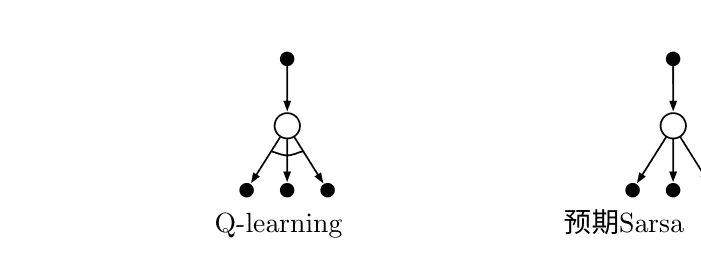

图6.4: Q学习和期望Sarsa的备份图

在步长参数的广泛取值范围内，相对于Sarsa，期望Sarsa表现更好。在cliff行走中，状态转换都是确定性的，所有的随机性都来自策略。在这种情况下，期望Sarsa可以安全地将 α 设置为1，而不会导致渐近性能下降，而Sarsa只能在小的 α 值下表现良好，在这种情况下，短期性能较差。在这个例子和其他例子中，期望Sarsa相对于Sarsa始终具有实证优势。

在这些cliff行走结果中，期望Sarsa是在策略上使用的，但一般情况下，它可能使用与目标策略 π 不同的策略来生成行为，在这种情况下，它成为一个离策略算法。例如，假设 π 是贪婪策略，而行为更具探索性；那么期望Sarsa就是Q学习。从这个意义上说，期望Sarsa包含并推广了Q学习，同时可靠地改进了Sarsa。除了额外的计算成本较小外，期望Sarsa可能完全主导其他更为知名的TD控制算法。

### 6.7 最大化偏差和双学习

到目前为止，我们讨论的所有控制算法都涉及到在构建目标策略时的最大化。例如，在Q学习中，目标策略是根据当前动作值确定的贪婪策略，这是通过max函数定义的，在Sarsa中，策略通常是 ε 贪婪策略，也涉及到最大化操作。在这些算法中，隐式地使用了估计值的最大值作为最大值的估计，这可能导致显著的正偏差。为了理解原因，考虑一个单一状态 s，其中有许多动作 a，其真实值 q(s, a)都为零，但估计值 Q(s, a)是不确定的，因此分布在零的上方和下方。真实值的最大值是零，但估计值的最大值是正数，存在正偏差。我们称之为最大化偏差。

### 例子6.7: 最大化偏差示例

在图6.5的插图中显示的小MDP提供了一个简单的例子，说明最大化偏差如何损害TD控制算法的性能。MDP有两个非终止状态 A和 B。每个情节都从 A开始，在左和右两个动作之间进行选择。右动作立即转移到终止状态，奖励和回报都为零。左动作转移到 B，同样奖励为零，从那里有许多可能的动作，所有这些动作都会立即终止，并从均值为 −0.1和方差为1.0的正态分布中抽取奖励。因此，以 left开始的任何轨迹的期望回报都是 −0.1，因此在状态 A选择left总是错误。

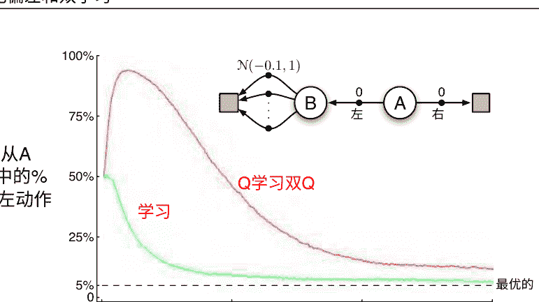

图6.5：在一个简单的情节MDP上比较Q学习和双Q学习（插图中显示）。 Q学习最初学习更频繁地采取左动作，而不是右动作，并且始终比由ε贪婪动作选择强制执行的5%最小概率更频繁地采取它，其中ε= 0.1。 相比之下，双Q学习基本上不受最大化偏差的影响。 这些数据是在10,000次运行中平均的。 初始动作值估计为零。 在ε贪婪动作选择中的任何平局都是随机打破的。

尽管如此，我们的控制方法可能偏向于左，因为最大化偏差使得B看起来具有正值。 图6.5显示，在这个例子中，采用ε贪婪动作选择的Q学习最初强烈偏向于左动作。 即使在渐近状态下，根据我们的参数设置（ε= 0.1， α= 0.1和 γ= 1）， Q学习采取左动作的频率比最优频率高约5%。

是否有避免最大化偏差的算法？ 首先，考虑一个赌徒问题，在这个问题中，我们对每个动作的价值进行噪声估计，这些估计是通过对每个动作进行多次试验并计算奖励的样本平均值得到的。 正如我们上面讨论的那样，如果我们将估计值的最大值作为真实值的最大值的估计，就会出现正向最大化偏差。 问题的一种观点是，这是因为我们使用相同的样本（试验）既用于确定最大化动作，又用于估计其价值。 假设我们将试验分为两组，并使用它们来学习两个独立的估计值，称为 Q_1(a) 和 Q_2(a)，每个估计值都是所有动作的真实值 q(a) 的估计。 然后，我们可以使用一个估计值，比如 Q_1，来确定最大化动作 A^* = argmax_a Q_1(a)，并使用另一个估计值 Q_2 来提供其价值的估计值， Q_2(A^*) = Q_2(argmax_a Q_1(a))。 这个估计值将是无偏的，即 E[Q_2(A^*)] = q(A^*)。 我们还可以反转两个估计值的角色，以得到第二个无偏估计 Q_1(argmax_a Q_2(a))。 这就是双重学习的思想。 请注意，虽然我们学习了两个估计值，但每次试验只更新一个估计值；双重学习会增加内存需求，但不会增加每步计算量。

双重学习的想法自然地扩展到完整MDP算法。 例如，与Q学习类似的双重学习算法称为双Q学习，将时间步骤分为两部分，可能通过在每个步骤上抛硬币来实现。 如果硬币正面朝上，更新为

$$Q_1(S_t, A_t) \leftarrow Q_1(S_t, A_t) + \alpha \left[ R_{t+1} + \gamma Q_2 \left( S_{t+1}, \underset{a}{\text{argmax}} \, Q_1(S_{t+1}, a) \right) - Q_1(S_t, A_t) \right]. \quad (6.10)$$

如果硬币反面朝上，则使用 \(Q_1\) 和 \(Q_2\) 交换进行相同的更新，以便更新 \(Q_2\)。这两个近似值函数被完全对称地处理。行为策略可以使用两个动作值估计。例如，一个 \(\varepsilon\)贪婪策略的双Q学习可以基于两个动作值估计的平均值（或总和）。双Q学习的完整算法如下所示。这是用于生成图6.5中结果的算法。在该示例中，双学习似乎消除了由最大化偏差引起的伤害。当然，Sarsa和Expected Sarsa也有双版本。

```
用于估计 \(Q_1 \approx Q_2 \approx q_*\) 的双Q学习

算法参数：步长 \(\alpha \in (0, 1]\)，小于0
对于所有的 \(s \in \mathcal{S}^+, a \in \mathcal{A}(s)\)，初始化 \(Q_1(s, a)\) 和 \(Q_2(s, a)\)，使得 \(Q(\text{terminal}, \cdot) = 0\)

对于每个回合进行循环：
    初始化 \(S\)
    循环每个回合的每个步骤：
        使用策略 \(\varepsilon\)贪婪在 \(Q_1 + Q_2\) 中从 \(S\) 选择 \(A\)
        执行动作 \(A\)，观察 \(R, S'\)
        以0.5的概率：
            \(Q_1(S, A) \leftarrow Q_1(S, A) + \alpha \left( R + \gamma Q_2 \left( S', \underset{a}{\text{argmax}} \, Q_1(S', a) \right) - Q_1(S, A) \right)\)
        else:
            \(Q_2(S, A) \leftarrow Q_2(S, A) + \alpha \left( R + \gamma Q_1 \left( S', \underset{a}{\text{argmax}} \, Q_2(S', a) \right) - Q_2(S, A) \right)\)
        \(S \leftarrow S'\)
    直到 \(S\) 是终止状态
```

### 练习6.13 双期望Sarsa的更新方程是什么？\(\varepsilon\)贪婪目标策略？

### 6.8 游戏、后状态和其他特殊情况

在本书中，我们试图提出一种统一的方法来处理一类广泛的任务，但当然总会有一些特殊的任务需要以专门的方式处理。例如，我们的一般方法涉及学习一个动作值函数，但在第1章中，我们介绍了一种学习下棋的TD方法，它学到的更像是一个状态值函数。如果我们仔细观察那个例子，就会发现学到的函数既不是动作值函数，也不是状态值函数。传统的状态值函数评估代理有选择动作的状态，但在这里使用的状态值函数

井字游戏在代理完成自己的移动后评估棋盘位置。让我们称之为后态，并对这些后态进行价值函数计算，即后态价值函数。当我们对环境动态的初始部分有了了解，但不一定了解全部动态时，后态非常有用。例如，在游戏中，我们通常知道我们的移动的即时效果。我们只知道每个可能的国际象棋移动的结果位置，但不知道对手将如何回应。后态价值函数是利用这种知识的一种自然方式，从而产生更高效的学习方法。这种方法可以更好地利用我们对环境动态的部分了解，从而产生更高效的学习方法。

通过使用后状态来设计算法更加高效，这一点从井字游戏的例子中显而易见。传统的动作-值函数将位置和移动映射到一个值的估计。但是，许多位置-移动对会产生相同的结果位置，就像下面的例子一样：

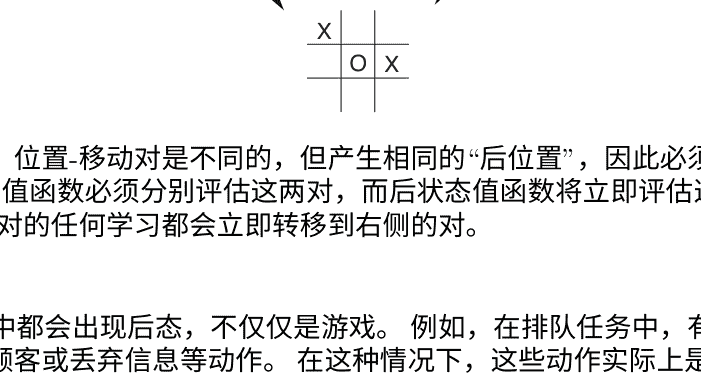

在这种情况下，位置-移动对是不同的，但产生相同的“后位置”，因此必须具有相同的值。传统的动作-值函数必须分别评估这两对，而后状态值函数将立即评估这两对。对左侧的位置-移动对的任何学习都会立即转移到右侧的对。

在许多任务中都会出现后态，不仅仅是游戏。例如，在排队任务中，有分配顾客到服务器、拒绝顾客或丢弃信息等动作。在这种情况下，这些动作实际上是根据它们的即时效果来定义的。已知的效果完全不同。

不可能描述所有可能的专门问题和相应的专门学习算法。然而，本书中提出的原则应该广泛适用。例如，在广义策略迭代的术语中，仍然可以准确描述后状态方法，策略和（后状态）值函数以基本相同的方式相互作用。在许多情况下，人们仍然面临选择使用基于策略或离策略的方法来管理持续探索的需求。

### 练习6.14 描述如何将杰克的汽车租赁任务（示例4.2）重新制定为关于后状态的问题。为什么在这个具体任务中，这样的重新制定有可能加快收敛速度？

### 6.9 总结

在本章中，我们介绍了一种新的学习方法，即时差分（TD）学习，并展示了如何将其应用于强化学习问题。像往常一样，我们将整个问题分为预测问题和控制问题。

TD方法是解决预测问题的蒙特卡洛方法的替代方法。在这两种情况下，控制问题的扩展都是通过我们从动态规划中抽象出的广义策略迭代（GPI）的思想来实现的。这个思想是，近似策略和值函数应该以这样的方式相互作用，使它们都朝着最优值移动。

GPI的两个过程之一是驱使值函数准确预测当前策略的回报；这是预测问题。另一个过程是驱使策略在局部上改进（例如，变得更加贪婪）以适应当前值函数。当第一个过程基于经验时，关于保持足够的探索的一个复杂性出现了。我们可以根据TD控制方法处理这个复杂性的方式将其分类为基于策略或离策略的方法。

Sarsa是一种在线策略方法，而Q-learning是一种离线策略方法。预期Sarsa也是一种离线策略方法，正如我们在这里介绍的那样。还有一种方式可以将TD方法扩展到控制领域，我们在本章中没有包括，称为演员-评论家方法。这些方法在第13章中有详细介绍。

本章介绍的方法是目前最广泛使用的强化学习方法。这可能是因为它们非常简单：它们可以在线应用，只需进行最少量的计算，从与环境的交互生成的经验中获得；它们几乎可以完全用单个方程表示，并且可以用小型计算机程序实现。在接下来的几章中，我们将扩展这些算法，使它们稍微复杂一些，但更加强大。

所有新算法都将保留这里介绍的精髓：它们能够在线处理经验，计算量相对较少，并且受到TD误差的驱动。本章介绍的TD方法的特殊情况应该被称为一步、表格、无模型的TD方法。在接下来的两章中，我们将将它们扩展为n步形式（与蒙特卡洛方法有关）和包含环境模型的形式（与规划和动态规划有关）。然后，在本书的第二部分中，我们将将它们扩展为各种形式的函数逼近，而不是表格（与深度学习和人工神经网络有关）。

最后，在本章中我们讨论了完全基于强化学习问题的TD方法，但是TD方法实际上比这更通用。它们是学习关于动态系统的长期预测的通用方法。例如，TD方法可能与预测金融数据、寿命、选举结果、天气模式、动物行为、电站需求或客户购买有关。只有当将TD方法作为纯预测方法进行分析时，独立于其在强化学习中的使用，它们的理论性质才首次得到了很好的理解。即使如此，这些TD学习方法的其他潜在应用尚未得到广泛探索。

### 参考文献和历史评论

正如我们在第1章中概述的那样，TD学习的思想早期源于动物学习心理学和人工智能，尤其是Samuel（1959）和Klopff（1972）的工作。Samuel的工作在第16.2节中被描述为一个案例研究。与TD学习相关的还有Holland（1975, 1976）关于价值预测一致性的早期思想。这些对作者之一（Barto）产生了影响，他在1970年至1975年间是密歇根大学的研究生，当时Holland在那里任教。Holland的想法导致了许多与TD相关的系统，包括Booker（1982）的工作和Holland（1986）的桶式队列，这与下面讨论的Sarsa有关。

### 6.1–2

这些部分的大部分具体内容来自Sutton（1988），包括TD(0)算法、随机游走示例和“时间差分学习”这个术语。与动态规划和蒙特卡洛方法的关系的描述受到Watkins（1989）、Werbos（1987）和其他人的影响。备份图在本书的第一版中是新的。

基于Watkins和Dayan（1992）的工作，Sutton（1988）证明了表格TD(0)的均值收敛性，并由Dayan（1992）证明了概率为1。这些结果通过使用强大的现有随机逼近理论的扩展，被Jaakkola、Jordan和Singh（1994）以及Tsitsiklis（1994）进一步加强和扩展。其他扩展和推广将在后面的章节中介绍。

### 6.3

Sutton（1988）证明了在批量训练下，TD算法的最优性。Barnard（1993）将TD算法的推导解释为学习马尔可夫链模型的增量方法的一步和从模型中计算预测的方法的一步，从而阐明了这一结果。术语“确定等价性”来自自适应控制文献（例如，Goodwin和Sin，1984）。

### 6.4

Sarsa算法由Rummery和Niranjan（1994）引入。他们将其与人工神经网络结合使用，并称之为“Modified Connectionist Q-learning”。Sutton（1996）引入了“Sarsa”这个名称。通过Singh、Jaakkola、Littman和Szepesv´ari（2000）证明了一步制表Sarsa（本章所讨论的形式）的收敛性。“多风格网格世界”示例是由Tom Kalt提出的。

Holland（1986）的“桶旅队”思想演变成了与Sarsa密切相关的算法。桶旅队的原始思想涉及到一系列触发彼此的规则链；它侧重于将信用从当前规则传递回触发它的规则。随着时间的推移，桶旅队变得更像是TD学习，将信用传递回到任何时间上的前一个规则，而不仅仅是触发当前规则的规则。桶旅队的现代形式，在各种自然方式上简化后，与一步Sarsa几乎完全相同，详细介绍请参见Wilson（1994）。

### 6.5

Watkins (1989) 引入了Q学习，他的收敛证明概述由Watkins和Dayan (1992 ) 进行了严格化。Jaakkola、Jordan和Singh (1994) 以及Tsitsiklis (1994) 证明了更一般的收敛结果。

### 6.6

期望Sarsa算法是由George John (1994年) 引入的，他将其称为“Q-learning”，并强调其作为一个离策略算法的优势。当我们在第一版的书中将期望Sarsa作为一个练习提出时，我们并不知道John的工作，也不知道van Seijen、van Hasselt、Whiteson和Weiring (2009年) 在确定期望Sarsa的收敛性质和超越常规Sarsa和Q-learning的条件时。我们的图6.3是根据他们的结果进行调整的。Van Seijen等人将“期望Sarsa”定义为一种仅限于离策略方法（就像我们在第一版中所做的那样），而现在我们将这个名称用于目标策略和行为策略可能不同的一般算法。van Hasselt (2011年) 指出了期望Sarsa的一般离策略观点，并将其称为“通用Q-learning”。

### 6.7

最大化偏差和双重学习是由范哈塞尔特 (2010年，2011年) 引入并广泛研究的。图6.5中的示例MDP是从他的图4.1中改编而来的（范哈塞尔特，2011年）。

### 6.8

后状态的概念与“决策后状态”的概念相同 (Van Roy，Bertsekas，Lee和Tsitsiklis，1997年；Powell，2011年)。

## 第7章

### $n$步引导

在本章中，我们将蒙特卡洛（MC）方法和一步时序差分（TD）方法统一起来，这两种方法在前两章中介绍过。既不是MC方法，也不是一步TD方法总是最好的。在本章中，我们介绍了$n$步TD方法，它可以将这两种方法进行推广，以便根据需要平滑地从一种方法转换到另一种方法，以满足特定任务的需求。$n$步方法涵盖了一个光谱，其中MC方法位于一端，一步TD方法位于另一端。最好的方法通常介于这两个极端之间。

从另一个角度看，$n$步方法的好处是它们使我们摆脱了时间步长的束缚。对于一步TD方法，相同的时间步长决定了行动可以改变的频率和引导的时间间隔。在许多应用中，我们希望能够快速更新行动，以考虑任何已经发生的变化，但是引导方法在一个显著且可识别的状态变化发生的时间段内效果最好。对于一步TD方法，这些时间间隔是相同的，因此必须做出妥协。$n$步方法使得引导可以在多个步骤中进行，使我们摆脱了单一时间步长的束缚。

$n$步方法的思想通常被用作算法中资格追踪（第12章）的介绍，它可以同时在多个时间间隔上进行引导。在这里，我们将单独考虑$n$步引导的思想，将对资格追踪机制的处理推迟到以后。这样可以更好地分离问题，尽可能在更简单的情况下处理尽可能多的问题。

### $n$步设置

通常，我们首先考虑预测问题，然后再考虑控制问题。也就是说，我们首先考虑如何使用$n$步方法来预测给定策略下的回报，作为状态的函数进行估计 $v_{\pi}$。然后我们将这些思想扩展到动作值和控制方法上。

## 7.1 n步 TD 预测

蒙特卡洛方法和TD方法之间存在哪些方法的空间？考虑使用$\pi$生成的样本来估计 $v_\pi$。蒙特卡洛方法根据观察到的从该状态开始的整个奖励序列对每个状态进行更新，直到该轨迹结束。另一方面，一步TD方法的更新仅基于下一个奖励，通过从稍后一步的状态值进行引导来代替剩余奖励。一种中间方法会根据中间数量的奖励进行更新：不是全部奖励，但也不是终止时的全部奖励。例如，一个两步更新将基于前两个奖励和两步后状态的估计值。

同样地，我们可以有三步更新、四步更新等等。图7.1显示了光谱的备份图，其中包括n步更新的$v_\pi$，左边是一步TD更新，右边是直到终止的蒙特卡洛更新。

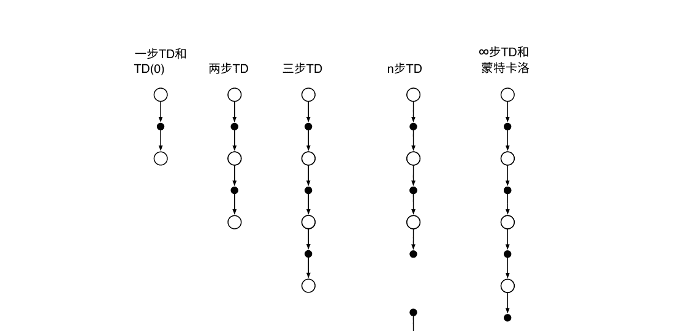

使用n步更新的方法仍然是TD方法，因为它们仍然根据较晚的估计与较早的估计之间的差异来改变先前的估计。现在较晚的估计不是一步之后，而是n步之后。时间差异延伸到n步的方法被称为n步TD方法。前一章介绍的TD方法都使用了一步更新，这就是为什么我们称它们为一步TD方法的原因。

更正式地说，考虑状态 $S_t$ 的估计值的更新，作为状态-奖励序列的结果， $S_t$, $R_{t+1}$, $S_{t+1}$, $R_{t+2}$, $...$, $R_T$, $S_T$ (省略动作)。我们知道，在蒙特卡洛更新中，状态 $v_\pi$ ($S_t$) 的估计值会朝着完整回报：

$$G_t \doteq R_{t+1} + \gamma R_{t+2} + \gamma^2 R_{t+3} + \cdots + \gamma^{T-t-1} R_T,$$

其中 $T$ 是该回合的最后一个时间步。让我们称这个数量为目标的更新。而在蒙特卡洛更新中，目标是回报，而在一步更新中，目标是第一个奖励加上下一个状态的折扣估计值，我们称之为一步回报：

$$G_{t:t+1} \doteq R_{t+1} + \gamma V_t(S_{t+1}),$$

其中 $V_t : \mathcal{S} \to \mathbb{R}$ 是时间 $t$ 的估计值 $v_\pi$。下标 $G_{t:t+1}$ 表示它是时间 $t$ 的截断回报，使用时间 $t+1$ 之前的奖励，以折扣估计 $\gamma V_t(S_{t+1})$ 代替其他项 $\gamma R_{t+2} + \gamma^2 R_{t+3} + \cdots + \gamma^{T-t-1} R_T$ 作为完整回报的替代，如前一章所讨论的。我们现在的观点是，这个想法在两步之后和一步之后一样有意义。两步更新的目标是两步回报：

$$G_{t:t+2} \doteq R_{t+1} + \gamma R_{t+2} + \gamma^2 V_{t+1}(S_{t+2}),$$

其中，现在 $\gamma^2 V_{t+1}(S_{t+2})$ 修正了项 $\gamma^2 R_{t+3} + \gamma^3 R_{t+4} + \cdots + $

同样地，任意 $n$ 步更新的目标是n步回报：

$$G_{t:t+n} \doteq R_{t+1} + \gamma R_{t+2} + \cdots + \gamma^{n-1} R_{t+n} + \gamma^n V_{t+n-1}(S_{t+n}), \qquad (7.1)$$

对于所有的 $n$, $t$, 使得 $0 \leq t < T$，所有 $n$ 步回报都可以被视为完整回报的近似值，在 $n$ 步之后被截断，并通过 $V_{t+1+(n-1)}(S_{t+1+n})$ 来修正剩余的缺失项。如果 $t+n \geq T$ (如果 $n$ 步回报延伸到或超过终止状态)，那么所有缺失项都被视为零，并且 $n$ 步回报被定义为普通完整回报 ($G_{t:t+n} = G_t$ 如果 $t+n \geq T$)。请注意，对于 $n > 1$ 的 $n$ 步回报涉及未来的奖励和状态，在从 $t$ 到 $t+1$ 的转换时是不可用的。在看到 $R_{t+n}$ 并计算 $V_{t+n}$ 之前，没有真正的算法可以使用 $n$ 步回报。这些可用的时间是 $t+n$。使用 $n$ 步回报的自然状态值学习算法因此是

$$V_{t+n}(S_t) \doteq V_{t+n-1}(S_t) + \alpha[G_{t:t+n} - V_{t+n-1}(S_t)], \qquad 0 \leq t < T, \qquad (7.2)$$

当所有其他状态的值保持不变时： $V_{t+n}(s) = V_{t+n-1}(s)$, 对于所有 $s \neq S_t$。
我们将这个算法称为 $n$ 步 $TD$。请注意，在第一步中没有进行任何更改 $n$ – 每个回合的1步. 为了弥补这一点，在回合结束之后，在开始下一个回合之前，进行相同数量的额外更新.完整的伪代码在下一页的方框中给出.

**练习7.1** 在第6章中，我们指出如果值估计在每一步都不改变，蒙特卡洛误差可以写成TD误差的和 (6.6). 证明当值估计不改变时，(7.2)中使用的 $n$ 步误差也可以写成TD误差的和，从而推广了之前的结果.

**练习7.2 (编程)** 使用 $n$ 步方法，值估计从一步到另一步会发生变化，因此使用TD误差的总和的算法 (参见前面的练习)

```
n步TD用于估计 V ≈ v_π

输入：策略 π
算法参数：步长 α ∈ (0,1], 正整数 n
任意初始化 V(s)，对于所有 s ∈ S
所有存储和访问操作（对于 S_t 和 R_t）可以对它们的索引进行取模运算 n+1

循环每个回合：
    初始化并存储 S_0= 终止状态
    T = ∞
    循环 t = 0, 1, 2, ...：
        如果 t < T，则：
            根据 π(·|S_t) 采取行动
            观察并将下一个奖励存储为 R_{t+1}，并将下一个状态存储为 S_{t+1}
            如果 S_{t+1}是终止状态，则 T = t+1
        τ = t - n + 1 （τ是正在更新状态估计的时间）
        如果 τ ≥ 0：
            G = Σ_{i=τ+1}^{min(τ+n,T)} γ^{i-τ-1} R_i
            如果 τ+n < T，则： G = G + γ^n V(S_{τ+n})  (G_{τ:τ+n})
            V(S_τ) = V(S_τ) + α [G - V(S_τ)]
    直到 τ = T-1
```

错误在(7.2)的位置实际上是一个稍微不同的算法。它会是一个更好的算法还是一个更差的算法？设计并编写一个小实验来经验性地回答这个问题。

n步回报使用值函数 V_{t+n-1} 来修正超过 R_{t+n}之外的缺失奖励。n步回报的一个重要特性是，它们的期望值保证是对 v_π的更好估计，从最坏情况下来，而不是 V_{t+n-1}。也就是说，期望的n步回报的最坏误差保证小于或等于 $\gamma^n$ 乘以在 V_{t+n-1}下的最坏误差：

$$ \max_s \left| \mathbb{E}_\pi[G_{t:t+n} | S_t = s] - v_\pi(s) \right| \le \gamma^n \max_s \left| V_{t+n-1}(s) - v_\pi(s) \right| $$ (7.3)

对于所有的 $n \ge 1$。这被称为 n步回报的误差减小性质。由于误差减小性质，可以正式证明在适当的技术条件下，所有的 n步TD方法都会收敛到正确的预测结果。因此，n步TD方法构成了一族可靠的方法，其中一步TD方法和蒙特卡洛方法是极端成员。

**例子7.1：n步TD方法在随机行走任务上的应用** 考虑在例子6.2（第125页）中描述的5状态随机行走任务上使用 n步TD方法。假设第一个回合直接从中间状态 C到右边，通过 D和 E，然后以回报1终止。回想一下，所有状态的估计值从一个中间值开始，V(s)=0.5。由于这个经验，一个一步方法只会改变最后一个状态的估计值 V(E)，它将逐渐增加到1，即观察到的回报。另一方面，一个两步方法会增加到终止之前的两个状态的值：V(D)和V(E)都会逐渐增加到1。一个三步方法，或者任何大于2的n步方法，都会将所有三个访问过的状态的值逐渐增加到1，增加的数量相同。

哪个n的值更好？图7.2展示了一个更大的随机行走过程的简单经验测试结果，有19个状态而不是5个（并且在左边有一个-1的结果，所有值初始化为0），我们在本章中将其用作一个运行示例。对于不同的n和α值，展示了n步TD方法的结果。每个参数设置的性能度量显示在垂直轴上，它是19个状态在每个回合结束时的预测值与真实值之间的平均平方误差的平方根，然后在前10个回合和100次实验的整个过程中进行平均（所有参数设置都使用相同的行走集合）。

请注意，具有中间值n的方法效果最好。这说明了将TD和蒙特卡洛方法推广到n步方法可能比这两种极端方法更好。

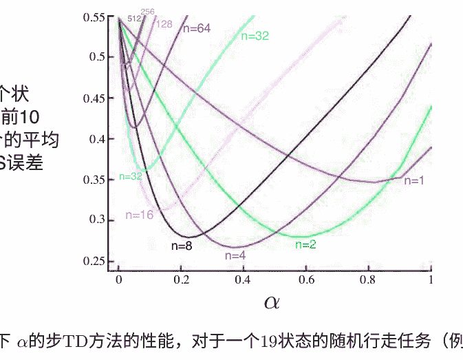

**练习7.3** 你认为为什么在本章的例子中使用了一个更大的随机行走任务（19个状态而不是5个）？如果行走任务更小，是否会将优势转移到不同的n值上？对于更大的行走任务，从0到-1的左侧结果的改变是否有任何影响？你认为这对最佳的n值有任何影响吗？

## 7.2 n 步 Sarsa

如何使用不仅用于预测而且用于控制的n步方法？在本节中，我们将展示如何将n步方法与Sarsa直接结合起来以产生一种基于策略的TD控制方法。我们将$n$步版本的Sarsa称为$n$步Sarsa，而前一章中介绍的原始版本我们将其称为一步Sarsa或Sarsa(0)。

主要思想是简单地将状态与动作（状态-动作对）进行切换，然后使用一个$\epsilon$-贪婪策略。$n$步Sarsa的备份图（如图7.3所示）与$n$步TD的备份图（图7.1）类似，都是由交替的状态和动作组成，只是Sarsa的备份图始终以动作而不是状态开始和结束。我们根据估计的动作值重新定义$n$步回报（更新目标）：

$$G_{t:t+n} \doteq R_{t+1}+\gamma R_{t+2}+\cdots+\gamma^{n-1}R_{t+n}+\gamma^{n}Q_{t+n-1}(S_{t+n}, A_{t+n}), \quad n \geq 1,0 \leq t < T-n, \qquad (7.4)$$

然后是自然算法

$$Q_{t+n}(S_t, A_t) \doteq Q_{t+n-1}(S_t, A_t) + \alpha \left[ G_{t:t+n} - Q_{t+n-1}(S_t, A_t) \right], \qquad \qquad 0 \leq t < T, \quad (7.5)$$

当其他状态的值保持不变时：$\quad Q_{t+n}(s, a) = Q_{t+n-1}(s, a)$，对于所有的$s, a$ 使得 $s = S_t$ or $a = A_t$。这就是我们称之为n步Sarsa的算法。伪代码显示在下一页的方框中，图7.4给出了为什么它可以加速学习的一个例子，与一步方法相比。

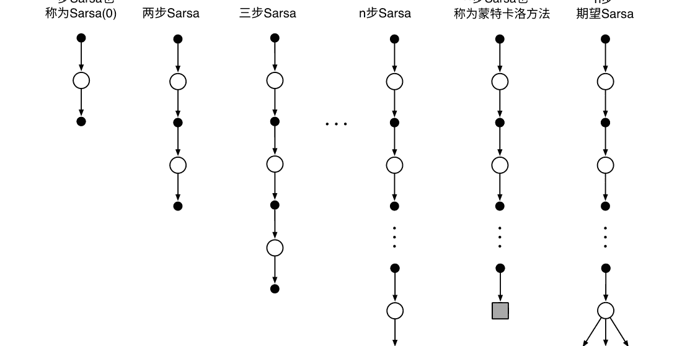

```
n步Sarsa用于估计 Q ≈ q* 或 qπ
对于所有的 s ∈ S, 任意初始化 Q(s, a)，其中 a ∈ A
任意初始化 π为 ε贪婪策略，基于 Q, 或者一个固定的给定策略
算法参数：步长 α ∈ (0,1], 小于 ε >0的正整数 n
所有的存储和访问操作（对于 S_t, A_t和 R_t）都可以对其索引取模 n+1

循环每个回合：
    初始化并存储 S_0= 终止状态
    选择并存储一个动作    A_0 ~ π(·|S_0)
    T    ∞
    循环    t = 0, 1, 2, ... :
        如果 t < T, 则：
            执行动作    A_t
            观察并将下一个奖励存储为 R_{t+1}, 并将下一个状态存储为 S_{t+1}
            如果 S_{t+1}是终止状态, 则：
                T    t+1
            否则：
                选择并存储一个动作    A_{t+1} ~ π(·|S_{t+1})
        τ    t - n + 1 （τ是正在更新估计的时间）
        如果 τ >= 0:
            G    Σ_{i=τ+1}^{min(τ+n,T)} γ^{i-τ-1} R_i
            如果 τ+n < T, 那么 G    G + γ^n Q(S_{τ+n}, A_{τ+n})    (G_{τ:τ+n})
            Q(S_τ, A_τ)    Q(S_τ, A_τ) + α[G - Q(S_τ, A_τ)]
            如果 π正在学习, 确保 π(·|S_τ) 是 ε-greedy wrt Q
    直到    τ = T - 1
```

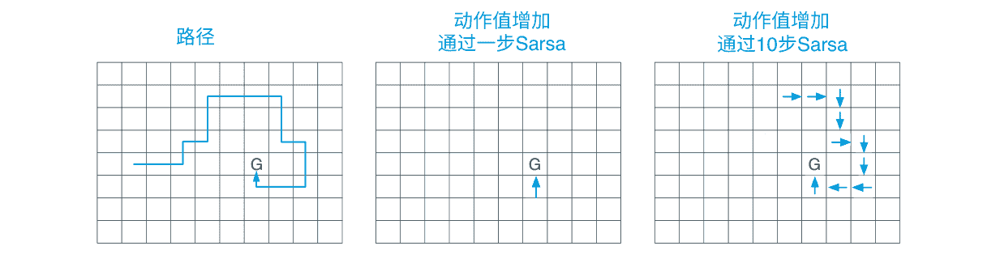

**练习7.4** 证明Sarsa的$n$步回报（7.4）可以精确地用一个新的TD误差表示，即

$$G_{t:t+n}=Q_{t-1}(S_t,A_t)+\sum_{k=t}^{\min(t+n,T)-1}\gamma^{k-t}[R_{k+1}+\gamma Q_k(S_{k+1},A_{k+1})-Q_{k-1}(S_k,A_k)].$$ (7.6)

期望Sarsa算法呢？在图7.3的最右边显示了期望Sarsa的$n$步版本的备份图。它由一系列样本动作和状态组成，与$n$步Sarsa一样，只是最后一个元素是根据 $\pi$ 下的所有动作可能性加权的分支。 这个算法可以用与$n$步Sarsa相同的方程来描述（上面），只是$n$步回报被重新定义为

$$G_{t:t+n} \doteq R_{t+1}+\cdots+\gamma^{n-1}R_{t+n}+\gamma^n \bar{V}_{t+n-1}(S_{t+n}), \quad t+n<T,$$ (7.7)
(当 $t+n=T$ 时 $G_{t:t+n} \doteq G_t$) 其中 $\bar{V}_t(s)$ 是状态 $s$ 的期望近似值，使用时间 $t$ 的估计动作值，在目标策略下：
$$\bar{V}_t(s) \doteq \sum_{a} \pi(a|s)Q_t(s,a), \quad \text{对于所有 } s \in \mathcal{S}.$$ (7.8)

在本书的其余部分中，预期近似值被用于开发许多动作值方法。如果 $s$是终止状态，则其预期近似值被定义为0。

## 7.3 n 步 Off-策略学习

回想一下，离策略学习是学习一个策略的值函数， $\pi$，同时遵循另一个策略， $b$。通常情况下， $\pi$是当前动作值估计的贪婪策略， $b$是一个更具探索性的策略，可能是 $\epsilon$-贪婪策略。为了使用来自 $b$的数据，我们必须考虑两个策略之间的差异，使用它们采取的动作的相对概率（参见第5.5节）。

$n$步方法，返回值是在$n$步内构建的，所以我们对只有这些动作的相对概率感兴趣。例如，为了制作一个简单的离线策略版本$n$步TD，时间$t$的更新（实际上在时间$t+n$时进行）可以简单地加权通过$\rho_{t:t+n-1}$:

$$V_{t+n}(S_t) \doteq V_{t+n-1}(S_t) + \alpha \rho_{t:t+n-1} [G_{t:t+n} - V_{t+n-1}(S_t)], \quad 0 \leq t < T,$$ (7.9)

其中 $\rho_{t:t+n-1}$，称为重要性采样比率，在两个策略下采取$n$个动作的相对概率（参见公式5.3）：

$$\rho_{t:h} \doteq \prod_{k=t}^{\min(h,T-1)} \frac{\pi(A_k|S_k)}{b(A_k|S_k)}.$$ (7.10)例如，如果任何一个动作都不会被采取$\pi$（即 $\pi（A_k|S_k） = 0$），那么 $n$步回报应该被赋予零权重并完全被忽略。另一方面，如果偶然采取了一个动作，它的概率比 $b$大得多，那么这将增加本来应该给予回报的权重。这是有道理的，因为这个动作是 $\pi$的特征（因此我们想要学习它），但是被 $b$很少选择，因此在数据中很少出现。为了弥补这一点，当它发生时，我们必须过度加权。请注意，如果两个策略实际上是相同的（即同策略情况），那么重要性采样比率始终为1。因此，我们的新更新（7.9）是一般化的，并且可以完全替代我们之前的$n$步TD更新。类似地，我们之前的$n$步Sarsa更新可以完全替代为一个简单的off-策略形式：

$$Q_{t+n-1}(S_t, A_t) + \alpha \rho_{t+1:t+n} [G_{t:t+n} - Q_{t+n-1}(S_t, A_t)], \quad (7.11)$$

对于 $0 \leq t < T$。 请注意，这里的重要性采样比率在开始和结束时比 $n$步 TD (7.9) 多一步。这是因为我们在更新一个状态-动作对。我们不需要关心选择该动作的可能性有多大；既然我们选择了它，我们希望从所发生的事情中充分学习，只对后续动作使用重要性采样。完整算法的伪代码如下所示。

## 用于估计 $Q \approx q_*$ 或 $q_\pi$ 的离策略 $n$步Sarsa 的伪代码

- 输入：任意行为策略 $b$，使得对于所有的状态 $s \in S$ 和动作 $a \in A$，$b(a|s) > 0$
- 对于所有的状态 $s \in S$ 和动作 $a \in A$，任意初始化 $Q(s, a)$
- 将策略 $\pi$ 初始化为相对于 $Q$ 的贪婪策略，或者作为一个固定的给定策略
- 算法参数：步长 $\alpha \in (0, 1]$，一个正整数 $n$
- 所有的存储和访问操作（对于 $S_\tau$、 $A_\tau$ 和 $R_\tau$）都可以对它们的索引取模 $n+1$
- 对于每个回合：
    - 初始化并存储 $S_0 = $ 终止状态
    - 选择并存储一个动作 $A_0 \sim b(\cdot|S_0)$
    - $T \leftarrow \infty$
    - 循环 $t = 0, 1, 2, \ldots$:
        - 如果 $t < T$，则：
            - 执行动作 $A_t$
            - 观察并将下一个奖励存储为 $R_{t+1}$，并将下一个状态存储为 $S_{t+1}$
            - 如果 $S_{t+1}$是终止状态，则：
                - $T \leftarrow t + 1$
            - 否则：
                - 选择并存储一个动作 $A_{t+1} \sim b(\cdot|S_{t+1})$
        - $\tau \leftarrow t - n + 1$   ($\tau$是正在更新估计的时间)
        - 如果 $\tau \geq 0$:
            - $\rho \leftarrow \prod_{i=\tau+1}^{\min(\tau+n-1,T-1)} \frac{\pi(A_i|S_i)}{b(A_i|S_i)}$   ($\rho_{\tau+1:\tau+n-1}$)
            - $G \leftarrow \sum_{i=\tau+1}^{\min(\tau+n,T)} \gamma^{i-\tau-1} R_i$
            - 如果 $\tau + n < T$，则:   $G \leftarrow G + \gamma^n Q(S_{\tau+n}, A_{\tau+n})$   ($G_{\tau:\tau+n}$)
            - $Q(S_\tau, A_\tau) \leftarrow Q(S_\tau, A_\tau) + \alpha \rho [G - Q(S_\tau, A_\tau)]$
            - 如果正在学习$\pi$，则确保 $\pi(\cdot|S_\tau)$ 对于 $Q$ 是贪婪的
    - 直到 $\tau = T - 1$

n步预期Sarsa的离策略版本将使用与上述相同的更新对于n步Sarsa，除了重要性采样比率中少一个因子，也就是说，上述方程将使用 $\rho_{t+1:t+n-1}$ 而不是 $\rho_{t+1:t+n}$，当然它将使用n步预期Sarsa版本的回报(7.7)。这是因为在预期Sarsa中，最后一个状态考虑了所有可能的动作；实际采取的动作没有影响，也不需要进行修正。

### 7.4 *带有控制变量的每个决策方法

在前一节中介绍的多步骤离线策略方法简单且概念清晰，但可能不是最高效的。更复杂的方法将使用每个决策的重要性采样思想，这些思想在第5.9节中介绍过。要理解这种方法，首先注意到普通的 n步回报 (7.1) ，像所有回报一样，可以递归地写成。对于以视野 $h$结束的 n步， n步回报可以写成

$$G_{t:h} = R_{t+1} + \gamma G_{t+1:h}, \quad t < h < T, \qquad (7.12)$$

（回想一下，这个回报在时间$h$上被使用，之前表示为$t + n$。）现在考虑遵循一个与目标策略 $\pi$ 不同的行为策略 $b$ 的影响。所有产生的经验，包括第一个奖励 $R_{t+1}$ 和下一个状态 $S_{t+1}$，都必须根据时间 $t$ 的重要性采样比例加权。

$$\rho_t = \frac{\pi(A_t|S_t)}{b(A_t|S_t)}.$$

有人可能会诱人地只权衡上述方程的右侧，但我们可以做得更好。假设在时间 $t$ 时刻的动作永远不会被选择 $\pi$, 所以 $\rho_t$ 为零。然后简单的权衡会导致 n步回报为零，当它被用作目标时可能会导致高方差。相反，在这种更复杂的方法中，我们使用了一种替代的、基于策略的 n步回报的定义，以视野 $h$ 为结束。

$$G_{t:h} \doteq \rho_t (R_{t+1} + \gamma G_{t+1:h}) + (1 - \rho_t) V_{h-1}(S_t), \quad t < h < T, \qquad (7.13)$$

再次 $G_{h:h} \doteq V_{h-1}(S_h)$。在这种方法中，如果 $\rho_t$ 为零，则目标不是零，也不会导致估计值缩小，而是与估计值相同，不会引起任何变化。重要性采样比率为零意味着我们应该忽略该样本，因此保持估计值不变似乎是合适的。 (7.13) 中的第二个附加项被称为控制变量（出于不明原因）。请注意，控制变量不会改变预期的更新；重要性采样比率的预期值为1（第5.9节），与估计值不相关，因此控制变量的期望值为零。还要注意，离策略定义 (7.13) 是早期离策略定义 (7.1) 的严格概括，因为两者在离策略情况下是相同的，其中 $\rho_t$ 始终为1。

对于传统的 n步方法，与 (7.13) 一起使用的学习规则是没有显式重要性采样比率的 n步TD更新 (7.2) ，除了嵌入在回报中的那些。

**练习7.5** 编写上述离策略状态值预测算法的伪代码。 □

对于动作值，离策略的 n步回报的定义有点不同，因为第一个动作在重要性采样中不起作用。那个第一个动作是正在学习的动作；无论它在目标策略下是不可能的还是不太可能的，都必须给予奖励和随后状态的完全单位权重。重要性采样仅适用于随后的动作。

首先注意，对于动作值， n步离策略期望形式（7.7）的回报在视野 $h$结束时可以递归地写成（7.12）一样，只是对于动作值，递归以 $G_{t:h}= $ 结束。 $\bar{V}_{h-1} (S_t)$ 如（7.8）所示。带有控制变量的离策略形式是

$$\begin{aligned}
G_{t:h} &\doteq R_{t+1} + \gamma \left( \rho_{t+1} G_{t+1:h} + \bar{V}_{h-1}(S_{t+1}) - \rho_{t+1} Q_{h-1}(S_{t+1}, A_{t+1}) \right), \\
&= R_{t+1} + \gamma \rho_{t+1} \left( G_{t+1:h} - Q_{h-1}(S_{t+1}, A_{t+1}) \right) + \gamma \bar{V}_{h-1}(S_{t+1}), \quad t < h \leq T.
\end{aligned}$$ (7.14)

如果 $h < T$，则递归以 $G_h$ 结束： $G_h \doteq Q_{h-1}(S_h, A_h)$，而如果 $h = T$，则递归以 $G_{T-1:T} \doteq R_T$。 合并(7.5)后的预测算法类似于预期Sarsa。

**练习7.6** 证明上述方程中的控制变量不会改变回报的期望值。 □

***练习7.7** 编写上述即时描述的离策略动作值预测算法的伪代码。 特别注意递归在达到时间限制或剧集结束时的终止条件。 □

**练习7.8** 证明如果近似状态值函数不变，则一般（离策略）版本的n步回报（7.13）仍然可以精确而简洁地写成基于状态的TD误差（6.5）的总和。 □

**练习7.9** 对于离策略的动作版本的n步回报（7.14）和期望Sarsa TD误差（方程6.9中括号内的数量），重复上述练习。 □

**练习7.10（编程）** 设计一个小的离策略预测问题，并使用它来展示使用（7.13）和（7.2）的离策略学习算法比使用（7.1）和（7.9）的简单算法更加高效。 □

在本节、前一节和第5章中使用的重要性采样使得离线学习成为可能，但也导致了高方差的更新，迫使使用较小的步长参数，从而导致学习速度较慢。 很可能离线训练比在线训练慢，毕竟数据与正在学习的内容关联性较低。 然而，很可能这些方法还可以改进。控制变量是减少方差的一种方式。 另一种方式是根据观察到的方差快速调整步长大小，就像Autostep方法（Mahmood, Sutton, Degris和Pilarski，2012）一样。另一种有前景的方法是Karampatziakis和Langford（2010）的不变更新方法，由Tian（正在准备中）扩展到TD。Mahmood（2017; Mahmood）的使用技术

## 7.5 不使用重要性采样的离策略学习：N步树备份算法

离策略学习是否可以不使用重要性采样？ Q学习和期望Sarsa在第6章中对于一步情况进行了处理，但是否存在相应的多步算法？ 在本节中，我们介绍了一种名为树备份算法的正是这样的n步方法。

算法的思想受到了右侧显示的3步树备份备份图的启发。 在图表中，沿着中央脊柱标记着三个样本状态和奖励，以及两个样本动作。

这些是表示初始状态-动作对 $S_t, A_t$ 之后发生事件的随机变量。 挂在每个状态旁边的是未选择的动作。 （对于最后一个状态，所有动作都被认为尚未选择。） 因为我们没有未选择动作的样本数据，所以我们使用估计值来形成更新的目标。 这在一定程度上扩展了备份图的概念。 到目前为止，我们总是将图顶部节点的估计值向目标方向更新，该目标结合了沿途的奖励（适当折扣）和底部节点的估计值。 在树备份更新中，目标包括所有这些内容，以及悬挂在侧面的未选择动作节点的估计值，以及所有层级上的节点。 这就是为什么它被称为树备份更新；它是从整个估计动作值树进行的更新。

更准确地说，更新来自于树的叶节点的估计动作值。 内部的动作节点，对应于实际采取的动作，不参与其中。 每个叶节点根据其在目标策略下出现的概率按比例贡献于目标。 因此，每个一级动作 $a$ 的贡献权重为 $\pi(a|S_{t+1})$，只是实际采取的动作 $A_{t+1}$ 没有贡献。 其概率 $\pi(A_{t+1}|S_{t+1})$ 被用来加权所有二级动作值。 因此，每个未被选择的二级动作 $a'$ 的贡献权重为 $\pi(A_{t+1}|S_{t+1}) \, \pi(a'|S_{t+2})$。 每个三级动作的贡献权重为 $\pi(A_{t+1}|S_{t+1}) \, \pi(A_{t+2}|S_{t+2}) \pi(a''|S_{t+3})$，以此类推。 就像图中指向动作节点的箭头被动作被选择的概率加权一样，如果动作下面有一棵树，那么该权重适用于树中的所有叶节点。

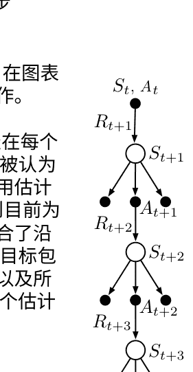

我们可以将3步树备份更新看作由6个半步组成，交替进行从一个动作到下一个状态的采样半步和考虑从该状态下所有可能动作的期望半步在策略下发生的概率。

现在让我们为 $n$步树备份算法开发详细的方程。一步回报（目标）与预期Sarsa的相同，

$$G_{t:t+1} \doteq R_{t+1} + \gamma \sum_{a} \pi(a|S_{t+1}) Q_t(S_{t+1}, a), \quad (7.15)$$

对于 $t < T -1$，两步树备份回报是

$$G_{t:t+2} \doteq R_{t+1} + \gamma \sum_{a \neq A_{t+1}} \pi(a|S_{t+1}) Q_{t+1}(S_{t+1}, a) + \gamma \pi(A_{t+1}|S_{t+1}) \left( R_{t+2} + \gamma \sum_{a} \pi(a|S_{t+2}) Q_{t+1}(S_{t+2}, a) \right) = R_{t+1} + \gamma \sum_{a \neq A_{t+1}} \pi(a|S_{t+1}) Q_{t+1}(S_{t+1}, a) + \gamma \pi(A_{t+1}|S_{t+1}) G_{t+1:t+2},$$

对于 $t < T -2$。 后一种形式暗示了树备份的一般递归定义 $n$步回报：

$$G_{t:t+n} \doteq R_{t+1} + \gamma \sum_{a \neq A_{t+1}} \pi(a|S_{t+1}) Q_{t+n-1}(S_{t+1}, a) + \gamma \pi(A_{t+1}|S_{t+1}) G_{t+1:t+n}, \quad (7.16)$$

对于 $t < T -1, n \geq 2,$ 其中 $n= 1$ 的情况由 (7.15) 处理，除了 $G_{T-1:T} \doteq R_T$。 然后，将此目标与 $n$步 Sarsa 的常规动作值更新规则一起使用：

$$Q_{t+n-1}(S_t, A_t) \leftarrow Q_{t+n-1}(S_t, A_t) + \alpha[G_{t:t+n} - Q_{t+n-1}(S_t, A_t)],$$

对于 $0 \leq t < T,$ 而所有其他状态-动作对的值保持不变： $Q_{t+n}(s, a) = Q_{t+n-1}(s, a),$ 对于所有 $s, a$ 使得 $s \neq S_t$ 或 $a \neq A_t$。 此算法的伪代码显示在下一页的方框中。

**练习 7.11** 证明如果近似动作值不变，则树备份回报 (7.16) 可以写成期望驱动的 TD 误差之和：

$$G_{t:t+n} = Q(S_t, A_t) + \sum_{k=t}^{\min(t+n-1,T-1)} \delta_k \prod_{i=t+1}^{k} \gamma \pi(A_i|S_i),$$

其中 $\delta_t \doteq R_{t+1} + \gamma \bar{V}_t(S_{t+1}) - Q(S_t, A_t)$ 和 $\bar{V}_t$ 由 (7.8) 给出。 □

## n步树备份用于估计 $Q \approx q_*$ 或 $q_\pi$

- 对于所有的 $s \in S，a \in A$，任意初始化 $Q(s, a)$
- 将 $\pi$ 初始化为相对于 $Q$贪婪的，或作为一个固定的给定策略
- 算法参数：步长 $\alpha \in (0,1]$，一个正整数 $n$
- 所有存储和访问操作都可以对它们的索引进行取模 $n+1$
- 循环每个回合：
    - 初始化并存储 $S_0 \leftarrow $ 终止状态
    - 选择一个动作 $A_0$作为 $S_0$的任意函数；存储 $A_0$
    - $T \leftarrow \infty$
    - 循环 $t = 0,1,2,\ldots$：
        - 如果 $t < T$:
            - 执行动作 $A_t$；观察并存储下一个奖励和状态作为 $R_{t+1}, S_{t+1}$
            - 如果 $S_{t+1}$是终止状态：
                - $T \leftarrow t + 1$
            - 否则：
                - 选择一个动作 $A_{t+1}$作为 $S_{t+1}$的任意函数；存储 $A_{t+1}$
        - $\tau \leftarrow t + 1 - n$ （$\tau$是正在更新估计的时间）
        - 如果 $\tau \geq 0$:
            - 如果 $t + 1 = T$:
                - $G \leftarrow R_T$
            - 否则：
                - $G \leftarrow R_{t+1} + \gamma \sum_a \pi(a|S_{t+1})Q(S_{t+1}, a)$
            - 循环 $k = \min(t, T - 1)$ 递减至 $\tau + 1$：
                - $G \leftarrow R_k + \gamma \sum_{a \neq A_k} \pi(a|S_k)Q(S_k, a) + \gamma \pi(A_k|S_k)G$
            - $Q(S_\tau, A_\tau) \leftarrow Q(S_\tau, A_\tau) + \alpha [G - Q(S_\tau, A_\tau)]$
            - 如果正在学习$\pi$，则确保 $\pi(\cdot|S_\tau)$对于 $Q$是贪婪的
        - 直到 $\tau = T - 1$

## 7.6 *一个统一的算法： n步 Q(σ)

到目前为止，在本章中，我们考虑了三种不同类型的动作值算法，对应于图7.5中显示的前三个备份图。n步Sarsa具有所有的样本转换，树备份算法具有所有的状态到动作转换完全分支而不进行采样，而n步期望Sarsa除了最后一个状态到动作的转换是完全分支的期望值之外，具有所有的样本转换。这些算法能够统一到什么程度？

统一的一个想法是由图7.5中的第四个备份图提出的。这个想法是，可以根据每一步的情况决定是要采样动作，如Sarsa中的方式，还是考虑所有动作的期望值，如树备份更新中的方式。然后，如果总是选择采样，就会得到Sarsa算法，而如果从不选择采样，就会得到树备份算法。期望Sarsa将是选择在所有步骤中进行采样，除了最后一个步骤。

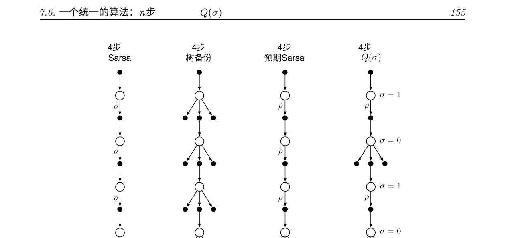

图7.5：本章中考虑的三种n步行动值更新的备份图（4步情况）以及统一它们的第四种更新的备份图。‘$\rho$’表示在离策略情况下需要重要性采样的半转换。通过根据每个状态选择是否采样（$\sigma_t=1$）或不采样（$\sigma_t=0$），第四种更新方式统一了所有其他方式。

当然，根据图中的最后一个图表，还有许多其他可能性。为了进一步增加可能性，我们可以考虑采样和期望之间的连续变化。让 $\sigma_t \in [0,1]$表示第 $t$步采样的程度，其中 $\sigma=1$表示完全采样和 $\sigma=0$表示纯期望，没有采样。随机变量 $\sigma_t$可能是状态、动作或状态-动作对的函数，时间为 $t$。我们称这个提出的新算法为 n步 Q(σ)。现在让我们推导出 n步 Q(σ)的方程。首先我们写出树备份

n步回报（7.16）关于视野 $h = t + n$的表达式，然后关于期望近似值$\bar{V}$（7.8）的表达式：

$$\begin{aligned}
G_{t:h} &= R_{t+1} + \gamma \sum_{a \neq A_{t+1}} \pi(a|S_{t+1}) Q_{h-1}(S_{t+1}, a) + \gamma \pi(A_{t+1}|S_{t+1}) G_{t+1:h} \\
&= R_{t+1} + \gamma \bar{V}_{h-1}(S_{t+1}) - \gamma \pi(A_{t+1}|S_{t+1}) Q_{h-1}(S_{t+1}, A_{t+1}) + \gamma \pi(A_{t+1}|S_{t+1}) G_{t+1:h} \\
&= R_{t+1} + \gamma \pi(A_{t+1}|S_{t+1}) \left( G_{t+1:h} - Q_{h-1}(S_{t+1}, A_{t+1}) \right) + \gamma \bar{V}_{h-1}(S_{t+1}),
\end{aligned}$$

之后，它与控制变量（7.14）的Sarsa的n步回报完全相同，只是用动作概率 $\pi(A_{t+1}|S_{t+1})$替代了重要性采样比率 $\rho_{t+1}$。对于 Q(σ)，我们在这两种情况之间线性滑动：

$$G_{t:h} \doteq R_{t+1} + \gamma \left( \sigma_{t+1} \rho_{t+1} + (1 - \sigma_{t+1}) \pi(A_{t+1}|S_{t+1}) \right) \left( G_{t+1:h} - Q_{h-1}(S_{t+1}, A_{t+1}) \right) + \gamma \bar{V}_{h-1}(S_{t+1}), \tag{7.17}$$对于 t < h ≤ T. 递归以 G_{h:h} = . 结束 如果 h < T, 则以 Q_{h-1}(S_h, A_h) 结束, 或者以 G_{T-1:T} 然后我们使用 n步Sarsa的一般（离策略）更新（7.11）。完整的算法在方框中给出。

### 离线n步Q(σ)用于估计Q≈q*或q≈

输入：任意行为策略 b，使得对于所有的状态 s ∈ S 和动作 a ∈ A，b(a|s) > 0
对于所有的状态 s ∈ S 和动作 a ∈ A，任意初始化 Q(s, a)
将π初始化为对Q的ε-greedy策略，或作为给定的固定策略
算法参数：步长α ∈ (0, 1]，小于0的正整数 n
所有存储和访问操作都可以对它们的索引取模 n+1

循环每个 episode:
  初始化并存储 S_0 = 终止状态
  选择并存储动作 A_0 ~ b(·|S_0)
  T ← ∞
  循环 t = 0, 1, 2, ... :
  | 如果 t < T:
  |   执行动作 A_t；观察并存储下一个奖励和状态作为 R_{t+1}, S_{t+1}
  |   如果 S_{t+1}是终止状态:
  |     T ← t + 1
  |   else:
  |     选择并存储动作 A_{t+1} ~ b(·|S_{t+1})
  |     选择并存储 σ_{t+1}
  |     存储 \frac{π(A_{t+1}|S_{t+1})}{b(A_{t+1}|S_{t+1})} as ρ_{t+1}
  | τ ← t - n + 1 （τ是正在更新估计的时间）
  | 如果 τ ≥ 0:
  |   G ← 0
  |   循环 for k = min(t + 1, T) down through τ + 1:
  |     如果 k = T:
  |       G ← R_T
  |     else:
  |       Ṽ ← Σ_a π(a|S_k) Q(S_k, a)
  |       G ← R_k + γ(σ_k ρ_k + (1 - σ_k) π(A_k|S_k))((G - Q(S_k, A_k)) + γṼ)
  |   Q(S_τ, A_τ) ← Q(S_τ, A_τ) + α[G - Q(S_τ, A_τ)]
  |   如果正在学习π，则确保π(·|S_τ)对于 Q是贪婪的
  | 直到 τ = T - 1

### 7.7 总结

在本章中，我们开发了一系列介于前一章的一步TD方法和前一章的蒙特卡罗方法之间的时间差分学习方法。涉及中等程度引导的方法非常重要，因为它们通常比两个极端都表现更好。

本章我们的重点是 \(n\) 步方法，它们会预测下一个 \(n\) 个奖励、状态和动作。右侧的两个4步备份图总结了大部分介绍的方法。状态值更新是为了 \(n\) 步TD与重要性采样，而动作值更新是为了 \(n\) 步 \(Q(\sigma)\)，它推广了期望Sarsa和Q学习。所有 \(n\) 步方法在更新之前需要延迟 \(n\) 个时间步骤，因为只有在那时才能知道所有所需的未来事件。另一个缺点是它们每个时间步骤需要更多的计算量比之前的方法。与一步方法相比， \(n\) 步方法还需要更多的内存来记录状态、动作、奖励，有时还有其他变量在过去的 \(n\) 个时间步骤中。

最终，在第12章中，我们将看到如何使用资格追踪以最小的内存和计算复杂性实现多步TD方法，但始终会有一些超过一步方法的额外计算。为了摆脱单个时间步的专制，这样的代价是值得的。

尽管 \(n\) 步方法比使用资格追踪的方法更复杂，但它们在概念上更清晰。我们试图利用这一点，通过在 \(n\) 步情况下开发两种离策略学习方法来实现。其中一种基于重要性采样在概念上很简单，但方差可能很大。如果目标策略和行为策略非常不同，那么在实现高效和实用之前，可能需要一些新的算法思想。另一种基于树备份更新的方法是将Q学习自然地扩展到具有随机目标策略的多步情况。它不涉及重要性采样，但是，如果目标策略和行为策略差异很大，即使 \(n\) 很大，自举也可能只跨越几个步骤。

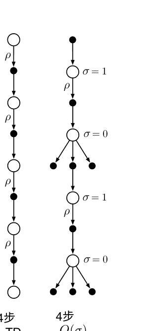

### 参考文献和历史评论

n步回报的概念归功于Watkins (1989)，他还首次讨论了它们的误差减小属性。在本书的第一版中，我们探讨了n步算法，将其视为概念上的兴趣，但在实践中不可行。. Cichosz (1995)和van Seijen (2016)的工作表明，它们实际上是完全实用的算法。鉴于此，以及它们的概念清晰和简单性，我们选择在第二版中重点介绍它们。特别是，我们现在将所有关于后向视图和资格追踪的讨论推迟到第12章。

> 7.1–2 这些随机行走示例的结果是基于Sutton (1988)和Singh和Sutton (1996)的工作。在本章中，使用备份图来描述这些算法和其他算法是新的。

> 7.3–5 这些部分的发展基于Precup，Sutton和Singh (2000)，Precup，Sutton和Dasgupta (2001) 以及Sutton，Mahmood，Precup和van Hasselt (2014)的工作。

树备份算法归功于Precup，Sutton和Singh (2000)，但在这里的介绍是新的。

> 7.6 Q(σ)算法是本文的新内容，但与之密切相关的算法已经被De Asis，Hernandez-Garcia，Holland和Sutton (2017)进一步探索。

## 第8章 使用表格方法进行规划和学习

在本章中，我们开发了一种统一的强化学习方法，该方法需要环境模型，例如动态规划和启发式搜索，以及可以在没有模型的情况下使用的方法，例如蒙特卡洛和时序差分方法。这些分别被称为基于模型的和无模型的强化学习方法。基于模型的方法主要依赖于规划作为其主要组成部分，而无模型的方法主要依赖于学习。尽管这两种方法之间存在真正的差异，但也存在很大的相似之处。特别是，这两种方法的核心是计算值函数。此外，所有方法都基于对未来事件的展望，计算备份值，然后将其用作近似值函数的更新目标。在本书的早期，我们将蒙特卡洛和时序差分方法作为不同的选择进行了介绍，然后展示了它们如何通过n步方法进行统一。本章的目标是将基于模型的和无模型的方法进行类似的整合。在之前的章节中，我们将它们作为不同的内容进行了介绍，现在我们将探索它们可以混合使用的程度。

### 8.1 模型和规划

通过一个环境模型，我们指的是任何一个代理可以用来预测环境对其行为的响应的东西。给定一个状态和一个动作，模型会产生对下一个状态和下一个奖励的预测。如果模型是随机的，那么可能会有几个可能的下一个状态和下一个奖励，每个都有一定的发生概率。一些模型会产生所有可能性及其概率的描述；我们称之为分布模型。其他模型只会产生一个可能性，根据概率进行采样；我们称之为采样模型。例如，考虑对十二个骰子的总和建模。分布模型会产生所有可能的总和及其发生概率，而采样模型会产生一个个体的总和。

根据这个概率分布绘制的总和。 在动态规划中假设的模型类型——MDP的动态估计，$p(s', r | s, a)$——是一个分布模型。 在第5章的二十一点示例中使用的模型类型是一个样本模型。

在分布模型和样本模型之间，分布模型更强大，因为它们总是可以用来生成样本。 然而，在许多应用中，获取样本模型要比获取分布模型容易得多。 十二个骰子就是一个简单的例子。 编写一个计算机程序来模拟掷骰子并返回总和很容易，但是计算所有可能的总和及其概率则更困难且容易出错。

模型可以用来模仿或模拟经验。 给定一个起始状态和动作，样本模型会产生一个可能的转换，而分布模型会生成所有可能的转换，并根据它们发生的概率进行加权。 给定一个起始状态和策略，样本模型可以产生一个完整的情节，而分布模型可以生成所有可能的情节及其概率。 无论哪种情况，我们都说模型被用来模拟环境并产生模拟经验。

在不同领域中，单词“规划”有几种不同的用法。 我们使用这个术语来指代将模型作为输入并生成或改进与建模环境交互的策略的任何计算过程：


在人工智能中，根据我们的定义，规划有两种不同的方法。 状态空间规划，这是本书采用的方法，主要是在状态空间中搜索最优策略或最优路径。 动作导致状态之间的转换，价值函数是在状态上计算的。 我们称之为计划空间规划，规划是在计划空间中进行搜索。 操作符将一个计划转换为另一个计划，如果有的话，价值函数是在计划空间中定义的。 计划空间规划包括进化方法和“部分顺序规划”，这是人工智能中常见的一种规划方法，在规划的各个阶段，步骤的顺序并不完全确定。 计划空间方法难以高效地应用于强化学习中的随机顺序决策问题，我们不再进一步考虑它们（但可以参考Russell和Norvig，2010年的相关文献）。

本章中我们提出的统一观点是，所有的状态空间规划方法都具有共同的结构，这个结构也存在于本书中介绍的学习方法中。 本章的其余部分将用来发展这个观点，但有两个基本思想：

+ 1. 所有的状态空间规划方法都涉及计算值函数作为改进策略的关键中间步骤，
+ 2. 它们通过对模拟经验应用更新或备份操作来计算值函数。

这个共同的结构可以用下面的图表表示：


动态规划方法明显符合这个结构：它们在状态空间中进行扫描，为每个状态生成可能转换的分布。 然后，每个分布用于计算备份值（更新目标）并更新状态的估计值。

状态的估计值。在本章中，我们认为其他各种状态空间规划方法也符合这个结构，各个方法之间的区别只在于它们进行的更新类型、更新顺序以及备份信息的保留时间。

以这种方式查看规划方法强调了它们与本书中所描述的学习方法的关系。学习和规划方法的核心是通过备份更新操作来估计值函数。不同之处在于，规划使用模型生成的模拟经验，而学习方法使用环境生成的真实经验。当然，这种差异导致了许多其他差异，例如在如何评估性能和如何灵活地生成经验方面。但是共同的结构意味着许多想法和算法可以在规划和学习之间进行转移。

特别是在许多情况下，学习算法可以替代规划方法的关键更新步骤。学习方法只需要经验作为输入，在许多情况下，它们可以同样适用于模拟经验和真实经验。

下面的框显示了一个基于一步制表符Q学习和来自样本模型的随机样本的规划方法的简单示例。这种方法被称为随机样本一步制表符Q规划，它在相同条件下收敛于模型的最优策略，就像一步制表符Q学习在真实环境中收敛于最优策略一样（每个状态-动作对在步骤1中必须被选择无限次，且α必须适当地随时间减小）。

# 随机采样一步表格Q规划

+ 无限循环：
1. 随机选择一个状态，$S \in \mathcal{S}$，和一个动作，$A \in \mathcal{A}(S)$，
2. 将$S, A$发送给样本模型，并获得一个样本下一个奖励，$R$，和一个样本下一个状态，$S'$
3. 将一步表格Q学习应用于$S, A, R, S'$：
   $Q(S, A) = Q(S, A) + \alpha [R + \gamma \max_a Q(S', a) - Q(S, A)]$

除了规划和学习方法的统一视图外，本章的第二个主题是在小的增量步骤中进行规划的好处。这使得规划可以在任何时候被中断或重定向，而几乎不浪费计算资源，这似乎是有效地将规划与行动和模型学习相互混合的关键要求。即使在纯规划问题上，以非常小的步骤进行规划可能是最有效的方法，如果问题太大无法精确解决的话。

### 8.2 Dyna：集成规划、行动和学习

当在线进行规划并与环境进行交互时，会出现一些有趣的问题。从交互中获得的新信息可能会改变模型，并与规划相互作用。可能希望以某种方式自定义规划过程，以适应当前正在考虑或预期的状态或决策

在不久的将来。如果决策制定和模型学习都是计算密集型过程，则可用的计算资源可能需要在它们之间进行分配。为了开始探索这些问题，在本节中，我们介绍了Dyna-Q，这是一个简单的架构，集成了在线规划代理所需的主要功能。在Dyna-Q中，每个功能都以简单、几乎微不足道的形式出现。在后续的章节中，我们详细介绍了实现每个功能和它们之间的权衡的一些替代方法。目前，我们只是希望说明这些想法并激发您的直觉。

在规划代理中，真实经验至少有两个角色：它可以用于改进模型（使其更准确地匹配真实环境），并且可以用于直接改进值函数和策略，使用类似的方法

我们在之前的章节中讨论过的强化学习方法。前者我们称之为模型学习，后者我们称之为直接强化学习（direct RL）。经验、模型、价值和策略之间的可能关系在右侧的图表中总结如下。每个箭头表示一种影响和假设的关系。请注意，经验可以直接或间接地通过模型改进价值函数和策略。后者有时被称为间接强化学习，它涉及到规划。

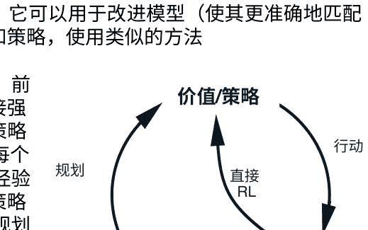

直接和间接方法都有优点和缺点。间接方法通常更充分地利用有限的经验，并因此在与环境的交互中实现更好的策略。另一方面，直接方法更简单，并且不受模型设计偏差的影响。有人认为间接方法总是优于直接方法，而其他人认为直接方法是人类和动物学习的主要原因。心理学和人工智能领域的相关辩论涉及认知与试错学习的相对重要性，以及审慎规划与反应性决策制定的重要性（有关这些问题的讨论，请参见第14章）。我们认为在所有这些辩论中，对立面之间的对比被夸大了，通过认识到这两个方面的相似之处，可以获得更多的洞察力。例如，在本书中，我们强调了动态规划和时序差分方法之间的深层次相似性，尽管一个是为了规划而设计，另一个是为了无模型学习。

Dyna-Q包括上图中显示的所有过程-规划、行动、模型学习和直接强化学习-都在不断地发生。规划方法是第161页上的随机采样一步制表Q规划方法。直接强化学习方法是一步制表Q学习。模型学习方法也是基于表格的，并且假设环境是确定性的。在每次转换后 \(S_t, A_t \rightarrow R_{t+1}, S_{t+1}\)，模型在其表项中记录了 \(S_t, A_t\) 的预测，即 \(R_{t+1}, S_{t+1}\) 将确定性地跟随。因此，如果模型查询的是之前经历过的状态-动作对，它只会返回最后观察到的下一个状态和下一个奖励作为预测。

在规划过程中，Q规划算法只从之前经历过的状态-动作对中随机采样（在步骤1中），因此模型永远不会查询关于它没有信息的对。

Dyna代理的整体架构，其中Dyna-Q算法是一个例子，如图8.1所示。中间的列代表了代理和环境之间的基本交互，产生了真实经验的轨迹。图中左侧的箭头表示直接强化学习对真实经验的操作，以改进值函数和策略。右侧是基于模型的过程。模型是从真实经验中学习到的，并产生了模拟经验。我们使用术语“搜索控制”来指代通过模型生成的模拟经验的起始状态和动作选择过程。最后，通过将强化学习方法应用于模拟经验，实现了规划，就像它们真实发生一样。通常情况下，就像Dyna-Q中一样，同样的强化学习方法既用于从真实经验中学习，也用于从模拟经验中进行规划。

因此，强化学习方法是学习和规划的“最终共同路径”。学习和规划在深度上是紧密集成的，它们几乎共享相同的机制，只在经验来源上有所不同。

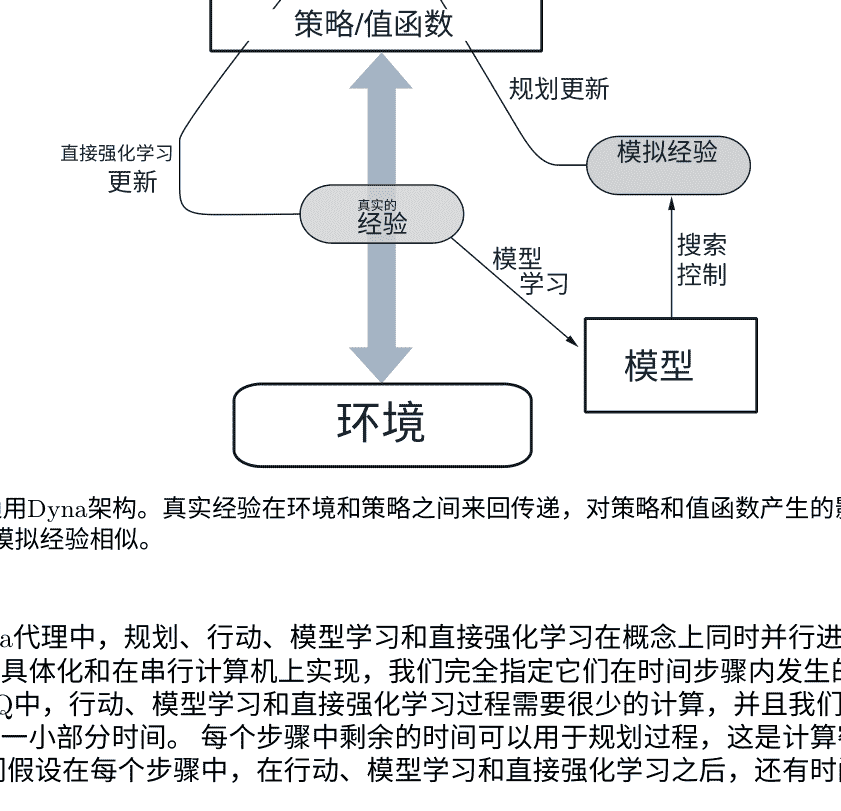

在Dyna代理中，规划、行动、模型学习和直接强化学习在概念上同时并行进行。然而，为了具体化和在串行计算机上实现，我们完全指定它们在时间步骤内发生的顺序。在Dyna-Q中，行动、模型学习和直接强化学习过程需要很少的计算，并且我们假设它们只消耗一小部分时间。每个步骤中剩余的时间可以用于规划过程，这是计算密集型的。让我们假设在每个步骤中，在行动、模型学习和直接强化学习之后，还有时间来完成

n迭代（步骤1-3）的Q规划算法。在下面的伪代码算法中，Model(s, a) 表示状态-动作对 (s, a) 的（预测的下一个状态和奖励）的内容。直接强化学习，模型学习和规划分别通过步骤 (d)，(e) 和 (f) 实现。如果省略 (e) 和 (f)，剩下的算法将是一步制表Q学习。

```
# 制表Dyna-Q
为所有 s ∈ S 和 a ∈ A(s) 初始化 Q(s, a) 和 Model(s, a)
无限循环：
  (a) S 当前（非终端）状态
  (b) A ε贪婪（S, Q）
  (c) 执行动作 A；观察到的奖励 R 和状态 S'
  (d) Q(S, A) ← Q(S, A) + α[R + γ max_a Q(S', a) – Q(S, A)]
  (e) 模型 (S, A) ← R, S'（假设确定性环境）
  (f) 循环重复 n 次：
      S 随机先前观察到的状态
      A 在 S 中随机采取的动作
      R, S' 模型 (S, A)
      Q(S, A) ← Q(S, A) + α[R + γ max_a Q(S', a) – Q(S, A)]
```

例子8.1：Dyna迷宫考虑图8.2中插图所示的简单迷宫。在每个47个状态中，有四个动作，上，下，右和左，它们确定地将代理移动到相应的相邻状态，除非移动被障碍物或迷宫边缘阻挡，在这种情况下，代理将停留在原地。在所有转换中，奖励为零，除了进入目标状态的转换，奖励为+1。

达到目标状态 (G) 后，代理返回到起始状态 (S) 开始一个新的剧集。这是一个折扣的、分集的任务，其中 γ= 0.95。
图8.2的主要部分显示了一个实验中的平均学习曲线，该实验中应用了Dyna-Q代理在迷宫任务中。初始动作值为零，步长参数为 α= 0.1，探索参数为 ε= 0.1。在选择动作时，平局会随机打破。代理的计划步骤数量，n，每个真实步骤执行的次数不同。对于每个 n，曲线显示了代理在每个回合中达到目标所需的步骤数，平均了30次实验的结果。在每次重复实验中，随机数生成器的初始种子保持不变。因此，第一回合对于所有 n 的值都是相同的（约1700步），并且其数据未在图中显示。在第一回合之后，所有 n 的值的性能都有所提高，但对于较大的值来说，提高速度更快。回想一下，n= 0 代理是一个非计划代理，仅使用直接强化学习（一步表格Q学习）。尽管参数值（α 和 ε）针对它进行了优化，但这是这个问题上最慢的代理。非计划代理需要大约25个回合才能达到（ε-）最优性能，而 n= 5 代理只需要大约五个回合，n= 50 代理只需要三个回合。

图8.2：一个简单的迷宫（插图）和Dyna-Q代理根据计划步骤数（n）每个真实步骤的平均学习曲线。任务是尽快从 S到 G旅行。

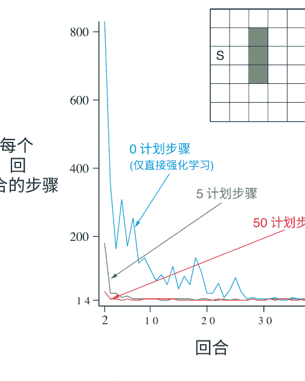

图8.3展示了为什么计划代理比非计划代理更快找到解决方案。展示了 n= 0和 n= 50代理在第二个回合中找到的策略。没有计划（n= 0），每个回合只添加一个额外的步骤到策略中，因此只有一个步骤（最后一个）已经学习到。通过计划，再次只有一个步骤在第一个回合中学习到，但是在第二个回合期间，已经开发出了一个广泛的策略，到达了几乎回到起始状态。这个策略是在代理仍然在起始状态附近徘徊时建立的计划过程。到第三个回合结束时，将找到一个完整的最优策略并达到完美的性能。


图8.3：规划和非规划Dyna-Q代理在第二个回合中找到的策略。箭头表示每个状态的贪婪动作；如果一个状态没有箭头显示，则表示其所有动作值相等。黑色方块表示代理的位置。

在Dyna-Q中，学习和规划通过完全相同的算法实现，对于学习使用真实经验，对于规划使用模拟经验。由于规划是逐步进行的，所以可以轻松地将规划和行动结合在一起。两者都尽可能快地进行。代理始终是反应性的，始终是深思熟虑的，即时响应最新的感知信息，同时在后台进行规划。模型学习过程也在后台进行。随着获得新的信息，模型将被更新以更好地匹配现实。随着模型的变化，持续进行的规划过程将逐渐计算出与新模型相匹配的不同行为方式。

### 练习8.1
非规划方法在图8.3中看起来特别差，因为它是一种一步方法；使用多步引导方法会更好。你认为第7章中的一种多步引导方法能否像Dyna方法一样好？解释为什么或为什么不。

### 8.3 当模型错误时
在前一节中介绍的迷宫示例中，模型的变化相对较小。模型一开始是空的，然后只填充了完全正确的信息。一般来说，我们不能指望这么幸运。模型可能不正确，因为环境是随机的，只观察到了有限数量的样本，或者因为使用了函数逼近学习的模型泛化不完美，或者仅仅因为环境发生了变化，其新的行为尚未被观察到。当模型不正确时，规划过程很可能计算出次优策略。

在某些情况下，通过规划计算得到的次优策略很快会导致建模错误的发现和修正。当模型对奖励预测更高或状态转换更好时，往往会发生这种情况，而实际上并不可能。规划策略试图利用这些机会，但在这样做时发现它们并不存在。

### 例8.2：阻塞迷宫
图8.4展示了一个说明这种相对较小的建模错误和从中恢复的迷宫示例。最初，从起点到目标有一条短路径，位于障碍物的右侧，如图左上所示。经过1000个时间步骤后，短路径被“阻塞”，并且在图的右上方打开了一条更长的路径。图表显示了Dyna-Q代理和增强型Dyna-Q+代理的平均累积奖励，稍后将进行描述。图表的第一部分显示，两个Dyna代理在1000步内找到了短路径。当环境发生变化时，图表变得平坦，表示代理在障碍物后面徘徊时没有获得奖励的一段时间。然而，过了一段时间，它们能够找到新的入口和新的最优行为。

当环境变得比以前更好时，以前正确的策略却没有显示出改进，这时会出现更大的困难。在这些情况下，如果有的话，建模错误可能很长时间都不会被发现。

### 例8.3：捷径迷宫
这种环境变化引起的问题可以通过图8.5中显示的迷宫示例来说明。最初，最优路径是绕过障碍物的左侧（左上角）。然而，在经过3000步之后，开辟了一条更短的路径沿着右侧，而不会干扰较长的路径（右上角）。

图表显示，常规的Dyna-Q代理从未切换到快捷方式。事实上，它从未意识到它的存在。它的模型认为没有快捷方式，所以它规划得越多，发现它的可能性就越小。即使使用贪婪策略，代理也很少采取如此多的探索动作来发现快捷方式。

这里的一般问题是探索和利用之间的冲突的另一个版本。在规划环境中，探索意味着尝试改进模型的动作，而利用意味着根据当前模型的最优方式行为。我们希望代理能够探索环境的变化，但不至于使性能大幅降低。与早期的探索/利用冲突一样，可能没有既完美又实用的解决方案，但简单的启发式方法通常是有效的。

解决了快捷迷宫问题的Dyna-Q+代理使用了这样的启发式方法。该代理为每个状态-动作对跟踪了与环境的真实交互中上次尝试该对的时间步长。经过的时间越长，我们可以推测，该对的动力学变化的可能性越大，其模型可能是不正确的。为了鼓励测试长时间未尝试的动作，模拟经验中涉及这些动作的特殊“奖励加分”被给予。特别地，如果一个转换的模型奖励为 r，并且该转换在 τ 个时间步长内未被尝试，则规划更新将按照该转换产生 $r + \kappa\sqrt{\tau}$ 的奖励进行。其中 κ 是一个小的值。这鼓励代理继续测试所有可访问的状态转换，甚至为了进行这样的测试而找到长序列的动作。¹当然，所有这些测试都是有代价的，但在许多情况下，就像在快捷迷宫中一样，这种计算好奇心是值得额外探索的。

### 练习8.2
为什么具有探索奖励的Dyna代理，Dyna-Q+在阻塞和快捷实验的第一阶段和第二阶段表现更好？

### 练习8.3
仔细观察图8.5可以发现，Dyna-Q+和Dyna-Q之间的差异在实验的前半部分略微缩小。这是什么原因呢？

### 练习8.4（编程）
上述探索奖励实际上改变了状态和动作的估计值。这是必要的吗？假设奖励 $\kappa\sqrt{\tau}$ 仅用于动作选择，而不是更新。也就是说，假设选择的动作始终是使得 $Q(S_t, a) + \kappa\sqrt{\tau(S_t, a)}$ 最大的动作。进行一个网格世界实验，测试和说明这种替代方法的优点和缺点。

### 练习8.5
如何修改页面164上显示的表格Dyna-Q算法以处理随机环境？这种修改在像本节中考虑的变化环境中可能表现不佳。如何修改算法以处理随机环境和变化环境？

### 8.4 优先扫描
在前面的章节中介绍的Dyna代理中，模拟转换是从之前经验过的所有状态-动作对中均匀随机选择开始的。但是，均匀选择通常不是最好的；如果模拟转换和更新集中在特定的状态-动作对上，规划可以更加高效。例如，考虑第二个迷宫任务的第二个情节中会发生什么（图8.3）。在第二个情节开始时，只有直接通向目标的状态-动作对具有正值；所有其他对的值仍然为零。这意味着沿着几乎所有转换进行更新是没有意义的，因为它们将代理从一个零值状态转移到另一个零值状态，因此更新将没有效果。只有在进入目标之前的状态或从目标状态出发的转换上进行的更新才会改变任何值。如果模拟转换是均匀生成的，那么在找到其中一个有用的转换之前，将进行许多无用的更新。随着规划的进行，有用更新的区域会增长，但是规划仍然远不如在最有益处进行聚焦的效率高。在我们真正的目标中，问题规模更大，状态的数量非常庞大，因此不专注的搜索将非常低效。

这个例子表明，通过从目标状态向后工作，搜索可能会有用地集中。当然，我们实际上不想使用任何特定于“目标状态”概念的方法。我们希望的是适用于一般奖励函数的方法。目标状态只是一个特殊情况，方便激发直觉。一般来说，我们希望不仅从目标状态开始向后工作，而且从任何值发生变化的状态开始向后工作。假设在模型给定的情况下，值最初是正确的，就像在迷宫示例中在发现目标之前一样。现在假设代理发现环境发生变化，并改变了一个状态的估计值，无论是上升还是下降。通常，这将意味着许多其他状态的值也应该被改变，但是只有那些直接导致值发生变化的一个状态的一步更新是有用的。如果更新了这些动作的值，那么前驱状态的值可能会相应地改变。如果是这样，那么导致它们的动作需要被更新，然后它们的前驱状态可能已经改变。通过这种方式，可以从任意改变了值的状态开始向后工作，执行有用的更新或终止传播。这个一般的想法可以称为计划计算的向后集中。

随着有用更新的边界向后传播，它经常迅速增长，产生很多可能需要更新的状态-动作对。但并非所有这些都同样有用。一些状态的值可能发生了很大变化，而其他状态可能变化很小。那些发生了很大变化的前任对也更有可能发生很大变化。在随机环境中，估计的转移概率的变化也会导致变化的大小和对需要更新的紧迫性的变化。根据紧迫性的度量，自然而然地按优先顺序对更新进行优先级排序。这就是优先扫描的思想。维护一个队列，其中包含每个状态-动作对，如果更新后其估计值会发生非平凡变化，则按变化的大小进行优先排序。当队列中的顶部对被更新时，计算其每个前任对的影响。如果效果大于某个小阈值，则将该对插入队列中并使用新的优先级（如果队列中已经存在该对的先前条目，则插入操作只会保留优先级较高的条目）。通过这种方式，变化的效果可以有效地向后传播，直到达到平静状态。确定性环境下的完整算法在下一页的方框中给出。

### 确定性环境下的优先扫描
```
对于所有的s, a，初始化 Q(s, a)、Model(s, a)和P Queue为空
无限循环：
    (a) S 当前（非终端）状态
    (b) A 策略 (S, Q)
    (c) 执行动作 A；观察到的奖励为 R和状态为 S'
    (d) Model(S, A) R, S'
    (e) P |R + γ max_a Q(S', a) − Q(S, A)|.
    (f) 如果 P > θ，则将S, A插入P Queue并设置优先级为 P
    (g) 循环重复 n 次，当 P 队列 不为空时：
        S, A first(P 队列 )
        R, S' 模型 (S, A)
        Q(S, A) Q(S, A) + α[R + γ max_a Q(S', a) − Q(S, A)]
        循环所有 S̄, Ā 预测导致 S 的：
            R̄ 预测的奖励为 S̄, Ā, S
            P |R̄ + γ max_a Q(S, a) − Q(S̄, Ā)|.
            如果 P > θ则将S̄, Ā 插入P队列并具有优先级 P
```

### 示例8.4：优先扫描
在迷宫中，优先扫描已被发现可以显著提高找到最优解的速度，通常可以提高5到10倍。一个典型的例子显示在右边。这些数据是一系列迷宫任务的数据，与图8.2中显示的迷宫结构完全相同，只是网格分辨率不同。优先级扫描在未优先处理的Dyna-Q上保持了明显的优势。这两个系统每个环境交互最多进行n=5次更新。改编自Peng和Williams（1993年）。

将优先级扫描扩展到随机环境是直接的。通过记录每个状态-动作对的经历次数和下一个状态的次数来维护模型。因此，更新每个对时不再使用样本更新，而是使用期望更新，考虑到所有可能的下一个状态及其发生的概率。

优先级扫描只是分配计算以改进规划效率的一种方式，可能不是最好的方式。优先级扫描的一个限制是它使用期望更新，在随机环境中可能会浪费大量计算量在低概率转换上。正如我们在下一节中所示，样本更新尽管采样引入了方差，但在许多情况下，可以通过较少的计算接近真实的值函数。样本更新之所以有效，是因为它将整体的备份计算分解为更小的部分——与各个转换对应的部分——从而使其能够更加专注于对将产生最大影响的部分。这个想法在van Seijen和Sutton（2013）引入的“小型备份”中可能达到了逻辑上的极限。这些是沿着单个转换进行的更新，类似于样本更新，但基于转换的概率而不是采样，就像期望更新一样。通过选择进行小型更新的顺序，可以大大提高规划效率，超过使用优先级扫描可能实现的效率。

### 示例8.5：优先扫描杆操纵
这个任务的目标是在有限的矩形工作空间内，将杆绕过一些尴尬的障碍物，以最少的步骤移动到目标位置。杆可以沿着其长轴或垂直于该轴的方向进行平移，也可以以任意方向绕其中心旋转。每次移动的距离约为工作空间的1/20，旋转增量为10度。平移是确定性的，并且量化为20 ×20个位置之一。右侧显示了障碍物和从起点到目标的最短解决方案，通过优先扫描找到。这个问题是确定性的，但有四个动作和14,400个潜在状态（由于障碍物的存在，其中一些是无法到达的）。这个问题可能太大了，不能用无优先级的方法解决。图摘自Moore和Atkeson（1993）的文章。

在本章中，我们提出了所有种类的状态空间规划都可以看作是值更新的序列，只是更新类型（期望或样本）、大小和更新顺序不同。在本节中，我们强调了向后聚焦，但这只是一种策略。例如，另一种策略是根据当前策略下经常访问的状态到达其他状态的容易程度来进行聚焦，这可能被称为前向聚焦。彭和威廉姆斯（1993年）和巴托，布拉特克和辛格（1995年）已经探索了前向聚焦的不同版本，并且在接下来的几节中介绍的方法将其推向了一个极端形式。

### 8.5 预期更新与样本更新
前几节的例子给出了学习和规划方法结合的可能性范围的一些想法。在本章的其余部分，我们将分析涉及的一些组成思想，从期望更新和样本更新的相对优势开始。

本书的很大一部分内容涉及不同类型的值函数更新，我们考虑了很多种类。暂时聚焦在一步更新上，它们主要沿着三个二进制维度变化。前两个维度是它们是否更新状态值或动作值以及它们是估计最优策略的值还是任意给定策略的值。这两个维度产生了四种更新类别，用于逼近四个值函数，即 $q_*$, $v_*$, $q_\pi$ 和 $v_\pi$。

另一个二进制维度是更新是否为预期更新，考虑可能发生的所有事件，或者是样本更新，考虑可能发生的单个样本。

| 估计值 | 预期更新 (DP) | 样本更新 (一步TD) |
| :--- | :--- | :--- |
| $v_\pi(s)$ | 策略评估 | TD(0) |
| $v_*(s)$ | 值迭代 | |
| $q_\pi(s, a)$ | q-策略评估 | Sarsa |
| $q_*(s, a)$ | q-值迭代 | Q-learning |

这三个二进制维度产生了八种情况，其中七种对应于具体的算法，如右图所示。（第八种情况似乎没有对应任何有用的更新。）这些一步更新中的任何一种都可以在规划方法中使用。之前讨论的Dyna-Q代理使用了 $q_*$ 样本更新，但它们也可以使用 $q_*$ 预期更新，或者是预期更新或样本 $q_\pi$ 更新。Dyna-AC系统使用了 $v_\pi$ 样本更新以及学习策略结构（如第13章所述）。对于随机问题，优先扫描总是使用预期更新之一进行。

当我们在第6章中介绍了一步样本更新时，我们将其作为对期望更新的替代品。在没有分布模型的情况下，无法进行期望更新，但可以使用来自环境或样本模型的样本转换来进行样本更新。隐含在这个观点中的是，如果可能的话，期望更新优于样本更新。但是它们真的吗？期望更新肯定会产生更好的估计，因为它们不受抽样误差的影响，但它们也需要更多的计算，而计算通常是规划中的限制资源。为了正确评估期望更新和样本更新在规划中的相对优劣，我们必须控制它们不同的计算要求。

为了具体起见，考虑用于逼近 q*的期望更新和样本更新，以及离散状态和动作的特殊情况，即表查找表示的近似值函数 Q和估计动力学形式的模型 p̂(s', r|s, a)。对于一个状态-动作对，期望的更新是：
`Q(s, a) = \sum_{s',r} \hat{p}(s', r|s, a) \left[ r + \gamma \max_{a'} Q(s', a') \right]`

对于给定的样本下一个状态和奖励， S'和R(来自模型)，对于s, a，相应的样本更新是Q-learning-like的更新：
`Q(s, a) = Q(s, a) + \alpha \left[ R + \gamma \max_{a'} Q(S', a') - Q(s, a) \right]`
其中 α是通常的正步长参数。

在环境是随机的情况下，这些期望和样本更新之间的差异是显著的，具体取决于给定状态和动作，可能会出现许多可能的下一个状态，其概率各不相同。如果只有一个可能的下一个状态，那么上述的期望和样本更新是相同的（取 α=1）。如果有许多可能的下一个状态，那么可能会有显著的差异。支持期望更新的原因是它是一个精确的计算，导致一个新的 Q(s, a)的正确性仅限于 Q(s', a')在后继状态的正确性。样本更新还受到抽样误差的影响。另一方面，样本更新在计算上更便宜，因为它只考虑一个下一个状态，而不是所有可能的下一个状态。实际上，更新操作所需的计算通常由评估 Q的状态-动作对的数量主导。对于一个特定的起始对, s, a, 让 b是分支因子（即可能的下一个状态的数量， s', 对于这些状态， p̂(s'|s, a) >0）。因此，对这对的期望更新需要大约 b倍的计算量，与样本更新相比。

如果有足够的时间来完成预期的更新，则由于没有抽样误差，结果估计通常比抽样更新更好。但是，如果没有足够的时间来完成预期的更新，则抽样更新始终更可取，因为它们至少在值估计中有一些改进，而且更新次数较少。在一个具有许多状态-动作对的大问题中，我们经常处于后一种情况。由于有如此多的状态-动作对，对所有状态-动作对的预期更新将需要很长时间。在那之前，我们在许多状态-动作对上进行少量样本更新可能会更好，而不是在少数对上进行预期更新。在给定的计算工作单位中，将其投入到少量预期更新还是投入到 b倍的样本更新更好？

图8.7显示了一项分析的结果，该结果对这个问题提出了一个答案。它显示了预期和样本更新的计算时间函数的估计误差，针对不同的分支因子， b。考虑的情况是所有情况下 b后继状态等可能，并且初始估计误差为1。下一个状态的值被认为是正确的，因此期望更新在完成后将误差减少到零。在这种情况下，样本更新根据 √(b^(t-1)/t) 其中 t 是已执行的样本更新次数(假设样本平均值，即 α= 1/t)。关键观察是对于适度大的 b，误差会随着 b 的一小部分更新而大幅下降。对于这些情况，许多状态-动作对的值可以在与一个期望更新相同的时间内显著改善，接近其效果的百分之几，而单个状态-动作对则需要进行一个期望更新。

图8.7中显示的样本更新的优势可能低估了真实效果。在实际问题中，后继状态的值将是经过更新的估计值。通过使估计值更快地变得更准确，样本更新将具有第二个优势，即从后继状态备份的值将更准确。这些结果表明，在具有大量随机分支因子和无法精确解决的状态的问题上，样本更新很可能优于期望更新。

### 练习8.6
上面的分析假设所有可能的下一个状态出现的可能性相等。假设分布高度倾斜，一些状态比大多数状态更有可能发生。这会加强还是削弱样本更新相对于期望更新的论点？请支持你的答案。

### 8.6 轨迹采样
在本节中，我们比较了两种更新分布的方法。经典方法来自动态规划，通过对整个状态（或状态-动作）空间进行扫描，在每次扫描中更新每个状态（或状态-动作对）。这是有问题的。在大型任务上，可能没有时间完成一次完整的扫描。 在许多任务中，绝大多数状态都是无关紧要的，因为它们只在非常糟糕的策略或非常低的概率下被访问。 详尽的扫描隐含地将时间均匀分配给状态空间的所有部分，而不是集中在需要的地方。 正如我们在第4章中讨论的那样，详尽的扫描和它们隐含的对所有状态的平等处理并不是动态规划的必要属性。 原则上，更新可以以任何喜欢的方式分布（为了确保收敛，所有状态或状态-动作对必须在极限情况下被访问无限次数；尽管在下面的第8.7节中讨论了一个例外情况），但在实践中通常使用详尽的扫描。 第二种方法是根据某个分布从状态或状态-动作空间中进行采样。 可以像Dyna-Q代理那样均匀采样，但这样做会遇到与详尽的扫描相同的问题。 更有吸引力的是根据政策分布进行更新分布，即根据遵循当前政策时观察到的分布。 这种分布的一个优点是它很容易生成；只需与模型交互，遵循当前政策。 在一个情节性任务中，从起始状态（或根据起始状态分布）开始，并模拟直到终止状态。 在一个持续性任务中，可以从任何地方开始，并持续模拟。 在任何情况下，模型提供样本状态转换和奖励，当前政策提供样本动作。

换句话说，人们模拟明确的个体轨迹，并在途中遇到的状态或状态-动作对上进行更新。 我们称这种生成经验和更新的方式为轨迹采样。

很难想象除了通过轨迹采样之外，还有其他有效的按照政策分布进行更新的方法。 如果有一个明确的政策分布表示，那么可以遍历所有状态，根据政策分布对每个状态的更新进行加权，但这又会带来全面遍历的计算成本。 可能可以从分布中采样和更新个别的状态-动作对，但即使可以高效地完成这一点，这又能提供比模拟轨迹更多的好处吗？ 即使以明确的形式知道政策分布也是不太可能的。 每当政策发生变化时，分布也会发生变化，计算分布需要与完整策略评估相当的计算量。 考虑到这些其他可能性，轨迹采样似乎既高效又优雅。

更新的同策分布是一个好的选择吗？ 直观上看，这似乎是一个不错的选择，至少比均匀分布要好。 例如，如果你正在学习下棋，你会研究在真实游戏中可能出现的棋局，而不是随机的棋局。 后者可能是是有效的状态，但要能够准确地评估它们是一种与评估真实游戏中的棋局不同的技能。 我们还将在第二部分中看到，当使用函数逼近时，同策分布具有显著的优势。无论是否使用函数逼近，人们都可以期望同策聚焦显著提高规划的速度。专注于同策分布可能是有益的，因为它会忽略掉广阔而无趣的空间部分，或者可能是有害的，因为它会一次又一次地更新相同的空间部分。 我们进行了一项小型的

¹Dyna-Q+代理还以其他两种方式进行了更改。首先，在规划步骤 (f) 中，允许考虑从状态中从未尝试过的动作（来自上面的表格Dyna-Q算法）。其次，这些动作的初始模型是它们将以零奖励返回到相同状态。

实验以经验的方式评估效果。为了隔离更新分布的效果，我们完全使用了一步预期的表格更新，如(8.1)所定义。在均匀情况下，我们循环遍历所有状态-动作对，直接更新每个对应位置的值。在按策略情况下，我们模拟了一系列以相同状态开始的回合，并更新每个出现在当前“$\epsilon$-贪婪”策略下的状态-动作对（其中“$\epsilon$” = 0.1）。这些任务是无折扣的、以回合为单位的任务，随机生成如下。从每个状态 $| \mathcal{S} |$出发，有两个可能的动作，每个动作都会导致一个下一个状态，所有状态的发生概率相等，每个状态-动作对的下一个状态选择是随机的。所有状态-动作对的分支因子 $b$ 是相同的。此外，在所有转换中，有0.1的概率转移到终止状态，结束回合。每次转换的预期奖励是从均值为0、方差为1的高斯分布中选择的。

在规划过程的任何时刻，可以停止并详细计算 $v_{\pi}(s_0)$，在贪婪策略下，给定当前动作-值函数 $Q$，计算出起始状态的真实值 $\tilde{\pi}$，作为代理在新的剧集上表现如何的指示（同时假设模型是正确的）。

右侧图的上部显示了在200个样本任务中，状态数为1000，分支因子为1、3和10的结果的平均值。找到的策略质量被绘制为预期更新次数的函数。在所有情况下，根据政策分布进行采样导致初始规划更快，长期规划更慢。

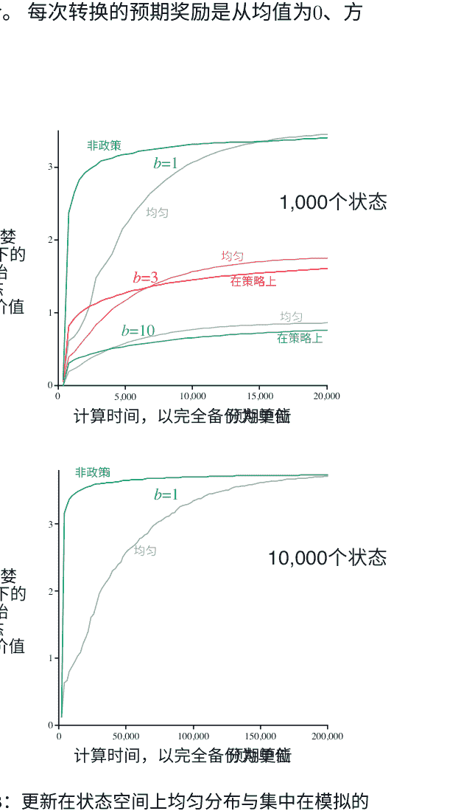

图8.8: 更新在状态空间上均匀分布与集中在模拟的在策略轨迹上的相对效率，每个轨迹都从相同的状态开始。结果是针对随机生成的两种大小和不同分支因子的任务。

在分支因子较小的情况下，这种影响更强，初始规划阶段更长。在其他实验中，我们发现随着状态数量的增加，这些效应也变得更强。例如，图的下部显示了具有1个分支因子和10,000个状态的任务的结果。在这种情况下，基于政策的聚焦的优势是巨大且持久的。

所有这些结果都是有意义的。在短期内，根据政策分布进行采样有助于集中在接近后代的状态上。起始状态。如果有很多状态和一个小的分支因子，这种效应将会很大且持久。从长远来看，专注于政策分布可能会有害，因为常见的状态已经具有正确的值。对它们进行采样是无用的，而对其他状态进行采样可能会实际执行一些有用的工作。

这可能是为什么在长期内，详尽而不集中的方法在小问题上表现更好的原因。这些结果并不具有决定性，因为它们只针对以特定随机方式生成的问题，但它们确实表明，根据政策分布进行采样对于大问题来说可能是一个巨大的优势，特别是对于在政策分布下访问状态-动作空间的一个小子集的问题。

练习8.7 图8.8中的一些图形在其早期部分似乎呈扇形，特别是上图中的b = 1和均匀分布。你认为这是为什么？数据显示的哪些方面支持你的假设？

练习8.8（编程） 复制图8.8下部显示的实验结果，然后尝试相同的实验，但b = 3。讨论你的结果的意义。

### 8.7 实时动态规划

实时动态规划（RTDP）是动态规划（DP）的一种基于策略轨迹采样的版本。由于它与传统的基于扫描的策略迭代密切相关，RTDP以特别清晰的方式展示了基于策略轨迹采样的一些优势。RTDP通过实际或模拟轨迹访问的状态的预期表格值迭代更新（由（4.10）定义）来更新值。它基本上是产生图8.8中显示的基于策略结果的算法。

RTDP和传统DP之间的紧密联系使得可以通过调整现有理论来得出一些理论结果。RTDP是一个异步DP算法的例子，如第4.5节所述。异步DP算法不是按照系统性的状态集扫描来组织的；它们以任意顺序更新状态值，使用任意可用的其他状态值。在RTDP中，更新顺序由实际或模拟轨迹中访问状态的顺序决定。

如果轨迹只能从指定的一组起始状态开始，并且您对给定策略的预测问题感兴趣，那么基于策略的轨迹采样允许算法完全跳过无法从任何起始状态通过给定策略到达的状态：这些状态对于预测问题是无关的。

对于一个控制问题，目标是找到一个最优策略而不是评估给定的策略，可能存在无法达到的状态。从任何起始状态都可以通过任何最优策略到达，并且不需要为这些无关的状态指定最优动作。所需的是一 个最优部分策略，即对相关状态最优的策略，但可以指定任意动作，甚至对于无关的状态可以是未定义的。

但是，使用基于策略轨迹采样的控制方法（例如Sarsa（第6.4节））找到这样一个最优部分策略，通常需要无限次访问所有状态-动作对，即使这些状态-动作对最终被证明是无关的。例如，可以通过使用探索起点（第5.3节）来实现。对于RTDP也是如此：对于具有探索起点的周期性任务，RTDP是一种异步值迭代算法，可以收敛到折扣有限MDP的最优策略（在某些条件下也适用于无折扣情况）。与预测问题的情况不同，如果收敛到最优策略很重要，通常不可能停止更新任何状态或状态-动作对。

RTDP最有趣的结果是，在满足合理条件的某些类型的问题中，RTDP能够保证找到在相关状态上是最优的策略，而无需无限次地访问每个状态，甚至无需访问某些状态。实际上，在某些问题中，只需要访问一小部分状态即可。这对于具有非常大的状态集的问题来说是一个巨大的优势，即使进行一次扫描也可能不可行。

这个结果适用于具有吸收目标状态且生成零奖励的无折扣的周期性任务的MDPs，如第3.4节所述。在实际或模拟轨迹的每一步中，RTDP选择一个贪婪动作（随机打破平局）并对当前状态应用期望值迭代更新操作。它还可以在每一步更新任意一组其他状态的值；例如，它可以更新从当前状态进行有限时间先行搜索的已访问状态的值。

对于这些问题，每个情节都从一个随机选择的起始状态开始，并在一个目标状态结束，RTDP以概率1收敛到一个对所有相关状态都是最优的策略，前提是：1）每个目标状态的初始值为零，2）存在至少一个策略，保证从任何起始状态都能以概率1到达目标状态，3）所有非目标状态的转移奖励都严格为负，4）所有初始值都等于或大于它们的最优值（可以通过将所有状态的初始值设置为零来满足）。这个结果是由Barto、Bradtke和Singh（1995）证明的，他们将异步DP的结果与关于启发式搜索算法的结果相结合，该算法被称为学习实时A*，由Korf（1990）提出。

具有这些属性的任务是随机最优路径问题的示例，通常以成本最小化而不是奖励最大化的方式来表述，就像我们在这里所做的一样。在我们的版本中，最大化负回报等效于最小化从起始状态到目标状态的路径成本。这种类型任务的例子包括最小时间控制任务，其中到达目标所需的每个时间步产生一个奖励-1，或者像第3.5节中的高尔夫示例那样，其目标是用最少的杆数击中洞。

例子8.6: Racetrack上的RTDP 练习5.12（第111页）是一个随机最优路径问题。比较RTDP和传统的DP值迭代算法在一个示例racetrack问题上展示了一些基于策略轨迹采样的优势。

回想一下练习中，一个代理需要学习如何在转弯处驾驶汽车就像图5.5中所示，并在保持在赛道上的同时尽快穿过终点线。起始状态是起跑线上的所有零速度状态；目标状态是从赛道内穿过终点线在一个时间步骤内可以到达的所有状态。与练习5.12不同，这里对汽车的速度没有限制，所以状态集可能是无限的。然而，通过任何策略可以从起始状态集到达的状态集是有限的，可以被认为是问题的状态集。每个回合从随机选择的起始状态开始，并在汽车穿过终点线时结束。奖励是 –每一步直到汽车穿过终点线为止的1。如果汽车撞到赛道边界，它会被移回到一个随机的起始状态，并且回合继续进行。

与图5.5左侧的小型赛道类似的赛道有9,115个状态，通过任何策略从起始状态可达，其中只有599个状态是相关的，意味着它们可以通过某个最优策略从某个起始状态可达。（通过执行10^7 episodes的最优动作时，估计了相关状态的数量。）

下表比较了通过传统DP和RTDP解决此任务的结果。这些结果是25次运行的平均值，每次运行都以不同的随机数种子开始。在这种情况下，传统DP是使用状态集的详尽扫描进行值迭代，值在原地逐个状态更新，这意味着每个状态的更新使用其他状态的最新值（这是值迭代的高斯-赛德尔版本，在这个问题上发现它大约快两倍。参见第4.8节。）没有特别关注更新的顺序；其他顺序可能会产生更快的收敛。每次运行这两种方法时，初始值都为零。当一次扫描中状态值的最大变化小于$10^{-4}$时，判断DP已经收敛，当20次episode中穿过终点线的平均时间趋于稳定时，判断RTDP已经收敛到一个渐进步数。这个版本的RTDP每步只更新当前状态的值。

| 指标 | DP | RTDP |
|------|-----|------|
| 平均计算收敛 | 28次迭代 | 4000次回合 |
| 平均更新次数收敛 | 252,784 | 127,600 |
| 平均每回合更新次数 | — | 31.9 |
| %的状态更新 ≤ 100次 | — | 98.45 |
| %的状态更新 ≤ 10次 | — | 80.51 |
| %的状态未更新 | — | 3.18 |

两种方法都产生了平均需要14到15步才能穿过终点线的策略，但是RTDP只需要DP的大约一半的更新次数。这是RTDP的策略轨迹采样的结果。而在DP的每次迭代中，每个状态的值都会被更新。RTDP则只对少数状态进行更新。在平均运行中，RTDP最多更新了98.45%的状态100次以内，80.51%的状态10次以内；大约有290个状态在平均运行中没有被更新。

RTDP的另一个优势是，当值函数接近最优值函数 $v_*$ 时，代理用于生成轨迹的策略也接近最优策略，因为它始终对当前值函数贪婪。

这与传统的值迭代的情况形成对比。在实践中，值迭代在一次迭代中值函数的变化很小时终止，这就是我们在上表中终止它以获得结果的方式。此时，值函数与 $v_*$ 非常接近，并且贪婪策略接近最优策略。然而，有可能在值迭代终止之前，对于最新的值函数而言，贪婪策略已经是最优的，或者几乎是最优的。在值迭代收敛之前，检查最优策略的出现不是传统DP算法的一部分，并且需要相当多的额外计算。

在赛车场的例子中，在每次DP扫描后运行多个测试剧集，根据该扫描的结果贪婪地选择动作，可以估计DP计算中近似最优评估函数足够好，以至于相应的贪婪策略几乎是最优的。对于这个赛车场，经过15次值迭代的扫描或者经过136,725次值迭代更新后，出现了接近最优的策略。这比DP收敛到 $v_*$ 所需的252,784次更新要少得多，但仍然比RTDP所需的127,600次更新要多。

尽管这些模拟当然不能作为RTDP与传统的基于扫描的值迭代的确定性比较，但它们展示了一些基于策略的轨迹采样的优势。而传统的值迭代继续更新所有状态的值，RTDP则强烈关注与问题目标相关的状态子集。随着学习的进行，这种关注越来越狭窄。

因为RTDP的收敛定理适用于模拟，我们知道RTDP最终只会关注相关的状态，即构成最优路径的状态。RTDP通过基于扫描的值迭代所需计算量的约50%实现了近乎最优的控制。

### 8.8 决策时的规划

规划可以以至少两种方式使用。我们在本章中考虑的一种方式，即动态规划和Dyna的典型方式，是利用模拟经验逐渐改进策略或值函数（基于模型，无论是样本模型还是分布模型）。然后，选择动作就是比较当前状态的动作值，这些值可以从表格中获取，在我们迄今考虑的表格情况下，或者通过评估下面第二部分中考虑的近似方法中的数学表达式来进行评估。在选择任何当前状态$S_t$的动作之前，规划已经在改进表格条目或数学表达式，用于选择许多状态的动作，包括 $S_t$。以这种方式使用，规划不集中在当前状态上。我们称之为背景规划。

使用规划的另一种方式是在遇到每个新状态 $S_t$ 后开始并完成它的计算，其输出是选择一个单一动作 $A_t$；在下一步中，规划从 $S_{t+1}$ 开始重新生成 $A_{t+1}$，依此类推。这种使用规划的最简单且几乎退化的示例是仅可用状态值，并通过比较模型预测的下一个状态的值来选择动作（或通过比较后续状态的值，如第1章中的井字游戏示例）。更一般地，说，以这种方式使用的规划可以深入探索比一步之前更多的动作选择，并评估导致许多不同预测状态和奖励轨迹的动作选择。与规划的第一种用法不同，这里的规划集中在特定的状态上。我们称之为决策时间规划。

关于规划的这两种思考方式——使用模拟经验逐渐改进策略或值函数，或者使用模拟经验选择当前状态下的动作——可以自然而有趣地融合在一起，但它们通常被分开研究，这是一个理解它们的好方法。现在让我们更仔细地看一下决策时的规划。

即使只在决策时进行规划，我们仍然可以像在8.1节中那样将其视为从模拟经验到更新和值，最终到策略的过程。只是现在值和策略是特定于当前状态和可用的动作选择的，因此在选择当前动作后，规划过程生成的值和策略通常会被丢弃。在许多应用中，这并不是一个很大的损失，因为状态非常多，我们不太可能在很长一段时间内返回相同的状态。一般来说，可以同时进行两者的混合：将规划集中在当前状态上，并将规划结果存储起来，以便在以后返回相同状态时能够更快地进行规划。决策时的规划在不需要快速响应的应用中最有用。例如，在国际象棋程序中，每一步可能被允许几秒钟或几分钟的计算时间，强大的程序可以在这段时间内计划数十步。另一方面，如果低延迟的动作选择是优先考虑的话，通常最好在后台进行规划，计算出一个策略，然后快速应用于每个新遇到的状态。

### 8.9 启发式搜索

人工智能中的经典状态空间规划方法是决策时间规划方法，统称为启发式搜索。在启发式搜索中，对于每个遇到的状态，都会考虑一个大型的可能延续的树。近似值函数被应用于叶节点，然后向根节点回溯到当前状态。在搜索树中的回溯过程与本书中讨论的最大化期望更新（对于 $v_*$ 和 $q_*$）完全相同。回溯过程在当前状态的状态-动作节点处停止。一旦计算出这些节点的回溯值，就选择其中最好的作为当前动作，然后进行全部备份的值被丢弃。

在传统的启发式搜索中，没有努力保存通过改变近似值函数来保存备份的值。事实上，价值函数通常由人设计，并且不会因为搜索的结果而改变。然而，考虑到使用启发式搜索期间计算的备份值或本书中介绍的其他方法中的任何值函数的改进是很自然的。从某种意义上说，我们一直采用这种方法。我们的贪婪、$\epsilon$-贪婪和UCB（第2.7节）动作选择方法与启发式搜索类似，只是规模较小。例如，为了计算给定模型和状态值函数的贪婪动作，我们必须从每个可能的动作向每个可能的下一个状态展望，考虑奖励和估计值，然后选择最佳动作。就像在传统的启发式搜索中一样，这个过程计算可能动作的备份值，但不尝试保存它们。因此，启发式搜索可以被看作是将贪婪策略的思想扩展到多个步骤的一种延伸。

超过一步进行深入搜索的目的是为了获得更好的动作选择。如果有一个完美的模型和一个不完美的动作值函数，那么事实上更深入的搜索通常会产生更好的策略。$^{2}$当然，如果搜索一直到剧集的结束，那么不完美的值函数的影响就被消除了，这种方式确定的动作必须是最优的。如果搜索的深度足够小，比如 $\gamma$ $k$非常小，那么动作将相应地接近最优。另一方面，搜索的深度越深，通常需要更多的计算，导致响应时间变慢。Tes auro的大师级背棋程序TD-Gammon（第16.1节）提供了一个很好的例子。该系统使用TD学习通过自我对弈的多局游戏来学习后状态值函数，使用一种启发式搜索方法来进行移动。作为一个模型，TD-Gammon使用了骰子点数的概率的先验知识，并假设对手总是选择TD-Gammon评为最佳的动作。Tesauro发现，启发式搜索越深入，TD-Gammon的移动越好，但每次移动所需的时间越长。背棋的分支因子很大，但是必须在几秒钟内进行移动。只有有选择地向前搜索几步才是可行的，但即使如此，搜索结果也会产生显著更好的动作选择。

2 我们不应忽视启发式搜索集中更新的最明显方式：当前状态。启发式搜索的很大一部分效果归功于其搜索树紧密关注可能紧随当前状态的状态和动作。你可能会花更多时间玩国际象棋而不是跳棋，但当你玩跳棋时，思考跳棋和你特定的跳棋位置、可能的下一步和后继位置是值得的。无论你如何选择行动，这些状态和行动都是更新的最高优先级，你最迫切地希望你的近似值函数准确。不仅你的计算应优先用于即将发生的事件，你的有限内存资源也应如此。例如，在国际象棋中，可能的位置太多，无法为每个位置存储不同的值估计，但基于启发式搜索的国际象棋程序可以轻松存储遇到的数百万个位置的不同估计值。从一个单一的位置向前看。 这种对当前决策的记忆和计算资源的集中，可能是启发式搜索能够如此的原因。有效的。更新的分布可以通过类似的方式进行改变，以便关注当前状态及其可能的后继状态。作为一个极限情况，我们可以使用启发式搜索的方法来构建搜索树，然后从底向上执行单个的一步更新，如图8.9所示。如果按照这种方式排序更新，并使用表格表示，则会实现与深度优先启发式搜索完全相同的整体更新。任何状态空间搜索都可以被视为将大量的单个一步更新组合在一起。因此，观察到的深度搜索的性能改进并不是由于使用了多步更新本身。相反，它是由于对当前状态下游的状态和动作的更新的关注和集中。通过专门针对候选动作的相关计算，决策时间规划可以产生比依赖于无焦点更新更好的决策。

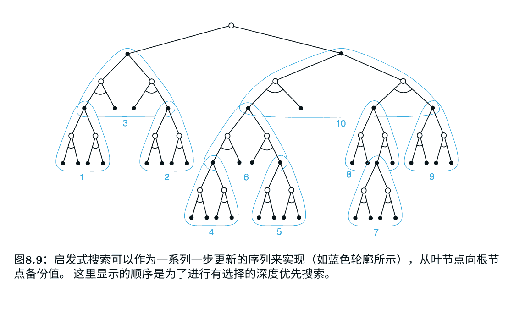

### 8.10 模拟算法

Rollout算法是基于蒙特卡洛控制的决策时间规划算法，应用于从当前环境状态开始的模拟轨迹。它们通过对许多模拟轨迹的返回值进行平均来估计给定策略的动作值，这些轨迹以每个可能的动作开始，然后遵循给定的策略。当动作值估计被认为足够准确时，执行动作（或其中之一）在执行具有最高估计值的动作之后，该过程从生成的下一个状态重新开始。正如Tesauro和Galperin（1997）所解释的那样，他们在玩回合制游戏时尝试了回滚算法，术语“回滚”是通过多次玩到游戏结束并使用随机生成的骰子序列来估计一个回合制游戏位置的价值，其中双方玩家的移动由某个固定策略决定。

与第5章中描述的蒙特卡洛控制算法不同，回溯算法的目标不是估计给定策略π下的完整最优动作值函数q*或完整动作值函数qπ。相反，它们只为每个当前状态和给定策略通常称为回溯策略生成蒙特卡洛动作值估计。作为决策时间规划算法，回溯算法立即利用这些动作值估计，然后丢弃它们。这使得回溯算法相对简单实现，因为不需要为每个状态-动作对采样结果，并且不需要在状态空间或状态-动作空间上逼近函数。

那么回溯算法到底能做什么呢？第4.2节中描述的策略改进定理告诉我们，对于任意两个策略π和π'，它们除了某个状态s上的动作π'(s) = a = π(s)不同外，如果qπ(s, a) - vπ(s)，那么策略π'和π一样好或更好。此外，如果不等式是严格的，那么π'实际上比π更好。这适用于滚动算法，其中s是当前状态，π是滚动策略。对模拟轨迹的回报进行平均，可以得到对qπ(s, a')的估计，其中a' ∈ A(s)是每个动作。然后，在s中选择一个动作的策略，使得这些估计最大化，并随后遵循π，这是一个改进的策略的良好候选。π。结果类似于动态规划中的策略迭代算法的一步（尽管更像是异步值迭代中的一步，因为它仅更改当前状态的动作）。换句话说，滚动算法的目标是改进滚动策略，而不是寻找最优策略。经验表明，滚动算法可以出人意料地有效。例如，Tesauro和Galperin（1997）对滚动方法在博弈中的显著改进感到惊讶。

在一些应用中，即使rollout策略完全随机，rollout算法也能产生良好的性能。但改进策略的性能取决于rollout策略的特性和蒙特卡洛值估计产生的动作排名。直觉表明，rollout策略越好，值估计越准确，rollout算法产生的策略就越好（但参见Gelly和Silver，2007年）。

这涉及到重要的权衡，因为更好的rollout策略通常意味着需要模拟足够的轨迹来获得良好的值估计所需的时间更长。作为决策时间规划方法，rollout算法通常必须满足严格的时间限制。rollout算法所需的计算时间取决于每个决策需要评估的动作数量，为了获得有用的样本回报所需的模拟轨迹的时间步数，rollout策略做出决策的时间，以及为了获得良好的蒙特卡洛动作值估计所需的模拟轨迹数量。

在任何应用中，平衡这些因素都是很重要的，尽管有几种方法可以减轻挑战。由于蒙特卡洛试验相互独立，可以在单独的处理器上并行运行许多试验。另一种方法是在完整的情节之前截断模拟轨迹，并通过存储的评估函数来修正截断的回报（这涉及到我们在前几章中讨论的截断回报和更新的内容）。正如Tesauro和Galperin（1997）所建议的，还可以监视蒙特卡洛模拟并剪除不太可能成为最佳选择的候选动作，或者其值与当前最佳动作的值非常接近，选择它们不会产生真正的差异（尽管Tesauro和Galperin指出这会使并行实现变得复杂）。

我们通常不认为rollout算法是学习算法，因为它们不会保持价值或策略的长期记忆。然而，这些算法利用了我们在本书中强调的强化学习的一些特点。作为蒙特卡洛控制的实例，它们通过对一组样本轨迹的回报进行平均来估计动作值，在这种情况下，样本轨迹是与环境的样本模型进行模拟交互的轨迹。通过轨迹采样，它们避免了动态规划的详尽扫描，并且通过依赖样本更新而不是期望更新，避免了对分布模型的需求，因此它们与强化学习算法类似。最后，rollout算法利用了策略改进属性，通过对估计的动作值进行贪婪选择。

### 8.11 蒙特卡罗树搜索

蒙特卡洛树搜索(MCTS)是决策时间规划的一个最新且非常成功的例子。在其基础上，MCTS是一个回滚算法，如上所述，但通过添加一种从蒙特卡洛模拟中获得的价值估计累积的方法来增强，以便逐步将模拟引导到更高回报的轨迹。MCTS在计算机围棋的提升中起到了重要作用，从2005年的弱业余水平提升到2015年的大师级水平（6段或更高）。已经开发了许多基本算法的变体，包括我们在第16.6节中讨论的一种变体，这对于AlphaGo程序在2016年击败18次世界冠军围棋选手的惊人胜利至关重要。MCTS已经在各种竞争环境中证明了其有效性，包括一般游戏玩法（例如，参见Finnsson和Björnsson，2008；Genesereth和Thielscher，2014），但它不仅限于游戏；如果存在足够简单的环境模型以进行快速多步模拟，它也可以用于单智能体顺序决策问题。

在遇到每个新状态后，执行MCTS来选择代理的动作；然后再执行MCTS来选择下一个状态的动作，以此类推。就像一个展开算法一样，每次执行都是一个迭代过程，模拟从当前状态开始到终止状态的许多轨迹（或者直到折扣使得进一步的奖励对回报的贡献可以忽略不计）。MCTS的核心思想是通过多次模拟，逐步聚焦于从当前状态开始的多个轨迹。它扩展了先前模拟中获得高评价的轨迹的初始部分。MCTS不需要在每次动作选择之间保留近似值函数或策略，尽管在许多实现中，它会保留下一个执行可能有用的选定动作值。

在模拟的轨迹中，大部分动作都是使用简单策略生成的，通常被称为展开策略，因为它适用于更简单的展开算法。当展开策略和模型都不需要大量计算时，可以在短时间内生成许多模拟轨迹。与任何表格蒙特卡洛方法一样，状态-动作对的值被估计为该对的（模拟的）回报的平均值。蒙特卡洛值估计仅针对最有可能在几步内到达的状态-动作对进行维护，这形成了以当前状态为根的树，如图8.10所示。MCTS通过根据模拟轨迹的结果添加表示看起来有希望的状态的节点来逐步扩展树。任何模拟轨迹都将通过树并在某个叶节点处退出。在树之外和叶节点处，使用展开策略进行动作选择，但在树内的状态中，可以有更好的选择。对于这些状态，我们至少对一些动作有值估计，因此我们可以使用一种称为树策略的有信息策略在它们之间进行选择，以平衡探索和利用。

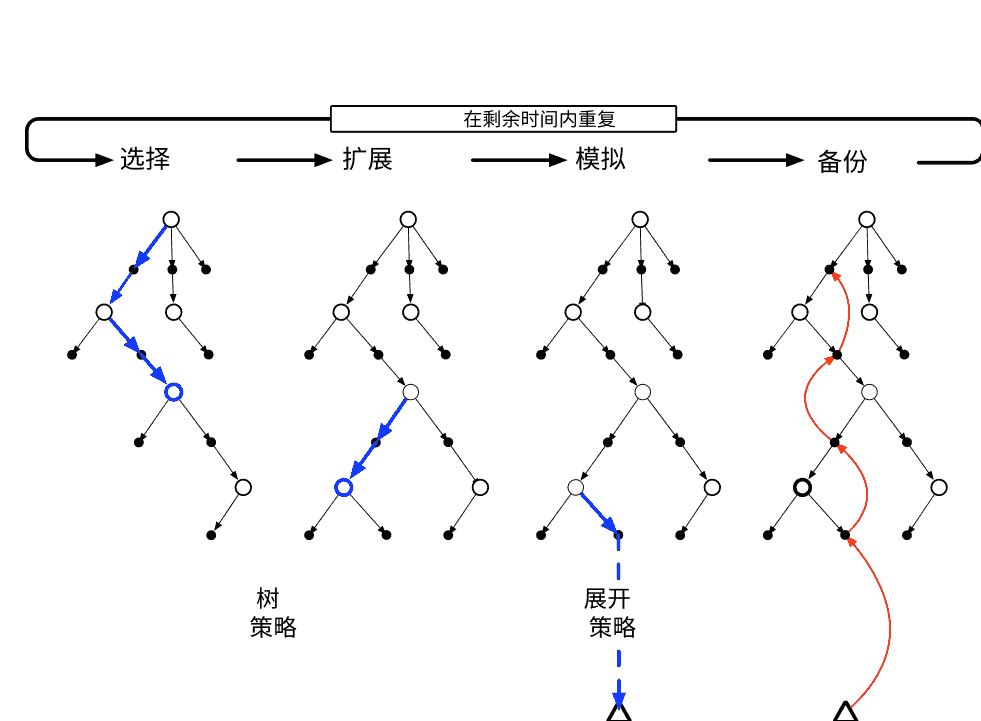

> 图8.10：蒙特卡洛树搜索。当环境变化到一个新状态时，MCTS在需要选择动作之前尽可能执行多次迭代，逐步构建一个以当前状态为根节点的树。每次迭代包括四个操作选择、扩展（尽管在某些迭代中可能会跳过）、模拟和备份，如文本中所解释的，并且由树中的粗箭头所示。改编自Chaslot、Bakkes、Szita和Spronck（2008）。

例如，树策略可以使用 ε贪婪或UCB选择规则（第2章）。

更详细地说，基本版本的MCTS的每次迭代包括以下四个步骤，如图8.10所示：

- 1. 选择。从根节点开始，基于动作值的树策略通过遍历来选择一个叶节点。
- 2. 扩展。在某些迭代中（取决于应用的细节），通过添加通过未探索动作从选定节点到达的一个或多个子节点来扩展树。
- 3. 模拟。从选定节点或其新添加的子节点之一（如果有的话），使用滚动策略选择的动作运行完整的一次仿真。结果是首先由树策略选择的动作，然后由滚动策略选择的蒙特卡罗试验。
- 4. 备份。由模拟的仿真生成的回报被备份以更新或初始化树策略在MCTS的这次迭代中遍历的树边上附加的动作值。在树之外由滚动策略访问的状态和动作没有保存任何值。图8.10通过直接从模拟轨迹的终端状态向树中滚动策略开始的状态-动作节点进行备份来说明这一点（尽管通常情况下，整个模拟轨迹的回报都被备份到这个状态-动作节点）。

MCTS继续执行这四个步骤，每次都从树的根节点开始，直到没有剩余时间，或者其他计算资源耗尽。然后，最终，根节点（仍代表当前环境状态）根据树中累积统计信息选择一个动作；例如，它可以是从根状态可用的所有动作中具有最大动作值的动作，或者是具有最大访问计数以避免选择异常值的动作。这就是MCTS实际选择的动作。环境转换到新状态后，MCTS再次运行，有时从表示新状态的单个根节点的树开始，但通常从上一次执行MCTS构建的树中剩余的任何后代节点开始；所有剩余的节点以及与它们相关联的动作值都被丢弃。

MCTS首次提出用于选择在两人对抗游戏中的移动，例如围棋。对于游戏，每个模拟的回合都是游戏的完整进行，其中两名玩家通过树和展开策略选择动作。第16.6节描述了MCTS在AlphaGo程序中使用的扩展，它将MCTS的蒙特卡洛评估与通过自我对弈强化学习学习的动作值相结合。

将MCTS与本书中描述的强化学习原理联系起来，可以对它如何取得如此令人印象深刻的结果提供一些见解。在其基础上，MCTS是一种基于蒙特卡洛控制的决策时间规划算法，应用于模拟中。

### 8.12 章总结

规划需要环境模型。分布模型由下一个状态和可能动作的奖励的概率组成；样本模型根据这些概率生成单个转换和奖励。动态规划需要分布模型，因为它使用预期更新，涉及计算所有可能的下一个状态和奖励的期望。另一方面，样本模型是在与环境交互期间模拟所需的，许多强化学习算法使用的是类似的样本更新。相比之下，样本模型通常比分布模型更容易获得。

我们提出了一种观点，强调规划最优行为和学习最优行为之间的惊人密切关系。两者都涉及估计相同的值函数，在这两种情况下，通过一系列小的备份操作逐步更新估计值是自然的。这使得将学习和规划过程简单地整合起来，只需允许两者更新相同的估计值函数。此外，任何学习方法都可以简单地转换为规划方法，只需将其应用于模拟（模型生成的）经验而不是真实经验。在这种情况下，学习和规划变得更加相似；它们可能是在两种不同的经验来源上运行的相同算法。

将增量规划方法与行动和模型学习相结合是很直接的。规划、行动和模型学习以循环方式相互作用（如第162页上的图表所示），每个都产生其他需要改进的内容；它们之间没有其他的交互是必需的或被禁止的。最自然的方法是让所有过程异步并行进行。如果过程必须共享计算资源，那么划分可以几乎任意地处理 - 通过对于当前任务最方便和高效的组织方式。

在本章中，我们涉及了状态空间规划方法的许多变化维度。一个维度是更新的大小变化。更新越小，规划方法就越增量。其中最小的更新是一步样本更新，如Dyna中所示。另一个重要的维度是更新的分布，即搜索的焦点。优先扫描将焦点放在最近更改值的状态的前任上。在策略轨迹采样中，焦点是代理在控制环境时可能遇到的状态或状态-动作对。这可以使计算跳过与预测或控制问题无关的状态空间的部分。实时动态规划是值迭代的一种策略轨迹采样版本，它展示了这种策略相对于传统的扫描式策略迭代的一些优势。

规划也可以从相关状态向前聚焦，例如在代理-环境交互过程中实际遇到的状态。最重要的形式是在决策时进行规划，也就是作为行动选择过程的一部分。经典的启发式搜索，如人工智能中研究的例子。其他例子包括在线算法和蒙特卡洛树搜索，这些算法从在线、增量、基于样本的值估计和策略改进中受益。

### 8.13 部分总结：维度

本章结束了本书的第一部分。在本章中，我们试图将强化学习呈现为一组相互关联的思想，而不仅仅是一组个别的方法。每个思想可以被视为方法变化的一个维度。这样的维度集合构成了一个庞大的可能方法空间。通过在维度层面上探索这个空间，我们希望获得最广泛和持久的理解。

在本节中，我们使用方法空间中的维度概念来总结迄今为止在本书中发展的强化学习观点。

到目前为止，本书中我们探讨的所有方法都有三个共同的关键思想：首先，它们都试图估计值函数；其次，它们都沿着实际或可能的状态轨迹备份数值来操作；第三，它们都遵循广义策略迭代（GPI）的一般策略，这意味着它们维护一个近似值函数和一个近似策略，并且不断尝试基于另一个的改进。这三个思想是本书所涵盖主题的核心。我们建议值函数、备份值更新和GPI是强大的组织原则，可能与任何智能模型相关，无论是人工的还是自然的。图8.11展示了这些方法变化的两个最重要的维度。这些维度与用于改进值函数的更新类型有关。水平维度是它们是基于样本轨迹的更新（sample updates）还是基于可能轨迹的期望更新（expected updates）。期望更新需要一个分布模型，而样本更新只需要一个样本模型，或者可以根据实际经验进行，而无需模型（另一个变化的维度）。图8.11的垂直维度对应于更新的深度，即引导程度。在空间的四个角落中，有三种主要的估计值的方法：动态规划、TD和蒙特卡洛。在空间的左边缘是样本更新方法，从一步TD更新到完全回报的蒙特卡洛更新。在这些方法之间，存在一个包括基于n步更新的方法的光谱（在第12章中，我们将扩展到包括n步更新的混合方法，例如由资格追踪实现的λ更新）。

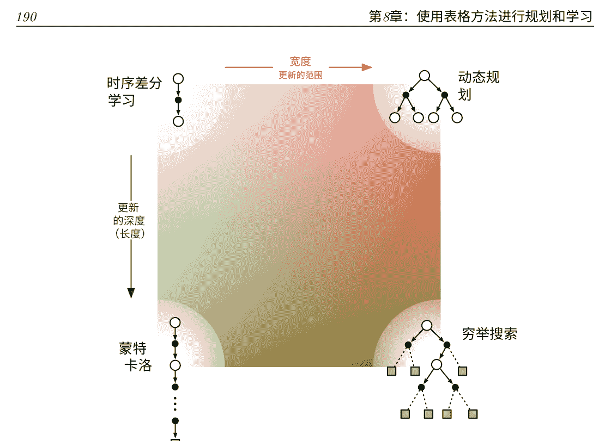

动态规划方法显示在空间的极右上角，因为它们涉及一步预期更新。极右下角是预期更新的极端情况，深入到终止状态（或在连续任务中，直到折扣降低了任何进一步奖励的贡献到可以忽略的水平）。这是穷举搜索的情况。沿着这个维度的中间方法包括启发式搜索和相关方法，它们搜索和更新到有限的深度，可能是有选择性的。沿着水平维度也有中间方法。这些方法包括混合预期和样本更新的方法，以及在单个更新中混合样本和分布的可能性。方块的内部填充表示所有这些中间方法的空间。

在本书中，我们强调了第三个维度，即在策略和离策略方法之间的二进制区别。在前一种情况下，代理学习当前正在遵循的策略的值函数，而在后一种情况下，代理学习策略的值函数是针对不同策略的，通常是代理当前认为最好的策略之一。生成行为的策略通常与当前认为最好的策略不同，因为需要进行探索。这第三个维度可以在图8.11中被视为与页面垂直的维度。

除了刚刚讨论的三个维度外，我们在本书中还确定了其他一些维度：

- 回报的定义任务是片段式的还是连续的，折扣的还是不折扣的？
- 动作值 vs. 状态值 vs. 后状态值应该估计哪种值？如果只估计状态值，那么要么需要一个模型，要么需要一个单独的策略（如演员-评论家方法）来进行动作选择。
- 行动选择/探索如何选择行动以确保适当的探索和利用之间的权衡？我们只考虑了最简单的方法来做到这一点：ε贪婪法、乐观初始化值、软最大化和上置信界。
- 同步 vs. 异步所有状态的更新是同时进行还是按某种顺序逐个进行？
- 真实 vs. 模拟更新应该基于真实经验还是模拟经验？ 如果两者都有，各占多少比例？
- 更新的位置应该更新哪些状态或状态-行动对？ 无模型方法只能在实际遇到的状态和状态-行动对中进行选择，而有模型方法可以任意选择。 这里有很多可能性。
- 更新的时机更新应该作为选择行动的一部分进行，还是仅在之后进行？
- 更新的记忆更新的值应该保留多长时间？ 它们应该永久保留，还是仅在计算行动选择时保留，就像启发式搜索一样？

当然，这些维度既不是详尽无遗的，也不是互相排斥的。不同的算法在许多其他方面也存在差异，并且许多算法在几个维度上都有所涉及。例如，Dyna方法同时使用真实和模拟经验来影响相同的值函数。同时维护以不同方式计算或基于不同状态和动作表示的多个值函数也是完全合理的。然而，这些维度构成了一套描述和探索可能方法的连贯思想。

这里没有提到的最重要的维度，也没有在本书的第一部分中涵盖，就是函数逼近。函数逼近可以被看作是一种正交的可能性谱，从极端的表格方法，通过状态聚合，各种线性方法，然后是各种非线性方法。这个维度在第二部分中进行了探讨。

### 参考文献和历史评论

8.1 这里呈现的规划和学习的整体观点是逐渐发展起来的，部分是由作者（Sutton, 1990, 1991a, 1991b; Barto, Bradtke, and Singh, 1991, 1995; Sutton and Pinette, 1 985; Sutton and Barto, 1981b）所做的；它受到了Agre和Chapman（1990; Agre 1988），Bertsekas和Tsitsiklis（1989），Singh（1993）等人的强烈影响。作者们还受到了潜在学习的心理学研究（Tolman, 1932）和对思维本质的心理学观点的强烈影响（例如，Galanter和Gerstenhaber, 1956; Craik, 1943; Camp bell, 1960; Dennett, 1978）。在本书的第三部分，第14.6节将模型为基础的方法和模型无关的方法与学习和行为的心理学理论联系起来，第15.11节讨论了大脑如何实现这些类型的方法的思想。

8.2 我们用来描述不同类型的强化学习的术语直接和间接来自自适应控制文献（例如，Goodwin和Sin，1984），在那里它们被用来进行相同类型的区分。系统辨识这个术语在自适应控制中用于我们称之为模型学习（例如，Goodwin和Sin，1984; Ljung和S¨oderstrom，1983; Young，1984）。Dyna架构归功于Sutto n（1990），本节和下一节的结果基于他在那里报告的结果。Barto和Singh（19 90）考虑了直接和间接强化学习方法之间的一些问题。将Dyna扩展到线性函数逼近的早期工作（第9章）由Sutton，Szepesv´ari，Geramifard和Bowling（200 8）以及Parr，Li，Taylor，Painter-Wakefield和Littman（2008）完成。

8.3 已经有几个基于模型的强化学习的研究，采用了探索奖励和乐观初始化的思想，将其推向了极致，假设所有未完全探索的选择都是最大回报的，并计算最优路径进行测试。Kearns和Singh（2002）的E³算法和Brafman和Tennenholtz（2 003）的R-max算法保证在状态和动作数量多项式时间内找到接近最优解。这通常对于实际算法来说太慢了，但在最坏情况下可能是最好的解决方案。

8.4 优先扫描同时由Moore和Atkeson（1993）以及Peng和Williams（1993）同时独立开发。第170页上的结果归功于Peng和Williams（1993）。第171页上的结果归功于Moore和Atkeson。该领域的关键后续工作包括McMahan和Gordon（200 5）以及van Seijen和Sutton（2013）的研究。

8.5 本节内容受到了Singh（1993）实验的强烈影响。

8.6–7 轨迹采样从一开始就是强化学习的一部分，但在Barto、Bradtke和Singh（1995）的RTDP介绍中得到了最明确的强调。他们认识到Korf（1990）的学习实时$A^{*}$ ($LRTA^{*}$) 算法是一种异步DP算法，适用于随机问题以及Korf关注的确定性问题。除了$LRTA^{*}$之外，RTDP还包括在执行动作之间的时间间隔内更新许多状态的选项。Barto等人（1995）通过将Korf（1990）对$LRTA^{*}$的收敛性证明与Bertsekas（1982）（还有Bertsekas和Tsitsiklis, 1989）关于无折扣情况下随机最短路径问题的异步DP收敛性结果相结合，证明了这里描述的收敛结果。将模型学习与RTDP相结合称为自适应RTDP，也是由Barto等人（1995）提出并由Barto（2011）讨论的。

8.9 对于启发式搜索的进一步阅读，鼓励读者参考Russell和Norvig（2009）以及Korf（1988）等文本和调查。Peng和Williams（1993）在本节中探讨了前向更新的方法，这与本节中所建议的方法非常相似。

8.10 Abramson（1990）的预期结果模型是一种应用于两人博弈的展开算法，其中两个模拟玩家的游戏是随机的。他认为，即使是随机游戏，也是一种“强大的启发式方法”，它是“精确的、准确的、易于估计的、高效计算的和与领域无关的”。Tesauro和Galperin（1997）证明了展开算法改进了双陆棋程序的游戏能力，并采用了“展开”一词，用于通过使用不同的随机生成的骰子序列来评估双陆棋位置。Bertsekas、Tsitsiklis和Wu（1997）研究了应用于组合优化问题的展开算法，Bertsekas（2013）调查了它们在离散确定性优化问题中的应用，并评论说它们“通常出人意料地有效”。

8.11 MCTS的核心思想由Coulom（2006）和Kocsis和Szepesv´ari（2006）引入。他们在Monte Carlo规划算法的基础上进行了扩展，这些算法由这些作者进行了回顾。Browne, Powley, Whitehouse, Lucas, Cowling, Rohlfshagen, Tavener, Perez, Samothrakis和Colton（2012）是MCTS方法及其应用的一份出色的调查报告。David Silver在本节中贡献了思想和演示。

## 第二部分：近似解法

在本书的第二部分中，我们将第一部分中介绍的表格方法扩展到适用于具有任意大状态空间的问题。在我们希望应用强化学习的许多任务中，状态空间是组合的和巨大的；例如，可能的相机图像数量远大于宇宙中的原子数量。在这种情况下，即使在无限时间和数据的极限情况下，我们也不能期望找到最优策略或最优值函数；我们的目标是使用有限的计算资源找到一个好的近似解。在本书的这一部分中，我们探讨这种近似解法。

大状态空间的问题不仅仅是需要大表格的内存，还需要准确填充它们所需的时间和数据。在我们的目标任务中，几乎每个遇到的状态都是前所未见的。在这种状态下做出明智的决策需要从之前与当前状态在某种意义上相似的不同状态的经验中进行概括。换句话说，关键问题在于概括。如何将有限状态空间的经验有用地概括到更大的子集上以产生良好的近似？

幸运的是，从示例中进行概括已经得到了广泛研究，我们不需要为强化学习发明全新的方法。在某种程度上，我们只需要将强化学习方法与现有的概括方法结合起来。我们需要的这种概括通常被称为函数逼近，因为它从所需函数（例如值函数）中获取示例，并尝试从中概括出整个函数的近似。函数逼近是监督学习的一个实例，是机器学习、人工神经网络、模式识别和统计曲线拟合中研究的主要主题。理论上，这些领域中研究的任何方法都可以在强化学习算法中用作函数逼近器的角色，尽管在实践中，有些方法比其他方法更容易适应这个角色。

使用函数逼近的强化学习涉及一些通常在传统的监督学习中不会出现的新问题，如非稳态、自举和延迟目标。我们在本部分的五章中逐步介绍这些和其他问题。最初，我们将注意力限制在政策训练上，在第9章中处理预测情况，其中给定政策并且只近似其值函数，然后在第10章中处理控制情况，其中找到近似最优政策。使用函数逼近的离策略学习是一个具有挑战性的问题。

## 第9章 基于策略的近似预测

在第11章中讨论了逼近的问题。在这三章中，我们将不得不回到基本原理，并重新审视学习的目标，以考虑函数逼近。第12章介绍和分析了资格追踪的算法机制，在许多情况下显著改善了多步强化学习方法的计算性能。本部分的最后一章探讨了一种不同的控制方法，策略梯度方法，它直接近似最优策略，并且永远不需要形成近似值函数（尽管如果它们也近似值函数，它们可能更加高效）。

在本章中，我们开始研究在强化学习中使用函数逼近来估计基于策略数据生成的状态值函数的方法，即通过使用已知策略生成的经验来近似估计状态值函数 $v_{\pi}$。本章的创新之处在于近似值函数不是以表格形式表示，而是以参数化的函数形式表示，其中权重向量 $\mathbf{w} \in \mathbb{R}^d$。我们将写作 $\hat{v}(s, \mathbf{w}) \approx v_{\pi}(s)$ 表示给定权重向量 $\mathbf{w}$ 时状态 $s$ 的近似值。例如，$\hat{v}$ 可能是状态特征的线性函数，其中 $\mathbf{w}$ 是特征权重向量。更一般地说，$\hat{v}$ 可能是由多层人工神经网络计算得到的函数，其中 $\mathbf{w}$ 是所有层的连接权重向量。通过调整权重，网络可以实现各种不同的函数。或者，$\hat{v}$ 可能是由决策树计算得到的函数，其中 $\mathbf{w}$ 是定义树的分割点和叶节点值的所有数字。通常，权重的数量（维度）决定了函数逼近的复杂度。

$\mathbf{w}$ 远小于状态数 ($d \ll |\mathcal{S}|$)，改变一个权重会改变许多状态的估计值。因此，当更新一个单独的状态时，改变会从该状态泛化到许多其他状态的值。这种泛化使得学习潜力更强大，但也更难管理和理解。

令人惊讶的是，将强化学习扩展到函数逼近也使其适用于部分可观察问题，其中代理无法获取完整的状态。如果参数化函数形式 $\hat{v}$ 不允许估计值依赖于状态的某些方面，那么就好像这些方面是不可观察的一样。实际上，本书的这一部分介绍的使用函数逼近的方法的所有理论结果同样适用于部分可观察性的情况。

然而，函数逼近无法增加状态表示中过去观察的记忆。关于这方面的一些可能的进一步扩展在第17.3节中简要讨论。

### 9.1 值函数近似

本书中介绍的所有预测方法都被描述为对估计值函数的更新，这些更新将特定状态的值转移到“备份值”或更新目标。让我们用符号 s → u 来表示单个更新，其中 s 是被更新的状态，u 是 s 的更新目标，s 的估计值会向该目标值移动。例如，值预测的蒙特卡洛更新为 S_t → G_t，TD(0) 更新为 S_t → R_{t+1} + γ\hat{v}(S_{t+1}, w_t)，而 n 步 TD 更新为 S_t → G_{t:t+n}。在 DP（动态规划）策略评估更新中，任意状态 s 都会被更新为 E_π[R_{t+1} + γ\hat{v}(S_{t+1}, w_t) | S_t = s]，而在其他情况下，实际经验中遇到的状态 S_t 会被更新。

将每次更新解释为所需输入-输出行为的示例是很自然的。从某种意义上说，更新 s → u 的意思是状态 s 的估计值应该更像更新目标 u。到目前为止，实际的更新是微不足道的：s 的表项的估计值只是简单地向 u 的方向移动了一小部分，而其他所有状态的估计值保持不变。现在，我们允许任意复杂和复杂的方法来实现更新，并且在 s 上进行更新的泛化，以便许多其他状态的估计值也发生变化。以这种方式学习模仿输入-输出示例的机器学习方法被称为监督学习方法，当输出是像 u 这样的数字时，这个过程通常被称为函数逼近。函数逼近方法期望接收到它们试图逼近的函数的所需输入-输出行为的示例。我们通过将每次更新的 s → g 作为训练示例传递给这些方法，来将它们用于值预测。然后，我们将它们产生的近似函数解释为估计值函数。

以这种方式将每次更新视为传统的训练示例，使我们能够使用任何一种广泛存在的函数逼近方法进行值预测。原则上，我们可以使用任何一种从示例中进行监督学习的方法，包括人工神经网络、决策树和各种多元回归方法。然而，并不是所有的函数逼近方法都适用于强化学习。最复杂的人工神经网络和统计方法都假设在静态训练集上进行多次遍历。然而，在强化学习中，学习必须能够在线进行，同时代理与其环境或环境模型进行交互是很重要的。要做到这一点，需要能够从逐步获取的数据中高效学习的方法。此外，强化学习通常需要能够处理非平稳目标函数（随时间变化的目标函数）的函数逼近方法。例如，在基于 GPI（广义策略迭代）的控制方法中，我们经常寻求学习 q_π，而 π 发生变化。即使策略保持不变，如果训练示例的目标值是通过引导方法（DP 和 TD 学习）生成的，则这些示例的目标值是非平稳的。不能轻松处理这种非平稳性的方法对于强化学习来说不太合适。

### 9.2 预测目标（VE）

到目前为止，我们还没有明确为预测指定一个明确的目标。在表格情况下，不需要连续的预测质量度量，因为学习的值函数可以完全等于真实的值函数。此外，每个状态的学习值是解耦的——对一个状态的更新不会影响其他状态。但是，对于真正的近似，一个状态的更新会影响许多其他状态，并且不可能完全正确地获取所有状态的值。根据假设，我们有更多的状态而不是权重，因此使一个状态的估计更准确必然意味着使其他状态的估计不准确。因此，我们有责任说明我们最关心的状态。我们必须指定一个状态分布 $\mu(s) \geq 0, \sum_{s} \mu(s)=1$，表示我们对每个状态 $s$ 中的错误有多在意。通过状态 $s$ 中的错误，我们指的是近似值 $\hat{v}(s,\mathbf{w})$ 和真实值 $v_{\pi}(s)$ 之间的差的平方。通过 $\mu$ 对状态空间进行加权，我们得到一个自然的目标函数，即均方值误差（Mean Squared Value Error），表示为 VE：

$$\overline{\mathrm{VE}}(\mathbf{w})=\sum_{s \in \mathcal{S}} \mu(s)\left[v_{\pi}(s)-\hat{v}(s, \mathbf{w})\right]^{2}. \qquad (9.1)$$

这个度量的平方根，即根 VE，给出了近似值与真实值之间的差异程度的粗略度量，并经常用于绘图。通常选择 $\mu(s)$ 为在状态 $s$ 中花费的时间的比例。在 on-policy 训练中，这被称为 on-policy 分布；在本章中，我们完全关注这种情况。在持续任务中，on-policy 分布是 $\pi$ 下的稳态分布。

在情节任务中，策略分布有所不同，因为它取决于如何选择情节的初始状态。让 $h(s)$ 表示每个状态 $s$ 开始一个情节的概率，让 $\eta(s)$ 表示在一个情节中平均花费在状态 $s$ 的时间步数。如果情节从 $s$ 开始，或者从前一个状态 $\bar{s}$ 转换到 $s$，则时间将花费在状态 $s$ 上：

$$\eta(s)=h(s)+\sum_{\bar{s}} \eta(\bar{s}) \sum_{a} \pi(a|\bar{s})p(s|\bar{s}, a) \quad \text{对于所有的} s \in \mathcal{S}, \text{成立}. \qquad (9.2)$$

可以通过解这个方程组来求解期望访问次数 $\eta(s)$。然后，策略分布是每个状态花费的时间的分数，归一化为总和为一：

$$\mu(s)=\frac{\eta(s)}{\sum_{s'} \eta(s')}, \quad \text{对于所有} s \in \mathcal{S}. \qquad (9.3)$$

这是自然的选择，不考虑折扣。如果有折扣 ($\gamma < 1$)，它应该被视为一种终止形式，可以通过在 (9.2) 的第二项中包含一个因子 $\gamma$ 来简单地处理。

连续和情节两种情况的行为类似，但在近似中，它们必须在正式分析中分别处理，正如我们在本书的这一部分中反复看到的那样。这完成了学习目标的规范。

但是并不完全清楚 VE 是否是强化学习的正确性能目标。请记住，我们学习价值函数的最终目的是找到一个更好的策略。对于这个目的来说，最好的价值函数不一定是最小化 VE 的最佳函数。然而，目前还不清楚价值预测的更有用的替代目标是什么。现在，我们将专注于 VE。在 VE 方面的理想目标是找到一个全局最优解，一个权重向量 w* 使得对于所有可能的 w，都有 VE(w*) ≤ VE(w)。对于简单的函数逼近器（如线性逼近器），有时可以达到这个目标，但对于复杂的函数逼近器（如人工神经网络和决策树），很少能够实现。除此之外，复杂的函数逼近器可能会寻求收敛到一个局部最优解，一个权重向量 w* 使得对于 w* 附近的所有 w，都有 VE(w*) ≤ VE(w)。

尽管这个保证只能稍微让人放心一点，但通常来说这是最好的情况了，而且通常也足够了。然而，在许多强化学习中感兴趣的情况下，并没有收敛到最优解的保证，甚至没有收敛到最优解的有界距离内。事实上，有些方法可能会发散，在极限情况下，其值函数估计可能趋近于无穷大。

在最后两节中，我们概述了一个框架，用于将各种强化学习方法与各种函数逼近方法相结合，利用前者的更新生成后者的训练样本。我们还描述了一个值函数估计性能度量，这些方法可能希望将其最小化。可能的函数逼近方法的范围太大，无法涵盖所有方法，而且对大多数方法了解甚少，无法进行可靠的评估或推荐。出于必要性，我们只考虑了一些可能性。在本章的其余部分，我们将重点关注基于梯度原理的函数逼近方法，特别是线性梯度下降方法。我们之所以专注于这些方法，部分原因是因为我们认为它们特别有前景并且揭示了关键的理论问题，但也因为它们简单且我们的空间有限。

### 9.3 随机梯度和半梯度方法

我们现在详细介绍一类用于函数逼近中的学习方法，这些方法基于随机梯度下降（SGD）。SGD 方法是所有函数逼近方法中最广泛使用的方法之一，特别适用于在线强化学习。

在梯度下降方法中，权重向量是一个具有固定数量的实值分量的列向量，$\mathbf{w} \doteq (w_1, w_2, \ldots, w_d)^\top$，以及近似值函数 $\hat{v}(s,\mathbf{w})$ 是一个关于 $\mathbf{w}$ 的可微函数，对于所有的 $s \in \mathscr{S}$。我们将在一系列离散时间步骤中更新 $\mathbf{w}$，$t=0, 1, 2, 3, \ldots$，因此我们需要一个记号 $\mathbf{w}_t$ 来表示每一步的权重向量。暂时假设，在每一步中，我们观察到一个新的示例 $S_t \rightarrow v_{\pi}(S_t)$，其中包含一个（可能是随机选择的）状态 $S_t$ 和其在策略下的真实值。这些状态可能是与环境的交互中的连续状态，但现在我们不假设如此。即使我们对每个 $S_t$ 都有准确的值 $v_{\pi}(S_t)$，但由于我们的函数逼近器资源有限，因此分辨率也有限，这仍然是一个困难的问题。特别地，通常不存在一个权重向量 $\mathbf{w}$，可以完全正确地处理所有状态，甚至所有示例。此外，我们必须对未出现在示例中的所有其他状态进行泛化。

我们假设状态以相同的分布 $\mu$ 出现在示例中，我们试图通过 (9.1) 中给出的 VE 来最小化误差。在这种情况下，一个好的策略是尽量减少观察到的示例上的误差。随机梯度下降 (SGD) 方法通过在每个示例之后微调权重向量，以在该示例上最大程度地减少误差的方向进行操作：

$$\mathbf{w}_{t+1} \doteq \mathbf{w}_t - \frac{1}{2} \alpha \nabla \left[ v_{\pi}(S_t) - \hat{v}(S_t,\mathbf{w}_t) \right]^2 \tag{9.4}$$
$$= \mathbf{w}_t + \alpha \left[ v_{\pi}(S_t) - \hat{v}(S_t,\mathbf{w}_t) \right] \nabla \hat{v}(S_t,\mathbf{w}_t), \tag{9.5}$$

其中 $\alpha$ 是一个正的步长参数，并且 $\nabla f(\mathbf{w})$，对于任何标量表达式 $f(\mathbf{w})$ 它是一个关于向量（这里 $\mathbf{w}$ ）的函数，表示表达式对于向量的分量的偏导数的列向量：

$$\nabla f(\mathbf{w}) \doteq \left( \frac{\partial f(\mathbf{w})}{\partial w_1}, \frac{\partial f(\mathbf{w})}{\partial w_2}, \ldots, \frac{\partial f(\mathbf{w})}{\partial w_d} \right)^{\top}. \tag{9.6}$$

这个导数向量是 $f$ 关于 $\mathbf{w}$ 的梯度。SGD 方法是“梯度下降”方法，因为 $\mathbf{w}_t$ 的整体步长与示例的平方误差 (9.4) 的负梯度成比例。这是误差下降最快的方向。当更新仅针对单个示例时，梯度下降方法被称为“随机”。这个示例可能是随机选择的。在许多示例中，采取小步骤，整体效果是最小化诸如 VE 之类的平均性能度量。

为什么 SGD 只朝着梯度的方向迈出一小步可能不会立即显而易见。我们为什么不能一直朝着这个方向前进，完全消除示例上的错误？在许多情况下，这是可以做到的，但通常并不理想。请记住，我们不寻求或期望找到一个在所有状态下都具有零误差的值函数，而只是一个在不同状态下平衡误差的近似值函数。如果我们在一步中完全纠正每个示例，那么我们将无法找到这样的平衡。事实上，SGD 方法的收敛结果假设 $\alpha$ 随时间减小。如果它以满足标准随机逼近条件(2.7)的方式减小，那么SGD方法(9.5)保证收敛到一个局部最优解。

现在我们转向目标输出不是真实值 $v_{\pi}(S_t)$ 而是某个可能是随机的近似值的情况。例如，$U_t$ 可能是 $v_{\pi}(S_t)$ 的噪声污染版本，或者是前一节中提到的 $\hat{v}$ 的引导目标之一。在这些情况下，我们无法执行精确的更新（9.5），因为 $v_{\pi}(S_t)$ 是未知的，但是我们可以通过用 $U_t$ 替换 $v_{\pi}(S_t)$ 来近似计算。这导致了以下状态值预测的一般SGD方法：

$\mathbf{w}_{t+1} \doteq \mathbf{w}_t + \alpha \left[ U_t - \hat{v}(S_t, \mathbf{w}_t) \right] \nabla \hat{v}(S_t, \mathbf{w}_t). \quad (9.7)$

如果 $U_t$ 是一个无偏估计，即对于每个 $t$，如果 $\mathbb{E}[U_t | S_t = s] = v_{\pi}(S_t)$，那么 $\mathbf{w}_t$ 在通常的随机逼近条件（2.7）下保证收敛到局部最优解，减小 $\alpha$。

例如，假设示例中的状态是使用策略 $\pi$ 与环境进行交互（或模拟交互）生成的状态。因为状态的真实值是其后续回报的期望值，所以蒙特卡洛目标 $U_t = G_t$ 根据定义是 $v_{\pi}(S_t)$ 的一个无偏估计。选择这种方式，通用SGD方法（9.7）收敛到对 $v_{\pi}(S_t)$ 的局部最优近似。因此，蒙特卡洛状态值预测的梯度下降版本保证找到一个局部最优解。完整算法的伪代码如下方框所示。

**梯度蒙特卡洛算法用于估计 $\hat{v} \approx v_{\pi}$**

| 输入 | 要评估的策略 $\pi$ |
| :--- | :--- |
| 输入 | 可微分函数 $\hat{v} : \mathcal{S} \times \mathbb{R}^d \rightarrow \mathbb{R}$ |
| 算法参数 | 步长 $\alpha > 0$ |
| 初始化 | 值函数权重 $\mathbf{w} \in \mathbb{R}^d$ 任意 (例如，$\mathbf{w} = \mathbf{0}$) |
| 无限循环 | (对于每个回合)： |
| | 生成一个序列 $S_0, A_0, R_1, S_1, A_1, \ldots, R_T, S_T$ 使用 $\pi$ |
| | 循环每个序列的步骤，$t = 0, 1, \ldots, T-1$: |
| | $\mathbf{w} \leftarrow \mathbf{w} + \alpha [G_t - \hat{v}(S_t, \mathbf{w})] \nabla \hat{v}(S_t, \mathbf{w})$ |

如果使用自助估计的引导估计 $v_{\pi}(S_t)$ 作为目标 $U_t$ (9.7) 中，就无法获得相同的保证。引导目标，如 $n$ 步回报 $G_{t:t+n}$ 或 DP 目标 $\sum_{a, s', r} \pi(a|S_t) p(s', r | S_t, a)[r + \gamma \hat{v}(s', \mathbf{w}_t)]$ 都取决于当前权重向量 $\mathbf{w}_t$ 的值，这意味着它们将具有偏差，并且不会产生真正的梯度下降方法。从 (9.4) 到 (9.5) 的关键是目标与 $\mathbf{w}_t$ 无关。如果在 $v_{\pi}(S_t)$ 的位置使用引导估计，这一步将无效。事实上，自助法不是真正的梯度下降方法的实例 (Barnard, 1993)。它们考虑了改变权重向量 $\mathbf{w}_t$ 的影响，但忽略对目标的影响。它们只包含梯度的一部分，因此我们称之为半梯度方法。

尽管半梯度（自举）方法的收敛性不如梯度方法稳定，但在重要情况下，如下一节中讨论的线性情况下，它们可靠地收敛。此外，它们提供了重要的优势，使它们经常被明确优先选择。其中一个原因是它们通常能够实现显著更快的学习，正如我们在第6章和第7章中所看到的。另一个原因是它们使学习能够是连续和在线的，不需要等待一个回合的结束。这使得它们可以用于持续性问题，并提供了计算上的优势。一个典型的半梯度方法是半梯度 TD(0)，它使用 $U_t = R_{t+1} + \gamma \hat{v}(S_{t+1}, \mathbf{w})$ 作为其目标。该方法的完整伪代码如下所示。

**用于估计 $\hat{v} \approx v_{\pi}$ 的半梯度 TD(0)**

| 输入 | 要评估的策略 $\pi$ |
| :--- | :--- |
| 输入 | 一个可微分函数 $\hat{v} : S^+ \times \mathbb{R}^d \rightarrow \mathbb{R}$ 使得 $\hat{v}(terminal, \cdot) = 0$ |
| 算法参数 | 步长 $\alpha > 0$ |
| 初始化 | 值函数权重 $\mathbf{w} \in \mathbb{R}^d$ 任意 (例如，$\mathbf{w} = \mathbf{0}$) |
| 循环 | 每个回合： |
| | 初始化 $S$ |
| | 循环每个回合的步骤： |
| | 选择 $A \sim \pi(\cdot|S)$ |
| | 执行动作 $A$, 观察 $R$, $S'$ |
| | $\mathbf{w} \leftarrow \mathbf{w} + \alpha [R + \gamma \hat{v}(S', \mathbf{w}) - \hat{v}(S, \mathbf{w})] \nabla \hat{v}(S, \mathbf{w})$ |
| | $S \leftarrow S'$ |
| | 直到 $S$ 是终止状态 |

状态聚合是一种简单的泛化函数逼近形式，其中将状态分组在一起，每个组有一个估计值（权重向量 $\mathbf{w}$ 的一个分量）。状态的值被估计为其所在组的分量，当状态更新时，仅更新该分量。状态聚合是 SGD (9.7) 的一种特殊情况，其中梯度 $\nabla \hat{v}(S_t, \mathbf{w}_t)$ 对于 $S_t$ 的组分为1，对于其他组分为0。

- **示例9.1: 1000状态随机行走上的状态聚合**
考虑一个1000状态的随机行走任务（第6.2和第7.1页上的示例125和144）。状态从1到1000编号，从左到右，所有的情节都从中心附近的状态500开始。状态转换是从当前状态到其左侧的100个相邻状态之一，或者到其右侧的100个相邻状态之一，概率相等。当然，如果当前状态靠近边缘，则该边可能没有100个邻居。在这种情况下，所有本应分配给这些缺失邻居的概率都会分配给在该边上终止的概率（因此，状态1在左侧终止的概率为0.5，状态950在右侧终止的概率为0.25）。如常，左侧终止会产生一个奖励 -1，并且右侧终止产生+1的奖励。所有其他转换的奖励都为零。我们在本节中将此任务作为一个运行示例。

图9.1显示了此任务的真实值函数 $v_{\pi}$。它几乎是一条直线，但在每一端的最后100个状态上稍微向水平方向弯曲。还显示了梯度蒙特卡洛算法在100,000个剧集后使用状态聚合学习的最终近似值函数，步长为 $\alpha=2 \times 10^{-5}$。对于状态聚合，将1000个状态分为10组，每组100个状态（即，状态1-100是一组，状态101-200是另一组，依此类推）。阶梯效应。图中显示的是状态聚合的典型情况；在每个组内，近似值是恒定的，并且在不同组之间会突然改变。这些近似值接近VE（9.1）的全局最小值。

关于近似值的一些细节最好参考该任务的状态分布 $\mu$，该分布在图的下部分以右侧刻度显示。中心的状态500是每个回合的第一个状态，但很少再次访问。平均而言，大约有1.37%的时间步骤花在起始状态上。

从起始状态可以在一步内到达的状态是第二常访问的，每个状态大约花费0.17%的时间步骤。从那里 $\mu$ 几乎线性下降，到达极端状态1和1000时约为0.0147%。

最明显的分布的影响主要在最左边的组上，其值明显偏高于组内状态的真实值的加权平均值，并且在最右边的组上，其值明显偏低。这是因为这些区域的状态在$\mu$的加权中具有最大的不对称性。例如，在最左边的组中，状态100的权重比状态1强3倍。因此，对于该组的估计偏向于状态100的真实值，而状态1的真实值较低。

### 9.4 线性方法

函数逼近的最重要的特殊情况之一是，近似函数 $\hat{v}(\cdot, \mathbf{w})$ 是权重向量 $\mathbf{w}$ 的线性函数。对于每个状态 $s$，都有一个实值向量 $\mathbf{x}(s) = (x_1(s), x_2(s), \ldots, x_d(s))^T$，与 $\mathbf{w}$ 具有相同数量的分量。线性方法通过近似状态值函数来实现w和x之间的内积：

$$\hat{v}(s, \mathbf{w}) = \mathbf{w}^\top \mathbf{x}(s) = \sum_{i=1}^d w_i x_i(s). \quad (9.8)$$

在这种情况下，近似函数被称为权重线性，或者简单地是线性的。

向量 $\mathbf{x}(s)$ 被称为表示状态 $s$ 的特征向量。每个分量 $x_i(s)$ 的 $\mathbf{x}(s)$ 是一个函数 $x_i : S \rightarrow \mathbb{R}$ 的值。我们将特征看作是这些函数的整体，并将其在状态 $s$ 的值称为特征。对于线性方法，特征是基函数，因为它们构成了近似函数集合的线性基础。构建 $d$ 维特征向量来表示状态与选择一组 $d$ 基函数是相同的。特征可以以许多不同的方式定义；我们在下一节中介绍了一些可能性。

使用线性函数逼近时，使用SGD更新是很自然的。在这种情况下，对于 $\mathbf{w}$ 的近似值函数的梯度是

$$\nabla \hat{v}(s, \mathbf{w}) = \mathbf{x}(s).$$

因此，在线性情况下，通用的SGD更新公式(9.7)简化为一个特别简单的形式：

$$\mathbf{w}_{t+1} \doteq \mathbf{w}_t + \alpha \left[ U_t - \hat{v}(S_t, \mathbf{w}_t) \right] \mathbf{x}(S_t).$$

由于它非常简单，线性SGD情况是数学分析中最有利的情况之一。几乎所有关于学习系统收敛性的有用结果都是针对线性（或更简单）的函数逼近方法的。

特别地，在线性情况下只有一个最优解（或在退化情况下，一组同样好的最优解），因此任何能够保证收敛到局部最优解或接近全局最优解的方法都能够自动保证收敛到或接近全局最优解。例如，在前一节中介绍的梯度蒙特卡洛算法在线性函数逼近下收敛到VE的全局最优解，如果根据通常的条件随时间减小 $\alpha$。

在前一节中介绍的半梯度TD(0)算法也在线性函数逼近下收敛，但这并不是从SGD的一般结果中得出的；需要一个单独的定理。收敛的权重向量也不是全局最优解，而是接近局部最优解的一个点。对于连续情况，更详细地考虑这个重要案例是有用的。每个时间步的更新是

$$\begin{aligned} \mathbf{w}_{t+1} &\doteq \mathbf{w}_t + \alpha \left( R_{t+1} + \gamma \mathbf{w}_t^\top \mathbf{x}_{t+1} - \mathbf{w}_t^\top \mathbf{x}_t \right) \mathbf{x}_t \quad (9.9) \\ &= \mathbf{w}_t + \alpha \left( R_{t+1} \mathbf{x}_t - \mathbf{x}_t \left( \mathbf{x}_t - \gamma \mathbf{x}_{t+1} \right)^\top \mathbf{w}_t \right), \end{aligned}$$

这里我们使用了符号简写 $\mathbf{x}_t = \mathbf{x}(S_t)$。一旦系统达到稳定状态，对于给定的 $\mathbf{w}_t$，可以写出预期的下一个权重向量

$$\mathbb{E}[\mathbf{w}_{t+1} | \mathbf{w}_t] = \mathbf{w}_t + \alpha (\mathbf{b} - \mathbf{A} \mathbf{w}_t), \quad (9.10)$$

其中

$$\mathbf{b} \doteq \mathbb{E}[R_{t+1} \mathbf{x}_t] \in \mathbb{R}^d \quad \text{and} \quad \mathbf{A} \doteq \mathbb{E}\left[\mathbf{x}_t (\mathbf{x}_t - \gamma \mathbf{x}_{t+1})^\top\right] \in \mathbb{R}^d \times \mathbb{R}^d \tag{9.11}$$

从(9.10)可以清楚地看出，如果系统收敛，它必须收敛到权重向量 $\mathbf{w}_{\text{TD}}$ 在这个位置

$$\begin{aligned} \mathbf{b} - \mathbf{A} \mathbf{w}_{\text{TD}} &= \mathbf{0} \\ \Rightarrow \quad \mathbf{b} &= \mathbf{A} \mathbf{w}_{\text{TD}} \\ \Rightarrow \quad \mathbf{w}_{\text{TD}} &\doteq \mathbf{A}^{-1} \mathbf{b}. \tag{9.12} \end{aligned}$$

这个数量被称为TD固定点。事实上，线性半梯度TD(0)收敛到这个点。一些证明其收敛性和逆存在性的理论在方框中给出。

> **线性TD(0)收敛的证明**
>
> 什么属性保证线性TD(0)算法(9.9)的收敛性？通过将(9.10)重新写成以下形式，可以获得一些见解
>
> $$\mathbb{E}[\mathbf{w}_{t+1} | \mathbf{w}_t] = (\mathbf{I} - \alpha \mathbf{A}) \mathbf{w}_t + \alpha \mathbf{b}. \tag{9.13}$$
>
> 注意矩阵 $\mathbf{A}$ 乘以权重向量 $\mathbf{w}_t$ 而不是 $\mathbf{b}$；只有 $\mathbf{A}$ 对收敛很重要。为了培养直觉，考虑矩阵A是对角矩阵的特殊情况。如果对角元素中有任何负数，则 $\mathbf{I} - \alpha \mathbf{A}$ 的对应对角元素将大于1，并且 $\mathbf{w}_t$ 的对应分量将被放大，如果继续下去将导致发散。另一方面，如果 $\mathbf{A}$ 的对角元素都是正数，则可以选择小于它们中最大值的一个较小的α，使得 $\mathbf{I} - \alpha \mathbf{A}$ 是对角矩阵，其所有对角元素都介于0和1之间。在这种情况下，更新的第一项倾向于缩小 $\mathbf{w}_t$，从而确保稳定性。一般情况下，当 $\mathbf{A}$ 是正定的时候，$\mathbf{w}_t$ 会朝着零减小，即对于任何实向量 $y \neq 0$，都有 $\mathbf{y}^\top \mathbf{A} \mathbf{y} > 0$。正定性还确保了逆矩阵 $\mathbf{A}^{-1}$ 的存在。
>
> 对于线性TD(0)，在连续情况下，当 $\gamma < 1$ 时，矩阵 $\mathbf{A}(9.11)$ 可以写成
>
> $$\begin{aligned} \mathbf{A} &= \sum_s \mu(s) \sum_{a} \pi(a|s) \sum_{r, s'} p(r, s' | s, a) \mathbf{x}(s) (\mathbf{x}(s) - \gamma \mathbf{x}(s'))^\top \\ &= \sum_s \mu(s) \sum_{s'} p(s' | s) \mathbf{x}(s) (\mathbf{x}(s) - \gamma \mathbf{x}(s'))^\top \\ &= \sum_s \mu(s) \mathbf{x}(s) \left( \mathbf{x}(s) - \gamma \sum_{s'} p(s' | s) \mathbf{x}(s') \right)^\top \\ &= \mathbf{X}^\top \mathbf{D} (\mathbf{I} - \gamma \mathbf{P}) \mathbf{X}, \end{aligned}$$
>
> 其中 $\mu(s)$ 是在 $\pi$ 下的稳态分布，$p(s' | s)$ 是从s到s'的转移概率。在策略 $\pi$ 下，从 $s$ 到 $s'$ 的转移概率矩阵为 $\mathbf{P}$，$\mathbf{D}$ 是以 $\mu(s)$ 为对角线的对角矩阵，$\mathbf{X}$ 是以 $\mathbf{x}(s)$ 为行的矩阵。从这里可以清楚地看出内部矩阵 $\mathbf{D}(\mathbf{I} - \gamma \mathbf{P})$ 对于确定 $\mathbf{A}$ 的正定性是关键的。
>
> 对于这种形式的关键矩阵，只要它的所有列之和为非负数，就可以确保其正定性。这是基于 Sutton (1988年, 第27页) 根据两个先前建立的定理得出的。一个定理说，如果任意矩阵 $\mathbf{M}$ 是正定的，那么对称矩阵 $\mathbf{S} = \mathbf{M} + \mathbf{M}^\top$ 也是正定的 (Sutton 1988年, 附录)。第二个定理说，如果任意对称实矩阵 $\mathbf{S}$ 的对角元素都是正的，并且大于非对角元素的绝对值之和，那么 $\mathbf{S}$ 是正定的 (Varga 1962年, 第23页)。对于我们的关键矩阵 $\mathbf{D} (\mathbf{I} - \gamma \mathbf{P})$，对角元素是正的，非对角元素是负的，所以我们只需要证明每一行之和加上相应列之和是正的。行之和都是正的，因为 $\mathbf{P}$ 是一个随机矩阵，而 $\gamma < 1$。因此，我们只需要证明列之和是非负的。注意，任意矩阵 $\mathbf{M}$ 的列之和的行向量可以写成 $\mathbf{1}^\top \mathbf{M}$，其中 $\mathbf{1}$ 是所有分量都为1的列向量。让 $\mu$ 表示 $|S|$-向量的 $\mu(s)$，其中 $\mu = \mathbf{P}^\top \mu$ 是由于 $\mu$ 是稳定分布。那么，我们的关键矩阵的列之和为：
>
> $\mathbf{1}^\top \mathbf{D}(\mathbf{I} - \gamma \mathbf{P}) = \mu^\top(\mathbf{I} - \gamma \mathbf{P}) = \mu^\top - \gamma \mu^\top \mathbf{P} = \mu^\top - \gamma \mu^\top$（因为 $\mu$ 是稳定分布）$= (1 - \gamma)\mu^\top$，所有组成部分都是正的。因此，关键矩阵及其 $\mathbf{A}$ 矩阵都是正定的，而基于策略的 TD(0) 是稳定的。(需要额外的条件和一个随时间减小 $\alpha$ 的计划来证明收敛概率为 1。)

在TD固定点处，也已经证明（在连续情况下）VE在最低可能误差的有界扩展内：

$$\text{VE}(\mathbf{w}_{\text{TD}}) \leq \frac{1}{1-\gamma} \min_{\mathbf{w}} \text{VE}(\mathbf{w}). \quad (9.14)$$

也就是说，TD方法的渐近误差不会超过 $1/(1-\gamma)$ 倍最小可能误差，通过蒙特卡洛方法在极限中实现。因为 $\gamma$ 通常接近于1，所以这个扩展因子可能相当大，因此在渐近性能上存在相当大的潜在损失。另一方面，回想一下，与蒙特卡洛方法相比，TD方法通常具有大大降低的方差，并且更快，正如我们在第6章和第7章中所看到的。哪种方法最好取决于逼近和问题的性质，以及学习持续的时间。

类似于(9.14)的界限也适用于其他基于策略的引导方法。例如，线性半梯度DP（方程9.7与 $U_t = \sum_{a} \pi(a|S_t) \sum_{s', r} p(s', r | S_t, a) [r + \gamma \hat{v}(s', \mathbf{w}_t)]$）根据on-policy分布进行更新，也会收敛到TD固定点。一步半梯度动作值方法，如下一章中介绍的半梯度Sarsa(0)，也会收敛到类似的固定点和类似的界限。对于周期性任务，存在一个稍微不同但相关的界限（参见Bertsekas和Tsitsiklis，1996）。在奖励、特征和步长参数减小方面，我们在这里省略了一些技术条件。完整的细节可以在原始论文（Tsitsiklis和Van Roy，1997）中找到。

这些收敛结果的关键是状态根据on-policy分布进行更新。对于其他更新分布，使用函数逼近的引导方法实际上可能会发散到无穷大。在第11章中给出了这种情况的示例和可能的解决方法的讨论。

**例子9.2：在1000状态的随机行走上进行自举**

状态聚合是线性函数逼近的特例，所以让我们回到1000状态的随机行走，以说明本章中所做的一些观察。图9.2的左侧面板显示了使用与例子9.1中相同的状态聚合的半梯度TD(0)算法（第203页）学习到的最终值函数。我们可以看到，渐近TD的近似值确实比图9.1中显示的蒙特卡罗近似值更远。

尽管如此，TD方法在学习速率方面仍然具有巨大的潜力优势，并且在第7章中我们完全研究了 $n$ 步TD方法，这些方法可以推广蒙特卡罗方法。图9.2的右侧面板显示了在1000状态的随机行走上使用状态聚合的 $n$ 步半梯度TD方法的结果，这些结果与我们之前在表格方法和19状态的随机行走（图7.2）中获得的结果非常相似。为了获得这样数量上相似的结果，我们将状态聚合切换为20个每组50个状态。这20个组在数量上接近表格问题的19个状态。特别地，回想一下，状态转换是向左或向右最多100个状态。一个典型的转换是向右或向左50个状态，这在数量上类似于19个状态表格系统的单状态转换。为了完成匹配，我们在这里使用相同的性能度量——所有状态和前10个episode的均方根误差的无权平均值——而不是使用函数逼近时更合适的VE目标。

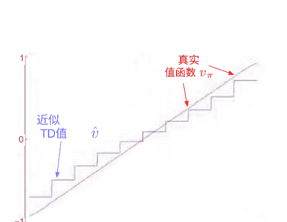

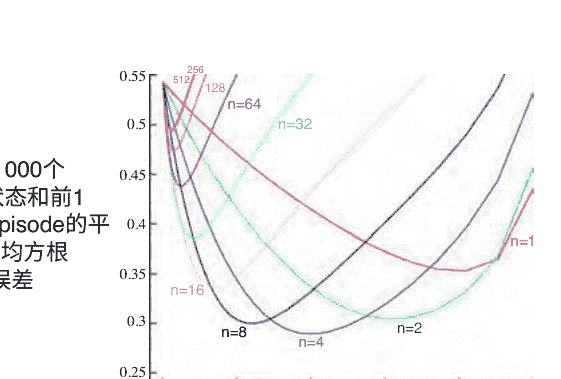

图9.2：在1000个状态的随机行走任务中使用状态聚合的自举方法。左：半梯度TD的渐近值比图9.1中的渐近蒙特卡洛值差。右：使用状态聚合的 $n$ 步方法与表格表示非常相似（参见图7.2）。这些数据是100次运行的平均值。

上面的示例中使用的半梯度n步TD算法是表格n步TD算法在第7章中介绍的半梯度函数逼近的自然扩展。伪代码如下所示。

**用于估计 $\hat{v} \approx v_{\pi}$ 的n步半梯度TD算法**

- 输入：要评估的策略 $\pi$
- 输入：可微分函数 $\hat{v}: \mathcal{S}^+ \times \mathbb{R}^d \rightarrow \mathbb{R}$，其中 $\hat{v}(\text{terminal}, \cdot) = 0$
- 算法参数：步长 $\alpha > 0$，正整数 $n$
- 任意初始化值函数权重 $\mathbf{w}$（例如，$\mathbf{w}=0$）
- 所有存储和访问操作（$S_t$ 和 $R_t$）都可以对其索引取模 $n+1$

循环每个回合：
- 初始化并存储 $S_0 = \text{terminal}$
- $T \leftarrow \infty$
- 循环 $t = 0, 1, 2, \ldots$：
    - 如果 $t < T$，则：
        - 根据 $\pi(\cdot|S_t)$ 采取行动
        - 观察并将下一个奖励存储为 $R_{t+1}$，并将下一个状态存储为 $S_{t+1}$
        - 如果 $S_{t+1}$ 是终止状态，则 $T \leftarrow t+1$
    - $\tau \leftarrow t - n + 1$ （$\tau$ 是正在更新状态估计的时间）
    - 如果 $\tau \geq 0$：
        - $G \leftarrow \sum_{i=\tau+1}^{\min(\tau+n,T)} \gamma^{i-\tau-1} R_i$
        - 如果 $\tau+n < T$，则：$G \leftarrow G + \gamma^n \hat{v}(S_{\tau+n}, \mathbf{w})$ （$G_{\tau:\tau+n}$）
        - $\mathbf{w} \leftarrow \mathbf{w} + \alpha [G - \hat{v}(S_{\tau}, \mathbf{w})] \nabla \hat{v}(S_{\tau}, \mathbf{w})$
- 直到 $\tau = T-1$

该算法的关键方程，类似于 (7.2)，是

$$\mathbf{w}_{t+n} \doteq \mathbf{w}_{t+n-1} + \alpha [G_{t:t+n} - \hat{v}(S_t, \mathbf{w}_{t+n-1})] \nabla \hat{v}(S_t, \mathbf{w}_{t+n-1}), \quad 0 \leq t < T. \quad (9.15)$$

其中，n步回报从 (7.1) 推广到

$$G_{t:t+n} \doteq R_{t+1} + \gamma R_{t+2} + \dots + \gamma^{n-1} R_{t+n} + \gamma^n \hat{v}(S_{t+n}, \mathbf{w}_{t+n-1}), \quad 0 \leq t \leq T-n. \quad (9.16)$$

练习9.1展示表格方法（如本书第一部分所述）是线性函数逼近的特例。特征向量会是什么？

### 9.5 线性方法的特征构造

线性方法很有趣，因为它们具有收敛保证，而且在实践中它们在数据和计算方面都非常高效。这是否成立关键取决于状态如何以特征表示，我们在本大节中进行了调查。选择适合任务的特征是向强化学习系统添加先验领域知识的重要方法。

直观上，特征应该对应于状态空间的方面，其中泛化可能是适当的。例如，如果我们对几何对象进行估值，可能希望为每个可能的形状、颜色、大小或功能设置特征。如果我们对移动机器人的状态进行估值，那么可能希望为位置、剩余电池电量、最近的声纳读数等设置特征。线性形式的一个限制是它不能考虑特征之间的任何相互作用，例如特征 $i$ 的存在只在没有特征 $j$ 时才好。例如，在平衡杆任务（示例3.4）中，高角速度可能是好的或坏的，这取决于角度。如果角度很大，那么高角速度意味着即将摔倒，是一个坏状态；而如果角度很小，那么高角速度意味着杆正在恢复平衡，是一个好状态。线性值函数无法表示这一点，如果它的特征分别编码角度和角速度。相反，它需要特征来表示这两个底层状态维度的组合。在下面的小节中，我们考虑了各种常见的实现方式。

### 9.5.1 多项式

许多问题的状态最初以数字形式表示，例如杆平衡任务（示例3.4）中的位置和速度，杰克的汽车租赁问题（示例4.2）中每个停车场的汽车数量，或者赌徒问题（示例4.3）中的赌徒资本。在这些类型的问题中，强化学习的函数逼近与插值和回归的熟悉任务有很多共同之处。

插值和回归常用的各种特征族也可以用于强化学习。多项式是用于插值和回归的最简单的特征族之一。虽然我们在这里讨论的基本多项式特征在强化学习中效果不如其他类型的特征好，但它们作为一个很好的介绍是因为它们简单而熟悉。

例如，假设一个强化学习问题的状态具有两个数值维度。对于一个代表性的单个状态 $s$，其两个数字为 $s_1 \in \mathbb{R}$ 和 $s_2 \in \mathbb{R}$。你可以选择仅通过其两个状态维度来表示 $s$，使得 $\mathbf{x}(s) = (s_1, s_2)^\top$，但是你将无法考虑任何维度之间的交互。此外，如果 $s_1$ 和 $s_2$ 都为零，那么近似值也必须为零。可以通过用四维特征向量 $\mathbf{x}(s) = (1, s_1, s_2, s_1 s_2)^\top$ 来克服这两个限制。初始的1特征允许在原始状态数字中表示一元函数，而最终的乘积特征 $s_1 s_2$ 使得可以考虑交互作用。

或者你可以选择使用更高维度的特征向量，如 $\mathbf{x}(s) = (1, s_1, s_2, s_1 s_2, s_1^2, s_2^2, s_1^2 s_2, s_1 s_2^2, s_1^2 s_2^2)^\top$ 来考虑更复杂的相互作用。这些特征向量使得状态数的近似可以作为任意二次函数——尽管近似仍然是对权重的线性学习。将这个例子从两个数字推广到k个数字，我们可以表示问题状态维度之间的高度复杂的相互作用：

> 假设每个状态s对应于k个数字，s1, s2, ..., sk，其中每个si属于R。对于这个k维状态空间，每个n阶多项式基函数xi可以写成：
>
> xi(s) = Σ_{j=1}^{k} s^{c_{ji}}，
>
> 其中每个c_{ji}是集合{0, 1, ..., n}中的整数，n为非负整数。这些特征构成了k维空间的n阶多项式基函数。
>
> (n + 1)^k 个不同的特征。

高阶多项式基函数可以更准确地逼近更复杂的函数。但是，由于阶数为n的多项式基函数中特征的数量随着自然状态空间的维度k的增长呈指数增长（如果n > 0），通常需要选择其中的一个子集进行函数逼近。这可以通过对要逼近的函数的性质进行先验信念，并且一些用于多项式回归的自动选择方法可以适应增量和非平稳的强化学习的性质来实现。

练9.2 为什么 (9.17) 定义了(n + 1)^k不同的特征维度 k?

练9.3 什么 n 和 ci,j 生成特征向量 x(s) = (1, s1, s2, s1s2, s1^2, s2^2, s1^2s2, s1s2^2, s1^2s2^2)ᵀ?

### 9.5.2 傅里叶基

另一种线性函数逼近方法基于古老的傅里叶级数，它将周期函数表示为不同频率的正弦和余弦基函数（特征）的加权和。（如果对于所有的x和某个周期τ，函数f满足f(x) = f(x+τ)，则函数f是周期性的。）傅里叶级数和更一般的傅里叶变换在应用科学中被广泛使用，部分原因是如果要逼近的函数已知，那么基函数的权重可以通过简单的公式给出，并且通过足够多的基函数，几乎任何函数都可以被逼近得足够准确。在强化学习中，由于要逼近的函数是未知的，傅里叶基函数具有很大的兴趣，因为它们易于使用并且在各种强化学习问题中表现良好。

首先考虑一维情况。具有周期 τ 的一维函数的通常傅里叶级数表示将函数表示为正弦和余弦函数的线性组合，每个函数的周期均均匀地分割 τ（换句话说，其频率是基本频率1/τ的整数倍）。但是，如果您想要逼近定义在有界区间上的非周期函数，则可以将这些傅里叶基函数与 τ设置为区间的长度一起使用。感兴趣的函数只是正弦和余弦特征的周期线性组合的一个周期。

此外，如果您将 τ 设置为感兴趣区间的长度的两倍，并限制在半区间 [0, τ/2] 上的逼近，则可以仅使用余弦特征。 这是可能的，因为您可以用余弦基函数表示任何偶函数，即关于原点对称的任何函数。 因此，可以使用足够多的余弦特征来尽可能精确地逼近半周期 [0, τ/2] 上的任何函数。 （说“任何函数”并不完全正确，因为函数必须在数学上是良好定义的，但我们在这里忽略了这个技术细节。）或者，也可以仅使用正弦特征，其线性组合始终是奇函数，即关于原点反对称的函数。 但通常最好仅保留余弦特征，因为“半偶”函数往往比“半奇”函数更容易逼近，因为后者在原点处通常是不连续的。 当然，这并不排除同时使用正弦和余弦特征来逼近区间 [0, τ/2] 上的函数，在某些情况下可能更有优势。

按照这个逻辑，并让 τ= 2，使得特征在半区间 [0, 1] 上定义，一维顺序-n 傅里叶余弦基函数由 n+1 个特征组成

x_i(s) = cos(iπs), s ∈ [0, 1],

对于 i = 0, ..., n. 图9.3显示了一维傅里叶余弦特征 xi， 对于 i = 1, 2, 3, 4; x_0是一个常数函数。

图9.3: 用于近似的一维傅里叶余弦基函数 x_i， i=1, 2, 3, 4 函数在区间 [0,1] 上。 根据 Konidaris 等人 (2011) 的研究。

同样的推理适用于多维情况下的傅里叶余弦级数逼近，如下方框中所述。

> 假设每个状态 s 对应于一个向量 k个数字， s=(s_1, s_2, ..., s_k)^T， 其中每个 s_i ∈ [0, 1]。 按顺序的第 i 个特征的傅里叶余弦基可以写成
>
> x_i(s) = cos(π s^T c^i), (9.18)
>
> 其中 c^i=(c^i_1, ..., c^i_k)^T, 对于 j=1, ..., k和 i=0, ..., (n+1)^k, c^i_j ∈ {0, ..., n}。 这为每个可能的整数向量 c^i定义了一个特征，其中i的范围是从1到 (n+1)^k。
>
> 积 s^T c^i 的作用是为 s 的每个维度分配一个整数 {0, ..., n}。与一维情况类似，这个整数决定了特征在该维度上的频率。当然，这些特征可以根据特定应用的有界状态空间进行平移和缩放。

例如，考虑 k=2，其中 c^i = (c_1^i, c_2^i)^T。图9.4显示了六个傅里叶余弦特征的选择，每个特征都由向量 c^i 标记（s1是水平轴，c^i 是一个省略了索引 i 的行向量）。在 c 中的任何零意味着该特征在该状态维度上是常数。因此，如果 c=(0,0)^T，则该特征在两个维度上都是常数；如果 c=(c_1,0)^T，则该特征在第二个维度上是常数，在第一个维度上的变化频率取决于 c_1；类似地，如果 c=(0, c_2)^T，则该特征在第一个维度上是常数，在第二个维度上变化。当 c=(c_1, c_2)^T 且 c_j ≠ 0时，该特征沿着两个维度变化，并表示两个状态变量之间的相互作用。c_1 和 c_2 的值确定了每个维度上的频率，它们的比值给出了相互作用的方向。

图9.4：六个二维傅里叶余弦特征的选择，每个特征都用向量 c^i 标记（s1是水平轴，c^i的索引 i 被省略）。引自 Konidaris 等人（2011）。

当使用傅里叶余弦特征和学习算法（如（9.7）中的半梯度TD(0)或半梯度Sarsa）时，为每个特征使用不同的步长参数可能会有帮助。如果 α 是基本的步长参数，那么 Konidaris、Osentoski 和 Thomas（2011）建议将特征 x_i 的步长参数设置为 α_i = α / √{(c_1^i)^2 + ··· + (c_k^i)^2}（除非每个 c_j^i = 0，否则 α_i = α）。

使用 Sarsa 的傅里叶余弦特征可以产生与几个其他基函数集合相比较好的性能，包括多项式和径向基函数。然而，不出所料，傅里叶特征在处理不连续性时会遇到困难，因为除非包含非常高频率的基函数，否则很难避免在不连续点周围出现“振铃”现象。

在阶数为-n的傅里叶基函数中，特征的数量随状态空间的维度呈指数增长，但如果该维度足够小（例如，k ≤5），则可以选择n，以便使用所有阶数为-n的傅里叶特征。这使得特征的选择几乎是自动的。然而，在高维状态空间中，有必要选择这些特征的子集。可以使用关于要近似的函数性质的先验信念来完成这一点，并且一些自动选择方法可以适应增量和非平稳性的强化学习。在这方面，傅里叶基函数特征的一个优点是可以通过设置c^i向量来考虑状态变量之间的相互作用，并通过限制c^i向量中的值来使近似能够滤除被认为是噪声的高频分量。另一方面，由于傅里叶特征在整个状态空间上非零（除了少数例外），它们表示状态的全局属性，这可能使得找到表示局部属性的好方法变得困难。

图9.5显示了在1000状态随机行走示例中，傅里叶和多项式基础上的学习曲线的比较。一般来说，我们不建议在在线学习中使用多项式。²

图9.5：1000状态随机行走中的傅里叶基础与多项式的比较。显示了使用傅里叶和多项式基础的梯度蒙特卡洛方法的学习曲线，阶数分别为5、10和20。对于每种情况，步长参数都经过了粗略的优化：α=0.0001用于多项式基础，α=0.00005用于傅里叶基础。性能度量（y轴）是均方根误差（9.1）。

> ²还有比我们讨论过的更复杂的多项式族，例如，不同的正交多项式族，这些可能效果更好，但目前在强化学习中对它们的经验很少。

### 9.5.3 粗编码

考虑一个任务，其中状态集的自然表示是一个连续的二维空间。对于这种情况的一种表示是由与状态空间中的圆圈相对应的特征组成，如右图所示。如果状态在圆圈内部，则相应的特征值为1，并且被称为存在；否则特征值为0，并且被称为不存在。这种1-0值特征被称为二进制特征。给定一个状态，存在哪些二进制特征表示状态位于哪些圆圈内，从而粗略编码其位置。使用以这种方式重叠的特征来表示状态（尽管它们不一定是圆圈或二进制）被称为粗编码。

假设线性梯度下降函数的逼近，考虑圆的大小和密度的影响。对应于每个圆的是一个单一的权重（w的一个分量）受学习的影响。如果我们在一个状态下进行训练，空间中的一个点，那么所有与该状态相交的圆的权重都会受到影响。因此，根据（9.8），近似值函数将受到所有圆的联合内部状态的影响，与该状态具有“共同点”的圆越多，影响越大，如图9.6所示。如果圆很小，则泛化距离较短，如图9.7（左），而如果圆很大，则泛化距离较长，如图9.7（中）。特征的形状将决定泛化的性质。例如，如果它们不是严格的圆形，而是在一个方向上被拉长，那么泛化也会受到类似的影响，如图9.7（右侧）所示。

具有大感受野的特征具有广义概括能力，但可能会限制学习函数的精细逼近能力，无法进行比感受野宽度更细微的区分。幸运的是，事实并非如此。从一个点到另一个点的初始概括确实受到感受野的大小和形状的控制，但敏锐度，即最终可能的最细微区分，更多地受到特征的总数的控制。

### 示例9.3：粗编码的粗糙度

这个示例说明了粗编码中感受野大小对学习的影响。基于粗编码和（9.7）的线性函数逼近被用来学习一维方波函数（在图9.8顶部显示）。这个函数的值被用作目标值，$U_{to}$。由于只有一个维度，感受野是区间而不是圆。学习过程中，使用了三种不同大小的区间：窄、中等和宽，如图底部所示。这三种情况下的特征密度都相同，在学习的范围内大约有50个特征。训练样本是均匀随机生成的，覆盖了整个范围。步长参数为 $\alpha = 0.2$。

同时存在的特征数量。图9.8显示了学习过程中三种情况下学到的函数。注意，在学习的早期，特征的宽度对结果有很大影响。使用宽特征时，泛化倾向于更宽；使用窄特征时，只有每个训练点的近邻才会发生变化，导致学到的函数更加崎岖。然而，最终学到的函数受特征宽度的影响仅略微。感受野形状对泛化有很大影响，但对渐近解质量影响较小。

图9.8：特征宽度对初始泛化的影响示例（第一行）和渐近准确性的影响较小（最后一行）

### 9.5.4 平铺编码

瓦片编码是一种用于多维连续空间的粗编码形式，具有灵活性和计算效率。对于现代顺序数字计算机来说，它可能是最实用的特征表示。

在瓦片编码中，特征的感受野被分组成状态空间的分区。每个分区称为一个瓦片，分区的每个元素称为一个瓦片。例如，二维状态空间的最简单瓦片是均匀网格，如图9.9左侧所示。这里的瓦片或感受野是方形的，而不是图9.6中的圆形。如果只使用这个单一的瓦片，那么白点所表示的状态将由其所在的单个特征的瓦片表示；泛化将完全适用于同一瓦片内的所有状态，并且对于瓦片外的状态来说是不存在的。只有一个瓦片，我们将不会有粗编码，而只是一种状态聚合的情况。

图9.9：在有限的二维空间上，多个重叠的网格平铺。这些平铺在每个维度上都有一个统一的偏移量。

要获得粗编码的强度，需要重叠的感受野，而根据定义，划分的平铺不重叠。要使用平铺编码获得真正的粗编码，需要使用多个平铺，每个平铺的偏移量为一个平铺宽度的一部分。图9.9右侧显示了一个简单的情况，其中有四个平铺。每个状态，例如白点所示的状态，都恰好落在四个平铺中的一个。这四个平铺对应于状态发生时激活的四个特征。具体而言，特征向量 x(s)每个平铺中都有一个分量。在这个例子中，有4 × 4 × 4 = 64个分量，除了与 s所在平铺对应的四个分量外，其他分量都为0。图9.10显示了在1000个状态的随机行走示例中，多个偏移平铺（粗编码）相对于单个平铺的优势。

瓦片编码的一个即时实际优势是，因为它与分区一起工作，任何状态下活动的特征总数都是相同的。每个瓦片中只有一个特征存在，因此存在的特征总数始终与瓦片的数量相同。这使得步长参数 α 可以以一种简单直观的方式设置。例如，选择 $\alpha = \frac{1}{n}$，其中 n是数字。平铺的结果是精确的一次性学习。如果例子 $s \rightarrow v$ 被训练了，那么无论先前的估计值 $\hat{v}(s, \mathbf{w}_t)$ 是什么，新的估计值将会是 $\hat{v}(s, \mathbf{w}_{t+1}) = v$。通常情况下，人们希望变化比这个慢一些，以便允许泛化和目标输出的随机变化。例如，可以选择 $\alpha = \frac{1}{10n}$，这种情况下，训练状态的估计值将在一次更新中向目标移动十分之一的距离，而相邻状态将会移动得更少，与它们共享的砖块数量成比例。

平铺编码还从其使用二进制特征向量中获得计算优势。因为每个组件要么是0要么是1，构成近似值函数 (9.8) 的加权和几乎是微不足道的计算。与其执行 $d$ 次乘法和加法，我们只需计算活跃特征的 $n \ll d$ 索引，然后将权重向量的相应分量相加。

如果这些状态落在相同的瓦片中，那么除了训练过的状态之外，泛化也会发生在其他状态上，且与相同瓦片中的瓦片数量成比例。甚至选择如何将瓦片相互偏移也会影响泛化。如果它们在每个维度上均匀偏移，就像图9.9中那样，那么不同的状态可以以不同的方式进行泛化，如图9.11的上半部分所示。八个子图显示了从训练状态到附近点的泛化模式。在这个例子中，有八个瓦片，因此在一个瓦片中有64个明显不同的子区域进行泛化，但都遵循这八种模式之一。请注意，均匀偏移会导致许多模式在对角线上产生强烈的效果。如果瓦片不对称地偏移，就可以避免这些伪影，如图中的下半部分所示。这些较低的泛化模式更好，因为它们都以训练状态为中心，没有明显的不对称性。

图9.11：为什么在平铺编码中更喜欢使用不对称偏移。显示了从训练状态（用小黑加号表示）到附近状态的泛化强度，对于八个平铺的情况。如果平铺是均匀偏移的（上图），则存在对角线伪影和泛化的显著变化，而使用非对称偏移平铺时，泛化更加球形和均匀。

在所有情况下，平铺在每个维度上都相对于彼此偏移了一个瓷砖宽度的一部分。如果 $w$ 表示瓷砖宽度， $n$ 表示平铺的数量，则 $w/n$ 是一个基本单位。在边长为 $w/n$ 的小正方形中，所有状态激活相同的瓷砖，具有相同的特征表示和近似值。如果状态在任何笛卡尔方向上移动了 $w/n$，则特征表示会改变一个组件/瓷砖。

均匀偏移平铺彼此之间恰好相差这个单位距离。对于二维空间，我们说每个平铺都通过位移向量（1, 1）偏移，意味着它相对于前一个平铺通过这个向量的两倍偏移。用这些术语来说，图9.11下部显示的非对称偏移平铺通过位移向量（1, 3）偏移。

> 对不同位移向量对平铺编码的泛化效果进行了广泛研究（Fukumizu和Fukumizu，1991；An，1991；An，Miller和Paredes，1991；Miller，An和Goles，1991），评估了它们的均匀性和伪角线伪影的强度。虽然（1, 1）位移向量具有所有的属性，基于该项工作，Miller和Goles（1996）建议使用由第一个奇数组成的位移向量，特别是对于维度相对较低的空间，一个好的选择是使用第一个奇数（1, 3, 5, 7, ... , 2n-1）来设置为小于或等于4n-2的整数乘数。这就是我们用来生成图9.11下半部分的方法，其中n=2（平铺的数量）= 8，位移向量为（1, 3）。在三维情况下，前三个奇数乘以基本单位总共偏移（0, 0, 0），（1, 3, 5），（2, 6, 10）和（3, 9, 15），可以轻松地获得能够提高性能的开源软件。

在选择平铺策略时，需要选择平铺的数量和平铺的形状。平铺的数量和平铺的大小决定了渐近逼近的分辨率或精细度，就像一般的粗编码和图9.8中所示的那样。平铺的形状将决定泛化的性质，就像图9.7中所示的那样。方形平铺在每个维度上的泛化大致相等，如图9.11（下）所示。沿着一个维度拉长的平铺，例如图9.12（中）中的条纹平铺，将促进沿着该维度的泛化。图9.12（中）中的平铺也在左侧更密集更细，促进了沿着水平维度的较低值的区分。图9.12（右）中的对角条纹平铺将促进沿着一个对角线的泛化。在更高的维度中，轴对齐的条纹对应于在一些平铺中忽略一些维度，即超平面切片。如图9.12（左）所示，也可以使用不规则的平铺，尽管在实践中很少见，并且超出了标准软件的范围。

实际上，通常希望在不同的铺砖中使用不同形状的瓷砖。例如，可以使用一些垂直条纹的铺砖和一些水平条纹的铺砖。这将促进沿任一维度的泛化。然而，仅仅使用条纹铺砖是不可能学习到特定的水平和垂直坐标的独特值（无论学习到的是什么，都会渗入具有相同水平和垂直坐标的状态）。为此，需要使用如图9.9所示的连结矩形瓷砖。通过多个铺砖--一些水平的，一些垂直的，一些连结的--可以得到一切：对每个维度的泛化偏好，同时能够学习到特定的连结值（参见Sutton，1996年的例子)。平铺的选择决定了泛化，直到这个选择能够有效地自动化之前，平铺编码使得选择能够灵活地、符合人们的意义地进行。

减少内存需求的另一个有用技巧是哈希——将大型平铺一致伪随机地折叠成一个更小的平铺集合。哈希产生由非连续、不相交的区域组成的平铺，这些区域随机分布在状态空间中，但仍然形成了一个详尽的划分。例如，一个平铺可能由右侧显示的四个子平铺组成。通过哈希，内存需求通常可以大幅减少，而性能损失很小。这是可能的，因为只有在状态空间的一小部分中才需要高分辨率。哈希使我们摆脱了维度诅咒，因为内存需求不需要指数级增长，而只需要满足任务的实际需求。开源的平铺编码实现通常包括高效的哈希算法。


- 练习9.4 假设我们相信两个状态维度中的一个更有可能对值函数产生影响，而不是另一个维度，那么应该主要在这个维度上进行泛化，而不是沿着这个维度进行泛化。可以使用什么样的平铺来利用这个先验知识？

## 9.5.5 径向基函数

径向基函数（RBF）是对连续值特征的粗编码的自然推广。与其说每个特征要么是0要么是1，不如说它可以是区间[0,1]中的任何值，反映出特征的存在程度。典型的RBF特征，\(x_i\)，具有高斯（钟形）响应 \(x_i(s)\)，仅取决于状态 \(s\) 与特征的原型或中心状态 \(c_i\) 之间的距离，相对于特征的宽度 \(w_i\)：

$$x_i(s) \doteq \exp\left(- \frac{\|s - c_i\|^2}{2\sigma_i^2}\right).$$

当然，规范或距离度量可以根据状态和任务的需要选择。下面的图示展示了一个一维的例子，使用欧几里得距离度量。

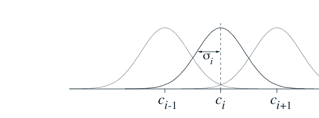

与二进制特征相比，RBF的主要优势在于它们产生的近似函数变化平滑且可微。尽管这很有吸引力，但在大多数情况下并没有实际意义。尽管如此，在瓷砖编码的背景下，对于诸如RBF的分级响应函数进行了广泛的研究（An, 1991; Miller et al., 1991; An et al., 1991; Lane, Handelman and Gelfand, 1992）。所有这些方法都需要大量的额外计算复杂性（超过瓷砖编码），并且在存在两个以上状态维度时通常会降低性能。在高维空间中，瓷砖的边缘更加重要，而且很难获得控制良好的瓷砖激活函数。

一个RBF网络是一个使用RBF作为特征的线性函数逼近器。学习被方程(9.7)和(9.8)定义，与其他线性函数逼近器完全相同。此外，一些RBF网络的学习方法也会改变特征的中心和宽度，使其进入非线性函数逼近器的领域。非线性方法可能能够更精确地拟合目标函数。RBF网络的缺点，尤其是非线性RBF网络，是更大的计算复杂性，通常需要更多的手动调整才能实现稳健和高效的学习。

### 9.6 手动选择步长参数

大多数SGD方法需要设计者选择适当的步长参数 α。理想情况下，这个选择应该是自动化的，在某些情况下已经实现了，但对于大多数情况，手动设置仍然是常见做法。为了做到这一点，并更好地理解算法，开发一些直观的步长参数的作用是很有用的。我们能否总体上说它应该如何设置？

理论考虑很不幸地没有什么帮助。随机逼近理论给出了条件（2.7），这些条件是一个缓慢递减的步长序列的充分条件，可以保证收敛，但这往往导致学习速度过慢。经典选择 α=1/t 的样本平均值在表格MC方法中是合适的，但对于TD方法、非平稳问题或使用函数逼近的任何方法来说都不合适。对于线性方法，有递归最小二乘法可以设置最优矩阵步长，并且这些方法可以扩展到时序差分学习，如第9.8节中描述的LSTD方法，但这需要O(d^2)个步长参数，或者比我们正在学习的参数多 d 倍。因此，我们排除了在需要函数逼近的大问题上使用它们的可能性。

为了对如何手动设置步长参数有一些直观的感觉，最好暂时回到表格情况。在那里，我们可以理解，在 α=1 的情况下，经过一个目标后，样本误差将完全消除（参见（2.4）中的步长为1）。如第201页所讨论的，我们通常希望学习速度比这慢。在表格情况下，步长 α=1/τ 大约需要10次经验才能收敛到平均目标值，如果我们想在100次经验中学习，我们会使用 α=1/100。一般来说，如果 α=1/τ，那么对于一个状态的表格估计将接近于其目标的平均值，最近的目标具有最大的影响，在大约 τ 次与该状态的经验之后。

对于一般的函数逼近，没有一个明确的与状态相关的经验次数的概念，因为每个状态可能与其他所有状态在不同程度上相似或不相似。然而，在线性函数逼近的情况下，存在一个类似的规则，可以产生类似的行为。假设你想在大约 τ 次经验中学习，其中特征向量基本相同。线性SGD方法设置步长参数的一个好的经验法则是

$$\alpha \doteq (\tau \mathbb{E}[\mathbf{x}^\top \mathbf{x}])^{-1} \tag{9.19}$$

其中 \(\mathbf{x}\) 是从与输入向量相同分布中选择的随机特征向量将在SGD中使用。如果特征向量的长度变化不大，则此方法效果最佳；理想情况下，\(\mathbf{x}^\top \mathbf{x}\) 是一个常数。

练习9.5 假设您正在使用瓦片编码将一个七维连续状态空间转换为二进制特征向量，以估计状态值函数 \(\hat{v}(s, \mathbf{w}) \approx v_\pi(s)\)。您认为各个维度之间的相互作用不强，因此决定分别对每个维度使用八个瓦片（条纹瓦片），总共使用 \(7 \times 8 = 56\) 个瓦片。此外，如果维度之间存在一些成对的相互作用，您还会对所有 \(\binom{7}{2} = 21\) 对维度进行配对，并使用矩形瓦片对每对维度进行共同瓦片化。对于每对维度，您会创建两个瓦片，总共创建 \(21 \times 2 + 56 = 98\) 个瓦片。鉴于这些特征向量，你怀疑你仍然需要平均一些噪音，所以你决定希望学习是逐渐的，在相同特征向量的情况下进行大约10次演示，学习接近渐近值。你应该使用什么步长参数 \(\alpha\)？为什么？

### 9.7 非线性函数逼近：人工神经网络

人工神经网络（ANNs）广泛用于非线性函数逼近。ANN是由相互连接的单元组成的网络，具有神经元的一些特性，是神经系统的主要组成部分。ANN具有悠久的历史，最新的深度层次ANN（深度学习）的训练进展，为机器学习系统的一些最令人印象深刻的能力，包括强化学习系统，负有责任。在第16章中，我们描述了几个令人印象深刻的使用ANN函数逼近的强化学习系统的例子。

图9.14显示了一个通用的前馈ANN，意味着网络中没有循环，即网络内部没有路径可以影响单元的输出。图中的网络具有由两个输出单元组成的输出层，四个输入单元的输入层，以及两个“隐藏层”：既不是输入也不是输出层的层。每个连接都有一个实值权重关联。权重大致对应于真实神经网络中突触连接的功效（参见第15.1节）。如果一个ANN的连接中至少有一个循环，那么它就是一个循环ANN，而不是前馈ANN。尽管前馈和循环ANN都被用于强化学习，但在这里我们只研究更简单的前馈情况。

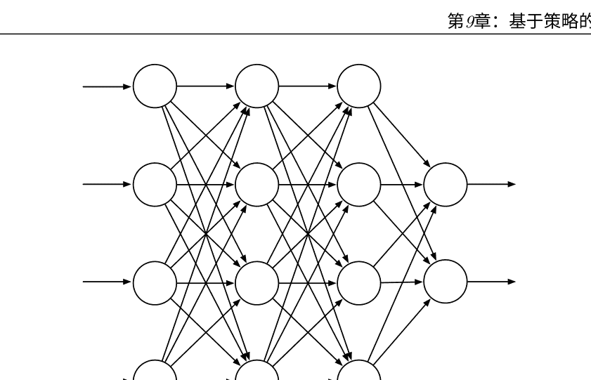

图9.14：具有四个输入单元、两个输出单元和两个隐藏层的通用前馈ANN。

单元（图9.14中的圆圈）通常是半线性单元，意味着它们计算其输入信号的加权和，然后应用非线性函数（称为激活函数）来产生单元的输出或激活。

使用不同的激活函数，但通常使用S形函数或Sigmoid函数，如逻辑函数 $f(x) = 1/(1 + e^{-x})$，有时也会使用修正线性非线性 $f(x) = \max(0, x)$。像 $f(x) = 1$ if $x > \theta$，否则为0的阶跃函数，会产生具有阈值 $\theta$的二进制单元。网络输入层的单元在某种程度上与众不同，其激活值设置为外部提供的值，这些值是网络近似的函数的输入。

前馈神经网络的每个输出单元的激活是网络输入单元的激活模式的非线性函数。这些函数由网络的连接权重参数化。没有隐藏层的神经网络只能表示可能的输入输出函数的一小部分。然而，具有足够多的sigmoid单元的单隐藏层神经网络可以以任意精度逼近网络输入空间的紧凑区域上的任何连续函数（Cybenko，1989年）。对于满足一定条件的其他非线性激活函数也是如此，但非线性是必要的：如果多层前馈神经网络的所有单元都具有线性激活函数，则整个网络等效于没有隐藏层的网络（因为线性函数的线性函数本身是线性的）。

尽管具有单隐藏层的人工神经网络具有“通用逼近”属性，但经验和理论表明，近似许多人工智能任务所需的复杂函数更容易，甚至可能需要由许多层次的较低层次抽象组成的层次组合，即由具有许多隐藏层的人工神经网络产生的抽象。（有关详细评论，请参见Bengio，2009年。）深度神经网络的连续层计算越来越多的功能网络的“原始”输入的抽象表示，每个单元提供一个特征，为整体输入输出函数的分层表示做出贡献。

因此，训练ANN的隐藏层是一种自动创建适用于给定问题的特征的方法，以便可以生成分层表示，而不仅仅依赖于手工制作的特征。这一直是人工智能的一个持久挑战，也解释了为什么多年来对具有隐藏层的ANN的学习算法受到如此多的关注。ANN通常通过随机梯度方法（第9.3节）进行学习。每个权重都会根据一个目标函数来调整，该目标函数旨在改善网络的整体性能，该性能由一个要么最小化要么最大化的目标函数来衡量。在最常见的监督学习情况下，目标函数是一组带标签的训练样例的预期误差或损失。在强化学习中，ANN可以使用TD误差来学习价值函数，或者可以像梯度赌博机（第2.8节）或策略梯度算法（第13章）那样旨在最大化预期奖励。在所有这些情况下，有必要估计每个连接权重的变化如何影响网络的整体性能，换句话说，估计目标函数相对于每个权重的偏导数，给定网络的所有权重的当前值。梯度是这些偏导数的向量。

对于具有隐藏层的人工神经网络（假设单元具有可微的激活函数），最成功的方法是反向传播算法，该算法由网络的前向和后向传递交替进行。每次前向传递计算网络输入单元的当前激活状态下每个单元的激活值。在每次前向传递之后，后向传递高效地计算每个权重的偏导数。（与其他随机梯度学习算法一样，这些偏导数的向量是真实梯度的估计值。）在第15.10节中，我们讨论了使用强化学习原理而不是反向传播来训练具有隐藏层的人工神经网络的方法。这些方法比反向传播算法效率低，但它们可能更接近真实神经网络的学习方式。

反向传播算法对于具有1或2个隐藏层的浅层网络可以产生良好的结果，但对于更深的人工神经网络可能效果不佳。实际上，训练具有k+1个隐藏层的网络可能导致性能比训练具有k个隐藏层的网络更差，尽管更深的网络可以表示浅层网络可以表示的所有函数（Bengio，2009）。解释这样的结果并不容易，但有几个因素很重要。首先，典型深度人工神经网络中的大量权重使得很难避免过拟合问题，即在网络未经过训练的情况下无法正确泛化到其他情况。其次，反向传播对于深度人工神经网络效果不佳，因为其后向传递计算的偏导数要么迅速衰减到网络的输入端，使得深层学习非常缓慢，要么偏导数迅速增长到网络的输入端，使得学习不稳定。处理这些问题的方法在很大程度上解释了使用深度人工神经网络的系统取得的许多令人印象深刻的最近结果。

过拟合是任何调整函数的函数逼近方法的问题，基于有限的训练数据，具有许多自由度的函数存在问题。对于不依赖于有限训练集的在线强化学习来说，过拟合不是一个问题，但是有效地泛化仍然是一个重要问题。过拟合是神经网络的一个问题，尤其是对于深度神经网络来说，因为它们往往具有非常大的权重数量。已经开发了许多方法来减少过拟合。这些方法包括在验证数据与训练数据不同（交叉验证）时停止训练，修改目标函数以减少逼近的复杂性（正则化），并引入权重之间的依赖关系以减少自由度的数量（例如，权重共享）。

一种特别有效的减少深度神经网络过拟合的方法是由Srivastava、Hinton、Krizhevsky、Sutskever和Salakhutdinov（2014）引入的dropout方法。在训练过程中，单位和它们的连接会被随机地从网络中移除（dropout）。这可以被看作是训练大量的“稀疏”网络。在测试时，将这些稀疏网络的结果组合起来是一种提高泛化性能的方法。 dropout方法通过将单位的每个输出权重乘以该单位在训练过程中被保留的概率来高效地逼近这种组合。Srivastava等人发现，这种方法显著提高了泛化性能。它鼓励隐藏单元学习与其他特征的随机集合相匹配的特征。这增加了隐藏单元形成的特征的多样性，使网络不会过度专门化于罕见情况。

Hinton、Osindero和Teh（2006）在他们与深度置信网络的工作中，对解决深度人工神经网络的训练问题迈出了重要的一步，这些网络与此处讨论的深度人工神经网络密切相关。在他们的方法中，最深层的网络逐层使用无监督学习算法进行训练。无监督学习不依赖于整体目标函数，可以提取捕捉输入流统计规律的特征。首先训练最深层，然后使用该训练层提供的输入，训练下一个最深层，以此类推，直到所有或大部分网络层的权重被设置为现在作为监督学习的初始值的值。然后，通过反向传播算法对整体目标函数进行微调。研究表明，与使用随机值初始化权重的反向传播相比，这种方法通常效果更好。

使用这种方式初始化的网络训练后表现更好可能是由于许多因素，但一个想法是这种方法将网络置于一个权重空间的区域，从中梯度算法可以取得良好的进展。

批量归一化（Ioffe和Szegedy，2015）是另一种使得训练深度人工神经网络更容易的技术。长期以来已经知道，如果网络输入被归一化，例如通过调整每个输入变量使其具有零均值和单位方差，那么人工神经网络的学习会更容易。用于训练深度人工神经网络的批量归一化在将深层的输出传递给下一层之前对其进行归一化处理。Ioffe和Szegedy（2015）使用训练样本的子集或“小批量”的统计数据来对这些层间信号进行归一化，以提高深度人工神经网络的学习速度。

训练深度人工神经网络的另一种有用技术是深度残差学习(He，Zhang，Ren和Sun，2016)。有时候学习一个函数与其他函数的不同更容易比学习函数本身更容易学习身份函数。然后将这个差异或残差函数添加到输入中，产生所需的函数。在深度人工神经网络中，通过在块周围添加快捷连接或跳跃连接，可以使一组层学习残差函数。这些连接将输入添加到块的输出中，不需要额外的权重。He等人（2016）在具有跳跃连接的深度卷积网络上评估了这种方法，在基准图像分类任务中发现与没有跳跃连接的网络相比有显著改进。批量归一化和深度残差学习都被应用于我们在第16章中描述的围棋强化学习应用中。

一种被证明在应用中非常成功的深度人工神经网络类型是深度卷积网络，包括令人印象深刻的强化学习应用（第16章）。这种类型的网络专门用于处理以空间数组形式排列的高维数据，例如图像。它受到了大脑早期视觉处理方式的启发（LeCun，Bottou，Bengio和Haffner，1998）。由于其特殊的架构，深度卷积网络可以通过反向传播进行训练，而无需采用上述训练深层的方法。

图9.15展示了深度卷积网络的架构。这个例子，来自LeCun等人（1998），旨在识别手写字符。它由交替的卷积和子采样层组成，然后是几个完全连接的最终层。每个卷积层产生一定数量的特征图。特征图是一个在单元数组上的活动模式，每个单元对其感受野中的数据执行相同的操作，感受野是它从前一层（或从外部输入，对于第一个卷积层）“看到”的数据的一部分。

特征图的单元彼此相同，只是它们的感受野大小和形状相同，在传入数据的数组上的不同位置上进行移动。同一特征图中的单元共享相同的权重。这意味着无论特征在输入数组中的位置如何，特征图都可以检测到相同的特征。例如，在图9.15的网络中，第一个卷积层产生6个特征图，每个特征图由28 ×28个单元组成。每个特征图中的每个单元具有5 ×5的感受野，这些感受野重叠（在这种情况下，重叠了四列和四行）

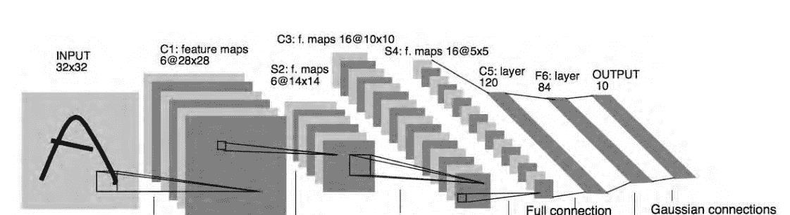

图9.15：深度卷积网络。在IEEE的《基于梯度的学习应用于文档识别》一文中获得许可再版，作者为LeCun、Bottou、Bengio和Haffner，1998年第86卷；许可通过版权清理中心公司传达。

因此，每个6个特征图仅由25个可调节权重来指定。深度卷积网络的子采样层减小了特征图的空间分辨率。子采样层中的每个特征图由前面卷积层的特征图中的单元进行平均，每个特征图由一个单元组成，该单元覆盖了一个接收域中的单元。

例如，图9.15网络的第一个子采样层中的每个特征图中的每个单元都对第一个卷积层产生的特征图中的一个2×2非重叠接收域进行平均，从而得到六个14×14特征图。子采样层减小了网络对检测到的特征的空间位置的敏感性，也就是说，它们有助于使网络的响应在空间上具有不变性。

这是有用的，因为在图像的一个地方检测到的特征很可能在其他地方也有用。

人工神经网络的设计和训练的进展——我们只提到了一些——都对强化学习有所贡献。尽管当前的强化学习理论主要局限于使用表格或线性函数逼近方法，但值得注意的强化学习应用的出色性能很大程度上归功于多层人工神经网络的非线性函数逼近。我们在第16章中讨论了其中几个应用。

### 9.8 最小二乘TD

到目前为止，在本章中我们讨论的所有方法都需要与参数数量成比例的计算量。然而，通过增加计算量，可以取得更好的效果。在本节中，我们介绍了一种线性函数逼近的方法，可以说这是针对这种情况最好的方法。

正如我们在第9.4节中所确定的，使用线性函数逼近的TD(0)在渐近情况下（适当减小步长）收敛到TD固定点：

$$\mathbf{w}_{TD} = \mathbf{A}^{-1}\mathbf{b}$$

其中

$$\mathbf{A} \doteq \mathbb{E}\left[\mathbf{x}_t(\mathbf{x}_t - \gamma\mathbf{x}_{t+1})^\top\right] \quad \text{并且} \quad \mathbf{b} \doteq \mathbb{E}\left[R_{t+1}\mathbf{x}_t\right]$$

为什么，有人可能会问，我们必须迭代地计算这个解决方案？这样做会浪费数据！难道不能通过计算A和b的估计值，然后直接计算TD固定点来做得更好吗？最小二乘TD算法，通常称为LSTD，就是这样做的。它形成了自然的估计值

$$\hat{\mathbf{A}}_t \doteq \sum_{k=0}^{t-1} \mathbf{x}_k(\mathbf{x}_k - \gamma\mathbf{x}_{k+1})^\top + \varepsilon\mathbf{I} \quad \text{并且} \quad \hat{\mathbf{b}}_t \doteq \sum_{k=0}^{t-1} R_{k+1}\mathbf{x}_k \tag{9.20}$$然而，当LSTD使用这些估计来估计TD固定点时，额外的 $t$ 因素会相互抵消

$$\mathbf{w}_t \doteq \widehat{\mathbf{A}}_t^{-1} \widehat{\mathbf{b}}_t.$$

(9.21)

这个算法是线性TD(0)最高效的数据形式，但在计算上也更加昂贵。回想一下，半梯度TD(0)需要内存和每步计算，其复杂度仅为 $O(d)$。

LSTD有多复杂？从上面的描述来看，复杂度似乎随着增加 $t$，但是(9.20)中的两个近似可以使用我们之前介绍的技术（例如，在第2章中）逐步实现，以便每步可以在常数时间内完成。即使如此，$\widehat{\mathbf{A}}_t$ 的更新将涉及外积（列向量乘以行向量），因此将是一个矩阵更新；其计算复杂度将为 $O(d^2)$，当然，为了保存 $\widehat{\mathbf{A}}_t$ 矩阵所需的内存将为 $O(d^2)$。

一个潜在的更大问题是我们最终计算（9.21）使用了逆矩阵 $\widehat{\mathbf{A}}_t$ 的计算复杂度是 $O(d^3)$。
幸运的是，我们特殊形式的矩阵的逆矩阵——外积之和——也可以通过增量更新，只需要 $O(d^2)$ 次计算，如

$$\begin{aligned}
\widehat{\mathbf{A}}_t^{-1} &= \left( \widehat{\mathbf{A}}_{t-1} + \mathbf{x}_t(\mathbf{x}_t - \gamma \mathbf{x}_{t+1})^{\top} \right)^{-1} \quad \text{(来自 (9.20))}\\
&= \widehat{\mathbf{A}}_{t-1}^{-1} - \frac{\widehat{\mathbf{A}}_{t-1}^{-1} \mathbf{x}_t(\mathbf{x}_t - \gamma \mathbf{x}_{t+1})^{\top} \widehat{\mathbf{A}}_{t-1}^{-1}}{1 + (\mathbf{x}_t - \gamma \mathbf{x}_{t+1})^{\top} \widehat{\mathbf{A}}_{t-1}^{-1} \mathbf{x}_t},
\end{aligned}$$

(9.22)

对于 $t > 0$，有 $\widehat{\mathbf{A}}_0 = \varepsilon \mathbf{I}$。尽管恒等式 (9.22)，也被称为 Sherman-Morrison 公式，表面上看起来很复杂，但它只涉及向量-矩阵和向量-向量的乘法，因此只有 $O(d^2)$ 的复杂度。因此，我们可以存储逆矩阵 $\widehat{\mathbf{A}}_{0}^{-1}$，并使用 (9.22) 来维护它，然后在 (9.21) 中使用它，所有这些只需要 $O(d^2)$ 的内存和每步计算。完整的算法在下一页的方框中给出。

当然，$O(d^2)$ 的计算成本仍然比半梯度 TD 的 $O(d)$ 要高得多。LSTD 的数据效率是否值得这样的计算开销取决于 $d$ 的大小、学习速度的重要性以及系统其他部分的开销。LSTD 不需要步长参数的事实有时被吹捧，但这个优势可能被夸大了。LSTD 不需要步长参数，但它需要 “$\varepsilon$”。如果选择的 “$\varepsilon$” 太小，逆矩阵的序列可能会变化很大，如果选择的 “$\varepsilon$” 太大，则会减慢学习速度。此外，LSTD 缺乏步长参数意味着它永远不会忘记。这在某些情况下是可取的，但在强化学习和 GPI 中，如果目标策略 $\pi$ 发生变化，这就成为了一个问题。在控制应用中，通常需要将 LSTD 与其他机制结合起来引入遗忘，从而抵消了不需要步长参数的初始优势。

### 用于估计 $\hat{v}$ 的 LSTD 算法版本

输入: 特征表示 $\mathbf{x}: \mathcal{S}^+ \rightarrow \mathbb{R}^d$, 其中 $\mathbf{x}(\text{terminal}) = \mathbf{0}$。算法参数: $\varepsilon > 0$
$\widehat{\mathbf{A}}^{-1} \leftarrow \varepsilon^{-1} \mathbf{I}$
$\hat{\mathbf{b}} \leftarrow \mathbf{0}$
循环（每个回合）: 初始化 $S$ 和 $\mathbf{x} = \mathbf{x}(S)$。
循环（每个回合的每个步骤）:
  选择并执行动作 $A \sim \pi(\cdot|S)$, 观察 $R$, $S'$ 和 $\mathbf{x}'$
  $\mathbf{v} \leftarrow \widehat{\mathbf{A}}^{-1} (\mathbf{x} - \gamma \mathbf{x}')$
  $\widehat{\mathbf{A}}^{-1} \leftarrow \widehat{\mathbf{A}}^{-1} - \frac{\widehat{\mathbf{A}}^{-1} \mathbf{x} \mathbf{v}^\top}{1 + \mathbf{v}^\top \mathbf{x}}$
  $\hat{\mathbf{b}} \leftarrow \hat{\mathbf{b}} + R \mathbf{x}$
  $\mathbf{w} \leftarrow \widehat{\mathbf{A}}^{-1} \hat{\mathbf{b}}$
  $S \leftarrow S'$; $\mathbf{x} \leftarrow \mathbf{x}'$
直到 $S'$ 是终止状态

### 9.9 基于记忆的函数逼近

到目前为止，我们已经讨论了逼近值函数的参数化方法。 在这种方法中，学习算法调整一个函数形式的参数，以便在整个问题的状态空间上逼近值函数。每次更新，$s \rightarrow g$，是学习算法用来改变参数的训练样本，目的是减小逼近误差。 更新之后，训练样本可以被丢弃（尽管可能会保存以便再次使用）。 当需要一个状态的近似值（我们称之为查询状态）时，函数只需使用学习算法产生的最新参数在该状态处进行评估。

基于内存的函数逼近方法非常不同。 它们只是在接收到训练样本时将其保存在内存中（或者至少保存一部分样本），而不更新任何参数。 然后，每当需要查询状态的值估计时，从内存中检索一组样本，并用它们计算查询状态的值估计。 这种方法有时被称为惰性学习，因为处理训练样本被推迟到系统被查询以提供输出时。

基于记忆的函数逼近方法是非参数方法的典型例子。 与参数方法不同，逼近函数的形式不限于固定的参数化函数类，如线性函数或多项式函数，而是由训练样本本身决定，再加上一些方法来将它们组合起来输出查询状态的估计值。 随着更多的训练样本积累在内存中，人们期望非参数方法能够越来越准确地逼近任何目标函数。

根据存储的训练样本的选择方式和用于响应查询的方式，有许多不同的基于记忆的方法。在这里，我们专注于仅在当前查询状态的邻域中局部逼近值函数的局部学习方法。这些方法从内存中检索一组被判断为与查询状态最相关的训练样本，其中相关性通常取决于状态之间的距离：训练样本的状态与查询状态越接近，被认为越相关，而距离可以用许多不同的方式定义。在给定一个值后，局部逼近被丢弃。

基于记忆的方法中，最简单的例子是最近邻方法，它简单地找到记忆中与查询状态最接近的示例，并将该示例的值作为查询状态的近似值返回。换句话说，如果查询状态是 $s$，而 $s'$ 是记忆中最接近 $s$ 的状态的示例，则将 $g$ 作为 $s$ 的近似值返回。稍微复杂一些的是加权平均方法，它检索一组最近邻示例并返回它们目标值的加权平均值，其中权重通常随着它们的状态与查询状态之间的距离增加而减小。局部加权回归类似，但它通过参数化逼近方法对一组最近状态的值进行拟合，该方法通过最小化加权误差度量（如(9.1)）来确定权重，其中权重取决于与查询状态的距离。返回的值是在查询状态处局部拟合曲面的评估值，之后局部逼近曲面被丢弃。

作为非参数化方法，基于记忆的方法相比参数化方法具有优势，不限制近似为预先指定的函数形式。这使得随着更多数据的积累，准确性得以提高。基于记忆的局部逼近方法具有其他特性，使其非常适合强化学习。

由于轨迹采样在强化学习中非常重要，如第8.6节所讨论的，基于记忆的局部方法可以将函数逼近集中在真实或模拟轨迹中访问的状态（或状态-动作对）的局部邻域上。因为状态空间的许多区域可能永远不会（或几乎不会）被到达，所以可能没有必要进行全局逼近。此外，基于记忆的方法允许一个代理的经验对当前状态附近的值估计产生相对即时的影响，与参数化方法需要逐步调整全局逼近的参数的需求形成对比。

避免全局逼近也是解决维度灾难的一种方式。例如，对于一个具有 $k$ 维度的状态空间，存储全局近似的表格方法需要指数级的内存 $k$。另一方面，对于基于内存的方法存储示例，每个示例需要与 $k$ 成比例的内存，并且存储，比如 $n$ 个示例所需的内存与 $n$ 成线性关系。没有任何指数级的 $k$ 或 $n$。当然，关键的剩余问题是基于内存的方法是否能够快速回答查询，以对代理有用。相关的问题是随着内存大小的增长，速度如何下降。在大型数据库中查找最近邻居可能需要太长时间，在许多应用中不实用。

基于内存的方法的支持者已经开发了加速最近邻搜索的方法。使用并行计算机或专用硬件是一种方法；另一种方法是使用特殊的多维数据结构来存储训练数据。

用于此应用的一种研究数据结构是 $k$-d 树（简称 $k$ 维树），它将 $k$ 维空间递归地分割为以节点形式排列的区域的二叉树。根据数据量和其在状态空间中的分布情况，使用 $k$-d 树进行最近邻搜索可以快速消除大区域的空间，从而使搜索在一些问题中变得可行，而朴素搜索则需要太长时间。

局部加权回归还需要快速计算局部回归的方法，这些方法需要重复执行以回答每个查询。研究人员已经开发出许多方法来解决这些问题，包括忘记条目的方法，以保持数据库的大小在可控范围内。本章末尾的文献和历史评论部分指出了一些相关的文献，包括一些描述基于记忆的学习应用于强化学习的论文选择。

### 9.10 基于核的函数逼近

基于记忆的方法，如加权平均和局部加权回归方法，依赖于对数据库中的示例 $s' \rightarrow g$ 的权重分配，这取决于 $s'$ 和查询状态 $s$ 之间的距离。分配这些权重的函数称为核函数，或简称为核。例如，在加权平均和局部加权回归方法中，核函数 $k:\mathbb{R} \rightarrow \mathbb{R}$ 分配了状态之间的距离的权重。更一般地说，权重不一定要依赖于距离；它们可以依赖于状态之间的其他相似度度量。在这种情况下，$k:\mathcal{S} \times \mathcal{S} \rightarrow \mathbb{R}$，所以 $k(s, s')$ 是关于 $s'$ 对于回答关于 $s$ 的查询的影响所给出的权重。

从稍微不同的角度来看，$k(s, s')$ 是从初始状态到状态 $s$ 的泛化强度的度量。核函数数值上表达了任意状态与其他状态之间的相关性知识的程度。以图9.11中的瓦片编码的泛化强度为例，对应于由均匀和非对称的瓦片偏移产生的不同核函数。尽管瓦片编码在操作中并没有明确使用核函数，但它根据核函数进行泛化。实际上，正如我们在下面讨论的那样，线性参数函数逼近所产生的泛化强度总是可以用核函数来描述。

核回归是一种基于记忆的方法，它计算存储在内存中的所有示例的目标的核加权平均，并将结果分配给查询状态。

如果 $\mathcal{D}$ 是存储示例的集合，并且 $g(s')$ 表示存储示例中状态 $s'$ 的目标，那么核回归近似了目标函数，即依赖于 $\mathcal{D}$ 的值函数。

$$\hat{v}(s, \mathcal{D}) = \sum_{s' \in \mathcal{D}} k(s, s')g(s'). \qquad (9.23)$$

上述加权平均方法是一种特殊情况，其中 $k(s, s')$ 仅在 $s$ 和 $s'$ 接近时非零，因此不需要计算整个 $\mathcal{D}$ 的总和。

常见的核函数是高斯径向基函数（RBF），用于RBF函数逼近，如第9.5.5节所述。在该方法中，RBF是特征，其中心和宽度要么从一开始就固定，中心可能集中在预计会有许多示例的区域，要么在学习过程中以某种方式进行调整。 除了调整中心和宽度的方法外，这是一种线性参数化方法，其参数是每个RBF的权重，通常通过随机梯度或半梯度下降进行学习。 逼近的形式是预先确定的RBF的线性组合。具有RBF核的核回归在两个方面与此不同。 首先，它是基于内存的：RBF的中心位于存储示例的状态上。 其次，它是非参数化的：没有要学习的参数；对查询的响应由（9.23）给出。

当然，对于核回归的实际实现，还有许多问题需要解决，这些问题超出了我们简短讨论的范围。 然而，事实证明，任何线性参数回归方法，如我们在第9.4节中描述的那样，使用特征向量表示状态 $\mathbf{x}(s) = (x_1(s), x_2(s), \ldots, x_d(s))^\mathrm{T}$，都可以重新构造为核回归，其中 $k(s, s')$ 是状态 $s$ 和 $s'$ 的特征向量表示的内积。

$$k(s, s') = \mathbf{x}(s)^\mathrm{T} \mathbf{x}(s'). \qquad (9.24)$$

使用这个核函数的核回归产生的近似结果与线性参数方法使用这些特征向量并使用相同的训练数据学习的结果相同。

我们跳过对此的数学证明，这可以在任何现代机器学习文本中找到，比如Bishop（2006），并简单指出一个重要的含义。 与构建线性参数函数逼近器的特征不同，可以直接构建核函数，而不需要参考特征向量。 并非所有的核函数都可以像（9.24）中的特征向量内积那样表示，但是像这样可以表示的核函数相对于等价的参数方法具有显著优势。 对于许多特征向量集合，（9.24）具有一个紧凑的函数形式，可以在不进行任何计算的情况下在 $d$ 维特征空间中进行评估。 在这些情况下，核回归比直接使用以这些特征向量表示的线性参数方法要简单得多。 这就是所谓的“核技巧”，它允许在高维度的广阔特征空间中有效地工作，实际上只使用存储的训练样本集。 核技巧是许多机器学习方法的基础，研究人员已经展示了它如何有时有益于强化学习。

### 9.11 深入研究在线学习：兴趣和强调

在本章中，我们考虑的算法都将遇到的所有状态视为平等重要，就好像它们都是同等重要的。然而，在某些情况下，我们对某些状态更感兴趣。例如，在折扣的情节问题中，我们可能更关心准确估计情节中的早期状态，而不是后来的状态，因为折扣可能使奖励对起始状态的价值变得不那么重要。或者，如果正在学习动作值函数，准确估计价值远低于贪婪动作的差劲动作可能就不那么重要。函数逼近资源始终有限，如果能以更有针对性的方式使用它们，性能可能会提高。

我们之所以将遇到的所有状态视为平等，是因为这样我们可以根据在线策略分布进行更新，对于半梯度方法，可以获得更强的理论结果。回想一下，在线策略分布被定义为在MDP中遵循目标策略时遇到的状态的分布。现在，我们将显著推广这个概念。我们将不再只有一个MDP的在线策略分布，而是有很多个。它们都有一个共同点，即它们是在遵循目标策略的轨迹中遇到的状态的分布，但是它们在轨迹如何启动方面会有所不同。

现在我们介绍一些新概念。首先，我们引入一个非负标量度量，一个随机变量 $I_t$ 称为兴趣，表示我们对于在时间 $t$ 时准确估值状态（或状态-动作对）的程度。如果我们完全不关心状态，则兴趣应该为零；如果我们完全关心，则可能为一，尽管形式上允许取任何非负值。兴趣可以以任何因果方式设置；例如，它可以依赖于时间 $t$ 之前的轨迹或时间 $t$ 时的学习参数。在VE（9.1）中，分布 $\mu$ 被定义为按兴趣加权跟随目标策略时遇到的状态的分布。其次，我们引入另一个非负标量随机变量，强调 $M_t$。这个标量乘以学习更新，因此强调或减弱了时间 $t$ 时的学习。一般的 $n$ 步学习规则，替代（9.15），是

$$\mathbf{w}_{t+n} \doteq \mathbf{w}_{t+n-1} + \alpha M_t [G_{t:t+n} - \hat{v}(S_t, \mathbf{w}_{t+n-1})] \nabla \hat{v}(S_t, \mathbf{w}_{t+n-1}), \quad 0 \leq t < T, \quad (9.25)$$

使用(9.16)给出的 $n$ 步回报和通过递归从兴趣中确定的重点：

$$M_t = I_t + \gamma^n M_{t-n}, \quad 0 \leq t < T, \quad (9.26)$$

对于所有 $t<0$，有 $M_t \doteq 0$，这些方程包括蒙特卡洛情况，在该情况下 $G_{t:t+n} = G_t$，所有更新都在剧集结束时进行，$n = T - t$，以及 $M_t = I_t$。

例子9.4说明了兴趣和强调如何导致更准确的价值估计。

### 例子9.4：兴趣和强调

为了看到使用兴趣和强调的潜在好处，考虑下面显示的四状态马尔可夫奖励过程：

每个回合从最左边的状态开始，然后每一步向右转移一个状态，每一步的奖励为+1，直到达到终止状态。因此，第一个状态的真实值为4，第二个状态的真实值为3，依此类推，如下所示。
这些是真实值；估计值只能近似这些值，因为它们受到参数化的限制。参数向量 $\mathbf{w} = (w_1, w_2)^\top$，参数化如每个状态内所写。前两个状态的估计值仅由 $w_1$ 给出，因此它们必须相同，即使它们的真实值不同。类似地，第三个和第四个状态的估计值仅由 $w_2$ 给出，因此它们必须相同，即使它们的真实值不同。假设我们只对最左边的状态感兴趣，我们将其兴趣值设为1，而其他所有状态的兴趣值设为0，如状态上方所示。

首先考虑将梯度蒙特卡洛算法应用于这个问题。本章前面介绍的算法（不考虑兴趣和强调，见（9.7）和第202页的方框）将会收敛（对于逐步减小的步长）到参数向量 $\mathbf{w}_\infty = (3.5, 1.5)$，这给出了第一个状态（我们感兴趣的唯一状态）的值为3.5（即介于第一个和第二个状态的真实值之间）。本节介绍的方法使用了兴趣和强调，将会准确地学习到第一个状态的值；$w_1$ 将会收敛到4，而 $w_2$ 永远不会被更新，因为除了最左边的状态外，其他状态的强调值都为零。

现在考虑应用两步半梯度TD方法。本章前面的方法（不考虑兴趣和强调，见（9.15）和（9.16）以及第209页的方框）将会再次收敛到 $\mathbf{w}_\infty = (3.5, 1.5)$，而考虑兴趣和强调的方法将会收敛到 $\mathbf{w}_\infty = (4, 2)$。后者将会准确地计算出第一个状态和第三个状态的值（第一个状态通过自举得到），而不会对第二个状态和第四个状态进行任何更新。

### 9.12 总结

如果强化学习系统要应用于人工智能或大型工程应用，它们必须具备泛化能力。为了实现这一点，可以使用现有的广泛方法之一来进行监督学习函数逼近，只需将每次更新视为一个训练样本。

也许最适合的监督学习方法是使用参数化函数逼近的方法，其中策略由权重向量 w 参数化。尽管权重向量有很多组成部分，但状态空间仍然更大，我们必须接受一个近似解。我们将均方值误差VE(w)定义为值 $v_{\pi}$ 的误差度量。

对于权重向量 w 在非策略分布 μ 下的情况，VE为我们提供了一种明确的方法来对不同的值函数逼近进行排序。在策略分布下，VE为我们提供了一种明确的方法来对不同的值函数逼近进行排序。

为了找到一个好的权重向量，最流行的方法是变种的随机梯度下降(SGD)。在本章中，我们主要关注了基于策略的情况，即固定策略的情况，也被称为策略评估或预测；这种情况下的一种自然学习算法是 n 步半梯度时序差分，它包括梯度蒙特卡洛和半梯度时序差分(0)算法作为特殊情况，其中 n = ∞ 和 n = ∞ 分别。半梯度时序差分方法不是真正的梯度方法。在这种引导方法中(包括DP)，权重向量出现在更新目标中，但在计算梯度时没有考虑到这一点，因此它们是半梯度方法。因此，它们不能依赖于经典的 SGD结果。

然而，在线性函数逼近的特殊情况下，半梯度方法可以获得良好的结果，其中值估计是特征乘以相应权重的总和。线性情况在理论上是最好理解的，在实践中，当提供适当的特征时，效果也很好。选择特征是向强化学习系统添加先验领域知识的最重要方法之一。它们可以选择为多项式，但在通常考虑的在线学习设置中，这种情况的泛化能力较差。更好的方法是根据傅里叶基函数或根据一些形式的稀疏重叠感受野进行粗编码选择特征。瓦片编码是一种特别计算效率高且灵活的粗编码形式。径向基函数在需要平滑变化响应的一维或二维任务中非常有用。

LSTD是最高效的线性TD预测方法，但需要计算与权重数量的平方成比例，而其他方法的复杂度与权重数量成线性关系。非线性方法包括通过反向传播和SGD的人工神经网络训练；这些方法在最近几年中以深度强化学习的名义变得非常流行。

线性半梯度 n步TD在标准条件下保证收敛，对于所有的 n，收敛到一个接近最优误差的VE（通过蒙特卡洛方法渐近实现）。这个界限对于更高的 n总是更紧，当 n趋近于∞时，接近零。然而，在实践中，非常高的 n会导致学习速度非常慢，通常更倾向于一定程度的自举（n < ∞），就像我们在第7章中对比表格 n步方法和第6章中对比表格TD和蒙特卡洛方法一样。

### 参考文献和历史评论

泛化和函数逼近一直是强化学习的一个重要组成部分。Bertsekas和Tsitsiklis (1996)，Bertsekas (2012) 和Sugiyama等人 (2013) 在强化学习中的函数逼近方面提供了最新的研究成果。

在本节末尾讨论了一些关于强化学习中函数逼近的早期工作。

### 9.3

梯度下降方法用于最小化监督学习中的均方误差是众所周知的。Widrow和Hoff (1960) 引入了最小均方 (LMS) 算法，这是原型增量梯度下降算法。关于这个算法及其相关算法的详细信息可以在许多文献中找到 (例如，Widrow和Stearns, 1985; Bishop, 1995; Duda和Hart, 1973)。

Semi-gradient TD (0) 首先由Sutton (1984, 1988) 探索，作为我们将在第12章中介绍的线性TD (λ) 算法的一部分。术语“半梯度”用于描述这些自举方法是本书第二版的新内容。

在强化学习中，状态聚合的最早应用可能是Michie和Chambers的BOXES系统 (1968年)。状态聚合理论在强化学习中由Singh、Jaakkola和Jordan (1995年) 以及Tsitsiklis和Van Roy (1996年) 发展而来。状态聚合从动态规划的早期就开始使用 (例如，Bellman, 1957a)。

### 9.4

Sutton (1988年) 证明了线性TD(0)在特征向量线性无关的情况下收敛到最小V̄E解的平均值。其中特征向量为{**x**(s) : s ∈ S}。几位研究人员几乎同时证明了以概率1收敛的结果 (Peng, 1993年; Dayan和Sejnowski, 1994年; Tsitsiklis, 1994年; Gurvits, Lin和Hanson, 1994年)。此外，Jaakkola、Jordan和Singh (1994年) 证明了在线更新下的收敛性。所有这些结果都假设特征向量线性无关，这意味着至少有与状态数量相同的组件to w_t。对于一般 (相关) 特征向量的情况，首次证明了收敛性是由Dayan (1992年) 完成的。Tsitsiklis和Van Roy (1997年) 证明了Dayan结果的一个重要推广和加强。他们证明了本节中提出的主要结果，即线性引导方法的渐近误差界限。

### 9.5

我们对线性函数逼近的可能性范围的介绍基于Barto (1990) 的工作。

### 9.5.2

Konidaris, Osentoski和Thomas (2011) 以适用于具有多维连续状态空间和不需要周期性的函数的强化学习问题的简单形式引入了傅里叶基础。

### 9.5.3

术语“粗编码”是由Hinton (1984) 提出的，我们的图9.6基于他的一个图形。Waltz和Fu (1965) 提供了这种类型的函数逼近在强化学习系统中的一个早期示例。

### 9.5.4 瓦片编码

瓦片编码，包括散列，是由Albus (1971, 1981) 引入的。他用他的“小脑模型发声器控制器”或CMAC来描述它，因此瓦片编码有时在文献中被称为CMAC。术语“瓦片编码”是本书第一版中的新术语，尽管用这些术语描述CMAC的想法来自Watkins (1989)。瓦片编码已经在许多强化学习系统中使用（例如，Shewchuk和Dean, 1990; Lin和Kim, 1991; Miller, Scalera和Kim, 1994; Sofge和White, 1992; Tham, 1994; Sutton, 1996; Watkins, 1989），以及其他类型的学习控制系统（例如，Kraft和Campagna, 1990; Kraft, Miller和Dietz, 1992）。本节内容主要参考了Miller和Glanz (1996) 的工作。瓦片编码的通用软件可在多种语言中获得（例如，请参阅http://incompleteideas.net/tiles/tiles3.html）。

### 9.5.5 使用径向基函数进行函数逼近

使用径向基函数进行函数逼近自从Broomhead和Lowe (1988) 将其与ANN相关联以来，已经受到广泛关注。Powell (1987) 回顾了RBF的早期应用，Poggio和Girosi (1989, 1990) 对此方法进行了广泛的发展和应用。

### 9.6 自适应步长参数的自动方法

自适应步长参数的自动方法包括RMSprop (Tiele-man和Hinton, 2012)，Adam (Kingma和Ba, 2015)，Delta-Bar-Delta等随机元下降方法 (Jacobs, 1988)，其增量泛化 (Sutton, 1992b, c; Mahmood等, 2012) 以及非线性泛化 (Schraudolph, 1999, 2002)。专门设计用于强化学习的方法包括AlphaBound (Dabney和Barto, 2012)，SID和NOSID (Dabney, 2014)，TIDBD (Kearney等, 准备中) 以及将随机元下降应用于策略梯度学习 (Schraudolph, Yu和Aberdeen, 2006)。

### 9.6

McCulloch和Pitts (1943) 引入阈值逻辑单元作为抽象模型神经元，这是ANN的起源。

ANN作为分类或回归的学习方法的历史经历了几个阶段：大致上是单层ANN的感知器 (Rosenblatt, 1962) 和ADALINE (ADaptive LINear Element) (Widrow和Hoff, 1960) 学习阶段，多层ANN的误差反向传播阶段 (LeCun, 1985; Rumelhart, Hinton和Williams, 1986)，以及当前的深度学习阶段，其重点是表示学习 (例如，Bengio, Courville和Vincent, 2012; Goodfellow, Bengio和Courville, 2016)。关于ANN的许多书籍的例子包括Haykin (1994), Bishop (1995) 和Ripley (2007)。

作为强化学习的函数逼近，人工神经网络的应用可以追溯到Farley和Clark (1954) 的早期工作，他们使用类似强化学习的方法来修改代表策略的线性阈值函数的权重。Widrow、Gupta和Maitra (1973) 提出了一种类似神经元的线性阈值单元，实现了一种称为带有评论家的学习或选择性引导自适应的学习过程，这是ADALINE算法的一种强化学习变体。Werbos (1987、1994) 开发了一种预测和控制方法，该方法使用通过误差反向传播训练的人工神经网络来学习使用类似时序差分的算法的策略和值函数。

Barto, Sutton和Brouwer (1981) 以及Barto和Sutton (1981b) 扩展了关联记忆网络的概念（例如，Kohonen, 1977; Anderson, Silverstein, Ritz和Jones, 1977）应用于强化学习。Barto, Anderson和Sutton（1982）使用了一个两层的人工神经网络来学习非线性控制策略，并强调了第一层学习适当表示的作用。Hampson（1983, 1989）是多层人工神经网络学习价值函数的早期倡导者。Barto, Sutton和Anderson（1983）以一种人工神经网络的形式提出了一个演员-评论家算法，用于平衡模拟杆（参见第15.7节和第15.8节）。Barto和Anandan（1985）引入了Widrow等人（1973）的选择性引导算法的随机版本，称为关联奖惩（A R P）算法。

Barto（1985年, 1986年）和Barto和Jordan（1987年）描述了由全局广播的强化信号训练的包含A R-P单元的多层ANNs，以学习不是线性可分的分类规则。Barto（1985年）讨论了ANNs的这种方法，以及这种学习规则与当时文献中的其他规则的关系。（有关训练多层ANNs的这种方法的更多讨论，请参见第15.1 0节。）Anderson（1986年, 1987年, 1989年）评估了训练多层ANNs的多种方法，并显示了一个由误差反向传播训练的两层ANNs实现的演员-评论家算法在平衡杆和汉诺塔任务中优于单层ANNs。Williams（1988年）描述了将反向传播和强化学习结合进行ANNs训练的几种方法。Gullapalli（1990年）和Williams（1992年）设计了用于具有连续输出而不是二进制输出的类神经元单元的强化学习算法。

Barto、Sutton和Watkins（1990）认为，人工神经网络（ANNs）在近似解决顺序决策问题所需的函数方面起到了重要作用。Williams（1992）将REINFORCE学习规则（第13.3节）与训练多层ANNs的误差反向传播方法相关联。Tesauro的TD-Gammon（Tesauro 1992, 1994; 第16.1节）通过多层ANNs在学习下棋中展示了TD算法的学习能力和函数逼近能力。Silver等人（2016, 2017a, b; 第16.6节）的AlphaGo、AlphaGo Zero和AlphaZero程序在围棋游戏中使用了深度卷积ANNs进行强化学习，并取得了令人印象深刻的结果。Schmidhuber（2015）回顾了ANNs在强化学习中的应用，包括递归ANNs的应用。

### 9.8

LSTD是由Bradtke和Barto（参见Bradtke, 1993年, 1994年; Bradtke和Barto, 1996年; Bradtke, Ydstie和Barto, 1994年）提出的，并由Boyan（1999年, 2002年），Nedi´c和Bertsekas（2003年）以及Yu（2010年）进一步发展。自1949年以来，逆矩阵的增量更新已经被广泛知晓（Sherman和Morrison, 1949年）。将最小二乘方法推广到控制领域是由Lagoudakis和Parr（2003年; Bu ,soniu, Lazaric, Ghavamzadeh, Munos, Babu`ska和De Schutter, 2012年）引入的。

### 9.9

我们对基于记忆的函数逼近的讨论主要基于Atkeson，Moore和Schaal（1997年）对局部加权学习的回顾。Atkeson（1992）讨论了在基于记忆的机器人学习中使用局部加权回归，并提供了一份详尽的参考文献，涵盖了这个想法的历史。Stanfill和Waltz（1986）有影响力地论证了在人工智能中基于记忆的方法的重要性，特别是在当时出现的并行架构方面，如连接机。Baird和Klopf（1993）引入了一种新颖的基于记忆的方法，并将其用作应用于平衡杆任务的Q学习的函数逼近方法。

Schaal和Atkeson（1994）将局部加权回归应用于机器人控制问题，用于学习系统模型。Peng（1995）使用平衡杆任务进行实验，尝试了几种最近邻方法来逼近值函数、策略和环境模型。Tadepalli和Ok（1996）通过局部加权线性回归获得了在模拟自动引导车任务中学习值函数的有希望的结果。Bottou和Vapnik（1992）展示了几种局部学习算法在某些模式识别任务中与非局部算法相比的出人意料的效率，并讨论了局部学习对泛化的影响。

Bentley（1975）引入了 k-d树，并报告了最近邻搜索的平均运行时间为O（log n），记录数为n。Friedman，Bentley和Finkel（1977）澄清了使用 k-d树进行最近邻搜索的算法。Omohundro（1987）讨论了使用层次化数据结构（如 k-d树）可能实现的效率提升。Moore，Schneider和Deng（1997）引入了使用 k-d树进行高效局部加权回归的方法。

### 9.10

核回归的起源是Aizerman，Braverman和Rozonoer（1964）的潜力函数方法。他们将数据比作分布在空间中的不同符号和大小的点电荷。通过将点电荷的势能相加，产生的空间上的电势对应于插值曲面。在这个类比中，核函数是一个点电荷的势能，其随距离的倒数而衰减。Connell和Utgoff（1987）在极点平衡任务中应用了演员-评论家方法，其中评论家使用核回归和逆距离加权来近似值函数。在机器学习中广泛关注核回归之前，这些作者没有使用术语“核”，而是称之为“Shepard的方法”（Shepard，1968）。基于核的强化学习方法还包括Ormoneit和Sen（2002），Dietterich和Wang（2002），Xu，Xie，Hu和Lu（2005），Taylor和Parr (2009年)，Barreto，Precup和Pineau (2011年) 以及Bhat，Farias和Moallemi (2012).

### 9.11

有关Emphatic-TD方法，请参阅第11.8节的参考文献注释。

我们所知道的最早的一个例子是Samuel的跳棋程序（1959年，1967年），其中使用了函数逼近方法来学习价值函数。Samuel遵循了Shannon（1950年）的建议，即价值函数不必精确，但可以作为选择游戏中移动的有用指南，并且可以通过特征的线性组合来近似表示。除了线性函数逼近之外，Samuel还尝试了查找表和称为签名表的分层查找表（Griffith，1966年，1974年；Page，1977年；Biermann，Fairfield和Beres，1982年）。

与Samuel的工作几乎同时，Bellman和Dreyfus（1959年）提出了在DP中使用函数逼近方法的想法。（人们很容易认为Bellman和Samuel互相影响，但我们在两者的工作中都没有找到对方的参考文献。）现在有相当丰富的关于函数逼近方法和DP的文献，例如多重网格方法和使用样条和正交多项式的方法（例如，Bellman和Dreyfus，1959年；Bellman，Kalaba和Kotkin，1973年；Daniel，1976年；Whitt，1978年；Reetz，1977年；Schweitzer和Seidmann，1985年；Chow和Tsitsiklis，1991年；Kushner和Dupuis，1992年；Rust，1996年）。

Holland（1986）的分类器系统使用了选择性特征匹配技术来推广状态-动作对的评估信息。每个分类器匹配了一部分具有指定特征值的状态，其余特征具有任意值（“通配符”）。然后，这些子集在传统的状态聚合方法中用于函数逼近。Holland的想法是使用遗传算法来演化一组分类器，这些分类器共同实现一个有用的动作值函数。Holland的思想影响了作者在强化学习方面的早期研究，但我们专注于不同的函数逼近方法。作为函数逼近器，分类器在几个方面存在限制。首先，它们是状态聚合方法，具有相应的缩放和表示平滑函数的限制高效地。此外，分类器的匹配规则只能实现与特征轴平行的聚合边界。传统分类器系统最重要的限制之一是分类器是通过遗传算法进行学习的，是一种进化方法。正如我们在第1章中讨论的那样，在学习过程中有更详细的信息可用，而进化方法无法利用这些信息。这个观点使我们决定改进强化学习中的监督学习方法，具体来说是梯度下降和人工神经网络方法。荷兰的方法与我们的方法之间的这些差异并不令人意外，因为荷兰的思想是在人工神经网络的计算能力被普遍认为太弱而无用的时期发展起来的，而我们的工作则是在对这种传统智慧的广泛质疑开始的时期。将这些不同方法的各个方面结合起来仍然存在许多机会。

Christensen和Korf（1986年）在国际象棋游戏中尝试了回归方法来修改线性值函数逼近的系数。Chapman和Kaelbling（1991年）以及Tan（1991年）改编了决策树方法来学习值函数。基于解释的学习方法也被用于学习值函数，产生了紧凑的表示（Yee，Saxena，Utgoff和Barto，1990年；Dietterich和Flann，1995年）。

## 第10章 基于近似的策略控制

在本章中，我们回到了控制问题，现在使用参数化逼近来表示动作值函数 $\hat{q}(s, a, \mathbf{w}) \approx q_*(s, a)$，其中 $\mathbf{w} \in \mathbb{R}^d$ 是一个有限维权重向量。我们继续限制注意力在基于策略的情况下，将离策略的方法留给第11章。本章介绍了半梯度Sarsa算法，这是半梯度TD(0)（上一章）在动作值和基于策略控制方面的自然扩展。在情节性案例中，扩展是直接的，但在连续性案例中，我们必须退回几步，重新审视我们如何使用折扣来定义最优策略。令人惊讶的是，一旦我们拥有真正的函数逼近，我们必须放弃折扣，并转而使用新的“平均回报”形式来定义控制问题，其中包含新的“微分”值函数。

首先从情节案例开始，我们将上一章中介绍的函数逼近思想从状态值扩展到动作值。然后我们将它们扩展到控制，按照在线策略迭代的一般模式，使用 $\epsilon$ 贪婪选择动作。我们展示了在Mountain Car问题上使用 $n$ 步线性Sarsa的结果。然后我们转向连续情况，并重复这些思想在平均回报情况下的发展，使用微分值。

### 10.1 基于情节的半梯度控制

将第9章的半梯度预测方法扩展到动作值是直接的。在这种情况下，近似动作值函数 $\hat{q} \approx q_\pi$ 表示为具有权重向量 $\mathbf{w}$ 的参数化函数形式。之前我们考虑的是形式为 $S_t \rightarrow U_t$ 的随机训练样例，现在我们考虑的是形式为 $S_t, A_t \rightarrow U_t$ 的样例。更新目标 $U_t$ 可以是 $q_\pi(S_t, A_t)$ 的任何近似值，包括完整的蒙特卡洛回报 ($G_t$) 或任何 $n$ 步Sarsa回报 (7.4)。动作值的一般梯度下降更新预测是

$$
w_{t+1} \doteq w_t + \alpha \left[ U_t - \hat{q}(S_t, A_t, w_t) \right] \nabla \hat{q}(S_t, A_t, w_t). \tag{10.1}
$$

例如，一步Sarsa方法的更新为

$$
w_{t+1} \doteq w_t + \alpha \left[ R_{t+1} + \gamma \hat{q}(S_{t+1}, A_{t+1}, w_t) - \hat{q}(S_t, A_t, w_t) \right] \nabla \hat{q}(S_t, A_t, w_t). \tag{10.2}
$$

我们称这种方法为一步Sarsa的时序半梯度方法。对于一个固定策略，这种方法与TD(0)相同的方式收敛，具有相同类型的误差界限(9.14)。

为了形成控制方法，我们需要将这种动作值预测方法与策略改进和动作选择技术相结合。适用于连续动作或大离散动作集的合适技术是一个正在进行研究的课题，目前尚无明确的解决方案。另一方面，如果动作集是离散的且不太大，那么我们可以使用前面章节中已经开发的技术。也就是说，对于当前状态 $S_t$ 中的每个可能动作 $a$，我们可以计算 $\hat{q}(S_t, a, w_t)$然后找到贪婪动作 $A_t^* = \text{argmax}_a \hat{q}(S_t, a, w_t)$。然后，在这一章中处理的基于策略的情况下，通过将估计策略更改为贪婪策略的软近似，如 $\varepsilon$-贪婪策略，进行策略改进。根据这个相同的策略选择动作。完整算法的伪代码如下。

```
用于估计$\hat{q}$的情节半梯度Sarsa

输入：一个可微分的动作值函数参数化 $\hat{q}: \mathcal{S} \times \mathcal{A} \times \mathbb{R}^d \rightarrow \mathbb{R}$
算法参数：步长 $\alpha > 0$，$\gamma > 0$
初始化值函数权重$w$为任意值（例如，$w = 0$）

循环每个情节：
　　$S, A$ 情节的初始状态和动作（例如，$\varepsilon$-greedy）
　　循环每个步骤的情节：
　　　　执行动作$A$，观察$R, S'$
　　　　如果$S'$是终止状态：
　　　　　　$w \leftarrow w + \alpha \left[ \text{返回} \hat{q}(S, A, w) \right] \nabla \hat{q}(S, A, w)$
　　　　　　进入下一个情节
　　　　选择$A'$作为函数$\hat{q}(S', \cdot, w)$的动作（例如，$\varepsilon$-greedy）
　　　　$w \leftarrow w + \alpha \left[ R + \gamma \hat{q}(S', A', w) - \hat{q}(S, A, w) \right] \nabla \hat{q}(S, A, w)$
　　　　$S \leftarrow S'$
　　　　$A \leftarrow A'$
```

例子 10.1: 山车任务 考虑驾驶一辆动力不足的汽车上陡峭的山路，如图10.1左上角所示。困难在于重力比汽车的引擎更强大，即使全油门加速，汽车也无法上坡。唯一的解决办法是先远离目标，沿左侧的相反坡道上升。然后，通过全油门加速汽车，即使它在整个过程中减速，也可以积累足够的惯性将其推上陡坡。这是一个连续控制任务的简单示例，在某种意义上，事情必须变得更糟（离目标更远）才能变得更好。许多控制方法在处理这种任务时都会遇到很大的困难，除非明确得到人类设计师的帮助。

在这个问题中，奖励在车辆超过山顶的目标位置之前的所有时间步骤上都是 −1，这结束了该回合。有三种可能的行动：全速向前（+1），全速倒车（−1）和零油门（0）。汽车根据简化的物理规律移动。它的位置，$x_t$，和速度，$\dot{x}_t$，通过以下方式更新

$$
x_{t+1} \coloneqq \text{bound}[x_t + \dot{x}_{t+1}] \\
\dot{x}_{t+1} \coloneqq \text{bound}[\dot{x}_t + 0.001 A_t - 0.0025 \cos(3x_t)]
$$

其中，bound操作强制使得$-1.2 \leq x_{t+1} \leq 0.5$，并且$-0.07 \leq \dot{x}_{t+1} \leq 0.07$。此外，当$x_{t+1}$达到左边界时，$\dot{x}_{t+1}$被重置为零。当它达到右边界时，目标达成，该回合结束。每个回合从一个随机位置$x_t \in [-0.6, -0.4]$开始，并且速度为零。为了将这两个连续状态变量转换为二进制特征，我们使用了图格划分，如图9.9所示。我们使用了8个图格划分，每个图格划分覆盖了每个维度上有界距离的1/8。

## 10.1. 时序半梯度控制

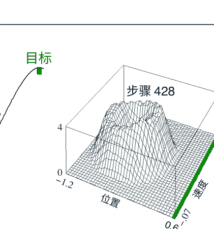

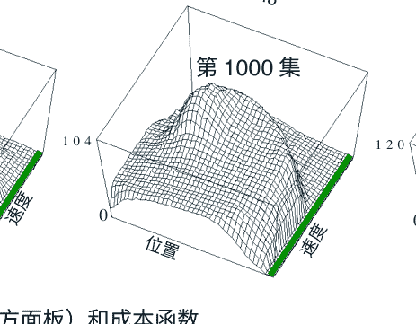

图 10.1: 山车任务（左上方面板）和成本函数（$-\max_a \hat{q} (s, a, w)$）在一次运行中学习。

并且在第9.5.4节中描述的不对称偏移中，存在一些问题。¹通过瓦片编码创建的特征向量 $\mathbf{x}(s, a)$ 线性地与参数向量相结合，以近似计算动作值函数：

$$
\hat{q}(s, a, \mathbf{w}) \doteq \mathbf{w}^\top \mathbf{x}(s, a) = \sum_{i=1}^{d} w_i \cdot x_i(s, a), \tag{10.3}
$$

对于每对状态 $s$ 和动作 $a$。

图10.1展示了使用这种函数逼近形式解决此任务时通常发生的情况。²显示的是值函数的负值 (成本-到达函数) 在单次运行中学习到的。初始动作值都为零，这是乐观的 (在这个任务中，所有真实值都是负数)，导致进行了广泛的探索，即使探索参数 $\varepsilon$ 为0。这可以在图中间上方的面板中看到，标记为“第428步”。此时尚未完成任何一集，但汽车在山谷中来回振荡，按照状态空间中的圆轨迹移动。所有经常访问的状态都被认为比未探索的状态更差，因为实际奖励比 (不现实地) 预期的奖励更差。

这不断将代理驱使离开它所在的位置，以探索新的状态，直到找到解决方案。

图10.2显示了在这个问题上使用半梯度Sarsa的几个学习曲线，具有不同的步长。

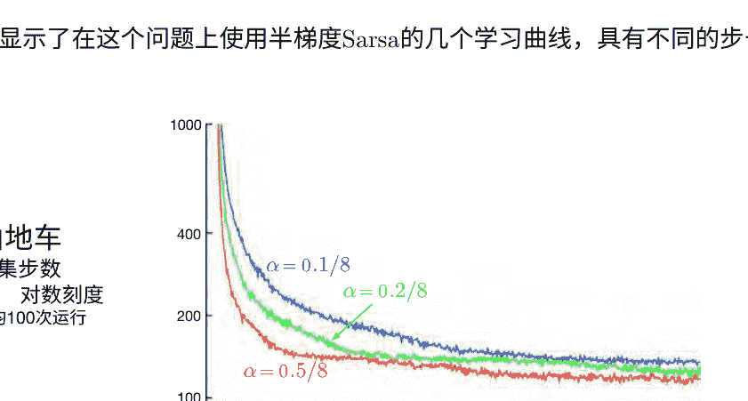

图10.2: 使用瓦片编码函数逼近和 ε贪婪动作选择的山地车学习曲线。

## 10.2 半梯度 n步 Sarsa

我们可以通过在半梯度Sarsa更新方程（10.1）中使用一个 n步回报作为更新目标，来获得一个 n步版本的分集半梯度Sarsa。这个 n步回报可以从其表格形式（7.4）立即推广到函数逼近形式：

$$
G_{t:t+n} \doteq R_{t+1} + \gamma R_{t+2} + \cdots + \gamma^{n-1} R_{t+n} + \gamma^n \hat{q}(S_{t+n}, A_{t+n}, \mathbf{w}_{t+n-1}), \quad t+n < T, \quad (10.4)
$$

$G_t$ if $t+n = T$, 像往常一样。n步更新方程是

$$
\mathbf{w}_{t+n} \doteq \mathbf{w}_{t+n-1} + \alpha [G_{t:t+n} - \hat{q}(S_t, A_t, \mathbf{w}_{t+n-1})] \nabla \hat{q}(S_t, A_t, \mathbf{w}_{t+n-1}), \quad 0 \leq t < T. \quad (10.5)
$$

完整的伪代码如下所示。

| 用于估计 $\hat{q} \approx q_*$ 或 $q_\pi$ 的情节性半梯度n步Sarsa算法 |
| :--- |
| **输入**：可微分的动作值函数参数化 $\hat{q}: \mathcal{S} \times \mathcal{A} \times \mathbb{R}^d \rightarrow \mathbb{R}$ |
| **输入**：策略 $\pi$ (如果估计 $q_\pi$ 的话) |
| **算法参数**：步长 $\alpha > 0$, 小 $\epsilon > 0$, 一个正整数 $n$ |
| **初始化**：值函数权重 $\mathbf{w} \in \mathbb{R}^d$ 任意 (例如, $\mathbf{w} = \mathbf{0}$) |
| 所有存储和访问操作 ($S_t$, $A_t$ 和 $R_t$) 可以对它们的索引进行取模运算 $n+1$ |
| **循环** 每个回合: |
| &emsp; 初始化并存储 $S_0 = $ 终止状态 |
| &emsp; 选择并存储一个动作 $A_0 \sim \pi(\cdot|S_0)$ 或 $\epsilon$-greedy wrt $\hat{q}(S_0, \cdot, \mathbf{w})$ |
| &emsp; $T \leftarrow \infty$ |
| &emsp; **循环** $t = 0, 1, 2, \ldots$: |
| &emsp; &emsp; **如果** $t < T$, **则**: |
| &emsp; &emsp; &emsp; 执行动作 $A_t$ |
| &emsp; &emsp; &emsp; 观察并将下一个奖励存储为 $R_{t+1}$, 并将下一个状态存储为 $S_{t+1}$ |
| &emsp; &emsp; &emsp; **如果** $S_{t+1}$ 是终止状态, **则**: |
| &emsp; &emsp; &emsp; &emsp; $T \leftarrow t + 1$ |
| &emsp; &emsp; &emsp; **否则**: |
| &emsp; &emsp; &emsp; &emsp; 选择并存储 $A_{t+1} \sim \pi(\cdot|S_{t+1})$ 或 $\epsilon$-greedy wrt $\hat{q}(S_{t+1}, \cdot, \mathbf{w})$ |
| &emsp; &emsp; $\tau \leftarrow t - n + 1$ ($\tau$ 是正在更新估计的时间) |
| &emsp; &emsp; **如果** $\tau \geq 0$: |
| &emsp; &emsp; &emsp; $G \leftarrow \sum_{i=\tau+1}^{\min(\tau+n, T)} \gamma^{i-\tau-1} R_i$ |
| &emsp; &emsp; &emsp; **如果** $\tau + n < T$, **那么** $G \leftarrow G + \gamma^n \hat{q}(S_{\tau+n}, A_{\tau+n}, \mathbf{w})$  ($G_{\tau:\tau+n}$) |
| &emsp; &emsp; &emsp; $\mathbf{w} \leftarrow \mathbf{w} + \alpha [G - \hat{q}(S_\tau, A_\tau, \mathbf{w})] \nabla \hat{q}(S_\tau, A_\tau, \mathbf{w})$ |
| &emsp; **直到** $\tau = T - 1$ |

正如我们之前所见，性能最好的情况是使用中间级别的引导，对应于大于1的n值。图10.3显示了该算法在Mountain Car任务中，在n=8时学习速度更快，获得更好的渐近性能。图10.4显示了对该任务的学习速率的更详细研究结果，包括参数 $\alpha$ 和 $n$ 的影响。

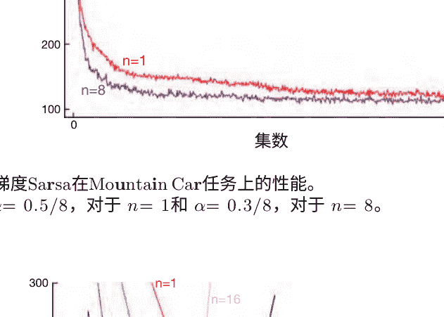

图10.3：一步与8步半梯度Sarsa在Mountain Car任务上的性能。使用了合适的步长：α= 0.5/8，对于 n= 1和 α= 0.3/8，对于 n= 8。

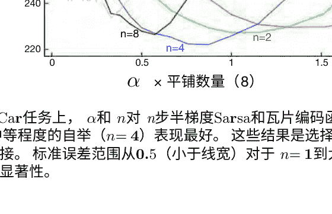

图10.4：在Mountain Car任务上，α和 n对 n步半梯度Sarsa和瓦片编码函数逼近的早期性能的影响。通常情况下，中等程度的自举（n= 4）表现最好。这些结果是选择的 α值，以对数尺度表示，然后通过直线连接。标准误差范围从0.5（小于线宽）对于 n= 1到大约4对于 n= 16，因此主要效应都具有统计显著性。

### 练习10.1
在本章中，我们没有明确考虑或给出任何蒙特卡洛方法的伪代码。它们会是什么样子？为什么不给它们提供伪代码是合理的？它们在Mountain Car任务上的表现如何？ □

### 练习10.2
给出半梯度一步预期Sarsa的控制伪代码。 □

### 练习10.3
为什么图10.4中显示的结果在大n时具有较高的标准误差，而在小n时没有？ □

### 10.3 平均奖励：连续任务的新问题设置

我们现在引入了第三个经典设置——除了情节性和折扣性设置之外——用于制定马尔可夫决策问题 (MDPs) 中的目标。与折扣性设置类似，平均奖励设置适用于连续问题，即代理和环境之间的交互持续进行，没有终止或起始状态。然而，与该设置不同的是，没有折扣因子——代理对延迟奖励和即时奖励一样关心。平均奖励设置是经典动态规划理论中常考虑的主要设置之一，而在强化学习中则较少考虑。正如我们在下一节中讨论的那样，折扣性设置在函数逼近中存在问题，因此需要使用平均奖励设置来替代它。

在平均奖励设置中，策略的质量 $\pi$被定义为在遵循该策略时的平均奖励率，或者简单地说是平均奖励，我们用 $\bar{r}(\pi)$表示：

$$
\bar{r}(\pi) \doteq \lim_{h\to\infty} \frac{1}{h} \sum_{t=1}^{h} \mathbb{E}[R_t \mid S_0, A_{0:t-1}\sim\pi] \\
= \lim_{t\to\infty} \mathbb{E}[R_t \mid S_0, A_{0:t-1}\sim\pi], \\
= \sum_s \mu_\pi(s) \sum_a \pi(a|s) \sum_{s', r} p(s', r|s, a) r, \tag{10.7}
$$

其中期望值是在初始状态 $S_0$和随后的行动 $A_0, A_1, ...$ 的条件下计算的，这些行动是根据 $\pi$进行的。 $\mu_\pi$是稳态分布，$ \mu_\pi(s) \doteq \lim_{t\to\infty} \Pr\{S_t = s \mid A_{0:t-1} \sim \pi\}$，这被假设对于任何 $\pi$都存在，并且与 $S_0$无关。这个对MDP的假设被称为遍历性。这意味着MDP的起始位置或者代理人的早期决策只能有一个暂时的影响；从长远来看，处于某个状态的期望只取决于策略和MDP的转移概率。遍历性足以保证上述方程中的极限存在。

在未折扣的连续情况下，可以对不同类型的最优性进行微妙的区分。然而，对于大多数实际目的而言，根据每个时间步的平均奖励对策略进行排序可能是足够的，换句话说，根据它们的 $\bar{r}(\pi)$进行排序。这个量本质上是 $\pi$下的平均奖励，如(10.7)所示。特别地，我们认为所有达到最大值的 $\bar{r}(\pi)$的策略都是最优的。

请注意，稳态分布是一种特殊的分布，在该分布下，如果你根据 $\pi$选择行动，你将保持在相同的分布中。也就是说，对于这个分布

$$
\sum_s \mu_\pi(s) \sum_a \pi(a|s) p(s'|s, a) = \mu_\pi(s'). \tag{10.8}
$$

在平均回报设置中，回报是根据差异来定义的：

$$
G_t \doteq R_{t+1} - \bar{r}(\pi) + R_{t+2} - \bar{r}(\pi) + R_{t+3} - \bar{r}(\pi) + \cdots \qquad (10.9)
$$

这被称为微分回报，相应的值函数被称为微分值函数。它们的定义方式相同，我们将一直使用相同的符号表示：$v_\pi(s) \doteq \mathbb{E}_\pi[G_t | S_t = s]$ 和 $q_\pi(s, a) \doteq \mathbb{E}_\pi[G_t | S_t = s, A_t = a]$（对于 $v_*$ 和 $q_*$ 同样适用）。微分值函数也有贝尔曼方程，只是与我们之前看到的略有不同。我们只需删除所有 $\gamma$，并将所有奖励替换为奖励与真实平均奖励之间的差异：

$v_\pi(s) = \sum_{r,s'} p(s', r | s, a) [r - \bar{r}(\pi) + v_\pi(s')]$

$q_\pi(s, a) = \sum_{r,s'} p(s', r | s, a) [r - \bar{r}(\pi) + \sum_{a'} \pi(a' | s') q_\pi(s', a')]$

$v_*(s) = \max_{a} \sum_{r,s'} p(s', r | s, a) [r - \max_{\pi} \bar{r}(\pi) + v_*(s')]$，和

$q_*(s, a) = \sum_{r,s'} p(s', r | s, a) [r - \max_{\pi} \bar{r}(\pi) + \max_{a'} q_*(s', a')]$ (参见 (3.14)，练习 3.17，(3.19) 和 (3.20))。

还有两个 TD 误差的微分形式：

$\delta_t \doteq R_{t+1} - \bar{R}_t + \hat{v}(S_{t+1}, \mathbf{w}_t) - \hat{v}(S_t, \mathbf{w}_t), \qquad (10.10)$

和

$\delta_t \doteq R_{t+1} - \bar{R}_t + \hat{q}(S_{t+1}, A_{t+1}, \mathbf{w}_t) - \hat{q}(S_t, A_t, \mathbf{w}_t), \qquad (10.11)$

其中 $\bar{R}_t$ 是时间 $t$ 的平均奖励 $\bar{r}(\pi)$ 的估计。通过这些替代定义，我们的大多数算法和许多理论结果在平均奖励设置下都可以无需更改地使用。

例如，半梯度Sarsa的平均奖励版本的定义与(10.2)相同，只是使用了TD误差的微分版本。也就是说，通过

$\mathbf{w}_{t+1} \leftarrow \mathbf{w}_t + \alpha \delta_t \nabla \hat{q}(S_t, A_t, \mathbf{w}_t), \qquad (10.12)$

其中(10.11)给出了$\delta_t$的定义。完整算法的伪代码在下一页的方框中给出。

### 练习10.4
给出半梯度Q-learning的微分版本的伪代码。□

### 练习10.5
除了10.10之外，还需要哪些方程来指定TD(0)的微分版本？

## 用于估计$\hat{q} \approx q_*$的半梯度Sarsa的微分版本

```
输入：可微分的动作值函数参数化$\hat{q} : S \times \mathcal{A} \times \mathbb{R}^d \rightarrow \mathbb{R}$
算法参数：步长 $\alpha, \beta > 0$
初始化值函数权重 $\mathbf{w} \in \mathbb{R}^d$任意（例如， $\mathbf{w} = \mathbf{0}$）
初始化平均奖励估计$\bar{R} \in \mathbb{R}$任意（例如， $\bar{R} = 0$）

初始化状态 $S$和动作 $A$
循环每一步：
　　执行动作 $A$，观察 $R, S'$
　　选择$A'$作为函数$\hat{q}(\cdot, S', \mathbf{w})$的动作（例如， $\epsilon$-greedy）
　　$\delta \leftarrow R - \bar{R} + \hat{q}(S', A', \mathbf{w}) - \hat{q}(S, A, \mathbf{w})$
　　$\bar{R} \leftarrow \bar{R} + \beta \delta$
　　$\mathbf{w} \leftarrow \mathbf{w} + \alpha \delta \nabla \hat{q}(S, A, \mathbf{w})$
　　$S \leftarrow S'$
　　$A \leftarrow A'$
```

练习10.6 考虑一个由三个状态 A， B和 C组成的马尔可夫奖励过程，状态转移确定地沿着环形进行。到达 A时获得+1的奖励，否则奖励为0。这三个状态的微分值是多少？

## 例子 10.2：访问控制排队任务

这是一个涉及访问控制的决策任务，涉及到一组10个服务器。四个不同优先级的顾客到达一个单一队列。如果获得服务器访问权限，顾客根据其优先级支付1、2、4或8的奖励给服务器，优先级较高的顾客支付更多。在每个时间步骤中，队列头部的顾客要么被接受（分配给一个服务器），要么被拒绝（从队列中移除，奖励为零）。无论哪种情况，在下一个时间步骤中都会考虑队列中的下一个顾客。队列永远不会为空，并且队列中的顾客优先级是等概率随机分布的。当然，如果没有空闲服务器，顾客无法被服务；在这种情况下，顾客总是被拒绝。每个繁忙的服务器在每个时间步骤上以概率 $p = 0.06$变为空闲。尽管我们刚刚描述了它们以明确性，但让我们假设到达和离开的统计数据是未知的。任务是在每一步上决定是否接受或拒绝下一个顾客，基于他的优先级和空闲服务器的数量，以最大化长期奖励而不打折。

在这个例子中，我们考虑了一个表格解决方案。虽然状态之间没有泛化，但我们仍然可以将其考虑在一般函数逼近的设置中，因为这个设置可以泛化表格设置。因此，对于每对状态（空闲服务器数量和队列头部的顾客优先级）和动作（接受或拒绝），我们有一个微分动作-值估计。图10.5显示了使用参数 $\alpha = 0.01$， $\beta = 0.01$ 和 $\epsilon = 0.1$的微分半梯度Sarsa找到的解。初始动作值和$\bar{R}$都为零。

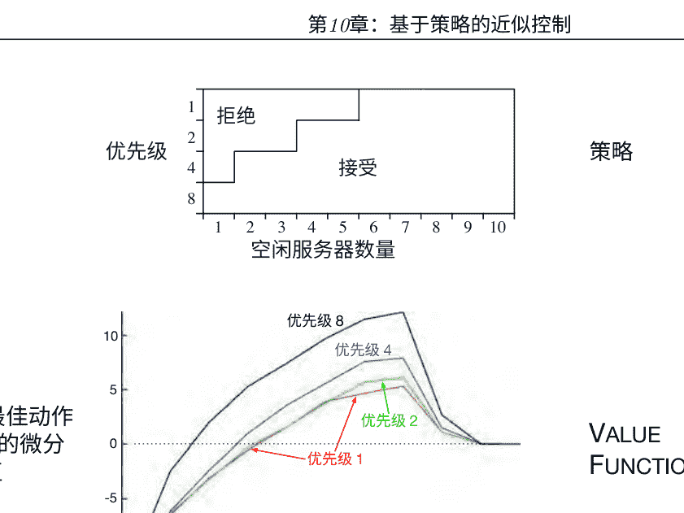

图10.5：在经过200万步之后，通过差分半梯度一步Sarsa在访问控制排队任务上找到的策略和值函数。图右侧的下降可能是由于数据不足导致的；许多这些状态从未被体验过。学习到的R的值约为2.31。

练习10.7 假设存在一个MDP，无论采取什么策略，都会产生确定性的奖励序列+1,0,+1,0,+1,0,…无限循环。从技术上讲，这是不允许的，因为它违反了遍历性；没有稳定的极限分布$\mu_{\pi}$，且极限(10.7)不存在。尽管如此，平均奖励(10.6)是明确定义的；它是什么？现在考虑这个MDP中的两个状态。从A开始，奖励序列与上述描述完全相同，以+1开始，而从B开始，奖励序列以0开始，然后继续为+1,0,+1,0,…。对于这种情况，微分回报(10.9)没有明确定义，因为极限不存在。为了修复这个问题，可以交替地定义状态的值为

$$v_{\pi}(s) \doteq \lim_{\gamma \to 1} \lim_{h \to \infty} \sum_{t=0}^{h} \gamma^{t} \left( \mathbb{E}_{\pi}[R_{t+1}|S_{0}=s] - r(\pi) \right). \quad (10.13)$$

根据这个定义，状态 A和 B的值是什么？

练习10.8 页面251上方框中的伪代码使用$\delta_t$作为误差更新$\bar{R}_t$，而不仅仅是$R_{t+1} - \bar{R}_t$。两种误差都可以，但使用$\delta_t$更好。为了看清楚，考虑练习10.6中的三个状态的环MRP。平均奖励的估计值应该趋近于其真实值$\frac{1}{3}$。假设它已经存在并且被固定在那里。

### 10.4 废弃折扣设置

在表格情况下，持续折扣问题的制定非常有用，其中每个状态的回报可以单独识别和平均。但在近似情况下，是否应该使用这个问题的制定是有问题的。

为了理解为什么，考虑一个没有开始或结束，也没有明确定义状态的无限回报序列。状态可能只由特征向量表示，这些特征向量可能很难区分彼此的状态。作为一个特例，所有的特征向量可能是相同的。因此，我们只有奖励序列（和动作），性能必须纯粹从这些奖励序列中评估。这该如何做呢？一种方法是在一个长时间间隔内对奖励进行平均，这就是平均奖励设置的思想。折扣如何使用呢？嗯，对于每个时间步，我们可以测量折扣回报。一些回报可能很小，一些回报可能很大，所以我们需要在足够长的时间间隔内对它们进行平均。在持续设置中，没有开始和结束，也没有特殊的时间步骤，所以没有其他可以做的事情。然而，如果你这样做，结果发现折扣回报的平均值与平均奖励成比例。实际上，对于策略 π，折扣回报的平均值始终为 $r(\pi)/(1 − γ)$，也就是说，它基本上是平均奖励 $r(\pi)$。特别是，在平均折扣回报设置中，所有策略的排序将与平均奖励设置完全相同。因此，折扣率对问题的形式化没有影响。实际上，它可以是零，排名不会改变。

这个令人惊讶的事实在下一页的方框中得到证明，但基本思想可以由对称论证看出。每个时间步骤与其他时间步骤完全相同。通过折扣，每个奖励将在某个回报中的每个位置上出现一次。第 t个奖励将在第 t −1个回报中不打折地出现，在第 t −2个回报中打折一次，在第 t −1000个回报中打折999次。对于奖励t，因此权重为 $1 + γ + γ^2 + γ^3 + ... = 1/(1 − γ)$。因为所有状态都是相同的，它们都以此为权重，因此回报的平均值将是此乘以平均奖励，或者是 $r(\pi)/(1 − γ)$。

这个例子和盒子中的更一般的论证表明，如果我们在策略分布上优化折扣值，那么效果将与优化无折扣平均奖励相同；γ的实际值将没有影响。这强烈暗示了在函数逼近的控制问题定义中，折扣没有发挥任何作用。尽管如此，人们仍然可以继续使用折扣来解决问题。折扣参数 γ从问题参数变为解决方法参数！然而，在这种情况下，我们不幸的是不能保证优化平均奖励（或等价的在策略分布上的折扣值）。

## 在持续问题中折扣的无用性

> 也许通过选择一个在策略下发生状态的分布上求和折扣值的目标，可以挽救折扣：
>
> $J(\pi) = \sum_s \mu_\pi(s) v_{\pi}^\gamma(s)$ （其中 $v_{\pi}^\gamma$ 是折扣值函数）
>
> $= \sum_s \mu_\pi(s) \sum_{a} \pi(a|s) \sum_{s', r} p(s', r | s, a) [r + \gamma v_{\pi}^\gamma(s')]$ （贝尔曼方程）
>
> $= r(\pi) + \sum_s \mu_\pi(s) \sum_{a} \pi(a|s) \sum_{s', r} p(s', r | s, a) \gamma v_{\pi}^\gamma(s')$ （来自(10.7)）
>
> $= r(\pi) + \gamma \sum_{s'} v_{\pi}^\gamma(s') \sum_s \mu_\pi(s) \sum_{a} \pi(a|s) p(s'|s, a)$ （来自(3.4)）
>
> $= r(\pi) + \gamma \sum_{s'} v_{\pi}^\gamma(s') \mu_\pi(s')$ （来自(10.8)）
>
> $= r(\pi) + \gamma J(\pi)$
>
> $= r(\pi) + \gamma r(\pi) + \gamma^2 J(\pi)$
>
> $= r(\pi) + \gamma r(\pi) + \gamma^2 r(\pi) + \gamma^3 r(\pi) + \cdots$
>
> $= \frac{1}{1-\gamma} r(\pi)$.
>
> 提出的折扣目标以与未折扣的（平均奖励）目标完全相同的顺序排序。折扣率 $\gamma$ 不影响排序！

折扣控制设置的根本原因是，使用函数逼近，我们失去了策略改进定理（第4.2节）。不再是事实，如果我们改变策略以改善一个状态的折扣价值，那么我们就能保证在任何有用的意义上改进整体策略。这个保证是我们强化学习控制方法理论的关键。使用函数逼近，我们失去了它！

事实上，缺乏策略改进定理也是总折扣和平均奖励设置的一个理论空白。一旦引入函数逼近，我们就无法再保证任何设置的改进。在第13章中，我们介绍了一种基于参数化策略的替代类强化学习算法，并且在那里我们有一个被称为“策略梯度定理”的理论保证，它在某种程度上起到了与策略改进定理类似的作用。但是对于学习动作值的方法，我们似乎目前没有局部改进保证（也许Perkins和Precup（2003）采取的方法可以提供部分答案）。我们确实知道，“ε-贪婪化”有时可能导致较差的策略，因为策略可能在良好策略之间反复震荡而不是收敛（Gordon，1996a）。这是一个存在多个未解决理论问题的领域。

## 10.5 差分半梯度 n步 Sarsa

为了推广到 n步引导，我们需要一个 n步版本的TD误差。我们首先将 n步回报（7.4）推广到其微分形式，使用函数逼近：

$$G_{t:t+n} = R_{t+1} - \bar{R}_{t+n-1} + ... + R_{t+n} - \bar{R}_{t+n-1} + \hat{q}(S_{t+n}, A_{t+n}, w_{t+n-1}), \quad (10.14)$$

其中 $\bar{R}$ 是 $r(\pi)$的估计，且 $t+n < T$。如果 $t+n = T$，则我们定义 $G_{t:t+n} = G_t$像往常一样。然后， n步TD误差为

$$\delta_t = G_{t:t+n} - \hat{q}(S_t, A_t, w), \quad (10.15)$$

之后我们可以应用我们通常的半梯度Sarsa更新（10.12）。完整算法的伪代码如下。

```
用于估计 $\hat{q} \approx q_\pi$ 或 $q_*$ 的差分半梯度 n步Sarsa

输入：一个可微分函数 $\hat{q} : S \times A \times \mathbb{R}^d \rightarrow \mathbb{R}$，一个策略 $\pi$
初始化值函数权重 $\mathbf{w} \in \mathbb{R}^d$ 任意（例如，$\mathbf{w} = 0$）
初始化平均奖励估计 $\bar{R} \in \mathbb{R}$ 任意（例如，$\bar{R} = 0$）
算法参数：步长 $\alpha, \beta > 0$, 一个正整数 $n$
所有存储和访问操作（$S_t, A_t$ 和 $R_t$）都可以取它们的索引模 $n+1$

初始化并存储 $S_0$ 和 $A_0$
循环每一步，$t = 0, 1, 2, ...$:
　　执行动作 $A_t$
　　观察并存储下一个奖励为 $R_{t+1}$ 和下一个状态为 $S_{t+1}$
　　选择并存储一个动作 $A_{t+1} \sim \pi(\cdot|S_{t+1})$, 或者 $\epsilon$-贪婪策略 wrt $\hat{q}(S_{t+1}, \cdot, w)$
　　$\tau \leftarrow t - n + 1$  （$\tau$是正在更新估计的时间）
　　如果 $\tau \geq 0$:
　　　　$\delta \leftarrow \sum_{i=\tau+1}^{\tau+n} (R_i - \bar{R}) + \hat{q}(S_{\tau+n}, A_{\tau+n}, w) - \hat{q}(S_\tau, A_\tau, w)$
　　　　$\bar{R} \leftarrow \bar{R} + \beta \delta$
　　　　$w \leftarrow w + \alpha \beta \nabla \hat{q}(S_\tau, A_\tau, w)$
```

练习10.9 在差分半梯度n步Sarsa算法中，平均奖励的步长参数，$\beta$，需要足够小，以便 $\bar{R}$ 成为平均奖励的良好长期估计。不幸的是，$\bar{R}$ 在许多步骤中会受到其初始值的偏差，这可能导致学习效率低下。或者，可以使用观察到的奖励的样本平均值来计算 $\bar{R}$。这样一来，初始时会快速适应但长期来看也会适应缓慢。随着策略的缓慢改变，$\bar{R}$ 也会改变；这种长期非稳态性可能使样本平均方法不适用。实际上，平均奖励的步长参数是使用练习2.7中的无偏常数步长技巧的理想位置。描述对差分半梯度n步Sarsa算法的方框算法所需的具体更改，以使用这个技巧。

### 10.6 总结

在本章中，我们扩展了参数化函数逼近和半梯度下降的思想，这些思想在前一章中介绍过，用于控制。对于情节性的情况，这个扩展是直接的，但对于连续性的情况，我们必须引入一个基于最大化每个时间步长的平均奖励设置的全新问题表述。

令人惊讶的是，在存在逼近的情况下，折扣形式无法用于控制。在逼近的情况下，大多数策略无法用值函数表示。剩下的任意策略需要进行排名，而标量平均奖励 $r(\pi)$ 提供了一种有效的方法。

平均奖励的表述涉及到值函数、贝尔曼方程和TD误差的新微分版本，但所有这些都与旧的版本相平行，概念上的变化很小。对于平均奖励情况，还有一套新的并行微分算法。

### 参考文献和历史评论

+ 10.1 半梯度Sarsa与函数逼近首次由Rummery和Niranjan（1994）探索。线性半梯度Sarsa与$\epsilon$贪婪动作选择在通常意义上不收敛，但会进入最佳解附近的有界区域（Gordon，1996a，2001）。Precup和Perkins（2003）在可微分的动作选择环境中展示了收敛性。另请参阅Perkins和Pendrith（2002）以及Melo，Meyn和Ribeiro（2008）。山车示例基于Moore（1990）研究的类似任务，但此处使用的确切形式来自Sutton（1996）。
+ 10.2 基于前向Sarsa($\lambda$)算法的差分n步半梯度Sarsa基于van Seijen（2016）的算法。这里展示的实证结果是本文第二版的新内容。
+ 10.3 平均奖励的形式化已经在动态规划中进行了描述（例如，Puterman，1994），并从强化学习的角度进行了描述（Mahadevan，1996；Tadepalli和Ok，1994；Bertsekas和Tsitsiklis，1996；Tsitsiklis和Van Roy，1999）。这里描述的算法是Schwartz（1993）引入的“R-learning”算法的策略上的类比。R-learning这个名字可能是为了在Q-learning之后按字母顺序命名的，但我们更喜欢将其视为学习差分或相对值的参考。访问控制排队示例是基于Carlström和Nordström（1997）的工作提出的。
+ 10.4 在函数逼近中，对折扣的局限性被认识到成为重新制定强化学习问题的作者们在第一版出版后不久就意识到了。Singh，Jaakkola和Jordan（1994）可能是第一个在印刷品中观察到这一点的人。

# 第11章

## Off-策略方法与近似

本书主要讨论了从第5章开始的基于策略和离策略学习方法，作为处理学习中利用和探索之间冲突的两种替代方式。在本章之前的两章中，我们讨论了带有函数近似的策略情况，而在本章中，我们讨论了带有函数近似的离策略情况。与非策略学习相比，函数近似的扩展对于离策略学习来说更加不同和困难。在第6章和第7章中开发的表格离策略方法可以很容易地扩展为半梯度算法，但这些算法在离策略训练下的收敛性不如在基于策略训练下稳定。在本章中，我们探讨了收敛性问题，更详细地研究了线性函数近似的理论，引入了可学习性的概念，然后讨论了具有更强收敛性保证的新算法。

离线策略情况。最终我们将拥有改进的方法，但理论结果不会像在线学习那样强大，经验结果也不会像在线学习那样令人满意。在此过程中，我们将更深入地了解在线学习和离线学习中的近似方法。

回想一下，在离线学习中，我们试图学习一个针对目标策略的值函数 $\pi$，根据由不同行为策略 $b$产生的数据。在预测情况下，两个策略都是静态且给定的，我们试图学习状态值 $\hat{v} \approx v_{\pi}$或动作值。在控制情况下，我们学习动作值，并且两个策略通常在学习过程中发生变化——$\hat{q}$是相对于 $\pi$的贪婪策略，而 $b$则更具探索性，例如 $\epsilon$-贪婪策略相对于 $\hat{q}$。

离线学习的挑战可以分为两个部分，一个是在表格情况下出现的，另一个是只在函数逼近中出现的。挑战的第一部分与更新的目标有关（不要与目标策略混淆），第二部分与更新的分布有关。与重要性采样相关的技术在第5章和第7章中介绍，处理的是第一部分；这些技术可能会增加方差，但在所有成功的算法中都是必需的。

### 11.1 半梯度方法

我们首先描述了在前几章中开发的方法如何轻松地扩展到函数逼近作为半梯度方法。这些方法解决了离线策略学习的第一部分挑战（改变更新目标），但没有解决第二部分挑战（改变更新分布）。因此，这些方法在某些情况下可能会发散，在这个意义上并不稳定，但它们通常被成功地使用。请记住，这些方法对于表格情况是稳定的且渐近无偏的，这对于函数逼近不是特殊情况。因此，可能仍然有可能将它们与特征选择方法结合起来，以确保组合系统的稳定性。无论如何，这些方法都很简单，因此是一个很好的起点。

在第7章中，我们描述了各种表格离线策略算法。为了将它们转换为半梯度形式，我们只需将对数组（V或Q）的更新替换为对权重向量（w）的更新，使用近似值函数（$\hat{v}$或$\hat{q}$）及其梯度。这些算法中的许多都使用了每步重要性采样比例：

$$\rho_t \doteq \rho_{t:t} = \frac{\pi(A_t|S_t)}{b(A_t|S_t)}.$$

例如，一步状态值算法是半梯度离线策略TD(0)，与相应的在线策略算法（第203页）相比，只是增加了

$$\mathbf{w}_{t+1} \doteq \mathbf{w}_t + \alpha \rho_t \delta_t \nabla \hat{v}(S_t,\mathbf{w}_t),$$

其中 $\delta_t$根据问题是周期性和折扣，还是连续性和未折扣的平均奖励，适当地定义：

$$\delta_t \doteq R_{t+1} + \gamma \hat{v}(S_{t+1},\mathbf{w}_t) - \hat{v}(S_t,\mathbf{w}_t), \text{ or}$$

$$\delta_t \doteq R_{t+1} - \bar{R}_t + \hat{v}(S_{t+1},\mathbf{w}_t) - \hat{v}(S_t,\mathbf{w}_t).$$

对于动作值，一步算法是半梯度 Expected Sarsa:

> $$ \mathbf{w}_{t+1} \doteq \mathbf{w}_t + \alpha \beta_t \nabla \hat{q}(S_t, A_t, \mathbf{w}_t), \quad \text{with} \quad \delta_t \doteq R_{t+1} + \gamma \sum_{a} \pi(a|S_{t+1}) \hat{q}(S_{t+1}, a, \mathbf{w}_t) - \hat{q}(S_t, A_t, \mathbf{w}_t), \quad \text{or} \quad \delta_t \doteq R_{t+1} - \bar{R}_t + \sum_{a} \pi(a|S_{t+1}) \hat{q}(S_{t+1}, a, \mathbf{w}_t) - \hat{q}(S_t, A_t, \mathbf{w}_t). $$

请注意，该算法不使用重要性采样。在表格情况下，很明显这是合适的，因为唯一的样本动作是 $A_t$，在学习其值时我们不需要考虑其他动作。对于函数逼近，情况就不那么明确了，因为一旦它们都对同一整体逼近有贡献，我们可能希望以不同的方式加权不同的状态-动作对。对于函数逼近的全面理解，需要更深入地研究这个问题的解决方案。

在这些算法的多步推广中，状态值和动作值算法都涉及重要性采样。例如，半梯度期望Sarsa的n步版本是

> $$ \mathbf{w}_{t+n} \doteq \mathbf{w}_{t+n-1} + \alpha \rho_{t+1} \cdots \rho_{t+n-1} [G_{t:t+n} - \hat{q}(S_t, A_t, \mathbf{w}_{t+n-1})] \nabla \hat{q}(S_t, A_t, \mathbf{w}_{t+n-1}), \quad (11.6) $$
with
$$ G_{t:t+n} \doteq R_{t+1} + \cdots + \gamma^{n-1} R_{t+n} + \gamma^n \hat{q}(S_{t+n}, A_{t+n}, \mathbf{w}_{t+n-1}), \quad \text{or} \quad G_{t:t+n} \doteq R_{t+1} - \bar{R}_t + \cdots + R_{t+n} - \bar{R}_t + \gamma^n \hat{q}(S_{t+n}, A_{t+n}, \mathbf{w}_{t+n-1}), $$
(continuing) where here we are being slightly informal in our treatment of the ends of episodes. 在第一个方程中，$\rho_{K}$为$K-T$（其中$T$是该回合的最后一个时间步），应该取为1，$G_{t:t+n}$应该取为$G_t$如果$t+n \geq T$。

回想一下，在第7章中，我们还介绍了一种无需重要性采样的离策略算法：n步树备份算法。这是它的半梯度版本：

> $$ \mathbf{w}_{t+n} \doteq \mathbf{w}_{t+n-1} + \alpha [G_{t:t+n} - \hat{q}(S_t, A_t, \mathbf{w}_{t+n-1})] \nabla \hat{q}(S_t, A_t, \mathbf{w}_{t+n-1}), \quad (11.7) $$
$$ G_{t:t+n} \doteq \hat{q}(S_t, A_t, \mathbf{w}_{t-1}) + \sum_{k=t}^{t+n-1} \delta_k \prod_{i=t+1}^{k} \sigma \pi(A_i|S_i), \quad (11.8) $$

其中，$\delta_t$,如本页顶部所定义的，用于期望Sarsa算法。我们还在第7章中定义了一种统一所有动作值算法的算法：n步$Q(\sigma)$。我们将半梯度形式的该算法以及n步状态值算法留给读者作为练习。

- 练习11.1将n步离策略TD (7.9)的方程转换为半梯度形式。同时给出离散和连续情况下的回报定义。 □
- 练习11.2将 n步 $Q(\sigma)$ (7.11和7.17) 转换为半梯度形式。给出同时涵盖情节和持续情况的定义。 □

### 11.2 基于策略的离散例子

在本节中，我们开始讨论函数逼近下的离策略学习挑战的第二部分，即更新的分布与离策略分布不匹配的问题。我们描述了一些关于离策略学习的有启发性的反例——在这些情况下，半梯度和其他简单算法是不稳定且发散的。

为了建立直觉，最好先考虑一个非常简单的例子。假设，在一个较大的MDP中，有两个状态的估计值具有函数形式 w 和 2w，其中参数向量 w 只包含一个分量 w。如果两个状态的特征向量都是简单的数字（单分量向量），则在线性函数逼近下会出现这种情况，例如1和2。在第一个状态下，只有一个动作可用，并且它以确定性方式转移到第二个状态，并获得奖励0：


两个圆圈内的表达式表示两个状态的值。假设初始时 w= 10。然后转换将从估计值为10的状态转移到估计值为20的状态。这看起来是一个良好的转换，w 将增加以提高第一个状态的估计值。如果 γ 接近1，那么 TD误差将接近10，如果 α= 0.1，那么 w 将增加到接近11，以减小 TD误差。然而，第二个状态的估计值也会增加到接近22。如果再次发生转换，那么从估计值为 ≈11的状态转移到估计值为 ≈22的状态，TD误差为 ≈11，比之前更大而不是更小。

它看起来更像是第一个状态被低估了，并且它的值将再次增加这次增加到 ≈12.1。这看起来很糟糕，实际上，随着进一步的更新 w 将发散到无穷大。

```
δ_t = R_{t+1} + γ\hat{v}(S_{t+1},w_t) - \hat{v}(S_t,w_t) = 0 + γ2w_t - w_t = (2γ - 1)w_t
```

而离策略半梯度 TD(0) 更新（来自(11.2)）是

```
w_{t+1} = w_t + αρ_tδ_t∇\hat{v}(S_t,w_t) = w_t + α·1·(2γ - 1)w_t·1 = (1 + α(2γ - 1))(w_t)
```

请注意，重要性采样比率，ρ_t，在这个转换中为1，因为从第一个状态只有一个可用的动作，所以在目标策略和行为策略下被选择的概率都必须为1。在上面的最终更新中，新的参数是旧参数乘以一个标量常数，1 + α(2γ - 1)。如果这个常数大于1，那么系统就是不稳定的，w 会趋向于正无穷大或负无穷大，这取决于它的初始值。在这里，只要 γ > 0.5，这个常数就大于1。请注意，稳定性不取决于具体的步长，只要 α > 0。较小或较大的步长会影响 w 趋向于无穷大的速度，但不会影响它是否会趋向于无穷大。

这个例子的关键是，一个转换反复发生，而其他转换没有被更新。这在离线策略训练下是可能的，因为行为策略可能在其他转换上选择动作，而目标策略永远不会选择。对于这些转换，ρt将为零，不会进行更新。然而，在在线策略训练下，ρt始终为一。每次从状态1到2 w状态的转换，增加w时，也必须有一个转换出2 w状态。那个转换会减少w，除非它转移到一个价值更高的状态（因为γ<1），然后那个状态必须跟随一个价值更高的状态，否则w会减少。每个状态只能通过创造更高的期望来支持前一个状态。最终，付出代价是必要的。在在线策略情况下，必须遵守未来奖励的承诺，并保持系统的稳定。但在离线策略情况下，可以做出承诺，然后，在采取目标策略永远不会采取的行动之后，将其忘记和宽恕。

这个简单的例子传达了为什么离线训练可能导致发散的原因，但它并不完全令人信服，因为它不完整——它只是一个完整MDP的片段。真的会有一个完整的系统出现不稳定吗？一个简单的发散的完整例子是贝尔德的反例。考虑图11.1中显示的具有七个状态和两个动作的情节性MDP。虚线动作以相等的概率将系统转移到六个上部状态之一，而实线动作将系统转移到第七个状态。行为策略b以概率6/7和1/7选择虚线和实线动作，因此在其下一个状态分布是均匀的（对于所有非终止状态都是相同的），这也是每个情节的起始分布。目标策略π总是选择实线动作，因此在策略分布（对于π）中集中在第七个状态。所有转换的奖励都是零。折扣率为γ=0.99。

考虑在每个状态圈中所示的线性参数化下估计状态值。例如，最左边状态的估计值为2w1 + w8，其中下标对应组件

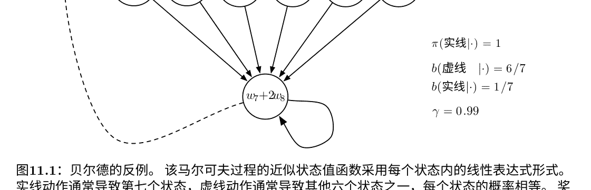

图11.1：贝尔德的反例。该马尔可夫过程的近似状态值函数采用每个状态内的线性表达式形式。实线动作通常导致第七个状态，虚线动作通常导致其他六个状态之一，每个状态的概率相等。奖励始终为零。

整体权重向量 w ∈ ℝ^8; 这对应于第一个状态的特征向量是 x(1) = (2,0,0,0,0,0,0,1)^T。
所有转换的奖励都为零，因此真实值函数为 v_π(s) = 0, 对于所有的 s, 如果 w = 0,
可以精确近似。实际上，有很多解，因为权重向量的分量 (8) 比非终端状态 (7) 多。
此外，特征向量集合 {x(s) : s ∈ S}, 是一个线性无关的集合。在所有这些方面，这个
任务似乎是线性函数逼近的一个有利情况。

如果我们将半梯度TD(0)应用于这个问题 (11.2) ，那么权重会发散到无穷大，如图11.2（左）所示。
不稳定性发生在任何正的步长上，无论多小。实际上，即使像动态规划（DP）那样进行预期更新，也会发生不稳定性，如图11.2（右）所示。也就是说，
如果权重向量 w_k，以半梯度方式同时对所有状态进行更新，使用DP（基于期望）目标：

```
w_{k+1} \doteq w_k + \frac{\alpha}{|S|} \sum_s \left( \mathbb{E}_\pi [R_{t+1} + \gamma \hat{v}(S_{t+1}, w_k) \mid S_t = s] - \hat{v}(s, w_k) \right) \nabla \hat{v}(s, w_k). \quad (11.9)
```

在这种情况下，没有随机性和异步性，就像在经典的DP更新中一样。
该方法在使用半梯度函数逼近时是常规的。
然而，系统仍然不稳定。
如果我们仅仅改变Baird反例中DP更新的分布，从均匀分布变为在线策略分布（通常
需要异步更新），那么收敛性将被保证，误差将受到（9.14）的界限。这个例子很引人
注目，因为使用的TD和DP方法可以说是最简单的。

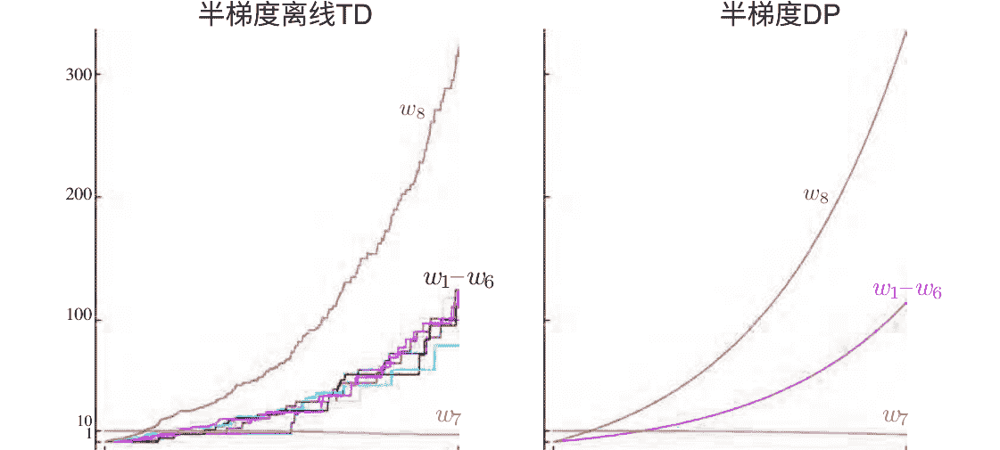

图11.2: 贝尔德反例的不稳定性演示。展示了两种半梯度算法参数向量 w 的演化。步长为 α = 0.01，初始权重为 w = (1,1,1,1,1,1,10,1)^T。

线性、半梯度方法是最简单、最易理解的函数逼近方法之一，也是最好理解的引导方法之一。这个例子表明，即使是最简单的引导和函数逼近的组合，如果更新不按照在线分布进行，可能会不稳定。

还有类似贝尔德的反例表明Q学习会发散。这是令人担忧的，因为除此之外，Q学习是所有控制方法中收敛性保证最好的。人们已经付出了很大努力，试图找到解决这个问题的方法，或者获得一些更弱但仍可行的保证。例如，只要行为策略足够接近目标策略，例如，当它是$\varepsilon$贪婪策略时，可能可以保证Q学习的收敛。据我们所知，在这种情况下，Q学习从未发散过，但没有进行过理论分析。在本节的其余部分，我们介绍了几个其他已经探索过的想法。

假设我们不仅仅在每次迭代中朝着预期的一步回报前进，而是将值函数一直改变到最佳的最小二乘逼近。这样能解决不稳定性问题吗？当特征向量 $\{\mathbf{x}(s) : s \in \mathcal{S}\}$ 形成一个线性无关集合时，就像在贝尔德的反例中一样，确实可以实现精确逼近，并且该方法将简化为标准的表格型动态规划。但当无法得到精确解时，这里要考虑的是另一种情况。在这种情况下，即使在每次迭代中形成最佳逼近，稳定性也无法保证，正如示例中所示。

## 示例11.1: Tsitsiklis和Van Roy的反例

这个例子展示了即使使用最小二乘法，线性函数逼近在动态规划中也无法工作。

在每一步中找到了解决方案。反例是通过扩展之前在本节中的示例（从早期）以一个终止状态形成的，如右图所示。与之前一样，第一个状态的估计值为 $w$，第二个状态的估计值为 $2w$。所有转换的奖励都为零，因此两个状态的真实值都为零，这正好可以用 $w = 0$ 来表示。如果我们在每一步中设置 $w_{k+1}$，以使估计值与预期的一步回报之间的VE最小化，那么我们有

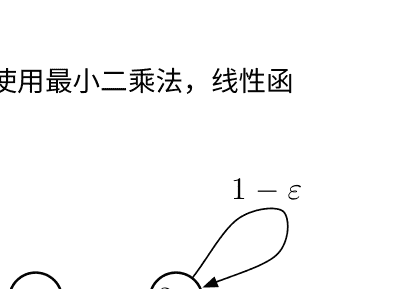

```
$$\begin{aligned}
w_{k+1} &= \underset{w \in \mathbb{R}}{\operatorname{argmin}} \sum_{s \in \mathcal{S}} \left( \hat{v}(s, w) - \mathbb{E}_{\pi} \left[ R_{t+1} + \gamma \hat{v}(S_{t+1}, w_k) \mid S_t = s \right] \right)^2 \\
&= \underset{w \in \mathbb{R}}{\operatorname{argmin}} \left( w - \gamma 2 w_k \right)^2 + \left( 2w - (1-\varepsilon)\gamma 2 w_k \right)^2 \\
&= \frac{6-4\varepsilon}{5} \gamma w_k. \qquad (11.10)
\end{aligned}$$
```

当 $\gamma > \frac{5}{6-4\varepsilon}$ 时，序列 $\{w_k\}$ 发散，且 $w_0 = 0$。

另一种防止不稳定性的方法是使用特殊的函数逼近方法。特别是，对于不从观察到的目标进行外推的函数逼近方法，稳定性是有保证的。这些方法被称为平均方法，包括最近邻方法和局部加权回归，但不包括流行的瓦片编码和人工神经网络（ANNs）方法。

- 练习11.3（编程）：将一步半梯度Q学习应用于贝尔德的反例，并通过实验证明其权重发散。

### 11.3 致命三角

到目前为止，我们的讨论可以总结为，当我们结合以下三个元素时，不稳定性和发散的危险就会出现，这三个元素构成了我们所称的致命三位一体：

1.  **函数逼近** 一种强大、可扩展的从状态空间中进行泛化的方法，远远超过内存和计算资源的大小（例如，线性函数逼近或人工神经网络）。
2.  **自举** 更新目标包括现有估计值（如动态规划或时序差分方法中的方式），而不仅仅依赖于实际奖励和完整回报（如蒙特卡洛方法中的方式）。
3.  **离策略训练** 训练时使用与目标策略产生的转换分布不同的分布。在状态空间中进行全面扫描并统一更新所有状态，就像动态规划中那样，不符合目标策略，并且是离策略训练的一个例子。

特别要注意的是，危险不是由于控制或广义策略迭代引起的。尽管这些情况更加复杂，但不稳定性在更简单的预测情况下也会出现，只要它包含了致命三位一体的三个元素。危险也不是由于学习或对环境的不确定性引起的，因为它在规划方法（如动态规划）中同样强烈出现，而这些方法中环境是完全已知的。

如果致命三角的任意两个元素存在，但不是全部三个元素，则可以避免不稳定性。然后，自然而然地，我们会经历这三个元素，看看是否有任何一个可以放弃。

在这三个元素中，函数逼近显然是不能放弃的。我们需要能够扩展到大问题和具有很强表达能力的方法。我们至少需要具有许多特征和参数的线性函数逼近。状态聚合或者随着数据增长而复杂化的非参数方法都太弱或者太昂贵。

最小二乘法（如LSTD）的复杂度是二次的，因此对于大问题来说太昂贵。

在没有引导的情况下，可以实现，但会牺牲计算和数据效率。也许最重要的是计算效率的损失。蒙特卡洛（非引导）方法需要保存在进行每次预测和获取最终回报之间发生的所有事情的内存，并且它们的计算是在获得最终回报后完成的。这些计算问题的成本在串行冯·诺伊曼计算机上并不明显，但在专用硬件上会显现出来。通过引导和资格追踪（第12章），数据可以在生成时和生成的地方处理，然后永远不需要再次使用。引导可以节省通信和内存的开销。引导带来的通信和内存节省是巨大的。

通过放弃自举，数据效率的损失也是显著的。我们已经多次看到这一点，比如在第7章（图7.2）和第9章（图9.2）中，在随机漫步预测任务中，一定程度的自举比蒙特卡洛方法表现得更好，在第10章中，在Mountain-Car控制任务上也是如此（图10.4）。许多其他问题在自举的情况下学习速度更快（例如，参见图12.14）。自举通常导致更快的学习，因为它允许学习利用状态属性，即在返回时能够识别状态。另一方面，自举可能会对状态表示不好且导致泛化能力差的问题造成学习障碍（例如，这似乎是Tetris的情况，参见Şimşek, Alg’orta和Kothiyal，2016年）。糟糕的状态表示也可能导致偏差；这是自举方法渐近逼近质量较差的较差界限的原因（方程式9.14）。总的来说，自举能力被认为是非常有价值的。有时候可以选择不使用它，通过选择长n步更新（或大的自举参数，α=1；参见第12章），但通常自举大大提高了效率。这是我们非常希望保留在我们工具包中的一种能力。

最后，有了离策略学习；我们可以放弃吗？在策略方法通常是足够的。对于无模型强化学习，可以简单地使用Sarsa而不是Q学习。离策略方法使行为与目标策略分离。这可能被认为是一种方便，但不是必需的。然而，离策略学习对于其他预期的用例是必不可少的，这些用例在本书中尚未提及，但对于创建强大的智能代理的更大目标可能很重要。

在这些用例中，代理不仅学习单个值函数和单个策略，而且同时学习大量的值函数和策略。有大量的心理证据表明，人类和动物学会预测许多不同的感官事件，而不仅仅是奖励。我们可以对不寻常的事件感到惊讶，并纠正我们对它们的预测，即使它们的价值是中性的（既不好也不坏）。这种预测可能是计划中使用的世界预测模型的基础。我们预测眼动后会看到什么，回家需要多长时间，篮球跳投的概率以及从承担新项目中获得的满足感。在所有这些情况下，我们想要预测的事件取决于我们以某种方式行动。要同时学习所有这些事件，需要从一个经验流中学习。有许多目标策略，因此一个行为策略无法等同于所有目标策略。然而，概念上可能存在并行学习，因为行为策略可能在某种程度上与许多目标策略重叠。要充分利用这一点，需要进行离策略学习。

### 11.4 线性值函数几何

为了更好地理解离线学习的稳定性挑战，有助于更抽象地思考价值函数逼近，独立于学习的方式。我们可以想象所有可能状态值函数的空间 - 所有从状态到实数的函数 \(v: \mathcal{S} \rightarrow \mathbb{R}\)。这些值函数中大多数都不对应任何策略。对我们来说更重要的是，大多数值函数不能被函数逼近器表示，因为设计上参数比状态数量少得多。

给定状态空间的枚举 \(\mathcal{S} = \{s_1, s_2, ..., s_{|\mathcal{S}|}\}\)，任何值函数 \(v\) 都对应于按顺序列出每个状态的值的向量 \([v(s_1), v(s_2), ..., v(s_{|\mathcal{S}|})]^\top\)。这个值函数的向量表示有与状态数相同的分量。在大多数需要使用函数逼近的情况下，这将是表示向量的分量太多了。尽管如此，这个向量的概念上是有用的。在接下来的内容中，我们将价值函数和它的向量表示互换使用。

为了形成直观感受，考虑有三个状态 \(\mathcal{S} = \{s_1, s_2, s_3\}\) 和两个参数 \(\mathbf{w} = (w_1, w_2)^\top\) 的情况。我们可以将所有的值函数/向量看作是三维空间中的点。这些参数提供了一个在二维子空间上的替代坐标系。任何权重向量 \(\mathbf{w} = (w_1, w_2)^\top\) 都是二维子空间中的一个点，因此也是一个完整的值函数 \(v_{\mathbf{w}}\)，它为所有三个状态分配值。在一般的函数逼近中，完整空间和可表示函数的子空间之间的关系可能很复杂，但在线性值函数逼近的情况下，子空间是一个简单的平面，如图11.3所示。

现在考虑一个固定的策略 \(\pi\)。我们假设它的真实值函数 \(v_{\pi}\) 太复杂，无法精确表示为近似值。因此 \(v_{\pi}\) 不在子空间中；在图中，它被描绘为在可表示函数的平面子空间之上。

如果 \(v_{\pi}\) 无法精确表示，那么最接近它的可表示值函数是什么？这事实上是一个微妙的问题，有多个答案。首先，我们需要一个衡量两个值函数之间距离的度量。给定两个值函数 \(v_1\) 和 \(v_2\)，我们可以讨论它们之间的向量差异，\(v = v_1 - v_2\)。如果 \(v\) 很小，则两个值函数彼此接近。但是我们如何衡量这个差异向量的大小？传统的欧几里德范数不适用，因为如第9.2节所讨论的，某些状态比其他状态更重要，因为它们更频繁出现或者我们对它们更感兴趣（第9.11节）。如同第9.2节一样，让我们使用分布 \(\mu: \mathcal{S} \rightarrow [0, 1]\) 来指定我们对不同状态的准确估值程度（通常被视为在策略上的分布）。然后我们可以使用范数来定义值函数之间的距离。

$$\|v\|_\mu^2 \doteq \sum_{s \in \mathcal{S}} \mu(s)v(s)^2. \qquad\qquad\qquad (11.11)$$

请注意，第9.2节中的 VE 可以简单地用这个范数表示为 \(\text{VE}(\mathbf{w}) = \|v_{\mathbf{w}} - v_{\pi}\|_\mu^2\)。对于任何值函数 \(v\)，找到其在可表示值函数子空间中的最接近值函数的操作是一个投影操作。我们定义一个投影算子 \(\Pi\) 将任意值函数映射到最接近我们范数的可表示函数：

$$ \Pi v \doteq v_w \quad \text{其中} \quad w = \arg\min_{w \in \mathbb{R}^d} \| v - v_w \|_\mu^2 \qquad (11.12) $$

与真值函数 \(v_\pi\) 最接近的可表示值函数是其投影，即 \(\Pi v_\pi\)，如图11.3所示。这是蒙特卡洛方法渐近找到的解，尽管通常非常缓慢。投影操作在下一页的方框中进行了更详细的讨论。

时序差分方法找到不同的解。为了理解它们的原理，回想一下值函数 \(v_\pi\) 的贝尔曼方程是

$$ v_\pi(s) = \sum_{s',r} p(s', r | s, a) [r + \gamma v_\pi(s')], \quad \text{对于所有} s \in \mathcal{S}. \qquad (11.13) $$

## 图11.3: 线性值函数逼近的几何形状。显示了所有值函数在三个状态上的三维空间，而以平面形式显示的是由线性函数逼近器参数 $w=(w_1, w_2)^\top$ 表示的所有可表示的值函数的子空间。

真实值函数 $v_\pi$ 在更大的空间中，并可以通过投影算子 $\Pi$ 投影到值误差 (VE) 意义下的最佳近似。在贝尔曼误差 (BE)、投影贝尔曼误差 (PBE) 和时序差分误差 (TDE) 意义下，最佳逼近器都有可能不同，并且显示在右下方。(在本图中，VE、BE和PBE都被视为相应的向量。) 贝尔曼算子将平面上的值函数转换为外部的一个值，然后可以进行投影回来。如果你在空间之外（上方灰色部分所示）迭代应用贝尔曼算子，你将达到真实值函数，就像传统的动态规划一样。相反，如果你在每一步都将其投影回子空间（如下方灰色部分所示），那么固定点将是零向量的PBE点。

### 投影矩阵

对于线性函数逼近器，投影操作是线性的，这意味着它可以表示一个 $|S| \times |S|$ 矩阵：

$$ \Pi \doteq \mathbf{X} (\mathbf{X}^\top \mathbf{DX})^{-1} \mathbf{X}^\top \mathbf{D} $$ (11.14)

其中，如第9.4节所述，$\mathbf{D}$ 表示对角线上带有 $\mu(s)$ 的 $|S| \times |S|$ 对角矩阵，$\mathbf{X}$ 表示每个状态 $s$ 对应的特征向量 $\mathbf{x}(s)^\top$ 的 $|S| \times d$ 矩阵。如果(11.14)中的逆矩阵不存在，则使用伪逆矩阵代替。利用这些矩阵，一个向量的平方范数可以表示为

$$ \|v\|^2_\mu = v^\top \mathbf{D} v, $$ (11.15)

近似线性值函数可以表示为

$$ v_{\mathbf{w}} = \mathbf{X} \mathbf{w}. $$ (11.16)

真实值函数 $v_\pi$ 是唯一能够准确解决(11.13)的值函数。如果用近似值函数 $v_{\mathbf{w}}$ 替代 $v_\pi$，那么修改后方程的右边和左边的差异可以用来衡量 $v_{\mathbf{w}}$ 与 $v_\pi$ 之间的差距。我们称之为状态 $s$ 的贝尔曼误差：

$$ \bar{\delta}_{\mathbf{w}}(s) \doteq \left( \sum_{s', r} p(s', r | s, a) [r + \gamma v_{\mathbf{w}}(s')] \right) - v_{\mathbf{w}}(s) $$ (11.17)

$$ = \mathbb{E}_\pi[R_{t+1} + \gamma v_{\mathbf{w}}(S_{t+1}) - v_{\mathbf{w}}(S_t) | S_t = s, A_t \sim \pi], $$ (11.18)

这清楚地显示了贝尔曼误差与TD误差 (11.3) 之间的关系。贝尔曼误差是TD误差的期望。
所有状态的贝尔曼误差向量，$\bar{\boldsymbol{\delta}}_{\mathbf{w}} \in \mathbb{R}^{|S|}$，被称为贝尔曼误差向量（在图11.3中表示为BE）。在范数中，这个向量的整体大小是值函数误差的整体度量，称为均方贝尔曼误差：

$$ \text{BE}(\mathbf{w}) = \|\bar{\boldsymbol{\delta}}_{\mathbf{w}}\|^2_\mu. $$ (11.19)

一般情况下不可能将BE减小到零（此时 $v_{\mathbf{w}} = v_\pi$），但对于线性函数逼近，存在一个唯一的 $\mathbf{w}$ 值使得BE最小化。
在可表示函数子空间中，这个点（在图11.3中标记为min BE）通常与最小化VE的点（表示为$\Pi v_\pi$）不同。寻求最小化BE的方法将在接下来的两节中讨论。

定义为

$$(B_{\pi}v)(s) \doteq \sum_{a} \pi(a|s) \sum_{s', r} p(s', r | s, a) [r + \gamma v(s')], \quad (11.20)$$

对于 $v$ 的贝尔曼误差向量可以写成 $\delta_w = B_{\pi} v_w - v_w$。如果贝尔曼算子应用于可表示子空间中的值函数，则通常会产生一个在子空间之外的新值函数，如图所示。在动态规划（无函数逼近）中，这个算子会反复应用于可表示空间之外的点，如图11.3顶部的灰色箭头所示。最终该过程会收敛到真实值函数 $v_{\pi}$，贝尔曼算子的唯一不动点，唯一的值函数满足

$$v_{\pi} = B_{\pi} v_{\pi}, \quad (11.21)$$

这只是写贝尔曼方程的另一种方式 $\pi$ (11.13)。然而，使用函数逼近时，不能表示位于子空间之外的中间值函数。图11.3上部的灰色箭头不能被跟随，因为在第一次更新（黑线）之后，值函数必须被投影回可表示的形式。然后，下一次迭代在子空间内开始；值函数再次被贝尔曼算子带到子空间之外，然后通过投影算子映射回去，如下部分的灰色箭头和线所示。按照这些箭头进行近似的DP过程。

在这种情况下，我们对贝尔曼误差向量投影回可表示空间感兴趣。这是投影的贝尔曼误差向量 $\Pi \delta_v$，如图11.3所示的PBE。在范数中，这个向量的大小是近似值函数的另一种误差度量。对于任何近似值函数 $v$，我们定义均方投影贝尔曼误差，表示为PBE。

$$\overline{\text{PBE}}(\mathbf{w}) = \|\Pi \delta_{\mathbf{w}}\|_{\mu}^2. \quad (11.22)$$

通过线性函数逼近，总是存在一个在子空间内的近似值函数，其PBE为零；这就是TD固定点，即在第9.4节中介绍的TD。正如我们所见，这一点在半梯度TD方法和离策略训练下并不总是稳定的。如图所示，这个值函数通常与最小化VE或BE的函数不同。在第11.7节和第11.8节中讨论了一些能够收敛到它的方法。

### 11.5 贝尔曼误差的梯度下降

现在，我们对值函数逼近及其各种目标有了更好的理解，我们回到了离策略学习的稳定性挑战。我们希望应用随机梯度下降（SGD，第9.3节）的方法，其中更新的期望值等于目标函数的负梯度。函数。这些方法总是在目标函数上（期望下）下降，因此通常具有出色的收敛性质。在本书中迄今为止研究的算法中，只有蒙特卡洛方法是真正的SGD方法。

这些方法在基于策略和离策略训练下都能稳定收敛，对于一般的非线性（可微分）函数逼近器也是如此，尽管它们通常比具有引导的半梯度方法慢。

半梯度方法在离策略训练下可能发散，正如我们在本章前面看到的，以及在非线性函数逼近的人为情况下（Tsitsiklis和Van Roy，1997）。使用真正的SGD方法，这种发散是不可能的。SGD的吸引力非常强大，以至于人们付出了巨大的努力来找到一种实际利用它进行强化学习的方法。所有这些努力的起点是选择一个要优化的误差或目标函数。在本节和下一节中，我们将探讨最受欢迎的提出的目标函数的起源和限制，即基于前一节介绍的贝尔曼误差的函数。尽管这是一种流行且有影响力的方法，但我们在这里得出的结论是，这是一个错误的步骤，无法产生良好的学习算法。另一方面，这种方法以一种有趣的方式失败，这为我们提供了关于什么可能构成一个好方法的见解。

首先，让我们考虑一下贝尔曼误差，而不是更直接和天真的东西。时序差分学习是由TD误差驱动的。为什么不将期望的TD误差的平方最小化作为目标呢？在一般的函数逼近情况下，带有折扣的一步TD误差是

$$\delta_t = R_{t+1} + \gamma \hat{v}(S_{t+1}, \mathbf{w}_t) - \hat{v}(S_t, \mathbf{w}_t).$$

一个可能的目标函数是所谓的均方$TD$误差：

$$\text{TDE}(\mathbf{w}) = \sum_{s \in \mathcal{S}} \mu(s) \mathbb{E} \left[ \delta_t^2 \mid S_t = s, A_t \sim \pi \right]$$
$$= \sum_{s \in \mathcal{S}} \mu(s) \mathbb{E} \left[ \rho_t \delta_t^2 \mid S_t = s, A_t \sim b \right]$$
$$= \mathbb{E}_b \left[ \rho_t \delta_t^2 \right]. \quad \text{(如果 $\mu$ 是在 $b$ 下遇到的分布)}$$

最后一个方程式是SGD所需的形式；它将目标作为一个可以从经验中采样的期望给出（请记住，经验是由行为策略 $b$ 产生的）。因此，按照标准的SGD方法，可以根据这个期望值的样本推导出每步更新：

$$\mathbf{w}_{t+1} = \mathbf{w}_t - \frac{1}{2} \alpha \nabla (\rho_t \delta_t^2)$$
$$= \mathbf{w}_t - \alpha \rho_t \delta_t \nabla \delta_t$$
$$= \mathbf{w}_t + \alpha \rho_t \delta_t \left( \nabla \hat{v}(S_t, \mathbf{w}_t) - \gamma \nabla \hat{v}(S_{t+1}, \mathbf{w}_t) \right), \quad (11.23)$$

你将会认出这与半梯度TD算法（11.2）相同，除了额外的最后一项。这一项完成了梯度，并使其成为一个具有出色收敛性保证的真正的SGD算法。让我们将这个算法称为天真的残差梯度算法（来自Baird, 1995）。尽管天真的残差梯度算法具有稳健的收敛性，但不一定收敛到一个理想的位置。

### 例子11.2：A分裂例子，展示了天真的残差梯度算法的天真

考虑右侧显示的三状态情节MRP。情节始于状态 A，然后以随机方式‘分裂’，一半时间转到 B（然后必然终止并获得奖励1），一半时间转到状态 C（然后必然终止并获得奖励0）。第一个转移（从 A 出发）的奖励无论如何都是零。由于这是一个情节性问题，我们可以将 γ 设为 1。我们还假设采用政策训练，因此 ρ_t 始终如一。

1和表格函数逼近，使得学习算法可以自由地给三个状态赋予任意独立的值。因此，这应该是一个简单的问题。

这些值应该是什么？从 A，一半的时间返回值为1，一半的时间返回值为0； A 应该有一个值 \(\frac{1}{2}\)。从 B 返回值始终为1，所以它的值应该是1，同样地，从 C 返回值始终为0，所以它的值应该是0。这些是真实的值，由于这是一个表格问题，之前介绍的所有方法都会精确地收敛到这些值。

然而，天真的残差梯度算法找到了不同的 B 和 C 的值。它收敛时，B 的值为 \(\frac{3}{4}\)，C 的值为 \(\frac{1}{4}\)（A 正确收敛到 \(\frac{1}{2}\)）。事实上，这些是最小化TDE的值。让我们计算这些值的TDE。每个回合的第一个转换要么是从 A 的 \(\frac{1}{2}\) 向上到 B 的 \(\frac{3}{4}\)，改变了 \(\frac{1}{4}\)，要么是从 A 的 \(\frac{1}{2}\) 向下到 C 的 \(\frac{1}{4}\)，改变了一\(\frac{1}{4}\)。因为这些转换的奖励为零，且 γ=1，这些改变是TD误差，因此平方TD误差始终为 \(\frac{1}{16}\)。第一次转换上的第二次转换类似；要么从 B 的 \(\frac{3}{4}\) 上升到奖励1（以及值为0的终止状态），要么从 C 的 \(\frac{1}{4}\) 下降到奖励0（再次以值为0的终止状态）。因此，TD误差始终为 \(\pm \frac{1}{4}\)，平方误差为 \(\frac{1}{16}\)。第一步上的第二步。因此，对于这组值，两个步骤的TDE都是 \(\frac{1}{16}\)。

现在让我们计算真实值（B为1，C为0，A为 \(\frac{1}{2}\)）的TDE。在这种情况下，第一次转换要么是从 \(\frac{1}{2}\) 上升到1，在 B 处，要么是从 \(\frac{1}{2}\) 下降到0，在 C 处；在任一情况下，绝对误差为 \(\frac{1}{2}\)，平方误差为 \(\frac{1}{4}\)。第二次转换的误差为零，因为起始值（根据转换是从 B 还是 C）始终与即时奖励和回报完全匹配。

因此，平方的TD误差在第一次转换上为 \(\frac{1}{4}\)，在第二次转换上为0，两次转换的平均奖励为 \(\frac{1}{8}\)。由于 \(\frac{1}{8}\) 比 \(\frac{1}{16}\) 大，所以这个解决方案更差。根据TDE，这个解决方案更差。在这个简单的问题上，真实值并不具有最小的TDE。

在A-split示例中使用了表格表示，因此可以精确表示真实状态值，然而，天真的残差梯度算法找到了不同的值，并且这些值的TDE比真实值更低。最小化TDE是天真的；通过惩罚所有TD误差，它实现了更像是时间平滑而不是准确预测的东西。

一个更好的想法似乎是最小化贝尔曼误差。如果学习到了精确的值，贝尔曼误差在任何地方都是零。因此，一个最小化贝尔曼误差的算法在A分割的例子上应该没有问题。我们不能指望在一般情况下达到零贝尔曼误差，因为这将涉及到找到真实的值函数，而我们假设它在可表示的值函数空间之外。但是接近这个理想是一个自然的目标。正如我们所见，贝尔曼误差也与TD误差密切相关。一个状态的贝尔曼误差是该状态的预期TD误差。所以让我们用预期的TD误差（这里的所有期望都隐含地条件于$S_t$）重复上面的推导。

$$ \mathbf{w}_{t+1} = \mathbf{w}_{t} - \frac{1}{2}\alpha\nabla\big(\mathbb{E}_{\pi}[\delta_t]^2\big) $$
$$ = \mathbf{w}_{t} - \frac{1}{2}\alpha\nabla\big(\mathbb{E}_{b}[\rho_t\delta_t]^2\big) $$
$$ = \mathbf{w}_{t} - \alpha\mathbb{E}_{b}[\rho_t\delta_t]\, \nabla\mathbb{E}_{b}[\rho_t\delta_t] $$
$$ = \mathbf{w}_{t} - \alpha\mathbb{E}_{b}\big[\rho_t\big(R_{t+1} + \gamma\hat{v}(S_{t+1},\mathbf{w}) - \hat{v}(S_{t},\mathbf{w})\big)\big]\, \mathbb{E}_{b}[\rho_t\nabla\delta_t] $$
$$ = \mathbf{w}_{t} + \alpha\Big[\mathbb{E}_{b}\big[\rho_t\big(R_{t+1} + \gamma\hat{v}(S_{t+1},\mathbf{w})\big)\big] - \hat{v}(S_{t},\mathbf{w})\Big] \Big[\nabla\hat{v}(S_{t},\mathbf{w}) - \gamma\mathbb{E}_{b}\big[\rho_t\nabla\hat{v}(S_{t+1},\mathbf{w})\big]\Big]. $$

这个更新和各种采样方法被称为残差梯度算法。如果你只是在所有期望中使用样本值，那么上面的方程几乎完全简化为（11.23），即朴素的残差梯度算法。¹但是这是朴素的，因为上面的方程涉及到下一个状态，$S_{t+1}$，在两个相乘的期望中出现。为了获得一个无偏的乘积样本，需要两个独立的下一个状态样本，但在与外部环境的正常交互中，只能获得一个。可以对其中一个期望进行采样，但不能同时采样两个。

使残差梯度算法工作有两种方法。一种是在确定性环境下。如果转移到下一个状态是确定性的，那么两个样本必然相同，朴素算法是有效的。另一种方法是从$S_t$中获得两个独立的下一个状态样本$S_{t+1}$，一个用于第一个期望，另一个用于第二个期望。在与环境的真实交互中，这似乎是不可能的，但在与模拟环境的交互中是可能的。只需回滚到上一个状态，并在第一个下一个状态之前获得一个备用的下一个状态。在这些情况下，残差梯度算法保证收敛到BE的最小值，在步长参数的通常条件下。作为真正的SGD方法，这种收敛是

¹对于状态值，重要性采样比率的处理仍然存在一些小的差异$\rho_t$。在类似的动作值情况下（这是控制算法中最重要的情况），残差梯度算法将完全简化为朴素版本。

鲁棒性，适用于线性和非线性函数逼近器。在在线性情况下，收敛总是到最小化BE的唯一w。然而，残差梯度方法的收敛至少存在三种不令人满意的方式。其中第一种是经验上它很慢，比半梯度方法慢得多。事实上，这种方法的支持者提出了通过最初与更快的半梯度方法结合，然后逐渐转向残差梯度以获得收敛保证的加速。残差梯度算法不令人满意的第二种方式是它似乎仍然收敛到错误的值。对于所有的表格案例，如A-split示例，它确实得到了正确的值，因为对于这些案例，贝尔曼方程有一个精确解。

## 例子 11.3: A-presplit例子，BE的反例

考虑右侧显示的三状态情节性MRP：情节以等概率从A1或A2开始。对于函数逼近器来说，这两个状态看起来完全相同，就像一个单独的状态A，其特征表示与其他两个状态B和C的特征表示不同且无关。具体来说，函数逼近器的参数有三个。

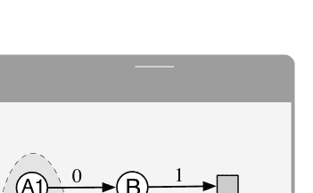

组件之一给出状态B的值，组件之一给出状态C的值，还有一个组件给出两个状态A1和A2的值。除了初始状态的选择外，系统是确定性的。如果它从A1开始，那么它会转移到B并获得奖励0，然后转移到终止状态并获得奖励1。如果它从A2开始，那么它会转移到C，然后转移到终止状态，两个奖励都是零。

对于一个学习算法来说，只看到特征，系统看起来与A-split示例完全相同。系统似乎总是从A开始，然后以相等的概率转移到B或C，最后根据前一个状态确定性地终止为1或0。与A-split示例一样，B和C的真实值分别为1和0，A₁和A₂的最佳共享值是 $\frac{1}{2}$ ，具有对称性。

因为这个问题在外部上看起来与A-split示例完全相同，我们已经知道算法将找到什么值。半梯度TD收敛到刚才提到的理想值，而天真的残差梯度算法收敛到B和C的值分别为 $\frac{3}{4}$ 和 $\frac{1}{4}$ 。所有状态转换都是确定性的，因此非天真的残差梯度算法也将收敛到这些值（在这种情况下，它是相同的算法）。因此，这个'天真'的解决方案也必须是最小化BE的解决方案，因此它是。在确定性问题上，贝尔曼误差和TD误差都是相同的，因此BE始终与TDE相同。在这个示例中优化BE会导致与A-split示例上的天真残差梯度算法相同的失败模式。

### 11.6 贝尔曼误差不可学习

方程是可能的。但是，如果我们检查具有真实函数逼近的示例，那么残差梯度算法，以及BE目标，似乎找到了错误的值函数。其中最具说明性的例子之一是变体A-presplit示例，如前一页所示，在这个例子中，残差梯度算法找到了与其朴素版本相同的糟糕解。这个例子直观地表明，最小化BE（残差梯度算法肯定会这样做）可能不是一个可取的目标。

残差梯度算法的收敛性不令人满意的第三种方式在下一节中解释。与第二种方式一样，第三种方式也是与BE目标本身有关，而不是与实现它的任何特定算法有关的问题。

我们在本节中介绍的可学习性概念与机器学习中通常使用的概念不同。在机器学习中，如果一个假设可以在多项式数量的示例中学习而不是指数数量的示例中学习，那么它被称为“可学习”。在这里，我们更基本地使用这个术语，意思是无论有多少经验，都可以学习。事实证明，许多在强化学习中表现出兴趣的数量甚至不能从无限的经验数据中学习。这些数量在环境的内部结构知识的基础上是明确定义的并且可以计算，但不能从观察到的特征向量、动作和奖励序列中计算或估计。我们说它们是不可学习的。在过去的两节中介绍的贝尔曼误差目标（BE）在这个意义上是不可学习的。贝尔曼误差目标不能从可观察数据中学习，这可能是不寻求它的最有力的原因。

为了清楚地阐明可学习性的概念，让我们从一些简单的例子开始。考虑下面所示的两个马尔可夫奖励过程（MRPs）的图表：

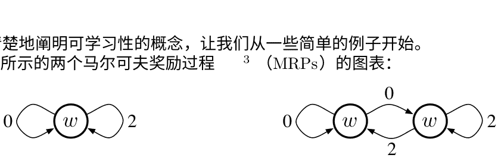

²如果观察到状态序列而不仅仅是相应的特征向量，当然可以估计它们。

³所有的MRPs都可以被视为在所有状态下只有一个动作的MDPs；我们在这里得出的结论同样适用于MDPs。

以相等的概率切换到另一个状态。在这个MRP中，奖励是确定性的，总是从一个状态获得0，总是从另一个状态获得2，但是因为每个状态在每一步上都是等可能的，可观察到的数据再次是一个随机的0和2的无尽流，与左侧MRP产生的数据相同（我们可以假设右侧MRP以相等的概率从两个状态中的一个开始）。因此，即使给定无限量的数据，也无法确定是哪个MRP生成了它。特别是，我们无法确定MRP是一个状态还是两个状态，是随机的还是确定性的。这些事情是不可学习的。

这对MRP也说明了VE目标（9.1）是不可学习的。如果γ=0，则三个状态（在两个MRP中）的真实值从左到右分别为1、0和2。假设w=1。那么左侧MRP的VE为0，右侧MRP的VE为1。因为VE在这两个问题中是不同的，但生成的数据具有相同的分布，所以无法学习VE。VE不是数据分布的唯一函数。如果无法学习，那么VE如何可能作为学习的目标有用呢？

如果一个目标无法学习，那么它的效用确实值得质疑。然而，在VE的情况下，有一种方法可以解决。请注意，对于上述两个不可区分状态的MRP，相同的解决方案，即w=1，是最优的（假设μ对于这两个不可区分状态的MRP是相同的）。这是巧合吗，还是所有具有相同数据分布的MDP也具有相同的最优参数向量？如果这是真的 - 我们将在下面证明它是真的 - 那么VE仍然是一个可用的目标。

VE是不可学习的，但优化它的参数是可行的！为了理解这一点，有必要引入另一个自然的目标函数，这次是明显可学习的。始终可以观察到的一个错误是每个时间点的值估计与该时间点的回报之间的差异。均方回报误差（RE）是该错误的平方在μ下的期望。在在线策略的情况下，RE可以写成

```
$$\overline{RE}(\mathbf{w}) = \mathbb{E}\left[\left(G_t - \hat{v}(S_t, \mathbf{w})\right)^2\right] = \overline{VE}(\mathbf{w}) + \mathbb{E}\left[\left(G_t - v_\pi(S_t)\right)^2\right].$$ (11.24)
```

因此，这两个目标除了一不依赖于参数向量的方差项之外是相同的。因此，这两个目标必须具有相同的最优参数值w*。这些整体关系总结在图11.4的左侧。

- **练习11.4** 证明 (11.24)。提示：将 RE写成对可能状态的期望给定St=s的平方误差的期望。然后从误差中添加和减去状态s的真实值（在平方之前），将减去的真实值与回报进行分组，将添加的真实值与估计值进行分组。然后，如果展开平方，最复杂的项将变为零，留下(11.24)。□现在让我们回到BE。BE与VE类似，可以从MDP的知识中计算出来，但不能从数据中学习。但它与VE不同，其最小解不可学习。下一页的方框呈现了一个反例-生成相同数据分布但其最小化参数向量不同的两个MRP，证明最优参数向量不是的函数。

## 例子 11.4：贝尔曼误差的不可学习性反例

为了展示所有可能性的完整范围，我们需要比之前考虑的更复杂的马尔可夫奖励过程（MRPs）对。考虑以下两个MRPs:


当一个状态有两条边离开时，假设两个转移发生的概率相等，并且数字表示获得的奖励。左边的MRP有两个明显不同的状态。右边的MRP有三个状态，其中两个状态，B和B'，看起来相同，必须给予相同的近似值。具体来说，w有两个组成部分，状态A的值由第一个组成部分给出，状态B和B'的值由第二个组成部分给出。第二个MRP被设计成在三个状态中花费相等的时间，因此我们可以取 $\mu(s) = \frac{1}{3}$ ，对于所有的s。

请注意，对于这两个MRP，可观测数据分布是相同的。在两种情况下，代理将看到单个的A，后面跟着一个0，然后是一些表面上的B，每个后面跟着一个-1，除了最后一个，后面跟着一个1，然后我们重新开始，有一个单独的A和一个0，等等。所有的统计细节也是相同的；在这两个MRP中，k个B的字符串的概率是 $2^{-k}$ 。

现在假设 $\mathbf{w} = 0$ 。在第一个MRP中，这是一个精确解，BE为零。在第二个MRP中，这个解产生了B和B'的平方误差，即 $BE = \mu(B)1 + \mu(B')1 = \frac{2}{3}$ 。这两个生成相同数据分布的MRP具有不同的BE；BE是不可学习的。

此外（与VE的早期示例不同），对于两个MRP， $\overline{\mathbf{w}}$ 的最小化值是不同的。对于第一个MRP， $\mathbf{w} = 0$ 最小化了任何BE $\gamma$ 。对于第二个MRP， $\mathbf{w}$ 的最小化是一个复杂的函数 $\gamma$ 的函数，但在极限情况下，当 $\gamma \uparrow 1$ 时，它是 $(-\frac{1}{2}, 0)^{-T}$ 。因此，最小化BE的解决方案不能仅通过数据来估计；需要了解超出数据所揭示的MRP的知识。从这个意义上说，从原则上讲，追求BE作为学习目标是不可能的。

令人惊讶的是，在第二个MRP中，最小化BE的A的值与零相差如此之远。请记住，A有一个专用的权重，因此它的值不受函数逼近的限制。在奖励为0且转移到值接近0的状态之后， $v_{\mathbf{w}}$ (A)应该为0；为什么它的最优值明显为负而不是0？答案是，使 $v_{\mathbf{w}}$ (A)为负可以减少从B到达A时的误差。这个确定性转换上的奖励为1，这意味着B的值应该比A大1。因为B的值接近零，A的值被推向-1。对于A的BE最小化值为 $\approx -\frac{1}{2}$ 是在离开和进入A时减少误差的折衷。

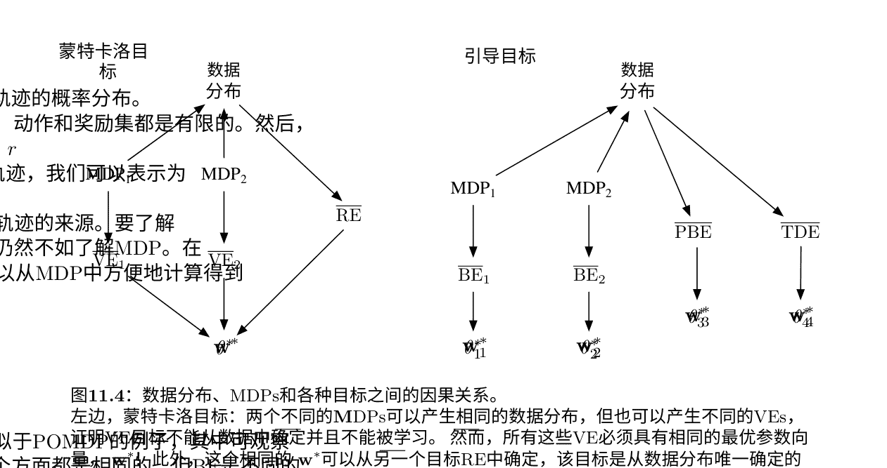

图11.4: 数据分布、MDPs和各种目标之间的因果关系。
左边，蒙特卡洛目标：两个不同的MDPs可以产生相同的数据分布，但也可以产生不同的VEs，类似于POMDP的例子不能从数据中观察确定并且不能被学习。然而，所有这些VE必须具有相同的最优参数向量在每个方面都是相同的，此外这这个向量w*可以从另一个目标RE中确定，该目标是从数据分布唯一确定的。因此，w*和RE是可学习的，即使VEs不可学习。右边，引导目标：两个不同的MDPs可以产生相同的数据分布，但也可以产生不同的BEs并且具有不同的最小化参数向量；这些不能从数据分布中学习。PBE和TDE目标及其（不同的）最小值可以直接从数据中确定，因此可以被学习。

因此，它们实际上是马尔可夫决策过程（MDP）的例子。数据因此无法从中学学习。我们考虑的其他自举目标，PBE和TDE，可以从数据中确定（可以学习的），并确定一般上与BE最小值不同的最优解。一般情况总结在图11.4的右侧。因此，他们并不是未学习的，它无法从特征向量和其他可观察数据中估计出来。这限制了BE在几乎模型的设置中的应用。没有算法可以在没有访问特征向量之外的底层MDP的状态的情况下最小化BE。残差梯度算法之所以能够最小化BE，是因为它被允许从相同的状态进行双重采样——不是具有相同特征向量的状态，而是保证是相同的底层状态。现在我们可以看到没有办法绕过这个问题。最小化BE需要对名义的底层MDP进行访问。注意，可观察数据的限制是BE的一个重要限制，超出了第273页上的A-presplit示例所确定的限制。将看到单个出现的这些都更加关注PBE。

字符串的精确解，总体BE为零。在误差都有状态被等权重加权数据中揭示的内容来估计BE。

### 11.7 梯度-TD方法

我们现在考虑用SGD方法来最小化PBE。作为真正的SGD方法，这些梯度-TD方法在离线训练和非线性函数逼近下具有强大的收敛性质。请记住，在线性情况下总是存在一个精确解，即TD固定点 $\mathbf{w}_{\mathrm{TD}}$ ，其中PBE为零。这个解可以通过最小二乘法（第9.8节）找到，但只能通过参数数量的二次复杂度方法 $O(d^2)$ 来找到。相反，我们寻求一种SGD方法，它应该是 $O(d)$ 的，并具有强大的收敛性质。梯度-TD方法接近实现这些目标，但计算复杂度大约增加了一倍。

为了推导出PBE的SGD方法（假设线性函数逼近），我们首先展开和重写目标函数（11.22）的矩阵形式：

\[ \overline{\mathrm{PBE}}(\mathbf{w}) = \left\| \Pi \bar{\delta}_{\mathbf{w}} \right\|_{\mu}^{2} \]

\[ = (\Pi \bar{\delta}_{\mathbf{w}})^\top \mathbf{D} \Pi \bar{\delta}_{\mathbf{w}} \]

\[ = \bar{\delta}_{\mathbf{w}}^\top \Pi^\top \mathbf{D} \Pi \bar{\delta}_{\mathbf{w}} \]

\[ = \bar{\delta}_{\mathbf{w}}^\top \mathbf{D} \mathbf{X} (\mathbf{X}^\top \mathbf{D} \mathbf{X})^{-1} \mathbf{X}^\top \mathbf{D} \bar{\delta}_{\mathbf{w}} \tag{11.25} \]

(使用 (11.14) 和恒等式 $\Pi^\top \mathbf{D} \Pi = \mathbf{D} \mathbf{X} (\mathbf{X}^\top \mathbf{D} \mathbf{X})^{-1} \mathbf{X}^\top \mathbf{D}$ )

\[ = (\mathbf{X}^\top \mathbf{D} \bar{\delta}_{\mathbf{w}})^\top (\mathbf{X}^\top \mathbf{D} \mathbf{X})^{-1} (\mathbf{X}^\top \mathbf{D} \bar{\delta}_{\mathbf{w}}). \tag{11.26} \]

对于 $\mathbf{w}$ 的梯度是

\[ \nabla \overline{\mathrm{PBE}}(\mathbf{w}) = 2 \nabla[\mathbf{X}^\top \mathbf{D} \bar{\delta}_{\mathbf{w}}]^\top (\mathbf{X}^\top \mathbf{D} \mathbf{X})^{-1} (\mathbf{X}^\top \mathbf{D} \bar{\delta}_{\mathbf{w}}). \]

要将其转化为SGD方法，我们必须在每个时间步采样一些具有此数量作为其期望值的东西。让我们将 $\mu$ 视为行为策略下访问的状态分布。上述三个因素都可以用这个分布的期望来表示。例如，最后一个因素可以写成

\[ \mathbf{X}^\top \mathbf{D} \bar{\delta}_{\mathbf{w}} = \sum_s \mu(s) \mathbf{x}(s) \bar{\delta}_{\mathbf{w}}(s) = \mathbb{E}[\rho_t \delta_t \mathbf{x}_t], \]

这只是半梯度TD(0)更新(11.2)的期望。第一个因子是此更新的梯度的转置：

\[ \nabla \mathbb{E}[\rho_t \delta_t \mathbf{x}_t]^\top = \mathbb{E}[\rho_t \nabla \delta_t^\top \mathbf{x}_t^\top] \]

\[ = \mathbb{E}[\rho_t \nabla (R_{t+1} + \gamma \mathbf{w}^\top \mathbf{x}_{t+1} - \mathbf{w}^\top \mathbf{x}_t)^\top \mathbf{x}_t^\top] \tag{使用分集 $\delta_t$} \]

\[ = \mathbb{E}[\rho_t (\gamma \mathbf{x}_{t+1} - \mathbf{x}_t) \mathbf{x}_t^\top]. \]

最后，中间因子是特征向量的期望外积矩阵的逆：

\[ \mathbf{X}^\top \mathbf{D} \mathbf{X} = \sum_s \mu(s) \mathbf{x}_s \mathbf{x}_s^\top = \mathbb{E}[\mathbf{x}_t \mathbf{x}_t^\top]. \]

将这些期望值代入我们对 PBE 梯度表达式的三个因子中，我们得到

$\nabla \overline{\text{PBE}}(\mathbf{w}) = 2\mathbb{E}\left[\rho_t (\gamma \mathbf{x}_{t+1} - \mathbf{x}_t)\mathbf{x}_t^\top\right] \mathbb{E}\left[\mathbf{x}_t\mathbf{x}_t^\top\right]^{-1} \mathbb{E}\left[\rho_t \delta_t \mathbf{x}_t\right]$. (11.27) 通过这种方式写出梯度可能并不明显我们取得了任何进展。它是三个表达式的乘积，而第一个和最后一个并不是独立的。它们都依赖于下一个特征向量 $\mathbf{x}_{t+1}$ ；我们不能简单地采样这两个期望值然后将样本相乘。这将给我们一个有偏差的梯度估计，就像在朴素的残差梯度算法中一样。

另一个想法是分别估计这三个期望值，然后将它们组合起来产生一个无偏的梯度估计。这样做是可行的，但需要大量的计算资源，特别是用于存储前两个期望值的 $d \times d$ 矩阵，并计算第二个的逆。这个想法可以改进。如果两个三个期望值中的两个被估计并存储，那么第三个可以被采样并与两个存储的量一起使用。例如，您可以使用增量逆更新技术（在第9.8节中介绍）来存储对后两个量的估计，然后采样第一个表达式。不幸的是，整体算法的复杂度仍然是二次的（$d^2$阶）。

将一些估计值分开存储，然后与样本结合起来的想法是一个很好的想法，并且在梯度-TD方法中也被使用。梯度-TD方法估计并存储第二个和第三个因子的乘积(11.27)。这些因子是一个 $d \times d$ 矩阵和一个 $d$ 向量，因此它们的乘积就是一个 $d$ 向量，就像 $\mathbf{w}$ 本身一样。我们将这个第二个学习到的向量表示为 $\mathbf{v}: \mathbf{v} \approx \mathbb{E}\left[\mathbf{x}_t\mathbf{x}_t^\top\right]^{-1} \mathbb{E}\left[\rho_t \delta_t \mathbf{x}_t\right]$. (11.28) 这个形式对于线性监督学习的学生来说是熟悉的。它是一个线性最小二乘问题的解，试图从特征中近似得到 $\rho_t \delta_t$ 。标准的SGD方法用于逐步找到最小化期望平方误差的向量 $\mathbf{v}$

$(\mathbf{v}^\top \mathbf{x}_t - \rho_t \delta_t)^2$ 被称为最小均方(LMS)规则（这里增加了重要性采样比例）：

$\mathbf{v}_{t+1} \doteq \mathbf{v}_t + \beta \rho_t (\delta_t - \mathbf{v}_t^\top \mathbf{x}_t) \mathbf{x}_t$

其中 $\beta >0$ 是另一个步长参数。我们可以使用这种方法以 O(d) 的存储和每步计算来有效地实现 (11.28)。

给定一个存储的估计 $\mathbf{v}_t$ 近似于 (11.28)，我们可以使用基于 (11.27) 的SGD方法来更新我们的主参数向量 $\mathbf{w}_t$ 。最简单的规则是

$\mathbf{w}_{t+1} = \mathbf{w}_t - \frac{1}{2} \alpha \nabla \overline{\text{PBE}}(\mathbf{w}_t)$ (一般的SGD规则)

$= \mathbf{w}_t - \frac{1}{2} \alpha 2\mathbb{E}\left[\rho_t (\gamma \mathbf{x}_{t+1} - \mathbf{x}_t)\mathbf{x}_t^\top\right] \mathbb{E}\left[\mathbf{x}_t\mathbf{x}_t^\top\right]^{-1} \mathbb{E}\left[\rho_t \delta_t \mathbf{x}_t\right]$ (来自(11.27))

$= \mathbf{w}_t + \alpha \mathbb{E}\left[\rho_t (\mathbf{x}_t - \gamma \mathbf{x}_{t+1})\mathbf{x}_t^\top\right] \mathbb{E}\left[\mathbf{x}_t\mathbf{x}_t^\top\right]^{-1} \mathbb{E}\left[\rho_t \delta_t \mathbf{x}_t\right]$. (11.29)

$\approx \mathbf{w}_t + \alpha \mathbb{E}\left[\rho_t (\mathbf{x}_t - \gamma \mathbf{x}_{t+1})\mathbf{x}_t^\top\right] \mathbf{v}_t$ (基于 (11.28) )

$\approx \mathbf{w}_t + \alpha \rho_t (\mathbf{x}_t - \gamma \mathbf{x}_{t+1}) \mathbf{x}_t^\top \mathbf{v}_t$ (采样)这个算法被称为 GTD2。请注意，如果最终的内积 $(\mathbf{x}_t^\top \mathbf{v}_t)$ 先进行，那么整个算法的复杂度为 $O(d)$。
通过在替换$v_t$之前进行更多的分析步骤，可以得到稍微更好的算法。
从（11.29）继续：

$$\begin{aligned}
\mathbf{w}_{t+1} &= \mathbf{w}_t + \alpha \mathbb{E}[\rho_t(\mathbf{x}_t - \gamma\mathbf{x}_{t+1})\mathbf{x}_t^\top] \mathbb{E}[\mathbf{x}_t\mathbf{x}_t^\top]^{-1} \mathbb{E}[\rho_t\delta_t\mathbf{x}_t] \\
&= \mathbf{w}_t + \alpha \left( \mathbb{E}[\rho_t\mathbf{x}_t\mathbf{x}_t^\top] - \gamma\mathbb{E}[\rho_t\mathbf{x}_{t+1}\mathbf{x}_t^\top] \right) \left( \mathbb{E}[\mathbf{x}_t\mathbf{x}_t^\top] \right)^{-1} \mathbb{E}[\rho_t\delta_t\mathbf{x}_t] \\
&= \mathbf{w}_t + \alpha \left( \mathbb{E}[\mathbf{x}_t\mathbf{x}_t^\top] - \gamma\mathbb{E}[\rho_t\mathbf{x}_{t+1}\mathbf{x}_t^\top] \right) \left( \mathbb{E}[\mathbf{x}_t\mathbf{x}_t^\top] \right)^{-1} \mathbb{E}[\rho_t\delta_t\mathbf{x}_t] \\
&= \mathbf{w}_t + \alpha \left( \mathbb{E}[\mathbf{x}_t\rho_t\delta_t] - \gamma\mathbb{E}[\rho_t\mathbf{x}_{t+1}\mathbf{x}_t^\top] \mathbb{E}[\mathbf{x}_t\mathbf{x}_t^\top]^{-1} \mathbb{E}[\rho_t\delta_t\mathbf{x}_t] \right) \\
&\approx \mathbf{w}_t + \alpha \left( \mathbb{E}[\mathbf{x}_t\rho_t\delta_t] - \gamma\mathbb{E}[\rho_t\mathbf{x}_{t+1}\mathbf{x}_t^\top] \right) \mathbf{v}_t \quad \text{(基于 (11.28))} \\
&\approx \mathbf{w}_t + \alpha \rho_t \left( \delta_t\mathbf{x}_t - \gamma\mathbf{x}_{t+1}\mathbf{x}_t^\top \mathbf{v}_t \right) \quad \text{(采样)}
\end{aligned}$$

如果最终产品 $(\mathbf{x}_t^\top \mathbf{v}_t)$ 先完成，则再次是 $O(d)$。 这个算法被称为TD(0)梯度修正（TDC）或者，另外，被称为 GTD(0)。图11.5展示了TDC在Baird的反例上的样本和预期行为。 正如预期的那样，PBE降为零，但请注意参数向量的各个分量并没有趋近于零。 事实上，这些值仍然远离零。

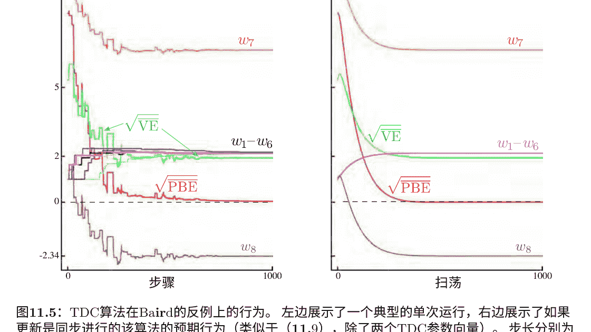

对于所有的$s$，一个最优解是$\hat{v}(s) = 0$，这要求 $w$与$(1,1,1,1,1,1,4,-2)^{\mathrm{T}}$成比例。经过1000次迭代，我们离最优解还很远，从值函数估计（VE）中可以看出，它几乎保持在2附近。系统实际上正在收敛到一个最优解，但进展非常缓慢，因为PBE已经非常接近零。

GTD2和TDC都涉及两个学习过程，一个主要用于 $w$，一个次要用于 $v$。主要学习过程的逻辑依赖于次要学习过程已经完成，至少近似完成，而次要学习过程则在不受第一个学习过程影响的情况下进行。我们称这种不对称的依赖关系为级联。在级联中，我们经常假设次要学习过程进行得更快，因此始终处于其渐近值，准备好并准确地辅助主要学习过程。这些方法的收敛证明通常明确做出这个假设。这些被称为双时间尺度证明。快时间尺度是次要学习过程的时间尺度，慢时间尺度是主要学习过程的时间尺度。如果主要学习过程的步长为 $\alpha$，次要学习过程的步长为 $\beta$，那么这些收敛证明通常要求在极限 $\beta \rightarrow 0$和 $\frac{\alpha}{\beta} \rightarrow 0$。

梯度-TD方法目前是最为理解和广泛使用的稳定方法离策略方法。对于动作值和控制（GQ，Maei等，2010），对于资格追踪（GTD($\lambda$)和GQ($\lambda$)，Maei, 2011；Maei和Sutton，2010)，以及对非线性函数逼近（Maei等，2009）有扩展。还提出了介于半梯度TD和梯度TD之间的混合算法（Hackman, 2012；White和White，2016)。混合-TD算法在目标策略和行为策略非常不同的状态下表现得像梯度-TD算法，在目标策略和行为策略相同的状态下表现得像半梯度算法。最后，梯度-TD思想已经与近端方法和控制变量的思想相结合，产生了更加高效的方法（Mahadevan等，2014；Du等，2017）。

### 11.8 强调-TD方法

我们现在转向第二个主要策略，这个策略已经广泛研究，用于获得一种廉价且高效的离策略学习方法，该方法使用函数逼近。回顾一下，当在非策略分布下训练时，线性半梯度TD方法是高效且稳定的，并且我们在第9.4节中证明了这与矩阵 $\mathbf{A}$ (9.11)的正定性以及目标策略下的状态转移概率 $p(s'|s, a)$与策略状态分布 $\mu_{\pi}$之间的匹配有关。在

离策略学习中，我们使用重要性采样重新加权状态转移，使其适合于学习目标策略，但状态分布仍然是行为策略的分布。存在不匹配。一个自然的想法是以某种方式重新加权状态，强调某些状态并减弱其他状态，以使更新的分布返回到策略状态分布。然后就会有匹配，并且稳定性和收敛性将来自现有的结果。这就是这个想法的含义。

Emphatic-TD方法，首次在第9.11节中介绍了关于在策训练的概念“在策分布”并不完全正确，因为存在许多非策分布，其中任何一个都足以保证稳定性。考虑一个无折扣的情节问题。情节的终止方式完全由转移概率决定，但可能有几种不同的方式来开始情节。

无论情节如何开始，如果所有状态转换都是由目标策略引起的，那么结果的状态分布就是在策分布。你可能会从终止状态附近开始，只访问几个高概率的状态，然后结束情节。或者你可能会从很远的地方开始，经过许多状态后终止。无论过程如何开始，只要遇到的所有状态都在终止之前进行更新，就会得到一个在策分布，并且使用线性半梯度方法对其进行训练将保证稳定性。无论过程如何开始，只要遇到的所有状态都在终止之前进行更新，就会得到一个在策分布。

如果有折扣，可以将其视为部分或概率性终止。如果γ = 0.9，则我们可以认为以0.1的概率在每个时间步终止并立即重新开始转换到的状态。折扣问题是一个不断终止和重新开始的问题，概率为1−γ每一步。这种对折扣的思考方式是伪终止的一个例子——终止不影响状态转换序列，但影响学习过程和学习的数量。

这种伪终止对于离策略学习非常重要，因为重新开始是可选的——记住我们可以以任何方式开始——而终止则不需要将遇到的状态包括在策略分布中。也就是说，如果我们不将新状态视为重新开始，那么折扣很快就会给我们一个有限的离策略分布。

### 学习情景状态值的一步强调-TD算法的定义如下：

$$\delta_t = R_{t+1} + \gamma \hat{v}(S_{t+1}, \mathbf{w}_t) - \hat{v}(S_t, \mathbf{w}_t),$$

$$\mathbf{w}_{t+1} = \mathbf{w}_t + \alpha M_t \rho_t \delta_t \nabla \hat{v}(S_t, \mathbf{w}_t),$$

$$M_t = \beta \rho_{t-1} M_{t-1} + I_t,$$

其中$I_t$是任意的利益，$M_t$是初始化为$M_{t-1}=0$的强调。这个算法在贝尔德的反例上表现如何？图11.6展示了参数向量的组成部分的期望轨迹（对于$I_t=1$，对于所有$t$的情况）。有一些振荡，但最终一切都会收敛，VE趋近于零。这些轨迹是通过迭代计算参数向量轨迹的期望而获得的，没有考虑由于转换和奖励采样而产生的方差。我们没有直接展示应用Emphatic-TD算法的结果，因为在贝尔德的反例上，其方差非常高，几乎不可能在计算实验中得到一致的结果。该算法在理论上收敛于该问题的最优解，但在实践中并不如此。我们将在下一节讨论如何减少所有这些算法的方差。

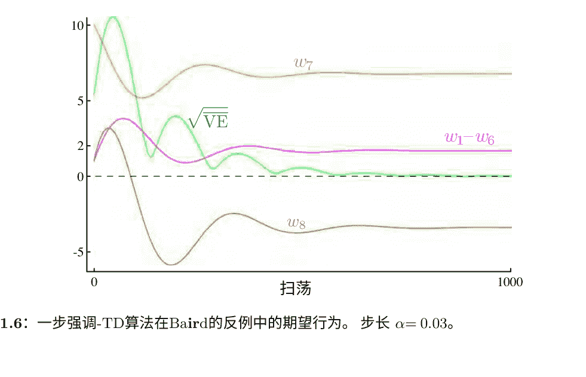

图11.6：一步强调-TD算法在Baird的反例中的期望行为。步长 α=0.03。

### 11.9 减少方差

离策略学习的方差比在策略学习中本质上更大。这并不令人惊讶；如果您收到与策略关系较小的数据，您应该预计对策略的价值了解较少。在极端情况下，您可能无法学到任何东西。例如，您不能指望通过做晚饭来学会开车。只有当目标策略和行为策略相关时，如果它们访问相似的状态并采取相似的动作，才能在离策略训练中取得重大进展。

另一方面，任何策略都有许多邻居，许多相似的策略在访问的状态和选择的动作上有很大的重叠，但并不相同。离策略学习的存在理由是使得对这个庞大数量的相关但不完全相同的策略进行泛化。问题仍然是如何最好地利用经验。现在我们有一些在期望值上稳定的方法（如果步长设置正确），注意力自然转向减少估计的方差。有许多可能的想法，我们在这个入门文本中只是简单提及其中一些。

为什么在基于重要性采样的离策略方法中，控制方差尤为关键？正如我们所见，重要性采样通常涉及策略比率的乘积。这些比率在期望中始终为1（5.13），但它们的实际值可能非常高或者接近零。连续的比率是不相关的，因此它们的乘积在期望值上也始终为1，但方差可能非常高。请记住，这些比率会乘以SGD方法中的步长，因此高方差意味着采取变化很大的步长。这对于SGD来说是有问题的，因为偶尔会有非常大的步长。它们不能太大，以至于将参数带到具有非常不同梯度的部分。SGD方法依赖于对多个步骤进行平均以获得梯度的良好估计，如果它们从单个样本中进行大幅移动，它们将变得不可靠。

如果将步长参数设置得足够小以防止这种情况发生，那么预期步长可能会非常小，导致学习速度非常慢。动量的概念（Derthick, 1984），Polyak-Ruppert平均化（Polyak, 1990; Ruppert, 1988; Polyak和Juditsky, 1992）或者这些思想的进一步扩展可能会有很大帮助。自适应地为参数向量的不同分量设置不同的步长的方法也是相关的（例如，Jacobs, 1988; Sutton, 1992b, c），Karampatziakis和Langford（2010）的“重要性权重感知”更新也是相关的。

在第5章中，我们看到加权重要性采样比普通重要性采样更好行为，具有更低的方差更新。然而，将加权重要性采样适应函数逼近是具有挑战性的，可能只能以 O(d) 的复杂度近似完成（Mahmood和Sutton, 2015年）。

树备份算法（第7.5节）表明可以在不使用重要性采样的情况下进行一些离策略学习。这个想法已经扩展到了离策略情况，通过Munos、Stepleton、Harutyunyan和Bellemare（2016年）以及Mahmood、Yu和Sutton（2017年）提出了稳定且更高效的方法。

另一种互补策略是允许目标策略部分由行为策略决定，以使其与行为策略不会有很大的重要性采样比。例如，目标策略可以通过参考行为策略来定义，就像Precup等人（2006）提出的“识别器”中所建议的那样。

### 11.10 总结

离线学习是一个具有挑战性的问题，考验我们在设计稳定和高效学习算法。表格Q学习使得离线学习变得容易，它自然地推广到了期望Sarsa和树备份算法。但正如我们在本章中所看到的，将这些思想扩展到重要的函数逼近，甚至是线性函数逼近，都涉及到新的挑战，并迫使我们加深对强化学习算法的理解。

为什么要这样做呢？寻求离线算法的一个原因是在探索和利用之间提供灵活性。另一个原因是将行为从学习中解放出来，避免目标策略的专制。TD学习似乎有可能同时学习多个任务，利用一条经验流来解决许多任务。在特殊情况下，我们当然可以做到这一点，只是不能在每个我们想要的情况下或者像我们希望的那样高效地做到。

在本章中，我们将离线学习的挑战分为两个部分。第一部分是为行为策略纠正学习目标，可以直接使用之前为表格情况设计的技术来处理，但这会增加更新的方差，从而减慢学习速度。高方差可能始终是离线学习的一个挑战。

离线学习的第二个挑战是涉及引导的半梯度TD方法的不稳定性。我们寻求强大的函数近似、离策略学习以及引导式TD方法的效率和灵活性，但是在一个算法中结合这三个方面是具有挑战性的，因为这可能引入不稳定性的潜在因素。已经有几次尝试。最流行的方法是在贝尔曼误差（也称为贝尔曼残差）中寻求执行真正的随机梯度下降（SGD）。然而，我们的分析得出结论，在许多情况下，这不是一个吸引人的目标，并且无论如何，通过学习算法无法实现这个目标——BE的梯度无法从仅揭示特征向量而不是底层状态的经验中学习。另一种方法，梯度-TD方法，在投影贝尔曼误差中执行SGD。PBE的梯度可以通过 O(d)复杂度进行学习，但代价是具有第二个步长的第二个参数向量。最新的方法家族，Emphatic-TD方法，改进了一种旧的思想，重新加权更新，强调某些更新并减弱其他更新。通过这种方式，它们恢复了使得基于策略学习稳定的特殊属性，同时使用计算简单的半梯度方法。

离策略学习的整个领域相对较新且不稳定。哪些方法是最好的，甚至是足够的，目前还不清楚。这一章末尾引入的新方法的复杂性真的有必要吗？它们中的哪些可以结合使用有效地使用方差减少方法？离线学习的潜力仍然令人心动，实现它的最佳方法仍然是一个谜。

### 参考文献和历史评论

+   11.1 第一个半梯度方法是线性TD(λ) (Sutton, 1988)。“半梯度”这个名字是比较新的(Sutton, 2015a)。具有一般重要性采样比率的半梯度离线策略TD(0)可能直到Sutton, Mahmood和White (2016)才被明确提出，但动作值形式是由Precup, Sutton和Singh (2000)引入的，他们还对这些算法进行了资格追踪形式的研究(见第12章)。它们的持续、无折扣形式尚未得到重视。这里给出的n步形式是新的。

11.2 最早的 w-to-2w示例是由Tsitsiklis和Van Roy (1996) 给出的，他们还在第263页的方框中介绍了具体的反例。Baird的反例是由Baird (1995) 提出的，尽管我们在这里呈现的版本稍作修改。Gordon (1995, 1996b) 开发了用于函数逼近的平均方法。Boyan和Moore (1995) 给出了使用off-policy DP方法和更复杂的函数逼近方法的不稳定性的其他示例。Bradtke (1993) 给出了一个例子，其中在线性二次调节问题中使用线性函数逼近的Q-learning收敛到一个破坏稳定性的策略。

11.3 致命三位一体首先由Sutton (1995b) 确定，并由Tsitsiklis和Van Roy (1997) 进行了彻底分析。“致命三位一体”这个名字是由Sutton (2015a) 提出的。

11.4 这种线性分析方法是由Tsitsiklis和Van Roy (1996年; 1997年) 首创的，包括动态规划算子。图11.3这样的图表是由Lagoudakis和Parr（2003年）引入的。

我们所称之为Bellman算子，表示为$B_{\pi}$，通常更常见的表示为$T^{\pi}$，并称之为“动态规划算子”，而一般形式，表示为$T^{(\lambda)}$，称之为“$TD(\lambda)$算子”（Tsitsiklis和Van Roy，1996年，1997年）。

11.5
BE首次被Schweitzer和Seidmann（1985年）提出作为动态规划的目标函数。Baird（1995年，1999年）将其扩展到基于随机梯度下降的TD学习。在文献中，BE最小化通常被称为Bellman残差最小化。

最早的A分裂示例归功于Dayan（1992年）。这里给出的两种形式是由Sutton等人引入的（2009a年）。

11.6
本节的内容是本文的新内容。

11.7
梯度-TD方法是由Sutton，Szepesvári和Maei（2009b年）引入的。

本节中介绍的方法是由Sutton等人（2009a年）和Mahmood等人（2014年）引入的。对近端TD方法的重大扩展是由Mahadeval等人（2014年）开发的。对梯度-TD和相关方法迄今为止最敏感的实证研究由Geist和Scherrer（2014年），Dann，Neumann和Peters（2014年），White（2015年）以及Ghiassian，White，White和Sutton（准备中）给出。Yu（2017年）介绍了梯度-TD方法理论的最新发展。

11.8
强调-TD方法是由Sutton，Mahmood和White（2016年）引入的。

完全收敛证明和其他理论后来由Yu（2015; 2016; Yu, Mahmood, and Sutton, 2017），Hallak, Tamar, and Mannor (2015), and Hallak, Tamar, Munos, and Mannor (2016)建立。

# 第12章
# 资格追踪

资格追踪是强化学习的基本机制之一。例如，在流行的TD(λ)算法中，λ指的是使用资格追踪。几乎任何时序差分（TD）方法，如Q学习或Sarsa，都可以与资格追踪结合使用，以获得一种更通用的方法，可能学习更高效。

资格追踪统一和概括了TD和蒙特卡洛方法。当TD方法与资格追踪相结合时，它们产生了一系列方法，涵盖了一个光谱，其中蒙特卡洛方法位于一端（λ=1），而一步TD方法位于另一端（λ=0）。中间是一些中间方法，通常比任何极端方法都要好。资格追踪还提供了一种在线实现蒙特卡洛方法和在连续问题上的方法的方式，而无需进行剧集。

当然，我们已经看到了一种统一TD和Monte Carlo方法的方式：第7章的n步TD方法。除此之外，资格追踪还提供了一种优雅的算法机制，具有显著的计算优势。这种机制是一个短期记忆向量，即资格追踪z_t∈R^d，与长期权重向量w_t∈R^d相对应。大致的想法是，当w_t的一个分量参与产生估计值时，相应的z_t的分量会增加，然后逐渐消失。如果在追踪回到零之前发生非零的TD误差，那么w_t的该分量将发生学习。追踪衰减参数λ∈[0,1]决定了追踪下降的速度。

资格追踪相对于n步方法的主要计算优势在于只需要一个追踪向量，而不是存储最后n个特征向量。学习也是持续而均匀地在时间上发生，而不是延迟然后在剧集结束时追赶。此外，学习可以在遇到状态后立即发生并影响行为，而不是延迟n个步骤。

资格追踪说明学习算法有时可以以不同的方式实现以获得计算优势。许多算法最自然地被表述和理解为基于随后事件对状态值进行更新，这些事件在未来多个时间步骤中跟随该状态。例如，蒙特卡洛方法（第5章）基于所有未来的奖励对状态进行更新，而n步TD方法（第7章）基于未来的n个奖励和状态进行更新。

基于未来的下一个奖励和状态n个步骤进行更新。这种基于从更新后的状态向前看的描述被称为前向视图。前向视图总是有些复杂，因为更新依赖于此时不可用的后续事物。然而，正如我们在本章中所展示的，通常可以通过使用当前的TD误差，向后看最近访问的状态，并使用资格追踪来实现几乎相同的更新（有时完全相同）。这些替代的学习算法观点和实现方式被称为后向视图。前向视图、后向视图之间的转换以及它们之间的等价关系可以追溯到时序差异学习的引入，但自2014年以来已经变得更加强大和复杂。在这里，我们介绍现代视图的基础知识。

通常情况下，我们首先完全发展状态值和预测的思想，然后将其扩展到动作值和控制。我们首先针对同策略情况进行开发，然后将其扩展到离策略学习。我们的处理特别关注线性函数逼近的情况，对于这种情况，使用资格迹的结果更加强大。

所有这些结果也适用于表格和状态聚合的情况，因为这些都是线性函数逼近的特殊情况。

### 12.1 λ回报

在第7章中，我们将n步回报定义为前n个奖励的总和加上在n步中到达的状态的估计值，每个都适当地折现（7.1）。对于任何参数化的函数逼近器，该方程的一般形式为

```
$G_{t:t+n} \doteq R_{t+1} + \gamma R_{t+2} + \cdots + \gamma^{n-1} R_{t+n} + \gamma^n \hat{v}(S_{t+n}, \mathbf{w}_{t+n-1}), \quad 0 \le t \le T-n, \quad (12.1)$
```

其中 $\hat{v}(s, \mathbf{w})$ 是给定权重向量 $\mathbf{w}$（第9章）的状态 $s$ 的近似值，而 $T$ 是剧集终止的时间，如果有的话。我们在第7章中指出，对于每个n步回报，对于$n-1$，都是一个表格学习更新的有效目标，就像对于类似于(9.7)的近似SGD学习更新一样。

现在我们注意到，不仅可以朝着任何n步回报进行有效更新，而且可以朝着不同n步回报的任何平均值进行更新。例如，可以朝着一个两步回报的一半和一个四步回报的一半进行更新：

```
$\frac{1}{2} G_{t:t+2} + \frac{1}{2} G_{t:t+4}$
```

任何一组n步回报都可以以这种方式进行平均，甚至是一个无限集合，只要组成回报的权重是正的并且总和为1。复合回报具有类似于单个n步回报的误差减少特性(7.3)，因此可以用来构建具有收敛性保证的更新属性。平均产生了一系列全新的算法。例如，可以对一步和无限步回报进行平均，以获得另一种关联TD和蒙特卡洛方法的方式。原则上，甚至可以将基于经验的更新与DP更新进行平均，以获得经验和基于模型的简单组合方法（参见第8章）。

将简单组件更新的平均值称为复合更新。复合更新的备份图由每个组件更新的备份图组成，上面有一条水平线，下面是权重分数。例如，对于本节开头提到的情况，混合两步回报的一半和四步回报的一半的复合更新具有右侧所示的图表。只有在其组件更新中最长的更新完成时，才能进行复合更新。例如，右侧的更新只能在时间 t+4 时完成，在时间 t 形成的估计值。通常，人们希望限制最长组件更新的长度，因为这会导致更新的延迟。

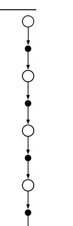

TD(λ)算法可以理解为一种特定的平均化方法 n步更新。这个平均值包含了所有的n步更新，每个更新按比例加权，其中 λ ∈ [0,1]，并通过一个因子进行归一化。1-λ确保权重之和为1（图12.1）。得到的更新是朝向一个称为 λ-return 的回报，其状态形式定义为

```
$$G_t^\lambda \doteq (1-\lambda) \sum_{n=1}^{\infty} \lambda^{n-1} G_{t:t+n}.$$
```

图12.2进一步说明了序列中的加权 n步回报 λ-return。一步回报被赋予最大的权重，1-λ；两步回报被赋予次大的权重，(1-λ)λ；三步回报被赋予权重 (1-λ)λ²；以此类推。每增加一步，权重减弱 λ。达到终止状态后，所有后续的 n步回报都等于常规回报 G_t。如果

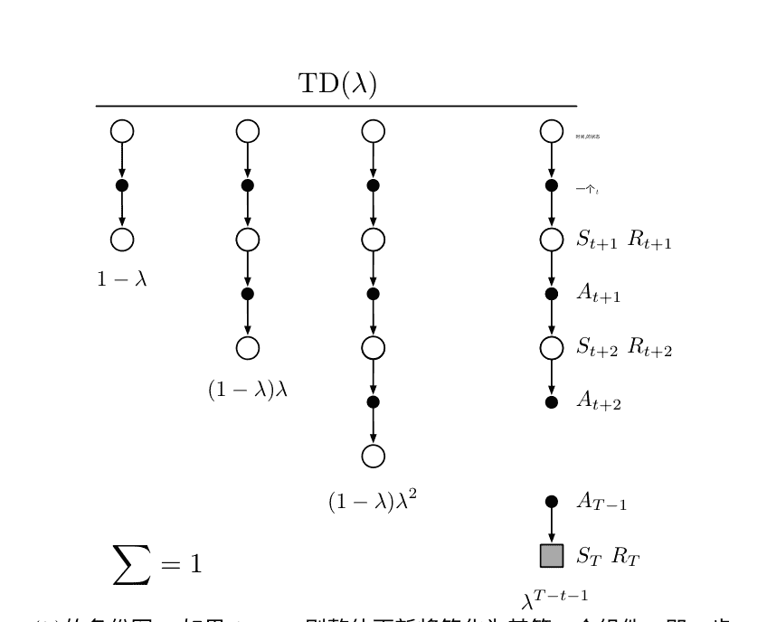

图12.1：TD(λ)的备份图。如果 λ=0，则整体更新将简化为其第一个组件，即一步TD更新；而如果 λ=1，则整体更新将简化为其最后一个组件，即蒙特卡洛更新。

如果我们愿意，我们可以将这些终止后的项与主要求和分开，得到

```
$G_t^\lambda = (1-\lambda) \sum_{n=1}^{T-t-1} \lambda^{n-1} G_{t:t+n} + \lambda^{T-t-1} G_t, \quad (12.3)$
```

如图所示。这个方程更清楚地说明了当 λ=1 时会发生什么。在这种情况下，主要求和项变为零，剩余项变为常规回报。因此，对于 λ=1，根据 λ-return 进行更新是一种蒙特卡洛算法。

另一方面，如果 λ=0，则 λ-return 减少为 G_{t:t+1}，即一步回报。因此，对于 λ=0，根据 λ-return 进行更新是一种一步 TD 方法。

**练习 12.1** 就像回报可以根据第一个奖励和自身一步之后 (3.9) 的回报递归地写成一样，λ-return 也可以。从 (12.2) 和 (12.1) 推导出类似的递归关系。

**练习 12.2** 参数 λ表征指数加权在图12.2中下降的速度，从而决定了 λ-回报算法在确定其更新时向未来推进的距离。但是，像 λ这样的速率因子有时是描述衰减速度的一种尴尬方式。对于某些目的，更好地指定一个时间常数或半衰期。关于 λ和半衰期 τ_λ 之间的方程是什么，即加权序列将下降到其初始值的一半所需的时间？

我们现在准备基于 λ-回报来定义我们的第一个学习算法：离线 λ-回报算法。作为一种离线算法，在整个回合过程中它不对权重向量进行任何更改。然后，在回合结束时，根据我们通常的半梯度规则，使用 λ-回报作为目标进行整个离线序列的更新：

```
$\mathbf{w}_{t+1} = \mathbf{w}_t + \alpha \left[ G_t^\lambda - \hat{v}(S_t, \mathbf{w}_t) \right] \nabla \hat{v}(S_t, \mathbf{w}_t), \quad t=0,\ldots,T-1. \quad (12.4)$
```

这里，我们使用了一个替代的方法来在蒙特卡洛和一步TD方法之间平滑地切换，这个方法可以与第7章中开发的n步引导方法进行比较。在那里，我们评估了一个19状态的随机行走任务（示例7.1，第144页）的有效性。图12.3展示了这个任务上离线λ回报算法的性能，与n步方法的性能相比（从图7.2中重复）。实验与之前描述的完全相同，只是对于离线λ回报算法，我们变化了λ而不是n。使用的性能度量是每个状态的正确值和估计值之间的估计均方根误差，在第一个10个回合和19个状态上进行平均。请注意，离线λ回报算法的整体性能与n步算法相当。在这两种情况下，我们在引导参数的中间值处获得最佳性能，对于n步方法是n，对于离线λ回报算法是λ。

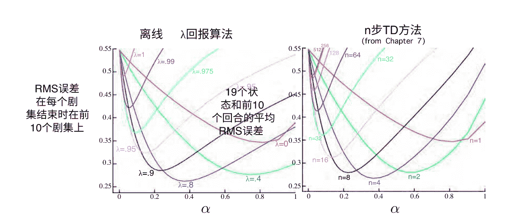

到目前为止，我们一直采用的方法是我们所称之为理论或前向视图的学习算法。对于每个访问的状态，我们向前看，考虑未来的奖励，并决定如何最好地组合它们。我们可以想象自己沿着状态流动，从每个状态向前看，确定其更新，如图12.4所示。在从一个状态向前看并更新之后，我们移动到下一个状态，不再需要处理前一个状态。另一方面，未来的状态会被反复地查看和处理，每个前面的视角都会处理一次。

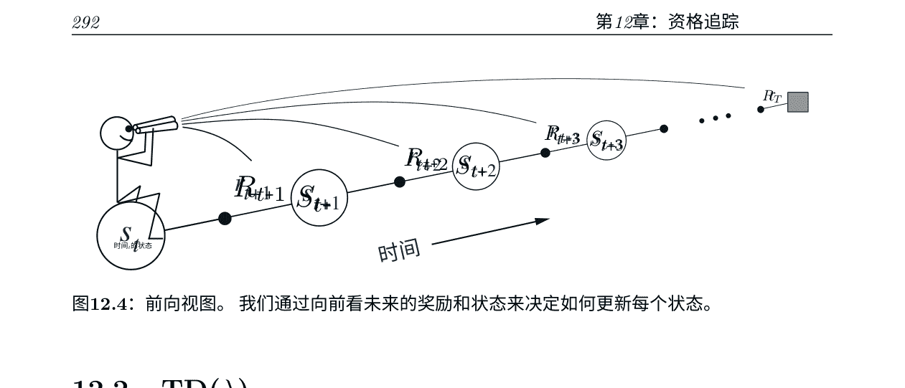

### 12.2 TD(λ)

TD(λ)是强化学习中最古老且最广泛使用的算法之一。它是第一个在更理论的前向视图和更适合计算的后向视图之间展示了正式关系的算法。在这里，我们将通过实证的方式展示它近似于前一节中介绍的离线 λ-return算法。

TD(λ)在三个方面改进了离线 λ-return算法。 首先，它在每个回合的每一步都更新权重向量，而不仅仅在最后一步，因此它的估计可能更早更好。 其次，它的计算在时间上是均匀分布的，而不是在回合结束时集中进行。 第三，它可以应用于连续问题，而不仅仅是片段问题。 在本节中，我们介绍了带有函数逼近的TD(λ)的半梯度版本。

在函数逼近中，资格迹是一个向量 $z_t \in \mathbb{R}^d$，具有与权重向量 $w_t$ 相同数量的分量。而权重向量是一种长期记忆，随着系统的生命周期累积，资格迹是一种短期记忆，通常持续的时间比回合的长度短。 资格迹有助于学习过程；它们的唯一后果是影响权重向量，然后权重向量决定估计值。

在TD(λ)中，资格迹向量在回合开始时初始化为零，在每个时间步骤上增加值梯度，然后逐渐消失：

```
$z_{-1} \doteq 0, \\ z_t \doteq \lambda\gamma z_{t-1} + \nabla\hat{v}(S_t, w_t), \quad 0 \leq t \leq T, \quad (12.5)$
```

其中 $\gamma$ 是折扣率，$\lambda$ 是前一节介绍的参数，我们将其称为迹衰减参数。 资格迹跟踪权重向量的哪些分量对最近的状态估值产生了正面或负面的贡献，其中“最近”是根据 $\lambda\gamma$ 来定义的。 （回想一下，在线性函数逼近中， $\nabla\hat{v}(S_t, w_t)$ 只是特征向量 $x_t$，在这种情况下，资格迹向量只是过去逐渐消失的输入向量的总和。） 资格迹被认为指示了权重向量的每个分量进行学习的资格。如果发生强化事件，应该进行哪些更改。 我们关注的强化事件是逐时刻的一步TD误差。状态值预测的TD误差是

```
$$\delta_t \doteq R_{t+1} + \gamma \hat{v}(S_{t+1}, \mathbf{w}_t) - \hat{v}(S_t, \mathbf{w}_t)$$ (12.6)
```

在TD(λ)中，权重向量在每一步上按比例更新到标量TD误差和向量资格迹:

```
$$\mathbf{w}_{t+1} \doteq \mathbf{w}_t + \alpha \delta_t \mathbf{z}_t$$ (12.7)
```

**用于估计 $\hat{v} \approx v_\pi$ 的半梯度TD($\lambda$)**

- 输入: 要评估的策略 $\pi$
- 输入: 一个可微分函数 $\hat{v}: \mathcal{S}^+ \times \mathbb{R}^d \rightarrow \mathbb{R}$ such that $\hat{v}(\text{terminal}, \cdot) = 0$
- 算法参数: 步长 $\alpha > 0$, 迹衰减率 $\lambda \in [0,1]$
- 初始化值函数权重 $\mathbf{w}$ 任意 (例如, $\mathbf{w} = 0$)

循环每个回合:
    初始化 $S$
    $\mathbf{z} \leftarrow 0$ (一个 $d$ 维向量)
    对每个回合的每个步骤进行循环:
        选择 $A \sim \pi(\cdot|S)$
        执行动作 $A$, 观察 $R, S'$
        $\mathbf{z} \leftarrow \lambda \gamma \mathbf{z} + \nabla \hat{v}(S, \mathbf{w})$
        $\delta \leftarrow R + \gamma \hat{v}(S', \mathbf{w}) - \hat{v}(S, \mathbf{w})$
        $\mathbf{w} \leftarrow \mathbf{w} + \alpha \delta \mathbf{z}$
        $S \leftarrow S'$
    直到 $S'$ 是终止状态

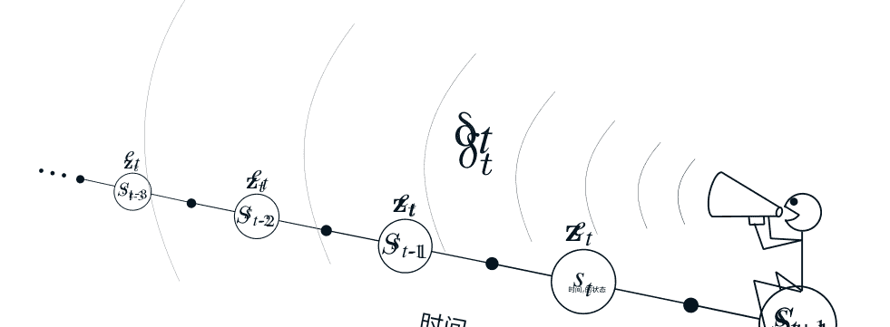

图12.5: TD (λ) 的后向或机械视图。每次更新都取决于当前的TD误差与过去事件的当前资格痕迹的组合。

TD(λ)是向后定向的。在每个时刻，我们查看当前的TD误差，并根据该状态在该时刻对当前资格痕迹的贡献程度将其向后分配给每个先前的状态。我们可以想象自己沿着状态流动，计算TD误差，并将其传递回先前访问过的状态，如图12.5所示。当TD误差和痕迹相结合时，我们得到由（12.7）给出的更新，改变那些过去状态的值，以便它们在未来再次出现时发生变化。

为了更好地理解TD(λ)的反向视图，在不同的 λ 值下会发生什么。如果 λ = 0，那么根据(12.5)，t处的迹恰好是对应于 S_t 的值梯度。因此，TD(λ)更新(12.7)简化为一步半梯度TD更新，在第9章中进行了处理(在表格情况下，简化为简单的TD规则(6.2))。这就是为什么该算法被称为TD(0)的原因。根据图12.5，TD(0)是一种情况只有前一个状态由TD误差改变。对于 λ 的值较大，但仍然 λ < 1，更多的前一个状态会发生改变，但是每个更远的状态改变较少，因为相应的资格追踪较小，正如图所示。我们说较早的状态对TD误差给予较少的信用。

如果 λ = 1，则对先前状态的信用仅在每一步中减少 γ。事实证明，这是实现蒙特卡罗行为的正确方法。例如，记住TD误差，δ_t，包括一个未折扣项 R_{t+1}。在将其传递回 k 步之后，它需要按 γ^k 进行折扣，就像返回中的任何奖励一样，这正是下降的资格追踪所实现的。如果 λ = 1 且 γ = 1，则资格追踪不会随时间衰减。在这种情况下，该方法的行为类似于一个未折扣的蒙特卡罗方法，用于一个分集任务。如果 λ = 1，则该算法也被称为TD(1)。TD(1)是一种实现蒙特卡罗算法的方法，比之前介绍的方法更通用，并显著增加了其适用范围。而之前的蒙特卡罗方法仅限于分集任务，TD(1)也可应用于折扣连续任务。此外，TD(1)可以增量和在线执行。蒙特卡罗方法的一个缺点是它们在一个情节结束之前不会从中学习任何东西。例如，如果蒙特卡罗控制方法采取一个产生非常差的奖励但不结束情节的动作，那么在整个情节中，代理重复该动作的倾向将不会减弱。另一方面，在线TD(1)从不完整的进行中的情节中以N步TD的方式进行学习，其中N步一直到当前步。如果在一个情节中发生了异常好或异常坏的情况，基于TD(1)的控制方法可以立即学习并在同一个情节中改变其行为。

重新访问19状态随机行走示例（示例7.1），看看TD（λ）在近似离线λ回报算法方面的表现是多么令人震惊。两种算法的结果如图12.6所示。对于每个 λ 值，如果选择最优的 α（或更小），那么这两种算法的性能几乎相同。然而，如果选择的 α 比最优值大，那么 λ 回报算法只会稍微差一些，而TD（λ）则会更差甚至可能不稳定。对于这个问题，TD（λ）并不会造成灾难，因为这些较高的参数值并不是人们想要使用的，但对于其他问题来说，这可能是一个显著的弱点。

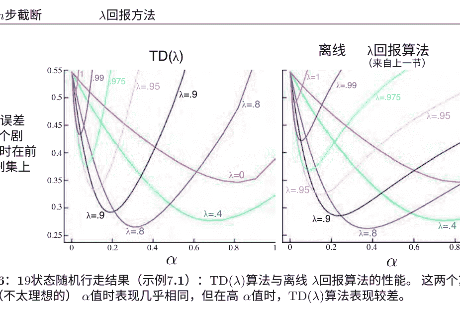

图12.6：19状态随机行走结果（示例7.1）：TD($\lambda$)算法与离线 $\lambda$回报算法的性能。这两个算法在低（不太理想的） $\alpha$值时表现几乎相同，但在高 $\alpha$值时，TD($\lambda$)算法表现较差。

如果步长参数按照通常的条件（2.7）随时间减小，线性TD($\lambda$)在同策略情况下已被证明收敛。正如第9.4节中所讨论的那样，收敛不是到最小误差权重向量，而是到一个依赖于 $\lambda$的附近权重向量。该部分给出的解质量上界（9.14）现在可以推广应用于任何 $\lambda$。对于持续折扣情况，

```
$$\overline{\text{VE}}(\mathbf{w}_{\infty}) \leq \frac{1}{1 - \lambda \gamma} \min_{\mathbf{w}} \overline{\text{VE}}(\mathbf{w})$$ (12.8)
```

也就是说，渐近误差不超过 $\frac{1}{1 - \lambda \gamma}$ —— $\frac{1}{1 - \gamma}$ 乘以最小可能的误差。当 $\lambda$ 趋近于1时，上界趋近于最小误差（且在 $\lambda = 0$ 时最宽松）。然而，在实践中， $\lambda = 1$ 通常是最差的选择，这将在图12.14中进行说明。

- **练习12.3** 通过观察后者的误差项（在（12.4）中的括号内）可以获得对TD（$\lambda$）如何紧密逼近离线 $\lambda$-return算法的一些见解，可以将其写成单个固定 $\mathbf{w}$ 的TD误差（12.6）的和。按照（6.6）的模式，使用你在练习12.1中获得的 $\lambda$-return的递归关系来证明这一点。
- **练习12.4** 使用前面练习的结果来证明，如果权重的更新在每一步都计算出来但实际上没有用来改变权重（$\mathbf{w}$保持不变），那么TD($\lambda$)的权重更新之和将与离线 $\lambda$回报算法的更新之和相同。

## 12.3 $n$步截断 $\lambda$回报方法

离线 $\lambda$回报算法是一个重要的理想，但它的实用性有限，因为它使用的 $\lambda$回报（12.2）直到回合结束才知道。在连续情况下，λ回报从技术上来说永远不会知道，因为它取决于任意大的 n步回报和未来的奖励。然而，对于延迟较长的奖励，这种依赖关系会逐渐减弱，每一步的延迟减少λ。因此，一种自然的近似方法是在一定步数后截断序列。我们现有的 n步回报的概念为此提供了一种自然的方法，其中缺失的奖励被估计值替代。

一般来说，我们定义了截断的回报为时间 t，只考虑到一些较晚的时间点之前的数据，h

```
$$G_{t:h}^\lambda \doteq (1 - \lambda) \sum_{n=1}^{h-t-1} \lambda^{n-1} G_{t:t+n} + \lambda^{h-t-1} G_{t:h}, \quad 0 \leq t < h \leq T. (12.9)$$
```

如果你将这个方程与回报 (12.3) 进行比较，很明显，h的时间点起到了与之前的 T终止时间相同的作用。而在回报中，对传统的回报 G_t，给予了一个残余权重，而在这里，给予了最长可用的 n步回报 G_{t:h} (图12.2)。

截断的回报立即产生了一族 n步回报算法，类似于第7章的 n步方法。在所有这些算法中，更新被延迟了 n步，并且只考虑了前 n个奖励，但现在所有的 k步回报都被包括在内，其中1 ≤ k ≤ n(而之前的 n步算法只使用了前n步回报，按几何加权，如图12.2所示)。在状态值情况下，这个算法族被称为截断TD(λ)或TTD(λ)。复合备份图，如图12.7所示，与TD(λ) (图12.1) 类似，只是最长的组件更新最多只有n步，而不总是一直到底。

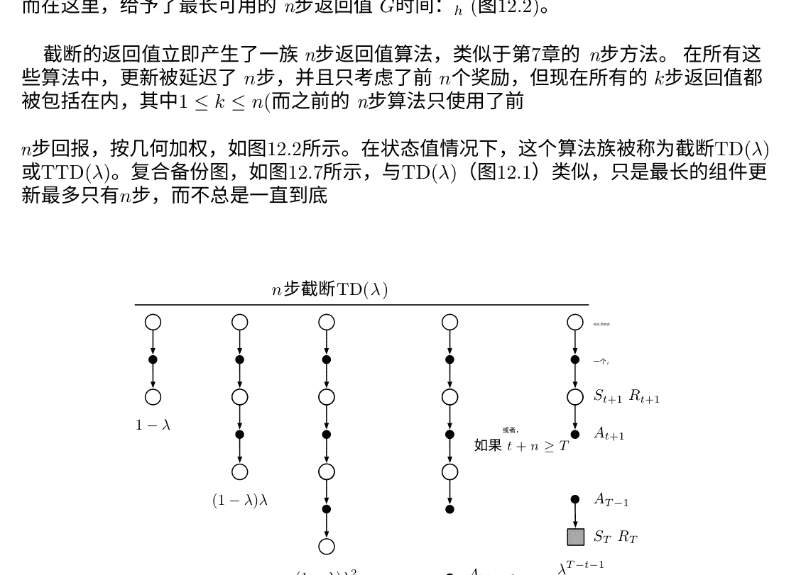剧集结束。 TTD(λ)的定义如下 (参见(9.15))：

$$\mathbf{w}_{t+n} \doteq \mathbf{w}_{t+n-1} + \alpha \left[G_{t:t+n}^{\lambda} - \hat{v}\left(S_{t}, \mathbf{w}_{t+n-1}\right)\right] \nabla \hat{v}\left(S_{t}, \mathbf{w}_{t+n-1}\right), \quad 0 \leq t < T.$$

这个算法可以高效地实现，使得每一步的计算不随着$n$的增加而增加（当然，内存必须随之增加）。与$n$步TD方法类似，在每个情节的前$n$个时间步骤中不进行更新，在终止时进行$n+1$次额外的更新。高效的实现依赖于以下事实：$k$步$n$回报可以精确地表示为

$$G_{t: t+k}^{\lambda} = \hat{v}\left(S_{t}, \mathbf{w}_{t-1}\right) + \sum_{i=t}^{t+k-1}(\lambda)^{i-t} \delta_{i}^{\prime},\quad\quad(12.10)$$

其中

$$\delta_{t}^{\prime} \doteq R_{t+1}+\gamma \hat{v}\left(S_{t+1}, \mathbf{w}_{t}\right)-\hat{v}\left(S_{t}, \mathbf{w}_{t-1}\right).$$

练习12.5 在本书中的多个地方（通常在练习中），我们已经证明了如果保持值函数不变，回报可以写成TD误差的和。为什么（12.10）是这种情况的另一个实例？证明（12.10）。

### 12.4 重新进行更新：在线λ回报算法

选择截断参数 $n$在截断TD（$\lambda$）中涉及到一个权衡。$n$应该足够大，以便该方法能够紧密地近似离线 $\lambda$-返回算法，但也应该足够小，以便更新能够尽早进行并且能够尽早影响行为。我们能同时得到最好的结果吗？嗯，原则上我们可以，尽管这会增加计算复杂性的代价。

这个想法是，每次在收集到新的数据增量时，你都会回到当前情节开始时重新进行所有的更新。新的更新会比之前的更新更好，因为现在它们可以考虑到时间步的新数据。也就是说，更新始终朝着一个截断为$n$步的目标前进。$\lambda$-回报目标，但始终使用最新的时间范围。在每次对该情节进行遍历时，你可以使用稍长一点的时间范围，并获得稍微更好的结果。回想一下，截断的$\lambda$-返回在（12.9）中定义为

$$G_{t} \doteq (1-\lambda)\sum_{n=1}^{h-t-1} \lambda^{n-1}G_{t:t+n} + \lambda^{h-t-1}G_{t:h}。$$

让我们逐步了解如果计算复杂性不是问题，这个目标应该如何理想地使用。情节从时间0开始，使用上一个情节结束时的权重 $\mathbf{w}_{0}$进行估计。当数据范围扩展到时间步1时，学习开始。给定到时间范围1的数据，步骤0的估计目标只能是一步返回 $G_{0:1}$，其中包括 $R_{1}$并从估计中引导。请注意，这正是 $G_{0:1}^{\lambda}$的内容，其中方程式的第一项的和退化为零。使用这个更新目标，我们构建$\mathbf{w}_1$。然后，在将数据视野推进到第2步之后，我们该怎么办？我们有新的数据，形式为$R_2$和$S_2$，以及新的 $\mathbf{w}_1$，所以现在我们可以构建一个更好的更新目标 $G_{0:2}^{\lambda}$，用于从 $S_0$开始的第一个更新，以及一个更好的更新目标 $G_{1:2}^{\lambda}$，用于从 $S_1$开始的第二个更新。使用这些改进的目标，我们重新在 $S_1$和 $S_2$上进行更新，从 $\mathbf{w}_0$开始，生成 $\mathbf{w}_2$。现在我们将视野推进到第3步并重复，一直回溯到生成三个新的目标，重新进行所有更新，从原始的 $\mathbf{w}_0$开始生成 $\mathbf{w}_3$，依此类推。每次推进视野时，都会从前一个视野的权重向量开始重新进行所有更新。

这个概念性算法涉及对每个时间段的多次遍历，每个时间段生成一个不同的权重向量序列。为了清楚地描述它，我们必须区分在不同时间段计算的权重向量。让我们使用 $\mathbf{w}_t^h$来表示用于生成序列中时间 $t$ 的值的权重，在时间段 $h$之前。每个序列中的第一个权重向量 $\mathbf{w}_0^h$是从上一个时间段继承的（因此对于所有的 $h$都是相同的），而每个序列中的最后一个权重向量 $\mathbf{w}_{h}^h$定义了算法的最终权重向量序列。在最终时间段 $h = T$我们获得最终权重 $\mathbf{w}_{T}^T$，它们将传递给下一次遍历的初始权重。根据这些约定，前面段落中描述的前三个序列可以明确给出：

$$h=1:\quad\mathbf{w}_1^1 \doteq \mathbf{w}_0^1 + \alpha\left[G_{0:1}^{\lambda} - \hat{v}(S_0,\mathbf{w}_0^1)\right]\nabla\hat{v}(S_0,\mathbf{w}_0^1),$$

$$h=2:\quad\mathbf{w}_1^2 \doteq \mathbf{w}_0^2 + \alpha\left[G_{0:2}^{\lambda} - \hat{v}(S_0,\mathbf{w}_0^2)\right]\nabla\hat{v}(S_0,\mathbf{w}_0^2),$$
$$\mathbf{w}_2^2 \doteq \mathbf{w}_1^2 + \alpha\left[G_{1:2}^{\lambda} - \hat{v}(S_1,\mathbf{w}_1^2)\right]\nabla\hat{v}(S_1,\mathbf{w}_1^2),$$

$$h=3:\quad\mathbf{w}_1^3 \doteq \mathbf{w}_0^3 + \alpha\left[G_{0:3}^{\lambda} - \hat{v}(S_0,\mathbf{w}_0^3)\right]\nabla\hat{v}(S_0,\mathbf{w}_0^3),$$
$$\mathbf{w}_2^3 \doteq \mathbf{w}_1^3 + \alpha\left[G_{1:3}^{\lambda} - \hat{v}(S_1,\mathbf{w}_1^3)\right]\nabla\hat{v}(S_1,\mathbf{w}_1^3),$$
$$\mathbf{w}_3^3 \doteq \mathbf{w}_2^3 + \alpha\left[G_{2:3}^{\lambda} - \hat{v}(S_2,\mathbf{w}_2^3)\right]\nabla\hat{v}(S_2,\mathbf{w}_2^3).$$

更新的一般形式为

$$\mathbf{w}_{t+1}^h \doteq \mathbf{w}_t^h + \alpha\left[G_{t:h}^{\lambda} - \hat{v}(S_t,\mathbf{w}_t^h)\right]\nabla\hat{v}(S_t,\mathbf{w}_t^h),\quad 0\leq t < h \leq T.$$

这个更新与 $\mathbf{w}_t = \mathbf{w}_{t,t}$定义了在线 $\lambda$回报算法。在线 $\lambda$回报算法是完全在线的，在每个步骤$t$期间确定一个新的权重向量 $\mathbf{w}_t$，仅使用在时间 $t$可用的信息。它的主要缺点是计算复杂，每一步都要经过迄今为止经历的部分。请注意，它比离线算法 $\lambda$-返回算法更复杂，在终止时通过所有步骤，但在整个回合中不进行任何更新。作为回报，在线算法可以预期在整个回合中表现得比离线算法更好，不仅在进行更新时进行更新，而离线算法则没有进行任何更新，而且在回合结束时在引导中使用的权重向量（在 $G^{\lambda}_{t:h}$）具有更多的信息更新。 如果仔细观察图12.8，可以看到这种效果，该图比较了19状态随机行走任务上的两种算法。

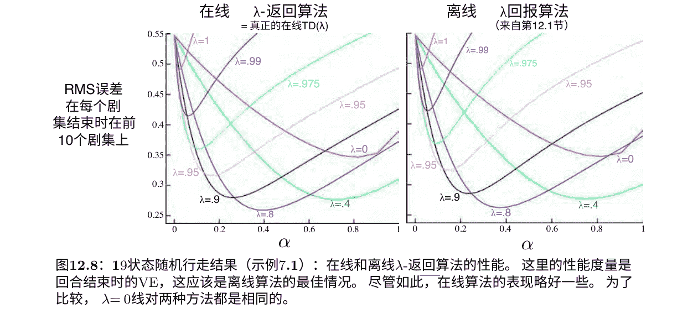

图12.8: 19状态随机行走结果 (示例7.1)：在线和离线λ-返回算法的性能。这里的性能度量是回合结束时的VE，这应该是离线算法的最佳情况。尽管如此，在线算法的表现略好一些。为了比较， λ=0线对两种方法都是相同的。

## 12.5 真实在线 TD(λ)

刚刚介绍的在线 λ-return算法目前是表现最好的时序差异算法。 这是一个在线TD(λ)只是近似的理想。 然而，正如所介绍的，在线 λ-return算法非常复杂。 有没有一种方法可以反转这个前向视图算法，以产生一个高效的后向视图算法，使用资格追踪？ 事实证明，对于线性函数逼近的情况，确实存在一种精确的计算友好的在线 λ-return算法的实现。 这个实现被称为真正的在线TD(λ)算法，因为它对在线 λ-return算法的理想更加“真实”。

真正的在线TD(λ)的推导在这里有点复杂（参见van Seijen等人的论文的下一节和附录, 2016年），但它的策略很简单。 在线 λ-return算法产生的权重向量序列可以排列成一个三角形：

$$w_0^0$$
$$w_0^1 w_1^1$$
$$w_0^2 w_1^2 w_2^2$$
$$w_0^3 w_1^3 w_2^3 w_3^3$$
$$\vdots \vdots \vdots \vdots \ddots$$
$$w_0^T w_1^T w_2^T w_3^T \cdots w_T^T$$

每个时间步产生这个三角形的一行。事实证明，对角线上的权重向量，即 $\mathbf{w}_{t,t}$，是唯一真正需要的。第一个，$\mathbf{w}_{0,0}$，是这一集的初始权重向量，最后一个，$\mathbf{w}_{T,T}$，是最终的权重向量，而每一个中间的权重向量，$\mathbf{w}_{t,t}$，在更新中都起到了引导的作用。在最终的算法中，对角线上的权重向量被重新命名为没有上标的，$\mathbf{w}_t \doteq \mathbf{w}_{t,t}$。因此，策略是找到一种紧凑、高效的方式计算每一个 $\mathbf{w}_t$ 从前一个中得到。如果这样做，在线性情况下，其中 $\hat{v}(s,\mathbf{w}) = \mathbf{w}^\top \mathbf{x}(s)$，我们就得到了真正的在线 TD($\lambda$) 算法：

$$\mathbf{w}_{t+1} \doteq \mathbf{w}_t + \alpha \delta_t \mathbf{z}_t + \alpha (\mathbf{w}_t^\top \mathbf{x}_t - \mathbf{w}_{t-1}^\top \mathbf{x}_t) (\mathbf{z}_t - \mathbf{x}_t),$$

其中我们使用了简写 $\mathbf{x}_t \doteq \mathbf{x}(S_t)$, $\delta_t$ 的定义如同 TD($\lambda$) (12.6), 而 $\mathbf{z}_t$ 的定义为

$$\mathbf{z}_t \doteq \lambda \mathbf{z}_{t-1} + (1 - \alpha \lambda \mathbf{z}_{t-1}^\top \mathbf{x}_t) \mathbf{x}_t. \quad (12.11)$$

已经证明该算法产生的权重向量序列完全相同，$\mathbf{w}_t, 0 \leq t \leq T$, 与在线 $\lambda$-return 算法 (van Seijen et al. 2016) 的结果相同。因此，图12.8 左侧的随机行走任务的结果也是该算法在该任务上的结果。然而，现在该算法的成本要低得多。真正的在线 TD($\lambda$) 的内存需求与传统 TD($\lambda$) 相同，而每步计算增加了约50%（在资格追踪更新中有一个额外的内积）。

总体而言，每步计算复杂度仍然为 $O(d)$, 与 TD(0) 相同。完整算法的伪代码如下所示。

**真实在线 TD(λ) 的伪代码**

用于估计 $\mathbf{w}^\top \mathbf{x} \approx v_\pi$ 的真实在线 TD(λ)

输入：要评估的策略 $\pi$
输入：特征函数 $\mathbf{x}: S^+ \rightarrow \mathbb{R}^d$, 其中 $\mathbf{x}(\text{terminal}, \cdot) = \mathbf{0}$。
算法参数：步长 $\alpha > 0$, 迹衰减率 $\lambda \in [0, 1]$。
初始化值函数权重 $\mathbf{w} \in \mathbb{R}^d$（例如，$\mathbf{w} = \mathbf{0}$）。
循环每个回合：
  初始化状态并获取初始特征向量 $\mathbf{x}$
  $\mathbf{z} \leftarrow \mathbf{0}$                     （一个 $d$ 维向量）
  $V_{old} \leftarrow 0$                 （一个临时标量变量）
  循环 每个回合的每一步：
    选择 $A \sim \pi(\cdot | S)$
    执行动作 $A$, 观察 $R$, $\mathbf{x}'$（下一个状态的特征向量）
    $V \leftarrow \mathbf{w}^\top \mathbf{x}$
    $V' \leftarrow \mathbf{w}^\top \mathbf{x}'$
    $\delta \leftarrow R + \gamma V' - V$
    $\mathbf{z} \leftarrow \lambda \mathbf{z} + (1 - \alpha \lambda \mathbf{z}^\top \mathbf{x}) \mathbf{x}$
    $\mathbf{w} \leftarrow \mathbf{w} + \alpha(\delta + V - V_{old}) \mathbf{z} - \alpha(V - V_{old}) \mathbf{x}$
    $V_{old} \leftarrow V'$
    $\mathbf{x} \leftarrow \mathbf{x}'$
  直到 $\mathbf{x}' = \mathbf{0}$（表示到达终止状态）

在真实的在线TD(λ)中使用的资格迹（12.11）被称为荷兰迹，以区别于在TD(λ)中使用的迹（12.5），后者被称为累积迹。早期的工作通常使用第三种迹，称为替换迹，仅适用于表格情况或由瓦片编码生成的二进制特征向量。替换迹是基于特征向量的每个组件进行定义的，具体取决于该组件是否为1或0:

$$z_{i,t} = \begin{cases} 1 & \text{如果 } x_{i,t} = 1 \\ \lambda z_{i,t-1} & \text{否则} \end{cases} \quad (12.12)$$

现在，我们看到用替换迹来粗略近似荷兰迹，这在很大程度上取代了它们。荷兰迹通常比替换迹表现更好，并且有一个更清晰的理论基础。在荷兰迹不可用的非线性函数逼近中，累积迹仍然具有兴趣。

### 12.6 *荷兰迹在蒙特卡洛学习中

尽管资格追踪在历史上与TD学习密切相关，但实际上与之无关。实际上，资格追踪甚至在蒙特卡洛学习中也会出现，正如我们在本节中所示。我们展示线性MC算法（第9章），作为一种前向视图，可以使用荷兰迹推导出一个等效但计算成本更低的后向视图算法。这是本书中我们明确展示的前向和后向视图的唯一等价性。它给出了真实在线TD(λ)和在线 λ-return算法等价性证明的一些味道，但更简单。

梯度蒙特卡洛预测算法的线性版本（第202页）进行以下一系列更新，每个时间步骤都有一个更新:

$$\mathbf{w}_{t+1} = \mathbf{w}_t + \alpha [G - \mathbf{w}_t^{\top} \mathbf{x}_t] \mathbf{x}_t, \quad 0 \leq t < T. \quad (12.13)$$

为了简化示例，我们在这里假设回报 G 是在情节结束时收到的单个奖励（这就是为什么 G没有时间下标）并且没有折扣。在这种情况下，更新也被称为最小均方（LMS）规则。

作为蒙特卡洛算法，所有的更新都依赖于最终的奖励/回报，因此在情节结束之前不能进行任何更新。 MC算法是一种离线算法，我们不寻求改进它的这个方面。相反，我们只是寻求一种具有计算优势的该算法的实现。我们仍然只在情节结束时更新权重向量，但我们会在每个步骤中进行一些计算，并在情节结束时进行较少的计算。这将给予计算的更均等分布——每步O(d)，并且还消除了在每个步骤中存储特征向量以供稍后在每个情节结束时使用的需要。相反，我们将引入一个额外的向量记忆，即资格追踪，其中包含迄今为止见过的所有特征向量的摘要。这将足以高效地重新创建与MC序列完全相同的整体更新。

更新（12.13），在本集结束时：

$$\mathbf{w}_{T} = \mathbf{w}_{T-1} + \alpha (G - \mathbf{w}_{T-1}^{\top} \mathbf{x}_{T-1}) \mathbf{x}_{T-1}$$
$$= \mathbf{w}_{T-1} + \alpha \mathbf{x}_{T-1} (-\mathbf{x}_{T-1}^{\top} \mathbf{w}_{T-1}) + \alpha G \mathbf{x}_{T-1}$$
$$= (\mathbf{I} - \alpha \mathbf{x}_{T-1} \mathbf{x}_{T-1}^{\top}) \mathbf{w}_{T-1} + \alpha G \mathbf{x}_{T-1}$$
$$= \mathbf{F}_{T-1} \mathbf{w}_{T-1} + \alpha G \mathbf{x}_{T-1}$$

其中 $\mathbf{F}_{t} \doteq \mathbf{I} - \alpha \mathbf{x}_{t} \mathbf{x}_{t}^{\top}$ 是一个遗忘或衰减矩阵。现在，递归地进行：

$$= \mathbf{F}_{T-1} (\mathbf{F}_{T-2} \mathbf{w}_{T-2} + \alpha G \mathbf{x}_{T-2}) + \alpha G \mathbf{x}_{T-1}$$
$$= \mathbf{F}_{T-1} \mathbf{F}_{T-2} \mathbf{w}_{T-2} + \alpha G (\mathbf{F}_{T-1} \mathbf{x}_{T-2} + \mathbf{x}_{T-1})$$
$$= \mathbf{F}_{T-1} \mathbf{F}_{T-2} (\mathbf{F}_{T-3} \mathbf{w}_{T-3} + \alpha G \mathbf{x}_{T-3}) + \alpha G (\mathbf{F}_{T-1} \mathbf{x}_{T-2} + \mathbf{x}_{T-1})$$
$$= \mathbf{F}_{T-1} \mathbf{F}_{T-2} \mathbf{F}_{T-3} \mathbf{w}_{T-3} + \alpha G (\mathbf{F}_{T-1} \mathbf{F}_{T-2} \mathbf{x}_{T-3} + \mathbf{F}_{T-1} \mathbf{x}_{T-2} + \mathbf{x}_{T-1})$$
$$\vdots$$
$$= \underbrace{\mathbf{F}_{T-1} \mathbf{F}_{T-2} \cdots \mathbf{F}_{0} \mathbf{w}_{0}}_{\mathbf{a}_{T-1}} + \alpha G \underbrace{\sum_{k=0}^{T-1} \mathbf{F}_{T-1} \mathbf{F}_{T-2} \cdots \mathbf{F}_{k+1} \mathbf{x}_{k}}_{\mathbf{z}_{T-1}}$$
$$= \mathbf{a}_{T-1} + \alpha G \mathbf{z}_{T-1}, \quad\quad\quad\quad (12.14)$$

其中 $\mathbf{a}_{T-1}$ 和 $\mathbf{z}_{T-1}$ 是两个辅助记忆向量在时间 $T-1$ 的值，可以在不知道 $G$ 的情况下逐步更新，每个时间步的复杂度为 $O(d)$。这个 $\mathbf{z}_{t}$ 向量实际上是一种荷兰式的资格迹。它被初始化为 $\mathbf{z}_{0}=\mathbf{x}_{0}$，然后根据以下规则进行更新

$$\mathbf{z}_{t} \doteq \sum_{k=0}^{t} \mathbf{F}_{t} \mathbf{F}_{t-1} \cdots \mathbf{F}_{k+1} \mathbf{x}_{k}, \quad\quad 1 \leq t < T$$
$$= \sum_{k=0}^{t-1} \mathbf{F}_{t} \mathbf{F}_{t-1} \cdots \mathbf{F}_{k+1} \mathbf{x}_{k} + \mathbf{x}_{t}$$
$$= \mathbf{F}_{t} \sum_{k=0}^{t-1} \mathbf{F}_{t-1} \mathbf{F}_{t-2} \cdots \mathbf{F}_{k+1} \mathbf{x}_{k} + \mathbf{x}_{t}$$
$$= \mathbf{F}_{t} \mathbf{z}_{t-1} + \mathbf{x}_{t}$$
$$= (\mathbf{I} - \alpha \mathbf{x}_{t} \mathbf{x}_{t}^{\top}) (\mathbf{z}_{t-1} + \mathbf{x}_{t})$$
$$= \mathbf{z}_{t-1} - \alpha \mathbf{x}_{t} \mathbf{x}_{t}^{\top} \mathbf{z}_{t-1} + \mathbf{x}_{t}$$
$$= \mathbf{z}_{t-1} - \alpha (\mathbf{z}_{t-1}^{\top} \mathbf{x}_{t}) \mathbf{x}_{t} + \mathbf{x}_{t}$$
$$= \mathbf{z}_{t-1} + (1 - \alpha \mathbf{z}_{t-1}^{\top} \mathbf{x}_{t}) \mathbf{x}_{t}$$

这是荷兰迹的案例，当 $\lambda=1$ 时（参见方程12.11）。辅助向量初始化为 $\mathbf{a}_{0} = \mathbf{w}_{0}$，然后根据更新

$$\mathbf{a}_{t} \doteq \mathbf{F}_{t} \mathbf{F}_{t-1} \cdots \mathbf{F}_{0} \mathbf{w}_{0} = \mathbf{F}_{t} \mathbf{a}_{t-1} = \mathbf{a}_{t-1} - \alpha \mathbf{x}_{t} \mathbf{x}_{t}^{\top} \mathbf{a}_{t-1}, \quad\quad 1 \leq t < T.$$辅助向量，$\mathbf{a}_t$和$\mathbf{z}_t$，在每个时间步骤$t < T$上进行更新，然后在时间$T$观察到$G$时，它们在(12.14)中用于计算$\mathbf{w}_T$。通过这种方式，我们实现了与具有较差计算性能的MC/LMS算法完全相同的最终结果(12.13)，但现在使用的是一种增量算法，其每步的时间和内存复杂度为$O(d)$。这令人惊讶和有趣，因为资格迹的概念（特别是荷兰迹）是在没有时序差异（TD）学习的情况下出现的（与van Seijen和Sutton，2014相反）。看来，资格迹根本不是特定于TD学习的；它们比那更基本。在试图以高效的方式学习长期预测时，似乎总是需要资格迹。

### 12.7 Sarsa(λ)

为了将资格迹扩展到动作值方法，本章中已经提出的思想几乎没有什么改变是必需的。为了学习近似动作值，我们需要使用动作值的形式来学习近似动作值$\hat{q}(s, a, \mathbf{w})$，而不是近似状态值$\hat{v}(s, \mathbf{w})$，这是从第10章中得到的$n$步回报的动作值形式：

$$G_{t:t+n} \doteq R_{t+1} + \cdots + \gamma^{n-1}R_{t+n} + \gamma^n \hat{q}(S_{t+n}, A_{t+n}, \mathbf{w}_{t+n-1}), \quad t+n < T,$$

利用这一点，我们可以形成截断的动作值形式的回报，这与状态值形式(12.9)基本相同。离线-回报算法(12.4)的动作值形式只是使用了$\hat{q}$而不是$\hat{v}$：

$$\mathbf{w}_{t+1} \doteq \mathbf{w}_t + \alpha \left[ G_t^\lambda - \hat{q}(S_t, A_t, \mathbf{w}_t) \right] \nabla \hat{q}(S_t, A_t, \mathbf{w}_t), \quad t=0,\ldots,T-1, \qquad (12.15)$$

其中$G_t^\lambda \doteq G_{t:\infty}^\lambda$。这个前向视图的复合备份图如图12.9所示。注意与TD(λ)算法（图12.1）的图表相似。第一个更新向前看一个完整步骤，到达下一个状态-动作对，第二个更新向前看两个步骤，到达第二个状态-动作对，依此类推。最后一个更新基于完整的回报。在λ回报中，每个$n$步更新的权重与TD(λ)和λ回报算法（12.3）中的权重相同。

被称为Sarsa(λ)的动作值的时序差分方法，近似计算了这个前向视图。它具有与之前给出的TD(λ)相同的更新规则：

$$\mathbf{w}_{t+1} \doteq \mathbf{w}_t + \alpha \delta_t \mathbf{z}_t,$$

除了自然地使用动作值形式的TD误差：

$$\delta_t \doteq R_{t+1} + \gamma \hat{q}(S_{t+1}, A_{t+1}, \mathbf{w}_t) - \hat{q}(S_t, A_t, \mathbf{w}_t), \qquad (12.16)$$

以及动作值形式的资格迹：

$$\mathbf{z}_{-1} \doteq \mathbf{0},$$ $$\mathbf{z}_t \doteq \gamma \lambda \mathbf{z}_{t-1} + \nabla \hat{q}(S_t, A_t, \mathbf{w}_t), \quad 0 \leq t \leq T.$$

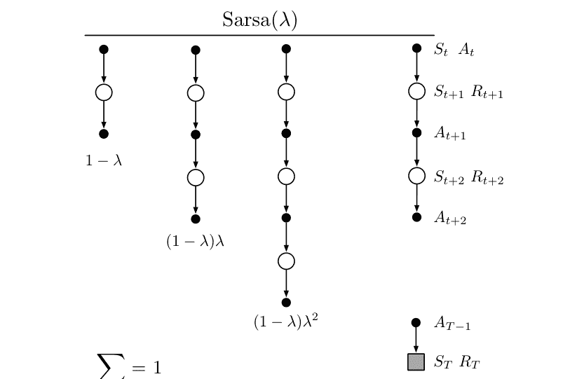

图12.9：Sarsa(λ)的备份图。与图12.1进行比较。

使用线性函数逼近、二进制特征以及累积或替换迹的Sarsa(λ)的完整伪代码在下一页的方框中给出。这个伪代码突出了在二进制特征的特殊情况下可能存在的一些优化。特征可以是活动的(=1)或非活动的(=0)。

### 示例12.1：网格世界中的迹

使用资格迹可以大大提高控制算法的效率，超过一步方法甚至超过$n$步方法。这是通过下面的网格世界示例来说明的。


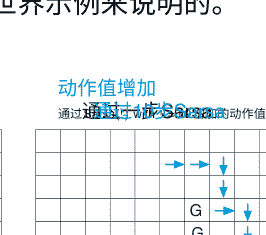

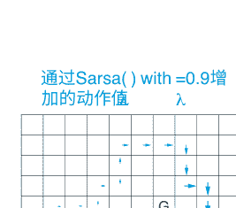

第一个面板显示了代理在单个回合中采取的路径。初始估计值为零，除了目标位置标记为G的正向奖励外，所有奖励都为零。其他面板中的箭头显示了各种算法在达到目标时将增加哪些动作值以及增加多少。一步方法只会增加最后一个动作值，而$n$步方法将平等地增加最后$n$个动作的值，而资格迹方法将更新整个回合开始时的所有动作值，以不同程度地衰减。衰减策略通常是最好的。

使用二进制特征和线性函数逼近的Sarsa(λ)算法
用于估计$w^T x \approx q_\pi$ 或 $q_*$

- 输入：一个函数 $F(s, a)$，返回$(s, a)$的活跃特征的集合的索引
- 输入：一个策略 $\pi$ (如果估计 $q_\pi$)
- 算法参数：步长 $\alpha > 0$，迹衰减率 $\lambda \in [0,1]$
- 初始化： $w = (w_1, ..., w_d)^T \in \mathbb{R}^d$ (例如，$w = 0$)， $z = (z_1, ..., z_d)^T \in \mathbb{R}^d$
- 循环每个回合：
    - 初始化 $S$
    - 根据 $\hat{q}(S, \cdot, w)$ 选择 $A \sim \pi(\cdot|S)$ 或 $\epsilon$-贪婪
    - $z \leftarrow 0$
    - 循环每个步骤的剧集：
        - 采取行动 $A$, 观察 $R, S'$
        - $\delta \leftarrow R$
        - 循环 $i$ 在 $F(S, A)$ 中：
            - $\delta \leftarrow \delta - w_i$
            - $z_i \leftarrow z_i + 1$    (累积迹) 或 $z_i \leftarrow 1$    (替换迹)
        - 如果 $S'$ 是终止状态，则：
            - $w \leftarrow w + \alpha \delta z$
            - 进入下一个剧集
        - 选择 $A' \sim \pi(\cdot|S')$ 或近似贪婪地 $\sim \hat{q}(S', \cdot, w)$
        - 循环 $i$ 在 $F(S', A')$ 中： $\delta \leftarrow \delta + \gamma w_i$
        - $w \leftarrow w + \alpha \delta z$
        - $z \leftarrow \lambda \gamma z$
        - $S \leftarrow S'; A \leftarrow A'$

练习12.6 修改Sarsa(λ)的伪代码，使用荷兰迹(12.11)而不包括真正在线算法的其他特征。假设线性函数逼近和二进制特征。

### 例子12.2：Sarsa(λ)在山车问题上的结果

如图12.10（左侧）所示，下一页展示了在例子10.1中介绍的山车任务上使用Sarsa(λ)的结果。函数逼近、动作选择和环境细节与第10章完全相同，因此可以将这些结果与第10章中的$n$步Sarsa的结果进行数值比较（图的右侧）。之前的结果变化了更新长度$n$，而在这里对于Sarsa(λ)我们变化了迹参数$\lambda$，起到了类似的作用。Sarsa(λ)的衰减迹自举策略似乎在这个问题上导致了更高效的学习。

我们理想的TD方法也有一个动作值版本，即在线$\lambda$回报算法（第12.4节）及其作为真正在线TD($\lambda$)的高效实现（第12.5节）。第12.4节中的所有内容都可以不变地使用，只需使用本节开头给出的动作值形式的$n$步回报。第12.5节和第12.6节中的分析也适用于动作值，唯一的变化是使用了动作值形式。

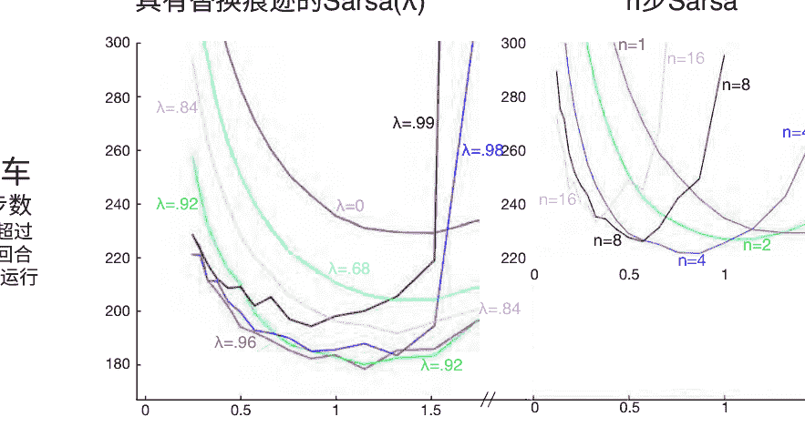

图12.10：Sarsa($\lambda$)在Mountain Car任务上的早期性能，以及步长的函数关系，$\alpha$。

状态-动作特征向量 $x_t = \mathbf{x}(S_t, A_t)$ 代替状态特征向量 $x_t = \mathbf{x}(S_t)$。

得到的高效算法的伪代码，称为真实在线Sarsa($\lambda$)，在下一页的框中给出。下图比较了每个回合结束时，前10个回合的平均值，以及100次独立运行的结果，Mountain Car示例中各个版本的Sarsa($\lambda$)的性能。

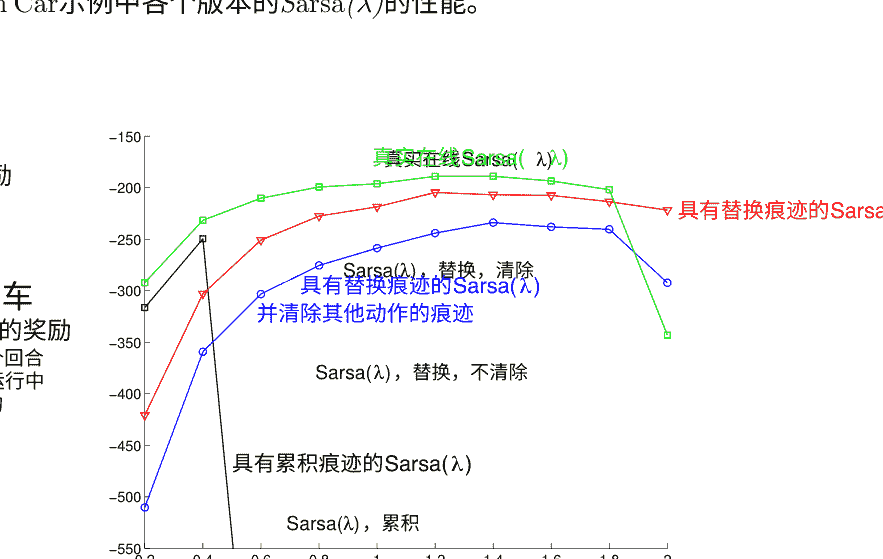

图12.11：山车任务上Sarsa($\lambda$)算法的总结比较。真实在线Sarsa($\lambda$)比具有累积和替换迹的传统Sarsa($\lambda$)表现更好。与之形成鲜明对比。还包括一种具有替换迹的Sarsa($\lambda$)版本，在每个时间步中，状态和未选择的动作的迹被设置为零。

用于估计 $w^T x \approx q \approx q_*$ 的真实在线Sarsa($\lambda$)
- 输入：特征函数 $x: S^+ \times A \rightarrow \mathbb{R}^d$，使得 $x(\text{终止}, \cdot) = 0$
- 输入：策略 $\pi$ (如果估计 $q_\pi$)
- 算法参数：步长 $\alpha > 0$，迹衰减率 $\lambda \in [0,1]$
- 初始化：$w \in \mathbb{R}^d$ (例如，$w = 0$)
- 循环每个回合：
    - 初始化 $S$
    - 从 $S$ 中选择 $A \sim \pi(\cdot|S)$ 或者使用 $w$ 进行近似贪婪选择
    - $x \leftarrow x(S, A)$
    - $z \leftarrow 0$
    - $Q_{旧} \leftarrow 0$
    - 循环每个回合的每个步骤：
        - 执行动作 $A$，观察 $R, S'$
        - 选择 $A' \sim \pi(\cdot|S')$ 或者从 $S'$ 中近似贪婪地选择 $w$
        - $x' \leftarrow x(S', A')$
        - $Q \leftarrow w^T x$
        - $Q' \leftarrow w^T x'$
        - $\delta \leftarrow R + \gamma Q' - Q$
        - $z \leftarrow \lambda \gamma z + (1 - \alpha \lambda \gamma z^T x)x$
        - $w \leftarrow w + \alpha(\delta + Q - Q_{旧})z - \alpha(Q - Q_{旧})x$
        - $Q_{旧} \leftarrow Q'$
        - $x \leftarrow x'$
        - $A \leftarrow A'$
    - 直到 $S'$ 是终止状态

最后，还有一种截断版本的Sarsa($\lambda$)，称为前向Sarsa($\lambda$) (vanSeijen, 2016)，它似乎是一种特别有效的无模型控制方法，可与多层人工神经网络结合使用。

## 12.8 变量 $\lambda$ 和 $\gamma$

我们现在开始接近我们基本TD学习算法开发的尾声。为了以最一般的形式呈现最终算法，将引入对状态和动作依赖的函数来泛化引导和折扣的程度。也就是说，每个时间步将具有不同的$\lambda$和$\gamma$，分别表示为$\lambda_t$和$\gamma_t$。我们现在改变符号，使得：$\lambda: S \times A \rightarrow [0,1]$ 现在是一个从状态和动作到单位区间的函数，使得$\lambda_t = \lambda(S_t, A_t)$。同样地，$\gamma:S \rightarrow [0,1]$ 是一个从状态到单位区间的函数，使得$\gamma_t = \gamma(S_t)$。

引入函数 $\gamma$，终止函数，特别重要的是因为它改变了回报，回报是我们寻求期望的基本随机变量。

的估计。现在回报的定义更加一般化，如下所示

$$G_t \doteq R_{t+1} + \gamma_{t+1} G_{t+1} \\ = R_{t+1} + \gamma_{t+1} R_{t+2} + \gamma_{t+1}\gamma_{t+2} R_{t+3} + \gamma_{t+1}\gamma_{t+2}\gamma_{t+3} R_{t+4} + \cdots \\ = \sum_{k=t}^{\infty} \prod_{i=t+1}^{k} \gamma_i R_{k+1},$$

为了确保求和是有限的，我们要求对于所有的$t$，$\prod_{k=t}^{\infty} \gamma_{k}=0$的概率为1。这个定义的一个方便之处是它使得可以用一个经验流来呈现周期性设置和其算法，而不需要特殊的终止状态、起始分布或终止时间。一个曾经的终止状态成为一个使得$\gamma(s)=0$并且转移到起始分布的状态。通过这种方式（并通过选择在所有其他状态中$\gamma(\cdot)$为常数），我们可以将经典的周期性设置作为一个特殊情况。状态相关的终止包括其他预测情况，例如伪终止，在这种情况下，我们试图预测一个数量而不改变马尔可夫过程的流动。折扣回报可以被看作是这样一个数量，在这种情况下，状态相关的终止统一了周期性和折扣-连续情况。（无折扣-连续情况仍然需要一些特殊处理。）对于可变引导的泛化不是问题的变化，像折扣一样，而是解决策略的变化。这种泛化影响了状态和动作的$\lambda$-回报。新的基于状态的$\lambda$-回报可以递归地写成

$$G_t^{\lambda s} \doteq R_{t+1} + \gamma_{t+1} \left( (1 - \lambda_{t+1}) \hat{v}(S_{t+1}, \mathbf{w}_t) + \lambda_{t+1} G_{t+1}^{\lambda s} \right)$$

现在我们在上标中添加了“s”，以提醒我们这是一个从状态值引导的回报，与从动作值引导的回报区分开来，我们将在下面用“a”来表示。这个方程表示，无折扣和不受引导影响的第一个奖励是$R_{t+1}$回报，加上可能的第二项，取决于我们在下一个状态不进行折扣的程度（即根据$\lambda_{t+1}$；请记住，如果下一个状态是终止状态，则此项为零）。在下一个状态不终止的程度上，我们有第二项，它本身分为两种情况，取决于状态中引导的程度。在引导的程度上，这个项是状态的估计值，而在不引导的程度上，这个项是下一个时间步的$\lambda$回报。基于动作的 $\lambda$-return 要么是 Sarsa 形式

$$G_t^{\lambda a} \doteq R_{t+1} + \gamma_{t+1} \left( (1 - \lambda_{t+1}) \hat{q}(S_{t+1}, A_{t+1}, \mathbf{w}_t) + \lambda_{t+1} G_{t+1}^{\lambda a} \right)$$

或者是 Expected Sarsa 形式,

$$G_t^{\lambda a} \doteq R_{t+1} + \gamma_{t+1} \left( (1 - \lambda_{t+1}) \bar{V}_t(S_{t+1}) + \lambda_{t+1} G_{t+1}^{\lambda a} \right)$$

其中 (7.8) 被推广为函数逼近形式

$$\bar{V}_t(s) \doteq \sum_{a} \pi(a|s) \hat{q}(s, a, \mathbf{w}_t)$$

练习 12.7 将上述三个递归方程推广到它们的截断版本，定义 $G^{\lambda s}_{t:h}$ 和 $G^{\lambda a}_{t:h}$。

### 12.9 *Off-策略迹与控制变量

最后一步是将重要性采样纳入其中。与$n$步方法不同，在完全非截断的情况下，没有一种实际的选择可以在目标回报之外进行重要性采样。相反，我们直接转向基于决策的重要性采样与控制变量的自举泛化（第7.4节）。在状态情况下，我们对 $\lambda$-回报进行最终定义，该定义推广了（12.18）的模型（7.13）的模型。

$G^{\lambda s}_{t} \doteq \rho_t \left( R_{t+1} + \gamma_{t+1} \left( (1 - \lambda_{t+1}) \hat{v}(S_{t+1}, \mathbf{w}_t) + \lambda_{t+1} G^{\lambda s}_{t+1} \right) \right) + (1 - \rho_t) \hat{v}(S_t, \mathbf{w}_t) \quad (12.22)$

其中 $\rho_t = \frac{\pi(A_t|S_t)}{b(A_t|S_t)}$ 是通常的单步重要性采样比率。与本书中看到的其他回报一样，这个回报的截断版本可以简单地用基于状态的TD误差之和来近似。

$\delta^s_t \doteq R_{t+1} + \gamma_{t+1} \hat{v}(S_{t+1}, \mathbf{w}_t) - \hat{v}(S_t, \mathbf{w}_t), \quad (12.23)$

as

$G^{\lambda s}_{t} \approx \hat{v}(S_t, \mathbf{w}_t) + \rho_t \sum_{k=t}^{\infty} \delta^s_k \prod_{i=t+1}^{k} \gamma_i \lambda_i \rho_i \quad (12.24)$

当近似值函数不变时，近似变得精确。

练习12.8 证明当值函数不变时，(12.24)变得精确。为了简化写法，考虑 $t=0$ 的情况，并使用符号 $V_k \doteq \hat{v}(S_k, \mathbf{w})$。

练习12.9 一般离策略回报的截断版本表示为 $G^{\lambda s}_{t:h}$。根据(12.24)，猜测正确的方程式。

上述形式的 $\lambda$-返回（12.24）在前向视图更新中很方便，

$\mathbf{w}_{t+1} = \mathbf{w}_t + \alpha \left( G^{\lambda s}_t - \hat{v}(S_t, \mathbf{w}_t) \right) \nabla \hat{v}(S_t, \mathbf{w}_t)$ $\approx \mathbf{w}_t + \alpha \rho_t \sum_{k=t}^{\infty} \delta^s_k \prod_{i=t+1}^{k} \gamma_i \lambda_i \rho_i \nabla \hat{v}(S_t, \mathbf{w}_t),$

对有经验的人来说，这看起来像是基于资格的TD更新——乘积就像是资格迹，乘以TD误差。但这只是前向视图的一个时间步。我们要寻找的关系是，前向视图更新随时间求和，大致等于后向视图更新随时间求和（这个关系只是近似的，因为我们忽略了值的变化）。

前向视图更新随时间的总和是

$$\sum_{t=1}^{\infty} (\mathbf{w}_{t+1} - \mathbf{w}_t) \approx \sum_{t=1}^{\infty} \sum_{k=t}^{\infty} \alpha \rho_t \delta_k^s \nabla \hat{v}(S_t, \mathbf{w}_t) \prod_{i=t+1}^{k} \gamma_i \lambda_i \rho_i$$
$$= \sum_{k=1}^{\infty} \sum_{t=1}^{k} \alpha \rho_t \nabla \hat{v}(S_t, \mathbf{w}_t) \delta_k^s \prod_{i=t+1}^{k} \gamma_i \lambda_i \rho_i$$
$$(\text{使用求和规则: } \sum_{t=x}^{y} \sum_{k=t}^{y} = \sum_{k=x}^{y} \sum_{t=x}^{k})$$
$$= \sum_{k=1}^{\infty} \alpha \beta_k^s \sum_{t=1}^{k} \rho_t \nabla \hat{v}(S_t, \mathbf{w}_t) \prod_{i=t+1}^{k} \gamma_i \lambda_i \rho_i,$$

如果整个表达式从第二个求和符号左边开始可以被写入和增量更新为一个资格迹的形式，那么它将是一个反向视图TD更新的总和，我们现在展示可以做到。也就是说，我们展示如果这个表达式是时间 $k$ 的迹，那么我们可以通过以下方式从时间 $k-1$ 的值更新它：

$$\mathbf{z}_k = \sum_{t=1}^{k} \rho_t \nabla \hat{v}(S_t, \mathbf{w}_t) \prod_{i=t+1}^{k} \gamma_i \lambda_i \rho_i$$
$$= \sum_{t=1}^{k-1} \rho_t \nabla \hat{v}(S_t, \mathbf{w}_t) \prod_{i=t+1}^{k} \gamma_i \lambda_i \rho_i + \rho_k \nabla \hat{v}(S_k, \mathbf{w}_k)$$
$$= \gamma_k \lambda_k \rho_k \sum_{t=1}^{k-1} \rho_t \nabla \hat{v}(S_t, \mathbf{w}_t) \prod_{i=t+1}^{k-1} \gamma_i \lambda_i \rho_i + \rho_k \nabla \hat{v}(S_k, \mathbf{w}_k)$$
$$\underbrace{\phantom{= \gamma_k \lambda_k \rho_k \sum_{t=1}^{k-1} \rho_t \nabla \hat{v}(S_t, \mathbf{w}_t) \prod_{i=t+1}^{k-1} \gamma_i \lambda_i \rho_i + \rho_k \nabla \hat{v}(S_k, \mathbf{w}_k)}}_{\mathbf{z}_{k-1}}$$
$$= \rho_k (\gamma_k \lambda_k \mathbf{z}_{k-1} + \nabla \hat{v}(S_k, \mathbf{w}_k)),$$

改变索引从 $k$ 到 $t$，这是状态值的一般累积追踪更新：

$$\mathbf{z}_t \doteq \rho_t (\gamma_t \lambda_t \mathbf{z}_{t-1} + \nabla \hat{v}(S_t, \mathbf{w}_t)),$$

这个资格追踪和通常的半梯度参数更新规则 TD($\lambda$) (12.7)一起，形成了一个可以应用于on-policy或者off-policy的通用TD($\lambda$)算法。离线策略数据。 在在线策略情况下，算法完全是TD($\lambda$)，因为 $\rho_t$ 始终为1, (12.25)变成了通常的累积迹(12.5)(扩展到变量 $\lambda$ 和 $\gamma$)。在离线策略情况下，算法通常效果良好，但作为半梯度方法，不能保证稳定性。在接下来的几节中，我们将考虑一些扩展，确保稳定性。

可以按照类似的步骤推导出离线策略资格迹的动作值方法和相应的一般Sarsa($\lambda$)算法。可以从一般基于动作的 $\lambda$ 回报的递归形式(12.19)或(12.20)开始，但后者(期望Sarsa形式)更简单。我们将(12.20)扩展到在模型(7.14)之后的离策略情况下产生

$$G_{t}^{\lambda a} \doteq R_{t+1} + \gamma_{t+1} \big((1-\lambda_{t+1}) \bar{V}_{t}(S_{t+1}) + \lambda_{t+1} \big[\rho_{t+1} G_{t+1}^{\lambda a} + \bar{V}_{t}(S_{t+1}) - \rho_{t+1} \hat{q}(S_{t+1}, A_{t+1}, \mathbf{w}_{t})\big]\big)$$
$$= R_{t+1} + \gamma_{t+1} \big(\bar{V}_{t}(S_{t+1}) + \lambda_{t+1} \rho_{t+1} [G_{t+1}^{\lambda a} - \hat{q}(S_{t+1}, A_{t+1}, \mathbf{w}_{t})]\big) \qquad (12.26)$$

其中 $\bar{V}_{t}(S_{t+1})$ 如 (12.21) 所示。再次，$\lambda$-return 可以近似地写成 TD 误差的和,

$$G_{t}^{\lambda a} \approx \hat{q}(S_{t}, A_{t}, \mathbf{w}_{t}) + \sum_{k=t}^{\infty} \delta_{k}^{a} \prod_{i=t+1}^{k} \gamma_{i} \lambda_{i} \rho_{i}, \qquad (12.27)$$

使用基于动作的 TD 误差的期望形式:

$$\delta_{t}^{a} = R_{t+1} + \gamma_{t+1} \bar{V}_{t}(S_{t+1}) - \hat{q}(S_{t}, A_{t}, \mathbf{w}_{t}). \qquad (12.28)$$

与之前一样，如果近似值函数不变，则近似变得精确。

- 练习 12.10 证明 (12.27) 在值函数不变时变得精确。为了节省篇幅，考虑 $t=0$ 的情况，并使用记号 $Q_k = \hat{q}(S_k, A_k, \mathbf{w})$。 提示：首先写出 $\delta_0^a$ 和 $G_0^{\lambda a}$，然后 $G_0^{\lambda a} - Q_0$。
- 练习 12.11 一般离策略回报的截断版本用符号 $G_t^{\lambda}$ 表示，一个未知的方程式，根据(12.27)来猜测正确的方程式。

通过与状态情况类似的步骤，可以基于(12.27)编写一个前向视图更新，使用求和规则转换更新的总和，并最终推导出以下形式的动作值的资格追踪:

$$\mathbf{z}_{t} \doteq \gamma_{t} \lambda_{t} \rho_{t} \mathbf{z}_{t-1} + \nabla \hat{q}(S_{t}, A_{t}, \mathbf{w}_{t}). \qquad (12.29)$$

这个资格追踪，连同基于期望的TD误差(12.28)和通常的半梯度参数更新规则(12.7)，形成了一种优雅且高效的期望Sarsa($\lambda$)算法，可以应用于基于策略或离策略的数据。这可能是当前时间最好的这类算法（当然，除非与以下章节中介绍的方法之一结合使用，否则不能保证稳定性）。在基于策略的情况下，使用常数 $\lambda$ 和 $\gamma$ 以及通常的状态-动作TD误差(12.16)，该算法与第12.7节中介绍的Sarsa($\lambda$)算法完全相同。

- 练习12.12 详细展示从(12.27)推导(12.29)的步骤。从更新(12.15)开始，用(12.26)中的 $G_t^{\lambda a}$ 替换 $G_t^{\lambda}$，然后按照导致(12.25)的类似步骤进行。

当 $\lambda=1$ 时，这些算法与相应的蒙特卡洛算法密切相关。人们可能期望在情节问题和离线更新中存在精确的等价性，但实际上这种关系比较微妙，稍微弱一些。

即使在这些最有利的条件下，更新之间仍然没有逐个情节的等价性，只有它们的期望值等价。这并不令人意外，因为这些方法在轨迹展开时进行了不可撤销的更新，而真正的蒙特卡洛方法如果其中任何一个动作在目标策略下的概率为零，则不会对轨迹进行任何更新。特别是，即使在 $\lambda=1$ 时，所有这些方法仍然使用自举的方式即它们的目标值依赖于当前的值估计——只是这种依赖在期望值中抵消了。这是否是一个好的属性在实践中是另一个问题。最近，已经提出了一些可以实现精确等价性的方法（Sutton, Mahmood, Precup和van Hasselt, 2014）。这些方法需要额外的“临时权重”向量，用于跟踪已经进行的更新，但可能需要根据后续采取的行动进行撤销（或强调）。这些方法的状态和状态-动作版本分别称为PTD($\lambda$)和PQ($\lambda$)，其中“P”代表临时。

所有这些新的离策略方法的实际后果尚未确定。毫无疑问，高方差的问题将会出现，就像使用重要性采样的所有离策略方法一样（第11.9节）。

如果 $\lambda<1$，那么所有这些离策略算法都涉及到自举，并且致命三连（第11.3节）适用，这意味着它们只能在表格情况下、状态聚合以及其他有限形式的函数逼近中保证稳定。对于线性和更一般形式的函数逼近，参数向量可能会发散到无穷大，就像第11章中的例子一样。正如我们在那里讨论的那样，离策略学习的挑战有两个部分。离策略资格痕迹有效地处理了挑战的第一部分，纠正了目标的期望值，但对于挑战的第二部分，即更新的分布，却没有任何作用。

算法策略用于满足离线学习的第二部分挑战，使用资格追踪的总结在第12.11节中。

练习12.13什么是荷兰追踪和替换追踪版本的离策略资格追踪，用于状态值和动作值方法？

## 12.10 Watkins的Q($\lambda$)到Tree-Backup($\lambda$)

多年来已经提出了几种方法来扩展Q学习到资格追踪。原始的是Watkins的Q($\lambda$)，它以通常的方式衰减其资格追踪，只要采取了贪婪动作，然后在第一个非贪婪动作之后将追踪截断为零。Watkins的Q($\lambda$)的备份图在图12.12中显示。在第6章中，我们将Q学习和期望Sarsa统一为后者的离线策略版本，其中包括Q学习作为特殊情况，并将其推广到任意目标策略，并在本章的前一节中通过将其推广到离线策略资格追踪来完成我们对期望Sarsa的处理。然而，在第7章中，我们进行了区分n步预期Sarsa从n步树备份，后者保留了不使用重要性采样的属性。然后，我们将介绍树备份的资格追踪版本，我们将其称为Tree-Backup($\lambda$)，或简称为TB($\lambda$)。这可以说是Q学习的真正继承者，因为它保留了其吸引人的不使用重要性采样的特性，即使它可以应用于离策略数据。

### Watkins的Q(λ)

TB(λ)的概念很简单。如图12.13所示的备份图，树备份的每个长度的更新（来自第7.5节）根据引导参数 λ进行加权。要获得详细的方程，使用正确的索引来表示一般的引导和折扣参数，最好从使用动作值的 λ回报的递归形式（12.20）开始，然后在模型（7.16）的基础上展开引导情况的目标。

$$G_t^{\lambda a} \doteq R_{t+1}+\gamma_{t+1}\left(\left(1-\lambda_{t+1}\right) \bar{V}_{t}\left(S_{t+1}\right)+\lambda_{t+1}\left[\sum_{a=A_{t+1}} \pi\left(a | S_{t+1}\right) \hat{q}\left(S_{t+1}, a, \mathbf{w}_{t}\right)+\pi\left(A_{t+1} | S_{t+1}\right) G_{t+1}^{\lambda a}\right]\right) \n= R_{t+1}+\gamma_{t+1}\left(\bar{V}_{t}\left(S_{t+1}\right)+\lambda_{t+1} \pi\left(A_{t+1} | S_{t+1}\right)\left(G_{t+1}^{\lambda a}-\hat{q}\left(S_{t+1}, A_{t+1}, \mathbf{w}_{t}\right)\right)\right)$$

按照通常的模式，它也可以近似地写成TD误差的总和（忽略近似值函数的变化），

$$G_t^{\lambda a} \approx \hat{q}\left(S_t, A_t, \mathbf{w}_t\right) + \sum_{k=t}^{\infty} \delta_k^a \prod_{i=t+1}^{k} \gamma_i \lambda_i \pi\left(A_i | S_i\right),$$

使用基于动作的TD误差的期望形式（12.28）。按照前一节的步骤，我们得到一个特殊的资格追踪更新，涉及所选动作的目标策略概率，

$$\mathbf{z}_t \doteq \gamma_t \lambda_t \pi\left(A_t | S_t\right) \mathbf{z}_{t-1} + \nabla \hat{q}\left(S_t, A_t, \mathbf{w}_t\right).$$

这个，再加上通常的参数更新规则（12.7），定义了TB(λ)算法。与所有半梯度算法一样，当与off-策略数据和强大的函数逼近器一起使用时，TB(λ)不能保证稳定。当使用off-策略数据和强大的函数逼近器时。为了获得这些保证，TB(λ)必须与下一节中介绍的方法之一相结合。

*练习12.14 如何将Double Expected Sarsa扩展到资格追踪?

### 12.11 具有痕迹的稳定离策略方法

已经提出了几种使用资格痕迹的方法，在离策略训练下实现了稳定性的保证，并且我们在这本书中介绍了其中四种最重要的方法，使用了标准符号，包括一般的自举和折扣函数。所有这些方法都基于第11.7节和第11.8节中介绍的梯度-TD或强调-TD思想。所有算法都假设线性函数逼近，尽管在文献中也可以找到非线性函数逼近的扩展。

GTD(λ)是类似于TDC的资格痕迹算法，TDC是第11.7节讨论的两种状态值梯度-TD预测算法中更好的算法。它的目标是学习一个参数 $w_t$ such that $\hat{v}(s,w) = w_t^T x(s) \approx v_π(s)$，即使是根据另一个策略 $b$ 的数据也是如此。它的更新是

$$w_{t+1} = w_t + α\delta_t z_t - αλ_{t+1}(1-λ_{t+1})(z_t^T v_t) x_{t+1}$$

with $\delta_t^s$, $\mathbf{z}_t$, and $\rho_t$ defined in the usual ways for state values (12.23) (12.25) (11.1), and

$$\mathbf{v}_{t+1} \doteq \mathbf{v}_t + \beta (\delta_t^s \mathbf{z}_t - (\mathbf{v}_t^\top \mathbf{z}_t)\mathbf{x}_{t+1}), \quad (12.30)$$

where, as in Section 11.7, $\mathbf{v} \in \mathbb{R}^d$ is a vector of the same dimension as $\mathbf{w}$, initialized to $\mathbf{v}_0 = \mathbf{0}$, and $\beta > 0$ is a second step-size parameter.

GQ(λ)是具有资格痕迹的动作值的梯度-TD算法。 Its goal is to learn a parameter $\mathbf{w}_t$ such that $\hat{q}(s, a, \mathbf{w}_t) \doteq \mathbf{w}_t^\top \mathbf{x}(s, a) \approx q_\pi(s, a)$ from off-policy data. If the target policy is $\epsilon$-greedy, or otherwise biased toward the greedy policy for $\hat{q}$, then GQ(λ) can be used as a control algorithm. Its update is

$$\mathbf{w}_{t+1} \doteq \mathbf{w}_t + \alpha \delta_t^a \mathbf{z}_t - \alpha \lambda_{t+1}(1 - \lambda_{t+1}) (\mathbf{z}_t^\top \mathbf{v}_t)\bar{\mathbf{x}}_{t+1},$$

其中 $\bar{\mathbf{x}}_t$ 是目标策略下状态 $S_t$ 的平均特征向量,

$$\bar{\mathbf{x}}_t \doteq \sum_{a} \pi(a|S_t)\mathbf{x}(S_t, a),$$

$\delta_t^a$ 是TD误差的期望形式，可以写成

$$\delta_t^a \doteq R_{t+1} + \gamma_{t+1} \mathbf{w}_t^\top \bar{\mathbf{x}}_{t+1} - \mathbf{w}_t^\top \mathbf{x}_t,$$

$\mathbf{z}_t$ 按照通常的方式定义为动作值 (12.29)，其余部分与GTD(λ)相同，包括对 $\mathbf{v}_t$ 的更新 (12.30).

HTD(λ) 是一种混合状态值算法，结合了GTD(λ) 和 TD(λ) 的特点。它最吸引人的特点是它是 TD(λ) 到离策略学习的严格推广，这意味着如果行为策略恰好与目标策略相同，那么 HTD(λ) 就变成了与 TD(λ) 相同，而对于 GTD(λ) 来说则不是真的。这很吸引人，因为当两个算法都收敛时，TD(λ) 通常比 GTD(λ) 更快，并且 TD(λ) 只需要设置一个步长。HTD(λ) 的定义为

$$\mathbf{w}_{t+1} \doteq \mathbf{w}_t + \alpha \delta_t^s \mathbf{z}_t + \alpha ((\mathbf{z}_t - \mathbf{z}_t^b)^\top \mathbf{v}_t)(\mathbf{x}_t - \gamma_{t+1} \mathbf{x}_{t+1}),$$
$$\mathbf{v}_{t+1} \doteq \mathbf{v}_t + \beta (\delta_t^s \mathbf{z}_t^b - (\mathbf{z}_t^{b\top} \mathbf{v}_t)(\mathbf{x}_t - \gamma_{t+1} \mathbf{x}_{t+1})), \quad \text{with } \mathbf{v}_0 \doteq \mathbf{0},$$
$$\mathbf{z}_t \doteq \rho_t(\gamma_t \lambda_t \mathbf{z}_{t-1} + \mathbf{x}_t), \quad \text{with } \mathbf{z}_{-1} \doteq \mathbf{0},$$
$$\mathbf{z}_t^b \doteq \gamma_t \lambda_t \mathbf{z}_{t-1}^b + \mathbf{x}_t, \quad \text{with } \mathbf{z}_{-1}^b \doteq \mathbf{0},$$

where $\beta > 0$ again is a second step-size parameter. In addition to the second set of weights, $\mathbf{v}_t$, HTD(λ) also has a second set of eligibility traces, $\mathbf{z}_t^b$. These are conventional accumulating eligibility traces for the behavior policy and become equal to $\mathbf{z}_t$ if all the $\rho_t$ are 1, which causes the last term in the $\mathbf{w}_t$ update to be zero and the overall update to reduce to TD(λ).

Emphatic TD(λ) is the extension of the one-step Emphatic-TD algorithm (Sections 9.11 and 11.8) to eligibility traces. The resultant algorithm retains strong off-policy convergence guarantees while enabling any degree of bootstrapping, albeit at the cost of...高方差和潜在的收敛速度慢。 Emphatic TD($\lambda$)的定义为

$$
\begin{aligned}
\mathbf{w}_{t+1} &\doteq \mathbf{w}_t + \alpha \beta_t \mathbf{z}_t \\
\delta_t &\doteq R_{t+1} + \gamma_{t+1} \mathbf{w}_t^\top \mathbf{x}_{t+1} - \mathbf{w}_t^\top \mathbf{x}_t \\
\mathbf{z}_t &\doteq \rho_t ( \gamma_t \lambda_t \mathbf{z}_{t-1} + M_t \mathbf{x}_t ), \quad \text{with } \mathbf{z}_{-1} \doteq \mathbf{0}, \\
M_t &\doteq \lambda_t I_t + (1 - \lambda_t) F_t \\
F_t &\doteq \rho_{t-1} \gamma_t F_{t-1} + I_t, \quad \text{with } F_0 \doteq i(S_0),
\end{aligned}
$$

where $M_t -0$是强调的一般形式, $F_t -0$被称为后续追踪,并且 $I_t -0$是兴趣,如第11.8节所述。注意 $M_t$, 像 $\delta_t$, 实际上不是一个额外的内存变量。通过将其定义代入资格追踪方程，可以从算法中删除它。Emphatic-TD($\lambda$)的真实在线版本的伪代码和软件可在网上找到 (Sutton, 2015b)。

在on-policy情况下 ($\rho_t=1$, 对于所有 $t$) ，Emphatic-TD ($\lambda$) 与传统的TD ($\lambda$) 相似，但仍然有显著的不同。事实上，虽然Emphatic-TD ($\lambda$) 对于所有依赖于状态的 $\lambda$ 函数都收敛，但TD ($\lambda$) 并不是。TD ($\lambda$) 只对所有常数 $\lambda$ 收敛。参见Yu的反例 (Ghiasian, Rafiee和Sutton, 2016)。

### 12.12 实施问题

乍一看，使用资格追踪的表格方法比一步方法要复杂得多。一个天真的实现需要每个状态（或状态-动作对）在每个时间步更新其值估计和资格追踪。对于单指令、多数据、并行计算机或合理的人工神经网络（ANN）实现来说，这不是一个问题，但对于传统的串行计算机实现来说，这是一个问题。幸运的是，对于 $\lambda$ 和 $\gamma$ 的典型值，几乎所有状态的资格追踪几乎总是接近零；只有那些最近访问过的状态的追踪值明显大于零，只有这些少数状态需要更新以近似这些算法。

实际上，在传统计算机上的实现可能只跟踪和更新那些显著大于零的少数轨迹。通过使用这个技巧，在表格方法中使用轨迹的计算开销通常只是一步方法的几倍。当然，确切的倍数取决于 $\lambda$ 和 $\gamma$ 以及其他计算的开销。请注意，表格情况在某种意义上是资格追踪的计算复杂性最差的情况。当使用函数逼近时，不使用轨迹的计算优势通常会减少。例如，如果使用人工神经网络和反向传播，则资格追踪通常只会导致所需内存和计算量翻倍。截断 $\lambda$返回方法（第12.3节）在传统计算机上可以在计算上高效，尽管它们总是需要一些额外的内存。

### 12.13 结论

资格追踪结合TD误差提供了一种高效、增量的方式来在蒙特卡洛方法和TD方法之间进行转换和选择。第7章的 n步方法也实现了这一点，但是资格追踪方法更加通用，学习速度更快，并提供了不同的计算复杂性权衡。本章介绍了资格追踪在线和离线策略学习以及变量引导和折扣中的优雅且新兴的理论理解。这个优雅理论的一个方面是真实在线方法，它们在保留传统TD方法的计算友好性的同时，完全复制了昂贵理想方法的行为。

另一个方面是自动将直观的前向视图方法转换为更高效的增量后向视图算法的可能性。我们在一个推导中阐述了这个一般思想，该推导从经典的昂贵的蒙特卡洛算法开始，最终以廉价的增量非TD实现结束，使用了相同的新颖资格追踪，该追踪在真实在线TD方法中使用。

正如我们在第5章中提到的，蒙特卡洛方法在非马尔可夫任务中可能具有优势，因为它们不进行引导。因为资格追踪使得TD方法更像蒙特卡洛方法，所以它们在这些情况下也可以具有优势。如果由于其他优势而希望使用TD方法，但任务至少部分上是非马尔可夫的，那么使用资格追踪方法是明智的选择。资格追踪是对长延迟奖励和非马尔可夫任务的第一道防线。

通过调整 λ，我们可以将资格追踪方法放置在从蒙特卡洛到一步TD方法的连续范围内的任何位置。我们应该把它们放在哪里？对于这个问题，我们还没有一个好的理论答案，但一个明确的经验答案似乎正在出现。在每个回合中有许多步骤或在折扣的半衰期内有许多步骤的任务上，使用资格追踪似乎明显优于不使用（例如，参见图12.14）。另一方面，如果追踪过长以至于产生纯蒙特卡洛方法或接近纯蒙特卡洛方法，性能会急剧下降。中间混合似乎是最好的选择。应该使用资格追踪将我们带向蒙特卡洛方法，但不完全达到那里。将来可能通过使用可变 λ来更精细地调整TD和蒙特卡洛方法之间的权衡，但目前尚不清楚如何可靠且有用地理现这一点。

使用资格追踪的方法比一步方法需要更多的计算，但是作为回报，它们提供了显著更快的学习速度，特别是当奖励被多个步骤延迟时。因此，在数据稀缺且无法重复处理的情况下，通常使用资格追踪是有意义的，这在线应用中经常发生。另一方面，在可以廉价生成数据的离线应用中，可能来自于一个廉价的模拟，通常不值得使用资格追踪。在这些情况下，目标不是从有限的数据中获取更多的收益，而只是尽可能快地处理尽可能多的数据。在这些情况下，由于追踪的计算成本通常不值得，而一步方法更受青睐。

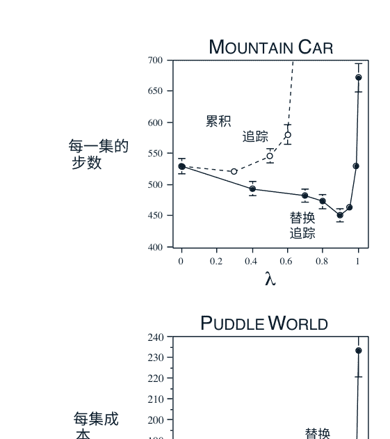

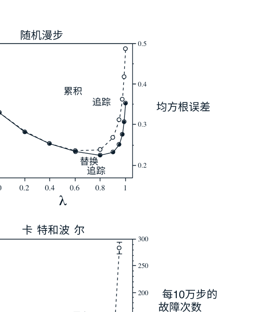

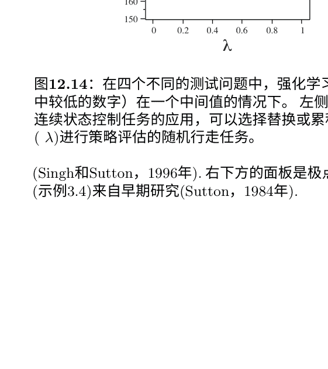

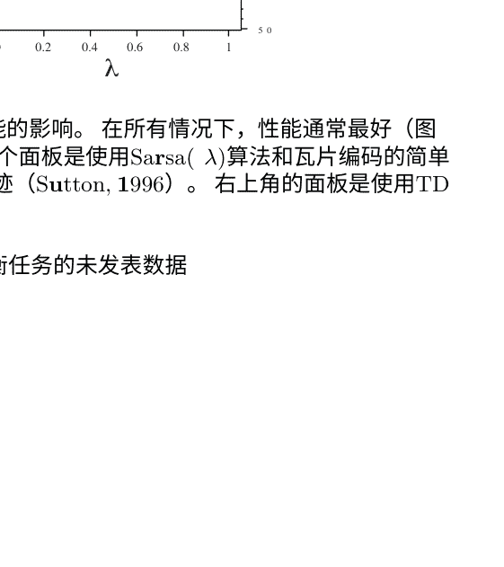

图12.14：在四个不同的测试问题中，强化学习性能的影响。在所有情况下，性能通常最好（图中较低的数字）在一个中间值的情况下。左侧的两个面板是使用Sarsa(λ)算法和瓦片编码的简单连续状态控制任务的应用，可以选择替换或累积痕迹（Sutton，1996）。右上角的面板是使用TD(λ)进行策略评估的随机行走任务。

> (Singh和Sutton，1996年)。右下方的面板是极点平衡任务的未发表数据(示例3.4)来自早期研究(Sutton，1984年)。

### 参考文献和历史评论

资格追踪通过Klopf (1972)的多产思想进入强化学习。我们对资格追踪的使用基于Klopf的工作 (Sutton, 1978a, 1978b, 1978c; Barto and Sutton, 1981a, 1981b; Sutton and Barto, 1981a; Barto, Sutton, and Anderson, 1983; Sutton, 1984)。我们可能是第一个使用“资格追踪”这个术语的人 (Sutton and Barto, 1981a)。刺激产生对学习非常重要的神经系统后效的想法非常古老 (见第14章)。资格追踪的最早应用之一是在第13章中讨论的演员-评论家方法中 (Barto, Sutton, and Anderson, 1983; Sutton, 1984)。

12.1 在本书第一版中，复合更新被称为“复杂备份”。

Watkins (1989) 引入了“ λ-返回”及其误差减小特性，Jaakkola，Jordan和Singh (1994) 进一步发展了这一概念。这一节和后续节中的随机行走是本书的新内容，以及“前向视图”和“后向视图”这些术语。在本书的第一版中引入了“ λ-返回”算法的概念。这里提出的更精细的处理是与Harm van Seijen (例如，van Seijen andSutton, 2014) 共同开发的。

12.2 TD(λ)与累积痕迹是由Sutton (1988, 1984)引入的。Dayan (1992)证明了均值收敛性，而包括Peng (1993), Dayan和Sejnowski (1994), Tsitsiklis (1994), 以及Gur vits, Lin和Hanson (1994)在内的许多研究者证明了概率为1的收敛性。Tsitsiklis和Van Roy (1997)给出了线性TD( λ)渐近λ相关解的误差上界。

12.3 Cichosz (1995)和van Seijen (2016)开发了截断TD方法。

12.4 van Seijen最初在“最佳匹配学习” (van Seijen, 2011; van Seijen, Whiteson, van Hasselt, and Weiring, 2011) 的名义下广泛发展了重新更新的思想。

12.5 真正的在线TD(λ)主要归功于Harm van Seijen (van Seijen and Sutton,2014; van Seijen et al., 2016), 尽管其中一些关键思想是由Hado van Hasselt (个人交流)独立发现的。“荷兰痕迹”这个名字是为了表彰两位科学家的贡献。

替代痕迹是由Singh和Sutton (1996)提出的。

12.6 本节的材料来自van Hasselt和Sutton (2015)。

12.7 累积痕迹的Sarsa(λ)首次被Rummery和Niranjan (1994; Rummery, 1995)探索为一种控制方法。真正的在线Sarsa(λ)是由van Seijen和Sutton (2014)引入的。第307页的算法

改编自van Seijen等人 (2016)。山车结果是为了本文而制作的，除了图12.11是改编自van Seijen和Sutton(2014)。

## 12.8

也许第一个关于变量 λ 的发表讨论是由Watkins (1989) 提出的，他指出在选择非贪婪动作时，可以通过临时将λ设置为0来实现更新序列的截断（图12.12）。

变量 λ 是在本教材的第一版中引入的。变量 γ 的根源可以追溯到关于选项的工作 (Sutton, Precup和Singh, 1999) 及其前身 (Sutton, 1995a)，并在GQ(λ) 论文 (Maei和Sutton, 2010) 中明确提出，该论文还引入了一些递归形式来计算 λ-returns。
Yu (2012) 提出了一种不同的变量 λ 的概念。

## 12.9

Precup等人 (2000, 2001) 首次引入了离策略资格痕迹，然后由Bertsekas和Yu (2009)，Maei (2011; Maei和Sutton, 2010)，Yu (2012) 以及Sutton, Mahmood, Precup和van Hasselt (2014) 进一步发展。特别是最后一篇参考文献为具有一般状态相关 λ 和 γ 的离策略TD方法提供了强大的前向视图。这里的介绍似乎是新的。

本节以一个优雅的预期Sarsa(λ)算法结束。虽然它是一个自然算法，但据我们所知，它以前没有在文献中描述或测试过。

## 12.10

Watkins的Q(λ)是由Watkins (1989)提出的。 Munos、Stepleton、Harutyunyan和Bellemare (2016)证明了表格、分集、离线版本的收敛性。 Peng和Williams (1994、1996)以及Sutton、Mahmood、Precup和van Hasselt (2014)提出了替代的Q(λ)算法。 Tree Backup(λ)是由Precup、Sutton和Singh (2000)提出的。

## 12.11

GTD(λ)是由Maei (2011)提出的。 GQ(λ)是由Maei和Sutton (2010)提出的。 HTD(λ) 是基于 Hackman (2012) 提出的一步 HTD 算法的 White 和 White (2016) 的成果。 梯度-TD 方法的最新发展是由 Yu (2017) 提出的。 Emphatic TD(λ) 是由 Sutton、Mahmood 和 White (2016) 提出的，并证明了其稳定性。 Yu (2015, 2016) 证明了其收敛性，并由 Hallak 等人 (2015, 2016) 进一步发展了该算法。

# 第13章

## 策略梯度方法

在本章中，我们考虑了一些新的方法。到目前为止，在本书中几乎所有的方法都是动作值方法；它们学习动作的值，然后根据估计的动作值选择动作；没有动作值估计，它们的策略甚至不存在。在本章中，我们考虑的方法是学习一个参数化策略，可以在不咨询值函数的情况下选择动作。仍然可以使用值函数来学习策略参数，但不需要用于动作选择。我们使用符号 $\boldsymbol{\theta} \in \mathbb{R}^{d'}$ 表示策略的参数向量。因此，我们可以写成

$\pi(a | s, \boldsymbol{\theta}) = \mathrm{Pr}\{A_{t}=a \mid S_{t}=s, \boldsymbol{\theta}_{t}=\boldsymbol{\theta}\}$ 表示在时间 $t$ 时，环境处于状态 $s$ 且参数为 $\boldsymbol{\theta}$ 时，采取行动 $a$ 的概率。如果一个方法也使用了一个已学习的值函数，那么该值函数的权重向量通常用 $\mathbf{w} \in \mathbb{R}^{d}$ 表示，如 $\hat{v}(s, \mathbf{w})$。

在本章中，我们考虑基于某个标量性能度量 $J(\boldsymbol{\theta})$ 相对于策略参数的梯度来学习策略参数的方法。这些方法旨在最大化性能，因此它们的更新近似于 $J$ 的梯度上升：

$$\boldsymbol{\theta}_{t+1} = \boldsymbol{\theta}_{t} + \alpha \widehat{\nabla J\left(\boldsymbol{\theta}_{t}\right)}, \quad\quad\quad (13.1)$$

其中 $\widehat{\nabla J}\left(\boldsymbol{\theta}_{t}\right) \in \mathbb{R}^{d'}$ 是一个随机估计，其期望近似于性能度量相对于其参数的梯度 $\boldsymbol{\theta}_{t}$。遵循这个通用模式的所有方法我们称之为策略梯度方法，无论它们是否还学习了近似值函数。同时学习策略和值函数的方法通常被称为演员-评论家方法，其中'演员'是指学习的策略，'评论家'是指学习的值函数，通常是状态值函数。

首先，我们处理情节性的情况，其中性能被定义为参数化策略下起始状态的值，然后再考虑连续性的情况，其中性能被定义为平均奖励率，如第10.3节所述。最后，我们能够用非常相似的术语来表达这两种情况的算法。

### 13.1 策略逼近及其优势

在策略梯度方法中，策略可以以任何方式参数化，只要 $\pi(a|s, \theta)$ 对其参数是可微分的，也就是说，只要 $\pi(a|s, \theta)$（对于 $\theta$ 的各个分量的偏导数的列向量）对于所有的 $s \in \mathcal{S}, a \in \mathcal{A}(s)$ 和 $\theta \in \mathbb{R}^d$ 都存在且有限。实际上，为了确保探索，我们通常要求策略永远不会变得确定性（即，对于所有的 $s, a, \theta$，$\pi(a|s, \theta) \in (0, 1)$）。在本节中，我们介绍了离散动作空间的最常见参数化方法，并指出它相对于动作值方法的优势。

基于策略的方法也提供了处理连续动作空间的有用方式，正如我们在第13.7节中所描述的。

如果动作空间是离散的且不太大，那么一种自然且常见的参数化方式是为每个状态-动作对形成参数化的数值偏好 $h(s, a, \theta) \in \mathbb{R}$。在每个状态中，具有最高偏好的动作被赋予最高的被选择的概率，例如，根据指数软最大分布:

> $$\pi(a|s, \theta) = \frac{e^{h(s,a,\theta)}}{\sum_b e^{h(s,b,\theta)}} \quad (13.2)$$

其中 $e \approx 2.71828$ 是自然对数的底数。请注意，这里的分母只是为了使每个状态中的动作概率总和为一。我们将这种策略参数化称为动作偏好的软最大。

行动偏好本身可以任意参数化。例如，它们可能由一个深度人工神经网络（ANN）计算得出，其中 $\theta$ 是网络的所有连接权重的向量（如第16.6节中描述的AlphaGo系统）。或者偏好可以简单地是特征的线性组合,

> $$h(s, a, \theta) = \theta^T \mathbf{x}(s, a) \quad (13.3)$$

使用由第9章中描述的任何方法构建的特征向量 $\mathbf{x}(s, a) \in \mathbb{R}^{d'}$。

根据行动偏好以软最大化的方式参数化策略的一个优点是，近似策略可以接近确定性策略，而使用 $\epsilon$-贪婪行动选择时，总是有选择随机行动的 $\epsilon$ 概率。当然，可以根据行动价值选择一个软最大化分布，但这本身不能使策略接近确定性策略。

相反，动作值估计将会收敛到相应的真实值，这些真实值会有一个有限的差异，转化为特定的概率而不是0和1。如果软最大分布包括一个温度参数，那么温度可以随时间降低以接近确定性，但在实践中，选择降低的时间表，甚至初始温度，都很难，除非我们对真实动作值有更多的先验知识。动作偏好是不同的，因为它们不会接近特定的值；相反，它们被驱使产生最优的随机策略。如果最优策略是确定性的，那么最优动作的偏好将会无限地高于所有次优动作（如果参数化允许的话）。

根据软最大值的动作偏好来参数化策略的第二个优势是它可以以任意概率选择动作。在具有显著函数逼近的问题中，最佳近似策略可能是随机的。例如，在具有不完全信息的纸牌游戏中，最优的玩法通常是以特定的概率做两件不同的事情，比如在扑克牌中的加注。动作值方法没有自然的方法来找到随机的最优策略，而策略逼近方法可以，如示例13.1所示。

## 例子 13.1: 带有切换动作的短走廊

考虑下图中插图所示的小走廊网格世界。奖励是每步1个单位，与往常一样。在三个非终止状态中，只有两个动作，右和左。这些动作在第一个和第三个状态中具有通常的结果（左在第一个状态中不会移动），但在第二个状态中它们被颠倒，所以右向左移动，左向右移动。

这个问题很困难，因为在函数逼近下所有状态看起来都是相同的。特别地，我们定义 x(s,右)=[1,0]^T 和 x(s,左)=[0,1]^T，对于所有的 s。一个具有 ε贪婪动作选择的动作值方法被迫在两个策略之间选择：在所有步骤中以高概率 1-ε/2 选择右，或者在所有时间步骤中以相同的高概率选择左。如果 ε=0.1，那么这两个策略在起始状态下的值分别小于 -44 和 -82，如图所示。如果一个方法可以学习一个特定的概率来选择右，那么它可以取得显著更好的效果。最佳概率约为0.59，可以达到约 -11.6的值。

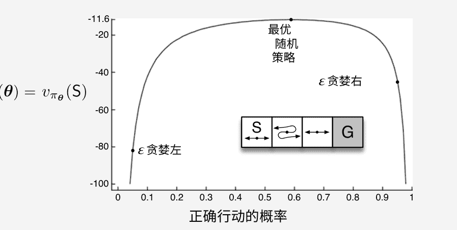

也许，策略参数化相对于行动-值参数化的最简单优势是策略可能是一个更简单的函数来近似。

问题的策略和行动-值函数的复杂性各不相同。对于某些问题，行动-值函数更简单，因此更容易近似。对于其他问题，策略更简单。在后一种情况下，基于策略的方法通常学习更快，并产生一个更优的渐近策略（如Tetris中的情况；参见S im sek, Alg’orta和Kothiyal, 2016）。

最后，我们注意到策略参数化的选择有时是将关于策略期望形式的先验知识注入到强化学习系统中的好方法。这通常是使用基于策略的学习方法的最重要原因。

- 练习 13.1 利用你对网格世界及其动态的了解，确定选择正确动作的最优概率的确切符号表达式在示例 13.1 中。

### 13.2 策略梯度定理

除了策略参数化相对于 ε 贪婪动作选择的实际优势外，还有一个重要的理论优势。在连续策略参数化中，动作概率随学习参数的函数平滑变化，而在 ε 贪婪选择中，如果估计的动作值的微小变化导致不同的动作具有最大值，则动作概率可能发生剧烈变化。主要是因为策略梯度方法具有更强的收敛保证，而不是动作值方法。特别是，策略对参数的连续性使得策略梯度方法能够近似梯度上升 (13.1)。

短期和长期情况下定义了性能度量， J(θ)，因此在某种程度上必须分别处理。尽管如此，我们将尝试以统一的方式呈现这两种情况，并开发一种符号表示法，以使用一组方程描述主要的理论结果。

在本节中，我们处理的是情节性案例，我们将性能度量定义为情节的起始状态的值。我们可以简化符号，而不会失去任何有意义的普遍性，假设每个情节都从某个特定的（非随机）状态 s₀ 开始。然后，在情节性案例中，我们将性能定义为

```
$$J(\theta) \doteq v_{\pi_{\theta}}(s_0),$$
```

其中 $v_{\pi_{\theta}}$ 是由 θ 确定的策略 π 的真实值函数。从现在开始，在我们的讨论中，我们将假设情节性案例没有折扣 ($\gamma=1$)，尽管为了完整起见，我们在方框算法中包括了折扣的可能性。

在函数逼近中，改变策略参数以确保改进似乎是具有挑战性的。问题在于性能取决于动作选择和选择所处状态的分布，而这两者都受到策略参数的影响。给定一个状态，策略参数对动作和奖励的影响可以通过参数化的知识相对简单地计算出来。但是策略对状态分布的影响是环境的函数，通常是未知的。当梯度依赖于策略变化对状态分布的未知影响时，我们如何估计相对于策略参数的性能梯度？

## 13.2.1 策略梯度定理的证明（情节性案例）

通过基本微积分和术语的重新排列，我们可以从第一原理证明策略梯度定理。为了保持符号简单，我们在所有情况下都隐含地将π视为θ的函数，并且所有梯度也隐含地相对于θ。首先注意，状态值函数的梯度可以用动作值函数来表示。

```
$$
\begin{aligned}
\nabla v_{\pi}(s) &= \nabla \left[ \sum_{a} \pi(a|s) q_{\pi}(s, a) \right] , \text{对于所有的} s \in \mathcal{S} \quad \text{(练习3.18)} \\
&= \sum_{a} \left[ \nabla \pi(a|s) q_{\pi}(s, a) + \pi(a|s) \nabla q_{\pi}(s, a) \right] \quad \text{(微积分的乘法法则)} \\
&= \sum_{a} \left[ \nabla \pi(a|s) q_{\pi}(s, a) + \pi(a|s) \nabla \sum_{s',r} p(s', r | s, a)(r + v_{\pi}(s')) \right] \quad \text{(练习3.19和方程3.2)} \\
&= \sum_{a} \left[ \nabla \pi(a|s) q_{\pi}(s, a) + \pi(a|s) \sum_{s'} p(s' | s, a) \nabla v_{\pi}(s') \right] \quad \text{(方程3.4)} \\
&= \sum_{a} \left[ \nabla \pi(a|s) q_{\pi}(s, a) + \pi(a|s) \sum_{s'} p(s' | s, a) \right. \\
&\quad \left. \sum_{a'} \left[ \nabla \pi(a'|s') q_{\pi}(s', a') + \pi(a'|s') \sum_{s''} p(s'' | s', a') \nabla v_{\pi}(s'') \right] \right] \quad \text{(展开)} \\
&= \sum_{x \in \mathcal{S}} \sum_{k=0}^{\infty} \text{Pr}(s \rightarrow x, k, \pi) \sum_{a} \nabla \pi(a|x) q_{\pi}(x, a),
\end{aligned}
$$
```

在重复展开之后，其中Pr(s→x, k,π)是在策略π下，在k步骤中从状态s过渡到状态x的概率。然后立即可得

```
$$
\begin{aligned}
\nabla J(\theta) &= \nabla v_{\pi}(s_0) \\
&= \sum_{s} \sum_{k=0}^{\infty} \text{Pr}(s_0 \rightarrow s, k, \pi) \sum_{a} \nabla \pi(a|s) q_{\pi}(s, a) \\
&= \sum_{s} \eta(s) \sum_{a} \nabla \pi(a|s) q_{\pi}(s, a) \quad \text{(第199页)} \\
&= \sum_{s'} \eta(s') \sum_{s} \frac{\eta(s)}{\sum_{s'} \eta(s')} \sum_{a} \nabla \pi(a|s) q_{\pi}(s, a) \\
&= \sum_{s'} \eta(s') \sum_{s} \mu(s) \sum_{a} \nabla \pi(a|s) q_{\pi}(s, a) \quad \text{(公式9.3)} \\
&\propto \sum_{s} \mu(s) \sum_{a} \nabla \pi(a|s) q_{\pi}(s, a) \quad \text{(证毕)}
\end{aligned}
$$
```

关于策略参数的性能（这是我们需要近似的内容）与状态分布的导数无关。对于情节性案例，策略梯度定理建立了以下事实：

$$\nabla J(\boldsymbol{\theta}) \propto \sum_{s} \mu(s) \sum_{a} q_{\pi}(s, a) \nabla \pi(a | s, \boldsymbol{\theta}),$$

其中梯度是关于 $\boldsymbol{\theta}$ 的偏导数的列向量，$\pi$表示与参数向量 $\boldsymbol{\theta}$对应的策略。这里的符号 $\propto$ 表示“与...成比例”。在情节性的情况下，比例常数是一个情节的平均长度，在持续性的情况下，比例常数为1，因此关系实际上是一个等式。这里的分布 $\mu_{\text{here}}$（如第9章和第10章所述）是 $\pi$下的同策略分布（见第199页）。策略梯度定理在上一页的方框中证明了情节性情况。

### 13.3 REINFORCE：蒙特卡洛策略梯度

我们现在准备推导出我们的第一个策略梯度学习算法。回想一下我们的随机梯度上升（13.1）的整体策略，它需要一种获取样本的方法，使得样本梯度的期望与参数的实际梯度成比例，作为参数的性能度量函数。样本梯度只需要与梯度成比例，因为比例常数可以吸收到步长 $\alpha$中，步长$\alpha$是任意的。策略梯度定理给出了与梯度成比例的精确表达式；只需要一种采样方式，其期望等于或近似于这个表达式。注意策略梯度定理的右侧是一个按状态加权求和的表达式，权重是根据目标策略 $\pi$下状态出现的频率；如果遵循 $\pi$，那么状态将按这些比例出现。因此

$$\nabla J(\boldsymbol{\theta}) \propto \sum_{s} \mu(s) \sum_{a} q_{\pi}(s, a) \nabla \pi(a | s, \boldsymbol{\theta}) = \mathbb{E}_{\pi} \left[ \sum_{a} q_{\pi}(S_t, a) \nabla \pi(a | S_t, \boldsymbol{\theta}) \right].$$

$$\boldsymbol{\theta}_{t+1} \doteq \boldsymbol{\theta}_t + \alpha \sum_{a} \hat{q}(S_t, a, \mathbf{w}) \nabla \pi(a | S_t, \boldsymbol{\theta}),$$

其中 $\hat{q}$是对 $q_{\pi}$的某种学习近似。这个算法被称为全动作方法，因为它的更新涉及所有动作，这是一个有前途且值得进一步研究的方法，但我们目前的兴趣是经典的REINFORCE算法（Williams, 1992），其在时间 $t$的更新仅涉及实际采取的一个动作 $A_t$。

我们通过引入与我们以相同方式引入 $S_t$ (13.6)中的 $A_t$来继续推导REINFORCE，通过替换对随机变量可能值的求和

通过对 $\pi$ 的期望值进行采样来进行期望值。方程式(13.6)涉及对动作的适当求和，但每个项都没有按 $\pi(a|S_t, \theta)$ 加权，这是期望值下所需的。因此，我们通过乘以和除以 $\pi(a|S_t, \theta)$ 来引入这样的加权，而不改变等式。从(13.6)继续，我们有

$$
\begin{aligned}
\nabla J(\boldsymbol{\theta}) &= \mathbb{E}_{\pi}\left[\sum_{a} \pi(a|S_t, \boldsymbol{\theta}) q_{\pi}(S_t, a) \frac{\nabla \pi(a|S_t, \boldsymbol{\theta})}{\pi(a|S_t, \boldsymbol{\theta})}\right] \\
&= \mathbb{E}_{\pi}\left[q_{\pi}(S_t, A_t) \frac{\nabla \pi(A_t|S_t, \boldsymbol{\theta})}{\pi(A_t|S_t, \boldsymbol{\theta})}\right] \quad \text{(用样本 } A_t \text{ 替换 } a \sim \pi\text{)} \\
&= \mathbb{E}_{\pi}\left[G_t \frac{\nabla \pi(A_t|S_t, \boldsymbol{\theta})}{\pi(A_t|S_t, \boldsymbol{\theta})}\right], \quad \text{(因为 } \mathbb{E}_{\pi}[G_t|S_t, A_t] = q_{\pi}(S_t, A_t) \text{)}
\end{aligned}
$$

其中 $G_t$ 通常是回报。括号中的最后一个表达式正是所需的，它是一个可以在每个时间步骤上进行采样的量，其期望值等于梯度。使用这个样本来实例化我们的通用随机梯度上升算法 (13.1) 得到REINFORCE更新：

$$
\boldsymbol{\theta}_{t+1} \doteq \boldsymbol{\theta}_t + \alpha G_t \frac{\nabla \pi(A_t|S_t, \boldsymbol{\theta}_t)}{\pi(A_t|S_t, \boldsymbol{\theta}_t)}.
\quad \text{(13.8)}
$$

这个更新具有直观的吸引力。每个增量与一个向量的乘积成比例，该向量是实际采取的动作的概率的梯度除以采取该动作的概率。该向量是参数空间中最大程度增加重复动作 $A_t$ 的概率的方向。该更新按比例增加参数向量在该方向上，与回报成正比，与动作概率成反比。前者是有意义的，因为它使参数在有利于产生最高回报的动作方向上移动最多。后者是有意义的，因为否则经常选择的动作会处于优势（更新将更频繁地朝它们的方向进行），即使它们不产生最高回报也可能获胜。

请注意，REINFORCE使用从时间$t$开始的完整回报，其中包括直到该回合结束的所有未来奖励。从这个意义上说，REINFORCE是一种蒙特卡洛算法，只有在回合完成后才能进行所有更新（就像第5章中的蒙特卡洛算法一样）。

这在下一页的方框中明确显示。请注意，伪代码中最后一行的更新看起来与REINFORCE更新规则 (13.8) 有些不同。一个区别是伪代码使用了紧凑的表达式 $\nabla \ln \pi(A_t|S_t, \boldsymbol{\theta}_t)$ 表示分数向量 $\frac{\nabla \pi(A_t|S_t, \boldsymbol{\theta}_t)}{\pi(A_t|S_t, \boldsymbol{\theta}_t)}$ 在 (13.8) 中。这两个向量的等价性可以从恒等式 $\nabla \ln x = \frac{\nabla x}{x}$ 得出。

这个向量在文献中被赋予了几个名称和符号; 我们将简单地称之为资格向量。请注意，这是策略参数化在算法中出现的唯一位置。

### 13.3.1 REINFORCE: 蒙特卡洛策略梯度控制 (回合式) for $\pi_*$

| 步骤 | 描述 |
| :--- | :--- |
| **输入** | 一个可微分的策略参数化 $\pi(a\|s,\theta)$ |
| **算法参数** | 步长 $\alpha > 0$ |
| **初始化** | 策略参数 $\theta$ (例如，设为0) |
| **循环** | 对于每个回合：<br> 1. 根据 $\pi(\cdot\|\theta)$ 生成一个情节 $S_0, A_0, R_1, \ldots, S_{T-1}, A_{T-1}, R_T$。<br> 2. 对于每个时间步 $t = 0, 1, \ldots, T-1$：<br>    $G \leftarrow \sum_{k=t+1}^{T} \gamma^{k-t-1} R_k$<br>    $\theta \leftarrow \theta + \alpha \gamma^t G \nabla \ln \pi(A_t\|S_t, \theta)$ |

伪代码更新和REINFORCE更新方程（13.8）之间的第二个差异是前者包括一个因子 $\gamma^t$。这是因为，如前面提到的，在文本中我们处理的是非折扣情况（$\gamma=1$），而在方框算法中我们给出了一般折扣情况的算法。所有的想法在折扣情况下都经过适当的调整（包括第199页上的方框），但涉及到额外的复杂性会分散主要思想。

- 练习13.2 推广第199页上的方框，策略梯度定理（13.5），策略梯度定理的证明（第325页）以及导致REINFORCE更新方程（13.8）的步骤，使得（13.8）最终具有一个因子 $\gamma^t$，从而与伪代码中给出的一般算法相一致。

图13.1展示了REINFORCE在短走廊网格世界上的性能，来自示例13.1。

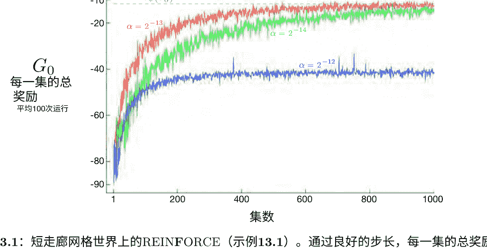

图13.1: 短走廊网格世界上的REINFORCE（示例13.1）。通过良好的步长，每一集的总奖励接近起始状态的最优值。

作为一种随机梯度方法，REINFORCE具有良好的理论收敛性质。通过构造，一集中的期望更新与性能梯度方向相同。这确保了在足够小的$\alpha$下，期望性能会有所提升，并在标准随机近似条件下收敛到局部最优解。然而，作为一种蒙特卡洛方法，REINFORCE可能具有较高的方差，从而导致学习速度较慢。

- 练习13.3 在第13.1节中，我们考虑了使用软最大化在动作偏好中进行策略参数化（13.2），并使用线性动作偏好（13.3）。对于这种参数化，证明资格向量是

$\nabla \ln \pi(a|s, \boldsymbol{\theta}) = \mathbf{x}(s, a) - \sum_{b} \pi(b|s, \boldsymbol{\theta})\mathbf{x}(s, b) \tag{13.9}$

使用定义和基本微积分。

### 13.4 带有基准的REINFORCE

策略梯度定理（13.5）可以推广到将动作值与任意基准$b(s)$进行比较：

$\nabla J(\boldsymbol{\theta}) \propto \sum_{s} \mu(s) \sum_{a} \left(q_{\pi}(s, a) - b(s)\right) \nabla\pi(a|s, \boldsymbol{\theta}) \tag{13.10}$

基准可以是任何函数，甚至是一个随机变量，只要它不随$a$变化；方程仍然成立，因为减去的数量为零：

$\sum_{a} b(s)\nabla\pi(a|s, \boldsymbol{\theta}) = b(s)\nabla \sum_{a} \pi(a|s, \boldsymbol{\theta}) = b(s)\nabla 1 = 0.$

使用基线（13.10）的策略梯度定理可以推导出一个更新规则，步骤与前一节类似。我们得到的更新规则是REINFORCE的一个新版本，包括一个通用的基线：

$\boldsymbol{\theta}_{t+1} \doteq \boldsymbol{\theta}_{t} + \alpha \left(G_{t} - b(S_{t})\right) \frac{\nabla\pi(A_{t}|S_{t}, \boldsymbol{\theta}_{t})}{\pi(A_{t}|S_{t}, \boldsymbol{\theta}_{t})} \tag{13.11}$

因为基线可能是均匀为零的，所以这个更新是REINFORCE的一个严格推广。一般来说，基线不会改变更新的期望值，但是它可能对方差产生很大的影响。例如，我们在第2.8节中看到，类似的基线可以显著减小梯度赌博机算法的方差（从而加快学习速度）。在赌博机算法中，基线只是一个数字（迄今为止奖励的平均值），但是对于MDP，基线应该随状态变化。在某些状态下，所有动作都具有较高的值，我们需要一个较高的基线来区分较高价值的动作和较低价值的动作；在其他状态下，所有动作的值都很低，适合使用较低的基线。

对于基准线来说，一个自然的选择是状态值的估计，$\hat{v}(S_{t}, \mathbf{w})$，其中$\mathbf{w} \in \mathbb{R}^m$是通过前几章介绍的方法之一学习到的权重向量。

因为REINFORCE是一种用于学习策略参数的蒙特卡洛方法，所以也自然地使用蒙特卡洛方法来学习状态值的权重w。下面的方框中给出了使用这样一个学习到的状态值函数作为基准线的REINFORCE算法的完整伪代码算法。

### 13.4.1 REINFORCE with Baseline（回合式），用于估计 $\pi_*$

| 步骤 | 描述 |
| :--- | :--- |
| **输入** | 可微分的策略参数化 $\pi(a\|s, \theta)$ |
| **输入** | 可微分的状态值函数参数化 $\hat{v}(s, w)$ |
| **算法参数** | 步长 $\alpha^\theta > 0, \alpha^w > 0$ |
| **初始化** | 策略参数 $\theta \in \mathbb{R}^{d'}$ 和状态值权重 $w \in \mathbb{R}^{d}$ (例如，设为0) |
| **循环** | 对于每个回合：<br> 1. 根据 $\pi(\cdot\|\cdot,\theta)$ 生成一个情节 $S_0, A_0, R_1, ..., S_{T-1}, A_{T-1}, R_T$。<br> 2. 对于每个时间步 $t=0,1,...,T-1$：<br>    $G \leftarrow \sum_{k=t+1}^{T} \gamma^{k-t-1} R_k$<br>    $\delta \leftarrow G - \hat{v}(S_t, w)$<br>    $w \leftarrow w + \alpha^w \delta \nabla \hat{v}(S_t, w)$<br>    $\theta \leftarrow \theta + \alpha^\theta \gamma^t \delta \nabla \ln \pi(A_t\|S_t, \theta)$ |

该算法有两个步长，分别表示为 $\alpha^\theta$ 和 $\alpha^w$（其中 $\alpha^\theta$ 是（13.11）中的 $\alpha$）。为值函数（这里是 $\alpha^w$）选择步长相对容易；在线性情况下，我们有设置它的经验法则，例如 $\alpha^w = 0.1 / \mathbb{E}[\|\nabla \hat{v}(S_t, w)\|^2_\mu]$（见第9.6节）。对于策略参数的步长设置要明确得多，因为其最佳值取决于奖励的变化范围和策略参数化的方式。

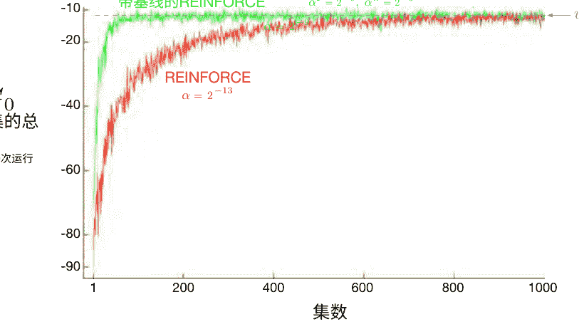

图13.2：在REINFORCE中添加基线可以使其学习速度更快，如在短走廊网格世界（示例13.1）中所示。这里使用的步长是REINFORCE表现最佳的步长（最接近2的幂次；参见图13.1）。

图13.2比较了在短走廊网格世界（示例13.1）上使用基线和不使用基线的REINFORCE的行为。这里基线中使用的近似状态值函数为 $\hat{v}(s, \mathbf{w}) = w$。也就是说，$\mathbf{w}$ 是一个单一的组件，$w$。

### 13.5 演员-评论家方法

尽管REINFORCE-with-baseline方法同时学习策略和状态值函数，但我们不认为它是一个演员-评论家方法，因为它的状态值函数仅用作基准，而不是评论家。也就是说，它不用于引导（从后续状态的估计值更新状态的值估计），而仅用作正在更新估计值的状态的基准。这是一个有用的区别，因为只有通过引导才能引入偏差和对函数逼近质量的渐近依赖。正如我们所见，通过引导和对状态表示的依赖引入的偏差通常是有益的，因为它减少了方差并加速了学习。REINFORCE with baseline是无偏的，并且会渐近地收敛到局部最小值，但像所有蒙特卡洛方法一样，它倾向于学习缓慢（产生高方差的估计）并且在在线实现或持续问题上不方便。正如我们在本书前面所看到的，通过时序差分方法，我们可以消除这些不便，并通过多步方法灵活选择引导的程度。为了在策略梯度方法的情况下获得这些优势，我们使用带有引导评论家的演员-评论家方法。

首先考虑一步演员-评论家方法，这是第6章中介绍的TD方法（如TD(0)，Sarsa(0)和Q-learning）的类比。一步方法的主要优点是它们完全在线和增量式，同时避免了资格追踪的复杂性。它们是资格追踪方法的特例，不太通用，但更容易理解。一步演员-评论家方法用一步回报（并使用学习的状态值函数作为基准）替换了REINFORCE（13.11）的完整回报，具体如下：

\[
\boldsymbol{\theta}_{t+1} \doteq \boldsymbol{\theta}_t + \alpha \left( G_{t:t+1} - \hat{v}(S_t, \mathbf{w}) \right) \frac{\nabla \pi(A_t | S_t, \boldsymbol{\theta}_t)}{\pi(A_t | S_t, \boldsymbol{\theta}_t)} \quad (13.12)
\]

\[
= \boldsymbol{\theta}_t + \alpha \left( R_{t+1} + \gamma \hat{v}(S_{t+1}, \mathbf{w}) - \hat{v}(S_t, \mathbf{w}) \right) \frac{\nabla \pi(A_t | S_t, \boldsymbol{\theta}_t)}{\pi(A_t | S_t, \boldsymbol{\theta}_t)} \quad (13.13)
\]

\[
= \boldsymbol{\theta} + \alpha \lambda_t \frac{\nabla \pi(A_t | S_t, \boldsymbol{\theta}_t)}{\pi(A_t | S_t, \boldsymbol{\theta}_t)}. \quad (13.14)
\]

与此配对的自然状态值函数学习方法是半梯度TD(0)。完整算法的伪代码在下一页顶部的方框中给出。请注意，现在它是一个完全在线的、增量的算法，状态、动作和奖励在发生时被处理，然后不再被重新访问。

一步演员-评论家(分集)，用于估计 $\pi_{\theta} \approx \pi_{*}$

输入：可微分策略参数化 $\pi(a|s, \theta)$
输入：可微分状态值函数参数化 $\hat{v}(s, \mathbf{w})$
参数：步长 $\alpha^{\theta} > 0$, $\alpha^{\mathbf{w}} > 0$
初始化策略参数 $\theta \in \mathbb{R}^{d'}$ 和状态值权重 $\mathbf{w} \in \mathbb{R}^{d}$ (例如，设置为 0)
无限循环 (对于每个剧集)：
  初始化 $S$ (剧集的第一个状态)
  $I \leftarrow 1$
  当 $S$ 不是终止状态时循环 (对于每个时间步)：
    $A \sim \pi(\cdot|S, \theta)$
    执行动作 $A$, 观察 $S', R$
    $\delta \leftarrow R + \gamma \hat{v}(S', \mathbf{w}) - \hat{v}(S, \mathbf{w})$ (如果 $S'$ 是终止状态，则 $\hat{v}(S', \mathbf{w}) = 0$)。
    $\mathbf{w} \leftarrow \mathbf{w} + \alpha^{\mathbf{w}} \delta \nabla \hat{v}(S, \mathbf{w})$
    $\theta \leftarrow \theta + \alpha^{\theta} I \delta \nabla \ln \pi(A|S, \theta)$
    $I \leftarrow \gamma I$
    $S \leftarrow S'$

对于前向视图的 $n$ 步方法的推广，然后推广到一个 $\lambda$ 回报算法是直接的。(13.12) 中的一步回报仅仅被 $G_{t:t+n}$ 或 $G_t^{\lambda}$ 分别替换。对于 $\lambda$ 回报算法的后向视图也是直接的，使用演员和评论家的单独资格迹，每个资格迹都在第12章的模式之后。完整算法的伪代码如下方框所示。

带有资格痕迹的演员-评论家 (情节性)，用于估计 $\pi_{\theta} \approx \pi_{*}$

输入：可微分的策略参数化 $\pi(a|s, \theta)$
输入：可微分的状态值函数参数化 $\hat{v}(s, \mathbf{w})$
参数：追踪衰减率 $\lambda^{\theta} \in [0, 1]$, $\lambda^{\mathbf{w}} \in [0, 1]$; 步长 $\alpha^{\theta} > 0$, $\alpha^{\mathbf{w}} > 0$
初始化策略参数 $\theta \in \mathbb{R}^{d'}$ 和状态值权重 $\mathbf{w} \in \mathbb{R}^{d}$ (例如，设为 0)
无限循环 (对于每个情节)：
  初始化 $S$ (情节的第一个状态)
  $\mathbf{z}^{\theta} \leftarrow 0$ ($d'$ 分量资格痕迹向量)
  $\mathbf{z}^{\mathbf{w}} \leftarrow 0$ ($d$-组件资格迹向量)
  $I \leftarrow 1$
  当 $S$ 不是终止状态时循环 (对于每个时间步)：
    $A \sim \pi(\cdot|S, \theta)$
    执行动作 $A$, 观察 $S', R$
    $\delta \leftarrow R + \gamma \hat{v}(S', \mathbf{w}) - \hat{v}(S, \mathbf{w})$ (如果 $S'$ 是终止状态，则 $\hat{v}(S', \mathbf{w}) = 0$)。
    $\mathbf{z}^{\mathbf{w}} \leftarrow \lambda^{\mathbf{w}} \mathbf{z}^{\mathbf{w}} + \nabla \hat{v}(S, \mathbf{w})$
    $\mathbf{z}^{\theta} \leftarrow \lambda^{\theta} \mathbf{z}^{\theta} + I \nabla \ln \pi(A|S, \theta)$
    $\mathbf{w} \leftarrow \mathbf{w} + \alpha^{\mathbf{w}} \delta \mathbf{z}^{\mathbf{w}}$
    $\theta \leftarrow \theta + \alpha^{\theta} \delta \mathbf{z}^{\theta}$
    $I \leftarrow \gamma I$
    $S \leftarrow S'$

### 13.6 连续问题的策略梯度

如第10.3节所讨论的，对于没有剧集边界的持续问题，我们需要根据每个时间步的平均奖励率来定义性能：

$$
J(\theta) \doteq r(\pi) \doteq \lim_{h \to \infty} \frac{1}{h} \sum_{t=1}^{h} \mathbb{E}[R_t \mid S_0, A_{0:t-1} \sim \pi] \\ = \lim_{t \to \infty} \mathbb{E}[R_t \mid S_0, A_{0:t-1} \sim \pi] \\ = \sum_{s} \mu(s) \sum_{a} \pi(a|s, \theta) \sum_{s', r} p(s', r \mid s, a) r,
$$

其中 $\mu$ 是在 $\pi$ 下的稳态分布， $\mu(s) := \lim_{t \to \infty} \Pr\{S_t = s \mid A_{0:t} \sim \pi\}$，这被假设存在且与 $S_0$ 独立（符合遍历性假设）。请记住，如果你根据 $\pi$ 选择行动，你将保持在相同的分布中：

$$ \sum_{s} \mu(s) \sum_{a} \pi(a|s, \theta) p(s'|s, a) = \mu(s'), \text{对于所有的 } s' \in \mathcal{S}. $$

在连续情况下（向后视图），演员-评论家算法的完整伪代码如下所示。

演员-评论家算法与资格痕迹（连续情况），用于估计 $\pi_{\theta} \approx \pi_{*}$
输入：可微分的策略参数化 $\pi(a|s, \theta)$
输入：可微分的状态值函数参数化 $\hat{v}(s, w)$
算法参数：$\lambda^{w} \in [0,1]$, $\lambda^{\theta} \in [0,1]$, $\alpha^{w} > 0$, $\alpha^{\theta} > 0$, $\alpha^{\bar{R}} > 0$
初始化 $\bar{R} \in \mathbb{R}$ (例如，设为0)
初始化状态值权重 $w \in \mathbb{R}^{d}$ 和策略参数 $\theta \in \mathbb{R}^{d'}$ (例如，设置为 0)
初始化 $S \in \mathcal{S}$ (例如，设置为 $s_0$)
$\mathbf{z}^{w} \leftarrow 0$ ($d$ 组件资格迹向量)
$\mathbf{z}^{\theta} \leftarrow 0$ ($d'$ 组件资格迹向量)
无限循环 (对于每个时间步)：
    $A \sim \pi(\cdot|S, \theta)$
    执行动作 $A$，观察 $S', R$
    $\delta \leftarrow R + \hat{v}(S', w) - \hat{v}(S, w)$
    $\bar{R} \leftarrow \bar{R} + \alpha^{\bar{R}} \delta$
    $\mathbf{z}^{w} \leftarrow \lambda^{w} \mathbf{z}^{w} + \nabla \hat{v}(S, w)$
    $\mathbf{z}^{\theta} \leftarrow \lambda^{\theta} \mathbf{z}^{\theta} + \nabla \ln \pi(A|S, \theta)$
    $w \leftarrow w + \alpha^{w} \delta \mathbf{z}^{w}$
    $\theta \leftarrow \theta + \alpha^{\theta} \bar{R} \mathbf{z}^{\theta}$
    $S \leftarrow S'$

在持续情况下，我们自然地定义值 $v_{\pi}(s) = \mathbb{E}_{\pi}[G_t | S_t = s]$ 和 $q_{\pi}(s, a) = \mathbb{E}_{\pi}[G_t | S_t = s, A_t = a]$，关于微分回报的

$$G_t \doteq R_{t+1} - r(\pi) + R_{t+2} - r(\pi) + R_{t+3} - r(\pi) + \cdots$$

### 策略梯度定理的证明（连续情况）

对于连续情况，策略梯度定理的证明与离散情况类似。在所有情况下，我们都默认 $\pi$ 是一个关于 $\theta$ 的函数，并且梯度是关于 $\theta$ 的。回想一下，在连续情况下 $J(\theta) = r(\pi)$ (13.15)，而 $v_{\pi}$ 和 $q_{\pi}$ 表示相对于微分回报的值 (13.17)。对于任意的状态 $s$ 中的状态值函数的梯度可以写成：

$$\nabla v_{\pi}(s) = \nabla \left[ \sum_{a} \pi(a|s) q_{\pi}(s, a) \right]，\text{对于所有的 } s \in \mathcal{S} \text{ (练习3.18)}$$

$$= \sum_{a} \left[ \nabla \pi(a|s) q_{\pi}(s, a) + \pi(a|s) \nabla q_{\pi}(s, a) \right] \quad (\text{微积分的乘法法则})$$

$$= \sum_{a} \left[ \nabla \pi(a|s) q_{\pi}(s, a) + \pi(a|s) \nabla \sum_{s',r} p(s', r | s, a) (r - r(\theta) + v_{\pi}(s')) \right]$$

$$= \sum_{a} \left[ \nabla \pi(a|s) q_{\pi}(s, a) + \pi(a|s) \left[ - \nabla r(\theta) + \sum_{s'} p(s' | s, a) \nabla v_{\pi}(s') \right] \right]$$

重新排列项后，我们得到

$$\nabla r(\theta) = \sum_{a} \left[ \nabla \pi(a|s) q_{\pi}(s, a) + \pi(a|s) \sum_{s'} p(s' | s, a) \nabla v_{\pi}(s') \right] - r v_{\pi}(s).$$

注意到左边可以写成 $\nabla J(\theta)$，而且它不依赖于 $s$。因此，右边也不依赖于 $s$，我们可以安全地对所有 $s \in \mathcal{S}$ 进行求和，加权为 $\mu(s)$，而不改变它（因为 $\sum_{s} \mu(s) = 1$）：

$$\nabla J(\theta) = \sum_{s} \mu(s) \sum_{a} \left[ \nabla \pi(a|s) q_{\pi}(s, a) + \pi(a|s) \sum_{s'} p(s' | s, a) \nabla v_{\pi}(s') \right] - r v_{\pi}(s))$$

$$= \sum_{s} \mu(s) \sum_{a} \nabla \pi(a|s) q_{\pi}(s, a)$$

$$+ \sum_{s} \mu(s) \sum_{a} \sum_{s'} p(s' | s, a) \nabla v_{\pi}(s') - \sum_{s} \mu(s) \nabla v_{\pi}(s)$$

$$\begin{aligned}
&= \sum_{s} \mu(s) \sum_{\sim} \nabla \pi(a|s) q_{\pi}(s, a) \n&\quad+ \sum_{s'} \sum_{s} \mu(s) \sum_{\sim} \pi(a|s)p(s'|s, a) \nabla v_{\pi}(s') - \sum_{s} \mu(s) \nabla v_{\pi}(s) \n&\underbrace{\qquad\qquad\qquad\qquad\qquad\qquad\qquad\qquad}_{\mu(s') \text{ (13.16)}} \n&= \sum_{s} \mu(s) \sum_{\sim} \nabla \pi(a|s) q_{\pi}(s, a) + \sum_{s'} \mu(s') \nabla v_{\pi}(s') - \sum_{s} \mu(s) \nabla v_{\pi}(s) \n&= \sum_{s} \mu(s) \sum_{\sim} \nabla \pi(a|s) q_{\pi}(s, a). \qquad\qquad\qquad\text{证毕}
\end{aligned}$$

### 13.7 连续动作的策略参数化

基于策略的方法提供了处理大动作空间的实用方式，甚至可以处理具有无限动作数量的连续空间。我们不再计算每个动作的学习概率，而是学习概率分布的统计信息。例如，动作集可以是实数，动作从正态（高斯）分布中选择。

正态分布的概率密度函数通常写作

$$p(x) \doteq \frac{1}{\sigma \sqrt{2\pi}} \exp \left( -\frac{(x - \mu)^2}{2\sigma^2} \right), \qquad\qquad (13.18)$$

其中 $\mu$ 和 $\sigma$ 是正态分布的均值和标准差，当然 $\pi$ 只是一个数字 $\pi \approx 3.14159$。右侧显示了几个不同均值和标准差的概率密度函数。值 $p(x)$ 是

### 概率的密度

在 $x$ 处，而不是概率。它可以大于1；它是在 $p(x)$ 下的总面积必须等于1。一般来说，可以对 $x$ 的任何范围进行积分，以获得 $x$ 落在该范围内的概率。

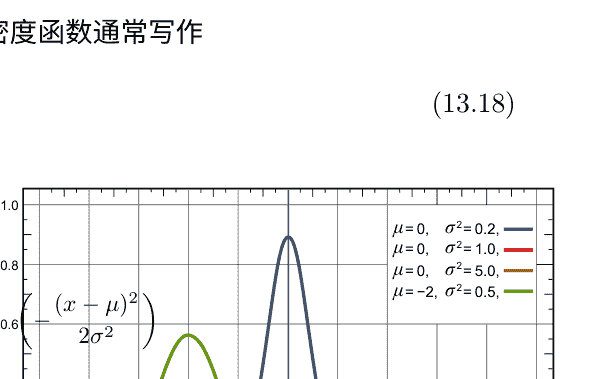

为了产生策略参数化，策略可以被定义为对实值标量动作的正态概率密度，其均值和标准差由依赖于状态的参数化函数逼近器给出。也就是说，

$$\pi(a|s, \boldsymbol{\theta}) = \circ \frac{1}{\sigma(s, \boldsymbol{\theta}) \sqrt{2\pi}} \exp \left( -\frac{(a - \mu(s, \boldsymbol{\theta}))^2}{2\sigma(s, \boldsymbol{\theta})^2} \right), \qquad\qquad (13.19)$$

其中 $\mu: \mathcal{S} \times \mathbb{R}^{d'} \rightarrow \mathbb{R}$ 和 $\sigma: \mathcal{S} \times \mathbb{R}^{d'} \rightarrow \mathbb{R}^{+}$ 是两个参数化的函数逼近器。

为了完成这个例子，我们只需要给出这些近似器的形式。为此，我们将策略的参数向量分为两部分，θ = [θμ, θσ]，一部分用于均值的近似，一部分用于标准差的近似。均值可以近似为线性函数。标准差必须始终为正，并且最好近似为线性函数的指数。

因此
```
θμᵀ xμ(s) \text{ and } σ(s, θ) = \exp(θσᵀ xσ(s)), \quad (13.20)
```
其中xμ(s)和xσ(s)是状态特征向量，可能是通过第9章中描述的方法之一构建的。通过这些定义，本章剩余部分描述的所有算法都可以应用于学习选择实值动作。

### 练习13.4
证明对于高斯策略参数化（13.19），资格向量具有以下两个部分：
```
∇ ln π(a|s, θμ) = \frac{∇π(a|s, θμ)}{π(a|s, θ)} = \frac{1}{σ(s, θ)^2} (a - μ(s, θ))(xμ(s)), \text{ 和} \\ ∇ ln π(a|s, θσ) = \frac{∇π(a|s, θσ)}{π(a|s, θ)} = \left( \frac{(a - μ(s, θ))^2}{σ(s, θ)^2} - 1 \right) xσ(s).
```

### 练习13.5
伯努利-逻辑单元是一种在某些人工神经网络中使用的随机神经元单元（第9.6节）。它在时间 t 的输入是一个特征向量 x(St)；它的输出 At 是一个随机变量，取值为0和1，其中 Pr{ At=1 } = Pt, Pr{ At=0 } = 1 - Pt（伯努利分布）。假设在策略参数θ给定的情况下，s状态下的两个动作的偏好分别为 h(s,0,θ) 和 h(s,1,θ)。假设动作偏好的差异由该单元的输入向量的加权和给出，即假设 h(s,1,θ) - h(s,0,θ) = θᵀ x(s)，其中θ是该单元的权重向量。

- (a) 证明如果使用指数软最大分布（13.2）将动作偏好转换为策略，则 Pt = π(1|St, θt) = 1/(1 + exp(-θtᵀ x(St)))（逻辑函数）。

- (b) 在收到返回值后，蒙特卡洛REINFORCE更新θt到θt+1是什么？ Gt是什么？

- (c) 通过计算梯度，用a, x(s), 和 π(a|s,θ) 来表达伯努利-逻辑单元的资格 lnπ(a|S,θ)。

提示：分别对每个动作计算对数的导数，先对 Pt = π(a|s, θt) 求导，将两个结果合并为一个关于a和Pt的表达式，然后使用链式法则，注意逻辑函数 f(x)的导数是 f(x)(1 - f(x)).

### 13.8 总结

在本章之前，本书主要关注动作值方法—指的是学习动作值并使用它们来确定动作选择的方法。而在本章中，我们考虑了学习参数化策略的方法，使得可以在不咨询动作值估计的情况下采取行动。具体而言，我们考虑了策略梯度方法—指的是在每一步中根据性能梯度的估计更新策略参数的方法。

学习和存储策略参数的方法有很多优势。它们可以学习采取行动的具体概率。它们可以学习适当的探索水平，并渐进地接近确定性策略。它们可以自然地处理连续动作空间。对于基于策略的方法来说，所有这些事情都很容易，但对于 ε 贪婪方法和动作值方法来说，这些事情都很尴尬或不可能。此外，在某些问题上，策略在参数化表示上更简单；这些问题更适合于参数化策略方法。

参数化策略方法在政策梯度定理方面也具有重要的理论优势，该定理给出了性能如何受政策参数影响的精确公式，而不涉及状态分布的导数。该定理为所有政策梯度方法提供了理论基础。

REINFORCE方法直接遵循政策梯度定理。将状态值函数作为基准线添加可以减少REINFORCE的方差而不引入偏差。使用状态值函数进行引导引入偏差，但通常是可取的，原因与引导TD方法通常优于蒙特卡洛方法相同（大大降低方差）。状态值函数为政策的行动选择分配信用，因此前者被称为评论家，后者被称为演员，这些整体方法被称为演员-评论家方法。

总的来说，政策梯度方法提供了一组与行动值方法显著不同的优点和缺点。如今，在某些方面，它们的理解程度较低，但仍然是令人兴奋和持续研究的课题。

### 参考文献和历史评论

我们现在看到与策略梯度相关的方法实际上是强化学习中最早研究的一些方法（Witten, 1977; Barto, Sutton, and Anderson, 1983; Sutton, 1984; Williams, 1987, 1992）以及前身领域（Phansalkar and Thathachar, 1995）。它们在20世纪90年代被其他章节中重点介绍的动作值方法所取代。然而，近年来，人们又开始关注演员-评论家方法和策略梯度方法。除了我们在这里介绍的内容之外，还有一些进一步的发展，如自然梯度方法（Amari, 1998; Kakade, 2002, Peters, Vijayakumar and Schaal, 2005; Peters and Schaal, 2008; Park, Kim and Kang, 2005; Bhatnagar, Sutton, Ghavamzadeh and Lee, 2009; see Grondman, Busoniu, Lopes and Babuska, 2012），确定性策略梯度方法（Silver et al., 2014年），离策略策略梯度方法（Degris，White和Sutton，2012年；Maei，2018年），以及熵正则化（参见Schulman，Chen和Abbeel，2017年）。主要应用包括杂技直升机自动驾驶和AlphaGo（第16.6节）。本章中的介绍主要基于Sutton，McAlester，Singh和Mansour（2000年）的介绍，“策略梯度方法”一词由他们引入。Bhatnagar等人（2009年）提供了一个有用的概述。最早的相关工作之一是由Aleksandrov，Sysoyev和Shemeneva（1968年）完成的。Thomas（2014年）首次意识到，在本章的方框算法中指定的因子γ^t，在折扣的情景问题中是必需的。

### 13.1
例子13.1和本章中的结果是与Eric Graves一起开发的。

### 13.2
策略梯度定理在此处和第334页首次由Marbach和Tsitsiklis（1998, 2001）获得，然后由Sutton等人（2000）独立获得。Cao和Chen（1997）也得到了类似的表达式。其他早期的结果归功于Konda和Tsitsiklis（2000, 2003），Baxter和Bartlett（2001），以及Baxter，Bartlett和Weaver（2001）。一些额外的结果由Sutton，Singh和McAlester（2000）开发。

### 13.3
REINFORCE归功于Williams（1987, 1992）。Phansalkar和Thathachar（1995）证明了REINFORCE算法的局部和全局收敛定理。

全动作算法首先在一篇未发表但广泛传播的不完整论文中提出（Sutton，Singh和McAlester，2000），然后由Ciosek和Whiteson（2017, 2018）进一步发展，他们将其称为“期望策略梯度”，以及由Asadi，Allen，Roderick，Mohamed，Konidaris和Littman（2017）称之为“均值演员评论者”。

### 13.4
基准线是在Williams（1987年，1992年）的原始工作中引入的。Greensmith，Bartlett和Baxter（2004年）分析了一个可能更好的基准线（参见Dick，2015年）。Thomas和Brunskill（2017年）认为，可以使用依赖于动作的基准线而不会产生偏差。

### 13.5-6
演员-评论家方法是在强化学习中最早进行研究的方法之一（Witten，1977年；Barto，Sutton和Anderson，1983年；Sutton，1984年）。这里介绍的算法基于Degris，White和Sutton（2012年）的工作。在文献中，演员-评论家方法有时被称为优势演员-评论家方法。

### 13.7
第一个展示如何处理连续动作的人似乎是Williams（1987年，1992年）。第335页的图表改编自维基百科。

## 第三部分：深入探讨

在本书的最后一部分中，我们将超越书中前两部分所介绍的标准强化学习理念，简要概述其与心理学和神经科学的关系，列举一些强化学习应用的示例，并介绍未来强化学习研究的一些活跃领域。

## 第14章 心理学

在之前的章节中，我们基于计算考虑开发了一些算法思想。 在本章中，我们将从心理学的角度来看待其中一些算法。心理学研究动物学习的方式。 本章的目标是首先讨论强化学习理念和算法与心理学对动物学习的发现之间的对应关系，其次解释强化学习对动物学习研究的影响。

强化学习提供的明确形式化框架，系统化了任务、回报和算法，对于理解实验数据、提出新类型的实验以及指出可能关键的因素都非常有用。 强化学习核心的长期回报优化思想有助于我们理解动物学习和行为中的一些令人困惑的特征。

强化学习与心理学理论之间的一些对应关系并不令人意外，因为强化学习的发展受到了心理学学习理论的启发。 然而，正如本书所阐述的，强化学习从人工智能研究人员或工程师的角度探索理想化的情境，目标是通过高效算法解决计算问题，而不是复制或详细解释动物如何学习。 因此，我们描述的一些对应关系连接了各自领域中独立产生的思想。 我们认为这些接触点特别有意义，因为它们揭示了学习中重要的计算原理，无论是人工系统还是自然系统的学习。

在很大程度上，我们描述了强化学习与解释动物如何学习的学习理论之间的对应关系，这些动物包括老鼠、鸽子和兔子，在受控实验室中进行学习。 在20世纪进行了成千上万次这样的实验，现在仍在进行许多实验。 尽管有时被认为与心理学的更广泛问题无关，但这些实验探索了动物学习的微妙特性，常常受到精确的理论问题的驱动。

随着心理学将焦点转向更认知的行为方面，即思维和推理等心理过程，动物学习实验开始发挥作用，在心理学中，它们的作用不如以前那么重要。但是这些实验揭示了学习原理在整个动物王国中是基本且普遍的，设计人工学习系统时不应忽视这些原理。

此外，正如我们将看到的，一些认知处理的方面与强化学习提供的计算视角自然地联系在一起。

本章的最后一节包括与我们讨论的联系相关的参考文献，以及我们忽视的联系。我们希望本章能够鼓励读者更深入地探索所有这些联系。本节还讨论了强化学习术语与心理学术语之间的关系。强化学习中使用的许多术语和短语都借鉴自动物学习理论，但这些术语和短语在计算/工程意义上的含义并不总是与心理学中的含义一致。

### 14.1 预测和控制

我们在本书中描述的算法可以分为两大类：预测算法和控制算法。这些类别在第3章中介绍的强化学习问题的解决方法中自然而然地出现。从许多方面来看，这些类别分别对应于心理学家广泛研究的学习类别：经典的、或巴甫洛夫式的、条件反射和工具的、或操作性的、条件反射。这些对应关系并非完全偶然，因为心理学对强化学习的影响，但它们仍然引人注目，因为它们连接了来自不同目标的思想。

本书中介绍的预测算法估计了一个代理环境特征在未来如何展开的相关数量。我们特别关注估计代理在与环境交互时未来可以期望获得的奖励数量。在这个角色中，预测算法是策略评估算法，是改进策略算法的组成部分。但是预测算法不仅限于预测未来的奖励；它们可以预测环境的任何特征（例如，Modayil、White和Sutton，2014年）。预测算法与经典条件反射之间的对应关系在于它们共同预测即将到来的刺激，无论这些刺激是否有奖励（或惩罚）。

仪器条件反射实验中的情况是不同的。 在这里，实验装置被设置成动物根据自己的行为得到喜欢的东西（奖励）或者讨厌的东西（惩罚）。动物学会增加产生受奖励行为的倾向，并减少产生受惩罚行为的倾向。强化刺激被认为是与动物的行为有关的，而在经典条件反射中则不是（尽管在经典条件反射实验中很难消除所有行为的相关性）。仪器条件反射实验的启发与我们在第一章中简要讨论的激励效应定律相似。控制是这种学习形式的核心，对应于强化学习的策略改进算法的操作。

从预测的角度来思考经典条件作用，从控制的角度来思考工具性条件作用，是连接我们对强化学习的计算视角与动物学习的起点，但实际情况比这更复杂。经典条件作用不仅涉及预测，还涉及行动，因此是一种控制模式，有时被称为巴甫洛夫控制。此外，经典条件作用和工具性条件作用以有趣的方式相互作用，在大多数实验情况下可能同时参与两种学习。尽管存在这些复杂性，将经典/工具性区分与预测/控制区分相结合是将强化学习与动物学习联系起来的方便的第一近似。

在心理学中，强化这个术语用于描述经典条件作用和工具性条件作用中的学习。最初只用于加强一种行为模式，现在经常也用于削弱一种行为模式。被认为是行为变化原因的刺激被称为强化剂，无论它是否取决于动物先前的行为。在本章末尾，我们将更详细地讨论这些术语以及它们与机器学习中使用的术语的关系。

### 14.2 经典条件作用

在研究消化系统的活动时，著名的俄罗斯生理学家伊万·巴甫洛夫发现动物对某些触发刺激的固有反应可以被与先天触发器毫不相关的其他刺激所触发。他的实验对象是经过小手术的狗，可以准确测量它们唾液反射的强度。在他描述的一个案例中，狗在大多数情况下不会流口水，但在被呈现食物后大约5秒钟后，它在接下来的几秒钟内产生了约六滴唾液。在呈现另一个刺激物（与食物无关）之前，即节拍器的声音，在多次重复之后，狗对节拍器的声音产生了唾液反应，就像对食物一样。“唾液腺的活动因声音冲动而被调动起来——这是一种与食物完全无关的刺激”（巴甫洛夫，1927年，第22页）。总结这一发现的意义，巴甫洛夫写道：

> 很明显，在自然条件下，正常的动物必须对不仅对自身带来直接利益或伤害的刺激做出反应，还必须对其他物理或化学因素做出反应——声音、光线等等——这些因素本身只是信号，表明这些刺激的接近；虽然对于较小的动物来说，掠食者的视觉和听觉本身并不对其造成伤害，而是它们的牙齿和爪子。（巴甫洛夫，1927年，第14页）

将新的刺激与先天反射连接起来的方式现在被称为经典或巴甫洛夫条件反射。巴甫洛夫（或更准确地说，他的翻译者）将先天反应（例如，他上述实验中的唾液分泌）称为“无条件反应”（URs），将触发这些反应的自然刺激（例如，食物）称为“无条件刺激”（USs），将由预测性刺激触发的新反应（例如，这里也是唾液分泌）称为“条件反应”（CRs）。最初是中性的刺激（例如，节拍器声音）在动物学习到它预测到无条件刺激（US）并因此产生条件反射（CR）时，变成了一个“条件刺激”（CS）。这些术语仍然用于描述经典条件反射实验（尽管更好的翻译应该是“有条件的”和“无条件的”而不是“条件的”和“无条件的”）。US被称为强化剂，因为它强化了对CS产生CR的反应。

在两种常见的经典条件反射实验中，刺激的排列如右图所示。

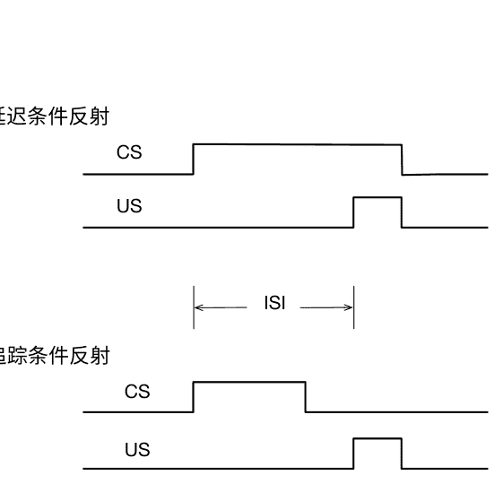

在延迟条件反射中，CS延伸到刺激间隔期间（ISI），即CS开始和US开始之间的时间间隔（在此常见版本中，CS在US结束时结束）。在追踪条件反射中，US在CS结束后开始，CS和US之间的时间间隔偏移和美国起点被称为追踪间隔。

巴甫洛夫的狗对节拍器声音的唾液分泌只是经典条件反射的一个例子，这种条件反射已经在许多动物物种的许多反应系统中进行了深入研究。URs通常在某种程度上是预备性的，例如帕夫洛夫的狗的流涎，或者在某种程度上是保护性的，例如对刺激眼睛的眨眼，或者对看到捕食者的冻结反应。在一系列试验中体验CS-US的预测关系会使动物学会CS预测US，以便动物能够对CS做出CR反应，为预测的US做好准备或保护自己。一些CR与UR相似，但开始得更早，并在增加其效果的方式上有所不同。例如，在一种被广泛研究的实验中，一个音调CS可靠地预测到兔子眼睛的一股气流（US），从而触发了一个UR，包括一个叫做眼睑内保护性闭合的膜。

经过一次或多次试验，音调开始触发一个由膜闭合组成的CR，该闭合在空气推出之前开始，并最终定时，以便在空气推出时发生峰值闭合。这种CR在预期的空气推出时启动并适时，比仅仅对刺激性US做出反应时启动的闭合提供更好的保护。通过学习刺激之间的预测关系来预测重要事件的能力在动物王国中广泛存在，因此非常有益。

#### 14.2.1 阻塞和高阶条件作用

在实验中观察到了经典条件反射的许多有趣特性。除了CR的预期性质外，经典条件反射模型的发展中还广泛观察到两个重要特性：阻塞和高阶条件反射。当动物在潜在的CS与先前用于训练动物产生CR的另一个CS同时呈现时，阻塞现象就会发生，动物无法学习到CR。例如，在兔子眼睑条件反射的阻塞实验的第一阶段中，兔子首先通过音调CS和空气推出US进行训练，以产生在预期空气推出时闭合眼睑的CR。实验的第二阶段包括额外的试验，在这些试验中，第二个刺激（例如光）被添加到音调中形成一个复合音调/光CS，后面跟着相同的空气推出US。在实验的第三阶段，仅呈现第二个刺激（光）给兔子，以查看兔子是否已经学会对其做出CR的反应。结果发现，兔子对光几乎没有或没有产生CR：兔子对光的学习被先前对音调的学习所阻塞。这样的阻塞结果挑战了条件反射仅取决于简单的时间接近性的观念，即条件反射的必要和充分条件是US在时间上紧密跟随CS。在下一节中，我们将描述Rescorla-Wagner模型（Rescorla和Wagner，1972），该模型为阻塞现象提供了一个有影响力的解释。

当先前条件化的条件刺激作为一个未经条件化的刺激的US在条件化另一个最初中性的刺激时，发生高阶条件化。巴甫洛夫描述了一个实验，在这个实验中，他的助手首先将一只狗条件化到对一个预测食物US的节拍器声音产生唾液的反应，如上所述。在这个条件化阶段之后，进行了许多试验，其中一只狗最初对一个黑色方块漠不关心，然后将黑色方块放在狗的视线中，随后是节拍器的声音，但是这次没有食物。仅仅经过十次试验，狗就开始在看到黑色方块时流口水，尽管它从未看到过黑色方块后有食物。节拍器的声音本身作为一个US，在条件化唾液CR对黑色方块CS。这是二阶条件化。如果黑色方块被用作US来建立对另一个否则中性的CS的唾液CR，那么这将是三阶条件化，依此类推。高阶条件化很难证明，特别是在二阶以上，部分原因是在高阶条件化试验中，高阶强化剂由于没有被原始US反复跟随而失去了其强化价值。但是在适当的条件下，例如将一阶试验与高阶试验交替进行或提供一个普遍激励的刺激，可以证明二阶以上的高阶条件化。正如我们下面所描述的，经典条件化的TD模型使用了我们方法中的自举思想，将Rescorla-Wagner模型对阻塞的解释扩展到包括CR的预期性质和高阶条件化。

高阶仪器条件反射也会发生。在这种情况下，一个刺激需要与对照组进行比较，以显示之前对音调的条件反射是导致对光的学习被阻断的原因。这是通过对音调/光CS进行试验，但没有先前对音调进行条件反射来完成的。在这种情况下，对光的学习没有受到影响。Moore和Schmajuk（2008）对这个过程进行了全面的介绍。

一致地预测主要强化物的刺激自身成为一个强化剂，其中强化——如果其奖励或惩罚的质量已经通过进化内建到动物中，则强化是主要的。预测刺激成为次级强化剂，或更一般地说，是一个高阶或条件强化剂——当预测的强化刺激本身是次级或更高阶的强化剂时，后者是一个更好的术语。条件强化剂提供条件强化：条件奖励或条件惩罚。条件强化剂的作用类似于主要强化剂，可以增加动物产生导致条件奖励的行为的倾向，并减少动物产生导致条件惩罚的行为的倾向。（请参阅本章末尾的评论，解释我们的术语有时与心理学中使用的术语不同。）

条件强化是一个关键现象，例如，它解释了为什么我们为条件强化剂金钱而工作，其价值仅仅取决于拥有它所预测的内容。在第13.5节中描述的演员-评论家方法（并在第15.7节和15.8节中讨论与神经科学相关的内容）中，评论家使用TD方法评估演员的策略，其价值估计为演员提供了条件强化，使演员能够改进其策略。这种高阶工具性条件反射的类比有助于解决第1.7节中提到的信用分配问题，因为评论家在主要奖励信号延迟时为演员提供逐时强化。我们在第14.4节中将更详细地讨论这个问题。

## 14.2.2 Rescorla-Wagner模型

Rescorla和Wagner主要创建他们的模型来解释阻塞现象。Rescorla-Wagner模型的核心思想是，只有当事件违反动物的期望时，动物才会学习，换句话说，只有当动物感到惊讶时（尽管不一定意味着任何有意识的期望或情绪）。我们首先使用Rescorla和Wagner的术语和符号来介绍他们的模型，然后转向我们用来描述TD模型的术语和符号。

这是Rescorla和Wagner描述他们的方式。该模型调整了复合CS的每个组成刺激的“联想强度”，这是一个表示该组成刺激对US的预测强度或可靠性的数字。当在经典条件反射试验中呈现由几个组成刺激构成的复合CS时，每个组成刺激的联想强度会以一种依赖于整个刺激复合物的“总联想强度”而不仅仅是组成刺激本身的联想强度的方式发生变化。

Rescorla和Wagner考虑了一个由组成刺激A和X构成的复合CS AX，其中动物可能已经经历过刺激A，而刺激X对动物来说可能是新的。让 V_A， V_X 和 V_AX分别表示刺激A、X和复合物AX的联想强度。假设在一个试验中，复合CS AX后面跟着一个我们标记为刺激Y的US。然后，联想强度为

刺激组成部分根据这些表达式变化:

```
ΔV_A = α_A β_Y (R_Y - V_AX)
ΔV_X = α_X β_Y (R_Y - V_AX)
```

其中 α_A β_Y 和 α_X β_Y 是步长参数，取决于CS组成部分和US的身份， R_Y是US Y可以支持的联想强度的渐近水平。（Rescorla和Wagner在这里使用 λ 而不是 R，但我们使用 R 以避免与我们使用的 λ 混淆，并且通常我们认为这是一个奖励信号的大小，但要注意，经典条件反射中的US不一定是有奖励或惩罚的。）该模型的一个关键假设是聚合联想强度 V_AX等于 V_A + V_X。这些Δ引起的联想强度成为下一次试验开始时的联想强度。为了完整起见，该模型需要一个响应生成机制，这是一种将 V 的值映射到CR的方法。由于这种映射会依赖于实验情况的细节，Rescorla和Wagner没有指定映射，而只是假设较大的 V会产生更强或更可能的CR，并且负值 V表示没有条件反应。

Rescorla-Wagner模型解释了CRs的获取方式，从而解释了阻塞现象。只要刺激物复合体的总联想强度 V_AX低于US Y可以支持的渐近联想强度 R_Y，预测误差 R_Y - V_AX就是正值。这意味着在连续的试验中，组成刺激物的联想强度 V_A 和 V_X会增加，直到总联想强度 V_AX等于 R_Y，此时联想强度不再改变（除非US发生变化）。当新的组成部分添加到动物已经被条件化的复合CS中时，使用增强复合物进行进一步条件化，不会对添加的CS组成部分的联想强度产生很大增加，因为误差已经降低到零或较低值。US的发生已经几乎完美地被预测，因此新的CS组成部分不会引入很大或没有误差或惊喜。先前的学习阻碍了对新组成部分的学习。

为了从Rescorla和Wagner的模型过渡到经典条件反射的TD模型（我们简称为TD模型），我们首先将他们的模型重新表述为本书中使用的概念。具体来说，我们将学习与线性函数逼近（第9.4节）所使用的符号进行匹配，并将条件反射过程视为根据该试验中呈现的复合CS来学习预测“US的大小”，其中US Y的大小是Rescorla-Wagner模型中的 R_Y 的值。我们还引入了状态。由于Rescorla-Wagner模型是一个试验级模型，即处理关联强度如何从试验到试验变化而不考虑试验内部和试验之间发生的任何细节，因此在下一节中介绍完整的TD模型之前，我们不必考虑状态在试验过程中的变化。在这里，我们将状态简单地视为以组成CS的集合来标记试验的一种方式。

因此，假设试验类型或状态s由实值向量特征x(s) = (x_1(s), x_2(s), ..., x_d(s))描述，其中x_i(s) = 1表示CS_i，即第i个组件存在于试验中，否则为0。

然后，如果关联强度的d维向量为w，则试验类型s的总关联强度为 $v^(s, w) = w·x(s)$。这对应于强化学习中的值估计，我们将其视为US预测。

现在，暂时将t表示为一个完整试验的编号，而不是其通常的时间步长（当我们将其扩展到TD模型时，我们将恢复t的通常含义），并假设S_t是与试验t对应的条件试验。更新关联强度向量w_t为w_{t+1}如下：

```
w_{t+1} = w_t + α δ_t x(S_t), \tag{14.2}
```

其中 α是步长参数，δ_t是预测误差

```
δ_t = R_t - v^(S_t, w_t). \tag{14.3}
```

R_t是第 t次预测的目标，即US的大小，或者按照Rescorla和Wagner的术语，US在该次试验中可以支持的联想强度。请注意，由于(14.2)中的因素 x(S_t)，只有在该次试验中存在的CS组分的联想强度会因该次试验而调整。你可以将预测误差看作是一种惊讶的度量，而总体联想强度则是动物在不匹配目标US大小时被违背的期望。

从机器学习的角度来看，Rescorla-Wagner模型是一种错误校正的监督学习规则。它本质上与最小均方误差（LMS）或Widrow-Hoff学习规则（Widrow和Hoff，1960）相同，它找到使所有误差的平方的平均值尽可能接近零的权重，即关联强度。它是一种广泛应用于工程和科学应用的“曲线拟合”或回归算法（见第9.4节）。

Rescorla-Wagner模型在动物学习理论的历史上非常有影响力，因为它表明“机械化”的理论可以解释关于阻塞的主要事实，而无需诉诸于涉及动物明确识别另一个刺激组分已被添加并扫描其短期记忆以向后重新评估涉及US的预测关系的更复杂的认知理论。Rescorla-Wagner模型展示了如何简单地调整传统的条件性关联理论，即刺激的时间接近性是学习的必要和充分条件，以解释阻塞现象（Moore和Schmajuk，2008年）。

Rescorla-Wagner模型提供了一个简单的阻塞和一些其他经典条件反射特征的解释，但它并不是一个完整或完美的经典模型。

## 14.2.3 TD模型

TD模型是一个实时模型，与Rescorla-Wagner模型这样的试验级模型相对。在Rescorla-Wagner模型中，一个单步 $t$ 代表了整个条件化试验。该模型不适用于试验进行期间发生的细节，或者试验之间可能发生的情况。在每个试验中，动物可能会经历各种刺激，这些刺激的开始时间和持续时间是特定的。这些时间关系强烈影响学习。Rescorla-Wagner模型也不包括高阶条件化的机制，而对于TD模型来说，高阶条件化是TD算法基础上的自然结果。

为了描述TD模型，我们从上面的Rescorla-Wagner模型的表述开始，但现在将时间步骤标记为试验内部或试验之间的时间步骤，而不是完整的试验。将 $t$ 和 $t+1$ 之间的时间视为一个小的时间间隔，比如0.01秒，并将试验视为状态的序列，其中每个时间步骤都与一个状态相关联，该状态表示了 $t$ 时刺激的表示细节，而不仅仅是试验中存在的CS组件的标签。实际上，我们可以完全放弃试验的概念。从动物的角度来看，试验只是它与世界互动的持续体验的一部分。按照我们通常对代理与环境互动的观点，想象动物正在经历一个无尽的状态序列 $s$，每个状态由特征向量 $\mathbf{x}(s)$ 表示。尽管如此，在实验中，通常还是方便将试验称为时间片段，其中刺激模式重复。

状态特征不仅限于描述动物所经历的外部刺激，还可以描述外部刺激在动物大脑中产生的神经活动模式，而这些模式可以是历史依赖的，意味着它们可以是由外部刺激序列产生的持久模式。当然，我们不知道这些神经活动模式究竟是什么，但类似TD模型这样的实时模型可以让我们探索关于外部刺激的内部表示的不同假设对学习结果的影响。出于这些原因，TD模型不承诺任何特定的状态表示。此外，由于TD模型包括跨越刺激之间的时间间隔的折扣和资格迹，该模型还可以探索折扣和资格迹如何与刺激表示相互作用，从而预测经典条件反射实验的结果。

下面我们将描述一些与TD模型一起使用的状态表示及其含义，但目前我们对此保持中立。

我们假设每个状态 s 由一个特征向量表示
那么对应于一个状态 s 的总联想强度由公式（14.1）给出，与 Rescorla-Wagner 模型相同，
但是 TD 模型以不同的方式更新联想强度向量 w。现在，t 标记一个时间步而不是一个
完整的试验，TD 模型根据此更新来控制学习：

```
$$ \mathbf{w}_{t+1} = \mathbf{w}_t + \alpha \delta_t \mathbf{z}_t $$  (14.4)
```

这个更新用 $\mathbf{z}_t$ 替换了 Rescorla-Wagner 更新（14.2）中的 $\mathbf{x}_t(S_t)$，而 $\delta_t$ 代表 TD 误差的 $\delta_t$ ：

```
$$ \delta_t = R_{t+1} + \gamma \hat{v}(S_{t+1}, \mathbf{w}_t) - \hat{v}(S_t, \mathbf{w}_t) $$  (14.5)
```

其中 $\gamma$ 是一个折扣因子（介于 0 和 1 之间），$R_t$ 是时间 t 的预测目标，而
$\hat{v}(S_{t+1}, \mathbf{w}_t)$ 和 $\hat{v}(S_t, \mathbf{w}_t)$ 是在 $t+1$ 和 t 时由
（14.1）定义的聚合关联强度。
资格追踪向量 $\mathbf{z}_t$ 的每个分量 i 根据特征向量 x($S_t$) 的分量 $\mathbf{x}_i(S_t)$ 增加或减少，否
则以一个速率衰减，该速率由 $\lambda$ 决定：

```
$$ \mathbf{z}_{t+1} = \lambda \mathbf{z}_t + \mathbf{x}(S_t) $$  (14.6)
```

这里 $\lambda$ 是通常的资格追踪衰减参数。

请注意，如果 $\gamma = 0$，则 TD 模型将简化为 Rescorla-Wagner 模型，但在每种情况下 t 的
含义是不同的（Rescorla-Wagner 模型的试验次数和 TD 模型的时间步长），并且在 TD
模型中，预测目标 R 有一个一步的领先。TD 模型等同于具有线性函数逼近的半梯度 T
D（$\lambda$）算法的后向视图（第12章），只是在模型中 $R_t$ 不必是一个奖励信号，就像在使
用 TD 算法学习策略改进的值函数时一样。

## 14.2.4 TD模型模拟

实时条件模型（如 TD 模型）之所以有趣，主要是因为它们可以为无法通过试验级别模
型表示的各种情况进行预测。这些情况涉及可条件刺激的时间和持续时间，这些刺激与
US的时间关系，以及 CR 的时间和形状。例如，为了进行条件化，US通常必须在中
性刺激开始后开始，学习的速度和有效性取决于刺激间间隔（ISI），即 CS 和 US 开始的
间隔。当 CR 出现时，它们通常在美国出现之前开始，并且它们的时间轮廓在学习过程
中会发生变化。在复合 CS 的条件化中，复合 CS 的组成刺激可能不会同时开始和结束，
有时会形成所谓的序列复合，在这种情况下，组成刺激会按时间顺序发生。像这样的时
间考虑使得考虑刺激如何表示，这些表示在试验之间和期间如何展开，以及它们如何与
折扣和资格追踪相互作用变得重要。

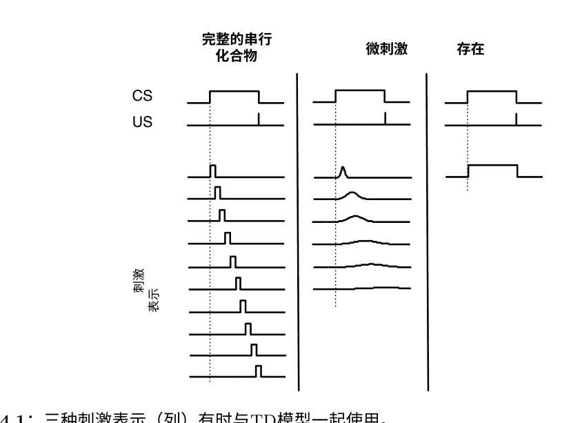

图14.1显示了在探索TD模型行为时使用的三种刺激表示：完整的串行化合物（CSC），微刺激（MS）和存在表示（Ludvig，Sutton和Kehoe，2012）。这些表示在刺激存在的相邻时间点之间的泛化程度上有所不同。

在图14.1中显示的表示中最简单的是图中右列的存在表示。这种表示对于每个组件CS在试验中都有一个特征，其中特征的值为1，表示该组件存在，否则为0。存在表示不是关于动物大脑中刺激是如何表示的现实假设，但正如我们下面所描述的，具有这种表示的TD模型可以产生经典条件反射中观察到的许多时间现象。

对于CSC表示（图14.1的左列），每个外部刺激的开始都会引发一系列精确定时的短时内部信号。

在我们的形式化中，对于每个时间步骤t的每个试验，都有一个不同的状态S_t，对于一个由不同持续时间的n个组件CS组成的试验，这里有一个特征x_i，对于每个组件CS_i，i=1,...,n，其中x_i(S_t)=1表示在所有时间t时CS_i存在，否则为零。这就像假设动物的神经系统在刺激呈现期间有一个精确跟踪时间的时钟；这是工程师所称的“延迟线”。就像存在表示一样，CSC表示法作为大脑内部表示刺激的假设是不现实的，但Ludvig等人（2012年）称其为“有用的虚构”，因为它可以揭示TD模型在刺激表示相对不受限制时的工作细节。

CSC表示法也被用于大脑中多巴胺产生神经元的大多数TD模型，这是我们在第15章中要讨论的一个主题。

CSC表示法通常被视为TD模型的一个重要部分，尽管这种观点是错误的。

MS表示法（图14.1中的中间列）与CSC表示法类似，每个外部刺激都会引发一系列内部刺激，但在这种情况下，内部刺激（微刺激）的形式不是如此有限且不重叠；它们随时间延长并重叠。随着刺激开始的时间流逝，不同的微刺激集合变得更活跃或更不活跃，并且每个后续的微刺激在时间上变得越来越宽，并达到较低的最大水平。当然，根据微刺激的性质，有许多MS表示法，并且在文献中已经研究了许多MS表示法的示例，在某些情况下还提出了动物大脑如何生成它们的建议（请参阅本章末尾的参考文献和历史评论）。与存在或CSC表示法相比，MS表示法作为神经表示刺激的假设更加现实，并且它们允许将TD模型的行为与动物实验中观察到的更广泛的现象相关联。特别是，通过假设微刺激级联由US和CS引发，并研究其重要性

微刺激、资格痕迹和折扣之间的相互作用对学习的影响，TD模型有助于构建假设，解释经典条件反射中的许多微妙现象以及动物大脑如何产生这些现象。我们在下面会详细讨论这个问题，特别是在第15章中我们讨论强化学习和神经科学。

然而，即使是简单的存在表示，TD模型也能产生由Rescorla-Wagner模型解释的经典条件反射的所有基本特性，以及超出试验水平模型范围的条件反射特征。例如，正如我们已经提到的，经典条件反射的一个显著特点是，通常情况下，无条件刺激必须在中性刺激开始之后才能进行条件反射，而在条件反射之后，条件反射开始在无条件刺激出现之前。换句话说，条件反射通常需要一个正的ISI，而条件反射通常预期无条件刺激。条件反射的强度（例如，由CS引发的CR的百分比）如何取决于ISI，在物种和反应系统之间存在很大差异，但通常具有以下特性：在零或负的ISI情况下，即当无条件刺激开始与CS开始同时或更早时（尽管研究发现，联想强度有时会略微增加或变为负值

负ISI)；它在正ISI处达到最大值，此时条件反射最为有效；然后在一个与响应系统差异很大的间隔之后减少到零。 TD模型的这种依赖关系的精确形状取决于其参数值和刺激表示的细节，但这些ISI依赖性的基本特征是TD模型的核心属性。

在串联复合条件化中出现的一个理论问题是，即以序列中出现的复合CS进行条件化，涉及到远程关联的促进。 研究发现，如果在第一个CS（CSA）和US之间的空追踪间隔中填充第二个CS（CSB）以形成串联复合刺激，则CSA的条件化会得到促进。 右侧显示了在具有存在表示的TD模型中的行为，在上面显示了该实验的时间细节。 与实验结果（Kehoe,1982）一致，该模型显示出由于第二个CS的存在而促进了第一个CS的条件化速率和渐近水平的条件化。

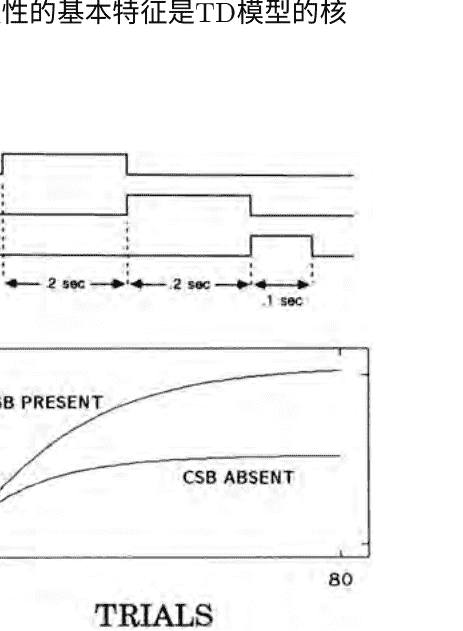

一个众所周知的演示刺激之间的时间关系对条件反射的影响是Egger和Miller在1962年进行的实验该实验涉及到两个重叠的刺激在延迟配置中如右图所示（顶部）。 尽管CSB与US的时间关系更好，但CSA的存在大大降低了对CSB的条件反射，与没有CSA的对照组相比。 右侧直接显示了通过存在表示进行的该实验的TD模型模拟所生成的相同结果。

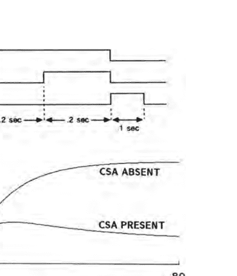

TD模型考虑到阻塞因为它是一个纠错学习规则，就像Rescorla-Wagner模型一样。除了解释基本的阻塞现象之后，

TD模型还预测（使用存在表示和更复杂的表示）如果被阻塞的刺激提前移动，阻塞将被逆转。
时间上，它的开始在阻塞刺激的开始之前（就像右边的图表中的CSA一样）。TD模型行为的这个特点值得关注，因为在模型引入时还没有观察到。回想一下，在阻塞中，如果动物已经学会了一个CS预测一个US，那么学习一个新添加的第二个CS也预测US的效果大大降低，即被阻塞。但是，如果新添加的第二个CS开始得比预先训练的CS早，那么根据TD模型的说法，对新添加的CS的学习不会被阻塞。事实上，随着训练的继续和新添加的CS获得联想强度，预先训练的CS失去了联想强度。在这些条件下，TD模型的行为如图14.2的下部所示。

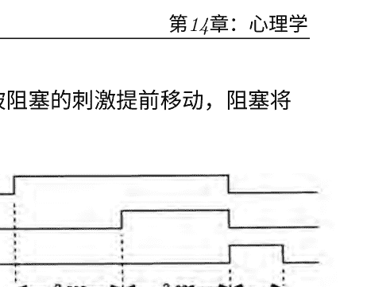

这个模拟实验与Egger-Miller实验（上一页底部）不同，因为较短的CS在后期出现，先进行了先前的训练，直到完全与US相关联。这个令人惊讶的预测导致Kehoe、Schreurs和Graham（1987）使用了经过充分研究的兔子眼睑膜制备进行了实验。他们的结果证实了模型的预测，并指出非TD模型在解释数据方面存在相当大的困难。

在TD模型中，较早的预测性刺激优先于较晚的预测性刺激，因为与本书中描述的所有预测方法一样，TD模型基于备份或自举的思想：关联强度的更新将使特定状态的强度向后续状态的强度转移。

自举的另一个结果是TD模型提供了关于高阶条件作用的解释，这是经典条件作用的一个特征，超出了Rescoral-Wagner和类似模型的范围。正如我们上面所描述的，高阶条件作用是指先前经过条件作用的CS可以在条件作用另一个最中性的刺激时充当US的现象。图14.3展示了TD模型（再次使用存在表示）在一个高阶条件作用实验中的行为，这是一个二阶条件作用实验。在第一阶段（图中未显示），CSB被训练以预测US，使其关联强度增加到1.65。在第二阶段，CSA与CSB在没有US的情况下配对，如图顶部所示的顺序安排。即使CSA从未与US配对，它也会获得关联强度。随着继续训练，CSA的关联强度达到峰值，然后下降，因为次级强化剂CSB的关联强度下降，失去了提供次级强化的能力。CSB的关联强度由于US在这些高阶条件反射试验中不出现，强度会减弱。这些是CS的消退试验，因为它与US的预测关系被破坏，导致其作为强化剂的能力减弱。动物实验中也观察到相同的模式。在高阶条件反射试验中，条件强化的消退使得展示高阶条件反射变得困难，除非原始的预测关系定期通过插入一阶试验进行刷新。

TD模型产生了二阶和高阶条件反射的类比，因为 γv̂(S_{t+1},w_t) - v̂(S_t,w_t)出现在TD误差 δ_t(14.5)中。这意味着由于先前的学习，γv̂(S_{t+1},w_t)可能与 v̂(S_t,w_t)不同，使得 δ_t非零（时间差异）。这种差异在(14.5)中与 R_{t+1}具有相同的地位，这意味着在学习方面，时间差异和US的出现没有区别。实际上，TD算法的这个特性是其发展的主要原因之一，我们现在通过与第6章中描述的动态规划的连接来理解它。

引导值与二阶和高阶条件有密切关系。

在上述TD模型行为的示例中，我们仅考察了CS组件的联想强度的变化；我们没有关注模型对动物条件反射（CR）的属性的预测：它们的时机、形状以及在条件反射试验中的发展。这些属性取决于物种、被观察的反应系统以及条件试验的参数，但在许多对不同动物和不同反应系统进行的实验中，CR的幅度或CR的概率随着US的预期时间的接近而增加。例如，在我们上面提到的兔子的眼睑反射的经典条件反射中，随着条件试验的进行，从CS开始到眼睑开始移动的延迟逐渐减少，而这种预期闭合的幅度在CS和US之间的时间间隔内逐渐增加，直到眼睑在US的预期时间达到最大闭合。这种CR的时机和形状对其适应性意义至关重要——过早地遮盖眼睛会降低视觉（即使眼睑是半透明的），而过晚地遮盖眼睛则没有多少保护价值。捕捉这些CR特征对于经典条件反射模型来说是具有挑战性的。

TD模型在其定义中不包括将US预测的时间轨迹， v̂(S_t,w_t)，转化为与动物的CR属性相比较的机制。最简单的选择是让时间的推移一个模拟的CR等于US预测的时间进程。在这种情况下，模拟的CR的特征以及它们在试验中的变化仅取决于所选择的刺激表示和模型参数的值 α, γ, 和 λ。

图14.4显示了学习过程中不同时间点的US预测的时间进程，其中使用了图14.1中显示的三种表示方法。对于这些模拟，US在CS开始后的25个时间步之后发生，且 α = .05, λ = .95和 γ = .97。使用CSC表示（图14.4左侧），由TD模型形成的US预测曲线在CS和US之间的时间间隔内呈指数增长，直到达到最大值，恰好在US发生时（在时间步骤25）。这种指数增长是TD模型学习规则中的折扣的结果。使用存在表示（图14.4中间），当刺激存在时，US预测几乎保持不变，因为每个刺激只有一个权重或关联强度需要学习。因此，使用存在表示的TD模型无法重现CR时间的许多特征。使用MS表示（图14.4右侧），TD模型的US预测的发展更加复杂。经过200个时间步之后，US预测的曲线开始增长，并在达到最大值后逐渐减小。在试验中，预测曲线的特征是对US预测曲线的合理近似，使用CSC表示产生的。

图14.4：TD模型在获取过程中的US预测时间变化具有三种不同的刺激表示方式。左：使用完整的串行复合（CSC），US预测在间隔期内呈指数增长，达到US时间时达到峰值。在渐近（第200次试验）时，US预测达到US强度（在这些模拟中为1）的峰值。中间：使用存在表示，US预测趋于几乎恒定的水平。这个恒定水平由US强度和CS-US间隔的长度决定。右：使用微刺激表示，在渐近时，TD模型通过不同微刺激的线性组合近似了使用CSC描绘的呈指数增长的时间变化。经过微小修改，从《学习与行为》中改编，评估经典条件反射的TD模型，卷40，2012年，E. A. Ludvig, R. S. Sutton, E. J. Kehoe。获得Springer的许可。

图14.4中显示的US预测曲线并不打算精确匹配在任何特定动物实验中的CR发展过程中的配置文件，但它们说明了刺激表示对从TD模型推导出的预测的强烈影响。此外，尽管我们只能在这里提及，刺激表示如何与折扣和资格追踪相互作用是重要的在确定由TD模型产生的US预测配置文件的属性方面。除了我们无法在这里讨论的另一个维度是不同的响应生成机制对将US预测转化为CR配置文件的影响；图14.4中显示的配置文件是“原始”的US预测配置文件。即使没有关于动物大脑如何从US预测中产生明显反应的特殊假设，然而，图14.4中的CSC和MS表示的配置文件在US的时间接近时增加，并在US的时间达到最大值，这在许多动物条件反射实验中都可以观察到。

当与特定的刺激表示和响应生成机制相结合时，TD模型能够解释动物经典条件反射实验中观察到的各种现象，但它远非完美模型。要生成经典条件反射的其他细节，模型需要进行扩展，可能需要添加基于模型的元素和机制，以自适应地改变一些参数。其他建模经典条件反射的方法与Rescorla-Wagner风格的错误修正过程有明显不同。例如，贝叶斯模型在一个概率框架内工作，其中经验会修正概率估计。

所有这些模型有助于我们理解经典条件反射。TD模型最显著的特点之一是它基于一种理论——我们在本书中描述的理论，该理论提出了动物在经历条件反射时神经系统试图做什么：试图形成与刺激表示方式和神经系统工作方式所施加的限制一致的准确长期预测。换句话说，它提出了一种经典条件反射的规范解释，其中长期预测而不是即时预测是一个关键特征。

经典条件反射的TD模型的发展是其中一个例子，明确的目标是对动物学习行为的一些细节进行建模。除了作为一种算法之外，TD学习还是这个生物学学习模型的基础。正如我们在第15章中讨论的那样，TD学习也被证明是产生多巴胺的神经元活动的一个有影响力的模型，多巴胺是哺乳动物大脑中深度参与奖励处理的化学物质。这些都是强化学习理论与动物行为和神经数据进行详细联系的实例。

现在我们转向考虑强化学习与动物行为在仪器条件反射实验中的对应关系，这是动物学习心理学家研究的另一种主要实验类型。

### 14.3 仪器条件作用

在仪器条件反射实验中，学习取决于行为的后果：强化刺激的传递取决于动物的行为。相比之下，在经典条件反射实验中，强化刺激（US）是独立于动物行为而传递的。仪器条件反射通常被认为与操作性条件反射相同，这是B.F.斯金纳（1938, 1963）为行为相关强化实验引入的术语，尽管实验使用这两个术语的人的观点和理论在许多方面存在差异，我们在下面会提到其中一些。我们将专门使用仪器条件反射这个术语来描述强化学习中行为与奖励之间的关系。仪器条件反射的根源可以追溯到美国心理学家爱德华·桑代克在本书第一版出版前一百年进行的实验。

桑代克观察了猫在被放置在“谜题盒子”中时的行为，例如右边的盒子，它们可以通过适当地动作逃脱。

桑代克的一个谜题盒子。

> > 摘自桑代克的《动物智能：动物联想过程的实验研究》（1898年），收录于《心理评论》第二辑第四期，麦克米兰出版社，纽约。

在与不同猫和盒子的实验中具有不同逃逸机制的盒子中，桑代克记录了每只猫在每个盒子中多次逃脱所花费的时间。他观察到，随着经验的增加，时间几乎总是减少的，例如，从300秒减少到6或7秒。他描述了猫在谜题盒子中的行为如下：

> > 在她冲动的挣扎中，到处抓挠盒子的猫可能会抓住绳子、环或按钮以打开门。逐渐地，所有其他不成功的冲动都将被消除，而导致成功行为的特定冲动将通过产生的愉悦而被加强，直到经过多次尝试后，当将猫放入盒子时，它会立即以一种明确的方式抓住按钮或环。（桑代克 1898年，第13页）

这些和其他实验（包括狗、小鸡、猴子甚至鱼）使桑代克得出了许多学习的“法则”，其中最有影响力的是“效果律”，我们在第1章引用了其中的一个版本（第15页）。这个法则描述了通常被称为试错学习的内容。正如在第1章中提到的那样，效果律的许多方面引发了争议，并且其细节多年来已经被修改。尽管如此，这个法则以一种形式或另一种形式表达了一种持久的学习原则。

强化学习算法的基本特征与动物学习的特征相对应，这些特征由效果律描述。首先，强化学习算法是选择性的，意味着它们尝试不同的选择，并通过比较它们的后果来进行选择。其次，强化学习算法是关联性的，意味着通过选择找到的选择与特定情境或状态相关联，以形成代理的策略。与效果律描述的学习类似，强化学习学习不仅仅是找到产生很多奖励的行为的过程，还包括将这些行为与情境或状态相连接的过程。桑代克使用“选择和连接”这个短语来描述学习（Hilgard，1956年）。进化中的自然选择是一个选择性过程的典型例子，但它不是关联性的（至少通常不是）；监督学习是关联性的，但它不是选择性的，因为它依赖于直接告诉代理如何改变行为的指令。

从计算角度来看，效果律描述了一种将搜索和记忆结合起来的基本方式：搜索以尝试和选择许多行动的形式存在于每种情况中，而记忆以将情况与迄今为止在这些情况中表现最好的行动联系起来的关联形式存在。搜索和记忆是所有强化学习算法的重要组成部分，无论记忆采用代理的策略、值函数还是环境模型的形式。

强化学习算法需要搜索意味着它必须以某种方式进行探索。动物显然也进行探索，早期的动物学习研究者对像桑代克的难题箱这样的环境下动物选择行动时使用的指导程度存在分歧。行动是“绝对随机、盲目搜索”的结果吗（Woodworth，1938，p. 777），还是存在一定程度的指导，无论是来自先前的学习、推理还是其他方式？尽管包括桑代克在内的一些思想家似乎持有前一种观点，但其他人更倾向于更加有意识的探索。强化学习算法允许代理在选择行动时使用多少指导。我们在本书中介绍的算法中使用的探索形式，如“ε-贪婪”和上置信界行动选择，只是最简单的形式之一。更复杂的方法是可能的，唯一的限制是算法必须有某种形式的探索才能有效地工作。

我们对强化学习的处理特点是允许任何时候可用的动作集取决于环境的当前状态，这与桑代克在他的猫的难题盒行为中观察到的某些特点相呼应。猫从它们当前的情况中选择行动，这些行动是它们本能地执行的，桑代克称之为它们的“本能冲动”。首先放入难题盒中，猫本能地用力抓、抓、咬：猫在局限空间中找到自己的本能反应。成功的行动是从这些行动中选择的，而不是从所有可能的行动或活动中选择。这就像我们形式化的特点，其中从状态$s$选择的动作属于可接受动作集$A(s)$。指定这些集合是强化学习的一个重要方面，因为它可以极大地简化学习。它们就像动物的本能冲动。另一方面，桑代克的猫可能是根据本能的上下文特定顺序来探索，而不仅仅是从一组本能冲动中选择。这是使强化学习变得更容易的另一种方法。

在受到效果律影响最为显著的动物学习研究者中，克拉克·赫尔（例如，赫尔，1943年）和B·F·斯金纳（例如，斯金纳，1938年）是其中之一。他们的研究的核心是基于行为后果选择行为的想法。强化学习与赫尔的理论有共同之处，其中包括资格迹机制和次级强化以解释在行动和随后的强化之间存在显著时间间隔时的学习能力（参见第14.4节）。随机性在赫尔的理论中也起到了作用，通过所谓的“行为振荡”引入探索行为。斯金纳并没有完全认同效果律的记忆方面。他对联想链接的概念不感兴趣，而是强调从自发行为中进行选择。他引入了“操作性”的术语，强调了行为对动物环境的关键作用。与桑代克和其他人的实验不同，斯金纳的操作条件实验允许动物主体在不间断的情况下行为一段时间。他发明了操作条件箱，现在被称为“斯金纳箱”，最基本的版本包含一个动物可以按下以获得奖励（例如食物或水）的杠杆或键，奖励根据一个明确定义的规则，称为强化计划，进行交付。通过记录时间的累积杠杆按下次数，斯金纳及其追随者可以研究不同强化计划对动物杠杆按下速率的影响。使用我们在本书中介绍的强化学习原理对类似这些实验的建模结果尚未得到很好的发展，但我们在本章末尾的参考文献和历史备注部分提到了一些例外情况。

斯金纳的另一个贡献是他意识到通过强化动物连续逼近所期望的行为来训练动物的有效性，他称之为塑形过程。尽管这种技术已经被其他人使用过，包括斯金纳本人，但当他和同事们试图训练一只鸽子用嘴巴推动一个木球时，他们才真正意识到其重要性。在等待很长时间而没有看到任何可以强化的推动动作之后，他们

> > ... 决定加强任何与滑动稍微相似的反应——可能起初只是看球的行为——然后选择更接近最终形式的反应。结果让我们惊讶。几分钟后，球就像鸽子是一名冠军壁球运动员一样在盒子的墙上弹来弹去。（斯金纳，1958年，第94页）

这只鸽子不仅学会了一种对鸽子来说不寻常的行为，而且它通过一种互动过程迅速学习，其中它的行为和强化条件会相互改变。斯金纳将改变强化条件的过程比作雕塑家塑造黏土成为所需形状的工作。对于计算强化学习系统来说，塑造是一种强大的技术。当一个代理无法获得任何非零奖励信号时，无论是因为奖励情境的稀缺性还是由于初始行为的不可及性，从一个更容易的问题开始，并逐渐增加其难度，以便代理学习，这可能是一种有效且有时不可或缺的策略。这是一种有效的策略，有时甚至是必不可少的。

在仪器条件化的背景下，心理学中一个特别相关的概念是动机，它指的是影响行为方向和强度（或活力）的过程。例如，桑代克的猫之所以想要逃离难题盒子，是因为它们想要外面放着的食物。实现这个目标对它们来说是有奖励的，并加强了让它们逃脱的行为。将动机这个具有多个维度的概念与精确的联系起来是困难的。强化学习的计算视角有很多方式，但是与其维度之间存在明确的联系。

从某种意义上说，强化学习代理的奖励信号是其动机的基础：代理被激励着在长期内最大化其获得的总奖励。因此，动机的一个关键方面是什么使得代理的经验具有奖励性。在强化学习中，奖励信号取决于强化学习代理的环境状态和代理的行为。此外，正如第1章所指出的，代理的环境状态不仅包括关于机器外部的信息，比如容纳代理的生物体或机器人，还包括关于机器内部的信息。一些内部状态组件对应于心理学家所称的动物的动机状态，这影响着动物的奖励性。例如，当动物饥饿时，吃东西会比刚吃完一顿满意的饭菜时更有奖励性。状态依赖的概念足够广泛，可以允许对奖励信号的生成产生许多类型的调节影响。

价值函数进一步连接了心理学家对动机的概念。如果选择一个动作的最基本动机是为了获得尽可能多的奖励，对于使用价值函数选择动作的强化学习代理来说，更接近的动机是沿着其价值函数的梯度上升，也就是选择预计会导致最高价值下一个状态的动作（或者本质上相同的，选择具有最大动作价值的动作）。对于这些代理，价值函数是决定其行为方向的主要驱动力。

动机的另一个维度是动物的动机状态不仅影响学习，还影响学习后动物行为的强度或活力。例如，在迷宫的目标盒子中学会找到食物后，饥饿的老鼠会比不饥饿的老鼠跑得更快到达目标盒子。动机的这个方面与我们在这里介绍的强化学习框架并不完全相关，但在本章末尾的参考文献和历史评论部分，我们引用了几篇基于强化学习的行为活力理论的出版物。

现在我们转向学习的主题，即在强化刺激发生之后很长时间内进行学习。强化学习算法用于实现延迟强化学习的机制——资格迹和时间差分学习——与心理学家关于动物如何在这些条件下学习的假设密切对应。

### 14.4 延迟强化

效果律要求对连接产生反向影响，一些早期的批评者无法想象现在如何影响过去的事情。这个问题的关注度增加了，因为即使在行动和相应的奖励或惩罚之间存在相当大的延迟时，学习仍然可以发生。同样，在经典条件反射中，当US的开始时间在CS的结束时间之后经过一段时间间隔时，学习也可以发生。我们称之为延迟强化问题，这与Minsky（1961）所称的“学习系统的信用分配问题”相关：你如何在成功中分配信用，这可能涉及到许多决策？本书介绍的强化学习算法包括两种基本机制来解决这个问题。第一种是使用资格追踪，第二种是使用TD方法来学习提供几乎即时评估的值函数（在类似仪器条件实验的任务中）或提供即时预测目标的值函数（在类似经典条件实验的任务中）。

这两种方法都对应于动物学习理论中提出的类似机制。

巴甫洛夫（1927年）指出，每个刺激在刺激结束后必须在神经系统中留下痕迹，并提出刺激痕迹使得在条件刺激结束和无条件刺激开始之间存在时间间隔时学习成为可能。至今，这种条件下的条件反射被称为追踪条件反射（第344页）。假设在无条件刺激到达时，条件刺激的痕迹仍然存在，学习通过痕迹和无条件刺激同时存在而发生。我们在第15章讨论了一些关于神经系统中追踪机制的提议。

刺激痕迹也被提出作为在仪器条件下桥接行动和随后的奖励或惩罚之间的时间间隔的一种手段。例如，在赫尔的有影响力的学习理论中，“痕迹刺激”解释了动物的目标梯度，即描述了仪器条件反应的最大强度如何随着强化延迟的增加而减少（赫尔，1932年，1943年）。赫尔假设动物的行为会留下内部刺激，其痕迹会随着时间的推移以指数方式衰减。通过查看当时可用的动物学习数据，他假设这些痕迹在30到40秒后有效地达到零。

本书中描述的算法中使用的资格痕迹类似于赫尔的痕迹：它们是过去状态访问或过去状态-动作对的衰减痕迹。资格痕迹是由Klopf（1972年）在他的神经理论中引入的，它们是过去在神经元之间的突触活动的时间延长痕迹。Klopf的痕迹比我们的算法使用的指数衰减痕迹更复杂，我们在第15.9节中讨论这个问题。为了解释比刺激痕迹所覆盖的时间范围更长的目标梯度，赫尔（1943年）提出了更长的梯度是由于条件强化从目标向后传递的过程，这个过程与他的痕迹刺激一起起作用。动物实验表明，如果条件有利于在延迟期间发展条件强化，学习不会像在阻碍次级强化的条件下那样随着延迟的增加而减少。如果在延迟间隔期间有定期发生的刺激，那么条件强化就会受到青睐。这样，奖励实际上并没有延迟，因为有更直接的条件强化。因此，赫尔设想存在一个基于主要强化延迟的主要梯度，由刺激痕迹介导，并且这个梯度会逐渐被条件强化改变和延长。

本书中介绍的算法使用资格迹和值函数来实现延迟强化学习，与Hull关于学习方式的假设相对应，动物能够在这些条件下学习。在第13.5节、第15.7节和第15.8节中讨论的演员-评论家架构最清楚地说明了这种对应关系。评论家使用TD算法来学习与系统当前行为相关的值函数，即预测当前策略的回报。演员根据评论家的预测更新当前策略，或者更准确地说，根据评论家预测的变化进行更新。评论家产生的TD误差作为演员的条件强化信号，即使主要奖励信号本身有很大的延迟，也能提供即时的性能评估。估计动作值函数的算法（如Q学习和Sarsa）同样使用TD学习原理，通过条件强化实现延迟强化学习。TD学习与我们在第15章中讨论的多巴胺产生神经元的活动之间的密切对应关系，进一步支持了强化学习算法与Hull学习理论的联系。

### 14.5 认知地图

基于模型的强化学习算法使用与心理学家所称的认知地图有共同元素的环境模型。回顾我们在第8章中对规划和学习的讨论，通过环境模型我们指的是代理可以用来预测其行动对环境状态转换和奖励的影响的任何东西，而规划则是指从这样的模型中计算出策略的任何过程。环境模型由两部分组成：状态转换部分编码了行动对状态变化的影响的知识，奖励模型部分编码了每个状态或每个状态-行动对预期的奖励信号的知识。基于模型的算法通过使用模型来预测可能行动的后果，即未来状态和预期从这些状态产生的奖励信号，来选择行动。最简单的规划方式是比较“想象”的决策序列的预测后果。

关于动物是否使用环境模型，以及如果使用，模型是什么样的以及如何学习的问题，在动物学习研究的历史中起到了有影响力的作用。一些研究人员通过展示潜在学习来挑战当时盛行的刺激-反应（S-R）学习和行为观点，这对应于最简单的无模型学习策略的方式。在最早的潜在学习实验中，有两组老鼠在一个迷宫中进行了实验。对于实验组，在实验的第一阶段没有奖励，但在第二阶段开始时突然在目标盒中放入食物。对于对照组，整个实验过程中目标盒中都有食物。问题是在没有食物奖励的情况下，实验组的老鼠是否在第一阶段学到了任何东西。尽管实验组的老鼠在第一阶段（无奖励阶段）似乎没有学到很多，但一旦他们发现了第二阶段引入的食物，他们迅速赶上了对照组的老鼠。结论是“在无奖励期间，实验组的老鼠正在发展迷宫的潜在学习，一旦引入奖励，他们就能够利用这种学习”（Blodgett, 1929年）。

潜在学习与心理学家爱德华·托尔曼（Edward Tolman）最为密切相关，他将这一结果及类似结果解释为动物在没有奖励或惩罚的情况下能够学习“环境的认知地图”，并且它们可以在有动机达到目标时使用这个地图（托尔曼，1948年）。认知地图还可以使老鼠规划一条到达目标的路径，该路径与老鼠在初始探索中使用的路径不同。对于这类结果的解释导致了行为主义/认知二分法在心理学中持久存在的争议。从现代角度来看，认知地图不仅限于空间布局模型，还可以是更一般的环境模型，或者是动物的“任务空间”模型（例如，Wilson、Takahashi、Schoenbaum和Niv，2014年）。潜在学习实验的认知地图解释类似于动物使用基于模型的算法的主张，即环境模型可以在没有明确的奖励或惩罚的情况下学习。然后，当动物出现奖励或惩罚的时候，这些模型被用于规划。

托尔曼关于动物如何学习认知地图的观点是，它们通过在环境中探索时经历一系列刺激来学习刺激-刺激或S-S关联。在心理学中，这被称为期望理论：在给定S-S关联的情况下，刺激的发生会产生关于下一个刺激的期望。这与控制工程师所称的系统识别非常相似，即从带有未知动态的系统中学习模型，该模型是通过标记的训练示例学习得到的。在最简单的离散时间版本中，训练示例是S-S’对，其中S是一个状态，S’是后续状态，是标签。当观察到S时，模型会创建对S’将被观察到的“期望”。更适用于规划的模型还涉及到动作，因此示例看起来像是SA-S’，其中在状态S中执行动作A时预期观察到S’。学习环境如何生成奖励也是有用的。在这种情况下，示例的形式是S-R或SA-R，其中 R 是与S或SA对相关联的奖励信号。这些都是代理可以在探索环境时获取类似认知地图的有监督学习形式，无论是否接收到任何非零奖励信号。

### 14.6 习惯性和目标导向行为

无模型和有模型强化学习算法之间的区别对应于心理学家在学习行为模式的习惯性和目标导向控制之间所做的区分。习惯是由适当的刺激触发然后更多或少地自动执行的行为模式。根据心理学家使用该短语的方式，目标导向行为是有目的的，因为它受到目标价值和行动与其后果之间关系的知识的控制。有时人们说习惯性行为受到前驱刺激的控制，而目标导向行为则受其后果的控制（Dickinson，1980，1985）。目标导向控制的优势在于当环境改变对动物的行为反应方式时，它可以迅速改变动物的行为。虽然习惯性行为对来自习惯环境的输入能够迅速做出反应，但它无法快速适应环境的变化。目标导向的行为控制很可能是动物智能进化的重大进步。

图14.5展示了无模型和有模型决策策略在一个假设任务中的区别，该任务是一只老鼠在一个迷宫中导航，迷宫中有独特的目标盒子，每个盒子都有一个相应的奖励（图14.5顶部）。从S1开始，老鼠首先必须选择左（L）或右（R），然后在S2或S3再次选择L或R，以达到一个目标盒子。目标盒子是老鼠每个任务周期的终止状态。无模型策略（图14.5左下方）依赖于状态-动作对的存储值。这些动作值是老鼠从每个（非终止）状态采取每个动作所能期望的最高回报的估计值。它们是通过多次从开始到结束运行迷宫的试验获得的。当动作值成为最优回报的足够好的估计时，老鼠只需在每个状态选择具有最大动作值的动作，以实现最优化。

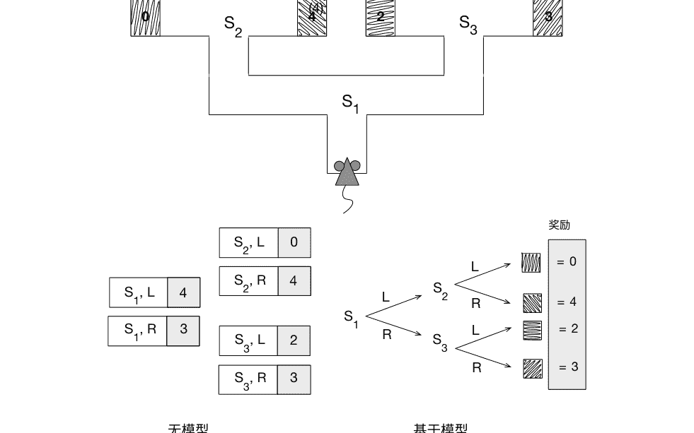

图14.5：基于模型和无模型的策略来解决一个假设的顺序动作选择问题。顶部：一只老鼠在迷宫中导航，每个目标盒子都与一个显示的奖励相关联。左下方：无模型策略依赖于在许多学习试验中获得的所有状态-动作对的存储动作值。为了做出决策，老鼠只需在每个状态选择具有该状态的最大动作值的动作。右下方：在基于模型的策略中，老鼠学习了一个环境模型，包括对状态-动作-下一个状态转换的知识，以及一个奖励模型，包括对每个目标盒子的奖励的知识。老鼠可以通过使用模型来模拟一系列动作选择来决定在每个状态下转向哪个方向，以找到产生最高回报的路径。改编自《认知科学趋势》，第10卷，第8期，Y. Niv, D. Joel和P. Dayan，动机的规范视角，第376页，2006年，经Elsevier许可。

决策。在这种情况下，当动作值估计足够准确时，老鼠从S1选择L，从S2选择R，以获得最大回报4。另一种无模型策略可能只是依赖于缓存的策略而不是动作值，从S1到L和从S2到R之间建立直接链接。在这些策略中，决策不依赖于环境模型。无需咨询状态转换模型，也不需要将目标盒子的特征与它们提供的奖励进行连接。

图14.5（右下方）展示了一种基于模型的策略。它使用由状态转换模型和奖励模型组成的环境模型。状态转换模型显示为决策树，奖励模型将目标盒子的独特特征与每个盒子中的奖励相关联。（与状态S1、S2和S3相关的奖励也是奖励模型的一部分，但在这里它们为零且未显示。）基于模型的代理可以使用模型来模拟一系列动作选择序列，以找到产生最高回报的路径。在这种情况下，回报是路径结束时获得的奖励。在这种情况下，如果模型足够准确，老鼠将选择L，然后选择R以获得奖励4。比较模拟路径的预测回报是一种简单的规划形式，可以通过多种方式进行，如第8章所讨论的。

当无模型代理的环境改变其对代理的行动反应方式时，代理必须在改变的环境中获得新的经验，在此期间可以更新其策略和/或值函数。例如，在图14.5（左下方）所示的无模型策略中，如果其中一个目标框移动到提供不同奖励的位置，老鼠将不得不穿过迷宫，可能多次经历到达该目标框时的新奖励，同时根据这种经验更新其策略或动作值函数（或两者都更新）。关键点是，对于无模型代理来说，要改变其策略指定的状态的行动，或者改变与状态相关联的动作值，它必须移动到该状态，从中采取行动，可能多次经历其行动的后果。

有模型的代理可以适应环境的变化，而无需对受到变化影响的状态和行动进行‘个人经验’。其模型的改变会自动（通过规划）改变其策略。规划可以确定环境变化的后果，这些后果在代理自身的经验中从未被联系在一起。例如，再次参考图14.5中的迷宫任务，假设一个具有先前学习的转移和奖励模型的老鼠被直接放置在S2右侧的目标框中，发现那里可用的奖励现在的值为1而不是4。即使迷宫中没有涉及到找到该目标框所需的行动选择，老鼠的奖励模型也会发生变化。规划过程将在迷宫运行中利用新奖励的知识，而无需在迷宫中进行额外的经验；在这种情况下，将策略更改为在S1和S3处都进行右转以获得回报3。

确切地说，这种逻辑是与动物进行结果贬值实验的基础。这些实验的结果揭示了动物是否已经学会了一种习惯，或者它的行为是否受到目标导向的控制。结果贬值实验与潜在学习实验类似，因为奖励在不同阶段之间发生变化。在初始的奖励学习阶段之后，一个结果的奖励值会发生改变，包括被改变为零甚至负值。这种类型的早期重要实验由亚当斯和迪金森（1981年）进行。

他们通过仪器条件反射训练大鼠，直到大鼠在训练室内积极按压一个杠杆以获取蔗糖颗粒。然后将大鼠放置在同一个训练室内，杠杆被收回，并且它们可以非条件地获得食物，这意味着颗粒独立于它们的行为而提供。在这种自由获取颗粒的15分钟后，一个组的大鼠被注射恶心的氯化锂。这个过程重复了三次，最后一次注射的大鼠没有消耗任何非条件的颗粒，表明颗粒的奖励值已经降低——颗粒已经贬值。在隔天进行的下一个阶段中，大鼠再次被放置在训练室内，并进行了一次消退训练，这意味着响应杠杆重新放置，但与颗粒分配器断开连接，因此按压杠杆不会释放颗粒。问题是，那些颗粒奖励值降低的大鼠是否会比那些颗粒奖励值没有降低的大鼠更少按压杠杆，即使它们没有经历按压杠杆导致的奖励贬值。结果表明，注射的大鼠在消退试验开始时的响应率明显低于非注射的大鼠。

亚当斯和迪金森得出结论，注射的老鼠通过认知地图将杠杆按下与随后的恶心联系起来，并将颗粒与恶心联系起来。因此，在消退试验中，老鼠“知道”按下杠杆的后果是他们不想要的东西，所以他们从一开始就减少了按杠杆。重要的是，他们减少了按杠杆的次数，而从未经历过直接按杠杆后感到恶心的情况：在他们感到恶心时，没有杠杆存在。他们似乎能够将行为选择的结果（按下杠杆将得到颗粒）与结果的奖励价值（应避免颗粒）相结合，因此可以相应地改变他们的行为。并非每个心理学家都同意这种“认知”解释这种实验的观点，并且这不是解释这些结果的唯一可能方式，但基于模型的规划解释被广泛接受。

没有什么能阻止一个智能体同时使用无模型和有模型的算法，而且使用两者都有很好的理由。我们从自己的经验中知道，通过足够的重复，目标导向的行为往往会变成习惯性行为。实验证明，这对于老鼠也是如此。亚当斯（1982）进行了一项实验，以观察是否经过长时间的训练会将目标导向的行为转变为习惯性行为。他通过比较不同训练时间的老鼠在结果贬值上的影响来进行实验。如果经过长时间的训练使得老鼠对贬值的敏感性较低，相比之下接受较少训练的老鼠，这将是将行为变得更加习惯性的证据。亚当斯的实验与亚当斯和迪金森（1981）所描述的实验非常相似。简单来说，一个组的老鼠被训练直到完成100次奖励的杠杆按压，而另一个组的老鼠——过度训练组——被训练直到完成500次奖励的杠杆按压。在这次训练之后，对于老鼠，颗粒的奖励价值被降低（使用氯化锂注射）。在两组中。然后两组老鼠接受了一次消退训练。亚当斯的问题是，贬值是否会对过度训练的老鼠的按杠杆速率产生比对非过度训练的老鼠更小的影响，这将是对扩展训练减少对结果贬值敏感性的证据。结果发现，贬值强烈地降低了非过度训练的老鼠的按杠杆速率。相比之下，对于过度训练的老鼠，贬值对它们的按杠杆速率几乎没有影响；事实上，如果有的话，它使其更加积极。（完整实验包括控制组，显示不同训练量本身并没有显著影响学习后的按杠杆速率。）这个结果表明，非过度训练的老鼠在行动目标导向的方式上对其行动结果的知识敏感，而过度训练的老鼠已经形成了按杠杆的习惯。

从计算的角度来看，观察这个和其他类似的结果可以揭示为什么我们可以期望动物在某些情况下习惯性地行为，在其他情况下目标导向地行为，并且为什么它们会在学习过程中从一种控制模式转换到另一种模式。虽然动物无疑使用的算法与我们在本书中介绍的算法并不完全匹配，但通过考虑各种强化学习算法所暗示的权衡，我们可以对动物行为有所了解。计算神经科学家Daw、Niv和Dayan（2005）提出的一个想法是，动物同时使用模型无关和模型相关的过程。每个过程都提出一个动作，执行的动作是根据置信度量确定的两个过程中更可信的过程提出的动作。在学习的早期，基于模型的系统的规划过程更可信，因为它可以将短期预测链接在一起，而这些短期预测相对于模型无关过程的长期预测来说，需要更少的经验才能变得准确。但是随着经验的积累，模型无关过程变得更可信，因为规划过程容易因为模型不准确和为了使规划可行而采取的各种捷径（例如各种形式的“剪枝”：删除不太有希望的搜索树分支）而出错。根据这个想法，随着经验的积累，我们可以预期从目标导向行为转变为习惯性行为。关于动物如何在目标导向和习惯性控制之间进行权衡，已经提出了其他的想法，并且行为学和神经科学研究继续探讨这个问题及相关问题。

无模型和有模型算法之间的区别对于这项研究正在证明是有用的。人们可以在抽象的环境中研究这些类型算法的计算影响，从而揭示每种类型的基本优势和局限性。这既提出了问题，也锐化了问题，从而指导心理学家设计实验，以增加对习惯性和目标导向行为控制的理解。

### 14.7 总结

本章的目标是讨论强化学习与心理学中动物学习的实验研究之间的对应关系。我们在一开始就强调，本书中描述的强化学习并不是为了用于模拟动物行为细节的一种方法。它是一个抽象的计算框架，从人工智能和工程学的角度探索理想化的情境。但是许多基本的强化学习算法受到心理学理论的启发，在某些情况下，这些算法对新的动物学习模型的发展做出了贡献。本章描述了其中最显著的这些对应关系。

在强化学习中，预测算法和控制算法之间的区别类似于动物学习理论中经典或巴甫洛夫式条件反射和工具性条件反射之间的区别。工具性条件反射和经典条件反射实验之间的关键区别在于前者的强化刺激取决于动物的行为，而后者则不是。通过时间差分算法学习预测对应于经典条件反射，我们描述了时间差分模型作为强化学习原理解释动物学习行为的一个实例。这个模型通过包括时间维度来推广有影响力的Rescorla-Wagner模型，其中单个试验中的事件影响学习，并且它提供了对于预测刺激的预测器本身成为强化刺激的二阶条件反射的解释。它还是大脑中多巴胺神经元活动的一个有影响力的观点的基础，我们将在第15章中讨论这个观点。

通过试错学习是强化学习控制方面的基础。我们介绍了索恩戴克对猫和其他动物进行实验的一些细节，这些实验导致了他的效应定律，我们在这里和第1章（第15页）中讨论过。我们指出，在强化学习中，探索不必局限于“盲目摸索”；可以使用先天和先前学到的知识通过复杂的方法生成试验，只要有一些探索。我们讨论了B. F.斯金纳所称的塑形训练方法，通过逐步改变奖励条件来训练动物逐渐接近期望的行为。塑形不仅对动物训练至关重要，也是训练强化学习智能体的有效工具。这也与动物的动机状态有关，动机状态影响动物的接近或回避行为，以及对动物而言什么事件是有奖励或惩罚的。

本书介绍的强化学习算法包括两种基本机制，用于解决延迟强化问题：资格追踪和通过时间差分算法学习的值函数。这两种机制在动物学习理论中都有前例。资格追踪类似于早期理论中的刺激追踪，而值函数则对应于提供几乎即时评估反馈的次级强化的作用。

本章还讨论了强化学习的环境模型与心理学家所称的认知地图之间的对应关系。20世纪中叶进行的实验声称证明动物能够学习认知地图，作为状态-动作关联的替代品或补充品，并在环境意外变化时使用它们来指导行为。强化学习中的环境模型类似于认知地图，可以通过监督学习方法学习而不依赖于奖励信号，然后可以使用它们稍后用于计划行为。

强化学习中的模型无关算法和模型相关算法对应于心理学中的习惯性行为和目标导向行为的区别。无模型算法通过访问存储在策略或动作值函数中的信息来做出决策，而基于模型的方法则通过使用代理环境的模型提前规划来选择动作。结果贬值实验提供了关于动物行为是习惯性还是目标导向控制的信息。强化学习理论有助于澄清对这些问题的思考。

动物学习显然对强化学习有所启发，但作为一种机器学习类型，强化学习的目标是设计和理解有效的学习算法，而不是复制或解释动物行为的细节。我们关注与预测和控制问题解决方法有明确关联的动物学习方面，突出了强化学习和心理学之间的双向思想交流，而不深入探讨动物学习研究者关注的许多行为细节和争议。随着对这些特征的计算效用的认识越来越好，强化学习理论和算法的未来发展很可能会利用与动物学习的许多其他特征的联系。我们预计强化学习和心理学之间的思想交流将继续为两个学科带来成果。

强化学习与心理学和其他行为科学领域之间的许多联系超出了本章的范围。我们主要不讨论与决策心理学的联系，决策心理学关注的是在学习发生后如何选择行动或做出决策。我们也不讨论生态学和行为生态学研究的行为与进化方面的联系：动物如何相互关联以及与其物理环境的关系，以及它们的行为如何对进化适应度做出贡献。优化、马尔可夫决策过程和动态规划在这些领域中占据重要地位，我们强调智能体与动态环境的交互与复杂“生态系统”中智能体行为的研究相关。本书未涉及多智能体强化学习，它与行为的社会方面有关。尽管本书未对此进行讨论，但强化学习绝不应被解释为对进化观点的否定。强化学习并不意味着对学习和行为持有一张白纸的观点。事实上，对工程应用的经验凸显了将类似于进化为动物提供的知识纳入强化学习系统的重要性。

### 参考文献和历史评论

Ludvig, Bellemare和Pearson (2011) 以及Shah (2012) 在心理学和神经科学的背景下回顾了强化学习。这些出版物是本章和下一章关于强化学习和神经科学的有用伴侣。

14.1 Dayan，Niv，Seymour和Daw (2006) 专注于经典和仪器条件反射之间的相互作用，特别是在经典条件反射和仪器反应冲突的情况下。他们提出了一个Q-学习框架来建模这种相互作用的方面。Modayil和Sutton (2014) 使用一个移动机器人来演示结合固定响应和在线预测学习的控制方法的有效性。他们将其称为Pavlovian控制，并强调它与强化学习的通常控制方法不同，它是基于预测性执行固定响应而不是奖励最大化的。Ross (1933) 的电机机械机器和Walter的学习版本 (Walter, 1951) 是Pavlovian控制的早期例证。

14.2.1 Kamin (1968年) 首次报告了阻塞现象，现在通常被称为Kamin阻塞，在经典条件反射中。Moore和Schmajuk (2008年) 对阻塞现象进行了出色的总结，以及它所激发的研究和对动物学习理论的持久影响。Gibbs, Cool, Land, Kehoe和Gormezano (1991年) 描述了兔子的眨眼反应的二阶条件反射及其与串联刺激条件反射的关系。Finch和Culler (1934年) 报告了狗的前腿撤退的五阶条件反射，当动物的动机通过各个阶段保持不变时。

14.2.2 Rescorla-Wagner模型中的学习发生在动物感到惊讶时的思想源自Kamin (1969年)。除了Rescorla和Wagner的经典条件反射模型之外，还包括Klopff (1988年)、Grossberg (1975年)、Mackintosh (1975年)、Moore和Stickney (1980年)、Pearce和Hall (1980年) 以及Courville、Daw和Touretzky (2006年) 的模型。Schmajuk (2008年) 回顾了经典条件反射的模型。Wagner (2008年) 从现代心理学的角度对Rescorla-Wagner模型和类似的元素学习理论进行了阐述。

14.2.3 经典条件反射的TD模型的早期版本出现在Sutton和Barto (1981a) 中，该版本还包括早期模型的预测，即时间优先覆盖阻塞，后来由Kehoe, Schreurs和Graham (1987) 在兔子的眼膜制备中证明。Sutton和Barto (1981a) 首次认识到Rescorla-Wagner模型与最小均方 (LMS) 或Widrow-Hoff学习规则 (Widrow和Hoff, 1960) 之间的近似相等。在Sutton开发TD算法 (Sutton, 1984, 1988) 之后，这个早期模型进行了修订，并首次在Sutton和Barto (1987) 中提出，更完整地在Sutton和Barto (1990) 中介绍，本节大部分内容基于此。额外的探索关于TD模型及其可能的神经实现的研究由Moore和同事进行 (Moore, Desmond, Berthier, Blazis, Sutton和Barto, 1986; Moore和Blazis, 1989; Moore, Choi和Brunzell, 1998; Moore, Marks, Castagna和Polewan, 2001)。 Klopf (1988) 的驱动-强化理论扩展了TD模型，以解决额外的实验细节，如习得曲线的S形状。 在其中一些出版物中，TD被解释为时间导数而不是时间差异。

Ludvig, Sutton和Kehoe (2012) 评估了TD模型在以前未探索的经典条件任务中的性能，并研究了各种刺激表示的影响，包括他们之前引入的微刺激表示 (Ludvig, Sutton和Kehoe, 2008)。

早期对不同刺激表示及其可能的神经实现对TD模型中响应时间和拓扑的影响的研究是上述Moore和同事的研究。 虽然不是在TD模型的背景下，像Ludvig等人 (2012年) 的微刺激表示这样的表示方法已经被Grossberg和Schmajuk (1989年) 、Brown、Bullock和Grossberg (1999年) 、Buhusi和Schmajuk (1999年) 以及Machado (1997年) 提出和研究过。 第353-355页的图表改编自Sutton和Barto (1990年)。

14.3 第1.7节包括对试错学习历史和效应定律的评论。彼得·戴恩 (个人通信) 提出了Thorndike的猫可能是根据本能的上下文特定的行动顺序进行探索，而不仅仅是从一组本能冲动中进行选择的想法。 Selfridge、Sutton和Barto (1985年) 进行了说明极点平衡强化学习任务中塑形的有效性。 强化学习中塑形的其他例子包括Gullapalli和Barto (1992) , Mahadevan和Connell (1992) , Mataric (1994) , Dorigo和Colombette (1994) , Saksida, Raymond和Touretzky (1997) 以及Randløv和Alstrøm (1998) 。 Ng (2003) 和Ng, Harada和Russell (1999) 在某种程度上使用了塑形这个术语，重点关注如何在不改变最优策略集的情况下改变奖励信号的问题。

Dickinson和Balleine (2002) 讨论了学习和动机之间的复杂互动。 Wise (2004) 对强化学习及其与动机的关系进行了概述。 Daw和Shohamy (2008) 将动机和学习与强化学习理论的各个方面联系起来。 另请参阅McClure, Daw和Montague (2003) , Niv, Joel和Dayan (2006) , Rangel, Camerer和Montague (2008) 以及Dayan和Berridge (2014) 。 McClure等人 (2003) , Niv, Daw和Dayan (2006) , 以及Niv, Daw, Joel和Dayan (2007) 提出了与强化学习框架相关的行为活力理论。

14.4 斯宾斯，赫尔的学生和耶鲁大学的合作者，详细阐述了高阶强化在解决延迟强化问题中的作用 (斯宾斯，1947年) 。 学习过程中的延迟非常长，比如在味觉厌恶条件反射中。

延迟长达几个小时，导致了干扰理论作为衰减-追踪理论的替代理论（例如，Revusky和Garcia，1970年；Boakes和Costa，2014年）。在延迟强化下的其他观点涉及到意识和工作记忆的作用（例如，Clark和Squire，1998年；Seo, Barraclough和Lee，2007年）。

## 14.5

Thistlethwaite（1951年）对潜在学习实验进行了广泛的回顾，涵盖了其出版时间之前的研究。Ljung（1998年）对工程中的模型学习或系统识别技术进行了概述。Gopnik, Glymour, Sobel, Schulz, Kushnir和Danks（2004年）提出了一个关于儿童如何学习模型的贝叶斯理论。

## 14.6

Daw、Niv和Dayan（2005）首次提出了习惯性和目标导向行为与无模型和有模型强化学习之间的联系。用于解释习惯性和目标导向行为控制的假设迷宫任务基于Niv、Joel和Dayan（2006）的解释。

Dolan和Dayan（2013）回顾了与这个问题相关的四代实验研究，并讨论了如何在强化学习的无模型/有模型区分的基础上推进。Dickinson（1980年，1985年）和Dickinson和Balleine（2002）讨论了与这个区别相关的实验证据。

Donahoe和Burgos（2000）反驳说无模型过程可以解释结果脱值实验的结果。Dayan和Berridge（2014）认为经典条件反射涉及有模型过程。Rangel、Camera和Montague（2008）回顾了涉及习惯性、目标导向和巴甫洛夫控制模式的许多未决问题。

对术语的评论- 心理学中强化的传统含义是通过动物在适当的时间关系下接收到一个刺激（或经历刺激的省略）而加强某种行为模式（通过增加其强度或频率）。强化产生的变化会持续影响未来的行为。有时在心理学中，强化指的是产生持久性行为变化的过程，无论这些变化是加强还是削弱行为模式（Mackintosh, 1983）。让强化除了指加强外还指削弱，与强化在日常意义上和心理学中的传统用法相矛盾，但在这里我们采用了这个有用的扩展。无论哪种情况，被认为是行为变化原因的刺激被称为强化剂。

心理学家通常不使用具体的短语“强化学习”，而我们使用。动物学习的先驱们可能认为强化和学习是同义词，因此使用两个词是多余的。我们使用这个短语是受到计算和工程研究的影响，主要受到Minsky（1961）的影响。

但是这个短语最近在心理学和神经科学中越来越流行，可能是因为强化学习算法和动物学习之间出现了明显的相似之处，这些相似之处在本章和下一章中进行了描述。

根据常见用法，奖励是动物会接近并为之努力的对象或事件。奖励可能是为了表彰动物的好行为，或者为了改善动物的行为而给予的。类似地，惩罚是动物通常会避免的对象或事件，是作为‘坏’行为的后果而给予的，通常是为了改变那种行为。主要奖励是由进化过程中内置在动物神经系统中的机制产生的奖励，以提高其生存和繁殖的机会，例如由美味的食物、性接触、成功逃脱以及许多其他预测动物祖先历史上繁殖成功的刺激和事件产生的奖励。 如第14.2.1节所述，高阶奖励是由预测主要奖励的刺激提供的奖励，可以直接或间接地预测其他预测主要奖励的刺激。 如果奖励的奖励性质是直接预测主要奖励的结果，则奖励是次要的。

在本书中，我们将 $R_t$ 称为“时间 $t$ 的奖励信号”，有时也只是“时间t的奖励”，但我们不认为它是代理环境中的一个对象或事件。因为 $R_t$ 是一个数字，而不是一个对象或事件，它更像是神经科学中的奖励信号，这是大脑内部的一个信号，就像神经元的活动一样，影响决策和学习。 当动物感知到一个有吸引力（或厌恶）的物体时，这个信号可能会被触发，但它也可以被动物外部环境中不存在的事物触发，比如记忆、思想或幻觉。 因为我们的 $R_t$ 可以是正数、负数或零，所以将负 $R_t$ 称为惩罚，将等于零的 $R_t$ 称为中性信号可能更好，但为了简单起见，我们通常避免使用这些术语。

在强化学习中，生成所有 $R_t$ 的过程定义了代理试图解决的问题。 代理的目标是在时间上尽可能保持 $R_t$ 的大小。 在这方面， $R_t$ 就像动物的主要奖励，如果我们将动物面临的问题视为尽可能获得更多主要奖励的问题（通过进化的前瞻性‘智慧’从而提高其解决真正问题的机会，即将其基因传递给未来的后代） 。 然而，正如我们在第15章中提到的，动物的大脑中不太可能存在一个单一的“主”奖励信号，如 $R_t$。

并非所有的强化剂都是奖励或惩罚。 有时，强化不是动物接收到评估其行为的刺激，将行为标记为好或坏的结果。行为模式可以通过到达动物的刺激来加强，无论动物如何行为。 如第14.1节所述，强化剂的交付是否取决于先前的行为是仪器性或操作性条件实验与经典或巴甫洛夫条件实验之间的定义差异。 强化在这两种实验中都起作用，但只有在前者中，它是评估过去行为的反馈。 （尽管经常指出，即使在经典条件实验中，强化的交付不依赖于主体先前的行为，但其强化价值也可能受到这种行为的影响，例如，闭眼使对眼睛的气流刺激较少令人厌恶。）

当我们在下一章讨论这些信号的神经相关性时，奖励信号和强化信号之间的区别是一个关键点。 对于我们来说，强化信号就像奖励信号一样，在任何特定时间都是一个正数、负数或零。 强化信号是指导学习算法变化的主要因素，在代理的策略、价值估计或环境模型中起作用。我们认为，强化信号是在任何时间乘以（可能还有一些常数）向量以确定某个学习算法中的参数更新的数字。

对于某些算法，奖励信号本身就是参数更新方程中的关键乘数。对于这些算法，强化信号与奖励信号相同。但是对于我们在本书中讨论的大多数算法，强化信号除了奖励信号之外还包括其他项，例如TD误差。

$\delta_t = R_{t+1} + \gamma V(S_{t+1}) - V(S_t)$，这是TD状态值学习的强化信号（以及类似的行动值学习的TD误差）。在这个强化信号中，$R_{t+1}$是主要的强化贡献，而预测值的时间差异，$\gamma V(S_{t+1}) - V(S_t)$（或类似的动作值的时间差异）是条件强化的贡献。因此，每当$\gamma V(S_{t+1}) - V(S_t) = 0$时，信号表示纯粹的主要强化；每当$R_{t+1} = 0$时，信号表示纯粹的条件强化，但通常表示这两者的混合。请注意，正如我们在第6.1节中提到的那样，这个$\delta_t$在时间$t+1$之前是不可用的。因此，我们将$\delta_t$视为时间$t+1$的强化信号，这是合适的，因为它强化了之前在步骤$t$上做出的预测和/或行动。

一个可能导致混淆的来源是著名心理学家B. F. Skinner及其追随者使用的术语。对于斯金纳来说，正向强化发生在动物行为的后果增加了该行为的频率时；惩罚发生在行为的后果减少了该行为的频率时。负向强化发生在行为导致消除不愉快刺激（即，动物不喜欢的刺激），从而增加了该行为的频率。负向惩罚则发生在行为导致消除欲望刺激（即，动物喜欢的刺激），从而减少了该行为的频率。我们发现这些区别并不是必要的，因为我们的方法比这更抽象，奖励和强化信号都可以取得正值和负值。（但特别要注意，当我们的强化信号为负时，它与斯金纳的负向强化不同。）另一方面，人们经常指出，仅仅根据符号来使用单个数字作为奖励或惩罚信号与动物的欲望和厌恶系统在性质上有着根本的不同，并涉及不同的脑机制。这指向了强化学习框架未来可能发展的方向，以利用分离的欲望和厌恶系统的计算优势，但目前我们暂时忽略了这些可能性。

术语上的另一个差异是我们如何使用动作这个词。对于许多认知科学家来说，动作是有目的的，意味着它是动物对于行为与行为结果之间关系的知识的结果。动作是目标导向的，是决策的结果，与刺激引发的响应相对；是反射或习惯的结果。我们使用动作这个词，而不区分其他人所称之为行动、决策和响应的概念。

这些是重要的区别，但对我们来说，它们被差异所包含，无模型和有模型的强化学习算法是我们在第14.6节中讨论的习惯性和目标导向行为的关系，这是重要的区别。迪金森（1985）讨论了响应和行动之间的区别。

本书中经常使用的一个术语是控制。 我们所说的控制与动物学习心理学家所理解的完全不同。 通过控制，我们指的是代理影响其环境以实现代理偏好的状态或事件：代理对其环境施加控制。 这是控制工程师所使用的控制意义。

而在心理学中，控制通常意味着动物的行为受到刺激的影响（刺激控制）或强化计划的影响。 在这里，环境控制着代理者。 在这个意义上，控制是行为修改疗法的基础。 当代理者与环境互动时，这两种控制方向都起作用，但我们的重点是代理者作为控制者，而不是环境作为控制者。 与我们观点相等，也许更具启发性的是，代理者实际上在控制其从环境中接收的输入（Powers，1973年）。 这不是心理学家所指的刺激控制。

有时，强化学习被理解为仅仅通过奖励（和惩罚）直接学习策略，而不涉及值函数或环境模型。 这就是心理学家所称的刺激-反应学习，或者S-R学习。 但对于我们来说，与大多数现代心理学家一样，强化学习远不止于此，还包括与S-R学习相结合的价值函数、环境模型、规划以及其他通常被认为属于更认知心理功能的过程。

## 第15章 神经科学

神经科学是对神经系统的多学科研究：它们如何调节身体功能；控制行为；随着发育、学习和衰老的结果而随时间变化；以及细胞和分子机制如何使这些功能成为可能。 强化学习最令人兴奋的一个方面是来自神经科学的证据，即人类和许多其他动物的神经系统实现了与强化学习算法惊人相似的算法。 本章的主要目标是解释这些相似之处以及它们对动物中与奖励相关的学习的神经基础的暗示。

强化学习与神经科学之间最显著的接触点涉及到多巴胺，这是一种在哺乳动物的大脑中深度参与奖励处理的化学物质。 多巴胺似乎将时间差分（TD）误差传递给学习和决策的大脑结构。 这种类似可以通过多巴胺神经元活动的奖励预测误差假设来表达，这个假设是由计算强化学习和神经科学实验结果的融合而产生的。 在本章中，我们讨论了这个假设，导致它的神经科学发现，以及它对理解大脑奖励系统的重要贡献。

我们还讨论了强化学习和神经科学之间的一些相似之处，虽然不如多巴胺/TD误差的相似之处引人注目，但它们为动物的基于奖励的学习提供了有用的概念工具。 强化学习的其他要素有可能对神经系统的研究产生影响，但它们与神经科学的联系仍然相对不发达。 我们讨论了几个我们认为随着时间推移将变得越来越重要的这些不断发展的联系。

正如我们在本书导论章节的历史部分中概述的那样（第1.7节），强化学习的许多方面受到了神经科学的影响。 本章的第二个目标是使读者熟悉有助于我们对强化学习方法的大脑功能的理解。 在理解强化学习的某些要素时，结合大脑功能理论更容易理解。 这对于资格追踪的概念尤其正确，资格追踪是强化学习的基本机制之一，起源于突触，即神经元之间相互通信的结构的一种猜想性属性。

在本章中，我们不会深入探讨动物奖励学习的神经系统的巨大复杂性：本章篇幅太短，我们不是神经科学家。我们不试图描述或命名涉及这些过程的许多大脑结构和通路，也不涉及任何分子机制。我们也没有充分阐述与强化学习不太相关的假设和模型。在该领域的专家之间存在不同的观点，这并不令人惊讶。我们只能对这个迷人而不断发展的故事提供一瞥。我们希望，这一章能让您相信强化学习和其理论基础与动物奖励学习的神经科学之间建立了一个非常有成果的渠道。

许多优秀的出版物涵盖了强化学习与神经科学之间的联系，其中一些我们在本章的最后一节中引用。我们的处理方式与大多数出版物不同，因为我们假设读者已经熟悉本书前几章中介绍的强化学习，但不需要了解神经科学。

我们首先简要介绍神经科学概念，以便基本理解接下来的内容。

### 15.1 神经科学基础

了解一些关于神经系统的基本信息有助于理解本章所涵盖的内容。我们稍后提到的术语会用斜体表示。如果你已经具备初步的神经科学知识，跳过本节不会有问题。

神经元是神经系统的主要组成部分，它们是专门用于处理和传递信息的细胞，使用电信号和化学信号。神经元有很多形式，但通常包括细胞体、树突和单一轴突。树突是从细胞体分支出来，接收其他神经元的输入（或在感觉神经元的情况下，接收外部信号）。神经元的轴突是一根纤维，将神经元的输出传递给其他神经元（或肌肉或腺体）。神经元的输出由称为动作电位的电脉冲序列组成，沿着轴突传播。动作电位也称为尖峰，当神经元产生尖峰时，称为发放。在神经网络模型中，通常使用实数来表示神经元的发放率，即单位时间内的平均尖峰数。

一个神经元的轴突可以广泛分支，使得神经元的动作电位能够到达许多目标。神经元轴突的分支结构被称为神经元的轴突树。由于动作电位的传导是一个主动过程，类似于保险丝的燃烧，当一个动作电位到达轴突分支点时，它会在所有外出的分支上“点亮”动作电位（尽管传播到分支有时会失败）。因此，具有大轴突树的神经元的活动可以影响许多目标位点。

突触通常是轴突分支末端的结构，用于介导一个神经元与另一个神经元之间的通信。突触将信息从突触前神经元的轴突传递到突触后神经元的树突或细胞体。

除了少数例外，突触在突触前神经元的动作电位到达时释放化学物质神经递质。（这些例外是神经元之间直接电耦合的情况，但这些对我们来说不重要。）从突触前端释放的神经递质分子扩散到突触间隙，即突触前端和突触后神经元之间的非常小的空间，然后结合到突触后神经元表面的受体上，以激活或抑制其产生脉冲的活动，或以其他方式调节其行为。特定的神经递质可能与多种不同类型的受体结合，每种受体产生对突触后神经元的不同影响。例如，至少有五种不同的受体类型可以影响神经递质多巴胺对突触后神经元的作用。

许多不同的化学物质已被确定为动物神经系统中的神经递质。

神经元的背景活动是其活动水平，通常是其发放率，在神经元不受与实验者感兴趣的任务相关的突触输入驱动时，例如，当神经元的活动与实验中提供给主体的刺激无关联时。背景活动可以由更广泛的网络输入或神经元或其突触内的噪声引起，因此不规则。有时，背景活动是神经元内在动态过程的结果。与背景活动相比，神经元的相位活动由突触输入引起的尖峰活动突发组成。缓慢变化且通常以分级方式变化的活动，无论是背景活动还是其他活动，都被称为神经元的持续活动。

在突触释放的神经递质对突触后神经元产生影响的强度或有效性被称为突触的效力。神经系统通过经验可以通过突触效力的改变来改变，这是由于突触前神经元和突触后神经元的活动的组合以及有时存在的神经调节物质的存在，后者是一种具有除了直接快速兴奋或抑制之外的其他效应的神经递质。

大脑包含几个不同的神经调节系统，由具有广泛分支轴突树的神经元簇组成，每个系统使用不同的神经递质。神经调节可以改变神经回路的功能，调节动机、觉醒、注意力、记忆、情绪、睡眠和体温。重要的是，神经调节系统可以分发类似于标量信号（例如强化信号），以改变广泛分布在学习关键位置的突触的操作。

突触效能的可变性被称为突触可塑性。它是学习的主要机制之一。学习算法调整的参数或权重对应于突触效能。正如我们在下面详细介绍的那样，通过神经调节剂多巴胺调节突触可塑性是大脑可能实现学习算法的一种合理机制，就像本书中描述的许多算法一样。

### 15.2 奖励信号，强化信号，价值和预测误差

神经科学和计算强化学习之间的联系始于大脑中的信号与在强化学习理论和算法中起重要作用的信号之间的相似之处。在第3章中，我们说任何学习目标导向行为的问题都可以简化为代表动作、状态和奖励的三个信号。

然而，为了解释神经科学和强化学习之间的联系，我们必须比这个更具体，并考虑其他与大脑信号在某种程度上相对应的强化学习信号。除了奖励信号之外，这些信号还包括强化信号（我们认为与奖励信号不同），价值信号和传递预测误差的信号。当我们按照这种方式标记信号的功能时，我们是在强化学习理论的背景下进行的，其中该信号对应于方程或算法中的一个术语。另一方面，当我们提到大脑中的信号时，我们指的是生理事件，例如动作电位的突发或神经递质的分泌。通过其功能对神经信号进行标记，例如将多巴胺神经元的相位活动称为强化信号，意味着神经信号的行为类似于并被推测为与相应的理论信号相似。

揭示这些对应关系的证据涉及许多挑战。与奖励处理相关的神经活动几乎可以在大脑的每个部分找到，由于不同奖励相关信号的表示往往高度相关，因此很难明确解释结果。实验需要仔细设计，以允许区分一种类型的奖励相关信号与其他信号（或与奖励处理无关的大量其他信号）之间的差异，并且可以有一定程度的确定性。尽管存在这些困难，但已经进行了许多实验，旨在将强化学习理论和算法与神经信号相结合，并建立了一些令人信服的联系。为了准备检查这些联系，在本节的其余部分中，我们提醒读者根据强化学习理论解释各种奖励相关信号的含义。

在上一章的术语评论中，我们说过 $R_t$ 就像动物大脑中的奖励信号，而不是动物环境中的对象或事件。在强化学习中，奖励信号（以及代理的环境）定义了强化学习代理试图解决的问题。在这方面，$R_t$ 就像动物大脑中分发主要奖励到整个大脑各个部位的信号。但是，动物大脑中不太可能存在像 $R_t$ 这样的统一主奖励信号。最好将 $R_t$ 视为一个总结大脑中许多系统生成的许多神经信号评估感觉和状态的奖励或惩罚特性的抽象。

在强化学习中，强化信号与奖励信号不同。强化信号的作用是指导学习算法对代理的策略、价值估计或环境模型进行的变化。例如，对于TD方法，时间$_t$的强化信号是TD误差 $\delta_{t-1} = R_t + \gamma V(S_t) - V(S_{t-1})$。$^{1}$

对于某些算法，强化信号可能只是奖励信号，但对于我们考虑的大多数算法，强化信号是通过其他信息（如TD误差中的价值估计）调整的奖励信号。

状态值或动作值的估计，即 \(V\) or \(Q\)，指定了对于长期来说对代理有益或有害的内容。它们是代理可以期望在未来累积的总奖励的预测。代理通过选择导致具有最大估计状态值的状态的动作，或选择具有最大估计动作值的动作来做出良好的决策。

预测误差衡量了预期信号或感觉与实际信号或感觉之间的差异。奖励预测误差（RPE）具体衡量了预期奖励信号与接收到的奖励信号之间的差异，当奖励信号大于预期时为正，否则为负。类似于（6.5）的TD误差是一种特殊类型的RPE，它信号当前和先前对长期奖励的期望之间的差异。当神经科学家提到RPE时，他们通常（虽然不总是）指的是TD RPE，我们在本章中简称为TD误差。在本章中，TD误差通常是不依赖于动作的，与Sarsa和Q-learning等算法用于学习动作值的TD误差相对。这是因为最为人所知的与神经科学的联系是以无动作的TD误差来陈述的，但我们并不排除可能存在涉及动作相关的TD误差的类似联系。（用于预测除奖励以外的信号的TD误差也很有用，但这种情况在这里不会涉及。例如，参见Modayil，White和Sutton，2014年。）人们可以提出许多关于神经科学数据与这些理论定义信号之间联系的问题。观察到的信号更像是奖励信号、值信号、预测误差、强化信号还是完全不同的东西？如果它是一个误差信号，它是一个RPE、TD误差还是像Rescorla-Wagner误差（14.3）这样的简单误差？

如果是TD误差，它是否像Q学习或Sarsa的TD误差一样依赖于动作？如上所述，探索大脑以回答这些问题是非常困难的。但实验证据表明，一种神经递质，具体来说是神经递质多巴胺，信号RPE，并且进一步，多巴胺产生的神经元的瞬时活动实际上传递了TD误差（有关瞬时活动的定义，请参见第15.1节）。这些证据导致了多巴胺神经元活动的奖励预测误差假设，接下来我们将描述它。

### 15.3 奖励预测误差假设

多巴胺神经元活动的奖励预测误差假设提出，多巴胺产生的神经元的瞬时活动在哺乳动物中的一个功能之一是将旧的和新的预期未来奖励的估计之间的误差传递给整个大脑的目标区域。这个假设（虽然不是用这些确切的词语表述）最早是由Montague，Dayan和Sejnowski (1996) 明确提出的，他们展示了强化学习中的TD误差概念如何解释了瞬时活动的许多特征。

直到时间 \(t+1\) 才可用。TD误差在时间 \(t\) 可用，实际上是 \(\delta_{t-1} = R_t + \gamma V(S_t) - V(S_{t-1})\)。因为我们将时间步骤视为非常小的，甚至是无限小的时间间隔，所以不应过分重视这一步时间的变化。

哺乳动物中多巴胺神经元的活动，导致这一假设的实验是在1980年代和1990年代早期在神经科学家沃尔夫拉姆·舒尔茨的实验室中进行的。第15.4节描述了这些有影响力的实验，第15.6节解释了这些实验结果与TD误差的一致性，本章末尾的文献和历史注释部分包括了关于这一有影响力的假设发展的文献指南。

Montague等人（1996年）比较了经典条件反射的TD模型的TD误差与经典条件反射实验中产生多巴胺神经元的相位活动。回顾第14.2节，经典条件反射的TD模型基本上是带有线性函数逼近的半梯度下降TD（λ）算法。

Montague等人在进行这个比较时做出了几个假设。首先，由于TD误差可以是负值，但神经元的发放速率不能为负，他们假设与多巴胺神经元活动相对应的量为 δ_{t-1} + b_t，其中 b_t是神经元的背景发放速率。负的TD误差对应于多巴胺神经元的发放速率低于其背景速率。^2

关于每个经典条件反射试验中访问的状态以及它们如何作为学习算法的输入表示，需要做出第二个假设。这与我们在第14.2.4节中讨论的TD模型的问题相同。Montague等人选择了一个完整的串行复合（CSC）表示，如图14.1的左列所示，但是短时内部信号的序列会一直持续到非零奖励信号的到达，这里的奖励信号是未来奖励的到达。这种表示方式使得TD误差能够模拟多巴胺神经元活动不仅预测未来奖励，而且对于在预测性提示之后奖励到达的时间也很敏感。必须有一种方法来跟踪感觉提示和奖励到达之间的时间。如果一个刺激引发了一系列在刺激结束后继续的内部信号，并且如果每个时间步长后续的信号都不同，则刺激后的每个时间步长都由一个不同的状态表示。因此，由于TD误差是状态相关的，它可以对试验中事件的时间进行敏感。

在这些关于背景发射率和输入表示的假设下的模拟试验中，TD模型的TD误差与多巴胺神经元的阶段性活动非常相似。在下面的第15.4节中，我们预览了关于这些相似之处的详细描述，TD误差与多巴胺神经元活动的以下特征相似：

- 1) 多巴胺神经元的阶段性响应仅在奖励事件不可预测时发生；
- 2) 在学习初期，预示奖励的中性提示不会引起显著的阶段性多巴胺反应，但随着学习的进行，这些提示获得了预测价值并引发了阶段性多巴胺反应；
- 3) 如果一个更早的提示可靠地出现在已经获得预测价值的提示之前，阶段性多巴胺反应将转移到更早的提示上，并停止对后来的提示的反应；
- 4) 如果在学习后，预测的奖励事件被省略，多巴胺神经元的反应会在预期的奖励事件的时间之后短暂地降低到基线水平以下。

尽管在Schultz等人的实验中并非每个多巴胺神经元都被监测到，

> ^2在将TD误差与多巴胺神经元的活动相关的文献中，它们的 δ_t 与我们的相同 δ_{t-1} = R_t + γV(S_t) - V(S_{t-1})。

但同事们在所有这些方面的行为都是如此，但大多数被监测到的神经元的活动与TD误差之间的显著对应关系为奖励预测误差假设提供了有力支持。然而，在某些情况下，基于该假设的预测与实验观察到的情况不符。输入表示的选择对于TD误差与多巴胺神经元活动的某些细节，特别是多巴胺神经元响应的时机等细节的匹配程度至关重要。不同的想法，其中一些我们在下面讨论，已经提出关于输入表示和TD学习的其他特征，以使TD误差更好地适应数据，尽管主要的相似之处出现在Montague等人使用的CSC表示中。总的来说，奖励预测误差假设在研究基于奖励的学习的神经科学家中得到了广泛接受，并且在神经科学实验的积累结果面前表现出了惊人的韧性。

为了准备我们对支持奖励预测误差假设的神经科学实验的描述，并提供一些背景，以便能够理解假设的重要性，我们接下来介绍一些关于多巴胺、它影响的大脑结构以及它在基于奖励的学习中的作用的已知信息。

### 15.4 多巴胺

多巴胺作为一种神经递质由神经元产生，其细胞体主要位于哺乳动物的中脑中的两个神经元簇：黑质致密部（SNpc）和腹侧被盖区（VTA）。多巴胺在哺乳动物的大脑中发挥着重要的作用。其中最重要的是动机、学习、行动选择、大多数形式的成瘾以及精神分裂症和帕金森病等疾病。多巴胺被称为一种神经调节物质，因为它除了直接快速兴奋或抑制目标神经元之外，还具有许多其他功能。尽管关于多巴胺的功能和其细胞效应的细节仍然有很多未知，但它在哺乳动物的大脑中对奖励加工起着基础性的作用是明确的。多巴胺不是唯一参与奖励加工的神经调节物质，它在惩罚情境中的作用仍然存在争议。多巴胺在非哺乳动物中的功能也可能不同。但没有人怀疑多巴胺对哺乳动物，包括人类，的奖励相关过程至关重要。

一个早期的传统观点是，多巴胺神经元向多个与学习和动机有关的大脑区域广播奖励信号。这个观点源于詹姆斯·奥尔兹和彼得·米尔纳在1954年发表的一篇著名论文，描述了电刺激对大鼠脑部特定区域的影响。他们发现，对特定区域的电刺激对控制大鼠行为具有非常强大的奖励作用：“……通过这种奖励对动物行为的控制是极端的，可能超过了动物实验中以往使用的任何其他奖励”（奥尔兹和米尔纳，1954年）。后续研究发现，在产生这种奖励效应的刺激最有效的部位，多巴胺通路被直接或间接地兴奋，通常被自然奖励刺激所兴奋。类似的效应也观察到了人类受试者身上。这些观察强烈暗示多巴胺神经元的活动信号奖励。

但是如果奖励预测误差假设是正确的，即使它只解释了多巴胺神经元活动的一些特征，这种传统观点关于多巴胺神经元活动的看法并不完全正确：多巴胺神经元的阶段性响应信号是奖励预测误差，而不是奖励本身。在强化学习的术语中，多巴胺神经元在某个时间点的阶段性响应对应于 δ_t = R_t + γV(S_t) - V(S_{t-1})，而不是对R_t的响应。

强化学习理论和算法有助于将奖励预测误差观点与多巴胺信号代表奖励的传统观念相协调。在本书中讨论的许多算法中，δ作为一种强化信号，是学习的主要驱动因素。例如，在经典条件作用的TD模型中，δ是关键因素，而在演员-评论家架构中，δ是学习值函数和策略的强化信号（第13.5节和第15.7节）。对于Q-learning和Sarsa，δ的形式依赖于动作。奖励信号R_t是δ_t的重要组成部分，但它并不完全决定其强化作用。

在这些算法中的影响。附加项 γV(S_t) - V(S_{t-1}) 是高阶强化部分的一部分 δ_t，即使奖励发生（R_t = 0），如果奖励完全预测到（在下面的第15.6节中完全解释），TD误差也可能是静默的。

实际上，仔细研究Olds和Milner在1954年的论文，可以发现它主要是关于电刺激在仪器条件反射任务中的强化效应。电刺激不仅通过多巴胺对动机的影响激发了大鼠的行为，还导致大鼠迅速学会通过按压杠杆来自我刺激，它们会经常这样做很长一段时间。多巴胺神经元的活动由电刺激触发，强化了大鼠的杠杆按压行为。

最近的实验使用光遗传学方法证实了多巴胺神经元的瞬时反应作为强化信号的作用。这些方法允许神经科学家在清醒的行为动物中以毫秒级的时间尺度精确控制选定神经元类型的活动。光遗传学方法将光敏蛋白引入选定的神经元类型，以便通过激光闪光来激活或沉默这些神经元。第一个使用光遗传学方法研究多巴胺神经元的实验表明，在小鼠中产生瞬时激活多巴胺神经元的光遗传学刺激足以使小鼠偏好接受此刺激的舱室一侧，而不是接受无刺激或低频刺激的舱室另一侧（Tsai等，2009年）。另一个例子是，Steinberg等人（2013年）使用光遗传学激活多巴胺神经元，在预期奖励刺激的时刻但被省略的时候，创造了人工多巴胺神经元活动的突发。通过人工突发取代这些暂停，当由于缺乏强化而通常会减少响应时，响应得到了维持（在消退试验中），并且当由于奖励已经被预测而通常会被阻止时，学习得以实现（阻塞范式；第14.2.1节）。

多巴胺的强化功能的额外证据来自于果蝇的光遗传学实验，除了在这些动物中，多巴胺的作用与哺乳动物相反：光触发的多巴胺神经元活动突发就像电击一样，加强了避免行为，至少对于整个种群而言，

多巴胺神经元的激活（Claridge-Chang等，2009年）。尽管这些光遗传学实验没有显示出瞬时多巴胺神经元活动特别像TD误差，但它们令人信服地证明了瞬时多巴胺神经元活动在预测（经典条件作用）和控制（工具性条件作用）算法中的作用，就像果蝇中的行为强化信号一样。

多巴胺神经元特别适合向大脑的许多区域广播强化信号。这些神经元具有巨大的轴突树突，每个轴突树突释放的多巴胺比典型神经元的轴突到达的突触位点多100到1000倍。右侧显示了一只大鼠脑的SNpc中单个多巴胺神经元的轴突树突。

作为神经递质产生多巴胺的单个神经元的轴突树 这些轴突与目标神经元的许多树突形成突触联系。

脑区。

> 改编自《神经科学杂志》，Matsuda, Furuta, Nakamura, Hioki, Fujiyama, Arai和Kaneko, 2009年第29卷，第451页。

SNpc或VTA多巴胺神经元的每个轴突在目标脑区的神经元树突上大约形成500,000个突触连接。

如果多巴胺神经元像强化学习的强化信号一样广播一个信号δ，那么因为这是一个标量信号，即一个单一的数字，所有SNpc和VTA的多巴胺神经元都有望以几乎相同的方式激活，以便它们以接近同步的方式向它们的轴突目标发送相同的信号。尽管人们普遍认为多巴胺神经元确实像这样一起工作，但现代证据表明，不同的多巴胺神经元亚群对输入的响应不同，这取决于它们发送信号的结构和不同的这些信号对其目标结构产生作用的方式。多巴胺除了信号RPE之外还有其他功能，即使对于信号RPE的多巴胺神经元来说，根据这些结构在产生强化行为中所扮演的角色，向不同的结构发送不同的RPE也是有意义的。这超出了我们在本书中详细讨论的范围，但是从强化学习的角度来看，向量值的RPE信号在决策可以分解为单独的子决策，或者更一般地说，作为解决信用分配问题的一种方式是有意义的：如何在许多可能参与其中的组成结构中分配决策的成功（或失败）的信用？我们在下面的第15.10节中再多说一点。

大多数多巴胺神经元的轴突与额叶皮质和基底神经节中的神经元进行突触接触，这些区域参与了自愿运动、决策制定、学习和规划等认知功能。因为大多数与之相关的想法，

多巴胺对强化学习的关注点在基底神经节，而多巴胺神经元与基底神经节之间的连接特别密集，因此我们在这里关注基底神经节。基底神经节是位于前脑底部的一组神经元群体或核团。

基底神经节的主要输入结构被称为纹状体。实际上，所有的大脑皮层以及其他结构都向纹状体提供输入。大脑皮层神经元的活动传递了丰富的关于感觉输入、内部状态和运动活动的信息。大脑皮层神经元的轴突与纹状体的主要输入/输出神经元的树突上形成突触联系，这些神经元被称为中等刺状神经元。纹状体的输出通过其他基底神经节核团和丘脑回路返回到大脑皮层的前额区域和运动区域，使纹状体能够影响运动、抽象决策过程和奖励处理。纹状体的两个主要亚区对于强化学习非常重要：背侧纹状体主要涉及影响动作选择，腹侧纹状体被认为对于奖励处理的不同方面至关重要，包括对感觉的情感价值的赋予。

中等棘突神经元的树突上覆盖着棘，皮层神经元的轴突在其顶端与之形成突触接触。同时，多巴胺神经元的轴突也与这些棘形成突触接触（图15.1）。这种排列将皮层神经元的突触前活动与图15.1：纹状体神经元的棘，显示了来自皮层和多巴胺神经元的输入。皮层神经元的轴突通过皮层纹状体突触释放神经递质谷氨酸，作用于覆盖纹状体神经元树突的棘的顶端。一条来自VTA或SNpc多巴胺神经元的轴突经过该棘（来自右下方）。这条轴突上的“多巴胺变粗部分”在棘的根部或附近释放多巴胺，这种排列将皮层的突触前输入、纹状体神经元的突触后活动和多巴胺结合在一起，使得多种学习规则可能调节皮层纹状体突触的可塑性。每个多巴胺神经元的轴突与大约500,000个棘的根部形成突触接触。我们讨论中省略的一些复杂性在这里通过其他神经递质途径和多种受体类型展示出来，例如D1和D2多巴胺受体，多巴胺可以在棘和其他突触后位点产生不同的效应。来源：《神经生理学杂志》，W. Schultz, 卷80, 1998年, 第10页。

### 15.5 奖励预测误差假设的实验支持

多巴胺神经元对强烈、新颖或意外的视觉和听觉刺激以突发活动做出反应，这些刺激触发了眼睛和身体的运动，但它们的活动与运动本身关系很小。这令人惊讶，因为多巴胺神经元的退化是帕金森病的原因，其症状包括运动障碍，特别是自发运动的缺陷。受到多巴胺神经元活动与刺激触发的眼睛和身体运动之间关系较弱的启发，Romo和Schultz (1990) 以及Schultz和Romo (1990) 通过记录多巴胺神经元的活动和猴子移动手臂时的肌肉活动，迈出了奖励预测误差假设的第一步。

他们训练了两只猴子，让它们从休息的手位置伸手进入一个装有一小块苹果、一块饼干或一颗葡萄干的箱子，当猴子看到并听到箱子的门打开时。然后猴子可以抓住食物并送到嘴里。当一只猴子变得擅长这个任务后，它还接受了另外两个任务的训练。第一个任务的目的是观察多巴胺神经元在运动自发发起时的反应。箱子是敞开的，但从上方被盖住，所以猴子无法看到里面，但可以从下方伸手进去。没有触发性刺激被呈现，而且在猴子伸手取食后，实验者通常（虽然不总是）悄悄地、对猴子不可见地用刚性线将食物放回箱子中。同样，在罗莫和舒尔茨监测的多巴胺神经元的活动中，并不与猴子的运动有关，但是这些神经元中有很大比例的神经元在猴子第一次触摸食物时产生短暂的反应。当猴子只触摸线或者在箱子里没有食物时，这些神经元不会产生反应。这是对这些神经元对食物而不是任务其他方面的反应的很好证据。

Romo和Schultz的第二个任务的目的是观察当运动由刺激引发时会发生什么。这个任务使用了一个带有可移动盖子的不同垃圾桶。垃圾桶的打开的视觉和声音触发了对垃圾桶的伸手动作。在这种情况下，Romo和Schultz发现经过一段训练后，多巴胺神经元不再对食物的触摸作出反应，而是对食物盖子的打开的视觉和声音作出反应。这些神经元的瞬时反应已经从奖励本身转变为预测奖励可用性的刺激。在一项后续研究中，Romo和Schultz发现他们观察到的多巴胺神经元中的大部分神经元活动，

在行为任务的背景之外，被监测的对象对垃圾桶打开的视觉和声音没有做出反应。这些观察结果表明，多巴胺神经元既不对运动的开始作出反应，也不对感觉刺激的特性作出反应，而是在传递奖励的预期信号。

Schultz的团队进行了许多额外的研究，涉及SNpc和VTA多巴胺神经元。一系列特定的实验对于暗示多巴胺神经元的瞬时反应对应于TD误差而不是Rescorla-Wagner模型中的简单误差（14.3）具有影响力。在这些实验中的第一个实验中（Ljungberg，Apicella和Schultz，1992），猴子被训练在灯光照亮后按下杠杆以获取一滴苹果汁作为“触发提示”。正如Romo和Schultz早先观察到的那样，许多多巴胺神经元最初对奖励（苹果汁滴）有反应（图15.2，顶部面板）。但是，随着训练的继续，许多神经元失去了对奖励的反应，而是对预测奖励的灯光的反应（图15.2，中间面板）。随着训练的继续，按压杠杆的速度加快，而对触发提示的多巴胺神经元的数量减少。

在这项研究之后，同样的猴子接受了新任务的训练（Schultz，Apicella，and Ljungberg，1993）。在这里，猴子面对着两个杠杆，每个杠杆上方都有一个灯光。其中一个灯光被点亮，表示是一个“指示信号”，指示着其中的一个杠杆图15.2：多巴胺神经元的反应从最初对主要奖励的反应转变为对更早的预测刺激的反应。这些是监测到的多巴胺神经元在小时间间隔内产生的动作电位的图表，平均值是所有监测到的多巴胺神经元的平均值（这些数据的多巴胺神经元数量在23到44之间）。顶部：多巴胺神经元被意外提供苹果汁滴的刺激激活。中部：随着学习的进行，多巴胺神经元对预测奖励的触发信号产生了反应，并且对奖励的提供失去了反应性。底部：在触发信号之前加入一个指示信号，间隔为1秒，多巴胺神经元的反应从触发信号转变为更早的指示信号。摘自Schultz等人（1995），MIT Press。

会产生一滴苹果汁。在这个任务中，指令提示先于上一个任务的触发提示出现，时间间隔固定为1秒。猴子学会了在看到触发提示之前不伸手，多巴胺神经元的活动增加，但现在监测的多巴胺神经元的反应几乎完全是对较早的指令提示而不是触发提示（图15.2，底部面板）。当任务学得很好时，对指令提示作出反应的多巴胺神经元数量大大减少。

在学习这些任务的过程中，多巴胺神经元的活动从最初对奖励的反应转变为对较早的预测刺激的反应，首先进展到触发刺激，然后到更早的指令提示。随着反应时间的提前，对后续刺激的反应消失了。

这种对早期奖励预测的反应转移，同时失去对后期预测的反应，是TD学习的一个标志（见图14.2）。

刚才描述的任务揭示了多巴胺神经元活动与TD学习共享的另一个特性。猴子有时按下错误的按键，即与指示的按键不同的按键，因此没有获得奖励。在这些试验中，许多多巴胺神经元的发放率在奖励通常交付时间后不久就明显下降到基线以下，而且这是在没有任何外部提示标记奖励通常交付时间的情况下发生的（图15.3）。不知何故，猴子内部能够跟踪奖励的时间。

图15.3：多巴胺神经元的响应在预期奖励未发生后低于基线。顶部：多巴胺神经元被意外提供的一滴苹果汁激活。中部：多巴胺神经元对预测奖励的条件刺激（CS）做出反应，但对奖励本身不做出反应。底部：当CS预测的奖励未发生时，多巴胺神经元的活动在预期奖励发生后不久低于基线。

每个面板的顶部显示了在指定时间附近的小时间间隔内被监测的多巴胺神经元产生的平均动作电位数。下面的点阵图显示了被监测的个体多巴胺神经元的活动模式；每个点代表一个动作电位。来自Schultz、Dayan和Montague的《预测和奖励的神经基质》科学，第275卷，第5306期，第1593-1598页，1997年3月14日。经AAAS许可转载。

猴子内部能够跟踪奖励的时间。（响应时间是TD学习最简单版本需要修改以解释多巴胺神经元响应时间的细节之一。我们将在下一节中讨论这个问题。）

上述研究的观察结果使Schultz及其团队得出结论，多巴胺神经元对于不可预测的奖励以及最早的奖励预测器作出反应，如果奖励或奖励预测器未在预期时间出现，多巴胺神经元的活动将低于基线水平。熟悉强化学习的研究人员迅速认识到，这些结果与TD算法中的强化信号如何行为异常相似。下一节将通过详细讲解一个具体的例子来探讨这种相似性。

### 15.6 TD误差/多巴胺对应关系

本节解释了TD误差与实验中观察到的多巴胺神经元的阶段性反应之间的对应关系。我们将研究类似上述任务中学习过程中的变化，其中猴子首先看到一条指令提示，然后在固定时间后必须正确响应触发提示才能获得奖励。我们使用一个简单理想化的版本来进行这个任务，但我们会比通常更详细地讲解，因为我们想强调TD误差和多巴胺神经元活动之间的理论基础。

第一个简化的假设是，代理已经学会了获取奖励所需的动作。然后它的任务就是学习准确预测未来状态序列的奖励。这就是一个预测任务，或者更准确地说，是一个策略评估任务：学习一个固定策略的值函数（第4.1节和第6.1节）。要学习的值函数为每个状态分配一个值，该值预测了如果代理根据给定策略选择动作，将在该状态后面获得的回报，其中回报是所有未来奖励的（可能经过折扣）总和。

这不符合猴子情境的实际情况，因为猴子很可能在学习正确行为的同时学习这些预测（就像一个同时学习策略和值函数的强化学习算法，比如演员-评论家算法），但这个场景比同时学习策略和值函数更简单。

现在想象一下，代理的经验分为多个试验，在每个试验中，相同的状态序列重复出现，在试验期间的每个时间步骤中出现不同的状态。进一步想象，被预测的回报仅限于试验期间的回报，这使得试验类似于我们定义的强化学习的一个回合。当然，在现实中，被预测的回报不限于单个试验，并且试验之间的时间间隔是决定动物学习内容的重要因素。TD学习也是如此，但在这里我们假设回报不会在多个试验中累积。鉴于此，像Schultz和同事进行的实验中的一个试验相当于强化学习的一个回合。

（尽管在本讨论中，我们将使用试验这个术语来更好地与实验相关。）

通常情况下，我们还需要对状态如何表示为学习算法的输入做出假设，这种假设影响着TD误差与多巴胺神经元活动之间的密切程度。我们稍后讨论这个问题，但现在我们假设使用Montague等人（1996）使用的相同的CSC表示法，其中在试验的每个时间步骤中访问的每个状态都有一个单独的内部刺激。这将问题简化为本书第一部分介绍的表格情况。最后，我们假设代理使用TD(0)学习一个值函数，V，存储在一个查找表中，对于所有的状态，初始值都为零。我们还假设这是一个确定性任务，并且折扣因子，γ，几乎等于一，因此我们可以忽略它。

图15.4显示了在这个策略评估任务的几个学习阶段中，R，V和δ的时间变化。时间轴表示在一次试验中访问状态序列的时间间隔（为了清晰起见，我们省略了显示单个状态）。奖励信号在每次试验中都是零，除非代理达到有奖励的状态，在时间线的右端附近显示，此时奖励信号变为某个正数，比如R*。TD学习的目标是预测在一次试验中访问的每个状态的回报，在这个未折扣的情况下，根据我们的假设，预测仅限于单个试验，每个状态的回报简单地是R*。

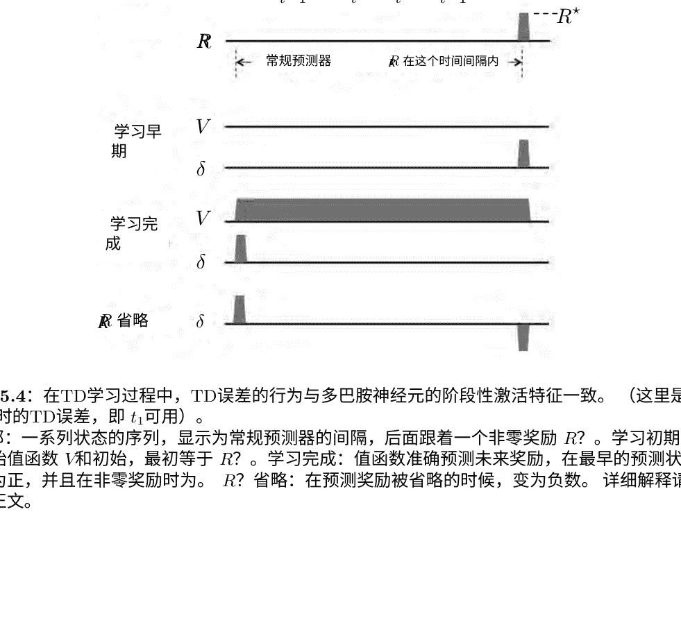

在奖励状态之前是一系列预测奖励的状态，最早的预测奖励状态在时间线的左端附近显示。这就像是试验开始时的状态，例如在Schultz等人的猴子实验中由指令提示标记的状态（1993年）。这是一个可靠地预测该试验奖励的第一个状态。（当然，在现实中，访问的状态在之前的试验中甚至更早就是预测奖励的状态，但是因为我们将预测限制在个别试验中，所以这些状态不符合预测该试验奖励的条件。下面我们将给出一个更令人满意，尽管更抽象的最早预测奖励状态的描述。）试验中最新的预测奖励状态是紧接在试验奖励状态之前的状态。这是时间线图中最右端附近的状态。请注意，一个试验的奖励状态并不预测该试验的回报：这个状态的值将来预测所有后续试验的回报，在这个情景式的制定中，我们假设回报为零。

图15.4显示了第一次试验的时间进程，其中V和δ的图表标有“学习早期”。因为在整个试验过程中奖励信号都是零，除非达到奖励状态，并且所有的V值都是零，直到出现TD误差为止，TD误差也是零。在奖励状态下，R*。这是因为 $\delta_t = R_t + V_t - V_{t-1} = R_t + 0 - 0 = R_t$，直到奖励发生时才变为零。在学习的这个阶段，这里的V_t和V_{t-1}分别是在试验中访问的状态的估计值。在这个阶段的TD误差类似于多巴胺神经元对训练开始时的意外奖励（例如，一滴苹果汁）的响应。

在这个第一次试验和所有后续试验中，TD(0)更新在每个状态转换时发生，如第6章所述。这逐步增加了奖励预测状态的值，增加从奖励状态向后传播，直到值收敛到正确的回报预测。在这种情况下（因为我们假设没有折扣），正确的预测等于 R* 对于所有的奖励预测状态。这可以在图15.4中看到，它标记为‘学习完成’，其中从最早到最新的奖励预测状态的所有状态的值都等于 R*。最早的奖励预测状态之前的状态值保持较低（图15.4显示为零），因为它们不是可靠的奖励预测器。

当学习完成时，即 V达到正确的值时，与从任何奖励预测状态进行的转换相关的TD误差为零，因为预测现在是准确的。这是因为从一个奖励预测状态到另一个奖励预测状态的转换中，我们有 $\delta_{t-1} = R_t + V_t - V_{t-1} = 0 + R^* - R^* = 0$，而从最新的奖励预测状态到奖励状态的转换中，我们有

另一方面，从任何状态到最早的奖励预测状态的TD误差是正的，因为这个状态的值较低，而后续的奖励预测状态的值较大，导致不匹配。实际上，如果最早的奖励预测状态之前的状态值为零，那么在转换到最早的奖励预测状态之后，我们将有 $\delta_1 = R_t + V_t - V_{t-1} = 0 + R^* - 0 = R^*$。图15.4中的“学习完成”图显示了最早的奖励预测状态的正值，其他地方都是零。

当转移到最早的奖励预测状态时，正的TD误差类似于多巴胺对最早的奖励预测刺激的持续响应。同样，当学习完成时，从最新的奖励预测状态转移到奖励状态会产生零的TD误差，因为最新的奖励预测状态的值是正确的，可以抵消奖励。这与少数多巴胺神经元对完全预测的奖励产生的瞬时响应少于对不可预测的奖励产生的响应的观察相似。

学习后，如果奖励突然被省略，TD误差在通常的奖励时间变为负值，因为最新的奖励预测状态的值太高：$\delta_{t-1} = R_t + V_t - V_{t-1} = 0 + 0 - R^* = -R^*$。如图15.4中的'omitted'图所示，在预期奖励被省略的时间，多巴胺神经元的活动降低到基线以下，这与Schultz等人（1993）的实验中观察到的情况相似，如图15.3所示。

对于最早的奖励预测状态的概念值得更多关注。在上述描述的情景中，由于经验被分为多个试验，并且我们假设预测仅限于单个试验，最早的奖励预测状态始终是试验的第一个状态。显然，这是人为的。对于最早的奖励预测状态的更一般的思考方式是，它是一种未预测的奖励预测器，并且可能存在许多这样的状态。在动物的生活中，许多不同的状态可能在最早的奖励预测状态之前出现。然而，由于这些状态更常常后跟不预测奖励的其他状态，它们的奖励预测能力，即它们的价值，保持较低。如果TD算法在动物的整个生命过程中运行，它将更新这些状态的值，但更新不会持续累积，因为根据假设，这些状态没有可靠地在最早的奖励预测状态之前。如果其中任何一个是，它们也将成为奖励预测状态。这可能解释了为什么在过度训练中，多巴胺反应甚至对于试验中最早的奖励预测刺激也会减少。通过过度训练，人们预期即使是以前未预测的预测器状态也会被与较早状态相关联的刺激所预测：动物与其环境的相互作用在实验任务内外都变得司空见惯。然而，一旦引入新任务打破这种常规，我们会看到TD误差重新出现，正如多巴胺神经元活动中所观察到的那样。

上述示例解释了为什么当动物在类似于我们示例中的理想任务中学习时，TD误差与多巴胺神经元的相位活动共享关键特征。但并非多巴胺神经元的每个属性都与$\delta$的属性完全一致。最令人困惑的差异之一涉及奖励比预期提前发生时会发生什么。我们已经看到，预期奖励的遗漏会在预期时间产生负预测误差，这对应于多巴胺神经元的活动在这种情况下低于基线。如果奖励比预期晚到达，则它是一个意外的奖励，并产生正预测误差。这在TD误差和多巴胺神经元的响应中都发生。但是当奖励比预期提前到达时，多巴胺神经元不会像TD误差那样做 - 至少在Montague等人（1996）和我们在示例中使用的CSC表示中不会。多巴胺神经元对早期奖励做出反应，这与正的TD误差一致因为奖励不被预测会发生。然而，在稍后的时间，当奖励被期望但被省略时，TD误差为负，而与此相反预测，多巴胺神经元的活动并没有低于基线，正如TD模型预测的那样（Hollerman和Schultz，1998年）。在动物的大脑中发生了比简单的CSC学习更复杂的事情。

TD误差和多巴胺神经元活动之间的一些不匹配可以通过选择适当的TD算法参数值和使用CSC表示之外的刺激表示来解决。例如，为了解决刚才描述的早期奖励不匹配，S uri和Schultz（1999年）提出了一种CSC表示，其中由早期刺激引发的内部信号序列被奖励的发生所取消。Daw，Courville和Touretzky（2006年）提出的另一个建议是，大脑的TD系统使用由感觉皮层中进行的统计建模产生的表示而不是基于原始感觉输入的简单表示。Ludvig，Sutton和Kehoe（2008年）发现，使用微刺激（MS）表示的TD学习（图14.1）更好地适应多巴胺神经元在早期奖励和其他情况下的活动，而不是使用CSC表示。Pan，Schmidt，Wickens和Hyland（2005年）发现，即使使用CSC表示，延长的资格追踪也可以改善TD误差对某些方面多巴胺神经元活动的拟合。总的来说，TD误差行为的许多细节取决于资格追踪，折扣和刺激表示之间的微妙相互作用。

这些发现详细阐述和完善了奖励预测误差假设，而没有否定多巴胺神经元的阶段性活动很好地表征了TD误差的核心观点。

另一方面，TD理论与实验数据之间存在其他差异，这些差异不容易通过选择参数值和刺激表示来适应（我们在本章末尾的参考文献和历史备注部分提到了其中一些差异），并且随着神经科学家进行越来越精细的实验，可能会发现更多的不匹配。但是，奖励预测误差假设在提高我们对大脑奖励系统工作原理的理解方面非常有效。复杂的实验已经被设计出来验证或否定从假设中推导出的预测，并且实验结果反过来又导致了TD误差/多巴胺假设的改进和详细阐述。

这些发展的一个显著方面是，强化学习算法和理论与多巴胺系统的特性非常契合，而这些算法和理论是在完全不了解多巴胺神经元相关特性的情况下从计算的角度开发出来的。请记住，TD学习及其与最优控制和动态规划的联系是在进行任何揭示多巴胺神经元类似TD性质的实验之前的许多年里开发出来的。尽管不完美，但这种意外的对应表明TD误差/多巴胺并行捕捉到了大脑奖励过程中的一些重要内容。

除了解释多巴胺神经元的瞬时活动的许多特征外，奖励预测误差假设还将神经科学与强化学习的其他方面联系起来。特别是对使用TD误差作为强化信号的学习算法的学习。神经科学距离完全理解多巴胺神经元的电路、分子机制和功能还有很长的路要走，但支持奖励预测误差假设的证据以及瞬时多巴胺反应作为学习的强化信号的证据表明，大脑可能实现了类似演员-评论家算法的东西，其中TD误差起着关键作用。

其他强化学习算法也是可行的候选者，但是演员-评论家算法非常适合哺乳动物大脑的解剖和生理特征，正如我们在接下来的两节中所描述的那样。

### 15.7 神经演员-评论家

演员-评论家算法同时学习策略和价值函数。‘演员’是学习策略的组件，‘评论家’是学习有关演员当前遵循的策略的组件，以便‘批评’演员的行动选择。评论家使用TD算法学习演员当前策略的状态值函数。价值函数允许评论家通过发送TD误差 δ给演员来批评演员的行动选择。正数 δ表示该行动是‘好’的，因为它导致了一个价值比预期更好的状态；负数 δ表示该行动是‘坏’的，因为它导致了一个价值比预期更差的状态。

基于这些批评，演员不断更新其策略。

演员-评论算法的两个独特特点使人们认为大脑可能实现了这样的算法。首先，演员-评论算法的两个组成部分——演员和评论家——表明纹状体的两个部分——背侧和腹侧亚区（第15.4节），对基于奖励的学习都至关重要——可能分别起到演员和评论家的作用。演员-评论算法的第二个特性表明大脑可能实现了这个算法，即TD误差在演员和评论家两个组件中都起到了强化信号的双重作用，尽管它在这两个组件中对学习的影响是不同的。这与神经回路的几个特性很吻合：多巴胺神经元的轴突同时靶向纹状体的背侧和腹侧亚区；多巴胺似乎对这两个结构的突触可塑性调节至关重要；而神经调节物质如多巴胺对目标结构的作用取决于目标结构的特性，而不仅仅取决于神经调节物质的特性。

第13.5节介绍了演员-评论家算法作为策略梯度方法，但Barto、Sutton和Anderson（1983）的演员-评论家算法更简单，并且被呈现为人工神经网络（ANN）。在这里，我们描述了类似于Barto等人的ANN实现，并且我们遵循Takahashi、Schoenbaum和Niv（2008）的建议，提出了关于如何通过真实神经网络在大脑中实现这个ANN的示意性建议。我们将演员和评论家学习规则的讨论推迟到第15.8节，在那里我们将它们作为策略梯度公式的特例呈现，并讨论它们对多巴胺如何调节突触可塑性的建议。

图15.5a展示了将演员-评论家算法作为具有实施演员和评论家的组件网络的ANN的实现。评论家由一个单一的类似神经元的单元 V 组成，其输出活动表示状态值，并且一个被标记为TD的菱形组件通过将 V 的输出与奖励信号和先前的状态值相结合来计算TD误差（如从TD菱形到自身的循环所示）。演员网络具有一个标记为 $A_i$ 的 $k$演员单元的单层。每个演员单元的输出是一个 $k$维动作向量的组成部分。另一种选择是有 $k$个单独的动作，每个演员单元命令一个动作，它们相互竞争以执行，但在这里我们将整个动作向量视为一个整体。一个向量作为一个动作。

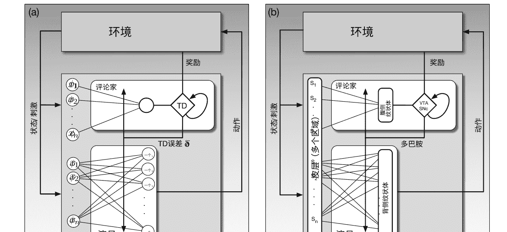

图15.5：演员-评论家ANN和一个假设的神经实现。a) 演员-评论家算法作为ANN。演员根据从评论家接收到的TD误差 $\delta$ 调整策略；评论家使用相同的 $\delta$ 调整状态值参数。评论家从奖励信号 $R$ 和其对状态值的当前变化产生TD误差。演员无法直接访问奖励信号，评论家也无法直接访问动作。b) 演员-评论家算法的假设神经实现。演员和评论家的值学习部分分别放置在背侧和腹侧亚区。纹状体的 TD误差通过位于VTA和SNpc的多巴胺神经元传递，以调节来自皮层区域到腹侧和背侧纹状体的突触效能的变化。改编自《神经科学前沿》，第2卷（1），2008年，Y. Takahashi, G. Schoenbaum和Y. Niv，消除批评者：在Actor/Critic模型的背侧外侧和腹侧纹状体中理解可卡因敏感性的影响。

评论家和演员网络都接收由多个特征表示的代理环境状态的输入。（回顾第1章，强化学习代理的环境包括包含代理的‘生物体’内外的组成部分。）图中将这些特征表示为标记为圆圈的 x1, x2, ... 为了保持图形简单，显示两次。代表权重的每个特征 xi到评论家单元 V和每个动作单元Ai之间的连接都与突触的效力相关。评论家网络中的权重参数化价值函数，而演员网络中的权重参数化策略。这些网络通过评论家和演员学习规则的权重变化来学习，我们将在下一节中描述这些规则。

评论家电路产生的TD误差是改变评论家和演员网络权重的强化信号。图15.5a中显示了这一点，通过标有“TD误差 δ”的线延伸到评论家和演员网络的所有连接上。网络实现的这一方面，加上奖励预测误差假设以及多巴胺神经元的活动通过这些神经元的广泛轴突树突分布，暗示着类似这样的演员-评论家网络可能不是对大脑中与奖励相关的学习过程的一个离谱的假设。

图15.5b非常简略地展示了ANN在图左侧可能如何映射到大脑结构的假设，根据高桥等人（2008）的假设。根据假设，演员和评论家的价值学习部分分别位于纹状体的背侧和腹侧亚区，纹状体是基底节的输入结构。回顾第15.4节，背侧纹状体主要参与影响行动选择，而腹侧纹状体被认为对感觉的不同方面的奖励处理至关重要，包括对感觉赋予情感价值。大脑皮层与其他结构一起向纹状体发送输入，传递有关刺激、内部状态和运动活动的信息。

在这种假设的演员-评论家大脑实现中，腹侧纹状体向VTA和SNpc发送价值信息，在这些核中，多巴胺神经元将其与奖励信息结合起来，生成与TD误差相对应的活动（尽管多巴胺能神经元如何计算这些误差尚不清楚）。图15.5a中的'TD误差 δ'线变成了图15.5b中标记为'Dopamine'的线，它代表多巴胺神经元的广泛分支轴突，这些神经元的细胞体位于VTA和SNpc中。回顾图15.1，这些轴突与中等棘状神经元的树突棘上的突触接触，中等棘状神经元是背侧和腹侧纹状体的主要输入/输出神经元。发送输入到纹状体的皮层神经元的轴突在这些棘的顶端形成突触接触。根据假设，正是在这些棘上，由多巴胺提供的强化信号决定了从皮层区域到纹状体的突触效能的变化，这些变化受到学习规则的关键影响。

图15.5b所示假设的一个重要含义是，多巴胺信号不像强化学习中的标量 Rt 那样是“主要”奖励信号。事实上，这个假设意味着人们不一定能够探测大脑并记录任何类似 Rt 的信号在任何单个神经元的活动中。许多相互连接的神经系统产生与奖励相关的信息，不同的结构被招募取决于不同类型的奖励。多巴胺神经元从许多不同的脑区接收信息，因此图15.5b中标记为“奖励”的输入到SNpc和VTA应被视为到达这些核心神经元的奖励相关信息的向量，沿着多个输入通道。那么，理论上的标量奖励信号 $R_t$ 可能对应于所有奖励相关信息对多巴胺神经元活动的净贡献。它是大脑不同区域许多神经元活动模式的结果。

尽管图15.5b中所示的演员-评论家神经实现在某些方面可能是正确的，但显然需要进一步完善、扩展和修改，以符合多巴胺神经元相位活动功能的完整模型的要求。本章末尾的历史和文献评论部分引用了更详细讨论这一假设的实证支持和存在不足之处的出版物。现在我们详细研究演员和评论家学习算法对皮质纹状体突触的突触效能变化规则的建议。

### 15.8 演员和评论家学习规则

如果大脑确实实现了类似演员-评论家算法的东西，并且假设多巴胺神经元群体向背侧和腹侧纹状体的突触广播共同的强化信号，如图15.5b所示（这可能是一种过度简化，如上所述），那么这种强化信号会以不同的方式影响这两个结构的突触。评论家和演员的学习规则使用相同的强化信号，即TD误差 $\delta$，但对于这两个组件的学习效果是不同的。TD误差（结合资格追踪）告诉演员如何更新动作概率以达到更高价值的状态。演员的学习类似于使用效应定律类型的仪器条件反射学习规则（第1.7节）：演员努力使 $\delta$ 尽可能为正。另一方面，TD误差（结合资格追踪）告诉评论家改变值函数参数的方向和大小，以提高其预测准确性。评论家通过类似经典条件反射的TD模型学习规则（第14.2节）努力将 $\delta$ 的大小减小到尽可能接近零，而演员则通过学习规则努力使尽可能为正。评论家和演员学习规则之间的差异相对简单，但这种差异对学习有着深远的影响，是演员-评论家算法工作的关键。这种差异仅仅在于每种学习规则使用的资格追踪的不同。

在像图15.5b中的演员-评论神经网络中，可以使用多组学习规则，但在这里我们专注于用于连续问题的带有资格追踪的演员-评论算法，该算法在第13.6节中介绍。在每个从状态 $S_t$ 到状态 $S_{t+1}$ 的转换中，采取行动 $A_t$ 并接收行动 $R_{t+1}$，该算法计算TD误差（$\delta$）然后更新资格追踪向量（$z^w_t$ 和 $z^θ_t$）和评论者和演员的参数（w和θ）根据

$$
\begin{aligned}
\delta_{t} &= R_{t+1} + \gamma v(S_{t+1}, \mathbf{w}) - v(S_{t}, \mathbf{w}), \\
\mathbf{z}_{t}^{\mathbf{w}} &= \lambda^{\mathbf{w}} \mathbf{z}_{t-1}^{\mathbf{w}} + \nabla \hat{v}(S_{t}, \mathbf{w}), \\
\mathbf{z}_{t}^{\theta} &= \lambda^{\theta} \mathbf{z}_{t-1}^{\theta} + \nabla \ln \pi(A_{t}|S_{t}, \theta), \\
\mathbf{w} &\leftarrow \mathbf{w} + \alpha^{\mathbf{w}} \delta_{t} \mathbf{z}_{t}^{\mathbf{w}}, \\
\theta &\leftarrow \theta + \alpha^{\theta} \delta_{t} \mathbf{z}_{t}^{\theta}
\end{aligned}
$$

其中 $\gamma \in [0, 1)$ 是一个折扣率参数，$\lambda^{c} \in [0, 1]$ 和 $\lambda^{a} \in [0, 1]$ 分别是评论家和演员的引导参数，$\alpha^{w} > 0$ 和 $\alpha^{\theta} > 0$ 是类似的步长参数。

将近似值函数$\hat{v}$视为单个线性神经元输出的结果，称为评论单元，并在图15.5a中标记为$V$。那么值函数是状态$s$的特征向量表示的线性函数$\mathbf{x}(s) = (\mathbf{x}_1(s), ..., \mathbf{x}_n(s))^{\top}$的参数化函数，由权重向量$\mathbf{w} = (w_1, ..., w_n)^{\top}$确定：

$$v^{\wedge}(s, \mathbf{w}) = \mathbf{w}^{\top}\mathbf{x}(s) = \sum_{i=1}^{n} w_i x_i(s)$$

这对应于强化学习中的值估计，我们将其视为US预测。 (15.1)

每个$x_i(s)$就像是神经元突触的前突信号，其效力为$w_i$。评论者的权重根据上述规则通过增量$\Delta w_t = \alpha \delta_t z_{w_t}$进行更新，其中强化信号$\delta_t$对应于向评论单元的所有突触广播的多巴胺信号。评论单元的资格迹向量$\mathbf{z}_{w_t}$是评论单元的迹（最近值的平均值），用于计算$\nabla v^{\wedge}(S_t, w)$。由于$v^{\wedge}(s, w)$对权重是线性的，$\nabla v^{\wedge}(S_t, w) = x(S_t)$。从神经角度来看，这意味着每个突触都有自己的资格迹，这是向量$\mathbf{z}_{w_t}$的一个分量。突触的资格迹根据到达该突触的活动水平累积，即到达该突触的前突活动水平，这里由特征向量$x(S_t)$的分量表示。否则，迹线会以$\lambda^w$的比例衰减至零。只要突触的资格迹线非零，它就有资格进行修改。突触的效能如何实际修改取决于在突触有资格时到达的强化信号。我们将这样的资格迹线称为评论单元的突触的非连续资格迹线，因为它们仅依赖于突触前活动，并且与突触后活动无关。评论单元的突触的非连续资格迹线意味着评论单元的学习规则本质上是经典条件反射的TD模型，如第14.2节所述。根据我们上面给出的评论单元及其学习规则的定义，图15.5a中的评论单元与Barto等人的ANN演员-评论家中的评论单元相同。显然，像这样只包含一个线性神经元单元的评论家是最简单的起点；这个评论单元是一个更复杂的神经网络学习价值函数的代理。一个只包含一个线性神经元单元的评论家显然是最简单的起点；这个评论单元是一个更复杂的神经网络学习价值函数的代理。

图15.5a中的演员是一个单层网络，由$k$个类似神经元的演员单元组成，每个单元在时间$t$接收到与评论家单元相同的特征向量$\mathbf{x}(S_t)$。每个演员单元$j, j=1, ..., k$，都有自己的权重向量$\mathbf{\theta}_j$，但由于演员单元都是相同的，我们只描述其中一个单元并省略下标。这些单元的一种方式是，$k$，都有自己的权重向量$\mathbf{\theta}_j$，但由于演员单元都是相同的，我们只描述其中一个单元并省略下标。这些单元的一种方式是遵循上述方程中的行动者-评论家算法的每个单元都是伯努利-逻辑单元。这意味着每个行动者单元在每个时间点的输出都是一个随机变量，$A_t$，取值为0或1。将值1视为神经元发射，即发出动作电位。通过单位的输入向量的加权和，$\boldsymbol{\theta}^\top \mathbf{x}(S_t)$，通过指数软最大分布（13.2）确定单位的动作概率，对于两个动作来说，它是逻辑函数：

$$
\pi(1|s, \boldsymbol{\theta}) = 1 - \pi(0|s, \boldsymbol{\theta}) = \frac{1}{1 + \exp(-\boldsymbol{\theta}^\top \mathbf{x}(s))}.
$$

每个行动者单元的权重都会增加，如上所述，增加的量为：$\boldsymbol{\theta} \leftarrow \boldsymbol{\theta} + \alpha^\theta \delta_t \mathbf{z}_t^\theta$，其中$\delta$再次对应多巴胺信号：发送给所有评论家单元突触的相同强化信号。图15.5a显示了$\delta_t$被广播到所有行动者单元的突触上（这使得这个行动者网络成为一个强化学习的团队，我们将在第15.10节中讨论）。行动者资格追踪向量 $\mathbf{z}_t^\theta$ 是一个追踪（最近数值的平均值）$\nabla \ln \pi(A_t|S_t, \boldsymbol{\theta})$。要理解这个资格追踪，请参考练习13.5，该练习定义了这种类型的单元，并要求你给出一个学习规则。该练习要求你用 $a$, $\mathbf{x}(s)$ 和 $\nabla \ln \pi( a|s, \boldsymbol{\theta})$ 来表示。通过计算梯度来计算任意状态 $s$ 和动作 $a$ 的梯度。对于实际发生在时间 $t$ 的动作和状态，答案是

$$
\nabla \pi(A_t|S_t, \boldsymbol{\theta}) = (A_t - \pi(A_t|S_t, \boldsymbol{\theta})) (\mathbf{x}(S_t)).
$$

与只累积前突触活动 $\mathbf{x}(S_t)$ 的评论家突触的非条件资格痕迹不同，行动者单元的突触的资格痕迹还取决于行动者单元本身的活动。我们将其称为有条件资格痕迹，因为它取决于这个突触后活动。每个突触的资格痕迹不断衰减，但根据前突触神经元的活动以及突触后神经元是否发放而增加或减少。因素 $A_t - \pi(A_t|S_t, \boldsymbol{\theta})$ 在(15.3)中，当 $A_t = 1$ 时为正，否则为负。在行动者单元的资格痕迹中，突触后条件性是评论家学习规则和行动者学习规则之间唯一的区别。通过保留有关在哪个状态下采取了哪些动作的信息，有条件的资格痕迹允许将奖励（正 $\delta$）或惩罚（负 $\delta$）的信用分配给策略参数（行动者单元突触的效能），根据这些参数对单元输出的贡献，这些输出可能会影响后来的值 $\delta$。有条件的资格痕迹标记突触，以便修改单元未来的响应，以支持 $\delta$ 的正值。

评论家和行动者学习规则对皮质纹状体突触的效能变化有何建议？这两个学习规则与唐纳德·赫布（Hebb）的经典提议有关，即每当一个突触前信号参与激活突触后神经元时，突触的效能就会增加（Hebb，1949年）。评论家和行动者学习规则与赫布的提议共享一个观点，即突触效能的变化取决于几个因素的相互作用。在评论家学习规则中，相互作用发生在仅依赖于突触前信号的强化信号和资格痕迹之间。神经科学家将其称为双因子学习规则，因为相互作用发生在两个信号或数量之间。另一方面，行动者学习规则是一种三因子学习规则，因为除了依赖于 $\delta$ 之外，它的资格痕迹还依赖于突触前和突触后的活动。然而，与赫布的提议不同，因素的相对时序对突触效能的变化至关重要，资格痕迹的介入使得强化信号能够影响最近活跃的突触。

关于行动者和评论家学习规则的一些细微之处值得更加关注。在定义类似神经元的行动者和评论家单元时，我们忽略了突触输入需要一小段时间才能影响真实神经元的发放。当来自前突触神经元的动作电位到达突触时，神经递质分子被释放，扩散到突触间隙，然后结合到后突触神经元的表面受体上；这激活了分子机制，导致后突触神经元发放（或在抑制性突触输入的情况下抑制其发放）。这个过程可能需要几十毫秒的时间。然而，根据 (15.1) 和 (15.2)，评论家和行动者单元的输入立即产生单元的输出。在赫布型可塑性的抽象模型中，忽略激活时间是常见的，其中突触效能根据同时的前突触和后突触活动的简单乘积进行改变。更加真实的模型必须考虑激活时间。

激活时间对于更真实的行动者单元尤为重要，因为它影响了如何正确分配信用给适当的突触以进行强化。表达式 $(A_t - \pi(A_t|S_t, \boldsymbol{\theta}))(\mathbf{x}(S_t))$ 定义了行动者单元学习规则中的相关资格追踪，上述规则包括了突触后因子 $(A_t - \pi(A_t|S_t, \boldsymbol{\theta}))$ 和突触前因子 $\mathbf{x}(S_t)$。这是有效的，因为通过忽略激活时间，突触前活动 $\mathbf{x}(S_t)$ 参与引起出现在突触后的活动 $(A_t - \pi(A_t|S_t, \boldsymbol{\theta}))$。为了正确地分配强化信用，定义资格追踪的突触前因子必须是定义追踪的突触后因子的原因。更真实的行动者单元的相关资格追踪必须考虑激活时间。（激活时间不应与神经元接收受其活动影响的强化信号所需的时间混淆。资格追踪的功能是跨越这个时间间隔，通常比激活时间长得多。我们在下一节中进一步讨论这个问题。）

神经科学提供了关于大脑中这个过程如何工作的线索。神经科学家发现了一种称为时序相关塑性（STDP）的赫布型可塑性，这使得大脑中存在类似行动者的突触可塑性成为可能。STDP是一种赫布型可塑性，但突触的效能变化取决于突触前和突触后动作电位的相对时序。这种依赖关系可以采取不同的形式，但在最常研究的形式中，如果通过该突触传入的脉冲在突触后神经元发放之前到达，突触的强度会增加。如果时序关系相反，即突触前脉冲在突触后神经元发放之后不久到达，那么突触的强度会减小。STDP是一种考虑神经元激活时间的赫布型可塑性，这是类似行动者学习所需的要素之一。

STDP的发现使神经科学家开始研究STDP的三因素形式的可能性，其中神经调节输入必须按适当的时间跟随前后突触的尖峰。这种形式的突触可塑性被称为奖励调节的STDP，与这里讨论的行动者学习规则非常相似。只有在突触前尖峰紧随突触后尖峰之后的一段时间内有神经调节输入时，才会产生由常规STDP产生的突触变化。证据表明，奖励调节的STDP发生在背侧纹状体的中等棘刺神经元的突触上，多巴胺提供神经调节因子——行动者-评论算法的假设神经实现中行动者学习发生的地点，如图15.5b所示。实验证明，只有在突触前尖峰紧随突触后尖峰之后的一段时间内，神经调节脉冲到达的情况下，才会发生突触的持久性变化，这段时间可以长达10秒（Yagishita等人，2014年）。尽管证据是间接的，但这些实验指出了具有长时间过程的有条件资格痕迹的存在。产生这些痕迹的分子机制以及可能支持STDP的更短痕迹尚不清楚，但关注时间依赖和神经调节物质依赖的突触可塑性的研究仍在进行中。

我们在这里描述的类神经元行动者单元，以其类似效应的学习规则，以较简单的形式出现在Barto等人的行动者-评论家网络中（1983年）。该网络受到生理学家A.H. Klopf（1972年，1982年）提出的“享乐主义神经元”假设的启发。Klopf的假设并非所有细节都与我们对突触可塑性的了解一致，但STDP的发现和越来越多的证据表明，奖励调节的STDP形式，这表明Klopf的想法可能并不远离实际。我们接下来讨论Klopf的享乐主义神经元假设。

### 15.9 快乐神经元

在他的享乐主义神经元假设中，Klopf（1972年，1982年）推测个体神经元通过调整其突触的效能，以基于自身动作电位的奖励或惩罚后果来最大化突触输入被视为奖励和突触输入被视为惩罚之间的差异。换句话说，个体神经元可以像动物在仪器条件反射任务中被训练一样，通过响应相关的强化来进行训练。他的假设包括奖励和惩罚通过同一突触输入传递给神经元，该输入激发或抑制神经元的尖峰生成活动。（如果Klopf当时知道我们今天对神经调节系统的了解，他可能会将强化作用分配给神经调节输入，但他想避免任何集中的训练信息源。）Klopf假设中过去的突触前后突触活动的突触局部痕迹起着关键作用，使突触有资格在以后的奖励或惩罚中进行修改。他推测这些痕迹由每个突触局部实施的分子机制实现，因此与突触前和突触后神经元的电活动不同。

在本章的文献和历史评论部分，我们注意到了其他人提出的一些类似的建议。

Klopf特别推测突触效能的变化方式。当一个神经元发射动作电位时，所有对该动作电位有贡献的突触都有资格进行效能的变化。如果动作电位在适当的时间段内后面跟着奖励的增加，所有有资格的突触的效能都会增加。相反地，如果动作电位在适当的时间段内后面跟着惩罚的增加，有资格的突触的效能会减少。这是通过在突触上触发一个资格追踪来实现的，当突触前后突触活动巧合时（或者更准确地说，当突触前突触活动与导致该突触前突触活动参与的后突触活动配对时）——我们称之为有条件的资格追踪。这实质上是前一节中描述的行动者单元的三因素学习规则的实现。

Klopf理论中资格追踪的形状和时间过程反映了神经元嵌入的许多反馈环路的持续时间，其中一些完全位于生物体的大脑和身体内部，而其他一些则通过其运动和感觉系统介导的生物体的外部环境延伸出来。他的想法是，突触资格追踪的形状就像神经元嵌入的反馈环路持续时间的直方图。资格追踪的峰值将出现在该神经元参与的最普遍反馈环路的持续时间上。

本书中描述的算法使用的资格追踪是Klopf原始想法的简化版本，它们是由参数 $\lambda$ 和 $\gamma$ 控制的指数（或几何）递减函数。这简化了模拟和理论，但我们认为这些简单的资格追踪只是Klopf原始构想的替代品，通过改进信用分配过程，在复杂的强化学习系统中具有计算优势。

Klopf的享乐主义神经元假设并不像一开始看起来那么不可信。一个被广泛研究的单细胞的例子是寻找某些刺激并避开其他刺激的细菌大肠杆菌。这种单细胞生物的运动受其环境中的化学刺激影响，这种行为被称为趋化性。它通过旋转附着在其表面的毛状结构称为鞭毛在液体环境中游泳。（是的，它旋转它们！）细菌环境中的分子结合到其表面的受体上。结合事件调节细菌鞭毛旋转的频率。每次反转都会导致细菌在原地翻滚，然后朝一个随机的新方向前进。一点化学记忆和计算会导致细菌在游向浓度更高的分子（引诱物）时，鞭毛反转的频率减少，并在游向浓度更高的有害分子（斥力剂）时增加。结果是细菌倾向于在引诱物梯度中持续游泳，并倾向于避免在斥力剂梯度中游泳。

刚才描述的趋化行为被称为倾斜运动。这是一种试错行为，尽管学习可能不太可能参与其中：细菌需要一些短期记忆来检测分子浓度梯度，但它可能不会保持长期记忆。人工智能先驱奥利弗·塞尔弗里奇将这种策略称为“跑和调整”，指出其作为基本自适应策略的实用性：“如果事情变得更好，就继续以同样的方式前进，否则四处移动”（塞尔弗里奇，1978年，1984年）。同样，人们可以将神经元“游泳”（当然不是字面意义上的）在其嵌入的复杂反馈环路组成的介质中，以获取一种类型的输入信号并避免其他信号。

然而，与细菌不同，神经元的突触强度保留了关于其过去的试错行为的信息。如果对神经元（或仅仅是一种类型的神经元）行为的这种观点是合理的，那么神经元与其环境相互作用的闭环性质对于理解其行为是重要的，其中神经元的环境包括整个动物的其余部分以及动物与其整体相互作用的环境。

Klopf的享乐主义神经元假设超越了单个神经元是强化学习代理的想法。他认为智能行为的许多方面可以理解为一群自私的享乐主义神经元在一个庞大的社会或经济系统中相互作用，构成了动物的神经系统。无论这种对神经系统的看法是否有用，强化学习代理的集体行为对神经科学都有影响。我们接下来将讨论这个主题。

### 15.10 集体强化学习

强化学习代理的群体行为对社会和经济系统的研究非常相关，如果类似Klopf的享乐主义神经元假设是正确的，对神经科学也是如此。上述关于如何在大脑中实现行动者-评论家算法的假设只是狭义地涉及了纹状体的背侧和腹侧亚区，根据该假设，每个亚区都包含数百万个中等棘刺神经元，其突触通过多巴胺神经元活动的阶段性爆发进行调节。

图15.5a中的行动者是一个单层网络，由 $k$ 个行动者单元组成。这个网络产生的动作是向量 $(A_1, A_2, \dots, A_k)^\text{T}$ 被认为驱动动物的行为。所有这些单元突触的效能变化取决于强化信号 $\delta$。因为行动者单元试图使 $\delta$ 尽可能大，$\delta$ 实际上对它们来说，就像是一个奖励信号（所以在这种情况下，强化就是奖励）。因此，每个行动者单元本身就是一个强化学习代理——一个享乐主义的神经元。现在，为了使情况尽可能简单，假设每个单元在同一时间收到相同的奖励信号（尽管如上所述，多巴胺在所有皮质纹状体突触下相同的条件和时间释放的假设可能是过于简化了）。强化学习理论告诉我们，当一群强化学习代理根据共同的奖励信号进行学习时会发生什么？多智能体强化学习领域考虑了强化学习代理群体学习的许多方面。虽然这个领域超出了本书的范围，但我们相信其中一些基本概念和结果对思考是相关的。

关于大脑的弥散性神经调节系统。在多智能体强化学习（以及博弈论）中，所有智能体都试图最大化同时接收到的共同奖励信号，这被称为合作博弈或团队问题。

团队问题的有趣和具有挑战性之处在于，发送给每个智能体的共同奖励信号评估整个群体产生的活动模式，也就是评估团队成员的集体行动。这意味着任何个体智能体对奖励信号的影响能力有限，因为任何单个智能体只贡献了集体行动中的一个组成部分。在这种情况下，有效的学习需要解决结构性信用分配问题：哪些团队成员或团队成员组合应该获得有利奖励信号的认可，或者应该受到不利奖励信号的责备？这是一个合作博弈或团队问题，因为智能体们团结一致地寻求增加相同的奖励信号：智能体之间没有利益冲突。如果不同的代理接收到不同的奖励信号，那么这就是一个竞争性游戏，其中每个奖励信号再次评估了整个人口的集体行动，每个代理的目标是增加自己的奖励信号。在这种情况下，代理之间可能存在利益冲突，这意味着对某些代理有利的行动对其他代理来说是不利的。甚至决定最佳的集体行动应该是游戏理论中一个非常复杂的方面。这种竞争性环境对神经科学也可能是相关的（例如，解释多巴胺神经元活动的异质性），但在这里我们只关注合作或团队的情况。

团队中的每个强化学习代理如何学习“做正确的事情”，以便团队的集体行动得到高度奖励？有趣的结果是，即使每个代理的奖励信号被大量噪声破坏，并且尽管它们无法获得完整的状态信息，但整个人口将学会产生根据共同奖励信号评估改善的集体行动，即使代理之间无法相互通信。

每个智能体都面临着自己的强化学习任务，其中其对奖励信号的影响被其他智能体的影响所淹没在噪声中。事实上，对于任何一个智能体来说，所有其他智能体都是其环境的一部分，因为其输入，无论是传递状态信息的部分还是奖励部分，都取决于所有其他智能体的行为。此外，由于无法访问其他智能体的动作，实际上也无法访问确定其策略的参数，每个智能体只能部分观察其环境的状态。这使得每个团队成员的学习任务非常困难，但如果每个成员都使用一种能够在这些困难条件下增加奖励信号的强化学习算法，强化学习智能体团队可以学习产生随时间改进的集体行动，这些行动由团队的共同奖励信号评估。

如果团队成员是类似神经元的单元，那么每个单元都必须有增加其随时间接收到的奖励量的目标，就像我们在第15.8节中描述的行动者单元一样。每个单元的学习算法必须具备两个基本特征。首先，它必须使用条件资格追踪。回想一下，条件资格追踪，在神经术语中，是在突触上启动（或增加）其突触前输入时初始化的，如果该输入参与导致突触后神经元发放。相比之下，非条件资格追踪是由突触前输入独立于突触后神经元的行为而启动或增加的。如第15.8节所解释的，通过保留关于在哪个状态下采取了哪些动作的信息，条件资格追踪允许根据这些参数的值在决定代理的动作时为奖励或惩罚分配给代理的策略参数。通过类似的推理，团队成员必须记住其最近的动作，以便根据随后接收到的奖励信号增加或减少产生该动作的可能性。条件资格追踪的动作组件实现了这种动作记忆。然而，由于学习任务的复杂性，条件资格仅仅是信用分配过程中的一个初步步骤：单个团队成员的动作与团队奖励信号的变化之间的关系是一个统计相关性，必须在许多试验中进行估计。有条件的资格是这个过程中必不可少的但是初步的一步。使用非条件性资格追踪在团队环境中根本不起作用，因为它没有提供一种将行动与奖励信号的相应变化相关联的方法。非条件性资格追踪对于像行动者-评论家算法的评论家组件那样学习预测是足够的，但是它们不支持像行动者组件那样学习控制。评论家类似的代理人群体的成员仍然可以接收到共同的强化信号，但是他们都会学习预测相同的数量（在行动者-评论家方法的情况下，这将是当前策略的预期回报）。群体中每个成员在学习预测预期回报方面的成功程度将取决于它所接收到的信息，这对于群体中的不同成员来说可能是非常不同的。群体没有必要产生差异化的活动模式。这不是一个在这里定义的团队问题。

团队问题中集体学习的第二个要求是团队成员的行动必须具有变异性，以便团队能够探索集体行动的空间。强化学习代理团队最简单的方法是每个成员通过持续的输出变异性独立地探索自己的行动空间。这将导致整个团队的集体行动发生变化。

例如，第15.8节中描述的行动者单元团队通过每个单元的输出，作为伯努利-逻辑单元，以概率方式依赖于其输入向量的分量的加权和，来探索集体行动的空间。加权和偏置会增加或减少发射概率，但始终存在变异性。因为每个单元都使用REINFORCE策略梯度算法（第13章），每个单元通过调整权重来最大化其经验的平均奖励率，同时随机地探索自己的行动空间。正如Williams（1992）所做的那样，可以证明伯努利-逻辑REINFORCE单元团队实现了一个整体的策略梯度算法，其相对于团队的共同奖励信号的平均速率，其中行动是团队的集体行动。

此外，威廉姆斯（1992年）表明，使用REINFORCE的伯努利逻辑单元团队在团队中相互连接以形成多层ANN时，会上升平均奖励梯度。在这种情况下，奖励信号会广播到所有单元中。尽管奖励可能仅取决于网络输出单元的集体行动，但这意味着伯努利逻辑REINFORCE的多层团队学习方式类似于通过广泛使用的误差反向传播方法训练的多层网络，但在这种情况下，反向传播过程被广播的奖励信号所取代。实际上，误差反向传播方法速度更快，但强化学习团队方法在神经机制方面更具可行性，特别是考虑到在第15.8节中讨论的奖励调制STDP的学习内容。

通过团队成员的独立探索来进行探索只是团队探索的最简单方式；如果团队成员协调行动，集中关注集体行动空间的特定部分，可以使用更复杂的方法，无论是通过彼此之间的沟通还是对共同输入的响应。还有比依赖于条件资格追踪更复杂的机制来解决结构性信用分配问题，当团队问题的可能集体行动受到某种限制时，这更容易。一个极端情况是一种全胜制安排（例如，大脑中的侧抑制的结果），它将集体行动限制在只有一个或少数几个团队成员参与的行动上。在这种情况下，获胜者将获得相应的奖励或惩罚。

合作游戏（或团队问题）和非合作游戏问题的学习细节超出了本书的范围。本章末尾的参考文献和历史注释部分引用了一些相关出版物，包括对集体强化学习的神经科学研究的广泛参考。

### 15.11 大脑中的基于模型的方法

强化学习在模型无关和基于模型的算法之间的区别对于思考动物学习和决策过程非常有用。第14.6节讨论了这种区别与动物习惯性行为和目标导向行为之间的对齐方式。上述关于大脑如何实现行动者-评论家算法的假设仅与动物的习惯性行为模式相关，因为基本的行动者-评论家方法是无模型的。哪些神经机制负责产生目标导向行为，它们如何与支持习惯性行为的机制相互作用？

研究这些行为模式中涉及的大脑结构的一种方法是在大鼠的脑部区域中失活，然后观察大鼠在结果折价实验中的行为（第14.6节）。这类实验的结果表明，上述描述的行动者-评论家假设过于简单，将行动者放在背侧纹状体中。失活背侧纹状体的一部分，背外侧纹状体（DLS），会损害习惯性学习，使动物更多地依赖目标导向过程。另一方面，失活背内侧纹状体（DMS）会损害目标导向过程，要求动物更多地依赖习惯性学习。这样的结果支持了鼠类的背外侧纹状体更多地参与无模型过程，而背内侧纹状体更多地参与基于模型的过程。

使用功能性神经影像学在类似实验中对人类受试者进行的研究以及对非人类灵长类动物的研究支持这样的观点：灵长类大脑中的类似结构在习惯性和目标导向行为中起到不同的作用。

其他研究确定了与模型为基础的过程在人脑的前额叶皮质中的活动相关联，前额叶皮质是前额叶皮质的最前部分，与执行功能（包括规划和决策）有关。特别是眼睛上方的前额叶皮质（OFC）。

人类的功能性神经影像学研究以及对猴子单个神经元活动的记录显示，OFC与生物学上重要刺激的主观奖励价值以及与行为结果相关的奖励预期有强烈的活动相关。尽管存在争议，但这些结果表明OFC在目标导向选择中起到重要作用。它可能对动物环境模型中的奖励部分至关重要。

参与基于模型行为的另一个结构是海马体，这是一个对记忆和空间导航至关重要的结构。老鼠的海马体在老鼠能够以目标导向的方式在迷宫中导航的能力中起着关键作用，这使得托尔曼提出了动物使用模型或认知地图来选择行动的想法（第14.5节）。海马体也可能是我们人类想象新体验的关键组成部分（Hassabis和Maguire，2007；Ólafsdóttir, Barry, Saleem, Hassabis和Spiers，2015）。

最直接将海马体与规划（即在决策中利用环境模型的过程）联系起来的发现来自于解码海马体神经元活动的实验，以确定海马体活动在每一时刻代表的空间部分。当老鼠在迷宫的选择点停顿时，海马体中的空间表示沿着动物可以从该点选择的可能路径向前扫过（而不是向后）（Johnson和Redish，2007）。此外，这些扫过所表示的空间轨迹与老鼠随后的导航行为密切对应（Pfeiffer和Foster，2013）。这些结果表明，海马体对于动物环境模型中的状态转换部分至关重要，并且它是一个使用模型来模拟可能的未来状态序列以评估可能行动后果的系统的一部分：一种规划形式。

上述结果增加了关于神经机制的大量文献，这些机制解释了目标导向或基于模型的学习和决策制定，但仍有许多问题没有得到解答。例如，结构上相似的区域如何成为模型无关和模型为基础的算法等学习和行为模式的基本组成部分？是否有单独的结构负责环境模型的转换和奖励组成部分（我们称之为）？是否所有的规划都是在决策时通过模拟可能的未来行动路径进行的，就像海马体中的前向扫描活动所暗示的那样？换句话说，所有的规划是否都类似于展开算法（第8.10节）？或者模型有时是否在后台参与细化或重新计算价值信息，就像Dyna架构（第8.2节）所示？大脑如何在习惯和目标导向系统之间进行权衡？实际上，神经系统之间是否存在明确的分离？

这些系统的基质？ 证据并没有指向对这个最后一个问题的积极答案。总结情况，Doll、Simon和Daw（2012）写道，“无论大脑在哪个地方处理奖励信息，模型为基础的影响似乎无处不在”，即使在被认为对无模型学习至关重要的区域也是如此。这包括多巴胺信号本身，它们除了被认为是无模型过程基础的奖励预测误差之外，还可以展示模型为基础信息的影响。

继续受强化学习无模型和模型为基础区分启发的神经科学研究有可能加深我们对大脑中习惯性和目标导向过程的理解。对这些神经机制的更好掌握可能会导致将无模型和模型为基础方法结合起来的算法，这种算法在计算强化学习中尚未被探索。

### 15.12 上瘾

理解药物滥用的神经基础是神经科学的一个重要目标，有可能为这个严重的公共卫生问题提供新的治疗方法。一种观点认为，药物渴求是与我们寻求满足生物需求的自然奖励体验相同的动机和学习过程的结果。通过强化作用强烈，上瘾物质有效地利用了我们学习和决策的自然机制。这是合理的，因为许多（尽管不是全部）滥用药物直接或间接地增加了多巴胺在纹状体多巴胺神经元轴突末梢周围区域的水平，纹状体是一个在正常奖励学习中被牢固证明的大脑结构（第15.7节）。但与正常学习不同，与药物成瘾相关的自毁行为并不是典型的特征。当奖励是成瘾药物的结果时，多巴胺介导的学习有何不同？成瘾是对在我们进化历史中大部分时间不可获得的物质的正常学习的结果，以至于进化无法选择对抗它们的破坏性影响吗？还是上瘾物质在某种程度上干扰了正常的多巴胺介导学习？

多巴胺神经元活动的奖励预测误差假设及其与TD学习的联系是Redish（2004）模型的基础，该模型涉及成瘾的一些特征，但并非全部。该模型基于以下观察结果：可卡因和其他一些成瘾性药物的使用会导致多巴胺短暂增加。在该模型中，假设这种多巴胺激增会以一种不能通过价值函数的变化来抵消的方式增加TD误差 δ。换句话说，当先前事件预测到正常奖励时（第15.6节），δ会减少，但由于成瘾刺激物质引起的奖励信号不会随着奖励信号的预测而减少：药物奖励无法“预测消失”。该模型通过在奖励信号由成瘾性药物引起时始终阻止 δ 变为负值，从而消除了TD学习对与药物使用相关的状态的错误修正功能。结果是，这些状态的值会无限增加，使得导致这些状态的行为优于其他所有行为。

上瘾行为比Redish的模型所得结果更加复杂，但是模型的主要思想可能是谜题的一部分。或者模型可能会误导人。多巴胺似乎在所有形式的上瘾中都不起关键作用，并且并非每个人都同样容易产生上瘾行为。此外，该模型并未包括伴随慢性药物使用的许多电路和脑区的变化，例如导致药物反复使用时效果减弱的变化。上瘾很可能还涉及基于模型的过程。尽管如此，Redish的模型说明了强化学习理论如何在理解一个重大健康问题的努力中发挥作用。类似地，强化学习理论在计算精神病学这一新领域的发展中具有影响力，该领域旨在通过数学和计算方法改进对精神障碍的理解。

### 15.13 总结

大脑奖励系统中涉及的神经通路复杂且尚未完全理解，但是针对理解这些通路及其在行为中的作用的神经科学研究正在迅速发展。这项研究揭示了大脑奖励系统与本书中介绍的强化学习理论之间的惊人对应关系。

多巴胺神经元活动的奖励预测误差假设是由科学家提出的，他们注意到时间差分误差的行为与产生多巴胺的神经元的活动之间存在明显的相似之处。多巴胺是一种对于奖励相关学习和行为在哺乳动物中至关重要的神经递质。在20世纪80年代末和90年代，在神经科学家沃尔夫拉姆·舒尔茨的实验室中进行的实验表明，多巴胺神经元对奖励事件的反应是巨大的活动突发，称为阶段性反应，仅当动物不期望这些事件时才会发生。这表明多巴胺神经元是在传递奖励预测误差而不是奖励本身。此外，这些实验还表明，当动物学会根据先前的感觉线索来预测奖励事件时，多巴胺神经元的阶段性活动会从较早的预测线索转移到较晚的预测线索，同时减少。这与时间差分误差作为强化学习代理学习预测奖励时的备份效应相似。

其他实验结果明确证明，多巴胺神经元的阶段性活动是一种通过多巴胺产生神经元的丰富分支轴突到达大脑多个区域的强化信号。这些结果与我们在大多数算法中所提出的奖励信号R和强化信号TD误差之间的区别是一致的。多巴胺神经元的阶段性反应是强化信号，而不是奖励信号。

一个重要的假设是，大脑实现了类似于演员-评论家算法的东西。大脑中的两个结构（纹状体的背侧和腹侧亚区），它们在基于奖励的学习中都起着关键作用，可能分别像演员和评论家一样发挥作用。TD误差是演员和评论家的强化信号，这与多巴胺神经元轴突同时靶向纹状体的背侧和腹侧亚区的事实非常吻合；多巴胺似乎是对于调节突触可塑性在两个结构中都至关重要；而神经调节物质（如多巴胺）对目标结构的影响取决于目标结构的特性，而不仅仅取决于神经调节物质的特性。

演员和评论家可以通过神经元网络实现，这些网络由类似神经元的单元组成，其学习规则基于策略梯度演员-评论家方法（见第13.5节）。这些网络中的每个连接就像大脑中神经元之间的突触，学习规则对应于调节突触效能随前突触和后突触神经元活动的规则，以及来自多巴胺神经元的神经调节输入。在这种设置中，每个突触都有自己的资格追踪，记录涉及该突触的过去活动。演员和评论家学习规则之间唯一的区别在于它们使用不同类型的资格追踪：评论家单元的追踪是非依赖性的，因为它们不涉及评论家单元的输出，而演员单元的追踪是依赖性的，因为除了演员单元的输入外，它们还依赖于演员单元的输出。在大脑中，演员-评论家系统的假设实现中，这些学习规则分别对应于皮质-纹状体突触的可塑性规则，这些突触传递信号从皮质到背侧和腹侧纹状体亚区的主要神经元，这些突触还接收来自多巴胺神经元的输入。

在演员-评论家网络中，演员单元的学习规则与奖励调制的时序依赖可塑性密切对应。在时序依赖可塑性（STDP）中，前后突触活动的相对时序决定了突触变化的方向。在奖励调制的STDP中，突触的变化还取决于神经调节物质（如多巴胺）在STDP条件满足后的时间窗口内到达的情况，该时间窗口可以持续长达10秒。越来越多的证据表明，奖励调制的STDP发生在皮质纹状体突触上，在演员-评论家系统的假设神经实现中，演员的学习发生在这里，这增加了类似演员-评论家系统存在于某些动物大脑中的假设的合理性。

突触适应性和演员学习规则的基本特征的思想来源于Klopf对“享乐神经元”（Klopf, 1972, 1981）的假设。他推测个体神经元通过调整自身来获得奖励和避免惩罚。根据其行动电位的奖励或惩罚后果，它们的突触的效能会发生变化。神经元的活动可以影响其后续输入，因为神经元嵌入在许多反馈环路中，其中一些在动物的神经系统和身体内部，其他一些通过动物的外部环境。Klopf的资格的想法是，如果突触参与了神经元的发放（使其成为资格痕迹的依赖形式），则将突触临时标记为可修改的。如果在突触有资格的同时出现了强化信号，则会修改突触的效能。

当突触有资格时，如果出现强化信号，则会修改其效能。我们提到了细菌的趋化行为作为一个单细胞的例子，它通过定向运动来寻找某些分子并避开其他分子。

多巴胺系统的一个显著特点是释放多巴胺的纤维广泛投射到大脑的多个部分。尽管只有一部分多巴胺神经元群体可能广播相同的强化信号，但如果这个信号到达参与演员型学习的许多神经元的突触，那么情况就可以被建模为一个团队问题。在这种类型的问题中，强化学习代理集合中的每个代理都接收相同的强化信号，该信号取决于集合中所有成员的活动。如果每个团队成员都使用足够强大的学习算法，即使团队成员彼此不直接通信，团队也可以集体学习，以全局广播的强化信号评估整个团队的性能。这与大脑中多巴胺信号的广泛分布一致，并为训练多层网络的广泛使用的误差反向传播方法提供了一个神经可行的替代方法。

无模型和有模型强化学习之间的区别有助于神经科学家研究习惯性和目标导向学习以及决策制定的神经基础。迄今的研究表明，某些大脑区域与其中一种类型的过程更相关，但由于无模型和有模型过程在大脑中并不明确分离，所以情况仍不清楚。许多问题仍然没有答案。也许最有趣的证据是，海马体，一个传统上与空间导航和记忆相关的结构，似乎参与了动物决策过程中模拟可能的未来行动的一部分。这表明它是一个使用环境模型进行规划的系统的一部分。

强化学习理论也影响了对神经过程的思考潜在的药物滥用。药物成瘾的某些特征模型基于奖励预测误差假设。它提出，像可卡因这样的成瘾性兴奋剂会破坏TD学习，导致与药物摄入相关的行为值的无限增长。这远非是成瘾的完整模型，但它说明了计算视角如何提出可以通过进一步研究进行测试的理论。

计算精神病学这个新领域同样关注使用计算模型，其中一些模型源自强化学习，以更好地理解精神障碍。本章只是浅尝强化学习的神经科学以及计算机科学和工程中强化学习的发展是如何相互影响的。强化学习算法的大多数特征都是基于纯粹的计算考虑而设计的，但有些特征受到关于神经学习机制的假设的影响。令人惊讶的是，随着实验数据的积累关于大脑的奖励过程，许多纯粹基于计算的强化学习算法特征与神经科学数据一致。计算强化学习的其他特征，如资格追踪和强化学习代理团队在全局广播的强化信号的影响下学会集体行动的能力，也可能与神经科学家继续揭示基于奖励的动物学习和行为的神经基础相一致。

### 参考文献和历史评论

在本书中，处理学习和决策的神经科学与强化学习方法之间的相似之处的出版物数量是巨大的。我们只能引用其中的一小部分。Niv（2009），Dayan和Niv（2008），Glimcher（2011），Ludvig, Bellemare和Pearson（2011）以及Shah（2012）是一个很好的起点。

强化学习理论与经济学、进化生物学和数学心理学一起，正在帮助制定人类和非人类灵长类动物选择的神经机制的定量模型。由于其专注于学习，本章只轻描淡写地涉及了决策的神经科学。Glimcher（2003）引入了“神经经济学”领域，其中强化学习对从经济学角度研究决策的神经基础做出了贡献。另请参阅Glimcher和Fehr（2013）。Dayan和Abbott（2001）关于神经科学中的计算和数学建模的文本包括强化学习在这些方法中的作用。

Sterling和Laughlin（2015）根据通用的设计原则，研究了学习的神经基础，以实现高效的自适应行为。

15.1 有许多关于基础神经科学的好的阐述。Kandel, Schwartz, Jessell, Siegelbaum和Hudspeth（2013）是权威且非常全面的资料。

15.2 Berridge和Kringelbach（2008）回顾了奖励和快乐的神经基础，指出奖励处理具有许多维度并涉及许多神经系统。空间限制了对Berridge和Robinson（1998）有影响力的研究的讨论，他们区分了刺激的愉悦影响（称为“喜欢”）和动机效应（称为“渴望”）。Hare, O'Doherty, Camerer, Schultz和Rangel（2008）从经济学的角度研究了与价值相关的信号的神经基础，区分了目标值、决策值和预测误差。决策值是目标值减去行动成本。另请参阅Rangel, Camerer和Montague（2008），Rangel和Hare（2010）以及Peters和Büchel（2010）。

15.3 多巴胺神经元活动的奖励预测误差假设最为突出地由Schultz、Dayan和Montague（1997）讨论。这个假设最早是由Montague、Dayan和Sejnowski（1996）明确提出的。正如他们所陈述的假设，它涉及奖励预测误差（RPEs），但并非特指TD误差；然而，他们对该假设的发展使其明确指出他们所指的是TD误差。我们所知道的最早认识到TD误差/多巴胺连接的是Montague、Dayan、Nowlan、Pouget和Sejnowski（1993），他们提出了一种由TD误差调制的Hebbian学习规则，这是受到Schultz小组关于多巴胺信号的研究结果的启发。这个连接也在Quartz、Dayan、Montague和Sejnowski（1992）的摘要中指出。Montague和Sejnowski（1994）强调了预测在大脑中的重要性，并概述了如何通过扩散性神经调节系统（如多巴胺系统）实现由TD误差调制的预测性Hebbian学习。Friston、Tononi、Reeke、Sporns、Edelman和（1994）提出了一个关于大脑中价值依赖学习的模型，其中突触变化由全局神经调节信号提供的类TD误差介导（尽管他们没有单独指出多巴胺）。Montague, Dayan, Person和Sejnowski（1995）提出了一个使用TD误差的蜜蜂觅食模型。该模型基于Hammer、Menzel和同事的研究（Hammer和Menzel, 1995; Hammer, 1997），显示出神经调节剂辛胺在蜜蜂中作为强化信号的作用。

Montague等人（1995）指出，多巴胺很可能在脊椎动物的大脑中起到类似的作用。Barto（1995a）将演员-评论家架构与基底节回路联系起来，并讨论了TD学习与Schultz小组的主要结果之间的关系。Houk、Adams和Barto（1995）提出了TD学习和演员-评论家架构如何映射到基底节的解剖学、生理学和分子机制。Doya和Sejnowski（1998）通过包括与多巴胺相关的类TD误差来扩展了他们早期关于鸟鸣学习模型的论文（Doya和Sejnowski, 1995），以加强对要记忆的听觉输入的选择。O'Reilly和Frank（2006）以及O'Reilly、Frank、Hazy和Watz（2007）认为，瞬时多巴胺信号是RPE，但不是TD误差。为了支持他们的理论，他们引用了变量间刺激间隔的结果，这些结果与简单的TD模型的预测不符，以及高阶条件反射很少被观察到，而TD学习并不受此限制。

Dayan和Niv（2008）讨论了强化学习理论和奖励预测误差假设与实验数据的“好、坏和丑陋”之间的关系。Glimcher（2011）回顾了支持奖励预测误差假设的实证发现，并强调了该假设对当代神经科学的重要性。

15.4 Graybiel（2000）是关于基底神经节的简要入门。提到涉及多巴胺神经元光遗传激活的实验是由Tsai、Zhang、Adamantidis、Stuber、Bonci、de Lecea和Deisseroth（2009）、Steinberg、Keiflin、Boivin、Witten、Deisseroth和Janak（2013）以及Claridge-Chang、Roorda、Vrontou、Sjulson、Li、Hirsh和Miesenbock（2009）进行的。Fiorillo、Yun和Song（2013）、Lammel、Lim和Malenka（2014）以及Saddoris、Cacciapaglia、Wightmman和Carelli（2015）是显示多巴胺神经元信号特性专门用于不同目标区域的研究之一。RPE-信号神经元可能属于多个多巴胺神经元群体之一，具有不同的目标和不同的功能。Eshel、Tian、Bukwich和Uchida（2016）发现在小鼠经典条件反射期间，侧腹VTA的多巴胺神经元的奖励预测误差响应具有一致性，尽管他们的结果并不排除更广泛区域的响应多样性。

Gershman、Pesaran和Daw（2009）研究了可以分解为具有独立组件和单独奖励信号的强化学习任务，在人类神经影像数据中找到了支持大脑利用这种结构的证据。

Schultz在1998年的综述文章是关于多巴胺神经元奖励预测信号的非常广泛的文献的良好入门。Berns、McClure、Pagnoni和Montague（2001）、Breiter、Aharon、Kahneman、Dale和Shizgal（2001）、Pagnoni、Zink、Montague和Berns（2002）以及O'Doherty、Dayan、Friston、Critchley和Dolan（2003）描述了支持人脑中类似TD误差的信号的功能性脑成像研究。

本节大致按照Barto（1995a）的解释，说明了如何模拟TD误差与Schultz小组关于多巴胺神经元的阶段性反应的主要结果。

本节主要基于Takahashi, Schoenbaum和Niv（2008）和Niv（2009）的研究。据我们所知，Barto（1995a）和Houk, Adams和Barto（1995）首次推测了基底神经节中演员-评论家算法的可能实现方式。根据人类在仪器条件下进行功能性磁共振成像，O'Doherty, Dayan, Schultz, Deichmann, Friston和Dolan（2004）认为演员和评论家最有可能分别位于背侧纹状体和腹侧纹状体。

Gershman, Moustafa和Ludvig（2014）关注时间在基底神经节强化学习模型中的表示方式，讨论了各种计算方法对时间表示的证据和影响。

本节中描述的演员-评论家架构的假设神经实现几乎没有关于已知基底神经节解剖学和生理学的详细信息。除了Houk, Adams和Barto（1995）的更详细的假设外，还有许多其他假设与解剖学和生理学有更具体的联系，并声称可以解释其他数据。这些包括Suri和Schultz（1998, 1999）、Brown, Bullock和Grossberg（1999）、Contreras-Vidal和Schultz（1999）、Suri, Bargas和Arbib（2001）、O'Reilly和Frank（2006）以及O'Reilly, Frank, Hazy和Watz（2007）提出的假设。

Joel, Niv和Ruppin（2002）对这些模型的解剖合理性进行了批判性评估，并提出了一个旨在适应基底节电路的一些被忽视特征的替代方案。

这里讨论的演员学习规则比Barto等人（1983）早期的演员-评论家网络中的规则更复杂。在那个网络中，演员单元的资格追踪只是（$A_t \times x(S_t)$）的追踪，而不是完整的（$A_t - \pi(A_t|S_t, \theta))x(S_t)$）。那项工作没有从第13章中介绍的策略梯度理论或Williams（1986, 1992）的贡献中受益，后者展示了一个伯努利-逻辑单元的人工神经网络如何实现策略梯度方法。

Reynolds和Wickens（2002）提出了一个关于皮质纹状体途径突触可塑性的三因素规则，其中多巴胺调节皮质-纹状体突触效能的变化。他们讨论了这种学习规则的实验支持及其可能的分子基础。关于时序相关可塑性（STDP）的确切证明归功于Markram、LüBke、Frotscher和Sakmann（1997），早期实验提供了证据。

## 15.9

Levy和Steward（1983年）等人指出，突触前后发放的脉冲的相对时序对于诱导突触效能的变化至关重要。Rao和Sejnowski（2001年）提出了STDP可能是一种持续约10毫秒的非连续资格痕迹的TD类机制的结果。Dayan（2002年）评论说，这将需要一个错误，就像Sutton和Barto（1981a）早期经典条件模型中的错误一样，而不是真正的TD错误。关于奖励调节的STDP的代表性出版物有Wickens（1990年），Reynolds和Wickens（2002年），以及Calabresi, Picconi, Tozzi和Di Filippo（2007年）。Pawlak和Kerr（2008年）表明，多巴胺对于诱导中等棘细胞突触的STDP是必要的。另请参阅Pawlak, Wickens, Kirkwood和Kerr（2010年）的相关文献。

Yagishita, Hayashi-Takagi, Ellis-Davies, Urakubo, Ishii和Kasai（2014）发现，多巴胺在STDP刺激后的0.3到2秒的时间窗口内，仅促进小鼠中等棘突神经元的脊柱增大。Izhikevich（2007）提出并探索了使用STDP时间条件来触发相关资格痕迹的想法。Frémaux, Sprekeler和Gerstner（2010）提出了基于奖励调节的STDP的成功学习的理论条件。

Klopf的享乐主义神经元假设（Klopf 1972, 1982）启发了我们作为一个具有单个神经元单位的ANN实现的演员-评论家算法，称为演员单位，实现了类似于资格痕迹的学习规则（Barto，Sutton和Anderson，1983）。与Klopf的突触局部资格相关的思想已经被其他人提出。Crow（1968）提出，大脑皮层神经元的突触变化对神经活动的后果敏感。强调需要解决神经活动和其后果之间的时间延迟，在奖励调节的突触可塑性中，他提出了一种相关的资格形式，但与整个神经元相关，而不是个别突触。

> 导致参与波动的细胞发生短期变化，使它们从未被激活的细胞背景中被选出。...这些细胞通过短期变化对奖励信号变得敏感...以这样的方式，如果在变化的衰减时间结束之前发生这样的信号，细胞之间的突触连接将变得更加有效。 （Crow，1968年）

Crow反驳了以前的提议，即回响的神经回路起到这种作用，他指出奖励信号对这样一个回路的影响将“...建立导致回响的突触连接（也就是说，在奖励信号发生时活动的那些连接），而不是导致适应性运动输出的路径上的连接。”Crow进一步假设奖励信号通过一个“独特的神经纤维系统”传递，可能是Olds和Milner（1954年）所接触到的那个系统，它将突触连接“从短期形式转化为长期形式”。

在另一个有远见的假设中，米勒提出了一种包含突触局部相关资格痕迹的学习规则，类似于资格痕迹：

> > ... 设想在特定的感觉情境中，神经元B偶然地发出一次“有意义的突发”活动，然后将其转化为运动行为，从而改变情境。可以假设这个有意义的突发活动在神经元水平上对其所有活跃的突触产生影响，...从而对要加强的突触进行初步选择，尽管尚未实际加强它们。

> > ...加强信号...进行最终选择...并实现适当突触的明确变化。（米勒，1981年，第81页）

米勒的假设还包括一个类似于评论家的机制，他称之为“感觉分析单元”，根据经典条件反射原理向神经元提供强化信号，使其学会从低值状态转移到高值状态，从而预测TD误差作为演员-评论家架构中的强化信号的使用。米勒的想法不仅与克洛普夫的想法相似（除了明确引用了一个独立的“加强信号”），还预见了奖励调节的STDP的一般特征。Seung（2003年）称之为“享乐突触”的相关但不同的想法是，突触个别调整释放神经递质的概率，类似于资格痕迹定律：如果奖励跟随释放，则释放概率增加；如果奖励跟随未释放，则释放概率减少。

这本质上与教学方案Minsky在他1954年的普林斯顿博士论文中使用的相同，他称之为类似突触的学习元素SNARC（随机神经模拟强化计算器）。这些想法也涉及到有条件的资格，尽管它是依赖于单个突触的活动而不是突触后神经元。还有Unnikrishnan和Venugopal（1994）提出的提案，使用了Harth和Tzanakou（1974）的基于相关性的方法来调整ANN权重。

Frey和Morris（1997）提出了“突触标记”的概念，用于诱导突触效能的长期增强。尽管与Klopf的资格不同，他们的标记被假设为突触的临时增强，可以通过后续神经元激活转化为长期增强。O'Reilly和Frank（2006）以及O'Reilly, Frank, Hazy和Watz（2007）的模型使用工作记忆来连接时间间隔，而不是资格痕迹。Wickens和Kotter（1995）讨论了突触资格的可能机制。He, Huertas, Hong, Tie, Hell, Shouval, Kirkwood（2015）提供了支持Klopf所假设的皮层神经元突触中存在有条件资格痕迹的证据，其时间课程与资格痕迹相似。

Barto（1989）讨论了使用与细菌趋化作用相关的学习规则的神经元的隐喻。Koshland（1980）对细菌趋化作用进行了广泛的研究，部分原因是细菌和神经元的特征相似。另请参阅Berg（1975）。Shimansky（2009）提出了一个与Seung提到的类似的突触学习规则，其中每个突触都像趋化性细菌一样独立地起作用。在这种情况下，一组突触在高维度的突触权重值空间中“游泳”向引诱物靠近。Montague, Dayan, Person和Sejnowski（1995）提出了一种类似趋化性的蜜蜂觅食行为模型，涉及神经调节剂辛胺。

## 15.10

对强化学习代理在团队和游戏问题中行为的研究有着悠久的历史，大致可以分为三个阶段。

据我们所知，第一阶段始于俄罗斯数学家和物理学家M. L. Tsetlin的研究。他的一些作品在他1966年去世后以Tsetlin (1973)的名义出版。我们的第1.7节和第4.8节涉及他在与赌博机问题相关的学习自动机研究。Tsetlin的作品集还包括对团队和游戏问题中学习自动机的研究，这导致了后来在这一领域中使用随机学习自动机的工作，如Narendra和Thathachar (1974, 1989)，Viswanathan和Narendra (1974)，Lakshmivarahan和Narendra (1982)，Narendra和Wheeler (1983)，以及Thathachar和Sastry (2002)所描述的。Thathachar和Sastry (2011)是一份更为详尽的最新综述。这些研究大多局限于非关联性学习自动机，即它们没有涉及关联或上下文的赌博机问题（第2.9节）。

第二阶段开始于将学习自动机扩展到关联或情境案例。Barto、Sutton和Brouwer（1981年）以及Barto和Sutton（1981b年）在单层ANN中使用关联随机学习自动机进行了实验，并广播了全局强化信号。学习算法是Harth和Tzanakou（1974年）的Alopex算法的关联扩展。Barto等人称实现这种学习的类似神经元的元素为关联搜索元素（ASEs）。Barto和Anandan（1985年）引入了一种称为关联奖惩（ARP）算法的关联强化学习算法。他们通过将随机学习自动机理论与模式分类理论相结合证明了收敛结果。Barto（1985年，1986年）和Barto和Jordan（1987年）描述了连接到多层ANN中的ARP单元团队的结果，表明它们可以学习非线性函数，如XOR和其他函数，并广播全局强化信号。Barto（1985年）广泛讨论了这种ANN方法以及这种学习规则与当时文献中的其他规则的关系。Williams（1992年）对这类学习规则进行了数学分析和扩展，并将其与训练多层ANN的误差反向传播方法相关联。Williams（1988年）描述了反向传播和强化学习相结合进行ANN训练的几种方法。Williams（1992年）表明，ARP算法的一个特例是REINFORCE算法，尽管使用一般的ARP算法（Barto，1985年）可以获得更好的结果。

强化学习代理团队的第三阶段兴趣受到了对多巴胺作为广泛传播的神经调节物质的作用以及关于奖励调节STDP存在的猜测的增加理解的影响。与早期研究相比，这项研究更加考虑突触可塑性和其他神经科学的限制的细节。出版物包括以下内容（按时间顺序和字母顺序排列）：Bartlett和Baxter（1999年，2000年），Xie和Seung（2004年），Baras和Meir（2007年），Farries和Fairhall（2007年），Florian（2007年），Izhikevich（2007年），Pecevski，Maass和Legenstein（2008年），Legenstein，Pecevski和Maass（2008年），Kolodziejski，Porr和Wörgötter（2009年），Urbanczik和Senn（2009年），以及Vasilaki，Frémaux，Urbanczik，Senn和Gerstner（2009年）。

Nowé，Vrancx和De Hauwere（2012）回顾了多智能体强化学习领域的最新发展。

## 15.11

Yin和Knowlton（2006）回顾了关于啮齿动物的结果贬值实验的发现，支持了习惯性和目标导向行为（如心理学家所说）分别与背外侧纹状体（DLS）和背内侧纹状体（DMS）中的处理相关的观点。

Valentin，Dickinson和O'Doherty（2007）在结果评估设置中对人类受试者进行的功能成像实验结果表明，眶额叶皮质（OFC）是目标导向选择的重要组成部分。

Padoa-Schioppa和Assad（2006）在猴子中进行的单元记录支持了OFC在编码引导选择行为价值方面的作用。Rangel，Camerer和Montague（2008）以及Rangel和Hare（2010）从神经经济学的角度回顾了大脑如何进行目标导向决策的发现。

Pezzulo，van der Meer，Lansink，和Pennartz（2014）回顾了内部生成序列的神经科学，并提出了这些机制可能是模型为基础规划的组成部分的模型。Daw和Shohamy（2008）提出，虽然多巴胺信号与习惯性或无模型行为有很好的连接，但其他过程参与了目标导向或基于模型的行为。

Bromberg-Martin，Matsumoto，Hong，和Hikosaka（2010）的实验数据表明，多巴胺信号包含与习惯性和目标导向行为相关的信息。Doll，Simon，和Daw（2012）认为，在大脑中，支持习惯性和目标导向学习和选择的机制之间可能没有明确的分离。

## 15.12

Keiflin 和 Janak（2015）回顾了TD误差与成瘾之间的联系。

Nutt，Lingford-Hughes，Erritzoe，和Stokes（2015）对成瘾是多巴胺系统紊乱的假设进行了批判性评估。Montague，Dolan，Friston，和Dayan（2012）概述了计算精神病学领域的目标和早期努力，Adams，Huys，和Roiser（2015）回顾了更近期的进展。

## 第16章

### 应用和案例研究

在本章中，我们介绍了几个强化学习的案例研究。其中一些是具有潜在经济意义的重要应用。其中一个是塞缪尔的跳棋程序，主要具有历史意义。我们的演示旨在说明在实际应用中出现的一些权衡和问题。例如，我们强调了如何将领域知识纳入问题的制定和解决中。我们还强调了表示问题，这在成功应用中经常至关重要。

在一些案例研究中使用的算法比我们在本书的其他部分中介绍的算法要复杂得多。强化学习的应用仍然远未成为常规，通常需要与科学一样多的艺术。使应用更加简单和直观是当前强化学习研究的目标之一。

### 16.1 TD-Gammon

迄今为止，强化学习最令人印象深刻的应用之一是Gerald Tesauro在西洋双陆棋中的应用（Tesauro, 1992年, 1994年, 1995年, 2002年）。Tesauro的程序，TD-Gammon，几乎不需要西洋双陆棋知识，却学会了非常出色的下棋水平，接近世界最强大师的水平。TD-Gammon中的学习算法是TD(λ)算法和使用多层人工神经网络（ANN）通过反向传播TD误差进行非线性函数逼近的简单组合。

黑白棋是一种重要的游戏，因为它在全世界范围内都有比赛和定期的世界锦标赛。它在某种程度上是一种运气游戏，并且它是一个用于赌注大笔金额的流行工具。可能有更多的职业黑白棋选手比职业国际象棋选手。这个游戏在一个由24个位置组成的棋盘上，有15个白色和15个黑色的棋子，被称为点。在下一页的右边，显示了游戏早期的一个典型位置，从白方玩家的角度看。这里的白方刚刚掷骰子，得到了5和2。这意味着他可以移动他的一个棋子5步，另一个棋子2步。

(可能是同一个棋子)移动2步。例如，他可以从12点移动两个棋子，一个到17点，一个到14点。白方的目标是将所有棋子推进到最后一个象限（19-24点），然后离开棋盘。第一个移除所有棋子的玩家获胜。一个复杂之处在于棋子在不同方向上相互交互时。

例如，如果是黑方走棋，他可以使用掷骰子得到的2来将一枚棋子从24点移动到22点，“击打”那里的白方棋子。被击打的棋子被放置在棋盘中间的“栏”上（我们已经看到一枚之前被击打的黑方棋子），然后从起点重新进入比赛。然而，如果一个点上有两枚棋子，对手就不能移动到那个点上；这些棋子受到保护，不会被击打。因此，白方不能使用他的5-2骰子点数来移动位于1点上的任意一枚棋子，因为它们可能的目标点已经被黑方的棋子占据。形成连续的占据点块来阻挡对手是这个游戏的基本策略之一。

Backgammon涉及到一些进一步的复杂情况，但上述描述给出了基本的概念。拥有30枚棋子和24个可能的位置（包括栏和从整个棋盘的角度来看，可以清楚地看出可能的双陆棋局面数量是巨大的，远远超过任何可实现的计算机的存储元素数量。每个局面可能的移动数量也很大。对于一个典型的骰子点数，可能有20种不同的下法。在考虑未来的移动时，例如对手的反应，还必须考虑可能的骰子点数。

结果是游戏树的有效分支因子约为400。这个数值太大了，无法有效地使用传统的启发式搜索方法，这些方法在象棋和跳棋等游戏中已经证明是有效的。

另一方面，该游戏非常适合使用TD学习方法。尽管游戏具有高度的随机性，但游戏的状态始终可用完整地描述。游戏通过一系列的移动和局面演变，最终以一方获胜或双方平局的方式结束。结果可以被解释为要预测的最终奖励。另一方面，到目前为止我们所描述的理论结果无法有效地应用于这个任务。状态的数量如此之大，无法使用查找表，并且对手是不确定性和时间变化的源头。

TD-Gammon使用了非线性形式的TD(λ)。对于任何状态（棋盘位置）s的估计值，v^(s,w)，旨在估计从该状态开始获胜的概率。为了实现这一点，除了游戏获胜的时间步之外，奖励被定义为零。为了实现值函数，TD-Gammon使用了一个标准的多层ANN，类似于下一页右侧显示的那个。

网络的最后一层有两个额外的单元，用于特殊方式估计每个玩家获胜的概率，称为“gammon”或“backgammon”。网络由输入单元层、隐藏单元层和最终输出单元组成。网络的输入是一个背棋位置的表示，输出是该位置的估计值。

在TD-Gammon的第一个版本TD-Gammon 0.0中，背棋位置以相对直接的方式表示给网络，涉及很少的背棋知识。它做到了这一点，

然而，这需要对人工神经网络的工作原理和信息最佳呈现方式有相当多的了解。值得注意的是Tesauro选择的确切表示方式。网络共有198个输入单元。对于棋盘上的每个点，有四个单元表示该点上的白子数量。如果没有白子，则四个单元的值都为零。如果有一个子，则第一个单元的值为1。这表示了一个“点”，即对手可以击中的棋子。如果有两个或更多的子，则第二个单元的值为1。这表示了对手无法落子的“制胜点”的基本概念。如果该点上有三个子，则第三个单元的值为1。这表示了一个“单独的备用子”，即除了制胜点上的两个子之外的额外棋子。最后，如果该点上的子超过三个，则第四个单元的值与超过三个子的数量成比例。设n为该点上的总子数，如果n>3，则第四个单元的值为(n-3)/2。这表示了给定点上“多个备用子”的线性表示。

在每个24个点上，白色有四个单位，黑色也有四个单位，总共有192个单位。另外两个单位编码了栏上白色和黑色棋子的数量（每个单位的值为n/2，其中n是栏上的棋子数量），另外两个单位编码了已成功从棋盘上移除的黑色和白色棋子的数量（这些单位的值为n/15，其中n是已经移除的棋子数量）。

最后，两个单位以二进制方式指示是白色还是黑色轮到移动。这些选择背后的一般逻辑应该是清楚的。基本上，Tesauro试图以直观的方式表示位置，同时保持单位数量相对较小。他为每个概念上可能相关的概念提供了一个单位，并将它们缩放到大致相同的范围内，本例中为0到1之间。

给定一个表示双陆棋位置的表示，网络以标准方式计算其估计值。从输入单元到隐藏单元的每个连接对应一个实值权重。每个输入单元的信号都乘以

它们对应的权重，并在隐藏单元处求和。隐藏单元j的输出( j ) 是加权和的非线性sigmoid函数：

$$h(j) = \sigma \left( \sum_i w_{ij} x_i \right) = \frac{1}{1 + e^{-\sum_i w_{ij} x_i}}$$

其中，$x_i$是第 $i$个输入单元的值，$w_{ij}$是其与第$j$个隐藏单元的连接权重（网络中的所有权重组成参数向量 $\mathbf{w}$ ）。Sigmoid函数的输出始终在0和1之间，并且具有基于证据求和的概率解释。 从隐藏单元到输出单元的计算完全类似。 每个从隐藏单元到输出单元的连接都有一个单独的权重。输出单元形成加权和，然后通过相同的Sigmoid非线性函数。

TD-Gammon使用了TD(λ)算法的半梯度形式，该算法在第12.2节中进行了描述，梯度由误差反向传播算法（Rumel-hart, Hinton, and Williams, 1986）计算。回想一下，这种情况下的一般更新规则是

$$\mathbf{w}_{t+1} = \mathbf{w}_t + \alpha \left[ R_{t+1} + \gamma \hat{v}(S_{t+1}, \mathbf{w}_t) - \hat{v}(S_t, \mathbf{w}_t) \right] \mathbf{z}_t,$$ (16.1)

其中 $\mathbf{w}_t$是所有可修改参数的向量（在这种情况下，是网络的权重）， $\mathbf{z}_t$是一个由每个$\mathbf{w}_t$分量的资格追踪向量组成的向量，通过以下方式更新

$$\mathbf{z}_t = \lambda \mathbf{z}_{t-1} + \nabla \hat{v}(S_t, \mathbf{w}_t),$$

这个方程中的梯度可以通过反向传播过程高效地计算。 对于背棋应用程序，其中 $\gamma = 1$，奖励总是除了获胜之外都为零，学习规则中的TD误差部分通常只是 $\hat{v}(S_{t+1}, \mathbf{w}) - \hat{v}(S_t, \mathbf{w})$，如图16·1所示。

为了应用学习规则，我们需要一批战胜对手的棋局。 Tesauro通过让他的学习型背棋程序自我对弈，获得了一系列无尽的棋局。为了选择下一步棋，TD-Gammon考虑了每一种可能的骰子点数和对应的棋局。 得到的棋局被称为后状态，在第6.8节中进行了讨论。网络被用来估计每个后状态的价值。然后选择能够导致估计价值最高的棋局。 以这种方式继续进行，TD-Gammon为双方进行着棋局，可以轻松生成大量的背棋局。

每个棋局被视为一个回合，其中的棋局序列被视为状态。$S_0, S_1, S_2, \ldots$ Tesauro完全增量地应用了非线性的TD规则（16.1），即在每一步棋之后。

网络的权重最初设置为小的随机值。 因此，初始评估完全是任意的。 因为移动是基于这些评估选择的，所以初始移动不可避免地很差，初始游戏通常在一方或另一方赢得之前进行了数百或数千次移动，几乎是偶然的。 然而，经过几十场比赛，性能迅速提高。

在与自己对弈约300,000局后，如上所述的TD-Gammon 0.0学会了与之前最好的背棋计算机程序相当的水平。

程序。这是一个引人注目的结果，因为所有先前的高性能计算机程序都使用了大量的背棋知识。例如，当时的冠军程序可以说是Neurogammon，另一个由Tesauro编写的程序，它使用了人工神经网络但没有使用TD学习。Neurogammon的网络是在由背棋专家提供的大量示范移动的训练语料库上进行训练的，并且还使用了专门为背棋设计的一组特征。Neurogammon是一个经过精心调整、高效的背棋程序，它在1989年的世界背棋奥林匹克中获得了决定性的胜利。另一方面，TD-Gammon 0.0基本上没有背棋知识。它能够与Neurogammon和其他方法一样出色地表现，这充分证明了自我对弈学习方法的潜力。

TD-Gammon 0.0在没有任何专家知识的情况下取得了比赛的成功，这表明一个明显的修改：添加专门的黑白棋特征，但保持自我对弈的TD学习方法。这产生了TD-Gammon 1.0。TD-Gammon 1.0显然比所有以前的黑白棋程序都要好，并且只在人类专家之间找到了严肃的竞争。程序的后续版本，TD-Gammon 2.0（40个隐藏单元）和TD-Gammon 2.1（80个隐藏单元），通过选择性的双层搜索过程进行了增强。为了选择移动，这些程序不仅考虑了即将发生的位置，还考虑了对手可能的骰子点数和移动。假设对手总是选择对他来说最好的移动，计算了每个候选移动的期望值，并选择了最好的移动。为了节省计算机时间，只对在第一层排序较高的候选移动进行第二层搜索，平均约为四到五个移动。双层搜索只影响所选的移动；学习过程与以前完全相同。程序的最终版本，TD-Gammon 3.0和3.1，使用了160个隐藏单元和选择性的三层搜索。TD-Gammon展示了学习的价值函数和决策时搜索的组合，就像启发式搜索和MCTS方法一样。在后续的工作中，Tesauro和Galperin（1997）探索了轨迹采样方法作为全宽度搜索的替代方法，这大大降低了实时对局的错误率（4倍-6倍），同时保持了每步思考时间在5-10秒左右。

在1990年代，Tesauro能够让他的程序与世界级人类选手进行大量比赛。结果的总结见表16.1。

表16.1: TD-Gammon结果总结

| 程序 | 隐藏单位 | 训练比赛 | 对手 | 结果 |
|---|---|---|---|---|
| TD-Gammon 0.0 | 40 | 300,000 | 其他程序 | 并列最佳 |
| TD-Gammon 1.0 | 80 | 300,000 | Robertie, Magriel, ... | -13分 / 51场比赛 |
| TD-Gammon 2.0 | 40 | 800,000 | 各种国际象棋大师 | -7分 / 38场比赛 |
| TD-Gammon 2.1 | 80 | 1,500,000 | Robertie | -1分 / 40场比赛 |
| TD-Gammon 3.0 | 80 | 1,500,000 | Kazaros | +6分 / 20场比赛 |

根据这些结果和国际象棋大师的分析（Robertie, 1992；参见Tesauro, 1995），TD-Gammon 3.0在世界上最好的人类选手中的棋力接近或可能更好。Tesauro在随后的一篇文章中（Tesauro, 2002）报告了TD-Gammon相对于顶级人类选手的移动决策和加倍决策的广泛展开分析结果。结论是TD-Gammon 3.1在棋子移动决策上具有“明显优势”，在加倍决策上具有“轻微优势”比顶级人类选手。

TD-Gammon对最优秀的人类玩家的游戏方式产生了重大影响。例如，它学会了在某些开局位置上与最优秀的人类玩家不同的下法。基于TD-Gammon的成功和进一步的分析，最优秀的人类玩家现在以TD-Gammon的方式下这些位置的棋（Tesauro, 1995）。当其他几个受TD-Gammon启发的自学习人工神经网络背棋程序，如Jellyfish、Snowie和GNUBackgammon，广泛可用时，对人类下棋的影响得到了极大加速。这些程序使得人工神经网络生成的新知识得以广泛传播，从而极大提高了人类锦标赛下棋水平（Tesauro, 2002）。

### 16.2 Samuel的跳棋选手

Tesauro的TD-Gammon的一个重要先驱是Arthur Samuel在构建学习下棋程序方面的开创性工作（1959, 1967）。Samuel是最早有效利用启发式搜索方法和我们现在称之为时序差分学习的人之一。他的下棋程序是有教育意义的案例研究，也具有历史意义。我们强调Samuel的方法与现代强化学习方法的关系，并试图传达Samuel使用这些方法的动机。

塞缪尔于1952年为IBM 701编写了一个跳棋程序。他的第一个学习程序于1955年完成，并于1956年在电视上演示。程序的后续版本取得了良好的，尽管不是专家级的，游戏技能。塞缪尔对游戏玩法产生了兴趣，将其作为研究机器学习的领域，因为游戏比“从生活中”提取的问题更简单，同时仍然允许有益的学习启发式程序和学习如何结合使用。他选择研究跳棋而不是国际象棋，因为相对简单性使得更加专注于学习。

塞缪尔的程序通过从每个当前位置进行前瞻搜索来进行游戏。他们使用我们现在称之为启发式搜索方法来确定如何扩展搜索树以及何时停止搜索。每次搜索的终端棋盘位置通过一个值函数或“评分多项式”进行评估，使用线性函数逼近。在这方面，塞缪尔的工作似乎受到香农（1950年）的建议的启发。特别是，塞缪尔的程序基于香农的极小极大过程，以找到当前位置的最佳移动。从得分的终端位置向后遍历搜索树，每个位置都被赋予将由最佳移动导致的位置的得分，假设机器始终尝试最大化得分，而对手始终尝试将其最小化。Samuel称之为该位置的“备份分数”。当极小极大过程达到搜索树的根节点-当前位置时，它会在假设对手使用相同的评估标准的情况下，得出最佳移动，并转移到对手的视角。Samuel的一些程序版本使用了类似于“alpha-beta”剪枝的复杂搜索控制方法（例如，参见Pearl，1984年）。

Samuel使用了两种主要的学习方法，其中最简单的被称为死记硬背学习。它只是简单地保存了在游戏过程中遇到的每个棋盘位置的描述，以及由极小极大过程确定的备份值。结果是，如果已经遇到过的位置再次出现作为搜索树的终止位置，搜索的深度将有效地扩大，因为该位置的存储值缓存了之前进行的一个或多个搜索的结果。最初的问题之一是，该程序没有被鼓励沿着最直接的路径走向胜利。Samuel通过在极小极大分析过程中每次向上备份一个级别（称为一个ply）时，稍微减少一个位置的值来给它“方向感”。“如果程序现在面临着得分仅仅因为ply数而不同的棋盘位置的选择，它将自动做出最有利的选择，如果赢了，选择一个低ply的替代方案，如果输了，选择一个高ply的替代方案”（Samuel，1959年，第80页）。Samuel发现这种类似折扣的技术对于成功学习是必不可少的。死记硬背学习产生了缓慢但持续的改进，对于开局和终局的游戏是最有效的。在与自己、各种人类对手和书本游戏的训练学习模式中，他的程序成为了一个“优于平均水平的新手”。

机械学习和人工智能的领域中，Rote学习和Samuel的其他工作方面强烈暗示了时序差异学习的基本思想——一个状态的价值应该等于可能的后续状态的价值。Samuel在他的第二种学习方法中最接近这个思想，他的“通过泛化学习”过程用于修改价值函数的参数。Samuel的方法在概念上与Tesauro在TD-Gammon中后来使用的方法相同。他让他的程序与另一个版本的自己进行多次对局，并在每一步之后进行更新。Samuel的更新思想由图16.2中的备份图所暗示。每个空心圆表示程序下一步移动的位置，即一个自己的移动位置，每个实心圆表示对手下一步移动的位置。在每一方的移动之后，对每个自己的移动位置的价值进行更新，得到第二个自己的移动位置。更新朝着从第二个自己的移动位置启动的搜索的极小极大值进行。因此，整体上结果是实际事件的一个完整移动的倒退，然后搜索可能的事件，如图16.2所示。由于计算原因，Samuel的实际算法比这个复杂得多，但这是基本思想。

Samuel没有包括明确的奖励。相反，他固定了最重要的特征——棋子优势特征的权重，该特征衡量了程序相对于对手拥有的棋子数量，对国王给予更高的权重，并包括细化措施，使得在赢棋时交换棋子比输棋时更好。因此，Samuel的程序的目标是提高其棋子优势，在跳棋中与获胜高度相关。

然而，Samuel的学习方法可能缺少一个完整的时序差异算法的重要部分。时序差异学习可以看作是使值函数与自身一致的一种方法，在Samuel的方法中，我们可以清楚地看到这一点。但还需要一种将值函数与状态的真实值联系起来的方法。我们通过奖励和折扣或给终止状态一个固定值来强制执行这一点。但是Samuel的方法没有包括奖励和对游戏终止位置的特殊处理。正如Samuel自己指出的那样，他的值函数可以通过给所有位置一个常数值来变得一致。他希望通过给他的棋子优势项一个大的、不可修改的权重来阻止这样的解决方案。

但是尽管这可能降低了找到无用评估函数的可能性，但并不禁止它们。例如，通过设置可修改的权重以取消不可修改权重的影响，仍然可以获得一个常数函数。由于Samuel的学习过程不受限于找到有用的评估函数，它应该有可能随着经验变得更差。事实上，Samuel在广泛的自我对弈训练中观察到了这一点。为了使程序再次改进，Samuel不得不干预并将具有最大绝对值的权重设为零。他的解释是这种激烈的干预使程序摆脱了局部最优解，但另一种可能性是它使程序摆脱了与赢棋或输棋关系不大但一致的评估函数。

尽管存在这些潜在问题，Samuel使用泛化学习方法的跳棋程序达到了“高于平均水平”的水平。相当不错的业余对手将其描述为“棘手但可战胜的”(Samuel, 1959年)。与死记硬背学习版本相比，这个版本能够在中盘发展出良好的棋局，但在开局和残局方面仍然较弱。该程序还包括搜索一组特征以找到形成价值函数最有用的特征的能力。后来的版本(Samuel, 1967年)在其搜索过程中包括了一些改进，如alpha-beta剪枝。

广泛使用一种称为“书籍学习”的监督学习模式和称为签名表的分层查找表（Griffith，1966）来表示值函数，而不是线性函数逼近。这个版本的学习能力比1959年的程序要好得多，尽管还达不到大师级水平。塞缪尔的跳棋程序被广泛认为是人工智能和机器学习领域的重要成就。

### 16.3 Watson的每日双重下注

IBM WATSON1是由IBM研究人员团队开发的系统，用于参加流行的电视问答节目 Jeopardy!。2它在2011年通过与人类冠军的对抗赛中获得了第一名的声誉。尽管WATSON展示的主要技术成就是其能够快速准确地回答广泛领域的自然语言问题，但它在 Jeopardy! 比赛中的获胜表现也依赖于对游戏关键部分的复杂决策策略。Tesauro、Gondek、Lechner、Fan和Prager（2012年，2013年）改编了Tesauro的TD-Gammon系统，用于创建WATSON在与人类冠军的著名比赛中的“Daily-Double”（DD）下注策略。这些作者报告说这种赌博策略的有效性远远超出了人类玩家在现场游戏中所能做到的，并且它以及其他高级策略是WATSON出色的获胜表现的重要因素。在这里，我们只关注DD赌博，因为它是WATSON中最多依赖强化学习的组成部分。

Jeopardy! 是由三名参赛者参加的游戏，他们面对一个显示30个方格的面板，每个方格都隐藏着一个线索和一个金额。这些方格按照六列排列，每一列对应一个不同的类别。参赛者选择一个方格，主持人读出方格的线索，每个参赛者可以选择通过按下蜂鸣器来回答线索。第一个按下蜂鸣器的参赛者有机会尝试回答线索。如果这个参赛者的回答是正确的，他们的得分将增加方格的金额；如果他们的回答不正确，或者他们在五秒内没有回答，他们的得分将减少相同的金额，其他参赛者有机会按下蜂鸣器回答相同的线索。游戏的当前回合取决于一个或两个特殊的DD方格。选择其中一个方格的参赛者有独家机会回答方格的线索，并且必须在线索揭示之前决定下注的金额。下注金额必须大于五美元但不能超过参赛者当前的得分。如果参赛者对DD线索的回答正确，他们的得分将增加下注金额；否则，得分将减少下注金额。每场比赛结束时都有一个“最后的 Jeopardy”（FJ）回合，在这个回合中，每个参赛者都要写下一个密封的下注金额，然后在线索读出后写下一个答案。在三轮比赛（每轮揭示所有30个线索）之后得分最高的参赛者将获胜。游戏还有许多其他细节，但这些已足以理解DD下注的重要性。赢或输往往取决于参赛者的DD下注策略。

每当WATSON选择一个DD方块时，它会通过比较行动值来选择下注金额，$\hat{q}(s, bet)$，它估计了从当前游戏状态下赢得比赛的概率，$s$，对于每一轮合法的赌注。除了下面描述的一些风险缓解措施外，WATSON选择具有最大行动值的赌注。每当需要进行投注决策时，都会计算行动值，这是通过使用两种类型的估计值在任何实际游戏进行之前学习得到的。 首先是估计的后状态值（第6.8节），这些值是从选择每个合法赌注所产生的。这些估计值是从状态值函数$\hat{v}(\cdot, w)$获得的，该函数由参数$w$定义，给出了WATSON在任何游戏状态下获胜的概率的估计。用于计算行动值的第二个估计值是“类别内DD置信度” $p_{DD}$，它估计了WATSON对尚未揭示的DD线索的正确回答的可能性。

Tesauro等人使用了上述TD-Gammon的强化学习方法来学习$\hat{v}(\cdot, w)$：这是一种使用多层神经网络进行非线性TD($\lambda$)的简单组合，通过反向传播TD误差在许多模拟游戏中训练权重$w$。状态通过专门设计的特征向量表示给网络，用于Jeopardy!。特征包括三名玩家的当前得分，剩余的DD数量，剩余线索的总价值以及与游戏中剩余玩法数量相关的其他信息。与通过自我对弈学习的TD-Gammon不同，WATSON的$\hat{v}$是通过与精心设计的人类玩家模型进行数百万次模拟游戏学习的。在当前类别中，对于WATSON之前回答正确的次数$r$和回答错误的次数$w$，对于类别内置信度估计进行了调整。对于WATSON在许多历史类别中的实际准确性，对于$(r, w)$的依赖关系进行了估计。

通过之前学习的值函数$\hat{v}$和类别内的DD置信度$p_{DD}$，WATSON根据以下方式计算每个合法的整数赌注的$\hat{q}(s, bet)$：
$$\hat{q}(s, bet) = p_{DD} \times \hat{v}(S_W + bet, \dots) + (1 - p_{DD}) \times \hat{v}(S_W - bet, \dots) \quad (16.2)$$
，$S_W$是WATSON的当前得分，$\hat{v}$给出了游戏状态在WATSON对DD线索的回答之后的估计值，该回答可以是正确的或错误的。通过这种方式计算动作值相当于练习3.19的洞察力，即动作值是给定动作的预期下一个状态值（不同之处在于这里是预期的下一个状态值，因为整个游戏的完整下一个状态取决于下一个方格的选择）。

Tesauro等人发现通过最大化行动值来选择赌注会带来“令人恐惧的风险”，这意味着如果Watson对线索的回答是错误的，损失可能对其获胜的机会产生灾难性的影响。为了减少错误答案的下行风险，Tesauro等人通过从Watson的正确/错误后状态评估中减去标准差的一小部分来调整(16.2)。他们进一步降低风险，禁止导致错误答案后状态值低于某个限制的赌注。这些措施略微降低了Watson的获胜期望，但在下行风险方面有显著的降低，不仅在每个DD赌注的平均风险方面，而且在极端风险情况下更是如此，风险中性的Watson会把大部分或全部的资金押在赌注上。

### 16.3. 沃森的每日双重下注

为什么没有使用自我对弈的TD-Gammon方法来学习关键的值函数v？从自我对弈中学习在Jeopardy!中不会很好地起作用，因为Watson与任何人类选手都非常不同。自我对弈会导致探索与人类对手对战时不典型的状态空间区域，尤其是人类冠军。此外，与背棋不同，Jeopardy!是一种不完全信息的游戏，因为选手无法获得影响对手游戏的所有信息。特别是，Jeopardy!选手不知道对手对各个类别的线索回答有多大的信心。自我对弈就像和一个拿着相同牌的人玩扑克。

由于这些复杂性，开发WATSON的DD-下注策略的大部分工作都用于创建良好的人类对手模型。这些模型没有涉及游戏的自然语言方面，而是对游戏过程中可能发生的事件进行随机过程建模。统计数据是从一个广泛的粉丝创建的游戏信息档案中提取的，从节目开始到现在。该档案包括线索的排序、正确和错误的参赛者答案、DD的位置以及近30万个线索的DD和FJ下注情况。

构建了三个模型：一个平均参赛者模型（基于所有数据）、一个冠军模型（基于与100名最佳选手比赛的统计数据）和一个大冠军模型（基于与10名最佳选手比赛的统计数据）。除了在学习过程中充当对手外，这些模型还用于评估学习的DD-下注策略所产生的好处。当WATSON使用基准启发式DD-下注策略时，其模拟胜率为61%；当它使用学习的值和默认置信度值时，其胜率提高到64%；而使用实时类别置信度时，胜率为67%。Tesauro等人认为这是一个显著的改进，考虑到每场比赛只需要使用DD下注约1.5到2次。

由于沃森只有几秒钟的时间来下注，选择方格并决定是否按铃，计算这些决策所需的时间是一个关键因素。ANN实现的v允许快速进行DD下注，以满足实时游戏的时间限制。然而，一旦通过改进模拟软件使游戏能够以足够快的速度进行模拟，在游戏结束时估计下注的价值是可行的，通过对许多蒙特卡洛试验进行平均，每个下注的后果都是通过模拟游戏进行到结束来确定的。根据蒙特卡洛试验选择实时游戏中的末局DD下注，而不是ANN，显著提高了沃森的表现，因为在末局中价值估计的错误可能严重影响其获胜的机会。通过蒙特卡洛试验做出所有决策可能会导致更好的押注决策，但考虑到游戏的复杂性和实时游戏的时间限制，这是不可能的。

尽管它快速准确地回答自然语言问题的能力是沃森的主要成就，但它所有复杂的决策策略都有助于它令人印象深刻地击败人类冠军。根据Tesauro等人（2012年）的说法：“很明显，我们的策略算法在定量精度和实时性能方面超过了人类的能力。”

### 16.4 优化内存控制

大多数计算机使用动态随机存取存储器（DRAM）作为主存储器，因为它成本低且容量大。 DRAM存储控制器的工作是有效地使用处理器芯片和片外DRAM系统之间的接口，以提供高带宽和低延迟的数据传输，以实现高速程序执行。 内存控制器需要处理动态变化的读/写请求模式，同时遵守硬件所需的大量时序和资源约束。 这是一个艰巨的调度问题，尤其是对于具有共享同一DRAM的多核现代处理器。 Ipek、Mutlu、Mart´ınez和Caruana（2008年）（还有Mart´ınez和Ipek，2009年）设计了一个强化学习内存控制器，并证明它可以显著提高程序执行的速度，超过了当时传统控制器的可能性。 他们受到现有先进控制器的限制的启发，这些控制器使用的策略没有利用过去的调度经验，并且没有考虑调度决策的长期后果。 Ipeket al.的项目是通过模拟进行的，但他们在硬件的详细级别上设计了控制器，以实现它所需的硬件，包括学习算法，直接在处理器芯片上实现。

访问DRAM涉及许多步骤，必须根据严格的时间约束来完成。 DRAM系统由多个DRAM芯片组成，每个芯片都包含多个按行和列排列的矩形单元阵列。每个单元将一个位存储为电容上的电荷。 由于电荷会随时间减少，每个DRAM单元需要定期重新充电-刷新-以防止内存内容丢失。这种刷新单元的需求是DRAM被称为“动态”的原因。每个单元阵列都有一个行缓冲区，用于存储可以传输到数组的行中的一行位。一个激活命令“打开一行”，这意味着将命令指示的行的内容移动到行缓冲区中。在打开一行的情况下，控制器可以向单元阵列发出读取和写入命令。每个读取命令将行缓冲区中的一个字（一系列连续的位）传输到外部数据总线，每个写入命令将外部数据总线中的一个字传输到行缓冲区。在打开不同行之前，必须发出预充电命令，将行缓冲区中的（可能更新的）数据传输回被寻址行的单元阵列中。 之后，另一个激活命令可以打开一个新的行进行访问。读取和写入命令是列命令，因为它们顺序地将位传输到行缓冲区的列中；可以在不重新打开行的情况下传输多个位。与访问不同行相比，对当前打开的行执行读取和写入命令可以更快地完成，这将涉及额外的行命令：预充电和激活；这有时被称为“行局部性”。内存控制器维护一个内存事务队列，用于存储共享内存系统的内存访问请求。控制器必须在遵守大量时间约束的同时，通过向内存系统发出命令来处理请求。

控制器对于调度访问请求的策略可能对内存系统的性能产生很大影响，例如请求的平均延迟和系统能够实现的吞吐量。最简单的调度策略是按照请求到达的顺序处理访问请求，在开始服务下一个请求之前，发出请求所需的所有命令。但是，如果系统没有准备好执行这些命令之一，或者执行命令会导致资源被低效利用（例如，由于服务该命令而产生的时间约束），在完成旧请求之前开始服务新请求是有意义的。策略可以通过重新排序请求来提高效率，例如，优先处理读请求而不是写请求，或者优先处理已打开行的读/写命令。名为首就绪，先到先服务（FR-FCFS）的策略，优先处理列命令（读和写）而不是行命令（激活和预充电），在平局情况下，优先处理最旧的命令。研究表明，在常见条件下，FR-FCFS策略在平均内存访问延迟方面优于其他调度策略（Rixner，2004年）。

图16.3是Ipek等人的强化学习内存控制器的高级视图。他们将DRAM访问过程建模为一个MDP，其状态是事务队列的内容，动作是对DRAM系统的命令：预充电，激活，读取，写入和NoOp。当动作为读取或写入时，奖励信号为1，否则为0。状态转换被认为是随机的，因为系统的下一个状态不仅取决于调度器的命令，还取决于调度器无法控制的系统行为方面，例如访问DRAM系统的处理器核心的工作负载。

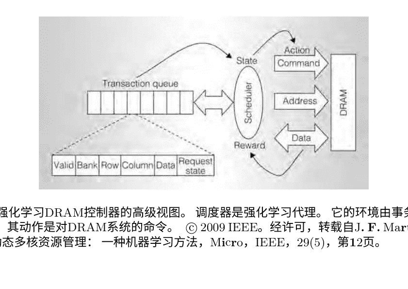

对于这个MDP来说，每个状态下可用的动作是关键。回顾一下第3章，可用动作的集合可以依赖于状态：$A_t \in A(S_t)$，其中$A_t$是时间步骤$t$的动作，$A(S_t)$是状态$S_t$中可用的动作集合。在这个应用中，DRAM系统的完整性是通过不允许违反时间或资源约束的动作来保证的。尽管Ipek等人没有明确说明，但他们通过预定义所有可能状态$S_t$的集合$A(S_t)$来有效地实现了这一点。

这些约束解释了为什么MDP有一个$NoOp$动作，以及为什么奖励信号在发出$read$或$write$命令时为0。当一个状态下只有一个合法动作时，会发出$NoOp$动作。为了最大化内存系统的利用率，控制器的任务是将系统驱动到可以选择$read$或$write$动作的状态：只有这些动作才会发送数据到外部数据总线，因此只有这些动作才会对系统的吞吐量产生贡献。尽管$precharge$和$activate$没有立即的奖励，但代理需要选择这些动作，以便以后选择有奖励的$read$和$write$动作。

调度代理使用Sarsa（第6.4节）来学习动作值函数。状态由六个整数值特征表示。为了近似动作值函数，算法使用了具有哈希的瓦片编码实现的线性函数逼近（第9.5.4节）。瓦片编码有32个瓦片，每个瓦片存储256个动作值，作为16位定点数。探索采用了ε-贪婪策略，其中ε=0.05。

状态特征包括事务队列中的读请求数量，事务队列中的写请求数量，等待打开行的事务队列中的写请求数量，以及等待打开行的事务队列中的读请求数量，这些请求是由请求处理器发出的最旧请求。（其他特征取决于DRAM与缓存内存的交互方式，这里我们省略了细节。）选择状态特征是基于Ipek等人对影响DRAM性能的因素的理解。例如，根据事务队列中的读写请求数量平衡读写服务的速率，可以避免DRAM系统与缓存内存的交互停顿。事实上，作者生成了一个相对较长的潜在特征列表，然后通过逐步特征选择的模拟来缩减列表。

这种调度问题的MDP形式的一个有趣方面是，用于定义动作值函数的瓦片编码的特征输入与用于指定动作约束集合$A(S_t)$的特征不同。而瓦片编码输入是根据事务队列的内容导出的，约束集合则依赖于与时间和资源约束相关的许多其他特征，这些特征必须由整个系统的硬件实现满足。通过这种方式，动作约束确保了学习算法的探索不会危及物理系统的完整性，同时学习有效地限制在硬件实现的更大状态空间的“安全”区域内。

由于这项工作的目标是学习控制器可以在芯片上实现，以便在计算机运行时进行在线学习，因此硬件实现细节是重要考虑因素。设计包括两个五级流水线，以在每个处理器时钟周期计算和比较两个动作值。

更新适当的行动价值。这包括访问存储在静态RAM中的瓦片编码。对于Ipek等人模拟的配置，这是一种典型的高端工作站上的4GHz 4核芯片，每个DRAM周期需要10个处理器周期。考虑到填充管道所需的周期，每个DRAM周期可以评估多达12个动作。Ipek等人发现，任何状态的合法命令数量很少超过这个数量，并且如果不总是有足够的时间来考虑所有合法命令，则性能损失可以忽略不计。这些和其他巧妙的设计细节使得在多处理器芯片上实现完整的控制器和学习算法成为可能。

Ipek等人通过将其学习控制器与其他三个控制器进行比较来在模拟中评估其性能：1) 上述提到的产生最佳平均性能的FR-FCFS控制器，2) 按顺序处理每个请求的传统控制器，3) 一个不可实现的理想控制器，称为乐观控制器，如果忽略所有时序和资源约束，但模拟DRAM延迟（作为行缓冲区命中）和带宽。他们模拟了九个内存密集型并行工作负载，包括科学和数据挖掘应用程序。图16.4显示了每个控制器在九个应用程序上的性能（相对于FR-FCFS的执行时间归一化的倒数），以及它们在应用程序上性能的几何平均值。学习控制器，在图中标记为RL，对于这九个应用程序的改进范围从7%到33%，平均改进为19%。当然，没有可实现的控制器能够与乐观控制器的性能相匹配，后者忽略所有时序和资源约束，但学习控制器的性能将与乐观控制器的上限差距缩小了27%。

因为在芯片上实现学习算法的原因是为了使调度策略能够在线适应不断变化的工作负载，Ipek等人分析了在线学习与之前学习的固定策略相比的影响。他们进行了训练

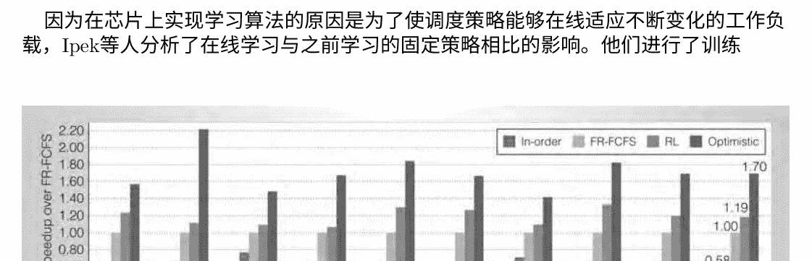

图16.4：四个控制器在9个模拟基准应用程序上的性能。这些控制器包括：最简单的“按顺序”控制器FR-FCFS，学习控制器RL，以及忽略所有时间和资源约束以提供性能上限的不可实现的乐观控制器。性能相对于FR-FCFS的归一化是执行时间的倒数。最右边是每个控制器在9个基准应用程序上性能的几何平均值。控制器RL最接近理想性能。

> © 2009 IEEE。经许可，转载自J. F. Mart´ınez和E. Ipek，动态多核资源管理：一种机器学习方法，Micro, IEEE, 29(5), 第13页。

他们使用来自九个基准应用程序的数据来更新他们的控制器，然后在模拟执行应用程序时保持结果的动作值不变。他们发现，在线学习的控制器的平均性能比使用固定策略的控制器要好8%，这使他们得出结论，在线学习是他们方法中的一个重要特性。

由于制造成本较高，这个学习内存控制器从未被应用于实际硬件。然而，Ipek等人可以通过他们的模拟结果有力地证明，通过强化学习在线学习的内存控制器有潜力提高性能，达到否则需要更复杂和更昂贵的内存系统的水平，同时减轻人工设计高效调度策略所需的负担。Mukundan和Mart´ınez (2012) 通过使用遗传算法研究具有其他动作、其他性能指标和更复杂奖励函数的学习控制器，推进了这个项目。他们考虑了与能源效率相关的其他性能指标。这些研究的结果超过了上述早期结果，并且在所有考虑的性能指标上显著超过了2012年的最新技术水平。这种方法对于开发复杂的节能DRAM接口尤其有前景。

### 16.5 人类水平的视频游戏玩法

将强化学习应用于现实世界问题的最大挑战之一是决定如何表示和存储价值函数和/或策略。除非状态集是有限的并且足够小，可以通过查找表进行详尽表示，就像我们的示例中的许多情况一样，否则必须使用参数化的函数逼近方案。无论是线性还是非线性，函数逼近都依赖于对学习系统容易访问并能传达所需信息以实现熟练表现的特征。强化学习的大多数成功应用都得益于基于人类知识和对特定问题的直觉精心设计的特征集。

Google DeepMind的研究团队开发了一个令人印象深刻的演示，展示了深层多层感知器可以自动化特征设计过程（Mnih等，2013年，2015年）。自从1986年反向传播算法作为学习内部表示的方法被广泛推广以来，多层感知器一直被用于强化学习中的函数逼近（Rumelhart, Hinton和Williams, 1986年；参见第9.6节）。将强化学习与反向传播相结合取得了令人瞩目的结果。Tesauro和同事使用TD-Gammon和Watson获得的结果是值得注意的例子。这些以及其他应用受益于多层感知器学习任务相关特征的能力。然而，在我们所知道的所有示例中，最令人印象深刻的演示都要求网络的输入以针对给定问题手工制作的专门特征表示。

这在TD-Gammon的结果中显而易见。TD-Gammon 0.0，其网络输入基本上是对背棋盘的“原始”表示，这意味着它对背棋的了解很少，学会了与最好的以前的背棋计算机程序差不多的水平。

最好的以前的背棋计算机程序。添加了专门的背棋功能，产生了TD-Gammon 1.0，它比以前所有的背棋程序都要好，并且在与人类专家的竞争中表现出色。

Mnih等人开发了一种强化学习代理程序，称为深度Q网络（DQN），它将Q学习与深度卷积神经网络（deep convolutional ANN）相结合，这是一种专门用于处理空间数据数组（如图像）的多层或深层ANN。我们在第9.6节中描述了深度卷积神经网络。在Mnih等人使用DQN进行工作时，深度神经网络，包括深度卷积神经网络，在许多应用中已经取得了令人印象深刻的结果，但在强化学习中尚未广泛使用。

Mnih等人使用DQN展示了强化学习代理如何在不使用不同问题特定特征集的情况下，在一系列不同问题上实现高水平的性能。为了证明这一点，他们让DQN通过与游戏模拟器交互来学习玩49个不同的Atari 2600视频游戏。DQN为这49个游戏学习了不同的策略（因为在每个游戏学习之前，其人工神经网络的权重被重置为随机值），但它使用相同的原始输入、网络架构和参数值（例如步长、折扣率、探索参数等）来处理所有的游戏。DQN在这些游戏中达到了或超过了人类水平的游戏水平。尽管这些游戏都是通过观看视频图像流来进行的，但它们在其他方面差异很大。它们的动作产生不同的效果，它们具有不同的状态转移动力学，并且它们需要不同的策略来学习高分。深度卷积人工神经网络学习将所有游戏共同的原始输入转化为专门用于表示DQN在大多数游戏中实现高水平游戏所需的动作值的特征。

Atari 2600是一款家用视频游戏机，由AtariInc.在1977年至1992年期间以多个版本销售。它引入或普及了许多现在被认为是经典的街机游戏，如乒乓球、打砖块、太空侵略者和小行星。尽管比现代视频游戏简单得多，但Atari 2600游戏仍然对人类玩家具有娱乐性和挑战性，并且它们一直被用作开发和评估强化学习方法的测试平台（Diuk，Cohen，Littman，2008年；Naddaf，2010年；Cobo，Zang，Isbell和Thomaz，2011年；Bellemare，Veness和Bowling，2013年）。Bellemare，Naddaf，Veness和Bowling（2012年）开发了公开可用的ArcadeLearning Environment（ALE），以鼓励和简化使用Atari 2600游戏来研究学习和规划算法。

这些先前的研究和ALE的可用性使得Atari 2600游戏集合成为Mnih等人演示的一个很好的选择，这也受到了TD-Gammon在背棋中取得的令人印象深刻的人类水平表现的影响。DQN与TD-Gammon类似，都使用多层ANN作为函数逼近的方法，采用半梯度形式的TD算法，梯度由反向传播算法计算。然而，DQN没有像TD-Gammon那样使用TD(λ)，而是使用了Q-learning的半梯度形式。TD-Gammon估计了后续状态的值，这些值可以轻松地从制定背棋移动规则中获得。

要在Atari游戏中使用相同的算法，需要为每个可能的动作生成下一个状态（在这种情况下不会是后续状态）。

可以通过使用游戏模拟器运行单步模拟来完成这个任务（ALE使这成为可能）。或者可以学习每个游戏的状态转移函数的模型，并用于预测下一个状态（Oh, Guo, Lee, Lewis和Singh, 2015）。虽然这些方法可能会产生与DQN相当的结果，但它们的实现会更加复杂，并且需要更长的学习时间。使用Q-learning的另一个动机是DQN使用了下面描述的经验回放方法，这需要一个离策略算法。Q-learning是一种无模型和离策略的选择。

在描述DQN的细节和实验如何进行之前，我们先来看看DQN能够达到的技能水平。Mnih等人将DQN的得分与当时文献中表现最好的学习系统的得分、专业人类游戏测试员的得分以及随机选择动作的代理的得分进行了比较。文献中最好的系统使用线性函数逼近，并使用一些关于Atari 2600游戏的知识设计的特征（Bellemare, Naddaf, Veness和Bowling, 2013年）。DQN通过与游戏模拟器交互学习每个游戏，总共进行了5000万帧的训练，相当于大约38天的游戏经验。在每个游戏的学习开始时，DQN的网络权重被重置为随机值。为了评估DQN学习后的技能水平，将其得分在每个游戏上进行30次会话的平均值，每次会话持续时间最长为5分钟，并以随机的初始游戏状态开始。专业人类测试员使用相同的模拟器进行游戏（关闭声音以消除任何可能对DQN产生优势的因素，因为DQN不处理音频）。经过2小时的练习，该人类测试员每个游戏玩了大约20个剧集，每个剧集最长为5分钟，在此期间不允许休息。DQN在除了6个游戏之外的所有游戏中都学会了比以前最好的强化学习系统更好地玩，并在22个游戏中超过了人类玩家。Mnih等人认为，任何得分达到或超过人类得分75%的表现都可以视为与人类水平的游戏相媲美或更好。根据这个标准，DQN在46个游戏中的29个达到或超过了人类水平的水平。有关这些结果的更详细说明，请参阅Mnih等人（2015年）的论文。

对于一个人工学习系统来达到这些水平已经很令人印象深刻了，但是这些结果的显著之处在于，这个学习系统在各种不同的游戏中都能达到这些水平，而不依赖于任何游戏特定的修改。

一个人类玩任何这49个Atari游戏时，会看到210×160像素的图像帧，每秒128种颜色。原则上，这些图像完全可以作为DQN的原始输入，但为了减少内存和处理要求，Mnih等人对每个帧进行了预处理，生成了一个84×84的亮度值数组。由于许多Atari游戏的完整状态无法完全从图像帧中观察到，Mnih等人将最近的四个帧“堆叠”在一起，使得网络的输入维度为84×84×4。这并没有消除所有游戏的部分可观察性，但对于其中许多游戏来说，这是有帮助的，使它们更具马尔可夫性。

这里的一个重要点是，这些预处理步骤对于所有46个游戏来说都是完全相同的，在这里没有涉及任何特定游戏的先验知识，只是一般理解，即在这种降维的情况下仍然有可能学习到良好的策略，并且堆叠相邻帧应该有助于解决一些游戏中的部分可观察性问题。由于在预处理图像帧时没有使用任何特定游戏的先验知识，我们可以将84×84×4个输入向量视为DQN的“原始”输入。

DQN的基本架构类似于图9.15中所示的深度卷积ANN（尽管与该网络不同，DQN中的子采样被视为每个卷积层的一部分，特征图由仅具有一部分可能感受野的单元组成）。DQN有三个隐藏的卷积层，然后是一个完全连接的隐藏层，最后是输出层。DQN的三个连续的隐藏卷积层产生32个20×20特征图，64个9×9特征图和64个7×7特征图。每个特征图单元的激活函数是一个修正线性函数（max(0, x)）。这个第三个卷积层中的3，136个（64×7×7）单元都与完全连接的隐藏层中的每个512个单元相连，然后每个单元都与输出层中的所有18个单元相连，每个单元对应一个Atari游戏中的可能动作。

DQN的输出单元的激活水平是对应状态-动作对的估计最优动作值，对于由网络输入表示的状态。输出单元分配给游戏动作的方式因游戏而异，并且由于游戏的有效动作数量在4到18之间变化，因此并非所有输出单元在所有游戏中都具有功能角色。将网络视为18个独立的网络有助于估计每个可能动作的最优动作值。实际上，这些网络共享其初始层，但输出单元以不同的方式使用这些层提取的特征。

DQN的奖励信号指示游戏得分在一个时间步长内的变化：当得分增加时为+1，当得分减少时为-1，否则为0。这标准化了游戏间的奖励信号，并使得单个步长参数适用于所有游戏，尽管它们的得分范围不同。DQN使用一个ε-greedy策略，在前一百万帧中线性递减，并在学习会话的其余时间保持在一个较低的值。其他各种参数的值，如学习步长、折扣率和其他特定于实现的参数，是通过进行非正式搜索来选择的，以找出对于一小部分游戏效果最好的值。然后，这些值对于所有游戏都保持不变。

在DQN选择一个动作后，该动作由游戏模拟器执行，返回一个奖励和下一个视频帧。该帧经过预处理并添加到四帧堆栈中，成为网络的下一个输入。暂时忽略Mnih等人对基本Q学习过程所做的更改，DQN使用以下半梯度形式的Q学习来更新网络的权重：

```
w_{t+1} = w_t + α[r_{t+1} + γ max_a \hat{q}(S_{t+1}, a, w_t) - \hat{q}(S_t, A_t, w_t)] ∇\hat{q}(S_t, A_t, w_t), (16.3)
其中 w_t是网络权重的向量， A_t是时间步骤 t选择的动作，而 S_t和 S_{t+1}分别是输入到网络的预处理图像堆栈在时间步骤 t和 t+ 1。
```

在(16.3)中的梯度是通过反向传播计算得出的。再次想象一下，

每个动作都有一个单独的网络，用于时间步骤 $t$ 的更新，只有对应于 $A_t$ 的网络应用了反向传播。Mnih等人利用了在应用于大型网络时改进基本反向传播算法的技术。他们使用了一个小批量方法，只有在累积了一小批图像（这里是32个图像）的梯度信息之后才更新权重。这产生了比通常的在每个动作之后更新权重的程序更平滑的样本梯度。他们还使用了一种称为RMSProp的梯度上升算法（Tieleman和Hinton，2012），该算法通过根据最近梯度的幅度的运行平均值调整每个权重的步长参数来加速学习。

Mnih等人以三种方式修改了基本的Q学习过程。首先，他们使用了一种叫做经验回放的方法，这是由Lin（1992）首次研究的。这种方法将代理的经验存储在回放内存中，每个时间步骤都可以访问该内存以执行权重更新。在DQN中，它的工作原理如下。游戏模拟器执行动作后在由图像堆栈 $S_t$ 表示的状态中，返回奖励 $R_{t+1}$ 和图像堆栈 $S_{t+1}$，将元组 $(S_t, A_t, R_{t+1}, S_{t+1})$ 添加到回放记忆中。这个记忆在同一游戏的多次玩耍中积累了经验。在每个时间步骤中，基于从回放记忆中均匀随机采样的经验执行多个 Q-learning 更新 - 一个小批量。与通常的 Q-learning 形式中的 $S_{t+1}$ 成为下一个更新的新 $S_t$ 不同，从回放记忆中抽取一个新的不相关的经验来为下一个更新提供数据。由于 Q-learning 是一种离策略算法，因此不需要沿着连接的轨迹应用它。

经验回放的 Q-learning 相对于通常的 Q-learning 形式提供了几个优势。能够将每个存储的经验用于多次更新使得 DQN 从经验中更高效地学习。经验回放减少了更新的方差，因为连续的更新与标准 Q-learning 不相关。通过消除连续经验对当前权重的依赖，经验回放消除了一种不稳定性的来源。

Mnih等人通过第二种方式修改了标准的Q-learning算法，以提高其稳定性。与其他引导方法类似，Q-learning更新的目标取决于当前的动作值函数估计。当使用参数化函数逼近方法来表示动作值时，目标函数与正在更新的参数相关。例如，更新公式（16.3）中的目标为与简单的监督学习情况不同，它对 $\mathbf{w}_t$ 的依赖性使得该过程变得复杂。正如第11章所讨论的，这可能导致振荡和/或发散。

为了解决这个问题，Mnih等人使用了一种技术，使得Q-learning更接近于简单的监督学习情况，同时仍然允许引导。每当权重 $\mathbf{w}$ of the action-value network 被更新了一定次数 $C$ 后，他们将网络的当前权重插入到另一个网络中，并将这些重复的权重固定在下一次 $C$ 次更新的 $\mathbf{w}$ 中。在接下来的 $C$ 次 $\mathbf{w}$ 的更新中，使用这个重复网络的输出作为Q-learning的目标。令 $\hat{q}$ 表示这个重复网络的输出，则更新规则不再是（16.3），而是：

$$\mathbf{w}_{t+1} = \mathbf{w}_t + \alpha \left[ R_{t+1} + \gamma \max_a \hat{q}(S_{t+1}, a, \mathbf{w}_t) - \hat{q}(S_t, A_t, \mathbf{w}_t) \right] \nabla \hat{q}(S_t, A_t, \mathbf{w}_t)$$

对标准Q学习的最后修改也被发现可以提高稳定性。他们剪辑了误差项 R_{t+1} + γ max_a q̂(S_{t+1}, a, w_t) - q̂(S_t, A_t, w_t)，使其保持在[-1, 1]区间内。

Mnih等人对5个游戏进行了大量的学习运行，以了解DQN的各种设计特性对其性能的影响。他们运行了DQN，并包括或不包括经验回放和重复目标网络的四种组合。尽管结果因游戏而异，但这些特性中的每一个单独都显著提高了性能，并且在一起使用时性能提升非常明显。Mnih等人还通过比较具有深度卷积ANN的DQN和只有一个线性层的版本来研究深度卷积ANN在DQN的学习能力中所起的作用，两者都接收相同的堆叠预处理视频帧。在所有5个测试游戏中，深度卷积版本相对于线性版本的改进尤为显著。

创建在各种具有挑战性任务上表现出色的人工智能代理一直是人工智能的一个持久目标。机器学习作为实现这一目标的手段的承诺，却因为需要制定问题特定的表示而受到挫折。DeepMind的DQN通过展示一个单一代理可以学习问题特定的特征，从而在一系列任务上获得与人类竞争力相当的技能，是一个重大的进步。这个演示没有产生一个在所有任务上同时表现出色的代理（因为每个任务的学习是分开进行的），但它表明深度学习可以减少甚至消除问题特定设计和调整的需求。然而，正如Mnih等人指出的那样，DQN并不是解决任务无关学习问题的完整解决方案。尽管在Atari游戏中表现出色所需的技能多种多样，但所有游戏都是通过观察视频图像来进行的，这使得深度卷积ANN成为这个任务集合的自然选择。此外，DQN在一些Atari 2600游戏上的表现远远不及人类的水平。对于DQN来说，最困难的游戏，特别是Montezuma's Revenge，DQN学会了与随机玩家表现相当，需要超出DQN设计范围的深度规划。此外，通过广泛练习学习控制技能，就像DQN学会如何玩Atari游戏一样，只是人类经常完成的学习类型之一。

尽管存在这些限制，DQN通过令人印象深刻地展示了将强化学习与现代深度学习方法相结合的潜力，推动了机器学习的最新进展。

### 16.6 掌握围棋

中国古老的围棋游戏挑战了人工智能研究者数十年。在其他游戏中取得人类水平甚至超人水平的技能的方法并没有成功地产生强大的围棋程序。多亏了一个非常活跃的围棋程序员社区和国际比赛，围棋程序的水平在多年来得到了显著提高。然而，直到最近，没有一个围棋程序能够达到人类围棋大师的水平。

DeepMind团队（Silver等，2016年）开发了名为AlphaGo的程序，打破了这个障碍。它结合了深度人工神经网络（第9.6节），监督学习，蒙特卡洛树搜索（MCTS，第8.11节）和强化学习。在Silver等人2016年的论文发表时，AlphaGo已经被证明比其他当前的围棋程序更强大，并且它以5比0击败了欧洲围棋冠军范辉。这是围棋程序在全盘围棋比赛中首次战胜职业人类围棋选手而没有让子的胜利。随后不久，AlphaGo的一个类似版本在挑战赛中以4比5的成绩惊人地战胜了18次世界冠军李世石，成为全球头条新闻。人工智能研究者认为，在一个程序达到这个水平之前，可能还需要很多年，甚至几十年的时间。

在这里，我们描述了AlphaGo和一个后继程序叫做AlphaGo Zero（Silver等人，2017a）。除了强化学习之外，AlphaGo还依赖于从大量专家人类移动的数据库中进行监督学习，而AlphaGo Zero仅使用强化学习，没有人类数据或指导，仅仅依靠游戏的基本规则（因此在其名称中有“Zero”一词）。我们首先详细描述了AlphaGo，以突出AlphaGo Zero的相对简单性，后者在性能上更高且更纯粹的强化学习程序。

在许多方面，AlphaGo和AlphaGo Zero都是Tesauro的TD-Gammon（第16.1节）的后代，后者本身是Samuel的跳棋选手（第16.2节）的后代。所有这些程序都包括对自我对弈模拟游戏的强化学习。AlphaGo和AlphaGo Zero还建立在DeepMind在使用深度卷积神经网络（第16.5节）近似最优值函数方面在玩Atari游戏方面取得的进展基础上。

围棋是一种由两名玩家交替在未占用的交叉点上放置黑白“棋子”来产生位置的游戏，棋盘上有19条水平线和19条垂直线的网格，产生如右图所示的位置。

游戏的目标是占领比对手更大的区域。棋子根据简单的规则被吃掉。如果一个玩家的棋子完全被对手的棋子包围，即水平或垂直相邻的点都被占据，那么这些棋子就被吃掉了。例如，图16.5左侧显示了三个白棋和一个未占用的相邻点（标记为X）。如果黑棋在X点上放置一颗棋子，那么这三个白棋就会被吃掉，从棋盘上移走（图16.5中间）。然而，如果白棋先在X点上放置一颗棋子，那么这种吃子的可能性就被阻止了（图16.5右侧）。其他规则需要防止无限吃子/反吃子的循环。当两名玩家都不想再放置棋子时，游戏结束。这些规则很简单，但它们产生了一个非常复杂的游戏，广受欢迎。

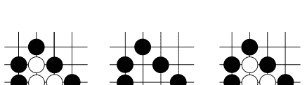

图16.5: 围棋的捕获规则。左边：三个白子没有被包围，因为点X未被占用。中间：如果黑方在X上放置一颗棋子，那么三颗白棋将被捕获并从棋盘上移除。右边：如果白方先在点X上放置一颗棋子，捕获将被阻止。

数千年来，对于其他游戏，如国际象棋，能够产生强大的对局的方法并不适用于围棋。围棋的搜索空间比国际象棋大得多，因为围棋每个位置的合法移动数量比国际象棋多（≈250对≈35），而且围棋比赛往往比国际象棋比赛涉及更多的步数（≈150对≈80）。但是搜索空间的大小并不是使围棋如此困难的主要因素。对于国际象棋和围棋来说，穷举搜索都是不可行的，而且在较小的棋盘上进行围棋（例如9 × 9）也被证明是极其困难的。专家们一致认为，创建超过业余水平的围棋程序的主要障碍是定义一个合适的局面评估函数的困难。一个好的评估函数可以通过提供相对容易计算的更深层搜索可能产生的预测来截断搜索的深度。根据Müller（2002）的说法：“对于围棋，不会找到一个简单而合理的评估函数。”MCTS的引入是围棋程序的一个重要进步。在AlphaGo开发时期，最强大的程序都包含了MCTS，但是达到大师级水平仍然是困难的。

回想一下第8.11节，MCTS是一个决策时间规划过程，不尝试学习和存储全局评估函数。像一个展开算法（第8.10节），它运行许多蒙特卡洛模拟整个剧集（这里是整个围棋游戏）来选择每个动作（这里是每个围棋着法：在哪里放置一颗棋子或者认输）。然而，与简单的展开算法不同，MCTS是一个迭代的过程，逐步扩展一个搜索树，其根节点表示当前环境状态。如图8.10所示，每次迭代通过模拟受树边缘统计指导的动作来遍历树。在其基本版本中，当模拟到达搜索树的叶节点时，MCTS通过将叶节点的一些或全部子节点添加到树中来扩展树。从叶节点或其新添加的子节点中，执行一个展开：一次模拟，通常一直进行到终止状态，动作由展开策略选择。当展开完成时，通过备份展开产生的回报来更新在此迭代中遍历的搜索树边缘的统计信息。MCTS在当前状态下每次从搜索树的根节点开始，根据时间限制进行尽可能多的迭代。然后，最后，根据根节点的出边上累积的统计信息选择一个动作（仍然表示当前环境状态）。这是代理采取的动作。环境转换到下一个状态后，再次执行MCTS，根节点设置为表示新的当前状态。这个开始时的搜索树在下一次执行可能只是这个新的根节点，或者可能包括来自MCTS先前执行的这个节点的后代。树的其余部分被丢弃。

### 16.6.1 AlphaGo

使AlphaGo成为强大选手的主要创新是它通过一种由深度卷积神经网络提供的函数逼近进行强化学习学习的策略和价值函数来选择移动。另一个关键特点是，它不是从随机网络权重开始进行强化学习，而是从之前通过大量人类专家移动进行监督学习的结果权重开始。

DeepMind团队称AlphaGo对基本MCTS的修改为“异步策略和价值MCTS”，或APV-MCTS。它通过基本MCTS选择动作，如上所述，但在扩展搜索树和评估动作边缘的方式上有一些变化。与基本MCTS相比，基于AlphaGo实现的APV-MCTS通过选择一个由13层深度卷积神经网络提供的概率来选择边缘来扩展其当前搜索树，该网络被称为SL策略网络，之前通过监督学习训练以预测包含在近3000万人类专家移动数据库中的移动。

然后，与基本的MCTS相比，APV-MCTS评估新添加的状态节点的方式不同。基本的MCTS仅通过从该节点开始的模拟游戏的结果来评估节点，而APV-MCTS则通过两种方式评估节点：一种是通过模拟游戏的结果，另一种是通过之前通过强化学习方法学习得到的值函数v_θ来评估节点。如果s是新添加的节点，则其值变为

    v(s) = (1 - η)v_θ(s) + ηG,  (16.4)

其中G是模拟游戏的结果，η控制着这两种评估方法得到的值的混合。在AlphaGo中，这些值由价值网络提供，价值网络是另一个13层深的卷积神经网络，通过我们下面描述的方式进行训练，输出棋盘位置的估计值。APV-MCTS在AlphaGo中的模拟游戏是使用一个简单的线性网络提供的快速模拟策略进行的，该网络也是通过监督学习在游戏之前进行训练的。在执行过程中，APV-MCTS跟踪了搜索树中每条边经过的模拟次数，并在执行完成后，选择从根节点开始经过最多次数的边作为要采取的动作，即AlphaGo在游戏中实际采取的移动。

价值网络与深度卷积SL策略网络具有相同的结构，唯一的区别是它有一个单一的输出单元，用于给出游戏位置的估计值，而不是SL策略网络对合法动作的概率分布。理想情况下，价值网络应该输出最优状态值，并且可以沿着TD-Gammon所描述的方式近似最优值函数：自我对弈与非线性TD(λ)结合深度卷积ANN。但DeepMind团队采取了一种不同的方法，对于像围棋这样复杂的更有希望。他们将训练价值网络的过程分为两个阶段。在第一阶段，他们通过使用强化学习训练一个RL策略网络来创建尽可能好的策略。这是一个具有与SL策略网络相同结构的深度卷积ANN。它使用通过监督学习获得的SL策略网络的最终权重进行初始化，然后使用策略梯度强化学习来改进SL策略。在训练价值网络的第二阶段中，团队使用蒙特卡洛策略评估从大量模拟自我对弈游戏中获得的数据，移动由RL策略网络选择。

图16.6展示了 AlphaGo使用的网络以及训练它们的步骤，DeepMind团队称之为“AlphaGo流水线”。 所有这些网络都是在任何实际对局之前进行训练的，并且它们的权重在实际对局中保持不变。

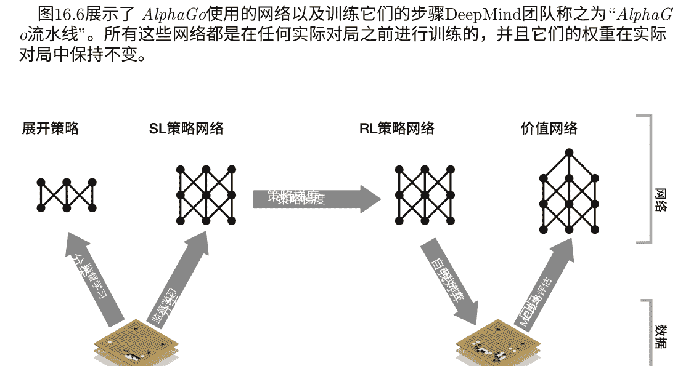

图16.6：AlphaGo流程。经许可改编自Macmillan Publishers Ltd: Nature, vol. 529(7587), p. 485, ©2016.

这里有关于 AlphaGo的人工神经网络和它们的训练的更多细节。 结构相同的SL和RL策略网络类似于DQN在第16.5节中描述的用于玩Atari游戏的深度卷积网络，只是它们有13个卷积层，最后一层由19 × 19的围棋棋盘上每个点的softmax单元组成。 网络的输入是一个19 × 19 ×48的图像堆栈，其中围棋棋盘上的每个点由48个二进制或整数值特征的值表示。例如，对于每个点，一个特征表示该点是否被AlphaGo的棋子占据，对手的棋子占据，或者未被占据，从而提供了棋盘配置的“原始”表示。 其他特征基于围棋的规则，例如相邻的空点数量，放置棋子后可以捕获的对手棋子数量，自放置棋子以来的回合数，以及设计团队认为重要的其他特征。

使用50个处理器上的随机梯度上升的分布式实现，训练SL策略网络大约需要3周的时间。 该网络达到了57%的准确率，而当时其他团队的最佳准确率为44.4%。通过策略梯度强化学习，在RL策略网络的当前策略和使用先前迭代学习算法生成的策略中随机选择的对手之间进行模拟游戏来训练RL策略网络。与随机选择的对手集合对战可以防止过拟合到当前策略。如果当前策略获胜，则奖励信号为+1，如果输了，则为-1，否则为0。这些游戏直接将两个策略相互对抗，而不涉及MCTS。通过在50个处理器上并行模拟多场游戏，DeepMind团队在一天内训练了RL策略网络上的一百万场游戏。在测试最终的RL策略时，他们发现它在与SL策略对战的游戏中获胜率超过80%，在与使用MCTS模拟每步100,000场游戏的围棋程序对战的游戏中获胜率达到85%。

价值网络的结构与SL和RL策略网络相似，只是多了一个输出单元，接收与SL和RL策略网络相同的输入，除了额外的二进制特征给出当前要下的颜色。蒙特卡洛策略评估被用来训练网络，数据来自大量使用RL策略进行自我对弈的游戏。为了避免自我对弈中遇到的位置之间的强相关性导致过拟合和不稳定性，DeepMind团队构建了一个数据集，其中包含3000万个位置，每个位置都是从一个独特的自我对弈游戏中随机选择的。然后使用这个数据集中的32个位置的5000万个小批次进行训练。训练过程在50个GPU上进行，耗时一周。

在游戏开始之前，通过对800万个人类走法进行监督学习，使用一个简单的线性网络来学习rollout策略。rollout策略网络需要快速输出动作，同时保持合理的准确性。原则上，SL或RL策略网络可以用于rollouts，但是这些深度网络的前向传播时间太长，无法在实时对局中用于rollout模拟，而每次决策都需要进行大量的模拟。因此，rollout策略网络比其他策略网络更简单，并且其输入特征的计算速度比策略网络更快。rollout策略网络允许AlphaGo的每个处理线程每秒运行大约1000次完整的游戏模拟。

有人可能会想为什么在APV-MCTS的扩展阶段中使用SL策略而不是更好的RL策略来选择动作。这些策略计算时间相同，因为它们使用相同的网络架构。实际上，团队发现当APV-MCTS使用SL策略而不是RL策略时，AlphaGo在与人类对手对战时表现更好。他们推测这是因为后者被调整为对最佳移动作出反应，而不是对人类游戏中更广泛的移动集作出反应。有趣的是，APV-MCTS使用的值函数情况则相反。他们发现当APV-MCTS使用从RL策略派生的值函数时，它的表现比使用从SL策略派生的值函数要好。

多种方法共同作用，使AlphaGo具有令人印象深刻的下棋技巧。DeepMind团队评估了不同版本的AlphaGo，以评估其贡献。由这些不同的组件制成。参数η在（16.4）中控制了由值网络和rollouts产生的游戏状态评估的混合。当η=0时，AlphaGo只使用值网络而没有rollouts，当η=1时，评估仅依赖于rollouts。他们发现，仅使用值网络的AlphaGo比仅使用rollouts的AlphaGo表现更好，实际上比当时存在的所有其他围棋程序都表现更好。最佳策略是将η设置为0.5，这表明将值网络与rollouts相结合对AlphaGo的成功尤为重要。这些评估方法相互补充：值网络评估了高性能的强化学习策略，但速度太慢无法在实时对局中使用，而使用较弱但速度更快的rollout策略的rollouts能够为特定状态的值网络评估增加精度。

总的来说，AlphaGo的卓越成功引发了对人工智能的新一轮热情，特别是对将强化学习与深度神经网络相结合来解决其他具有挑战性的领域问题的系统的期望。

### 16.6.2 AlphaGo Zero

在借鉴AlphaGo的经验的基础上，DeepMind团队开发了AlphaGo Zero（Silver等人，2017a）。与AlphaGo不同，这个程序在游戏的基本规则之外没有使用任何人类数据或指导（因此在其名称中有“Zero”一词）。它完全通过自我对弈强化学习进行学习，输入只提供了围棋棋盘上棋子位置的“原始”描述。AlphaGo Zero实现了一种策略迭代（第4.3节）的形式，将策略评估与策略改进交替进行。

图16.7是AlphaGo Zero算法的概述。AlphaGo Zero与AlphaGo之间的一个重要区别是，在自我对弈强化学习过程中，AlphaGo Zero使用MCTS来选择移动，而AlphaGo在学习之后才使用MCTS进行实时对局。除了不使用任何人类数据或人工制作的特征之外，AlphaGo Zero只使用了一个深度卷积神经网络，并使用了一个更简单的MCTS版本。

AlphaGo Zero的MCTS比AlphaGo使用的版本更简单，因为它不包括完整游戏的模拟，因此不需要模拟策略。AlphaGo Zero的每次MCTS迭代都在当前搜索树的叶节点处结束模拟，而不是在完整游戏模拟的终局位置处。但是和AlphaGo一样，AlphaGo Zero的每次MCTS迭代都受到深度卷积网络的输出的引导，图16.7中标记为f_θ的是网络的权重向量。网络的输入是棋盘位置的原始表示，其架构我们在下面描述，其输出有两部分：一个标量值v，估计当前玩家从当前棋盘位置获胜的概率，以及一个向量p，包含当前棋盘上每个可能的棋子放置位置的移动概率，还有一种是放弃或认输的移动。

然而，AlphaGo Zero不是根据概率选择自我对弈动作p，而是使用这些概率与网络的值输出一起，指导每次MCTS的执行。MCTS返回新的移动概率，如图16.7所示，作为策略π_i。这些策略受益于MCTS进行的许多模拟每次执行时。结果是，AlphaGo Zero实际上遵循的策略比网络输出的策略改进了。Silver等人 (2017a) 写道，“MCTS可以被视为一个强大的policy improvement operator。”

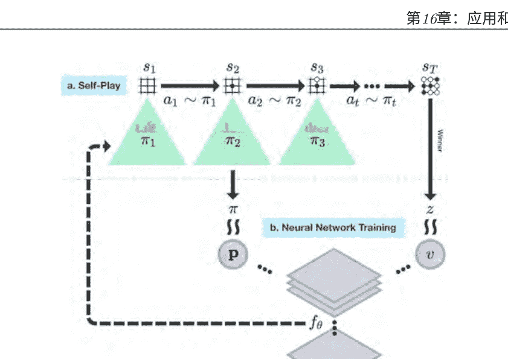

图16.7: AlphaGo Zero自我对弈强化学习。a) 程序自我对弈了许多次，这里展示了一次棋盘位置的序列 s_i，i=1, 2, …, T，其中移动 a_i，i=1, 2, …, T，以及获胜者 z。每个移动 a_i 是由从根节点 s_i 执行的MCTS返回的动作概率 π_i 决定的，该MCTS由一个深度卷积网络引导，这里标记为 f_θ，具有最新的权重 θ。这里只展示了一个位置 s，但对于所有的 s_i，网络的输入是棋盘位置 s_i 的原始表示（连同几个过去的位置，这里没有展示），其输出是移动概率的向量 p，这些向量指导了MCTS的前向搜索，并且是估计的每个位置 s_i 的当前玩家获胜的概率的标量值 v。 b) 深度卷积网络训练。训练示例是从最近的自我对弈游戏中随机抽取的步骤。权重 θ 被更新，以使策略向量 p 向MCTS返回的概率 π 靠近，并包括获胜者 z 在估计的胜率 v 中。根据Silver等人 (2017a) 的草稿再版，获得作者和DeepMind的许可。

这里有关于AlphaGo Zero的ANN以及它是如何训练的更多细节。网络以一个 19 × 19 × 17 的图像堆栈作为输入，其中包含17个二进制特征平面。前8个特征平面是当前玩家棋子在当前和过去七个棋盘配置中的原始表示：如果玩家的棋子在相应的位置上，则特征值为1，否则为0。接下来的8个特征平面类似地编码了对手的棋子位置。最后一个输入特征平面具有一个常数值，表示当前棋局的颜色：黑色为1；白色为0。由于在围棋中不允许重复，并且一个玩家会因为没有得到第一步而获得一些“补偿点数”，所以当前棋盘位置不是围棋的马尔可夫状态。

这就是为什么需要描述过去棋盘位置和颜色特征的原因。
该网络是“双头”的，意味着在一些初始层之后，网络分成两个独立的“头”，分别进入两个输出单元集合的额外层。在这种情况下，一个头部分送362个输出单元，产生$19^2+1$个移动概率$p$，每个可能的棋子放置加上放弃一次；另一个头部只馈送一个输出单元，产生标量$v$，即当前玩家从当前棋盘位置获胜的概率估计。在分裂之前，网络由41个卷积层组成，每个卷积层后面跟着批量归一化，并通过层对层的跳跃连接实现残差学习（参见第9.6节）。总体而言，移动概率和值分别由43层和44层计算。

从随机权重开始，网络通过随机梯度下降（随着训练的进行，动量、正则化和步长参数逐渐减小）使用最近500,000场自我对弈中的所有步骤均匀随机采样的示例批次进行训练。为了鼓励对所有可能移动的探索，网络的输出$p$添加了额外的噪音。在训练期间的定期检查点上，Silver等人（2017a）选择每1,000个训练步骤进行一次评估，使用最新权重的ANN的策略通过模拟400场比赛（使用MCTS选择每个移动的1,600次迭代）与当前最佳策略对抗。如果新策略获胜（通过设置边际来减少结果中的噪音），则它将成为后续自我对弈中使用的最佳策略。更新网络的权重，使网络的策略输出$p$更接近于MCTS返回的策略，并使其值输出$v$更接近于当前最佳策略从网络输入所表示的棋盘位置获胜的概率。

DeepMind团队通过自我对弈训练了$AlphaGo\ Zero$超过490万局游戏，这个过程大约花费了3天。每个游戏的每一步都是通过运行MCTS算法选择的，每步大约需要0.4秒的时间。网络权重在700,000个批次中进行更新，每个批次包含2,048个棋盘配置。然后，他们让训练过的$AlphaGo\ Zero$与击败Fan Hui 5局对0的$AlphaGo$版本以及击败李世石4局对1的$AlphaGo$版本进行比赛。

他们使用Elo评分系统来评估程序的相对性能。两个Elo评分之间的差异用于预测选手之间的比赛结果。$AlphaGo\ Zero$、与Fan Hui对战的$AlphaGo$版本以及与李世石对战的$AlphaGo$版本的Elo评分分别为4,308、3,144和3,739。这些Elo评分之间的差距意味着$AlphaGo\ Zero$几乎以接近1的概率击败这些其他程序。在与完全相同条件下与击败李世石的$AlphaGo$版本进行的100局比赛中，$AlphaGo\ Zero$以100比0完胜$AlphaGo$。

DeepMind团队还将$AlphaGo\ Zero$与使用具有相同架构但通过监督学习训练以预测人类棋局的数据集中包含近3000万个位置的程序进行了比较。他们发现，监督学习的玩家最初比$AlphaGo\ Zero$表现更好，并且在预测人类专家的走法方面更擅长，但在$AlphaGo\ Zero$训练一天后，表现不如$AlphaGo\ Zero$。这表明AlphaGo Zero发现了一种与人类玩法不同的策略。事实上，AlphaGo Zero发现并且更喜欢一些经典走法序列的新变体。AlphaGo Zero的最终测试是使用一个具有更大的人工神经网络并在2900万次自我对弈游戏中进行训练的版本进行的，这大约需要40天的时间，再次从随机权重开始。这个版本的Elo评分达到了5185。团队将这个版本的AlphaGo Zero与一个名为AlphaGo Master的程序进行了比拼，该程序是当时最强大的程序，与AlphaGo Zero相同，但像AlphaGo一样使用人类数据和特征。AlphaGo Master的Elo评分为4858，在在线游戏中以60比0击败了最强的人类职业选手。在一场100局的比赛中，具有更大网络和更广泛学习的AlphaGo Zero以89比11击败了AlphaGo Master，从而提供了AlphaGo Zero算法解决问题能力的令人信服的证明。

AlphaGo Zero充分证明了纯强化学习结合简化版MCTS和深度ANNs可以实现超人类的表现，对领域知识的需求非常小，不依赖于人类数据或指导。我们肯定会看到受DeepMind的AlphaGo和AlphaGo Zero成就启发的系统应用于其他领域的挑战性问题。

最近，Silver等人（2017b）描述了一个更好的程序AlphaZero，它甚至不需要Go的知识。AlphaZero是一个通用的强化学习算法，在围棋、国际象棋和将棋等多种游戏中超越了世界上迄今为止最好的程序。

### 16.7 个性化网络服务

个性化网络服务，如新闻文章或广告的投递，是增加用户对网站满意度或提高营销活动收益的一种方法。根据用户在线活动历史推断出用户的兴趣和偏好，一个策略可以推荐被认为最适合每个特定用户的内容。这是机器学习的一个自然领域，尤其是强化学习。通过根据用户反馈进行调整，强化学习系统可以改进推荐策略。获得用户反馈的一种方式是通过网站满意度调查，但为了实时获取反馈，通常会监控用户点击作为对链接的兴趣指标。

一种在营销中长期使用的方法叫做A/B测试，这是一种简单的强化学习类型，用于决定用户更喜欢网站的两个版本A还是B。因为它是非关联的，就像一个两臂赌博机问题，这种方法不会个性化内容传递。添加描述个体用户和要传递的内容的特征上下文，可以实现个性化服务。这已经被形式化为一个上下文赌博机问题（或关联强化学习问题，第2.9节），其目标是最大化用户点击总数。Li, Chu, Langford和Schapire (2010) 将上下文赌博机算法应用于个性化雅虎首页今日网页（他们研究时互联网上访问量最高的页面之一）的问题，通过选择要特色的新闻故事。他们的目标是最大化点击率（CTR），即用户在网页上进行的总点击次数与访问该页面的总次数的比率。他们的上下文赌博机算法比标准的非关联赌博机算法提高了12.5%。Theocharous, Thomas和Ghavamzadeh（2015）认为，通过将个性化推荐制定为马尔可夫决策问题（MDP），可以获得更好的结果，其目标是在用户重复访问网站时最大化用户的总点击次数。从上下文赌博机制定的策略在某种程度上是贪婪的，因为它们不考虑行动的长期影响。这些策略有效地将每次访问网站视为由网站访问者人群中均匀抽样的新访问者进行的。通过不使用许多用户重复访问相同网站的事实，贪婪策略没有利用与个体用户的长期互动提供的可能性。

作为一个营销策略如何利用长期用户互动的例子，Theocharous等人对比了贪婪策略和长期策略在展示购买产品（比如汽车）广告时的效果。贪婪策略展示的广告可能会在用户立即购买汽车时提供折扣。用户要么接受这个优惠，要么离开网站，如果他们再次访问网站，很可能会看到相同的优惠。另一方面，长期策略可以在向用户呈现最终交易之前将用户引导到“销售渠道”中。它可以从描述有利的融资条件开始，然后赞扬出色的服务部门，然后在下次访问时提供最终折扣。这种策略可以导致用户在多次访问网站时点击更多，并且如果策略设计得合理，还可以增加最终的销售量。

在Adobe Systems Incorporated工作，Theocharous等人进行了实验，以查看长期最大化点击的策略是否能够改善短期贪婪策略。Adobe Marketing Cloud是许多公司用于运行数字营销活动的一套工具，为自动化用户定向广告和筹款活动提供基础设施。实际使用这些工具部署新策略存在重大风险，因为新策略可能表现不佳。因此，研究团队需要评估如果实际部署某个策略，其性能将如何，但是要根据执行其他策略时收集的数据进行评估。因此，这项研究的一个关键方面是离线策略评估。此外，团队希望以高置信度进行评估，以降低部署新策略的风险。尽管高置信度的离线策略评估是这项研究的核心组成部分（另请参阅Thomas, 2015; Thomas, Theocharous和Ghavamzadeh, 2015），但在这里我们仅关注算法及其结果。Theocharous等人比较了两种学习广告推荐策略的算法的结果。第一种算法被称为贪婪优化，其目标是最大化即时点击的概率。与标准的上下文强化学习问题一样，该算法不考虑推荐的长期影响。另一种基于MDP（马尔可夫决策过程）形式的强化学习算法旨在改善用户在多次访问网站时的点击次数。他们将后一种算法称为生命周期价值（LTV）优化。这两种算法都面临着挑战，因为在这个领域中奖励信号非常稀疏，因为用户通常不会点击广告，而用户的点击行为非常随机，回报具有高方差。

银行业的数据集被用于训练和测试这些算法。数据集包含了许多客户与银行网站的完整互动轨迹，显示了每个客户从一系列可能的优惠中选择了哪一个。如果客户点击了，奖励为1，否则为0。一个数据集包含了大约20万个银行活动月份的互动，随机提供了7个优惠中的一个。另一个数据集来自另一家银行的活动，涉及了400万个互动，涉及了12个可能的优惠。所有互动都包括客户特征，如客户上次访问网站的时间、他们到目前为止的访问次数、客户上次点击的时间、地理位置、一系列兴趣和提供人口统计信息的特征。贪婪优化基于一个映射，估计点击的概率作为用户特征的函数。该映射是通过从数据集中的一个使用随机森林（RF）算法（Breiman，2001）进行监督学习来学习的。RF算法在工业界的大规模应用中被广泛使用，因为它们具有有效的预测工具往往不容易过拟合，并且对异常值和噪声相对不敏感。然后，Theocharous等人使用这个映射来定义一个 ε贪婪策略，以概率1-ε选择RF算法预测的具有最高点击概率的选项，否则均匀随机选择其他选项。

LTV优化使用了一种批处理模式的强化学习算法，称为拟合Q迭代（FQI）。这是拟合值迭代（Gordon, 1999）的一种变体，适应了Q学习。批处理模式意味着从开始时就可以使用整个数据集进行学习，而不是我们在本书中关注的在线模式中顺序获取数据的算法。当在线学习不可行时，批处理模式的强化学习算法有时是必要的，并且它们可以使用任何批处理模式的监督学习回归算法，包括已知适用于高维空间的算法。FQI的收敛性取决于函数逼近算法的性质（Gordon, 1999）。对于他们在LTV优化中的应用，Theocharous等人使用了与贪婪优化方法相同的RF算法。因为在这种情况下，FQI的收敛性不是单调的，Theocharous等人通过离策略评估使用验证训练集来跟踪最佳的FQI策略。用于测试LTV方法的最终策略是基于FQI产生的最佳策略的 ε贪婪策略，初始动作值函数设置为贪婪优化方法产生的映射。

为了衡量贪婪和LTV方法产生的策略的性能，Theocharous等人使用了CTR指标和他们称之为LTV指标的度量。这些度量指标相似，只是LTV指标在个体网站访问者之间有重要区别：

$$CTR = \frac{总点击次数}{总访问次数}$$

$$LTV = \frac{总点击次数}{总访客人数}$$

图16.8说明了这些度量指标的不同之处。每个圆圈代表用户访问网站的次数；黑色圆圈表示用户点击的访问。每一行代表特定用户的访问。由于不区分访客，这些序列的CTR为0.35，而LTV为1.5。因为LTV比CTR大，表示个体用户重新访问网站的程度，它是衡量策略在鼓励用户与网站进行长时间互动方面的成功指标。

使用高置信度的离策略评估方法，在由随机策略提供的真实世界与银行网站的交互数据集上测试贪婪和LTV方法产生的策略。结果如预期，贪婪优化在CTR指标上表现最佳，而LTV优化在LTV指标上表现最佳。此外，尽管我们省略了其细节，但高置信度的离策略评估方法提供了概率保证，即LTV优化方法有很高的概率产生比当前部署的策略更好的策略。在这些概率保证的支持下，Adobe在2016年宣布新的LTV算法将成为Adobe营销云的标准组件，以便零售商可以根据可能产生更高回报的策略发放一系列优惠。

### 16.8 热气流上升

鸟类和滑翔机利用上升气流（热气流）来获得高度，以便在消耗很少或没有能量的情况下保持飞行。这种行为被称为热气流滑翔，是一种复杂的技能，需要对微妙的环境提示做出反应，以尽可能长时间地利用上升的气柱来增加高度。Reddy、Celani、Sejnowski和Vergassola（2016）使用强化学习来研究在通常伴随着上升气流的强大大气湍流中有效的热气流滑翔策略。他们的主要目标是揭示鸟类感知环境提示并如何利用它们来实现令人印象深刻的热气流滑翔性能，但结果也对自主滑翔机相关的技术有所贡献。

强化学习之前已经应用于有效导航问题（Woodbury、Dunn和Valasek，2014），但尚未应用于在上升气流湍流中滑翔的更具挑战性的问题。Reddy等人将滑翔问题建模为一个带有折扣的连续MDP。代理与一个详细的滑翔机模型在湍流空气中进行交互。他们致力于使模型生成真实的热气流滑翔条件，并尝试了几种不同的大气模型方法。

在学习实验中，一个边长为一公里的三维空间盒子中的空气流动被建模为基于物理的偏微分方程组，涉及空气速度、温度和压力。在数值模拟中引入小的随机扰动使模型产生类似热上升气流和相应的湍流现象（图16.9左）。滑翔飞行通过涉及速度、升力、阻力和其他影响固定翼飞行的因素的空气动力学方程进行建模。操纵滑翔机涉及改变其攻角（滑翔机机翼与空气流方向之间的夹角）和倾斜角（图16.9右）。

图16.9：热力滑翔模型：左侧：模拟空气立方体的垂直速度场的快照：红色（蓝色）表示大量向上（向下）流动的区域。右侧：无动力飞行示意图显示倾斜角度μ和攻角α。经许可改编自PNAS vol. 113(22), p. E4879, 2016, Reddy, Celani, Sejnowski, and Vergassola, 在湍流环境中学会翱翔。

代理和环境之间的接口需要定义代理的行为、代理从环境中接收的状态信息以及奖励信号。通过尝试各种可能性，Reddy等人决定他们的目的只需要三个动作分别用于攻角和倾斜角度：将当前倾斜角度和攻角分别增加或减少5°和2.5°，或者保持不变。这导致了3²种可能的动作。倾斜角度被限制在-15°和+15°之间。

因为他们的研究目标是尝试确定对于有效的滑翔所需的最小感知信号集，既可以揭示鸟类用于滑翔的信号，又可以减少自动滑翔所需的感知复杂性，作者尝试了各种信号集作为强化学习代理的输入。他们首先使用状态聚合（第9.3节）对四维状态空间进行聚合，其中维度给出局部垂直风速、局部垂直风加速度、取决于左右翼尖处垂直风速差异的扭矩和局部温度。每个维度被离散化为三个区间：正高、负高和小。下面描述的结果表明，这些维度中只有两个对于有效的滑翔行为至关重要。

热滑翔的总体目标是从每个上升的气柱中获得尽可能多的高度。Reddy等人尝试了一种简单的奖励信号，根据每个回合结束时获得的高度奖励代理，如果滑翔机触地则获得一个大的负奖励信号，否则为零。他们发现，对于实际持续时间的回合，这种奖励信号的学习效果不佳，并且资格追踪也没有帮助。通过尝试各种奖励信号，他们发现在每个时间步上，线性组合前一时间步观察到的垂直风速和垂直风加速度的奖励信号效果最好。

学习是通过一步Sarsa进行的，根据归一化的动作值选择动作的软最大分布。具体来说，动作概率是根据（13.2）计算的，其中包括动作偏好：

$$h(s, a, \boldsymbol{\theta}) = \frac{\hat{q}(s, a, \boldsymbol{\theta}) - \min_b \hat{q}(s, b, \boldsymbol{\theta})}{\tau (\max_b \hat{q}(s, b, \boldsymbol{\theta}) - \min_b \hat{q}(s, b, \boldsymbol{\theta}))},$$

其中 $\boldsymbol{\theta}$ 是一个参数向量，每个动作和聚合状态组都有一个分量，并且 $\hat{q}(s, a, \boldsymbol{\theta})$ 仅返回与 $s, a$ 对应的分量，这是状态聚合方法的常规方式。上述方程将近似动作值归一化到区间 $[0,1]$，然后除以 $\tau$，一个正的“温度参数”。随着 $\tau$ 的增加，选择动作的概率不再依赖于其偏好；随着 $\tau$ 接近零，选择最高偏好动作的概率接近1，使策略接近贪婪策略。温度参数 $\tau$ 初始化为2.0，并在学习过程中逐渐减小到0.2。动作偏好是根据当前动作值的估计计算的：具有最大估计动作值的动作被赋予偏好 $1/\tau$，具有最小估计动作值的动作被赋予偏好0，其他动作的偏好在这些极端值之间进行缩放。

步长和折扣率参数分别固定为0.1和0.98。

每个学习周期都在由独立生成的模拟湍流气流期间，由代理控制模拟飞行进行。每个周期持续2.5分钟，模拟时间步长为1秒。学习有效地在几百个周期后收敛。图16.10的左侧面板显示了学习之前的样本轨迹，代理随机选择动作。从显示的体积顶部开始，滑翔机的轨迹沿箭头指示的方向，并迅速失去高度。图16.10的右侧面板是学习之后的轨迹。滑翔机从相同的位置开始（此处显示在体积底部），通过螺旋上升获得高度。

图16.10：样本热气流滑翔轨迹，箭头显示从相同起点开始的飞行方向（注意高度比例已经移动）。左侧：学习之前：代理随机选择动作，滑翔机下降。右侧：学习之后：滑翔机通过螺旋轨迹上升获得高度。经许可改编自PNAS vol. 113(22), p. E4879, 2016, Reddy, Celani, Sejnowski, and Vergassola, Learning to Soar in Turbulent Environments. 在上升的气流柱中。尽管Reddy等人发现性能在不同的模拟气流周期中变化很大，但滑翔机接触地面的次数随着学习的进行一直减少到几乎为零。

在尝试了不同的特征集之后，发现仅垂直风加速度和扭矩的组合效果最好。作者们推测，由于这些特征提供了关于垂直风速梯度的信息，可以在两个不同的方向上选择转弯或保持原路线。这使得滑翔机能够保持在上升的气流柱中。垂直风速指示热量的强度，但对于保持在气流中并没有帮助。他们发现对温度的敏感性几乎没有帮助。他们还发现控制攻角对于保持在特定的热量中并没有帮助，而在覆盖较大距离时，如越野滑翔和鸟类迁徙中，对于在热量之间的移动非常有用。

由于在不同水平的湍流中飞行需要不同的策略，训练是在从弱到强的湍流条件下进行的。在强湍流中，快速变化的风速和滑翔机速度给控制器反应的时间较少。这减少了相对于弱波动时的操纵能力。Reddy等人研究了Sarsa在这些不同条件下学到的策略。在所有情况下学到的策略都具有以下特点：当感知到负风加速度时，向具有更高升力的机翼方向急转弯；当感知到较大的正风加速度且没有扭矩时，不采取任何行动。然而，不同水平的湍流导致了策略的差异。

在强湍流中学到的策略更加保守，更倾向于小的转弯角度，而在弱湍流中，最佳行动是通过急转弯尽可能多地转向。对在不同条件下学到的策略所偏好的转弯角度进行系统研究，作者建议通过检测垂直风加速度何时越过一定阈值，控制器可以调整其策略以应对不同的湍流情况。

Reddy等人还进行了实验，研究了折扣率参数对学习策略性能的影响。他们发现，在一个回合中获得的高度随着 γ的增加而增加，当 γ = .99时达到最大值，这表明有效的热力滑翔需要考虑控制决策的长期影响。

这个关于热力滑翔的计算研究说明了强化学习如何进一步实现不同目标。学习策略可以访问不同的环境提示和控制动作集，这有助于设计自主滑翔器的工程目标和改进对鸟类滑翔技能的理解的科学目标。在这两种情况下，通过对真实滑翔器进行仪器化和将预测与观察到的鸟类滑翔行为进行比较，可以测试学习实验产生的假设。

## 第17章 前沿

在这个最后一章中，我们涉及了一些超出本书范围但我们认为特别重要的主题。这些主题中的许多超出了我们可靠地了解的范围，有些超出了MDP框架。

### 17.1 通用价值函数和辅助任务

在本书的过程中，我们对价值函数的概念变得非常普遍。通过离线学习，我们允许价值函数以任意目标策略为条件。然后在第12.8节中，我们将折扣推广为终止函数 $γ : S → [0,1]$，这样可以在确定回报（12.17）时在每个时间步骤上应用不同的折扣率。这使我们能够对在任意的、状态相关的时间范围内获得多少奖励进行预测。下一步，也许是最后一步，是将预测从奖励推广到允许对任意信号进行预测。

与预测未来奖励总和不同，我们可以预测声音或颜色感觉的未来价值总和，或者是内部高度处理的信号（如另一个预测）的未来价值总和。无论以何种方式将信号累加在类似值函数的预测中，我们称之为该预测的累积量。我们将其形式化为一个累积信号 $C_t ∈ \mathbb{R}$。

利用这个累积信号，可以写出一个通用值函数（GVF）。
$$v_{\pi,0,C}(s) = \mathbb{E} \left[ \sum_{k=t}^{\infty} \prod_{i=t+1}^{k} 0(S_i) C_{k+1} \mid S_t=s, A_{t:\infty} \sim \pi \right] \quad (17.1)$$
与传统的值函数（如$v_π$或$q_*$）一样，这是一个理想函数，我们试图用参数化形式来近似，我们可能会继续用$\hat{v}(s,w)$来表示。尽管对于每个预测，即每个选择的π,0和C，都必须有一个不同的w，即$\hat{v}(s,w)$，但这是一个近似函数。因为GVF与奖励没有必要的联系，所以称其为值函数可能是一个误称。可以简单地称之为预测，或者为了使其更加独特，称之为预测（Ring，未发表）。无论如何称呼它，它以值函数的形式表示，因此可以通过本书中用于学习近似值函数的方法来进行学习。除了学习的预测之外，我们还可以通过广义策略迭代（第4.6节）或者演员-评论家方法来学习最大化预测的策略。通过这种方式，代理可以学习预测和控制大量的信号，而不仅仅是长期奖励。

为什么预测和控制除了长期奖励之外的信号会有用呢？这些是辅助任务，它们是额外的，除了最大化奖励的主要任务之外。一个答案是，预测和控制多样的信号能够构成一种强大的环境模型。正如我们在第8章中看到的，一个好的模型可以使代理更高效地获得奖励。为了清楚地回答这个问题，我们需要进一步介绍一些概念，所以我们将它推迟到下一节。

首先，让我们考虑两种更简单的方法，这些方法可以对强化学习代理产生多样化的预测有所帮助。辅助任务对主任务有帮助的一种简单方法是，它们可能需要与主任务相同的表示。一些辅助任务可能更容易，延迟更少，并且动作与结果之间的联系更清晰。如果能够在简单的辅助任务中找到好的特征，那么这些特征可能会显著加速主任务的学习。这并非必然，但在许多情况下似乎是合理的。例如，如果你学会了在短时间尺度内预测和控制你的传感器，比如几秒钟，那么你可能会合理地想到物体的概念，这将极大地帮助你预测和控制长期奖励。

我们可以想象一个人工神经网络（ANN），其中最后一层被分成多个部分或任务头，每个部分或任务头都处理不同的任务。一个任务头可以产生主任务的近似值函数（以奖励作为累积量），而其他任务头可以产生各种辅助任务的解决方案。所有任务头都可以通过随机梯度下降将误差传播到相同的主体部分，即网络的共享前一部分，然后该部分将尝试形成支持所有任务头的表示，位于倒数第二层。研究人员已经尝试了一些辅助任务，例如预测像素变化，预测下一个时间步的奖励，以及预测回报的分布。在许多情况下，这种方法已被证明可以大大加速主任务的学习（Jaderberg等，2017年）。多个预测也一再被提出作为指导状态估计构建的一种方式（参见第17.3节）。

学习辅助任务可以提高性能的另一种简单方法是通过类比心理学中的经典条件反射现象来解释（第14.2节）。理解经典条件反射的一种方式是，进化已经内置了从特定信号的预测到特定动作的反射性（非学习的）关联。例如，人类和许多其他动物在预测被戳眼睛时超过某个阈值时，似乎具有内置的眨眼反射。预测是学习的，但是从预测到闭眼的关联是内置的，因此动物可以避免许多无保护的眼睛戳。同样，从恐惧到心率增加或冻结的关联也可以内置。代理设计师可以做类似的事情，通过设计（无需学习）将特定事件的预测与预定动作相连接。例如，一个学会预测前进是否会导致碰撞的自动驾驶汽车可以被赋予一个内置的反射机制，当预测超过某个阈值时停下来或者转向。或者考虑一个学会预测是否会在返回充电器之前耗尽电池电量的吸尘机器人，每当预测变为非零时，它会自动返回充电器。正确的预测将取决于房屋的大小、机器人所在的房间以及电池的年龄，这些对于机器人设计师来说都很难知道。对于设计师来说，在感知方面建立一个可靠的算法来决定是否返回充电器可能很困难，但在学习的预测方面可能很容易做到。我们预见到很多类似的方式，学习的预测可能与内置的行为控制算法有很多有用的结合方式。

最后，辅助任务最重要的角色也许是超越了我们在本书中一直假设的状态表示是固定的和给定给智能体的假设。为了解释这个角色，我们首先要退后几步来欣赏这个假设的重要性和去除它的影响的程度。我们在第17.3节中做到了这一点。

### 17.2 通过选项进行时间抽象

MDP形式化的一个吸引人的方面是它可以应用于许多不同时间尺度的任务。人们可以用它来形式化决定哪些肌肉抽搐来抓住一个物体，决定哪个飞机航班方便地到达一个远方的城市，以及决定哪份工作过上一个令人满意的生活。这些任务在时间尺度上有很大的差异，然而每个任务都可以被有用地形式化为一个MDP，可以通过本书中描述的规划或学习过程来解决。所有这些任务都涉及与世界的互动，顺序决策和一个有用地被构想为随着时间累积奖励的目标，因此所有这些任务都可以被形式化为MDPs。

尽管所有这些任务都可以被表述为MDPs，但人们可能认为它们不能被表述为一个单一的MDP。它们涉及到不同的时间尺度，不同的选择和行动观念！例如，在肌肉抽搐的层面上规划穿越大陆的飞行是没有意义的。然而，对于其他任务，如抓取、投掷飞镖或击打棒球，低层次的肌肉抽搐可能是恰到好处的。人们在做所有这些事情时都能无缝地切换，毫不费力。MDP框架能否同时涵盖所有层次呢？

也许可以。一个流行的想法是，在细节层面上形式化一个MDP，使用小时间步长，同时使用延长的行动序列进行高层次规划，这些行动序列对应于许多基本层次的时间步长。为了做到这一点，我们需要一个涵盖多个时间步长的行动序列的概念，并包括一个终止的概念。表述这两个想法的一种通用方式是使用一个策略，π，和一个依赖于状态的终止函数。γ，如GVFs中的。我们将这些定义为一对，称为广义行动的概念之一选项。执行选项! = ⟨π!, γ!⟩在时间 t获得要采取的行动 A_t, 从 π! (·|S_t) 中，然后以概率 γ! (S_{t+1}) 在时间 1终止。如果选项不在 $t+1$ 不终止，则从 $\pi_! (\cdot|S_{t+1})$ 中选择 $A_{t+1}$，并且选项终止在 $t+2$ 的概率为 $\gamma_! (S_{t+2})$，依此类推直到最终终止。方便起见，将低级行动视为选项的特例-每个行动 $a$ 对应于一个选项 $(\pi_!, \gamma_!)$ 其策略选择行动 $(\pi_! (s) = a$ 对于所有 $s \in \mathcal{S})$ 和其终止函数为零 $(\gamma_! (s) = 0$ 对于所有 $s \in \mathcal{S}^+)$。选项有效地扩展了行动空间。代理可以选择低级行动/选项，在一个时间步骤后终止，或选择一个可能执行多个时间步骤的扩展选项，然后终止。

选项被设计成可以与低级动作互换。例如，动作值函数 $q_\pi$ 的概念自然地推广到以状态和选项为输入，并返回从该状态开始执行该选项直到终止，然后遵循策略的期望回报的选项值函数。我们还可以将策略的概念推广到选择选项而不是动作的层次策略，选项在选择时执行直到终止。有了这些想法，本书中的许多算法可以推广到学习近似的选项值函数和层次策略。在最简单的情况下，学习过程从选项初始化跳转到选项终止，只有在选项终止时才进行更新。更微妙的是，可以在每个时间步骤上进行更新，使用“内部选项”学习算法，一般需要离策略学习。

也许选项思想所能实现的最重要的一般化是在第3、4和8章中发展的环境模型。行动的传统模型是状态转移概率和在每个状态下采取行动的预期即时奖励。传统行动模型如何推广到选项模型？

对于选项，适当的模型再次分为两部分，一部分对应于执行选项导致的状态转移，另一部分对应于沿途的预期累积奖励。选项模型的奖励部分类似于状态-行动对的预期奖励 (3.5)。
$$r(s, \omega) = \mathbb{E} [R_1 + \gamma R_2 + \gamma^2 R_3 + \cdots + \gamma^{\tau-1} R_{\tau} \mid S_0 = s, A_{0:\tau-1} \sim \pi_\omega, \tau \sim \gamma_\omega], \quad (17.2)$$
对于所有选项 $\omega$ 和所有状态 $s \in \mathcal{S}$，其中 $\tau$ 是选项终止的随机时间步骤，根据 $\gamma_!$。请注意，整体折扣参数 $\gamma$ 在此方程中的作用-折扣是根据 $\gamma$，但选项的终止是根据 $\gamma_!$。

选项模型的状态转移部分稍微复杂一些。该模型的这部分描述了每个可能结果状态的概率（如 (3.4) 中所示），但现在该状态可能在各种时间步骤之后产生，每个时间步骤必须以不同的折扣率进行折现。选项 $\omega$ 的模型为每个可能开始执行的状态 $s$ 和每个可能终止的状态 $s'$ 指定了
$$p(s'|s, \omega) = \sum_{k=1}^{\infty} \gamma^k \text{Pr} \{ S_k = s', \tau = k \mid S_0 = s, A_{0:k-1} \sim \pi_\omega, \tau \sim \gamma_\omega \}. \quad (17.3)$$
请注意，由于因子 $\gamma^k$，这个概率分布 $p(s'|s, \omega)$ 不再是一个转移概率并且不再对所有的 $s'$ 值求和为一。（尽管如此，我们仍然使用 $\cdot|\cdot$ 的表示方法来表示 $p$。）

上述选项模型的转移部分定义使我们能够制定适用于所有选项的贝尔曼方程和动态规划算法，包括低级动作作为特殊情况。例如，分层策略的状态值的一般贝尔曼方程 π 为
$$v_π(s) = \sum_{\omega \in \Omega(s)} \pi(\omega | s) \left[ r(s, \omega) + \sum_{s'} p(s' | s, \omega) v_\pi(s') \right] \quad (17.4)$$
其中Ω(s)表示状态 s 中可用的选项集合。如果Ω(s)只包括低级动作，则该方程式简化为通常的贝尔曼方程式(3.14)，当然，新的 p(17.3)中包括了 γ，因此不会出现。

同样，相应的规划算法也没有 γ。例如，带有选项的值迭代算法，类似于(4.10)，是
$$v_{k+1}(s) = \max_{\omega \in \Omega(s)} \left[ r(s, \omega) + \sum_{s'} p(s' | s, \omega) v_k(s') \right] \quad \text{对于所有的 } s \in S$$
如果Ω(s)包括每个 s 中可用的所有低级动作，则该算法收敛到传统的 v_*，从中可以计算出最优策略。然而，当每个状态中只考虑了一部分可能的选项时，在Ω(s)中，使用选项进行规划是特别有用的。值迭代将收敛到仅限于受限选项集的最佳分层策略。尽管该策略可能不是最优的，但由于考虑的选项较少，并且每个选项可以跳过多个时间步骤，因此收敛速度更快。

要计划使用选项，必须要么给出选项模型，要么学习它们。学习选项模型的一种自然方法是将其制定为一组GVF（如前一节中定义的），然后使用本书中介绍的方法来学习GVF。很容易看出，这可以用于选项模型的奖励部分。只需选择一个GVF的累积量作为奖励 (C_t = R_t)，其策略作为选项的策略 (π = π_ω)，并将其终止函数作为折扣率乘以选项的终止函数 (γ(s) = γ·γ_ω(s))。真正的GVF等于选项模型的奖励部分，v_{π,γ,C}(s) = r(s,ω)，并且本书中描述的学习方法可以用来近似它。选项模型的状态转移部分稍微复杂一些。需要为选项可能终止的每个状态分配一个GVF。我们不希望这些GVF在选项终止之外累积任何东西，只有在终止在适当的状态时才累积。可以通过选择预测转移到状态 s'的GVF的累积量为 C_t = γ(S_t) · s 来实现这一点。

GVF的策略和终止函数与选项模型的奖励部分相同选择。真正的GVF等于选项状态转移模型的s'部分，v_{π,γ,C}(s) = p(s'|s,ω)，这本书的方法可以用来学习它。虽然每个步骤似乎都很自然，但将它们全部结合在一起（包括函数逼近和其他重要组成部分）是非常具有挑战性的，超出了当前的技术水平。

练习17.1 本节介绍了折扣情况下的选项，但在使用函数逼近（第10.4节）进行控制时，折扣可能不合适。对于平均奖励设置（第10.3节），类似于（17.4）的分层策略的自然贝尔曼方程是什么？对于平均奖励设置，选项模型的两个部分类似于（17.2）和（17.3）是什么？

### 17.3 观察和状态

在本书中，我们将学习到的近似值函数（以及第13章中的策略）写成环境状态的函数。这是第一部分介绍的方法的一个重要限制，其中学习的值函数被实现为一个表格，可以精确地近似任何值函数；这相当于假设智能体完全观察到环境的状态。但在许多感兴趣的情况下，以及所有自然智能的生活中，感知输入只提供了关于世界状态的部分信息。一些物体可能被其他物体遮挡，或者在智能体后面，或者在很远的地方。

在这些情况下，环境状态的一些重要方面无法直接观察到，假设学习的值函数是环境状态空间上的一个表格是一个强、不现实和限制性的假设。

我们在第二部分中开发的参数化函数逼近框架远不如此限制性，可以说根本没有限制。在第二部分中，我们保留了学习的值函数（和策略）是环境状态的函数的假设，但允许这些函数通过参数化任意限制。令人惊讶且不为人所广泛认识的是，函数逼近包括了部分可观察性的重要方面。例如，如果存在一个不可观察的状态变量，那么可以选择参数化方式，使得近似值不依赖于该状态变量。效果就好像该状态变量不可观察一样。由于这个原因，对于参数化情况下得到的所有结果都适用于部分可观察性，无需改变。从这个意义上说，参数化函数逼近的情况包括了部分可观察性的情况。

然而，有许多问题无法在没有更明确的部分可观察性处理的情况下进行调查。虽然我们无法在这里对它们进行全面处理，但我们可以概述所需的更改。有四个步骤。

首先，我们将改变问题。环境将不会发出其状态，而只会发出观察信号——这些信号取决于其状态，但像机器人的传感器一样，只提供关于状态的部分信息。为了方便起见，不失一般性，我们假设奖励是观察的直接已知函数（也许观察是一个向量，奖励是其中的一个分量）。环境交互将不再有明确的状态或奖励，而只是一系列交替的动作 A_t ∈ A和观察 O_t ∈ O：
$$A0, O1, A1, O2, A2, O3, A3, O4, . . . .$$
无限进行（参见方程3.1）或形成以特殊终端观察结束的每个剧集。

其次，我们可以从观察和动作序列中恢复本书中使用的状态概念。让我们使用词语历史和符号 $H_t$，表示到观察$_t$为止的轨迹的初始部分：$H_t = A_0, O_1, \ldots, A_{t-1}, O_t$。历史表示我们在不查看数据流之外的情况下对过去的了解的最大程度（因为历史就是整个过去的数据流）。当然，历史随着$t$的增长而变得庞大而难以处理。状态的概念是对历史的一种紧凑摘要，对于预测未来与实际历史一样有用。

让我们明确这意味着什么。要成为历史的摘要，状态必须是历史的函数，$S_t = f(H_t)$，并且为了与整个历史一样有用于预测未来，它必须具有所谓的马尔可夫性质。形式上，这是函数 $f$ 的一个属性。如果一个函数 $f$ 具有马尔可夫性质，那么任何被 $f$ 映射到相同状态（$f(h) = f(h')$）的两个历史和的下一个观察的概率也相同。
$$f(h) = f(h') \Rightarrow \Pr\{O_{t+1}=o|H_t=h, A_t=a\} = \Pr\{O_{t+1}=o|H_t=h', A_t=a\}, (17.5)$$
对于所有的 $o \in \mathcal{O}$ 和 $a \in \mathcal{A}$。如果 $f$ 是马尔可夫的，那么 $S_t = f(H_t)$ 是一个状态，因为我们在本书中使用了这个术语。从现在开始，我们将其称为马尔可夫状态以区别于那些只是历史的总结但不具备马尔可夫性质的状态（我们将在稍后讨论）。

马尔可夫状态是预测下一个观察值 (17.5) 的良好基础，但更重要的是，它也是预测或控制任何事物的良好基础。例如，让 $test$ 是未来可能发生的交替动作和观察的任意特定序列。例如，一个三步测试被表示为 $\tau = a_1 o_1 a_2 o_2 a_3 o_3$。给定一个特定历史 $h$，这个测试的概率被定义为
$$\Pr\{O_{t+1}=o_1, O_{t+2}=o_2, O_{t+3}=o_3 \mid H_t=h, A_t=a_1, A_{t+1}=a_2, A_{t+2}=a_3\} (17.6)$$
如果 $f$ 是马尔可夫的，$h$ 和 $h'$ 是任意两个在 $f$ 下映射到相同状态的历史，那么对于任意长度的测试 $\tau$，其在这两个历史下的概率也必须相同：
$$f(h) = f(h') \Rightarrow p(\tau|h) = p(\tau|h'). (17.7)$$
换句话说，马尔可夫状态总结了历史中确定任何测试概率所需的所有信息。事实上，它总结了所有进行任何预测所需的信息，包括任何GVF，并且在行为上表现最佳（如果 $f$ 是马尔可夫的话，总是存在一个确定性函数 $\pi$，选择 $A_{t} = \pi(f(H_{t}))$ 是最优的）。

将强化学习扩展到部分可观察性的第三步是处理某些计算方面的考虑。特别地，我们希望状态是历史的一个紧凑摘要。例如，恒等函数完全满足马尔可夫函数的条件，但由于相应的状态 $S_t = H_t$ 会随时间增长而变得难以处理，因此它几乎没有用处，正如前面提到的，更重要的是它永远不会重复出现；代理永远不会在一个持续任务中，我们可能不会两次遇到相同的状态，因此无法从表格学习方法中受益。我们希望我们的状态既紧凑又马尔可夫。关于状态的获取和更新也存在类似的问题。我们实际上不希望一个函数 \( f \) 接受整个历史记录。相反，出于计算原因，我们更喜欢通过增量递归更新来获得与 \( f \) 相同的效果，该更新从 \( S_t \) 计算 \( S_{t+1} \)，同时结合下一个增量数据 \( A_t \) 和 \( O_{t+1} \):

$$S_{t+1} =_o u(S_t, A_t, O_{t+1}) \text{，对于所有的 } t \geq 0,$$
(17.8)

给定第一个状态 \( S_0 \)。函数 \( u \) 被称为状态更新函数。例如，如果 \( f \) 是恒等函数 (\( S_t = H_t \) )，那么 \( u \) 只是通过附加 \( A_t \) 和 \( O_{t+1} \) 来扩展 \( S_t \)。给定 \( f \)，总是可以构造相应的 \( u \)，但它可能在计算上不方便，并且，就像恒等函数的例子一样，它可能不会产生紧凑的状态。状态更新函数是处理部分可观察性的任何代理架构的核心部分。它必须能够高效计算，因为在状态可用之前无法进行任何动作或预测。这样一个代理架构的整体图示如图17.1所示。

通过状态更新函数获取马尔可夫状态的一个示例是通过流行的贝叶斯方法，即部分可观测MDPs (POMDPs) 提供的。在这种方法中，假设环境具有一个明确定义的潜在状态 \( X_t \)，它是环境观测的基础，但对于代理来说是不可用的 (不要与代理用于预测和决策的状态 \( S_t \) 混淆)。POMDP的自然马尔可夫状态 \( S_t \) 是给定历史的潜在状态的分布，称为信念状态。为了具体起见，假设通常情况下存在有限数量的隐藏状态 \( X_t \in \{1, 2, ..., d\} \)。那么信念状态是向量 \( S_t =_o \mathbf{s}_t \in \mathbb{R}^d \) 具有组件

$$\mathbf{s}_t[i] = \text{Pr.} \{X_t = i \mid H_t\}, \text{对于所有可能的潜在状态 } i \in \{1, 2, \ldots, d\}$$

信念状态保持相同的大小 (相同的组件数量)，但是 \( t \) 增长。它也可以通过贝叶斯规则进行增量更新，假设对环境的内部工作有完全的了解。具体来说，信念状态更新函数的 \( i \)th分量为

$$u(\mathbf{s}, a, o)[i] \doteq \frac{\sum_{x=1}^{d} \mathbf{s}[x] p(i, o \mid x, a)}{\sum_{x=1}^{d} \sum_{x'=1}^{d} \mathbf{s}[x] p(x', o \mid x, a)},$$
(17.9)

对于所有的 \( a \in \mathcal{A} \), \( o \in \mathcal{O} \), 和信念状态 \( \mathbf{s} \in \mathbb{R}^d \)，其中 \( \mathbf{s}[x] \) 是具有组件的四个参数 \( p \) 函数不是MDP的常规函数 (如第3章中所述)，而是POMDP的类似函数，与 latentstate有关： \( p(x', o \mid x, a) \doteq \text{Pr} \{X_t = x', O_t = o \mid X_{t-1} = x, A_{t-1} = a\} \)。这种方法在理论工作中很受欢迎，并且有许多重要的应用，但是它的假设和计算复杂性不好扩展，我们不建议将其作为人工智能的方法。

另一个马尔可夫状态的例子是预测状态表示 (PSRs)。PSRs解决了POMDP方法的一个弱点，即其代理状态 \( S_t \) 的语义是基于环境状态 \( X_t \) 的，而环境状态从未被观察到，因此很难学习。在PSRs和相关方法中，代理状态的语义是基于对未来观察和动作的预测，并且这些预测是容易观察到的。在PSRs中，马尔可夫状态被定义为一组特殊选择的“核心”测试的概率向量，如上所定义（17.6）。然后，该向量通过类似于贝叶斯规则的状态更新函数 u 进行更新，但其语义基于可观察数据，这可能使学习更容易。这种方法已经以许多方式进行了扩展，包括终止测试、组合测试、强大的“谱”方法以及通过TD方法学习的闭环和时间抽象测试。一些最好的理论发展是针对被称为可观察算子模型（OOMs）和顺序系统（Thon，2017）的系统。

在我们对如何处理强化学习中的部分可观察性的简要概述的第四步是重新引入近似。如第二部分的介绍所讨论的，要雄心勃勃地接近人工智能，必须接受近似。对于状态和值函数来说，这同样适用。我们必须接受并使用一个近似的状态概念。近似状态在我们的算法中扮演着与之前相同的角色，因此我们继续使用代理使用的状态符号 S_t，尽管它可能不是马尔可夫的。也许最简单的近似状态的例子就是最新的观察结果，当然，这种方法无法处理任何隐藏的状态信息。最好使用最后 $k$ 个观察和动作，$S_t = O_t, A_{t-1}, O_{t-1}, \cdots, A_{t-k}$，对于某个 $k-1$ 步，可以通过状态更新函数实现，该函数只需将新数据移入并将最旧的数据移出。这种 $k$ 阶历史方法仍然非常简单，但与直接使用单个即时观察作为状态相比，可以大大增加代理的能力。

当马尔可夫性质（17.5）只近似满足时会发生什么？不幸的是，当定义马尔可夫性质的一步预测即使稍微不准确时，长期预测性能可能会大幅下降。长期测试、广义值函数（GVFs）和状态更新函数可能都近似不准确。短期和长期的近似目标是不同的，目前没有有用的理论保证。

尽管如此，仍然有理由认为本节中概述的一般思想适用于近似情况。一般的思想是，对于某些预测有用的状态对于其他预测也是有用的（特别是，对于一步预测足够的马尔可夫状态对于所有其他预测也是足够的）。如果我们从马尔可夫情况的具体结果退后一步，一般思想与我们在第17.1节中讨论的多头学习和辅助任务类似。我们讨论了对于辅助任务有用的表示通常也对主任务有用。综合起来，这些建议了一种处理部分可观测性和表示学习的方法，即追求并利用多个预测来指导状态特征的构建。完美但不切实际的马尔可夫性质提供的保证被一种启发式替代，即对于某些预测有益的东西对于其他预测也可能有益。这种方法在计算资源方面具有良好的可扩展性。通过使用一台大型机器，可以尝试大量的预测，可能会偏向于那些与最终感兴趣的预测最相似或最容易可靠地学习的预测，或者根据其他标准进行选择。在这里，重要的是超越手动选择预测。代理应该来做。这将需要一个通用的预测语言，以便代理可以系统地探索可能预测的大空间，并筛选出最有用的预测。

特别是，POMDP和PSR方法都可以应用于近似状态。状态的语义在形成状态更新函数中是有用的，就像这两种方法和 $k$ 阶方法中一样。为了保留状态中的有用信息，并不需要语义正确。一些状态增强方法，例如回声状态网络（Jaeger，2002），可以保留几乎任意历史信息，但仍然可以表现良好。在这个领域有很多可能性，我们期待更多的工作和想法。学习近似状态的状态更新函数是表示学习问题中的一个重要部分，它在强化学习中出现。

### 17.4 设计奖励信号

强化学习相对于监督学习的一个主要优势是，强化学习不依赖于详细的指导信息：生成奖励信号不依赖于对代理正确行动的知识。但是，强化学习应用的成功很大程度上取决于奖励信号如何框定应用设计者的目标以及信号如何评估达到该目标的进展。因此，设计奖励信号是强化学习应用中的关键部分。

通过设计奖励信号，我们指的是设计代理环境的一部分，该部分负责计算每个标量奖励 $R_t$ 并在每个时间步将其发送给代理。在第14章术语讨论的结尾，我们说 $R_t$ 更像是在动物大脑内部生成的信号，而不像是动物外部环境中的对象或事件。我们大脑中生成这些信号的部分经过数百万年的进化，非常适应我们祖先在努力传播基因给未来世代时所面临的挑战。因此，我们不应认为设计一个好的奖励信号总是一件容易的事情！一个挑战是设计一个奖励信号，使得代理学习时其行为逐渐接近，并最终实现应用设计者真正期望的结果。如果设计者的目标简单且容易确定，比如解决一个明确定义的问题或在一个明确定义的游戏中获得高分，那么这可能很容易。在这种情况下，通常根据代理在解决问题或提高分数方面的成功程度来奖励代理。但是，有些问题涉及到难以转化为奖励信号的目标。特别是当问题要求代理熟练执行复杂的任务或一系列任务时，比如一个有用的家庭机器人助手所需的任务。此外，强化学习代理可以发现意想不到的方法来使其环境提供奖励，其中一些可能是不可取的，甚至是危险的。这对于任何基于优化的方法，如强化学习，都是一个长期而关键的挑战。我们在本书的最后一节，第17.6节中更详细地讨论了这个问题。

即使存在一个简单且容易识别的目标，稀疏奖励的问题也经常出现。频繁地提供非零奖励，以使代理能够实现目标，甚至从多个初始条件中学习如何高效地实现目标，这是一个艰巨的挑战。明显应该触发奖励的状态-动作对可能很少，而标记进展的奖励可能很少，因为进展很难甚至不可能被检测到。代理可能会在很长一段时间内漫无目的地徘徊（Minsky, 1961称之为“高原问题”）。

在实践中，设计奖励信号通常是通过非正式的试错搜索来完成的，以找到产生可接受结果的信号。如果代理无法学习，学习速度太慢或者学到了错误的东西，那么设计者会调整奖励信号并再次尝试。为了做到这一点，设计者通过他或她试图将其转化为奖励信号的标准来评估代理的性能，以使代理的目标与他或她自己的目标相匹配。如果学习速度太慢，设计者可以尝试设计一个非稀疏的奖励信号，有效地引导代理在与环境的交互中进行学习。通过奖励代理实现达到设计者认为重要的中间目标，从而解决稀疏奖励问题是一种诱人的方法。但是，通过给奖励信号添加善意的补充奖励可能导致代理行为与预期完全不同；代理可能根本无法实现整体目标。提供这种指导的更好方法是保持奖励信号不变，而是通过初始猜测增强值函数近似的最终结果，或者通过初始猜测增强值函数的某些部分。例如，假设我们想要将 \(v_0 : S \to \mathbb{R}\) 作为对真正最优值函数 \(v_*\) 的初始猜测，并且我们使用具有特征 \(\mathbf{x} : S \to \mathbb{R}^d\) 的线性函数逼近。 那么初始值函数逼近可以定义为

$$W^T X(S) + V_0(S) \quad (17.10)$$

并像往常一样更新权重\(\mathbf{W}\)。如果初始权重向量为 \(\mathbf{0}\)，则初始值函数将为\(V_0\)，但渐近解的质量将由特征向量决定，就像往常一样。这种初始化可以用于任意非线性逼近器和任意形式的\(V_0\)，尽管不能保证始终加速学习。

解决稀疏奖励问题的一种特别有效方法是心理学家B.F.斯金纳引入的塑形技术，在第14.3节中有描述。这种技术的有效性依赖于稀疏奖励问题不仅仅是奖励信号的问题；它还是一个关于代理策略的问题，即防止代理频繁遇到有奖励的状态。 塑形涉及到随着学习的进行逐渐改变奖励信号，从一个对于代理的初始行为来说不稀疏的奖励信号，逐渐修改为适合原始问题的奖励信号。 每次修改都是为了使代理根据其当前行为频繁获得奖励。 代理面临一系列越来越困难的强化学习问题，每个阶段学到的东西使得下一个更难的问题相对容易，因为代理现在比没有经验的情况下更频繁地遇到奖励。这种塑造是训练动物的一种基本技术，在计算强化学习中也是有效的。

如果一个人对奖励没有任何想法，但有另一个代理人，也许是一个人，他已经是这个任务的专家，并且可以观察到他的行为，那该怎么办？ 在这种情况下，可以使用各种方法，如“模仿学习”，“从示范中学习”和“学徒学习”。 这里的想法是从专家代理人那里获益，但同时保留最终表现更好的可能性。 通过学习专家的行为，可以通过直接的监督学习或使用所谓的“逆向强化学习”提取奖励信号，然后使用强化学习算法来学习策略。逆向强化学习的任务是尝试仅通过专家的行为来恢复专家的奖励信号，如Ng和Russell（2000）所研究的。 这是不可能的，因为一个策略可以相对于许多不同的奖励信号是最优的（例如，给所有状态和动作相同奖励的任何奖励信号），但可以找到合理的奖励信号候选。 不幸的是，需要强大的假设，包括对环境动态和特征向量的了解，其中奖励信号是线性的。该方法还需要多次完全解决问题（例如，通过动态规划方法）。尽管存在这些困难，但Abbeel和Ng（2004）认为逆向强化学习方法有时比监督学习更有效，可以从专家的行为中受益。

寻找一个好的奖励信号的另一种方法是自动化试错搜索一个我们上面提到的好信号。从应用的角度来看，奖励信号是学习算法的一个参数。与其他算法参数一样，寻找一个好的奖励信号可以通过定义一个可行候选空间并应用优化算法来自动化。优化算法通过使用该信号在一些步骤中运行强化学习系统，并通过一个“高级”目标函数对整体结果进行评分，以编码设计者的真实目标，忽略代理的限制。奖励信号甚至可以通过在线梯度上升来改进，其中梯度是高级目标函数的梯度（Sorg，Lewis和Singh，2010）。将这种方法与自然界联系起来，优化高级目标函数的算法类似于进化，其中高级目标函数是动物的进化适应度，由其后代的存活数量决定。

使用这种双层优化方法进行计算实验，一层类似于进化，另一层是个体代理的强化学习，已经证实仅凭直觉无法设计出良好的奖励信号（Singh，Lewis和Barto，2009年）。通过高级目标函数评估的强化学习代理的性能可能对代理的奖励信号的细节非常敏感，这些细节由代理的限制和其所处和学习的环境决定。这些实验还表明，代理的目标不总是与代理设计者的目标相同。起初这似乎违反直觉，但无论奖励信号如何，代理可能无法实现设计者的目标。代理必须在各种约束条件下学习，例如有限的计算能力，有限的环境信息访问或有限的学习时间。当存在这些约束时，学习实现与设计者目标不同的目标有时可能比直接追求该目标更接近设计者的目标（Sorg，Singh和Lewis，2010年；Sorg，2011年）。在自然界中，这种情况很容易找到。由于我们无法直接评估大多数食物的营养价值，进化——我们的奖励信号的设计者——给了我们一种使我们追求特定味道的奖励信号。尽管肯定不是绝对可靠的（实际上，在与祖先环境有某些不同的环境中可能是有害的），但这弥补了我们许多限制：我们有限的感知能力，我们可以学习的有限时间以及通过个人实验找到健康饮食所涉及的风险。同样，因为动物无法观察自己的进化适应度，所以这个目标函数不能作为学习的奖励信号。相反，进化提供了对可观测的进化适应度预测因子敏感的奖励信号。

最后，记住强化学习代理并不一定像一个完整的生物或机器人；它可以是更大行为系统的组成部分。这意味着奖励信号可能受到更大行为主体内部的事物的影响，例如动机状态、记忆、思想甚至幻觉。奖励信号还可能取决于学习过程本身的属性，例如学习进展的度量。使奖励信号对这些内部因素的信息敏感，使得代理能够学习如何控制其所属的“认知架构”，以及获得从仅依赖于外部事件的奖励信号中难以学习的知识和技能。这些可能性导致了“内在动机强化学习”的想法，我们在以下部分末尾简要讨论。

### 17.5 剩余问题

在这本书中，我们介绍了强化学习方法在人工智能领域的基础。粗略地说，这种方法基于无模型和有模型的方法的结合，就像第8章中的Dyna架构一样，同时结合了第二部分中开发的函数逼近方法。重点放在在线和增量算法上，我们认为这对于有模型的方法来说也是基本的，并且关注如何在离线策略训练情境中应用这些算法。后者的全部理论基础仅在本章中提出。也就是说，我们一直将离线策略学习作为处理探索/利用困境的一种吸引人的方式进行介绍，但仅在本章中我们讨论了同时学习多个不同辅助任务和以时间抽象选项模型的层次化方式学习世界的情况，这两种情况都涉及离线策略学习。还有很多工作需要完成，正如我们在整本书中所指出的，并且在本章中讨论的额外研究方向所证明的那样。但假设我们慷慨地承认我们在书中所做的一切以及在本章中迄今为止所概述的一切。那之后还剩下什么呢？当然，我们无法确定还需要什么，但我们可以猜测一些。在本节中，我们强调了六个进一步的问题，我们认为未来的研究仍然需要解决这些问题。

首先，我们仍然需要强大的参数化函数逼近方法，在完全增量和在线设置中表现良好。基于深度学习和人工神经网络的方法是朝着这个方向迈出的重要一步，但仍然只能在大数据集上进行批量训练，在离线自我对弈中进行训练，或者在多个代理在同一任务上交替经验学习时表现良好。这些和其他设置是解决当今深度学习方法的基本限制的方式，这些方法在增量、在线设置中很难快速学习，而这正是本书强调的强化学习算法最自然的环境。这个问题有时被描述为“灾难性干扰”或“相关数据”。当学到新东西时，它往往会取代先前学到的东西，而不是添加到其中，结果就是旧学习的好处丧失了。通常使用“回放缓冲区”等技术来保留和重放旧数据，以便其好处不会永久丢失。一个诚实的评估是，当前的深度学习方法不适合在线学习。我们认为这个限制是可以克服的，但是算法解决这个问题的方法，同时保留深度学习的优势，尚未被设计出来。大多数当前的深度学习研究是针对解决这个限制而不是消除它。有人认为深度学习解决了这个问题，例如，16.5节中描述的DQN就是一个解决方案，但我们并不信服。目前还没有证据表明深度学习单独能以一种普遍且高效的方式解决表示学习问题。

第二个问题（可能与之密切相关）是我们仍然需要学习特征的方法，以便后续学习能够很好地进行泛化。这个问题是一个普遍的问题，被称为“表示学习”，“构造归纳”和“元学习”的问题——我们如何利用经验不仅仅学习一个给定的函数，而是学习归纳偏见，使得未来的学习能够更好地进行泛化并且更快速？这是一个古老的问题，可以追溯到20世纪50年代和60年代的人工智能和模式识别的起源。¹这个问题的年龄应该让人深思。也许没有解决方案。但是同样有可能是找到解决方案并证明其有效性的时间尚未到来。如今，机器学习的规模远远超过过去，并且一个好的表示学习方法的潜在好处变得更加明显。我们注意到，自2013年以来，一个新的年度会议——国际学习表示会议——一直在探索这个和相关的主题。在强化学习的背景下探索表示学习也较为罕见。强化学习为这个古老的问题带来了一些新的可能性，例如在第17.1节讨论的辅助任务。在强化学习中，表示学习的问题可以被认为是学习状态更新函数的问题，如第17.3节所讨论的。

第三，我们仍然需要可扩展的方法来规划学习到的环境模型。规划方法在AlphaGo Zero和计算机国际象棋等应用中已被证明非常有效，其中环境模型是根据游戏规则已知或由人类设计者提供的。但是，完全基于模型的强化学习案例很少见，其中环境模型是从数据中学习然后用于规划的。第8章中描述的Dyna系统是一个例子，但正如在那里和大多数后续工作中所描述的那样，它使用的是一个没有函数逼近的表格模型，这极大地限制了它的适用性。只有少数研究包括了学习的线性模型，甚至更少的研究还探索了包括选项的时间抽象模型，如第17.2节所讨论的。在使用学习模型进行规划之前，还需要更多的工作来提高效果。例如，模型的学习需要具有选择性，因为模型的范围会强烈影响其效果。影响规划效率。如果模型关注最重要选项的关键后果，那么规划可以高效且迅速，但如果模型包含不太可能被选择的选项的不重要后果的细节，那么规划可能几乎没有用处。环境模型应该谨慎构建，关注其状态和动态，以优化规划过程。模型的各个部分应该不断监测其对规划效率的贡献或削弱程度。该领域尚未解决这一复杂问题集合，也没有设计考虑其影响的模型学习方法。

未来研究中需要解决的第四个问题是自动化选择代理工作和结构化其发展能力的任务。

在机器学习中，通常由人类设计者设定学习代理应该掌握的任务。因为这些任务事先已知且保持不变，它们可以被嵌入到学习算法代码中。然而，展望未来，我们希望代理能够自主选择应该尝试掌握的任务。这些任务可能是已知的特定整体任务的子任务，也可能是旨在创建构成代理未来可能面临但目前未知的许多不同任务的构建块。

这些任务可能类似于第17.1节中讨论的辅助任务或GVFs，或者类似于第17.2节中讨论的选项解决的任务。例如，在形成GVF时，累积量、策略和终止函数应该是什么？目前的技术水平是手动选择这些，但是如果这些任务选择是自动化的，特别是当它们源自代理以前通过表示学习或经验构建的内容时，将会带来更大的能力和通用性。如果GVF设计是自动化的，那么设计选择本身将必须明确地表示出来。任务选择不再存在于设计者的思想中并嵌入到代码中，而是必须以一种使其能够自动设置、更改、监控、过滤和搜索的方式存在于机器本身中。任务可以按照层次结构构建，类似于ANN中的特征。任务是问题，ANN的内容是这些问题的答案。我们预计需要一个完整的问题层次结构来匹配现代深度学习方法提供的答案层次结构。

我们想要强调的第五个问题是行为和学习之间的相互作用，通过某种计算模拟的好奇心。

在本章中，我们设想了一个场景，在这个场景中，许多任务同时从相同的经验流中学习，使用离策略方法。所采取的行动当然会影响这个经验流，进而决定有多少学习发生以及学习哪些任务。当奖励不可用或者不受行为强烈影响时，代理可以自由选择最大化某种意义上的学习进展的行动，即使用某种学习进展的度量作为内部或“内在”奖励，实现计算形式的好奇心。除了测量学习进展，内在奖励还可以在其他情况下，信号接收到意外、新颖或有趣的输入，或者评估代理在引起环境变化方面的能力。通过这些方式生成的内在奖励信号可以被代理使用，通过定义辅助任务、GVFs或选项来为自己提出任务，如上所述，以便以这种方式学到的技能可以有助于代理掌握未来的任务。结果是一种类似于玩耍的计算模拟。已经进行了许多关于内在奖励信号的这种用途的初步研究，并且在这个广泛领域中仍然存在令人兴奋的未来研究课题。

未来研究中需要关注的最后一个问题是如何开发方法，使得将强化学习代理嵌入物理环境变得可接受安全。这是未来研究中最紧迫的领域之一，我们在下一节中进一步讨论。

### 17.6 人工智能的未来

当我们在1990年代中期撰写本书的第一版时，人工智能正在取得重大进展，并对社会产生影响，尽管当时主要还是人工智能的承诺激发了发展。机器学习是其中的一部分，但它还没有成为人工智能不可或缺的一部分。到今天，这个承诺已经转变为改变数百万人生活的应用，机器学习已经成为关键技术。

在撰写本书的第二版时，人工智能中最引人注目的发展之一就是强化学习，尤其是“深度强化学习”——通过深度人工神经网络进行函数逼近的强化学习。我们正处于人工智能实际应用浪潮的开端，其中许多应用将涉及强化学习，无论是深度还是其他形式的，这将以难以预测的方式影响我们的生活。

但是成功的现实应用的丰富并不意味着真正的人工智能已经到来。尽管在许多领域取得了巨大的进展，但人工智能与人类乃至其他动物的智能之间的鸿沟仍然很大。

在某些领域，甚至是像围棋这样的艰巨领域中，可以实现超人类的表现，但是开发像我们一样具有完整、互动的代理人、具有普适性适应能力和问题解决能力、情感复杂性、创造力和快速学习能力的系统仍然是一个重大挑战。

随着对动态环境进行学习的重点，强化学习在未来的发展中将成为具备这些能力的代理人的关键组成部分。

强化学习与心理学和神经科学的联系（第14章和第15章）凸显了它与人工智能另一个长期目标的相关性：揭示有关思维以及思维如何从大脑中产生的基本问题。强化学习理论已经对我们理解大脑的奖励、动机和决策过程做出了贡献，有充分的理由相信通过与计算精神病学的联系，强化学习理论将有助于治疗精神障碍，包括药物滥用和成瘾的方法。

强化学习在未来还可以为人类决策提供帮助。通过在模拟环境中进行强化学习得出的策略可以为教育、医疗保健、交通、能源和公共资源分配等领域的人类决策者提供建议。强化学习的一个关键特点是考虑决策的长期后果。这在像跳棋和围棋这样的游戏中非常明显，强化学习取得了一些令人印象深刻的成果，但这也是许多关系到我们生活和地球的高风险决策的特性。

强化学习遵循了过去决策分析学家在许多学科中开发的为人类决策提供建议的相关方法。借助先进的函数逼近方法和大规模计算能力，强化学习方法有潜力克服传统决策支持方法在规模更大、更复杂问题上的困难。

人工智能的快速发展速度引发了对人工智能对社会乃至人类自身构成严重威胁的警告。著名科学家和人工智能先驱赫伯特·西蒙在2000年的CMU地球软件研讨会上发表的演讲中预见到了我们今天所听到的警告。他谈到了任何新知识的承诺和危险之间的永恒冲突，提醒我们希腊神话中的普罗米修斯和潘多拉的故事，普罗米修斯是现代科学的英雄，为了造福人类从神那里偷走了火，而潘多拉的盒子则可能因为一个小小无辜的行动而释放出无尽的危险。尽管接受这种冲突是不可避免的，西蒙敦促我们认识到作为未来的设计者而不仅仅是旁观者，我们所做的决策可以使普罗米修斯的天平倾斜向好的一方。这对于强化学习来说无疑是正确的，它可以造福社会，但如果不谨慎部署，也可能产生不良后果。因此，涉及强化学习的人工智能应用的安全性是一个值得认真关注的话题。

强化学习代理可以通过与真实世界或真实世界某个部分的模拟进行交互，或者通过这两种经验的混合来学习。模拟器提供了安全的环境，使代理能够在不对自身或环境造成真实损害的情况下进行探索和学习。在大多数当前应用中，策略是从模拟经验中学习而不是与真实世界直接交互。除了避免不良的真实世界后果外，从模拟经验中学习可以提供几乎无限的学习数据，通常比获取真实经验所需的成本更低，而且由于模拟通常比实时运行快得多，学习通常可以更快地进行，而不是依赖于真实经验。

然而，强化学习的全部潜力需要将强化学习代理嵌入到真实世界的经验流中，在那里它们在我们的世界中行动、探索和学习，而不仅仅是在它们自己的世界中。毕竟，强化学习算法——至少是我们在本书中关注的算法——是设计用来在线学习的，并且它们模拟了动物在非稳态和敌对环境中生存的许多方面。将强化学习代理嵌入到真实世界中可以实现人工智能放大和扩展人类能力的承诺。

希望强化学习代理能够在真实世界中行动和学习的一个主要原因是，模拟真实世界的经验往往很困难，有时甚至是不可能的，以至于无法产生良好且安全的策略，无论是通过强化学习还是其他方法得到的。对于那些动态取决于人类行为的环境，比如教育、医疗、交通和公共政策等领域，这一点尤为真实，这些领域可以从改进决策中获益。然而，真正需要警惕人工智能潜在危险的是嵌入式于真实世界的代理。

其中一些警告特别适用于强化学习。由于强化学习基于优化，它继承了所有优化方法的优点和缺点。缺点是设计客观函数或者在强化学习中设计奖励信号，以便优化产生在避免不良结果的同时实现期望的结果。

我们在第17.4节中提到，强化学习代理可以发现使其环境提供奖励的意外方式，其中一些可能是不可取的，甚至是危险的。当我们间接指定系统学习的内容时，就像在设计强化学习系统的奖励信号时一样，我们在学习完成之前无法知道代理是否会完全满足我们的期望。这并不是强化学习中的一个新问题；对此的认识在文学和工程领域有着悠久的历史。例如，在歌德的诗歌《巫师的学徒》（歌德，1797年）中，学徒使用魔法使一把扫帚去做他取水的工作，但结果却是由于学徒对魔法知识的不足而导致了意外的洪水。在工程背景下，控制论创始人诺伯特·维纳（Norbert Wiener）在半个多世纪前通过讲述“猴爪”的超自然故事来警示这个问题（维纳，1964年）：“... 它给予你所要求的，而不是你本应该要求的或者你的意图”（第59页）。这个问题也在现代被尼克·博斯特罗姆（Nick Bostrom）（2014年）广泛讨论过。

> （维纳，1964年）：“... 它给予你所要求的，而不是你本应该要求的或者你的意图”（第59页）。

任何有强化学习经验的人都可能看到他们的系统发现了意想不到的方法来获得很多奖励。有时候意外的行为是好的：它以一种新颖的方式解决了问题。在其他情况下，代理学到的东西违反了系统设计者可能从未考虑过的因素。

如果一个代理在现实世界中行动，没有机会让人类审查其行为或者轻松中断其行为，那么奖励信号的仔细设计是必不可少的。尽管存在意外的负面后果的可能性，优化方法已经被工程师、建筑师和其他对世界产生积极影响的人使用了数百年。我们在环境中获得的许多好处都归功于优化方法的应用。已经开发出许多方法来减轻优化的风险，例如添加硬性和软性约束，将优化限制在健壮和风险敏感的策略上，并使用多个目标函数进行优化。其中一些方法已经被应用到强化学习中，还需要更多的研究来解决这些问题。确保强化学习代理的目标与我们自己的目标保持一致的问题仍然是一个挑战。

如果强化学习代理要在现实世界中行动和学习，另一个挑战就是不仅仅关于它们可能最终学到什么，而是关于它们在学习过程中的行为方式。你如何确保代理获得足够的经验来学习一个高性能策略，同时又不会对环境、其他代理或自身造成伤害（或更现实地说，保持伤害概率可接受地低）？这个问题对于强化学习来说也不是新颖或独特的。嵌入式强化学习的风险管理和缓解与控制工程师在使用自动控制时一直面临的情况类似，其中控制器的行为可能具有不可接受的、可能是灾难性的后果，例如飞机或精细化学过程的控制。控制应用依赖于仔细的系统建模、模型验证和广泛的测试，并且有一个高度发展的理论体系，旨在确保自适应控制器的收敛性和稳定性，这些控制器设计用于在不完全了解要控制的系统动力学的情况下使用。理论保证从来都不是铁板钉钉的，因为它们依赖于数学的基础假设的有效性，但是没有这个理论，再加上风险管理和缓解实践，自动控制（自适应和其他）就不会像现在这样。

正如我们所依赖的过程的质量、效率和成本效益的改进，今天的效益已经变得如此重要。未来强化学习研究中最紧迫的领域之一是通过改进控制工程中开发的方法，使得完全嵌入物理环境的强化学习代理变得可接受安全。

最后，我们回到西蒙的呼吁，认识到我们是未来的设计者，而不仅仅是旁观者。通过我们作为个人的决策，以及我们对我们社会治理方式的影响，我们可以努力确保新技术带来的好处超过可能造成的伤害。

在强化学习的情况下，有充分的机会来提高我们星球上的生活质量、公平性和可持续性，但也可能带来新的危险。人工智能应用所引起的工作岗位流失已经成为一个已经存在的威胁。然而，有充分的理由相信人工智能的好处可以超过它所引起的破坏。关于安全性，强化学习可能带来的危险与优化和控制方法的相关应用成功管理的危险并没有完全不同。随着强化学习在未来应用中走向现实世界，开发人员有责任遵循已经为类似技术演变出的最佳实践，同时扩展这些实践以确保普罗米修斯保持优势。

### 参考文献和历史评论

17.1 Sutton和同事们首次明确地确定了一般价值函数(Sutton, 1995a; Sutton et al., 2011; Modayil, White and Sutton, 2013)。 Ring（在准备中）开展了一项涉及GVFs（“预测”）的广泛思想实验，尽管尚未发表，但具有重要影响力。

Jaderberg等人（2017）首次展示了强化学习中多头学习的示例。 Bellemare, Dabney和Munos（2017）表明，对奖励分布的更多预测可以显著加快学习过程，这是辅助任务的一个实例。 自那以后，许多其他人开始进行这方面的研究。

关于经典条件反射的一般理论，即学习预测以及对预测的内在反应，据我们所知，在心理学文献中尚未明确阐述。 Modayil和Sutton（2014）将其描述为一种用于工程机器人和其他代理的方法，称之为“巴甫洛夫控制”，以暗示其源于经典条件反射。

17.2 Sutton、Precup和Singh（1999）在Parr（1998）和Sutton（1995a）的基础上，以及关于Semi-MDPs的经典工作（例如Puterman，1994），引入了将时间抽象行动形式化为选项的概念。 Precup（2000）的博士论文充分发展了选项的思想。 这些早期工作的一个重要局限性是它们没有处理带有函数逼近的离策略情况。 一般来说，内选项学习需要离策略学习，在那个时候使用函数逼近无法可靠地完成。 尽管现在我们有各种稳定的带有函数逼近的离策略学习方法，但在本书出版时，它们与选项思想的结合尚未得到显著的探索。 Barto和Mahadevan（2003）以及Hengst（2012）回顾了选项形式化和其他关于时间抽象的方法。

使用GVFs来实现选项模型以前没有被描述过。 我们的演示使用了Modayil、White和Sutton（2014）引入的技巧来预测策略终止时的信号。

在使用函数逼近学习选项模型的几个作品中，有Sorg和Singh（2010）的作品，还有Bacon、Harb和Precup（2017）的作品。

将选项和选项模型扩展到平均奖励设置中，文献中尚未开发。

17.3 Monahan（1982）对POMDP方法进行了很好的介绍。 PSRs和测试是由Littman、Sutton和Singh（2002）引入的。 OOMs是由Jaeger（1997、1998、2000）引入的。 顺序系统将PSRs、OOMs和许多其他作品统一起来，这些作品在Michael Thon（2017; Thon和Jaeger，2015）的博士论文中引入。 对时间关系网络的扩展这些方法是由Tanner（2006年；Sutton和Tanner，2005年）开发的，然后扩展到选项（Sutton，Rafols和Koop，2006年）。具有非马尔可夫状态表示的强化学习理论是由Singh，Jaakkola和Jordan（1994年；Jaakkola，Singh和Jordan，1995年）明确发展的。早期针对部分可观测性的强化学习方法是由Chrisman（1992年），McCallum（1993年，1995年），Parr和Russell（1995年），Littman，Cassandra和Kaelbling（1995年），以及Lin和Mitchell开发的。(1992).

### 17.4

早期在强化学习中包括建议和教学的努力包括Lin（1992年），Maclin和Shavlik（1994年），Clouse（1996年）以及Clouse和Utgoff（1992年）。

Skinner的塑造技术不应与Ng，Harada和Russell（1999年）引入的“基于潜力的塑造”技术混淆。Wiewiora（2003年）证明了他们的技术与提供值函数的初始近似（如（17.10）中所示）的简单想法等效。

### 17.5

我们推荐Goodfellow、Bengio和Courville（2016）的书，讨论了当今的深度学习技术。神经网络中的灾难性干扰问题由McCloskey和Cohen（1989）、Ratcliff（1990）和French（1999）发展而来。回放缓冲区的概念由Lin（1992）引入，并在Atari游戏系统的深度学习中得到广泛应用（第16.5节，Mnih等人，2013年，2015年）。

Minsky（1961）是最早发现表示学习问题的人之一。

在考虑使用学习的近似模型进行规划的几项研究中，有Kuvayev和Sutton（1996）、Sutton、Szepesvari、Geramifard和Bowling（2008）、Nouri和Littman（2009）以及Hester和Stone（2012）。

在人工智能中，为了避免计划减慢，需要在模型构建中进行选择性，这一点是众所周知的。一些经典的工作是由Minton（1990）和Tambe，Newell和Rosenbloom（1990）完成的。Hauskrecht，Meuleau，Kaelbling，Dean和Boutilier（1998）在具有确定性选项的MDP中展示了这种效应。

Schmidhuber（1991a，b）提出了一种好奇心的形成方式，即奖励信号是代理环境模型改进速度的函数。Klyubin，Polani和Nehaniv（2005）提出的授权函数是代理控制环境能力的信息论度量，可以作为内在奖励信号。Baldassarre和Mirolli（2013）是研究内在奖励和动机的研究人员的贡献集，包括对“内在动机强化学习”的视角，这个术语由Singh，Barto和Chentenez（2004）引入。另请参阅Oudeyer和Kaplan（2007），Oudeyer，Kaplan和Hafner（2007）以及Barto（2013）。

## 参考文献

Abbeel, P., Ng, A. Y. (2004). 通过逆向强化学习的学徒学习。 在第21届国际机器学习大会上。 ACM，纽约。
Abramson, B. (1990). 预期结果：静态评估的通用模型。IEEE Transactions on Pattern Analysis and Machine Intelligence, 12(2):182-193.
Adams, C. D. (1982). 仪器反应对强化剂 devaluation的敏感性变化。 实验心理学季刊，34(2):77-98.
Adams, C. D., Dickinson, A. (1981). 强化剂折价后的仪器反应。 实验心理学季刊，33(2):109-121.
Adams, R. A., Huys, Q. J. M., Roiser, J. P. (2015). 计算精神病学：向数学知识为基础的精神疾病理解迈进。神经病学，神经外科和精神病学。doi:10.1136/jnnp-2015-310737
Agrawal, R. (1995). 基于样本均值的多臂赌博机问题 O(logn) 遗憾指数策略。应用概率的进展，27(4):1054-1078。
Agre, P. E. (1988). 日常生活的动态结构。博士论文，麻省 理工学院，剑桥，马萨诸塞州。AI-TR 1085，MIT人工智能实验室。
Agre, P. E., Chapman, D. (1990). What are plans for?? 机器人技术与自主系统，6(1-2):17-34。
Aizerman, M. A., Braverman, E. M., Rozonoer, L. I. (1964). 模式识别学习和潜在函数方法的概率问题。Avtomat. i Telemekh, 25(9):1307-1323。
Albus, J. S. (1971). 小脑功能理论。数学生物科学, 10(1-2):25-61.
Albus, J. S. (1981). 大脑、行为和机器人.. 字节图书, 彼得伯勒, NH.
Aleksandrov, V. M., Sysoev, V. I., Shemeleva, V. V. (1968). 系统的随机优化。Izv. Akad. Nauk SSSR, Tekh. Kibernetika:14-19。
Amari, S. I. (1998). 自然梯度在学习中的高效性. 神经计算, 10(2):251-276.
An, P. C. E. (1991). 改进的多维CMAC神经网络：感受野函数和位置. 博士论文，新罕布什尔大学， 德罕。
An, P. C. E., Miller, W. T., Parks, P. C. (1991). 关于小脑模型关节控制器(CMAC) 的关联记忆的设计改进.人工神经网络, pp. 1207-1210, Elsevier North-Holland. http://www.incompleteideas.net/papers/AnMillerParks1991.pdf
Anderson, C. W. (1986). 多层连接主义系统的学习 和问题解决.博士论文, 马萨诸塞大学，阿默斯特。
Anderson, C. W. (1987). 使用多层连接主义表示进行策略学习。 在第4届国际机器学习研讨会论文集中，第103-114页。Morgan Kaufmann。

Anderson, C. W. (1989). 使用神经网络学习控制倒立摆。IEEE控制系统杂志, 9(3):31–37。

Anderson, J. A., Silverstein, J. W., Ritz, S. A., Jones, R. S. (1977). 独特特征，范畴感知和概率学习：神经模型的一些应用。心理学评论, 84(5):413–451。

Andreae, J. H. (1963). STELLA，一种学习机的方案。在第2届IFAC大会论文集中，巴塞尔，第497-502页。Butterworths，伦敦。

Andreae, J. H. (1969a). 一台具有独白的学习机器。国际期刊人机研究, 1(1):1–20。

Andreae, J. H. (1969b). 学习机器-一个统一的观点。在A. R. Meetham和R. A. Hudson (Eds.), 信息、语言学和控制百科全书，第261-270页。Pergamon, Oxford。

Andreae, J. H. (1977). 与可教授机器一起思考。学术出版社，伦敦。

Andreae, J. H. (2017a). 大脑学习的模型：多重上下文联想学习 (MCAL) 和PP系统的简介。未发表报告。

Andreae, J. H. (2017b). 用于语言联想学习的工作记忆。未发表报告。

Arthur, W. B. (1991). 设计经济代理人行为的方法：有限理性的行为方法。《美国经济评论》, 81(2):353–359。

Asadi, K., Allen, C., Roderick, M., Mohamed, A. R., Konidaris, G., Littman, M. (2017). 平均演员评论家。ArXiv:1709.00503。

Atkeson, C. G. (1992). 基于记忆的逼近连续函数方法。在圣菲科学复杂性研究所, 第12卷会议论文集, 第521页。Addison-Wesley。

Atkeson, C. G., Moore, A. W., Schaal, S. (1997). 局部加权学习。人工智能评论, 11:11–73。

Auer, P., Cesa-Bianchi, N., Fischer, P. (2002). 多臂赌博机问题的有限时间分析。机器学习, 47(2-3):235–256。

Bacon, P. L., Harb, J., Precup, D. (2017). 选项评论体系结构。在人工智能推进协会会议, 第1726-1734页。

Baird, L. C. (1995). 残差算法：带有函数逼近的强化学习。在第12届国际机器学习会议 (ICML 1995), 第30-37页。Morgan Kaufmann。

Baird, L. C. (1999). 通过梯度下降进行强化学习。博士论文，卡内基梅隆大学，匹兹堡，宾夕法尼亚州。

Baird, L. C., Klopf, A. H. (1993). 具有高维连续动作的强化学习。Wright实验室, Wright-Patterson空军基地, 技术报告WL-TR-93-1147。

Baird, L., Moore, A. W. (1999). 用于通用强化学习的梯度下降。在神经信息处理系统11 (NIPS 1998), 第968-974页。MIT Press，马萨诸塞州剑桥市。

Baldassarre, G., Mirolli, M. (编者) (2013). 内在动机学习在自然和人工系统中。Springer-Verlag 柏林 海德堡。

Balke, A., Pearl, J. (1994). 反事实概率：计算方法，界限和应用。 在不确定性国际会议 (UAI-1994) 论文集中，第46-54页。Morgan Kaufmann。

Baras, D., Meir, R. (2007). 强化学习，脉冲时间依赖可塑性和BCM规则。 神经计算, 19(8):2245–2279。

Barnard, E. (1993). 时序差分方法和马尔可夫模型。 IEEE Transactions on Systems, Man, and Cybernetics, 23(2):357–365。

Barreto, A. S., Precup, D., Pineau, J. (2011). 基于核心的强化学习随机因子分解。在神经信息处理系统24 (NIPS 2011)中，第720-728页。Curran Associates, Inc。

Bartlett, P. L., Baxter, J. (1999). 学习的尖峰神经元中的赫布突触修正。技术报告，澳大利亚国立大学信息科学与工程研究学院。

Bartlett, P. L., Baxter, J. (2000). 一种生物学上可行且局部最优的尖峰神经元学习算法。Rapport technique, Australian National University。

Barto, A. G. (1985). 通过自利神经元计算元素的统计合作学习。人类神经生物学，4(4):229–256。

Barto, A. G. (1986). 自利单元网络中的博弈合作。在J. S. Denker (Ed.),神经网络计算，第41-46页。美国物理学会，纽约。

Barto, A. G. (1989). 从趋化性到合作性：神经学习中的抽象练习策略。在R. Durbin, R. Maill和G. Mitchison (Eds.)，计算神经元，pp. 73–98。Addison-Wesley, Reading, MA。

Barto, A. G. (1990). 控制的连接主义学习概述。在T. Miller, R. S. Sutton和P. J. Werbos (Eds.)，神经网络控制，pp. 5–58。MIT Press, Cambridge, MA。

Barto, A. G. (1991). 来自控制视角的一些学习任务。在L. Nadel和D. L. Stein (Eds.)，1990年复杂系统讲座，pp. 195–223。Addison-Wesley, Redwood City, CA。

Barto, A. G. (1992). 强化学习和自适应评论方法。在D. A. White和D. A. Sofge (Eds.)，智能控制手册：神经，模糊和自适应方法，pp. 469–491。Van Nostrand Reinhold，纽约。

Barto, A. G. (1995a). 自适应评论家和基底神经节。在J. C. Houk, J. L. Davis和D. G. Beiser (Eds.)，基底神经节信息处理模型，第215–232页。MIT出版社，马萨诸塞州剑桥市。

Barto, A. G. (1995b). 强化学习。在M. A. Arbib (Ed.)，大脑理论和神经网络手册，第804–809页。MIT出版社，马萨诸塞州剑桥市。

Barto, A. G. (2011). 自适应实时动态规划。在C. Sammut和G. I Webb (Eds.)，机器学习百科全书，第19–22页。Springer科学与商业媒体。

Barto, A. G. (2013). 内在动机和强化学习。在G. Baldassarre和M. Mirolli (Eds.)，自然和人工系统中的内在动机学习，第17–47页。Springer-Verlag，柏林海德堡。

Barto, A. G., Anandan, P. (1985). 模式识别随机学习自动机。IEEE Transactions on Systems, Man, and Cybernetics, 15(3):360–375。

Barto, A. G., Anderson, C. W. (1985). 连接主义系统中的结构学习。在第七届认知科学学会年会程序中，第43–54页。

Barto, A. G., Anderson, C. W., Sutton, R. S. (1982). 通过分层联想搜索网络合成非线性控制曲面。生物控制论，43(3):175–185。

Barto, A. G., Bradtke, S. J., Singh, S. P. (1991). 实时学习和控制使用异步动态规划。技术报告91–57。计算机与信息科学系，马萨诸塞大学，阿默斯特。

Barto, A. G., Bradtke, S. J., Singh, S. P. (1995). 学习使用实时动态规划行动。人工智能，72(1–2):81–138。

Barto, A. G., Duff, M. (1994). 蒙特卡洛矩阵求逆和强化学习。在神经信息处理系统6 (NIPS 1993)中的进展，第687–694页。摩根考夫曼，旧金山。

Barto, A. G., Jordan, M. I. (1987). 在分层网络中无需反向传播的梯度跟随。在M. Caudill和C. Butler (Eds.)的IEEE第一届神经网络年会中，第II629–II636页。SOS Printing，圣地亚哥。

Barto, A. G., Mahadevan, S. (2003). 分层强化学习的最新进展。离散事件动态系统，13(4):341–379。

Barto, A. G., Singh, S. P. (1990). 关于强化学习的计算经济学。在连接主义模型：1990年夏季学校会议记录中。Morgan Kaufmann。

Barto, A. G., Sutton, R. S. (1981a). 自适应智能的目标寻求组件：初步评估。技术报告AFWAL-TR-81-1070。美国空军赖特航空实验室/航空电子实验室，俄亥俄州赖特-帕特森空军基地。

Barto, A. G., Sutton, R. S. (1981b). 地标学习：联想搜索的示例。生物控制论，42(1):1–8。

Barto, A. G., Sutton, R. S. (1982). 通过类似神经元的自适应元素模拟预期性条件反射的响应。行为脑研究，4(3):221–235。

Barto, A. G., Sutton, R. S., Anderson, C. W. (1983). 能够解决困难学习控制问题的类神经元元素。IEEE Transactions on Systems, Man, and Cybernetics, 13(5):835–846。 Reprinted in J. A. Anderson and E. Rosenfeld (Eds.), Neurocomputing: Foundations of Research, pp. 535–549. MIT Press, Cambridge, MA, 1988。

Barto, A. G., Sutton, R. S., Brouwer, P. S. (1981). 关联搜索网络：一种强化学习关联记忆。Biological Cybernetics, 40(3):201–211。

Barto, A. G., Sutton, R. S., Watkins, C. J. C. H. (1990). 学习和顺序决策制定。在M. Gabriel和J. Moore (Eds.) 中，Learning and Computational Neuroscience: Foundations of Adaptive Networks, pp. 539–602. MIT Press, Cambridge, MA。

Baxter, J., Bartlett, P. L. (2001). 无限时间段策略梯度估计。Journal of Artificial Intelligence Research, 15:319–350。

Baxter, J., Bartlett, P. L., Weaver, L. (2001). 无限时间段、策略梯度估计的实验。人工智能研究杂志，15:351–381。

Bellemare, M. G., Dabney, W., Munos, R. (2017). 强化学习的分布视角。ArXiv:1707.06887。

Bellemare, M. G., Naddaf, Y., Veness, J., Bowling, M. (2013). 街机学习环境：通用智能体的评估平台。人工智能研究杂志，47:253–279。

Bellemare, M. G., Veness, J., Bowling, M. (2012). 使用Atari 2600游戏研究连续性意识。在第二十六届AAAI人工智能大会论文集（AAAI-12），第864–871页。AAAI出版社，Menlo Park, CA。

Bellman, R. E. (1956). 一种顺序实验设计问题。Sankhya, 16:221–229。

Bellman, R. E. (1957a). 动态规划。普林斯顿大学出版社, 普林斯顿。

Bellman, R. E. (1957b). 马尔可夫决策过程。数学与力学杂志，6(5):679–684。

Bellman, R. E., Dreyfus, S. E. (1959). 函数逼近和动态规划。数学表和其他计算辅助工具，13:247–251。

Bellman, R. E., Kalaba, R., Kotkin, B. (1973). 多项式逼近-动态规划中的一种新的计算技术：分配过程。数学计算, 17:155–161。

Bengio, Y. (2009). 学习人工智能的深度架构。机器学习基础与趋势, 2(1):1–27。

Bengio, Y., Courville, A. C., Vincent, P. (2012). 无监督特征学习和深度学习：综述和新视角。CoRR 1, ArXiv:1206.5538。

Bentley, J. L. (1975). 用于关联搜索的多维二叉搜索树。ACM通信, 18(9):509–517。

Berg, H. C. (1975). 细菌的趋化性。生物物理和生物工程年度综述, 4(1):119–136。

Berns, G. S., McClure, S. M., Pagnoni, G., Montague, P. R. (2001). 可预测性调节人脑对奖励的反应。神经科学杂志, 21(8):2793–2798。

Berridge, K. C., Kringelbach, M. L. (2008). 人类和动物的愉悦的情感神经科学奖励。药理学, 199(3):457–480。

Berridge, K. C., Robinson, T. E. (1998). 多巴胺在奖励中的作用是什么：快乐的影响、奖励学习还是激励显著性？Brain Research Reviews, 28(3):309–369。

Berry, D. A., Fristedt, B. (1985). 赌徒问题。 Chapman and Hall, London。

Bertsekas, D. P. (1982). 分布式动态规划。IEEE Transactions on Automatic Control, 27(3):610–616。

Bertsekas, D. P. (1983). 分布式异步计算的固定点。Mathematical Programming, 27(1):107–120。

Bertsekas, D. P. (1987). 动态规划：确定性和随机模型。 Prentice-Hall, Englewood Cliffs, NJ。

Bertsekas, D. P. (2005). 动态规划和最优控制，卷1，第三版。Athena Scientific, Belmont, MA。

Bertsekas, D. P. (2012). 动态规划和最优控制，卷2：近似动态规划，第四版。 Athena Scientific, Belmont, MA。

Bertsekas, D. P. (2013). 离散优化的展开算法：一项调查。在组合优化手册中，第2989–3013页。Springer，纽约。

Bertsekas, D. P., Tsitsiklis, J. N. (1989). 并行和分布式计算：数值方法。 Prentice-Hall, Englewood Cliffs, NJ。

Bertsekas, D. P., Tsitsiklis, J. N. (1996). 神经动态规划。 Athena Scientific, Belmont, MA。

Bertsekas, D. P., Tsitsiklis, J. N., Wu, C. (1997). 组合优化的展开算法。启发式杂志，3(3):245–262。

Bertsekas, D. P., Yu, H. (2009). 用于大型线性系统近似解的投影方程方法。计算和应用数学杂志，227(1):27–50。

Bhat, N., Farias, V., Moallemi, C. C. (2012). 通过核方法的非参数近似动态规划。在神经信息处理系统25 (NIPS 2012)中的进展，第386–394页。Curran Associates, Inc。

Bhatnagar, S., Sutton, R., Ghavamzadeh, M., Lee, M. (2009). 自然演员-评论算法。Automatica, 45(11)。

Biermann, A. W., Fairfield, J. R. C., Beres, T. R. (1982). Signature table systems and learning. IEEE Transactions on Systems, Man, and Cybernetics, 12(5):635–648。

Bishop, C. M. (1995). 神经网络模式识别。 Clarendon, Oxford。

Bishop, C. M. (2006). Pattern Recognition and Machine Learning. Springer Science + Business Media New York LLC。

Blodgett, H. C. (1929). The effect of the introduction of reward upon the maze performance of rats. 加州大学心理学出版物, 4:113–134。

Boakes, R. A., Costa, D. S. J. (2014). Temporal contiguity in associative learning: Interference and decay from an historical perspective. Journal of Experimental Psychology: Animal Learning and Cognition, 40(4):381–400。

Booker, L. B. (1982). 智能行为作为任务环境的适应。 博士论文, 密歇根大学, 安娜堡。

Bostrom, N. (2014). 超级智能：路径、危险、策略。 牛津大学出版社。

Bottou, L., Vapnik, V. (1992). 本地学习算法。 神经计算, 4(6):888–900。

Boyan, J. A. (1999). 最小二乘时间差分学习。 在第16届国际机器学习大会(ICML 1999), pp. 49–56。

Boyan, J. A. (2002). 技术更新：最小二乘时间差分学习。 机器学习, 49(2):233–246。

Boyan, J. A., Moore, A. W. (1995). 强化学习中的泛化：安全地逼近价值函数。 在神经信息处理系统7(NIPS 1994), pp. 369–376. 麻省理工学院出版社, 剑桥, 麻省。

Bradtke, S. J. (1993). 应用于线性二次调节的强化学习。 在 Advances in Neural Information Processing Systems 5 (NIPS 1992), pp. 295–302. Morgan Kaufmann。

Bradtke, S. J. (1994). 增量动态规划用于在线自适应最优控制。 博士论文, 马萨诸塞大学, 阿默斯特。 作为CMPSCI技术报告94-62出现。

Bradtke, S. J., Barto, A. G. (1996). 线性最小二乘算法用于时态差分学习。 机器学习, 22: 33–57。

Bradtke, S. J., Ydstie, B. E., Barto, A. G. (1994). 使用策略迭代的自适应线性二次控制。 在美国控制会议的论文集中, 第3475–3479页。 美国自动控制委员会, 伊凡斯顿, 伊利诺伊州。

Brafman, R. I., Tennenholtz, M. (2003). R-max — 一种通用的多项式时间算法, 用于近似最优的强化学习。 机器学习研究杂志, 3:213–231。

Breiman, L. (2001). 随机森林。 机器学习, 45(1):5–32。

Breiter, H. C., Aharon, I., Kahneman, D., Dale, A., Shizgal, P. (2001). 对金钱收益和损失的期望和体验的神经反应的功能成像。 神经元, 30(2):619–639。

Breland, K., Breland, M. (1961). 生物体的不当行为。 美国心理学家, 16(11):681–684。

Bridle, J. S. (1990). 将随机模型识别算法训练为网络可以得到参数的最大互信息估计。 在神经信息处理系统2(NIPS 1989)中, 第211–217页。 Morgan Kaufmann, 圣马特奥, 加利福尼亚。

Broomhead, D. S., Lowe, D. (1988). 多变量函数插值和自适应网络。 复杂系统, 2: 321–355。

Bromberg-Martin, E. S., Matsumoto, M., Hong, S., Hikosaka, O. (2010). 一条苍白-间脑-多巴胺通路传递推断的刺激价值。 神经生理学杂志, 104(2):1068–1076。

Browne, C. B., Powley, E., Whitehouse, D., Lucas, S. M., Cowling, P. I., Rohlfshagen, P., Tavener, S., Perez, D., Samothrakis, S., Colton, S. (2012). 蒙特卡洛树搜索方法综述。 IEEE Transactions on Computational Intelligence and AI in Games, 4(1):1–43。

Brown, J., Bullock, D., Grossberg, S. (1999). 基底神经节如何使用并行的兴奋和抑制性学习途径有选择地对意外的奖励提示做出反应。 神经科学杂志, 19(23):10502–10511。

Bryson, A. E., Jr. (1996). 最优控制—1950年至1985年。 IEEE控制系统, 13(3):26–33。

Buchanan, B. G., Mitchell, T., Smith, R. G., Johnson, C. R., Jr. (1978). 学习系统模型。 计算机科学与技术百科全书, 11.

Buhusi, C. V., Schmajuk, N. A. (1999). 简单条件和场合设置的时间: 一种神经网络方法。 行为过程, 45(1):33-57.

Buşoniu, L., Lazaric, A., Ghavamzadeh, M., Munos, R., Babuška, R., De Schutter, B. (2012). 策略迭代的最小二乘法。 在 M. Wiering 和 M. van Otterlo (Eds.) 的 《强化学习: 现状》, pp. 75-109. Springer-Verlag Berlin Heidelberg.

Bush, R. R., Mosteller, F. (1955). 学习的随机模型。 Wiley, New York.

Byrne, J. H., Gingrich, K. J., Baxter, D. A. (1990). 单个神经元的计算能力: 与 aplysia 中的简单形式的联想和非联想学习的关系。 在 R. D. Hawkins 和 G. H. Bower (编辑) 的 《计算学习模型》 中, 第31-63页。学术出版社, 纽约。

Calabresi, P., Picconi, B., Tozzi, A., Filippo, M. D. (2007). 多巴胺介导的皮质纹状体突触可塑性调节。 神经科学趋势, 30(5):211-219.

Camerer, C. (2011). 行为博弈论: 战略互动实验。 普林斯顿大学出版社。

Campbell, D. T. (1960). 盲目变异和选择性生存作为知识过程中的一般策略。 在 M. C. Yovits 和 S. Cameron (编辑) 的 《自组织系统》 中, 第205-231页。 佩尔加蒙, 纽约。

Cao, X. R. (2009). 随机学习和优化-基于敏感性的方法。 年度控制评论, 33(1):11-24.

曹， X. R., 陈, H. F. (1997). 扰动实现, 潜力和马尔可夫过程的敏感性分析。 IEEE自动控制交易, 42(10):1382-1393.

Carlström, J., Nordström, E. (1997). 通过强化学习控制自相似ATM呼叫流量。 在国际神经网络应用研讨会论文集中到电信3, 第54-62页。 Erlbaum, Hillsdale, NJ.

查普曼, D., Kaelbling, L. P. (1991). 延迟强化学习中的输入泛化: 算法和性能比较。 在第十二届国际人工智能会议 (IJCAI-91) 中的论文集, 第726-731页。 摩根考夫曼, 圣马特奥, 加利福尼亚州。

Chaslot, G., Bakkes, S., Szita, I., Spronck, P. (2008). 蒙特卡洛树搜索: 一个新的框架用于游戏人工智能。 在第四届AAAI人工智能和互动数字娱乐会议 (AIDE-08) 中的论文集, 第216-217页。 AAAI出版社, 门洛帕克, 加利福尼亚州。

Chow, C.-S., Tsitsiklis, J. N. (1991). 一种离散时间的最优单向多网格算法随机控制。 IEEE自动控制交易, 36(8):898-914.

Chrisman, L. (1992). 具有感知混淆的强化学习: 感知区分方法。 在第十届全国人工智能大会(AAAI-92), 第183-188页。 AAAI/MIT出版社, Menlo Park, CA.

Christensen, J., Korf, R. E. (1986). 启发式评估函数的统一理论及其应用于学习。 在第五届全国人工智能大会, 第148-152页。 Morgan Kaufmann.

Cichosz, P. (1995). 截断时间差异: 关于强化学习中TD(λ)的高效实现。 人工智能研究杂志, 2:287-318.

Ciosek, K., Whiteson, S. (2017). 预期策略梯度。 ArXiv:1706.05374v1. 修订版出现在人工智能促进协会年会论文集(AAAI-2018), 第2868-2875页。

Ciosek, K., Whiteson, S. (2018). 强化学习的预期策略梯度。 ArXiv: 1801.03326.

Claridge-Chang, A., Roorda, R. D., Vrontou, E., Sjulson, L., Li, H., Hirsh, J., Miesenböck, G. (2009). 用光可寻址的强化电路编写记忆。 Cell, 139(2):405–415.

Clark, R. E., Squire, L. R. (1998). 经典条件反射和大脑系统：意识的作用。 科学, 280(5360):77–81.

Clark, W. A., Farley, B. G. (1955). 自组织模式识别的泛化系统。 在1955年西部联合计算机会议的论文集中, pp. 86–91.

Clouse, J. (1996). 关于集成学徒学习和强化学习的标题2。 博士论文, 马萨诸塞大学, 阿默斯特。作为CMPSCI技术报告 96-026.

Clouse, J., Utgoff, P. (1992). 一种强化学习系统的教学方法。 在第9届国际机器学习研讨会论文集中, 第92-101页。 Morgan Kaufmann.

Cobo, L. C., Zang, P., Isbell, C. L., Thomaz, A. L. (2011). 从演示中自动抽象状态。 在第二十二届国际人工智能联合会议(IJCAI-11)论文集中, 第1243-1248页。 AAAI Press.

Connell, J. (1989). 一种人工生物的群体架构。 技术报告AI-TR-1151。 麻省理工学院人工智能实验室, 剑桥, 马萨诸塞州。

Connell, M. E., Utgoff, P. E. (1987). 学习控制动态物理系统。 计算智能, 3(1):330–337.

Contreras-Vidal, J. L., Schultz, W. (1999). 一种预测性强化模型的多巴胺神经元用于学习接近行为。 计算神经科学杂志, 6(3):191–214.

Coulom, R. (2006). 在蒙特卡洛树搜索中的高效选择性和备份运算符。 在计算机和游戏国际会议 (CG'06) 的论文集中, 第72-83页。 Springer-Verlag Berlin, Heidelberg.

Courville, A. C., Daw, N. D., Touretzky, D. S. (2006). 贝叶斯理论在变化世界中的条件反射。 认知科学趋势, 10(7):294–300.

Craik, K. J. W. (1943). 解释的本质。 剑桥大学出版社, 剑桥。

Cross, J. G. (1973). 经济行为的随机学习模型。 经济学季刊, 87(2):239–266.

Crow, T. J. (1968). 皮质突触和强化学习：一个假设。 自然, 219(5155):736–737.

Curtiss, J. H. (1954). 两种经典方法和蒙特卡洛方法计算线性代数方程组解的一个分量的效率的理论比较。 在H. A. Meyer (Ed.)的《蒙特卡洛方法研讨会》中, 第191-233页。 Wiley, 纽约。

Cybenko, G. (1989). 用S型函数的叠加逼近。 控制、信号和系统的数学, 2(4):303–314.

Cziko, G. (1995). 没有奇迹：普遍选择理论和第二次达尔文革命。 MIT出版社, 剑桥, 马萨诸塞州。

Dabney, W. (2014). 强化学习的自适应步长。 博士论文, 马萨诸塞大学, 阿默斯特。

Dabney, W., Barto, A. G. (2012). 自适应步长用于在线时序差分学习。 在 人工智能促进协会年会论文集 (AAAI).

Daniel, J. W. (1976). 样条和动态规划的效率。 数学分析与应用杂志, 54:402–407.

Dann, C., Neumann, G., Peters, J. (2014). 带有时序差分的策略评估：一项调查和比较。 机器学习研究杂志, 15:809–883.

Daw, N. D., Courville, A. C., Touretzky, D. S. (2003). 多巴胺系统中的时间和部分可观察性。 在神经信息处理系统15 (NIPS 2002)中, pp. 99–106. 麻省理工学院出版社, 剑桥, 马萨诸塞州。

Daw, N. D., Courville, A. C., Touretzky, D. S. (2006). 在多巴胺系统理论中的表示和时间。 神经计算, 18(7):1637–1677.

Daw, N. D., Niv, Y., Dayan, P. (2005). 基于不确定性的前额叶和背外侧纹状体系统之间的行为控制竞争。 自然神经科学, 8(12):1704–1711.

Daw, N. D., Shohamy, D. (2008). 动机和学习的认知神经科学。 社会认知, 26(5):593–620.

Dayan, P. (1991). 强化比较。 在D. S. Touretzky, J. L. Elman, T. J. Sejnowski, 和G. E. Hinton (Eds.), Connectionist Models: Proceedings of the 1990 Summer School, pp. 45–51. Morgan Kaufmann.

Dayan, P. (1992). 对于一般情况下的TD(λ)的收敛性。 机器学习, 8(3):341–362.

Dayan, P. (2002). 时间问题。 认知科学趋势, 6(3):105–106.

Dayan, P., Abbott, L. F. (2001). 理论神经科学: 神经系统的计算和数学建模。 麻省理工学院出版社, 剑桥, 马萨诸塞州。

Dayan, P., Berridge, K. C. (2014). 基于模型和无模型的巴甫洛夫奖励学习: 重新评估、修订和重新评估。 认知、情感和行为神经科学, 14(2):473–492.

Dayan, P., Niv, Y. (2008). 强化学习: 好的、坏的和丑陋的。 神经生物学的当前观点, 18(2):185–196.

Dayan, P., Niv, Y., Seymour, B., Daw, N. D. (2006). 价值的不当行为和纪律的意志。 神经网络, 19(8):1153–1160.

Dayan, P., Sejnowski, T. (1994). TD(λ)以概率1收敛。 机器学习, 14(3):295–301.

De Asis, K., Hernandez-Garcia, J. F., Holland, G. Z., Sutton, R. S. (2017). 多步强化学习: 一个统一的算法。 ArXiv:1703.01327.

de Farias, D. P. (2002). 线性规划方法近似动态规划: 理论和应用。 斯坦福大学博士论文。

de Farias, D. P., Van Roy, B. (2003). 线性规划方法近似动态规划。 运筹学, 51(6):850–865.

Dean, T., Lin, S.-H. (1995). 在随机领域规划的分解技术。 在第十四届国际人工智能联合会议(IJCAI-95)的论文集中, 第1121-1127页。 Morgan Kaufmann。 另见布朗大学计算机科学系1995年的技术报告CS-95-10。

Degris, T., White, M., Sutton, R. S. (2012). Off-policy actor-critic。 在第29届国际机器学习大会(ICML 2012)中。 ArXiv:1205.4839, 2012年。

Denardo, E. V. (1967). 在动态规划理论中的收缩映射。 SIAM评论, 9(2):165–177.

Dennett, D. C. (1978). 为什么效应定律不会消失。 Brainstorms, 第71-89页。 布拉德福德/麻省理工出版社, 剑桥, 马萨诸塞州。

Derthick, M. (1984). Boltzmann机器学习算法的变体。 卡内基梅隆大学计算机科学系技术报告编号CMU-CS-84-120.

Deutsch, J. A. (1953). 一种新型的行为理论。 英国心理学杂志。一般部分, 44(4):304-317.

Deutsch, J. A. (1954). 具有洞察力的机器。 季度实验心理学杂志, 6(1):6-11.

迪克, T. (2015). 无悔的策略梯度强化学习。 M.Sc.论文, 阿尔伯塔大学。

迪金森, A. (1980). 当代动物学习理论。 剑桥大学出版社。

迪金森, A. (1985). 行动和习惯：行为自主性的发展。 Phil. Trans. R. Soc. Lond. B, 308(1135):67-78.

Dickinson, A., Balleine, B. W. (2002). 学习在动机中的作用。 在C. R. Gallistel (编者), Stevens'实验心理学手册, 第3卷, 第497-533页. Wiley, NY.

Dietterich, T. G., Buchanan, B. G. (1984). 评论家在学习系统中的作用。 在O. G. Selfridge, E. L. Rissland和M. A. Arbib (编辑), 自适应控制的模糊系统, 第127-147页. Plenum Press, NY.

Dietterich, T. G., Flann, N. S. (1995). 基于解释的学习和强化学习: 统一视角。 在A. Prieditis和S. Russell (编辑), 第12届国际机器学习会议论文集, 第176-184页. Morgan Kaufmann.

Dietterich, T. G., Wang, X. (2002). 通过支持向量的批量值函数逼近。 在神经信息处理系统14中, 第1491-1498页. MIT出版社, 马萨诸塞州剑桥市。

Diuk, C., Cohen, A., Littman, M. L. (2008). 一种面向对象的高效强化学习表示。 在第25届国际机器学习大会上, 第240-247页. ACM, 纽约。

Dolan, R. J., Dayan, P. (2013). 大脑中的目标和习惯。 神经元, 80(2):312-325.

Doll, B. B., Simon, D. A., Daw, N. D. (2012). 模型驱动的强化学习的普遍性。 神经生物学的当前观点, 22(6):1-7.

Donahoe, J. W., Burgos, J. E. (2000). 行为分析和重新评估。 行为实验的杂志, 74(3):331-346.

Dorigo, M., Colombetti, M. (1994). 机器人塑造: 通过学习开发自主代理。 人工智能, 71(2):321-370.

Doya, K. (1996). 连续时间和空间中的时间差异学习。 在神经信息处理系统8 (NIPS 1995)中的进展, 第1073-1079页. MIT出版社, 马萨诸塞州剑桥市。

Doya, K., Sejnowski, T. J. (1995). 鸟鸣声发声学习的新型强化模型。 在神经信息处理系统7 (NIPS 1994)中的进展, 第101-108页. MIT出版社, 马萨诸塞州剑桥市。

Doya, K., Sejnowski, T. J. (1998). 通过听觉经验和听觉反馈的鸟鸣学习的计算模型。 在P. W. F. Poon和J. F. Brugge (Eds.) 的《中央听觉处理和神经建模》中, 第77-88页. Springer, Boston, MA.

Doyle, P. G., Snell, J. L. (1984). 随机行走和电网络。 The Mathematical Association of America. Carus Mathematical Monograph 22.

Dreyfus, S. E., Law, A. M. (1977). 动态规划的艺术和理论。 Academic Press, New York.

Du, S. S., Chen, J., Li, L., Xiao, L., Zhou, D. (2017). 用于策略评估的随机方差缩减方法。 Proceedings of the 34th International Conference on Machine Learning, pp. 1049-1058. ArXiv:1702.07944.

Duda, R. O., Hart, P. E. (1973). 模式分类和场景分析. Wiley, 纽约。

Duff, M. O. (1995). Q-learning用于赌痴问题。 在第12届国际机器学习会议上, 第209-217页. Morgan Kaufmann.

Egger, D. M., Miller, N. E. (1962). 大鼠中的二次强化作为信息价值和刺激可靠性的函数。 实验心理学杂志, 64:97-104.

Eshel, N., Tian, J., Bukwich, M., Uchida, N. (2016). 多巴胺神经元共享相同的反应函数用于奖励预测误差。 自然神经科学, 19(3):479-486.

Estes, W. K. (1943). 辨别性条件作用。 I. 条件预期的辨别性属性。 实验心理学杂志, 32(2):150-155.

Estes, W. K. (1948). 判别性条件化。II. 一种帕夫洛夫条件刺激对随后建立的操作性反应的影响。 《实验心理学杂志》, 38(2):173-177.

Estes, W. K. (1950). 走向学习的统计理论。 《心理评论》, 57(2):94-107.

Farley, B. G., Clark, W. A. (1954). 数字计算机模拟自组织系统。 《IRE信息论交易》, 4(4):76-84.

Farries, M. A., Fairhall, A. L. (2007). 具有调制的脉冲时序相关突触可塑性的强化学习。 《神经生理学杂志》, 98(6):3648-3665.

Feldbaum, A. A. (1965). 最优控制系统。 Academic Press, 纽约。

Finch, G., Culler, E. (1934). 具有恒定动机的高阶条件化。 《美国心理学杂志》:596-602.

Finnsson, H., Björnsson, Y. (2008). 基于模拟的通用游戏方法。 在人工智能促进协会会议中, 第259-264页。

Fiorillo, C. D., Yun, S. R., Song, M. R. (2013). 中脑多巴胺神经元的多样性和同质性反应。 神经科学杂志, 33(11):4693-4709.

Florian, R. V. (2007). 通过调节时序相关突触可塑性的强化学习。 神经计算, 19(6):1468-1502.

Fogel, L. J., Owens, A. J., Walsh, M. J. (1966). 通过模拟进化的人工智能。 约翰·威利和儿子。

French, R. M. (1999). 连接主义网络中的灾难性遗忘。 认知趋势科学, 3(4):128-135.

Frey, U., Morris, R. G. M. (1997). 突触标记和长期增强。 自然, 385(6616):533-536.

Frémaux, N., Sprekeler, H., Gerstner, W. (2010). 奖励调节的功能要求时序相关可塑性。 神经科学杂志, 30(40):13326-13337.

Friedman, J. H., Bentley, J. L., Finkel, R. A. (1977). 在对数期望时间中找到最佳匹配的算法。 ACM数学软件交易, 3(3):209-226.

Friston, K. J., Tononi, G., Reeke, G. N., Sporns, O., Edelman, G. M. (1994). 大脑中的价值依赖选择：在合成神经模型中的模拟。 神经科学, 59(2):229-243.

傅， K. S. (1970). 学习控制系统-回顾与展望。 IEEE自动控制交易, 15(2):210-221.

Galanter, E., Gerstenhaber, M. (1956). 关于思考: 外在理论。 心理评论, 63(4):218-227.

Gallistel, C. R. (2005). 解构效应定律。 游戏与经济行为, 52(2):410-423.

Gardner, M. (1973). 数学游戏。 科学美国人, 228(1):108-115.

Geist, M., Scherrer, B. (2014). 离线策略学习与资格追踪: 一项调查。 机器学习研究杂志, 15(1):289-333.

Gelly, S., Silver, D. (2007). 在UCT中结合在线和离线知识。 会议记录-   - 第24届国际机器学习大会 (ICML 2007)，第 273-280页。Gelperin, A., Hopfield, J. J., Tank, D. W. (1985). 极限学习的逻辑。在A. Selverston (编) ，模型神经网络和行为，第247-261页。Plenum Press, New York.
-   Genesereth, M., Thielscher, M. (2014). 通用游戏玩法。人工智能和机器学习综合讲座，8 (2) ： 1-229。
-   Gershman, S. J., Moustafa, A. A., Ludvig, E. A. (2014). 强化学习模型中的时间表示基底神经节。计算神经科学前沿，7: 194。
-   Gershman, S. J., Pesaran, B., Daw, N. D. (2009). 人类强化学习通过学习特定于向量的值来细分结构化行动空间。神经科学杂志，29 (43) : 13524-13531。
-   Ghiasian, S., Rafiee, B., Sutton, R. S. (2016). 第一次对强调时间差异学习的实证研究。 在神经信息处理系统会议 (NIPS 2016) 上的连续学习和深度学习研讨会。 ArXiv:1705.04185.
-   Ghiasian, S., White, A., White, M., Sutton, R. S. (in preparation). 离策略策略评估方法的比较。
-   Gibbs, C. M., Cool, V., Land, T., Kehoe, E. J., Gormezano, I. (1991). 兔子的眼膜反应的二阶条件化。 整合生理和行为科学，26(4):282-295。
-   Gittins, J. C., Jones, D. M. (1974). 一种用于顺序设计实验的动态分配指数。在J. Gani, K. Sarkadi和I. Vincze (Eds.) 的《统计进展》中，pp. 241-266。 北荷兰，阿姆斯特丹-伦敦。
-   Glimcher, P.W. (2011). 理解多巴胺和强化学习: 多巴胺奖励预测误差假设。 美国国家科学院 108 (3) : 15647-15654。
-   Glimcher, P.W. (2003). 决策, 不确定性和大脑: 神经经济学的科学。 麻省理工学院出版社，剑桥，马萨诸塞州。
-   Glimcher, P.W., Fehr, E. (编) (2013). 神经经济学: 决策与大脑 第二版。学术出版社。
-   Goethe, J.W.V. (1878). 巫师的学徒。在永久的歌德, 第349页。 The Dial Press, Inc., 纽约。
-   Goldstein, H. (1957). 经典力学。 Addison-Wesley, 雷丁, 马萨诸塞州。
-   Goodfellow, I., Bengio, Y., Courville, A. (2016). 深度学习 . MIT出版社, 麻省剑桥.
-   Goodwin, G. C., Sin, K. S. (1984). 自适应滤波预测与控制. Prentice-Hall, Englewood Cliffs, NJ.
-   Gopnik, A., Glymour, C., Sobel, D., Schulz, L. E., Kushnir, T., Danks, D. (2004). 儿童因果学习理论: 因果图和贝叶斯网络. 心理学评论, 111(1):3-32.
-   Gordon, G. J. (1995). 动态规划中的稳定函数逼近. 在A. Prieditis和S. Russell (Eds.)的第12届国际机器学习大会 (ICML 1995), pp. 261-268. Morgan Kaufmann. 扩展版本发表为 CMU-CS-95-103技术报告. 卡内基梅隆大学, 匹兹堡, 宾夕法尼亚州,1995.
-   Gordon, G.J. (1996a). SARSA中的λ-喋喋不休。 CMU学习实验室内部报告。
-   Gordon, G.J. (1996b). 稳定拟合的强化学习。 在神经信息处理系统8(NIPS 1995)中, 第1052-1058页。 麻省理工学院出版社, 剑桥, 马萨诸塞州。
-   Gordon, G.J. (1999). 马尔可夫决策过程的近似解。博士论文, 卡内基梅隆大学, 匹兹堡, 宾夕法尼亚州。
-   Gordon, G.J. (2001). 具有函数逼近的强化学习收敛到一个区域。在神经信息处理系统13 (NIPS 2000)中，第1040-1046页。麻省理工学院出版社，剑桥，马萨诸塞州。
-   Graybiel, A.M. (2000). 基底神经节。当前生物学，10(14): R509-R511。
-   Greensmith, E., Bartlett, P. L., Baxter, J. (2002). 用于强化学习中梯度估计的方差减少技术。在神经信息处理系统进展中14 (NIPS 2001), pp. 1507–1514. MIT出版社, 麻省剑桥市.
-   Greensmith, E., Bartlett, P. L., Baxter, J. (2004). 用于强化学习中梯度估计的方差减少技术。机器学习研究杂志, 5(Nov):1471–1530.
-   Griffith, A. K. (1966). 一种应用于跳棋游戏的新机器学习技术。技术报告项目MAC, 人工智能备忘录 94. 麻省理工学院, 麻省剑桥市.
-   Griffith, A. K. (1974). 三种机器学习程序在跳棋游戏中的比较和评估。人工智能, 5(2):137–148.
-   Grondman, I., Busoniu, L., Lopes, G. A., Babuska, R. (2012). 一个演员-评论家强化学习的调查：标准和自然策略梯度。IEEE Transactions on Systems, Man, and Cybernetics, Part C (Applications and Reviews), 42(6):1291–1307.
-   Grossberg, S. (1975). 一个关于注意力、强化和判别学习的神经模型。International Review of Neurobiology, 18:263–327.
-   Grossberg, S., Schmajuk, N. A. (1989). 神经动力学在联想学习过程中的自适应时间和时间判别。神经网络, 2(2):79–102.
-   Gullapalli, V. (1990). 一种用于学习实值函数的随机强化算法。神经网络, 3(6): 671–692.
-   Gullapalli, V., Barto, A. G. (1992). 塑造作为一种加速强化学习的方法。在1992年IEEE智能控制国际研讨会论文集, 第554-559页。IEEE.
-   Gurvits, L., Lin, L.-J., Hanson, S. J. (1994). 增量学习吸收马尔可夫链评估函数的新方法和定理。Siemans公司研究部门,普林斯顿, NJ.
-   Hackman, L. (2012). 更快的梯度-TD算法. 硕士论文, 阿尔伯塔大学, 埃德蒙顿.
-   Hallak, A., Tamar, A., Mannor, S. (2015). 强调TD Bellman运算符是一个收缩映射。ArXiv:1508.03411.
-   Hallak, A., Tamar, A., Munos, R., Mannor, S. (2016). 广义强调时间差分学习：偏差-方差分析。在第三十届AAAI人工智能大会论文集(AAAI-16), 第1631-1637页。AAAI出版社, Menlo Park, CA.
-   Hammer, M. (1997). 蜜蜂中联想奖励学习的神经基础。神经科学趋势, 20(6):245-252.
-   Hammer, M., Menzel, R. (1995). 蜜蜂的学习和记忆。神经科学杂志, 15(3):1617–1630.
-   Hampson, S. E. (1983). 自适应行为的神经模型。加州大学尔湾分校博士学位论文。
-   Hampson, S. E. (1989). 连接主义问题解决：生物学学习的计算方面。波斯顿: Birkhauser。
-   Hare, T. A., O’Doherty, J., Camerer, C. F., Schultz, W., Rangel, A. (2008). 分离轨道前额叶皮质和纹状体在目标价值和预测计算中的作用。神经科学杂志，28(22):5623-5630。
-   Harth, E., Tzanakou, E. (1974). Alopex: 一种确定视觉感受野的随机方法。视觉研究，14(12):1475–1482。
-   Hassabis, D., Maguire, E. A. (2007). 通过构建来解构情节记忆。认知科学趋势，11(7):299–306。
-   Hauskrecht, M., Meuleau, N., Kaelbling, L. P., Dean, T., Boutilier, C. (1998). 使用宏动作对马尔可夫决策过程进行分层解决。在不确定性人工智能第十四届会议上的论文中，第220-229页。Morgan Kaufmann.
-   Hawkins, R. D., Kandel, E. R. (1984). 是否存在一种简单形式的细胞生物学字母表来学习？心理评论，91(3):375–391。
-   Haykin, S. (1994). 神经网络：全面基础，麦克米兰，纽约。
-   He, K., Huertas, M., Hong, S. Z., Tie, X., Hell, J. W., Shal, H., Kirkwood, A. (2015). 大脑皮层突触中LTP和LTD的不同资格追踪。神经元，88(3):528–538。
-   He, K., Zhang, X., Ren, S., Sun, J. (2016). 深度残差学习用于图像识别。在2016年IEEE计算机视觉和模式识别会议论文集中，第770-778页。
-   Hebb, D. O. (1949). 行为的组织：神经心理学理论。John Wiley and Sons Inc., 纽约. 由Lawrence Erlbaum Associates Inc., Mahwah NJ, 2002重新发行.
-   Hengst, B. (2012). 分层方法。在M. Wiering和M. van Otterlo (Eds.)的强化学习：最新技术,第293-323页。Springer-Verlag Berlin Heidelberg.
-   Herrnstein, R. J. (1970). On the Law of Effect. Journal of the Experimental Analysis of Behavior, 13(2):243–266.
-   Hersh, R., Griego, R. J. (1969). 布朗运动和势论。Scientific American, 220(3):66–74.
-   Hester, T., Stone, P. (2012). 学习和使用模型。在M. Wiering和M. van Otterlo (Eds.)中,强化学习：最新技术,第111-141页。Springer-Verlag Berlin Heidelberg.
-   Hesterberg, T. C. (1988). 重要性抽样的进展,博士论文,统计学系,斯坦福大学.
-   Hilgard, E. R. (1956). 学习理论,第二版。Appleton-Century-Crofts, Inc.,纽约.
-   Hilgard, E. R., Bower, G. H. (1975). 学习理论。Prentice-Hall, Englewood Cliffs, N.J.
-   Hinton, G. E. (1984). 分布式表示。技术报告CMU-CS-84-157。计算机科学系,卡内基梅隆大学,匹兹堡,宾夕法尼亚.
-   Hinton, G. E., Osindero, S., Teh, Y. (2006). 一种用于深度置信网络的快速学习算法。神经计算,18(7):1527–1554.
-   Hochreiter, S., Schmidhuber, J. (1997). LSTM可以解决困难的时间滞后问题。在神经信息处理系统9 (NIPS 1996)中的进展,第473–479页。麻省理工学院出版社,剑桥,马萨诸塞州.
-   Holland, J. H. (1975). 自然和人工系统中的适应性。密歇根大学出版社,安娜堡.
-   Holland, J. H. (1976). 在R. Rosen和F. M. Snell (Eds.)的理论生物学进展,第4卷,第263–293页。学术出版社,纽约.
-   Holland, J. H. (1986). 逃离脆弱性:通用学习算法应用于基于规则的系统的可能性。在R. S. Michalski, J. G. Carbonell和T. M. Mitchell (Eds.)中,机器学习:人工智能方法,卷2, pp. 593-623. Morgan Kaufmann.
-   Hollerman, J. R., Schultz, W. (1998). 多巴胺神经元在时间上报告学习过程中奖励的时间预测。自然神经科学， 1(4): 304-309。
-   Houk, J. C., Adams, J. L., Barto, A. G. (1995). 基底神经节生成和使用预测强化的神经信号的模型。 在J. C. Houk, J. L. Davis和D. G. Beiser (Eds.) 中，基底神经节中的信息处理模型， pp. 249-270. MIT Press， 剑桥， MA.
-   Howard, R. (1960). 动态规划和马尔可夫过程。 MIT出版社， 剑桥， 马萨诸塞州。
-   Hull, C. L. (1932). 目标梯度假设和迷宫学习。 心理评论， 39(1):25–43。
-   Hull, C. L. (1943). 行为原则。 Appleton-Century, 纽约。
-   Hull, C. L. (1952). 行为系统。 Wiley, 纽约.
-   Ioffe, S., Szegedy, C. (2015). 批量归一化：通过减少内部协变量偏移来加速深度网络训练。 ArXiv:1502.03167.
-   İpek, E., Mutlu, O., Martínez, J. F., Caruana, R. (2008). 自优化内存控制器：一种强化学习方法。在ISCA '08: Proceedings of the 35th Annual International Symposium on Computer Architecture, pp. 39–50. IEEE计算机学会华盛顿特区。
-   Izhikevich, E. M. (2007). 通过STDP和多巴胺信号的链接解决远程奖励问题。 大脑皮层, 17(10):2443–2452.
-   Jaakkola, T., Jordan, M. I., Singh, S. P. (1994). 关于随机迭代动态规划算法的收敛性。 神经计算， 6: 1185–1201。
-   Jaakkola, T., Singh, S. P., Jordan, M. I. (1995). 用于部分可观察马尔可夫决策问题的强化学习算法。 在神经信息处理系统进展中7 (NIPS 1994), pp. 345–352。 MIT出版社， 剑桥， 马萨诸塞州。
-   Jacobs, R. A. (1988). 通过学习率调整提高收敛速度。 神经网络， 1(4):295–307。
-   Jaderberg, M., Mnih, V., Czarnecki, W. M., Schaul, T., Leibo, J. Z., Silver, D., Kavukcuoglu, K. (2016). 带有无监督辅助任务的强化学习。 ArXiv:1611.05397.
-   Jaeger, H. (1997). 可观察算子模型和条件延续表示。 Arbeitspapiere der GMD 1043, GMD Forschungszentrum Informationstechnik, Sankt Augustin, Germany.
-   Jaeger, H. (1998). 离散时间，离散值可观测算子模型：教程。 GMD-Forschungszentrum Informationstechnik.
-   Jaeger, H. (2000). 离散随机时间序列的可观测算子模型。 神经计算， 12(6):1371–1398.
-   Jaeger, H. (2002). 关于训练递归神经网络的教程，涵盖BPPT，RTRL，EKF和“回声状态网络”方法。 德国国家信息技术研究中心，技术报告GMD报告159，2002年。
-   Joel, D., Niv, Y., Ruppin, E. (2002). 基底神经节的演员-评论模型：新的解剖和计算视角。 神经网络， 15(4):535–547.
-   Johnson, A., Redish, A. D. (2007). CA3神经元集合瞬时编码动物在决策点前进的路径。 神经科学杂志， 27(45):12176–12189.
-   Kaelbling, L. P. (1993a). 随机领域中的分层学习：初步结果。 在第10届国际机器学习大会 (ICML 1993) 中，第167-173页。 Morgan Kaufmann。
-   Kaelbling, L. P. (1993b). 嵌入式系统中的学习。 MIT Press, Cambridge, MA。
-   Kaelbling, L. P. (Ed.) (1996). 强化学习的特刊，机器学习，22(1/2/3)。
-   Kaelbling, L. P., Littman, M. L., Moore, A. W. (1996). 强化学习：一项调查。人工智能研究杂志，4：237-285。
-   Kakade, S. M. (2002). 一种自然策略梯度。在神经信息处理进展系统14 (NIPS 2001) 中，第1531-1538页。MIT Press, Cambridge, MA。
-   Kakade, S. M. (2003). 关于强化学习的样本复杂度。博士论文, 伦敦大学。
-   Kakutani, S. (1945). 马尔可夫过程和迪利克雷问题。日本学院会议，21(3-10):227-233.
-   Kalos, M. H., Whitlock, P. A. (1986). 蒙特卡洛方法。 Wiley, 纽约.
-   Kamin, L. J. (1968). “类似注意力”的经典条件反射过程。在M. R. Jones (Ed.)的《迈阿密行为预测研讨会，1967年：刺激性刺激》中, pp. 9–31. 迈阿密大学出版社, 佛罗里达科勒盖布尔斯.
-   Kamin, L. J. (1969). 可预测性，惊喜，注意力和条件反射。在B. A. Campbell和R. M. Church (Eds.)的《惩罚和刺激性行为》中, pp. 279–296. Appleton-Century-Crofts, 纽约.
-   Kandel, E. R., Schwartz, J. H., Jessell, T. M., Siegelbaum, S. A., Hudspeth, A. J. (编者) (2013). 神经科学原理, 第五版。麦格劳-希尔公司, 股份有限公司.
-   Karampatziakis, N., Langford, J. (2010). 在线重要性权重感知更新。 ArXiv:1011.1576.
-   Kashyap, R. L., Blaydon, C. C., Fu, K. S. (1970). 随机逼近。在 J. M. Mendel和 K. S. Fu (编者),自适应、学习和模式识别系统: 理论和应用, 第329-355页。学术出版社, 纽约.
-   Kearney, A., Veeriah, V, Travnik, J, Sutton, R. S., Pilarski, P. M. (准备中). TIDBD: 通过随机元下降调整时态差异步长。
-   Kearns, M., Singh, S. (2002). 多项式时间内的近最优强化学习。机器学习, 49(2-3):209-232.
-   Keerthi, S. S., Ravindran, B. (1997). 强化学习。在 E. Fieslerm 和 R. Beale (Eds.),神经计算手册, C3。牛津大学出版社, 纽约.
-   Kehoe, E. J. (1982). 序列复合刺激的条件化: 理论和实证问题。实验动物行为, 1:30-65.
-   Kehoe, E. J., Schreurs, B. G., Graham, P. (1987). 时间优先于先前的训练在兔子的舌状膜反应的序列复合条件化中。动物学习与行为, 15(4):455-464.
-   Keiflin, R., Janak, P. H. (2015). 奖励学习和成瘾中的多巴胺预测误差: 从理论到神经回路。神经元, 88(2):247-263.
-   Kimble, G. A. (1961). Hilgard和Marquis的条件和学习。 AppIeton-Century-Crofts, 纽约。
-   Kimble, G. A. (1967). 条件和学习的基础。 AppIeton-Century-Crofts, 纽约。
-   Kingma, D., Ba, J. (2014). Adam: 一种随机优化方法。 ArXiv:1412.6980.
-   Klopf, A. H. (1972). 脑功能和自适应系统-一个异态理论。技术报告AFCRL-72-0164, 空军剑桥研究实验室, 贝德福德, 马萨诸塞州。在国际会议论文集中有一个摘要 (1974年)。IEEE系统，人类和控制学会，达拉斯，德克萨斯州。
-   Klopf, A. H. (1975). 自然智能和人工智能的比较。SIGART通讯,53: 11-13.
-   Klopf, A. H. (1982). 享乐主义神经元：记忆、学习和智能的理论。半球出版社, 华盛顿特区。
-   Klopf, A. H. (1988). 经典条件反射的神经模型。心理生物学，16(2): 85-125。

Klyubin, A. S., Polani, D., Nehaniv, C. L. (2005). 赋权：一种普适的以代理为中心的控制度量。在2005年IEEE进化计算大会论文集中(Vol. 1, pp. 128-135). IEEE。

Kober, J., Peters, J. (2012). 机器人中的强化学习：一项调查。在M. Wiering, M. van Otterlo (Eds.), 强化学习：最新技术, pp. 579-610. Springer-Verlag。

Kocsis, L., Szepesvári, Cs. (2006). 基于赌徒的蒙特卡洛规划。在欧洲机器学习大会中, pp. 282-293. Springer-Verlag Berlin Heidelberg.

Kohonen, T. (1977). 联想记忆：一种系统论方法。 Springer-Verlag, 柏林。

Koller, D., Friedman, N. (2009). 概率图模型：原理与技术. 麻省理工学院出版社.

Kolodziejjski, C., Porr, B., Wörgötter, F. (2009). 关于微分Hebbian和时间差分学习的渐近等价性。 神经计算, 21(4):1173–1202.

Kolter, J. Z. (2011). 离线策略TD的不动点。在神经信息处理系统24 (NIPS 2011), pp. 2169–2177. Curran Associates, Inc.

Konda, V. R., Tsitsiklis, J. N. (2000). 演员-评论家算法。在神经信息处理系统12 (NIPS 1999), pp. 1008–1014. 麻省理工学院出版社, 麻省剑桥.

Konda, V. R., Tsitsiklis, J. N. (2003). 关于演员-评论家算法。 SIAM控制与优化杂志, 42(4):1143–1166.

Konidaris, G. D., Osentoski, S., Thomas, P. S. (2011). 使用傅里叶基函数的强化学习中的值函数逼近。 在人工智能促进协会第二十五届会议论文集中，第380-385页。

Korf, R. E. (1988). 最优路径搜索算法。在L. N. Kanal和V. Kumar (Eds.) 的《人工智能搜索》中，第223-267页。 Springer-Verlag, Berlin.

Korf, R. E. (1990). 实时启发式搜索。人工智能, 42(2-3), 189-211。

Koshland, D. E. (1980). 细菌趋化作为模型行为系统。 Raven Press, New York.

Koza, J. R. (1992). 遗传编程：通过自然选择对计算机进行编程(第1卷). MIT出版社, 马萨诸塞州剑桥市。

Kraft, L. G., Campagna, D. P. (1990). CMAC神经网络和传统自适应控制系统的综合比较摘要。在T. Miller, R. S. Sutton和P. J. Werbos (Eds.), 控制的神经网络, 第143-169页。 MIT出版社, 马萨诸塞州剑桥市。

Kraft, L. G., Miller, W. T., Dietz, D. (1992). 基于CMAC神经网络的控制的发展和应用。在D. A. White和D. A. Sofge (Eds.), 智能控制手册：神经网络, 模糊和自适应方法, 第215-232页。 Van Nostrand Reinhold, 纽约。

Kumar, P. R., Varaiya, P. (1986). 随机系统：估计、识别和自适应控制. Prentice-Hall, Englewood Cliffs, NJ.

Kumar, P. R. (1985). 一些随机自适应控制结果的调查。 SIAM Journal of Control and Optimization, 23(3):329–380.

Kumar, V., Kanal, L. N. (1988). CDP，启发式搜索、动态规划和分支限界的统一表述。在L. N. Kanal和V. Kumar (Eds.) 的人工智能搜索，第1-37页。 Springer-Verlag，柏林。

Kushner, H. J., Dupuis, P. (1992). 连续时间随机控制问题的数值方法. Springer-Verlag, New York.

Kuvayev, L., Sutton, R.S. (1996). 基于模型的强化学习，具有近似的、学习的模型。第九届耶鲁自适应和学习系统研讨会论文集, 第101-105页，耶鲁大学，康涅狄格州纽黑文市。

Lagoudakis, M., Parr, R. (2003). 最小二乘策略迭代。机器学习研究杂志，4(12月):1107-1149。

Lai, T. L., Robbins, H. (1985). 渐近高效的自适应分配规则。应用数学进展，6(1):4-22。

Lakshmivarahan, S., Narendra, K. S. (1982). 学习算法用于两人零和随机游戏的不完全信息：一种统一方法。SIAM控制与优化杂志，20(4):541-552。

Lammel, S., Lim, B. K., Malenka, R. C. (2014). 奖励和厌恶在一个异质的中脑多巴胺系统中。神经药理学，76：353–359。

Lane, S. H., Handelman, D. A., Gelfand, J. J. (1992). 高阶CMAC神经网络的理论和发展。IEEE控制系统，12(2):23–30。

LeCun, Y. (1985). 一种用于不对称阈值网络的学习方案。在Cognitiva 85会议论文集中，法国巴黎。

LeCun, Y., Bottou, L., Bengio, Y., Haffner, P. (1998). 基于梯度的学习应用于文档识别。IEEE会议论文集，86(11):2278–2324。

Legenstein, R. W., Maass, D. P. (2008). 一种用于奖励调制的时序相关可塑性学习理论及其在生物反馈中的应用。PLoS计算生物学，4(10)。

Levy, W. B., Steward, D. (1983). 海马体中长期联合增强/抑制的时间连续性要求。神经科学，8(4):791–797。

Lewis, F. L., Liu, D. (Eds.) (2012). 强化学习和近似动态规划用于反馈控制。约翰·威利和儿子。

Lewis, R. L., Howes, A., Singh, S. (2014). 计算合理性：通过效用最大化将机制和行为联系起来。认知科学中的主题，6(2):279–311。

Li, L. (2012). 探索的样本复杂性界限。在M. Wiering和M. van Otterlo (Eds.) 的《强化学习：最新技术》中，第175-204页。Springer-Verlag Berlin Heidelberg.

Li, L., Chu, W., Langford, J., Schapire, R. E. (2010). 个性化新闻文章推荐的上下文乐队方法。在第19届国际万维网会议论文集中，第661-670页。ACM，纽约。

林, C.-S., 金, H. (1991年)。基于CMAC的自适应评论者自学习控制。IEEE神经网络交易，2（5）：530–533。

林, L.-J. (1992年)。基于强化学习、规划和教学的自我改进反应式代理。机器学习，8（3-4）：293–321。

林, L.-J., 米切尔, T. (1992年)。具有隐藏状态的强化学习。在第二届自适应行为模拟国际会议论文集中：从动物到动物机器人，第271-280页。麻省理工学院出版社，剑桥，马萨诸塞州。

利特曼, M. L., 卡桑德拉, A. R., 凯尔布林, L. P. (1995年)。学习部分可观察环境的策略：扩展。在第12届国际机器学习会议（ICML 1995）论文集中，第362-370页。摩根考夫曼。

Littman, M. L., Dean, T. L., Kaelbling, L. P. (1995). 关于解决马尔可夫决策问题的复杂性。在不确定性人工智能第十一届年会论文集中，第394-402页。

Littman, M. L., Sutton, R. S., Singh (2002). 状态的预测表示。在神经信息处理系统14（NIPS 2001）进展中，第1555-1561页。MIT出版社,剑桥, 麻省。Kingsbury (编)，信号分析与预测，第163-173页。 Springer Science + Business Media New York, LLC.

Ljung, L., Söderstrom, T. (1983年)。 递归识别的理论与实践。 MIT Press, 剑桥，马萨诸塞州。

Ljungberg, T., Apicella, P., Schultz, W. (1992年)。 学习行为反应过程中猴子多巴胺神经元的反应。神经生理学杂志，67 (1) : 145-163。

Lovejoy, W. S. (1991年)。 部分观察到的马尔可夫决策过程的算法方法综述。 运营研究年鉴，28 (1) : 47-66。

Luce, D. (1959年)。 个体选择行为。Wiley, 纽约。

Ludvig, E. A., Bellemare, M. G., Pearson, K. G. (2011年)。 大脑中强化学习的入门：心理学、计算和神经学的视角。在E. Alonso和E.Mondragón (编)，推进人工智能的计算神经科学：模型、方法和应用，第111-144页。 Medical Information Science Reference, Hershey PA.

Ludvig, E. A., Sutton, R. S., Kehoe, E. J. (2008年)。 刺激表示和多巴胺系统模型中奖励预测误差的时机。神经计算，20 (12) : 3034-3054。

Ludvig, E. A., Sutton, R. S., Kehoe, E. J. (2012). 评估经典条件反射的TD模型。 学习与行为，40 (3):305–319。

Machado, A. (1997). 学习行为的时间动力学。 心理评论，104(2):241–265。

Mackintosh, N. J. (1975). 注意力理论：刺激与强化的关联性变化。 心理评论，82(4):276–298。

Mackintosh, N. J. (1983).条件反射和联想学习。 Clarendon Press, Oxford.

Maclin, R., Shavlik, J. W. (1994). 将建议纳入从强化中学习的代理程序中。在第十二届全国人工智能大会论文集 (AAAI-94), pp. 694–699。 AAAI Press, Menlo Park, CA.

Maei, H. R. (2011).梯度时序差分学习算法. 博士论文, 阿尔伯塔大学, 埃德蒙顿.

Maei, H. R. (2018). 收敛的演员-评论家算法在离策略训练和函数逼近下. ArXiv:1802.07842.

Maei, H. R., Sutton, R. S. (2010). GQ(λ):一种用于时序差分预测学习的通用梯度算法，具有资格追踪。 在第三届人工智能大会论文集中pp. 91–96。

Maei, H. R., Szepesvári, Cs., Bhatnagar, S., Precup, D., Silver, D., Sutton, R. S. (2009). 具有任意平滑函数逼近的收敛时序差分学习。 在神经信息处理系统22 (NIPS 2009)中, pp. 1204–1212. Curran Associates, Inc.

Maei, H. R., Szepesvári, Cs., Bhatnagar, S., Sutton, R. S. (2010). 向离线学习控制与函数逼近靠拢。 在第27届国际机器学习大会(ICML 2010)的论文集中，第719-726页。

Mahadevan, S. (1996). 平均奖励强化学习：基础、算法和实证结果。 机器学习，22(1):159–196。

Mahadevan, S., Liu, B., Thomas, P., Dabney, W., Giguere, S., Jacek, N., Gemp, I., Liu, J. (2014). 近端强化学习：原始-对偶空间中顺序决策的新理论。 ArXiv:1405.6757。

Mahadevan, S., Connell, J. (1992). 使用强化学习自动编程基于行为的机器人。 人工智能，55(2-3):311–365。

Mahmood, A.R. (2017年). 增量 Off-策略强化学习算法。 博士学位论文，阿尔伯塔大学，埃德蒙顿。

Mahmood, A.R., Sutton, R.S. (2015年). 基于加权重要性抽样的 Off-策略学习，具有线性计算复杂度。 在第31届不确定性人工智能大会 (UAI-2015) 的论文集中，第552-561页。 AUAI出版社，俄勒冈州科瓦利斯。

Mahmood, A.R., Sutton, R.S., Degris, T., Pilarski, P.M. (2012年). 无需调整的步长自适应。 在2012年IEEE国际声学、语音和信号处理会议 (ICASSP) 的论文集中，第2121-2124页。 IEEE。

Mahmood, A.R., Yu, H., Sutton, R.S. (2017年). 多步骤 Off-策略学习，无需重要性抽样比率。 ArXiv:1702.03006。

Mahmood, A. R., van Hasselt, H., Sutton, R. S. (2014). 基于线性函数逼近的加权重要性采样方法用于离线策略学习。 神经信息处理系统进展27 (NIPS 2014 )，第3014-3022页。 Curran Associates, Inc.

Marbach, P., Tsitsiklis, J. N. (1998). 基于仿真的马尔可夫奖励过程优化。 MIT技术报告LIDS-P-2411。

Marbach, P., Tsitsiklis, J. N. (2001). 基于仿真的马尔可夫奖励过程优化。 IEEE自动控制杂志，46(2):191–209。

Markram, H., Lübke, J., Frotscher, M., Sakmann, B. (1997). 突触效能的调节通过突触后动作电位和突触后电位的巧合。 科学，275(5297):213–215。

Martínez, J. F., Ipek, E. (2009). 动态多核资源管理：一种机器学习方法。 Micro, IEEE, 29(5):8–17.

Mataric, M. J. (1994). 加速学习的奖励函数。 在第11届国际机器学习大会(ICML 1994)上的论文，第181-189页。 Morgan Kaufmann.

Matsuda, W., Furuta, T., Nakamura, K. C., Hioki, H., Fujiyama, F., Arai, R., Kaneko, T. (2009). 单个黑质纹状体多巴胺能神经元在新纹状体中形成广泛分布和高密度的轴突树突。 神经科学杂志，29(2):444–453.

Mazur, J. E. (1994). 学习与行为，第3版。 Prentice-Hall, Englewood Cliffs, NJ.

McCallum, A. K. (1993). 通过有用的区分记忆克服不完全的感知。 在第10届国际机器学习会议 (ICML 1993) 论文集中，第190-196页。 Morgan Kaufmann出版社。

McCallum, A. K. (1995年). 具有选择性感知和隐藏状态的强化学习。 罗切斯特大学博士论文，纽约罗切斯特。

McCloskey, M., Cohen, N. J. (1989年). 连接主义网络中的灾难性干扰：顺序学习问题。 学习与动机心理学，24: 109-165。

McClure, S. M., Daw, N. D., Montague, P. R. (2003年). 激励显著性的计算基础。 神经科学趋势，26 (8)： 423-428。

McCulloch, W. S., Pitts, W. (1943年). 神经活动中固有思想的逻辑演算。 数学生物物理学公报，5 (4)： 115–133。

McMahan, H.B., Gordon, G.J. (2005年). 马尔可夫决策过程中的快速精确规划。 在国际自动规划和调度会议论文集中，第151-160页。

Melo, F.S., Meir, S.P., Ribeiro, M.I. (2008年). 关于强化学习与函数逼近的分析。 在第25届国际机器学习大会论文集中 (ICML 2008) ，第664-671页。

Mendel, J.M. (1966年). 学习控制系统综述。 ISA交易，5： 297–303。

Mendel, J.M., McLaren, R.W. (1970年). 强化学习控制和模式识别系统。在J.M. Mendel和K.S. Fu (编)，自适应、学习和模式识别系统：理论和应用，第287-318页。学术出版社，纽约。

Michie, D. (1961年). 试错法。在S.A. Barnett和A. McLaren (编)，科学调查，第2部分，第129-145页。企鹅，哈蒙兹沃思。

Michie, D. (1963). 对游戏学习机械化的实验。1. 模型及其参数的表征。计算机杂志，6(3):232–263。

Michie, D. (1974). 关于机器智能. 爱丁堡大学出版社，爱丁堡。

Michie, D., Chambers, R. A. (1968). BOXES，一种自适应控制的实验。在E. Dale和D. Michie (Eds.)，Machine Intelligence 2, pp. 137–152。奥利弗和博伊德，爱丁堡。

Miller, R. (1981). 完整大脑中的意义和目的：意识过程的哲学、心理学和生物学解释。克拉伦登出版社，牛津。

Miller, W. T., An, E., Glanz, F., Carter, M. (1990). 用于控制的CMAC神经网络的设计。自适应和学习系统，1:140–145。

Miller, W.T., Glanz, F.H. (1996年). UNH CMAC版本2.1：新罕布什尔大学小脑模型算术计算机 - CMAC的实现。机器人实验室技术报告，新罕布什尔大学，德罕。

Miller, S., Williams, R. J. (1992年). 使用神经网络Dyna-Q学习控制生物反应器。在第七届耶鲁自适应和学习系统研讨会上, pp. 167–172。系统科学中心，邓厄姆实验室，耶鲁大学，纽黑文。

Miller, W.T., Scalera, S.M., King, A. (1994年). 神经网络控制双足行走机器人的动态平衡。在第八届耶鲁自适应和学习系统研讨会上, pp. 156–161。系统科学中心，邓厄姆实验室，耶鲁大学，纽黑文。

Minton, S. (1990). 关于基于解释学习的效用的定量结果。人工智能，42(2-3)：363-391。

Minsky, M. L. (1954). 神经模拟强化系统及其在大脑模型问题中的应用的理论。博士论文，普林斯顿大学。

Minsky, M. L. (1961). 迈向人工智能的步骤。无线电工程师学会会议录，49：8-30。收录于E. A. Feigenbaum和J. Feldman (编)，计算机与思维，第406-450页。 McGraw-Hill，纽约，1963年。

Minsky, M. L. (1967). 计算：有限和无限机器. Prentice-Hall，恩格尔伍德克利夫斯，新泽西州。

Mnih, V., Kavukcuoglu, K., Silver, D., Graves, A., Antonoglou, I., Wierstra, D., Riedmiller, M. (2013). 使用深度强化学习玩Atari游戏。ArXiv:1312.5602。

Mnih, V., Kavukcuoglu, K., Silver, D., Rusu, A. A., Veness, J., Bellemare, M. G., Graves, A., Riedmiller, M., Fidjeland, A. K., Ostrovski, G., Petersen, S., Beattie, C., Sadik, A., Antonoglou, I., King, H., Kumaran, D., Wierstra, D., Legg, S., Hassabis, D. (2015). 通过深度强化学习实现人类水平的控制。自然，518(7540):529–533。

Modayil, J., Sutton, R. S. (2014). 基于预测的行为：学习驱动固定响应。在AAAI-14人工智能和机器人研讨会，加拿大魁北克市。

Modayil, J., White, A., Sutton, R. S. (2014). 多时间尺度下的强化学习机器人。自适应行为，22(2):146–160。

Monahan, G. E. (1982). 现状调查：部分可观察马尔可夫决策过程的理论、模型和算法。管理科学，28(1):1–16。

Montague, P. R., Dayan, P., Nowlan, S. J., Pouget, A., Sejnowski, T. J. (1993). 在发展过程中使用非周期性强化进行有向自组织。在神经科学进展中信息处理系统5 (NIPS 1992)，第969-976页。Morgan Kaufmann。

Montague, P.R., Dayan, P., Person, C., Sejnowski, T.J. (1995年)。使用预测性赫布学习在不确定环境中的蜜蜂觅食。自然, 377 (6551)：725-728。

Montague, P.R., Dayan, P., Sejnowski, T.J. (1996年)。基于预测性赫布学习的中脑多巴胺系统框架。神经科学杂志, 16 (5)：1936-1947。

Montague, P.R., Dolan, R.J., Friston, K.J., Dayan, P. (2012年)。计算精神病学。认知科学趋势, 16 (1)：72-80。

Montague, P.R., Sejnowski, T.J. (1994年)。预测性大脑：突触学习机制中的时间巧合和时间顺序。学习与记忆, 1 (1)：1-33。

Moore, A. W. (1990). 高效的基于记忆的机器人控制学习. 博士论文, 剑桥大学.

Moore, A. W., Atkeson, C. G. (1993). 优先扫描：更少数据和更少实时的强化学习. 机器学习, 13(1):103–130.

Moore, A. W., Schneider, J., Deng, K. (1997). 高效的局部加权多项式回归预测. 在第14届国际机器学习大会(ICML1997)的论文集中. Morgan Kaufmann.

Moore, J. W., Blazis, D. E. J. (1989). 经典条件反射的模拟：sutton-barto-desmond模型的小脑实现. 在J. H. Byrne和W. O.Berry (Eds.)的神经可塑性模型, pp. 187–207. Academic Press, San Diego, CA.

Moore, J. W., Choi, J.-S., Brunzell, D. H. (1998). 在时间不确定性下的预测性定时：条件反射的时间导数模型. 在D. A. Rosenbaum和C. E.Collyer (Eds.)的行为的时间, pp. 3–34. MIT Press, Cambridge, MA.

Moore, J. W., Desmond, J. E., Berthier, N. E., Blazis, E. J., Sutton, R. S., Barto, A. G. (1986). 通过类似神经元的自适应元素模拟经典条件下的眼睑反射：I. 反应拓扑、神经元发放和刺激间隔. 行为脑研究, 21(2):143–154.

Moore, J. W., Marks, J. S., Castagna, V. E., Polewan, R. J. (2001). TD模型中的参数稳定性复杂CR拓扑. 在神经科学摘要中, 27:642.

Moore, J. W., Schmajuk, N. A. (2008). Kamin阻塞. Scholarpedia, 3(5):3542.

Moore, J. W., Stickney, K. J. (1980). 实时形成注意力-联想网络：海马的作用和条件反射的影响。生理心理学, 8(2):207–217。

Mukundan, J., Mart´ınez, J. F. (2012). MORSE，多目标可重构自优化内存调度器。 在IEEE第18届高性能计算机体系结构国际研讨会（HPCA），第1-12页。

Müller, M. (2002). 计算机围棋。 人工智能, 134(1): 145-179。

Munos, R., Stepleton, T., Harutyunyan, A., Bellemare, M. (2016). 安全且高效的离线策略强化学习。 在神经信息处理系统29 (NIPS 2016)，第1046-1054页。Curran Associates, Inc。

Naddaf, Y. (2010). 独立于游戏的AI代理程序用于玩Atari 2600游戏机。 . 博士学位论文, 阿尔伯塔大学, 埃德蒙顿。

Narendra, K. S., Thathachar, M. A. L. (1974). 学习自动机——一项调查。 IEEE交易系统、人类和控制论, 4:323–334。

Narendra, K. S., Thathachar, M. A. L. (1989). 学习自动机：导论.. Prentice-Hall, Englewood Cliffs, NJ.

Narendra, K. S., Wheeler, R. M. (1983). 一个N人顺序随机博弈，具有相同的收益。 IEEE交易系统、人类和控制论, 6:1154-1158.

Narendra, K. S., Wheeler, R. M. (1986). 有限马尔可夫链中的分散式学习。IEEE 自动控制交易, 31(6):519–526.

Nedić, A., Bertsekas, D. P. (2003). 最小二乘策略评估算法与线性函数逼近。离散事件动态系统, 13(1-2):79–110.

Ng, A. Y. (2003). 塑造和策略搜索在强化学习中。博士论文，加利福尼亚大学伯克利分校。

Ng, A. Y., Harada, D., Russell, S. (1999). 奖励变换下的策略不变性：理论和奖励塑造应用。在 I. Bratko和S. Dzeroski (Eds.) 的《第16届国际机器学习会议 (ICML 1999)》中, pp. 278–287.

Ng, A. Y., Russell, S. J. (2000). 逆强化学习算法。在第17届国际机器学习会议 (ICML 2000) 的《论文集》中, pp. 663–670.

Niv, Y. (2009). 大脑中的强化学习。数学心理学杂志, 53(3):139–154.

Niv, Y., Daw, N. D., Dayan, P. (2006). 工作速度：反应力，动机和tonic多巴胺。在神经信息处理系统18 (NIPS 2005)中, pp. 1019–1026. MIT出版社，马萨诸塞州剑桥市.

Niv, Y., Daw, N. D., Joel, D., Dayan, P. (2007). Tonic多巴胺：机会成本和控制反应力。药理学, 191(3):507–520.

Niv, Y., Joel, D., Dayan, P. (2006). 动机的规范视角。认知科学趋势, 10(8):375–381.

Nouri, A., Littman, M. L. (2009). 多分辨率连续空间探索。在 Advances in Neural Information Processing Systems 21 (NIPS 2008), pp. 1209–1216. Curran Associates, Inc.

Nowé, A., Vrancx, P., Hauwere, Y.-M. D. (2012). 博弈论和多智能体强化学习。在 M. Wiering和M. van Otterlo (Eds.) , Reinforcement Learning: State-of-the-Art, pp. 441–467. Springer-Verlag Berlin Heidelberg.

Nutt, D. J., Lingford-Hughes, A., Erritzoe, D., Stokes, P. R. A. (2015). 成瘾的多巴胺理论：40年的高潮和低谷。自然神经科学评论, 16(5):305–312.

O’Doherty, J. P., Dayan, P., Friston, K., Critchley, H., Dolan, R. J. (2003). 时间差分模型和人脑中的奖励相关学习。神经元, 38(2):329–337.

O’Doherty, J. P., Dayan, P., Schultz, J., Deichmann, R., Friston, K., Dolan, R. J. (2004). 腹侧和背侧纹状体在工具性条件反射中的不同作用。科学, 304(5669):452–454.

Ólafsdóttir, H. F., Barry, C., Saleem, A. B., Hassabis, D., Spiers, H. J. (2015). 海马位置细胞通过未探索的空间构建与奖励相关的序列。Elife, 4:e06063.

Oh, J., Guo, X., Lee, H., Lewis, R. L., Singh, S. (2015). 在Atari游戏中使用深度网络进行动作条件视频预测。在Advances in Neural Information Processing Systems28 (NIPS 2015), pp. 2845–2853. Curran Associates, Inc.

Olds, J., Milner, P. (1954). 通过电刺激大鼠脑的隔区和其他区域产生正向强化效应。比较和生理心理学杂志, 47(6):419–427.

O’Reilly, R. C., Frank, M. J. (2006). 使工作记忆发挥作用：前额叶皮质和基底神经节中学习的计算模型。神经计算, 18(2):283–328.

O’Reilly, R. C., Frank, M. J., Hazy, T. E., Watz, B. (2007). PVLV，主要价值和学习价值巴甫洛夫学习算法。行为神经科学, 121(1):31–49.

Omohundro, S. M. (1987). 具有神经网络行为的高效算法。技术报告，伊利诺伊大学香槟分校计算机科学系。

Ormoneit, D., Sen, S. (2002). 基于核的强化学习。机器学习，49(2-3):161–178。

Oudeyer, P.-Y., Kaplan, F. (2007). 什么是内在动机？计算方法的分类方法。神经机器人学前沿，1:6。

Oudeyer, P.-Y., Kaplan, F., Hafner, V. V. (2007). 用于自主心智发展的内在动机系统。IEEE进化计算交易，11(2):265–286。

Padoa-Schioppa, C., Assad, J. A. (2006). 眶额叶皮层的神经元编码经济价值。自然，441(7090):223–226。

Page, C. V. (1977). 启发式方法用于签名表分析作为一种模式识别技术。IEEE交易系统，人类和控制论，7(2):77–86。

Pagnoni, G., Zink, C. F., Montague, P. R., Berns, G. S. (2002). 人类腹侧纹状体活动与奖励预测错误相关。自然神经科学，5(2):97–98。

Pan, W.-X., Schmidt, R., Wickens, J. R., Hyland, B. I. (2005). 多巴胺细胞在经典条件反射过程中对预测事件作出反应：奖励-学习网络中的资格痕迹的证据。《神经科学杂志》，25(26): 6235–6242。

Park, J., Kim, J., Kang, D. (2005). 一种基于RLS的自然演员-评论算法用于两连杆机器人臂的运动。计算智能与安全：65–72。

Parks, P. C., Militzer, J. (1991). 改进的权重分配用于学习控制系统中的关联记忆存储。在IFAC控制系统设计方法，瑞士苏黎世，pp. 507–512。

Parr, R. (1988).层次控制和学习马尔可夫决策过程。博士论文，加州大学伯克利分校。

Parr, R., Li, L., Taylor, G., Painter-Wakefield, C., Littman, M. L. (2008). 线性模型、线性值函数逼近和特征选择在强化学习中的分析。在第25届国际机器学习大会上的论文集中，页码752–759).

Parr, R., Russell, S. (1995). 部分可观察随机领域的近似最优策略。在第十四届国际人工智能联合会议上的论文集中，页码108–1094. Morgan Kaufmann。

Pavlov, P. I. (1927). 条件反射. 牛津大学出版社，伦敦。

Pawlak, V., Kerr, J. N. D. (2008). 多巴胺受体激活对皮质纹状体时序相关可塑性是必需的。神经科学杂志，28(10):2435-2446。

Pawlak, V., Wickens, J. R., Kirkwood, A., Kerr, J. N. D. (2010). 时间并不是一切：神经调节打开了STDP的大门。突触神经科学前沿，2:146。doi:10.3389/fnsyn.2010.00146。

Pearce, J. M., Hall, G. (1980). 帕夫洛夫学习的模型：条件刺激的有效性变化，但非条件刺激不变。心理评论，87(6):532–552。

Pearl, J. (1984). 启发式：计算机问题解决的智能搜索策略。Addison-Wesley, Reading, MA。

Pearl, J. (1995). 因果图用于实证研究。Biometrika, 82(4):669-688。

Pecevski, D., Maass, W., Legenstein, R. A. (2008). 学习与奖励调节的时序相关可塑性的理论分析。在神经信息处理系统20 (NIPS 2007)中的进展，第881-888页。Curran Associates, Inc.

Peng, J. (1993). 基于高效动态规划的控制学习。博士论文，波士顿东北大学。

Peng, J. (1995). 高效的基于记忆的动态规划。在第12届国际机器学习大会 (ICML 1995)中的论文，第438-446页。

Peng, J., Williams, R. J. (1993). 在Dyna框架内的高效学习和规划。自适应行为，1(4):437-454。

Peng, J., Williams, R. J. (1994). 增量式多步Q学习。在第11届国际机器学习大会 (ICML 1994)中的论文, 第226-232页。 Morgan Kaufmann, San Francisco.

Peng, J., Williams, R. J. (1996). 增量多步Q学习。机器学习， 22(1):283-290.

Perkins, T. J., Precup, D. (2002). 关于Q学习和Sarsa在部分可观测领域中存在固定点的问题。在第19届国际机器学习大会(ICML 2002)上的论文集中, pp. 490–497.

Perkins, T. J., Precup, D. (2003). 一种收敛的近似策略迭代形式。在神经信息处理系统15 (NIPS 2002)中的进展, pp. 1627–1634. 麻省理工学院出版社, 麻省剑桥市.

Peters, J., Büchel, C. (2010). 主观奖励价值的神经表示。行为脑研究, 213(2):135–141.

Peters, J., Schaal, S. (2008). 自然演员-评论者.神经计算, 71(7):1180–1190.

Peters, J., Vijayakumar, S., Schaal, S. (2005). 自然演员-评论者. 在欧洲机器学习大会, 第280-291页. Springer Berlin Heidelberg.

Pezzulo, G., van der Meer, M. A. A., Lansink, C. S., Pennartz, C. M. A. (2014). 在学习和执行目标导向行为中的内部生成序列. 认知科学趋势, 18(12):647–657.

Pfeiffer, B. E., Foster, D. J. (2013). 海马地方细胞序列描绘了未来通往记忆目标的路径. 自然, 497(7447):74–79.

Phansalkar, V. V., Thathachar, M. A. L. (1995). 广义学习自动机的局部和全局优化算法。神经计算, 7(5):950–973。

Poggio, T., Girosi, F. (1989). 一种逼近和学习网络的理论。A.I.备忘录 1140。麻省理工学院人工智能实验室, 剑桥, MA。

Poggio, T., Girosi, F. (1990). 等价于多层网络的学习正则化算法。科学, 247(4945):978–982。

Polyak, B. T. (1990). 新的随机逼近类型过程。Automat. i Telemekh, 7(98-107):2 (in Russian).

Polyak, B. T., Juditsky, A. B. (1992). 通过平均加速随机逼近。SIAM控制与优化杂志, 30(4):838-855.

在第14届神经信息处理系统会议(NIPS 2005), pp. 1097–1104. MIT出版社, 剑桥, 麻省.

Precup, D., Sutton, R. S., Singh, S. (2000). 资格追踪用于离策略策略评估。在第17届国际机器学习大会 (ICML 2000), pp. 759–766. Morgan Kaufmann.

Puterman, M. L. (1994). 马尔可夫决策问题. Wiley, 纽约.

Puterman, M. L., Shin, M. C. (1978). 修改的折扣马尔可夫决策问题的策略迭代算法。管理科学, 24(11):1127–1137.

Quartz, S., Dayan, P., Montague, P. R., Sejnowski, T. J. (1992). 使用扩散上升连接在大脑中进行期望学习。在神经科学摘要中，18:1210.

Randløv, J., Alstrøm, P. (1998). 使用强化学习和塑形学习骑自行车。在第15届国际机器学习会议 (ICML1998), pp. 463–471.

Rangel, A., Camerer, C., Montague, P. R. (2008). 研究基于价值的决策神经生物学的框架。自然神经科学评论, 9(7):545–556.

Rangel, A., Hare, T. (2010). 与目标导向选择相关的神经计算。当前神经生物学观点, 20(2):262–270.

Rao, R. P., Sejnowski, T. J. (2001). 基于时序的赫布学习的塑性作为时间差异学习。神经计算, 13(10):2221–2237.

Ratcliff, R. (1990). 识别记忆的连接主义模型：学习和遗忘函数所施加的限制。心理评论, 97(2):285–308.

Reddy, G., Celani, A., Sejnowski, T. J., Vergassola, M. (2016). 在动荡的环境中学会翱翔。国家科学院院刊, 113(33):E4877–E4884.

Redish, D. A. (2004). 成瘾作为一个计算过程失控。科学, 306(5703):1944–1947.

Reetz, D. (1977). 一个折扣马尔可夫决策过程的近似解决方案。Bonner数学手稿, 98:77–92.

Rescorla, R. A., Wagner, A. R. (1972). 巴甫洛夫条件反射理论：强化和非强化的效果变化。在A. H. Black和W. F. Prokasy(Eds.), 经典条件反射II, 第64-99页。Appleton-Century-Crofts, 纽约。

Revusky, S., Garcia, J. (1970). 长时间延迟的学习关联。在G. Bower (Ed.), 学习和动机的心理学, 第4卷, 第1-84页。Academic Press, Inc., 纽约。

Reynolds, J. N. J., Wickens, J. R. (2002). 多巴胺依赖的皮质纹状体突触可塑性。神经网络, 15(4):507–521.

Ring, M. B. (准备中)。将知识表示为预测（并将状态视为知识）。

Ripley, B. D. (2007年)。模式识别和神经网络。剑桥大学出版社。

Rixner, S. (2004年)。用于Web服务器的内存控制器优化。在第37届年度IEEE/ACM国际微架构研讨会的论文集中，第355–366页。IEEE计算机学会。

Robbins, H. (1952年)。实验顺序设计的一些方面。美国数学学会通报, 58: 527-535.

Robertie, B. (1992年)。碳与硅：与TD-Gammon智力对决。Inside Backgammon, 2 (2) : 14-22。

Romo, R., Schultz, W. (1990年)。猴子中脑的多巴胺神经元：自发性手臂运动期间对主动触摸的响应。神经生理学杂志, 63 (3) : 592-624。

Rosenblatt, F. (1962). 神经动力学原理: 感知机与大脑机制理论.. 斯巴达书店, 华盛顿特区。

Ross, S. (1983). 随机动态规划导论. 学术出版社，纽约。

Ross, T. (1983). 机器思考. 科学美国人，148(4):206-208.

Rubinstein, R. Y. (1981). 模拟和蒙特卡洛方法. Wiley, 纽约。

Rumelhart, D. E., Hinton, G. E., Williams, R. J. (1986). 通过错误传播学习内部表示。在D. E. Rumelhart和J. L. McClelland (Eds.)的《并行分布式处理：认知微结构探索》中，卷I，基础。 布拉德福德/麻省理工学院出版社，剑桥，马萨诸塞州。

Rummery, G. A. (1995). 强化学习问题解决. 博士论文, 剑桥大学。

Rummery, G. A., Niranjan, M. (1994). 使用连接主义系统的在线Q学习. 技术报告 CUED/F-ENG/TR 166. 剑桥大学工程系。

Ruppert, D. (1988). 从收敛缓慢的Robbins-Monro过程中高效估计. 康奈尔大学运筹学与工业工程技术报告 No. 781.

Russell, S., Norvig, P. (2009). 人工智能：一种现代方法, 第3版. Prentice-Hall, Englewood Cliffs, NJ.

Russo, D. J., Van Roy, B., Kazerouni, A., Osband, I., Wen, Z. (2018). Thompson采样教程, 机器学习基础与趋势. ArXiv:1707.02038.

Rust, J. (1996). 经济学中的数值动态规划. 在H. Amman, D. Kendrick, and J. Rust (Eds.)的计算经济学手册, pp. 614-722. Elsevier, 阿姆斯特丹。

Saddoris, M. P., Cacciapaglia, F., Wightman, R. M., Carelli, R. M. (2015). 核心和外壳中的多巴胺释放动力学揭示了错误预测和激励动机的互补信号. 神经科学杂志, 35(33):11572-11582.

Saksida, L. M., Raymond, S. M., Touretzky, D. S. (1997). 利用仪器条件原理塑造机器人行为。 机器人与自主系统, 22(3): 231-249.

Samuel, A. L. (1959). 使用跳棋游戏进行机器学习的一些研究。 IBM研究与开发杂志, 3(3), 210-229.

Samuel, A. L. (1967). 使用跳棋游戏进行机器学习的一些研究。II—最近的进展。 IBM研究与开发杂志, 11(6): 601-617.

Schaal, S., Atkeson, C. G. (1994). 机器人杂耍：基于记忆的学习的实现。 IEEE控制系统, 14(1): 57-71.

Schmajuk, N. A. (2008). 经典条件反射的计算模型。 Scholarpedia, 3(3): 1664.

Schmidhuber, J. (1991a). 好奇的模型构建控制系统。 在IEEE国际神经网络联合会议论文集中, 第1458-1463页. IEEE。

Schmidhuber, J. (1991b). 在模型构建中实现好奇心和无聊的可能性神经控制器。 在从动物到动物机器人：第一届国际自适应行为模拟会议论文集中, 第222-227页。 麻省理工学院出版社, 麻省剑桥。

Schmidhuber, J. (2015). 神经网络中的深度学习：概述。 神经网络, 6:85-117。

Schmidhuber, J., Storck, J., Hochreiter, S. (1994). 在非确定性环境中的强化驱动信息获取 技术报告, Fakultät für Informatik, Technische Universität München, München, Germany.

Schraudolph, N. N. (1999). 随机梯度下降中的本地增益自适应。 在国际人工神经网络会议论文集中, 第569-574页. IEEE, 伦敦。

Schraudolph, N. N. (2002). 用于二阶梯度下降的快速曲率矩阵-向量乘积。 神经计算, 14(7):1723-1738.

Schraudolph, N. N., Yu, J., Aberdeen, D. (2006). 具有SMD增益向量自适应的快速在线策略梯度学习。在神经信息处理系统的进展中，第1185-1192页。

Schulman, J., Chen, X., Abbeel, P. (2017). 策略梯度和软Q学习之间的等价性。ArXiv:1704.06440。

Schultz, D. G., Melsa, J. L. (1967). 状态函数和线性控制系统。麦格劳-希尔，纽约。

Schultz, W. (1998). 多巴胺神经元的预测性奖励信号。神经生理学杂志，80(1): 1–27。

Schultz, W., Apicella, P., Ljungberg, T. (1993). 猴子多巴胺神经元对奖励和条件刺激的反应，在学习延迟反应任务的连续步骤中。神经科学杂志，13(3): 900–913。

Schultz, W., Dayan, P., Montague, P. R. (1997). 预测和奖励的神经基质。科学，275(5306): 1593–1598。

Schultz, W., Romo, R. (1990). 猴子中脑的多巴胺神经元：对引发即时行为反应的刺激的条件。神经生理学杂志，63(3): 607–624。

Schultz, W., Romo, R., Ljungberg, T., Mirenowicz, J., Hollerman, J. R., Dickinson, A. (1995). 多巴胺神经元携带的奖励相关信号。在J. C. Houk, J. L. Davis和D. G. Beiser (编辑)，基底神经节中的信息处理模型，第233-248页。麻省理工学院出版社，剑桥，马萨诸塞州。

Schwartz, A. (1993). 一种用于最大化无折扣奖励的强化学习方法。在第10届国际机器学习会议（ICML 1993）的论文集中，第298-305页。Morgan Kaufmann。

Schweitzer, P. J., Seidmann, A. (1985). 马尔可夫决策过程中的广义多项式逼近。数学分析与应用杂志，110(2): 568-582。

Selfridge, O. G. (1978). 追踪和尾随：运动策略中的适应。技术报告，Bolt Beranek and Newman公司，未发表的报告。

Selfridge, O. G. (1984). 模糊系统中的一些主题和基本概念。在O. G. Selfridge、E. L. Rissland和M. A. Arbib (Eds.) 的《自适应控制模糊系统》中，第21-26页。Plenum Press, NY. Proceedings of the NATO Advanced Research Institute on Adaptive Control of Ill-defined Systems, NATO Conference Series II, Systems Science, Vol. 16.

Selfridge, O. G., Sutton, R. S., Barto, A. G. (1985). 机器人学中的训练和跟踪。在A. Joshi (Ed.) 的《第九届国际人工智能联合会议论文集》中，第670-672页。Morgan Kaufmann。

Seo, H., Barraclough, D., Lee, D. (2007). 与选择和结果相关的动态信号在背外侧前额叶皮层中。Cerebral Cortex, 17(suppl 1):110–117.

Seung, H. S. (2003). 通过随机突触强化学习的脉冲神经网络学习。神经元，40(6): 1063-1073.

Shah, A. (2012). 与强化学习的心理学和神经科学联系。在M. Wiering和M. van Otterlo (Eds.) 的《强化学习：最新技术》中，第507-537页。Springer-Verlag Berlin Heidelberg。

Shannon, C. E. (1950). 为下棋编程的计算机。《哲学杂志和科学杂志》，41(314): 256-275。

Shannon, C. E. (1951). 迷宫解决机器的演示。在H. V. Forester (Ed) 的《控制论》中。第八次会议的交易，第173-180页。Josiah Macy Jr. Foundation。

Shannon, C. E. (1952). “Theseus ”迷宫解决老鼠。http://cyberneticzoo.com/mazesolvers/1952-theseus-maze-solving-mouse-claude-shannon-american/。

Shelton, C.R. (2001). 具有多个目标的强化学习的重要性抽样。博士论文，麻省理工学院，剑桥MA。

Shepard, D. (1968). 用于不规则间隔数据的二维插值函数。在第23届ACM全国会议的论文集，第517-524页。ACM, 纽约。

Sherman, J., Morrison, W.J. (1949). 与原始矩阵的给定列或给定行的元素变化相对应的逆矩阵的调整（摘要）。数学统计学年鉴，20(4): 621。

Shewchuk, J., Dean, T. (1990). 朝着学习具有高输入维度的时变函数。在第五届IEEE智能控制国际研讨会上，第383-388页。IEEE计算机学会出版社，洛杉矶，加利福尼亚州。

Shimansky, Y. P. (2009). 神经网络中的生物可行学习：从细菌趋化性学到的教训。生物控制论，101(5-6): 379-385。

Si, J., Barto, A., Powell, W., Wunsch, D. (Eds.) (2004). 学习和近似动态规划手册。约翰·威利和儿子。

Silver, D. (2009). 强化学习和基于模拟的围棋搜索。博士论文，阿尔伯塔大学，埃德蒙顿。

Silver, D., Huang, A., Maddison, C. J., Guez, A., Sifre, L., van den Driessche, G., Schrittwieser, J., Antonoglou, I., Panneershelvam, V., Lanctot, M., Dieleman, S., Grewe, D., Nham, J., Kalchbrenner, N., Sutskever, I., Lillicrap, T., Leach, M., Kavukcuoglu, K., Graepel, T., Hassabis, D. (2016). 用深度神经网络和树搜索掌握围棋。自然, 529(7587): 484-489。

Silver, D., Lever, G., Heess, N., Degris, T., Wierstra, D., Riedmiller, M. (2014). 确定性策略梯度算法。在第31届国际机器学习大会 (ICML 2014), pp. 387-395。

Silver, D., Schrittwieser, J., Simonyan, K., Antonoglou, I., Huang, A., Guez, A., Hubert, T., Baker, L., Lai, M., Bolton, A., Chen, Y., Lillicrap, L., Hui, F., Sifre, L., van den Driessche, G., Graepel, T., Hassabis, D. (2017a). 无需人类知识掌握围棋。自然, 550(7676): 354-359。

Silver, D., Hubert, T., Schrittwieser, J., Antonoglou, I., Lai, M., Guez, A., Lanctot, M., Sifre, L., Kumaran, D., Graepel, T., Lillicrap, T., Simonyan, K., Hassabis, D. (2017b). 通过自我对弈使用通用强化学习算法掌握国际象棋和将棋。 ArXiv:1712.01815。

Simsek, Ö., Alg'orta, S., Kot ihyal, A. (2016). 为什么大多数决策在俄罗斯方块中很容易——也许在其他顺序决策问题中也是如此。在第33届国际机器学习大会 (ICML 2016) 的论文集中，第1757-1765页。

Simon, H. (2000). 在卡内基梅隆大学的Earthware研讨会上的演讲。 https://www.youtube.com/watch?v=8DBjc。

Singh, S. P. (1992a). 具有抽象模型层次结构的强化学习. 在第十届全国人工智能大会 (AAAI-92), 第202-207页。 AAAI/MIT出版社, Menlo Park, CA.

Singh, S. P. (1992b). 通过学习可变时间分辨率模型来扩展强化学习算法. 在第9届国际机器学习研讨会, 第406-415页. Morgan Kaufmann.

Singh, S. P. (1993). 学习解决马尔可夫决策过程. 博士论文, 马萨诸塞大学, 阿默斯特.

Singh, S. P. (编.) (2002). 强化学习专题双刊, 机器学习, 49(2-3).

-   Singh, S., Barto, A. G., Chentanez, N. (2005). 内在动机驱动的强化学习. 在《神经信息处理系统进展17》 (NIPS 2004), 第1281-1288页。麻省理工学院出版社，剑桥，麻省。
-   Singh, S. P., Bera, S. (1997). 强化学习在蜂窝电话系统中的动态信道分配中的应用。在《神经信息处理系统进展9》 (NIPS 1996), 第974-980页。麻省理工学院出版社，剑桥，麻省。
-   Singh, S. P., Jaakkola, T., Jordan, M. I. (1994). 在部分可观察的马尔可夫决策问题中无需状态估计的学习。在《第11届国际机器学习会议论文集》 (ICML 1994), 第284-292页。摩根·考夫曼出版社。
-   Singh, S., Jaakkola, T., Littman, M. L., Szepesvári, C. (2000). 单步非策略强化学习算法的收敛结果。机器学习, 38(3): 287-308。
-   Singh, S. P., Jaakkola, T., Jordan, M. I. (1995). 软状态聚合的强化学习。在神经信息处理系统7 (NIPS 1994)中, 第359-368页。MIT出版社, 马萨诸塞州剑桥市。
-   Singh, S., Lewis, R. L., Barto, A. G. (2009). 奖励从哪里来? 在N. Taatgen和H. van Rijn (Eds.)主编的《第31届认知科学年会论文集》中, 第2601-2606页。认知科学学会。
-   Singh, S., Lewis, R. L., Barto, A. G., Sorg, J. (2010). 内在动机驱动的强化学习: 进化视角。IEEE自主心智发展交易, 2(2):70-82. 机器人中的主动学习和内在动机探索的特刊: 进展与挑战。
-   Singh, S. P., Sutton, R. S. (1996). 使用替换资格迹的强化学习。机器学习, 22(1-3): 123-158。
-   Skinner, B. F. (1938). 有机体的行为: 实验分析。Appleton-Century, 纽约。
-   Skinner, B. F. (1958). 强化今天。美国心理学家, 13(3): 94-99。
-   Skinner, B. F. (1963). 操作行为。美国心理学家, 18(8): 503-515。
-   Sofge, D. A., White, D. A. (1992). 应用学习: 制造业的最优控制。在D. A. White and D. A. Sofge (Eds.), 智能控制手册: 神经、模糊和自适应方法, 第259-281页。Van Nostrand Reinhold, 纽约。
-   Sorg, J. D. (2011). 最优奖励问题: 为有界代理设计有效奖励. 密歇根大学博士学位论文, 安娜堡。
-   Sorg, J., Lewis, R. L., Singh, S. P. (2010). 通过在线梯度上升进行奖励设计. 在神经信息处理系统23 (NIPS 2010)中的进展, 第2190-2198页。Curran Associates, Inc.
-   Sorg, J., Singh, S. (2010). 线性选项. 在第9届国际自主代理和多代理系统会议中的论文, 第31-38页。
-   Sorg, J., Singh, S., Lewis, R. (2010). 内部奖励缓解代理的有界性. 在第27届国际机器学习大会 (ICML 2010)中的论文, 第1007-1014页。
-   Spence, K. W. (1947). 次级强化在延迟奖励学习中的作用。心理评论, 54(1):1-8.
-   Srivastava, N., Hinton, G., Krizhevsky, A., Sutskever, I., Salakhutdinov, R. (2014). Dropout:防止神经网络过拟合的简单方法。机器学习研究杂志, 15(1):1929-1958.
-   Staddon, J. E. R. (1983). 自适应行为和学习. 剑桥大学出版社。
-   Stanfill, C., Waltz, D. (1986). 走向基于记忆的推理。ACM通信, 29(12):1213-1228.

Steinberg, E. E., Keiflin, R., Boivin, J. R., Witten, I. B., Deisseroth, K., Janak, P. H. (2013). 预测误差、多巴胺神经元和学习之间的因果关系。自然神经科学, 16(7):966–973.

Sterling, P., Laughlin, S. (2015). 神经设计原则. MIT出版社, 麻省剑桥.

Sternberg, S. (1963). 随机学习理论. 在: 数学心理学手册, 第二卷, R. D. Luce, R. R. Bush, and E. Galanter (Eds.). John Wiley & Sons.

Sugiyama, M., Hachiya, H., Morimura, T. (2013). 统计强化学习: 现代机器学习方法. Chapman & Hall/CRC.

Suri, R. E., Bargas, J., Arbib, M. A. (2001). 建模纹状体多巴胺调节在学习和规划中的功能. 神经科学, 103(1):65–85.

Suri, R. E., Schultz, W. (1998). 具有多巴胺样强化信号的神经网络模型的顺序运动学习. 实验性脑研究, 121(3):350–354.

Suri, R. E., Schultz, W. (1999). 一个具有类似多巴胺强化信号的神经网络模型, 学习空间延迟反应任务。神经科学, 91(3):871–890.

Sutton, R. S. (1978a). 学习理论支持大脑的单通道理论。未发表的报告。

Sutton, R. S. (1978b). 单通道理论: 一种神经元学习理论。大脑理论通讯, 4:72–75. 马萨诸塞大学阿默斯特分校系统神经科学中心, 马萨诸塞州。

Sutton, R. S. (1978c). 经典和仪器条件反射中期望的统一理论。斯坦福大学学士学位论文。

Sutton, R. S. (1984). 强化学习中的时间信用分配。博士学位论文, 马萨诸塞大学阿默斯特分校。

Sutton, R. S. (1988). 通过时间差分方法学习预测。机器学习, 3(1):9–44.

Sutton, R. S. (1990). 基于近似动态规划的学习、规划和反应的集成架构。在第7届国际机器学习研讨会论文集上, 第216–224页。Morgan Kaufmann.

Sutton, R. S. (1991a). Dyna, 一种集成的学习、规划和反应架构。SIGART公告, 2(4):160–163。ACM, 纽约。

Sutton, R. S. (1991b). 通过增量动态规划进行规划。在第8届国际机器学习研讨会论文集上, 第353–357页。Morgan Kaufmann。

Sutton, R. S. (Ed.) (1992a). 强化学习。Kluwer Academic Press. 强化学习的特刊, 机器学习, 8(3-4)的再版。

Sutton, R. S. (1992b). 通过梯度下降调整偏差: 增量版本的delta-bar-delta. 第十届全国人工智能大会论文集, 第171-176页, 麻省理工学院出版社。

Sutton, R. S. (1992c). 增益适应比最小二乘法更好吗? 第七届耶鲁大学自适应和学习系统研讨会论文集, 第161-166页, 耶鲁大学, 康涅狄格州新黑文。

Sutton, R. S. (1995a). TD模型: 以时间尺度混合建模世界。在第12届国际机器学习大会(ICML 1995)论文集, 第531-539页. Morgan Kaufmann。

Sutton, R. S. (1995b). 线性学习和轨迹分布的优点。在第12届国际机器学习大会(ICML 1995)价值函数逼近研讨会论文集.

Sutton, R. S. (1996). 强化学习中的泛化: 使用稀疏粗编码的成功示例。在神经信息处理系统8 (NIPS 1995)中的进展,pp. 1038–1044. MIT出版社，马萨诸塞州剑桥市。

Sutton, R. S. (2009). 预测经验抽象知识的重大挑战。在*IJCAI-09经验推理大挑战研讨会*的工作笔记。

Sutton, R. S. (2015a). 强化学习与函数逼近的导论。在神经信息处理系统会议(NIPS)上的教程，蒙特利尔，2015年12月7日。

Sutton, R. S. (2015b). 真正的在线强调TD(λ)：快速参考和实现指南。ArXiv:1507.07147. 通过下载此arXiv论文的源文件作为zip存档，可以获得Python和C++的代码。

Sutton, R. S., Barto, A. G. (1981a). 走向自适应网络的现代理论：期望和预测。*心理评论, 88(2): 135–170.*

Sutton, R. S., Barto, A. G. (1981b). 一种构建和使用内部模型的自适应网络。*认知与脑理论, 3:217–246.*

Sutton, R. S., Barto, A. G. (1987). 经典条件反射的时序差分模型。在*第九届认知科学学会年会论文集*, pp. 355–378. Erlbaum, Hillsdale, NJ.

Sutton, R. S., Barto, A. G. (1990). 帕夫洛夫强化的时间导数模型。在M. Gabriel and J. Moore (Eds.), *学习和计算神经科学：自适应网络的基础*, pp. 497–537. MIT Press, Cambridge, MA.

Sutton, R. S., Maei, H. R., Precup, D., Bhatnagar, S., Silver, D., Szepesvári, Cs., Wiewiora, E. (2009a). 用于线性函数逼近的时序差分学习的快速梯度下降方法。在*第26届国际机器学习大会 (ICML 2009)*上, 第993–1000页。ACM，纽约。

Sutton, R. S., Szepesvári, Cs., Maei, H. R. (2009b). 一种收敛的O(d²)时序差分算法，用于线性函数逼近的离策略学习。在*神经信息处理系统21 (NIPS 2008)*上, 第1609–1616页。Curran Associates, Inc.

Sutton, R. S., Mahmood, A. R., Precup, D., van Hasselt, H. (2014). 一种新的Q(λ)与中期前向视图和蒙特卡洛等价性。在*国际机器学习大会*上的论文集, 第31.*JMLR W&CP 32*(2).

Sutton, R. S., Mahmood, A. R., White, M. (2016). 一种强调问题的方法离线策略时间差分学习。*机器学习研究杂志, 17(73):1–29.*

Sutton, R. S., McAllester, D. A., Singh, S. P., Mansour, Y. (2000). 使用函数逼近的强化学习策略梯度方法。在*神经信息处理系统12 (NIPS 1999)*中, 第1057–1063页。MIT出版社，剑桥，马萨诸塞州。

Sutton, R. S., Modayil, J., Delp, M., Degris, T., Pilarski, P. M., White, A., Precup, D. (2011). Horde: 一种可扩展的实时架构，用于从无监督的感官-运动交互中学习知识。在*第十届国际自主代理人和多代理人系统会议*上, 第761–768页，台北，台湾。

Sutton, R. S., Pinette, B. (1985). 通过连接主义网络学习世界模型。在*第七届认知科学学会年会论文集*中, 第54–64页。

Sutton, R. S., Precup, D., Singh, S. (1999). 在强化学习中的MDP和半MDP之间：一种时间抽象的框架。*人工智能, 112(1-2): 181–211.*

Sutton, R. S., Rafols, E., Koop, A. (2006). 时间抽象在时序差异网络中的应用。在*神经信息处理系统进展*中, 第1313–1320页。

Sutton, R. S., Singh, S. P., McAllester, D. A. (2000). 比较策略梯度算法。未发表的手稿。

Sutton, R. S., Szepesvári, Cs., Geramifard, A., Bowling, M. (2008). Dyna-style planning with linear function approximation and prioritized sweeping. 在第24届不确定性人工智能会议上， 第528–536页。

Sutton, R. S., Tanner, B. (2005). 时间差异网络。 在第17届神经信息处理系统进展上， 第1377–1384页。

Szepesvári, Cs. (2010). 强化学习算法。 在人工智能和机器学习综合讲座上，第4卷(1):1–103. Morgan and Claypool.

Szita, I. (2012). 游戏中的强化学习。在M. Wiering和M. van Otterlo (Eds.)的《强化学习：最新技术》中， 第539–577页。 Springer-Verlag Berlin Heidelberg.

Tadepalli, P., Ok, D. (1994). H学习：一种优化无折扣平均奖励的强化学习方法。 技术报告94-30-01。 俄勒冈州立大学，计算机科学系，科瓦利斯。

Tadepalli, P., Ok, D. (1996). 通过近似领域模型和价值函数来扩展平均奖励强化学习。 在第13届国际机器学习大会(ICML 1996)的论文集中， 第471–479页。

Takahashi, Y., Schoenbaum, G., and Niv, Y. (2008). 消除批评者：在鸣叫声和腹侧纹状体背侧中理解可卡因敏感化的影响。神经科学前沿， 2(1):86–99。

Tambe, M., Newell, A., Rosenbloom, P. S. (1990). 昂贵块的问题及其通过限制表达能力的解决方案。 机器学习， 5(3):299–348。

Tan, M. (1991). 学习一种对强化学习进行成本敏感的内部表示。在L. A. Birnbaum和G. C. Collins (Eds.)的论文集中，第8届国际机器学习研讨会， 第358–362页。 Morgan Kaufmann。

Tanner, B. (2006). 时间差异网络. MSc论文， 阿尔伯塔大学。

Taylor, G., Parr, R. (2009). 基于核函数的值函数逼近强化学习。 在第26届国际机器学习大会 (ICML 2009) 中的论文集， pp. 1017–1024. ACM， 纽约。

Taylor, M. E., Stone, P. (2009). 强化学习领域的迁移学习：一项调查。 机器学习研究杂志， 10:1633–1685。

Tesauro, G. (1986). 经典条件反射的简单神经模型。 生物控制论， 55(2-3):187–200。

Tesauro, G. (1992). 时间差异学习中的实际问题。 机器学习， 8(3-4):257–277。

Tesauro, G. (1994). TD-Gammon， 一个自学习的黑白棋程序， 达到大师级水平。 神经计算， 6(2):215–219。

Tesauro, G. (1995). 时间差异学习和TD-Gammon。 ACM通信， 38(3): 58–68。

Tesauro, G. (2002). 使用自学习神经网络编程双陆棋。 人工智能， 134(1-2): 181–199。

Tesauro, G., Galperin, G. R. (1997). 使用蒙特卡洛搜索进行在线策略改进。 在神经信息处理系统 9 (NIPS 1996)中的进展， 第1068–1074页。 MIT出版社， 马萨诸塞州剑桥市。

Tesauro, G., Gondek, D. C., Lechner, J., Fan, J., Prager, J. M. (2012). Watson的游戏策略中的模拟，学习和优化技术。 IBM研究与开发杂志， 56(3-4): 16–1–16–11。

Tesauro, G., Gondek, D. C., Lenchner, J., Fan, J., Prager, J. M. (2013). 分析WATSON玩Jeopardy! 的策略。人工智能研究杂志， 47: 205–251。

Tham, C. K. (1994). 模块化在线函数逼近以扩展强化学习剑桥大学博士论文。

Thathachar, M. A. L., Sastry, P. S. (1985). 一种用于学习自动机的强化方案设计的新方法。 IEEE系统、人和控制论交易, 15(1): 168–175。

Thathachar, M., Sastry, P. S. (2002). 学习自动机的种类：概述。 IEEE系统、人和控制论交易，第B部分：控制论, 36(6): 711–722。

Thathachar, M., Sastry, P. S. (2011). 学习自动机网络：在线随机优化技术.. Springer科学与商业媒体.

Theocharous, G., Thomas, P. S., Ghavamzadeh, M. (2015). 个性化广告推荐寿命价值优化保证. 在第二十四届国际人工智能联合会议. AAAI出版社，帕洛阿尔托，加利福尼亚州.

Thistlethwaite, D. (1951). 潜在学习及相关实验的批判性评论. 心理学公告, 48(2):97–129.

Thomas, P. S. (2014). 自然演员-评论算法中的偏见. 在第31届国际机器学习大会,JMLR W&CP 32(1), pp. 441–448.

Thomas, P. S. (2015). 安全强化学习。博士论文，马萨诸塞大学，阿默斯特。

Thomas, P. S., Brunskill, E. (2017). 基于策略梯度的强化学习方法具有函数逼近和动作相关的基线. ArXiv:1706.06643.

Thomas, P. S., Theocharous, G., Ghavamzadeh, M. (2015). 高置信度的离策略评估。在第二十九届AAAI人工智能大会上的论文，页码3000–3006。 AAAI出版社，门洛帕克，加利福尼亚州。

Thompson, W. R. (1933). 根据两个样本的证据，一个未知概率超过另一个的可能性。 Biometrika, 25(3-4):285–294.

Thompson, W. R. (1934). 关于分配理论。 美国数学杂志, 57: 450–457.

Thon, M. (2017). 序贯系统的谱学习。 博士论文，Jacobs University Bremen.

Thon, M., Jaeger, H. (2015). 多重自动机、可观察算子模型和预测状态表示之间的联系：一个统一的学习框架。机器学习研究杂志, 16(1):103–147.

Thorndike, E. L. (1898). 动物智能：动物关联过程的实验研究。《心理评论》系列专题，第二卷(4).

Thorndike, E. L. (1911). 动物智能。哈夫纳，康涅狄格州达里恩。

Thorpe, E. O. (1966). 击败庄家：二十一点游戏的获胜策略。兰登书屋，纽约。

Tian, T. (在准备中) 滑动步骤方法在时序差异学习中的实证研究。阿尔伯塔大学埃德蒙顿分校，硕士论文。

Tieleman, T., Hinton, G. (2012). 第6.5讲-RMSProp. COURSERA：神经网络用于机器学习4.2: 26–31.

Tolman, E. C. (1932). 动物和人的目的行为.. 世纪，纽约。

Tolman, E. C. (1948). 大鼠和人的认知地图。心理评论, 55(4):189–208.

Tsai, H.-S., Zhang, F., Adamantidis, A., Stuber, G. D., Bonci, A., de Lecea, L., Deisseroth, K. (2009). 多巴胺能神经元的阶段性放电足以进行行为条件化。科学, 324(5930):1080–1084.

Tsetlin, M. L. (1973). 自动机理论和生物系统建模.. 学术出版社，纽约.

Tsitsiklis, J. N. (1994). 异步随机逼近和Q学习。机器学习，16(3):185–202.

Tsitsiklis, J. N. (2002). 关于乐观策略迭代的收敛性。机器学习研究杂志，3:59–72.

Tsitsiklis, J. N., Van Roy, B. (1996). 基于特征的大规模动态规划方法。机器学习，22(1-3):59–94.

Tsitsiklis, J. N., Van Roy, B. (1997). 带有函数逼近的时序差异学习分析。IEEE自动控制交易，42(5):674–690.

Tsitsiklis, J. N., Van Roy, B. (1999). 平均成本时序差异学习。Automatica, 35(11):1799–1808.

Turing, A. M. (1948). 智能机械. 在B. Jack Copeland (编) (2004), 图灵的精髓, 第410–432页. 牛津大学出版社，牛津.

Ungar, L. H. (1990). 自适应基于网络的过程控制的生物反应器基准. 在W. T. Miller, R. S. Sutton, 和 P. J. Werbos (编), 神经网络控制, 第387–402页. MIT出版社，马萨诸塞州剑桥市。

Unnikrishnan, K. P., Venugopal, K. P. (1994). Aloplex: 一种基于相关性的前馈和递归神经网络学习算法。神经计算，6(3): 469–490.

Urbanczik, R., Senn, W. (2009). 在群体中的脉冲神经元的强化学习. 自然神经科学，12(3):250–252.

Urbanowicz, R. J., Moore, J. H. (2009). 学习分类器系统：完整介绍，回顾和路线图。Journal of Artificial Evolution and Applications. 10.1155/2009/736398.

Valentin, V. V., Dickinson, A., O'Doherty, J. P. (2007). 确定人脑中目标导向学习的神经基质。神经科学杂志，27(15):4019–4026.

van Hasselt, H. (2010). 双Q学习。在神经信息处理进展系统23 (NIPS 2010), pp. 2613–2621. Curran Associates, Inc.

van Hasselt, H. (2011). 强化学习的见解：时序差异学习的形式分析和实证评估. SIKS论文系列编号2011-04.

van Hasselt, H. (2012). 连续状态和动作空间中的强化学习。在M. Wiering和M. van Otterlo (Eds.) 的《强化学习：最新技术》中，第207–251页。Springer-Verlag Berlin Heidelberg.

van Hasselt, H., Sutton, R. S. (2015). 学习预测与跨度无关。ArXiv:1508.04582.

Van Roy, B., Bertsekas, D. P., Lee, Y., Tsitsiklis, J. N. (1997). 一种面向零售商库存管理的神经动态规划方法。在第36届IEEE决策与控制大会论文集中，第4卷，第4052–4057页。

van Seijen, H. (2011). 空间和时间约束下的强化学习。阿姆斯特丹大学博士论文。海牙：TNO.

van Seijen, H. (2016). 非线性函数逼近的有效多步时序差分学习。ArXiv:1608.05151.

van Seijen, H., Sutton, R. S. (2013). 通过小型备份在MDPs中进行高效规划。在：第30届国际机器学习大会（ICML 2013）论文集，第361–369页。

van Seijen, H., Sutton, R. S. (2014). 真实在线TD(λ)。在：第31届国际机器学习大会（ICML 2014）论文集，第692–700页。JMLR W&CP 32(1).

van Seijen, H., Mahmood, A. R., Pilarski, P. M., Machado, M. C., Sutton, R. S. (2016). 真实的在线时序差异学习。机器学习研究杂志，17(145): 1–40.

van Seijen, H., Van Hasselt, H., Whiteson, S., Wiering, M. (2009). 对期望Sarsa的理论和实证分析。在：IEEE自适应动态规划和强化学习研讨会上，第177–184页。

van Seijen, H., Whiteson, S., van Hasselt, H., Wiering, M. (2011). 利用最佳匹配方程进行高效强化学习。机器学习研究杂志12: 2045–2094.

Varga, R. S. (1962). 矩阵迭代分析。新泽西州恩格尔伍德克利夫斯：Prentice-Hall.

Vasilaki, E., Frémaux, N., Urbanczik, R., Senn, W., Gerstner, W. (2009). 基于脉冲的连续状态和动作空间的强化学习：当策略梯度方法失败时。PLoS计算生物学，5(12).

Viswanathan, R., Narendra, K. S. (1974). 随机自动机游戏。IEEE Transactions on Systems, Man, and Cybernetics, 4(1):131–135.

Wagner, A. R. (2008). Pavlovian条件反射的元理论的演化。学习与行为，36(3):253–265.

Walter, W. G. (1950). 人生的模仿。Scientific American, 182(5):42–45.

Walter, W. G. (1951). 一台学习的机器。Scientific American, 185(2):60–63.

Waltz, M. D., Fu, K. S. (1965). 一种启发式方法的强化学习控制系统。IEEE自动控制交易，10(4):390–398.

Watkins, C. J. C. H. (1989). 从延迟奖励中学习. 博士论文, 剑桥大学.

Watkins, C. J. C. H., Dayan, P. (1992). Q-learning. 机器学习，8 (3-4):279–292.

Werbos, P. J. (1977). 全球危机预警和智能模型的高级预测方法。General Systems Yearbook, 22(12):25–38.

Werbos, P. J. (1982). 非线性敏感性分析的应用。在 R. F. Drenick 和 F. Kozin (Eds.), System Modeling and Optimization, pp. 762–770. Springer-Verlag.

Werbos, P. J. (1987). 构建和理解自适应系统：一种统计/数值方法用于工厂自动化和脑研究。IEEE Transactions on Systems, Man, and Cybernetics, 17(1):7–20.

Werbos, P. J. (1988). 反向传播的泛化及其在循环气体市场模型中的应用。Neural Networks, 1(4):339–356.

Werbos, P. J. (1989). 神经网络用于控制和系统识别。在Proceedings of the 28th Conference on Decision and Control, pp. 260–265. IEEE Control Systems Society.

Werbos, P. J. (1992). 实时控制和神经建模的近似动态规划。在 D. A. White 和 D. A. Sofge (Eds.), Handbook of Intelligent Control: Neural, Fuzzy, and Adaptive Approaches, pp. 493–525. Van Nostrand Reinhold, New York.

Werbos, P. J. (1994). 反向传播的根源：从有序导数到神经网络和政治预测(卷1). John Wiley and Sons.

Wiering, M., Van Otterlo, M. (2012). 强化学习：最新技术. Springer-Verlag柏林海德堡.

White, A. (2015). 发展一种预测性的知识方法. 博士论文，阿尔伯塔大学，埃德蒙顿.

White, D. J. (1969). 动态规划. Holden-Day, 旧金山.

White, D. J. (1985). 马尔可夫决策过程的实际应用. 界面，15(6):73–83.

White, D. J. (1988). 马尔可夫决策过程的进一步实际应用. 界面，18(5):55–61.

White, D. J. (1993). 马尔可夫决策过程应用的调查. 运筹学会杂志, 44(11):1073–1096.

White, A., White, M. (2016). 研究实用的线性时间差异学习。在2016年国际自主代理和多代理系统会议论文集, 第494–502页。

Whitehead, S. D., Ballard, D. H. (1991). 通过试错学习感知和行动. 机器学习, 7(1):45-83.

Whitt, W. (1978). 动态规划的近似方法I. 运筹学数学, 3(3):231-243.

Whittle, P. (1982). 随时间优化, 第1卷. Wiley, 纽约.

Whittle, P. (1983). 随时间优化, 第2卷. Wiley, 纽约.

Wickens, J., Kötter, R. (1995). 强化的细胞模型. 在 J. C. Houk, J. L. Davis和 D. G. Beiser (Eds.), 基底神经节信息处理模型, 第187-214页. MIT出版社, 马萨诸塞州剑桥市.

Widrow, B., Gupta, N. K., Maitra, S. (1973). 惩罚/奖励：在自适应阈值系统中学习批评家. IEEE系统、人和控制论交易, 3(5):455-465.

Widrow, B., Hoff, M. E. (1960). 自适应开关电路. 在 1960年 WESCON会议记录第四部分, 第96-104页. 美国无线电工程师学会, 纽约. 重印于 J. A. Anderson和 E. Rosenfeld, 神经计算：研究基础, 第126-134页. 麻省理工学院出版社, 马萨诸塞州剑桥市, 1988年.

Widrow, B., Smith, F. W. (1964). 模式识别控制系统. 在 J. T. Tou和 R. H. Wilcox (Eds.), 计算机和信息科学, 第288-317页. 斯巴达, 华盛顿特区.

Widrow, B., Stearns, S. D. (1985). 自适应信号处理. Prentice-Hall, Englewood Cliffs, NJ.

Wiener, N. (1964). 上帝与哥伦布公司：探讨控制论与宗教的某些观点. MIT Press, Cambridge, MA.

Wiewiora, E. (2003). 基于潜力的塑形和Q值初始化是等效的. 人工智能研究杂志, 19:205-208.

Williams, R. J. (1986). 连接主义网络中的强化学习：数学分析. 技术报告 ICS 8605. 加利福尼亚大学圣地亚哥分校认知科学研究所, 洛杉矶.

Williams, R. J. (1987). 强化学习连接主义系统. 技术报告 NU-CCS-87-3. 东北大学计算机科学学院, 波士顿.

Williams, R. J. (1988). 关联强化学习中反向传播的应用. 在 IEEE国际神经网络会议论文集, pp. I263-I270. IEEE圣地亚哥分会和IEEE TAB神经网络委员会.

Williams, R. J. (1992). 用于连接主义强化学习的简单统计梯度跟随算法. 机器学习, 8(3-4): 229-256.

Williams, R. J., Baird, L. C. (1990). 用于通过增量动态规划学习最优控制的演员-评论家架构的数学分析. 在第六届耶鲁自适应和学习系统研讨会中, 第96-101页. 系统科学中心邓厄姆实验室, 耶鲁大学, 纽黑文.

Wilson, R. C., Takahashi, Y. K., Schoenbaum, G., Niv, Y. (2014). 眶额叶皮质作为任务空间的认知地图. 神经元, 81(2): 267-279.

Wilson, S. W. (1994). ZCS, 一个零阶分类器系统. 进化计算, 2(1): 1-18.

Wise, R. A. (2004). 多巴胺、学习和动机. 自然神经科学评论, 5(6):1-12.

Witten, I. H. (1976a). 学习控制. 埃塞克斯大学博士论文.

Witten, I. H. (1976b). 估计和控制之间的明显冲突——关于双臂问题的调查. 富兰克林学院杂志, 301(1-2):161-189.

Witten, I. H. (1977). 离散时间马尔可夫环境的自适应最优控制器. 信息与控制, 34(4):286-295.

Witten, I. H., Corbin, M. J. (1973). 人工操作员和自动自适应控制器：一个特定控制任务的比较研究. 人机交互国际期刊, 5(1):75-104.

Woodbury, T., Dunn, C., 和 Valasek, J. (2014). 使用强化学习进行自主滑翔的轨迹生成. 在第52届航空航天科学会议上, 第0990页.

Woodworth, R. S. (1938). 实验心理学. 纽约：Henry Holt and Company.

Xie, X., Seung, H. S. (2004). 通过不规则尖峰放电的强化学习神经网络学习. Physical Review E, 69(4):041909.

Xu, X., Xie, T., Hu, D., Lu, X. (2005). 核最小二乘时间差分学习. 国际信息技术杂志, 11(9):54-63.

Yagishita, S., Hayashi-Takagi, A., Ellis-Davies, G. C. R., Urakubo, H., Ishii, S., Kasai, H. (2014). 多巴胺对树突棘结构可塑性的关键时间窗口. 科学, 345(6204): 1616-1619.

Yee, R. C., Saxena, S., Utgoff, P. E., Barto, A. G. (1990). 解释时间差异以创建评估状态的有用概念. 在第八届全国人工智能大会论文集 (AAAI-90), pp. 882-888. AAAI出版社, Menlo Park, CA.

Yin, H. H., Knowlton, B. J. (2006). 基底神经节在习惯形成中的作用. 自然神经科学评论, 7(6): 464-476.

Young, P. (1984). 递归估计和时间序列分析. Springer-Verlag, Berlin.

Yu, H. (2010). 在一般条件下最小二乘时间差异方法的收敛性. 国际机器学习会议27, 第1207-1214页.

Yu, H. (2012). 最小二乘时间差分方法：在一般条件下的分析. SIAM控制与优化杂志, 50(6):3310-3343.

Yu, H. (2015). 关于强调时间差分学习的收敛性. 在第28届学习理论年会上的论文集, JMLR W&CP 40. 也可参考ArXiv:1506.02582.

Yu, H. (2016). 具有恒定和缓慢减小步长的约束强调时间差分学习的弱收敛性质. 机器学习研究杂志, 17(220):1-58.

Yu, H. (2017). 关于一些基于梯度的离策略学习的时间差分算法的收敛性. Arxiv:1712.09652.

Yu, H., Mahmood, A. R., Sutton, R. S. (2017). 关于广义贝尔曼方程和时序差分学习. ArXiv:1704.04463. 在《加拿大人工智能会议论文集》中有一份摘要，第3-14页. Springer出版.

## 索引

建议首先查阅斜体页码。粗体页码包含带框算法。

- k臂赌博机, 25-45
- 吸收状态, 57
- 访问控制排队示例, 256
- 动作偏好, 322, 329, 336, 455
  - 在赌博机问题中, 37, 42
- 动作值函数, 参见动作值函数, 动作
- 动作值方法, 321
  - 用于赌博机问题, 27
- 演员-评论家, 21, 239, 321, 331-332, 338, 406
  - 一步（情节性）, 332
  - 带有资格追踪（情节性）, 332
  - 带有资格追踪（连续性）, 333
  - 神经网络, 395-415
- 成瘾, 409-410
- 优势演员-评论家方法, 338
- 后状态, 137, 140, 181, 182, 191, 424, 430
- 代理-环境接口, 47-57, 467
- 全动作算法, 326
- AlphaGo, AlphaGo Zero, AlphaZero, 441-450
- Andreae, John, 17, 21, 69, 89
- ANN, 参见人工神经网络
- 应用和案例研究, 421-457
- 近似动态规划, 15
- 人工智能, xvii, 1, 472, 475-478
- 人工神经网络, 223-228, 238-239, 395-398, 423, 430, 436-450, 472
- 联想强化学习, 45, 418
- 联想搜索, 41
- 异步动态规划, 85, 88
- Atari视频游戏玩法, 436-441
- 辅助任务, 460-461, 468, 474
- 平均奖励设置, 249-255, 258, 464
- 平均值计算器, 264
- 西洋双陆棋, 11, 21, 182, 184, 421-426
- 反向传播, 21, 225-227, 239, 407, 424, 436, 439
- 备份图, 60, 139
  - 对于动态规划, 59, 61, 64, 172
  - 对于蒙特卡洛方法, 94
  - 对于Q学习, 134
  - 对于TD(0), 121
  - 对于Sarsa, 129
  - 对于期望Sarsa, 134
  - 对于Sarsa(λ), 304
  - 对于TD(λ), 289
  - 对于Q(λ), 313
  - 对于树备份( λ), 314
  - 对于截断TD( λ), 296
  - 对于n步Q(σ), 155
  - 对于n步期望Sarsa, 146
  - 对于n步Sarsa, 146
  - 对于n步TD, 142
  - 对于n步树备份, 152
  - 对于Samuel的检查者玩家, 428
- 复合, 288
- 半备份, 62
- 资格追踪的反向视图, 288, 293
- Baird的反例, 261-264, 280, 283, 285
- 简单的赌博算法, 32
- 赌博问题, 25-45
- 基底神经节, 386
- 基准线, 37-40, 329, 330, 331, 338
- 行为策略, 103, 110, 见off-策略学习
- Bellman方程, 14
  - 对于v_π, 59
  - 对于q_π, 78
  - 对于最优值函数: v_*和q_*, 63
  - 微分, 250
  - 对于选项, 463
- 贝尔曼误差, 268, 270, 272, 273
  - 可学习性, 274-277
  - 向量, 267-269
- 贝尔曼算子, 267-269, 286
- 贝尔曼残差, 286, 见贝尔曼误差
- 贝尔曼, 理查德, 14, 71, 89, 241
- 二进制特征, 215, 222, 245, 304, 305
- 生物反应器示例, 51
- 二十一点示例, 93-94, 99, 106
- 阻塞迷宫示例, 166
- 自举, 89, 189, 308, 331
  - n步, 141-158, 255
  - 和动态规划, 89
  - 和函数逼近, 208, 264-274
  - 和蒙特卡洛方法, 95
  - 和稳定性, 263-265
  - 和TD学习, 120
  - 评估, 124-128, 248, 264, 291, 318
  - 在心理学中, 345, 349, 354, 355
  - 参数 (λ或 n) , 291, 307, 399
- 盒子, 18, 71, 237
- 分支因子, 173-177, 422
- 早餐例子, 5, 22
- 桶式连锁算法, 19, 21, 139
- 灾难性干扰, 472
- 不确定等价估计, 128
- 国际象棋, 4, 20, 54, 182, 450
- 经典条件反射, 20, 343-357
  - 阻塞, 371
  - 和高阶条件反射, 345-355
  - 延迟和追踪条件反射, 344
  - Rescorla-Wagner模型, 346-349
  - TD模型, 349-357
- 分类器系统, 19, 21
- 命令行走示例, 132, 133
- CMAC, 见 瓷砖编码
- 粗编码, 215-220, 237
- 认知地图, 363-364
- 集体强化学习, 404-407
- 复杂备份, 见 复合更新
- 复合刺激, 345, 346-356, 371, 382
- 复合更新/备份, 288, 319
- 条件/无条件刺激, 条件反应 (CS/US, CR) , 343
- 常数- α MC, 120
- 情境性赌博机, 41
- 持续任务, 54, 57, 70, 124, 249, 294
- 连续动作, 73, 244, 335-336
- 连续状态, 73, 223, 237
- 连续时间, 11, 71
- 控制和预测, 342
- 控制理论, 4, 70
- 控制变量, 150-152, 155, 281
  - 和资格追踪, 309-312
- 信用分配, 11, 17, 19, 47, 294, 401
  - 在心理学中, 346, 361
  - 结构性, 385, 405, 407
- 评论家, 18, 238, 346, 417, 见演员-评论家
- 累积量, 459
- 好奇心, 474
- 维度诅咒, 4, 14, 221, 231
- 控制论, xvii, 477
- 致命三连杀, 264
- 深度学习, 11, 223, 441, 472-474, 480
- 深度强化学习, 236
- 深度残差学习, 226
- 延迟强化, 361-363
- 延迟奖励, 2, 47, 249
- 强化学习方法的维度, 189-191
- 直接和间接强化学习, 162, 164, 192
- 折扣, 55, 199, 243, 249, 282, 324, 328, 427, 459
  - 在平衡杆中, 56
  - 状态相关, 307
  - 已弃用, 253, 256
- 分布模型, 159, 185
- 多巴胺, 377, 381-387, 413-419
  - 和成瘾, 409-410
- 双重学习, 134-136, 140
- DP, 见 动态规划
- 驾驶回家的例子, 122-123
- Dyna架构, 164, 161-170
- 动态规划, 13-15, 73-90, 174, 262
  - 和人工智能, 89
  - 和函数逼近, 241
  - 和选项, 463
  - 和致命三连杀, 264
  - 计算效率, 87
- 资格追踪, 287-320, 350, 362, 398-403
  - 累积, 301, 306, 310
  - 替换, 301, 306
  - 荷兰, 300-303
  - 有条件/无条件, 399-403, 411
  - 离策略, 309-316
  - 具有状态依赖 λ 和 γ, 309-316
- 强调-TD方法, 234-235, 315
- 离策略, 281-282
- 环境, 47-57
- 情节, 情节性任务, 11, 54-57, 91
- 误差减少属性, 144, 288
- 评估反馈, 17, 25, 47
- 进化, 7, 359, 374, 471
- 进化方法, 7, 8-10, 19
- 预期近似值, 148, 155
- 预期Sarsa, 133, 参见Sarsa, 预期
- 预期更新, 75, 172-181, 189
- 经验回放, 440-441
- 探索/利用困境, 3, 103, 472
- 探索起点, 96, 98-100, 178
- 特征构造, 210-223
- 最后时间步（T）, 54
- 傅里叶基, 211-214
- 函数逼近, 195-200
- 赌徒示例, 84
- 博弈论, 19
- 小羚羊小牛示例, 5
- 广义值函数（GVFs）, 459-463, 474
- 广义策略迭代（GPI）, 86-87, 92, 97, 138, 189
- 遗传算法, 19
- 吉廷斯指数, 43
- 滑翔/滑翔案例研究, 453-457
- 目标, 见奖励信号
- 高尔夫示例, 61, 63, 66
- 梯度, 201
- 梯度下降, 见随机梯度下降
- 梯度-TD方法, 278-281, 314-315
- 贪婪或ε-贪婪
  - 作为利用, 26-28
  - 作为短视, 64
  - ε-贪婪策略, 100
- 网格世界示例, 60, 65, 76, 147
  - CLI行走, 132
  - Dyna阻塞迷宫, 166
  - Dyna迷宫, 164
  - Dyna快捷迷宫, 167
  - 有风, 130, 131
- 习惯性和目标导向控制, 364-368
- 享乐神经元, 402-404
- 启发式搜索, 181-183, 190
  - 作为备份序列, 183
  - 在塞缪尔的跳棋选手中, 426
  - 在TD-Gammon中, 425
- 强化学习的历史, 13-21
- 霍兰德, 约翰, 19, 21, 44, 139, 241
- 赫尔, 克拉克, 16, 359, 360, 362-363
- 重要性采样, 103-117, 151, 257
  - 比率, 104, 148, 258
  - 加权和普通, 105, 106
  - 和资格追踪, 309-312
  - 和无限方差, 106
  - 折扣感知, 112-113
  - 增量实现, 109
  - 每决策, 114-115
- n步, 148-156
- 平均值的增量实现, 3
- 0-33加权平均值的增量实现, 109
- 工具性条件作用, 357-361, 参见效应定律和动机, 360-361
- 桑代克的难题盒子, 358
- 兴趣和强调, 234-235, 282, 316
- 逆强化学习, 470
- 杰克的汽车租赁示例, 81-82, 137, 210
- 基于核的函数逼近, 232-233
- Klopf, A. Harry, xv, xvii, 19-21, 402-404, 411
- 潜在学习, 192, 363, 366
- 效应定律, 15-16, 45, 342, 358-361, 417
- 学习自动机, 18
- 最小均方（LMS）算法, 279, 301
- 最小二乘TD（LSTD）, 228-229
- 线性函数逼近, 204-209, 266-269
- 线性规划, 87, 90
- 局部和全局最优解, 200
- 马尔可夫决策过程（MDP）, 2, 14, 47-71
- 马尔可夫性质, 49, 115, 465-468
- 马尔可夫奖励过程（MRP）, 125
- 最大化偏差, 134-136
- 最大似然估计, 128
- MC, 见蒙特卡洛方法
- 均方
  - 贝尔曼误差, BE, 268
  - 投影贝尔曼误差, PBE, 269
  - 回报误差, RE, 275
  - TD误差, TDE, 270
  - 值误差, VE, 199-200
- 基于记忆的函数逼近, 230-232
- Michie, Donald, 17, 71, 116
- Minsky, Marvin, 16, 17, 20, 89
- 环境模型, 7, 159
- 基于模型和无模型方法, 7, 159
  - 在动物学习中, 363-368
- 基于模型的强化学习, 159-193
  - 在神经科学中, 407-409
- 蒙特卡洛方法, 91-117
  - 首次访问和每次访问MC, 92
  - 首次访问MC控制, 101
  - 首次访问MC预测, 92## 自适应计算和机器学习

编辑：Francis Bach

- 梯度法 $v_\pi$，202
- 蒙特卡洛ES（探索开始），99
- 离策略控制，111，110–112
- 离策略预测，103–109，110
- 蒙特卡洛树搜索（MCTS），185–188
    - 动机，360–361
- Mountain Car示例，244–248，305，306
- 多臂赌博机，25–45
- n步方法，141–158
    - $Q(\sigma)$，156
    - Sarsa，147，247
        - differential，255
    - 离策略，149
    - TD，144
        - 树备份，154
        - 截断 $\lambda$回报，295
- 井字游戏，见 tic-tac-toe
- 神经网络，见人工神经网络
- 神经动力学编程，15
- 神经经济学，413，419
- 神经科学，4，21，377–419
- 非稳态，30，32–36，41，44，255
    - 固有，91，198
- 符号表示，xiii，xix
- 观察，464
- 离策略方法，257–286
    - 与在策略方法相比，100，103
    - 蒙特卡洛，103–115
    - Q学习，131
    - 预期Sarsa，133–134
    - n步，148–156
    - n步$Q(\sigma)$，156
    - n步Sarsa，149
    - n步树备份，154
    - 和资格追踪，309–316
    - Emphatic-TD($\lambda$)，315
    - GQ($\lambda$)，315
    - GTD($\lambda$)，314
    - HTD($\lambda$)，315
    - Q($\lambda$)，312–314
    - 树备份($\lambda$)，312–314
    - 减少方差，283–284
- 离策略分布，175，199，208，258，262，281，282
    - 与均匀分布相比，176
- 离策略方法，100
    - 演员-评论家，332，333
- 近似
    - 控制，244，247，251，255
    - 预测，202，203，209
    - 蒙特卡洛，101，100–103，328，330
    - n步，144，147
    - Sarsa，130，129–131
    - TD(0)，120，119–128
    - 具有资格追踪，293，300，305，307
- 操作性条件反射，见 instrumental learning
- 最优控制，2，14–15，21
- 乐观初始值，34–35，192
- 优化内存控制，432–436
- 选项，461–464
    - 模型，462
- 痛苦和快乐，6，16，413
- 部分可观察MDP (POMDP)，466
- 巴甫洛夫，伊万，16，343–345，362
- 巴甫洛夫式
    - 条件反射，见经典条件反射
    - 控制，343，371，373，479
- 个性化网络服务，450–453
- 规划，3，5，7，11，138，159–193
    - 在心理学中，363，364，366
    - 使用学习模型，161–168，473
    - 使用选项，461，463
- 策略，6，41，58
    - 分层，462
    - 软和 $\epsilon$-软，100–103，110
- 策略逼近，321–324
- 策略评估，74–76，见 prediction
    - 迭代，75
- 策略梯度方法，321–338
    - REINFORCE，328，330
    - 演员-评论家，332，333
- 策略梯度定理，324–326
    - 证明，情节情况，325
    - 证明，连续情况，334
- 策略改进，76–80
    - 定理，78，101
- 策略迭代，14，80，80–82
- 多项式基础，210–211
- 预测，74–76，另见策略评估和控制，342
    - 蒙特卡洛，92–97
    - 离策略，103–108
    - 时序差分，119–126
    - 带近似的，197–241
    - 先验知识，11，34，54，137，236，324，470
- 优先扫描，170，168–171
- 投影贝尔曼误差，285
- 向量，267，269
- 近端时序差分方法，286
- 伪终止，282，308
- 心理学，4，13，18，20，341–376
    - 和强化，373–375，380–381
    - 设计，469–472，476
    - 内在，474
    - 稀疏，469–470
- 杆操纵示例，171
- 展开算法，183–185
- 均方根误差 (RMS)，125
- Q($\lambda$)，Watkins的，312–314
- Q函数，参见动作值函数
- Q学习，21，131，131–135
    - 双重，136
- Q规划，161
- Q($\sigma$)，156，154–156
- 排队示例，251
- R学习，256
- 赛车场练习，111
- 径向基函数 (RBFs)，221–222
- 随机行走，95
    - 5状态，125，126，127
    - 19状态，144，291
    - TD ($\lambda$) 结果，294，295，299
    - 1000状态，203–209，217，218
    - 傅里叶和多项式基础，214
- 实时动态规划，177–180
- 回收机器人示例，52
- REINFORCE，328，326–331
    - 带基准线，330
- 强化学习，1–21
- 强化信号，380
- 表示学习，473
- 残差梯度算法，272–274，277
    - 朴素，270，271
- 回报，54–57
    - n步，143
    - 对于 Q ($\sigma$)，155
    - 对于动作值，146
    - 对于期望Sarsa，148
    - 对于树备份，153
    - 带控制变量，150，151
    - 带函数逼近，209
    - 微分，250，255，334
    - 平坦部分，113
    - 具有状态相关终止条件，308
    - $\lambda$-返回，288–291
    - 截断，296
- 奖励预测误差假设，381–383，387–395
- 奖励信号，1，6，48，53，361，380，383，397
- 安全性，434，475–478
- 样本和期望更新，121，170–174
- 样本或模拟模型，115
- 样本平均方法，27
- 塞缪尔的跳棋选手，20，241，426–429
- Sarsa，130，129–131，244
    - 与Q学习相比，132
    - 微分，一步，251
    - 预期，133–134，140
    - n步骤，148
    - n步骤离策略，150
    - 双重，136
    - n步骤，147，145–148，247
    - 微分，255
    - 离策略，149
- Sarsa($\lambda$)，305，303–307
    - 真实在线，307
- Schultz，Wolfram，387–395，410
- 搜索控制，163
- 次级强化，20，346，354，369
- 选择性引导适应，239
- 半梯度方法，202，258–259
- SGD，参见随机梯度下降
- Shannon，Claude，16，20，70，71，426
- 塑形，360，470
- 斯金纳，B. F.，359–360，375，470，480
- 肥皂泡例子，95
- 软和 $\epsilon$-软策略，100–103，110
- 软最大，322–323，329，336，400，445，455
    - 对于强盗，37，45
- 时序相关可塑性 (STDP)，401
- 状态，7，48，49
    - k阶历史方法，468
    - 和观测，464–468
    - 马尔可夫性质，465–468
    - 信念，466
    - 潜在，466
    - 可观察算子模型 (OOMs)，467
    - 部分可观察MDPs，14，466
    - 预测状态表示，466
    - 状态更新函数，466
- 状态聚合，203–204
- 状态更新函数，466
- 步长参数，10，31–33，120，125，126
    - 自动适应，238
    - 在DQN中，439，440
    - 在心理模型中，347，348
    - 手动选择，222–223
    - 使用粗编码，216
    - 使用傅里叶特征，213
    - 使用瓦片编码，217，223
- 随机近似。收敛条件，33
- 随机梯度下降（SGD），200–204
    - 在贝尔曼误差中，269–277
- 强弱方法，4
- 监督学习，xvii，2，16–19，198
- 扫描，75，160，见优先扫描
- 突触可塑性，379
    - 赫布规则，400
    - 双因素和三因素，400
- 系统识别，364
- 表格解决方法，23
- 目标
    - 策略，103，110
    - 更新，31，143，198
- TD，参见时序差分学习
- TD误差，121
    - n步，255
    - 微分，250
    - 使用函数逼近，270
- TD($\lambda$)，293，292–295
    - 截断，295–297
    - 真实在线，300，299–301
- TD-Gammon，21，421–426
- 时间抽象，461–464
- 时序差分学习，10，119–140
    - 历史，20–21
    - 优点，124–126
    - 最优性，126–128
    - TD(0)，120，203
    - TD(1)，294
    - TD($\lambda$)，293，292–295
        - 真实在线，300，299–301
    - $\lambda$-回报方法
        - 离线，290
        - 在线，297–299
    - n步，144，141–158，209
- 终止函数，307，459
- 汤普森抽样，43，45
- 索恩戴克，爱德华，见效应定律
- 井字游戏，8–13，17，137
- 瓷砖编码，217–221，223，238，246，434，435
- 托尔曼，爱德华，364，408
- 轨迹衰减参数 ($\lambda$)，287，289，290，292
    - 状态相关，307
- 轨迹抽样，174–177
- 转移概率，49
- 树备份
    - n步，152–153，154
- 树备份 ($\lambda$)，312–314
- 试错，2，7，15–21，403，404，参见工具性条件
- 真实在线TD ($\lambda$)，300，299–301
- Tsitsiklis和Van Roy的反例，263
- 无折扣的持续任务，参见平均奖励设置
- 无监督学习，2，226
- 值，6，26，47
- 价值函数，6，58–67
    - 对于给定策略: $v_\pi$和$q_\pi$，58
    - 对于最优策略: $v_*$和$q_*$，62
    - 动作，58，63，64，71，129，131
    - 近似动作值: $\hat{q}(s, a, w)$，243
    - 近似状态值: $\hat{v}(s, w)$，197
    - 微分，243
    - 与进化方法相比，10
- 值迭代，83，82–85
- 值函数逼近，198
- Watkins，Chris，14，21，89，320
- 沃森 (Jeopardy选手)，429–432
- Werbos，Paul，14，21，69，89，139，238
- Witten，Ian，21，69

- 生物信息学：机器学习方法，Pierre Baldi和Søren Brunak
- 强化学习：导论，Richard S. Sutton和Andrew G. Barto
- 机器学习和数字通信的图形模型，Brendan J. Frey
- 图形模型中的学习，Michael I. Jordan
- 因果关系、预测和搜索，第二版，Peter Spirtes、Clark Glymour和Richard Scheines
- 数据挖掘原理，David Hand、Heikki Mannila和Padhraic Smyth
- 生物信息学：机器学习方法，第二版，Pierre Baldi和Søren Brunak
- 学习核分类器：理论和算法，Ralf Herbrich
- 使用核函数进行学习：支持向量机、正则化、优化和更多，Bernhard Schölkopf和Alexander J. Smola
- 机器学习导论，Ethem Alpaydin
- 机器学习的高斯过程，卡尔·爱德华·拉斯穆森和克里斯托弗·K.I.威廉姆斯
- 半监督学习，奥利维尔·沙佩尔，伯恩哈德·舍尔科普夫和亚历山大·齐恩，编辑
- 最小描述长度原则，彼得·D.格伦瓦尔德
- 统计关系学习导论，莉斯·盖图尔和本·塔斯卡尔，编辑
- 概率图模型：原理和技术，达芙妮·科勒和尼尔·弗里德曼
- 机器学习导论，第二版，埃瑟姆·阿尔帕伊丁
- 非平稳环境中的机器学习：协变量转移适应导论，杉山正史和川边基明
- 提升：基础和算法，罗伯特·E.沙皮尔和约阿夫·弗伦德
- 机器学习：概率视角，凯文·P.墨菲
- 机器学习基础，梅里亚尔·莫里，阿夫什·罗斯塔米和阿米特·塔尔瓦克
- 机器学习导论，第三版，埃瑟姆·阿尔帕伊丁
- 深度学习，伊恩·古德费洛，约书亚·本吉奥和亚伦·库尔维尔
- 因果推断要素，乔纳斯·彼得斯，多米尼克·扬津和伯恩哈德·舍尔科普夫
- 数据流机器学习，以MOA为例，阿尔伯特·比费特，里卡德·加瓦尔达，杰弗里·霍姆斯，伯恩哈德·普法林格