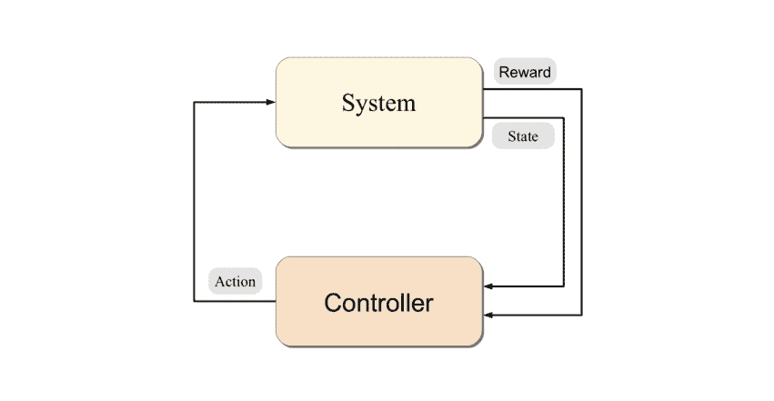
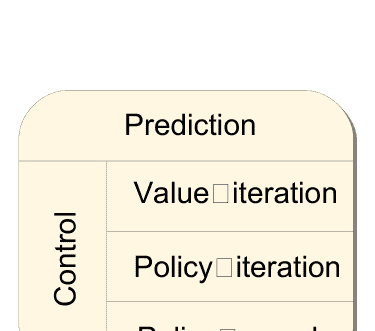
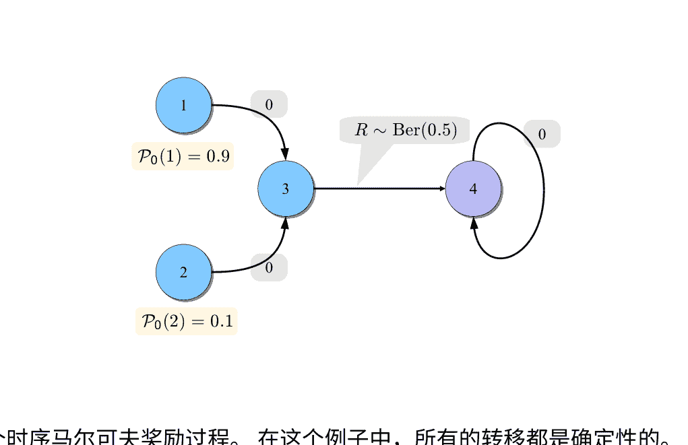

# 强化学习算法

在人工智能和机器学习综合讲座系列中发表的演讲草案由Morgan & Claypool Publishers出版

Morgan & Claypool出版商

Csaba Szepesvári

2009年6月9日

## 目录

- 1. 概述 3
- 2. 马尔可夫决策过程 7
  - 2.1 预备知识 7
  - 2.2 马尔可夫决策过程 8
  - 2.3 值函数 12
  - 2.4 解决MDP的动态规划算法 16
- 3. 值预测问题 17
  - 3.1 有限状态空间中的时序差异学习 18
    - 3.1.1 表格TD(0) 18
    - 3.1.2 每次访问蒙特卡洛 21
    - 3.1.3 TD(λ): 统一蒙特卡洛和TD(0) 23
  - 3.2 大状态空间的算法 25
    - 3.2.1 具有函数逼近的 TD(λ) 29
    - 3.2.2 梯度时序差异学习 33
    - 3.2.3 最小二乘法 36
    - 3.2.4 函数空间的选择 42
- 4 控制
  - 4.1 学习问题目录
  - 4.2 闭环交互学习
    - 4.2.1 在赌博机中的在线学习
    - 4.2.2 在赌博机中的主动学习
    - 4.2.3 在马尔可夫决策过程中的主动学习
    - 4.2.4 在马尔可夫决策过程中的在线学习
  - 4.3 直接方法
    - 4.3.1 Q-学习在有限MDP中
    - 4.3.2 Q-学习与函数逼近
  - 4.4 演员-评论家方法
    - 4.4.1 实现评论家
    - 4.4.2 实现演员
- 5 进一步探索
  - 5.1 进一步阅读
  - 5.2 应用
  - 5.3 软件
  - 5.4 致谢
- A 折扣马尔可夫决策过程的理论
  - A.1 收缩和Banach的不动点定理
  - A.2 应用于MDPs

## 摘要

强化学习是一种学习范式，涉及学习如何控制系统以最大化表达长期目标的数值性能度量。强化学习与监督学习的区别在于，只向学习者提供关于学习者预测的部分反馈。此外，预测可能通过影响受控系统的未来状态产生长期影响。因此，时间起着特殊的作用。强化学习的目标是开发高效的学习算法，并理解算法的优点和局限性。强化学习非常有趣，因为它可以用于解决许多实际应用问题，从人工智能到运筹学或控制工程。在本书中，我们重点介绍了那些建立在动态规划强大理论基础上的强化学习算法。我们提供了一个相当全面的学习问题目录，描述核心思想以及大量的最新算法，接着讨论它们的理论特性和限制。



图1：基本的强化学习场景

- 强化学习
- 马尔可夫决策过程
- 时序差分学习
- 随机逼近
- 双时间尺度随机逼近
- 蒙特卡罗方法
- 模拟优化
- 函数逼近
- 随机梯度方法
- 最小二乘方法
- 过拟合
- 偏差-方差权衡
- 在线学习
- 主动学习
- 规划
- 模拟
- PAC学习
- Q学习
- 演员-评论家方法
- 策略梯度
- 自然梯度

## 1 概述

强化学习（RL）既指学习问题，也指机器学习的一个子领域。作为一个学习问题，它指的是学习如何控制一个系统，以最大化代表长期目标的某个数值。强化学习通常在图1所示的环境中运行：控制器接收被控系统的状态和与上一个状态转换相关联的奖励。然后它计算一个动作发送回系统。作为响应，系统转移到一个新的状态，循环重复。问题是学习一种控制系统的方法，以最大化总奖励。学习问题在数据收集和性能测量的细节上有所不同。

在本书中，我们假设我们希望控制的系统是随机的。此外，我们假设系统状态上可用的测量足够详细，以便控制器可以避免思考如何收集关于系统的信息。具有这些问题最好在马尔可夫决策过程（MDPs）的框架下描述。解决MDPs的标准方法是使用动态规划，它将寻找一个好的控制器的问题转化为寻找一个好的值函数的问题。然而，除了当MDP具有很少的状态和动作时，动态规划是不可行的。我们在这里讨论的RL算法可以被看作是将不可行的动态规划方法转化为实际算法的一种方式，以便可以应用于大规模问题。

有两个关键思想使得RL算法能够实现这个目标。第一个思想是使用样本来紧凑地表示控制问题的动态。这对于两个原因很重要：首先，它允许处理动态未知的学习场景。其次，即使动态是可用的，使用它的精确推理可能本身是棘手的。RL算法背后的第二个关键思想是使用强大的函数逼近方法来紧凑地表示值函数。这一点的重要性在于它允许处理大规模、高维度的状态和动作空间。而且，这两个思想很好地契合在一起：样本可以集中在它们所属的空间的一个小子集上，聪明的函数逼近技术可以利用这一点。理解动态规划、样本和函数逼近之间的相互作用是设计、分析和应用RL算法的核心。

本书的目的是让读者有机会窥探这个美丽的领域。然而，我们肯定不是第一个设定实现这个目标的人。1996年，Kaelbling等人写了一篇很好、简洁的调查文章，介绍了当时可用的方法和算法(Kaelbling等人，1996)。随后，Bertsekas和Tsitsiklis(1996)出版了一本详细介绍理论基础的书。几年后，RL的“创始人”Sutton和Barto出版了他们的书，在书中以非常清晰和易懂的方式介绍了他们对RL的想法(Sutton和Barto，1998)。Bertsekas(2007a, b)的两卷书对动态规划/最优控制的工具和技术进行了最新和全面的概述，其中有一章专门介绍了RL方法。1有时候，当一个领域迅速发展时，书籍很容易过时。事实上，为了跟上新结果的不断涌现，Bertsekas维护着他的第二卷书第6章的在线版本，截至撰写本调查报告时，该版本已经有160页了(Bertsekas，2010)。其他近期关于这个主题的书籍包括Gosavi(2003)的书，他在第9章中专门介绍了强化学习算法，重点关注平均成本问题，或者Cao(2007)的书，他专注于策略梯度方法。Powell(2007)从运筹学的角度介绍了算法和思想，并强调能够处理大规模问题的方法。控制空间，Chang等人（2008年）专注于自适应采样（即基于仿真的性能优化），而Busoniu等人（2010年）的最新著作的重点是函数逼近。

因此，强化学习研究人员绝对不缺乏丰富的文献。然而，似乎缺少一个自成体系且相对简短的摘要，可以帮助新手对该领域的最新技术有一个良好的了解，同时也可以帮助现有研究人员扩大他们对该领域的概览，类似于Kaelbling等人（1996年）的文章，但内容更新。填补这一空白正是这本简短书的目的。

为了保持文本简洁，我们不得不做出一些妥协，希望不会太麻烦。我们做出的第一个妥协是只针对总体预期折扣回报准则提供结果。这个选择是因为这是最广泛使用和在数学上最容易处理的准则。下一个妥协是将MDP和动态规划的背景保持超紧凑（尽管添加了一个附录来解释这些基本结果）。除了这些，本书旨在涵盖强化学习的各个方面，使读者能够理解所介绍的算法的原理和实现方法。

当然，我们在呈现内容时仍然需要有选择性。在这里，我们决定重点关注基本算法、思想以及现有的理论。特别注意描述用户的选择以及与之相关的权衡。我们尽量客观，但肯定会有一些个人偏见。我们包含了近二十个算法的伪代码，希望这能让实际倾向的读者更容易实现所描述的算法。

目标受众是高级本科生和研究生，以及希望快速了解强化学习领域最新技术的研究人员和从业者。已经从事强化学习研究的研究人员也可以通过阅读不太熟悉的强化学习文献部分来拓宽他们对强化学习的视野。读者应该熟悉线性代数、微积分和概率论的基本概念。特别是，我们假设读者熟悉随机变量、条件期望和马尔可夫链的概念。读者熟悉统计学习理论会有帮助，但并非必需，因为基本概念将根据需要进行解释。在本书的某些部分，了解机器学习的回归技术将会很有用。

本书分为三个部分。在第一部分的第2节中，我们提供了必要的背景知识。在这里，我们介绍了符号表示法，然后简要概述了马尔可夫决策过程的理论和基本动态规划算法的描述。熟悉马尔可夫决策过程和动态规划的读者可以略读本部分，以熟悉的符号表示法。对强化学习不太熟悉的读者在移动到其他部分之前，必须花足够的时间在这里，因为本书的其余部分在这里所呈现的结果和思想上有很大的依赖。

剩下的两个部分分别致力于两个基本的强化学习问题（参见图1）。在第3节中，研究了与状态相关的值的预测学习问题。我们首先解释了基于表格的基本思想，即当MDP足够小，以至于可以在计算机的主内存中为每个状态存储一个值时。首先解释的算法是TD(λ)，可以看作是动态规划中值迭代的学习类比。在此之后，我们考虑了比计算机内存容量更大的状态数量的更具挑战性的情况。显然，在这种情况下，必须压缩表示值的表格。抽象地说，可以通过依赖适当的函数逼近方法来实现这一点。首先，我们描述了如何在这种情况下使用TD(λ)。接下来，描述了一些新的基于梯度的方法（GTD2和TDC），可以看作是TD(λ)的改进版本，因为它们避免了TD(λ)所面临的一些收敛困难。然后，我们讨论了最小二乘法方法（特别是LSTD(λ)和 λ-LSPE）并将它们与之前描述的增量方法进行了比较。最后，我们描述了实现函数逼近的可选项以及这些选择所带来的权衡。

第二部分（第4节）专门介绍了用于控制学习的算法。首先，我们描述的方法的目标是优化在线性能。特别是，我们描述了“面对不确定性的乐观原则”和基于该原则探索环境的方法。我们提供了最先进的算法，既适用于赌博机问题，也适用于MDPs。这里的信息是，聪明的探索方法会产生很大的差异，但还需要更多的工作来将这些方法扩展到大规模问题。本节的其余部分致力于开发可用于大规模应用的方法。由于在大规模MDPs中进行学习比在MDP较小时更加困难，因此学习的目标放宽为在极限情况下学习到足够好的策略。首先，讨论直接方法，旨在直接估计最优动作值。这可以看作是动态规划中值迭代的学习类比。接下来描述了演员-评论家方法，可以看作是动态规划中策略迭代算法的对应物。介绍了基于直接策略改进和策略梯度（即使用参数化策略类）的方法。

该书在第5节中总结，并列出了一些进一步探索的主题。



图2：强化学习问题和方法的类型。

## 2 马尔可夫决策过程

本节的目的是介绍在后续部分中将使用的符号表示法和我们在本书的其余部分中需要的最基本的马尔可夫决策过程（MDPs）理论的要点。熟悉MDPs的读者应该浏览本节以熟悉符号表示法。对于不熟悉MDPs的读者，建议花足够的时间阅读本节以理解细节。大多数结果的证明（经过一些简化）包含在附录A中。对于对MDPs更多了解感兴趣的读者，建议参考Bertsekas和Shreve（1978）、Puterman（1994）的优秀著作，或者Bertsekas（2007a，b）的两卷书。

### 2.1 预备知识

我们用N来表示自然数集合：N={0,1,2,…}，而R表示实数集合。通过向量v（除非它被转置，v^T），我们指的是列向量。两个有限维向量u、v∈R^d的内积是<u,v>=∑_{i=1}^d u_i v_i。得到的2-范数是||u||_2=<u,u>。向量的最大范数由||u||_∞=max_{i=1,...,d}|u_i|定义，而对于函数f:X→R，||·||_∞被定义为||f||_∞=sup_{x∈X}|f(x)|。一个映射

对于度量空间(M1,d1)和(M2,d2)之间的映射T，如果对于任意的a,b∈M1，有

如果v = v(θ, ∂v/∂θ)表示对θ的偏导数，如果θ∈R^d，则为一个维度为d的行向量。对于某个表达式v对θ的全导数将被表示为 d/dθ v（并且将被视为行向量）。此外，∇_θ v = (d/dθ v)^T。 如果P是一个分布或概率测度，则X ∼ P表示X是从P中抽取的一个随机变量。

### 2.2 马尔可夫决策过程

为了方便起见，我们限制我们的注意力在可数的MDP和折扣总预期奖励准则上。然而，在一些技术条件下，结果也适用于连续状态-动作MDP。这也适用于本书后面介绍的结果。

可数的MDP被定义为三元组$\mathcal{M} = (\mathcal{X}, \mathcal{A}, \mathcal{P}_0)$，其中$\mathcal{X}$是可数的非空状态集合，$\mathcal{A}$是可数的非空动作集合。转移概率核$\mathcal{P}_0$为每个状态-动作对$(x,a) \in \mathcal{X} \times \mathcal{A}$分配一个概率测度，记作$\mathcal{P}_0(\cdot|x,a)$。对于$U \subset \mathcal{X} \times \mathbb{R}$，$\mathcal{P}_0(U|x,a)$给出了下一个状态和相关奖励属于集合$U$的概率，前提是当前状态为$x$并且采取的动作为$a$。我们还固定了一个折扣因子$0 \leq \gamma \leq 1$，其作用将很快变得清楚。

转移概率核函数导致状态转移概率核函数$\mathcal{P}$，对于任意的$(x,a,y) \in \mathcal{X} \times \mathcal{A} \times \mathcal{X}$三元组，给出了在状态$x$选择动作$a$时移动到其他状态$y$的概率：

$\mathcal{P}(x,a,y) = \mathcal{P}_0(\{y\} \times \mathbb{R}|x,a)$。

除了$\mathcal{P}$，$\mathcal{P}_0$还导致了即时奖励函数$r: \mathcal{X} \times \mathcal{A} \to \mathbb{R}$，给出了在状态$x$选择动作$a$时获得的预期即时奖励：如果$(Y_{(x,a)}, R_{(x,a)}) \sim \mathcal{P}_0(\cdot|x,a)$，那么

$r(x,a) = \mathbb{E}[R_{(x,a)}]$。

在接下来的内容中，我们假设奖励被某个量$\mathcal{R} > 0$所界定：对于任意的$(x,a) \in \mathcal{X} \times \mathcal{A}$，几乎必然有$|R_{(x,a)}| \leq \mathcal{R}$成立。很明显，如果随机奖励被$\mathcal{R}$界定，那么$\|r\|_\infty = \sup_{(x,a) \in \mathcal{X} \times \mathcal{A}} |r(x,a)| \leq \mathcal{R}$也成立。如果$\mathcal{X}$和$\mathcal{A}$都是有限的，那么MDP被称为有限的。

马尔可夫决策过程是建模顺序决策问题的工具，在这个问题中，决策者与系统以顺序方式交互。给定一个MDP$\mathcal{M}$，这种交互过程如下：设$t \in \mathbb{N}$表示当前时间（或阶段），设$X_t \in \mathcal{X}$

2当$U$是Borel可测集时，概率$\mathcal{P}_0(U|x,a)$才有定义。Borel可测性是一个技术概念，其目的是防止一些病态情况的发生。Borel可测子集的集合包括几乎所有‘有趣’的子集$\mathcal{X} \times \mathbb{R}$。特别地，它们包括形如$\{x\} \times [a,b]$的子集，以及通过取它们的补集或最多可数个这样的集合的并（交）的方式获得的子集。

3‘几乎必然’与‘以概率为一’意思相同，用来指出所讨论的陈述在概率空间中除了一组测度为零的事件外，处处成立。

并且 $A_t \in \mathcal{A}$ 分别表示系统的随机状态和决策者在时间 $t$ 选择的动作。一旦选择了动作，它就会被发送到系统中，系统会进行一次转换：

$(X_{t+1}, R_{t+1}) \sim \mathcal{P}_0(\cdot | X_t, A_t). \quad (1)$

特别地， $X_{t+1}$ 是随机的，并且对于任意的 $x, y \in \mathcal{X}, a \in \mathcal{A}$，有 $\mathbb{P}(X_{t+1} = y|X_t =x, A_t = a) = \mathcal{P}(x, a, y)$ 成立。然后决策者观察到下一个状态 $X_{t+1}$ 和奖励 $R_{t+1}$，选择一个新的动作 $A_{t+1} \in \mathcal{A}$，然后重复这个过程。决策者的目标是找到一种选择动作的方法，以最大化期望的总折扣奖励。

决策者可以根据观察到的历史选择其行动。描述行动选择方式的规则被称为行为。4决策者的行为和一些初始随机状态 $X_0$ 共同定义了一个随机状态-行动-奖励序列 $((X_t, A_t, R_{t+1}); t \ge 0)$，其中 $(X_{t+1}, R_{t+1})$ 通过(1)与 $(X_t, A_t)$ 相连，$A_t$ 是基于历史 $X_0, A_0, R_1, ..., X_{t-1}, A_{t-1}, R_t, X_t$ 的行为所规定的动作。行为的回报被定义为所产生奖励的总折扣和：

$\mathcal{R} = \sum_{t=0}^{\infty} \gamma^t R_{t+1}$

因此，如果 $\gamma < 1$，则远期收益比第一阶段的收益要小得多。当回报由这个公式定义时，MDP被称为折扣奖励MDP。当 $\gamma = 1$ 时，MDP被称为无折扣的。

决策者的目标是选择一种行为，以最大化预期回报，而不考虑过程的起始方式。这样的最大化行为被称为最优行为。

例1（带有销售损失的库存控制）：考虑在面对不确定需求的情况下，每天控制固定最大规模库存的问题：每天晚上，决策者必须决定下一天的订购数量。早上，订购数量到达，库存被填满。在一天中，一些随机需求被实现，其中需求是独立的，具有共同的固定分布，参见图3。库存管理者的目标是管理库存，以最大化预期总未来收入的现金价值。

在时间步骤 $t$ 处的回报如下确定：购买 $A_t$ 物品的成本为 $K\mathbb{I}_{\{A_t > 0\}} + c A_t$。因此，订购非零物品有固定的入口成本 $K$，并且每个物品必须以固定价格 $c$ 购买。这里 $K, c > 0$。此外，持有大小为 $x > 0$ 的库存也有成本。在最简单的情况下，这个成本与库存的大小成比例

> 4从数学上讲，行为是一个无限序列的概率核函数 $\pi_0, \pi_1, ..., \pi_t, ...$，其中 $\pi_t$ 将长度为 $t$ 的历史映射到动作空间 $\mathcal{A}$ 上的概率分布： $\pi_t = \pi_t(\cdot | x_0, a_0, r_0, ..., x_{t-1}, a_{t-1}, r_{t-1}, x_t)$。

库存的算法与比例因子$h > 0$。最后，当销售$z$个单位时，经理会得到货币金额$p z$，其中$p > 0$。为了使问题有趣，我们必须有$p > h$，否则没有订购新物品的动机。

这个问题可以表示为一个$MDP$，如下所示：设状态$X_t$是第$t$天的晚上的库存大小。因此，$\mathcal{X} = \{0, 1, \ldots, M\}$，其中$M \in \mathbb{N}$是最大库存大小。行动$A_t$表示在第$t$天晚上订购的物品数量。因此，我们可以选择$\mathcal{A} = \{0, 1, \ldots, M\}$，因为不需要考虑大于库存大小的订单。给定$X_t$和$A_t$，下一个库存的大小由以下公式给出

$$X_{t+1} = ((X_t + A_t) \wedge M - D_{t+1})^+,\tag{2}$$

其中$a \wedge b$是最小数$a$和$b$的简写表示，$(a)^+ = a \vee 0 = \max(a, 0)$是$a$的正部分，$D_{t+1} \in \mathbb{N}$是第$(t+1)$天的需求。根据假设，$(D_t; t > 0)$是一系列独立同分布（i.i.d.）的整数随机变量。第$t+1$天的收入是

$$R_{t+1} = -K \mathbb{I}_{\{A_t > 0\}} - c ((X_t + A_t) \wedge M - X_t)^+ - h X_t + p ((X_t + A_t) \wedge M - X_{t+1})^+.\tag{3}$$

方程 (2)-(3)可以写成紧凑形式

$$(X_{t+1}, R_{t+1}) = f(X_t, A_t, D_{t+1}),\tag{4}$$

通过适当选择的函数$f$，我们可以得到$\mathcal{P}_0$

$$\mathcal{P}_0(U \mid x, a) = \mathbb{P} (f(x, a, D) \in U) = \sum_{d=0}^{\infty} \mathbb{I}_{\{f(x, a, d) \in U\}} p_D(d).$$

这里，$p_D(\cdot)$是随机需求的概率质量函数，$D \sim p_D(\cdot)$。这完成了库存优化问题的$MDP$定义。

库存控制只是许多运筹学问题之一，导致了一个$MDP$。其他问题包括优化运输系统，优化时间表或生产。$MDP$在许多工程最优控制问题中也自然而然地出现，例如化学、电子或机械系统的最优控制（后一类包括控制机器人的问题）。相当多的信息论问题也可以表示为$MDP$（例如最优编码、优化信道分配或传感器网络）。另一个重要的问题类别来自金融领域。这些包括最优投资组合管理和期权定价等。

图3：库存管理问题的示例

在库存控制问题的情况下，MDP通过一个方便的过渡函数 $f$（参见（4））来指定。实际上，过渡函数和过渡核函数一样强大：任何MDP都会产生一些过渡函数 $f$，任何过渡函数 $f$ 都会产生一些MDP。

在某些问题中，并不是所有的动作在所有状态下都有意义。例如，在库存中订购超过可容纳数量的物品是没有多大意义的。然而，这种无意义的动作（或禁止的动作）总是可以映射到其他动作，就像上面所做的那样。在某些情况下，这是不自然的，并且会导致复杂的动态。然后，最好引入一个额外的映射，将可接受的动作集分配给每个状态。

在某些MDP中，有些状态是不可能离开的：如果 $x$ 是这样的状态，则对于任何 $s \geq 1$，只要 $X_t=x$，几乎总是成立，无论选择什么动作在时间 $t$ 之后。按照惯例，我们假设在这种终止或吸收状态下不会产生任何奖励。具有这种状态的MDP被称为终结的。然后，一个 episode 是从时间开始到达终止状态的（通常是随机的）时间段。

在一个情节型MDP中，我们通常考虑无折扣奖励，即当 $\gamma= 1$ 时。

### 例子2（赌博）：

一个赌徒进入一个游戏，她可以押注她当前财富的任意分数 $A_t \in [0,1]$ of her current wealth $X_t \geq 0$。她以概率 $p \in [0,1]$ 赢回她的赌注和更多，而以概率 $1-p$ 输掉她的赌注。因此，赌徒的财富按照以下方式发展

$X_{t+1} = (1 + S_{t+1} A_t) X_t.$

这里 $(S_t; t \geq 1)$ 是一个取值为 $\{-1, +1\}$ 的独立随机变量序列，其中 $\mathbb{P}(S_{t+1}= 1) = p$。赌徒的目标是最大化她的财富达到一个预先给定的值 $w^* > 0$ 的概率。

假设初始财富在 $[0, w^*]$ 范围内。这个问题可以表示为一个时序马尔可夫决策过程（$MDP$），其中状态空间为 $\mathcal{X}= [0, w^*]$，行动空间为 $\mathcal{A}= [0, 1].^5$我们定义

$$X_{t+1} = (1 + S_{t+1}A_t)X_t \wedge w^*, \qquad (5)$$

当 $0 \le X_t< w^*$并且使 $w^*$成为终止状态： $X_{t+1} = X_t$如果 $X_t = w^*$. 只要 $X_{t+1}< w^*$，即时奖励为零，当状态第一次达到 $w^*$时奖励为一：

$$R_{t+1} = \begin{cases} 1, & X_t < w^* \text{并且} X_{t+1} = w^*; \\ 0, & \text{否则}. \end{cases}$$

如果我们将折扣因子设为一，沿任何轨迹的总奖励将为一或零，这取决于财富是否达到 $w^*$. 因此，期望的总奖励只是赌徒财富达到 $w^*$的概率。

根据迄今为止提出的两个例子，对于不熟悉MDP的读者来说，可能会认为所有MDP都带有方便的有限一维状态和动作空间。 如果只有这是真的！ 实际上，在实际应用中，状态和动作空间通常非常大，多维空间。 例如，在机器人控制应用中，状态空间的维数可能是机器人关节数的3-6倍。工业机器人的状态空间可能很容易是12-20维，而人形机器人的状态空间可能很容易有100个维度。 在现实世界的库存控制应用中，物品可能有多种类型，价格和成本也会根据“市场”的状态而变化，因此“市场”的状态也将成为MDP的一部分。 因此，在任何这样的实际应用中，状态空间都会非常大且维度非常高。动作空间也是如此。 因此，处理大型多维状态和动作空间应被视为正常情况，而本节中的示例具有一维小状态空间应被视为例外。

## 2.3 值函数

在某些MDP中找到最优行为的明显方法是列出所有行为，然后确定每个初始状态下给出最高可能值的行为。 然而，一般来说，行为太多，这个计划是不可行的。 一个更好的方法是基于计算值函数。 在这种方法中，首先计算所谓的最优值函数，然后可以相对容易地确定最优行为。

状态$x\in \mathcal{X}$的最优值 $V^*(x)$表示从状态 $x$开始时可以达到的最高预期回报。 函数 $V^*:\mathcal{X} \rightarrow \mathbb{R}$被称为最优值函数。在所有状态中实现最优值的行为是最优的。确定性稳态策略代表了行为理论中的一个重要类别，正如我们将很快看到的那样。它们由一些映射π指定，将状态映射到动作（即π: 𝒳→𝒜）。遵循π意味着在任何时间 t ≥ 0 选择动作 At。

$$A_t = \pi(X_t). \tag{6}$$

更一般地，一个随机稳定策略（或者只是稳定策略） π将状态映射到动作空间上的分布。当提到这样的策略 π时，我们将使用 π(a|x)来表示在状态 x 下，策略 π选择动作 a的概率。请注意，如果在MDP中遵循一个稳定策略，即

$$A_t \sim \pi(\cdot | X_t), \quad t \in \mathbb{N},$$

状态过程 (X_t; t ≥ 0) 将成为一个（时间齐次的）马尔可夫链。我们将使用 Π_stat 来表示所有稳定策略的集合。为了简洁起见，在接下来的内容中，我们经常会说“策略”而不是“稳定策略”，希望这不会引起混淆。

一个固定策略和一个MDP引发了所谓的马尔可夫奖励过程（MRP）：一个MRP由对 M = (𝒳, 𝒫_0) 的配对确定，其中 𝒫_0现在将概率分配给每个状态的 X×ℝ。一个MRP M引发了随机过程 ( (X_t, R_{t+1}) ; t ≥ 0 )，其中 (X_{t+1}, R_{t+1}) ∼ 𝒫_0 (· | X_t)。（注意，(Z_t; t ≥ 0)，Z_t= (X_t, R_t) 是一个时间齐次马尔可夫过程，其中 R_0是一个任意的随机变量，而 ( (𝒳_t, R_{t+1}) ; t ≥ 0) 是一个二阶马尔可夫过程。）给定一个固定策略 π 和 MDP M= (𝒳, 𝒜, 𝒫_0)，由和 M引发的 MRP (𝒳, 𝒫_0^π) 的转移核心使用 𝒫_0^π (· | x ) = ∑_{a} π(a|x) 𝒫_0(·|x, a) 定义。

如果状态空间有限，则MRP称为有限的。

现在让我们定义支持静态策略的值函数。6 为此，让我们固定一些策略 π∈Π_stat。定义支持π的值函数 V^π: 𝒳→ℝ。

$$V^{\pi}(x) = \mathbb{E} \left[ \sum_{t=0}^{\infty} \gamma^t R_{t+1} \mid X_0 = x \right], \quad x \in \mathcal{X}, \tag{7}$$

理解为（i）当遵循策略π时，过程 (R_t ; t≥1) 是过程 ((X_t, A_t, R_{t+1}); t≥0) 的“奖励部分”，（ii）X_0是随机选择的，使得对所有状态 x，ℙ(X_0=x) > 0。第二个条件使得（7）中的条件期望对每个状态都是良定义的。如果初始状态分布满足这个条件，则它对值的定义没有影响。

^6 值函数也可以类似于下面给出的定义来定义任何行为的基础。

MRP 的值函数的定义方式相同，用 $V$ 表示：

$$V(x) = \mathbb{E} \left[ \sum_{t=0}^{\infty} \gamma^t R_{t+1} \mid X_0 = x \right], \quad x \in \mathcal{X}$$

定义动作值函数 $Q^\pi$: $\mathcal{X} \times \mathcal{A} \rightarrow \mathbb{R}$，它是 MDP 中策略 $\pi$ 的状态下的函数。假设第一个动作 $A_0$ 是随机选择的，使得对于所有 $a \in \mathcal{A}$，$\mathbb{P}(A_0 = a) > 0$，而对于决策过程的后续阶段，动作是根据策略 $\pi$ 选择的。设 $((X_t, A_t, R_{t+1}); t \ge 0)$ 是结果随机过程，其中 $X_0$ 如 $V^\pi$ 的定义中所述。然后

$$Q^\pi(x, a) = \mathbb{E} \left[ \sum_{t=0}^{\infty} \gamma^t R_{t+1} \mid X_0 = x, A_0 = a \right], \quad x \in \mathcal{X}, a \in \mathcal{A}$$

类似于 $V^*(x)$，在状态-动作对 $(x, a)$ 处的最优动作值函数 $Q^*(x, a)$ 被定义为在过程从状态 $x$ 开始且第一个选择的动作是 $a$ 的条件下，预期回报的最大值。底层函数 $Q^* : \mathcal{X} \times \mathcal{A} \rightarrow \mathbb{R}$ 被称为最优动作值函数。

最优值函数和最优动作值函数通过以下方程相连：

$$V^*(x) = \sup_{a \in \mathcal{A}} Q^*(x, a), \quad x \in \mathcal{X},$$
$$Q^*(x, a) = r(x, a) + \gamma \sum_{y \in \mathcal{X}} \mathcal{P}(x, a, y) V^*(y), \quad x \in \mathcal{X}, a \in \mathcal{A}.$$

在这里考虑的 MDP 类中，总是存在一个最优的固定策略：

$$V^*(x) = \sup_{\pi \in \Pi_{\text{stat}}} V^\pi(x), \quad x \in \mathcal{X}.$$

事实上，任何满足等式的策略 $\pi \in \Pi_{\text{stat}}$ 都是最优的。

$$\sum_{a \in \mathcal{A}} \pi(a|x) Q^*(x, a) = V^*(x) \tag{8}$$

对于所有状态 $x \in \mathcal{X}$，同时满足 (8) 的任何策略 $\pi(\cdot|x)$ 必须集中在最大化 $Q^*(x, \cdot)$ 的动作集上。一般来说，给定一些动作值函数 $Q : \mathcal{X} \times \mathcal{A} \rightarrow \mathbb{R}$，对于某个状态 $x$，最大化 $Q(x, \cdot)$ 的动作被称为在状态 $x$ 中的贪婪动作。只对于 $Q$ 在所有状态下都选择贪婪动作的策略被称为对 $Q$ 贪婪。

因此，相对于 $Q^*$ 的贪婪策略是最优的，即，仅凭 $Q^*$ 的知识就足以找到最优策略。同样，了解 $V^*, R$ 和 $\mathcal{P}$ 也足以行动最优地。

下一个问题是如何找到 $V^*$或 $Q^*$。 让我们从如何找到策略的值函数开始：

### 事实1（确定性策略的贝尔曼方程）：

固定一个MDP $\mathcal{M}=(\mathcal{X},\mathcal{A},\mathcal{P}_0)$，一个折扣因子 $\gamma$ 和确定性策略 $\pi \in \Pi_{\text{stat}}$。 让 $r$ 是 $\mathcal{M}$的即时奖励函数。那么 $V^\pi$满足

$$V^\pi(x) = r(x, \pi(x)) + \gamma \sum_{y \in \mathcal{X}} \mathcal{P}(x, \pi(x), y)V^\pi(y), \qquad x \in \mathcal{X}.\tag{9}$$

这个方程系统被称为贝尔曼方程 for $V^\pi$. 定义贝尔曼算子 underlying $\pi$, $T^\pi : \mathbb{R}^{\mathcal{X}} \to \mathbb{R}^{\mathcal{X}}$, by

$$(T^\pi V)(x) = r(x, \pi(x)) + \gamma \sum_{y \in \mathcal{X}} \mathcal{P}(x, \pi(x), y)V(y), \quad x \in \mathcal{X}.$$

借助 $T^\pi$, 方程 (9)可以写成紧凑形式

$$T^\pi V^\pi = V^\pi.\tag{10}$$

注意这是一个线性方程系统，其中 $V^\pi$和 $T^\pi$是仿射线性算子。 如果 $0<\gamma < 1$那么 $T^\pi$是一个最大范数收缩，且固定点方程 $T^\pi V =V$ 有唯一解。

当状态空间$\mathcal{X}$是有限的，比如说，它有 $D$个状态， $\mathbb{R}^{\mathcal{X}}$可以被认为是 $D$维欧几里得空间， $V \in \mathbb{R}^{\mathcal{X}}$可以被看作是一个 $D$维向量： $V \in \mathbb{R}^D$。 通过这种认同， $T^\pi V$也可以写成 $r^\pi + \gamma P^\pi V$，其中 $r^\pi \in \mathbb{R}^D$是一个适当定义的向量， $P^\pi \in \mathbb{R}^{D\times D}$是一个矩阵。 在这种情况下， (10)可以写成以下形式

$$r^\pi + \gamma P^\pi V^\pi = V^\pi.\tag{11}$$

以上事实在MRPs中也成立，其中Bellman算子 $T : \mathbb{R}^{\mathcal{X}} \to \mathbb{R}^{\mathcal{X}}$被定义为

$$(T V)(x) = r(x) + \gamma \sum_{y \in \mathcal{X}} \mathcal{P}(x, y)V(y), \quad x \in \mathcal{X}.$$

已知最优值函数满足某个固定点方程：事实2（贝尔曼最优方程）： 最优值函数满足固定点方程

$$V^*(x) = \sup_{a \in \mathcal{A}} \left\{ r(x, a) + \gamma \sum_{y \in \mathcal{X}} \mathcal{P}(x, a, y)V^*(y)\right\}, \qquad x \in \mathcal{X}.\tag{12}$$

定义贝尔曼最优算子 operator, $T^* : \mathbb{R}^{\mathcal{X}} \rightarrow \mathbb{R}^{\mathcal{X}}$, by

$$ (T^* V)(x) = \sup_{a \in \mathcal{A}} \left\{ r(x, a) + \gamma \sum_{y \in \mathcal{X}} \mathcal{P}(x, a, y) V(y) \right\}, \quad x \in \mathcal{X}. \tag{13} $$

注意，由于存在 $\sup$，这是一个非线性算子。借助 $T^*$，方程 (12)可以简洁地写成

$$ T^* V^* = V^*. $$

如果 $0 < \gamma < 1$，则 $T^*$是一个最大范数收缩，且固定点方程 $T^* V = V$ 有唯一解。

为了减少混乱，在接下来的内容中，我们将把类似 $(T^\pi V)(x)$ 的表达式写作 $T^\pi V(x)$，理解为运算符 $T^\pi$的应用优先于点评估运算符‘$\cdot(x)$’的应用。

支持策略（或MRP）的动作值函数和最优动作值函数也满足一些类似于前面的固定点方程：事实3（贝尔曼算子和动作值函数的固定点方程）：稍微滥用符号，定义 $T^\pi: \mathbb{R}^{\mathcal{X} \times \mathcal{A}} \rightarrow \mathbb{R}^{\mathcal{X} \times \mathcal{A}}$和 $T^*: \mathbb{R}^{\mathcal{X} \times \mathcal{A}} \rightarrow \mathbb{R}^{\mathcal{X} \times \mathcal{A}}$如下：

$$ T^\pi Q(x, a) = r(x, a) + \gamma \sum_{y \in \mathcal{X}} \mathcal{P}(x, a, y) Q(y, \pi(y)), \quad (x, a) \in \mathcal{X} \times \mathcal{A}, \quad (14) $$

$$ T^* Q(x, a) = r(x, a) + \gamma \sum_{y \in \mathcal{X}} \mathcal{P}(x, a, y) \sup_{a' \in \mathcal{A}} Q(y, a'), \quad (x, a) \in \mathcal{X} \times \mathcal{A}. \quad (15) $$

注意，$T^\pi$ 再次是仿射线性的，而 $T^*$是非线性的。运算符 $T^\pi$ 和 $T^*$ 是最大范数收缩的。此外，策略 $\pi$ 的动作值函数 $Q^\pi$ 满足 $T^\pi Q^\pi = Q^\pi$，并且 $Q^\pi$ 是这个不动点方程的唯一解。类似地，最优动作值函数 $Q^*$ 满足 $T^* Q^* = Q^*$，并且 $Q^*$ 是这个不动点方程的唯一解。

## 2.4 解决MDP的动态规划算法

上述事实为值迭代和策略迭代算法提供了基础。

值迭代生成一系列值函数

$$ V_{k+1} = T^* V_k, \quad k \geq 0, $$其中 $V_0$ 是任意的。感谢 Banach 的不动点定理，$(V_k, k \ge 0)$ 以几何速率收敛到 $V^*$。

值迭代也可以与动作值函数结合使用；此时，它的形式为

$$Q_{k+1} = T^*Q_k, \quad k \ge 0,$$

它以几何速率收敛到 $Q^*$。思想是一旦 $V_k$（或 $Q_k$）接近于 $V^*$（或 $Q^*$），相对于 $V_k$（或 $Q_k$）贪婪的策略将接近最优。特别地，以下界限已知成立：固定一个动作值函数 $Q$ 并让 $\pi$ 是相对于 $Q$ 贪婪的策略。那么策略 $\pi$ 的值可以如下进行下界估计（例如，Singh和Yee，1994年，推论2）：

$$V^\pi(x) \ge V^*(x) - \frac{2}{1 - \gamma} \|Q - Q^*\|_\infty, \quad x \in \mathcal{X}. \qquad (16)$$

策略迭代的工作方式如下。固定任意初始策略 $\pi_0$。在第 $k > 0$ 次迭代中，计算基于 $\pi_k$ 的动作值函数（这称为策略评估步骤）。接下来，根据 $Q^{\pi_k}$ 定义 $\pi_{k+1}$ 为相对于 $Q^{\pi_k}$ 贪婪的策略（这称为策略改进步骤）。经过 $k$ 次迭代后，如果两个过程都从相同的初始值函数开始，策略迭代给出的策略不会比使用 $k$ 次值迭代计算的值函数相对于贪婪策略更差。然而，策略迭代中单个步骤的计算成本要比值迭代中的一次更新要高得多（因为策略评估步骤的原因）。

## 3 值预测问题

在本节中，我们考虑估计值函数 $V$ 在某个马尔可夫奖励过程（MRP）下的问题。值预测问题以多种方式出现：估计某个未来事件的概率，预期某个事件发生的时间，或者在MDP中某个策略下的（动作-）值函数，都是值预测问题。具体应用包括估计大型电力网络的故障概率（Frank等，2008年）或估计繁忙机场上航班的出租车出场时间（Balakrishna等，2008年），这只是众多可能性中的两个例子。

由于状态的值被定义为从给定状态开始时随机回报的期望值，估计这个值的一种明显方法是计算从给定状态开始的多个独立实现的平均值。这是所谓的蒙特卡洛方法的一个实例。不幸的是，回报的方差可能很高，这意味着估计的质量会很差。此外，在与环境交互时，当系统以闭环方式运行时（即在与系统交互时进行估计），可能无法将系统状态重置为特定状态。在这种情况下，蒙特卡洛技术无法应用而不引入一些额外的偏差。时序差异（TD）学习（Sutton，1984年，1988年）是强化学习中最重要的思想之一，是一种可以解决这些问题的方法。

### 3.1 有限状态空间中的时序差异学习

TD学习的独特特点是使用自举：在学习过程中使用预测作为目标。在本节中，我们首先介绍最基本的TD算法，并解释自举的工作原理。接下来，我们比较TD学习和（纯粹的）蒙特卡洛方法，并论证它们各自的优点。最后，我们介绍统一这两种方法的TD（λ）算法。在这里，我们只考虑小型有限MRP的情况，当所有状态的值估计可以存储在计算机的主内存中的数组或表中时，这被称为强化学习文献中的表格情况。将这里提出的思想扩展到大状态空间，当无法使用表格表示时，将在后续章节中描述。

#### 3.1.1 表格TD(0)

修复一些有限马尔可夫奖励过程 M。我们希望在给定实现 $((X_t, R_{t+1}); t \ge 0)$ 的情况下估计值函数 V 底层 M。让 $\hat{V}_t(x)$ 表示在时间 t 时对状态 x 的估计（比如，$\hat{V}_0 \equiv 0$）。在第 t 步骤中，TD(0)执行以下计算：

$$\delta_{t+1} = R_{t+1} + \gamma \hat{V}_t(X_{t+1}) - \hat{V}_t(X_t),$$
$$\hat{V}_{t+1}(x) = \hat{V}_t(x) + \alpha_t \delta_{t+1} \mathbb{I}_{\{X_t = x\}}, \quad x \in \mathcal{X}.$$

这里的步长序列 $(\alpha_t; t \ge 0)$ 由用户选择的（小）非负数组成。算法1展示了该算法的伪代码。

仔细检查更新方程式可以发现，唯一改变的值是与 $X_t$ 相关的值，即刚刚访问的状态（参见伪代码的第2行）。此外，当 $\alpha_t \le 1$ 时，$X_t$ 的值会朝着“目标” $R_{t+1} + \gamma \hat{V}_t(X_{t+1})$ 移动。由于目标取决于估计的值函数，该算法使用了 bootstrapping。算法名称中的“时序差异”一词来自于 $\delta_{t+1}$ 的定义，它表示连续时间步之间状态值之间的差异。特别地，$\delta_{t+1}$ 被称为时间差分误差。

就像强化学习中的许多其他算法一样，表格型 TD(0) 是一种随机逼近（SA）算法。很容易看出，如果它收敛，那么它必须收敛到一个函数 $\hat{V}$，使得给定 $\hat{V}$ 时的期望时间差分为零。

$$F\hat{V}(x) \stackrel{\text { 定义 }}{=} \mathbb{E}\left[R_{t+1}+\gamma \hat{V}\left(X_{t+1}\right)-\hat{V}\left(X_{t}\right) \mid X_{t}=x\right],$$

对于所有状态 $x$，至少对于所有经常被采样的状态，它都为零。简单的计算表明 $F\hat{V} = T\hat{V} - \hat{V}$，其中 $T$ 是所考虑的 MRP 的 Bellman 算子。根据事实1，$F\hat{V} = 0$ 有唯一解，即值函数 $V_*$。因此，如果 TD(0) 收敛（并且所有状态都被无限次采样），那么它必须收敛到 $V_*$。为了研究算法的收敛性质，为简单起见，假设 $(X_t; t \in \mathbb{N})$ 是一个平稳的遍历马尔可夫链。⁷ 此外，将近似值函数 $\hat{V}_t$ 与 $D$ 维向量进行对应（例如，$\hat{V}_{t,i} = \hat{V}_t(x_i)$，$i=1,\ldots,D$，其中 $D=|\mathcal{X}|$ 和 $\mathcal{X}=\{x_1,\ldots,x_D\}$）。然后，假设步长序列满足 Robbins-Monro（RM）条件。

$$\sum_{t=0}^{\infty} \alpha_t = \infty, \quad \sum_{t=0}^{\infty} \alpha_t^2 < +\infty,$$

序列 $(\hat{V}_t \in \mathbb{R}^D; t \in \mathbb{N})$ 将跟踪普通微分方程的轨迹（ODE）

$$\dot{v}(t) = c \, F(v(t)), \quad t \ge 0, \tag{18}$$

其中 $c=1/D$ 且 $v(t) \in \mathbb{R}^D$（例如，Borkar，1998）。借用（11）中使用的符号，上述ODE可以写成

$$\dot{v} = r + (\gamma P - I)v.$$

请注意，这是一个线性 ODE。由于 $\gamma P - I$ 的特征值都位于开放的左半复平面中，因此该 ODE 是全局渐近稳定的。根据这个，使用标准结果，从SA的角度来看，$\hat{V}_t$ 几乎肯定收敛于 $V_*$。

**关于步长：** 由于我们将讨论的许多算法使用步长，所以值得花一些时间来讨论它们的选择。一个简单的满足上述条件的步长序列是 $\alpha_t = c/t$，其中 $c > 0$。更一般地，任何形如 $\alpha_t = c\ t^{-\eta}$ 的步长序列都可以工作，只要 $1/2 < \eta \leq 1$。在这些步长序列中，$\eta = 1$ 给出了最小的步长。从渐近的角度来看，这个选择是最好的，但从算法的瞬态行为的角度来看，选择 $\eta$ 接近于 $1/2$ 会更好（因为这样选择的步长更大，因此算法会有更大的移动）。事实上，我们甚至可以做得更好。事实上，一种简单的方法，称为 Polyak 和 Juditsky（1992）提出的迭代平均法，已知可以实现最佳的渐近收敛速度。然而，尽管它具有吸引人的理论性质，但迭代平均法在实践中很少使用。事实上，在实践中，人们经常使用恒定的步长，这显然违反了RM条件。这个选择是有理由的：首先，算法通常在非稳态环境中使用（即要评估的策略可能会改变）。其次，这些算法通常只在小样本情况下使用。（当使用恒定的步长时，参数会收敛于分布。极限分布的方差将与选择的步长成比例。）还有很多工作正在进行中，致力于开发自动调整步长的方法，参见（Sutton，1992；Schraudolph，1999；George和Powell，2006）以及相关文献。然而，对于这些方法中哪种最好，目前还没有定论。

通过一个小的改变，该算法也可以用于形式为 $((X_t, R_{t+1}, Y_{t+1}); t \geq 0)$ 的观测序列，其中 $(X_t; t \geq 0)$ 是一个任意的遍历马尔可夫链。这个改变涉及到时间差异的定义：

$$\delta_{t+1} = R_{t+1} + \gamma \hat{V}(Y_{t+1}) - \hat{V}(X_t).$$

然后，没有额外的条件，$\hat{V}_t$ 仍然几乎肯定收敛到基础的 MRP 值函数 $(\mathcal{X}, \mathscr{P}_0)$。特别地，状态的分布 $(X_t; t \geq 0)$ 在这里不起作用。

这是有趣的多个原因之一。例如，如果样本是使用模拟器生成的，我们可以独立地控制状态的分布 $(X_t; t \geq 0)$，而不受马尔可夫内核 $\mathscr{P}$ 的平稳分布的不均匀性的影响。另一个用途是在遵循某个其他策略（通常称为行为策略）的情况下，在 MDP 中学习某个目标策略。为简单起见，假设目标策略是确定性的。然后，$((X_t, R_{t+1}, Y_{t+1}), t \geq 0)$ 可以通过跳过轨迹中的所有状态-动作-奖励-下一个状态四元组来获得，通过使用行为策略生成，其中所采取的动作与目标策略在给定状态下所采取的动作不匹配，同时保持其余部分。这种技术可能允许同时学习多个策略（更一般地说，学习多个长期预测问题）。当学习一个策略时，同时遵循另一个策略被称为离策略学习。因此，当 $Y_{t+1} = X_{t+1}$ 时，我们也将基于三元组 $((X_t, R_{t+1}, Y_{t+1}); t \geq 0)$ 的学习称为离策略学习。第三个技术用途是将算法应用于一个情节性问题。在这种情况下，三元组 $(X_t, R_{t+1}, Y_{t+1})$ 的选择如下：首先，从过渡核 $\mathcal{P}(X_t, \cdot)$ 中采样 $Y_{t+1}$。如果 $Y_{t+1}$ 不是一个终止状态，我们让 $X_{t+1} = Y_{t+1}$；否则， $X_{t+1} \sim \mathcal{P}_0(\cdot)$ ，其中 $\mathcal{P}_0$ 是用户选择的 $\mathcal{X}$ 上的分布。换句话说，当达到终止状态时，从初始状态分布 $\mathcal{P}_0$ 重新开始过程。从 $\mathcal{P}_0$ 重新开始到达终止状态的时间间隔被称为一个情节（因此称为情节性问题）。这种生成样本的方式被称为从 $\mathcal{P}_0$ 重新开始的连续采样。

作为标准的线性 SA 方法，表格 TD(0) 的收敛速度将是通常的 $O(1/\sqrt{t})$（详见 Tadi´c（2004）的论文和其中的参考文献以获取精确结果）。然而，速度中的常数因子将在很大程度上受到步长序列的选择、核函数 $\mathcal{P}_0$ 的属性和 $\gamma$ 的值的影响。

#### 3.1.2 每次访问蒙特卡洛

如前所述，人们还可以通过计算样本均值来估计状态的值，从而产生所谓的每次访问蒙特卡洛方法。在这里，我们更加准确地定义了我们所说的内容，并将得到的方法与 TD(0) 进行了比较。

为了明确这些想法，考虑一些情节性问题（否则，由于轨迹是无限长的，无法有限地计算给定状态的回报）。让底层 MRP 为 $\mathcal{M} = (\mathcal{X}, \mathcal{P}, \mathcal{P}_0)$，并让 $((X_t, R_{t+1}, Y_{t+1}); t \geq 0)$ 由在 $\mathcal{M}$ 中连续采样并从某个分布 $\mathcal{P}_0$ 重新开始生成。让 $(T_k; k \geq 0)$ 为开始一个情节的时间序列（因此，对于每个 $k$，$X_{T_k}$ 从 $\mathcal{P}_0$ 中采样得到）。让 $k(t)$ 是唯一的剧集索引，使得 $t \in [T_k, T_{k+1})$。

$$\mathcal{R}_t = \sum_{s=t}^{T_{k(t)+1}-1} \gamma^{s-t} R_{s+1} \quad (19)$$

表示从时间 $t$ 到剧集结束的回报。显然， $V(x) = \mathbb{E}[\mathcal{R}_t | X_t = x]$，对于任何状态 $x$，使得 $\mathbb{P}(X_t = x) > 0$。因此，更新估计值的合理方法是使用

$$\hat{V}_{t+1}(x) = \hat{V}_t(x) + \alpha_t (\mathcal{R}_t - \hat{V}_t(x)) \mathbb{I}_{\{X_t = x\}}, \quad x \in \mathcal{X}.$$

算法2实现每次访问蒙特卡洛算法来估计在有限 MDP 中的值函数。这个例程必须在每个 episode 结束时调用，并使用在 episode 期间收集的状态-奖励序列。请注意，这里展示的算法在 episode 的长度上具有线性的时间和空间复杂度。

| 函数 EveryVisitMC($X_0$, $R_1$, $X_1$, $R_2$, ..., $X_{T-1}$, $R_T$, $V$) |
| :--- |
| 输入: $X_t$ 是时间 $t$ 的状态, $R_{t+1}$ 是与第 $t$ 个转换相关联的奖励, $T$ 是 episode 的长度, $V$ 是存储当前值函数估计的数组 |
| 1: $sum \leftarrow 0$ |
| 2: **for** $t \leftarrow T - 1$ 递减到 0 **执行** |
| 3: &nbsp;&nbsp;&nbsp;&nbsp;$sum \leftarrow R_{t+1} + \gamma \cdot sum$ |
| 4: &nbsp;&nbsp;&nbsp;&nbsp;目标$[X_t] \leftarrow sum$ |
| 5: &nbsp;&nbsp;&nbsp;&nbsp;$V[X_t] \leftarrow V[X_t] + \alpha \cdot ($目标$[X_t] - V[X_t])$ |
| 6: **结束循环** |
| 7: **返回** $V$ |

蒙特卡洛方法，如上述方法，因为它们使用多步预测值（参见方程（19）），被称为多步方法。此更新规则的伪代码如算法2所示。

这个算法再次是随机逼近的一个实例。因此，它的行为受到 ODE $\dot{v}(t) = V - v(t)$ 的控制。由于这个 ODE 的唯一全局渐近稳定平衡是 $V$，$\hat{V}_t$ 再次几乎肯定收敛于 $V$。由于两个算法都实现了相同的目标，人们可能会想知道哪个算法更好。

**TD(0)还是蒙特卡洛？** 首先，让我们考虑一个例子，当 TD(0) 收敛更快时。考虑图4上显示的无折扣的周期性 MRP。初始状态可以是1或2。在很大概率下，过程从状态1开始，而从状态2开始的频率较低。现在考虑 TD(0) 在状态2的行为。当第 $k$ 次访问状态2时，平均而言状态3已经被访问了 $10k$ 次。假设 $\alpha_t = 1/(t+1)$。在状态3，TD(0) 的更新变为对离开状态3时产生的伯努利奖励进行平均。在第 $k$ 次访问状态2时，$\text{Var}[\hat{V}_t(3)] \approx 1/(10k)$（显然，$\mathbb{E}[\hat{V}_t(3)] = V(3) = 0.5$）。因此，状态2的更新目标将是状态2的真实值的估计，准确性随着 $k$ 的增加而增加。现在，考虑蒙特卡洛方法。蒙特卡洛方法忽略了状态3的值的估计，并直接使用伯努利奖励。特别地，$\text{Var} [\mathcal{R}_t | X_t = 2] = 0.25$，即目标的方差不随时间变化。在这个例子中，这使得蒙特卡洛方法收敛速度较慢，显示出有时引导法确实有帮助。

为了看到引导法无助的一个例子，想象一下问题被修改，使得从状态3到状态4的转换的奖励变为确定性的。



图4：一个时序马尔可夫奖励过程。在这个例子中，所有的转移都是确定性的。奖励为零，除非从状态3转移到状态4时，根据参数为0.5的伯努利随机变量给出奖励。状态4是一个终止状态。当过程达到终止状态时，它会被重置为从状态1或2开始。开始于状态1的概率为0.9，开始于状态2的概率为0.1。

在这种情况下，蒙特卡洛方法变得更快，因为 $\mathcal{R}_t = 1$ 是真正的目标值，而对于状态2的值接近其真实值，TD(0) 必须等到对状态3的估计接近其真实值。这会减慢 TD(0) 的收敛速度。实际上，可以想象一个更长的状态链，其中状态 $i+1$ 跟随状态 $i$，对于 $i \in \{1, \dots, N\}$，只有在从状态 $N-1$ 转移到状态 $N$ 时才会产生非零奖励。在这个例子中，蒙特卡洛方法的收敛速度不受 $N$ 值的影响，而 TD(0) 会随着 $N$ 的增加而变慢（关于非正式论证，请参见 Sutton, 1988；关于精确速率的正式论证，请参见 Beleznay 等人，1999年）。

#### 3.1.3 $\text{TD}(\lambda)$: 统一蒙特卡洛和TD(0)

前面的例子表明，蒙特卡洛和 TD(0) 都有各自的优点。有趣的是，有一种方法可以统一这些方法。这是通过所谓的 TD($\lambda$) 方法家族（Sutton, 1984, 1988）实现的。在这里，$\lambda \in [0,1]$ 是一个参数，允许在蒙特卡洛和 TD(0) 更新之间进行插值：$\lambda = 0$ 表示 TD(0)（因此称为 TD(0)），而 $\lambda = 1$，即 TD(1) 等效于蒙特卡洛方法。实质上，给定一些 $\lambda > 0$，在 TD($\lambda$) 更新中的目标是给出一些混合的

⁷记住，如果马尔可夫链 $(X_t; t \in \mathbb{N})$ 是不可约的、非周期的和正再生的，则它是遍历的。实际上，这意味着对于链的足够规则的函数，大数定律成立。

## 多步回报预测

$\mathcal{R}_{t:k} = \sum_{s=t}^{t+k} \gamma^{s-t} R_{s+1} + \gamma^{k+1} \hat{V}_t(X_{t+k+1})$

其中混合系数是指指数权重 $(1-\lambda)\lambda^k, k \geq 0$。因此，对于 $\lambda > 0$ TD($\lambda$) 将成为一个多步方法。通过引入所谓的资格迹，算法变得增量。

事实上，资格迹可以以多种方式定义，因此 TD($\lambda$) 存在于相应的多种形式中。具有所谓的累积迹的 TD($\lambda$) 的更新规则如下：

$\delta_{t+1} = R_{t+1} + \gamma \hat{V}_t(X_{t+1}) - \hat{V}_t(X_t),$
$z_{t+1}(x) = \mathbb{I}_{\{x=X_t\}} + \gamma\lambda z_t(x),$
$\hat{V}_{t+1}(x) = \hat{V}_t(x) + \alpha_t \delta_{t+1} z_{t+1}(x),$
$z_0(x) = 0,$
$x \in \mathcal{X}.$

这里 $z_t(x)$ 是状态 $x$ 的资格迹。这个名称的理由是，$z_t(x)$ 的值调节了 TD 误差对存储在状态 $x$ 的值更新的影响。在算法的另一个变体中，资格迹根据

$z_{t+1}(x) = \max(\mathbb{I}_{\{x=X_t\}}, \gamma\lambda z_t(x)), \quad x \in \mathcal{X}.$

这被称为替换迹更新。在这些更新中，迹衰减参数 $\lambda$ 控制了引导的程度：当 $\lambda = 0$ 时，上述算法变为相同的 TD(0) 算法（因为 $\lim_{\lambda\to0+} (1-\lambda) \sum_{k\geq0} \lambda^k \mathcal{R}_{t:k} = \mathcal{R}_{t:0} = R_{t+1} + \gamma \hat{V}_t(X_{t+1})$）。当 $\lambda = 1$ 时，我们得到 TD(1) 算法，使用累积迹将模拟先前描述的每次访问蒙特卡洛算法在情节问题中。（要获得精确的等价性，需要假设值更新仅发生在轨迹结束时，直到此时更新只是累积的。然后，该语句成立，因为从起始状态到终止状态的轨迹上的时间差异的折现和返回沿轨迹的差异以及在起始状态的值估计。）替换迹和 $\lambda = 1$ 对应于蒙特卡洛算法的一个版本，其中状态仅在轨迹中首次遇到时进行更新。相应的算法称为首次访问蒙特卡洛方法。首次访问蒙特卡洛方法与 TD(1) 和替换迹之间的形式对应仅适用于未折现的情况（Singh 和 Sutton，1996年）。算法 3 给出了与替换迹对应的伪代码。实际上，最佳的 $\lambda$ 值是通过试错确定的。事实上，$\lambda$ 的值甚至可以在算法执行过程中进行更改，而不会影响收敛性。这适用于一系列其他可能的资格迹更新（有关详细条件，请参见 Bertsekas 和 Tsitsiklis，1996年，第5.3.3和5.3.6节）。算法的替换迹版本在实践中被认为表现更好（有关此情况的一些示例，请参阅 Sutton 和 Barto，1998年，第7.8节）。已经注意到当学习者只对状态有部分知识时，或者（在相关情况下）当函数逼近用于在大状态空间中逼近值函数时，$\lambda > 0$ 是有帮助的——下一节的主题。

总结一下，TD($\lambda$) 允许我们在 MRPs 中估计值函数。它推广了蒙特卡洛方法，可以用于非周期性问题，并且允许引导。此外，通过适当调整 $\lambda$，它可以比蒙特卡洛方法或 TD(0) 更快地收敛。

## 算法3 实现具有替换迹的表格 TD($\lambda$) 算法的函数。每次转换后必须调用此函数。

```
函数 TDλ(X, R, Y, V, z)
输入：X是上一个状态，Y是下一个状态，R是与此转换相关的即时奖励，V是存储当前值函数估计的数组，z是存储资格迹的数组
1: δ ← R + γ·V[Y]−V[X]
2: 对于所有的 x∈X do
3:    z[x]←γ·λ·z[x]
4:    如果 X=x 则
5:        z[x]←1
6:    结束如果
7:    V[x]←V[x]+α·δ·z[x]
8: 结束循环
9: 返回 (V, z)
```

## 3.2 大状态空间的算法

当状态空间很大（或无限大）时，无法在内存中为每个状态保留单独的值。在这种情况下，我们经常寻求值的估计形式 $V_{\theta}(x) = \theta^{\top} \varphi(x), \quad x \in \mathcal{X}$，其中 $\theta \in \mathbb{R}^d$ 是参数向量，$\varphi : \mathcal{X} \rightarrow \mathbb{R}^d$ 是状态到 $d$ 维向量的映射。对于状态 $x$，向量 $\varphi(x)$ 的分量 $\varphi_i(x)$ 被称为状态特征 $x$ 和 $\varphi$ 的特征提取方法被称为特征提取方法。定义 $\varphi$ 的组成部分的个体函数 $\varphi_i : \mathcal{X} \rightarrow \mathbb{R}$ 被称为基函数。

函数逼近方法的示例在访问状态的情况下，特征（或基函数）可以以许多不同的方式构建。如果 $x \in \mathbb{R}$ （即，$\mathcal{X} \subset \mathbb{R}$），可以使用多项式、傅里叶或小波基函数，直到某个阶数。例如，在多项式基函数的情况下，$\varphi(x) = (1, x, x^2, \dots, x^{d-1})^\top$，或者，如果状态上有适当的度量（如平稳分布），则使用正交多项式系统。后一种选择可能有助于增加我们即将讨论的增量算法的收敛速度。

在多维状态空间的情况下，张量积构造是一种常用的构造特征的方法，给定状态各个组成部分的特征。张量积构造的工作原理如下：想象一下，$\mathcal{X} \subset \mathcal{X}_1 \times \mathcal{X}_2 \times \dots \times \mathcal{X}_k$。让 $\varphi^{(i)} : \mathcal{X}_i \rightarrow \mathbb{R}^{d_i}$ 是定义在第 $i$ 个状态组件上的特征提取器。张量积 $\varphi = \varphi^{(1)} \otimes \dots \otimes \varphi^{(k)}$ 特征提取器将具有 $d = d_1 d_2 \dots d_k$ 个组件，可以方便地使用形式为 $(i_1, \dots, i_k), 1 \leq i_j \leq d_j, j=1, \dots, k$ 的多索引进行索引。然后 $\varphi_{i_1, \dots, i_k}(x) = \varphi_{i_1}^{(1)}(x_1)\varphi_{i_2}^{(2)}(x_2) \dots \varphi_{i_k}^{(k)}(x_k)$。当 $\mathcal{X} \subset \mathbb{R}^k$ 时，一个特别流行的选择是使用径向基函数（RBF）网络，其中 $\varphi^{(i)}(x_i) = (G(|x_i - x_i^{(1)}|), \dots, G(|x_i - x_i^{(d_i)}|))^\top$。这里 $x_i^{(j)} \in \mathbb{R}$ ($j=1, \dots, d_i$) 是由用户固定的，$G$ 是一个合适的函数。对于 $G$ 的典型选择是 $G(z) = \exp(-\eta z^2)$，其中 $\eta > 0$ 是一个尺度参数。在这种情况下，张量积构造在一个规则网格的点上放置高斯函数，第 $i$ 个基函数变为

$$\varphi_i(x) = \exp(-\eta \|x - x^{(i)}\|^2),$$

其中 $x^{(i)} \in \mathcal{X}$ 现在表示一个正则的 $d_1 \times \dots \times d_k$ 网格上的点。一个相关的方法是使用核平滑：

$$V_{\theta}(x) = \frac{\sum_{i=1}^{d} \theta_i G(\|x - x^{(i)}\|)}{\sum_{j=1}^{d} G(\|x - x^{(j)}\|)} = \sum_{i=1}^{d} \theta_i \frac{G(\|x - x^{(i)}\|)}{\sum_{j=1}^{d} G(\|x - x^{(j)}\|)}.$$ (20)

更一般地，可以使用 $V_{\theta}(x) = \sum_{i=1}^{d} \theta_i s_i(x)$，其中 $s_i \geq 0$，并且 $\sum_{i=1}^{d} s_i(x) \equiv 1$ 对于任意的 $x \in \mathcal{X}$ 成立。在这种情况下，我们称 $V_{\theta}$ 为一个平均器。平均器在强化学习中很重要，因为映射 $\theta \rightarrow V_{\theta}$ 在最大范数下是非扩张的，这使得它们在与近似动态规划一起使用时“表现良好”。

与上述方法相比，另一种方法是使用二进制特征，即当 $\varphi(x) \in \{0, 1\}^d$ 时。从计算的角度来看，二进制特征可能更有优势：当 $\varphi(x) \in \{0, 1\}^d$ 时则 $V_{\theta}(x) = \sum_{i} \theta_i \varphi_i(x)$。因此，如果 $\varphi(x)$ 是稀疏的（即 $\varphi(x)$ 中只有 $s$ 个非零元素），并且存在一种直接计算特征向量非零分量索引的方法，那么状态 $x$ 的值可以以 $s$ 个加法的代价计算出来。

当使用状态聚合来定义特征时，就是这种情况。在这种情况下，$\varphi$ 的坐标函数（即各个特征）对应于状态空间 $\mathcal{X}$ 的非重叠区域的指示器。这些区域的并集覆盖了 $\mathcal{X}$（即这些区域构成了状态空间的一个划分）。显然，在这种情况下，$\theta^T \varphi(x)$ 在各个区域上是常数，因此状态聚合本质上是对状态空间进行“离散化”。状态聚合器函数逼近器也是一个平均器。

导致二进制特征的另一种选择是瓷砖编码（最初称为 CMAC，Albus，1971年，1981年）。在瓷砖编码的最简单版本中，$\varphi$ 的基函数对应于状态空间的多个平移分区（平铺）的指示函数：如果使用 $s$ 个平铺，则 $\varphi$ 将是 $s$-稀疏的。为了使瓷砖编码成为一种有效的函数逼近方法，与不同维度对应的平铺的偏移应该是不同的。

维度诅咒张量积构造、状态聚合和直接瓷砖编码的问题在于当状态空间具有高维度时，它们很快变得难以处理：例如，一个具有边长为 $\varepsilon$ 的立方体区域的 $[0, 1]^D$ 的平铺会产生 $\varepsilon^{-D}$ 维特征向量和参数向量。如果 $\varepsilon = 1/2$ 且 $D = 100$，则得到巨大的数量 $d \approx 10^{30}$。这是有问题的，因为在应用中常见的状态表示具有数百个维度。在这个阶段，人们可能会想知道当状态存在于高维空间时是否有可能成功处理应用程序。经常能够解决问题的是实际问题的复杂性可能远低于仅仅计算状态变量的维度数量所预测的复杂性（尽管不能保证这种情况发生）。为了看到为什么有时候这种情况成立，注意同一个问题可以有多种表示方式，其中一些可能具有低维状态变量，一些可能具有高维状态变量。

由于在许多情况下，状态表示是由用户以保守的方式选择的，所以在所选择的表示中，许多状态变量可能是无关紧要的。还可能发生的是，实际遇到的状态位于所选择的高维“状态空间”的低维子流形上（或接近其上）。为了说明这一点，想象一个具有3个关节和6个自由度的工业机器人手臂。状态的内在维度为12，是手臂自由度数的两倍，因为动力学是二阶的。一种（近似的）状态表示是连续拍摄手臂的高分辨率摄像头图像（以考虑动力学）从多个角度（以考虑遮挡）。所选择的状态表示的维度很容易达到百万级，但内在维度仍然是12。事实上，我们拥有的摄像头越多，维度就越高。一个简单的方法是尽量减少摄像头的数量，以最小化维度。但是更多的信息不会有害！因此，应该寻找能够处理高维但低复杂度问题的聪明算法和函数逼近方法。这样的算法和方法应该能够处理高维但低复杂度的问题。

可能的方法包括使用条带状平铺结合哈希函数，使用低差异网格的插值器（Lemieux, 2009年，第5章和第6章），或随机投影（Dasgupta 和 Freund, 2008年）。非线性函数逼近方法（例如，在隐藏层中具有 S 型传递函数的神经网络或 RBF 网络，其中中心也被视为参数）和非参数技术也具有很大的潜力。

### 非参数方法

在非参数方法中，用户不会从固定的有限维表示开始，例如前面的例子中，而是允许表示根据需要增长和变化。例如，在回归的 $k$ 最近邻方法中，给定数据 $\mathcal{D}_n= [(x_1, v_1),\dots,(x_n, v_n)]$，其中 $x_i \in \mathbb{R}^k$，$v_i \in \mathbb{R}$，预测位置 $x$ 的值使用

$$ V_{\mathcal{D}}^{(k)}(x) = \frac{1}{k} \sum_{i=1}^{k} v_i $$

其中求和是针对 $x$ 的 $k$ 个最近邻进行的。注意 $k = \sum_{j=1}^{n} K_{\mathcal{D}}^{(k)}(x, x_j)$。将上述表达式中的 $k$ 替换为该求和，并将 $K_{\mathcal{D}}^{(k)}(x, \cdot)$ 替换为基于其他数据的核函数 $K_{\mathcal{D}}$（例如，以与到第 $k$ 个最近邻居的距离成比例的标准差为中心的高斯核函数），我们得到非参数核平滑：

$$ V_{\mathcal{D}}^{(k)}(x) = \sum_{i=1}^{n} v_i \frac{K_{\mathcal{D}}(x, x_i)}{\sum_{j=1}^{n} K_{\mathcal{D}}(x, x_j)} $$

应与其参数化对应物(20)进行比较。其他例子包括通过在某个大型（无限维）函数空间中找到一个适当的函数来适应经验误差的方法。函数空间通常是一个再生核希尔伯特空间，从优化的角度来看是一个方便的选择。在特殊情况下，我们得到样条平滑器（Wahba, 2003）和高斯过程回归（Rasmussen 和 Williams, 2005）。另一个想法是使用一些启发式准则将输入空间递归地分割成更细的区域，然后使用一些简单的方法预测叶子中的值，从而导致基于树的方法。

参数化方法和非参数化方法之间的边界模糊。例如，当允许基函数的数量随着需要引入新的基函数而变化时，线性预测器变成了非参数化方法。因此，当我们尝试不同的特征提取方法时，从整体调整过程的角度来看，我们可以说我们真正使用了非参数化技术。实际上，如果我们采取这个观点，那么实践中很少或根本不使用“真正”的参数化方法。

非参数方法的优势在于其固有的灵活性。然而，这通常以增加计算复杂性的代价为代价。因此，在使用非参数方法时，高效的实现非常重要（例如，在实现最近邻方法时应使用 $k$-D 树，或者在实现高斯平滑器时应使用快速高斯变换）。此外，非参数方法必须经过仔细调整，因为它们很容易过拟合或欠拟合。例如，在 $k$-最近邻方法中，如果 $k$ 太大，该方法将引入过多的平滑（即欠拟合），而如果 $k$ 太小，它将适应噪声（即过拟合）。过拟合将在第3.2.4节进一步讨论。有关非参数回归的更多信息，请参阅 H\"ardle（1990）；Gy\"orfi 等人（2002）；Tsybakov（2009）的书籍。

尽管我们下面的讨论将假设参数化函数逼近方法（在许多情况下是线性函数逼近），但是许多算法可以扩展到非参数化技术。我们会在适当的时候提到这样的扩展存在。

到目前为止，讨论隐含地假设状态是可测量的。然而，在实际应用中，这很少发生。幸运的是，我们下面将讨论的方法实际上不需要直接访问状态，但是当一些“足够描述的基于特征的表示”可用时（例如机器人手臂示例中的相机图像），它们可以同样有效地执行。构建基于观测历史的状态估计器（或控制术语中的观测器）是获得这样的表示的常见方法，在机器学习和控制领域都有大量文献。然而，这些技术的讨论超出了本文的范围。

## 3.2.1 具有函数逼近的 TD($\lambda$)

让我们回到估计马尔可夫奖励过程的值函数 $V$ 的问题，但现在假设状态空间很大（甚至是无限的）。让 $\mathcal{D} =((X_t, R_{t+1}); t \geqslant0)$ 成为 $\mathcal{M}$ 的一个实现。目标与之前一样，是以增量方式估计 $\mathcal{D}$ 中的 $\mathcal{M}$ 的值函数。

选择一个平滑的参数化函数逼近方法 $(V_\theta; \theta \in \mathbb{R}^d)$（即，对于任何 $\theta \in \mathbb{R}^d$，$V_\theta: \mathcal{X} \rightarrow \mathbb{R}$ 是这样的，对于任何 $x \in \mathcal{X}$，$\nabla_\theta V_\theta(x)$ 都存在）。

## 算法4 实现具有线性函数逼近的 TD($\lambda$) 算法的函数。每次转换后都必须调用此函数。

```
函数 TDLAMB DALINF APP(X, R, Y, θ, z)
输入: X是上一个状态, Y是下一个状态, R是与此转换相关的即时奖励, θ ∈ ℝ^d是线性函数逼近的参数向量, z ∈ ℝ^d是资格迹向量
1: δ ← R + γ · θ^T φ(Y) - θ^T φ(X)
2: z ← φ(X) + γ · λ · z
3: θ ← θ + α · δ · z
4: 返回 (θ, z)
```

当使用 $(V_\theta; \theta \in \mathbb{R}^d)$ 的成员来近似值函数时，将累积资格迹的表格 TD($\lambda$) 更新为以下形式 (Sutton, 1984, 1988):

$\delta_{t+1} = R_{t+1} + \gamma V_{\theta_t}(X_{t+1}) - V_{\theta_t}(X_t),$
$z_{t+1} = \nabla_\theta V_{\theta_t}(X_t) + \gamma \lambda z_t,$
$\theta_{t+1} = \theta_t + \alpha_t \delta_{t+1} z_{t+1},$
$z_0 = 0.$

算法4展示了该算法的伪代码。

为了证明这个算法确实是表格 TD($\lambda$) 的推广，假设 $\mathcal{X} = \{x_1, \dots, x_n\}$（注意到由于 $V_\theta$ 在参数 $\theta$ 是线性的，即 $V_\theta(x)=\theta^T \varphi(x)$），所以有 $\nabla_\theta V_\theta = \varphi$。因此，我们可以将 $z_{t,i}$ ($\theta_{t,i}$) 与 $z_t (x_i)$ (或者 $V_t (x_i)$) 等同起来，从而可以看出更新公式（21）实际上等同于之前的更新公式。在 TD($\lambda$) 的离线策略版本中，$\delta_{t+1}$ 的定义变为

$\delta_{t+1} = R_{t+1} + \gamma V_{\theta_t}(Y_{t+1}) - V_{\theta_t}(X_t)$

与表格情况不同，在离线策略采样下，收敛不再保证，事实上，参数可能发散（参见 Bertsekas 和 Tsitsiklis，1996年，例子6.7，第307页）。当 $(X_t; t \geq 0)$ 的分布与 MRP $\mathcal{M}$ 的平稳分布不匹配时，线性函数逼近的情况也是如此。另一种可能导致算法发散的情况是使用非线性函数逼近方法（参见 Bertsekas 和 Tsitsiklis，1996年，例子6.6，第292页）。有关不稳定性的更多示例，请参见 Baird（1995年）；Boyan 和 Moore（1995年）。

从积极的一面来看，当使用线性函数逼近方法与 $\varphi: \mathcal{X} \rightarrow \mathbb{R}^d$; (ii) 随机过程 $(X_t; t \geq 0)$ 时，几乎可以保证收敛；一个遍历马尔可夫过程，其稳态分布 μ 与 MRP M 的稳态分布相同；以及 (iii) 步长序列满足 RM 条件 (Tsitsiklis 和 Van Roy, 1997; Bertsekas 和 Tsitsiklis, 1996, p. 222, Section 5.3.7)。在引用的结果中，还假设 φ 的分量 (即 φ_1, ..., φ_d) 是线性无关的。当这个条件成立时，参数向量的极限将是唯一的。在另一种情况下，即特征冗余时，参数仍然会收敛，但极限将取决于参数向量的初始值。然而，极限值函数将是唯一的 (Bertsekas, 2010)。

假设 TD(λ) 收敛，让 θ^(λ) 表示 θ_t 的极限值。

让

```
ℱ = {Vθ | θ ∈ ℝ^d}
```

是使用选择的特征 φ 表示的函数空间。注意 ℱ 是所有定义域为 X 的实值函数的线性子空间。已知极限 θ^(λ) 满足所谓的投影不动点方程

```
V_{θ^(λ)} = Π_{ℱ, μ} T^(λ) V_{θ^(λ)} \quad \quad \quad (22)
```

其中运算符 T^(λ) 和 Π_{ℱ, μ} 定义如下：对于 m ∈ ℕ，令 T^{[m]} 为 m 步的前瞻贝尔曼算子：

```
T^{[m]} \hat{V}(x) = 𝔼 \left[ \sum_{t=0}^{m} γ^{t} R_{t+1} + γ^{m+1} \hat{V}(X_{m+1}) \middle| X_0 = x \right].
```

显然，要估计的值函数 V 是 T^{[m]} 的不动点，对于任意的 m ≥ 0。

假设 λ < 1。那么，算子 T^(λ) 被定义为指数加权平均值 T^{[0]}, T^{[1]}, ...：

```
T^(λ) \hat{V}(x) = (1 - λ) \sum_{m=0}^{∞} λ^{m} T^{[m]} \hat{V}(x).
```

对于 λ = 1，我们令 T^{(1)} \hat{V} = \lim_{λ→1-} T^(λ) \hat{V} = V。注意到对于 λ = 0， T^{(0)} = T。算子 Π_{ℱ, μ} 是一个投影：它将状态函数投影到线性空间 ℱ，关于加权2-范数 \| f \|_μ^2 = Σ_{x∈X} f^2(x) μ(x)：

```
Π_{ℱ, μ} \hat{V} = \underset{f ∈ ℱ}{\text{argmin}} \| \hat{V} - f \|_μ.
```

TD(λ) 收敛证明的本质是复合算子 Π_{ℱ, μ} T^(λ) 相对于范数 \|·\|_μ 是一个收缩映射。这个结果严重依赖于 μ 是 M 的稳态分布 (定义了 T^(λ))。对于其他分布，复合算子可能不是一个收缩算子；在这种情况下， TD(λ) 可能发散。

关于找到的解的 quality，对于 fixed point of (22)，以下误差异界限成立：

> $$\| V_{\theta(\lambda)} - V \|_{\mu} \leq \frac{1}{\sqrt{1 - \gamma_{\lambda}}} \| \Pi_{\mathscr{F}, \mu} V - V \|_{\mu}.$$
这里 $\gamma_{\lambda} = \gamma (1 - \lambda) / (1 - \lambda \gamma)$ 是 $\Pi_{\mathscr{F}, \mu} T^{(\lambda)}$ (Tsitsiklis 和 Van Roy, 1999a; Bertsekas, 2007b) 的收缩模量。（要获得更精确的界限，请参见 Yu 和 Bertsekas 2008; Scherrer 2010。）从误差界限我们可以看出 $V_{\theta(1)}$ 是对 $V$ 在 $\mathscr{F}$ 中最好的逼近，关于范数 $\| \cdot \|_{\mu}$ (这不足为奇，因为 TD(1) 通过设计来最小化这个均方误差)。我们还可以看到，当 $\lambda \rightarrow 0$ 时，界限允许更大的误差。已知这不是分析的结果。事实上，在 Bertsekas 和 Tsitsiklis (1996) 的书的例子 6.5 中（第 288 页），给出了一个简单的 MRP，有 n 个状态和一个一维特征提取器 $\varphi$，使得 $V_{\theta(0)}$ 是对 V 的一个很差的逼近，而 $V_{\theta(1)}$ 是一个合理的逼近。因此，在使用 λ < 1 时，为了获得良好的精度，选择函数空间 $\mathscr{F}$ 使得对 V 的最佳逼近具有小误差是不够的。然而，在这个阶段，人们可能会想知道是否使用 λ < 1 有意义。Van Roy (2006) 的一篇最新论文表明，在考虑性能损失界限而不是逼近误差以及完整的控制学习任务（参见第 4 节）时， λ = 0 通常不会比使用 λ = 1 处于劣势，至少在考虑状态聚合时是如此。因此，尽管解的均方误差可能很大，但当解用于控制时，所得策略的性能仍然与通过计算 TD(1) 解获得的策略的性能一样好。然而，选择 λ < 1 而不是 TD(1) 的主要原因是经验证据表明，它比 TD(1) 收敛得更快，后者至少对于实际样本大小而言，经常产生非常差的估计（例如，Sutton 和 Barto，1998 年，第 8.6 节）。

TD(λ) 解决了一个模型 Sutton et al. (2008) 和 Parr et al. (2008) 独立地观察到， TD(0) 得到的解可以被看作是具有线性动力学的确定性 MRP 的解。事实上，正如我们现在将要讨论的，这也适用于 TD(λ) 的情况。

这表明，如果确定性 MRP 捕捉到了原始 MRP 的基本特征， $V_{\theta(\lambda)}$ 将是 V 的一个很好的近似。为了明确这个陈述，根据 Parr et al. (2008) 的方法，让我们研究一下 Bellman 误差。

> $$\Delta^{(\lambda)}(\hat{V}) = T^{(\lambda)}\hat{V} - \hat{V}$$
关于 $\hat{V}$ 的 $\mathscr{X} \rightarrow \mathbb{R}$ 的 $T^{(\lambda)}$ 的。注意， $\Delta^{(\lambda)}(\hat{V}): \mathscr{X} \rightarrow \mathbb{R}$。一个简单的收缩论证表明
$$\| V - \hat{V} \|_{\infty} \leq \frac{1}{1-\gamma} \| \Delta^{(\lambda)}(\hat{V}) \|_{\infty}.$$
因此，如果 $\Delta^{(\lambda)}(\hat{V})$ 很小， $\hat{V}$ 就接近 V。

下面的误差分解可以证明成立：^8

$\Delta^{(\lambda)}(V_{\theta(\lambda)}) = (1 - \lambda)\sum_{m\geq0}\lambda^m\Delta_m^{[r]} + \gamma\left\{(1 - \lambda)\sum_{m\geq0}\lambda^m\Delta_m^{[\varphi]}\right\}\theta^{(\lambda)}.$

这里$\Delta_m^{[r]} = \tau_m - \Pi_{\mathcal{F},\mu}\tau_m$和$\Delta_m^{[\varphi]} = P^{m+1}\varphi^\top - \Pi_{\mathcal{F},\mu}P^{m+1}\varphi$是分别关于特征$\varphi$建模的$m$步奖励和转移的误差；$\tau_m: \mathcal{X} \to \mathbb{R}$定义为$\tau_m(x) = \mathbb{E}[R_{m+1} \mid X_0 = x]$，$P^{m+1}\varphi^\top$是一个将状态映射到$d$维行向量的函数，定义为$P^{m+1}\varphi^\top(x) = (P^{m+1}\varphi_1(x), \dots, P^{m+1}\varphi_d(x))$。这里$P^m\varphi_i: \mathcal{X} \to \mathbb{R}$是函数$P^m\varphi_i(x) = \mathbb{E}[\varphi_i(X_m) \mid X_0 = x]$。因此，我们可以看到如果$m$步的即时奖励和$m$步的特征期望被特征很好地捕捉到，贝尔曼误差将会很小。我们还可以看到，当$\lambda$越接近1时，特征捕捉价值函数的结构变得更加重要，而当$\lambda$越接近0时，捕捉即时奖励和即时特征期望的结构变得更加重要。这表明“最佳”的$\lambda$值（即最小化$\|\Delta^{(\lambda)}(V_{\theta(\lambda)})\|$的值）可能取决于特征对于捕捉短期或长期动态（和奖励）的成功程度。

## 3.2.2 梯度时序差异学习

TD($\lambda$)在离线学习情况下可能发散，这破坏了它原本无可挑剔的记录。在第3.2.3节中，我们将介绍一些避免这个问题的方法。然而，正如我们将看到的，这些方法的计算（时间和存储）复杂性将显著大于TD($\lambda$)的复杂性。在本节中，我们介绍了Sutton等人（2009b，a）最近提出的两种算法，它们也克服了不稳定性问题，在同策略情况下收敛到TD($\lambda$)的解，并且它们几乎和TD($\lambda$)一样高效。为简单起见，我们考虑$\lambda=0$的情况，$((X_t, R_{t+1}, Y_{t+1}); t \geq0)$是一个平稳过程，$X_t \sim \nu$（$\nu$可以与$\mathcal{P}$的平稳分布不同），并且使用线性独立特征的线性函数逼近。假设$\theta^{(0)}$，即(22)的解存在。考虑目标函数

(23) $J(\theta) = \|V_\theta - \Pi_{\mathcal{F},\nu}TV_\theta\|_\nu^2.$

注意，(22)的所有解都是$J$的最小化器，且当(22)有解时，没有其他最小化器$J$。因此，最小化$J$将给出(22)的一个解。设$\theta_*$为$J$的一个最小化器。由于假设特征是线性独立的，最小化器的$J$的最小化器是唯一的，即θ*是明确定义的。

引入简写符号

```
\delta_{t+1}(\theta) = R_{t+1} + \gamma V_{\theta}(Y_{t+1}) - V_{\theta}(X_t) = R_{t+1} + \gamma \theta^\top \varphi'_{t+1} - \theta^\top \varphi_t,
\varphi_t = \varphi(X_t),
\varphi'_{t+1} = \varphi(Y_{t+1}).
```

通过简单的计算，我们可以将J重写为以下形式：

```
J(\theta) = \mathbb{E} [\delta_{t+1}(\theta)\varphi_t]^\top \mathbb{E} \left[\varphi_t \varphi_t^\top \right]^{-1} \mathbb{E} [\delta_{t+1}(\theta)\varphi_t].
```

对目标函数进行梯度计算，我们得到

```
\nabla_{\theta} J(\theta) = -2 \mathbb{E} \left[(\varphi_t - \gamma \varphi'_{t+1}) \varphi_t^\top \right] w(\theta),
```

其中

```
w(\theta) = \mathbb{E} \left[\varphi_t \varphi_t^\top \right]^{-1} \mathbb{E} [\delta_{t+1}(\theta)\varphi_t].
```

现在让我们介绍两组权重：θ_t来近似θ_*和w_t来近似w(θ_*)。在GTD2（“梯度时序差异学习，第2版”）中，选择θ_t的更新方式遵循基于(26)的负随机梯度J的假设，假设w_t ≈ w(θ_t)，而选择w_t的更新方式是为了对于任意固定的θ，w_t几乎肯定会收敛到w(θ)：

```
\theta_{t+1} = \theta_t + \alpha_t (\varphi_t - \gamma \varphi'_{t+1}) \varphi_t^\top w_t,
w_{t+1} = w_t + \beta_t (\delta_{t+1}(\theta_t) - \varphi_t^\top w_t) \varphi_t.
```

这里(α_t; t ≥ 0), (β_t; t ≥ 0)是两个步长序列。 请注意更新方程为(w_t; t ≥ 0)只是基本的最小均方（LMS）规则，这是信号处理中广泛使用的更新规则（Widrow和Stearns，1985）。 Sutton等人（2009a）已经证明，在步长和其他一些温和的技术条件（θ_t）下，几乎肯定会收敛到J(θ)的最小化器。 然而，与TD(0)不同，收敛性不依赖于(X_t; t ≥ 0)的分布。 同时，GTD2的更新成本仅为TD(0)的两倍。 算法5展示了GTD2的伪代码。

为了得到第二个算法TDC（“带有修正的时序差分学习”），将梯度写成

```
\nabla_{\theta} J(\theta) = -2 \left( \mathbb{E} [\delta_{t+1}(\theta) \varphi_t] - \gamma \mathbb{E} \left[ \varphi'_{t+1} \varphi_t^\top \right] w(\theta) \right).
```

保持更新 w_t 不变，然后我们得到，

$$θ_{t+1} = θ_t + α_t \left( δ_{t+1}(θ_t)φ_t − γφ_{t+1}' φ_t^⊤ w_t \right),$$
$$w_{t+1} = w_t + β_t \left( δ_{t+1}(θ_t) − φ_t^⊤ w_t \right) φ_t.$$

这个更新的伪代码与GTD2完全相同，只是第5行应该被替换为

$$θ ← θ + α · (δ · f − γ · a · f′).$$

在TDC中， w_t 的更新必须使用比 θ_t 的更新更大的步长： α_t = o(β_t)。 这使得TDC成为所谓的两时间尺度随机逼近算法(Borkar, 1997, 2008)的一员。 如果除了这个条件之外，标准的RM条件也被两个步长序列满足，那么 θ_t → θ_* 几乎肯定成立 (Suttonet al., 2009a)。 最近，这些算法已经扩展到非线性函数逼近 (Maei et al., 2010a)。 此外，可以证明如果 α_t ≪ β_t (Maei,2010, 个人通信)就足够了。 这些算法还可以扩展使用资格追踪 (Maei and Sutton, 2010)。

请注意，尽管这些算法是从目标函数的梯度导出的，但它们并不是真正的随机梯度方法，因为期望的权重更新方向可能与目标函数的负梯度方向不同。事实上，这些方法属于更大的伪梯度方法类别。 这两种方法在如何近似梯度上有所不同，目前还不清楚哪种方法更好。

### 算法5 实现GTD2算法的函数。 每次转换后必须调用此函数。

| 步骤 | 伪代码 |
| :--- | :--- |
| 输入: | X是上一个状态， Y是下一个状态， R是与此转换相关的即时奖励， θ ∈ ℝ^d是线性函数逼近的参数向量，w ∈ ℝ^d是辅助权重 |
| 1: | f ← φ[X] |
| 2: | f′ ← φ[Y] |
| 3: | δ ← R + γ · θ^⊤ f′ − θ^⊤ f |
| 4: | a ← f^⊤ w |
| 5: | θ ← θ + α · (f − γ · f′) · a |
| 6: | w ← w + β · (δ − a) · f |
| 7: | return (θ, w) |

## 3.2.3 最小二乘法

到目前为止，所讨论的方法与自适应滤波的LMS算法类似，它们在参数空间中采取一些噪声梯度类似的小步骤。因此，类似于LMS算法，它们对步长的选择、初始参数与极限点θ (λ)之间的距离，或者决定更新动态的矩阵A的特征值结构都很敏感（例如，对于TD(0)，A = E[φt(φt - γφ’_{t+1})^T]）。多年来，文献中出现了许多解决这些问题的想法。这些想法与自适应滤波文献中的想法基本相同。非详尽列表包括使用自适应步长（Sutton，1992; George和Powell，2006），更新归一化（Bradtke，1994）或重用先前的样本（Lin，1992）。尽管这些技术确实有所帮助，但每种技术都有自己的弱点。在自适应滤波中，已知能够解决所有LMS缺陷的算法被称为LS（“最小二乘”）算法。在本节中，我们将回顾强化学习的类似方法。

**LSTD: 最小二乘时序差分学习**

在无限数量的示例中，TD（0）找到一个满足参数向量θ的算法。

E[φt δ_{t+1}(θ)] = 0, (27)

在这里我们使用了前一节的符号表示。给定一个有限样本

D_n = ((X0, R1, Y1), (X1, R2, Y2), ..., (X_{n-1}, Rn, Yn)),

我们可以通过

1/n Σ_{t=0}^{n-1} φt δ_{t+1}(θ) = 0. (28)

将δ_{t+1}(θ) = R_{t+1} - (φt - γφ’_{t+1})^T θ代入，我们可以看到这个方程对θ是线性的。特别地，如果矩阵Â_n = 1/n Σ_{t=0}^{n-1} φt(φt - γφ’_{t+1})^T是非奇异的，解就是简单的

θ_n = Â_n^{-1} b_n, (29)

其中b_n = 1/n Σ_{t=0}^{n-1} φ_t R_{t+1}。如果可以承受反转Â_n（即特征的维度不太大且方法不被调用太多次），那么这个方法可以给出比TD(0)或其他一些增量一阶方法更好的平衡解的近似值，因为后者受到矩阵E的特征值分布的负面影响。

直接计算(28)的解的想法归功于Bradtke和Barto（1996年）。谁调用了得到的算法最小二乘时序差分学习或LSTD。使用随机规划的术语，LSTD可以看作是使用样本均值逼近(Shapiro, 2003)。从统计学的术语来看，它属于所谓的$Z$-估计程序族 (例如，Kosorok, 2008, 第2.2.5节)。很明显，当LSTD解存在时，LSTD将最小化经验逼近到投影平方Bellman误差的$\|\Pi_{\mathcal{F},\mu}(TV-V)\|_\mu^2$，在线性空间$\mathcal{F}$ (Antoset al., 2008)。

> $\|\Pi_{\mathcal{F},\mu}(TV-V)\|_\mu^2$

使用Sherman-Morrison公式，可以推导出LSTD的增量版本，类似于自适应滤波中推导出递归最小二乘（RLS）方法 (Widrow和Stearns, 1985年)。得到的算法称为“递归LSTD ”（RLSTD），工作原理如下（Bradtke和Barto, 1996年）：选择$\theta_0 \in \mathbb{R}^{d}$并让$C_0 \in \mathbb{R}^{d\times d}$满足$C_0$是一个“小”的正定矩阵（例如， $C_0 = \beta I$, 其中$\beta > 0$“小”）。然后，对于$t \ge 0$，

> $C_{t+1} = C_{t} - \frac{C_{t}\varphi_{t}(\varphi_{t}-\gamma\varphi'_{t+1})^{\top}C_{t}}{1+(\varphi_{t}-\gamma\varphi'_{t+1})^{\top}C_{t}\varphi_{t}}$

> $\theta_{t+1} = \theta_{t} + \frac{C_{t}}{1+(\varphi_{t}-\gamma\varphi'_{t+1})^{\top}C_{t}\varphi_{t}} \delta_{t+1}(\theta_{t})\varphi_{t}.$

一个更新的计算复杂度为$O(d^{2})$。算法6展示了这个算法的伪代码。

Boyan (2002)扩展了LSTD算法以包含TD($\lambda$)的$\lambda$参数，并称之为LSTD($\lambda$)算法。

### 算法6 实现RLSTD算法的函数。每次转换后必须调用此函数。最初，$C$应设置为具有小正对角元素的对角矩阵：$C=\beta I$, 其中$\beta>0$。

| 步骤 | 伪代码 |
| :--- | :--- |
| 输入： | $X$是上一个状态， $Y$是下一个状态， $R$是与此转换相关的即时奖励， $C \in \mathbb{R}^{d\times d}$ ， $\theta \in \mathbb{R}^{d}$是线性函数近似的参数向量 |
| 1: | $f \leftarrow \varphi[X]$ |
| 2: | $f' \leftarrow \varphi[Y]$ |
| 3: | $g \leftarrow (f-\gamma f')^\top C$ 。 $g$是一个$1 \times d$行向量 |
| 4: | $a \leftarrow 1+gf$ |
| 5: | $v \leftarrow Cf$ |
| 6: | $\delta \leftarrow R+\gamma \cdot \theta^\top f'-\theta^\top f$ |
| 7: | $\theta \leftarrow \theta+\delta/a \cdot v$ |
| 8: | $C \leftarrow C-vg/a$ |
| 9: | 返回 $(C,\theta)$ |

（注意，对于λ>0，需要Xt+1=Yt+1；否则，TD误差不会递推）。LSTD(λ)解是从（21）推导出来的。它被定义为使累积更新为零的参数值：

```
latex
\frac{1}{n} \sum_{t=0}^{n-1} \delta_{t+1}(\theta) z_{t+1} = 0, \quad (30)

```

其中 \(z_{t+1} = \sum_{s=0}^{t} (\gamma\lambda)^{t-s} \varphi_s\)是资格迹。这再次与 \(\theta\) 线性相关，前面的评论适用。LSTD(λ)的递归形式RLSTD(λ)已经被Xu等人(2002)和Nedić和Bertsekas(2003)研究过。（参见算法16，了解一个密切相关的算法的伪代码。）

LSTD(λ)在这里的一个问题是方程(30)可能没有解。在在线策略的情况下，对于足够大的样本大小，至少会存在一个解。当解不存在时，一个常见的建议是在要求求逆的矩阵上添加一个小的正对角矩阵(这对应于在RLSTD中从一个正对角矩阵开始)。然而，这个技巧不能保证一定有效。一种更好的方法是基于这样的观察：当矩阵可逆时，LSTD参数向量是投影贝尔曼误差的最小化器。由于投影贝尔曼误差的最小化器总是明确定义的，所以可以不求解(30)的零点，而是追求最小化投影贝尔曼误差。

在对样本进行标准假设的情况下，根据大数定律和简单的连续性论证，如果存在解，LSTD(λ)（及其递归变体）几乎必定收敛于投影的固定点方程（22）的解。这一点在Bradtke和Barto (1996) 对 λ= 0进行了正式证明，并在Xu等人 (2002) 和Nedić和Bertsekas (2003) 对λ >0进行了证明。尽管这些结果仅针对于on-policy情况进行了证明，但很容易看出它们在off-policy情况下也成立，前提是极限解存在。

正如承诺的那样，(R)LSTD(λ)避免了调整增量算法所带来的困难：它既不依赖于步长，也不受 A的特征值结构或 θ的初始值选择的影响。Bradtke和Barto (1996) ；Boyan (2002) ；Xu等人 (2002) 和其他人的实验结果确实证实了使用(R)LSTD(λ)获得的参数比使用TD(λ)获得的参数收敛更快。然而，它们的计算性质与TD(λ)的计算性质相当不同。在我们回顾LSPE算法之后，我们将讨论这一点的影响。

## LSPE: 最小二乘策略评估

### 算法7批处理模式下 λ-LSPE更新的函数实现。必须重复调用此函数直到收敛。

```
函数 LAMBDA_L_SPE(D, θ)
输入: D= ((X_t, A_t, R_{t+1}, Y_{t+1}) ; t=0, ..., n-1) 是一个转换列表, θ ∈ ℝ^d 是参数向量
1: A, b, δ ← 0 . A ∈ ℝ^{d×d}, b ∈ ℝ^d, δ ∈ ℝ
2: for t = n-1 downto 0 do
3: f ← φ[X_t]
4: v ← θ^⊤ f
5: δ ← γ · λ · δ + (R_{t+1} + γ · θ^⊤ φ[Y_{t+1}] - v)
6: b ← b + (v + δ) · f
7: A ← A + f · f^⊤
8: 结束循环
9: θ' ← A^{-1} b
10: θ ← θ + α · (θ' - θ)
11: return θ
```

它的工作原理如下。将 X s的(n - s)步预测值定义为

$$ \hat{V}_{s,n}^{(\lambda)}(\theta) = \theta^\top \varphi_s + \sum_{q=s}^{n-1} (\gamma\lambda)^{q-s} \delta_{q+1}(\theta) $$

并定义损失

$$ J_n(\hat{\theta}, \theta) = \frac{1}{n} \sum_{s=0}^{n-1} \left( \hat{\theta}^\top \varphi_s - \hat{V}_{s,n}^{(\lambda)}(\theta) \right)^2 . $$

然后，λ-LSPE通过以下方式更新参数

$$ \theta_{t+1} = \theta_t + \alpha_t \left( \underset{\hat{\theta}}{\arg\min} J_{n_t}(\hat{\theta}, \theta_t) - \theta_t \right), \tag{31} $$

其中(α_t; t ≥0)是一个步长序列，(n_t; t ≥0)是一个非递减的整数序列。(Bertsekas和Ioffe（1996）仅考虑了 n_t = t的情况，这在在线学习场景中是一个合理的选择。当算法与有限（例如，n）的观测一起使用时，我们可以设置 n_t = n 或 n_t= min(n, t)。)注意，J_n在θ̂上是二次的，因此可以通过闭式解得到最小化问题的解。得到的算法如算法7所示。递归增量版本的λ-LSPE也可用。与LSTD(λ)类似，当 n_t = t时，每个时间步需要 O(d^2)次操作。

为了了解λ-LSPE的行为，考虑特殊情况下的更新，即 λ= 0时以及 $\alpha_t = 1$: 

$$\theta_{t+1} = \argmin_{\hat{\theta}} \frac{1}{n_t} \sum_{s=0}^{n_t-1} \left\{ \hat{\theta}^{\top} \varphi(X_s) - (R_{s+1} + \gamma V_{\theta_t}(Y_{s+1})) \right\}^2.$$

因此，在这种情况下，$\lambda$-LSPE解决了一个线性回归问题，实现了所谓的拟合值迭代算法，用于线性函数逼近的策略评估。

对于固定的非随机值 $\theta_t$，上述最小二乘问题的真实回归函数是 $\mathbb{E}[R_{s+1} + \gamma V_{\theta_t}(Y_{s+1}) | X_s = x]$，即 $TV_{\theta_t}(x)$。因此，如果函数空间 $\mathcal{F}$ 足够丰富且样本大小 $n_t$ 足够大，则可以预期 $\theta_{t+1}^{\top} \varphi$ 接近于 $TV_{\theta_t}(x)$。我们可以看到该算法以近似的方式实现了值迭代。当 $\lambda > 0$ 时，可以给出类似的解释。

当 $\alpha_t < 1$ 时，参数向 $J_n$ 的最小化器移动。移动与 $\alpha_t$ 的大小成比例。以这种方式平滑更新的作用是 (i) 稳定参数对于小样本大小（即，当 $n_t$ 和 $d$ 在相同范围内）和 (ii) 确保策略在算法用作控制算法的子程序时逐渐改变（参见第4节）。平滑参数更新的思想也可以与LSTD一起使用。

就像LSTD($\lambda$)一样，多步版本的 $\lambda$-LSPE（即当 $\lambda > 0$ 时）需要 $X_{t+1} = Y_{t+1}$。$\lambda$ 参数在其他TD方法中起到类似的作用：增加 $\lambda$ 预计会减少偏差并增加方差，尽管与TD($\lambda$)不同，$\lambda$-LSPE即使在 $\lambda = 1$ 时也会进行自举。然而，自举的效果在 $t \to \infty$ 时逐渐减弱。

在对样本的标准假设和当 $n_t = t$ 时，已知 $\lambda$-LSPE几乎肯定收敛到投影的固定点方程 (22) 的解（Nedi\`c和Bertsekas, 2003），无论是对于递减的步长（Bertsekas等人, 2004）还是恒定的步长。在后一种情况下，如果 $0 < \alpha_t \equiv \alpha < (2 - 2\gamma\lambda)/(1 + \gamma - 2\gamma\lambda)$，则收敛是有保证的。请注意，1始终包含在此范围内。

根据Bertsekas等人 (2004) 的研究，$\lambda$-LSPE在某种意义上与LSTD具有竞争力，即LSTD($\lambda$)和$\lambda$-LSPE更新的参数之间的距离很快变得比由于使用有限样本而导致的统计误差更小。Bertsekas等人 (2004) 和Bertsekas和Ioffe (1996) 早期的实验结果表明，$\lambda$-LSPE确实是一种有竞争力的算法，用于训练Tetris游戏程序。此外，$\lambda$-LSPE始终是良定义的（涉及的所有逆在极限情况下或适当的初始化下存在），而LSTD($\lambda$)在非策略设置中可能是不良定义的。

## 比较最小二乘和类TD方法

最小二乘技术的稳定性和准确性的提高的代价是它们的计算复杂性的增加。特别是对于样本大小为 $n$ 的情况，直接实现LSTD的复杂度为 $O(nd^2 + d^3)$，而RLSTD的复杂度为 $O(nd^2)$（LSPE也是如此）。

为了比较起见，轻量级、增量式方法的计算复杂度仅为 $O(nd)$（当特征稀疏时甚至更低）。因此，轻量级算法可以在样本上进行 $d$次迭代，而最小二乘法只进行一次迭代。

将观测结果保存并重复使用以提高基于TD的算法的准确性的技巧最早由Lin（1992）提出，他将其方法称为“经验回放”。当 $d$的值很大时，轻量级方法在相同计算时间下可能表现得和最小二乘法一样好。当 $d$非常大时，最小二乘法可能根本不可行。例如，Silver等人（2007）在构建围棋的值函数时使用了超过一百万个特征。在这种情况下，最小二乘法是不可行的。

如果我们考虑到观测到达的频率、可用的存储空间、存储的访问时间等因素，这些方法的比较就变得非常复杂。因此，在这里我们只考虑一种有足够多新观测可用且成本可忽略的有趣情况。在这种情况下，不需要（存储和）重复使用数据，解的质量将取决于方法的计算速度。

为了比较这两种方法，固定一段时间 $T$用于计算。在时间 $T$内，最小二乘法只能处理样本大小约为 $T/d^2$，而轻量级方法可以处理样本大小约为 $nd$。现在让我们来看看得到的参数的精度。假设参数的极限值为 $\theta^*$。用 $\theta_t$ 表示经过 $t$ 次观测处理后由 LSTD 得到的参数，用 $\theta_t'$ 表示由 $TD$ 方法得到的参数。那么，人们期望 $||\theta_t - \theta^*|| \approx C_1 t^{-1/2}$ 和 $||\theta_t' - \theta^*|| \approx C_2 t^{-1/2}$。因此，

```
latex
\frac{||\theta'_n - \theta_*||}{||\theta_n - \theta_*||} \approx \frac{C_2}{C_1} d^{-\frac{1}{2}} \quad (32)

```

因此，如果 $C_2/C_1 < d^{1/2}$，那么轻量级的TD方法将获得更好的准确性，而在相反的情况下，最小二乘法将表现更好。通常情况下，很难事先决定这个。根据（32），我们可以预期当 $d$相对较小时，最小二乘法可能收敛更快；而如果 $d$很大，那么在固定的计算预算下，轻量级的增量方法将获得更好的结果。请注意，这个分析不仅适用于强化学习方法，而且适用于所有增量轻量级过程与最小二乘法过程的比较（对于类似的监督学习问题的分析，请参见，例如，Bottou和Bousquet，2008年）。

意识到需要高效和稳健的方法，Geramifard等人（2007）最近引入了LSTD的增量版本，称为iLSTD，它与LSTD一样，计算矩阵 $\hat{A}_n$和向量 $\hat{b}_n$，但在每个时间步骤中，只更新参数向量的一个维度。对于稀疏特征，即只有S个特征向量的组成部分这种方法的每次迭代复杂度为 $O(Sd)$，而实验上已经证明，在相同数量的样本下，它几乎与LSTD一样准确（再次假设稀疏性）。iLSTD在处理完N个样本后所需的存储空间为 $O(\min(NS^2 + D, D^2))$。因此，当特征是稀疏的且 $NS^2 \ll D^2$ 时，iLSTD可能与LSTD和增量TD方法竞争。

### 3.2.4 函数空间的选择

为了能够有意义地讨论函数空间的选择，我们需要定义如何衡量近似值函数的质量。当最终目标是值预测时，一个合理的选择是使用均方误差（MSE）相对于适当的状态分布（比如，$\mu$）来衡量。当目标是学习一个好的控制器，并且值估计仅作为更复杂算法（如将在第4节中讨论的算法）的子程序时，度量的选择就不那么明确了。因此，在缺乏对这种情况的深入理解的情况下，为了本节的目的，我们将坚持使用均方误差作为质量度量。然而，我们相信本节的大部分结论也适用于其他度量标准。

学习可以被看作是从一些函数空间中选择某个函数的过程。（$\mathcal{F}$）可以在计算机内存中（有限地）表示的函数空间。为简单起见，假设可用的函数由$d$个参数描述：$\mathcal{F} = \{ V_\theta | \theta \in \mathbb{R}^d \}$。一个衡量 $\mathcal{F}$ 选择的指标是 $\mathcal{F}$ 中的函数能够多好地逼近目标函数$V$，从而导致了 $\mathcal{F}$ 的近似误差的定义：

```
$$\inf_{V_\theta \in \mathcal{F}} \|V_\theta - V\|_\mu.$$
```

为了减小逼近误差，建议选择更大的函数空间（即，当 $V_\theta$ 是线性的时候，我们可以添加独立特征来扩大 $\mathcal{F}$）。然而，正如我们现在所讨论的，由于学习本质上使用了不完全信息，增加函数空间的大小是一把双刃剑。

为了简单起见，让我们考虑线性函数逼近，并假设LSTD（如（28）所指定）用于获取参数。为了使情况更简单，假设折扣因子$\gamma$为零，并且 $((X_t, R_{t+1}); t \geq 0)$ 是一个独立同分布的样本，其中 $X_t \sim \mu$。在这种情况下，

$$V(x) = r(x) = \mathbb{E} [R_{t+1} | X_t = x].$$

感谢$\gamma = 0$，LSTD实际上可以看作是计算经验损失的最小化器。9我们不处理精度问题，即计算机无法真正表示实数。

```
$$L_n(\theta) = \frac{1}{n} \sum_{t=0}^{n-1} (\theta^\top \varphi(X_t) - R_{t+1})^2.$$
```

假设特征空间的维度，$d$，非常大，以至于其行组成的矩阵 $\varphi(X_0)^\top, \ldots, \varphi(X_{n-1})^\top$ 具有满秩（特别是假设 $d \geq n$）。这意味着 $L_n$ 的最小值为零，如果 $\theta_n$ 表示（28）的解，则 $\theta_n^\top \varphi(X_t) = R_{t+1}$ 对于 $t=0, \ldots, n-1$ 成立。如果观测到的奖励有噪声，得到的函数将是对值函数 $V$ 的一个较差的近似，即估计误差，$\| \theta_n^\top \varphi - V \|_{\mu}$，将会很大。适应“噪声”的现象被称为为过拟合。如果选择较小的 $d$（一般来说，如果选择较小的函数空间 $\mathcal{F}$），则过拟合的可能性会较小。然而，在这种情况下，逼近误差会变大。因此，逼近误差和估计误差之间存在一种权衡。

为了量化这种权衡，让 $\theta_*$ 成为最小化损失的参数向量

```
$$L(\theta) = \mathbb{E}\left[(\theta^\top \varphi(X_t) - R_{t+1})^2\right].$$
```

也就是说，

```
$$\theta_* = \underset{\theta}{\operatorname{argmin}} L(\theta).$$
```

(一个简单的论证表明 $V_{\theta_*}$ 实际上是 $V$ 到 $\mathcal{F}$ 的投影。如果随机奖励受到某个值 $\mathcal{R}$ 的限制，并且在找到最优权重后，在预测时，预测值被反投影到 $[-\mathcal{R}, \mathcal{R}]$ (Györfi et al., 2002, Theorem 11.3, p. 192):

```
$$\mathbb{E}\left[\| \theta_n^\top \varphi - V \|^2\right] \leq C_1 \frac{d(1+\log n)}{n} + C_2 \| \theta_*^\top \varphi - V \|_{\mu}^2. \qquad (33)$$
```

这里 $C_2$ 是一个普遍常数，而 $C_1$ 是一个与随机奖励的方差和范围线性相关的常数。$^{10}$ 右侧的第一项限制了估计误差，而第二项是由于近似误差引起的。增加 $d$ 会增加第一项，而通常预期会减少第二项。

导致上述形式的边界的论证如下：根据大数定律，对于任何固定的 $\theta$ 值，$L_n(\theta)$ 收敛于 $L(\theta)$。因此，通过最小化 $L_n(\theta)$，希望得到对 $\theta_*$（更准确地说，对 $\theta_*^\top \varphi$）的良好近似。然而，$L_n(\theta)$ 在每个 $\theta$ 值处收敛于 $L(\theta)$ 并不意味着函数 $L_n(\cdot)$ 与 $L(\cdot)$ 是一致的接近。因此，$L_n$ 的最小化可能不会得到一个小的损失，如 $L$ 所衡量的那样（参见图5）。确保这两个函数彼此均匀接近（例如，$^{10}$ 请注意，如果不进行截断，$C_1$ 将不独立于 $X$ 的分布。尽管定理是针对期望误差陈述的，但类似的结果也可以证明在高概率下成立。）

在 $\{ \theta \mid L_n(\theta) \leq L_n(0) \})$ 这个集合上的优化更加困难，当 $\theta$ 的维度较大时，因此在估计误差和逼近误差之间存在权衡。即使$\gamma >0$，例如使用LSTD估计值函数时，以及当序列$(X_t; t \geq 0)$是相关的时，类似于(33)的界限仍然成立，前提是它“混合得很好”(有关此方向的初始步骤，请参考Antos等人的工作(2008年)。实际上，当 $\gamma= 0$时，噪声来自即时奖励 $R_{t+1}$和“下一个状态”$Y_{t+1}$。当使用控制算法时，逼近误差和估计误差之间的权衡也会显现出来：Munos和Svészvári(2008)以及Antos等人(2007年，2008年)为一些变种的拟合值迭代、拟合的演员-评论家方法和近似策略迭代方法推导了有限样本性能界限。

认识到函数空间的选择的重要性，以及正确选择的困难，最近对自动化这个选择的兴趣越来越大。一类方法旨在构建一个简洁的特征集(基函数)。这些方法包括在LSTD的背景下使用梯度或交叉熵方法来调整高斯RBF的参数(Menache等人，2005年)，以及推导新的基函数。

非参数技术（Keller等，2006年；Parr等，2007年）或使用数值分析和非参数技术的组合（Mahadevan，2009年）。然而，这些方法并不尝试控制近似和估计误差之间的权衡。为了解决这个缺陷，其他研究人员探索了源自监督学习的非参数技术。这一研究领域的例子包括使用回归树（Ernst等，2005年），或者将值估计算法“核化”（例如Rasmussen和Kuss，2004年；Engel等，2005年；Ghavamzadeh和Engel，2007年；Xu等，2007年；Taylor和Parr，2009年）。这些方法隐式或显式地对估计进行正则化以控制损失。Kolter和Ng（2009年）设计了一种受LASSO启发的算法，在LSTD的背景下使用 $\ell^1$-正则化来实现特征选择。尽管以上方法受到了监督学习的原则方法的启发，但对它们的统计性质知之甚少。最近，Farahmand等人（2009年，2008年）开发了另一种基于正则化的方法，具有统计保证。

使用（一些）非参数技术的困难在于它们的计算成本很高。因此，当算法用于规划并且使用快速模拟器生成数据（以便生成新数据的成本可以忽略不计）时，使用适当的快速增量方法和具有许多特征的简单线性函数逼近方法可能比使用复杂但计算成本高的非参数方法更好。如果只有有限数量的数据可用且解决方案的质量是主要关注点，或者当问题足够复杂以至于需要调整函数逼近，但手动调整是不可行的，那么计算效率就不那么重要了。

## 4 控制

现在我们转向学习（近似）最优策略的问题。我们首先讨论各种形式的控制学习问题（第4.1节），然后讨论交互式学习（第4.2节）。在最后两节（第4.3节和第4.4节）中，讨论了经典动态规划方法的学习对应方法。

### 4.1 学习问题目录

图6展示了控制学习问题的基本类型。空间问题的第一个标准是学习者是否能够主动影响观察结果。如果她可以，那么我们谈论的是交互式学习，否则就面临一个非交互式学习问题。

| Learning scenario | Interaction |
| :--- | :--- |
| Online learning | Interaction |
| Active learning | Interaction |
| No interaction | |

# 图6：强化学习问题的类型

交互式学习问题。¹¹ 交互式学习可能更容易，因为学习者有额外的选项来影响样本的分布。然而，在这两种情况下，学习的目标通常是不同的，这使得这些问题在一般情况下无法比较。在非交互式学习的情况下，自然的目标是在给定观察结果的情况下找到一个好的策略。常见的情况是样本是固定的。例如，样本可以是在学习开始之前对某个物理系统进行实验的结果。在机器学习术语中，这对应于批量学习。（批量学习问题不应与批量学习方法混淆，后者是增量式或递归式方法的相反。）由于观察结果是不受控制的，使用固定样本的学习者必须处理一个离线学习的情况。在其他情况下，学习者可以要求更多的数据（例如使用模拟器生成新的数据）。这里的目标可能是尽快学习到一个好的策略。现在考虑交互式学习。一种可能性是学习发生在与真实系统的闭环交互中。那么一个合理的目标是优化在线性能，使学习问题成为在线学习的一个实例。在线性能可以用不同的方式来衡量。一个自然的度量是在学习过程中产生的奖励总和。另一种成本度量是学习者未来预期回报低于最优回报的次数，即学习者犯下“错误”的次数。另一个可能的目标是尽快产生一个表现良好的策略（或在有限数量的样本情况下找到一个好的策略），就像非交互式学习一样。与非交互式情况相反，这里学习者有控制样本的选项，以最大化找到这样一个好策略的机会。

这个学习问题是主动学习的一个实例。当有一个模拟器可用时，学习算法可以用来解决规划问题。在规划中，先前的性能指标变得无关紧要，算法的运行时间和内存需求成为主要关注的问题。

> ¹¹ 术语“主动学习”和“被动学习”可能会吸引人，它们的含义确实涵盖了这里讨论的情况。然而，不幸的是，“主动学习”这个术语已经在机器学习中保留了一个特殊情况。因此，我们也决定不称非交互式学习为“被动学习”，以免有人倾向于将交互式学习称为“主动学习”。

### 4.2 闭环交互学习

交互式学习的特殊特点是需要进行探索。在本节中，我们首先使用赌博机（即，具有单个状态的MDPs）来说明在线学习和主动学习中的探索需求。接下来，我们讨论MDPs中的主动学习。然后，我们讨论可用于MDPs中的在线学习算法。

#### 4.2.1 在赌博机中的在线学习

考虑一个只有一个状态的马尔可夫决策过程（MDP）。让问题是在学习的同时最大化回报。由于只有一个状态，这是经典的赌博机问题的一个实例（Robbins, 1952）。一个基本观察是，一个总是选择估计回报最高的动作的赌博机学习者（即总是做贪婪选择）可能会以一定的概率找不到最佳动作，从而导致巨大的损失。因此，一个好的学习者必须采取看起来次优的动作，即必须进行探索。问题是如何平衡探索和利用（即贪婪）动作的频率。

一个简单的策略是固定 $\varepsilon > 0$，并以概率 $\varepsilon$ 选择一个随机动作，否则选择贪婪的动作。这就是所谓的 $\varepsilon$-贪婪策略。另一个简单的策略是所谓的“Boltzmann探索”策略，根据时间 $t$ 的动作样本均值 $(Q_t(a); a \in \mathcal{A})$，下一个动作从多项分布 $(\pi(a); a \in \mathcal{A})$ 中选择。

$$
\pi(a) = \frac{\exp(\beta Q_t(a))}{\sum_{a' \in \mathcal{A}} \exp(\beta Q_t(a'))} .
$$

这里 $\beta > 0$ 控制着行动选择的贪婪程度（ $\beta \rightarrow \infty$ 会导致贪婪选择）。Boltzmann探索和 $\varepsilon$-贪婪之间的区别在于 $\varepsilon$-贪婪不考虑行动的相对价值，而Boltzmann探索则考虑。这些算法很容易扩展到无限制MDP的情况，只要一些行动值的估计可用。

如果 $\varepsilon$-贪婪的参数是时间的函数，并且得到的序列经过适当调整， $\varepsilon$-贪婪可以与其他更复杂的算法竞争。然而，最佳选择取决于问题本身，并且没有已知的自动化方法可以获得 $\varepsilon$-贪婪的良好结果（Auer et al., 2002）。Boltzmann探索策略也是如此。

一个更好的方法可能是根据Lai和Robbins（1985）的不确定性面前的乐观主义（OFU）原则来实施，根据这个原则，学习者应该选择具有最佳上限置信界（UCB）的动作。最近非常成功的算法UCB1通过分配以下UCB给动作a在时间t（Auer等人，2002）来实现这个原则： $U(t)(a) = r(t)(a) + \mathcal{R} \sqrt{\frac{2 \log(t)}{n(t)(a)}}$

这里 $n(t)(a)$ 是动作a在时间t之前被选择的次数，$r(t)(a)$ 是观察到的动作a的奖励的样本均值，其范围是 $[-R, +R]$。可以证明 $U(t)(a)$ 的失败概率是4的负数。注意，如果对一个动作的信息较少，则其UCB较大。此外，即使没有尝试，动作的UCB值也会增加。算法8和9以两个例程的形式展示了UCB1的伪代码，一个用于动作选择，另一个用于更新内部统计信息。

当与某些动作相关的奖励方差较小时，估计这些方差并在上述算法中使用它们代替范围 $R$ 是有意义的。Audibert等人（2009年）提出并分析了一种有原则的方法。得到的算法通常优于UCB1，并且可以证明基本上无法改进。我们将在第4.2.4节中描述的算法以类似于UCB1的方式在MDPs中实现了OFU原则。

这里考虑的设置被称为频率洞察设置，在这种设置中，对于奖励的分布唯一的假设是它们在动作和时间步骤上是独立的，并且属于 $[0,1]$ 区间。然而，对于它们的分布没有其他先验知识。问题的一个历史上重要的替代变体是奖励分布具有某些已知参数形式，并且假设这些参数是从已知先验分布中抽取的。然后，问题是找到一种策略，最大化总体预期累积折现奖励，其中期望既是对于随机奖励又是对于其分布参数的。

这个问题可以表示为一个MDP，其时间 $t$ 的状态是奖励分布的后验。例如，如果奖励假设为伯努利分布，并且它们的参数是从Beta分布中采样的，则时间 $t$ 的状态将是一个 $2|\mathcal{A}|$ 维向量（因为Beta分布有两个参数）。因此，即使对于最简单的例子，这个MDP的状态空间也可能非常复杂。在他的开创性论文中，Gittins（1989）表明，令人惊讶的是，这个MDP中的最优策略假设了一个简单的指数形式，而在某些特殊情况下可以精确且高效地计算（例如，在上述提到的伯努利奖励分布的情况下）。

所谓的贝叶斯方法的概念上的困难在于，虽然策略对于一组随机选择的环境来说是平均最优的，但不能保证策略在个体环境中表现良好。然而，贝叶斯方法的吸引力在于它在概念上非常简单，并且可以进行探索。问题被简化为一个计算问题。

**算法8** 在UCB1中实现动作选择的函数。假设初始时， $n[a] = 0$, $r[a] = 0$, 并且收到的奖励在 $[0,1]$ 区间内。此外，对于 $c > 0$, $c/0 = \infty$。

```
函数 UCB1SELECT(r, n, t)
输入: r, n是大小为 |A| 的数组, t是迄今为止的时间步数
1: Umax ← -∞
2: 对于所有的 a ∈ A 执行以下操作
3:     U ← r[a] + R · sqrt(2 · log(t)/n[a])
4:     如果 U > Umax 则
5:         a' ← a, Umax ← U
6:     结束如果
7: 结束循环
8: 返回 a'
```

**算法9** 实现UCB1更新例程的函数。更新操作计数器和平均奖励估计值的更新必须在每次交互之后调用。

```
函数 UCB1UPDATE(A, R, r, n)
输入: A是最后选择的动作, R是相关的奖励, r, n是大小为 |A| 的数组, t是到目前为止的时间步数
1: n[A] ← n[A] + 1
2: r[A] = r[A] + 1.0 / n[A] · (R - r[A])
3: 返回 r, n
```

#### 4.2.2 在赌博机中的主动学习

现在考虑主动学习，仍然是在MDP只有一个状态的情况下。目标是在（假设） $T$ 次交互中找到具有最高即时奖励的动作。由于在交互过程中获得的奖励并不重要，唯一的原因不尝试某个动作是如果可以确定它比其他某个动作差。剩余的动作应该尝试，以期证明其中一些是次优的。一种简单的方法是为每个动作计算上界和下界的置信区间：

$$
U_t(a) = Q_t(a) + R \sqrt{\frac{\log(2|\mathcal{A}|T/\delta)}{2t}},
$$

$$
L_t(a) = Q_t(a) - R \sqrt{\frac{\log(2|\mathcal{A}|T/\delta)}{2t}},
$$

如果 $U_t( a) < \max_{a'\in A} L_t(a')$，则消除一个动作 $a$。这里 $0< \delta <1$ 是用户选择的参数，它指定了算法允许失败返回具有最高预期奖励的动作的目标置信度。除了常数因子和在置信区间中使用估计的方差之外，该算法无法改进（Even-Dar et al., 2002; Tsitsiklis and Mannor, 2004; Mnih et al., 2008）。

#### 4.2.3 在马尔可夫决策过程中的主动学习

只有少数理论工作考虑了MDPs中的主动学习。Thrun (1992) (参见Berman, 1998) 考虑了确定性环境。事实证明，Thrun (1992) 中给出的界限可以显著改进如下：¹² 假设MDP $\mathcal{M}$ 是确定性的。然后，MDP的转移结构可以在最多 $n^2 m$ 步中恢复，其中 $n = |\mathcal{X}|$， $m = |\mathcal{A}|$ (Ortner, 2008)。实现此目标的过程如下：任务是在所有状态的所有动作中精确地探索一次。因此，在任何时间 $t$，在“已知部分”动力学的基础上，我们找到具有未探索动作的最近状态。在最多 $n - 1$ 步骤中，到达该状态并探索所选择的动作。由于总共有 $nm$ 个状态-动作对需要探索，所需的总时间步骤数为 $n^2 m$。¹³ 给定转移结构，可以通过最多 $k = \log(n m / \delta) / \epsilon^2$ 次访问所有状态-动作对来探索奖励结构，以精确度 $\epsilon$ 的概率为 $1 - \delta$。如果某个探索策略需要 $e$ ($\leq n^2 m$) 时间步骤来访问所有状态-动作对，则在 $k e$ 步骤中，学习者将获得一个 $\epsilon$-准确的环境模型。知道这样的模型可以使学习者在每个状态上找到一个值接近最优值的策略（假设，为简单起见， $\gamma \geq 0.5$）。因此，总体上，为了找到一个整体 $\epsilon$-最优的策略，最多需要 $n^2 m + 4 e \log(n m / \delta) / ((1 - \gamma)^2 \epsilon^2)$ 步骤。

根据作者的知识，目前还没有研究考虑在随机MDP中找到一种均匀近似最优策略的类似问题的作品。Even-Dar等人 (2002) 考虑了有限随机MDP中的主动学习，但仅在学习者可以将MDP的状态重置为任意状态的（强）假设下。这样他们就避免了在未知MDP中导航的挑战。这确实是一个重大挑战，因为存在一些MDP，随机探索需要指数时间才能访问状态空间的所有部分。

例如，考虑一个链状MDP，有 $n$ 个状态，记为 $\mathcal{X} = \{1, 2, ..., n\}$。动作 $L1$ 和 $L2$ 将状态减一，而动作 $R$ 将状态增加一。当动作导致状态越界时，状态不会改变在 $\mathcal{X}$ 之外。以均匀随机选择动作的策略平均需要 $3(2^n - n - 1)$ 步才能从状态 1 到达状态 $n$（Howard，1960年）。然而，一个系统地探索状态空间的策略只需要 $O(n)$ 个动作才能从状态 1 到达状态 $n$。现在假设除了在状态 $n$ 处的奖励为一之外，所有即时奖励都为零。考虑一个探索-利用学习者，它随机探索 MDP 直到其估计足够准确（例如，直到访问了足够多的状态-动作对）。显然，学习者在切换到利用之前会经历指数级的步骤，因此学习者会遭受巨大的遗憾。如果代理使用一些动作值估计的简单探索策略，情况也不会好多少。

> ¹² 有趣的是，这个论点是新的。
> ¹³ 这个界限改进了Thrun (1992) 的界限。可以证明这个界限在渐近意义下是紧的。

与主动学习（无重置）密切相关的问题由 Kearns 和 Singh（2002）研究。他们提出了 $E^3$ 算法，该算法探索一个未知的（随机的）MDP，并在了解刚刚访问的状态的良好策略时停止。他们证明，在折扣 MDP 中，$E^3$ 需要多项式数量的交互，并在停止之前使用问题的相关参数中的多项式资源。在后续的工作中，Brafman 和 Tennenholtz（2002）引入了 R-max 算法，该算法改进了 $E^3$ 算法，并证明了类似的结果。另一个对 $E^3$ 的改进是由 Domingo（1999）提出的，他建议在 MDP 具有许多近确定性转换时使用自适应采样来提高效率。如果问题是非折扣的，$E^3$ 和 R-max 都需要对 MDP 的所谓 $\varepsilon$-混合时间有所了解才能正常工作。当这个知识不可用时，算法不知道何时停止（Brafman 和 Tennenholtz，2002年）。

关于实际问题上主动学习算法的性能了解甚少。一些启发式算法的实验结果可以在 Simsek 和 Barto（2006）的论文中找到。

#### 4.2.4 在马尔可夫决策过程中的在线学习

现在让我们回到 MDP 的在线学习。那么一个可能的目标是最小化遗憾，即最优策略可以获得的总奖励与学习者获得的总奖励之间的差异。这个问题在本节的第一部分中进行讨论。

另一个可能的目标是在算法未来的预期回报低于最优预期回报一定量时，最小化时间步数。这个问题在本节的第二部分中进行讨论。

**遗憾最小化和 UCRL2 算法**
考虑一个有限（小）MDP $\mathcal{M}=(\mathcal{X}, \mathcal{A}, \mathcal{P})$。假设随机即时奖励限制在 $[0,1]$ 之间，并且为简单起见，假设所有确定性（平稳）策略最终以概率 1 访问所有状态，即 MDP 是 unichain。在这种条件下，每个策略 $\pi$ 都会产生一个在 $\mathcal{X}$ 上的经常性马尔可夫链和一个唯一的稳定分布 $\mu_\pi$。通过定义 $\pi$ 的长期平均奖励

$$
\rho^\pi = \sum_{x \in \mathcal{X}} \mu_\pi(x) r(x, \pi(x))
$$

（如果我们想强调长期平均奖励对MDP $\mathcal{M}$ 的依赖性，我们将写作 $\rho^\pi(\mathcal{M})$。）让 $\rho^*$ 表示最优的长期平均奖励：

$$
\rho^* = \max_{\pi \in \Pi_{\text{stat}}} \rho^\pi
$$

考虑某个学习算法 $\mathcal{A}$（即 $\mathcal{A}$ 是一个历史依赖行为）。通过定义 $\mathcal{A}$ 的遗憾

$$
R_T^{\mathcal{A}} = T\rho^* - \mathcal{R}_T^{\mathcal{A}}
$$

其中 $\mathcal{R}_T^{\mathcal{A}} = \sum_{t=0}^{T-1} R_{t+1}$ 是在遵循 $\mathcal{A}$ 的情况下在时间 $T$ 之前收到的奖励的总和。最小化遗憾显然等价于最大化总奖励。因此，从现在开始，我们考虑最小化遗憾的问题。请注意，如果 $R_T^{\mathcal{A}} = o(T)$，即遗憾的增长速度是次线性的，则 $\mathcal{A}$ 的长期平均奖励是 $\rho^*$，即 $\mathcal{A}$ 是一致的。

下面描述的UCRL2算法实现了对数遗憾。为了陈述这个界限，定义 $D$ 为MDP中从一个状态到另一个状态需要的最大步数（平均值）。此外，让 $g$ 是最优策略和次优策略之间的“差距”。然后，根据Auer等人（2010）的说法，如果将UCRL2的置信参数设置为 $\delta= 1/(3 T)$，则对于期望遗憾，有以下结论：

$$
\mathbb{E} \left[ R_T^{\text{UCRL2}(1/(3T))} \right] = O(D^2 |\mathcal{X}|^2 |\mathcal{A}| \log(T)/g)
$$

这个界限的一个问题是，差距 $g$ 可能非常小，这种情况下，对于小的 $T$ 值，界限可能是无效的。一个独立于 $g$ 的替代界限的形式如下。

$$
\mathbb{E} \left[ R_T^{\text{UCRL2}(1/(3T))} \right] = O(D |\mathcal{X}| \sqrt{|\mathcal{A}| T \log T})
$$

(Auer等，2010年)。

请注意，当MDP具有无限直径时，这些界限是无意义的，因为MDP可能存在一些状态无法从其他状态访问，即MDP具有瞬态状态。唯一已知在MDP具有瞬态状态时仍具有一些遗憾界限的算法是由Bartlett和Tewari (2009年)提出的。然而，该算法需要对MDP的某个参数有先验知识。

目前尚不清楚是否需要这样的知识才能实现非平凡的界限。瞬态状态的问题在于很难区分瞬态状态和难以到达的状态之间的区别，而这是非常昂贵的。

UCRL2算法（算法10）实现了面对不确定性的乐观原则：它在转移概率和即时奖励函数的估计值周围构建置信区间。这些定义了一组可能的MDPs，记为$\mathscr{C}_t$。当计算策略时，UCRL2找到一个模型$\mathcal{M}^*_t\in\mathscr{C}_t$和一个策略$\pi^*_t$，该策略在这个类别中给出（近似）最高的平均奖励：

$\rho^{\pi^*_t}(\mathcal{M}^*_t) \ge \max_{\pi, \mathcal{M}\in\mathscr{C}_t} \rho^\pi(\mathcal{M}) - 1/\sqrt{t}$.

请注意，UCRL2的一个重要元素是它不会在每个时间步更新策略，而是等到至少一个状态-动作对的统计数据质量足够提高时才更新。这在第6行通过检查当前状态-动作对的访问计数来实现。

算法的一个关键步骤是计算 $\pi^*_t$。这是通过OptSolve过程（参见算法11）来完成的，该过程使用未折扣的值迭代在一个特殊的MDP上进行。在这个MDP中，动作的形式是一个对 $(a, p)$，其中 $a\in\mathcal{A}$ 且 $p$ 是给定到目前为止在 $(x, a)$ 处收集的统计数据的一个合理的下一个状态分布。与 $(a, p)$ 相关联的下一个状态分布正好是 $p$。此外，与 $(a, p)$ 相关联的 $x$ 处的即时奖励是给定 $(x, a)$ 处的局部统计数据的最高合理奖励。

PAC-MDP算法 如前所述，除了最小化遗憾之外，另一种方法是通过预先确定的边界来最小化学习者未来预期回报低于最优回报的次数（Kakade, 2003）。如果在线学习算法可以将这个度量与MDP的自然参数的多项式函数有高概率地绑定，并且在每个时间步骤中执行多项式数量的计算步骤，则称之为PAC-MDP。已知的PAC-MDP算法包括R-max（Brafman和Tennenholtz, 2002; Kakade, 2003）、<sup>14</sup>MBIE（Strehl和Littman, 2005）、Delayed Q-learning（Strehl等, 2006）、Szita和Lőrincz (2008) 的基于乐观初始化的算法以及Szita和Szepesvári (2010) 的MorMax。在这些算法中，MorMax对于 $\varepsilon$-次优步骤的数量有最好的界限，即 $T_\varepsilon$。根据这个界限，以概率 $1 - \delta$，

\[ T_\varepsilon = \tilde{O} \left( |\mathcal{X}| |\mathcal{A}| \left( \frac{V_{\text{max}}}{\varepsilon(1 - \gamma)^2} \right)^2 \log \left( \frac{1}{\delta} \right) \right) , \]

其中 \(\tilde{O}(\cdot)\) 隐藏了与MDP参数对数相关的项， \(V_{\text{max}}\) 是最优值函数的上界（即， \(V_{\text{max}} \leq \|r\|_\infty / (1 - \gamma)\)）。这个界限的一个显著特点是它与状态空间的大小（对数）线性相关。类似的界限也适用于延迟Q学习（尽管该界限对其他参数的依赖性更差），但是对于其他算法，尚无具备这一特点的界限。这里提到的所有算法都以某种方式实现了OFU原则。所有这些算法（包括UCRL及其变体）的主要问题是它们本质上只适用于（小型）有限空间。Kakade等人（2003）和Strehl和Littman（2008）明确考虑了更大的状态空间，他们考虑了受限的MDP类，并提供了解决探索问题的“元算法”。这些方法存在两个困难。首先，在实践中，很难验证自己感兴趣的特定问题是否属于所述的MDP类。其次，所提出的算法需要黑盒MDP求解器。由于解决大型MDP本身就是一个困难的问题，这些算法可能很难实现。

<sup>14</sup>已发表的证明 $E^3$(Kearns和Singh, 1998)和R-max涉及稍微不同的标准；请参见前一节的讨论。Kakade (2003)证明了(an improved version of) R-max是PAC-MDP。他还证明了下界。

## 算法10 UCRL2算法。

```
函数 \quad UCRL2(\delta)

输入：\(\delta \in [0,1]\) 是一个置信参数
1: 对于所有的 \(x \in \mathcal{X}\) do \(\pi[x] \leftarrow a_1\) \qquad . 初始化策略
2: \(n_2, n_3, r, n'_2, n'_3, r' \leftarrow 0\) \qquad . 初始化数组
3: \(t \leftarrow 1\)
4: 重复
5: \qquad \(A \leftarrow \pi[X]\)
6: \qquad 如果 \(n'_2[X, A] \geq \max(1, n_2[X, A])\) 那么 \qquad . 足够的新信息吗？
7: \qquad\qquad \(n_2 \leftarrow n_2 + n'_2, \quad n_3 \leftarrow n_3 + n'_3, \quad r \leftarrow r + r'\) \qquad . 更新模型
8: \qquad\qquad \(n'_2, n'_3, r' \leftarrow 0\)
9: \qquad\qquad \(\pi \leftarrow \text{OPTSOLVE}(n_2, n_3, r, \delta, t)\) \qquad . 更新策略
10: \qquad\qquad \(A \leftarrow \pi[X]\)
11: \qquad 结束如果
12: \qquad \((R, Y) \leftarrow \) 在“世界”中执行\((A)\) \qquad . 在“世界”中执行动作
13: \qquad \(n'_2[X, A] \quad \leftarrow n'_2[X, A] + 1\)
14: \qquad \(n'_3[X, A, Y] \leftarrow n'_3[X, A, Y] + 1\)
15: \qquad \(r'[X, A] \quad \leftarrow r'[X, A] + R\)
16: \qquad \(X \leftarrow Y\)
17: \qquad \(t \leftarrow t + 1\)
18: 直到为真
```

## 算法11 UCRL2使用的寻找乐观策略的过程。

```
函数 OPTSOLVE(n2, n3, r, δ, t)
输入: n2, n3 存储计数器, r 存储总奖励, δ ∈ [0,1] 是一个置信参数
1: u[·] ← 0, π[·] ← a1 .初始化策略
2: 重复
3: M ← -∞, m ← ∞
4: idx ← 排序(u) . u[idx[1]] ≥ u[idx[2]] ≥ ...
5: 对于所有的 x∈𝒳执行
6: u_new[·] ← -∞
7: 对于所有的 a∈𝒜执行
8: r ← r[x, a] / n2[x, a] + sqrt(7·ln(2·|𝒳|·|𝒜|·t / δ) / (2·max(1, n2[x, a])))
9: c ← sqrt(14·ln(2·|𝒜|·t / δ) / max(1, n2[x, a]))
10: p[·] ← n3[x, a, ·] / n2[x, a]
11: p[idx[1]] ← min(1, p[idx[1]] + c/2)
12: j ← |𝒳| + 1
13: 重复
14: j ← j - 1
15: P ← SUM(p[·]) - p[idx[j]]
16: p[idx[j]] ← min(0, 1 - P)
17: 直到 P + p[idx[j]] > 1
18: v ← r + 内积(p[·], u[·])
19: 如果 v > u_new 则
20: π[x] ← a, u_new ← v
21: 结束如果
22: 结束循环
23: M ← max(M, u_new - u[x]), m ← min(m, u_new - u[x])
24: u'[x] ← u_new
25: 结束循环
26: u ← u'
27: 直到 M - m ≥ 1.0 / sqrt(t)
28: 返回 π
```

另一种解决探索问题的方法是使用贝叶斯方法（例如，Dearden等人，1998年，1999年；Strens，2000年；Poupart等人，2006年；Ross和Pineau，2008年）。这种方法的优缺点与赌博机的情况相同，唯一的区别是计算挑战倍增。

据我们所知，关于连续状态MDPs的在线学习的唯一实验工作是由Jong和Stone (2007) 以及Nouri和Littman (2009) 完成的。Jong和Stone (2007) 提出了一种可以解释为Kakade等人 (2003) 思想的实际实现的方法，而Nouri和Littman (2009) 则尝试了多分辨率回归树和拟合Q-迭代。这些作品的主要观点是明确的探索控制确实是有益的。

尽管使用系统化的探索可能会带来巨大的性能提升，尽管强化学习的现行从业者在很大程度上忽视了系统性探索的问题，或者在最好的情况下，使用简单的启发式方法来引导探索。当然，有些情况下并不需要系统性探索（例如，Szepesvári，1997; Nascimento和Powell，2009）。此外，一些简单的方法，如乐观初始化，可能在实践中表现出合理的性能。由于在没有一套旨在以高效方式学习良好策略的学习算法集合的情况下，几乎不可能进行系统性探索，因此在接下来的内容中，我们将重点回顾可能属于这样一个集合的算法。

## 4.3 直接方法

在这一部分中，我们回顾了一些算法，其目标是直接逼近最优动作值函数 $Q^{\star}$。这些回顾的算法可以被看作是基于样本的、近似的值迭代的版本，它们生成一些动作值函数的序列。

这个想法是，如果$Q_{k}$接近 $Q^{\star}$，那么相对于 $Q_{k}$贪婪的策略将接近最优，正如不等式（16）所示。

我们首先回顾的算法是Watkins（1989）提出的 $Q$-learning算法。我们首先描述这个算法用于（小型）有限MDP，然后描述它在大型MDP中的各种扩展。

### 4.3.1 $Q$-学习在有限MDP中

固定一个有限MDP $\mathcal{M}= (\mathcal{X}, \mathcal{A}, \mathcal{P}_0)$和一个折扣因子 $\gamma$。Watkins（1989）的 $Q$-learning算法为每个状态-动作对$(x, a) \in \mathcal{X} \times \mathcal{A}$维护一个估计 $Q_t(x, a)$。$Q_t(x, a)$是$Q^{\star}(x, a)$的估计。

在观察到$(X_t, A_t, R_{t+1}, Y_{t+1})$后，估计值按以下方式更新：

$$\begin{aligned} \delta_{t+1}(Q) &= R_{t+1} + \gamma \max_{a' \in \mathcal{A}} Q(Y_{t+1}, a') - Q(X_t, A_t), \ Q_{t+1}(x, a) &= Q_t(x, a) + \alpha_t \delta_{t+1}(Q_t) \mathbb{I}_{\{x=X_t, a=A_t\}}, \quad (x, a) \in \mathcal{X} \times \mathcal{A}. \end{aligned}$$ (34)

这里 $A_t \in \mathcal{A}$并且 $(Y_{t+1}, R_{t+1}) \sim \mathcal{P}_0(\cdot \mid X_t, A_t)$。当从轨迹中学习时，$X_{t+1} = Y_{t+1}$，但这对算法的收敛并不是必要的。$Q$-learning是TD学习的一个实例：更新基于TD误差 $\delta_{t+1}( Q_t)$。

算法12展示了$Q$-learning的伪代码。

在随机均衡中，对于任意访问无限次的$(x, a) \in \mathcal{X} \times \mathcal{A}$，必须有$\mathrm{E}[\delta_{t+1}(Q)|X_t=x, A_t=a] = 0$。一个简单的计算表明

$$\mathrm{E} \left[ \delta_{t+1}(Q) \middle| \begin{array}{l} X_t = x, \ A_t = a \end{array} \right] = T^{\star}Q (x, a) - Q(x, a), \qquad x \in \mathcal{X}, a \in \mathcal{A},$$

## 算法12 实现表格Q学习算法的函数。每次转换后必须调用此函数。

```
函数 QLEARNING(X, A, R, Y, Q)  
输入：X为上一个状态，A为上一个动作，R为即时奖励，Y为下一个状态，Q为存储当前动作值函数估计的数组  
1: δ ← R + γ · max_{a'∈A} Q[Y, a'] - Q[X, A]  
2: Q[X, A] ← Q[X, A] + α · δ  
3: 返回 Q
```

其中 T*是由（15）定义的贝尔曼最优性算子。因此，在最小的假设下，即每个状态-动作对都被无限次访问，在随机均衡下，必须有 T*Q = Q。使用事实3，我们可以看到，如果算法收敛，它必须在所述条件下收敛到 Q*。当使用适当的局部学习率时，序列 (Q_t; t ≥0) 确实已知收敛到 Q* (Tsitsiklis, 1994; Jaakkolaet al., 1994)。<sup>15</sup> Szepesvári (1997) 在渐近设置中研究了Q-learning的收敛速度，后来Even-Dar和Mansour (2003) 在有限样本设置中进行了研究。

导致Q-learning发现的关键观察是，与最优状态值不同，最优动作值可以表示为期望值（比较方程（13）和（15））。这反过来又使得人们能够以增量方式估计动作值。存在多步版本的Q-learning (例如，Sutton和Barto, 1998年, 第7.6节)。然而，这些版本并不像TD (0) 的多步扩展那样吸引人（也不那么直观），因为Q-learning是一种固有的离线算法：即使在 X_{t+1} = Y_{t+1}时，Q-learning的时间差异也不会望远镜式地折叠。

学习过程中应该遵循什么策略？Q-learning的一个主要吸引力在于其简单性，并且它允许使用任意的采样策略来生成训练数据，只要在极限情况下，所有状态-动作对都被无限次更新。在闭环情况下，常用的策略是按照ε-贪婪动作选择方案或Boltzmann方案进行采样（在后一种情况下，选择动作 a 在时间 t 时的概率被选择为与 e^{βQ_t(X_t,a)} 成比例）。通过适当的调整，可以实现行为策略的渐近一致性（参见Szepesvári, 1998年, 第5.2节和Singh等人, 2000年）。然而，正如第4.2节所讨论的，在闭环学习中，可能需要更系统的探索才能实现合理的在线性能。

决策后状态在许多实际问题中，可以确定一个比X×A更小的集合 Z (即“决策后状态”的集合)，使得转移概率为：

$\mathcal{P}(x, a, y) = \mathcal{P}_A(f(x, a), y), \quad x, y \in \mathcal{X}, a \in \mathcal{A}$

这里 $f: \mathcal{X} \times \mathcal{A} \to Z$ 是一些已知的转移函数，$\mathcal{P}_A: Z \times \mathcal{X} \to [0, 1]$是一个适当的概率核。函数$f$确定了动作的确定性“效果”，而$\mathcal{P}_A$捕捉了它们的随机效果。许多运筹学问题都具有这种结构。例如，在库存控制问题（示例1）中，$f(x, a) = (x + a) \wedge M$。Powell (2007) 提供了更多的例子。请注意，Sutton和Barto (1998) 将决策后状态称为“后状态”。

如果一个问题允许后决策状态，学习即时奖励函数（如果它不是已知的）和所谓的后决策状态最优值函数，$V_A^*: Z \to \mathbb{R}$，定义如下：

$V_A^*(z) = \sum_{y \in \mathcal{X}} \mathcal{P}_A(z, y) V^*(y), \quad z \in Z$

相对于学习动作值函数，这种方法可能更经济和高效。根据定义，可以基于恒等式 $Q^*(x, a) = r(x, a) + \gamma V_A^*(f(x, a))$，推导出更新规则和动作选择策略。

为了看到使用后决策状态值函数的另一个潜在优势，假设我们可以访问转移概率。在这种情况下，我们可能会倾向于逼近状态值函数而不是逼近动作值函数。

然后，为了计算贪婪动作（在许多算法中是必要的），我们需要计算 $\argmax_{a \in \mathcal{A}} r(x, a) + \gamma \sum_{y \in \mathcal{X}} \mathcal{P}(x, a, y) V(y)$，这是一个所谓的随机优化问题（修饰词“随机”指的是优化目标是通过期望定义的）。当下一个状态的数量很大和/或动作的数量很大时（例如，如果$\mathcal{A}$是欧几里得空间的一个大的或无限子集），以及$\mathcal{P}$没有良好的结构时，这个问题可能具有计算上的挑战。另一方面，如果使用一个事后决策状态值函数$V_A$，那么计算贪婪动作就变成了找到 $\argmax_{a \in \mathcal{A}} r(x, a) + \gamma V_A(f(x, a))$。因此，避免了期望，即不需要解决随机优化问题。此外，通过选择得当的近似架构（如分段线性、凹函数、可分离函数），即使对于大（或无限）的动作空间，优化问题也可能是可处理的。因此，事后决策状态值函数可能是有利的，因为它们允许避免另一层复杂性。当然，使用动作值函数也是一样的，但是如前所述，事后决策状态值函数可能需要更少的存储空间，并且可能需要比动作值函数更少的样本来学习。有关更多细节、思想和示例，请参阅 (Powell, 2007) 。

<sup>15</sup> Watkins (1989) 没有提供严格的收敛分析。Watkins和Dayan (1992) 证明了当所有策略最终导致吸收状态时的情况。

算法13 实现具有线性函数逼近的 $Q$学习算法的函数 每次转换后必须调用此函数。

函数 $\text{QLEARNINGLINFAPP}(X, A, R, Y, \theta)$
输入: $X$ 是上一个状态, $Y$ 是下一个状态, $R$ 是与此转换相关的即时奖励, $\theta \in \mathbb{R}^d$ 是参数向量
1: $\delta \leftarrow R + \gamma \cdot \max_{a' \in \mathcal{A}} \theta^\top \varphi[Y, a'] - \theta^\top \varphi[X, A]$
2: $\theta \leftarrow \theta + \alpha \cdot \delta \cdot \varphi[X, A]$
3: 返回 $\theta$

## 4.3.2 $Q$-学习与函数逼近

将 $Q$学习扩展到具有参数形式的函数逼近 ($Q_{\theta}; \theta \in \mathbb{R}^d$) 是显而易见的

$$\theta_{t+1} = \theta_t + \alpha_t \delta_{t+1}(Q_{\theta_t}) \nabla_{\theta} Q_{\theta_t}(X_t, A_t).$$

(将其与 $\lambda=0$ 时的(21)进行比较). 算法13展示了当使用线性函数逼近方法时的伪代码, 即 $Q_\theta = \theta^\top \varphi$, 其中 $\varphi : \mathcal{X} \times \mathcal{A} \rightarrow \mathbb{R}^d$.

尽管上述更新规则在实践中被广泛使用，但对其收敛性质几乎无法得出任何结论。事实上，由于TD(0)是该算法的一个特例（当每个状态只有一个动作时），就像TD(0)一样，当使用离线采样或非线性函数逼近时，该更新规则也无法收敛（参见第3.2.1节）。唯一已知的收敛结果是由Melo等人（2008）在样本分布上施加了相当严格的条件后证明的。最近，沿着最近的梯度类TD算法的方向，Maei等人（2010b）提出了贪婪梯度Q学习（greedy GQ）算法，该算法消除了以前的限制条件：无论采样分布如何，该算法都保证收敛。然而，由于该算法在推导过程中使用的目标函数是非凸的，即使在使用线性函数逼近时，该算法也可能陷入局部最小值。

状态聚合 由于上述更新规则可能无法收敛，自然而然地，我们可以限制所采用的值函数逼近方法和/或根据需要修改更新过程。在这种精神下，让我们首先考虑当 $Q_{\theta}$ 是一个状态（和动作）聚合器时的情况（参见第3.2节）。然后，如果 $((X_t, A_t); t \ge 0)$ 是稳定的，那么该算法将会像表格 $Q$学习一样行为，只是在适当定义的“诱导MDP”上。因此，它将收敛到某个最优动作值函数 $Q^*$（Bertsekas和Tsitsiklis，1996年，第6.7.7节）的近似。

软状态聚合 聚合的一个不良特性是值函数在底层区域的边界处不平滑。Singh等人（1995年）提出通过“软化”的 Q学习版本来解决这个问题。 在他们的算法中，近似的动作值函数具有线性平均器的形式： $Q_{\theta}(x, a) = \sum_{i=1}^{d} s_{i}(x, a) \theta_{i}$，其中$s_{i}(x, a) \geq 0 (i=1, \ldots, d)$ 并且 $\sum_{i=1}^{d} s_{i}(x, a) = 1$。更新规则被修改，以便在任何时候，只有参数向量 $\theta_{t}$ 的一个分量被更新。要更新的分量是通过从具有参数 $(s1(X_{t}, A_{t}), \ldots, s_{d}(X_{t}, A_{t}))$ 的多项分布中随机抽取一个索引 $I_{t} \in \{1, \ldots, d\}$来选择的。

基于插值的 Q学习 Szepesvári和Smart（2004）提出了一种改进这个算法，他们称之为基于插值的 Q学习（IBQ-learning）。IBQ同时更新参数向量的所有分量，从而减小了更新的方差。IBQ学习也可以看作是将 Q学习与状态和动作聚合到插值器中的一种泛化（TsitSiklis和Van Roy，1996年，第8节讨论已知模型的拟合值迭代中的插值器）。思想是将参数向量的每个分量 $\theta_{i}$视为某个“代表性”状态-动作对 $(x_{i}, a_{i}) \in \mathcal{X} \times \mathcal{A} (i=1, \ldots, d)$ ）的值估计。也就是说，选择 $(Q_{\theta}; \theta \in \mathbb{R}^{d})$ 使得对于所有$_{i=1, \ldots, d}$，都有 $Q_{\theta} (x_{i}, a_{i}) = \theta_i$成立。这使得 $Q_{\theta}$成为一个插值器（解释了算法的名称）。接下来，选择相似度函数 $\mathrm{S}_{i}: \mathcal{X} \times \mathcal{A} \rightarrow[0, \infty)$。例如，可以使用 $\mathrm{S}_{i} (x, a) = \exp (-c_{1} d_{1} (x, x_{i}) ^{2} - c_{2} d_{2} (a, a_{i}) ^{2})$ ，其中 $c_{1}, c_{2}>0$，而 $d_{1}, d_{2}$是适当的“距离”函数。IBQ-learning的更新规则如下：

$$\begin{aligned}\delta_{t+1, i} &= R_{t+1}+\gamma \max _{a^{\prime} \in \mathcal{A}} Q_{\theta_{t}}(Y_{t+1}, a^{\prime})-Q_{\theta_{t}}(x_{i}, a_{i}), \\ \theta_{t+1, i} &= \theta_{t, i}+\alpha_{t, i} \delta_{t+1, i} s_{i}(X_{t}, A_{t}), \\ \text { 其中 } & i=1, \ldots, d. \end{aligned}$$

每个组件的更新基于其对总未来奖励的预测以及其关联状态-动作对与刚访问的状态-动作对的相似程度。如果相似度很小，则错误 $\delta_{t+1, i}$对组件变化的影响也很小。

该算法使用局部步长序列，$(\alpha_{t, i}; t \geq 0)$，即每个组件都有一个步长。

Szepesvári和Smart（2004）证明了只要（i）函数类 $Q_{\theta}$满足上述插值性质且映射 $\theta \rightarrow Q_{\theta}$ 是非扩张的（即，$\|Q_{\theta}-Q_{\theta^{\prime}}\|_{\infty} \leq\|\theta-\theta^{\prime}\|_{\infty}$对于任意$\theta, \theta^{\prime} \in \mathbb{R}^{d}$）；（ii）局部步长序列 $(\alpha_{t, i}; t \geq 0)$ 被适当选择且（iii）状态-动作空间的所有区域$\mathcal{X} \times \mathcal{A}$被$((X_{t}, A_{t}); t \geq 0)$“充分访问”。他们还提供了学习到的动作值函数质量的误差界限。分析的核心是因为 $\theta \rightarrow Q_{\theta}$ 是一个非扩张算法，该算法实现了增量逼近值迭代的版本，底层运算符是一个收缩算符。 这是因为在一个收缩算符之后应用一个非扩张算符，或者在一个非扩张算符之后应用一个收缩算符，结果仍然是一个收缩算符。 使用非扩张算符的想法最早出现在Gordon (1995) 和Tsitsiklis和Van Roy (1996) 的研究中，用于拟合值迭代。

## 算法14 实现一次适应 Q-迭代算法的函数。

必须调用该函数，直到满足某个收敛准则。 方法 PREDICT和 REGRESS是特定于所选择的回归方法的。 方法 PREDICT(z, θ)应该返回给定回归参数 θ的输入 z处的预测值，而REGRESS(S)应该实现一个回归算法，解决由 S给出的回归问题，并返回可用于 PREDICT的新参数。

函数 FITTEDQ(D, θ)
输入: D = ((X_i, A_i, R_{i+1}, Y_{i+1}); i = 1, . . . . . . . . . . . . ., n) 是一个转换列表，θ是回归器参数
1: S ← [] 。创建空列表
2: 对于 i = 1 → n 执行
3: T ← R_{i+1} + max_{a'∈A} PREDICT((Y_{i+1}, a'), θ) 。目标在 (X_i, A_i)
4: S ← APPEND(S, ⟨(X_i, A_i), T⟩)
5: 结束循环
6: θ ← REGRESS (S)
7: 返回 θ

拟合 Q-迭代 拟合 Q-迭代使用动作值函数进行拟合值迭代。 给定先前的迭代值, Qt, 的想法是在选定的状态-动作对上形成蒙特卡洛近似to (T*Qt)(x, a)，然后使用喜欢的回归方法对结果点进行回归。 算法14展示了该方法的伪代码。

众所周知，除非使用特殊的回归器，否则拟合 Q-迭代可能会发散 (Baird, 1995; Boyan和Moore, 1995; Tsitsiklis和Van Roy, 1996)。 Ormoneit和Sen (2002) 建议使用核平均，而Ernst等人 (2005) 建议使用基于树的回归器。 这些方法保证收敛 (例如，如果每次迭代都将相同的数据馈送给算法)，因为它们实现了局部平均化，因此Gordon (1995); Tsitsiklis和Van Roy (1996) 的结果适用于它们。 Riedmiller (2005) 报告了使用神经网络的良好实证结果，至少在通过遵循贪婪策略相对于最新迭代逐步添加到样本集中的新观测时。 如果没有好的初始策略可用，改变样本是必要的，即在初始样本中频繁访问“好”策略的状态被低估 (Van Roy (2006) 在状态聚合的背景下给出了为什么这很重要的理论论证)。

Antos et al. (2007) 和Munos和Szepesv´ari (2008) 证明了适用于使用经验风险最小化的大类回归方法的有限样本性能界限，该方法在固定空间 $\mathcal{F}$ of候选动作值函数上进行。 它们的界限取决于 $\mathcal{F}$的最坏情况下的贝尔曼误差：

$$e^*_1(\mathcal{F}) = \sup_{Q \in \mathcal{F}} \inf_{Q' \in \mathcal{F}} \|Q' - T^*Q\|_\mu$$

其中 μ是训练样本中状态-动作对的分布。 也就是说， $e^*_1(\mathcal{F})$ 衡量了 $\mathcal{F}$与 $T^*\mathcal{F} \stackrel{\text{def}}{=} \{T^*Q | Q \in \mathcal{F}\}$的接近程度。 得出的界限形式与监督学习中的有限样本界限相同（参见方程33），只是近似误差由 $e^*_1(\mathcal{F})$来衡量。 需要注意的是，在前面提到的适应值迭代收敛的反例中， $e^*_1(\mathcal{F}) = \infty$，这表明函数逼近方法的缺乏灵活性导致了发散。

## 4.4 演员-评论家方法

演员-评论家方法实现了广义策略迭代。 请记住，策略迭代通过在完整的策略评估和完整的策略改进步骤之间交替进行来工作。 当使用基于样本的方法或函数逼近时，对策略的精确评估可能需要无限多个样本，或者可能由于函数逼近技术的限制而不可能。 因此，模拟策略迭代的强化学习算法必须基于对价值函数的不完全知识来改变策略。

在完全评估策略之前更新策略的算法被称为实现了广义策略迭代(GPI)。 在GPI中，有一个演员和评论家的两个紧密交互过程：演员旨在改进当前策略，而评论家评估当前策略，从而帮助演员。 演员和评论家的交互在图7中的闭环学习情况下进行说明。

请注意，通常用于生成样本的策略（即行为策略）可能与在演员-评论家系统中评估和改进的策略（即目标策略）不同。 这是有用的，因为评论家必须了解当前目标策略不喜欢的动作，以便评论家可以改进目标策略。

如果行为策略与目标策略相同，并且目标策略是确定性的，那么这是不可能实现的。 这是目标策略通常是随机策略的一个原因。 然而，即使目标策略是随机的，对于低概率动作的值的估计质量可能非常差，因为对于这样的动作接收到的信息较少。 看起来，完全随机地选择动作可能会提供最多的信息。 然而，这显然不是情况，因为这样一个随机策略可能不会访问状态空间的重要部分，如前面讨论过的。 因此，在实践中，行为策略通常会将一定（小）量的探索混入目标策略中。实现演员-评论家架构有很多种方式。如果动作空间较小，评论家可以使用近似动作值函数，演员可以遵循ε-贪婪或Boltzmann探索策略。如果动作空间较大或连续，演员本身可以使用函数逼近。

请注意，与完美策略迭代不同，GPI方法可能生成一个比之前的策略要差很多的策略。因此，在策略评估步骤不完整的情况下，生成的策略序列的质量可能会振荡或者甚至发散，无论策略改进是精确的还是近似的（Bertsekas和Tsitsiklis，1996年，例子6.4，第283页）。实际上，GPI倾向于在开始阶段生成改进的策略。然而，在后期阶段，策略经常会振荡。因此，一种常见的做法是存储获得的策略序列，并在学习结束后通过运行一些测试来衡量存储策略的性能，然后选择经验上表现最好的策略。

就像拟合值迭代的情况一样，演员-评论家方法的性能可以通过增加函数逼近方法的“灵活性”来控制。当演员和评论家都使用函数逼近时，Antos等人（2007年）给出了有限样本性能界限。

在下一节（第4.4.1节）中，我们首先描述了值估计方法（由评论家使用），而在第4.4.2节中，我们描述了一些实现策略改进的方法（由演员使用）。特别地，我们首先描述了贪婪策略改进的方法，然后介绍了当演员使用性能函数上的梯度上升时的一种稍有不同的想法，该性能函数由参数化的策略族定义。

## 4.4.1 实现评论家

评论家的工作是估计演员当前目标策略的价值。这是一个价值预测问题。因此，评论家可以使用第3节中描述的方法。由于演员需要动作值，算法通常被修改为直接估计动作值。当TD(λ)适当扩展时，得到的算法称为SARSA(λ)。这是我们下面要描述的第一个算法。当LSTD(λ)被扩展时，我们得到了LSTD-Q(λ)，下面将对其进行描述。λ-LSPE也可以被扩展，但为了简洁起见，本文不讨论这个扩展。

在有限（且较小）的状态和动作空间中，SARSA算法与Q-learning类似，它跟踪可能的状态-动作对的动作值（Rummery和Niranjan，1994）：

> $$δ_{t+1}(Q) = R_{t+1} + γ Q(Y_{t+1}, A'_{t+1}) - Q(X_t, A_t),$$
> $$Q_{t+1}(x, a) = Q_t(x, a) + α_t δ_{t+1}(Q_t) \mathbb{I}_{\{x=X_t, a=A_t\}}, \quad (x, a) \in \mathcal{X} \times \mathcal{A}.$$ (35)

与Q-learning相比，TD误差的定义有所不同。该算法的命名源于其使用当前状态、当前动作、下一个奖励、下一个状态和下一个动作。当π固定时，SARSA就是应用于状态-动作对的TD(0)算法。因此，其收敛性可以从TD(0)的收敛结果推导出来。

SARSA的多步扩展沿着TD(0)类似扩展的思路进行，由Rummery和Niranjan (1994); Rummery(1995)提出了SARSA(λ)算法。表格算法可以扩展到函数逼近的情况，就像表格TD(λ)的扩展一样。算法15展示了在使用线性函数逼近时的SARSA(λ)伪代码。作为一种TD算法，得到的算法受到与TD(λ)相同的限制（参见第3.2.1节），即在非策略情况下可能发散。然而，可以将GTD2和TDC扩展到使用动作值（并使用λ > 0），从而使得得到的算法摆脱这些限制。详细信息请参阅（Maei和Sutton，2010）。

当LSTD(λ)推广到动作值函数时，我们得到了LSTD-Q(λ)算法，它解决了(30)，其中φ_t = φ(X_t, A_t)，φ: X × A → ℝ^d，而

> $$δ_{t+1}(θ) = R_{t+1} + γ V_{t+1} - Q_θ(X_t, A_t),$$

其中，假设要评估的策略 $\pi$ 是一个随机策略， $V_{t+1}$ 由以下给出

$$ V_{t+1} = \sum_{a \in \mathcal{A}} \pi(a|Y_{t+1}) Q_\theta(Y_{t+1}, a) = \langle \theta, \sum_{a \in \mathcal{A}} \pi(a|Y_{t+1}) \varphi(Y_{t+1}, a) \rangle. $$

(对于确定性策略，这简化为 $V_{t+1} = Q_\theta(Y_{t+1}, \pi(Y_{t+1})).)$

如果动作空间很大且考虑随机策略，则评估和求和 $\sum_{a \in \mathcal{A}} \pi(a|x) \varphi(x, a)$ (或在连续动作空间的情况下进行积分) 可能是不可行的。那么一种可能性是从策略 $\pi$ 中采样动作: $A'_{t+1} \sim \pi(\cdot|Y_{t+1})$ 并使用 $V_{t+1} = Q_\theta(Y_{t+1}, A'_{t+1})$。当样本由 $\pi$ 的轨迹组成时，可以设置 $A'_{t+1} = A_{t+1}$, 这导致了 LSTD-$Q(\lambda)$ 的“SARSA-like”版本。

另一种预计能产生更好估计的方法是引入一些状态特征 $\psi: \mathcal{X} \rightarrow \mathbb{R}^d$, 限制 $\varphi$ 使得 $\sum_{a \in \mathcal{A}} \pi(a| x) \varphi(x, a) = 0$, 定义 $Q_\theta(x, a) = \theta^T (\psi(x) + \varphi(x, a))$。然后 $V_\theta(x) = \sum_{a \in \mathcal{A}} \pi(a| x) Q_\theta(x, a) = \theta^T \psi(x)$。

因此，设置 $V_{t+1} = V_\theta(Y_{t+1})$ 不会引入任何偏差，但预计会减少方差，因为 $V_{t+1}$ 不依赖于 $A'_{t+1}$ 的随机性 (Peters et al., 2003; Petersand Schaal, 2008)<sup>16</sup>。我们将在下一节进一步讨论这个选择。LSTD-$Q(\lambda)$ 的伪代码如算法16所示。请注意，就像在LSTD($\lambda$)的情况下，第9行的逆可能不存在。按照标准步骤，可以推导出LSTD-$Q(\lambda)$ 的递归版本。

最后，我们注意到本节中定义的各种TD误差也可以在SARSA算法中使用。

## 算法15 实现了具有线性函数逼近的SARSA(λ)算法。每次转换后必须调用此函数。

函数 SARSALAMBDA_LinFAPP(X, A, R, Y, A', θ, z)
输入: X是上一个状态, A是选择的上一个动作, R是转换到Y时获得的即时奖励, 其中动作A'被选择。θ∈R^d是线性函数逼近的参数向量, z∈R^d是资格迹向量
1: δ ← R + γ·θ^T φ[Y, A'] - θ^T φ[X, A]
2: z ← φ[X, A] + γ·λ·z
3: θ ← θ + α·δ·z
4: 返回 (θ, z)

## 4.4.2 实现演员

策略改进可以通过两种方式实现：一种方法是将当前策略移向从近似动作值函数中得到的贪婪策略

> <sup>16</sup>Peters等人（2003）；Peters和Schaal（2008）考虑了参数在近似状态值函数 $V_\theta$ 和动作值函数之间不共享的特殊情况。

算法16展示了使用线性函数逼近来评估策略π的LSTD-Q(λ)算法。请注意，如果π是一个确定性策略，那么第5行的求和可以用 g ← φ[Y_{t+1}, π(Y_{t+1})] 来替代。

```
函数 LSTDQLAMBDA(D, π)
输入: D=((X_t, A_t, R_{t+1}, Y_{t+1}); t=0, ..., n-1) 是一个转换列表， π 是要评估的随机策略
1: A, b, z ← 0
  . A ∈ ℝ^{d×d}, b, z ∈ ℝ^d
2: for t=0 to n-1 do
3:     f ← φ[X_t, A_t]
4:     z ← γ · λ · z + f
5:     g ← SUM( π(·|Y_{t+1}) · φ[Y_{t+1}, ·] )
6:     A ← A + z · (f - γ · g)ᵀ
7:     b ← b + R_{t+1} · z
8: 结束循环
9: θ ← A^{-1}b
10: return θ
```

评论家。另一个想法是直接在选择的参数化策略类的性能曲面上进行梯度上升。在接下来的章节中，我们将描述实现这些想法的具体方法。

贪婪改进最接近策略迭代的方法是让评论家根据大量数据评估当前策略，然后切换到相对于获得的动作值函数贪婪的策略。请注意，如果动作空间是有限的，贪婪策略的动作选择可以“即时”计算（根据需要），即贪婪策略不需要显式计算或存储，这使得可以在非常大或无限状态空间中使用该算法。如果策略由 LSTD-Q(0) 评估，这种策略会产生 Lagoudakis 和 Parr (2003) 的 LSPI（最小二乘策略迭代）算法。使用 LSTD-Q(λ) 评估一批数据的变体显示为算法17。

Antos 等人 (2008) 获得了 LSPI 及其推广的有限样本性能界限。Antos 等人 (2007) 将这些结果推广到连续动作空间，在给定当前动作值函数 Q 的情况下，选择下一个策略以最大化

$$\rho_{Q,\pi} = \sum_{x \in \mathcal{X}} \mu(x) \int_{\mathcal{A}} Q(x,a)\pi(\mathrm{d}a|x)$$

在一个受限策略类上。他们认为在这种情况下限制策略是必要的，以防止过拟合。

上述方法在切换策略时没有强制连续性。

算法17展示了具有线性函数逼近的LSPI(λ)算法。在实践中，收敛准则通常被其他准则替代。

```
函数 LSPI(D, ε)
输入: D= ((X_t, A_t, R_{t+1}, Y_{t+1}); t= 0, ..., n-1) 是一个转换列表， ε是一个精度参数
1: θ' ← 0
2: 重复
3:     θ ← θ'
4:     θ' ← LSTDQLAMBDA(D, 贪婪策略(θ))
5: 直到 ||θ - θ'|| > ε
6: 返回 θ
```

贪婪策略(θ) 应返回一个函数，该函数以形式为(x, a)的一对参数为输入，并对于使θ^T ψ(x,·)最大化的动作返回1，否则返回0。

当最后一个策略的动作值函数估计不准确时，这种算法可能会变得危险，因为如果新策略与之前的策略差异很大，算法可能很难从这个“失败”中恢复。在这种情况下，增量变化可能效果更好。

确保增量变化的一种方法是通过对ρ_{Q,π}进行随机梯度上升来更新参数ω的参数化策略类(π_ω; ω ∈ R^{d_ω}) (例如，Bertsekas和Tsitsiklis，1996年，第317页; Kakade和Langford，2002年在给定表格形式的策略时考虑了这种增量更新)。执行（近似）贪婪更新的一种间接方法是选择目标策略为当前动作值函数对应的ε-贪婪策略（或Boltzmann策略）。Perkins和Precup（2003年）分析了线性函数逼近时的这种选择，以及行为策略和目标策略相同的情况。他们证明了以下结果：令Γ为将动作值函数映射到策略的映射，定义策略更新。假设在每次迭代中获得了精确的TD(0)解，并且Γ是全局Lipschitz的，其Lipschitz常数小于c(M)，且Γ的像空间仅包含ε-软策略（其中某个固定ε>0）。然后，该算法生成的策略序列几乎必定收敛。Lipschitz性质意味着对于所有动作值函数，都满足||ΓQ_1 - ΓQ_2|| ≤ L||Q_1 - Q_2||，其中两个范数都是（未加权的）2范数。常数c(M)取决于MDP M。如果对于所有的x∈X, a∈A，策略π被称为ε-软策略，则π(a|x) ≥ ε成立。最近，Van Roy（2006年）针对类似的设置获得了状态聚合的非平凡性能界限。

到目前为止讨论的方法更新策略的频率相当低。另一种方法是交替更新策略和值函数。辛格等人（2000年）证明了在遵循GLIE（无限探索下的贪婪）策略并使用表格型SARSA(0)作为评论家时的渐近一致性。

## 策略梯度

在本节中，我们回顾策略梯度方法（对于基于敏感度的方法，请参见Cao，2007年）。这些方法对由平滑参数化策略类Π = (π_ω; ω ∈ R^{d_ω})引起的性能曲面执行随机梯度上升。当动作空间是有限的时，一个常见的选择是使用所谓的吉布斯策略：

$$\pi_\omega(a|x) = \frac{\exp(\omega^\top \xi(x, a))}{\sum_{a' \in \mathcal{A}} \exp(\omega^\top \xi(x, a'))}, \quad x \in \mathcal{X}, a \in \mathcal{A}.$$

这里 ξ : X × A → R^{d_ω} 是一个适当的特征提取函数。如果动作空间是一个 d_A维欧几里得空间的子集，一个常见的选择是使用高斯策略，当给定一些参数化的均值 g_ω(x, a) 和协方差 Σ_ω(x, a) 函数时；在ω下指定的密度定义了动作选择分布

$$\pi_\omega(a|x) = \frac{1}{\sqrt{(2\pi)^{d_A} \det(\Sigma_\omega(x, a))}} \exp\left( -(a - g_\omega(x, a))^\top \Sigma_\omega^{-1}(x, a) (a - g_\omega(x, a)) \right).$$

必须注意确保Σ_ω为正定。为了简化起见，Σ_ω通常被取为Σ_ω = βI，其中β > 0。

给定Π，形式上，问题是找到与最佳策略相对应的ω的值：

$$\underset{\omega}{\text{argmax}} \rho_\omega = ?$$

在这里，性能ρ_ω可以通过对策略π_ω的预期回报进行测量，相对于一些初始状态的分布。¹ ⁷初始分布可以是所选择策略下的稳态分布，这样最大化ρ_ω将等同于最大化长期平均奖励(Sutton et al., 1999a)。

策略梯度定理假设由于遵循任何策略π_ω而产生的马尔可夫链是遍历的，无论ω的选择如何。问题是如何估计ρ_ω的梯度。

令ψ_ω : X × A → R^{d_ω}为π_ω的得分函数：

$$\psi_\omega(x, a) = \frac{\partial}{\partial \omega} \log \pi_\omega(a|x), \quad (x, a) \in \mathcal{X} \times \mathcal{A}.$$

例如，在Gibbs策略的情况下，得分函数的形式为 ψ_ω(x, a) = ξ(x, a) - ∑_{a' ∈ A} π_ω(a'|x)ξ(x, a')。

定义

$$G(\omega) = \left( Q^{\pi_\omega}(X, A) - h(X) \right) \psi_\omega(X, A). \quad (36)$$

这里$(X, A)$是从策略$\pi_\omega$下的稳态状态-动作分布中的一个样本；$Q^{\pi_\omega}$是$\pi_\omega$的动作值函数，而$h$是有界函数。根据策略梯度定理(参见，例如，Bhatnagar等人，2009年及其引用文献)，$G(\omega)$是梯度的无偏估计：
$$\nabla_\omega \rho_\omega = \mathbb{E}[G(\omega)].$$

设$(X_t, A_t)$是从$\pi_\omega$下的稳态分布中的一个样本，那么，对于$(\beta_t; t \ge 0)$，更新规则为
$$\begin{aligned}
\hat{G}_t &= \left(\hat{Q}_t(X_t, A_t) - h(X_t)\right) \psi_\omega(X_t, A_t), \\
\omega_{t+1} &= \omega_t + \beta_t \hat{G}_t,
\end{aligned}\quad\quad(37)$$
实现随机梯度上升只要
$$\mathbb{E}\left[\hat{Q}_t(X_t, A_t)\psi_{\omega_t}(X_t, A_t)\right] = \mathbb{E}\left[Q^{\pi_{\omega_t}}(X, A)\psi_{\omega_t}(X_t, A_t)\right].\quad\quad(38)$$

在(37)中，$h$的作用是减小梯度估计$\hat{G}_t$的方差，以加快算法的收敛速度。尽管一个好的选择只能在加速收敛方面获得一个常数因子，但在实践中，这个收益可能是巨大的。一个选择是$h = V^{\pi_{\omega_t}}$，即基于策略$\pi_\omega$的值函数。$t$，尽管这不会明确地最小化$\hat{G}_t$ (或 $G(\omega_t)$) 的方差，但它仍然预计会减小与使用$h=0$相比的方差，因此通常建议使用。当然，当前策略的值函数通常是不可用的，但必须进行估计。这可以与构建估计器$\hat{Q}_t$一起完成，我们很快就会看到。

由于更新规则(37)是随机梯度上升的一个实例，序列$(\omega_t)$几乎肯定会收敛到$\rho_\omega$的某个局部最优解，前提是步长序列$(\beta_t; t \ge 0)$满足RM条件并且问题足够规则(一般情况下，只能证明收敛到$\rho_\omega$的一个稳定点)。

实现(37)的困难有两个方面：(i) 需要构建一个合适的估计器$\hat{Q}_t$ (可能还有$h$)；(ii) 随机变量$(X_t, A_t)$必须来自$\pi_{\omega_t}$的稳态分布。在情节性问题中，可以通过在情节结束时更新参数来解决这些困难，从而产生了Williams的REINFORCE算法(Williams，1987年)。请注意，REINFORCE是一种直接的策略搜索算法，因为它不使用值函数。它也是似然比方法家族的一员(Glynn，1990年)。

在非情节性问题中，可以使用两个时间尺度的算法，在更快的时间尺度上使用适当的值函数估计方法构建一个估计器$\hat{Q}_t$并在较慢的时间尺度上更新策略参数。我们现在描述一个有趣的提议来实现这一点，这是由Sutton等人(1999a)和Konda和Tsitsiklis(1999)提出的。

### 兼容的函数逼近

假设使用线性参数函数逼近来估计\( \hat{Q}_t \)，但选择特征提取函数作为策略类的得分函数：

$$ Q_\theta(x, a) = \theta^\top \psi_\omega(x, a), \quad (x, a) \in \mathcal{X} \times \mathcal{A}. \quad (39) $$

这种函数逼近方法的选择被称为与策略参数化compatible。注意基函数取决于\( \omega \) (随着\( \omega = \omega_t \)的变化，\( \psi_\omega \)也会变化)。对于固定的\( \omega_t \)，什么是一个合适的\( \theta \)的值？将\( Q_\theta \)代替(38)中的\( \hat{Q}_t \)，我们得到

$$ \mathbb{E} \left[ \psi_{\omega_t}(X_t, A_t) \psi_{\omega_t}(X_t, A_t)^\top \right] \theta = \mathbb{E} \left[ Q^{\pi_{\omega_t}}(X_t, A_t) \psi_{\omega_t}(X_t, A_t) \right]. $$

定义 \( F_\omega = \mathbb{E} \left[ \psi_\omega(X, A) \psi_\omega(X, A)^\top \right] \), \( g_\omega = \mathbb{E} \left[ Q^{\pi_\omega}(X, A) \psi_\omega(X, A) \right] \) and let \( \theta_*(\omega) \) be the solution to the linear system of equations

$$ F_\omega \theta = g_\omega. $$

当这个方程成立时，\( Q_{\theta_*(\omega_t)} \) satisfies (38). 注意\( \theta_*(\omega) \)是使均方误差最小化的参数

$$ \mathbb{E} \left[ (Q_\theta(X, A) - Q^{\pi_\omega}(X, A))^2 \right]. $$

上述推导表明以下闭环学习算法： (i)在任何时间\( t \)策略\( \pi_{\omega_t} \)被遵循， (ii) \( \theta_t \)通过适当的更快时间尺度（例如SARSA(1)的一个版本）进行更新，(iii)策略参数通过更慢的时间尺度进行更新

$$ \omega_{t+1} = \omega_t + \beta_t (Q_{\theta_t}(X_t, A_t) - h(X_t)) \psi_{\omega_t}(X_t, A_t). \quad (40) $$

算法18展示了相应的伪代码。Konda和Tsitsiklis (2003) 证明了（在一些正则性条件下）\( \lim inf_{t\to\infty} \nabla_\omega \rho_\omega \)如果使用平均成本版本的SARSA(1)来更新\( \theta_t \)，则几乎肯定成立\( \theta_t = 0 \)。他们还表明，如果使用SARSA(\( \lambda \))并且\( m_\lambda = \lim inf_{t\to\infty} \nabla_\omega \rho_\omega \)，则\( \lim_{\lambda\to 1} m_\lambda = 0 \)。

### 自然演员-评论家

另一个可能的更新规则是

$$ \omega_{t+1} = \omega_t + \beta_t \theta_t, \quad (41) $$

它定义了自然演员-评论家(NAC)算法 (结果算法的伪代码与算法18的不同之处仅在于第9行中 \(\omega\) 的更新应该被 \(\omega \leftarrow \omega + \beta \cdot \theta\) 替换)。假设 \(F_\omega\) 是正定的，由于 \(g_\omega = \nabla_\omega \rho_\omega\) 和 \(\theta_*(\omega) = F_\omega^{-1} \nabla_\omega \rho_\omega\)， 我们可以看出 \(\theta_*(\omega)^\top \nabla_\omega \rho_\omega = \nabla_\omega \rho_\omega^\top F_\omega^{-1} \nabla_\omega \rho_\omega > 0\)，除非 \(\nabla_\omega \rho_\omega = 0\)。

这表明上述算法实现了一种随机伪梯度算法，因此在与 (40) 相同的条件下收敛。

有趣的是，NAC更新结果比先前的规则收敛速度更快。
原因是 \(\theta_*(\omega)\) 可以被证明是所谓的自然梯度 (Amari, 1998) 的 \(\rho_\omega\) 的表示。这是Kakade (2001) 首次注意到的。遵循自然梯度意味着算法直接在感兴趣对象的度量空间中执行梯度上升，本例中是在随机策略的空间中（具有适当的度量），而不是在参数的（欧几里得）度量空间中执行梯度上升（注意梯度的定义取决于所使用的度量）。特别地，\(\theta_*(\omega)\) 是自然梯度意味着实际参数化变得无关紧要，因为ODE \(\dot{\omega} = \theta_*(\omega)\) 的轨迹对策略类别 (\(\pi_\omega; \omega \in \mathbb{R}^{d_\omega}\)) 的任意平滑等价重新参数化都是不变的。对于Gibbs策略类别而言，特征的非奇异线性变换是这种重新参数化的一个简单示例。由于这种不变性特性，自然梯度被称为协变的。人们认为遵循自然梯度通常会改善梯度上升方法的行为。这在Kakade (2001) 对一个简单的两状态MDP进行了很好的证明，其中“正常”梯度在参数空间的大部分区域都非常小，而自然梯度的行为合理。Bagnell和Schneider (2003)；Peters等人 (2003) 和Peters和

**算法18 使用兼容函数逼近和SARSA(1)的演员-评论家算法。**

| 步骤 | 描述 |
| :--- | :--- |
| 函数 | SARSAActorCritic(X) |
| 输入 | X是当前状态 |
| 1: | \(\omega, \theta, z \leftarrow 0\) |
| 2: | \(A \leftarrow a_1\) (选择任何动作) |
| 3: | 重复 |
| 4: | \((R, Y) \leftarrow \) 在“世界”中执行(A) |
| 5: | \(A' \leftarrow \text{DRAW}(\pi_\omega(Y, \cdot))\) |
| 6: | \((\theta, z) \leftarrow \text{SARSALAMBDAINFAPP}(X, A, R, Y, A', \theta, z)\) (使用 \(\lambda = 1\) 和 \(\alpha \gg \beta\)) |
| 7: | \(\psi \leftarrow \frac{\partial}{\partial \omega} \log \pi_\omega(X, A)\) |
| 8: | \(v \leftarrow \text{SUM}(\pi_\omega(Y, \cdot) \cdot \theta^\top \varphi[X, \cdot])\) |
| 9: | \(\omega \leftarrow \omega + \beta \cdot \left(\theta^\top \varphi[X, A] - v\right) \cdot \psi\) |
| 10: | \(X \leftarrow Y\) |
| 11: | \(A \leftarrow A'\) |
| 12: | 直到 True |关于 θ*(ω) 的估计，Peters和Schaal (2008) (以及之前的Peters等人 (2003))建议使用LSTD-Q(λ)。特别是，他们建议同时使用状态特征和兼容的状态-动作特征，如第4.4.1节所述（注意，只有 λ=1 才能得到无偏的梯度估计）。他们的算法将 ω_t 的值保持不变，直到由LSTD-Q(λ)计算得到参数 θ_t 稳定。当发生这种情况时，ω_t 通过(41)进行更新并且由LSTD-Q(λ)收集的内部统计数据通过折扣因子 0<β<1 进行“折扣”。他们还观察到，当在没有函数逼近的有限MDP中使用原始的演员-评论家算法（Barto等人, 1983; Sutton, 1984）时，实现了NAC更新。最近，Bhatnagar等人 (2009) 提出了几种双时间尺度算法并证明了当评论家使用类似TD(0)的更新时，策略参数收敛到目标函数的局部最大值的邻域。

## 5 进一步探索

由于空间限制，这篇评论必然会错过大部分强化学习文献。

### 5.1 进一步阅读

一个特别感兴趣但未讨论的主题是高效的基于采样的规划（Kearns等，1999; Szepesvári，2001; Kocsis和Szepesvári，2006; Chang等，2008）。这里的主要教训是，最坏情况下的离线规划会随着状态空间的维度呈指数级增长（Chow和Tsitsiklis，1989），而在线规划（即针对“当前状态”的规划）可以通过将规划工作分摊到多个时间步骤上来打破维度的限制（Rust，1996; Szepesvári，2001）。

其他感兴趣的主题包括基于线性规划的方法（de Farias和Van Roy，2003, 2004, 2006），双动态规划（Wang等，2008），基于样本平均逼近的技术（Shapiro，2003）如PEGASUS（Ng和Jordan，2000），在具有任意奖励过程的MDPs中的在线学习（Even-Dar等，2005; Yu等，2009; Neu等，2010），或在竞争框架中几乎没有限制的学习（Hutter，2004）。

其他重要的主题包括在部分观测的MDPs中学习和行动（有关最新发展，请参见Littman等人，2001年; Toussaint等人，2008年; Ross等人，2008年），在游戏中学习和行动或在某些其他优化标准下（Littman，1994年; Heger，1994年; Szepesvári和Littman，1999年; Borkar和Meyn，2002年），或者开发分层和多时间尺度方法（Dietterich，1998年; Sutton等人，1999b年）。

### 5.2 应用

强化学习的众多成功应用包括（没有特定顺序）在游戏中学习（例如，Backgammon（Tesauro，1994年）和Go（Silver等人，2007年）），在网络中的应用（例如，数据包路由（Boyan和Littman，1994年），信道分配（Singh和Bertsekas，1997年）），应用于运筹学问题（例如，定向营销（Abe等人，2004年），维护问题（Gosavi，2004年），作业车间调度（Zhang和Dietterich，1995年），电梯控制（Crites和Barto，1996年），定价（Rusmevichientong等人，2006年），车辆路径规划（Proper和Tadepalli，2006年），库存控制（Chang等人，2007年），车队管理（Simão等人，2009年）），机器人学习（例如，控制四足动物（Kohl和Stone，2004年），人形机器人（Peters等人，2003年）或直升机（Abbeel等人，2007年）），以及金融应用（例如，期权定价（Tsitsiklis和Van Roy，1999b年，2001年；Yu和Bertsekas，2007年；Li等人，2009年））。有关更多应用，请参阅以下网址列表：
- http://www.cs.ualberta.ca/~szepesva/RESEARCH/RLApplications.html
- http://umichrl.pbworks.com/Successes-of-Reinforcement-Learning

### 5.3 软件

有许多软件包支持RL算法的开发和测试。其中最著名的是 RL-GLUE 和 RL-LIBRARY 软件包。从 http://glue.rl-community.org 可以获得 RL-GLUE 软件包，用于标准化RL实验。它是一个免费的、语言中立的软件包，实现了标准化的RL接口（Tanner和White，2009年）。RL-LIBRARY (http://library.rl-community.org) 是在 RL-GLUE 的基础上构建的。它的目的是提供各种RL测试平台和算法的可信实现。其他最著名的RL软件包包括CLSquare、18 PIQLE、19 RL Toolbox、20 JRLF21和LibPG。22这些软件包提供了大量算法、测试平台、直观的可视化工具等。其中许多软件包支持 RL-GLUE。

### 5.4 致谢

我真心感谢我的家人对我爱、支持和耐心。谢谢妈妈，贝塔，大卫，雷卡，艾斯特，松戈尔！特别感谢雷卡帮我画了图3。

许多人阅读了全文或部分文稿，并通过发送更正意见帮助我减少错误的数量。他们包括Dimitri Bertsekas，Gábor Balázs，Bernardo Avila Pires，Warren Powell，Rich Sutton，Nikos Vlassis，Hengshuai Yao和Shimon Whiteson。谢谢你们！当然，所有剩下的错误都是我的。如果我在上述名单中遗漏了某人，这绝对不是故意的。如果是这种情况，请通过电子邮件提醒我（最好是发送一些评论或建议）。无论他们之前是否与我联系过，读者都被鼓励通过电子邮件与我联系，如果他们发现错误、错别字，或者他们认为某个主题应该被包括（或者被排除）。我计划定期更新文本，并尽力满足所有的要求。最后，我要感谢Remi Munos和Rich Sutton，他们是我过去几年中最亲密的合作伙伴，我从他们那里学到了很多，也在继续学习。我还要感谢所有我的学生，RLAI小组的成员以及所有继续努力推动强化学习边界的强化学习研究人员。这本书的出版离不开你们的支持。

## 折扣马尔可夫决策过程的理论

本节的目的是对马尔可夫决策过程的基本结果进行简要证明。所有结果都将针对折扣期望总成本准则进行计算。首先，我们简要介绍收缩映射和巴拿赫不动点定理。接下来，我们展示如何将这一强大的结果应用于证明关于价值函数和最优策略的一些基本结果。

### A.1 收缩和Banach的不动点定理

我们从一些基本定义开始，这些定义在本节的其余部分中将会用到。

**定义1（范数）.** 设 \(V\) 是一个实数域上的向量空间。那么 \(f: V \rightarrow \mathbb{R}^{+0}\) 是一个定义在 \(V\) 上的范数，如果满足以下条件：
1. 如果对于某个 \(v \in V\) 有 \(f (v) = 0\)，则 \(v= 0\);
2. 对于任意 \(\lambda \in \mathbb{R}, v \in V, f(\lambda v) = |\lambda| f(v)\);
3. 对于任意 \(v, u \in V, f(v + u) \leq f(v) + f(u)\).

一个向量空间和一个范数一起被称为一个带范数的向量空间。

根据定义，范数是一个将非负数分配给每个向量的函数。这个数通常被称为向量的“长度”或者只是“范数”。向量 \(v\) 的范数通常用 \(\|v\|\) 表示。

**例子3:** 这里有一些关于向量空间 \(V= (\mathbb{R}^d, +, \lambda \cdot)\) 的范数的例子。
1. \(\ell^p\) 范数：对于 \(p \geq 1\)，
    \[
    \|v\|_p = \left( \sum_{i=1}^{d} |v_i|^p \right)^{1/p}.
    \]
2. \(\ell^\infty\) 范数：
    \[
    \|v\|_\infty = \max_{1 \leq i \leq d} |v_i|.
    \]
3. 这些范数的加权变体定义如下：
    \[
    \|v\|_p = \begin{cases} \left( \sum_{i=1}^{d} \frac{|v_i|^p}{w_i} \right)^{1/p}, & \text{if } 1 \leq p < \infty; \\ \max_{1 \leq i \leq d} \frac{|v_i|}{w_i}, & \text{如果 } p = \infty, \end{cases}
    \]
    其中 \(w_i > 0\)。
4. 矩阵加权 2-范数定义如下：
    \[
    \|v\|_P^2 = v^T P v.
    \]
    这里 \(P\) 是一个固定的正定矩阵。

类似地，可以定义函数空间上的范数。例如，如果 \(V\) 是定义在域 \(\mathcal{X}\) 上的有界函数向量空间，则
\[
\|f\|_\infty = \sup_{x \in \mathcal{X}} |f(x)|.
\]
当 \(\|f\|_\infty < +\infty\) 时，函数被称为有界的。

我们将对范数向量空间中序列的收敛性感兴趣。

**定义2 (范数收敛).**
设 \(V = (V, \| \cdot \|)\) 是一个范数向量空间。设 \(v_n \in V\) 是一个向量序列 (\(n \in \mathbb{N}\))。如果序列 \((v_n; n \geq 0)\) 收敛于向量 \(v\)， 即 \(\lim_{n \to \infty} \|v_n - v\| = 0\)， 则称其在范数\(\| \cdot \|\) 下收敛。这将被表示为 \(v_n \to_{\| \cdot \|} v\)。注意，在一个 \(d\) 维向量空间中， \(v_n \to_{\| \cdot \|} v\) 与要求对于每个 \(1 \leq i \leq d\)， \(v_{n,i} \to v_i\) (这里 \(v_{n,i}\) 表示 \(v_n\) 的第 \(i\) 个分量) 是等价的。然而，这在无限维向量空间中不成立。以 \(\mathcal{X}= [0,1]\) 和有界函数空间为例。让
\[
f_n(x) = \begin{cases} 1, & \text{if } x < 1/n; \\ 0, & \text{否则}. \end{cases}
\]
定义 \(f\) 使得 \(f(x) = 0\) 如果 \(x > 0\) 并且 \(f(0) = 1\)。那么对于每个 \(x\)， \(f_n(x) \to f(x)\) (即， \(f_n\) 逐点收敛到 \(f\))。然而， \(\|f_n - f\|_\infty = 1 \not\to 0\)。

如果我们有一个实数序列 \((a_n; n \geq 0)\)，我们可以在不知道极限值的情况下测试序列是否收敛，通过验证它是否为 Cauchy 序列，即，是否满足 \(\lim_{n \to \infty} \sup_{m \geq n} |a_n - a_m| = 0\)。实数的一个非常显著的性质是，每个实数的 Cauchy 序列都有一个极限值。

将 Cauchy 序列的概念扩展到范数向量空间是直接的：

**定义3 (Cauchy 序列).** 设 \((v_n; n \geq 0)\) 是范数向量空间 \(V= (V,|| \cdot ||)\) 的向量序列。那么 \(v_n\) 被称为 Cauchy 序列，如果 \(\lim_{n \to \infty} \sup_{m \geq n} \|v_n - v_m\| = 0\)。

所有 Cauchy 序列收敛的范数向量空间是特殊的：存在一些范数向量空间，其中某些 Cauchy 序列没有极限。

**定义4 (完备性).** 如果范数向量空间 \(V\) 中的每个 Cauchy 序列在向量空间的范数下收敛，则称 \(V\) 为完备的。

为了向 Banach 致敬，这位20世纪上半叶伟大的波兰数学家，我们有以下定义：

**定义5 (Banach 空间).** 一个完备的、范数化的向量空间被称为 Banach 空间。

Banach 空间理论中的一个重要结果涉及收缩映射或收缩算子。这些是特殊的 Lipschitz 映射：

**定义6.** 设 \(V= (V,|| \cdot ||)\) 是一个范数向量空间。如果对于任意的 \(u, v \in V\)，映射 \(T : V \rightarrow V\) 是 \(L\)-Lipschitz 的，
\[
\|T u - T v\| \leq L\|u - v\|
\]
如果映射 \(T\) 是非扩张的，则它是 Lipschitz 的，且 \(L \leq 1\)。如果映射 \(T\) 是收缩的，则它是 Lipschitz 的，且 \(L < 1\)。在这种情况下， \(L\) 被称为收缩因子。\(T\) 被称为 \(L\)-收缩。

注意，如果 \(T\) 是 Lipschitz 的，那么它在以下意义上也是连续的：如果 \(v_n \to v\)，那么也有 \(T v_n \to T v\)。这是因为 \(\|T v_n - T v\| \leq L\|v_n - v\| \to 0\) 当 \(n \to \infty\)。

**定义7 (不动点).** 设 \(T : V \rightarrow V\) 是一种映射。向量 \(v \in V\) 被称为 \(T\) 的一个不动点，如果 \(T v = v\)。

**定理1 (Banach 的不动点定理).** 设 \(V\) 是一个 Banach 空间，\(T : V \rightarrow V\) 是一个收缩映射。那么 \(T\) 有一个唯一的不动点。此外，对于任意的 \(v_0 \in V\)，如果 \(v_{n+1} = T v_n\)，那么 \(v_n \to_{\| \cdot \|} v\)，其中 \(v\) 是 \(T\) 的唯一不动点，收敛是几何级数：
\[
\|v_n - v\| \leq \gamma^n \|v_0 - v\|.
\]
**证明.** 选择任意 \(v_0 \in V\) 并根据定理的陈述定义 \(v_n\)。我们首先证明 \((v_n)\) 收敛于某个向量。然后我们将证明这个向量是 \(T\) 的不动点。最后，我们证明 \(T\) 有一个唯一的不动点。

假设 \(T\) 是一个 \(\gamma\)-收缩。为了证明 \((v_n)\) 收敛，只需证明 \((v_n)\) 是一个 Cauchy 序列（因为 \(V\) 是一个 Banach 空间，即完备的范数向量空间）。我们有
\[
\begin{aligned}
\|v_{n+k} - v_n\| &= \|T v_{n-1+k} - T v_{n-1}\| \\
&\leq \gamma \|v_{n-1+k} - v_{n-1}\| = \gamma \|T v_{n-2+k} - T v_{n-2}\| \\
&\leq \gamma^2 \|v_{n-2+k} - v_{n-2}\| \\
&\vdots \\
&\leq \gamma^n \|v_k - v_0\|.
\end{aligned}
\]
现在，\(\|v_1 - v_0\|\) 是一个常数。并且，根据之前使用的相同逻辑，\(\|v_i - v_{i-1}\| \leq \gamma^{i-1} \|v_1 - v_0\|\)。因此，
\[
\|v_k - v_0\| \leq \left( \gamma^{k-1} + \gamma^{k-2} + \ldots + 1 \right) \|v_1 - v_0\| \leq \frac{1}{1 - \gamma} \|v_1 - v_0\|.
\]
因此，
\[
\|v_{n+k} - v_n\| \leq \gamma^n \left( \frac{1}{1 - \gamma} \|v_1 - v_0\| \right),
\]
所以
\[
\lim_{n \to \infty} \sup_{k \geq 0} \|v_{n+k} - v_n\| = 0,
\]
这表明 \((v_n; n \geq 0)\) 确实是一个 Cauchy 序列。令 \(v\) 是它的极限。现在，让我们回到序列 \((v_n; n \geq 0)\) 的定义：
\[
v_{n+1} = T v_n.
\]
对两边取极限，一方面，我们得到 \(v_{n+1} \to_{\|\cdot\|} v\)。另一方面，\(T v_n \to_{\|\cdot\|} T v\)，因为 \(T\) 是一个收缩映射，所以它是连续的。因此，左边收敛于 \(v\)，而右边收敛于 \(T v\)，而左右两边相等。因此，我们必须有 \(v = T v\)，这表明 \(v\) 是 \(T\) 的不动点。

让我们考虑 \(T\) 的不动点的唯一性问题。假设 \(v, v'\) 都是 \(T\) 的不动点。那么，\(\|v - v'\| = \|T v - T v'\| \leq \gamma \|v - v'\|\)，或者 \((1 - \gamma)\|v - v'\| \leq 0\)。由于范数只取非负值且 \(\gamma < 1\)，我们得到 \(\|v - v'\| = 0\)。因此，\(v - v' = 0\)，或者 \(v = v'\)，完成了该陈述的第一部分的证明。

对于收敛速度的估计，我们有
\[
\begin{aligned}
\|v_n - v\| &= \|T v_{n-1} - T v\| \\
&\leq \gamma \|v_{n-1} - v\| = \gamma \|T v_{n-2} - T v\| \\
&\leq \gamma^2 \|v_{n-2} - v\| \\
&\vdots \\
&\leq \gamma^n \|v_0 - v\|.
\end{aligned}
\]

### A.2 应用于MDPs

在本节中，我们通过以下方式定义 \(V^*\)：
\[
V^*(x) = \sup_{\pi \in \Pi_{\text{stat}}} V^\pi(x), \quad x \in \mathcal{X}.
\]
因此，\(V^*(x)\) 是我们通过选择某个固定策略 \(\pi\) 可以达到的值的上界。请注意，如果最大值是在所有策略的更大类上取得的，我们可能会得到一个更大的函数。然而，在本节中考虑的MDP情况下，这两个最优值函数实际上是相同的。虽然这并不难证明，但我们省略了证明。

令 \(B(\mathcal{X})\) 是具有域 \(\mathcal{X}\) 的有界函数的空间：
\[
B(\mathcal{X}) = \{ V : \mathcal{X} \to \mathbb{R} : \|V\|_\infty < +\infty \}.
\]
在接下来的内容中，我们将把 \(B(\mathcal{X})\) 视为一个带有范数 \(\|\cdot\|_\infty\) 的向量空间。很容易证明 \((B(\mathcal{X}), \|\cdot\|_\infty)\) 是完备的：如果 \((V_n; n \geq 0)\) 是它的一个 Cauchy 序列，那么对于任意的 \(x \in \mathcal{X}\), \((V_n(x); n \geq 0)\) 也是实数上的 Cauchy 序列。用 \(V(x)\) 表示 \((V_n(x))\) 的极限，可以证明 \(\|V_n - V\|_\infty \to 0\)。粗略地说，这是因为 \((V_n; n \geq 0)\) 是一个在范数 \(\|\cdot\|_\infty\) 下的 Cauchy 序列，所以 \(V_n(x)\) 收敛的速度是一致的。V(x) 是独立于 x的。
选择任意的固定策略 π。 记住支持 π 的贝尔曼算子 T^π ： B(𝒳) → B(𝒳)，定义如下

$(T^π V)(x) = r(x, π(x)) + γ ∑_{y∈𝒳} P(x, π(x), y) V(y), x ∈ 𝒳.$

注意 T^π 是良定义的：如果 U ∈ B(𝒳)，那么 T^π U ∈ B(𝒳) 成立。
很容易看出，根据公式 (7) 定义的 V^π 是 T^π 的不动点:

$V^π(x) = \mathbb{E}[R_1|X_0 = x] + γ ∑_{y∈𝒳} P(x, π(x), y) \mathbb{E}\left[ ∑_{t=0}^∞ γ^t R_{t+2}|X_1 = y \right] = T^π V^π(x).$

很容易看出 T^π 是 ||·||_∞ 中的一个压缩映射:

||T^π U - T^π V||_∞ = γ \sup_{x∈𝒳} \left| ∑_{y∈𝒳} P(x, π(x), y) (U(y) - V(y)) \right|
≤ γ \sup_{x∈𝒳} ∑_{y∈𝒳} P(x, π(x), y) |U(y) - V(y)|
≤ γ \sup_{x∈𝒳} ∑_{y∈𝒳} P(x, π(x), y) ||U - V||_∞
= γ ||U - V||_∞,

最后一行是由 ∑_{y∈𝒳} P(x, π(x), y) = 1。 由此可得，为了找到 V^π，可以构造序列 V_0, T^π V_0, (T^π)^2 V_0, ..., 根据巴拿赫不动点定理，该序列将以几何速率收敛到 V^π。

现在，回顾贝尔曼最优性算子的定义: T^*: B(𝒳) → B(𝒳),

$(T^* V)(x) = \sup_{a∈𝒜} \left\{ r(x, a) + γ ∑_{y∈𝒳} P(x, a, y) V(y) \right\}, x ∈ 𝒳. \quad (42)$

同样地，T^* 是良定义的。我们现在证明 T^* 相对于最大范数 ||·||_∞ 也是一个 γ-收缩。

为了看到这一点，首先注意到

$| \sup_{a∈𝒜} f(a) - \sup_{a∈𝒜} g(a) | ≤ \sup_{a∈𝒜} | f(a) - g(a) |,$

这可以通过使用基本案例分析来看到。利用这个不等式，然后进行推导。与 $T^{\pi}$的分析类似，我们得到

$$\begin{aligned}
\left\|T^{\ast} U-T^{\ast} V\right\|_{\infty} & \leq \gamma \sup _{(x, a) \in \mathcal{X} \times \mathcal{A}} \sum_{y \in \mathcal{X}} \mathcal{P}(x, a, y) |U(y) - V(y)| \\
& \leq \gamma \sup _{(x, a) \in \mathcal{X} \times \mathcal{A}} \sum_{y \in \mathcal{X}} \mathcal{P}(x, a, y) \|U-V\|_{\infty} \\
& = \gamma \|U-V\|_{\infty},
\end{aligned}$$

从而证明了该陈述。在这里，最后一个等式由 $\sum_{y \in \mathcal{X}} \mathcal{P}(x, a, y)=1$ 得到。本节的主要结果是以下定理：

## 定理2
设 $V$ 为 $T^{\ast}$的不动点，并假设存在一个策略 $\pi$，该策略对 $V$贪心： $T^{\pi} V = T^{\ast} V$。那么 $V = V^{\ast}$且 $\pi$是最优策略。

证明。选择任意的固定策略 $\pi_{0}$。然后 $T^{\pi} \leq T^{\ast}$在这个意义上对于任意的函数 $V \in B(\mathcal{X})$, $T^{\pi} V \leq T^{\ast} V$成立 ($U \leq V$意味着$U(x) \leq V(x)$对于任意的 $x \in \mathcal{X}$)。因此，$V^{\pi} = T^{\pi} V^{\pi} \leq T^{\ast} V^{\pi}$。由于 $T^{\ast} U \leq T^{\ast} V$推出 $U \leq V$，我们也有 $T^{\ast} V^{\pi} \leq T^{\ast} (T^{\ast} V^{\pi})$。通过这些不等式链式推导，我们得到$V^{\pi} \leq (T^{\ast})^{2} V^{\pi}$。继续这样下去，对于所有的 $n \geq 0$, 我们有$V^{\pi} \leq (T^{\ast})^{n} V^{\pi}$。由于$T^{\ast}$是一个压缩映射，右边的表达式收敛到$V^{\ast}$，即 $T^{\ast}$的唯一不动点 (此时我们无法确定 $V$ 是否等于 $V^{\ast}$)。因此，$V^{\pi} \leq V^{\ast}$。由于 $\pi$是任意的，我们得到 $V^{\ast} \leq V^{\ast}$ (此处逻辑有误，原文为 $V^* \leq V^{\pi}$，但根据上下文，应为 $V^* \leq V$，或此处有笔误)。现在选择一个策略 $\pi$ 使得 $T^{\pi} V = T^{\ast} V$。由于 $V$ 是 $T^{\ast}$的不动点，我们有 $V = T^{\ast} V = T^{\pi} V$。由于$T^{\pi}$有唯一的不动点$V^{\pi}$，我们有 $V^{\pi} = V$，表明 $V^{\ast} = V$ 并且 $\pi$ 是最优策略。 $\square$

在定理的陈述中，我们小心地假设存在一个关于 $V$的贪心策略。请注意，在有限的动作空间中，这总是成立的，并且在一些额外的 (连续性) 假设下，它也将在无限动作空间中成立。

以下定理是策略迭代算法的基础：

## 定理3 (策略改进定理)
选择一个固定策略 $\pi_{0}$并让 $\pi$成为关于 $V$的贪心策略。那么$V^{\pi} \geq V^{\pi_{0}}$，即$\pi$是对$\pi_{0}$的改进。

特别地，如果对于某个状态$x$, 有$T^{\ast}V^{\pi_{0}}(x) > V^{\pi_{0}}(x)$，则 $\pi$在 $x$上严格优于$\pi_{0}$：$V^{\pi}(x) > V^{\pi_{0}}(x)$。另一方面，当 $T^{\ast} V^{\pi_{0}} = V^{\pi_{0}}$时，$\pi_{0}$是一个最优策略。

证明。将 $T^{\pi}$应用于两边，我们得到 $(T^{\pi})^2 V^{\pi_{0}} \geq T^{\pi} V^{\pi_{0}}$。继续这样下去，我们得到对于任何 $n \geq 0$, $(T^{\pi})^n V^{\pi_{0}} \geq V^{\pi_{0}}$。两边取极限，我们得到 $V^{\pi} \geq V^{\pi_{0}}$。对于第二部分，注意到我们有 $(T^{\pi})^n V^{\pi_{0}}(x) \geq T^{\ast}V^{\pi_{0}}(x) > V^{\pi_{0}}(x)$。因此，取极限，我们有 $V^{\pi}(x) \geq T^{\ast}V^{\pi_{0}}(x) > V^{\pi_{0}}(x)$。

第三部分的证明如下：由于 $T^* V^{\pi_0} = V^{\pi_0}$，$V^{\pi_0}$ 是 $T^*$ 的不动点。由于 $T^*$ 是一个压缩映射，它有一个唯一的不动点 $V_0$。因此 $V = V^{\pi_0}$。但我们也知道 $V^{\pi_0} \leq V^* \leq V_0$。因此，$\pi_0$ 必须是一个最优策略。 $\square$

策略迭代过程生成一系列策略 $\pi_1, \pi_2, \ldots$ 使得 $\pi_i$ 对于 $V_{\pi_{i-1}}$ 贪心 w.r.t. , $i = 1, 2, \ldots$。让我们进一步假设，在选择贪心策略时，如果没有改进可能，我们保持先前的策略并停止迭代。
我们有以下直接推论：

## 推论4
如果 $MDP$ 是有限的，则策略迭代过程在有限步骤内终止并返回最优策略。此外，$MDP$ 的固定策略是最优的当且仅当其值函数是 $T^*$ 的不动点。

证明。根据前一个定理，我们知道策略序列是严格改进的。由于在有限MDP中有有限数量的策略，因此该过程必须终止。当过程终止时，对于最终策略 $\pi$，我们有 $T^* V^\pi = T^\pi V^\pi = V^\pi$。
因此，根据前一个定理的最后部分，$\pi$ 是最优策略。
第二部分立即从定理3得出。 $\square$

## 推论5
设 $V$ 是 $T^*$ 的唯一不动点。那么任何相对于 $V$ 贪心的策略都是最优策略。此外，如果存在最优固定策略 $\pi^*$，则 $V = V^*$ 且策略 $\pi^*$ 相对于 $V^*$ 是贪心的。

证明。第一部分立即从定理2得出。
对于第二部分，假设 $\pi^*$ 是一个最优的固定策略。因此，$V^{\pi^*} = V^*$。
根据推论4的第二部分，实际上我们必须有 $V^* = V$。
因此 $V^{\pi^*} \leq V^* \leq V = V^{\pi^*}$，即它们都相等且 $T^{\pi^*} V^* = T^* V^*$。 $\square$

这个推论的第二部分实质上表明，唯一的最优策略是那些对 $V^*$ 贪心的策略。

## 参考文献
- Prieditis, A., R. J. (编辑) (1995). 第12届国际机器学习大会论文集 (ICML 1995), 美国加利福尼亚州旧金山. Morgan Kaufmann.
- Abbeel, P., Coates, A., Quigley, M., 和 Ng, A. Y. (2007). 强化学习在特技直升机飞行中的应用. 在Sch¨olkopf等人(2007)的论文集中，第1-8页.
- Abe, N., Verma, N. K., Apt´e, C., 和 Schroko, R. (2004). 通过强化学习进行跨渠道优化营销. 在Kim, W., Kohavi, R., Gehrke, J., 和 DuMouchel, W.的编辑下，第十届ACM SIGKDD国际知识发现与数据挖掘大会论文集，第767-772页，美国纽约. ACM.
- Albus, J. S. (1971). 小脑功能理论. 数学生物科学, 10:25–61.
- Albus, J. S. (1981). 大脑、行为和机器人. BYTE图书， 麦格劳-希尔子公司， 新罕布什尔州彼得伯勒.
- Amari, S. (1998). 自然梯度在学习中高效工作. 神经计算, 10(2):251–276.
- Antos, A., Munos, R., and Szepesv´ ari, C. (2007). 在连续动作空间MDPs中的拟合Q-迭代. 在Platt等人(2008)的书中， 第9-16页.
- Antos, A., Szepesv´ ari, C., and Munos, R. (2008). 基于贝尔曼残差最小化的拟合策略迭代和单个样本路径的学习近似最优策略. 机器学习， 71(1):89–129. 在线首发日期： 2007年11月14日.
- Audibert, J.-Y., Munos, R., and Szepesv´ ari, C. (2009). 使用方差估计的探索-利用权衡在多臂赌博机中. 理论计算机科学， 410(19):1876–1902.
- Auer, P., Cesa-Bianchi, N., and Fischer, P. (2002). 有限时间分析的多臂赌博问题. 机器学习， 47(2-3):235–256.
- Auer, P., Jaksch, T., and Ortner, R. (2010). 强化学习的近似最优遗憾界. 机器学习研究杂志， 11:1563–1600.
- Bagnell, J. A. and Schneider, J. G. (2003). 协变策略搜索. 在Gottlob, G.和Walsh,T. ， 编辑， 第十八届国际人工智能联合会议(IJCAI-03)， 页1019–1024， 美国加利福尼亚州旧金山. Morgan Kaufmann.
- Baird, L. C. (1995). 残差算法： 具有函数近似的强化学习. 在A. Prieditis (1995)的文章中， 第30-37页.
- Barto, A. G., Sutton, R. S., and Anderson, C. W. (1983). 类神经元自适应元素可以解决困难的学习控制问题. *IEEE Transactions on Systems, Man, and Cybernetics*, 13:834–846.
- Beleznay, F., Gr˝obler, T., 和 Szepesv´ari, C. (1999). 在未折扣问题中比较值函数估计算法. 技术报告 TR-99-02, Mindmaker Ltd., Budapest 1121, Konkoly Th. M. u. 29-33, Hungary.
- Berman, P. (1998). 在线搜索和导航. 在 Fiat, A. 和 Woeginger, G., 编辑, *Online Algorithms: The State of the Art*, 第10章. Springer, Berlin, Heidelberg.
- Bertsekas, D. P. (2007a). 动态规划和最优控制, 卷1. Athena Scientific, Belmont, MA, 第3版.
- Bertsekas, D. P. (2007b). 动态规划和最优控制, 卷2. Athena Scientific, Belmont, MA, 第3版.
- Bertsekas, D. P. (2010). 近似动态规划（在线章节）. 在动态规划和最优控制，第2卷，第6章. Athena Scientific, Belmont, MA,第3版.
- Bertsekas, D. P., Borkar, V. S., and Nedi´c, A. (2004). 具有线性函数逼近的改进的时序差分方法. 在Si, J., Barto, A. G., Powell, W. B., and Wunsch II,D., editors, 学习和近似动态规划, 第9章, 第235-257页. IEEE出版社.
- Bertsekas, D. P. and Ioffe, S. (1996). 基于时序差分的策略迭代及其在神经动态规划中的应用. LIDS-P-2349, MIT.
- Bertsekas, D. P. 和 Shreve, S. (1978). 随机最优控制（离散时间情况）. 学术出版社，纽约.
- Bertsekas, D. P. 和 Tsitsiklis, J. N. (1996). 神经动态规划. Athena Scientific, 贝尔蒙特, 麻萨诸塞州.
- Bhatnagar, S., Sutton, R. S., Ghavamzadeh, M., 和 Lee, M. (2009). 自然演员-评论算法. *Automatica*. 即将出版.
- Borkar, V. S. (1997). 具有两个时间尺度的随机逼近. 系统与控制信件, 29(5):291–294.
- Borkar, V. S. (1998). 异步随机逼近. *SIAM J. 控制和优化*, 36(3):840–851.
- Borkar, V. S. (2008). 随机逼近：动力系统视角. 剑桥大学出版社.
- Borkar, V. S. and Meyn, S. P. (2002). 具有单调成本的马尔可夫决策过程的风险敏感最优控制. 运筹学数学, 27(1):192–209.
- Bottou, L. and Bousquet, O. (2008). 大规模学习的权衡. 在Platt等人(2008)的第161-168页.
- Boyan, J. A. (2002). 技术更新：最小二乘时序差分学习. 机器学习, 49:233-246.
- Boyan, J. A. and Littman, M. L. (1994). 动态变化网络中的数据包路由：一种强化学习方法. 在Cowan, J. D., Tesauro, G., and Alspector, J., 编辑, NIPS-6: Advances in Neural Information Processing Systems: Proceedings of the 1993 Conference, 第671-678页. 摩根考夫曼，美国加利福尼亚州旧金山.
- Boyan, J. A. 和 Moore, A. W. (1995). 强化学习中的泛化：安全地近似值函数. 在Tesauro 等人（1995年）的论文中，第369-376页.
- Bradtke, S. J. (1994). 增量动态规划用于在线自适应最优控制. 博士论文, 计算机与信息科学系, 马萨诸塞大学阿默斯特分校, 马萨诸塞州.
- Bradtke, S. J. 和 Barto, A. G. (1996). 线性最小二乘算法用于时间差分学习. 机器学习, 22: 33-57.
- Brafman, R. I. 和 Tennenholtz, M. (2002). R-MAX - 一种近似最优强化学习的通用多项式时间算法. 机器学习研究杂志, 3:213-231.
- Busoniu, L., Babuska, R., Schutter, B., and Ernst, D. (2010). 强化学习和动态规划使用函数逼近器. 自动化与控制工程系列. CRC出版社.
- Cao, X. R. (2007). 随机学习和优化: 基于敏感性的方法. 斯普林格, 纽约.
- Chang, H. S., Fu, M. C., Hu, J., and Marcus, S. I. (2007). 一种渐进有效的基于模拟的有限时间段随机动态规划算法. IEEE自动控制交易, 52(1):89-94.
- Chang, H. S., Fu, M. C., Hu, J., and Marcus, S. I. (2008). 基于模拟的算法马尔可夫决策过程. 斯普林格出版社.
- Chow, C. S. and Tsitsiklis, J. N. (1989). 动态规划的复杂性. 复杂性杂志, 5:466-488.
- Cohen, W. W. 和 Hirsh, H., 编辑 (1994). 第11届国际机器学习大会论文集 (ICML 1994), 美国加利福尼亚州旧金山. Morgan Kaufmann.
- Cohen, W. W., McCallum, A., 和 Roweis, S. T., 编辑 (2008). 第25届国际机器学习大会论文集 (ICML 2008), 第307卷ACM国际会议论文集, 美国纽约. ACM.
- Cohen, W. W. 和 Moore, A., 编辑 (2006). 第23届国际机器学习大会论文集 (ICML 2006), 第148卷ACM国际会议论文集, 美国纽约. ACM.
- Crites, R. H. 和 Barto, A. G. (1996). 利用强化学习改进电梯性能. 在Touretzky, D., Mozer, M. C., 和 Hasselmo, M. E., 编辑, NIPS-8: Advances in Neural Information Processing Systems: Proceedings of the 1995 Conference, 页1017-1023, 美国马萨诸塞州剑桥. MIT Press.
- S,im,ek, O.和Barto, A. (2006). 一种用于高效探索的内在奖励机制. 在Cohen和Moore (2006)的第833–840页.
- Danyluk, A. P., Bottou, L.和Littman, M. L., 编辑 (2009). 第26届年度国际机器学习大会 (ICML 2009)论文集，ACM国际会议论文系列第382卷，美国纽约，纽约. ACM.
- Dasgupta, S.和Freund, Y. (2008). 随机投影树和低维流形. 在Ladner, R. E.和Dwork, C., 编辑, 第40届年度ACM理论计算机科学研讨会, 第537-546页. ACM.
- de Farias, D. P.和Van Roy, B. (2003). 线性规划方法近似动态规划. 运筹学, 51(6):850-865.
- de Farias, D. P. 和 Van Roy, B. (2004). 关于线性规划中约束采样的研究逼近动态规划的方法. 运筹学数学, 29(3):462-478.
- de Farias, D. P. 和 Van Roy, B. (2006). 一种具有性能保证的平均成本逼近动态规划的成本塑形线性规划. 运筹学数学, 31(3):597-620.

> De Raedt, L. 和 Wrobel, S., 编辑 (2005). 第22届国际机器学习会议(ICML 2005)的论文集, ACM国际会议论文集系列, 纽约, 纽约, 美国. ACM.

> Dearden, R., Friedman, N., 和 Andre, D. (1999). 基于模型的贝叶斯探索. 在 Laskey, K. 和 Prade, H., 编辑, 第十五届不确定性人工智能会议(UAI'99), 页码150-159. Morgan Kaufmann.

> Dearden, R., Friedman, N., and Russell, S. (1998). 贝叶斯Q学习. 在第15届全国人工智能大会(AAAI), 页码761-768. AAAI出版社.

> Dietterich, T. (1998). 用于分层强化学习的MAXQ方法. 在Shavlik (1998)的第118-126页.

> Dietterich, T. G., Becker, S., and Ghahramani, Z., 编辑 (2001). 神经信息处理系统14的进展, 美国马萨诸塞州剑桥. MIT出版社.

> Domingo, C. (1999). 更快的近似最优强化学习: 将适应性添加到E3算法中. 在Watanabe, O.和Yokomori, T., 编辑, 第10届国际算法学习理论大会, 卷号1720的计算机科学讲义, 页码241-251. Springer出版社.

> Engel, Y., Mannor, S., and Meir, R. (2005). 高斯过程的强化学习. 在De Raedt和Wrobel (2005)的第201-208页.

> Ernst, D., Geurts, P., and Wehenkel, L. (2005). 基于树的批量模式强化学习. 机器学习研究杂志, 6:503-556.

> Even-Dar, E., Kakade, S. M., and Mansour, Y. (2005). 马尔可夫决策过程中的专家-过程. 在 Saul, L. K., Weiss, Y., 和Bottou, L., 编辑, 神经信息处理系统17, 第401-408页, 美国马萨诸塞州剑桥市. MIT出版社.

> Even-Dar, E., Mannor, S., and Mansour, Y. (2002). 多臂赌博机和马尔可夫决策过程的PAC界限. 在Kivinen, J. 和Sloan, R. H., 编辑, 计算学习理论的第15届年会计算学习理论(COLT 2002), 第2375卷计算机科学讲义, 第255-270页. Springer.

> Even-Dar, E.和Mansour, Y. (2003). Q-learning的学习率. 机器学习研究杂志, 5:1-25.

> Farahmand, A., Ghavamzadeh, M., Szepesv´ari, C.,和Mannor, S. (2008). 正则化拟合Q-迭代: 应用于规划. 在Girgin, S., Loth, M., Munos, R., Preux, P.,和Ryabko, D., 编辑, 修订和选定的论文第8届欧洲强化学习研讨会(EWRL 2008), volume 5323 of 计算机科学讲义, pages 55–68. Springer.

> Farahmand, A., Ghavamzadeh, M., Szepesv´ari, C.,和Mannor, S. (2009). 正则化策略迭代. 在Koller等人(2009)的第441-448页.

> Frank, J., Mannor, S., and Precup, D. (2008). 在罕见事件存在的情况下的强化学习. 在Cohen等人(2008)的论文中, 第336-343页.

> Fürnkranz, J., Scheffer, T., and Spiliopoulou, M., 编辑(2006). 第17届欧洲机器学习大会(ECML-2006)论文集. Springer.

> George, A. P. and Powell, W. B. (2006). 自适应步长的递归估计及其在近似动态规划中的应用. 机器学习, 65:167-198.

> Geramifard, A., Bowling, M. H., Zinkevich, M., and Sutton, R. S. (2007). iLSTD: Eligibility traces and convergence analysis. 在Schölkopf等人(2007)的论文中, 第441-448页.

> Ghahramani, Z., 编辑 (2007). 第24届国际机器学习大会论文集(ICML 2007), 第227卷ACM国际会议论文集, 美国纽约市. ACM.

> Ghavamzadeh, M. 和 Engel, Y. (2007). 贝叶斯演员-评论算法. 在Ghahramani (2007)的第297-304页.

> Gittins, J. C. (1989). 多臂赌博分配指数. Wiley-Interscience系列系统和优化. Wiley, Chichester, NY.

> Glynn, P. W. (1990). 用于随机系统的似然比梯度估计. ACM通信, 第33卷第10期:75-84.

> Gordon, G. J. (1995). 动态规划中的稳定函数逼近. 在A. Prieditis (1995)的第261-268页.

> Gosavi, A. (2003). 基于模拟的优化：参数优化技术和强化学习. Springer Netherlands.

> Gosavi, A. (2004). 长期平均成本的强化学习. 欧洲运筹学杂志, 155(3): 654-674.

> Györfi, L., Kohler, M., Krzyżak, A., and Walk, H. (2002). 非参数回归的无分布理论. Springer-Verlag, 纽约.

> Györfi, L., Kohler, M., Krzyżak, A., and Walk, H. (2002). 非参数回归的无分布理论. Springer-Verlag.

> Härdle, W. (1990). 应用非参数回归. 剑桥大学出版社, 剑桥.

> Heger, M. (1994). 在强化学习中考虑风险. 在Cohen和Hirsh (1994)的第105-111页.

> Howard, R. A. (1960). 动态规划和马尔可夫过程. 麻省理工学院出版社, 剑桥, 马萨诸塞州.

> Hutter, M. (2004). 通用人工智能：基于算法概率的顺序决策维度. Springer, 柏林. 300页, http://www.idsia.ch/~marcus/ai/uaibook.htm.

> Jaakkola, T., Jordan, M., and Singh, S. (1994). 关于随机迭代动态规划算法的收敛性. 神经计算, 6(6):1185–1201.

> Jong, N. K. and Stone, P. (2007). 在连续状态空间中的基于模型的探索. 在Miguel, I. and Ruml, W., editors, 第7届国际抽象、重构和近似(SARA 2007), Lecture Notes in Computer Science的第4612卷, Whistler, Canada的第258-272页. Springer.

> Kaelbling, L., Littman, M., 和 Moore, A. (1996). 强化学习：一项调查. 人工智能研究杂志, 4:237–285.

> Kakade, S. (2001). 自然策略梯度. 在Dietterich等人(2001)的书中, 第1531-1538页.

> Kakade, S. (2003). 关于强化学习的样本复杂性. 博士论文, Gatsby计算神经科学单元, 伦敦大学学院.

> Kakade, S., Kearns, M. J., 和 Langford, J. (2003). 在Fawcett, T. 和 Mishra, N. 编辑的第20届国际机器学习大会(ICML 2003)的论文集中, 第306-312页. AAAI出版社.

> Kakade, S. 和 Langford, J. (2002). 近似最优的近似强化学习. 在Sammut, C. 和 Hoffmann, A. G. 编辑的第19届国际机器学习大会(ICML 2002)的论文集中, 第267-274页, 加利福尼亚州旧金山, 美国. Morgan Kaufmann.

> Kearns, M.和Singh, S. (2002). 多项式时间内的近似最优强化学习. 机器学习, 49(2–3):209–232.

> Kearns, M.和Singh, S. P. (1998). 多项式时间内的近似最优性能强化学习. 在Shavlik (1998) 的第260–268页.

> Kearns, M. J., Mansour, Y.,和Ng, A. Y. (1999). 通过可重复使用的轨迹在大型POMDP中进行近似规划. 在Solla等人(1999)的第1001–1007页.

> Keller, P. W., Mannor, S.,和Precup, D. (2006). 用于近似动态规划和强化学习的自动基函数构建. 在Cohen和Moore(2006)的第449–456页.

> Kocsis, L.和Szepesv´ari, C. (2006). 基于赌徒的蒙特卡洛规划. 在F¨urnkranz等人(2006)的第282–293页.

> Kohl, N.和Stone, P. (2004). 策略梯度强化学习用于快速四足行走. 在2004年IEEE国际机器人与自动化大会的论文集中, 页码2619-2624. IEEE.

> Koller, D., Schuurmans, D., Bengio, Y.,和Bottou, L., 编辑 (2009). 神经信息处理系统21的进展, 美国马萨诸塞州剑桥. MIT出版社.

> Kolter, J. Z.和Ng, A. Y. (2009). 最小二乘法中的正则化和特征选择时间差分学习. 在Danyluk等人(2009)的论文集中, 页码521-528.

> Konda, V. R.和Tsitsiklis, J. N. (1999). 演员-评论家算法. 在Solla等人(1999)的论文集中, 页码1008-1014.

> Konda, V. R. 和 Tsitsiklis, J. N. (2003). 关于演员-评论家算法的研究. SIAM J. 控制和优化, 42(4):1143–1166.

> Kosorok, M. R. (2008). 引导过程和半参数推断简介. Springer.

> Lagoudakis, M. 和 Parr, R. (2003). 最小二乘策略迭代. 机器学习研究杂志, 4:1107–1149.

> Lai, T. L. 和 Robbins, H. (1985). 渐近有效的自适应分配规则. 应用数学进展, 6:4–22.

> Lemieux, C. (2009). 蒙特卡洛和准蒙特卡洛抽样. Springer.

> Li, Y., Szepesv´ari, C., 和 Schuurmans, D. (2009). 学习美式期权的练习策略. 在第十二届国际人工智能和统计学会议上, JMLR: W&CP, 卷5, 页352–359.

> 林, L.-J. (1992). 基于强化学习、规划和教学的自我改进反应式智能体. 机器学习, 9:293–321.

> Littman, M. L. (1994). 马尔可夫博弈作为多智能体强化学习的框架. 在Cohen和Hirsh (1994)的第157–163页.

> Littman, M. L., Sutton, R. S., 和 Singh, S. P. (2001). 状态的预测表示. 在Dietterich等人 (2001)的第1555–1561页.

> Maei, H., Szepesv´ari, C., Bhatnagar, S., Silver, D., Precup, D., 和 Sutton, R. (2010a). 具有任意平滑函数逼近的收敛时差学习. 在 NIPS-22的第1204–1212页.

> Maei, H., Szepesv´ari, C., Bhatnagar, S., and Sutton, R. (2010b). 朝着离线学习控制与函数逼近的方向. 在Wrobel等人(2010)的论文中.

> Maei, H. R. and Sutton, R. S. (2010). GQ(λ): 一种用于具有资格追踪的时序差分预测学习的通用梯度算法. 在Baum, E., Hutter, M., and Kitzelmann, E., 编辑, Proceedings of the Third Conference on Artificial General Intelligence, pages 91–96. Atlantis Press.

> Mahadevan, S. (2009). 在马尔可夫决策过程中学习表示和控制: 新的前沿. Foundations and Trends in Machine Learning, 1(4):403–565.

> McAllester, D. A. and Myllym¨aki, P., 编辑 (2008). Proceedings of the 24th Conference in Uncertainty in Artificial Intelligence (UAI’08). AUAI Press.

> Melo, F. S., Meyn, S. P., 和 Ribeiro, M. I. (2008). 使用函数逼近的强化学习分析. 在Cohen等人(2008)的文章中, 第664-671页.

> Menache, I., Mannor, S., 和 Shimkin, N. (2005). 基函数在时序差分强化学习中的自适应. 运筹学年鉴, 134(1):215–238.

> Mnih, V., Szepesv´ari, C., 和 Audibert, J.-Y. (2008). 经验伯恩斯坦停止准则. 在Cohen等人(2008)的文章中, 第672-679页.

> Munos, R. 和 Szepesv´ari, C. (2008). 适应值迭代的有限时间界限. 机器学习研究杂志, 9:815–857.

> Nascimento, J. 和 Powell, W. (2009). 一种用于滞后资产获取问题的最优近似动态规划算法. 运筹学数学, 34:210-237.

> Nedić, A. 和 Bertsekas, D. P. (2003). 最小二乘策略评估算法与线性函数逼近. 离散事件动态系统, 13(1):79-110.

> Neu, G., György, A., 和 Szepesvári, C. (2010). 在线无环随机最短路径问题. 在 *COLT-10* 中.

> Ng, A. Y. 和 Jordan, M. (2000). PEGASUS: 用于大型MDPs和POMDPs的策略搜索方法. 在Boutilier, C. 和 Goldszmidt, M., 编辑, *Proceedings of the 16th Conference in Uncertainty in Artificial Intelligence (UAI’00)*, pages 406–415, San Francisco CA. Morgan Kaufmann.

> Nouri, A. 和 Littman, M. (2009). 多分辨率连续空间探索. 在Koller et al. (2009), pages 1209–1216.

> Ormoneit, D. 和 Sen, S. (2002). 基于核的强化学习. 机器学习, 49:161–178.

> Ortner, R. (2008). 具有确定性转换的马尔可夫决策过程的在线遗憾界限. 在Freund, Y., Györfi, L., Turán, G., 和 Zeugmann, T., 编辑, 第19届国际算法学习理论会议(*ALT 2008*), 卷5254 of 计算机科学讲义, 页码123–137. Springer.

> Parr, R., Li, L., Taylor, G., Painter-Wakefield, C., 和 Littman, M. L. (2008). 对线性模型、线性值函数逼近和特征选择进行强化学习的分析. 在Cohen等人 (2008)中, 页码752–759.

> Parr, R., Painter-Wakefield, C., Li, L., 和 Littman, M. L. (2007). 分析特征生成-用于值函数逼近. 在Ghahramani (2007)中, 页码737–744.

> Perkins, T. 和Precup, D. (2003). 一种收敛的近似策略迭代形式. 在S. Becker, S. T. 和Obermayer, K., 编辑, *Advances in Neural Information Processing Systems 15*, 页码1595-1602, 美国马萨诸塞州剑桥市. MIT出版社.

> Peters, J. 和Schaal, S. (2008). 自然演员-评论家. 神经计算, 71(7-9):1180-1190.

> Peters, J., Vijayakumar, S. 和Schaal, S. (2003). 用于人形机器人的强化学习. 在*Humanoids2003*, 第三届IEEE-RAS国际人形机器人会议, 页码225—230.

> Platt, J. C., Koller, D., Singer, Y. 和 Roweis, S. T., 编辑(2008). Advances in Neural Information Processing Systems 20, 美国马萨诸塞州剑桥市. MIT出版社.

> Polyak, B. 和 Juditsky, A. (1992). 通过平均加速随机逼近. SIAM控制与优化杂志, 30:838-855.

> Poupart, P., Vlassis, N., Hoey, J. 和 Regan, K. (2006). 离散贝叶斯强化学习的解析解. 在Cohen和Moore (2006) 的第697-704页.

> Powell, W. B. (2007). 近似动态规划：解决维度的诅咒. 约翰·威利和儿子, 纽约.

> Proper, S. 和 Tadepalli, P. (2006). 为产品交付扩展基于模型的平均奖励强化学习. 在F¨urnkranz等人 (2006) 的第735-742页.

> Puterman, M. (1994). 马尔可夫决策过程-离散随机动态规划. 约翰·威利和儿子公司, 纽约, 纽约.

> Rasmussen, C. 和 Williams, C. (2005). 高斯过程用于机器学习(自适应计算和机器学习). 麻省理工学院出版社.

> Rasmussen, C. E. 和 Kuss, M. (2004). 强化学习中的高斯过程. 在Thrun, S., Saul, L. K. 和 Sch¨olkopf, B., 编辑, Advances in Neural Information Processing Systems 16, 页751-759, 美国马萨诸塞州剑桥市. 麻省理工学院出版社.

> Riedmiller, M. (2005). 神经拟合Q迭代-第一次使用数据高效神经强化学习方法的经验. 在Gama, J., Camacho, R., Brazdil, P., Jorge, A., 和 Torgo, L., 编辑, Proceedings of the 16th European Conference on Machine Learning (ECML-05), 卷3720 of Lecture Notes in Computer Science, 页317-328. Springer.

> Robbins, H. (1952). 一些顺序设计实验的方面. 美国数学学会公报, 58:527–535.

> Ross, S. and Pineau, J. (2008). 大型结构化领域中的基于模型的贝叶斯强化学习. 在McAll ester和Myllym¨aki (2008)的第476-483页.

> Ross, S., Pineau, J., Paquet, S., and Chaib-draa, B. (2008). 用于POMDPs的在线规划算法. 人工智能研究杂志, 32:663–704.

> Rummery, G. A. (1995). 强化学习问题求解. 剑桥大学博士学位论文.

Rummery, G. A. and Niranjan, M. (1994). 使用连接主义系统的在线Q学习。剑桥大学工程系技术报告 CUED/F-INFENG/TR 166。

Rusmevichientong, P., Salisbury, J. A., Truss, L. T., Van Roy, B., and Glynn, P. W. (2006). 使用在线偏好数据进行车辆定价的机会和挑战：通用汽车的案例研究。《收入和定价管理杂志》，5(1): 45-61。

Rust, J. (1996). 使用随机化打破维度诅咒。《计量经济学》，65: 487-516。

Scherrer, B. (2010). 应该计算时间差分的固定点还是最小化贝尔曼残差？统一的斜投影视图。在 Wrobel 等人 (2010) 中。

Schölkopf, B., Platt, J. C., and Hoffman, T., editors (2007). 神经信息处理系统19的进展，美国马萨诸塞州剑桥。麻省理工学院出版社。

Schraudolph, N. (1999). 随机梯度下降中的本地增益调整。在第九届国际人工神经网络会议 (ICANN 99), 第2卷, 第569-574页。

Shapiro, A. (2003). 蒙特卡洛抽样方法。在《随机规划》, OR & MS手册, 第10卷。北荷兰出版公司, 阿姆斯特丹。

Shavlik, J. W., 编辑 (1998). 第15届国际机器学习大会 (ICML 1998), 美国加利福尼亚州旧金山。Morgan Kaufmann。

Silver, D., Sutton, R. S., 和 Müller, M. (2007). 在 Veloso, M. M., 编辑, 第20届国际人工智能联合会议 (IJCAI 2007), 第1053–1058页中学习围棋的局部形状。

Simão, H. P., Day, J., George, A. P., Gifford, T., Nienow, J., 和 Powell, W. B. (2009). 一个大规模船队管理的近似动态规划算法：一个案例应用。《运输科学》, 43(2): 178-197。

Singh, S. P. 和 Bertsekas, D. P. (1997). 用于动态信道分配的强化学习算法在蜂窝电话系统中的应用。在 Mozer, M. C., Jordan, M. I., 和 Petsche, T., 编辑, *NIPS-9: Advances in Neural Information Processing Systems: Proceedings of the 1996 Conference*, 页码 974–980, 美国马萨诸塞州剑桥市。MIT出版社。

Singh, S. P., Jaakkola, T., 和 Jordan, M. I. (1995). 具有软状态聚合的强化学习。在 Tesauro et al. (1995), 页码 361–368。

Singh, S. P., Jaakkola, T., Littman, M. L., 和 Szepesvári, C. (2000). 收敛结果：单步在线策略强化学习算法。《机器学习》, 38(3): 287–308。

Singh, S. P. 和 Sutton, R. S. (1996). 替换资格迹的强化学习。《机器学习》, 32: 123–158。

Singh, S. P. 和 Yee, R. C. (1994). 近似最优值函数损失的上界。《机器学习》, 16(3): 227–233。

Solla, S. A., Leen, T. K., 和 Müller, K. R., 编辑 (1999). 神经信息处理系统进展 12, Cambridge, MA, 美国。MIT出版社。

Strehl, A. L., Li, L., Wiewiora, E., Langford, J., 和 Littman, M. L. (2006). PAC 无模型强化学习。在 Cohen 和 Moore (2006) 中，第881–888页。

Strehl, A. L. 和 Littman, M. L. (2005). 模型基于区间估计的理论分析。在 De Raedt 和 Wrobel (2005) 的第857-864页。

Strehl, A. L. 和 Littman, M. L. (2008). 在线线性回归及其在基于模型的强化学习中的应用。在 Platt 等人 (2008) 的第1417-1424页。

Strens, M. (2000). 强化学习的贝叶斯框架。在 Langley, P. 编辑, *Proceedings of the 17th International Conference on Machine Learning (ICML 2000)*, 第943-950页。Morgan Kaufmann。

Sutton, R. S. (1984). 强化学习中的时间信用分配。博士论文, 马萨诸塞大学, 阿默斯特, 麻省。

Sutton, R. S. (1988). 通过时间差异法学习预测。《机器学习》, 3(1): 9-44。

Sutton, R. S. (1992). 增益自适应优于最小二乘法。在第7届耶鲁自适应和学习系统研讨会上, 第161–166页。

Sutton, R. S. 和 Barto, A. G. (1998). 强化学习：一种介绍。布拉德福德书。麻省理工学院出版社。

Sutton, R. S., Maei, H. R., Precup, D., Bhatnagar, S., Silver, D., Szepesvári, C., 和 Wiewiora, E. (2009a). 用线性函数逼近的时序差分学习的快速梯度下降方法。在 Danyluk 等人 (2009) 的书中, 第993–1000页。

Sutton, R. S., McAllester, D. A., Singh, S. P., 和 Mansour, Y. (1999a). 用函数逼近的强化学习策略梯度方法。在 Solla 等人 (1999) 的书中, 第1057–1063页。

Sutton, R. S., Precup, D., 和 Singh, S. P. (1999b). 在马尔可夫决策过程和半马尔可夫决策过程之间: 强化学习中的时间抽象框架。《人工智能》, 112: 181–211。

Sutton, R. S., Szepesvári, C., Geramifard, A., 和 Bowling, M. H. (2008). 具有线性函数逼近和优先扫描的 Dyna-style 规划。在 McAlester 和 Myllymäki (2008), 第528–536页。

Sutton, R. S., Szepesvári, C., 和 Maei, H. R. (2009b). 一个收敛的 O(n) 时间差分算法, 用于线性函数逼近的离线学习。在 Koller 等人 (2009), 第1609–1616页。

Szepesvári, C. (1997). Q-learning的渐近收敛速率。在 Jordan, M. I., Kearns, M. J., 和 Solla, S. A. 编辑, *Advances in Neural Information Processing Systems 10*, 页码 1064–1070, 美国马萨诸塞州剑桥市。MIT出版社。

Szepesvári, C. (1997). 学习和利用在极小化最优性下不冲突。在 Someren, M. 和 Widmer, G. 编辑, *Machine Learning: ECML '97 (第9届欧洲机器学习会议, 论文集)*, 卷号 1224 Lecture Notes in Artificial Intelligence, 页码 242–249。Springer出版社, 柏林。

Szepesvári, C. (1998). 最优顺序决策的静态和动态方面。博士论文, 博雅数学研究所, Szeged大学, Szeged, Aradi vrt. tere 1, 匈牙利, 6720。

Szepesvári, C. (2001). 在连续空间马尔可夫决策问题中的高效近似规划。《AI通信》, 13: 163–176。

Szepesvári, C. and Littman, M. L. (1999). 基于值函数的强化学习算法的统一分析。《神经计算》, 11: 2017–2059。

Szepesvári, C. and Smart, W. D. (2004). 基于插值的 Q-learning。在 Brodley, C. E., 编辑, 第21届国际机器学习大会 (ICML 2004), 页 791–798。ACM。

Szita, I. and Lörincz, A. (2008). 乐观主义的多个面孔：一种统一方法。在 Cohen 等人 (2008) 中, 页 1048–1055。

Szita, I. 和 Szepesvári, C. (2010). 基于模型的强化学习，几乎紧密的探索复杂度界限。在 Wrobel 等人 (2010) 的论文中。

Tadić, V. B. (2004). 关于线性随机逼近算法的几乎必然收敛速率。《IEEE信息论汇刊》, 5(2): 401–409。

Tanner, B. 和 White, A. (2009). RL-Glue: 语言无关的强化学习实验软件。《机器学习研究杂志》, 10: 2133–2136。

Taylor, G. 和 Parr, R. (2009). 用于强化学习的核化值函数逼近。在 Danyluk 等人 (2009) 的论文中, 页码 1017–1024。

Tesauro, G. (1994). TD-Gammon, 一个自学习的黑白棋程序, 达到了大师级别的水平。《神经计算》, 6(2): 215–219。

Tesauro, G., Touretzky, D., 和 Leen, T., 编辑 (1995). NIPS-7: 神经信息处理系统的进展: 1994年会议论文集, 麻省剑桥, 美国。MIT出版社。

Thrun, S. B. (1992). 强化学习中的高效探索。技术报告 CMU-CS-92-102, 卡内基梅隆大学, 匹兹堡, 宾夕法尼亚州。

Toussaint, M., Charlin, L., 和 Poupart, P. (2008). 通过最大似然优化的分层 POMDP 控制器优化。在 McAllester 和 Myllymäki (2008) 中, 第562-570页。

Tsitsiklis, J. N. (1994). 异步随机逼近和 Q-learning。《机器学习》, 16(3): 185–202。

Tsitsiklis, J. N. 和 Mannor, S. (2004). 多臂赌博问题中的样本复杂度。《机器学习研究杂志》, 5: 623–648。

Tsitsiklis, J. N. 和 Van Roy, B. (1996). 基于特征的大规模动态规划方法。《机器学习》, 22: 59–94。

Tsitsiklis, J. N. 和 Van Roy, B. (1997). 带有函数逼近的时序差分学习分析。《IEEE自动控制汇刊》, 42: 674–690。

Tsitsiklis, J. N. 和 Van Roy, B. (1999a). 平均成本时序差分学习。《Automatica》, 35(11): 1799–1808。

Tsitsiklis, J. N. 和 Van Roy, B. (1999b). 马尔可夫过程的最优停止：希尔伯特空间理论，近似算法和金融衍生品定价应用。《IEEE自动控制汇刊》, 44: 1840–1851。

Tsitsiklis, J. N. 和 Van Roy, B. (2001). 用于定价复杂美式期权的回归方法。《IEEE神经网络汇刊》, 12: 694–703。

Tsybakov, A. (2009). 非参数估计导论。Springer Verlag。

Van Roy, B. (2006). 具有状态聚合的近似值迭代的性能损失界限。《运筹学数学》, 31(2): 234-244。

Wahba, G. (2003). 再生核希尔伯特空间-两个简要评论。在第13届IFAC系统识别研讨会上, 页数 549–559。

Wang, T., Lizotte, D. J., Bowling, M. H., 和 Schuurmans, D. (2008). 稳定的双重动态规划。在 Platt 等人 (2008) 中。

Watkins, C. J. C. H. (1989). 学习延迟奖励。博士论文, 英国剑桥国王学院, 英国。

Watkins, C. J. C. H. 和 Dayan, P. (1992). Q-learning。《机器学习》, 3(8): 279–292。

Widrow, B. 和 Stearns, S. (1985). 自适应信号处理。Prentice Hall, Englewood Cliffs, NJ。

Williams, R. J. (1987). 一类用于神经网络强化学习的梯度估计算法。In *Proceedings of the IEEE First International Conference on Neural Networks*, San Diego, CA。

Wrobel, S., Fürnkranz, J., 和 Joachims, T., 编辑 (2010). *Proceedings of the 27th Annual International Conference on Machine Learning (ICML 2010)*, ACM International Conference Proceeding Series, New York, NY, USA. ACM。

Xu, X., He, H., 和 Hu, D. (2002). 使用递归最小二乘方法的高效强化学习。《人工智能研究杂志》, 16: 259–292。

Xu, X., Hu, D., 和 Lu, X. (2007). 基于核最小二乘策略迭代的强化学习。《IEEE神经网络汇刊》, 18: 973–992。

Yu, H. 和 Bertsekas, D. (2007). 基于最小二乘的最优停止的 Q-learning 算法。在欧洲控制会议论文集中。

Yu, J. 和 Bertsekas, D. P. (2008). 从投影线性方程的近似中得到的新误差异。计算机科学系，赫尔辛基大学技术报告 C-2008-43。修订于2009年7月。

Yu, J. Y., Mannor, S., 和 Shimkin, N. (2009). 具有任意奖励过程的马尔可夫决策过程。《运筹学数学》。即将出版。

Zhang, W. 和 Dietterich, T. G. (1995). 一种作业车间调度的强化学习方法。在 Perrault, C. R. 和 Mellish, C. S. 编辑, 第十四届国际人工智能联合会议 (IJCAI 95), 页码 1114-1120, 旧金山, 加利福尼亚州, 美国。Morgan Kaufmann。