# 深度学习小书

弗朗索瓦·弗勒雷

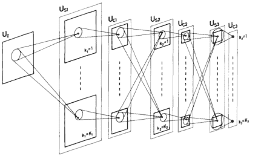

弗朗索瓦·弗勒雷是瑞士日内瓦大学的计算机科学教授。

封面插图是福岛[1980]的Neocognitron的示意图，是深度神经网络的重要祖先之一。

此电子书的格式适合手机屏幕。

## 目录

- 目录 5
- 图表列表 7
- 前言 8
- **I 基础** 10
- **1 机器学习** 11
  - 1.1 从数据中学习 12
  - 1.2 基函数回归 14
  - 1.3 欠拟合和过拟合 16
  - 1.4 模型的分类 18
- **2 高效计算** 20
  - 2.1 GPU、TPU和批处理 21
  - 2.2 张量 23
- **3 训练** 25
  - 3.1 损失函数 26
  - 3.2 自回归模型 30
  - 3.3 梯度下降 35
  - 3.4 反向传播 40
  - 3.5 深度的价值 45
  - 3.6 训练协议 48
  - 3.7 规模的好处 51

### II 深度模型 56

#### 4 模型组件 57
- 4.1 层的概念 58
- 4.2 线性层 60
- 4.3 激活函数 70
- 4.4 池化 73
- 4.5 丢弃 76
- 4.6 归一化层 79
- 4.7 跳跃连接 83
- 4.8 注意力层 86
- 4.9 令牌嵌入 94
- 4.10 位置编码 95

#### 5 架构 97
- 5.1 多层感知机 98
- 5.2 卷积网络 100
- 5.3 注意力模型 107

### III 应用 115

#### 6 预测 116
- 6.1 图像去噪 117
- 6.2 图像分类 119
- 6.3 目标检测 120
- 6.4 语义分割 125
- 6.5 语音识别 128
- 6.6 文本-图像表示 130
- 6.7 强化学习 133

#### 7 合成 137
- 7.1 文本生成 138
- 7.2 图像生成 141
- 缺失的部分 145
- 参考文献 150
- 索引 159

## 图表列表

- 1.1 核回归 14
- 1.2 核回归的过拟合 16
- 3.1 因果自回归模型 32
- 3.2 梯度下降 36
- 3.3 反向传播 40
- 3.4 特征扭曲 46
- 3.5 训练和验证损失 49
- 3.6 缩放定律 52
- 3.7 模型训练成本 54
- 4.1 1D 卷积 62
- 4.2 2D 卷积 63
- 4.3 步幅、填充和扩张 64
- 4.4 接受域 67
- 4.5 激活函数 71
- 4.6 最大池化 74
- 4.7 丢弃 77
- 4.8 2D Dropout 78
- 4.9 批归一化 80
- 4.10 跳跃连接 84
- 4.11 注意力操作解释 87
- 4.12 完整的注意力操作 89
- 4.13 多头注意力层 91
- 5.1 多层感知器 98
- 5.2 类似LeNet的卷积模型 101
- 5.3 残差块 102
- 5.4 下采样残差块 103
- 5.5 ResNet-50 104
- 5.6 Transformer组件 108
- 5.7 Transformer 109
- 5.8 GPT模型 111
- 5.9 ViT模型 113
- 6.1 卷积目标检测器 121
- 6.2 使用SSD的目标检测 122
- 6.3 使用PSP的语义分割 126
- 6.4 CLIP零样本预测 132
- 6.5 DQN状态值演化 135
- 7.1 使用GPT的少样本预测 139
- 7.2 降噪扩散 142

## 前言

人工智能目前的进展阶段是由Krizhevsky等人[2012]触发的，他们展示了一个简单结构的人工神经网络，这个结构已经存在了二十多年[LeCun等人，1989]，通过增加一百倍的规模并在类似的数据集上进行训练，能够以巨大的优势击败最先进的图像识别方法。

这一突破得益于图形处理单元（GPUs），这是一种用于实时图像合成和人工神经网络的大规模、高并行计算设备。

从那时起，在“深度学习”这个总称下，这些网络的结构创新、训练策略以及专用硬件的发展使得它们的规模和数量呈指数级增长。这导致了在技术领域出现了一波成功的应用，包括计算机视觉、机器人技术、语音和自然语言处理。

这些应用充分利用了大量的训练数据[Sevilla 等人，2022年]。这在技术领域引起了一股成功的浪潮，从计算机视觉和机器人技术到语音和自然语言处理。

尽管深度学习的大部分内容并不难理解，但它结合了线性代数、微积分、概率、优化、信号处理、编程、算法和高性能计算等多种组成部分，使其学习变得复杂。

这本小书并不试图详尽无遗，而是限于提供了理解一些重要模型所需的背景知识。这被证明是一种受欢迎的方法，在Twitter上宣布后的一个月内，PDF文件被下载了25万次。

如果你没有从官方网址获取这本书

<https://fleuret.org/public/lbdl.pdf>

请这样做，这样我可以估计读者的数量。

弗朗索瓦 · 弗勒雷特，
2023年6月23日

## 第一部分

## 基础知识

## 第1章

## 机器学习

深度学习在历史上属于更大的统计机器学习领域，因为它根本上涉及能够从数据中学习表示的方法。涉及的技术最初来自人工神经网络，而“深度”限定词强调了模型是长的映射组合，现在已知能够实现更好的性能。

深度模型的模块化、多功能性和可扩展性导致了大量特定的数学方法和软件开发工具的出现，将深度学习确立为一个独特而广阔的技术领域。

### 1.1 从数据中学习

从数据训练的模型的最简单用例是当一个信号 $x$ 是可访问的，例如车牌的图片，从中想要预测一个数量 $y$，比如车牌上写的字符串。

在许多现实世界的情况下，其中 $x$ 是在一个不受控制的环境中捕获的高维信号，很难提出一个分析的关系式来关联 $x$ 和 $y$。

我们可以做的是收集一个大型训练集 $\mathscr{D}$ 中的对 $(x_n, y_n)$，并设计一个参数化的模型 $f$。这是一段计算机代码，它包含可训练的参数 $w$，这些参数可以调节其行为，并且当具有适当的值 $w^*$ 时，它是一个很好的预测器。在这里，“好”的意思是，如果给这段代码一个输入 $x$，它计算出的值 $\hat{y} = f(x; w^*)$ 是对应于训练集中 $x$ 的 $y$ 的一个很好的估计，如果它在训练集中存在的话。

这种优良性的概念通常用损失 $\mathscr{L}(w)$ 来形式化，当 $f(\cdot; w)$ 在 $\mathscr{D}$ 上表现良好时，损失 $\mathscr{L}(w)$ 较小。然后，训练模型包括计算一个最小化损失 $\mathscr{L}(w^*)$ 的值 $w^*$。

### 1.2 基函数回归

本书的大部分内容是关于定义 $f$ 的，而在现实场景中，$f$ 是预定义子模块的复杂组合。

组成 $w$ 的可训练参数通常被称为权重，类比于生物神经网络的突触权重。除了这些参数，模型通常还依赖于元参数，根据领域先验知识、最佳实践或资源约束进行设置。它们也可以通过一些不同于优化 $w$ 的技术进行优化。

我们可以通过一个简单的例子来说明模型的训练，其中 $x_n$ 和 $y_n$ 是两个实数，损失是均方误差：

$$\mathscr{L}(w) = \frac{1}{N} \sum_{n=1}^{N} (y_n - f(x_n; w))^2, \quad (1.1)$$

而 $f(\cdot; w)$ 是预定义函数基 $f_1, \dots, f_K$ 的线性组合，其中 $w = (w_1, \dots, w_K)$：

$$f(x; w) = \sum_{k=1}^{K} w_k f_k(x).$$

由于 $f(x_n; w)$ 相对于 $w_k$ 是线性的且 $\mathscr{L}(w)$ 相对于 $f(x_n; w)$ 是二次的，

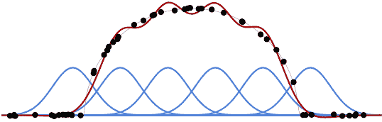

图 1.1：给定一组基函数（蓝色曲线）和一个训练集（黑色点），我们可以计算出前者的最优线性组合（红色曲线）以逼近后者的均方误差。

### 1.3 欠拟合和过拟合

损失函数 $\mathscr{L}(w)$ 相对于 $w_k$ 是二次的，找到使其最小化的 $w^*$ 归结为解线性系统。参见图1.1，其中以高斯核函数作为 $f_k$ 的示例。

一个关键因素是模型的容量，即其灵活性和能力适应多样化的数据，以及训练数据的数量和质量。当容量不足时，模型无法拟合数据，在训练过程中产生高误差。这被称为欠拟合。

相反，当数据量不足时，如图 1.2 所示，模型通常会学习特定于训练样本的特征，在训练过程中表现出色，但代价是更难适应数据的全局结构，但对新输入的性能较差。这种现象被称为过拟合。

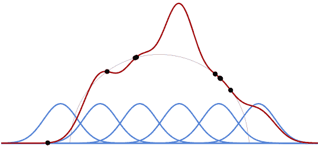

图 1.2: 如果训练数据量 (黑点) 相对于模型容量较小，拟合模型在训练过程中的经验性性能 (红曲线) 与其底层数据结构的实际拟合 (细黑曲线) 差距较大，因此对于预测的有用性较差。

因此，应用机器学习的艺术的很大一部分是设计模型，使其不过于灵活但仍能适应数据。这是通过在模型中构建正确的归纳偏差来实现的，这意味着其结构与手头数据的基本结构相对应。

尽管这种经典观点对于规模适中的深度模型是相关的，但是对于具有非常大量可训练参数和极高容量但仍然能够良好预测的大型模型来说，情况变得复杂。我们将在§ 3.6和§ 3.7中回到这个问题。

### 1.4 模型的分类

我们可以将机器学习模型的使用分为三个广泛的类别：

- 回归是指预测一个连续值向量 $y \in \mathbb{R}^K$，例如给定一个输入信号 $X$，预测一个物体的几何位置。这是我们在§ 1.2中看到的设置的多维推广。训练集由输入信号和真实标签的对组成。
- 分类旨在预测来自有限集合 $\{1, \dots, C\}$ 的值，例如图像 $X$ 的标签 $Y$。与回归一样，训练集由输入信号和真实标签的对组成，这里是来自该集合的标签。解决这个问题的标准方法是为每个潜在类别预测一个分数，使得正确的类别具有最大的分数。
- 密度建模的目标是对数据 $\mu_X$ 本身的概率密度函数进行建模，例如图像。在这种情况下，训练集由没有关联标签需要预测的值 $x_n$ 组成，训练的模型应该允许评估概率密度函数或从分布中进行采样，或者两者兼而有之。

回归和分类通常被称为监督学习，因为在训练过程中需要提供目标值，这个目标值通常由人类专家提供。相反，密度建模通常被视为无监督学习，因为只需要使用现有数据即可。无需人工生成关联的真实数据，可以直接使用数据。

这三个类别并不是互斥的；例如，分类可以被视为类别得分回归，或者离散序列密度建模可以被视为迭代分类。此外，它们并不能涵盖所有情况。有时可能需要预测复合数量，或多个类别，或在信号条件下建模密度。

## 第2章

## 高效计算

从实现的角度来看，深度学习是关于使用大量数据执行大量计算。图形处理单元（GPU）在成功中起到了重要作用。

通过在可负担得起的硬件上运行这些计算，加速了该领域的进展。

它们的使用重要性以及由此产生的技术约束，迫使该领域的研究不断平衡数学的准确性和新方法的可实现性。

### 2.1 图形处理单元（GPUs）、张量处理单元（TPUs）和批处理

图形处理单元最初是为实时图像合成而设计的，需要高度并行的架构，非常适合深度模型。随着人工智能的使用增加，GPU已经配备了专用的张量核心，还开发了专门用于深度学习的芯片，如Google的张量处理单元（TPUs）。

GPU拥有数千个并行单元和自己的快速内存。限制因素通常不是计算单元的数量，而是对内存的读写操作。最慢的连接是CPU内存和GPU内存之间的连接，因此应避免在设备之间复制数据。此外，GPU本身的结构涉及多级缓存内存，这些缓存内存较小但更快，应该组织计算以避免在这些不同的缓存之间复制数据。

这是通过将计算分批处理来实现的，每个批次的样本可以完全适应GPU内存并且可以并行处理。当操作符组合一个样本和模型参数时，两者都必须移动到靠近实际计算的缓存内存中。

### 2.2 张量

GPU和深度学习框架（如PyTorch或JAX）通过将要处理的数量组织成张量来进行操作，这些张量是沿着几个离散轴排列的一系列标量。它们是 $\mathbb{R}^{N_1 \times \cdots \times N_D}$ 的元素，广义上推广了向量和矩阵的概念。

张量用于表示待处理的信号、模型的可训练参数以及它们计算的中间量。后者被称为激活，与神经元的激活相对应。

例如，时间序列自然地被编码为 $T \times D$ 张量，或者出于历史原因，被编码为 $D \times T$ 张量，其中 $T$ 是其持续时间，$D$ 是每个时间步的特征表示的维度，通常称为通道数。类似地，$2D$ 结构化信号可以表示为 $D \times H \times W$ 张量，其中 $H$ 和 $W$ 是其高度和宽度。RGB图像对应于 $D=3$，但在大型模型中，通道数可以增加到几千个。

增加更多的维度可以表示一系列的对象。例如，五十个分辨率为 $32 \times 24$ 的RGB图像可以被编码为一个 $50 \times 3 \times 24 \times 32$ 张量。

深度学习库提供了大量的操作，包括标准线性代数、复杂的重塑和提取，以及深度学习特定的操作，其中一些我们将在第4章看到。张量的实现将形状表示与存储布局分离，这样就可以在不进行系数复制的情况下进行许多重塑、转置和提取操作，因此非常快速。

实际上，几乎任何计算都可以分解为基本的张量操作，这避免了语言层面上的非并行循环和糟糕的内存管理。

除了是方便的工具外，张量在实现计算效率方面也起着重要作用。参与操作性深度模型开发的所有人，从驱动程序、库和模型的设计者到计算机和芯片的设计者，都知道数据将被处理为张量。由此产生的对局部性和块可分解性的约束使得这个链条中的所有参与者都能提出最优设计。

标准GPU的理论峰值性能为每秒 $10^{13}$-$10^{14}$ 浮点运算(FLOPs)，其内存通常为 8到 80千兆字节。浮点数的标准 $FP_{32}$ 编码为 32位，但是经验结果表明，对于某些操作数，使用16位甚至更少的编码不会降低性能。

我们将在 § 3.7 中回到深度架构的大尺寸问题。

## 第三章

### 训练

正如在 § 1.1 中介绍的那样，训练模型包括最小化损失 $\mathscr{L}(w)$，该损失反映了预测器 $f(\cdot; w)$ 在训练集 $\mathscr{D}$ 上的性能。

由于模型通常非常复杂，并且它们的性能与损失的最小化程度直接相关，因此这种最小化是一个关键挑战，涉及到计算和数学上的困难。

### 3.1 损失函数

方程式 1.1 中的均方误差的例子是预测连续值的标准损失。

对于密度建模，标准损失是数据的似然。如果 $f(x;w)$ 被解释为归一化的对数概率或对数密度，则损失是其在训练样本上值的相反数之和，对应于数据集的似然。

#### 交叉熵

对于分类问题，通常的策略是模型的输出是一个向量，每个类别对应一个组件 $f(x;w)_y$，被解释为非归一化概率的对数，或者对数几率。

对于输入信号 $X$ 和要预测的类别 $Y$，我们可以从 $f$ 中计算后验概率的估计值：

$$\hat{P}(Y=y \mid X=x)=\frac{\exp f(x ; w)_{y}}{\sum_{z} \exp f(x ; w)_{z}}$$

这个表达式通常被称为 softmax，或者更准确地说，是 logits 的 softargmax。

为了与这个解释保持一致，模型应该被训练成最大化真实类别的概率，因此最小化交叉熵，表示为：

$$\begin{aligned} \mathscr{L}_{ce}(w) &= -\frac{1}{N} \sum_{n=1}^{N} \log \hat{P}(Y=y_n \mid X=x_n) \\ &= \frac{1}{N} \sum_{n=1}^{N} \underbrace{-\log \frac{\exp f(x_n; w)_{y_n}}{\sum_z \exp f(x_n; w)_z}}_{L_{\text{交叉熵}}(f(x_n; w), y_n)} . \end{aligned}$$

#### 对比损失

在某些设置中，即使要预测的值是连续的，监督也采用排名约束的形式。典型的情况是度量学习，目标是学习样本之间的距离度量，使得来自某个语义类别的样本 $x_a$ 比任何来自其他类别的样本 $x_c$ 更接近，而不是任何来自同一类别的样本 $x_b$。例如，$x_a$ 和 $x_b$ 可以是某个人的两张照片，而 $x_c$ 是其他人的照片。

假设 $y_a = y_b = y_c$，标准三元组对比损失定义为：

$$\max(0, 1 - f(x_a, x_c; w) + f(x_a, x_b; w)).$$

除非这个数量严格为正，否则 $f(x_a, x_c; w) \geq 1 + f(x_a, x_b; w)$。对于这种情况，标准方法是最小化对比损失，通常对三元组 $(x_a, x_b, x_c)$ 求和。

### 优化损失函数

通常，在训练过程中最小化的损失函数并不是最终想要优化的实际量，而是一个更容易找到最佳模型参数的代理。例如，交叉熵是分类问题的标准损失函数，尽管实际的性能度量是分类错误率，因为后者没有信息量的梯度，这是一个关键要求，如我们将在 § 3.3 中看到的。

还可以添加依赖于模型的可训练参数的项到损失函数中，以偏好某些配置。

例如，权重衰减正则化是将损失函数增加一个与参数平方和成比例的项。这可以解释为在参数上具有高斯贝叶斯先验，它偏好较小的值，从而减少数据的影响。这会在训练集上可能会降低性能，但减小了训练性能与新的、未见过的数据之间的差距。

### 3.2 自回归模型

一类关键的方法，特别适用于自然语言处理和计算机视觉中处理离散序列的问题，即自回归模型。

#### 概率的链式法则

这类模型利用了概率论中的链式法则：

$$P(X_1 = x_1, X_2 = x_2, \dots, X_T = x_T) = P(X_1 = x_1) \times P(X_2 = x_2 \mid X_1 = x_1) \dots \times P(X_T = x_T \mid X_1 = x_1, \dots, X_{T-1} = x_{T-1}).$$

尽管这种分解对于任何类型的随机序列都是有效的，但当感兴趣的信号是来自有限词汇 $\{1, \dots K\}$ 的序列时，它尤其高效。

根据约定，附加的符号 $\emptyset$ 表示“未知”数量，我们可以将事件 $\{X_1 = x_1, \dots, X_t = x_t\}$ 表示为向量 $(x_1, \dots, x_t, \emptyset, \dots, \emptyset)$。

然后，一个模型

$$f: \{\emptyset, 1, \dots, K \}^T \rightarrow \mathbb{R}^K$$

给定这样的输入，计算对应于一个向量 $l_t$ 的 $K$ 个 logits 的模型：

$$\hat{P}(X_t \mid X_1 = x_1, \dots, X_{t-1} = x_{t-1}),$$

允许根据先前的标记来采样一个标记。

链式法则确保通过逐个采样 $T$ 个 tokens $x_t$，给定先前采样的标记 $x_1, \dots, x_{t-1}$，我们得到一个遵循联合分布的序列。这是一个自回归生成模型。

训练这样的模型可以通过最小化训练序列和时间步的交叉熵损失之和来完成：

$$L_{ce}(f(x_1, \dots, x_{t-1}, \emptyset, \dots, \emptyset; w), x_t),$$

这在形式上等同于最大化真实标记的似然函数。

通常监测的值不是交叉熵本身，而是困惑度，它被定义为交叉熵的指数。它对应于具有相同熵的均匀分布的值的数量，这通常更易于解释。

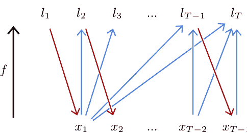
图3.1：自回归模型 $f$，如果输入序列的时间步 $x_t$ 仅在预测的 logit $l_s$ 上调制，当且仅当 $s > t$ 时，如蓝色箭头所示。这允许在训练期间一次性计算所有时间步长的分布。然而，在采样过程中，$l_t$ 和 $x_t$ 是按顺序计算的，后者是由前者采样得到的，如红色箭头所示。

#### 因果模型

我们描述的训练过程对于每个 $t$ 都需要不同的输入，并且对于 $t < t'$ 的大部分计算都需要重复进行 $t'$。这非常低效，因为 $T$ 通常是数百或数千的数量级。

解决这个问题的标准策略是一次性设计一个模型 $f$，它预测所有的 logits 向量 $l_1, \dots, l_T$，即：

$$f : \{1, \dots, K \}^T \to \mathbb{R}^{T \times K},$$

但是，计算结构要求计算的 logits $l_t$ 对于输入值 $x_t$ 只依赖于输入值 $x_1, \dots, x_{t-1}$。

这样的模型被称为因果模型，因为在时间序列的情况下，它不允许未来影响过去，如图3.1所示。

其结果是，每个位置的输出是在该位置之前的输入可用的情况下得到的输出。在训练过程中，它允许计算完整序列的输出，并最大化该序列中所有标记的预测概率，这又可以归结为最小化每个标记的交叉熵之和。

请注意，为了简单起见，我们定义了 $f$ 作为对固定长度 $T$ 的序列进行操作。然而，实际使用的模型，如我们将在 § 5.3 中看到的 transformers，能够处理任意长度的序列。

#### 分词器

处理自然语言时的一个重要技术细节是，表示为标记的方式可以有多种，从最细粒度的单个符号到整个单词。转换到和从令牌表示的过程由一个名为令牌化器的单独算法完成。

一个标准的方法是字节对编码 (BPE) [Sennrich et al., 2015]，它通过逐层合并字符组来构建令牌，试图获得代表不同长度但频率相似的单词片段的令牌，将令牌分配给长频繁片段以及罕见的单个符号。

### 3.3 梯度下降

除了像我们在第 1.2 节中看到的线性回归这样的特殊情况，最优参数 $w^*$ 没有闭式表达式。在一般情况下，最小化函数的选择工具是梯度下降。它通过使用随机 $w_0$ 初始化参数，并通过迭代梯度步骤来改进此估计值，每个步骤都包括计算损失函数相对于参数的梯度，并减去其一部分：

$$w_{n+1} = w_n - \eta \nabla \mathscr{L} |_{w} (w_n). \quad (3.1)$$

这个过程相当于将当前估计值沿着局部最大程度减小 $\mathscr{L}(w)$ 的方向移动一点，如图3.2所示。

#### 学习率

元参数 $\eta$ 被称为学习率。它是一个正值，调节最小化的速度，必须谨慎选择。如果它太小，优化过程将会很慢，最坏的情况下可能会陷入局部最小值。如果它太大，优化过程可能会在一个好的最小值周围反弹，永远不会降到它。正如我们将在 § 3.6 中看到的，它可能取决于迭代次数 $n$。

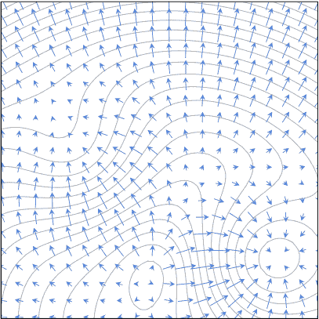
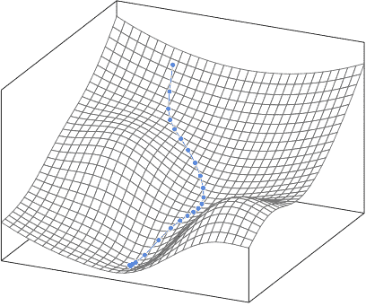
图3.2: 在每个点 $w$ 处，梯度 $\nabla \mathcal{L}|_w(w)$ 的方向是最大化 $\mathcal{L}$ 的增加，或者与等高线垂直（顶部）。梯度下降通过在每一步中减去梯度的一部分来迭代地最小化 $\mathscr{L}(w)$，从而得到一个沿着最陡下降方向的轨迹（底部）。

#### 随机梯度下降

实际中使用的所有损失都可以表示为每个小样本组的平均损失，或者每个样本的损失，如下所示：

$$\mathscr{L}(w) = \frac{1}{N} \sum_{n=1}^N \ell_n(w),$$

其中 $\ell_n(w) = L(f(x_n; w), y_n)$ 对于某个 $L$，梯度如下：

$$\nabla \mathscr{L}_{|w}(w) = \frac{1}{N} \sum_{n=1}^N \nabla \ell_{n|w}(w). \quad (3.2)$$

由此得到的梯度下降将计算方程 3.2 中的总和，这通常是计算量很大的，然后根据方程 3.1 更新参数。然而，在合理的交换性假设下，例如，如果样本已经被适当地洗牌，方程 3.2 的任何部分和都是对完整的和无偏估计，尽管有噪声。因此，从部分和中更新参数相当于进行更多的梯度步骤。对于相同的计算预算，梯度的估计更加嘈杂。由于数据中的冗余，这实际上是一种更高效的策略。

我们在第 2.1 节中看到，处理一批样本的速度足够快，可以适应计算设备的内存。因此，标准的方法是将完整的数据集 $\mathscr{D}$ 分成批次，并根据每个批次计算的梯度估计来更新参数。这被称为小批量随机梯度下降，或简称为随机梯度下降（SGD）。

重要的是要注意，这个过程非常渐进，并且小批量和梯度步数通常是几百万的数量级。与许多算法一样，直觉在高维度下失效，尽管这个过程可能会被困在局部最小值中，但实际上，由于参数的数量，模型的设计以及数据的随机性，其效率远远超出人们的预期。

有很多变种的标准策略已经被提出。最流行的是 Adam [Kingma 和 Ba, 2014]，它保持运行梯度的每个分量的均值和方差的估计，并自动进行归一化，避免了缩放问题和模型不同部分的训练速度差异。

### 3.4 反向传播

使用梯度下降需要一种技术手段来计算 $\nabla \ell|_{w}(w)$ 其中 $\ell = L(f(x;w);y)$。鉴于 $f$ 和 $L$ 都是标准张量操作的组合，就像任何数学表达式一样，微分计算的链式法则允许我们得到它的表达式。

为了简化符号，我们不会指定梯度在哪个点计算，因为上下文可以清楚地表明。

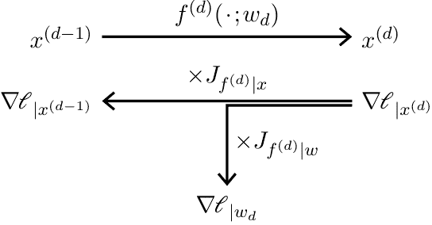
图3.3：给定一个模型 $f = f^{(D)} \circ \dots \circ f^{(1)}$，前向传播（顶部）是按顺序计算映射 $f^{(d)}$ 的输出 $x^{(d)}$。反向传播（底部）通过乘以雅可比矩阵计算损失相对于激活函数 $x^{(d)}$ 和参数 $w_d$ 的梯度。

#### 前向和反向传播

考虑一个简单的映射组合的情况：

$$f = f^{(D)} \circ f^{(D-1)} \circ \dots \circ f^{(1)}.$$

函数 $f(x;w)$ 的输出可以通过以下方式计算：从 $x^{(0)} = x$ 开始，迭代应用如下：

$$x^{(d)} = f^{(d)} \left( x^{(d-1)}; w_d \right),$$

其中 $x^{(D)}$ 为最终值。

这些中间结果的标量值 $x^{(d)}$ 传统上被称为激活值，与神经元的激活有关。值 $D$ 表示模型的深度，映射 $f^{(d)}$ 被称为层，如第 4.1 节所述，它们的顺序计算称为前向传播（参见图 3.3，顶部）。

相反，损失函数对 $f^{(d-1)}$ 的输出 $x^{(d-1)}$ 的梯度 $\nabla \ell |_{x^{(d-1)}}$ 是梯度 $\nabla \ell |_{x^{(d)}}$ 与 $f^{(d-1)}$ 的输出 $x^{(d-1)}$ 的雅可比矩阵 $J_{f^{(d-1)}}|_{x^{(d-1)}}$ 的乘积。因此，对于所有 $f^{(d)}$ 的输出的梯度可以通过递归地向后计算得到，从 $\nabla \ell |_{x^{(D)}} = \nabla L|_x$ 开始。

我们感兴趣的训练梯度是 $\nabla \ell_{|w_d}$，是相对于 $f^{(d)}$ 的输出的梯度乘以 $f^{(d)}$ 的雅可比矩阵 $J f^{(d)}|_{w}$ 对于参数的梯度。这种对中间激活的梯度的迭代计算，与对层参数的梯度的计算相结合，称为反向传播（见图3.3底部）。这种计算与梯度下降过程的结合统称为反向传播算法。

实际上，前向和反向传播的实现细节对程序员是隐藏的。深度学习框架能够自动构建计算梯度的操作序列。一种特别方便的算法是 Autograd [Baydin et al., 2015]，它跟踪张量操作，并即时构建梯度操作的组合。由于这一点，操作张量的命令式编程可以自动计算任何数量相对于其他数量的梯度。

#### 资源使用

关于计算成本，正如我们将看到的，大部分计算都用于线性操作，每个操作需要一个矩阵乘积进行前向传递，并且对于后向传递的雅可比乘积需要两个矩阵乘积，使得后者的成本大约是前者的两倍。

推理期间的内存需求大致等于要求最高的单个层的内存需求。然而，训练过程中，后向传递需要保留在前向传递期间计算的激活值来计算雅可比矩阵，这导致内存使用量与模型深度成正比增长。存在一些技术来通过依赖可逆层 [Gomez et al., 2017] 或使用检查点来交换内存使用量和计算量，检查点存储了某些层的激活值，并在后向传递期间通过部分前向传递重新计算其他层 [Chen et al., 2016]。

#### 梯度消失

在训练大型神经网络时，一个关键的历史问题是当梯度向后传播通过一个运算符时，它可能会被缩放乘法因子，并且当它经过许多层时呈指数级地减少或增加。防止梯度爆炸的标准方法是梯度范数剪切，即将梯度重新缩放以将其范数设置为固定阈值，如果超过该阈值 [Pascanu 等人，2013]。

当梯度指数级减小时，这被称为梯度消失，它可能使训练变得不可能，或者在较轻的情况下，导致模型的不同部分以不同的速度更新，降低它们的协同适应性 [Glorot 和 Bengio，2010]。

正如我们将在第 4 章中看到的，已经开发出了多种技术来防止这种情况发生，这反映了对深度学习成功至关重要的视角变化：不再试图改进通用优化方法，而是将努力转向工程化模型本身，使其可优化。

## 3.5 深度价值

正如“深度学习”一词所示，有用的模型通常是长序列映射的组合。 用梯度下降训练它们会导致映射的复杂协同适应，尽管这个过程是渐进和局部的。

我们可以用一个简单的模型来说明这种行为，它是一个将八个层组合在一起的模型，每个层都将输入乘以一个 $2 \times 2$ 的矩阵，并对每个分量应用 Tanh 函数，最后使用线性分类器。 这是标准多层感知机的简化版本，我们将在第 $5.1$ 节中看到。

如果我们用随机梯度下降和交叉熵在一个玩具二分类任务上训练这个模型（图3.4，左上角），矩阵会协同变形空间，直到分类正确，这意味着在最后的仿射操作之前，数据已经线性可分（图3.4，右下角）。

这个例子展示了深度模型的潜力；然而，由于信号处理和内部表示的低维度，它在某种程度上是误导性的。

为了简单起见，这里所有的东西都保持在二维空间中。

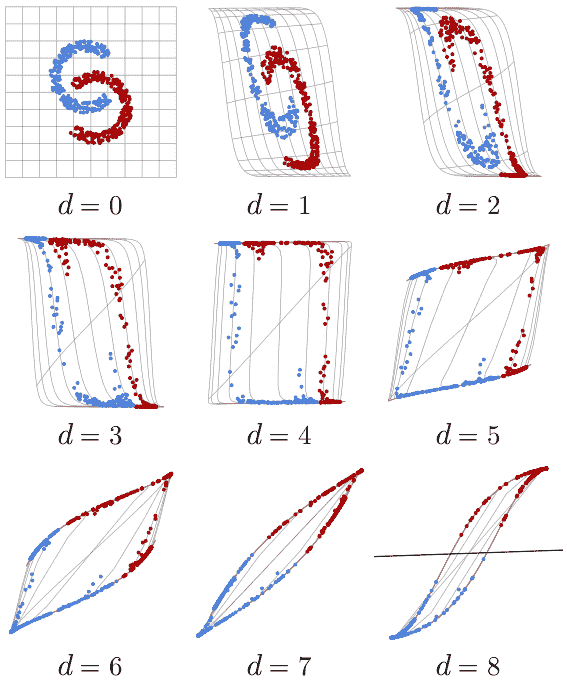

图3.4：每个图显示了空间的变形和经过$d$层处理后在$\mathbb{R}^2$中训练点的定位，从模型本身的输入开始（左上角）。最后一个图中的斜线（右下角）显示了最终的仿射决策。

虽然真实模型利用高维度的表示，这在特定情况下有助于优化，提供了许多自由度。

二十年来积累的经验证据表明，在各个应用领域中，最先进的性能都需要具有数十层的模型，例如残差网络（见第5.2节）或Transformer（见第5.3节）。

理论结果表明，在固定的计算预算或参数数量的情况下，增加深度会导致结果映射的复杂性增加[Telgarsky, 2016]。

### 3.6 训练协议

训练深度网络需要定义一个协议，以充分利用计算和数据，并确保在新数据上性能良好。

正如我们在第1.3节中所看到的，对训练样本的性能可能会误导，因此在最简单的设置中，至少需要两组样本：一组是用于优化模型参数的训练集，另一组是用于评估训练模型性能的测试集。

此外，通常还有一些元参数需要调整，特别是与模型架构、学习率和损失函数中的正则化项相关的参数。在这种情况下，需要一个与训练集和测试集都不重叠的验证集来评估最佳配置。

完整的训练通常被分解为多个轮次，每个轮次对应一次遍历所有训练样本。

通常情况下，训练损失在优化过程中会不断减小，而验证损失可能会在一定轮次后达到最小值，然后开始增加，反映出过拟合的情况。

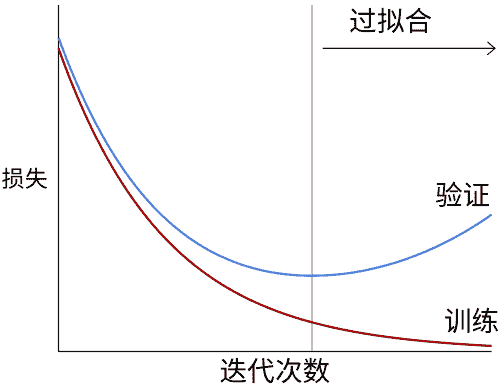

图3.5：随着训练的进行，模型的性能通常通过损失进行监控。训练损失是驱动优化过程的损失，会下降，而验证损失是在另一组示例上估计的，用于评估模型的过拟合情况。当模型开始考虑特定于训练集的随机结构时，就会出现过拟合现象，导致验证损失开始增加。

完整的训练过程在第1.3节中介绍，并在图3.5中说明。

矛盾的是，尽管由于其容量而应该遭受严重的过拟合，但大型模型通常在训练过程中继续改进。这可能是由于模型的归纳偏差成为主要驱动因素，当性能接近完美时，训练集上的损失[Belkin et al., 2018]。

在训练过程中，一个重要的设计选择是学习率的调度，也就是在每次梯度下降迭代中指定学习率的值。一般的策略是学习率应该初始较大，以避免优化过程早期陷入一个不好的局部最小值，并且学习率应该逐渐减小，以使优化参数的值不会在损失函数的狭窄山谷中反弹，并达到一个好的最小值。深度学习是一种机器学习方法，它模拟人脑神经网络的工作原理，通过多层次的神经网络来学习和提取数据的特征。

训练极大模型可能需要数月时间，在数千个强大的GPU上进行，并且需要数百万美元的财务成本。在这个规模下，训练可能涉及许多人工干预，特别是根据损失演化的动态信息。

### 3.7 规模的好处

有大量的经验结果积累，显示出性能的提升，例如通过测试数据上的损失估计，根据显著的缩放定律，随着数据量的增加而改善，只要模型大小相应地增加[Kaplan等人，2020]（见图3.6）。

在数十亿样本的情况下，从这些缩放定律中受益部分得益于模型的结构可塑性，它们可以通过增加层数或特征维度来任意扩展，我们将看到。但也得益于这些模型实施的分布式计算的性质，以及随机梯度下降，它只需要一小部分数据，并且可以处理比计算设备内存规模大几个数量级的数据集。这导致模型呈指数增长，如图3.7所示。

典型的视觉模型具有 10–100百万个可训练参数，并且需要 $10^{18}$–$10^{19}$ FLOPs 用于训练[He et al., 2015; Sevilla et al., 2022]。语言模型的可训练参数数目可达数百亿，训练过程需要 $10^{20}-10^{23}$ FLOPs [Devlin et al., 2018; Brown et al., 2020; Chowdhery et al., 2022; Sevilla et al., 2022]。这些后期模型需要配备多个高端GPU的机器。

使用昂贵的详细真实数据集训练这些大型模型是不可能的，因为这些数据集只能是中等规模。相反，它是通过自动组合互联网上可用的数据与最少的策划（如果有的话）来完成的。这些数据集可以结合多种模态，例如网页上的文本和图像，或者视频中的声音和图像，用于大规模的监督训练。

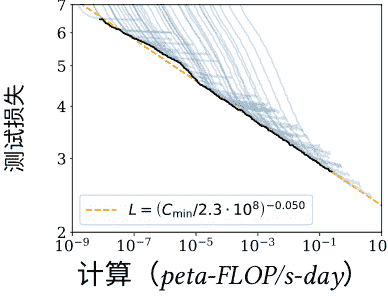

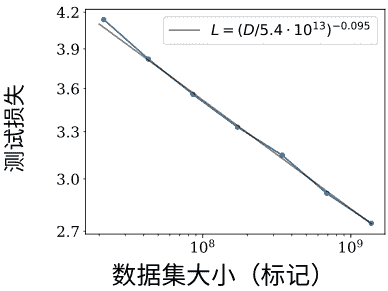

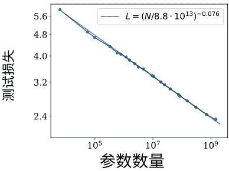

图3.6：语言模型的测试损失与计算量（以 *petaflop/s-day* 为单位）、数据集大小（以标记为单位，即单词片段）和模型大小（以参数为单位）的关系 [*Kaplan et al., 2020*]。

| 数据集 | 年份 | 图片数量 | 大小 |
| :--- | :--- | :--- | :--- |
| ImageNet | 2012 | 1.2百万 | 150Gb |
| Cityscape | 2016 | 25K | 60Gb |
| LAION-5B | 2022 | 58亿 | 240Tb |

| 数据集 | 年份 | 书籍数量 | 大小 |
| :--- | :--- | :--- | :--- |
| WMT-18-de-en | 2018 | 14M | 8Gb |
| 堆 | 2020 | 1.6B | 825Gb |
| 奥斯卡 | 2020 | 12B | 6Tb |

表3.1: 一些公开可用数据集的示例。相当数量的书籍是每本250页，每页2000个字符的估计值。

使用昂贵的详细真实数据集训练这些大型模型是不可能的，因为这些数据集只能是中等规模。相反，它是通过自动组合互联网上可用的数据与最少的策划（如果有的话）来完成的。这些数据集可以结合多种模态，例如网页上的文本和图像，或者视频中的声音和图像，用于大规模的监督训练。

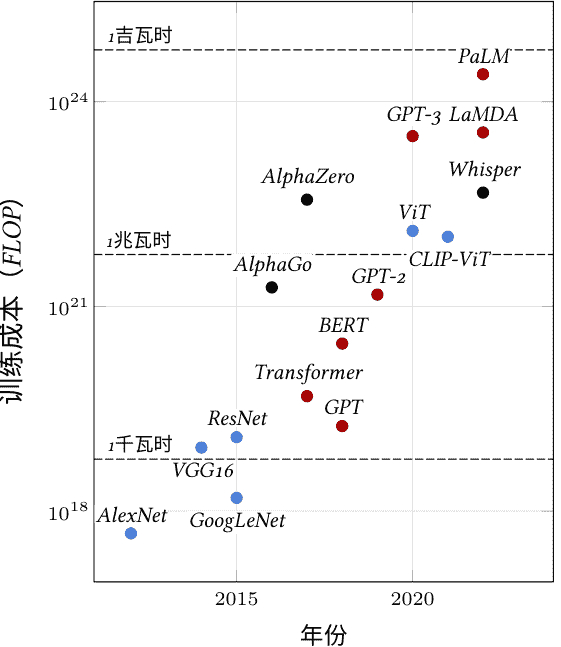

图3.7: 一些里程碑模型的训练成本，以FLOP数量表示[Sevilla et al., 2023]。 颜色表示应用领域：计算机视觉（蓝色），自然语言处理（红色）或其他（黑色）。 虚线对应使用A100s SXM以16位精度的能量消耗。作为参考，2021年美国的总用电量为3920太瓦时。

目前人工智能最令人印象深刻的成就就是所谓的大型语言模型（LLM），我们将在第5.3节和§ 7.1中看到，它们在极大的文本数据集上进行训练（见表3.1）。

## 第二部分

## 深度模型

## 第四章

## 模型组件

深度模型只不过是一个复杂的张量计算，最终可以被分解为线性代数和分析中的标准数学运算。多年来，该领域已经开发出了一个大量的高级模块，具有清晰的语义，并且结合这些模块的复杂模型在特定应用领域中证明是有效的。

经验证据和理论结果表明，更深的架构可以实现更好的性能，即长映射的组合。正如我们在第3.4节中所看到的，由于梯度消失，训练这样的模型是具有挑战性的，但是多个重要的技术贡献已经缓解了这个问题。

### 4.1 层的概念

我们将层称为标准的复合张量操作，这些操作经过设计和经验验证，被认为是通用和高效的。它们通常包含可训练的参数，并且对于设计和描述大型深度模型来说是一种方便的粒度级别。这个术语是从简单的多层神经网络继承而来，尽管现代模型可能采用这些模块的复杂图形形式，包含多个并行路径。

在接下来的页面中，我尽量遵循上面所示的模型表示约定：
- 运算符/层被表示为方框
- 较深的颜色表示它们嵌入了可训练参数
- 非默认值的元参数是在右侧添加蓝色
- 一个虚线外框表示一组层在系列中被复制，每个层都有自己的可训练参数（如果有的话），并且有一个乘法因子
- 在某些情况下，当输出维度与输入维度不同时，其输出维度会在右侧指定

此外，具有复杂内部结构的层显示为更高的高度。

### 4.2 线性层

从计算和参数数量的角度来看，最重要的模块是线性层。它们受益于几十年的研究以及算法和芯片设计中的工程用于矩阵运算。

请注意，在深度学习中，“线性”一词通常不正确地指代仿射操作，即线性表达式和常数偏差的总和。

#### 全连接层

最基本的线性层是全连接层，由可训练的权重矩阵 $W$ 和维度为 $D' \times D$ 的偏置向量 $b$ 参数化。它实现了对任意张量形状的仿射变换，其中附加维度被解释为向量索引。形式上，给定维度为 $D_1 \times \dots \times D_K \times D$ 的输入 $X$，它计算出维度为 $D_1 \times \dots \times D_K \times D'$ 的输出 $Y$，对于所有的 $d_1, \dots, d_K$，$Y[d_1, \dots, d_K] = W X[d_1, \dots, d_K] + b$。

$$\forall d_1, \dots, d_K, Y[d_1, \dots, d_K] = W X[d_1, \dots, d_K] + b$$

尽管乍一看这样的仿射操作似乎仅限于几何变换，如旋转、对称和平移，但实际上它可以做更多。特别是，用于降维或信号过滤的投影，但从点积作为相似度度量的角度来看，矩阵-向量乘积可以解释为计算查询（由输入向量编码）和键（由矩阵行编码）之间的匹配分数。

正如我们在§ 3.3中所看到的，梯度下降从参数的随机初始化开始。如果这样做得太天真，就像在§ 3.4中所看到的那样，网络可能会遭受激活和梯度爆炸或消失的问题[Glorot and Bengio, 2010]。深度学习框架实现了初始化方法，特别是根据输入的维度对随机参数进行缩放，以保持激活的方差恒定，并防止病态行为。

#### 卷积层

线性层可以将任意形状的张量作为输入，通过将其重新形状为向量，只要它具有正确的系数数量。然而，这样的层对于处理大张量时，参数和操作的数量与输入和输出维度的乘积成比例，这是一个挑战。 例如，要处理一个尺寸为 $256 \times 256$ 的 RGB 图像作为输入，并计算出相同尺寸的结果，大约需要 $4 \times 10^{10}$ 个参数和乘法运算。

除了这些实际问题之外，大多数高维信号都具有很强的结构性。 例如，图像展示出短期相关性并且在平移、缩放和某些对称性方面具有统计平稳性。这在全连接层的归纳偏差中没有体现出来，全连接层完全忽略了信号的结构。

为了利用这些规律性，选择的工具是卷积层，它也是仿射的，但是在本地处理时间序列或2D信号，且在每个位置上使用相同的运算符。

$1D$卷积

$1D$转置卷积

图 4.1: $1D$ 卷积（左侧）以 $D \times T$ 张量 $X$ 作为输入，对形状为 $D \times K$ 的每个子张量应用相同的仿射映射 $\phi(\cdot; w)$，并将结果 $D' \times 1$ 张量存储到 $Y$ 中。$1D$转置卷积（右侧）以 $D \times T$ 张量作为输入，对形状为 $D \times 1$ 的每个子张量应用相同的仿射映射 $\psi(\cdot; w)$，并将移位后的结果 $D' \times K$ 张量求和。两者都可以处理不同大小的输入。

图4.2: $2D$ 卷积 (左) 以 $D \times H \times W$ 张量 $X$ 作为输入，对形状为 $D \times K \times L$ 的每个子张量应用相同的仿射映射 $\phi(\cdot; w)$，并将结果 $D' \times 1 \times 1$ 张量存储到 $Y$ 中。$2D$ 转置卷积 (右) 以 $D \times H \times W$ 张量作为输入，对每个 $D \times 1 \times 1$ 子张量应用相同的仿射映射 $\psi(\cdot; w)$，并将移位后的结果 $D' \times K \times L$ 张量求和存储到 $Y$ 中。

图4.3: 除了卷积核大小和输入/输出通道数之外，卷积还有三个元参数：步幅 $s$（左）调节通过输入张量时的步长，填充 $p$（右上）指定在处理之前在输入张量周围添加多少个零条目，扩张 $d$（右下）参数化滤波器系数之间的索引计数。

1D卷积主要由三个元参数定义：其卷积核大小 $K$，输入通道数 $D$，输出通道数 $D'$，以及仿射映射 $\phi(\cdot;w)$ 的可训练参数 $w$。该映射定义为 $\phi(\cdot;w) : \mathbb{R}^{D \times K} \to \mathbb{R}^{D' \times 1}$。

它可以处理大小为 $D \times T$ 的任何张量 $X$，其中 $T \ge K$，并将 $\phi(\cdot;w)$ 应用于 $X$ 的每个大小为 $D \times K$ 的子张量，将结果存储在大小为 $D' \times (T - K + 1)$ 的张量 $Y$ 中，如图 [4.1](4.1)（左侧）所示。

2D卷积类似，但具有 $K \times L$ 的卷积核，并以 $D \times H \times W$ 张量作为输入（见图4.2，左侧）。

这两个运算符都有可训练的参数，$\phi$ 的参数可以被视为 $D'$ 个滤波器，大小为 $D \times K$ 或 $D \times K \times L$，还有一个维度为 $D'$ 的偏置向量。

这样的层对平移具有等变性，也就是说，如果输入信号被平移，输出也会相应地变换。当处理一个分布对平移不变的信号时，这个属性会产生一个有益的归纳偏差。

它们还有三个额外的元参数，如图4.3所示：
- 填充参数指定在处理输入张量之前应该添加多少个零系数，特别是在内核大小大于1时，用于保持张量的大小。其默认值为 0。
- 步长参数指定在遍历输入时使用的步长，允许通过使用大步长来几何地减小输出大小。它的默认值是 1。
- 扩张参数指定了局部仿射操作器滤波器系数之间的索引计数。它的默认值是 1，较大的值对应于在系数之间插入零，从而增加了滤波器/内核的大小，同时保持可训练参数的数量不变。

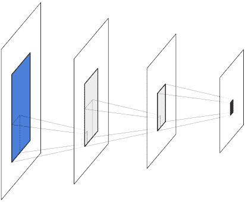

图4.4：给定一系列卷积层中的激活（红色），其感受野是调制其值的输入信号区域（蓝色）。每个中间卷积层大致增加了该区域的宽度和高度，大致等于卷积核的宽度和高度。

除了通道数之外，卷积的输出通常比输入小。在没有填充和扩张的1D情况下，如果输入大小为 $T$, 内核大小为 $K$, 步幅为 $S$, 则输出大小为 $T' = (T - K)/S + 1$。

给定由卷积层计算得到的激活值（即某个位置上所有通道的数值向量），它所依赖的输入信号部分被称为它的感受野（见图4.4）。对应于单个通道的 $H \times W$ 子矩阵被称为激活图，而整个 $D \times H \times W$ 激活张量则被称为特征图。

卷积用于重新组合信息，通常是为了减小表示的空间大小，以换取更多的通道数，这将转化为更丰富的局部表示。它们可以实现差分算子，如边缘检测器，或者模板匹配机制。这样的层的连续叠加也可以被看作是一种组合和分层表示[Zeller和Fergus，2014]，或者是一种扩散过程，在通过层时信息可以通过半个卷积核大小传输。

逆操作是转置卷积，它也由局部仿射操作组成，类似于卷积，但是对于1D情况，它应用于输入的每个 $D \times 1$ 子张量的仿射映射 $\psi(\cdot;w): \mathbb{R}^{D \times 1} \rightarrow \mathbb{R}^{D' \times K}$，并对移位后的 $D' \times K$ 张量求和以计算其输出。这样的操作增加了信号的大小，可以直观地理解为合成过程（见图4.1右侧和图4.2右侧）。

一系列卷积层是将大维度信号（例如图像或声音样本）映射到低维张量的常用架构。例如，这可以用于分类的类别得分或压缩表示。转置卷积层以相反的方式使用，从压缩表示中构建大维度信号，用于评估压缩表示是否包含足够的信息来重构信号，或者用于合成，因为在低维度表示上学习密度模型更容易。我们将在§ 5.2中重新讨论这个问题。

### 4.3 激活函数

如果一个网络只组合线性组件，它本身就是一个线性运算符，所以非线性运算是必不可少的。这些是通过激活函数来实现的，激活函数是一种转换层。通过映射，将输入张量的每个组件单独处理，从而得到一个相同形状的张量。

有许多不同的激活函数，但最常用的是修正线性单元（ReLU）[Glorot et al., 2011]，它将负值设为零并保持正值不变（见图4.5，右上角）：

$$\text{relu}(x) = \begin{cases} 0\text{如果 } x < 0, \ x \text{ 否则}. \end{cases}$$

鉴于深度学习的核心训练策略依赖于梯度，可能在零点不可微分且在实数线的一半上保持常数的映射似乎是有问题的。

然而，梯度下降所需要的主要属性是梯度在平均上是有信息的。参数初始化和数据归一化使得一半的激活值为正数。

当训练开始时，确保这是成立的。

在ReLU被广泛使用之前，标准的激活函数是双曲正切（Tanh，见图4.5，左上角），它在负数和正数两侧都呈指数级饱和，加剧了梯度消失问题。

其他流行的激活函数也遵循相同的思路，保持正值不变并压缩负值。Leaky ReLU [Maas et al., 2013] 应用了一个小的正数乘法应用于负值的放大因子（见图4.5，左下角）：

$$\text{leakyrelu}(x) = \begin{cases} ax \text{ if } x < 0, \\ x \text{ otherwise.} \end{cases}$$

而GELU [Hendrycks和Gimpel，2016]则是使用高斯分布的累积分布函数来定义的：

$$\text{gelu}(x) = xP(Z \le x),$$

其中 $Z \sim \mathcal{N} (0,1)$。它的行为类似于平滑的ReLU（见图4.5，右下角）。

选择激活函数，特别是ReLU的变体之间，通常是基于经验性能的驱动。

### 4.4 池化

减小信号大小的经典策略是使用池化操作，将多个激活组合成一个理想地总结信息的激活。这个类的最常见操作是最大池化层，类似于卷积，可以在1D和2D中操作，并且由一个核大小来定义。

在其标准形式中，该层计算每个通道的最大激活值，在空间大小等于核大小的非重叠子张量上。这些值存储在一个与输入具有相同通道数的结果张量中，其空间大小被核大小除以。与卷积一样，该运算符具有三个元参数：填充、步幅和膨胀，其中步幅相等。默认情况下，卷积核大小为 2。较小的步幅导致较大的结果张量，遵循与卷积相同的公式（见§ 4.2）。

最大操作可以直观地解释为逻辑或，或者当它跟随一系列计算局部分数以确定部分存在的卷积层时，可以解释为编码至少一个部分实例存在的方式。它失去了精确的位置，使其对局部变形不变。

图4.6: 1D最大池化以 $D \times T$ 张量 $X$ 作为输入，计算非重叠的 $1 \times L$ 子张量（蓝色）上的最大值，并将结果值（红色）存储在 $D \times (T/L)$ 张量 $Y$ 中。

标准的替代方法是平均池化层，它计算子张量的平均值而不是最大值。这是一个线性操作，而最大池化不是。

### 4.5 丢弃

一些层被设计成明确地促进训练或改善学习的表示。

这种方法的一个主要贡献是 dropout [Srivastava et al., 2014]。这样的层没有可训练的参数，但有一个元参数 $p$，并且接受任意形状的张量作为输入。

在测试期间通常关闭，此时其输出等于其输入。当它处于激活状态时，它有一个概率 $p$，可以将输入张量的每个激活独立地设置为零，并且将所有激活重新缩放，因子为 $\frac{1}{1-p}$ 以保持期望值不变（见图4.7）。

图4.7: Dropout可以处理任意形状的张量。在训练过程中（左图），它以概率 $p$ 将激活值随机设置为零，并应用乘法因子以保持期望值不变。在测试过程中（右图），它保持所有激活值不变。

dropout的动机是倾向于有意义的个别激活，并阻止群体表示。由于一个群体的 $k$ 个激活保持不变的概率通过dropout层是 $(1-p)k$，联合表示变得不可靠，使训练过程避免使用它们。它也可以看作是一种噪声注入，使训练更加鲁棒。

处理图像和2D张量时，信号的短期相关性和由此产生的冗余会抵消dropout的效果，因为被设置为零的激活值可以从其邻居中推断出来。因此，对于2D张量，dropout会将整个通道设置为零，而不是单个激活值（参见图4.8）。

图4.8: 2D信号（如图像）通常具有较强的短期相关性，并且可以从其邻居中推断出单个激活值。这种冗余性使标准的非结构化dropout失效，因此用于2D张量的通常dropout层会丢弃整个通道，而不是单个值。

尽管dropout通常用于改善训练，在推断过程中是不活动的，但在某些设置中可以将其用作随机化策略，例如用于经验估计置信度分数[Gal and Ghahramani, 2015]。

### 4.6 归一化层

一类重要的运算符用于促进深度架构的训练，这些运算符是规范化层，它们强制经验均值和激活组的方差。

该系列中的主要层是批量归一化[Ioffe和Szegedy, 2015]，它是唯一一个处理批次而不是单个样本的标准层。它由一个元参数 $D$ 和两个可训练的标量参数系列 $\beta_1, \dots, \beta_D$ 和 $\gamma_1, \dots, \gamma_D$ 参数化。

给定一个维度为 $D$ 的批次 $B$ 个样本 $x_1, \dots, x_B$，它首先计算每个 $D$ 分量在批次中的经验均值 $\hat{m}_d$ 和方差 $\hat{v}_d$：

$$\hat{m}_d = \frac{1}{B} \sum_{b=1}^{B} x_{b,d}$$
$$\hat{v}_d = \frac{1}{B} \sum_{b=1}^{B} (x_{b,d} - \hat{m}_d)^2,$$

从中计算每个分量 $x_{b,d}$ 的归一化值 $z_{b,d}$，其经验均值 0 和方差 1，并从中得到最终结果值 $y_{b,d}$，其均值为 $\beta_d$，标准差为偏差 $\gamma_d$：

$$\forall b, \quad z_{b,d}=\frac{x_{b,d}-\hat{m}_d}{\sqrt{\hat{v}_d+\epsilon}}$$
$$y_{b,d}=\gamma_d z_{b,d}+\beta_d.$$

图4.9: 批归一化（左）对给定的 $d$，归一化每组激活的均值和方差，并使用学习的参数对同一组激活进行缩放/平移。层归一化（右）对给定的 $b$，归一化每组激活，并使用相同索引的学习参数对给定的 $d,h,w$ 的每组激活进行缩放/平移。

因为这种归一化是在一个批次中定义的，所以只在训练过程中进行。在测试过程中，该层根据在整个训练集上估计的 $\hat{m}_d$ 和 $\hat{v}_d$ 的移动平均值，对每个样本进行变换，这归结为每个分量的固定仿射变换。

批量归一化的动机是为了避免训练过程中早期层的缩放变化影响后续所有层，从而导致它们必须相应地调整其可训练参数。尽管实际的作用方式可能比这个初始动机更复杂，但这一层显著地促进了深度模型的训练。

对于2D张量，为了遵循卷积层处理所有位置类似的原则，归一化是在所有2D位置上按通道进行的，而 $\beta$ 和 $\gamma$ 保持维度 $D$ 的向量，以便缩放/偏移不依赖于2D位置。因此，如果要处理的张量是对于形状为 $B \times D \times H \times W$ 的层，该层计算 $(\hat{m}_d, \hat{v}_d)$，其中 $d=1, \dots, D$ 来自相应的 $B \times H \times W$ 切片，相应地进行归一化，最后使用可训练参数 $\beta_d$ 和 $\gamma_d$ 来缩放和平移其组件。

因此，给定一个 $B \times D$ 张量，批量归一化会在 $b$ 上进行归一化，并根据 $d$ 进行缩放/平移，这可以通过 $\gamma$ 的逐元素乘积和与 $\beta$ 的求和来实现。给定一个 $B \times D \times H \times W$ 张量，它会在 $b,h,w$ 上进行归一化，并根据 $d$ 进行缩放/平移（见图4.9，左侧）。

这可以根据这些维度进行泛化。例如，层归一化[Ba et al., 2016]会计算各个样本的矩并在各个分量上进行归一化，并单独缩放和平移分量（见图4.9，右侧）。因此，给定一个 $B \times D$ 张量，它会在 $d$ 上进行归一化，并根据相同的方式进行缩放/平移。给定一个 $B \times D \times H \times W$ 张量，它会在 $d,h,w$ 上进行归一化，并根据相同的方式进行缩放/平移。

与批归一化相反，由于它逐个处理样本，层归一化在训练和测试期间的行为是相同的。

### 4.7 跳跃连接

另一种缓解梯度消失并允许训练深层架构的技术是跳跃连接[Long et al., 2014; Ronneberger et al., 2015]。它们本质上不是层，而是一种架构设计，其中某些层的输出按原样传输到模型中的其他层，绕过中间的处理。这个未经修改的信号可以与连接分支进入的层的输入进行连接或相加（见图4.10）。一种特殊类型的跳跃连接是残差连接，它将信号与原始信号求和，并且通常只跳过几层（见图4.10，右侧）。

图4.10: 跳跃连接，在此图中以红色突出显示，将信号在多个层之间传递而不改变。某些架构（中间部分）通过降低和重新调整表示大小以在多个尺度上操作，具有将输出从网络的早期部分馈送到在相同尺度上操作的后续层的跳跃连接[Long et al., 2014; Ronneberger et al., 2015]。残差连接（右侧）是一种特殊类型的跳跃连接，它将原始信号与转换后的信号相加，并且通常绕过最多几层[He et al., 2015]。

这种设计的最理想特性是确保即使在某个阶段发生梯度消失的情况下，梯度仍然通过跳跃连接传播。

残差连接，特别是允许构建具有多达几百层的深度模型，并且关键模型，如计算机视觉中的残差网络[He et al., 2015]，使得深度学习成为可能（见§ 5.2），以及自然语言处理中的Transformer [Vaswani et al., 2017]（见§ 5.3），完全由具有残差连接的层块组成。

它们的作用还可以是在将信号大小减小再扩展的模型中促进多尺度推理，通过连接具有兼容大小的层，例如用于语义分割（见第6.4节）。在残差连接的情况下，它们还可以通过简化任务来促进学习找到差异改进而不是完全更新。

### 4.8 注意力层

在许多应用中，需要一种能够在张量中将远离的局部信息组合起来的操作。例如，这可能是一致和逼真的图像合成中的远程细节，或者是自然语言处理中，要在一个段落中进行语法或语义决策时的不同位置的单词。

全连接层无法处理大规模的维度信号，也不是可变大小的信号，卷积层无法快速传播信息。聚合卷积结果的策略，例如通过在大的空间区域上对它们进行平均，会导致多个信号混合到有限的维度中。

注意力层专门解决这个问题，通过计算结果张量的每个组件与输入张量的每个组件之间的注意力分数，而不受局部约束，并根据整个张量平均特征[Vaswani等，2017]。

尽管它们比其他层复杂得多，但它们已成为许多最新模型中的标准元素。它们是Transformer、大型语言模型的主要架构——语言模型的关键构建块。参见§ 5.3 和 § 7.1。

图4.11：注意力运算符可以解释为将每个查询 $Q_q$ 与所有键 $K_1,...,K_{N^{KV}}$ 匹配以获得归一化的注意力分数 $A_{q,1},...,A_{q,N^{KV}}$（左侧，以及方程 4.1），然后使用这些分数对值 $V_1,...,V_{N^{KV}}$ 进行平均以计算结果 $Y_q$（右侧，以及方程 4.2）。

#### 注意力操作符

给定：
- 一个大小为 $N^Q \times D^{QK}$ 的查询张量 $Q$
- 一个大小为 $N^{KV} \times D^{QK}$ 的键张量 $K$，和
- 一个大小为 $N^{KV} \times D^V$ 的值张量 $V$，

注意力运算符计算一个张量：

$$Y = \text{att}(Q, K, V)$$

维度为 $N^Q \times D^V$ 的张量。为此，它首先计算每个查询索引 $q$ 和每个键的索引 $k$ 的注意力分数 $A_{q,k}$，作为查询 $Q_q$ 和键的点积的软最大值：

$$A_{q,k} = \frac{\exp\left(\frac{1}{\sqrt{D^{\text{QK}}}} Q_q \cdot K_k\right)}{\sum_l \exp\left(\frac{1}{\sqrt{D^{\text{QK}}}} Q_q \cdot K_l\right)}, \quad (4.1)$$

其中的缩放因子 $\frac{1}{\sqrt{D^{\text{QK}}}}$ 即使对于大 $D^{\text{QK}}$，也能保持值范围大致不变。

然后，根据注意力分数（见图4.11），为每个查询计算检索到的值的平均值：

$$Y_q = \sum_k A_{q,k} V_k. \quad (4.2)$$

因此，如果一个查询 $Q_n$ 与一个键 $K_m$ 相比其他键更匹配，相应的注意力分数 $A_{n,m}$ 将接近于1，并且检索到的值 $Y_n$ 将是与该键相关联的值 $V_m$ 的平均值。但是，如果它与多个键等匹配，则 $Y_n$ 将是相关值的平均值。

这可以实现为

$$\text{att}(Q,K,V) = \underbrace{\text{softargmax}\left(\frac{QK^\top}{\sqrt{D^{\text{QK}}}}\right)}_{A} V.$$

图4.12: 注意力运算符 $Y= \text{att}(Q,K,V)$ 首先计算注意力矩阵 $A$ 作为每个查询的 $QK^{\top}$ 的软最大值，可能会在归一化之前通过一个常数矩阵 $M$ 进行掩码处理。这个注意力矩阵在通过一个 dropout 层之前，与 $V$ 相乘得到最终的 $Y$。通过在对角线下方填充 1 和上方填充 0，可以使这个运算符成为因果的。

这个运算符通常有两种扩展方式，如图4.12所示。首先，可以通过一个布尔矩阵 $M$ 在进行软最大化归一化之前对注意力矩阵进行屏蔽。例如，可以通过在对角线以下填充 1，并在对角线以上填充 0，使运算符具有因果性，防止 $Y_q$ 依赖于大于 $q$ 的键和索引 $k$ 的值。其次，在将注意力矩阵乘以 $V$ 之前，通过一个 dropout 层（参见 § 4.5）对其进行处理，以提供训练过程中的正则化优势。

#### 多头注意力层

这个无参数的注意力运算符是多头注意力层的关键元素，如图4.13所示。该层的结构由几个元参数定义：头的数量 $H$，以及三个系列的 $H$ 可训练权重矩阵的形状：
- $W^Q$ 的大小为 $H \times D \times D^{QK}$，
- $W^K$ 的大小为 $H \times D \times D^{QK}$，并且
- $W^V$ 的大小为 $H \times D \times D^V$，

分别从输入中计算查询、键和值，并使用最终权重矩阵 $W^O$ 的大小为 $HD^V \times D$ 来聚合每个头的结果。

它以三个序列作为输入：
- $X^Q$ 的大小为 $N^Q \times D$,
- $X^K$ 的大小为 $N^{KV} \times D$, 和
- $X^V$ 的大小为 $N^{KV} \times D$,

从中计算出，对于 $h=1,...,H$,

$$Y_h = \text{att}(X^Q W_h^Q, X^K W_h^K, X^V W_h^V).$$

这些序列 $Y_1,...,Y_H$ 沿特征维度连接并将结果序列的每个单独元素乘以 $W^O$ 以获得最终结果：

$$Y = (Y_1 \mid \cdots \mid Y_H)W^O.$$

图 4.13：多头注意力层对输入序列 $X^Q, X^K, X^V$ 的每个元素应用参数化的线性变换，得到序列 $Q, K, V$，然后通过注意力运算符计算 $Y_h$。这些 $H$ 个序列沿特征进行拼接，然后通过最后一个线性运算符传递每个元素，得到最终的结果序列 $Y$。

正如我们将在§ 5.3和图5.6中看到的，这层用于构建两个模型子结构：自注意力块，其中三个输入序列 $X^Q, X^K$ 和 $X^V$ 相同，并且交叉注意力块，其中 $X^K$ 和 $X^V$ 是相同的。

值得注意的是，注意力运算符，以及因此的多头注意力层，在没有掩码的情况下，对于键和值的排列是不变的，并且对于查询的排列是等变的，因为它会类似地对结果张量进行排列。

### 4.9 令牌嵌入

在许多情况下，我们需要将离散的令牌转换为向量。这可以通过嵌入层来实现，该层由查找表组成。

该查找表直接将整数映射到向量。

这样的层由两个元参数定义：可能的令牌值的数量 $N$ 和输出向量的维度 $D$，以及一个可训练的 $N \times D$ 权重矩阵 $M$。

给定一个维度为 $D_1 \times \cdots \times D_K$ 且值在 $\{0, \dots, N-1\}$ 范围内的整数张量 $X$ 作为输入，这样的层返回一个维度为 $D_1 \times \cdots \times D_K \times D$ 的实值张量 $Y$。

$$\begin{aligned} \forall d_1, \dots, d_K, \ Y[d_1, \dots, d_K] = M[X[d_1, \dots, d_K]]. \end{aligned}$$

### 4.10 位置编码

虽然完全连接层的处理对输入张量中特征的位置和输出张量中激活的位置都是特定的，但是卷积层和多头注意力层则对张量中的绝对位置是忽视的。这对它们的强不变性和归纳偏好至关重要，这对处理静态信号非常有益。

然而，在某些情况下，这可能是一个问题，因为正确的处理需要访问绝对位置。这是一个例子，比如在图像合成中，场景的统计特性不完全稳定，或者在自然语言处理中，单词的相对位置强烈调节句子的含义。

解决这个问题的标准方法是在每个位置上添加或连接特征表示，这是一个依赖于张量中位置的特征向量。这个位置编码可以像其他层参数一样进行学习，或者通过分析定义。

例如，在原始的Transformer模型中，对于一系列维度为 $D$ 的向量，Vaswani等人[2017]在序列索引的编码中添加了一系列正弦和余弦函数，具有不同的频率：

$$
\text{pos-enc}[t,d] = \begin{cases} 
\sin\left(\frac{t}{T^{d/D}}\right) & \text{如果 } d \in 2\mathbb{N} \\ 
\cos\left(\frac{t}{T^{(d-1)/D}}\right) & \text{否则} 
\end{cases}
$$

其中 $T= 10^4$。

## 第五章

### 架构

深度学习领域多年来针对每个应用领域开发了多种深度架构，这些架构在多个感兴趣的标准方面展现出良好的权衡，例如训练的便捷性、预测的准确性、内存占用、计算成本和可扩展性。

### 5.1 多层感知器

最简单的深度架构是多层感知器（MLP），其形式为由激活函数分隔的完全连接层的连续堆叠。如图5.1所示，这是一个例子。出于历史原因，在这样的模型中，隐藏层的数量指的是线性层的数量，不包括最后一个。

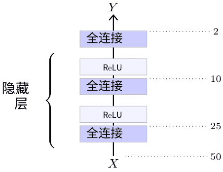

图5.1：这个多层感知器以大小为50的一维张量作为输入，由三个输出维度分别为25、10和2的全连接层组成，前两个后面跟着ReLU层。

一个关键的理论结果是通用逼近定理[Cybenko, 1989]，它指出如果激活函数 $\sigma$ 是连续的而不是多项式，任何连续函数 $f$ 都可以在一个有界且包含其边界的紧致域上，以 $l_2 \circ \sigma \circ l_1$ 形式的模型来均匀逼近。其中 $l_1$ 和 $l_2$ 是仿射的。这样的模型是一个具有单隐藏层的 MLP，这个结果意味着它可以逼近任何具有实际价值的任务。然而，这个逼近成立的前提是第一个线性层的输出维度可以任意大。

尽管多层感知器（MLPs）很简单，但在处理的信号维度不太大时，它们仍然是一种重要的工具。

### 5.2 卷积网络

处理图像的标准架构是卷积网络，或称为卷积神经网络（convnet），它结合了多个卷积层，可以在将信号传递给全连接层进行处理之前，减小信号的尺寸后再输出一个二维信号，或者直接处理较大尺寸的信号。

#### 类似LeNet的

用于图像分类的原始LeNet模型 [LeCun et al., 1998] 结合了一系列二维卷积层和最大池化层，它们起到特征提取器的作用，然后使用一系列全连接层作为多层感知器（MLP）进行分类（见图5.2）。这种架构也成为许多其他更大模型的蓝本，这些模型在结构上与LeNet相似，例如 AlexNet [Krizhevsky et al., 2012] 或 VGG 系列 [Simonyan and Zisserman, 2014]。

#### 残差网络

标准卷积神经网络遵循LeNet系列的架构，不容易扩展到深层结构，并且受到梯度消失问题的困扰。残差

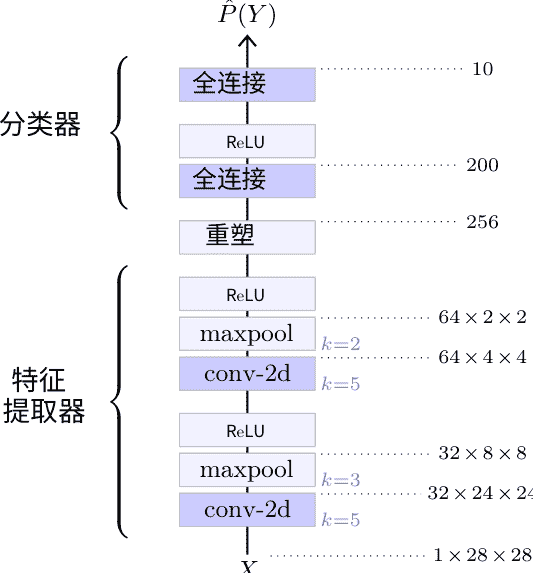

图5.2：一个小型类似LeNet的网络示例，用于分类28×28灰度手写数字图像 [LeCun et al., 1998]。它的前半部分是卷积的，交替使用卷积层和最大池化层，将信号维度从28×28标量减小到256。它的后半部分通过一个隐藏层感知器处理这个256维特征向量，计算对应于十个可能数字的10个逻辑分数。

由He等人提出的残差网络（ResNets）[2015]明确解决了梯度消失问题，使用残差连接（见§4.7），允许数百层。它们已成为计算机视觉应用中的标准架构，并存在多个版本，具体取决于层数。我们将详细介绍用于分类的ResNet-50的架构。与其他ResNets一样，它由一系列残差块组成，每个块结合了几个卷积层、批量归一化层和 ReLU 层，包装在一个残差连接中。这样的块在图5.3中显示。

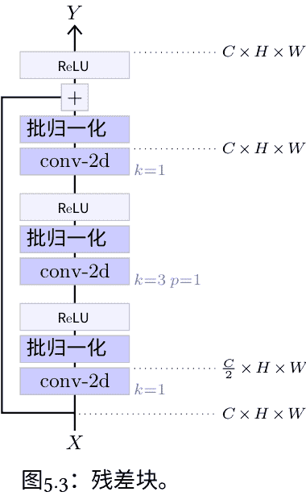

对于处理真实图像的高性能要求是传播具有大量通道的信号，以实现丰富的表示。然而，卷积层及其计算成本与通道数的平方成正比。这个残差块通过首先使用1×1卷积来减少通道数，然后在减少的通道数上使用3×3卷积进行空间操作，最后再使用1×1卷积来增加通道数，从而缓解了这个问题。

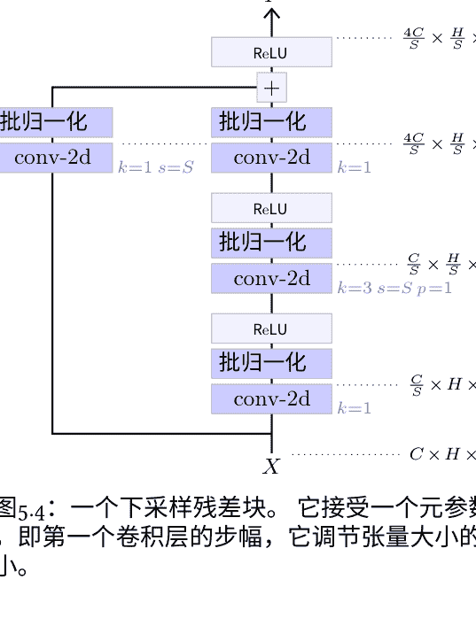

图5.4：一个下采样残差块。它接受一个元参数 $S$，即第一个卷积层的步幅，它调节张量大小的减小。

网络通过降低信号的维度最终计算分类的逻辑分数。这是通过由多个部分组成的架构来实现的，每个部分都以一个降低尺寸的残差块开始，将信号的高度和宽度减半，通道数加倍，然后是一系列的残差块。这样一个降低尺寸的残差块的结构与标准残差块类似，只是需要一个改变张量形状的残差连接。这是通过步长为2的1×1卷积来实现的（见图5.4）。

ResNet-50的整体结构如图5.5所示。它以一个7×7的卷积层开始，将三通道输入图像转换为一张64通道、尺寸减半的图像，然后是四个残差块的部分。令人惊讶的是，在第一部分中，没有下采样缩放，只增加通道数的因子为 4。最后一个残差块的输出是 2048×7×7，通过平均池化转换为维度为 2048 的向量，然后通过全连接层处理以获得最终的逻辑分数，这里有 1000 个类别。

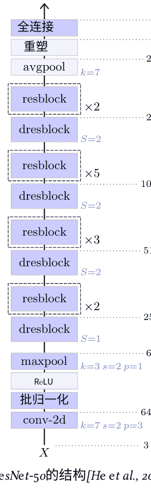

图5.5：ResNet-50 的结构 [He et al., 2015]。

### 5.3 注意力模型

正如第4.8节所述，许多应用，特别是自然语言处理，受益于包含注意机制的模型。在深度学习中，用于此类任务的首选架构是 Transformer，由 Vaswani 等人提出 [2017]。

#### Transformer

原始的 Transformer，如图5.7所示，是为序列到序列的翻译而设计的。它结合了一个编码器，用于处理输入序列以获得精细的表示，以及一个自回归解码器，给定编码器对输入序列的表示和迄今为止生成的输出标记，生成结果序列的每个标记。

与 §5.2 的残差卷积网络一样，Transformer 的编码器和解码器都是由复合块序列构成的，并带有残差连接。

- 图5.6顶部显示的前馈块是一个具有一层隐藏层的 MLP，前面是一层归一化层。它可以单独更新每个位置的表示。

图5.6：前馈块（顶部），自注意力块（左下方），交叉注意力块（底部右下方）。

Radford 等人 [2018] 提出的这些特定结构与 Vaswani 等人 [2017] 的原始架构略有不同，特别是在残差块中首先进行层归一化。

图5.7：原始编码器-解码器 Transformer 模型用于序列到序列翻译 [Vaswani 等，2017]。

- 自注意力块：如图5.6底部左侧所示，是一个多头注意力层（参见§4.8），它全局重组信息，允许任何位置从任何其他位置收集信息，之前经过一层归一化。通过在注意力中使用适当的掩码，可以使该块成为因果的。如第4.8节所述，激活函数层
- 交叉注意力块：如图5.6底部所示，接收两个序列作为输入，一个用于计算查询，另一个用于计算键和值。

Transformer 的编码器（参见图5.7底部）通过嵌入层（参见第4.9节）对离散令牌序列 $X_1,...,X_T$ 进行重新编码，并添加位置编码（参见第4.10节），然后通过多个自注意力块处理它以生成精细的表示 $Z_1,...,Z_T$。

解码器（参见图5.7顶部）以迄今为止生成的结果令牌序列 $Y_1,...,Y_{S-1}$ 作为输入，类似地通过嵌入层重新编码它们，添加位置编码，并通过交替的因果自注意力块和交叉注意力块进行处理。

#### 生成预训练的 Transformer

生成预训练的语言模型来预测下一个标记。这些交叉注意力块从编码器的结果表示中计算它们的键和值 $Z_1,...,Z_T$，这使得生成的序列可以成为原始序列 $X_1,...,X_T$ 的一个函数。

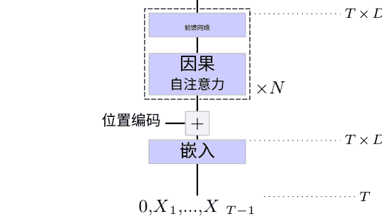

图5.8：GPT 模型 [Radford 等，2018]。

正如我们在第3.2节中所看到的，因果性确保了这样一个模型可以通过最小化整个序列上的交叉熵来进行训练。

生成预训练的 Transformer（GPT）[Radford 等，2018年，2019年]，如图5.8所示，是一个纯自回归模型，由一系列因果自注意力块组成，因此是原始 Transformer 编码器的因果版本。这类模型的规模非常大，可达到数千亿个可训练参数 [Brown et al., 2020]。我们将在第7.1节再回顾它们在文本生成中的应用。

#### 视觉 Transformer

Transformer 已经被用于图像分类，其中包括视觉 Transformer (ViT) 模型 [Dosovitskiy et al., 2020]（见图5.9）。它将三通道输入图像分割成分辨率为 $P\times P$ 的 $M$ 个补丁，然后将其展平以创建一个形状为 $M\times 3P^2$ 的向量序列 $X_1,...,X_M$。这个序列乘以一个形状为 $3P^2\times D$ 的可训练矩阵 $W^E$，将其映射到一个 $M\times D$ 的序列，然后连接一个可训练向量 $E_0$。得到的 $(M+1)\times D$ 序列 $E_0,...,E_M$ 然后通过多个自注意力块进行处理（参见§5.3和图5.6）。最终处理的结果序列中的第一个元素 $Z_0$ 对应于 $E_0$，不与图像的任何部分相关联，而是通过一个两层隐藏层的 MLP 来获得最终的 $C$ 个逻辑分数（logits）。这样一个用于类别预测的标记是由 Devlin 等人在 BERT 模型中引入的 [2018]，被称为 CLS 标记。

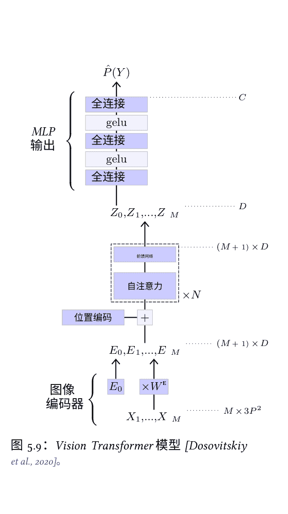

图5.9：Vision Transformer 模型 [Dosovitskiy et al., 2020]。

## 第三部分

### 应用

## 第 6 章

### 预测

第一类应用包括人脸识别、情感分析、物体检测或语音识别等，需要从可用信号中预测一个未知值。

### 6.1 图像去噪

深度模型在图像处理中的直接应用是利用图像的统计结构中的冗余来恢复退化的图像。在灰度图中，向日葵的花瓣区域可以以高置信度进行着色，而在低光、颗粒状的图片上，几何形状（如桌子）的纹理可以通过对可能均匀的大区域进行平均来进行校正。

去噪自编码器是一个模型，它以退化信号 $X$ 作为输入，并计算出原始信号 $X$ 的估计值。对于图像，它是一个卷积网络，可以整合跳跃连接，特别是在模型早期和晚期获得的相同分辨率的表示之间进行组合，还可以使用注意力层来便于考虑相距较远的元素。

这样的模型是通过收集大量干净样本和其降级输入进行训练的。后者可以在降级条件下捕捉到，例如低光或不足的对焦，或者通过算法生成，例如将干净样本转换为灰度，减小其尺寸、进行强烈压缩或使用有损压缩方法。

去噪自编码器的标准训练过程使用 MSE 损失对所有像素求和，此时模型旨在计算给定降级图像的最佳平均干净图像，即 $E[X | \tilde{X}]$。当 $X$ 不完全由 $\tilde{X}$ 决定时，这个数量可能存在问题，此时生成信号的某些部分可能是不真实的、模糊的平均值。

### 6.2 图像分类

图像分类是从图像中提取语义的最简单策略，它包括根据输入图像预测一个有限的、预定义的类别。

这个任务的标准模型是卷积网络，如 ResNets（见第5.2节），以及基于注意力的模型，如 ViT（见第5.3节）。这些模型生成一个与类别数量相同维度的逻辑向量。

训练过程只是简单地最小化交叉熵损失（见§3.1）。通常，可以通过数据增强来提高性能，这包括修改训练样本，使用手动设计的随机变换，不改变图像的语义内容，如裁剪、缩放、镜像或颜色变化。

### 6.3 目标检测

图像理解的一个更复杂的任务是目标检测，其目标是在给定输入图像的情况下预测感兴趣对象的类别和位置。

对象位置被形式化为四个坐标 $(x_1,y_1,x_2,y_2)$ 的矩形边界框，并且与每个训练图像相关联的真实值是一个包含这些边界框的列表，每个边界框都带有对象的类别标签。

解决这个任务的标准方法，例如使用单次检测器（SSD）[Liu 等，2015]，是使用一个卷积神经网络，它产生一个图像表示序列 $Z_s$ 的大小 $D_s \times H_s \times W_s$，其中 $s=1,...,S$，空间分辨率 $H_s \times W_s$ 逐渐减小到 $1\times 1$，对于 $s=S$（见图6.1）。这些张量中的每一个都完整地覆盖了输入图像，因此 $H_s \times W_s$ 的索引对应于将图像格子划分为规则的正方形，当 $S$ 增加时，这个划分变得更粗糙。

如第4.2节所示，并在图4.4中说明，由于卷积层的连续作用，特征向量 $(Z_s[0,h,w],...,Z_s[D_s-1,h,w])$ 是图像区域的描述符，称为其

$$
p(y|x) = \sum_{s=1}^{S} \sum_{(h, w) \in C_{s}} \sum_{i=1}^{B} \mathbb{I}_{(h, w)}^{\text {obj }}\left[\mathrm{L}_{\text {loc }}\left(\left(x_{c}, y_{c}, w, h\right),\left(\hat{x}_{c}, \hat{y}_{c}, \hat{w}, \hat{h}\right)\right)+\sum_{c \in \text { Classes }} p_{c}\left(C_{i}\right) \mathrm{L}_{\text {conf }}\left(p_{c}\left(C_{i}\right), \hat{p}_{c}\left(C_{i}\right)\right)\right]+\sum_{s=1}^{S} \sum_{(h, w) \in C_{s}} \sum_{i=1}^{B} \mathbb{I}_{(h, w)}^{\text {noobj }} \mathrm{L}_{\text {conf }}\left(p_{c}\left(C_{i}\right), \hat{p}_{c}\left(C_{i}\right)\right) \approx L_{\mathrm{ssd}}
$$

其中 $C$ 是正类的集合。

The objectness scores $\hat{p}_{c}\left(C_{i}\right)$ reflect the probability that an object exists at the location and scale of grid cell $C_{s}$ and anchor box $i$, while $L_{\mathrm{conf}}$ measures the difference between the predicted confidence scores $\hat{p}_{c}\left(C_{i}\right)$ and the ground-truth scores $p_{c}\left(C_{i}\right)$. The ground-truth score $p_{c}\left(C_{i}\right)$ for object classes is defined as 1 if the ground-truth object belongs to the $i$-th anchor box, and 0 otherwise. For non-object classes, it is defined as 0. These scores are essentially the same thing. Note that the confidence scores are the product of the probability that an object exists and the overlap between predicted and ground-truth boxes.

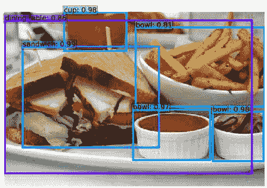
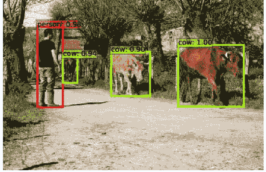
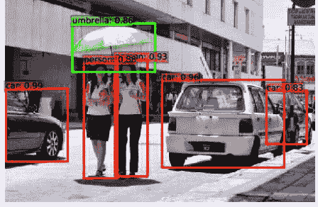

图6.2：使用单次检测器 [Liu et al., 2015] 进行目标检测的示例。

感受野，比这个方块大，但是以它为中心。这导致了一个非歧义的匹配，任何边界框 $(x_1, x_2, y_1, y_2)$ 到一个 $s, h, w$ 的匹配，分别由 $\max (x_2 - x_1, y_2 - y_1)$, $\frac{y_1 + y_2}{2}$ 确定和 $\frac{x_1 + x_2}{2}$。

通过添加 $S$ 个卷积层来实现检测，每个卷积层处理一个 $Z_s$ 并计算出每个张量索引 $h, w$ 的边界框坐标和相关的逻辑值。如果有 $C$ 个对象类别，则有 $C + 1$ 个逻辑值，额外的逻辑值代表“无对象”。因此，每个额外的卷积层有 $4 + C + 1$ 个输出通道。特别是 SSD 算法会为每个 $s, h, w$ 生成多个边界框，每个边界框专门用于一个硬编码的宽高比范围。

用于目标检测的训练集成本高昂，因为标记边界框需要缓慢的人工干预。为了缓解这个问题，标准方法是从已经在大型分类数据集（如 VGG-16）上预训练的卷积模型开始，然后用额外的卷积层替换其最后的全连接层。令人惊讶的是，仅针对分类训练的模型也能学习到可用于目标检测的特征表示，尽管## 6.4 语义分割

该任务涉及几何回归量。

在训练过程中，每个真实边界框都与其对应的 s、h、w 相关联，并引发一个由逻辑回归的交叉熵损失和边界框坐标的均方误差（MSE）等组成的损失项。每个没有边界框匹配的 s、h、w 都会导致一个仅有交叉熵的惩罚，用于预测类别“无物体”。

图像理解中最细粒度的预测任务是语义分割，它包括为每个像素预测所属的对象类别。可以通过标准的卷积神经网络实现这一目标，该网络输出一个具有与类别数量相同的通道数的卷积图，携带每个像素的估计逻辑回归值。

然而，对于目标检测等任务，标准的残差网络可以生成与输入相同分辨率的密集输出，而这个任务需要在多个尺度上操作。这是必要的，以便模型的特征表示在单个张量位置上捕获任何对象或足够信息量的子部分，无论其大小如何。因此，针对这个任务的标准架构通过一系列卷积层对图像进行下采样，以增加激活的感受野，并通过一系列转置卷积层或其他上采样方法（例如双线性插值）对其进行重新上采样，以在高分辨率下进行预测。

然而，严格的缩放-放大架构不允许在细粒度上进行操作。

![图6.3：使用金字塔场景解析网络[Zhao等人, 2016]的语义分割结果。](img/408f780886ba08dea5816e6e45e325a5_125_0.png)

在最终预测时，由于所有信号都经过了低分辨率表示的传输，因此无法获得细粒度。应用这种缩放-放大串行的模型在进行缩放之前，从特定分辨率的层到相同分辨率的层之间使用跳跃连接来缓解这些问题[Long等人, 2014；Ronneberger等人, 2015]。

在卷积主干之后，同时进行并行操作的模型在放大之后将多尺度结果进行连接，然后进行最终的逐像素预测[Zhao等人, 2016]。

在进行最终的逐像素预测之前，使用卷积主干后，将产生的多尺度表示进行连接[Zhao等人, 2016]。

训练是通过对所有像素求和的标准交叉熵来实现的。至于目标检测，训练可以从在大规模图像分类上预训练的网络开始。数据集可以弥补分割地面真实性的有限可用性。

### 6.5 语音识别

语音识别包括将声音样本转换为单词序列。有很多历史上的方法来解决这个问题，但是 Radford 等人[2022]提出的一个概念上简单且最近的方法是将其视为序列到序列的翻译，然后使用标准的基于注意力的 Transformer 来解决，如第5.3节所述。他们的模型首先将声音信号转换为频谱图，这是一个一维的时间步长为 T 的序列，每个时间步长编码了 D 个频带中的能量向量。相关的文本使用 BPE 分词器进行编码（见第3.2节）。频谱图经过几个一维卷积层的处理，得到的表示结果被馈送到 Transformer 的编码器中。解码器直接生成一个离散的令牌序列，该序列对应于训练过程中考虑的可能任务之一。

考虑了多个目标：英语或非英语文本的转录，从任何语言到英语的翻译，或者检测非语音序列，如背景音乐或环境噪音。

这种方法允许利用结合了多种类型声音源和不同基准的极大数据集。值得注意的是，尽管这种方法的最终目标是在给定输入信号的情况下尽可能产生确定性的翻译，但从形式上讲，它是在声音样本的条件下对文本分布进行采样，因此是一个合成过程。事实上，解码器与第7.1节的生成模型非常相似。

### 6.6 文本-图像表示

一种强大的图像理解方法是学习一致的图像和文本表示，使得图像或其文本描述被映射到相同的特征向量。

由 Radford 等人[2021]提出的对比语言-图像预训练 (CLIP) 结合了图像编码器 $f$（即 ViT）和文本编码器 $g$（即 GPT）。有关详细信息，请参见§5.3。

为了将 GPT 重新用作文本编码器，他们在输入序列中添加了一个“句子结束”标记，而不是使用标准的自回归模型，并使用最后一层中该标记的表示作为嵌入。其维度在 512 和 1024 之间，具体取决于配置。

这两个模型是使用从互联网收集的 4 亿个图像-文本对 $(i_k, t_k)$ 进行从头训练的。训练过程遵循标准的小批量随机梯度下降方法，但依赖于对比损失。嵌入是通过计算得到的。在小批量中，对于每个图像和每个文本的 $N$ pairs，计算文本和图像之间的余弦相似度。

每对图像和文本之间以及跨对之间的相似性得分形成了一个大小为 $N \times N$ 的矩阵：
$$l_{m,n} = f(i_m) \cdot g(t_n), \quad m=1,\dots,N, \ n=1,\dots,N.$$

该模型使用交叉熵进行训练，因此对于每个 $n$，值 $l_{1,n}, \dots, l_{N,n}$ 被解释为对 $n$ 的逻辑回归得分的预测，对于每个 $l_{n,1}, \dots, l_{n,N}$ 同样如此。这意味着当 $n=m$ 时，相似度 $l_{n,n}$ 明确大于 $l_{n,m}$ 和 $l_{m,n}$。

当它被训练后，这个模型可以用来进行零样本预测，也就是在没有训练样本的情况下对信号进行分类，通过定义一系列候选类别的文本描述，并计算图像嵌入与每个描述的嵌入之间的相似度来实现（见图6.4）。

此外，由于文本描述通常很详细，这样的模型必须捕捉到图像的更丰富表示，并捕捉到超出分类所需的线索。这意味着在挑战性数据集（如 ImageNet Adversarial [Hendrycks et al., 2019]）上表现出色，该数据集专门设计用于降低或擦除标准预测器所依赖的线索。

![图6.4：CLIP文本-图像嵌入[Radford等，2021]通过预测与图像嵌入最一致的类别描述嵌入来实现零样本预测。](img/408f780886ba08dea5816e6e45e325a5_131_0.png)

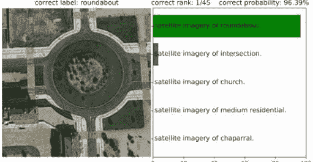
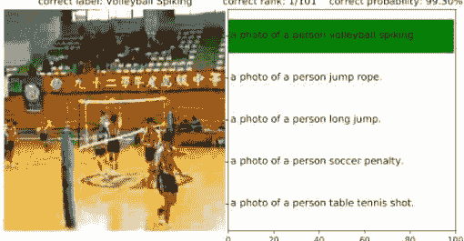

### 6.7 强化学习

许多问题，如策略游戏或机器人控制，可以用离散时间状态过程 $S_t$ 和奖励过程 $R_t$ 来形式化，通过选择动作 $A_t$ 来调节。如果 $S_t$ 是马尔可夫的，意味着它携带的关于未来的信息与直到该时刻的所有过去状态一样多，这样的对象就是马尔可夫决策过程 (MDP)。

给定一个 MDP，经典目标是找到一个策略 $\pi$，使得 $A_t = \pi(S_t)$ 最大化回报的期望，即累积折扣奖励：
$$\mathbb{E}\left[\sum_{t \geq 0} \gamma^{t} R_{t}\right],$$
对于一个折扣因子 $0<\gamma<1$。

这是强化学习 (RL) 的标准设置，可以通过引入最优状态-动作值函数 $Q(s,a)$ 来解决。如果我们在状态 $s$ 中执行动作 $a$，然后遵循最优策略，它提供了计算最优策略的方法，并且满足贝尔曼方程：最优策略为 $\pi(s)=\arg \max _{a} Q(s, a)$，并且，由于马尔可夫假设，它满足

### 贝尔曼方程：
$$Q(s, a) = \mathbb{E} \left[ R_t + \gamma \max_{a'} Q(S_{t+1}, a') \mid S_t = s, A_t = a \right], \quad (6.1)$$

我们可以从中设计一个过程来训练一个参数模型 $Q(\cdot, \cdot; w)$。

为了将这个框架应用于玩经典的 Atari 视频游戏，Mnih 等人[2015]使用了 $S_t$ 由时间 $t$ 和前三个时间步的帧连接而成，这样马尔可夫假设是合理的，并使用了一个被称为深度 Q 网络 (DQN) 的 $Q$ 模型，由两个部分组成：卷积层和一个全连接层，每个动作有一个输出值，遵循 LeNet 的经典结构（见§ 5.2）。

通过交替进行游戏和记录剧集，以及构建小批量元组 $(s_n, a_n, r_n, s'_n) \sim (S_t, A_t, R_t, S_{t+1})$ 从存储的剧集和时间步骤中获取，并进行最小化
$$\mathcal{L}(w) = \frac{1}{N} \sum_{n=1}^N (Q(s_n, a_n; w) - y_n)^2 \quad (6.2)$$
使用 SGD 的一次迭代，其中 $y_n = r_n$ 如果这个元组是一个 episode 的结尾，而 $y_n = r_n + \gamma \max_a Q(s'_n, a; \bar{w})$ 否则。

![图6.5：这个图展示了 Break-out 游戏中状态值 $V(S_t) = \max_a Q(S_t, a)$ 的演变。时间点(1)和(2)的峰值对应于清除一个砖块，时间点(3)即将突破到顶线，而(4)确保了突破，从而获得高未来奖励[Mnih et al., 2015]。](img/408f780886ba08dea5816e6e45e325a5_134_0.png)
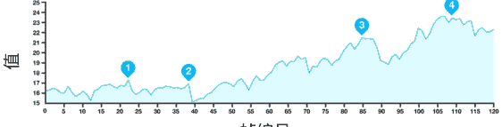

这里 $\bar{w}$ 是 $w$ 的一个常量副本，即梯度不会通过它传播到 $w$。这是必要的，因为方程 6.1 中的目标值是 $y_n$ 的期望，而方程 6.2 中使用的是 $y_n$ 本身。将 $w$ 固定在 $y_n$ 中会得到更好的梯度近似。

一个关键问题是用于收集剧集的策略。Mnih 等人[2015]简单地使用了 $\epsilon$-贪婪策略，该策略包括以概率 $\epsilon$ 完全随机地采取行动，否则采取最优行动 $\arg\max_a Q(s, a)$。注入一点随机性是必要的，以便更有利于探索。

训练使用一千万帧，相当于不到八天的游戏时间。经过训练的网络能够准确计算状态值的估计（见图6.5），并在实验验证中的大多数 49 个游戏中达到人类水平。

## 第7章

## 综合

与预测不同的第二类应用是综合。它包括将密度模型拟合到训练样本，并提供从该模型中采样的方法。

### 7.1 文本生成

文本综合的标准方法是使用基于注意力的自回归模型。Radford 等人提出的一个非常成功的模型是 GPT，我们在§5.3中描述了该模型。

这种架构已经被用来创建非常大的模型，例如 OpenAI 的 1750 亿参数的 GPT-3 [Brown et al., 2020]。它由 96 个自注意块组成，每个块有 96 个头部，并处理维度为 12,288 的令牌，MLPs 的隐藏维度为 49,512 的注意块。

当这样的模型在一个非常大的数据集上训练时，它会产生一个大型语言模型 (LLM)，它具有极强的性能。除了语言的句法和语法结构外，它还必须整合非常多样化的知识，例如预测“日本的首都是”，“如果水加热到 100 摄氏度，它会变成”，或者“因为她的小狗生病了，简就”。

这导致特别能够解决少样本预测的能力，只需要少数几个样本训练样本可用，如图7.1所示。更令人惊讶的是，当给出一个精心设计的提示时，它可以展示出能力：

> 我：我喜欢苹果，O：积极，我：音乐是我的激情，O：积极，我：我的工作很无聊，O：消极，我：冷冻披萨很棒，O：积极，
> 
> 我：我喜欢苹果，O：积极，我：音乐是我的激情，O：积极，我：我的工作很无聊，O：消极，我：冷冻披萨味道像硬纸板，O：消极，
> 
> 我：水在 100 度沸腾，O：物理学，我：根号 2 是无理数，O：数学，我：质数集是无限的，O：数学，我：重力与质量成正比，O：物理学，
> 
> 我：水在 100 度沸腾，O：物理学，我：根号 2 是无理数，O：数学，我：质数集是无限的，O：数学，我：正方形是矩形，O：数学，

用于问题回答、问题解决和思维链，这些都与高级推理非常相似[Chowdhery等, 2022；Bubeck等, 2023]。

由于这些卓越的能力，这些模型有时被称为基础模型[Bommasani等, 2021]。

然而，尽管它整合了大量的知识，这样的模型可能是不足够的，特别是在与人类用户交互时，实际应用中可能是不足够的。在许多情况下，人们需要按照与助手进行有益对话的统计数据来回答问题。这与可用的大型训练集的统计数据不同，后者结合了小说、百科全书、论坛留言和博客文章。

这个差异通过微调来解决这样的语言模型。目前主导的策略是从人类反馈中进行强化学习 (RLHF) [Ouyang等, 2022]，其中包括通过要求用户编写回复或提供生成的回复的评级来创建小型标记的训练集。前者可以直接用于微调语言模型，后者可以用于训练奖励网络，该网络预测评级并将其用作目标，以标准的强化学习方法微调语言模型。

由于语言模型架构的规模急剧增加，训练单个模型可能需要数百万美元的成本（见图3.7），而微调通常是在特定任务上实现高性能的唯一途径。

### 7.2 图像生成

已经开发了多种深度方法来对高维密度进行建模和采样。图像合成的一个强大方法依赖于反演扩散过程。

该原则包括通过定义一个逐渐降低任何样本的过程来将数据的复杂和未知密度转化为简单和众所周知的密度，例如正态分布，并训练一个深度架构来反转这个降解过程[Ho等人, 2020]。

给定一个固定的 T，扩散过程定义了一系列 T+1 个图像的概率分布，方法如下：从数据集中均匀地采样 $x_0$，然后依次从条件分布 $p(x_{t+1}|x_t)$ 中采样 $x_{t+1} \sim p(x_{t+1}|x_t)$，其中条件分布 $p$ 通过解析定义，并逐渐擦除 $x_0$ 中存在的结构。设置应该使信号降级到使分布 $p(x_T)$ 具有已知的解析形式，可以进行采样。

例如，Ho 等人[2020]将数据归一化为均值为 0，方差为 1，并且他们的扩散过程包括添加一点白噪声并重新归一化方差为 1。这使得该过程指数级地降低了 $x_0$ 的重要性，并且可以快速近似估计 $x_t$ 的密度为正态分布。

去噪器 $f$ 是一个深度结构，应该对 $f(x_{t-1}, x_t, t; w)$ 进行建模并允许从中采样，使得 $f(x_{t-1} \mid x_t) \simeq p(x_{t-1} \mid x_t)$。通过变分界限可以证明，如果这个**一步反向过程足够准确**，那么采样 $x_T \sim p(x_T)$ 并使用 $T$ 步进行去噪 $f$ 的结果将得到遵循分布 $p(x_0)$ 的 $x_0$。

通过生成大量的序列 $x_{0}^{(n)}, \ldots, x_{T}^{(n)}$，并在每个序列中选择一个 $t_n$，并最大化训练 $f$ 的方式可以实现：

![图7.2：图像合成与去噪扩散[Ho等人，2020]。每个样本从白噪声开始$x_T$（顶部），并逐渐通过迭代采样去噪 $x_{t-1} \mid x_t \sim \mathcal{N}(x_t + f(x_t, t; w), \sigma_t)$。](img/408f780886ba08dea5816e6e45e325a5_141_0.png)

根据他们的扩散过程，Ho 等人 [2020] 具有以下去噪形式：

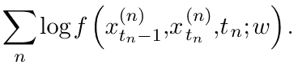

其中 $\sigma_t$ 在解析上有定义。

在实践中，这样的模型最初通过纯粹的运气在随机噪声中产生幻觉结构，然后逐渐构建更多从噪声中出现的元素，通过加强迄今为止获得的图像的最可能的延续。

这种方法可以扩展到文本条件的合成，以生成与描述相匹配的图像。例如，Nichol 等人[2021]在方程 7.1 的去噪分布的均值上添加了一个偏差，该偏差朝着增加生成图像与条件文本描述之间的 CLIP 匹配分数的方向。

## 缺失的部分

为了简洁起见，本书跳过了许多重要的主题，特别是：

### 循环神经网络

在注意力模型表现更好之前，循环神经网络（RNN）是处理文本或声音样本等时间序列的标准方法。这些架构具有内部隐藏状态，在处理序列的每个组件时会更新。它们的主要组成部分是诸如 LSTM [Hochreiter和Schmidhuber, 1997] 或 GRU [Cho等, 2014] 的层。

训练循环架构相当于在时间上展开，这导致了一系列的操作符。这在历史上促使了现在用于深度架构的关键技术的设计，例如整流器和门控连接，这是一种动态调节的跳跃连接。

### 自编码器

自编码器是一种将可能具有高维度的输入信号映射到低维度潜在表示，然后将其映射回原始信号的模型，确保信息得到保留。我们在第6.1节中看到了它用于去噪，但它也可以用于自动发现数据流形的有意义的低维参数化。

变分自动编码器（VAE）是由 Kingma 和 Welling [2013] 提出的一种具有类似结构的生成模型。它通过损失函数对潜在表示施加了预定义的分布。在训练之后，这允许通过根据所施加的分布对潜在表示进行采样，然后通过解码器进行映射来生成新样本。

### 生成对抗网络

密度建模的另一种方法是生成对抗网络（GAN）的引入，由 Goodfellow 等人[2014]提出。这种方法结合了一个生成器，它以输入遵循固定分布的随机输入，并产生一个结构化信号，如图像，以及一个判别器，它以样本作为输入并预测它是来自训练集还是由生成器生成的。

训练优化鉴别器以最小化标准交叉熵损失，并使生成器最大化鉴别器的损失。可以证明，在平衡状态下，生成器产生的样本与真实数据无法区分。实际上，当梯度通过鉴别器传递给生成器时，它向后者提供了有待解决的鉴别器使用的线索。

### 图神经网络

许多应用需要处理信号，这些信号在网格上没有规律地组织。例如，蛋白质、3D 网格、地理位置或社交互动更自然地结构化图为图。标准的卷积网络甚至注意力模型都不适合处理这种数据，而处理这种任务的首选工具是图神经网络 (GNN) [Scarselli et al., 2009]。

这些模型由层组成，通过线性组合位于其直接相邻顶点的激活来计算每个顶点的激活。这个操作与标准卷积非常相似，只是数据结构不反映与它们携带的特征向量相关的任何几何信息。

### 自监督训练

如第7.1节所述，即使它们只被训练来预测下一个单词，大型语言模型在大规模无标签数据集上训练时像 GPT（见§5.3）这样的模型能够解决各种任务，例如识别一个词的语法角色，回答问题，甚至翻译一种语言到另一种语言[Radford等, 2019]。

这些模型构成了自监督学习这一更大类方法的一种，试图利用无标签数据集[Balestriero等, 2023]。

这些方法的关键原则是定义一个不需要标签但需要对感兴趣的真实任务有用的特征表示的任务，对于这个任务，只需要少量标记的数据。

数据集存在。例如，在计算机视觉中，图像特征可以被优化，使其对不改变图像语义<u>内容的数据变换具有不变性，同时具有统计上的不相关性</u>[Zbontar等，2021年](2021)。

在自然语言处理和计算机视觉中，一个强大的通用策略是训练模型来恢复被屏蔽的信号部分[Devlin等，2018年; Zhou等，2021年](2018)。

# 参考文献

- J. L. Ba, J. R. Kiros, and G. E. Hinton. 层归一化. CoRR, abs/1607.06450, 2016. [pdf]. 82
- T. Brown, B. Mann, N. Ryder 等. 语言模型是少样本学习者. CoRR, abs/2005.14165, 2020. [pdf]. 53, 112, 138
- S. Bubeck, V. Chandrasekaran, R. Eldan 等. 人工通用智能的火花：与GPT-4的早期实验. CoRR, abs/2303.12712, 2023. [pdf]. 139
- T. Chen, B. Xu, C. Zhang 和 C. Guestrin. 用亚线性内存成本训练深度神经网络. CoRR, abs/1604.06174, 2016. [pdf]. 43
- K. Cho, B. van Merrienboer, Ç. Gülçehre, et al. 使用RNN编码器-解码器学习短语表示进行统计机器翻译. CoRR, abs/1406.1078, 2014. [pdf]. 145
- A. Chowdhery, S. Narang, J. Devlin, et al. PaLM: 使用路径扩展语言建模. CoRR, abs/2204.02311, 2022. [pdf]. 53, 139
- G. Cybenko. 用S型函数的叠加逼近. 控制、信号和系统的数学, 2(4): 303-314, 1989年12月. [pdf]. 98
- J. Devlin, M. Chang, K. Lee, and K. Toutanova. BERT: 深度双向变换器的预训练用于语言理解. CoRR, abs/1810.04805, 2018. [pdf]. 53, 114, 149
- A. Dosovitskiy, L. Beyer, A. Kolesnikov 等. 一张图片相当于16x16个单词：用于大规模图像识别的转换器. CoRR, abs/2010.11929, 2020. [pdf]. 112, 113
- K. Fukushima. Neocognitron: 一种自组织的神经网络模型，用于不受位置偏移影响的模式识别. 生物控制, 36(4): 193-202, 1980年4月. [pdf]. 2
- Y. Gal 和 Z. Ghahramani. Dropout作为贝叶斯近似：在深度学习中表示模型不确定性. CoRR, abs/1506.02142, 2015. [pdf]. 77
- X. Glorot 和 Y. Bengio. 理解训练深度前馈神经网络的困难. 在国际人工智能和统计学会议 (AISTATS) 中, 2010. [pdf]. 44, 61
- X. Glorot, A. Bordes 和 Y. Bengio. 深度稀疏整流神经网络. 在国际人工智能和统计学会议 (AISTATS) 中, 2011. [pdf]. 70
- A. Gomez, M. Ren, R. Urtasun 和 R. Grosse. 可逆残差网络：无需存储激活的反向传播. CoRR, abs/1707.04585, 2017. [pdf]. 43
- I. J. Goodfellow, J. Pouget-Abadie, M. Mirza, 等. 生成对抗网络. CoRR, abs/1406.2661, 2014. [pdf]. 146
- K. He, X. Zhang, S. Ren, 和 J. Sun. 深度残差学习用于图像识别. CoRR, abs/1512.03385, 2015. [pdf]. 51, 83, 84, 102, 104
- D. Hendrycks 和 K. Gimpel. 高斯误差线性单元 (GELU). CoRR, abs/1606.08415, 2016. [pdf]. 72
- D. Hendrycks, K. Zhao, S. Basart, 等. 自然对抗样本. CoRR, abs/1907.07174, 2019. [pdf]. 131
- J. Ho, A. Jain, 和 P. Abbeel. 降噪扩散概率模型. CoRR, abs/2006.11239, 2020. [pdf]. 141, 142, 143
- S. Hochreiter 和 J. Schmidhuber. 长短期记忆. 神经计算, 9(8): 1735-1780, 1997. [pdf]. 145
- S. Ioffe 和 C. Szegedy. 批归一化：通过减少内部协变量偏移来加速深度网络训练. 国际机器学习大会（ICML）, 2015. [pdf]. 79
- J. Kaplan, S. McCandlish, T. Henighan 等. 神经语言模型的缩放定律. CoRR, abs/2001.08361, 2020. [pdf]. 51, 52
- D. Kingma 和 J. Ba. Adam：一种随机优化方法. CoRR, abs/1412.6980, 2014. [pdf]. 39
- D. P. Kingma 和 M. Welling. 自动编码变分贝叶斯. CoRR, abs/1312.6114, 2013. [pdf]. 146
- A. Krizhevsky, I. Sutskever, and G. Hinton. ImageNet深度卷积神经网络分类. 在神经信息处理系统(NIPS), 2012. [pdf]. 8, 100
- Y. LeCun, B. Boser, J. S. Denker, et al. 反向传播应用于手写邮编识别. 神经计算, 1(4): 541-551, 1989. [pdf]. 8
- Y. LeCun, L. Bottou, Y. Bengio, and P. Haffner. 基于梯度的学习应用于文档识别. IEEE会议记录, 86(11): 2278-2324, 1998. [pdf]. 100, 101
- W. Liu, D. Anguelov, D. Erhan, et al. SSD: 单次多框检测器. CoRR, abs/1512.02325, 2015. [pdf]. 120, 122
- J. Long, E. Shelhamer, 和 T. Darrell. 完全卷积网络用于语义分割. CoRR, abs/1411.4038, 2014. [pdf]. 83, 84, 126
- A. L. Maas, A. Y. Hannun, 和 A. Y. Ng. ReLU非线性函数改善神经网络声学模型. 在ICML会议深度学习音频、语音和语言处理研讨会上, 2013. [pdf]. 71
- V. Mnih, K. Kavukcuoglu, D. Silver, 等. 通过深度强化学习实现人类级别控制. Nature, 518(7540): 529-533, 二月 2015. [pdf]. 134, 135
- A. Nichol, P. Dhariwal, A. Ramesh, 等. GLIDE: 基于文本引导的扩散模型实现逼真图像生成和编辑. CoRR, abs/2112.10741, 2021. [pdf]. 144
- L. Ouyang, J. Wu, X. Jiang, 等. 训练语言模型以遵循带有人类反馈的指令. CoRR, abs/2203.02155, 2022. [pdf]. 140
- R. Pascanu, T. Mikolov, 和 Y. Bengio. 关于训练递归神经网络的困难. 在国际机器学习会议(ICML)上, 2013. [pdf]. 44
- A. Radford, J. Kim, C. Hallacy, 等. 从自然语言监督中学习可迁移的视觉模型. CoRR, abs/2103.00020, 2021. [pdf]. 130, 132
- A. Radford, J. Kim, T. Xu, 等. 通过大规模弱监督实现鲁棒语音识别. CoRR, abs/2212.04356, 2022. [pdf]. 128
- A. Radford, K. Narasimhan, T. Salimans, and I. Sutskever. 通过生成式预训练改进语言理解能力, 2018. [pdf]. 108, 111, 138
- A. Radford, J. Wu, R. Child, 等. 语言模型是无监督多任务学习者, 2019. [pdf]. 111, 148
- O. Ronneberger, P. Fischer, 和 T. Brox. U-Net: 用于生物医学图像分割的卷积网络. 在医学图像计算和计算机辅助干预, 2015. [pdf]. 83, 84, 126
- F. Scarselli, M. Gori, A. C. Tsoi, 等. 图神经网络网络模型. IEEE神经网络交易, 20(1): 61-80, 2009. [pdf]. 147
- R. Sennrich, B. Haddow, and A. Birch. 使用子词单元进行稀有词的神经机器翻译. CoRR, abs/1508.07909, 2015. [pdf]. 34
- J. Sevilla, L. Heim, A. Ho, 等. 机器学习的三个时代的计算趋势. CoRR, abs/2202.05924, 2022. [pdf]. 9, 51, 53
- J. Sevilla, P. Villalobos, J. F. Cerón, 等. 机器学习中的参数、计算和数据趋势, 2023年5月. [web]. 54
- K. Simonyan 和 A. Zisserman. 用于大规模图像识别的非常深的卷积神经网络. CoRR, abs/1409.1556, 2014. [pdf]. 100
- N. Srivastava, G. Hinton, A. Krizhevsky, 等. Dropout: 一种简单的防止神经网络过拟合的方法. 机器学习研究杂志 (JMLR), 15: 1929-1958, 2014. [pdf]. 76
- M. Telgarsky. 神经网络中深度的好处. CoRR, abs/1602.04485, 2016. [pdf]. 47
- A. Vaswani, N. Shazeer, N. Parmar, 等. 注意力就是一切. CoRR, abs/1706.03762, 2017. [pdf]. 83, 86, 96, 107, 108, 109
- J. Zbontar, L. Jing, I. Misra, 等. Barlow Twins：通过冗余减少的自监督学习. CoRR, abs/2103.03230, 2021. [pdf]. 149
- M. D. Zeiler 和 R. Fergus. 可视化和理解卷积网络. 在欧洲计算机视觉会议（ECCV）中, 2014. [pdf]. 68
- H. Zhao, J. Shi, X. Qi 等. 金字塔场景解析网络. CoRR, abs/1612.01105, 2016. [pdf]. 126, 127
- J. Zhou, C. Wei, H. Wang 等. iBOT：使用在线分词器进行图像BERT预训练. CoRR, abs/2111.07832, 2021. [pdf]. 14

# 索引

- 1D卷积, 65
- 2D卷积, 65
- 激活, 23, 41
- 函数, 70, 98
- 映射, 68
- Adam, 39
- 仿射操作, 60
- 人工神经网络, 8, 11
- 注意力操作符, 87
- 自编码器, 146
- 去噪, 117
- Autograd, 42
- 自回归模型, 参见模型, 自回归
- 平均池化, 75
- 反向传播, 42
- 反向传递, 42
- 基函数回归, 14
- 批次, 21, 38
- 批次归一化, 79, 103
- 贝尔曼方程, 134
- 偏置向量, 60, 66
- BPE, 参见字节对编码
- 字节对编码, 34, 128
- 缓存内存, 21
- 容量, 16
- 因果关系, 32, 89, 110
- 模型, 参见模型, 因果关系
- 链式法则（导数）, 40
- 链式法则（概率）, 30
- 通道, 23
- 检查点, 43
- 分类, 18, 26, 100, 119
- CLIP, 参见对比语言-图像预训练
- CLS标记, 114
- 计算成本, 43
- 对比语言-图像预训练, 130
- 对比损失, 27, 130
- 卷积网络, 参见卷积网络
- 卷积, 65
- 卷积层, 参见层, 卷积
- 卷积网络, 100
- 交叉注意力块, 92, 108, 110
- 交叉熵, 27, 31, 45
- 数据增强, 119
- 深度学习, 8, 11
- 深度Q网络, 134
- 去噪自编码器, 参见自编码器, 去噪
- 密度建模, 18
- 深度, 41
- 扩散过程, 141
- 膨胀, 66, 73
- 判别器, 147
- 下采样残差块, 105
- DQN, 参见深度Q网络
- 丢弃, 76, 90
- 嵌入层, 参见层, 嵌入
- 时期, 48
- 等变性, 66, 92
- 前馈块, 107, 108
- 少样本预测, 138
- 滤波器, 65
- 微调, 140
- FLOPS, 22
- 前向传递, 41
- 基础模型, 139
- FP32, 22
- 框架, 23
- GAN, 见生成对抗网络
- GELU, 72
- 生成对抗网络, 146
- 生成预训练变压器, 111, 130, 138, 148
- 生成器, 146
- GNN, 见图神经网络
- GPT, 见生成预训练变压器
- GPU, 见图形处理单元
- 梯度下降, 35, 37, 40, 45
- 梯度范数剪裁, 44
- 梯度步长, 35
- 图神经网络, 147
- 图形处理单元, 8, 20
- 真实值, 18
- 隐藏层, 见层, 隐藏
- 隐藏状态, 145
- 双曲正切, 71
- 图像处理, 100
- 图像合成, 86, 141
- 归纳偏差, 17, 49, 65, 66, 95
- 不变性, 75, 92, 95, 149
- 卷积核大小, 65, 73
- 关键字, 87
- 大型语言模型, 55, 87, 138, 148
- 层, 41, 58
- 注意力, 86
- 卷积, 65, 73, 86, 95, 100, 103, 120, 125, 128
- 嵌入, 94, 110
- 全连接, 60, 86, 95, 98, 100
- 隐藏层, 98
- 线性, 60
- 多头注意力, 90, 95, 110
- 归一化, 79
- 可逆, 43
- 层归一化, 82, 107, 110
- 泄漏的ReLU, 71
- 学习率, 35, 50
- 学习率调度, 50
- LeNet, 100, 101
- 线性层, 见层, 线性
- LLM, 见大型语言模型
- 局部最小值, 35
- 逻辑值, 26, 31
- 损失, 12
- 机器学习, 11, 17, 18
- 马尔可夫决策过程, 133
- 马尔可夫性质, 133
- 最大池化, 73, 100
- MDP, 参见马尔可夫决策过程
- 均方误差, 14, 26
- 内存需求, 43
- 内存速度, 21
- 元参数, 参见参数, 元
- 度量学习, 27
- 多层感知器, 参见多层感知器
- 模型, 12
- 自回归, 30, 31, 138
- 因果关系, 33, 90, 110, 111
- 参数化, 12
- 预训练, 123, 127
- 多层感知器, 45, 98-100, 107
- 自然语言处理, 86
- NLP, 参见自然语言处理
- 非线性, 70
- 归一化层, 参见层, 归一化
- 目标检测, 120
- 过拟合, 17, 48
- 填充, 66, 73
- 参数, 12
- 元数据, 13, 35, 48, 65, 66, 73, 90, 94
- 参数化模型, 见模型, 参数化
- 峰值性能, 22
- 困惑度, 31
- 策略, 133
- 最优的, 133
- 池化, 73
- 位置编码, 95, 110
- 后验概率, 26
- 预训练模型, 见模型, 预训练
- 提示, 138, 139
- 查询, 87
- 随机初始化, 61
- 感受野, 67, 123
- 修正线性单元, 70, 145
- 循环神经网络, 145
- 回归, 18
- 强化学习, 133, 140
- 从人类反馈中学习的强化学习, 140
- ReLU, 见修正线性单元
- 残差块, 103
- 连接, 83, 102
- 网络, 47, 83, 102
- ResNet-50, 102
- 回报, 133
- 可逆层, 参见层, 可逆
- RL, 参见强化学习
- RLHF, 参见人类反馈强化学习
- RNN, 参见循环神经网络
- 缩放定律, 51
- 自注意力块, 92, 108, 110
- 自监督学习, 148
- 语义分割, 85, 125
- SGD, 参见随机梯度下降
- 单次检测器, 120
- 跳跃连接, 83, 126, 145
- 软最大值, 26, 88
- softmax, 26
- 语音识别, 128
- SSD, 参见单次检测器
- 随机梯度下降, 38, 45, 51
- 步幅, 66, 73
- 监督学习, 19
- 双曲正切, 参见双曲正切
- 张量, 23
- 张量核心, 21
- 张量处理单元, 21
- 测试集, 48
- 文本合成, 138
- 标记, 30
- 标记器, 34, 128
- TPU, 参见张量处理单元
- 可训练参数, 12, 23, 51
- 训练, 12
- 训练集, 12, 25, 48
- Transformer, 47, 83, 87, 95, 107, 109, 128
- 转置卷积, 68, 125
- 欠拟合, 16
- 通用逼近定理, 98
- 无监督学习, 19
- VAE, 见变分自编码器
- 验证集, 48
- 值, 87
- 梯度消失, 44, 57
- 变分自编码器, 146
- 边界, 143
- Vision Transformer, 112, 130
- ViT, 见 Vision Transformer
- 词汇表, 30
- 权重, 13
- 衰减, 28
- 矩阵, 60
- 零样本预测, 131

本书采用创作共用-非商业性使用-相同方式共享 4.0 国际许可协议授权。

V1.1.1-2023年9月20日