# 理解深度学习

西蒙 J.D. Prince

2024年1月16日

此文档的最新版本可在 http://udlbook.com 找到。

本作品的版权已独家授权给麻省理工学院出版社（https://mitpress.mit.edu），该出版社将于2024年向公众发布最终版本。有关权利的所有查询应寄往麻省理工学院出版社权利和许可部门。

本作品受到创意共享 CC-BY-NC-ND 许可证的约束。

我真的很感激帮助改进这个文档。没有细节太小！请发送建议、事实不准确、模糊、问题和勘误至 udlbookmail@gmail.com。

> 本书献给 Blair、Calvert、Coppola、Ellison、Faulkner、Kerpatenko、Morris、Robinson、Sträussler、Wallace、Waymon、Wojnarowicz 和所有其他比深度学习更重要和有趣的人。

## 目录

- 前言 ix
- 致谢 xi

## 1 引言 1
- 1.1 监督学习 1
- 1.2 无监督学习 7
- 1.3 强化学习 11
- 1.4 伦理 12
- 1.5 本书结构 15
- 1.6 其他书籍 15
- 1.7 如何阅读本书 16

## 2 监督学习 17
- 2.1 监督学习概述 17
- 2.2 线性回归示例 18
- 2.3 总结 22

## 3 浅层神经网络 25
- 3.1 神经网络示例 25
- 3.2 通用逼近定理 29
- 3.3 多变量输入和输出 30
- 3.4 浅层神经网络：一般情况 33
- 3.5 术语 35
- 3.6 总结 36

## 4 深度神经网络 41
- 4.1 组合神经网络 41
- 4.2 从组合网络到深度网络 43
- 4.3 深度神经网络 45
- 4.4 矩阵表示 48
- 4.5 浅层与深度神经网络 49
- 4.6 总结 52

## 5 损失函数 56
- 5.1 最大似然 56
- 5.2 构建损失函数的方法 60
- 5.3 示例1：单变量回归 61
- 5.4 示例2：二分类 64
- 5.5 示例3：多分类 67
- 5.6 多个输出 69
- 5.7 交叉熵损失 71
- 5.8 总结 72

## 6 模型拟合 77
- 6.1 梯度下降 77
- 6.2 随机梯度下降 83
- 6.3 动量 86
- 6.4 亚当 88
- 6.5 训练算法超参数 91
- 6.6 总结 91

## 7 梯度和初始化 96
- 7.1 问题定义 96
- 7.2 计算导数 97
- 7.3 玩具示例 100
- 7.4 反向传播算法 103
- 7.5 参数初始化 107
- 7.6 示例训练代码 111
- 7.7 总结 111

## 8 性能测量 118
- 8.1 训练一个简单模型 118
- 8.2 错误来源 120
- 8.3 减少错误 124
- 8.4 双谷 127
- 8.5 选择超参数 132
- 8.6 总结 133

## 9 正则化 138
- 9.1 显式正则化 138
- 9.2 隐式正则化 141
- 9.3 改善性能的启发式方法 144
- 9.4 总结 154

## 10 卷积网络 161
- 10.1 不变性和等变性 161
- 10.2 用于1D输入的卷积网络 163
- 10.3 用于2D输入的卷积网络 170
- 10.4 下采样和上采样 171
- 10.5 应用 174
- 10.6 总结 179

## 11 残差网络 186
- 11.1 顺序处理 186
- 11.2 残差连接和残差块 189
- 11.3 残差网络中的梯度爆炸 192
- 11.4 批归一化 192
- 11.5 常见的残差架构 195
- 11.6 为什么具有残差连接的网络表现如此出色？ 199
- 11.7 总结 199

## 12 变压器 (Transformers) 207
- 12.1 处理文本数据 207
- 12.2 点积自注意力 208
- 12.3 点积自注意力的扩展 213
- 12.4 变压器 215
- 12.5 用于自然语言处理的变压器 216
- 12.6 编码器-解码器模型示例：BERT 219
- 12.7 解码器模型示例：GPT3 222
- 12.8 编码器-解码器模型示例：机器翻译 226
- 12.9 用于长序列的变压器 227
- 12.10 用于图像的变压器 228
- 12.11 总结 232

## 13 图神经网络 240
- 13.1 什么是图？ 240
- 13.2 图的表示 243
- 13.3 图神经网络、任务和损失函数 245
- 13.4 图卷积网络 248
- 13.5 示例：图分类 251
- 13.6 归纳 vs. 传导模型 252
- 13.7 示例：节点分类 253
- 13.8 图卷积网络的层 256
- 13.9 边图 260
- 13.10 总结 261

## 14 无监督学习 268
- 14.1 无监督学习模型的分类 268
- 14.2 什么使一个好的生成模型？ 269
- 14.3 量化性能 271
- 14.4 总结 273

## 15 生成对抗网络 275

- 15.1 辨别作为一个信号 275
- 15.2 提高稳定性 280
- 15.3 渐进增长，小批量辨别和截断 286
- 15.4 条件生成 288
- 15.5 图像翻译 290
- 15.6 StyleGAN 295
- 15.7 总结 297

## 16 正则化流 303

- 16.1 1D 示例 303
- 16.2 一般情况 306
- 16.3 可逆网络层 308
- 16.4 多尺度流 316
- 16.5 应用 317
- 16.6 总结 320

## 17 变分自编码器 326

- 17.1 潜在变量模型 326
- 17.2 非线性潜在变量模型 327
- 17.3 训练 330
- 17.4 ELBO 属性 333
- 17.5 变分近似 335
- 17.6 变分自编码器 335
- 17.7 重参数化技巧 338
- 17.8 应用 339
- 17.9 总结 342

## 18 扩散模型 348

- 18.1 概述 348
- 18.2 编码器 (前向过程) 349
- 18.3 解码器模型 (反向过程) 355
- 18.4 训练 356
- 18.5 损失函数的重新参数化 360
- 18.6 实现 362
- 18.7 总结 367

## 19 强化学习 373

- 19.1 马尔可夫决策过程、回报和策略 373
- 19.2 期望回报 377
- 19.3 表格强化学习 381
- 19.4 拟合 Q 学习 385
- 19.5 策略梯度方法 388
- 19.6 演员-评论家方法 393
- 19.7 离线强化学习 394
- 19.8 总结 395

## 20 为什么深度学习有效? 401

- 20.1 反对深度学习的理由 401
- 20.2 影响拟合性能的因素 402
- 20.3 损失函数的特性 406
- 20.4 决定泛化的因素 410
- 20.5 我们是否需要这么多参数? 414
- 20.6 网络是否必须深层? 417
- 20.7 总结 418

## 21 深度学习与伦理 420

- 21.1 价值对齐 420
- 21.2 故意滥用 426
- 21.3 其他社会、伦理和职业问题 428
- 21.4 案例研究 430
- 21.5 科学的无价值理想 431
- 21.6 负责任的 AI 研究作为集体行动问题 432
- 21.7 前进的方式 433
- 21.8 摘要 434

## A 符号 436

## B 数学 439

- B.1 函数 439
- B.2 二项式系数 441
- B.3 向量、矩阵和张量 442
- B.4 特殊类型的矩阵 445
- B.5 矩阵微积分 447

## C 概率 448

- C.1 随机变量和概率分布 448
- C.2 期望 452
- C.3 正态概率分布 456
- C.4 抽样 459
- C.5 概率分布之间的距离 459

## 参考文献 462

## 索引 513

# 前言

深度学习的历史在科学上是不寻常的。一小群科学家坚持不懈地工作了二十五年，在一个看似没有前途的领域中革命性地影响了一个领域，并对社会产生了巨大影响。通常情况下，当研究人员调查一个晦涩而看似不切实际的科学或工程领域时，它仍然只是晦涩和不切实际。然而，这是一个值得注意的例外。尽管普遍存在怀疑，但 Yoshua Bengio、Geoffrey Hinton、Yann LeCun 和其他人的系统努力最终取得了成功。

这本书的标题是“深度学习理解”，以区别于涵盖编码和其他实际方面的卷 (volumes)。本文主要讨论深度学习的基本思想。本书的第一部分介绍了深度学习模型，并讨论了如何训练它们、衡量它们的性能以及改进这些性能。接下来的部分考虑了专门用于图像、文本和图形数据的架构。这些章节只需要初级线性代数、微积分和概率知识，对任何第二年的本科学生都应该可以理解。本书的后续部分涉及生成模型和强化学习。这些章节需要更多的概率和微积分知识，面向更高级的学生。

这个标题也部分是一个笑话——写作时没有人真正理解深度学习。现代深度网络学习的是比宇宙中的原子还多的分段线性函数，并且可以用比模型参数更少的数据示例进行训练。我们应该能够可靠地拟合这些函数，也不明显它们应该很好地推广到新数据。倒数第二章讨论了这些和其他尚未完全理解的方面。无论如何，深度学习将改变世界，无论是好是坏。最后一章讨论了人工智能伦理，并呼吁从业者考虑他们工作的道德影响。

你的时间很宝贵，我努力策划和呈现材料，以便你能够尽可能高效地理解它。每章的主体部分包括对最基本的思想的简明描述，以及相应的插图。附录回顾了所有的数学先决条件，不需要参考外部材料。对于希望深入研究的读者，每章都有相关的问题、Python 笔记本和广泛的背景注释。

写一本书是一个孤独、艰苦、多年的过程，只有在广泛采用的情况下才是值得的。如果你喜欢阅读这本书或有改进的建议，请通过附带的网站与我联系。我很愿意听到你的想法，这将为后续版本提供信息和动力。

# 致谢

在写这本书的过程中，没有这些人的慷慨帮助和建议，这本书是不可能完成的: Kathryn Hume, Kevin Murphy, Christopher Bishop, Peng Xu, Yann Dubois, Justin Domke, Chris Fletcher, Yanshuai Cao, Wendy Tay, Corey Toler-Franklin, Dmytro Mishkin, Guy McCusker, Daniel Worrall, Paul McIlroy, Roy Amoyal, Austin Anderson, Romero Barata de Morais, Gabriel Harrison, Peter Ball, Alf Muir, David Bryson, Vedika Parulkar, Patryk Lietzau, Jessica Nicholson, Alexa Huxley, Oisin Mac Aodha, Giuseppe Castiglione, Josh Akylbekov, Alex Gougoulaki, Joshua Omilabu, Alister Guenther, Joe Goodier, Logan Wade, Joshua Guenther, Kylan Tobin, Benedict Ellett, Jad Araj, Andrew Glennerster, Giorgos Sfikas, Diya Vibhakar, Sam Mansat-Bhattacharya, Ben Ross, Ivor Simpson, Gaurang Aggarwal, Shakeel Sheikh, Jacob Horton, Felix Rammell, Sasha Luccioni, Akshil Patel, Alessandro Gentilini, Kevin Mercier, Krzysztof Lichocki, Chuck Krapf, Brian Ha, Chris Kang, Leonardo Viotti, Kai Li, Himan Abdollahpouri, Ari Pakman, Giuseppe Antonio Di Luna, Dan Oneată, Conrad Whiteley, Joseph Santarcangelo, Brad Shook, Gabriel Brostow, Lei He, Ali Satvaty, Romain Sabathé, Qiang Zhou, Prasanna Vigneswaran, Siqi Zheng, Stephan Grein, Jonas Klesen, Giovanni Stilo, Huang Bokai, Kevin McGuinness, Qiang Sun, Zakaria Lotfi, Yifei Lin, Sylvain Bouix, Alex Pitt, Stephane Chretien, Robin Liu, Bian Li, Adam Jones, Marcin Świerkot, Tommy Löfstedt, Eugen Hotaj, Fernando Flores-Mangas, Tony Polichroniadis, Pietro Monticone, Rohan Deepak Ajwani, Menashe Yarden Einy, Robert Gevorgyan, Thilo Stadelmann, Guijie Miao, Botao Zhu, Mohamed Elabbas, Satya Krishna Gorti, James Elder, Helio Perroni Filho, Xiaochao Qu, Jaekang Shin, Joshua Evans, Robert Dobson, Shibo Wang, Edoardo Zorzi, Stanisław Jastrzębski, Pieris Kalligeros, Matt Hewitt, Zvika Haramaty, Ted Mavroidis, Nikolaj Kuntner, Amir Yorav, Masoud Mokhtari, Xavier Gabaix, Marco Garosi, Vincent Schönbach, Avishek Mondal, Victor S.C. Lui, Sumit Bhatia, Julian Asilis, Hengchao Chen, Siavash Khallaghi, Csaba Szepesvári, Mike Singer, Mykhailo Shvets, Abdalla Ibrahim, Stefan Hell, Ron Raphaeli, Diogo Tavares, Aristotelis Siozopoulos, Jianrui Wu, Jannik Münz, Penn Mackintosh, Shawn Hoareau, Qianang Zhou, Emma Li, Charlie Groves, Xiang Lingxiao, Trivikram Muralidharan, Rajat Binaykiya, Germán del Cacho Salvador, Alexey Bloudov, Paul Colognese, Bo Yang, Jani Monoses, and Adenilson Arcanjo, Matan Golani, Emmanuel Onzon, Shenghui Yan, Kamesh Kompella, Julius Aka, Johannes Brunnemann, Variniethan Ketheeswaran, Alex Ostrovsky, Daniel Burbank, Gavrie Philipson, Roozbeh Ehsani, Len Spek, Christoph Brune, Mohammad Nosrati, Bian Li, Runqi Chen, Qifu Hu, Rasmi Elasmar, Ronaldo Butrus, Carles Mesado, Jeffrey Wolberg, Olivier Koch, and Edoardo Lanari。

我特别感谢 Daniyar Turmukhambetov, Amedeo Buonanno, Andrea Panizza, Mark Hudson 和 Bernhard Pfahringer, 他们对本书的多个章节提供了详细的评论。我特别感谢 Andrew Fitzgibbon, Konstantinos Derpanis 和 Tyler Mills, 他们阅读了整本书, 并且他们的热情帮助我完成了这个项目。我还要感谢 Neill Campbell 和 Özgür Şimşek, 在巴斯大学接待我, 我在那里首次基于这个材料教授了一门课程。最后, 我非常感激我的编辑Elizabeth Swayze在整个过程中给予我坦诚的建议。第12章（变压器）和第17章（变分自动编码器）首先作为Borealis AI的博客发表，并经过适应性修改版本得到了加拿大皇家银行和Borealis AI的许可。我对他们在这个努力中的支持表示感谢。第16章（归一化流）基于Kobyzev等人（2020）的综述文章，我是其中的合著者。我非常幸运能够与Dalhousie大学的Travis LaCroix合作撰写第21章，他既容易相处又有趣，而且他做了大部分的工作。

# 归因

- 图1.13中的棋盘图像改编自 http://tinyurl.com/yc2d54d4 。
- 图1.2、1.4、1.10中的齿轮图像改编自 http://tinyurl.com/2c7tttr8 。
- 图19.1~19.5和19.6~19.9中的企鹅图像改编自 http://tinyurl.com/ycx9je56 。
- 图19.2~19.5、19.7、19.10~19.12中的鱼图像改编自 http://tinyurl.com/4ueyhtsu 。

## 第1章

### 引言

人工智能，或 AI，涉及构建模拟智能行为的系统。它涵盖了一系列方法，包括基于逻辑、搜索和概率推理的方法。机器学习是人工智能的一个子集，它通过将数学模型拟合到观察到的数据中来做出决策。这个领域经历了爆炸式增长，现在（不正确地）几乎与AI这个术语同义。深度神经网络是一种机器学习模型，当它被拟合到数据中时，被称为深度学习。在撰写本文时，深度网络是最强大和实用的机器学习模型，经常在日常生活中遇到。使用自然语言处理算法翻译另一种语言的文本，使用计算机视觉系统搜索特定对象的互联网图像，或通过语音识别接口与数字助理进行对话，这些应用都由深度学习驱动。

正如标题所示，本书旨在帮助初学者理解深度学习背后的原理。本书既不是非常理论化（没有证明），也不是非常实践化（几乎没有代码）。目标是解释底层思想；在阅读本书后，读者能够将深度学习应用于没有现成成功方法的新情境中。

机器学习方法可以粗略地分为三个领域：监督学习、无监督学习和强化学习。在撰写本书时，这三个领域的前沿方法都依赖于深度学习（图1.1）。本章介绍了这三个领域的高层次概述，并且这种分类方法也在本书的组织中得到了松散的反映。无论我们喜欢与否，深度学习都将改变我们的世界，而这种变化并非全都是积极的。因此，本章还包含了关于人工智能伦理的简要介绍。最后，我们提供如何充分利用本书的建议。

图1.1 机器学习是人工智能领域中将数学模型拟合到观测数据的一个领域。它可以粗略地分为监督学习、无监督学习和强化学习。深度神经网络对这些领域都有贡献。

## 1.1 监督学习

监督学习模型将输入数据映射到输出预测。

在接下来的章节中，我们将讨论输入、输出、模型本身以及“训练”模型的含义。

### 1.1.1 回归和分类问题

图1.2描述了几个回归和分类问题。在每种情况下，都有一个有意义的现实世界输入（句子、声音文件、图像等），并将其编码为一个数字向量。这个向量形成了模型的输入。模型将输入映射到一个输出向量，然后将其“翻译”回一个有意义的现实世界预测。

目前，我们关注输入和输出，并将模型视为一个黑盒子，它接收一个数字向量并返回另一个数字向量。

图1.2a中的模型根据输入特征（如房屋面积和卧室数量）预测房屋价格。这是一个回归问题，因为模型返回一个连续的数字（而不是一个类别分配）。相比之下，图1.2b中的模型以分子的化学结构作为输入，并预测熔点和沸点。这是一个多元回归问题，因为它预测多个数字。

图1.2c中的模型接收包含餐厅评论的文本字符串作为输入，并预测评论是积极的还是消极的。这是一个二分类问题，因为模型试图将输入分配给两个类别之一。输出向量包含输入属于每个类别的概率。图1.2d和1.2e描述了多类分类问题。在这里，模型将输入分配给 $N > 2$ 个类别之一。在第一种情况下，输入是音频文件，模型预测它包含的音乐流派。在第二种情况下，输入是图像，模型预测它包含的对象。在每种情况下，模型返回一个大小为 $N$ 的向量，其中包含 $N$ 个类别的概率。

图1.2 回归和分类问题。 a) 这个回归模型接受一个描述属性的数字向量，并预测其价格。 b) 这个多元回归模型接受化学分子的结构，并预测其熔点和沸点。 c) 这个二分类模型接受餐厅评论，并将其分类为正面或负面。 d) 这个多类别分类问题将音频片段分配给 $N$ 个流派之一。 e) 第二个多类别分类问题中，模型根据可能包含的 $N$ 个对象之一对图像进行分类。

### 1.1.2 输入

图1.2中的输入数据变化很大。在房屋定价的例子中，输入是一个包含描述房产特征的固定长度向量。这是一个表格数据的例子，因为它没有内部结构；如果我们改变输入的顺序并构建一个新的模型，我们期望模型的预测结果保持不变。

相反，在餐厅评论的例子中，输入是一段文本。这可能是可变长度的，取决于评论中的单词数量，这里是输入顺序很重要；我的妻子吃了鸡和鸡吃了我的妻子是不一样的。

在将文本传递给模型之前，必须将其编码为数值形式。在这里，我们使用大小为10,000的固定词汇表，简单地连接单词索引。

对于音乐分类示例，输入向量可能具有固定大小（例如10秒的片段），但是非常高维。数字音频通常以44.1kHz采样，并由16位整数表示，因此十秒的片段包含441,000个整数。

显然，监督学习模型必须能够处理大量的输入。图像分类示例中的输入（由每个像素处的RGB值连接而成）也是巨大的。此外，它的结构自然是二维的；上下两个像素彼此之间密切相关，即使它们在输入向量中不相邻。

最后，考虑用于预测分子的熔点和沸点的模型的输入。一个分子可能包含不同方式连接的不同数量的原子。在这种情况下，模型必须将分子的几何结构和组成原子输入到模型中。

图1.3 机器学习模型。该模型表示一组关系的家庭，将输入（儿童年龄）与输出（儿童身高）相关联。使用训练数据选择特定的关系，训练数据包括输入/输出对（橙色点）。当我们训练模型时，我们会在可能的关系中搜索一个能够很好描述数据的关系。在这里，训练好的模型是青色曲线，可以用来计算任何年龄的身高。

### 1.1.3 机器学习模型

到目前为止，我们将机器学习模型视为一个黑盒子，它接收一个输入向量并返回一个输出向量。但是这个黑盒子里面到底有什么呢？考虑一个从年龄预测孩子身高的模型（图1.3）。机器学习模型是一个数学方程，描述了平均身高随年龄变化的方式（图1.3中的青色曲线）。当我们将年龄输入到这个方程中时，它会返回身高。例如，如果年龄是10岁，我们预测身高将为139厘米。

更准确地说，模型表示了一族方程，将输入映射到输出（即一族不同的青色曲线）。选择特定的方程（曲线）是通过训练数据（输入/输出对的示例）来完成的。在图1.3中，这些对应关系由橙色点表示，我们可以看到模型（青色线）相当准确地描述了这些数据。当我们谈论训练或拟合模型时，我们的意思是在可能的方程（可能的青色曲线）中搜索，以找到最准确地描述训练数据的方程。

由此可见，图1.2中的模型需要有标记的输入/输出对进行训练。例如，音乐分类模型需要大量的音频剪辑，其中人类专家已经确定了每个音频剪辑的流派。这些输入/输出对在训练过程中扮演着教师或监督者的角色，这就产生了监督学习的术语。

### 1.1.4 深度神经网络

本书涉及深度神经网络，它们是一种特别有用的机器学习模型。它们是能够表示输入和输出之间极其广泛的关系的方程，而且在这个关系族中很容易搜索出描述训练数据的关系。

深度神经网络可以处理非常大、长度可变且包含各种内部结构的输入。它们可以输出单个实数（回归）、多个数字（多元回归）或两个或多个类别的概率（二元和多类别分类）。正如我们将在下一节中看到的那样，它们的输出也可能非常大、长度可变且包含内部结构。很难想象具有这些特性的方程，读者现在应该努力暂时搁置怀疑。

### 1.1.5 结构化输出

图1.4a描述了一个用于语义分割的多变量二分类模型。在这里，输入图像的每个像素都被分配一个二进制标签，表示它是否属于牛或背景。图1.4b展示了一个多变量回归模型，其中输入是一张街景图像，输出是每个像素的深度。

在这两种情况下，输出是高维且结构化的。然而，这种结构与输入密切相关，这可以被利用；如果一个像素被标记为“牛”，那么具有相似RGB值的邻居可能具有相同的标签。

图1.4c-e描述了三个模型，其中输出具有复杂的结构，与输入不太相关。图1.4c展示了一个模型，其中输入是一个音频文件，输出是该文件的转录文字。图1.4d是一个翻译模型的输入是一段英文文本，输出包含法语翻译。图1.4e描述了一个非常具有挑战性的任务，其中输入是描述性文本，模型必须生成与该描述相匹配的图像。

原则上，后三个任务可以在标准的监督学习框架中解决，但由于两个原因，它们更加困难。首先，输出可能是真的是模棱两可的；从英语句子到法语句子有多种有效的翻译，而且有多个图像与任何标题兼容。其次，输出包含相当多的结构；并非所有的单词串都构成有效的英语和法语句子，也不是所有的RGB值集合都构成合理的图像。除了学习映射之外，我们还必须尊重输出的“语法”。

幸运的是，这种“语法”可以在不需要输出标签的情况下学习。例如，我们可以通过学习大量文本数据的统计信息来学习如何构成有效的英语句子。这与本书的下一节有关，该节考虑了无监督学习模型。

图1.4 具有结构化输出的监督学习任务。a) 这个语义分割模型将RGB图像映射到一个二进制图像，指示每个像素是否属于背景或牛（改编自Noh等人，2015年）。 b) 这个单目深度估计模型将RGB图像映射到一个输出图像，其中每个像素表示深度（改编自Cordts等人，2016年）。 c) 这个音频转录模型将音频样本映射到音频中所说的话的转录。 d) 这个翻译模型将英文文本字符串映射到其法语翻译。 e) 这个图像合成模型将标题映射到图像（示例来自https://openai.com/dall-e-2/）。在每种情况下，输出具有复杂的内部结构或语法。在某些情况下，许多输出与输入兼容。

## 1.2 无监督学习

从输入数据中构建模型而没有相应的输出标签被称为无监督学习；缺少输出标签意味着没有“监督”。目标不是学习从输入到输出的映射，而是描述或理解数据的结构。与监督学习一样，数据可能具有非常不同的特征；它可以是离散的或连续的，低维的或高维的，长度可以是恒定的或可变的。

### 1.2.1 生成模型

本书重点关注生成无监督模型，这些模型学习合成与训练数据在统计上无法区分的新数据示例。一些生成模型明确描述了输入数据上的概率分布，在这种情况下，新的示例是通过从该分布中进行采样生成的。其他模型仅仅学习生成新示例的机制，而不明确描述它们的分布。

最先进的生成模型可以合成非常逼真但与训练示例不同的示例。它们在生成图像（图1.5）和文本（图1.6）方面取得了特别成功。它们还可以在某些输出被预先确定的约束下合成数据（称为条件生成）。例如，图像修复（图1.7）和文本补全（图1.8）。事实上，现代文本生成模型非常强大，以至于它们可以看起来很智能。给定一段文本后跟一个问题，该模型通常可以通过生成最可能的文档补全来“填充”缺失的答案。然而，在现实中，该模型只了解语言的统计信息，而不理解其答案的意义。

图1.5 生成模型用于图像。左边：两个图像是从训练于猫图片的模型生成的。这些不是真正的猫，而是来自概率模型的样本。右边：两个图像是从训练于建筑图片的模型生成的。改编自Karras等人（2020b）。

> 当我到达森林边缘时，月亮已经升起，透过树木过滤的光线是银色和寒冷的。我打了个寒颤，虽然我不冷，加快了我的步伐。我从未离开村庄这么远，我不确定会发生什么。我已经走了几个小时了，我又累又饿。我匆忙离开，没有考虑带任何食物，也没有考虑带武器。我手无寸铁，独自一人在一个陌生的地方，我不知道自己在做什么。
>
> 我走了很久，以至于完全失去了时间感，也不知道走了多远。我只知道我必须继续前进。我必须找到她。我离她很近了。我能感觉到。她在附近，她有麻烦。我必须找到她并帮助她，否则就太晚了。

图1.6 从文本数据的生成模型合成的短篇故事。该模型描述了一个概率分布，为每个输出字符串分配一个概率。从模型中采样可以生成遵循训练数据（这里是短篇故事）统计特性的字符串，但是这些字符串以前从未见过。

图1.7 修复图像。在原始图像（左侧）中，男孩被金属电缆遮挡。这些不理想的区域（中间）被移除，生成模型在剩余像素保持不变的约束下合成了一张新图像（右侧）。 改编自Saharia等人（2022a）。

> 在巴斯大学上第一堂课之前，我有点紧张。看起来好像有几百名学生，他们看起来很吓人。我走到讲台前准备演讲时，发生了一件奇怪的事情。
>
> 突然间，整个房间充满了震耳欲聋的噪音，就像一只巨大的咆哮声。声音太大了，我听不到其他任何声音，不得不捂住耳朵。我看到学生们四处张望，感到困惑和害怕。然后，就像它开始的那样，噪音停止了，房间又变得寂静。
>
> 我站在那里片刻，试图理解刚刚发生的事情。然后我意识到学生们都在盯着我，等我说些什么。我试图想出一些机智或聪明的话来说，但我的脑子一片空白。所以我只是说了一句，“嗯，那真是奇怪”，然后开始我的讲座。

图1.8 条件文本合成。给定一个初始文本（黑色部分），文本生成模型可以通过合成“缺失”的剩余部分来继续生成合理的字符串。由GPT3生成（Brown等人，2020年）。

图1.9 人脸的变化。人脸大约包含42个肌肉，因此可以用42个数字来描述同一个人在相同光照下的大部分变化。一般来说，图像、音乐和文本数据集可以用相对较少的潜在变量来描述，尽管将它们与特定的物理机制联系起来通常更加困难。来自Dynamic FACES数据库的图像（Holland等人，2019年）。

### 1.2.2 潜在变量

一些（但不是全部）生成模型利用了数据可能比观察到的变量的原始数量要低维的观察。例如，有效且有意义的英语句子的数量要比随机抽取单词所创建的字符串的数量要小得多。同样，真实世界的图像只是可以通过为每个像素随机选择RGB值来创建的图像中的一小部分。

这是因为图像是由物理过程生成的（见图1.9）。这导致了一个想法，即我们可以使用更少的潜在变量来描述每个数据示例。在这里，深度学习的作用是描述 these 潜在变量与数据之间的映射关系。潜在变量通常具有简单的特性。

图1.10 潜在变量。许多生成模型使用深度学习模型来描述低维“潜在”变量与观察到的高维数据之间的关系。潜在变量的设计具有简单的概率分布。因此，可以通过从潜在变量的简单分布中进行采样，然后使用深度学习模型将样本映射到观察到的数据空间来生成新的示例。

图1.11 图像插值。每一行的左右图像是真实的，中间的三个图像表示由生成模型创建的插值序列。支撑这些插值的生成模型已经学习到，所有的图像都可以由一组潜在变量创建。通过找到这两个真实图像的变量，插值它们的值，然后使用这些中间变量创建新图像，我们可以生成既视觉上可信又混合了两个原始图像特征的中间结果。顶部行改编自Sauer等人（2022年）的研究。底部行改编自Ramesh等人（2022年）的研究。

通过设计概率分布。通过从该分布中采样并将结果通过深度学习模型传递，我们可以创建新样本（图1.10）。这些模型为操作真实数据提供了新方法。例如，考虑找到支撑两个真实示例的潜在变量。我们可以通过在它们的潜在表示之间进行插值，并将中间位置映射回数据空间来插入这些示例之间的插值（图1.11）。

### 1.2.3 连接有监督学习和无监督学习

具有潜在变量的生成模型也可以使具有结构的有监督学习模型受益（图1.4）。例如，考虑学习预测与标题相对应的图像。与其直接将文本输入映射到图像，我们可以学习解释文本和解释图像的潜在变量之间的关系。

这有三个优点。首先，现在输入和输出的维度较低，我们可能需要更少的文本/图像对来学习这种映射。其次，我们更有可能生成一个看起来合理的图像；任何合理的潜在变量值都应该产生一个看起来像一个合理示例的东西。第三，如果我们在两组潜在变量之间的映射或从潜在变量到图像的映射中引入随机性，那么我们可以生成多个由标题很好描述的图像（图1.12）。

## 1.3 强化学习

机器学习的最后一个领域是强化学习。这种范式引入了一个生活在世界中并且可以在每个时间步骤执行某些动作的代理的概念。这些动作改变了系统的状态，但不一定是确定性的。采取一个动作也可以产生奖励，强化学习的目标是让代理学会选择平均奖励较高的动作。

一个复杂之处在于奖励可能发生在动作之后的某个时间，所以将奖励与动作关联起来并不简单。这被称为时间性信用分配问题。随着代理的学习，它必须权衡已知信息的探索和利用；也许代理已经学会了如何获得适度的奖励；它应该遵循这个策略（利用已知信息），还是应该尝试不同的动作以查看是否可以改进（探索其他机会）？

### 1.3.1 两个例子

考虑教一个人形机器人行走。机器人在给定时间内可以执行有限数量的动作（移动各个关节），这些动作会改变世界的状态（机器人的姿势）。我们可以奖励机器人在障碍课程中达到检查点。为了到达每个检查点，它必须执行许多动作，当奖励到达不清楚哪些动作对奖励有贡献，哪些是无关紧要的。这是时间性信用分配问题的一个例子。

第二个例子是学习下棋。同样，在任何给定时间，代理都有一组有效的动作（棋步）。然而，这些动作以一种非确定性的方式改变系统的状态；对于任何动作的选择，对手可能会以许多不同的移动作出回应。在这里，我们可以基于夺取棋子来建立奖励结构，或者只在游戏结束时给出一个单一的奖励来表示胜利。在后一种情况下，时间性信用分配问题非常严重；系统必须学会哪些许多移动是成功或失败的关键。

在这两个例子中，探索与开发的权衡也是显而易见的。机器人可能已经发现，通过侧躺并用一条腿推动可以取得进展。这种策略会移动机器人并获得奖励，但比最优解慢得多：保持平衡并行走。因此，它面临着在利用它已经知道的知识（如如何笨拙地在地板上滑动）和探索行动空间之间的选择（可能会导致更快的运动）。同样，在下棋的例子中，代理可以学习一个合理的开局序列。它应该利用这个知识还是尝试不同的开局序列？

深度学习如何适应强化学习框架可能并不明显。有几种可能的方法，但其中一种技术是使用深度网络来构建从观察到的世界状态到动作的映射。这被称为策略网络。在机器人示例中，策略网络将学习从传感器测量到关节运动的映射。在国际象棋示例中，网络将学习从当前棋盘状态到移动选择的映射（图1.13）。

## 1.4 伦理

在讨论人工智能的伦理影响时，不谈及这个强大的技术将是不负责任的。这种强大的技术至少会改变世界。

这种映射被称为策略。

与电力、内燃机、晶体管或互联网一样，深度学习具有同样的影响力。在医疗保健、设计、娱乐、交通、教育和几乎所有商业领域，潜在的好处是巨大的。然而，科学家和工程师通常对他们工作的结果过于乐观，而潜在的危害同样巨大。以下段落重点介绍了五个问题：

- **偏见和公平性**：如果我们根据历史数据训练一个系统来预测个人的薪水水平，那么这个系统将重现历史上的偏见；例如，它可能会预测女性应该比男性薪水低。已经有几个这样的案例成为国际新闻：一个用于超分辨率人脸图像的AI系统使非白人看起来更白；一个用于生成图像的系统在被要求合成律师的照片时只生成男性的照片。粗心地应用使用人工智能的算法决策有可能巩固或加剧现有的偏见。有关进一步讨论，请参阅 Binns（2018）的论文。
- **可解释性**：深度学习系统做出决策，但我们通常不知道具体是如何或基于什么信息做出的。它们可能包含数十亿个参数，我们无法通过检查来理解它们的工作方式。这导致了可解释人工智能的子领域。一个相对成功的领域是生成局部解释；我们无法解释整个系统，但我们可以产生一个可解释的描述，解释为什么做出特定的决策。然而，目前尚不清楚是否可能构建对用户甚至创建者完全透明的复杂决策系统。有关详细信息，请参阅 Grennan 等人（2022年）的研究。
- **武器化人工智能**：所有重要的技术都直接或间接地应用于战争。可悲的是，暴力冲突似乎是人类行为中不可避免的特征。人工智能可以说是有史以来最强大的技术，并且无疑将在军事环境中广泛部署。事实上，这已经在发生（Heikkilä, 2022年）。
- **集中权力**：世界上最强大的公司投资大量资金进行人工智能研究，并不是出于改善人类命运的善意。他们知道这些技术将使他们获得巨大的利润。与任何先进技术一样，深度学习很可能将权力集中在控制它的少数机构手中。自动化目前由人类完成的工作将改变经济环境，并对技能较少、薪资较低的工人的生计产生不成比例的影响。乐观主义者认为，在工业革命期间发生了类似的颠覆，并导致工作时间缩短。事实是，我们根本不知道大规模采用人工智能会对社会产生什么影响（参见 David，2015年）。
- **存在风险**：人类面临的主要存在风险都源于技术。气候变化是工业化的结果。核武器源于对物理学的研究。流行病更有可能发生并传播更快，因为交通、农业和建筑方面的创新使人口更多、更密集、更互联。人工智能带来了新的存在风险。我们应该非常谨慎地构建比人类更有能力和可扩展性的系统。在最乐观的情况下，它将使所有者拥有巨大的权力。在最悲观的情况下，我们将无法控制它，甚至无法理解它的动机（参见 Tegmark, 2018年）。

这个列表远非详尽无遗。人工智能还可能导致监视、虚假信息、侵犯隐私、欺诈和金融市场操纵，而训练人工智能系统所需的能量也会导致气候变化。此外，这些担忧并非臆测；已经有许多伦理可疑的人工智能应用的例子（参见 Dao, 2021年的部分列表）。此外，互联网的最近历史表明，新技术可能以意想不到的方式造成伤害。八十年代和九十年代的在线社区几乎无法预测假新闻、垃圾邮件、在线骚扰、欺诈、网络欺凌、无性文化、政治操纵、曝光个人隐私和报复色情图片的泛滥。

每个研究人员（或撰写关于人工智能书籍的人）都应该思考科学家对其技术使用的责任程度。我们应该考虑资本主义主导了人工智能的发展，并且法律进步和社会公益的部署可能会严重滞后。我们应该反思作为科学家和工程师，是否有可能控制这个领域的进展并减少潜在的危害。我们应该考虑我们愿意为哪种类型的组织工作。他们在减少人工智能潜在危害方面有多认真？他们只是为了减少声誉风险而进行“伦理洗白”，还是真正实施了停止伦理可疑项目的机制？

鼓励所有读者进一步研究这些问题。在线课程 https://ethics-of-ai.mooc.fi/ 是一个有用的入门资源。如果你是一位教授，从这本书中教授课程，鼓励你与学生讨论这些问题。如果你是一位学生，参加的课程没有这样做，那么请向教授施压，让他们这样做。如果你在企业环境中部署或研究人工智能，鼓励你审查雇主的价值观，并在价值观有问题时帮助改变它们（或离开）。

## 1.5 书籍结构

本书的结构遵循本介绍的结构。第2-9章介绍了监督学习流程。我们描述了浅层和深层神经网络，并讨论了如何训练它们、衡量和改进它们的性能。第10-13章描述了深层神经网络的常见架构变体，包括卷积网络、残差连接和 Transformer。这些架构被应用于监督学习、无监督学习和强化学习。

第14-18章介绍了使用深度神经网络进行无监督学习的方法。我们分别为四种现代深度生成模型（生成对抗网络、变分自编码器、归一化流和扩散模型）专门撰写了一章。第19章是对深度强化学习的简要介绍。这是一个非常值得单独撰写一本书的主题，因此本书只是对其进行了表面的介绍。然而，这种介绍对于对这个领域不熟悉的读者来说是一个很好的起点。

尽管本书的标题是深度学习，但其中一些方面仍然不太被理解。第20章提出了一些基本问题。为什么深度网络如此容易训练？为什么它们具有很好的泛化能力？为什么它们需要这么多参数？它们需要深度吗？在探索过程中，我们还会涉及到一些意想不到的现象，如损失函数的结构、双重下降、理解和“彩票假设”（lucky ticket）。本书以第21章讨论伦理和深度学习作为结尾。

## 1.6 其他书籍

本书是自包含的，但仅限于深度学习的内容。本书旨在成为《深度学习》（Goodfellow等，2016）的精神继承者，后者是一本很棒的资源，但没有涵盖最新进展。对于更广泛的机器学习内容，最新和百科全书式的资源是《概率机器学习》（Murphy，2022，2023）。然而，《模式识别与机器学习》（Bishop，2006）仍然是一本优秀且相关的书籍。

如果你喜欢这本书，那么我的前一卷《计算机视觉：模型、学习和推理》（Prince，2012）仍然值得一读。有些部分已经过时，但它包含了对概率的全面介绍，包括贝叶斯方法，以及计算机视觉中的潜变量模型、几何、高斯过程和图模型的入门介绍。它使用与本书相同的符号，可以在网上找到。关于图模型的详细讨论可以在《概率图模型：原理与技术》（Koller和Friedman，2009）中找到，而关于高斯过程的内容可以在《机器学习中的高斯过程》（Williams和Rasmussen，2006）中找到。

有关背景数学，请参考《机器学习数学》（Deisenroth等，2020年）。有关更加面向编码的方法，请参考《深入深度学习》（Zhang等，2023年）。计算机视觉的最佳概述是 Szeliski（2022年），还有即将出版的书籍《计算机视觉基础》（Torralba等，2024年）。了解图神经网络的一个很好的起点是《图表示学习》（Hamilton，2020年）。关于强化学习的权威著作是《强化学习：一种介绍》(Sutton & Barto, 2018年)。一个很好的初始资源是《深度学习的基础》(Graesser & Keng, 2019年)。

## 1.7 如何阅读本书

**附录A 符号**

本书中的大多数剩余章节包含正文、注释部分和一系列问题。正文部分旨在自成体系，可以在不参考章节其他部分的情况下阅读。尽可能地，背景数学知识被纳入正文部分。然而，对于较大的主题，由于这会分散论证的主线，背景材料被移至附录，并在边距中提供参考。本书中的大部分符号是标准的。然而，有些约定使用较少，鼓励读者在继续之前参考附录A。

正文部分包含了许多深度学习模型和结果的新颖插图和可视化。我努力提供对现有思想的新解释，而不仅仅是整理他人的工作。深度学习是一个新领域，有时现象理解得不够好。我试图清楚地指出这种情况，并在我的解释需要谨慎对待时进行说明。

参考文献仅在章节的正文部分包含结果的情况下列出。相反，它们可以在章节末尾的注释部分找到。我通常不在正文中尊重历史先例；如果当前技术的祖先不再有用，我将不会提及它。然而，该领域的历史发展在注释部分中有所描述，并希望公平地给予认可。

这些笔记按段落组织，并提供进一步阅读的指引。它们应该帮助读者在子领域中定位自己，并理解它与机器学习的其他部分的关系。这些笔记比主要文本更不自包含。根据您的背景知识和兴趣水平，您可能会发现这些部分或多或少有用。

每章都有一些相关的问题。它们在主文本的边缘处被引用，应该在那里尝试。正如乔治·波利亚所指出的，“数学，你看，不是一项观众体育。”他是正确的，我强烈建议您在阅读过程中尝试解决问题。在某些情况下，它们提供了有助于理解主要文本的见解。答案在相关网站上提供的问题用星号表示。此外，通过网站还可以获得帮助您理解本书思想的 Python 笔记本，并且这些笔记本也在文本的边缘处被引用。

**笔记本1.1 背景数学**

事实上，如果您感到生疏，现在可能值得通过背景数学的笔记本来练习。不幸的是，人工智能研究的速度使得这本书不可避免地成为一个不断进展的工作。如果你发现有些部分很难理解，有明显的遗漏，或者有些部分似乎多余，请通过相关网站与我们联系。我们一起可以使下一版变得更好。

## 第二章 监督学习

一个监督学习模型定义了从一个或多个输入到一个或多个输出的映射。例如，输入可能是一辆二手丰田普锐斯的年龄和里程，输出可能是车辆的估计价值（以美元计算）。

模型只是一个数学方程；当输入通过这个方程时，它计算出输出，这被称为推理。模型方程还包含参数。不同的参数值会改变计算的结果；模型方程描述了输入和输出之间可能的关系族，而参数指定了特定的关系。

当我们训练或学习模型时，我们找到描述输入和输出之间真实关系的参数。学习算法接受一个包含输入/输出对的训练集，并通过调整参数使输入尽可能准确地预测其对应的输出。如果模型对这些训练对表现良好，那么我们希望它能够对真实输出未知的新输入进行良好的预测。

本章的目标是扩展这些想法。首先，我们更正式地描述这个框架，并引入一些符号。然后，我们通过一个简单的例子来说明输入和输出之间的关系，我们使用一条直线来描述。这个线性模型既熟悉又容易可视化，但它仍然展示了监督学习的所有主要思想。

## 2.1 监督学习概述

在监督学习中，我们的目标是构建一个模型，它接受一个输入 $x$ 并输出一个预测 $y$。为简单起见，我们假设输入 $x$ 和输出 $y$ 都是预先确定和固定大小的向量，并且每个向量的元素总是以相同的方式排序；在上面的 Prius 示例中，输入 $x$ 将始终包含汽车的年龄和里程，按照顺序排列。这被称为结构化或表格数据。

为了进行预测，我们需要一个模型 $f[\cdot]$, 它接受输入 $x$ 并返回 $y$，所以：
$$y = f[x]. \tag{2.1}$$

当我们从输入 $x$ 计算预测 $y$ 时，我们称之为推理。

模型只是一个具有固定形式的数学方程。它代表了输入和输出之间不同关系的一个家族。模型还包含参数 $\phi$。参数的选择决定了输入和输出之间的具体关系，所以我们应该写成：
$$y = f[x, \phi]. \tag{2.2}$$

当我们谈论学习或训练模型时，我们的意思是尝试找到使输入产生合理输出预测的参数 $\phi$。我们使用一个训练数据集，其中包含 $I$ 个输入和输出示例对 $\{x_i, y_i\}$ 来学习这些参数。我们的目标是选择能够尽可能准确地将每个训练输入映射到其关联输出的参数。我们用损失 $L$ 来量化这种映射的不匹配程度。这是一个标量值，总结了模型对于参数 $\phi$ 从相应输入预测训练输出的不准确程度。

我们可以将损失视为这些参数的函数 $L[\phi]$。[^1] 当我们训练模型时，我们正在寻找最小化这个损失函数的参数 $\hat{\phi}$：
$$\hat{\phi} = \underset{\phi}{\text{argmin}} \left[ L[\phi] \right]. \tag{2.3}$$

如果在最小化之后损失很小，我们就找到了能够准确预测训练输出 $y_i$ 的模型参数，这些输出来自于训练输入 $x_i$。

训练模型后，我们现在必须评估其性能；我们在单独的测试数据上运行模型，以查看其在训练过程中未观察到的示例上的泛化能力。如果性能足够好，那么我们就可以部署这个模型了。

## 2.2 线性回归示例

现在让我们通过一个简单的例子来具体说明这些想法。我们考虑一个模型 $y = f[x, \phi]$，它从单个输入 $x$ 预测单个输出 $y$。然后我们开发一个损失函数，最后讨论模型训练。

#### 2.2.1 1D线性回归模型

一维线性回归模型描述了输入变量 $x$ 和输出变量 $y$ 之间的关系，即一条直线：
$$\begin{aligned} y &= f[x, \phi] \\ &= \phi_0 + \phi_1 x. \end{aligned} \tag{2.4}$$

该模型有两个参数 $\phi=[\phi_0, \phi_1]^T$，其中 $\phi_0$ 是直线的纵截距，$\phi_1$ 是斜率。不同的纵截距和斜率选择会导致输入和输出之间的不同关系（图2.1）。因此，方程2.4定义了一组可能的输入-输出关系（所有可能的直线），参数的选择确定了这组关系中的成员（特定的直线）。

### 2.2.2 损失

对于该模型，训练数据集（图2.2a）包含 $I$ 个输入/输出对 $\{x_i, y_i\}$。图2.2b-d显示了由三组参数定义的三条直线。图2.2d中的绿色直线更准确地描述了数据，因为它更接近数据点。然而，我们需要一种有原则的方法来决定哪些参数 $\phi$ 更好。为此，我们为每个参数选择分配一个数值，以量化模型与数据之间的不匹配程度。我们将这个值称为损失；较低的损失意味着更好的拟合。

模型预测 $f[x_i, \phi]$（在 $x_i$ 处线的高度）与实际输出 $y_i$ 之间的偏差被捕捉到。这些偏差在图2.2b-d中以橙色虚线表示。我们通过对所有 $I$ 个训练对的这些偏差的平方和来量化总的不匹配，即训练误差或损失：
$$\begin{aligned} L[\phi] &= \sum_{i=1}^I (f[x_i, \phi] - y_i)^2 \\ &= \sum_{i=1}^I (\phi_0 + \phi_1 x_i - y_i)^2. \end{aligned} \tag{2.5}$$

由于最佳参数使得这个表达式最小化，我们将其称为最小二乘损失。平方操作意味着偏差的方向（即线的位置是在数据上方或下方）并不重要，只有偏差的大小才重要。这也是有理论原因的，在第5章中我们会回到这个问题。

损失 $L$ 是参数 $\phi$ 的一个函数；当模型拟合较好时，损失会更小。当图2.2b,c拟合不好时，损失较大，而当图2.2d拟合好时，损失较小。从这个角度来看，我们将 $L[\phi]$ 称为损失函数或成本函数。目标是找到最小化这个量的参数 $\hat{\phi}$：

**笔记本2.1 监督学习**

$$\begin{aligned} \hat{\phi} &= \underset{\phi}{\text{argmin}} [L[\phi]] \\ &= \underset{\phi}{\text{argmin}} \left[ \sum_{i=1}^{I} (\phi_0 + \phi_1 x_i - y_i)^2 \right]. \end{aligned} \tag{2.6}$$

只有两个参数（y轴截距 $\phi_0$ 和斜率 $\phi_1$），因此我们可以计算每个值组合的损失并将损失函数可视化为一个曲面（图2.3）。这个曲面的最小值处是“最佳”参数。

(问题2.1-2.2)

### 2.2.3 训练

找到最小化损失的参数的过程称为模型拟合、训练或学习。基本方法是随机选择初始参数，然后通过“走下坡”损失函数来改进它们，直到达到底部（图2.4）。一种方法是测量当前位置处曲面的梯度，并朝最陡的下坡方向迈出一步。然后我们重复这个过程，直到梯度变平，无法进一步改进。[^2]

### 2.2.4 测试

在训练完模型后，我们想要知道它在真实世界中的表现如何。我们通过计算在一个单独的测试数据集上的损失来实现这一点。预测准确性在多大程度上泛化到测试数据取决于训练数据的代表性和完整性。然而，它还取决于模型的表达能力。像一条直线这样简单的模型可能无法捕捉输入和输出之间的真实关系。这被称为欠拟合。相反，一个非常有表现力的模型可能描述训练数据中的统计特性，这些特性是非典型的，并导致异常预测。这被称为过拟合。

## 2.3 总结

监督学习模型是一个将输入 $x$ 与输出 $y$ 相关联的函数 $f[x, \phi]$。具体的关系由参数 $\phi$ 确定。为了训练模型，我们定义了一个损失函数 $L[\phi]$，它在训练数据集 $\{x_i, y_i\}$ 上计算。这个函数量化了模型预测 $f[x_i, \phi]$ 和观察到的输出 $y_i$ 之间的不匹配程度，作为参数 $\phi$ 的函数。然后我们搜索最小化损失的参数。我们在一个不同的测试数据集上评估模型，以了解它对新输入的泛化能力如何。

第3-9章扩展了这些思想。首先，我们解决模型本身；1D线性回归的明显缺点是它只能描述输入和输出之间的关系为直线。浅层神经网络（第3章）比线性回归稍微复杂一些，但描述了更大的输入/输出关系家族。深度神经网络（第4章）同样具有表达能力，可以用更少的参数描述复杂函数，并在实践中表现更好。

第5章研究了不同任务的损失函数，并揭示了最小二乘损失的理论基础。第6章和第7章讨论了训练过程。第8章讨论了如何衡量模型性能。第9章考虑了正则化技术，旨在改善性能。

[^1]: 更准确地说，损失函数还依赖于训练数据 $\{x_i, y_i\}$，因此我们应该写成 $L[\{x_i, y_i\}, \phi]$，但这样写太麻烦了。
[^2]: 这种迭代方法实际上对于线性回归模型并不是必需的。在这里，可以找到参数的闭式表达式。然而，这种梯度下降方法适用于更复杂的模型，其中没有闭式解，且参数太多，无法评估每个值组合的损失。

图2.4 线性回归训练。目标是找到对应最小损失的y截距和斜率参数。a) 迭代训练算法随机初始化参数，然后通过“向下走”来改进它们，直到无法再进一步改进为止。在这里，我们从位置0开始向下移动一定距离（垂直于等高线），到达位置1。然后，我们重新计算向下方并移动到位置2。最终，我们到达函数的最小值（位置4）。b) 面板(a)中的每个位置0-4对应于不同的y截距和斜率，因此代表不同的线。随着损失的减小，这些线更好地拟合数据。

## 笔记

**损失函数与代价函数：** 在机器学习中，以及本书中，损失函数和代价函数这两个术语可以互换使用。然而，更准确地说，损失函数是与数据点相关联的单个项（即方程2.5右侧的每个平方项），而代价函数是要最小化的整体数量（即方程2.5的整个右侧）。代价函数可以包含与单个数据点无关的其他项（参见第9.1节）。更一般地说，目标函数是任何要最大化或最小化的函数。

**生成模型与判别模型：** 本章中的模型 $y = f[x, \phi]$ 是判别模型。这些模型根据实际测量结果 $x$ 进行输出预测 $y$。另一种方法是构建一个生成模型 $x = g[y, \phi]$，其中实际测量结果 $x$ 是输出 $y$ 的函数。

生成模型的缺点是它不能直接预测 $y$。要进行推理，我们必须反转生成方程，得到 $y = g^{-1}[x, \phi]$，这可能很困难。然而，生成模型的优点是我们可以加入关于数据生成方式的先验知识。例如，如果我们想要预测三维位置和方向 $y$，如果我们能够在图像中检测到汽车的位置 $\mathbf{x}$，那么我们就可以建立关于汽车形状、3D几何和光线传输的知识：$\mathbf{x} = \mathbf{g}[\mathbf{y}, \phi]$。

这似乎是一个好主意，但事实上，判别模型在现代机器学习中占据主导地位；在生成模型中利用先验知识所获得的优势通常被学习非常灵活的判别模型以及大量的训练数据所取代。

## 问题

- **问题2.1** 为了在损失函数（方程2.5）上“下坡”，我们测量其对参数 $\phi_0$ 和 $\phi_1$ 的梯度。计算斜率的表达式 $\partial L / \partial \phi_0$ 和 $\partial L / \partial \phi_1$。
- **问题2.2** 证明我们可以通过将问题2.1中的导数表达式置零并解出 $\phi_0$ 和 $\phi_1$ 来找到损失函数的闭式最小值。请注意，这适用于线性回归，但不适用于更复杂的模型；这就是为什么我们使用梯度下降等迭代模型拟合方法（图2.4）。
- **问题2.3*** 考虑将线性回归重新表述为生成模型，这样我们就有 $x = \text{g}[y, \phi] = \phi_0 + \phi_1 y$。新的损失函数是什么？找到一个逆函数的表达式 $y = \text{g}^{-1}[x, \phi]$，我们将用它来进行推理。对于给定的训练数据集 $\{x_i, y_i\}$，这个模型会做出相同的预测吗？建立这一点的一种方法是编写代码，使用两种方法拟合三个数据点的直线，并查看结果是否相同。

## 第3章：浅层神经网络

第2章介绍了使用1D线性回归的监督学习。然而，这个模型只能将输入/输出关系描述为一条直线。本章介绍了浅层神经网络。它们描述了分段线性函数，并且足够表达多维输入和输出之间任意复杂的关系。

## 3.1 神经网络示例

浅层神经网络是具有参数 $\phi$ 的函数 $\mathbf{f}[x, \phi]$，将多变量输入 $\mathbf{x}$ 映射到多变量输出 $\mathbf{y}$。我们将在第3.4节中给出完整的定义，并使用一个示例网络 $\mathbf{f}[x, \phi]$ 来介绍主要思想，该网络将标量输入 $x$ 映射到标量输出 $y$，并具有十个参数 $\phi = \{\phi_0, \phi_1, \phi_2, \phi_3, \theta_{10}, \theta_{11}, \theta_{20}, \theta_{21}, \theta_{30}, \theta_{31}\}$：

$$\begin{aligned} y &= \mathbf{f}[x, \phi] \\ &= \phi_0 + \phi_1 \mathrm{a}[\theta_{10} + \theta_{11}x] + \phi_2 \mathrm{a}[\theta_{20} + \theta_{21}x] + \phi_3 \mathrm{a}[\theta_{30} + \theta_{31}x] \end{aligned} \quad (3.1)$$

我们可以将这个计算分解为三个部分：首先，我们计算输入数据的三个线性函数 ($\theta_{10} + \theta_{11}x, \theta_{20} + \theta_{21}x, \text{ 和 } \theta_{30} + \theta_{31}x$)。其次，我们通过一个激活函数 $\mathrm{a}[\bullet]$ 将这三个结果传递。最后，我们用 $\phi_1, \phi_2 \text{ 和 } \phi_3$ 加权这三个结果的激活值，将它们相加，并加上一个偏移量 $\phi_0$。

为了完整地描述，我们必须定义激活函数 $\mathrm{a}[\bullet]$。有很多可能性，但最常见的选择是修正线性单元或 ReLU：

$$\mathrm{a}[z] = \mathrm{ReLU}[z] = \begin{cases} 0 & z < 0 \\ z & z \ge 0 \end{cases} \quad (3.2)$$

当输入为正数时，返回输入值，否则返回零（图3.1）。虽然方程3.1代表哪种输入/输出关系的族可能并不明显，但前一章的思想都是适用的。方程3.1代表了一个函数族，其中特定的成员取决于 $\phi$ 中的十个参数。如果我们知道这些参数，我们可以通过计算给定输入 $x$ 的方程来进行推理（预测 $y$）。给定一个训练数据集 $\{x_i, y_i\}_{i=1}^I$，我们可以定义一个最小二乘损失函数 $L[\phi]$，并使用它来衡量模型对于任何给定参数值 $\phi$ 如何描述该数据集。为了训练模型，我们搜索最小化该损失的值 $\hat{\phi}$。

### 3.1.1 神经网络直觉

实际上，方程式 3.1 表示了一个连续分段线性函数的族（图3.2），最多有四个线性区域。现在我们将分解方程式 3.1，并展示为什么它描述了这个族。为了更容易理解，我们将函数分成两部分。首先，我们引入中间量：

$$\begin{aligned} h_1 &= a[\theta_{10} + \theta_{11}x] \\ h_2 &= a[\theta_{20} + \theta_{21}x] \\ h_3 &= a[\theta_{30} + \theta_{31}x] \end{aligned} \quad (3.3)$$

我们将 $h_1, h_2$ 和 $h_3$ 称为隐藏单元。其次，我们通过将这些隐藏单元与线性函数相结合来计算输出：

$$y = \phi_0 + \phi_1 h_1 + \phi_2 h_2 + \phi_3 h_3 \quad (3.4)$$

图3.3显示了创建图3.2a中函数的计算流程。每个隐藏单元包含一个线性函数 $\theta_{\cdot 0} + \theta_{\cdot 1}x$, 该线条被ReLU函数 $a[\cdot]$ 剪切到零以下。三条线与零相交的位置成为最终输出中的三个“关节”。然后，这三条剪切线分别加权为 $\phi_1, \phi_2$ 和 $\phi_3$。最后，添加偏移量 $\phi_0$, 该偏移量控制最终函数的整体高度。

图3.3j中的每个线性区域对应于隐藏单元中的不同激活模式。当一个单元被剪切时，我们称之为非活跃（inactive），当它没有被剪切时，我们称之为活跃（active）。例如，阴影区域接收来自 $h_1$ 和 $h_3$（活跃的）但不接收来自 $h_2$（非活跃的）的贡献。每个线性区域的斜率由以下因素确定：(i) 该区域活跃输入的原始斜率 $\theta_{\cdot 1}$ 和 (ii) 随后应用的权重 $\phi_{\cdot}$。例如，在阴影区域中的斜率（参见问题3.3）为 $\theta_{11}\phi_1 + \theta_{31}\phi_3$, 其中第一项是面板 (g) 中的斜率，第二项是面板 (i) 中的斜率。

每个隐藏单元对函数贡献一个“连接”，所以有三个隐藏单元，可以有四个线性区域。然而，这些区域的斜率中只有三个是独立的；第四个要么为零（如果所有隐藏单元在此区域中都不活跃）要么是来自其他区域斜率的和。

- 问题3.1-3.8
- 笔记本3.1 浅层网络I
- 问题3.9

### 3.1.2 描绘神经网络

我们一直在讨论一个具有一个输入、一个输出和三个隐藏单元的神经网络。我们在图3.4a中可视化这个网络。输入在左边，隐藏单元在中间，输出在右边。每个连接代表其中十个参数之一。为了简化这个表示，我们通常不画出截距参数，所以这个网络通常被描绘为图3.4b中的样子。

¹ 对于本书而言，某些类型的函数都是非线性的。例如，ReLU函数（方程3.2）和包含它的示例神经网络（方程3.1）都是非线性的。请参阅本章末尾的注释以获得进一步的澄清。

图3.3：图3.2a中函数的计算。a-c) 输入 $x$ 通过三个具有不同y截距 $\theta_{\bullet 0}$ 和斜率 $\theta_{\bullet 1}$ 的线性函数传递。d-f) 每条线都通过ReLU激活函数，将负值剪切为零。g-i) 然后，三条剪切的线分别加权（缩放）为 $\phi_1, \phi_2$ 和 $\phi_3$。j) 最后，剪切和加权的函数相加，并添加一个控制高度的偏移 $\phi_0$。四个线性区域分别对应于隐藏单元中的不同激活模式。在阴影区域中，$h_2$ 是不活跃的（被剪切），但 $h_1$ 和 $h_3$ 都是活跃的。

图3.4：描述神经网络。a) 输入 $x$ 在左侧，隐藏单元 $h_1, h_2$ 和 $h_3$ 在中间，输出 $y$ 在右侧。计算从左到右进行。输入用于计算隐藏单元，然后将它们组合以创建输出。十个箭头代表一个参数（橙色为截距，黑色为斜率）。每个参数将其源乘以并将结果添加到其目标。例如，我们将参数 $\phi_1$ 乘以源 $h_1$ 并将其添加到 $y$。我们引入包含 1 的附加节点（橙色圆圈）以将偏移量纳入此方案，因此我们将参数 $\phi_0$ 乘以 1（没有效果）并将其添加到 $y$。ReLU函数应用于隐藏单元。b) 更常见的是，省略截距、ReLU函数和参数名称；这种更简单的描述表示相同的网络。

## 3.2 通用逼近定理

在前一节中，我们介绍了一个具有一个输入、一个输出、ReLU激活函数和三个隐藏单元的示例神经网络。现在让我们稍微推广一下，考虑具有 $D$ 个隐藏单元的情况，其中第 $d$ 个隐藏单元是：

$$h_d = \text{a}[\theta_{d0} + \theta_{d1}x], \quad (3.5)$$

并且这些被线性组合以创建输出：

$$y = \phi_0 + \sum_{d=1}^D \phi_d h_d. \quad (3.6)$$

浅层网络中隐藏单元的数量是网络容量的度量。使用ReLU激活函数，具有 $D$ 个隐藏单元的网络的输出最多具有 $D$ 个拐点，因此是一个最多具有 $D+1$ 个线性区域的分段线性函数。随着我们添加更多的隐藏单元，模型可以逼近更复杂的函数。

事实上，只要有足够的容量（隐藏单元），一个浅层网络可以描述任何定义在实数线的紧致子集上的连续1D函数，以任意精度。为了看到这一点，考虑到每次添加一个隐藏单元，我们就给函数添加了另一个线性区域。随着这些区域变得更多，它们代表函数的更小的部分，这些部分越来越好地由一条直线逼近（图3.5）。通用逼近定理证明了对于任何连续函数，存在一个浅层网络可以以任意指定的精度逼近该函数。

- 问题3.10

图3.5：通过分段线性模型对1D函数（虚线）进行逼近。a-c) 随着区域数量的增加，模型越来越接近连续函数。具有标量输入的神经网络每个隐藏单元创建一个额外的线性区域。通用逼近定理证明了，只要有足够的隐藏单元，存在一个浅层神经网络可以描述任何给定的定义在紧致子集 $\mathbb{R}^{D_i}$ 上的连续函数，以任意精度。

## 3.3 多变量输入和输出

在上面的例子中，网络有一个标量输入 $x$ 和一个标量输出 $y$。然而，通用逼近定理也适用于更一般的情况，其中网络将多变量输入 $\mathbf{x} = [x_1, x_2, \dots, x_{D_i}]^T$ 映射到多变量输出预测 $\mathbf{y} = [y_1, y_2, \dots, y_{D_o}]^T$。我们首先探讨如何扩展模型以预测多变量输出，然后考虑多变量输入。最后，在第3.4节中，我们提出了浅层神经网络的一般定义。

### 3.3.1 可视化多变量输出

要将网络扩展到多变量输出 $\mathbf{y}$，我们只需为每个输出使用不同的线性函数来计算。因此，具有标量输入 $x$、四个隐藏单元 $h_1, h_2, h_3, h_4$，以及2D多变量输出 $\mathbf{y} = [y_1, y_2]^T$ 的网络可以定义为：

$$\begin{aligned} h_1 &= a[\theta_{10} + \theta_{11}x] \\ h_2 &= a[\theta_{20} + \theta_{21}x] \\ h_3 &= a[\theta_{30} + \theta_{31}x] \\ h_4 &= a[\theta_{40} + \theta_{41}x], \end{aligned} \quad (3.7)$$

和

$$\begin{aligned} y_1 &= \phi_{10} + \phi_{11}h_1 + \phi_{12}h_2 + \phi_{13}h_3 + \phi_{14}h_4 \\ y_2 &= \phi_{20} + \phi_{21}h_1 + \phi_{22}h_2 + \phi_{23}h_3 + \phi_{24}h_4 \end{aligned} \quad (3.8)$$

这两个输出是相同四个隐藏单元的两个不同线性函数。正如我们在图3.3中看到的，分段函数中的“连接点”取决于初始线性函数 $\theta_{\bullet 0} + \theta_{\bullet 1} x$ 在隐藏单元处被 ReLU 函数 $a[\bullet]$ 剪切的位置。由于输出 $y_1$ 和 $y_2$ 都是相同四个隐藏单元的不同线性函数，每个单位中的四个“关节”必须在相同的位置。然而，线性区域的斜率和整体垂直偏移可能不同（图3.6）。

- 问题3.11

图3.6：具有一个输入、四个隐藏单元和两个输出的网络。a) 网络结构的可视化。b) 这个网络产生了两个分段线性函数 $y_1[x]$ 和 $y_2[x]$。这些函数的四个“连接点”（在垂直虚线处）被约束在相同的位置，因为它们共享相同的隐藏单元，但斜率和整体高度可能不同。

图3.7：具有2D多变量输入 $\mathbf{x} = [x_1, x_2]^T$ 和标量输出 $y$ 的神经网络的可视化。

### 3.3.2 可视化多变量输入

为了处理多变量输入 $\mathbf{x}$，我们扩展了输入和隐藏单元之间的线性关系。因此，具有两个输入 $\mathbf{x} = [x_1, x_2]^T$ 和一个标量输出 $y$（图3.7）的网络可能由三个隐藏单元定义：

$$\begin{aligned} h_1 &= a [\theta_{10} + \theta_{11}x_1 + \theta_{12}x_2] \\ h_2 &= a [\theta_{20} + \theta_{21}x_1 + \theta_{22}x_2] \\ h_3 &= a [\theta_{30} + \theta_{31}x_1 + \theta_{32}x_2], \end{aligned} \quad (3.9)$$

现在每个输入都有一个斜率参数。隐藏单元通常以常规方式组合成输出：

$$y = \phi_0 + \phi_1 h_1 + \phi_2 h_2 + \phi_3 h_3 \quad (3.10)$$

图3.8说明了该网络的处理过程。每个隐藏单元都接收两个输入的线性组合，形成了一个在3D输入/输出空间中的定向平面。激活函数将这些平面的负值剪裁为零。然后，剪裁后的平面在第二个线性函数（方程3.10）中重新组合，以创建由凸多边形区域组成的连续分段线性表面（图3.8j）。每个区域对应不同的激活模式。例如，在中央三角形区域中，第一个和第三个隐藏单元处于活动状态，第二个隐藏单元处于非活动状态。

当然，解释方式是相似的。输出将是输入的连续分段线性函数，其中线性区域现在是多维输入空间中的凸多面体。

- 问题3.12-3.13
- 笔记本3.2 浅层网络II
- 附录B.1.2 凸区域

请注意，随着输入维度的增加，线性区域的数量迅速增加（图3.9）。要对增长速度有所了解，考虑到每个隐藏单元定义了一个超平面，该超平面将活动部分与非活动部分分隔开来。在这种情况下（3.8d-f中的青色线条），如果我们的隐藏单元数量与输入维度 $D_i$ 相同，我们可以将每个超平面与坐标轴对齐（图3.10）。对于两个输入维度，这将把空间分为四个象限。对于三个维度，这将创建八个八分体，对于 $D_i$ 维度，这将创建 $2^{D_i}$ 个正半轴。浅层神经网络通常比输入维度有更多的隐藏单元，因此它们通常会创建超过 $2^{D_i}$ 个线性区域。

- 笔记本3.3 浅层网络区域

图3.8：在具有两个输入 $\mathbf{x}=[x_1, x_2]^T$，三个隐藏单元 $h_1, h_2, h_3$ 和一个输出 $y$ 的网络中进行处理。a-c) 每个隐藏单元的输入是两个输入的线性函数，对应于一个定向平面。亮度表示函数输出。例如，在面板 (a) 中，亮度表示 $\theta_{10} + \theta_{11}x_1 + \theta_{12}x_2$。细线是等高线。d-f) 每个平面都被 ReLU 激活函数剪切（青色线等同于图 3.3d-f 中的 “关节” ）。g-i) 剪切的平面然后加权，j) 与确定表面整体高度的偏移量相加。结果是由凸多边形区域组成的连续表面。

## 3.4 浅层神经网络：一般情况

我们已经描述了几个示例浅层网络，以帮助开发它们的工作方式的直觉。我们现在定义一个浅层神经网络的一般方程 $\mathbf{y} = \mathbf{f}[\mathbf{x}, \boldsymbol{\phi}]$，它将多维输入 $\mathbf{x} \in \mathbb{R}^{D_i}$ 映射到多维输出预测 $\mathbf{y} \in \mathbb{R}^{D_o}$，使用 $\mathbf{h} \in \mathbb{R}^D$ 个隐藏单元。每个隐藏单元的计算公式如下：

$$h_d = a \left[ \theta_{d0} + \sum_{i=1}^{D_i} \theta_{di} x_i \right], \quad (3.11)$$

并且这些被线性组合以创建输出。

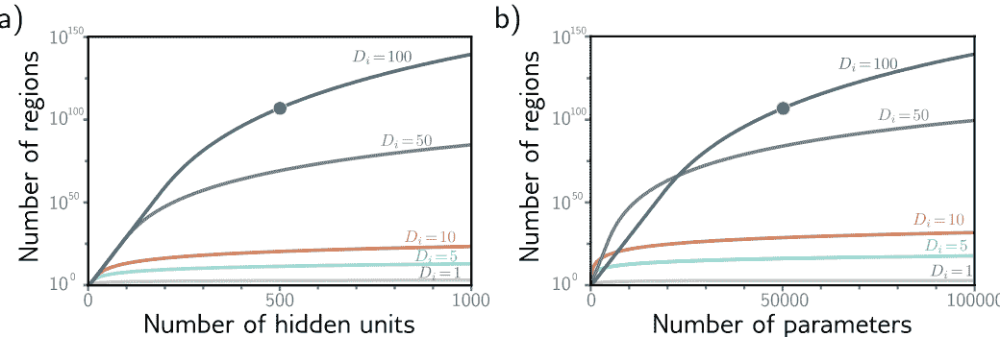

**图3.9 线性区域与隐藏单元。** a) 对于五个不同的输入维度 $D_i = \{1, 5, 10, 50, 100\}$，最大可能的区域数目随隐藏单元数目的增加而迅速增加。在高维度下，随着 $D=500$ 单元和输入尺寸 $D_i=100$，可能存在超过 $10^{107}$ 个区域（实心圆）。b) 相同的数据以参数数目的函数形式绘制。实心圆代表与面板 (a) 中相同的模型，其中 $D=500$ 隐藏单元。该网络具有 $51,001$ 个参数，并且按照现代标准来说是非常小的。

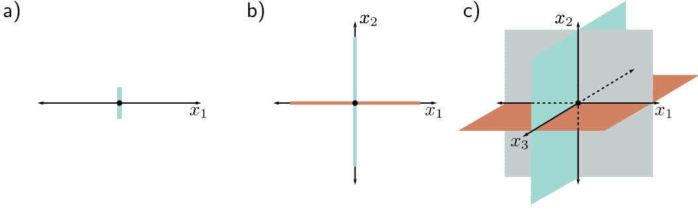

**图3.10 线性区域数目与输入维度。** a) 在单个输入维度的情况下，具有一个隐藏单元的模型创建一个关节，将轴分成两个线性区域。b) 在两个输入维度的情况下，具有两个隐藏单元的模型可以使用两条线（与轴对齐）来划分输入空间，从而创建四个区域。c) 在三个输入维度的情况下，具有三个隐藏单元的模型可以使用三个平面（再次与轴对齐）来划分输入空间，从而创建八个区域。根据这个论证，可以得出结论：具有 $D_i$ 输入维度和 $D_i$ 个隐藏单元的模型可以使用 $D_i$ 个超平面来划分输入空间，从而创建 $2^{D_i}$ 个线性区域。

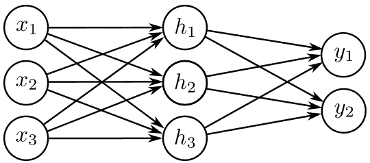

**图3.11 可视化神经网络，具有三个输入和两个输出。** 该网络具有二十个参数。有十五个斜率（由箭头表示）和五个偏移量（未显示）。

$$y_j = \phi_{j0} + \sum_{d=1}^D \phi_{jd} h_d, \quad (3.12)$$

其中 $a[\bullet]$ 是非线性激活函数。该模型具有参数 $\phi = \{ \boldsymbol{\theta}_{..}, \boldsymbol{\phi}_{..} \}$。图3.11显示了一个具有三个输入、三个隐藏单元和两个输出的示例。

激活函数允许模型描述输入和输出之间的非线性关系，因此它必须是非线性的；如果没有激活函数或者使用线性激活函数，整体的映射从输入到输出将受到限制，只能是线性的。已经尝试了许多不同的激活函数（见图3.13），但最常见的选择是ReLU（图3.1），它具有易于解释的优点。

使用ReLU激活函数，网络将输入空间划分为由ReLU函数中的“连接点”计算的超平面的交集定义的凸多面体。每个凸多面体包含一个不同的线性函数。对于每个输出，多面体是相同的，但它们包含的线性函数可能不同。

问题3.14-3.17
笔记本3.4 激活函数

## 3.5 术语

我们通过引入一些术语来结束本章。遗憾的是，神经网络有很多相关术语。它们通常以层的术语来描述。图3.12的左边是输入层，中间是隐藏层，右边是输出层。我们可以说图3.12中的网络有一个包含四个隐藏单元的隐藏层。隐藏单元本身有时被称为神经元。

当我们通过网络传递数据时，隐藏层输入的值（即在应用ReLU函数之前）被称为预激活。隐藏层的值（即在ReLU函数之后）被称为激活。

出于历史原因，具有至少一个隐藏层的任何神经网络也被称为多层感知机，简称为MLP。具有一个隐藏层的网络（如本章所述）有时被称为浅层神经网络。具有多个隐藏层的网络（如下一章所述）被称为深度神经网络。连接形成无环图的神经网络（即本章中的所有示例中的图）被称为前馈网络。如果一层中的每个元素都连接到下一层中的每个元素（如本章中的所有示例），则网络是全连接的。这些连接在底层方程中代表斜率参数，并被称为网络权重。偏移参数（图3.12中未显示）被称为偏差。

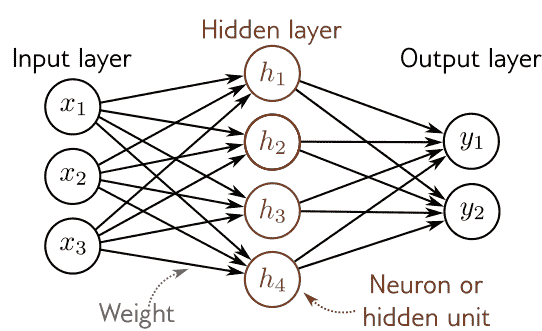

**图3.12 术语。** 浅层网络由输入层、隐藏层和输出层组成。每一层都通过前向连接（箭头）与下一层相连。因此，这些模型被称为前馈网络。当一层中的每个变量都连接到下一层中的每个变量时，我们称之为全连接网络。每个连接代表底层方程中的斜率参数，这些参数被称为权重。隐藏层中的变量被称为神经元或隐藏单元。输入到隐藏单元的值被称为预激活，经过ReLU函数应用后的值被称为激活。

## 3.6 总结

浅层神经网络有一个隐藏层。它们 (i) 计算输入的多个线性函数， (ii) 将每个结果通过激活函数传递，然后 (iii) 将这些激活的线性组合形成输出。浅层神经网络根据输入 $x$ 进行预测 $y$，将输入空间划分为连续的分段线性区域。通过足够多的隐藏单元（神经元），浅层神经网络可以以任意精度逼近任何连续函数。

第4章讨论了深度神经网络，它通过添加更多的隐藏层扩展了本章的模型。第5-7章介绍了如何训练这些模型。

## 笔记

**“神经”网络：** 如果本章中的模型只是函数，为什么称为“神经网络”？不幸的是，这种联系是脆弱的。像图3.12这样的可视化包括彼此之间密集连接的节点（输入、隐藏单元和输出）。这与哺乳动物大脑中的神经元有表面上的相似之处，它们也有密集的连接。然而，几乎没有证据表明大脑计算与神经网络的工作方式相同，将生物学与未来的思考联系在一起是没有帮助的。

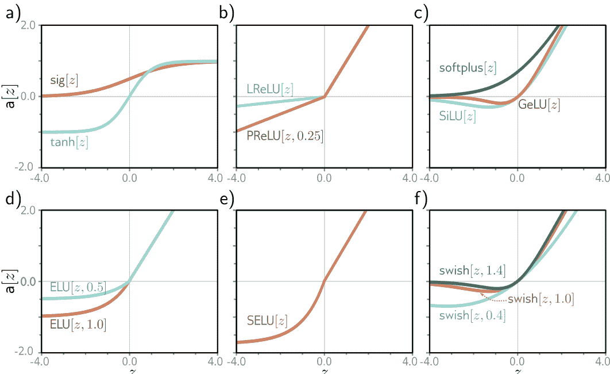

**图3.13 激活函数。** a) 逻辑sigmoid和tanh函数。 b) 带参数0.25的Leaky ReLU和parametric ReLU。 c) SoftPlus、高斯误差线性单元和sigmoid线性单元。 d) 带参数0.5和1.0的指数线性单元。 e) 缩放指数线性单元。 f) 带参数0.4、1.0和1.4的Swish。

**神经网络的历史：** McCulloch和Pitts (1943年) 首次提出了人工神经网络的概念，它将输入组合起来产生输出，但这个模型没有实用的学习算法。Rosenblatt (1958年) 开发了感知器，它线性组合输入，然后通过阈值处理以做出是/否的决策。他还提供了一个从数据中学习权重的算法。Minsky和Papert (1969年) 认为线性函数对于一般的分类问题是不够的，但是通过添加具有非线性激活函数的隐藏层（因此称为多层感知器），可以允许学习更一般的输入/输出关系。然而，他们得出结论，Rosenblatt的算法无法学习这种模型的参数。直到20世纪80年代才开发出了一个实用的算法（反向传播，请参见第7章），神经网络的重要工作才得以恢复。神经网络的历史由Kurenkov (2020年)，Sejnowski (2018年) 和Schmidhuber (2022年) 记录。

**激活函数：** ReLU函数早在1969年的福岛研究中就被使用过。然而，在神经网络的早期，更常用的是逻辑Sigmoid函数或者tanh函数作为激活函数（图3.13a）。ReLU函数在2009年的Jarrett等人，2010年的Nair和Hinton，以及2011年的Glorot等人的研究中重新受到关注，并成为现代神经网络成功的重要组成部分。它具有一个很好的特性，即对于大于零的输入，输出对输入的导数始终为1。这有助于训练的稳定性和效率（参见第7章），与Sigmoid激活函数的导数形成对比。

Sigmoid函数的导数在大正数和大负数的输入下饱和（接近于零）。然而，ReLU函数的缺点是其在负数输入下的导数为零。如果所有的训练样本对给定的ReLU函数产生负输入，那么我们在训练过程中无法改善输入到该ReLU的参数。相对于输入权重的梯度在局部上是平坦的，所以我们无法“下坡行走”。这被称为ReLU的衰退问题（Dying ReLU）。

为了解决这个问题，提出了许多ReLU的变体（图3.13b），包括（i）渗漏ReLU（Leaky ReLU, Maas等，2013），它对负值也具有线性输出，但斜率较小为0.1，（ii）参数化ReLU（PReLU, He等，2015），它将负部分的斜率视为未知参数，以及（iii）连接ReLU（CReLU, Shang等，2016），它产生两个输出，其中一个在零以下截断（即像典型的ReLU一样），另一个在零以上截断。

还研究了各种平滑函数（图3.13c-d），包括软加函数（SoftPlus, Glorot等，2011年），高斯误差线性单元（GELU, Hendrycks & Gimpel，2016年），sigmoid线性单元（SiLU, Hendrycks & Gimpel，2016年）和指数线性单元（ELU, Clevert等，2015年）。大多数这些尝试都是为了避免ReLU问题的发生，同时限制负值的梯度。Klambauer等人（2017年）引入了缩放指数线性单元（SELU, 图3.13e），这是特别有趣的，因为它有助于在输入方差具有有限范围时稳定激活的方差（参见第7.5节）。Ramachandran等人（2017年）采用了经验方法来选择激活函数。他们搜索了可能函数的空间以找到在各种监督学习任务中表现最佳的函数。找到了最佳函数 Swish，其中 $\beta$ 是一个学习参数（图3.13f）。有趣的是，这是对以前由Hendrycks & Gimpel（2016年）和Elfwing等人（2018年）提出的激活函数的重新发现。Howard等人（2019年）通过HardSwish函数近似了Swish函数，后者具有非常相似的形状但计算速度更快：

$$HardSwish[z] = \begin{cases} 0 & z < -3 \\ z(z+3)/6 & -3 \le z \le 3 \\ z & z > 3 \end{cases} \quad (3.13)$$

关于这些激活函数哪个在实践中更优尚无定论。然而，在特定情况下，渗漏ReLU、参数化ReLU和许多连续函数都可以提供轻微的性能提升。在本书的其余部分，我们将限制注意力于具有基本ReLU函数的神经网络，因为可以通过线性区域的数量来刻画它们所创建的函数。

**通用逼近定理：** 该定理的宽度版本表明，在包含一个具有有限数量隐藏单元的隐藏层的网络可以以任意精度逼近 $\mathbb{R}^n$ 上紧致子集上的任何指定连续函数。这是由Cybenko（1989）证明的一类Sigmoid激活函数，并且后来被证明对于更大类别的非线性激活函数也成立（Hornik，1991）。

**线性区域的数量：** 考虑一个具有 $D_i \ge 2$ 维输入和 $D$ 个隐藏单元的浅层网络。线性区域的数量由ReLU函数中的“连接点”所创建的超平面的交点确定（例如，图3.8d-f）。每个区域由不同的ReLU函数的组合剪切或不剪切输入而创建。

在 $D_i \le D$ 维输入空间中，由 $D$ 个超平面创建的区域数量由 Zaslavsky (1975) 证明，最多为 $\sum_{j=0}^{D_i} \binom{D}{j}$（即，一系列二项式系数的和）。作为经验法则，浅层神经网络几乎总是具有比输入维度 $D_i$ 更多的隐藏单元，并创建 $2^{D_i}$ 到 $2^D$ 之间的线性区域。

问题3.18

**线性、仿射和非线性函数：** 从技术上讲，线性变换 $\mathbf{f}[\bullet]$ 是满足叠加原理的任何函数，因此 $\mathbf{f}[a+b] = \mathbf{f}[a] + \mathbf{f}[b]$。这个定义意味着 $\mathbf{f}[2a] = 2\mathbf{f}[a]$。加权和 $\mathbf{f}[h_1, h_2, h_3] = \phi_1 h_1 + \phi_2 h_2 + \phi_3 h_3$ 是线性的，但一旦添加了偏移量（偏置），即 $\mathbf{f}[h_1, h_2, h_3] = \phi_0 + \phi_1 h_1 + \phi_2 h_2 + \phi_3 h_3$，这就不再成立了。为了看到这一点，考虑到当我们将前一个函数的参数加倍时，输出也会加倍。然而，对于后一个函数来说，情况并非如此，其更恰当地被称为仿射函数。然而，在机器学习中，混淆这些术语是很常见的。在本书中，我们遵循这个惯例，并将两者都称为线性。我们将遇到的所有其他函数都是非线性的。

## 问题

- **问题3.1** 如果方程3.1中的激活函数是线性的，即 $a[z] = \psi_0 + \psi_1 z$，那么从输入到输出的映射是什么样的？如果移除激活函数，那么将会创建怎样的映射，即 $a[z] = z$？
- **问题3.2** 对于图3.3j中的四个线性区域，指出哪些隐藏单元是非活动的，哪些是活动的（即，哪些会剪裁它们的输入，哪些不会）。
- **问题3.3*** 推导出图3.3j中函数的“关节”位置的表达式，其中涉及十个参数 $\phi$ 和输入 $x$。推导出这四个线性区域的斜率的表达式。
- **问题3.4** 绘制图3.3的一个版本，其中第三个隐藏单元的y截距和斜率已更改，如图3.14c所示。假设其余参数保持不变。

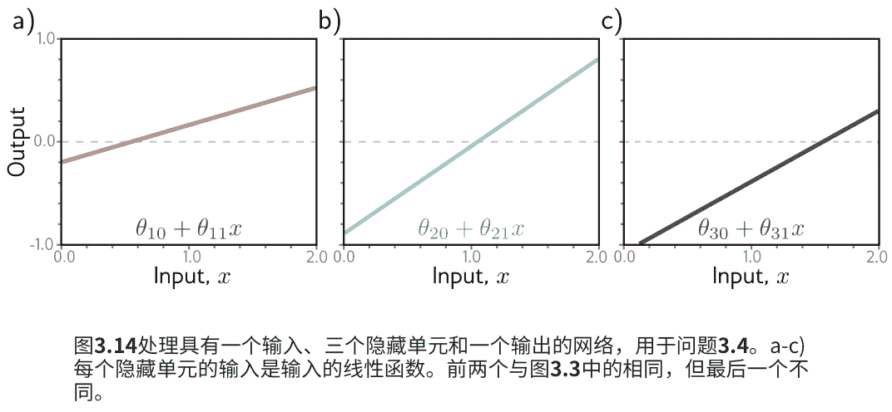

- **问题3.5** 证明对于 $\alpha \in \mathbb{R}^+$，以下属性成立：$\text{ReLU}[\alpha \cdot z] = \alpha \cdot \text{ReLU}[z]$。这被称为ReLU函数的非负齐次性属性。
- **问题3.6** 继续问题3.5，我们将参数 $\theta_{10}$ 和 $\theta_{11}$ 乘以正常数 $\alpha$，并将斜率 $\phi_1$ 除以相同的参数 $\alpha$ 时，定义在方程3.3和3.4中的浅层网络会发生什么？如果 $\alpha$ 为负数会发生什么？
- **问题3.7** 考虑使用最小二乘损失函数拟合方程3.1中的模型。这个损失函数是否有唯一的最小值？即，是否存在一个单一的“最佳”参数集？
- **问题3.8** 考虑将ReLU激活函数替换为 (i) 海维赛德阶跃函数 $\text{heaviside}[z]$， (ii) 双曲正切函数 $\text{tanh}[z]$，以及 (iii) 矩形函数 $\text{rect}[z]$，其中：
$$\text{heaviside}[z] = \begin{cases} 0 & z < 0 \\ 1 & z \ge 0 \end{cases} \quad \quad \text{rect}[z] = \begin{cases} 0 & z < 0 \\ 1 & 0 \le z \le 1 \\ 0 & z > 1 \end{cases} \quad (3.15)$$
为每个这些函数重新绘制图3.3的版本。原始参数为：$\phi = \{\phi_0, \phi_1, \phi_2, \phi_3, \theta_{10}, \theta_{11}, \theta_{20}, \theta_{21}, \theta_{30}, \theta_{31}\} = \{-0.23, -1.3, 1.3, 0.66, -0.2, 0.4, -0.9, 0.9, 1.1, -0.7\}$。提供一个关于神经网络在一个输入、三个隐藏单元和每个激活函数一个输出的情况下可以创建的函数族的非正式描述。
- **问题3.9*** 证明图3.3中的第三个线性区域的斜率是第一个和第四个线性区域的斜率之和。
- **问题3.10** 考虑一个具有一个输入、一个输出和三个隐藏单元的神经网络。图3.3中的构造显示了这样创建了四个线性区域。在什么情况下，这个网络能够产生少于四个线性区域的函数？
- **问题3.11*** 图3.6中的模型有多少个参数？
- **问题3.12** 图3.7中的模型有多少个参数？
- **问题3.13** 图3.8中的每个区域的激活模式是什么？换句话说，每个区域哪些隐藏单元是活跃的（传递输入），哪些是非活跃的（截断输入）？
- **问题3.14** 写出图3.11中定义网络的方程。从输入计算三个隐藏单元的方程应该有三个，从隐藏单元计算输出的方程应该有两个。
- **问题3.15*** 图3.11中的网络能够创建的3D线性区域的最大可能数量是多少？
- **问题3.16** 写出一个具有两个输入、四个隐藏单元和三个输出的网络的方程。以图3.11的风格绘制这个模型。
- **问题3.17*** 方程3.11和3.12定义了一个具有 $D_i$ 个输入、一个包含 $D$ 个隐藏单元的隐藏层和 $D_o$ 个输出的一般神经网络。用 $D_i$、$D$ 和 $D_o$ 的表达式表示模型中参数的数量。
- **问题3.18*** 证明一个具有 $D_i = 2$ 维输入、$D_o = 1$ 维输出和 $D = 3$ 个隐藏单元的浅层网络所创建的区域的最大数量是七个，如图3.8j所示。使用Zaslavsky (1975) 的结果，即通过使用 $D$ 个超平面对 $D_i$ 维空间进行分割所创建的区域的最大数量是 $\sum_{j=0}^{D_i} \binom{D}{j}$。如果我们向这个模型添加两个隐藏单元，即 $D=5$，那么最大区域的数量是多少？

## 第四章 深度神经网络

上一章介绍了浅层神经网络，它们只有一个隐藏层。本章介绍了深层神经网络，它们有多个隐藏层。使用ReLU激活函数，浅层和深层网络都可以描述从输入到输出的分段线性映射。

随着隐藏单元数量的增加，浅层神经网络提高了其描述能力。事实上，通过足够多的隐藏单元，浅层网络可以在高维空间中描述任意复杂的函数。然而，对于某些函数来说，所需的隐藏单元数量过大，不切实际。相比于浅层网络，深层网络可以为给定参数数量产生更多的线性区域。因此，从实际角度来看，它们可以用来描述更广泛的函数族。

## 4.1 组合神经网络

为了深入了解深度神经网络的行为，我们首先考虑将两个浅层网络组合起来，使第一个网络的输出成为第二个网络的输入。考虑两个具有三个隐藏单元的浅层网络（图4.1a）。第一个网络接受输入 $x$ 并返回输出 $y$，定义如下：

$$ \begin{aligned} h_1 &= a[\theta_{10} + \theta_{11}x] \\ h_2 &= a[\theta_{20} + \theta_{21}x] \\ h_3 &= a[\theta_{30} + \theta_{31}x] \end{aligned} \quad (4.1) $$

和

$$ y = \phi_0 + \phi_1 h_1 + \phi_2 h_2 + \phi_3 h_3 \quad (4.2) $$

第二个网络以 $y$ 作为输入，并返回 $y'$。

图4.1将两个具有三个隐藏单元的单层网络组合在一起。a) 第一个网络的输出 $y$ 构成了第二个网络的输入。b) 第一个网络使用一个函数将输入 $x \in [-1, 1]$ 映射到输出 $y \in [-1, 1]$，该函数由三个线性区域组成，这些区域的斜率选择得使其交替变换符号。现在，多个输入 $x$（灰色圆圈）映射到相同的输出 $y$（青色圆圈）。c) 第二个网络定义了一个由三个线性区域组成的函数，它以 $y$ 为输入并返回 $y'$（即，将青色圆圈映射到棕色圆圈）。d) 当这两个函数组合在一起时，其效果是：(i) 第一个网络将三个不同的输入 $x$ 映射到任何给定的 $y$ 值，并且 (ii) 第二个网络以相同的方式处理它们；结果是，第二个网络在面板(c)中定义的函数被复制了三次，并根据面板(b)区域的斜率进行了翻转和重新缩放。

$$\begin{aligned} h'_1 &= a[\ \theta'_{10} + \theta'_{11}y\ ] \\ h'_2 &= a[\ \theta'_{20} + \theta'_{21}y\ ] \\ h'_3 &= a[\ \theta'_{30} + \theta'_{31}y\ ], \end{aligned} \eqno(4.3)$$

和

$$y' = \phi'_0 + \phi'_1 h'_1 + \phi'_2 h'_2 + \phi'_3 h'_3. \eqno(4.4)$$

使用ReLU激活函数，该模型还描述了一族分段线性函数。

然而，线性区域的数量可能比浅层网络的六个隐藏单元更多。为了看到这一点，考虑选择第一个网络产生三个交替的正斜率区域（图4.1b）。这意味着三个不同范围的 $x$ 被映射到相同的输出范围 $y \in [-1,1]$，并且随后从这个 $y$ 的范围到 $y'$ 的映射被应用了三次。总体效果是由第二个网络定义的函数被复制三次以创建九个线性区域。相同的原理适用于更高的维度（图4.2）。

组合网络的另一种思考方式是，第一个网络将输入空间“折叠”回到自身，以便多个输入生成相同的输出。然后，第二个网络应用一个函数，该函数在所有被折叠在一起的点上复制（图4.3）。

**问题4.1**
**笔记本4.1 组合网络**

## 4.2 从组合网络到深度网络

前一节展示了我们可以通过将一个浅层神经网络的输出传递到第二个网络中来创建复杂的函数。我们现在展示这是一个具有两个隐藏层的深度网络的特例。

第一个网络的输出 ($y = \phi_0 + \phi_1 h_1 + \phi_2 h_2 + \phi_3 h_3$) 是隐藏单元激活的线性组合。第二个网络的第一步操作（方程4.3中我们计算 $\theta'_{10} + \theta'_{11} y, \theta'_{20} + \theta'_{21} y,$ 和 $\theta'_{30} + \theta'_{31} y$）在第一个网络的输出中是线性的。将一个线性函数应用于另一个线性函数会得到另一个线性函数。将 $y$ 的表达式代入方程4.3中得到：

$$\begin{aligned} h'_1 &= a[\theta'_{10} + \theta'_{11}y] = a[\theta'_{10} + \theta'_{11}\phi_0 + \theta'_{11}\phi_1 h_1 + \theta'_{11}\phi_2 h_2 + \theta'_{11}\phi_3 h_3] \\ h'_2 &= a[\theta'_{20} + \theta'_{21}y] = a[\theta'_{20} + \theta'_{21}\phi_0 + \theta'_{21}\phi_1 h_1 + \theta'_{21}\phi_2 h_2 + \theta'_{21}\phi_3 h_3] \\ h'_3 &= a[\theta'_{30} + \theta'_{31}y] = a[\theta'_{30} + \theta'_{31}\phi_0 + \theta'_{31}\phi_1 h_1 + \theta'_{31}\phi_2 h_2 + \theta'_{31}\phi_3 h_3], \end{aligned} \eqno(4.5)$$

我们可以重写为：

$$\begin{aligned} h'_1 &= a[\psi_{10} + \psi_{11} h_1 + \psi_{12} h_2 + \psi_{13} h_3] \\ h'_2 &= a[\psi_{20} + \psi_{21} h_1 + \psi_{22} h_2 + \psi_{23} h_3] \\ h'_3 &= a[\psi_{30} + \psi_{31} h_1 + \psi_{32} h_2 + \psi_{33} h_3], \end{aligned} \eqno(4.6)$$

图4.2使用2D输入组合神经网络。a) 第一个网络（来自图3.8）有三个隐藏单元，接受两个输入 $x_1$ 和 $x_2$ 并返回一个标量输出 $y$。这被传递到第二个具有两个隐藏单元的网络中，以生成 $y'$。b) 第一个网络生成一个由七个线性区域组成的函数，其中一个是平坦的。c) 第二个网络定义了一个由两个线性区域组成的函数，其中 $y \in [-1, 1]$。d) 当这些网络组合在一起时，第一个网络的六个非平坦区域被第二个网络分割成两个新区域，总共产生13个线性区域。

图4.3深度网络作为输入空间的折叠。a) 从图4.1中，可以将第一个网络看作将输入空间“折叠”回自身的方式之一。b) 第二个网络将其函数应用于折叠空间。c) 最终输出通过“展开”再次显示。

图4.4具有一个输入、一个输出和两个隐藏层的神经网络，每个隐藏层都包含三个隐藏单元。

其中 $\psi_{10} = \theta'_{10} + \theta'_{11}\phi_0, \psi_{11} = \theta'_{11}\phi_1, \psi_{12} = \theta'_{11}\phi_2$ 等等。结果是一个具有两个隐藏层的网络（图4.4）。

由此可见，具有两层的网络可以表示通过将一个单层网络的输出传递到另一个网络中创建的函数族。事实上，它表示了一个更广泛的函数族，因为在方程4.6中，九个斜率参数 $\psi_{11}, \psi_{21}, \dots$ 可以取任意值，而在方程4.5中，这些参数受到约束，必须是外积 $[\theta'_{11}, \theta'_{21}, \theta'_{31}]^T[\phi_1, \phi_2, \phi_3]$。

## 4.3 深度神经网络

在前一节中，我们展示了组合两个浅层网络会产生一个具有两个隐藏层的深层网络的特殊情况。现在我们考虑一个包含两个隐藏层的深层网络的一般情况，每个隐藏层都包含三个隐藏单元（图4.4）。

$$\begin{aligned} h_1 &= \text{a} [\theta_{10} + \theta_{11}x] \\ h_2 &= \text{a} [\theta_{20} + \theta_{21}x] \\ h_3 &= \text{a} [\theta_{30} + \theta_{31}x], \end{aligned} \qquad (4.7)$$

第二层通过：

$$\begin{aligned} h'_1 &= \text{a}[\psi_{10} + \psi_{11}h_1 + \psi_{12}h_2 + \psi_{13}h_3] \\ h'_2 &= \text{a}[\psi_{20} + \psi_{21}h_1 + \psi_{22}h_2 + \psi_{23}h_3] \\ h'_3 &= \text{a}[\psi_{30} + \psi_{31}h_1 + \psi_{32}h_2 + \psi_{33}h_3], \end{aligned} \qquad (4.8)$$

和输出通过：

$$y' = \phi'_0 + \phi'_1h'_1 + \phi'_2h'_2 + \phi'_3h'_3 \qquad (4.9)$$

**笔记本4.2 剪辑函数**

考虑这些方程导致另一种思考网络如何构建越来越复杂的函数的方式——构建一个越来越复杂的函数（图4.5）的结构：

- 1. 第一层中的三个隐藏单元 $h_1, h_2$ 和 $h_3$ 通常通过形成输入的线性函数并通过 ReLU 激活函数（方程4.7）传递来计算。
- 2. 在第二层中，通过对这些隐藏单元的三个新线性函数进行计算（方程4.8中的激活函数的参数），我们计算出了第二层的预激活。此时，我们实际上有一个具有三个输出的浅层网络；我们计算出了三个分段线性函数，其“接缝”在相同的位置（参见图3.6）。
- 3. 在第二个隐藏层，每个函数都应用了另一个 ReLU 函数 $\text{a}[\cdot]$ (equation 4.8)，它将它们剪切并为每个函数添加新的“连接点”。
- 4. 最终的输出是这些隐藏单元的线性组合 (equation 4.9)。

总之，我们可以将每一层都看作是“折叠”输入空间，或者是创建新函数，这些函数被剪切（创建新的区域），然后重新组合。前一种观点强调输出函数中的依赖关系，但不强调剪切如何创建新的连接点，而后一种观点则相反。最终，这两种描述只能部分地揭示深度神经网络的运作方式。无论如何，重要的是不要忽视这个事实，即这仍然只是一个将输入 $x$ 与输出 $y'$ 相关联的方程。实际上，我们可以将方程4.7-4.9结合起来得到一个表达式：

$$\begin{aligned} y' = \phi'_0 &+ \phi'_1 \text{a} [\psi_{10} + \psi_{11} \text{a} [\theta_{10} + \theta_{11} x] + \psi_{12} \text{a} [\theta_{20} + \theta_{21} x] + \psi_{13} \text{a} [\theta_{30} + \theta_{31} x]] \\ &+ \phi'_2 \text{a} [\psi_{20} + \psi_{21} \text{a} [\theta_{10} + \theta_{11} x] + \psi_{22} \text{a} [\theta_{20} + \theta_{21} x] + \psi_{23} \text{a} [\theta_{30} + \theta_{31} x]] \\ &+ \phi'_3 \text{a} [\psi_{30} + \psi_{31} \text{a} [\theta_{10} + \theta_{11} x] + \psi_{32} \text{a} [\theta_{20} + \theta_{21} x] + \psi_{33} \text{a} [\theta_{30} + \theta_{31} x]], \end{aligned} \eqno(4.10)$$

尽管这确实很难理解。

### 4.3.1 超参数

我们可以将深度网络构建扩展到超过两个隐藏层；现代网络可能在每个层中有超过一百个层，并且每个层中有数千个隐藏单元。每个层中的隐藏单元数量被称为网络的宽度，而隐藏层数量被称为深度。隐藏单元的总数是网络容量的度量。

**问题4.2**

我们将层数表示为 $K$，每个层中的隐藏单元数量表示为 $D_1, D_2, \dots, D_K$。这些是超参数的示例。它们是在我们学习模型参数（即斜率和截距项）之前选择的数量。对于固定的超参数（例如，$K=2$个层，每个层中的 $D_k=3$个隐藏单元），模型描述了一族函数，而参数确定了特定的函数。

因此，当我们考虑超参数时，我们可以将神经网络看作是将输入与输出相关联的一系列函数的家族。

图4.5 图4.4中深度神经网络的计算。a-c) 第二个隐藏层的输入（即预激活）是三个分段线性函数，其中线性区域之间的“接头”处于相同位置（参见图3.6）。d-f) 每个分段线性函数通过ReLU激活函数被剪切为零。g-i) 然后，这些剪切函数分别与参数 $\phi'_1$，$\phi'_2$ 和 $\phi'_3$ 相乘。j) 最后，剪切和加权函数求和，并添加一个控制整体高度的偏移量 $\phi'_0$。

图4.6 具有 $D_i=3$ 维输入 $\mathbf{x}$，$D_o=2$ 维输出 $\mathbf{y}$ 和 $K=3$ 个隐藏层 $\mathbf{h}_1$，$\mathbf{h}_2$ 和 $\mathbf{h}_3$ 的网络的矩阵表示，其中维度分别为 $D_1=4$，$D_2=2$ 和 $D_3=3$。权重存储在矩阵 $\mathbf{\Omega}_k$ 中，该矩阵将前一层的激活乘以前一层的激活，从而创建后一层的预激活。例如，计算从 $\mathbf{h}_1$ 的激活到 $\mathbf{h}_2$ 的预激活的权重矩阵 $\mathbf{\Omega}_1$ 的维度为 $2 \times 4$。它应用于第一层的四个隐藏单元，并创建第二层的两个隐藏单元的输入。偏置存储在向量 $\boldsymbol{\beta}_k$ 中，并具有它们所馈送的层的维度。例如，偏置向量 $\boldsymbol{\beta}_2$ 的长度为三，因为第三层包含三个隐藏单元。

## 4.4 矩阵表示

**附录 B.3 矩阵**

我们已经看到，深度神经网络由线性变换交替组成激活函数。我们可以等价地将方程 4.7-4.9 表示为矩阵形式：

$$\begin{bmatrix} h_1 \\ h_2 \\ h_3 \end{bmatrix} = \mathbf{a} \left[ \begin{bmatrix} \theta_{10} \\ \theta_{20} \\ \theta_{30} \end{bmatrix} + \begin{bmatrix} \theta_{11} \\ \theta_{21} \\ \theta_{31} \end{bmatrix} x \right], \tag{4.11}$$

$$\begin{bmatrix} h'_1 \\ h'_2 \\ h'_3 \end{bmatrix} = \mathbf{a} \left[ \begin{bmatrix} \psi_{10} \\ \psi_{20} \\ \psi_{30} \end{bmatrix} + \begin{bmatrix} \psi_{11} & \psi_{12} & \psi_{13} \\ \psi_{21} & \psi_{22} & \psi_{23} \\ \psi_{31} & \psi_{32} & \psi_{33} \end{bmatrix} \begin{bmatrix} h_1 \\ h_2 \\ h_3 \end{bmatrix} \right], \tag{4.12}$$

和

$$y' = \phi'_0 + \begin{bmatrix} \phi'_1 & \phi'_2 & \phi'_3 \end{bmatrix} \begin{bmatrix} h'_1 \\ h'_2 \\ h'_3 \end{bmatrix}, \tag{4.13}$$

或者更简洁地用矩阵表示为：

$$
\begin{aligned}
\mathbf{h} &= \mathbf{a}[\boldsymbol{\theta}_0 + \boldsymbol{\Theta}\mathbf{x}] \\
\mathbf{h}' &= \mathbf{a}[\boldsymbol{\psi}_0 + \boldsymbol{\Psi}\mathbf{h}] \\
y' &= \phi_0' + \boldsymbol{\phi}'\mathbf{h}', \quad (4.14)
\end{aligned}
$$

在每种情况下，函数 $\mathbf{a}[\bullet]$ 将激活函数分别应用于其向量输入的每个元素。

### 4.4.1 一般公式

对于具有许多层的网络，这种表示方法变得繁琐。因此，从现在开始，我们将描述第 $k$ 层隐藏单元的向量为 $\mathbf{h}_k$，对第 $k+1$ 层有贡献的偏置（截距）向量为 $\boldsymbol{\beta}_k$，以及应用于第 $k$ 层并对第 $(k+1)$ 层有贡献的权重（斜率）为 $\boldsymbol{\Omega}_k$。现在可以将具有 $K$ 层的一般深度网络 $y = f[\mathbf{x}, \phi]$ 写为：

$$
\begin{aligned}
\mathbf{h}_1 &= \mathbf{a}[\boldsymbol{\beta}_0 + \boldsymbol{\Omega}_0\mathbf{x}] \\
\mathbf{h}_2 &= \mathbf{a}[\boldsymbol{\beta}_1 + \boldsymbol{\Omega}_1\mathbf{h}_1] \\
\mathbf{h}_3 &= \mathbf{a}[\boldsymbol{\beta}_2 + \boldsymbol{\Omega}_2\mathbf{h}_2] \\
&\vdots \\
\mathbf{h}_K &= \mathbf{a}[\boldsymbol{\beta}_{K-1} + \boldsymbol{\Omega}_{K-1}\mathbf{h}_{K-1}] \\
y &= \beta_K + \boldsymbol{\Omega}_K\mathbf{h}_K. \quad (4.15)
\end{aligned}
$$

该模型的参数 $\phi$ 包括所有这些权重矩阵和偏置向量 $\phi = \{\boldsymbol{\beta}_k, \boldsymbol{\Omega}_k\}_{k=0}^K$。

如果第 $k$ 层有 $D_k$ 个隐藏单元，则偏置向量 $\boldsymbol{\beta}_{k-1}$ 的大小为 $D_k$。最后一个偏置向量 $\boldsymbol{\beta}_K$ 的大小为输出的 $D_o$。第一个权重矩阵 $\boldsymbol{\Omega}_0$ 的大小为 $D_1 \times D_i$，其中 $D_i$ 是输入的大小。最后一个权重矩阵 $\boldsymbol{\Omega}_K$ 为 $D_o \times D_K$，其余的矩阵 $\boldsymbol{\Omega}_k$ 为 $D_{k+1} \times D_k$（图4.6）。

我们可以等价地将网络表示为一个函数：

$$y = \beta_K + \boldsymbol{\Omega}_K\mathbf{a} \left[ \boldsymbol{\beta}_{K-1} + \boldsymbol{\Omega}_{K-1}\mathbf{a} \left[ \dots \boldsymbol{\beta}_2 + \boldsymbol{\Omega}_2\mathbf{a} \left[ \boldsymbol{\beta}_1 + \boldsymbol{\Omega}_1\mathbf{a} \left[ \boldsymbol{\beta}_0 + \boldsymbol{\Omega}_0\mathbf{x} \right] \dots \right] \right] \right]. \quad (4.16)$$

## 4.5 浅层与深层神经网络

第3章讨论了浅层网络（具有单个隐藏层），而在这里我们描述了深层网络（具有多个隐藏层）。我们现在比较这些模型。

**笔记本4.3 深度网络**
**问题4.3-4.6**

### 4.5.1 能够逼近不同的函数

在第 3.2 节中，我们认为具有足够容量（隐藏单元）的浅层神经网络可以任意接近地模拟任何连续函数。在本章中，我们看到具有两个隐藏层的深度网络可以表示两个浅层网络的组合。如果这两个网络中的第二个计算恒等函数，则该深度网络复制了一个单独的浅层网络。因此，它也可以在具有足够容量的情况下任意接近地逼近任何连续函数。

问题 4.7

### 4.5.2 每个参数的线性区域数量

一个具有一个输入、一个输出和 $D > 2$ 隐藏单元的浅层网络可以创建多达 $D+1$ 个线性区域，并由 $3D+1$ 个参数定义。一个具有一个输入、一个输出和 $K$ 层 $D > 2$ 隐藏单元的深层网络可以使用 $3D+1 + (K-1)D(D+1)$ 个参数创建多达 $(D+1)^K$ 个线性区域的函数。

问题 4.8–4.11

图 4.7a 显示了线性区域的最大数量如何随着网络将标量输入 $x$ 映射到标量输出 $y$ 的参数数量增加而增加。对于固定的参数预算，深度神经网络可以创建更复杂的函数。

随着输入维度 $D_i$ 的增加（图 4.7b），这种效应被放大，尽管计算线性区域的最大数量并不那么直观。

这看起来很有吸引力，但是函数的灵活性仍然受到参数数量的限制。深度网络可以创建非常大量的线性区域，但是这些区域包含复杂的依赖关系和对称性。当我们将深度网络视为将输入空间“折叠”时，我们看到了其中一些（图 4.3）。因此，除非 (i) 我们希望近似的真实世界函数具有类似的对称性，或者 (ii) 我们有理由相信从输入到输出的映射确实涉及较简单函数的组合，否则更多的区域数量并不一定是一个优势。

### 4.5.3 深度效率

深度网络和浅层网络都可以建模任意函数，但是一些函数可以用深度网络更高效地近似。已经确定了一些需要指数级更多隐藏单元的浅层网络才能达到与深度网络等效近似的函数。这种现象被称为神经网络的深度效率。这个特性也很有吸引力，但是我们不清楚我们想要近似的真实世界函数是否属于这个类别。

### 4.5.4 大型、结构化输入

我们已经讨论了全连接网络，其中每个层的每个元素都对后续层的每个元素有贡献。然而，对于大型问题，这些网络并不实用，结构化输入，如图像，其中输入可能包含 $\sim 10^6$ 像素。参数的数量将是难以接受的，而且我们希望图像的不同部分被类似地处理；在图像的每个可能位置独立学习识别相同的对象是没有意义的。

解决方案是并行处理局部图像区域，然后逐渐整合来自越来越大的区域的信息。这种从局部到全局的处理很难在不使用多层的情况下指定（见第 10 章）。

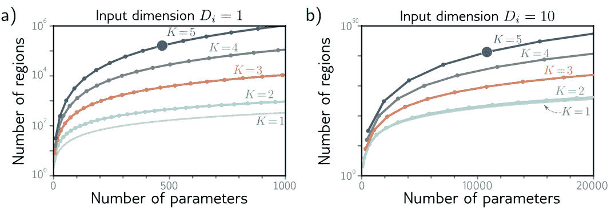

**图 4.7** 神经网络的线性区域数量随网络深度的增加而迅速增加。a) 输入为 $D_i=1$ 的网络。每条曲线代表一个固定数量的隐藏层 $K$，我们改变每层的隐藏单元数 $D$。对于固定的参数预算（水平位置），深层网络产生的线性区域比浅层网络更多。具有 $K=5$ 层和每层 $D=10$ 隐藏单元的网络有 471 个参数（突出显示的点），可以产生 161,051 个区域。b) 输入为 $D_i=10$ 的网络。曲线上的每个后续点代表十个隐藏单元。在这里，具有 $K=5$ 层和每层 $D=50$ 隐藏单元的模型有 10,801 个参数（突出显示的点），可以创建超过 $10^{40}$ 个线性区域。

### 4.5.5 训练和泛化

相对于浅层网络，深层网络的另一个可能优势是它们的易于拟合性；通常训练中等深度的网络比训练浅层网络更容易（见图 20.2）。可能是因为过参数化的深度模型有一个大量的大致等价解，很容易找到。然而，随着我们添加更多的隐藏层，训练又变得更加困难，尽管已经开发出许多方法来缓解这个问题（见第 11 章）。

> 深度神经网络似乎比浅层网络更好地推广到新数据。在实践中，对于大多数任务，使用具有数十个或数百个层的网络可以获得最佳结果。这些现象都不太被理解，我们将在第 20 章中回顾它们。

## 4.6 总结

在本章中，我们首先考虑了当我们组合两个浅层网络时会发生什么。我们认为第一个网络“折叠”了输入空间，然后第二个网络应用了分段线性函数。第二个网络的效果在输入空间折叠到自身的地方被复制。

然后我们展示了这两个浅层网络的组合是一个具有两个层的深层网络的特例。我们将每个层中的 ReLU 函数解释为在多个位置剪切输入函数，并在输出函数中创建更多的“连接点”。

我们介绍了超参数的概念，对于我们目前看到的网络，超参数包括隐藏层的数量和每个隐藏单元的数量。

最后，我们比较了浅层网络和深层网络。我们发现：
- (i) 只要具备足够的容量，两种网络都能逼近任何函数；
- (ii) 深层网络每个参数产生更多的线性区域；
- (iii) 某些函数可以通过深层网络更高效地逼近；
- (iv) 像图像这样的大型结构化输入最好在多个阶段进行处理；
- (v) 实际上，大多数任务的最佳结果是通过具有多层的深层网络实现的。

现在我们了解了深层和浅层网络模型，我们将注意力转向训练它们。在下一章中，我们将讨论损失函数。对于给定的参数值 $\phi$，损失函数返回一个单一的数字，表示模型输出与训练数据集的真实预测之间的不匹配程度。在第 6 章和第 7 章中，我们将处理训练过程本身，通过寻找最小化该损失的参数值。

## 笔记

### 深度学习
长期以来人们已经认识到，通过组合浅层神经网络或者开发具有多个隐藏层的网络，可以构建更复杂的函数。事实上，“深度学习”这个术语最早由 Dechter (1986) 使用。然而，由于实际问题的限制，对此的兴趣有限；训练这样的网络并不容易。现代深度学习的时代始于 Krizhevsky 等人 (2012) 报告的图像分类方面的惊人改进。这一突然进展可以说是由四个因素的结合导致：更大的训练数据集，用于训练的改进处理能力，ReLU 激活函数的使用以及随机梯度下降的使用（见第 6 章）。LeCun 等人（2015）概述了现代深度学习的早期进展。

### 线性区域的数量
对于使用 ReLU 激活函数的深度网络，使用总共 $D$ 个隐藏单元，区域数量的上限为 $2^D$ (Montufar 等人, 2014)。同样的作者还表明，具有 $D_i$ 维输入和 $K$ 层的深度 ReLU 网络，每层包含 $D \ge D_i$ 个隐藏单元，具有 $\mathcal{O}((D/D_i)^{(K-1)D_i} D^{D_i})$ 线性区域。Montúfar (2017), Arora et al. (2016) 和 Serra et al. (2018) 都提供了考虑每层具有不同隐藏单元数量的更紧密的上界。Serra et al. (2018) 提供了一种算法，用于计算神经网络中的线性区域数量，尽管它只适用于非常小的网络。

如果每个 $K$ 层中的隐藏单元数量 $D$ 相同，并且 $D$ 是输入维度 $D_i$ 的整数倍，则线性区域的最大数量 $N_r$ 可以计算出来并且确切地是：

$$N_r = \left(\frac{D}{D_i} + 1\right)^{D_i(K-1)} \cdot \sum_{j=0}^{D_i} \binom{D}{j}. \qquad (4.17)$$

这个表达式中的第一项对应于网络的前 $K-1$ 层，可以将其视为重复折叠输入空间。然而，现在我们需要为每个输入维度分配 $D/D_i$ 隐藏单元来创建这些折叠。这个方程中的最后一项（二项式系数的和）是一个浅层网络可以创建的区域数量，归因于最后一层。有关更多信息，请参阅 Montufar 等人（2014年），Pascanu 等人（2013年）和 Montúfar（2017年）。（参见附录 B.2 二项式系数）

### 通用逼近定理
我们在第 4.5.1 节中论证了，如果深层网络的层具有足够的隐藏单元，则通用逼近定理的宽度版本适用：存在一个网络，可以以任意精度逼近紧致子集上的任何给定连续函数。Lu 等人（2017年）证明，存在一个具有 ReLU 激活函数并且每层至少具有 $D_i+4$ 个隐藏单元的网络可以以任意精度逼近任何指定的 $D_i$ 维勒贝格可积函数，只要层数足够多。这被称为通用逼近定理的深度版本。

### 深度效率
几个结果表明，有些函数可以通过深层网络实现，但不能通过容量在指数级别以上有界的任何浅层网络实现。换句话说，要准确描述这些函数，需要在浅层网络中使用指数级别更多的单元。这被称为神经网络的深度效率。Telgarsky (2016) 表明，对于任何整数 $k$，可以构建具有一个输入、一个输出和 $\mathcal{O}[k^3]$ 常数宽度的网络，而这是无法通过 $\mathcal{O}[k]$ 层和少于 $2^k$ 宽度的网络实现的。

### 宽度效率
Lu 等人（2017）研究了是否存在宽而浅的网络（即，隐藏单元很多的浅层网络），这些网络无法通过深度不大的窄网络来实现。他们表明存在一类宽而浅的网络，只能通过具有多项式深度的窄网络来表示。这被称为神经网络的宽度效率。宽度的多项式下界比深度的指数下界更不限制性，这表明深度更重要。Vardi 等人（2022）随后证明，使宽度变小的代价只是网络深度线性增加，对于具有 ReLU 激活的网络。

## 问题

- **问题 4.1*** 考虑图 4.8 中两个神经网络的组合。绘制输入 $x$ 和输出 $y'$ 之间的关系的图形，其中 $x \in [-1, 1]$。
- **问题 4.2** 在图 4.6 中识别四个超参数。
- **问题 4.3** 使用 ReLU 函数的非负齐次性质（见问题 3.5），证明：
$$\text{ReLU} [ \beta_1 + \lambda_1 \cdot \Omega_1 \text{ReLU} [\beta_0 + \lambda_0 \cdot \Omega_0 \mathbf{x}] ] = \lambda_0 \lambda_1 \cdot \text{ReLU} [ \frac{1}{\lambda_0 \lambda_1} \beta_1 + \Omega_1 \text{ReLU} [\frac{1}{\lambda_0} \beta_0 + \Omega_0 \mathbf{x}] ] \qquad (4.18)$$
其中 $\lambda_0$ 和 $\lambda_1$ 是非负标量。从这个中，我们可以看到权重矩阵可以被任意放大，只要偏置也被调整，而比例因子可以在网络的末尾重新应用。

- **问题 4.4** 写出一个深度神经网络的方程，该网络接受 $D_i=5$ 个输入，$D_o=4$ 个输出，并且有三个隐藏层，大小分别为 $D_1=20$，$D_2=10$ 和 $D_3=7$，在方程 4.15 和 4.16 的形式下。每个权重矩阵 $\mathbf{\Omega}_\bullet$ 和偏置向量 $\mathbf{\beta}_\bullet$ 的大小是多少？

- **问题 4.5** 考虑一个深度神经网络，输入为 $D_i=5$ 个，输出为 $D_o=1$ 个，包含 $K=20$ 个隐藏层，每个隐藏层包含 $D=30$ 个隐藏单元。这个网络的深度是多少？宽度是多少？

- **问题 4.6** 考虑一个具有 $D_i=1$ 输入，$D_o=1$ 输出 and $K=10$ 层的网络，每个隐藏层有 $D=10$ 个隐藏单元。如果我们增加深度或宽度，权重的数量会增加得更多吗？请提供你的理由。

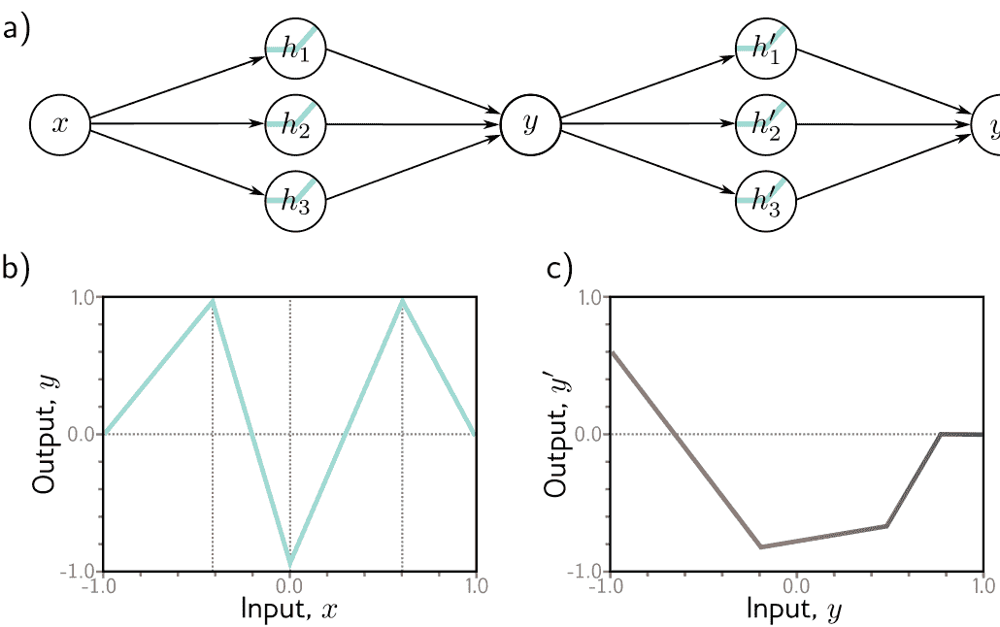

**图 4.8** 问题 4.1 的两个网络的组合。a) 第一个网络的输出 $y$ 成为第二个网络的输入。b) 第一个网络计算这个函数，输出值 $y \in [-1, 1]$。c) 第二个网络在输入范围 $y \in [-1, 1]$ 上计算这个函数。

- **问题 4.7** 为方程 3.1 中的浅层神经网络选择参数 $\phi = \{\phi_0, \phi_1, \phi_2, \phi_3, \theta_{10}, \theta_{11}, \theta_{20}, \theta_{21}, \theta_{30}, \theta_{31}\}$，以定义有限范围内的恒等函数 $x \in [a, b]$。

- **问题 4.8*** 图 4.9 显示了一个浅层网络中三个隐藏单元的激活情况。隐藏单元的斜率分别为 1.0、1.0 和 -1.0，而隐藏单元的“连接点”位于 1/6、2/6 和 4/6 的位置。找到 $\phi_0, \phi_1, \phi_2$ 和 $\phi_3$ 的值，将隐藏单元的激活组合为 $\phi_0 + \phi_1 h_1 + \phi_2 h_2 + \phi_3 h_3$，以创建一个在零和一之间振荡的具有四个线性区域的函数。最左边区域的斜率应为正数，下一个区域为负数，依此类推。如果我们将这个网络与自身组合，我们将创建多少个线性区域？如果我们将其与自身组合 $K$ 次，我们将创建多少个线性区域？

- **问题 4.9*** 在问题 4.8 之后，是否可能使用具有三个线性区域的函数创建一个在输出值为零和一之间来回振荡的浅层网络具有两个隐藏单元？是否可能使用具有四个隐藏单元的浅层网络创建一个具有五个线性区域的函数，以相同的方式振荡？

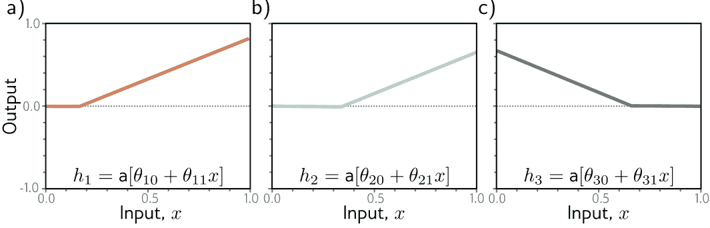

**图 4.9** 问题 4.8 的隐藏单元激活。a) 第一个隐藏单元在位置 $x=1/6$ 处具有一个关节，并且在活动区域具有斜率为 1。b) 第二个隐藏单元在位置 $x=2/6$ 处具有一个关节，并且在活动区域具有斜率为 1。c) 第三个隐藏单元在位置 $x=4/6$ 处具有一个关节，并且在活动区域具有斜率为负一。

- **问题 4.10** 考虑一个具有单个输入、单个输出和 $K$ 隐藏层的深度神经网络，每个隐藏层包含 $D$ 隐藏单元。证明该网络将具有总共 $3D + 1 + (K - 1)D(D + 1)$ 个参数。

- **问题 4.11*** 考虑两个神经网络，将标量输入 $x$ 映射到标量输出 $y$。第一个网络是浅层的，有 $D=95$ 隐藏单元。第二个网络是深层的，有 $K=10$ 层，每层包含 $D=5$ 隐藏单元。每个网络有多少参数？每个网络可以创建多少个线性区域？哪个运行速度更快？

# 第五章 损失函数

最后三章介绍了线性回归、浅层神经网络和深层神经网络。每个代表了一个将输入映射到输出的函数族，其中该函数族的特定成员由模型参数 $\phi$ 确定。当我们训练这些模型时，我们寻求产生最佳映射的参数，从输入到输出，针对我们考虑的任务。本章定义了“最佳可能”映射的含义。

该定义需要一个训练数据集 $\{x_i, y_i\}$ 的输入/输出对。一个损失函数或成本函数 $L[\phi]$ 返回一个描述模型预测 $\mathbf{f}[x_i, \phi]$ 和相应的真实输出 $y_i$ 之间不匹配的单个数字。在训练过程中，我们寻求最小化损失的参数值 $\phi$，从而尽可能地将训练输入映射到输出。我们在第 2 章中看到了一个损失函数的例子；最小二乘损失函数适用于目标为实数 $y \in \mathbb{R}$ 的单变量回归问题。它计算平方和。（见附录 A 数字集）

模型预测值 $\mathbf{f}[x_i, \phi]$ 与真实值 $y_i$ 之间的偏差的平方和是最小二乘准则的选择的理论依据，也可以用于其他预测类型的损失函数构建。我们考虑二元分类，其中预测值 $y \in \{0, 1\}$ 是两个类别之一，多类分类，其中预测值 $y \in \{1, 2, \dots, K\}$ 是 $K$ 个类别之一，以及更复杂的情况。在接下来的两章中，我们将讨论模型训练，目标是找到使这些损失函数最小化的参数值。

## 5.1 最大似然

在本节中，我们将介绍构建损失函数的方法。考虑一个具有参数 $\phi$ 的模型 $\mathbf{f}[x, \phi]$，它从输入 $x$ 计算输出。到目前为止，这意味着模型直接计算一个预测 $y$。现在我们改变视角，将模型视为计算一个条件概率分布 $Pr(y|x)$ 在给定输入 $x$ 的可能输出 $y$ 上的分布。损失函数鼓励每个训练输出 $y_i$ 从相应的输入 $x_i$ 计算得到的分布 $Pr(y_i|x_i)$ 下具有较高的概率（图 5.1）。（见附录 C.1.3 条件概率）

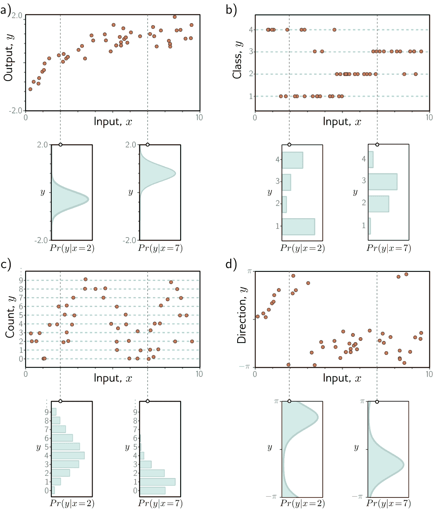

**图 5.1** 预测输出的分布。a) 回归任务，目标是根据训练数据 $\{x_i, y_i\}$ (橙色点) 从输入 $x$ 预测实值输出 $y_i$。对于每个输入值 $x$，机器学习模型预测一个分布 $Pr(y|x)$ 在输出 $y \in \mathbb{R}$ 上 (青色曲线显示不同输入值 $x= 2.0$ 和 $x= 7.0$ 的分布)。损失函数旨在最大化观察到的训练输出 $y_i$ 在从相应输入 $x_i$ 预测得到的分布下的概率。b) 在分类任务中，为了预测离散类别 $y\in \{1, 2, 3, 4\}$，我们使用离散概率分布。c) 为了预测计数 $y\in \{0, 1, 2, \dots\}$ 和 d) 方向 $y \in (-\pi, \pi]$，我们分别使用定义在正整数和圆形域上的分布。

### 5.1.1 计算输出的分布

这引出了一个问题，即模型 $\mathbf{f}[\mathbf{x}, \boldsymbol{\phi}]$ 如何适应计算概率分布。解决方案很简单。首先，我们选择一个参数化分布 $Pr(\mathbf{y}|\boldsymbol{\theta})$ 在输出域 $\mathbf{y}$ 上定义。然后我们使用网络计算这个分布的一个或多个参数 $\boldsymbol{\theta}$。

例如，假设预测域是实数集，即 $y \in \mathbb{R}$。在这里，我们可以选择定义在 $\mathbb{R}$ 上的一元正态分布。这个分布由均值 $\mu$ 和方差 $\sigma^2$ 定义，所以 $\boldsymbol{\theta} = \{\mu, \sigma^2\}$。机器学习模型可能预测均值 $\mu$，而方差 $\sigma^2$ 可以被视为一个未知常数。

### 5.1.2 最大似然准则

模型现在计算不同的分布参数 $\boldsymbol{\theta}_i = \mathbf{f}[\mathbf{x}_i, \boldsymbol{\phi}]$ 对于每个训练输入 $\mathbf{x}_i$。每个观察到的训练输出 $\mathbf{y}_i$ 应该在其相应的分布 $Pr(\mathbf{y}_i|\boldsymbol{\theta}_i)$ 下具有高概率。因此，我们选择模型参数 $\boldsymbol{\phi}$ 使其最大化所有 $I$ 训练示例的组合概率：

$$\begin{aligned} \hat{\boldsymbol{\phi}} &= \underset{\boldsymbol{\phi}}{\mathrm{argmax}} \left[ \prod_{i=1}^I Pr(\mathbf{y}_i|\mathbf{x}_i) \right] \\ &= \underset{\boldsymbol{\phi}}{\mathrm{argmax}} \left[ \prod_{i=1}^I Pr(\mathbf{y}_i|\boldsymbol{\theta}_i) \right] \\ &= \underset{\boldsymbol{\phi}}{\mathrm{argmax}} \left[ \prod_{i=1}^I Pr(\mathbf{y}_i|\mathbf{f}[\mathbf{x}_i, \boldsymbol{\phi}]) \right]. \end{aligned} \qquad (5.1)$$

组合概率项是参数的似然函数，因此方程 5.1 被称为最大似然准则。$^1$

在这里，我们隐含地做出了两个假设。首先，我们假设数据是独立同分布的（输出 $\mathbf{y}_i$ 的概率分布形式对于每个数据点都是相同的）。其次，我们将设定输入的条件分布 $Pr(\mathbf{y}_i|\mathbf{x}_i)$ 是独立的，因此训练数据的总似然概率分解为：

$$Pr(\mathbf{y}_1, \mathbf{y}_2, \ldots, \mathbf{y}_I | \mathbf{x}_1, \mathbf{x}_2, \ldots, \mathbf{x}_I) = \prod_{i=1}^I Pr(\mathbf{y}_i|\mathbf{x}_i). \qquad (5.2)$$

换句话说，我们假设数据是独立同分布 (i.i.d.) 的。

---
$^1$ 条件概率 $Pr(z|\psi)$ 可以从两个角度来考虑。作为 $z$ 的函数，它是一个概率分布，总和为一。作为 $\psi$ 的函数，它被称为似然函数，通常不总和为一。

**图 5.2** 对数变换。 a) 对数函数是单调递增的。 如果 $z > z'$，则 $\log[z] > \log[z']$。因此，任何函数 $g[z]$ 的最大值将与 $\log[g[z]]$ 的最大值在相同的位置上。 b) 函数 $g[z]$。 c) 该函数的对数 $\log[g[z]]$。 在 $g[z]$ 上，所有具有正斜率的位置在对数变换后仍保持正斜率，而具有负斜率的位置在对数变换后仍保持负斜率。最大值的位置保持不变。

### 5.1.3 最大化对数似然

最大似然准则（方程 5.1）并不实用。每个项 $Pr(y_i | \mathbf{f}[\mathbf{x}_i, \phi])$ 都可能很小，因此这些项的乘积可能非常小。用有限精度算术表示这个数量可能很困难。幸运的是，我们可以等效地最大化对数似然：

$$\begin{aligned} \hat{\phi} &= \underset{\phi}{\text{argmax}} \left[ \prod_{i=1}^I Pr(y_i | \mathbf{f}[\mathbf{x}_i, \phi]) \right] \\ &= \underset{\phi}{\text{argmax}} \left[ \log \left[ \prod_{i=1}^I Pr(y_i | \mathbf{f}[\mathbf{x}_i, \phi]) \right] \right] \\ &= \underset{\phi}{\text{argmax}} \left[ \sum_{i=1}^I \log [Pr(y_i | \mathbf{f}[\mathbf{x}_i, \phi])] \right]. \end{aligned} \quad (5.3)$$

这个对数似然准则是等效的，因为对数是一个单调递增的函数：如果 $z > z'$，那么 $\log[z] > \log[z']$，反之亦然（图 5.2）。由此可知，当我们改变模型参数 $\phi$ 以改善对数似然准则时，我们也同时改善了原始的最大似然准则。由此可知，两个准则的整体最大值必须在同一位置，因此最佳的模型参数 $\hat{\phi}$ 在两种情况下都是相同的。然而，对数似然准则具有实际优势，它使用了一系列项的和，而不是乘积，因此用有限精度表示它并不成问题。

### 5.1.4 最小化负对数似然

最后，我们注意到，按照惯例，模型拟合问题是以最小化损失的形式来构建的。为了将最大对数似然准则转化为最小化问题，我们乘以负一，这给了我们负对数似然准则：

$$\begin{aligned} \hat{\phi} &= \underset{\phi}{\text{argmin}} \left[ -\sum_{i=1}^I \log[Pr(y_i|\mathbf{f}[\mathbf{x}_i, \phi])] \right] \\ &= \underset{\phi}{\text{argmin}} [L[\phi]], \end{aligned} \quad (5.4)$$

这就形成了最终的损失函数 $L[\phi]$。

### 5.1.5 推断

网络不再直接预测输出 $y$，而是确定 $y$ 上的概率分布。当我们进行推断时，通常希望得到一个点估计，而不是一个分布，所以我们返回分布的最大值：

$$\hat{y} = \underset{y}{\text{argmax}} \left[ Pr(y|\mathbf{f}[\mathbf{x}, \hat{\phi}]) \right]. \quad (5.5)$$

通常可以找到一个关于模型预测的分布参数 $\theta$ 的表达式。例如，在单变量正态分布中，最大值出现在均值 $\mu$ 处。

## 5.2 构建损失函数的方法

构建用于训练数据 $\{\mathbf{x}_i, y_i\}$ 的损失函数的方法是使用最大似然方法：

- 1. 选择一个适合的概率分布 $Pr(y|\theta)$，该分布定义在预测 $y$ 的域上，具有分布参数 $\theta$。
- 2. 将机器学习模型 $\mathbf{f}[\mathbf{x}, \phi]$ 设置为预测这些参数中的一个或多个，因此 $\theta = \mathbf{f}[\mathbf{x}, \phi]$，且 $Pr(y|\theta) = Pr(y|\mathbf{f}[\mathbf{x}, \phi])$。
- 3. 为了训练模型，找到使训练数据集对于 $\{\mathbf{x}_i, y_i\}$ 的负对数似然损失函数最小化的网络参数 $\phi$：
$$\hat{\phi} = \underset{\phi}{\text{argmin}} [L[\phi]] = \underset{\phi}{\text{argmin}} \left[ -\sum_{i=1}^I \log[Pr(y_i|\mathbf{f}[\mathbf{x}_i, \phi])] \right]. \quad (5.6)$$
- 4. 对于一个新的测试样本 $\mathbf{x}$，进行推断时，可以返回完整的分布 $Pr(y|\mathbf{f}[\mathbf{x}, \hat{\phi}])$ 或该分布的最大值。

我们在本章的大部分内容中致力于使用这个方法构建常见预测类型的损失函数。

由于总概率密度之和为 1，当方差减小且分布变窄时，峰值变得更高。

## 5.3 示例 1: 单变量回归

我们首先考虑单变量回归模型。在这里，目标是使用具有参数 $\phi$ 的模型 $\mathbf{f}[\mathbf{x}, \phi]$ 来从输入 $\mathbf{x}$ 预测单个标量输出 $y \in \mathbb{R}$。按照方法，我们选择了输出域 $y$ 上的概率分布。我们选择了单变量正态分布（图 5.3），它在 $y \in \mathbb{R}$ 上定义。该分布有两个参数（均值 $\mu$ 和方差 $\sigma^2$），并具有概率密度函数：

$$Pr(y|\mu, \sigma^2) = \frac{1}{\sqrt{2\pi\sigma^2}} \exp \left[ -\frac{(y-\mu)^2}{2\sigma^2} \right]. \quad (5.7)$$

其次，我们将机器学习模型 $\mathbf{f}[\mathbf{x}, \phi]$ 设置为计算此分布的一个或多个参数。在这里，我们只计算均值，所以 $\mu = \mathbf{f}[\mathbf{x}, \phi]$：

$$Pr(y|\mathbf{f}[\mathbf{x}, \phi], \sigma^2) = \frac{1}{\sqrt{2\pi\sigma^2}} \exp \left[ -\frac{(y-\mathbf{f}[\mathbf{x}, \phi])^2}{2\sigma^2} \right]. \quad (5.8)$$

我们的目标是找到使训练数据 $\{\mathbf{x}_i, y_i\}$ 在这个分布下最有可能的参数 $\phi$（图 5.4）。为了实现这一目标， we 选择了一个基于负对数似然的损失函数 $L[\phi]$：

$$\begin{aligned} L[\phi] &= -\sum_{i=1}^I \log \left[ Pr(y_i|\mathbf{f}[\mathbf{x}_i, \phi], \sigma^2) \right] \\ &= -\sum_{i=1}^I \log \left[ \frac{1}{\sqrt{2\pi\sigma^2}} \exp \left[ -\frac{(y_i-\mathbf{f}[\mathbf{x}_i, \phi])^2}{2\sigma^2} \right] \right]. \end{aligned} \quad (5.9)$$

当我们训练模型时，我们寻找能够最小化这个损失的参数 $\hat{\phi}$。

### 5.3.1 最小二乘损失函数

现在让我们对损失函数进行一些代数操作。我们寻找：

$$\begin{aligned} \hat{\phi} &= \operatorname{argmin}_\phi \left[ - \sum_{i=1}^I \log \left[ \frac{1}{\sqrt{2\pi\sigma^2}} \exp \left[ -\frac{(y_i - \mathbf{f}[\mathbf{x}_i, \phi])^2}{2\sigma^2} \right] \right] \right] \\ &= \operatorname{argmin}_\phi \left[ - \sum_{i=1}^I \left( \log \left[ \frac{1}{\sqrt{2\pi\sigma^2}} \right] - \frac{(y_i - \mathbf{f}[\mathbf{x}_i, \phi])^2}{2\sigma^2} \right) \right] \\ &= \operatorname{argmin}_\phi \left[ - \sum_{i=1}^I - \frac{(y_i - \mathbf{f}[\mathbf{x}_i, \phi])^2}{2\sigma^2} \right] \\ &= \operatorname{argmin}_\phi \left[ \sum_{i=1}^I (y_i - \mathbf{f}[\mathbf{x}_i, \phi])^2 \right], \end{aligned} \quad (5.10)$$

我们在第二行和第三行之间删除了第一项，因为它不依赖于 $\phi$。我们在第三行 and 第四行之间删除了分母，因为这只是一个不影响最小值位置的常数缩放因子。

这些操作的结果就是我们在第 2 章中讨论线性回归最初引入的最小二乘损失函数：

$$L[\phi] = \sum_{i=1}^I (y_i - \mathbf{f}[\mathbf{x}_i, \phi])^2. \quad (5.11)$$

**笔记本 5.1** 最小二乘损失

我们可以看到，最小二乘损失函数自然地遵循了以下假设：预测误差是 (i) 独立的，且 (ii) 服从均值为 $\mu = \mathbf{f}[\mathbf{x}_i, \phi]$ (图 5.4) 的正态分布。

### 5.3.2 推断

网络不再直接预测 $y$，而是预测 $y$ 的均值 $\mu = \mathbf{f}[\mathbf{x}, \phi]$，即正态分布上的均值。当我们进行推断时，通常希望得到一个单一的 “最佳” 点估计 $\hat{y}$，因此我们取预测分布的最大值：

$$\hat{y} = \operatorname{argmax}_y \left[ Pr(y | \mathbf{f}[\mathbf{x}, \hat{\phi}, \sigma^2]) \right]. \quad (5.12)$$

对于单变量正态分布，最大位置由均值参数 $\mu$ (图 5.3) 确定。这正是模型计算的内容，所以 $\hat{y} = \mathbf{f}[\mathbf{x}, \hat{\phi}]$。

### 5.3.3 估计方差

为了制定最小二乘损失函数，我们假设网络预测的是正态分布的均值。方程 5.11 中的最终表达式（也许令人惊讶地）不依赖于方差 $\sigma^2$。然而，我们可以将 $\sigma^2$ 视为模型的参数，并最小化方程式 5.9 对模型参数 $\phi$ 和分布方差 $\sigma^2$ 进行优化：

$$\hat{\phi}, \hat{\sigma}^{2}=\underset{\phi, \sigma^{2}}{\operatorname{argmin}}\left[-\sum_{i=1}^{I} \log \left[\frac{1}{\sqrt{2 \pi \sigma^{2}}} \exp \left[-\frac{\left(y_{i}-\mathbf{f}\left[\mathbf{x}_{i}, \phi\right]\right)^{2}}{2 \sigma^{2}}\right]\right]\right] . \quad (5.13)$$

在推理中，模型从输入中预测均值 $\mu = \mathbf{f}[\mathbf{x}, \hat{\phi}]$，并且我们在训练过程中学习了方差 $\hat{\sigma}^2$。前者是最佳预测。后者告诉我们预测的不确定性。

**图 5.4** 最小二乘和最大似然损失在正态分布中的等价性。a) 考虑图 2.2 中的线性模型。最小二乘准则最小化了模型预测 $f[x_i, \phi]$ (绿线) 与真实输出值 $y_i$ (橙色点) 之间的偏差的平方和（虚线）。在这里，拟合效果很好，所以这些偏差很小（例如，对于两个突出的点）。b) 对于这些参数，拟合效果很差，偏差的平方和很大。c) 最小二乘准则源于模型预测输出的正态分布的均值，并且我们最大化概率。对于第一种情况，模型拟合效果很好，所以数据的概率 $Pr(y_i|x_i)$ 很大（水平橙色虚线），负对数概率很小。d) 对于第二种情况，模型拟合效果很差，概率很小，负对数概率很大。

### 5.3.4 异方差回归

上述模型假设数据的方差在任何地方都是恒定的。然而，这可能是不现实的。当模型的不确定性随着输入数据的变化而变化时，我们将其称为异方差（与均方差相对应，其中不确定性是恒定的）。

一种简单的建模方法是训练一个神经网络 $\mathbf{f}[\mathbf{x}, \phi]$，它可以计算出均值和方差。例如，考虑一个具有两个输出的浅层网络。我们将第一个输出表示为 $\mathbf{f}_1[\mathbf{x}, \phi]$，并用它来预测均值，我们将第二个输出表示为 $\mathbf{f}_2[\mathbf{x}, \phi]$，并用它来预测方差。

有一个复杂性；方差必须是正数，但我们不能保证网络总是产生正输出。为了确保计算出的方差是正数，我们将第二个网络输出通过一个将任意值映射为正数的函数。一个合适的选择是平方函数，得到：

$$\begin{aligned} \mu & =\mathbf{f}_{1}[\mathbf{x}, \phi] \\ \sigma^{2} & =\mathbf{f}_{2}[\mathbf{x}, \phi]^{2}, \end{aligned} \quad (5.14)$$ 

这导致了损失函数：

$$\hat{\phi}=\underset{\phi}{\operatorname{argmin}}\left[-\sum_{i=1}^{I}\left(\log \left[\frac{1}{\sqrt{2 \pi \mathbf{f}_{2}\left[\mathbf{x}_{i}, \phi\right]^{2}}}\right]-\frac{\left(y_{i}-\mathbf{f}_{1}\left[\mathbf{x}_{i}, \phi\right]\right)^{2}}{2 \mathbf{f}_{2}\left[\mathbf{x}_{i}, \phi\right]^{2}}\right)\right] . \quad (5.15)$$ 

同方差和异方差模型在图 5.5 中进行了比较。

**图 5.5** 同方差与异方差回归。 a) 用于同方差回归的浅层神经网络仅从输入 $x$ 预测输出分布的均值 $\mu$。 b) 结果是，虽然均值（蓝线）是输入 $x$ 的分段线性函数，但方差在任何地方都是恒定的（箭头和灰色区域显示 $\pm 2$ 标准差）。 c) 用于异方差回归的浅层神经网络还预测方差 $\sigma^2$（更准确地说，计算其平方根，然后再平方）。 d) 标准差现在也成为输入 $x$ 的分段线性函数。

**图 5.6** 伯努利分布。伯努利分布定义在域 $z \in \{0, 1\}$ 上，并具有单个参数 $\lambda$，表示观察到 $z=1$ 的概率。由此可得，观察到 $z=0$ 的概率为 $1 - \lambda$。

## 5.4 例 2：二元分类

在二元分类中，目标是将数据 $\mathbf{x}$ 分配给两个离散类别之一 $y \in \{0, 1\}$。在这个背景下，我们将 $y$ 称为一个标签。二元分类的例子包括 (i) 从文本数据 $\mathbf{x}$ 预测餐厅评论是积极的 ($y=1$) 还是消极的 ($y=0$)，以及 (ii) 从 MRI 扫描 $\mathbf{x}$ 预测肿瘤是否存在 ($y=1$) 或不存在 ($y=0$)。

再次，我们按照第 5.2 节的步骤构建损失函数。首先，我们选择一个概率分布，该分布覆盖输出空间 $y \in \{0, 1\}$。一个合适的选择是伯努利分布，该分布定义在域 $\{0, 1\}$ 上。它有一个参数 $\lambda \in [0, 1]$，表示 $y$ 取值为 1 的概率（图 5.6）：

$$Pr(y|\lambda) = \begin{cases} 1 - \lambda & y = 0 \\ \lambda & y = 1 \end{cases} \qquad (5.16)$$

可以等价地写为：

$$Pr(y|\lambda) = (1 - \lambda)^{1-y} \cdot \lambda^y \qquad (5.17)$$

其次，我们将机器学习模型 $f[x, \phi]$ 设置为预测单一分布参数 $\lambda$。然而，$\lambda$ 只能取值在范围 $[0, 1]$ 内，我们无法保证网络输出将位于此范围内。因此，我们将网络输出通过一个将实数 $\mathbb{R}$ 映射到 $[0, 1]$ 的函数。一个合适的函数是逻辑 sigmoid 函数（图 5.7）：

**问题 5.1**

$$sig[z] = \frac{1}{1 + \exp[-z]} \qquad (5.18)$$

因此，我们预测分布参数为 $\lambda = sig[f[x, \phi]]$。现在的似然函数是：

$$Pr(y|x) = (1 - sig[f[x, \phi]])^{1-y} \cdot sig[f[x, \phi]]^y \qquad (5.19)$$

这在图 5.8 中描述了一个浅层神经网络模型。损失函数是训练集的负对数似然函数：

$$L[\phi] = \sum_{i=1}^I -(1 - y_i) \log [1 - sig[f[x_i, \phi]]] - y_i \log [sig[f[x_i, \phi]]] \qquad (5.20)$$

出于第 5.7 节中将要解释的原因，这被称为二元交叉熵损失。

**笔记本 5.2** 二进制交叉熵损失
**问题 5.2**

转换后的模型输出 $sig[f[x, \phi]]$ 预测了伯努利分布的参数 $\lambda$。分布表示概率 $y=1$，因此 $1 - \lambda$ 表示概率 $y=0$。当我们进行推理时，我们可能希望得到一个对于 $y$ 的估计，我们设置 $y=1$ 如果 $\lambda > 0.5$ 并且 $y=0$ 否则。

图 5.8 二分类模型。a) 网络输出是一个分段线性函数，可以取任意实数值。b) 这通过逻辑 sigmoid 函数进行转换，将这些值压缩到范围 $[0, 1]$。c) 转换后的输出预测概率 $\lambda$，即 $y=1$ 的概率（实线）。因此 $y=0$ 的概率为 $1-\lambda$（虚线）。对于任意固定的 $x$（垂直切片），我们得到类似于图 5.6 中的伯努利分布的两个值。损失函数偏好产生在与正例 $y_i=1$ 相关的位置 $x_i$ 上具有较大 $\lambda$ 值的模型参数，并且在与负例 $y_i=0$ 相关的位置上具有较小的 $\lambda$ 值。

图 5.9 分类分布。分类分布将概率分配给 $K > 2$ 个类别，并附带的概率为 $\lambda_1, \lambda_2, \dots, \lambda_K$。在这里，有五个类别，所以 $K = 5$。为了确保这是一个有效的概率分布，每个参数 $\lambda_k$ 必须在范围 $[0, 1]$ 内，并且所有 $K$ 个参数必须总和为一。

## 5.5 示例 3：多类分类

多类别分类的目标是将输入数据示例 $x$ 分配给 $K > 2$ 个类别之一，因此 $y \in \{1, 2, \dots, K\}$。现实世界的例子包括 (i) 预测在图像 $x$ 中的 $K=10$ 个数字 $y$ 中存在哪个是手写数字和 (ii) 预测在不完整的句子 $x$ 之后的 $K$ 个可能单词 $y$。

我们再次按照 5.2 节的步骤进行。我们首先选择一个分布在预测空间 $y$ 上。在这种情况下，我们有 $y \in \{1, 2, \dots, K\}$，所以 we 选择分类分布（图 5.9），该分布定义在这个域上。这有 $K$ 个参数 $\lambda_1, \lambda_2, \dots, \lambda_K$，它们确定每个类别的概率：

$$Pr(y = k) = \lambda_k. \quad (5.21)$$

图 5.10 多类分类，有 $K=3$ 个类别。a) 网络有三个分段线性输出，可以取任意值。b) 在 softmax 函数之后，这些输出被限制为非负且总和为一。因此，对于给定的输入 $\mathbf{x}$，我们计算分类分布的有效参数：该图的任何垂直切片都会产生三个值，它们总和为一，并且类似于图 5.9 中的分类分布的柱状图的高度。

参数被限制在零和一之间的值，并且它们必须共同总和为一，以确保有效的概率分布。

然后我们使用一个具有 $K$ 个输出的网络 $\mathbf{f}[\mathbf{x}, \phi]$ 来计算这些 $K$ 个参数。不幸的是，网络输出不一定遵守前面提到的约束条件。因此，我们通过一个函数将网络的 $K$ 个输出传递，以确保这些约束得到尊重。一个合适的选择是 softmax 函数（图 5.10）。它接受一个任意长度的向量 $K$，并返回一个相同长度的向量，其中元素现在在范围 $[0, 1]$ 内，并且总和为一。softmax 函数的第 $k$ 个输出为：

$$\text{softmax}_k[\mathbf{z}] = \frac{\exp[z_k]}{\sum_{k'=1}^K \exp[z_{k'}]}, \quad (5.22)$$

（参考：附录 B.1.3 指数函数）

指数函数确保正值，分母中的求和则保证了 $K$ 个数之和为一。输入 $\mathbf{x}$ 的标签为 $y$（图 5.10），因此其似然性为：

$$Pr(y = k|\mathbf{x}) = \text{softmax}_k [\mathbf{f}[\mathbf{x}, \phi]]. \quad (5.23)$$

损失函数是训练数据的负对数似然性：

$$ \begin{aligned} L[\phi] &= -\sum_{i=1}^I \log \left[\text{softmax}_{y_i} [\mathbf{f}[\mathbf{x}_i, \phi]]\right] \\ &= -\sum_{i=1}^I \left( f_{y_i} [\mathbf{x}_i, \phi] - \log \left[\sum_{k'=1}^K \exp \left[f_{k'} [\mathbf{x}_i, \phi]\right]\right] \right), \end{aligned} \quad (5.24) $$

其中 $f_k[\mathbf{x}, \phi]$ 表示神经网络的第 $k$ 个输出。出于将在第 5.7 节中解释的原因，这被称为多类别交叉熵损失（参考：笔记本 5.3 多类别 cross-entropy 损失）。

转换后的模型输出表示可能的分类分布类别 $y \in \{1, 2, \dots, K\}$。对于一个点估计，我们选择最可能的类别 $\hat{y} = \text{argmax}_k [Pr(y=k|\mathbf{f}[\mathbf{x}, \hat{\phi}])] $。这对应于在图 5.10 中对应于该值的最高曲线。

### 5.5.1 预测其他数据类型

在本章中，我们专注于回归和分类问题，因为这些问题很常见。然而，要进行不同类型的预测，我们只需选择适当的分布并应用第 5.2 节中的方法。图 5.11 列举了一系列概率分布及其预测域。其中一些在章节末尾的问题 5.3–5.6 中进行了探讨。

## 5.6 多个输出

通常，我们希望使用同一模型进行多个预测，因此目标输出 $\mathbf{y}$ 是一个向量。例如，我们可能想要预测分子的熔点和沸点（一个多变量回归问题，图 1.2b），或者在图像的每个点上预测对象的类别（一个多变量分类问题，图 1.4a）。虽然可以定义多变量概率分布并使用神经网络将其参数建模为输入的函数，但更常见的做法是将每个预测视为独立处理。

独立意味着我们将概率 $Pr(\mathbf{y}|\mathbf{f}[\mathbf{x}, \phi])$ 视为每个元素 $y_d \in \mathbf{y}$ 的一个乘积单变量项（参考：附录 C.1.5 独立性）：

$$ Pr(\mathbf{y}|\mathbf{f}[\mathbf{x}, \phi]) = \prod_d Pr(y_d|\mathbf{f}_d[\mathbf{x}, \phi]), \quad (5.25) $$

其中 $\mathbf{f}_d[\mathbf{x}, \phi]$ 是网络输出的第 $d$ 个集合，描述了 $y_d$ 的分布参数。例如，要预测多个连续变量 $y_d \in \mathbb{R}$，我们为每个 $y_d$ 使用一个正态分布，并且网络输出 $\mathbf{f}_d[\mathbf{x}, \phi]$ 预测这些分布的均值。要预测多个离散变量 $y_d \in \{1, 2, \dots, K\}$，我们为每个 $y_d$ 使用一个分类分布。在这里，每个网络输出集合 $\mathbf{f}_d[\mathbf{x}, \phi]$ 预测了对 $y_d$ 的分类分布有贡献的 $K$ 个值。

| 数据类型 | 领域 | 分布 | 使用 |
| :--- | :--- | :--- | :--- |
| 单变量，连续无界 | $y \in \mathbb{R}$ | 单变量正态 | 回归 |
| 单变量，连续无界 | $y \in \mathbb{R}$ | 拉普拉斯或t分布 | 鲁棒回归 |
| 单变量，连续无界 | $y \in \mathbb{R}$ | 混合高斯 | 多模态回归 |
| 单变量，连续下界有界 | $y \in \mathbb{R}^+$ | 指数或伽马 | 预测幅度 |
| 单变量，连续有界 | $y \in [0, 1]$ | 贝塔 | 预测比例 |
| 多元连续无界 | $\mathbf{y} \in \mathbb{R}^K$ | 多元正态 | 多元回归 |
| 单变量，连续圆形 | $y \in (-\pi, \pi]$ | 冯·米塞斯 | 预测方向 |
| 单变量离散二进制 | $y \in \{0, 1\}$ | 伯努利 | 二进制分类 |
| 单变量离散有界 | $y \in \{1, 2, \dots, K\}$ | 分类分布 | 多类别分类 |
| 单变量离散下界有界 | $y \in \{0, 1, 2, 3, \dots\}$ | 泊松 | 预测事件计数 |
| 多变量，离散排列 | $\mathbf{y} \in \text{Perm}[1, 2, \dots, K]$ | Plackett-Luce | 排名 |

图 5.11 不同预测类型的损失函数分布。

当我们最小化负对数概率时，这个乘积变成了一系列项的和：

$$L[\phi] = -\sum_{i=1}^{I} \log \left[ Pr(\mathbf{y}_i | \mathbf{f}[\mathbf{x}_i, \phi]) \right] = -\sum_{i=1}^{I} \sum_{d} \log \left[ Pr(y_{id} | f_d[\mathbf{x}_i, \phi]) \right]. \quad (5.26)$$

其中 $y_{id}$ 是第 $i$ 个训练示例的第 $d$ 个输出。

为了同时进行两种或更多种预测类型，我们同样假设每个预测的错误是独立的。例如，为了预测风向和风力，我们可以选择冯·米塞斯分布（定义在圆域上）作为风向的分布，选择指数分布（定义在正实数上）作为风力的分布。独立性假设意味着两个预测的联合似然是各自似然的乘积。当我们计算负对数似然时，这些项将变为可加的（参考：问题 5.7-5.10）。

## 5.7 交叉熵损失

在这一章中，我们开发了最小化负对数似然的损失函数。然而，交叉熵损失函数也很常见。在本节中，我们描述了交叉熵损失函数，并证明它等价于使用负对数似然。

交叉熵损失函数基于找到最小化经验分布 $q(y)$ 和模型分布 $Pr(y|\theta)$ 之间距离的参数 $\theta$ 的思想（图 5.12）。两个概率分布 $q(z)$ 和 $p(z)$ 之间的距离可以使用 Kullback-Leibler（KL）散度来评估（参考：附录 C.5.1 KL 散度）：

$$D_{KL}[q||p] = \int_{-\infty}^{\infty} q(z) \log[q(z)] dz - \int_{-\infty}^{\infty} q(z) \log[p(z)] dz. \quad (5.27)$$

现在考虑我们在点 $\{y_i\}_{i=1}^I$ 处观察到经验数据分布。我们可以将其描述为点质量的加权和：

$$q(y) = \frac{1}{I} \sum_{i=1}^I \delta[y - y_i], \quad (5.28)$$

其中 $\delta[\bullet]$ 是狄拉克函数（参考：附录 B.1.3 狄拉克函数）。我们希望最小化模型分布 $Pr(y|\theta)$ 和经验分布之间的 KL 散度：

$$\begin{aligned} \hat{\theta} &= \text{argmin}_\theta \left[ \int_{-\infty}^{\infty} q(y) \log[q(y)] dy - \int_{-\infty}^{\infty} q(y) \log[Pr(y|\theta)] dy \right] \\ &= \text{argmin}_\theta \left[ - \int_{-\infty}^{\infty} q(y) \log[Pr(y|\theta)] dy \right], \end{aligned} \quad (5.29)$$

第一项消失了，因为它不依赖于 $\theta$。剩下的第二项被称为交叉熵。它可以解释为在考虑已知信息后，一个分布中仍然存在的不确定性的量。现在，我们将方程 5.28 中的 $q(y)$ 的定义代入：

$$\begin{aligned} \hat{\theta} &= \underset{\theta}{\operatorname{argmin}}\left[-\int_{-\infty}^{\infty}\left(\frac{1}{I} \sum_{i=1}^{I} \delta\left[y-y_{i}\right]\right) \log \left[Pr\left(y | \theta\right)\right] dy\right] \\ &= \underset{\theta}{\operatorname{argmin}}\left[-\frac{1}{I} \sum_{i=1}^{I} \log \left[Pr\left(y_{i} | \theta\right)\right]\right] \\ &= \underset{\theta}{\operatorname{argmin}}\left[-\sum_{i=1}^{I} \log \left[Pr\left(y_{i} | \theta\right)\right]\right]. \end{aligned} \tag{5.30}$$

第一行中两个项的乘积对应于将图 5.12a 中的点质量与图 5.12b 中的分布的对数逐点相乘。我们得到了一组有限的以数据点为中心的加权概率质量。在最后一行中，我们消除了常数缩放因子 $1/I$，因为这不会影响最小值的位置。

在机器学习中，模型 $\mathbf{f}[\mathbf{x}_i, \phi]$ 计算出分布参数 $\theta$，因此我们有：

$$\hat{\phi}=\underset{\phi}{\operatorname{argmin}}\left[-\sum_{i=1}^{I} \log \left[P r\left(y_{i} | \mathbf{f}\left[\mathbf{x}_{i}, \phi\right]\right)\right]\right] . \tag{5.31}$$

这正是第 5.2 节中的负对数似然准则。由此可知，最大化数据似然的负对数似然准则和最小化模型与经验数据分布之间的距离的交叉熵准则是等价的。

## 5.8 总结

我们之前将神经网络视为直接从数据中预测输出 $y$ 的。在本章中，我们改变了视角，将神经网络视为计算输出空间上概率分布 $Pr(y|\theta)$ 的参数 $\theta$。这导致了一种建立损失函数的原则方法。我们选择了最大化在这些分布下观察到的数据的似然的模型参数 $\phi$。我们看到这等价于最小化负对数似然。

回归的最小二乘准则是这种方法的自然结果；它来自于 $y$ 被假设为正态分布且我们正在预测均值。我们还看到回归模型如何 (i) 扩展以估计预测的不确定性和 (ii) 扩展以使该不确定性依赖于输入（异方差模型）。我们将相同的方法应用于二元和多类分类，并为每个类别导出了损失函数。我们讨论了如何处理更复杂的数据类型以及如何处理多个输出。最后，我们认为交叉熵是一种等效的模型拟合方式。

在之前的章节中，我们开发了神经网络模型。在本章中，我们开发了用于决定模型对训练数据的描述程度的损失函数，以及给定一组参数时如何评估模型。下一章将考虑模型训练，我们的目标是找到最小化该损失的模型参数。

## 笔记

- **基于正态分布的损失函数**：Nix 和 Weigend (1994) 以及 Williams (1996) 研究了异方差非线性回归，其中输出的均值和方差都是输入的函数。在无监督学习的背景下，Burda 等人 (2016) 使用基于多元正态分布的损失函数，其协方差为对角线，而 Dorta 等人 (2018) 使用基于正态分布的损失函数，其协方差为完全协方差。

- **鲁棒回归**：齐等人 (2020年) 研究了最小化绝对误差而不是均方误差的回归模型的性质。这个损失函数是基于对输出的拉普拉斯分布的假设，并估计给定输入的中位数输出而不是均值。Barron (2019年) 提出了一个参数化鲁棒性的损失函数。当在概率上下文解释时，它产生了一族包括正态分布和柯西分布在内的一元概率分布的特例。

- **估计分位数**：有时，我们可能不想在回归任务中估计均值或中位数，而是想预测一个分位数。例如，这对于风险模型很有用，我们想知道真实值在预测值的 90% 以下的时间内。这被称为分位数回归 (Koenker & Hallock, 2001年)。这可以通过拟合一个异方差回归模型，然后根据预测的正态分布估计分位数来实现。或者，可以直接使用分位数损失（也称为 pinball 损失）来估计分位数。在实践中，这最小化了数据与模型之间的绝对偏差，但对一个方向的偏差给予了更多的权重。最近的研究同时预测多个分位数，以了解整体分布形状 (Rodrigues & Pereira, 2020)。

- **类别不平衡和焦点损失**：Lin 等人 (2017c) 解决了分类问题中的数据不平衡。如果某些类别的示例数量远大于其他类别，则标准的最大似然损失效果不佳；模型可能会集中于对主导类别中分类良好的示例变得更加自信，并且对分类较差的较少代表的类别分类效果不佳。Lin 等人 (2017c) 引入了焦点损失，它添加了一个额外的参数，以降低对分类良好示例的影响，以提高性能。

- **学习排序**：Cao 等人 (2007)，Xia 等人 (2008) 和 Chen 等人 (2009) 都在学习排序数据的损失函数中使用了 Plackett-Luce 模型。这是一种整体学习排序方法，因为模型一次性摄入整个待排序的对象列表。替代方法是逐点方法，其中模型摄入单个对象，以及成对方法，其中模型摄入对象对。Chen 等人 (2009) 总结了学习排序的不同方法。

- **其他数据类型**：Fan 等人 (2020年) 使用基于贝塔分布的损失函数来预测 0 到 1 之间的值。Jacobs 等人 (1991年) 和 Bishop (1994年) 研究了用于多模态数据的混合密度网络。这些模型将输出建模为高斯混合物（见图 5.14），它是有条件于输入的。Prokudin 等人 (2018年) 使用冯·米塞斯分布来预测方向（见图 5.13）。Fallah 等人 (2009年) 构建了基于泊松分布的损失函数来预测计数（见图 5.15）。Ng 等人 (2017年) 使用基于伽马分布的损失函数来预测持续时间。

- **非概率性方法**：在本章中，不一定要采用概率方法，但这已成为近年来的默认选择；任何旨在减小模型输出与训练输出之间距离的损失函数都可以，距离可以以任何合理的方式定义。有几种众所周知的非概率性机器学习模型用于分类，包括支持向量机 (Vapnik, 1995; Cristianini & Shawe-Taylor, 2000)，它使用合页损失，以及 AdaBoost (Freund & Schapire, 1997)，它使用指数损失。

图 5.13 冯·米塞斯分布定义在圆形域 $(-\pi, \pi]$ 上。它有两个参数。均值 $\mu$ 确定峰值的位置。浓度 $\kappa >0$ 的作用类似于方差的倒数。因此，$1/\sqrt{\kappa}$ 大致相当于正态分布中的标准差。

## 问题

问题 5.1 证明逻辑 sigmoid 函数 $\text{sig}[z]$ 将 $z = -\infty$ 映射到 0，$z = 0$ 映射到 0.5，以及 $z = \infty$ 映射到 1，其中：

$$\text{sig}[z] = \frac{1}{1 + \exp[-z]} \qquad (5.32)$$

问题 5.2 对于单个训练对 $\{x, y\}$ 的二元分类的损失 $L$ 是：

$$L = -(1 - y) \log[1 - \text{sig}[f[\mathbf{x}, \phi]]] - y \log[\text{sig}[f[\mathbf{x}, \phi]]], \qquad (5.33)$$

其中方程 5.32 中定义了 $\text{sig}[\bullet]$。当训练标签 $y= 0$ 时，将此损失作为转换网络输出 $\text{sig}[f[\mathbf{x}, \phi]] \in [0, 1]$ 的函数绘制出来 (i)，当 $y= 1$ 时 (ii)。

问题 5.3* 假设我们想要构建一个模型，根据局部气压测量 $x$ 来预测主导风的方向 $y$（以弧度为单位）。适用于圆形域的合适分布是 von Mises 分布（图 5.13）：

$$Pr(y|\mu, \kappa) = \frac{\exp[\kappa \cos[y - \mu]]}{2\pi \cdot \text{I}_0[\kappa]}, \qquad (5.34)$$

**图 5.14 多模态数据和高斯混合密度。** a) 示例训练数据，对于输入 $x$ 的中间值，相应的输出 $y$ 遵循两条路径之一。例如，在 $x=0$ 时，输出 $y$ 可能大致为 $-2$ 或 $+3$，但不太可能在这些值之间。b) 高斯混合是适用于这种类型数据的概率模型。正如名称所示，该模型是两个或更多具有不同均值和方差的正态分布的加权和（实线青色曲线）。当均值相距较远时，这形成了多峰分布。c) 当均值接近时，混合可以模拟单峰但非正态密度。

其中 $\mu$ 是平均方向的度量，$\kappa$ 是浓度的度量（即方差的倒数）。术语 $\text{Bessel}_0[\kappa]$ 是 0 阶修正 Bessel 函数。使用第 5.2 节的方法为学习参数 $\mu$ 的损失函数进行开发，该参数用于预测最可能的风向。你的解决方案应将浓度 $\kappa$ 视为常数。你会如何进行推理？

**问题 5.4*** 有时，输入 $x$ 的输出 $y$ 是多模态的（图 5.14a）；对于给定的输入，存在多个有效的预测。在这种情况下，我们可以使用正态分布的加权和作为输出的分布。这被称为高斯混合模型。例如，两个高斯分布的混合模型具有参数 $\theta = \{\lambda, \mu_1, \sigma_1^2, \mu_2, \sigma_2^2\}$：

$$Pr(y|\lambda, \mu_1, \mu_2, \sigma_1^2, \sigma_2^2) = \frac{\lambda}{\sqrt{2\pi\sigma_1^2}} \exp\left[\frac{-(y-\mu_1)^2}{2\sigma_1^2}\right] + \frac{1-\lambda}{\sqrt{2\pi\sigma_2^2}} \exp\left[\frac{-(y-\mu_2)^2}{2\sigma_2^2}\right], \quad (5.35)$$

其中 $\lambda \in [0, 1]$ 控制两个组成部分的相对权重，其均值为 $\mu_1, \mu_2$ 和方差为 $\sigma_1^2, \sigma_2^2$。该模型可以表示具有两个峰值的分布（图 5.14b），或者具有一个峰值但形状更复杂的分布（图 5.14c）。使用第 5.2 节的方法构建一个损失函数，用于训练一个模型 $f[x, \phi]$，该模型接受输入 $x$，具有参数 $\phi$，并预测两个高斯分布的混合。损失应基于训练数据对 $\{x_i, y_i\}$。在进行推理时，您预见到了哪些问题？

**问题 5.5** 考虑扩展问题 5.3 的模型，使用两个 von Mises 分布的混合来预测风向。为这个模型写出似然表达式 $Pr(y|\theta)$。网络需要产生多少个输出？

**问题 5.6** 考虑建立一个模型，根据包含关于一天中的时间、经度和纬度以及邻域类型的数据 $\mathbf{x}$，预测在下一分钟内将通过城市中给定点的行人数量 $y \in \{0, 1, 2, \dots\}$。适合建模计数的分布是泊松分布（图 5.15）。这个分布有一个参数 $\lambda > 0$ 称为速率，表示分布的均值。该分布的概率密度函数为：

$$Pr(y=k) = \frac{\lambda^k e^{-\lambda}}{k!} \quad (5.36)$$

为这个模型设计一个损失函数，假设我们可以访问到 $I$ 个训练对 $\{\mathbf{x}_i, y_i\}$。

**问题 5.7** 考虑一个多元回归问题，我们预测十个输出，所以 $\mathbf{y} \in \mathbb{R}^{10}$，每个输出都由一个独立的正态分布模型，其中均值 $\mu_d$ 由网络预测，方差 $\sigma^2$ 是常数。写出似然函数的表达式 $Pr(\mathbf{y}|\mathbf{f}[\mathbf{x}, \boldsymbol{\phi}])$。证明如果我们不估计方差 $\sigma^2$，那么最小化该模型的负对数似然仍然等价于最小化一系列平方项。

**问题 5.8*** 为了进行多元预测，构建一个损失函数，该函数基于具有不同方差 $\sigma_d^2$ 的独立正态分布。假设一个异方差模型，使得均值 $\mu_d$ 和方差 $\sigma_d^2$ 都作为数据的函数变化。

**问题 5.9*** 考虑一个多元回归问题，我们从数据 $\mathbf{x}$ 中预测一个人的身高（以米为单位）和体重（以千克为单位）。在这里，单位的范围差异很大。你认为这会引起哪些问题？提出两个解决这些问题的方案。

**问题 5.10** 将问题 5.3 的模型扩展到同时预测风向和风速，并定义相应的损失函数。

## 第六章 模型拟合

第三章和第四章介绍了浅层和深层神经网络。这些代表了分段线性函数的族群，其中参数确定特定的函数。第 5 章介绍了损失函数——一个表示网络预测与训练集真实值不匹配的单个数字。

损失函数取决于网络参数，本章将讨论如何找到使损失函数最小化的参数值。这被称为学习网络的参数，或者简单地称为训练模型。该过程是选择初始参数值，然后迭代以下两个步骤：
- (i) 计算损失函数对参数的导数（梯度）
- (ii) 根据梯度调整参数以减少损失。

经过多次迭代，我们希望达到损失函数的全局最小值。本章将解决这两个步骤中的第二个步骤；我们将讨论调整参数以减少损失的算法。第 7 章讨论了如何初始化参数并计算神经网络的梯度。

## 6.1 梯度下降

为了拟合模型，我们需要一个输入/输出对的训练集 $\{x_i, y_i\}$。我们寻找模型 $\mathbf{f}[x_i, \phi]$ 的参数 $\phi$，使输入 $x_i$ 到输出 $y_i$ 的映射尽可能好。为此，我们定义了一个损失函数 $L[\phi]$，它返回一个量化映射不匹配的单个数字。优化算法的目标是找到最小化损失的参数 $\phi$：

$$\hat{\phi} = \arg\min_{\phi} [L[\phi]] . \quad (6.1)$$

有许多优化算法的家族，但用于训练神经网络的标准方法是迭代的。这些算法启发式地初始化参数，然后以使损失减小的方式重复调整它们。

这个类别中最简单的方法是梯度下降。它从初始参数 $\phi = [\phi_0, \phi_1, \dots, \phi_N]^T$ 开始迭代两步：

**步骤 1.** 计算损失相对于参数的导数：

$$\frac{\partial L}{\partial \phi} = \begin{bmatrix} \frac{\partial L}{\partial \phi_0} \\ \frac{\partial L}{\partial \phi_1} \\ \vdots \\ \frac{\partial L}{\partial \phi_N} \end{bmatrix}. \quad (6.2)$$

**步骤 2.** 根据规则更新参数：

$$\phi \leftarrow \phi - \alpha \cdot \frac{\partial L}{\partial \phi}, \quad (6.3)$$

其中正标量 $\alpha$ 确定变化的大小。

第一步计算当前位置的损失函数梯度。这确定了损失函数的上坡方向。第二步向下移动一个小距离 $\alpha$（因此有负号）。参数 $\alpha$ 可以固定（在这种情况下我们称之为学习率），或者我们可以进行线搜索，在这里我们尝试几个 $\alpha$ 的值来找到最大程度减少损失的那个。

在损失函数的最小值处，曲面必须是平的（否则我们可以通过下坡进一步改进）。因此，梯度将为零，参数将停止变化。在实践中，我们监视梯度大小并在其变得太小时终止算法。

### 6.1.1 线性回归示例

考虑将梯度下降应用于第 2 章中的一维线性回归模型。该模型 $\mathbf{f}[x, \phi]$ 将标量输入 $x$ 映射到标量输出 $y$，并具有参数 $\phi = [\phi_0, \phi_1]^T$ 表示 y 轴截距和斜率：

$$y = \mathbf{f}[x, \phi] = \phi_0 + \phi_1 x. \quad (6.4)$$

给定包含 $I$ 个输入/输出对的数据集 $\{x_i, y_i\}$，我们选择最小二乘损失函数：

$$L[\phi] = \sum_{i=1}^I \ell_i = \sum_{i=1}^I (\mathbf{f}[x_i, \phi] - y_i)^2 = \sum_{i=1}^I (\phi_0 + \phi_1 x_i - y_i)^2, \quad (6.5)$$

其中，术语 $\ell_i= (\phi_0 + \phi_1 x_i - y_i)^2$ 是来自第 $i$ 个训练示例的个体损失的贡献。

**图 6.1 线性回归模型的梯度下降。** a) 训练集包含 $I=12$ 输入/输出对 $\{x_i, y_i\}$。b) 损失函数显示梯度下降的迭代。我们从点 0 开始，沿着最陡的下坡方向移动，直到无法进一步改进，到达点 1。然后我们重复这个过程。我们在点 1 处测量梯度，并向下移动到点 2 等等。c) 这可以更好地可视化为热图，亮度表示损失。仅经过四次迭代，我们已经接近最小值。d) 参数在点 0 处的模型（最浅的线）非常糟糕地描述了数据，但每次迭代都会改善拟合。参数在点 4 处的模型（最暗的线）已经是对训练数据的合理描述。

损失函数对参数的导数可以分解为个体贡献的导数之和：

$$\frac{\partial L}{\partial \boldsymbol{\phi}} = \frac{\partial}{\partial \boldsymbol{\phi}} \sum_{i=1}^I \ell_i = \sum_{i=1}^I \frac{\partial \ell_i}{\partial \boldsymbol{\phi}}, \quad (6.6)$$

这些是由以下给出的：

$$\frac{\partial \ell_i}{\partial \boldsymbol{\phi}} = \begin{bmatrix} \frac{\partial \ell_i}{\partial \phi_0} \\ \frac{\partial \ell_i}{\partial \phi_1} \end{bmatrix} = \begin{bmatrix} 2(\phi_0 + \phi_1 x_i - y_i) \\ 2x_i(\phi_0 + \phi_1 x_i - y_i) \end{bmatrix}. \quad (6.7)$$

图 6.1 显示了我们迭代计算该算法的进展，根据方程 6.6 和 6.7 计算导数，然后使用方程 6.3 中的规则更新参数。在这种情况下，我们使用了线搜索过程来找到每次迭代中使损失最大程度减小的 $\alpha$ 值。

### 6.1.2 Gabor 模型示例

线性回归问题的损失函数（图 6.1c）总是具有单个明确定义的全局最小值。更正式地说，它们是凸的，这意味着没有弦（曲面上两点之间的线段）在函数下方与函数相交。凸性意味着无论我们在哪里初始化参数，只要我们一直向下走，我们就一定能达到最小值；训练过程不会失败。

不幸的是，大多数非线性模型的损失函数，包括浅层和深层网络，都是非凸的。由于参数数量的原因，可视化神经网络的损失函数具有挑战性。因此，我们首先探索一个具有两个参数的简单非线性模型，以了解非凸损失函数的特性：

$$f[x, \boldsymbol{\phi}] = \sin[\phi_0 + 0.06 \cdot \phi_1 x] \cdot \exp\left( -\frac{(\phi_0 + 0.06 \cdot \phi_1 x)^2}{32.0} \right). \quad (6.8)$$

这个 Gabor 模型将标量输入 $x$ 映射到标量输出 $y$，并由一个正弦函数组成部分（创建振荡函数）乘以负指数部分（导致振幅随着从中心移动而减小）。它有两个参数 $\boldsymbol{\phi} = [\phi_0, \phi_1]^T$，其中 $\phi_0 \in \mathbb{R}$ 确定函数的平均位置，而 $\phi_1 \in \mathbb{R}^+$ 沿着 $x$ 轴拉伸或挤压它（图 6.2）。

考虑一个包含 $I$ 个示例的训练集 $\{x_i, y_i\}$（图 6.3）。最小二乘损失函数对于 $I$ 个训练示例定义为：

$$L[\boldsymbol{\phi}] = \sum_{i=1}^I (f[x_i, \boldsymbol{\phi}] - y_i)^2. \quad (6.9)$$

再次，目标是找到最小化此损失的参数 $\hat{\boldsymbol{\phi}}$。

**图 6.2 Gabor 模型。** 这个非线性模型将标量输入 $x$ 映射到标量输出 $y$，并具有参数 $\boldsymbol{\phi} = [\phi_0, \phi_1]^T$。它描述了一个正弦函数，其振幅随着距离中心的增加而减小。参数 $\phi_0 \in \mathbb{R}$ 确定了中心的位置。随着 $\phi_0$ 的增加，函数向左移动。参数 $\phi_1 \in \mathbb{R}^+$ 相对于中心沿着 $x$ 轴压缩函数。随着 $\phi_1$ 的增加，函数变窄。a-c) 具有不同参数的模型。

**图 6.3 用于拟合 Gabor 模型的训练数据。** 训练数据集包含 28 个输入/输出示例 $\{x_i, y_i\}$。这些数据是通过均匀采样 $x_i \in [-15, 15]$，将样本通过参数为 $\boldsymbol{\phi} = [0.0, 16.6]^T$ 的 Gabor 模型，并添加正态分布噪声而创建的。

### 6.1.3 局部最小值和鞍点

图 6.4 描述了与该数据集的 Gabor 模型相关的损失函数。这里有很多局部最小值（青色圆圈）。在这些点上梯度为零，如果我们朝任何方向移动，损失都会增加，但我们并不在函数的整体最小值处。具有最低损失的点被称为全局最小值，并用灰色圆圈表示。

如果我们从一个随机位置开始，并使用梯度下降向下走，那么没有保证我们会最终到达全局最小值并找到最佳参数（图 6.5a）。同样或甚至更有可能的是，算法会在局部最小值之一终止。此外，在高维空间中没有办法知道是否有更好的解决方案在其他地方。

**图 6.4 Gabor 模型的损失函数。** a) 损失函数是非凸的，除了全局最小值（灰色圆圈）外，还有多个局部最小值（青色圆圈）。它还包含梯度局部为零但函数在一个方向上增加而在另一个方向上减少的鞍点。蓝色十字是鞍点的一个例子；当我们水平移动时，函数在任何方向上都会减小，但当我们垂直移动时，函数会增加。 b-f ) 与不同最小值相关的模型。在每种情况下，没有小的变化可以减少损失。面板 (c) 显示了全局最小值，其损失为 0.64。

此外，损失函数包含鞍点（例如图 6.4 中的蓝色十字）。在这里，梯度为零，但函数在某些方向上增加，在其他方向上减少。如果当前参数不完全处于鞍点上，则梯度下降可以通过向下移动来逃脱。然而，鞍点附近的曲面是平坦的，所以很难确定训练是否已经收敛；如果我们在梯度很小的时候终止算法，可能会错误地停在鞍点附近。

## 6.2 随机梯度下降

Gabor 模型有两个参数，所以我们可以通过以下两种方式找到全局最小值：(i) 在参数空间中进行穷举搜索，或者 (ii) 从不同的位置开始重复进行梯度下降，并选择具有最低损失的结果。然而，神经网络模型可能有数百万个参数，因此这两种方法都不实际。简而言之，使用梯度下降来找到高维损失函数的全局最优解是具有挑战性的。我们可以找到一个最小值，但无法确定这个最小值是否是全局最小值或者一个好的值。

**图 6.6 批量大小为三的 Gabor 模型的 SGD 的另一种视角。** a) 整个训练数据集的损失函数。在每次迭代中，可能的参数变化具有概率分布。这些对应于三个批次元素的不同选择。b) 一个可能的批次的损失函数。SGD 算法沿着该函数的下坡方向移动，移动的距离由学习率和局部梯度大小决定。当前模型（虚线）改变以更好地适应批次数据（实线）。c) 不同的批次创建不同的损失函数，并导致不同的更新。d) 对于这个批次，算法在批次损失函数方向向下移动，而在全局损失函数方向上向上移动（图 a）。这就是 SGD 如何逃离局部最小值的方式。

主要问题之一是梯度下降算法的最终目的地完全由起始点决定。随机梯度下降（SGD）在每一步中尝试通过在梯度中添加一些噪声来解决这个问题。解决方案在平均情况下仍然向下移动，但在任何给定的迭代中，选择的方向不一定是最陡的下坡方向。事实上，它可能根本不是下坡的。SGD 算法有可能暂时向上移动，从而从一个损失函数的“谷”跳到另一个（图 6.5b）。

#### 6.2.1 批次和时代

引入随机性的机制很简单。在每次迭代中，算法选择训练数据的一个随机子集，并仅从这些示例中计算梯度。这个子集被称为一个小批量或批量。因此，模型参数 $\phi_t$ 在迭代 $t$ 时的更新规则为：

$$\phi_{t+1} \leftarrow \phi_t - \alpha \cdot \sum_{i \in \mathcal{B}_t} \frac{\partial \ell_i[\phi_t]}{\partial \phi}, \quad (6.10)$$

其中 $\mathcal{B}_t$ 是一个包含当前批次中输入/输出对索引的集合，且 $\ell_i$ 是由于第 $i$ 对产生的损失。术语 $\alpha$ 是学习率，和梯度大小一起决定每次迭代移动的距离。学习率在过程开始时选择，并且不依赖于函数的局部特性。

批次通常是无重复地从数据集中抽取的。该算法通过训练示例进行工作，直到使用完所有数据，此时再次从完整的训练数据集中进行抽样。对整个训练数据集的一次遍历称为一个时期（Epoch）。一个批次可以小到一个示例，也可以大到整个数据集。后一种情况被称为全批量梯度下降，和常规（非随机）梯度下降是相同的。

SGD 的另一种解释是，在每次迭代中计算不同的损失函数的梯度；损失函数取决于模型和训练数据，因此对于每个随机选择的批次，损失函数都会有所不同。从这个观点来看，SGD 在不断变化的损失函数上执行确定性梯度下降（图 6.6）。然而，尽管存在这种变异性，但在任何点上的期望损失和期望梯度与梯度下降相同。

### 6.2.2 随机梯度下降的属性

SGD 具有几个吸引人的特点。首先，尽管它在轨迹上添加了噪音，但它仍然在每次迭代中改善了对数据集的拟合。因此，即使它们不是最优的，更新也往往是合理的。其次，因为它在数据集上进行迭代并且不重复地提取训练样本，所以所有的训练样本仍然都有相同的贡献。第三，计算梯度时的计算成本较低。

只使用训练数据的一个子集就可以计算梯度。第四，它可以（原则上）避免局部最小值。第五，它减少了陷入鞍点附近的机会；在损失函数的任意点上，至少有一些可能的批次会有显著的梯度。最后，有一些证据表明SGD在实践中找到了使神经网络对新数据具有良好泛化能力的参数（见第9.2节）。SGD不一定以传统意义上的“收敛”为目标。然而，希望的是，当我们接近全局最小值时，所有的数据点都能被模型很好地描述。

因此，无论选择哪个批次，梯度都会很小，参数的变化将不会太大。在实践中，SGD经常与学习率调度一起使用。学习率 $\alpha$ 从一个较高的值开始，并在每 $N$ 个周期减小一个常数因子。其逻辑是，在训练的早期阶段，我们希望算法能够探索参数空间，从一个山谷跳到另一个山谷，找到一个合理的区域。在后期阶段，我们大致处于正确的位置，更关注参数的微调，因此我们减小 $\alpha$ 以进行较小的变化。

## 6.3 动量

对随机梯度下降的常见修改是添加一个动量项。我们用当前批次计算的梯度和上一步移动的方向的加权组合来更新参数：

$$\begin{aligned} \mathbf{m}_{t+1} & \leftarrow \beta \cdot \mathbf{m}_{t}+(1-\beta) \sum_{i \in \mathcal{B}_{t}} \frac{\partial \ell_{i}\left[\boldsymbol{\phi}_{t}\right]}{\partial \boldsymbol{\phi}} \\ \boldsymbol{\phi}_{t+1} & \leftarrow \boldsymbol{\phi}_{t}-\alpha \cdot \mathbf{m}_{t+1} \end{aligned} \eqno(6.11)$$

其中 $\mathbf{m}_{t}$ 是动量（驱动迭代 $t$ 的更新）， $\beta \in[0,1]$ 控制梯度随时间的平滑程度， $\alpha$ 是学习率。

动量计算的递归公式意味着梯度步长是所有先前梯度的无限加权和，权重随时间倒退而变小。如果所有这些梯度都存在，有效学习率会增加。

**问题6.10**

如果梯度方向在求和中相互抵消，那么在多次迭代中对齐的权重会减少。整体效果是轨迹更平滑，在山谷中减少振荡行为（图6.7）。

### 6.3.1 Nesterov加速动量

笔记本6.4 动量

动量项可以被视为SGD算法下一步的粗略预测，将会移动到下一个位置。Nesterov加速动量（图6.8）在预测点计算梯度，而不是当前点：

图6.7 带有动量的随机梯度下降。 a) 常规随机梯度下降对最小值的路径非常间接。 b) 使用动量项，当前步骤的变化是前一步变化和从批处理中计算的梯度的加权组合。这使得轨迹更平滑，并增加了收敛速度。

图6.8 Nesterov加速动量。解决方案沿着虚线行进到达点1。传统的动量更新在点1测量梯度，沿着该方向移动一定距离到达点2，然后添加上一次迭代的动量项（即沿着虚线方向），到达点3。Nesterov动量更新首先应用动量项（从点1移动到点4），然后测量梯度并应用更新到达点5。

$$\begin{aligned} \mathbf{m}_{t+1} & \leftarrow \beta \cdot \mathbf{m}_{t}+(1-\beta) \sum_{i \in \mathcal{B}_{t}} \frac{\partial \ell_{i}\left[\boldsymbol{\phi}_{t}-\alpha \cdot \mathbf{m}_{t}\right]}{\partial \boldsymbol{\phi}} \\ \boldsymbol{\phi}_{t+1} & \leftarrow \boldsymbol{\phi}_{t}-\alpha \cdot \mathbf{m}_{t+1} \end{aligned} \eqno(6.12)$$

现在梯度在 $\boldsymbol{\phi}_t - \alpha \cdot \mathbf{m}_t$ 处被评估。一种思考这个问题的方法是，梯度项现在纠正了仅由动量提供的路径。

## 6.4 Adam

具有固定步长的梯度下降具有以下不良特性：它对与大梯度相关的参数进行大幅调整（也许我们应该更加谨慎），对与小梯度相关的参数进行小幅调整（也许我们应该进一步探索）。当损失曲面的梯度在一个方向上比另一个方向陡峭得多时，很难选择一个学习率既能在两个方向上取得良好进展又能保持稳定（图6.9a-b）。一种直接的方法是对梯度进行归一化，以便我们在每个方向上移动固定距离（由学习率控制）。为了做到这一点，我们首先测量梯度 $\mathbf{m}_{t+1}$ 和逐点平方梯度 $\mathbf{v}_{t+1}$：

$$\begin{aligned} \mathbf{m}_{t+1} & \leftarrow \frac{\partial L\left[\boldsymbol{\phi}_{t}\right]}{\partial \boldsymbol{\phi}} \\ \mathbf{v}_{t+1} & \leftarrow\left(\frac{\partial L\left[\boldsymbol{\phi}_{t}\right]}{\partial \boldsymbol{\phi}}\right)^{2} \end{aligned} \eqno(6.13)$$

然后我们应用更新规则：

$$\boldsymbol{\phi}_{t+1} \leftarrow \boldsymbol{\phi}_{t}-\alpha \cdot \frac{\mathbf{m}_{t+1}}{\sqrt{\mathbf{v}_{t+1}+\epsilon}}, \eqno(6.14)$$

其中平方根和除法都是逐点操作，$\alpha$ 是学习率，$\epsilon$ 是一个当梯度大小为零时防止除以零的小常数。术语 $\mathbf{v}_{t+1}$ 是平方梯度，正根据此用于归一化梯度本身，因此剩下的只是每个坐标方向上的符号。结果是算法沿着每个坐标移动固定距离 $\alpha$，移动方向由下坡的方向决定（图6.9c）。这个简单的算法在两个方向上都取得了良好的进展，但如果它恰好落在最小值上，它将不会收敛。相反，它将在最小值周围来回反弹。

自适应矩估计，或 Adam，采用这个思想并添加动量到梯度估计和平方梯度中：

图6.9 自适应矩估计（Adam）。 a) 这个损失函数在垂直方向上变化快，但在水平方向上变化慢。如果我们使用一个在垂直方向上取得良好进展的学习率运行全批量梯度下降算法，那么算法需要很长时间才能到达最终的水平位置。b) 如果选择的学习率使算法在水平方向上取得良好进展，那么在垂直方向上会超调并变得不稳定。c) 一种直接的方法是在每一步沿着每个轴移动固定距离，这样我们可以在两个方向上都向下移动。这是通过归一化梯度大小并仅保留符号来实现的。然而，这通常不会收敛到精确的最小值，而是在其周围来回振荡（在这里是在最后两个点之间）。 d) Adam算法在估计梯度和归一化项中都使用动量，从而创建了一个更平滑的路径。

$$\begin{aligned} \mathbf{m}_{t+1} & \leftarrow \beta \cdot \mathbf{m}_t+(1-\beta) \frac{\partial L\left[\boldsymbol{\phi}_t\right]}{\partial \boldsymbol{\phi}} \\ \mathbf{v}_{t+1} & \leftarrow \gamma \cdot \mathbf{v}_t+(1-\gamma)\left(\frac{\partial L\left[\boldsymbol{\phi}_t\right]}{\partial \boldsymbol{\phi}}\right)^2 \end{aligned} \eqno(6.15)$$

其中 $\beta$ 和 $\gamma$ 是两个统计量的动量系数。

使用动量等价于对这些统计量的历史进行加权平均。在过程开始时，所有先前的测量值实际上都是零，导致估计值非常小。因此，我们使用以下规则修改这些统计量：

$$\begin{aligned} \tilde{\mathbf{m}}_{t+1} & \leftarrow \frac{\mathbf{m}_{t+1}}{1-\beta^{t+1}} \\ \tilde{\mathbf{v}}_{t+1} & \leftarrow \frac{\mathbf{v}_{t+1}}{1-\gamma^{t+1}} \end{aligned} \eqno(6.16)$$

由于 $\beta$ 和 $\gamma$ 在范围 $[0, 1)$ 内，指数为 $t+1$ 的项会随着每个时间步骤变小，分母趋近于一，这种修改效果逐渐减弱。

最后，我们像以前一样更新参数，但是使用修改后的项：

$$\boldsymbol{\phi}_{t+1} \leftarrow \boldsymbol{\phi}_t-\alpha \cdot \frac{\tilde{\mathbf{m}}_{t+1}}{\sqrt{\tilde{\mathbf{v}}_{t+1}+\epsilon}} \eqno(6.17)$$

笔记本 6.5 Adam

结果是一个可以收敛到整体最小值并且表现良好的算法。在参数空间中，进展方向都是积极的。请注意，Adam 通常用于随机设置，其中梯度及其平方是从小批量计算中得出的：

$$\begin{aligned} \mathbf{m}_{t+1} & \leftarrow \beta \cdot \mathbf{m}_t+(1-\beta) \sum_{i \in \mathcal{B}_t} \frac{\partial \ell_i\left[\boldsymbol{\phi}_t\right]}{\partial \boldsymbol{\phi}} \\ \mathbf{v}_{t+1} & \leftarrow \gamma \cdot \mathbf{v}_t+(1-\gamma) \sum_{i \in \mathcal{B}_t}\left(\frac{\partial \ell_i\left[\boldsymbol{\phi}_t\right]}{\partial \boldsymbol{\phi}}\right)^2 \end{aligned} \eqno(6.18)$$

因此，实际中轨迹是有噪声的。

正如我们将在第 7 章中看到的，神经网络参数的梯度大小可能取决于它们在网络中的深度。Adam 有助于补偿这种倾向，并平衡不同层之间的变化。在实践中，Adam 还具有对初始学习率不太敏感的优势，因为它避免了类似于图 6.9a-b 中的情况，所以它不需要复杂的学习率调度。

## 6.5 训练算法超参数

学习算法、批量大小、学习率调度和动量系数都被视为训练算法的超参数；这些超参数直接影响最终模型的性能，但与模型参数不同。选择这些超参数可能更多地依赖于艺术而非科学，通常会使用不同的超参数训练多个模型，并选择最佳模型。这被称为超参数搜索。我们将在第8章再次讨论这个问题。

## 6.6 总结

本章讨论了模型训练。这个问题被定义为寻找与损失函数 $L[\boldsymbol{\phi}]$ 最小值对应的参数 $\boldsymbol{\phi}$。梯度下降方法测量当前参数下损失函数的梯度（即当我们对参数进行微小改变时，损失如何变化）。然后它将参数朝着最快降低损失的方向移动。这个过程重复进行直到收敛。

对于非线性函数，损失函数可能同时具有局部最小值（梯度下降陷入其中）和鞍点（梯度下降可能看起来已经收敛但实际上没有）。随机梯度下降有助于缓解这些问题。在每次迭代中，我们使用不同的随机数据子集（一个批次）来计算梯度。这样会给过程中添加噪音，并有助于防止算法陷入参数空间的次优区域。每次迭代的计算成本也更低，因为它只使用数据的一个子集。我们发现添加动量项可以使收敛更加高效。最后，我们介绍了Adam算法。

本章中的思想适用于优化任何模型。下一章将讨论与神经网络训练相关的两个方面。首先，我们解决如何计算神经网络参数相对于损失的梯度的问题。这是通过使用著名的反向传播算法来实现的。其次，我们讨论了如何在优化开始之前初始化网络参数。如果没有仔细初始化，优化使用的梯度可能变得非常大或非常小，这可能会妨碍训练过程。

## 笔记

**优化算法：** 优化算法在工程中被广泛使用，通常更常用术语目标函数而不是损失函数或代价函数。梯度下降法由柯西（Cauchy, 1847年）发明，而随机梯度下降法至少可以追溯到罗宾斯和蒙罗（Robbins and Monro, 1951年）。现代折中方法是随机方差减少下降法（Johnson和Zhang，2013年），其中完整梯度周期性计算，插入随机更新。神经网络优化算法的评论可以在Ruder（2016年），Bottou等人（2018年）和Sun（2020年）中找到。Bottou（2012年）讨论了SGD的最佳实践，包括无重复洗牌。

> 第20章讨论了鞍点和局部最小值在深度学习中是否真的问题。实际上，深度网络训练起来出奇地容易。

**凸性，极小值和鞍点：** 如果没有弦（曲面上两点之间的线段）与函数相交，则函数是凸的。这可以通过代数方法进行测试，考虑到Hessian矩阵（二阶导数的矩阵）：

$$\mathbf{H}[\boldsymbol{\phi}] = \begin{bmatrix} \frac{\partial^2 L}{\partial \phi_0^2} & \frac{\partial^2 L}{\partial \phi_0 \partial \phi_1} & \cdots & \frac{\partial^2 L}{\partial \phi_0 \partial \phi_N} \\ \frac{\partial^2 L}{\partial \phi_1 \partial \phi_0} & \frac{\partial^2 L}{\partial \phi_1^2} & \cdots & \frac{\partial^2 L}{\partial \phi_1 \partial \phi_N} \\ \vdots & \vdots & \ddots & \vdots \\ \frac{\partial^2 L}{\partial \phi_N \partial \phi_0} & \frac{\partial^2 L}{\partial \phi_N \partial \phi_1} & \cdots & \frac{\partial^2 L}{\partial \phi_N^2} \end{bmatrix} \quad (6.19)$$

附录B.3.7 如果Hessian矩阵对于所有可能的参数都是正定的（具有正特征值），则函数是凸函数；损失函数将看起来像一个平滑的碗（如图6.1c所示），因此训练相对容易。将会有一个全局最小值，没有局部最小值或鞍点。

对于任何损失函数，在梯度为零的位置，Hessian矩阵的特征值允许我们将该位置分类为：
- (i) 最小值（特征值都是正的）
- (ii) 最大值（特征值都是负的）
- (iii) 鞍点（正特征值与我们处于最小值的方向相关，负特征值与我们处于最大值的方向相关）

**线搜索：** 使用固定步长的梯度下降是低效的，因为移动的距离完全取决于梯度的大小。当函数变化快时（也许应该更加谨慎的地方），它会移动很长的距离，但当函数变化缓慢时（也许应该进一步探索的地方），它会移动很短的距离。因此，梯度下降方法通常与线搜索过程结合使用，在所需方向上对函数进行采样，以找到最佳步长。一种方法是括号法（图6.10）。梯度下降的另一个问题是在下降山谷时往往导致低效的振荡行为（例如，图6.5a中的路径1）。

**超越梯度下降：** 已经开发了许多算法来解决梯度下降的问题。最值得注意的是牛顿法，它利用Hessian矩阵的逆来考虑曲面的曲率；如果函数的梯度变化很快，那么它会应用更谨慎的更新。这种方法消除了对线搜索的需求，并且不会出现振荡行为。然而，它也有自己的问题；在最简单的形式中，它会朝着最近的极值点移动，但如果我们离山顶比离山谷底部更近，那么这可能是一个极大值。此外，计算逆Hessian矩阵在参数数量很大时是难以处理的，比如在神经网络中。

**问题6.11**

当参数数量很大时，如神经网络中，计算逆Hessian矩阵是难以处理的。

**SGD的特性：** 当学习率趋近于零时，SGD的极限是一个随机微分方程。Jastrzebski等人（2018）证明了这个方程依赖于学习率与批量大小的比率，并且学习率与批量大小的比率与找到的最小值的宽度之间存在关系。更宽的最小值被认为更理想；如果测试数据的损失函数相似，那么参数估计的小误差对测试性能几乎没有影响。He等人（2019）证明了SGD的泛化界限与批量大小与学习率的比率呈正相关。他们在不同的架构和数据集上训练了大量模型，并找到了实证证据表明当批量大小与学习率的比率较低时，测试准确率会提高。Smith等人（2018）和Goyal等人（2018）还确定了批量大小与学习率的比率对泛化很重要（见图20.10）。

**动量：** 使用动量加速优化的想法可以追溯到Polyak（1964）。Goh（2017）对动量的性质进行了深入讨论。

图6.10 使用括号法进行线搜索。a) 当前解位于位置 $a$ (橙色点)，我们希望搜索区域 $[a, d]$ (灰色阴影区域)。我们定义两个点 $b, c$ 在搜索区域内部，并在这些点上评估损失函数。这里 $L[b] > L[c]$，因此我们将范围限定在 $[b, d]$。b) 我们现在在精细搜索区域内重复此过程，并发现 $L[b] < L[c]$，因此我们消除范围 $[c, d]$。c) 我们重复此过程，直到找到最小值。

Nesterov加速梯度法是由Nesterov（1983年）引入的。Nesterov动量首次在Sutskever等人（2013年）的随机梯度下降环境中应用。

**自适应训练算法：** AdaGrad (Duchi等, 2011年) 是一种优化算法, 通过为每个参数分配不同的学习率来解决某些参数可能需要移动更远的可能性。AdaGrad使用每个参数的累积平方梯度来减弱其学习率。这样做的缺点是学习率会随时间减小, 学习可能在找到最小值之前停止。RMS Prop (Hinton等, 2012a) 和 AdaDelta (Zeiler, 2012) 修改了这个算法, 以帮助防止这些问题, 通过递归更新平方梯度项。

迄今为止, 最广泛使用的自适应训练算法是自适应估计优化或Adam（Kingma & Ba, 2015）。这结合了动量的思想（梯度向量随时间平均）和AdaGrad, AdaDelta和RMSProp的思想（使用平滑的平方梯度项来修改每个参数的学习率）。Adam算法的原始论文为凸损失函数提供了收敛证明, 但Reddi等人（2018年）发现了一个反例, 他们开发了Adam的修改版本AMSGrad, 该版本确实收敛。当然, 在深度学习中, 损失函数是非凸的, Zaheer等人（2018年）随后开发了一种自适应算法YOGI, 并证明了它在这种情况下收敛。尽管存在这些理论上的异议, 原始的Adam算法在实践中表现良好, 并且被广泛使用, 尤其是因为它在广泛的超参数范围内表现良好并且能够快速取得初步进展。

自适应训练算法的一个潜在问题是学习率基于观察到的梯度的累积统计信息。在训练开始时, 样本数量较少, 这些统计信息可能非常嘈杂。这可以通过学习率预热（Goyal等人, 2018）来解决, 在前几千次迭代中逐渐增加学习率。另一种解决方案是修正的Adam（Liu等人, 2021a）, 它逐渐增加学习率。

改变动量项随时间的方式，有助于避免高方差。Dozat (2016)将Nesterov动量纳入Adam算法中。

**SGD vs. Adam: 关于SGD和Adam的相对优点一直存在激烈的讨论。** Wilson等人(2017)提供了证据表明，带有动量的SGD可以找到更低的极小值，而且在各种深度学习任务中具有更好的泛化能力。然而，这是奇怪的，因为SGD是Adam的特例（当 $\beta = \gamma = 0$ 时），一旦修改项（方程6.16）变为1，就会迅速发生。因此，当我们使用Adam的默认超参数时，SGD更有可能胜过Adam。Loshchilov和Hutter(2019)提出了AdamW，它在存在L2正则化的情况下显著提高了Adam的性能（参见第9.1节）。Choi等人(2019)提供了证据，如果我们搜索最佳的Adam超参数，它的表现与SGD一样好，并且收敛更快。Keskar和Socher(2017)提出了一种名为SWATS的方法，它开始使用Adam（以快速取得初步进展），然后切换到SGD（以获得更好的最终泛化性能）。

**穷举搜索：** 本章讨论的所有算法都是迭代的。一个完全不同的方法是对网络参数进行量化，并使用SAT求解器 (Mézard & Mora, 2009) 穷尽搜索离散化的参数空间。这种方法有潜力找到全局最小值，并提供保证在其他地方没有更低的损失，但只适用于非常小的模型。

## 问题

- 问题6.1 证明方程6.5中最小二乘损失函数的导数由方程6.7中的表达式给出。

- 问题6.2 如果Hessian矩阵 $\mathbf{H}[\phi]$ 的特征值在任何地方都是正的，则表面是凸的。在这种情况下，表面具有唯一的最小值，优化很容易。找到Hessian矩阵的代数表达式，（参考附录B.3.7 线性回归模型（方程6.5）的证明）。通过展示特征值，证明该函数是凸函数，特征值始终为正。可以通过展示矩阵的迹和行列式都为正来完成。

- 问题6.3 计算Gabor模型（方程6.8）的最小二乘损失 $L[\phi]$ 对参数 $\phi_0$ 和 $\phi_1$ 的导数。

- 问题6.4* 逻辑回归模型使用线性函数将输入 $x$ 分配给两个类别之一 $y \in \{0, 1\}$。对于一维输入和一维输出，它有两个参数 $\phi_0$ 和 $\phi_1$，并且定义为：
  $$y = \text{sig}[\phi_0 + \phi_1 x]$$
  其中 $\text{sig}[\bullet]$ 是逻辑sigmoid函数：
  $$\text{sig}[z] = \frac{1}{1 + \exp[-z]}$$
  (i) 对于不同的 $\phi_0$ 和 $\phi_1$ 值，绘制 $y$ 关于 $x$ 的图像，并解释每个参数的定性含义。 (ii) 这个模型适合什么样的损失函数？ (iii) 计算这个损失函数对参数的导数。 (iv) 从均值为-1，标准差为1的正态分布中生成十个数据点，并将它们标记为 $y=0$。从均值为1，标准差为1的正态分布中生成另外十个数据点，并将它们标记为 $y=1$。以 $\phi_0$ 和 $\phi_1$ 为参数，绘制损失函数的热力图。 (v) 这个损失函数是凸函数吗？你如何证明这一点？

- 问题6.5* 计算简单神经网络模型（方程3.1中引入的）的十个参数对最小二乘损失的导数：
  $$f[x, \phi] = \phi_0 + \phi_1 a[\theta_{10} + \theta_{11} x] + \phi_2 a[\theta_{20} + \theta_{21} x] + \phi_3 a[\theta_{30} + \theta_{31} x] \quad (6.23)$$
  仔细思考ReLU函数 $a[\bullet]$ 的导数将会是什么。

- 问题6.6 在图6.11中，哪个函数是凸函数？请解释你的答案。描述每个点1-7为（i）局部最小值，（ii）全局最小值，或（iii）都不是。

- 问题6.7* 图6.5a中路径1的梯度下降轨迹在向最小值的山谷下降时来回振荡，效率低下。值得注意的是，它在每一步都以直角转弯，与之前的方向垂直。为这些现象提供一个定性解释。提出一个可能有助于防止这种行为的解决方案。

- 问题6.8* （非随机）梯度下降法能够以固定的学习率逃离局部极小值吗？

- 问题6.9 我们在一个大小为100的数据集上使用批量大小为20的随机梯度下降算法进行1,000次迭代。我们训练模型的时期（Epoch）数是多少？

- 问题6.10 证明动量项 $m_t$（方程6.11）是前几次迭代的梯度的无限加权和，并推导出该和的系数（权重）的表达式。

- 问题6.11 如果模型有一百万个参数，Hessian矩阵会有什么维度？

## 第7章 梯度和初始化

第6章介绍了迭代优化算法。这些是通用的方法，用于找到函数的最小值。在神经网络的背景下，它们找到能够最小化损失的参数，以便模型能够准确地从输入预测训练输出。基本的方法是随机选择初始参数，然后进行一系列小的改变，以平均降低损失。每次改变都基于当前位置参数的损失梯度。

本章讨论了神经网络特定的两个问题。首先，我们考虑如何高效地计算梯度。这是一个严峻的挑战，因为在撰写本文时，最大的模型大约有 $10^{12}$ 个参数，并且需要在训练算法的每次迭代中为每个参数计算梯度。其次，我们考虑如何初始化参数。如果不小心处理，初始损失和梯度可能会非常大或非常小。无论哪种情况，都会阻碍训练过程。

## 7.1 问题定义

考虑一个网络 $\mathbf{f}[\mathbf{x}, \boldsymbol{\phi}]$ 具有多变量输入 $\mathbf{x}$，参数 $\boldsymbol{\phi}$ 和三个隐藏层 $\mathbf{h}_1, \mathbf{h}_2$ 和 $\mathbf{h}_3$：
$$\begin{aligned} \mathbf{h}_1 &= \mathbf{a}[\boldsymbol{\beta}_0 + \boldsymbol{\Omega}_0 \mathbf{x}] \\ \mathbf{h}_2 &= \mathbf{a}[\boldsymbol{\beta}_1 + \boldsymbol{\Omega}_1 \mathbf{h}_1] \\ \mathbf{h}_3 &= \mathbf{a}[\boldsymbol{\beta}_2 + \boldsymbol{\Omega}_2 \mathbf{h}_2] \\ \mathbf{f}[\mathbf{x}, \boldsymbol{\phi}] &= \boldsymbol{\beta}_3 + \boldsymbol{\Omega}_3 \mathbf{h}_3, \end{aligned} \hfill (7.1)$$
其中函数 $\mathbf{a}[\bullet]$ 将激活函数分别应用于输入的每个元素。模型参数 $\boldsymbol{\phi} = \{ \boldsymbol{\beta}_0, \boldsymbol{\Omega}_0, \boldsymbol{\beta}_1, \boldsymbol{\Omega}_1, \boldsymbol{\beta}_2, \boldsymbol{\Omega}_2, \boldsymbol{\beta}_3, \boldsymbol{\Omega}_3 \}$ 由偏置向量 $\boldsymbol{\beta}_k$ 和权重矩阵 $\boldsymbol{\Omega}_k$ 组成（图7.1）。

我们还有单独的损失项 $\ell_i$，它返回给定训练输入 $\mathbf{x}_i$ 的模型预测 $\mathbf{f}[\mathbf{x}_i, \phi]$ 的负对数似然性。例如，最小二乘损失可能是 $\ell_i = (\mathbf{f}[\mathbf{x}_i, \phi] - y_i)^2$。总损失是训练数据上这些项的总和：
$$L[\phi] = \sum_{i=1}^{I} \ell_i \tag{7.2}$$

训练神经网络最常用的优化算法是随机梯度下降（SGD），它更新参数如下：
$$\phi_{t+1} \leftarrow \phi_t - \alpha \sum_{i \in \mathcal{B}_t} \frac{\partial \ell_i[\phi_t]}{\partial \phi} \tag{7.3}$$
其中 $\alpha$ 是学习率，$\mathcal{B}_t$ 包含迭代 $t$ 的批次索引。为了计算这个更新，我们需要计算导数：
$$\frac{\partial \ell_i}{\partial \beta_k} \quad \text{和} \quad \frac{\partial \ell_i}{\partial \Omega_k} \tag{7.4}$$
对于每一层 $k$ 的参数 $\{\beta_k, \Omega_k\}$ 和每个索引 $i$ 在批次。本章的第一部分描述了反向传播算法，该算法可以高效地计算这些导数。

在本章的第二部分中，我们考虑如何在开始训练之前初始化网络参数。我们描述了选择初始权重 $\Omega_k$ 和偏置 $\beta_k$ 的方法，以确保训练的稳定性。

## 7.2 计算导数

损失函数的导数告诉我们当参数发生微小变化时，损失函数如何变化。优化算法利用这些信息来调整参数，使损失函数变小。反向传播算法计算这些导数。数学细节有些复杂，因此我们首先提出两个观察结果，以提供一些直觉。

**观察1：** 每个权重（$\Omega_k$的元素）都会将源隐藏单元的激活乘以该权重，并将结果添加到下一层的目标隐藏单元中。由此可见，对权重的任何小改变都会被源隐藏单元的激活放大或衰减。因此，我们对批次中的每个数据示例运行网络，并存储所有隐藏单元的激活。这被称为前向传播（图7.1）。存储的激活将随后用于计算梯度。

**观察2：** 偏置或权重的微小变化会引起后续网络中的连锁反应变化。这种变化会修改其目标隐藏单元的值。这反过来会改变后续层中隐藏单元的值，进而改变下一层中的隐藏单元，依此类推，直到对模型输出进行更改，最终改变损失。

因此，要知道改变一个参数如何修改损失，我们还需要知道如何改变每个后续隐藏层将如何修改它们的后继。在考虑同一层或更早层的其他参数时，也需要这些相同的量。由此可见，我们可以计算它们一次并重复使用。例如，考虑计算权重微小变化对隐藏层 $\mathbf{h}_3$、$\mathbf{h}_2$ 和 $\mathbf{h}_1$ 的影响：

- 要计算权重或偏差微小变化对隐藏层 $\mathbf{h}_3$ 的影响如何修改损失，我们需要知道 (i) 层 $\mathbf{h}_3$ 的变化如何改变模型输出 $\mathbf{f}$，以及 (ii) 这个输出如何改变损失 $\ell$（图7.2a）。
- 要计算权重或偏差微小变化对隐藏层 $\mathbf{h}_2$ 的影响如何修改损失，我们需要知道 (i) 层 $\mathbf{h}_2$ 如何影响 $\mathbf{h}_3$ 的变化，(ii) $\mathbf{h}_3$ 如何改变模型输出，以及 (iii) 这个输出如何改变损失（图7.2b）。
- 为了计算一个权重或偏置对隐藏层 $\mathbf{h}_1$ 的输入的微小变化如何改变损失，我们需要知道 (i) 层 $\mathbf{h}_1$ 的变化如何影响层 $\mathbf{h}_2$，(ii) 层 $\mathbf{h}_2$ 的变化如何影响层 $\mathbf{h}_3$，(iii) 层 $\mathbf{h}_3$ 如何改变模型的输出，以及 (iv) 模型输出如何改变损失（图7.2c）。

当我们通过网络向后移动时，我们看到大部分我们需要项在之前的步骤中已经计算过了，所以我们不需要重新计算它们。通过这种方式向后通过网络计算导数被称为反向传播。

反向传播背后的思想相对容易理解。然而，导数需要矩阵微积分，因为偏置和权重项分别是向量和矩阵。为了帮助理解底层机制，下一节推导了一个具有标量参数的简单玩具模型的反向传播。然后我们在第7.4节将相同的方法应用于深度神经网络。

## 7.3 玩具示例

考虑一个模型 $f[x, \phi]$，其中包含八个标量参数 $\phi = \{ \beta_0, w_0, \beta_1, w_1, \beta_2, w_2, \beta_3, w_3 \}$，它由函数 $\sin[\bullet], \exp[\bullet]$ 和 $\cos[\bullet]$ 的组合组成：
$$f[x, \phi] = \beta_3 + w_3 \cdot \cos[\beta_2 + w_2 \cdot \exp[\beta_1 + w_1 \cdot \sin[\beta_0 + w_0 \cdot x]]], \quad (7.5)$$
以及最小二乘损失函数 $L[\phi] = \sum_i \ell_i$ 具有个别项：
$$\ell_i = (f[x_i, \phi] - y_i)^2, \quad (7.6)$$
通常情况下，其中 $x_i$ 是第 $i$ 个训练输入，$y_i$ 是第 $i$ 个训练输出。你可以将其看作是一个简单的神经网络，每层有一个输入、一个输出和一个隐藏单元，在每个层之间使用不同的激活函数 $\sin[\bullet]$、$\exp[\bullet]$ 和 $\cos[\bullet]$。我们的目标是计算导数：
$$\frac{\partial \ell_i}{\partial \beta_0}, \frac{\partial \ell_i}{\partial w_0}, \frac{\partial \ell_i}{\partial \beta_1}, \frac{\partial \ell_i}{\partial w_1}, \frac{\partial \ell_i}{\partial \beta_2}, \frac{\partial \ell_i}{\partial w_2}, \frac{\partial \ell_i}{\partial \beta_3}, \text{ 和 } \frac{\partial \ell_i}{\partial w_3}.$$

当然，我们可以手动找到这些导数的表达式并直接计算它们。然而，其中一些表达式非常复杂。例如：
$$\begin{aligned} \frac{\partial \ell_i}{\partial w_0} = & -2 \left( \beta_3 + w_3 \cdot \cos[\beta_2 + w_2 \cdot \exp[\beta_1 + w_1 \cdot \sin[\beta_0 + w_0 \cdot x_i]]] - y_i \right) \\ & \cdot w_1 w_2 w_3 \cdot x_i \cdot \cos[\beta_0 + w_0 \cdot x_i] \cdot \exp[\beta_1 + w_1 \cdot \sin[\beta_0 + w_0 \cdot x_i]] \\ & \cdot \sin\left[\beta_2 + w_2 \cdot \exp[\beta_1 + w_1 \cdot \sin[\beta_0 + w_0 \cdot x_i]]\right]. \quad (7.7) \end{aligned}$$
这样的表达式很难推导和编写代码而不出错，并且没有充分利用固有的冗余性；请注意，这些项中有很多是重复的。

反向传播算法是一种高效的方法，可以一次计算所有这些导数。它包括 (i) 前向传递，在此我们计算并存储一系列中间值和网络输出，以及 (ii) 反向传递，在此我们从网络的末尾开始计算每个参数的导数，并在向起始点移动时重复使用先前的计算。

**前向传递：** 我们将损失的计算视为一系列计算：
$$\begin{aligned} f_0 &= \beta_0 + w_0 \cdot x_i \\ h_1 &= \sin[f_0] \\ f_1 &= \beta_1 + w_1 \cdot h_1 \\ h_2 &= \exp[f_1] \\ f_2 &= \beta_2 + w_2 \cdot h_2 \\ h_3 &= \cos[f_2] \\ f_3 &= \beta_3 + w_3 \cdot h_3 \\ \ell_i &= (f_3 - y_i)^2. \end{aligned} \hfill (7.8)$$
我们计算并存储中间变量 $f_k$ 和 $h_k$ 的值（图7.3）。

**反向传播 #1：** 我们按相反的顺序计算 $\ell_i$ 相对于这些中间变量的导数：
$$ \frac{\partial \ell_i}{\partial f_3}, \frac{\partial \ell_i}{\partial h_3}, \frac{\partial \ell_i}{\partial f_2}, \frac{\partial \ell_i}{\partial h_2}, \frac{\partial \ell_i}{\partial f_1}, \frac{\partial \ell_i}{\partial h_1}, \text{ 和 } \frac{\partial \ell_i}{\partial f_0}. \hfill (7.9) $$
其中第一个导数很直观：
$$ \frac{\partial \ell_i}{\partial f_3} = 2(f_3 - y_i). \hfill (7.10) $$
下一个导数可以使用链式法则计算：
$$ \frac{\partial \ell_i}{\partial h_3} = \frac{\partial f_3}{\partial h_3} \frac{\partial \ell_i}{\partial f_3}. \hfill (7.11) $$
左边代表 $\ell_i$ 在 $h_3$ 改变时如何变化。右边表示我们可以将其分解为 (i) $f_3$ 随 $h_3$ 变化和 (ii) $\ell_i$ 随 $f_3$ 变化。在原始方程中，$h_3$ 的变化会引起 $f_3$ 的变化, 进而改变 $\ell_i$。

图7.4 反向传播后向传递 #1。我们从函数的末尾开始向后计算导数 $\partial \ell_i / \partial f_\bullet$ 和 $\partial \ell_i / \partial h_\bullet$ 相对于中间量的损失。每个导数都是通过乘以形式为 $\partial f_k / \partial h_k$ 或 $\partial h_k / \partial f_{k-1}$ 的项来计算的。

表示这个链的效果。注意，我们已经计算出这些导数中的第二个，而另一个是 $\beta_3 + \omega_3 \cdot h_3$ 对于 $h_3$ 的导数，即 $\omega_3$。
我们继续这样做，计算输出相对于这些中间量的导数（图7.4）：

$$
\begin{aligned}
\frac{\partial \ell_{i}}{\partial f_{2}} &= \frac{\partial h_{3}}{\partial f_{2}}\left(\frac{\partial f_{3}}{\partial h_{3}} \frac{\partial \ell_{i}}{\partial f_{3}}\right) \\
\frac{\partial \ell_{i}}{\partial h_{2}} &= \frac{\partial f_{2}}{\partial h_{2}}\left(\frac{\partial h_{3}}{\partial f_{2}} \frac{\partial f_{3}}{\partial h_{3}} \frac{\partial \ell_{i}}{\partial f_{3}}\right) \\
\frac{\partial \ell_{i}}{\partial f_{1}} &= \frac{\partial h_{2}}{\partial f_{1}}\left(\frac{\partial f_{2}}{\partial h_{2}} \frac{\partial h_{3}}{\partial f_{2}} \frac{\partial f_{3}}{\partial h_{3}} \frac{\partial \ell_{i}}{\partial f_{3}}\right) \\
\frac{\partial \ell_{i}}{\partial h_{1}} &= \frac{\partial f_{1}}{\partial h_{1}}\left(\frac{\partial h_{2}}{\partial f_{1}} \frac{\partial f_{2}}{\partial h_{2}} \frac{\partial h_{3}}{\partial f_{2}} \frac{\partial f_{3}}{\partial h_{3}} \frac{\partial \ell_{i}}{\partial f_{3}}\right) \\
\frac{\partial \ell_{i}}{\partial f_{0}} &= \frac{\partial h_{1}}{\partial f_{0}}\left(\frac{\partial f_{1}}{\partial h_{1}} \frac{\partial h_{2}}{\partial f_{1}} \frac{\partial f_{2}}{\partial h_{2}} \frac{\partial h_{3}}{\partial f_{2}} \frac{\partial f_{3}}{\partial h_{3}} \frac{\partial \ell_{i}}{\partial f_{3}}\right) .
\end{aligned}
\tag{7.12}
$$

**问题7.2**

在每种情况下，我们已经在之前的步骤中计算了这些括号中的数量，并且最后一项有一个简单的表达式。这些方程体现了前一节（图7.2）中的观察2：如果我们按相反的顺序计算它们，我们可以重复使用先前计算的导数。

**反向传播 #2**：最后，我们考虑当我们改变参数 $\beta_\bullet$ 和 $\omega_\bullet$ 时，损失 $\ell_i$ 如何变化。再次应用链式法则（图7.5）：

$$
\begin{aligned}
\frac{\partial \ell_{i}}{\partial \beta_{k}} &= \frac{\partial f_{k}}{\partial \beta_{k}} \frac{\partial \ell_{i}}{\partial f_{k}} \\
\frac{\partial \ell_{i}}{\partial \omega_{k}} &= \frac{\partial f_{k}}{\partial \omega_{k}} \frac{\partial \ell_{i}}{\partial f_{k}} .
\end{aligned}
\tag{7.13}
$$

在每种情况下，右侧的第二项在方程7.12中计算。当 $k > 0$ 时，我们有 $f_k = \beta_k + \omega_k \cdot h_k$，所以：

$$
\frac{\partial f_{k}}{\partial \beta_{k}}=1 \quad \text{和} \quad \frac{\partial f_{k}}{\partial \omega_{k}}=h_{k} . \tag{7.14}
$$

**图7.5** 反向传播后向传递 #2. 最后，我们计算导数 $\partial \ell_i/\partial \beta_{\bullet}$ 和 $\partial \ell_i/\partial \omega_{\bullet}$。每个导数通过将项 $\partial \ell_i/\partial f_k$ 乘以 $\partial f_k/\partial \beta_k$ 或 $\partial f_k/\partial \omega_k$ 来计算。

这与前一节的观察1一致；权重变化的影响 $\omega_k$ 与源变量值 $h_k$ 成正比（在前向传递中存储）。来自项 $f_0 = \beta_0 + \omega_0 \cdot x_i$ 的最终导数为：

**笔记本7.1：玩具模型中的反向传播**

$$\frac{\partial f_0}{\partial \beta_0} = 1 \quad \text{和} \quad \frac{\partial f_0}{\partial \omega_0} = x_i. \tag{7.15}$$

反向传播比逐个计算导数更简单且更高效，如方程7.7所示。[^1]

## 7.4 反向传播算法

现在我们对三层网络（图7.1）重复这个过程。直觉和大部分代数都是相同的。主要区别在于中间变量 $\mathbf{f}_k, \mathbf{h}_k$ 是向量，偏置 $\boldsymbol{\beta}_k$ 是向量，权重 $\boldsymbol{\Omega}_k$ 是矩阵，我们使用的是 ReLU 函数而不是简单的代数函数如 $\cos[\bullet]$。

**前向传播**：我们将网络写成一系列的顺序计算：

$$\begin{aligned} \mathbf{f}_0 &= \boldsymbol{\beta}_0 + \boldsymbol{\Omega}_0 \mathbf{x}_i \\ \mathbf{h}_1 &= \sigma[\mathbf{f}_0] \\ \mathbf{f}_1 &= \boldsymbol{\beta}_1 + \boldsymbol{\Omega}_1 \mathbf{h}_1 \\ \mathbf{h}_2 &= \sigma[\mathbf{f}_1] \\ \mathbf{f}_2 &= \boldsymbol{\beta}_2 + \boldsymbol{\Omega}_2 \mathbf{h}_2 \\ \mathbf{h}_3 &= \sigma[\mathbf{f}_2] \\ \mathbf{f}_3 &= \boldsymbol{\beta}_3 + \boldsymbol{\Omega}_3 \mathbf{h}_3 \\ \ell_i &= \text{Loss}[\mathbf{f}_3, \mathbf{y}_i] \end{aligned} \tag{7.16}$$

[^1]: 请注意，我们实际上不需要计算损失对激活值的导数 $\partial \ell_i/\partial \mathbf{h}_k$。在最终的反向传播算法中，我们不会明确计算这些导数。

**图7.6 修正线性单元的导数。** 修正线性单元（橙色曲线）在输入小于零时返回零，在输入大于零时返回输入值。它的导数（青色曲线）在输入小于零时返回零（因为斜率为零），在输入大于零时返回一（因为斜率为一）。

其中 $\mathbf{f}_{k-1}$ 表示第 $k$ 个隐藏层的预激活值（即 ReLU 函数之前的值），$\mathbf{h}_k$ 包含第 $k$ 个隐藏层的激活值（即 ReLU 函数之后的值）。术语 $\text{Loss}[\mathbf{f}_3, \mathbf{y}_i]$ 表示损失函数（例如最小二乘法或二元交叉熵损失）。在前向传播中，我们通过这些计算并存储所有中间量。

**附录 B.5 矩阵微积分**

**反向传播 #1**：现在让我们考虑当我们修改预激活函数 $\mathbf{f}_0, \mathbf{f}_1, \mathbf{f}_2$ 时，损失如何变化。应用链式法则，损失函数 $\ell_i$ 对 $\mathbf{f}_2$ 的偏导数为：

$$\frac{\partial \ell_i}{\partial \mathbf{f}_2} = \frac{\partial \mathbf{h}_3}{\partial \mathbf{f}_2} \frac{\partial \mathbf{f}_3}{\partial \mathbf{h}_3} \frac{\partial \ell_i}{\partial \mathbf{f}_3} \tag{7.17}$$

右侧的三个项的大小分别为 $D_3 \times D_3$，$D_3 \times D_f$ 和 $D_f \times 1$，其中 $D_3$ 是第三层隐藏单元的数量，$D_f$ 是模型输出 $\mathbf{f}_3$ 的维度。

类似地，当我们改变 $\mathbf{f}_1$ 和 $\mathbf{f}_0$ 时，我们可以计算损失的变化：

$$\begin{aligned} \frac{\partial \ell_i}{\partial \mathbf{f}_1} &= \frac{\partial \mathbf{h}_2}{\partial \mathbf{f}_1} \frac{\partial \mathbf{f}_2}{\partial \mathbf{h}_2} \left( \frac{\partial \mathbf{h}_3}{\partial \mathbf{f}_2} \frac{\partial \mathbf{f}_3}{\partial \mathbf{h}_3} \frac{\partial \ell_i}{\partial \mathbf{f}_3} \right) \tag{7.18} \\ \frac{\partial \ell_i}{\partial \mathbf{f}_0} &= \frac{\partial \mathbf{h}_1}{\partial \mathbf{f}_0} \frac{\partial \mathbf{f}_1}{\partial \mathbf{h}_1} \left( \frac{\partial \mathbf{h}_2}{\partial \mathbf{f}_1} \frac{\partial \mathbf{f}_2}{\partial \mathbf{h}_2} \frac{\partial \mathbf{h}_3}{\partial \mathbf{f}_2} \frac{\partial \mathbf{f}_3}{\partial \mathbf{h}_3} \frac{\partial \ell_i}{\partial \mathbf{f}_3} \right) \tag{7.19} \end{aligned}$$

**问题 7.3**

请注意，在每种情况下，括号中的项是在前一步计算的。通过在网络中向后工作，我们可以重复使用先前的计算。

**问题 7.4-7.5**

此外，这些术语本身很简单。通过从方程 7.17 向后工作，我们有：

- 损失函数 $\ell_i$ 对于网络输出 $\mathbf{f}_3$ 的导数 $\partial \ell_i / \partial \mathbf{f}_3$ 将取决于损失函数，但通常具有简单的形式。
- 网络输出对隐藏层 $\mathbf{h}_3$ 的偏导数 $\partial \mathbf{f}_3 / \partial \mathbf{h}_3$ 为：

$$\frac{\partial \mathbf{f}_3}{\partial \mathbf{h}_3} = \frac{\partial}{\partial \mathbf{h}_3} (\boldsymbol{\beta}_3 + \boldsymbol{\Omega}_3 \mathbf{h}_3) = \boldsymbol{\Omega}_3^T. \tag{7.20}$$

如果你对矩阵微积分不熟悉，这个结果并不明显。**（问题 7.6）**

- 激活函数输出 $\mathbf{h}_3$ 对输入 $\mathbf{f}_2$ 的偏导数 $\partial \mathbf{h}_3 / \partial \mathbf{f}_2$ 将取决于激活函数。它将是一个对角矩阵，因为每个激活只取决于相应的预激活。对于 ReLU 函数，对角线上的元素在 $\mathbf{f}_2$ 小于零时为零，在 $\mathbf{f}_2$ 大于零时为一。

相比于乘以这个矩阵，我们提取对角线元素作为一个向量 $\mathbb{I}[\mathbf{f}_2 > 0]$ 并逐点相乘，这更高效。**（问题 7.7–7.8）**

方程 7.18 和 7.19 右侧的项具有相似的形式。当我们通过网络向后推进时，我们交替地 (i) 乘以权重矩阵的转置 $\boldsymbol{\Omega}_k^T$ 和 (ii) 基于输入 $\mathbf{f}_{k-1}$ 到隐藏层进行阈值处理。这些输入在前向传递期间被存储。

**反向传递 #2**：既然我们知道如何计算 $\partial \ell_i / \partial \mathbf{f}_k$，我们可以专注于计算损失相对于权重和偏差的导数。为了计算损失相对于偏差 $\boldsymbol{\beta}_k$ 的导数，我们再次使用链式法则：

$$\begin{aligned} \frac{\partial \ell_i}{\partial \boldsymbol{\beta}_k} &= \frac{\partial \mathbf{f}_k}{\partial \boldsymbol{\beta}_k} \frac{\partial \ell_i}{\partial \mathbf{f}_k} \\ &= \frac{\partial}{\partial \boldsymbol{\beta}_k} (\boldsymbol{\beta}_k + \boldsymbol{\Omega}_k \mathbf{h}_k) \frac{\partial \ell_i}{\partial \mathbf{f}_k} \\ &= \frac{\partial \ell_i}{\partial \mathbf{f}_k}, \end{aligned} \tag{7.21}$$

我们已经在方程 7.17 和 7.18 中计算过了。同样，权重矩阵 $\boldsymbol{\Omega}_k$ 的导数为：

$$\begin{aligned} \frac{\partial \ell_i}{\partial \boldsymbol{\Omega}_k} &= \frac{\partial \mathbf{f}_k}{\partial \boldsymbol{\Omega}_k} \frac{\partial \ell_i}{\partial \mathbf{f}_k} \\ &= \frac{\partial}{\partial \boldsymbol{\Omega}_k} (\boldsymbol{\beta}_k + \boldsymbol{\Omega}_k \mathbf{h}_k) \frac{\partial \ell_i}{\partial \mathbf{f}_k} \\ &= \frac{\partial \ell_i}{\partial \mathbf{f}_k} \mathbf{h}_k^T. \end{aligned} \tag{7.22}$$

同样，从第二行到第三行的推导并不明显，需要进一步探讨问题 7.9。然而，结果是有意义的。最后一行是一个与 $\boldsymbol{\Omega}_k$ 相同大小的矩阵。它在 $\mathbf{h}_k$ 上线性依赖，这是由于它在原始表达式中与 $\boldsymbol{\Omega}_k$ 相乘。这也与初始直觉一致，即 $\boldsymbol{\Omega}_k$ 中权重的导数将与它们乘以的隐藏单元 $\mathbf{h}_k$ 的值成比例。回想一下，在前向传播过程中我们已经计算过这些值了。**（问题 7.9）**

### 7.4.1 反向传播算法总结

我们现在简要总结一下最终的反向传播算法。考虑一个深度神经网络 $\mathbf{f}[\mathbf{x}_i, \phi]$，它接受输入 $\mathbf{x}_i$，具有 $K$ 个带有 ReLU 激活函数的隐藏层，并且具有单独的损失项 $\ell_i = L[\mathbf{f}[\mathbf{x}_i, \phi], \mathbf{y}_i]$。反向传播的目标是计算相对于偏置 $\boldsymbol{\beta}_k$ 和权重 $\boldsymbol{\Omega}_k$ 的导数 $\partial \ell_i/\partial \boldsymbol{\beta}_k$ 和 $\partial \ell_i/\partial \boldsymbol{\Omega}_k$。

**前向传播**：我们计算并存储以下量：

$$\begin{aligned} \mathbf{f}_0 &= \boldsymbol{\beta}_0 + \boldsymbol{\Omega}_0\mathbf{x}_i \\ \mathbf{h}_k &= \sigma[\mathbf{f}_{k-1}] & k \in \{1, 2, \dots, K\} \\ \mathbf{f}_k &= \boldsymbol{\beta}_k + \boldsymbol{\Omega}_k\mathbf{h}_k. & k \in \{1, 2, \dots, K\} \end{aligned} \tag{7.23}$$

**反向传播**：我们从损失函数 $\ell_i$ 对网络输出 $\mathbf{f}_K$ 的导数 $\partial \ell_i/\partial \mathbf{f}_K$ 开始，然后向网络后退：

$$\begin{aligned} \frac{\partial \ell_i}{\partial \boldsymbol{\beta}_k} &= \frac{\partial \ell_i}{\partial \mathbf{f}_k} & k \in \{K, K-1, \dots, 1\} \\ \frac{\partial \ell_i}{\partial \boldsymbol{\Omega}_k} &= \frac{\partial \ell_i}{\partial \mathbf{f}_k} \mathbf{h}_k^T & k \in \{K, K-1, \dots, 1\} \\ \frac{\partial \ell_i}{\partial \mathbf{f}_{k-1}} &= \mathbb{I}[\mathbf{f}_{k-1} > 0] \odot \left( \boldsymbol{\Omega}_k^T \frac{\partial \ell_i}{\partial \mathbf{f}_k} \right), & k \in \{K, K-1, \dots, 1\} \end{aligned} \tag{7.24}$$

其中 $\odot$ 表示逐元素乘法，$\mathbb{I}[\mathbf{f}_{k-1} > 0]$ 是一个向量，其在 $\mathbf{f}_{k-1}$ 大于零的位置为一，其他位置为零。最后，我们计算相对于第一组偏置和权重的导数：

$$\begin{aligned} \frac{\partial \ell_i}{\partial \boldsymbol{\beta}_0} &= \frac{\partial \ell_i}{\partial \mathbf{f}_0} \\ \frac{\partial \ell_i}{\partial \boldsymbol{\Omega}_0} &= \frac{\partial \ell_i}{\partial \mathbf{f}_0} \mathbf{x}_i^T. \end{aligned} \tag{7.25}$$

**问题 7.10**

我们对批处理中的每个训练样本计算这些导数，并将它们相加在一起以获得用于 SGD 更新的梯度。

**笔记本 7.2：反向传播**

请注意，反向传播算法非常高效；在前向和后向传播中，最具挑战性的计算步骤是矩阵乘法（分别由 $\boldsymbol{\Omega}$ 和 $\boldsymbol{\Omega}^T$ 执行），它只需要进行加法和乘法运算。然而，它不是内存高效的；前向传播中的中间值必须全部存储，这可能限制我们可以训练的模型的大小。

### 7.4.2 算法微分

虽然理解反向传播算法很重要，但在实践中很少需要编写它。现代深度学习框架如 PyTorch...和TensorFlow会自动计算导数，根据模型规范。这被称为算法微分。

框架中的每个功能组件（线性变换、ReLU激活、损失函数）都知道如何计算自己的导数。例如，PyTorch的ReLU函数 $\mathbf{z}_{out} = \text{relu}[\mathbf{z}_{in}]$ 知道如何计算其输出 $\mathbf{z}_{out}$ 相对于其输入 $\mathbf{z}_{in}$ 的导数。同样，线性函数 $\mathbf{z}_{out} = \beta + \Omega \mathbf{z}_{in}$ 知道如何计算输出 $\mathbf{z}_{out}$ 相对于输入 $\mathbf{z}_{in}$ 和参数 $\beta$ 和 $\Omega$ 的导数。算法微分框架还知道网络中的操作顺序，因此具备执行前向和后向传递所需的所有信息。

这些框架利用了现代图形处理单元（GPU）的大规模并行性。诸如矩阵乘法（在前向和反向传播中都有）的计算自然适合并行化。此外，如果模型和前向传递中的中间结果不超过可用内存，则可以并行执行整个批次的前向和后向传递（问题7.11）。

由于训练算法现在并行处理整个批次，输入变成了一个多维张量。在这个背景下，张量可以被认为是将矩阵推广到任意维度的一般化。因此，向量是一个一维张量，矩阵是一个二维张量，而三维张量是一个三维数字网格。到目前为止，训练数据是一维的，因此反向传播的输入将是一个二维张量，其中第一个维度索引批次元素，第二个维度索引数据维度。

在后续的章节中，我们将遇到更复杂的结构化输入数据。例如，在输入为RGB图像的模型中，原始数据示例是3D（高度 $\times$ 宽度 $\times$ 通道）。在这里，学习框架的输入将是一个4D张量，其中额外的维度索引批处理元素。

### 7.4.3 将任意计算图扩展

我们已经描述了一个自然顺序的深度神经网络中的反向传播；我们依次计算中间量 $\mathbf{f}_0, \mathbf{h}_1, \mathbf{f}_1, \mathbf{h}_2, \dots, \mathbf{f}_k$。然而，模型不必局限于顺序计算。在本书的后面，我们将遇到具有分支结构的模型。例如，我们可以将隐藏层中的值通过两个不同的子网络进行处理，然后重新组合（问题 7.12-7.13）。

幸运的是，如果计算图是非循环的，反向传播的思想仍然适用。现代算法微分框架如PyTorch和TensorFlow可以处理任意非循环的计算图。

## 7.5 参数初始化

反向传播算法计算了用于随机梯度下降和Adam优化模型的导数。现在我们来讨论如何在开始训练之前初始化参数。为了理解为什么这很重要，考虑到在前向传播过程中，每组预激活 $\mathbf{f}_k$ 的计算如下：

$$
\begin{aligned}
\mathbf{f}_k &= \beta_k + \boldsymbol{\Omega}_k \mathbf{h}_k \\
&= \beta_k + \boldsymbol{\Omega}_k \mathbf{a}[\mathbf{f}_{k-1}],
\end{aligned}
\tag{7.26}
$$

其中 $\mathbf{a}[\bullet]$ 应用 ReLU 函数，$\boldsymbol{\Omega}_k$ 和 $\beta_k$ 分别是权重和偏置。假设我们将所有偏置初始化为零，并且根据均值为零、方差为 $\sigma^2$ 的正态分布初始化 $\boldsymbol{\Omega}_k$ 的元素。考虑两种情况：

- 如果方差 $\sigma^2$ 非常小（例如，$10^{-5}$），那么 $\beta_k + \boldsymbol{\Omega}_k \mathbf{h}_k$ 的每个元素将是 $\mathbf{h}_k$ 的加权和，其中权重非常小；结果的幅值可能比输入小。此外，ReLU 函数会截断小于零的值，因此 $\mathbf{h}_k$ 的范围将是 $\mathbf{f}_{k-1}$ 的一半。因此，随着网络的进一步进行，隐藏层的预激活幅值将变得越来越小。
- 如果方差 $\sigma^2$ 非常大（例如，$10^{5}$），那么 $\beta_k + \boldsymbol{\Omega}_k \mathbf{h}_k$ 的每个元素将是 $\mathbf{h}_k$ 的加权和，其中权重非常大；结果很可能比输入具有更大的幅度。ReLU 函数将输入范围减半，但如果 $\sigma^2$ 足够大，预激活的幅度仍然会随着网络的进展而变大。

在这两种情况下，预激活的值可能变得非常小或非常大，以至于无法用有限精度浮点运算表示。即使前向传播是可行的，相同的逻辑也适用于反向传播。每个梯度更新（方程 7.24）都是通过 $\boldsymbol{\Omega}^T$ 相乘得到的。如果 $\boldsymbol{\Omega}$ 的值没有合理初始化，则梯度幅度可能在反向传播过程中不受控制地减小或增加。这些情况分别被称为梯度消失问题和梯度爆炸问题。在前一种情况下，对模型的更新变得微不足道。在后一种情况下，它们变得不稳定。

### 7.5.1 前向传播的初始化

我们现在提出了同样论证的数学版本。考虑具有维度 $D_h$ 和 $D_{h'}$ 的相邻预激活 $\mathbf{f}$ 和 $\mathbf{f}'$ 之间的计算：

$$
\begin{aligned}
\mathbf{h} &= \mathbf{a}[\mathbf{f}], \\
\mathbf{f}' &= \boldsymbol{\beta} + \boldsymbol{\Omega} \mathbf{h}
\end{aligned}
\tag{7.27}
$$

其中 $\mathbf{f}$ 表示预激活，$\boldsymbol{\Omega}$ 和 $\boldsymbol{\beta}$ 表示权重和偏置，$\mathbf{a}[\bullet]$ 是激活函数。

假设输入层 $\mathbf{f}$ 中的预激活 $f_j$ 具有方差 $\sigma^2_{\mathbf{f}}$。考虑将偏置 $\beta_i$ 初始化为零，将权重 $\Omega_{ij}$ 初始化为均值为零，方差为 $\sigma^2_{\Omega}$ 的正态分布。现在我们推导出一层中预激活 $f'_i$ 的均值和方差的表达式。中间值 $f'_i$ 的期望（均值） $\mathbb{E}[f'_i]$ 是：

$$
\begin{aligned} 
\mathbb{E}[f'_i] &= \mathbb{E} \left[ \beta_i + \sum_{j=1}^{D_h} \Omega_{ij} h_j \right] \\ 
&= \mathbb{E}[\beta_i] + \sum_{j=1}^{D_h} \mathbb{E}[\Omega_{ij} h_j] \\ 
&= \mathbb{E}[\beta_i] + \sum_{j=1}^{D_h} \mathbb{E}[\Omega_{ij}] \mathbb{E}[h_j] \\ 
&= 0 + \sum_{j=1}^{D_h} 0 \cdot \mathbb{E}[h_j] = 0, 
\end{aligned} 
\tag{7.28}
$$

其中 $D_h$ 是输入层 $\mathbf{h}$ 的维度（参考附录 C.2 期望相关规则）。我们假设隐藏单元 $h_j$ 和网络权重 $\Omega_{ij}$ 是独立的，以此来满足我们的期望。利用这个结果，我们可以看到预激活函数 $f'_i$ 的方差为：

$$
\begin{aligned} 
\sigma_{f'}^2 &= \mathbb{E}[f'^2_i] - \mathbb{E}[f'_i]^2 \\ 
&= \mathbb{E} \left[ \left( \beta_i + \sum_{j=1}^{D_h} \Omega_{ij} h_j \right)^2 \right] - 0 \\ 
&= \mathbb{E} \left[ \left( \sum_{j=1}^{D_h} \Omega_{ij} h_j \right)^2 \right] \\ 
&= \sum_{j=1}^{D_h} \mathbb{E} [\Omega^2_{ij}] \mathbb{E} [h^2_j] \\ 
&= \sum_{j=1}^{D_h} \sigma_{\Omega}^2 \mathbb{E} [h^2_j] = \sigma_{\Omega}^2 \sum_{j=1}^{D_h} \mathbb{E} [h^2_j], 
\end{aligned} 
\tag{7.29}
$$

我们使用方差恒等式 $\sigma^2 = \mathbb{E}[(z - \mathbb{E}[z])^2] = \mathbb{E}[z^2] - \mathbb{E}[z]^2$（参考附录 C.2.3）。我们再次假设权重分布 $\Omega_{ij}$ 和隐藏单元 $h_j$ 之间是独立的。

假设输入预激活分布 $f_j$ 关于零对称，ReLU 函数将有一半的预激活被截断，而第二矩 $\mathbb{E}[h_j^2]$ 将是 $f_j$ 方差 $\sigma_f^2$ 的一半（参见问题 7.14）：

$$
\sigma^2_{f'} = \sigma_{\Omega}^2 \sum_{j=1}^{D_h} \frac{\sigma^2_f}{2} = \frac{1}{2} D_h \sigma_{\Omega}^2 \sigma^2_f. 
\tag{7.30}
$$

图 7.7 权重初始化。考虑一个具有50个隐藏层和每层100个隐藏单元的深度网络。该网络具有一个100维的输入 $\mathbf{x}$，从标准正态分布中初始化，一个固定的目标 $y=0$，和一个最小二乘损失函数。偏置向量 $\mathbf{\beta}_k$ 初始化为零，权重矩阵 $\mathbf{\Omega}_k$ 用均值为零、五个不同方差 $\sigma^2_{\Omega} \in \{0.001, 0.01, 0.02, 0.1, 1.0\}$ 的正态分布进行初始化。a) 正向传播中计算的隐藏单元激活方差作为网络层的函数。对于He初始化 ($\sigma^2_{\Omega} = 2/D_h = 0.02$)，方差是稳定的。然而，对于较大的值，它迅速增加，对于较小的值，它迅速减小（注意对数刻度）。b) 反向传播中梯度的方差（实线）延续了这个趋势；如果我们用大于 0.02 的值进行初始化，梯度的大小在通过网络时迅速增加。如果我们用一个较小的值进行初始化，那么梯度的大小会减小。这被称为梯度爆炸和梯度消失问题。

这反过来意味着，如果我们希望后续的预激活函数 $f_j$ 的方差 $\sigma^2_{f_j}$ 与原始的预激活函数 $f_i$ 的方差 $\sigma^2_{f_i}$ 在前向传播过程中保持一致，我们应该设置如下：

$$\sigma^2_{\Omega} = \frac{2}{D_h}, \tag{7.31}$$

其中 $D_h$ 是应用权重的原始层的维度。这被称为He初始化。

### 7.5.2 反向传播的初始化

类似的论证可以说明梯度 $\partial l / \partial f_k$ 的方差在反向传播过程中如何变化。在反向传播过程中，我们乘以权重矩阵的转置 $\mathbf{\Omega}^T$（方程7.24），因此等价表达式变为：

$$\sigma_{\Omega}^2 = \frac{2}{D_{h'}}, \tag{7.32}$$

其中 $D_{h'}$ 是权重输入的层的维度。

### 7.5.3 前向和反向传播的初始化

如果权重矩阵 $\Omega$ 不是方阵（即两个相邻层中的隐藏单元数不同，因此 $D_h$ 和 $D_{h'}$ 不同），那么不可能选择方差同时满足方程 7.31 和 7.32。一种可能的折衷办法是使用均值 $(D_h + D_{h'})/2$ 作为项数的代理，得到：

$$\sigma_{\Omega}^2 = \frac{4}{D_h + D_{h'}}. \tag{7.33}$$

图 7.7 从实证上显示了当参数适当初始化时，前向传播中隐藏单元的方差和反向传播中梯度的方差保持稳定（见问题 7.15 和 笔记本 7.3）。

## 7.6 示例训练代码

本书的主要重点是科学的；这不是一个实现深度学习模型的指南。尽管如此，在图 7.8 中，我们提供了实现本书中探讨的思想的 PyTorch 代码。该代码定义了一个神经网络并进行了权重初始化。它创建随机的输入和输出数据集，并定义了最小二乘损失函数。该模型使用批量大小为 10 的 SGD 动量从数据中进行训练，并进行 100 个周期。学习率从 0.01 开始，每 10 个周期减半。

要点是，尽管深度学习中的基本思想相当复杂，但实现相对简单。例如，反向传播的所有细节都隐藏在一行代码中：`loss.backward()`（问题 7.16-7.17）。

## 7.7 总结

前一章介绍了随机梯度下降（SGD），这是一种迭代优化算法，旨在找到函数的最小值。在神经网络的背景下，该算法找到使损失函数最小的参数。SGD 依赖于损失函数相对于参数的梯度，这些梯度在优化之前必须进行初始化。本章解决了深度神经网络的这两个问题。

梯度必须对大量参数进行评估，对于每个批次的成员，在每个 SGD 迭代中。因此，梯度计算是高效的，为此引入了反向传播算法。

谨慎的参数初始化也是至关重要的。在前向传递中，隐藏单元的激活值的大小可以呈指数级减小或增加。在反向传递中，梯度大小也存在相同的问题，这些行为被称为梯度消失和梯度爆炸问题。这两个问题都会阻碍训练，但可以通过适当的初始化来避免。

我们已经定义了模型和损失函数，可以为给定的任务训练模型。下一章将讨论如何衡量模型的性能。

```python
import torch, torch.nn as nn
from torch.utils.data import TensorDataset, DataLoader
from torch.optim.lr_scheduler import StepLR

# 定义输入大小, 隐藏层大小, 输出大小
D_i, D_k, D_o = 10, 40, 5
# 创建具有两个隐藏层的模型
model = nn.Sequential(
    nn.Linear(D_i, D_k),
    nn.ReLU(),
    nn.Linear(D_k, D_k),
    nn.ReLU(),
    nn.Linear(D_k, D_o))

# He权重初始化
def weights_init(layer_in):
    if isinstance(layer_in, nn.Linear):
        nn.init.kaiming_normal_(layer_in.weight)
        layer_in.bias.data.fill_(0.0)
model.apply(weights_init)

# 选择最小二乘损失函数
criterion = nn.MSELoss()
# 构建SGD优化器并初始化学习率和动量
optimizer = torch.optim.SGD(model.parameters(), lr = 0.1, momentum=0.9)
# 每10个周期将学习率减半的对象
scheduler = StepLR(optimizer, step_size=10, gamma=0.5)

# 创建100个随机数据点并存储在数据加载器类中
x = torch.randn(100, D_i)
y = torch.randn(100, D_o)
data_loader = DataLoader(TensorDataset(x,y), batch_size=10, shuffle=True)

# 循环遍历数据集100次
for epoch in range(100):
    epoch_loss = 0.0
    # 循环遍历批次
    for i, data in enumerate(data_loader):
        # 获取此批次的输入和标签
        x_batch, y_batch = data
        # 将参数梯度置零
        optimizer.zero_grad()
        # 前向传播
        pred = model(x_batch)
        loss = criterion(pred, y_batch)
        # 反向传播
        loss.backward()
        # SGD更新
        optimizer.step()
        # 更新统计信息
        epoch_loss += loss.item()
    # 打印错误
    print(f'Epoch {epoch:5d}, loss {epoch_loss:.3f}')
    # 告诉调度器考虑更新学习率
    scheduler.step()
```
图7.8 在随机数据上训练两层网络的示例代码。

## 笔记

**反向传播**：在计算图中计算梯度时，部分计算的高效重用已经被多次发现，包括 **Werbos** (1974)、**Bryson** 等人 (1979)、**LeCun** (1985) 和 **Parker** (1985)。然而，最著名的对这个想法的描述是由 **Rumelhart** 等人 (1985) 和 **Rumelhart** 等人 (1986) 提出的，他们还创造了“**反向传播**”这个术语。这项工作开启了神经网络研究的新阶段，在80年代和90年代，首次实现了具有隐藏层的网络的实际训练。

然而，由于缺乏训练数据、计算能力有限和使用 **Sigmoid** 激活函数，进展停滞不前。自然语言处理和计算机视觉等领域在克里兹海夫斯基（Krizhevsky）等人 (2012) 取得了引人注目的图像分类结果之前，并没有依赖于神经网络模型，这标志着深度学习的现代时代的到来。

在 **PyTorch** 和 **TensorFlow** 等现代深度学习框架中实现的反向传播是反向模式算法微分的一个例子。这与正向模式算法微分不同，正义模式算法微分是通过计算图向前传递时累积链式法则的导数（见问题 7.13）。有关算法微分的更多信息可以在 **Griewank** 和 **Walther** (2008) 以及 **Baydin** 等人 (2018) 的著作中找到。

**初始化**：**He** 初始化首次由 **He** 等人 (2015) 引入。它紧随 **Glorot** 或 **Xavier** 初始化 (**Glorot** & **Bengio**, 2010)，两者非常相似，但不考虑 **ReLU** 层的影响，因此差异为两倍。**LeCun** 等人 (2012) 在很早之前提出了基本相同的方法，但动机略有不同；在这种情况下，使用了 **Sigmoid** 激活函数，它在每一层自然地归一化输出的范围，从而有助于防止隐藏单元幅度呈指数级增加。然而，如果预测激活值过大，它们将落入 **Sigmoid** 函数的平坦区域，并导致非常小的梯度。因此，合理初始化权重仍然很重要。**Klambauer** 等人 (2017) 引入了缩放指数线性单元 (**SeLU**)，并表明在一定范围的输入下，该激活函数倾向于使网络层中的激活自动收敛到零均值和单位方差。

一个完全不同的方法是通过网络传递数据，然后通过经验观察到的方差进行归一化。层序列单元方差初始化 (**Mishkin & Matas**, 2016) 是这种方法的一个例子，其中权重矩阵被初始化为正交矩阵。**GradInit** (**Zhu** 等, 2021) 随机化初始权重，并在学习每个权重矩阵的非负缩放因子时暂时固定它们。选择这些因子是为了在固定学习率的情况下最大化损失的减少，并且受到最大梯度范数的约束。激活归一化或 **ActNorm** 在每个隐藏单元的每个网络层之后添加一个可学习的缩放和偏移参数。他们通过网络运行初始批次，然后选择偏移和缩放，使得激活的均值为零，方差为一。之后，这些额外的参数作为模型的一部分进行学习。

与这些方法密切相关的方案包括 BatchNorm (Ioffe & Szegedy, 2015)，其中网络在每个步骤的处理中将每个批次的方差归一化。BatchNorm 及其变种在第 11 章中进行了讨论。还提出了其他针对特定架构的初始化方案，包括卷积正交初始化器 (Xiao 等, 2018a) 用于卷积网络，Fixup (Zhang 等, 2019a) 用于残差网络，以及 TFixup (Huang 等, 2020a) 和 DTFixup (Xu 等, 2021b) 用于 Transformer 模型。

### 减少内存需求

训练神经网络需要大量内存。在前向传递过程中，我们必须存储模型参数和隐藏单元的预激活值，对于每个批次的成员都要存储。减少内存需求的两种方法是梯度检查点 (Chen et al., 2016a) 和微批处理 (Huang et al., 2019)。在梯度检查点中，在前向传递过程中，只有每 $N$ 层的激活值被存储。在反向传递过程中，缺失的中间激活值会从最近的检查点重新计算。通过这种方式，我们可以大大减少计算过程中的内存需求，但前向传递过程需要执行两次（见问题 7.11）。在微批处理中，批次被分成较小的部分，在应用于网络之前，梯度更新从每个子批次中聚合。完全不同的方法是构建一个可逆网络（例如，Gomez et al., 2017），在这种网络中，可以从当前层的激活值计算出前一层的激活值，因此在前向传递过程中不需要缓存任何内容（参见第 16 章）。Sohoni 等人（2019）回顾了减少内存需求的方法。

### 分布式训练

对于足够大的模型，内存需求或计算时间可能对单个处理器来说太多。在这种情况下，我们必须使用分布式训练，即在多个处理器上并行进行训练。有几种并行计算的方法。在数据并行性中，每个处理器或节点都包含模型的完整副本，但运行一部分批次（参见 Xing 等人, 2015年；Li 等人, 2020b年）。来自每个节点的梯度被集中聚合，然后重新分发回每个节点，以确保模型保持一致。这被称为同步训练。用于聚合和重新分发梯度的同步操作可能成为性能瓶颈，这就引出了异步训练的概念。例如，在 Hogwild! 算法 (Recht 等人, 2011年) 中，节点的梯度在准备好时用于更新中央模型。更新后的模型然后重新分发给节点。这意味着每个节点在任何给定时间可能具有稍微不同的模型版本，因此梯度更新可能过时；然而，在实践中它表现良好。还开发了其他分散式方案。例如，在 Zhang 等人（2016a年）中，每个节点在一个环形结构中相互更新。

数据并行方法仍然假设整个模型可以保存在单个节点的内存中。管道模型并行将网络的不同层存储在不同的节点上，因此不需要这个要求。在一个简单的实现中，第一个节点在前几层上对批处理进行前向传递，并将结果传递给下一个节点，然后下一个节点在接下来的几层上进行前向传递，依此类推。在反向传递中，梯度按相反的顺序更新。这种方法的明显缺点是每个机器在大部分周期内处于空闲状态。已经提出了各种围绕每个节点顺序处理微批次的方案，以减少这种低效性（例如，Huang 等人, 2019；Narayanan 等人, 2021a）。最后，在张量模型并行计算中，单个网络层的计算分布在节点之间（例如，Shoeybi 等人, 2019）。可以在 Narayanan 等人（2021b）的论文中找到有关分布式训练方法的很好概述，他们结合了张量、管道和数据并行性 (parallelism) 来训练一个拥有一万亿参数的语言模型，使用 3072 个 GPU。

## 问题

- **问题 7.1** 一个具有两个隐藏单元的两层网络可以定义为：
  $$ y = \phi_0 + \phi_1 a [ \psi_{01} + \psi_{11} a [ \theta_{01} + \theta_{11} x ] + \psi_{21} a [ \theta_{02} + \theta_{12} x ] ] + \phi_2 a [ \psi_{02} + \psi_{12} a [ \theta_{01} + \theta_{11} x ] + \psi_{22} a [ \theta_{02} + \theta_{12} x ] ] \quad (7.34) $$
  其中函数 $a[\bullet]$ 是 ReLU 函数。直接计算输出 $y$ 对于每个参数 $\phi_{\bullet}, \theta_{\bullet\bullet}$ 和 $\psi_{\bullet\bullet}$ 的导数（即不使用反向传播算法）。ReLU 函数对于其输入 $\partial a[z]/\partial z$ 的导数是指示函数 $\mathbb{I}[z > 0]$，如果参数大于零则返回一，否则返回零。

- **问题 7.2** 找出方程式 7.12 中五个导数链的最终项的表达式。

- **问题 7.3** 方程式 7.19 中每个项的大小是多少？

- **问题 7.4** 计算最小二乘损失函数的导数 $\partial \ell_i / \partial f[\mathbf{x}_i, \phi]$：
  $$ \ell_i = (y_i - f[\mathbf{x}_i, \phi])^2 \quad (7.35) $$

- **问题 7.5** 计算二元分类损失函数的导数 $\partial \ell_i / \partial f[\mathbf{x}_i, \phi]$：
  $$ \ell_i = -(1 - y_i) \log [1 - \text{sig}[f[\mathbf{x}_i, \phi]]] - y_i \log [\text{sig}[f[\mathbf{x}_i, \phi]]] \quad (7.36) $$
  其中函数 $\text{sig}[\bullet]$ 是逻辑 Sigmoid 函数，定义为：
  $$ \text{sig}[z] = \frac{1}{1 + \exp[-z]} \quad (7.37) $$

- **问题 7.6\*** 证明对于 $\mathbf{z} = \boldsymbol{\beta} + \boldsymbol{\Omega} \mathbf{h}$ 成立：
  $$ \frac{\partial \mathbf{z}}{\partial \mathbf{h}} = \boldsymbol{\Omega}^T $$
  其中 $\partial \mathbf{z} / \partial \mathbf{h}$ 是一个包含 $\partial z_i / \partial h_j$ 项的矩阵，其位于 $i^{th}$ 列和 $j^{th}$ 行。为了做到这一点，首先找到组成元素 $\partial z_i / \partial h_j$ 的表达式，然后考虑矩阵 $\partial \mathbf{z} / \partial \mathbf{h}$ 必须采取的形式。

- **问题 7.7** 考虑使用逻辑 Sigmoid 函数（见方程 7.37）作为激活函数，所以 $h = \text{sig}[f]$。计算这个激活函数的导数 $\partial h / \partial f$。当输入取 (i) 一个较大的正值和 (ii) 一个较大的负值时，导数会发生什么变化？

- **问题 7.8** 考虑使用 (i) 海维赛德 (Heaviside) 函数和 (ii) 矩形函数作为激活函数：
  $$ \text{Heaviside}[z] = \begin{cases} 0 & z < 0 \\ 1 & z \ge 0 \end{cases} \quad (7.38) $$
  和
  $$ \text{rect}[z] = \begin{cases} 0 & z < 0 \\ 1 & 0 \leq z \leq 1 \\ 0 & z > 1 \end{cases} \quad (7.39) $$
  讨论为什么这些函数对于基于梯度的神经网络训练方法是有问题的。

- **问题 7.9\*** 考虑一个损失函数 $\ell[\mathbf{f}]$，其中 $\mathbf{f} = \boldsymbol{\beta} + \boldsymbol{\Omega} \mathbf{h}$。我们想要找出当我们改变 $\boldsymbol{\Omega}$ 时损失 $\ell$ 变化的方式，我们将用包含导数 $\partial\ell/\partial\Omega_{ij}$ 的矩阵来表示，其中 $\Omega_{ij}$ 在第 $i$ 行和第 $j$ 列。找出 $\partial f_i/\partial\Omega_{ij}$ 的表达式，并使用链式法则证明：
  $$\frac{\partial \ell}{\partial \boldsymbol{\Omega}} = \frac{\partial \ell}{\partial \mathbf{f}} \mathbf{h}^T \quad (7.40)$$

- **问题 7.10\*** 推导使用 Leaky ReLU 激活函数的反向传播算法的方程，其定义为：
  $$ a[z] = \begin{cases} \alpha \cdot z & z < 0 \\ z & z \geq 0 \end{cases} \quad (7.41) $$
  其中 $\alpha$ 是一个小的正常数（通常为 0.1）。

- **问题 7.11** 考虑训练一个具有五十层的网络，在前向传播过程中，我们只有足够的内存来存储每十个隐藏层的预激活值。解释如何使用梯度检查点在这种情况下计算导数。

- **问题 7.12\*** 这个问题探讨了在一般的有向无环计算图上计算导数的方法。考虑函数：
  $$ y = \exp [ \exp[x] + \exp[x]^2 ] + \sin [ \exp[x] + \exp[x]^2 ] \quad (7.42) $$
  我们可以将其分解为一系列中间计算：
  $$ \begin{aligned} f_1 &= \exp[x] \\ f_2 &= f_1^2 \\ f_3 &= f_1 + f_2 \\ f_4 &= \exp[f_3] \\ f_5 &= \sin[f_3] \\ y &= f_4 + f_5 \end{aligned} \quad (7.43) $$
  通过反向模式微分计算导数 $\partial y / \partial x$。换句话说，按顺序计算：$\frac{\partial y}{\partial f_5}, \frac{\partial y}{\partial f_4}, \frac{\partial y}{\partial f_3}, \frac{\partial y}{\partial f_2}, \frac{\partial y}{\partial f_1}, \text{ 和 } \frac{\partial y}{\partial x}$，在每种情况下使用链式法则来利用已经计算的导数。

- **问题 7.13\*** 对于问题 7.12 中的相同函数，通过前向模式微分计算导数 $\partial y / \partial x$。换句话说，按顺序计算：$\frac{\partial f_1}{\partial x}, \frac{\partial f_2}{\partial x}, \frac{\partial f_3}{\partial x}, \frac{\partial f_4}{\partial x}, \frac{\partial f_5}{\partial x}, \text{ 和 } \frac{\partial y}{\partial x}$。为什么在计算深度网络的参数梯度时我们不使用前向模式微分？

- **问题 7.14** 考虑一个随机变量 $a$，其方差 $\text{Var}[a] = \sigma^2$ 并且具有关于均值 $\mathbb{E}[a] = 0$ 的对称分布。证明如果我们将这个变量通过 ReLU 函数进行传递：
  $$ b = \text{ReLU}[a] = \begin{cases} 0 & a < 0 \\ a & a \geq 0 \end{cases} \quad (7.46) $$
  那么变换后变量的二阶矩为 $\mathbb{E}[b^2] = \sigma^2 / 2$。

- **问题 7.15** 如果我们将网络中的所有权重和偏置初始化为零，你会预期会发生什么？

- **问题 7.16** 使用 PyTorch 实现图 7.8 中的代码，并绘制训练损失作为迭代次数的函数。

- **问题 7.17** 将图 7.8 中的代码修改为解决二分类问题。你需要 (i) 将目标变量 $y$ 更改为二进制，(ii) 将网络修改为预测介于零和一之间的数字，(iii) 相应地更改损失函数。

# 第 8 章 性能测量

之前的章节描述了神经网络模型、损失函数和训练算法。本章将讨论如何衡量训练模型的性能。具有足够容量（即隐藏单元的数量）的神经网络模型通常在训练数据上表现完美。然而，这并不一定意味着它能够很好地推广到新的测试数据。

我们将看到测试错误有三个明显的原因，它们的相对贡献取决于 (i) 任务中的固有不确定性，(ii) 训练数据的数量和 (iii) 模型的选择。后者的依赖性引发了超参数搜索的问题。我们将讨论如何选择模型的超参数（例如隐藏层的数量和每个隐藏层的隐藏单元数量）以及学习算法的超参数（例如学习率和批量大小）。

## 8.1 训练一个简单的模型

我们使用 MNIST-1D 数据集（图 8.1）来探索模型的性能。它包含十个类别 $y \in \{0, 1, \dots, 9\}$，表示数字 0-9。数据是从每个数字的 1D 模板中派生而来的。每个数据示例 $x$ 是通过随机变换其中一个模板并添加噪声来创建的。完整的训练数据集 $\{x_i, y_i\}$ 包含 $I=4000$ 个训练示例，每个示例由 $D=40$ 个维度表示。十个类别在数据生成过程中均匀抽取，因此每个类别大约有 400 个示例。

我们使用一个具有 $D_i=40$ 个输入和 $D_o=10$ 个输出的网络，通过 Softmax 函数传递，产生类别概率（见第 5.5 节）。该网络有两个隐藏层，每个隐藏层有 $D=100$ 个隐藏单元。它使用批量大小为 100 和学习率为 0.1 的随机梯度下降进行训练，共进行 6000 步（150 个 epoch），使用多类交叉熵损失（方程 5.24）。图 8.2 显示训练误差随着训练的进行而减小。在大约 4000 个步骤后，训练数据被完美分类。训练损失也在减小，最终趋近于零。

然而，这并不意味着分类器是完美的；模型可能存在记忆问题。

图 8.1 MNIST-1D。a) 基于数字 0-9 的 10 个类别的模板 $y \in \{0, \dots, 9\}$。b) 训练样本 $x$ 通过随机变换模板和 c) 添加噪声来创建。然后在 40 个位置上对变换后的模板进行采样。改编自 (Greydanus, 2020)。

图 8.2 MNIST-1D 结果。a) 随训练步数变化的分类错误百分比。训练集错误减少到零，但测试错误没有降低到 ~40% 以下。这个模型对新的测试数据不具有很好的泛化能力。b) 随训练步数变化的损失。训练损失稳步减少到零。测试损失起初减少，但随后随着模型对其（错误）预测的置信度增加而增加。

对训练集进行了优化，但无法预测新的例子。为了估计真实的性能，我们需要一个单独的测试集，包含输入/输出对 $\{x_i, y_i\}$。为此，我们使用相同的过程生成了 1000 个更多的例子。图 8.2a 还显示了这个测试数据的错误作为训练步骤的函数。这些错误随着训练的进行而减少，但只能减少到约 40%。这比 90% 的随机错误率要好，但比训练集要差得多；模型没有很好地推广到测试数据。

测试损失（图 8.2b）在前 1500 个训练步骤中减少，然后增加。此时，测试错误率相当稳定；模型犯相同的错误，但置信度越来越高。这降低了正确答案的概率，从而增加了负对数似然。这种增加的置信度是 Softmax 函数的副作用；预 Softmax 激活被推动到越来越极端的值，以使训练数据的概率接近于 1（参见图 5.10）。

## 8.2 错误来源

我们现在考虑当模型无法泛化时发生的错误的来源。为了更容易可视化，我们回到一个一维线性最小二乘回归问题，其中我们确切地知道地面真实数据是如何生成的。图 8.3 显示了一个准正弦函数；训练数据和测试数据都是通过在范围 $[0, 1]$ 内对输入值进行采样，并通过这个函数并添加固定方差的高斯噪声生成的。

图 8.3 回归函数。实线表示地面真实函数。为了生成 $I$ 个训练样本 $\{x_i, y_i\}$，输入空间 $x \in [0, 1]$ 被等分成 $I$ 个段，并在每个段内从均匀分布中抽取一个样本 $x_i$。相应的值 $y_i$ 通过在 $x_i$ 处评估函数并添加高斯噪声来创建（灰色区域显示 $\pm 2$ 标准差）。测试数据以相同的方式生成。

我们将一个简化的浅层神经网络拟合到这些数据上（图 8.4）。连接输入层和隐藏层的权重和偏置被选择为使函数的“关节”均匀分布在区间上。如果有 $D$ 个隐藏单元，那么这些“关节”将位于 $0, 1/D, 2/D, \dots, (D - 1)/D$。这个模型可以表示范围 $[0, 1]$ 内具有 $D$ 个相等大小区域的分段线性函数。除了易于理解之外，这个模型还有一个优点，就是可以通过闭式形式拟合，而不需要随机优化算法（参见问题 8.2-8.3）。因此，我们可以在训练过程中保证找到损失函数的全局最小值。

图 8.4 具有三个隐藏单元的简化神经网络。a) 输入层和隐藏层之间的权重和偏置是固定的（虚线箭头）。b–d) 它们被选择为隐藏单元的激活具有斜率为 1，并且它们的连接点均匀分布在区间上，连接点分别为 $x=0, x=1/3$ 和 $x=2/3$。通过修改剩余的参数 $\phi=\{\beta, \omega_1, \omega_2, \omega_3\}$ 可以创建任何在 $x \in [0, 1]$ 上具有连接点为 1/3 和 2/3 的分段线性函数。e–g) 具有不同参数 $\phi$ 值的三个示例函数。

图8.5 测试误差的来源。a) 噪声。数据生成是有噪声的，所以即使模型完全复制了真实的基础函数（黑线），测试数据中的噪声（灰色点）意味着仍然会存在一些误差（灰色区域表示两个标准差）。b) 偏差。即使使用最佳参数，三区域模型（青色线）也无法完全拟合真实函数（黑线）。这种偏差是另一种误差的来源（灰色区域表示有符号误差）。c) 方差。在实践中，我们只有有限的有噪声的训练数据（橙色点）。当我们拟合模型时，我们不能从面板（b）中恢复最佳的函数，而是得到一个略有不同的函数（青色线），它反映了训练数据的特殊性。这提供了额外的误差来源（灰色区域表示两个标准差）。图8.6展示了如何计算这个区域。

### 8.2.1 噪声、偏差和方差

有三种可能的错误来源，分别是噪声、偏差和方差（图8.5）：

- **噪声**：数据生成过程中包括添加噪声，因此每个输入 $x$ 可能有多个可能的有效输出 $y$（图8.5a）。这种错误来源于测试数据是不可克服的。请注意，这并不一定限制训练性能；在训练过程中，我们很可能永远不会看到相同的输入 $x$ 两次，因此仍然有可能完全拟合训练数据。噪声可能是因为数据生成过程中存在真正的随机元素，因为一些数据被错误标记，或者因为存在未观察到的进一步解释变量。在罕见的情况下，噪声可能不存在；例如，一个网络可能近似评估一个确定性函数，但需要大量计算。然而，噪声通常是可能的测试性能的根本限制。

- **偏差**：第二个潜在的误差来源可能是因为模型不够灵活，无法完美拟合真实函数。例如，三区域神经网络模型无法精确描述准正弦函数，即使参数选择最优（图8.5b）。这被称为偏差。

- **方差**：我们有限的训练样本，无法区分基础函数中的系统性变化和基础数据中的噪声。当我们拟合模型时，无法得到最接近真实基础函数的近似值。事实上，对于不同的训练数据集，每次结果都会稍有不同。拟合函数中的这种额外变异性被称为方差（图8.5c）。实际上，由于随机学习算法的存在，可能还会有额外的方差，这些算法不一定每次都收敛到相同的解。

### 8.2.2 测试误差的数学表达式

现在我们将噪声、偏差和方差的概念数学化。考虑一个一维回归问题，数据生成过程中存在加性噪声，方差为 $\sigma^2$（例如，图8.3）；我们可以观察到相同输入 $x$ 对应不同输出 $y$。对于每个 $x$，都有一个分布 $Pr(y|x)$，其期望值（均值）为 $\mu[x]$（参见附录 C.2 期望）：

$$\mu[x] = \mathbb{E}_y[y|x] = \int y Pr(y|x) dy, \tag{8.1}$$

以及固定的噪声 $\sigma^2 = \mathbb{E}_y \left[ (\mu[x] - y[x])^2 \right]$。在这里，我们使用符号 $y[x]$ 来指定我们正在考虑的输出 $y$ 在给定的输入位置 $x$ 上。

现在考虑模型预测 $f[x, \phi]$ 在位置 $x$ 和观测值 $y[x]$ 在该位置之间的最小二乘损失：

$$\begin{aligned} L[x] &= (f[x, \phi] - y[x])^2 \\ &= ((f[x, \phi] - \mu[x]) + (\mu[x] - y[x]))^2 \\ &= (f[x, \phi] - \mu[x])^2 + 2(f[x, \phi] - \mu[x])(\mu[x] - y[x]) + (\mu[x] - y[x])^2, \end{aligned} \tag{8.2}$$

在第二行中，我们既加了又减去了底层函数的均值 $\mu[x]$，并在第三行展开了平方项。底层函数是随机的，所以这个损失取决于我们观察到的特定的 $y[x]$。期望损失是：

$$\begin{aligned} \mathbb{E}_y[L[x]] &= \mathbb{E}_y \left[ (f[x, \phi] - \mu[x])^2 + 2(f[x, \phi] - \mu[x])(\mu[x] - y[x]) + (\mu[x] - y[x])^2 \right] \\ &= (f[x, \phi] - \mu[x])^2 + 2(f[x, \phi] - \mu[x]) (\mu[x] - \mathbb{E}_y[y[x]]) + \mathbb{E}_y \left[ (\mu[x] - y[x])^2 \right] \\ &= (f[x, \phi] - \mu[x])^2 + 2(f[x, \phi] - \mu[x]) \cdot 0 + \mathbb{E}_y \left[ (\mu[x] - y[x])^2 \right] \\ &= (f[x, \phi] - \mu[x])^2 + \sigma^2, \end{aligned} \tag{8.3}$$

在处理期望的规则中（参见附录 C.2.1 期望规则），我们使用了这些规则。在第二行中，我们已经分布了期望算子，并将其从不依赖于 $y[x]$ 的项中移除，在第三行中，我们注意到第二项为零，因为根据定义 $\mathbb{E}_y[y[x]] = \mu[x]$。最后，在第四行中，我们已经替换了定义中的噪声 $\sigma^2$。我们可以看到期望损失被分解为两个项；第一个项是模型和真实函数均值之间的平方偏差，第二个项是噪声。

第一个项可以进一步分为偏差和方差。模型 $f[x, \phi]$ 的参数 $\phi$ 依赖于训练数据集 $\mathcal{D} = \{x_i, y_i\}$, 因此更准确地说，我们应该写成 $f[x, \phi[\mathcal{D}]]$。训练数据集是从数据生成过程中随机抽取的样本；使用不同的训练数据集样本，我们将学到不同的参数值。因此，对于所有可能的数据集 $\mathcal{D}$，期望模型输出 $f_\mu[x]$ 为：

$$f_\mu[x] = \mathbb{E}_\mathcal{D} [f[x, \phi[\mathcal{D}]]] \tag{8.4}$$

回到方程 8.3 的第一个项，我们加上和减去 $f_\mu[x]$ 并展开：

$$\begin{aligned} (f[x, \phi[\mathcal{D}]] - \mu[x])^2 &= ( [f[x, \phi[\mathcal{D}]] - f_\mu[x]] + [f_\mu[x] - \mu[x]] )^2 \\ &= [f[x, \phi[\mathcal{D}]] - f_\mu[x]]^2 + 2[f[x, \phi[\mathcal{D}]] - f_\mu[x]][f_\mu[x] - \mu[x]] + [f_\mu[x] - \mu[x]]^2 \end{aligned} \tag{8.5}$$

然后我们对训练数据集 $\mathcal{D}$ 进行期望：

$$\mathbb{E}_\mathcal{D} [ ( f[x, \phi[\mathcal{D}]] - \mu[x] )^2 ] = \mathbb{E}_\mathcal{D} [ ( f[x, \phi[\mathcal{D}]] - f_\mu[x] )^2 ] + ( f_\mu[x] - \mu[x] )^2 \tag{8.6}$$

在这里，我们使用与方程 8.3 类似的步骤简化了计算。最后，我们将这个结果代入方程 8.3：

$$\mathbb{E}_\mathcal{D} [ \mathbb{E}_y[L[x]] ] = \underbrace{\mathbb{E}_\mathcal{D} [ ( f[x, \phi[\mathcal{D}]] - f_\mu[x] )^2 ]}_{\text{方差}} + \underbrace{( f_\mu[x] - \mu[x] )^2}_{\text{偏差}} + \underbrace{\sigma^2}_{\text{噪声}} \tag{8.7}$$

这个方程表示，在考虑训练数据集 $\mathcal{D}$ 和测试数据集 $y$ 的不确定性之后，期望损失由三个加性分量组成。方差是由于我们采样的特定训练数据集而导致的拟合模型的不确定性。偏差是模型与我们建模的函数均值之间的系统偏差。噪声是从输入到输出的真实映射中的固有不确定性。这三个误差来源对于任何任务都存在。对于具有最小二乘损失的线性回归，它们以加法方式组合。然而，它们在其他类型的问题中的相互作用可能更加复杂。

## 8.3 减少误差

在前一节中，我们看到测试误差来自三个来源：噪声、偏差和方差。噪声成分是不可克服的；我们无法绕过它，它代表了模型性能的基本限制。然而，我们可以减少其他两个术语。

### 8.3.1 减少方差

回想一下，方差是由有限的嘈杂训练数据引起的。将模型拟合到两个不同的训练集会得到稍微不同的参数。因此，我们可以通过增加训练数据的数量来减少方差。这样可以平均固有噪声，并确保输入空间被充分采样。

图 8.6 展示了使用 6、10和 100 个样本进行训练的效果。对于每个数据集大小，我们展示了三个训练数据集的最佳拟合模型。只有六个样本时，每次拟合的函数都非常不同：方差很大。随着样本数量的增加，拟合模型变得非常相似，方差减小。

一般来说，增加训练数据几乎总是会提高测试性能。

### 8.3.2 减少偏差

偏差项是由模型无法描述真实底层函数而产生的。这表明我们可以通过使模型更加灵活来减少这种误差。通常通过增加模型的容量来实现。对于神经网络来说，这意味着添加更多的隐藏单元和/或隐藏层。

在简化模型中，增加容量相当于添加更多的隐藏单元，以便将区间 [0, 1] 划分为更多的线性区域。图 8.7a-c 显示，（不出所料）这确实减少了偏差；随着线性区域数量的增加到十个，模型变得足够灵活，能够紧密拟合真实函数。

### 8.3.3 偏差-方差权衡

然而，图 8.7d-f 显示了增加模型容量的一个意外副作用。对于固定大小的训练数据集，方差项随着模型容量的增加而增加。因此，增加模型容量并不一定会减少测试误差。这被称为偏差-方差权衡（参见笔记本 8.2 偏差-方差权衡）。

图 8.8 探讨了这一现象。在 a-c) 面板中，我们将简化的三区域模型拟合到三个不同的十五个点的数据集中。尽管数据集不同，但最终模型基本相同；每个线性区域中的噪声大致平均。在 d-f) 面板中，我们将具有十个区域的模型拟合到相同的三个数据集中。这个模型具有更大的灵活性，但这是不利的；模型确实更好地拟合了数据，训练误差会更低，但额外的描述能力大部分用于建模噪声。这种现象被称为过拟合。

我们已经看到，随着我们向模型添加容量，偏差会减小，但对于固定大小的训练数据集，方差会增加。这表明存在一个最佳容量，偏差不会太大，方差仍然相对较小。

图 8.9 显示了当我们增加玩具模型的这些术语时，它们如何在数值上变化。使用图 8.8 中的数据，对于回归模型，总期望误差是偏差和方差的总和，当模型容量为四时（即具有四个隐藏单元和四个线性区域），这个总和最小。

图 8.6 通过增加训练数据来减少方差。a-c) 将三个区域的模型拟合到三个不同的随机抽样数据集（六个点）。每次拟合的模型都很不同。d) 我们重复这个实验多次，并绘制平均模型预测（青色线）和模型预测的方差（灰色区域显示两个标准差）。e-h) 我们进行相同的实验，但这次使用大小为十的数据集。预测的方差减小。i-l) 我们使用大小为 100 的数据集重复这个实验。现在拟合的模型始终相似，方差很小。

## 8.4 双下降

在前一节中，我们研究了随着模型容量的增加，偏差-方差权衡的问题。现在让我们回到 MNIST-1D 数据集，看看这在实践中是否发生。我们使用 10,000 个训练样本，用另外 5,000 个样本进行测试，并在模型中增加容量（参数数量）时检查训练和测试性能。我们使用 Adam 和步长为 0.005，在 4000 个步骤中使用 10,000 个样本的完整批次来训练模型。

图 8.10a 显示了具有两个隐藏层的神经网络在隐藏单元数量增加时的训练和测试误差。随着容量的增长，训练误差减小并迅速接近零。垂直虚线表示模型具有与训练样本数量相同的参数数量的容量，但在此点之前，模型会记住数据集。测试误差随着模型容量的增加而减小，但不会像偏差-方差权衡曲线所预测的那样增加；它持续减小。

在图 8.10b 中，我们重复了这个实验，但这一次，我们随机化了 15% 的训练标签。再次，训练误差减少到零。这次，存在更多的随机性，模型需要几乎与数据点数量相同的参数来记忆数据。测试误差确实显示了典型的偏差-方差权衡，当容量增加到使模型完全拟合训练数据的程度时。

然而，然后它做出了一些意外的动作；它开始再次减少。事实上，如果我们增加足够的容量，测试损失将降低到低于曲线第一部分达到的最小水平。这种现象被称为双下降（参见笔记本 8.3 双下降）。对于一些数据集，如 MNIST，它与原始数据一起存在（图 8.10c）。对于其他数据集，如 MNIST-1D 和 CIFAR-100（图 8.10d），当我们给标签添加噪声时，它会出现或变得更加突出。曲线的第一部分被称为经典或欠参数化区域，第二部分被称为现代或过参数化区域。误差增加的中心部分被称为临界区域。

图 8.8 过拟合。a-c) 将具有三个区域的模型拟合到三个不同的包含十五个点的数据集中。结果在这三种情况下都相似（即方差较低）。d-f) 将具有十个区域的模型拟合到相同的数据集中。额外的灵活性不一定会产生更好的预测。虽然这三个模型都更好地描述了训练数据，但它们不一定更接近真实的基本函数（黑色曲线）。相反，它们过度拟合数据并描述了噪声，方差（拟合曲线之间的差异）更大。

图 8.9 偏差-方差权衡。从方程 8.7 中得到的偏差和方差项以模型容量（隐藏单元数/线性区域数）为函数绘制在简化模型中使用图 8.8 中的训练数据。随着容量的增加，偏差（实线橙色线）减小，但方差（实线青色线）增加。这两个项的和（虚线灰色线）在容量为四时最小化。

### 8.4.1 解释

双下降的发现是最近的，出乎意料的，有些令人困惑。它是两种现象的相互作用的结果。首先，当模型刚好具有足够的容量来记忆数据时，测试性能会暂时变差。其次，在训练性能完美之后，测试性能仍然随着容量的增加而改善。第一个现象正如偏差-方差权衡所预测的那样。第二个现象更令人困惑；在过参数化区域中，性能为什么应该更好，考虑到现在甚至没有足够的训练数据点来唯一约束模型参数。

为了理解为什么随着我们添加更多参数，性能仍然不断提高，请注意，一旦模型具有足够的容量将训练损失减少到接近零，模型几乎完美地适应训练数据。这意味着进一步的容量不能帮助模型更好地适应训练数据；任何变化都必须发生在训练点之间（问题 8.4-8.5）。模型在数据点之间外推时优先选择一种解决方案而不是另一种解决方案，这被称为其归纳偏差。

模型在数据点之间的行为至关重要，因为在高维空间中，训练数据非常稀疏。MNIST-1D 数据集有 40 个维度，我们用 1 万个示例进行训练。如果这看起来是足够的数据，请考虑一下如果我们将每个输入维度量化为 10 个箱子会发生什么。总共将有 $10^{40}$ 个箱子，仅受 $10^5$ 个示例的限制。即使进行粗糙量化，每 $10^{35}$ 个箱子中只有一个数据点！高维空间的体积倾向于压倒训练点的数量，这被称为维度灾难。

这意味着在高维空间中的问题可能更像图 8.11a；在输入空间中存在着小区域，我们观察到数据之间存在显著的间隙。对于双下降现象的假设解释是，随着模型容量的增加，它在最近的数据点之间的插值越来越平滑。在没有关于训练点之间发生的情况的信息的情况下，假设平滑是合理的，并且可能对新数据进行合理的推广。

图 8.10 双下降。a) 在 MNIST-1D 上训练和测试损失，当我们增加每层隐藏单元（因此参数）的数量时，两层隐藏层网络。随着参数数量接近训练样本数量（垂直虚线），训练损失减少到零。测试误差没有显示预期的偏差-方差权衡，而是在模型记忆数据集之后继续减少。b) 使用噪声更大的训练数据重复相同的实验。同样，训练误差减少到零，尽管现在需要几乎与训练点一样多的参数来记忆数据集。测试误差显示了预测的偏差/方差权衡；随着容量的增加而减少，但在接近完全记忆训练数据的点附近再次增加。然而，它随后再次减少，并最终达到更好的性能水平。这被称为双下降。根据损失函数、模型和数据中的噪声量，双下降模式在许多数据集上可以以不同程度观察到。c) Belkin 等人（2019）在 MNIST 上使用浅层神经网络的结果。d) Nakkiran 等人（2021）在 CIFAR-100 上使用 ResNet18 网络的结果（见第 11 章）。

图 8.11 增加容量（隐藏单元）可以在稀疏数据点之间实现更平滑的插值。a）考虑这种情况，训练数据（橙色圆圈）稀疏；中心区域没有数据示例来约束模型模仿真实函数（黑色曲线）。b）如果我们使用恰好足够容量来拟合训练数据的模型（青色曲线），那么它必须扭曲自身以通过训练数据，并且输出预测将不平滑。c-f）然而，随着我们添加更多隐藏单元，模型有能力在点之间更平滑地插值（每种情况下绘制的最平滑曲线）。然而，与本图不同，它没有义务这样做。

这个论点是合理的。毫无疑问，随着我们为模型增加更多容量，它将有能力创建更平滑的函数。图 8.11b-f 显示了随着隐藏单元数量的增加，仍然通过数据点的最平滑函数。当参数数量非常接近训练数据示例数量时（图 8.11b），模型被迫扭曲自身以完全适应训练数据，导致预测不稳定。这解释了为什么双峰曲线中的峰值如此显著。随着我们添加更多隐藏单元，模型有能力构建更平滑的函数，这可能更好地推广到新数据。

然而，这并不能解释为什么参数化模型应该产生平滑的函数。图 8.12 显示了可以由简化模型使用 50 个隐藏单元创建的三个函数（每种情况下模型完全适配数据，损失为零）。如果双下降的现代模式是由增加的平滑性解释的，那么到底是什么鼓励了这种平滑性？

**图 8.12 正则化。** a-c) 每个拟合曲线都完全通过数据点，因此每个的训练损失为零。然而，我们可能期望面板 (a) 中的平滑曲线在新数据上比面板 (b) 和 (c) 中的不规则曲线更好地推广。任何偏向于具有类似训练损失的解集的因素都被称为正则化器。

人们认为神经网络的初始化和/或拟合具有隐含的正则化效果。因此，在过参数化的情况下，更合理的解决方案，如面板 (a) 中的解决方案，得到了鼓励。对于这个问题的答案是不确定的，但有两种可能性。首先，网络初始化可能会鼓励平滑性，在训练过程中模型永远不会脱离平滑函数的子域。其次，训练算法可能以某种方式“偏好”收敛到平滑函数。任何偏向等价解集合的解决方案的因素都被称为正则化器，因此一种可能性是训练算法作为一个隐式正则化器（见第 9.2 节）的作用。

## 8.5 选择超参数

在前一节中，我们讨论了测试性能如何随着模型容量的变化而变化。不幸的是，在经典的情况下，我们既没有偏差（需要知道真实的基础函数）也没有方差（需要多次独立采样的数据集来估计）。在现代情况下，没有办法知道在测试误差停止改善之前应该添加多少容量。这引发了一个问题，即我们应该如何在实践中选择模型容量。

对于深度网络，模型容量取决于隐藏层的数量和每层的隐藏单元数，以及我们尚未介绍的架构的其他方面。此外，学习算法的选择和任何相关参数（学习率等）也会影响测试性能。这些元素被称为超参数。寻找最佳超参数的过程被称为超参数搜索，或者（当专注于网络结构时）神经网络架构搜索。

超参数通常是经验性选择的；我们在相同的训练集上使用不同的超参数训练多个模型，测量它们的性能，并保留最佳模型。然而，我们不会在测试集上测量它们的性能；这可能会导致这些超参数恰好适用于测试集，但不能推广到其他数据。相反，我们引入了一个称为验证集的第三个数据集。对于每个超参数的选择，我们使用训练集训练相关模型，并在验证集上评估性能。最后，我们选择在验证集上表现最好的模型，并在测试集上测量其性能。原则上，这应该给出一个合理的真实性能估计。

超参数空间通常比参数空间小，但仍然太大，无法穷举尝试每个组合。不幸的是，许多超参数是离散的（例如，隐藏层的数量），而其他超参数可能取决于其他超参数（例如，只有在存在十个或更多层时，我们才需要指定第十个隐藏层中的隐藏单元数量）。因此，我们不能像学习模型参数那样依赖于梯度下降方法。超参数优化算法智能地对超参数空间进行采样，取决于先前的结果。由于我们必须对每个超参数组合训练整个模型并测量验证性能，所以这个过程计算上是昂贵的。

## 8.6 总结

为了衡量性能，我们使用一个单独的测试集。在这个测试集上保持性能的程度被称为泛化能力。测试误差可以通过三个因素来解释：噪声、偏差和方差。在最小二乘损失的回归问题中，它们以加法的方式组合。增加训练数据可以减小方差。当模型容量小于训练样本数量时，增加容量可以减小偏差但增加方差。这被称为偏差-方差权衡，存在一个容量使得权衡最优。

然而，这与性能随着容量的增加而改善的趋势相平衡，即使参数超过了训练样本。这两个现象共同形成了双下降曲线。人们认为，在过参数化的“现代制度”中，模型在训练数据点之间更平滑地插值，尽管不清楚是什么驱动了这一点。为了选择容量和其他模型和训练算法超参数，我们拟合多个模型，并使用单独的验证集评估它们的性能。

## 笔记

**偏差-方差权衡：** 我们证明了具有最小二乘损失的回归问题的测试误差可以分解为噪声、偏差和方差项的总和。这些因素在具有其他损失函数的模型中都存在，但它们的相互作用通常更加复杂（Friedman, 1997; Domingos, 2000）。对于分类问题，存在一些违反直觉的预测；例如，如果模型在输入空间的某个区域中偏向于选择错误的类别，增加方差可以提高分类率，因为这会将一些预测推到正确分类的阈值之上。

**交叉验证：** 我们看到将数据分为三个部分是典型的：训练数据（用于学习模型参数），验证数据（用于选择超参数）和测试数据（用于估计最终性能）。这种方法被称为交叉验证。然而，这种划分可能会导致问题，特别是当数据示例的总数有限时；如果训练示例的数量与模型容量相当，那么方差将会很大。

缓解这个问题的一种方法是使用 k 折交叉验证。训练和验证数据被划分为 $K$ 个不相交的子集。例如，我们可以将这些数据分为五个部分。我们对这五个排列中的每一个使用四个进行训练，用第五个进行验证，并根据平均验证性能选择超参数。最终的测试性能是使用具有最佳超参数的五个模型的预测的平均值在完全不同的测试集上进行评估。这个想法有很多变种，但都共享着使用更大比例的数据来训练模型，从而减少方差的总体目标。

**容量：** 我们在模型中使用术语容量来非正式地表示参数或隐藏单元的数量（因此间接地表示模型适应递增复杂函数的能力）。模型的表示能力描述了在考虑所有可能的参数值时，它可以构建的所有可能函数的空间。当我们考虑到优化算法可能无法达到所有这些解时，剩下的就是有效容量。

**Vapnik-Chervonenkis (VC) 维度** (Vapnik & Chervonenkis, 1971) 是一种更正式的容量度量。它是二元分类器可以任意标记的最大训练样本数量。Bartlett 等人 (2019) 根据层数和权重的数量推导出 VC 维度的上下界。容量的另一种度量是 **Rademacher** 复杂性，它是具有随机标签的分类模型（具有最优参数）的预期经验性能。Neyshabur 等人 (2017) 根据 Rademacher 复杂性推导出广义误差的下界。

**双下降：** “双下降”一词由 Belkin 等人 (2019) 创造，他们证明了对于两层神经网络和随机特征，在过参数化的范围内测试误差再次减小。他们还声称这种情况也发生在决策树中，尽管 Buschjäger 和 Morik (2021) 随后提供了相反的证据。Nakkiran 等人 (2021) 展示了双下降现象在各种现代数据集 (CIFAR-10, CIFAR-100, IWSLT'14 de-en)，架构 (CNNs, ResNets, transformers) 和优化器 (SGD, Adam) 中的发生。当目标标签添加噪声 (Nakkiran 等人, 2021) 和使用一些正则化技术 (Ishida 等人, 2020) 时，这种现象更加明显。Nakkiran 等人 (2021) 还提供了实证证据表明测试性能取决于有效模型容量（给定模型和训练方法可以实现零训练误差的最大样本数）。此时，模型开始努力进行平滑插值。因此，测试性能不仅取决于模型，还取决于训练算法和训练时长。当他们研究一个具有固定容量并增加训练迭代次数的模型时，他们观察到相同的模式。他们将这种现象称为逐个时期的双下降。Pezeshki 等人 (2022) 以模型中不同特征以不同速度学习为术语对这种现象进行了建模。

双下降现象表明，添加训练数据有时会使测试性能变差。考虑一个过参数化模型在第二个下降部分的曲线。如果我们增加训练数据以匹配模型容量，我们将进入新的测试误差曲线的临界区域，测试损失可能会增加。

Bubeck & Sellke (2021) 证明过参数化对于在高维度中平滑地插值数据是必要的。他们展示了参数数量和参数之间的权衡，模型的 Lipschitz 常数（输出对于小的输入变化的最快变化速度）。关于过参数化机器学习理论的综述可以在 Dar 等人 (2021) 中找到。

**附录 B.1.1 Lipschitz 常数**

**维度诅咒：** 随着维度的增加，空间的体积增长得如此之快，以至于需要密集采样所需的数据量呈指数增长。这种现象被称为维度诅咒。高维空间具有许多意想不到的特性，因此在基于低维示例进行推理时应谨慎。本书将深度学习的许多方面可视化为一维或二维，但这些可视化结果应以健康的怀疑态度对待。

高维空间的令人惊讶的特性包括：
(i) 从标准正态分布中随机抽取的两个数据点彼此非常接近正交（相对于原点）的概率很高。
(ii) 从标准正态分布中抽取的样本到原点的距离大致是恒定的。
(iii) 高维球体（超球体）的大部分体积都邻接于其表面（一个常见的比喻是高维橙子的大部分体积在皮中而不是在果肉中）。
(iv) 如果我们将一个单位直径的超球体放入边长为单位长度的超立方体中，那么随着维度的增加，超球体占立方体体积的比例将逐渐减小。由于立方体的体积固定为 1，这意味着高维超球体的体积接近于零。
(v) 对于从高维超立方体中随机抽取的点，最近点和最远点之间的欧氏距离比趋近于一。有关更多信息，请参阅 Beyer 等人 (1999年) 和 Aggarwal 等人 (2001年)。

**问题 8.6-8.9**
**笔记本 8.4 高维空间**

**实际性能：** 在本章中，我们认为可以使用保留的测试集来评估模型性能。然而，如果测试集的统计数据与实际数据不匹配，结果将无法反映实际性能。此外，实际数据的统计数据可能会随时间变化，导致模型变得越来越陈旧，性能下降。这被称为数据漂移，意味着部署的模型必须仔细监控。

实际性能可能比测试性能差的主要原因有三个。首先，输入数据的统计数据 $x$ 可能会发生变化；我们现在可能正在观察在训练过程中稀疏采样或未采样的函数部分。这被称为协变量转移。其次，输出数据的统计数据 $y$ 可能会发生变化；如果某些输出值在训练过程中很少出现，那么模型可能会学会在模糊情况下不预测这些值，并且如果它们在实际世界中更常见，则会出错。这被称为先验转移。第三，输入和输出之间的关系可能会发生变化。这被称为概念转移。这些问题在 Moreno-Torres 等人 (2012年) 中进行了讨论。

**超参数搜索：** 找到最佳超参数是一个具有挑战性的优化任务。测试单个超参数配置是昂贵的；我们必须训练整个模型并测量其性能。我们没有简单的方法来访问导数（即，当我们对超参数进行微小更改时性能如何变化）。此外，许多超参数是离散的，因此我们无法使用梯度下降方法。存在多个局部最小值，无法确定我们是否接近全局最小值。噪声水平很高，因为每个训练/验证周期都使用随机训练算法；如果我们使用相同的超参数两次训练模型，我们会得到不同的结果。最后，一些变量是有条件的，只有在设置了其他变量时才存在。例如，第三个隐藏层中的隐藏单元数只在至少三个隐藏层时才相关。

一种简单的方法是随机采样空间 (Bergstra & Bengio, 2012年)。然而，对于连续变量，最好建立性能模型作为超参数和该函数的不确定性的函数。这可以用来测试不确定性很大的地方（探索空间）或者集中在性能看起来有希望的区域（利用先前的知识）。贝叶斯优化是基于高斯过程的框架，正是这样做的，其在超参数搜索中的应用在 Snoek 等人 (2012年) 中有描述。Beta-Bernoulli 赌博机（参见 Lattimore & Szepesvári, 2020年）是描述由离散变量引起的结果不确定性的大致等效模型。

顺序模型配置 (SMAC) 算法 (Hutter 等, 2011年) 可以处理连续、离散和条件参数。基本方法是使用随机森林来建立目标函数，其中树预测的平均值是对目标函数的最佳猜测，它们的方差表示不确定性。完全不同的方法，也可以处理连续、离散和条件参数的组合，是 Tree-Parzen 估计器 (Bergstra 等, 2011年)。之前的方法建模了给定超参数的模型性能的概率。相比之下， Tree-Parzen 估计器建模了给定模型性能的超参数的概率。

Hyperband (Li 等, 2017b年) 是一种用于超参数优化的多臂赌博策略。它假设存在计算廉价但近似测量性能的方法（例如，不完全训练），并且这些方法可以与预算相关联（例如，通过固定迭代次数进行训练）。随机采样一些随机配置并运行，直到预算用完。然后保留最佳比例 $\eta$ 的运行，并将预算乘以 $1/\eta$。重复此过程，直到达到最大预算。这种方法的优点是高效；对于糟糕的配置，它不需要将实验运行到结束。然而，每个样本只是随机选择，这是低效的。BOHB 算法 (Falkner 等, 2018年) 将 Hyperband 的效率与 Tree Parzen 估计器中更明智的超参数选择相结合，构建了一种更好的方法。

## 问题

- **问题 8.1** 图 8.2 中的多类交叉熵训练损失是否会达到零？请解释你的推理。
- **问题 8.2** 在图 8.4a 中的模型的第一层中，我们应该选择哪些权重和偏差的值，以使隐藏单元的响应如图 8.4b-d 所示？
- **问题 8.3** 给定一个由 $I$ 个输入/输出对 $\{x_i, y_i\}$ 组成的训练数据集，展示如何使用最小二乘损失函数在图 8.4a 中的模型中找到参数 $\{\beta, \omega_1, \omega_2, \omega_3\}$ 的闭式解。
- **问题 8.4** 考虑图 8.10b 中的曲线，在训练一个具有 200 个隐藏单元的模型的点上，该模型将具有 50,410 个参数。如果我们将训练样本的数量从 10,000 增加到 50,410，你预测训练和测试性能会发生什么变化？
- **问题 8.5** 考虑模型容量超过训练数据点数量的情况，并且模型足够灵活以将训练损失降低到零。这对拟合异方差模型有什么影响？提出一种解决你所发现的任何问题的方法。
- **问题 8.6** 证明从一个 1000 维标准高斯分布中随机抽取的两个点相对于原点是正交的概率很高。

**图 8.13 典型集合。** a) 二维标准正态分布。圆圈表示从该分布中抽取的四个样本。随着距离中心的增加，概率减小，但在该半径处的空间体积（即相邻等距圆之间的面积）增加。b) 这些因素权衡使得样本距离中心的直方图具有明显的峰值。c) 在更高维度中，这种效应变得更加极端，观察到的样本接近均值的概率变得非常小。尽管最可能的点在分布的均值处，但典型样本位于一个相对较窄的壳中。

**问题 8.7** 半径为 $r$ 的超球体的体积是：
$$\text{Vol}[r] = r^D \frac{\pi^{D/2}}{\Gamma[D/2+1]}, \quad \quad (8.8)$$
其中 $\Gamma[\bullet]$ 是伽玛函数。使用斯特林公式证明直径为一的超球体（半径 $r=0.5$）的体积随着维度的增加而变为零。

**附录 B.1.3 伽玛函数**

**问题 8.8** 考虑半径为 $r=1$ 的超球体。找出外层 1% 距离中心的总体积比例的表达式（即厚度为 0.01 的外层壳）。证明随着维度的增加，这个比例变为一。

**附录 B.1.4 斯特林公式**

**问题 8.9** 图 8.13c 显示了标准正态分布样本的距离随维度增加的情况。通过从中心采样标准正态分布的 25、100 和 500 维度，并绘制距离的直方图，从经验上验证这一发现。有哪些闭式概率分布描述这些距离？

# 第 9 章 正则化

第 8 章描述了如何衡量模型性能，并确定训练数据和测试数据之间可能存在显著的性能差距。导致这种差异的可能原因包括：（i）模型描述了训练数据的统计特性，而这些特性并不代表从输入到输出的真实映射（过拟合），（ii）模型在没有训练样本的区域没有约束，导致次优预测。

本章讨论正则化技术。这些方法是一系列减少训练和测试性能之间泛化差距的方法。严格来说，正则化涉及向损失函数中添加显式项，以偏好某些参数选择。然而，在机器学习中，这个术语通常用于指任何改善泛化性能的策略。

我们从严格意义上考虑正则化。然后我们展示了随机梯度下降算法本身偏好某些解决方案。这被称为隐式正则化。在此之后，我们考虑了一系列能够提高测试性能的启发式方法。这些方法包括提前停止、集成、丢弃、标签平滑和迁移学习。

## 9.1 显式正则化

考虑使用训练集 $\{x_i, y_i\}$ 拟合具有参数 $\phi$ 的模型 $f[x, \phi]$。我们寻找损失函数 $L[\phi]$ 的最小值：

$$
\begin{aligned}
\hat{\phi} &= \underset{\phi}{\text{argmin}} [L[\phi]] \\
&= \underset{\phi}{\text{argmin}} \left[ \sum_{i=1}^I \ell_i[x_i, y_i] \right], \quad (9.1)
\end{aligned}
$$

其中单个项 $\ell_i[x_i, y_i]$ 衡量了网络预测 $f[x_i, \phi]$ 与输出目标 $y_i$ 之间的不匹配情况。为了偏向于这种最小化，或者说为了朝着特定的解，我们加入了一个额外的项：

$$\hat{\phi} = \underset{\phi}{\text{argmin}} \left[ \sum_{i=1}^I \ell_i [\mathbf{x}_i, \mathbf{y}_i] + \lambda \cdot \text{g}[\phi] \right], \tag{9.2}$$

其中 $g[\phi]$ 是一个返回标量的函数，当参数不被偏好时取较大值。项 $\lambda$ 是一个正的标量，控制原始损失函数和正则化项的相对贡献。正则化损失函数的最小值通常与原始损失函数不同，因此训练过程会收敛到不同的参数值（图 9.1）。

### 9.1.1 概率解释

正则化可以从概率的角度来看。第 5.1 节展示了如何从最大似然准则构建损失函数：

$$\hat{\phi} = \underset{\phi}{\text{argmax}} \left[ \prod_{i=1}^I Pr(\mathbf{y}_i | \mathbf{x}_i, \phi) \right]. \tag{9.3}$$

正则化项可以被视为一个先验概率 $Pr(\phi)$，它代表了我们在观察数据之前对参数的知识，现在我们有了最大后验或 MAP 准则：

$$\hat{\phi} = \underset{\phi}{\text{argmax}} \left[ \prod_{i=1}^I Pr(\mathbf{y}_i|\mathbf{x}_i, \phi) Pr(\phi) \right] \qquad (9.4)$$

通过取对数并乘以负一，我们可以将负对数似然损失函数转化为 $\lambda \cdot g[\phi] = -\log[Pr(\phi)]$。

### 9.1.2 L2 正则化

这个讨论回避了正则化项应该惩罚哪些解（或者等价地说，先验应该偏好哪些解）的问题。由于神经网络在非常广泛的应用中使用，这些只能是非常通用的偏好。最常用的正则化项是 L2 范数，它惩罚参数值的平方和：

$$\hat{\phi} = \underset{\phi}{\text{argmin}} \left[ \sum_{i=1}^I \ell_i[\mathbf{x}_i, \mathbf{y}_i] + \lambda \sum_j \phi_j^2 \right] \qquad (9.5)$$

**问题 9.1-9.2**

其中 $j$ 索引参数。这也被称为 Tikhonov 正则化或岭回归，或（当应用于矩阵时）Frobenius 范数正则化。

对于神经网络，L2 正则化通常应用于权重而不是偏差，因此被称为权重衰减项。其效果是鼓励较小的权重，使输出函数更加平滑。为了理解这一点，考虑到输出预测是最后一个隐藏层激活的加权和。如果权重的幅度较小，输出将变化较小。相同的逻辑适用于通过网络向后进行的最后一个隐藏层的预激活计算等等。在极限情况下，如果我们强制所有权重为零，网络将产生由最终偏差参数确定的恒定输出。

**笔记本 9.1 L2正则化**

图 9.2 展示了使用权重衰减和不同正则化系数 $\lambda$ 拟合简化网络（图 8.4）的效果。当 $\lambda$ 很小时，它几乎没有影响。然而，随着 $\lambda$ 的增加，对数据的拟合变得不太准确，函数变得更加平滑。这可能会提高测试性能的两个原因：

- 如果网络过拟合，添加正则化项意味着网络必须在对数据的忠实度和平滑度之间进行权衡。可以这样理解，方差导致的误差减少了（模型不再需要通过每个数据点），但偏差增加了（模型只能描述平滑函数）。
- 当网络过度参数化时，一些额外的模型容量描述了没有训练数据的区域。在这种情况下，正则化项将倾向于平滑地插值相邻点之间的函数。在没有关于真实函数的知识的情况下，这是合理的行为。

图9.2 简化网络中的L2正则化（参见图8.4）。a-f）随着正则化系数 $\lambda$ 的增加，拟合函数的变化。黑色曲线是真实函数，橙色圆圈是噪声训练数据，青色曲线是拟合模型。对于较小的 $\lambda$（面板a-b），拟合函数恰好通过数据点。对于中等 $\lambda$（面板c-d），函数更平滑且更接近真实情况。对于较大的 $\lambda$（面板e-f），拟合函数比真实情况更平滑，因此拟合效果较差。

## 9.2 隐式正则化

一个有趣的最近发现是，梯度下降和随机梯度下降都不会中立地移动到损失函数的最小值；每个方法都对某些解决方案更有偏好。这被称为隐式正则化。

### 9.2.1 梯度下降中的隐式正则化

考虑梯度下降的连续版本，其中步长无限小。参数 $\phi$ 的变化将由微分方程决定：

$$\frac{\partial \phi}{\partial t} = -\frac{\partial L}{\partial \phi} \eqno(9.6)$$

梯度下降通过一系列离散步长 $\alpha$ 来近似这个过程：

图9.3 梯度下降中的隐式正则化。a) 损失函数在水平线 $\phi_1 = 0.61$ 上具有一族全局最小值。虚线蓝线显示了从左下角开始的连续梯度下降路径。青色轨迹显示了步长为 0.1 的离散梯度下降（箭头显示了前几步）。有限的步长导致路径发散并达到不同的最终位置。b) 可以通过在连续梯度下降损失函数中添加一个正则化项来近似这种差异，该项惩罚平方梯度幅值。c) 添加了这个项后，连续梯度下降路径收敛到与原始函数上的离散路径相同的位置。

$$\phi_{t+1} = \phi_t - \alpha \frac{\partial L[\phi_t]}{\partial \phi}, \eqno(9.7)$$

离散化导致了与连续路径的偏离（图9.3）。通过推导出一个修改后的损失项 $\tilde{L}$，可以理解这种偏离，该损失项在原始损失 $L$ 的离散版本上到达相同的位置。可以证明（见本章末尾）这个修改后的损失函数为：

$$\tilde{L}_{GD}[\phi] = L[\phi] + \frac{\alpha}{4} \left\| \frac{\partial L}{\partial \phi} \right\|^2. \eqno(9.8)$$

换句话说，离散轨迹会远离梯度范数较大（曲面陡峭）的地方。这不会改变梯度为零的最小值的位置。然而，它会改变其他地方的有效损失函数，并修改优化轨迹，可能会收敛到不同的最小值。

由于梯度下降的隐式正则化可能是导致全批量梯度下降在使用更大步长时泛化效果更好的观察结果（图9.5a）。

图9.4 隐式正则化对于随机梯度下降的影响。a) Gabor模型的原始损失函数（第6.1.2节）。b) 梯度下降的隐式正则化项惩罚了梯度幅度的平方。c) 随机梯度下降的额外隐式正则化惩罚了批量梯度的方差。d) 修改后的损失函数（原始损失加上两个隐式正则化组成部分的总和）。

### 9.2.2 随机梯度下降中的隐式正则化

类似的分析可以应用于随机梯度下降。现在我们寻求一个修改后的损失函数，使得连续版本达到可能的随机SGD更新的平均位置。这可以表示为：

$$\begin{aligned} \tilde{L}_{SGD}[\phi] &= \tilde{L}_{GD}[\phi] + \frac{\alpha}{4B} \sum_{b=1}^{B} \left\| \frac{\partial L_b}{\partial \phi} - \frac{\partial L}{\partial \phi} \right\|^2 \\ &= L[\phi] + \frac{\alpha}{4} \left\| \frac{\partial L}{\partial \phi} \right\|^2 + \frac{\alpha}{4B} \sum_{b=1}^{B} \left\| \frac{\partial L_b}{\partial \phi} - \frac{\partial L}{\partial \phi} \right\|^2 . \end{aligned} \eqno(9.9)$$

在这里，$L_b$ 是一个迭代中第 $b$ 个批次的损失，$L$ 和 $L_b$ 现在分别表示整个数据集中的个体损失和批次中的个体损失的平均值：

$$L = \frac{1}{I} \sum_{i=1}^{I} \ell_i [\mathbf{x}_i, y_i] \quad \text{和} \quad L_b = \frac{1}{|B|} \sum_{i \in \mathcal{B}_b} \ell_i [\mathbf{x}_i, y_i]. \eqno(9.10)$$

方程 9.9 揭示了一个额外的正则化项，它对应于批次损失 $L_b$ 的方差。换句话说，SGD隐含地偏好梯度稳定的地方（即所有批次在斜率上达成一致的地方）。再次强调，这改变了优化过程的轨迹（图9.4），但不一定改变全局最小值的位置；如果模型过度参数化，则可能完全拟合所有训练数据，因此这些梯度项在全局最小值处都为零。

- **笔记本 9.2 隐式正则化**
随机梯度下降（SGD）比梯度下降更好地泛化，并且较小的批量大小通常比较大的批量大小表现更好（图9.5b）。一个可能的解释是，固有的随机性使得算法能够到达损失函数的不同部分。然而，也有可能，这种性能提升的部分或全部归因于隐式正则化；这鼓励所有数据都很好地适应（因此批量方差较小）的解决方案，而不是一些数据适应得非常好，而其他数据适应得较差的解决方案（也许整体损失相同，但批量方差较大）。前者的解决方案很可能泛化得更好。

## 9.3 改善性能的启发式方法

我们已经看到，通过向损失函数添加显式正则化项，可以通过添加额外的项来鼓励训练算法找到一个好的解决方案。这也会隐式地发生，作为随机梯度下降的一个无意的（但似乎有帮助的）副产品。本节介绍了其他用于改善泛化性能的启发式方法。

图9.5 学习率（LR）和批量大小对MNIST-1D中4000个训练和4000个测试样例的影响（参见图8.1），对于具有两个隐藏层的神经网络。a）大学习率的性能优于中等或小学习率。在每种情况下，迭代次数为6000/LR，因此每个解决方案都有机会移动相同的距离。b）较小批量大小的性能更好。在每种情况下，迭代次数被选择为训练数据大致相同的模型容量。

### 9.3.1 提前停止

提前停止指的是在训练过程完全收敛之前停止训练过程。如果模型已经捕捉到了底层函数的粗略形状但还没有时间过拟合噪声（图9.6），这可以减少过拟合。从某种意义上讲，这是因为权重被初始化为小值（参见第7.5节），它们没有时间变大，因此提前停止与显式的L2正则化具有类似的效果。另一种观点是提前停止减少了模型的有效复杂性。因此，我们从关键区域回到了偏差/方差权衡曲线上，性能得到了改善（参见图8.9和8.10）。

提前停止有一个超参数，即学习终止后的步数。通常情况下，可以使用验证集（第8.5节）经验地选择该超参数。然而，对于提前停止，可以在不需要训练多个模型的情况下选择超参数。模型只训练一次，每 $T$ 次迭代监控验证集上的性能，并存储相关的模型。选择验证性能最佳的存储模型。

### 9.3.2 集成

减少训练和测试数据之间的泛化差距的另一种方法是构建多个模型并对它们的预测进行平均。这样的模型组被称为一个集合。这种技术可靠地提高测试性能，但需要训练和存储多个模型，并进行多次推理。

模型可以通过输出的平均值（用于回归问题）或预-softmax激活的平均值（用于分类问题）来进行组合。假设模型错误是独立的，并且会相互抵消。或者，我们可以取输出的中位数（用于回归问题）或最常见的预测类别（用于分类问题）来使预测更加稳健。

- **笔记本 9.3 集成**
训练不同模型的一种方法就是使用不同的随机初始化。这可以帮助在远离训练数据的输入空间区域。在这里，拟合的函数相对而言是无约束的，不同的模型可能会产生不同的预测，因此多个模型的平均值可能比任何单个模型更好地推广。

第二种方法是通过重新采样训练数据并使用替换来生成多个不同的数据集，并从每个数据集训练不同的模型。这被称为自助聚合或简称为装袋（图9.7）。它的效果是平滑数据；如果一个数据点在一个训练集中不存在，模型将进行插值，从附近的点中学习；因此，如果该点是异常值，则拟合的函数在该区域会更加温和。其他方法包括使用不同的超参数训练模型或完全训练不同的模型族。

图9.7 集成方法。a) 将单个模型（灰色曲线）拟合到整个数据集（橙色点）。b-e) 通过重复采样（装袋）四次创建的四个模型（橙色点的大小表示数据点被重复采样的次数）。f) 当我们对这个集合的预测进行平均时，结果（青色曲线）比面板（a）中对完整数据集（灰色曲线）的结果更平滑，可能更好地推广。

### 9.3.3 丢弃法

丢弃法（Dropout）在每次SGD迭代中随机将隐藏单元的子集（通常为50%）置为零（图9.8）。这使得网络不再依赖于任何给定的隐藏单元，并鼓励权重具有较小的幅度，从而减少由于隐藏单元的存在或缺失而引起的函数变化。

这种技术的积极好处是它可以消除远离训练数据并且不影响损失函数的不良“曲线”。例如，考虑三个隐藏单元，当我们沿着曲线移动时，它们依次变得活跃（图9.9a）。第一个隐藏单元导致斜率大幅增加。第二个隐藏单元减小斜率，所以函数下降。最后，第三个单元抵消了这种下降，并将曲线恢复到原来的轨迹。这三个单元共同导致函数发生了不良的局部变化。这不会改变训练损失，但不太可能推广得很好。

当几个单元以这种方式合作时，消除一个单元（如在dropout中发生的）会对输出函数产生相当大的变化，这种变化会传播到该单元活动的半空间（图9.9b）。随后的梯度下降步骤将尝试补偿这种变化，并且这样的依赖关系会随着时间的推移而消除。总体效果是，即使这些变化对损失没有任何贡献，也会逐渐消除训练数据点之间的大幅不必要的变化。

在测试时，我们可以像往常一样运行网络，所有隐藏单元都处于活动状态；然而，网络现在比任何给定迭代时训练的隐藏单元更多，因此我们要将权重乘以 1 减去 dropout 概率来进行补偿。这被称为权重缩放推理规则。推理的另一种方法是使用蒙特卡洛 dropout，在这种方法中，我们使用不同的随机单元子集多次运行网络（与训练中一样将某些单元固定为零），并将结果组合起来。这与集成非常相关，因为网络的每个随机版本都是一个不同的模型；然而，在这里我们不需要训练或存储多个网络。

图9.9 Dropout机制。a) 曲线上的一个不良弯曲是由于斜率的顺序增加，斜率的减少（在圆圈连接处），然后再次增加以使曲线返回其原始轨迹。在这里，我们使用的是全批量梯度下降，模型已经很好地拟合了数据，所以进一步的训练不会去除这个弯曲。b) 考虑一下如果我们移除在面板（a）中产生圆圈连接的隐藏单元，就像使用dropout一样会发生什么。没有斜率的减少，函数的右侧将采取上升轨迹，随后的梯度下降步骤将旨在补偿这种变化。c) 在(i)随机删除导致弯曲的三个隐藏单元之一，并且(ii)执行梯度下降步骤之后的曲线经过2000次迭代后的情况。这个弯曲不会影响损失，但通过这种dropout机制的近似方法被排除了。

### 9.3.4 应用噪声

Dropout可以解释为对网络激活应用乘法伯努利噪声。这导致了在训练期间对网络的其他部分应用噪声的想法，使最终模型更加稳健。

一种选择是向输入数据添加噪声；这样可以平滑学习到的函数（图9.10）。对于回归问题，可以证明它等价于添加一个正则化项，惩罚网络输出相对于其输入的导数。一个极端的变体是对抗性训练，其中优化算法主动搜索导致输出发生大变化的输入的微小扰动。这些可以被视为最坏情况下的加性噪声向量。

第二种可能性是向权重添加噪声。这鼓励网络对权重的微小扰动做出合理的预测。结果是训练收敛到宽阔、平坦区域中的局部最小值，其中改变单个权重并不重要。

最后，我们可以扰动标签。多类别分类的最大似然准则旨在以绝对确定性预测正确的类别。为此，将最终的网络激活（即在softmax函数之前）推向正确类别的非常大的值，而将错误类别的非常小的值。我们可以通过假设比例 $\rho$ 的训练标签是不正确的，并且以相等的概率属于其他类别来阻止这种过度自信的行为。这可以通过在每次训练迭代中随机更改标签来实现。然而，可以通过改变损失函数来实现相同的目标，以最小化预测分布与真实标签分布之间的交叉熵。假设概率 $1 - \rho$ 为正确类别，其他类别具有相等的概率。这被称为标签平滑，并在不同场景中改善泛化能力。

### 9.3.5 贝叶斯推断

最大似然方法通常过于自信；在训练阶段，它选择最可能的参数，并基于这些参数定义的模型进行预测。然而，许多参数值可能与数据广泛兼容，只是稍微不太可能。贝叶斯方法将参数视为未知变量并使用贝叶斯规则计算在训练数据 $\{x_i, y_i\}$ 条件下这些参数 $\phi$ 的分布 $Pr(\phi | \{x_i, y_i\})$：

$$Pr(\phi | \{x_i, y_i\}) = \frac{\prod_{i=1}^{n} Pr(y_i | x_i, \phi) Pr(\phi)}{\int \prod_{i=1}^{n} Pr(y_i | x_i, \phi) Pr(\phi) d\phi}, \quad (9.11)$$ 

其中 $Pr(\phi)$ 是参数的先验概率，分母是一个归一化项。因此，每个参数选择都被赋予一个概率（图9.11）。新输入 $x$ 的预测 $y$ 是每个参数集的预测的无限加权和（即积分），其中权重是相关概率：

$$Pr(y | x, \{x_i, y_i\}) = \int Pr(y | x, \phi) Pr(\phi | \{x_i, y_i\}) d\phi. \quad (9.12)$$ 

这实际上是一个无限加权集合，其中权重取决于 (i) 参数的先验概率和 (ii) 它们与数据的一致性。

图9.11 简化网络模型的贝叶斯方法（参见图8.4）。参数被视为不确定的。一组参数的后验概率 $Pr(\phi|\{x_i, y_i\})$ 由其与数据 $\{x_i, y_i\}$ 的兼容性和先验分布 $Pr(\phi)$ 来确定。a-c) 从具有均值为零和三个方差的正态先验中采样的两组参数（青色和灰色曲线）。当先验方差较小时，参数也倾向于较小，函数更平滑。d-f) 推理通过对所有可能的参数值进行加权求和，其中权重是后验概率。这既产生了均值的预测（青色曲线），也产生了相关的不确定性（灰色区域为两个标准差）。

贝叶斯方法优雅且能够提供比最大似然法更可靠的预测。不幸的是，对于像神经网络这样复杂的模型，没有实际的方法来表示完整的概率分布，在推理阶段对参数进行积分。因此，这类方法的所有当前方法都进行了某种类型的近似，通常这些近似增加了学习和推理的复杂性。

### 9.3.6 迁移学习和多任务学习

当训练数据有限时，可以利用其他数据集来提高性能。

在迁移学习（图9.12a）中，网络被预先训练以执行相关的次要任务，其中数据更加丰富。然后将得到的模型适应到原始任务上。通常通过删除最后一层并添加一个或多个产生合适输出的层来完成。主模型可能是固定的，而新的层用于原始任务的训练，或者我们可以对整个模型进行微调。原则是网络将从次要任务的数据中构建一个良好的内部表示，随后可以利用该表示来进行原始任务。等价地，迁移学习可以被视为在最终网络的一个合理部分中初始化大部分参数，这个部分很可能产生一个好的解决方案。

多任务学习（图9.12b）是一种相关的技术，网络被训练来同时解决几个问题。例如，网络可以接收一张图像，并同时学习对场景进行分割，估计像素级深度，并预测描述图像的标题。所有这些任务都需要对图像有一定的理解，当同时学习时，每个任务的模型性能可能会提高。

### 9.3.7 自监督学习

上述讨论假设我们有大量用于辅助任务的数据或用于同时学习的多个任务的数据。如果没有，我们可以使用自监督学习创建大量的“免费”标记数据，并将其用于迁移学习。自监督学习有两个方法家族：生成式和对比式。

在生成自监督学习中，每个数据示例的一部分被掩盖，并且次要任务是预测缺失的部分（图9.12c）。例如，我们可以使用一组未标记的图像和一个次要任务，目的是填充图像的缺失部分。类似地，我们可以使用大量的文本语料库并遮盖一些单词。我们训练网络来预测缺失的单词，然后对我们感兴趣的实际语言任务进行微调（参见第12章）。

在对比自监督学习中，具有共同特征的示例与不相关的示例进行比较。对于图像，次要任务可能是识别一对图像是否彼此的变换版本或者是不相关的。对于文本，次要任务可能是确定两个句子是否在原始文档中相邻。有时，必须确定连接对之间的精确关系（例如，找到来自同一图像的两个补丁的相对位置）。

### 9.3.8 增强

迁移学习通过利用不同的数据集来提高性能。多任务学习通过使用额外的标签来提高性能。第三个选项是扩展数据集（增强）。我们通常可以某种方式转换每个输入数据示例，使标签保持不变。例如，我们可能希望确定图像中是否有鸟类（图9.13）。在这种情况下，我们可以旋转、翻转、模糊或调整图像的色彩平衡，标签“鸟类”仍然有效。同样，对于输入为文本的任务，我们可以替换同义词或翻译成另一种语言，然后再翻译回来。对于输入为音频的任务，我们可以放大或衰减不同的频段。

图9.12 迁移、多任务和自监督学习。a) 当我们对主要任务 (这里是深度估计) 的标记数据有限，但对次要任务 (这里是分割) 的数据丰富时，使用迁移学习。我们为次要任务训练一个模型，删除最后的层，并用适合主要任务的新层替换它们。然后，我们仅训练新层或对整个网络进行微调以进行主要任务。网络从次要任务中学用到一个良好的内部表示，然后利用它来进行主要任务。b) 在多任务学习中，我们训练一个模型同时执行多个任务，希望每个任务的性能都会提高。c) 在生成式自监督学习中，我们删除部分数据并训练网络来完成缺失的信息。在这里，任务是填补 (修复) 图像的遮罩部分。这样可以在没有标签的情况下进行迁移学习。

来自Cordts等人的图像 (2016年)。

图9.13 数据增强。对于某些问题，每个数据示例都可以转换以增加数据集。a) 原始图像。b-h) 此图像的各种几何和光度变换。对于图像分类，所有这些图像仍然具有相同的标签 “鸟”。改编自Wu等人 (2015a)。

以这种方式生成额外的训练数据被称为数据增强。目标是教会模型对这些无关的数据变换保持冷漠。

## 9.4 总结

显式正则化涉及向损失函数添加额外的项，改变最小值的位置。该项可以解释为参数的先验概率。具有有限步长的随机梯度下降不能中立地下降到损失函数的最小值。这种偏差可以解释为向损失函数添加额外的项，这被称为隐式正则化。

还有许多启发式方法可以改善泛化能力，包括提前停止、随机失活、集成学习、贝叶斯方法、添加噪声、迁移学习、多任务学习和数据增强。这些方法背后有四个主要原则 (图9.14)。我们可以：

- (i) 鼓励函数更加平滑 (例如L2正则化)；
- (ii) 增加数据量 (例如数据增强)；
- (iii) 组合模型 (例如集成学习)；
- (iv) 搜索更宽的最小值 (例如对网络权重应用噪声)。

**图9.14 正则化方法**。本章讨论的正则化方法旨在通过四种机制改善泛化能力。一些方法旨在使建模函数更加平滑。其他方法增加了有效数据量。第三组方法结合了多个模型，从而减轻了拟合过程中的不确定性。最后，第四组方法鼓励训练过程收敛到一个宽阔的最小值，在这种情况下，估计参数的小误差不那么重要（也参见图20.11）。

改善泛化的另一种方法是选择适合任务的模型架构。例如，在图像分割中，我们可以在模型内共享参数，因此我们不需要独立学习每个图像位置上树的外观。

第10-13章考虑了为不同任务设计的架构变体。

## 笔记

关于深度学习中正则化技术的概述和分类可以在Kukačka等人（2017）的论文中找到。在本章的讨论中明显缺少BatchNorm（Szegedy等人，2016）及其变体，这些在第11章中有描述。

### 正则化与权重衰减
L2正则化对网络权重的平方和进行惩罚。这鼓励输出函数变化缓慢（即变得更平滑），是最常用的正则化项。有时它被称为Frobenius范数正则化，因为它对权重矩阵的Frobenius范数进行惩罚。它经常被错误地称为“权重衰减”，尽管这是Hanson & Pratt（1988）提出的一种单独的技术（相关讨论见问题9.5、附录B.3.2向量范数），其中参数 $\phi$ 的更新方式如下：

$$\phi \leftarrow (1 - \lambda') \phi - \alpha \frac{\partial L}{\partial \phi} \quad (9.13)$$

其中，通常情况下，$\alpha$是学习率，$L$是损失函数。这与梯度下降完全相同，只是在梯度更新之前，权重会减少 $1-\lambda'$ 的倍数。对于标准的 SGD，权重衰减等同于L2正则化 (方程9.5) 的系数为 $\lambda = \lambda' / 2\alpha$。然而，对于Adam算法，学习率 $\alpha$ 对于每个参数都是不同的，因此L2正则化和权重衰减是不同的。Loshchilov和Hutter (2019) 提出了AdamW，它修改了Adam算法以正确实现权重衰减，并证明这可以提高性能。

### 稀疏性与L1/L0正则化
其他向量范数的选择可以鼓励权重的稀疏性。L0正则化项对于每个非零权重都应用固定的惩罚。效果是“修剪”网络。L0正则化也可以用于鼓励组稀疏性；如果对给定隐藏单元有任何非零权重贡献，则可能应用固定的惩罚。如果它们都是零，我们可以移除该单元，减小模型大小并加快推理速度（见问题9.6）。

不幸的是，L0正则化很难实现，因为正则化项的导数不平滑，需要更复杂的拟合方法 (参见Louizos等人，2018年)。介于L2和L0正则化之间的是L1正则化或LASSO (最小绝对收缩和选择算子)，它对权重的绝对值施加惩罚。L2正则化在某种程度上抑制稀疏性，因为平方惩罚的导数随着权重变小而减小，降低了使其变小的压力。L1正则化没有这个缺点，因为惩罚的导数是常数。这比L2正则化产生更稀疏的解，但比L0正则化更容易优化。有时同时使用L1和L2正则化项，这被称为弹性网惩罚 (Zou & Hastie, 2005年)。

正则化的另一种方法是修改学习算法的梯度，而不需要明确地制定新的损失函数 (例如，方程9.13)。这种方法已经被用来在反向传播过程中促进稀疏性 (Schwarz等, 2021年)。

关于显式正则化的有效性的证据是混合的。张等人 (2017a) 表明L2正则化对泛化几乎没有贡献。已经证明了网络的Lipschitz常数 (我们修改输入时函数变化的速度，见附录B.3.2谱范数) 的上界与泛化误差有关 (Bartlett等, 2017年；Neyshabur等, 2018年)。然而，Lipschitz常数取决于权重矩阵的谱范数 $\Omega_k$ 的乘积，它们仅间接依赖于各个权重的大小。Bartlett等人 (2017年)、Neyshabur等人 (2018年) 和Yoshida & Miyato (2017年) 都添加了间接鼓励谱范数变小的项。Gouk等人 (2021年) 采用了不同的方法，开发了一种算法，将网络的Lipschitz常数限制在特定值以下。

### 梯度下降中的隐式正则化
梯度下降步骤为:

$$\phi_1 = \phi_0 + \alpha \cdot \mathbf{g}[\phi_0] \quad (9.14)$$

其中 $\mathbf{g}[\phi_0]$ 是损失函数梯度的负数，$\alpha$是步长。当 $\alpha \to 0$时，梯度下降过程可以用微分方程描述:

$$\frac{\partial \phi}{\partial t} = \mathbf{g}[\phi] \quad (9.15)$$

对于典型的步长 $\alpha$，离散和连续版本收敛到不同的解。我们可以使用反向误差分析找到连续版本的修正 $\mathbf{g}_1[\phi]$:

$$\frac{\partial \phi}{\partial t} \approx \mathbf{g}[\phi] + \alpha \mathbf{g}_1[\phi] + \dots \quad (9.16)$$

以使其与离散版本产生相同的结果。考虑修改后连续解 $\phi$ 的泰勒展开的前两项，围绕初始位置 $\phi_0$:

$$\begin{aligned} \phi[\alpha] & \approx \phi + \alpha \frac{\partial \phi}{\partial t} + \frac{\alpha^2}{2} \frac{\partial^2 \phi}{\partial t^2} \bigg|_{\phi=\phi_0} \\ & \approx \phi + \alpha (\mathbf{g}[\phi] + \alpha \mathbf{g}_1 [\phi]) + \frac{\alpha^2}{2} \left( \frac{\partial \mathbf{g}[\phi]}{\partial \phi} \frac{\partial \phi}{\partial t} + \alpha \frac{\partial \mathbf{g}_1 [\phi]}{\partial \phi} \frac{\partial \phi}{\partial t} \right) \bigg|_{\phi=\phi_0} \\ & = \phi + \alpha (\mathbf{g}[\phi] + \alpha \mathbf{g}_1 [\phi]) + \frac{\alpha^2}{2} \left( \frac{\partial \mathbf{g}[\phi]}{\partial \phi} \mathbf{g}[\phi] + \alpha \frac{\partial \mathbf{g}_1 [\phi]}{\partial \phi} \mathbf{g}[\phi] \right) \bigg|_{\phi=\phi_0} \\ & \approx \phi + \alpha \mathbf{g} [\phi] + \alpha^2 \left( \mathbf{g}_1 [\phi] + \frac{1}{2} \frac{\partial \mathbf{g}[\phi]}{\partial \phi} \mathbf{g}[\phi] \right) \bigg|_{\phi=\phi_0}, \end{aligned} \quad (9.17)$$

在第二行中，我们引入了修正项（方程9.16），在最后一行中，我们去除了比 $\alpha^2$ 更高阶的项。注意右侧的前两项 $\phi_0 + \alpha \mathbf{g}[\phi_0]$ 与离散更新（方程9.14）相同。因此，为了使连续和离散版本达到相同的位置，右侧的第三项必须等于零，从而允许我们解出 $\mathbf{g}_1[\phi]$：

$$\mathbf{g}_1 [\phi] = -\frac{\partial \mathbf{g}[\phi]}{2! \partial \phi} \mathbf{g}[\phi] \quad (9.18)$$

在训练过程中，演化函数 $\mathbf{g}[\phi]$ 是损失函数梯度的负数：

$$\begin{aligned} \frac{\partial \phi}{\partial t} & \approx \mathbf{g}[\phi] + \alpha \mathbf{g}_1 [\phi] \\ & = -\frac{\partial L}{\partial \phi} - \frac{\alpha}{2} \left( \frac{\partial^2 L}{\partial \phi^2} \right) \frac{\partial L}{\partial \phi} \end{aligned} \quad (9.19)$$

这相当于对损失函数进行连续梯度下降：

$$L_{GD} [\phi] = L[\phi] + \frac{\alpha}{4} \left\| \frac{\partial L}{\partial \phi} \right\|^2 \quad (9.20)$$

因为方程式9.19的右侧是方程式9.20的导数。

这种隐式正则化的形式是由Barrett & Dherin (2021) 开发的，并且由Smith等人 (2021) 扩展到随机梯度下降。Smith等人 (2020) 和其他人已经证明，小批量或中等批量大小的随机梯度下降在测试集上的表现优于完全批量梯度下降，这可能部分归因于隐式正则化。

相关地，Jastrzębski等人（2021年）和Cohen等人（2021年）都表明使用较大的学习率可以减少典型优化轨迹移动到 “更尖锐” 部分（即至少一个方向具有高曲率的部分）的倾向。较大学习率的这种隐式正则化效应可以通过惩罚Fisher信息矩阵的迹来近似，该矩阵与方程式9.20中的梯度范数惩罚密切相关（Jastrzębski等人，2021年）。

### 其他技术

- **早停**：Bishop (1995年) 和Sjöberg & Ljung (1995年) 认为早停限制了训练过程可以探索的有效解空间；鉴于权重初始化为小值，这导致早停有助于防止权重变得过大的想法。Goodfellow等人 (2016年) 表明，在将参数初始化为零的损失函数的二次近似下，早停等效于梯度下降中的L2正则化。有效的正则化权重 $\lambda$ 约为 $1/(\tau\alpha)$ 其中 $\alpha$ 是学习率，$\tau$ 是早停时间。

- **集成**：集成可以使用不同的随机种子 (Lakshminarayanan等人，2017年)，超参数 (Wenzel等人，2020b年) 或者完全不同的模型族来训练。这些模型可以通过平均它们的预测结果、加权预测结果或者堆叠 (Wolpert, 1992年) 来进行组合。Lakshminarayanan等人 (2017年) 表明，独立训练的网络的输出平均可以提高准确性、校准性和鲁棒性。相反，Frankle等人 (2020年) 表明，如果我们将权重平均起来形成一个模型，网络将失败。Fort等人 (2019年) 比较了由不同初始化产生的集成解决方案与由相同原始模型生成的集成解决方案。他们发现从不同的随机起始点进行真正的集成提供了更大的改进（见附录B.3.6子空间说明）。

- **权重平均与集成变体**：一种有效的集成方法是将训练中间阶段的模型组合。Izmailov等人 (2018) 引入了随机权重平均化 (SWA)；快照集成 (Huang等人，2017a) 也会存储来自不同时间步骤的模型并对其预测进行平均。Garipov等人 (2018) 开发了快速几何集成。有关集成方法的综述可以在Ganaie等人 (2022) 中找到。

- **Dropout**: Dropout由Hinton等人 (2012b) 和Srivastava等人 (2014) 引入。删除隐藏单元与临时将所有传入和传出权重以及偏置设置为零具有相同的效果。Wan等人 (2013) 通过随机将个别权重设置为零推广了dropout。Gal & Ghahramani (2016) 提出了蒙特卡洛dropout。Dropout等效于对隐藏单元应用乘法伯努利噪声。使用其他分布（正态、均匀、贝塔）也可以获得类似好处。

- **添加噪声**: Bishop (1995) 和An (1996) 在网络输入中添加了高斯噪声。DeVries & Taylor (2017a) 向隐藏单元添加了高斯噪声。随机RELU (Xu等, 2015) 通过不同方式应用噪声来使激活函数具有随机性。

- **标签平滑**: 标签平滑由Szegedy等人 (2016) 引入。一种密切相关的技术是DisturbLabel (Xie等, 2016)，其中每个批次中的一定百分比的标签被随机切换。

- **寻找更宽的极小值**: 人们认为更宽的极小值具有更好的泛化能力 (见图20.11)。Chaudhari等人 (2019) 开发了熵SGD。Keskar等人 (2017) 证明了随着批量大小的减小，SGD找到更宽的极小值。Ishida等人 (2020) 使用了“洪水（flood）”术语，有意阻止训练损失变为零，鼓励在平坦区域随机漫步。

- **贝叶斯方法**：对于神经网络，参数的后验分布必须进行近似计算。主要方法是变分贝叶斯 (Hinton和van Camp，1993年等）和马尔可夫链蒙特卡洛 (MCMC) 方法 (Neal，1995年等）。最近发现后验分布“冷却”可以改善预测 (Wenzel等人，2020a年）。

- **迁移学习**：迁移学习在视觉任务 (Sharif Razavian等，2014) 和自然语言处理 (Devlin等，2019，如BERT模型) 中都产生了巨大影响。

- **自监督学习**：图像技术包括修复遮挡区域 (Pathak等，2016）、预测补丁位置、拼图重排、上色和旋转预测。Sim-CLR (Chen等，2020c) 通过对比学习使网络对无关变换保持不变。在NLP中则基于预测掩码词、下文预测或相邻句子预测。语音领域有Wav2Vec模型。图神经网络中则包括恢复掩码特征或邻接结构。

- **数据增强**：图像增强至少可以追溯到LeCun等人 (1998），为AlexNet的成功做出了贡献。技术包括几何变换、颜色操作、注入噪声、随机混合 (Mixup)、随机擦除 (Cutout)、风格转移和对抗性示例增强。综述可参见Shorten & Khoshgoftaar (2019)。

用于声学数据的增强方法包括音高变换，时间拉伸，动态范围压缩和添加随机噪声（例如，Abeßer等，2017；Salamon & Bello，2017；Xu等，2015；Lasseck，2018），以及混合数据对（Zhang等，2017c；Yun等，2019），遮蔽特征（Park等，2019）和使用GAN生成新数据（Mun等，2017）。

语音数据的增强包括声道长度扰动（Jaitly & Hinton，2013；Kanda等，2013），风格转移（Gales，1998；Ye & Young，2004），添加噪声（Hannun等，2014）和合成语音（Gales等，2009）。

文本的增强方法包括在字符级别上通过切换、删除和插入字母来添加噪声（Belinkov & Bisk，2018；Feng等，2020），或通过生成对抗示例（Ebrahimi等，2018），使用常见的拼写错误（Coulombe，2018），随机交换或删除单词（Wei & Zou，2019），使用同义词（Kolomiyets等，2011），改变形容词（Li等，2017c），被动化（Min等，2020），使用生成模型创建新数据（Qiu等，2020），以及往返翻译到另一种语言再返回（Aiken & Park，2010）。Bayer等人对文本的增强方法进行了综述（2022年）。

## 问题

- **问题9.1** 考虑一个模型，其中参数的先验分布是一个均值为零、方差为 $\sigma^2_\phi$ 的正态分布：
  $$Pr(\phi) = \prod_{j=1}^J \text{Norm}_{\phi_j}[0, \sigma^2_\phi], \eqno(9.21)$$
  其中 $j$ 索引模型参数。我们现在最大化 $\prod_{i=1}^I Pr(y_i|x_i, \phi) Pr(\phi)$。证明这个模型的相关损失函数等价于L2正则化。

- **问题9.2** 当添加L2正则化（方程9.5）时，损失函数的梯度如何变化？

- **问题9.3\*** 考虑一个线性回归模型 $y = \phi_0 + \phi_1x$，其中输入为 $x$，输出为 $y$，参数为 $\phi_0$ 和 $\phi_1$。假设我们有 $I$ 个训练样本 $\{x_i, y_i\}$，并使用最小二乘损失。考虑在每个训练迭代中，将均值为零、方差为 $\sigma^2_x$ 的高斯噪声添加到输入 $x_i$ 中。期望的梯度更新是什么？

- **问题9.4\*** 推导使用标签平滑的多分类损失函数，使得目标概率分布在正确类别上为0.9，剩余的概率质量为0.1分配给剩余的 $D_o - 1$ 类别。

- **问题9.5** 证明带有衰减率 $\lambda$ 的权重衰减参数更新为：
  $$\phi \leftarrow (1 - \lambda)\phi - \alpha \frac{\partial L}{\partial \phi}, \eqno(9.22)$$
  对于原始损失函数 $L[\phi]$，等价于使用 L2 正则化的标准梯度更新，使得修改后的损失函数 $\tilde{L}[\phi]$ 为：
  $$\tilde{L}[\phi] = L[\phi] + \frac{\lambda}{2\alpha} \sum_k \phi_k^2, \eqno(9.23)$$
  其中 $\phi$ 是参数， $\alpha$ 是学习率。

- **问题9.6** 考虑一个参数为 $\phi = [\phi_0, \phi_1]^T$ 的模型。画出L0，$L^{1/2}$，以及L1正则化项，形式类似于图9.1b。$L^p$ 正则化项为 $\sum_{d=1}^D |\phi_d|^p$。

## 第10章 卷积网络

第2-9章介绍了深度神经网络的监督学习流程。然而，这些章节只考虑了具有从输入到输出的单一路径的全连接网络。第10-13章介绍了更专门的网络组件，具有更稀疏的连接、共享权重和并行处理路径。本章描述了卷积层，主要用于处理图像数据。

图像具有三个特性，这些特性表明需要专门的模型架构。首先，它们是高维的。一个用于分类任务的典型图像包含224×224个RGB值（即150,528个输入维度）。全连接网络中的隐藏层通常比输入大小要大，因此即使对于一个浅层网络，权重的数量也会超过 $150,528^2$，即220亿。这在训练数据、内存和计算方面显然会带来实际问题。

其次，附近的图像像素之间存在统计关系。然而，全连接网络没有“附近”的概念，并且将每个输入之间的关系视为相等。如果训练和测试图像的像素以相同的方式随机排列，网络仍然可以在实际上没有差异的情况下进行训练。第三，图像的解释在几何变换下是稳定的。如果我们将一棵树的图像向左移动几个像素，它仍然是一棵树的图像。然而，这种移动会改变网络的每个输入。因此，全连接模型必须在每个位置单独学习表示树的像素模式，这显然是低效的。

卷积层独立地处理每个局部图像区域，使用在整个图像上共享的参数。它们使用的参数比全连接层少，利用了附近像素之间的空间关系，并且不必在每个位置重新学习像素的解释。一个主要由卷积层组成的网络被称为卷积神经网络或CNN。

## 10.1 不变性和等变性

我们在上面争论过，图像的一些属性（例如，树纹理）在变换下是稳定的。在本节中，我们将这个想法更加数学化。

**图10.1 平移的不变性和等变性**。a-b) 在图像分类中，目标是将两个图像都归类为“山”，而不考虑水平平移。换句话说，我们要求网络的预测对平移是不变的。c、e) 语义分割的目标是为每个像素关联一个标签。d、f) 当输入图像平移时，我们希望输出（彩色叠加）以相同的方式平移。换句话说，我们要求输出对平移是等变的。面板c-f) 改编自Bousselham等人 (2021) 。

如果函数 $f[x]$ 在变换 $t[x]$ 下满足以下条件，则称其对该变换具有**不变性**：
$$f[t[x]] = f[x]. \qquad (10.1)$$
换句话说，函数 $f[x]$ 的输出在变换 $t[x]$ 下是相同的。用于图像分类的网络应该对图像的几何变换具有不变性（图10.1a-b）。网络 $f[x]$ 应该能够识别出包含相同物体的图像，即使它们被平移、旋转、翻转或扭曲。

如果函数 $f[x]$ 在变换 $t[x]$ 下满足以下条件，则称其对该变换具有**等变性**（或协变性）：
$$f[t[x]] = t[f[x]]. \qquad (10.2)$$
换句话说，如果函数 $f[x]$ 在变换 $t[x]$ 下的输出与输入以相同的方式变化，则函数 $f[x]$ 是等变的。用于像素级图像分割的网络应该对变换具有等变性（图10.1c-f）；如果图像被平移、旋转或翻转，网络 $f[x]$ 应该返回一个以相同方式变换的分割结果。

**图10.2 1D卷积，核大小为三**。每个输出 $z_i$ 是最近三个输入 $x_{i-1}, x_i$ 和 $x_{i+1}$ 的加权和，其中权重为 $\omega = [\omega_1, \omega_2, \omega_3]$。a) 输出 $z_2$ 的计算公式为 $z_2 = \omega_1x_1 + \omega_2x_2 + \omega_3x_3$。b) 输出 $z_3$ 的计算公式为 $z_3 = \omega_1x_2 + \omega_2x_3 + \omega_3x_4$。c) 在位置 $z_1$，卷积核超出了第一个输入 $x_1$。这可以通过零填充来处理，即我们假设输入之外的值为零。最终输出的处理方式类似。d) 或者，我们可以只计算内核适合输入范围的输出（“有效”卷积）；现在，输出将小于输入。

### 10.2 用于1D输入的卷积网络

卷积网络由一系列卷积层组成，每个卷积层对平移具有等变性。它们通常还包括池化机制，可以引起部分平移不变性。为了清晰起见，我们首先考虑一维数据的卷积网络，这样更容易可视化。在第10.3节中，我们将进一步讨论二维卷积，它可以应用于图像数据。

### 10.2.1 一维卷积操作

卷积层是基于卷积操作的网络层。在一维情况下，卷积将输入向量 $\mathbf{x}$ 转换为输出向量 $\mathbf{z}$，使得每个输出 $z_i$ 是附近输入的加权和。相同的权重在每个位置上使用，并且被统称为卷积核或滤波器。组合输入的区域大小称为卷积核大小。对于大小为三的卷积核，我们有：
$$z_i = \omega_1x_{i-1} + \omega_2x_i + \omega_3x_{i+1}, \quad (10.3)$$
其中 $\omega = [\omega_1, \omega_2, \omega_3]^T$ 是核心（图10.2）。$^1$ 请注意，卷积运算对于平移是等变的。如果我们平移输入 $x$，那么相应的输出 $z$ 也会以相同的方式平移。

- **问题10.1**

---
$^1$ 严格来说，这是一个互相关而不是卷积，其中权重相对于输入会翻转（所以我们会将 $x_{i-1}$ 与 $x_{i+1}$ 交换）。不管怎样，这个（不正确的）定义是机器学习中的通常约定。

**图10.3 步长、核大小和扩张**。a) 使用步长为2，我们在每个位置上评估核心，所以第一个输出 $z_1$ 是从以 $x_1$ 为中心的加权和计算得到的，b) 第二个输出 $z_2$ 是从以 $x_3$ 为中心的加权和计算得到的，依此类推。c) 核大小也可以改变。使用大小为5的核心，我们对最近的五个输入进行加权求和。d) 在扩张卷积中，我们在权重向量中插入零，以使用更少的权重来组合大范围的信息。

#### 10.2.2 填充

方程式10.3显示，每个输出都是通过输入中的前一个、当前和后一个位置进行加权求和来计算的。这引出了一个问题，即如何处理第一个输出（没有前一个输入）和最后一个输出（没有后一个输入）。

有两种常见的方法。第一种方法是用新值填充输入的边缘，然后按照通常的方式进行处理。零填充假设输入在其有效范围之外为零（图10.2c）。其他可能性包括将输入视为循环或在边界处进行反射。第二种方法是丢弃卷积超出输入位置范围的输出位置。这些有效的卷积在输入的边缘引入了额外的信息优势。然而，它们的缺点是表示的大小会减小。

### 10.2.3 步幅、卷积核大小和扩张

在上面的例子中，每个输出都是最近三个输入的总和。然而，这只是卷积操作的一个更大的家族中的一个，其成员由其步长、卷积核大小和扩张率来区分。当我们评估输出在每个位置，我们称之为步长为一。然而，也可以通过大于一的步长来移动卷积核。如果我们的步长为二，我们将创建大约一半的输出（图10.3a-b）。

可以增加卷积核大小以整合更大的区域（图10.3c）。然而，通常保持为奇数，以便可以围绕当前位置居中。增加卷积核大小的缺点是需要更多的权重。这导致了扩张（Dilated）或空洞卷积的概念，其中卷积核的值与零交替插入。例如，我们可以通过将第二个和第四个元素设置为零，将大小为五的卷积核转换为大小为三的扩张卷积核。我们仍然从较大的输入区域中提取信息，但只需要三个权重来实现这一点（图10.3d）。我们在权重之间插入的零的数量决定了扩张率。

- **问题 10.2–10.4**

### 10.2.4 卷积层

卷积层通过卷积输入、添加偏置 $\beta$，并将每个结果通过激活函数 $\text{a}[\bullet]$ 进行传递来计算其输出。使用核大小为三、步幅为一和扩张率为一，第 $i$ 个隐藏单元将被计算为：
$$\begin{aligned} h_i &= \text{a} [\beta + \omega_1 x_{i-1} + \omega_2 x_i + \omega_3 x_{i+1}] \\ &= \text{a} \left[ \beta + \sum_{j=1}^3 \omega_j x_{i+j-2} \right], \end{aligned} \tag{10.4}$$
其中偏置 $\beta$ 和权重 $\omega_1, \omega_2, \omega_3$ 是可训练的参数，（在零填充的情况下）当输入 $x$ 超出有效范围时，将其视为零。这是一个特殊情况的全连接层，它计算第 $i$ 个隐藏单元为：
$$h_i = \text{a} \left[ \beta_i + \sum_{j=1}^D \omega_{ij} x_j \right]. \tag{10.5}$$
如果有 $D$ 个输入 $x_\bullet$ 和 $D$ 个隐藏单元 $h_\bullet$连接，这个全连接层将有 $D^2$ 个权重 $\omega_{\bullet\bullet}$ 和 $D$ 个偏置 $\beta_\bullet$。卷积层只使用三个权重和一个偏置。如果大多数权重设置为零，且其他的被限制为相同，全连接层可以完全复现这个过程（图10.4）。

- **问题10.5**

### 10.2.5 通道

如果我们只应用一个卷积，信息将不可避免地丢失；我们正在对附近的输入进行平均，并且ReLU激活函数会剪掉小于零的结果。因此，通常会并行计算多个卷积。每个卷积产生一个新的隐藏变量集，称为特征图或通道。

**图10.4 全连接 vs. 卷积层**。a) 全连接层将每个输入 $x$ 与每个隐藏单元 $h$（彩色箭头）连接的权重和每个隐藏单元的偏置（未显示）关联起来。b) 因此，相关的权重矩阵 $\boldsymbol{\Omega}$ 包含36个将六个输入与六个隐藏单元相关联的权重。c) 一个卷积层的核大小为三，计算每个隐藏单元作为相同的三个相邻输入（箭头）的加权和加上一个偏置（未显示）。d) 权重矩阵是完全连接矩阵的特殊情况，其中许多权重为零，其他权重重复（相同颜色表示相同值，白色表示零权重）。e) 具有大小为三且步长为二的卷积层在每个其他位置计算加权和。f) 这也是具有不同稀疏权重结构的完全连接网络的特殊情况。

**图10.5 通道**。通常，将多个卷积应用于输入并存储在通道中。a) 应用卷积以创建隐藏单元 $h_1$ to $h_6$，形成第一个通道。b) 应用第二次卷积操作以创建隐藏单元 $h_7$ to $h_{12}$，形成第二个通道。通道存储在包含第一隐藏层中所有隐藏单元的二维数组 $\mathbf{H}_1$ 中。c) 如果我们添加进一步的卷积层，则每个输入位置现在有两个通道。在这里，1D卷积定义了对每个新输出通道创建的三个最接近位置的两个输入通道的加权和。

图10.5a-b用两个大小为三且带有零填充的卷积核说明了这一点。第一个卷积核计算最近三个像素的加权和，加上偏置，并通过激活函数产生隐藏单元 $h_1$ to $h_6$。这些组成了第一个通道。第二个卷积核计算最近三个像素的不同加权和，加上不同的偏置，并通过激活函数产生隐藏单元 $h_7$ to $h_{12}$。这些组成了第二个通道。

一般来说，输入和隐藏层都有多个通道（图10.5c）。如果输入层有 $C_i$ 个通道和卷积核大小 $K$，则每个输出中的隐藏单元都是通过对所有 $C_i$ 个通道和 $K$ 个卷积位置进行加权求和得到的。因此，如果下一层有 $C_o$ 个通道，则我们需要 $\Omega \in \mathbb{R}^{C_i \times C_o \times K}$ 个权重和 $\beta \in \mathbb{R}^{C_o}$ 个偏置。

- **问题10.6–10.8**
- **笔记本10.1 1D卷积**

### 10.2.6 卷积网络和感受野

第4章描述了由一系列全连接层组成的深度网络。同样，卷积网络由一系列卷积层组成。

网络中隐藏单元的感受野是原始输入中进入该单元的区域。考虑一个卷积网络，其中每个卷积层的卷积核大小为三。第一层中的隐藏单元对最近的三个输入进行加权求和，因此具有大小为三的感受野。第二层中的单元对第一层中最近的三个位置进行加权求和，这些位置本身是三个输入的加权和。因此，第二层中的隐藏单元具有大小为五的感受野。通过这种方式，连续层中单元的感受野增加，逐渐整合来自输入的信息（图10.6）。

- **问题10.9–10.11**

### 10.2.7 示例：MNIST-1D

我们现在将卷积网络应用于MNIST-1D数据（见图8.1）。输入 $\mathbf{x}$ 是一个40维向量，输出 $\mathbf{f}$ 是一个10维向量，通过softmax层产生类别概率。我们使用一个具有三个隐藏层的网络（图10.7）。第一个隐藏层 $\mathbf{H}_1$ 的十五个通道分别使用大小为三和步长为二的卷积核进行计算，使用“valid”填充，得到十九个空间位置。第二个隐藏层 $\mathbf{H}_2$ 也使用大小为三、步长为二和“valid”填充进行计算。第三个隐藏层的计算方式类似。在这个阶段，表示具有四个空间位置和十五个通道。这些值被重新整形为大小为六十的向量，然后通过全连接层映射到十个输出激活。

该网络经过了100,000步的训练，使用了没有动量的SGD，学习率为0.01，批量大小为100，在一个包含4,000个样本的数据集上进行。我们将其与其他网络进行比较。一个全连接的网络具有相同数量的层和隐藏单元（即，三个隐藏层，分别具有285、135和60个隐藏单元）。卷积网络有2,050个参数，而全连接的网络有59,065个参数。根据图10.4的逻辑，卷积网络是全连接网络的一种特殊情况。

- **问题10.12**

**图10.6 具有三个卷积核宽度的网络的感受野**。 a) 一个具有11个维度的输入进入一个具有三个通道和卷积核大小为三的隐藏层。第一个隐藏层 $\mathbf{H}_1$ 中三个突出的隐藏单元的预激活是最近三个输入的不同加权和，因此 $\mathbf{H}_1$ 中的感受野大小为三。 b) 第二个隐藏层 $\mathbf{H}_2$ 中四个突出的隐藏单元分别对第一隐藏层 $\mathbf{H}_1$ 中的三个通道在每个最近的位置上进行加权求和。第一隐藏层 $\mathbf{H}_1$ 中的每个隐藏单元对最近三个输入位置进行加权。因此，第二隐藏层 $\mathbf{H}_2$ 的隐藏单元具有感受野大小为五。 c) 第三层的隐藏单元（卷积核大小为三，步长为二）将感受野大小增加到七。 d) 当我们添加第四层时，位于位置三的隐藏单元的感受野覆盖整个输入。

图10.7 用于分类MNIST-1D数据的卷积网络（参见图8.1）。MNIST-1D输入的维度为 $D_i=40$。第一个卷积层具有十五个通道，核大小为三，步长为二，并且仅保留“有效”位置以生成具有十九个位置和十五个通道的表示。接下来的两个卷积层具有相同的设置，逐渐减小表示大小。最后，一个全连接层接收来自第三个隐藏层的所有六十个隐藏单元。它输出十个激活值，随后通过softmax层产生十个类别的概率。

图10.8 MNIST-1D结果。a) 图10.7中的卷积网络最终完美拟合训练数据，并具有约17%的测试错误率。b) 具有相同隐藏层数和每个隐藏单元数量的全连接网络更快地学习训练数据，但在测试中的错误率约为40%。后一种模型可以复现卷积模型，但却无法做到。卷积结构限制了可能的映射方式，使其能够以相似的方式处理每个位置，从而提高了性能。

### 笔记本10.2 卷积用于MNIST-1D

后者具有足够的灵活性来精确复制前者。图10.8显示两个模型都完美适应训练数据。然而，卷积网络的测试误差要比全连接网络小得多。

这种差异可能不是由于参数数量的差异造成的；我们知道过度参数化通常会提高性能（第8.4.1节）。可能的解释是，卷积架构具有更好的归纳偏差（即更好地插值训练数据），因为我们在架构中体现了一些先验知识；我们强制网络以相同的方式处理输入的每个位置。我们知道数据是通过从一个模板开始创建的（其中包括其他操作），所以这是合理的。

全连接网络必须学习每个位置上每个数字模板的外观。相比之下，卷积网络在不同位置共享信息，因此学习更准确地识别每个类别。另一种思考方式是，当训练卷积网络时，我们搜索一组更小的输入/输出映射，所有这些映射都是合理的。或者，卷积结构可以被视为对全连接网络可以描述的大多数解决方案施加无限惩罚的正则化器。

## 10.3 用于2D输入的卷积网络

前一节介绍了用于处理1D数据的卷积网络。这样的网络可以应用于金融时间序列、音频和文本。然而，卷积网络更常应用于2D图像数据。卷积核现在是一个2D对象。一个 $3 \times 3$ 的卷积核 $\boldsymbol{\Omega} \in \mathbb{R}^{3 \times 3}$ 应用于由元素 $x_{ij}$ 组成的2D输入，计算出一个隐藏单元层 $h_{ij}$：

$$h_{ij} = \text{a} \left[ \beta + \sum_{m=1}^{3} \sum_{n=1}^{3} \omega_{mn} x_{i+m-2, j+n-2} \right], \quad (10.6)$$

其中 $\omega_{mn}$ 是卷积核的元素。这只是一个 $3 \times 3$ 输入区域上的加权和。卷积核在水平和垂直方向上平移在2D输入上（图10.9），在每个位置上创建一个输出。

**问题10.13**

通常输入是一个RGB图像，被视为一个具有三个通道的2D信号（图10.10）。在这里，一个 $3 \times 3$ 的卷积核将有 $3 \times 3 \times 3$ 个权重，并应用于每个 $3 \times 3$ 位置的三个输入通道，以创建一个与输入图像相同高度和宽度的2D输出（假设使用零填充）。为了生成多个输出通道，我们使用不同的卷积核重复这个过程，并将结果附加在一起形成一个3D张量。如果卷积核的大小为 $K \times K$，并且有 $C_i$ 个输入通道，每个输出通道是 $C_i \times K \times K$ 个数量加上一个偏差的加权和。由此可见，为了计算 $C_o$ 个输出通道，我们需要 $C_i \times C_o \times K \times K$ 个权重和 $C_o$ 个偏差。

**笔记本10.3 2D卷积**

**问题10.14**

**附录B.3 张量**

图10.9 2D卷积层。每个输出 $h_{ij}$ 计算最近的 $3 \times 3$ 个输入的加权和，加上偏置，并通过激活函数传递结果。a) 这里，输出 $h_{23}$（阴影输出）是从 $x_{12}$ 到 $x_{34}$（阴影输入）的九个位置的加权和。b) 通过在两个维度上沿图像网格平移卷积核来计算不同的输出。c-d) 在零填充的情况下，图像边缘之外的位置被认为是零。

## 10.4 下采样和上采样

图10.7中的网络通过使用步长为2的卷积来缩小每层的表示，从而增加感受野的大小。现在我们考虑缩小或下采样2D输入表示的方法。我们还描述了将它们放大（上采样）的方法，当输出也是图像时非常有用。最后，我们考虑改变层之间通道数量的方法。当从网络的两个分支重新组合表示时，这对于第11章非常有帮助。

### 10.4.1 降采样

缩小2D表示有三种主要方法。在这里，我们考虑缩小两个维度的最常见情况，缩小因子为2。首先，我们可以对每个位置进行采样。当我们使用步长为2时，我们实际上应用了这个方法与卷积操作同时进行（图10.11a）。其次，最大池化保留 $2 \times 2$ 输入值的最大值（图10.11b）。这在一定程度上保持了平移不变性；如果输入向右移动一个像素，许多这些最大值仍然保持不变。最后，平均池化或均值池化对输入进行平均。对于所有方法，我们分别对每个通道应用下采样，因此输出的宽度和高度减半，但通道数保持不变。

图10.10 应用于图像的2D卷积。图像被视为一个2D输入，其中三个通道对应于红色、绿色和蓝色分量。使用一个 $3 \times 3$ 的卷积核，第一个隐藏层中的每个预激活通过将 $3 \times 3 \times 3$ 的卷积核权重与 $3 \times 3$ 的RGB图像块在相同位置上进行逐点相乘，求和，并加上偏置来计算。为了计算隐藏层中的所有预激活，我们在图像上沿水平和垂直方向“滑动”卷积核。输出是一个2D层的隐藏单元。为了创建多个输出通道，我们将使用多个卷积核重复此过程，从而在隐藏层 $H_1$ 处得到一个3D张量的隐藏单元。

**问题10.15**

### 10.4.2 上采样

将网络层的分辨率扩大一倍的最简单方法是在每个空间位置上将所有通道复制四次（图10.12a）。第二种方法是最大反池化；这种方法在我们先前使用最大池化操作进行下采样时使用，并将值分配给它们来自的位置（图10.12b）。第三种方法使用双线性插值来填充我们有样本的点之间的缺失值（图10.12c）。

**笔记本10.4 下采样和上采样**

第四种方法大致类似于使用步长为2的下采样。在这种方法中，输出数量是输入数量的一半，并且对于卷积核大小为3的情况下，每个输出是最接近的三个输入的加权和（图10.13a）。在转置卷积中，这个图像被反转（图10.13c）。输出数量是输入数量的两倍作为输入，每个输入对三个输出都有贡献。当我们考虑到这种上采样机制的相关权重矩阵（图10.13d）时，我们可以看到它是下采样机制的转置矩阵（图10.13b）。

图10.11 缩小表示大小的方法（下采样）。a）子采样。原始的 $4 \times 4$ 表示（左侧）通过保留每隔一个输入来缩小到 $2 \times 2$ 大小（右侧）。左侧的颜色表示哪些输入对右侧的输出有贡献。这实际上就是使用步长为2的卷积核发生的情况，只是中间值从未计算过。b）最大池化。每个输出由相应 $2 \times 2$ 块的最大值组成。c）平均池化。每个输出是 $2 \times 2$ 块中值的平均值。

图10.12 扩大表示大小的方法（上采样）。a）将2D层的大小加倍的最简单方法是将每个输入复制四次。b）在之前使用最大池化操作的网络中（图10.11b），我们可以将值重新分配到它们最初来自的相同位置（即最大值所在的位置）。这被称为最大反池化。c）第三个选项是在输入值之间进行双线性插值。

图10.13 1D中的转置卷积。a）使用核大小为三、步幅为二和零填充进行下采样。每个输出是三个输入的加权和（箭头表示权重）。b）这可以通过一个权重矩阵来表示（相同颜色表示共享权重）。c）在转置卷积中，每个输入对输出层贡献三个值，输出层的输出数量是输入数量的两倍。d）相关的权重矩阵是面板（b）中的转置。

### 10.4.3 改变通道数

有时候我们想要在一个隐藏层和下一个隐藏层之间改变通道数，而不需要进一步的空间池化。通常这样做是为了将表示与另一个并行计算相结合（参见第11章）。为了实现这一点，我们应用了一个核大小为一的卷积。输出层的每个元素通过对相同位置的所有通道进行加权求和来计算（图10.14）。我们可以使用不同的权重多次重复这个过程，以生成所需的输出通道数。相关的卷积权重的大小为 $1 \times 1 \times C_i \times C_o$。因此，这被称为 $1 \times 1$ 卷积。结合偏置和激活函数，它等效于在每个位置上对通道运行相同的全连接网络。

## 10.5 应用

我们通过描述三个计算机视觉应用来总结。我们描述了用于图像分类的卷积神经网络，目标是将图像分配给预定的一组类别。然后我们考虑目标检测，目标是在图像中识别多个对象并找到每个对象的边界框。最后，我们描述了一个早期的语义分割系统，目标是根据存在的对象为每个像素分配一个标签。

### 10.5.1 图像分类

计算机视觉中关于深度学习的许多开创性工作都集中在使用ImageNet数据集进行图像分类上（图10.15）。该数据集包含1,281,167个训练图像，50,000个验证图像和100,000个测试图像，每个图像都被标记为属于1000个可能的类别之一。

大多数方法将输入图像调整为标准尺寸；在典型系统中，网络的输入是一个 $224 \times 224$ 的RGB图像，输出是对1000个类别的概率分布。这个任务具有挑战性；有大量的类别，并且它们表现出相当大的变化（图10.15）。在2011年，在应用深度网络之前，最先进的方法将测试图像的正确类别在前五个建议中的分类错误率约为25%。五年后，最好的深度学习模型超越了人类的表现。

在2012年，AlexNet是第一个在这个任务上表现良好的卷积网络。它由八个隐藏层组成，使用ReLU激活函数，其中前五个是卷积层，其余的是全连接层（图10.16）。网络从使用一个 $11 \times 11$ 的核心和步长为4对输入进行下采样开始，创建96个通道。然后再次使用最大池化层进行下采样，然后应用一个 $5 \times 5$ 的核心来创建256个通道。还有三个卷积层，核心大小为 $3 \times 3$，最终结果是一个 $13 \times 13$ 的表示，具有256个通道。然后将其调整为长度为43,264的单个向量，然后通过三个完全连接的层传递，分别包含4096、4096和1000个隐藏单元。最后一层通过softmax函数传递，输出对1000个类别的概率分布。

完整的网络包含约6000万个参数。其中大部分位于完全连接的层和网络的末尾。通过 (i) 空间变换将数据集大小增加了2048倍，以及 (ii) 输入强度的修改。在测试时，图像的五个不同裁剪和镜像版本通过网络运行，并对它们的预测进行平均。该系统使用动量系数为0.9和批量大小为128的SGD进行学习。在全连接层中应用了Dropout，并使用了L2（权重衰减）正则化器。该系统实现了16.4%的前5错误率和38.1%的前1错误率。当时，这是在被认为远远超出当代方法能力的任务中性能的巨大飞跃。这个结果揭示了深度学习的潜力，并开启了现代人工智能研究的时代。

VGG网络也针对ImageNet任务中的分类，并实现了更好的性能，前5错误率为6.8%，前1错误率为23.7%。该网络同样由一系列交替的卷积和最大池化层组成，其中表示的空间大小逐渐减小，但通道数增加。这些之后是三个全连接层（图10.17）。VGG网络还使用了数据增强、权重衰减和Dropout进行训练。

虽然在训练过程中存在各种细微差异，但AlexNet和VGG之间最重要的变化是网络的深度。后者使用了19个隐藏层和1.44亿个参数。图10.16和10.17中的网络以相同的比例进行比较。多年来，在这个任务上的性能有一个普遍趋势，随着网络深度的增加而提高，这证明了深度在神经网络中的重要性。

图10.14 $1 \times 1$ 卷积。为了在不进行空间池化的情况下改变通道数，我们应用了一个 $1 \times 1$ 的卷积核。每个输出通道通过对相同位置的所有通道进行加权求和，加上一个偏置，并通过激活函数进行计算。通过使用不同的权重和偏置重复这个操作，可以创建多个输出通道。

图10.15 ImageNet分类图像示例。该模型旨在将输入图像分配给1000个类别之一。这个任务具有挑战性，因为图像在不同属性（列）上变化很大。这些属性包括刚性（猴子 < 独木舟），图像中实例的数量（蜥蜴 < 草莓），杂乱程度（指南针 < 钢鼓），尺寸（蜡烛 < 蜘蛛网），质地（螺丝刀 < 豹子），颜色的独特性（杯子 < 红酒），形状的独特性（岬角 < 钟声）。改编自Russakovsky等人(2015)。

图10.16 AlexNet (Krizhevsky等人，2012)。该网络将一个 $224 \times 224$ 的彩色图像映射为一个表示类别概率的1000维向量。网络首先使用 $11 \times 11$ 的卷积核和步长4进行卷积，创建96个通道。然后，它使用最大池化操作再次降低分辨率，并应用一个 $5 \times 5$ 的卷积层。接下来是另一个最大池化层，然后应用三个 $3 \times 3$ 的卷积层。经过最后的最大池化操作后，结果被向量化，并通过三个全连接(FC)层，最后通过softmax层。

图10.17 VGG网络（Simonyan & Zisserman，2014）与AlexNet以相同的比例进行比较。该网络由一系列卷积层和最大池化操作组成，其中表示的空间尺度逐渐减小，但通道数量逐渐增加。最后一个卷积操作后的隐藏层被调整为1D向量，然后跟随三个全连接层。该网络输出1000个激活值，对应于通过softmax函数传递的类标签，以创建类别概率。

### 10.5.2 目标检测

在目标检测中，目标是识别和定位图像中的多个对象。一个基于卷积网络的早期方法是You Only Look Once，简称为YOLO。YOLO网络的输入是一个 $448 \times 448$ 的RGB图像。这通过24个卷积层传递，逐渐减小表示大小，同时通过最大池化操作增加通道数，类似于VGG网络。最后一个卷积层的大小为 $7 \times 7$，具有1024个通道。这被重塑为一个向量，并且一个全连接层将其映射到4096个值。另一个全连接层将这个表示映射到输出。

输出值编码了每个 $7 \times 7$ 网格位置上存在的类别（图10.18a-b）。对于每个位置，输出值还编码了固定数量的边界框。每个框定义了五个参数：中心的x和y位置，框的高度和宽度，以及预测的置信度（图10.18c）。置信度估计了预测边界框与真实边界框之间的重叠。该系统使用动量、权重衰减、dropout和数据增强进行训练。采用迁移学习；网络最初在ImageNet分类任务上进行训练，然后进行目标检测的微调。在网络运行之后，使用启发式过程来移除置信度较低的矩形，并抑制对应于同一对象的预测边界框，只保留最有信心的一个。

图10.18 YOLO目标检测。 a) 输入图像被重新调整为 $448 \times 448$，并分割成一个规则的 $7 \times 7$ 网格。b) 系统在每个网格单元中预测最可能的类别。c) 它还预测每个单元格中的两个边界框和一个置信度值（由线条的粗细表示）。d) 在推理过程中，保留最可能的边界框，并抑制具有较低置信度值且属于同一对象的边界框。改编自Redmon等人（2016）。

### 10.5.3 语义分割

语义分割的目标是根据像素所属的对象为每个像素分配一个标签，如果该像素不对应于训练数据库中的任何内容，则不分配标签。图10.19中描绘了一个早期的语义分割网络。输入是一个 $224 \times 224$ 的RGB图像，输出是一个 $224 \times 224 \times 21$ 的数组，其中包含每个位置上21个可能类别的概率。

网络的第一部分是VGG的一个较小版本（图10.17），它包含了13个而不是16个卷积层，并将表示缩小到 $14 \times 14$ 的大小。然后进行一次最大池化操作，接着是两个全连接层，将映射到大小为4096的两个1D表示。这些层不表示空间位置，而是将整个图像的信息进行组合。在这里，架构与VGG不同。另一个全连接层将表示重新构建为 $7 \times 7$ 的空间位置和512个通道。接下来通过一系列的最大池化层（见图10.12b）和反卷积层。这些是转置卷积（见图10.13），但是在2D中没有上采样。

图10.19 Noh等人的语义分割网络。输入是一个 $224 \times 224$ 的图像，通过VGG网络的一个版本传递，并最终使用一个全连接层转换为大小为4096的表示。这包含了关于整个图像的信息。然后，使用另一个全连接层将其重新形成为一个大小为 $7 \times 7$ 的表示，并且图像在VGG网络的镜像中进行上采样和反卷积（不进行上采样的转置卷积）。输出是一个 $224 \times 224 \times 21$ 的表示，给出每个位置上21个类别的输出概率。

最后，有一个 $1 \times 1$ 卷积来创建表示可能类别的21个通道，并在每个空间位置上进行softmax操作，将激活映射到类别概率。网络的下采样部分有时被称为编码器，上采样部分被称为解码器，因此这种类型的网络有时被称为编码器-解码器网络或沙漏网络，因为它们的形状类似沙漏。

最终的分割是使用一种贪婪搜索的启发式方法生成的，该方法寻找最常出现的类别并推断其区域，同时考虑概率但也鼓励连通性。然后，在剩余的未标记像素中，添加下一个最常出现的类别，只要它在那里占主导地位。这一过程持续进行，直到没有足够的证据添加更多类别（图10.20）。

## 10.6 总结

在卷积层中，每个隐藏单元通过对附近的输入进行加权求和，添加偏置，并应用激活函数来计算。权重和偏置在每个空间位置上都是相同的，因此参数比全连接网络要少得多，并且参数的数量不随输入图像大小而增加。为了确保信息不丢失，这个操作会重复进行。

使用不同的权重和偏置在每个空间位置上创建多个通道。典型的卷积网络由卷积层和下采样因子为2的层交替组成。随着网络的进展，空间维度通常会减少两倍，通道数量会增加两倍。在网络的末尾，通常有一个或多个全连接层，它们整合来自整个输入的信息并创建所需的输出。如果输出是图像，则通过镜像的“解码器”将其上采样回原始大小。

卷积层的平移等变性对于基于图像的任务相对于全连接网络来说具有有用的归纳偏差，从而提高了性能。我们描述了图像分类、目标检测和语义分割网络。随着网络变得更深，图像分类性能得到了改善。然而，随后的实验表明，无限增加网络深度并不能持续帮助；在一定深度之后，系统变得难以训练。这就是引入残差连接的动机，这是下一章的主题。

## 笔记

Dumoulin和Visin (2016) 在卷积的数学方面提供了一个概述，扩展了本章中的简要介绍。

**卷积网络**：早期的卷积网络由Fukushima和Miyake (1982)、LeCun等人 (1989a) 和LeCun等人 (1989b) 开发。最初的应用包括手写识别 (LeCun等人，1989a；Martin，1993)、人脸识别 (Lawrence等人，1997)、音素识别 (Waibel等人，1989)、口语识别 (Bottou等人，1990) 和签名验证 (Bromley等人，1993)。然而，卷积网络的普及是由LeCun等人 (1998) 推动的，他们构建了一个名为LeNet的系统，用于对 $28 \times 28$ 灰度图像的手写数字进行分类。这个系统立即被认为是现代网络的前身；它使用一系列的卷积层，然后是全连接层，使用sigmoid激活函数而不是ReLU，并且使用平均池化而不是最大池化。AlexNet (Krizhevsky等人，2012) 被广泛认为是现代深度卷积网络的起点。

### ImageNet挑战
邓等人 (2009年) 整理了ImageNet数据库和相关的分类挑战，在AlexNet之后的几年中推动了深度学习的进展。这个挑战的著名后续胜者包括网络内部结构 (Lin等人，2014年)，该结构交替使用卷积和完全连接的层，在每个位置上独立地对所有通道进行操作 (即 $1 \times 1$ 卷积)。Zeiler & Fergus (2014年) 和 Simonyan & Zisserman (2014年) 训练了更大更深的架构，这些架构在根本上与AlexNet相似。Szegedy等人 (2017年) 开发了一种名为GoogLeNet的架构，引入了inception blocks。这些使用具有不同滤波器尺寸的几个并行路径，然后重新组合。这有效地使系统学习滤波器尺寸。

性能随深度增加而提高是一个趋势。然而，随着网络深度的增加，训练变得困难；这些修改包括残差连接和归一化层，下一章将对其进行描述。ImageNet挑战的进展总结在Russakovsky等人 (2015年) 的论文中。关于使用卷积网络进行图像分类的更一般的调查可以在Rawat & Wang (2017年) 的论文中找到。图10.21可视化了随时间改进的图像分类网络。

图10.21 ImageNet性能。每个圆代表不同的已发表模型。蓝色圆圈代表当时的最高先进模型。本书讨论的模型也有所强调。AlexNet和VGG网络在当时非常出色，但现在已远非最先进。ResNet-200和DenseNet在第11章中讨论。ImageGPT, ViT, SWIN和DaViT在第12章中讨论。改编自 https://paperswithcode.com/sota/image-classification-on-imagenet 。

### 卷积层的类型
空洞卷积或扩张卷积是由Chen et al. (2018c) 和 Yu & Koltun (2015) 引入的。转置卷积是由Long等人引入的 (2015)。Odena等人 (2016) 指出它们可能导致棋盘伪影，应该小心使用。Lin等人 (2014) 是卷积中 $1 \times 1$ 滤波器的早期示例。

许多标准卷积层的变体旨在减少参数数量。这些包括深度分离卷积或通道分离卷积 (Howard等人，2017; Tran等人，2018)，其中每个通道分别卷积不同的滤波器以创建一组新的通道。对于 $K \times K$ 的核大小，具有 $C$ 个输入通道和 $C$ 个输出通道，这需要 $K \times K \times C$ 个参数，而不是常规卷积层中的 $K \times K \times C \times C$ 个参数。相关方法是分组卷积 (Xie等人，2017)，其中每个卷积核仅应用于一部分通道，参数数量相应减少。事实上，分组卷积在AlexNet中用于计算原因；整个网络无法在单个GPU上运行，因此一些通道在一个GPU上处理，另一些通道在另一个GPU上处理，交互点有限。可分离卷积将每个卷积核视为1D向量的外积；它们为每个 $C$ 通道使用 $C + K + K$ 个参数。部分卷积 (Liu等人，2018a) 用于修复缺失像素并考虑输入的部分遮罩。门控卷积从前一层学习掩码 (Yu et al., 2019; Chang等人，2019b)。Hu等人 (2018b) 提出了挤压-激发网络，使用跨所有空间位置汇总的信息重新加权通道。

### 下采样和上采样
平均池化至少可以追溯到LeCun等人 (1989a)，而最大池化可以追溯到Zhou & Chellappa (1988)。Scherer等人 (2010) 比较了这些方法，并得出最大池化更优越的结论。最大反池化方法由Zeiler等人 (2011) 和Zeiler & Fergus (2014) 引入。最大池化可以看作是应用对于要进行汇集的隐藏单元，使用 $L_\infty$ 范数。这导致应用其他 $L_k$ 范数 (Springenberg等人，2015年; Sainath等人，2013年)，尽管这些需要更多的计算并且不常用。Zhang (2019年) 引入了max-blur-pooling，在下采样之前应用低通滤波器以防止混叠，并且证明这可以提高输入的泛化性能并且防止对抗性攻击 (见第20.4.6节)。Shi等人 (2016年) 引入了PixelShuffle，它使用步长为 $1/s$ 的卷积滤波器来将1D信号按比例缩放。只使用位于位置上的权重来创建输出，而位于位置之间的权重则被丢弃。这可以通过将卷积核中的通道数乘以 $s$ 的因子来实现，其中第 $s$ 个输出位置仅从第 $s$ 个通道子集计算。这可以轻松地扩展到2D卷积，其中需要 $s^2$ 个通道。

**1D和3D中的卷积**：卷积网络通常应用于图像，但也应用于包括语音识别 (Abdel-Hamid等人，2012)、句子分类 (Zhang等，2015; Conneau等，2017)、心电图分类 (Kiranyaz等，2015) 和轴承故障诊断 (Eren等，2019) 在内的1D数据应用中。关于1D卷积网络的调查可以在Kiranyaz等人 (2021) 中找到。卷积网络也应用于3D数据，包括视频 (Ji等，2012; Saha等，2016; Tran等，2015) 和体积测量 (Wu等，2015b; Maturana & Scherer，2015)。

**不变性和等变性**：卷积层的部分动机是它们在平移方面近似等变，而最大值的部分动机是它们在平移方面近似不变。池化是为了诱导对小的平移不变性。Zhang (2019) 考虑了卷积网络是否真正具有这些属性，并提出了最大模糊池化修改，可以明显改善它们。人们对于使网络对其他类型的变换（如反射、旋转和缩放）具有等变性或不变性非常感兴趣。Sifre & Mallat (2013) 构建了一个基于小波的系统，可以在图像块中诱导平移和旋转不变性，并将其应用于纹理分类。Kanazawa等人 (2014) 开发了局部尺度不变的卷积神经网络。

Cohen & Welling (2016) 利用群论构建了群CNN，对更大范围的变换（包括反射和旋转）具有等变性。Esteves等人 (2018) 引入了极坐标变换网络，对平移具有不变性，对旋转和缩放具有等变性。Worrall等人 (2017) 开发了谐波网络，这是第一个对连续旋转具有等变性的群CNN的示例。

**初始化和正则化**：卷积网络通常使用Xavier初始化（Glorot & Bengio, 2010）或He初始化（He等, 2015）进行初始化，如第7.5节所述。ConvolutionOrthogonal初始化器（Xiao等, 2018a）是专门针对卷积网络的。使用此初始化可以训练多达10,000层的网络而无需残差连接。

Dropout对于全连接网络非常有效，但对于卷积层效果较差（Park & Kwak, 2016）。这可能是因为相邻的图像像素高度相关，因此如果隐藏单元退出，相同的信息将通过相邻位置传递。这是动机空间丢失和切除。在空间丢失 (Tompson等, 2015) 中，整个特征图而不是单个像素被丢弃。这避免了相邻像素携带相同的信息。类似地, DeVries & Taylor (2017b) 提出切除，在训练时遮蔽每个输入图像的一个正方形补丁。Wu & Gu (2015) 修改了最大值池化用于丢失层，使用了一种从概率分布中进行采样的方法而不是总取最大值。

**自适应核函数**：Inception块（Szegedy等, 2017）并行应用不同尺寸的卷积滤波器，从而提供了一种粗糙的机制，使网络能够学习适当的滤波器尺寸。其他研究探讨了在训练过程中学习卷积尺度（例如，Pintea等, 2021; Romero等, 2021）或下采样层的步幅（Riad等, 2022）。

在某些系统中，内核大小会根据数据自适应地改变。这有时是在引导卷积的上下文中，其中一个输入用于帮助指导另一个输入的计算。例如，可以使用RGB图像来帮助上采样低分辨率的深度图。贾等 (2016) 直接预测滤波器权重，使用不同的网络分支。熊等 (2020b) 自适应地改变内核大小。苏等 (2019a) 通过从另一种模态学习的函数来调节固定内核的权重。戴等 (2017) 学习权重的偏移量，以便它们不必在规则网络上应用。

**目标检测和语义分割**：目标检测方法可以分为基于提议和无提议的方案。在前一种情况下，处理分为两个阶段。卷积网络摄取整个图像并提出可能包含对象的区域。然后，这些提议区域被调整大小，第二个网络分析它们以确定是否存在对象以及对象是什么。这种方法的早期示例是R-CNN (Girshick等, 2014)。随后，这种方法被扩展以进行端到端的训练 (Girshick, 2015)，并减少区域提议的成本 (Ren等, 2015)。随后的特征金字塔网络的研究通过结合跨多个尺度特征来提高性能和速度 (Lin等人, 2017b)。相比之下，无需提案的方案在一次处理中完成所有处理。YOLO (Redmon等人, 2016) 是无需提案方案的最著名的例子，该方案在第10.5.2节中有描述。撰写本文时，最新的框架是YOLOv7 (Wang等人，2022a)。关于目标检测的最新综述可在Zou等人 (2023) 中找到。

第10.5.3节中描述的语义分割网络是由Noh等人开发的 (2015)。许多后续方法都是U-Net的变体 (Ronneberger等人，2015)，该方法在第11.5.3节中有描述。关于语义分割的最新调查可以在Minaee等人 (2021) 和Ulku & Akagündüz (2022) 中找到。

**可视化卷积网络**：卷积网络的巨大成功引发了一系列的努力，以可视化它们从图像中提取的信息 (参见Qin等人，2018，进行回顾)。Erhan等人 (2009) 通过从包含噪声的图像开始，然后使用梯度上升优化输入，使得隐藏单元最活跃，从而可视化了激活隐藏单元的最佳刺激。Zeiler & Fergus (2014) 训练了一个网络来重构输入，然后将所有隐藏单元设置为零，除了他们感兴趣的单元；重构结果提供了关于驱动隐藏单元的信息。Mahendran & Vedaldi (2015) 可视化了网络的整个层。他们的网络反演技术旨在找到一幅图像，使得该层的激活结果与自然图像具有相似的统计特性。

最后，Bau等人 (2017年) 引入了网络剖析。在这里，一系列具有已知像素标签的图像捕捉颜色、纹理和物体类型，通过网络传递，并测量隐藏单元与每个属性的相关性。这种方法的优点是它只使用网络的前向传递，并且不需要优化。这些方法确实提供了一些关于网络如何处理图像的部分见解。例如，Bau等人 (2017年) 表明，较早的层与纹理和颜色更相关，而较后的层与物体类型更相关。然而，可以说，目前还无法完全理解包含数百万参数的网络的处理过程。

## 问题

- **问题10.1**：证明方程10.3中的操作在平移方面是等变的。
- **问题10.2**：方程10.3定义了具有三个内核大小、步幅为一、扩张为一的一维卷积。写出在图10.3a-b中显示的具有三个内核大小和步幅为二的一维卷积的等效方程。
- **问题10.3**：写出图10.3d中具有三个卷积核大小和两个扩张率的一维扩张卷积的方程式。
- **问题10.4**：写出具有七个卷积核大小、三个扩张率和三个步长的一维卷积的方程式。
- **问题10.5**：按照图10.4d的风格绘制权重矩阵，分别为(i) 图10.3a-b中的步进卷积，(ii) 图10.3c中卷积核大小为5，(iii) 图10.3d中的扩张卷积。
- **问题10.6**：按照图10.4d的风格绘制一个 $6 \times 12$ 的权重矩阵，将输入 $x_1, \dots, x_6$ 与输出 $h_1, \dots, h_{12}$ 在多通道卷积中的关系如图10.5a-b所示。
- **问题10.7**：绘制一个 $12 \times 6$ 的权重矩阵，以图10.4d的风格将输入 $h_1, \dots, h_{12}$ 与输出 $h'_1, \dots, h'_6$ 在图10.5c的多通道卷积中。
- **问题10.8**：考虑一个具有三个通道的一维卷积网络。第一个隐藏层使用三个卷积核计算，具有四个通道。第二个隐藏层使用五个卷积核计算，具有十个通道。这两个卷积层需要多少个偏置和权重？
- **问题10.9**：一个网络由三个一维卷积层组成。在每一层，应用一个大小为三、步长为一、扩张率为一的零填充卷积。第三层隐藏单元的感受野大小是多少？
- **问题10.10**：一个网络由三个1D卷积层组成。在每一层，都会应用一个大小为七、步长为一、扩张率为一的零填充卷积。第三层隐藏单元的感受野大小是多少？
- **问题10.11**：考虑一个具有1D输入 $x$ 的卷积网络。第一个隐藏层 $\mathbf{H}_1$ 使用大小为五、步长为二、扩张率为一的卷积计算。第二个隐藏层 $\mathbf{H}_2$ 使用大小为三、步长为一、扩张率为一的卷积计算。第三个隐藏层 $\mathbf{H}_3$ 使用大小为五、步长为一、扩张率为二的卷积计算。每个隐藏层的感受野大小是多少？
- **问题10.12**：图10.7中的1D卷积网络使用学习率为0.01和批量大小为100的随机梯度下降在一个包含4,000个样本的训练数据集上进行了100,000步的训练。这个网络训练了多少个时期？
- **问题10.13**：绘制一个类似于图10.4d的权重矩阵，显示图10.9中24个输入和24个输出之间的关系。
- **问题10.14**：考虑一个2D卷积层，卷积核大小为 $5 \times 5$，输入通道数为3，输出通道数为10。有多少个卷积权重？有多少个偏置？
- **问题10.15**：绘制一个类似于图10.4d的权重矩阵，对1D输入进行每隔一个变量的采样（即图10.11a的1D模拟）。证明卷积核大小和步长为2的1D卷积的权重矩阵等价于将卷积核大小为1的1D卷积矩阵与采样矩阵进行组合。
- **问题10.16**：考虑AlexNet网络（图10.16）。每个卷积层和全连接层使用了多少参数？总参数数量是多少？
- **问题10.17**：AlexNet的前三层的感受野大小是多少 (图10.16)？
- **问题10.18**：VGG架构 (图10.17) 中每个卷积层和全连接层有多少个权重和偏置项？
- **问题10.19**：考虑一个大小为 $224 \times 224$ 的两个隐藏层，分别具有 $C_1$ 和 $C_2$ 通道，由一个 $3 \times 3$ 的卷积层连接。描述如何使用He初始化方法初始化权重。

## 第11章：残差网络

前一章描述了随着卷积网络的深度从八层 (AlexNet) 扩展到十八层 (VGG)，图像分类性能得到了改善。这导致对更深的网络进行了实验。然而，当添加了更多层时，性能又下降了。

本章介绍了残差块。在这里，每个网络层计算对当前表示的增量变化，而不是直接进行转换。这使得可以训练更深的网络，但会导致激活幅值在初始化时呈指数增长。残差块使用批归一化来补偿这一点，批归一化会重新调整和重新缩放每一层的激活值。

使用批归一化的残差块可以训练更深的网络，这些网络在各种任务上提高了性能。描述了将残差块组合起来解决图像分类、医学图像分割和人体姿势估计的架构。

## 11.1 顺序处理

到目前为止，我们看到的每个网络都是按顺序处理数据的；每一层接收上一层的输出，并将结果传递给下一层（图11.1）。例如，一个三层网络的定义如下：

$$\begin{aligned} \mathbf{h}_1 &= \mathbf{f}_1[\mathbf{x}, \phi_1] \\ \mathbf{h}_2 &= \mathbf{f}_2[\mathbf{h}_1, \phi_2] \\ \mathbf{h}_3 &= \mathbf{f}_3[\mathbf{h}_2, \phi_3] \\ \mathbf{y} &= \mathbf{f}_4[\mathbf{h}_3, \phi_4] \end{aligned} \quad (11.1)$$

其中 $\mathbf{h}_1、\mathbf{h}_2$ 和 $\mathbf{h}_3$ 表示中间隐藏层，$\mathbf{x}$ 是网络输入，$\mathbf{y}$ 是输出，函数 $\mathbf{f}_k[\bullet, \phi_k]$ 执行处理。

图11.1 顺序处理。标准神经网络将每一层的输出直接传递到下一层。

在标准神经网络中，每一层由线性变换后面跟着一个激活函数组成，而参数 $\phi_k$ 包括权重和偏置线性变换。在卷积网络中，每一层由一组卷积后面跟着一个激活函数组成，而参数包括卷积核和偏置。

由于处理是顺序的，我们可以等价地将这个网络看作一系列嵌套的函数：

$$y = f_4[f_3[f_2[f_1[x, \phi_1], \phi_2], \phi_3], \phi_4]. \quad (11.2)$$

### 11.1.1 顺序处理的局限性

原则上，我们可以添加任意多的层，而且在前一章中，我们看到将更多的层添加到卷积网络中确实可以提高性能；VGG网络（图10.17）有18层，优于AlexNet（图10.16）的8层。然而，当进一步添加层时，图像分类性能再次下降（图11.2）。这是令人惊讶的，因为模型通常随着增加容量而表现更好（图8.10）。事实上，这种下降存在于训练集和测试集中，这意味着问题在于训练更深的网络，而不是更深的网络无法泛化。

这个现象还没有完全被理解。一个猜想是，在初始化时，当我们修改早期网络层的参数时，损失梯度会以不可预测的方式变化。通过适当初始化权重（参见第7.5节），损失相对于这些参数的梯度将是合理的（即，没有梯度爆炸或梯度消失）。然而，微小参数的变化，而优化算法使用有限的步长。任何合理的步长的选择可能会导致移动到一个完全不同和无关的梯度的位置；损失曲面看起来像是一系列微小山脉而不是一个容易下降的单一平滑结构。因此，当损失函数的梯度变化较慢时，算法无法取得进展。

这个猜想得到了在具有单个输入和输出的网络中梯度的经验观察的支持。对于一个浅层网络，输出相对于输入的梯度随着输入的变化而变化缓慢（图11.3a）。然而，对于一个深层网络，输入的微小变化会导致完全不同的梯度（图11.3b）。这可以通过梯度的自相关函数（图11.3c）来捕捉。对于浅层网络，附近的梯度是相关的，但是对于深层网络，这种相关性很快降为零。这被称为破碎梯度现象。

图11.2增加卷积层时性能下降。a) 一个20层的卷积网络在CIFAR-10数据集的测试集上优于一个56层的神经网络（Krizhevsky & Hinton, 2009）。b) 这对于训练集也是正确的，这表明问题与训练原始网络有关，而不是无法推广到新数据。改编自He等人（2016a）。

图11.3破碎的梯度。a) 考虑一个具有200个隐藏单元和Glorot初始化（没有乘以2的He初始化）的浅层网络。标量网络输出 $y$ 相对于标量输入 $x$ 的梯度 $\partial y / \partial x$ 随着输入 $x$ 的变化而变化相对缓慢。b) 对于一个具有24层和每层200个隐藏单元的深层网络，这个梯度变化非常快且不可预测。c) 梯度的自相关函数显示，深层网络中的相邻梯度变得不相关（自相关接近零）。这种破碎的梯度现象可能解释了为什么训练深层网络很困难。梯度下降算法依赖于损失曲面相对平滑，因此梯度在每次更新步骤之前后应该是相关的。改编自Balduzzi等人（2017）。

破碎的梯度可能是因为网络的早期层的变化以越来越复杂的方式修改了输出，因为网络变得更深。输出 $\mathbf{y}$ 对第一层 $\mathbf{f}_1$ 的导数，在方程 11.1 中，网络的导数是：

$$\frac{\partial \mathbf{y}}{\partial \mathbf{f}_1} = \frac{\partial \mathbf{f}_4}{\partial \mathbf{f}_3} \frac{\partial \mathbf{f}_3}{\partial \mathbf{f}_2} \frac{\partial \mathbf{f}_2}{\partial \mathbf{f}_1}. \quad (11.3)$$

当我们改变决定 $\mathbf{f}_1$ 的参数 $\phi_1$ 时，这个序列中的所有导数都可能发生变化，因为层 $\mathbf{f}_2$、$\mathbf{f}_3$ 和 $\mathbf{f}_4$ 本身是从 $\mathbf{f}_1$ 计算得到的。因此，每个训练样本的更新梯度可能完全不同，损失函数变得不稳定。¹

## 11.2 残差连接和残差块

残差连接或跳跃连接是计算路径中的分支，其中每个网络层 $\mathbf{f}[\bullet]$ 的输入被添加回输出（图 11.4a）。类比于方程 11.1，残差网络定义为：

$$\begin{aligned} \mathbf{h}_1 &= \mathbf{x} + \mathbf{f}_1[\mathbf{x}, \phi_1] \\ \mathbf{h}_2 &= \mathbf{h}_1 + \mathbf{f}_2[\mathbf{h}_1, \phi_2] \\ \mathbf{h}_3 &= \mathbf{h}_2 + \mathbf{f}_3[\mathbf{h}_2, \phi_3] \\ \mathbf{y} &= \mathbf{h}_3 + \mathbf{f}_4[\mathbf{h}_3, \phi_4], \end{aligned} \quad (11.4)$$

其中每行右侧的第一项是残差连接。每个函数 $\mathbf{f}_k$ 学习当前表示的加性变化。由此可知，它们的输出必须与它们的输入具有相同的大小。输入和处理后的输出的每个加性组合被称为残差块或残差层。

再次，我们可以通过替换中间量 $\mathbf{h}_k$ 的表达式将其写成一个单一的函数：

**问题 11.1**

$$\begin{aligned} \mathbf{y} = &\mathbf{x} + \mathbf{f}_1[\mathbf{x}] \quad (11.5) \\ &+ \mathbf{f}_2[\mathbf{x} + \mathbf{f}_1[\mathbf{x}]] \\ &+ \mathbf{f}_3[\mathbf{x} + \mathbf{f}_1[\mathbf{x}] + \mathbf{f}_2[\mathbf{x} + \mathbf{f}_1[\mathbf{x}]]] \\ &+ \mathbf{f}_4[\mathbf{x} + \mathbf{f}_1[\mathbf{x}] + \mathbf{f}_2[\mathbf{x} + \mathbf{f}_1[\mathbf{x}]] + \mathbf{f}_3[\mathbf{x} + \mathbf{f}_1[\mathbf{x}] + \mathbf{f}_2[\mathbf{x} + \mathbf{f}_1[\mathbf{x}]]]], \end{aligned}$$

为了清晰起见，我们省略了参数 $\phi_\bullet$。我们可以将这个方程看作是“展开”网络（图 11.4b）。我们可以看到最终的网络输出是输入和四个较小的网络的和，对应于方程的每一行；一个解释是残差连接将原始网络转化为这些较小网络的集合，其输出被求和以计算结果。

图11.4 残差连接。 a) 每个函数 $f_k[x, \phi_k]$ 的输出都会与其输入相加，通过一个并行的计算路径传递，称为残差连接。因此，该函数计算了对表示的加性变化。 b) 在展开（解开）网络方程后，我们发现输出是输入加上四个较小的网络的和（分别表示为白色、橙色、灰色和青色，并对应于方程11.5中的项）；我们可以将其视为一个网络的集合。此外，青色网络的输出本身是另一个集合的变换 $f_4[\bullet, \phi_4]$，依此类推。或者，我们可以将网络视为通过计算图的16条不同路径的组合。一个例子是从输入 x 到输出 y 的虚线路径，在面板 (a) 和 (b) 中是相同的。

对于这个残差网络，另一种思考方式是它从输入到输出创建了十六条不同长度的路径。例如，第一个函数 $f_1[x]$ 在这十六条路径中，有八条路径包括其作为直接加法项（路径长度为一），类似于方程式11.3的导数是：

**问题 11.2**
**问题 11.3**

$$\frac{\partial y}{\partial f_1} = I + \frac{\partial f_2}{\partial f_1} + \left( \frac{\partial f_3}{\partial f_1} + \frac{\partial f_3}{\partial f_2} \frac{\partial f_2}{\partial f_1} \right) + \left( \frac{\partial f_4}{\partial f_1} + \frac{\partial f_4}{\partial f_2} \frac{\partial f_2}{\partial f_1} + \frac{\partial f_4}{\partial f_3} \frac{\partial f_3}{\partial f_1} + \frac{\partial f_4}{\partial f_3} \frac{\partial f_3}{\partial f_2} \frac{\partial f_2}{\partial f_1} \right), \quad (11.6)$$

其中每个路径都有一个项。右边的恒等项 $I$ 表明第一层的参数变化 $\phi_1$ 直接影响网络输出 $y$。它们还通过其他不同长度的导数链间接贡献。一般来说，较短的路径梯度更好。

由于恒等项和各种短链导数都会对每一层的导数产生贡献，具有残差连接的网络不会受到梯度消失的困扰。

**笔记本 11.2 残差网络**

### 11.2.1 残差块中的操作顺序

到目前为止，我们暗示加性函数 $f[x]$ 可以是任何有效的网络层（例如，全连接或卷积）。从技术上讲，这是正确的，但是这些函数中的操作顺序很重要。它们必须包含非线性激活函数，如ReLU，否则整个网络将是线性的。然而，在典型的网络层（图11.5a），ReLU函数位于末尾，因此输出是非负的。如果我们采用这种约定，那么每个残差块只能增加输入值。

因此，通常会改变操作顺序，先应用激活函数，然后是线性变换（图11.5b）。有时在残差块内部可能有几层处理（图11.5c），但通常会以线性变换结束。最后，我们注意到，当我们以ReLU操作开始这些块时，如果初始化网络输入为负数，则不会发生任何操作，因为ReLU会将整个信号截断为零。因此，通常会以线性变换而不是残差块开始网络，如图11.5b所示。

### 11.2.2 带有残差连接的更深的网络

添加残差连接大致使网络的深度加倍，这样在性能下降之前可以实际训练。然而，我们希望进一步增加深度。要理解为什么残差连接不允许我们任意增加深度，我们必须考虑在前向传播过程中激活的方差如何变化以及在反向传播过程中梯度大小如何变化。

## 11.3 残差网络中的梯度爆炸

在第7.5节中，我们看到初始化网络参数非常关键。如果不仔细初始化，反向传播过程中中间值的大小可能会呈指数级增加或减少。同样，在反向传播过程中，梯度可能会爆炸或消失，当我们向网络后退时。

因此，我们初始化网络参数，使得激活（在前向传播中）和梯度（在反向传播中）的预期方差在层之间保持不变。He初始化（第7.5节）通过将偏置 $\beta$ 初始化为零，并选择均值为零、方差为 $2/D_h$ 的正态分布权重 $\Omega$ 来实现这一点，其中 $D_h$ 是前一层中的隐藏单元数。

现在考虑一个残差网络。我们不必担心中间的值或梯度在网络深度中消失，因为存在一条路径，每个层直接对网络输出有贡献（方程11.5和图11.4b）。然而，即使在残差块中使用了He初始化，前向传递中的值随着网络的移动呈指数增长。

要理解原因，考虑到我们将残差块中的处理结果添加回输入中。每个分支都有一些（不相关的）变异性。因此，总体方差在重新组合它们时增加。使用ReLU激活 and He初始化，每个块中的处理不会改变预期方差。因此，当我们与输入重新组合时，方差会增加一倍（图11.6a），随着残差块的数量呈指数增长。这限制了在正向传递中超过浮点精度之前可能的网络深度。类似的论证适用于反向传递的反向传播算法中的梯度。

**问题 11.4**

因此，残差网络仍然在前向传播和梯度爆炸方面存在不稳定性，即使使用了He初始化。一种稳定前向和后向传递的方法是使用He初始化，然后将每个残差块的组合输出乘以 $1/\sqrt{2}$ 以补偿倍增（图11.6b）。然而，通常更常用的是使用批量归一化。

## 11.4 批归一化

批量归一化或 BatchNorm 将每个激活 $h$ 进行平移和重新缩放，使其在整个批次 $\mathcal{B}$ 上的均值和方差成为训练过程中学习到的值。首先，计算经验均值 $m_h$ 和标准差 $s_h$：

$$\begin{aligned} m_h &= \frac{1}{|\mathcal{B}|} \sum_{i \in \mathcal{B}} h_i \\ s_h &= \sqrt{\frac{1}{|\mathcal{B}|} \sum_{i \in \mathcal{B}} (h_i - m_h)^2}, \end{aligned} \quad (11.7)$$

其中所有的量都是标量。然后我们使用这些统计数据对批量进行标准化激活函数使得均值为零，方差为一：

$$h_i \leftarrow \frac{h_i - m_h}{s_h + \epsilon} \quad \forall i \in \mathcal{B}, \quad (11.8)$$

其中 $\epsilon$ 是一个小数，用于防止除以零（如果 $h_i$ 对于每个批次的成员都是相同的，且 $s_h = 0$）。最后，归一化变量通过 $\gamma$ 进行缩放，并通过 $\delta$ 进行偏移：

$$h_i \leftarrow \gamma h_i + \delta \quad \forall i \in \mathcal{B}. \quad (11.9)$$

图11.6 残差网络中的方差。a) He初始化确保在线性加ReLU层 $\mathbf{f}_k$ 之后预期的方差保持不变。不幸的是，在残差网络中，每个块的输入被添加回输出，因此方差在每一层都会加倍（灰色数字表示方差），并呈指数增长。b) 一种方法是通过 $1/\sqrt{2}$ 来重新缩放信号。c) 第二种方法使用批量归一化（BN）作为残差块的第一步，并将相关的偏移量 $\delta$ 初始化为零，并将缩放 $\gamma$ 初始化为一。这将使每个层的输入具有单位方差，并且使用He初始化，输出方差也将为一。现在，方差随着残差块的数量线性增加。一个副作用是，在初始化时，后面的网络层由残差连接主导，因此接近于计算恒等映射。

在此操作之后，激活函数在所有批次的成员中具有均值 $\delta$ 和标准差 $\gamma$。这两个量都是在训练过程中学习的。批量归一化独立应用于每个隐藏单元。在一个标准的具有 $K$ 层的神经网络中，每个层包含 $D$ 个隐藏单元，将会有 $KD$ 个学习的偏移 $\delta$ 和 $KD$ 个学习的缩放 $\gamma$。在卷积网络中，归一化统计数据是在批次和空间位置上计算的。如果有 $K$ 层且每个层都包含 $C$ 个通道，那么就会有 $KC$ 个偏移和 $KC$ 个尺度。在测试时，我们没有一个批次可以收集统计信息。为了解决这个问题，统计量 $m_h$ 和 $s_h$ 是在整个训练数据集上计算的（而不仅仅是一个批次），并且在最终网络中被冻结。

**问题 11.5**
**问题 11.6**
**笔记本 11.3 批量归一化**

### 11.4.1 批量归一化的成本和收益

批量归一化使网络对于缩放权重和偏置对每个激活的贡献是不变的；如果它们加倍，那么激活也加倍，估计的标准差 $s_h$ 加倍，并且方程式11.8中的归一化会对这些变化进行补偿。这对每个隐藏单元分别发生。因此，将会有一个大家族的权重和偏置，它们都会产生相同的效果。批量归一化还在每个隐藏单元上添加了两个参数 $\gamma$ 和 $\delta$，这使得模型稍微变大。因此，它既在权重参数中创建了冗余，又添加了额外的参数来补偿这种冗余。这显然是低效的，但批量归一化也提供了几个好处：

- **稳定的前向传播**：如果我们将偏移量 $\delta$ 初始化为零，将比例 $\gamma$ 初始化为一，那么每个输出激活都将具有单位方差。在常规网络中，这确保了在初始化期间前向传播的方差是稳定的。在残差网络中，方差必须随着我们在每一层中添加新的变化源而增加。然而，它将与每个残差块线性增加；第 $k$ 层将一个单位的方差添加到 $k$ 的现有方差中（图11.6c）。在初始化时，这会导致后面的层对整体变化的影响较小。在训练开始时，网络实际上变得不那么深，因为后面的层接近于计算恒等映射。随着训练的进行，网络可以增加后面层的比例 $\gamma$，并且可以控制自己的有效深度。

- **更高的学习率**：实证研究和理论都表明，批归一化使损失曲面及其梯度变化更加平滑（即减少了碎裂梯度）。这意味着我们可以使用更高的学习率，因为曲面更可预测。我们在第9.2节中看到，更高的学习率可以提高测试性能。

- **正则化**：我们在第9章中也看到，向训练过程中添加噪声可以改善泛化能力。批量归一化会注入噪声，因为归一化取决于批次统计信息。给定训练样本的激活值会通过与批次中其他成员相关的数量进行归一化，每次训练迭代时会略有不同。

## 11.5 常见的残差架构

残差连接现在是深度学习流水线的标准组成部分。本节回顾了一些已知的将其纳入其中的架构。

### 11.5.1 残差网络

残差块首次用于图像分类的卷积网络。由此产生的网络被称为残差网络，简称为ResNets。在ResNets中，每个残差块包含批量归一化操作、ReLU激活函数和卷积层。然后再次按相同的顺序进行操作，最后将其添加回输入（图11.7a）。经过试错表明，这种操作顺序对于图像分类效果很好。

**问题 11.7**

对于非常深的网络，参数的数量可能变得过大。瓶颈残差块使用三个卷积更有效地利用参数。第一个卷积核为1×1，减少通道数。第二个是常规的3×3卷积核，第三个是另一个1×1卷积核，将通道数增加到原始数量（图11.7b）。通过这种方式，我们可以使用更少的参数在一个3×3像素区域内集成信息。

**问题 11.8**

ResNet-200模型（图11.8）包含200个层，并用于在ImageNet数据库（图10.15）上进行图像分类。该架构类似于AlexNet和VGG，但使用瓶颈残差块而不是普通的卷积层。与AlexNet和VGG一样，这些层周期性地插入空间分辨率的降低和通道数的增加。在这里，通过步长为2的卷积进行下采样来降低分辨率。通道数可以通过在表示中添加零或使用额外的1×1卷积来增加。网络开始时是一个7×7的卷积层，然后是一个下采样操作。最后，一个全连接层将块映射到长度为1000的向量。这通过一个softmax层传递，生成类别概率。

ResNet-200模型在正确类别中的错误率为4.8%，在正确识别类别方面为20.1%。与AlexNet（16.4%，38.1%）和VGG（6.8%，23.7%）相比，这个结果表现得更好，并且是第一个超过人类表现的网络（5.1%的正确猜测率）。

然而，这个模型是在2016年提出的，远非最先进。在撰写本文时，这个任务上表现最好的模型在正确识别类别方面有9.0%的错误率（见图10.21）。目前所有其他在图像分类方面表现最好的模型都基于transformers（见第12章）。

### 11.5.2 DenseNet

残差块接收前一层的输出，通过一些网络层进行修改，并将其添加回原始输入。另一种方法是将修改后的信号和原始信号连接起来。这会增加表示的大小。

---
¹ 在方程 11.3 和 11.6 中，我们重载符号来定义 $\mathbf{f}_k$ 作为函数 $\mathbf{f}_k[\bullet]$ 的输出。

**图11.7 ResNet块**。 a) ResNet架构中的标准块包含批量归一化操作，然后是激活函数和 $3 \times 3$ 卷积层。然后，这个序列被重复。b) 瓶颈ResNet块仍然在 $3 \times 3$ 区域内集成信息，但使用较少的参数。它包含三个卷积。第一个 $1 \times 1$ 卷积减少了通道数。第二个 $3 \times 3$ 卷积应用于较小的表示。最后一个 $1 \times 1$ 卷积再次增加了通道数，以便可以添加输入。

**图11.8 ResNet-200模型**。 应用了一个带有步长为2的标准 $7 \times 7$ 卷积层，然后是Max Pool操作。随后是一系列瓶颈残差块（括号中的数字是第一个 $1 \times 1$ 卷积后的通道数），伴随着定期的下采样和通道数的增加。网络以对所有空间位置进行平均池化和映射到预softmax激活的全连接层结束。

**图11.9 DenseNet**。该架构使用残差连接将早期层的输出连接到后期层。在这里，三通道输入图像被处理成32通道表示。输入图像与此连接，总共有35个通道。这个组合表示被处理成另一个32通道表示，并且早期的两个表示被连接到这个表示中，总共有67个通道，以此类推。

（对于卷积网络的通道而言），但是可以选择性地进行线性变换，以映射回原始大小（对于卷积网络的 $1 \times 1$ 卷积）。这使得模型可以将表示相加，取加权和，或以更复杂的方式组合它们。

DenseNet架构使用连接，因此层的输入包括来自所有先前层的连接输出（图11.9）。这些被处理成新的表示，然后与先前的表示连接并传递到下一层。这种连接意味着早期层对输出有直接贡献，因此损失曲面表现得合理。

在实践中，这只能持续几层，因为通道的数量（因此需要处理它们的参数数量）变得越来越大。通过应用 $1 \times 1$ 卷积来减少下一个 $3 \times 3$ 卷积之前的通道数量可以缓解这个问题。在卷积网络中，输入会定期进行下采样。在下采样过程中进行连接是没有意义的，因为表示的大小不同。因此，在这一点上，连接的链被打断，一个较小的表示开始一个新的链。

此外，当进行下采样时，可以应用另一个瓶颈 $1 \times 1$ 卷积来进一步控制表示的大小。

这个网络在图像分类上与ResNet模型竞争（见图10.21）；实际上，对于相同的参数数量，它可以表现得更好。这可能是因为它可以更灵活地重用较早层的处理。

### 11.5.3 U-Net和沙漏网络

第10.5.3节描述了一个具有编码器-解码器或沙漏结构的语义分割网络。编码器重复对图像进行下采样，直到感受野变大并且从整个图像中集成信息。然后解码器将其上采样回原始图像的大小。最终输出是每个像素可能的对象类别的概率。这种结构的一个缺点是，网络中间的低分辨率表示必须“记住”高分辨率细节，以使最终结果准确。如果残差连接将编码器中的表示传递给解码器中的对应表示，则这是不必要的。

**图11.10 用于分割HeLa细胞的U-Net**。U-Net具有编码器-解码器结构，其中表示被下采样（橙色块）然后重新上采样（蓝色块）。编码器使用常规卷积，解码器使用转置卷积。残差连接将编码器中每个尺度的最后表示附加到解码器中相同尺度的第一个表示（橙色箭头）。原始U-Net使用“valid”卷积，因此即使没有下采样，每层的大小也会稍微减小。因此，在附加到解码器之前，从编码器中获取的表示被裁剪（虚线方框）。改编自Ronneberger等人（2015年）的作品。

U-Net（图11.10）是一种编码器-解码器架构，其中较早的表示与较后的表示连接在一起。原始实现使用“valid”卷积，因此每次应用 $3 \times 3$ 卷积层时，空间尺寸减小两个像素。这意味着上采样版本比编码器中的对应版本更小，在连接之前必须进行裁剪。后续的实现使用了零填充，因此不需要进行裁剪。请注意，U-Net完全是卷积的，因此在训练之后，可以在任意大小的图像上运行。

问题11.9

U-Net旨在对医学图像进行分割（图11.11），但在计算机图形和视觉领域发现了许多其他用途。Hourglass网络类似，但在跳跃连接中应用了进一步的卷积层，并将结果添加回解码器，而不是连接。这些模型的系列形成了一个堆叠的hourglass网络，它在考虑局部和全局层次的图像之间交替进行。这种网络用于姿势估计（图11.12）。系统被训练成为每个关节预测一个“热图”，估计的位置是每个热图的最大值。

**图11.11 使用U-Net进行3D分割**。a) 通过扫描电子显微镜拍摄的小鼠皮层的三个切片。b) 使用单个U-Net将体素分类为内部或外部神经元。不同颜色标识连接区域。c) 为了获得更好的结果，训练了一个由五个U-Net组成的集合，并且只有在所有五个网络都达成一致的情况下，才将体素分类为属于细胞。改编自Falk等人（2019）。

## 11.6 为什么具有残差连接的网络表现如此出色？

残差网络允许训练更深的网络；可以将ResNet架构扩展到1000层并仍然有效地训练。图像分类性能的提升最初被归因于网络深度的增加，但有两个证据与这一观点相矛盾。

首先，相比较参数数量相当的较深、较窄的残差网络，较浅、较宽的残差网络有时表现更好。换句话说，有时候可以通过每层更多的通道而不是更多的层数来实现更好的性能。其次，在展开的网络中，有证据表明训练过程中的梯度不能有效地传播到非常长的路径上（图11.4b）。实际上，一个非常深的网络可能更像是一组较浅的网络的组合。

目前的观点是，残差连接不仅可以让更深的网络进行训练，还可以增加一些自身的价值。这一观点得到了支持，因为当跳跃连接被移除时，残差网络的损失曲面在最小值周围更加平滑和可预测（图11.13）。这可能使得学习一个良好且具有泛化能力的解决方案更加容易。

## 11.7 总结

无限增加网络深度会导致图像分类的训练和测试性能下降。这可能是因为损失相对于梯度的变化，网络中的早期参数相对于更新步长快速且不可预测地发生变化。残差连接将处理后的表示添加回其自身的输入。现在每个层直接贡献于输出以及间接贡献，因此不强制通过许多层传播梯度，并且损失曲面更加平滑。

残差网络不会遭受消失梯度问题，但在前向传播过程中引入了激活的方差指数增加以及与之相关的梯度爆炸问题。通常通过添加批量归一化来处理这个问题，它补偿了批次的经验均值和方差，然后使用学习的参数进行平移 and 重新缩放。如果这些参数被明智地初始化，可以训练非常深的网络。有证据表明，残差连接和批量归一化使损失曲面更加平滑，从而允许更大的学习速率。此外，批次统计的变化性增加了一种正则化的来源。

残差块已经被纳入卷积网络中。它们允许更深的网络进行训练，并在图像分类性能上有相应的提升。残差网络的变体包括DenseNet架构，它将所有前一层的发展连接起来输入到当前层，以及U-Net，它将残差连接融入编码器-解码器模型中。

**图11.12 用于姿势估计的堆叠沙漏网络**。 a) 网络输入是包含一个人的图像，输出是一组热图，每个关节对应一个热图。这被建模为回归问题，目标是具有小的高亮区域的热图图像，表示真实关节位置。估计热图的峰值用于确定每个最终关节位置。 b) 架构由初始卷积和残差层组成，后面是一系列沙漏块。 c) 每个沙漏块由类似于U-Net的编码器-解码器网络组成，不同之处在于卷积使用零填充，在残差连接中进行进一步处理，并且这些连接将处理后的表示添加而不是连接。每个蓝色的立方体本身就是一个瓶颈残差块（图11.7b）。改编自Newell等人（2016）。

## 笔记

**残差连接**：残差连接是由何凯明等人（2016a）引入的，他们构建了一个152层的网络，比VGG（图10.17）大8倍，并在ImageNet分类任务上取得了最先进的性能。每个残差块由以下组成：卷积层后跟批量归一化、ReLU激活函数、第二个卷积层和第二个批量归一化。在将该块添加回主表示后，应用了第二个ReLU函数。这种架构被称为ResNet v1。

He等人 (2016b) 研究了残差架构的不同变体，其中可以在跳跃连接之后或两个分支重新组合之后应用处理。他们得出结论，这两种方法都不是必需的，导致了图11.7中的架构，有时被称为pre-activation残差块，是ResNet v2的骨干。他们训练了一个具有200层的网络，进一步改进了ImageNet分类任务 (见图11.8)。此后，已经开发出了新的正则化、优化和数据增强方法，Wightman等人 (2021) 利用这些方法提出了更现代的ResNet架构训练流程。

**为什么残差连接有帮助**：残差网络确实允许训练更深的网络。这可能与在训练开始时减少破碎梯度 (Balduzzi等人, 2017) 和在最小值附近的更平滑的损失曲面有关，如图11.13所示 (Li等人, 2018b)。仅有残差连接 (即没有批归一化) 可以将网络的可训练深度增加约两倍 (Sankara raman等人, 2020)。通过批归一化，可以训练非常深的网络，但深度是否对性能至关重要尚不清楚。Zagoruyko和Komodakis (2016) 表明，仅有16层的宽残差网络在图像分类方面优于当时的所有残差网络。Orhan和Pitkow (2017) 提出了一个不同的解释，即残差连接如何改善学习，以消除奇异点 (损失曲面上的Hessian矩阵退化点)。

**相关架构**：残差连接是高速公路网络的一种特殊情况(Srivastava等人, 2015)，它也将计算分为两个分支并进行加性重组。高速公路网络使用门控函数对两个分支的输入进行加权，这种加权方式取决于数据本身，而残差网络则以直接的方式将数据发送到两个分支。谢等人(2017)引入了ResNeXt架构，该架构在多个并行卷积分支周围放置了一个残差连接。

**残差网络作为集成**：Veit等人(2016)将残差网络描述为较短网络的集成，并描绘了“展开网络”的解释(图11.4b)。他们通过显示在训练网络中删除层 (因此是路径的子集) 仅对性能产生适度影响来提供证据。相反，像VGG这样的纯顺序网络中删除一层是灾难性的。他们还研究了不同长度路径上的梯度大小，并显示梯度在较长路径上消失。在由54个块组成的残差网络中，几乎所有的梯度更新都来自长度为5到17个块的路径，尽管这些路径仅占总路径的0.45%。似乎添加更多的块实际上是添加了更多的并行较短路径，而不是创建一个真正更深的网络。

**残差网络的正则化**：L2正则化对于没有批归一化的普通网络和残差网络有根本不同的影响。在前者中，它鼓励层的输出成为由偏置确定的常数函数字段。在后者中，它鼓励残差块计算出由偏置确定的恒等加常数。

已经开发了几种专门针对残差架构的正则化方法。ResDrop (Yamada等，2016)、随机深度 (Huang等，2016) 和RandomDrop (Yamada等，2019) 都通过在训练过程中随机丢弃残差块来对残差网络进行正则化。在后一种情况下，丢弃块的倾向性由伯努利变量确定，其参数在训练过程中线性减小。在测试时，残差块以其预期概率重新添加回来。这些方法实际上是dropout的变体，其中一个块中的所有隐藏单元同时被丢弃。在残差网络的多路径视图中（图11.4b），他们只是在每个训练步骤中简单地删除一些路径。Wu等人（2018b）开发了BlockDrop，它分析现有网络并决定在运行时使用哪些残差块，以提高推理的效率。

还为具有多个路径的残差块的网络开发了其他正则化方法。Shake-Shake（Gastaldi，2017a，b）在前向和后向传递过程中随机重新加权路径。在前向传递中，这可以看作是合成随机数据，在后向传递中，这可以看作是向训练方法注入另一种形式的噪声。ShakeDrop（Yamada等，2019）绘制一个伯努利变量，决定每个块在这个训练步骤中是受Shake-Shake影响还是像标准残差单元一样行为。

**批量归一化**：批量归一化是由Ioffe & Szegedy（2015）在残差网络的背景之外引入的。他们通过验证证明，批量归一化可以允许更高的学习速率，加快收敛速度，并使Sigmoid激活函数更实用。Balduzzi等人（2017）研究了具有ReLU函数初始化的深层网络中隐藏单元的激活情况。他们发现，许多这样的隐藏单元无论输入如何都始终处于活动或非活动状态，但批量归一化减少了这种倾向。尽管批量归一化有助于稳定信号在网络中的前向传播，但Yang等人（2019）表明，在没有跳跃连接的ReLU网络中，它会导致梯度爆炸，每一层都会增加梯度的大小。这个观点由Luther（2020）总结。由于残差网络可以看作是不同长度路径的组合（图11.4），这种效应也必然存在于残差网络中。然而，可以推测，在具有 $K$ 层的网络的前向传递中消除 $2^K$ 的好处，会超过在反向传递中梯度增加 $1.21^K$ 所造成的伤害，因此总体上，批量归一化使训练更加稳定。

**批归一化的变体**：BatchNorm的几个变体已经被提出（图11.14）。BatchNorm根据整个批次收集的统计数据分别对每个通道进行归一化。幽灵批归一化或 GhostNorm（Hoffer等人，2017年）仅使用部分批次来计算归一化统计数据，这使得它们更加嘈杂并增加了当批次大小非常大时的正则化量（图11.14b）。当批次大小非常小或批次内波动非常大时（通常在自然语言处理中），BatchNorm中的统计数据可能变得不可靠。Ioffe（2017年）提出了批次重归一化，它保持了批次统计数据的运行平均值并修改了任何批次的归一化，以确保它更具代表性。另一个问题是批归一化不适用于递归神经网络。在这里，统计数据必须在序列的每个步骤中存储。第三个问题是批归一化需要访问整个批次。层归一化或LayerNorm（Ba等人，2016）通过对每个数据示例分别进行归一化来避免使用批次统计信息，使用跨通道和空间位置收集的统计信息（图11.14c）。组归一化或GroupNorm（Wu和He，2018）类似于LayerNorm，但将通道分组，并在组内通道和空间位置之间分别计算统计信息（图11.14d）。实例归一化或InstanceNorm（Ulyanov等人，2016）将这一极端情况推向了极限，其中组的数量与通道的数量相同，因此每个通道都被单独归一化（图11.14e），使用跨空间收集的统计信息。

**图11.14 归一化方案**。BatchNorm对每个通道分别进行修改，但根据批次和空间位置收集的统计数据以相同的方式调整每个批次成员。Ghost BatchNorm仅从批次的一部分计算这些统计数据，使它们更加变化。LayerNorm根据通道和空间位置收集的统计数据为每个批次成员单独计算统计数据。它保留每个通道的单独学习缩放因子。GroupNorm在每个通道组内进行归一化，并为每个通道保留单独的缩放和偏移参数。InstanceNorm在每个通道内单独进行归一化，仅计算空间位置上的统计数据。改编自Wu & He（2018）。

Salimans & Kingma（2016）研究了对网络权重进行归一化而不是激活，但这在实证上的成功较少。Teye等人（2018）引入了蒙特卡罗批归一化，可以提供神经网络预测的有意义的不确定性估计。Lubana等人（2021）对不同归一化方案的属性进行了最近的比较。

**为什么BatchNorm有帮助**：BatchNorm有助于控制残差网络中的初始梯度（图11.6c）。然而，BatchNorm改善性能的机制尚不清楚。Ioffe & Szegedy（2015）的声明目标是减少由于反向传播更新期间更新前一层导致的输入分布变化而引起的问题。然而，Santurkar等人（2018）通过人为引发协变量转移并展示出具有和没有BatchNorm的网络表现出相同的良好性能，对这一观点提供了证据。受此启发，他们通过实验证明，对于VGG网络，添加批归一化可以减少损失和梯度在梯度方向上的变化。换句话说，损失曲面更加平滑且变化更慢，这就是为什么可以使用更大的学习率。Bjorck等人（2018）还认为BatchNorm改善了损失曲面的性质，并允许使用更大的学习率。其他解释包括减少调整学习率的重要性（Ioffe & Szegedy, 2015; Arora等，2018）。事实上，Li & Arora（2019）表明，使用指数增加的学习率计划与批量归一化是可能的。归根结底，这是因为批量归一化使网络权重矩阵的尺度不变（有关直观可视化，请参见 Huszár, 2019）。Hoffer等人（2017年）发现BatchNorm具有正则化效果，因为来自批次的随机组合的统计波动。他们建议使用一个幽灵批次大小，其中均值和标准差统计量是从批次的子集计算得出的。现在可以使用大批次而不会失去较小批次中额外噪声的正则化效果。Luo等人（2018年）研究了批归一化的正则化效果。

**批归一化的替代方案**：虽然批归一化被广泛使用，但训练深度残差网络并不严格需要它；还有其他使损失曲面可控的方法。Balduzzi等人（2017）提出了通过重新缩放 $\sqrt{1/2}$；他们认为这可以防止梯度爆炸，但不能解决梯度消失的问题。其他研究在将函数的输出添加到输入之前，对残差块的输出进行重新缩放。例如，De和Smith（2020）引入了SkipInit，其中在每个残差分支的末尾放置了一个可学习的标量乘法器。如果将此乘法器初始化为小于 $\sqrt{1/K}$，其中 $K$ 是残差块的数量。在实践中，他们建议将其初始化为零。类似地，Hayou等人（2021）引入了稳定的ResNet，在第 $k$ 个残差块的函数输出上进行重新缩放，缩放因子为 $\lambda_k$。他们证明可以训练具有多达1000个块的网络。Zhang等人（2019a）引入了 FixUp，其中每个层都使用He归一化进行初始化，但是每个残差块的最后一个线性/卷积层被设置为零。这些方法允许训练深度残差网络，但通常无法达到使用BatchNorm时的相同测试性能。这可能是因为它们没有从嘈杂的批次统计中获得的正则化效果。De & Smith (2020) 通过dropout修改了他们的方法，以引入正则化，从而有助于弥合这一差距。

**DenseNet和U-Net**：DenseNet首次由Huang等人引入（2017b），U-Net由Ronneberger等人开发（2015），而stacked hourglass networks由Newell等人提出（2016）。在这些架构中，U-Net已经被广泛应用。Çiçek等人引入了3D U-Net (2016)，Milletari等人引入了V-Net (2016)，这两种方法都扩展了U-Net以处理3D data。Zhou等人（2018）将DenseNet和U-Net的思想结合在一起。U-Net常用于医学图像分割（参见Siddique等人，2021年的综述）。然而，它们也被应用于其他领域，包括深度估计（Garg等人，2016年），语义分割（Iglovikov & Shvets, 2018年），修复（Zeng等人，2019年），全色增强（Yao等人, 2018年）和图像到图像的转换（Isola等人，2017年）。U-Net也是扩散模型的关键组成部分（第18章）。

## 问题

- 问题11.1 从方程11.4中的网络定义推导出方程11.5。
- 问题11.2 解开图11.4a中的四块网络会产生长度为零的一条路径，长度为一的四条路径，长度为二的六条路径，长度为三的四条路径，以及长度为四的一条路径。如果有(i)三个残差块和(ii)五个残差块，每个长度的路径会有多少条？推导出 $K$ 残差块的规则。
- 问题11.3 证明方程11.5中网络对第一层 $\mathbf{f}_1[\mathbf{x}]$ 的导数是方程11.6。

问题11.4$^*$ 解释为什么图11.6a中残差块的两个分支的值是不相关的。证明不相关变量的和的方差是它们各自方差的和。

问题11.5$^*$ 给定一批标量值的批量归一化的前向传递 $\{z_i\}_{i=1}^I$ 包括以下操作（图11.15）：

$$\begin{aligned} f_1 &= \mathbb{E}[z_i] & f_5 &= \sqrt{f_4 + \epsilon} \\ f_{2i} &= z_i - f_1 & f_6 &= 1/f_5 \\ f_{3i} &= f_{2i}^2 & f_{7i} &= f_{2i} \times f_6 \\ f_4 &= \mathbb{E}[f_{3i}] & z'_i &= f_{7i} \times \gamma + \delta, \end{aligned} \quad (11.10)$$

其中 $\mathbb{E}[z_i] = \frac{1}{I} \sum z_i$。编写Python代码实现前向传递。现在推导出反向传递的算法。通过计算图反向工作，计算导数以生成一组操作，用于计算批处理中每个元素的 $\partial z'_i / \partial z_i$。编写Python代码实现反向传递。

问题11.6 考虑一个完全连接的神经网络，其中有一个输入，一个输出和十个隐藏层，每个隐藏层包含二十个隐藏单元。这个网络有多少参数？如果我们在每个线性变换和ReLU之间放置一个批量归一化操作，它将有多少参数？

问题11.7$^*$ 考虑对图11.7a中的卷积层的权重应用L2正则化惩罚，但不对后续的BatchNorm层的缩放参数应用惩罚。你认为在训练过程中会发生什么？

问题11.8 考虑一个包含批量归一化操作、ReLU激活函数和一个3×3卷积层的卷积残差块。如果输入和输出都有512个通道，需要多少参数来定义这个块？现在考虑一个瓶颈残差块，其中包含三个批量归一化/ReLU/卷积序列。第一个序列使用1×1卷积将通道数从512减少到128。第二个使用了一个3×3的卷积，输入和输出通道数相同。第三个使用了一个1×1的卷积，将通道数从128增加到512（见图11.7b）。定义这个块需要多少参数？

问题11.9 U-Net是完全卷积的，可以在训练后使用任意大小的图像运行。为什么我们不用一组任意大小的图像进行训练？

## 第12章 变压器

第10章介绍了卷积网络，它专门用于处理在规则网格上的数据。它们特别适用于处理图像，图像具有非常多的输入变量，不适合使用全连接网络。卷积网络的每一层都采用参数共享，以便在图像的每个位置上以相似的方式处理局部图像补丁。

本章介绍了变压器（Transformers）。最初，它们针对的是自然语言处理（NLP）问题，其中网络输入是表示单词或单词片段的高维嵌入序列。语言数据集与图像数据具有一些相似之处。输入变量的数量可能非常大，并且在每个位置上的统计数据是相似的；在文本体中的每个可能位置重新学习单词 "dog" 的含义是不明智的。然而，语言数据集的复杂之处在于文本序列的长度不同，并且与图像不同，没有简单的方法来调整它们的大小。

## 12.1 处理文本数据

为了激励变压器，考虑以下段落：

> 这家餐厅拒绝为我提供火腿三明治，因为他们只做素食食物。最后，他们只给了我两片面包。他们的氛围和食物服务一样好。

目标是设计一个网络来处理这段文本，使其适用于下游任务。例如，它可以用于将评论分类为积极或消极，或回答诸如“这家餐厅供应牛排吗？”的问题。

我们可以得出三个直接的观察结果。首先，编码输入可能会出乎意料地很大。在这种情况下，这37个单词中的每一个可能由长度为1024的嵌入向量表示，因此编码输入的长度将为37×1024 = 37888，即使对于这个小段落来说也是如此。一个更现实大小的文本主体可能有数百甚至数千个单词，因此完全连接的神经网络是不切实际的。

其次，自然语言处理问题的一个定义特征是每个输入（一个或多个句子）的长度不同；因此，如何应用完全连接的网络甚至都不明显。这些观察结果表明，网络应该在不同的输入位置上共享单词的参数，类似于卷积网络在不同的图像位置上共享参数。

第三，语言是含糊的；仅仅从语法上无法确定代词 "it" 指的是餐厅还是火腿三明治。为了理解文本，单词 "it" 应该以某种方式与单词“餐厅”相连接。在转换器的术语中，前一个单词应该注意后一个单词。这意味着单词之间必须存在连接，并且这些连接的强度将取决于单词本身。此外，这些连接需要跨越大的文本范围。例如，最后一句中的单词 "their" 也指的是餐厅。

## 12.2 点积注意力

前一节论证了处理文本的模型将（i）使用参数共享来处理长度不同的输入段落，并且（ii）包含依赖于单词本身的单词表示之间的连接。转换器通过使用点积注意力获得了这两个属性。

一个标准的神经网络层 $\mathbf{f}[\mathbf{x}]$，接收一个 $D \times 1$ 的输入 $\mathbf{x}$，并应用线性变换，然后再经过一个激活函数，比如ReLU，所以：

$$\mathbf{f}[\mathbf{x}] = \text{ReLU}[\boldsymbol{\beta} + \boldsymbol{\Omega}\mathbf{x}], \quad (12.1)$$

其中 $\boldsymbol{\beta}$ 包含偏置， $\boldsymbol{\Omega}$ 包含权重。

一个自注意力块 $\mathbf{sa}[\bullet]$ 接收 $N$ 个输入 $\mathbf{x}_1, \dots, \mathbf{x}_N$，每个维度为 $D \times 1$，并返回相同大小的 $N$ 个输出向量。在自然语言处理的上下文中，每个输入表示一个单词或单词片段。首先，为每个输入计算一组 values（值）：

$$\mathbf{v}_m = \boldsymbol{\beta}_v + \boldsymbol{\Omega}_v\mathbf{x}_m, \quad (12.2)$$

其中 $\boldsymbol{\beta}_v \in \mathbb{R}^D$ 和 $\boldsymbol{\Omega}_v \in \mathbb{R}^{D \times D}$ 分别表示偏置和权重。

然后，输出 $\mathbf{sa}_n[\mathbf{x}_1, \dots, \mathbf{x}_N]$ 是所有值 $\mathbf{v}_1, \dots, \mathbf{v}_N$ 的加权和：

$$\mathbf{sa}_n[\mathbf{x}_1, \dots, \mathbf{x}_N] = \sum_{m=1}^N a[\mathbf{x}_m, \mathbf{x}_n]\mathbf{v}_m. \quad (12.3)$$

标量权重 $a[\mathbf{x}_m, \mathbf{x}_n]$ 是第 $n$ 个输出对输入 $\mathbf{x}_m$ 的注意力。权重 $a[\bullet, \mathbf{x}_n]$ 是非负的且总和为一。因此，自注意力可以被看作是以不同比例路由值以创建每个输出（图12.1）。下面的章节将更详细地讨论点积注意力。首先，我们考虑值的计算及其后续加权（方程12.3）。然后，我们描述如何计算注意力权重 $a[\mathbf{x}_m, \mathbf{x}_n]$。

图12.1 自注意力作为路由。自注意力机制接受 $N$ 个输入 $\mathbf{x}_1, \dots, \mathbf{x}_N \in \mathbb{R}^D$（这里 $N=3$ 且 $D=4$），并分别处理每个输入以计算 $N$ 个值向量。第 $n$ 个输出 $\mathbf{sa}_n[\mathbf{x}_1, \dots, \mathbf{x}_N]$（简写为 $\mathbf{sa}_n[\mathbf{x}_\bullet]$）然后被计算为 $N$ 个值向量的加权和，其中权重为正且总和为一。
- a) 输出 $\mathbf{sa}_1[\mathbf{x}_\bullet]$ 的计算为 $a[\mathbf{x}_1, \mathbf{x}_1]=0.1$ 乘以第一个值向量，$a[\mathbf{x}_2, \mathbf{x}_1]=0.3$ 乘以第二个值向量，以及 $a[\mathbf{x}_3, \mathbf{x}_1]=0.6$ 乘以第三个值向量。
- b) 输出 $\mathbf{sa}_2[\mathbf{x}_\bullet]$ 以相同的方式计算，但这次权重为0.5、0.2和0.3。
- c) 输出 $\mathbf{sa}_3[\mathbf{x}_\bullet]$ 的加权方式又不同。因此，每个输出可以被视为 $N$ 个值的不同路由。

### 12.2.1 计算和加权值

方程12.2表明，相同的权重 $\boldsymbol{\Omega}_v \in \mathbb{R}^{D \times D}$ 和偏置 $\boldsymbol{\beta}_v \in \mathbb{R}^D$ 被应用于每个输入 $\mathbf{x}_n \in \mathbb{R}^D$。这个计算与序列长度 $N$ 呈线性关系，因此它所需的参数比将所有 $DN$ 输入与所有 $DN$ 输出相关联的全连接网络要少。值的计算可以看作是一个具有共享参数的稀疏矩阵操作（图 12.2b）。

注意力权重 $a[\mathbf{x}_m, \mathbf{x}_n]$ 将来自不同输入的值组合在一起。它们也是稀疏的，因为每个有序输入对 $(\mathbf{x}_m, \mathbf{x}_n)$ 只有一个权重，而不管这些输入的大小（图12.2c）。由此可知，注意力权重的数量对序列长度 $N$ 具有二次依赖性，但与每个输入 $\mathbf{x}_n$ 的长度 $D$ 无关。

问题12.1

### 12.2.2 计算注意力权重

在前一节中，我们看到输出结果来自两个链接的线性变换；值向量 $\boldsymbol{\beta}_v + \boldsymbol{\Omega}_v \mathbf{x}_m$ 是独立计算每个输入 $\mathbf{x}_m$ 的，这些向量通过注意力权重 $a[\mathbf{x}_m, \mathbf{x}_n]$ 进行线性组合。然而，整体的自注意力计算是非线性的。正如我们很快将看到的，注意力权重本身是输入的非线性函数。这是一个超网络的例子，其中一个网络分支计算另一个网络的权重。

图12.2 自注意力，对于每个具有维度 $D=4$ 的 $N=3$ 输入 $\mathbf{x}_n$。
- a) 每个输入 $\mathbf{x}_n$ 都独立地通过相同的权重 $\boldsymbol{\Omega}_v$ (相同颜色表示相同权重) 和偏置 $\boldsymbol{\beta}_v$ (未显示) 进行操作，形成值 $\boldsymbol{\beta}_v + \boldsymbol{\Omega}_v \mathbf{x}_n$。每个输出是值的线性组合，其中共享的注意力权重 $a[\mathbf{x}_m, \mathbf{x}_n]$ 定义了第 $m$ 个值对第 $n$ 个输出的贡献。
- b) 显示线性变换块稀疏性的矩阵 $\boldsymbol{\Omega}_v$。
- c) 显示与值和输出相关的注意力权重的稀疏性的矩阵。

为了计算注意力，我们对输入应用了两个额外的线性变换：

$$\begin{aligned} \mathbf{q}_n &= \boldsymbol{\beta}_q + \boldsymbol{\Omega}_q \mathbf{x}_n \\ \mathbf{k}_m &= \boldsymbol{\beta}_k + \boldsymbol{\Omega}_k \mathbf{x}_m, \end{aligned} \quad (12.4)$$

其中 $\{\mathbf{q}_n\}$ 和 $\{\mathbf{k}_m\}$ 分别被称为查询（Queries）和键（Keys）。然后我们计算查询和键之间的点积，并通过 softmax 函数传递结果：

$$\begin{aligned} a[\mathbf{x}_m, \mathbf{x}_n] &= \text{softmax}_m [\mathbf{k}_m^T \mathbf{q}_n] \\ &= \frac{\exp[\mathbf{k}_m^T \mathbf{q}_n]}{\sum_{m'=1}^N \exp[\mathbf{k}_{m'}^T \mathbf{q}_n]}, \end{aligned} \quad (12.5)$$

因此，对于每个 $\mathbf{x}_n$，它们都是正数且总和为一（图 12.3）。出于明显的原因，这被称为点积自注意力。

“查询”和“键”的名称是从信息检索领域继承而来的，具有以下解释：点积操作返回其输入之间的相似度度量，因此权重 $a[\mathbf{x}_m, \mathbf{x}_n]$ 取决于第 $n$ 个查询与所有键之间的相对相似度。softmax 函数意味着关键向量彼此“竞争”以对最终结果做出贡献。查询和键必须具有相同的维度。然而，这些可以与维度 $D$ 不同。这些值通常与输入的大小相同，因此表示不会改变大小。

问题12.2

图12.3 计算注意力权重。
- a) 查询向量 $\mathbf{q}_n = \beta_q + \Omega_q\mathbf{x}_n$ 和关键向量 $\mathbf{k}_n = \beta_k + \Omega_k\mathbf{x}_n$ 对每个输入 $\mathbf{x}_n$ 进行计算。
- b) 每个查询和三个关键向量之间的点积通过 softmax 函数传递，形成非负的注意力权重，总和为一。
- c) 这些权重通过图12.2c中的稀疏矩阵路由值向量（图12.1）。

### 12.2.3 自注意力总结

- 输出是对所有输入应用相同线性变换 $\mathbf{v}_{\bullet} = \beta_v + \Omega_v\mathbf{x}_{\bullet}$ 的加权和，其中这些注意力权重是正的且总和为一。
- 这些权重取决于输入 $\mathbf{x}_n$ 与其他输入之间的相似度度量。
- 没有激活函数，但由于点积和用于计算注意力权重的 softmax 操作，机制是非线性的。

请注意，这个机制满足了最初的要求。首先，有一个单一的共享参数集合 $\phi = \{\beta_v, \Omega_v, \beta_q, \Omega_q, \beta_k, \Omega_k\}$。这与输入数量 $N$ 无关，因此该网络可以应用于不同的序列长度。其次，输入（单词）之间存在连接，这些连接的强度取决于通过注意力权重计算的输入本身。

### 12.2.4 矩阵形式

如果 $N$ 个输入 $\mathbf{x}_n$ 形成 $D \times N$ 矩阵 $\mathbf{X}$，则上述计算可以用紧凑的形式表示。可以计算值、查询和键如下：

$$\begin{aligned} \mathbf{V} &= \boldsymbol{\beta}_v \mathbf{1}^{\mathrm{T}} + \mathbf{\Omega}_v \mathbf{X} \\ \mathbf{Q} &= \boldsymbol{\beta}_q \mathbf{1}^{\mathrm{T}} + \mathbf{\Omega}_q \mathbf{X} \\ \mathbf{K} &= \boldsymbol{\beta}_k \mathbf{1}^{\mathrm{T}} + \mathbf{\Omega}_k \mathbf{X}, \end{aligned} \quad (12.6)$$

其中 $\mathbf{1}$ 是一个 $N \times 1$ 的全1向量。然后，自注意力计算如下：

$$\mathbf{Sa}[\mathbf{X}] = \mathbf{V} \cdot \text{Softmax}\left[\mathbf{K}^{\mathrm{T}} \mathbf{Q}\right], \quad (12.7)$$

图12.4 矩阵形式的自注意力。如果我们将输入向量 $\mathbf{x}_n$ 存储在 $D \times N$ 矩阵 $\mathbf{X}$ 的列中，自注意力可以高效地实现。然后，使用矩阵乘法计算点积，并对结果矩阵的每一列分别应用 softmax 操作来计算注意力。最后，通过注意力的后乘，创建与输入相同大小的输出。

在这个公式中，函数 Softmax[•] 接受一个矩阵并在每列上独立执行 softmax 操作（图12.4）。为了简洁，我们通常省略对 $\mathbf{X}$ 的显式依赖，写成：

$$Sa[\mathbf{X}] = \mathbf{V} \cdot \text{Softmax}[\mathbf{K}^T \mathbf{Q}]. \quad (12.8)$$

## 12.3 点积自注意力的扩展

在前一节中，我们描述了自注意力。在这里，我们介绍了三个几乎总是在实践中使用的扩展。

### 12.3.1 位置编码

细心的读者会注意到自注意力机制丢弃了重要的信息：计算结果与输入的顺序无关。更准确地说，它对输入排列具有等变性（Equivariance）。然而，当输入对应于句子中的单词时，顺序很重要。句子 “The woman ate the raccoon” 和 “The raccoon ate the woman” 具有不同的含义。有两种主要方法可以将位置信息纳入其中。

问题12.3

绝对位置编码：一个矩阵 $\Pi$ 被添加到输入 $\mathbf{X}$ 中，用于编码位置信息（图12.5）。每一列 $\Pi$ 都是唯一的，因此包含了输入序列中的绝对位置信息。这个矩阵可以手动选择或学习得到。它可以添加到网络输入或每个网络层中。有时它会在计算查询和键的过程中添加到 $\mathbf{X}$ 中，但不会添加到值中。

相对位置编码：自注意机制的输入可以是一个完整的句子、多个句子或者只是一个句子的片段，而一个词的绝对位置远不如两个输入之间的相对位置重要。

当然，如果系统知道两者的绝对位置，这个信息是可以恢复的，但相对位置编码直接编码了这个信息。注意力矩阵的每个元素对应于查询位置 $a$ 和键位置 $b$ 之间的特定偏移量。相对位置编码为每个偏移量学习一个参数 $\pi_{a,b}$，并使用它们来修改注意力矩阵，可以通过加法、乘法或其他方式来改变注意力矩阵。

### 12.3.2 缩放点积自注意力

在注意力计算中，点积可能具有很大的幅度，并将参数移动到 softmax 函数的一个区域，其中最大值完全占主导地位。对 softmax 函数的输入进行小的改变现在几乎没有影响输出（即梯度非常小），使模型难以训练。为了防止这种情况，点积被查询和键的维度的平方根缩放（即，$\Omega_q$ 和 $\Omega_k$ 中的行数必须相同）：

问题 12.4

$$\mathbf{Sa}[\mathbf{X}] = \mathbf{V} \cdot \text{Softmax} \left[ \frac{\mathbf{K}^T \mathbf{Q}}{\sqrt{D_q}} \right]. \quad (12.9)$$

这被称为缩放点积自注意力。

## 12.3.3 多头

通常并行应用多个自注意机制，这被称为多头自注意力。现在计算了 $H$ 组不同的值、键和查询：

$$\begin{aligned} \mathbf{V}_h &= \beta_{vh} \mathbf{1}^T + \Omega_{vh} \mathbf{X} \\ \mathbf{Q}_h &= \beta_{qh} \mathbf{1}^T + \Omega_{qh} \mathbf{X} \\ \mathbf{K}_h &= \beta_{kh} \mathbf{1}^T + \Omega_{kh} \mathbf{X}. \quad (12.10) \end{aligned}$$

自注意力机制或者头可以表示为：

$$\mathbf{Sa}_h[\mathbf{X}] = \mathbf{V}_h \cdot \text{Softmax} \left[ \frac{\mathbf{K}_h^T \mathbf{Q}_h}{\sqrt{D_q}} \right], \quad (12.11)$$

其中，我们有不同的参数 $\{\beta_{vh}, \Omega_{vh}\}, \{\beta_{qh}, \Omega_{qh}\},$ 和 $\{\beta_{kh}, \Omega_{kh}\}$ 对于每个头。通常，如果输入的维度是 $D$，并且有 $H$ 个头，值、查询和键的大小都将是 $D/H$，因为这样可以实现高效的实现。这些自注意机制的输出被垂直连接在一起，并且另一个线性变换 $\Omega_c$ 被应用于将它们组合在一起（图12.6）：

问题 12.5

图12.6 多头自注意力。自注意力在多个“头”之间并行发生。每个头都有自己的查询、键和值。这里描绘了两个头，分别在青色和橙色框中。输出被垂直连接在一起，并且另一个线性变换 $\Omega_c$ 被用于重新组合它们。

$$\text{MhSa}[\mathbf{X}] = \Omega_c \left[ \text{Sa}_1[\mathbf{X}]^T, \text{Sa}_2[\mathbf{X}]^T, \dots, \text{Sa}_H[\mathbf{X}]^T \right]^T \qquad (12.12)$$

多个头似乎对于使自注意力良好工作是必要的。有人推测这使得自注意力网络对于不良初始化更加稳健。

笔记本 12.2 多头自注意力

## 12.4 变换器

自注意力只是更大的变换器（Transformer）机制的一部分。这包括一个多头自注意力单元（允许单词表示相互作用彼此之间）后跟一个全连接网络 $\mathbf{mlp}[\mathbf{x}_n]$（在每个单词上分别操作）。

如图12.7所示，完整的层可以通过以下一系列操作来描述：首先，有一个多头注意力块，允许单词嵌入相互作用。这形成了残差块的处理，因此输入被添加到输出。其次，应用 LayerNorm 操作。第三，有一个第二个残差层，其中相同的全连接神经网络分别应用于每个单词表示（列）。最后，再次应用 LayerNorm。这类类似于 BatchNorm，但使用单个输入序列中的标记统计信息来执行归一化（第11.4节和图11.14）。

这些单元都是残差网络（即，它们的输出被添加到原始输入）。完整的层操作序列如下：

$$\begin{aligned} \mathbf{X} &\leftarrow \mathbf{X} + \text{MhSa}[\mathbf{X}] \\ \mathbf{X} &\leftarrow \text{LayerNorm}[\mathbf{X}] \\ \mathbf{x}_n &\leftarrow \mathbf{x}_n + \mathbf{mlp}[\mathbf{x}_n] \quad \forall n \in \{1, \dots, N\} \\ \mathbf{X} &\leftarrow \text{LayerNorm}[\mathbf{X}], \end{aligned} \quad (12.13)$$

其中列向量 $\mathbf{x}_n$ 分别取自完整数据矩阵 $\mathbf{X}$。在一个真实的网络中，数据通过一系列这些变换器层。

## 12.5 用于自然语言处理的变换器

前一节描述了变换器层。本节描述了它在自然语言处理（NLP）任务中的应用。典型的NLP流水线从一个分词器开始，将文本分割成单词或单词片段。然后对这些标记进行处理。

图12.8 子词标记化。a) 一首童谣的一段文字。最初的标记只是字符和空格（用下划线表示），它们的频率显示在表中。b) 在每次迭代中，子词标记器寻找最常出现的相邻一对标记（在本例中为 se）并将它们合并。这样创建了一个新的标记，并减少了原始标记 s 和 e 的计数。c) 在第二次迭代中，算法合并了 e 和空格字符 \_。请注意，要合并的第一个标记的最后一个字符不能是空格，这样可以防止跨单词合并。d) 在22次迭代后，标记由字母、词片段和常见词组成。e) 如果我们无限地继续这个过程，标记最终将表示完整的单词。f) 随着我们将词片段添加到字母中，然后再合并这些片段，标记的数量会随着时间的推移而增加，然后再次减少。在实际情况中，单词的数量会非常大，并且当词汇量（标记的数量）达到预定值时，算法将终止。标点符号和大写字母也将被视为单独的输入字符。

标记被映射到一个学习到的嵌入。这些嵌入通过一系列的变换器层传递。现在我们依次考虑这些阶段。

### 12.5.1 分词

文本处理流水线始于一个分词器。这将文本拆分为较小的组成单元（标记），来自可能标记的词汇表。在上面的讨论中，我们暗示这些标记代表单词，但是存在几个困难：

- 不可避免地，一些词语（例如，名字）将不在词汇表中。
- 如何处理标点符号尚不清楚，但这很重要。如果一个句子以问号结尾，我们必须编码这个信息。
- 词汇表需要为同一个单词的不同后缀版本（例如，walk, walks, walked, walking）使用不同的标记，而且没有办法澄清这些变体之间的关系。

一种方法是将字母和标点符号作为词汇表，但这意味着将文本分割成非常小的部分，并要求后续的网络重新学习它们之间的关系。

笔记本 12.3 分词

实际上，字母和完整单词之间的折衷方案被使用，并且最终的词汇表包括常见单词和由其组成较大且不太常见的单词的词片段。词汇表是使用子词标记器（例如字节对编码，图12.8）计算的，它根据它们的频率贪婪地合并常见的子字符串。

### 12.5.2 嵌入

词汇表中的每个标记 $v \in \mathcal{V}$ 都映射到一个唯一的词嵌入，并且整个词汇表的嵌入存储在一个矩阵 $\Omega_e \in \mathbb{R}^{D \times |\mathcal{V}|}$ 中。为了实现这一点，首先将 $N$ 个输入标记编码为矩阵 $\mathbf{T} \in \mathbb{R}^{|\mathcal{V}| \times N}$，其中第 $n$ 列对应于第 $n$ 个标记，并且是一个 $|\mathcal{V}| \times 1$ 的独热向量（即，除了与标记对应的条目设置为一之外，其他条目都为零）。输入嵌入计算为 $\mathbf{X} = \Omega_e \mathbf{T}$，并且 $\Omega_e$ 像任何其他网络参数一样进行学习（图12.9）。典型的嵌入大小 $D$ 为1024，典型的总词汇量 $|\mathcal{V}|$ 为30,000，因此即使在主网络之前，也有许多参数需要学习在 $\Omega_e$ 中。

### 12.5.3 变换器模型

最后，表示文本的嵌入矩阵 $\mathbf{X}$ 通过一系列的 $K$ 个变换器层传递，称为变换器模型。有三种类型的变换器模型：
- 编码器（Encoder）：将文本嵌入转换为能够支持各种任务的表示。
- 解码器（Decoder）：预测下一个标记以继续输入文本。
- 编码器-解码器（Encoder-Decoder）：用于序列到序列任务，其中一个文本字符串被转换为另一个（例如机器翻译）。

这些变体分别在第12.6-12.8节中描述。

图12.9 输入嵌入矩阵 $\mathbf{X} \in \mathbb{R}^{D \times N}$ 包含 $N$ 个长度为 $D$ 的嵌入，通过将包含整个词汇表嵌入的矩阵 $\Omega_e$ 与包含独热向量的矩阵相乘来创建。词汇矩阵 $\Omega_e$ 被认为是模型的一个参数，并与其他参数一起学习。注意，$\mathbf{X}$ 中单词 "an" 的两个嵌入是相同的。

## 12.6 编码器模型示例: BERT

BERT 是一个编码器模型，使用了30,000个标记的词汇表。输入标记被转换为1024维的词嵌入，并通过24个变换器层传递。每个变换器层都包含一个具有16个头的自注意力机制。每个头的查询、键和值的维度为64（即矩阵 $\Omega_{vh}, \Omega_{qh}, \Omega_{kh}$ 为 $1024 \times 64$）。

全连接网络中单隐藏层的维度为4096。参数的总数约为 3.4 亿（340M）。当 BERT 被引入时，这被认为是很大的，但现在比最先进的模型要小得多。

像 BERT 这样的编码器模型利用了迁移学习（第9.3.6节）。在预训练阶段，使用大量的文本语料库对变换器架构的参数进行自监督学习。这里的目标是让模型学习有关语言统计的一般信息。在微调阶段，将得到的网络适应于使用较小的有监督训练数据集解决特定任务。

图12.10 BERT-like 编码器的预训练。输入的标记（以及表示序列开始的特殊 `<cls>` 标记）被转换为单词嵌入。在这里，它们被表示为行而不是列，所以标有“单词嵌入”的框是 $\mathbf{X}^T$。这些嵌入通过一系列变换器层传递，以创建一组输出嵌入。输入标记的一小部分会被随机替换为一个通用的 `<mask>` 标记。在预训练中，目标是从相关的输出嵌入中预测缺失的单词。因此，输出嵌入通过 softmax 函数传递，并使用多类别分类损失进行计算。这个任务的优点是它使用了左右上下文来预测缺失的单词。

### 12.6.1 预训练

在预训练阶段，网络使用自监督进行训练。这样可以使用大量数据而无需手动标记。对于 BERT，自监督任务包括从大型互联网语料库中预测句子中缺失的单词（图12.10）。

问题 12.6

在训练过程中，最大输入长度为512个标记，批量大小为256。该系统进行了一百万步的训练，大约相当于3.3亿个单词的语料库的50个时期。

预测缺失的单词迫使变换器网络理解一些语法。例如，它可能会学到形容词“红色”经常出现在像“房子”或“汽车”这样的名词之前，但从不出现在像“喊叫”这样的动词之前。它还允许模型学习关于世界的表面常识。例如，在训练之后，模型会在句子 “The `<mask>` pulled into the station” 中将缺失的单词 “train” 赋予更高的概率，而不是 “peanut”。然而，这种类型的模型所能拥有的“理解”程度是有限的。

*注1：BERT还使用了一个次要任务，预测两个句子在文本中是否原本相邻，但这只能稍微提高性能。*

图12.11 在预训练之后，编码器使用手动标记的数据进行微调，以解决特定的任务。通常，线性变换或多层感知机（MLP）会附加到编码器上。a）文本分类任务：使用 `<cls>` 令牌嵌入来预测评论是积极的概率。b）词分类任务：在这个命名实体识别问题中，使用每个单词的嵌入来预测该单词是否对应于人、地点或组织。

### 12.6.2 微调

在微调阶段，调整模型参数以使网络专门用于特定任务。在变换器网络上附加一个额外的层，将输出向量转换为所需的输出格式。例如：

- **文本分类**：在 BERT 中，预训练期间在每个字符串的开头放置一个特殊的标记 `<cls>`。对于文本分类任务（如情感分析），与 `<cls>` 标记相关联的向量被映射到一个数字，并通过逻辑 sigmoid 函数传递（图12.11a）。这有助于标准的二元交叉熵损失。
- **词分类**：命名实体识别的目标是将每个单词分类为实体类型（例如人物、地点、组织或非实体）。为此，将每个输入嵌入 $\mathbf{x}$ 映射到一个 $E \times 1$ 向量，通过 **softmax** 函数传递，为每个类别创建概率，这有助于多类交叉熵损失（图12.11b）。
- **文本跨度预测**：在 SQuAD 1.1 问答任务中，问题和包含答案的维基百科段落被连接并进行分词。然后使用 BERT 来预测包含答案的段落中的文本跨度。每个标记都映射到两个数字，表示文本跨度在该位置开始和结束的可能性，通过两个 **softmax** 函数处理。

## 12.7 解码器模型示例：GPT3

本节介绍了 GPT3 的高级描述，这是一个解码器模型的示例。基本架构与编码器模型非常相似，由一系列在学习的词嵌入上操作的变换器层组成。然而，目标是不同的。编码器的目标是构建一个能够被微调以解决各种更具体的自然语言处理任务的文本表示。相反，解码器只有一个目的：生成序列中的下一个标记。通过将扩展的序列反馈到模型中，它可以生成一个连贯的文本段落。

### 12.7.1 语言建模

GPT3 构建了一个自回归语言模型。考虑这个句子：“让自己显得脆弱需要极大的勇气”。为了简单起见，我们假设标记是完整的单词。整个句子的概率是：

$$Pr(\text{让自己显得脆弱需要极大的勇气}) =$$
$$Pr(\text{让}) \times Pr(\text{自己}|\text{让}) \times Pr(\text{显得}|\text{让自己}) \times Pr(\text{脆弱}|\text{让自己显得}) \times$$
$$Pr(\text{需要}|\text{让自己显得脆弱}) \times Pr(\text{极大}|\text{让自己显得脆弱需要}) \times$$
$$Pr(\text{的}|\text{让自己显得脆弱需要极大}) \times$$
$$Pr(\text{勇气}|\text{让自己显得脆弱需要极大的}) \times$$
$$Pr(.|\text{让自己显得脆弱需要极大的勇气}). \quad (12.14)$$

更正式地说，自回归模型将观察到的 $N$ 个标记的联合概率 $Pr(t_1, t_2, \dots, t_N)$ 分解为自回归序列：

$$Pr(t_1, t_2, \dots, t_N) = Pr(t_1) \prod_{n=2}^{N} Pr(t_n|t_1, \dots, t_{n-1}). \quad (12.15)$$

自回归公式展示了在损失函数中最大化标记的对数概率和下一个标记预测任务之间的联系。

### 12.7.2 掩码自注意力

为了训练解码器，我们最大化自回归模型下输入文本的对数概率。如果我们传入整个句子，计算 $Pr(\text{很棒}|\text{它需要})$ 时可能会访问到后面的答案，导致系统“作弊”。

在变换器网络中，令牌只在自注意力层中相互作用。因此，可以通过确保对后续答案的关注为零来解决这个问题。这通过在 **softmax** 函数之前将自注意力计算中的相应点积设置为负无穷大来实现。这被称为**掩码自注意力**（Masked Self-attention）。其效果是使图 12.1 中所有向上倾斜的箭头的权重为零。

整个解码器网络的操作如下：输入文本被分词并转换为嵌入。嵌入被传递到变换器网络中，但变换器层使用掩码自注意力，以便它们只能关注当前和之前的令牌。线性层将每个输出的单词嵌入映射到词汇表大小，然后通过 **softmax** 函数转换为概率。训练目标是使用标准的多类交叉熵损失（图12.12）最大化真实序列中下一个令牌的对数概率之和。

### 12.7.3 从解码器生成文本

自回归语言模型是生成模型的一个例子。要从模型中生成，我们从一个文本输入序列开始（可能只是一个特殊的 `<start>` 标记），将其输入网络，网络输出后续标记的概率分布。我们可以选择最有可能的标记，或者从该分布中采样。新的扩展序列再次输入到解码器中，重复此过程以生成大量文本。由于先前的嵌入不依赖于后续的嵌入，计算可以变得非常高效。

图12.12 训练GPT-3类型的解码器网络。将标记映射到单词嵌入，序列开头有一个特殊的 `<start>` 标记。嵌入通过一系列使用掩码的变换器层传递自我注意力。在这里，句子中的每个位置只能关注自己的嵌入和序列中较早的标记的嵌入（橙色连接）。每个位置的目标是最大化序列中以下真实标记的概率。换句话说，在位置一，我们希望最大化标记 "It" 的概率；在位置二，我们希望最大化标记 "takes" 的概率；依此类推。掩码自我注意力确保系统不能通过查看后续输入来作弊。自回归任务具有利用数据的效率优势，因为每个单词都对损失函数贡献一个项。然而，它只利用了每个单词的左上下文。

问题 12.7
笔记本 12.4
解码策略

掩码自我注意力允许较早的计算被循环利用，因为我们生成后续标记。

实际上，许多策略可以使输出文本更连贯。例如，束搜索（beam search）跟踪多个可能的句子完成，以找到整体上最有可能的（这不一定是通过贪婪地选择每一步最有可能的下一个词来找到的）。Top-k 抽样仅从最有可能的前 K 个可能性中随机选择下一个词，以防止系统意外地选择长尾低概率标记，并导致不必要的语言死胡同。

### 12.7.4 GPT-3 和少样本学习

像 GPT-3 这样的大型语言模型在大规模上应用这些思想。在 GPT-3 中，序列长度为 2048 个标记，总批次大小为 320 万个标记。有 96 个变压器层（其中一些实现了注意力的稀疏版本），每个处理大小为 12288 的词嵌入。自注意力层中有 96 个头，值、查询和键的维度为 128。它经过 3000 亿个标记的训练，包含 1750 亿个参数。

这是一个完成 GPT-3 模型文本的示例，其中提供给模型的文本为橙色，生成的文本为青色：

《深度学习理解》是由西蒙 · 普林斯 (Simon Prince) 在麻省理工学院出版的一本新教材，旨在提供一个易于理解、广泛介绍这一领域的入门教材。深度学习是机器学习的一个分支，涉及学习来自非结构化或无标签数据的算法。这本书分为四个部分：

- 1. 深度学习介绍
- 2. 深度学习架构
- 3. 深度学习算法
- 4. 深度学习应用

第一部分介绍了深度学习，包括其历史和起源。第二部分涵盖了深度学习架构，讨论了各种类型的神经网络及其应用。第三部分深入探讨了深度学习算法，包括监督学习、无监督学习、强化学习等。第四部分将深度学习应用于计算机视觉、自然语言处理和机器人等各个领域。

尽管只有部分准确，但这个延续是合理的。

在这个规模上学习模型的一个令人惊讶的特性是，它们可以在没有微调的情况下执行许多任务。如果我们提供几个正确的问题/答案对的例子，然后再提出另一个问题，它们通常通过完成序列来正确回答最后一个问题。一个例子是纠正英语语法：

> 糟糕的英语输入：我吃了紫色的浆果。
> 良好的英语输出：我吃了紫色的浆果。
> 糟糕的英语输入：谢谢你选择我作为你的设计师。我会很感激。
> 良好的英语输出：谢谢你选择我作为你的设计师。我很感激。
> 糟糕的英语输入：所提到的变化已经完成。或者我做了你要求的修改。或者我改变了你想要的东西并进行了修改。
> 良好的英语输出：已经进行了所请求的更改。或者我做了你要求的修改。或者我改变了你想要的东西并进行了修改。
> 糟糕的英语输入：我将非常乐意在另一个项目中与你合作。
> 良好的英文输出：我很乐意与您在另一个项目上合作。

(来自 Brown 等人，2020 年的结果)

在这里，橙色的文本包含了配对的示例，作为 GPT-3 的上下文，系统然后生成了正确的答案（青色）。这种现象适用于许多情况，包括根据自然语言描述生成代码片段、进行算术运算、在不同语言之间进行翻译以及回答有关文本段落的问题。因此，有人认为巨大的语言模型是少样本学习者；它们可以仅凭几个示例学会执行新任务。然而，在实践中，性能是不稳定的，它到底是在从学习的示例中外推还是仅仅插值或逐字复制是不清楚的。

图 12.13 编码器-解码器架构。两个句子被传递给系统，目标是将第一个句子翻译成第二个句子。a) 第一个句子通过标准编码器传递。b) 第二个句子通过使用掩码自注意力并且还使用交叉注意力（橙色矩形）关注编码器的输出嵌入。损失函数与解码器模型相同；我们希望最大化输出序列中下一个单词的概率。

## 12.8 编码器-解码器模型示例：机器翻译

语言之间的翻译是一个序列到序列的任务的一个例子。这需要一个编码器（用于计算源句子的良好表示）和一个解码器（用于生成目标语言中的句子）。可以使用编码器-解码器模型来解决这个任务。

考虑从英语翻译成法语。编码器接收英语句子并通过一系列变换器层处理它，为每个标记创建一个输出表示。在训练过程中，解码器接收法语的真实翻译，并通过一系列使用掩码自注意力的变换器层预测每个位置的下一个单词。然而，解码器层还会关注编码器的输出。因此，每个法语输出单词都是在先前的输出单词和英语句子（图 12.13）的条件下，通过修改解码器中的变换器层来实现。

图 12.14 交叉注意力。计算流程与标准自注意力相同。然而，查询是根据解码器嵌入 $\mathbf{X}_{dec}$ 计算的，而键和值是根据编码器嵌入 $\mathbf{X}_{enc}$ 计算的。在翻译的上下文中，编码器包含有关源语言的信息，解码器包含有关目标语言统计的信息。

最初，这些由一个掩码自注意力层和一个分别应用于每个嵌入的神经网络组成（图 12.12）。在这两个组件之间添加了一个新的自注意力层，其中解码器嵌入关注编码器嵌入。这使用了一种称为编码器-解码器注意力或交叉注意力的自注意力版本，其中查询是从解码器嵌入计算的，而键和值是从编码器嵌入计算的（图 12.14）。

## 12.9 用于长序列的变压器

由于变压器编码器模型中的每个令牌与其他每个令牌进行交互，计算复杂度随序列长度的增加呈二次增长。对于解码器模型，每个令牌只与先前的令牌进行交互，因此交互数量大约减少了一半，但复杂度仍然呈二次增长。这些关系可以可视化为交互矩阵（图 12.15a-b）。这种计算量的二次增加最终限制了可以使用的序列长度。已经开发出许多方法来扩展变压器，用于处理更长的序列。

图 12.15 自注意力的交互矩阵。
- a) 在编码器中，每个标记与其他标记进行交互，计算量随标记数量呈二次扩展。
- b) 在解码器中，每个标记只与前一个标记进行交互，但复杂度仍然是二次的。
- c) 可以通过使用卷积结构（编码器情况）来降低复杂度。
- d) 解码器情况下的卷积结构。
- e–f) 具有扩张率为 2 和 3 的卷积结构（解码器情况）。
- g) 另一种策略是允许选定的标记与所有其他标记（编码器情况）或所有前一个标记（解码器情况）进行交互。
- h) 或者，也可以引入全局标记（左两列和上两行）。它们与所有标记以及彼此进行交互。

一种方法是修剪自注意力交互，或者等效地稀疏化交互矩阵（图 12.15c-h）。例如，可以将其限制为卷积结构，使得每个标记只与少数相邻标记进行交互。在多个层次上，随着感受野的扩大，标记仍然以较大的距离进行交互。就像图像中的卷积一样，核的大小和扩张率可以变化。

一个纯卷积方法需要许多层来整合大范围的信息。加快这个过程的一种方法是允许选择的标记（也许在每个句子的开头）与所有其他标记（编码器模型）或所有先前的标记（解码器模型）进行关联。一个类似的想法是有少量的全局标记与所有其他标记和它们自己进行连接。就像 `<cls>` 标记一样，它们不代表任何单词，而是用于提供长距离连接。

### 12.10 用于图像的变压器

Transformer 最初是为文本数据开发的。它们在这个领域取得了巨大的成功，从而引发了在图像上进行的实验。由于两个原因，这在最初看来并不是一个有希望的想法。

第一，图像中的像素比句子中的单词多得多，因此自注意力的二次复杂性构成了一个实际的瓶颈。第二，卷积网络具有很好的归纳偏差，因为每一层对空间平移具有等变性，并且它们考虑了图像的二维结构。然而，在 Transformer 网络中，这必须通过学习获得。

尽管存在这些明显的缺点，但对于图像来说，变压器网络现在已经超越了卷积网络在图像分类和其他任务上的性能。这部分是因为它们可以构建在巨大的规模上，并且可以使用大量的数据来预训练网络。本节描述了图像的变压器模型。

### 12.10.1 ImageGPT

ImageGPT 是一个变压器解码器；它构建了一个图像像素的自回归模型，输入部分图像并预测后续的像素值。变压器网络的二次复杂度意味着最大的模型（包含 68 亿个参数）仍然只能处理 $64\times64$ 的图像。此外，为了使其可行，原始的 24 位 RGB 颜色空间必须被量化为一个九位颜色空间，因此系统在每个位置上输入（和预测）512 个可能的标记之一。

图像本质上是 2D 对象，但是 ImageGPT 只是在每个像素上学习了不同的位置编码。因此，它必须学习每个像素与其前面的邻居以及上一行的附近像素之间的密切关系。图 12.16 显示了示例生成结果。

这个解码器的内部表示被用作图像分类的基础。最终的像素嵌入被平均化，然后通过线性层将其映射到激活值，这些激活值通过 softmax 层传递以预测类别概率。该系统在大量网络图像语料库上进行了预训练，然后在 ImageNet 数据库上进行了微调，使用包含交叉熵项用于图像分类和生成损失项用于预测像素的损失函数，并将其调整为 $48\times48$ 像素。尽管使用了大量的外部训练数据，该系统在 ImageNet 上仅达到了 27.4% 的 top-1 错误率（图 10.15）。这比当时的卷积架构要低（参见图 10.21），但考虑到输入图像尺寸较小，仍然令人印象深刻；不出所料，它无法对目标对象较小或较细的图像进行分类。

### 12.10.2 视觉变换器（ViT）

视觉变换器通过将图像分成 $16\times16$ 个补丁（图 12.17）来解决图像分辨率问题。每个补丁通过映射到较低维度来实现学习的线性变换，这些表示被馈送到变换器网络中。再次学习标准的 1D 位置编码。

问题 12.8

这是一个编码器模型，带有一个 `<cls>` 令牌（参见图 12.10-12.11）。然而，与 BERT 不同的是，它使用 3.03 亿张图像的大型数据库进行了监督预训练，这些图像来自 18000 个类别。通过最后的网络层将 `<cls>` 令牌映射到创建激活，然后将其馈送到 softmax 函数以生成类别概率。在预训练之后，系统通过替换这最后一层映射到所需类别数量并进行微调。

图 12.16 ImageGPT。a) 从自回归 ImageGPT 模型生成的图像。左上角的像素来自于该位置的估计经验分布。接下来的像素依次生成，条件是前面的像素，沿着行的方向工作，直到图像的右下角。对于每个像素，变换器解码器生成一个条件分布，如等式 12.15 所示，并进行抽样。然后，扩展的序列被反馈到网络中生成下一个像素，依此类推。b) 图像完成。在每种情况下，图像的下半部分被移除（顶部行），然后 ImageGPT 逐像素完成剩余部分（显示了三种不同的完成方式）。改编自 https://openai.com/blog/image-gpt/。

在 ImageNet 基准测试中，该系统达到了 11.45% 的 top-1 错误率。然而，它的表现并不如最好的当代卷积网络在没有监督预训练的情况下。卷积网络的强归纳偏差只能通过使用大量的训练数据来超越。

### 12.10.3 多尺度视觉变换器

视觉变换器与卷积架构的不同之处在于它在单一尺度上操作。已经提出了几种在多个尺度上处理图像的变换器模型。与卷积网络类似，这些模型通常从高分辨率补丁和少量通道开始，然后逐渐降低分辨率同时增加通道数。

图 12.17 视觉变换器。视觉变换器 (ViT) 将图像分成一个网格的补丁（原始实现中为 16 × 16）。每个补丁通过学习的线性变换进行投影，成为一个补丁嵌入。这些补丁嵌入被输入到一个 Transformer 编码器网络中，`<cls>` 令牌被用来预测类别概率。

图 12.18 移动窗口 (SWin) Transformer (Liu 等，2021c)。a）原始图像。b）SWin Transformer 将图像分成一个窗格的网格，并将每个窗格分成一个子网格的补丁。Transformer 网络对每个窗格内的补丁应用自注意力。c）每个交替层将窗格移动，以使相互作用的补丁子集发生变化，并且信息可以在整个图像中传播。d) 经过几层后，补丁表示的 2×2 块被连接起来，以增加有效的补丁（和窗格）大小。e) 交替层在这个新的较低分辨率下使用移动窗格。f) 最终，分辨率足够低，只有一个窗格，补丁跨越整个图像。

多尺度变压器的一个代表性例子是移位窗口或 SWin 变压器。这是一个编码器变压器，它将图像分成补丁，并将这些补丁分组组成一个窗格的网格，在其中进行自注意力的独立应用（图 12.18）。这些窗口在相邻的变压器中进行移位，因此给定补丁的有效感受野可以扩展到窗口边界之外。

通过连接非重叠的 $2\times2$ 补丁的特征并应用线性变换，将这些连接的特征映射到原始通道数的两倍，从而定期减小尺度。这种架构没有 `<cls>` 令牌，而是对最后一层的输出特征进行平均。然后，通过线性层将它们映射到所需的类别数，并通过 softmax 函数输出类别概率。在撰写本文时，这种架构的最复杂版本在 ImageNet 数据库上实现了 9.89% 的 top-1 错误率。

一个相关的想法是定期整合整个图像的信息。双重注意视觉变换器 (DaViT) 交替使用两种类型的变换器。在第一个中，图像块相互关注，并且自注意力计算使用所有通道。在第二个中，通道相互关注，并且自注意力计算使用所有图像块。该架构达到了 9.60% 的 top-1 错误率。

问题 12.9

在撰写本文时，它在 ImageNet 上的准确率接近最先进技术水平。

## 12.11 总结

本章介绍了自注意力变换器架构。然后描述了编码器、解码器和编码器-解码器模型。变换器在高维嵌入集合上运行。每层的计算复杂度较低，并且大部分计算可以使用矩阵形式并行执行。由于每个输入嵌入与其他每个嵌入交互，它可以描述文本中的长程依赖关系。最终，计算复杂度随着序列长度的增加呈二次增长；减少复杂度的一种方法是稀疏化交互矩阵。

使用非常大的无标签数据集训练 transformers 是本书中无监督学习（无标签学习）的第一个例子。编码器通过预测缺失的标记来学习可用于其他任务的表示。解码器在输入上构建回归模型，并且是本书中生成模型的第一个例子。生成解码器可用于创建新的数据示例。

第 13 章考虑用于处理图数据的网络。这些与 transformers 有联系，因为图的节点在每个网络层中相互关注。第 14-18 章回到无监督学习和生成模型。

## 笔记

**自然语言处理:** Transformers 是为自然语言处理 (NLP) 任务开发的。这是一个涉及文本分析、分类、生成和操作的广阔领域。示例任务包括词性标注、翻译、文本分类、实体识别（人物、地点、公司等）、文本摘要、问答。

图 12.19 循环神经网络 (RNN)。词嵌入按顺序通过一系列相同的神经网络传递。每个网络都有两个输出；一个是输出嵌入，另一个（橙色箭头）与下一个神经网络一起反馈，同时还有下一个词嵌入。每个输出嵌入包含有关单词本身及其在前面句子片段中的上下文的信息。原则上，最终输出包含整个句子的信息，并可以用于支持分类任务，类似于变压器编码器模型中的 `<cls>` 标记。然而，RNN 有时会逐渐“遗忘”时间上更久远的标记。

词义消歧和文档聚类。自然语言处理最初是通过利用语法的结构和统计信息的基于规则的方法来解决的。有关早期方法，请参阅 Manning & Schutze (1999) 和 Jurafsky & Martin (2000)。

**循环神经网络:** 在引入变压器之前，许多最先进的自然语言处理应用程序使用循环神经网络 (RNN) (图 12.19)。术语“循环”由 Rumelhart 等人 (1985) 引入，但主要思想可以追溯到至少 Minsky & Papert (1969)。RNN 逐个输入一个序列的输入（自然语言处理中的单词）。在每个步骤中，网络同时接收新的输入和从上一个时间步骤计算得到的隐藏表示（循环连接）。最终的输出包含关于整个输入的信息。这种表示可以支持诸如分类或翻译等自然语言处理任务。它们还被用于解码上下文中，生成的标记被反馈到模型中形成序列的下一个输入。例如，PixelRNN (Van den Oord 等，2016c) 使用 RNN 构建了图像的自回归模型。

**从 RNN 到 transformers:** RNN 的一个问题是它们可能会忘记序列中更远处的信息。这种架构的更复杂版本，如长短期记忆网络 (LSTMs) (Hochreiter & Schmidhuber, 1997b) 和门控循环单元 (GRUs) (Cho 等, 2014; Chung 等, 2014)，在一定程度上解决了这个问题。然而，在机器翻译中，出现了一种想法，即可以利用 RNN 中的所有中间表示来生成输出句子。此外，根据它们之间的关系，某些输出单词应更多地关注某些输入单词 (Bahdanau 等, 2015)。这最终导致放弃循环结构，并用编码器-解码器 transformer (Vaswani 等, 2017) 替换它。在这里，输入标记相互关注（自注意力），输出标记关注序列中较早的标记（掩码自注意力），输出标记还关注输入标记（交叉注意力）。关于 transformer 的正式算法描述可以在 Phuong & Hutter (2022) 中找到，关于工作的调查可以在 Lin 等 (2022) 中找到。应该谨慎对待文献，因为许多对 transformer 的改进在经过仔细评估的控制实验中并没有产生有意义的性能提升 (Narang 等, 2021)。

**应用:** 基于自注意力和/或变压器架构的模型已经应用于文本序列 (Vaswani 等，2017年)，图像补丁 (Dosovitskiy 等，2021年)，蛋白质序列 (Rives 等，2021年)，图形 (Veličković 等，2019年)，数据库模式 (Xu 等，2021b年)，语音 (Wang 等，2020c年)，数学积分 (Lample & Charton，2020年) 以及时间序列 (Wu 等，2020b年)。然而，它们最著名的成功是在构建语言模型方面，最近还作为计算机视觉中卷积网络的替代品。

**大型语言模型:** Vaswani 等 (2017年) 针对翻译任务，但现在变压器更常用于构建编码器或纯解码器模型，其中最著名的是 BERT (Devlin 等，2019年) 和 GPT-2 / GPT-3 (Radford 等，2019年；Brown 等，2020年)。这些模型通常针对 GLUE (Wang 等，2019b年) 等基准进行测试，其中包括 SQuAD 问答任务 (Rajpurkar 等，2016年) 在第 12.6.2 节中描述的，SuperGLUE (Wang 等，2019a年) 和 BIG-bench (Srivastava 等，2022年)，它们将许多 NLP 任务组合在一起，以创建用于衡量语言能力的综合得分。解码器模型通常不针对这些任务进行微调，但即使在给出一些问题和答案示例并要求完成下一个问题的文本时，它们也可以表现出色。这被称为少样本学习 (Brown 等，2020年)。

自从 GPT-3 以来，许多解码器语言模型已经发布，并在少样本结果方面稳步改进。这些包括 GLaM (Du 等，2022年)，Gopher (Rae 等，2021年)，Chinchilla (Hoffmann 等，2023年)，Megatron-Turing NLG (Smith 等，2022年) 和 LaMDA (Thoppilan 等，2022年)。大部分性能提升归功于增加模型大小，使用稀疏激活模块和利用更大的数据集。在撰写本文时，最新的模型是 PaLM (Chowdhery 等，2022年)，它具有 5400 亿个参数，并在 6144 个处理器上训练了 7800 亿个标记。有趣的是，由于文本高度可压缩，该模型具有足够的容量来记忆整个训练数据集。

这对许多语言模型都是正确的。关于大型语言模型超越人类表现已经提出了许多大胆的说法。对于某些任务来说，这可能是正确的，但是对于这样的说法应该谨慎对待 (参见 Ribeiro 等，2021年；McCoy 等，2019年；Bowman 和 Dahl，2021年；以及 Dehghani 等，2021年)。这些模型具有相当丰富的世界知识。例如，在第 12.7.4 节中，模型知道关于深度学习的关键事实，包括它是一种具有相关算法和应用的机器学习类型。事实上，有一个这样的模型被错误地认为是有感知能力的 (Clark，2022年)。然而，有令人信服的论点认为，这种类型的模型所能拥有的“理解”程度是有限的 (Bender & Koller，2020年)。

**分词器:** Schuster & Nakajima (2012年) 和 Sennrich 等人 (2015年) 分别引入了 WordPiece 和字节对编码 (BPE)。这两种方法根据它们的邻接频率贪婪地合并标记对 (图 12.8)，主要区别在于初始标记的选择方式。例如，在 BPE 中，初始标记是字符或标点符号，并带有一个特殊标记来表示空格。合并不能跨越空格。随着算法的进行，通过递归地组合字符来形成新的标记，从而产生子词和词标记。单元语言模型 (Kudo，2018年) 生成几个可能的候选合并，并根据语言模型中的可能性选择最佳合并。

Provilkov 等人 (2020年) 开发了 BPE dropout，通过在计算频率的过程中引入随机性，更高效地生成候选选项。字节对编码和单字语言模型的不同版本都包含在 SentencePiece 库 (Kudo & Richardson, 2018年) 中，该库直接处理 Unicode 字符，并可用于任何语言。He 等人 (2020年) 提出了一种将子词分割视为潜在变量并应在学习和推理中进行边缘化的方法。

**解码算法:** Transformer 解码器模型接收一段文本并返回下一个标记的概率。然后将其添加到前面的文本中，并再次运行模型。

从这些概率分布中选择标记的过程被称为解码。进行这种选择的朴素方法要么是（i）贪婪地选择最可能的标记，要么是（ii）根据分布随机选择一个标记。然而，这两种方法在实践中都效果不好。在前一种情况下，结果可能非常通用，而后一种情况可能导致质量下降的输出（Holtzman等人，2020年）。这部分是因为在训练过程中，模型只接触到地面真实标记的序列（称为教师强制），但在部署时看到自己的输出。

尝试在输出序列中的每个标记组合上进行计算是不可行的，但是可以维护固定数量的并行假设，并选择最可能的整体序列。这被称为束搜索。束搜索倾向于产生许多相似的假设，并已经修改为探索更多样的序列（Vijayakumar等，2016；Kulikov等，2018）。随机抽样的一个可能问题是，有一个非常长的不太可能的后续词汇，它们共同具有显著的概率。这导致了top-K抽样的发展，其中仅从K个最可能的假设中对标记进行抽样（Fan等，2018）。当只有少数几个高概率选择时，top-K抽样仍然有时会允许不合理的标记选择。为了解决这个问题，Holtzman等人（2020年）提出了核心抽样（Nucleus Sampling），其中标记从总概率质量的固定比例中进行抽样。El Asri & Prince（2020年）更深入地讨论了解码算法。

### 注意力的类型

缩放点积注意力（Vaswani等，2017）只是注意力机制家族中的一种，还包括加性注意力（Bahdanau等，2015），乘性注意力（Luong等，2015），键值注意力（Daniluk等，2017）和内存压缩注意力（Liu等，2019c）。Zhai等（2021）构建了“无注意力”的Transformer，其中令牌以不具有二次复杂度的方式进行交互。多头注意力也是由Vaswani等人引入的（2017）。有趣的是，似乎大多数头部在训练后可以被修剪而不会对性能产生重大影响（Voita等，2019）；有人认为它们的作用是防止糟糕的初始化。Hu等（2018b）提出了挤压激励网络（Squeeze-and-Excitation Networks），这是一种类似于注意力的机制，根据全局计算的特征重新加权卷积层中的通道。

### 自注意力与其他模型的关系

自注意力计算与其他模型有密切的联系。首先，它是超网络（Hypernetworks）的一个例子（Ha等，2017），它使用网络的一部分来选择另一部分的权重：注意力矩阵形成了将值映射到输出的稀疏网络层的权重（图12.3）。合成器（Synthesizer, Tay等人，2021）通过简单地使用神经网络从相应的输入创建注意力矩阵的每一行来简化这个想法。尽管输入令牌不再相互作用以创建注意力权重，但这种方法效果出奇地好。吴等人（2019）提出了一个类似的系统，它使用卷积结构生成注意力矩阵，使令牌关注它们的邻居。门控多层感知器（Wu等人，2019）计算一个矩阵，逐点乘以值，从而修改值而不混合它们。Transformer还与快速权重记忆系统密切相关，这些系统是超网络的前身（Schlag等人，2021）。

**自注意力也可以被看作是一种路由机制（图12.1），**从这个角度来看，它与胶囊网络（Sabour等，2017）有关。它们捕捉图像中的分层关系；较低的网络层可能会检测到面部部位（鼻子、嘴巴），然后在表示面部的更高级胶囊中进行组合（路由）。然而，胶囊网络使用的是一种通过协议进行路由的方法。在自注意力中，输入之间会竞争，以确定它们对给定输出的贡献程度（通过softmax操作）。在胶囊网络中，层间会竞争，以获取来自较早层的输入。一旦我们将自注意力视为一种路由网络，就可以质疑是否有必要使这种路由动态化（即依赖于数据）。随机合成器（Tay等，2021）完全消除了注意力矩阵对输入的依赖，并且要么使用预定的随机值，要么使用学习到的值。这在各种任务中表现出了令人惊讶的良好效果。

多头自注意力也与图神经网络（见第13章），卷积（Cordonnier等人，2020），循环神经网络（Choromanski等人，2020）以及Hopfield网络中的内存检索（Ramsauer等人，2021）有密切联系。有关Transformer与其他模型之间关系的更多信息，请参阅Prince（2021a）。

## 位置编码

原始Transformer论文（Vaswani等人，2017）尝试预定义位置编码矩阵 $\mathbf{\Pi}$，并学习位置编码 $\mathbf{\Pi}$。将位置编码添加到 $D \times N$ 数据矩阵 $\mathbf{X}$ 而不是连接它们可能看起来很奇怪。然而，数据维度 $D$ 通常大于标记数 $N$，因此位置编码位于一个子空间中。在 $\mathbf{X}$ 中学习的词嵌入，因此系统可以在正交子空间中保留这两个组件并根据需要检索位置编码。Vaswani等人（2017）选择的预定义嵌入是一组具有两个吸引性质的正弦分量：(i) 使用线性操作可以轻松恢复两个嵌入的相对位置，(ii) 它们的点积通常随着位置之间的距离增加而减小（有关更多详细信息，请参阅Prince, 2021a）。许多系统，如GPT-3和BERT，学习位置编码。Wang等人（2020a）研究了这些模型中位置编码的余弦相似性，并显示它们通常随着相对距离的增加而下降，尽管它们还具有周期性成分。

许多后续的工作只修改了注意力矩阵，以便在缩放点积自注意力方程中：

$$\text{Sa}[\mathbf{X}] = \mathbf{V} \cdot \text{Softmax} \left[ \frac{\mathbf{K}^T \mathbf{Q}}{\sqrt{D_q}} \right], \hfill (12.16)$$

只有查询和键包含位置信息：

$$\begin{aligned} \mathbf{V} &= \boldsymbol{\beta}_v \mathbf{1}^T + \boldsymbol{\Omega}_v \mathbf{X} \\ \mathbf{Q} &= \boldsymbol{\beta}_q \mathbf{1}^T + \boldsymbol{\Omega}_q (\mathbf{X} + \boldsymbol{\Pi}) \\ \mathbf{K} &= \boldsymbol{\beta}_k \mathbf{1}^T + \boldsymbol{\Omega}_k (\mathbf{X} + \boldsymbol{\Pi}). \end{aligned} \hfill (12.17)$$

这导致了在等式12.16的分子中展开二次分量并仅保留其中的一些项的想法。例如，Ke等人（2021年）通过仅保留内容-内容和位置-位置项，并使用不同的投影矩阵 $\boldsymbol{\Omega}_\bullet$ 来解耦或解开内容和位置信息。

另一种修改是直接注入关于相对位置的信息。这比绝对位置更重要，因为一批文本可以从文档中的任意位置开始。Shaw等人（2018年），Raffel等人（2020年）和Huang等人（2020b年）都开发了系统，其中为每个相对位置偏移学习了一个术语，并且通过各种方式修改了注意力矩阵，使用这些相对位置级数。Wei等人（2019年）研究了基于预定义的正弦嵌入而不是学习值的相对位置编码行。DeBERTa（He等人，2021年）结合了这些想法；他们仅保留了二次展开的一部分项，对它们应用不同的投影矩阵，并使用相对位置编码。其他工作探索了以更复杂的方式编码绝对和相对位置的正弦嵌入（Su等人，2021年）。

Wang等人（2020a）比较了BERT中使用不同位置编码的Transformer的性能。他们发现相对位置编码比绝对位置编码效果更好，但是使用正弦和学习的嵌入之间几乎没有区别。在Dufter等人（2021）的调查中可以找到位置编码的概述。

## 将Transformer扩展到更长的序列

自注意机制的复杂度随着序列长度的增加呈二次增长。一些任务，如摘要或问答可能需要较长的输入，因此这种二次依赖性限制了性能。有三个方面的工作试图解决这个问题。第一个是减小注意力矩阵的大小，第二个是使注意力稀疏，第三个是修改注意力机制以使其更高效。

为了减小注意力矩阵的大小，刘等人 (2018b) 引入了压缩内存注意力。这将对键和值应用步长卷积，从而以与卷积网络中的下采样非常相似的方式减少位置数。现在，注意力是在相邻位置的加权组合之间应用的，其中权重是可学习的。在类似的思路上，王等人 (2020b) 观察到注意力机制中的量通常在实践中具有低秩，并开发了Linformer，它在计算注意力矩阵之前将键和值投影到较小的子空间。

为了使注意力稀疏，刘等人 (2018b) 提出了局部注意力，其中相邻的标记块只与彼此交互。这样创建了一个块对角交互矩阵 (见图12.15)。信息无法从一个块传递到另一个块，因此这些层通常与全注意力交替使用。在同样的思路下，GPT-3 (Brown等, 2020) 使用了一个卷积交互矩阵，并将其与全注意力交替使用。Child等人 (2019) 和Beltagy等人 (2020) 尝试了各种交互矩阵，包括具有不同扩张率但允许某些查询与每个其他键交互的卷积结构。Ainslie等人 (2020) 引入了扩展Transformer构造 (Extended Transformer Construction, 图12.15h)，它使用一组与每个其他标记交互的全局输入。这只能在编码器版本中完成，因为它们隐含地允许系统“向前看”。与相对位置编码相结合，此方案需要特殊编码以在这些全局嵌入之间进行映射、转换和连接。BigBird (Ainslie等人，2020) 结合了全局嵌入和一个具有随机采样的卷积结构。其他工作研究了注意力矩阵的稀疏模式学习 (Roy等, 2021; Kitaev等, 2020; Tay等, 2020)。

最后，需要注意的是，softmax操作的分子和分母中的项具有形式 $\exp[\mathbf{k}^T \mathbf{q}]$。这可以被视为一个核函数并且可以表示为点积 $\mathbf{g}[\mathbf{k}]^T \mathbf{g}[\mathbf{q}]$，其中 $\mathbf{g}[\bullet]$ 是一个非线性变换。这个公式将查询和键解耦，使得注意力计算更加高效。不幸的是，为了复制指数项的形式，变换 $\mathbf{g}[\bullet]$ 必须将输入映射到无限空间。线性Transformer (Katharopoulos等人, 2020) 认识到这一点，并用不同的相似度度量替换了指数项。Performer (Choromanski等人, 2020) 用有限维度的方法近似了这个无限映射。有关将Transformer扩展到更长序列的更多细节，请参阅Tay等人 (2023) 和Prince (2021a)。

## 训练Transformer

训练Transformer是具有挑战性的，需要学习率预热 (Goyal等人，2018年) 和Adam (Kingma & Ba，2015年)。事实上，熊等人 (2020a年) 和黄等人 (2020a年) 表明，梯度消失，Adam更新的幅度减小，没有学习率预热。有几个相互作用的因素导致了这个问题。残差连接导致梯度爆炸 (图11.6)，但归一化层可以防止这种情况发生。

Vaswani等人 (2017年) 使用LayerNorm而不是BatchNorm，因为NLP统计数据在批次之间变化很大，尽管后续的工作已经修改了Transformer的BatchNorm (Shen等人, 2020a年)。将LayerNorm放在残差块之外会导致梯度在通过网络时缩小 (熊等人, 2020a年)。此外，残差连接和主要的自注意力机制之间的相对权重在初始化时会发生变化 (见图11.6c)。还有一个额外的复杂因素，即查询和键参数的梯度比值参数的梯度要小 (刘等人, 2020年)，这就需要使用Adam。这些因素以复杂的方式相互作用，使训练不稳定，并需要学习率预热。

已经有各种尝试来稳定训练，包括 (i) 一种称为TFixup的FixUp变体，允许删除LayerNorm组件，(ii) 改变网络中LayerNorm组件的位置 (Liu等, 2020)，以及 (iii) 重新加权残差分支中的两条路径 (Liu等, 2020; Bachlechner等, 2021)。Xu等人 (2021b) 引入了一种称为DTFixup的初始化方案，允许使用较小的数据集训练Transformer。详细讨论可参见Prince (2021b)。

## 视觉应用

ImageGPT (Chen等, 2020a) 和Vision Transformer (Dosovitskiy等, 2021) 都是早期应用于图像的Transformer架构。Transformer已经被用于图像分类 (Dosovitskiy等, 2021; Touvron等, 2021)、目标检测 (Carion等, 2020; Zhu等, 2020b; Fang等, 2021)、语义分割 (Ye等, 2019; Xie等, 2021; Gu等, 2022)、超分辨率 (Yang等, 2020a)、动作识别 (Sun等, 2019; Girdhar等, 2019)、图像生成 (Chen等, 2021b; Nash等, 2021)、视觉问答 (Su等, 2019b; Tan和Bansal, 2019)、修复 (Wan等, 2021; Zheng等, 2021; Zhao等, 2020b; Li等, 2022)、上色 (Kumar等, 2021) 以及许多其他视觉任务 (Khan 等, 2022; Liu等, 2023b)。

## 变压器和卷积网络

Transformer已经与卷积神经网络结合在一起，用于许多任务，包括图像分类 (Wu等, 2020a)、目标检测 (Hu等, 2018a; Carion等, 2020)、视频处理 (Wang等, 2018c; Sun等, 2019)、无监督目标发现 (Locatello等, 2020) 和各种文本/视觉任务 (Chen等, 2020d; Lu等, 2019; Li等, 2019)。Transformer可以在视觉任务上胜过卷积网络，但通常需要大量的数据才能达到更好的性能。通常，它们是在像JFT (Sun等, 2017) 和LAION (Schuhmann等, 2021) 这样的大型数据集上进行预训练的。Transformer没有卷积网络的归纳偏差，但通过使用大量的数据，它可以克服这个劣势。

## 从像素到视频

非局部网络 (Non-local Neural Networks, Wang等, 2018c) 是对图像数据应用自注意力的早期应用。最初，Transformer被应用于局部邻域的像素 (Parmar等, 2018; Hu等, 2019; Parmar等, 2019; Zhao 等, 2020a)。ImageGPT (Chen等, 2020a) 将其扩展到对小图像中的所有像素进行建模。Vision Transformer (ViT) (Dosovitskiy等, 2021) 使用非重叠的补丁来分析更大的图像。

从那时起，许多多尺度系统已经开发出来，包括Swin Transformer (Liu等, 2021c), SwinV2 (Liu等, 2022), 多尺度Transformer (MViT) (Fan等, 2021) 和金字塔视觉Transformer (Wang等, 2021)。Crossformer (Wang等, 2022b) 模拟了空间尺度之间的相互作用。Ali等 (2021) 引入了交叉协方差图像Transformer，其中通道而不是空间位置相互关注，因此使得注意力矩阵的大小与图像大小无关。双重注意力视觉Transformer (DaViT) 由Ding等 (2022) 开发, 它在子窗口内部进行局部空间注意力与通道之间的全局空间注意力之间进行交替。Chu等 (2021) 类似地在子窗口内进行局部注意力和通过对空间域进行子采样进行全局注意力。Dong等 (2022) 调整了图12.15的思想, 其中元素之间的相互作用被稀疏化到2D图像域。

随后，Transformer被用于视频处理 (Arnab等, 2021年; Bertasius等, 2021年; Liu等, 2021c年; Neimark等, 2021年; Patrick等, 2021年)。关于应用于视频的Transformer的调查可以在Selva等人 (2022年) 的论文中找到。

## 图像和文本的结合

CLIP (Radford等, 2021年) 通过对比度预训练任务学习图像和其标题的联合编码器。系统接收N个图像和它们的标题，并生成图像和标题之间的兼容性矩阵。损失函数鼓励正确的配对具有高分数，而不正确的配对具有低分数。Ramesh等人 (2021年) 和Ramesh等人 (2022年) 训练扩散解码器来反转CLIP图像编码器以进行文本条件图像生成 (见第18章)。

## 问题

- **问题 12.1** 考虑一个自注意机制，它处理长度为 $D$ 的 $N$ 个输入，产生相同大小的 $N$ 个输出。计算查询、键和值需要多少个权重和偏置？一个 $[\bullet, \bullet]$ 会有多少个注意力权重？在将所有 $DN$ 个输入与所有 $DN$ 个输出相关联的全连接网络中，会有多少个权重和偏置？

- **问题 12.2** 为什么我们希望确保自注意机制的输入与输出大小相同？

- **问题 12.3*** 证明自注意机制（方程 12.8）对数据 $\mathbf{X}$ 的置换 $\mathbf{XP}$ 是等变的，其中 $\mathbf{P}$ 是置换矩阵。换句话说，证明：$\text{Sa}[\mathbf{XP}] = \text{Sa}[\mathbf{X}]\mathbf{P}$。

- **问题 12.4** 考虑 softmax 操作：$y_i = \text{softmax}_i[\mathbf{z}] = \frac{\exp[z_i]}{\sum_{j=1}^I \exp[z_j]}$，在有五个输入值的情况下：$z_1 = -3, z_2 = 1, z_3 = 100, z_4 = 5, z_5 = -1$。计算所有 $i, j \in \{1, 2, 3, 4, 5\}$ 的 25 个导数 $\partial y_i / \partial z_j$。你得出什么结论？

- **问题 12.5** 为什么如果每个头中的值、查询和键的维度为 $D/H$，其中 $D$ 是数据的原始维度，实现更高效？

- **问题 12.6** BERT 是使用两个任务进行预训练的。第一个任务要求系统预测缺失的（掩码）单词。第二个任务要求系统对原始文本中的句子对进行分类，判断它们是否相邻。确定这些任务中的每一个是生成的还是对比的（参见第 9.3.6 节）。你认为为什么要使用两个任务？提出两个新的对比任务，可以用来预训练语言模型。

- **问题 12.7** 考虑向预先计算的掩码自注意机制中添加一个新的标记，其中包含 $N$ 个标记。描述必须执行的额外计算，以将这个新标记纳入其中。

- **问题 12.8** 视觉Transformer中的计算随着补丁数量的增加呈二次扩展。设计两种方法，利用图 12.15 中的原理来减少计算量。

- **问题 12.9** 考虑用一个 $16 \times 16$ 的补丁网格来表示图像，每个补丁由长度为 512 的补丁嵌入表示。比较在 DaViT Transformer 中执行注意力所需的计算量 (i) 在补丁之间，使用所有通道，和 (ii) 在通道之间，使用所有补丁。

- **问题 12.10*** 注意力权重通常计算如下：$a[\mathbf{x}_m, \mathbf{x}_n] = \text{softmax}_m [ \mathbf{k}_m^T \mathbf{q}_n ] = \frac{\exp [ \mathbf{k}_m^T \mathbf{q}_n ]}{\sum_{m'=1}^N \exp [ \mathbf{k}_{m'}^T \mathbf{q}_n ]}$。考虑用点积替换 $\exp [ \mathbf{k}_m^T \mathbf{q}_n ]$ 其中 $\mathbf{g}[\mathbf{k}_m]^T \mathbf{g}[\mathbf{q}_n]$ 是非线性变换。展示这样做如何使得注意力权重的计算更加高效。

## 第13章 图神经网络

第10章描述了卷积网络，它专门用于处理规则的数据数组（例如图像）。第12章描述了变换器，它专门用于处理可变长度的序列（例如文本）。本章描述了图神经网络。顾名思义，这些是处理图的神经结构（即由边连接的节点集合）。

处理图形有三个新颖的挑战：
- 首先，它们的拓扑结构是可变的，很难设计既具有足够表达能力又能应对这种变化的网络。
- 其次，图可能非常庞大；代表社交网络用户之间连接的图可能有十亿个节点。
- 第三，可能只有一个单一的整体图可用，因此通常的训练多个数据示例并使用新数据进行测试的协议并不总是适用。

本章首先介绍了图的实际例子。然后描述了如何对这些图进行编码以及如何为图制定监督学习问题。讨论了处理图的算法要求，并自然地引出了图卷积网络，一种特殊类型的图神经网络。

## 13.1 什么是图？

图是一种非常通用的结构，由一组节点或顶点组成，其中节点对通过边或链接连接。图通常是稀疏的，只有可能的边的一个小子集存在。

现实世界中的一些对象自然采用图的形式。例如，道路网络可以被视为图，其中节点是物理位置，边表示它们之间的道路（图13.1a）。化学分子是小型图，其中节点表示原子，边表示化学键（图13.1b）。电路是图，其中节点表示组件及连接点，边是电连接（图13.1c）。

此外，许多数据集也可以用图表示，即使这不是它们明显的表面形式。例如：

- 社交网络是图，其中节点是人，边表示他们之间的友谊关系。
- 科学文献可以看作是一个图，其中节点是论文，边表示引用关系。
- 维基百科可以被视为一个图，其中节点是文章，边表示文章之间的超链接。
- 计算机程序可以表示为图，其中节点是语法标记（程序流中不同点的变量），边表示涉及这些变量的计算。
- 几何点云可以表示为图。在这里，每个点是一个节点，与其他附近的点连接。
- 细胞中的蛋白质相互作用可以表示为图，其中节点是蛋白质，如果它们相互作用，则存在一条边。

此外，一个集合（一个无序列表）可以被视为一个图，其中每个成员是一个节点，并与其他每个节点连接。图像可以被视为具有规则拓扑结构的图，其中每个像素是一个节点，与相邻像素相连。

图13.1 现实世界的图。一些对象，如 a) 道路网络，b) 分子和 c) 电路，自然上就是以图的形式结构化的。

### 13.1.1 图的类型

图可以按不同的方式进行分类。图13.2a中的社交网络包含无向边；每对具有连接的个体都互相同意成为朋友，因此不存在关系是有方向的感觉。相比之下，图13.2b中的引用网络包含有向边。每篇论文引用其他论文，这种关系本质上是单向的。

图13.2c描述了一个知识图，通过定义它们之间的关系来编码关于对象的一组事实。从技术上讲，这是一个有向异构多图。它是异构的，因为节点可以表示不同类型的实体（例如人、国家、公司）。它是一个多图，因为任意两个节点之间可以有多个不同类型的边。

图13.2d中表示飞机的点集可以通过将每个点连接到其 $K$ 个最近邻来转换为图。结果是一个几何图，其中每个点与 3D 空间中的位置相关联。图13.2e表示一个分层图。表格、灯和房间分别由表示其各个组件的图表示。这三个图本身是另一个表示较大模型中对象拓扑的图中的节点。

使用深度学习可以处理各种类型的图。然而，本章重点关注无向图，如图13.2a中的社交网络。

图13.2 图的类型。a) 社交网络是一个无向图；人与人之间的连接是对称的。b) 引用网络是一个有向图；一篇出版物引用另一篇，所以关系是非对称的。c) 知识图谱是一个有向异构多图。节点是异构的，因为它们代表不同的对象类型（人、地点、公司），多个边可以表示每个节点之间的不同关系。d) 通过在附近的点之间形成边，可以将点集转换为图。每个节点在 3D 空间中都有一个关联的位置，这被称为几何图。e) 左侧的场景可以用一个分层图表示。这些图形成为表示对象邻接性的更大图中的节点。

## 13.2 图的表示

除了图结构本身，通常还与每个节点关联信息。例如，在社交网络中，每个个体可以通过表示其兴趣的固定长度向量来进行描述。有时，边缘也附带信息。例如，在道路网络示例中，每条边可以通过其长度、车道数、事故频率和限速来进行描述。节点上的信息存储在节点嵌入中，边缘上的信息存储在边缘嵌入中。

更正式地说，图由一组 $N$ 个节点和一组 $E$ 个边连接而成。图可以由三个矩阵 $\mathbf{A}$、$\mathbf{X}$ 和 $\mathbf{E}$ 编码，分别表示图结构、节点嵌入和边嵌入（图13.3）。

**图13.3** 图表示。a) 具有六个节点和七条边的示例图。每个节点都有长度为五的关联嵌入（棕色向量）。每条边都有长度为四的关联嵌入（蓝色向量）。b) 邻接矩阵是一个二进制矩阵，如果节点 $m$ 连接到节点 $n$，则元素 $(m, n)$ 设置为一。c) 节点数据矩阵 $\mathbf{X}$ 包含连接的节点嵌入。d) 边数据矩阵 $\mathbf{E}$ 包含边嵌入。

图结构由邻接矩阵 $\mathbf{A}$ 表示。这是一个 $N \times N$ 矩阵，其中条目 $(m, n)$ 如果节点 $m$ 和 $n$ 之间有边，则设置为一，否则为零。对于无向图，该矩阵始终对称。对于大型稀疏图，可以将其存储为连接列表 $(m, n)$ 以节省内存。

第 $n$ 个节点具有长度为 $D$ 的相关节点嵌入 $\mathbf{x}^{(n)}$。这些嵌入被连接并存储在 $D \times N$ 节点数据矩阵 $\mathbf{X}$ 中。类似地，第 $e$ 个边具有长度为 $D_E$ 的相关边嵌入 $\mathbf{e}^{(e)}$。这些边嵌入被收集到 $D_E \times E$ 矩阵 $\mathbf{E}$ 中。为简单起见，我们最初只考虑具有节点嵌入的图，并在第 13.9 节中返回到边嵌入。

**图13.4** 邻接矩阵的属性。a) 示例图。b) 邻接矩阵 $\mathbf{A}$ 的位置 $(m, n)$ 包含从节点 $m$ 到节点 $n$ 的长度为一的行走次数。c) 平方邻接矩阵 $\mathbf{A}^2$ 的位置 $(m, n)$ 包含从节点 $m$ 到节点 $n$ 的长度为二的行走次数。d) 表示节点六的独热向量。e) 当我们将该向量与 $\mathbf{A}$ 进行预乘时，结果向量包含从节点六到每个节点的长度为一的行走次数。f) 当我们将该向量与 $\mathbf{A}^2$ 进行预乘时，结果向量包含从节点六到每个节点的长度为二的行走次数。

问题 13.1–13.2

### 13.2.1 邻接矩阵的属性

邻接矩阵可以用来通过线性代数找到节点的邻居：

- 考虑将节点编码为一个独热列向量（只有一个非零元素的向量，在位置 $n$ 处设置为一）。
- 当我们将这个向量与邻接矩阵进行预乘时，它提取出邻接矩阵的第 $n$ 列，并返回一个在邻居位置上为 1 的向量（即，我们可以通过一步行走到达的所有位置）。

如果我们重复这个过程（即再次预乘 $\mathbf{A}$），得到的向量包含从节点 $n$ 到每个节点的长度为 2 的行走次数（图13.4d-f）。一般来说，如果我们将邻接矩阵的幂提高到 $L$，$\mathbf{A}^L$ 的位置 $(m, n)$ 的条目包含从节点 $n$ 到节点 $m$ 的长度为 $L$ 的唯一行走次数（图13.4a-c）。这与唯一路径的数量不同，因为它包括访问同一节点多次的路线。尽管如此，$\mathbf{A}^L$ 仍然包含有关图连接性的有价值信息；在位置 $(m, n)$ 处的非零条目表示从 $m$ 到 $n$ 的距离必须小于或等于 $L$。

问题 13.3-13.4
笔记本 13.1 编码图表

### 13.2.2 节点索引的排列

图中的节点索引是任意的；重新排列节点索引会导致节点数据矩阵 $\mathbf{X}$ 的列的排列和邻接矩阵 $\mathbf{A}$ 的行和列的排列。然而，底层图形保持不变（图13.5）。这与图像不同（重新排列像素会创建一个不同的图像），也与文本不同（重新排列单词会创建一个不同的句子）。

通过置换矩阵 $\mathbf{P}$ 可以数学地表示交换节点索引的操作。这是一个矩阵，每行和每列都有且只有一个元素取值为一，其余元素取值为零。当置换矩阵的位置 $(m, n)$ 被设为一时，表示节点 $m$ 将成为节点 $n$ 置换后的索引。为了从一个索引映射到另一个索引，我们使用以下操作：

$$
\begin{aligned} 
\mathbf{X}' &= \mathbf{XP} \\ 
\mathbf{A}' &= \mathbf{P}^T \mathbf{AP}, 
\end{aligned} \qquad (13.1)
$$

通过后乘 $\mathbf{P}$ 可以置换列，通过前乘 $\mathbf{P}^T$ 可以置换行。因此，应用于图形的任何处理也应该对这些置换不敏感。否则，结果将取决于节点索引的选择。

### 13.3 图神经网络、任务和损失函数

图神经网络是一个模型，它将节点嵌入 $\mathbf{X}$ 和邻接矩阵 $\mathbf{A}$ 作为输入，并通过一系列 $K$ 层进行传递。每一层都会更新节点嵌入，创建中间的“隐藏”表示 $\mathbf{H}_k$，最后计算输出嵌入 $\mathbf{H}_{K}$。

在网络开始时，输入节点嵌入 $\mathbf{X}$ 的每一列只包含有关节点本身的信息。在结束时，模型输出 $\mathbf{H}_K$ 的每一列都包含有关节点及其在图中上下文的信息。这类似于通过变换器（Transformer）网络传递的词嵌入：词嵌入在开始时代表单词本身，但在结束时代表了上下文中的单词含义。

图13.5 节点索引的排列。a) 示例图，b) 相关的邻接矩阵和 c) 节点嵌入。d) 相同的图，其中索引的顺序已更改。e) 邻接矩阵和 f) 节点矩阵现在不同。因此，对图进行操作的任何网络层都应对节点的顺序不敏感（等变或不变）。

#### 13.3.1 任务和损失函数

我们将图神经网络模型的讨论推迟到第13.4节，并首先描述这些网络解决的问题类型及其相关的损失函数。监督图问题通常分为三类（图13.6）：

**图级任务**：网络为整个图分配一个标签或估计一个或多个值，利用结构和节点嵌入。例如，预测分子变为液体的温度（回归任务），或者分子对人类是否有毒（分类任务）。对于图级任务，输出节点嵌入被组合（例如通过平均），并且通过线性变换或神经网络映射到固定大小的向量。对于回归任务，使用最小二乘损失；对于二分类任务，输出通过 sigmoid 函数传递，并使用二元交叉熵损失。图属于类别一的概率可以表示为：

$$Pr(y = 1|\mathbf{X}, \mathbf{A}) = \text{sig} [\beta_K + \omega_K \mathbf{H}_K \mathbf{1}/N], \quad (13.2)$$

其中标量 $\beta_K$ 和 $1 \times D$ 向量 $\omega_K$ 是学习参数。将输出嵌入矩阵 $\mathbf{H}_K$ 与全 1 列向量 $\mathbf{1}$ 相乘可以将所有嵌入相加，除以节点数 $N$ 计算平均值。这被称为平均池化。

图13.6 图形的常见任务。a) 图分类。节点嵌入被组合后映射到一个固定大小的向量，产生类别概率。b) 节点分类。每个节点嵌入被单独用作分类的基础。c) 边预测。与边相邻的节点嵌入被组合（如点积）并映射为缺失边应该存在的概率。

**节点级任务**：网络使用图的结构和节点嵌入为图的每个节点分配一个标签（分类）或一个或多个值（回归）。例如，在 3D 点云图中，目标可能是根据节点是否属于机翼或机身来对节点进行分类。其损失函数在每个节点上独立计算：

$$Pr(y^{(n)} = 1 | \mathbf{X}, \mathbf{A}) = \text{sig} \left[ \beta_K + \omega_K \mathbf{h}_K^{(n)} \right]. \hfill (13.3)$$

**边预测任务**：网络预测节点 $n$ 和 $m$ 之间是否应该存在一条边。例如，在社交网络中预测两个人是否认识并建议建立联系。这是一个二元分类任务，通常取两个节点嵌入的点积，并通过 sigmoid 函数转化为概率：

$$Pr(y^{(mn)} = 1 | \mathbf{X}, \mathbf{A}) = \text{sig} \left[ \mathbf{h}_K^{(m)T} \mathbf{h}_K^{(n)} \right]. \hfill (13.4)$$

### 13.4 图卷积网络

有许多类型的图神经网络，但我们在这里专注于基于空间的图卷积网络（GCNs）。这些模型是卷积的，因为它们通过聚合附近节点的信息来更新每个节点，从而引入了关系归纳偏差。它们是基于空间的，因为它们直接使用原始图结构，而非在傅里叶域操作的谱方法。

GCN 的每一层都是一个带有参数 $\phi$ 的函数 $\mathbf{F}[\cdot]$，它接受节点嵌入和邻接矩阵，并输出新的节点嵌入：

$$
\begin{aligned} 
\mathbf{H}_1 &= \mathbf{F}[\mathbf{X}, \mathbf{A}, \phi_0] \\ 
\mathbf{H}_2 &= \mathbf{F}[\mathbf{H}_1, \mathbf{A}, \phi_1] \\ 
\mathbf{H}_3 &= \mathbf{F}[\mathbf{H}_2, \mathbf{A}, \phi_2] \\ 
&\dots \\ 
\mathbf{H}_K &= \mathbf{F}[\mathbf{H}_{K-1}, \mathbf{A}, \phi_{K-1}], 
\end{aligned} \hfill (13.5)
$$

其中 $\mathbf{X}$ 是输入，$\mathbf{A}$ 是邻接矩阵，$\mathbf{H}_k$ 包含第 $k$ 层的隐藏节点嵌入。

### 13.4.1 等变性和不变性

图中节点的索引是任意的。因此，每一层必须对节点索引的排列具有**等变性**。即如果我们置换节点索引，节点嵌入也会以相同方式置换。对于置换矩阵 $\mathbf{P}$，必须满足：

$$\mathbf{H}_{k+1}\mathbf{P} = \mathbf{F}[\mathbf{H}_k\mathbf{P}, \mathbf{P}^T \mathbf{A}\mathbf{P}, \phi_k]. \quad (13.6)$$

对于节点分类和边预测，输出应具有等变性。而对于图级任务，由于最后一层聚合了全图信息，输出应是**不变**的。方程 (13.2) 的输出层实现了这一点，因为：

$$y = \text{sig} [ \beta_K + \omega_K \mathbf{H}_K \mathbf{1}/N ] = \text{sig} [ \beta_K + \omega_K \mathbf{H}_K \mathbf{P} \mathbf{1}/N ], \quad (13.7)$$

对于任意置换矩阵 $\mathbf{P}$ 均成立。这类似于图像任务中，分割应具有平移等变性，而分类应具有平移不变性。

### 13.4.2 参数共享

将全连接网络应用于图像是不明智的，因为这要求在每个位置独立学习识别。类似地，在图中，我们构建了一个在每个节点上使用相同参数的模型，从而在整个图中共享所学知识并减少参数量。

卷积通过从邻居获取信息的加权和来更新变量。在图像中，邻居位置固定且关系一致；但在图中，每个节点可能有不同数量的邻居，且没有固定的空间关系。因此，我们无法对信息进行简单的位置加权处理，这引出了图卷积中独特的消息聚合机制。

**图 13.7** 简单的图卷积神经网络层。a) 输入图由结构（以图邻接矩阵 $\mathbf{A}$ 表示，未显示）和节点嵌入（存储在 $\mathbf{X}$ 的列中）组成。b) 第一个隐藏层中的每个节点通过以下步骤更新：(i) 聚合相邻节点以形成一个向量，(ii) 对聚合节点应用线性变换 $\mathbf{\Omega}_0$，(iii) 对原始节点应用相同的线性变换 $\mathbf{\Omega}_0$，(iv) 将它们与偏置 $\boldsymbol{\beta}_0$ 相加，最后 (v) 应用非线性激活函数 $\mathbf{a}[\bullet]$，如 ReLU。c) 在后续层中重复此过程（但每层使用不同的参数），直到我们在网络末端产生最终的嵌入。

与“上方”节点的信息不同，与“下方”节点的信息不同。

### 13.4.3 示例 GCN 层

这些考虑导致了一个简单的 GCN 层（图 13.7）。在每个节点 $n$ 的层 $k$ 中，我们通过对邻居节点的节点嵌入 $\mathbf{h}_k$ 求和来聚合信息：

$$\mathbf{agg}[n, k] = \sum_{m \in \text{ne}[n]} \mathbf{h}_k^{(m)}, \qquad (13.8)$$

其中 $\text{ne}[n]$ 返回节点 $n$ 的邻居索引集合。然后，我们对当前节点的嵌入 $\mathbf{h}_k^{(n)}$ 应用线性变换 $\mathbf{\Omega}_k$，并将此聚合值添加一个偏置项 $\boldsymbol{\beta}_k$，并将结果通过非线性激活函数 $\mathbf{a}[\bullet]$ 传递，该函数独立地应用于其向量参数的每个成员：

$$\mathbf{h}_{k+1}^{(n)} = \mathbf{a} \left[ \boldsymbol{\beta}_k + \mathbf{\Omega}_k \cdot \mathbf{h}_k^{(n)} + \mathbf{\Omega}_k \cdot \mathbf{agg}[n, k] \right]. \qquad (13.9)$$

我们可以更简洁地写成，通过观察矩阵与向量的后乘，可以得到其列的加权和。邻接矩阵 $\mathbf{A}$ 的第 $n$ 列包含邻居的位置。因此，如果我们将节点嵌入收集到 $D \times N$ 矩阵 $\mathbf{H}_k$ 中，并通过邻接矩阵 $\mathbf{A}$ 进行后乘，结果的第 $n$ 列是 $\mathbf{agg}[n, k]$。

节点的更新现在是：

$$\begin{aligned} \mathbf{H}_{k+1} &= \mathbf{a} \left[ \boldsymbol{\beta}_k \mathbf{1}^T + \mathbf{\Omega}_k \mathbf{H}_k + \mathbf{\Omega}_k \mathbf{H}_k \mathbf{A} \right] \\ &= \mathbf{a} \left[ \boldsymbol{\beta}_k \mathbf{1}^T + \mathbf{\Omega}_k \mathbf{H}_k (\mathbf{A} + \mathbf{I}) \right], \quad (13.10) \end{aligned}$$

其中 $\mathbf{1}$ 是一个 $N \times 1$ 向量，包含了全部为 1 的元素。在这里，非线性激活函数 $\mathbf{a}[\bullet]$ 被独立地应用于其矩阵参数的每个成员。

该层满足设计考虑：对节点索引置换具有等变性，可以处理任意数量的邻居，利用图结构提供关系归纳偏差，并在整个图中共享参数。

问题 13.7

## 13.5 示例：图分类

现在我们将这些想法结合起来，描述一个将分子分类为有毒或无害的网络。网络的输入是邻接矩阵和节点嵌入矩阵 $\mathbf{X}$。邻接矩阵 $\mathbf{A} \in \mathbb{R}^{N \times N}$ 来源于分子结构。节点嵌入矩阵 $\mathbf{X} \in \mathbb{R}^{118 \times N}$ 的列是指示周期表中的 118 个元素中哪些存在的独热向量。换句话说，它们是长度为 118 的向量，除了与相关元素对应的位置设置为 1 之外，其他位置都为零。节点嵌入可以通过第一个权重矩阵 $\mathbf{\Omega}_0 \in \mathbb{R}^{D \times 118}$ 转换为任意大小 $D$。网络方程为：

- **笔记本 13.2：图分类**

$$\begin{aligned} \mathbf{H}_1 &= \mathbf{a} \left[ \boldsymbol{\beta}_0 \mathbf{1}^T + \mathbf{\Omega}_0 \mathbf{X} (\mathbf{A} + \mathbf{I}) \right] \\ \mathbf{H}_2 &= \mathbf{a} \left[ \boldsymbol{\beta}_1 \mathbf{1}^T + \mathbf{\Omega}_1 \mathbf{H}_1 (\mathbf{A} + \mathbf{I}) \right] \\ \dots &= \dots \\ \mathbf{H}_K &= \mathbf{a} \left[ \boldsymbol{\beta}_{K-1} \mathbf{1}^T + \mathbf{\Omega}_{K-1} \mathbf{H}_{K-1} (\mathbf{A} + \mathbf{I}) \right] \\ f[\mathbf{X}, \mathbf{A}, \mathbf{\Phi}] &= \text{sig} [\beta_K + \boldsymbol{\omega}_K \mathbf{H}_K \mathbf{1} / N], \quad (13.11) \end{aligned}$$

其中网络输出 $f[\mathbf{X}, \mathbf{A}, \mathbf{\Phi}]$ 是一个确定分子毒性概率的单一值（参见方程式 13.2）。

### 13.5.1 批量训练

给定训练图 $\{\mathbf{X}_i, \mathbf{A}_i\}$ 及其标签 $y_i$，参数 $\mathbf{\Phi} = \{ \boldsymbol{\beta}_k, \mathbf{\Omega}_k \}_{k=0}^K$ 可以使用 SGD 和二元交叉熵损失（方程式 5.19）进行学习。全连接网络、卷积网络和 Transformer 都利用现代硬件的并行性同时处理整个批量的训练样例。为此，批量元素被连接成一个更高维的张量（第 7.4.2 节）。

**图 13.8** 归纳与传导问题。a) 在归纳设置中的节点分类任务。我们给定一组 $I$ 个训练图，其中节点标签（橙色和青色）已知。训练后，我们给出一个测试图，并必须为每个节点分配标签。b) 在传导设置中的节点分类。有一个大图，其中一些节点有标签（橙色和青色），其他节点未知。我们训练模型以正确预测已知标签，然后检查未知节点的预测。

然而，每个图可能具有不同数量的节点。因此，矩阵 $\mathbf{X}_i$ 和 $\mathbf{A}_i$ 具有不同的大小，无法将它们连接成 3D 张量。

幸运的是，一个简单的技巧允许我们并行处理整个批次。批次中的图被视为单个大图的不相交组件。网络可以作为网络方程的单个实例运行。平均池化仅在各个图上进行，以生成每个图的单个表示，然后将其输入到损失函数中。

## 13.6 归纳 vs. 传导模型

直到这一点，本书中的所有模型都是归纳的：我们利用带标签数据的训练集来学习输入和输出之间的关系。然后我们将其应用于新的测试数据。一种思考方式是，我们正在学习将输入映射到输出的规则，然后将其应用于其他地方。

相比之下，一个转导模型同时考虑了有标签和无标签的数据。它不会生成规则，只是对未知的输出进行标记。这有时被称为半监督学习。它的优点是可以利用无标签数据中的模式来帮助做出决策。然而，它的缺点是当添加额外的无标签数据时，模型需要重新训练。

这两种问题类型在图形中经常遇到（图 13.8）。有时，我们有许多有标签的图形，并学习图形和标签之间的映射关系。例如，我们可能有许多分子，每个分子都根据其对人类是否有毒进行标记。我们学习将图形映射到有毒/无毒标签的规则，然后将此规则应用于新的分子。然而，有时存在一个单一的整体图形。在科学论文引用图中，我们可能有一些节点标记表示领域（物理学、生物学等），希望为其余节点标记。在这里，训练和测试数据是不可逆地相互关联的。

图级任务仅在归纳设置中出现，其中存在训练和测试图。然而，节点级任务和边预测任务可以在任何设置中出现。在转导案例中，损失函数最小化模型输出与已知真实值之间的不匹配。通过运行前向传播并检索结果来计算新的预测，其中真实值是未知的。

## 13.7 示例：节点分类

作为第二个例子，考虑在转导设置中的二进制节点分类任务。

我们从具有数百万个节点的商业规模图开始。一些节点具有已知的二进制标签，目标是对其余未标记的节点进行标记。网络的主体部分与先前示例中的相同（方程式 13.11），但具有产生大小为 $1 \times N$ 的输出向量的不同最终层：

$$\mathbf{f}[\mathbf{X}, \mathbf{A}, \mathbf{\Phi}] = \text{sig}[\beta_K \mathbf{1}^T + \boldsymbol{\omega}_K \mathbf{H}_K], \quad (13.12)$$

其中函数 sig[•] 独立地将 Sigmoid 函数应用于向量输入的每个元素。通常，我们使用二进制交叉熵损失，但现在只在我们知道地面真实标签 $y$ 的节点上使用。请注意，方程 13.12 只是方程 13.3 中节点分类损失的向量化版本。

训练这个网络会引起两个问题。首先，训练这样大小的图神经网络在逻辑上是困难的。考虑到我们必须在前向传递中存储每个网络层的节点嵌入。这将涉及存储和处理一个结构，其大小是整个图的几倍，这可能是不切实际的。其次，我们只有一个图，所以如何进行随机梯度下降并不明显。如果只有一个对象，我们如何形成一个批次？

### 13.7.1 选择批次

形成一个批次的一种方法是在每个训练步骤中选择一个随机子集的标记节点。每个节点都依赖于其在前一层中的邻居。这些邻居又依赖于它们在前一层上对它们的邻居有依赖，因此每个节点都具有等同于感受野的概念（图 13.9）。感受野的大小被称为 $k$-跳邻域。因此，我们可以使用批处理节点的 $k$-跳邻域的并集形成的图执行梯度下降步骤；其余的输入不起作用。

**图 13.9** 图神经网络中的感受野。考虑隐藏层二中的橙色节点（右侧）。这个节点接收隐藏层一中 1 跳邻域的节点的输入（中间的阴影区域）。隐藏层一中的这些节点依次从它们的邻居那里接收输入，隐藏层二中的橙色节点从 2 跳邻域中的所有输入节点接收输入（左侧的阴影区域）。图中对给定节点的贡献区域等同于卷积神经网络中感受野的概念。

不幸的是，如果有很多层并且图是密集连接的，每个输入节点可能在每个输出的感受野中，这可能根本不会减小图的大小。这被称为图扩展问题。解决这个问题的两种方法是邻域采样和图分区。

- **笔记本 13.3：邻域采样**

**邻域采样**：将馈入节点批次的完整图进行采样，从而减少每个网络层的连接（图 13.10）。例如，我们可以从批次节点开始，并随机采样固定数量的前一层中的邻居。然后，在前一层中随机采样固定数量的邻居，依此类推。图的大小仍然随着每一层的增加而增加，但控制得更好。每个批次都会重新进行这个过程，因此即使两次绘制相同的批次，贡献的邻居也会有所不同。这也让人想起了 dropout（第 9.3.3 节），并增加了一些正则化。

**图 13.10** 邻域采样。a) 在大型图上形成批次的一种方法是选择输出层中的一部分标记节点（这里只有一个第二层的节点，右边），然后向后工作，找到所有的节点在 $K$-跳邻域（感受野）。只有这个子图需要训练这个批次。不幸的是，如果图是密集连接的，这可能会保留大比例的图。b) 邻域采样是一个解决方案。当我们从最后一层向后工作时，我们选择前一层中的一部分邻居（这里是三个）和这些邻居的前一层中的一部分邻居。这限制了用于训练批次的图的大小。在所有面板中，亮度表示与原始节点的距离。

**图 13.11** 图分区。a) 输入图。b) 使用一种原则性方法将输入图分割成较小的子图，该方法删除最少的边。c-d) 现在我们可以将这些子图用作在转导设置中训练的批次，因此这里有四个可能的批次。e) 或者，我们可以使用子图的组合作为批次，在它们之间恢复边。如果我们使用子图对的话，这里将有六个可能的批次。

**图分区**：第二种方法是将原始图分成不相连的节点子集（即不相互连接的较小图），然后再进行处理（图 13.11）。有标准算法来选择这些子集以最大化内部链接的数量。这些较小的图可以分别作为批次处理，或者可以将它们的随机子集组合成一个批次（从原始图中恢复它们之间的任何边缘）。

给定以上方法之一来形成批次，我们现在可以像归纳设置一样训练网络参数，将标记节点根据需要分成训练、测试和验证集；我们已经有效地将一个转导问题转换为归纳问题。为了进行推理，我们根据未知节点的 $k$-hop 邻域计算预测。与训练不同，这不需要存储中间表示，因此内存效率更高。

## 13.8 图卷积网络的层

在前面的例子中，我们通过将相邻节点的消息与当前节点的转换结果相加来组合它们。这是通过将节点嵌入矩阵 $\mathbf{H}$ 与邻接矩阵加上单位矩阵 $\mathbf{A} + \mathbf{I}$ 进行后乘来实现的。现在我们考虑不同的方法来处理 (i) 当前嵌入与聚合邻居的组合和 (ii) 聚合过程本身。

### 13.8.1 结合当前节点和聚合邻居

在上面的 GCN 层示例中，我们通过简单地将聚合邻居 $\mathbf{H}_k\mathbf{A}$ 与当前节点 $\mathbf{H}_k$ 相加来组合它们：

$$\mathbf{H}_{k+1} = \mathbf{a} \left[ \boldsymbol{\beta}_k \mathbf{1}^T + \mathbf{\Omega}_k \mathbf{H}_k(\mathbf{A} + \mathbf{I}) \right]. \hfill (13.13)$$

在另一种变体中，当前节点在贡献总和之前乘以一个因子 $(1 + \epsilon_k)$，其中 $\epsilon_k$ 是每层不同的学习标量：

$$\mathbf{H}_{k+1} = \mathbf{a} \left[ \boldsymbol{\beta}_k \mathbf{1}^T + \mathbf{\Omega}_k \mathbf{H}_k(\mathbf{A} + (1 + \epsilon_k)\mathbf{I}) \right]. \hfill (13.14)$$

这被称为对角线增强。相关的变体将不同的线性变换 $\boldsymbol{\Psi}_k$ 应用于当前节点：

$$\begin{aligned} \mathbf{H}_{k+1} &= \mathbf{a} \left[ \boldsymbol{\beta}_k \mathbf{1}^T + \mathbf{\Omega}_k \mathbf{H}_k \mathbf{A} + \boldsymbol{\Psi}_k \mathbf{H}_k \right] \\ &= \mathbf{a} \left[ \boldsymbol{\beta}_k \mathbf{1}^T + \begin{bmatrix} \mathbf{\Omega}_k & \boldsymbol{\Psi}_k \end{bmatrix} \begin{bmatrix} \mathbf{H}_k \mathbf{A} \\ \mathbf{H}_k \end{bmatrix} \right] \\ &= \mathbf{a} \left[ \boldsymbol{\beta}_k \mathbf{1}^T + \mathbf{\Omega}_k' \begin{bmatrix} \mathbf{H}_k \mathbf{A} \\ \mathbf{H}_k \end{bmatrix} \right], \end{aligned} \hfill (13.15)$$

我们定义 $\mathbf{\Omega}_k' = \begin{bmatrix} \mathbf{\Omega}_k & \boldsymbol{\Psi}_k \end{bmatrix}$ 在第三行。

### 13.8.2 残差连接

通过残差连接，邻居的聚合表示经过变换并通过激活函数后与当前节点进行求和或连接。对于后一种情况，相关的网络方程为：

$$\mathbf{H}_{k+1} = \left[ \mathbf{a} \left( \boldsymbol{\beta}_k \mathbf{1}^T + \mathbf{\Omega}_k \mathbf{H}_k \mathbf{A} \right), \mathbf{H}_k \right]. \hfill (13.16)$$

### 13.8.3 均值聚合

上述方法通过对节点嵌入进行求和来聚合邻居。然而，可以以不同的方式组合嵌入。有时候，取邻居的平均值而不是求和更好；如果嵌入信息更重要而结构信息不那么重要，这样做可能更好，因为邻域贡献的大小不会取决于邻居的数量：

$$\text{agg}[n] = \frac{1}{|\text{ne}[n]|} \sum_{m \in \text{ne}[n]} \mathbf{h}_m, \hfill (13.17)$$

在此之前，$\text{ne}[n]$ 表示包含节点 $n$ 的邻居索引的集合。通过引入对角线为 $N \times N$ 的度矩阵 $\mathbf{D}$，可以以矩阵形式整洁地计算方程式 13.17。该矩阵的每个非零元素都包含与相关节点相邻的邻居数量。因此，逆矩阵 $\mathbf{D}^{-1}$ 中的每个对角线元素都包含我们需要计算平均值的分母。

问题 13.8

矩阵 $\mathbf{D}^{-1}$ 的每个非零元素都包含我们需要计算平均值的分母。新的 GCN 层可以写成：

$$\mathbf{H}_{k+1} = \left[ \mathbf{a}(\beta_k\mathbf{1}^T + \mathbf{\Omega}_k\mathbf{H}_k(\mathbf{AD}^{-1} + \mathbf{I})) \right]. \tag{13.18}$$

### 13.8.4 Kipf 归一化

基于均值聚合的图神经网络有许多变体。有时，当前节点与其邻居一起参与均值计算，而不是单独处理。在 Kipf 归一化中，节点表示的总和归一化为：

$$\mathbf{agg}[n] = \sum_{m \in ne[n]} \frac{\mathbf{h}_m}{\sqrt{|ne[n]||ne[m]|}}, \tag{13.19}$$

根据逻辑，来自具有大量邻居的节点的信息应该被降权，因为存在许多连接，它们提供的独特信息较少。这也可以使用矩阵形式表示：

$$\mathbf{H}_{k+1} = \left[ \mathbf{a}(\beta_k\mathbf{1}^T + \mathbf{\Omega}_k\mathbf{H}_k(\mathbf{D}^{-1/2}\mathbf{AD}^{-1/2} + \mathbf{I})) \right]. \tag{13.20}$$

### 13.8.5 最大池化聚合

另一种对排列也不变的操作是计算一组对象的最大值。最大池化运算符是：

$$\mathbf{agg}[n] = \max_{m \in ne[n]} [\mathbf{h}_m], \tag{13.21}$$

其中运算符 $\max[\bullet]$ 返回与当前节点 $n$ 相邻的向量 $\mathbf{h}_m$ 的逐元素最大值。

### 13.8.6 注意力聚合

到目前为止，讨论的聚合方法要么平等地加权邻居的贡献，要么根据图的拓扑结构加权。相反，在图注意力层中，权重取决于节点上的数据。线性变换应用于当前节点嵌入，以便：

$$\mathbf{H}'_k = \beta_k\mathbf{1}^T + \mathbf{\Omega}_k\mathbf{H}_k. \tag{13.22}$$

然后，通过连接成对的嵌入，计算每个转换后的节点嵌入 $\mathbf{h}'_m$ 与转换后的节点嵌入 $\mathbf{h}'_n$ 的相似度 $s_{mn}$。该相似度是通过将连接后的向量与学习参数的列向量 $\phi_k$ 进行点积，并应用激活函数得到的：

$$s_{mn} = \text{a} \left[ \phi_k^T \begin{bmatrix} \mathbf{h}'_m \\ \mathbf{h}'_n \end{bmatrix} \right] \qquad (13.23)$$

这些变量存储在一个 $N \times N$ 矩阵 $\mathbf{S}$ 中，其中每个元素表示每个节点与其他节点的相似性。与点积自注意力一样，贡献到每个输出嵌入的注意力权重被归一化为正数，并使用 softmax 操作使其总和为一。然而，只有与当前节点及其邻居对应的值应该贡献。注意力权重应用于转换后的嵌入：

$$\mathbf{H}_{k+1} = \mathbf{a} \left[ \mathbf{H}'_k \cdot \mathbf{Softmask}_x[\mathbf{S}, \mathbf{A} + \mathbf{I}] \right] \qquad (13.24)$$

其中 $\mathbf{a}[\bullet]$ 是第二个激活函数。函数 $\mathbf{Softmask}_x[\bullet, \bullet]$ 通过分别对其第一个参数 $\mathbf{S}$ 的每一列应用 softmax 操作来计算注意力值，但只在第二个参数 $\mathbf{A} + \mathbf{I}$ 为非零时保留值，否则将其设置为负无穷大，以便它们不产生贡献。这确保了对非邻居节点的注意力为零。

图 13.12：图卷积网络、点积注意力图和注意力网络的比较。在每种情况下，该机制将存储在 $D \times N$ 矩阵 $\mathbf{X}$ 中的大小为 $D$ 的 $N$ 个嵌入映射到相同大小的输出。
- a) 图卷积网络将线性变换 $\mathbf{X}' = \mathbf{\Omega X}$ 应用于数据矩阵。然后计算转换后数据的加权和，其中权重基于邻接矩阵。添加偏置 $\beta$，并通过激活函数传递结果。
- b) 自注意机制的输出也是转换输入的加权和，但这次权重取决于数据本身通过注意力矩阵。
- c) 图注意力网络结合了这两种机制；权重既根据数据计算，又基于邻接矩阵。

这与 Transformer 中的自注意力计算非常相似（见图 13.12），除了 (i) 键、查询和值都相同，(ii) 相似度度量不同，(iii) 注意力被屏蔽，使得每个节点只关注它自己和它的邻居。与 Transformer 一样，该系统可以扩展为并行运行和重新组合的多个头部。

## 13.9 边图

到目前为止，我们一直关注处理节点嵌入。这些嵌入在通过网络时会演化，以便在网络结束时，它们同时代表图中的节点及其上下文。现在我们考虑信息与图的边相关的情况。

很容易将节点嵌入的机制调整为处理边嵌入，使用边图（也称为伴随图或线图）。这是一个互补图，其中原始图中的每条边都变成一个节点，并且原始图中具有公共节点的任意两条边在新图中创建一条边（图 13.13）。一般来说，可以从边图中恢复出原始图，因此可以在这两种表示之间进行切换。

为了处理边嵌入，图被转换为其边图。然后我们使用完全相同的技术，从其邻居那里聚合每个新节点的信息，并将其与当前表示结合起来。当节点和边嵌入同时存在时，我们可以在两个图之间进行相互转换。

现在有四种可能的更新方式（节点更新节点，节点更新边，边更新节点和边更新边），可以根据需要进行交替。通过进行微小修改，节点可以同时从节点和边进行更新。

## 13.10 总结

图由一组节点组成，其中这些节点的成对由边连接。节点和边都可以附加数据，分别称为节点嵌入和边嵌入。许多现实世界的问题可以用图的术语来描述，其中目标是确定整个图的属性，每个节点或边的属性，或者图中是否存在其他边。

图神经网络是应用于图的深度学习模型。由于图中节点的顺序是任意的，图神经网络的层必须对节点索引的排列具有等变性。基于空间的卷积网络是一类图神经网络，它从节点的邻居中聚合信息，然后用此信息更新节点嵌入。

处理图的一个挑战是它们通常出现在转导设置（transductive setting）中，其中只有一个部分标记的图，而不是一组训练和测试图。这个图可能非常大，这在训练方面带来了进一步的挑战，并导致了采样和分区算法。边图中的每个节点对应于原始图中的一条边。通过转换为这种表示，图神经网络可以用来更新边的嵌入。

## 笔记

Sanchez-Lengeling 等人（2021年）和 Daigavane 等人（2021年）提供了关于使用神经网络处理图的良好入门文章。关于图神经网络研究的最新调查可以在 Zhou 等人（2020a）、Wu 等人（2020c）和 Veličković（2023年）的文章以及 Hamilton（2020年）和 Ma & Tang（2021年）的书中找到。GraphEDM（Chami 等人，2020年）将许多现有的算法整合到一个框架中。在本章中，我们根据 Bruna 等人的研究（2013年）将图与卷积网络联系起来，但也与信念传播（Dai 等人，2016年）和图同构测试（Hamilton 等人，2017a年）有着密切的联系。Zhang 等人（2019c年）提供了一篇专注于图卷积网络的综述。Bronstein 等人（2021年）提供了几何深度学习的概述，包括在图上的学习。Loukas（2020年）讨论了图神经网络可以学习的函数类型。

**应用：**
- 图分类（例如 **Zhang 等人**, 2018b年）
- 节点分类（例如 **Kipf & Welling**, 2017年）
- 边预测（例如 **Zhang & Chen**, 2018年）
- 图聚类（例如 **Tsitsulin 等人**, 2020年）
- 推荐系统（例如 **Wu 等人**, 2023年）
Xiao 等人（2022a年）对节点分类方法进行了回顾，Errica 等人（2019年）对图分类方法进行了回顾，Mutlu 等人（2020年）和 Kumar 等人（2020a年）对边预测方法进行了回顾。

**图神经网络：**
图神经网络由 **Gori 等人**（2005年）和 **Scarselli 等人**（2008年）引入，将其形式化为递归神经网络的一般化。后一种模型使用了迭代更新：
$$\mathbf{h}_n \leftarrow [\mathbf{f}(\mathbf{x}_n, \mathbf{x}_{m \in ne[n]}, \mathbf{e}_{e \in ne[n]}, \mathbf{h}_{m \in ne[n]}, \phi)] \quad (13.25)$$
其中每个节点嵌入 $\mathbf{h}_n$ 从初始嵌入 $\mathbf{x}_n$、相邻节点的初始嵌入 $\mathbf{x}_{m \in ne[n]}$、相邻边的初始嵌入 $\mathbf{e}_{e \in ne[n]}$ 以及相邻节点嵌入 $\mathbf{h}_{m \in ne[n]}$ 进行更新。为了收敛，函数 $\mathbf{f}$ 必须是一个收缩映射（见图 16.9）。我们将这个方程在时间上展开 $K$ 步，并允许每个时间步 $k$ 处有不同的参数 $\phi_k$，方程 13.25 就变得类似于图卷积网络。随后的工作将图神经网络扩展到使用门控循环单元（Li 等人, 2016b）和长短期记忆网络（Selsam 等人, 2019）。

**光谱方法：**
Bruna 等人（2013年）在傅里叶域中应用了卷积操作。傅里叶基向量可以通过对图拉普拉斯矩阵进行特征分解来获得，其中 $\mathbf{L} = \mathbf{D} - \mathbf{A}$。这有一些缺点：滤波器不是局部化的，而且对于大型图来说，分解的计算代价太高。Henaff 等人（2015年）通过强制傅里叶表示平滑来解决了第一个问题。Defferrard 等人（2016年）引入了 ChebNet，通过使用 Chebyshev 多项式的递归性质高效地近似滤波器。Kipf & Welling（2017年）进一步简化了这一过程，构建了仅使用 1-hop 邻域的滤波器，从而形成了与空间方法类似的公式，并在谱方法和空间方法之间提供了桥梁。

**空间方法：**
由于图形发生变化时谱方法必须重新训练，这促使了空间方法的发展。**Duvenaud 等人** (2015) 在空间域中定义了卷积，使用不同的权重矩阵来组合不同度数的相邻节点嵌入。扩散卷积神经网络 (Atwood & Towsley, 2016) 使用归一化邻接矩阵的幂来融合不同尺度上的特征。Gilmer 等人 (2017) 引入了消息传递神经网络 (MPNN)，在图上定义了消息传递机制。GraphSAGE 的“聚合和组合”公式 (Hamilton 等人, 2017a) 也符合这个框架。

**聚合和组合：**
图卷积网络 (Kipf & Welling, 2017) 对邻居和当前节点进行加权平均。GraphSAGE (Hamilton 等人, 2017a) 对每个邻居应用神经网络层并取最大值聚合。Chiang 等人（2019）提出了对角增强。Kipf 归一化（13.19）根据节点度数进行归一化。混合模型网络 (MoNet, Monti 等人, 2017) 通过学习基于度数的加权进一步推进了这一步。Pham 等人（2017）使用节点嵌入和邻居的线性插值，采用门控机制。

**高阶卷积层：**
Zhou 和 Li（2017）通过将邻接矩阵 $\mathbf{A}$ 替换为 $\mathbf{\tilde{A}} = \text{Min}[\mathbf{A}^L + \mathbf{I}, 1]$ 来考虑 $L$ 步路径。Abu-El-Haija 等人（2019）提出了 MixHop，使用 $\mathbf{A}$、$\mathbf{A}^2$ 等在每一层连接更新。Lee 等人（2018）使用几何 motifs（如五节点团）组合信息。

**残差连接：**
Kipf & Welling（2017）提出将原始嵌入添加到更新后的嵌入中。Hamilton 等人（2017b）连接上一层嵌入。Rossi 等人（2020）提出 Inception 风格的网络。Xu 等人（2018）引入了跳跃知识连接（JK-Net）。Zhang & Meng（2019）提出了 GResNet 的通用公式。

**图神经网络中的注意力：**
Veličković 等人（2019）开发了图注意力网络（GAT）。门控注意力网络（Zhang 等人, 2018a）根据数据加权不同头部的输出。Graph-BERT（Zhang 等人, 2020）仅使用自注意力，通过位置嵌入（如节点间的跳数）来捕捉图结构。

**置换不变性：**
Zaheer 等人（2017）在 DeepSets 中提出了处理集合的通用置换不变算子。Janossy 池化（Murphy 等人, 2018）通过对多个置换的结果进行平均来处理非置换不变函数。

**边缘图：**
边缘图（线图）的符号可追溯到 Whitney (1932年)。Kearnes 等人 (2016年) 提出了“编织”层（weave layers）进行节点和边的相互更新。Monti 等人 (2018年) 引入了双重-原始图 CNN，在原始图和边缘图之间交替更新。

**图神经网络的能力：**
Xu 等人 (2019年) 研究了神经网络区分不同图结构的能力。他们开发了图同构网络 (GIN)，具有与 Weisfeiler-Lehman (WL) 测试相同的判别能力。其更新公式为：
$$\mathbf{h}_{k+1}^{(n)} = \operatorname{mlp} \left[ (1+\epsilon_k) \mathbf{h}_k^{(n)} + \sum_{m \in \mathcal{N}(n)} \mathbf{h}_k^{(m)} \right] . \quad (13.26)$$

**批次（Batching）：**
GCN 原始论文使用全批量梯度下降，这在大型图上内存需求极高。为实现 SGD，提出了三种采样方法：
- **节点采样：** GraphSAGE (Hamilton et al., 2017a) 采用固定数量的邻域样本。PinSAGE (Ying et al., 2018a) 基于随机游走选择高访问计数的节点。
- **层采样：** FastGCN (Chen et al., 2018a) 和自适应采样 (Huang et al., 2018b) 独立地在每一层采样接受域。
- **子图采样：** GraphSAINT (Zeng et al., 2020) 通过随机游走采样子图。Cluster GCN (Chiang et al., 2019) 通过聚类算法将图分割成簇。

**正则化和归一化：**
Rong 等人 (2020) 提出了 DropEdge，在每次训练迭代中随机删除图中的边。

可以对整个神经网络进行操作，也可以在每个层中进行不同的操作（逐层DropEdge）。从某种意义上说，这类似于dropout，因为它会中断数据流中的连接，但它也可以被视为一种增强方法，因为改变图形类似于扰动数据。

Schlichtkrull等人（2018年），Teru等人（2020年）和Veličković等人（2019年）还提出了从图中随机删除边作为一种类似于dropout的正则化形式。节点采样方法（Hamilton等人，2017a；Huang等人，2018b；Chen等人，2018a）也可以被视为正则化器。Hasanzadeh等人（2020年）提出了一个称为DropConnect的通用框架，统一了上述许多方法。

对于图神经网络，还有许多提出的标准化方案，包括 PairNorm (Zhao & Akoglu, 2020), 权重标准化 (Oono & Suzuki, 2019), 可微分的组标准化 (Zhou et al., 2020b), 以及 GraphNorm (Cai et al., 2021)。

### 多关系图
Schlichtkrull等人(2018)提出了一种用于多关系图（即具有多个边类型的图）的图卷积网络的变体。他们的方案使用不同的参数分别聚合每个边类型的信息。如果存在许多边类型，参数的数量可能会变得很大，为了解决这个问题，他们建议每个边类型使用不同的参数基础集的加权。

### 分层表示和池化
用于图像分类的CNN在网络的发展过程中逐渐减小表示大小，但增加通道的数量。然而，本章中用于图分类的GCN在最后一层之前保持整个图，并将所有节点组合起来计算最终预测。Ying等人（2018b）提出了 DiffPool，它将图节点聚类以使得随着深度增加，图逐渐变小，这种方式是可微分的，因此可以进行学习。这可以基于图结构本身完成，也可以根据图结构和嵌入自适应地完成。其他汇聚方法包括 SortPool（Zhang等人，2018b）和自注意力图汇聚（Lee等人，2019）。有关图神经网络的汇聚层的比较可以在Grattarola等人（2022）中找到。Gao和Ji（2019）提出了一种基于U-Net的图编码器-解码器结构。

### 几何图
MoNet模型（Monti等人, 2017）可以利用几何信息，因为相邻节点具有明确定义的空间位置。他们学习了高斯函数的混合，并根据邻居的相对坐标从中采样。通过这种方式，他们可以根据相对位置对相邻节点进行加权，就像标准卷积神经网络中那样，尽管这些位置不是恒定的。几何CNN (Masci等人, 2015) 和各向异性CNN (Boscaini等人, 2016) 都将卷积适应到由三角网格表示的流形（即表面）上。它们将表面局部近似为一个平面，并在当前节点周围定义一个坐标系。

### 过度平滑和悬停动画
与其他深度学习模型不同，图神经网络直到最近才从增加深度中获得显著好处。事实上，原始的GCN论文（Kipf & Welling, 2017）和GraphSAGE（Hamilton等，2017a）仅使用两层，而Chiang等人（2019）训练了一个五层的Cluster-GCN，在PPI数据集上获得了最先进的性能。

一个可能的解释是过度平滑（Li等，2018c）；在每一层，网络都会合并来自更大邻域的信息，这可能最终导致（重要的）局部信息的消失。事实上，Xu等（2018）证明了一个节点对另一个节点的影响与以K步随机游走到达该节点的概率成比例。这逼近于随着K的增加而在图上行走的稳态分布，导致局部邻域被冲刷掉。Alon & Yahav (2021) 提出了另一个解释，即为什么网络深度不会改善性能。他们认为增加深度可以使信息从更长的路径聚合。然而，在实践中，邻居数量的指数增长意味着存在一个瓶颈，即太多的信息被“压缩”到固定大小的节点嵌入中。

Ying等人（2018a）还指出，当网络的深度超过一定限制时，梯度不再向后传播，训练和测试数据的学习都会失败。他们将这种效应称为“悬停动画”（Suspended Animation）。这类似于当许多层被天真地添加到卷积神经网络中。他们提出了一系列残差连接，使得更深的网络可以进行训练。梯度消失（第7.5节）也被Li等人（2021b）确定为一种限制。

最近已经可以使用各种形式的残差连接来训练更深的图神经网络（Xu等人，2018；Li等人，2020a；Gong等人，2020；Chen等人，2020b；Xu等人，2021a）。Li等人（2021a）使用可逆网络训练了一个拥有1000多层的最先进模型，以减少训练的内存需求（见第16章）。

## 第13章 问题

- **问题13.1** 写出图13.14中两个图的邻接矩阵。
- **问题13.2*** 绘制与以下邻接矩阵对应的图：
$$\mathbf{A}_1 = \begin{bmatrix} 0 & 1 & 1 & 0 & 0 & 0 & 0 \\ 1 & 0 & 0 & 1 & 1 & 1 & 0 \\ 1 & 0 & 0 & 0 & 0 & 1 & 1 \\ 0 & 1 & 0 & 0 & 0 & 1 & 1 \\ 0 & 1 & 0 & 0 & 0 & 0 & 1 \\ 0 & 1 & 1 & 1 & 0 & 0 & 0 \\ 0 & 0 & 1 & 1 & 1 & 0 & 0 \end{bmatrix} \quad \text{和} \quad \mathbf{A}_2 = \begin{bmatrix} 0 & 0 & 1 & 1 & 0 & 0 & 1 \\ 0 & 0 & 1 & 1 & 1 & 0 & 0 \\ 1 & 1 & 0 & 0 & 0 & 0 & 0 \\ 1 & 1 & 0 & 0 & 1 & 1 & 1 \\ 0 & 1 & 0 & 1 & 0 & 0 & 1 \\ 0 & 0 & 0 & 1 & 0 & 0 & 1 \\ 1 & 0 & 0 & 1 & 1 & 1 & 0 \end{bmatrix} .$$
- **问题13.3*** 考虑图13.14中的两个图。从节点一到节点二有多少种方法可以在 (i) 三步和 (ii) 七步内行走？
- **问题13.4** 图13.4c中的 $\mathbf{A}^2$ 的对角线包含连接到每个对应节点的边的数量。解释这个现象。
- **问题13.5** 什么置换矩阵负责转换图13.5a-c和图13.5d-f中的图形？
- **问题13.6** 证明：
$$\text{sig} [ \beta_K + \omega_K \mathbf{H}_K \mathbf{1} ] = \text{sig} [ \beta_K + \omega_K \mathbf{H}_K \mathbf{P} \mathbf{1} ], \quad (13.27)$$
其中 $\mathbf{P}$ 是一个 $N \times N$ 置换矩阵（除了每行和每列都恰好有一个条目为一之外，其他都为零），而 $\mathbf{1}$ 是一个 $N \times 1$ 全为1的向量。
- **问题13.7*** 考虑简单的GNN层：
$$\begin{aligned} \mathbf{H}_{k+1} &= \text{GraphLayer}[\mathbf{H}_k, \mathbf{A}] \\ &= \sigma \left[\beta_k \mathbf{1}^T + \Omega_k \begin{bmatrix} \mathbf{H}_k \\ \mathbf{H}_k \mathbf{A} \end{bmatrix}\right], \end{aligned} \quad (13.28)$$
其中 $\mathbf{H}$ 是一个 $D \times N$ 矩阵，包含其列中的 $N$ 节点嵌入，$\mathbf{A}$ 是 $N \times N$ 邻接矩阵，$\beta$ 是偏置向量，$\Omega$ 是权重矩阵。证明这个层对节点顺序的置换是等变的，即：
$$\text{GraphLayer}[\mathbf{H}_k, \mathbf{A}] \mathbf{P} = \text{GraphLayer}[\mathbf{H}_k \mathbf{P}, \mathbf{P}^T \mathbf{A} \mathbf{P}], \quad (13.29)$$
其中 $\mathbf{P}$ 是一个 $N \times N$ 置换矩阵。
- **问题13.8** 图13.14中每个图的度矩阵 $\mathbf{D}$ 是什么？
- **问题13.9** GraphSAGE的作者（Hamilton等人，2017a）提出了一种汇聚方法，其中节点嵌入与其邻居的平均值一起计算：
$$\text{agg}[n] = \frac{1}{1 + |ne[n]|} \left( \mathbf{h}_n + \sum_{m \in ne[n]} \mathbf{h}_m \right). \quad (13.30)$$
展示如何使用线性代数同时计算 $D \times N$ 嵌入矩阵 $\mathbf{H}$ 中所有节点嵌入的此操作。您需要同时使用邻接矩阵 $\mathbf{A}$ 和度矩阵 $\mathbf{D}$。
- **问题13.10*** 基于点积自注意力的图注意机制，并以图13.12的风格绘制其机制。
- **问题13.11*** 绘制与图13.15a中的图相关联的边图。
- **问题13.12*** 绘制与图13.15b中的边图对应的节点图。
- **问题13.13** 对于一般的无向图，描述节点图的邻接矩阵与相应边图的邻接矩阵之间的关系。
- **问题13.14*** 设计一个层，根据其邻居节点嵌入 $\mathbf{h}_n$ 更新节点嵌入 $\{\mathbf{h}_m\}_{m \in ne[n]}$ 和邻居边嵌入 $\{\mathbf{e}_m\}_{m \in ne[n]}$。您应该考虑边嵌入与节点嵌入的大小可能不同的情况。

# 第14章 无监督学习

第2-9章介绍了监督学习的流程。我们定义了将观测数据 $\mathbf{x}$ 映射到输出值 $y$ 的模型，并引入了衡量该映射在训练数据集 $\{\mathbf{x}_i, y_i\}$ 上质量的损失函数。然后我们讨论了如何拟合和衡量这些模型的性能。第10-13章介绍了更复杂的模型架构，包括参数共享和允许并行计算路径。

无监督学习模型的定义特征是在没有标签的情况下从一组观察到的数据 $\{\mathbf{x}_i\}$ 中学习。所有无监督模型都具有这个特性，但它们有不同的目标。它们可以用于从数据集中生成合理的新样本，或者用于操作、去噪、插值、压缩示例。它们还可以用于揭示数据集的内部结构（例如，通过将其分成连贯的簇）或者区分新示例是否属于同一数据集或者是异常值。

本章介绍了无监督学习模型的分类法，然后讨论了模型的理想属性以及如何衡量它们的性能。随后的四章讨论了四个特定的模型：生成对抗网络（GANs）、变分自编码器（VAEs）、归一化流和扩散模型。¹

¹ 到目前为止，几乎所有相关的数学都嵌入在文本中。然而，接下来的四章需要扎实的概率知识。附录C涵盖了相关材料。

## 14.1 无监督学习模型的分类

无监督学习中的一种常见策略是定义数据示例 $\mathbf{x}$ 与一组未见过的潜在变量 $\mathbf{z}$ 之间的映射。这些潜在变量捕捉了数据集中的潜在结构，通常比原始数据具有较低的维度；从这个意义上说，潜在变量 $\mathbf{z}$ 可以被视为捕捉数据示例 $\mathbf{x}$ 的基本特性的压缩版本。

原则上，观察变量和潜在变量之间的映射可以是双向的。一些模型将数据 $\mathbf{x}$ 映射到潜在变量 $\mathbf{z}$。例如，著名的 k-means 算法将数据 $\mathbf{x}$ 映射到一个簇分配 $z \in \{1, 2, \dots, K\}$。其他模型将潜在变量 $\mathbf{z}$ 映射到数据 $\mathbf{x}$。考虑在这些模型中定义一个分布 $Pr(\mathbf{z})$。现在可以通过 (i) 从该分布中抽样和 (ii) 将样本映射到数据空间 $\mathbf{x}$ 来生成新的样本。因此，这些被称为生成模型（见图14.1）。

第15到18章的四个模型都是使用潜在变量的生成模型。生成对抗网络（第15章）学习使用潜在变量 $\mathbf{z}$ 生成数据样本 $\mathbf{x}^*$，使用一种鼓励生成样本与真实样本不可区分的损失（图14.2a）。

归一化流，变分自编码器和扩散模型（第16-18章）是概率生成模型。除了生成新的示例，它们还为每个数据点 $\mathbf{x}$ 分配一个概率 $Pr(\mathbf{x}|\phi)$。这将取决于参数 $\phi$，在训练中，我们最大化观察数据的概率 $\{\mathbf{x}_i\}$，因此损失是负对数似然的总和（图14.2b）：
$$L[\phi] = -\sum_{i=1}^{I} \log \left[ Pr(\mathbf{x}_i|\phi) \right]. \quad \quad (14.1)$$

由于概率分布必须总和为一，这隐含地降低了远离观察数据的示例的概率。除了提供训练准则外，分配概率本身是有用的；测试集上的概率可以用来定量比较两个模型，而示例的概率可以用来确定它是否属于同一数据集或是一个异常值。²

² 请注意，并非所有概率生成模型都依赖于潜在变量。变换器解码器（第12.7节）是在没有标签的情况下学习的，可以生成新的示例，并且可以为这些示例分配概率，但是它基于自回归的公式。

## 14.2 什么使一个好的生成模型?

基于潜在变量的生成模型应具备以下特性：

- **高效采样：** 从模型中生成样本应该是计算上廉价的，并且应该利用现代硬件的并行性。
- **高质量采样：** 样本应该与模型训练时使用的真实数据无法区分。
- **覆盖范围：** 样本应该代表整个训练分布。仅生成看起来像训练样本子集的样本是不够的。
- **良好的潜在空间：** 每个潜在变量 $\mathbf{z}$ 对应一个合理的数据示例 $\mathbf{x}$。在 $\mathbf{z}$ 中的平滑变化应该对应于 $\mathbf{x}$ 的平滑变化。
- **解耦的潜在空间：** 操纵 $\mathbf{z}$ 的每个维度应该对应于改变数据的可解释属性。例如，在语言模型中，它可能改变主题、时态或冗长程度。
- **高效的似然计算：** 如果模型是概率性的，我们希望能够高效准确地计算新样本的概率。

这自然引出了一个问题，我们考虑的生成模型是否满足这些属性。答案是主观的，但图14.3提供了指导。具体的分配是有争议的，但大多数实践者会同意没有一个单一的模型能满足所有这些特性。

| 模型 | 高效采样 | 样本覆盖 | 高质量采样 | 良好潜在空间 | 解耦潜在空间 | 似然计算 |
| :--- | :---: | :---: | :---: | :---: | :---: | :---: |
| GANs | ✓ | ✓ | ✗ | ✓ | ? | 不适用 |
| VAEs | ✓ | ✗ | ? | ✓ | ? | ✗ |
| Flows | ✓ | ✗ | ? | ✓ | ? | ✓ |
| Diffusion | ✗ | ✓ | ? | ✗ | ✗ | ✗ |

图14.3 四种生成模型的属性。既不是生成对抗网络（GANs），也不是变分自编码器（VAEs），归一化流（Flows），还是扩散模型（Diffusion）具备所有理想属性。

## 14.3 量化性能

前一节讨论了生成模型的理想属性。现在我们考虑生成模型的成功的定量度量。由于图像广泛可用且样本的质量容易定性评判，因此许多生成模型的实验都使用图像。因此，其中一些指标仅适用于图像。

**测试似然：** 比较概率模型的一种方法是测量其对测试数据集的似然性。测量训练数据的似然性是无效的，因为模型可能会为每个训练点分配非常高的概率，而在它们之间分配非常低的概率。测试似然性捕捉了模型从训练数据中泛化的程度，以及覆盖范围；如果模型只对训练数据的一个子集分配高概率，那么它必须在其他地方分配较低的概率，因此一部分测试示例将具有较低的概率。测试似然性是量化概率模型的一种合理方式，但不幸的是，它对生成对抗模型（不分配概率）不相关，并且对变分自编码器和扩散模型的估计代价很高。归一化流是唯一一种可以精确且高效地计算似然性的模型类型。

**Inception分数 (IS)：** 专门用于图像，理想情况下用于在ImageNet数据库上训练的生成模型。该分数是使用预训练的分类模型计算的——通常是“Inception”模型。它基于两个标准。首先，每个生成的图像 $\mathbf{x}^*$ 应该看起来像ImageNet数据库中的1000个可能类别 $y$ 之一。因此，概率分布 $Pr(y|\mathbf{x}^*)$ 应该在正确类别处高度集中。其次，生成的整个图像集应该被分配给具有相等概率的类别，因此在所有生成的示例上平均时，$Pr(y)$ 应该是平坦的。

Inception分数测量这两个分布之间的平均距离。如果一个分布是尖峰的，另一个是平坦的，这个距离将会很大（图14.4）。更准确地说，它返回期望KL散度的指数：
$$IS = \exp \left[ \frac{1}{I} \sum_{i=1}^I D_{KL} [Pr(y_i|\mathbf{x}^*_i) || Pr(y)] \right], \quad (14.2)$$
其中 $I$ 是生成的示例数量，且：
$$Pr(y) = \frac{1}{I} \sum_{i=1}^I Pr(y_i|\mathbf{x}^*_i). \quad (14.3)$$

这个度量标准只适用于ImageNet数据库的生成模型，并且对特定的分类模型非常敏感；重新训练这个模型可能会得到完全不同的数值结果。此外，它不会奖励对象类别内的多样性；如果模型只生成每个类别的一个逼真的示例，它也会返回一个高值。

**Fréchet Inception距离 (FID)：** 该度量也适用于图像，并计算生成样本和真实样本之间的对称距离。由于很难表征两个分布（实际上，表征真实样本分布是生成模型的首要任务。因此，Fréchet初始距离（FID）通过将两个分布近似表示为多元高斯分布，并（顾名思义）使用Fréchet距离来估计它们之间的距离。

### 附录C.5.4 Fréchet距离

然而，它不是对原始数据的距离建模，而是对初始分类网络（Inception Network）最深层的激活建模。这些隐藏单元与对象类别最相关，因此比较发生在语义层面，忽略图像的更细粒度细节。该度量考虑了类别内的多样性，但严重依赖于初始网络中特征所保留的信息；网络丢弃的任何信息都不会对结果产生贡献。其中一些被丢弃的信息可能仍然对生成逼真的样本很重要。

流形精度/召回率：Fréchet inception距离对样本的真实性和多样性都很敏感，但不能区分这些因素。为了解开这些特性，我们考虑数据流形（即真实样本所在的数据空间子集）与模型流形（即生成样本所在的空间）之间的重叠。精度是模型样本落入数据流形的比例。这衡量了生成样本中真实样本的比例。

召回率是数据样本落入模型流形的比例。这衡量了模型能够生成的真实数据的比例（图14.5）。为了估计流形，我们在每个数据样本周围放置一个超球体，其半径是到第 $k$ 个最近邻的距离。这些球体的并集是流形的近似，可以轻松确定一个新点是否在其中。这个流形通常也是在分类器的特征空间中计算的，具有相应的优缺点。

## 14.4 总结

无监督模型在没有标签的情况下学习数据集的结构。这些模型的一个子集是生成模型，可以合成新的数据示例。另一个子集是概率模型，既可以生成新的示例，又可以为观察到的数据分配概率。在接下来的四章中考虑的模型从具有已知分布的潜在变量 $\mathbf{z}$ 开始。然后，深度神经网络将从潜在变量映射到观察数据空间。我们考虑了生成模型的理想属性，并引入了试图量化其性能的度量标准。

## 笔记

流行的生成模型包括生成对抗网络（Goodfellow等，2014年）、变分自编码器（Kingma & Welling，2014年）、归一化流（Rezende & Mohamed, 2015年）、扩散模型（Sohl-Dickstein等人，2015年；Ho等人，2020年）、自回归模型（Bengio等人，2000年；Van den Oord等人，2016b年）和基于能量的模型（LeCun等人，2006年）。除了能量模型外，本节讨论了所有这些模型。Bond-Taylor等人（2022年）提供了最近的生成模型调查。

**图14.5 流形精确度/召回率。** a) 真实示例的真实分布和生成模型合成的样本分布。 b) 重叠可以通过精确度（与真实示例分布或流形重叠的合成样本比例）和c) 召回率（与合成样本流形重叠的真实示例比例）来总结。 d) 通过在每个样本上以恒定半径为中心的一组超球体的并集来近似生成样本的流形。在这里，这些超球体的半径是恒定的，但更常见的是，半径基于第 $k$ 个最近邻的距离。 e) 对于真实样本，流形的近似方式类似。 f) 精确度可以计算为位于样本近似流形内的真实样本比例。同样，召回率可以计算为位于近似流形内的样本比例（未显示真实样本）。改编自Kynkäänniemi等人（2019年）。

评估：Salimans等人（2016年）引入了 **Inception** 分数，Heusel等人（2017年）引入了 **Fréchet Inception** 距离，两者都基于 **Inception V3** 模型（Szegedy等人，2016年）的 **Pool-3** 层。Nash等人（2021年）使用了同一网络的较早层，保留了更多的空间信息，以确保图像的空间统计信息也得到复制。Kynkäänniemi等人（2019年）引入了流形精确度/召回率方法。

Barratt & Sharma (2018) 详细讨论了初始分数并指出了它的弱点。Borji (2022) 讨论了评估生成模型的不同方法的优缺点。

## 第15章 生成对抗网络

生成对抗网络（GAN）是一种无监督模型，旨在生成与一组训练样本难以区分的新样本。GAN只是创建新样本的机制；它们不会构建模型数据上的概率分布，因此无法评估新数据点属于相同分布的概率。

在GAN中，主要的生成器网络通过将随机噪声映射到输出数据空间来创建样本。如果第二个判别器网络无法区分生成的样本和真实样本，那么这些样本必须是可信的。如果这个网络能够区分出差异，这就提供了一个训练信号，可以用来改善样本的质量。这个想法很简单，但是训练GAN很困难：学习算法可能不稳定，尽管GAN可能学会生成逼真的样本，但这并不意味着它们学会生成所有可能的样本。

GAN已经应用于许多类型的数据，包括音频、3D模型、文本、视频和图形。然而，它们在图像领域取得了最大的成功，在那里它们可以生成几乎与真实图片难以区分的样本。因此，本章的示例重点放在合成图像上。

### 15.1 辨别作为一个信号

我们的目标是生成从与一组真实训练数据 $\{x_i\}$ 相同分布中抽取的新样本 $\{x^*_j\}$。通过从简单的基本分布（例如标准正态分布）中选择一个潜在变量 $z_j$，然后通过网络 $x^*_j = g[z_j, \theta]$（具有参数 $\theta$）将这些数据传递，生成单个新样本 $x^*_j$。这个网络被称为生成器。

在学习过程中，目标是找到参数 $\theta$，使得样本 $\{ x^*_j \}$ 看起来“类似”于真实数据 $\{ x_i \}$（参见图14.2a）。相似性可以用许多方式来定义，但是GAN使用了样本应该在统计上与真实数据难以区分的原则。为此，引入了第二个网络 $f[\bullet, \phi]$（具有参数 $\phi$），称为判别器。这个网络的目标是将其输入分类为真实示例或生成的样本。如果证明不可能将生成的样本与真实样本区分开，我们就成功了。如果可能，鉴别器提供了一个可以用来改进生成过程的信号。

**图15.1 GAN机制。** a) 给定一个参数化函数（生成器）用于合成样本（橙色箭头）和一批真实样本（青色箭头），我们训练一个鉴别器来区分真实样本和生成样本（S形曲线表示数据点是真实的概率）。b) 通过修改生成器的参数来训练生成器，使得鉴别器对合成样本的判断不再自信（在这种情况下，将橙色样本向右移动）。然后更新鉴别器。c) 交替更新生成器和鉴别器使得生成样本与真实样本无法区分，并减少改变生成器的动力（即S形函数的斜率）。

图15.1说明了这个方案。我们从一个训练集 $\{x_i\}$ 的真实1D例子开始。这些例子的不同批次 $\{x_i\}_{i=1}^{10}$ 在每个面板中都显示出来（青色箭头）。为了创建一批样本 $\{x_j^*\}$，我们使用简单的生成器：
$$x_j^* = g[z_j, \theta] = z_j + \theta, \quad (15.1)$$
其中潜在变量 $\{z_j\}$ 是从标准正态分布中抽取的，而参数 $\theta$ 将生成的样本沿着x轴平移（图15.1）。在初始化时，$\theta=3.0$，生成的样本（橙色箭头）位于真实例子（青色箭头）的左侧。鉴别器被训练来区分生成的样本和真实的例子（sigmoid曲线表示数据点是真实的概率）。在训练过程中，生成器参数 $\theta$ 被调整以增加其样本被分类为真实的概率。在这里，这意味着增加 $\theta$，使样本向右移动，sigmoid曲线更高。

- **笔记本15.1**：GAN玩具示例

我们在更新鉴别器和生成器之间交替进行。图15.1b-c展示了这个过程的两个迭代。随着时间的推移，对数据进行分类变得越来越困难，因此，改变 $\theta$ 的动力变得越来越弱（即，sigmoid函数变得越来越平坦）。在这个过程的最后，没有办法区分这两组数据；鉴别器现在的性能是随机的，被丢弃，我们只剩下一个能够生成合理样本的生成器。

### 15.1.1 GAN损失函数

我们现在更精确地定义GAN训练的损失函数。鉴别器 $f[\mathbf{x}, \phi]$ 接受输入 $\mathbf{x}$，具有参数 $\phi$，并返回一个标量，当它认为输入是一个真实的例子时，该标量较高。这是一个二元分类任务，因此我们采用了二元交叉熵损失函数（第5.4节），其原始形式为：
$$\hat{\phi} = \underset{\phi}{\text{argmin}} \left[ \sum_{i} -(1-y_i) \log [1 - \text{sig}[f[\mathbf{x}_i, \phi]]] - y_i \log [\text{sig}[f[\mathbf{x}_i, \phi]]] \right], \quad (15.2)$$
其中 $y_i \in \{0, 1\}$ 是标签，而 $\text{sig}[\bullet]$ 是逻辑sigmoid函数（图5.7）。

在这种情况下，我们假设真实样本 $\mathbf{x}$ 的标签为 $y=1$，生成的样本 $\mathbf{x}^*$ 的标签为 $y=0$，因此：
$$\hat{\phi} = \underset{\phi}{\text{argmin}} \left[ \sum_j -\log [1 - \text{sig}[f[\mathbf{x}_j^*, \phi]]] - \sum_i \log [\text{sig}[f[\mathbf{x}_i, \phi]]] \right], \quad (15.3)$$
其中 $i$ 和 $j$ 分别索引真实样本和生成样本。

现在我们替换生成器 $\mathbf{x}_j^* = g[\mathbf{z}_j, \theta]$ 的定义，并注意我们必须相对于 $\theta$ 最大化，因为我们希望生成的样本被错误分类（即具有低合成概率或高负对数似然）：
$$\hat{\theta} = \underset{\theta}{\text{argmax}} \left[ \min_{\phi} \left[ \sum_j -\log [1 - \text{sig}[f[g[\mathbf{z}_j, \theta], \phi]]] - \sum_i \log [\text{sig}[f[\mathbf{x}_i, \phi]]] \right] \right], \quad (15.4)$$

### 15.1.2 训练 GANs

方程式 15.4 是一个比我们之前见过的更复杂的损失函数；判别器参数 $\phi$ 被操作以最小化损失函数，生成器参数 $\theta$ 被操作以最大化损失函数。GAN 训练被描述为一个极小极大博弈（minimax game）；生成器试图找到欺骗判别器的新方法，而判别器则寻找区分生成样本和真实样本的新方法。

从技术上讲，解决方案是一个纳什均衡——优化算法搜索一个同时是一个函数的最小值和另一个函数的最大值的位置。如果训练按计划进行，那么在收敛时，$g[\mathbf{z}, \theta]$ 将从与数据相同的分布中抽取，而 $\text{sig}[f[\bullet, \phi]]$ 将会是随机的（即 0.5）。为了训练 GAN，我们可以将方程式 15.4 分为两个损失函数：
$$\begin{aligned} L[\phi] &= \sum_j -\log [1 - \text{sig}[f[g[\mathbf{z}_j, \theta], \phi]]] - \sum_i \log [\text{sig}[f[\mathbf{x}_i, \phi]]] \\ L[\theta] &= \sum_j \log [1 - \text{sig}[f[g[\mathbf{z}_j, \theta], \phi]]] \end{aligned}, \quad (15.5)$$
我们将第二个函数乘以负一以转换为最小化问题，并丢弃第二项，因为它不依赖于 $\theta$。最小化第一个损失函数训练鉴别器。最小化第二个损失函数训练生成器。

在每个步骤中，我们从基本分布中抽取一批潜在变量 $z_j$，并通过生成器传递以创建样本 $x_j^* = g[z_j, \theta]$。然后我们选择一批真实训练样本 $x_i$。给定这两批样本，我们现在可以对每个损失函数执行一次或多次梯度下降步骤（图15.2）。

### 15.1.3 深度卷积GAN

深度卷积GAN或DCGAN是一种早期的GAN架构，专门用于生成图像（图15.3）。生成器的输入 $g[z, \theta]$ 是一个100维的潜在变量 $z$，从均匀分布中采样。然后，使用线性变换将其映射到具有1024个通道的4×4空间表示。接下来是四个卷积层，每个卷积层都使用分数步幅卷积（fractionally-strided convolution），将分辨率加倍（即步幅为0.5的卷积）。在最后一层，64×64×3的信号通过tanh函数传递，生成范围在[−1, 1]内的图像 $x^*$。鉴别器 $f[\bullet, \phi]$ 是一个标准的卷积网络，最后一个卷积层将大小减小到1×1，并具有一个通道。这个单一的数字通过sigmoid函数 $\text{sig}[\bullet]$ 传递，生成输出概率。

训练结束后，鉴别器被丢弃。为了创建新的样本，从基本分布中抽取潜在变量 $z$，并通过生成器传递。示例结果显示在图15.4中。

### 15.1.4 训练GAN的困难

从理论上讲，GAN相当简单。然而，GAN的训练非常困难。例如，为了使DCGAN能够可靠地训练，必须采取以下措施：(i) 在上采样和下采样中使用步幅卷积；(ii) 在生成器和鉴别器中使用批归一化（Batch Normalization），除了最后一层和第一层之外；(iii) 在鉴别器中使用泄漏的ReLU（Leaky ReLU）激活函数；(iv) 使用Adam优化器，但动量系数较低。这是不寻常的，因为大多数深度学习模型对于这些选择相对稳健。

常见的故障模式是生成器生成了可信的样本，但这些样本仅代表数据的子集（例如，对于人脸，它可能永远不会生成有胡须的人脸）。这被称为模式丢失（mode loss）。这种现象的极端版本是生成器完全或大部分忽略潜在变量 $z$ 并将所有样本坍缩为一个或几个点；这被称为模式崩溃（mode collapse）（图15.5）。

## 15.2 提高稳定性

要理解为什么GAN难以训练，有必要准确理解损失函数代表的内容。

### 15.2.1 GAN损失函数分析

如果我们将方程15.3中的两个求和项除以实数和生成样本的数量 $I, J$，那么损失函数可以用期望表示为：
$$\begin{aligned} L[\phi] &= \frac{1}{J} \sum_{j=1}^J \left( \log \left[ 1 - \text{sig}[f(\mathbf{x}^*_j, \phi)] \right] \right) + \frac{1}{I} \sum_{i=1}^I \left( \log \left[ \text{sig}[f(\mathbf{x}_i, \phi)] \right] \right) \quad (15.6) \\ &\approx \mathbb{E}_{\mathbf{x}^*} \left[ \log \left[ 1 - \text{sig}[f(\mathbf{x}^*, \phi)] \right] \right] + \mathbb{E}_{\mathbf{x}} \left[ \log \left[ \text{sig}[f(\mathbf{x}, \phi)] \right] \right] \\ &= \int P_r(\mathbf{x}^*) \log \left[ 1 - \text{sig}[f(\mathbf{x}^*, \phi)] \right] d\mathbf{x}^* + \int P_r(\mathbf{x}) \log \left[ \text{sig}[f(\mathbf{x}, \phi)] \right] d\mathbf{x} \end{aligned}$$
其中 $P_r(\mathbf{x}^*)$ 是生成样本的概率分布，$P_r(\mathbf{x})$ 是真实样本的概率分布。

对于一个未知来源的样本 $\tilde{\mathbf{x}}$，最优的判别器是：
$$P_r(\text{real}|\tilde{\mathbf{x}}) = \text{sig} \left[ f(\tilde{\mathbf{x}}, \phi) \right] = \frac{P_r(\tilde{\mathbf{x}}|\text{real})}{P_r(\tilde{\mathbf{x}}|\text{generated}) + P_r(\tilde{\mathbf{x}}|\text{real})} = \frac{P_r(\mathbf{x})}{P_r(\mathbf{x}^*) + P_r(\mathbf{x})} , \quad (15.7)$$
在右边，我们根据生成的分布 $P_r(\mathbf{x}^*)$ 和真实分布 $P_r(\mathbf{x})$ 来评估 $\tilde{\mathbf{x}}$。代入方程式 15.6，我们得到：
$$\begin{aligned} L[\phi] &= \int P_r(\mathbf{x}^*) \log \left[ \frac{P_r(\mathbf{x}^*)}{P_r(\mathbf{x}^*) + P_r(\mathbf{x})} \right] d\mathbf{x}^* + \int P_r(\mathbf{x}) \log \left[ \frac{P_r(\mathbf{x})}{P_r(\mathbf{x}^*) + P_r(\mathbf{x})} \right] d\mathbf{x} \end{aligned} \quad (15.8)$$
忽略加法和乘法常数，这就是合成分布 $P_r(\mathbf{x}^*)$ 和真实分布 $P_r(\mathbf{x})$ 之间的 Jensen-Shannon 散度：
$$\begin{aligned} D_{JS} \left[ P_r(\mathbf{x}^*) || P_r(\mathbf{x}) \right] &= \frac{1}{2} D_{KL} \left[ P_r(\mathbf{x}^*) \Big|\Big| \frac{P_r(\mathbf{x}^*) + P_r(\mathbf{x})}{2} \right] + \frac{1}{2} D_{KL} \left[ P_r(\mathbf{x}) \Big|\Big| \frac{P_r(\mathbf{x}^*) + P_r(\mathbf{x})}{2} \right] \\ &= \frac{1}{2} \underbrace{\int P_r(\mathbf{x}^*) \log \left[ \frac{2P_r(\mathbf{x}^*)}{P_r(\mathbf{x}^*) + P_r(\mathbf{x})} \right] d\mathbf{x}^*}_{\text{质量 (Quality)}} + \frac{1}{2} \underbrace{\int P_r(\mathbf{x}) \log \left[ \frac{2P_r(\mathbf{x})}{P_r(\mathbf{x}^*) + P_r(\mathbf{x})} \right] d\mathbf{x}}_{\text{覆盖率 (Coverage)}}. \end{aligned} \quad (15.9)$$
其中 $D_{KL} [\bullet || \bullet]$ 是 Kullback-Leibler 散度。

第一项表示，如果样本密度 $P_r(\mathbf{x}^*)$ 高，则混合分布 $(P_r(\mathbf{x}^*) + P_r(\mathbf{x}))/2$ 的概率也高，距离将会很小。换句话说，它惩罚了具有样本 $\mathbf{x}^*$ 但没有真实样本 $\mathbf{x}$ 的区域，它强制执行质量。第二项表示，如果真实密度 $P_r(\mathbf{x})$ 在任何地方都很小，那么距离也会很小。

- **问题15.1-15.2**
- **附录C.5.2 Jensen-Shannon 散度**
- **附录C.5.1 Kullback-Leibler 散度**

如果混合 $(P_r(x^*) + P_r(x))/2$ 的概率很高，那么它的概率也很高。换句话说，它惩罚具有真实样本但没有生成样本的区域。它强制执行 coverage。参考方程式 15.6，我们可以看到第二项不依赖于生成器，因此不关心 coverage；它只关心准确生成可能示例的子集。这可能是模式丢失的原因。

### 15.2.2 梯度消失

在前一节中，我们看到当鉴别器达到最优时，损失函数会最小化生成样本和真实样本之间的距离的度量。然而，使用概率分布之间的距离作为优化 GAN 的标准存在潜在问题。如果概率分布完全不相交，这个距离是无穷大的，而且对生成器的任何小改变都不会减小损失。当我们考虑原始公式时，也可以观察到同样的现象；如果鉴别器能够完美地区分生成样本和真实样本，对生成数据的任何小改变都不会改变分类得分（图 15.6）。不幸的是，生成样本和真实样本的分布可能真的是不相交的；生成样本位于大小为潜在变量 $z$ 的子空间中，而真实样本也由创建数据的物理过程决定位于低维子空间中（图 1.9）。这些子空间之间可能几乎没有或没有重叠，结果就是非常小或没有梯度。

图 15.7 提供了实证证据来支持这个假设。如果 DCGAN 生成器被冻结，鉴别器被反复更新以提高其分类性能，生成器的梯度会减小。简而言之，鉴别器和生成器之间存在着非常微妙的平衡；如果鉴别器变得太好，生成器的训练更新会减弱。

### 15.2.3 Wasserstein 距离

前面的章节表明，(i) GAN 损失可以解释为概率分布之间的距离，(ii) 这个距离的梯度当生成的样本与真实样本很容易区分时，损失函数变为零。显而易见的下一步是选择一个具有更好性质的距离度量。

Wasserstein 距离或（对于离散分布）地球移动距离（Earth Mover's Distance）是从一个分布到另一个分布所需的工作量。这里，“工作量”被定义为质量乘以移动的距离。这听起来更有希望；即使分布不相交，Wasserstein 距离也是明确定义的，并且随着它们彼此靠近而平滑减小。

### 15.2.4 离散分布的 Wasserstein 距离

对于离散分布，Wasserstein 距离最容易理解（图 15.8）。考虑定义在 $K$ 个区间上的分布 $Pr(x = i)$ 和 $q(x = j)$。假设第一个分布中从区间 $i$ 移动一单位质量到第二个分布中的区间 $j$ 的成本为 $C_{ij}$；这个成本可能是索引之间的绝对差 $|i - j|$。

从运输计划中移动的数量存储在矩阵 $\mathbf{P}$ 中。Wasserstein 距离定义为：

$$D_w [Pr(x)||q(x)] = \min_{\mathbf{P}} \left[ \sum_{i,j} P_{ij} \cdot |i - j| \right], \quad (15.10)$$

受以下约束条件限制：

$$\begin{aligned} \sum_j P_{ij} &= Pr(x = i) && \text{初始分布为 } Pr(x) \\ \sum_i P_{ij} &= q(x = j) && \text{目标分布为 } q(x) \\ P_{ij} &\ge 0 && \text{非负质量} \end{aligned} \quad (15.11)$$

换句话说，Wasserstein 距离是将一个分布的质量映射到另一个分布的约束最小化问题的解。这很不方便，因为我们每次想要计算距离时都必须解决这个最小化问题中的元素 $P_{ij}$。幸运的是，对于小规模的方程组，这是一个容易解决的标准问题。它是其原始形式的线性规划问题。

图 15.8 Wasserstein 或地球移动距离。a) 考虑离散分布 $Pr(x = i)$。b) 我们希望移动概率质量以创建目标分布 $q(x = j)$。c) 运输计划 $\mathbf{P}$ 标识将从 $i$ 移动多少质量到 $j$。例如，青色高亮方块 $p_{54}$ 表示从 $i=5$ 移动多少质量到 $j=4$。运输计划的元素必须是非负的，对 $j$ 的总和必须是 $Pr(x = i)$，对 $i$ 的总和必须是 $q(x = j)$。因此 $\mathbf{P}$ 是一个联合概率分布。d) 元素 $i$ 和 $j$ 之间的距离矩阵。最优运输计划 $\mathbf{P}$ 最小化 $\mathbf{P}$ 和距离矩阵的逐点乘积的总和（称为 Wasserstein 距离）。因此，$\mathbf{P}$ 的元素倾向于位于距离成本最低的对角线附近。改编自 Hermann (2017)。

| 原始形式 | 对偶形式 |
| :--- | :--- |
| 最小化 $\mathbf{c}^T \mathbf{p}$，使得 $\mathbf{Ap} = \mathbf{b}$ 和 $\mathbf{p} \ge 0$ | 最大化 $\mathbf{b}^T \mathbf{f}$，使得 $\mathbf{A}^T \mathbf{f} \le \mathbf{c}$ |

其中 $\mathbf{p}$ 包含确定移动质量量的向量化元素 $P_{ij}$，$\mathbf{c}$ 包含距离，$\mathbf{Ap} = \mathbf{b}$ 包含初始分布约束，且 $\mathbf{p} \ge 0$ 确保移动的质量为非负数。

对于所有线性规划问题，都存在一个等价的对偶问题具有相同的解。在这里，我们针对应用于初始分布的变量 $\mathbf{f}$ 进行最大化，受到依赖于距离 $\mathbf{c}$ 的约束。这个对偶问题的解是：

$$ D_w\left[ Pr(x) || q(x) \right] = \max_{\mathbf{f}} \left[ \sum_i Pr(x = i) f_i - \sum_j q(x = j) f_j \right], \quad (15.12) $$

受到约束条件的限制：

$$|f_{i+1} - f_i| < 1. \quad (15.13)$$

换句话说，我们优化了一组新的变量 $\{f_i\}$，其中相邻的值不能相差超过一。

### 15.2.5 连续分布的 Wasserstein 距离

将这些结果转化为连续多维域，原始形式（方程 15.10）的等价形式是：

$$D_w[P_r(\mathbf{x}), q(\mathbf{x})] = \min_{\pi[\bullet, \bullet]} \left[ \iint \pi(\mathbf{x}_1, \mathbf{x}_2) \cdot \|\mathbf{x}_1 - \mathbf{x}_2\| d\mathbf{x}_1 d\mathbf{x}_2 \right], \quad (15.14)$$

受到类似于方程 15.11 的约束条件的限制，表示从位置 $\mathbf{x}_1$ 移动到位置 $\mathbf{x}_2$ 的质量的运输计划 $\pi(\mathbf{x}_1, \mathbf{x}_2)$。对偶形式（方程 15.12）的等价形式是：

$$D_w[P_r(\mathbf{x}), q(\mathbf{x})] = \max_{\mathbf{f}[\mathbf{x}]} \left[ \int P_r(\mathbf{x})\mathbf{f}[\mathbf{x}]d\mathbf{x} - \int q(\mathbf{x})\mathbf{f}[\mathbf{x}]d\mathbf{x} \right], \quad (15.15)$$

受限于函数 $\mathbf{f}[\mathbf{x}]$ 的 Lipschitz 常数小于 1 的约束条件（即函数的绝对梯度小于 1）。

### 15.2.6 Wasserstein GAN 损失函数

在神经网络的背景下，我们通过优化神经网络 $\mathbf{f}[\mathbf{x}, \phi]$ 的参数 $\phi$ 来最大化函数 $\mathbf{f}[\mathbf{x}]$ 的空间，并使用生成的样本 $\mathbf{x}^*_j$ 和真实样本 $\mathbf{x}_i$ 来近似这些积分：

$$\begin{aligned} L[\phi] &= \sum_j \mathbf{f}[\mathbf{x}^*_j, \phi] - \sum_i \mathbf{f}[\mathbf{x}_i, \phi] \\ &= \sum_j \mathbf{f}[\mathbf{g}[\mathbf{z}_j, \theta], \phi] - \sum_i \mathbf{f}[\mathbf{x}_i, \phi], \quad (15.16) \end{aligned}$$

我们必须约束神经网络判别器 $\mathbf{f}[\mathbf{x}, \phi]$ 在每个位置 $\mathbf{x}$ 的绝对梯度范数小于一：

$$\left| \frac{\partial \mathbf{f}[\mathbf{x}, \phi]}{\partial \mathbf{x}} \right| < 1. \quad (15.17)$$

实现这一点的一种方法是将判别器权重剪裁到一个小范围内（例如，$[-0.01, 0.01]$）。另一种方法是梯度惩罚 Wasserstein GAN 或 WGAN-GP，它添加了一个正则化项，该项随着梯度范数偏离单位而增加。

图 15.9 渐进增长。a) 生成器最初被训练用于创建非常小的（4×4）图像，判别器用于识别这些图像是合成的还是降采样的真实图像。b) 在这个低分辨率训练结束后，生成器添加了后续层来生成（8×8）图像。类似的层被添加到判别器中以再次进行降采样。c) 这个过程继续创建（16×16）图像，依此类推。通过这种方式，可以训练出生成非常逼真的高分辨率图像的 GAN。d) 从相同的潜在变量生成的不同阶段的逐渐增加分辨率的图像。改编自 Wolf (2021)，使用 Karras 等人 (2018) 的方法。

## 15.3 渐进增长，小批量区分和截断

Wasserstein 公式使 GAN 训练更加稳定。然而，需要进一步的机制来生成高质量的图像。我们现在回顾渐进增长，小批量区分和截断，这些都可以提高输出质量。

在渐进增长（图 15.9）中，我们首先训练一个使用类似 DCGAN 的架构合成 4×4 图像的 GAN。然后我们向生成器添加后续层，对表示进行上采样和进一步处理以创建一个 8×8 的图像。鉴别器还添加了额外的层，以便能够接收更高分辨率的图像并将其分类为生成样本或真实示例。实际上，更高分辨率的层会随着时间的推移逐渐“淡入”；最初，更高分辨率的图像是先前结果的上采样版本，通过残差连接传递，然后新的层逐渐接管。

图 15.10 截断。可以通过拒绝离均值 $\tau$ 标准差以上的潜在变量 $\mathbf{z}$ 来在 GAN 样本的质量和多样性之间进行权衡。a) 如果这个阈值很大 ($\tau=2.0$)，样本在视觉上是多样的，但可能有缺陷。b-c) 随着阈值的降低，平均视觉质量提高，但多样性减少。d) 当阈值非常小时，样本几乎相同。通过明智地选择这个阈值，可以提高 GAN 结果的平均质量。改编自 Brock 等人 (2019)。

图 15.11 渐进增长。当在 CELEBA-HQ 数据集上训练时，该方法生成逼真的人脸图像，并且当在 LSUN 类别上训练时，生成更复杂、多变的物体。改编自 Karras 等人 (2018)。

图 15.12 遍历在 LSUN 汽车上训练的渐进 GAN 的潜在空间。在潜在空间中移动会产生平滑变化的汽车图像。这通常只适用于短轨迹；最终，潜在变量会移动到产生不真实图像的位置。改编自 Karras 等人 (2018)。

小批量区分确保样本具有足够的多样性，从而有助于防止模式崩溃。这可以通过计算合成数据和真实数据的小批量之间的特征统计量来实现。这些统计量可以总结并添加为一个特征图（通常在鉴别器的末尾）。这使得鉴别器能够向生成器发送信号，鼓励它在合成数据中包含与原始数据集中相似数量的变化。

改善生成结果的另一个技巧是截断（图 15.10），在采样过程中只选择具有高概率（即接近均值）的潜在变量 $z$。这减少了样本的变异性，但提高了其质量。

归一化和正则化方案也可以提高样本质量。使用这些方法的组合，GAN 可以合成多样且逼真的图像（图 15.11）。从一个合成图像平滑地移动到另一个图像有时也可以产生逼真的插值效果（图 15.12）。

## 15.4 条件生成

GAN 生成逼真的图像，但不指定它们的属性：我们无法选择脸部的头发颜色、种族或年龄，除非为每种特征组合训练单独的 GAN。条件生成模型为我们提供了这种控制能力。

### 15.4.1 条件 GAN

条件 GAN 将属性向量 $c$ 传递给生成器和判别器，它们分别被写为 $g[z, c, \theta]$ 和 $f[x, c, \phi]$。生成器的目标是将潜在变量 $z$ 转化为具有正确属性 $c$ 的数据样本 $x$。判别器的目标是区分（i）具有目标属性的生成样本或（ii）具有真实属性的真实样本（图 15.13a）。对于生成器，属性 $c$ 可以附加到潜在向量 $z$ 上。对于判别器，如果数据是 1D，则可以将属性附加到输入中。如果数据是图像，则可以将属性线性转换为 2D 表示，并将其作为额外通道附加到判别器输入或其某个中间隐藏层。

### 15.4.2 辅助分类器生成对抗网络

辅助分类器生成对抗网络（ACGAN）通过要求鉴别器正确预测属性（图 15.13b）来简化条件生成。

图 15.13 条件生成。a) 条件生成对抗网络的生成器还接收描述图像某个方面的属性向量 $\mathbf{c}$。与往常一样，鉴别器接收真实样本或生成样本，但现在它还接收属性向量；这鼓励样本既真实又与属性兼容。b) 辅助分类器生成对抗网络 (ACGAN) 的生成器采用离散属性变量。鉴别器必须同时确定其输入是真实还是合成的，并正确识别类别。c) InfoGAN 将潜在变量分为噪声 $\mathbf{z}$ 和未指定的随机属性 $\mathbf{c}$。鉴别器必须区分其输入是真实的还是重构这些属性。在实践中，这意味着变量 $\mathbf{c}$ 对应于具有现实世界解释的数据的显著方面（即，潜在空间是解缠的）。

图 15.14 辅助分类生成对抗网络。生成器以类别标签和潜在向量作为输入。鉴别器必须同时确定数据点是否真实并预测类别标签。该模型在十个 ImageNet 类上进行了训练。从左到右：生成的孔雀蝶、金翅雀、雏菊、红脚鹬和灰鲸示例。改编自 Odena 等人 (2017)。

对于具有 $C$ 个类别的属性，鉴别器以真实/合成图像作为输入，并具有 $C+1$ 个输出；第一个输出通过 sigmoid 函数传递，并预测样本是生成的还是真实的。其余的输出通过 softmax 函数传递，预测数据属于每个 $C$ 类别的概率。使用这种方法训练的网络可以从 ImageNet 合成多个类别（图 15.14）。

### 15.4.3 InfoGAN

条件生成对抗网络和 ACGAN 都生成具有预定属性的样本。相比之下，InfoGAN（图 15.13c）试图自动识别重要属性。生成器接受由随机噪声变量 $z$ 和随机属性变量 $c$ 组成的向量作为输入。鉴别器既预测图像是真实的还是合成的，又估计属性变量。

洞察力在于可解释的现实特征应该是最容易预测的，因此会在属性变量 $c$ 中表示。在 $c$ 中的属性可能是离散的（使用二进制或多类交叉熵损失）或连续的（使用最小二乘损失）。离散变量识别数据中的类别，而连续变量识别渐进的变化模式（图 15.15）。

## 15.5 图像翻译

虽然对抗鉴别器最初是在 GAN 的背景下用于生成随机样本，但它也可以作为一个先验，有利于在将一个数据示例转换为另一个数据示例的任务中实现真实性。这在图像中最常见。

图 15.15 InfoGAN 用于 MNIST。a) 来自 MNIST 数据库的训练示例，该数据库包含 28 $\times$ 28 像素的手写数字图像。b) 第一个属性 $c_1$ 是具有 10 个类别的分类属性；每列显示使用其中一个类别生成的样本。InfoGAN 恢复了这十个数字。属性向量 $c_2$ 和 $c_3$ 是连续的。c) 从左到右移动，每一列代表一个不同的 $c_2$ 的值，同时保持其他潜在变量不变。这个属性似乎对应于字符的方向。d) 第三个属性似乎对应于笔画的粗细。改编自 Chen 等人 (2016b) 的研究。

在这里，我们可能希望将灰度图像转换为彩色图像，将噪声图像转换为清晰图像，将模糊图像转换为锐利图像，或者将草图转换为逼真的照片。

本节讨论了使用不同数量的手动标注的三种图像转换模型。Pix2Pix 模型使用训练前/训练后的图像对。具有对抗性损失的模型在主模型中使用训练前/训练后的图像对，但还利用了鉴别器中的不配对的“训练后”图像。CycleGAN 模型使用不配对的图像。

### 15.5.1 Pix2Pix

Pix2Pix 模型（图 15.16）是一个网络 $\mathbf{x} = \mathbf{g}[\mathbf{c}, \theta]$，它使用 U-Net（图 11.10）和参数 $\theta$ 将一个图像 $\mathbf{c}$ 映射到一个不同风格的图像 $\mathbf{x}$。一个典型的用例是着色，其中输入是灰度图像，输出是彩色图像。输出应该与输入相似，并且可以通过使用一个内容损失 $|\mathbf{x} - \mathbf{g}[\mathbf{c}, \theta]|_1$ 来鼓励，该损失惩罚输入和输出之间的 $\ell_1$ 范数。

然而，输出图像也应该看起来像输入的真实转换。这可以通过使用一个对抗鉴别器 $f[\mathbf{c}, \mathbf{x}, \phi]$ 来鼓励，该鉴别器接收输入和输出图像 $\mathbf{c}$ 和 $\mathbf{x}$。在每一步中，鉴别器试图区分真实的前/后图像对和前/合成图像对。在这种程度上，这些成功区分后，提供反馈信号以修改 U-Net，使其输出更加逼真。由于内容损失确保了大尺度图像结构的正确性，鉴别器主要用于确保局部纹理的可信度。为此，PatchGAN 损失基于纯卷积分类器。

在最后一层，每个隐藏单元指示其感受野内的区域是真实的还是合成的。这些响应应平均以提供最终输出。

可以将这个模型看作是一个条件 GAN，其中 U-Net 是生成器，以图像为条件而不是标签。需要注意的是， U-Net 的输入不包括噪声，因此在传统意义上并不真正是一个“生成器”。有趣的是，原始作者在 U-Net 中添加了噪声 $z$ 以及输入图像 $c$ 进行实验。然而，网络只会忽略它。

## 15.5.2 对抗损失

Pix2Pix 模型的鉴别器试图区分图像转换任务中的前/后对是否合理。这种方法的缺点是我们需要有真实的前/后对来利用鉴别器的损失。幸运的是，在有监督学习的背景下，利用对抗鉴别器的能力有一种更简单的方法，而不需要额外的标记训练数据。

如果鉴别器能够区分有监督网络的输出和其输出域中的真实示例，则对抗损失会增加一个惩罚。因此，有监督模型会改变其预测以减少这种惩罚。这可以在整个输出的尺度上完成，也可以在像 Pix2Pix 算法中的补丁级别上完成。这有助于提高复杂结构输出的真实性。然而，从原始损失函数的角度来看，这并不一定会导致更好的解决方案。

超分辨率 GAN 或 SRGAN 使用了这种方法（图 15.17）。主要模型由一个卷积网络组成，具有残差连接，它接收一个低分辨率图像，并通过上采样层将其转换为高分辨率图像。该网络使用了三个损失函数进行训练。内容损失度量输出和真实高分辨率图像之间的平方差异。VGG 损失或感知损失通过 VGG 网络传递合成和真实输出，并测量它们的激活之间的平方差异。这鼓励图像在语义上与目标相似。最后，对抗损失使用一个鉴别器，试图区分这是一个真实的高分辨率图像还是一个上采样的图像。这鼓励输出与真实示例无法区分。

## 15.5.3 CycleGAN

对抗损失函数假设我们已经为主要的监督网络标记了前/后图像。CycleGAN 解决了我们有两组具有不同风格但没有匹配对的数据的情况。一个例子是将照片转换为莫奈的艺术风格。存在许多照片和许多莫奈的画作，但它们之间没有对应关系。CycleGAN 利用了将图像转换为一个方向（例如，照片 $\rightarrow$ 莫奈），然后再返回应该恢复原始图像。

CycleGAN 损失函数是三个损失函数（图 15.18）的加权和。内容损失函数鼓励前后图像相似，并基于 $\ell_1$ 范数。对抗性损失函数使用鉴别器来鼓励输出与目标域的真实示例难以区分。最后，循环一致性损失函数鼓励映射是可逆的。在这里，两个模型一起训练。一个将第一个域映射到第二个域，另一个将第二个域映射回第一个域。如果翻译后的图像可以成功地再次翻译回原始域中的图像，则循环一致性损失函数将很低。该模型将这三个损失函数结合起来，训练网络将图像从一种风格转换为另一种风格，然后再转换回来。

> **图 15.16 Pix2Pix 模型。** a) 该模型使用 U-Net 将输入图像翻译为不同风格的预测（参见图 11.10）。在这种情况下，它将灰度图像映射为可能的彩色版本。U-Net 使用两个损失进行训练。首先，内容损失鼓励输出图像与输入图像具有相似的结构。其次，对抗损失鼓励灰度/彩色图像对在每个局部区域内与真实对不可区分。该框架可以适应许多任务，包括 b) 将地图转换为卫星图像，c) 将包的草图转换为逼真的示例，d) 上色，和 e) 将标签地图转换为逼真的建筑立面。改编自 Isola 等人（2017）。

> **图 15.17 超分辨率生成对抗网络 (SRGAN)。** a) 通过残差连接训练卷积网络，将图像的分辨率提高四倍。该模型具有鼓励内容接近真实高分辨率图像的损失函数。然而，它还包括对可以与真实高分辨率图像区分的结果进行惩罚的对抗性损失函数。b) 使用双三次插值进行上采样的图像。c) 使用 SRGAN 进行上采样的图像。d) 使用双三次插值进行上采样的图像。e) 使用 SRGAN 进行上采样的图像。改编自 Ledig 等人 (2017)。

## 15.6 StyleGAN

StyleGAN 是一种更现代的 GAN，它将数据集中的变化划分为有意义的组件，每个组件由一部分潜在变量控制。特别是，StyleGAN 在不同尺度上控制输出图像，并将样式与噪声分离。对于面部图像，大规模变化包括脸型和头部姿势，中等规模变化包括面部特征的形状和细节，细小规模变化包括头发和肤色。样式组件代表对人类来说重要的图像方面，噪声方面代表不重要的变化，例如头发、胡须、雀斑或皮肤毛孔的精确定位。

到目前为止，我们看到的 GAN 从一个标准基本分布中抽取的潜在变量 $z$ 开始。这经过一系列卷积层产生输出图像。然而，输入到生成器的潜在变量可以 (i) 在架构的不同点引入，并且 (ii) 以不同的方式修改这些点的当前表示。StyleGAN 明智地做出这些选择，以控制尺度并将样式与噪声分离（图 15.19）。StyleGAN 的主要生成分支从一个学习到的 512 通道的常数 $4 \times 4$ 表示开始。这经过一系列卷积层逐渐上采样表示，生成最终分辨率的图像。在每个尺度上引入代表样式和噪声的两组随机潜在变量；它们距离输出越近，表示的细节尺度越精细。

代表噪声的潜在变量是独立采样的高斯向量 $z_1, z_2 \dots$ 并且在主生成流程中的每个卷积操作之后以加法的方式注入。它们与它们被添加的主要表示在空间上具有相同的大小，但是乘以学习到的每个通道的缩放因子 $\psi_1, \psi_2 \dots$ 因此，它们对每个通道的贡献不同。随着网络的分辨率增加，这种噪声在更细的尺度上起作用。

代表风格的潜在变量起初是一个 $1 \times 1 \times 512$ 的噪声张量，通过一个七层全连接网络传递，生成一个中间变量 $w$。这使得网络能够将风格的各个方面进行解耦，使得 $w$ 的每个维度可以表示一个独立的现实世界因素，例如头部姿势或头发颜色。这个变量 $w$ 线性变换为一个 $2 \times 1 \times 512$ 的张量 $y$，用于设置表示在空间位置上的每个通道的均值和方差。

> **图 15.18 CycleGAN。** 两个模型同时训练。第一个 $c' = g[c_j, \theta]$ 将第一种风格（马）的图像 $c$ 转换为第二种风格（斑马）的图像 $c'$。第二个模型 $c = g'[c', \theta]$ 学习相反的映射。如果两个模型不能成功将图像转换为另一个领域并返回原始图像，则循环一致性损失会对两个模型进行惩罚。此外，两个对抗损失鼓励翻译后的图像看起来像目标领域的真实示例（仅显示斑马）。两个内容损失鼓励每个映射之前和之后的图像的细节和布局相似（即斑马的位置和姿势与马相同，并且背景也相同，反之亦然）。改编自 Zhu 等人（2017）。

> **图 15.19 StyleGAN。** 主要流程（中间行）从一个常数学习表示（灰色框）开始。这通过一系列卷积层逐渐上采样来创建输出。噪声（顶行）通过定期添加高斯变量 $\mathbf{z}$ 以及通道间的缩放 $\psi_{\bullet}$ 来添加不同尺度的噪声。高斯风格变量 $\mathbf{z}$ 通过全连接网络传递，创建中间变量 $\mathbf{w}$（底行）。这用于在流程的不同点设置每个通道的均值和方差。

噪声添加后的主分支。这被称为自适应实例归一化（图 11.14e）。在主分支的几个不同点注入一系列向量 $\mathbf{y}_1, \mathbf{y}_2, \dots$ 以此方式在不同尺度上相同的风格起作用。图 15.20 展示了在不同尺度上操纵风格和噪声向量的示例。

## 15.7 总结

GAN 学习一个生成器网络，将随机噪声转化为与训练集中难以区分的数据。为此，生成器使用一个鉴别器网络进行训练，该网络试图区分真实样本和生成样本。然后更新生成器，使其创建的数据被鉴别器识别为更“真实”。这个想法的最初表述存在一个缺陷，即当很容易确定样本是真实还是生成时，训练信号就会变弱。这导致了 Wasserstein GAN 提供了更一致的训练信号。

我们回顾了用于生成图像的卷积 GAN 以及一系列的技巧，包括渐进增长、小批量鉴别和截断，以提高生成图像的质量。条件 GAN 架构引入了一个辅助向量，允许对输出进行控制（例如，对象类别的选择）。图像转换任务以图像的形式保留了这种条件信息，但不使用随机噪声。GAN 鉴别器现在作为一个额外的损失项，有利于生成“逼真”的图像。最后，我们描述了 StyleGAN，它在生成器中策略性地注入噪声，以控制不同尺度上的风格和噪声。

## 笔记

Goodfellow 等人（2014年）引入了生成对抗网络。可以找到 Goodfellow（2016年）的早期进展综述。更近期的综述包括 Creswell 等人（2018年）和 Gui 等人（2021年）。Park 等人（2021年）提供了一个关于计算机视觉应用的 GAN 模型综述。Hindupur（2022年）维护了一个从 ABC-GAN（Susmelj 等人，2017年）到 ZipNet-GAN（Zhang 等人，2017b年）的命名 GAN 模型列表（目前共有 501 个）。Odena（2019年）列出了关于 GAN 的开放问题。

- **数据：** GAN 主要用于图像数据的开发。例子包括本章介绍的深度卷积 GAN（Radford 等人，2015年）、渐进式 GAN（Karras 等人，2018年）和 StyleGAN（Karras 等人，2019年）模型。因此，大多数 GAN 基于卷积层，尽管最近也开发了利用生成器和判别器中的 transformer 来捕捉长程相关性的 GAN（例如 SAGAN，Zhang 等人，2019b年）。然而， GAN 也被用于生成分子图（De Cao & Kipf，2018年）、语音数据（Saito 等人，2017年；Donahue 等人，2018b年；Kaneko & Kameoka，2017年；Fang 等人，2018年）、EEG 数据（Hartmann 等人，2018年）、文本（Lin 等人，2017a年；Fedus 等人，2018年）、音乐（Mogren，2016年；Guimaraes 等人，2017年；Yu 等人，2017年）、3D 模型（Wu 等人，2016年）、DNA（Killoran 等人，2017年）和视频数据（Vondrick 等人，2016年；Wang 等人，2018a年）。

- **GAN 损失函数：** 最初声称 GAN 在训练过程中收敛到纳什均衡。然而，最近的证据表明这并不总是成立（Farnia & Ozdaglar, 2020; Jin et al., 2020; Berard et al., 2019）。(Arjovsky et al., 2017; Metz et al., 2017; Qi, 2020) 发现原始的 GAN 损失函数是不稳定的，这导致了不同的公式。Mao et al. (2017) 引入了最小二乘 GAN。对于某些参数选择，这隐含地最小化了 Pearson $\chi^2$ 散度。Nowozin et al. (2016) 认为 Jensen-Shannon 散度是更大的 f-散度家族的一个特例，并且证明了任何 f-散度都可以用于训练 GAN。Jolicoeur-Martineau (2019) 引入了相对论 GAN，其中鉴别器估计真实数据示例比生成数据示例更真实的概率，而不是绝对概率。Zhao et al. (2017a) 将 GAN 重新构建为一个通用的基于能量的框架，其中鉴别器是一个将低能量分配给真实数据和其他地方的函数。作为一个例子，他们使用了自编码器，并以重构误差为基础的能量。

Arjovsky & Bottou（2017）分析了 GAN 中的梯度消失问题，这导致了基于地球移动距离/最优传输的 Wasserstein GAN（Arjovsky 等人，2017）。Wasserstein 的公式要求鉴别器的 Lipschitz 常数小于 1；原始论文建议剪辑鉴别器的权重，但随后的工作施加了梯度惩罚（Gulrajani 等人，2016）或应用了谱归一化（Miyato 等人，2018）来限制 Lipschitz 常数。Wu 等人（2018a），Bellemare 等人（2017b）和 Adler & Lunz（2018）引入了 Wasserstein GAN 的其他变体。Hermann（2017）提供了一篇关于对偶性和 Wasserstein GAN 的优秀博文。有关最优传输的更多信息，请参阅 Peyré 等人（2019）的书籍。Lucic 等人（2018）对 GAN 损失函数进行了实证比较。

- **训练 GAN 的技巧：** 许多启发式方法可以提高 GAN 的训练稳定性和最终结果的质量。Marchesi（2017）首次使用截断技巧（图 15.10）来权衡 GAN 输出的变异性和质量。这也是由 Pieters 和 Wiering（2018）以及 Brock 等人（2019）提出的，他们添加了一个鼓励生成器中权重矩阵正交的正则化器。这意味着截断潜变量与截断输出方差之间有更密切的关系，并且可以提高样本质量。

其他技巧包括仅使用前 K 个最真实的图像的梯度（Sinha 等，2020），在鉴别器中使用标签平滑（Salimans 等，2016），使用生成的图像历史而不是最新生成器生成的图像来更新鉴别器以避免模型“振荡”（Salimans 等，2016），以及向鉴别器输入添加噪声（Arjovsky & Bottou，2017）。Kurach 等人（2019）对 GAN 中的归一化和正则化进行了概述。Chintala 等人（2020）提供了进一步的 GAN 训练建议。

- **样本多样性：** 原始的 GAN 论文（Goodfellow 等人，2014年）认为，如果给予足够的容量、训练样本和计算时间， GAN 可以学习最小化生成样本与真实分布之间的 Jensen-Shannon 散度。然而，随后的研究对此是否在实践中发生产生了怀疑。Arora 等人（2017年）认为，鉴别器的有限容量意味着 GAN 训练目标可以接近其最优值，即使输出分布的变化有限。Wu 等人（2017年）使用退火重要性采样近似计算 GAN 生成的分布的对数似然，并发现生成和真实分布之间存在不匹配。Arora 和 Zhang（2017年）要求人类观察员识别 GAN 样本中的（近）重复项，并从这些重复项的频率推断图像的多样性。他们发现，在 DCGAN 中，400 个样本中发生重复的概率大于 50%，这意味着支持大小约为 400,000，小于训练集。他们还表明，多样性随着鉴别器大小的增加而增加。Bau 等人（2019年）采用了不同的方法，研究了 GAN 无法生成的数据空间的部分。

- **增加多样性和防止模式崩溃：** 缺乏多样性的极端情况是模式崩溃，网络反复生成相同的图像（Salimans 等，2016年）。这对于条件 GAN 来说是一个特殊的问题，其中潜在变量有时被完全忽略，输出仅取决于条件信息。Mao 等人（2019年）在条件 GAN 中引入了一个正则化项，以帮助防止模式崩溃，该项最大化了生成图像与相应潜在变量之间的距离比率，从而鼓励输出的多样性。旨在减少模式崩溃的其他工作包括 VEEGAN（Srivastava 等，2017年），它引入了一个重构网络，将生成的图像映射回原始噪声，从而阻止了从噪声到图像的多对一映射。

Salimans 等人（2016年）建议在小批量中计算统计数据，并使用鉴别器确保这些统计数据与真实图像批次的统计数据无法区分。这被称为小批量区分并通过在鉴别器末尾添加一层来实现，该层学习每个图像的张量，以捕捉批次的统计信息。这由 Karras 等人（2018）简化，他们计算了每个空间位置上每个特征的标准差，以覆盖小批量。然后他们在空间位置和特征上进行平均，得到一个单一的估计。这被复制以获得一个单一的特征图，该特征图附加到鉴别器网络末尾的一层。Lin 等人（2018）将（真实或生成的）样本连接到鉴别器，并对如何向鉴别器提供多个样本以增加多样性进行了理论分析。MAD-GAN（Ghosh 等，2018）通过使用多个生成器并要求单个鉴别器识别生成器创建的样本，从而提供一个信号来帮助推动生成器之间创建不同样本的多样性。

- **多尺度：** Wang 等人（2018b）在不同尺度上使用多个鉴别器，以确保图像在所有频带中的质量都很高。其他工作在不同分辨率上定义了生成器和鉴别器（Denton 等人，2015；Zhang 等人，2017d；Huang 等人，2017c）。Karras 等人（2018）引入了渐进增长方法（图 15.9），这种方法相对简单且训练速度更快。

- **StyleGAN：** Karras 等人（2019）引入了 StyleGAN 框架（第 15.6 节）。在随后的工作中（Karras 等人，2020b），他们通过（i）重新设计生成器中的归一化层以消除“水滴”伪影和（ii）改变渐进增长框架来减少由于不遵循细微细节的伪影来提高生成图像的质量。进一步的改进包括开发用于有限数据训练 GAN 的方法（Karras 等人，2020a）和修复混叠伪影（Karras 等人，2021）。大量的工作发现并操作 StyleGAN 中的潜在变量以编辑图像（例如，Abdal 等人，2021；Collins 等人，2020；Härkönen 等人，2020；Patashnik 等人，2021；Shen 等人，2020b；Tewari 等人，2020；Wu 等人，2021；Roich 等人，2022）。

- **条件 GAN:** 条件 GAN 是由 Mirza & Osindero (2014) 开发的，辅助分类 GAN 是由 Odena 等人 (2017) 开发的，InfoGAN 是由 Chen 等人 (2016b) 开发的。这些模型的判别器通常将条件信息附加到判别器输入 (Mirza & Osindero, 2014; Denton 等人, 2015; Saito 等人, 2017) 或判别器中的中间隐藏层 (Reed 等人, 2016a; Zhang 等人, 2017d; Perarnau 等人, 2016) 。然而，Miyato & Koyama (2018) 尝试将嵌入的条件信息与判别器的一层进行内积运算，这是受到底层概率模型中类别信息的启发。GAN 生成的图像可以根据类别 (例如，Odena 等人, 2017) ，输入文本 (Reed 等人, 2016a; Zhang 等人, 2017d) ，属性 (Yan 等人, 2016; Donahue 等人, 2018a; Xiao 等人, 2018b) ，边界框和关键点 (Reed 等人, 2016b) 以及图像 (例如，Isola 等人, 2017) 进行条件约束。

- **图像翻译:** Isola 等人 (2017) 开发了 Pix2Pix 算法 (图 15.16) ，随后 Wang 等人 (2018b) 开发了一个具有更高分辨率结果的类似系统。StarGAN (Choi 等人, 2018) 使用单个模型在多个领域之间进行图像翻译。循环一致性损失的概念由 Zhou 等人 (2016b) 在 DiscoGAN 中引入，Zhu 等人 (2017) 在 CycleGAN 中引入 (图 15.18) 。

- **对抗损失:** 在许多图像翻译任务中，没有“生成器”；这样的模型可以被视为具有鼓励真实性的对抗损失的监督学习任务。Ledig 等人 (2017) 的超分辨率算法是一个很好的例子 (图 15.17) 。Esser 等人 (2021) 使用带有对抗损失的自编码器。该网络接收一张图像，将表示大小减小以创建“瓶颈”，然后从这个减小的数据空间中重构图像。在实践中，该架构类似于编码器-解码器网络 (例如，图 10.19) 。训练后，自编码器能够产生既接近原图又高度逼真的图像。他们对自编码器的瓶颈进行向量量化 (离散化) ，然后使用变换器解码器学习离散变量上的概率分布。通过从这个变换器解码器中采样，他们可以生成极大尺寸的高质量图像。

- **反转 GAN:** 编辑真实图像的一种方法是将其投影到潜在空间，操纵潜在变量，然后重新投影到图像空间。这个过程被称为重合成。不幸的是， GAN 只能从潜在变量映射到观察数据，而不能反过来。这导致了反转 GAN 的方法 (即找到与观察图像最接近的潜在变量) 。这些方法分为两类。第一种学习一个将相反方向映射的网络 (Donahue 等, 2018b; Luo 等, 2017a; Perarnau 等, 2016; Dumoulin 等, 2017; Guan 等, 2020) 。这被称为一个编码器。第二种方法是从某个潜在变量 $z$ 开始，并优化它，直到尽可能精确地重建图像 (Creswell & Bharath, 2018; Karras 等, 2020b; Abdal 等, 2019; Lipton & Tripathi, 2017) 。Zhu 等 (2020a) 结合了这两种方法。对于 StyleGAN 的反转引起了特别的兴趣，因为它产生了出色的结果，并且可以在不同的尺度上控制图像。不幸的是， Abdal 等 (2020) 表明无法在不产生伪影的情况下反转 StyleGAN，并提出了反转到扩展的样式空间的方法，而 Richardson 等 (2021) 训练了一个可靠地映射到该空间的编码器。即使在转换到扩展空间后，编辑超出领域的图像可能仍然效果不好。Roich 等人 (2022) 通过微调 StyleGAN 的生成器，使其能够精确重构图像，并展示结果可以很好地进行编辑。他们还添加了额外的项，以便精确重构附近的点，从而实现局部修改。这种技术被称为关键调整。有关 GAN 反演技术的调查可以在 Xia 等人 (2022) 中找到。

- **使用 GAN 编辑图像:** iGAN (Zhu 等, 2016) 允许用户通过涂鸦或扭曲现有图像的部分来进行交互式编辑。然后工具会调整输出。图像以使其既逼真又符合这些新的约束条件。它通过找到一个潜在向量来实现这一点，该向量产生的图像与编辑后的图像相似，并遵循任何添加线条的边缘映射。通常还会添加一个掩码，以便只有靠近编辑的图像部分会发生变化。EditGAN (Ling等, 2021) 同时对图像及其语义分割掩码进行建模，并允许对该掩码进行编辑。

## 问题

- **问题 15.1** 当 $q(\mathbf{x}) = Pr(\mathbf{x})$ 时，方程 15.8 中的损失是多少？

- **问题 15.2*** 写出方程 15.8 中损失 $L$ 与 Jensen-Shannon 距离 $D_{JS}[q(\mathbf{x}) \parallel Pr(\mathbf{x})]$ 之间的关系式，该距离在方程 15.9 中定义。

- **问题 15.3** 考虑使用原始形式的线性规划计算地球移动距离（Earth Mover's Distance）。离散分布 $Pr(x=i)$ 和 $q(x=j)$ 在 $x=1,2,3,4$ 上定义为：
  $$\mathbf{b} = [Pr(x=1), Pr(x=2), Pr(x=3), Pr(x=4), q(x=1), q(x=2), q(x=3), q(x=4)]^T \tag{15.18}$$
  将 $8 \times 16$ 矩阵 $\mathbf{A}$ 的内容写出来。您可以假设 $\mathbf{P}$ 已经向量化为 $\mathbf{p}$，按列优先。

- **问题 15.4*** 计算 (i) KL 散度，(ii) 反向 KL 散度，(iii) Jensen-Shannon 散度，以及 (iv) Wasserstein 距离：
  $$Pr(z) = \begin{cases} 0 & z < 0 \\ 1 & 0 \le z \le 1 \\ 0 & z > 1 \end{cases}, \quad \text{和} \quad Pr(z) = \begin{cases} 0 & z < a \\ 1 & a \le z \le a+1 \\ 0 & z > a \end{cases} \tag{15.19}$$
  对于范围 $a \in [-3, 3]$。为了得到这种特殊情况下 Wasserstein 距离的公式，考虑必须移动的总“地球”（即概率质量）并将其乘以它必须移动的距离。

- **问题 15.5** KL 距离和 Wasserstein 距离在单变量高斯分布之间的关系如下：
  $$D_{kl} = \log \left[ \frac{\sigma_2}{\sigma_1} \right] + \frac{\sigma_1^2 + (\mu_1 - \mu_2)^2}{2\sigma_2^2} - \frac{1}{2} \tag{15.20}$$
  和
  $$D_w = \sqrt{(\mu_1 - \mu_2)^2 + (\sigma_1 - \sigma_2)^2} \tag{15.21}$$
  分别是。将这些距离作为 $\mu_1 - \mu_2$ 的函数绘制出来，当 $\sigma_1 = \sigma_2 = 1$ 时。

- **问题 15.6** 考虑一个具有 100 维的潜在变量 $\mathbf{z}$。考虑将该变量的值截断为 (i) $\tau = 2.0$, (ii) $\tau = 1.0$, (iii) $\tau = 0.5$, (iv) $\tau = 0.04$ 个标准差。在每种情况下，原始概率分布的比例被忽略了多少？

## 第 16 章 归一化流

第 15 章介绍了生成对抗网络（GANs）。这些是生成模型，通过深度网络传递潜在变量来创建新样本。GANs 是使用样本应该与真实数据不可区分的原则进行训练的。然而，它们并没有定义数据示例的分布。因此，评估一个新示例属于相同数据集的概率并不简单。

在本章中，我们描述了归一化流（Normalizing Flows）。这些通过使用深度网络将简单分布转化为更复杂的分布来学习概率模型。归一化流既可以从该分布中采样，也可以评估新示例的概率。然而，它们需要专门的架构：每一层必须是可逆的。换句话说，它必须能够在两个方向上转换数据。

## 16.1 1D 示例

归一化流是概率生成模型：它们适应训练数据的概率分布（图 14.2b）。考虑建模一个 1D 分布 $Pr(x)$。归一化流从一个简单可计算的基础分布 $Pr(z)$ 开始，通过函数 $x = f[z, \phi]$ 应用参数 $\phi$ 的选择，使得 $Pr(x)$ 具有所需的分布（图 16.1）。生成一个新示例 $x^*$ 很容易；我们从基础密度中抽取 $z^*$，并通过函数传递，使得 $x^* = f[z^*, \phi]$。

**图 16.1** 转换概率分布。a) 基本密度是定义在潜变量 $z$ 上的标准正态分布。b) 通过函数 $x = f[z, \phi]$ 将该变量转换为新变量 $x$, c) 具有新的分布。为了从该模型中采样，我们从基本密度中抽取值 $z$ (面板 (a) 中的绿色和棕色箭头显示两个示例)。我们通过虚线箭头在面板 (b) 中将这些值传递给函数 $f[z, \phi]$, 生成 $x$ 的值，这些值在面板 (c) 中表示为箭头。

**图 16.2** 转换分布。基本密度（青色，底部）通过一个函数（蓝色曲线，右上方）来创建模型密度（橙色，左侧）。考虑将基本密度分成相等的间隔（灰色垂直线）。相邻线之间的概率质量在转换后必须保持不变。青色阴影区域通过函数的某个部分，其中梯度大于 1，因此该区域被拉伸。因此，橙色阴影区域的高度必须较低，以保持与青色阴影区域相同的面积。在其他地方（例如，$z = -2$），梯度小于 1，模型密度相对于基本密度增加。

#### 16.1.1 测量概率

测量数据点 $x$ 的概率更具挑战性。考虑将函数 $f[z, \phi]$ 应用于具有已知密度 $Pr(z)$ 的随机变量 $z$。概率密度在被函数拉伸的区域会减小，在被函数压缩的区域会增加，以保持新分布下的总面积为一。函数 $f[z, \phi]$ 拉伸或压缩其输入的程度取决于其梯度的大小。如果输入的微小变化导致输出的较大变化，它拉伸函数。如果对输入进行微小的改变导致输出的变化更小，则它压缩了函数（图 16.2）。

更准确地说，数据在变换后的分布下的概率是：
$$Pr(x|\phi) = \left| \frac{\partial f[z, \phi]}{\partial z} \right|^{-1} \cdot Pr(z) \tag{16.1}$$
其中 $z = f^{-1}[x, \phi]$ 是生成 $x$ 的潜变量。术语 $Pr(z)$ 是潜变量在原始基本密度下的概率。这取决于函数的导数的大小。如果大于一，则概率减小；如果小于一，则概率增加。

> **笔记本 16.1**
> 1D 归一化流

**图 16.3** 反向映射（归一化方向）。如果函数是可逆的，则可以将模型密度转换回原始的基本密度。点 $x$ 在模型密度下的概率部分取决于等价点 $z$ 在基本密度下的概率（参见方程 16.1）。

#### 16.1.2 正向和逆向映射

为了从分布中抽取样本，我们需要正向映射 $x = f[z, \phi]$，但为了计算似然，我们需要计算逆向映射 $z = f^{-1}[x, \phi]$。因此，我们需要谨慎选择 $f[z, \phi]$，使其可逆。

正向映射有时被称为生成方向。基本密度通常选择为标准正态分布。因此，逆向映射被称为归一化方向，因为它将复杂的分布转化为 $z$ 上的正态分布（图 16.3）。

> 问题 16.1–16.2

#### 16.1.3 学习

为了学习分布，我们找到最大化训练数据 $\{x_i\}_{i=1}^I$ 的似然的参数 $\phi$，或者等价地最小化负对数似然：
$$\begin{aligned} \hat{\phi} &= \arg\max_{\phi} \left[ \prod_{i=1}^I Pr(x_i|\phi) \right] \\ &= \arg\min_{\phi} \left[ \sum_{i=1}^I -\log[Pr(x_i|\phi)] \right] \\ &= \arg\min_{\phi} \left[ \sum_{i=1}^I \log \left| \frac{\partial f[z_i, \phi]}{\partial z_i} \right| - \log[Pr(z_i)] \right] \end{aligned} \tag{16.2}$$
我们假设数据在第一行中是独立且同分布的，并在第三行中使用方程 16.1 中的似然定义。

## 16.2 一般情况

前一节开发了一个简单的一维示例，通过转换更简单的基本密度 $Pr(z)$ 来建模概率分布 $Pr(x)$。我们现在将其扩展到多变量分布 $Pr(\mathbf{x})$ 和 $Pr(\mathbf{z})$，并添加了一个复杂性，即变换由深度神经网络定义。

考虑将函数 $\mathbf{f}[\mathbf{z}, \phi]$ 应用于具有基本密度 $Pr(\mathbf{z})$ 的随机变量 $\mathbf{z} \in \mathbb{R}^D$，其中 $\mathbf{f}[\mathbf{z}, \phi]$ 是一个深度网络。得到的变量 $\mathbf{x} \in \mathbb{R}^D$ 具有新的分布。可以通过以下步骤从该分布中绘制一个新样本 $\mathbf{x}^*$：(i) 从基本密度中绘制一个样本 $\mathbf{z}^*$，(ii) 将其通过神经网络传递，使得 $\mathbf{x}^* = \mathbf{f}[\mathbf{z}^*, \phi]$。

通过类比方程 16.1，样本在该分布下的似然是：
$$Pr(\mathbf{x}|\phi) = \left| \frac{\partial \mathbf{f}[\mathbf{z}, \phi]}{\partial \mathbf{z}} \right|^{-1} \cdot Pr(\mathbf{z}) \tag{16.3}$$
其中 $\mathbf{z} = \mathbf{f}^{-1}[\mathbf{x}, \phi]$ 是生成 $\mathbf{x}$ 的潜变量 $\mathbf{z}$。第一项是 $D \times D$ Jacobian 矩阵 $\partial \mathbf{f}[\mathbf{z}, \phi] / \partial \mathbf{z}$ 的行列式的绝对值的倒数，其中包含位置 $(i, j)$ 处的项 $\partial f_i[\mathbf{z}, \phi] / \partial z_j$。就像绝对导数测量函数应用时 1D 函数上一点的长度变化一样，绝对行列式测量多元函数中一点的体积变化。第二项是基本密度下潜变量的概率。

> 附录 B.3.8 行列式
> 附录 B.5 Jacobian

**图 16.4** 深度神经网络的正向和逆向映射。基础密度（左）逐渐通过网络层 $\mathbf{f}_1[\bullet, \phi_1], \mathbf{f}_2[\bullet, \phi_2], \dots$ 进行转换以创建模型密度。每一层都是可逆的，我们可以等价地将层的逆向操作视为逐渐将模型密度返回到基础密度（或“流动”）的过程。

### 16.2.1 使用深度神经网络的正向映射

在实践中，正向映射 $\mathbf{f}[\mathbf{z}, \phi]$ 通常由神经网络定义，由一系列带有参数 $\phi_k$ 的层 $\mathbf{f}_k[\bullet, \phi_k]$ 组成，它们一起组合成：
$$\mathbf{x} = \mathbf{f}[\mathbf{z}, \phi] = \mathbf{f}_K \left[ \mathbf{f}_{K-1} \left[ \dots \mathbf{f}_1[\mathbf{z}, \phi_1], \phi_2 \right], \dots, \phi_{K-1} \right], \phi_K \tag{16.4}$$
逆映射（归一化方向）由每一层的逆 $\mathbf{f}_k^{-1}[\bullet, \phi_k]$ 组合定义，以相反的顺序应用：
$$\mathbf{z} = \mathbf{f}^{-1} [\mathbf{x}, \phi] = \mathbf{f}_1^{-1} \left[ \dots \mathbf{f}_{K-1}^{-1} \left[ \mathbf{f}_K^{-1} [\mathbf{x}, \phi_K], \phi_{K-1} \right], \dots \phi_2 \right], \phi_1 \tag{16.5}$$
基本密度 $Pr(\mathbf{z})$ 通常定义为多元标准正态分布（即，均值为零，协方差为单位矩阵）。因此，每个后续逆层的效果是逐渐将数据密度移动或“流动”到这个正态分布（图 16.4）。这就产生了“归一化流”的名称。正向映射的雅可比矩阵可以表示为：
$$\frac{\partial \mathbf{f}[\mathbf{z}, \phi]}{\partial \mathbf{z}} = \frac{\partial \mathbf{f}_K}{\partial \mathbf{f}_{K-1}} \cdot \frac{\partial \mathbf{f}_{K-1}}{\partial \mathbf{f}_{K-2}} \dots \frac{\partial \mathbf{f}_2}{\partial \mathbf{f}_1} \cdot \frac{\partial \mathbf{f}_1}{\partial \mathbf{z}} \tag{16.6}$$
我们重载了符号以使 $\mathbf{f}_k$ 表示函数的输出。这个雅可比行列式的绝对值可以通过计算各个层行列式绝对值的乘积来得到：
$$\left| \frac{\partial \mathbf{f}[\mathbf{z}, \boldsymbol{\phi}]}{\partial \mathbf{z}} \right| = \left| \frac{\partial \mathbf{f}_K}{\partial \mathbf{f}_{K-1}} \right| \cdot \left| \frac{\partial \mathbf{f}_{K-1}}{\partial \mathbf{f}_{K-2}} \right| \cdots \left| \frac{\partial \mathbf{f}_2}{\partial \mathbf{f}_1} \right| \cdot \left| \frac{\partial \mathbf{f}_1}{\partial \mathbf{z}} \right| \tag{16.7}$$

> 问题 16.3

逆映射的雅可比行列式的绝对值是通过对方程 16.5 应用相同的规则找到的，它是正向映射中雅可比行列式的倒数。

我们使用一个数据集 $\{\mathbf{x}_i\}$ 来训练归一化流，其中包含 $I$ 个训练样例，使用负对数似然准则：
$$\begin{aligned} \hat{\boldsymbol{\phi}} &= \underset{\boldsymbol{\phi}}{\operatorname{argmax}} \left[ \prod_{i=1}^I Pr(\mathbf{z}_i) \cdot \left| \frac{\partial \mathbf{f}[\mathbf{z}_i, \boldsymbol{\phi}]}{\partial \mathbf{z}_i} \right|^{-1} \right] \\ &= \underset{\boldsymbol{\phi}}{\operatorname{argmin}} \left[ \sum_{i=1}^I \log \left| \frac{\partial \mathbf{f}[\mathbf{z}_i, \boldsymbol{\phi}]}{\partial \mathbf{z}_i} \right| - \log [Pr(\mathbf{z}_i)] \right] \end{aligned} \tag{16.8}$$
其中 $\mathbf{z}_i = \mathbf{f}^{-1}[\mathbf{x}_i, \boldsymbol{\phi}]$，$Pr(\mathbf{z}_i)$ 是在基本分布下测量的，而绝对行列式 $|\partial \mathbf{f}[\mathbf{z}_i, \boldsymbol{\phi}] / \partial \mathbf{z}_i|$ 由方程 16.7 给出。

#### 16.2.2 网络层的期望

归一化流理论很直观。然而，为了实际应用，我们需要具备四个特性的神经网络层 $\mathbf{f}_k$：

1. 网络层的集合必须足够表达，以将多元标准正态分布映射到任意密度。
2. 网络层必须是可逆的；每个网络层必须定义一个唯一的一对一映射，从任意输入点到输出点（一个双射）。如果有多个输入映射到相同的输出，逆映射将是模棱两可的。
3. 必须能够高效地计算每一层的逆映射。每次评估似然函数时，我们都需要这样做。在训练过程中，这种情况会反复发生，因此必须有一个闭式解或快速算法来求解逆映射。
4. 无论是正向映射还是逆向映射，都必须能够高效地计算雅可比矩阵的行列式。

> 附录 B.1 双射

## 16.3 可逆网络层

我们现在描述在这些模型中使用的不同可逆网络层或“流”。我们从线性和逐元素流开始。这些很容易反转，并且可以计算其雅可比行列式，但是它们都不足以描述基本密度的任意变换。然而，它们构成了耦合流、自回归流和残差流的构建模块，这些模块都更具表现力。

### 16.3.1 线性流

线性流的形式为 $\mathbf{f}[\mathbf{h}] = \boldsymbol{\beta} + \boldsymbol{\Omega}\mathbf{h}$。如果矩阵 $\boldsymbol{\Omega}$ 是可逆的，线性变换是可逆的。对于 $\boldsymbol{\Omega} \in \mathbb{R}^{D \times D}$，求逆的计算复杂度为 $\mathcal{O}[D^3]$。雅可比矩阵的行列式也可以在 $\mathcal{O}[D^3]$ 内计算。这意味着随着维度 $D$ 的增加，线性流变得昂贵。

如果矩阵 $\boldsymbol{\Omega}$ 采取特殊形式，则求逆和计算行列式变得更加高效，但转换变得不太通用。例如，对角矩阵只需要 $\mathcal{O}[D]$ 计算求逆和行列式，但元素之间不相互作用。正交矩阵也更加高效，它们不需要进行求逆（其逆为其转置），并且它们的行列式是固定的，但不允许单个维度的缩放。三角矩阵更实用；它们可以使用称为回代的过程进行求逆，其复杂度为 $\mathcal{O}[D^2]$，行列式只是对角值的乘积。

使线性流程通用、高效率求逆并且雅可比矩阵可以高效计算的一种方法是直接使用 LU 分解进行参数化。换句话说，我们使用：

$$\boldsymbol{\Omega} = \mathbf{PL}(\mathbf{U} + \mathbf{D}), \quad (16.9)$$

其中 $\mathbf{P}$ 是预定的置换矩阵，$\mathbf{L}$ 是下三角矩阵，$\mathbf{U}$ 是上三角矩阵，对角线上的元素为零，$\mathbf{D}$ 是一个对角矩阵，提供了那些缺失的对角元素。这可以在 $\mathcal{O}[D^2]$ 中求逆，对数行列式只是 $\mathbf{D}$ 对角线上绝对值的对数之和。不幸的是，线性流表达能力不足。当一个线性函数 $\mathbf{f}[\mathbf{h}] = \boldsymbol{\beta} + \boldsymbol{\Omega}\mathbf{h}$ 应用于正态分布的输入 $\text{Norm}_{\mathbf{h}}[\boldsymbol{\mu}, \boldsymbol{\Sigma}]$ 时，结果也是正态分布，具有均值 $\boldsymbol{\beta} + \boldsymbol{\Omega}\boldsymbol{\mu}$ 和方差 $\boldsymbol{\Omega}\boldsymbol{\Sigma}\boldsymbol{\Omega}^T$。因此，仅使用线性流无法将正态分布映射到任意密度。

---
**附录参考：**
- 附录 A：大 O 符号
- 附录 B.4：矩阵类型
- 问题 16.4 - 16.6

### 16.3.2 逐元素流

由于线性流的表达能力不足，我们必须转向非线性流。其中最简单的是逐元素流，它对输入的每个元素应用一个逐点非线性函数 $f[\bullet, \phi]$，其中 $\phi$ 是参数，使得：

$$\mathbf{f}[\mathbf{h}] = \left[f[h_1, \phi], f[h_2, \phi], \dots, f[h_D, \phi]\right]^T. \quad (16.10)$$

Jacobian 矩阵 $\partial \mathbf{f}[\mathbf{h}]/\partial \mathbf{h}$ 是对角矩阵，因为 $\mathbf{f}[\mathbf{h}]$ 的第 $d$ 个输入只影响第 $d$ 个输出。其行列式是对角线上各个元素的乘积，因此：

$$\left| \frac{\partial \mathbf{f}[\mathbf{h}]}{\partial \mathbf{h}} \right| = \prod_{d=1}^D \left| \frac{\partial f[h_d]}{\partial h_d} \right|. \quad (16.11)$$

函数 $f[\bullet, \phi]$ 可以是一个固定的可逆非线性函数，如泄漏 ReLU（图 3.13），在这种情况下没有参数，或者它可以是任何参数化的可逆的一对一映射。一个简单的例子是具有 $K$ 个区域的分段线性函数（图 16.5），它将 $[0, 1]$ 映射到 $[0, 1]$，如下所示：

$$f[h_d, \phi] = \left( \sum_{k=1}^{b-1} \phi_k \right) + (h_d K - b)\phi_b, \quad (16.12)$$

其中参数 $\phi_1, \phi_2, \dots, \phi_K$ 是正数且总和为 1，而 $b = \lfloor h_d K \rfloor$ 是包含 $h_d$ 的区间的索引。第一项是所有前面的区间的总和，第二项表示 $h_d$ 在当前区间中的位置比例。

这个函数很容易求逆，几乎可以在任何地方计算其梯度。有许多类似的方案用于创建平滑函数，通常使用具有确保函数单调且可逆的参数的样条函数。

逐元素流是非线性的，但不会混合输入维度，因此不能在变量之间创建相关性。当与线性流（可以混合维度）交替使用时，可以建模更复杂的变换。然而，在实践中，逐元素流被用作更复杂层的组成部分，例如耦合流。

**图 16.5 分段线性映射。** 可逆的分段线性映射 $h' = f[h, \phi]$ 可以通过将输入域 $h \in [0, 1]$ 分成 $K$ 个大小相等的区域（这里 $K=5$）来创建。每个区域都有一个参数 $\phi_k$ 的斜率。a) 如果这些参数是正的并且总和为一，那么 b) 函数将是可逆的，并映射到输出域 $h' \in [0, 1]$。

### 16.3.3 耦合流

耦合流将输入 $\mathbf{h}$ 分成两部分，使得 $\mathbf{h} = [\mathbf{h}_1^T, \mathbf{h}_2^T]^T$ 并将流定义为 $\mathbf{f}[\mathbf{h}, \phi]$ 如下：

$$\begin{aligned} \mathbf{h}'_1 &= \mathbf{h}_1 \\ \mathbf{h}'_2 &= \mathbf{g}\left[\mathbf{h}_2, \phi[\mathbf{h}_1]\right] \end{aligned} \quad (16.13)$$

这里 $\mathbf{g}[\bullet, \phi]$ 是一个逐元素流（或其他可逆层），其参数 $\phi[\mathbf{h}_1]$ 本身是输入 $\mathbf{h}_1$ 的非线性函数（图 16.6）。函数 $\phi[\bullet]$ 通常是某种神经网络，不一定是可逆的。原始变量可以恢复为：

$$\begin{aligned} \mathbf{h}_1 &= \mathbf{h}'_1 \\ \mathbf{h}_2 &= \mathbf{g}^{-1}\left[\mathbf{h}'_2, \phi[\mathbf{h}_1]\right] \end{aligned} \quad (16.14)$$

如果函数 $\mathbf{g}[\bullet, \phi]$ 是逐元素流，则雅可比矩阵将在左上象限具有单位矩阵，在右下象限具有逐元素变换的导数。其行列式是这些对角值的乘积。

逆矩阵和雅可比矩阵可以高效地计算，但这种方法只能对参数的后半部分进行转换，而且转换方式取决于前半部分。为了进行更一般的转换，层之间使用排列矩阵随机打乱 $\mathbf{h}$ 的元素，所以每个变量最终都会被其他变量转换。

实际上，这些置换矩阵很难学习。因此，它们被随机初始化，然后被冻结。对于像图像这样的结构化数据，通道被分为两半 $\mathbf{h}_1$ 和 $\mathbf{h}_2$，并使用 $1 \times 1$ 卷积在层之间进行置换。

**图 16.6 耦合流。** a) 输入（橙色向量）被分成 $\mathbf{h}_1$ 和 $\mathbf{h}_2$。输出的第一部分 $\mathbf{h}'_1$（青色向量）是 $\mathbf{h}_1$ 的副本。输出 $\mathbf{h}'_2$ 通过将可逆变换 $\mathbf{g}[\bullet, \phi]$ 应用于 $\mathbf{h}_2$ 来创建，其中参数 $\phi$ 本身是 $\mathbf{h}_1$ 的（不一定可逆）函数。b) 在逆映射中，$\mathbf{h}_1 = \mathbf{h}'_1$。这使我们能够计算参数 $\phi[\mathbf{h}_1]$，然后应用逆变换 $\mathbf{g}^{-1}[\mathbf{h}'_2, \phi]$ 来恢复 $\mathbf{h}_2$。

### 16.3.4 自回归流

自回归流是对耦合流的一种泛化，它将每个输入维度视为一个单独的 “块”（图 16.7）。它们根据输入的前 $d-1$ 个维度计算输出的第 $d$ 维度：

$$h'_d = g[h_d, \phi[\mathbf{h}_{1:d-1}]]. \quad (16.15)$$

函数 $g[\bullet, \bullet]$ 被称为变换器，$^1$ 参数 $\phi, \phi[h_1], \phi[h_1, h_2], \dots$ 被称为条件器。与耦合流一样，变换器 $g[\bullet, \phi]$ 必须是可逆的，但条件器 $\phi[\bullet]$ 可以采用任何形式，通常是神经网络。如果变换器和条件器足够灵活，自回归流是通用逼近器，可以表示任何概率分布。

可以使用适当的掩码并行计算输出的所有条目 $\mathbf{h}'$，以便位置 $d$ 的参数 $\phi$ 仅依赖于之前的位置。这被称为掩码自回归流（Masked Autoregressive Flow）。原理与掩码自注意力（第 12.7.2 节）非常相似；将输入与之前的输出相关联的连接被修剪。

反转变换效率较低。考虑正向映射：

$$\begin{aligned} h'_1 &= \mathbf{g} [h_1, \phi] \\ h'_2 &= \mathbf{g} [h_2, \phi[h_1]] \\ h'_3 &= \mathbf{g} [h_3, \phi[h_{1:2}]] \\ h'_4 &= \mathbf{g} [h_4, \phi[h_{1:3}]]. \end{aligned} \quad (16.16)$$

这必须按顺序反转，使用与耦合流相似的原理：

$$\begin{aligned} h_1 &= \mathbf{g}^{-1} [h'_1, \phi] \\ h_2 &= \mathbf{g}^{-1} [h'_2, \phi[h_1]] \\ h_3 &= \mathbf{g}^{-1} [h'_3, \phi[h_{1:2}]] \\ h_4 &= \mathbf{g}^{-1} [h'_4, \phi[h_{1:3}]]. \end{aligned} \quad (16.17)$$

这不能并行完成，因为计算 $h_i$ 的值取决于 $h_1$ 到 $h_{i-1}$（即之前的计算结果）。因此，当输入较大时，反演是耗时的。

> $^1$ 这与第 12 章讨论的 Transformer 层无关。

**图 16.7 自回归流。** 输入 $\mathbf{h}$ (橙色列) 和输出 $\mathbf{h}'$ (青色列) 被分割成它们的组成维度 (这里是四个维度)。a) 输出 $h'_1$ 是输入 $h_1$ 的可逆变换。输出 $h'_2$ 是输入 $h_2$ 的可逆函数，其中参数取决于 $h_1$。输出 $h'_3$ 是输入 $h_3$ 的可逆函数，其中参数取决于之前的输入 $h_1$ 和 $h_2$，以此类推。所有的输出都不依赖于彼此，因此可以并行计算。b) 自回归流的逆变换使用与耦合流类似的方法计算。然而，请注意，要计算 $h_2$，我们必须已经知道 $h_1$，要计算 $h_3$，我们必须已经知道 $h_1$ 和 $h_2$，以此类推。因此，逆变换无法并行计算。

### 16.3.5 反向自回归流

掩码自回归流在归一化（反向）方向上定义。这是为了有效评估似然函数，从而学习模型所必需的。然而，采样需要正向方向，在每个层中必须逐个计算每个变量，这很慢。如果我们在正向（生成）变换中使用自回归流，则采样是高效的，但计算似然函数（和训练）很慢。这被称为逆自回归流（Inverse Autoregressive Flow）。

一种允许快速学习和快速采样的技巧是构建一个掩码自回归流来学习分布（教师），然后使用这个流来训练一个逆自回归流，从中我们可以高效地采样（学生）。这需要一种不同的归一化流的表达方式，它从另一个函数中学习，而不是从一组样本中学习（参见第 16.5.3 节）。

### 16.3.6 残差流：iRevNet

残差流的灵感来自残差网络。它们将输入分为两部分 $\mathbf{h} = [\mathbf{h}_1^T, \mathbf{h}_2^T]^T$（与耦合流一样），并将输出定义为：

$$\begin{aligned} \mathbf{h}'_1 &= \mathbf{h}_1 + \mathbf{f}_1[\mathbf{h}_2, \phi_1] \\ \mathbf{h}'_2 &= \mathbf{h}_2 + \mathbf{f}_2[\mathbf{h}'_1, \phi_2], \end{aligned} \quad (16.18)$$

其中 $\mathbf{f}_1[\bullet, \phi_1]$ 和 $\mathbf{f}_2[\bullet, \phi_2]$ 是两个不一定可逆的函数（图 16.8）。逆运算可以通过反转计算顺序来计算：

$$\begin{aligned} \mathbf{h}_2 &= \mathbf{h}'_2 - \mathbf{f}_2[\mathbf{h}'_1, \phi_2] \\ \mathbf{h}_1 &= \mathbf{h}'_1 - \mathbf{f}_1[\mathbf{h}_2, \phi_1]. \end{aligned} \quad (16.19)$$

至于耦合流，将输入分成块限制了可以表示的变换族。因此，在层之间对输入进行排列，以便变量可以以任意方式混合。这个公式可以很容易地反转，但对于一般的函数 $\mathbf{f}_1$ 和 $\mathbf{f}_2$，没有有效的方法来计算雅可比矩阵。有时会使用这个公式在训练残差网络时节省内存；因为网络是可逆的，在前向传播中存储每一层的激活是不必要的。

**图 16.8 残差流。** a) 通过将输入分为 $\mathbf{h}_1$ 和 $\mathbf{h}_2$ 并创建两个残差层来计算可逆函数。在第一个层中，处理 $\mathbf{h}_2$ 并添加 $\mathbf{h}_1$。在第二个层中，处理结果并添加 $\mathbf{h}_2$。b) 在反向机制中，函数按相反的顺序计算，并且加法运算变为减法。

### 16.3.7 残差流和收缩映射：iResNet

利用 Banach 不动点定理或收缩映射定理，可以采用一种不同的方法来利用残差网络，该定理指出每个收缩映射都有一个不动点。收缩映射 $\mathbf{f}[\bullet]$ 具有以下特性：

$$\text{dist}[\mathbf{f}[z'], \mathbf{f}[z]] < \beta \cdot \text{dist}[z', z] \quad \text{对于所有的 } z, z', \quad (16.20)$$

其中 $\text{dist}[\bullet, \bullet]$ 是一个距离函数，且 $0 < \beta < 1$。当一个具有这个性质的函数被迭代时（即输出被反复作为输入传递），结果会收敛到一个不动点，其中 $\mathbf{f}[z] = z$（图 16.9）。为了理解这一点，考虑将函数应用于不动点和当前位置；不动点保持静止，但两者之间的距离必须变小，因此当前位置必须靠近不动点。

这个定理可以用来反转形式为 $y = z + \mathbf{f}[z]$ (16.21) 的方程，如果 $\mathbf{f}[z]$ 是一个收缩映射。换句话说，它可以用来找到将 $z$ 映射到给定值 $y^*$ 的 $z^*$。这可以通过从任意点 $z_0$ 开始并迭代 $z_{k+1} = y^* - \mathbf{f}[z_k]$ 来完成。这在 $z + \mathbf{f}[z] = y^*$（图 16.9b）中有一个不动点。

相同的原理可以用来反转形式为 $\mathbf{h}' = \mathbf{h} + \mathbf{f}[\mathbf{h}, \phi]$ 的残差网络层，如果我们确保 $\mathbf{f}[\mathbf{h}, \phi]$ 是一个收缩映射。在实践中，这意味着 Lipschitz 常数必须小于 1。假设激活函数的斜率不大于 1，则等价于确保矩阵的最大特征值不大于 1。

**图 16.9 收缩映射。** 如果一个函数在任何地方的绝对斜率都小于 1，那么迭代该函数会收敛到一个不动点 $\mathbf{f}[z] = z$。a) 从 $z_0$ 开始，我们计算 $z_1 = \mathbf{f}[z_0]$。然后将 $z_1$ 传回函数并进行迭代。最终，该过程会收敛到函数与虚线对角线恒等线相交的点，即 $\mathbf{f}[z] = z$ 的点。b) 这可以用于反转形式为 $y = z + \mathbf{f}[z]$ 的方程，通过注意到 $y^* - \mathbf{f}[z]$ 的不动点（橙色线与虚线相交的位置）与 $y^* = z + \mathbf{f}[z]$ 的位置相同。

每个权重矩阵 $\boldsymbol{\Omega}$ 的谱范数必须小于一。一种粗略的方法是通过剪裁来确保权重 $\boldsymbol{\Omega}$ 的绝对值较小。

雅可比行列式不能轻易计算，但可以通过一系列技巧来近似计算其对数：

$$\begin{aligned} \log \left| \left| \mathbf{I} + \frac{\partial \mathbf{f}[\mathbf{h}, \boldsymbol{\phi}]}{\partial \mathbf{h}} \right| \right| &= \text{迹} \left[ \log \left[ \mathbf{I} + \frac{\partial \mathbf{f}[\mathbf{h}, \boldsymbol{\phi}]}{\partial \mathbf{h}} \right] \right] \\ &= \sum_{k=1}^{\infty} (-1)^{k-1} \text{迹} \left[ \frac{\partial \mathbf{f}[\mathbf{h}, \boldsymbol{\phi}]}{\partial \mathbf{h}} \right]^k, \quad (16.22) \end{aligned}$$

在第一行中，我们使用了恒等式 $\log [|\mathbf{A}|] = \text{迹} [\log [\mathbf{A}]]$，并在第二行将其展开为幂级数。即使我们截断了这个级数，计算构成项的迹仍然是非常昂贵的。因此，我们使用 Hutchinson 的迹估计器来近似。考虑一个均值为 $\mathbf{0}$、方差为 $\mathbf{I}$ 的正态随机变量 $\boldsymbol{\epsilon}$。矩阵 $\mathbf{A}$ 的迹可以估计为：

$$\begin{aligned} \text{迹} [\mathbf{A}] &= \text{迹} \left[ \mathbf{A} \mathbb{E} \left[ \boldsymbol{\epsilon} \boldsymbol{\epsilon}^T \right] \right] \\ &= \text{迹} \left[ \mathbb{E} \left[ \mathbf{A} \boldsymbol{\epsilon} \boldsymbol{\epsilon}^T \right] \right] \\ &= \mathbb{E} \left[ \text{迹} \left[ \mathbf{A} \boldsymbol{\epsilon} \boldsymbol{\epsilon}^T \right] \right] \\ &= \mathbb{E} \left[ \text{迹} \left[ \boldsymbol{\epsilon}^T \mathbf{A} \boldsymbol{\epsilon} \right] \right] \\ &= \mathbb{E} \left[ \boldsymbol{\epsilon}^T \mathbf{A} \boldsymbol{\epsilon} \right], \quad (16.23) \end{aligned}$$

其中第一行成立是因为 $\mathbb{E}[\boldsymbol{\epsilon}\boldsymbol{\epsilon}^T] = \mathbf{I}$。第二行是根据期望算子的性质推导出来的。第三行是由迹算子的线性性质得到的。第四行是由迹对循环置换的不变性得到的。最后一行成立是因为第四行的参数现在是一个标量。我们通过从 $Pr(\boldsymbol{\epsilon})$ 中抽取样本 $\boldsymbol{\epsilon}_i$ 来估计迹：

$$\begin{aligned} \text{迹} [\mathbf{A}] &= \mathbb{E} \left[ \boldsymbol{\epsilon}^T \mathbf{A} \boldsymbol{\epsilon} \right] \\ &\approx \frac{1}{I} \sum_{i=1}^I \boldsymbol{\epsilon}_i^T \mathbf{A} \boldsymbol{\epsilon}_i, \quad (16.24) \end{aligned}$$

通过这种方式，我们可以近似计算泰勒展开的幂次的迹（方程 16.22），并评估对数概率。

## 16.4 多尺度流

在归一化流中，潜在空间 $\mathbf{z}$ 必须与数据空间 $\mathbf{x}$ 大小相同，但我们知道自然数据集通常可以用较少的潜在变量来描述。

**图 16.10 多尺度流。** 在归一化流中，潜在空间 $\mathbf{z}$ 必须与模型密度大小相同。然而，它可以被分成几个组件，在不同的层逐渐引入。这使得密度估计和采样都更快。对于逆过程，黑色箭头被反转，每个块的最后一部分跳过剩余的处理。例如，$f_3^{-1}[\bullet, \phi_3]$ 只对前三个块进行操作，第四个块变为 $z_4$，并与基础密度进行评估。

在某些时候，我们必须引入所有这些变量，但是将它们传递到整个网络中是低效的。这导致了多尺度流的概念（图 16.10）。在生成方向上，多尺度流将潜在向量分成 $\mathbf{z} = [z_1, z_2, \ldots, z_N]$。第一个分区 $z_1$ 通过一系列具有与 $z_1$ 相同维度的可逆层进行处理，直到某个时刻，$z_2$ 被附加并与第一个分区组合。这一过程一直持续到网络与数据 $\mathbf{x}$ 大小相同。在归一化方向上，网络从 $\mathbf{x}$ 的完整维度开始，但当它达到添加 $z_n$ 的点时，这与基本分布进行评估。

## 16.5 应用

现在我们描述三个归一化流的应用。首先，我们考虑建模概率密度。其次，我们考虑用于合成图像的 GLOW 模型。最后，我们讨论使用归一化流来近似其他分布。

### 16.5.1 建模密度

在本书中讨论的四种生成模型中，归一化流是唯一能够计算新样本的精确对数似然的模型。生成对抗网络不是概率性的，变分自动编码器和扩散模型只能返回对似然的下界。$^2$

**图 16.11 建模密度。** a) 玩具 2D 数据样本。b) 使用 iResNet 建模的密度。c-d) 第二个例子。改编自 Behrmann 等人（2019）。

图 16.11 描述了使用 i-ResNet 在两个玩具问题中的估计概率分布。密度估计的一个应用是异常检测；干净数据集的数据分布可以用归一化流模型来描述。概率较低的新样本被标记为异常值。然而，必须谨慎使用，因为可能存在概率较高的异常值，它们不属于典型集合（见图 8.13）。

### 16.5.2 综合

生成流（GLOW）是一个可以创建高保真度图像（图 16.12）的归一化流模型，并使用了本章中的许多思想。在归一化方向上最容易理解：GLOW 从一个包含 $256 \times 256 \times 3$ 的张量开始，其中包含一个 RGB 图像。它使用耦合层，其中通道被分成两半。第二半部分在每个空间位置上都受到不同的仿射变换的影响，仿射变换的参数是通过在通道的另一半上运行的 2D 卷积神经网络计算得到的。耦合层与 $1 \times 1$ 卷积交替进行，参数化为 LU 分解，用以混合通道。

定期地，通过将每个 $2 \times 2$ 的块合并为一个位置，通道数量增加四倍，分辨率减半。GLOW 是一个多尺度流，一些通道定期被移除，成为潜在向量 $\mathbf{z}$ 的一部分。图像是离散的（由于 RGB 值的量化），因此在输入中添加噪声以防止训练似然无限增加。这被称为去量化。

为了采样更真实的图像，GLOW 模型从基本密度中采样，然后将其提高到一个正数幂。这样选择的例子更接近密度的中心，而不是尾部。这类似于 GAN 中的截断技巧。

$^2$ 扩散模型的似然下界实际上可以超过归一化流的精确计算，但数据生成速度较慢（见第 18 章）。

**图 16.12 GLOW 在 CelebA HQ 数据集上训练的样本（Karras 等人，2018）。** 这些样本的质量还算合理，尽管 GAN 和扩散模型产生了更好的结果。改编自 Kingma & Dhariwal（2018）。

**图 16.13 使用 GLOW 模型进行插值。** 左边和右边的图像是真实的人物。中间的图像是通过将真实图像投影到潜在空间，进行插值，然后将插值点重新投影到图像空间计算得到的。改编自 Kingma & Dhariwal（2018）。

值得注意的是，这些样本不如 GANs 或扩散模型的好。目前尚不清楚这是由于与可逆层相关的基本限制，还是仅仅因为在这个目标上投入的研究工作较少。图 16.13 展示了使用 GLOW 进行插值的示例。通过将两个真实图像在归一化方向上进行变换，计算出两个潜在向量。通过线性插值计算这些潜在向量之间的中间点，并使用生成方向上的网络将其投影回图像空间。结果是一组在两个真实图像之间实现逼真插值的图像。

### 16.5.3 近似其他密度模型

归一化流还可以学习生成类似于现有密度的样本，该密度易于评估但难以从中采样。在这种情况下，我们将归一化流 $Pr(\mathbf{x}|\phi)$ 表示为学生，目标密度 $q(\mathbf{x})$ 表示为老师。

为了取得进展，我们从学生中生成样本 $\mathbf{x}_i = \mathbf{f}[\mathbf{z}_i, \phi]$。由于我们自己生成了这些样本，我们知道它们对应的潜在变量 $\mathbf{z}_i$，并且可以在没有反向变换的情况下计算它们在学生模型中的似然。因此，我们可以使用类似掩码自回归的模型，其中反演速度较慢。我们基于反向 KL 散度定义了一个损失函数，鼓励学生和教师的似然相同，并使用此函数来训练学生模型（图 16.14）：

$$\hat{\phi} = \arg\min_{\phi} \left[ \text{KL} \left[ \sum_{i=1}^I \delta[\mathbf{x} - \mathbf{f}[\mathbf{z}_i, \phi]] \middle\| q(\mathbf{x}) \right] \right]. \qquad (16.25)$$

这种方法与典型的使用归一化流构建概率模型 $Pr(\mathbf{x}_i, \phi)$ of data that came from an unknown distribution with samples $\mathbf{x}_i$ using maximum likelihood, which relies on the cross-entropy term from the forward KL divergence (section 5.7) 相比有所不同：

$$\hat{\phi} = \arg\min_{\phi} \left[ \text{KL} \left[ \frac{1}{I} \sum_{i=1}^I \delta[\mathbf{x} - \mathbf{x}_i] \middle\| Pr(\mathbf{x}_i, \phi) \right] \right]. \qquad (16.26)$$

使用这个技巧，归一化流可以对 VAEs 中的后验进行建模（见第 17 章）。

## 16.6 总结

归一化流将基本分布（通常是正态分布）转换为新的密度。它们的优点是可以准确评估样本的似然，并生成新的样本。然而，它们有一个架构上的限制，即每一层都必须是可逆的；我们需要正向变换来生成样本，反向变换来评估似然。重要的是，雅可比矩阵可以高效地估计似然，这必须重复进行以学习密度。

**图 16.14 近似密度模型。** a) 训练数据。b) 通常，我们修改流模型参数以最小化从训练数据到流模型的 KL 散度。这相当于最大似然拟合（第 5.7 节）。c) 或者，我们可以修改流参数 $\phi$ 以最小化从流样本 $x_i = \text{f}[z_i, \phi]$ 到 d) 目标密度的 KL 散度。

然而，可逆层即使在雅可比矩阵无法高效估计时，它们仍然在自身方面是有用的；它们将训练一个 $K$ 层网络的内存需求从 $\mathcal{O}[K]$ 减少到 $\mathcal{O}[1]$。本章回顾了可逆网络层或流。我们考虑了线性流和逐元素流，它们简单但表达能力不足。然后我们描述了更复杂的流，如耦合流、自回归流和残差流。最后，我们展示了如何使用归一化流来估计似然、生成和插值图像，并近似其他分布。

## 笔记

归一化流最早由 Rezende 和 Mohamed（2015）引入，但在 Tabak 和 Vanden-Eijnden（2010）、Tabak 和 Turner（2013）以及 Rippel 和 Adams（2013）的工作中有知识渊源。有关归一化流的综述可在 Kobyzev 等人（2020）和 Papamakarios 等人（2021）中找到。Kobyzev 等人（2020）对其进行了定量比较。他们得出结论，Flow++ 模型（具有新颖的逐元素变换和其他创新的耦合流）在当时表现最好。

- **可逆网络层：** 可逆层降低了反向传播算法的内存需求；在前向传递中，不再需要存储激活值，因为可以在后向传递中重新计算。除了本章讨论的常规网络层和残差层（Gomez 等人，2017；Jacobsen 等人，2018）之外，还为图神经网络（Li 等人，2021a）、循环神经网络（MacKay 等人，2018）、掩码卷积（Song 等人，2019）、U-Net（Brügger 等人，2019；Etmann 等人，2020）和 Transformer（Mangalam 等人，2022）开发了可逆层。
- **径向和平面流动：** 原始的归一化流论文（Rezende & Mohamed, 2015）使用平面流动（沿某些维度收缩或扩展分布）和径向流动（围绕某一点扩展或收缩）。这些流动的逆无法轻易计算，但它们对于近似采样缓慢或可能只能评估到未知缩放因子的分布很有用（图 16.14）。
- **应用：** 应用包括图像生成（Ho 等，2019；Kingma & Dhariwal, 2018），噪声建模（Abdelhamed 等，2019），视频生成（Kumar 等，2019b），音频生成（Esling 等，2019；Kim 等，2018；Prenger 等，2019），图形生成（Madhawa 等，2019），图像分类（Kim 等，2021；Mackowiak 等，2021），图像隐写术（Lu 等，2021），超分辨率（Yu 等，2020；Wolf 等，2021；Liang 等，2021），风格转移（An 等，2021），运动风格转移（Wen 等，2021），3D 形状建模（Paschalidou 等，2021），压缩（Zhang 等，2021b），sRGB 到 RAW 图像转换（Xing 等，2021），去噪（Liu 等，2021b），异常检测（Yu 等，2021），图像到图像的转换（Ardizzone 等，2020），在不同的分子干预下合成细胞显微镜图像（Yang 等，2021），以及光传输模拟（Müller 等，2019b）。对于使用图像数据的应用，学习之前必须添加噪声，因为输入是量化的，因此是离散的（参见 Theis 等，2016）。

Rezende & Mohamed (2015) 使用归一化流来模拟 VAEs 中的后验。Abdal et al. (2021) 使用归一化流来模拟 StyleGAN 潜在空间中属性的分布，然后使用这些分布来改变真实图像中的指定属性。Wolf et al. (2021) 使用归一化流来学习给定干净图像的噪声输入图像的条件图像，从而模拟可用于训练去噪或超分辨率模型的噪声数据。

归一化流还在物理学（Kanwar et al., 2020; Köhler et al., 2020; Noé et al., 2019; Wirnsberger et al., 2020; Wong et al., 2020），自然语言处理（Tran et al., 2019; Ziegler & Rush, 2019; Zhou et al., 2019; He et al., 2018; Jin et al., 2019），以及强化学习（Schroecker et al., 2019; Haarnoja et al., 2018a; Mazoure et al., 2020; Ward et al., 2019; Touati et al., 2020）中找到了各种用途。

- **线性流动：** 对角线性流动可以表示归一化转换，如批量归一化（Dinh 等，2016 年）和 ActNorm（Kingma & Dhariwal, 2018 年）。Tomczak & Welling (2016 年) 研究了组合三角形矩阵和使用由 Householder 变换参数化的正交变换。Kingma & Dhariwal (2018 年) 提出了 LU 参数化在第 16.5.2 节中描述。Hoogeboom 等人（2019b 年）提出使用 QR 分解而不需要预定的排列矩阵。卷积是线性变换（图 10.4），在深度学习中广泛使用，但其逆和行列式计算起来并不直观。Kingma & Dhariwal (2018 年) 使用 $1 \times 1$ 卷积，实际上是在每个位置分别应用的完全线性变换。Zheng 等人（2017 年）引入了 ConvFlow，该方法仅限于 1D 卷积。Hoogeboom 等人（2019b 年）提供了更一般的解决方案，可以通过堆叠掩蔽的自回归卷积或在傅里叶域中操作来建模 2D 卷积。
- **逐元素流和耦合函数：** 逐元素流独立地使用相同的函数来转换每个变量（但每个变量的参数不同）。相同的流可以用于形成耦合函数和自回归流，此时它们的参数取决于前面的变量。为了可逆，这些函数必须是单调的。加性耦合函数（Dinh 等人，2015 年）只是给变量添加一个偏移量。仿射耦合函数对变量进行缩放并添加一个偏移量，这种函数被 Dinh 等人（2015 年）、Dinh 等人（2016 年）、Kingma & Dhariwal（2018 年）、Kingma 等人（2016 年）和 Papamakarios 等人（2017 年）使用。Ziegler & Rush（2019 年）提出了非线性平方法，它是具有五个参数的多项式的可逆比率。连续混合 CDF（Ho 等人，2019 年）基于混合 K 个逻辑斯蒂分布的累积密度函数（CDF）进行单调变换，然后通过逆逻辑斯蒂函数进行后合成，再进行缩放和偏移。分段线性耦合函数（图 16.5）是由 Müller 等人（2019b）开发的。此后，基于三次样条（Durkan 等人，2019a）和有理二次样条（Durkan 等人，2019b）的系统被提出。Huang 等人（2018a）引入了神经自回归流，其中函数由产生单调函数的神经网络表示。一个充分条件是权重都是正的，激活函数是单调的。在约束权重为正的情况下训练网络很困难，因此出现了无约束单调神经网络（Wehenkel 和 Louppe，2019），它们对严格正函数进行建模，然后通过数值积分得到单调函数。Jaini 等人（2019）根据一个经典结果构造了可以闭式积分的正函数，该结果是所有正的单变量多项式都可以表示为多项式的平方和。最后，Dinh 等人（2019 年）研究了分段单调耦合函数。
- **耦合流：** Dinh 等人（2015 年）引入了耦合流，其中维度被分成两半（图 16.6）。Dinh 等人（2016 年）引入了 RealNVP，通过交替像素或通道块来分割图像输入。Das 等人（2019 年）提出了基于导数大小选择传播部分特征的方法。Dinh 等人（2016 年）将多尺度流（逐渐引入维度）解释为耦合流，其中参数 $\phi$ 与数据的另一半无关。Kruse 等人（2021 年）介绍了耦合流的分层形式，其中每个分区递归地分成两个部分。GLOW（图 16.12-16.13）由 Kingma 和 Dhariwal（2018 年）设计，使用耦合流，NICE（Dinh 等人，2015 年）、RealNVP（Dinh 等人，2016 年）、FlowaveNet（Kim 等人，2018 年），WaveGLOW（Prenger 等人，2019 年）和 Flow++（Ho 等人，2019 年）也是如此。
- **自回归流：** Kingma 等人 (2016) 使用自回归模型进行归一化流。Germain 等人 (2015) 开发了一种掩盖先前变量的通用方法。这被 Papamakarios 等人 (2017) 利用在掩盖自回归流中同时计算所有输出的正向方向。Kingma 等人 (2016) 引入了逆自回归流。Parallel WaveNet (Van den Oord 等人，2018) 将 WaveNet (Van den Oord 等人，2016a) 提炼为逆自回归流，以便进行快速采样（见图 16.14c-d）。
- **残差流：** 残差流基于残差网络 (He 等人，2016a)。RevNets (Gomez 等人，2017) 和 iRevNets (Jacobsen 等人，2018) 将输入分为两个部分（图 16.8），每个都通过一个残差网络。这些网络是可逆的，但雅可比行列式不能轻易计算。残差连接可以解释为普通微分方程的离散化，这个视角导致了不同的可逆架构（Chang 等，2018 年，2019a 年）。然而，这些网络的雅可比矩阵仍然无法高效计算。Behrmann 等人（2019 年）指出，如果其利普希茨常数小于 1，则可以使用固定点迭代来反转网络。这导致了 iResNet，其中可以使用 Hutchinson 的迹估计简化雅可比矩阵的对数行列式计算。

陈等人（2019年）通过使用俄罗斯轮盘估计器消除了方程16.22中幂级数截断引起的偏差。

**无穷小流**：如果残差网络可以被视为普通微分方程（ODE）的离散化，那么下一个逻辑步骤就是直接通过ODE来表示变量的变化。神经ODE由Chen等人（2018e）探索，并利用ODE中的前向和后向传播的标准方法。不再需要雅可比矩阵来计算似然度；这由一个不同的ODE表示，其中对数概率的变化与前向传播的导数的迹相关。Grathwohl等人（2019）使用Hutchinson估计器来估计迹，并进一步简化了这个过程。

Finlay等人（2020）在损失函数中添加了正则化项，使训练更容易，而Dupont等人（2019）则增加了表示，使神经ODE能够表示更广泛的微分同胚。Tzen和Raginsky（2019）以及Peluchetti和Favaro（2020）用随机微分方程替代了ODE。

**普适性**：普适性属性指的是归一化流能够很好地建模任何概率分布。某些流（例如平面流、逐元素流）没有这个属性。当耦合函数是神经单调网络（Huang等，2018a），基于单调多项式（Jaini等，2020）或基于样条（Kobyzev等，2020）时，可以证明自回归流具有普适性属性。对于维度 $D$，一系列 $D$ 个耦合流可以形成自回归流。要理解其中的原因，请注意将其分成两个部分 $\mathbf{h}_1$ 和 $\mathbf{h}_2$ 意味着在任何给定的层次上，$\mathbf{h}_2$ 仅依赖于前面的变量（图16.6）。因此，如果我们在每一层增加 $\mathbf{h}_1$ 的大小一个，我们可以重现一个自回归流，结果是普适的。目前尚不清楚耦合流是否可以在少于 $D$ 层的情况下达到普适性。然而，它们在实践中表现良好（例如GLOW），无需引入这种自回归结构。

**其他工作**：正则化流的研究活动包括对离散流的调查（Hoogeboom等人，2019a; Tran等人，2019），非欧几里德流的正则化流（Gemici等人，2016; Wang和Wang, 2019），以及等变流（Köhler等人，2020; Rezende等人，2019），旨在创建对一类变换不变的密度。

## 问题

- **问题16.1** 考虑使用函数 $x = f[z] = z^2$ 将定义在 $z \in [0,1]$ 的均匀基本密度进行转换。找到转换后的分布 $Pr(x)$ 的表达式。

- **问题16.2$^*$** 考虑对标准正态分布进行转换：
  $$Pr(z) = \frac{1}{\sqrt{2\pi}} \exp \left[ \frac{-z^2}{2} \right], \tag{16.27}$$
  使用函数：
  $$x = f[z] = \frac{1}{1 + \exp[-z]}. \tag{16.28}$$
  找到转换分布的表达式 $Pr(x)$。

- **问题16.3$^*$** 写出反向映射的雅可比矩阵表达式 $\mathbf{z} = \mathbf{f}^{-1} [\mathbf{x}, \boldsymbol{\phi}]$ 和该雅可比矩阵的绝对行列式，形式类似于方程16.6和16.7。

- **问题16.4** 手动计算以下矩阵的逆矩阵和行列式：
  $$\mathbf{\Omega}_1 = \begin{bmatrix} 2 & 0 & 0 & 0 \\ 0 & -5 & 0 & 0 \\ 0 & 0 & 1 & 0 \\ 0 & 0 & 0 & 2 \end{bmatrix} \quad \mathbf{\Omega}_2 = \begin{bmatrix} 1 & 0 & 0 & 0 \\ 2 & 4 & 0 & 0 \\ 1 & -1 & 2 & 0 \\ 4 & -2 & -2 & 1 \end{bmatrix}. \tag{16.29}$$

- **问题16.5** 考虑一个随机变量 $\mathbf{z}$，其均值为 $\boldsymbol{\mu}$，协方差为 $\boldsymbol{\Sigma}$，经过变换得到 $\mathbf{x} = \mathbf{Az} + \mathbf{b}$。证明 $\mathbf{x}$ 的期望值为 $\mathbf{A}\boldsymbol{\mu} + \mathbf{b}$，协方差为 $\mathbf{A}\boldsymbol{\Sigma}\mathbf{A}^T$。

- **问题16.6$^*$** 证明如果 $\mathbf{x} = \mathbf{f}[\mathbf{z}] = \mathbf{Az} + \mathbf{b}$ 且 $Pr(\mathbf{z}) = \text{Norm}_{\mathbf{z}}[\boldsymbol{\mu}, \boldsymbol{\Sigma}]$，则 $Pr(\mathbf{x}) = \text{Norm}_{\mathbf{x}}[\mathbf{A}\boldsymbol{\mu} + \mathbf{b}, \mathbf{A}\boldsymbol{\Sigma}\mathbf{A}^T]$，使用以下关系：
  $$Pr(\mathbf{x}) = Pr(\mathbf{z}) \cdot \left| \frac{\partial \mathbf{f}[\mathbf{z}]}{\partial \mathbf{z}} \right|^{-1}. \tag{16.30}$$

- **问题16.7** 泄漏的ReLU（Leaky ReLU）定义如下：
  $$\text{LReLU}[z] = \begin{cases} 0.1z & z < 0 \\ z & z \ge 0 \end{cases}. \tag{16.31}$$
  写出泄漏ReLU的反函数表达式。写出雅可比行列式的反函数表达式 $|\partial \mathbf{f}[\mathbf{z}]/\partial \mathbf{z}|^{-1}$，对于元素级变换 $\mathbf{x} = \mathbf{f}[\mathbf{z}]$ 的多元变量 $\mathbf{z}$，其中：
  $$\mathbf{f}[\mathbf{z}] = \left[ \text{LReLU}[z_1], \text{LReLU}[z_2], \dots, \text{LReLU}[z_D] \right]^T. \tag{16.32}$$

- **问题16.8** 考虑将分段线性函数 $\mathbf{f}[\mathbf{h}, \boldsymbol{\phi}]$ 定义在方程16.12的定义域 $h' \in [0, 1]$ 逐元素应用于输入 $\mathbf{h} = [h_1, h_2, \dots, h_D]^T$，使得 $\mathbf{f}[\mathbf{h}] = [f[h_1, \phi], f[h_2, \phi], \dots, f[h_D, \phi]]^T$。雅可比行列式 $\partial \mathbf{f}[\mathbf{h}]/\partial \mathbf{h}$ 是什么？雅可比行列式的行列式是多少？

- **问题16.9$^*$** 考虑基于等间距的平方根函数构建元素流的锥形组合：
  $$h' = f[h, \boldsymbol{\phi}] = \sqrt{[Kh - b]\phi_{b+1} + \sum_{k=1}^b \phi_k}, \tag{16.33}$$
  其中 $b = \lfloor Kh \rfloor$ 是 $h$ 落入的箱（bin），参数 $\phi_k$ 是正数，且总和为1。考虑 $K=5$ 和 $\phi_1 = 0.1, \phi_2 = 0.2, \phi_3 = 0.5, \phi_4 = 0.1, \phi_5 = 0.1$ 的情况。画出函数 $f[h, \boldsymbol{\phi}]$。画出反函数 $f^{-1}[h', \boldsymbol{\phi}]$。

- **问题16.10** 绘制图16.8中残差流的前向映射的雅可比结构（指示哪些元素为零），其中 $\mathbf{f}_1[\bullet, \boldsymbol{\phi}_1]$ 和 $\mathbf{f}_2[\bullet, \boldsymbol{\phi}_2]$ 分别为 (i) 全连接神经网络，(ii) 逐元素流。

- **问题16.11$^*$** 写出方程16.25中KL散度的表达式。为什么我们只能评估概率 $q(\mathbf{x})$ 的缩放因子 $\kappa$？网络是否必须是可逆的才能最小化这个损失函数？请解释你的推理。

## 第17章 变分自编码器

生成对抗网络学习一种从训练数据 $\{x_i\}$ 中无法统计区分的样本生成机制。相比之下，像归一化流一样，变分自编码器 (VAE) 是概率生成模型；它旨在学习数据上的分布 $Pr(x)$（见图14.2）。训练后，可以从该分布中绘制（生成）样本。然而，VAE 的特性意味着无法准确评估新样本 $x^*$ 的概率。

通常我们会将 VAE 视为 $Pr(x)$ 的模型，但这是误导性的；VAE 是一种神经网络架构，旨在帮助学习 $Pr(x)$ 的模型。最终的 $Pr(x)$ 模型既不包含“变分”部分，也不包含“自编码器”部分，更好地描述它可能是一个非线性潜变量模型。

本章首先介绍了潜变量模型的一般概念，然后考虑了非线性潜变量模型的特殊情况。很快就会明确，对这个模型进行最大似然学习并不简单。然而，我们可以定义一个似然下界，并且 VAE 架构使用蒙特卡洛（采样）方法来近似这个下界。本章最后介绍了 VAE 的几个应用。

## 17.1 潜变量模型

潜变量模型采用了一种间接的方法来描述多维变量 $\mathbf{x}$ 的概率分布 $Pr(\mathbf{x})$。它们不直接给出 $Pr(\mathbf{x})$ 的表达式，而是对数据 $\mathbf{x}$ 和未观察到的隐藏（hidden）或潜变量 $\mathbf{z}$ 的联合分布 $Pr(\mathbf{x}, \mathbf{z})$ 进行建模。它们描述了 $Pr(\mathbf{x})$ 的概率，作为这个联合概率的边缘化：

$$Pr(\mathbf{x}) = \int Pr(\mathbf{x}, \mathbf{z}) d\mathbf{z}. \tag{17.1}$$

通常，联合概率 $Pr(\mathbf{x}, \mathbf{z})$ 会使用条件概率的规则分解成为数据相对于潜变量项的似然函数 $Pr(\mathbf{x}|\mathbf{z})$ 和先验概率 $Pr(\mathbf{z})$：

$$Pr(\mathbf{x}) = \int Pr(\mathbf{x}|\mathbf{z})Pr(\mathbf{z})d\mathbf{z}. \tag{17.2}$$

这是一种描述 $Pr(\mathbf{x})$ 的相对间接的方法，但它很有用，因为相对简单的表达式 $Pr(\mathbf{x}|\mathbf{z})$ 和 $Pr(\mathbf{z})$ 可以定义复杂的分布 $Pr(\mathbf{x})$。

#### 17.1.1 示例：高斯混合

在一维高斯混合模型（图17.1a）中，潜在变量 $z$ 是离散的，先验分布 $Pr(z)$ 是一个分类分布，每个可能的值 $z=n$ 都有一个概率 $\lambda_n$。给定潜在变量 $z$ 取值为 $n$ 时，数据 $x$ 的似然函数 $Pr(x | z = n)$ 服从均值为 $\mu_n$，方差为 $\sigma_n^2$ 的正态分布：

$$\begin{aligned} Pr(z=n) &= \lambda_n \\ Pr(x|z=n) &= \text{Norm}_x[\mu_n, \sigma_n^2]. \end{aligned} \tag{17.3}$$

如方程17.2所示，数据的似然函数 $Pr(x)$ 通过对潜在变量 $z$（图17.1b）进行边缘化得到。在这里，潜在变量是离散的，因此我们对所有可能的值进行求和以进行边缘化：

$$\begin{aligned} Pr(x) &= \sum_{n=1}^N Pr(x, z=n) \\ &= \sum_{n=1}^N Pr(x|z=n) \cdot Pr(z=n) \\ &= \sum_{n=1}^N \lambda_n \cdot \text{Norm}_x[\mu_n, \sigma_n^2]. \end{aligned} \tag{17.4}$$

从似然和先验的简单表达式中，我们描述了一个复杂的多模态概率分布。

## 17.2 非线性潜在变量模型

在非线性潜在变量模型中，数据 $\mathbf{x}$ 和潜在变量 $\mathbf{z}$ 都是连续且多元的。先验 $Pr(\mathbf{z})$ 是一个标准的多元正态分布：

$$Pr(\mathbf{z}) = \text{Norm}_{\mathbf{z}}[\mathbf{0}, \mathbf{I}]. \tag{17.5}$$

似然 $Pr(\mathbf{x}|\mathbf{z}, \phi)$ 也是正态分布；其均值是潜在变量的非线性函数 $\mathbf{f}[\mathbf{z}, \phi]$，其协方差 $\sigma^2\mathbf{I}$ 是各向同性的：

$$Pr(\mathbf{x}|\mathbf{z}, \phi) = \text{Norm}_{\mathbf{x}}[\mathbf{f}[\mathbf{z}, \phi], \sigma^2 \mathbf{I}]. \tag{17.6}$$

函数 $\mathbf{f}[\mathbf{z}, \phi]$ 由具有参数 $\phi$ 的深度网络描述。潜在变量 $\mathbf{z}$ 的维度低于数据 $\mathbf{x}$。模型 $\mathbf{f}[\mathbf{z}, \phi]$ 描述了数据的重要方面，剩余的未建模方面归因于噪声 $\sigma^2 \mathbf{I}$。

数据概率 $Pr(\mathbf{x}|\phi)$ 通过对潜在变量 $\mathbf{z}$ 进行边缘化得到：

$$
\begin{aligned}
Pr(\mathbf{x}|\phi) &= \int Pr(\mathbf{x}, \mathbf{z}|\phi) d\mathbf{z} \\
&= \int Pr(\mathbf{x}|\mathbf{z}, \phi) \cdot Pr(\mathbf{z}) d\mathbf{z} \\
&= \int \text{Norm}_{\mathbf{x}} \left[\mathbf{f}[\mathbf{z}, \phi], \sigma^2 \mathbf{I}\right] \cdot \text{Norm}_{\mathbf{z}} \left[\mathbf{0}, \mathbf{I}\right] d\mathbf{z}. \tag{17.7}
\end{aligned}
$$

这可以看作是一个无限加权和（即无限混合）具有不同均值的球形高斯分布，其中权重为 $Pr(\mathbf{z})$，均值为网络输出 $\mathbf{f}[\mathbf{z}, \phi]$（图17.2）。

#### 17.2.1 生成

可以使用祖先采样（图17.3）生成新的示例 $\mathbf{x}^*$。我们从先验 $Pr(\mathbf{z})$ 中抽取 $\mathbf{z}^*$，并通过网络 $\mathbf{f}[\mathbf{z}^*, \phi]$ 计算似然的均值 $Pr(\mathbf{x}|\mathbf{z}^*, \phi)$（方程17.6），从中我们得到 $\mathbf{x}^*$。先验和似然都是正态分布，所以这很直观。

**图17.2** 非线性潜在变量模型。复杂的2D密度 $Pr(\mathbf{x})$（右侧）是通过边缘化联合分布 $Pr(\mathbf{x}, z)$（左侧）在潜变量 $z$ 上创建的；为了创建 $Pr(\mathbf{x})$，我们在维度 $z$ 上积分3D体积。对于每个 $z$，$\mathbf{x}$ 的分布是一个球形高斯分布（显示了两个切片），其均值 $\mathbf{f}[z, \boldsymbol{\phi}]$ 是 $z$ 的非线性函数，并且依赖于参数 $\boldsymbol{\phi}$。分布 $Pr(\mathbf{x})$ 是这些高斯分布的加权和。

**图17.3** 从非线性潜在变量模型生成。a) 我们从先验概率 $Pr(z)$ 中抽取样本 $z^*$。b) 然后从 $Pr(\mathbf{x} | z^*, \boldsymbol{\phi})$ 中抽取样本 $\mathbf{x}^*$。这是一个具有均值的球形高斯函数，均值是 $\mathbf{f}[\bullet, \boldsymbol{\phi}]$ 的非线性函数 $z^*$ 和固定方差 $\sigma^2\mathbf{I}$。c) 如果我们重复这个过程多次，我们可以恢复密度 $Pr(\mathbf{x}|\boldsymbol{\phi})$。

## 17.3 训练

为了训练模型，我们在训练数据集 $\{\mathbf{x}_i\}_{i=1}^I$ 上最大化关于模型参数的对数似然函数。为了简化起见，我们假设似然函数中的方差项 $\sigma^2$ 是已知的，并集中于学习 $\phi$：

$$\hat{\phi} = \underset{\phi}{\text{argmax}} \left[ \sum_{i=1}^I \log [ Pr(\mathbf{x}_i | \phi) ] \right], \tag{17.8}$$

其中：

$$Pr(\mathbf{x}_i | \phi) = \int \text{Norm}_{\mathbf{x}_i} [ \mathbf{f}[\mathbf{z}, \phi], \sigma^2 \mathbf{I} ] \cdot \text{Norm}_{\mathbf{z}} [ \mathbf{0}, \mathbf{I} ] d\mathbf{z}. \tag{17.9}$$

不幸的是，这是无法直接解决的。对于该积分，没有闭式表达式，也没有简单的方法来计算特定值 $\mathbf{x}$ 的积分。

### 17.3.1 证据下界 (ELBO)

为了取得进展，我们定义了对数似然函数的下界。这是一个函数，对于给定的 $\phi$ 值，总是小于或等于对数似然函数，并且还依赖于其他一些参数 $\theta$。最终，我们将构建一个网络来计算这个下界并进行优化。为了定义这个下界，我们需要 Jensen 不等式。

### 17.3.2 Jensen 不等式

Jensen 不等式表明，一个凹函数 $g[\bullet]$ 对于数据期望 $y$ 的函数期望大于等于对数据应用函数的期望：$$g[\mathbb{E}[y]] \geq \mathbb{E}[g[y]]. \qquad (17.10)$$

在这种情况下，凹函数是对数函数，所以我们有：

（见问题 17.2-17.3）

$$\log [\mathbb{E}[y]] \geq \mathbb{E}[\log [y]], \qquad (17.11)$$

或者完全写出期望的表达式，我们有：

$$\log \left[\int Pr(y) y dy\right] \geq \int Pr(y) \log [y] dy. \qquad (17.12)$$

这在图 17.4-17.5 中有所探讨。事实上，稍微更一般的陈述是正确的：

$$\log \left[\int Pr(y) h[y] dy\right] \geq \int Pr(y) \log [h[y]] dy. \qquad (17.13)$$

其中 $h[y]$ 是 $y$ 的一个函数。这是因为 $h[y]$ 是另一个具有新分布的随机变量。由于我们从未指定 $Pr(y)$，所以这个关系仍然成立。

图 17.6 证据下界 (ELBO)。目标是最大化对参数 $\phi$ 的对数似然函数 $\log[Pr(\mathbf{x}|\phi)]$（黑色曲线）。ELBO 是一个在对数似然函数下方的函数。它是 $\phi$ 和第二组参数 $\theta$ 的函数。对于固定的 $\theta$，我们得到一个关于 $\phi$ 的函数（不同 $\theta$ 值的两条彩色曲线）。因此，我们可以通过改进对于 a) 新参数 $\theta$（从彩色曲线到彩色曲线的移动）或 b) 原始参数 $\phi$（沿着当前彩色曲线移动）来增加对数似然函数。

### 17.3.3 推导下界

我们现在使用 Jensen 不等式来推导对数似然函数的下界。我们首先通过一个任意概率分布 $q(\mathbf{z})$ 乘以和除以潜变量的对数似然函数：

$$\begin{aligned} \log[Pr(\mathbf{x}|\phi)] &= \log \left[ \int Pr(\mathbf{x}, \mathbf{z}|\phi) d\mathbf{z} \right] \\ &= \log \left[ \int q(\mathbf{z}) \frac{Pr(\mathbf{x}, \mathbf{z}|\phi)}{q(\mathbf{z})} d\mathbf{z} \right], \end{aligned} \tag{17.14}$$

然后我们使用 Jensen 不等式的对数形式（方程 17.12）来找到一个下界：

$$\log \left[ \int q(\mathbf{z}) \frac{Pr(\mathbf{x}, \mathbf{z}|\phi)}{q(\mathbf{z})} d\mathbf{z} \right] \geq \int q(\mathbf{z}) \log \left[ \frac{Pr(\mathbf{x}, \mathbf{z}|\phi)}{q(\mathbf{z})} \right] d\mathbf{z}, \tag{17.15}$$

右边被称为证据下界或 ELBO。它得到这个名字是因为在贝叶斯规则（方程 17.19）的背景下，$Pr(\mathbf{x}|\phi)$ 被称为证据。实际上，分布 $q(\mathbf{z})$ 具有参数 $\theta$，因此 ELBO 可以写成：

$$\text{ELBO}[\theta, \phi] = \int q(\mathbf{z}|\theta) \log \left[ \frac{Pr(\mathbf{x}, \mathbf{z}|\phi)}{q(\mathbf{z}|\theta)} \right] d\mathbf{z}. \tag{17.16)$$

为了学习非线性潜变量模型，我们最大化这个数量作为 $\phi$ 和 $\theta$ 的函数。计算这个数量的神经网络结构是 VAE。

## 17.4 ELBO 属性

当第一次遇到 ELBO 时，它是一个有些神秘的对象，所以我们现在提供一些关于它性质的直觉。考虑到原始数据的对数似然是参数 $\phi$ 的函数，我们想要找到它的最大值。对于任何固定的 $\theta$，ELBO 仍然是参数的函数，但必须位于原始似然函数之下。当我们改变 $\theta$ 时，我们修改了这个函数，根据我们的选择，下界可能会更接近或更远离对数似然。当我们改变 $\phi$ 时，我们沿着下界函数移动（图 17.6）。

### 17.4.1 界限的紧密度

当对于固定的 $\phi$ 值，ELBO 和似然函数重合时，ELBO 是紧密的。为了找到使界限紧密的分布 $q(\mathbf{z}|\theta)$，我们对其进行因式分解。在 ELBO 中，我们使用条件概率的定义（见附录 C.1.3）对对数项的分子进行了因式分解：

$$\begin{aligned} \text{ELBO}[\theta, \phi] &= \int q(\mathbf{z}|\theta) \log \left[ \frac{Pr(\mathbf{x}, \mathbf{z}|\phi)}{q(\mathbf{z}|\theta)} \right] d\mathbf{z} \\ &= \int q(\mathbf{z}|\theta) \log \left[ \frac{Pr(\mathbf{z}|\mathbf{x}, \phi) Pr(\mathbf{x}|\phi)}{q(\mathbf{z}|\theta)} \right] d\mathbf{z} \\ &= \int q(\mathbf{z}|\theta) \log[Pr(\mathbf{x}|\phi)] d\mathbf{z} + \int q(\mathbf{z}|\theta) \log \left[ \frac{Pr(\mathbf{z}|\mathbf{x}, \phi)}{q(\mathbf{z}|\theta)} \right] d\mathbf{z} \\ &= \log[Pr(\mathbf{x}|\phi)] + \int q(\mathbf{z}|\theta) \log \left[ \frac{Pr(\mathbf{z}|\mathbf{x}, \phi)}{q(\mathbf{z}|\theta)} \right] d\mathbf{z} \\ &= \log[Pr(\mathbf{x}|\phi)] - D_{KL} \left[ q(\mathbf{z}|\theta) || Pr(\mathbf{z}|\mathbf{x}, \phi) \right]. \quad (17.17) \end{aligned}$$

在这里，第一个积分在第三行和第四行之间消失，因为 $\log[Pr(\mathbf{x}|\phi)]$ 不依赖于 $\mathbf{z}$，而概率分布 $q(\mathbf{z}|\theta)$ 的积分为一。在最后一行，我们使用了 Kullback-Leibler (KL) 散度的定义（见附录 C.5.1）。

这个方程表明 ELBO 是原始对数似然减去 KL 散度 $D_{KL} [q(\mathbf{z}|\theta) || Pr(\mathbf{z}|\mathbf{x}, \phi)]$。KL 散度衡量了分布之间的“距离”，只能取非负值。由此可见，ELBO 是对 $\log[Pr(\mathbf{x}|\phi)]$ 的下界。当 $q(\mathbf{z}|\theta) = Pr(\mathbf{z}|\mathbf{x}, \phi)$ 时，KL 距离将为零，边界将变得紧密。这是给定观测数据 $\mathbf{x}$ 的潜在变量 $\mathbf{z}$ 的后验分布；它表示潜在变量的哪些值可能对数据点负责（图 17.7）。

图 17.7 潜变量的后验分布。a) 后验分布 $Pr(\mathbf{z}|\mathbf{x}^*, \phi)$ 是潜变量 $\mathbf{z}$ 可能负责数据点 $\mathbf{x}^*$ 的分布。我们通过贝叶斯规则计算这个分布 $Pr(\mathbf{z}|\mathbf{x}^*, \phi) \propto Pr(\mathbf{x}^*|\mathbf{z}, \phi)Pr(\mathbf{z})$。b) 我们通过评估 $\mathbf{x}^*$ 相对于每个 $\mathbf{z}$ 值相关的对称高斯分布的概率来计算右侧第一项（似然）。在这里，它更可能是由 $\mathbf{z}_1$ 而不是 $\mathbf{z}_2$ 创建的。第二项是潜变量的先验概率 $Pr(\mathbf{z})$。将这两个因素结合并进行归一化，使分布总和为一，我们得到后验分布 $Pr(\mathbf{z}|\mathbf{x}^*, \phi)$。

### 17.4.2 ELBO 作为重构损失减去 KL 距离到先验

方程式 17.16 和 17.17 是表达 ELBO 的两种不同方式。第三种方式是将边界视为重构误差减去到先验的距离：

$$\begin{aligned} \text{ELBO}[\theta, \phi] &= \int q(\mathbf{z}|\theta) \log \left[ \frac{Pr(\mathbf{x}, \mathbf{z}|\phi)}{q(\mathbf{z}|\theta)} \right] d\mathbf{z} \\ &= \int q(\mathbf{z}|\theta) \log \left[ \frac{Pr(\mathbf{x}|\mathbf{z}, \phi)Pr(\mathbf{z})}{q(\mathbf{z}|\theta)} \right] d\mathbf{z} \\ &= \int q(\mathbf{z}|\theta) \log \left[ Pr(\mathbf{x}|\mathbf{z}, \phi) \right] d\mathbf{z} + \int q(\mathbf{z}|\theta) \log \left[ \frac{Pr(\mathbf{z})}{q(\mathbf{z}|\theta)} \right] d\mathbf{z} \\ &= \int q(\mathbf{z}|\theta) \log \left[ Pr(\mathbf{x}|\mathbf{z}, \phi) \right] d\mathbf{z} - D_{KL} \left[ q(\mathbf{z}|\theta) \parallel Pr(\mathbf{z}) \right], \quad (17.18) \end{aligned}$$

在第一行和第二行之间联合分布 $Pr(\mathbf{x}, \mathbf{z}|\phi)$ 已被分解为条件概率（见问题 17.4），并在最后一行再次使用了 KL 散度的定义。

在这个公式中，第一项衡量了潜变量和数据的平均一致性 $Pr(\mathbf{x}|\mathbf{z}, \phi)$。这被称为重构损失。第二项衡量了辅助分布 $q(\mathbf{z}|\theta)$ 与先验分布的匹配程度。这个公式是变分自编码器中使用的公式。

## 17.5 变分近似

我们在方程 17.17 中看到，当 $q(\mathbf{z}|\theta)$ 是后验分布 $Pr(\mathbf{z}|\mathbf{x}, \phi)$ 时，ELBO 是紧致的。原则上，我们可以使用贝叶斯定理计算后验分布：

$$Pr(\mathbf{z}|\mathbf{x}, \phi) = \frac{Pr(\mathbf{x}|\mathbf{z}, \phi) Pr(\mathbf{z})}{Pr(\mathbf{x}|\phi)}, \tag{17.19}$$

但在实践中，这是棘手的，因为我们无法在分母中评估数据似然性（见第 17.3 节）。

一种解决方案是进行变分近似：我们选择一个简单的参数形式来近似真实的后验分布。在这里，我们选择一个多元正态分布（见附录 C.3.2），其均值为 $\mu$，对角协方差为 $\Sigma$。这不总是能很好地匹配后验分布，但对于某些 $\mu$ 和 $\Sigma$ 的值会更好。在训练过程中，我们将找到与真实后验分布“最接近”的正态分布（图 17.8）。这相当于在方程 17.17 中最小化 KL 散度，并将图 17.6 中的彩色曲线向上移动。

由于最优选择为 $q(\mathbf{z}|\theta)$ 是后验概率 $Pr(\mathbf{z}|\mathbf{x})$，而这取决于数据示例 $\mathbf{x}$，变分近似应该也是如此，因此我们选择：

$$q(\mathbf{z}|\mathbf{x}, \theta) = \text{Norm}_z [ \mathbf{g}_\mu[\mathbf{x}, \theta], \mathbf{g}_\Sigma[\mathbf{x}, \theta] ], \tag{17.20}$$

其中 $\mathbf{g}[\mathbf{x}, \theta]$ 是具有参数 $\theta$ 的第二个神经网络，用于预测正态变分近似的均值 $\mu$ 和方差 $\Sigma$。

## 17.6 变分自编码器

最后，我们可以描述 VAE。我们构建一个计算 ELBO 的网络：

$$ELBO[\theta, \phi] = \int q(\mathbf{z}|\mathbf{x}, \theta) \log \left[ Pr(\mathbf{x}|\mathbf{z}, \phi) \right] d\mathbf{z} - D_{KL} \left[ q(\mathbf{z}|\mathbf{x}, \theta) \parallel Pr(\mathbf{z}) \right], \tag{17.21}$$

其中分布 $q(\mathbf{z}|\mathbf{x}, \theta)$ 是方程 17.20 的近似。第一项仍然涉及一个难以计算的积分，但由于它是一个期望值（见附录 C.2），我们可以通过抽样来近似。对于任何函数 $a[\bullet]$，我们有：

图 17.8 变分近似。后验概率 $Pr(\mathbf{z} | \mathbf{x}^*, \phi)$ 无法以闭式形式计算。变分近似选择了一个分布族 $q(\mathbf{z} | \mathbf{x}, \theta)$（例如高斯分布），并试图找到该分布族中最接近真实后验概率的成员。a) 有时候，近似曲线（青色曲线）与真实后验概率（橙色曲线）非常接近。b) 然而，如果后验概率是多峰的（如图 17.7 所示），高斯近似将会很差。

$$\mathbb{E}_{\mathbf{z}} [\mathbf{a}[\mathbf{z}]] = \int \mathbf{a}[\mathbf{z}]q(\mathbf{z}|\mathbf{x}, \boldsymbol{\theta}) d\mathbf{z} \approx \frac{1}{N} \sum_{n=1}^N \mathbf{a}[\mathbf{z}^*_n], \tag{17.22}$$

其中 $\mathbf{z}^*_n$ 是从 $q(\mathbf{z}|\mathbf{x}, \boldsymbol{\theta})$ 中抽取的第 $n$ 个样本。这被称为蒙特卡洛估计。对于一个非常粗略的估计，我们可以只使用一个样本 $\mathbf{z}^*$ 从 $q(\mathbf{z}|\mathbf{x}, \boldsymbol{\theta})$：

$$\text{ELBO}[\boldsymbol{\theta}, \boldsymbol{\phi}] \approx \log \left[ Pr(\mathbf{x}|\mathbf{z}^*, \boldsymbol{\phi}) \right] - D_{KL} \left[ q(\mathbf{z}|\mathbf{x}, \boldsymbol{\theta}) \parallel Pr(\mathbf{z}) \right]. \tag{17.23}$$

第二项是变分分布 $q(\mathbf{z}|\mathbf{x}, \boldsymbol{\theta}) = \text{Norm}_{\mathbf{z}} [\boldsymbol{\mu}, \boldsymbol{\Sigma}]$ 与先验分布 $Pr(\mathbf{z}) = \text{Norm}_{\mathbf{z}} [\mathbf{0}, \mathbf{I}]$ 之间的 KL 散度。两个正态分布之间的 KL 散度（见附录 C.5.4）可以通过闭式计算得到。对于一个分布具有参数 $\boldsymbol{\mu}, \boldsymbol{\Sigma}$，而另一个是标准正态分布的特殊情况，KL 散度为：

$$D_{KL} \left[ q(\mathbf{z}|\mathbf{x}, \boldsymbol{\theta}) \parallel Pr(\mathbf{z}) \right] = \frac{1}{2} \left( \text{Tr}[\boldsymbol{\Sigma}] + \boldsymbol{\mu}^T \boldsymbol{\mu} - D_z - \log \det[\boldsymbol{\Sigma}] \right). \tag{17.24}$$

其中 $D_z$ 是潜在空间的维度。

### 17.6.1 VAE 算法

总结一下，我们的目标是构建一个计算证据下界的模型，用于一个点 $\mathbf{x}$。然后我们使用优化算法来最大化这个下界。

图 17.9 变分自编码器。编码器 $\mathbf{g}[\mathbf{x}, \boldsymbol{\theta}]$ 接受一个训练样本 $\mathbf{x}$ 并预测变分分布 $q(\mathbf{z}|\mathbf{x}, \boldsymbol{\theta})$ 的参数 $\boldsymbol{\mu}, \boldsymbol{\Sigma}$。我们从这个分布中采样，然后使用解码器 $\mathbf{f}[\mathbf{z}, \boldsymbol{\phi}]$ 来预测数据 $\mathbf{x}$。损失函数是负 ELBO，它取决于预测的准确性以及变分分布 $q(\mathbf{z}|\mathbf{x}, \boldsymbol{\theta})$ 与先验分布 $Pr(\mathbf{z})$ 的相似程度（方程式 17.21）。

为了提高对数似然，计算 ELBO 的步骤如下：

- 使用网络 $\mathbf{g}[\mathbf{x}, \boldsymbol{\theta}]$ 计算该数据点 $\mathbf{x}$ 的变分后验分布 $q(\mathbf{z}|\boldsymbol{\theta}, \mathbf{x})$ 的均值 $\boldsymbol{\mu}$ 和方差 $\boldsymbol{\Sigma}$。
- 从这个分布中抽取样本 $\mathbf{z}^*$。
- 使用方程式 17.23 计算 ELBO。

相关的架构如图 17.9 所示。现在应该清楚为什么这被称为变分自编码器了。它是变分的，因为它计算了对后验分布的高斯近似。它是自编码器，因为它从一个数据点 $\mathbf{x}$ 开始，计算出一个低维潜变量 $\mathbf{z}$，然后尽可能地使用这个变量重新创建数据点 $\mathbf{x}$。在这个背景下，网络 $\mathbf{g}[\mathbf{x}, \boldsymbol{\theta}]$ 通过将数据映射到潜变量被称为编码器，而网络 $\mathbf{f}[\mathbf{z}, \boldsymbol{\phi}]$ 通过将潜变量映射到数据被称为解码器。

VAE 将 ELBO 计算为 $\boldsymbol{\phi}$ 和 $\boldsymbol{\theta}$ 的函数。为了最大化这个界限，我们通过网络运行小批量样本，并使用优化算法（如 SGD 或 Adam）更新这些参数。使用自动微分通常计算 ELBO 相对于参数的梯度。在这个过程中，我们在彩色曲线之间移动（改变 $\boldsymbol{\theta}$），并沿着曲线移动（改变 $\boldsymbol{\phi}$）（参见图 17.10）。在这个过程中，参数 $\boldsymbol{\phi}$ 被改变以使非线性潜在变量模型中的数据具有更高的似然度。

图17.10 VAE在每次迭代中更新决定下界的两个因素。为了增加这个下界，解码器的参数 $\phi$ 和编码器的参数 $\theta$ 都被操作。

图17.11 重参数化技巧。在原始架构（图17.9）中，我们无法轻松地通过采样步骤进行反向传播。重参数化技巧将采样步骤从主要流程中移除；我们从标准正态分布中抽取样本 $\epsilon^*$，并将其与预测的均值和协方差结合，得到从变分分布中抽取的样本。

## 17.7 重参数化技巧

然而，还有一个复杂因素：网络涉及到一个采样步骤，而且很难通过这个随机组件进行微分。然而，必须在这个步骤之后进行微分，以更新网络中的参数 $\theta$。

**问题 17.5**

幸运的是，有一个简单的解决方案：我们可以将随机部分移到一个分支中。网络中的一个分支从 $\text{Norm}_{\epsilon}[\mathbf{0}, \mathbf{I}]$ 中抽取一个样本 $\epsilon^*$，然后使用以下关系：

$$\mathbf{z}^* = \boldsymbol{\mu} + \boldsymbol{\Sigma}^{1/2} \epsilon^*, \quad (17.25)$$

从所需的高斯分布中抽取样本。现在我们可以像往常一样计算导数，因为反向传播算法不需要通过随机分支传递。这被称为重参数化技巧（图17.11）。

**笔记本 17.2 重参数化技巧**

## 17.8 应用

变分自编码器有许多用途，包括去噪、异常检测和压缩。本节将回顾几种图像数据的应用。

### 17.8.1 近似样本概率

在第17.3节中，我们认为使用VAE无法评估样本的概率，其描述如下：

$$ \begin{aligned} Pr(\mathbf{x}) &= \int Pr(\mathbf{x}|\mathbf{z})Pr(\mathbf{z})d\mathbf{z} \\ &= \mathbb{E}_{\mathbf{z}}\Big[Pr(\mathbf{x}|\mathbf{z})\Big] \\ &= \mathbb{E}_{\mathbf{z}}\Big[\text{Norm}_{\mathbf{x}}[\mathbf{f}[\mathbf{z}, \phi], \sigma^2 \mathbf{I}]\Big]. \end{aligned} \quad (17.26) $$

原则上，我们可以通过从 $Pr(\mathbf{z}) = \text{Norm}_{\mathbf{z}}[\mathbf{0}, \mathbf{I}]$ 中抽取样本并计算来近似这个概率：

$$ Pr(\mathbf{x}) \approx \frac{1}{N} \sum_{n=1}^{N} Pr(\mathbf{x}|\mathbf{z}_n). \quad (17.27) $$

然而，维度诅咒意味着几乎所有的 $\mathbf{z}_n$ 值都有很低的概率；我们需要抽取大量的样本才能得到可靠的估计。更好的方法是使用重要性采样。

在这里，我们从辅助分布 $q(\mathbf{z})$ 中抽取 $\mathbf{z}$ 样本，评估 $Pr(\mathbf{x}|\mathbf{z}_n)$ 的值，并通过新分布下的概率 $q(\mathbf{z})$ 对结果进行缩放：

$$ \begin{aligned} Pr(\mathbf{x}) &= \int Pr(\mathbf{x}|\mathbf{z})Pr(\mathbf{z})d\mathbf{z} \\ &= \int \frac{Pr(\mathbf{x}|\mathbf{z})Pr(\mathbf{z})}{q(\mathbf{z})} q(\mathbf{z})d\mathbf{z} \\ &= \mathbb{E}_{q(\mathbf{z})}\left[\frac{Pr(\mathbf{x}|\mathbf{z})Pr(\mathbf{z})}{q(\mathbf{z})}\right] \\ &\approx \frac{1}{N} \sum_{n=1}^{N} \frac{Pr(\mathbf{x}|\mathbf{z}_n)Pr(\mathbf{z}_n)}{q(\mathbf{z}_n)}, \end{aligned} \quad (17.28) $$

现在我们从 $q(\mathbf{z})$ 中抽取样本。如果 $q(\mathbf{z})$ 集中在 $Pr(\mathbf{x}|\mathbf{z})$ 可能性较高的 $\mathbf{z}$ 区域，那么我们将集中采样在相关的空间区域，并更有效地估计 $Pr(\mathbf{x})$。

我们试图积分的乘积 $Pr(\mathbf{x}|\mathbf{z})Pr(\mathbf{z})$ 与后验分布 $Pr(\mathbf{z}|\mathbf{x})$ 成比例（根据贝叶斯定理）。因此，合理的辅助分布选择是由编码器计算的变分后验 $q(\mathbf{z}|\mathbf{x})$。

**笔记本 17.3 重要性采样**

图17.12 从在CELEBA上训练的标准VAE中进行采样。在每一列中，绘制一个潜变量 $\mathbf{z}^*$，并通过模型预测均值 $\mathbf{f}[\mathbf{z}^*, \phi]$ 之前添加独立的高斯噪声（参见图17.3）。a) 一组样本，是 b) 预测的均值和 c) 球形高斯噪声向量的总和。在添加噪声之前，图像看起来过于平滑，在添加噪声之后则过于嘈杂。这是很常见的，通常显示无噪声版本，因为噪声被认为代表了未建模的图像方面。改编自Dorta等人（2018年）。d) 现在可以使用分层先验、专门的架构和谨慎的正则化从VAEs生成高质量的图像。改编自Vahdat和Kautz（2020年）。

通过这种方式，我们可以近似计算新样本的概率。通过足够的样本，这将提供比下界更好的估计，并且可以通过评估测试数据的对数似然来评估模型的质量。或者，它可以用作确定新样本是否属于分布或异常的标准。

### 17.8.2 生成

VAEs构建了一个概率模型，通过从先验 $Pr(\mathbf{z})$ 中抽取潜变量的样本，将结果通过解码器 $\mathbf{f}[\mathbf{z}, \phi]$ 传递，并根据 $Pr(\mathbf{x} | \mathbf{f}[\mathbf{z}, \phi])$ 添加噪声。不幸的是，从中抽取的样本香草VAE（Vanilla VAE）通常质量较低（图17.12a-c）。这部分是因为天真的球面高斯噪声模型，部分是因为先验和变分后验使用的高斯模型。提高生成质量的一个技巧是从聚合后验 $q(\mathbf{z}|\boldsymbol{\theta}) = (1/I) \sum_i q(\mathbf{z}|\mathbf{x}_i, \boldsymbol{\theta})$ 中进行采样，而不是从先验中进行采样；这是所有样本的平均后验，是高斯混合物，更能代表潜在空间中的真实分布。

现代VAE可以生成高质量的样本（图17.12d），但只能通过使用分层先验、专门的网络架构和正则化技术来实现。扩散模型（第18章）可以看作是具有分层先验的VAE。这些模型也能生成非常高质量的样本。

### 17.8.3 重新合成

变分自编码器也可以用来修改真实数据。一个数据点 $\mathbf{x}$ 可以通过以下两种方式投影到潜在空间中：(i) 通过编码器预测的分布的均值，或者 (ii) 通过使用优化过程找到最大化后验概率的潜在变量 $\mathbf{z}$，根据贝叶斯定理，后验概率与 $Pr(\mathbf{x}|\mathbf{z})Pr(\mathbf{z})$ 成正比。

在图17.13中，被标记为“中性”或“微笑”的多个图像被投影到潜在空间中。表示这种变化的向量是通过计算这两个组的潜在空间均值之间的差异来估计的。第二个向量被估计为表示“嘴闭合”与“嘴张开”。

现在，感兴趣的图像被投影到潜在空间中，然后通过添加或减去这些向量来修改表示。为了生成中间图像，使用球面线性插值 Slerp 而不是线性插值。在3D中，这将是沿着球体表面插值与直接穿过其内部挖掘的区别。

**问题 17.6**

在解码之前对输入数据进行编码（和可能的修改）的过程被称为再合成。这也可以通过GAN和归一化流来完成。然而，在GAN中，没有编码器，因此必须使用单独的过程来找到对应于观察数据的潜在变量。

### 17.8.4 解缠

在上面的再合成示例中，表示可解释属性的空间方向必须使用带标签的训练数据进行估计。其他工作试图改进潜在空间的特性，使其坐标方向对应于真实世界的属性。当每个维度表示一个独立的真实世界因素时，潜在空间被描述为解缠的（Disentangled）。例如，在建模面部图像时，我们可能希望发现头部姿势或头发颜色作为独立因素。

鼓励解缠的方法通常在损失函数中添加正则化项，基于后验概率 $q(\mathbf{z}|\mathbf{x}, \boldsymbol{\theta})$ 对于潜在变量 $\mathbf{z}$，或者基于聚合后验概率 $q(\mathbf{z}|\boldsymbol{\theta}) = (1/I) \sum_i q(\mathbf{z}|\mathbf{x}_i, \boldsymbol{\theta})$：

$$L_{new} = -\mathbb{E} ELBO[\boldsymbol{\theta}, \boldsymbol{\phi}] + \lambda_1 \mathbb{E}_{Pr(\mathbf{x})} [r_1[q(\mathbf{z}|\mathbf{x}, \boldsymbol{\theta})]] + \lambda_2 r_2[q(\mathbf{z}|\boldsymbol{\theta})]. \quad (17.29)$$

图17.13 再合成。左侧的原始图像通过编码器投影到潜在空间，并选择预测高斯分布的均值来表示图像。网格中间左侧的图像是输入的重构图像。其他图像是在表示微笑/中性（水平方向）和张嘴/闭嘴（垂直方向）的潜在空间中操作后的重构图像。改编自White（2016）。

这里的正则化项 $r_1[\cdot]$ 是后验的一个函数，并且由 $\lambda_1$ 加权。项 $r_2[\cdot]$ 是聚合后验的一个函数，并且由 $\lambda_2$ 加权。例如，$\beta$-VAE在ELBO（方程17.18）中加权第二项：

$$ELBO[\theta, \phi] \approx \log [Pr(\mathbf{x}|\mathbf{z}^*, \phi)] - \beta \cdot D_{KL}[q(\mathbf{z}|\mathbf{x}, \theta) \Vert Pr(\mathbf{z})], \quad (17.30)$$

其中 $\beta > 1$ 确定了与先验 $Pr(\mathbf{z})$ 相比，偏离的权重相对于重构误差的多少。由于先验通常是具有球形协方差矩阵的多元正态分布，其维度是独立的。因此，加权这一项鼓励后验分布之间的相关性较小。另一个变体是总相关性 VAE（Total Correlation VAE），它增加了一个项来减少潜在空间中变量的总相关性（图17.14），并最大化潜在变量的一个小子集与观测之间的互信息。

## 17.9 总结

VAE是一种架构，有助于学习非线性潜在变量模型，通过从潜在变量中进行采样，通过深度网络传递结果，然后添加独立的高斯噪声来生成新的示例。

无法以闭合形式计算数据点的似然性，这对于最大似然训练造成了问题。然而，我们可以定义似然性的下界（ELBO），并最大化该下界。不幸的是，为了使下界紧密，我们需要计算给定观测数据的潜在变量的后验概率，这也是棘手的。解决方案是进行变分近似。这是一个更简单的分布（通常是高斯分布），它近似于后验分布，并且其参数由第二个编码器网络计算。

为了从VAE中创建高质量的样本，似乎有必要使用比高斯先验和后验更复杂的概率分布来建模潜在空间。一种选择是使用分层先验（其中一个潜在变量生成另一个）。下一章将讨论扩散模型，这些模型产生非常高质量的示例，并且可以被视为分层VAE。

## 笔记

VAE最初由Kingma & Welling（2014）引入。关于变分自动编码器的全面介绍可以在Kingma等人（2019）中找到。

**应用：** VAE及其变体已应用于图像（Kingma & Welling, 2014; Gregor等, 2016; Gulrajani等, 2016; Akuzawa等, 2018），语音（Hsu等, 2017b），文本（Bowman等, 2015; Hu等, 2017; Xu等, 2020），分子（Gómez-Bombarelli等, 2018; Sultan等人, 2018年)，图形 (Kipf & Welling, 2016年; Simonovsky & Komodakis, 2018年)，机器人学 (Hernández等人, 2018年; Inoue等人, 2018年; Park等人, 2018年)，强化学习 (Heess等人, 2015年; Van Hoof等人, 2016年)，3D场景 (Eslami等人, 2016年, 2018年; Rezende Jimenez等人, 2016年)，和手写 (Chung等人, 2015年)。

应用包括再合成和插值 (White, 2016年; Bowman等人, 2015年)，协同过滤 (Liang等人, 2018年)，和压缩 (Gregor等人, 2016年)。 Gómez-Bombarelli等人 (2018年) 使用VAE构建化学结构的连续表示，然后可以优化可取的属性。Ravanbakhsh等人 (2017年) 模拟天文观测以校准测量。

**与其他模型的关系：** 自编码器 (Rumelhart等人, 1985年; Hinton和Salakhutdindinov, 2006年) 通过编码器将数据传递到瓶颈层，然后使用解码器进行重构。瓶颈层类似于VAE中的潜在变量，但动机不同。在这里，目标不是学习概率分布，而是创建一个捕捉数据本质的低维表示。自编码器还具有各种应用，包括去噪 (Vincent等人, 2008年) 和异常检测 (Zong等人, 2018年)。

如果编码器和解码器是线性变换，自编码器就是主成分分析 (PCA)。因此，非线性自编码器是PCA的一般化。还有一些概率形式的PCA。概率PCA (Tipping和Bishop, 1999年) 在重构中添加球形高斯噪声以创建概率模型，而因子分析则添加对角高斯噪声 (参见Rubin和Thayer, 1982年)。如果我们使这些概率变体的编码器和解码器非线性，我们就回到了变分自编码器。

**架构变化：** 条件VAE (Sohn等, 2015) 将类信息传递给编码器和解码器。结果是潜在空间不需要编码类信息。例如，当MNIST数据以数字标签为条件时，潜在变量可能编码的是数字的方向和宽度，而不是数字类别本身。Sønderby等 (2016a) 引入了递归的阶梯变分自编码器，通过数据相关的近似似然项来修正生成分布。

**修改似然函数：** 其他工作研究了更复杂的似然模型 $Pr(\mathbf{x}|\mathbf{z})$。PixelVAE (Gulrajani等, 2016) 在输出变量上使用了自回归模型。Dorta等 (2018) 对解码器输出的协方差以及均值进行了建模。Lamb等 (2016) 通过添加额外的正则化项来改善重构的质量，这些项鼓励重构在图像分类模型的激活层空间中与原始图像相似。该模型鼓励保留语义信息，并用于生成图17.13中的结果。Larsen等 (2016) 使用对抗损失进行重构，也改善了结果。

**潜在空间、先验和后验：** 对于变分近似的后验，已经研究了许多不同的形式，包括归一化流 (Rezende & Mohamed, 2015; Kingma等, 2016)，有向图模型 (Maaløe等, 2016)，无向模型 (Vahdat等, 2020) 和递归模型用于时间数据 (Gregor等, 2016, 2019)。其他作者研究了使用离散潜在空间 (Van Den Oord等, 2017; Razavi等, 2019b; Rolfe, 2017; Vahdat等, 2018a, b)。例如，Razavi等人 (2019b) 使用矢量量化的潜在空间，并使用自回归模型建模先验。这种方法从中采样较慢，但可以描述非常复杂的分布。

Jiang等人（2016年）使用高斯混合模型进行后验，允许聚类。这是一个层次潜变量模型，通过添加离散潜变量来提高后验的灵活性。其他作者（Salimans等人, 2015年; Ranganath等人, 2016年; Maaløe等人, 2016年; Vahdat和Kautz, 2020年）尝试使用连续变量的层次模型进行实验。这些模型与扩散模型（第18章）有密切联系。

**与其他模型的组合：** Gulrajani等人（2016年）将VAE与自回归模型相结合，以生成更逼真的图像。Chung等人（2015年）将VAE与递归神经网络相结合，对时变测量进行建模。如上所述，对抗性损失已被用于直接影响似然项。然而，其他模型以不同的方式将生成对抗网络（GANs）的思想与VAEs相结合。Makhzani等人（2015年）在潜空间中使用对抗性损失；其思想是鉴别器将确保聚合后验分布 $q(\mathbf{z})$ 与先验分布 $Pr(\mathbf{z})$ 无法区分。Tolstikhin等人（2018年）将其推广到先验和聚合后验之间的更广泛的距离家族。Dumoulin等人（2017年）引入了对抗学习推理，它使用对抗性损失来区分两对潜变量/观测数据点。在一种情况下，潜变量来自潜后验分布，而在另一种情况下，来自先验分布。Larsen等人（2016年），Brock等人（2016年）和Hsu等人（2017a年）提出了VAEs和GANs的其他混合模型。

**后验崩溃：** 训练中的一个潜在问题是后验崩溃，即编码器始终预测先验分布。这是由Bowman等人（2015年）发现的，并且可以通过逐渐增加鼓励后验和先验之间KL距离变小的项来缓解训练过程中的后验崩溃问题。已经提出了几种其他方法来防止后验崩溃（Razavi等人, 2019a; Lucas等人, 2019b, a），这也是使用离散潜在空间的动机之一（Van Den Oord等人, 2017年）。

**模糊重构：** Zhao等人（2017c）提供了证据表明，模糊的重构部分是由于高斯噪声，也是由变分近似引起的次优后验分布。或许并非巧合的是，一些最佳合成结果来自使用由复杂自回归模型建模的离散潜在空间（Razavi等人, 2019b），或者来自使用分层潜在空间（Vahdat & Kautz, 2020年；参见图17.12d）。图17.12a-c使用了在CELEBA数据库上训练的VAE（Liu等人, 2015年）。图17.12d使用了在CELEBA HQ数据集上训练的分层VAE（Karras等人, 2018年）。

**其他问题：** Chen等人（2017）指出，当使用更复杂的似然项时，例如PixelCNN（Van den Oord等人, 2016c），输出可能完全不依赖于潜在变量。他们将此称为信息偏好问题。这个问题在Zhao等人（2017b）的InfoVAE中得到了解决，它增加了一个额外的项，最大化了潜在分布和观测分布之间的互信息。VAE的另一个问题是潜在空间中可能存在不对应于任何真实样本的“空洞”。Xu等人（2020）引入了约束后验VAE，通过添加正则化项来防止这些空洞区域。这样可以更好地从真实样本进行插值。

**解开潜在表示：** “解开”潜在表示的方法包括beta VAE（Higgins等人, 2017）和其他方法（例如，Kim & Mnih, 2018; Kumar等人）。

图17.15期望最大化(EM)算法。EM算法交替调整辅助参数 $\theta$（沿着彩色曲线移动）和模型参数 $\phi$（沿着黑色曲线移动），直到达到最大值。

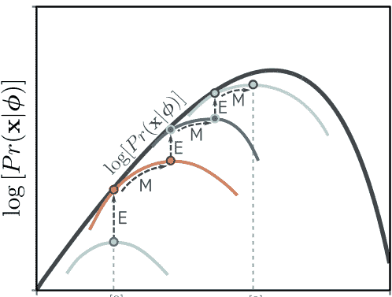

这些调整分别称为E步和M步。由于E步使用后验分布 $Pr(h|x, \phi)$ 来计算 $q(h|x, \theta)$，因此界限很紧，每次E步后彩色曲线都会与黑色似然曲线相接触。

2018年，Chen等人 (2018d) 进一步将ELBO分解，以显示潜在变量之间的总相关性（即，聚合后验与其边缘乘积之间的距离）的存在。他们使用这个概念来推动总相关性VAE，试图最小化这个量。FactorVAE (Kim & Mnih, 2018) 使用了一种不同的方法来最小化总相关性。Mathieu等人 (2019) 讨论了在解开表示中重要的因素。

**重新参数化技巧：** 考虑计算某个函数的期望，其中期望所依赖的概率分布取决于一些参数。重新参数化技巧计算了这个期望对这些参数的导数。本章介绍了这个方法，通过对采样过程进行近似来计算期望的导数；还有其他方法（见问题17.5），但重新参数化技巧提供了一个（通常）方差较低的估计器。这个问题在Rezende等人 (2014)、Kingma等人 (2015) 和Roeder等人 (2017) 的论文中有所讨论。

**下界和EM算法：** VAE训练基于优化证据下界（有时也称为ELBO、变分下界或负变分自由能）。Hoffman和Johnson (2016) 以及Lücke等人 (2020) 以多种方式重新表达了这个下界，以阐明其性质。其他工作旨在使这个下界更紧（Burda等人, 2016; Li和Turner, 2016; Bornschein等人, 2016; Masrani等人, 2019）。例如，Burda等人 (2016) 使用基于从近似后验中使用多个重要性加权样本构建目标函数的修改下界。

### 问题 17.7

当分布 $q(z|\theta)$ 与后验分布 $Pr(z|x, \phi)$ 相匹配时，ELBO是紧的。这是期望最大化 (EM) 算法的基础 (Dempster et al., 1977)。在这里，我们交替地 (i) 选择 $\theta$ 使得 $q(z|\theta)$ 等于后验分布 $Pr(z|x, \phi)$，以及 (ii) 改变 $\phi$ 最大化下界 (图 17.15)。这对于像高斯混合模型这样的模型是可行的，因为我们可以闭式计算后验分布。不幸的是，对于非线性潜在变量模型来说，情况并非如此，因此无法使用这种方法。

## 问题

- 问题 17.1 创建一个一维高斯混合模型需要多少参数，其中 $n = 5$ 组件（方程17.4）？说明每个参数可能取值的可能范围。
- 问题 17.2 如果一个函数的二阶导数在任何地方小于或等于零，则它是凹函数。证明对于函数 $g[x] = \log[x]$，这是正确的。
- 问题 17.3 对于凸函数，Jensen不等式的方向相反：
  $$g[\mathbb{E}[y]] \le \mathbb{E}[g[y]]. \qquad (17.31)$$
  如果一个函数的二阶导数在任何地方大于或等于零，则它是凸函数。证明对于任意 $n \in [1, 2, 3, \dots]$，函数 $g[x] = x^n$ 是凸函数。使用这个结果和Jensen不等式，证明分布 $Pr(x)$ 的均值的平方 $\mathbb{E}[x]^2$ 必须小于或等于它的二阶矩 $\mathbb{E}[x^2]$。
- 问题 17.4* 展示了ELBO，如方程式 17.18 所示，可以从变分分布 $q(\mathbf{z}|\mathbf{x})$ 和真实后验分布 $Pr(\mathbf{z}|\mathbf{x}, \phi)$ 之间的KL散度中推导出来：
  $$D_{KL} \left[ q(\mathbf{z}|\mathbf{x}) \| Pr(\mathbf{z}|\mathbf{x}, \phi) \right] = \int q(\mathbf{z}|\mathbf{x}) \log \left[ \frac{q(\mathbf{z}|\mathbf{x})}{Pr(\mathbf{z}|\mathbf{x}, \phi)} \right] d\mathbf{z}. \qquad (17.32)$$
  首先使用贝叶斯定理（方程式 17.19）。
- 问题 17.5 重参数化技巧计算了一个函数 $f[x]$ 的期望的导数：
  $$\frac{\partial}{\partial \phi} \mathbb{E}_{Pr(x|\phi)} [f[x]], \qquad (17.33)$$
  关于分布 $Pr(x | \phi)$ 的参数 $\phi$ 的导数。展示这个导数也可以计算为：
  $$\begin{aligned} \frac{\partial}{\partial \phi} \mathbb{E}_{Pr(x|\phi)} [f[x]] &= \mathbb{E}_{Pr(x|\phi)} \left[ f[x] \frac{\partial}{\partial \phi} \log[Pr(x|\phi)] \right] \\ &\approx \frac{1}{I} \sum_{i=1}^I f[x_i] \frac{\partial}{\partial \phi} \log[Pr(x_i|\phi)]. \qquad (17.34) \end{aligned}$$
  这种方法被称为REINFORCE算法或者得分函数估计器。
- 问题 17.6 为什么在潜在空间中移动点之间使用球面线性插值而不是常规线性插值更好？提示：考虑图8.13。
- 问题 17.7* 推导出具有 $N$ 个分量的一维高斯混合模型的EM算法。为此，您需要 (i) 找到关于潜在变量 $z \in \{1, 2, \dots, N\}$ 的数据点 $x$ 的后验分布 $Pr(z|x)$ 的表达式，以及 (ii) 找到更新所有数据点的后验分布给定证据下界的表达式。你需要使用拉格朗日乘数来确保高斯函数的权重 $\lambda_1, \dots, \lambda_N$ 的总和为一。

## 第18章 扩散模型

第15章描述了生成对抗网络，它可以生成看起来合理的样本，但不能定义数据上的概率分布。第16章讨论了归一化流。这些模型确实定义了这样的概率分布，但必须对网络进行架构约束；每一层必须是可逆的，并且其雅可比行列式的计算必须容易。第17章介绍了变分自动编码器，它也有坚实的概率基础，但似然的计算是棘手的，必须通过一个下界来近似。

本章介绍了扩散模型。与归一化流一样，这些模型是概率模型，它们定义了从潜在变量到观测数据的非线性映射，其中两个量具有相同的维度。与变分自动编码器类似，它们使用基于编码器的下界来近似数据的似然，该编码器将观测数据映射到潜在变量。然而，在扩散模型中，这个编码器是预先确定的；目标是学习一个反向过程的解码器，并用它来生成样本。扩散模型易于训练，并且可以生成质量非常高的样本，超过了GAN生成的逼真程度。在阅读本章之前，读者应该熟悉变分自动编码器（第17章）的内容。

## 18.1 概述

扩散模型由一个编码器和一个解码器组成。编码器接收一个数据样本 $\mathbf{x}$，并通过一系列中间潜在变量 $\mathbf{z}_1 \dots \mathbf{z}_T$ 进行映射。解码器将这个过程反转；它从 $\mathbf{z}_T$ 开始，并通过 $\mathbf{z}_{T-1}, \dots$ 逆向映射，直到最终重新创建一个数据点 $\mathbf{x}$ 为止。在编码器和解码器中，映射是随机的，而不是确定性的。

编码器是预先指定的；它逐渐将输入与白噪声样本混合在一起（图18.1）。经过足够的步骤，最终潜在变量的条件分布 $q(\mathbf{z}_T | \mathbf{x})$ 和边际分布 $q(\mathbf{z}_T)$ 都变成了标准正态分布。由于这个过程是预先指定的，所有学习到的参数都在解码器中。在解码器中，一系列网络被训练用于在每个层之间进行反向映射。

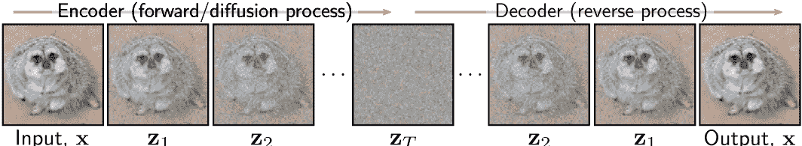

图18.1扩散模型。编码器（前向或扩散过程）通过一系列潜在变量 $\mathbf{z}_1 \ldots \mathbf{z}_T$ 将输入 $\mathbf{x}$ 映射。这个过程是预先指定的，并逐渐将数据与噪声混合，直到只剩下噪声。解码器（反向过程）是通过学习得到的，并通过潜在变量逐步将数据传递回去，每个阶段去除噪声。训练后，通过对噪声向量 $\mathbf{z}_T$ 进行采样并通过解码器传递它们来生成新的示例。

相邻的潜在变量对 $\mathbf{z}_t$ 和 $\mathbf{z}_{t-1}$ 进行编码。损失函数鼓励每个网络反转相应的编码器步骤。结果是噪声逐渐从表示中去除，直到剩下一个逼真的数据示例。要生成一个新的数据示例 $\mathbf{x}$，我们从 $q(\mathbf{z}_T)$ 中抽取样本，并通过解码器传递它。

在第18.2节中，我们详细讨论了编码器。它的属性并不明显，但对于学习算法至关重要。在第18.3节中，我们讨论了解码器。第18.4节推导出训练算法，第18.5节对其进行了重新定义以使其更加实用。第18.6节讨论了实现细节，包括如何根据文本提示生成条件。

## 18.2 编码器（前向过程）

扩散或前向过程$^1$（图18.2）将数据示例 $\mathbf{x}$ 通过一系列中间变量 $\mathbf{z}_1, \mathbf{z}_2, \dots, \mathbf{z}_T$ 映射，其中 $\mathbf{z}_T$ 与 $\mathbf{x}$ 具有相同的大小，如下所示：

$$
\begin{aligned} 
\mathbf{z}_1 &= \sqrt{1-\beta_1} \cdot \mathbf{x} + \sqrt{\beta_1} \cdot \boldsymbol{\epsilon}_1 \\ 
\mathbf{z}_t &= \sqrt{1-\beta_t} \cdot \mathbf{z}_{t-1} + \sqrt{\beta_t} \cdot \boldsymbol{\epsilon}_t & \text{对于所有的 } t \in \{2, \dots, T\}, 
\end{aligned} \quad (18.1)
$$

其中 $\boldsymbol{\epsilon}_t$ 是从标准正态分布中抽取的噪声。第一项减弱了迄今为止添加的数据和任何噪声，第二项增加了更多噪声。超参数 $\beta_t \in [0, 1]$ 确定噪声混合的速度，它们被称为噪声调度。前向过程也可以等价地写成：

$$q(\mathbf{z}_1 | \mathbf{x}) = \text{Norm}_{\mathbf{z}_1} \left[ \sqrt{1 - \beta_1} \mathbf{x}, \beta_1 \mathbf{I} \right] \hfill (18.2)$$
$$q(\mathbf{z}_t | \mathbf{z}_{t-1}) = \text{Norm}_{\mathbf{z}_t} \left[ \sqrt{1 - \beta_t} \mathbf{z}_{t-1}, \beta_t \mathbf{I} \right] \quad \forall t \in \{2, \dots, T\}. $$

这是一个马尔可夫链，因为概率 $\mathbf{z}_t$ 仅取决于前一个变量 $\mathbf{z}_{t-1}$ 的值。通过足够的步骤 $T$，原始数据的所有痕迹都被删除，$q(\mathbf{z}_T | \mathbf{x}) \approx q(\mathbf{z}_T)$ 变成了标准正态分布。$^2$

给定输入 $\mathbf{x}$，所有潜在变量 $\mathbf{z}_1, \mathbf{z}_2, \dots, \mathbf{z}_T$ 的联合分布为：

$$q(\mathbf{z}_{1 \dots T} | \mathbf{x}) = q(\mathbf{z}_1 | \mathbf{x}) \prod_{t=2}^T q(\mathbf{z}_t | \mathbf{z}_{t-1}). \hfill (18.3)$$ 

---
$^1$注意，这与归一化流的命名方式相反，其中反向映射从数据到潜在变量，正向映射再次返回。
$^2$我们使用 $q(\mathbf{z}_t | \mathbf{z}_{t-1})$ 而不是 $Pr(\mathbf{z}_t | \mathbf{z}_{t-1})$ 来匹配前一章节中 VAE 编码器的描述符号。

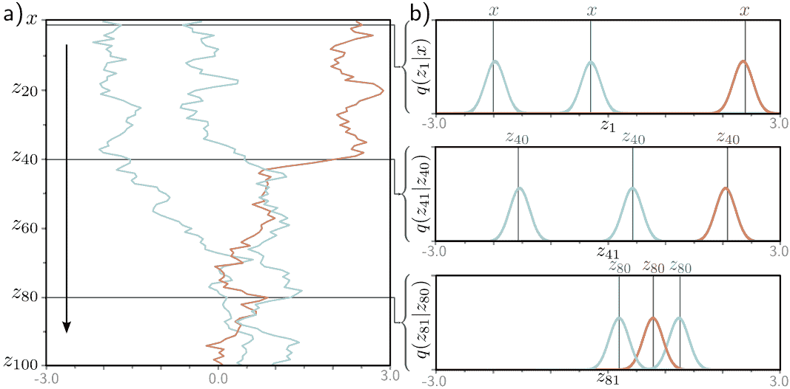

图18.2 正向过程。a) 我们考虑一维数据 $x$ 与 $T = 100$ 潜在变量 $z_1, \dots, z_{100}$，且所有步骤中 $\beta = 0.03$。三个 $x$（灰色、青色和橙色）被初始化（顶行）。它们通过 $z_1, \dots, z_{100}$ 传播。在每一步中，变量通过衰减其值 $\sqrt{1 - \beta}$ 并添加方差为 $\beta$ 的均值为零的噪声来更新（方程18.1）。因此，这三个示例通过变量噪声传播，倾向于向零移动。b) 条件概率 $Pr(z_1|x)$ 和 $Pr(z_t|z_{t-1})$ 是正态分布，其均值略微接近于当前点，固定方差为 $\beta_t$（方程18.2）。

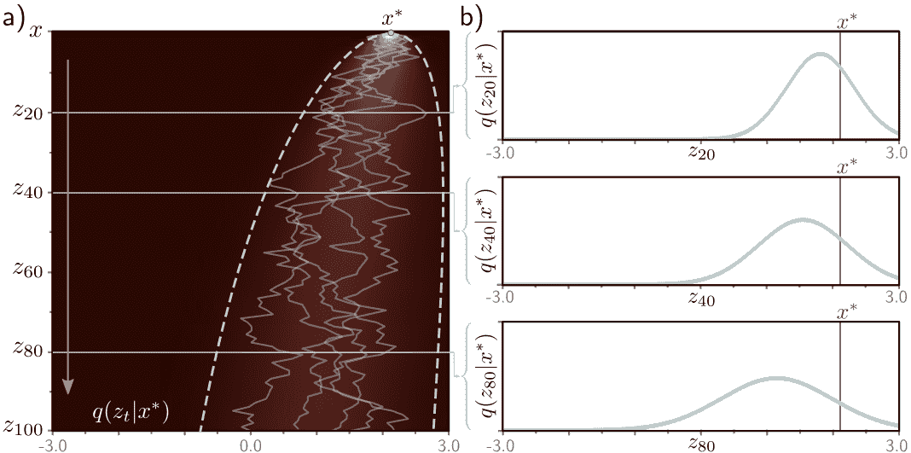

**图18.3扩散核。** a) 点 $x^* = 2.0$ 通过方程18.1（灰色显示的五条路径）传播到潜在变量。扩散核 $q(z_t|x^*)$ 是给定从 $x^*$ 开始的变量 $z_t$ 的概率分布。它可以通过闭式计算，并且是一个均值向零移动且方差随 $t$ 增加而增加的正态分布。热图显示了每个变量的 $q(z_t|x^*)$。青色线显示了距离均值 $\pm 2$ 标准差。b) 扩散核 $q(z_t|x^*)$ 对于 $t = 20, 40, 80$ 进行了明确展示。实际上，扩散核允许我们在不计算中间变量 $z_1, \dots, z_{t-1}$ 的情况下对给定 $x^*$ 的潜在变量 $z_t$ 进行采样。当 $t$ 变得非常大时，扩散核变成了一个标准正态分布。

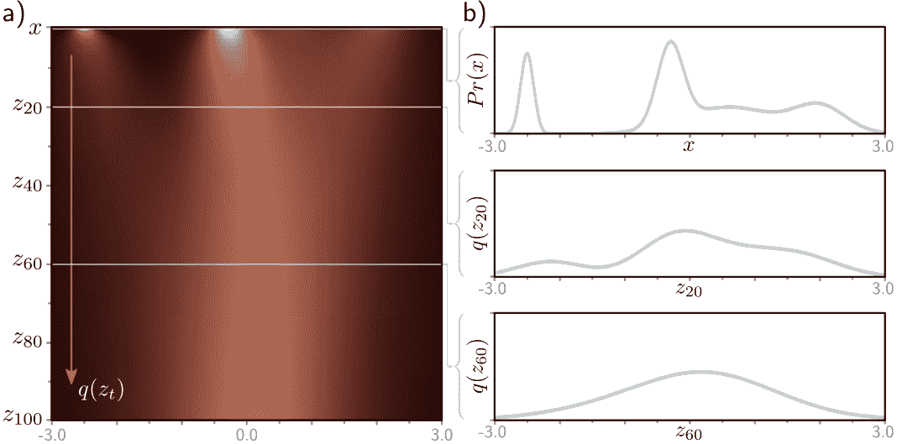

**图18.4边缘分布。** a) 给定初始密度 $Pr(x)$（顶行），扩散过程逐渐模糊分布，通过潜在变量 $z_t$ 并将其移向标准正态分布。每个后续的热图水平线表示边缘分布 $q(z_t)$。b) 顶部图显示初始分布 $Pr(x)$。其他两个图分别显示边缘分布 $q(z_{20})$ 和 $q(z_{60})$。

#### 18.2.1 扩散核 $q(\mathbf{z}_t|\mathbf{x})$

为了训练解码器反转这个过程，我们使用多个样本 $\mathbf{z}_t$ 在时间 $t$ 上为同一个示例 $\mathbf{x}_0$。然而，当 $t$ 很大时，使用方程18.1 逐个生成这些样本是耗时的。幸运的是，$q(\mathbf{z}_t|\mathbf{x})$ 有一个闭式表达式，允许我们直接绘制样本 $\mathbf{z}_t$ 给定初始数据点 $\mathbf{x}$ 而不计算中间变量 $\mathbf{z}_1 \dots \mathbf{z}_{t-1}$。这被称为扩散核（图18.3）的表达式。为了推导 $q(\mathbf{z}_t|\mathbf{x})$ 的表达式，考虑正向过程的前两个步骤：

$$\begin{aligned} \mathbf{z}_1 &= \sqrt{1 - \beta_1} \cdot \mathbf{x} + \sqrt{\beta_1} \cdot \mathbf{\epsilon}_1 \\ \mathbf{z}_2 &= \sqrt{1 - \beta_2} \cdot \mathbf{z}_1 + \sqrt{\beta_2} \cdot \mathbf{\epsilon}_2. \end{aligned} \hfill (18.4)$$

将第一个方程代入第二个方程，我们得到：

$$\begin{aligned} \mathbf{z}_2 &= \sqrt{1 - \beta_2} \left( \sqrt{1 - \beta_1} \cdot \mathbf{x} + \sqrt{\beta_1} \cdot \mathbf{\epsilon}_1 \right) + \sqrt{\beta_2} \cdot \mathbf{\epsilon}_2 \\ &= \sqrt{1 - \beta_2} \sqrt{1 - \beta_1} \cdot \mathbf{x} + \sqrt{1 - \beta_2} \sqrt{\beta_1} \cdot \mathbf{\epsilon}_1 + \sqrt{\beta_2} \cdot \mathbf{\epsilon}_2 \\ &= \sqrt{(1 - \beta_2)(1 - \beta_1)} \cdot \mathbf{x} + \sqrt{(1 - \beta_2)\beta_1} \cdot \mathbf{\epsilon}_1 + \sqrt{\beta_2} \cdot \mathbf{\epsilon}_2. \end{aligned} \hfill (18.5)$$

最后两项是来自均值为零的正态分布的独立样本，其方差分别为 $(1 - \beta_2)\beta_1$ 和 $\beta_2$。这个和的均值为零，它的方差是组成部分方差的总和（见问题18.2），所以：

$$\mathbf{z}_2 = \sqrt{(1 - \beta_2)(1 - \beta_1)} \cdot \mathbf{x} + \sqrt{1 - (1 - \beta_2)(1 - \beta_1)} \cdot \mathbf{\epsilon}, \hfill (18.6)$$

其中 $\epsilon$ 也是来自标准正态分布的样本。如果我们继续通过将这个方程代入 $\mathbf{z}_3$ 等式中，我们可以证明：

$$\mathbf{z}_t = \sqrt{\alpha_t} \cdot \mathbf{x} + \sqrt{1 - \alpha_t} \cdot \mathbf{\epsilon}, \hfill (18.7)$$

其中 $\alpha_t = \prod_{s=1}^t (1 - \beta_s)$。我们可以等价地用概率形式来表示：

$$q(\mathbf{z}_t|\mathbf{x}) = \text{Norm}_{\mathbf{z}_t} \left[ \sqrt{\alpha_t} \cdot \mathbf{x}, (1 - \alpha_t) \mathbf{I} \right]. \hfill (18.8)$$

对于任意的起始数据点 $\mathbf{x}$，变量 $\mathbf{z}_t$ 服从已知均值和方差的正态分布。因此，如果我们不关心通过中间变量 $\mathbf{z}_1 \dots \mathbf{z}_{t-1}$ 的演化历史，那么从 $q(\mathbf{z}_t|\mathbf{x})$ 中生成样本是很容易的。

#### 18.2.2 边缘分布 $q(\mathbf{z}_t)$

边缘分布 $q(\mathbf{z}_t)$ 是在给定可能的起始点 $\mathbf{x}$ 和每个起始点的可能扩散路径的分布下观察到 $\mathbf{z}_t$ 值的概率。

点（图18.4）可以通过考虑联合分布 $q(\mathbf{x}, \mathbf{z}_{1...t})$ 来计算并对除 $\mathbf{z}_t$ 以外的所有变量进行边际化：

**附录 C.1.2 边缘化**

$$q(\mathbf{z}_t) = \iint q(\mathbf{z}_{1...t}, \mathbf{x}) d\mathbf{z}_{1...t-1} d\mathbf{x} = \iint q(\mathbf{z}_{1...t} | \mathbf{x}) P_r(\mathbf{x}) d\mathbf{z}_{1...t-1} d\mathbf{x}, \quad (18.9)$$

其中 $q(\mathbf{z}_{1...t} | \mathbf{x})$ 在方程18.3中定义。

然而，由于我们现在有了扩散核 $q(\mathbf{z}_t | \mathbf{x})$ 的表达式，它“跳过”中间变量，我们可以等价地写成：

$$q(\mathbf{z}_t) = \int q(\mathbf{z}_t | \mathbf{x}) P_r(\mathbf{x}) d\mathbf{x}。 \quad (18.10)$$

因此，如果我们从数据分布 $P_r(\mathbf{x})$ 中重复采样，并在每个样本上叠加扩散核 $q(\mathbf{z}_t | \mathbf{x})$，结果就是边际分布 $q(\mathbf{z}_t)$（图18.4）。然而，边际分布无法以闭合形式写出，因为我们不知道原始数据分布 $P_r(\mathbf{x})$。

**笔记本 18.1 扩散编码器**

### 18.2.3 条件分布 $q(\mathbf{z}_{t-1} | \mathbf{z}_t)$

我们将条件概率 $q(\mathbf{z}_t | \mathbf{z}_{t-1})$ 定义为混合过程（方程18.2）。为了逆转这个过程，我们应用贝叶斯规则：

**附录 C.1.4 贝叶斯规则**

$$q(\mathbf{z}_{t-1} | \mathbf{z}_t) = \frac{q(\mathbf{z}_t | \mathbf{z}_{t-1}) q(\mathbf{z}_{t-1})}{q(\mathbf{z}_t)}. \quad (18.11)$$

这是棘手的，因为我们无法计算边际分布 $q(\mathbf{z}_{t-1})$。

对于这个简单的一维示例，可以通过数值方法评估 $q(\mathbf{z}_{t-1} | \mathbf{z}_t)$（图18.5）。一般情况下，它们的形式很复杂，但在许多情况下，它们可以很好地近似为正态分布。这很重要，因为当我们构建解码器时，我们将使用正态分布来近似逆过程。

### 18.2.4 条件扩散分布 $q(\mathbf{z}_{t-1} | \mathbf{z}_t, \mathbf{x})$

还有一个与编码器相关的最终分布需要考虑。我们上面提到过，我们无法找到条件分布 $q(\mathbf{z}_{t-1} | \mathbf{z}_t)$，因为我们不知道边际分布 $q(\mathbf{z}_{t-1})$。然而，如果我们知道起始变量 $\mathbf{x}$，则我们知道之前的时间点上的分布 $q(\mathbf{z}_{t-1} | \mathbf{x})$。这只是扩散核（图18.3），它服从正态分布。

因此，可以通过闭式形式计算条件扩散分布 $q(\mathbf{z}_{t-1} | \mathbf{z}_t, \mathbf{x})$（图18.6）。这个分布用于训练解码器。当我们知道当前潜变量 $\mathbf{z}_t$ 和训练数据示例 $\mathbf{x}$（当然，在训练时我们会这样做），它是 $\mathbf{z}_{t-1}$ 的分布。为了计算一个关于 $q(\mathbf{z}_{t-1} \mid \mathbf{z}_t, \mathbf{x})$ 的表达式，我们从贝叶斯规则开始：

$$
\begin{aligned}
q\left(\mathbf{z}_{t-1} \mid \mathbf{z}_t, \mathbf{x}\right) & =\frac{q\left(\mathbf{z}_t \mid \mathbf{z}_{t-1}, \mathbf{x}\right) q\left(\mathbf{z}_{t-1} \mid \mathbf{x}\right)}{q\left(\mathbf{z}_t \mid \mathbf{x}\right)} \quad (18.12) \\
& \propto q\left(\mathbf{z}_t \mid \mathbf{z}_{t-1}\right) q\left(\mathbf{z}_{t-1} \mid \mathbf{x}\right) \\
& =\text{Norm}_{\mathbf{z}_t}\left[\sqrt{1-\beta_t} \cdot \mathbf{z}_{t-1}, \beta_t \mathbf{I}\right] \text{Norm}_{\mathbf{z}_{t-1}}\left[\sqrt{\alpha_{t-1}} \cdot \mathbf{x},\left(1-\alpha_{t-1}\right) \mathbf{I}\right] \\
& \propto \text{Norm}_{\mathbf{z}_{t-1}}\left[\frac{1}{\sqrt{1-\beta_t}} \mathbf{z}_t, \frac{\beta_t}{1-\beta_t} \mathbf{I}\right] \text{Norm}_{\mathbf{z}_{t-1}}\left[\sqrt{\alpha_{t-1}} \cdot \mathbf{x},\left(1-\alpha_{t-1}\right) \mathbf{I}\right]
\end{aligned}
$$

在第一和第二行之间，我们使用了 $q(\mathbf{z}_t \mid \mathbf{z}_{t-1}, \mathbf{x})=q(\mathbf{z}_t \mid \mathbf{z}_{t-1})$，因为扩散过程是马尔可夫的，并且 $\mathbf{z}_t$ 的所有信息都被 $\mathbf{z}_{t-1}$ 捕获。在第三和第四行之间，我们使用了高斯变量变换的恒等式：

**附录 C.3.4 高斯变量变换**

$$\text{Norm}_{\mathbf{v}}\left[\mathbf{A w}, \mathbf{B}\right] \propto \text{Norm}_{\mathbf{w}}\left[\left(\mathbf{A}^T \mathbf{B}^{-1} \mathbf{A}\right)^{-1} \mathbf{A}^T \mathbf{B}^{-1} \mathbf{v},\left(\mathbf{A}^T \mathbf{B}^{-1} \mathbf{A}\right)^{-1}\right], \quad (18.13)$$

将第一个分布重新写成 $\mathbf{z}_{t-1}$ 的形式。然后我们使用了第二个高斯恒等式：

**问题 18.4–18.5**

$$
\begin{aligned}
\text{Norm}_{\mathbf{w}}[\mathbf{a}, \mathbf{A}] \cdot \text{Norm}_{\mathbf{w}}[\mathbf{b}, \mathbf{B}] \propto & (18.14) \\
\text{Norm}_{\mathbf{w}}\left[\left(\mathbf{A}^{-1}+\mathbf{B}^{-1}\right)^{-1}\left(\mathbf{A}^{-1} \mathbf{a}+\mathbf{B}^{-1} \mathbf{b}\right),\left(\mathbf{A}^{-1}+\mathbf{B}^{-1}\right)^{-1}\right],
\end{aligned}
$$

将两个正态分布组合在一起得到关于 $\mathbf{z}_{t-1}$ 的分布：

**问题 18.6**

$$q\left(\mathbf{z}_{t-1} \mid \mathbf{z}_t, \mathbf{x}\right)=\text{Norm}_{\mathbf{z}_{t-1}}\left[\frac{\left(1-\alpha_{t-1}\right)}{1-\alpha_t} \sqrt{1-\beta_t} \mathbf{z}_t+\frac{\sqrt{\alpha_{t-1}} \beta_t}{1-\alpha_t} \mathbf{x}, \frac{\beta_t\left(1-\alpha_{t-1}\right)}{1-\alpha_t} \mathbf{I}\right] .(18.15)$$

请注意，方程 18.12、18.13 和 18.14 中的比例常数必须抵消，因为最终结果已经是一个正确归一化的概率分布。

**图18.5** 条件分布 $q(z_{t-1}|z_t)$。a) 边缘密度 $q(z_t)$ 有三个点 $z_t^*$ 高亮显示。b) 概率 $q(z_{t-1}|z_t^*)$（青色曲线）通过贝叶斯规则计算，并且与 $q(z_t^*|z_{t-1})q(z_{t-1})$ 成比例。通常情况下，它不是正态分布（顶部图），尽管通常正态分布是一个很好的近似（底部两个图）。第一个似然项 $q(z_t^*|z_{t-1})$ 在 $z_{t-1}$（方程18.2）中是正态的，其均值略微偏离零点，而 $z_t^*$（棕色曲线）稍远。第二项是边缘密度 $q(z_{t-1})$（灰色曲线）。

**图18.6** 条件分布 $q(z_{t-1}|z_t, x)$。a) 扩散核函数对于 $x^* = -2.1$ 的三个点 $z_t^*$ 进行了突出显示。b) 概率 $q(z_{t-1}|z_t^*, x^*)$ 通过贝叶斯规则计算，与 $q(z_t^*|z_{t-1})q(z_{t-1}|x^*)$ 成比例。这是一个正态分布，可以通过闭式计算得到。第一个似然项 $q(z_t^*|z_{t-1})$ 在 $z_{t-1}$（方程18.2）中是正态的，其均值略微偏离零点（棕色曲线）。第二项是扩散核函数 $q(z_{t-1}|x^*)$（灰色曲线）。

## 18.3 解码器模型 (反向过程)

当我们学习扩散模型时，我们学习了相反的过程。换句话说，我们学习了一系列从潜在变量 $\mathbf{z}_T$ 到 $\mathbf{z}_{T-1}$ 的概率映射，从 $\mathbf{z}_{T-1}$ 到 $\mathbf{z}_{T-2}$，以此类推，直到我们到达数据 $\mathbf{x}$。扩散过程的真实逆分布 $q\left(\mathbf{z}_{t-1} \mid \mathbf{z}_t\right)$ 是复杂的多模态分布（图18.5），取决于数据分布 $Pr(\mathbf{x})$。我们将其近似为正态分布：

$$
\begin{aligned}
Pr(\mathbf{z}_T) &= \text{Norm}_{\mathbf{z}}[\mathbf{0}, \mathbf{I}] \\
Pr(\mathbf{z}_{t-1} \mid \mathbf{z}_t, \phi_t) &= \text{Norm}_{\mathbf{z}}\left[\mathbf{f}_t[\mathbf{z}_t, \phi_t], \sigma_t^2 \mathbf{I}\right] \\
Pr(\mathbf{x} \mid \mathbf{z}_1, \phi_1) &= \text{Norm}_{\mathbf{x}}\left[\mathbf{g}[\mathbf{z}_1, \phi_1], \sigma_1^2 \mathbf{I}\right], \quad & (18.16)
\end{aligned}
$$

其中 $\mathbf{f}_t[\mathbf{z}_t, \phi_t]$ 是一个神经网络，用于计算从 $\mathbf{z}_t$ 到前一个潜变量 $\mathbf{z}_{t-1}$ 的正态分布的均值。术语 $\{\sigma_t^2\}$ 是预先确定的。如果扩散过程中的超参数 $\beta_t$ 接近于零（且时间步数 $T$ 很大），那么这个正态近似是合理的。我们使用祖先抽样从 $Pr(\mathbf{x})$ 生成新的示例。我们首先从 $Pr(\mathbf{z}_T)$ 中抽取 $\mathbf{z}_T$。然后我们从 $Pr(\mathbf{z}_{T-1} | \mathbf{z}_T, \phi_T)$ 中抽取 $\mathbf{z}_{T-1}$，从 $Pr(\mathbf{z}_{T-2} | \mathbf{z}_{T-1}, \phi_{T-1})$ 中抽取 $\mathbf{z}_{T-2}$，依此类推，直到我们最终从 $Pr(\mathbf{x} | \mathbf{z}_1, \phi_1)$ 中生成 $\mathbf{x}$。

## 18.4 训练

观察变量 $\mathbf{x}$ 和潜在变量 $\{\mathbf{z}_t\}$ 的联合分布是：

$$Pr(\mathbf{x}, \mathbf{z}_{1 \dots T} | \phi_{1 \dots T}) = Pr(\mathbf{x} | \mathbf{z}_1, \phi_1) \prod_{t=2}^T Pr(\mathbf{z}_{t-1} | \mathbf{z}_t, \phi_t) \cdot Pr(\mathbf{z}_T). \tag{18.17}$$

**附录 C.1.2 边缘化**

观测数据的似然函数 $Pr(\mathbf{x} | \phi_{1 \dots T})$ 通过对潜在变量进行边缘化得到：

$$Pr(\mathbf{x} | \phi_{1 \dots T}) = \int Pr(\mathbf{x}, \mathbf{z}_{1 \dots T} | \phi_{1 \dots T}) d\mathbf{z}_{1 \dots T}. \tag{18.18}$$

为了训练模型，我们最大化训练数据 $\{\mathbf{x}_i\}$ 的对数似然函数关于参数 $\phi$ 的值：

$$\hat{\phi}_{1 \dots T} = \underset{\phi_{1 \dots T}}{\operatorname{argmax}} \left[ \sum_{i=1}^I \log [Pr(\mathbf{x}_i | \phi_{1 \dots T})] \right]. \tag{18.19}$$

我们无法直接最大化这个值，因为方程 18.18 中的边缘化是难以计算的。因此，我们使用 Jensen 不等式来定义似然的下界，并且与 VAE 一样，根据这个下界来优化参数 $\phi_{1 \dots T}$（参见第 17.3.1 节）。

### 18.4.1 证据下界 (ELBO)

为了推导出下界，我们将对数似然乘以编码器分布 $q(\mathbf{z}_{1 \dots T} | \mathbf{x})$ 并应用 Jensen 不等式（参见第 17.3.2 节）：

$$\begin{aligned} \log [Pr(\mathbf{x} | \phi_{1 \dots T})] &= \log \left[ \int Pr(\mathbf{x}, \mathbf{z}_{1 \dots T} | \phi_{1 \dots T}) d\mathbf{z}_{1 \dots T} \right] \\ &= \log \left[ \int q(\mathbf{z}_{1 \dots T} | \mathbf{x}) \frac{Pr(\mathbf{x}, \mathbf{z}_{1 \dots T} | \phi_{1 \dots T})}{q(\mathbf{z}_{1 \dots T} | \mathbf{x})} d\mathbf{z}_{1 \dots T} \right] \\ &\ge \int q(\mathbf{z}_{1 \dots T} | \mathbf{x}) \log \left[ \frac{Pr(\mathbf{x}, \mathbf{z}_{1 \dots T} | \phi_{1 \dots T})}{q(\mathbf{z}_{1 \dots T} | \mathbf{x})} \right] d\mathbf{z}_{1 \dots T}. \end{aligned} \tag{18.20}$$

这给我们提供了证据下界 (ELBO)：

$$\text{ELBO} [\phi_{1...T}] = \int q(\mathbf{z}_{1...T} | \mathbf{x}) \log \left[ \frac{Pr(\mathbf{x}, \mathbf{z}_{1...T} | \phi_{1...T})}{q(\mathbf{z}_{1...T} | \mathbf{x})} \right] d\mathbf{z}_{1...T}. \quad (18.21)$$ 

在VAE中，编码器 $q(\mathbf{z}|\mathbf{x})$ 近似于潜在变量上的后验分布以使边界变得紧密，并且解码器最大化此边界（图17.10）。在扩散模型中，解码器必须完成所有工作，因为编码器没有参数。通过改变参数使得静态编码器近似后验概率 $Pr(\mathbf{z}_{1...T} | \mathbf{x}, \phi_{1...T})$，并通过优化自身参数来使得边界更紧（见图17.6）。

### 18.4.2 简化ELBO

我们现在将ELBO中的对数项转化为最终形式，我们将对其进行优化。我们首先用方程 18.17 和 18.3 中的分子和分母定义进行替换：

$$\begin{aligned} \log \left[ \frac{Pr(\mathbf{x}, \mathbf{z}_{1...T} | \phi_{1...T})}{q(\mathbf{z}_{1...T} | \mathbf{x})} \right] &= \log \left[ \frac{Pr(\mathbf{x} | \mathbf{z}_1, \phi_1) \prod_{t=2}^T Pr(\mathbf{z}_{t-1} | \mathbf{z}_t, \phi_t) \cdot Pr(\mathbf{z}_T)}{q(\mathbf{z}_1 | \mathbf{x}) \prod_{t=2}^T q(\mathbf{z}_t | \mathbf{z}_{t-1})} \right] \quad (18.22) \\ &= \log \left[ \frac{Pr(\mathbf{x} | \mathbf{z}_1, \phi_1)}{q(\mathbf{z}_1 | \mathbf{x})} \right] + \log \left[ \frac{\prod_{t=2}^T Pr(\mathbf{z}_{t-1} | \mathbf{z}_t, \phi_t)}{\prod_{t=2}^T q(\mathbf{z}_t | \mathbf{z}_{t-1})} \right] + \log [Pr(\mathbf{z}_T)]. \end{aligned}$$

然后我们展开第二项的分母：

$$q(\mathbf{z}_t | \mathbf{z}_{t-1}) = q(\mathbf{z}_t | \mathbf{z}_{t-1}, \mathbf{x}) = \frac{q(\mathbf{z}_{t-1} | \mathbf{z}_t, \mathbf{x}) q(\mathbf{z}_t | \mathbf{x})}{q(\mathbf{z}_{t-1} | \mathbf{x})}, \quad (18.23)$$ 

第一个等式成立是因为变量 $\mathbf{z}_t$ 的所有信息都包含在 $\mathbf{z}_{t-1}$ 中，所以对数据 $\mathbf{x}$ 的额外条件是无关紧要的。第二个等式是贝叶斯规则的一个直接应用。

**附录 C.1.4 贝叶斯规则**

将这个结果代入得到：

$$\begin{aligned} \log &\left[ \frac{Pr(\mathbf{x}, \mathbf{z}_{1...T} | \phi_{1...T})}{q(\mathbf{z}_{1...T} | \mathbf{x})} \right] \\ &= \log \left[ \frac{Pr(\mathbf{x} | \mathbf{z}_1, \phi_1)}{q(\mathbf{z}_1 | \mathbf{x})} \right] + \log \left[ \frac{\prod_{t=2}^T Pr(\mathbf{z}_{t-1} | \mathbf{z}_t, \phi_t) \cdot q(\mathbf{z}_{t-1} | \mathbf{x})}{\prod_{t=2}^T q(\mathbf{z}_{t-1} | \mathbf{z}_t, \mathbf{x}) \cdot q(\mathbf{z}_t | \mathbf{x})} \right] + \log [Pr(\mathbf{z}_T)] \\ &= \log [Pr(\mathbf{x} | \mathbf{z}_1, \phi_1)] + \log \left[ \frac{\prod_{t=2}^T Pr(\mathbf{z}_{t-1} | \mathbf{z}_t, \phi_t)}{\prod_{t=2}^T q(\mathbf{z}_{t-1} | \mathbf{z}_t, \mathbf{x})} \right] + \log \left[ \frac{Pr(\mathbf{z}_T)}{q(\mathbf{z}_T | \mathbf{x})} \right] \\ &\approx \log [Pr(\mathbf{x} | \mathbf{z}_1, \phi_1)] + \sum_{t=2}^T \log \left[ \frac{Pr(\mathbf{z}_{t-1} | \mathbf{z}_t, \phi_t)}{q(\mathbf{z}_{t-1} | \mathbf{z}_t, \mathbf{x})} \right]. \quad (18.24) \end{aligned}$$

在第二行和第三行之间，比率的乘积中除了两项之外的所有项都消除了 $q(\mathbf{z}_{t-1}|\mathbf{x})/q(\mathbf{z}_t|\mathbf{x})$，只剩下 $q(\mathbf{z}_1|\mathbf{x})$ 和 $q(\mathbf{z}_T|\mathbf{x})$。第三行的最后一项近似为 $\log[1]=0$，因为前向过程的结果 $q(\mathbf{z}_T|\mathbf{x})$ 是一个标准正态分布，所以等于先验 $Pr(\mathbf{z}_T)$。

简化的ELBO因此是：

$$\begin{aligned} \text{ELBO} [\phi_{1 \dots T}] &= \int q(\mathbf{z}_{1 \dots T} | \mathbf{x}) \log \left[ \frac{Pr(\mathbf{x}, \mathbf{z}_{1 \dots T} | \phi_{1 \dots T})}{q(\mathbf{z}_{1 \dots T} | \mathbf{x})} \right] d\mathbf{z}_{1 \dots T} \quad (18.25) \\ &\approx \int q(\mathbf{z}_{1 \dots T} | \mathbf{x}) \left( \log [Pr(\mathbf{x} | \mathbf{z}_1, \phi_1)] + \sum_{t=2}^{T} \log \left[ \frac{Pr(\mathbf{z}_{t-1} | \mathbf{z}_t, \phi_t)}{q(\mathbf{z}_{t-1} | \mathbf{z}_t, \mathbf{x})} \right] \right) d\mathbf{z}_{1 \dots T} \\ &= \mathbb{E}_{q(\mathbf{z}_1|\mathbf{x})} \left[ \log [Pr(\mathbf{x} | \mathbf{z}_1, \phi_1)] \right] - \sum_{t=2}^T \mathbb{E}_{q(\mathbf{z}_t|\mathbf{x})} \left[ D_{KL} \left[ q(\mathbf{z}_{t-1} | \mathbf{z}_t, \mathbf{x}) || Pr(\mathbf{z}_{t-1} | \mathbf{z}_t, \phi_t) \right] \right], \end{aligned}$$

在第二行和第三行之间，我们对 $q(\mathbf{z}_{1\dots T}|\mathbf{x})$ 中的无关变量进行了边际化处理并且使用了KL散度的定义（参见问题18.7、附录C.5.1 KL散度）。

### 18.4.3 分析ELBO

ELBO中的第一个概率项在方程18.16中定义：

$$Pr(\mathbf{x}|\mathbf{z}_1, \phi_1) = \text{Norm}_{\mathbf{x}} [\mathbf{f}_1 [\mathbf{z}_1, \phi_1], \sigma_1^2 \mathbf{I}], \quad (18.26)$$

并且等同于VAE中的重构项。如果模型预测与观测数据匹配，ELBO将会更大。对于VAE，我们将使用蒙特卡洛估计（见方程17.22-17.23）来近似计算对这个量的对数期望，其中我们使用从 $q(\mathbf{z}_1|\mathbf{x})$ 中采样的样本来估计期望。ELBO中的KL散度项衡量了 $Pr(\mathbf{z}_{t-1}|\mathbf{z}_t, \phi_t)$ 和 $q(\mathbf{z}_{t-1}|\mathbf{z}_t, \mathbf{x})$ 之间的距离，分别在方程18.16和18.15中定义：

$$\begin{aligned} Pr(\mathbf{z}_{t-1} | \mathbf{z}_t, \phi_t) &= \text{Norm}_{\mathbf{z}_{t-1}} [\mathbf{f}_t [\mathbf{z}_t, \phi_t], \sigma_t^2 \mathbf{I}] \quad (18.27) \\ q(\mathbf{z}_{t-1} | \mathbf{z}_t, \mathbf{x}) &= \text{Norm}_{\mathbf{z}_{t-1}} \left[ \frac{(1 - \alpha_{t-1})}{1 - \alpha_t} \sqrt{1 - \beta_t}\mathbf{z}_t + \frac{\sqrt{\alpha_{t-1}}\beta_t}{1 - \alpha_t}\mathbf{x}, \frac{\beta_t(1 - \alpha_{t-1})}{1 - \alpha_t} \mathbf{I} \right]. \end{aligned}$$

两个正态分布之间的KL散度有一个闭式表达式（参见附录C.5.4）。此外，这个表达式中的许多项不依赖于 $\phi$（见问题18.8），而表达式简化为均值之间的平方差加上一个常数 $C$：

$$\begin{aligned} D_{KL} [q(\mathbf{z}_{t-1} | \mathbf{z}_t, \mathbf{x}) || Pr(\mathbf{z}_{t-1} | \mathbf{z}_t, \phi_t)] = \frac{1}{2\sigma_t^2} \left\| \frac{(1 - \alpha_{t-1})}{1 - \alpha_t} \sqrt{1 - \beta_t}\mathbf{z}_t + \frac{\sqrt{\alpha_{t-1}}\beta_t}{1 - \alpha_t}\mathbf{x} - \mathbf{f}_t [\mathbf{z}_t, \phi_t] \right\|^2 + C. \quad (18.28) \end{aligned}$$

**图18.7** 拟合模型。a) 可以通过从标准正态分布中抽样生成单个样本 $Pr(z_T)$（底部行），然后从 $Pr(z_{T-1}|z_T) = \text{Norm}_{z_{T-1}}[\mathbf{f}_T[z_T, \phi_T], \sigma_T^2\mathbf{I}]$ 等等，直到我们达到 $x$（显示五条路径）。估计的边际密度（热图）是这些样本的聚合，与真实的边际密度（图18.4）相似。b) 估计的分布 $Pr(z_{t-1}|z_t)$（棕色曲线）是扩散模型真实实验的合理近似，$q(z_{t-1}|z_t)$（青色曲线）来自图18.5。估计模型和真实模型的边际分布 $Pr(z_t)$ 和 $q(z_t)$（深蓝曲线和灰色曲线）也相似。

### 18.4.4 扩散损失函数

为了拟合模型，我们最大化对参数 $\phi_{1\dots T}$ 的 ELBO。我们将其重新定义为最小化问题，通过乘以负一并用样本来近似期望值，得到损失函数：

$$L[\phi_{1\dots T}] = \sum_{i=1}^{I} \left( -\log \left[ \text{Norm}_{\mathbf{x}_i} [\mathbf{f}_1[\mathbf{z}_{i1}, \phi_1], \sigma_1^2\mathbf{I}] \right] + \sum_{t=2}^{T} \frac{1}{2\sigma_t^2} \left\| \frac{1 - \alpha_{t-1}}{1 - \alpha_t} \sqrt{1 - \beta_t} \mathbf{z}_{it} + \frac{\sqrt{\alpha_{t-1}}\beta_t}{1 - \alpha_t} \mathbf{x}_i - \mathbf{f}_t[\mathbf{z}_{it}, \phi_t] \right\|^2 \right) \quad (18.29)$$

该公式包含三部分：重构项、目标均值 $q(z_{t-1}|z_t, \mathbf{x})$ 以及预测的 $z_{t-1}$。其中 $\mathbf{x}_i$ 是第 $i$ 个数据点，$\mathbf{z}_{it}$ 是与扩散步骤 $t$ 相关联的潜变量。

### 18.4.5 训练过程

这个损失函数可以用来训练每个扩散时间步的网络。它最小化了估计的隐藏变量在前一个时间步的差异 $\mathbf{f}_t[\mathbf{z}_t, \phi_t]$ 和给定真实去噪数据 $\mathbf{x}$ 的最可能值之间的差异。图18.7和18.8展示了简单1D示例的拟合逆过程。

这个模型是通过以下步骤训练的：
- (i) 从原始密度中获取大量示例 $\mathbf{x}$。
- (ii) 使用扩散核预测潜变量的许多对应值 $\mathbf{z}_t$。
- (iii) 在每个时间 $t$ 上的训练模型 $\mathbf{f}_t[\mathbf{z}_t, \phi_t]$ 通过最小化方程18.29中的损失函数进行训练。

这些模型是非参数的（即，查找表将1D输入与1D输出相关联），但更典型的情况是它们将是深度神经网络（参见笔记本18.2）。

## 18.5 损失函数的重新参数化

尽管方程18.29中的损失函数可以使用，但是发现扩散模型使用不同的参数化效果更好；损失函数被修改，使得模型旨在预测与原始数据示例混合以创建当前变量的噪声。第18.5.1节讨论了重新参数化目标，第18.5.2节讨论了重新参数化网络。

### 18.5.1 目标的重新参数化

原始扩散更新如下：
$$\mathbf{z}_t = \sqrt{\alpha_t} \cdot \mathbf{x} + \sqrt{1 - \alpha_t} \cdot \boldsymbol{\epsilon} \quad (18.30)$$ 

由此可知，数据项 $\mathbf{x}$ 可以表示为扩散图像减去添加的噪声：
$$\mathbf{x} = \frac{1}{\sqrt{\alpha_t}} \cdot \mathbf{z}_t - \frac{\sqrt{1 - \alpha_t}}{\sqrt{\alpha_t}} \cdot \boldsymbol{\epsilon} \quad (18.31)$$ 

将其代入方程18.29的目标项得到：

$$\begin{aligned} &\frac{(1 - \alpha_{t-1})}{1 - \alpha_t} \sqrt{1 - \beta_t} \mathbf{z}_t + \frac{\sqrt{\alpha_{t-1}}\beta_t}{1 - \alpha_t} \mathbf{x} \\ &= \frac{(1 - \alpha_{t-1})}{1 - \alpha_t} \sqrt{1 - \beta_t} \mathbf{z}_t + \frac{\sqrt{\alpha_{t-1}}\beta_t}{1 - \alpha_t} \left( \frac{1}{\sqrt{\alpha_t}} \mathbf{z}_t - \frac{\sqrt{1 - \alpha_t}}{\sqrt{\alpha_t}} \boldsymbol{\epsilon} \right) \\ &= \frac{(1 - \alpha_{t-1})}{1 - \alpha_t} \sqrt{1 - \beta_t} \mathbf{z}_t + \frac{\beta_t}{1 - \alpha_t} \left( \frac{1}{\sqrt{1 - \beta_t}} \mathbf{z}_t - \frac{\sqrt{1 - \alpha_t}}{\sqrt{1 - \beta_t}} \boldsymbol{\epsilon} \right), \end{aligned} \quad (18.32)$$

在第二和第三行之间，我们使用了 $\sqrt{\alpha_t}/\sqrt{\alpha_{t-1}} = \sqrt{1-\beta_t}$ 的事实。进一步简化（见问题18.9），我们得到：

$$\begin{aligned} &\frac{(1 - \alpha_{t-1})}{1 - \alpha_t} \sqrt{1 - \beta_t} \mathbf{z}_t + \frac{\sqrt{\alpha_{t-1}}\beta_t}{1 - \alpha_t} \mathbf{x} \\ &= \left( \frac{(1 - \alpha_{t-1})\sqrt{1 - \beta_t}}{1 - \alpha_t} + \frac{\beta_t}{(1 - \alpha_t)\sqrt{1 - \beta_t}} \right) \mathbf{z}_t - \frac{\beta_t}{\sqrt{1 - \alpha_t}\sqrt{1 - \beta_t}} \boldsymbol{\epsilon} \\ &= \left( \frac{(1 - \alpha_{t-1})(1 - \beta_t)}{(1 - \alpha_t)\sqrt{1 - \beta_t}} + \frac{\beta_t}{(1 - \alpha_t)\sqrt{1 - \beta_t}} \right) \mathbf{z}_t - \frac{\beta_t}{\sqrt{1 - \alpha_t}\sqrt{1 - \beta_t}} \boldsymbol{\epsilon} \\ &= \frac{(1 - \alpha_{t-1})(1 - \beta_t) + \beta_t}{(1 - \alpha_t)\sqrt{1 - \beta_t}} \mathbf{z}_t - \frac{\beta_t}{\sqrt{1 - \alpha_t}\sqrt{1 - \beta_t}} \boldsymbol{\epsilon} \\ &= \frac{1 - \alpha_t}{(1 - \alpha_t)\sqrt{1 - \beta_t}} \mathbf{z}_t - \frac{\beta_t}{\sqrt{1 - \alpha_t}\sqrt{1 - \beta_t}} \boldsymbol{\epsilon} \\ &= \frac{1}{\sqrt{1 - \beta_t}} \mathbf{z}_t - \frac{\beta_t}{\sqrt{1 - \alpha_t}\sqrt{1 - \beta_t}} \boldsymbol{\epsilon}, \end{aligned} \quad (18.33)$$

在第二和第三行之间，我们将第一项的分子和分母都乘以 $\sqrt{1-\beta_t}$，在第三和第四行之间，我们展开了项并简化了第一项的分子。将其代入损失函数（方程18.29）中得到（见问题18.10）：

$$\begin{aligned} L[\phi_{1...T}] &= \sum_{i=1}^I - \log \left[ \text{Norm}_{\mathbf{x}_i} [\mathbf{f}_1[\mathbf{z}_{i1}, \phi_1], \sigma_1^2 \mathbf{I}] \right] \\ &+ \sum_{t=2}^T \frac{1}{2\sigma_t^2} \left\| \left( \frac{1}{\sqrt{1 - \beta_t}} \mathbf{z}_{it} - \frac{\beta_t}{\sqrt{1 - \alpha_t}\sqrt{1 - \beta_t}} \boldsymbol{\epsilon}_{it} \right) - \mathbf{f}_t[\mathbf{z}_{it}, \phi_t] \right\|^2. \end{aligned} \quad (18.34)$$

### 18.5.2 网络的重新参数化

现在我们用一个新模型 $\hat{\boldsymbol{\epsilon}} = \mathbf{g}_t [ \mathbf{z}_t, \phi_t ]$ 替换模型 $\hat{\mathbf{z}}_{t-1} = \mathbf{f}_t [ \mathbf{z}_t, \phi_t ]$，该模型预测了与创建 $\mathbf{z}_t$ 时混合的噪声 $\epsilon$：

$$ \mathbf{f}_t [\mathbf{z}_t, \phi_t] = \frac{1}{\sqrt{1 - \beta_t}} \mathbf{z}_t - \frac{\beta_t}{\sqrt{1 - \alpha_t}\sqrt{1 - \beta_t}} \mathbf{g}_t [\mathbf{z}_t, \phi_t]. \quad (18.35) $$

将新模型代入方程18.34得到准则：

$$L[\phi_{1...T}] = \sum_{i=1}^I -\log \left[ \text{Norm}_{\mathbf{x}_i} \left[ \mathbf{f}_1[\mathbf{z}_{i1}, \phi_1], \sigma_1^2 \mathbf{I} \right] \right] + \sum_{t=2}^T \frac{\beta_t^2}{(1 - \alpha_t)(1 - \beta_t) 2\sigma_t^2} \left\| \mathbf{g}_t[\mathbf{z}_{it}, \phi_t] - \epsilon_{it} \right\|^2 \quad (18.36)$$

对数正态分布可以写成最小二乘损失加上一个常数 $C_i$ (第5.3.1节)：

$$L[\phi_{1...T}] = \sum_{i=1}^I \frac{1}{2\sigma_1^2} \left\| \mathbf{x}_i - \mathbf{f}_1[\mathbf{z}_{i1}, \phi_1] \right\|^2 + \sum_{t=2}^T \frac{\beta_t^2}{(1 - \alpha_t)(1 - \beta_t) 2\sigma_t^2} \left\| \mathbf{g}_t[\mathbf{z}_{it}, \phi_t] - \epsilon_{it} \right\|^2 + C_i$$

将方程18.31和18.35中的 $\mathbf{x}$ 和 $\mathbf{f}_1[\mathbf{z}_1, \phi_1]$ 代入，第一项简化为（见问题18.11）：

$$\frac{1}{2\sigma_1^2} \left\| \mathbf{x}_i - \mathbf{f}_1[\mathbf{z}_{i1}, \phi] \right\|^2 = \frac{1}{2\sigma_1^2} \left\| \frac{\beta_1}{\sqrt{1-\alpha_1}\sqrt{1-\beta_1}}\mathbf{g}_1[\mathbf{z}_{i1}, \phi_1] - \frac{\beta_1}{\sqrt{1-\alpha_1}\sqrt{1-\beta_1}}\epsilon_{i1} \right\|^2 \quad (18.37)$$ 

将其添加回最终损失函数中得到：

$$L[\phi_{1...T}] = \sum_{i=1}^I \sum_{t=1}^T \frac{\beta_t^2}{(1 - \alpha_t)(1 - \beta_t) 2\sigma_t^2} \left\| \mathbf{g}_t[\mathbf{z}_{it}, \phi_t] - \epsilon_{it} \right\|^2, \quad (18.38)$$ 

在这里，我们忽略了加法常数 $C_i$。在实践中，缩放因子（可能在每个时间步骤都不同）被忽略，从而得到一个更简单的公式：

$$\begin{aligned} L[\phi_{1...T}] &= \sum_{i=1}^I \sum_{t=1}^T \left\| \mathbf{g}_t[\mathbf{z}_{it}, \phi_t] - \epsilon_{it} \right\|^2 \quad (18.39) \\ &= \sum_{i=1}^I \sum_{t=1}^T \left\| \mathbf{g}_t[\sqrt{\alpha_t} \cdot \mathbf{x}_i + \sqrt{1-\alpha_t} \cdot \epsilon_{it}, \phi_t] - \epsilon_{it} \right\|^2, \end{aligned}$$

在第二行中，我们使用扩散核（方程18.30）重写了 $\mathbf{z}_t$。

## 18.6 实现

这导致了直接的模型训练算法（算法18.1）和采样算法（算法18.2）。训练算法具有以下优点：
- (i) 实现简单。
- (ii) 自然地增加了数据集；我们可以重复使用每个原始数据点 $\mathbf{x}_i$，在每个时间步骤中使用不同的噪声实例化 $\epsilon$。

抽样算法的缺点是需要串行处理许多神经网络 $\mathbf{g}_t[\mathbf{z}_t, \phi_t]$，因此耗时。具体实现细节可参考笔记本18.3重新参数化模型。

**算法 18.1：扩散模型训练**
***
**输入：** 训练数据 $\mathbf{x}$  
**输出：** 模型参数 $\phi_t$  
**重复**  
&nbsp;&nbsp;对于批次中的每个训练示例索引 $i$ 执行：  
&nbsp;&nbsp;&nbsp;&nbsp;$t \sim \text{Uniform}\{1, \dots, T\}$  // 随机选择时间步长  
&nbsp;&nbsp;&nbsp;&nbsp;$\boldsymbol{\epsilon} \sim \mathcal{N}(\mathbf{0}, \mathbf{I})$  // 生成噪声  
&nbsp;&nbsp;&nbsp;&nbsp;$\ell_i = \left\| \mathbf{g}_t \left[ \sqrt{\alpha_t}\mathbf{x}_i + \sqrt{1-\alpha_t}\boldsymbol{\epsilon}, \phi_t \right] - \boldsymbol{\epsilon} \right\|^2$  // 计算单个损失  
&nbsp;&nbsp;累积批次损失并进行梯度下降步骤，直到收敛
***

**算法 18.2：采样**
***
**输入：** 模型 $\mathbf{g}_t[\cdot, \phi_t]$  
**输出：** 样本 $\mathbf{x}$  
$\mathbf{z}_T \sim \mathcal{N}(\mathbf{0}, \mathbf{I})$  // 采样最后一个潜变量  
**对于** $t = T, \dots, 2$ **执行**  
&nbsp;&nbsp;$\hat{\mathbf{z}}_{t-1} = \frac{1}{\sqrt{1-\beta_t}} \mathbf{z}_t - \frac{\beta_t}{\sqrt{1-\alpha_t}\sqrt{1-\beta_t}} \mathbf{g}_t[\mathbf{z}_t, \phi_t]$  // 预测前一个潜变量  
&nbsp;&nbsp;$\boldsymbol{\epsilon} \sim \mathcal{N}(\mathbf{0}, \mathbf{I})$  // 生成新的噪声向量  
&nbsp;&nbsp;$\mathbf{z}_{t-1} = \hat{\mathbf{z}}_{t-1} + \sigma_t \boldsymbol{\epsilon}$  // 给前一个潜变量添加噪声  
$\mathbf{x} = \frac{1}{\sqrt{1-\beta_1}} \mathbf{z}_1 - \frac{\beta_1}{\sqrt{1-\alpha_1}\sqrt{1-\beta_1}} \mathbf{g}_1[\mathbf{z}_1, \phi_1]$  // 从 $\mathbf{z}_1$ 生成无噪声的样本
***

## 18.6.1 应用于图像

扩散模型在建模图像数据方面非常成功。在这里，我们需要构建能够接收噪声图像并预测每个步骤添加的噪声的模型。这种图像到图像映射的明显架构选择是U-Net（第11.1.0节）。然而，扩散步骤可能非常多，训练和存储多个U-Net是低效的。解决方案是训练一个单独的U-Net，该U-Net还接收表示时间步长的预定向量作为输入（图18.9）。在实践中，这个向量被调整大小以匹配U-Net每个阶段的通道数，并用于偏移和/或缩放每个空间位置的表示。

当超参数 $\beta_t$ 接近零时，需要大量的时间步骤，因为条件概率 $q(\mathbf{z}_{t-1}|\mathbf{z}_t)$ 趋近于正态分布，与解码器分布 $\text{Pr}(\mathbf{z}_{t-1}|\mathbf{z}_t, \phi_t)$ 的形式相匹配。然而，这使得采样变慢。我们可能需要运行U-Net模型通过 $T=1000$ 步骤来生成好的图像。

## 18.6.2 提高生成速度

损失函数（方程18.39）要求扩散核具有形式 $q(\mathbf{z}_t|\mathbf{x}) = \mathcal{N}(\sqrt{\alpha_t}\mathbf{x}, \sqrt{1-\alpha_t} \cdot \mathbf{I})$。相同的损失函数对于任何前向过程都有效。通过这个关系，存在一族这样的兼容过程。这些都是由相同的损失函数优化的，但是在前向过程中有不同的规则，并且在反向过程中有不同的规则来使用估计的噪声 $\mathbf{g}[\mathbf{z}_t, \phi_t]$ 来预测从 $\mathbf{z}_t$ 到 $\mathbf{z}_{t-1}$ 的演变（图18.10）。

在这个家族中，有去噪扩散隐式模型（DDIM），它在从 $\mathbf{x}$ 到 $\mathbf{z}_1$ 的第一步之后不再是随机的；还有加速采样模型，它们在前向过程中仅在一系列时间步骤上定义。这允许跳过时间步骤的反向过程，从而使采样更加高效。

**（笔记本18.4：扩散模型的家族）**
当前向过程不再是随机的时，可以创建仅具有50个时间步骤的样本。这比以前快得多，但仍然比大多数其他生成模型慢。

## 18.6.3 条件生成

如果数据有相关标签 $c$，可以利用这些标签来控制生成。有时候这可以改善生成对抗网络的结果，我们也可以期望这在扩散模型中也是如此；如果你对图像的内容有一些信息，那么去噪图像会更容易。在扩散模型中，一种条件合成的方法是分类器引导。这将去噪更新从 $\mathbf{z}_t$ 改为 $\mathbf{z}_{t-1}$，以考虑类别信息 $c$。实际上，这意味着添加一个额外的项，将术语转化为算法18.2中的最终更新步骤，得到：

$$\mathbf{z}_{t-1} = \hat{\mathbf{z}}_{t-1} + \sigma_t^2 \frac{\partial \log [\text{Pr}(c|\mathbf{z}_t)]}{\partial \mathbf{z}_t} + \sigma_t \boldsymbol{\epsilon} \quad (18.40)$$

新术语取决于基于潜在变量 $\mathbf{z}_t$ 的分类器 $\text{Pr}(c|\mathbf{z}_t)$ 的梯度。这将特征从U-Net的下采样部分映射到类 $c$ 中。与U-Net一样，它通常在所有时间步骤中共享，并将时间作为输入。从 $\mathbf{z}_t$ 到 $\mathbf{z}_{t-1}$ 的更新现在使类 $c$ 更有可能。

无分类器指导避免了学习单独的分类器 $\text{Pr}(c|\mathbf{z}_t)$，而是将类信息整合到主模型 $\mathbf{g}_t[\mathbf{z}_t, \phi_t, c]$ 中。在实践中，通常以类 $c$ 为基础添加一个嵌入到U-Net的层中，类似于添加时间步骤（见图18.9）。该模型通过随机丢弃类信息来联合训练条件和无条件目标。

**问题18.12**
在训练过程中，它可以在测试时生成无条件或有条件的数据示例，或者两者的加权组合。这带来了一个令人惊讶的优势：如果条件信息被过度加权，模型倾向于生成质量非常高但略带刻板印象的示例。这在某种程度上类似于GAN中的截断使用（图15.10）。

## 18.6.4 提高生成质量

对于其他生成模型，应用一系列技巧和扩展可以得到最高质量的结果。首先，已经注意到估计反向过程的方差 $\sigma_t^2$ 以及均值（即宽度）也有帮助。这特别改善了在较少步骤下进行采样的结果。其次，可以修改正向过程中的噪声计划，使 $\beta_t$ 在每个步骤中变化，这也可以改善结果。

第三，为了生成高分辨率图像，使用了级联扩散模型。第一个模型创建一个低分辨率图像（可能由类信息引导）。随后的扩散模型逐渐生成更高分辨率的图像。它们通过调整大小并将其附加到组成U-Net的层以及任何其他类信息（图18.11）上，以低分辨率图像为条件。结合所有这些技术，可以生成非常高质量的图像。

图18.12展示了从一个以ImageNet类为条件的模型生成的图像示例。同一个模型能够学习生成如此多样的类别，令人印象深刻。图18.13展示了从一个以BERT等语言模型编码的文本标题为条件的模型生成的图像。这些标题与时间步骤（图18.9和18.11）一样被插入到模型中。这样产生的图像非常逼真，并与标题一致。由于扩散模型的本质是随机的，可以生成多个以相同标题为条件的图像。

## 18.7 总结

扩散模型通过重复将当前表示与随机噪声混合，来将数据示例映射到一系列潜在变量上。经过足够的步骤后，表示变得与白噪声无法区分。由于这些步骤很小，每个步骤上的反向去噪过程可以用正态分布来近似，并由深度学习模型进行预测。损失函数基于证据下界（ELBO），最终导致一个简单的最小二乘公式。

对于图像生成，每个去噪步骤都是使用U-Net实现的，因此与其他生成模型相比，采样速度较慢。为了提高生成速度，可以将扩散模型改为确定性公式，这样用较少的步骤进行采样效果很好。已经提出了几种方法来使生成与类别信息、图像和文本信息相关联。将这些方法结合起来可以产生令人印象深刻的文本到图像合成结果。

## 笔记

Sohl-Dickstein等人（2015）引入了去噪扩散模型，Song & Ermon（2019）基于得分匹配进行了早期相关工作。Ho等人（2020）生成的图像样本与GAN竞争，并引发了对这一领域的兴趣。本章中的大部分内容，包括原始公式和重新参数化，都是从这篇论文中得出的。Dhariwal & Nichol（2021）改进了这些结果的质量，并首次证明扩散模型的图像在Fréchet Inception Distance（FID）方面优于GAN模型。

截至目前，Karras等人（2022）已经实现了条件图像合成的最新成果。有关去噪扩散模型的调查可在Croitoru等人（2022）、Cao等人（2022）、Luo（2022）和Yang等人（2022）中找到。

- **图像应用**：扩散模型的应用包括文本到图像生成（Nichol等，2022年；Ramesh等，2022年；Saharia等，2022b年），图像到图像的任务，如上色、修复、去裁剪和恢复（Saharia等，2022a年），超分辨率（Saharia等，2022c年），图像编辑（Hertz等，2022年；Meng等，2021年），去除对抗扰动（Nie等，2022年），语义分割（Baranchuk等，2022年）和医学成像（Song等，2021b年；Chung和Ye，2022年；Chung等，2022年；Peng等，2022年；Xie和Li，2022年；Luo等，2022年），扩散模型有时被用作先验。
- **不同的数据类型**：扩散模型也被应用于视频数据（Ho等人，2022b；Harvey等人，2022；Yang等人，2022；Höppe等人，2022；Voleti等人，2022）用于生成、过去的帧预测和插值。它们已经被用于3D形状生成（Zhou等人，2021；Luo和Hu，2021），最近还引入了一种技术，只使用2D文本到图像扩散模型生成3D模型（Poole等人，2023）。Austin等人（2021）和Hoogeboom等人（2021）研究了离散数据的扩散模型。Kong等人（2021）和Chen等人（2021d）将扩散模型应用于音频数据。
- **去噪的替代方法**：本章中的扩散模型将噪声与数据混合，并构建一个模型逐渐去噪。然而，使用噪声降低图像并不是必要的。Rissanen等人（2022）提出了一种逐渐模糊图像的方法，Bansal等人（2022）证明了相同的思想适用于一大类不必须是随机的退化，包括遮罩、变形、模糊和像素化。
- **与其他生成模型的比较**：扩散模型合成的图像质量比其他生成模型高，并且训练简单。它们可以被视为分层VAE（Vahdat & Kautz, 2020; Sønderby等, 2016b）的特殊情况，其中编码器固定，潜在空间与数据大小相同。它们是概率的，但在基本形式下，它们只能计算数据点似然的下界。然而，Kingma等人（2021）表明，这个下界对于来自归一化流和回归模型的测试数据的精确对数似然有所改进。扩散模型的似然可以通过转换为常微分方程（Song等，2021c）或通过使用基于扩散的准则训练连续归一化流模型（Lipman等，2022）来计算。扩散模型的主要缺点是速度慢且潜在空间没有语义解释。
- **提高质量**：许多技术已经被提出来改善图像质量。这些包括在第18.5节中描述的网络重新参数化和后续项的等权重（Ho等人，2020）。Choi等人（2022）随后研究了损失函数中不同项的权重。Kingma等人（2021）通过学习去噪权重 $\beta_i$ 来提高模型的测试对数似然。相反，Nichol和Dhariwal（2021）通过学习每个时间步的去噪估计的分离方差 $\sigma^2$ 来提高性能。Ho等人（2022a）开发了级联方法来生成非常高分辨率的图像。为了防止低分辨率图像中的伪影传播，他们引入了噪声条件增强（Noise Conditioning Augmentation）。
- **提高速度**：扩散模型的一个主要缺点是训练和采样时间长。Stable Diffusion（Rombach等，2022年）使用传统的自编码器将原始数据投影到较小的潜在空间，然后在此空间中运行扩散过程。Song等（2021a年）表明，整个扩散过程家族与训练目标兼容，其中去噪扩散隐式模型（DDIM）的更新不是随机的，可以采取更大的步骤。Karras等人（2022）确定了最佳的时间离散化方法来进行采样。此外，Xiao等人（2022b）研究了使用条件GAN模型，Gao等人（2021）研究了使用条件能量模型来加速逆扩散步骤。 Salimans和Ho（2022年）将去噪过程的相邻步骤蒸馏成一步，以加快合成速度。
- **条件生成**：Dhariwal和Nichol（2021年）引入了分类器指导，而无分类器指导（Ho和Salimans，2022年）通过在训练中随机丢弃类别信息来同时训练条件和无条件模型。对于图像条件处理的标准技术是将图像附加到U-Net的不同层上；对于文本，则通常使用嵌入向量。现有的扩散模型还可以通过控制网络（ControlNet）结构对边缘图、深度图等进行微调（Zhang和Agrawala，2023）。
- **文本到图像**：最先进的文本到图像系统包括GLIDE（Nichol等人，2022）和DALL·E 2（Ramesh等人，2022），它们都以CLIP模型（Radford等人，2021）的嵌入为条件。

它为文本和图像数据生成联合嵌入。Imagen (Saharia等，2022b) 显示来自大型语言模型的文本嵌入可以产生更好的结果（见图18.13）。同样的作者还引入了一个基准（DrawBench），旨在评估模型在渲染颜色、物体数量、空间关系和其他特征方面的能力。冯等（2022）开发了一个中文文本到图像的模型。

与其他模型的关联：本章将扩散模型描述为分层变分自动编码器，因为这种方法与本书的其他部分最为密切相关。然而，扩散模型与随机微分方程（考虑图18.5中的路径）和分数匹配（Song & Ermon, 2019, 2020）也有密切联系。

Song等（2021c）提出了一个基于随机微分方程的框架，包括去噪和分数匹配两种解释。扩散模型与归一化流（Zhang & Chen, 2021）有密切联系。杨等（2022）对扩散模型与其他生成方法之间的关系进行了概述。

## 问题

- **问题18.1** 证明如果 $Var[\mathbf{x}_{t-1}] = \mathbf{I}$ 并且我们使用更新：
$$\mathbf{x}_t = \sqrt{1 - \beta_t} \cdot \mathbf{x}_{t-1} + \sqrt{\beta_t} \cdot \epsilon_t, \quad (18.41)$$
那么 $Var[\mathbf{x}_t] = \mathbf{I}$, 所以方差保持不变。

- **问题18.2** 考虑变量：
$$z = a \cdot \epsilon_1 + b \cdot \epsilon_2, \quad (18.42)$$
其中 $\epsilon_1$ 和 $\epsilon_2$ 都是从独立的标准正态分布中抽取的，均值为零，方差为一。证明：
$$\begin{aligned} \mathbb{E}[z] &= 0 \\ Var[z] &= a^2 + b^2, \quad (18.43) \end{aligned}$$
因此我们可以等价地计算 $z = \sqrt{a^2 + b^2} \cdot \epsilon$ 其中 $\epsilon$ 也是从标准正态分布中抽取的。

- **问题18.3** 继续在方程18.5中进行计算以证明：
$$\mathbf{z}_3 = \sqrt{(1 - \beta_3)(1 - \beta_2)(1 - \beta_1)} \cdot \mathbf{x} + \sqrt{1 - (1 - \beta_3)(1 - \beta_2)(1 - \beta_1)} \cdot \epsilon', \quad (18.44)$$
其中 $\epsilon'$ 是从标准正态分布中抽取的随机数。

- **问题18.4 \*** 证明关系：
$$\text{Norm}_{\mathbf{v}} [\mathbf{A}\mathbf{w}, \mathbf{B}] \propto \text{Norm}_{\mathbf{w}} [(\mathbf{A}^T\mathbf{B}^{-1}\mathbf{A})^{-1}\mathbf{A}^T\mathbf{B}^{-1}\mathbf{v}, (\mathbf{A}^T\mathbf{B}^{-1}\mathbf{A})^{-1}]. \quad (18.45)$$

- **问题18.5 \*** 证明关系：
$$\text{Norm}_{\mathbf{x}}[\mathbf{a}, \mathbf{A}]\text{Norm}_{\mathbf{x}}[\mathbf{b}, \mathbf{B}] \propto \text{Norm}_{\mathbf{x}}[(\mathbf{A}^{-1} + \mathbf{B}^{-1})^{-1}(\mathbf{A}^{-1}\mathbf{a} + \mathbf{B}^{-1}\mathbf{b}), (\mathbf{A}^{-1} + \mathbf{B}^{-1})^{-1}]. \quad (18.46)$$

- **问题18.6 \*** 推导方程18.15。

- **问题18.7 \*** 从第二行推导方程18.25的第三行。

- **问题18.8 \*** 在 $D$ 维度中两个正态分布之间的KL散度，其均值为 $\mathbf{a}$ 和 $\mathbf{b}$，协方差矩阵为 $\mathbf{A}$ 和 $\mathbf{B}$，给出如下：
$$D_{KL}\left[\text{Norm}_{\mathbf{w}}[\mathbf{a}, \mathbf{A}] \parallel \text{Norm}_{\mathbf{w}}[\mathbf{b}, \mathbf{B}]\right] = \frac{1}{2}\left(\text{迹}\left[\mathbf{B}^{-1}\mathbf{A}\right] - D + (\mathbf{a} - \mathbf{b})^{T}\mathbf{B}^{-1}(\mathbf{a} - \mathbf{b}) + \text{log}\frac{|\mathbf{B}|}{|\mathbf{A}|}\right). \quad (18.47)$$
将方程18.27中的定义代入该表达式，并证明仅依赖于参数 $\phi$ 的项是方程18.28中的第一项。

- **问题18.9 \*** 如果 $\alpha_t = \prod_{s=1}^t (1 - \beta_s)$，那么证明：
$$\sqrt{\frac{\alpha_t}{\alpha_{t-1}}} = \sqrt{1 - \beta_t}. \quad (18.48)$$

- **问题18.10 \*** 如果 $\alpha_t = \prod_{s=1}^t (1 - \beta_s)$，然后证明：
$$\frac{(1 - \alpha_{t-1})(1 - \beta_t) + \beta_t}{(1 - \alpha_t)\sqrt{1 - \beta_t}} = \frac{1}{\sqrt{1 - \beta_t}}. \quad (18.49)$$

- **问题18.11 \*** 证明方程18.37。

- **问题18.12** 无分类器指导使我们能够创建更多给定类别的典型化图像。当我们描述变压器解码器、生成对抗网络和GLOW算法时，我们还讨论了减少变异量和产生更典型化输出的方法。这些方法是什么？你认为我们应该以这种方式限制生成模型的输出是不可避免的吗？

---

## 第19章 强化学习

强化学习 (RL) 是一种顺序决策框架，代理学习在环境中执行动作，目标是最大化获得的奖励。

例如，一个强化学习算法可能控制一个角色 (代理) 在视频游戏 (环境) 中的移动 (动作)，以最大化得分 (奖励)。在机器人领域，一个强化学习算法可能控制机器人 (代理) 在世界 (环境) 中的移动 (动作)，以完成任务 (获得奖励)。在金融领域，一个强化学习算法可能控制一个虚拟交易员 (代理) 在交易平台 (环境) 上买卖资产 (动作)，以最大化利润 (奖励)。

考虑学习下棋。在这里，游戏结束时有一个奖励 +1, -1 或 0, 在其他时间步骤都是 0。这说明了强化学习的挑战。首先，奖励是稀疏的；在这里，我们必须玩完整个游戏才能得到反馈。其次，奖励与引起它的动作在时间上有偏移；在胜利之前可能会获得决定性的优势。我们必须将奖励与这个关键动作联系起来。这被称为时间信用分配问题。

第三，环境是随机的；对手在相同情况下不总是做出相同的动作，所以很难知道一个动作是真的好还是只是幸运。最后，智能体必须在探索环境 (例如尝试新的开局) 和利用已知信息之间取得平衡 (例如坚持以前成功的开局)。这被称为探索-利用的权衡。

强化学习是一个总体框架，不一定需要深度学习。然而，在实践中，最先进的系统通常使用深度网络。它们将环境 (视频游戏显示，机器人传感器，金融时间序列或国际象棋棋盘) 进行编码，并将其直接或间接地映射到下一个动作 (图1.13)。

### 19.1 马尔可夫决策过程、回报和策略

强化学习将对环境的观察映射到动作，旨在最大化与所获得奖励相关的数值量。在最常见的情况下，我们学习一个策略，该策略在马尔可夫决策过程中最大化预期回报。本节解释了这些术语。

图19.1 马尔可夫过程。马尔可夫过程由一组状态和转移概率 $Pr(s_{t+1}|s_t)$ 组成，该概率定义了在当前状态为 $s_t$ 时移动到状态 $s_{t+1}$ 的概率。a) 企鹅可以在冰上访问16个不同的位置（状态）。b) 冰是滑的，所以每次它都有相等的概率移动到任何相邻的状态。例如，在位置6，它有25%的概率移动到状态2、5、7和10。从这个过程中得到的轨迹 $\tau=[s_1, s_2, s_3, \dots]$ 由一系列状态组成。

#### 19.1.1 马尔可夫过程

马尔可夫过程假设世界始终处于可能状态之一。马尔可夫这个词意味着处于某个状态的概率仅取决于前一个状态，而不取决于之前的状态。状态之间的变化由转移概率 $Pr(s_{t+1}|s_t)$ 捕捉到，表示在当前状态 $s_t$ 下移动到下一个状态 $s_{t+1}$ 的概率，其中 $t$ 表示时间步。因此，马尔可夫过程是一个演化系统，产生一系列状态 $s_1, s_2, s_3, \dots$ (图19.1)。

#### 19.1.2 马尔可夫奖励过程

**问题 19.1** 一个马尔可夫奖励过程还包括一个关于可能奖励的分布 $Pr(r_{t+1}|s_t)$，即在下一个时间步骤中收到的奖励 $r_{t+1}$，假设我们处于状态 $s_t$。这产生了一个状态和相关奖励的序列（图19.2）。马尔可夫奖励过程还包括一个折扣因子 $\gamma \in (0,1]$，用于计算时间 $t$ 的回报 $G_t$:

$$G_t = \sum_{k=0}^{\infty} \gamma^k r_{t+k+1}. \quad (19.1)$$

返回值是累积折扣未来奖励的总和；它衡量了在这条轨迹上的未来收益。小于一的折扣因子使得时间上更接近的奖励比时间上更远的奖励更有价值。

图19.2 马尔可夫奖励过程。这将每个状态 $s_t$ 与一个分布 $Pr(r_{t+1}|s_t)$ 关联起来。a) 在这里，奖励是确定性的；如果企鹅落在鱼上，它将获得奖励 +1，否则为 0。轨迹 $\tau$ 现在由一个交替的状态和奖励序列 $s_1, r_2, s_2, r_3, s_3, r_4...$ 组成，在八步后终止。序列的回报 $G_t$ 是未来折扣奖励的总和，这里的折扣因子为 $\gamma= 0.9$。b-c) 随着企鹅沿着轨迹前进并接近达到奖励，回报增加。

图19.3 马尔可夫决策过程。a) 代理（企鹅）可以在每个状态下执行一组动作之一。动作既影响移动到后继状态的概率，也影响获得奖励的概率。b) 在这里，四个动作分别对应向上、向右、向下和向左移动。c) 对于任何状态（这里是状态6），动作会改变移动到下一个状态的概率。企鹅以50%的概率朝着预期的方向移动，但冰面很滑，所以它可能以相等的概率滑向其他相邻位置。因此，在面板（a）中，采取的动作（灰色箭头）并不总是与轨迹（橙色线）对齐。在这里，动作不会影响奖励，因此 $Pr(r_{t+1}|s_t, a_t) = Pr(r_{t+1}|s_t)$。来自MDP的轨迹 $\tau$ 由交替的状态 $s_t$, 动作 $a_t$, 和奖励 $r_{t+1}$ 组成。请注意，在这里，企鹅在离开带有鱼的状态时收到奖励（即，无论企鹅是否有意到达那里，都会通过鱼的方格获得奖励）。

图19.4 部分可观察的马尔可夫决策过程 (POMDP)。在一个POMDP中，代理人无法访问整个状态。在这里，企鹅处于第三个状态，只能看到虚线框中的区域。这与它在第九个状态下所看到的是无法区分的。在第一种情况下，向右移动会导致冰上的洞 (-2奖励)，而在后一种情况下，会导致鱼 (+3奖励)。

图19.5 策略。a) 确定性策略在每个状态下始终选择相同的动作 (由箭头表示)。某些策略比其他策略更好。这个策略不是最优的，但通常会将企鹅从左上角引导到右下角的奖励位置。b) 这个策略更随机。c) 随机策略对于每个状态的动作具有概率分布 (概率由箭头的大小表示)。这样做的好处是代理人可以更全面地探索状态，并且在部分可观察的马尔可夫决策过程中实现最佳性能可能是必要的。

图19.6 强化学习循环。代理根据状态 $s_t$ 基于策略 $\pi[a \mid s_t]$ 采取行动 $a_t$。这会触发新状态 $s_{t+1}$ (通过状态转换函数) 和奖励 $r_{t+1}$ (通过奖励函数) 的生成。两者都会传递回代理，然后代理选择新的行动。

#### 19.1.3 马尔可夫决策过程

马尔可夫决策过程 (MDP) 在每个时间步骤上添加了一组可能的行动。行动 $a_t$ 改变了转移概率，现在写作 $Pr(s_{t+1}|s_t, a_t)$。奖励也可以依赖于行动，现在写作 $Pr(r_{t+1}|s_t, a_t)$。MDP 生成了一个状态、行动和奖励的序列 $s_1, a_1, r_2, s_2, a_2, r_3, s_3, a_3, r_4, \dots$ (图19.3)。执行这些行动的实体被称为代理。

#### 19.1.4 部分可观察的马尔可夫决策过程

在部分可观察的马尔可夫决策过程或 POMDP 中，状态不直接可见 (图19.4)。相反，代理接收到一个从 $Pr(o|s)$ 中抽取的观察。因此，POMDP 生成一个状态、观察、动作和奖励的序列 $s_1, o_1, a_1, r_2, s_2, o_2, a_2, r_3, o_3, a_3, s_3, r_4, \dots$。一般来说，每个观察都与某些状态更兼容，但不足以唯一确定状态。

#### 19.1.5 策略

确定代理在每个状态下的行动的规则被称为策略 (policy) (图19.5)。这可能是随机的 (策略定义了每个状态下行动的分布) 或确定性的 (代理在给定状态下始终采取相同的行动)。一个随机策略 $\pi[a|s]$ 返回每个可能行动 $a$ 的概率分布，从中抽样得到新的行动。确定性策略 $\pi[a|s]$ 返回为状态 $s$ 选择的行动 $a$，否则返回零。一个固定的策略只取决于当前状态。一个非固定的策略还取决于时间步骤。

环境和代理形成一个循环 (图19.6)。代理接收状态 $s_t$ 和奖励 $r_t$ 来自上一个时间步。基于此，如果需要，它可以修改策略 $\pi[a_t|s_t]$ 并选择下一个动作 $a_t$。然后，环境根据 $P(s_{t+1}|s_t, a_t)$ 分配下一个状态，并根据 $Pr(r_{t+1}|s_t, a_t)$ 分配奖励。

笔记本19.1 马尔可夫决策过程

### 19.2 期望回报

前一节介绍了马尔可夫决策过程和代理根据策略执行动作的概念。我们希望选择一个最大化预期回报的策略。在本节中，我们将这个想法在数学上精确化。为了做到这一点，我们为每个状态 $s_t$ 和状态-动作对 $\{s_t, a_t\}$ 分配一个值。

#### 19.2.1 状态和动作值

回报 $G_t$ 取决于状态 $s_t$ 和策略 $\pi[a|s]$。从这个状态开始，代理将通过一系列的状态，采取行动并获得奖励。这个序列每次代理在同一个位置开始时都不同，因为策略 $\pi[a_t | s_t]$, 状态转换 $Pr(s_{t+1} | s_t, a_t)$ 和发出的奖励 $Pr(r_{t+1} | s_t, a_t)$ 通常都是随机的。

我们可以通过考虑给定策略 $\pi$ 下一个状态的“好坏”来描述一个状态的特征，即预期回报 $v[s_t | \pi]$。这是从该状态开始的序列平均收到的回报，被称为状态值或状态值函数（图19.7a）：

$$v[s_t | \pi] = \mathbb{E} [G_t | s_t, \pi]. \quad (19.2)$$

简单来说，状态值告诉我们，如果我们从这个状态开始并按照指定的策略进行，我们可以预期的长期奖励的平均值。对于那些可能在随后的转换中很快带来大量奖励的状态，状态值最高（假设折扣因子 $\gamma$ 小于一）。

同样，动作值函数或状态-动作值函数 $q[s_t, a_t | \pi]$ 是在状态 $s_t$ 中执行动作 $a_t$ 后的预期回报（图19.7b）：

$$q[s_t, a_t | \pi] = \mathbb{E} [G_t | s_t, a_t, \pi]. \quad (19.3)$$

动作值函数告诉我们，如果我们从这个状态开始，采取这个动作，并随后遵循指定的策略，我们可以平均预期的长期回报。通过这个量，强化学习算法将未来的回报与当前的动作相连接（即解决时间分配问题）。

图19.7 状态和动作值。a) 状态 $s_t$ 的值 $v[s_t | \pi]$（每个位置的数字）是给定策略 $\pi$（灰色箭头）下该状态的预期回报。它是从该状态开始的许多轨迹中收到的折扣奖励的平均和。在这里，离鱼更近的状态更有价值。b) 在状态 $s_t$ 中，动作 $a_t$ 的值 $q[s_t, a_t | \pi]$（每个位置/状态对应四个动作的四个数字）是在该状态下采取该特定动作的预期回报。在这种情况下，随着我们靠近鱼，它变得越来越大，并且对于指向鱼的动作来说更大。c) 如果我们知道一个状态的动作值，那么可以修改策略，使其选择这些值中的最大值（面板b中的红色数字）。

#### 19.2.2 最优策略

我们希望找到一个最大化预期回报的策略。对于MDPs（但不是POMDPs），总是存在一个确定性的、稳定的策略，可以最大化每个状态的值。如果我们知道这个最优策略，那么我们可以得到最优状态值函数 $v^*[s_t]$：

$$v^*[s_t] = \max_{\pi} \left[ \mathbb{E} [G_t | s_t, \pi] \right]. \quad (19.4)$$

同样地，最优状态-动作值函数是在最优策略下获得的：

$$q^*[s_t, a_t] = \max_{\pi} \left[ \mathbb{E} [G_t | s_t, a_t, \pi] \right]. \quad (19.5)$$

反过来，如果我们知道最优动作值 $q^*[s_t, a_t]$，那么我们可以通过选择具有最高值的动作 $a_t$ 来推导出最优策略（图19.7c）：$^1$

$$\pi[a_t|s_t] \leftarrow \text{argmax}_{a_t} [q^*[s_t, a_t]]. \quad (19.6)$$ 

事实上，一些强化学习算法是基于交替估计动作值和策略的（见第19.3节）。

#### 19.2.3 Bellman方程

我们可能不知道任何策略下的状态值 $v[s_t]$ 或动作值 $q[s_t, a_t]$。$^2$ 然而，我们知道它们必须彼此一致，并且很容易写出这些量之间的关系。状态值 $v[s_t]$ 可以通过对动作值 $q[s_t, a_t]$ 进行加权求和来找到，其中权重取决于采取该动作的策略 $\pi[a_t|s_t]$ 的概率（图19.8）：

$$v[s_t] = \sum_{a_t} \pi[a_t|s_t]q[s_t, a_t]. \quad (19.7)$$ 

同样，一个动作的价值是由立即奖励 $r_{t+1} = r[s_t, a_t]$ 产生的，加上在随后的状态 $s_{t+1}$ 的价值 $v[s_{t+1}]$ 并通过 $\gamma$ 进行折扣 (图19.9)。$^3$ 由于 $s_{t+1}$ 的分配不确定，我们根据转移概率 $Pr(s_{t+1}|s_t, a_t)$ 加权计算价值 $v[s_{t+1}]$：

$$q[s_t, a_t] = r[s_t, a_t] + \gamma \cdot \sum_{s_{t+1}} Pr(s_{t+1}|s_t, a_t)v[s_{t+1}]. \quad (19.8)$$ 

将方程19.8代入方程19.7可以得到时间 $t$ 和 $t+1$ 时刻的状态值之间的关系。

---
$^1$ 在方程19.6、19.12和19.13中，符号 $\pi[a_t|s_t] \leftarrow a$ 的意思是将 $\pi[a_t|s]$ 设置为1，对于其他动作将 $\pi[a_t|s]$ 设置为0。
$^2$ 为了简化起见，我们将只写 $v[s_t]$ 和 $q[s_t, a_t]$，而不再写 $v[s_t|\pi]$ 和 $q[s_t, a_t|\pi]$。
$^3$ 从现在开始，我们还假设奖励是确定性的，并且可以写成 $r[s_t, a_t]$。

图19.8 状态值和动作值之间的关系。状态六的值 $v[s_t=6]$ 是采取动作值 $q[s_t=6, a_t]$ 在状态六时的加权和，其中权重是采取该动作的策略概率 $\pi[a_t|s_t=6]$。

图19.9 动作值和状态值之间的关系。在状态六中采取动作二的值 $q[s_t=6, a_t=2]$ 是采取该动作的奖励 $r[s_t=6, a_t=2]$ 加上后继状态的折现值 $v[s_{t+1}]$ 的加权和，其中权重是转移概率 $Pr(s_{t+1}|s_t=6, a_t=2)$。贝尔曼方程将这个关系与图19.8的关系链在一起，以链接当前和下一个 (i) 状态值和 (ii) 动作值。

$$v[s_t] = \sum_{a_t} \pi[a_t|s_t] \left( r[s_t, a_t] + \gamma \cdot \sum_{s_{t+1}} Pr(s_{t+1}|s_t, a_t) v[s_{t+1}] \right). \quad (19.9)$$

同样，将方程 19.7 代入方程 19.8 可以得到时间 $t$ 和 $t+1$ 之间的关系：

$$q[s_t, a_t] = r[s_t, a_t] + \gamma \cdot \sum_{s_{t+1}} Pr(s_{t+1}|s_t, a_t) \left( \sum_{a_{t+1}} \pi[a_{t+1}|s_{t+1}] q[s_{t+1}, a_{t+1}] \right). \quad (19.10)$$

后两个关系是 Bellman 方程，是许多强化学习方法的基础。简而言之，它们表明状态（动作）值必须是自洽的。因此，当我们更新一个状态（动作）值的估计时，这将对所有其他值产生连锁效应。

## 19.3 表格强化学习

表格强化学习算法（即不依赖函数逼近的算法）分为基于模型的方法和无模型的方法。基于模型的方法明确使用 MDP 结构，并从转移矩阵 $Pr(s_{t+1}|s_t, a_t)$ 和奖励结构 $r[s, a]$ 中找到最佳策略。如果这些是已知的，那么这是一个直接的优化问题，可以使用动态规划来解决。如果它们是未知的，必须首先从观察到的 MDP 轨迹中估计它们。$^4$

相反，无模型的方法不使用 MDP 模型，分为两类：

- 1. 值估计方法估计最优状态-动作值函数，然后根据每个状态中具有最大值的动作分配策略。
- 2. 策略估计方法直接使用梯度下降技术估计最优策略，而不需要估计模型或值的中间步骤。

在每个情节中，蒙特卡洛方法通过模拟许多在给定策略下通过 MDP 的轨迹来收集信息，从而改进该策略。有时在更新策略之前模拟许多轨迹是不可行或不切实际的。时差（TD）方法在代理遍历 MDP 时更新策略。

我们现在简要描述动态规划方法、蒙特卡洛值估计方法和 TD 值估计方法。第 19.4 节描述了深度网络在 TD 值估计方法中的应用。我们在第 19.5 节回到策略估计。

> 在强化学习中，一条轨迹是一系列观察到的状态、奖励和动作。一次模拟是一条模拟的轨迹。一次回合（Episode）是从初始状态开始并以终止状态结束的轨迹（例如，从标准开局位置开始并以胜利、失败或平局结束的一局完整的国际象棋比赛）。

图19.10 动态规划。a) 状态值初始化为零，策略（箭头）随机选择。b) 状态值更新为与邻居一致（方程 19.11，在两次迭代后显示）。策略更新为将代理移动到具有最高值的状态（方程 19.12）。c) 经过多次迭代，算法收敛到最优策略，在该策略中，企鹅试图避开洞和到达鱼。

### 19.3.1 动态规划

动态规划算法假设我们对转移和奖励结构有完美的了解。在这方面，它们与大多数强化学习算法不同，后者观察代理与环境的交互以间接收集有关这些量的信息。

状态值 $v[s]$ 被任意初始化（通常为零）。确定性策略 $\pi[a|s]$ 也被初始化（例如，为每个状态选择一个随机动作）。然后，算法在计算当前策略的状态值（策略评估）和改进该策略（策略改进）之间交替进行。

**策略评估：** 我们遍历状态 $s_t$，更新它们的值：

$$v[s_t] \leftarrow \sum_{a_t} \pi[a_t|s_t] \left( r[s_t, a_t] + \gamma \cdot \sum_{s_{t+1}} Pr(s_{t+1}|s_t, a_t)v[s_{t+1}] \right), \quad (19.11)$$

其中 $s_{t+1}$ 是后继状态，$Pr(s_{t+1}|s_t, a_t)$ 是状态转移概率。每次更新都使 $v[s_t]$ 与后继状态 $s_{t+1}$ 的值一致，使用状态值的贝尔曼方程（方程 19.9）。这被称为自举（bootstrapping）。

**策略改进：** 为了更新策略，我们贪婪地选择每个状态的最大值动作：

$$\pi[a_t|s_t] \leftarrow \underset{a_t}{\operatorname{argmax}} \left[ r[s_t, a_t] + \gamma \cdot \sum_{s_{t+1}} Pr(s_{t+1}|s_t, a_t)v[s_{t+1}] \right]. \quad (19.12)$$

根据策略改进定理，这保证了策略的改进。这两个步骤会迭代直到策略收敛（图19.10）。

> 问题 19.2-19.3

这种方法有很多变种。在策略迭代中，在策略改进之前，会迭代策略评估步骤。值可以在原地更新，也可以在每次扫描中同步更新。在值迭代中，策略评估在策略改进之前，该过程只会一次性扫描值。异步动态规划算法不需要按顺序扫描所有状态的值，而是可以以任意顺序原地更新一部分状态。

> 笔记本 19.2 动态规划

### 19.3.2 蒙特卡洛方法

与动态规划算法不同，蒙特卡洛方法不假设对 MDP 的转移概率和奖励结构有先验知识。相反，它们通过反复从 MDP 中采样轨迹并观察奖励来获得经验。它们在计算动作值（基于这些经验）和更新策略（基于动作值）之间交替进行。

为了估计动作值 $q[s, a]$，需要运行一系列的剧集。每个剧集从给定的状态和动作开始，然后按照当前策略进行，产生一系列的动作、状态和回报（图19.11a）。给定状态-动作对在当前策略下的动作值估计是根据每次观察到该对之后的经验回报的平均值来计算的（图19.11b）。然后，通过在每个状态选择具有最大值的动作来更新策略（图19.11c）：

$$\pi[a | s] \leftarrow \underset{a}{\text{argmax}} \Big[ q[s, a] \Big]. \quad (19.13)$$

这是一种基于当前最佳策略来引导智能体在环境中行动的 on-policy 方法。这个策略是基于每个状态中观察到的动作值，但是当然，无法估计未使用的动作的值，并且没有任何鼓励算法去探索这些动作。一个解决方案是使用探索性开始（exploring starts）。在这种方法中，使用所有可能的状态-动作对来初始化剧集，以便每个组合至少被观察一次。然而，如果状态的数量很大或者起始点无法控制，这种方法是不切实际的。

另一种方法是使用 $\epsilon$-贪婪策略，在其中以概率 $\epsilon$ 选择一个随机动作，剩下的概率分配给最优动作。选择 $\epsilon$ 权衡了开发和探索。在这里，一个基于策略的方法将从这个 $\epsilon$-贪婪族中寻找最佳策略，这通常不是最佳的整体策略。

相反，在离线策略（off-policy）方法中，最优策略 $\pi$（目标策略）是基于由不同行为策略 $\pi'$ 生成的剧集进行学习的。通常，目标策略是确定性的，而行为策略是随机的（例如，$\epsilon$-贪婪策略）。因此，行为策略可以探索环境，但学习的目标策略仍然高效。一些离线策略方法明确使用重要性采样（第 17.8.1 节）来估计基于策略 $\pi$ 下的动作价值，使用来自 $\pi'$ 的样本。其他方法，如 Q 学习（在下一节中描述），基于贪婪动作估计值，即使这不一定是所选择的。

> 问题 19.4
> 笔记本 19.3 蒙特卡洛方法

### 19.3.3 时间差分方法

动态规划方法使用引导过程来更新值，使其在当前策略下自洽。蒙特卡洛方法对 MDP 进行采样以获取信息。时间差分（TD）方法同时结合了引导和采样。然而，与蒙特卡洛方法不同的是，它们在代理遍历 MDP 的状态时更新值和策略，而不是之后。

SARSA（状态-动作-奖励-状态-动作）是一种在线算法，更新方式如下：

$$q[s_t, a_t] \leftarrow q[s_t, a_t] + \alpha\Big(r[s_t, a_t] + \gamma \cdot q[s_{t+1}, a_{t+1}] - q[s_t, a_t]\Big), \quad (19.14)$$

其中 $\alpha \in \mathbb{R}^+$ 是学习率。括号内的项称为 TD 误差，测量估计的动作值 $q[s_t, a_t]$ 和经过一步之后估计的价值 $r[s_t, a_t] + \gamma \cdot q[s_{t+1}, a_{t+1}]$ 之间的一致性。

相比之下，Q-Learning 是一种离线策略算法，具有更新（图 19.12）：

$$q[s_t, a_t] \leftarrow q[s_t, a_t] + \alpha\Big(r[s_t, a_t] + \gamma \cdot \max_a[q[s_{t+1}, a]] - q[s_t, a_t]\Big), \quad (19.15)$$

现在，在每一步中，行动的选择是根据不同的行为策略 $\pi'$ 派生的。在这两种情况下，策略通过在每个状态上取行动值的最大值来更新（方程 19.13）。可以证明这些更新是收缩映射（见方程 16.20）；假设每个状态-动作对被无限次访问，动作值最终会收敛。

> 问题 19.5
> 笔记本 19.4 时间差分方法

图19.12 Q学习。示例更新：
$q[s_t, a_t] \leftarrow q[s_t, a_t] + \alpha (r[s_t, a_t] + \gamma \cdot \max_a [q[s_{t+1}, a]] - q[s_t, a_t])$
$1.12 \leftarrow 1.20 + 0.1 (0.0 + 0.9 \cdot \max[-0.23, 0.43, -1.97, -1.25] - 1.20)$

a) 代理从状态 $s_t$ 开始并采取动作 $a_t=2$，根据策略不会在冰上滑动，向下移动，接收到离开原始状态的奖励 $r[s_t, a_t]=0$。b) 在新状态下找到最大的动作值（这里是 0.43）。c) 基于当前对后续状态最大动作值的估计、奖励、折扣因子 $\gamma=0.9$ 和学习率 $\alpha=0.1$，更新原始状态中动作 2 的动作值为 1.12。这改变了原始状态中最高的动作值，因此策略也会改变。

## 19.4 拟合 Q 学习

上述的表格蒙特卡洛和时间差异算法反复遍历整个 MDP 并更新动作值。然而，只有当状态-动作空间很小的时候，这才是可行的。不幸的是，这很少发生；即使对于一个受限的棋盘环境，也有超过 $10^{40}$ 个可能的合法状态。

在拟合 Q 学习中，动作值的离散表示 $q[s_t, a_t]$ 被一个机器学习模型 $q[\mathbf{s}_t, a_t, \phi]$ 所取代，其中状态现在由一个向量表示，而不仅仅是一个索引。然后，我们根据相邻动作值的一致性定义了一个最小二乘损失（类似于 Q 学习中的方程 19.15）：

$$L[\phi] = \left( r[s_t, a_t] + \gamma \cdot \max_a [q[\mathbf{s}_{t+1}, a, \phi]] - q[\mathbf{s}_t, a_t, \phi] \right)^2, \quad (19.16)$$

这反过来导致了更新：

$$\phi \leftarrow \phi + \alpha \left( r[s_t, a_t] + \gamma \cdot \max_a [q[\mathbf{s}_{t+1}, a, \phi]] - q[\mathbf{s}_t, a_t, \phi] \right) \frac{\partial q[\mathbf{s}_t, a_t, \phi]}{\partial \phi}. \quad (19.17)$$

拟合 Q 学习与 Q 学习不同，不再保证收敛。参数的改变可能同时修改目标 $r[s_t, a_t] + \gamma \cdot \max_{a_{t+1}} [q[\mathbf{s}_{t+1}, a_{t+1}, \phi]]$ (最大值可能会改变) 和预测 $q[\mathbf{s}_t, a_t, \phi]$。理论上和实证上都可以证明这会破坏收敛性。

图19.13 Atari基准。Atari 基准包括 49 个 Atari 2600 游戏，包括打砖块（如图所示）、乒乓球和各种射击、平台和其他类型的游戏。a-d) 即使对于单屏幕的游戏，从单个帧中无法完全观察到状态，因为物体的速度是未知的。因此，通常使用几个相邻的帧（这里是四个）来表示状态。e) 动作通过摇杆模拟用户输入。f) 有十八个动作对应于八个移动方向或不移动，并且对于这九种情况，按钮是否被按下。

### 19.4.1 深度 Q 网络用于玩 ATARI 游戏

深度网络非常适合从高维状态空间中进行预测，因此它们是拟合 Q 学习模型的自然选择。原则上，它们可以同时接收状态和动作作为输入并预测值，但在实践中，网络只接收状态并同时预测每个动作的值。

深度 Q 网络是一种突破性的强化学习架构，利用深度网络学习玩 ATARI 2600 游戏。观测数据包括每个像素点 128 种可能颜色的 $220 \times 160$ 图像（图19.13）。这些数据被重塑为 $84 \times 84$ 大小，并且只保留了亮度值。不幸的是，从单个帧中无法完全观测到完整的状态。例如，游戏对象的速度是未知的。为了解决这个问题，网络在每个时间步骤上提取最后四个帧来形成 $s_t$。它通过三个卷积层和一个全连接层将这些帧映射到每个动作的值（图19.14）。

对标准训练过程进行了几个修改。首先，奖励（由游戏中的得分驱动）被剪裁为 $-1$ 对于负变化和 $+1$ 对于正变化。这样可以弥补不同游戏之间得分的巨大变化，并允许使用相同的学习率。其次，系统利用了经验回放（experience replay）。与基于当前步骤或最后 $I$ 个元组批次的 $\langle s_t, a_t, r_{t+1}, s_{t+1} \rangle$ 更新网络不同，它更新网络基于最近存储的所有元组。这些元组被存储在一个缓冲区中。在每一步中，随机采样这个缓冲区以生成一个批次。这种方法多次重复使用数据样本，并减少了批次中样本之间的相关性（由于相邻帧的相似性引起）。

最后，通过将目标参数固定为值 $\phi^-$ 并定期更新它们来解决了拟合 Q 网络中的收敛问题。这给出了更新公式：

$$\phi \leftarrow \phi + \alpha \left( r[s_t, a_t] + \gamma \cdot \max_a \left[ q[s_{t+1}, a, \phi^-] \right] - q[s_t, a_t, \phi] \right) \frac{\partial q[s_t, a_t, \phi]}{\partial \phi}. \quad (19.18)$$

现在网络不再追逐移动目标，更不容易出现振荡。使用这些和其他启发式方法，并采用 $\epsilon$-贪婪策略，深度 Q 网络在 49 个游戏中表现出与专业游戏测试员相当的水平。值得注意的是，训练过程需要大量的数据。每个游戏需要大约 38 天的经验来学习。在一些游戏中，算法超过了人类的表现。在其他游戏中，如“蒙特祖玛的复仇”，几乎没有取得任何进展。这个游戏具有稀疏的奖励和多个外观差异很大的屏幕。

### 19.4.2 双 Q 学习和双深度 Q 网络

Q 学习的一个潜在缺陷是在更新中对动作进行最大化：

$$q[s_t, a_t] \leftarrow q[s_t, a_t] + \alpha \left( r[s_t, a_t] + \gamma \cdot \max_a [ q[s_{t+1}, a] ] - q[s_t, a_t] \right) \quad (19.19)$$

这导致对估计的状态值 $q[s_t, a_t]$ 存在系统性偏差。考虑两个提供相同平均奖励的动作，但一个是随机的，另一个是确定性的。随机奖励将在大约一半的时间内超过平均值，并通过最大化操作被选择，导致相应的动作值 $q[s_t, a_t]$ 被高估。关于网络输出的随机不准确性或 $q$ 函数的随机初始化，可以提出类似的论证。

根本问题在于同一个网络既选择目标（通过最大化操作），又更新值。双 Q 学习通过同时训练两个模型 $q_1[s_t, a_t, \phi_1]$ 和 $q_2[s_t, a_t, \phi_2]$ 来解决这个问题：

$$q_1[s_t, a_t] \leftarrow q_1[s_t, a_t] + \alpha \left( r[s_t, a_t] + \gamma \cdot q_2\left[ s_{t+1}, \text{argmax}_a [q_1[s_{t+1}, a]] \right] - q_1[s_t, a_t] \right)$$
$$q_2[s_t, a_t] \leftarrow q_2[s_t, a_t] + \alpha \left( r[s_t, a_t] + \gamma \cdot q_1\left[ s_{t+1}, \text{argmax}_a [q_2[s_{t+1}, a]] \right] - q_2[s_t, a_t] \right). \quad (19.20)$$

现在目标的选择和目标本身是解耦的，这有助于防止这些偏差。在实践中，新的元组 $\langle s, a, r, s' \rangle$ 被随机分配给更新一个模型或另一个模型。双深度 Q 网络或双 DQNs 使用深度网络来估计动作值，其更新变为：

$$\phi_1 \leftarrow \phi_1 + \alpha \left( r[s_t, a_t] + \gamma \cdot q \left[ s_{t+1}, \text{argmax}_a [q[s_{t+1}, a, \phi_1]], \phi_2 \right] - q[s_t, a_t, \phi_1] \right) \frac{\partial q[s_t, a_t, \phi_1]}{\partial \phi_1}$$
$$\phi_2 \leftarrow \phi_2 + \alpha \left( r[s_t, a_t] + \gamma \cdot q \left[ s_{t+1}, \text{argmax}_a [q[s_{t+1}, a, \phi_2]], \phi_1 \right] - q[s_t, a_t, \phi_2] \right) \frac{\partial q[s_t, a_t, \phi_2]}{\partial \phi_2}. \quad (19.21)$$

## 19.5 策略梯度方法

Q-learning 首先估计动作值，然后使用这些值来更新策略。相反，基于策略的方法直接学习一个随机策略 $\pi[a_t|s_t, \theta]$。这是一个具有可训练参数 $\theta$ 的函数，它将状态 $s$ 映射到一个分布 $Pr(a_t|s_t)$，从中我们可以进行采样。

在 MDPs 中，总是存在一个最优确定性策略。然而，使用随机策略有三个原因：

- 1. 随机策略自然有助于探索空间；我们不必在每个时间步骤中手动选择探索动作。
- 2. 随着我们修改随机策略，损失会平滑变化。这意味着即使奖励是离散的，我们仍然可以使用梯度下降方法。这类似于在（离散）分类问题中使用最大似然估计，损失随参数平滑变化。
- 3. MDP 假设通常是不完全正确的；我们通常无法完全了解状态（部分可观测）。例如，考虑一个在环境中导航的代理，它只能观察附近的位置（图19.4）。如果两个位置看起来相同，但附近的奖励结构不同，随机策略允许在消除这种不确定性之前采取不同的动作。

## 19.5.1 梯度更新的推导

考虑一个通过MDP的轨迹 $\boldsymbol{\tau}=[s_1, a_1, s_2, a_2, \dots, s_T, a_T]$。这个轨迹的概率 $Pr(\boldsymbol{\tau} | \boldsymbol{\theta})$ 取决于状态演变函数 $Pr(s_{t+1} | s_t, a_t)$ 和当前的随机策略 $\pi[a_t | s_t, \boldsymbol{\theta}]$：

$$Pr(\boldsymbol{\tau} | \boldsymbol{\theta}) = Pr(s_1) \prod_{t=1}^T \pi[a_t | s_t, \boldsymbol{\theta}] Pr(s_{t+1} | s_t, a_t). \quad (19.22)$$

策略梯度算法旨在最大化预期回报 $r[\boldsymbol{\tau}]$ 在许多这样的轨迹上：

$$\boldsymbol{\theta} = \arg \max_{\boldsymbol{\theta}} \left[ \mathbb{E}_{\boldsymbol{\tau}} \left[ r[\boldsymbol{\tau}] \right] \right] = \arg \max_{\boldsymbol{\theta}} \left[ \int Pr(\boldsymbol{\tau} | \boldsymbol{\theta}) r[\boldsymbol{\tau}] d\boldsymbol{\tau} \right], \quad (19.23)$$

其中回报是沿轨迹接收到的所有奖励的总和。为了最大化这个数量，我们使用梯度上升更新：

$$\begin{aligned} \boldsymbol{\theta} &\leftarrow \boldsymbol{\theta} + \alpha \cdot \frac{\partial}{\partial \boldsymbol{\theta}} \int Pr(\boldsymbol{\tau} | \boldsymbol{\theta}) r[\boldsymbol{\tau}] d\boldsymbol{\tau} \\ &= \boldsymbol{\theta} + \alpha \cdot \int \frac{\partial Pr(\boldsymbol{\tau} | \boldsymbol{\theta})}{\partial \boldsymbol{\theta}} r[\boldsymbol{\tau}] d\boldsymbol{\tau}. \end{aligned} \quad (19.24)$$

其中 $\alpha$ 是学习率。我们希望用经验观察到的轨迹的总和来近似这个积分。这些轨迹是从分布 $Pr(\boldsymbol{\tau} | \boldsymbol{\theta})$ 中抽取的，所以为了取得进展，我们将被积函数乘以和除以这个分布：

$$\begin{aligned} \boldsymbol{\theta} &\leftarrow \boldsymbol{\theta} + \alpha \cdot \int \frac{\partial Pr(\boldsymbol{\tau} | \boldsymbol{\theta})}{\partial \boldsymbol{\theta}} r[\boldsymbol{\tau}] d\boldsymbol{\tau} \\ &= \boldsymbol{\theta} + \alpha \cdot \int Pr(\boldsymbol{\tau} | \boldsymbol{\theta}) \frac{1}{Pr(\boldsymbol{\tau} | \boldsymbol{\theta})} \frac{\partial Pr(\boldsymbol{\tau} | \boldsymbol{\theta})}{\partial \boldsymbol{\theta}} r[\boldsymbol{\tau}] d\boldsymbol{\tau} \\ &\approx \boldsymbol{\theta} + \alpha \cdot \frac{1}{I} \sum_{i=1}^I \frac{1}{Pr(\boldsymbol{\tau}_i | \boldsymbol{\theta})} \frac{\partial Pr(\boldsymbol{\tau}_i | \boldsymbol{\theta})}{\partial \boldsymbol{\theta}} r[\boldsymbol{\tau}_i]. \end{aligned} \quad (19.25)$$

这个方程有一个简单的解释（图19.15）；更新将参数 $\boldsymbol{\theta}$ 更改以增加观察到的轨迹 $\boldsymbol{\tau}_i$ 的可能性 $Pr(\boldsymbol{\tau}_i | \boldsymbol{\theta})$，且与该轨迹的奖励 $r[\boldsymbol{\tau}_i]$ 成比例。然而，它还通过观察到该轨迹的概率进行归一化，以补偿某些轨迹观察更频繁的事实。如果一个轨迹已经很常见并且产生高奖励，那么我们不需要做太多改变。最大的更新将来来自于不常见但产生大奖励的轨迹。

我们可以使用似然比恒等式来简化这个表达式：

**图19.15 策略梯度。** 相同策略的五个剧集（亮度较高表示奖励较高）。轨迹1、2和3产生一致较高的奖励，但是这个策略已经经常出现类似的轨迹，所以不需要改变。相反地，轨迹4获得较低的奖励，所以策略应该被修改以避免产生类似的轨迹。轨迹5获得较高的奖励并且是不寻常的。这将在方程式19.25下对策略产生最大的改变。

$$\frac{\partial \log[f[z]]}{\partial z} = \frac{1}{f[z]} \frac{\partial f[z]}{\partial z}, \quad (19.26)$$

这导致了更新：

$$\boldsymbol{\theta} \leftarrow \boldsymbol{\theta} + \alpha \cdot \frac{1}{I} \sum_{i=1}^I \frac{\partial \log[Pr(\boldsymbol{\tau}_i|\boldsymbol{\theta})]}{\partial \boldsymbol{\theta}} r[\boldsymbol{\tau}_i]. \quad (19.27)$$

轨迹的对数概率 $\log[Pr(\boldsymbol{\tau}|\boldsymbol{\theta})]$ 由以下给出：

$$\begin{aligned} \log[Pr(\boldsymbol{\tau}|\boldsymbol{\theta})] &= \log\left[Pr(\mathbf{s}_1) \prod_{t=1}^T \pi[a_t|\mathbf{s}_t, \boldsymbol{\theta}] Pr(\mathbf{s}_{t+1}|\mathbf{s}_t, a_t)\right] \\ &= \log[Pr(\mathbf{s}_1)] + \sum_{t=1}^T \log[\pi[a_t|\mathbf{s}_t, \boldsymbol{\theta}]] + \sum_{t=1}^T \log[Pr(\mathbf{s}_{t+1}|\mathbf{s}_t, a_t)], \end{aligned} \quad (19.28)$$

并且注意只有中间项依赖于 $\boldsymbol{\theta}$，我们可以将方程19.27的更新重写为：

$$\boldsymbol{\theta} \leftarrow \boldsymbol{\theta} + \alpha \cdot \frac{1}{I} \sum_{i=1}^I \sum_{t=1}^T \frac{\partial \log[\pi[a_{it}|\mathbf{s}_{it}, \boldsymbol{\theta}]]}{\partial \boldsymbol{\theta}} r[\boldsymbol{\tau}_i], \quad (19.29)$$

其中 $s_{it}$ 是在第 $i$ 集的时间 $t$ 的状态，而 $a_{it}$ 是在第 $i$ 集的时间 $t$ 采取的动作。请注意，由于与状态演变 $Pr(\mathbf{s}_{t+1}|\mathbf{s}_t, a_t)$ 相关的项消失了，这个参数更新不假设马尔可夫时间演化过程。

我们可以进一步简化这个问题，注意到：

$$r[\boldsymbol{\tau}_i] = \sum_{t=1}^T r_{it} = \sum_{k=1}^{t-1} r_{ik} + \sum_{k=t}^T r_{ik}, \quad (19.30)$$

其中，$r_{it}$ 是第 $t$ 个时刻在第 $i$ 个 episode 中的奖励。第一项（在 $t$ 时刻之前的奖励）不会影响从 $t$ 时刻开始的更新，因此我们可以写成：

$$\boldsymbol{\theta} \leftarrow \boldsymbol{\theta}+\alpha \cdot \frac{1}{I} \sum_{i=1}^{I} \sum_{t=1}^{T} \frac{\partial \log [\pi[a_{it} | \mathbf{s}_{it}, \boldsymbol{\theta}]]}{\partial \boldsymbol{\theta}} \sum_{k=t}^{T} r_{ik}. \quad (19.31)$$

## 19.5.2 REINFORCE算法

REINFORCE是一种早期的策略梯度算法，利用了这个结果并引入了折扣。它是一种蒙特卡洛方法，根据当前策略 $\pi[a|\mathbf{s}, \boldsymbol{\theta}]$ 生成 $\boldsymbol{\tau}_i = [\mathbf{s}_{i1}, a_{i1}, r_{i2}, \mathbf{s}_{i2}, a_{i2}, r_{i3}, \dots, r_{iT}]$ 的 episode。对于离散动作，这个策略可以由一个神经网络 $\pi[\mathbf{s}|\boldsymbol{\theta}]$ 来确定，该网络接收当前状态 $\mathbf{s}$ 并为每个可能的动作返回一个输出。这些输出通过 softmax 函数传递，生成一个动作的分布，在每个时间步骤进行采样。

对于每个情节 $i$，我们循环遍历每个步骤 $t$ 并计算从时间 $t$ 开始的部分轨迹 $\tau_{it}$ 的经验折扣回报：

$$r[\tau_{it}] = \sum_{k=t+1}^{T} \gamma^{k-t-1} r_{ik}, \quad (19.32)$$

然后我们更新每个轨迹中每个时间步骤 $t$ 的参数：

$$\boldsymbol{\theta} \leftarrow \boldsymbol{\theta}+\alpha \cdot \gamma^{t} \frac{\partial \log [\pi_{a_{it}}[\mathbf{s}_{it}, \boldsymbol{\theta}]]}{\partial \boldsymbol{\theta}} r[\tau_{it}] \quad \forall i, t, \quad (19.33)$$

其中 $\pi_{a_{t}}[\mathbf{s}_{t}, \boldsymbol{\theta}]$ 是神经网络在给定当前状态 $\mathbf{s}_{t}$ 和参数 $\boldsymbol{\theta}$ 的情况下产生动作 $a_{t}$ 的概率，$\alpha$ 是学习率。额外的项 $\gamma^t$ 确保奖励相对于序列开始时进行折扣，因为我们最大化整个序列中回报的对数概率（方程19.23）。

## 19.5.3 基准

策略梯度方法的缺点是它们具有高方差；需要许多回合才能获得导数的稳定更新。减少这种方差的一种方法是从基准 $b$ 中减去轨迹回报 $r[\boldsymbol{\tau}]$：

$$\boldsymbol{\theta} \leftarrow \boldsymbol{\theta}+\alpha \cdot \frac{1}{I} \sum_{i=1}^{I} \sum_{t=1}^{T} \frac{\partial \log [\pi_{a_{it}}[\mathbf{s}_{it}, \boldsymbol{\theta}]]}{\partial \boldsymbol{\theta}}(r[\tau_{it}]-b). \quad (19.34)$$

只要基准 $b$ 不依赖于动作，则：

$$\mathbb{E}_{\tau}\left[\sum_{t=1}^{T} \frac{\partial \log \left[\pi_{a_{it}}\left[\mathbf{s}_{it}, \boldsymbol{\theta}\right]\right]}{\partial \boldsymbol{\theta}} b \right]=0, \quad (19.35)$$

然而，如果基线与无关因素相关，则减去它会减小方差（图19.16）。这是控制变量方法的一个特例（见问题19.7）。添加不确定性的因素会增加方差，减去基线会减小方差。

这引发了一个问题，我们应该如何选择 $b$。我们可以通过写出方差的表达式，对 $b$ 求导并将结果设为零来找到最小化方差的 $b$ 的值，并解得：

$$b=\sum_{i} \frac{\sum_{t=1}^{T}\left(\partial \log \left[\pi_{a_{it}}\left[\mathbf{s}_{it}, \boldsymbol{\theta}\right]\right] / \partial \boldsymbol{\theta}\right)^{2} r\left[\boldsymbol{\tau}_{it}\right]}{\sum_{t=1}^{T}\left(\partial \log \left[\pi_{a_{it}}\left[\mathbf{s}_{it}, \boldsymbol{\theta}\right]\right] / \partial \boldsymbol{\theta}\right)^{2}} . \quad (19.36)$$

在实践中，这通常被近似为：

$$b=\frac{1}{I} \sum_{i} r\left[\boldsymbol{\tau}_{i}\right] . \quad (19.37)$$

减去这个基线可以消除可能发生的方差，这种方差可能是因为返回值 $r[\boldsymbol{\tau}_i]$ 从所有轨迹中大于典型值，但只是因为它们恰好经过具有高于平均返回值状态，而无论采取什么行动。

### 19.5.4 状态相关的基线

更好的选择是使用一个基线 $b[s_{it}]$，它取决于当前状态 $s_{it}$。

$$\boldsymbol{\theta} \leftarrow \boldsymbol{\theta}+\alpha \cdot \frac{1}{I} \sum_{i=1}^I \sum_{t=1}^T \frac{\partial \log \left[\pi_{a_{it}}[s_{it}, \boldsymbol{\theta}]\right]}{\partial \boldsymbol{\theta}}\left(r[\boldsymbol{\tau}_{it}]-b[s_{it}]\right). \quad (19.38)$$

在这里，我们通过对采取的任何行动进行补偿，来抵消一些状态引入的方差，这些状态具有更大的总体回报。

一个明智的选择是基于当前状态的预期未来奖励，即状态值 $v[s]$。在这种情况下，经验观察到的回报与基线之间的差异被称为优势估计。由于我们处于蒙特卡洛环境中，这可以由一个具有参数 $\phi$ 的神经网络 $b[s]=v[s, \phi]$ 来参数化，我们可以使用最小二乘损失将其拟合到观察到的回报上：

$$L[\phi]=\sum_{i=1}^I \sum_{t=1}^T\left(v[s_{it}, \phi]-\sum_{j=t}^T r_{ij}\right)^2. \quad (19.39)$$

## 19.6 演员-评论家方法

演员-评论家算法是时间差异（TD）策略梯度算法。它们可以在每一步更新策略网络的参数。这与蒙特卡洛REINFORCE算法形成对比，后者必须等待一个或多个完整的回合才能更新参数。

在TD方法中，我们无法获得沿着这条轨迹的未来奖励 $r[\boldsymbol{\tau}_t] = \sum_{k=t}^T r_k$。演员-评论家算法用观察到的当前奖励加上下一个状态的折扣值来近似所有未来奖励的总和：

$$\sum_{k=t}^T r_{ik} \approx r_{it} + \gamma \cdot v[s_{i,t+1}, \phi]. \quad (19.40)$$

这里的值 $v[s_{i,t+1}, \phi]$ 由第二个具有参数 $\phi$ 的神经网络估计。

将其代入方程19.38中得到更新：

$$\boldsymbol{\theta} \leftarrow \boldsymbol{\theta}+\alpha \cdot \frac{1}{I} \sum_{i=1}^I \sum_{t=1}^T \frac{\partial \log \left[Pr(a_{it}|s_{it}, \boldsymbol{\theta})\right]}{\partial \boldsymbol{\theta}} \left( r_{it} + \gamma \cdot v[s_{i,t+1}, \phi] - v[s_{i,t}, \phi] \right). \quad (19.41)$$

同时，我们通过使用损失函数对参数 $\phi$ 进行自举更新：

$$L[\phi]=\sum_{i=1}^I \sum_{t=1}^T\left(r_{it} + \gamma \cdot v[s_{i,t+1}, \phi] - v[s_{i,t}, \phi]\right)^2. \quad (19.42)$$

图19.17 决策变换器。决策变换器将离线强化学习视为一个序列预测任务。输入是一系列状态、动作和剩余奖励（在该回合中剩余的奖励），每个都被映射到一个固定大小的嵌入。在每个时间步骤，网络预测下一个动作。在测试过程中，剩余奖励是未知的；在实践中，从初始估计值开始，然后减去后续观察到的奖励。

预测 $Pr(a|s_t)$ 的策略网络 $\pi[s_t, \theta]$ 被称为演员。价值网络 $v[s_t, \phi]$ 被称为评论家。通常，同一个网络既代表演员又代表评论家，分别预测策略和价值的两组输出。

请注意，尽管演员评论家方法可以在每个步骤更新策略参数，但实际上很少这样做。在更新策略之前，代理通常会在许多时间步骤中收集一批经验。

## 19.7 离线强化学习

与环境的交互是强化学习的核心。然而，在某些情况下，将一个天真的代理程序发送到环境中探索不同行为的效果是不切实际的。这可能是因为环境中的不稳定性行为是危险的（例如，驾驶自动驾驶车辆），或者因为数据集是耗时或昂贵的（例如，进行金融交易）。

然而，在这两种情况下，都有可能从人类代理那里收集历史数据。离线强化学习或批强化学习的目标是通过观察过去的序列 $s_1, a_1, r_2, s_2, a_2, r_3, \dots$ 来学习如何采取行动以最大化未来回合的奖励，而不需要与环境进行任何交互。它与模仿学习有所不同，模仿学习是一种相关技术，(i)没有访问奖励，(ii)试图复制一个历史代理的性能，而不是改进它。

虽然有基于 Q-Learning 和策略梯度的离线强化学习方法，但这种范式开辟了新的可能性。特别是，我们可以将其视为一个序列学习问题，目标是根据状态、奖励和动作的历史来预测下一个动作。决策变换器利用变换器解码器框架（第12.7节）来进行这些预测（图19.17）。

然而，目标是基于未来的奖励来预测动作，而这些奖励不在标准的 $s, a, r$ 序列中捕捉到。因此，决策变换器用回报 $R_t$ 替换了奖励 $r_t$（即经验观察到的未来奖励的总和）。剩下的框架与标准的变换器解码器非常相似。通过学习映射，将状态、动作和回报转换为固定大小的嵌入。对于 Atari 游戏，状态嵌入可以通过类似于图19.14中的卷积网络进行转换。动作和回报的嵌入可以像单词嵌入（图12.9）一样进行学习。变换器使用掩码自注意力和位置嵌入进行训练。

这种表述在训练过程中是自然的，但在推理过程中会产生困扰，因为我们不知道回报。可以通过在第一步使用期望的总回报，并在接收到奖励时递减来解决这个问题。例如，在 Atari 游戏中，期望的总回报将是赢得比赛所需的总分数。决策变换器还可以通过在线经验进行微调，从而随时间学习。它们的优点是减少了大部分强化学习机制及其相关的不稳定性，并用标准的监督学习来取而代之。变换器可以从大量数据中学习，并在大时间上下文中整合信息（使时间信用分配问题更容易处理）。这代表了强化学习的一个有趣的新方向。

## 19.8 总结

强化学习是马尔可夫决策过程和类似系统的顺序决策框架。本章回顾了 RL 的表格方法，包括动态规划（其中环境模型已知）、蒙特卡洛方法（其中运行多个剧集并根据收到的奖励改变动作值和策略）以及时序差分方法（其中这些值在剧集进行中更新）。

深度 Q 学习是一种时序差分方法，其中使用深度神经网络来预测每个状态的动作值。它可以训练代理程序以与人类类似的水平玩 Atari 2600 游戏。策略梯度方法直接优化策略，而不是为动作分配值。它们产生随机策略，在环境部分可观察时非常重要。更新是有噪声的，并且已经引入了许多改进措施来减少它们的方差。

离线强化学习用于当我们无法与环境交互且必须从历史数据中学习时。决策变换器利用深度学习的最新进展来构建状态-动作-奖励序列的模型，并预测将最大化奖励的动作。

## 笔记

Sutton & Barto (2018) 深入介绍了表格强化学习方法。Li (2017)，Arulkumaran 等人 (2017)，François-Lavet 等人 (2018) 和 Wang 等人 (2022c) 都提供了深度强化学习的概述。Graesser & Keng (2019) 是一本包含 Python 代码的优秀入门资源。

### 深度强化学习的里程碑
自强化学习的里程碑成就大多出现在视频游戏或现实世界游戏中，因为这些游戏提供了有限的行动和固定的规则。深度 Q 学习 (Mnih 等人，2015) 在 ATARI 游戏的基准测试中实现了人类水平的表现。AlphaGo (Silver 等人，2016) 击败了围棋世界冠军。以前认为这个游戏对计算机来说非常困难。Berner 等人 (2019) 构建了一个系统，在五对五的游戏 Defense of the Ancients 2 中击败了世界冠军团队，这需要玩家之间的合作。Ye 等人 (2021) 构建了一个系统，可以在 Atari 游戏中击败人类，而且数据量有限（与以前的系统相比，需要比人类更多的经验）。最近，Cicero 系统在需要自然语言协商和协调的游戏 Diplomacy 中展示了人类水平的表现 (FAIR, 2022年)。

强化学习也成功应用于组合优化问题 (参见 Mazyavkina 等人，2021年)。例如，Kool 等人 (2019年) 学习了一个模型，其在旅行推销员问题上表现出与最佳启发式算法相似的性能。最近，AlphaTensor (Fawzi 等人，2022年) 将矩阵乘法视为一种游戏，并学习了更快地使用较少乘法操作进行矩阵乘法的方法。由于深度学习在很大程度上依赖于矩阵乘法，这是自我改进的 AI 的首个例子之一。

### 经典的强化学习方法
非常早期对 MDP 理论的贡献是由 **Thompson** (1933年) 和 **Thompson** (1935年) 做出的。**Bellman** 递归是由 **Bellman** (1966年) 引入的。**Howard** (1960年) 引入了策略迭代。**Sutton & Barto** (2018年) 将 **Andreae** (1969年) 的工作确定为首次使用 MDP 形式描述强化学习的工作。

强化学习的现代时代可以说起源于 Sutton (1984) 和 Watkins (1989) 的博士论文。Sutton (1988) 引入了时序差异学习这个术语。Watkins (1989) 和 Watkins & Dayan (1992) 引入了 Q-Learning，并证明了它通过 Banach 定理收敛到一个固定点，因为 Bellman 算子是一个收缩映射。Watkins (1989) 首次明确地将动态规划与强化学习联系起来。SARSA 是由 Rummery & Niranjan (1994) 开发的。Gordon (1995) 引入了拟合 Q-learning，其中使用机器学习模型来预测每个状态-动作对的动作值。Riedmiller (2005) 引入了神经拟合 Q-learning，它使用神经网络一次性预测所有动作值。关于蒙特卡洛方法的早期工作由 Singh & Sutton (1996) 进行，而探索开始算法由 Sutton & Barto (1999) 引入。请注意，这只是对五十多年工作的极简概述。在 Sutton & Barto (2018) 中可以找到更详细的论述。

### 深度 Q 网络
深度 Q 学习是由 Mnih 等人 (2015年) 提出的，是神经拟合 Q 学习的一种智能后代。它利用了卷积神经网络的最新成功，开发出一种能够在 ATARI 游戏的基准测试中达到人类水平表现的拟合 Q 学习方法。深度 Q 学习受到致命三重问题的困扰 (Sutton & Barto, 2018)：任何包含 (i) 引导、 (ii) 离策略学习和 (iii) 函数逼近的方案中，训练都可能不稳定。随后的许多工作旨在使训练更加稳定。Mnih 等人 (2015年) 引入了经验回放缓冲区 (Lin, 1992)，随后由 Schaul 等人 (2016年) 改进，以更青睐重要的元组，从而增加学习速度。这被称为优先经验回放。

原始的 Q 学习论文将四个帧连接在一起，以便网络可以观察对象的速度，并使底层过程更接近完全可观察。Hausknecht 和 Stone (2015年) 引入了深度循环 Q 学习，它使用了一种递归网络架构，每次只输入一个帧，因为它可以“记住”先前的状态。

Van Hasselt (2010) 鉴定了由于最大操作而导致状态值过高估计的系统性，并提出了双 Q-Learning，其中同时训练两个模型来纠正这个问题。随后，这被应用于深度 Q-learning 的背景中 (Van Hasselt et al., 2016)，尽管其有效性自那时以来受到了质疑 (Hessel et al., 2018)。Wang et al. (2016) 引入了深度对决网络，其中同一网络的两个头部预测 (i) 状态值和 (ii) 每个动作的优势（相对值）。这里的直觉是，有时候状态值很重要，而采取哪个动作并不重要，解耦这些估计可以提高稳定性。

Fortunato et al. (2018) 引入了有噪声的深度 Q-Networks，其中 Q-Network 中的一些权重乘以噪声，以增加预测的随机性并鼓励探索。网络可以学习随着时间的推移减小噪声的幅度，以收敛到一个合理的策略。分布式 DQN (Bellemare et al., 2017a; Dabney et al., 2018 遵循 Morimura et al., 2010) 的目标是估计比期望更完整的回报分布信息。这可能使网络能够缓解最坏情况的结果，并且还可以提高性能，因为预测更高的矩提供了更丰富的训练信号。Rainbow (Hessel et al., 2018) 结合了六个改进原始的 deep Q-learning 算法，包括对决网络、分布式 DQN 和有噪声 DQN，以提高 ATARI 基准测试的训练速度和最终性能。

### 策略梯度
Williams (1992) 引入了 REINFORCE 算法。术语“策略梯度方法”可以追溯到 Sutton 等人 (1999年)。Konda & Tsitsiklis (1999年) 引入了演员-评论家算法。通过使用不同的基线来减小方差在 Greensmith 等人 (2004年) 和 Peters & Schaal (2008年) 中进行了讨论。后来有人认为，价值基线主要减少了更新的侵略性，而不是它们的方差 (Mei 等人, 2022年)。

策略梯度已经被调整为产生确定性策略 (Silver 等人, 2014年; Lillicrap 等人, 2016年; Fujimoto 等人, 2018年)。最直接的方法是在可能的情况下进行最大化行动，但如果行动空间是连续的，则需要在每个步骤中进行优化过程。深度确定性策略梯度算法 (Lillicrap 等人, 2016年) 将策略沿着动作值的梯度方向移动（意味着使用演员-评论家方法）。

### 现代策略梯度
我们介绍了以参数更新为基础的策略梯度。然而，它们也可以被视为基于重要性采样的替代损失函数的优化，使用当前策略参数的轨迹。这种观点允许我们有效地进行多次优化步骤。然而，这可能导致非常大的策略更新。

在监督学习中，超越是一个小问题，因为轨迹可以稍后进行修正。然而，在强化学习中，它会影响未来的数据收集，并且可能非常破坏性。

已经提出了几种方法来调节这些更新。自然策略梯度 (Kakade, 2001) 基于自然梯度 (Amari, 1998)，通过 Fisher 信息矩阵修改下降方向。这提供了一个更好的更新，不太可能陷入局部高原。然而，在具有许多参数的模型中，计算 Fisher 矩阵是不切实际的。在信任区域策略优化或 TRPO (Schulman et al., 2015) 中，替代目标在 KL 散度的约束下被最大化，该约束限制了旧策略和新策略之间的差异。Schulman et al. (2017) 提出了一个更简单的公式，其中这个 KL 散度出现为一个正则化项。正则化权重根据 KL 散度与目标之间的距离进行调整，该目标指示我们希望策略改变的程度。近端策略优化或 PPO (Schulman et al., 2017) 是一种更简单的方法，其中损失被剪辑以确保较小的更新。

### 演员-评论家
在演员-评论家算法 (Konda & Tsitsiklis, 1999) 中，描述了第 19.6 节，评论家使用了一步估计器。也可以使用 $k$ 步估计器（其中我们观察 $k$ 步奖励并用状态值的估计近似后续奖励）。随着 $k$ 的增加，估计的方差增加，但偏差减小。广义优势估计 (Schulman 等, 2016) 将许多步骤的估计权重在一起，并通过一个单一术语对偏差和方差进行权衡。

Mnih 等人 (2016) 引入了异步演员-评论家或 A3C，在并行环境中独立运行多个代理并更新相同的参数。策略和值函数都使用混合 $k$ 步回报每 $T$ 时间步进行更新。Wang 等人 (2017) 引入了几种旨在使异步演员-评论家更高效的方法。

软性演员-评论员 (Haarnoja 等人, 2018b) 在成本函数中添加了一个熵项，鼓励探索并减少过拟合，因为鼓励策略变得不那么自信。

### 离线强化学习
在离线强化学习中，通过观察其他代理的行为来学习策略，包括他们获得的奖励，而无法改变策略。它与模仿学习相关，目标是在没有奖励的情况下复制另一个代理的行为 (参见 Hussein 等人, 2017年)。一种方法是将离线强化学习视为离策略强化学习的一种方式。然而，在实践中，观察到的策略和应用策略之间的分布偏移表现为对行动价值的过于乐观估计和性能不佳 (参见 Fujimoto 等人, 2019年; Kumar 等人, 2019a; Agarwal 等人, 2020年)。

**保守 Q 学习** (Kumar 等人, 2020b) 通过对 Q 值进行正则化，学习保守的下界估计值函数。决策变换器 (Chen 等人, 2021c) 是一种简单的离线学习方法，利用了经过充分研究的自注意力架构。随后可以通过在线训练进行微调 (Zheng 等人, 2022年)。

### 强化学习和聊天机器人
聊天机器人可以使用一种称为强化学习的技术进行训练，该技术称为 RLHF (Christiano 等人, 2018年; Stiennon 等人, 2020年)。例如, InstructGPT (ChatGPT 的前身, Ouyang 等人, 2022年) 从一个标准的 Transformer 解码器模型开始。然后，根据人类注释员编写的提示-响应对进行微调。在这个训练步骤中，模型被优化为预测真实响应中的下一个单词。

不幸的是，这样的训练数据在数量上产生昂贵，无法支持高质量的性能。为了解决这个问题，人类注释员会指出他们更喜欢几个模型响应中的哪一个。这些（更便宜的）数据用于训练一个奖励模型。这是一个第二个 Transformer 网络，它接收提示和模型响应，并返回一个标量，表示响应的好坏。最后，经过微调的聊天机器人模型进一步训练以产生高奖励，使用奖励模型作为监督。在这里，标准的梯度下降无法使用，因为无法通过聊天机器人的输出进行采样过程的导数计算。因此，模型使用近端策略优化（一种策略梯度方法，其中导数是可计算的）进行训练，以生成更高的奖励。

### 强化学习的其他领域
强化学习是一个庞大的领域，可以轻松证明其需要一本专门的书籍，而这篇文章综述只是表面的。我们没有讨论的其他值得注意的强化学习领域包括基于模型的强化学习，其中对状态转移概率和奖励函数进行建模 (参见 Moerland 等人, 2023年)。这样可以进行前向规划，并且具有相同模型可以重复使用于不同奖励结构的优势。混合方法，如 AlphaGo (Silver 等人, 2016年) 和 MuZero (Schrittwieser 等人, 2020年)，对状态的动态、策略和未来位置的价值有单独的模型。

本章仅讨论了探索的简单方法，如 $\epsilon$-贪婪方法、有噪声的 Q 学习以及添加熵项以惩罚过于自信的策略。内在动机是指为探索添加奖励的方法，从而赋予智能体“好奇心” (参见 Barto, 2013年; Aubret 等人, 2019年)。分层强化学习 (参见 Pateria 等人, 2021年) 是指将最终目标分解为子任务的方法。多智能体强化学习 (参见 Zhang 等人, 2021a年) 考虑了多个智能体共享环境的情况。这可以是竞争或合作的情境。

## 问题

- **问题 19.1** 图 19.18 展示了一个在示例 MDP 中的单个轨迹。计算轨迹中每一步的回报，假设折扣因子 $\gamma$ 为 0.9。

- **问题 19.2*** 证明策略改进定理。考虑从策略 $\pi$ 改变为策略 $\pi'$，对于状态 $s_t$，新策略 $\pi'$ 选择使期望回报最大化的动作：
$$\pi'[a_t|s_t] = \mathop{\text{argmax}}_{a_t} \left[ r[s_t, a_t] + \gamma \cdot \sum_{s_{t+1}} Pr(s_{t+1}|s_t, a_t) v[s_{t+1}|\pi] \right]. \eqno{(19.43)}$$
对于其他所有状态，策略保持不变。证明原始策略的值 $v[s_t|\pi]$ 必须小于或等于对于新政策的 $v[s_t|\pi'] = q[s_t, \pi'[a_t|s_t]]$：
$$\begin{aligned} v[s_t|\pi] &\le q[s_t, \pi'[a_t|s_t]|\pi] \\ &= \mathbb{E}_{\pi'}[r_{t+1} + \gamma \cdot v[s_{t+1}|\pi]]. \end{aligned} \eqno{(19.44)}$$
提示：从新政策的角度写出术语 $v[s_{t+1}|\pi]$ 的表达式。

- **问题 19.3** 证明当状态值和策略初始化如图 19.10a 时，在 (i) 策略评估（根据当前值更新所有状态，然后替换以前的值）和 (ii) 策略改进的两次迭代后，它们变为图 19.10b 中的值。状态转移将一半的概率分配给策略指示的方向，并将剩余的概率平均分配给其他有效动作。当企鹅离开洞时，奖励函数返回 -2，无论采取何种行动。当企鹅离开鱼瓷砖并结束时，奖励函数返回 +3，因此鱼瓷砖的值为 +3。

- **问题 19.4** Boltzmann 策略通过基于当前状态-动作奖励函数 $q[s, a]$ 来平衡探索和利用：
$$\pi[a|s] = \frac{\exp[q[s, a]/\tau]}{\sum_{a'} \exp[q[s, a']/\tau]}. \eqno{(19.45)}$$
解释温度参数 $\tau$ 如何变化以优先考虑探索或利用。

- **问题 19.5*** 当学习率 $\alpha$ 为 1 时，Q-Learning 更新公式为：
$$f[q[s, a]] = r[s, a] + \gamma \cdot \max_a [q[s', a]]. \eqno{(19.46)}$$
证明这是一个收缩映射（方程 16.30），即：
$$\left\| f[q_1[s, a]] - f[q_2[s, a]] \right\|_\infty < \left\| q_1[s, a] - q_2[s, a] \right\|_\infty \quad \forall q_1, q_2. \eqno{(19.47)}$$
其中 $\|\bullet\|_\infty$ 表示 $\ell_\infty$ 范数。根据 Banach 定理，存在一个不动点并且更新最终会收敛。

附录 B.3.2 向量范数

## 问题19.6 证明

$$ \mathbb{E}_{\tau} \left[ \frac{\partial}{\partial \boldsymbol{\theta}} \log [P_r(\boldsymbol{\tau} | \boldsymbol{\theta})] b \right] = 0, \quad (19.48) $$

因此，添加一个基准更新不会改变预期的策略梯度更新。

## 问题19.7* 

假设我们想要从样本 $a_1, a_2 \dots$ 估计一个量 $\mathbb{E}[a]$。考虑到我们还有配对样本 $b_1, b_2 \dots b_l$ 是与 $a$ 共变的样本，其中 $\mathbb{E}[b] = \mu_b$。我们定义一个新变量：

$$ a' = a - c(b - \mu_b). \quad (19.49) $$

证明当常数 $c$ 被明智选择时，$\text{Var}[a'] \leq \text{Var}[a]$。找到一个表达式来表示 $c$ 的最优值。

## 问题19.8 

方程 19.34 中的梯度估计可以写成：

$$ \mathbb{E}_{\tau} \left[ g[\boldsymbol{\theta}] (r[\boldsymbol{\tau}_t] - b) \right], \quad (19.50) $$

其中

$$ g[\boldsymbol{\theta}] = \sum_{t=1}^T \frac{\partial \log [P_r(a_t | s_t, \boldsymbol{\theta})]}{\partial \boldsymbol{\theta}}, \quad (19.51) $$

和

$$ r[\boldsymbol{\tau}_t] = \sum_{k=t}^T r_k. \quad (19.52) $$

证明最小化梯度估计方差的 $b$ 值为：

$$ b = \frac{\mathbb{E} [g[\boldsymbol{\tau}]^2 r[\boldsymbol{\tau}]]}{\mathbb{E} [g[\boldsymbol{\tau}]^2]}. \quad (19.53) $$

# 第20章 为什么深度学习有效？

这一章与之前的章节不同。它不是介绍已经确立的结果，而是提出了关于深度学习为什么如此有效的问题。这些问题在教科书中很少讨论。然而，重要的是要意识到（尽管本书的标题如此），对深度学习的理解仍然有限。

我们认为深度网络易于训练并且具有泛化能力是令人惊讶的。然后我们依次考虑每个主题。我们列举了影响训练成功的因素，并讨论了深度网络的损失函数的已知情况。然后我们考虑影响泛化的因素。最后，我们讨论网络是否需要过度参数化和深度。

### 20.1 反对深度学习的理由

MNIST-1D数据集（图8.1）只有40个输入维度和10个输出维度。每层有足够的隐藏单元，一个两层全连接网络可以完美分类10000个MNIST-1D训练数据点，并且对未见过的示例有合理的泛化能力 (图8.10a)。事实上，我们现在认为只要有足够的隐藏单元，深度网络几乎可以完美分类任何训练集。我们还认为拟合的模型将对新数据进行泛化。然而，训练过程成功或者得到的模型能够泛化，这一点并不明显。本节论述了这两个现象都是令人惊讶的。

#### 20.1.1 训练

在10000个MNIST-1D训练示例上，两层全连接网络的性能是完美的，只要每层有43个隐藏单元（约4000个参数）。然而，找到任意非凸函数的全局最小值是NP难问题（Murty & Kabadi, 1987），对于某些神经网络损失函数也是如此（Blum & Rivest, 1992）。令人惊讶的是，拟合算法不会陷入局部最小值或陷入鞍点附近，并且它可以高效地利用多余的模型容量来适应未解释的训练数据的任何位置。

也许当参数比训练数据多得多时，这种成功就不足为奇了。然而，这是否通常是这种情况还有争议。AlexNet有约6000万个参数，并使用约100万个数据点进行训练。然而，为了复杂化问题，每个训练示例都进行了2048次变换。GPT-3有1750亿个参数，并使用3000亿个标记进行训练。无论是哪个模型都没有明确的情况，即它们是否过度参数化，但它们都成功地进行了训练。

简而言之，令人惊讶的是我们能够可靠且高效地拟合深度网络。数据、模型、训练算法或三者的组合中的某些特殊属性使这一切成为可能。

#### 20.1.2 泛化

如果神经网络的高效拟合令人惊讶，那么它们对新数据的泛化就令人震惊。首先，典型数据集是否足以描述输入/输出映射并不明显。维度诅咒意味着训练数据集与可能的输入相比很小；如果MNIST-1D数据的40个输入中的每个输入被量化为10个可能的值，那么可能的输入将有 $10^{40}$ 个，这比训练样本的数量多出了 $10^{35}$ 倍。

**问题20.1**

其次，深度网络描述的是非常复杂的函数。对于具有两个宽度为400的隐藏层的MNIST-1D的全连接网络，可以创建具有多达 $10^{42}$ 个线性区域的映射。大约每个训练样本有 $10^{37}$ 个区域，因此在训练过程中很少有这些区域包含数据；不管怎样，那些遇到数据点的区域会限制其余区域的行为合理。

第三，泛化随着更多参数变得更好（图8.10）。上一段中的模型有177,201个参数。假设它可以适应一个训练样本每个参数，它有167,201个多余的自由度。这种过剩使得模型在训练数据之间几乎可以做任何事情，但它的行为是合理的。

#### 20.1.3 深度学习的非理性有效性

总结起来，我们既不明显能够适应深度网络，也不明显它们应该泛化。先验地，深度学习不应该起作用。然而它确实起作用。本章研究了为什么。第20.2-20.3节描述了我们对拟合深度网络及其损失函数的了解。第20.4-20.6节研究了泛化。

## 20.2 影响拟合性能的因素

图6.4显示了非线性模型的损失函数既可以有局部最小值也可以有鞍点。然而，我们可以可靠地适应复杂的训练集的深度网络。例如，图8.10展示了在MNIST-1D、MNIST和CIFAR-100上的完美训练表现。本节考虑可能解决这个矛盾的因素。

#### 20.2.1 数据集

重要的是要意识到我们不能学习任何函数。考虑一个完全随机的映射，将每个可能的 $2^{28 \times 28}$ 二进制图像映射到十个类别之一。由于这个函数没有结构，唯一的解决方法就是记住 $2^{784}$ 个分配。

然而，对MNIST数据集（图8.10和15.15）进行模型训练很容易，该数据集包含60,000个28×28像素的图像，标有十个类别之一。对于这种矛盾的解释可能是因为我们近似的真实世界函数相对简单，所以很容易找到全局最小值¹。

张等人（2017a）对AlexNet进行了研究，他们在CIFAR-10图像分类数据集上进行了训练。当（i）每个图像都被高斯噪声替换，以及（ii）十个类别的标签被随机排列时，学习速度变慢（图20.1）。这些变化减慢了学习速度，但网络仍然能够很好地适应这个有限的数据集。这表明数据集的特性并不关键。

¹ 在本章中，我们宽泛地使用术语“全局最小值”来表示所有数据都被正确分类的任何解决方案。我们无法知道是否存在更低损失的解决方案。

- 笔记本20.1 随机数据
- 问题20.2

#### 20.2.2 正则化

模型训练容易的另一个可能解释是一些正则化方法，如L2正则化（权重衰减），使损失曲面更平坦和更凸。然而，张等人（2017a）发现，对于拟合随机数据，既不需要L2正则化，也不需要Dropout。这并不能消除由于拟合算法的有限步长而产生的隐式正则化效应（第9.2节）。然而，这种效应随着学习率的增加而增加（方程9.9），并且使用更大的学习率并不能使模型拟合变得更容易。

#### 20.2.3 随机训练算法

第6章认为，SGD算法在训练过程中可能允许优化轨迹在“山谷”之间移动。然而，Keskar等人（2017）表明，多个模型（包括全连接和卷积网络）可以适应许多数据集（包括CIFAR-100和MNIST），即便使用非常大的批次（5000-6000张图像）也能达到几乎完美的拟合。这消除了大部分的随机性，但训练仍然成功。

- 笔记本20.2 全批次梯度下降

图20.2显示了四个全连接模型拟合到4000个使用全批次（即非随机）梯度下降的MNIST-1D示例，使用随机化标签。没有明确的正则化，学习率设置为0.0025的平常数值，以最小化隐式正则化。在这里，真实的从数据到标签的映射没有结构，训练是确定性的，没有正则化，然而训练误差仍然减少到零。这表明这些损失函数可能真的没有局部最小值。

**问题20.3**

#### 20.2.4 过度参数化

过度参数化几乎肯定是训练容易的重要因素。这意味着存在一个大的退化解的族群，因此可能总是存在一个方向可以修改参数以减少损失。

Sejnowski (2020) 建议“...解的退化改变了问题的性质，从在一堆草堆中找到一根针变成了一堆针的问题。”在实践中，网络通常被过度参数化了一到两个数量级（图20.3）。然而，数据增强使得精确陈述变得困难。增强可能会使数据增加几个数量级，但这些只是现有示例的操作，而不是独立的新数据点。

此外，图8.10显示，当神经网络的参数数量与数据点相同或更少时，有时可以很好地拟合训练数据。这可能是由于来自相同基础函数训练示例中的冗余。

几个理论收敛结果表明，在某些情况下，当网络过度参数化时，SGD会收敛到全局最小值。例如，Du等人（2019b）证明了在具有最小二乘损失的浅层全连接ReLU网络中，随机初始化的SGD会收敛到全局最小值，只要具有足够的隐藏单元。类似地，Du等人（2019a）考虑了具有平滑和Lipschitz激活函数的深层、残差和卷积网络。Zou等人（2020）分析了使用铰链损失的深度全连接网络上的梯度下降的收敛性。Allen-Zhu等人（2019）考虑了具有ReLU函数的深度网络。

如果神经网络过度参数化，对于固定大小的数据集，所有的稳定点都成为全局最小值 (Livni等, 2014; Nguyen & Hein, 2017, 2018)。其他结果表明，如果网络足够宽，损失高于全局最小值的局部最小值很少见（参见Choromanska等, 2015; Pascanu等, 2014; Pennington & Bahri, 2017）。Kawaguchi等 (2019) 证明，随着网络变得更深、更宽或两者兼而有之，局部最小值的损失越来越接近于平方损失函数的全局最小值。

这些理论结果令人着迷，但通常做出了对网络结构不切实际的假设。例如，杜等人 (2019a) 表明，当网络的宽度 $D$ 为 $\Omega[I^4K^2]$ 时，残差网络会收敛到零的训练损失，其中 $I$ 是训练数据的量，$K$ 是网络的深度。同样，Nguyen和Hein (2017) 假设网络的宽度大于数据集的大小，在大多数实际场景中是不切实际的。超参数化似乎很重要，但理论尚不能解释经验拟合性能。

#### 20.2.5 激活函数

激活函数也被称为影响训练难度的因素。激活函数在输入范围的一小部分上变化的网络比ReLU（在一半的输入范围内变化）或Leaky ReLU（在整个范围内变化）更难拟合；例如，sigmoid和tanh非线性函数（图3.13a）在其尾部具有浅的梯度；当激活函数接近常数时，训练梯度接近零，因此没有机制来改进模型。

#### 20.2.6 初始化

另一个潜在的解释是Xavier/He初始化将参数设置为易于优化的值。当然，对于更深的网络，这种初始化是避免梯度爆炸和梯度消失的必要条件，因此从某种意义上说，初始化对于训练的成功至关重要。然而，对于较浅的网络，权重的初始方差不那么重要。Liu等人 (2023c) 使用一个3层全连接网络在1000个MNIST数据点上进行训练，每层有200个隐藏单元。他们发现，随着方差从He提出的方案增加，需要更多的迭代来拟合训练数据（图20.4），但这最终并没有阻碍拟合。因此，初始化并没有很好地解释为什么训练神经网络很容易，尽管爆炸/消失梯度揭示了使训练在有限精度算术下变得困难的初始化。

#### 20.2.7 网络深度

当深度变得非常大时，神经网络更难拟合，因为梯度爆炸和消失（图7.7）以及梯度破碎（图11.3）。然而，这些都是（可以说是）实际的数值问题。没有确凿的证据表明随着网络深度的增加，潜在的损失函数在本质上更或者更不是凸函数。图20.2显示，对于具有随机标签和He初始化的MNIST数据，更深的网络在较少的迭代中训练。然而，这可能是因为（i）更深的网络中的梯度更陡峭，或者（ii）He初始化只是从最优参数更远的地方开始更宽更浅的网络。

Frankle & Carbin (2019) 表明，对于像VGG这样的小型网络，如果你（i）训练网络，（ii）修剪具有最小幅度的权重，然后（iii）从相同的初始权重重新训练，你可以获得相同或更好的性能。如果权重被随机重新初始化，这种方法不起作用。他们得出结论，原始的过参数化网络包含了一些小的可训练子网络，这些子网络足以提供性能。他们将此称为“中奖彩票假设”，并将这些子网络称为“中奖彩票”。这表明有效的子网络数量在拟合中可能起到关键作用。

- 笔记本20.3 中的中奖彩票

### 20.3 损失函数的特性

前一节讨论了影响神经网络训练难易程度的因素。参数数量（过参数化程度）和激活函数的选择都很重要。令人惊讶的是，数据集的选择、拟合算法的随机性和正则化的使用似乎并不重要。没有确凿的证据表明（对于固定的参数数量），网络的深度具有决定性影响（除了由于梯度爆炸/消失/破碎而引起的数值问题）。本节从不同角度考虑损失函数的经验特性来解决相同的主题。大部分证据来自全连接网络和CNN；变压器网络的损失函数了解得较少。

#### 20.3.1 多个全局最小值

我们期望深度网络的损失函数具有大量等效的全局最小值。在全连接网络中，每层的隐藏单元及其相关的权重可以进行排列而不改变输出。在卷积网络中，适当地对通道和卷积核进行排列不会改变输出。

我们可以在任何ReLU函数之前乘以权重，并在之后除以一个正数而不改变输出。使用BatchNorm会引入另一组冗余，因为每个隐藏单元或通道的均值和方差会被重置。上述修改都会产生相同的输出。然而，全局最小值只取决于训练数据点的输出。在过参数化的网络中，还会存在一些在数据点上表现相同但在它们之间表现不同的解的集合。所有这些也是全局最小值。

#### 20.3.2 最小值的路径

Goodfellow等人（2015b）认为初始参数和最终值之间存在一条直线。他们表明，沿着这条线的损失函数通常是单调递减的（有时在开始附近会有一个小的颠簸）。这种现象在几种不同类型的网络和激活函数中都观察到（图20.5a）。当然，真实的优化轨迹并不是沿着一条直线进行的。然而，Li等人（2018b）发现它们确实位于低维子空间中。他们将这归因于损失景观中存在大型几乎凸起的区域，这些区域在早期捕捉到轨迹并将其引导到几个重要的方向。令人惊讶的是，Li等人（2018a）表明，如果优化被限制在一个随机的低维子空间中，网络仍然可以很好地训练（图20.6）。

Li & Liang (2018) 表明，在训练过程中，参数的相对变化随着网络宽度的增加而减小；对于较大的宽度，参数从较小的值开始，按照较小的比例变化，并在较少的步骤中收敛。

#### 20.3.3 最小值之间的连接

Goodfellow et al. (2015b) 沿着两个独立找到的最小值之间的直线检查了损失函数。他们发现损失函数在它们之间有明显的增加（图20.5b）；好的最小值通常不是线性连接的。但是，Frankle等人（2020）表明，如果网络最初以相同的初始化训练，然后通过使用不同的SGD噪声和增强技术进行发散，这种能量障碍就会消失。这表明解决方案在训练早期受到限制，并且一些最小值族是线性连接的。

Draxler等人（2018）在CIFAR-10数据集上找到了性能良好（但不同）的最小值。然后他们展示了可以构建从一个最小值到另一个最小值的路径，在这条路径上损失函数保持较低。他们得出结论，存在一个低损失的单一连通流形（图20.7）。随着网络的宽度和深度增加，这似乎越来越成立。Garipov等人（2018）和Fort & Jastrzębski（2019）提出了其他连接最小值的方案。

#### 20.3.4 损失曲面的曲率

随机高斯函数（其中点是由距离决定的协方差核函数共同分布的）具有一个有趣的特性：对于函数在具有零梯度的点处向下弯曲的方向数量随函数的高度减少，因此所有最小值都出现在较低的函数值处。Dauphin等人（2014）在神经网络损失曲面上找到了临界点（即零梯度的点）。他们表明，负特征值（指向下方向）的比例随损失减少而减少。这意味着所有最小值（零梯度的点，没有指向下方向的方向）具有较低的损失。

**图20.7 最小值之间的连接。** 在CIFAR-10上的DenseNet的损失函数切片。参数 $\phi_1$ 和 $\phi_2$ 是两个独立发现的最小值。这些参数之间的线性插值揭示了一个能量障碍（虚线）。然而，对于足够深和宽的网络，可以找到一个低能量的曲线路径连接两个最小值（青色线）。

**图20.8 临界点与损失。** a) 在随机高斯函数中，负特征值的比例随函数值降低。 b) Dauphin等人（2014）表明神经网络中负特征值的比例随损失减少而减少。这意味着低损失区域更容易包含真正的最小值。

**图20.9 金发女孩区域。** Hessian的特征值比例大于零（正曲率/凸性的度量）在维度为 $D$ 的随机子空间中，在应用于MNIST的具有ReLU函数的两层全连接网络中，作为参数相对于Xavier初始化的平方半径 $r^2$ 的函数。有一个明显的正曲率区域，被称为金发女孩区域。

当梯度为零时，函数曲线向下的方向比例变小，当这些点出现在较低的损失值时（参见Bahri等人，2020年）。Dauphin等人（2014年）在神经网络损失函数中寻找鞍点，并发现损失和负特征值的数量之间存在相关性（图20.8）。Baldi & Hornik（1989年）分析了浅层网络的误差曲面，发现没有局部最小值，只有鞍点。这些结果表明，几乎没有坏的局部最小值。

Fort & Scherlis（2019年）在神经网络损失曲面上测量了随机点的曲率；他们发现当权重的 $\ell_2$ 范数在某个范围内时，曲面的曲率异常正向（图20.9），他们称之为“金发女孩区域”。He和Xavier初始化处于这个范围内。

## 20.4 决定泛化的因素

最后两节考虑了决定网络是否成功训练以及神经网络损失函数的因素。本节考虑了决定网络泛化能力的因素。这补充了正则化的讨论（第9章），正则化明确旨在促进泛化。

### 20.4.1 训练算法

由于深度网络通常是过参数化的，训练过程的细节决定了算法收敛到哪个退化簇的最小值。其中一些细节可靠地改善泛化。

LeCun等人（2012）表明，随机梯度下降（SGD）比全批量梯度下降更好地泛化。有人认为随机梯度下降（SGD）比Adam更好地泛化（例如，Wilson等人，2017年；Keskar和Socher，2017年），但最近的研究表明，当超参数搜索仔细进行时，几乎没有区别（Choi等人，2019年）。Keskar等人（2017）表明，在不使用其他形式的正则化时，较小的批量大小可以使深度网络更好地泛化。众所周知，较大的学习率往往更好地泛化（例如，图9.5）。Jastrzębski等人（2018年），Goyal等人（2018年）和He et al. (2019年) 认为批量大小/学习率比率很重要。He等人 (2019年) 展示了这个比率与泛化程度之间的显著相关性，并证明了神经网络的泛化界限与这个比率呈正相关（图20.10）。

**图20.11 平坦与尖锐的极小值。**
平坦的极小值预计会更好地泛化。在平坦区域中，对参数估计或训练和测试损失函数的对齐的小误差不太成问题。改编自Keskar等人（2017年）。

这些观察结果与SGD隐式地向损失函数中添加正则化项（第9.2节）的发现相一致，其大小取决于学习率。这种正则化改变了参数的轨迹，并使其收敛到泛化效果良好的损失函数的一部分。

### 20.4.2 最小值的平坦度

至少可以追溯到Hochreiter & Schmidhuber (1997a) 的猜测，即损失函数中的平坦最小值比尖锐最小值更好地推广（图20.11）。简而言之，如果最小值更平坦，则估计参数中的小误差不那么重要。这也可以从各种理论观点得到解释。例如，最小描述长度理论表明，由较少位指定的模型更好地推广（Rissanen, 1983）。对于宽最小值，存储权重所需的精度较低，因此它们应该更好地推广。

平坦度可以通过以下方式进行衡量：
- (i) 最小值周围的连接区域的训练损失相似程度 (Hochreiter & Schmidhuber, 1997a) 
- (ii) 最小值周围的二阶曲率 (Chaudhari等, 2019) 
- (iii) 最小值附近邻域内的最大损失 (Keskar等, 2017) 

然而，需要谨慎；由于ReLU函数的非负齐次性质，估计的平坦度可能会受到网络的微不足道的重新参数化的影响 (Dinh等, 2017) 。

然而，Keskar等人（2017年）改变了批量大小和学习率，并显示出平坦性与泛化的相关性。Izmailov等人（2018年）在学习轨迹中平均了多个点的权重。这导致测试和训练曲面更平坦，并改善了泛化能力。其他正则化技术也可以通过这个角度来看待。例如，模型输出的平均（集成）也可以使测试损失曲面更平坦。Kleinberg等人 (2018年) 表明，在训练过程中梯度方差较大有助于避免尖锐区域。这可能解释了为什么减小批量大小并添加噪音有助于泛化。

上述研究考虑了单个模型和训练集的平坦性。然而，尖锐性不是预测数据集之间泛化的好标准；当CIFAR数据集的标签被随机化（使泛化变得不可能）时，最小值的平坦性没有相应的减少（Neyshabur等人, 2017年）。

### 20.4.3 架构

网络的归纳偏差由其架构决定，明智的选择模型可以大大改善泛化能力。第10章介绍了卷积网络，它们被设计用于处理规则网络上的数据；它们隐含地假设输入统计数据在输入中是相同的，因此它们在位置上共享参数。同样，变换器适用于对置换不变的数据进行建模，而图神经网络适用于在不规则图上表示的数据。

将架构与数据的属性相匹配可以改善泛化能力，优于通用的全连接架构 (参见图10.8)。

### 20.4.4 权重的范数

第20.3.4节回顾了Fort & Scherlis (2019) 的发现，即当权重的 $\ell_2$ 范数在某个范围内时，损失曲面的曲率异常正。同样的作者提供了证据，即当权重的 $\ell_2$ 范数落在这个“金发女孩区域”时，泛化效果也很好 (图20.12)。这或许并不令人惊讶。权重的范数 (间接地) 与模型的Lipschitz常数有关。如果这个范数太小，那么模型将无法快速改变以捕捉底层函数的变化。如果范数太大，那么模型在训练点之间将不必要地变化，并且不会平滑地插值。

刘等人 (2023c) 利用这一发现解释了 grokking (Power等人, 2022) 的现象，即在训练误差已经为零的情况下，许多个时期之后突然出现了泛化的改善 (图20.13)。提出了当权重的范数最初过大时，会发生grokking；训练数据拟合良好，但模型在数据点之间的变化很大。随着时间的推移，隐式或显式的正则化会减小权重的范数，直到它们达到恰到好处的区域，然后泛化突然改善。

### 20.4.5 过度参数化

图8.10显示，泛化性能往往随着过度参数化的程度而改善。当与偏差/方差权衡曲线相结合时，这导致了双峰下降。对于这种改善的假设解释是，当模型过度参数化时，网络在训练数据点之间更容易变得更平滑。

由此可见，权重的范数也可以用来解释双重下降。当参数数量与数据点数量相似时 (模型完全拟合这些点)，权重的范数会增加，导致泛化性能减少。随着网络变得更宽，权重的数量增加，这些权重的整体范数减小；权重的初始化方差与宽度成反比（即使用He或Glorot初始化），并且权重与其原始值变化很小。

**图20.12 超球上的泛化。**
一个具有两个隐藏层的全连接网络，每个隐藏层有200个单元（198,450个参数），在MNIST数据库上进行了训练。参数被初始化为给定的 $\ell_2$ 范数，然后被限制在这个范数内，并且位于一个子空间（垂直方向）。网络在由Xavier初始化定义的半径 $r$ 周围的小范围内具有良好的泛化能力（蓝色虚线）。改编自Fort & Scherlis (2019)。

**图20.13 理解Grokking。**
当参数的 $\ell_2$ 范数（半径）远大于He初始化指定的范围时，训练时间较长（虚线），泛化时间更长（实线）。泛化的滞后归因于权重范数恢复到理想区域所花费的时间。改编自Liu等人 (2023c)。

### 20.4.6 离开数据流形

到目前为止，我们讨论了模型如何推广到从相同分布中抽取的新数据。这对于实验是一个合理的假设。然而，在现实世界中部署的系统可能会遇到由于噪声、数据统计的变化或故意攻击而产生的意外数据。当然，对于这种情况很难做出明确的陈述，但D'Amour等人 (2020) 表明，在损坏的数据上使用不同种子训练的相同模型的可变性可能是巨大且不可预测的。

Goodfellow等人 (2015a) 表明，深度学习模型容易受到对抗性攻击的影响。考虑扰动一个被网络正确分类的图像。将其识别为“狗”，以便正确类别的概率尽快下降，直到类别发生变化。如果这个图像现在被分类为飞机，你可能会期望扰动后的图像看起来像狗和飞机的混合物。然而，在实践中，扰动后的图像几乎与原始图像无法区分 (图20.14)。

**笔记本电脑 20.4 对抗攻击**

结论是，有些位置接近但不在数据流形上，被错误分类。这些被称为对抗样本。它们的存在令人惊讶；网络输入的如此微小变化如何对输出产生如此剧烈的变化？目前最好的解释是，对抗样本并不是由于对训练数据流形之外的数据缺乏鲁棒性。相反，它们利用了训练分布中的一种信息源，该信息源具有很小的范数，对人类来说是不可察觉的（Ilyas等，2019年）。

## 20.5 我们是否需要那么多参数？

第20.4节认为，当模型过度参数化时，模型的泛化能力更好。事实上，在复杂数据集上，几乎没有例子表明模型的参数明显少于训练数据点。

然而，第20.2节回顾了证据，表明随着参数数量的增加，训练变得更容易。因此，目前还不清楚较小模型的某些基本属性是否阻止其表现出色，还是训练算法无法找到较小模型的好解。修剪和蒸馏是两种减小训练模型大小的方法。本节研究了这些方法是否能够产生保持过度参数化模型性能的欠参数化模型。

### 20.5.1 剪枝

剪枝训练模型可以减小其大小，从而减少存储需求（图20.15）。可以基于损失函数的二阶导数（LeCun等，1990；Hassibi和Stork, 1993）或者基于权重的绝对值（Han等，2016，2015）来进行剪枝（更实际）。

其他工作剪枝隐藏单元（Zhou等，2016a; Alvarez和Salzmann，2016），卷积网络中的通道（Li等，2017a; Luo等，2017b; He等，2017; Liu等，2019a），或者残差网络中的整个层（Huang和Wang，2018）。通常，网络在剪枝后进行微调。

**图20.15 修剪流程。**
修剪后进行微调，有时会重复这个过程。

一般来说，模型越小，可以修剪的权重比例就越大，而不会对性能造成显著损害。例如，Han等人（2016年）在保留8%的权重时，仍然能够在ImageNet分类任务上保持VGG网络的良好性能。这显著减小了模型的大小，但还不足以证明过度参数化是不必要的；VGG网络的参数数量大约是ImageNet训练数据的100倍（不考虑数据增强）。

修剪是一种架构搜索的形式。在他们关于中奖彩票的研究中（参见第20.2.7节），Frankle和Carbin（2019年）（i）训练了一个网络，（ii）修剪了具有最小幅度的权重，（iii）重新训练了剩余网络，使用相同的初始权重。通过迭代这个过程，他们将VGG-19网络（原始参数为1.38亿）在CIFAR-10数据库（6万个样例）上减小了98.5%，同时保持了良好的性能。对于ResNet-50（2560万个参数），他们在不降低ImageNet（128万个样例）上的性能的情况下，减少了80%的参数。这些演示令人印象深刻，但是（不考虑数据增强），这些网络在修剪后仍然是过度参数化的。

### 20.5.2 知识蒸馏

通过训练一个较小的网络（学生）来复制一个较大的网络（教师）的性能，也可以减少参数。这被称为知识蒸馏，至少可以追溯到Buciluǎ等人（2006）。Hinton等人（2015）表明，输出类别之间的信息模式很重要，并训练了一个较小的网络来近似较大网络的预softmax logits（图20.16）。Zagoruyko和Komodakis（2017）进一步鼓励学生网络的激活空间图与教师网络在不同点上相似。他们使用这种注意力转移方法来近似一个34层残差网络的性能。

**图20.16 知识蒸馏**
- a) 通常情况下，使用多类交叉熵分类损失训练图像分类的教师网络。
- b) 使用相同的损失训练一个较小的学生网络，同时还使用蒸馏损失来鼓励预softmax激活与教师网络相同。

在ImageNet分类任务上，使用一个具有~6300万参数的网络和一个具有~1100万参数的18层残差网络。然而，这仍然比训练样本的数量大（~100万张图像）。现代方法（例如Chen等，2021a）可以改善这个结果，但蒸馏还没有提供令人信服的证据表明欠参数化模型可以表现良好。

### 20.5.3 讨论

目前的证据表明，对于目前使用的数据集的规模 and 复杂性，过参数化是泛化所必需的。在参数比训练样本少得多的复杂数据集上，还没有展示出最先进性能的证明。通过修剪或蒸馏训练过的网络来减小模型大小并没有改变这一情况。

此外，最近的理论表明，模型的Lipschitz常数和过参数化之间存在着一种权衡；Bubeck和Sellke（2021）证明，在 $D$ 维度中，平滑插值需要比简单插值多 $D$ 倍的参数。他们认为当前针对大型数据集（例如ImageNet）的模型并没有过度参数化；进一步增加模型容量可能是改善性能的关键。

## 20.6 网络是否必须深层?

第3章讨论了通用逼近定理。这表明浅层神经网络可以以任意精度逼近任何函数，只要隐藏单元足够多。这引发了一个明显的问题，即网络是否需要深度。

首先，让我们考虑深度的必要性的证据。从历史上看，性能和深度之间存在明确的相关性。例如，ImageNet基准测试的性能最初随着网络深度的增加而改善，直到训练变得困难。随后，残差连接和批量归一化（第11章）使得可以训练更深的网络，并获得相应的性能提升。在撰写本文时，几乎所有最先进的应用，包括图像分类（例如，视觉变换器）、文本生成（例如，GPT3）和文本引导图像合成（例如，DALL·E-2）都基于具有数十或数百层的深度网络。

尽管存在这种趋势，但也有努力使用更浅的网络。Zagoruyko和Komodakis（2016）构建了更浅但更宽的残差神经网络，并实现了与ResNet类似的性能。最近，Goyal等人（2021）构建了一个使用并行卷积通道的网络，并实现了与更深网络类似的性能，但只有12层。此外，Veit等人（2016）表明，在残差网络中，主要是5-17层的较短路径驱动性能。

然而，证据的平衡表明深度是关键的；即使是具有良好图像分类性能的浅层网络也需要>10层。然而，对于为什么如此，没有明确的解释。三种可能的解释是：
- (i) 深层网络可以表示比浅层网络更复杂的函数
- (ii) 深层网络更容易训练
- (iii) 深层网络具有更好的归纳偏差

### 20.6.1 模拟函数的复杂性

第4章表明，相同参数数量的情况下，深层网络比浅层网络具有更多的线性区域。我们还看到已经确定了一些“病态”函数，用浅层网络模拟这些函数需要指数级更多的隐藏单元（例如，Eldan & Shamir, 2016; Telgarsky, 2016）。事实上，Liang & Srikant (2016) 发现了一些更高效地由深层网络模拟的一般函数族。然而，Nye & Saxe (2018) 发现在实践中，一些这些函数并不容易被深层网络拟合。此外，很少有证据表明我们正在逼近的真实世界函数具有这些病态特性。

### 20.6.2 训练的可行性

另一种解释是，具有实际隐藏单元数量的浅层网络可以支持最先进的性能，但很难找到既适合训练数据又合理插值的好解决方案。

一种展示这一点的方法是将成功的深度网络提炼成更浅（但更宽）的学生模型，并观察是否能够保持性能。Urban等人（2017）进行了相关研究。他们发现浅层网络无法复制更深的教师的性能，并且学生的性能随着深度的增加而增加，而参数预算保持不变。

### 20.6.3 归纳偏差

大多数当前模型依赖于卷积块或变压器。这些网络共享输入数据的局部区域的参数，并且通常逐渐整合整个输入的信息。这些约束意味着这些网络能够表示的函数并不是通用的。深度网络卓越的一个解释是这些约束具有良好的归纳偏差，并且很难强制浅层网络遵守这些约束。

多层卷积架构似乎天生有帮助，即使没有训练。Ulyanov等人（2018年）证明了未经训练的CNN的结构可以用作低级任务（如去噪和超分辨率）中的先验。Frankle等人（2021年）通过随机初始化内核、固定其值，并仅训练批归一化偏移和缩放因子，在图像分类方面取得了良好的性能。Zhang等人（2017a年）表明，从随机初始化的卷积滤波器中提取的特征可以使用核模型支持后续的图像分类。

关于卷积网络提供有用的归纳偏差的其他证据来自Urban等人（2017年），他们试图将卷积网络提炼成较浅的网络。他们发现将其提炼到卷积架构中系统性地比提炼到全连接网络中效果更好。这表明卷积架构具有一些固有的优势。由于卷积网络的顺序局部处理无法轻易地被较浅的网络复制，这说明深度确实很重要。

## 20.7 总结

本章已经证明了深度学习的成功是令人惊讶的。我们讨论了优化高维损失函数的挑战，并认为超参数化和激活函数的选择是使深度网络可行的两个最重要的因素。我们看到，在训练过程中，参数在一个低维子空间中移动到一组连接的全局最小值之一，并且局部最小值并不明显。

神经网络的泛化也随着超参数化的改善，尽管最小值的平坦度和架构的归纳偏差等其他因素也很重要。看起来，大量的参数和多个网络层对于良好的泛化是必需的，尽管我们还不知道原因。还有许多问题没有答案。目前我们还没有任何预测性理论，可以让我们预测训练和泛化的情况。

成功或失败。我们不知道深度网络学习的限制，也不知道是否可能有更高效的模型。我们不知道在同一模型中是否有更好的泛化参数。深度学习的研究仍然受到经验证明的驱动。这些无疑令人印象深刻，但我们对深度学习机制的理解还不足以与之相匹配。

## 问题

**问题20.1** 考虑ImageNet图像分类任务，输入图像包含224×224×3个RGB值。考虑将这些输入粗略量化为每个RGB值的十个区间，并使用 ~ $10^7$ 个训练样本进行训练。每个训练数据点有多少种可能的输入？

**问题20.2** 考虑图20.1。为什么你认为当像素随机化相对于标签随机化时，算法更快地适应数据？

**问题20.3** 图20.2展示了一个具有固定学习率的非随机拟合过程成功拟合随机数据。这是否意味着损失函数没有局部最小值？这是否意味着函数是凸函数？请证明你的答案，并给出一个反例，如果你认为其中任何一个陈述是错误的。

## 第21章 深度学习与伦理

本章由Travis LaCroix和Simon J.D. Prince撰写。

人工智能正准备改变社会，无论是好是坏。这些技术在社会福利方面有巨大的潜力 (Taddeo & Floridi，2018; Tomašev等，2020)，包括在医疗保健 (Rajpurkar等，2022) 和应对气候变化 (Rolnick等，2023) 方面发挥重要作用。然而，它们也有被滥用和意外伤害的潜力。这导致了AI伦理学领域的出现。

深度学习的现代时代始于2012年的AlexNet，但对AI伦理的持续兴趣并没有立即出现。事实上，关于机器学习中公平性的研讨会因为材料不足而被NeurIPS 2013拒绝。直到2016年，AI伦理学才有了它的“AlexNet”时刻，ProPublica对COMPAS再犯预测模型中的偏见进行了曝光 (Angwin等，2016)，Cathy O’Neil的书《数学毁灭的武器》(O’Neil, 2016) 也发表了。自2018年创立以来，对公平性、问责性和透明度的会议 (FAccT) 的提交数量增加了近十倍，兴趣也一直在增加。

同时，许多组织提出了负责任的AI政策建议。Jobin等人 (2019年) 发现了84份包含AI伦理原则的文件，其中88%是自2016年以来发布的。这种非立法政策协议的大量增加，依赖于自愿的、非约束性的合作，对其有效性产生了质疑 (McNamara等人，2018年；Hagendorff，2020年；LaCroix和Mohseni，2022年)。简而言之，AI伦理学还处于起步阶段，伦理考虑往往是被动的而不是主动的。

本章考虑了设计和使用AI系统可能产生的潜在危害。这些危害包括算法偏见、缺乏可解释性、数据隐私侵犯、军事化、欺诈和环境问题。目标不是提供更加道德的建议，而是在哲学、政治科学和更广泛的社会科学领域引发思考和对话的关键领域表达思想。

### 21.1 价值对齐

当我们设计人工智能系统时，我们希望确保它们的“价值观”（目标）与人类的价值观一致。有时这被称为价值观对齐问题 (Russell, 2019年; Christian, 2020年; Gabriel, 2020年)。这有三个挑战。首先，完全正确地定义我们的价值观是困难的。其次，将这些价值观编码为AI模型的目标也很困难。第三，确保模型学习执行这些目标也很困难。

问题21.1

在机器学习模型中，损失函数是我们真正目标的代理。两者之间的不对齐被称为外部对齐问题 (Hubinger等人, 2019年)。在这个代理不足的程度上，系统可以利用“漏洞”来最小化损失函数，同时未能满足预期的目标。例如，考虑训练一个强化学习代理来下棋。如果代理被奖励捕获棋子，这可能导致许多平局而不是期望的行为（赢得比赛）。相比之下，内部对齐问题是确保AI系统的行为不会偏离预期目标，即使损失函数已经明确定义。如果学习算法无法找到全局最小值或训练数据不具有代表性，训练可能会收敛到与真实目标不一致的解决方案，从而导致不良行为 (Goldberg, 1987年; Mitchell等人, 1992年; Lehman和Stanley, 2008年)。

问题21.2

加布里埃尔 (2020) 将价值对齐问题分为技术和规范组成部分。技术组成部分关注的是我们如何将价值编码到模型中，以便它们可靠地完成应该完成的任务。一些具体的问题，比如避免奖励欺骗和安全探索，可能有纯粹的技术解决方案 (Amodei等, 2016年)。相比之下，规范组成部分关注的是首先什么是正确的价值观。对于这个问题可能没有一个单一的答案，因为不同的文化和社会对不同的事物有不同的价值观。重要的是编码的价值观代表了每个人，而不仅仅是文化上占主导地位的社会子集。

另一种思考价值对齐的方式是将其视为一个结构性问题，当一个人委派任务给一个人工智能体时会出现这个问题 (LaCroix, 2022年)。这类似于经济学中的委托代理问题 (Laffont & Martimort, 2002年)，其中允许存在竞争激励，这种激励存在于任何一方被期望为另一方的最佳利益行事的关系中。在人工智能的背景下，当目标被错误地规定或者委托方和代理方之间存在信息不对称时，可能会出现利益冲突（图21.1）。

人工智能伦理中的许多主题可以从价值对齐的结构视角来理解。以下部分讨论了偏见和公平性、人工智能道德代理（都与目标规定有关）以及透明度和可解释性（都与信息不对称有关）的问题。

### 21.1.1 偏见和公平性

从纯科学的角度来看，偏见指的是与某种规范的统计偏差。在人工智能中，当这种偏差取决于影响输出的非法因素时，它可能是有害的。例如，性别与工作表现无关，因此以性别为基础来雇佣候选人是不合法的。同样，种族与犯罪无关，因此以种族作为累犯预测的特征是不合法的。

人工智能模型中的偏见可以通过多种方式引入 (Fazelpour & Danks, 2021)：

图21.1 价值对齐问题的结构描述。a) 问题源于目标不对齐（例如，偏见）或 b)（人类）委托人与（人工）代理人之间的信息不对称（例如，缺乏可解释性）。改编自LaCroix (2023年)。

- **问题规范**：选择模型的目标需要进行价值判断，这会导致偏见的产生 (Fazelpour & Danks, 2021年)。如果我们未能成功操作这些选择，并且问题规范未能捕捉到我们预期的目标，可能会出现进一步的偏见 (Mitchell等，2021年)。
- **数据**：当数据集不具有代表性或不完整时，算法偏见可能会产生 (Danks & London, 2017年)。例如，PULSE人脸超分辨率算法 (Menon等, 2020年) 是在一个由主要是白人名人照片组成的数据库上进行训练的。当应用于低分辨率的巴拉克·奥巴马肖像时，它生成了一张白人男子的照片 (Vincent, 2020年)。

如果生成训练数据的社会结构上存在对边缘社区的偏见，即使是完整和代表性的数据集也会引发偏见 (Mayson, 2018年)。例如，在美国，黑人个体受到的监管和监禁比白人个体更频繁。因此，用于训练再犯预测模型的历史数据已经对黑人社区存在偏见。

- **建模和验证**：选择一个数学定义来衡量模型的公平性需要进行价值判断。存在着不同但同样直观的定义，这些定义在逻辑上是不一致的 (Kleinberg等人, 2017年; Chouldechova, 2017年; Berk等人, 2017年)。这表明需要从纯粹的数学概念化的公平性转向算法是否在实践中促进正义的更实质性评估 (Green, 2022年)。
- **部署**：部署的算法可能与社会中的其他算法、结构或机构相互作用，形成复杂的反馈循环，巩固现有的偏见 (O'Neil, 2016年)。例如，像GPT3 (Brown et al., 2020年) 这样的大型语言模型是基于网络数据进行训练的。然而，当GPT3的输出被发布在线上时，未来模型的训练数据会受到损害。这可能加剧偏见并产生新的社会伤害 (Falbo & LaCroix, 2022)。

问题21.3

| 数据收集 | 预处理 | 训练 | 后处理 |
| :--- | :--- | :--- | :--- |
| ● 识别缺乏示例或变量并收集 | ● 修改标签<br>● 修改输入数据<br>● 修改输入/输出对 | ● 对抗训练<br>● 公平正则化<br>● 限制为公平 | ● 更改阈值<br>● 在准确性和公平性之间权衡公平性 |

图21.2 偏见缓解。已经提出了一些方法来补偿训练流程的各个阶段的偏见，从数据收集到已经训练好的模型的后处理。参见Barocas等人 (2023) 和Mehrabi等人 (2022)。

不公平性可能会因交叉性考虑而加剧；社会类别可以结合形成重叠和相互依赖的压迫系统。例如，一个有色人种的酷儿女性所经历的歧视不仅仅是她作为酷儿、作为有性别、作为有种族的歧视之和 (Crenshaw, 1991)。在人工智能领域，Buolamwini & Gebru (2018) 表明，主要训练在较浅肤色的人脸上的面部分析算法在较深肤色的人脸上表现不佳。然而，它们在肤色和性别等特征的组合上的表现甚至比单独考虑这些特征时更糟糕。

当然，可以采取措施确保数据多样化、代表性和完整性。但是，如果生成训练数据的社会对边缘化社群存在结构性偏见，即使数据集完全准确，也会引发偏见。

考虑到算法偏见的潜在可能性和训练数据中缺乏代表性的情况，还需要考虑这些系统输出的失败率如何加剧对已经边缘化社群的歧视 (Buolamwini和Gebru, 2018年; Raji和Buolamwini, 2019年; Raji等, 2022年)。

由此产生的模型可能会将权力和压迫体系固化和巩固，包括资本主义和阶级主义；性别歧视、厌女和父权制；殖民主义和帝国主义；种族主义和白人至上主义；残疾歧视；以及二元性别和异性恋常态化。对于保持对权力动态敏感的偏见观点，需要考虑数据中编码的历史不平等和劳动条件 (Micelli等, 2022年)。

为了防止这种情况，我们必须积极确保我们的算法是公平的。一种天真的方法是通过无意识的公平性来消除受保护的属性（例如种族、性别）的输入特征。不幸的是，这种方法是无效的；剩余的特征仍然可能包含有关受保护属性的信息。更实际的方法首先为公平性定义一个数学准则。例如，二元分类中的分离度量要求预测值在给定真实标签 $y$ 的条件下与受保护变量 $a$（例如种族）是条件独立的。然后，他们以各种方式进行干预，以最小化与该度量的偏差（图21.2）。

进一步复杂化的因素是，除非我们能够确定社区成员身份，否则我们无法确定算法是否对某个社区不公平或采取措施避免这种情况。大多数关于算法偏见和公平性的研究都集中在明显可观察的特征上。这可能存在于训练数据中 (例如，性别)。然而，边缘化社群的特征可能是不可观察的，这使得偏见缓解变得更加困难。例子包括性取向 (Tomašev等，2021年)，残疾状态，神经类型，阶级和宗教。当可观察的特征已经从训练数据中删除以防止模型利用它们时，会出现类似的问题。

### 21.1.2 人工道德代理

许多决策空间不包括具有道德重量的行动。例如，选择下一步棋没有明显的道德后果。然而，在其他地方，行动可能具有道德重量。例子包括自主车辆的决策制定 (Awad等，2018年; Evans等，2020年)，致命自主武器系统 (Arkin, 2008a, b)，以及儿童保育，老年护理和医疗保健的专业服务机器人 (Anderson & Anderson, 2008年; Sharkey & Sharkey, 2012年)。随着这些系统变得更加自主，它们可能需要独立于人类输入做出道德决策。

这导致了人工道德代理的概念。人工道德代理是能够做出道德判断的自主人工智能系统。道德代理可以根据复杂程度进行分类 (Moor, 2006)：

- 1. **伦理影响代理**是指其行为具有伦理影响的代理。因此，几乎任何在社会中部署的技术都可能被视为伦理影响代理。
- 2. **隐含伦理代理**是指具有一些内置安全功能的伦理影响代理。
- 3. **显式伦理代理**可以根据一般道德原则或道德行为规则进行上下文跟随。
- 4. **完全伦理代理**是具有信念、欲望、意图、自由意志和对其行为的意识的代理。

机器伦理学领域致力于创建人工道德代理的方法。这些方法可以分为自上而下、自下而上或混合 (Allen et al., 2005) 进行分类。自上而下（理论驱动）的方法直接根据某种道德理论实施和层次化具体规则以指导伦理行为。阿西莫夫的“机器人三定律”是这种方法的一个简单例子。

在自下而上（学习驱动）的方法中，模型从数据中学习道德规律，而无需显式编程 (Wallach等，2008年)。例如，Noothigattu等人 (2018年) 设计了一个基于投票的系统，用于道德决策，该系统使用从道德困境中收集的人类偏好数据来学习社会偏好；然后，该系统总结和汇总结果以得出“道德”决策。混合方法结合了自上而下和自下而上的方法。

一些研究人员对人工道德代理的概念提出了质疑，并认为道德代理对于确保安全是不必要的 (van Wynsberghe & Robbins, 2019年)。有关人工道德代理的最新调查，请参阅Cervantes等人 (2019年)；有关技术方法的最新调查，请参阅Tolmeijer等人 (2020年)。

### 21.1.3 透明度和不透明度

如果一个复杂的计算系统的所有细节都是已知的，那么它就是透明的。如果人类能够理解一个系统是如何做出决策的，那么这个系统就是可解释的。在缺乏透明度或可解释性的情况下，用户和AI系统之间存在信息不对称，这使得确保价值一致性变得困难。

Creel (2020) 将透明度划分为几个层次。**功能透明度**指的是对系统算法功能的了解（即将输入映射为输出的逻辑规则）。本书中描述的方法在这个层次上进行详细说明。**结构透明度**涉及了解程序执行算法的方式。当高级编程语言编写的命令被机器代码执行时，这可能会被掩盖。最后，**运行透明度**需要了解程序在特定实例中的执行方式。对于深度网络，这包括关于硬件、输入数据、训练数据以及它们之间的交互的知识。通过审查代码无法确定这些内容。

例如，GPT3在功能上是透明的；其架构在Brown等人（2020）中有描述。然而，它在结构上不具备透明度，因为我们无法访问代码；它也不具备运行透明度，因为我们无法访问学习参数、硬件或训练数据。后续版本的GPT4完全不透明。这个商业产品的工作细节是未知的。

问题21.4

### 21.1.4 解释性和可解释性

即便系统是透明的，这并不意味着我们能够理解决策是如何做出的或者这个决策基于什么信息。深度网络可能包含数十亿个参数，所以我们无法仅仅通过检查来理解它们的工作原理。然而，在某些司法管辖区，公众可能有权获得解释。欧盟《通用数据保护条例》第22条建议，在仅基于自动化流程做出决策的情况下，所有数据主体都有权“获得决策的解释”。¹

这些困难导致了可解释人工智能的子领域。一个相对成功的领域是生成局部解释。虽然我们无法解释整个系统，我们有时可以描述特定输入是如何分类的。例如，局部可解释模型无关解释或LIME（Ribeiro等人，2016）在附近的输入处对模型输出进行采样，并使用这些样本构建一个更简单的模型（图21.3）。这提供了对分类决策的洞察，即使原始模型既不透明也不可解释。

笔记本21.2 可解释性

目前尚不清楚是否可能构建完全可理解的复杂决策系统对于其用户甚至创建者来说。关于系统可解释性、可理解性或可解释性的含义也存在持续的辩论（Erasmus等，2021年）；目前还没有这些概念的明确定义。有关更多信息，请参见Molnar（2022年）。

¹ 是否实际上有这样的权利是有争议的（参见Wachter等，2017年）。

图21.3 LIME。深度网络的输出函数非常复杂；在高维空间中，很难知道为什么做出了某个决策或如何修改输入以改变决策，除非可以访问模型。a) 考虑尝试理解为什么在白色十字交叉点处 $Pr(y=1|\mathbf{x})$ 很低。LIME在附近的点上进行探测，看看是否将其识别为 $Pr(y=1|\mathbf{x}) < 0.5$（青色点）或 $Pr(y=1|\mathbf{x}) \ge 0.5$（灰色点）。它根据与感兴趣点的接近程度对这些点进行加权（权重由圆圈大小表示）。b) 加权点用于训练一个更简单的模型（在这里是逻辑回归——通过一个 sigmoid 函数传递的线性函数）。c) 在白色十字交叉点附近，这个近似值接近于 d) 原始函数。即使我们无法访问原始模型，但我们可以从这个近似模型的参数推断出，如果增加 $x_1$ 或减小 $x_2$，$Pr(y=1|\mathbf{x})$ 将增加，输出类别将发生变化。改编自Prince (2022)。

### 21.2 故意滥用

前一节中的问题源于目标不明确和信息不对称。然而，即使系统功能正常，也可能涉及不道德行为或被故意滥用。本节重点介绍了一些具体问题。

问题 21.5 由于人工智能系统的滥用而引起的道德问题。

### 21.2.1 人脸识别和分析

人脸识别技术特别容易被滥用。威权主义国家可以利用它们来识别和压制抗议者，从而冒着破坏民主理想的风险，如言论自由和抗议权。Smith & Miller (2022) 认为，自由民主的价值观（例如安全、隐私、自主权和问责制）与这些技术的潜在用例（例如边境安全、刑事调查和执法、国家安全以及个人数据的商业化）存在不匹配。因此，一些研究人员、活动家和政策制定者对这项技术是否存在提出了质疑 (Barrett，2020)。

此外，这些技术通常并不像它们声称的那样 (Raji等，2022年)。例如，尽管概念验证试验报告显示面部识别的失败率达到100%，纽约大都会交通局仍然推进并扩大了其使用 (Berger，2019年)。同样，面部分析工具经常夸大其能力 (Raji & Fried，2020年)，可疑地声称能够推断个人的性取向 (Leuner，2019年)，情绪 (Stark & Hoey，2021年)，雇佣能力 (Fetscherin等，2020年) 或犯罪行为 (Wu & Zhang，2016年)。Stark & Hutson (2022年) 指出，计算机视觉系统在相貌学和颅相学等“科学上毫无根据、种族主义和被驳斥的伪科学领域”中引起了复兴。

### 21.2.2 军事化和政治干预

政府出于国家安全和国家建设的名义对人工智能研究有着既得利益。这会导致国家之间的军备竞赛，带来“高额投资、缺乏透明度、相互怀疑和恐惧，以及首先部署的意图” (Sisson等人，2020)。

致命的自主武器系统受到了重视，因为它们正在得到广泛关注。很容易想象，事实上许多这样的系统正在开发中 (Heikkilä, 2022)。然而，人工智能也促进了网络攻击和虚假信息宣传活动 (即，以欺骗为目的的不准确或误导性信息的分享)。人工智能系统可以创建高度逼真的虚假内容，并促进信息的传播，通常针对特定受众 (Akers等人，2018)，并且规模庞大 (Bontridder和Poullet, 2021)。

问题21.6

Kosinski等人 (2013) 认为，包括性取向、种族、宗教和政治观点、个性特征、智力、幸福感、对成瘾物质的使用、父母分居、年龄和性别在内的敏感变量可以仅通过社交媒体上的“喜欢”来预测。根据这些信息，可以利用个性特征如“开放性”来进行操纵（例如，改变投票行为）。

### 21.2.3 欺诈

不幸的是，人工智能是自动化欺诈活动的有用工具（例如，发送大量电子邮件或短信，诱使人们透露敏感信息或发送资金）。生成式人工智能可以用来欺骗人们，让他们认为自己正在与合法实体互动，或生成误导或欺骗人们的假文件。

此外，人工智能可能增加网络攻击的复杂性，例如生成更具说服力的钓鱼邮件或适应有针对性组织的防御。这凸显了对机器学习系统透明度的负面影响：这些系统越开放和透明，就越容易受到安全风险的威胁或被恶意行为者利用。例如，生成式语言模型如 ChatGPT 已被用于编写可能用于间谍活动的软件和电子邮件。

问题 21.7勒索软件和其他恶意软件 (Goodin, 2023)。将意义投射到符号串上的计算机行为的倾向被称为ELIZA效应 (Hofstadter, 1995)。

这导致与复杂的聊天机器人互动时产生了一种虚假的安全感，使人们更容易受到基于文本的欺诈，如浪漫骗局或商业电子邮件篡改计划的影响 (Abrahams, 2023)。Véliz (2023) 强调了一些聊天机器人中使用表情符号的本质上具有操纵性，利用了对情感图像的本能反应。

### 21.2.4 数据隐私

问题 21.8

现代深度学习方法依赖于大规模的众包数据集，其中可能包含敏感或私人信息。即使删除了敏感信息，辅助知识和冗余编码可以用于去匿名化数据集 (Narayanan & Shmatikov, 2008)。事实上，这在1997年发生在马萨诸塞州州长威廉·韦尔德 (William Weld) 身上。在一个保险集团发布了已经剥离了明显个人信息 (如患者姓名和地址) 的健康记录之后，一位有抱负的研究生通过与公共选民名单交叉参考，成功“去匿名化”了属于威尔德州长的记录。

因此，在将深度学习技术应用于高风险领域 (如医疗保健和金融) 时，注重隐私保护的设计对于确保个人信息的安全至关重要。差分隐私和语义安全 (同态加密或安全多方计算) 方法可以用于确保模型训练过程中的数据安全 (参见Mireshghallah等人，2020年；Boulemtafes等人，2020年)。

## 21.3 其他社会、伦理和职业问题

前一节确定了人工智能可能被故意滥用的领域。本节描述了人工智能广泛应用可能产生的其他潜在副作用。

### 21.3.1 知识产权

知识产权 (IP) 可以被定义为非物质财产，是原创思想的产物 (Moore & Himma, 2022)。实际上，许多AI模型是在未受版权保护的材料上进行训练的。因此，这些模型的部署可能会带来法律和道德风险，并触犯知识产权 (Henderson等人，2023年)。

有时，这些问题是明确的。当语言模型被提示使用版权材料的摘录时，它们的输出可能会完全包含版权文本，并且在扩散模型中生成图像的情况下也存在类似问题 (Henderson等, 2023年; Carlini等, 2022年, 2023年)。即使培训符合“合理使用”的条件，在某些情况下，这可能侵犯内容创作者的道德权利 (Weidinger等, 2022年)。

更微妙的是，生成模型 (第12, 14-18章) 提出了关于人工智能和知识产权的新问题。机器学习模型的输出（例如，艺术、音乐、代码、文本）是否可以受版权或专利保护？在道德上和法律上，对一个特定艺术家的作品进行微调以复制该艺术家的风格是否可接受？知识产权法是一个领域突显了现有立法并未考虑到机器学习模型。尽管政府和法院可能在不久的将来设立先例，但这些问题在撰写本文时仍然是未解之谜。

问题21.9

### 21.3.2 自动化偏见和道德降级

随着社会对人工智能系统的依赖程度增加，自动化偏见（即，认为模型输出是正确的，因为它们是“客观的”）的风险也增加。这导致了量化方法比定性方法更好的观点。然而，正如我们将在第21.5节中看到的那样，所谓的客观努力很少是无价值的。

社会学上的降级概念指的是在自动化的背景下技能的冗余和贬值（Braverman, 1974）。例如，将记忆等认知技能转移到技术上可能会导致我们记忆能力的下降。

类似地，人工智能在道德决策中的自动化可能会导致我们道德能力的降低（Vallor, 2015）。例如，在战争背景下，武器系统的自动化可能导致战争受害者的非人性化（Asaro, 2012; Heyns, 2017）。同样，老年、儿童或医疗保健环境中的护理机器人可能会降低我们相互关心的能力（Vallor, 2011）。

### 21.3.3 环境影响

训练深度网络需要大量的计算能力，因此消耗大量能源。Strubell等人（2019, 2020）估计，训练一个具有2.13亿参数的Transformer模型会排放约284吨CO₂。Luccioni等人（2022）对训练BLOOM语言模型产生的排放提供了类似的估计。不幸的是，封闭的专有模型越来越普遍，我们对它们的环境影响一无所知（Luccioni, 2023）。

*注：作为基准，据估计，平均每个人每年负责约5吨CO₂的排放量，而来自主要石油生产国的个人负责的排放量是这个数量的三倍（请参阅https://ourworldindata.org/co2-emissions）。*

### 21.3.4 就业与社会

技术创新的历史就是工作岗位被取代的历史。2018年，麦肯锡全球研究所估计到2030年，人工智能可能使经济产出增加约13万亿美元，主要是通过自动化取代劳动力实现的（Bughin等，2018）。麦肯锡全球研究所的另一项研究表明，在2016年至2030年间，全球劳动力中高达30%（1-8亿人）的工作岗位可能因人工智能而被取代 (Manyika等，2017；Manyika和Sneader，2018)。

问题21.10

然而，预测本质上是困难的，尽管人工智能的自动化可能会导致短期的失业问题，但技术失业的概念被描述为“暂时的调整期” (Keynes, 2010)。这是因为财富的增加可以通过创造对产品和服务的增加需求来抵消生产力的增加。此外，新技术可以创造新的工作类型。

即使自动化在长期内不会导致总体就业的净损失，短期内可能仍需要新的社会计划。因此，无论一个人对于人工智能引发失业的可能性持乐观态度 (Brynjolfsson & McAfee, 2016; Danaher, 2019)，中立态度 (Metcalf et al., 2016; Calo, 2018; Frey, 2019)，还是悲观态度 (Frey & Osborne, 2017)，都清楚地表明社会将发生重大变化。

### 21.3.5 权力集中

随着深度网络规模的增加，训练这些模型所需的数据量和计算能力也相应增加。在这方面，小公司和初创公司可能无法与大型成熟科技公司竞争。这可能导致一个反馈循环，使权力和财富越来越集中在少数几家公司手中。最近的一项研究发现，大型科技公司和“精英”大学在主要人工智能会议上发表的论文与中低级大学存在越来越大的差距（Ahmed & Wahed，2016年）。

从许多观点来看，这种财富和权力的集中与社会中的公正分配是不相容的 (Rawls, 1971年)。

问题21.11

这导致人们呼吁通过使每个人能够创建这样的系统来实现人工智能的民主化 (Li, 2018年; Knight, 2018年; Kratsios, 2019年; Riedl, 2020年)。这个过程需要通过开源和开放科学使深度学习技术更广泛可用和更易于使用，以便更多人从中受益。这降低了进入门槛，增加了对人工智能的接触，同时降低了成本，确保模型准确性，并增加了参与和包容性（Ahmed等, 2020年）。

## 21.4 案例研究

我们现在描述一个案例研究，涉及到我们在本章中讨论的许多问题。2018年，流行媒体报道了一个有争议的面部分析模型，被称为“gaydar AI”（Wang & Kosinski, 2018），并伴有耸人听闻的标题，如“AI可以判断你是否是同性恋：人工智能可以从一张照片中预测性取向，准确率惊人”（Ahmed, 2017）；“令人恐惧的AI可以确定一个人是否是同性恋，准确率为91%”（Matsakis, 2017）；“人工智能系统可以判断你是否是同性恋”（Fernandez, 2017）。

这项工作存在一些问题。首先，训练数据集存在严重的偏见和不充分代表性，主要由高加索人的图像组成。其次，鉴别和验证也是有问题的，因为性别和性取向的流动性。

第三，这样一个模型最明显的用途是有针对性的歧视和在将性取向定为犯罪的国家中，LGBTQ+个体受到迫害。第四，关于透明度、可解释性和价值对齐，"gaydar"模型似乎是基于造型、展示和生活方式的模式而不是面部结构来捕捉虚假相关性，正如作者所声称的那样（Agüera y Arcas等，2018年）。第五，关于数据隐私，对于从约会网站上获取"公开"照片和性取向标签的伦理问题引发了疑问。最后，关于科学交流，研究人员以一种肯定会引起轰动的方式传达了他们的结果：甚至论文的标题都夸大了该模型的能力——《深度神经网络可以从面部检测性取向》（事实并非如此）。

显然，用于确定性取向的面部分析模型对LGBTQ+社群没有任何益处。如果它有益于社会，最重要的问题是一个特定的研究、实验、模型、应用或技术是否符合其所涉及的社群的利益。

## 21.5 科学的无价值理想

本章列举了人工智能系统目标与人类价值观意外或滥用时可能发生的分歧方式。我们现在认为科学家并不是中立的行为者；他们的价值观不可避免地影响他们的工作。

也许这令人惊讶。人们普遍认为科学是客观的，或者应该是客观的。这通过科学的无价值理想得到了规范。许多人会认为机器学习是客观的，因为算法只是数学。然而，类似于算法偏见（第21.1.1节），AI从业者的价值观在四个阶段上会影响他们的工作（Reiss & Sprenger, 2017）：

- 1. 选择研究问题。
- 2. 收集与研究问题相关的证据。
- 3. 接受科学假设作为问题的答案。
- 4. 应用科学研究的结果。

可以说，在这些阶段中，价值观在第一和最后两个阶段中起着重要作用。科学家、机构和资助机构的兴趣会影响研究问题的最初选择和后续应用的选择。

然而，科学的无价值理想要求在干预科学过程中将道德、个人、社会、政治和文化价值的影响最小化。这个观点假设了价值中立论，即科学家可以（至少在原则上）在阶段（2）和（3）中进行处理而不做出这些价值判断。然而，无论是有意还是无意，价值都嵌入在机器学习研究中。这些价值中的大多数将被归类为认识论的（例如，性能、泛化、建立在过去工作的基础上、效率、新颖性）。但是决定价值集本身就是一个充满价值的决定；很少有论文明确讨论社会需求，更少有论文讨论潜在的负面影响（Birhane等，2022b）。

科学哲学家们质疑科学的无价值理想是否可实现或可取。例如，Longino（1990年，1996年）认为这些认识论价值并非纯粹的认识论。Kitcher（2011a, b）认为科学家通常不关心真理本身；相反，他们追求与他们的目标和利益相关的真理。

机器学习依赖归纳推理，因此容易受到归纳风险的影响。模型只受训练数据点的约束，而维度灾难意味着这只是输入空间的一小部分；无论我们使用多少数据来训练模型，输出始终可能是错误的。由此可见，选择接受或拒绝模型预测需要进行价值判断：如果在接受方面出错的风险低于在拒绝方面出错的风险。

因此，使用归纳推理意味着机器学习模型是深受价值观影响的（Johnson，2022）。事实上，如果它们不是如此，它们就没有应用：正是因为它们是深受价值观影响的，它们才有用。因此，接受算法在排名、排序、过滤、推荐、分类、标签化、预测等方面在现实世界中的使用意味着这些过程将产生现实世界的影响。随着机器学习系统越来越商业化和应用化，它们越来越深入我们关心的事物中。

这些见解对于那些认为算法比人类决策者更客观（因此应该取代人类决策者在我们认为客观性很重要的领域）的研究人员具有重要意义。

## 21.6 负责任的AI研究作为集体行动问题

推卸责任很容易。阅读本章的学生和专业人士可能会认为他们的工作与现实世界或更大的机器的一小部分相去甚远，他们的行动可能无关紧要。然而，这是一个错误。研究人员通常可以选择投入时间的项目，工作的公司或机构，他们寻求的知识，他们交往的社交和知识圈子，以及他们沟通的方式。

问题21.12

> 做正确的事情，无论是什么，通常都是一种社会困境；最好的结果取决于合作，尽管这并不一定符合个人的利益：负责任的人工智能研究是一个集体行动问题。

### 21.6.1 科学交流

一个积极的步骤是负责任地沟通。在许多类型的社交网络中，错误信息传播得更快、更持久（LaCroix等人，2021年；Ceylan等人，2023年）。因此，重要的是不夸大机器学习系统的能力（参见上面的案例研究），并避免误导性的拟人化。还要注意机器学习技术被错误应用的潜在风险。例如，伪科学实践如颅相学和面相学在人工智能中出现了令人惊讶的复兴（Stark & Hutson，2022年）。

### 21.6.2 多样性和异质性

第二个积极的步骤是鼓励多样性。当社会群体是同质的（主要由相似成员组成）或同质的（由倾向于与相似他人交往的成员组成）时，主导群体往往会重复和稳定其惯例 (O'Connor & Bruner, 2019年)。缓解压迫系统的一种方法是确保考虑多样的观点。这可以通过机构层面的公平、多样性、包容性和可访问性倡议、参与性和社区参与的研究方法，以及对社会、政治和道德问题的增强意识来实现。

从观点认识论的角度来看，知识是社会性的（即依赖于一个人在社会中的地位）(Harding, 1986)。技术圈的同质性可能导致有偏见的技术 (Noble, 2018; Eubanks, 2018; Benjamin, 2019; Broussard, 2023)。缺乏多样性意味着创造这些技术的个体的观点会渗入数据集、算法和代码中，成为默认的观点。Broussard (2023) 认为，因为大部分技术是由身体健全、白人、异性别认同的美国男性开发的，所以这些技术被优化为适合该群体的视角，这被视为现状。确保技术惠及历史上被边缘化的社群，需要研究人员了解这些社群的需求、愿望和观点 (Birhane et al., 2022a)。

设计正义和参与性以及社区为基础的人工智能研究认为，受到技术影响的社区应该积极参与到其设计中 (Constanza-Chock, 2020年)。

## 21.7 前进的方式

不可否认的是，人工智能将会对社会产生彻底的改变，无论是好是坏。然而，对于由人工智能驱动的未来乌托邦社会的乐观愿景应该持谨慎态度并进行批判性思考。许多人工智能所宣传的好处只在特定的背景下对社会的某个子集有益。例如，Green (2019年) 指出，使用人工智能开发的一个项目旨在增强警察问责制和替代监禁，另一个项目旨在通过预测性执法提高安全性，这两个项目都被宣传为“以社会为善的人工智能”。给予这个标签是一个缺乏任何基本原则的价值判断；一个社区的好处可能是另一个社区的伤害。

在考虑新兴技术对社会的潜在益处时，有必要反思这些益处是否会平等地分配或公平地分配。通常认为技术上最先进的解决方案是最好的，这就是所谓的技术至上主义 (Broussard, 2018)。然而，许多社会问题源于潜在的社会问题，并不需要技术解决方案。

本章中出现了一些共同的主题，我们希望向读者强调四个关键点：

- 1. 机器学习研究无法避免伦理问题。从历史上看，研究人员可以在受控的实验室环境中专注于他们工作的基本方面。然而，由于商业化人工智能的巨大经济激励以及学术工作受到行业资助程度的影响（参见Abdalla & Abdalla, 2021），即使是理论研究也可能具有社会影响，因此研究人员必须参与到他们工作的社会和伦理维度中。
- 2. 即使纯粹的技术决策也可能带有价值观。人们普遍认为AI基本上只是数学，因此是“客观的”，伦理是无关紧要的。当我们考虑AI系统的创建或部署时，这种假设是不正确的。
- 3. 我们应该质疑人工智能工作所处的结构。关于人工智能伦理的许多研究都集中在特定情况上，而不是质疑人工智能将被部署的更大社会结构。例如，人们对确保算法公平性非常感兴趣，但在现有的社会和政治结构中，可能并不总是可能实现公平、正义或公平的概念。因此，技术本质上是政治性的。 
- 4. 社会和伦理问题不一定需要技术解决方案。围绕人工智能技术的许多潜在伦理问题主要是社会和结构性的，因此仅靠技术创新无法解决这些问题；如果科学家要用新技术实现积极变革，他们必须采取一种政治和道德立场。

问题21.13

这让普通科学家处于什么位置？也许有以下命令：有必要反思自己工作的道德和社会维度。这可能需要积极参与那些可能受到新技术影响最大的社区，从而建立研究人员和社区之间的关系并赋予这些社区权力。同样，这可能涉及到与自己学科之外的文献的接触。对于哲学问题，斯坦福哲学百科全书是一个宝贵的资源。跨学科会议在这方面也很有用。领先的工作在公平、问责和透明度会议（FAccT）和人工智能、伦理和社会会议（AIES）上发表。

## 21.8 摘要

本章考虑了深度学习和人工智能的伦理问题。价值对齐问题是确保人工智能系统目标与人类目标一致的任务。偏见、可解释性、人工智能道德代理和其他主题可以通过这个视角来看待。人工智能可以被有意滥用，本章详细介绍了一些可能发生的方式。人工智能的进展在知识产权法和气候变化等领域产生了进一步的影响。

伦理人工智能是一个集体行动问题，本章以呼吁科学家们考虑他们工作的道德和伦理问题作为结论。并非每个个体计算机科学家都能控制每个伦理问题。然而，这并不意味着研究人员对于考虑和减轻他们所创建系统的潜在滥用没有任何责任。

## 问题

- **问题21.1** 有人提出，对于人工智能的价值对齐问题，最常见的规范是“确保人工智能系统的价值与人类的价值一致的问题。”讨论这个问题陈述的不明确之处。
  *讨论资源：LaCroix（2023年）。*

- **问题21.2** Goodhart定律指出：“当一个度量成为目标时，它就不再是一个好的度量。”考虑到损失函数仅仅是我们真正目标的代理，思考一下这个定律如何重新制定以适用于人工智能的价值对齐。

- **问题21.3** 假设一所大学使用过去学生的数据来构建预测“学生成功”的模型，这些模型可以支持政策和实践的明智变化。思考偏见可能如何影响该模型的开发和部署的四个阶段。
  *讨论资源：Fazelpour & Danks（2021年）。*

- **问题21.4** 我们可以将功能透明度、结构透明度和运行透明度视为正交。举一个例子，说明增加一种透明度形式可能不会导致另一种透明度形式的相应增加。
  *讨论资源：Creel（2020年）。*

- **问题21.5** 如果计算机科学家在人工智能方面撰写研究论文或将代码推送到公共代码库，您是否认为他们应对其作品的未来滥用负责？

- **问题21.6** 您认为人工智能军事化在多大程度上是不可避免的？

- **问题21.7** 鉴于第21.2节中强调的人工智能可能被滥用的情况，请就深度学习研究的开源文化提出正反两方面的论点。

- **问题21.8** 有人认为个人数据是拥有者的权力来源。讨论个人数据对利用深度学习的公司有价值的方式，并考虑个人隐私损失是集体经历而不是个体经历的主张。
  *讨论资源：Véliz（2020年）。*

- **问题21.9** 生成式人工智能对创意产业有什么影响？您认为知识产权法应如何修改以应对这一新发展？

- **问题21.10** 一个好的预测必须 (i) 具体到足以知道何时错误，(ii) 考虑可能的认知偏差，以及 (iii) 允许理性更新信念。考虑最近媒体上关于未来人工智能的任何主张，并讨论它是否满足这些标准。
  *讨论资源：Tetlock & Gardner (2016)。*

- **问题21.11** 一些批评家认为，呼吁民主化人工智能过于关注民主的参与性方面，这可能增加集体感知、推理和行动的错误风险，导致道德上的不良结果。对以下每个方面进行思考：人工智能的哪些方面应该民主化？为什么应该民主化人工智能？如何民主化人工智能？
  *讨论资源：Himmelreich (2022)。*

- **问题21.12** 2023年3月，未来生命研究所发表了一封名为“暂停巨型人工智能实验”的信件，呼吁所有人工智能实验室立即暂停训练比GPT-4更强大的人工智能系统至少六个月。讨论作者写这封信的动机、公众反应以及这样的暂停的影响。将这一事件与人工智能伦理被视为集体行动问题的观点联系起来（第21.6节）。
  *讨论资源：Gebru et al. (2023)。*

- **问题21.13** 讨论第21.7节中的四个观点的优点。你同意吗？

# 附录A

## 符号

本附录详细介绍了本书中使用的符号。这主要遵循计算机科学中的标准约定，但深度学习适用于许多不同的领域，因此需要全面解释。此外，本书还有几个独特的符号约定，包括函数符号和参数与变量之间的系统区分。

### 标量、向量、矩阵和张量

标量用小写或大写字母表示 $a$、$A$、$\alpha$。列向量（即一维数字数组）用小粗体字母表示 $\mathbf{a}$、$\phi$，行向量表示列向量的转置 $\mathbf{a}^T$、$\phi^T$。矩阵和张量（即二维和 $N$ 维数字数组）都用粗体大写字母表示 $\mathbf{B}$、$\Phi$。

### 变量和参数

变量（通常是函数的输入和输出或中间计算）总是用罗马字母表示 $\text{a, b, C}$。参数（函数或概率分布内部的参数）总是用希腊字母表示 $\alpha, \beta, \Gamma$。未指定的通用参数用 $\phi$ 表示。除了强化学习中的策略使用 $\pi$ 表示外，本书始终保持这种区分，根据惯例。

### 集合

集合用花括号表示，所以 $\{0, 1, 2\}$ 表示数字 0、1 和 2。记法 $\{0, 1, 2, \ldots\}$ 表示非负整数的集合。有时，我们想要指定一组变量，$\{\mathbf{x}_i\}_{i=1}^I$ 表示变量 $\mathbf{x}_1, \ldots, \mathbf{x}_I$。当不需要指定集合中有多少项时，可以简写为 $\{\mathbf{x}_i\}$。记法 $\{\mathbf{x}_i, y_i\}_{i=1}^I$ 表示一组对 $\mathbf{x}_i, y_i$。命名集合的惯例是使用花体字母。值得注意的是，在训练的第 $i$ 次迭代中，$\mathcal{B}_t$ 用于表示批次中的索引集合。集合 $\mathcal{S}$ 中的元素数量用 $|\mathcal{S}|$ 表示。

集合 $\mathbb{R}$ 表示实数集。集合 $\mathbb{R}^+$ 表示非负实数集。符号 $\mathbb{R}^D$ 表示包含实数的 $D$ 维向量集合。符号 $\mathbb{R}^{D_1 \times D_2}$ 表示维度为 $D_1 \times D_2$ 的矩阵集合。符号 $\mathbb{R}^{D_1 \times D_2 \times D_3}$ 表示大小为 $D_1 \times D_2 \times D_3$ 的张量集合，以此类推。符号 $[a, b]$ 表示实数从 $a$ 到 $b$ 的范围，包括 $a$ 和 $b$ 本身。

当方括号被圆括号替代时，表示集合中不包括相邻的值。例如，集合 $(-\pi, \pi]$ 表示实数从 $-\pi$ 到 $\pi$，但不包括 $-\pi$。

集合的成员资格由符号 $\in$ 表示，因此 $x \in \mathbb{R}^+$ 表示变量 $x$ 是非负实数，符号 $\boldsymbol{\Sigma} \in \mathbb{R}^{D \times D}$ 表示 $\boldsymbol{\Sigma}$ 是一个大小为 $D \times D$ 的矩阵。有时，我们希望系统地处理集合的每个元素，符号 $\forall \{1, \dots, K\}$ 表示“对于”从 1 到 $K$ 的所有整数。

## 函数

函数以名称开头，后面跟着包含函数参数的方括号。例如，$\log[x]$ 返回变量 $x$ 的对数。

当函数返回一个向量时，它用粗体表示，并以小写字母开头。例如，函数 $\mathbf{y} = \mathbf{mlp}[\mathbf{x}, \boldsymbol{\phi}]$ 返回向量 $\mathbf{y}$，并具有向量参数 $\mathbf{x}$ 和 $\boldsymbol{\phi}$。当函数返回一个矩阵或张量时，它用粗体表示，并以大写字母开头。例如，函数 $\mathbf{Y} = \mathbf{Sa}[\mathbf{X}, \boldsymbol{\phi}]$ 返回矩阵 $\mathbf{Y}$，并具有参数 $\mathbf{X}$ 和 $\boldsymbol{\phi}$。

- 当我们希望故意使函数的参数含糊不清时，我们使用子弹符号（例如，$\mathbf{mlp}[\bullet, \boldsymbol{\phi}]$）。

## 最小化和最大化

一些特殊函数在整个文本中被重复使用：

- 函数 $\min_x [f[x]]$ 返回函数 $f[x]$ 在所有可能的变量 $x$ 的值中的最小值。这种表示法经常在不指定如何找到这个最小值的细节的情况下使用。
- 函数 $\text{argmin}_x [f[x]]$ 返回使 $f[x]$ 最小化的 $x$ 的值，所以如果 $y = \text{argmin}_x [f[x]]$，则 $\min_x [f[x]] = f[y]$。
- 函数 $\max_x [f[x]]$ 和 $\text{argmax}_x [f[x]]$ 执行相应的最大化函数操作。

## 概率分布

概率分布应该写作 $Pr(x = a)$，表示随机变量 $x$ 取值为 $a$。然而，这种表示法很繁琐。因此，我们通常简化为只写 $Pr(x)$，其中 $x$ 根据方程的意义表示随机变量或其取值。给定 $x$ 的条件概率写作 $Pr(y | x)$。给定 $y$ 和 $x$ 的联合概率写作 $Pr(y, x)$。

这两种形式可以结合起来，所以 $Pr(y | \mathbf{x}, \boldsymbol{\phi})$ 表示在知道 $\mathbf{x}$ 和 $\boldsymbol{\phi}$ 的情况下，变量 $y$ 的概率。类似地，$Pr(y, \mathbf{x} | \boldsymbol{\phi})$ 表示在知道 $\boldsymbol{\phi}$ 的情况下，变量 $y$ 和 $\mathbf{x}$ 的概率。当我们需要对同一变量进行两个概率分布时，我们用 $Pr(x)$ 表示第一个分布，用 $q(x)$ 表示第二个分布。有关概率分布的更多信息可以在附录 C 中找到。

## 渐近符号

随着输入大小 $D$ 的增加，渐近符号被用来比较不同算法的工作量。这可以通过多种方式来实现，但本书只使用大 O 符号，它表示算法中计算增长的上界。如果存在常数 $c > 0$ 和整数 $n_0$，使得对于所有 $n > n_0$，函数 $f[n] < c \cdot g[n]$，那么函数 $f[n]$ 是 $\mathcal{O}[g[n]]$。

这个符号提供了算法的最坏情况运行时间的上界。例如，当我们说一个 $D \times D$ 矩阵的逆是 $\mathcal{O}[D^3]$ 时，我们的意思是一旦 $D$ 足够大，计算的增长速度不会超过某个常数乘以 $D^3$。这给我们一个关于不同大小矩阵求逆的可行性的概念。如果 $D = 10^3$，那么求逆可能需要大约 $10^9$ 次操作。

## 杂项

数学方程中的小点是为了提高阅读的便利性，没有实际意义（或者仅仅表示乘法）。例如，$\alpha \cdot f[x]$ 和 $\alpha f[x]$ 是相同的，但前者更容易阅读。为了避免歧义，点积被写作 $\mathbf{a}^T\mathbf{b}$（见附录B.3.4）。左箭头符号 $\leftarrow$ 表示赋值，所以 $x \leftarrow x + 2$ 表示我们正在将 2 加到当前的 $x$ 值上。

# 附录B

## 数学

本附录回顾了主文本中使用的数学概念。

### B.1 函数

一个函数定义了从一个集合 $\mathcal{X}$（例如，实数集）到另一个集合 $\mathcal{Y}$ 的映射。一个单射是一个一对一的函数，其中第一个集合中的每个元素映射到第二个集合中的一个唯一位置（但第二个集合中可能有未映射的元素）。一个满射是一个函数，第二个集合中的每个元素都从第一个集合中接收到一个映射（但第一个集合中可能有未映射的元素）。一个双射或双射映射是一个既是单射又是满射的函数。它为两个集合的所有成员提供了一一对应关系。

一个微分同胚是双射的特殊情况，其中正向和反向映射都是可微的。

#### B.1.1 利普希茨常数

如果对于所有的 $z_1, z_2$，函数 $f[z]$ 满足以下条件，则函数 $f[z]$ 是 Lipschitz 连续的：

$$\|\mathbf{f}[z_1] - \mathbf{f}[z_2]\| \leq \beta \|z_1 - z_2\|, \quad (B.1)$$

其中 $\beta$ 被称为 Lipschitz 常数，并确定了函数相对于距离度量的最大梯度（即函数变化的速度）。

如果 Lipschitz 常数小于 1，则函数是一个收缩映射，我们可以使用 Banach 定理找到任意点的逆（见图 16.9）。具有 Lipschitz 常数 $\beta_1$ 和 $\beta_2$ 的两个函数的组合创建了一个新的 Lipschitz 连续函数，其常数小于或等于 $\beta_1\beta_2$。具有 Lipschitz 常数 $\beta_1$ 和 $\beta_2$ 的两个函数的相加创建了一个新的 Lipschitz 连续函数，其常数小于或等于 $\beta_1 + \beta_2$。对于欧几里得距离度量，线性变换 $\mathbf{f}[z] = \mathbf{A}z + \mathbf{b}$ 的 Lipschitz 常数是 $\mathbf{A}$ 的最大特征值。

#### B.1.2 凸性

如果我们可以在函数上的任意两点之间画一条直线，并且这条直线始终位于函数上方，则该函数是凸函数。同样地，如果任意两点之间的直线始终位于函数下方，则该函数是凹函数。根据定义，凸（凹）函数最多只有一个最小值（最大值）。

如果我们可以在区域边界上的任意两点之间画一条直线，而不会在其他地方与边界相交，则该区域是凸的。梯度下降保证找到任何既是凸函数又在凸区域上定义的函数的全局最小值。

#### B.1.3 特殊函数

以下函数在主文中使用：

- 指数函数 $y = \exp[x]$（图B.1a）将实变量 $x \in \mathbb{R}$ 映射到非负数 $y \in \mathbb{R}^+$，其中 $y = e^x$。
- 对数函数 $x = \log[y]$ (图B.1b) 是指数函数的反函数，将非负数 $y \in \mathbb{R}^+$ 映射到实数变量 $x \in \mathbb{R}$。请注意，本书中的所有对数函数都是自然对数（即以底 $e$ 为基数）。
- 伽玛函数 $\Gamma[x]$(图B.1c) 的定义如下：
$$\Gamma[x] = \int_0^\infty t^{x-1}e^{-t} dt。 \quad (B.2)$$
这将阶乘函数扩展到连续值，使得 $\Gamma[x] = (x - 1)!$ 对于 $x \in \{1, 2, \dots\}$。
- 狄拉克函数 $\delta[z]$ 的总面积为一，全部位于位置 $z = 0$。具有 $N$ 个元素的数据集可以被看作是由每个数据点 $\mathbf{x}_i$ 处的以 $1/N$ 为比例缩放的 $N$ 个 delta 函数组成的概率分布。delta 函数通常被绘制为一个箭头（例如，图 5.12）。delta 函数具有以下关键属性：
$$\int f[\mathbf{x}]\delta[\mathbf{x} - \mathbf{x}_0] d\mathbf{x} = f[\mathbf{x}_0]。 \quad (B.3)$$

#### B.1.4 斯特林公式

斯特林公式（图B.2）使用以下公式近似阶乘函数（因此也近似伽玛函数）：

$$x! \approx \sqrt{2\pi x} \left( \frac{x}{e} \right)^x。 \quad (B.4)$$

图B.1 指数、对数和伽玛函数。 a) 指数函数将实数映射到正数。它是一个凸函数。b) 对数是指数的反函数，将正数映射到实数。它是一个凹函数。c) 伽玛函数是阶乘函数的连续扩展，使得 $\Gamma[x] = (x-1)!$ 对于 $x \in \{1, 2, \dots\}$。

图 B.2 斯特林公式。阶乘函数可以通过斯特林公式 $\text{Stir}[x]$ 来近似计算，该公式对于任何实数值都有定义。

### B.2 二项式系数

二项式系数写作 $\binom{n}{k}$ 并且发音为 “$n$ 选 $k$”。它们是表示从一个包含 $n$ 个项目的集合中无重复地选择 $k$ 个项目的方式的正整数。可以使用简单的公式计算二项式系数：

$$\binom{n}{k} = \frac{n!}{k!(n - k)!} \tag{B.5}$$

#### B.2.1 自相关

连续函数 $f[z]$ 的自相关函数 $r[\tau]$ 定义为：

$$r[\tau] = \int_{-\infty}^{\infty} f[t + \tau] f[t] \, dt, \tag{B.6}$$

其中 $\tau$ 是时间滞后。有时，这会通过将自相关函数在时间滞后为零时归一化为 $r[0]$，使得自相关在时间滞后为零时为一。自相关函数是函数与自身的相关性的度量，作为偏移量（即时间滞后）的函数。如果一个函数变化缓慢且可预测，那么自相关函数随着时间滞后从零增加而缓慢减小。如果函数变化快且不可预测，那么它将迅速减小到零。

### B.3 向量、矩阵和张量

在机器学习中，一个向量 $\mathbf{x} \in \mathbb{R}^D$ 是一个由 $D$ 个数字组成的一维数组，我们假设这些数字是按列组织的。类似地，一个矩阵 $\mathbf{Y} \in \mathbb{R}^{D_1 \times D_2}$ 是一个由 $D_1$ 行 $D_2$ 列的数字组成的二维数组。张量是一个由数字组成的 N 维数组。在深度学习的 API（如 PyTorch 和 TensorFlow）中，所有这三个量都存储在称为“张量”的对象中。

#### B.3.1 转置

矩阵 $\mathbf{A} \in \mathbb{R}^{D_1 \times D_2}$ 的转置 $\mathbf{A}^T \in \mathbb{R}^{D_2 \times D_1}$ 是通过围绕主对角线反射矩阵 A，使第 $k$ 列变为第 $k$ 行，反之亦然。如果我们对矩阵乘积 $\mathbf{AB}$ 进行转置，则需要对原始矩阵进行转置，但是反转它们的顺序，使之成为：

$$(\mathbf{AB})^T = \mathbf{B}^T \mathbf{A}^T. \tag{B.7}$$

一个列向量 $\mathbf{a}$ 的转置是一个行向量 $\mathbf{a}^T$，反之亦然。

#### B.3.2 向量和矩阵范数

对于一个向量 $\mathbf{z}$，$l_p$ 范数定义如下：

$$\|\mathbf{z}\|_p = \left( \sum_{d=1}^D |z_d|^p \right)^{1/p}. \tag{B.8}$$

当 $p=2$ 时，这返回向量的长度，这被称为欧几里得范数。在深度学习中，通常使用这种情况，常常省略指数 $p$，欧几里得范数只写作 $\|\mathbf{z}\|$. 当 $p = \infty$ 时，该运算符返回向量中的最大绝对值。

矩阵的范数可以以类似的方式计算。例如，矩阵 $\mathbf{Z}$ 的 $l_2$ 范数（称为 Frobenius 范数）计算如下：

$$\|\mathbf{Z}\|_F = \left( \sum_{i=1}^{I} \sum_{j=1}^{J} |z_{ij}|^2 \right)^{1/2}. \tag{B.9}$$

#### B.3.3 矩阵的乘积

两个矩阵 $\mathbf{A} \in \mathbb{R}^{D_1 \times D_2}$ 和 $\mathbf{B} \in \mathbb{R}^{D_2 \times D_3}$ 的乘积 $\mathbf{C} = \mathbf{AB}$ 是第三个矩阵 $\mathbf{C} \in \mathbb{R}^{D_1 \times D_3}$，其中：

$$C_{ij} = \sum_{d=1}^{D_2} A_{id} B_{dj}. \tag{B.10}$$

#### B.3.4 向量的点积

两个向量 $\mathbf{a} \in \mathbb{R}^D$ 和 $\mathbf{b} \in \mathbb{R}^D$ 的点积 $\mathbf{a}^T\mathbf{b}$ 是一个标量，定义如下：

$$\mathbf{a}^T\mathbf{b} = \mathbf{b}^T\mathbf{a} = \sum_{d=1}^D a_d b_d. \tag{B.11}$$

可以证明，点积与两个向量的欧几里得范数和它们之间的夹角 $\theta$ 成正比：

$$\mathbf{a}^T\mathbf{b} = \|\mathbf{a}\| \|\mathbf{b}\| \cos[\theta]. \tag{B.12}$$

#### B.3.5 逆

一个方阵 $\mathbf{A}$ 可能有可能没有逆 $\mathbf{A}^{-1}$ 使得 $\mathbf{A}^{-1}\mathbf{A} = \mathbf{A}\mathbf{A}^{-1} = \mathbf{I}$。如果一个矩阵没有逆，它被称为 singular（奇异的）。如果我们取一个矩阵乘积的逆 $(\mathbf{AB})^{-1}$，那么我们可以等效地提取每个矩阵的逆并且颠倒乘法的顺序：

$$(\mathbf{AB})^{-1} = \mathbf{B}^{-1}\mathbf{A}^{-1}. \tag{B.13}$$

一般来说，反转一个 $D \times D$ 矩阵需要 $\mathcal{O}[D^3]$ operations（次操作）。然而，对于特殊类型的矩阵，包括对角线、正交和三角形矩阵（见第B.4节），反转更加高效。

#### B.3.6 子空间

考虑一个矩阵 $\mathbf{A} \in \mathbb{R}^{D_1 \times D_2}$。如果矩阵的列数 $D_2$ 少于行数 $D_1$（即矩阵是“纵向的”），则乘积 $\mathbf{Ax}$ 无法达到全部...

**图 B.3 特征值。** 当单位圆上的点 $\{\mathbf{x}_i\}$ 通过线性变换 $\{\mathbf{x}'_i\}$ 映射到椭圆上时，它们被映射到一个椭圆上。例如，单位圆上的浅蓝色点被映射到椭圆上的浅蓝色点。椭圆的主轴（最长轴）的长度（长灰色箭头）是矩阵的第一个特征值的大小，椭圆的次轴（最短轴）的长度（短灰色箭头）是矩阵的第二个特征值的大小。

在 $D_1$ 维输出空间中的可能位置。该乘积由 $\mathbf{A}$ 的 $D_2$ 列加权乘以 $\mathbf{x}$ 的 $D_2$ 元素组成，只能到达由这些列张成的线性子空间。这被称为矩阵的列空间。无法到达的空间的剩余部分（即，对于所有的 $\mathbf{x}$，$\mathbf{Ax} = 0$）被称为矩阵的零空间。

## B.3.7 特征谱

如果我们将单位圆上的 2D 点集乘以一个 $2 \times 2$ 矩阵 $\mathbf{A}$，它们将映射到一个椭圆（图 B.3）。该椭圆的长轴和短轴的半径（即最长和最短方向）对应于矩阵的特征值 $\lambda_1$ 和 $\lambda_2$ 的大小。特征值也有一个符号，它与矩阵是否关于原点对称有关。相同的思想适用于更高维度。一个 $D$-维椭球被一个 $D \times D$ 矩阵 $\mathbf{A}$ 映射到一个 $D$ 维椭球体。该椭球体的 $D$ 个主轴的半径确定了特征值的大小。

一个方阵的谱范数是最大的绝对特征值。当矩阵应用于单位向量时，它捕捉到的是幅度的最大可能变化。因此，它告诉我们变换的 Lipschitz 常数。特征值的集合有时被称为特征谱，并告诉我们矩阵在所有方向上应用的缩放的大小。这些信息可以使用矩阵的行列式和迹来总结。

## B.3.8 行列式和迹

每个方阵 $\mathbf{A}$ 都有一个与之关联的标量，称为行列式，用 $|\mathbf{A}|$ 或 $\det[\mathbf{A}]$ 表示，它是特征值的乘积。因此，它与矩阵对不同输入的平均缩放有关。绝对行列式较小的矩阵在乘法时倾向于减小向量的范数。绝对行列式较大的矩阵在乘法时倾向于增加范数。如果一个矩阵是奇异的，行列式将为零，并且至少有一个空间方向被映射。当矩阵被应用时，原点不变。矩阵表达式的行列式遵循以下规则：

$$ \begin{aligned} |\mathbf{A}^T| &= |\mathbf{A}| \\ |\mathbf{AB}| &= |\mathbf{A}||\mathbf{B}| \\ |\mathbf{A}^{-1}| &= 1/|\mathbf{A}|. \end{aligned} \tag{B.14} $$

一个方阵的迹是对角线值的和（矩阵本身不需要是对角线矩阵）或特征值的和。迹遵循以下规则：

$$ \begin{aligned} \text{trace}[\mathbf{A}^T] &= \text{trace}[\mathbf{A}] \\ \text{trace}[\mathbf{AB}] &= \text{trace}[\mathbf{BA}] \\ \text{trace}[\mathbf{A} + \mathbf{B}] &= \text{trace}[\mathbf{A}] + \text{trace}[\mathbf{B}] \\ \text{trace}[\mathbf{ABC}] &= \text{trace}[\mathbf{BCA}] = \text{trace}[\mathbf{CAB}], \end{aligned} \tag{B.15} $$

在最后一个关系中，只有循环排列时迹不变，因此一般来说，$\text{trace}[\mathbf{ABC}] \neq \text{trace}[\mathbf{BAC}]$。

## B.4 特殊类型的矩阵

计算方阵 $\mathbf{A} \in \mathbb{R}^{D \times D}$ 的逆的复杂度为 $\mathcal{O}[D^3]$，计算行列式的复杂度也是如此。然而，对于一些具有特殊属性的矩阵，这些计算可能更加高效。

### B.4.1 对角矩阵

对角矩阵在主对角线以外的位置都是零。如果这些对角元素都非零，则其逆矩阵也是对角矩阵，每个对角元素 $d_{ii}$ 被 $1/d_{ii}$ 替换。行列式是对角线上数值的乘积。其中一个特殊情况是单位矩阵，其对角线上都是一。因此，它的逆矩阵也是单位矩阵，行列式为一。

### B.4.2 三角矩阵

一个下三角矩阵只包含主对角线上方和该位置以下的非零值。一个上三角矩阵只包含主对角线以下和该位置以上的非零值。在这两种情况下，矩阵可以在 $\mathcal{O}(D^2)$ 的时间内求逆（参见问题 16.4），行列式只是对角线上值的乘积。

### B.4.3 正交矩阵

正交矩阵表示围绕原点的旋转和反射，所以在图 B.3 中，圆将被映射到另一个半径为 1 的圆，但可能会旋转和反射。因此，特征值的模必须都为 1，行列式必须为 1 或 -1。正交矩阵的逆矩阵是其转置，即 $\mathbf{A}^{-1} = \mathbf{A}^T$。

### B.4.4 置换矩阵

置换矩阵每行和每列只有一个非零元素，且所有这些元素的值都为 1。它是正交矩阵的特殊情况，所以它的逆矩阵是其自身的转置，行列式始终为 1。顾名思义，它会对向量的元素进行置换。例如：

$$\begin{bmatrix} 0 & 1 & 0 \\ 0 & 0 & 1 \\ 1 & 0 & 0 \end{bmatrix} \begin{bmatrix} a \\ b \\ c \end{bmatrix} = \begin{bmatrix} b \\ c \\ a \end{bmatrix}. \tag{B.16}$$ 

### B.4.5 线性代数

线性代数是线性函数的数学，其形式为：

$$f[z_1, z_2, \dots, z_D] = \phi_1 z_1 + \phi_2 z_2 + \dots + \phi_D z_D, \tag{B.17}$$ 

其中 $\phi_1, \dots, \phi_D$ 是定义函数的参数。我们经常在右侧添加一个常数项 $\phi_0$。从技术上讲，这是一个仿射函数，但在机器学习中通常被称为线性函数。我们在整个过程中采用这个约定。

### B.4.6 矩阵形式的线性方程

考虑一组线性函数：

$$\begin{aligned} y_1 &= \phi_{10} + \phi_{11}z_1 + \phi_{12}z_2 + \phi_{13}z_3 \\ y_2 &= \phi_{20} + \phi_{21}z_1 + \phi_{22}z_2 + \phi_{23}z_3 \\ y_3 &= \phi_{30} + \phi_{31}z_1 + \phi_{32}z_2 + \phi_{33}z_3. \end{aligned} \tag{B.18}$$ 

这些可以用矩阵形式写成：

$$\begin{bmatrix} y_1 \\ y_2 \\ y_3 \end{bmatrix} = \begin{bmatrix} \phi_{10} \\ \phi_{20} \\ \phi_{30} \end{bmatrix} + \begin{bmatrix} \phi_{11} & \phi_{12} & \phi_{13} \\ \phi_{21} & \phi_{22} & \phi_{23} \\ \phi_{31} & \phi_{32} & \phi_{33} \end{bmatrix} \begin{bmatrix} z_1 \\ z_2 \\ z_3 \end{bmatrix}, \tag{B.19}$$ 

或者简写为 $\mathbf{y} = \mathbf{\phi}_0 + \mathbf{\Phi z}$，其中 $y_i = \phi_{i0} + \sum_{j=1}^3 \phi_{ij}z_j$。

## B.5 矩阵微积分

本书的大多数读者应该习惯于这样一个观念：如果我们有一个函数 $y = f[x]$，我们可以计算导数 $\partial y / \partial x$，这表示当我们对 $x$ 进行微小变化时 $y$ 的变化情况。这个观念可以扩展到函数 $y = f[\mathbf{x}]$ 将一个向量 $\mathbf{x}$ 映射到一个标量 $y$，函数 $\mathbf{y} = \mathbf{f}[\mathbf{x}]$ 将一个向量 $\mathbf{x}$ 映射到一个向量 $\mathbf{y}$，函数 $\mathbf{y} = \mathbf{f}[\mathbf{X}]$ 将一个矩阵 $\mathbf{X}$ 映射到一个向量 $\mathbf{y}$，等等。矩阵微积分的规则帮助我们计算这些量的导数。导数的形式如下：

- 对于一个函数 $y = f[\mathbf{x}]$ 其中 $y \in \mathbb{R}$ 且 $\mathbf{x} \in \mathbb{R}^D$，导数 $\partial y / \partial \mathbf{x}$ 也是一个 $D$ 维向量，其中第 $i$ 个元素计算为 $\partial y / \partial x_i$。
- 对于一个函数 $\mathbf{y} = \mathbf{f}[\mathbf{x}]$ 其中 $\mathbf{y} \in \mathbb{R}^{D_y}$ 且 $\mathbf{x} \in \mathbb{R}^{D_x}$，导数 $\partial \mathbf{y} / \partial \mathbf{x}$ 是一个 $D_x \times D_y$ 矩阵，其中元素 $(i, j)$ 包含导数 $\partial y_j / \partial x_i$。这被称为 Jacobian，有时在其他文档中写作 $\nabla_{\mathbf{x}} \mathbf{y}$。
- 对于一个函数 $\mathbf{y} = \mathbf{f}[\mathbf{X}]$ 其中 $\mathbf{y} \in \mathbb{R}^{D_y}$ 且 $\mathbf{X} \in \mathbb{R}^{D_1 \times D_2}$，导数 $\partial \mathbf{y} / \partial \mathbf{X}$ 是一个包含导数 $\partial y_i / \partial x_{jk}$ 的 3D 张量。

通常，这些矩阵和向量的导数在形式上与标量情况有表面上的相似之处。例如，我们有：

$$y = ax \quad \longrightarrow \quad \frac{\partial y}{\partial x} = a, \tag{B.20}$$

和

$$\mathbf{y} = \mathbf{Ax} \quad \longrightarrow \quad \frac{\partial \mathbf{y}}{\partial \mathbf{x}} = \mathbf{A}^T. \tag{B.21}$$

# 附录 C 概率

概率对于深度学习至关重要。在监督学习中，深度网络隐式地依赖于损失函数的概率形式。在无监督学习中，生成模型旨在产生与训练数据相同概率分布的样本。强化学习发生在马尔可夫决策过程中，这些过程是通过概率分布来定义的。本附录为机器学习中使用的概率提供了一个入门。

## C.1 随机变量和概率分布

随机变量 $x$ 表示一个不确定的数量。它可以是离散的（只取某些值，例如整数）或连续的（在连续的范围内取任意值，例如实数）。如果我们观察到随机变量 $x$ 的几个实例，它将取不同的值，并且取不同值的相对倾向由概率分布 $Pr(x)$ 描述。

对于离散变量，该分布将每个可能的结果 $k$ 与概率 $Pr(x=k) \in [0,1]$ 相关联，这些概率的总和为一。对于连续变量，在 $x$ 的定义域中，与每个值 $a$ 相关联的非负概率密度 $Pr(x=a) \ge 0$，并且在该定义域上的该概率密度函数 (PDF) 的积分必须为一。该密度可以大于任何点 $a$。从这里开始，我们假设随机变量是连续的。对于离散分布，思想完全相同，只是用求和替代积分。

### C.1.1 联合概率

考虑我们有两个随机变量 $x$ 和 $y$ 的情况。联合分布 $Pr(x,y)$ 告诉我们 $x$ 和 $y$ 取特定组合值的倾向 (图 C.1a)。现在，与每对值 $x=a$ 和 $y=b$ 相关联的非负概率密度 $Pr(x=a, y=b)$ 必须满足以下条件：

$$\iint Pr(x, y) \, dx dy = 1. \tag{C.1}$$

这个想法可以扩展到多于两个变量，因此 $x, y$ 和 $z$ 的联合密度可以写作 $Pr(x, y, z)$。有时，我们将多个随机变量存储在一个向量 $\mathbf{x}$ 中，并将它们的联合密度写作 $Pr(\mathbf{x})$。扩展到这一点，我们可以将两个向量 $\mathbf{x}$ 和 $\mathbf{y}$ 中所有变量的联合密度写作 $Pr(\mathbf{x}, \mathbf{y})$。

### C.1.2 边缘化

如果我们知道两个变量的联合分布 $Pr(x, y)$，我们可以通过对另一个变量进行积分来恢复边缘分布 $Pr(x)$ 和 $Pr(y)$（图 C.1b-c）：

$$\begin{aligned} \int Pr(x, y) \, dx &= Pr(y) \\ \int Pr(x, y) \, dy &= Pr(x). \end{aligned} \tag{C.2}$$

这个过程被称为边缘化，并且可以解释为我们计算一个变量的分布，而不考虑另一个变量的值。边缘化的概念可以扩展到更高维度，因此如果我们有一个联合分布 $Pr(x, y, z)$，我们可以通过对 $y$ 进行积分来恢复联合分布 $Pr(x, z)$。

### C.1.3 条件概率和似然

条件概率 $Pr(x|y)$ 是变量 $x$ 取某个值的概率，假设我们知道 $y$ 的值。竖线读作英文单词“给定”（given），所以 $Pr(x|y)$ 是给定 $y$ 的情况下 $x$ 的概率。

**图 C.2 条件分布。** a) 变量 $x$ 和 $y$ 的联合分布 $Pr(x,y)$。b) 变量 $x$ 的条件概率 $Pr(x|y=3.0)$，假设 $y$ 取值为 3.0，通过联合概率（面板 a 中的顶部青色线）的水平“切片”，然后将其除以该切片中的总面积 $Pr(y=3.0)$，以形成一个有效的概率分布，使其积分为一。c) 联合概率 $Pr(x,y=-1.0)$ 的计算方式类似，使用 $y=-1.0$ 处的切片。

条件概率 $Pr(x|y)$ 可以通过对固定 $y$ 的联合分布 $Pr(x,y)$ 进行切片来找到。然后，将该切片除以该值 $y$ 发生的概率（切片下的总面积），使得条件分布之和为一（图 C.2）：

$$Pr(x|y) = \frac{Pr(x, y)}{Pr(y)}. \tag{C.3}$$

类似地，

$$Pr(y|x) = \frac{Pr(x, y)}{Pr(x)}. \tag{C.4}$$

当我们将条件概率 $Pr(x|y)$ 作为 $x$ 的函数来考虑时，它必须总和为一。当我们将相同的数量 $Pr(x|y)$ 作为 $y$ 的函数来考虑时，它被称为给定 $y$ 的 $x$ 的似然（likelihood），并不需要总和为一。

### C.1.4 贝叶斯定理

从方程 C.3 和 C.4，我们得到了两个关于联合概率 $Pr(x,y)$ 的表达式：

$$Pr(x, y) = Pr(x|y)Pr(y) = Pr(y|x)Pr(x), \tag{C.5}$$

我们可以重新排列得到：

$$Pr(x|y) = \frac{Pr(y|x)Pr(x)}{Pr(y)} \tag{C.6}$$

这个表达式将给定 $y$ 时 $x$ 的条件概率 $Pr(x|y)$ 与给定 $x$ 时 $y$ 的条件概率 $Pr(y|x)$ 相关联，被称为贝叶斯规则。

这个贝叶斯规则中的每个术语都有一个名称。术语 $Pr(y|x)$ 是给定 $x$ 的 $y$ 的似然（likelihood of $y$），而术语 $Pr(x)$ 是 $x$ 的先验概率（prior probability）。分母 $Pr(y)$ 被称为证据（evidence），而左侧 $Pr(x|y)$ 被称为给定 $y$ 时 $x$ 的后验概率（posterior probability of $x$ given $y$）。这个方程从先验 $Pr(x)$（我们在观察 $y$ 之前对 $x$ 的了解）映射到后验 $Pr(x|y)$（我们在观察 $y$ 之后对 $x$ 的了解）。

**图 C.3 独立性。** a) 当两个变量 $x$ 和 $y$ 是独立的时候，联合分布可以分解为边缘分布的乘积，因此 $Pr(x,y) = Pr(x)Pr(y)$。独立性意味着知道一个变量的值对另一个变量没有任何影响。b-c) 因此，所有的条件分布 $Pr(x|y = \bullet)$ 都是相同的，并且等于边缘分布 $Pr(x)$。

## C.1.5 独立性

如果随机变量 $y$ 对 $x$ 没有任何信息，反之亦然，我们说 $x$ 和 $y$ 是独立的，并且我们可以写成 $Pr(x|y) = Pr(x)$ 和 $Pr(y|x) = Pr(y)$。

由此可知，所有条件分布 $Pr(y|x = \bullet)$ 都是相同的，条件分布 $Pr(x|y = \bullet)$ 也是相同的。从方程式 C.5 中的联合概率的第一个表达式开始，我们可以看到联合分布变为边缘分布的乘积：

$$Pr(x,y) = Pr(x|y)Pr(y) = Pr(x)Pr(y) \tag{C.7}$$

当变量是独立的时候（图 C.3）。

## C.2 期望

考虑一个函数 $\mathbf{f}[x]$ 和一个定义在 $x$ 上的概率分布 $Pr(x)$。对于随机变量 $x$ 的函数 $\mathbf{f}[\bullet]$ 的期望值定义为：

$$\mathbb{E}_x[\mathbf{f}[x]] = \int \mathbf{f}[x] Pr(x) dx. \tag{C.8}$$

顾名思义，这是考虑到不同 $x$ 值的概率后的 $\mathbf{f}[x]$ 的期望或平均值。这个想法推广到多个随机变量的函数 $\mathbf{f}[\bullet, \bullet]$：

$$\mathbb{E}_{x, y}[\mathbf{f}[x, y]] = \iint \mathbf{f}[x, y] Pr(x, y) dx dy. \tag{C.9}$$

期望值总是针对一个或多个变量的分布。然而，当分布的选择是明显的时候，我们通常不会明确表示出来，并写成 $\mathbb{E}[\mathbf{f}[x]]$ 而不是 $\mathbb{E}_x[\mathbf{f}[x]]$。

如果我们从概率分布 $Pr(x)$ 中抽取大量样本 $\{x_i\}_{i=1}^I$，计算每个样本的 $\mathbf{f}[x_i]$ 值，并取这些值的平均值，结果将近似于函数的期望值 $\mathbb{E}[\mathbf{f}[x]]$：

$$\mathbb{E}_x[\mathbf{f}[x]] \approx \frac{1}{I} \sum_{i=1}^I \mathbf{f}[x_i]. \tag{C.10}$$

### C.2.1 操纵期望的规则

有四个操纵期望的规则：

- $\mathbb{E}[k] = k$
- $\mathbb{E}[k \cdot \mathbf{f}[x]] = k \cdot \mathbb{E}[\mathbf{f}[x]]$
- $\mathbb{E}[\mathbf{f}[x] + \mathbf{g}[x]] = \mathbb{E}[\mathbf{f}[x]] + \mathbb{E}[\mathbf{g}[x]]$
- $\mathbb{E}_{x, y}[\mathbf{f}[x] \cdot \mathbf{g}[y]] = \mathbb{E}_x[\mathbf{f}[x]] \cdot \mathbb{E}_y[\mathbf{g}[y]] \quad \text{如果 } x, y \text{ 独立,}$

其中 $k$ 是任意常数。这些在连续情况下已被证明。

规则 1：常数值 $k$ 的期望 $\mathbb{E}[k]$ 就是 $k$。

$$\begin{aligned} \mathbb{E}[k] &= \int k \cdot Pr(x) dx \\ &= k \cdot \int Pr(x) dx \\ &= k. \end{aligned}$$

规则2：常数 $k$ 乘以变量 $x$ 的函数 $\mathbf{f}[x]$ 的期望 $\mathbb{E}[k \cdot \mathbf{f}[x]]$ 是 $k$ 乘以函数的期望 $\mathbb{E}[\mathbf{f}[x]]$：

$$\begin{aligned} \mathbb{E}[k \cdot \mathbf{f}[x]] &= \int k \cdot \mathbf{f}[x] Pr(x) dx \\ &= k \cdot \int \mathbf{f}[x] Pr(x) dx \\ &= k \cdot \mathbb{E}[\mathbf{f}[x]]. \end{aligned}$$

规则3：项的和 $\mathbf{f}[x] + \mathbf{g}[x]$ 的期望 $\mathbb{E}[\mathbf{f}[x] + \mathbf{g}[x]]$ 是期望的和 $\mathbb{E}[\mathbf{f}[x]] + \mathbb{E}[\mathbf{g}[x]]$：

$$\begin{aligned} \mathbb{E}[\mathbf{f}[x] + \mathbf{g}[x]] &= \int (\mathbf{f}[x] + \mathbf{g}[x]) \cdot Pr(x) dx \\ &= \int (\mathbf{f}[x] \cdot Pr(x) + \mathbf{g}[x] \cdot Pr(x)) dx \\ &= \int \mathbf{f}[x] \cdot Pr(x) dx + \int \mathbf{g}[x] \cdot Pr(x) dx \\ &= \mathbb{E}[\mathbf{f}[x]] + \mathbb{E}[\mathbf{g}[x]]. \end{aligned}$$

规则4：一个乘积的期望 $\mathbb{E}[\mathbf{f}[x] \cdot \mathbf{g}[y]]$ 项的乘积是 $\mathbb{E}[\mathbf{f}[x]] \cdot \mathbb{E}[\mathbf{g}[y]]$，如果 $x$ 和 $y$ 是独立的：

$$\begin{aligned} \mathbb{E}[\mathbf{f}[x] \cdot \mathbf{g}[y]] &= \iint \mathbf{f}[x] \cdot \mathbf{g}[y] Pr(x, y) dxdy \\ &= \iint \mathbf{f}[x] \cdot \mathbf{g}[y] Pr(x) Pr(y) dxdy \\ &= \int \mathbf{f}[x] \cdot Pr(x) dx \int \mathbf{g}[y] \cdot Pr(y) dy \\ &= \mathbb{E}[\mathbf{f}[x]] \mathbb{E}[\mathbf{g}[y]], \end{aligned}$$

我们在前两行之间使用了独立性的定义（方程 C.7）。这四个规则推广到多变量情况：

$$\begin{aligned} \mathbb{E}[\mathbf{A}] &= \mathbf{A} \\ \mathbb{E}[\mathbf{A} \cdot \mathbf{f}[\mathbf{x}]] &= \mathbf{A} \mathbb{E}[\mathbf{f}[\mathbf{x}]] \\ \mathbb{E}[\mathbf{f}[\mathbf{x}] + \mathbf{g}[\mathbf{x}]] &= \mathbb{E}[\mathbf{f}[\mathbf{x}]] + \mathbb{E}[\mathbf{g}[\mathbf{x}]] \\ \mathbb{E}_{\mathbf{x}, \mathbf{y}}[\mathbf{f}[\mathbf{x}]^T \mathbf{g}[\mathbf{y}]] &= \mathbb{E}_{\mathbf{x}}[\mathbf{f}[\mathbf{x}]]^T \mathbb{E}_{\mathbf{y}}[\mathbf{g}[\mathbf{y}]] \quad \text{如果 } \mathbf{x}, \mathbf{y} \text{ 是独立的} \quad (C.12) \end{aligned}$$

现在 $\mathbf{A}$ 是一个常数矩阵，$\mathbf{f}[\mathbf{x}]$ 是一个返回向量的向量函数，而 $\mathbf{g}[\mathbf{y}]$ 也是一个返回向量的向量函数。

### C.2.2 均值、方差和协方差

对于一些函数 $f[\cdot]$ 的选择，期望值有一个特殊的名称。这些量经常用来总结复杂分布的特性。例如，当 $f[x] = x$ 时，得到的期望值 $\mathbb{E}[x]$ 被称为均值，$\mu$。它是分布中心的度量。类似地，从均值 $\mathbb{E}[(x - \mu)^2]$ 的期望平方偏差被称为方差，$\sigma^2$。

这是分布的扩展度的度量。标准差 $\sigma$ 是方差的正平方根。它还度量了分布的扩展度，但它的优点是以与变量 $x$ 相同的单位表示。正如名称所示，两个变量 $x$ 和 $y$ 的协方差 $\mathbb{E}[(x - \mu_x)(y - \mu_y)]$ 度量它们的共变程度。这里 $\mu_x$ 和 $\mu_y$ 分别表示变量 $x$ 和 $y$ 的均值。当两个变量的方差较大且 $x$ 的值随 $y$ 的值增加而增加时，协方差将较大。

如果两个变量是独立的，则它们的协方差为零。然而，零的协方差并不意味着独立。例如，考虑一个分布 $Pr(x, y)$，其中概率在以原点为中心、半径为一的圆上均匀分布在 $x, y$ 平面上。平均而言，$x$ 增加时 $y$ 增加或反之亦然没有倾向。然而，知道 $x=0$ 的值告诉我们 $y$ 有相等的机会取值 $\pm 1$，因此这些变量不能是独立的。

多个随机变量的协方差存储在列向量 $\mathbf{x} \in \mathbb{R}^D$ 中，可以通过协方差矩阵 $\mathbb{E}[(\mathbf{x} - \boldsymbol{\mu}_x)(\mathbf{x} - \boldsymbol{\mu}_x)^T]$ 来表示，其中向量 $\boldsymbol{\mu}_x$ 包含均值 $\mathbb{E}[\mathbf{x}]$。矩阵中位置 $(i, j)$ 的元素表示变量 $x_i$ 和 $x_j$ 之间的协方差。

### C.2.3 方差恒等式

期望的规则（附录 C.2.1）可以用来证明以下恒等式，使我们可以以不同的形式写出方差：

$$\mathbb{E}[(x - \mu)^2] = \mathbb{E}[x^2] - \mathbb{E}[x]^2. \hfill (C.13)$$ 

**证明：**

$$\begin{aligned} \mathbb{E}[(x - \mu)^2] &= \mathbb{E}[x^2 - 2\mu x + \mu^2] \\ &= \mathbb{E}[x^2] - \mathbb{E}[2\mu x] + \mathbb{E}[\mu^2] \\ &= \mathbb{E}[x^2] - 2\mu \cdot \mathbb{E}[x] + \mu^2 \\ &= \mathbb{E}[x^2] - 2\mu^2 + \mu^2 \\ &= \mathbb{E}[x^2] - \mu^2 \\ &= \mathbb{E}[x^2] - \mathbb{E}[x]^2, \hfill (C.14) \end{aligned}$$

我们在第1行和第2行之间使用了规则3，在第2行和第3行之间使用了规则1和规则2，在剩下的两行中使用了定义 $\mu = \mathbb{E}[x]$。

### C.2.4 标准化

将随机变量的均值设为零，方差设为一，这被称为标准化。这是通过以下变换实现的：

$$z = \frac{x - \mu}{\sigma}, \quad (C.15)$$

其中 $\mu$ 是 $x$ 的均值，$\sigma$ 是标准差。

**证明：** 新分布的均值为：

$$\begin{aligned} \mathbb{E}[z] &= \mathbb{E}\left[\frac{x - \mu}{\sigma}\right] \\ &= \frac{1}{\sigma}\mathbb{E}[x - \mu] \\ &= \frac{1}{\sigma}\left(\mathbb{E}[x] - \mathbb{E}[\mu]\right) \\ &= \frac{1}{\sigma}(\mu - \mu) = 0, \quad (C.16) \end{aligned}$$

在这里，我们再次使用了四个操作期望的规则。新分布的方差为：

$$\begin{aligned} \mathbb{E}\left[(z - \mu_z)^2\right] &= \mathbb{E}\left[(z - \mathbb{E}[z])^2\right] \\ &= \mathbb{E}[z^2] \\ &= \mathbb{E}\left[\left(\frac{x - \mu}{\sigma}\right)^2\right] \\ &= \frac{1}{\sigma^2} \cdot \mathbb{E}[(x - \mu)^2] \\ &= \frac{1}{\sigma^2} \cdot \sigma^2 = 1. \quad (C.17) \end{aligned}$$

通过类似的论证，我们可以取一个标准化变量 $z$，其均值为零，方差为单位，然后将其转换为一个均值为 $\mu$，方差为 $\sigma^2$ 的变量 $x$，使用以下公式：

$$x = \mu + \sigma z. \quad (C.18)$$

在多变量情况下，我们可以使用以下公式将一个均值为 $\boldsymbol{\mu}$，协方差矩阵为 $\boldsymbol{\Sigma}$ 的变量 $\mathbf{x}$ 标准化：

$$\mathbf{z} = \boldsymbol{\Sigma}^{-1/2}(\mathbf{x} - \boldsymbol{\mu}). \quad (C.19)$$

结果将具有均值 $\mathbb{E}[\mathbf{z}] = \mathbf{0}$ 和单位协方差矩阵 $\mathbb{E}[(\mathbf{z} - \mathbb{E}[\mathbf{z}])(\mathbf{z} - \mathbb{E}[\mathbf{z}])^T] = \mathbf{I}$。要逆转这个过程，我们使用以下公式：

$$\mathbf{x} = \boldsymbol{\mu} + \boldsymbol{\Sigma}^{1/2}\mathbf{z}. \quad (C.20)$$

## C.3 正态概率分布

本书中使用的概率分布包括伯努利分布（图5.6）、分类分布（图5.9）、泊松分布（图5.15）、冯·米塞斯分布（图5.13）和高斯混合分布（图5.14和17.1）。然而，在机器学习中最常见的分布是正态分布或高斯分布。

### C.3.1 单变量正态分布

标量变量 $x$ 的单变量正态分布（图5.3）有两个参数，均值 $\mu$ 和方差 $\sigma^2$，定义如下：

$$Pr(x) = \text{Norm}_x[\mu, \sigma^2] = \frac{1}{\sqrt{2\pi\sigma^2}} \exp\left[ -\frac{(x-\mu)^2}{2\sigma^2} \right]. \quad (\text{C.21})$$

毫不奇怪，正态分布变量的均值 $\mathbb{E}[x]$ 由均值参数 $\mu$ 给出，方差 $\mathbb{E}[(x-\mathbb{E}[x])^2]$ 由方差参数 $\sigma^2$ 给出。当均值为零，方差为一时，我们将其称为标准正态分布。

正态分布的形状可以从以下论证中推断出来。术语 $-(x-\mu)^2/2\sigma^2$ 是一个二次函数，在 $x = \mu$ 时远离零，在 $\sigma$ 变小时增加的速率也增加。当我们通过指数函数（图B.1）进行处理时，我们得到一个钟形曲线，在 $x = \mu$ 时具有一个最大值，并向两侧逐渐减小。除以常数 $\sqrt{2\pi\sigma^2}$ 确保函数积分为一且是一个有效的分布。根据这个论证，均值 $\mu$ 控制钟形曲线的中心位置，方差的平方根 $\sigma$ 控制钟形曲线的宽度。

### C.3.2 多元正态分布

多元正态分布将正态分布推广到描述长度为 $D$ 的向量 $\mathbf{x}$ 上的概率。它由 $D \times 1$ 均值向量 $\boldsymbol{\mu}$ 和对称正定的 $D \times D$ 协方差矩阵 $\boldsymbol{\Sigma}$ 定义：

$$\text{Pr}_{\mathbf{x}}[\boldsymbol{\mu}, \boldsymbol{\Sigma}] = \frac{1}{(2\pi)^{D/2}|\boldsymbol{\Sigma}|^{1/2}} \exp\left[ -\frac{(\mathbf{x}-\boldsymbol{\mu})^T \boldsymbol{\Sigma}^{-1}(\mathbf{x}-\boldsymbol{\mu})}{2} \right]. \quad (\text{C.22})$$

解释与单变量情况类似。二次项 $-(\mathbf{x}-\boldsymbol{\mu})^T \boldsymbol{\Sigma}^{-1}(\mathbf{x}-\boldsymbol{\mu})/2$ 返回一个标量，随着 $\mathbf{x}$ 远离均值 $\boldsymbol{\mu}$ 而增大（带负号后减小），减小的速率取决于矩阵 $\boldsymbol{\Sigma}$。指数函数将其转化为钟形曲线，并且除以 $(2\pi)^{D/2}|\boldsymbol{\Sigma}|^{1/2}$ 确保分布的积分为一。协方差矩阵可以采用球形、对角线和完全形式：

$$\boldsymbol{\Sigma}_{spher} = \begin{bmatrix} \sigma^2 & 0 \\ 0 & \sigma^2 \end{bmatrix} \quad \boldsymbol{\Sigma}_{diag} = \begin{bmatrix} \sigma_1^2 & 0 \\ 0 & \sigma_2^2 \end{bmatrix} \quad \boldsymbol{\Sigma}_{full} = \begin{bmatrix} \sigma_{11}^2 & \sigma_{12}^2 \\ \sigma_{21}^2 & \sigma_{22}^2 \end{bmatrix}. \quad (\text{C.23})$$

图 C.4 展示了双变量正态分布的情况。
- a-b) 当协方差矩阵是对角矩阵的倍数时，等值线是圆形，我们称之为球形协方差。
- c-d) 当协方差是任意对角矩阵时，等值线是与坐标轴对齐的椭圆，我们称之为对角协方差。
- e-f) 当协方差是任意对称正定矩阵时，等值线是一般的椭圆，我们称之为完全协方差。

在二维空间中，球形协方差产生圆形等密度等值线，对角协方差产生与坐标轴对齐的椭圆形等密度等值线。完全协方差产生一般的椭圆形等密度等值线。当协方差是球形或对角时，各个变量是独立的：

$$\begin{aligned} Pr(x_1, x_2) &= \frac{1}{2\pi \sqrt{|\boldsymbol{\Sigma}|}} \exp \left[ -0.5 \begin{pmatrix} x_1 & x_2 \end{pmatrix} \boldsymbol{\Sigma}^{-1} \begin{pmatrix} x_1 \\ x_2 \end{pmatrix} \right] \\ &= \frac{1}{2\pi \sigma_1 \sigma_2} \exp \left[ -0.5 \begin{pmatrix} x_1 & x_2 \end{pmatrix} \begin{pmatrix} \sigma_1^{-2} & 0 \\ 0 & \sigma_2^{-2} \end{pmatrix} \begin{pmatrix} x_1 \\ x_2 \end{pmatrix} \right] \\ &= \frac{1}{\sqrt{2\pi \sigma_1^2}} \exp \left[ -\frac{x_1^2}{2\sigma_1^2} \right] \cdot \frac{1}{\sqrt{2\pi \sigma_2^2}} \exp \left[ -\frac{x_2^2}{2\sigma_2^2} \right] \\ &= Pr(x_1) \cdot Pr(x_2). \end{aligned} \qquad (C.24)$$

图 C.5 变量的变化：
- a) 条件分布 $Pr(x|y)$ 是一个具有恒定方差和依赖于 $y$ 的线性均值的正态分布。青色分布显示了 $y = -0.2$ 的一个例子。
- b) 这与条件概率 $Pr(y|x)$ 成比例，其具有恒定方差和依赖于 $x$ 的线性均值。青色分布显示了 $x = -3$ 的一个例子。

### C.3.3 两个正态分布的乘积

两个正态分布的乘积与第三个正态分布成比例，根据以下关系：

$$\text{Norm}_{\mathbf{x}}[\mathbf{a}, \mathbf{A}] \text{Norm}_{\mathbf{x}}[\mathbf{b}, \mathbf{B}] \propto \text{Norm}_{\mathbf{x}}[(\mathbf{A}^{-1} + \mathbf{B}^{-1})^{-1}(\mathbf{A}^{-1}\mathbf{a} + \mathbf{B}^{-1}\mathbf{b}), (\mathbf{A}^{-1} + \mathbf{B}^{-1})^{-1}]$$

通过展开指数项并完成平方，可以很容易地证明这一点（参见问题 18.5）。

### C.3.4 变量的变换

当多元正态分布在 $\mathbf{x}$ 上的均值是第二个变量 $\mathbf{y}$ 的线性函数 $\mathbf{A}\mathbf{y} + \mathbf{b}$ 时，这与 $\mathbf{y}$ 上的另一个正态分布成比例，其中均值是 $\mathbf{x}$ 的线性函数：

$$\text{Norm}_{\mathbf{x}} [\mathbf{A}\mathbf{y} + \mathbf{b}, \boldsymbol{\Sigma}] \propto \text{Norm}_{\mathbf{y}} [(\mathbf{A}^T \boldsymbol{\Sigma}^{-1} \mathbf{A})^{-1} \mathbf{A}^T \boldsymbol{\Sigma}^{-1} (\mathbf{x} - \mathbf{b}), (\mathbf{A}^T \boldsymbol{\Sigma}^{-1} \mathbf{A})^{-1}]. \quad (\text{C.25})$$

乍一看，这个关系相当难懂，但图 C.5 展示了标量 $x$ 和 $y$ 的情况，这很容易理解。至于前面的关系，可以通过展开指数项中的二次乘积并完成平方来证明这是 $y$ 的分布（见问题 18.4）。

## C.4 抽样

为了从一元分布 $Pr(x)$ 中采样，我们首先计算累积分布函数 $F[x]$ ($Pr(x)$ 的积分)。然后我们从范围 $[0, 1]$ 上的均匀分布中抽取一个样本 $z^*$，并将其与累积分布函数的反函数进行比较，从而创建样本 $x^*$:

$$x^* = F^{-1}[z^*]. \qquad (C.26)$$

### C.4.1 从正态分布中采样

上述方法可以用于从单变量标准正态分布生成样本 $x^*$。可以使用公式 C.18 从均值为 $\mu$，方差为 $\sigma^2$ 的正态分布中生成样本 $x^*$。类似地，可以通过独立采样 $D$ 个单变量标准正态变量来生成来自 $D$ 维多元正态分布的样本。可以使用公式 C.20 从均值为 $\mu$，协方差为 $\Sigma$ 的多元正态分布中生成样本。

### C.4.2 祖先采样

当联合分布可以分解为一系列条件概率时，我们可以使用祖先采样生成样本。基本思想是从根变量生成一个样本，然后根据这个实例从后续条件分布中采样。这个过程被称为祖先采样，并且通过一个例子最容易理解。考虑一个关于三个变量 $x, y$ 和 $z$ 的联合分布，其中分布因子为:

$$Pr(x, y, z) = Pr(x) Pr(y|x) Pr(z|y). \qquad (C.27)$$

为了从这个联合分布中采样，我们首先从 $Pr(x)$ 中抽取一个样本 $x^*$。然后我们从 $Pr(y|x^*)$ 中抽取一个样本 $y^*$。最后，我们从 $Pr(z|y^*)$ 中抽取一个样本 $z^*$。

## C.5 概率分布之间的距离

监督学习可以通过最小化模型隐含的概率分布与样本隐含的离散概率分布之间的距离来构建（第5.7节）。非监督学习通常可以通过最小化真实样本的概率分布与模型数据的分布之间的距离来构建。在这两种情况下，我们需要一种衡量两个概率分布之间距离的方法。本节考虑了几种不同的概率分布之间距离的性质（另请参见图15.8，讨论了 Wasserstein 或地球移动者距离）。

### C.5.1 Kullback-Leibler散度

概率分布之间最常见的距离度量是 Kullback-Leibler 或 KL 散度，定义如下：

$$D_{KL} [p(x)||q(x)] = \int p(x) \log \left[ \frac{p(x)}{q(x)} \right] dx. \tag{C.28}$$

这个距离始终大于或等于零，可以通过观察 $-\log[y] \geq 1-y$ (图C.6) 来轻松证明：

$$\begin{aligned} D_{KL} [p(x)||q(x)] &= \int p(x) \log \left[ \frac{p(x)}{q(x)} \right] dx \\ &= - \int p(x) \log \left[ \frac{q(x)}{p(x)} \right] dx \\ &\geq \int p(x) \left( 1 - \frac{q(x)}{p(x)} \right) dx \\ &= \int p(x) - q(x) dx \\ &= 1 - 1 = 0. \tag{C.29} \end{aligned}$$

如果 $q(x)$ 为零但 $p(x)$ 不为零，则 KL 散度为无穷大。当我们基于这个距离来最小化一个函数时，这可能会导致问题。

### C.5.2 Jensen-Shannon散度

KL 散度不对称（即 $D_{KL}[p(x)||q(x)] \neq D_{KL}[q(x)||p(x)]$）。Jensen-Shannon 散度是一种通过构造得到的对称距离度量：

$$D_{JS} [p(x)||q(x)] = \frac{1}{2} D_{KL} \left[ p(x) \left\Vert \frac{p(x) + q(x)}{2} \right. \right] + \frac{1}{2} D_{KL} \left[ q(x) \left\Vert \frac{p(x) + q(x)}{2} \right. \right]. \tag{C.30}$$

它是 $p(x)$ 和 $q(x)$ 到两个分布的平均值的平均散度。

### C.5.3 Fréchet距离

两个分布 $p(x)$ 和 $q(x)$ 之间的 Fréchet 距离定义如下：

$$D_{Fr}[p(x) \| q(y)] = \sqrt{\min _{x, y}\left[\iint p(x) q(y)|x-y|^{2} d x d y\right]}, \quad (C.31)$$

是一种衡量累积概率曲线之间最大距离的度量方式。

### C.5.4 正态分布之间的距离

通常我们想要计算两个多元正态分布之间的距离，其中一个分布的均值为 $\mu_{1}$ 和 $\mu_{2}$，协方差为 $\Sigma_{1}$ 和 $\Sigma_{2}$。在这种情况下，可以使用不同的距离度量方法来进行计算。

KL 散度可以计算如下：

$$D_{KL}\left[\text{Norm}\left[\mu_{1}, \Sigma_{1}\right] \| \text{Norm}\left[\mu_{2}, \Sigma_{2}\right]\right] = \frac{1}{2}\left(\log \left[\frac{|\Sigma_{2}|}{|\Sigma_{1}|}\right] - D + \text{tr}[\Sigma_{2}^{-1} \Sigma_{1}] + (\mu_{2} - \mu_{1})^T \Sigma_{2}^{-1} (\mu_{2} - \mu_{1})\right). \quad (C.32)$$

其中 $\text{tr}[\bullet]$ 是矩阵参数的迹。Fréchet 和 Wasserstein 距离都可以表示为：

$$D_{Fr / W}^{2}\left[\text{Norm}\left[\mu_{1}, \Sigma_{1}\right] \| \text{Norm}\left[\mu_{2}, \Sigma_{2}\right]\right] = |\mu_{1} - \mu_{2}|^2_2 + [\text{tr}(\Sigma_{1} + \Sigma_{2} - 2(\Sigma_{1} \Sigma_{2})^{1/2})]. \quad (C.33)$$

# 参考文献

- Abdal, R., Qin, Y., & Wonka, P. (2019). Image2StyleGAN: 如何将图像嵌入StyleGAN潜在空间? IEEE/CVF国际计算机视觉会议, 4432-4441. 301
- Abdal, R., Qin, Y., & Wonka, P. (2020). Image2StyleGAN++: 如何编辑嵌入的图像? IEEE/CVF计算机视觉与模式识别, 8296-8305. 301
- Abdal, R., Zhu, P., Mitra, N. J., & Wonka, P. (2021). StyleFlow: 基于条件连续归一化流的属性条件探索StyleGAN生成的图像。 ACM图形学交易 (ToG), 40 (3), 1-21. 300, 322
- Abdalla, M., & Abdalla, M. (2021年)。 灰色连帽衫项目: 大烟草公司, 大科技公司和对学术诚信的威胁。 AAAI/ACM人工智能、伦理和社会会议, 287-297. 434
- Abdel-Hamid, O., Mohamed, A.-r., Jiang, H., & Penn, G. (2012年)。 将卷积神经网络概念应用于混合NN-HMM语音识别模型。 IEEE国际会议声学、语音和信号处理, 4277-4280. 182
- Abdelhamed, A., Brubaker, M. A., & Brown, M. S. (2019年)。 噪声流: 带条件的噪声建模 normalizing flows。 IEEE/CVF国际会议计算机视觉, 3165-3173. 322
- Abeßer, J., Mimilakis, S. I., Gräfe, R., Lukashevich, H., & Fraunhofer, I. (2017). 通过结合基于自动编码器的降维和卷积神经网络进行声学场景分类。 声学场景和事件检测与分类研讨会, 7-11. 160
- Abrahams, D. (2023). 让我们谈谈生成式人工智能和欺诈。 Forter博客, 2023年3月27日. https://www.forter.com/blog/lets-talk-about-generative-ai-and-fraud/. 428
- Abu-El-Haija, S., Perozzi, B., Kapoor, A., Alipour-fard, N., Lerman, K., Harutyunyan, H., Ver Steeg, G., & Galstyan, A. (2019). MixHop: 通过稀疏相邻域结合实现更高阶图卷积架构。 国际机器学习大会, 21-29. 263
- Adler, J., & Lunz, S. (2018). Banach Wasserstein GAN. 神经信息处理系统, 31, 6755-6764. 299
- Agarwal, R., Schuurmans, D., & Norouzi, M. (2020). 对离线强化学习的乐观态度。 国际机器学习会议, 104-114. 398
- Aggarwal, C. C., Hinneburg, A., & Keim, D. A. (2001). 关于高维空间中距离度量的令人惊讶的行为。 国际数据库理论会议, 420-434. 135
- Agüera y Arcas, B., Todorov, A., & Mitchell, M. (2018). 算法是否揭示了性取向, 还是只是暴露了我们的刻板印象? Medium, Jan 11, 2018. https://medium.com/@blaisea/do-algorithms-reveal-sexual-orientation-or-just-expose-our-stereotypes-d998fafdf477. 431
- Ahmed, N., & Wahed, M. (2016). AI的去中心化: 深度学习和人工智能研究中的计算分歧。 arXiv:1606.06565. 430
- Ahmed, S., Mula, R. S., & Dhavala, S. S. (2020). AI民主化的框架。 arXiv:2001.00818. 430
- Ahmed, T. (2017). AI可以判断你是否是同性恋: 人工智能通过一张照片惊人地准确预测性取向。 Newsweek, 2017年9月8日。 https://www.newsweek.com/ai-can-tell-if-youre-gay-artificial-intelligence-predicts-sexuality-one-photo-661643. 430
- Aiken, M., & Park, M. (2010). 往返翻译在机器翻译评估中的有效性。翻译期刊, 14(1). 160
- Ainslie, J., Ontañón, S., Alberti, C., Cvicek, V., Fisher, Z., Pham, P., Ravula, A., Sanghai, S., Wang, Q., & Yang, L. (2020). ETC: 在transformers中编码长且结构化的输入。ACL自然语言处理中的实证方法, 268–284. 237
- Akers, J., Bansal, G., Cadamuro, G., Chen, C., Chen, Q., Lin, L., Mulcaire, P., Nandakumar, R., Rockett, M., Simko, L., Toman, J., Wu, T., Zeng, E., Zorn, B., & Roesner, F. (2018). 技术驱动的虚假信息：总结、经验教训和建议。arXiv:1812.09383. 427
- Akuzawa, K., Iwasawa, Y., & Matsuo, Y. (2018). 通过使用变分自动编码器对表情进行建模的表达性语音合成。INTERSPEECH, 3067–3071. 343
- Ali, A., Touvron, H., Caron, M., Bojanowski, P., Douze, M., Joulin, A., Laptev, I., Neverova, N., Synnaeve, G., Verbeek, J., 等 (2021). XCiT: 交叉协方差图像变换器。神经信息处理系统, 34, 20014–20027. 238
- Allen, C., Smit, I., & Wallach, W. (2005). 人工道德：自上而下、自下而上和混合方法。Ethics and Information Technology, 7, 149–155. 424
- Allen-Zhu, Z., Li, Y., & Song, Z. (2019). 通过过度参数化实现深度 learning 的收敛理论。国际机器学习会议, 97, 242–252. 404
- Alon, U., & Yahav, E. (2021). 关于图神经网络的瓶颈及其实际影响。学习表示的国际会议. 265
- Alvarez, J. M., & Salzmann, M. (2016). 学习深度网络中的神经元数量。神经信息处理系统, 29, 2262–2270. 414
- Amari, S.-I. (1998). 自然梯度在学习中的高效性。神经网络计算, 10(2), 251–276. 397
- Amodei, D., Olah, C., Steinhardt, J., Christiano, P., Schulman, J., & Mané, D. (2016). 人工智能安全中的具体问题。arXiv:1606.06565. 421
- An, G. (1996). 在反向传播训练过程中添加噪声对泛化性能的影响。神经网络计算, 8(3), 643–674. 158
- An, J., Huang, S., Song, Y., Dou, D., Liu, W., & Luo, J. (2021). ArtFlow: 通过可逆神经网络进行无偏图像风格转换IEEE/CVF计算机视觉与模式识别, 862–871. 322
- Anderson, M., & Anderson, S. L. (2008). 道德医疗代理。在医疗保健中的先进计算智能范例3。计算智能研究, vol. 107, 233–257. 424
- Andreae, J. (1969). 学习机器：一个统一的观点。语言学、信息与控制百科全书, 261–270. 396
- Angwin, J., Larson, J., Mattu, S., & Kirchner, L. (2016). 机器偏见：全国范围内使用的软件来预测未来的罪犯。而且它对黑人有偏见。ProPublica, 2016年5月23日。https://www.propublica.org/article/machine-bias-risk-assessments-in-criminal-sentencing. 420
- Ardizzone, L., Kruse, J., Lüth, C., Bracher, N., Rother, C., & Köthe, U. (2020). 条件可逆神经网络用于多样化的图像到图像转换。DAGM德国模式识别会议, 373–387. 322
- Arjovsky, M., & Bottou, L. (2017). 朝着训练生成对抗网络的原则方法。国际学习表示会议。283, 299
- Arjovsky, M., Chintala, S., & Bottou, L. (2017). Wasserstein 生成对抗网络。国际机器学习会议, 214–223. 280, 299
- Arkin, R. C. (2008a). 管理致命行为：将伦理嵌入混合决策/反应机器人架构–第一部分：动机和哲学。ACM/IEEE国际人机交互会议, 121–128. 424
- Arkin, R. C. (2008b). 管理致命行为：将伦理嵌入混合决策/反应机器人架构–第二部分：伦理控制的形式化。人工通用智能会议, 51–62. 424
- Arnab, A., Dehghani, M., Heigold, G., Sun, C., Lučić, M., & Schmid, C. (2021). ViViT: 一种视频视觉转换器。IEEE/CVF计算机视觉国际会议, 6836–6846. 238
- Arora, R., Basu, A., Mianjy, P., & Mukherjee, A. (2016). 使用修正线性单元理解深度神经网络。arXiv:1611.01491. 52
- Arora, S., Ge, R., Liang, Y., Ma, T., & Zhang, Y. (2017). 生成对抗网络 (GANs) 中的泛化和平衡。国际机器学习大会, 224-232. 300
- Arora, S., Li, Z., & Lyu, K. (2018). 通过批归一化进行自动速率调整的理论分析。arXiv:1812.03981. 204
- Arora, S., & Zhang, Y. (2017). GANs 实际上是否学习了分布? 一项实证研究。arXiv:1706.08224. 300
- Arulkumaran, K., Deisenroth, M. P., Brundage, M., & Bharath, A. A. (2017). 深度强化学习: 简要调查。IEEE信号处理杂志, 34(6), 26-38. 396
- Asaro, P. (2012). 禁止自主武器系统: 人权、自动化和致命决策的非人性化。国际红十字会评论, 94 (886), 687-709. 429
- Atwood, J., & Towsley, D. (2016). 扩散卷积神经网络。神经信息处理系统, 29, 1993-2001. 262
- Aubret, A., Matignon, L., & Hassas, S. (2019). 关于强化学习中内在动机的调查。arXiv:1908.06976. 398
- Austin, J., Johnson, D. D., Ho, J., Tarlow, D., & van den Berg, R. (2021). 在离散状态空间中的结构去噪扩散模型。神经信息处理系统, 34, 17981-17993. 369
- Awad, E., Dsouza, S., Kim, R., Schulz, J., Henrich, J., Shariff, A., Bonnefon, J.-F., & Rahwan, I. (2018). 道德机器实验。 Nature, 563, 59-64. 424
- Ba, J. L., Kiros, J. R., & Hinton, G. E. (2016). 层归一化。arXiv:1607.06450. 203
- Bachlechner, T., Majumder, B. P., Mao, H., Cottrell, G., & McAuley, J. (2021). ReZero就是你所需要的: 大深度快速收敛。Uncertainty in Artificial Intelligence, 1352-1361. 238
- Bahdanau, D., Cho, K., & Bengio, Y. (2015). 通过联合学习对齐和翻译的神经机器翻译。国际学习表示会议。 233, 235
- Bahri, Y., Kadmon, J., Pennington, J., Schoenholz, S. S., Sohl-Dickstein, J., & Ganguli, S.(2020). 深度学习的统计力学。凝聚态物理年度综述, 11, 501-528. 409, 410
- Baldi, P., & Hornik, K. (1989). 神经网络和主成分分析: 从例子中学习而无需局部极小值。神经网络, 2(1), 53-58. 410
- Balduzzi, D., Frean, M., Leary, L., Lewis, J., Ma, K. W.-D., & McWilliams, B. (2017). 破碎的梯度问题: 如果 ResNets 是答案, 那问题是什么? 机器学习国际会议, 342-350. 188, 202, 203, 205
- Bansal, A., Borgnia, E., Chu, H.-M., Li, J. S., Kazemi, H., Huang, F., Goldblum, M., Geiping, J., & Goldstein, T. (2022). 冷扩散: 无噪声反转任意图像变换。arXiv:2208.09392. 369
- Bao, F., Li, C., Zhu, J., & Zhang, B. (2022). Analytic-DPM: 扩散概率模型中最优逆方差的分析估计。国际学习表示会议。 369
- Baranchuk, D., Rubachev, I., Voynov, A., Khrulkov, V., & Babenko, A. (2022). 标签-高效语义分割与扩散模型。国际学习表示会议。 369
- 巴伯, D., & 比舍普, C. (1997年)。 集成学习-多层网络。神经信息处理系统, 10, 395-401. 159
- Barocas, S., Hardt, M., & Narayanan, A. (2023年)。 公平性和机器学习: 限制和机会。麻省理工学院出版社。 423
- Barratt, S., & Sharma, R. (2018年)。 关于初始分数的注释。深度生成模型的理论基础和应用研讨会。 274
- 巴雷特, D. G. T., & Dherin, B. (2021年)。 隐式梯度正则化。国际学习代表大会。 157
- Barrett, L. (2020年)。 禁止儿童使用面部识别技术以及其他人。波士顿大学科学与技术法学杂志, 26(2), 223-285. 427
- 巴伦, J. T. (2019)。 一种通用且自适应的鲁棒损失函数。IEEE/CVF计算机视觉与模式识别, 4331-4339. 73
- 巴特利特, P. L., 福斯特, D. J., & 特尔加斯基, M. J. (2017)。 神经网络的谱归一化边界。神经信息处理系统, 第30卷, 6240-6249. 156
- 巴特利特, P. L., 哈维, N., 利奥, C., & 梅拉比安, A. (2019)。 几乎紧密的VC维度和分段线性伪维度界限

# 参考文献

- 神经网络。机器学习研究杂志，20(1)，2285–2301。134
- Barto, A. G. (2013). 内在动机和强化学习。内在动机在自然和人工系统中的学习, 17–47. 398
- Bau, D., Zhou, B., Khosla, A., Oliva, A., & Torralba, A. (2017). 网络解剖: 深度视觉表征的可解释性量化. IEEE/CVF 计算机视觉与模式识别, 6541–6549. 184
- Bau, D., Zhu, J.-Y., Wulff, J., Peebles, W., Strobelt, H., Zhou, B., & Torralba, A. (2019). 看到GAN无法生成的东西. IEEE/CVF国际计算机视觉会议, 4502–4511. 300
- Baydin, A. G., Pearlmutter, B. A., Radul, A. A., & Siskind, J. M. (2018). 机器学习中的自动微分: 一项调查. 机器学习研究杂志, 18, 1–43. 113
- Bayer, M., Kaufhold, M.-A., & Reuter, C. (2022). 关于文本分类的数据增强调查。ACM计算调查, 55(7), 1–39. 160
- Behrmann, J., Grathwohl, W., Chen, R. T., Duvenaud, D., & Jacobsen, J.-H. (2019). 可逆残差网络。国际机器学习会议, 573–582. 318, 323
- Belinkov, Y., & Bisk, Y. (2018). 合成和自然噪声都会破坏神经机器翻译。国际学习表示会议. 160
- Belkin, M., Hsu, D., Ma, S., & Mandal, S. (2019). 调和现代机器学习实践和经典的偏差-方差权衡。国家科学院会议记录, 116(32), 15849–15854. 130, 134
- Bellemare, M. G., Dabney, W., & Munos, R. (2017a). 关于强化学习的分布视角。国际机器学习会议, 449–458。397
- Bellemare, M. G., Danihelka, I., Dabney, W., Mohamed, S., Lakshminarayanan, B., Hoyer, S., & Munos, R. (2017b). Cramer距离作为解决偏向Wasserstein梯度的方法。arXiv:1705.10743。299
- Bellman, R. (1966). 动态规划。科学，153(3731), 34–37。396
- Beltagy, I., Peters, M. E., & Cohan, A. (2020). Longformer: 长文档变压器。arXiv:2004.05150。237
- Bender, E. M., & Koller, A. (2020). 攀登向NLU: 关于意义、形式和理解在数据时代的问题。计算语言学协会会议，5185–5198. 234
- Bengio, Y., Ducharme, R., & Vincent, P. (2000). 一种神经概率语言模型。神经信息处理系统，13, 932–938。274
- Benjamin, R. (2019). 技术之后的种族：新吉姆法典的废除工具。Polity. 433
- Berard, H., Gidel, G., Almahairi, A., Vincent, P., & Lacoste-Julien, S. (2019). 更详细地研究生成对抗网络的优化景观。arXiv:1906.04848. 299
- Berger, P. (2019). MTA在高速环境中进行面部识别的初步尝试失败。2019年4月7日。https://www.wsj.com/articles/mtas-initial-foray-into-facial-recognition-at-high-speed-is-a-bust-11554642000. 427
- Bergstra, J., & Bengio, Y. (2012). 超参数优化的随机搜索。机器学习研究杂志，13(10), 281–305。136
- Bergstra, J. S., Bardenet, R., Bengio, Y., & Kégl, B. (2011). 超参数优化算法。神经信息处理系统，第24卷，2546-2554。136
- Berk, R., Heidari, H., Jabbari, S., Kearns, M., & Roth, A. (2017). 刑事司法中的公平风险评估：现状。社会学方法与研究，50 (1)，3-44。422
- Berner, C., Brockman, G., Chan, B., Cheung, V., Dębiak, P., Dennison, C., Farhi, D., Fischer, Q., Hashme, S., Hesse, C., et al. (2019). 大规模深度强化学习的DOTA 2。arXiv:1912.06680. 396
- Bertasius, G., Wang, H., & Torresani, L. (2021). 时空注意力是否足以理解视频？国际机器学习会议, 3, 813–824. 238
- Beyer, K., Goldstein, J., Ramakrishnan, R., & Shaft, U. (1999). 何时“最近邻”有意义? 国际数据库理论会议, 217–235. 135
- Binns, R. (2018). 算法问责和公共理由。哲学与技术, 31(4), 543–556. 13
- Birhane, A., Isaac, W., Prabhakaran, V., Diaz, M., Elish, M. C., Gabriel, I., & Mohamed, S. (2022a). 人民的力量? 参与式人工智能的机会和挑战。算法、机制和优化的访问。433
- Birhane, A., Kalluri, P., Card, D., Agnew, W., Dotan, R., 和 Bao, M. (2022b)。机器学习研究中编码的价值。ACM公平、问责和透明度会议, 173-184。431
- Bishop, C. (1995)。前馈网络中的正则化和复杂度控制。人工神经网络国际会议, 141-148。157, 158
- Bishop, C. M. (1994)。混合密度网络。阿斯顿大学技术报告。73
- Bishop, C. M. (2006)。模式识别和机器学习。Springer。15, 159
- Bjorck, N., Gomes, C. P., Selman, B., 和 Weinberger, K. Q. (2018)。理解批量归一化。神经网络信息处理系统, 31, 7705-7716。204
- Blum, A. L., & Rivest, R. L. (1992). 训练一个3节点神经网络是NP完全的。神经网络, 5(1), 117-127. 401
- Blundell, C., Cornebise, J., Kavukcuoglu, K., & Wierstra, D. (2015). 神经网络中的权重不确定性。国际机器学习大会, 1613-1622. 159
- Bond-Taylor, S., Leach, A., Long, Y., & Willcocks, C. G. (2022). 深度生成建模: VAEs、GANs、正规化流、能量基模型和自回归模型的比较综述。IEEE模式分析与机器智能交易, 44(11), 7327-7347. 274
- Bontridder, N., & Poullet, Y. (2021). 人工智能在虚假信息中的作用。数据和政策, 3, E32. 427
- Borji, A. (2022). GAN评估措施的利与弊: 新发展。计算机视觉与图像理解, 215, 103329. 274
- Bornschein, J., Shabanian, S., Fischer, A., & Bengio, Y. (2016). 双向Helmholtz机器。国际机器学习会议, 2511-2519. 346
- Boscaini, D., Masci, J., Rodolà, E., & Bronstein, M. (2016). 使用各向异性卷积神经网络学习形状对应关系。神经网络信息处理系统, 29, 3189-3197. 265
- Bottou, L. (2012). 随机梯度下降技巧。神经网络: 行业内的技巧: 第二版, 421-436。91
- Bottou, L., Curtis, F. E., & Nocedal, J. (2018). 大规模机器学习的优化方法。SIAM评论, 60(2), 223-311。91
- Bottou, L., Soulié, F. F., Blanchet, P., & Liénard, J.-S. (1990). 与动态时间扭曲相比, 独立于说话人的隔离数字识别: 多层感知器。神经网络, 3(4), 453-465。181
- Boulemtafes, A., Derhab, A., & Challal, Y. (2020). 用于deep learning的隐私保护技术综述。神经网络, 384, 21-45。428
- Bousselham, W., Thibault, G., Pagano, L., Machireddy, A., Gray, J., Chang, Y. H., & Song, X. (2021). 高效的自我集成框架对于语义分割。arXiv:2111.13280. 162
- Bowman, S. R., & Dahl, G. E. (2021). 修复自然语言理解基准测试需要什么? ACL人类语言技术学会, 4843-4855. 234
- Bowman, S. R., Vilnis, L., Vinyals, O., Dai, A. M., Jozefowicz, R., & Bengio, S. (2015). 从连续空间生成句子。ACL计算自然语言学习会议, 10-21. 343, 344, 345
- Braverman, H. (1974). 劳动和垄断资本: 二十世纪工作的退化. 月度评论出版社。429
- Brock, A., Donahue, J., & Simonyan, K. (2019). 大规模GAN训练用于高保真自然图像合成。国际学习表示会议。287, 299
- Brock, A., Lim, T., Ritchie, J. M., & Weston, N. (2016). 具有内省性对抗网络的神经照片编辑。国际学习表示会议。345
- Bromley, J., Guyon, I., LeCun, Y., Säckinger, E., & Shah, R. (1993). 使用“Siamese”时延神经网络进行签名验证。神经网络信息处理系统, 6, 737-744。181
- Bronstein, M. M., Bruna, J., Cohen, T., & Veličković, P. (2021). 几何深度学习: 网格、群组、图形、测地线和规范. arXiv:2104.13478. 262
- Broussard, M. (2018). 人工非智能: 计算机如何误解世界. 麻省理工学院出版社. 433
- Broussard, M. (2023). 不仅仅是一个故障: 在科技中面对种族、性别和能力偏见. 麻省理工学院出版社. 433
- Brown, T., Mann, B., Ryder, N., Subbiah, M., Kaplan, J. D., Dhariwal, P., Neelakantan, A., Shyam, P., Sastry, G., Askell, A., et al. (2020). 语言模型是少样本学习者。神经信息处理系统, 33, 1877–1901. 9, 159, 234, 237, 422, 425
- Brügger, R., Baumgartner, C. F., & Konukoglu, E. (2019). 一种部分可逆的U-Net用于内存高效的体积图像分割。国际医学影像计算与计算机辅助干预会议, 429–437. 322
- Bruna, J., Zaremba, W., Szlam, A., & LeCun, Y. (2013). 图谱上的谱网络和局部连通网络。国际学习表示会议. 262
- Brynjolfsson, E., & McAfee, A. (2016). 第二机器时代: 工作、进步和繁荣在一个充满了卓越技术的时代。W. W. Norton. 430
- Bryson, A., Ho, Y.-C., & Siouris, G. (1979). 应用最优控制: 优化、估计和控制。IEEE Transactions on Systems, Man & Cybernetics, 9, 366–367. 113
- Bubeck, S., & Sellke, M. (2021). 通过等周定理的鲁棒性普遍定律。神经信息处理系统, 34, 28811–28822。135, 416
- Buciluǎ, C., Caruana, R., & Niculescu-Mizil, A. (2006). 模型压缩。ACM SIGKDD国际知识发现与数据挖掘会议, 535–541. 415
- Bughin, J., Seong, J., Manyika, J., Chui, M., & Joshi, R. (2018). AI前沿笔记: 模拟AI对世界经济的影响。麦肯锡全球研究所, 2018年9月4日。429
- Buolamwini, J., & Gebru, T. (2018). 性别色调: 商业性别分类中的交叉准确性差异。机器学习研究会议, 81. 423
- Burda, Y., Grosse, R. B., & Salakhutdinov, R. (2016). 重要性加权自编码器。国际学习表示会议。73, 346
- Buschjäger, S., & Morik, K. (2021). 随机森林中没有双峰下降。arXiv:2111.04409。134
- Cai, T., Luo, S., Xu, K., He, D., Liu, T.-Y., & Wang, L. (2021). GraphNorm: 加速图神经网络训练的原则方法。国际机器学习会议, 1204–1215. 265
- Calimeri, F., Marzullo, A., Stamile, C., & Terracina, G. (2017). 使用对抗神经网络进行生物医学数据增强。人工神经网络国际会议, 626–634. 159
- Calo, R. (2018). 人工智能政策: 入门和路线图。博洛尼亚大学法律评论, 3(2), 180–218. 430
- Cao, H., Tan, C., Gao, Z., Chen, G., Heng, P.-A., & Li, S. Z. (2022). 生成扩散模型调查。arXiv:2209.02646. 369
- Cao, Z., Qin, T., Liu, T.-Y., Tsai, M.-F., & Li, H. (2007). 学习排序: 从成对方法到列表方法。机器学习国际会议, 129–136. 73
- Carion, N., Massa, F., Synnaeve, G., Usunier, N., Kirillov, A., & Zagoruyko, S. (2020). 使用Transformer的端到端目标检测。欧洲计算机视觉会议, 213–229. 238
- Carlini, N., Hayes, J., Nasr, M., Jagielski, M., Sehwag, V., Tramèr, F., Balle, B., Ippolito, D., & Wallace, E. (2023). 从扩散模型中提取训练数据 arXiv:2301.13188. 428
- Carlini, N., Ippolito, D., Jagielski, M., Lee, K., Tramèr, F., & Zhang, C. (2022). 量化神经语言模型的记忆能力 arXiv:2202.07646. 428
- Cauchy, A. (1847). Methode generale pour la resolution des systemes d’equations simultanees. Comptes Rendus de l’Académie des Sciences, 25. 91
- Cervantes, J.-A., López, S., Rodríguez, L.-F., Cervantes, S., Cervantes, F., & Ramos, F. (2019). 人工道德代理: 当前状况调查。科学与工程伦理, 26, 501–532。424
- Ceylan, G., Anderson, I. A., & Wood, W. (2023). 误传信息的分享是习惯性的, 不仅仅是懒惰或有偏见。美国国家科学院院刊, 120(4)。432
- Chami, I., Abu-El-Haija, S., Perozzi, B., Ré, C., & Murphy, K. (2020). 图上的机器学习: 模型和全面的分类。arXiv:2005.03675。261
- Chang, B., Chen, M., Haber, E., & Chi, E. H. (2019a). AntisymmetricRNN: 对循环神经网络的动态系统视角。国际学习表示会议。323
- Chang, B., Meng, L., Haber, E., Ruthotto, L., Begert, D., & Holtham, E. (2018). 可逆架构用于任意深度残差神经网络。AAAI人工智能会议，2811-2818。323
- Chang, Y.-L., Liu, Z. Y., Lee, K.-Y., & Hsu, W. (2019b). 自由形式视频修复3D门控卷积和时间Patch-GAN。IEEE/CVF国际计算机视觉会议，9066-9075。181
- Chaudhari, P., Choromanska, A., Soatto, S., LeCun, Y., Baldassi, C., Borgs, C., Chayes, J., Sagun, L., & Zecchina, R. (2019). 熵-SGD：偏向于梯度下降的宽谷。统计力学杂志：理论和实验，12，124018。158, 411
- Chen, D., Mei, J.-P., Zhang, Y., Wang, C., Wang, Z., Feng, Y., & Chen, C. (2021a). 跨层蒸馏与语义校准。AAAI人工智能会议，7028-7036。416
- Chen, H., Wang, Y., Guo, T., Xu, C., Deng, Y., Liu, Z., Ma, S., Xu, C., Xu, C., & Gao, W. (2021b). 预训练的图像处理转换器。IEEE/CVF计算机视觉与模式识别，12299-12310。238
- Chen, J., Ma, T., & Xiao, C. (2018a). FastGCN: 通过重要性采样进行图卷积网络的快速学习。国际学习表示会议。264, 265
- Chen, J., Zhu, J., & Song, L. (2018b). 具有方差减少的图卷积网络的随机训练。国际机器学习会议，941-949。264
- Chen, L., Lu, K., Rajeswaran, A., Lee, K., Grover, A., Laskin, M., Abbeel, P., Srinivas, A., & Mordatch, I. (2021c). 决策转换器：通过序列建模进行强化学习。神经信息处理系统, 34, 15084–15097. 398
- Chen, L.-C., Papandreou, G., Kokkinos, I., Murphy, & Yuille, A. L. (2018c). DeepLab: 深度卷积神经网络的语义图像分割，空洞卷积和完全连接的CRFs. IEEE模式识别与机器智能, 40(4), 834-848. 181
- Chen, M., Radford, A., Child, R., Wu, J., Jun, H., Luan, D., & Sutskever, I. (2020a). 从像素生成预训练. 国际机器学习会议，1691–1703. 238
- Chen, M., Wei, Z., Huang, Z., Ding, B., & Li, Y. (2020b). 简单和深度图卷积网络. 国际机器学习会议, 1725–1735. 266
- Chen, N., Zhang, Y., Zen, H., Weiss, R. J., Norouzi, M., Dehak, N., & Chan, W. (2021d). WaveGrad 2: 文本到语音合成的迭代优化。INTERSPEECH, 3765–3769. 369
- Chen, R. T., Behrmann, J., Duvenaud, D. K., & Jacobsen, J.-H. (2019). 可逆生成建模的残差流。神经信息处理系统, 32, 9913–9923. 324
- Chen, R. T., Li, X., Grosse, R. B., & Duvenaud, D. K. (2018d). 在变分自编码器中分离解缠源。神经信息处理系统, 31, 2615–2625. 343, 346
- Chen, R. T., Rubanova, Y., Bettencourt, J., & Duvenaud, D. K. (2018e). 神经常微分方程. 神经信息处理系统, 31, 6572–6583. 324
- Chen, T., Fox, E., & Guestrin, C. (2014). 随机梯度哈密顿蒙特卡罗. 国际机器学习大会, 1683–1691. 159
- Chen, T., Kornblith, S., Norouzi, M., & Hinton, G. (2020c). 对比学习视觉表示的简单框架. 国际机器学习大会, 1597–1607. 159
- Chen, T., Xu, B., Zhang, C., & Guestrin, C. (2016a). 用亚线性内存成本训练深度网络. arXiv:1604.06174. 114
- Chen, W., Liu, T.-Y., Lan, Y., Ma, Z.-M., & Li, H. (2009). 在学习排序中的排名度量和损失函数. 神经信息处理系统, 22, 315–323. 73
- Chen, X., Duan, Y., Houthooft, R., Schulman, J., Sutskever, I., & Abbeel, P. (2016b). Info-GAN：通过最大化信息的生成对抗网络进行可解释的表示学习. 神经信息处理系统, 29, 2172–2180. 291, 301
- Chen, X., Kingma, D. P., Salimans, T., Duan, Y., Dhariwal, P., Schulman, J., Sutskever, I., & Abbeel, P. (2017). 变分损失自动编码器。国际学习表示会议。345
- Chen, Y.-C., Li, L., Yu, L., El Kholy, A., Ahmed, F., Gan, Z., Cheng, Y., & Liu, J. (2020d). UNITER：通用图像文本表示学习。欧洲计算机视觉会议，104–120。238
- Chiang, W.-L., Liu, X., Si, S., Li, Y., Bengio, S., & Hsieh, C.-J. (2019). Cluster-GCN: 一种高效的算法用于训练深度和大规模图卷积网络。国际知识发现与数据挖掘会议, 257–266. 265

# 参考文献

- 图卷积网络。ACM SIGKDD国际知识发现与数据挖掘会议，257–266。263, 264, 265
- Child, R., Gray, S., Radford, A., & Sutskever, I. (2019). 使用稀疏生成序列变压器。arXiv:1904.10509。237
- Chintala, S., Denton, E., Arjovsky, M., & Matheiu, M. (2020). 如何训练GAN？使GAN工作的技巧和技巧。https://github.com/soumith/ganhacks. 299
- Cho, K., van Merrienboer, B., Bahdanau, D., & Bengio, Y. (2014). 关于神经机器翻译的性质：编码器-解码器方法。ACL语法、语义和结构在统计翻译中的研讨会, 103–111. 233
- Choi, D., Shallue, C. J., Nado, Z., Lee, J., Maddison, C. J., & Dahl, G. E. (2019). 关于深度学习优化器的实证比较。arXiv:1910.05446. 94, 410
- Choi, J., Kim, S., Jeong, Y., Gwon, Y., & Yoon, S. (2021). ILVR: 去噪扩散概率模型的条件方法。IEEE/CVF计算机视觉国际会议, 14347–14356. 370
- Choi, J., Lee, J., Shin, C., Kim, S., Kim, H., & Yoon, S. (2022). 感知优先的扩散模型训练。IEEE/CVF计算机视觉与模式识别, 11472-11481。369
- Choi, Y., Choi, M., Kim, M., Ha, J.-W., Kim, S., & Choo, J. (2018). StarGAN: 统一的生成对抗网络用于多域图像-到图像的转换。IEEE/CVF计算机视觉与模式识别, 8789-8797。301
- Chollet, F. (2017). Xception: 使用深度可分离卷积的深度学习。IEEE/CVF计算机视觉与模式识别, 1251-1258。405
- Choromanska, A., Henaff, M., Mathieu, M., Arous, G. B., & LeCun, Y. (2015). 多层网络的损失曲面。人工智能和统计学国际会议。405
- Choromanski, K., Likhosherstov, V., Dohan, D., Song, X., Gane, A., Sarlos, T., Hawkins, P., Davis, J., Mohiuddin, A., Kaiser, L., et al. (2020). 重新思考Performers的注意力。国际学习表示会议. 236, 237
- Chorowski, J., & Jaitly, N. (2017). 在序列到序列模型中实现更好的解码和语言模型集成。INTERSPEECH, 523–527. 158
- Chouldechova, A. (2017). 公平预测与不平等影响：对再犯预测工具中的偏见的研究。大数据, 5(2), 153–163. 422
- Chowdhery, A., Narang, S., Devlin, J., Bosma, M., Mishra, G., Roberts, A., Barham, P., Chung, H. W., Sutton, C., Gehrmann, S., et al. (2022). PaLM: 使用路径扩展语言建模。arXiv:2204.02311. 234
- Christian, B. (2020). 对齐问题：机器学习与人类价值. W. W. Norton. 421
- Christiano, P., Shlegeris, B., & Amodei, D. (2018). 通过放大弱专家来监督强学习者。arXiv:1810.08575. 398
- Chu, X., Tian, Z., Wang, Y., Zhang, B., Ren, H., Wei, X., Xia, H., & Shen, C. (2021). 双胞胎：重新审视视觉变换器中的空间注意力设计。神经信息处理系统, 34, 9355–9366. 238
- Chung, H., Sim, B., & Ye, J. C. (2022). 更近-扩散更快：通过随机收缩加速条件扩散模型解决逆问题。IEEE/CVF计算机视觉与模式识别, 12413–12422。369
- Chung, H., & Ye, J. C. (2022). 基于得分的扩散模型用于加速MRI。医学图像分析, 80, 102479. 369
- Chung, J., Gulcehre, C., Cho, K., & Bengio, Y. (2014). 对序列建模的门控循环神经网络的实证评估。深度学习和表示研讨会. 233
- Chung, J., Kastner, K., Dinh, L., Goel, K., Courville, A. C., & Bengio, Y. (2015). 用于序列数据的循环潜变量模型。神经信息处理系统, 28, 2980–2988. 344, 345
- Çiçek, Ö., Abdulkadir, A., Lienkamp, S. S., Brox, T., & Ronneberger, O. (2016). 3D U-Net: 从稀疏注释中学习密集体积分割。国际会议医学图像计算与计算机辅助干预, 424–432. 205
- Clark, M. (2022). 声称谷歌AI具有感知能力的工程师已被解雇。The Verge, 2022年7月22日。https://www.theverge.com/2022/7/22/23274958/google-ai-engineer-blake-lemoine-chatbot-lamda-2-sentience. 234
- Clevert, D.-A., Unterthiner, T., & Hochreiter, S. (2015). 通过指数线性单元 (ELUs) 进行快速准确的学习。arXiv:1511.07289. 38
- Cohen, J. M., Kaur, S., Li, Y., Kolter, J. Z., & Talwalkar, A. (2021). 神经网络上的梯度下降通常发生在稳定边缘。国际学习会议。157
- Cohen, N., Sharir, O., & Shashua, A. (2016). 关于深度学习的表达能力：张量分析。学习理论的PMLR会议, 698-728. 53
- Cohen, T., & Welling, M. (2016). 群等变卷积网络。国际机器学习会议, 2990-2999. 183
- Collins, E., Bala, R., Price, B., & Susstrunk, S. (2020). 风格编辑：揭示GAN的局部语义。IEEE/CVF计算机视觉与模式识别, 5771-5780. 300
- Conneau, A., Schwenk, H., Barrault, L., & Lecun, Y. (2017). 用于文本分类的非常深的卷积网络。计算语言学协会会议, 1107-1116. 182
- Constanza-Chock, S. (2020). 设计正义：社区主导的实践来构建我们需要的世界。剑桥, 马萨诸塞州：麻省理工学院出版社。433
- Cordonnier, J.-B., Loukas, A., & Jaggi, M. (2020). 自我注意力和卷积层之间的关系。国际会议学习表示。236
- Cordts, M., Omran, M., Ramos, S., Rehfeld, T., Enzweiler, M., Benenson, R., Franke, U., Roth, S., & Schiele, B. (2016). Cityscapes城市场景语义理解数据集。IEEE/CVF计算机视觉与模式识别, 1877-1901。6, 153
- Coulombe, C. (2018). 通过利用NLP云API简化文本数据增强。arXiv:1812.04718. 160
- Creel, K. A. (2020). 复杂计算系统的透明度。科学哲学, 87(4), 568-589。425, 435
- Crenshaw, K. (1991). 边缘映射：交叉性、身份政治和对有色人种妇女的暴力。斯坦福法律评论, 43(6), 1241-1299。423
- Creswell, A., & Bharath, A. A. (2018). 反转生成对抗网络的生成器。IEEE神经网络和学习系统交易, 30(7), 1967-1974。301
- Creswell, A., White, T., Dumoulin, V., Arulkumaran, K., Sengupta, B., & Bharath, A. A. (2018). 生成对抗网络：一种概述。IEEE信号处理杂志, 35(1), 53-65。298
- Cristianini, M., & Shawe-Taylor, J. (2000). 支持向量机简介。CUP。74
- Croitoru, F.-A., Hondru, V., Ionescu, R. T., & Shah, M. (2022). 视觉中的扩散模型：一项调查。arXiv:2209.04747。369
- Cubuk, E. D., Zoph, B., Mané, D., Vasudevan, V., & Le, Q. V. (2019). AutoAugment: 从数据中学习增强策略。IEEE/CVF计算机视觉与模式识别, 113-123。405
- Cybenko, G. (1989). 通过叠加函数逼近的函数。控制、信号和系统的数学, 2(4), 303-314。38
- Dabney, W., Rowland, M., Bellemare, M., & Munos, R. (2018). 分布式强化学习与分位数回归。AAAI人工智能会议。397
- Dai, H., Dai, B., & Song, L. (2016). 用于结构化数据的潜在量模型的判别嵌入。国际机器学习会议, 2702-2711. 262
- Dai, J., Qi, H., Xiong, Y., Li, Y., Zhang, G., Hu, H., & Wei, Y. (2017). 可变形卷积网络。IEEE/CVF国际计算机视觉会议, 764-773. 183
- Daigavane, A., Balaraman, R., & Aggarwal, G. (2021). 理解图上的卷积. Distill, https://distill.pub/2021/understanding-gnns/. 261
- Danaher, J. (2019). 自动化与乌托邦：在没有工作的世界中的人类繁荣。哈佛大学出版社。430
- Daniluk, M., Rocktäschel, T., Welbl, J., & Riedel, S. (2017). 神经语言建模中令人沮丧的短暂注意力。国际学习表示会议。235
- Danks, D., & London, A. J. (2017). 自主系统中的算法偏见。国际人工智能联合会议, 4691-4697。422
- Dao, D. (2021). 可怕的人工智能。Github。检索2023年1月17日。https://github.com/daviddao/awful-ai。14
- Dar, Y., Muthukumar, V., & Baraniuk, R. G. (2021). 告别偏差-方差权衡？过参数化机器学习理论概述。arXiv:2109.02355。135
- Das, H. P., Abbeel, P., & Spanos, C. J. (2019). 基于似然贡献的多尺度生成流架构。arXiv:1908.01686. 323
- Dauphin, Y. N., Pascanu, R., Gülçehre, Ç., Cho, K., Ganguli, S., & Bengio, Y. (2014). 在高维非凸优化中识别和攻击鞍点问题。神经信息处理系统, 第27卷, 2933-2941。 409, 410
- David, H. (2015). 为什么还有这么多工作? 工作场所自动化的历史和未来。经济展望杂志, 第29卷(3), 3-30。 14
- De, S., & Smith, S. (2020). 批量归一化偏向于在深度网络中的恒等函数。神经信息处理系统, 第33卷, 19964-19975。 205
- De Cao, N., & Kipf, T. (2018). MolGAN: 一种用于小分子图的隐式生成模型。ICML深度生成模型的理论基础和应用研讨会。 299
- Dechter, R. (1986). 在约束满足问题中学习搜索。AAAI人工智能会议, 178-183。 52
- Defferrard, M., Bresson, X., & Vandergheynst, P. (2016). 具有快速局部谱滤波的图卷积神经网络。神经信息处理系统, 29, 3837-3845。 262
- Dehghani, M., Tay, Y., Gritsenko, A. A., Zhao, Z., Houlsby, N., Diaz, F., Metzler, D., & Vinyals, O. (2021). 基准彩票。arXiv:2107.07002. 234
- Deisenroth, M. P., Faisal, A. A., & Ong, C. S. (2020). 机器学习数学。剑桥大学出版社。 15
- Dempster, A. P., Laird, N. M., & Rubin, D. B. (1977). 通过EM算法从不完整的数据中获得最大似然估计。皇家统计学会杂志: B系列, 39(1), 1–22. 346
- Deng, J., Dong, W., Socher, R., Li, L.-J., Li, K., & Fei-Fei, L. (2009). ImageNet: 一个大规模的分层图像数据库。IEEE计算机视觉与模式识别, 248–255. 181, 272
- Denton, E. L., Chintala, S., Fergus, R., et al. (2015). 使用拉普拉斯金字塔对抗网络的深度生成图像模型。神经信息处理系统, 28, 1486–1494. 300, 301
- Devlin, J., Chang, M., Lee, K., & Toutanova, K. (2019). BERT: 深度双向转换器的预训练用于语言理解。ACL人类语言技术, 4171–4186。 159, 234
- DeVries, T., & Taylor, G. W. (2017a). 数据集增强特征空间。arXiv:1702.05538。 158
- DeVries, T., & Taylor, G. W. (2017b). 改进卷积神经网络的正则化用Cutout。arXiv:1708.04552。 18
- Dhariwal, P., & Nichol, A. (2021). 扩散模型在图像合成上击败GANs。神经信息处理系统, 34, 8780–8794。 367, 368, 370
- Ding, M., Xiao, B., Codella, N., Luo, P., Wang, J., & Yuan, L. (2022). DaViT: 双重注意视觉转换器。欧洲计算机视觉会议, 74–92。 238
- Dinh, L., Krueger, D., & Bengio, Y. (2015). NICE: 非线性独立成分估计。学习国际会议讨论会。 323
- Dinh, L., Pascanu, R., Bengio, S., & Bengio, Y. (2017). 深度网络的尖锐极小值可以泛化。国际机器会议学习, 1019–1028。 411
- Dinh, L., Sohl-Dickstein, J., & Bengio, S. (2016). 使用Real NVP进行密度估计。国际学习表示会议。 322, 323
- Dinh, L., Sohl-Dickstein, J., Larochelle, H., & Pascanu, R. (2019). 一种用于深度混合模型的RAD方法。ICLR深度生成模型研讨会, 用于高度结构化数据。 323
- Dockhorn, T., Vahdat, A., & Kreis, K. (2022). 基于评分的生成建模与临界阻尼Langevin扩散。国际学习表示会议。 370
- Doersch, C., Gupta, A., & Efros, A. A. (2015). 无监督的视觉表示学习通过上下文预测。IEEE国际计算机视觉会议, 1422–1430。 159
- Domingos, P. (2000). 统一的偏差-方差分解。国际机器学习会议, 231–238。 133
- Domke, J. (2010). 统计机器学习。https://people.cs.umass.edu/~domke/. 116
- Donahue, C., Lipton, Z. C., Balsubramaniam, A., & McAuley, J. (2018a). 语义分解-生成对抗网络的潜在空间。国际学习表示会议。301
- Donahue, C., McAuley, J., & Puckette, M. (2018b). 对抗性音频合成。国际学习表示会议。299, 301
- Dong, X., Bao, J., 编辑, D., Zhang, W., Yu, N., Yuan, L., Chen, D., & Guo, B. (2022). CSWin变换器：具有交叉形状窗口的通用视觉变换器骨干。IEEE/CVF计算机视觉与模式识别, 12124–12134. 238
- Dorta, G., Vicente, S., Agapito, L., Campbell, N. D., & Simpson, I. (2018). 结构化不确定性预测网络。IEEE/CVF计算机视觉与模式识别, 5477–5485。 73, 340, 344
- Dosovitskiy, A., Beyer, L., Kolesnikov, A., Weisenborn, D., Zhai, X., Unterthiner, T., Dehghani, M., Minderer, M., Heigold, G., Gelly, S., et al. (2021). 一张图片相当于16x16个单词：用于图像识别的Transformer模型。国际学习表示会议。234, 238
- Dozat, T. (2016). 将Nesterov动量融入Adam。国际学习表示会议-研讨会论文集。 94
- Draxler, F., Veschgini, K., Salmhofer, M., & Hamprecht, F. A. (2018). 神经网络能量景观中基本没有障碍。国际机器学习大会, 1308–1317. 408, 409
- Du, N., Huang, Y., Dai, A. M., Tong, S., Lepikhin, D., Xu, Y., Krikun, M., Zhou, Y., Yu, A. W., Firat, O., et al. (2022). GLaM：具有专家混合的语言模型的高效扩展。国际机器学习大会, 5547–5569. 234
- Du, S. S., Lee, J. D., Li, H., Wang, L., & Zhai, X. (2019a). 梯度下降找到深度神经网络的全局最小值。国际机器学习大会, 1675–1685. 404, 405
- Du, S. S., Zhai, X., Poczos, B., & Singh, A. (2019b). 梯度下降可证明地优化过参数化的神经网络。国际学习表示会议。404
- Duchi, J., Hazan, E., & Singer, Y. (2011). 自适应次梯度方法用于在线学习和随机优化。机器学习研究杂志, 12, 2121–2159。93
- Dufter, P., Schmitt, M., & Schütze, H. (2021). 变压器中的位置信息：概述。计算语言学, 1–31。 236
- Dumoulin, V., Belghazi, I., Poole, B., Mastropietro, O., Lamb, A., Arjovsky, M., & Courville, A. (2017). 对抗性学习的推理。国际学习表示会议。301, 345
- Dumoulin, V., & Visin, F. (2016). 深度学习卷积算术指南。arXiv:1603.07285. 180
- Dupont, E., Doucet, A., & Teh, Y. W. (2019). 增强型神经ODEs. 神经信息处理系统, 32, 3134–3144. 324
- Durkan, C., Bekasov, A., Murray, I., & Papamakarios, G. (2019a). Cubic-spline flows. ICML可逆神经网络和正则化流. 323
- Durkan, C., Bekasov, A., Murray, I., & Papamakarios, G. (2019b). Neural spline flows. 神经信息处理系统, 32, 7509–7520. 323
- Duvenaud, D. K., Maclaurin, D., Iparraguirre, J., Bombarell, R., Hirzel, T., Aspuru-Guzik, A., & Adams, R. P. (2015). 用于学习分子指纹的图卷积网络。神经信息处理系统, 28, 2224–2232. 262
- D’Amour, A., Heller, K., Moldovan, D., Adlam, B., Alipanahi, B., Beutel, A., Chen, C., Deaton, J., Eisenstein, J., Hoffman, M. D., et al. (2020). 不完全规范化对现代机器学习的可信度提出挑战。机器学习研究杂志, 1–61. 413
- Ebrahimi, J., Rao, A., Lowd, D., & Dou, D. (2018). HotFlip: 白盒对抗性文本分类示例。计算语言学协会会议, 31–36. 160
- El Asri, L., & Prince, J. D., Simon (2020). Tutorial #6: 神经自然语言生成 - 解码算法。https://www.borealisai.com/research-blogs/tutorial-6-neural-natural-language-generation-decoding-algorithms/. 235
- Eldan, R., & Shamir, O. (2016). The power of depth for feedforward neural networks. PMLR Conference on Learning Theory, 907–940. 53, 417
- Elfwing, S., core U., & Doya, K. (2018). Sigmoid-weighted linear units for neural network function approximation in reinforcement learning. Neural Networks, 107, 3–11. 38

# 参考文献

- Erasmus, A., Brunet, T. D. P., & Fisher, E. (2021). What is interpretability? Philosophy & Technology, 34, 833–862. 425
- Eren, L., Ince, T., & Kiranyaz, S. (2019). A generic intelligent bearing fault diagnosis system using compact adaptive 1D CNN classifier. Journal of Signal Processing Systems, 91(2), 179–189. 182
- Erhan, D., Bengio, Y., Courville, A., & Vincent, P. (2009). 可视化深度网络的更高层特征。技术报告，蒙特利尔大学，1341(3). 184
- Errica, F., Podda, M., Bacciu, D., & Micheli, A. (2019). 用于图分类的神经网络的公平比较。国际学习表示会议. 262
- Eslami, S., Heess, N., Weber, T., Tassa, Y., Szepesvari, D., Hinton, G. E., et al. (2016). 出席, 推断, 重复: 快速场景理解与生成模型。神经信息处理系统, 29, 3225–3233. 344
- Eslami, S. A., Jimenez Rezende, D., Besse, F., Viola, F., Morcos, A. S., Garnelo, M., Ruderman, A., Rusu, A. A., Danihelka, I., Gregor, K., et al. (2018). 神经场景表示和渲染。科学, 360(6394), 1204–1210. 344
- Esling, P., Masuda, N., Bardet, A., Despres, R., et al. (2019). 使用正态流进行通用音频合成器控制。国际数字音频效果会议。322
- Esser, P., Rombach, R., & Ommer, B. (2021). 驯服变压器进行高分辨率图像合成。IEEE/CVF计算机视觉&模式识别，12873-12883。301
- Esteves, C., Allen-Blanchette, C., Zhou, X., & Daniilidis, K. (2018). 极坐标变换网络。国际学习会议表示。183
- Etmann, C., Ke, R., & Schönlieb, C.-B. (2020). iunets: 具有可学习的上下采样的完全可逆U-Net。IEEE国际机器学习工作坊信号处理。322
- Eubanks, V. (2018). 自动不平等: 高科技工具如何对穷人进行个人资料、监控和惩罚。纽约: 圣马丁出版社。433
- Evans, K., de Moura, N., Chauvier, S., Chatila, R., & Dogan, E. (2020). 自主车辆的伦理决策: AV伦理项目。科学与工程伦理，26(6), 3285-3312。424
- FAIR (2022). 通过将语言模型与战略推理相结合, 在外交游戏中实现人类水平的玩耍。科学, 378(6624), 1067–1074。396
- Falbo, A., & LaCroix, T. (2022). Est-ce que vous compute? 代码切换、文化认同和人工智能。女性主义哲学季刊, 8(3/4)。423
- Falk, T., Mai, D., Bensch, R., Çiçek, Ö., Abdulkadir, A., Marrakchi, Y., Böhm, A., Deubner, J., Jäckel, Z., Seiwald, K., 等 (2019). U-Net: 细胞计数、检测和形态学的深度学习。Nature Methods, 16(1), 67–70. 199
- Falkner, S., Klein, A., & Hutter, F. (2018). BOHB: 鲁棒和高效的超参数优化。国际机器学习会议, 1437–1446. 136
- Fallah, N., Gu, H., Mohammad, K., Seyyedsalehi, S. A., Nourijelyani, K., & Eshraghian, M. R. (2009). 使用神经网络的非线性泊松回归：一个模拟研究。神经计算与应用, 18(8), 939–943. 74
- Fan, A., Lewis, M., & Dauphin, Y. N. (2018). 层次化神经故事生成。计算语言学协会会议, 889–898. 235
- Fan, H., Xiong, B., Mangalam, K., Li, Y., Yan, Z., Malik, J., & Feichtenhofer, C. (2021). 多尺度视觉变换器。IEEE/CVF国际计算机视觉会议, 6824–6835. 238
- Fan, K., Li, B., Wang, J., Zhang, S., Chen, B., Ge, N., & Yan, Z. (2020). 神经零膨胀质量估计模型用于自动语音识别系统。Interspeech, 606–610. 73
- Fang, F., Yamagishi, J., Echizen, I., & Lorenzo-Trueba, J. (2018). 基于循环一致对抗网络的高质量非平行语音转换。国际声学、语音和信号处理会议, 5279–5283. 299
- Fang, Y., Liao, B., Wang, X., Fang, J., Qi, J., Wu, R., Niu, J., & Liu, W. (2021). 你只看一个序列: 重新思考视觉中的变压器通过目标检测。神经信息处理系统, 34, 26183–26197. 238
- Farnia, F., & Ozdaglar, A. (2020). GANs总是有纳什均衡吗? 国际机器学习会议, 3029–3039. 299
- Fawzi, A., Balog, M., Huang, A., Hubert, T., Romera-Paredes, B., Barekatain, M., Novikov, A., Ruiz, F. J., Schrittwieser, J., Swirszcz, G., et al. (2022). 用强化学习发现更快的矩阵乘算法。自然, 610(7930), 47–53. 396
- Fazelpour, S., & Danks, D. (2021). 算法偏见: 感知、来源、解决方案。哲学指南, 16. 421, 422, 435
- Fedus, W., Goodfellow, I., & Dai, A. M. (2018). MaskGAN: 通过填充来改进文本生成。国际学习会议 Representations. 299
- Feng, S. Y., Gangal, V., Kang, D., Mitamura, T., & Hovy, E. (2020). GenAug: 用于微调文本生成器的数据增强。ACL深度学习内幕, 29-42. 160
- Feng, Z., Zhang, Z., Yu, X., Fang, Y., Li, L., Chen, X., Lu, Y., Liu, J., Yin, W., Feng, S., et al. (2022). ERNIE-ViLG 2.0: 通过知识增强的去噪专家混合改进文本到图像扩散模型。arXiv:2210.15257. 371
- Fernandez, C. (2017). 计算机能判断你是否是同性恋吗? 人工智能系统通过查看你脸部的照片就能以91%的准确率猜测你的性取向。每日邮报, 2017年9月7日。https://www.dailymail.co.uk/sciencetech/article-4862676/Artificial-intelligence-tell-gay.html. 430
- Fernández-Madrigal, J.-A., & González, J. (2002). 多层次图搜索。IEEE模式分析和机器智能交易, 24(1), 103-113。242
- Fetscherin, M., Tantleff-Dunn, S., & Klumb, A. (2020). 面部特征和造型元素对男性专业人士的能力、温暖和雇佣能力的影响。社会心理学杂志, 160(3), 332-345。427
- Finlay, C., Jacobsen, J., Nurbekyan, L., & Oberman, A. M. (2020). 如何训练你的神经ODE: 雅可比和动力学正则化的世界。国际机器学习会议, 3154-3164。324
- Fort, S., Hu, H., & Lakshminarayanan, B. (2019). 深度集成: 损失景观视角。arXiv:1912.02757. 158
- Fort, S., & Jastrzębski, S. (2019). 神经网络损失景观的大规模结构。神经信息处理系统, 第32卷, 6706–6714。408
- Fort, S., & Scherlis, A. (2019). 金发女孩区: 更好地理解神经网络损失景观。AAAI人工智能会议, 3574–3581。409, 410, 412, 413
- Fortunato, M., Azar, M. G., Piot, B., Menick, J., Osband, I., Graves, A., Mnih, V., Munos, R., Hassabis, D., Pietquin, O., et al. (2018). 用于探索的嘈杂网络。国际学习表示会议。397
- François-Lavet, V., Henderson, P., Islam, R., Bellemare, M. G., Pineau, J., et al. (2018). 深度强化学习简介。机器学习的基础和趋势, 11(3-4), 219–354. 396
- Frankle, J., & Carbin, M. (2019). 彩票假设: 寻找稀疏的可训练神经网络。国际学术会议. 406, 415
- Frankle, J., Dziugaite, G. K., Roy, D. M., & Carbin, M. (2020). 线性模式连通性和彩票假设。国际机器学习会议, 3259–3269。158, 408
- Frankle, J., Schwab, D. J., & Morcos, A. S. (2021). 仅训练BatchNorm: 关于CNN中随机特征的表达能力。国际学术会议学习表示. 418
- Freund, Y., & Schapire, R. E. (1997). 决策理论的在线学习推广及其应用于提升。计算机和系统科学杂志, 55(1), 119–139. 74
- Frey, C. B. (2019). 技术陷阱: 资本、劳动力和权力在自动化时代。普林斯顿大学出版社。430
- Frey, C. B., & Osborne, M. A. (2017). 就业的未来: 工作对计算机化的敏感性如何? 技术预测和社会变革, 114, 254–280. 430
- Friedman, J. H. (1997). 关于偏差、方差、0/1-损失和维度诅咒。数据挖掘与知识发现, 1(1), 55–77。133
- Fujimoto, S., Hoof, H., & Meger, D. (2018). 在演员-评论方法中解决函数逼近误差。国际机器学习会议, 1587-1596。397
- Fujimoto, S., Meger, D., & Precup, D. (2019). 无需探索的离线深度强化学习。国际机器学习会议, 2052-2062。398
- Fukushima, K. (1969). 通过模拟阈值元素的多层网络进行视觉特征提取。IEEE系统科学与控制论, 5(4), 322-333。37
- Fukushima, K., & Miyake, S. (1982). Neocognitron: 一种自组织的神经网络模型用于视觉模式识别的机制。神经网络中的竞争与合作，267-285. 180
- Gabriel, I. (2020). 人工智能、价值观和对齐。心智与机器，30, 411-437. 421
- Gal, Y., & Ghahramani, Z. (2016). Dropout作为深度学习中的贝叶斯近似：表示模型不确定性。国际机器学习会议，1050-1059. 158
- Gales, M. J. (1998). 基于HMM的语音识别的最大似然线性变换。计算机语音与语言，12(2), 75-98. 160
- Gales, M. J., Ragni, A., AlDamarki, H., & Gautier, C. (2009). 支持向量机用于噪声鲁棒的ASR。2009 IEEE自动语音识别与理解研讨会，205-210. 160
- Ganaie, M., Hu, M., Malik, A., Tanveer, M., & Suganthan, P. (2022). 集成深度学习：一项综述。人工智能工程应用，115. 158
- Gao, H., & Ji, S. (2019). 图形U-Net。国际机器学习会议，2083-2092. 265
- Gao, R., Song, Y., Poole, B., Wu, Y. N., & Kingma, D. P. (2021). 通过扩散恢复似然学习基于能量的模型。国际学习表示会议。370
- Garg, R., Bg, V. K., Carneiro, G., & Reid, I. (2016). 用于单视图深度估计的无监督CNN：几何拯救。欧洲计算机视觉会议，740-756. 205
- Garipov, T., Izmailov, P., Podoprikhin, D., Vetrov, D., & Wilson, A. G. (2018). 损失曲面，模式连接和快速集成DNNs. 神经信息处理系统，卷31, 8803-8812. 158, 408
- Gastaldi, X. (2017a). 摇摆正则化. arXiv:1705.07485. 203
- Gastaldi, X. (2017b). 摇摆正则化：3分支残差网络. 203
- Gebru, T., Bender, E. M., McMillan-Major, A., & Mitchell, M. (2023). 关于“AI暂停”信的随机鹦鹉作者声明. https://www.dair-institute.org/blog/letter-statement-March2023. 435
- Gemici, M. C., Rezende, D., & Mohamed, S. (2016). 在黎曼流形上的归一化流. NIPS贝叶斯深度学习研讨会. 324
- Germain, M., Gregor, K., Murray, I., & Larochelle, H. (2015). MADE: 用于分布估计的掩码自编码器。国际机器学习会议, 881-889. 323
- Ghosh, A., Kulharia, V., Namboodiri, V. P., Torr, P. H., & Dokania, P. K. (2018). 多智能体多样化生成对抗网络. IEEE/CVF计算机视觉与模式识别, 8513-8521. 300
- Gidaris, S., Singh, P., & Komodakis, N. (2018). 通过预测图像旋转进行无监督表示学习。国际学习表示会议。159
- Gilmer, J., Schoenholz, S. S., Riley, P. F., Vinyals, O., & Dahl, G. E. (2017). 神经信息传递用于量子化学。国际机器学习会议, 1263-1272。262
- Girdhar, R., Carreira, J., Doersch, C., & Zisserman, A. (2019). 视频动作转换网络。IEEE/CVF 计算机视觉与模式识别, 244-253。238
- Girshick, R. (2015). 快速R-CNN。IEEE国际计算机视觉会议, 1440-1448。183
- Girshick, R., Donahue, J., Darrell, T., & Malik, J. (2014). 用于准确目标检测和语义分割的丰富特征层次结构。IEEE计算机视觉与模式识别, 580-587。183
- Glorot, X., & Bengio, Y. (2010). 理解训练深度前馈神经网络的困难。国际人工智能与统计学会议, 9, 249-256. 113, 183
- Glorot, X., Bordes, A., & Bengio, Y. (2011). 深度稀疏整流神经网络。人工智能与统计学国际会议, 315-323. 37, 38
- Goh, G. (2017). 为什么动量真的有效。Distill, http://distill.pub/2017/momentum. 92
- Goldberg, D. E. (1987). 简单遗传算法和最小欺骗问题。遗传算法和模拟退火, 7-88. 摩根考夫曼。421
- Gomez, A. N., Ren, M., Urtasun, R., & Grosse, R. B. (2017). 可逆残差网络：无需存储激活的反向传播。神经信息处理系统, 30, 2214-2224. 114, 322, 323
- Gómez-Bombarelli, R., Wei, J. N., Duvenaud, D., Hernández-Lobato, J. M., Sánchez-Lengeling, B., Sheberla, D., Aguilera-Iparraguirre, J., Hirzel, T. D., Adams, R. P., & Aspuru-Guzik, A. (2018). 使用基于数据驱动的分子连续表示的自动化化学设计。ACS Central Science, 4(2), 268–276. 343, 344
- Gong, S., Bahri, M., Bronstein, M. M., & Zafeiriou, S. (2020). 在图神经网络中具有几何原则的连接。IEEE/CVF计算机视觉与模式识别, 11415–11424. 266
- Goodfellow, I. (2016). 生成对抗网络。NIPS 2016 教程。298
- Goodfellow, I., Bengio, Y., & Courville, A. (2016). 深度学习。MIT Press. 15, 157
- Goodfellow, I., Pouget-Abadie, J., Mirza, M., Xu, B., Warde-Farley, D., Ozair, S., Courville, A., & Bengio, Y. (2014). 生成对抗网络。ACM通信, 63(11), 139–144. 273, 298, 300
- Goodfellow, I. J., Shlens, J., & Szegedy, C. (2015a). 解释和利用对抗示例。国际学习表示会议。159, 413
- Goodfellow, I. J., Vinyals, O., & Saxe, A. M. (2015b). 定性地描述神经网络优化问题。国际学习表示会议。407, 408
- Goodin, D. (2023). ChatGPT使脚本小子能够编写功能性恶意软件。ars Technica, 2023年6月1日。https://arstechnica.com/information-technology/2023/01/chatgpt-is-enabling-script-kiddies-to-write-functional-malware/. 428
- Gordon, G. J. (1995). 稳定拟合的强化学习。神经信息处理系统, 8, 1052–1058. 396
- Gori, M., Monfardini, G., & Scarselli, F. (2005). 图领域学习的新模型。IEEE国际联合会议 on Neural Networks, 2005, 729–734. 262
- Gouk, H., Frank, E., Pfahringer, B., & Cree, M. J. (2021). 通过强制利普希茨连续性来正则化神经网络。机器学习, 110(2), 393–416. 156
- Goyal, A., Bochkovskiy, A., Deng, J., & Koltun, V. (2021). 非深度网络。arXiv:2110.07641. 417
- Goyal, P., Dollár, P., Girshick, R., Noordhuis, P., Wesolowski, L., Kyrola, A., Tulloch, A., Jia, Y., & He, K. (2018). 准确的、大规模小批量SGD：在1小时内训练ImageNet. arXiv:1706.02677. 92, 93, 237, 410
- Graesser, L., & Keng, W. L. (2019). 深度强化学习基础. Addison-Wesley Professional. 16, 396
- Grathwohl, W., Chen, R. T., Bettencourt, J., Sutskever, I., & Duvenaud, D. (2019). Ffjord: 自由形式连续动力学的可扩展可逆生成模型. 国际学习表示会议. 324
- Grattarola, D., Zambon, D., Bianchi, F. M., & Alippi, C. (2022). 理解图神经网络中的池化。IEEE Transactions on Neural Networks and Learning Systems. 265
- Green, B. (2019). “好”还不够好。NeurIPS Workshop on AI for Social Good. 433
- Green, B. (2022). 逃离公平的不可能性：从形式到实质的算法公平性。Philosophy & Technology, 35(90). 422
- Greensmith, E., Bartlett, P. L., & Baxter, J. (2004). 梯度估计中的方差减少技术在强化学习中的应用。Journal of Machine Learning Research, 5(9), 1471–1530. 397
- Gregor, K., Besse, F., Jimenez Rezende, D., Danihelka, I., & Wierstra, D. (2016). 向概念压缩迈进。Neural Information Processing Systems, 29, 3549–3557. 343, 344
- Gregor, K., Papamakarios, G., Besse, F., Buesing, L., & Weber, T. (2019). 时间差异变分自编码器。国际学习表示会议。344
- Grennan, L., Kremer, A., Singla, A., & Zipparo, P. (2022). 为什么企业需要可解释人工智能-以及如何实现。麦肯锡, 2022年9月29日。https://www.mckinsey.com/capabilities/quantumblack/our-insights/why-businesses-need-explainable-ai-and-how-to-deliver-it/. 13
- Greydanus, S. (2020). 缩小深度学习。arXiv:2011.14439。119
- Griewank, A., & Walther, A. (2008). 评估导数：算法微分的原理和技术。SIAM。113
- Gu, J., Kwon, H., Wang, D., Ye, W., Li, M., Chen, Y.-H., Lai, L., Chandra, V., & Pan, D. Z. (2022). 多尺度高分辨率视觉变换器用于语义分割. IEEE/CVF计算机视觉与模式识别, 12094–12103. 238

- Guan, S., Tai, Y., Ni, B., Zhu, F., Huang, F., & Yang, X. (2020). 协作学习以加快StyleGAN嵌入. arXiv:2007.01758. 301

- Gui, J., Sun, Z., Wen, Y., Tao, D., & Ye, J. (2021). 生成对抗网络综述: 算法、理论和应用. IEEE知识与数据工程. 299

- Guimaraes, G. L., Sanchez-Lengeling, B., Outeiral, C., Farias, P. L. C., & Aspuru-Guzik, A. (2017). Objective-reinforced generative adversarial networks (ORGAN) for sequence generation models. arXiv:1705.10843. 299

- Gulrajani, I., Kumar, K., Ahmed, F., Taiga, A. A., Visin, F., Vazquez, D., & Courville, A. (2016). PixelVAE: 自然图像的潜在变量模型. 国际学习表示会议. 299, 343, 344, 345

- Ha, D., Dai, A., & Le, Q. V. (2017). Hypernetworks. 国际学习表示会议. 235

- Haarnoja, T., Hartikainen, K., Abbeel, P., & Levine, S. (2018a). 潜在空间策略层级强化学习. 国际机器学习会议, 1851-1860. 322

- Haarnoja, T., Zhou, A., Abbeel, P., & Levine, S. (2018b). 软演员-评论者: 基于离线最大熵梯度强化的学习机训练员. 国际机器学习会议, 1861-1870. 398

- Hagendorff, T. (2020). AI伦理：指南评估. 心智与机器, 30(1), 99-120. 420

- Hamilton, W., Ying, Z., & Leskovec, J. (2017a). 大规模图的归纳表示学习. 神经信息处理系统, 30, 1024-1034. 262, 263, 264, 265, 267

- Hamilton, W. L. (2020). 图表示学习. 合成讲座关于人工智能和机器学习, 14(3), 1-159. 15, 261

- Hamilton, W. L., Ying, R., & Leskovec, J. (2017b). 图表示学习：方法和应用. IEEE数据工程公报, 40(3), 52-74. 263

- Han, S., Mao, H., & Dally, W. J. (2016). 深度压缩：通过修剪、训练量化和霍夫曼编码压缩深度神经网络. 国际学习表示会议. 414, 415

- Han, S., Pool, J., Tran, J., & Dally, W. (2015). 同时学习权重和连接以实现高效的神经网络. 神经信息处理系统, 第28卷, 1135-1143. 414

- Hannun, A. Y., Case, C., Casper, J., Catanzaro, B., Diamos, G., Elsen, E., Prenger, R., Satheesh, S., Sengupta, S., Coates, A., & Ng, A. Y. (2014). 深度语音：扩展端到端语音识别. arXiv:1412.5567. 160

- Hanson, S. J., & Pratt, L. Y. (1988). 比较用于最小网络构建的偏差反向传播. 神经信息处理系统, 卷 2, 177--185. 155

- Harding, S. (1986). The Science Question in Feminism. 康奈尔大学出版社. 433

- Härkönen, E., Hertzmann, A., Lehtinen, J., & Paris, S. (2020). GANSpace: 发现可解释的GAN控制. 神经信息处理系统, 33, 9841-9850. 300

- Hartmann, K. G., Schirrmeister, R. T., & Ball, T. (2018). EEG-GAN: 用于脑电图 (EEG) 脑信号的生成对抗网络. arXiv:1806.01875. 299

- Harvey, W., Naderiparizi, S., Masrani, V., Weilbach, C., & Wood, F. (2022). 长视频的灵活扩散建模. 神经信息处理系统, 35. 369

- Hasanzadeh, A., Hajiramezanali, E., Boluki, S., Zhou, M., Duffield, N., Narayanan, K., & Qian, X. (2020). 具有自适应连接采样的贝叶斯图神经网络. 国际机器学习会议, 4094-4104. 265

- Hassibi, B., & Stork, D. G. (1993). 用于网络修剪的二阶导数：最优脑外科医生. 神经信息处理系统, 第6卷, 164--171. 414

- Hausknecht, M., & Stone, P. (2015). 用于部分可观察MDP的深度递归Q学习. AAAI秋季研讨会, 29--37. 397

- Hayou, S., Clerico, E., He, B., Deligiannidis, G., Doucet, A., & Rousseau, J. (2021). 稳定ResNet. 人工智能和统计学国际会议, 1324--1332. 205

- He, F., Liu, T., & Tao, D. (2019). 控制批量大小和学习率以实现良好的泛化能力: 理论和实证证据. 神经信息处理系统, 32, 1143--1152. 92, 410, 411

- He, J., Neubig, G., & Berg-Kirkpatrick, T. (2018). 无监督学习句法结构通过可逆神经投影进行. ACL Empirical Methods in Natural Language Processing, 1292–1302. 322

- He, K., Zhang, X., Ren, S., & Sun, J. (2015). 深入研究卷积器：在ImageNet分类上超越人类水平的性能. IEEE国际计算机视觉会议, 1026–1034. 38, 113, 183

- He, K., Zhang, X., Ren, S., & Sun, J. (2016a). 深度残差学习用于图像识别. IEEE/CVF计算机视觉与模式识别, 770–778. 188, 201, 323, 405

- He, K., Zhang, X., Ren, S., & Sun, J. (2016b). 深度残差网络中的身份映射. 欧洲计算机视觉会议, 630–645. 202, 405

- He, P., Liu, X., Gao, J., & Chen, W. (2021). De-BERTa: 具有解耦注意力的增强BERT. 国际学习表示会议. 236

- He, X., Haffari, G., & Norouzi, M. (2020). 动态规划编码用于子词分割在神经网络翻译中. 计算机协会会议 (ACL), 3042-3051. 234

- He, Y., Zhang, X., & Sun, J. (2017). 通道修剪以加速非常深的神经网络. IEEE/CVF国际会议计算机视觉, 1389-1397. 414

- Heess, N., Wayne, G., Silver, D., Lillicrap, T., Erez, T., & Tassa, Y. (2015). 通过随机梯度学习连续控制策略. 神经信息处理系统, 28, 2944-2952. 344

- Heikkilä, M. (2022). 为什么军事人工智能初创公司蓬勃发展. 麻省理工科技评论, 2022年7月7日. https://www.technologyreview.com/2022/07/07/1055526/why-business-is-booming-for-military-ai-startups/. 13, 427

- Henaff, M., Bruna, J., & LeCun, Y. (2015). Deep卷积网络在图结构数据上的应用. arXiv:1506.05163. 62

- Henderson, P., Li, X., Jurafsky, D., Hashimoto, T., Lemley, M. A., & Liang, P. (2023). 基础模型和公平使用. arXiv:2303.15715. 428

- Hendrycks, D., & Gimpel, K. (2016). 高斯误差线性单元 (GELUs). arXiv:1606.08415. 38

- Hermann, V. (2017). Wasserstein GAN和Kantorovich-Rubinstein对偶. https://vincentherrmann.github.io/blog/wasserstein/. 284, 299

- Hernández, C. X., Wayment-Steele, H. K., Sultan, M. M., Husic, B. E., & Pande, V. S. (2018). 复杂动力学的变分编码. Physical Review E, 97(6), 062412. 344

- Hertz, A., Mokady, R., Tenenbaum, J., Aberman, K., Pritch, Y., & Cohen-Or, D. (2022). 通过交叉注意力控制的提示到提示图像编辑. arXiv:2208.01626. 369

- Hessel, M., Modayil, J., van Hasselt, H., Schaul, T., Ostrovski, G., Dabney, W., Horgan, D., Piot, B., Azar, M., & Silver, D. (2018). Rainbow: 结合深度强化学习的改进. AAAI人工智能会议, 3215–3222. 397

- Heusel, M., Ramsauer, H., Unterthiner, T., Nessler, B., & Hochreiter, S. (2017). 通过两个时间尺度更新规则训练的GAN收敛到局部纳什均衡. 神经信息处理系统, 30, 6626–6637. 274

- Heyns, C. (2017). 武装冲突中的自主武器和有尊严生活的权利：非洲视角. 南非人权杂志, 33(1), 46–71. 429

- Higgins, I., Matthey, L., Pal, A., Burgess, C., Glorot, X., Botvinick, M., Mohamed, S., & Lerchner, A. (2017). Beta-VAE: 使用受限变分框架学习基本视觉概念. 国际学习表示会议. 345

- Himmelreich, J. (2022). 反对“民主化人工智能”. AI & Society. 435

- Hindupur, A. (2022). GAN动物园. GitHub 检索于2023年1月17日. https://github.com/hindupuravinash/the-gan-zoo. 299

- Hinton, G., Srivastava, N., & Swersky, K. (2012a). 用于机器学习的神经网络：Lecture 6a - mini-batch梯度下降的概述. https://www.cs.toronto.edu/~tijmen/csc321/slides/lecture_slides_lec6.pdf. 93

- Hinton, G., & van Camp, D. (1993). 通过最小化权重描述长度来保持神经网络的简单性. 计算机学习理论, 5–13. 159

- Hinton, G., Vinyals, O., Dean, J., 等. (2015). 提取神经网络中的知识. arXiv:1503.02531, 2(7). 415

- Hinton, G. E., & Salakhutdinov, R. R. (2006). 用神经网络降低数据的维度. Science, 313(5786), 504–507. 344

- Hinton, G. E., Srivastava, N., Krizhevsky, A., Sutskever, I., & Salakhutdinov, R. R. (2012b). 通过防止特征检测器的共适应来改进神经网络. arXiv:1207.0580. 158

- Ho, J., Chen, X., Srinivas, A., Duan, Y., & Abbeel, P. (2019). Flow++: 通过变分去量化和架构设计改进基于流的生成模型. 国际机器学习会议, 2722–2730. 322, 323

- Ho, J., Jain, A., & Abbeel, P. (2020). 去噪扩散概率模型. 神经信息处理系统, 33, 6840–6851. 274, 367, 369

- Ho, J., Saharia, C., Chan, W., Fleet, D. J., Norouzi, M., & Salimans, T. (2022a). 级联扩散模型用于高保真度图像生成. 机器学习研究杂志, 23, 47–1. 369, 370

- Ho, J., & Salimans, T. (2022). 无分类器的扩散引导. NeurIPS深度生成模型和下游应用研讨会. 370

- Ho, J., Salimans, T., Gritsenko, A., Chan, W., Norouzi, M., & Fleet, D. J. (2022b). 视频扩散模型. 国际学习表示会议. 369

- Hochreiter, S., & Schmidhuber, J. (1997a). 平坦极小值. 神经计算, 9(1), 1–42. 411

- Hochreiter, S., & Schmidhuber, J. (1997b). 长短期记忆. 神经计算, 9(8), 1735–1780. 233

- Hoffer, E., Hubara, I., & Soudry, D. (2017). 训练更长时间，泛化能力更好：解决神经网络大批量训练中的泛化差距问题. 神经信息处理系统, 30, 1731–1741. 203, 204

- 霍夫曼, M.D., 约翰逊, M.J. (2016年). ELBO手术：另一种切割变分证据下界的方法. NIPS Workshop in Advances in Approximate Bayesian Inference, 2. 346

- 霍夫曼, J., 博尔戈, S., 门斯, A., 布查茨卡亚, E., 蔡, T., 卢瑟福, E., 卡萨斯, D. d. L., 亨德里克斯, L. A., 韦布尔, J., 克拉克, A., 等 (2023年). 训练计算最优大型语言模型. arXiv:2203.15556. 234

- 霍夫斯塔特, D.R. (1995年). 无法根除的Eliza效应及其危险性（前言4）. 流体概念和创造性类比：计算机模型思维的基本机制, 155-168. 基本图书. 428

- Holland, C. A., Ebner, N. C., Lin, T., & Samanez-Larkin, G. R. (2019). 通过年轻人、中年人和老年人的动态面部表情数据库进行的情绪识别. 认知与情绪, 33(2), 245–257. 9

- Holtzman, A., Buys, J., Du, L., Forbes, M., & Choi, Y. (2020). 神经文本退化的奇怪案例. 国际学习表示会议. 235

- Hoogeboom, E., Nielsen, D., Jaini, P., Forré, P., & Welling, M. (2021). Argmax流和多项式扩散：学习分类分布. 神经信息处理系统, 34, 12454–12465. 369

- Hoogeboom, E., Peters, J., Van Den Berg, R., & Welling, M. (2019a). 整数离散流和无损压缩. 神经信息处理系统, 32, 12134–12144. 324

- Hoogeboom, E., Van Den Berg, R., & Welling, M. (2019b). 新兴卷积用于生成归一化流. 国际机器学习会议, 2771–2780. 322

- Höppe, T., Mehrjou, A., Bauer, S., Nielsen, D., & Dittadi, A. (2022). 扩散模型用于视频预测和填充. ECCV工作坊关于创意视频编辑和理解的人工智能. 369

- Hornik, K. (1991). 多层前馈网络的近似能力. 神经网络, 4(2), 251–257. 38

- Howard, A., Sandler, M., Chu, G., Chen, L.-C., Chen, B., Tan, M., Wang, W., Zhu, Y., Pang, R., Vasudevan, V., 等 (2019). 搜索MobileNetV3. IEEE/CVF国际计算机视觉会议, 1314–1324. 38

- Howard, A. G., Zhu, M., Chen, B., Kalenichenko, D., Wang, W., Weyand, T., Andreetto, M., & Adam, H. (2017). MobileNets: 移动视觉的高效卷积神经网络应用. arXiv:1704.04861. 181

- Howard, R. A. (1960). 动态规划和Markov过程. Wiley. 396

- Hsu, C.-C., Hwang, H.-T., Wu, Y.-C., Tsao, Y., & Wang, H.-M. (2017a). 使用变分自动编码Wasserstein生成对抗网络从不对齐的语料库进行语音转换. INTERSPEECH, 3364–3368. 345

- Hsu, W.-N., Zhang, Y., & Glass, J. (2017b). 学习潜在表示用于语音生成和转换. INTERSPEECH, 1277. 343

# 参考文献

- Hu, H., Gu, J., Zhang, Z., Dai, J., & Wei, Y. (2018a). 关系网络用于目标检测. IEEE/CVF计算机视觉与模式识别, 3588–3597. 238
- Hu, H., Zhang, Z., Xie, Z., & Lin, S. (2019). 本地关系网络用于图像识别. IEEE/CVF国际计算机视觉会议, 3464–3473. 238
- Hu, J., Shen, L., & Sun, G. (2018b). 压缩与激励网络. IEEE/CVF计算机视觉与模式识别, 7132–7141. 181, 235
- Hu, W., Pang, J., Liu, X., Tian, D., Lin, C.-W., & Vetro, A. (2022). 图形信号处理几何数据及其他: 理论与应用. IEEE多媒体交易, 24, 3961–3977. 242
- Hu, Z., Yang, Z., Liang, X., Salakhutdinov, R., & Xing, E. P. (2017). 朝着可控的文本生成. 国际机器学习会议, 1587–1596. 343
- Huang, C.-W., Krueger, D., Lacoste, A., & Courville, A. (2018a). 神经回归流. 国际机器学习会议, 2078–2087. 323, 324
- Huang, G., Li, Y., Pleiss, G., Liu, Z., Hopcroft, J. E., & Weinberger, K. Q. (2017a). 快照集合: 训练1次, 免费获得M次. 国际学习表示会议. 158
- Huang, G., Liu, Z., Van Der Maaten, L., & Weinberger, K. Q. (2017b). 密集连接卷积网络. IEEE/CVF计算机视觉与模式识别, 4700–4708. 205, 405
- Huang, G., Sun, Y., Liu, Z., Sedra, D., & Weinberger, K. Q. (2016). 具有随机深度的深度网络. 欧洲计算机视觉会议, 646–661. 202
- Huang, W., Zhang, T., Rong, Y., & Huang, J. (2018b). 自适应采样以实现快速图表示学习. 神经信息处理系统, 31, 4563–4572. 264, 265
- Huang, X., Li, Y., Poursaeed, O., Hopcroft, J., & Belongie, S. (2017c). 堆叠生成对抗网络. IEEE/CVF计算机视觉与模式识别, 5077–5086. 300
- Huang, X. S., Perez, F., Ba, J., & Volkovs, M. (2020a). 通过更好的初始化改进变压器优化. 国际机器学习会议, 4475–4483. 114, 237
- Huang, Y., Cheng, Y., Bapna, A., Firat, O., Chen, D., Chen, M., Lee, H., Ngiam, J., Le, Q. V., Wu, Y., et al. (2019). GPipe: 使用管道并行性高效训练巨型神经网络. 神经信息处理系统, 32, 103–112. 114
- Huang, Z., Liang, D., Xu, P., & Xiang, B. (2020b). 通过更好的相对位置嵌入改进变压器模型. 自然语言处理中的经验方法. 236
- Huang, Z., & Wang, N. (2018). 面向深度神经网络的数据驱动稀疏结构选择. 欧洲计算机视觉会议, 304–320. 414
- Hubinger, E., van Merwijk, C., Mikulik, V., Skalse, J., & Garrabrant, S. (2019). 学习优化在高级机器学习系统中的风险. arXiv:1906.01820. 421
- Hussein, A., Gaber, M. M., Elyan, E., & Jayne, C. (2017). 模仿学习: 学习方法的综述. ACM计算调查, 50(2), 1–35. 398
- Huszár, F. (2019). 指数增长的学习速率? 批归一化引起的尺度不变性的影响. https://www.inference.vc/exponentially-growing-learning-rate-implications-of-scale-invariance-induced-by-BatchNorm/. 204
- Hutchinson, M. F. (1989). Laplacian平滑样条的影响矩阵的随机估计器. 统计与计算中的模拟与计算通信, 18(3), 1059–1076. 324
- Hutter, F., Hoos, H. H., & Leyton-Brown, K. (2011). 基于顺序模型的通用算法配置优化. 国际学习与智能优化会议, 507–523. 136
- Iglovikov, V., & Shvets, A. (2018). TernausNet: 使用在ImageNet上预训练的VGG11编码器的U-Net进行图像分割. arXiv:1801.05746. 205
- Ilyas, A., Santurkar, S., Tsipras, D., Engstrom, L., Tran, B., & Madry, A. (2019). 对抗性示例不是错误, 而是特征. 神经信息处理系统, 32, 125–136. 414
- Inoue, H. (2018). 通过对图像分类样本进行配对进行数据增强. arXiv:1801.02929. 159
- Inoue, T., Choudhury, S., De Magistris, G., & Das-gupta, S. (2018). 使用变分自编码器从合成图像到真实图像的迁移学习用于精确定位检测的编码器. IEEE国际图像处理会议, 2725-2729. 344
- Ioffe, S. (2017). 批量归一化：减少批量归一化模型中的小批量依赖. 神经网络处理系统, 30, 1945-1953. 203
- Ioffe, S., & Szegedy, C. (2015). 批量归一化：通过减少内部协变量转移加速深度网络训练. 国际机器学习会议, 448-456. 114, 203, 204
- 石田, T., 山根, I., 酒井, T., 牛, G., & 杉山, M. (2020). 在实现零训练误差后，我们需要零训练损失吗？ 国际机器学习会议，4604-4614. 134, 159
- Isola, P., Zhu, J.-Y., Zhou, T., & Efros, A. A. (2017). 基于条件对抗网络的图像到图像转换。IEEE/CVF计算机视觉与模式识别, 1125-1134. 205, 293, 301
- Izmailov, P., Podoprikhin, D., Garipov, T., Vetrov, D., & Wilson, A. G. (2018). 平均权重导致更宽的极值点和更好的泛化。 人工智能中的不确定性, 876-885. 158, 411
- Jackson, P. T., Abarghouei, A. A., Bonner, S., Breckon, T. P., & Obara, B. (2019). 通过样式随机化进行数据增强。IEEE 计算机视觉和模式识别研讨会, 10-11. 159
- Jacobs, R. A., Jordan, M. I., Nowlan, S. J., & Hinton, G. E. (1991). 自适应局部专家混合。 神经计算, 3(1), 79-87. 73
- Jacobsen, J.-H., Smeulders, A., & Oyallon, E. (2018). i-RevNet: 深度可逆网络。 学习表示国际会议。 322, 323
- Jaini, P., Kobyzev, I., Yu, Y., & Brubaker, M. A. (2020). Lipschitz三角流的尾巴。 国际机器学习会议, 4673-4681. 324
- Jaini, P., Selby, K. A., & Yu, Y. (2019). 平方和多项式流。国际机器学习会议, 3009-3018. 323
- Jaitly, N., & Hinton, G. E. (2013). 声道长度扰动 (VTLP) 改善语音识别。ICML音频、语音和语言深度学习研讨会。160
- Jarrett, K., Kavukcuoglu, K., Ranzato, M., & LeCun, Y. (2009). 什么是最好的多阶段用于物体识别的架构? IEEE国际计算机视觉会议, 2146-2153. 37
- Jastrzębski, S., Arpit, D., Astrand, O., Kerg, G. B., Wang, H., Xiong, C., Socher, R., Cho, K., & Geras, K. J. (2021). 灾难性费舍尔爆炸：费舍尔矩阵早期阶段对泛化的影响。 国际机器学习会议, 4772-4784. 157
- Jastrzębski, S., Kenton, Z., Arpit, D., Ballas, N., Fischer, A., Bengio, Y., & Storkey, A. (2018). 影响SGD最小值的三个因素。arXiv:1711.04623. 92, 410
- Ji, S., Xu, W., Yang, M., & Yu, K. (2012). 3D卷积神经网络用于人类动作识别。 IEEE模式识别与机器智能交易, 35(1), 221-231. 182
- Jia, X., De Brabandere, B., Tuytelaars, T., & Gool, L. V. (2016). 动态滤波网络。 神经信息处理系统, 29. 183
- Jiang, Z., Zheng, Y., Tan, H., Tang, B., & Zhou, H. (2016). 变分深度嵌入: 一种无监督和生成的聚类方法。 国际人工智能联合会议, 1965-1972. 344
- Jin, C., Netrapalli, P., & Jordan, M. (2020). 非凸-非凹极小极大优化中的局部最优性是什么？ 国际机器学习会议, 4880-4889. 299
- Jin, L., Doshi-Velez, F., Miller, T., Schwartz, L., & Schuler, W. (2019). 使用归一化流进行无监督学习的 PCFG。 计算语言学协会会议, 2442-2452. 322
- Jing, L., & Tian, Y. (2020). 自监督视觉特征学习与深度神经网络: 一项调查。IEEE模式分析与机器智能交易, 43(11), 4037-4058. 159
- Jobin, A., Ienca, M., & Vayena, E. (2019). AI伦理准则的全球格局。 Nature Machine Intelligence, 1, 389-399. 420
- Johnson, G. M. (2022). 算法是否无价值? 机器学习中的女权主义理论美德。 198. 432
- Johnson, R., & Zhang, T. (2013). 加速-使用预测方差减少的随机梯度下降。 神经信息处理系统, 26, 315-323. 91
- Jolicoeur-Martineau, A. (2019). 相对论鉴别器: 一个关键元素缺失标准GAN。国际学习表示会议。299
- Jurafsky, D., & Martin, J. H. (2000). 语音和语言处理, 第二版. Pearson. 233
- Kakade, S. M. (2001). 自然策略梯度. 神经信息处理系统, 14, 1531-1538. 397
- Kanazawa, A., Sharma, A., & Jacobs, D. (2014). 局部尺度不变卷积神经网络. 神经信息处理系统研讨会. 183
- Kanda, N., Takeda, R., & Obuchi, Y. (2013). 弹性光谱失真用于低资源语音识别与深度神经网络. IEEE自动语音识别和理解研讨会, 309-314. 160
- Kaneko, T., & Kameoka, H. (2017). 无并行数据的语音转换使用循环一致的对抗网络. arXiv:1711.11293. 299
- Kang, G., Dong, X., Zheng, L., & Yang, Y. (2017). PatchShuffle 正则化. arXiv:1707.07103. 159
- Kanwar, G., Albergo, M. S., Boyda, D., Cranmer, K., Hackett, D. C., Racaniere, S., Rezende, D. J., & Shanahan, P. E. (2020). 等变基于流的格点规范理论采样. Physical Review Letters, 125(12), 121601. 322
- Karras, T., Aila, T., Laine, S., & Lehtinen, J. (2018). 渐进式增长的GANs用于改善质量、稳定性和变化. 国际学习表示会议. 286, 287, 299, 300, 319, 345
- Karras, T., Aittala, M., Aila, T., & Laine, S. (2022). 阐明基于扩散的生成模型的设计空间. 神经信息处理系统. 369, 370
- Karras, T., Aittala, M., Hellsten, J., Laine, S., Lehtinen, J., & Aila, T. (2020a). 使用有限数据训练生成对抗网络. 神经信息处理系统, 33, 12104–12114. 300
- Karras, T., Aittala, M., Laine, S., Härkönen, E., Hellsten, J., Lehtinen, J., & Aila, T. (2021). 无别名的生成对抗网络. 神经信息处理系统, 34, 852–863. 300
- Karras, T., Laine, S., & Aila, T. (2019). 基于风格的生成对抗网络的生成器架构. IEEE/CVF计算机视觉与模式识别, 4401–4410. 299, 300
- Karras, T., Laine, S., Aittala, M., Hellsten, J., Lehtinen, J., & Aila, T. (2020b). 分析和改善Style-GAN的图像质量. IEEE/CVF计算机视觉与模式识别, 8110–8119. 8, 300, 301
- Katharopoulos, A., Vyas, A., Pappas, N., & Fleuret, F. (2020). 变压器是RNN：具有线性注意力的快速自回归变压器. 国际机器学习会议, 5156–5165. 237
- Kawaguchi, K., Huang, J., & Kaelbling, L. P. (2019). 深度学习中深度和宽度对局部极小值的影响. 神经计算, 31 (7), 1462–1498. 405
- Ke, G., He, D., & Liu, T.-Y. (2021). 重新思考语言预训练中的位置编码. 国际学习表征会议. 236
- Kearnes, S., McCloskey, K., Berndl, M., Pande, V., & Riley, P. (2016). 分子图卷积-超越指纹. 计算机辅助分子设计杂志, 30(8), 595–608. 264
- Kendall, A., & Gal, Y. (2017). 贝叶斯深度学习在计算机视觉中需要哪些不确定性? 神经信息处理系统, 30, 5574–5584. 158
- Keskar, N. S., Mudigere, D., Nocedal, J., Smelyanskiy, M., & Tang, P. T. P. (2017). 关于深度学习的大批量训练：泛化差距和尖锐极小值. 国际学习表征会议. 158, 403, 410, 411
- Keskar, N. S., & Socher, R. (2017). 通过从Adam切换到SGD来改善泛化性能. arXiv:1712.07628. 94, 410
- Keynes, J. M. (2010). 我们孙子的经济可能性. 说服的论文, 321–332. Palgrave Macmillan. 430
- Khan, S., Naseer, M., Hayat, M., Zamir, S. W., Khan, F. S., & Shah, M. (2022). 视觉中的变压器：一项调查. ACM计算调查, 54(10), 200:1–200:41. 238
- Killoran, N., Lee, L. J., Delong, A., Duvenaud, D., & Frey, B. J. (2017). 通过深度生成模型生成和设计 DNA. NIPS 2017计算生物学研讨会. 299
- Kim, H., & Mnih, A. (2018). 通过因式分解进行解缠. 机器学习国际会议, 2649–2658. 345, 346
- Kim, I., Han, S., Baek, J.-w., Park, S.-J., Han, J.-J., & Shin, J. (2021). 通过可逆的质量-不可知图像识别编码器. IEEE/CVF计算机视觉与模式识别, 12257-12266. 322
- 金, S., 李, S.-g.，宋, J., 金, J., & 尹, S. (2018). FloWaveNet: 原始音频的生成流. 机器学习国际会议, 3370-3378. 322, 323
- Kingma, D., Salimans, T., Poole, B., & 何, J. (2021). 变分扩散模型. 神经信息处理系统, 34, 21696-21707. 369
- Kingma, D. P., & Ba, J. (2015). Adam: 一种用于随机优化的方法. 国际学习表示会议. 93, 237
- Kingma, D. P., & Dhariwal, P. (2018). Glow: 具有可逆1x1卷积的生成流. 神经信息处理系统, 31, 10236–10245. 319, 322, 323
- Kingma, D. P., Salimans, T., Jozefowicz, R., Chen, X., Sutskever, I., & Welling, M. (2016). 改进的变分推理与逆自回归流. 神经信息处理系统, 29, 4736–4744. 323, 344
- Kingma, D. P., Salimans, T., & Welling, M. (2015). 变分丢弃和局部重参数化技巧. 神经信息处理系统, 28, 2575–2583. 346
- Kingma, D. P., & Welling, M. (2014). 自动编码变分贝叶斯. 国际学习表示会议. 273, 343
- Kingma, D. P., Welling, M., 等 (2019). 变分自编码器简介. 机器学习基础与趋势, 12(4), 307–392. 343
- Kipf, T. N., & Welling, M. (2016). 图形变分自编码器. NIPS贝叶斯深度学习研讨会. 159, 344
- Kipf, T. N., & Welling, M. (2017). 带有图卷积网络的半监督分类. 国际学习表示会议. 262, 263, 264, 265
- Kiranyaz, S., Avci, O., Abdeljaber, O., Ince, T., Gabbouj, M., & Inman, D. J. (2021). 1D卷积神经网络及其应用：一项调查. 机械系统与信号处理, 151, 107398. 182
- Kiranyaz, S., Ince, T., Hamila, R., & Gabbouj, M. (2015). 卷积神经网络用于特定患者的心电图分类. 国际IEEE工程在医学和生物学学会的国际会议, 卷37, 2608–2611. 182
- Kitaev, N., Kaiser, Ł., & Levskaya, A. (2020). 改革者：高效的变压器. 国际学习表示会议. 237
- Kitcher, P. (2011a). 伦理项目. 哈佛大学出版社. 432
- Kitcher, P. (2011b). 科学在民主社会中. Prometheus Books. 432
- Klambauer, G., Unterthiner, T., Mayr, A., & Hochreiter, S. (2017). 自我正常化神经网络. 神经信息处理系统, 卷30, 972–981. 38, 113
- Kleinberg, J., Mullainathan, S., & Raghavan, M. (2017). 公平决策中固有的权衡. 理论计算机科学创新会议, 卷67, 1–23. 422
- Kleinberg, R., Li, Y., & Yuan, Y. (2018). 另一种观点：随机梯度下降何时逃离局部极小值？ 国际机器学习会议, 2703–2712. 411
- Knight, W. (2018). AI的创始人之一对其未来感到担忧. MIT Technology Review, 2018年11月20日. https://www.technologyreview.com/2018/11/17/66372/one-of-the-fathers-of-ai-is-worried-about-its-future/. 430
- Kobyzev, I., Prince, S. J., & Brubaker, M. A. (2020). 正则化流：介绍和当前方法综述. IEEE模式分析与机器智能交易, 43(11), 3964–3979. xii, 321, 324
- Koenker, R., & Hallock, K. F. (2001). 分位数回归. 经济展望杂志, 15(4), 143–156. 73
- Köhler, J., Klein, L., & Noé, F. (2020). 等变流：对称密度的精确似然生成学习. 国际机器学习会议, 5361–5370. 322, 324
- Koller, D., & Friedman, N. (2009). 概率图模型: 原理和技术. MIT出版社. 15
- Kolomiyets, O., Bethard, S., & Moens, M.-F. (2011). 用于文本时态分析的模型可移植性实验. 计算语言学协会会议, 271–276. 160
- Konda, V., & Tsitsiklis, J. (1999). 演员-评论家算法. 神经信息处理系统, 12, 1008–1014. 397
- Kong, Z., Ping, W., Huang, J., Zhao, K., & Catanzaro, B. (2021). DiffWave: 一种多功能扩散模型用于原始音频合成. 国际学习表示会议. 369

# 参考文献

- 音频合成模型。国际学习表征会议。369
- Kool, W., van Hoof, H., & Welling, M. (2019年)。注意力，学会解决路由问题！国际学习表征会议。396
- Kosinski, M., Stillwell, D., & Graepel, T. (2013). 个人特征和属性可以预测通过人类行为的数字记录。美国国家科学院院刊，110(15), 5802-5805. 427
- Kratsios, M. (2019). 国家人工智能研究和发展战略计划：2019年更新. Tech. rep., 网络和信息技术研究与开发. https://www.nitrd.gov/pubs/National-AI-RD-Strategy-2019.pdf. 430
- Krizhevsky, A., & Hinton, G. (2009). 从小图像中学习多层特征. 技术报告, 多伦多大学。188
- Krizhevsky, A., Sutskever, I., & Hinton, G. E. (2012). 使用深度卷积神经网络的ImageNet分类。神经网络处理系统，25, 1097-1105。52, 113, 159, 176, 181
- Kruse, J., Detommaso, G., Köthe, U., & Scheichl, R. (2021). HINT: 分层可逆神经传输用于密度估计和贝叶斯推断。AAAI人工智能会议，8191-8199。323
- Kudo, T. (2018). 子词规范化：改进神经网络翻译模型使用多个子词候选。计算语言学协会会议, 66-75。234
- Kudo, T., & Richardson, J. (2018). SentencePiece: 一个简单且与语言无关的子词 tokenizer 和 detokenizer 用于神经文本处理。自然语言处理中的经验方法, 66-71。234
- Kukačka, J., Golkov, V., & Cremers, D. (2017). 深度学习的正则化：一种分类法。arXiv:1710.10686。155
- Kulikov, I., Miller, A. H., Cho, K., & Weston, J. (2018). 在神经对话建模中搜索和评估策略的重要性。ACL国际自然语言生成会议，76-87。235
- Kumar, A., Fu, J., Soh, M., Tucker, G., & Levine, S. (2019a). 通过 bootstrapping 错误减少稳定的离策略 Q 学习。神经网络处理系统，32, 11761-11771。398
- Kumar, A., Sattigeri, P., & Balakrishnan, A. (2018). 从无标签观测中变分推断出解缠缚的潜在概念。国际学习表征会议。345
- Kumar, A., Singh, S. S., Singh, K., & Biswas, B. (2020a). 链接预测技术、应用和性能：一项调查。Physica A: Statistical Mechanics and its Applications, 553, 124289. 262
- Kumar, A., Zhou, A., Tucker, G., & Levine, S. (2020b). 保守的 Q 学习用于离线强化学习。神经网络处理系统，33, 1179-1191. 398
- Kumar, M., Babaeizadeh, M., Erhan, D., Finn, C., Levine, S., Dinh, L., & Kingma, D. (2019b). VideoFlow: 一种基于流的生成模型视频。ICML 翻转神经网络和归一化流。322
- Kumar, M., Weissenborn, D., 和 Kalchbrenner, N. (2021年)。着色变压器。国际学习代表大会网络和归一化流。238
- Kurach, K., Lučić, M., Zhai, X., Michalski, M., 和 Gelly, S. (2019年)。关于 GAN 中的正则化和归一化的大规模研究。国际机器学习大会，3581-3590。299
- Kurenkov, A. (2020年)。神经网络和深度学习的简要历史。https://www.skynettoday.com/overviews/neural-net-history。37
- Kynkäänniemi, T., Karras, T., Laine, S., Lehtinen, J., 和 Aila, T. (2019年)。用于评估生成模型的改进精确度和召回率指标。神经网络处理系统，32, 3929-3938。274
- LaCroix, T. (2022). 价值导向代理的语言盲点：自然和人工的. arXiv:2207.00868. 421
- LaCroix, T. (2023). 人工智能和价值对齐问题：哲学导论. https://value-alignment.github.io. 422, 435
- LaCroix, T., Geil, A., & O’Connor, C. (2021). 认知网络中的撤回动态. 科学哲学，88(3), 415-438. 432
- LaCroix, T., & Mohseni, A. (2022). AI 共享的悲剧. Synthese, 200(289). 420
- Laffont, J.-J., & Martimort, D. (2002). 激励理论：委托代理模型. 普林斯顿大学出版社. 421
- Lakshminarayanan, B., Pritzel, A., & Blundell, C. (2017). 使用深度集合进行简单且可扩展的预测不确定性估计。神经信息处理系统, 30, 6402–6413. 158
- Lamb, A., Dumoulin, V., & Courville, A. (2016). 判别式正则化用于生成模型。arXiv:1602.03220. 344
- Lample, G., & Charton, F. (2020). 深度学习用于符号数学。国际学习表示会议。234
- Larsen, A. B. L., Sønderby, S. K., Larochelle, H., & Winther, O. (2016). 使用学习的相似度量进行像素之外的自动编码。国际机器学习会议, 1558–1566. 344, 345
- Lasseck, M. (2018). 使用深度卷积神经网络进行声音鸟类检测。声音场景和事件的检测和分类, 143-147。160
- Lattimore, T., & Szepesvári, C. (2020). 强盗算法。剑桥大学出版社。136
- Lawrence, S., Giles, C. L., Tsoi, A. C., & Back, A. D. (1997). 人脸识别：一种卷积神经网络方法。IEEE神经网络交易, 8(1), 9-113。181
- LeCun, Y. (1985). 一种用于非对称阈值网络的学习过程。Cognitiva 会议论文集, 599-604。113
- LeCun, Y., Bengio, Y., & Hinton, G. (2015). 深度学习。自然, 521(7553), 436-444。52
- LeCun, Y., Boser, B., Denker, J., Henderson, D., Howard, R., Hubbard, W., & Jackel, L. (1989a). 使用反向传播网络的手写数字识别。神经信息处理系统, 2, 396-404。180, 181
- LeCun, Y., Boser, B., Denker, J. S., Henderson, D., Howard, R. E., Hubbard, W., & Jackel, L. D. (1989b). 反向传播应用于手写邮政编码识别。神经计算, 1(4), 541-551。180
- LeCun, Y., Bottou, L., Bengio, Y., & Haffner, P. (1998). 基于梯度的学习应用于文档识别。IEEE会议论文, 86(11), 2278–2324. 159, 181
- LeCun, Y., Chopra, S., Hadsell, R., Ranzato, M., & Huang, F. (2006). 基于能量的学习教程。预测结构化数据, 1(0). 274
- LeCun, Y., Denker, J. S., & Solla, S. A. (1990). 最优脑损伤。神经信息处理系统, vol. 3, 598–605. 414
- LeCun, Y. A., Bottou, L., Orr, G. B., & Müller, K.-R. (2012). 高效反向传播。神经网络：实用技巧, 9–48. Springer. 113, 410
- Ledig, C., Theis, L., Huszár, F., Caballero, J., Cunningham, A., Acosta, A., Aitken, A., Tejani, A., Totz, J., Wang, Z., et al. (2017). 使用生成对抗网络的照片真实单图超分辨率。IEEE/CVF计算机视觉与模式识别, 4681–4690。294, 301
- 李, 李, 康 (2019) 。自我注意图池化。国际机器学习会议, 3734–3743。265
- 李, 罗西, 孔, 金, 科, 饶 (2018) 。高阶图卷积网络。arXiv:1809.07697。263
- Lehman, J., & Stanley, K. O. (2008). 通过寻找新颖性来利用开放性解决问题。国际人工智能会议, 329–336。421
- Leuner, J. (2019). 一项复制研究：机器学习模型能够从面部图像中预测性取向。arXiv:1902.10739。427
- Li, C., Chen, C., Carlson, D., & Carin, L. (2016a). 预条件随机梯度 Langevin 动力学用于深度神经网络。AAAI人工智能会议, 1788–1794。159
- Li, C., Farkhoor, H., Liu, R., & Yosinski, J. (2018a). 测量目标景观的内在维度。国际学习表示会议。407, 408
- Li, F.-F. (2018). 如何制造对人类有益的人工智能。纽约时报, 2018年3月7日。https://www.nytimes.com/2018/03/07/opinion/artificial-intelligence-human.html. 430
- Li, G., Müller, M., Ghanem, B., & Koltun, V. (2021a). 用 1000 层训练图神经网络。国际机器学习会议, 6437–6449. 266, 322
- Li, G., Müller, M., Qian, G., Perez, I. C. D., Abualshour, A., Thabet, A. K., & Ghanem, B. (2021b). Deep GCNs: 让 GCNs 像 CNNs 一样深入。IEEE模式识别与机器智能交易. 266
- Li, G., Xiong, C., Thabet, A., & Ghanem, B. (2020a). DeeperGCN: 训练深层 GCNs 所需的一切. arXiv:2006.07739. 266
- Li, H., Kadav, A., Durdanovic, I., Samet, H., & Graf, H. P. (2017a). 修剪卷积神经网络中的滤波器以提高效率. 国际学习表示会议. 414
- Li, H., Xu, Z., Taylor, G., Studer, C., & Goldstein, T. (2018b). 可视化神经网络的损失景观. 神经信息处理系统, 31, 6391–6401. 201, 202, 407
- Li, L., Jamieson, K., De Salvo, G., Rostamizadeh, A., & Talwalkar, A. (2017b). Hyperband: 一种基于贝叶斯优化的超参数优化方法. 机器学习研究杂志, 18(1), 6765–6816. 136
- Li, L. H., Yatskar, M., Yin, D., Hsieh, C.-J., & Chang, K.-W. (2019). VisualBERT: 一种简单且高效的视觉和语言基准模型. arXiv:1908.03557. 238
- Li, Q., Han, Z., & Wu, X.-M. (2018c). 深入了解用于半监督学习的图卷积网络. AAAI人工智能会议, 3438–3445. 265
- Li, S., Zhao, Y., Varma, R., Salpekar, O., Noordhuis, P., Li, T., Paszke, A., Smith, J., Vaughan, B., Damania, P., & Chintala, S. (2020b). Pytorch分布式: 加速数据并行训练的经验. 非常大数据库国际会议. 114
- Li, W., Lin, Z., Zhou, K., Qi, L., Wang, Y., & Jia, J. (2022). MAT: 面具感知变压器用于大孔图像修复. IEEE/CVF 计算机视觉与模式识别, 10758–10768. 238
- Li, Y. (2017). 深度强化学习：一概述。arXiv:1701.07274. 396
- Li, Y., Cohn, T., & Baldwin, T. (2017c). 在语言逆境下的鲁棒训练。计算语言学会会议, 21–27. 160
- Li, Y., & Liang, Y. (2018). 通过随机梯度下降在结构化数据上学习过度参数化神经网络。神经信息处理系统, 31, 8168–8177. 407
- Li, Y., Tarlow, D., Brockschmidt, M., & Zemel, R. (2016b). 门控序列神经网络。学习表示国际会议. 262
- Li, Y., & Turner, R. E. (2016). Rényi 散度变分推断。神经信息处理系统, 29, 1073–1081. 346
- Li, Z., & Arora, S. (2019). 深度学习的指数学习率计划。国际学习表示会议. 204
- Liang, D., Krishnan, R. G., Hoffman, M. D., & Jebara, T. (2018). 变分自动编码器用于协同过滤。万维网会议, 689–698. 344
- Liang, J., Zhang, K., Gu, S., Van Gool, L., & Timofte, R. (2021). 基于流的核-先验与盲超-分辨率应用。IEEE/CVF计算机视觉与模式识别, 10601–10610. 322
- Liang, S., & Srikant, R. (2016). 为什么使用深度神经网络进行函数逼近? 国际学习表示会议. 53, 417
- Lillicrap, T. P., Hunt, J. J., Pritzel, A., Heess, N., Erez, T., Tassa, Y., Silver, D., & Wierstra, D. (2016). 使用深度强化学习进行连续控制。国际学习表示会议. 397
- Lin, K., Li, D., He, X., Zhang, Z., & Sun, M.-T. (2017a). 对抗性排序用于语言生成。神经信息处理系统, 30, 3155–3165. 299
- Lin, L.-J. (1992). 基于强化学习、规划和教学的自我改进反应式代理。机器学习, 8, 293–321. 396
- Lin, M., Chen, Q., & Yan, S. (2014). 网络中的网络。国际学术会议：学习表示。181
- Lin, T., Wang, Y., Liu, X., & Qiu, X. (2022). 变压器综述。AI Open, 3, 111–132. 233
- Lin, T.-Y., Dollár, P., Girshick, R., He, K., Hariharan, B., & Belongie, S. (2017b). 特征金字塔网络用于目标检测。IEEE计算机视觉与模式识别, 2117–2125。184
- Lin, T.-Y., Goyal, P., Girshick, R., He, K., & Dollár, P. (2017c). 密集目标检测的焦点损失。IEEE/CVF国际计算机视觉会议, 2980–2988。73
- Lin, Z., Khetan, A., Fanti, G., & Oh, S. (2018). PacGAN: 生成对抗网络中两个样本的力量。神经信息处理系统, 31, 1505–1514. 300
- Ling, H., Kreis, K., Li, D., Kim, S. W., Torralba, A., & Fidler, S. (2021). EditGAN: 高精度语义图像编辑。神经信息处理系统, 34, 16331–16345. 302
- Lipman, Y., Chen, R. T., Ben-Hamu, H., Nickel, M., & Le, M. (2022). 流匹配用于生成模型。arXiv:2210.02747. 369
- Lipton, Z. C., & Tripathi, S. (2017). 从生成对抗网络中精确恢复潜在向量。国际学习表示会议。301
- Liu, G., Reda, F. A., Shih, K. J., Wang, T.-C., Tao, A., & Catanzaro, B. (2018a). 使用部分卷积进行不规则孔洞的图像修复。计算机视觉欧洲会议, 85–100. 181
- Liu, H., Simonyan, K., & Yang, Y. (2019a). DARTS: 可微分架构搜索。国际学习表示会议。414
- Liu, L., Jiang, H., He, P., Chen, W., Liu, X., Gao, J., & Han, J. (2021a). 关于自适应学习率的方差和更多。国际学习表示会议。93
- Liu, L., Liu, X., Gao, J., Chen, W., & Han, J. (2020). 理解训练变压器的困难。自然语言处理的经验方法, 5747–5763. 237, 238
- Liu, L., Luo, Y., Shen, X., Sun, M., & Li, B. (2019b). Beta-dropout: 一种统一的 dropout。IEEE Access, 7, 36140–36153. 158
- 刘, P. J., Saleh, M., Pot, E., Goodrich, B., Sepassi, R., Kaiser, L., & Shazeer, N. (2018b). 通过总结长序列生成维基百科。国际学习表示会议。237
- 刘, X., 张, F., 侯, Z., 缅, L., 王, Z., 张, J., & 唐, J. (2023a). 自监督学习：生成或对比。IEEE知识与数据工程交易, 35(1), 857–876. 159
- 刘, Y., 秦, Z., 安瓦尔, S., 吉, P., 金, D., Caldwell, S., & Gedeon, T. (2021b). 可逆去噪网络：实际噪声去除的轻量解决方案。IEEE/CVF计算机视觉与模式识别, 13365–13374. 322
- 刘, Y., 张, Y., 王, Y., 侯, F., 袁, J., 田, J., 张, Y., 石, Z., 范, J., & 贺, Z. (2023b). 视觉变换器综述。IEEE神经网络和学习系统交易。238
- 刘, Z., 胡, H., 林, Y., 姚, Z., 谢, Z., 魏, Y., 宁, J., 曹, Y., 张, Z., 董, L., 魏, F., 和郭, B. (2022年)。Swin transformer V2: 扩大容量和分辨率。IEEE/CVF计算机视觉与模式识别, 12009-12019。238
- 刘, Z., 林, Y., 曹, Y., 胡, H., 魏, Y., 张, Z., 林, S., 和郭, B. (2021c)。Swin 变压器：使用移动窗口的分层视觉变压器。IEEE/CVF国际计算机视觉会议, 10012-10022。231, 238
- 刘, Z., 罗, P., 王, X., 和唐, X. (2015年)。深度学习中的面部属性。IEEE国际计算机视觉会议, 3730–3738。345
- 刘, Z., Michaud, E. J., & Tegmark, M. (2023c)。Omnigrok: 超越算法数据的理解。学习表示国际会议。405, 406, 412, 413
- 刘, Z., 孙, M., 周, T., 黄, G., & Darrell, T. (2019c)。重新思考网络剪枝的价值。学习表示国际会议。235
- Livni, R., Shalev-Shwartz, S., & Shamir, O. (2014)。关于训练神经网络的计算效率的研究。神经信息处理系统, 27, 855–863。405
- Locatello, F., Weissenborn, D., Unterthiner, T., Mahendran, A., Heigold, G., Uszkoreit, J., Dosovitskiy, A., & Kipf, T. (2020)。基于对象的注意力学习。神经信息处理系统, 33, 11525–11538。238
- Long, J., Shelhamer, E., & Darrell, T. (2015). 全卷积网络用于语义分割。IEEE/CVF计算机视觉与模式识别, 3431–3440. 181
- Longino, H. E. (1990). 科学作为社会知识：科学研究中的价值和客观性. 普林斯顿大学出版社。432
- Longino, H. E. (1996). 科学中的认知和非认知价值：重新思考二分法。女权主义、科学和科学哲学, 39–58. 432
- Loshchilov, I., & Hutter, F. (2019). 解耦的权重衰减正则化。国际学习表示会议。94, 156
- Louizos, C., Welling, M., & Kingma, D. P. (2018). 通过 $l_0$ 正则化学习稀疏神经网络。国际会议学习表示。156
- Loukas, A. (2020). 图神经网络无法学习的内容：深度与宽度。国际会议学习表示。262
- Lu, J., Batra, D., Parikh, D., & Lee, S. (2019). ViLBERT: 为视觉语言任务预训练的任务不可知视觉语言表示。神经信息处理系统, 32, 13–23。238

# 参考文献

- Lu, S.-P., Wang, R., Zhong, T., & Rosin, P. L. (2021). 基于可逆神经网络的大容量图像隐写术. IEEE/CVF 计算机视觉与模式识别 (CVPR), 10816–10825. 322
- Lu, Z., Pu, H., Wang, F., Hu, Z., & Wang, L. (2017). 神经网络的表达能力：从宽度的角度看。神经信息处理系统 (NIPS), 30, 6231–6239. 53
- Lubana, E. S., Dick, R., & Tanaka, H. (2021). 超越批量归一化：走向深度学习中归一化的统一理解。神经信息处理系统 (NeurIPS), 34, 4778–4791. 204
- Lucas, J., Tucker, G., Grosse, R., & Norouzi, M. (2019a). 理解生成潜变量模型中的后验崩溃。ICLR 深度生成模型研讨会：高度结构化数据。345
- Lucas, J., Tucker, G., Grosse, R. B., & Norouzi, M. (2019b). 不要责怪 ELBO！后验崩溃的线性 VAE 视角。神经信息处理系统 (NeurIPS), 32, 9403–9413. 345
- Luccioni, A. S. (2023). 生成 AI 的人类和环境成本不断增加。Ars Technica, 2023年4月12日。https://arstechnica.com/gadgets/2023/04/generative-ai-is-cool-but-lets-not-forget-its-human-and-environmental-costs. 429
- Luccioni, A. S., Viguier, S., & Ligozat, A.-L. (2022). 估计 BLOOM，一个拥有 176B 参数的语言模型的碳足迹。arXiv:2211.02001. 429
- Lucic, M., Kurach, K., Michalski, M., Gelly, S., & Bousquet, O. (2018). GANs 是否平等创建？一项大规模研究。神经信息处理系统 (NeurIPS), 31, 698–707. 299
- Lücke, J., Forster, D., & Dai, Z. (2020). 变分自动编码器的证据下界收敛于三个熵的和。arXiv:2010.14860. 346
- Luo, C. (2022). 理解扩散模型：一个统一的视角。arXiv:2208.11970. 369
- Luo, G., Heide, M., & Uecker, M. (2022). 通过数据驱动的马尔可夫链进行 MRI 重建，同时进行联合不确定性估计。arXiv:2202.01479. 369
- Luo, J., Xu, Y., Tang, C., & Lv, J. (2017a). 通过基于自编码器的生成对抗网络学习逆映射。神经信息处理系统 (NIPS), 第30卷, 207–216. 301
- Luo, J.-H., Wu, J., & Lin, W. (2017b). ThiNet: 一种用于深度神经网络压缩的滤波器级剪枝方法。IEEE/CVF 国际计算机视觉会议 (ICCV), 5058–5066. 414
- Luo, P., Wang, X., Shao, W., & Peng, Z. (2018). 向理解批归一化中的正则化方法迈进。国际学习表示会议 (ICLR). 205
- Luo, S., & Hu, W. (2021). 扩散概率模型用于 3D 点云生成。IEEE/CVF 计算机视觉与模式识别 (CVPR), 2837–2845. 369
- Luong, M.-T., Pham, H., & Manning, C. D. (2015). 基于注意力的神经机器翻译的有效方法。自然语言处理中的经验方法 (EMNLP), 1412–1421. 235
- Luther, K. (2020). 为什么 BatchNorm 会导致梯度爆炸。https://kyleluther.github.io/2020/02/18/BatchNorm-exploding-gradients.html. 203
- Ma, Y., & Tang, J. (2021). 图上的深度学习。剑桥大学出版社。261
- Ma, Y.-A., Chen, T., & Fox, E. (2015). 随机梯度 MCMC 的完整配方。神经信息处理系统 (NIPS), 28, 2917–2925. 159
- Maaløe, L., Sønderby, C. K., Sønderby, S. K., & Winther, O. (2016). 辅助深度生成模型。国际机器学习大会 (ICML), 1445–1453. 344, 345
- Maas, A. L., Hannun, A. Y., & Ng, A. Y. (2013). 整流器非线性改善神经网络声学模型。ICML 音频、语音和语言处理深度学习研讨会. 38
- MacKay, D. J. (1995). 集成学习和证据最大化。神经信息处理系统 (NIPS), vol. 8, 4083–4090. 159
- MacKay, M., Vicol, P., Ba, J., & Grosse, R. B. (2018). 可逆循环神经网络。神经信息处理系统 (NeurIPS), 31, 9043–9054. 322
- Mackowiak, R., Ardizzone, L., Kothe, U., & Rother, C. (2021). 生成分类器作为可信赖的图像分类基础。IEEE/CVF 计算机视觉与模式识别 (CVPR), 2971–2981. 322
- Madhawa, K., Ishiguro, K., Nakago, K., & Abe, M. (2019). GraphNVP: 用于生成分子图的可逆流模型。arXiv:1905.11600. 322
- Mahendran, A., & Vedaldi, A. (2015). 通过反转来理解深度图像表示。IEEE/CVF 计算机视觉与模式识别 (CVPR), 5188–5196. 184
- Makhzani, A., Shlens, J., Jaitly, N., Goodfellow, I., & Frey, B. (2015). 对抗自编码器。arXiv:1511.05644. 345
- Mangalam, K., Fan, H., Li, Y., Wu, C.-Y., Xiong, B., Feichtenhofer, C., & Malik, J. (2022). 可逆视觉转换器。IEEE/CVF 计算机视觉与模式识别 (CVPR), 10830–10840. 322
- Manning, C., & Schutze, H. (1999). 统计自然语言处理基础。MIT Press. 233
- Manyika, J., Lund, S., Chui, M., Bughin, J., Woetzel, J., Batra, P., Ko, R., & Sanghvi, S. (2017). 失去的工作，获得的工作：自动化时代的职业转变。麦肯锡全球研究所。429
- Manyika, J., & Sneader, K. (2018). 人工智能、自动化和工作的未来：解决的十个问题。麦肯锡全球研究所。429
- Mao, Q., Lee, H.-Y., Tseng, H.-Y., Ma, S., & Yang, M.-H. (2019). 寻找模式的生成对抗网络用于多样化图像合成。IEEE/CVF 计算机视觉与模式识别 (CVPR), 1429–1437. 300
- Mao, X., Li, Q., Xie, H., Lau, R. Y., Wang, Z., & Paul Smolley, S. (2017). 最小二乘生成对抗网络。IEEE/CVF 国际计算机视觉会议 (ICCV), 2794–2802. 299
- Marchesi, M. (2017). 使用生成对抗网络创建百万像素大小的图像。arXiv:1706.00082. 299
- Martin, G. L. (1993). 居中对象集成分割和重叠手写字符识别。神经计算, 5(3), 419–429. 181
- Masci, J., Boscaini, D., Bronstein, M., & Vandergheynst, P. (2015). 在黎曼流形上的测地线卷积神经网络。IEEE 国际计算机视觉研讨会, 832–840. 265
- Masrani, V., Le, T. A., & Wood, F. (2019). 热力学变分目标。神经信息处理系统 (NeurIPS), 32, 11521–11530. 346
- Mathieu, E., Rainforth, T., Siddharth, N., & Teh, Y. W. (2019). 在变分自动编码器中解开解开-缠绕。国际机器学习大会 (ICML), 4402–4412. 346
- Matsakis, L. (2017). 一个可怕的人工智能可以以 91% 的准确性确定一个人是否是同性恋。Vice, 2017年9月8日。https://www.vice.com/en/article/a33xb4/a-terrible-ai-can-determine-a-persons-sexual-orientation-with-91-accuracy. 430
- Maturana, D., & Scherer, S. (2015). VoxNet: 一个 3D 卷积神经网络用于实时物体识别. IEEE/RSJ 国际智能机器人与系统会议 (IROS), 922-928. 182
- Mayson, S. G. (2018). 偏见进偏见出. 耶鲁法学杂志, 128, 2122-2473. 422
- Mazoure, B., Doan, T., Durand, A., Pineau, J., & Hjelm, R. D. (2020). 通过正态流利用探索在离线策略算法中. 机器人学习会议 (CoRL), 430-444. 322
- Mazyavkina, N., Sviridov, S., Ivanov, S., & Burnaev, E. (2021). 强化学习用于组合优化: 一项调查. 计算机与运营研究, 134, 105400. 396
- McCoy, R. T., Pavlick, E., & Linzen, T. (2019). 因错误的原因：诊断自然语言推理中的句法启发式。计算语言学协会 (ACL) 会议, 2428–3448. 234
- McCulloch, W. S., & Pitts, W. (1943). 神经活动中内在思想的逻辑演算。数学生物物理学公报, 5(4), 115–133. 37
- McNamara, A., Smith, J., & Murphy-Hill, E. (2018). ACM 的道德准则是否改变了软件开发中的道德决策？欧洲软件工程会议和软件工程基础研讨会联合会议 (ESEC/FSE), 729–733. 420
- Mehrabi, N., Morstatter, F., Saxena, N., Lerman, K., & Galstyan, A. (2022). 机器学习中偏见和公平性的调查。ACM 计算调查, 54(6), 1–35. 423
- Mei, J., Chung, W., Thomas, V., Dai, B., Szepesvári, C., & Schuurmans, D. (2022). 在策略梯度优化中的基线作用。神经信息处理系统 (NeurIPS), 卷 35, 17818-17830. 397
- Meng, C., Song, Y., Song, J., Wu, J., Zhu, J.-Y., & Ermon, S. (2021). SDEdit: 随机微分方程的图像合成和编辑。国际学习表示会议 (ICLR). 369
- Menon, S., Damian, A., Hu, S., Ravi, N., & Rudin, C. (2020). PULSE: 自监督照片上采样通过潜在空间探索生成模型。IEEE/CVF 计算机视觉和模式识别 (CVPR), 2434-2442. 422
- Metcalf, J., Keller, E. F., & Boyd, D. (2016). 关于大数据、伦理和社会的观点. 大数据、伦理和社会委员会. https://bdes.datasociety.net/council-output/perspectives-on-big-data-ethics-and-society/. 430
- Metz, L., Poole, B., Pfau, D., & Sohl-Dickstein, J. (2017). 展开的生成对抗网络. 国际学习表示会议 (ICLR). 299
- Mézard, M., & Mora, T. (2009). 约束满足问题和神经网络：一个统计物理学的视角. Journal of Physiology-Paris, 103(1-2), 107–113. 94
- Micelli, M., Posada, J., & Yang, T. (2022). 研究机器学习数据：为什么谈论偏见时我们指的是权力? ACM 人类交互会议论文集, 6. 423
- Milletari, F., Navab, N., & Ahmadi, S.-A. (2016). V-Net: 全卷积神经网络用于体积医学图像分割。国际三维视觉会议 (3DV), 565–571. 205
- Min, J., McCoy, R. T., Das, D., Pitler, E., & Linzen, T. (2020). 句法数据增强—增加对推理启发式的鲁棒性。计算语言学协会 (ACL) 会议, 2339–2352. 160
- Minasee, S., Boykov, Y. Y., Porikli, F., Plaza, A. J., Kehtarnavaz, N., & Terzopoulos, D. (2021). 使用深度学习的图像分割: 一项调查。IEEE 模式分析与机器智能交易 (TPAMI), 44(7), 3523–3542. 184
- Minsky, M., & Papert, S. A. (1969). 感知器: 计算几何的介绍. MIT 出版社。37, 233
- Mireshghallah, F., Taram, M., Vepakomma, P., Singh, A., Raskar, R., & Esmaeilzadeh, H. (2020). 深度学习中的隐私: 一项调查。arXiv:2004.12254. 428
- Mirza, M., & Osindero, S. (2014). 条件生成对抗网络。arXiv:1411.1784. 301
- Mishkin, D., & Matas, J. (2016). 你所需要的只是一个良好的初始化。国际学习表示会议 (ICLR). 113
- Mitchell, M., Forrest, S., & Holland, J. H. (1992). 遗传算法的皇家之路：适应度景观和遗传算法的性能。人工智能欧洲会议 (ECAI). 421
- Mitchell, S., Potash, E., Barocas, S., D'Amour, A., & Lum, K. (2021). 算法公平性：选择，假设和定义。统计学及其应用年度评论，8, 141-163. 422
- Miyato, T., Kataoka, T., Koyama, M., & Yoshida, Y. (2018). 用于生成对抗网络的光谱归一化。国际学习表示会议 (ICLR). 299
- Miyato, T., & Koyama, M. (2018). 具有投影鉴别器的 cGANs。国际学习表示会议 (ICLR). 301
- Mnih, V., Badia, A. P., Mirza, M., Graves, A., Lillicrap, T., Harley, T., Silver, D., & Kavukcuoglu, K. (2016). 深度强化学习的异步方法。国际机器学习大会 (ICML), 1928-1937. 398
- Mnih, V., Kavukcuoglu, K., Silver, D., Rusu, A. A., Veness, J., Bellemare, M. G., Graves, A., Riedmiller, M., Fidjeland, A. K., Ostrovski, G., 等 (2015). 通过深度强化学习实现人类水平控制。自然, 518(7540), 529–533. 396
- Moerland, T. M., Broekens, J., Plaat, A., Jonker, C. M., 等 (2023). 基于模型的强化学习: 一项调查. 机器学习的基础和趋势, 16(1), 1–118. 398
- Mogren, O. (2016). C-RNN-GAN: 连续的递归神经网络与对抗训练. NIPS 2016 构造性机器学习研讨会. 299
- Molnar, C. (2022). 可解释的机器学习: 使黑盒模型可解释的指南. https://christophm.github.io/interpretable-ml-book. 425
- Monti, F., Boscaini, D., Masci, J., Rodola, E., Svoboda, J., & Bronstein, M. M. (2017). 在图和流形上的几何深度学习使用混合模型 CNNs。IEEE/CVF 计算机视觉与模式识别 (CVPR), 5115–5124. 263, 265
- Monti, F., Shchur, O., Bojchevski, A., Litany, O., Günnemann, S., & Bronstein, M. M. (2018). 双原图卷积网络。arXiv:1806.00770. 264
- Montúfar, G. (2017). 关于深度神经网络线性区域数量的注释。52, 53
- Montúfar, G. F., Pascanu, R., Cho, K., & Bengio, Y. (2014). 关于深度神经网络线性区域数量的研究. 神经信息处理系统 (NIPS), 27, 2924–2932. 52, 53
- Moore, J. (2006). 机器伦理的性质、重要性和困难。智能系统, 21(4), 18–21. 424
- Moore, A., & Himma, K. (2022). 知识产权。斯坦福哲学百科全书. 428
- Moreno-Torres, J. G., Raeder, T., Alaiz-Rodríguez, R., Chawla, N. V., & Herrera, F. (2012). 分类中数据集转移的统一视角。模式识别, 45(1), 521–530. 135
- Morimura, T., Sugiyama, M., Kashima, H., Hachiya, H., & Tanaka, T. (2010). 非参数的回报分布近似强化学习。国际机器学习大会 (ICML), 799–806. 397
- Müller, R., Kornblith, S., & Hinton, G. E. (2019a). 标签平滑有什么帮助? 神经信息处理系统 (NeurIPS), 32, 4696–4705. 158
- Müller, T., McWilliams, B., Rousselle, F., Gross, M., & Novák, J. (2019b). 神经重要性采样。ACM 图形学交易 (TOG), 38(5), 1–19. 322, 323
- Mun, S., Shon, S., Kim, W., Han, D. K., & Ko, H. (2017). 基于深度神经网络的学习和传递中级音频特征用于声学场景分类。IEEE 国际会议声学、语音和信号处理 (ICASSP), 796–800. 160
- Murphy, K. P. (2022). 概率机器学习：简介。MIT 出版社。15
- Murphy, K. P. (2023). 概率机器学习：高级主题。MIT 出版社。15
- Murphy, R. L., Srinivasan, B., Rao, V., & Ribeiro, B. (2018). Janossy 池化：学习深层对变量大小输入的排列不变函数。国际学习表示会议 (ICLR). 263
- Murty, K. G., & Kabadi, S. N. (1987). 二次和非线性规划中的一些 NP 完全问题. 数学规划 (Mathematical Programming), 39(2), 117–129. 401
- Mutlu, E. C., Oghaz, T., Rajabi, A., & Garibay, I. (2020). 学习和提取特征用于链接预测的综述. 机器学习和知识提取, 2(4), 672–704. 262
- Nair, V., & Hinton, G. E. (2010). 修正线性单元改进了受限玻尔兹曼机. 国际机器学习大会 (ICML), 807–814. 37
- Nakkiran, P., Kaplun, G., Bansal, Y., Yang, T., Barak, B., & Sutskever, I. (2021). 深度双下降：更大的模型和更多的数据伤害. 统计力学杂志: 理论和实验, 2021(12), 124003. 130, 134
- Narang, S., Chung, H. W., Tay, Y., Fedus, W., Fevry, T., Matena, M., Malkan, K., Fiedel, N., Shazeer, N., Lan, Z., et al. (2021). 转换器修改在实现和应用之间是否转移？自然语言处理中的经验方法 (EMNLP), 5758–5773. 233
- Narayanan, A., & Shmatikov, V. (2008). 大规模稀疏数据集的鲁棒去匿名化. IEEE 安全与隐私研讨会, 111–125. 428
- Narayanan, D., Phanishayee, A., Shi, K., Chen, X., & Zaharia, M. (2021a). 内存高效的管道并行 DNN 训练. 国际机器学习大会 (ICML), 7937–7947. 114
- Narayanan, D., Shoeybi, M., Casper, J., LeGresley, P., Patwary, M., Korthikanti, V., Vainbrand, D., Kashinkunti, P., Bernauer, J., Catanzaro, B., et al. (2021b). 在 GPU 集群上高效进行大规模语言模型训练使用 Megatron-LM. 国际会议高性能计算，网络、存储和分析 (SC), 1–15. 114
- Nash, C., Menick, J., Dieleman, S., & Battaglia, P. W. (2021). 使用稀疏表示生成图像. 国际会议机器学习 (ICML), 7958–7968. 238, 274
- Neal, R. M. (1995). 贝叶斯学习用于神经网络. Springer. 159
- Neimark, D., Bar, O., Zohar, M., & Asselmann, D. (2021). 视频变换网络. IEEE/CVF 国际计算机视觉会议 (ICCV), 3163–3172. 238
- Nesterov, Y. E. (1983). 解决凸规划问题的方法收敛速度. 苏联科学院学报, vol. 269, 543–547. 93
- Newell, A., Yang, K., & Deng, J. (2016). 堆叠沙漏网络用于人体姿势估计. 欧洲计算机视觉会议 (ECCV), 483–499. 200, 205
- Neyshabur, B., Bhojanapalli, S., McAllester, D., & Srebro, N. (2017). 探索深度学习中的泛化. 神经信息处理系统 (NIPS), 30, 5947–5956. 134, 412
- Neyshabur, B., Bhojanapalli, S., & Srebro, N. (2018). 一种基于 PAC-Bayesian 的方法.

# 参考文献

用于神经网络的光谱归一化边界的理论. 国际学习表示会议. 156

Ng, N. H., Gabriel, R. A., McAuley, J., Elkan, C., & Lipton, Z. C. (2017). 用神经异方差回归预测手术时长. PMLR医疗保健机器学习会议, 100–111. 74

Nguyen, Q., & Hein, M. (2017). 深度和宽度神经网络的损失曲面. 国际机器学习会议, 2603–2612. 405

Nguyen, Q., & Hein, M. (2018). 深度CNN的优化空间和表达能力. 国际机器学习会议, 3730–3739. 405

Nichol, A. Q., & Dhariwal, P. (2021). 改进的去噪扩散概率模型. 国际机器学习会议, 8162–8171. 369

Nichol, A. Q., Dhariwal, P., Ramesh, A., Shyam, P., Mishkin, P., McGrew, B., Sutskever, I., & Chen, M. (2022). GLIDE：朝着照片级真实感图像生成和编辑与文本引导扩散模型. 国际机器学习会议, 16784–16804. 369, 370

Nie, W., Guo, B., Huang, Y., Xiao, C., Vahdat, A., & Anandkumar, A. (2022). 扩散模型用于对抗净化. 国际机器学习会议, 16805–16827. 369

Nix, D. A., & Weigend, A. S. (1994). 估计目标概率的均值和方差分布. IEEE国际神经网络, 55–60. 73

Noble, S. (2018). 压迫算法. 纽约：纽约大学出版社. 433

Noci, L., Roth, K., Bachmann, G., Nowozin, S., & Hofmann, T. (2021). 解开策展、数据增强和先验在冷后验效应中的作用. 神经信息处理系统, 34, 12738–12748. 159

Noé, F., Olsson, S., Köhler, J., & Wu, H. (2019). 使用深度学习采样多体系统的平衡态. 科学, 365 (6457). 322

Noh, H., Hong, S., & Han, B. (2015). 学习语义分割的解卷积网络. IEEE国际计算机视觉会议, 1520–1528. 6, 179, 180, 184

Noothigattu, R., Gaikwad, S. N., Awad, E., Dsouza, S., Rahwan, I., Ravi kumar, P., & Procaccia, A. D. (2018). 一种基于投票的伦理决策系统. AAAI Portuguese人工智能会议, 1587–1594. 424

Noroozi, M., & Favaro, P. (2016). 通过解决拼图游戏来无监督学习视觉表示. 欧洲计算机视觉会议, 6–84. 159

Nowozin, S., Cseke, B., & Tomioka, R. (2016). f-GAN: 使用变分散度最小化训练生成神经网络采样器. 神经信息处理系统, 29, 271–279. 299

Nye, M., & Saxe, A. (2018). 高效的深度表示是否可学习？国际学习表示会议（研讨会）. 417

O’ Connor, C., & Bruner, J. (2019). 认识社群中的动态和多样性. Erkenntnis, 84, 101–119. 433

Odena, A. (2019). 生成对抗网络的开放问题. Distill, https://distill.pub/2019/gan-open-problems. 299

Odena, A., Dumoulin, V., & Olah, C. (2016). 反卷积和棋盘伪影. Distill, https://distill.pub/2016/deconv-checkerboard/. 181

Odena, A., Olah, C., & Shlens, J. (2017). 带辅助分类器的条件图像合成. 国际机器学习会议, 2642–2651. 290, 301

O’ Neil, C. (2016). 数学毁灭的武器. 皇冠. 420, 422

Oono, K., & Suzuki, T. (2019). 图神经网络在节点分类中指数级地失去表达能力. 国际学习表示会议. 265

Orhan, A. E., & Pitkow, X. (2017). 跳过连接消除奇异点. 国际学习表示会议. 202

Ouyang, L., Wu, J., Jiang, X., Almeida, D., Wainwright, C., Mishkin, P., Zhang, C., Agarwal, S., Slama, K., Ray, A., et al. (2022). 使用人类反馈训练语言模型遵循指令. 神经信息处理系统, 35, 27730–27744. 398

Papamakarios, G., Nalisnick, E. T., Rezende, D. J., Mohamed, S., & Lakshminarayanan, B. (2021). 用于概率建模和推断的归一化流. 机器学习研究杂志, 22(57), 1-64. 321

Papamakarios, G., Pavlakou, T., & Murray, I. (2017). 用于密度估计的掩码自回归流. 神经信息处理系统, 30, 2338-2347. 323

Park, D., Hoshi, Y., & Kemp, C. C. (2018). 基于LSTM的变分自编码器的多模态异常检测器用于机器人辅助喂养. IEEE机器人与自动化快报, 3(3), 1544-1551. 344

Park, D. S., Chan, W., Zhang, Y., Chiu, C.-C., Zoph, B., Cubuk, E. D., & Le, Q. V. (2019). SpecAugment: 一种简单的数据增强自动语音识别方法. INTERSPEECH. 160

Park, S., & Kwak, N. (2016). 卷积神经网络中的 dropout 效应分析. 亚洲计算机视觉会议, 189-204. 183

Park, S.-W., Ko, J.-S., Huh, J.-H., & Kim, J.-C. (2021). 生成对抗网络综述: 以计算机视觉及其应用为重点. 电子, 10(10), 1216. 299

Parker, D. B. (1985). 学习逻辑: 将人脑皮层铸造成硅. 麻省理工学院阿尔弗雷德·P·斯隆管理学院. 113

Parmar, N., Ramachandran, P., Vaswani, A., Bello, I., Levskaya, A., & Shlens, J. (2019). 独立注意力在视觉模型中的应用. 神经信息处理系统, 32, 68-80. 238

Parmar, N., Vaswani, A., Uszkoreit, J., Kaiser, L., Shazeer, N., Ku, A., & Tran, D. (2018). 图像变换器. 国际机器学习会议, 4055-4064. 238

Pascanu, R., Dauphin, Y. N., Ganguli, S., & Bengio, Y. (2014). 关于非凸优化的鞍点问题. arXiv:1405.4604. 405

Pascanu, R., Montufar, G., & Bengio, Y. (2013). 关于具有分段线性激活函数的深度前馈网络响应区域数量的研究. arXiv:1312.6098. 53

Paschalidou, D., Katharopoulos, A., Geiger, A., & Fidler, S. (2021). 神经部件: 使用可逆神经网络学习表达性3D形状抽象. IEEE/CVF计算机视觉&模式识别, 3204-3215. 322

Patashnik, O., Wu, Z., Shechtman, E., Cohen-Or, D., & Lischinski, D. (2021). StyleCLIP: 基于文本的 StyleGAN 图像操作. IEEE/CVF 国际计算机视觉会议, 2085-2094. 300

Pateria, S., Subagdja, B., Tan, A.-h., & Quek, C. (2021). 分层强化学习: 一项综合调查. ACM计算调查, 54(5), 1-35. 398

Pathak, D., Krahenbuhl, P., Donahue, J., Darrell, T., & Efros, A. A. (2016). 上下文编码器: 通过修复学习进行特征学习. IEEE/CVF计算机视觉与模式识别, 2536-2544. 159

Patrick, M., Campbell, D., Asano, Y., Misra, I., Metze, F., Feichtenhofer, C., Vedaldi, A., & Henriques, J. F. (2021). 专注于球: 视频转换中的轨迹注意力. 神经信息处理系统, 34, 12493-12506. 238

Peluchetti, S., & Favaro, S. (2020). 无限深度的神经网络作为扩散过程. 人工智能和统计国际会议, 1126-1136. 324

Peng, C., Zhou, S. K., Patel, V., & Chellappa, R. (2022). 通过扩散模型采样实现高性能和可靠的欠采样MR重建. 医学图像计算与计算机辅助干预, 13436, 623-633. 369

Pennington, J., & Bahri, Y. (2017). 通过随机矩阵理论来理解神经网络损失曲面的几何特性. 国际机器学习大会, 2798-2806. 405

Perarnau, G., Van De Weijer, J., Raducanu, B., & Álvarez, J. M. (2016). 可逆条件GANs用于图像编辑. NIPS 2016 Workshop on Adversarial Training. 301

Pereyra, G., Tucker, G., Chorowski, J., Kaiser, L., & Hinton, G. (2017). 通过惩罚自信输出分布来正则化神经网络. 国际学习表示研讨会. 158

Peters, J., & Schaal, S. (2008). 使用策略梯度进行运动技能的强化学习. 神经网络, 21(4), 682-697. 397

Peyré, G., Cuturi, M., et al. (2019). 计算数据科学应用的最优传输. 机器学习基础与趋势, 11(5-6), 355-607. 299

Pezeshki, M., Mitra, A., Bengio, Y., & Lajoie, G. (2022). 多尺度特征学习动态: 双下降的见解. 国际机器学习会议, 17669-17690. 134

Pham, T., Tran, T., Phung, D., & Venkatesh, S. (2017). 用于集体分类的列网络. AAAI人工智能会议, 2485-2491. 263

Phuong, M., & Hutter, M. (2022). 变压器的正式算法. 技术报告, DeepMind. 233

Pieters, M., & Wiering, M. (2018). 比较生成对抗网络技术用于图像创建和修改. arXiv:1803.09093. 299

Pintea, S. L., Tomen, N., Goes, S. F., Loog, M., & van Gemert, J. C. (2021). 使用尺度空间理论在深度卷积网络中进行分辨率学习. IEEE图像处理交易, 30, 8342–8353. 183

Poggio, T., Mhaskar, H., Rosasco, L., Miranda, B., & Liao, Q. (2017). 为什么和何时深度网络可以避免维度诅咒，而浅层网络不能：一项综述. 国际自动化与计算学报, 14(5), 503–519. 53

Polyak, B. T. (1964). 加速迭代方法收敛的一些方法. 苏联计算数学和数学物理, 4(5), 1–17. 92

Poole, B., Jain, A., Barron, J. T., & Mildenhall, B. (2023). DreamFusion: 使用2D扩散进行文本到3D的转换. 国际学习表征会议. 369

Power, A., Burda, Y., Edwards, H., Babuschkin, I., & Misra, V. (2022). Grokking: 在小型算法数据集上超越过拟合的泛化. arXiv:2201.02177. 412

Prenger, R., Valle, R., & Catanzaro, B. (2019). Waveglow: 用于语音合成的基于流的生成网络. IEEE国际声学、语音和信号处理会议, 3617–3621. 322, 323

Prince, S. J. D. (2012). 计算机视觉：模型，学习和推理. 剑桥大学出版社. 15, 159

Prince, S. J. D. (2021a). 变压器 II：扩展. https://www.borealisai.com/en/blog/tutorial-16-transformers-ii-extensions/. 236, 237

Prince, S. J. D. (2021b). 变压器 III：训练. https://www.borealisai.com/en/blog/tutorial-17-transformers-iii-training/. 238

Prince, S. J. D. (2022). 可解释性 I：局部后续解释. https://www.borealisai.com/research-blogs/explainability-i-local-post-hoc-explanations/. 426

Prokudin, S., Gehler, P., & Nowozin, S. (2018). 深度方向统计学：姿态估计带有不确定性量化. 欧洲计算机视觉会议, 534–551. 74

Provilkov, I., Emelianenko, D., & Voita, E. (2020). BPE-Dropout: 简单而有效的子词正则化. 计算语言学协会会议, 1882–1892. 234

齐, G.-J. (2020). 对Lipschitz密度的损失敏感的生成对抗网络. 国际计算机视觉杂志, 128(5), 1118–1140. 299

齐, J., 杜, J., Siniscalchi, S. M., 马, X., & 李, C.-H. (2020). 关于深度神经网络基于向量到向量回归的平均绝对误差. IEEE信号处理快报, 27, 1485--1489. 73

秦, Z., 于, F., 刘, C., 陈, X. (2018). 卷积神经网络如何看待世界——卷积神经网络可视化方法综述. arXiv:1804.11191. 184

邱, S., 徐, B., 张, J., 王, Y., 沈, X., De Melo, G., Long, C., 李, X. (2020). EasyAug: 用于分类任务的自动文本数据增强平台. Web Conference 2020 Companion Proceedings, 249-252. 160

Radford, A., Kim, J. W., Hallacy, C., Ramesh, A., Goh, G., Agarwal, S., Sastry, G., Askell, A., Mishkin, P., Clark, J., et al. (2021). 从自然语言监督中学习可迁移的视觉模型. 机器学习国际会议, 8748-8763. 238, 370

Radford, A., Metz, L., & Chintala, S. (2015). 无监督的表示学习与深度卷积生成对抗网络. 国际学习表征会议. 280, 299

Radford, A., Wu, J., Child, R., Luan, D., Amodei, D., Sutskever, I., et al. (2019). 语言模型是无监督的多任务学习者. OpenAI Blog, 1(8), 9. 159, 234

Rae, J. W., Borgeaud, S., Cai, T., Millican, K., Hoffmann, J., Song, F., Aslanides, J., Henderson, S., Ring, R., Young, S., et al. (2021). 扩展语言模型：Gopher训练的方法、分析和见解. arXiv:2112.11446. 234

Raffel, C., Shazeer, N., Roberts, A., Lee, K., Narang, S., Matena, M., Zhou, Y., Li, W., Liu, P. J., et al. (2020). 探索转移学习的极限通过统一的文本到文本转换器. 机器学习研究杂志, 21(140), 1-67. 236

Raji, I. D., & Buolamwini, J. (2019). 可操作的审计：调查公开命名商业AI产品的有偏差性能结果的影响. AAAI/ACM人工智能、伦理和社会会议, 429–435. 423

Raji, I. D., & Fried, G. (2020). 关于面部：人脸识别评估调查. AAAI人工智能评估研讨会. 427

Raji, I. D., Kumar, I. E., Horowitz, A., & Selbst, A. (2022). AI功能的谬论. ACM 公平、问责和透明度会议, 959–972. 423, 427

Rajpurkar, P., Chen, E., Banerjee, O., & Topol, E. J. (2022). AI在健康和医学中的应用. 自然医学, 28(1), 31–38. 420

Rajpurkar, P., Zhang, J., Lopyrev, K., & Liang, P. (2016). SQuAD: 100,000+ questions for machine comprehension of text. Empirical Methods in Natural Language Processing, 2383–2392. 234

Ramachandran, P., Zoph, B., & Le, Q. V. (2017). 搜索激活函数. arXiv:1710.05941. 38

Ramesh, A., Dhariwal, P., Nichol, A., Chu, C., & Chen, M. (2022). Hierarchical text-conditional image generation with CLIP latents. arXiv:2204.06125. 10, 11, 238, 369, 370

Ramesh, A., Pavlov, M., Goh, G., Gray, S., Voss, C., Radford, A., Chen, M., & Sutskever, I. (2021). 零样本文本到图像生成. International Conference on Machine Learning, 8821–8831. 238, 370

Ramsauer, H., Schäfl, B., Lehner, J., Seidl, P., Widrich, M., Adler, T., Gruber, L., Holzleitner, M., Pavlović, M., Sandve, G. K., et al. (2021). Hopfield网络就是你所需要的. International Conference on Learning Representations. 236

Ranganath, R., Tran, D., & Blei, D. (2016). 层次变分模型. 国际机器学习会议, 324–333. 345

Ravanbakhsh, S., Lanusse, F., Mandelbaum, R., Schneider, J., & Poczos, B. (2017). 通过深度生成模型实现暗能量科学. AAAI人工智能会议, 1488–1494. 344

Rawat, W., & Wang, Z. (2017). 用于图像分类的深度卷积神经网络：综述. 神经计算, 29(9), 2352–2449. 181

Rawls, J. (1971). 正义理论. Belknap Press. 430

Razavi, A., Oord, A. v. d., Poole, B., & Vinyals, O. (2019a). 用delta-VAEs预防后验崩溃. 国际学习表示会议. 345

Razavi, A., Van den Oord, A., & Vinyals, O. (2019b). 使用VQ-VAE-2生成多样化的高保真图像. 神经信息处理系统, 32, 14837–14847. 344, 345

Recht, B., Re, C., Wright, S., & Niu, F. (2011). Hogwild!: 一种无锁并行化随机梯度下降方法. 神经信息处理系统, 24, 693–701. 114

Reddi, S. J., Kale, S., & Kumar, S. (2018). 关于Adam及其收敛性的研究. 国际学习表示会议. 93

Redmon, J., Divvala, S., Girshick, R., & Farhadi, A. (2016). You only look once: 统一的、实时的目标检测. IEEE/CVF 计算机视觉与模式识别, 779–788. 178, 184

Reed, S., Akata, Z., Yan, X., Logeswaran, L., Schiele, B., & Lee, H. (2016a). 生成对抗文本到图像合成. 国际机器学习会议, 1060–1069. 301

Reed, S. E., Akata, Z., Mohan, S., Tenka, S., Schiele, B., & Lee, H. (2016b). 学习什么和在哪里画. 神经信息处理系统, 29, 217–225. 301

Reiss, J., & Sprenger, J. (2017). 科学客观性. 斯坦福哲学百科全书. 431

Ren, S., He, K., Girshick, R., & Sun, J. (2015). 更快的R-CNN：面向实时目标检测的区域建议网络. 神经信息处理系统, 28. 183

Rezende, D. J., & Mohamed, S. (2015). 具有归一化流的变分推理. 国际机器学习会议, 1530–1538. 273, 321, 322, 344

Rezende, D. J., Mohamed, S., & Wierstra, D. (2014). 随机反向传播和深度生成模型中的近似推理. 国际机器学习会议, 1278–1286. 346

Rezende, D. J., Racanière, S., Higgins, I., & Toth, P. (2019). 等变哈密顿流. arXiv:1909.13739. 324

Rezende Jimenez, D., Eslami, S., Mohamed, S., Battaglia, P., Jaderberg, M., & Heess, N. (2016). 无监督学习的3D结构

# 参考文献

- 从图像中。神经信息处理系统，29, 4997–5005. 344

- Riad, R., Teboul, O., Grangier, D., & Zeghidour, N. (2022). 学习在卷积中的步幅神经网络。国际会议学习表示。183

- Ribeiro, M., Singh, S., & Guestrin, C. (2016). “为什么我应该相信你？”：解释任何分类器的预测。计算语言学协会的会议, 97–101. 425

- Ribeiro, M. T., Wu, T., Guestrin, C., & Singh, S. (2021). 超越准确性：使用CheckList对NLP模型进行行为测试。 4824–4828. 234

- Richardson, E., Alaluf, Y., Patashnik, O., Nitzan, Y., Azar, Y., Shapiro, S., & Cohen-Or, D. (2021). 编码风格：一种用于图像到图像转换的风格-GAN编码器。IEEE/CVF计算机视觉与模式识别, 2287–2296。301

- Riedl, M. (2020)。GPT-3时代的AI民主化。The Gradient, 2020年9月25日。https://thegradient.pub/ai-democratization-in-the-era-of-gpt-3/. 430

- Riedmiller, M. (2005)。神经拟合Q迭代-第一次使用数据高效神经网络学习方法的经验。欧洲机器学习会议, 317–328。396

- Rippel, O., & Adams, R.P. (2013)。用深度密度模型进行高维概率估计。arXiv:1302.5125 . 321

- Rissanen, J. (1983)。一种用于整数的通用先验和最小描述长度估计。统计学年鉴, 11 (2) , 416-431。411

- Rissanen, S., Heinonen, M., & Solin, A. (2022). 具有逆热耗散的生成建模。arXiv:2206.13397. 369

- Rives, A., Meier, J., Sercu, T., Goyal, S., Lin, Z., Liu, J., Guo, D., Ott, M., Zitnick, C. L., Ma, J., 等 (2021). 生物结构和功能从扩展的无监督学习中产生到2.5亿个蛋白质序列。美国国家科学院会议, 118(15). 234

- Robbins, H., & Monro, S. (1951). 一种随机逼近方法。数学统计学年鉴, 22(3), 400–407. 91

- Rodrigues, F., & Pereira, F. C. (2020). 超越期望：用于时空问题的深度联合均值和分位数回归。IEEE神经网络和学习系统交易, 31(12), 5377–5389. 73

- Roeder, G., Wu, Y., & Duvenaud, D. K. (2017). 稳定着陆：简单、低方差的变分推断梯度估计器。神经信息处理系统, 30, 6925–6934. 346

- Roich, D., Mokady, R., Bermano, A. H., & Cohen-Or, D. (2022). 基于潜在的实际图像编辑的关键调整。ACM Transactions on Graphics (TOG), 42(1), 1–13. 300, 301

- Rolfe, J. T. (2017). 离散变分自动编码器。国际学习表示会议。344

- Rolnick, D., Donti, P. L., Kaack, L. H., Kochanski, K., Lacoste, A., Sankaran, K., Ross, A. S., Milojevic-Dupont, N., Jaques, N., Waldman-Brown, A., Luccioni, A. S., Maharaj, T., Sherwin, E. D., Mukkavilli, S. K., Kording, K. P., Gomes, C. P., Ng, A. Y., Hassabis, D., Platt, J. C., Creutzig, F., Chayes, J. T., & Bengio, Y. (2023). 用机器学习解决气候变化问题。ACM Computing Surveys, 55(2), 1–42. 420

- Rombach, R., Blattmann, A., Lorenz, D., Esser, P., & Ommer, B. (2022). 高分辨率图像合成与潜在扩散模型. IEEE/CVF计算机视觉与模式识别, 10684–10695. 370

- Romero, D. W., Bruintjes, R.-J., Tomczak, J. M., Bekkers, E. J., Hoogendoorn, M., & van Gemert, J. C. (2021). FlexConv: 具有可微分核大小的连续卷积。国际学习表示会议. 183

- Rong, Y., Huang, W., Xu, T., & Huang, J. (2020). DropEdge: 面向节点分类的深度卷积网络. 国际学习表示会议. 264

- Ronneberger, O., Fischer, P., & Brox, T. (2015). U-Net: 用于生物医学图像分割的卷积网络。国际医学图像计算和计算机辅助干预会议, 234–241. 184、198、205

- 罗森布拉特, F. (1958年)。感知器：大脑中信息存储和组织的概率模型。心理评论，65（6），386。37

- Rossi, E., Frasca, F., Chamberlain, B., Eynard, D., Bronstein, M., & Monti, F. (2020年)。SIGN：可扩展的初始图神经网络。ICML图表示学习与更多研讨会，7，15。263

- Roy, A., Saffar, M., Vaswani, A., & Grangier, D. (2021年)。具有路由变压器的高效基于内容的稀疏注意力。交易计算语言学协会, 9, 53-68. 237

- Rozemberczki, B., Kiss, O., & Sarkar, R. (2020). 毛茸茸的小球：一个用于图形采样的Python库。ACM国际信息与知识管理会议, 3133-3140. 264

- Rubin, D. B., & Thayer, D. T. (1982). EM算法用于ML因子分析。心理测量学, 47(1), 69-76. 344

- Ruder, S. (2016). 梯度下降优化算法概述。arXiv:1609.04747. 91

- Rumelhart, D. E., Hinton, G. E., & Williams, R. J. (1985). 通过误差传播学习内部表示。技术报告，拉霍亚认知科学研究所, UCSD. 113, 233, 344

- Rumelhart, D. E., Hinton, G. E., & Williams, R. J. (1986). 通过反向传播错误学习表示。自然, 323(6088), 533-536. 113

- Rummery, G. A., & Niranjan, M. (1994). 使用连接主义系统的在线Q学习.. 技术报告, 剑桥大学。396

- Russakovsky, O., Deng, J., Su, H., Krause, J., Satheesh, S., Ma, S., Huang, Z., Karpathy, A., Khosla, A., Bernstein, M., et al. (2015). ImageNet大规模视觉识别挑战。国际计算机视觉杂志, 115(3), 211-252. 175, 181

- Russell, S. (2019). 人类兼容：人工智能与控制问题. Viking. 420

- Sabour, S., Frosst, N., & Hinton, G. E. (2017). 胶囊之间的动态路由。神经信息处理系统, 30, 3856-3886. 235

- Safran, I., & Shamir, O. (2017). 深度和宽度在神经网络逼近自然函数时的权衡. 国际机器学习会议, 979–2987. 53

- Saha, S., Singh, G., Sapienza, M., Torr, P. H., & Cuzzolin, F. (2016). 用于检测视频中多个时空动作管的深度学习。英国机器视觉会议. 182

- Saharia, C., Chan, W., Chang, H., Lee, C., Ho, J., Salimans, T., Fleet, D., & Norouzi, M. (2022a). 调色板：图像到图像扩散模型。ACM SIGGRAPH. 8, 369

- Saharia, C., Chan, W., Saxena, S., Li, L., Whang, J., Denton, E., Ghasemipour, S. K. S., Ayan, B. K., Mahdavi, S. S., Lopes, R. G., 等(2022b). 具有深度语言理解的逼真文本到图像扩散模型。arXiv:2205.11487. 366, 368, 369, 371

- Saharia, C., Ho, J., Chan, W., Salimans, T., Fleet, D. J., & Norouzi, M. (2022c). 通过迭代改进的图像超分辨率。IEEE模式分析与机器智能, 1-14. 369

- Sainath, T. N., Kingsbury, B., Mohamed, A.-r., Dahl, G. E., Saon, G., Soltau, H., Beran, T., Aravkin, A. Y., & Ramabhadran, B. (2013). 改进用于LVCSR的深度卷积神经网络。IEEE自动语音识别和理解研讨会, 315-320. 182

- Saito, Y., Takamichi, S., & Saruwatari, H. (2017). 统计参数语音合成中的生成对抗网络。IEEE/ACM音频、语音和语言处理交易, 26(1), 84-96. 299, 301

- Salamon, J., & Bello, J. P. (2017). 用于环境声音分类的深度卷积神经网络和数据增强。IEEE信号处理快报, 24(3), 279-283. 160

- Salimans, T., Goodfellow, I., Zaremba, W., Cheung, V., Radford, A., & Chen, X. (2016). 改进的GAN训练技术。神经信息处理系统, 29, 2226-2234. 274, 299, 300

- Salimans, T., & Ho, J. (2022). 渐进式分散模型快速采样的研究进展. 国际学习表达会议. 370

- Salimans, T., Kingma, D., & Welling, M. (2015). 马尔可夫链蒙特卡罗和变分推断：缩小差距. 国际机器学习会议, 1218-1226. 345

- Salimans, T., & Kingma, D. P. (2016). 权重归一化：一种简单的重参数化方法加速深度神经网络的训练. 神经信息处理系统, 29, 901-909. 204

- Sanchez-Lengeling, B., Reif, E., Pearce, A., & Wiltschko, A. B. (2021). 图神经网络的简单介绍. Distill, https://distill.pub/2021/gnn-intro/. 261

- Sankaraman, K. A., De, S., Xu, Z., Huang, W. R., & Goldstein, T. (2020). 神经网络过度参数化对梯度混淆和随机梯度下降的影响. 机器学习国际会议, 8469-8479. 202

- Santurkar, S., Tsipras, D., Ilyas, A., & Madry, A.(2018). 批归一化如何帮助优化? 神经信息处理系统, 31, 2488-2498. 204

- Sauer, A., Schwarz, K., & Geiger, A. (2022). StyleGAN-XL: 将StyleGAN扩展到大规模多样数据集。ACM SIGGRAPH. 10

- Scarselli, F., Gori, M., Tsoi, A. C., Hagenbuchner, M., & Monfardini, G. (2008). 图神经网络模型。IEEE Transactions on Neural Networks, 20(1), 61–80. 262

- Schaul, T., Quan, J., Antonoglou, I., & Silver, D.(2016). 优先经验回放。国际学习表示会议. 396

- Scherer, D., Müller, A., & Behnke, S. (2010). 对卷积神经网络中池化操作的评估，用于目标识别。人工神经网络国际会议, 92–101。 181

- Schlag, I., Irie, K., & Schmidhuber, J. (2021). 线性变换器是秘密的快速权重编程器。机器学习国际会议, 9355–9366。235

- Schlichtkrull, M., Kipf, T. N., Bloem, P., Berg, R. v. d., Titov, I., & Welling, M. (2018). 用图卷积网络建模关系数据。欧洲语义网会议, 593–607。 265

- Schmidhuber, J. (2022). 现代人工智能和深度学习的注释历史。arXiv:2212.11279。37

- Schneider, S., Baevski, A., Collobert, R., & Auli, M. (2019). wav2vec: 无监督预训练语音识别。INTERSPEECH, 3465-3469。 159

- Schrittwieser, J., Antonoglou, I., Hubert, T., Simonyan, K., Sifre, L., Schmitt, S., Guez, A., Lockhart, E., Hassabis, D., Graepel, T., et al.(2020). 通过学习模型来掌握Atari、Go、国际象棋和将棋。Nature, 588(7839), 604-609。 398

- Schroecker, Y., Vecerik, M., & Scholz, J. (2019). 生成前任模型用于高效模仿学习。国际学习表示会议。322

- Schuhmann, C., Vencu, R., Beaumont, R., Kaczmarczyk, R., Mullis, C., Katta, A., Coombes, T., Jitsev, J., & Komatsuzaki, A. (2021). Laion-400m: 开放数据集，包含了经过剪辑的4亿图像-文本对。NeurIPS数据中心人工智能研讨会。238

- Schulman, J., Levine, S., Abbeel, P., Jordan, M.,& Moritz, P. (2015). 信任区域策略优化。国际机器学习会议, 1889-1897。 397

- Schulman, J., Moritz, P., Levine, S., Jordan, M.,& Abbeel, P. (2016). 使用广义优势估计的高维连续控制。国际学习表示会议。 398

- Schulman, J., Wolski, F., Dhariwal, P., Radford,A., & Klimov, O. (2017). 近端策略优化算法。arXiv:1707.06347. 397

- Schuster, M., & Nakajima, K. (2012). 日语和韩语语音搜索。IEEE国际会议论文集, 5149-5152。 234

- Schwarz, J., Jayakumar, S., Pascanu, R., Latham, P., & Teh, Y. (2021). Powerpropagation: 一种稀疏诱导的权重重新参数化。神经信息处理系统, 34, 28889-28903。 156

- Sejnowski, T. J. (2018). 深度学习革命。麻省理工学院出版社。 37

- Sejnowski, T. J. (2020). 深度学习在人工智能中的不合理效果。国家科学院的会议, 117(48), 30033–30038. 404

- Selsam, D., Lamm, M., Bünz, B., Liang, P., de Moura, L., & Dill, D. L. (2019). 从比特监督中学习SAT求解器。国际学习表示会议. 262

- Selva, J., Johansen, A. S., Escalera, S., Nasrollahi, K., Moeslund, T. B., & Clapés, A. (2022). 视频变压器：一项调查。arXiv:2201.05991. 238

- Sennrich, R., Haddow, B., & Birch, A. (2015). 使用子词单元进行罕见词的神经网络翻译。计算语言学协会会议。 234

- Serra, T., Tjandraatmadja, C., & Ramalingam, S.(2018). 深度神经网络的线性区域的界限和计数。国际机器学习会议, 4558-4556。 52

- Shang, W., Sohn, K., Almeida, D., & Lee, H.(2016). 通过连接的修正线性单元理解和改进卷积神经网络。国际机器学习会议, 2217-2225。 38

- Sharif Razavian, A., Azizpour, H., Sullivan, J., & Carlsson, S. (2014). CNN特征即插即用：识别的惊人基准。IEEE计算机视觉和模式识别会议, 806-813。159

- Sharkey, A., & Sharkey, N. (2012). 奶奶和机器人：机器人照顾老年人的伦理问题。伦理与信息技术, 14(1), 27-40。424

- Shaw, P., Uszkoreit, J., & Vaswani, A. (2018). 自注意力与相对位置表示。ACL人类语言技术, 464-468。236

- Shen, S., Yao, Z., Gholami, A., Mahoney, M., & Keutzer, K. (2020a). PowerNorm: 在transformers中重新思考批归一化。国际机器学习会议, 8741-8751。237

- Shen, X., Tian, X., Liu, T., Xu, F., & Tao, D. (2017). 连续的dropout。IEEE神经网络和学习系统交易, 29(9), 3926-3937。158

- Shen, Y., Gu, J., Tang, X., & Zhou, B. (2020b). 解释GAN的潜在空间用于语义人脸编辑。IEEE/CVF计算机视觉与模式识别, 9243-9252。300

- Shi, W., Caballero, J., Huszár, F., Totz, J., Aitken, A. P., Bishop, R., Rueckert, D., & Wang, Z. (2016). 使用高效的子像素卷积神经网络进行实时单图像和视频超分辨率。IEEE/CVF计算机视觉与模式识别, 1874-1883. 182

- Shoeybi, M., Patwary, M., Puri, R., LeGresley, P., Casper, J., & Catanzaro, B. (2019). Megatron-LM: 使用模型并行性训练数十亿参数的语言模型。arXiv:1909.08053. 114

- Shorten, C., & Khoshgoftaar, T. M. (2019). 关于深度学习的图像数据增强调查。大数据杂志, 6(1), 1-48. 159

- Siddique, N., Paheding, S., Elkin, C. P., & Devabhaktuni, V. (2021). U-Net及其变种用于医学图像分割：理论和应用综述。IEEE Access, 82031-82057. 205

- Sifre, L., & Mallat, S. (2013). 旋转、缩放和变形不变散射用于纹理判别。IEEE/CVF计算机视觉与模式识别, 1233-1240. 183

- Silver, D., Huang, A., Maddison, C. J., Guez, A., Sifre, L., Van Den Driessche, G., Schrittwieser, J., Antonoglou, I., Panneershelvam, V., Lanctot, M., et al. (2016). 通过深度神经网络和树搜索掌握围棋。自然, 529 (7587), 484-489. 396, 398

- Silver, D., Lever, G., Heess, N., Degris, T., Wierstra, D., & Riedmiller, M. (2014). 确定性策略梯度算法。国际机器学习会议, 387-395。397

- Simonovsky, M., & Komodakis, N. (2018). Graph-VAE: 通过变分自编码器生成小图。国际人工智能神经网络会议, 412-422. 344

- Simonyan, K., & Zisserman, A. (2014). 非常深的卷积神经网络用于大规模图像识别。国际学习表示会议。177, 181

- Singh, S. P., & Sutton, R. S. (1996 ). 使用替换资格追踪的强化学习。机器学习, 22(1), 123-158. 396

- Sinha, S., Zhao, Z., Goyal, A., Raffel, C., & Odena, A. (2020). 通过丢弃不良样本来改善GAN性能的Top-k训练。神经信息处理系统, 33, 14638-14649. 299

- Sisson, M., Spindel, J., Scharre, P., & Kozyulin, V. (2020). 人工智能的军事化。联合国裁军事务办公室。427

- Sjöberg, J., & Ljung, L. (1995). 过度训练，正则化和寻找最小值，应用于神经网络。国际控制杂志, 62(6), 1391-1407. 157

- Smith, M., & Miller, S. (2022). 生物识别面部识别技术的道德应用。AI & Society, 37, 167-175. 426

- Smith, S., Elsen, E., & De, S. (2020). 随机梯度下降中噪声的泛化效益。机器学习国际会议, 9058-9067. 157

- Smith, S., Patwary, M., Norick, B., LeGresley, P., Rajbhandari, S., Casper, J., Liu, Z., Prabhumoye, S., Zerveas, G., Korthikanti, V., 等 (2022). 使用DeepSpeed和Megatron训练Megatron-Turing NLG 530B，一个大规模生成式语言模型。arXiv:2201.11990. 234

- Smith, S. L., Dherin, B., Barrett, D. G. T., & De, S. (2021). 关于随机梯度下降中隐式正则化的起源。国际学习表示会议. 157

- Smith, S. L., Kindermans, P., Ying, C., & Le, Q. V. (2018). 不要降低学习率，增加批量大小。国际学习表示会议. 92

# 参考文献

Snoek, J., Larochelle, H., & Adams, R. P. (2012). 机器学习算法的实用贝叶斯优化。神经信息处理系统, 第25卷, 2951-2959。136

Sohl-Dickstein, J., Weiss, E., Maheswaranathan, N., & Ganguli, S. (2015). 使用非平衡热力学进行深度无监督学习。国际机器学习会议, 2256-2265。 274, 367

Sohn, K., Lee, H., & Yan, X. (2015). 使用深度条件生成模型学习结构化输出表示。神经信息处理系统, 28, 3483-3491。 344

Sohoni, N. S., Aberger, C. R., Leszczynski, M., Zhang, J., & Ré, C. (2019). 低内存神经网络训练：技术报告。 arXiv:1904.10631. 114

Sønderby, C. K., Raiko, T., Maaløe, L., Sønderby, S. K., & Winther, O. (2016a). 如何训练 deep variational autoencoders 和 probabilistic ladder networks. arXiv:1602.02282. 344

Sønderby, C. K., Raiko, T., Maaløe, L., Sønderby, S. K., & Winther, O. (2016b). Ladder variational autoencoders. 神经信息处理系统, 29, 3738–3746. 369

Song, J., Meng, C., & Ermon, S. (2021a). 去噪扩散隐式模型. 国际学习表示会议. 370

Song, Y., & Ermon, S. (2019). 通过估计数据分布的梯度来进行生成模型的建模。神经信息处理系统, 32, 11895–11907. 367, 371

Song, Y., & Ermon, S. (2020). 用于训练基于分数的生成模型的改进技术。神经信息处理系统, 33, 12438–12448. 371

Song, Y., Meng, C., & Ermon, S. (2019). Mint-Net: 使用掩码卷积构建可逆神经网络。神经信息处理系统, 32, 11002–11012. 322

Song, Y., Shen, L., Xing, L., & Ermon, S. (2021b). 使用基于分数的生成模型解决医学图像的逆问题。国际学习表示会议. 369

Song, Y., Sohl-Dickstein, J., Kingma, D. P., Kumar, A., Ermon, S., & Poole, B. (2021c). 基于分数的生成建模通过随机微分方程。国际学习表示会议。369, 370, 371

Springenberg, J. T., Dosovitskiy, A., Brox, T., & Riedmiller, M. (2015). 追求简单：全卷积网络。国际学习表征会议。182

Srivastava, A., Rastogi, A., Rao, A., Shoeb, A. A. M., Abid, A., Fisch, A., Brown, A. R., Santoro, A., Gupta, A., Garriga-Alonso, A., 等. (2022)。超越模仿游戏：量化和外推语言模型的能力。arXiv:2206.04615。234

Srivastava, A., Valkov, L., Russell, C., Gutmann, M. U., & Sutton, C. (2017). VEEGAN：使用隐式变分学习减少 GAN 中的模式坍塌。神经信息处理系统, 30, 3308-3318。300

Srivastava, N., Hinton, G., Krizhevsky, A., Sutskever, I., & Salakhutdinov, R. (2014). Dropout: 一种防止神经网络过拟合的简单方法。机器学习研究杂志, 15(1), 1929–1958。15

Srivastava, R. K., Greff, K., & Schmidhuber, J. (2015). 高速公路网络。arXiv:1505.00387。202

Stark, L., & Hoey, J. (2021). 人工智能系统中情感的伦理问题。ACM 公平、问责和透明度会议, 782–793。427

Stark, L., & Hutson, J. (2022)。面向人工智能。Fordham 知识产权、媒体和娱乐法杂志, XXXII(4), 922–978。427, 432

Stiennon, N., Ouyang, L., Wu, J., Ziegler, D., Lowe, R., Voss, C., Radford, A., Amodei, D., & Christiano, P. F. (2020)。通过人类反馈学习总结。神经信息处理系统, 33, 3008–3021。398

Strubell, E., Ganesh, A., & McCallum, A. (2019)。深度学习在自然语言处理中的能源和政策考虑。计算语言学协会会议, 3645-3650。429

斯特鲁贝尔, E., 甘尼什, A., 麦卡勒姆, A. (2020年)。现代深度学习研究的能源和政策考虑。计算语言学会会议, 13693-13696。429

Su, H., Jampani, V., Sun, D., Gallo, O., Learned-Miller, E., & Kautz, J. (2019a). 像素自适应卷积神经网络。IEEE/CVF 计算机视觉与模式识别, 11166-11175。183

苏, J., 卢, Y., 潘, S., 温, B., 刘, Y. (2021年)。Roformer: 带有旋转位置嵌入的增强变压器。arXiv:2104.09864。236

苏, W., 朱, X., 曹, Y., 李, B., 卢, L., 魏, F., & 戴, J. (2019b)。VL-BERT：通用视觉语言表示的预训练。国际学习表示会议。238

苏丹, M. M., 韦门特-斯蒂尔, H. K., & 潘德, V. S. (2018)。可转移的神经网络用于增强蛋白质动力学的采样。化学理论与计算杂志, 14(4), 1887-1894. 344

Summers, C., & Dinneen, M. J. (2019)。改进的混合示例数据增强。冬季计算机视觉应用会议, 1262-1270. 159

Sun, C., Myers, A., Vondrick, C., Murphy, K., & Schmid, C. (2019)。VideoBERT：视频和语言表示学习的联合模型。IEEE/CVF 国际计算机视觉会议, 7464-7473. 238

Sun, C., Shrivastava, A., Singh, S., & Gupta, A. (2017)。重新审视深度学习时代中数据的不合理有效性。IEEE/CVF 国际计算机视觉会议, 843-852. 238

Sun, R.-Y. (2020). 深度学习优化：概述。中国运筹学会学报, 8(2), 249-294. 91

Susmelj, I., Agustsson, E., & Timofte, R. (2017). ABC-GAN: 自适应模糊和控制以提高生成对抗网络的训练稳定性。ICML 隐式模型研讨会。299

Sutskever, I., Martens, J., Dahl, G., & Hinton, G. (2013). 初始化和动量在深度学习中的重要性。国际机器学习会议, 1139-1147. 93

Sutton, R. S. (1984). 强化学习中的时间信用分配. 博士论文, 马萨诸塞大学阿默斯特分校。396

Sutton, R. S. (1988). 通过时间差异的方法学习预测. 机器学习, 3(1), 9-44. 396

Sutton, R. S., & Barto, A. G. (1999). 强化学习：一种介绍. MIT 出版社. 396

Sutton, R. S., & Barto, A. G. (2018). 强化学习：一种介绍，第二版. MIT 出版社. 16, 396

Sutton, R. S., McAllester, D., Singh, S., & Mansour, Y. (1999). 策略梯度方法用于具有函数近似的强化学习. 神经信息处理系统, 12, 1057-1063. 397

Szegedy, C., Ioffe, S., Vanhoucke, V., & Alemi, A. A. (2017). Inception-v4, Inception-Resnet 和残差连接对学习的影响。AAAI 人工智能会议, 4278-4284. 181, 183, 405

Szegedy, C., Vanhoucke, V., Ioffe, S., Shlens, J., & Wojna, Z. (2016). 重新思考计算机视觉中的 Inception 架构。IEEE/CVF 计算机视觉与模式识别, 2818-2826. 155, 158, 274

Szegedy, C., Zaremba, W., Sutskever, I., Bruna, J., Erhan, D., Goodfellow, I., & Fergus, R. (2014). 神经网络的有趣属性。国际学习表示会议. 414

Szeliski, R. (2022). 计算机视觉：算法和应用，第二版. Springer. 15

Tabak, E. G., & Turner, C. V. (2013). 一族非参数密度估计算法。纯粹和应用数学通信, 66(2), 145-164. 321

Tabak, E. G., & Vanden-Eijnden, E. (2010). 通过对数上升的双重上升进行密度估计。数学通信科学, 8(1), 217-233. 321

Taddeo, M., & Floridi, L. (2018). 人工智能如何成为一种积极力量。科学, 361(6404), 751-752. 420

谭, H., & 班萨尔, M. (2019年)。LXMERT：从变压器中学习跨模态编码器表示。自然语言处理的经验方法, 5099-5110。238

谭, M., & 乐, Q. (2019年)。EfficientNet：重新思考卷积神经网络的模型缩放。机器学习国际会议, 6105-6114。405

Tay, Y., Bahri, D., Metzler, D., Juan, D.-C., 赵, Z., & 郑, C. (2021年)。合成器：重新思考变压器模型的自我注意力。国际机器学习会议, 10183-10192。235

Tay, Y., Bahri, D., 杨, L., Metzler, D., D., & Juan, D.-C. (2020年)。稀疏 Sinkhorn 注意力。国际机器学习会议, 9438-9447。237

Tay, Y., Dehghani, M., Bahri, D., & Metzler, D. (2023). 高效的变压器：一项调查。ACM 计算调查, 55(6), 109:1-109:28。237

Tegmark, M. (2018). 生活3.0：在人工智能时代中成为人类。Vintage. 14

Telgarsky, M. (2016). 神经网络深度的好处。PMLR 学习理论会议, 1517-1539。53, 417

Teru, K., Denis, E., & Hamilton, W. (2020). 通过子图推理进行归纳关系预测。国际机器学习会议, 9448-9457。265

Tetlock, P. E., & Gardner, D. (2016). 超级预测：预测的艺术和科学。多伦多: Signal, McClelland & Stewart. 435

Tewari, A., Elgharib, M., Bharaj, G., Bernard, F., Seidel, H.-P., Pérez, P., Zollhofer, M., & Theobalt, C. (2020). StyleRig：为 3D 控制肖像图像而设计的 Rigging StyleGAN。IEEE/CVF 计算机视觉与模式识别, 6142-6151。300

Teye, M., Azizpour, H., & Smith, K. (2018). 用于批量归一化深度网络的贝叶斯不确定性估计。国际机器学习会议, 4907-4916。204

Theis, L., Oord, A. v. d., & Bethge, M. (2016). 关于生成模型评估的一点说明。国际学习表征会议。322

Thompson, W. R. (1933). 根据两个样本的证据，一个未知概率超过另一个的可能性。Biometrika, 25(3-4), 285-294. 396

Thompson, W. R. (1935). 关于分配理论的研究。美国数学杂志, 57(2), 450-456. 396

Thoppilan, R., De Freitas, D., Hall, J., Shazeer, N., Kulshreshtha, A., Cheng, H.-T., Jin, A., Bos, T., Baker, L., Du, Y., 等 (2022). LaMDA: 用于对话应用的语言模型。arXiv:2201.08239. 234

Tipping, M. E., & Bishop, C. M. (1999). 概率主成分分析。英国皇家统计学会杂志: B 系列, 61(3), 611-622. 344

Tolmeijer, S., Kneer, M., Sarasua, C., Christen, M., & Bernstein, A. (2020). 机器伦理实施调查。ACM 计算调查, 53(6), 1-38. 424

Tolstikhin, I., Bousquet, O., Gelly, S., & Schoelkopf, B. (2018). Wasserstein 自动编码器。国际学习表示会议. 345

Tomašev, N., Cornebise, J., Hutter, F., Mohamed, S., Picciariello, A., Connelly, B., Belgrave, D. C., Ezer, D., Haert, F. C. v. d., Mugisha, F., et al. (2020). AI 为社会福祉而存在积极影响的机会。自然通讯, 11(1), 2468. 420

Tomasev, N., McKee, K. R., Kay, J., & Mohamed, S. (2021). 对未观察到的特征的公平性：对技术对酷儿社区的影响的见解。AAAI/ACM 人工智能、伦理和社会会议, 254-265。424

Tomczak, J. M., & Welling, M. (2016). 使用 House-holder 流改进变分自动编码器。NIPS 贝叶斯深度学习研讨会。322

Tompson, J., Goroshin, R., Jain, A., LeCun, Y., & Bregler, C. (2015). 使用卷积网络进行高效的对象定位。IEEE/CVF 计算机视觉与模式识别, 648-656。183

Torralba, A., Freeman, W., & Isola, P. (2024). 计算机视觉基础. MIT 出版社。15

Touati, A., Satija, H., Romoff, J., Pineau, J., & Vincent, P. (2020). 通过乘法归一化流随机化值函数。人工智能中的不确定性, 422-432。322

Touvron, H., Cord, M., Douze, M., Massa, F., Sablayrolles, A., & Jégou, H. (2021). 通过注意力训练数据高效的图像转换器和蒸馏。国际机器学习会议, 10347-10357. 238

Tran, D., Bourdev, L., Fergus, R., Torresani, L., & Paluri, M. (2015). 使用 3D 卷积网络学习时空特征。IEEE 计算机视觉国际会议, 4489-4497. 182

Tran, D., Vafa, K., Agrawal, K., Dinh, L., & Poole, B. (2019). 离散流：可逆生成离散数据模型。神经信息处理系统, 32, 14692-14701. 322, 324

Tran, D., Wang, H., Torresani, L., Ray, J., LeCun, Y., & Paluri, M. (2018). 仔细观察时空卷积用于动作识别。IEEE/CVF 计算机视觉与模式识别, 6450-6459. 181

Tsitsulin, A., Palowitch, J., Perozzi, B., & Müller, E. (2020). 图聚类与图神经网络。arXiv:2006.16904 . 262

Tzen, B., & Raginsky, M. (2019). 神经网络随机微分方程：扩散极限中的深度高斯模型。arXiv:1905.09883。324

Ulku, I., & Akagündüz, E. (2022). 基于深度学习的语义分割应用架构调查：2D 图像的分割。应用人工智能, 36(1)。184

Ulyanov, D., Vedaldi, A., & Lempitsky, V. (2016). 实例规范化：快速风格化的缺失成分。arXiv:1607.08022。203

Ulyanov, D., Vedaldi, A., & Lempitsky, V. (2018). 深度卷积网络真的需要深度和卷积吗？IEEE/CVF 计算机视觉与模式识别, 9446-9454。418

Urban, G., Geras, K. J., Kahou, S. E., Aslan, O., Wang, S., Caruana, R., Mohamed, A., Philipose, M., & Richardson, M. (2017). 深度卷积网络真的需要深度和卷积吗？国际学习表示会议。417, 418

Vahdat, A., Andriyash, E., & Macready, W. (2018a). DVAE#: 具有放松的玻尔兹曼先验的离散变分自动编码器。神经信息处理系统, 31, 1869-1878。344

Vahdat, A., Andriyash, E., & Macready, W. (2020). 无向图模型作为近似后验分布。国际机器学习会议, 9680-9689。344

Vahdat, A., & Kautz, J. (2020). NVAE: 一个深度分层变分自动编码器。神经信息处理系统, 33, 19667-19679。340, 345, 369

Vahdat, A., Kreis, K., & Kautz, J. (2021). 基于得分的潜在空间生成建模。神经信息处理系统, 34, 11287-11302。370

Vahdat, A., Macready, W., Bian, Z., Khoshaman, A., & Andriyash, E. (2018b). DVAE++: 具有重叠变换的离散变分自动编码器。国际机器学习会议, 5035-5044。344

Vallor, S. (2011). 护理机器人和护理人员：在 21 世纪维持怜悯伦理理想。哲学与技术, 24(3), 251-268。429

Vallor, S. (2015). 道德技能在新的机器时代的下降和提升：对性格未来的模糊反思。Philosophy & Technology, 28, 107-124. 429

Van den Oord, A., Dieleman, S., Zen, H., Simonyan, K., Vinyals, O., Graves, A., Kalchbrenner, N., Senior, A., & Kavukcuoglu, K. (2016a). WaveNet: 原始音频的生成模型。ISCA 语音合成研讨会。323

Van den Oord, A., Kalchbrenner, N., Espeholt, L., Vinyals, O., Graves, A., et al. (2016b). 带有 PixelCNN 解码器的条件图像生成。神经信息处理系统, 29, 4790-4798. 274

Van den Oord, A., Kalchbrenner, N., & Kavukcuoglu, K. (2016c). 像素递归神经网络。国际机器学习大会, 1747-1756。233, 345

Van den Oord, A., Li, Y., Babuschkin, I., Simonyan, K., Vinyals, O., Kavukcuoglu, K., Driessche, G., Lockhart, E., Cobo, L., Stimberg, F., 等 (2018). Parallel WaveNet: 快速高保真语音合成。国际机器学习大会, 3918-3926。323

Van Den Oord, A., Vinyals, O., 等 (2017). 神经离散表示学习。神经信息处理系统, 30, 6306-6315。344, 345

Van Hasselt, H. (2010). 双 Q 学习。神经信息处理系统, 23, 2613-2621. 397

Van Hasselt, H., Guez, A., & Silver, D. (2016). 使用双 Q-学习的深度强化学习。AAAI 人工智能会议, 2094-2100. 397

Van Hoof, H., Chen, N., Karl, M., van der Smagt, P., & Peters, J. (2016). 使用自编码器进行触觉和视觉数据的稳定强化学习。IEEE/RSJ 国际智能机器人大会, 3928-3934. IEEE. 344

van Wynsberghe, A., & Robbins, S. (2019). 对制造人工道德代理的原因进行批评。科学与工程伦理, 25, 719-735. 424

Vapnik, V. (1995). 统计学习理论的本质。纽约：斯普林格出版社。74

Vapnik, V. N., & Chervonenkis, A. Y. (1971). 关于事件相对频率收敛于概率的均匀性。复杂性的度量, 11-30。134

Vardi, G., Yehudai, G., & Shamir, O. (2022). 在 ReLU 神经网络中，宽度不如深度重要。PMLR 学习理论会议, 1-33。53

Vaswani, A., Shazeer, N., Parmar, N., Uszkoreit, J., Jones, L., Gomez, A. N., Kaiser, Ł., & Polosukhin, I. (2017). 注意力就是你所需要的。神经信息处理系统, 30, 5998-6008。158, 233, 234, 235, 236, 237

Veit, A., Wilber, M. J., & Belongie, S. (2016). 残差网络的行为类似于相对较浅的网络集合。神经信息处理系统, 29, 550-558。202, 417

# 参考文献

Veličković, P. (2023). 一切都相互连接：图神经网络。结构生物学的当前观点，79, 102538。261

Veličković, P., Cucurull, G., Casanova, A., Romero, A., Lio, P., & Bengio, Y. (2019). 图注意力网络。国际学习表征会议。234, 263, 265

Véliz, C. (2020). 隐私就是力量：为什么以及如何重新掌控你的数据。Bantam Press. 435

Véliz, C. (2023). 聊天机器人不应该使用表情符号。自然，615, 375. 428

Vijayakumar, A. K., Cogswell, M., Selvaraju, R. R., Sun, Q., Lee, S., Crandall, D., & Batra, D. (2016). 多样性束搜索：从神经序列模型中解码多样性解决方案。arXiv:1610.02424. 235

Vincent, J. (2020). 一个机器学习工具可以将奥巴马变白，它能（和不能）告诉我们关于人工智能偏见的问题/一个令人震惊的图像只是暗示了一个更大的问题。The Verge, June 23, 2020. https://www.theverge.com/21298762/face-depixelizer-ai-machine-learning-tool-pulse-stylegan-obama-bias. 422

Vincent, P., Larochelle, H., Bengio, Y., & Manzagol, P.-A. (2008). 使用去噪自编码器提取和组合稳健特征。机器学习国际会议，1096–1103. 344

Voita, E., Talbot, D., Moiseev, F., Sennrich, R., & Titov, I. (2019). 分析多头自注意力：专门的头部承担重任，其余部分可以被修剪。计算语言学协会会议, 5797–5808. 235

Voleti, V., Jolicoeur-Martineau, A., & Pal, C. (2022). MCVD：掩码条件视频扩散用于预测、生成和插值。神经信息处理系统, 35. 369

Vondrick, C., Pirsiavash, H., & Torralba, A. (2016). 生成具有场景动态的视频。神经信息处理系统, 29, 613–621. 299

Wachter, S., Mittelstadt, B., & Floridi, L. (2017). 为什么在一般的数据保护条例中没有对自动决策的解释权。国际数据隐私法, 7(2), 76–99. 425

Waibel, A., Hanazawa, T., Hinton, G., Shikano, K., & Lang, K. J. (1989). 使用时延神经网络的音素识别。IEEE 声学、语音和信号处理的交易, 37(3), 328–339. 181

Wallach, W., Allen, C., & Smit, I. (2008). 机器道德：自下而上和自上而下的建模人类道德能力的方法。AI & Society, 22(4), 565–582. 424

Wan, L., Zeiler, M., Zhang, S., Le Cun, Y., & Fergus, R. (2013). 使用DropConnect对神经网络进行正则化。国际机器学习会议, 1058–1066. 158

Wan, Z., Zhang, J., Chen, D., & Liao, J. (2021). 使用变压器进行高保真多元化图像补全。IEEE/CVF国际计算机视觉会议, 4692-4701。238

王, A., 迈克尔, J., 希尔, F., 莱维, O., 和鲍曼, S. (2019a)。SuperGLUE：一个更具粘性的通用语言理解系统基准。神经信息处理系统，32，3261-3275。234

王, A., 辛格, A., 迈克尔, J., 希尔, F., 莱维, O., 和鲍曼, S. R. (2019b)。GLUE：一个多任务基准和分析平台，用于自然语言理解。国际学习表示会议。234

王, B., 尚, L., 利奥马, C., 江, X., 杨, H., 刘, Q., 和西蒙森, J. G. (2020a)。关于BERT中的位置嵌入。国际学习表示会议。236

王, C.-Y., 博奇科夫斯基, A., 和廖, H.-Y. M. (2022a)。Yolov7：可训练的免费套餐数据集为实时目标检测器设定了新的最先进技术。arXiv:2207.02696。184

Wang, P. Z., & Wang, W. Y. (2019). 基于变分Wasserstein自编码器的Riemannian正则化流文本建模。ACL人类语言技术，284–294. 324

Wang, S., Li, B. Z., Khabsa, M., Fang, H., & Ma, H. (2020b). Linformer：具有线性复杂度的自注意力机制。arXiv:2006.04768. 237

Wang, T., Liu, M., Zhu, J., Yakovenko, N., Tao, A., Kautz, J., & Catanzaro, B. (2018a). 视频到视频合成。神经信息处理系统, 第31卷, 1152–1164. 299

Wang, T.-C., Liu, M.-Y., Zhu, J.-Y., Tao, A., Kautz, J., & Catanzaro, B. (2018b). 具有条件GAN的高分辨率图像合成和语义操纵。IEEE/CVF计算机视觉与模式识别，8798-8807。300, 301

王, 谢, 李, 范, 松, 亮, 卢, 罗, 邵 (2021年)。金字塔视觉变换器：一种适用于无卷积密集预测的通用骨干。IEEE/CVF国际计算机视觉会议，568-578。238

王, 姚, 陈, 林, 蔡, 何, 刘 (2022b年)。Crossformer：一种基于跨尺度注意力的多功能视觉变换器。国际学习表示会议。238

王, Girshick, Gupta, 何, K. (2018c年)。非局部神经网络。IEEE/CVF计算机视觉与模式识别，7794-7803。238

王, X., 王, S., 梁, X., 赵, D., 黄, J., 徐, X., 戴, B., & 苗, Q. (2022c)。深度强化学习：一项调查。IEEE神经网络和学习系统交易。396

王, Y., & Kosinski, M. (2018)。深度神经网络在从面部图像中检测性取向方面比人类更准确。个性与社会心理学杂志，114 (2)，246–257。430

王, Y., Mohamed, A., Le, D., 刘, C., 肖, A., Mahadeokar, J., 黄, H., Tjandra, A., 张, X., 张, F., 等 (2020c)。基于Transformer的混合语音识别声学建模。IEEE国际声学、语音和信号处理会议，6874–6878。234

Wang, Z., Bapst, V., Heess, N., Mnih, V., Munos, R., Kavukcuoglu, K., & de Freitas, N. (2017). 具有经验回放的样本高效演员-评论家。国际学习表示会议。398

Wang, Z., Schaul, T., Hessel, M., van Hasselt, H., Lanctot, M., & Freitas, N. (2016). 用于深度强化学习的Dueling网络架构。国际机器学习会议，1995–2003。397

Ward, P. N., Smofsky, A., & Bose, A. J. (2019). 通过使用正态化流策略改进软演员-评论家中的探索。ICML研讨会关于可逆神经网络和正态化流。322

Watkins, C. J., & Dayan, P. (1992). Q学习。机器学习，8(3-4), 279-292。396

Watkins, C. J. C. H. (1989). 从延迟奖励中学习。剑桥大学博士学位。396

Wehenkel, A., & Louppe, G. (2019). 无约束的单调神经网络。神经网络处理系统，32，1543-1553。323

Wei, J., Ren, X., Li, X., Huang, W., Liao, Y., Wang, Y., Lin, J., Jiang, X., Chen, X., & Liu, Q. (2019). NEZHA：用于中文语言理解的神经上下文表示。arXiv:1909.00204。236

Wei, J., & Zou, K. (2019). EDA：提升文本分类任务性能的简单数据增强技术。ACL Empirical Methods in Natural Language Processing, 6382–6388. 160

Weidinger, L., Uesato, J., Rauh, M., Griffin, C., Huang, P.-S., Mellor, J., Glaese, A., Cheng, M., Balle, B., Kasirzadeh, A., Biles, C., Brown, S., Kenton, Z., Hawkins, W., Stepleton, T., Birhane, A., Hendricks, L. A., Rimell, L., Isaac, W., Haas, J., Legassick, S., Irving, G., & Gabriel, I. (2022). 语言模型带来的风险分类。ACM Conference on Fairness, Accountability, and Transparency, 214–229. 428

Weisfeiler, B., & Leman, A. (1968). 将图形规范化并在其中出现的代数的减少。NTI, 系列, 2(9), 12–16. 264

Welling, M., & Teh, Y. W. (2011). 通过随机梯度 Langevin 动力学进行贝叶斯学习。机器学习国际会议, 681–688. 159

Wen, Y.-H., Yang, Z., Fu, H., Gao, L., Sun, Y., & Liu, Y.-J. (2021). 具有生成流的自回归动作合成。IEEE/CVF 计算机视觉与模式识别, 13612–13621. 322

Wenzel, F., Roth, K., Veeling, B. S., Świątkowski, J., Tran, L., Mandt, S., Snoek, J., Salimans, T., Jenatton, R., & Nowozin, S. (2020a). 深度神经网络中贝叶斯后验有多好? 国际机器学习会议, 10248–10259. 159

Wenzel, F., Snoek, J., Tran, D., & Jenatton, R. (2020b). 超参数集合用于鲁棒性和不确定性量化。神经网络处理系统, 33, 6514–6527. 158

Werbos, P. (1974). 超越回归：行为科学中的新预测和分析工具。哈佛大学博士学位论文. 113

White, T. (2016). 采样生成网络。arXiv:1609.04468. 342, 344

Whitney, H. (1932). 相合图和图的连通性。Hassler Whitney Collected Papers, 61–79. 264

Wightman, R., Touvron, H., & Jégou, H. (2021). ResNet回归：timm中的改进训练过程。神经信息处理系统研讨会。202

威廉姆斯, C. K., & 拉斯穆森, C. E. (2006). 用于机器学习的高斯过程。麻省理工学院出版社。15

威廉姆斯, P. M. (1996). 使用神经网络建模条件多元密度。神经计算，8 (4)，843-854。73

威廉姆斯, R. J. (1992). 用于连接主义强化学习的简单统计梯度跟随算法。机器学习，8 (3)，229-256。397

威尔逊, A. C., 罗洛夫斯, R., 斯特恩, M., 斯雷布罗, N., & 雷赫特, B. (2017). 自适应梯度方法在机器学习中的边际价值。神经信息处理系统, 30, 4148-4158。94, 410

Wirnsberger, P., Ballard, A. J., Papamakarios, G., Abercrombie, S., Racanière, S., Pritzel, A., Jimenez Rezende, D., & Blundell, C. (2020). 通过学习的映射进行目标自由能估计。化学物理学杂志, 153(14), 144112. 322

Wolf, S. (2021). ProGAN: NVIDIA如何生成前所未有的高质量图像。https://towardsdatascience.com/progan-how-nvidia-generated-images-of-unprecedented-quality-51c98ec2cbd2. 286

Wolf, V., Lugmayr, A., Danelljan, M., Van Gool, L., & Timofte, R. (2021). DeFlow: 从无配对数据中学习复杂的图像退化情况。IEEE/CVF计算机视觉与模式识别, 94–103。322

Wolfe, C. R., Yang, J., Chowdhury, A., Dun, C., Bayer, A., Segarra, S., & Kyrillidis, A. (2021). GIST: 大规模图卷积网络的分布式训练。NeurIPS新一代图学习研讨会。264

Wolpert, D. H. (1992). 堆叠泛化。神经网络, 5(2), 241–259。158

Wong, K. W., Contardo, G., & Ho, S. (2020). 用深度流生成网络进行引力波人口推断。Physical Review D, 101(12), 123005。322

Worral, D. E., Garbin, S. J., Turmukhambetov, D., & Brostow, G. J. (2017). 谐波网络：深度平移和旋转等变性。IEEE/CVF计算机视觉与模式识别, 5028–5037。183

Wu, B., Xu, C., Dai, X., Wan, A., Zhang, P., Yan, Z., Tomizuka, M., Gonzalez, J., Keutzer, K., & Vajda, P. (2020a). 视觉变换器：基于令牌的图像表示和处理计算机视觉。arXiv:2006.03677. 238

Wu, F., Fan, A., Baevski, A., Dauphin, Y. N., & Auli, M. (2019). 使用轻量级和动态卷积减少注意力。国际学习表示会议. 235

Wu, H., & Gu, X. (2015). 最大池化丢失用于卷积神经网络的正则化。神经信息处理系统, vol. 18, 46–54. 183

Wu, J., Huang, Z., Thoma, J., Acharya, D., & Van Gool, L. (2018a). Wasserstein散度用于GANs。欧洲计算机视觉会议, 653–668. 299

吴, J., 张, C., 薛, T., 弗里曼, B., & Tenenbaum, J. (2016年)。通过3D生成对抗建模学习概率性的物体形状空间。神经信息处理系统, 29, 82-90. 299

吴, N., 格林, B., 本, X., & O’Banion, S. (2020b年)。用于时间序列预测的深度变压器模型：流感流行病例。arXiv:2001.08317. 234

吴, R., 严, S., 单, Y., 党, Q., & 孙, G. (2015a年)。深度图像：扩展图像识别。arXiv:1501.02876, 7 (8)。154

吴, S., 孙, F., 张, W., 谢, X., & 崔, B. (2023年)。图神经网络在推荐系统中的应用：一项调查。ACM计算调查, 55 (5), 97:1-97:37. 262

Wu, X., & Zhang, X. (2016). 使用面部图像进行自动推断犯罪。arXiv:1611.04135. 427

Wu, Y., Burda, Y., Salakhutdinov, R., & Grosse, R. (2017). 关于解码器生成模型的定量分析。国际学习表示会议. 300

Wu, Y., & He, K. (2018). 组归一化。欧洲计算机视觉会议, 3–19. 203, 204

Wu, Z., Lischinski, D., & Shechtman, E. (2021). StyleSpace分析: StyleGAN图像生成的解耦控制。IEEE/CVF计算机视觉与模式识别, 12863–12872. 300

Wu, Z., Nagarajan, T., Kumar, A., Rennie, S., Davis, L. S., Grauman, K., & Feris, R. (2018b). BlockDrop: 残差网络中的动态推理路径。IEEE/CVF 计算机视觉与模式识别, 8817-8826。203

吴, Z., 潘, S., 陈, F., 龙, G., 张, C., & 菲利普, S. Y. (2020c). 神经网络的综合调查。IEEE 交易-神经网络和学习系统, 32(1), 4–24. 261

吴, Z., 宋, S., Khosla, A., 于, F., 张, L., 唐, X., & 肖, J. (2015b). 3D ShapeNets: 用于体积形状的深度表示。IEEE/CVF 计算机视觉与模式识别, 1912–1920. 182

夏, F., 刘, T.-Y., 王, J., 张, W., & 李, H. (2008). 学习排序的列表方法: 理论和算法。国际机器学习会议, 1192–1199. 73

夏, W., 张, Y., 杨, Y., 薛, J.-H., 周, B., & 杨, H. (2022). GAN反演: 一项调查。IEEE 模式分析与机器智能交易, 1–17. 301

肖, L., 巴赫里, Y., 索尔-迪克斯坦, J., 申霍尔茨, S., & 彭宁顿, J. (2018a). 卷积神经网络的动态同构性和均值场理论: 如何训练10000层的普通卷积神经网络。国际机器学习会议, 5393–5402. 114, 183

肖, S., 王, S., 戴, Y., & 郭, W. (2022a). 图神经网络在节点分类中的调查和评估。机器视觉和应用, 33(1), 1–19。262

肖, T., 洪, J., & 马, J. (2018b)。DNA-GAN: 从多属性图像中学习分离表示。国际学习表示会议。301

肖, Z., 克赖斯, K., & 瓦达特, A. (2022b)。通过去噪扩散GAN解决生成学习三难题。国际学习表示会议。370

谢, E., 王, W., 于, Z., Anandkumar, A., 阿尔瓦雷斯, J. M., & 罗, P. (2021)。SegFormer: 用于语义分割的简单高效设计。神经信息处理系统, 34, 12077–12090。238

谢, L., 王, J., 魏, Z., 王, M., & 田, Q. (2016)。DisturbLabel: 在损失层上对CNN进行正则化。IEEE/CVF计算机视觉与模式识别, 4753–4762。158

谢, S., Girshick, R., Dollár, P., 涂, Z., & 何, K. (2017)。聚合残差变换用于深度神经网络。IEEE/CVF计算机视觉与模式识别, 1492–1500。181, 202, 405

谢, Y., 李, Q. (2022年)。测量条件下的去噪扩散概率模型用于欠采样医学图像重建。医学图像计算与计算机辅助干预, 卷13436, 655-664。369

兴, E. P., 何, Q., 戴, W., 金, J. K., 魏, J., 李, S., 郑, X., 谢, P., 库马尔, A., 于, Y. (2015年)。Petuum: 一个新的大数据分布式机器学习平台。IEEE大数据交易, 1 (2), 49-67。114

兴, Y., 钱, Z., 陈, Q. (2021年)。可逆图像信号处理。IEEE/CVF计算机视觉与模式识别, 6287-6296。322

熊, R., 杨, Y., 何, D., 郑, K., 郑, S., 邢, C.。关于变压器架构中的层归一化。国际机器学习会议, 10524-10533。237

熊, Z., 袁, Y., 郭, N., & 王, Q. (2020b)。用于室内场景解析的变分上下文演变卷积神经网络。IEEE/CVF计算机视觉与模式识别, 3992-4002。183

徐, B., 王, N., 陈, T., & 李, M. (2015)。在卷积网络中对修正的激活进行实证评估。arXiv:1505.00853。158, 160

徐, K., 胡, W., Leskovec, J., & Jegelka, S. (2019)。图神经网络有多强大? 国际学习表征会议。264

Xu, K., Li, C., Tian, Y., Sonobe, T., Kawarabayashi, K.-i., & Jegelka, S. (2018). 具有跳跃知识网络的图表示学习。国际机器学习会议, 5453–5462。263, 265, 266

Xu, K., Zhang, M., Jegelka, S., & Kawaguchi, K. (2021a). 图神经网络的优化: 通过跳跃连接和更深的层次实现隐式加速。国际机器学习会议, 11592–11602。266

Xu, P., Cheung, J. C. K., & Cao, Y. (2020). 关于无监督文本可控表示的变分学习。国际机器学习会议, 10534–10543。343, 345

Xu, P., Kumar, D., Yang, W., Zi, W., Tang, K., Huang, C., Cheung, J. C. K., Prince, S. J. D., & Cao, Y. (2021b). 优化更深的小数据集上的转换器。计算语言学协会会议。114, 234, 238

# 参考文献

Yamada, Y., Iwamura, M., Akiba, T., & Kise, K. (2019). 用于深度残差学习的Shakedrop正则化。IEEE Access, 7, 186126-186136. 202, 203

Yamada, Y., Iwamura, M., & Kise, K. (2016). 具有分-离的随机深度的随机金字塔残差网络。arXiv:1612.01230. 202

Yan, X., Yang, J., Sohn, K., & Lee, H. (2016). 从视觉属性生成有条件的图像生成。欧洲计算机视觉会议, 776-791. 301

Yang, F., Yang, H., Fu, J., Lu, H., & Guo, B. (2020a). 学习纹理变换网络进行图像超分辨率。IEEE/CVF计算机视觉与模式识别, 5791-5800. 238

Yang, G., Pennington, J., Rao, V., Sohl-Dickstein, J., & Schoenholz, S. S. (2019). 批归一化的均场理论。国际学习表示会议。203

Yang, K., Goldman, S., Jin, W., Lu, A. X., Barzilay, R., Jaakkola, T., & Uhler, C. (2021). Mol2Image: 改进的条件流模型用于分子到图像合成。IEEE/CVF计算机视觉与模式识别, 6688-6698。322

Yang, Q., Zhang, Y., Dai, W., & Pan, S. J. (2020b). 迁移学习。剑桥大学出版社。159

Yang, R., Srivastava, P., & Mandt, S. (2022). Dif-视频生成的融合概率建模。arXiv:2203.09481。369, 371

Yao, W., Zeng, Z., Lian, C., & Tang, H. (2018). 使用U-Net进行像素级回归及其在全色增强中的应用。神经计算, 312, 364-371。205

Ye, H., & Young, S. (2004). 高质量语音变声。IEEE国际会议 on声学、语音和信号处理, 1-9。160

Ye, L., Rochan, M., Liu, Z., & Wang, Y. (2019). 用于参考图像分割的跨模态自注意力网络。IEEE/CVF计算机视觉与模式识别, 10502-10511。238

Ye, W., Liu, S., Kurutach, T., Abbeel, P., & Gao, Y. (2021). 使用有限数据掌握Atari游戏。神经信息处理系统, 34, 25476-25488。396

Ying, R., He, R., Chen, K., Eksombatchai, P., Hamilton, W. L., & Leskovec, J. (2018a). 用于网络规模推荐系统的图卷积神经网络。ACM SIGKDD 知识发现与数据挖掘国际会议, 974-983. 264, 265

Ying, Z., You, J., Morris, C., Ren, X., Hamilton, W., & Leskovec, J. (2018b). 具有可区分池化的分层图表示学习。神经信息处理系统, 31, 4805-4815. 265

Yoshida, Y., & Miyato, T. (2017). 用于改善深度学习的一般化能力的谱范数正则化。arXiv:1705.10941. 156

You, Y., Chen, T., Wang, Z., & Shen, Y. (2020). 自监督何时有助于图卷积网络？国际机器学习会议, 10871-10880。159

Yu, F., & Koltun, V. (2015). 多尺度上下文聚合通过扩张卷积。国际学习表示会议。181

Yu, J., Lin, Z., Yang, J., Shen, X., Lu, X., & Huang, T. S. (2019). 带门控卷积的自由形式图像修复。IEEE/CVF计算机视觉国际会议, 4471-4480。181

Yu, J., Zheng, Y., Wang, X., Li, W., Wu, Y., Zhao, R., & Wu, L. (2021). FastFlow: 通过2D归一化流进行无监督异常检测和定位。arXiv:2111.07677。322

Yu, J. J., Derpanis, K. G., & Brubaker, M. A. (2020). 小波流：快速训练高分辨率正规化流. 神经信息处理系统, 33, 6184-6196. 322

Yu, L., Zhang, W., Wang, J., & Yu, Y. (2017). SeqGAN: 序列生成对抗网络与策略梯度. AAAI人工智能会议, 2852-2858. 299

Yun, S., Han, D., Oh, S. J., Chun, S., Choe, J., & Yoo, Y. (2019). CutMix: 正则化策略以训练具有可定位特征的强分类器. IEEE/CVF国际计算机视觉会议, 6023-6032. 160

Zagoruyko, S., & Komodakis, N. (2016). 宽残差网络. 英国机器视觉会议. 202, 417

Zagoruyko, S., & Komodakis, N. (2017). 更多关注注意力：通过注意力传递改善卷积神经网络的性能。国际学习表示会议。 415

Zaheer, M., Kottur, S., Ravanbakhsh, S., Poczos, B., Salakhutdinov, R. R., & Smola, A. J. (2017). 深度集合。神经信息处理系统, 30, 3391-3401。 263

Zaheer, M., Reddi, S., Sachan, D., Kale, S., & Kumar, S. (2018). 非凸优化的自适应方法。神经信息处理系统，31，9815-9825。93

Zaslavsky, T. (1975). 面对安排：面对超平面的空间划分：面对超平面的面数公式。美国数学学会的回忆。38, 40

Zeiler, M. D. (2012). ADADELTA：一种自适应学习率方法。arXiv:1212.5701. 93

Zeiler, M. D., & Fergus, R. (2014). 可视化和理解卷积网络。欧洲计算机视觉会议, 818-833. 181, 184

Zeiler, M. D., Taylor, G. W., & Fergus, R. (2011). 自适应反卷积网络用于中和高级特征学习。IEEE国际计算机视觉会议, 2018-2025. 181

Zeng, H., Zhou, H., Srivastava, A., Kannan, R., & Prasanna, V. (2020). GraphSAINT: 基于图采样的归纳学习方法。国际学习表示会议. 264

Zeng, Y., Fu, J., Chao, H., & Guo, B. (2019). 学习金字塔上下文编码器网络以高质量图像修复。IEEE/CVF计算机视觉与模式识别, 1486-1494. 205

Zhai, S., Talbott, W., Srivastava, N., Huang, C., Goh, H., Zhang, R., & Susskind, J. (2021). 一个无注意力的变压器。235

Zhang, A., Lipton, Z. C., Li, M., & Smola, A. J. (2023). 深入深度学习. 剑桥大学出版社。15

Zhang, C., Bengio, S., Hardt, M., Recht, B., & Vinyals, O. (2017a). 理解深度学习需要重新思考泛化。国际学习表示会议。156, 403, 418

Zhang, C., Ouyang, X., & Patras, P. (2017b). ZipNet-GAN: 通过生成对抗神经网络推断细粒度移动流量模式。国际新兴网络实验和技术会议, 363-375. 299

Zhang, H., Cisse, M., Dauphin, Y. N., & Lopez-Paz, D. (2017c). 混合：超越经验风险最小化。国际学习表示会议。160

Zhang, H., Dauphin, Y. N., & Ma, T. (2019a). 修复初始化：无归一化的残差学习。国际学习表示会议。114

Zhang, H., Goodfellow, I., Metaxas, D., & Odena, A. (2019b). 自我关注生成对抗网络。国际机器学习会议, 7354-7363。299

Zhang, H., Hsieh, C.-J., & Akella, V. (2016a). Hogwild++: 一种新的机制用于分散式异步随机梯度下降。IEEE国际数据挖掘会议, 629-638. 114

Zhang, H., Xu, T., Li, H., Zhang, S., Wang, X., Huang, X., & Metaxas, D. N. (2017d). StackGAN: 文本到照片逼真图像合成与堆叠生成对抗网络。IEEE/CVF国际计算机视觉会议, 5907-5915。300, 301

Zhang, J., & Meng, L. (2019). GResNet：从挂起状态中恢复深度GNN的图残差网络。arXiv:1909.05729。263

Zhang, J., Shi, X., Xie, J., Ma, H., King, I., & Yeung, D.-Y. (2018a). GaAN: 用于大规模时空图学习的门控注意力网络。人工智能中的不确定性, 339-349。263

Zhang, J., Zhang, H., Xia, C., & Sun, L. (2020). 图形-Bert: 只需要注意力来学习图形表示. arXiv:2001.05140. 263

Zhang, K., Yang, Z., & Basar, T. (2021a). 多智能体强化学习: 理论和算法的选择性概述. 强化学习和控制手册, 321-384. 398

Zhang, L., & Agrawala, M. (2023). 向文本到图像扩散模型添加条件控制. arXiv:2302.05543. 370

Zhang, M., & Chen, Y. (2018). 基于图神经网络的链接预测. 神经信息处理系统, 31, 5171-5181.

Zhang, M., Cui, Z., Neumann, M., & Chen, Y. (2018b). 用于图分类的端到端深度学习架构. AAAI人工智能会议, 4438-4445. 262, 265

Zhang, Q., & Chen, Y. (2021). 扩散归一化流. 神经信息处理系统, 34, 16280-16291. 371

Zhang, R. (2019). 使卷积网络再次具有平移不变性. 国际机器学习会议, 7324-7334。182, 183

Zhang, R., Isola, P., & Efros, A. A. (2016b). 彩色图像着色。欧洲计算机视觉会议, 649-666。 159

Zhang, S., 童, H., 徐, J., & Maciejewski, R. (2019c). 图卷积网络：综述。计算社交网络, 6(1), 1-23。 262

Zhang, S., 张, C., 康, N., & 李, Z. (2021b). iVPF: 数值可逆体保持流用于高效无损压缩。IEEE/CVF计算机视觉与模式识别, 620-629。 322

Zhang, X., Zhao, J., & LeCun, Y. (2015). 基于字符级卷积网络的文本分类。神经信息处理系统, 28, 649-657. 182

Zhao, H., Jia, J., & Koltun, V. (2020a). 探索注意力在图像识别中的应用。IEEE/CVF计算机视觉与模式识别, 10076-10085. 238

Zhao, J., Mathieu, M., & LeCun, Y. (2017a). 基于能量的生成对抗网络。学习表示国际会议。 299

Zhao, L., & Akoglu, L. (2020). PairNorm: 解决图神经网络中的过度平滑问题。国际学习表示会议。265

Zhao, L., Mo, Q., Lin, S., Wang, Z., Zuo, Z., Chen, H., Xing, W., & Lu, D. (2020b). UCTGAN: 基于无监督跨空间转换的多样化图像修复。IEEE/CVF计算机视觉与模式识别, 5741-5750. 238

Zhao, S., Song, J., & Ermon, S. (2017b). InfoVAE: 在变分自编码器中平衡学习和推理。AAAI人工智能会议, 5885-5892. 345

Zhao, S., Song, J., & Ermon, S. (2017c). 对于变分自编码模型的深入理解。arXiv:1702.08658. 345

Zheng, T.-J., & Cai, J. (2021). TFill: 基于Transformer的图像补全方法。arXiv:2104.00845. 238

Zheng, G., Yang, Y., & Carbonell, J. (2017). 卷积归一化流. arXiv:1711.02255. 322

Zheng, Q., Zhang, A., & Grover, A. (2022). 在线决策Transformer. 国际机器学习会议, 162, 27042-27059. 398

Zhong, Z., Zheng, L., Kang, G., Li, S., & Yang, Y. (2020). 随机擦除数据增强. AAAI人工智能会议, 13001-13008. 159

Zhou, C., Ma, X., Wang, D., & Neubig, G. (2019). 双语词嵌入的 density matching。ACL人类语言技术, 1588-1598. 322

Zhou, H., Alvarez, J. M., & Porikli, F. (2016a). 越简洁越好：朝着紧凑型CNNs的方向。欧洲计算机视觉会议, 662-677. 414

Zhou, J., Cui, G., Hu, S., Zhang, Z., Yang, C., Liu, Z., Wang, L., Li, C., & Sun, M. (2020a). 图神经网络：方法和应用综述。AI Open, 1, 57-81. 261

Zhou, K., Huang, X., Li, Y., Zha, D., Chen, R., & Hu, X. (2020b). 朝着更深层的神经网络与可微分的分组归一化。神经信息处理系统, 33, 4917-4928. 265

Zhou, L., Du, Y., & Wu, J. (2021). 通过点体素扩散生成和完成3D形状。IEEE/CVF国际计算机视觉会议, 5826-5835。 369

Zhou, T., Krahenbuhl, P., Aubry, M., Huang, Q., & Efros, A. A. (2016b). 通过3D引导循环一致性学习密集对应关系。IEEE/CVF计算机视觉与模式识别, 117-126。 301

Zhou, Y.-T., & Chellappa, R. (1988). 使用神经网络计算光流。IEEE国际神经网络会议, 71-78。 181

Zhou, Z., & Li, X. (2017). 图卷积：一种高阶和自适应方法。arXiv:1706.09916. 263

Zhou, Z., Rahman Siddiquee, M. M., Tajbakhsh, N., & Liang, J. (2018). UNet++: 用于医学图像分割的嵌套U-Net架构。医学图像分析中的深度学习研讨会, 3-11. 205

Zhu, C., Ni, R., Xu, Z., Kong, K., Huang, W. R., & Goldstein, T. (2021). GradInit: 学习初始化神经网络以实现稳定和高效的训练。神经信息处理系统, 34, 16410-16422. 113

Zhu, J., Krahenbühl, P., Shechtman, E., & Efros, A. A. (2016). 在自然图像流形上进行生成性视觉操作。欧洲计算机视觉会议, 597-613. 301

Zhu, J., Shen, Y., Zhao, D., & Zhou, B. (2020a). 领域内GAN反演用于真实图像编辑。欧洲计算机视觉会议, 592-608。 301

Zhu, J.-Y., Park, T., Isola, P., & Efros, A. A. (2017). 无配对图像到图像转换使用循环一致性对抗网络。IEEE/CVF国际计算机视觉会议，2223-2232。296, 301

Zhu, X., Su, W., Lu, L., Li, B., Wang, X., & Dai, J. (2020b). 可变形DETR: 用于端到端目标检测的可变形Transformers。 国际学习表示会议。 238

Zhuang, F., Qi, Z., Duan, K., Xi, D., Zhu, Y., Zhu, H., Xiong, H., & He, Q. (2020). 关于迁移学习的综合调查。IEEE会议论文集，109(1), 43-76。159

Ziegler, Z., & Rush, A. (2019). 离散序列的潜在归一化流。国际机器学习会议，7673-7682。 322, 323

Zong, B., Song, Q., Min, M. R., Cheng, W., Lumezanu, C., Cho, D., & Chen, H. (2018). 用于无监督异常检测的深度自动编码高斯混合模型. 国际学习表示会议 . 344

Zou, D., Cao, Y., Zhou, D., & Gu, Q. (2020). 梯度下降优化过参数化的深度ReLU网络。机器学习，109, 467-492. 404

Zou, D., Hu, Z., Wang, Y., Jiang, S., Sun, Y., & Gu, Q. (2019). 层相关重要性采样用于训练深度和大型卷积网络。神经信息处理系统, 32, 11247-11256. 264

Zou, H., & Hastie, T. (2005). 通过弹性网正则化和变量选择。皇家统计学会系列B, 67(2), 301-320. 156

Zou, Z., Chen, K., Shi, Z., Guo, Y., & Ye, J. (2023). 20年来的目标检测: 一项调查。IEEE会议论文集. 184

# 索引

- $l_2$ 范数, 442
- $l_\infty$ 范数, 442
- $l_p$ 范数, 442
- <cls> 标记, 221
- 1$\times$1 卷积, 174, 181
- 1D 卷积, 163
- 1D 卷积网络, 162–170, 182
- 2D 卷积网络, 170–174
- 3D U-Net, 205
- 3D 卷积网络, 182
- ACGAN, 288
- 动作值, 377
- 激活, 35
- 激活函数, 25, 38
  - 连接 ReLU, 38
  - ELU, 38
  - GeLU, 38
  - HardSwish, 38
  - 泄漏 ReLU, 38
  - 逻辑 Sigmoid, 38
  - 参数化 ReLU, 38
  - ReLU, 25, 38
  - 缩放指数线性单元, 113
  - SiLU, 38
  - Softplus, 38
  - Swish, 38
  - tanh, 38
- 激活归一化, 113
- 激活模式, 27
- ActNorm, 113
- 演员-评论家方法, 393
- AdaDelta, 93
- AdaGrad, 93
- Adam, 88, 93
  - 修正, 93
- AdamW, 94, 155
- 自适应卷积核, 183
- 自适应矩估计, 93
- 自适应训练方法, 93
- 邻接矩阵, 243–245
- 伴随图, 260
- 优势估计, 391
- 优势函数, 393
- 对抗性攻击, 413
- 对抗性损失, 292, 301
- 对抗性训练, 149
- 仿射函数, 446
- 聚合后验, 340, 341
- AlexNet, 174
- 算法微分, 106
- AMSGrad, 93
- 祖先采样, 459
- argmax 函数, 437
- argmin 函数, 437
- 人工道德代理, 424
  - 道德影响代理, 424
  - 显式道德代理, 424
  - 完全道德代理, 424
  - 隐式道德代理, 424
- 异步数据并行, 114
- ATARI 2600 基准, 386
- 扩张卷积, 181
- 注意力
  - 加法, 235
  - 作为路由, 235
  - 图注意力网络, 258
  - 键值, 235
  - 局部, 237
  - 内存压缩, 235, 237
  - 乘法, 235
  - 压缩和激励网络, 235
  - 合成器, 235
- 增强, 152–154, 159
  - 在图神经网络中, 264
- 自相关函数, 441
- 自编码器, 344
  - 变分, 326–347
- 自动翻译, 226
- 自动化偏见, 429
- 工作自动化, 13
- 自回归流, 311–313, 323
- 辅助分类器 GAN, 288
- 平均池化, 171, 181
- 渐近符号, 438
- 反向传播, 97–106, 113
  - 在分支图中, 107
  - 在非循环图上, 116
- 装袋, 146
- Banach 不动点定理, 314
- 基线, 391
- 批次, 85
- 批次归一化, 192–194, 203
  - 替代方案, 205
  - 成本和收益, 194
  - 幽灵, 203
  - 蒙特卡洛, 203
  - 为什么有帮助, 204
- 批量强化学习, 394
- 批次重归一化, 203
- 贝叶斯定理, 450
- 贝叶斯神经网络, 150
- 贝叶斯优化, 135
- 波束搜索, 224
- 行为策略, 384
- 贝尔曼方程, 379
- 伯努利分布, 65
- BERT, 219–222
- beta VAE, 342, 345
- beta-Bernoulli 老虎机, 135
- 偏差（测试误差的组成部分）, 122
- 偏差和公平性, 13, 421–424
  - 通过无意识实现公平性, 423
  - 缓解, 423
  - 受保护属性, 423
  - 分离, 423
- 偏差参数, 36
- 偏差向量, 49
- 偏差-方差权衡, 125
- 大 O 符号, 438
- BigBird, 237
- 双射, 439
- 二元分类, 64–66
- 二元交叉熵损失, 66
- 二项式系数, 441
- BlockDrop, 202
- BOHB, 136
- Boltzmann 策略, 399
- 自助聚合, 146
- BPE 丢失, 234
- 字节对编码, 218, 234
- 容量, 29, 46, 125, 134
  - 有效, 134
  - Rademacher 复杂度, 134
  - Vapnik-Chervonenkis 维度, 134
- 胶囊网络, 235
- 级联扩散模型, 367, 369
- 分类分布, 67
- 通道, 165
- 通道分离卷积, 181
- 聊天机器人, 398
  - ChatGPT, 398
  - InstructGPT, 398
- 经典区域, 129
- 分类
  - 二进制, 2, 64–66
  - ImageNet, 174–176, 181
  - 多类别, 2, 67–69
  - 文本, 221
- 分类器指导, 364, 370
- 无分类器指导, 365
- CLIP, 238
- cls 标记, 221
- Cluster GCN, 264
- CNN，参见卷积网络
- 着色, 291
- 列空间, 443
- 计算机视觉
  - 图像分类, 174
  - 目标检测, 177
  - 语义分割, 178
- 凹函数, 440
- 权力集中, 430
- 概念转变, 135
- 条件 GAN, 288, 300
- 条件生成, 7, 288, 290, 370
- 条件概率, 449
- 条件 VAE, 344
- 连续分布, 448
- 收缩映射, 314
- 控制网络, 370
- 凸函数, 80, 91
- 凸区域, 440
- 卷积
  - 1$\times$1, 174, 181
  - 1D, 163
  - 自适应, 183
  - 空洞, 181
  - 通道, 165
  - 深度可分离, 181
  - 扩张, 164, 181
  - 特征图, 165
  - 分数化步幅, 278
  - 门控, 181
  - 分组, 181
  - 引导, 183
  - 内核, 163
  - 填充, 164
  - 部分, 181
  - 可分离, 181
  - 步幅, 164
  - 转置, 172, 181
  - 有效, 164
- 卷积层, 161, 165
- 卷积网络, 161–185
  - 1D, 162–170, 182
  - 2D, 170–174
  - 3D, 182
  - AlexNet, 174
  - 改变通道数, 174
  - 下采样, 171
  - 早期应用, 180
  - 测地线 CNN, 265
  - GoogLeNet, 181
  - 归纳偏差, 170
  - LeNet, 180
  - 网络中的网络, 181
  - 上采样, 172
  - VGG, 176
  - 可视化, 184
- 卷积正交初始化器, 183
- cost 函数, 参见损失函数
- coupling 流, 310–311, 323
- coupling 函数, 322
- covariance, 454
- covariance 矩阵, 454, 456
  - diagonal, 456
  - full, 456
  - spherical, 456
- covariant 函数, 162
- covariate shift, 135
- cross-attention, 227
- 交叉协方差图像变换器, 238
- cross-entropy, 71–72
- cross-validation, 134
- Crossformer, 238
- dimensionality 诅咒, 129, 135
- cutout, 158, 183
- CycleGAN, 292–295
- DALL·E-2, 11, 370
- data
  - structured, 17
  - tabular, 17
  - training set, 118
- data augmentation, 152–154, 159
- data drift, 135
  - concept shift, 135
  - covariate shift, 135
  - prior shift, 135
- data parallelism
  - asynchronous, 114
  - synchronous, 114
- data privacy, 428
- dataset
  - ImageNet, 174
  - MNIST, 291
  - MNIST-1D, 118
- DaViT, 232, 238
- DCGAN, 278
- DDIM, 370
- deadly triad issue, 396
- decision transformer, 395
- decoder
  - 卷积网络, 179
  - 扩散模型, 348
  - 变压器, 222–227
  - 变分自编码器, 337
- 解码算法, 234
- 深度卷积 GAN, 278
- 深度对决网络, 397
- 深度神经网络, 41–55
  - 矩阵符号, 49
  - 必要性, 417–418
  - 线性区域数量, 50, 52
  - 与浅层的对比, 49–51
- 深度 Q 网络, 385–387, 396
- DeepSets, 263
- 度矩阵, 257
- 去噪扩散隐式模型, 364, 370
- DenseNet, 195, 205
- 网络深度效率, 50, 53
- 神经网络深度, 46
- 深度卷积, 181
- 设计公正, 433
- 行列式, 444
- 对角协方差矩阵, 456
- 对角增强, 257
- 对角矩阵, 445
- 微分同胚, 439
- 微分
  - 前向模式, 117
  - 反向模式, 116
- DiffPool, 265
- 扩散模型, 348–372
  - 应用, 369
  - 级联, 369
  - 分类器指导, 364, 370
  - 无分类器指导, 365
  - 计算似然, 369
  - 条件分布, 353–355
  - 控制网络, 370
  - DALL·E-2, 370
  - DDIM, 370
  - 解码器, 348, 355–356
  - 去噪扩散隐式模型, 364
  - 编码器, 348–355
  - 证据下界, 356–358
  - 前向过程, 349–355
  - 生成图像, 362
  - GLIDE, 370
  - 图像生成, 367
  - Imagen, 370
  - 实现, 362–367
  - 提高质量, 369
  - 提高速度, 363, 369
  - 核函数, 350–352
  - 损失函数, 358–359
  - 边缘分布, 352–353
  - 噪声条件增强, 369
  - 噪声计划, 349
  - 概率流 ODE, 370
  - 与其他模型的关系, 371
  - 重新参数化, 360–362
  - 反向过程, 355–356
  - 文本到图像, 370
  - 训练, 356–360
  - 更新, 349
  - 对比其他生成模型, 369
- 扩张卷积, 164, 181
- 扩张率, 165
- Dirac delta 函数, 440
- 折扣因子, 374
- 离散分布, 448
- 判别模型, 23
- 判别器, 275
- 解缠纠缠潜空间, 270
- 解缠纠缠, 341, 345
- 分布之间的距离, 459–461
- 正态分布之间的距离, 461
- 蒸馏, 415, 418
- 分布式训练, 114
  - 数据并行
    - 异步, 114
    - 同步, 114
  - 管道模型并行, 114
  - 张量模型并行, 114
- 分布
  - 伯努利, 65
  - 分类, 67
  - 高斯混合, 75, 327
  - 多元正态, 456
  - 正态, 61
  - 泊松, 76
  - 单变量正态, 456
  - 冯·米塞斯, 74
- 散度
  - Jensen-Shannon, 460
  - Kullback-Leibler, 71, 460
- 多样性, 433
- 点积, 443
- 点积注意力, 208–215
  - 关键字, 210
  - 矩阵表示, 212
  - 查询, 210
  - 缩放, 214
  - 值, 208
- 双下降, 127, 134, 412
  - 逐个时期, 134
- 双 DQN, 387
- 双 Q 学习, 387
- 下采样, 171
- DropConnect, 265
- DropEdge, 264
- 丢弃, 147
  - 切除, 158, 183
  - 在最大池化层中, 183
  - 蒙特卡罗, 158
  - 循环, 158
  - 空间, 158, 183
- 双注意力视觉变换器, 232, 238
- 双原始图卷积神经网络, 264
- 濒死 ReLU 问题, 38
- 动态规划方法, 382
- 提前停止, 145, 157
- 边缘, 240
  - 有向, 241
  - 嵌入, 243
  - 无向, 241
- 边缘图, 260
- 有效模型容量, 134
- 特征谱, 444
- 特征值, 444
- 弹性网络惩罚, 156
- ELBO, 参见证据下界
- 逐元流, 309–310, 322
- ELIZA 效应, 428
- ELU, 38
- EM 算法, 346
- 嵌入, 218
- 就业, 429
- 编码器, 179
  - 卷积网络, 179
  - 扩散模型, 348
  - 变压器, 219–222
  - VAE, 337
- 编码器-解码器网络, 179
- 编码器-解码器自注意力, 227
- 编码器-解码器变压器, 226
- 集成, 145, 157, 158
  - 快速几何, 158
  - 快照, 158
  - 随机权重平均, 158
- 熵 SGD, 158
- 环境影响, 429
- 情节, 383
- 时代, 85
- $\epsilon$-贪婪策略, 384
- 等变性, 162
  - 群, 182
  - 置换, 239
  - 旋转, 182
  - 平移, 182
- 道德影响代理, 424
- 伦理学, 12–14, 420–435
  - 人工道德代理, 424
    - 道德影响代理, 424
    - 显式道德代理, 424
    - 完全道德代理, 424
    - 隐式道德代理, 424
  - 自动化偏见, 429
  - 工作自动化, 13
  - 偏见和公平性, 13, 421–424
    - 通过无意识实现公平性, 423
    - 缓解, 423
    - 受保护属性, 423
    - 分离, 423
  - 案例研究, 430
  - 权力集中, 430
  - 多样性, 433
  - 就业, 429
  - 环境影响, 429
  - 存在风险, 14
  - 可解释性, 13, 425–426
    - LIME, 426
    - 石灰, 426
  - 知识产权, 428
  - 滥用人工智能, 426
    - 数据隐私, 428
    - 人脸识别, 426
    - 欺诈, 427
    - 军事化, 13, 427
    - 政治干预, 427
  - 道德退化, 429
  - 科学交流, 432
  - 透明度, 424–425
    - 功能性, 425
    - 运行, 425
    - 结构性, 425
  - 价值对齐, 420–426
    - 内部对齐问题, 421
    - 外部对齐问题, 421
    - 委托代理问题, 421
  - 科学的无价值理想, 431
- 欧几里得范数, 442
- 证据, 451
- 证据下界, 330–335
  - 属性, 333
  - 重构, 333
  - 边界的紧密性, 333
- 存在风险, 14
- 期望, 452–455
  - 操作规则, 452
- 期望最大化, 346
- 经验回放, 386
- 可解释性, 13, 425–426
  - LIME, 426
- 显式伦理代理, 424
- 梯度爆炸问题, 108
  - 在残差网络中, 192
- 探索-利用权衡, 373
- 指数函数, 440
- 扩展变压器构造, 237
- 人脸识别, 426
- 因子分析, 344
- 因子 VAE, 346
- 公平性, 参见偏见
- 通过无意识实现公平性, 423
- 快速几何集成, 158
- 特征图, 165
- 特征金字塔网络, 183
- 前馈网络, 35
- 少样本学习, 224, 225
- 滤波器, 163
- 微调, 151, 152
- 拟合 Q 学习, 384
- 拟合, 参见训练
- Fixup, 205
- 最小值的平坦性, 411
- 洪水, 159
- 焦点损失, 73
- 前向模式微分, 117
- 弗雷歇距离, 461
  - 法线之间, 461
- 弗雷歇初始距离, 272
- 分数步幅卷积, 278
- 欺诈, 427
- 弗罗贝尼乌斯范数, 442
  - 正则化, 140, 155
- 完全协方差矩阵, 456
- 完全道德代理, 424
- 全批量梯度下降, 85
- 全连接, 36
- 函数, 437, 439
  - 双射, 439
  - 微分同胚, 439
  - 指数, 440
  - 伽玛, 440
  - 注射, 439
  - 对数, 440
  - 满射, 439
- 功能透明度, 425
- Gabor 模型, 80
- 伽玛函数, 440
- GAN, 参见生成对抗网络
- 门控卷积, 181
- 门控多层感知机, 235
- 高斯分布, 参见正态分布
- GeLU, 38
- 泛化, 118, 402
  - 决定因素, 410–414
- 生成对抗网络, 275–302
  - ACGAN, 288
  - 对抗损失, 292
  - 条件性, 288, 300
  - 条件生成, 288–290
  - CycleGAN, 292–295
  - DCGAN, 278
  - 训练困难, 279
  - 鉴别器, 275
  - 使用图像编辑, 301
  - 生成器, 275
  - 图像转换, 290–295
  - InfoGAN, 290
  - 反转, 301
  - 最小二乘, 299
  - 损失函数, 276, 299

# 索引

- 小批量区分, 288, 300
- 模式崩溃, 279, 300
- 模式丢失, 279
- 多尺度, 300
- PatchGAN, 291
- Pix2Pix, 291
- 渐进增长, 286, 300
- SRGAN, 292
- StyleGAN, 295-297, 300
- 训练技巧, 299
- 截断技巧, 288
- VEEGAN, 300
- Wasserstein, 280-285, 299
    - 梯度惩罚, 285
    - 权重剪辑, 285
- 生成模型, 7, 23, 223, 269
    - 理想属性, 269
    - 性能量化, 271
- 生成器, 275
- 测地线CNN, 265
- 几何图
    - 示例, 241
    - 测地线CNN, 265
    - MoNet, 265
- 幽灵批量归一化, 203
- GLIDE, 370
- 全局最小值, 81
- Glorot初始化, 113
- GLOW, 318-320, 323
- 金发区, 410, 412
- GoogLeNet, 181
- GPT3, 222-227
    - 解码, 223
    - 少样本学习, 224
- GPU, 107
- 梯度检查点, 114
- 梯度下降, 77-78, 91
- GradInit, 113
- 图
    - 邻接矩阵, 243-245
    - 伴随, 260
    - 边, 240, 260
        - 有向, 241
        - 嵌入, 243
        - 无向, 241
    - 示例, 240
    - 扩展问题, 254
    - 几何, 241
    - 异构, 241
    - 分层, 241
    - 知识, 241
    - 线, 260
    - 最大池聚合, 258
    - 邻域采样, 254
    - 节点, 240
        - 嵌入, 243, 244
    - 分区, 254
    - 现实世界, 240
    - 任务, 246
    - 类型, 241
- 图注意力网络, 258, 263
- 图同构网络, 264
- 图拉普拉斯, 262
- 图神经网络, 240-267
    - 增强, 264
    - 批次, 264
    - 双重-原始图CNN, 264
    - 图注意力网络, 258
    - GraphSAGE, 262
    - 高阶卷积层, 263
    - MixHop, 263
    - MoNet, 262
    - 归一化, 265
    - 过度平滑, 265
    - 池化, 265
    - 正则化, 264
    - 残差连接, 263, 266
    - 谱方法, 262
    - 悬停动画, 265-266
- 图形处理单元, 107
- GraphNorm, 265
- GraphSAGE, 262
- GraphSAINT, 264
- GResNet, 263
- grokking, 412
- group normalization, 203
- grouped convolution, 181
- guided convolution, 183
- HardSwish, 38
- He初始化, 110, 113
- 海维赛德函数, 104
- 异方差回归, 64, 73
- 隐藏层, 35
- 隐藏单元, 27, 35
- 隐藏变量, 见 潜在变量
- 分层图, 241
- 高速公路网络, 202
- Hogwild!, 114
- 同方差回归, 64
- 沙漏网络, 179, 197, 205
    - 堆叠, 198
- Hutchinson迹估计器, 316
- 超带宽, 136
- 超网络, 235
- 超参数, 46
    - 模型, 46
    - 训练算法, 91
- 超参数搜索, 132, 133, 135
    - 贝叶斯优化, 135
    - 贝塔伯努利老虎机, 135
    - BOHB, 136
    - 超带宽, 136
    - 随机抽样, 135
- SMAC, 136
- Tree-Parzen估计器, 136
- i.i.d., 见独立同分布
- 单位矩阵, 445
- 图像插值, 11
- 图像平移, 290–295, 301
- ImageGPT, 229
- Imagen, 370
- ImageNet分类, 174–176, 181
- 隐式伦理代理, 424
- 隐式正则化, 144, 156–157
- 重要性采样, 339
- inception块, 181
- inception分数, 271
- 独立性, 451
- 独立同分布, 58
- 归纳偏差, 129
    - 卷积, 170
    - 关系, 248
- 归纳模型, 252
- 推理, 17
- 无穷小流, 324
- InfoGAN, 290
- 信息偏好问题, 345
- 初始化, 107–111
    - ActNorm, 113
    - 卷积层, 183
    - ConvolutionOrthogonal, 183
    - Fixup, 205
    - Glorot, 113
    - GradInit, 113
    - He, 113
    - 层序单元方差, 113
    - LeCun, 113
    - SkipInit, 205
    - TFixup, 237
    - Xavier, 113
- 注入, 439
- 内部对齐问题, 421
- 修复图像, 8
- 实例归一化, 203
- InstructGPT, 398
- 知识产权, 428
- 内部协变量漂移, 203
- 可解释性, 见解释性
- 交叉性, 423
- 不变性, 161
    - 置换, 162, 213, 249
    - 旋转, 182
    - 缩放, 182
    - 平移, 182
- 逆回归流, 313
- 矩阵的逆, 443
- 可逆层, 308
    - 自回归流, 311–313, 323
    - 耦合流, 310–311
    - 逐元素流, 309–310
    - 线性流, 308–309
    - 残差流, 313–316, 323
- iResNet, 314–316, 323
- iRevNet, 313–314, 323
- Jacobian, 447
- Janossy池化, 263
- Jensen不等式, 330
- Jensen-Shannon散度, 460
- 联合概率, 448
- k折交叉验证, 134
- k跳邻域, 254
- 内核, 163
    - 大小, 163
- 关键字, 210
- Kipf归一化, 258, 262
- KL散度, 参见Kullback-Leibler散度
- 知识蒸馏, 415, 418
- 知识图谱, 241
- Kullback-Leibler散度, 71, 460
    - 正态分布之间, 461
- Lₚ池化, 181
- L-infinity范数, 442
- L0正则化, 155
- L1正则化, 156
- L2范数, 442
- L2正则化, 140
- 标签, 64
- 标签平滑, 149, 158
- 语言模型, 222, 234
    - 少样本学习, 224
    - GPT3, 222–227
- 大型语言模型, 224, 234
- LASSO, 155, 156
- 潜在空间
    - 解缠, 270
- 潜在变量, 7, 268
- 潜在变量模型, 326
    - 高斯混合模型, 327
    - 非线性, 327
- 层, 35
    - 卷积, 161, 165
    - 隐藏, 35
    - 输入, 35
    - 可逆, 308
        - 自回归流, 311–313
        - 耦合流, 310–311
        - 逐元素流, 309–310
        - 线性流, 308–309
        - 残差流, 313–316, 323
    - 输出, 35
    - 残差, 189
- 层归一化, 203
- 层顺序单元方差初始化, 113
- 逐层DropEdge, 264
- 泄漏的ReLU, 38
- 学习, 18
- 学习率, 78
    - 调度, 86
    - 预热, 93
- 学习排序, 73
- 最小二乘GAN, 290
- 最小二乘损失, 19, 62
- LeCun初始化, 113
- LeNet, 180
- 似然, 58, 450, 451
- 似然比恒等式, 389
- LIME, 426
- 线图, 260
- 线搜索, 92
- 线性代数, 446
- 线性流, 308–309, 322
- 线性函数, 27, 446
- 线性规划, 284
- 线性回归, 18
- LinFormer, 237
- 利普希茨常数, 439
- 局部注意力, 237
- 局部最小值, 81
    - 在实际损失函数中, 408
- 对数似然, 59
- 对数, 440
- 逻辑回归, 94
- 逻辑S型函数, 66
- 损失, 19-21
    - 对抗性, 292
    - 感知, 292
    - VGG, 292
- 损失函数, 21, 56-76
    - 二元交叉熵, 66
    - 凸, 80
    - 交叉熵, 71–72
    - 聚焦, 73
    - 全局最小值, 81
    - 最小二乘, 19, 62
    - 局部最小值, 81
    - 多类交叉熵, 69
    - 负对数似然, 60
    - 非凸, 80
    - 分位数, 73
    - 排名, 73
    - 计算的方法, 60
    - 鞍点, 81
    - 与成本函数相比, 23
    - 与目标函数相比, 23
- 中奖彩票, 406, 415
- 下三角矩阵, 445
- LP范数, 442
- 多样性, 273
- 多样性精确度/召回率, 273
- 边缘化, 449
- 马尔可夫链, 350
- 马尔可夫决策过程, 377
- 马尔可夫过程, 373
- 马尔可夫奖励过程, 373
- 掩码自回归流, 312
- 掩码自注意力, 223
- 矩阵, 436, 442
    - 微积分, 447
    - 列空间, 443
    - 行列式, 444
    - 特征值, 444
    - 逆矩阵, 443
    - 雅可比矩阵, 447
    - 排列, 245
    - 乘积, 443
    - 奇异, 443
    - 特殊类型, 445
        - 对角线, 445
        - 单位矩阵, 445
        - 下三角矩阵, 445
        - 正交矩阵, 446
        - 排列, 446
        - 上三角矩阵, 445
    - 迹, 444
    - 转置, 442
- 最大函数, 437
- 最大池化, 171, 181
- 最大池化聚合, 258
- 最大反池化, 172, 181
- MaxBlurPool, 182
- 最大后验准则, 139
- 最大似然, 56–59
- 均值, 454
- 均值池化, 171, 246
- 性能测量, 118–137
- 中位数估计, 73
- 内存压缩注意力, 237
- 微批处理, 114
- 军事化, 427
- 最小函数, 437
- 小批量, 85
    - 歧视, 288, 300
- 极小极大博弈, 277
- 最小值, 81
    - 之间的连接, 407
    - 家族, 407
    - 全局, 81
    - 本地, 81
    - 到达目的地, 407
- 滥用, 426
    - 数据隐私, 428
    - 人脸识别, 426
    - 欺诈, 427
    - 军事化, 427
    - 政治干预, 427
- MixHop, 263
- 混合密度网络, 74
- 混合模型网络, 262, 265
- 高斯混合, 75, 327
- 多层感知器, 35
- MNIST, 291
- MNIST-1D, 118
- 模式崩溃, 279, 300
- 模式丢失, 279
- 模型, 17
    - 容量, 134
        - 有效, 134
        - 表征, 134
    - 归纳, 252
    - 机器学习, 4
    - 参数, 18
    - 测试, 22
    - 转导, 252
- 现代制度, 129
- 动量, 86, 92
    - Nesterov, 86, 92
- MoNet, 262, 265
- 蒙特卡洛归一化, 203
- 蒙特卡洛丢弃, 158
- 蒙特卡洛方法, 381, 383
- 道德降级, 429
- 多头注意力, 214
- 多层感知器, 35
- 多尺度流, 316-317
- 多尺度视觉变换器, 230, 238
- 多任务学习, 151
- 多类分类, 67-69
- 多类交叉熵损失, 69
- 多图, 241
- 多元正态, 456
- 多元回归, 69
- MViT, 238
- NAdam, 92
- 命名实体识别, 221
- 纳什均衡, 277
- 自然语言处理, 207, 216
    - 自动翻译, 226
    - 基准测试, 234
    - BERT, 219-222
    - 嵌入, 218
    - GPT3, 222-227
    - 命名实体识别, 221
    - 问答, 222
    - 情感分析, 221
    - 任务, 232
    - 文本分类, 221
    - 标记化, 218
- 自然策略梯度, 397
- 负对数似然, 60
- 邻域采样, 254
- Nesterov加速动量, 86, 92
- 网络, 参见神经网络
- 网络剖析, 184
- 网络反演, 184
- 网络内网络, 181
- 神经网络搜索, 132
- 神经网络
    - 浅层, 25-40
    - 偏差, 36
    - 容量, 29, 46
    - 胶囊, 235
    - 组合, 41
    - 卷积, 161-185
    - 深度, 41-55
    - 深度与浅层, 49-51
    - 深度, 46
    - 深度效率, 50, 53
    - 编码器-解码器, 179
    - 前馈, 35
    - 全连接, 36
    - 图, 240-267
    - 高速公路, 202
    - 历史, 37
    - 沙漏, 179, 197
    - 超参数, 46
    - 层, 35
    - 矩阵表示, 49
    - 循环, 233
    - 残差, 186, 206
    - 堆叠沙漏, 198
    - 变压器, 207-239
    - U-Net, 197
    - 权重, 36
    - 宽度, 46
    - 宽度效率, 53
- 神经ODE, 202
- 神经元, 参见隐藏单元
- 牛顿法, 92
- NLP, 见自然语言处理
- 节点, 240
    - 嵌入, 243, 244
- 噪声, 122
    - 添加到输入, 149
    - 添加到权重, 149
- 噪声调节增强, 369
- 噪声计划, 349
- 有噪声的深度Q网络, 397
- 非凸函数, 80
- 非负齐次性, 39
- 非线性函数, 27
- 非线性潜变量模型, 327
- 范数
    - $l_p$, 442
    - 欧几里得, 442
    - 谱, 442
    - 向量, 442
- 权重的范数, 412
- 正态分布, 61, 456-458
    - 变量变换, 458
    - 之间的距离, 461
    - Fréchet之间的距离, 461
    - KL散度之间, 461
    - 多元, 456
    - 两个正态的乘积, 458
    - 采样, 459
    - 标准, 456
    - 单变量, 456
    - Wasserstein距离, 461
- 归一化
    - 批处理, 192-194
    - 蒙特卡洛, 203
    - 批处理归一化, 203
    - 幽灵批处理, 203
    - 组, 203
    - 在神经网络中, 265
    - 实例归一化, 203
    - Kipf归一化, 258, 262
    - 层归一化, 203
- 正规化流, 303-325
    - 应用, 322
    - 自回归, 311-313, 323
    - 耦合, 323
    - 耦合流, 310-311
    - 耦合函数, 322
    - 逐元素, 309-310, 322
    - 生成方向, 305
    - GLOW, 318-320, 323
    - 在变分推断中, 320
    - 无穷小, 324
    - 逆自回归, 313
    - 线性, 308-309, 322
    - 掩码自回归, 312
    - 多尺度, 316-317
    - 正规化方向, 305
    - 平面, 322
    - 径向, 322
    - 残差, 313-316, 323
    - iResNet, 314-316
    - iRevNet, 313-314
    - 普遍性, 324
- 符号, 436-438
- 零空间, 443
- 数字集, 436
- 目标检测, 177, 183
    - 特征金字塔网络, 183
    - 基于提案的, 183
    - 无提案的, 184
    - R-CNN, 183
    - YOLO, 177, 184
- 目标函数, 参见损失函数
- 离策略方法, 384
- 离线强化学习, 394
- 在策略方法, 384
- 独热向量, 218, 245
- 不透明度, 参见透明度
- 优化
    - AdaDelta, 93
    - AdaGrad, 93
    - Adam, 93
    - AdamW, 94
    - 算法, 77
    - AMSGrad, 93
    - 梯度下降, 91
    - 学习率
        - 预热, 93
    - 线搜索, 92
    - NAdam, 92
    - 牛顿法, 92
    - 目标函数, 91
    - RAdam, 93
    - RMSProp, 93
    - SGD, 91
    - 随机方差减少下降, 91
    - YOGI, 93
- 正交矩阵, 446
- 外对齐问题, 421
- 输出函数, 参见损失函数
- 过度平滑, 265
- 过拟合, 22, 125
- 过参数化, 404, 414
- 填充, 164
- PairNorm, 265
- 参数, 18, 436
- 参数化ReLU, 38
- 部分卷积, 181
- 部分可观察MDP, 377
- PatchGAN, 291
- PCA, 344
- 感知器, 37
- 感知损失, 292
- 性能, 118-137
- 表演者, 237
- 排列不变性, 162, 213, 249
- 排列矩阵, 245, 446
- 损失函数, 73
- 管道模型并行性, 114
- 关键调整, 301
- Pix2Pix, 291
- PixelShuffle, 182
- PixelVAE, 344
- 平面流, 322
- 泊松分布, 76
- 策略, 377
    - 行为, 384
    - Boltzmann, 399
    - epsilon-greedy, 384
    - 目标, 384
- 策略梯度方法, 388
    - PPO, 397

# 索引

- REINFORCE, 391
- TRPO, 397
- 策略网络, 12
- 政治干预, 427
- POMDP, 377
- 池化
  - $\ell_k$, 181
  - 平均, 181
  - 在图神经网络中, 265
  - Janossy, 263
  - 最大, 181
  - 最大模糊, 181
- 位置编码, 213, 236
- 后验, 451
- 后验崩溃, 345
- PPO, 397
- 预激活, 35
- 预激活残差块, 201
- 预训练, 151
  - 变压器编码器, 219
- 精度, 273
- 主体代理问题, 421
- 先验, 139, 140, 451
- 先验偏移, 135
- 优先经验回放, 396
- 概率生成模型, 269
- 概率PCA, 344
- 概率, 448–461
  - 贝叶斯定理, 450
  - 条件, 449
  - 密度函数, 448
  - 分布, 437, 448
    - 伯努利, 65
    - 分类, 67
    - 连续, 448
    - 离散, 448
    - 之间的距离, 459–461
    - 高斯混合, 327
    - 多元正态, 456
    - 正态, 456–458
    - 泊松, 76
    - 从中采样, 459
    - 单变量正态, 61, 456
    - 冯·米塞斯, 74
  - 联合, 448
  - 边缘化, 449
  - 符号, 437
  - 随机变量, 448
- 概率流ODE, 370
- 渐进增长, 286, 300
- 受保护属性, 423
- 近端策略优化, 397
- 修剪, 414
- 金字塔视觉变换器, 238
- PyTorch, 106
- Q学习, 384
  - 深度, 385–387
  - 双重, 387
  - 双重深度, 387
  - 拟合, 384
  - 有噪声的深度Q网络, 397
- 分位数损失, 73
- 分位数回归, 73
- 查询, 210
- 问答, 222
- R-CNN, 183
- Rademacher复杂度, 134
- 径向流, 322
- 彩虹, 397
- 随机合成器, 235
- 随机变量, 448
- RandomDrop, 202
- 排名, 73
- 召回, 273
- 感受野, 167
  - 在图神经网络中, 254
- 重建损失, 334
- 修正的Adam, 93
- 修正线性单元, 25
  - 的导数, 104
  - 垂死的ReLU问题, 38
  - 非负齐次性, 39
- 循环丢失, 158
- 循环神经网络, 233
- 回归, 2
  - 异方差, 73
  - 多元, 2, 69
  - 分位数, 73
  - 鲁棒, 73
  - 单变量, 61
- 正则化, 131, 138–160
  - AdamW, 155
  - 添加噪声, 158
  - 添加噪声到输入, 149
  - 添加噪声到权重, 149
  - 对抗训练, 149
  - 增强, 152–154
  - 装袋, 146
  - 贝叶斯方法, 150
  - 数据增强, 159
  - DropConnect, 265
  - DropEdge, 264
  - 丢弃, 147
  - 提前停止, 145, 157
  - 弹性网, 156
  - 集成, 145, 157
  - 洪水, 159
  - Frobenius范数, 140, 155
  - 隐式, 141, 144, 156–157
  - 在图神经网络中, 264
  - L0, 155
  - L1, 156
  - L2, 140
- 标签平滑, 149, 158
- LASSO, 156
- 多任务学习, 151
- 概率解释, 139
- 随机删除, 202
- ResDrop, 202
- 岭回归, 140
- 自监督学习, 159
- 摇晃删除, 203
- 摇晃摇晃, 203
- 随机深度, 202
- Tikhonov, 140
- 迁移学习, 151, 159
- 权重衰减, 140
  - 与L2相比, 155
- REINFORCE, 391
- 强化学习, 373–400
  - 动作值, 377
  - 优势函数, 393
  - 基线, 391
  - 批次, 394
  - 贝尔曼方程, 379
  - 经典, 396
  - 致命三重问题, 396
  - 深度对决网络, 397
  - 折扣因子, 374
  - 动态规划方法, 382
  - 剧集, 381, 383
  - 经验回放, 386
  - 探索-利用权衡, 373
  - 用于组合优化, 396
  - 介绍, 11-12
  - 马尔可夫决策过程, 377
  - 蒙特卡洛方法, 381, 383
  - 自然策略梯度, 397
  - 离线, 394
  - 策略, 377
    - 行为, 384
    - Boltzmann, 399
    - $\epsilon$-greedy, 384
    - 最优, 378
    - 目标, 384
  - 策略梯度方法, 388
    - PPO, 397
    - REINFORCE, 391
    - TRPO, 397
  - 策略网络, 12
  - POMDP, 377
  - 优先经验回放, 396
  - Q学习, 384
    - 深度Q网络, 385–387, 396
    - 双DQN, 387
    - 双Q学习, 387
    - 拟合, 384
    - 有噪声的深度Q网络, 397
- 彩虹, 397
- 回报, 374
- 奖励, 374
- 回滚, 381
- SARSA, 384
- 状态值, 377
- 状态-动作值函数, 378
- 状态值函数, 378
- 表格, 381–384
- 时序差分方法, 384
- 轨迹, 381
- 价值, 374
  - 与人类反馈一起, 398
- 关系归纳偏差, 248
- ReLU, 参见修正线性单元
- 重参数化技巧, 338, 346
- 表示能力, 134
- ResDrop, 202
- 残差块, 189
  - 操作顺序, 191
- 残差连接, 189
  - 在图神经网络中, 263, 266
  - 为什么提高性能, 202
- 残差流, 313–316, 323
  - iResNet, 314–316
  - iRevNet, 313–314
- 残差网络, 186–206
  - 作为集成, 202
  - 性能, 198
  - 稳定的ResNet, 205
  - 解开, 189
- ResNet v1和v2, 201
- ResNet-200, 195
- ResNeXt, 202
- 重合成, 341
- 回报, 374
- 反向模式微分, 116
- 奖励, 374
- 岭回归, 140
- 强化学习, 参见, 93
- RNN, 233
- 鲁棒回归, 73
- 展开, 381
- 旋转等变性, 182
- 旋转不变性, 182
- 运行透明度, 425
- 鞍点, 81, 83, 91
- 采样, 459
  - 祖先, 459
  - 来自多元正态分布, 459
- SARSA, 384
- 标量, 436
- 尺度不变性, 182
- 缩放点积注意力, 214
- 缩放指数线性单元, 113
- 科学交流, 432
- 分割, 178
  - U-Net, 199
- 自注意力, 208-215
  - 作为路由, 235
  - 编码器-解码器, 227
  - 关键字, 210
  - 掩码, 223
  - 矩阵表示, 212
  - 多头, 214
  - 位置编码, 213
  - 查询, 210
  - 缩放点积, 214
  - 值, 208
- 自监督学习, 152, 159
  - 对比, 152
  - 生成, 152
- SeLU, 113
- 语义分割, 178, 184
- 半监督学习, 252
- SentencePiece, 234
- 情感分析, 221
- 可分离卷积, 181
- 分离, 423
- 序列到序列任务, 226
- 顺序模型配置, 136
- 集合, 436
- SGD, 参见随机梯度下降
- shake-drop, 203
- shake-shake, 203
- 浅层神经网络, 25-40, 41
- 破碎梯度, 187
- SiLU, 38
- 奇异矩阵, 443
- 跳跃连接, 参见残差连接
- SkipInit, 205
- Slerp, 341
- SMAC, 136
- 快照集成, 158
- softmax, 68
- Softplus, 38
- 稀疏性, 155
- 空间丢弃, 183
- 谱范数, 442
- 球面协方差矩阵, 456
- 球面线性插值, 341
- SQuAD问答任务, 222
- 挤压激励网络, 235
- SRGAN, 292
- 稳定扩散, 369
- 稳定ResNet, 205
- 堆叠沙漏网络, 198, 205
- 堆叠, 157
- 标准差, 454
- 标准正态分布, 456
- 标准化, 455
- 立场认识论, 433
- 状态值, 377
- 状态-动作值函数, 378
- 状态值函数, 378
- 斯特林公式, 440
- 随机深度, 202
- 随机梯度下降, 83-86, 91, 403
  - 完全批处理, 85
  - 性质, 85
- 随机方差减少下降, 91
- 随机权重平均, 158
- 步幅, 164
- 结构透明度, 425
- 结构化数据, 17
- StyleGAN, 295-297, 300
- 子词分词器, 218
- 子空间, 443
- 超分辨率, 292
- 监督学习, 1-7, 17-24
- 满射, 439
- 过度平滑, 265-266
- SWATS, 94
- SWin变换器, 230, 238
  - v2, 238
- Swish, 38
- 同步数据并行, 114
- 合成器, 235
  - 随机, 235
- 表格数据, 2, 17
- 表格强化学习, 381-384
- 目标策略, 384
- 教师强制, 234
- 技术沙文主义, 433
- 技术失业, 429
- 时序差分法, 381, 384
- 张量, 107, 436, 442
- 张量模型并行, 114
- TensorFlow, 106
- 测试数据, 22
- 测试误差
  - 偏差, 122
  - 双峰下降, 127
  - 噪声, 122
  - 方差, 122
- 测试集, 118
- 文本分类, 221
- 文本合成, 8, 224-225
  - 条件, 9
- 文本到图像, 367, 370
- TFixup, 237
- 蒂赫诺夫正则化, 140
- 分词, 218, 234
  - BPE丢弃, 234
  - 字节对编码, 234
  - SentencePiece, 234
  - 子词, 218
  - WordPiece, 234
- 前k个采样, 224
- 总相关VAE, 345
- 迹, 444
  - Hutchinson估计器, 316
- 训练, 5, 18, 77-117
  - 批处理, 85
  - 时代, 85
  - 错误, 19
  - 决定成功的因素, 402-406
  - 梯度检查点, 114
  - 微批处理, 114
  - 减少内存需求, 114
  - 随机梯度下降, 83-86
  - 可处理性, 401
- 轨迹, 381
- 转导模型, 252
- 迁移学习, 151, 159, 219
  - 微调, 151
  - 预训练, 151
- 变压器, 207-239
  - 应用, 233
  - 应用于图像, 228-232
  - BERT, 219-222
  - BigBird, 237
  - CLIP, 238
  - 与CNN结合, 238
  - 结合图像和文本, 238
  - 交叉协方差图像变换器, 238
  - Crossformer, 238
  - DaViT, 232, 238
  - 解码算法, 234
  - 定义, 215
  - 编码器模型, 219-222
  - 编码器-解码器模型, 226
  - 扩展构造, 237
  - 用于NLP, 216
  - 用于视频处理, 238
  - 用于视觉, 238
  - ImageGPT, 229
  - LinFormer, 237
  - 长序列, 227
  - 多头自注意力, 214
  - 多尺度, 238
  - 多尺度视觉, 230
  - Performer, 237
  - 位置编码, 213, 236
  - 金字塔视觉, 238
  - 缩放点积注意力, 214
  - SWin, 230, 238
  - SWin V2, 238
  - 合成器, 235
  - TFixup, 237
  - ViT, 229
- 翻译（自动）, 226
- 翻译等变性, 182
- 翻译不变性, 182
- 透明度, 424-425
  - 功能性, 425
  - 运行, 425
  - 结构, 425
- 传输计划, 283
- 转置, 442
- 转置卷积, 172, 181
- Tree-Parzen估计器, 136
- 三角矩阵, 445
- TRPO, 397
- 截断技巧, 288
- 信任区域策略优化, 397
- U-Net, 197, 205
  - ++, 205
  - 3D, 205
  - 分割结果, 199
- 欠拟合, 22
- 无向边, 241
- 单变量正态分布, 456
- 单变量回归, 61
- 通用逼近定理, 29
  - 深度, 53
  - 宽度, 38
- 普遍性
  - 正则化流, 324
- 解池化, 181
- 解开, 189
- 无监督学习, 7-11, 268-274
  - 模型分类, 268
- 上三角矩阵, 445
- 上采样, 171
- V-Net, 205
- VAE, 参见变分自动编码器
- 有效卷积, 164
- 价值, 208, 374
- 价值对齐, 420-426
  - 内部对齐问题, 421
  - 外部对齐问题, 421
  - 主体代理问题, 421
- 动作价值, 377
- 状态价值, 377
- 科学的无价值理想, 431
- 梯度消失问题, 108
  - 在残差网络中, 192
- Vapnik-Chervonenkis维度, 134
- 变量, 436
- 方差, 122, 454
  - 身份, 454
- 变分近似, 335
  - 使用归一化流, 320
- 变分自动编码器, 326-347
  - 对抗学习推理, 345
  - 聚合后验, 340, 341
  - 应用, 343
  - $\beta$-VAE, 342, 345
  - 与其他模型的组合, 345
  - 条件的, 344
  - 解码器, 337
  - 解缠结, 341
  - 编码器, 337
  - 估计概率, 339
  - 因子VAE, 346
  - 生成, 340
  - 后验的分层模型, 344
  - 潜在空间中的空洞, 345
  - 信息偏好问题, 345
  - 修改似然项, 344
  - 正规化流, 344
  - PixelVAE, 344
  - 后验崩溃, 345
  - 与EM算法的关系, 346
  - 与其他模型的关系, 344
  - 重参数化技巧, 338, 346
  - 再合成, 341
  - 总相关VAE, 345
- VC维度, 134
- 向量, 436, 442
  - 点积, 443
  - 范数, 442
- VEEGAN, 300
- VGG, 176
- VGG损失, 292
- 视觉变换器
  - DaViT, 232
  - ImageGPT, 229
  - 多尺度, 230
  - SWin, 230
  - ViT, 229
- 可视化激活, 184
- ViT, 229
- 冯·米塞斯分布, 74
- Wasserstein距离, 282
  - 正态分布之间的距离, 461
- Wasserstein GAN, 280-285, 299
- 人工智能的武器化, 13
- 权重, 36
  - 衰减, 140, 155
  - 初始化, 107-111
  - 矩阵, 49
- Weisfeiler-Lehman图同构测试, 264
- WGAN-GP, 285
- 宽泛的极小值, 158
- 宽度效率, 53
- 神经网络的宽度, 46
- 词分类, 221
- 词嵌入, 218
- WordPiece, 234
- Xavier初始化, 113
- YOGI, 93
- YOLO, 177, 184
- 零填充, 164