# 语音与语言处理（SLP）中文第二版

样稿

# 人工智能中的普林斯顿大学系列

斯图尔特·拉塞尔和彼得·诺维格，编辑

| 作者 | 书名 |
| :--- | :--- |
| FORSYTH & PONCE | 计算机视觉：现代方法 |
| GRAHAM | ANSI通用*Lisp* |
| JURAFSKY & MARTIN | 语音与语言处理 |
| NEAPOLITAN | 学习贝叶斯网络 |
| RUSSELL & NORVIG | 人工智能：现代方法 |

# 语音与语言处理

自然语言处理、计算语言学和语音识别简介

丹尼尔·朱拉夫斯基和詹姆斯·H·马丁

新泽西州上桥河07458

# 国会图书馆编目数据

朱拉夫斯基, 丹尼尔·S. (丹尼尔·索尔)
语音与语言处理/丹尼尔·朱拉夫斯基, 詹姆斯·H·马丁。
页码。
包括参考文献和索引。
ISBN 0-13-095069-6

# 主编

- 出版商: 特雷西·邓克尔伯格
- 编辑/制作监督: 斯科特·迪桑诺
- 编辑助理: 
- 执行总编辑: 
- 封面设计总监: 
- 封面设计执行: 
- 制造经理: 
- 制造采购员: 
- 生产和制造助理副总裁: 

封面设计: 丹尼尔·朱拉夫斯基, 詹姆斯·H·马丁和琳达·马丁。封面上的图案是雅卡尔德织布机的动作（尤舍尔, 1954年）。封底图案是亚历山大·格雷厄姆·贝尔的绞刑电话（罗兹, 1929年）。

本书由作者使用LATEX 2ε中的Times-Roman和TIPA（IPA）进行排版。

○2008年Prentice-Hall, Inc.
Pearson Higher Education
Upper Saddle River, New Jersey 07458

本书的作者和出版商在准备本书时尽了最大的努力。这些努力包括开发、研究和测试理论和程序，以确定它们的有效性。
在任何情况下，作者和出版商对于这些程序的提供、执行或使用而导致的附带或间接损害不承担任何责任。

版权所有。未经出版商书面许可，本书任何部分均不得以任何形式或任何方式复制。

美国印刷
10 9 8 7 6 5 4 3 2 1
ISBN 0-13-095069-6

- Prentice-Hall International (UK) Limited,伦敦
- Prentice-Hall of Australia Pty. Limited,悉尼
- Prentice-Hall Canada, Inc.,多伦多
- Prentice-Hall Hispanoamericana, S.A.,墨西哥
- Prentice-Hall of India Private Limited,新德里
- Prentice-Hall of Japan, Inc.,东京
- Prentice-Hall Asia Pte. Ltd.,新加坡
- Editora Prentice-Hall do Brasil, Ltda.,里约热内卢

对于— D.J.

对于— J.M.

前言

# 目录摘要

- 前言................................................第二十三页
- 1 介绍................................................1

## I 词语

- 2 正则表达式和自动机.................................17
- 3 词语和转换器.......................................45
- 4 N-gram.............................................83
- 5 词性标注...........................................123
- 6 隐马尔可夫和最大熵模型.............................173

## II 语音

- 7 语音学.............................................215
- 8 语音合成...........................................249
- 9 自动语音识别.......................................287
- 10 语音识别：高级主题...............................337
- 11 计算音韵学.......................................365

## III 句法

- 12 英语的形式语法...................................389
- 13 使用上下文无关文法进行解析.......................431
- 14 统计解析.........................................465
- 15 特征和统一.......................................495
- 16 语言和复杂性.....................................537

## IV 语义学和语用学

- 17 表示意义.........................................553
- 18 计算语义学.......................................593
- 19 词汇语义学.......................................627
- 20 计算词汇语义学...................................653
- 21 计算话语.........................................697

## V 应用

- 22 信息抽取.........................................741
- 23 问答和摘要.......................................783
- 24 对话和对话代理...................................829
- 25 机器翻译.........................................879

- 参考文献............................................929
- 索引................................................981

# 目录

- 前言 xxiii

# 1 引言
- 1.1 语音和语言处理中的知识 . . . . . . . . . . . . . . . . . . . . . . . 2
- 1.2 歧义 . . . . . . . . . . . . . . . . . . . . . . . . . . . . . . . 4
- 1.3 模型和算法 . . . . . . . . . . . . . . . . . . . . . . . . . . . . . 5
- 1.4 语言、思维和理解 . . . . . . . . . . . . . . . . . . . . . . . . . . 6
- 1.5 现状 . . . . . . . . . . . . . . . . . . . . . . . . . . . . . . . 8
- 1.6 简要历史 . . . . . . . . . . . . . . . . . . . . . . . . . . . . . . 9
  - 1.6.1 基础洞察：1940年代和1950年代 . . . . . . . . . . . . . . . . . . 9
  - 1.6.2 两个阵营：1957年至1970年 . . . . . . . . . . . . . . . . . . . 10
  - 1.6.3 四个范式：1970年至1983年 . . . . . . . . . . . . . . . . . . . 11
  - 1.6.4 经验主义和有限状态模型再现：1983年至1993年 . . . . . . . . . . 12
  - 1.6.5 领域的整合：1994年至1999年 . . . . . . . . . . . . . . . . . . 12
  - 1.6.6 机器学习的崛起：2000年至2007年 . . . . . . . . . . . . . . . . 13
  - 1.6.7 关于多重发现的说明 . . . . . . . . . . . . . . . . . . . . . . 13
  - 1.6.8 关于心理学的最后简要说明 . . . . . . . . . . . . . . . . . . . 14
- 1.7 总结 . . . . . . . . . . . . . . . . . . . . . . . . . . . . . . . 15
- 参考文献和历史注释 . . . . . . . . . . . . . . . . . . . . . . . . . . . . 15

## I 词语

### 2 正则表达式和自动机
- 2.1 正则表达式 . . . . . . . . . . . . . . . . . . . . . . . . . . . . . 17
  - 2.1.1 基本正则表达式模式 . . . . . . . . . . . . . . . . . . . . . . 18
  - 2.1.2 分支、分组和优先级 . . . . . . . . . . . . . . . . . . . . . . 21
  - 2.1.3 一个简单的例子 . . . . . . . . . . . . . . . . . . . . . . . . 22
  - 2.1.4 一个更复杂的例子 . . . . . . . . . . . . . . . . . . . . . . . 23
  - 2.1.5 高级操作符 . . . . . . . . . . . . . . . . . . . . . . . . . . 24
  - 2.1.6 正则表达式替换、记忆和ELIZA . . . . . . . . . . . . . . . . . . 25
- 2.2 有限状态自动机 . . . . . . . . . . . . . . . . . . . . . . . . . . . . 26
  - 2.2.1 使用FSA识别Sheeptalk . . . . . . . . . . . . . . . . . . . . . . 26
  - 2.2.2 形式语言 . . . . . . . . . . . . . . . . . . . . . . . . . . . 30
  - 2.2.3 另一个例子 . . . . . . . . . . . . . . . . . . . . . . . . . . 31
  - 2.2.4 非确定性有限状态自动机 . . . . . . . . . . . . . . . . . . . . . 32
  - 2.2.5 使用非确定性有限状态自动机接受字符串 . . . . . . . . . . . . . . 33
  - 2.2.6 识别作为搜索 . . . . . . . . . . . . . . . . . . . . . . . . . 35
  - 2.2.7 关联确定性和非确定性自动机 . . . . . . . . . . . . . . . . . . 38
- 2.3 正则语言和有限状态自动机 . . . . . . . . . . . . . . . . . . . . . . . 38
- 2.4 总结 . . . . . . . . . . . . . . . . . . . . . . . . . . . . . . . . 40
- 参考文献和历史注释 . . . . . . . . . . . . . . . . . . . . . . . . . . . . 42
- 练习 . . . . . . . . . . . . . . . . . . . . . . . . . . . . . . . . . . 42

### 3 词语与转换器
- 3.1 （主要是）英语形态学调查....................47
  - 3.1.1 屈折形态学.....................48
  - 3.1.2 派生形态学.....................50
  - 3.1.3 词缀化........................51
  - 3.1.4 非连接形态学....................52
  - 3.1.5 一致性........................52
- 3.2 有限状态形态学分析.....................53
- 3.3 构建有限状态词典.....................54
- 3.4 有限状态转换器.....................57
  - 3.4.1 顺序转换器和确定性................59
- 3.5 用于形态学分析的有限状态转换器..................60
- 3.6 转换器和正字法规则....................63
- 3.7 组合有限状态词典和规则...................65
- 3.8 无词典的有限状态转换器：波特词干提取器...............68
- 3.9 词和句子分词.....................69
  - 3.9.1 中文分词....................70
- 3.10 检测和纠正拼写错误...................72
- 3.11 最小编辑距离.....................74
- 3.12 人类形态处理.....................77
- 3.13 概要........................79
- 参考文献和历史注释....................80
- 练习........................81

### 4 N-grams
- 4.1 计算语料库中的词频.....................84
- 4.2 简单（未平滑） N-grams....................86
- 4.3 训练和测试集.....................91
  - 4.3.1 N-gram对训练语料库的敏感性...............92
  - 4.3.2 未知词：开放词汇任务与封闭词汇任务...........94
- 4.4 评估 N-grams：困惑度.....................95
- 4.5 平滑........................97
  - 4.5.1 拉普拉斯平滑....................98
  - 4.5.2 古德-图灵折扣....................101
  - 4.5.3 古德-图灵估计中的一些高级问题.............102
- 4.6 插值........................103
- 4.7 回退........................105
  - 4.7.1 高级：计算Katz回退 α和 P* 的详细信息...........106
- 4.8 实际问题：工具包和数据格式...................107
- 4.11 高级：英语的熵和熵率恒定性
- 参考文献和历史注释
- 4.12 总结
- 练习

### 5 词性标注
- 5.1 （主要是）英语词类
- 5.2 英语的标记集
- 5.3 词性标注
- 5.4 基于规则的词性标注
- 5.5 HMM词性标注
  - 5.5.1 计算最可能的标记序列：一个例子
  - 5.5.2 形式化隐藏马尔可夫模型标注器
  - 5.5.3 隐马尔可夫模型标注的维特比算法
  - 5.5.4 将隐马尔可夫模型算法扩展到三元组
- 5.6 基于转换的标注
  - 5.6.1 如何应用TBL规则
  - 5.6.2 如何学习TBL规则
- 5.7 评估和错误分析
  - 5.7.1 错误分析
- 5.8 词性标注中的高级问题
  - 5.8.1 实际问题：标签不确定性和分词问题
  - 5.8.2 未知词
  - 5.8.3 其他语言的词性标注
  - 5.8.4 结合标注器
- 5.9 高级：拼写的噪声信道模型
  - 5.9.1 上下文拼写错误纠正
- 5.10 总结
- 参考文献和历史注释
- 练习

### 6 隐马尔可夫模型和最大熵模型
- 6.1 马尔可夫链
- 6.2 隐马尔可夫模型
- 6.3 计算似然度：前向算法
- 6.4 解码：维特比算法
- 6.5 训练HMMs：前向-后向算法
- 6.6 最大熵模型：背景
  - 6.6.1 线性回归
  - 6.6.2 逻辑回归
  - 6.6.3 逻辑回归：分类
  - 6.6.4 高级：逻辑回归中的学习
- 6.7 最大熵建模
  - 6.7.1 为什么我们称之为最大熵?
- 6.8 最大熵马尔可夫模型
  - 6.8.1 MEMMs中的解码和学习
- 6.9 总结
- 参考文献和历史注释

## II 语音

### 7 语音学
- 7.1 语音和音标转录
- 7.2 发音语音学
  - 7.2.1 声音器官
  - 7.2.2 辅音：发音位置
  - 7.2.3 辅音：发音方式
  - 7.2.4 元音
- 7.3 音韵类别和发音变异
  - 7.3.1 音标特征
  - 7.3.2 预测音标变异
  - 7.3.3 影响语音变异的因素
- 7.4 声学语音学和信号
  - 7.4.1 波
  - 7.4.2 语音声波
  - 7.4.3 频率和振幅；音高和响度
  - 7.4.4 从波形解释音素
  - 7.4.5 谱和频域
  - 7.4.6 源-滤波器模型
- 7.5 语音资源
- 7.6 高级：发音和手势音韵学
- 7.7 总结
- 参考文献和历史注释
- 练习

### 8 语音合成
- 8.1 文本规范化
  - 8.1.1 句子分词
  - 8.1.2 非标准词
  - 8.1.3 同形异义词消歧
- 8.2 语音分析
  - 8.2.1 字典查找
  - 8.2.2 姓名
  - 8.2.3 字素到音素
- 8.3 韵律分析
  - 8.3.1 韵律结构
  - 8.3.2 韵律突出
  - 8.3.3 调整
  - 8.3.4 更复杂的模型：ToBI
  - 8.3.5 从韵律标签计算持续时间
  - 8.3.6 从韵律标签计算F0
  - 8.3.7 文本分析的最终结果：内部表示

## 8.4 二音素波形合成

### 8.4.1 构建二音素数据库

### 8.4.2 二音素串联和TD-PSOLA用于韵律

## 8.5 单元选择（波形）合成

## 8.6 评估

参考文献和历史注释

练习

### 9 自动语音识别

## 9.1 语音识别架构

## 9.2 将隐马尔可夫模型应用于语音

## 9.3 特征提取：MFCC向量

9.3.1 预加重

9.3.2 窗函数

9.3.3 离散傅里叶变换

9.3.4 梅尔滤波器组和对数

9.3.5 倒谱：逆离散傅里叶变换

9.3.6 增量和能量

9.3.7 总结：MFCC

## 9.4 计算声学似然度

9.4.1 向量量化

9.4.2 高斯概率密度函数

9.4.3 概率、对数概率和距离函数

## 9.5 词典和语言模型

## 9.6 搜索和解码

## 9.7 嵌入式训练

## 9.8 评估：词错误率

## 9.9 总结

参考文献和历史注释

练习

### 10 语音识别：高级主题

#### 10.1 多通道解码：N个最佳列表和格子

## 10.2 A*（'堆栈'）解码

## 10.3 上下文相关声学模型：三音素

## 10.4 辨别式训练

10.4.1 最大互信息估计

10.4.2 基于后验分类器的声学模型

## 10.5 建模变异

10.5.1 环境变异和噪声

10.5.2 说话人和方言适应：由说话人引起的变异差异

10.5.3 发音建模：因体裁而异

## 10.6 元数据：边界、标点和语调

## 10.7 人类的语音识别

## 10.8 摘要

参考文献和历史注释........................................................363

练习........................................................364

## 11 计算音韵学........................................................365

### 11.1 有限状态音韵学........................................................365

### 11.2 高级有限状态音韵学........................................................369

11.2.1 和谐........................................................369

11.2.2 模板形态学........................................................370

### 11.3 计算优选理论........................................................371

11.3.1 优选理论的有限状态转换器模型........................................................373

11.3.2 优选理论的随机模型........................................................375

### 11.4 音节划分........................................................376

### 11.5 学习音韵学和形态学........................................................380

11.5.1 学习音韵规则........................................................380

11.5.2 学习形态学........................................................381

11.5.3 优选理论中的学习........................................................385

### 11.6 摘要........................................................386

参考文献和历史注释........................................................386

练习........................................................388

## 12 英语的形式语法........................................................389

### 12.1 成分句法........................................................390

### 12.2 上下文无关文法........................................................391

12.2.1 上下文无关文法的正式定义........................................................395

### 12.3 英语的一些语法规则........................................................396

12.3.1 句子级结构........................................................396

12.3.2 从句和句子........................................................398

12.3.3 名词短语........................................................398

12.3.4 一致性........................................................403

12.3.5 动词短语和子范畴化........................................................404

12.3.6 助动词........................................................406

12.3.7 协调........................................................407

### 12.4 树库........................................................408

12.4.1 示例：宾州树库项目........................................................408

12.4.2 使用树库作为语法........................................................410

12.4.3 搜索树库........................................................412

12.4.4 头部和头部查找........................................................413

### 12.5 语法等价性和正常形式........................................................416

### 12.6 有限状态和上下文无关文法........................................................417

### 12.7 依存语法........................................................418

12.7.1 依存关系和中心词之间的关系........................................................419

12.7.2 类别语法........................................................420

### 12.8 口语语法........................................................421

12.8.1 断续和修复........................................................422

12.8.2 用于口语的树库

## 12.9 语法和人类处理

## 12.10 总结

参考文献和历史注释

练习

### 13 使用上下文无关文法进行解析

## 13.1 解析作为搜索

13.1.1 自顶向下解析

13.1.2 自底向上解析

13.1.3 比较自顶向下和自底向上解析

## 13.2 歧义

## 13.3 面对歧义的搜索

## 13.4 动态规划解析方法

13.4.1 CKY解析

13.4.2 Earley算法

13.4.3 Chart解析

## 13.5 部分解析

13.5.1 有限状态基于规则的分块

13.5.2 基于机器学习的分块方法

13.5.3 评估分块系统

## 13.6 总结

参考文献和历史注释

练习

### 14 统计解析

## 14.1 概率上下文无关文法

14.1.1 用于消歧的PCFGs

14.1.2 用于语言建模的PCFGs

## 14.2 概率CKY解析PCFGs

## 14.3 学习PCFG规则概率

## 14.4 PCFGs的问题

14.4.1 独立假设忽略了结构依赖关系

规则之间的依赖关系

14.4.2 对词汇依赖关系的敏感性不足

## 14.5 通过分割和合并非终结符来改进PCFGs

## 14.6 概率化的词汇化CFGs

14.6.1 Collins解析器

14.6.2 高级：Collins解析器的更多细节

## 14.7 评估解析器

## 14.8 高级：判别式重新排序

## 14.9 高级：基于解析器的语言建模

## 14.10 人类解析

## 14.11 总结

参考文献和历史注释

练习

## 15 特征和统一 495

15.1 特征结构 496

15.2 特征结构的统一 499

15.3 语法中的特征结构 503

15.3.1 协议 504

15.3.2 头特征 507

15.3.3 选择限制 508

15.3.4 长距离依赖 513

15.4 实现统一 513

15.4.1 统一数据结构 514

15.4.2 统一算法 515

15.5 使用统一约束进行解析 519

15.5.1 将统一集成到Earley解析器中 520

15.5.2 基于统一的解析 526

15.6 类型和继承 528

15.6.1 高级：类型扩展 531

15.6.2 统一的其他扩展 532

15.7 概要 532

参考文献和历史注释 533

练习 534

## 16 语言和复杂性 537

16.1 乔姆斯基层次 538

16.2 如何判断一个语言不是正则的 540

16.2.1 泵引理 541

16.2.2 英语和其他自然语言是正则语言吗? 543

16.3 自然语言是否是上下文无关的? 546

16.4 复杂性与人类处理 548

16.5 摘要 550

参考文献和历史注释 551

练习 552

## 17 表示意义 553

17.1 表示的计算要求 555

17.1.1 可验证性 555

17.1.2 明确的表示 556

17.1.3 规范形式 557

17.1.4 推理和变量 559

17.1.5 表达能力 559

17.2 模型论语义学 560

17.3 一阶逻辑 563

17.3.1 一阶逻辑的基本要素 563

17.3.2 变量和量词 566

17.3.3 Lambda符号 568

17.3.4 一阶逻辑的语义

17.3.5 推理

17.4 事件和状态的表示

17.4.1 表示时间

17.4.2 语态

17.5 相关的表示方法

17.5.1 描述逻辑

17.6 处理意义的替代方法

17.6.1 意义作为行动

17.7 摘要

参考文献和历史注释

练习

### 18 计算语义学

18.1 句法驱动的语义分析

18.2 上下文无关语法规则的语义增强

18.3 量词范围的歧义和不完全规定

18.3.1 存储和检索方法

18.4 基于统一的语义分析方法

18.5 英语片段的语义附件

18.5.1 句子

18.5.2 名词短语

18.5.3 动词短语

18.5.4 介词短语

18.6 将语义集成到Earley解析器中

18.7 成语和组合性

18.8 摘要

参考文献和历史注释

练习

### 19 词汇语义学

19.1 词义

19.2 词义之间的关系

19.2.1 同义和反义

19.2.2 上位词

19.2.3 语义领域

19.3 WordNet：一个词汇关系数据库

19.4 事件参与者：语义角色和选择限制

19.4.1 语义角色

19.4.2 语态转换

19.4.3 语义角色的问题

19.4.4 提案库

19.4.5 FrameNet

19.4.6 选择限制

19.5 原始分解

19.6 高级概念：隐喻

### 20 计算词汇语义学

20.1 词义消歧：概述

20.2 监督式词义消歧

20.2.1 提取用于监督学习的特征向量

20.2.2 朴素贝叶斯和决策列表分类器

20.3 WSD 评估、基准和上限

20.4 WSD：字典和同义词方法

20.4.1 Lesk 算法

20.4.2 选择限制和选择偏好

20.5 最小监督 WSD：自举

20.6 单词相似度：同义词方法

20.7 单词相似度：分布式方法

20.7.1 定义单词的共现向量

20.7.2 上下文关联度量

20.7.3 定义两个向量之间的相似度

20.7.4 评估分布式单词相似度

20.8 下义词和其他词关系

20.9 语义角色标注

20.10 高级：无监督语义消歧

参考文献和历史注释

练习

### 21 计算话语

21.1 话语分割

21.1.1 无监督话语分割

21.1.2 监督话语分割

21.1.3 评估话语分割

21.2 文本连贯性

21.2.1 修辞结构理论

21.2.2 自动连贯性分配

21.3 参考解析

21.4 参考现象

21.4.1 五种引用表达式

21.4.2 信息状态

21.5 代词照应解析的特征

21.6 三种代词照应解析算法

21.6.1 代词照应基准：Hobbs算法

21.6.2 用于照应解析的中心化算法

21.6.3 用于代词照应解析的对数线性模型

21.6.4 特征

21.7 共指解析

21.8 评估共指解析

参考文献和历史注释

练习

- 21.9 高级：基于推理的连贯性解析 728
- 21.10 参考和连贯性的心理语言学研究 734
- 21.11 总结 735
- 参考文献和历史注释 736
- 练习 738

## V 应用

## 22 信息抽取 741

### 22.1 命名实体识别 743

#### 22.1.1 命名实体识别中的歧义 745

#### 22.1.2 序列标注中的命名实体识别 745

#### 22.1.3 评估命名实体识别 749

#### 22.1.4 实用的命名实体识别架构 750

### 22.2 关系检测和分类 751

#### 22.2.1 关系分析的监督学习方法 752

#### 22.2.2 关系分析的轻度监督方法 755

#### 22.2.3 评估关系分析系统 758

### 22.3 时间和事件处理 759

#### 22.3.1 时间表达式识别 760

#### 22.3.2 时间归一化 762

#### 22.3.3 事件检测和分析 765

#### 22.3.4 TimeBank 766

### 22.4 模板填充 768

#### 22.4.1 统计方法应用于模板填充 769

#### 22.4.2 有限状态模板填充系统 770

### 22.5 高级：生物医学信息提取* 773

#### 22.5.1 生物命名实体识别 774

#### 22.5.2 基因归一化 775

#### 22.5.3 生物角色和关系 776

### 22.6 摘要 778

- 参考文献和历史注释 778
- 练习 779

## 23 问答和摘要 783

### 23.1 信息检索 785

#### 23.1.1 向量空间模型 786

#### 23.1.2 术语加权 789

#### 23.1.3 术语选择和创建 790

#### 23.1.4 评估信息检索系统 790

#### 23.1.5 同音异义词和同义词 794

#### 23.1.6 改进用户查询 795

### 23.2 事实型问答 796

#### 23.2.1 问题处理 798

#### 23.2.2 段落检索 801

#### 23.2.3 答案处理 802

### 23.2.4 事实型答案评估
805

## 23.3 摘要
805

### 23.3.1 单个文档摘要
808

## 23.4 多文档摘要
814

### 23.4.1 多文档摘要中的内容选择
815

### 23.4.2 多文档摘要中的信息排序
816

## 23.5 问答和摘要之间的关系: 查询为中心摘要
819

## 23.6 摘要评估
823

## 23.7 摘要
825

# 参考文献和历史注释
826

# 练习
828

### 24 对话和对话代理
829

## 24.1 人类对话的特性
831

### 24.1.1 轮次和轮流
832

#### 24.1.2 语言作为行动: 语言行为
833

#### 24.1.3 语言作为共同行动: 基础
834

### 24.1.4 对话结构
836

### 24.1.5 对话含义
837

## 24.2 基本对话系统
839

### 24.2.1 ASR 组件
839

### 24.2.2 NLU 组件
841

### 24.2.3 生成和TTS 组件
844

### 24.2.4 对话管理器
845

#### 24.2.5 对话管理器错误处理: 确认/拒绝
849

## 24.3 VoiceXML
851

## 24.4 对话系统设计与评估
854

### 24.4.1 设计对话系统
854

### 24.4.2 对话系统评估
855

## 24.5 信息状态与对话行为
857

### 24.5.1 对话行为
859

### 24.5.2 解释对话行为
860

### 24.5.3 检测修正行为
862

#### 24.5.4 生成对话行为: 确认和拒绝
863

## 24.6 马尔可夫决策过程架构
865

### 24.7 高级: 基于计划的对话代理
869

### 24.7.1 基于推理的解释和生成
869

### 24.7.2 对话的意图结构
872

## 24.8 概要
874

# 参考文献和历史注释
875

# 练习
876

### 25 机器翻译
879

### 25.1 为什么机器翻译如此困难?
882

### 25.1.1 类型学
882

### 25.1.2 其他结构差异
885

### 25.1.3 词汇差异
885

### 25.2 古典机器翻译与Vauquois三角
887

### 25.2.1 直接翻译
887

### 25.2.2 转移
890

#### 25.2.3 组合直接和转移方法在经典机器翻译中的应用
892

### 25.2.4 中间语言思想：使用意义
893

## 25.3 统计机器翻译
895

## 25.4 P(F|E)：基于短语的翻译模型
897

## 25.5 机器翻译中的对齐
900

### 25.5.1 IBM模型1
901

### 25.5.2 HMM对齐
903

## 25.6 训练对齐模型
905

### 25.6.1 用于训练对齐模型的EM算法
906

## 25.7 用于基于短语的机器翻译的对称化对齐
908

## 25.8 基于短语的统计机器翻译的解码
910

## 25.9 机器翻译评估
914

### 25.9.1 使用人工评估者
915

### 25.9.2 自动评估：Bleu
915

## 25.10 高级：用于机器翻译的句法模型
918

### 25.11 高级：基于繁殖性对齐的IBM模型3
920

### 25.11.1 模型3的训练
923

## 25.12 高级：用于机器翻译的对数线性模型
924

# 参考文献和历史注释
925

# 练习
927

# 参考文献
929

# 索引
981

# 前言
待添加

Peter Norvig和Stuart Russell，编辑
Prentice Hall人工智能系列

# 前言
现在从事语音和语言处理工作是一个令人兴奋的时刻。历史上独立的领域（自然语言处理、语音识别、计算语言学、计算心理语言学）已经开始融合。基于网络的语言技术的爆炸性增长，以及电话对话系统、语音合成和语音识别的商业可用性，为真实系统的发展提供了重要的推动力。非常大规模的在线语料库的可用性使得从语音学到语篇的各个层面的语言统计模型成为可能。我们试图借鉴这一新兴的艺术状态来设计这本教学和参考书：

1.  涵盖范围

在试图描述语音和语言处理的统一视野时，我们涵盖了传统上在不同部门的不同课程中教授的领域：电子工程中的语音识别；计算机科学系中的自然语言处理课程中的解析、语义解释和机器翻译；以及计算语言学系中的计算形态学、音韵学和语用学。本书介绍了每个领域的基本算法，无论是针对口语还是书面语言，无论是逻辑还是统计，都试图将来自不同领域的算法描述联系起来。我们还包括了拼写检查和信息检索和提取等应用领域，以及认知建模等领域的内容。

这种广泛覆盖的方法存在一个潜在问题，即我们需要为每个领域包含入门材料；因此，语言学家可能想跳过我们对语音语音学的描述，计算机科学家可能想跳过正则表达式等部分，电气工程师可能想跳过信号处理部分。当然，在这本长篇书中，我们没有足够的空间来容纳一切。因此，这本书不应被视为语言学、自动机与形式语言理论、人工智能、机器学习、统计学或信息论等重要相关课程的替代品。

2.  强调实际应用

重要的是展示语言相关的算法和技术（从HMM到统一，从λ演算到对数线性模型）如何应用于重要的现实世界问题：拼写检查、文本文档搜索、机器翻译、语音识别、从网络中提取信息和口语对话。我们尝试通过将语言处理应用的描述整合到每一章中来实现这一点。这种方法的优势在于，随着相关的语言知识的介绍，学生具备了理解和建模特定领域的背景。

3.  强调科学评估

语言处理中统计算法的普及和对语音与语言处理系统进行组织评估的增长，引起了对评估的新关注。因此，大多数章节都包括一个评估部分，描述用于评估系统的现代经验方法。并进行错误分析，包括训练集和测试集、交叉验证以及信息论评估指标（如困惑度）等概念。

4.  现代语音与语言处理主要依赖于常见资源: 原始语音和文本语料库、标注语料库和树库、用于标注发音、词性、解析、词义和对话级现象的标准标签集。我们尽量在整本书中介绍了许多重要资源 (例如Brown、Switchboard、Fisher、CALLHOME、ATIS、TREC、MUC 和 BNC语料库)，并提供了许多有用标签集和编码方案的完整列表 (如Penn Treebank、CLAWS C5 和 C7，以及 ARPABET)，但有些资源不可避免地被遗漏了。此外，我们没有直接在教材中包含许多资源的 URL 引用，而是将它们放在书籍的网站上，以便更容易更新。

本书主要用于研究生或高年级本科课程或系列课程。由于其全面的覆盖范围和大量的算法，本书也适用于语音和语言处理领域的学生和专业人士作为参考。

# 书籍概述
本书除了引言和尾声外，分为五个部分。第一部分“词语”介绍了与词语和简单词语序列处理相关的概念: 词语分割、词语形态学、词语编辑距离、词性以及用于处理它们的算法: 正则表达式、有限自动机、有限转换器、N-gram、隐马尔可夫模型和对数线性模型。第二部分“语音”介绍了语言语音学，然后涵盖了语音合成、语音识别和计算语音学中的语言主题。第三部分“句法”介绍了英语的短语结构语法，并提供了处理词语之间结构化句法关系的基本算法: CKY算法和Earley算法用于解析、统计解析、统一和类型特征结构以及像乔姆斯基层次和泵引理这样的分析工具。第四部分“语义和语用学”介绍了一阶谓词演算和表示意义的其他方式，如λ演算、词汇语义学、词汇语义资源 (如WordNet、PropBank和FrameNet) 以及用于词语相似性、词义消歧和关联和连贯性等话题的词汇语义计算模型。第五部分“应用”涵盖了信息提取、机器翻译和对话和会话代理。

# 使用本书
这本书提供了足够的材料，可以用于一个完整的语音和语言处理的学年序列。它还设计成可以用于多个不同的有用的一学期课程:

| NLP 1个季度 | NLP 1个学期 | 语音 + 自然语言处理 1个学期 | 计算语言学 1个季度 |
|---|---|---|---|
| 1. 简介 | 1. 简介 | 1. 简介 | 1. 简介 |
| 2. 正则表达式，有限状态自动机 | 2. 正则表达式，有限状态自动机 | 2. 正则表达式，有限状态自动机 | 2. 正则表达式，有限状态自动机 |
| 4. N-gram模型 | 4. N-gram模型 | 4. N-gram模型 | 3. 形态学，有限状态转换 |
| 5. 词性标注 | 5. 词性标注 | 5. 词性标注 | 4. N-gram模型 |
| 12. 上下文无关文法 | 6. 隐马尔可夫模型 | 6. 隐马尔可夫模型 | 5. 词性标注 |
| 13. 句法分析 | 12. 上下文无关文法 | 8. 文本到语音合成 | 13. 句法分析 |
| 14. 统计句法分析 | 13. 句法分析 | 9. 自动语音识别 | 14. 统计句法分析 |
| 19. 词汇语义学 | 14. 统计句法分析 | 12. 上下文无关文法 | 15. 复杂性 |
| 20. 计算词汇语义学 | 17. 语义学 | 13. 句法分析 | 16. 统一化 |
| 23. 问答与摘要 | 18. 计算语义学 | 14. 统计句法分析 | 20. 计算语言学与语义学 |
| 25. 机器翻译 | 19. 词汇语义学 | 17. 语义学 | 21. 话语分析 |
|  | 20. 计算语言学与语义学 | 18. 计算词汇语义学 |  |
|  | 21. 话语分析 | 19. 词汇语义学 |  |
|  | 22. 信息抽取 | 20. 计算语言学与语义学 |  |
|  | 23. 问答与摘要 | 22. 信息抽取 |  |
|  | 24. 对话 | 25. 机器翻译 |  |
|  | 25. 机器翻译 |  |  |

本书的选定章节也可用于增强人工智能、认知科学、信息检索或面向电气工程的语音处理课程。

与本书相关的资源，如在线图版和网页内容指针，可在书籍主页上找到：http://www.cs.colorado.edu/~martin/slp.html。

# 致谢
安迪·凯勒为第一版撰写了话语分析章节；我们以安迪的章节为起点撰写了第二版的该章节。类似地，奈杰尔·沃德为第一版撰写了大部分机器翻译章节，我们以此为起点撰写了第二版的机器翻译章节。凯文·布雷托内尔·科恩撰写了第22.5节关于生物医学信息提取的内容。基思·范德林登撰写了第一版的生成章节。

丹想感谢他的父母鼓励他做正确的事情，及时完成，并为去健身房腾出时间。他还想感谢尼尔森·摩根，因为他向他介绍了语音识别，并教他问“但是它有效吗？”；杰瑞·费尔德曼，因为他分享了他寻找正确答案的承诺，并教他问“但是它真的重要吗？”；查克·菲尔莫尔，他的第一个导师，因为他分享了他对语言的热爱，并教他始终去查看数据，罗伯特·威伦斯基，他的博士导师，因为他教他合作和团队精神在研究中的重要性，克里斯·曼宁因为他在斯坦福大学是一个出色的合作者，当然还有他在博尔德的所有前同事。

吉姆想感谢他的父母鼓励他，并允许他追随当时可能看起来很奇怪的道路。他还想感谢他的博士导师罗伯特·威伦斯基，在伯克利给他提供了自然语言处理的起点；彼得·诺维格，在整个过程中提供了许多积极的例子；里克·奥尔特曼，在关键时刻给予鼓励和启发；以及查克·菲尔莫尔，乔治·莱科夫，Paul Kay和Susanna Cumming教他有关语言学的一点知识；Martha Palmer、Tammy Sumner和Wayne Ward在Boulder是出色的合作者。最后，Jim要感谢他的妻子Linda多年来的支持和耐心，以及他的女儿Katie，她一直等待着这个版本的完成。

Boulder和Stanford是从事语音和语言处理非常有价值的地方。我们要感谢我们的部门、同事和学生在这两个地方的合作，这对我们的研究和教学产生了很大的影响。

我们非常感谢在第一版书中给予巨大帮助的许多人。这第二版也受益于我们的许多读者和他们的课程测试。特别感谢Regina Barzilay、Philip Resnik、Emily Bender和Adam Przepiórkowski对本书的广泛评论和想法。我们的编辑Tracy Dunkelberger，系列编辑Peter Norvig和Stuart Russell，以及制作编辑Scott DiSanno在设计和内容上提出了许多有益的建议。我们还要感谢许多朋友和同事，他们阅读了本书的各个部分或回答了我们的许多问题，包括我们在科罗拉多大学博尔德分校、斯坦福大学和伊利诺伊大学厄巴纳-香槟分校（1999年）、麻省理工学院（2005年）和斯坦福大学（2007年）的课堂上的学生，以及：

-   Rieks op den Akker
-   Kayra Akman
-   Angelos Alexopoulos
-   Robin Aly
-   S. M. Niaz Arfin
-   Nimar S. Arora
-   Tsz-Chiu Au
-   G. W. Blackwood
-   Bai Xiaoqing
-   Ellie Baker
-   Jason Baldridge
-   Clay Beckner
-   Jonatha n Boiser
-   Marion Bond
-   Marco Aldo Piccolino Boni-forti
-   Onn Brandman
-   Chris Brew
-   Tore Bruland
-   Denis Bueno
-   Sean M. Burke
-   Bill Byrne
-   Kai-Uwe Ca rstenen
-   Alejandro Cdebaca
-   Pichuan Chang
-   Grace Chung
-   Andrew Clausen
-   Kevin B. Cohen
-   Frederik Coppens
-   Stephen Cox
-   Heriberto Cuayáhuitl
-   Mart in Davidsson
-   Paul Davis
-   Jon Dehdari
-   Franz Deuzer
-   Mike Dillinger
-   Bonnie Dorr
-   Jason Eisner
-   John Eng
-   Ersin Er
-   Hakan Erdogan
-   Gülsen Eryiğit
-   Bar bara Di Eugenio
-   Eric Fosler-Lussier
-   Olac Fuentes
-   Dale Gerdemann
-   Dan Gildea
-   Filip Ginter
-   Cynthia Girand
-   Anthony Gitter
-   John A. Goldsmith
-   Michelle Gre gory
-   Rocio Guillen
-   Jeffrey S. Haemer
-   Adam Hahn
-   Patrick Hall
-   Harald Hamma rström
-   Mike Hammond
-   Eric Hansen
-   Marti Hearst
-   Paul Hirschbühler
-   Julia Hir schberg
-   Julia Hockenmaier
-   Jeremy Hoffman
-   Greg Hullender
-   Gaja Jarosz
-   Eric W. Johnson
-   Chris Jones
-   Edwin de Jong
-   Bernadette Joret
-   Fred Karlsson
-   Graham Katz
-   Stefan Kaufmann
-   Andy Kehler
-   Manuel Kirschner
-   Sheldon Klein
-   Kevin Knight
-   Jean-Pierre Koenig
-   Kimmo Koskenniemi
-   Alexander Kostyrkin
-   Valerie Kr ugler
-   Mikko Kurimo
-   Mike LeBeau
-   Chia-Ying Lee
-   Jae-yong Lee
-   Scott Leish man
-   Szymon Letowski
-   Liuyang Li
-   Marc Light
-   Gregor Lindén
-   Pierre Lison
-   Diane Litman
-   Chao-Lin Liu
-   Feng Liu
-   Roussanka Louka
-   Artyom Lukanin
-   Jean Ma
-   Maxim Makatchev
-   Inderjeet Mani
-   Steve Marmon
-   Marie-Catheri ne de Marneffe
-   Hendrik Maryns
-   Jon May
-   Dan Melamed
-   Johanna Moore
-   Ne lson Morgan
-   Emad Nawfal
-   Mark-Jan Nederhof
-   Hwee Tou Ng
-   John Niekraz
-   Rodney Nielsen
-   Yuri Niyanoz
-   Kris Nuttycombe
-   Mike O’Connell
-   Robert Oberbreckling
-   Scott Olsson
-   Woodley Packard
-   Gabor Palagyi
-   Gerald Penn
-   Rani Pinchuk
-   Sameer Pradhan
-   Kathryn Pruitt
-   Drago Radev
-   William J. Rapa port
-   Dan Ramage
-   Ron Regan
-   Ehud Reiter
-   Steve Reynolds
-   Chang-han Rh ee
-   Dan Rose
-   Mike Rosner
-   Deb Roy
-   Teodor Rus
-   William Gregory Sakas
-   Murat Saraclar
-   Stefan Schaden
-   Anna Schapiro
-   Zhang Sen
-   Matt Shannon
-   S tuart C. Shapiro
-   Ilya Sherman
-   Lokesh Shrestha
-   Nathan Silberman
-   Otakar S mrz
-   Rion Snow
-   Niyue Tan
-   Frank Yung-Fong Tang
-   Ahmet Cüneyd Tantuğ
-   Paul Taylor
-   Lorne TemesRich Thomason, Almer S. Tigelaar, Richard Trahan, Antoine Trux, Clement Wang, Nigel Ward, Rachel Weston, Janyce Wiebe, Lauren Wilcox, Ben Wing, Dean Earl Wright III, Dekai Wu, Lei Wu, Eric Yeh, Alan C. Yeung, Margalit Zabludowski, Menno van Zaanen, Sam Shaojun Zhao和Xingtao Zhao。

Daniel Jurafsky
加利福尼亚州斯坦福大学
James H. Martin
科罗拉多州博尔德


# 第一章 引言

> 戴夫·鲍曼：打开舱门，哈尔。
哈尔：很抱歉，戴夫，我恐怕不能这样做。
斯坦利·库布里克和阿瑟·C·克拉克，《2001太空漫游》的剧本

让计算机具备处理人类语言的能力的想法和计算机本身的想法一样古老。本书讲述了这个令人兴奋的想法的实现和影响。我们介绍了一个充满活力的跨学科领域，有许多名称与其许多方面相对应，如语音和语言处理、人类语言技术、自然语言处理、计算语言学以及语音识别和合成。这个新领域的目标是使计算机能够执行涉及人类语言的有用任务，如实现人机通信、改善人际交流或仅仅对文本或语音进行有用的处理。

对话代理

一个有用的任务示例是一个对话代理。HAL 9000计算机——斯坦利·库布里克的电影《2001太空漫游》中的计算机HAL是二十世纪最具辨识度的角色之一。HAL是一个人工智能代理，能够进行高级语言处理行为，如说话和理解英语，甚至在剧情的关键时刻能够读唇。现在清楚的是，HAL的创造者亚瑟·C·克拉克在预测一个像HAL这样的人工智能代理何时会出现时有些乐观。但他离预测有多远呢？要创建至少HAL的语言相关部分需要什么？我们将这样的程序称为HAL这样通过自然语言与人类对话的对话代理或对话系统。在本文中，我们

对话系统

研究构成现代对话代理的各个组成部分，包括语言输入（自动语音识别和自然语言理解）和语言输出（自然语言生成和语音合成）。让我们转向另一个有用的语言相关任务，即为非英语读者提供网络上大量的科学信息，这些信息通常是用英语编写的。或者为英语读者翻译成其他语言（如中文）的数亿个网页。机器翻译的目标是自动实现这一过程。

翻译机器

将一个文档从一种语言翻译成另一种语言。我们将介绍理解现代机器翻译工作所需的算法和数学工具。机器翻译远未解决；我们将介绍当前领域中使用的算法以及重要的组成部分任务。许多其他语言处理任务也与网络相关。另一个这样的任务是基于网络的问答。这是对简单网络搜索的一种概括。用户可能提出完整的问题，从简单到困难，如下所示：

回答问题

-   “divergent”是什么意思？
-   亚伯拉罕·林肯是哪一年出生的？
-   那一年美国有多少个州？

-   18世纪末中国出口了多少丝绸到英国？
-   科学家对人类克隆的伦理问题持什么观点？

其中一些问题，如定义问题或简单的事实问题（如日期和地点），已经可以通过搜索引擎回答。但是回答更复杂的问题可能需要从网页中提取嵌入的信息，进行推理（根据已知事实得出结论），或者从多个来源或网页中综合和总结信息。在本文中，我们研究了构成现代理解系统的各个组成部分，包括信息提取、词义消歧等。虽然上述子领域和问题都远未完全解决，但这些都是非常活跃的研究领域，许多技术已经商业化。在本章的其余部分，我们简要总结了这些任务（以及其他任务，如拼写纠正、语法检查等）所需的知识类型，以及本书中将介绍的数学模型。

## 1.1 语音与语言处理的知识

语言处理应用与其他数据处理系统的区别在于它们使用了语言的知识。考虑一下Unix的wc程序，它用于计算文本文件中的字节数、单词数和行数。当用于计算字节数和行数时，wc是一个普通的数据处理应用程序。然而，当它用于计算文件中的单词数时，它需要对什么是单词有所了解，因此成为了一个语言处理系统。

当然，wc是一个非常简单的系统，对语言的知识非常有限和贫乏。像HAL这样的复杂对话代理，或者机器翻译系统，或者强大的问答系统，需要更广泛和更深入的语言知识。为了对所需知识的范围和类型有所了解，考虑一下HAL需要了解的内容，以参与本章开头的对话，或者问答系统需要回答上述问题之一。

HAL必须能够从音频信号中识别出单词，并能够从一系列单词中生成音频信号。语音识别和语音合成这些任务需要关于音韵学和音系学的知识；即单词如何以一系列声音的形式发音，以及每个声音如何在声学上实现。

还要注意，与《星际迷航》中的数据指挥官不同，HAL能够产生像我是和不能这样的缩略词。产生和识别这些以及其他单词的变体（例如，识别出doors是复数）需要关于形态学的知识，即单词如何分解成承载意义的组成部分，如单数和复数。

除了单个单词之外，HAL还必须使用结构知识来正确地串联构成其回应的单词。例如，HAL必须知道

尽管包含了与原始句子完全相同的单词集，但是以下单词序列对戴夫来说是没有意义的。(1.1) 我是我做的，对不起，戴夫，我不能。

将单词排序和分组所需的知识归类为语法。

现在考虑一个问答系统处理以下问题：（1.2）到18世纪末，有多少中国丝绸出口到西欧？

为了回答这个问题，我们需要了解一些词汇语义，即所有单词的含义（如出口或丝绸），以及组合语义（指什么构成西欧与东欧或南欧的区别，当18世纪与末结合时，末的含义是什么）。我们还需要了解单词与句法结构的关系。例如，我们需要知道到18世纪末是一个时间终点，而不是代理的描述，因为在以下句子中，by短语是代理的描述：（1.3）到南方商人出口了多少中国丝绸到西欧？

-   请求: HAL，打开舱门。
-   陈述: HAL，舱门已打开。
-   信息问题HAL，舱门是打开的吗？

此外，尽管HAL的行为不好，但它知道对Dave要保持礼貌。例如，它可以简单地回答不或不，我不会打开门。相反，它首先用短语对不起和恐怕来修饰它的回答，然后只是间接地通过说我不能来表示拒绝，而不是更直接（也更真实）地说我不会。¹说话者通过使用句子来表达意图的这种行为类型的知识是语用学或对话知识。

回答这个问题需要另一种实用或话语知识

(1.4) 那一年美国有多少个州？

那一年是哪一年？为了解释像那一年这样的词语，一个问答系统需要检查之前提出的问题；在这种情况下，前一个问题谈到了林肯出生的年份。因此，这个指代消解的任务利用了关于像那样的词语或代词如it或she如何指代前面话语的知识。

总结一下，从事复杂的语言行为需要各种语言知识：

> ¹ 对于不熟悉HAL的人来说，它既不道歉也不害怕，也不无法打开门。它只是在一阵偏执狂中决定杀死它的船员。

-   语音学和音韵学 - 关于语言音的知识
-   形态学 - 关于词语的有意义的组成部分的知识
-   句法 - 单词之间的结构关系的知识
-   语义 - 意义的知识
-   语用学 - 意义与说话者的目标和意图之间的关系的知识。
-   话语 - 关于超过单个话语的语言单位的知识

## 1.2 歧义

> 歧义 模棱两可的

关于这些语言知识类别的一个令人惊讶的事实是，语音和语言处理中的大多数任务可以被视为在一个层次上解决歧义。我们说某个输入是歧义的如果存在多个可替代的线索-路。可以为其构建的语言结构。考虑口语句子我让她躲起来了。这个句子可以有五个不同的意思（看看你能想到更多的吗），每个意思都在某个层面上展示了歧义：（1.5）我为她烹饪了水禽。

-   (1.6) 我烹饪了属于她的水禽。
-   (1.7) 我制作了她拥有的（石膏？）鸭子。
-   (1.8) 我让她迅速低下头或身体。
-   (1.9) 我挥动了我的魔法棒，把她变成了无差别的水禽。

这些不同的意义是由许多歧义引起的。首先，单词duck和her在词性上具有形态或句法的歧义。Duck可以是动词或名词，而her可以是与格代词或所有格代词。其次，单词make在语义上具有歧义；它可以表示创建或烹饪。最后，动词make在句法上以不同的方式具有歧义。Make可以是及物动词，即只接受一个直接宾语(1.6)，或者是双宾动词，即接受两个宾语(1.9)，意味着第一个宾语(her)被制成了第二个宾语(duck)。最后，make可以直接带一个宾语和一个动词（1.8），意味着宾语（her）被引起执行动词动作（duck）。此外，在口语句子中，存在更深层次的歧义；第一个词可能是眼睛（eye）或第二个词可能是女佣（maid）。

我们经常介绍本书中提出的模型和算法作为解决或消除这些歧义的方法。例如，决定duck是动词还是名词可以通过词性标注来解决。决定make是“创建”还是“烹饪”可以通过词义消歧来解决。词性和词义歧义的解决是两种重要的词汇消歧问题。各种各样的任务可以被视为词汇消歧问题。例如，一个文本到语音合成系统在读取单词lead时需要决定它应该发音为铅管（lead pipe）还是引导我（lead me on）。相比之下，决定her和duck是否属于同一实体（如（1.5）或（1.8））或者是不同实体（如（1.6））是句法消歧的一个例子，可以

## 1.3模型和算法

过去50年语言处理研究的一个关键发现是，上一节中描述的各种知识可以通过使用少量的形式模型或理论来捕捉。幸运的是，这些模型和理论都来自计算机科学、数学和语言学的标准工具包，对于那些接受过这些领域培训的人来说应该是常见的。最重要的模型包括状态机、规则系统、逻辑、概率模型和向量空间模型。这些模型又可以应用于少量的算法中，其中最重要的算法包括状态空间搜索算法（如动态规划）和机器学习算法（如分类器和期望最大化（EM）和其他学习算法）。

在它们最简单的形式中，状态机是由状态、状态之间的转换和输入表示组成的形式模型。我们将考虑的这个基本模型的一些变体是确定性和非确定性有限状态自动机和有限状态转换器。

与这些模型密切相关的是它们的声明性对应物：形式规则系统。在概率和非概率形式中，我们将考虑的更重要的一些是正则语法和正则关系、上下文无关语法和特征增强语法。状态机和形式规则系统是处理音韵学、形态学和句法知识时使用的主要工具。

在捕捉语言知识方面起关键作用的第三类模型是基于逻辑的模型。我们将首先讨论一阶逻辑，也称为谓词演算，以及与之相关的形式化方法，如λ演算、特征结构和语义原语。这些逻辑表示传统上用于建模语义学和语用学，尽管最近的工作更倾向于使用非逻辑词汇语义学中的更强大的技术。

概率模型对于捕捉各种语言知识至关重要。其他模型（状态机、形式规则系统和逻辑）都可以与概率相结合。例如，状态机可以与概率相结合，变成加权自动机或马尔可夫模型。我们将花费大量时间在隐马尔可夫模型或HMMs上，它们在领域中被广泛应用，包括词性标注、语音识别、对话理解、文本转语音和机器翻译。概率模型的关键优势在于它们能够解决我们之前讨论过的各种歧义问题；几乎任何语音和语言处理问题都可以重新表述为：“对于某个模棱两可的输入，从N个选择中选择最有可能的一个”。

最后，基于线性代数的向量空间模型是信息检索的基础。

# 第1章。 介绍

以及许多关于词义的处理方法。
使用这些模型处理语言通常涉及对表示输入的假设进行搜索。在语音识别中，我们对电话序列进行搜索以找到正确的单词。在解析中，我们对树的空间进行搜索以找到输入句子的句法解析。在机器翻译中，我们对翻译假设的空间进行搜索，以找到句子在另一种语言中的正确翻译。对于非概率性任务，例如涉及状态机的任务，我们使用众所周知的图算法，如深度优先搜索。对于概率性任务，我们使用启发式变体，如最佳优先搜索和A*搜索，并依靠动态规划算法来实现计算可行性。

机器学习工具，如分类器和序列模型，在许多语言处理任务中起着重要作用。基于描述每个对象的属性，分类器试图将单个对象分配给单个类别，而序列模型试图将一系列对象联合分类为一系列类别。

例如，在决定一个单词是否拼写正确的任务中，可以使用分类器（如决策树、支持向量机、高斯混合模型和逻辑回归）来对每个单词进行二元决策（正确或错误）。序列模型（如隐马尔可夫模型、最大熵马尔可夫模型和条件随机场）可以用来一次为句子中的所有单词分配正确/错误标签。

最后，语言处理研究中的研究人员使用了许多与机器学习研究相同的方法论工具，包括使用不同的训练和测试集、统计技术（如交叉验证）以及对训练过的系统进行仔细评估。

## 1.4 语言、思维和理解

对许多人来说，计算机能够像我们人类一样熟练地处理语言将标志着真正智能的机器的到来。这种信念的基础是语言的有效使用与我们的一般认知能力紧密相连。
在首次考虑这种紧密联系的计算含义方面，艾伦·图灵（1950年）是最早的。在这篇著名的论文中，图灵引入了后来被称为图灵测试的概念。图灵从这样一个论点开始，即机器思考的问题本质上是无法回答的，因为术语“机器”和“思考”本身就存在不确定性。相反，他提出了一种经验性的测试，一种游戏，其中计算机使用语言将成为确定其是否能够思考的基础。如果机器能够赢得这个游戏，就会被认为具有智能。

在图灵的游戏中，有三个参与者：两个人和一台计算机。其中一个人是参赛者，扮演一个询问者的角色。为了赢得比赛，询问者必须通过电传机提出一系列问题来确定其他两个参与者中哪一个是机器。机器的任务是通过以人类的方式回答询问者的问题来欺骗询问者，使其相信它是一个人。

第二个人的任务是说服询问者相信另一个参与者是机器，并且她是人类。

图灵的论文中的以下互动展示了他所想要的互动方式。显然，对人类的令人信服的模拟并不需要在所有领域都是专家：

> > 问：请给我写一首关于福斯桥的十四行诗。
> 答：这个我不行。我从来就不会写诗。
> Q：将34957加上70764。
> A：（暂停约30秒，然后给出答案）105621。

图灵预测，到20世纪末，一台具有10gigabytes内存的机器在经过5分钟的询问后，有大约30%的机会愚弄一个人类询问者。考虑到你可以一直愚弄一些人，这个特定标准的严格性并不清楚。然而，对于图灵来说，使用人类的语言就足够作为智能的操作测试。

令人惊讶的是，图灵提出的许多问题在1966年就变得相关了**ELIZA**在**ELIZA**程序的背景下(Weizenbaum, 1966)。**ELIZA**是一个早期的自然语言处理系统，能够进行有限形式的对话与用户。考虑以下与模拟罗杰斯式心理治疗师回应的**ELIZA**版本的对话。

> > 用户1： 你在某些方面像我父亲。
> ELIZA1：你认为我们有什么相似之处
> 用户2： 你不是很有攻击性，但我觉得你不希望我注意到这一点。
> ELIZA2：你为什么认为我不具有攻击性
> 用户3： 你不和我争论。
> ELIZA3：你为什么认为我不和你争论
> 用户4： 你害怕我。
> ELIZA4：你相信我害怕你吗？

正如我们将在第二章中详细讨论的那样，**ELIZA**是一个非常简单的程序，它利用模式匹配来处理输入并将其转化为合适的输出。这种简单技术在这个领域的成功之处在于**ELIZA**实际上不需要知道任何事情来模仿罗杰斯式心理治疗师。

正如Weizenbaum所指出的，这是少数几个对话类型中，听众可以假装对世界一无所知的情况之一。

**ELIZA**与图灵的思想有着深刻的关联，因为许多与**ELIZA**互动的人们相信它真正理解他们和他们的问题。事实上，Weizenbaum（1976）指出，即使在向他们解释了程序的运作原理之后，许多人仍然相信**ELIZA**的能力。近年来，Weizenbaum的非正式测试在一个更加受控制的环境中得到了重复。自1991年以来，一个名为Loebner Prize竞赛的活动一直试图将各种计算机程序置于图灵测试中。尽管这些比赛似乎没有太多的科学兴趣，但多年来的一个一致结果是，即使是最简陋的程序也能在某些时间欺骗一些评委（Shieber，1994a）。毫不奇怪，这些结果对于哲学家和人工智能研究人员来说，并没有消除关于图灵测试作为智能测试的适用性的持续争论（Searle，1980）。

# # 第8章。介绍

幸运的是，对于本书的目的来说，这些结果的相关性并不取决于计算机是否会变得智能，或者是否理解自然语言。更重要的是，社会科学中最近的相关研究已经证实了图灵在同一篇论文中的另一个预测。

尽管如此，我相信在本世纪末，对于机器思考的使用将发生如此大的变化，以至于我们能够谈论机器思考而不期望被反驳。

现在清楚的是，无论人们对计算机的内部工作有什么样的信念或了解，他们都会将其视为社会实体并与其互动。人们对待计算机的方式就像对待人一样；他们对计算机很有礼貌，把它们当作团队成员，并期望计算机能够理解他们的需求，并能够自然地与他们互动。例如，Reeves和Nass（1996）发现，当计算机要求人类评估其表现时，人类给出的正面回答比另一台计算机提出同样的问题时更多。人们似乎害怕不礼貌。在另一个实验中，Reeves和Nass发现，如果计算机最近对人类说了一些恭维的话，人们也会给计算机更高的性能评分。鉴于这些偏见，基于语音和语言的系统可能为许多应用程序的许多用户提供最自然的界面。这个事实导致该领域长期关注会话代理的设计，即人工实体进行对话交流。

## 1.5 现状

> > 我们只能看到前方的短距离，但我们可以看到那里有很多需要做的事情。艾伦·图灵。

图灵。这是语音和语言处理领域令人兴奋的时刻。对于普通计算机用户而言，计算资源的惊人增长，Web作为大量信息的源泉的崛起以及无线移动访问的日益普及，都将语音和语言处理应用置于技术的聚光灯下。以下是一些当前部署的系统的示例，反映了这一趋势：

-   旅行者打电话给Amtrak、美国联合航空和其他旅行供应商，与对话代理进行互动，引导他们完成预订和获取到达和离开信息的过程。
-   奔驰等豪华汽车制造商提供自动语音识别和文本转语音系统，允许驾驶员通过语音控制环境、娱乐和导航系统。国际空间站上的宇航员也部署了类似的口语对话系统。
-   Blinkx和其他视频搜索公司通过使用语音识别技术来捕捉音轨中的单词，为网络上的数百万小时视频提供搜索服务。
-   谷歌提供跨语言信息检索和翻译服务，用户可以用母语提供查询来搜索其他语言的集合。谷歌翻译查询，找到最相关的页面，然后自动将它们翻译回用户的母语。
-   大型教育出版商如Pearson，以及像ETS这样的测试服务机构，使用自动化系统分析成千上万篇学生论文，进行评分和评估，与人类评分员无法区分。
-   基于逼真动画角色的互动导师，为学习阅读的儿童提供辅导（Wise等，2007年）。
-   文本分析公司如Nielsen Buzzmetrics， Umbria和Collective Intellect根据对网络日志，讨论论坛和用户群中用户意见，偏好和态度的自动化测量提供市场情报。

## 1.6 一些简要历史

从历史上看，语音与语言处理在计算机科学、电气工程、语言学和心理学/认知科学中一直被视为完全不同的领域。
由于这种多样性，语音与语言处理涵盖了这些不同部门中的许多不同但重叠的领域：计算语言学（在语言学中）、自然语言处理（在计算机科学中）、语音识别（在电气工程中）、计算心理语言学（在心理学中）。本节概述了导致语音与语言处理领域产生的不同历史线索。本节只提供了一个概述，但这里列出的许多主题将在后续章节中详细介绍。

### 1.6.1 基础洞察：1940年代和1950年代

该领域的最早根源可以追溯到第二次世界大战后的知识丰富时期，正是在这个时期计算机诞生了。从1940年代到1950年代末，人们对两种基础范式进行了密集的研究：自动机和概率或信息论模型。

自动机起源于20世纪50年代，起初是基于图灵（1936年）的算法模型的计算机科学基础。
图灵的工作首先导致了McCulloch-Pitts神经元（McCulloch和Pitts，1943年），这是一种将神经元简化为一种可以用命题逻辑描述的计算元素的模型，然后是Kleene（1951年）和（1956年）关于有限自动机和正则表达式的工作。Shannon（1948年）将离散马尔可夫过程的概率模型应用于语言自动机。借鉴了Shannon的工作中有限状态马尔可夫过程的思想，Chomsky（1956年）首次将有限状态机视为表征语法的一种方式，并将有限状态语言定义为由有限状态语法生成的语言。这些早期模型导致了形式语言理论领域的发展，该领域使用代数和集合论来定义形式语言作为符号序列。这包括上下文无关文法，Formal 由 Chomsky（1956）在自然语言中首次定义，但在 ALGOL 编程语言的描述中，Backus（1959）和 Naur 等人（1960）独立发现了这一概念。

这一时期的第二个基础性洞察是概率算法的发展，用于语音和语言处理，这可以追溯到 Shannon 的另一个贡献：噪声信道的隐喻和通过通信信道和语音声学传输语言的解码。Shannon 还从热力学中借用了熵的概念，作为衡量信道的信息容量或语言的信息内容的一种方式，并使用概率技术对英语的熵进行了第一次测量。

在这个早期阶段，声谱图仪（Koenig 等，1946）被开发出来，并在仪器语音学方面进行了基础性研究，为后来的语音识别工作奠定了基础。这导致了20世纪50年代初的第一个机器语音识别器的出现。1952年，贝尔实验室的研究人员构建了一个统计系统，可以识别来自单个说话者的任意10个数字。该系统具有10个说话者相关的存储模式，大致表示数字中的前两个元音共振峰。通过选择与输入具有最高相关系数的模式，他们实现了97-99%的准确率。

### 1.6.2 两个阵营：1957年至1970年

到了1950年代末和1960年代初，语音和语言处理已经非常清晰地分为两种范式：符号和随机。

符号范式从两个研究方向开始。第一个是乔姆斯基和其他人在1950年代末到1960年代中期关于形式语言理论和生成句法的工作，以及许多语言学家和计算机科学家关于解析算法的工作，最初是自顶向下和自底向上，然后通过动态规划。最早的完整解析系统之一是 Zelig Harris 的转换和话语分析项目(TDAP)，该项目于1958年6月至1959年7月在宾夕法尼亚大学实施(Harris, 1962)。第二个研究方向是新兴的人工智能领域。1956年夏天，约翰·麦卡锡、马文·明斯基、克劳德·香农和纳撒尼尔·罗切斯特召集了一群研究人员进行为期两个月的研讨会，他们决定将其称为人工智能(AI)。尽管人工智能始终包括少数研究随机和统计算法的研究人员(包括概率模型和神经网络)，但这个新领域的主要关注点是关于推理和逻辑的工作，以 Newell 和 Simon 关于逻辑理论家和通用问题求解器的工作为典型。在这一点上，早期的自然语言理解系统被构建出来。这些简单的系统主要通过模式匹配和关键词搜索以及简单的启发式推理和问答来在单一领域中工作。到了1960年代末，更多形式化的逻辑系统被开发出来。

随机范式主要在统计学和电气工程系中占据主导地位。到了20世纪50年代末，贝叶斯方法开始应用于光学字符识别问题。Bledsoe 和 Browning (1959) 构建了一个用于文本识别的贝叶斯系统，该系统使用了一个大型词典，并通过将每个观察到的字母序列对每个词在词典中的可能性进行乘法运算来计算每个观察到的字母序列的可能性。Mosteller 和 Wallace (1964) 将贝叶斯方法应用于《联邦党人论文》的作者归属问题。20世纪60年代还出现了第一个可测试的基于转换语法的人类语言处理心理模型，以及第一个在线语料库：布朗美国英语语料库，这是一个包含来自不同体裁（报纸、小说、非小说、学术等）的500个书面文本样本的100万字集合，于1963-1964年在布朗大学组建 (Ku˚cera 和 Francis, 1967; Francis, 1979; Francis 和 Ku˚cera, 1982) ，以及 William S. Y. Wang 的 1967 年 DOC（计算机词典），一个在线的中国方言词典。

### 1.6.3 四个范式：1970年至1983年

接下来的时期见证了语音与语言处理研究的爆炸性增长，以及一些至今仍主导该领域的研究范式的发展。在这一时期，随机模型在语音识别算法的发展中起到了重要作用，尤其是隐马尔可夫模型的使用以及噪声信道和解码的隐喻。这些成果由 IBM 的 Thomas J. Watson 研究中心的 Jelinek、Bahl、Mercer 及其同事，以及卡内基梅隆大学的 Baker 独立开发。同时，AT&T 的贝尔实验室也是语音识别和合成研究的中心。有关这项工作的广泛描述，请参阅 Rabiner 和 Juang (1993) 的著作。

基于逻辑的范式始于 Colmerauer 及其同事在 Q 系统和变形语法 (Colmerauer, 1970, 1975) 上的工作，这些是 Prolog 和确定性子句语法 (Pereira 和 Warren, 1980) 的前身。独立地，Kay (1979) 对功能语法的研究以及稍后 Bresnan 和 Kaplan (1982) 对 LFG 的研究，确立了特征结构统一的重要性。

在这个时期，自然语言理解领域开始崛起，首先是 Terry Winograd 的 SHRDLU 系统，该系统模拟了一个嵌入在玩具积木世界中的机器人 (Winograd, 1972a)。该程序能够接受以前从未见过的复杂和复杂的自然语言文本命令（将红色积木放在较小的绿色积木上）。他的系统还是第一个尝试基于 Halliday 的系统语法构建广泛的英语语法的系统 (Winograd, 1972a)。

Winograd 的模型清楚地表明，解析问题已经足够理解，可以开始关注语义和话语模型。Roger Schank 及其同事和学生（通常被称为耶鲁学派）构建了一系列侧重于人类概念知识（如脚本、计划和目标以及人类记忆组织）的语言理解程序 (Schank 和 Abelson, 1977; Schank 和 Riesbeck, 1981; Cullingford, 1981; Wilewsky, 1983; Lehnert, 1977)。这项工作经常使用基于网络的语义 (Quillian, 1968; Norman 和 Rumelhart, 1975; Schank, 1972; Wilks, 1975c, 1975b; Kintsch, 1974) 并开始将 Fillmore 的案例角色概念（Fillmore, 1968）纳入他们的表示中（Simmons, 1973）。

基于逻辑和自然语言理解的范式在使用谓词逻辑作为语义表示的系统中得到了统一，例如 LUNAR 问答系统（Woods, 1967, 1973）。

话语建模范式在话语中关注了四个关键领域。Grosz 和她的同事们引入了话语中的子结构研究和话语焦点（Grosz, 1977a; Sidner, 1983），一些研究人员开始研究自动引用消解（Hobbs, 1978），并且基于逻辑的言语行为的 BDI（Belief-Desire-Intention）框架得到了发展（Perrault and Allen, 1980; Cohen and Perrault, 1979）。

### 1.6.4 经验主义和有限状态模型的回归：1983年至1993年

在接下来的十年中，两类模型重新流行起来，这两类模型在20世纪50年代末和60年代初曾经失去了人气，部分原因是对它们的理论争论，比如乔姆斯基对斯金纳的《言语行为》的影响力很大（乔姆斯基，1959b）。第一类是有状态模型，在 Kaplan 和 Kay（1981）对有限状态音韵学和形态学的研究以及 Church（1980）对有限状态句法的研究之后，开始再次受到关注。本书将对有关有限状态模型的大量研究进行描述。

这一时期的第二个趋势被称为“经验主义的回归”，尤其是在语音和语言处理领域，概率模型的兴起受到了 IBM Thomas J. Watson 研究中心在语音识别的概率模型方面的影响。这些概率方法和其他基于数据的方法从语音领域扩展到了词性标注、解析和附着歧义以及语义学。这种经验主义的方向还伴随着对模型评估的新关注，基于使用留存数据，开发量化评估指标，并强调与先前发表研究在这些指标上的性能比较。

这个时期也见证了对自然语言生成的大量工作。

### 1.6.5 领域的整合：1994年至1999年

到了千禧年的最后五年，很明显这个领域正在经历重大变革。首先，概率和数据驱动模型已经成为自然语言处理中相当标准的方法。解析、词性标注、参考消解和语篇处理的算法开始纳入概率，并采用了从语音识别和信息检索中借鉴的评估方法。其次，计算机速度和内存的增加使得语音和语言处理的一些子领域，特别是语音识别、拼写和语法检查得以商业化利用。语音和语言处理算法开始应用于辅助和替代性交流（AAC）。最后，互联网的兴起强调了基于语言的信息检索和信息提取的需求。

### 1.6.6 机器学习的崛起：2000年至2007年

20世纪90年代后期开始的经验主义趋势在新世纪加速发展。这种加速主要受到三个协同趋势的推动。首先，大量的口语和书面材料通过语言数据联盟（LDC）和其他类似组织广泛可得。重要的是，这些材料中包括了标注的集合，如宾夕法尼亚树库（Marcus等，1993）、布拉格依赖树库（Hajic等，1998）、PropBank（Palmer等，2005）、宾夕法尼亚语篇树库（Miltsakaki等，2004b）、RSTBank（Carlson等，2001）和 TimeBank（Pustejovsky等，2003b），这些集合将标准文本源与各种形式的句法、语义和语用标注相结合。这些资源的存在促进了将更复杂的传统问题，如解析和语义分析，作为监督机器学习问题的趋势。这些资源还促进了解析（Dejean 和 Tjong Kim Sang，2001）、信息提取（NIST，2007a；Sang，2002；Sang 和 De Meulder，2003）、词义消歧（Palmer等，2001a；Kilgarriff 和 Palmer，2000）、问答（Voorhees 和 Tice，1999）和摘要（Dang，2006）等领域的额外竞争性评估的建立。

其次，这种对学习的增加关注导致了与统计机器学习社区更加严肃的相互作用。诸如支持向量机（Boser等，1992；Vapnik，1995）、最大熵技术及其等效的多项式逻辑回归（Berger等，1996）和图形贝叶斯模型（Pearl，1988）成为计算语言学中的标准实践。

第三，高性能计算系统的广泛可用性促进了训练和部署在十年前无法想象的系统。

最后，在这一时期的尾声，基本上无监督的统计方法开始受到重新关注。在统计方法应用于机器翻译（Brown等，1990；Och 和 Ney，2003）和主题建模（Blei等，2003）方面取得的进展表明，可以仅通过对未标注数据进行训练构建有效的应用系统。此外，广泛的成本和难度使得可靠地生成标注语料库成为使用监督方法解决许多问题的限制因素。使用无监督技术的趋势可能会增加。

### 1.6.7 关于多重发现的说明

即使在这个简短的历史概述中，我们提到了许多同一思想的多个独立发现的案例。在本书中将讨论的“多重”案例只是其中的一部分，包括将动态规划应用于序列比较的维特比、文齐克、尼德曼和温舒、桑科和千叶、桑科夫、赖希特等人（第3、5和6章）；贝克和杰林克、巴尔和默瑟等人提出的 HMM/噪声信道模型（第6、9和10章）；乔姆斯基、巴克斯和诺尔等人发展的无上下文文法（第12章）；海布雷格茨和希伯尔证明瑞士德语具有非上下文语法（第15章）；将统一应用于语言处理的案例 Colmerauer 等人 以及 Kay 在(第16章)中。

这些倍数是否被认为是惊人的巧合？科学家社会学家罗伯特・K・默顿(1961)提出了一个众所周知的假设，恰恰相反，他认为所有科学发现原则上都是多重的，包括那些表面上看起来是单一的发现。

当然，有许多众所周知的多重发现或发明的案例；Ogburn 和 Thomas(1922)的广泛列表中只列举了一些例子，包括 Leibnitz 和 Newton 对微积分的多重发明，Wallace 和 Darwin 对自然选择理论的多重发展，以及 Gray 和 Bell 对电话的多重发明。但默顿提供了更多的证据来支持多重发现是规则而不是例外的假设，包括许多被认为是单一发现的案例，结果证明是对以前未发表或可能无法获得的工作的重新发现。更有力的证据是他的民族方法论观点，即科学家们自己在多重发明是常态的假设下行事。因此，科学生活的许多方面都是为了帮助科学家避免被“抢先发表”；期刊文章的提交日期；研究记录中的仔细日期；初步或技术报告的传播。

### 1.6.8 关于心理学的最后简要说明

本书的许多章节都包括对人类处理的心理研究的简短总结。当然，理解人类语言处理是一个重要的科学目标，也是认知科学的一部分。然而，对人类语言处理的理解通常有助于构建更好的机器语言模型。这似乎与流行的智慧相悖，流行的智慧认为直接模仿自然的算法在工程应用中很少有用。例如，经常有人提出这样的论点，如果我们完全复制自然，飞机会拍动翅膀；然而，带有固定翅膀的飞机是一个更成功的工程解决方案。但是语言不是航空学。从自然中借鉴有时对航空学有用（毕竟，飞机确实有翅膀），但在解决以人为中心的任务时尤其有用。飞机飞行的目标与鸟类飞行不同；但是语音识别系统的目标，例如，是执行与人类法庭记录员每天执行的任务完全相同的任务：转录口语对话。由于人们已经做得很好，我们可以借鉴自然的先前解决方案。由于语音和语言处理系统的一个重要应用是人机交互，因此复制人们习惯的解决方案是有意义的。

## 1.7摘要

本章介绍了语音与语言处理领域。以下是本章的一些亮点。

- 了解语音与语言处理研究的关注点的一个好方法是考虑创建一个像《2001太空漫游》中的 HAL 那样的智能代理，或者构建一个基于网络的问答系统，或者一个机器翻译引擎需要什么。
- 语音与语言技术依赖于语音学和音韵学、形态学、句法学、语义学、语用学和话语学的语言知识的形式化模型或表示。包括状态机、形式化规则系统、逻辑和概率模型在内的多种形式化模型被用来捕捉这些知识。
- 语音和语言技术的基础在于计算机科学、语言学、数学、电气工程和心理学。在语音和语言处理中，使用了一小部分来自标准框架的算法。
- 语言和思维之间的关键联系使得语音和语言处理技术成为智能机器的争议焦点。此外，关于人们如何与复杂媒体互动的研究表明，语音和语言处理技术在未来技术的发展中将起到关键作用。
- 语音和语言处理的革命性应用目前在全球范围内得到使用。互联网的创建以及语音识别和合成方面的重大进展将带来更多的应用。

# 参考文献和历史注释

语音和语言处理的各个子领域的研究分散在许多会议论文集和期刊中。与自然语言处理和计算语言学最相关的会议和期刊与计算语言学协会（ACL）、其欧洲分会（EACL）以及国际计算语言学会议（COLING）有关。ACL、NAACL 和 EACL 的年度论文集以及 COLING 的两年一度的会议是这一领域工作的主要论坛。相关会议包括 ACL 特别兴趣小组（SIGs）的各种论文集，如自然语言学习会议（CoNLL），以及实证方法在自然语言处理中的会议（EMNLP）。

在年度 INTERSPEECH 会议上介绍了关于语音识别、理解和合成的研究，该会议被称为国际会议口语语言处理（ICSLP）和欧洲语音通信与技术会议（EUROSPEECH）交替举办，或者是年度 IEEE 国际声学、语音和信号处理会议（IEEE ICASSP）。这些会议或者类似 SIGDial 的研讨会上会介绍口语对话研究。期刊包括计算语言学、自然语言工程、语音通信、计算机语音和语言、IEEE 音频、语音和语言处理交易和 ACM 语音和语言处理交易。

从人工智能的角度来看，语言处理的工作可以在美国人工智能年会（AAAI）以及两年一次的国际人工智能联合会议（IJCAI）会议上找到。定期涉及语音和语言处理工作的人工智能期刊包括机器学习、机器学习研究杂志和人工智能研究杂志。有很多教科书涵盖了语音和语言处理的各个方面。Manning 和 Schütze (1999)（统计语言处理基础）侧重于标记、解析、消歧、搭配和其他领域的统计模型。Charniak (1993)（统计语言学习）是一本易于理解但较旧且内容较少的介绍类似材料的书。Manning 等人 (2008) 侧重于信息检索、文本分类和聚类。NLTK, 自然语言工具包 (Bird 和 Loper, 2004), 是一套用于自然语言处理的 Python 模块和数据，以及基于 NLTK 套件的自然语言处理书籍。Allen (1995)（自然语言理解）从人工智能的角度提供了广泛的语言处理内容。Gazdar 和 Mellish (1989)（Lisp/Prolog 中的自然语言处理）特别涵盖了自动机、解析、特征和统一，可以免费在线获取。Pereira 和 Shieber (1987) 提供了一个基于 Prolog 的解析和解释介绍。Russell 和 Norvig (2002) 是一本介绍人工智能的书，其中包括自然语言处理的章节。Partee 等人 (1990) 对数学语言学有广泛的覆盖。Grosz 等人 (1986)（自然语言处理读物）中收集了一系列具有历史意义的基础论文。

# 第2章 正则表达式和自动机

- 用户1: 男人都一样。
- ELIZA1: 以什么方式
- 用户2: 他们总是为了一些事情而烦扰我们。
- ELIZA2: 你能想到一个具体的例子吗
- 用户3: 嗯，我男朋友让我来这里。
- ELIZA3: 你男朋友让你来这里
- 用户4: 他说我大部分时间都很沮丧。
- ELIZA4: 听到你沮丧我很抱歉。

> Weizenbaum (1966)

想象一下，你已经成为了一位狂热的土拨鼠粉丝，并且最近才得知地鼠和土拨鼠是同一个动物的不同名称。由于你正在写一篇关于土拨鼠的学术论文，你现在需要搜索论文中每次出现“土拨鼠”一词的地方，并将“土拨鼠”替换为“土拨鼠（地鼠）”。但是你还需要将单数形式的“土拨鼠”替换为“土拨鼠（地鼠）”。与其进行两次搜索，你更希望执行一条类似于“土拨鼠”的命令，最后可以选择是否加上“s”。或者，你可能想要搜索文档中的所有价格；你可能想要查看所有类似于“$199”或“$25”或“$24.99”的字符串，以便自动提取价格表。在本章中，我们介绍了正则表达式，这是一种用于描述文本序列的标准表示法。正则表达式用于指定各种文本处理和信息提取应用中的文本字符串。

在我们定义了正则表达式之后，我们展示了它们如何通过有限状态自动机来实现。有限状态自动机不仅是实现正则表达式的数学工具，也是计算语言学中最重要的工具之一。自动机的变种，如有限状态转换器、隐马尔可夫模型和 N-gram 语法，是我们将在后面章节中介绍的应用的重要组成部分，包括语音识别和合成、机器翻译、拼写检查和信息提取。

## 2.1 正则表达式

> 西尔·安德鲁：她的 C、她的 U 和她的 T：为什么呢？
> 莎士比亚，十二夜

在计算机科学的标准化中，正则表达式（RE）是一种指定文本搜索字符串的语言，是一项鲜为人知的成功。用于在 UNIX（vi、Perl、Emacs、grep）和 Microsoft 中搜索文本的正则表达式语言单词几乎相同，并且在各种网络搜索引擎中存在许多 RE 特性。除了这种实际用途外，正则表达式还是计算机科学和语言学中的重要理论工具。

正则表达式（最初由 Kleene（1956）开发，但请参阅历史部分以获取更多详细信息）是一种在特殊语言中用于指定简单字符串类的公式。字符串是符号的序列；对于大多数基于文本的搜索技术，字符串是任何字母数字字符（字母、数字、空格、制表符和标点符号）的序列。对于这些目的，空格只是一个像其他字符一样的字符，并且我们用符号来表示它。

正式地说，正则表达式是一种用于描述一组字符串的代数符号表示法。因此，它们可以用于指定搜索字符串以及以正式方式定义语言。我们将首先讨论正则表达式作为指定文本搜索的一种方式，并继续讨论其他用途。第 2.3 节显示仅使用三个正则表达式运算符就足以描述字符串，但我们在本节中使用更方便和常用的 Perl 语言的正则表达式语法。由于常见的文本处理程序在大多数正则表达式语法上达成一致，我们所说的大部分内容都适用于所有 UNIX、Microsoft Word 和 WordPerfect 正则表达式。附录 A 显示了这些程序与 Perl 语法不同的少数领域。

正则表达式搜索需要一个要搜索的模式和一个要搜索的文本语料库。正则表达式搜索函数将搜索整个语料库，并返回包含该模式的所有文本。在信息检索（IR）系统（如 Web 搜索引擎）中，文本可以是整个文档或网页。在文字处理器中，文本可以是单个单词或文档的行。在本章的其余部分，我们将使用这种最后一种范例。因此，当我们给出一个搜索模式时，我们假设搜索引擎返回的是文档的行。这就是 UNIX 的 grep 命令所做的。我们将划线标出与正则表达式匹配的确切部分。搜索可以设计为返回与正则表达式匹配的所有结果，或者只返回第一个匹配项。我们只展示第一个匹配项。

### 2.1.1 基本正则表达式模式

最简单的正则表达式是一系列简单字符。例如，要搜索 woodchuck，我们输入 /woodchuck/。因此，正则表达式 /Buttercup/ 匹配包含子字符串 Buttercup 的任何字符串，例如行 I’m called little Buttercup（请记住，我们假设搜索应用程序返回整行）。从现在开始，我们将在每个正则表达式周围加上斜杠，以明确哪些是正则表达式，哪些是模式。我们使用斜杠是因为这是 Perl 使用的符号，但斜杠不是正则表达式的一部分。

搜索字符串可以由单个字符（如 /!/ ）或一系列字符（如 /urgl/ ）组成；下划线表示正则表达式的每个匹配的第一个实例（尽管给定的应用程序可能选择返回不止一个实例）：## 第20章 正则表达式和自动机

| RE | 匹配的示例模式 |
| :--- | :--- |
| /土拨鼠/ | "有关土拨鼠和狐猴的有趣链接" |
| /a/ | "玛丽安在莫娜那里停下来" |
| /克莱尔说，/ | "“达格玛，我的礼物拿来”，克莱尔说，" |
| /多萝西/ | "投降多萝西" |
| /！/ | "你又把小偷丢在后面了！"诺里说" |

正则表达式区分大小写；小写的/s/与大写的/S/是不同的（/s/匹配小写的s，但不匹配大写的S）。这意味着模式/土拨鼠/不会匹配字符串Woodchucks。我们可以通过使用方括号[和]来解决这个问题。括号内的字符串指定要匹配的字符的并集。例如图2.1显示，模式/[wW]/匹配包含w或W的模式。

| RE | 匹配 | 示例模式 |
| :--- | :--- | :--- |
| /[wW]oodchuck/ | Woodchuck或woodchuck | "Woodchuck" |
| /[abc]/ | 'a', 'b', 或 'c' | "In uomini, in soldati" |
| /[1234567890]/ | 任何数字 | "plenty of 7 to 5" |
| **2.1** | **方括号 [] 来指定字符的选择。** | |

正则表达式/[1234567890]/指定任意一个数字。虽然字符类（如数字或字母）在表达式中是重要的构建块，但它们可能会变得笨拙（例如，指定“任何大写字母”不方便）。在这些情况下，可以使用连字符（-）将方括号与范围一起使用，以指定范围内的任意一个字符。模式/[2-5]/指定其中之一

```
/[ABCDEFGHIJKLMNOPQRSTUVWXYZ]/
```

个大写字母）。模式 /[2-5]/ 指定其中之一字符 2, 3, 4, 或 5. 模式 /[b-g]/ 指定其中之一字符 b, c, d, e, f, 或 g. 其他一些示例：

| RE | 匹配 | 匹配的示例模式 |
| :--- | :--- | :--- |
| /[A-Z]/ | 大写字母 | "我们应该称之为·湿润的花朵‘" |
| /[a-z]/ | 小写字母 | "我的豆子迫不及待地要锄！" |
| /[0-9]/ | 一个数字 | "第1章：进入兔子洞" |
| **2.2** | **方括号 [] 加上破折号 - 来指定一个范围。** | |

方括号也可以用来指定一个单个字符不能是什么，通过使用脱字符 ^。 如果脱字符 ^ 是开放方括号 [ 后的第一个符号，则结果模式是否定的。例如，模式 /[^a]/ 匹配任何单个字符（包括特殊字符），除了 a。这仅在脱字符是开放方括号后的第一个符号时才成立。如果它出现在其他任何地方，通常表示一个脱字符；图2.3显示了一些示例。

方括号的使用解决了我们的大写问题woodchuck。但是我们仍然没有回答我们最初的问题；我们如何同时指定Woodchucks和woodchucks？ 我们不能使用方括号，因为虽然它们允许我们说“s或S”，但它们不允许我们说“s或无”。 为此，我们使用问号 /?/，它表示“前面的字符或无”，如图2.4所示。

| RE | 匹配（单个字符） | 匹配的示例模式 |
|---|---|---|
| [^A-Z] | 不是大写字母 | "Oyfn pripetchik" |
| [^Ss] | 既不是'S'也不是's' | "我没有精致的理由" |
| [^\.] | 不是句号 | "我们的居民Djinn" |
| [e^] | 要么是'e'要么是'^' | "现在查找^" |
| a^b | 模式: a^b | "现在查找a^b"图2.3 号 ^ 用于否定或表示 ^ |

我们将在下面讨论需要通过反斜杠转义句点的问题。

| RE | 匹配 | 匹配的示例模式 |
|---|---|---|
| 土拨鼠? | 土拨鼠或土拨鼠"土拨鼠" |  |
| 颜色? | 颜色或颜色 | "颜色" |
| **2.4** | **?标记前一个表达式的可选性。** | |

我们可以将问号理解为“前一个字符的零个或一个实例”。也就是说，这是一种指定我们想要多少个某物的方式。

到目前为止，我们还没有需要指定我们想要多个某物的情况。但有时我们需要允许重复的正则表达式。例如，考虑（某些）绵羊的语言，它由以下形式的字符串组成：

- 咩!
- 咩咩!
- 咩咩咩!
- 咩咩咩咩!
- 咩咩咩咩咩!

这种语言由带有一个 b 的字符串组成，后面至少跟着两个 as，然后是一个感叹号。允许我们说“一些数目的 as”的运算符集合基于星号或 *，通常称为Kleene星（发音为 “cleany star”）。Kleene星表示“前一个字符或正则表达式的零个或多个出现”。所以 /a*/表示“零个或多个a的字符串”。这将匹配一个 a 或 aaaaaa，但它也将匹配 Off Minor，因为字符串 Off Minor 中没有 a。因此，匹配一个或多个 a 的正则表达式是 /aa*/，表示一个 a 后面跟着零个或多个 as。更复杂的模式也可以重复。所以 /[ab]*/表示“零个或多个 a 或 b”（不是“零个或多个右括号”）。这将匹配类似 aaaa 或 ababab 或 bbb b的字符串。

我们现在已经了解足够的知识来指定价格的一部分：多个数字。回想一下，一个单独数字的正则表达式是 /[0-9]/。所以一个整数（一串数字）的正则表达式是 /[0-9][0-9]*/。（为什么不是 /[0-9]*/？）

有时候重复写数字的正则表达式很烦人，所以有一种更短的方式来指定“至少一个”字符。这就是Kleene +，它表示“前一个字符的一个或多个”。因此，表达式 /[0-9]+/是指定“一串数字”的正常方式。因此，有两种方式来指定羊语言： /baaa*!/ 或 /baa+!/。

一个非常重要的特殊字符是句点（/./），它是一个通配符表达式，匹配任何单个字符（除了回车符）：

| RE | 匹配 | 示例模式 |
|----|------|----------|
| /beg . n/ | 在 beg 和 n 之间的任意字符 | 开始，beg'n，begun |
| **2.5** | **的使用 . 用于指定任意字符。** | |

通配符通常与Kleene星号一起使用，表示“任意字符串”。例如，假设我们想要找到任何一行中出现两次特定单词，例如 aardvark。 我们可以使用正则表达式/aardvark.*aardvark/来指定这个。

锚点是将正则表达式锚定到字符串中特定位置的特殊字符。最常见的锚点是插入符^和美元符 $。插入符^匹配行的开头。模式 /^The/只在行的开头匹配单词 The。因此，插入符 ^有三种用法：匹配行的开头，在方括号内表示否定，以及表示插入符本身。美元符 $匹配行的结尾。因此，模式 $/ /是匹配行末尾的空格的有用模式，而/^The dog\.$/匹配只包含短语The dog.的行。（我们必须在这里使用反斜杠，因为我们想要 .表示“句号”，而不是通配符。）

还有两个其他的锚点：\b匹配单词边界，而\B匹配非边界。因此 / \bthe\b / 匹配单词 the 但不匹配单词 other.更具体地说，Perl将单词定义为任何数字、下划线或字母的序列；这是基于Perl或C等编程语言中“单词”的定义。例如， / \b99\b /将匹配字符串 99 在 There are 99 bottles of beer on the wall（因为99前后有边界），但不匹配 99 在 There are 299 bottles of beer on the wall（因为99前后是数字）。但它将匹配 99 在 $99（因为 99 前后跟着一个美元符号（$），它不是数字、下划线或字母）。

### 2.1.2 分支、分组和优先级

假设我们需要搜索关于宠物的文本；也许我们对猫和狗特别感兴趣。在这种情况下，我们可能想要搜索字符串 cat 或字符串 dog。由于我们不能使用方括号来搜索“cat or dog”（为什么不行？），我们需要一个新的运算符，即disjunction运算符，也称为 pipe符号 |。模式 /猫|狗 /匹配字符串猫或字符串狗。

有时候我们需要在更大的序列中使用这个析取运算符。例如，假设我想要搜索关于宠物鱼的信息给我的表弟大卫。我怎样才能同时指定 guppy 和 guppies？我们不能简单地说/guppy|ies/，因为那只会匹配字符串 guppy 和 ies。这是因为像 guppy 这样的序列优先于析取运算符 |。为了使析取运算符仅适用于特定的模式，我们需要使用括号运算符 ( 和 )。将模式括在括号中使其在邻近的运算符如竖线 | 和Kleene星号*的目的上表现得像一个单一字符。因此，模式/gupp(y|ies)/将指定我们只想要将析取运算符应用于后缀 y 和 ies。括号运算符 ( ) 在使用计数器时也很有用。

与 | 运算符不同，Kleene*运算符默认只适用于单个字符，而不是整个序列。假设我们想要匹配重复的字符串实例。也许我们有一行具有形式为 `Column 1 Column 2 Column 3` 的列标签。表达式 `/Column [0-9]+ */` 不会匹配任何列数；相反，它将匹配一个Column后面跟着任意数量的空格！星号仅适用于其前面的空格，而不是整个序列。

通过使用括号，我们可以编写表达式 `/ (Column [0-9]+ )*/` 来匹配单词 `Column`，后面跟着一个数字和可选的空格，整个模式可以重复任意次数。

一个运算符可能比另一个运算符具有更高的优先级，这要求我们有时使用括号来指定我们的意思，这是由正则表达式的运算符优先级层次结构来形式化的。下表给出了RE运算符优先级的顺序，从最高优先级到最低优先级：

- 括号      ()
- 计数器    * + ? {}
- 序列和锚点 ^ my end$
- 选择      |

因此，因为计数器比序列具有更高的优先级，`/the*/` 匹配 `theeeee` 但不匹配 `thethe`。因为序列比选择具有更高的优先级，`/the|any/` 匹配 `the` 或 `any` 但不匹配 `theny`。

模式在另一种方式上可能存在歧义。考虑表达式 `/[a-z]*/` 与文本 `once upon a time` 匹配时。由于 `/[a-z]*/` 匹配零个或多个字母，这个表达式可以匹配空，或者只匹配第一个字母 `o`，或者匹配 `on`，或者匹配 `onc`，或者匹配 `once`。在这些情况下，正则表达式总是匹配最长的字符串；贪婪的，我们说模式是贪婪的，尽可能多地扩展字符串。

### 2.1.3 一个简单的例子

假设我们想要编写一个正则表达式来找到英语冠词 `the` 的情况。一个简单（但不正确）的模式可能是：`/the/`

一个是问题，这个模式会错过以句子开头并且首字母大写的单词（即，`The`）。这可能会导致我们得到以下模式：`/[tT]he/`

但是我们仍然会错误地返回嵌入在其他单词中的文本（例如，`other` or `theology`）。因此，我们需要指定我们希望在两侧都有单词边界的实例：`/\b[tT]he\b/`

或 the25)。我们需要指定我们希望在 the 两侧都没有字母的实例：

```
/[^a-zA-Z][tT]he[^a-zA-Z]/
```

但是这个模式还存在一个问题：它无法找到以 the 开头的单词 the 当它出现在一行的开头时。这是因为我们用来避免嵌入式 the 的正则表达式 [^a-zA-Z]，它意味着在 the 之前必须有一个非字母的字符。我们可以通过指定在 the 之前我们要求要么是行的开头，要么是一个非字母字符，以及在行的末尾相同的方式来避免这个问题：

```
/(^|[^a-zA-Z])[tT]he([^a-zA-Z]|$)/
```

我们刚刚进行的过程是基于修复两种类型的错误：假阳性，我们错误地匹配了像 other 或 there 这样的字符串，以及假阴性，我们错误地错过了像 The 这样的字符串。在实现语音和语言处理系统时，解决这两种类型的错误会一再出现。降低应用程序的错误率需要两个对立的努力：

- 提高准确性（最小化误报）
- 提高覆盖范围（最小化漏报）

### 2.1.4 一个更复杂的例子

让我们尝试一个更有意义的例子来展示正则表达式的强大之处。假设我们想要构建一个帮助用户在网络上购买计算机的应用程序。用户可能希望“以低于1000美元的价格购买任何具有超过500 MHz和32 Gb磁盘空间的个人电脑”。为了进行这种检索，我们首先需要能够查找类似于 500 MHz 或 32 Gb 或 Compaq 或 Mac 或 $999.99 的表达式。在本节的其余部分，我们将为这个任务设计一些简单的正则表达式。

首先，让我们完成价格的正则表达式。下面是一个以美元符号开头的数字字符串的正则表达式。请注意，Perl足够聪明，能够意识到这里的 $ 并不表示行尾；它是如何知道的呢？

```
/$[0-9]+/
```

现在我们只需要处理美元的小数部分。我们会加上一个小数点和两位小数：

```
/$[0-9]+\.[0-9][0-9]/
```

这个模式只允许 $199.99 但不允许 $199。我们需要将美分部分设为可选，并确保我们处于单词边界上：

```
/\$[0-9]+(\.[0-9][0-9])?/
```

处理处理器速度（以兆赫兹 = MHz 或千兆赫兹 = GHz）的规格如何？这是一个匹配模式：

```
/[0-9]+ *(MHz|[Mm]egahertz|GHz|[Gg]igahertz)/
```

请注意，我们使用 /\*/ 表示“零个或多个空格”，因为可能会有多余的空格。

处理磁盘空间或内存大小（以GB=千兆字节为单位），我们需要再次允许可选的小数部分（5.5 GB）。注意使用 ? 使最后的 s 可选：

```
/[0-9]+(\.[0-9]+)? *(\s?Gb|[Gg]igabytes?)/
```

最后，我们可能需要一些简单的模式来指定操作系统：

```
/(Windows\s(Vista|XP)?)/
/(Mac|Macintosh|Apple|OS X)/
```

### 2.1.5 高级操作符

| RE | 扩展 | 匹配 | 例子 |
| :--- | :--- | :--- | :--- |
| \d | [0-9] | 任何数字 | 5人派对 |
| \D | [^0-9] | 任何非数字 | 蓝月亮 |
| \w | [a-zA-Z0-9_] | 任何字母数字/下划线 | Daiyu |
| \W | [^\w] | 任何非字母数字 | !!!! |
| \s | [ \f\t] | 空白字符 (空格，制表符) | 在 Concord 中 |
| \S | [^\s ] | 非空白字符 | 在Concord中 |

还有一些有用的高级正则表达式运算符。图2.6展示了一些常见范围的别名，主要用于节省输入。除了Kleene *和Kleene +，我们还可以使用大括号中的显式数字作为计数器。正则表达式 /{3}/ 表示“前一个字符或表达式的确切出现3次”。因此 /a\.{24}z/ 将匹配一个 a 后面跟着24个点，然后是 z（但不是一个 a 后面跟着23个或25个点，然后是一个 z）。

还可以指定一系列数字；所以 /{n,m}/ 表示前一个字符或表达式出现n到m次，而 /{n,}/ 表示至少出现n次前一个表达式。用于计数的正则表达式总结在图2.7中。

| RE | 匹配 |
| :--- | :--- |
| * | 前一个字符或表达式的零次或多次出现 |
| + | 前一个字符或表达式的一次或多次出现 |
| ? | 前一个字符或表达式的零次或一次出现 |
| {n} | 前一个字符或表达式的n次出现 |
| {n,m} | 前一个字符或表达式出现从n到m次 |
| {n,} | 前一个字符或表达式至少出现n次 |

最后，某些特殊字符以基于反斜杠（\）的特殊符号表示。其中最常见的是换行符和制表符。

要引用特殊字符（如 ., *, [ 和 \），请在它们之前加上反斜杠（即 /\./, /\*/, /\[/ 和 /\\/）。

| RE | 匹配 | 匹配的示例模式 |
|---|---|---|
| \* | "星号*" | “K*A*P*L*A*N” |
| \. | "句点." | “利文斯顿博士，我想” |
| \? | "问号?" | “为什么他们不过来帮忙？” |
| \n | "换行符" | - |
| \t | "制表符" | - |

### 2.1.6 正则表达式替换、记忆和ELIZA

### 替换

正则表达式的一个重要用途是进行替换。例如，Perl的子替换运算符 s/regexp/pattern/ 允许用另一个字符串替换由正则表达式定义的字符串：

```
s/colour/color/
```

能够引用字符串匹配的特定子部分通常很有用第一个模式。例如，假设我们想要在文本中的所有整数周围加上尖括号，将例如，the 35 boxes to the <35> boxes更改为： 我们希望能够引用我们找到的整数，以便我们可以轻松地添加括号。为此，我们在第一个模式周围放置括号 ( 和 )，并在第二个模式中使用数字运算符 \1 来引用。下面是它的样子：

```
s/([0-9]+)/<\1>/
```

括号和数字运算符也可以用于指定某个字符串或表达式在文本中必须出现两次。例如，假设我们正在寻找模式“the Xer they were, the Xer they will be”，我们希望将两个X约束为相同的字符串。 我们通过用括号运算符括住第一个X，并用数字运算符 \1 替换第二个X来实现：

```
/越(.*)越\1/
```

这里 \1 将会被匹配到的第一个括号中的字符串替换掉。所以这将会匹配到 越大他们是，他们将会越大 但不会匹配到 越大他们是，他们将会越快。

数字操作符可以与其他数字一起使用：如果你匹配到两个不同的括号集合，\2 表示匹配到的第二个括号集合中的内容。例如

```
/越(.*)越(.*)，他们将会越\1越\2/
```

将会匹配到 越大他们是，他们将会越大 但不会匹配到 越大他们是，他们将会越快。 这些编号的记忆被称为寄存器（例如，寄存器1，寄存器2，寄存器3等）。这种记忆特性并不是每个正则表达式语言的一部分，通常被认为是正则表达式的“扩展”功能。

### 寄存器

使用记忆进行替换在实现简单的自然语言理解程序（如ELIZA）中非常有用（Weizenbaum，1966年）。 回想一下，ELIZA通过进行以下对话来模拟罗杰斯式心理学家：

- 用户1: 男人都一样.
- ELIZA1: 以什么方式
- 用户2: 他们总是为了一些事情而烦扰我们.
- ELIZA2: 你能想到一个具体的例子吗
- 用户3: 嗯，我男朋友让我来这里的.
- ELIZA3: 是你男朋友让你来这里的
- 用户4: 他说我大部分时间都很沮丧.
- ELIZA4: 听到你感到沮丧我很抱歉.

```
s/.* YOU ARE (depressed|sad).*/我很抱歉听到你感到\1/
s/.* YOU ARE (depressed|sad).*/你为什么认为你是\1/
s/.* all .*/以什么方式/
s/.* always .*/你能想到一个具体的例子吗/
```

## 2.2 有限状态自动机

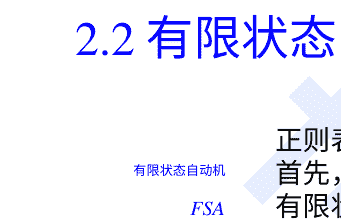

正则表达式不仅仅是一种方便的用于文本搜索的元语言。首先，正则表达式是描述有限状态自动机（FSA）的一种方式。有限状态自动机是我们将在本书中描述的大部分计算工作的理论基础。任何正则表达式都可以实现为有限状态自动机（除了使用内存功能的正则表达式；稍后会有更多介绍）。同样，任何有限状态自动机都可以用正则表达式描述。其次，正则表达式是一种描述特定类型的形式语言，称为正则语言的方式之一。正则表达式和有限状态状态自动机可以用来描述正则语言。第三种等价方法用于描述正则语言的正则文法将在第15章中介绍。这些理论构造之间的关系在图2.9中概述。本节将首先介绍有限状态自动机用于处理上一节中的一些正则表达式，然后提出了从正则表达式到自动机的映射方法。虽然我们从它们用于实现正则表达式开始，但有限状态自动机还有各种其他用途，我们将在本章和下一章中探讨。

### 2.2.1 使用FSA识别Sheeptalk

过了一段时间，借助鹦鹉的帮助，医生学会了动物的语言，他能够与它们交谈并理解它们说的一切。

让我们从之前讨论过的“羊语言”开始。回想一下，我们将羊语言定义为以下（无限）集合中的任何字符串：baa! baa! baaaa! baaaa! ...

这种“羊语”类型的正则表达式是 /baa+!/。图2.10显示了建模此正则表达式的自动机。自动机（即机器）也称为有限自动机、有限状态自动机或FSA）以与正则表达式相同的方式识别一组字符串，即描述羊语的字符串。我们将自动机表示为有向图：一组有限的顶点（也称为节点），以及连接顶点对的有向链接的集合称为弧。我们用圆圈表示顶点，用箭头表示弧。自动机有五个状态，用图中的节点表示。状态0是起始状态。在我们的例子中，状态0通常是开始状态；要将另一个状态标记为开始状态，我们可以在开始状态上添加一个入射箭头。状态4是最终状态或接受状态，我们用双圆圈表示。它还有四个转换，我们用图中的弧线表示。

有限状态自动机可以用于识别（我们也称之为接受）输入字符串的方式如下。首先，将输入想象成写在一个长条上，每个单元格中都写有一个符号，如图2.11所示。机器从开始状态（q0）开始，并迭代以下过程：检查输入的下一个字母。如果它与离开当前状态的弧上的符号匹配，则穿过该弧，移动到下一个状态，并且还要向前移动一个符号。输入。如果我们在运行完输入时处于接受状态 (q4)，则表示机器已成功识别出 sheeptalk 的一个实例。如果机器永远无法达到最终状态，要么是因为它用完了输入，要么是因为它得到了一些与弧不匹配的输入（如图2.11所示），要么是因为它恰好陷入了某个非最终状态，我们称之为拒绝——机器拒绝或无法接受输入。

我们还可以用状态转移表来表示自动机。就像图中所示符号，状态转移表表示起始状态、接受状态以及每个状态与哪些符号之间的转移。右侧是图2.10中FSA的状态转移表。我们用冒号标记了状态4，表示它是一个最终状态（你可以有任意多个最终状态），而0表示非法或缺失的转移。我们可以将第一行读作“如果我们处于状态0并且看到输入b，则必须转到状态1。”如果我们处于状态0并且看到输入a或!，则失败。”

| 状态 | 输入 | | |
| :--- | :--- | :--- | :--- |
| | **b** | **a** | **!** |
| 0 | 1 | 0 | 0 |
| 1 | 0 | 2 | 0 |
| 2 | 0 | 3 | 0 |
| 3 | 0 | 3 | 4 |
| 4: | 0 | 0 | 0 |

更正式地说，一个有限自动机由以下五个参数定义：

-   $Q = q_0 q_1 q_2 \dots q_{N-1}$ 一个有限集合的 $N$ 个状态
-   $\Sigma$ 一个有限的输入字母表符号
-   $q_0$ 起始状态
-   $F$ 一组终态，$F \subseteq Q$
-   $\delta(q, i)$ 转移函数或转移矩阵在状态之间。给定一个状态 $q \in Q$ 和一个输入符号 $i \in \Sigma$，$\delta(q, i)$ 返回一个新的状态 $q' \in Q$。因此，$\delta$ 是从 $Q \times \Sigma$ 到 $Q$ 的关系；

对于图2.10中的sheeptalk自动机，$Q = \{q_0, q_1, q_2, q_3, q_4\}$，$\Sigma = \{a, b, !\}$，$F = \{q_4\}$，并且 $\delta(q, i)$ 由上面的转移表定义。

图2.12展示了使用状态转换表识别字符串的算法。该算法被称为“确定性识别器”（D-RECOGNIZE）。确定性算法是指没有选择点的算法；无论输入是什么，算法总是知道该做什么。下一节将介绍非确定性自动机，它必须决定要移动到哪个状态。

D-RECOGNIZE接受一条磁带和一个自动机作为输入。如果磁带上指向的字符串被自动机接受，它返回“接受”，否则返回“拒绝”。请注意，由于D-RECOGNIZE假设它已经指向要检查的字符串，因此它的任务只是通常用正则表达式在语料库中查找字符串的问题的一部分。（一般问题留给读者作为练习9。）D-RECOGNIZE首先将变量“index”设置为磁带的开头，将“current-state”设置为机器的初始状态。然后，D-RECOGNIZE进入一个驱动循环。

```
函数 D-RECOGNIZE (磁带，机器) 返回 接受或拒绝
索引 ← 磁带的起始位置
当前状态 ← 机器的初始状态
循环
    如果已到达输入的末尾则
        如果当前状态是接受状态则
            返回接受
        否则
            返回拒绝
    否则如果转移表[current-state, tape[index]]为空则
        返回拒绝
    否则
        当前状态 ← 转移表[current-state, tape[index]]
        索引 ← 索引 + 1
结束
```

## 2.2.1 有限状态自动机识别的算法

如果指向的整个字符串属于FSA定义的语言，则该算法返回接受，如果字符串不属于语言，则返回拒绝。

该算法首先检查是否已到达输入的末尾。如果是，则接受输入（如果当前状态是接受状态）或拒绝输入（如果不是）。如果磁带上还有输入，D-RECOGNIZE会查看转换表以决定要移动到哪个状态。变量current-state指示要查询的表的行，而磁带上的当前符号指示要查询的表的列。使用得到的转换单元来更新变量current-state并且 index递增以在磁带上向前移动。如果转换表单元为空，则机器无处可去，必须拒绝输入。

图2.13追踪了在给定的绵羊语FSA上执行此算法时的执行情况——样本输入字符串 `baaa!`。

在检查磁带开头之前，机器处于状态 q0。在输入磁带上找到一个 b，它根据 transition-table[ q0, b] 上的内容切换到状态q1。然后它找到一个 a并切换到状态 q2，另一个 a将其置于状态 q3，第三个 a将其保持在状态 q3，在那里它读取了“！”并切换到状态 q4。由于没有更多的输入，循环开始处的End of input条件首次满足，并且机器在 q4中停止。状态 q4是一个接受状态，因此机器接受了字符串 `baaa!` 作为绵羊语中的句子。

每当给定组合没有合法的转换时，算法将失败——状态和输入的组合。输入 `abc` 将无法被识别，因为在输入 `a` 时，状态 `q0` 没有合法的转换（即，转换表第28页的该条目为0）。即使自动机允许初始状态为 `a`，它肯定会在 `c` 上失败，因为 `c` 甚至不在 sheeptalk 字母表中！我们可以将表中的这些“空”元素视为都指向一个“空”状态，我们可以称之为失败状态 **thefail state** 或者 **sink state**。从某种意义上说，我们可以将任何具有空转换的机器视为已经增加了一个失败状态，并在所有额外的弧上绘制出来，这样我们就可以从任何状态在任何可能的输入上都有地方可以去。为了完整起见，图2.14显示了图2.10中带有失败状态 *qF* 的FSA。

### 2.2.2 形式语言

我们可以使用图2.10中的相同图形作为自动机来生成 sheeptalk。如果我们这样做，我们会说自动机从状态 *q0* 开始，并穿越弧线到新的状态，打印出标记每个弧线的符号。当自动机到达最终状态时停止。请注意，在状态3处，自动机必须在打印出 ! 并转到状态4之间进行选择，或者打印出 *a* 并返回到状态3。暂时假设我们不关心机器如何做出这个决定；也许它会抛硬币。暂时来说，我们不关心生成的精确 sheeptalk 字符串是什么，只要它是符合上述 sheeptalk 正则表达式的字符串即可。

> **形式语言**：一个既能生成又能识别形式语言中所有且仅有的字符串的模型作为形式语言的定义。

形式语言：是由来自有限符号集的符号组成的字符串集合，该符号集被称为字母表（与上面用于定义自动机的字母表相同）。绵羊语言的字母表是集合 *Σ = {a, b, !}*。给定一个模型 *m*（如特定的有限状态自动机），我们可以使用 *L(m)* 表示“由 *m* 所描述的形式语言”。因此，我们绵羊语言自动机 *m* 在图2.10（以及第28页的转换表）中定义的形式语言是无限集合：

```
latex
(2.1)     L(m) = {baa!, baaa!, baaaa!, baaaaaa!, baaaaaaa!, ...}
```

自动机用于定义语言的有用之处在于它可以以封闭的形式表示一个无限集合（例如上面的这个集合）。形式语言并不是自然语言与真实人类使用的语言相同。实际上，形式语言可能与真实语言完全不相似（例如，形式语言可以用于模拟自动售货机的不同状态）。但我们经常使用形式语言来模拟自然语言的一部分，例如音韵学、形态学或句法的部分。在语言学中，生成语法有时用来表示形式语言的语法；该术语的起源是使用自动机生成所有可能的字符串来定义语言。

### 2.2.3 另一个例子

在前面的例子中，我们的形式字母表由字母组成；但我们可以有一个由单词组成的更高级别字母表。通过这种方式，我们可以编写模拟单词组合的有限状态自动机。例如，假设我们想构建一个模拟英语中处理货币金额的FSA。这样一个正式的语言将模拟英语的子集，其中包括像 ten cent， three dollar， one dollar thirty-five cent 等短语。我们可以通过首先构建仅处理从1到99的自动机来分解这个问题，因为我们需要它们来处理美分。图2.15展示了这个自动机。

现在我们可以将美分和美元添加到我们的自动机中。图2.16展示了一个简单版本，我们只是复制了图2.15中的自动机，并添加了美分和美元这两个词。

现在我们需要添加不同金额的美元的语法；包括更高的数字，如百，千。我们还需要确保像分和美元这样的名词在适当时是单数（one cent， one dollar），在适当时是复数（ten cents， two dollars）。这留给读者作为练习（练习3）。我们可以将图2.15和图2.16中的有限状态自动机视为英语的简单语法。我们将在本书的第二部分，特别是第12章中回到语法构建。

### 2.2.4 非确定性有限状态自动机

现在让我们将讨论扩展到另一类有限状态自动机：非确定性有限状态自动机（或NFSA）。考虑图2.17中的sheeptalk自动机，它与图2.10中的第一个自动机非常相似：

这个自动机与之前的自动机唯一的区别是，在图2.17中，自环在状态2而不是状态3上。考虑使用这个网络作为识别sheeptalk的自动机。当我们到达状态2时，如果我们看到一个 a我们不知道是保持在状态2还是继续到状态3。具有这种决策点的自动机被称为非确定性有限状态自动机（或NFSA）。相比之下，回想一下图2.10指定了一个确定性自动机，即其在识别过程中的行为完全由其所处的状态和所查看的符号决定。确定性自动机可以称为确定有限状态自动机。对于这台机器来说并不是真的。

> **非确定性**

还有另一种常见的非确定性类型，由于弧上没有符号（称为 ϵ转换）。图2.18中的自动机定义了与上一个或第一个相同的语言，但它使用了一个 ϵ转换。

我们将解释这个新的弧线如下：如果我们处于状态3，我们可以在不查看输入或推进输入指针的情况下移动到状态2。因此，这个引入了另一种非确定性——我们可能不知道是跟随ϵ转换还是 !弧线。

### 2.2.5 使用非确定性有限状态自动机接受字符串

如果我们想知道一个字符串是否是sheeptalk的实例，如果我们使用一个非确定性机器来识别它，我们可能会跟随错误的弧线并拒绝它，而实际上应该接受它。也就是说，在某些点上有多个选择时，我们可能会做出错误的选择。在非确定性模型中，选择问题将一次又一次地出现，特别是在构建计算模型时，尤其是用于解析。解决非确定性问题有三种标准方法：

-   **备份**：每当我们遇到一个选择点时，我们可以放置一个标记来标记我们在输入中的位置以及自动机的状态。然后，如果发现我们选择错误，我们可以回退并尝试另一条路径。
-   **前瞻**：我们可以预先查看输入，以帮助我们决定选择哪条路径。
-   **并行**：每当我们遇到一个选择点，我们可以并行查看每个备选路径。

我们将在在这里重点讨论备份方法，并将前瞻和并行方法的讨论推迟到后面的章节。

备份方法建议我们可以毫不犹豫地做出可能导致死胡同的选择，因为我们知道我们总是可以返回到未探索的备选路径。这种方法有两个关键点：我们需要记住每个选择点的所有备选路径，并且我们需要存储关于每个备选路径的足够信息，以便在必要时返回。当备份算法在处理过程中达到无法取得进展的点（因为输入用尽或没有合法的转换）时，它会返回到先前的选择点，选择一个未探索的备选路径，并从那里继续。将这个概念应用到我们的非确定性识别器上，我们只需要记住每个选择点的两个事物：我们可以转到的机器的状态或节点，以及相应的磁带位置。我们将把节点和位置的组合称为识别的搜索状态。

为了避免混淆，我们将自动机的状态（与搜索的状态相对）称为节点或机器状态。

在继续描述算法的主要部分之前，我们应该注意驱动它的转换表中的两个变化。首先，为了表示具有出口ϵ转换的节点，我们在转换表中添加了一个新的ϵ列。如果一个节点具有ϵ转换，我们在该节点的行的ϵ列中列出目标节点。第二个添加是为了解决从相同输入符号到不同节点的多个转换的问题。我们让每个单元格条目由目标节点列表而不是单个节点组成。

| 状态 | b | a | ! | ϵ |
| --- | --- | --- | --- | --- |
| 0 | 1 | 0 | 0 | 0 |
| 1 | 0 | 2 | 0 | 0 |
| 2 | 0 | 2,3 | 0 | 0 |
| 3 | 0 | 0 | 4 | 0 |
| 4: | 0 | 0 | 0 | 0 |

右侧显示了图2.17（NFSA #1）中的机器的转换表。虽然它没有ϵ转换，但它显示在机器状态q2中，输入a可以返回q2或继续到q3。

图2.19展示了使用非确定性有限状态自动机识别输入字符串的算法。函数 ND-RECOGNIZE 使用变量agenda来跟踪处理过程中生成的所有当前未探索的选择。每个选择（搜索状态）是一个由机器的节点（状态）和磁带上的位置组成的元组。变量 *current-search-state* 表示当前正在探索的分支选择。

ND-RECOGNIZE 首先创建一个初始搜索状态并将其放入待办事项列表中。目前我们不指定搜索状态在待办事项列表中的顺序。该搜索状态由机器的初始状态和指向磁带开头的指针组成。然后调用函数 NEXT 从待办事项列表中检索一个项目并将其分配给变量 *current-search-state*。

与 D-RECOGNIZE 一样，主循环的第一个任务是确定磁带的全部内容是否已成功识别。这是通过调用 ACCEPT-STATE? 来完成的，如果当前搜索状态包含接受机器状态和磁带末尾的指针，则返回接受。如果我们还没有完成，机器通过调用 GENERATE-NEW-STATES 来生成一组可能的下一步，该函数会为任何 ϵ-转换和从转换表中的任何正常输入符号转换创建搜索状态。然后，将所有这些搜索状态元组添加到当前议程中。

最后，我们尝试从议程中获取一个新的搜索状态进行处理。如果议程为空，我们已经没有选择，必须拒绝输入。否则，选择一个未探索的选项，循环继续。

重要的是要理解为什么 ND-RECOGNIZE 只有在找到议程为空时才返回拒绝的值。与 D-RECOGNIZE 不同的是，当它在非接受机器状态下到达磁带末尾或者在某个机器状态下无法推进磁带时，它不会返回拒绝。这是因为，在非确定性情况下，这些障碍只表示在给定路径上的失败，而不是整体失败。只有当所有可能的选择都经过检查并发现不足时，我们才能确定我们可以拒绝一个字符串。

图2.20展示了 ND-RECOGNIZE 在处理输入 `baaa!` 时的进展。每个条带都展示了算法在其处理过程中的某一点的状态。实线气泡代表机器状态，箭头代表磁带上的进展，捕捉了 *current-search-state* 变量。图中较低的每个条带代表从一个 *current-search-state* 到下一个的进展。

在算法发现自己处于状态 *q₂* 时，除了在磁带上查看第二个 a 之外，几乎没有什么有趣的事情发生。对于转移表项[*q₂*,a] 的检查返回了 *q₂* 和 *q₃*。为每个选择创建搜索状态并将其放入待办事项列表。不幸的是，我们的算法选择移动到状态 *q₃*，这个移动既不会导致接受状态，也不会产生任何新的状态，因为转移表项[*q₃*, a] 为空。此时，算法只需向待办事项列表请求一个新的状态。

由于返回到 *q₂* 的选择是待办事项列表上唯一未经检查的选择，它会返回，并将磁带指针推进到下一个 a。有点恶毒的是，ND-RECOGNIZE 面临着相同的选择。转移表项[*q₂*,a] 仍然表示回到 *q₂* 或前进到 *q₃* 都是有效的选择。与之前一样，代表两者的状态被放入待办事项列表。这些搜索状态与之前的状态不同，因为它们的磁带索引值已经推进。这次，待办事项列表提供了移动到 *q₃* 的下一个移动。然后，根据磁带和转移表项，移动到 *q₄* 并成功地确定了。

```
函数 ND-RECOGNIZE (磁带, 机器) 返回 接受或拒绝
议程 ← {(机器的初始状态, 磁带的起始位置)}
当前搜索状态 ← NEXT(议程)
循环
    如果 ACCEPT-STATE?(当前搜索状态) 返回真则
        返回接受
    否则
        议程 ← 议程 ∪ GENERATE-NEW-STATES(当前搜索状态)
        如果议程为空则
            返回拒绝
        否则
            当前搜索状态 ← NEXT(议程)
    结束

函数 GENERATE-NEW-STATES(当前搜索状态) 返回一组搜索状态
    当前节点 ← 当前搜索状态所在的节点
    索引 ← 当前搜索状态在磁带上查看的位置
    按照转移表返回搜索状态的列表如下:
        (转移表[当前节点, ε], 索引)
        ∪
        (转移表[当前节点, 磁带[索引]], 索引 + 1)

函数 ACCEPT-STATE?(搜索状态) 返回 true 或 false
    当前节点 ← 搜索状态所在的节点
    索引 ← 搜索状态正在查看的磁带上的位置
    如果索引在磁带末尾且当前节点是机器的接受状态则
        返回 true
    否则
        返回 false
```

## 2.19 一个识别算法。

单词节点表示FSA的状态，而状态或搜索状态表示“搜索过程的状态”，即节点和磁带位置的组合。

### 2.2.6 识别作为搜索

ND-RECOGNIZE通过提供一种系统地探索机器中所有可能路径的方法，完成了识别正则语言中字符串的任务。如果这种探索得到以接受状态结尾的路径，则接受该字符串，否则拒绝。这种系统化的探索得益于议程机制，它在每次迭代中选择一个要探索的部分路径，并跟踪任何剩余的、尚未探索的部分路径。

> **状态空间搜索**

诸如 ND-RECOGNIZE 这样的算法，通过系统地搜索解决方案来运行，被称为状态空间搜索算法。在这样的算法中，问题定义创建了一组可能的解决方案空间；目标是在探索这个空间时，当找到一个答案时返回它，或者在空间中拒绝输入时。已经彻底探索过。在 ND-RECOGNIZE中，搜索状态由机器状态与输入磁带上的位置的配对组成。状态空间包括了给定机器可能的所有机器状态和磁带位置的配对。搜索的目标是从一个状态导航到另一个状态，寻找一个接受状态与磁带末尾位置的配对。

这类程序的有效性通常取决于状态的顺序在空间中被考虑的顺序。状态的排序不当可能导致在发现成功解决方案之前检查大量无效的状态。不幸的是，通常无法区分好坏选择，我们能做的最好的办法就是确保每个可能的解决方案最终都被考虑到。

细心的读者可能已经注意到，在 ND-RECOGNIZE中状态的排序未指定。我们只知道未探索的状态在创建时被添加到议程中，并且(未定义的)函数NEXT在被调用时从议程中返回一个未探索的状态。如何定义函数NEXT？考虑一种排序策略，其中下一个被考虑的状态是最近创建的状态。这种策略可以通过将新创建的状态放在议程的前面，并且在调用时函数NEXT返回议程前面的状态来实现。因此，议程由一个栈实现。这通常被称为深度优先搜索或后进先出（LIFO）策略。

## 深度优先搜索

这种策略在生成新线索时深入搜索空间。只有在当前线索的进展被阻塞时，才会返回考虑之前的选项。图2.20展示了对字符串 baaa ! 执行ND-RECOGNIZE的跟踪，说明了深度优先搜索。算法在看到 ba后，遇到第一个选择点，必须决定是留在 q2还是前进到 q3。此时，它选择一个替代方案并跟随它，直到确定它是错误的。然后算法回溯并尝试另一个更早的替代方案。

深度优先策略有一个主要缺陷：在某些情况下，它们可能进入无限循环。这可能是因为搜索空间恰好设置成可以意外重新访问搜索状态，或者因为存在无限数量的搜索状态。当我们转向更复杂的解析问题时，我们将重新讨论这个问题，即在第13章中的解析中。

## 广度优先搜索

在搜索空间中，对状态进行排序的第二种方式是按照它们创建的顺序来考虑状态。可以通过将新创建的状态放在议程的末尾来实现这样的策略，并且仍然可以通过NEXT返回议程前端的状态。因此，议程通过一个队列来实现。这通常被称为广度优先搜索或先进先出（FIFO）策略。

在字符串 baaa ! 上，对 ND-RECOGNIZE的执行有一个不同的追踪，如图2.21所示。再次，在看到 ba后，算法在其第一个选择点上做出决策，即是留在 q2还是前进到状态 q3。但是现在，与其选择一个选择并跟随它，我们想象一次检查所有可能的选择，一次扩展搜索树的一层。

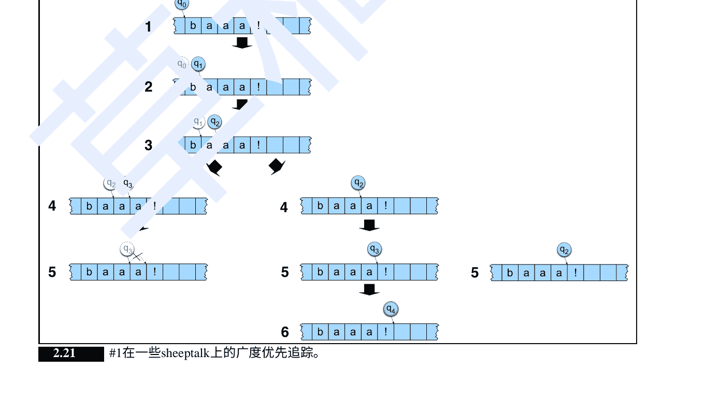

图 2.21 在一些 sheeptalk 上的广度优先追踪。

与深度优先搜索类似，广度优先搜索也有其缺点。与深度优先搜索一样，如果状态空间是无限的，搜索可能永远不会终止。更重要的是，由于状态空间的增长，如果状态空间即使是适度大，搜索可能需要一个不切实际的大量内存。对于小问题，深度优先搜索或广度优先搜索策略可能足够，尽管深度优先搜索通常更受欢迎，因为它更有效地使用内存。对于更大的问题，必须使用更复杂的搜索技术，如动态规划或A*算法，正如我们将在第7章和第10章中看到的。

### 2.2.7 关联确定性和非确定性自动机

允许NFSAs具有非确定性特征，如 $\epsilon$-转换似乎会使它们比DFSAs更强大。实际上并非如此；对于任何NFSA，都存在一个完全等效的DFSA。实际上，有一个简单的算法可以将NFSA转换为等效的DFSA，尽管这个等效确定性自动机的状态数量可能更多。参见Lewis和Papadimitriou（1988年）或Hopcroft和Ullman（1979年）以证明这一对应关系。证明的基本直觉值得一提，并且建立在NFSAs解析其输入的方式上。回想一下，NFSAs和DFSAs之间的区别在于，在NFSA中，对于给定的输入$_i$，状态 $q_i$ 可能有多个可能的下一个状态（例如 $q_a$ 和 $q_b$）。图2.19中的算法通过选择 $q_a$ 或 $q_b$ 来解决这个问题，如果选择结果是错误的，则进行回溯。我们提到过算法的并行版本将同时跟随两条路径（向 $q_a$ 和 $q_b$）前进。

将NFSA转换为DFSA的算法类似于这个并行算法；我们在搜索空间中为我们的并行识别器可能遵循的每条路径构建一个确定性路径的自动机。我们想象同时跟随两条路径，并将我们在相同输入符号上到达的所有状态分组到一个等价类中（即 $q_a$ 和 $q_b$）。我们现在给这个新等价类状态一个新的状态标签（例如 $q_{ab}$）。我们继续为每个可能的输入和每个可能的状态组执行此操作。结果DFSA的状态数量可能与原始NFSA中的状态集合数量相同。一个集合的不同子集的数量为 N元素为2^N，因此新的DFSA可以有多达2^N个状态。

## 2.3 正则语言和有限状态自动机

正如我们上面所建议的，可以由正则表达式定义的语言的类与可以由有限状态自动机（无论是确定性还是非确定性）刻画的语言的类完全相同。因此，我们称这些正则语言为正则语言。为了对正则语言的类进行正式定义，我们需要回顾两个早期的概念：字母表Σ，它是语言中所有符号的集合，以及空字符串ε，它通常不包含在Σ中。此外，我们还提到了空集∅（与ε不同）。正则语言（或正则集合）在Σ上的形式定义如下所示：

1.  Ø是一个正则语言
2.  ∀a∈Σ∪{ε}, {a}是一个正则语言
3.  如果L₁和L₂是正则语言，那么以下也是正则语言：
    (a) L₁·L₂={xy|x∈L₁,y∈L₂}，L₁和L₂的连接
    (b) L₁∪L₂，L₁和L₂的并集或逻辑或
    (c) L₁*，L₁的Kleene闭包

只有满足上述属性的语言才是正则语言。由于正则语言是可以由正则表达式描述的语言，本章介绍的所有正则表达式操作符（除了记忆）都可以通过定义正则语言的三个操作来实现：连接、并集/逻辑或（也称为“|”）和Kleene闭包。例如，所有计数器（*，+，{n,m}）只是重复加上Kleene * 的特殊情况。所有锚点都可以看作是单独的特殊符号。方括号 [ ] 是一种并集（即，[ab]表示“a或b”，或者是a和b的并集）。因此，任何正则表达式都可以转换为只使用三个原始操作的（可能更大的）表达式。

正则语言也闭合于以下操作（Σ*表示由字母表Σ形成的所有可能字符串的无限集合）：

| 操作 | 定义 |
| --- | --- |
| 交集 | 如果L₁和L₂是正则语言，则L₁∩L₂也是正则语言，即由同时属于L₁和L₂的字符串组成的语言。 |
| 差集 | 如果L₁和L₂是正则语言，则L₁–L₂也是正则语言，即由属于L₁但不属于L₂的字符串组成的语言。 |
| 补集 | 如果L₁是正则语言，则Σ*–L₁也是正则语言，即由不属于L₁的所有可能字符串组成的集合。 |
| 反转 | 如果L₁是正则语言，则L₁ᴿ也是正则语言，即由L₁中所有字符串的反转组成的语言。 |

正则表达式与有限状态自动机等价的证明可以在Hopcroft和Ullman（1979）中找到，分为两个部分：证明每个正则语言都可以构建一个自动机，反之亦然。

我们不会给出证明，但我们通过展示如何完成第一部分来给出直观理解：从任意正则表达式构建一个自动机。这个直观理解是基于运算符数量的归纳：对于基本情况，我们构建一个自动机来对应没有运算符的正则表达式，即正则表达式/0, ε，或任意单个符号a∈Σ。图2.22展示了这三种基本情况的自动机。

现在对于归纳步骤，我们展示正则表达式的每个原始操作（连接、并集、闭包）都可以通过一个自动机来模拟：

> 1 根据van Santen和Sproat (1998)，Kaplan和Kay (1994) 以及Lewis和Papadimitriou (1988) 的研究。


图 2.22 归纳的基本情况（没有运算符）的自动机，显示任何正则表达式都可以转换为等价的自动机。

-   连接：我们通过使用一个 $\epsilon$ 转换将两个FSA连接在一起，将FSA₁的所有终态连接到FSA₂的初始状态。

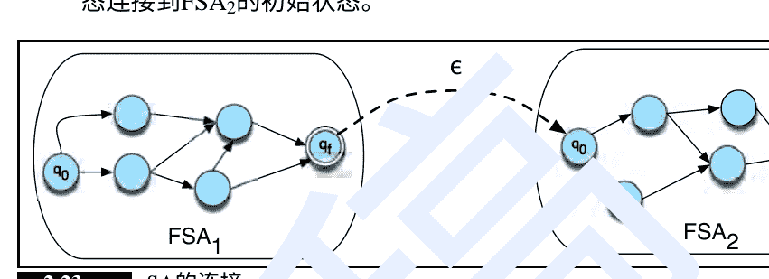

图 2.23 FSA的连接。

-   闭包：我们创建一个新的终态和初始状态，通过 $\epsilon$ 转换将原始FSA的终态连接回初始状态（这实现了Kleene *的重复部分），然后通过 $\epsilon$ 转换在新的初始和终态之间建立直接链接（这实现了可能出现零次的可能性）。为了实现Kleene +，我们会省略最后一部分。

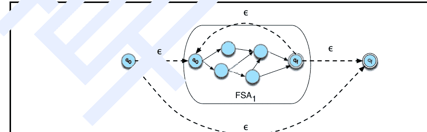

图 2.24 状态自动机（Kleene *）的闭包。

-   并集：我们添加一个新的初始状态 $q_0'$，并在它与要连接的两个机器的原始初始状态之间添加新的 $\epsilon$-转换。

我们将在第15章回顾正则语言及其与正则文法的关系。

## 2.4 总结

本章介绍了语言处理中最重要的基本概念，即有限自动机和基于自动机的实用工具正则表达式。

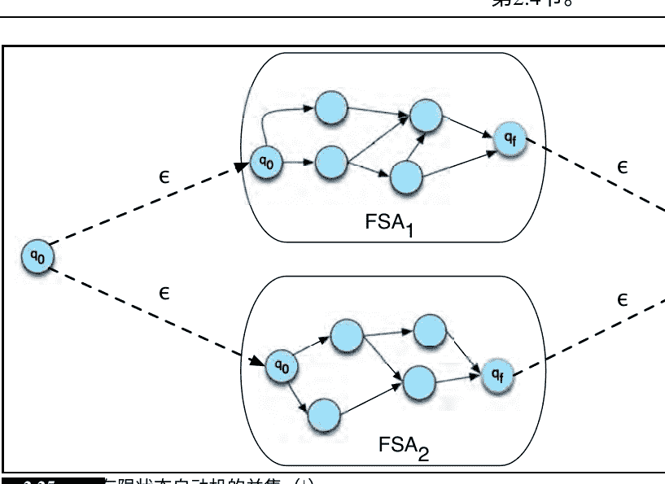

图 2.25 有限状态自动机的并集（|）。

表达式。以下是我们关于这些概念的主要要点的总结：

-   正则表达式语言是一种强大的模式匹配工具。
-   正则表达式中的基本操作包括符号的连接、符号的选择（[]、| 和 .）、计数器（*、+和 {n,m}）、锚点（^、$）和优先级运算符（(、)）。
-   任何正则表达式都可以实现为有限状态自动机 (FSA)。
-   内存（\1连同 ( )）是一种高级操作，通常被认为是正则表达式的一部分，但不能实现为有限自动机。
-   自动机隐含地定义了一个形式语言，作为自动机接受的任何词汇（符号集）上的字符串集合。
-   一个 **deterministic** 自动机 (**DFSA**) 的行为完全由其所处的状态决定。
-   一个 non-deterministic 自动机 (NFSA) 有时必须在相同的当前状态和下一个输入之间做出选择。
-   任何 NFSA 都可以转换为 DFSA。
-   一个 NFSA选择下一个要探索的状态的顺序定义了其搜索策略。深度优先搜索或 LIFO策略对应于堆栈作为日程表；广度优先搜索或 FIFO策略对应于队列作为日程表。
-   任何正则表达式都可以自动编译成一个非确定有限状态自动机，从而转化为一个有限状态自动机。

# 参考文献和历史注释

有限自动机起源于1950年代的图灵（1936年）的算法模型，被许多人认为是现代计算机科学的基础。图灵机是一种具有有限控制和输入/输出带的抽象机器。

在一次移动中，图灵机可以读取带上的符号，写入不同的符号，改变状态，并向左或向右移动。因此，图灵机与有限状态自动机的主要区别在于它能够改变带上的符号。

受到图灵的工作的启发，McCulloch和Pitts构建了一个类似于自动机的神经元模型（参见von Neumann，1963年，第319页）。他们的模型，现在通常称为McCulloch-Pitts神经元（McCulloch和Pitts，1943年），是一个简化的模型。神经元模型被描述为一种可以用命题逻辑来描述的“计算元素”。该模型是一个二进制设备，在任何时刻都是活跃的或者不活跃的，它从其他神经元接收兴奋性和抑制性输入，并在其激活超过某个固定阈值时发射。基于麦卡洛-皮茨神经元，Kleene（1951）和（1956）定义了有限自动机和正则表达式，并证明了它们的等价性。Rabin和Scott（1959）引入了非确定性自动机，并证明它们与确定性自动机等价。

Ken Thompson是最早将正则表达式编译器集成到文本搜索编辑器中的人之一（Thompson，1968）。他的编辑器包括一个命令“g/regular expression/p”，或者全局正则表达式打印，后来成为了UNIX的grep实用程序。

有很多关于自动机理论的通用介绍，比如Hopcroft和Ullman（1979）以及Lewis和Papadimitriou（1988）。这些介绍了本章的简单自动机的数学基础，以及第3章的有限状态转换器，第12章的上下文无关文法，和第15章的Chomsky层次结构。Friedl（1997）是一本非常有用的关于正则表达式高级用法的综合指南。

将问题解决视为搜索的隐喻是人工智能（AI）的基础，关于搜索的更多细节可以在任何AI教材中找到，比如Russell和Norvig（2002）。

# 练习

2.1 为以下语言编写正则表达式：您可以使用Perl表示法或第2.3节的最小“代数”表示法，但请确保说明使用的是哪种表示法。我们所说的“单词”是指由空格、任何相关标点符号、换行符等分隔的字母字符串。

a. 所有字母字符串的集合。
b. 所有以ab结尾的小写字母字符串的集合。
c. 所有具有两个连续重复单词的字符串的集合（例如，“Humbert Humbert”和“the the”，但不包括“the bug”或“the big bug”）。
d. 所有来自字母表a, b的字符串的集合，其中每个a都紧接着一个b。
e. 所有以整数开头并以单词结尾的字符串的集合，该字符串从行的开头开始，到行的结尾结束。
f. 所有同时包含单词grotto和单词raven的字符串。（但不包括仅包含单词grotto的单词，例如grottos）。
g. 编写一个模式，将英语句子的第一个单词放入一个寄存器中。处理标点符号。

2.2 实现一个类似ELIZA的程序，使用如第26页所述的替换方法。如果你愿意，你可以选择一个不同于罗杰斯心理学家的领域，但请记住，你的程序需要在这个领域中能够合法地进行大量的简单重复。

2.3 按照图2.15中的文本建议，完成英语货币表达的FSA。您应该处理高达100,000美元的金额，并确保“cent”和“dollar”在适当时具有正确的复数形式。

2.4 设计一个能够识别简单日期表达式的FSA，如March 15, the 22nd of November, Christmas。您应该尽量包括所有这些“绝对”日期，（例如不是相对于当前日期的“指示性”日期，如the day before yesterday）。图的每条边上都应该有一个单词或一组单词。您应该使用某种简写来表示单词类别，以避免绘制过多的弧线（例如，furniture → desk, chair, table）

2.5 现在扩展你的日期有限状态自动机以处理像昨天、明天、后天、前天、星期日、下周一、三周后的星期六等指示性表达。

2.6 为时间表达式编写一个有限状态自动机，如十一点、十二点半、午夜、或十点差一刻等。

2.7（由Pauline Welby提供；这个问题可能需要编织的能力。）编写一个正则表达式（或绘制一个有限状态自动机），可以匹配所有符合以下规范的围巾编织图案：3²针宽，两端为K1P1的针织带，中间为平针织，恰好有两条凸起的条纹。所有的编织图案都必须包括一个起针行（将正确数量的针放在针上）和一个收针行（结束图案并防止解开）。这是一个符合上述描述的可能围巾的样式：

² 编织和编织是两种不同的针法。符号 Kn表示编织针法。同样适用于编织针法。针织衣服的袖子、下摆和领口通常有条纹纹理。平针织是一系列编织和编织行，产生简单的图案-袜子或长筒袜就是用这种基本图案编织的，因此得名。

1.  上针32针。沿着行进行（即执行（K1 P1）16次）。
2.  K32, P32。重复第4步指令13次。增加长度
3.  P32, P32。
4.  K32, P32。重复步骤7，再重复251次。增加长度
5.  P32, P32。
6.  K32, P32。重复步骤10，再重复13次。增加长度
7.  K1 P1 横向编织。重复步骤12，再重复7次。增加长度
8.  绑定32针。

上针；将针放在针上
K1 P
K1P1编织 重复第2步指令7次。增加长度
平针织
凸起条纹针法
针织平针
凸起条纹针法
针织平针
K1P1 弹性边
绑定结束行：结束图案

2.8 编写一个正则表达式，用于接受图2.26中的NFSA语言。

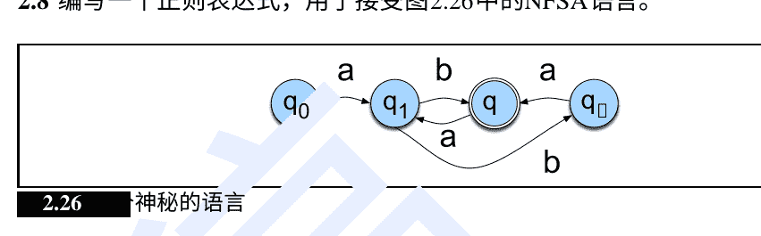

图 2.26

2.9 目前图2.12中的函数 D-RECOGNIZE只解决了在某些文本中查找字符串的一个子问题。扩展算法以解决以下两个不足之处：（1） D-RECOGNIZE目前假设它已经指向要检查的字符串，（2） D-RECOGNIZE如果所指的字符串包含作为FSA的合法字符串的一个子串，则失败。也就是说， D-RECOGNIZE如果字符串末尾有额外的字符，则失败。

2.10 给出一个否定确定性有限状态自动机的算法。否定一个有限状态自动机接受的字符串集合正好是原始有限状态自动机拒绝的字符串集合（在相同的字母表上），并且拒绝原始有限状态自动机接受的所有字符串。

2.11 为什么你之前的算法不能用于非确定性有限状态自动机？现在扩展你的算法来否定非确定性有限状态自动机

### 第三章 词语与转换器

> > 真诚中怎么会有罪恶？再见中哪里有好处？梅雷迪思·威尔逊，音乐之声

第二章介绍了正则表达式，例如展示了如何通过一个搜索字符串来找到 wood chuck和 woodchucks。寻找单数或复数的woodchucks很容易；复数只需在末尾加上一个 s。但是假设我们正在寻找另一种迷人的森林生物；比如一只 fox和一条 fish，那个脾气暴躁的 peccary和可能是一只加拿大的野鹅。寻找这些动物的复数不仅仅是在末尾加上一个 s。fox的复数是 foxes；peccary的复数是peccaries；goose的复数是 geese。更让人困惑的是，当鱼的数量为复数时，它们通常不会改变形式¹。

正确搜索单数和复数形式需要两种知识。正字法规则告诉我们，以 -y结尾的英语单词变为复数形式时，将 -y改为 -i并加上 -es。形态规则告诉我们，fish没有复数形式，而 goose的复数形式是通过改变元音来形成的。

**形态分析**

识别一个单词（如 foxes）分解为组成部分的形态素（fox和 -es），并构建这一事实的结构化表示的问题被称为形态分析。

**解析** 意味着对输入进行处理并生成某种语言结构。我们将在本书中广泛使用解析这个术语，包括可能产生的许多种类的结构；形态、句法、语义、语篇；以字符串、树形或网络的形式。形态分析或词干提取适用于许多除了复数形式之外的词缀；例如，我们可能需要将任何以 -ing结尾的英语动词形式（going， talking， congratulating）解析为其动词词干加上 -ing形态素。因此，给定表面形式 going，我们可能希望生成解析形式 动词-去 + 动名词-中。

形态学解析在语音和语言处理中非常重要。它在像俄罗斯语或德语这样形态复杂的语言的网络搜索中起着关键作用；在俄语中，单词莫斯科在短语莫斯科、莫斯科的、从莫斯科等中有不同的词尾。即使用户只输入了基本形式，我们也希望能够自动搜索单词的屈折形式。

形态学解析在这些形态复杂的语言的词性标注中也起着关键作用，我们将在第5章中看到。它对于生成必要的强大拼写检查词典非常重要。在机器翻译中，我们需要它来实现例如法语单词 va和 aller都应该翻译成英语动词 go的形式。

为了解决形态学解析问题，为什么我们不能只在词典中存储所有英语名词的复数形式和英语动词的 -ing形式，然后通过查找进行解析呢？有时候我们可以这样做，例如对于英语语音。

¹ 参见例如，Seuss (1960)生产后缀为-ing是一个生产性后缀；我们的意思是它适用于每个动词。同样地，-s适用于几乎每个名词。生产性后缀甚至适用于新词；因此，新词“传真”可以自动用于-ing形式：传真。由于新的单词（特别是首字母缩写和专有名词）每天都在创造，英语中的名词类别不断增加，我们需要能够为每个名词添加复数形态，即后缀-s。此外，这些新名词的复数形式取决于单数形式的拼写/发音；例如，如果名词以-z结尾，则复数形式为-es而不是-s。我们需要在某个地方编码这些规则。

最后，我们当然不能列举出所有形态复杂的语言（如土耳其语）中每个词的所有形态变体，比如：(3.1) uygarlas,tramadiklarimizdanmis,siniz casina 这个词的各个部分（词素）具有以下含义：

-   +BEC “变成”
-   +CAUS 使役动词标记（‘使X’）
-   +NABL “不能”
-   +PART 过去分词形式
-   +P1PL 第一人称复数所有格一致
-   +2PL 第二人称复数
-   +ABL 从格（从/在中）标记
-   + 仿佛从一个有限动词派生出一个副词

并非所有土耳其单词都是这样的；平均土耳其单词大约有三个形态素。但是这样的长单词确实存在；事实上，提出这个例子的Kemal Oflazer（个人通讯）指出，土耳其动词有40,000种可能的形式，不包括派生后缀。添加词缀，比如使役词缀，可以产生理论上无限数量的单词，因为使役化可以在一个单词中重复使用（你使X使Y做W）。因此，我们无法提前存储所有可能的土耳其单词，必须动态进行形态分析。

在下一节中，我们将概述英语和其他一些语言的形态知识。然后，我们介绍形态分析的关键算法，有限状态转换器。有限状态转换器是语音和语言处理中的关键技术，因此我们将在后面的章节中再次涉及它们。

在本章中，我们将介绍一些相关的算法，描述了形态分析。在一些应用中，我们不需要解析一个单词，但我们需要将单词映射到其词根或词干。例如，在信息检索和网络搜索（IR）中，我们可能希望将“foxes”映射到“fox”；但可能不需要知道“foxes”是复数形式。仅仅去除这样的词尾被称为IR中的词干提取。

## 词干提取

我们将介绍一个简单的词干提取算法，称为Porter词干提取器。

## 词形还原

对于其他语音和语言处理任务，我们需要知道两个单词具有相似的词根，尽管它们在表面上有所不同。例如，单词“sang”、“sung”和“sings”都是动词“sing”的形式。单词“sing”有时被称为这些单词的共同词元，并将所有这些单词映射到“sing”被称为词形还原。

接下来，我们将介绍与形态分析相关的另一个任务。分词化或词分割是将连续文本中的单词分开（标记化）的任务。在英语中，单词通常通过空格（空白符）分隔，但空格并不总是足够的；我们需要注意到“纽约”和“摇滚乐”是独立的单词，尽管它们包含空格，但对于许多应用程序，我们需要将“I'm”分成两个单词“I”和“am”。

最后，对于许多应用程序，我们需要知道两个单词在拼写上有多相似。形态分析是计算这种相似性的一种方法，但另一种方法是仅比较字母字符串以查看它们的相似程度。一种常见的方法是使用最小编辑距离算法，该算法在自然语言处理中非常重要。我们将介绍这个算法，并展示它如何在拼写检查中使用。

### 3.1 (主要是) 英语形态学调查

形态学是研究词汇是如何由更小的意义单位，即形态素单元，构建起来的。形态素通常被定义为语言中的最小意义单位。例如，单词“fox”由一个单一的形态素（形态素“fox”）组成，而单词“cats”由两个形态素组成：形态素“cat”和形态素“-s”。

正如这个例子所示，通常有必要区分两类广义的词干形态素：词干和词缀。这种区分的确切细节因语言而异。但直观上，词干是单词的“主要”形态素，提供主要的意义，而词缀则添加各种“附加”意义。词缀进一步分为前缀、后缀、中缀和环缀。前缀位于词干之前，后缀位于词干之后，环缀同时具有前缀和后缀的特点，而中缀则插入到词干内部。例如，单词“eats”由词干“eat”和后缀“-s”组成。单词“unbuckle”由词干“buckle”和前缀“un-”组成。英语中没有很好的环缀例子，但许多其他语言有。例如，在德语中，一些动词的过去分词形式是在词干前加上“ge-”，在词干后加上“-t”；所以动词“sagen”（说）的过去分词形式是“gesagt”（说过的）。中缀在一些语言中非常常见，例如菲律宾语塔加洛语。例如，词缀“um”，用于标记动作的施事者，被插入到塔加洛语词干“hingi”“借”中，形成“Hummingi”。在一些英语方言中，存在一种中缀，其中禁忌形态素“f**king”或“bl**dy”或类似的形态素被插入到其他单词中间（“Man-f**king-hattan”，“abso-bl**dy-lutely”）（McCawley, 1978年）。

## 第48章。词语和转换器

例如，单词“rewrites”包含三个形态素：前缀“re-”，词干“write”，和后缀“-s”。单词“unbelievably”有一个词干（“believe”）加上三个词缀（“un-”、“-able”和“-ly”）。虽然英语不倾向于堆叠超过四个或五个词缀，但像土耳其语这样的语言可以有九个或十个词缀的单词，正如我们上面所看到的。像土耳其语这样倾向于串联词缀的语言被称为聚合语言。

有很多方法可以组合形态素来创建单词。其中有四种方法在语音和语言处理中很常见且起着重要作用：屈折、派生、复合和附着。

-   1. 屈折
-   2. 派生
-   3. 复合
-   4. 附着

屈折是将词干与语法形态素结合，通常会产生与原词干相同类别的词，并且通常会填充一些句法功能，如一致。例如，英语有用于标记名词复数的屈折形态素“-s”，以及用于标记动词过去时的屈折形态素“-ed”。派生是将词干与语法形态素结合，通常会产生一个不同类别的词，其含义往往难以准确预测。例如，动词“computerize”可以加上派生后缀“-ation”，生成名词“computerization”。复合是将多个词干组合在一起。例如，名词“doghouse”是词干“dog”和词干“house”的连接。最后，附着是将词干与附着词组合。附着词是在句法上像一个词一样起作用，但形式上较简化，并且与另一个词（在音韵上有时也在正字法上）连接在一起。例如，英语单词“I've”中的形态素“'ve”是一个附着词，法语定冠词“l'”在单词“l'opera”中也是一个附着词。在接下来的章节中，我们将详细介绍这些过程。

### 3.1.1 屈折形态学

英语具有相对简单的屈折系统；只有名词、动词和有时形容词可以屈折，而可能的屈折词缀数量相当少。

-   **复数**

英语名词只有两种屈折形式：标记复数的词缀和标记所有格的词缀。例如，许多（但不是全部）英语名词可以以裸词干或单数形式出现，或者带有复数后缀。以下是常规复数后缀 -s（也可拼写为 -es）和不规则复数的例子：

| 常规名词 | 不规则名词 |
| --- | --- |
| 单数 猫 鸽 | 老鼠 牛 |
| 复数 猫 鸽 | 老鼠 牛 |

大多数名词后的常规复数拼写为 -s，但在以 -s 结尾的词（如 ibis/ibises）、以 -z 结尾的词（如 waltz/waltzes）、以 -sh 结尾的词（如 thrush/thrushes）、以 -ch 结尾的词（如 finch/finches）以及有时以 -x 结尾的词（如 box/boxes）后，拼写为 -es。以辅音字母前缀 -y 结尾的名词将 -y 变为 -i（如 butterfly/butterflies）。

所有格后缀由撇号 + -s 来表示常规单数名词（llama’s）和不以 -s 结尾的复数名词（children’s）；通常由孤立的撇号表示，用于常规复数名词后的撇号（llamas’）和以 -s 或 -z 结尾的某些名字后的撇号（Euripides’comedies）。

英语动词的屈折变化比名词的屈折变化更复杂。首先，英语有三种动词：主要动词（eat, sleep, impeach），情态动词（can, will, should），和基本动词（be, have, do）（使用Quirk等人的术语，1985年）。在本章中，我们主要关注主要动词和基本动词，因为它们具有屈折性结尾。这些动词中有一大类是规则的，也就是：

## 规则动词

说这个类别的所有动词都有相同的结尾，标记相同的功能。这些规则动词（例如“walk”或“check”）有四种形态，如下所示：

| 形态类别 | 规则变化动词 |
| --- | --- |
| 词干 | walk merge try map |
| -s形式 | walks merges tries maps |
| -ing分词 | walking merging trying mapping |
| 过去式或 -ed 分词 | walked merged tried mapped |

这些动词之所以被称为规则动词，是因为只要知道词干，我们就可以通过添加三个可预测的结尾和进行一些规则的拼写变化（正如我们将在第7章中看到的，规则的发音变化）来预测其他形式。这些规则动词和形式在英语的形态学中非常重要，首先因为它们涵盖了大多数动词，其次因为规则类别是有生产力的。正如之前讨论的，有生产力的类别是指自动包括进入语言的任何新单词的类别。例如，最近创造的动词“fax”（我妈妈给我传真了表弟埃弗里特的便条）采用了规则的结尾 -ed, -ing, -es。（注意，-s形式的拼写为“faxes”而不是“faxs”；我们将在下面讨论拼写规则）。不规则动词是那些具有一些或多或少特殊的屈折形式的动词。英语中的不规则动词通常有五个不同的形式，但可以有多达八个（例如，动词“be”）或仅有三个（例如“cut”或“hit”）。虽然构成了一个较小的动词类别（Quirk等人（1985）估计只有大约250个不规则动词，不包括助动词），但该类别包括语言中最常见的动词。下表显示了一些样本不规则形式。请注意，不规则动词可以通过改变其过去式形式（也称为过去式）来屈折。

## 过去式

元音（eat/ate），或者元音和一些辅音（catch/caught），或者完全不变（cut/cut）。

| 形态类别 | 不规则变化动词 |
| --- | --- |
| 词干 | eat catch cut |
| -s形式 | eats catches cuts |
| -ing分词 | eating catching cutting |
| 过去式 | ate caught cut |
| 过去分词 | eaten caught cut |

这些形式在句子中的使用方式将在句法和语义章节中讨论，但在这里值得简要提及。“习惯现在时”中使用 -s形式来区分第三人称单数结尾（她每周二慢跑）。词干形式用于不定式形式，以及在某些其他动词后面（我宁愿走回家，我想走回家）。现在分词用于进行时态的构造中，以标记当前或正在进行的活动（正在下雨），或当动词被视为名词时；动词的这种特定名词用法称为动名词用法：钓鱼。如果你住在水边，那么钓鱼是很好的。过去分词用于完成时态的构造中（他已经吃过午饭了）或被动结构（昨天判决被推翻了）。

-   **进行时态**
-   **动名词**
-   **完成时态**

除了注意哪些后缀可以附加到哪些词干之外，我们还需要捕捉到这些形态素边界处发生了许多正规的拼写变化的事实。例如，在添加 -ing 和 -ed 后缀之前，单个辅音字母会加倍（beg/begging/begged）。如果最后一个字母是“c”，则加倍拼写为“ck”（picnic/picnicking/picnicked）。如果词干以无声的 -e 结尾，则在添加 -ing 和 -ed 之前删除它（merge/merging/merged）。与名词一样，动词词干以 -s 结尾时，加上 -es 拼写（toss/tosses），-z（waltz/waltzes），-sh（wash/washes），-ch（catch/catches）有时 -x（tax/taxes）。与名词类似，以辅音字母结尾的动词将 -y 改为 -i（try/tries）。

以下是一些西班牙语中表示“爱”的动词 *amar* 的一些变形形式在欧洲西班牙语中。1SG代表“第一人称单数”，3PL代表“第三人称复数”，等等。

| 人称 | 现在时陈述语气 | 过去时陈述语气 | 将来时 | 过去现在时虚拟语气 | 过去将来时虚拟语气 | 将来虚拟语气 |
|------|----------------|----------------|--------|--------------------|--------------------|--------------|
| 第一人称单数 | 我爱 | 我曾爱 | 我将爱 | 我爱了 | 我爱吧 | 我曾爱 |
| 第二人称单数 | 你爱 | 你曾爱 | 你将爱 | amaste | ames | amarás |
| 3SG | ama | 我曾爱 | amará | amó | 我爱吧 | amará |
| 1PL | amamos | amábamos | amaremos | amamos | amemos | amaremos |
| 2PL | amáis | amabais | amaréis | amasteis | améis | amaréis |
| 3PL | aman | amaban | amarán | amaron | amen | amarán |

### 3.1.2 派生形态学

尽管英语的屈折变化相对简单，但英语的派生词形成却相当复杂。回想一下，派生是一个词干与一个语法形态素的组合，通常会产生一个属于不同词类的词，其含义往往难以准确预测。

在英语中，一种非常常见的派生形式是从动词或形容词派生新的名词。这个过程被称为名词化。例如，后缀 -ation 从以后缀 -ize 结尾的动词中产生名词（例如 computer-ize → computerization）。以下是一些特别有生产力的英语名词化后缀的例子。

-   **名词化**

| 后缀 | 基础动词/形容词 | 派生名词 |
|---|---|---|
| -ation | computerize (V) | computerization |
| -ee | appoint (V) | appointee |
| -er | kill (V) | killer |
| -ness | fuzzy (A) | fuzziness |

形容词也可以从名词和动词派生出来。以下是一些后缀从名词或动词派生形容词的例子。

| 后缀 | 基础名词/动词 | 派生形容词 |
|---|---|---|
| -al | 计算 (N) | 计算 |
| -able | 拥抱 (V) | 可拥抱的 |
| -less | 线索 (N) | 无线索的 |

英语中的派生比屈折更复杂，原因有很多。其中一个原因是它通常不太产生新词；即使是像 -ation 这样的名词化后缀，可以添加到几乎任何以 -ize 结尾的动词上，也不能添加到绝对每个动词上。因此，我们不能说 *eatation 或 *spellation（我们用星号（*）标记英语的“非例子”）。另一个原因是名词化后缀之间存在微妙而复杂的意义差异。例如，“sincerity”和“sincereness”在意义上有微妙的差别。

### 3.1.3 词缀化

回想一下，附着语是一种介于词缀和词之间的单位。附着语的音韵行为类似于词缀；它们往往很短且无重音（我们将在第8章更详细地讨论音韵学）。它们的句法行为更像词，通常充当代词、冠词、连词或动词。位于词前的附着语称为前附着语，而位于词后的称为后附着语。

英语的小辅助动词形式包括：

| 完整形式 | 小辅助词 | 完整形式 | 小辅助词 |
|---|---|---|---|
| am | 'm | have | 've |
| are | 're | has | 's |
| is | 's | had | 'd |
| will | 'll | would | 'd |

需要注意的是，英语中的小辅助词是有歧义的；因此，“she's”可以表示“she is”或“she has”。然而，除了一些这样的歧义之外，在英语中正确地分割小辅助词是由于撇号的存在而变得简化。在其他语言中，小辅助词可能更难解析。例如，在阿拉伯语和希伯来语中，定冠词（the；在阿拉伯语中是 Al，在希伯来语中是 ha）被附加到名词的前面。为了进行词性标注、解析或其他任务，必须将其分割出来。其他阿拉伯语的前缀包括像 b'by/with'这样的介词，以及像 w'and'这样的连词。阿拉伯语还有标记某些代词的后缀。例如，单词“and by their virtues”有表示“and”、“by”、“their”、一个词干“virtue”和一个复数后缀的小辅助词。需要注意的是，由于阿拉伯语从右到左阅读，这些单词实际上会从右到左排列在一个阿拉伯语单词中。

| 前缀 | 前缀 | 词干 | 后缀 | 后缀 |
| --- | --- | --- | --- | --- |
| 阿拉伯语 | w | b | Hsn | At hm |
| 术语 | 和 | 通过 | 美德s | 他们的 |

### 3.1.4 非连接形态学

到目前为止，我们讨论的形态学类型，即一个词由一系列形态素连接在一起的形态学，通常被称为连接形态学。许多语言具有广泛的非连接形态学，其中形态素以更复杂的方式组合。上面的塔加洛语插入示例就是非连接形态学的一个例子，因为两个形态素（hingi和um）被交织在一起。

另一种非连接形态学被称为模板形态学或根和模式形态学。这在阿拉伯语、希伯来语和其他闪族语言中非常常见。例如，在希伯来语中，一个动词（以及其他词类）由两个组成部分构成：一个根，通常由三个辅音组成（CCC），并携带基本含义，以及一个模板，它给出辅音和元音的顺序，并指定有关所得动词的更多语义信息，例如语义语态（例如，主动、被动、中间）。例如，希伯来语的三辅音根 lmd，意思是‘学习’或‘研究’，可以与主动语态的 CaCaC 模板结合，产生词语 lamad，‘他学习了’，或者与强调语态的 CiCeC 模板结合，产生词语 limed，‘他教了’，或者与强调被动语态的 CuCaC 模板结合，产生词语 lumad，‘他被教了’。阿拉伯语和希伯来语将这种模板形态学与连接形态学结合在一起（就像前一节中显示的词素化的例子一样）。

### 3.1.5 一致性

我们在上面介绍了复数形态素，并指出英语中名词和动词都标有复数。我们说英语中的主语名词和主要动词在数量上必须达成一致，这意味着两者必须同时是单数或者同时是复数。还有其他类型的一致性过程。例如，许多语言中的名词、形容词和有时动词都标有性别。性别是一种等价类的性质，用于将名词分类；每个名词都属于一个类别。许多语言（例如法语、西班牙语或意大利语等罗曼语系语言）有两个性别，分别是阳性和阴性。其他语言（如大多数日耳曼语和斯拉夫语言）有三个性别（阳性、阴性、中性）。一些语言，例如非洲的班图语系，有多达20个性别。当类别数量非常多时，我们通常将其称为名词类别，而不是性别。

性别有时会明确地标记在名词上；例如，西班牙语的阳性词通常以 -o 结尾，而阴性词以 -a 结尾。但在许多情况下，名词本身的字母或音素中并没有标记性别。相反，这是一个词的属性。

必须存储在词典中的一个例子。我们将在图3.2中看到一个例子。

## 3.2 有限状态形态分析

现在让我们继续讨论形态分析的问题。我们的目标是将图3.2中第一列和第三列的输入形式转化为第二列和第四列的输出形式。

| 输入 | 英语 形态分析 | 输入形态分析 | 西班牙语 术语 |
|---|---|---|---|
| 猫 | cat +N +PL | pavos pavo +N +Masc +Pl | 'ducks' |
| 猫 | 猫 +N +SG | pavo pavo +N +Masc +Sg | '鸭子' |
| 城市 | 城市 +N +Pl | bebo beber +V +PInd +1P +Sg '我喝' | |
| 鹅 | 鹅 +N +Pl | canto cantar +V +PInd +1P +Sg '我唱' | |
| 鹅 | 鹅 +N +Sg | canto canto +N +Masc +Sg | '歌曲' |
| 鹅 | 鹅 +V | puse poner +V +Perf +1P +Sg '我能够' | |
| 鹅鹅 +V +1P +Sg | vino venir +V +Perf +3P +Sg '他/她来了' | |
| 合并 merge +V +PresPart | vino vino +N +Masc +Sg | '葡萄酒' |
| caught catch +V +PastPart | lugar lugar +N +Masc +Sg | 'place' |
| caught catch +V +Past | | | |

### 3.2 英语和西班牙语单词的形态分析输出。西班牙语输出修改自Xerox XRCE有限状态语言工具。

第二列包含每个单词的词干以及各种形态-特征逻辑特征。这些特征提供有关词干的附加信息。例如，特征+N表示该单词是名词；+Sg表示它是单数形式，+Pl表示它是复数形式。形态特征将在第5章再次提到，并在第16章中详细讨论；现在，将+Sg视为一个表示“单数”的原始单位。

西班牙语中有一些在英语中不存在的特征；例如，名词lugar和pavo被标记为+Masc（阳性）。因为西班牙语名词与形容词在性别上一致，所以了解名词的性别对于标记和分析是重要的。

请注意，一些输入形式（如caught, goose, canto或vino）在不同的形态分析之间可能存在歧义。目前，我们将仅考虑形态分析的目标是列出所有可能的分析结果。我们将在第5章中回到消除形态分析之间歧义的任务。

为了构建一个形态分析器，我们至少需要以下内容：
-  1. 词典：包含词干和词缀的列表，以及关于它们的基本信息（词干是名词词干还是动词词干等）。
-  2. 形态语法：解释哪些类别的词素可以跟随单词中其他类别的词素的词素顺序模型。例如，英语复数词缀跟在名词之后而不是之前，这是一个形态语法事实。
-  3. 正字规则：这些拼写规则用于模拟单词中的变化，通常发生在两个词素结合时（例如，**the y → ie** 拼写）。

上面讨论的规则将把city + -s变为 cities而不是 citys)。下一节将讨论如何为词法识别的子问题表示一个简单版本的词典，包括如何使用有限状态自动机（FSAs）来模拟词形结构知识。

在接下来的几节中，我们将介绍有限状态转换器（FST）作为一种模拟词典中词形特征和处理词形分析的方法。最后，我们将展示如何使用FST来模拟正字规则。

## 3.3 构建有限状态词典

词典是单词的存储库。最简单的词典将包含语言中每个单词的明确列表（每个单词，包括缩写（“AAA”）和专有名词（“Jane”或“Beijing”））如下所示：a, A AA, AA, Aachen, aardvark, aardwolf, aba, abaca, aback, . . .

由于出于上述各种原因，对于语言中的每个单词进行列举往往是不方便或不可能的，因此计算词典通常以语言的词干和词缀列表为结构，同时还包括描述它们如何组合的形态结构。有很多方法可以对形态结构进行建模，其中最常见的一种是有限状态自动机。一个非常简单的英语名词屈折的有限状态模型可能看起来像图3.3。

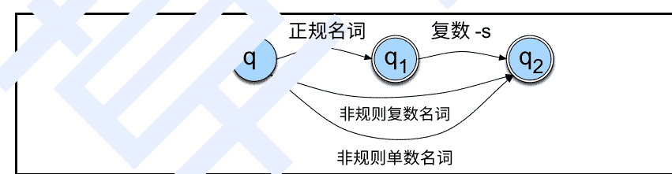

图3.3中的有限状态自动机假设词典包括接受常规 -s复数形式的正规名词（例如猫，狗，狐狸，土豚）。这些是英语名词的绝大多数，因为我们暂时忽略了像狐狸这样的单词的复数形式中插入的 e: 狐狸们。词典还包括不接受 -s的非规则名词形式，包括单数形式鹅，老鼠和复数形式鹅，老鼠。

| 正规名词 | 不规则复数名词 | 不规则单数名词 | 复数 |
| :--- | :--- | :--- | :--- |
| 狐狸 | 鹅 | 鹅 | -s |
| 猫 | 绵羊 | 绵羊 | |
| 土豚 | 鼠标 | 老鼠 | |

英语动词变位的类似模型可能如图3.4所示。


该词典有三个词干类别（正规动词词干、不规则动词词干和不规则过去式动词形式），以及四个词缀类别（-ed过去式、-ed过去分词、-ing现在分词和第三人称单数-s）：

| reg-verb-stem | irreg-verb-stem | irreg-past-stem | past | past-part | pres-part | 3sg |
|---------------|-----------------|-----------------|------|-----------|-----------|-----|
| 走            | 切              | 抓住            | -ed  | -ed       | -ing      | -s  |
| 炸            | 说话            | 吃了            |      |           |           |     |
| 谈话          | 唱歌            | 吃了            |      |           |           |     |
| 弹劾          |                 | 唱              |      |           |           |     |

英语派生形态学比英语屈折形态学复杂得多，因此用于建模英语派生的自动机往往非常复杂。事实上，一些英语派生模型是基于第12章（Sproat，1993）中更复杂的上下文无关文法。

考虑一个相对简单的派生情况：英语形容词的形态结构。以下是Antworth (1990) 的一些例子：
-  大，更大，最大
- 酷，更酷，最酷，酷地
- 快乐，更快乐，最快了，快乐地
- 红，更红，最红不
- 快乐，更不快乐，最不快乐，不快乐地真实，虚构，真实地清
- 晰，更清晰，最清晰，清晰地，不清晰，不清晰地

一个初始的假设可能是形容词可以有一个可选的前缀（un-），一个必需的词根（big, cool等），以及一个可选的后缀（-er, -est或-ly）。这可能暗示了图3.5中的有限状态自动机（FSA）。


然而，虽然这个FSA将识别出表格中的所有形容词，但它也将识别出不符合语法的形式，如unbig，unfast，oranger或smally。我们需要建立词根的类别并指定它们可能的后缀。因此，adj-root 1将包括可以与un-和-ly（clear, happy和real）一起出现的形容词，而adj-root 2将包括不能与un-和-ly（big, small）一起出现的形容词，依此类推。

这给出了从英语派生中所期望的复杂性的一个概念。作为一个进一步的例子，我们在图3.6中给出了另一个基于Sproat（1993）、Bauer（1983）和Porter（1980）的英语名词和动词派生形态的有限状态自动机的片段。这个有限状态自动机模拟了许多派生事实，比如任何以 -ize结尾的动词都可以跟着名词化后缀-ation（Bauer, 1983; Sproat, 1993）。因此，由于存在一个单词fossilize，我们可以预测单词fossilization通过跟随状态 q0， q1和 q2。类似地，以 -al或 -able结尾的形容词在状态 q5 (equal, formal, realizable) 可以带上后缀 -ity，或者有时带上后缀 -ness到状态 q6 (naturalness, casualness)。我们将其作为一个练习留给读者（练习1）去发现许多这些约束的个别例外，并且给出一些各种名词和动词类的例子。

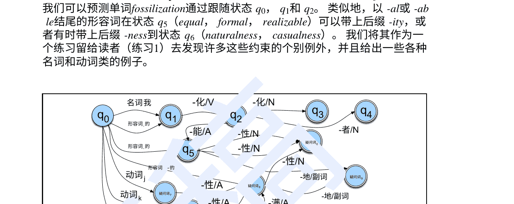

现在我们可以使用这些有限状态自动机来解决形态学识别的问题；也就是说，确定一个字母输入字符串是否构成一个合法的英语单词。我们通过将形态结构有限状态自动机中的每个“子词典”插入到有限状态自动机中来实现这一点。也就是说，我们扩展每个弧（例如规则-名词词干弧）与构成规则-名词词干集合的所有词素。然后，可以在个别字母的层面上定义结果的有限状态自动机。

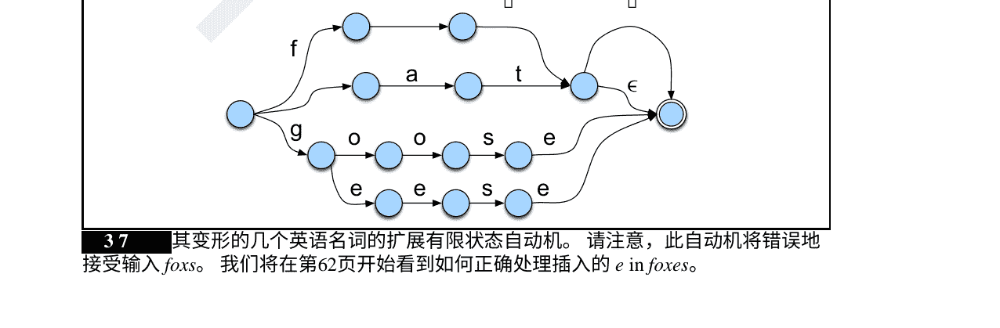

图3.7显示了通过扩展图3.3中的名词变形有限状态自动机并使用每个类别的示例正则和不规则名词生成的名词识别有限状态自动机。我们可以通过简单地从初始状态开始，并逐个比较输入的每个字母与每个出边上的单词，我们可以使用图3.7来识别类似于 aardvarks 的字符串，等等，就像我们在第2章中看到的那样。

## 3.4 有限状态转换器

我们现在已经看到有限状态自动机可以表示词汇的形态结构，并且可以用于词语识别。在本节中，我们介绍有限状态转换器。下一节将展示如何将转换器应用于形态分析。

一个转换器将一个表示映射到另一个表示；一个有限状态转- FST ducer or FST 是一种将两组符号映射之间的有限自动机。 我们可以将FST视为一个识别或生成字符串对的双带自动机。直观地说，我们可以通过为有限状态机中的每个弧标记两个符号字符串来实现这一点，一个来自每个带子。图3.8显示了一个FST的示例，其中每个弧由输入和输出字符串标记，用冒号分隔。


因此，FST的功能比FSA更加通用；FSA通过定义一组字符串来定义形式语言，而FST定义了一组字符串之间的关系。另一种看待FST的方式是将其视为读取一个字符串并生成另一个字符串的机器。以下是关于转换器的这种四重思考方式的总结：
-  FST作为识别器：将一对字符串作为输入并输出接受如果字符串对在字符串对语言中，则拒绝如果不在其中。
-  FST作为生成器：输出语言中的字符串对。因此输出是一个是或否的答案，以及一对输出字符串。
-  FST作为翻译器：读取一个字符串并输出另一个字符串。
-  FST作为集合关系器：计算集合之间的关系的机器。

所有这些在语音和语言处理中都有应用。对于形态学分析（以及许多其他NLP应用程序），我们将应用FST作为翻译器的隐喻，将字母字符串作为输入，并产生形态素字符串作为输出。

让我们从一个正式的定义开始。FST可以用7个参数正式定义：

| 符号 | 描述 |
|------|------|
| Q | 一个有限集合的N状态 q0, q1, ..., q_{N-1} |
| Σ | 与输入字母表对应的有限集合 |
| Δ | 与输出字母表对应的有限集合 |
| q₀ ∈ Q | 起始状态 |
| F ⊆ Q | 终态集合 |
| δ(q,w) | 状态转移函数或状态转移矩阵；给定一个状态 q ∈ Q 和一个字符串 w ∈ Σ*, δ(q,w)返回一组新的状态 因此，δ是从Q×Σ*到2^Q的函数（因为有2^Q个可能的Q子集）。δ返回一组状态而不是一个单个状态，因为给定的输入可能在哪个状态中是模糊的。 |
| σ(q,w) | 输出函数给出每个状态和输入的可能输出字符串集合。给定一个状态 q ∈ Q 和一个字符串 w ∈ Σ*, σ(q,w)给出一组输出字符串，每个字符串 o ∈ Δ*。因此，σ是从Q×Σ*到2^{Δ*}的函数 |

有限状态自动机（FSAs）与正则语言同构，有限状态转换器（FSTs）与正则关系同构。正则关系是一组字符串对，是正则语言的自然扩展，而正则语言是一组字符串。与FSAs和正则语言类似，FSTs和正则关系在并集下是封闭的，尽管一般情况下它们在差集、补集和交集下不是封闭的（尽管一些有用的子类FSTs在这些操作下是封闭的；一般来说，没有增强的FSTs更有可能具有这样的封闭性质）。除了并集，FSTs还有两个额外的封闭性质，这些性质被证明非常有用：反转：转换器T (T^{-1}) 的反转只是交换输入和输出标签。反转 输入和输出标签。因此，如果T从输入字母表I映射到输出字母表O，T^{-1}从O映射到I。组合：如果T1是从I1到O1的转换器，而T2是从O1到O2，那么T1∘T2将从I1到O2进行映射。反转很有用，因为它可以轻松地将一个作为解析器的FST转换为一个作为生成器的FST。组合很有用，因为它允许我们将两个串行运行的转换器替换为一个更复杂的转换器。组合的工作方式类似于代数学；将T1∘T2应用于输入序列S与先将T1应用于S，然后将T2应用于结果是相同的；因此T1∘T2(S)=T2(T1(S))。例如，图3.9显示了将[a:b]+与[b:c]+组合以产生[a:c]+的过程。

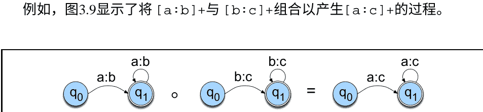

投影 FST的投影是通过提取关系的一侧而生成的FSA。我们可以将关系的左侧或上侧的投影称为上投影，将关系的右侧或下侧的投影称为下投影。

### 3.4.1 顺序转换器和确定性

正如我们所描述的那样，转换器可能是非确定性的，即给定的输入可能会翻译成多个可能的输出符号。因此，使用通用FST需要Ch. 2中讨论的搜索算法，使得FST在一般情况下非常慢。这表明，将非确定性FST转换为确定性FST将是一个不错的算法。但是，虽然每个非确定性FSA等价于某个确定性FSA，但并非所有的有限状态转换器都可以确定化。

转换器顺序 顺序转换器，相比之下，是一种在输入上是确定性的转换器。在顺序转换器的任何状态下，输入字母表 Σ 的每个给定符号最多可以标记一个从该状态出发的转换。图3.10给出了Mohri（1997）的一个顺序转换器的示例；请注意，与图3.8中的转换器不同，每个状态的转换是基于状态和输入符号的确定性的。顺序转换器的输出字符串中可以有 epsilon 符号，但输入中不能有。


顺序转换器在输出上不一定是顺序的。例如，Mohri在图3.10中的转换器不是顺序的，因为离开状态0的两个不同转换具有相同的输出（b）。因此，顺序转换器的逆可能不是顺序的，所以在讨论顺序性时，我们总是需要指定转换的方向。形式上，顺序转换器的定义稍微修改了 δ 和 σ 函数；δ 变成了从 Q × Σ* 到 Q 的函数（而不是到2^Q），σ 变成了从 Q × Σ* 到 Δ* 的函数（而不是到2^{Δ*}）

子顺序转换

顺序转换器的一般化，子顺序转换器，生成-在最终状态处生成一个附加的输出字符串，并将其连接到已生成的输出上（Schützenberger, 1977）。顺序和子顺序转换器的重要之处在于它们的效率；因为它们在输入上是确定性的，所以它们可以在与输入中符号数量成比例的时间内进行处理（它们在输入长度上是线性的），而不是与一些更大的与状态数量相关的数字成比例。子顺序转换器的另一个优点是存在着对它们的确定化（Mohri, 1997）和最小化（Mohri, 2000）的高效算法，扩展了我们在第2章中看到的有限状态自动机的确定化和最小化算法。还有一个等价算法。

虽然顺序和子序列转换器都是确定性和高效的，但是它们都不能处理歧义，因为它们将每个输入字符串转换为唯一的可能输出字符串。由于歧义是自然语言的一个关键属性，因此有一个能够处理歧义但仍保留顺序转换器的效率和其他有用属性的子序列转换器的扩展将非常有用。子序列转换器的一个通用扩展是p-子序列转换器。p-子序列转换器允许将每个最终状态关联到p个最终输出字符串（Mohri, 1996）。它们因此可以处理有限数量的歧义，这对于许多自然语言处理任务非常有用。图3.11显示了一个2-子序列有限状态转换器的示例。


Mohri（1996, 1997）展示了许多可以通过这种方式限制歧义的任务，包括字典的表示，形态和音韵规则的编译，以及局部句法约束。对于这些问题中的每一种，他和其他人已经证明它们是p-次序可化的，因此可以确定化和最小化。这类转换器包括许多，尽管不一定是全部，形态规则。

## 3.5 用于形态分析的有限状态转换器

现在让我们转向形态分析的任务。例如，给定输入cats，我们希望输出cat +N +Pl，告诉我们cat是一个复数名词。给定西班牙语输入bebo（‘我喝’），我们希望beber +V +PInd +1P +Sg，告诉我们bebo是西班牙语动词beber的现在时第一人称单数形式，意为‘喝’。在我们将使用的有限状态形态学范例中，我们将一个单词表示为一个在词汇层面上的对应关系，该层面表示了构成一个单词的形态素的连接，以及在表面层面上的对应关系，该层面表示了单词的实际拼写的连接由构成单词实际拼写的字母组成。图3.12展示了这两个层面对于（英语）cats的情况。


对于有限状态形态学来说，将一个有限状态转换器视为具有两个带是很方便的。上层或词汇带由来自一个字母表Σ的字符组成。下层或表面带由来自另一个字母表Δ的字符组成。在Koskenniemi (1983)的两层形态学中，我们只允许每个弧只有来自每个字母表的一个符号。然后，我们可以将这两个符号字母表Σ和Δ组合起来，创建一个新的字母表Σ'，这样与有限状态自动机的关系就很清晰了。Σ'是一个有限的复杂符号字母表。每个复杂符号由一个输入-输出对 i:o组成；一个符号 i来自输入字母表Σ，一个符号 o来自输出字母表Δ，因此 Σ'⊆ Σ×Δ。Σ和Δ也可以包括 epsilon符号 ε。

因此，当有限状态自动机接受一个由单个符号组成的语言时，比如我们的羊语言的字母表时：

```
(3.2)
Σ = {b, a, !}
```

这样定义的有限状态转换器接受一个由符号对组成的语言，比如：

```
(3.3)
Σ' = {a : a, b : b, ! : !, a : !, a : ε, ε : !}
```

在双层形态学中，Σ'中的符号对也被称为可行对。因此转换器字母表Σ'中的每个可行对符号 a : b表示了一个符号从一个带子映射到另一个带子上的符号 b。例如，a : ε表示上带子上的 a对应于下带子上的空。就像对于有限状态自动机一样，我们可以用复杂的字母表Σ'来编写正则表达式。由于符号自身映射到自身是最常见的情况，在双层形态学中，我们称这样的符号对为 a : a默认对，并通过单个字母引用它们 a。

我们现在可以通过添加一个额外的 “词汇” 带和相应的形态-词法特征来构建一个FST形态分析器，该分析器是基于我们之前的形态-句法FSA和词典构建的。图3.13显示了图3.3的扩展，其中包含了名词的形态-词法特征（+Sg和+Pl）与每个语素相对应。符号 ^ 表示一个语素边界，而符号 # 表示一个词边界。形态学特征映射到空字符串 ε或边界符号，因为在输出带上没有与它们对应的片段。
-  *   ^ 表示一个语素边界
-  *   # 表示一个词边界

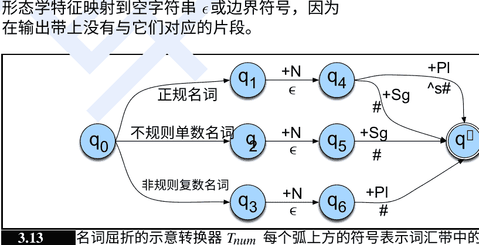

为了将图3.13用作形态学名词解析器，需要扩展它以包含所有单个的正规和非正规名词词干，并替换标签 reg-noun等等。为了做到这一点，我们需要更新这个转换器的词典，以便像 geese这样的非规则复数形式能够正确解析为词干goose +N +Pl。我们通过允许词典具有两个层次来实现这一点。由于表面形式 geese映射到词典中的词干goose，新的词典条目将是“g:o:e:o:e:s:e:e”。正规形式更简单；现在 fox的两级条目将是“f:o:o:x:x”，但是通过依赖于 f代表 f:f等的正字法约定，我们可以简单地将其称为 fox，将 geese的形式称为“g:o:e:o:e:s:e”。因此，词典看起来只会稍微复杂一些：

| 正规名词 | 非规则复数名词 | 非规则单数名词 |
|----------|----------------|----------------|
| 狐狸     | g o:e o:e s e  | 鹅             |
| 猫       | 绵羊           | 绵羊           |
| 土豚     | m o:i u:       | ε s:c e 鼠标   |

结果的转换器如图3.14所示，将复数名词映射为词干加上形态标记 +Pl，将单数名词映射为词干加上形态标记 +Sg。因此，一个表面形式 cats将映射为cat +N +Pl。这可以以可行对格式如下所示进行查看：

```

c:c a:a t:t +N:ε +Pl:^s#

```

由于输出符号包括形态素和词边界标记^和#，所以较低的标签图3.14与表面层不完全对应。因此，在图3.15中，我们将带有这些形态素边界标记的磁带称为中间磁带；下一节将展示如何去除边界标记。

## 3.6 转换器和正字法规则

前一节描述的方法将成功识别像aardvarks和mice这样的单词。但是，仅仅连接形态素对于存在拼写变化的情况不起作用；它会错误地拒绝像foxes这样的输入，并接受像foxs这样的输入。我们需要处理英语在形态素边界处经常需要进行拼写变化的事实，通过引入拼写规则（或正字法规则）来解决。

图形规则）本节介绍了一些用于编写此类规则的符号，并展示了如何将规则实现为转换器。总的来说，将规则实现为转换器的能力在语音和语言处理中非常有用。以下是一些拼写规则：

| 名称 | 规则描述 | 示例 |
| --- | --- | --- |
| 辅音双写 | 在-ing/-ed之前将单个辅音字母加倍 | beg/begging |
| E删除 | 在-ing和-ed之前，静音的e被省略 | make/making |
| 插入E | 在-s,-z,-x,-ch,-sh之前添加e | watch/watches |
| Y替换 | -y在-s之前变为-ie，在-ed之前变为-i | try/tries |
| 插入K | 以元音+-c结尾的动词添加-k | panic/panicked |

我们可以将这些拼写变化看作是将简单的词素串连接作为输入（图3.14中的词汇转换器的“中间输出”），并将稍微修改（正确拼写）的词素串作为输出。

图3.16以示意形式展示了我们所讨论的三个层次：词汇、中间和表面。例如，我们可以编写一个E插入规则，该规则执行图3.16所示的从中间到表面层次的映射。这样的规则可能会说“当词汇带有以x（或z等）结尾的词素，并且下一个词素是-s时，在表面带上一个e”。这是规则的形式化表示：

```
$$(3.4) \quad \epsilon \rightarrow e / \begin{Bmatrix} x \ s \ z \end{Bmatrix} \wedge \_\_ s\#$$
```

这是Chomsky和Halle (1968) 的规则符号表示法；形式为a → b/c___d表示“当a出现在c和d之间时，将其重写为b”。由于符号ε表示空转换，替换它意味着插入某些内容。请回忆一下，符号^表示词素边界。通过在转换器的默认对中包含符号^:ε，这些边界被删除；因此词素边界标记当中间磁带具有一个形态素边界^后跟形态素-s时，E插入拼写规则会在表层磁带上插入一个e。

默认情况下，表层级上的字符被删除。 #符号是一个特殊符号，用于标记单词边界。 因此(3.4)表示“在形态素结尾的x、s或z之后插入一个e，并在形态素s之前插入”。图3.17显示了与此规则对应的自动机。

3.17 3. 中E插入规则的转换器，扩展自Antwo th（990）中的类似转换器。我们还需要从表面字符串中删除#符号；可以通过将符号#解释为# : ε对来完成，或者通过后处理输出来删除单词边界。

构建特定规则的转换器的思想是仅表达该规则所需的约束条件，允许任何其他符号串保持不变。 该规则用于确保只有在正确的上下文中才能看到ε : e对。因此，状态 q0表示仅看到与规则无关的默认对，是一个接受状态；状态 q1表示看到了z、 s或者x，也是一个接受状态。状态 q2表示看到了z、 s或者x后的词素边界，同样是一个接受状态。

在仅看到E插入之后，状态q3的模型具有，它不是一个接受状态，因为插入只有在其后跟着s形态素和结束符号#时才被允许。

另一个符号在图3.17中用于安全地穿过不参与E插入规则的单词部分。 other 意味着“任何可行的不在这个转换器”。例如，当离开状态q₀时，我们根据z、s或x符号转到q₁，而不是遵循other弧并停留在q₀。other的语义取决于其他弧上的符号；由于#在某些弧上被提及，它（根据定义）不包括在other中，因此例如在从q₂到q₀的弧上明确提到。

一个转换器需要正确地拒绝应用规则的字符串，当它不应该应用规则时。一个可能的错误字符串可能具有正确的环境来进行E插入，但是没有插入。状态q₅被用来确保每当环境适合时，总是插入e；转换器只有在看到适当的词素边界之后，才会到达状态q₅。如果机器处于状态q₅并且下一个符号是#，那么机器将拒绝该字符串（因为从状态q₅到#没有合法的转换）。

图3.18显示了规则的转换表，该表使用“-”符号明确表示非法转换。

| 状态 \ 输入 | s:s | x:x | z:z | ˆe | e:e | # | 其他 |
|---|---|---|---|---|---|---|---|
| q₀: | 1 | 1 | 1 | 0 | - | 0 | 0 |
| q₁: | 1 | 1 | 1 | 2 | - | 0 | 0 |
| q₂: | 5 | 1 | 1 | 0 | 3 | 0 | 0 |
| q₃ | 4 | - | - | - | - | - | - |
| q₄ | - | - | - | - | - | 0 | - |
| q₅ | 1 | 1 | 1 | 2 | - | - | - |

3.18 3 7中E插入规则的状态转换表，从Antwo th ( 990) 的类似转换器扩展而来。

下一节将展示这个E插入转换器在一个示例输入字符串上的跟踪。

## 3.7 合并FST词典和规则

我们现在准备将我们的词典和规则转换器组合起来进行解析和生成。图3.19显示了一个两级形态系统的架构，无论是用于解析还是生成。词典转换器在词汇级别和表示简单形态素串联的中间级别之间进行映射。然后，一系列转换器，每个表示一个单一的拼写规则约束，都并行运行，以便在中间级别和表面级别之间进行映射。将所有拼写规则并行运行是一种设计选择；如果我们稍微改变每个规则，也可以选择将所有拼写规则串行运行（作为一个长级联）。

级联 图3.19中的架构是一个两级级联的转换器。级联两个自动机意味着将它们串行运行，第一个自动机的输出作为输入传递给第二个。级联可以具有任意深度，每个级别可能由许多个体转换器构建。图3.19中的级联有两个串联的转换器：从词法到中间级别的转换器，以及从中间级别到表面级别的并行转换器集合。级联可以从上到下运行以生成字符串，也可以从下到上运行以解析字符串；图3.20 显示了系统接受从fox +N +PL到foxes的映射的跟踪。

有限状态转换器的强大之处在于，当机器从词汇带生成表面带时，或者从表面带解析词汇带时，使用的是完全相同的级联和相同的状态序列。例如，对于生成，想象一下将中间带和表面带留空。现在，如果我们运行词典转换器，给定fox +N +PL，它将通过之前示例中接受词汇带和中间带的相同状态，在中间带上产生fox^s#。然后，如果我们允许所有可能的正字法转换器并行运行，我们将产生相同的表面带。

解析可能比生成稍微复杂一些，因为存在问题歧义的歧义。例如，*foxes*也可以是一个动词（虽然很少见，意思是“使困惑或混淆”），因此*foxes*的词汇解析可以是*fox +V +3Sg*，也可以是*fox +N +PL*。我们如何知道哪个是正确的解析？实际上，对于这种类型的歧义情况，转换器无法决定。消除歧义将需要一些外部证据，例如周围的单词。因此，*foxes*是在序列中，我昨天看到两只狐狸时，它很可能是一个名词，但在序列中，那个骗子总是把我搞糊涂！时，它是一个动词。我们将在第5章和第20章讨论这样的消除歧义算法。如果没有这样的外部证据，我们的转换器所能做的就是列举可能的选择；所以我们可以将*fox^s#*转换成*fox +V +3SG*和*fox +N +PL*。

有一种我们需要处理的歧义：在解析过程中发生的局部歧义。例如，想象一下解析输入动词*assess*。在看到*ass*之后，我们的E-insertion转换器可能会提出后面的*e*是由拼写规则插入的（例如，就转换器而言，我们可能一直在解析单词*asses*）。直到我们在*as ses*之后没有看到*#*，而是遇到另一个*s*，我们才意识到我们走错了路。

由于这种非确定性，FST解析算法需要结合一些搜索算法。练习7要求读者修改图2.19中第2章中非确定性FSA识别的算法，以进行FST解析。

请注意，输入的许多可能的错误分割，例如将*parsing assess*解析为*^a^s^ses^s*，将不会匹配词典中的任何条目。

运行级联，特别是具有许多层级的级联，可能会很难处理。幸运的是，我们已经知道如何将一系列级联的转换器组合成一个更复杂的转换器。并联的转换器可以通过自动机的交集*intersection*来组合。自动机的交集算法只是取状态的笛卡尔积，即对于机器1中的每个状态*q_i*和机器2中的每个状态*q_j*，我们创建一个新的状态*q_ij*。然后对于任何输入符号*a*，如果机器1将转换到状态*q_n*，机器2将转换到状态*q_m*，我们将转换到状态*q_nm*。图3.21概述了这个交集（∧）和组合（◦）过程可能如何进行。

由于存在许多规则→FST编译器，实际上几乎不需要手动编写FST。Kaplan和Kay（1994）给出了从规则到二级关系的映射的数学定义，Antworth（1990）给出了规则编译的详细算法。Mohri（1997）给出了转录机的算法。

## 3.8 无词典FST：波特词干提取器

虽然从词典加规则构建转录机是形态分析的标准算法，但也有一些更简单的算法不需要这个算法所需的大型在线词典。这些特别用于信息检索(IR)任务，如网络搜索（第23章），其中查询可以是相关关键词或短语的布尔组合，例如（有袋动物 OR 袋鼠 OR 树袋熊）返回包含这些词的文档由于带有词marsupials的文档可能与关键词marsupial不匹配，因此一些信息检索系统首先对查询和文档词进行词干提取。在信息检索中，形态学信息仅用于确定两个词具有相同的词干；后缀被丢弃。

最常用的词干提取算法之一是简单而高效的Porter（1980）算法，它基于一系列简单的级联重写规则。由于级联重写规则可以很容易地实现为有限状态转换器（FST），Porter算法也可以被视为无词典的FST词干提取器（这个想法将在练习中进一步发展）。该算法包含了一系列类似于以下规则的规则：

```
ATIONAL → ATE (例如，relational → relate)
ING → ε if词干包含元音 (例如，motoring → motor)
SSES → SS (例如，grasses → grass)
```

关于Porter词干提取器的详细规则列表以及代码（使用Java、Python等语言）可以在Martin Porter的官方主页上找到；还可以参考原始论文（Porter, 1980）。

词干提取往往能提高信息检索的性能，尤其是对于较小的文档（文档越大，关键词以与查询中使用的形式完全匹配的几率越高）。但是像Porter算法这样的无词典词干提取器，虽然比完全基于词典的形态分析器简单，但会出现以下错误（Krovetz, 1993）：

| 错误的添加 | 错误的省略 |
|------------|------------|
| 组织 机构  | 欧洲 欧洲 |
| doing doe  | analysis 分析 |
| numerical numerous | 噪音 嘈杂 |
| 政策 警察 | 稀疏 稀疏性 |

现代词干提取器往往更加复杂，因为例如我们不希望将单词Illustrator提取为illustrate，因为大写形式Illustrator往往指的是软件包。我们将在第23章回顾这个问题。

## 3.9 词和句子分词

到目前为止，在本章中我们主要关注了一个分割问题：如何将单词分割成形态素。现在我们转向对将连续文本分割成单词和句子的问题进行简要讨论。这个任务被称为分词。

在像英语这样通过特殊的“空格”字符分隔单词的语言中，单词分词似乎非常简单。正如我们将在下面看到的，不是每种语言都这样做（例如中文、日语和泰语）。但是仔细观察将会清楚，仅仅使用空白字符是不够的。考虑下面来自《华尔街日报》和《纽约时报》文章的句子：

> 先生 舍伍德表示对Sea Containers的提议的反应“非常积极”。在昨天的纽约证券交易所综合交易中，Sea Containers收盘价为62.625美元，上涨62.5美分。

> ``我说，‘你是什么？疯了吗？’Sadowsky说。‘我负担不起那个。’‘’

仅根据空格进行分词会产生以下单词：

+   美分。说，积极。”疯狂吗？

我们可以通过将标点符号视为单词边界来解决这些错误，除了空格之外。但是标点符号通常在单词内部出现，例如m.p.h，Ph.D.，AT&T，cap‘n，01/02/06和google.com。类似地，假设我们希望62.5成为一个单词，我们需要避免将每个句点分割开，因为这将把它分割成62和5。数字表达式还引入了其他复杂性；虽然逗号通常出现在单词边界上，但在英语中，逗号在数字内部使用，每三位一组：555,500.50。各种语言在数字的标点符号风格上有所不同；与英语使用逗号标记小数点并在逗号处使用空格（或有时使用句点）不同，许多欧洲大陆语言如西班牙语、法语和德语使用逗号标记小数点，并在英语中使用逗号的地方使用空格（或有时使用句点）：555 500,50。

分词器还可以为我们执行另一个有用的任务，即扩展由撇号标记的缩略词，例如将what're转换为两个标记what are，将we're转换为we are。这个任务的复杂性在于撇号的歧义性，因为它们也被用作所有格标记（如the book's over或Containers'above）或引用标记（如‘what're you? Crazy?’above）。这样的缩略词在其他字母语言中也会出现，包括法语中的冠词和代词（j'ai，l'homme）。虽然这些缩略词往往是词素，但并不是所有词素都用缩略形式标记。总的来说，分割和扩展缩略词可以作为本章前面介绍的形态分析过程的一部分来完成。

根据应用程序的不同，分词算法还可以对多词表达式进行分词，例如New York或rock 'n' roll，这需要一个多词表达式某种字典。这使得分词与检测名称、日期和组织的任务密切相关，这被称为命名实体检测，并将在第22章中讨论。

分割句子 除了词分割之外，句子分割是一个关键的第一步。文本处理。将文本分割成句子通常基于标点符号。这是因为某些类型的标点符号（句号、问号、感叹号）往往标记句子边界。问号和感叹号是相对明确的句子边界标记。句号则更加模糊。句号字符'.'在句子边界标记和像先生（Mr.）或公司（Inc.）这样的缩写标记之间具有歧义。你刚刚读到的上一句展示了这种歧义的更复杂情况，其中 Inc. 的最后一个句号既标记了缩写又标记了句子边界。因此，句子分词和词分词往往是一起处理的。

一般来说，句子分词方法通过构建一个二元分类器（基于一系列规则或机器学习）来判断句号是否属于单词或句子边界标记。在做出这个决定时，了解句号是否与常用缩写词有关是有帮助的；因此，缩写词典是有用的。

句子分词的最先进方法基于机器学习，并将在后面的章节中介绍。但是，通过一系列正则表达式仍然可以迈出有用的第一步。我们在这里介绍第一部分；一个词分词算法。图3.22给出了一个基于Grefenstette（1999）的简单Perl词分词算法。该算法非常简洁，主要设计用于澄清我们在前面段落中讨论的许多分割问题。

该算法由一系列正则表达式替换规则组成。第一条规则分隔明确的标点符号，如问号和括号。下一条规则分割逗号，除非它们在数字内部。然后，我们消除歧义的撇号并去除词末的词素。最后，我们处理句号，使用一个（玩具）缩写词典和一些启发式方法来检测其他缩写词。

一个简单的分词器可以使用如此简单的正则表达式构建，这表明像图3.22中的分词器一样的分词器可以很容易地在FST中实现。这确实是事实，并且(Karttunen等人，1996)和(Beesley和Karttunen，2003)给出了这种基于FST的分词器的描述。

### 3.9.1 中文分词

我们上面提到过，包括中文、日文和泰文在内的一些语言不使用空格来标记潜在的词边界。这些语言使用了替代的分词方法。

例如，在中文中，单词由称为汉字的字符组成。每个字符通常代表一个单个的语素，并且可以作为一个单音节发音。平均而言，一个词大约由2.4个字符组成。一个简单的算法，对于中文分词效果非常好，并且经常被用作更高级方法的基准比较，是一种称为最大匹配的贪婪搜索的版本。

## 最大匹配

有时最大匹配。该算法需要一个语言的字典（词表）。最大匹配算法从字符串的开头开始指向。它#!/usr/bin/perl

$letternnumber = "[A-Za-z0-9]";
$notletter = "[^A-Za-z0-9]";
$alwayssap = "[\?!\)\";\/|\'']";
$clitic = "('|-|'S|'D|'M|'LL|'RE|'VE|N'T|'s|'d|'m|'ll|'re|'ve|n't)";

$abbr{"Co."} = 1; $abbr{"Dr."} = 1; $abbr{"Jan."} = 1;  $abbr{"Feb."} = 1;

while ($line =<>) { # 从标准输入读取下一行
    # 在明确的分隔符周围放置空格
    $line =~ s/$alwayssap/ {input} /g;

    # 在不是数字的逗号周围放置空格
    $line =~ s/([^0-9]),/$1 , /g;
    $line =~ s/,([^0-9])/ , $1/g;

    # 通过将不以字母开头的单引号分隔开来区分单引号和撇号
    $line =~ s/\'/{input}/g;
    $line =~ s/($notletter)\'/$1 ' /g;

    # 将明确的词末缀和标点分隔开
    $line =~ s/$clitic/{input}/g;
    $line =~ s/$clitic($notletter)/ $1  $2/g;

    # 现在处理句号。对于每个可能的单词
    @possiblewords=split(/\s+/,$line);
    foreach $word (@possiblewords) {
        # 如果以句号结尾，
        if (($word =~ /$letternnumber\./)
            && !($abbr{$word}) # 并且不在缩写列表中
            # 并且不是字母和句点的序列（U.S.）
            # 并且不类似于缩写（没有元音：Inc.）
            && !($word =~ 
                /^([A-Za-z]\.([A-Za-z]\.)+[A-Z][bdfghj-nptvxz]+\.?)$/)) {
            # 然后分割句点
            $word =~ s/\.$/ \./;
        }
        # 扩展clitics
        $word =~ s/'ve/have/i;
        $word =~ s/'m/am/i;
        print $word," ";
    }
    print "\n";
}

3.22 示例的英文分词脚本，改编自Grefenstette（1999）和 Palmer（2000）。一个真实的脚本会有一个更长的缩写词典。

选择字典中与当前位置的输入匹配的最长单词。然后指针将超过该单词中的每个字符。如果没有单词匹配，则指针将向前移动一个字符（创建一个单字符单词）。然后，算法从新的指针位置开始迭代应用。为了帮助可视化这个算法，Palmer（2000）给出了一个英语类比，通过从英语句子中删除空格来近似描述了中文情况。下面的表产生了`thetabledownt here`。最大匹配算法（给定一个长的英语词典）首先匹配输入中的单词`theta`，因为这是与词典单词匹配的最长字母序列。从`theta`的末尾开始，最长匹配的词典单词是`bled`，然后是`own`和`there`，产生了错误的序列`theta bled own there`。

该算法在中文中（具有如此短的单词）似乎比在英语等具有长单词的语言中效果更好，正如我们失败的例子所示。即使在中文中也是如此。

然而，maxmatch有一些弱点，特别是对于未知单词（字典中没有的单词）或未知类型（与字典构建者的假设有很大不同的类型）。

每年都有一次比赛（技术上称为烘焙比赛）用于中文分词算法。这些最成功的现代中文分词算法是基于从手工分割的训练集中进行机器学习的。在介绍第5章的概率方法之后，我们将回顾这些算法。

## 3.10 检测和纠正拼写错误

> > ALGERNON：但是我亲爱的塞西莉，我从来没有给你写过信。
> CECILY：你不用提醒我，欧内斯特。我记得得太清楚了，我曾经被迫替你写信。我每周总是写三次，有时更频繁。
> 
> ALGERNON：哦，让我读读它们，塞西莉？
> CECILY：哦，我不可能的。它们会让你太自负了。我和你分手后，你给我写的三封信非常美丽，但拼写错误很多，即使现在我也几乎无法读完而不流泪。
> 
> 奥斯卡·王尔德，《真诚的重要性》

就像奥斯卡·王尔德的神奇塞西莉一样，在上个世纪末，很多人都在思考拼写问题。吉尔伯特和沙利文提供了许多例子。例如，《金顿舞曲》的朱塞佩担心他的私人秘书“拼写不准确”，而《伊欧兰妮》的菲利斯则“能拼写她使用的每个单词”。索尔斯坦·韦布伦在他1899年的经典著作《闲暇阶级理论》中解释道，英语拼写系统的一个主要目的是足够困难，以便成为闲暇阶级成员资格的考验。无论拼写的社会角色如何，我们肯定有很多人像塞西莉一样，而不像菲利斯。人类打字文本中拼写错误的频率估计从精心编辑的新闻稿文本中的0.05%到像电话号码查找这样的困难应用中的38%不等（Kukich，1992年）。

在这一部分中，我们介绍了检测和纠正拼写错误的问题。由于拼写错误纠正的标准算法是概率性的，我们将在第5章中继续讨论拼写检查问题，之后我们会定义概率性噪声信道模型。检测和纠正拼写错误是现代文字处理器和搜索引擎的重要组成部分，也在纠正光学字符识别（OCR）和在线手写识别等领域起着重要作用。

OCR或手写字符，以及在线手写识别，即用户书写时对人类印刷或草书的识别。根据Kukich（1992）的观点，我们可以区分出三个越来越广泛的问题：

- 1. 非单词错误检测：检测导致非单词的拼写错误（例如将“graffe”拼写为“giraffe”）。

- 2. 孤立词错误纠正：纠正导致非单词的拼写错误，例如将 *graffe* 更正为 *giraffe* ，但仅考虑单词本身。

- 3. 上下文相关错误检测和纠正：利用上下文帮助检测和纠正拼写错误，即使它们意外地导致一个真正的英语单词（真词错误）。这可能是由于排版错误引起的- （插入、删除、转置）意外产生一个真正的单词（例如， *there* 替代 *three* ），或者因为作者替换了一个同音或近音的错误拼写（例如， *dessert* 替代 *desert* ，或者 *piece* 替代 *peace* ）。

检测非单词错误通常是通过标记任何在字典中找不到的单词来完成的。例如，上面的拼写错误 *graffe* 不会出现在字典中。一些早期的研究（Peterson, 1986）曾经建议这样的拼写字典应该保持较小，因为大型字典包含非常罕见的单词，这些单词与其他单词的拼写错误相似。例如，罕见的单词 *wont* 或 *veery* 也是 *won't* 和 *very* 的常见拼写错误。实践中，Damerau和Mays（1989）发现，虽然一些拼写错误被较大字典中的真词隐藏，但较大字典通过避免将罕见单词标记为错误而起到了更多的帮助而不是伤害。这在实用词频作为因素的概率拼写纠正算法中尤其如此。因此，现代拼写检查系统往往基于大型字典。

本章中描述的有限状态形态学解析器提供了实现这样大型词典的技术。通过给出一个词的形态学解析器，FST解析器本质上是一个词识别器。事实上，通过使用投影操作提取下侧语言图，FST形态学解析器可以转化为一个更高效的FSA词识别器。这样的FST词典还具有表示英语词缀（如-s和-ed）等产生性形态的优势。这对于处理新的合法词干和屈折非常重要。例如，可以轻松地将新的词干添加到词典中，然后所有的屈折形式都可以轻松地被识别。这使得FST词典在形态丰富的语言中特别强大，其中一个词干可能有数十个或数百个可能的表面形式。

因此，FST词典可以帮助进行非单词错误检测。但是纠错呢？独立单词纠错算法通过找到可能是错误形式的单词来进行操作。例如，纠正拼写错误 *graffe* 需要搜索所有可能的单词，如 *giraffe*、*graf*、*craft*、*grail* 等，以选择最可能的来源。为了在这些潜在来源之间进行选择，我们需要一个源单词和表面错误之间的距离度量。直观地说， *giraffe* 对于 *graffe* 来说是比 *grail* 更可能的来源，因为 *giraffe* 在拼写上更接近 *graffe* ，而 *grail* 与 *graffe* 的拼写相比更远。捕捉这种相似性直观的最强大的方法需要使用概率论，这将在第4章中讨论。然而，支撑这个解决方案的算法是非概率的最小编辑距离算法，我们将在下一节介绍。

> 真词错误

## 3.11 最小编辑距离

**字符串距离** 决定两个单词中哪个更接近第三个单词的拼写是字符串距离问题的一个特例。两个字符串之间的距离是一种度量两个字符串之间的相似程度的度量。

许多重要的用于查找字符串距离的算法依赖于某个版本的最小编辑距离算法，该算法由Wagner和Fischer（1974）命名，但由许多人（在第6章的历史部分总结）独立发现。两个字符串之间的最小编辑距离是将一个字符串转换为另一个字符串所需的最小编辑操作（插入、删除、替换）的最小数量。

例如，单词`intention`和`execution`之间的间隔是五个操作，对齐如图3.23所示，作为两个字符串之间的对齐。给定两个序列，一个对齐是两个序列子字符串之间的对应关系。因此，`i`与空字符串对齐，`n`与`E`对齐，`t`与`X`对齐，依此类推。在对齐的字符串下面是另一种表示方法；一系列表示将顶部字符串转换为底部字符串的符号；d表示删除，s表示替换，i表示插入。


我们还可以为每个操作分配特定的成本或权重。两个序列之间的Levenshtein距离是最简单的加权因子，其中每个操作的成本为1（Levenshtein，1966）。因此，`intention`和`execution`之间的Levenshtein距离为5。Levenshtein还提出了他的度量的另一个版本，在该版本中，每个插入或删除的成本为1，不允许替换（相当于允许替换，但给每个替换一个成本为2，因为任何替换都可以用一个插入和一个删除来表示）。使用这个版本，`intention`和`execution`之间的Levenshtein距离为8。

**动态规划** 最小编辑距离是通过动态规划计算的。动态规划是一类算法的名称，首先由Bellman（1957）引入，它通过将子问题的解决方案组合起来应用表驱动方法来解决问题。这类算法包括语音和语言处理中最常用的算法；除了最小编辑距离，还包括Viterbi和前向算法（第6章），以及CYK和Earley算法（第13章）。

动态规划问题的直觉是，一个大问题可以通过合理地组合各个子问题的解来解决。例如，考虑将字符串`intention`转换为`execution`的最小编辑距离所组成的转换单词序列或“路径”，如图3.24所示。

### 3.24 intention转换为 execution 的操作列表（Kaskal, 198年后）

> i n t e n t i o n
delete i → n t e n t i o n
substitute n by e → e t e n t i o n
substitute t by x → e x e n t i o n
insert u → e x e n u t i o n
substitute n by c → e x e c u t i o n

想象一些字符串（也许是`exention`），它在这个最优路径中（无论它是什么）。动态规划的直觉是，如果`exention`在最优操作列表中，那么最优序列也必须包括从`intention`到`exention`的最优路径。为什么呢？如果从`intention`到`exention`存在一条更短的路径，那么我们可以使用它，从而得到一个更短的总路径，而最优序列将不再是最优的，这将导致矛盾。

动态规划算法用于序列比较，通过创建一个距离矩阵，其中目标序列的每个符号对应一列，源序列的每个符号对应一行（即目标序列在底部，源序列在侧边）。对于最小编辑距离，该矩阵即为编辑距离矩阵。每个单元格 edit-distance[i,j] 包含目标的前 i 个字符和源的前 j 个字符之间的距离。每个单元格可以通过周围单元格的简单函数计算得出；因此，从矩阵的起始位置开始，可以填充每个条目。每个单元格的值通过取三条可能路径中的最小值来计算，这些路径通过矩阵到达该单元格：

> (3.5)  \( \text{distance}[i, j] = \min \begin{cases} \text{distance}[i - 1, j] + \text{ins-cost}(\text{target}_{i-1}) \\ \text{distance}[i - 1, j - 1] + \text{sub-cost}(\text{source}_{j-1}, \text{target}_{i-1}) \\ \text{distance}[i, j - 1] + \text{del-cost}(\text{source}_{j-1}) \end{cases} \)

算法本身总结在图3.25中，而图3.26展示了应用算法到`intention`和`execution`之间距离的结果，假设Levenshtein距离的版本中插入和删除的代价都是1 (ins-cost(·) = del-cost(·) = 1)，替换的代价是2（除了相同字母的替换代价为0）。

知道最小编辑距离对于像寻找潜在的拼写错误纠正的算法是有用的。但是编辑距离算法在另一方面也很重要；通过一个小的改变，它还可以提供两个字符串之间的最小成本对齐。对齐两个字符串在语音和语言处理中非常有用。在语音识别中，最小编辑距离对齐用于计算语音识别的词错误率（第9章）。对齐在机器翻译中起着重要作用，在第76章第3节（词语和转换器）中讨论。

### 3.25 编辑距离算法，动态规划算法的一个示例。

```
函数 MIN-EDIT-DISTANCE(目标, 源) 返回 最小距离
n ← LENGTH(目标)
m ← LENGTH(源)
创建一个距离矩阵distance[n+1,m+1]
将零行和零列初始化为与空字符串的距离
distance[0,0] = 0
对于每一列 i 从 1到 n 执行以下操作
    distance[i,0] ← distance[i-1,0] +插入代价(目标[i])
对于每一行 j 从 1到 m 执行以下操作
    distance[0,j] ← distance[0,j-1] +删除代价(源[j])
对于每一列 i 从 1到 n 执行以下操作
    对于每一行 j 从 1到 m 执行以下操作
        distance[i, j] ← MIN( distance[i-1,j] +插入代价(目标i-1),
                             distance[i-1,j-1] +替换代价(源j-1, 目标i-1),
                             distance[i,j-1] +删除代价(源j-1))
返回 distance[n,m]
```

各种成本可以是固定的（例如，∀x, ins-cost(x) = 1），也可以是特定于字母的（以模拟某些字母插入的可能性更大）。我们假设替换一个字母本身没有成本（即 sub-cost(x,x) = 0）。

### 3.26 通过Levenshtein距离计算 intention和 execution之间的最小编辑距离。

|   | # | e | x | e | c | u | t | i | o |
|---|---|---|---|---|---|---|---|---|---|
| **n** | 9 | 8 | 9 | 10| 11| 12| 11| 10| 9 |
| **o** | 8 | 7 | 8 | 9 | 10| 11| 10| 9 | 8 |
| **i** | 7 | 6 | 7 | 8 | 9 | 10| 9 | 8 | 9 |
| **t** | 6 | 5 | 6 | 7 | 8 | 9 | 8 | 9 | 10|
| **n** | 5 | 4 | 5 | 6 | 7 | 8 | 9 | 10| 11|
| **e** | 4 | 3 | 4 | 5 | 6 | 7 | 8 | 9 | 10|
| **t** | 3 | 4 | 5 | 6 | 7 | 8 | 7 | 8 | 9 |
| **n** | 2 | 3 | 4 | 5 | 6 | 7 | 8 | 7 | 8 |
| **i** | 1 | 2 | 3 | 4 | 5 | 6 | 7 | 6 | 7 |
| **#** | 0 | 1 | 2 | 3 | 4 | 5 | 6 | 7 | 8 |

插入或删除的成本为1，替换的成本为2。斜体表示从空字符串开始的距离的初始值。

为了将编辑距离算法扩展为生成对齐，我们可以从将对齐视为通过编辑距离矩阵的路径开始。图3.27显示了这条路径，其中粗体单元格表示对齐。每个粗体单元格表示两个字符串中一对字母的对齐。如果两个粗体单元格出现在同一行，表示从源字符串到目标字符串的插入；如果两个粗体单元格出现在同一列，表示删除。

### 3.27 用于显示最小编辑距离对齐的回溯指针矩阵。

|   | # | e | x | e | c | u | t | i | o |   |
|---|---|---|---|---|---|---|---|---|---|---|
| **n** | 9 | down, 8 | down-left, down, left, 9 | down-left, down, left, 10 | down-left, down, left, 11 | down-left, down, left, 12 | down, 11 | down, 10 | down, 9 | up-right, 8 |
| **o** | 8 | down, 7 | down-left, down, left, 8 | down-left, down, left, 9 | down-left, down, left, 10 | down-left, down, left, 11 | down, 10 | down, 9 | up-right, 8 | left, 9 |
| **i** | 7 | down, 6 | down-left, down, left, 7 | down-left, down, left, 8 | down-left, down, left, 9 | down-left, down, left, 10 | down, 9 | up-right, 8 | left, 9 | left, 10 |
| **t** | 6 | down, 5 | down-left, down, left, 6 | down-left, down, left, 7 | down-left, down, left, 8 | down-left, down, left, 9 | up-right, 8 | left, 9 | left, 10 | left, down, 11 |
| **n** | 5 | down, 4 | down-left, down, left, 5 | down-left, down, left, 6 | down-left, down, left, 7 | down-left, down, left, 8 | down-left, down, left, 9 | down-left, down, left, 10 | down-left, down, left, 11 | down-left, down, 10 |
| **e** | 4 | up-right, 3 | left, 4 | down-left, 5 | left, 6 | left, 7 | left, down, 8 | down-left, down, left, 9 | down-left, down, left, 10 | down, 9 |
| **t** | 3 | down-left, down, left, 4 | down-left, 5 | down-left, 6 | down-left, 7 | down-left, 8 | up-right, 7 | left, down, 8 | down-left, down, left, 9 | down, 8 |
| **n** | 2 | down-left, down, left, 3 | down-left, 4 | down-left, 5 | down-left, 6 | down-left, 7 | down-left, 8 | down, 7 | down-left, 8 | up-right, 7 |
| **i** | 1 | down-left, down, left, 2 | down-left, 3 | down-left, 4 | down-left, 5 | down-left, 6 | down-left, 7 | up-right, 6 | left, 7 | left, 8 |
| **#** | 0 | 1 | 2 | 3 | 4 | 5 | 6 | 7 | 8 | 9 |

在每个单元格中输入一个值时，我们用最多三个箭头标记我们来自的三个相邻单元格。在填满表格后，我们通过回溯从右上角的8开始，沿着箭头计算一个对齐（最小编辑路径）。

有各种公开可用的软件包来计算编辑距离，包括UNIX diff和NIST sclite程序(NIST, 2005)；最小编辑距离也可以以各种方式增强。例如，维特比算法是最小编辑距离的扩展，它使用概率定义的操作。在这种情况下，我们不是计算两个字符串之间的“最小编辑距离”，而是对一个字符串与另一个字符串的“最大概率对齐”感兴趣。维特比算法在语音识别和词性标注等概率任务中至关重要。

## 3.12 人类形态处理

在这一部分中，我们简要调查了关于多词素在英语说话者的心智中是如何表示的心理语言学研究。考虑单词`walk`及其变形`walks`和`walked`。这三个单词都在人类词汇中吗？还是仅仅walk along with -ed and -s? 那么单词 happy 及其派生形式 happily 和 happiness 呢？我们可以想象一种可能表示的两个极端。完全列表假设认为一个语言的所有单词都在心理词典中列出，没有任何内部形态结构。从这个观点来看，形态结构是一个附带现象，walk、walks、walked、happy 和 happily 都是单独列在词典中的。这个假设对于像土耳其语这样形态复杂的语言是站不住脚的。最小冗余假设认为只有冗余最小化：在词典中，只表示构成成分的语素，当处理单词时（无论是阅读、听力还是说话），我们必须同时访问语素（如 walk 和 -s）并将它们组合起来。这种观点可能也太严格了。

关于人类词典至少表示一些形态结构的最早证据之一来自于 speech errors，也称为 tongue slips。在会话中，说话者经常混淆单词或音素的顺序：如果你打破它，它会掉下来（If you drop it, it will break）。

在 Fromkin 和 Ratner (1998) 以及 Garrett (1975) 收集的口误中，屈折和派生词缀可以与它们的词干分开出现。这些词缀能够单独产生于它们的词干，这表明心理词典中包含了一些形态结构的表示。

- 不仅仅是我们有螺丝松动（代表“螺丝松动”）
- 规则形成的词（代表“词的规则形成”）
- 足够容易（代表“足够容易”）

更近期的实验证据表明，既不是完全列出，也不是最小冗余假设可能完全正确。相反，可能有一些但不是所有的形态关系在心理上是被表示的。例如，Stanners 等人 (1979) 发现一些派生形式（happiness, happily）似乎与它们的词干（happy）分开存储，但是规则变化的形式（pouring）与它们的词干（pour）在词典中并不区分。他们通过使用重复启动实验来进行了这项研究。简而言之，重复启动利用了一个事实，即如果一个单词之前已经见过（如果它被启动），那么它会更快地被识别出来。他们发现：

启动

举例来说，pouring 启动 pour，burning 启动 burn，但是例如 selective 没有启动 select。Marslen-Wilson 等人 (1994) 发现，口语派生词可以启动它们的词干，但前提是派生形式的意义与词干密切相关。例如，government 启动 govern，但是 department 不启动 depart。Marslen-Wilson 等人 (1994) 提出了一个与他们自己的发现相一致的模型，如下所示：


总之，这些早期结果表明（至少）像屈折这样的产生性词法在人类词汇中起到了在线作用。更近期的研究表明，非屈折形态结构对词汇阅读时间也有影响。

## 3.13 概要

本章介绍了形态学，即处理语言的领域，涉及单词的子部分，以及有限状态转换器，这是形态学中重要的计算设备，也将在后面的章节中发挥其他任务的作用。

我们还介绍了词干提取，词和句子的分词，以及拼写错误检测。以下是我们关于这些概念的主要要点的总结：

- 形态分析是找出单词中的构成语素的过程（例如，对于 `cats`，是 `cat +N +PL`）。
- 英语主要使用前缀和后缀来表达屈折和派生形态。
- 英语屈折形态相对简单，包括人称和数的一致性（`-s`）以及时态标记（`-ed` 和 `-ing`）。英语派生形态更复杂，包括诸如 `-ation` 和 `-ness` 的后缀，以及 `co-` 和 `re-` 等前缀。对于英语的形态结构（允许的语素序列），许多限制可以用有限自动机表示。
- 有限状态转换器是有限状态自动机的扩展，可以生成输出符号。重要的 FST 操作包括组合、投影和交集。
- 有限状态形态学和双层形态学是有限状态转换器在形态学表示和解析中的应用。
- 自动转换器编译器可以为任何重写规则生成转换器。词典和拼写规则可以通过组合和交集转换器进行组合。
- **Porter 算法**是一种简单而高效的词干提取方法，可以去除词缀。它不如基于词典的转换器模型准确，但在诸如信息检索等不需要精确的形态结构的任务中是相关的。
- 词标记化可以通过简单的正则表达式替换或者通过转换器来完成。
- 拼写错误检测通常通过查找不在字典中的单词来完成；FST 字典在这方面很有用。
- 两个字符串之间的最小编辑距离是将一个字符串编辑成另一个字符串所需的最小操作次数。最小编辑距离可以通过动态规划来计算，这也会得到两个字符串的对齐结果。

# 参考文献和历史注释

尽管有限状态转换器与有限状态自动机在数学上非常相似，但这两个模型源自不同的传统。第 2 章描述了有限自动机是如何从图灵的 (1936) 算法计算模型和 McCulloch 和 Pitts 的有限状态类似的神经元模型中发展起来的。图灵机对转换器的影响有些间接。Huffman (1954) 提出了基本上是一个状态转换表的概念，用来模拟顺序电路的行为，这是基于 Shannon (1938) 关于继电器电路的代数模型的工作。

基于图灵和香农的工作，且不知道赫夫曼的工作，摩尔 (1956) 引入了术语有限自动机用于具有有限状态数的机器，具有输入符号的字母表和输出符号的字母表。米利 (1955) 扩展和综合了摩尔和赫夫曼的工作。

摩尔原始论文中的有限自动机和米利的扩展在一个重要方面有所不同。在米利机器中，输入/输出符号与状态之间的转换相关联。在摩尔机器中，输入/输出符号与状态相关联。这两种类型的转换器是等效的；任何摩尔机器都可以转换为等效的米利机器，反之亦然。Salomaa (1973)、Schützenberger (1977) 等人进行了有限状态转换器、顺序转换器等方面的早期研究。

早期的形态分析算法使用了自底向上或自顶向下的方法，我们将在第 13 章讨论。早期的自底向上去除词缀方法之一是 Packard (1973) 为古希腊语开发的解析器，它迭代地去除输入词的前缀和后缀，并记录它们，然后在词典中查找剩余部分。它返回与去除的词缀兼容的任何词根。AMPLE (用于语言探索的形态分析器) (Weber 和 Mann, 1981; Weber 等, 1988; Hankamer 和 Black, 1991) 是另一个早期的自底向上形态分析器。Hankamer (1986) 的 keCi 是一个早期的自顶向下生成和测试或分析合成的土耳其语形态分析器，它受到土耳其语形态素的有限状态表示的指导。该程序从可能与单词左边缘匹配的形态素开始，并对其应用每个可能的音韵规则，将每个结果与输入进行比较。如果其中一个输出成功，则程序按照有限状态形态学规则继续到下一个形态素，并尝试继续匹配输入。

将拼写规则建模为有限状态转换器的想法实际上是基于约翰逊 (1972) 早期的想法，即音韵规则（将在第 7 章讨论）具有有限状态属性。不幸的是，约翰逊的洞察力并没有引起社区的注意，并且由罗纳德·卡普兰和马丁·凯独立发现，首先是在一次未发表的演讲中（卡普兰和凯，1981），然后最终在印刷品中（卡普兰和凯，1994）（有关多个独立发现的讨论，请参见第 13 页）。卡普兰和凯的工作得到了后续研究，并由科斯肯尼米 (1983) 进行了最全面的研究，他描述了芬兰的有限状态形态学规则。卡特宁 (1983) 基于科斯肯尼米的模型构建了一个名为 KIMMO 的程序。Antworth (1990) 详细介绍了双层形态学及其在英语中的应用。除了科斯肯尼米在芬兰的工作和 Antworth (1990) 在英语中的工作之外，许多语言的双层或其他有限状态的形态学模型已经得到了研究，例如土耳其语 (Of1azer, 1993) 和阿拉伯语 (Bees1ey, 1996)。Barton 等人 (1987) 提出了一些双层模型的计算复杂性问题，这些问题由科斯肯尼米和教堂 (1988) 回应。对有限状态形态学进一步感兴趣的读者应该参考 Bees1ey 和 Karttunen (2003)。对阿拉伯语和闪族形态学的计算模型进一步感兴趣的读者应该参见 Smr'z (1998), Kiraz (2001), Habash 等人 (2005)。

到了 1990 年代，句子分割的许多实际应用都已经可用。关于句子分割历史和各种算法的摘要可以在 Palmer (2000)、Grefenstette (1999) 和 Mikheev (2003) 中找到。词分割在日语和中文中得到了特别的研究。虽然我们描述的最大匹配算法通常用作基准，或者在需要简单但准确的算法时使用，但更近期的算法依赖于随机和机器学习算法；例如，可以参考 Sproat 等人 (1996)、Xue 和 Shen (2003) 以及 Tseng 等人 (2005a) 的算法。

Gusfield (1997) 是一本涵盖了有关字符串距离、最小编辑距离和相关领域的所有内容的优秀书籍。对自动机理论感兴趣的学生应该参考 Hopcroft 和 Ullman (1979) 或 Lewis 和 Papadimitriou (1988)。Roche 和 Schabes (1997b) 是关于语言应用中有限状态转换器的定义性数学介绍，与 Mohri (1997) 和 Mohri (2000) 一起提供了许多有用的算法，例如转换器的最小化和确定化算法。CELEX 词典是一个非常有用的数据库，用于形态分析，包含了一个大型英语、德语和荷兰语词汇表的完整形态分析 (Baayen 等, 1995)。Roark 和 Sproat (2007) 是关于形态和句法计算问题的一本通用介绍。Sproat (1993) 是一本关于计算形态学的旧的通用介绍。

# 练习

- 3.1 在图 3.6 中给出名词和动词类别的例子，并找到一些例外规则。
- 3.2 扩展图 3.17 中的转换器以处理 sh 和 ch。
- 3.3 为英语中的 K 插入拼写规则编写一个转换器。
- 3.4 为英语中的辅音双写拼写规则编写一个转换器。
- 3.5 Soundex 算法 (Odell 和 Russell, 1922; Knuth, 1973) 是图书馆和旧的人口普查记录中常用的一种表示人名的方法。它的优点是稍微拼写错误或其他修改的版本的名称（例如，在手写的人口普查记录中很常见）仍然具有与正确拼写的名称相同的表示。（例如，Jurafsky, Jarofsky, Jarovsky 和 Jarovski 都映射到 J612）。
    - a. 保留名字的第一个字母，并删除所有非初始的 a, e, h, i, o, u, w, y 的出现。
    - b. 用以下数字替换剩余的字母：
        - b, f, p, v → 1
        - c, g, j, k, q, s, x, z → 2
        - d, t → 3
        - l → 4
        - m, n → 5
        - r → 6
    - c. 如果相同的数字序列来自原始名称中相邻的两个或更多字母，则用单个数字替换它们（即，666 → 6）。
    - d. 通过删除第三个以后的数字（如果需要）或填充尾随零（如果需要），将其转换为形式字母 数字 数字 数字。
- 练习：编写一个 FST 来实现 Soundex 算法。
- 3.6 阅读 Porter (1980) 或查看 Martin Porter 的官方主页上的 Porter 词干器。将 Porter 词干器的一个步骤实现为转换器。
- 3.7 编写有限状态转换器的算法，使用第 2 章中介绍的伪代码。你应该通过修改第 2 章中图 2.19 中的算法 ND-RECOGNIZE 来完成这个任务。
- 3.8 编写一个程序，输入一个单词，并使用在线词典计算该单词的可能变位词，每个变位词都是一个合法的单词。
- 3.9 在图 3.17 中，为什么从 q5 到 q1 有一个 z, s, x 弧线？
- 3.10 通过手动计算最小编辑距离，确定 drive 更接近于 brief 还是 divers，并计算编辑距离。您可以使用任何版本的距离计算。
- 3.11 现在实现一个最小编辑距离算法，并使用手动计算的结果来检查您的代码。
- 3.12 增强最小编辑距离算法以输出对齐；您需要存储指针并添加一个阶段来计算回溯。

初步证明。未发表的作品 ©2008 年 Pearson Education, Inc. 将由 Pearson Prentice Hall 出版, Pearson Education, Inc., 新泽西州上塞德尔河。版权所有。使用这个未发表的作品的许可仅授予通过 Melinda_Haggerty@prenhall.com 注册的个人, 用于不超过一个学期的教学目的。

## 第 4 章 N-gram

> > 但必须认识到，“句子的概率”这个概念在任何已知的解释下都是完全无用的。
> 诺姆·乔姆斯基 (1969年, 第57页)

> > 每当一位语言学家离开团队，识别率就会提高。
> 弗雷德·杰林克 (当时在IBM语音组) (1988年)¹

能够预测未来并不总是件好事。特洛伊的卡桑德拉拥有预知的能力，但阿波罗诅咒她的预言永远不会被人们相信。她对特洛伊的毁灭的警告被忽视了，简单来说，让我们只说她的日子过得不太好。

预测单词似乎较少受到困扰，在本章中，我们将探讨这种单词预测的思想。例如，下一个可能出现的单词是什么：请交出你的作业...

希望你们大多数人得出的结论是，一个非常可能的词是 *in*，或者可能是 *over*，但很可能不是 *the*。我们用概率模型来形式化词语预测的这个想法，这些模型被称为 *N-gram* 模型，它们根据前 *N-1* 个词来预测下一个词。这种对词序列的统计模型也被称为语言模型或 LMs。计算下一个词的概率与计算一系列词的概率密切相关。例如，下面的序列在文本中出现的概率不为零：...突然间，我注意到有三个人站在人行道上...而同样的一组词以不同的顺序出现的概率要低得多：在人行道上所有的人我注意到突然站立的三个

正如我们将看到的，像 *N-gram* 这样的估计器可以为可能的下一个词分配条件概率，从而为整个句子分配联合概率。无论是估计下一个单词的概率还是整个序列的概率，*N-gram* 模型都是语音和语言处理中最重要的工具之一。在任何需要识别嘈杂、模糊输入中的单词的任务中，*N-gram* 都是必不可少的。例如，在语音识别中，输入的语音声音非常重要。

¹ 这段话是 Jelinek 自己回忆起来的，这句引文并未出现在论文中 (Palmer 和 Finin, 1990)。有些人记得更简洁的版本：每次我解雇一个语言学家，识别器的性能都会提高。

很多单词容易混淆，很多单词听起来非常相似。Russell 和 Norvig (2002) 从手写识别的角度给出了单词序列概率如何帮助的直觉。在电影《拿走钱跑》中，伍迪·艾伦试图用一张潦草写的抢劫纸条抢劫一家银行，但出纸条的人错误地读成了“我有一把枪”。任何语音和语言处理系统都可以通过使用“我有一把枪”这个序列比非单词“我有一把枪”或者“我有一只鸥”更有可能的知识来避免犯这个错误。

N-gram 模型在统计机器翻译中也是必不可少的。假设我们正在翻译一句中文源句 他向记者介绍了该声明的主要内容 并且作为过程的一部分，我们有一组潜在的粗糙英文翻译：

- 他向记者简要介绍了声明的主要内容
- 他向记者简要介绍了声明的主要内容
- 他向记者简要介绍了声明的主要内容

一个 N-gram 语法可能会告诉我们，即使在控制长度的情况下，简要介绍了记者比简要介绍给记者更有可能，主要内容比首要内容更有可能。这使我们可以选择上面加粗的句子作为最流利的翻译句子，即具有最高概率的句子。

在拼写纠正中，我们需要找到并纠正以下的拼写错误 (来自 Kukich (1992))，这些错误意外地导致了真实的英文单词：

- 他们大约在十五分钟内离开去她的房子。
- 系统的设计和构建将需要超过一年的时间。

由于这些错误是真实的单词，我们不能仅仅通过标记不在字典中的单词来找到它们。但请注意，大约十五分钟内离开是一个比大约十五分钟更不可能的序列。拼写检查器可以使用概率估计器来检测这些错误并提出更高概率的更正建议。

单词预测系统可以帮助残疾人。无法使用语音或手语进行交流的人，如物理学家史蒂芬·霍金，可以通过使用简单的身体动作从菜单中选择单词来进行交流，这些单词由系统朗读出来。单词预测可以用来为菜单建议可能的单词。

除了这些示例领域之外，N-gram 在自然语言处理任务中也非常重要，例如词性标注、自然语言生成和词语相似度，以及从作者识别到情感提取再到用于手机的预测性文本输入系统的应用。

## 4.1 在语料库中计数单词

> [当被问及英语中是否没有足够的单词时]：“是的，有足够的，但它们不是正确的。” 詹姆斯·乔伊斯，据贝茨 (1997) 报道

概率是基于计数的。在我们讨论概率之前，我们需要决定我们要计数什么。自然语言中的计数基于语料库（复数为 corpora），这是一个在线的文本或语音集合。让我们来看一下两个流行的语料库，Brown 和 Switchboard。Brown 语料库是一个包含 100 万个词的样本集合，来自于不同体裁（报纸、小说、非小说、学术等）的 500 个书面文本，于 1963-1964 年在布朗大学组织 (Kučera 和 Francis, 1967; Francis, 1979; Francis 和 Kučera, 1982)。以下 Brown 句子中有多少个词？

> (4.1) 他走出大厅，很高兴遇到一个水兄弟。

如果我们不把标点符号当作词来计算，例子 (4.1) 有 13 个词，如果计算标点符号，则有 15 个词。是否将句号（“.”）、逗号（“,”）等视为词取决于任务。标点符号对于找到事物的边界（逗号、句号、冒号）以及识别某些意义方面（问号、感叹号、引号）至关重要。对于一些任务，如词性标注、解析或语音合成，我们有时会将标点符号视为单独的词。

Switchboard 电话对话语料库是在 1990 年代初收集的，包含 2430 个对话，平均每个对话 6 分钟，总共 240 小时的语音和约 300 万个单词 (Godfrey 等, 1992)。这种口语语料库没有标点符号，但在定义单词方面引入了其他复杂性。让我们来看一个 Switchboard 的话语；话语是句子的口语对应形式：(4.2) 我主要是做业务数据处理语言障碍片段填充停顿

这个话语有两种语言障碍。被中断的单词 main- 被称为一个片段。**像 uh 和 um 这样的词被称为填充词或填充停顿。我们应该将这些视为单词吗？再次，这取决于应用程序。如果我们正在构建基于自动语音识别的自动听写系统，我们可能希望最终去除语言障碍。**

但我们有时也保留了不流畅的部分。一个人的不流畅程度可以用来识别他们，或者检测他们是否紧张或困惑。不流畅也经常出现在特定的句法结构中，因此它们可能有助于解析和单词预测。例如，Stolcke 和 Shriberg (1996) 发现将 uh 视为一个单词可以改善下一个单词的预测（这可能是为什么？），所以大多数语音识别系统将 uh 和 um 视为单词。²

像 They 这样的大写标记和像 they 这样的小写标记是同一个单词吗？在语音识别中，这些被归为一类，而在词性标注中，大写保留为一个单独的特征。在本章的其余部分，我们将假设我们的模型不区分大小写。

那么像 cats 和 cat 这样的变形形式呢？这两个词具有相同的词元 cat，但是它们是不同的词形。回顾第 3 章，词元是具有相同词干、相同主要词性和相同词义的一组词汇形式。词形是单词的完整变形或派生形式。

在形态上复杂的语言，比如阿拉伯语，我们经常需要处理词形归一化。

> ² Clark 和 Fox Tree (2002) 表明 uh 和 um 有不同的含义。你认为它们是什么？

## 4.2 简单（未平滑） N-gram

英语中有多少个单词？ 要回答这个问题，我们需要区分类型 **types**，即语料库中不同单词的数量或词汇量 V，和词标记 **tokens**，即运行词的总数 N。 以下布朗语料库的句子有16个词标记和14个词类型（不包括标点符号）：

(4.3) 他们在游泳池旁野餐，然后躺在草地上看星星。

Switchboard语料库大约有20,000个词形类型（约3百万个词形标记）。莎士比亚的完整作品有29,066个词形类型（来自884,647个词形标记）（Kucera, 1992）。Brown语料库有61,805个词形类型和37,851个词元类型（来自1百万个词形标记）。通过对一个非常大的583百万个词形标记的语料库进行研究，Brown等人（1992）发现其中包含293,181个不同的词形类型。词典可以帮助计算词元数量；词典条目或者加粗的形式可以作为词元数量的一个粗略上限（因为一些词元可能有多个加粗形式）。《美国传统词典》列出了200,000个加粗形式。似乎我们查看的语料库越大，我们发现的词类型就越多。一般来说，Gale和Church（1990）建议词汇量（即类型数量）至少随着标记数量的平方根增长（即 V > O(√N)）。

在本章的其余部分，我们将继续区分类型和标记，使用“类型”来表示词形类型。

让我们从一些直观的动机开始 N-gram。我们假设读者已经掌握了一些非常基本的概率理论背景。我们的目标是计算给定某个历史 h 的单词 w 的概率，即 P(w|h)。假设历史 h 是“它的水是如此透明，以至于”，我们想知道下一个单词是 the 的概率：

(4.4) P(the|its water is so transparent that)。

我们如何计算这个概率？ 一种方法是从相对频率计数中估计它。 例如，我们可以获取一个非常大的语料库，计算我们看到 the water is so transparent that 的次数，并计算其后跟着 the 的次数。这将回答问题“在我们看到历史 h 的次数中，有多少次后面跟着单词 w”，如下所示：

P(the|它的水是如此透明) = $$\frac{C(\text{它的水是如此透明})}{C(\text{它的水是如此透明})}$$ (4.5)

通过足够大的语料库，比如网络，我们可以计算这些计数，并从公式4.5中估计概率。现在你应该暂停一下，去网络上计算这个估计值。

虽然直接从计数中估计概率的方法在许多情况下都可以正常工作，但事实证明，即使是网络也不足够大，无法给我们提供大多数情况下的良好估计。这是因为语言是有创造性的；新的句子总是被创造出来的，而我们并不总是能够计算整个句子的数量。即使是简单的扩展例句在网络上的计数也可能为零（比如“Walden Pond的水是如此透明”）。

同样地，如果我们想要知道一个完整的单词序列的联合概率像它的水是如此透明，我们可以通过问“在所有可能的5个单词序列中，有多少个是它的水是如此透明？”来计算。我们需要获取它的水是如此透明的计数，并将其除以所有可能的5个单词序列的计数之和。这似乎是一个相当大的估计！

因此，我们需要引入更聪明的方法来估计一个单词 w 在一个历史 h 中的概率，或者一个完整的单词序列 W 的概率。让我们先从符号的形式化开始。为了表示一个特定随机变量 X_i 取值为“the”的概率，或 P(X_i = “the”)，我们将使用简化的表示 P(the)。我们将一个 N 个单词的序列表示为 w_1 ... w_n 或 w_1^n。对于序列中每个单词具有特定值的联合概率 P(X = w1, Y = w2, Z = w3, ..., W = wn)，我们将使用 P(w1, w2, ..., wn)。

现在我们如何计算整个序列的概率，比如 P(w1, w2, ..., wn)? 我们可以做的一件事是使用概率的链式法则来分解这个概率:

$$P(X_1 \dots X_n) = P(X_1) P(X_2 | X_1) P(X_3 | X_1^2) \dots P(X_n | X_1^{n-1})$$
$$= \prod_{k=1}^{n} P(X_k | X_1^{k-1})$$ (4.6)

将链式法则应用于单词，我们得到:

$$P(w_1^n) = P(w_1) P(w_2 | w_1) P(w_3 | w_1^2) \dots P(w_n | w_1^{n-1})$$
$$= \prod_{k=1}^{n} P(w_k | w_1^{k-1})$$ (4.7)

链式法则显示了计算序列的联合概率和计算给定前面单词的条件概率之间的关联。方程式4.7表明，我们可以通过将多个条件概率相乘来估计整个单词序列的联合概率。但是使用链式法则似乎并没有帮助我们！我们不知道如何计算给定长序列前面单词的准确概率，P(w_n|w_1^{n-1})。正如我们如上所述，我们不能仅仅通过计算每个单词在每个长字符串中出现的次数来估计，因为语言是有创造性的，任何特定的上下文可能以前从未出现过！

N-gram模型的直觉是，我们不再计算一个单词在其整个历史上的概率，而是仅仅用最后几个单词来近似表示历史。

Bigram模型，例如，通过仅使用前一个单词的条件概率$P(w_n|w_{n-1})$来近似表示给定所有前面单词的单词的概率$P(w_n|w_{n-1}, ..., w_1)$。换句话说，我们不再计算概率

（4.8） $P(\text{the}|\text{Walden Pond的水是如此透明})$

我们用概率来近似表示

（4.9） $P(\text{the}|\text{that})$

当我们使用bigram模型来预测下一个单词的条件概率时，我们做出了以下近似：

（4.10） $P(w_n|w_1^{n-1}) \approx P(w_n|w_{n-1})$

这个假设是一个词的概率只取决于前一个词马尔可夫被称为马尔可夫假设。马尔可夫模型是一类概率模型它假设我们可以预测一些未来单元的概率而不需要过多地回顾过去。我们可以将双字母（只看前一个词）推广到三字母（看前两个词）以及 **N-gram**（看 $N-1$ 个单词到过去)。

因此，对于这个 $N$-gram近似条件概率的一般方程是：

（4.11） $P(w_n|w_1^{n-1}) \approx P(w_n|w_{n-N+1}^{n-1})$

根据单词的二元假设，我们可以通过将方程4.10代入方程4.7来计算完整单词序列的概率：

（4.12） $P(w_1^n) \approx \prod_{k=1}^{n} P(w_k|w_{k-1})$

我们如何估计这些二元或 $N$-gram概率？估计概率的最简单和最直观的方法被称为最大似然估计，或者 **MLE**。通过从语料库中获取计数，并将其归一化到0和1之间，我们可以获得 $N$-gram模型参数的MLE估计。

例如，要计算给定前一个单词 $x$ 的情况下，特定二元概率的单词 $y$，我们将计算二元 $C(xy)$ 的计数，并通过所有共享相同第一个单词 $x$ 的二元之和进行归一化：

对于概率模型，归一化意味着通过某个总数进行除法，以便得到的概率值在0和1之间合法地分布。

$$P(w_n|w_{n-1}) = \frac{C(w_{n-1}w_n)}{\sum_w C(w_{n-1}w)}$$

我们可以简化这个方程，因为以给定单词 $w_{n-1}$ 开头的所有二元组计数的总和必须等于该单词 $w_{n-1}$ 的一元组计数 $^{1}$（读者应该花点时间来确信这一点）：

$$P(w_n|w_{n-1}) = \frac{C(w_{n-1}w_n)}{C(w_{n-1})}$$

让我们通过一个包含三个句子的小语料库的例子来工作。我们首先需要在每个句子的开头用一个特殊符号 <s> 来增加句子的双字母上下文。我们还需要一个特殊的结束符号 </s>.^{4}
<s> 我是山姆 </s>
<s> 山姆我是 </s>
<s> 我不喜欢绿色的鸡蛋和火腿 </s>

这个语料库中一些二元概率的计算如下

$$P(\text{I} | <\text{s}>) = \frac{2}{3} = .67$$
$$P(<\text{/s}> | \text{Sam}) = \frac{1}{2} = 0.5$$
$$P(\text{Sam} | <\text{s}>) = \frac{1}{3} = .33$$
$$P(\text{Sam} | \text{am}) = \frac{1}{2} = .5$$
$$P(\text{am} | \text{I}) = \frac{2}{3} = .67$$
$$P(\text{do} | \text{I}) = \frac{1}{3} = .33$$

对于MLE N-gram参数估计的一般情况:

$$P(w_n|w_{n-N+1}^{n-1}) = \frac{C(w_{n-N+1}^{n-1}w_n)}{C(w_{n-N+1}^{n-1})}$$ (4.15)

Eq. 4.15 (类似于Eq. 4.14)通过将特定序列的观察频率除以前缀的观察频率来估计 N-gram概率。这个比率是相对频率 relative frequency。我们之前说过，将相对频率用作估计概率的方法是最大似然估计（MLE）的一个例子。在最大似然估计中，得到的参数集最大化了给定模型 M 的训练集 T 的似然概率 P(T|M)。例如，假设词语Chinese在一个包含一百万词的语料库中出现了400次，就像Brown语料库一样。从另一段包含一百万词的文本中随机选择一个词语 Chinese的概率是多少？其概率的MLE估计值为 $$\frac{400}{1000000}$$ 或 .0004。

现在 .0004 并不是中文在所有情况下的最佳概率估计；在某些其他语料库或上下文中，中文可能是一个非常不可能出现的词。但是，正是概率使得中文在一百万词的语料库中出现400次最有可能。我们将在第4.5节中介绍一些稍微修改MLE估计的方法，以获得更好的概率估计。

让我们继续看一些稍微大一点的语料库的例子，比我们上面的14个词的例子要大一些。我们将使用来自已经废弃的伯克利餐厅项目的数据，这是上个世纪的一个对话系统，用于回答关于一个数据库的问题。

正如Chen和Goodman (1998) 指出的，我们需要一个结束符号来使得二元语法成为一个真正的概率分布。如果没有结束符号，给定长度的所有句子的句子概率将总和为一，整个语言的概率将是无限的。

## 4.3 训练和测试集

加利福尼亚州伯克利的餐馆（Jurafsky等，1994年）。 以下是一些示例用户查询，小写且没有标点符号（网站上有一个代表性的9332个句子语料库）：

- 你能告诉我附近有哪些好的广东餐馆吗？
- 我正在寻找价格适中的泰国食物
- 告诉我关于Chez Panisse的情况
- 你能给我列出可用的食物种类吗？
- 我正在寻找一个好的早餐地点
- Caffe Venezia一天中什么时候开放？

图4.1显示了来自伯克利餐厅项目的一部分二元计数。请注意，大多数值为零。 事实上，我们选择了样本词以相互一致；从一个随机的七个词的集合中选择的矩阵将更加稀疏。

| i | 想要 | 去 | 吃 | 中餐 | 食物 | 午餐 | 花费 |
|---|---|---|---|---|---|---|---|
| i | 5 | 827 | 0 | 9 | 0 | 0 | 2 |
| 想要 | 2 | 0 | 608 | 1 | 6 | 6 | 1 |
| 去 | 2 | 0 | 4 | 686 | 2 | 0 | 6 |
| 吃 | 0 | 0 | 2 | 0 | 16 | 2 | 42 |
| 中餐 | 1 | 0 | 0 | 0 | 0 | 82 | 1 |
| 食物 | 15 | 0 | 15 | 0 | 1 | 4 | 0 |
| 午餐 | 2 | 0 | 0 | 0 | 0 | 1 | 0 |
| 花费 | 1 | 0 | 1 | 0 | 0 | 0 | 0 |

图4.2显示了归一化后的二元概率（通过将每行除以以下一元计数）：

| i | 想要 | 去 | 吃 | 中餐 | 食物 | 午餐 | 花费 |
|---|---|---|---|---|---|---|---|
| i | 0.002 | 0.33 | 0 | 0.0036 | 0 | 0 | 0.00079 |
| 想要 | 0.0022 | 0 | 0.66 | 0.0011 | 0.0065 | 0.0065 | 0.0054 |
| 去 | 0.00083 | 0 | 0.0017 | 0.28 | 0.00083 | 0 | 0.0025 |
| 吃 | 0 | 0 | 0.0027 | 0 | 0.021 | 0.0027 | 0.056 |
| 中餐 | 0.0063 | 0 | 0 | 0 | 0 | 0.52 | 0.0063 |
| 食物 | 0.014 | 0 | 0.014 | 0 | 0.00092 | 0.0037 | 0 |
| 午餐 | 0.0059 | 0 | 0 | 0 | 0 | 0.0029 | 0 |
| 花费 | 0.0036 | 0 | 0.0036 | 0 | 0 | 0 | 0 |

以下是一些其他有用的概率：

$$P(i|<s>) = 0.25$$          $$P(\text{英语}|\text{想要}) = 0.0011$$
$$P(\text{食物}|\text{英语}) = 0.5$$  $$P(</s>|\text{食物}) = 0.68$$

现在，我们可以通过简单地将适当的二元概率相乘来计算像我想要英语食物或我想要中餐这样的句子的概率，如下所示：

$$P(<s> i\ want\ english\ food </s> )$$
$$= P(i|<s>)P(want|i)P(english|want)P(food|english)P(</s>|food)$$
$$= .25 \times .33 \times .0011 \times 0.5 \times 0.68$$
$$= .000031$$

我们将其留给读者作为一个练习，计算 i want chinese food 的概率。但是这个练习确实暗示我们需要思考一下哪些语言现象被双字母模型所捕捉到。上面的一些双字母概率编码了一些我们认为严格属于句法性质的事实，比如说在 eat 之后通常是一个名词或形容词，或者在 o 之后通常是一个动词。其他一些可能更多是文化而非语言的，比如说几乎没有人会询问如何找到英式食物的建议。

虽然在本章中我们通常会展示双字母模型以教学为目的，但请注意，当有足够的训练数据时，我们更有可能使用三字母模型，它会考虑前两个单词而不仅仅是前一个单词。为了计算句子开头的三字母概率，我们可以使用两个伪词作为第一个三字母（即 P(I|<s><s>)）。

## 4.3 训练和测试集

N-gram模型是我们在语音和语言处理中将会看到的统计模型的一个很好的例子。 N-gram模型的概率来自于它所训练的语料库。 一般来说，统计模型的参数是在一些数据集上进行训练的，然后我们将这些模型应用于一些新的数据和任务（比如语音识别），并观察它们的表现如何。 当然，这些新的数据或任务不会完全与我们训练时的数据相同。

> 训练集 测试集 语料库和测试语料库）。因此，在使用语言的统计模型时，我们首先将数据分成训练集和测试集。我们在训练集上训练模型的统计参数，然后使用这个训练好的模型在测试集上计算概率。 评估 这种训练和测试的范式也可以用来评估不同的N-gram架构。架构。假设我们想要比较不同的语言模型（例如基于不同阶数的N-gram或使用第4.5节介绍的不同平滑算法）。我们可以通过将一个语料库分成训练集和测试集来实现这一点。然后我们在训练集上训练两个不同的N-gram模型，并观察哪个模型更好地对测试集进行建模。但是，“对测试集进行建模”是什么意思呢

有一个有用的度量标准可以衡量给定统计模型与测试语料库的匹配程度，称为困惑度，在第95页介绍。困惑度基于计算测试集中每个句子的概率；直观上，无论哪个模型为测试集分配更高的概率（因此更准确地预测测试集），都是一个更好的模型。困惑度是基于计算测试集中每个句子的概率的，直观上，无论哪个模型为测试集分配更高的概率（因此更准确地预测测试集），都是一个更好的模型。

由于我们的评估指标基于测试集的概率，所以在训练集中不要包含测试句子非常重要。假设我们正在计算一个特定的“测试”句子的概率。如果我们的测试句子是训练语料库的一部分，当它出现在测试集中时，我们会错误地给它分配一个人为地高概率。我们称这种情况为在测试集上训练。在测试集上进行训练会引入偏差，使得概率看起来都过高，并导致困惑度的巨大不准确性。

开发测试

除了训练集和测试集，其他数据的划分通常也很有用。有时候我们需要额外的数据源来增加训练集。这种额外的数据被称为保留集，因为在训练N-gram计数时我们会将其保留在训练集之外。保留集然后用于设置其他参数；例如，我们将看到使用保留数据来设置插值权重。插值第4.6节中的N-gram模型。最后，有时我们需要有多个测试集。这是因为我们可能经常使用特定的测试集，以至于我们会隐式地调整到它的特性。然后我们肯定需要一个真正未见过的新测试集。在这种情况下，我们将初始测试集称为开发测试集或开发集。我们将在第5章中再次讨论开发测试集。我们如何将数据分成训练集、开发集和测试集？这是一个权衡，因为我们希望我们的测试集尽可能大，而一个小的测试集可能会意外地不具代表性。另一方面，我们希望有尽可能多的训练数据。至少，我们希望选择最小的测试集，以便能够在两个潜在模型之间测量出具有统计显著差异的足够统计力量。在实践中，我们通常将数据分为80%的训练集、10%的开发集和10%的测试集。给定一个大型语料库，我们想要将其分为训练集和测试集，测试数据可以从语料库中的某个连续文本序列中获取，或者我们可以从语料库的随机选择部分中删除较小的“条纹”文本，并将它们组合成一个测试集。

### 4.3.1 N-gram对训练语料库的敏感性

像许多统计模型一样， N-gram模型非常依赖于训练语料库。这意味着概率通常编码了关于给定训练语料库的非常具体的事实。另一个含义是，随着 N的增加， N-gram模型在对训练语料库建模方面做得越来越好。我们可以借助Shannon (1951) 和Miller和Selfridge (1950) 的技术，从不同的 N-gram 模型中生成随机句子来可视化这两个事实。对于一元模型，最简单的可视化方法是将其工作原理可视化。想象一下，英语中的所有单词覆盖了0到1之间的概率空间，每个单词覆盖的区间等于其频率。我们选择一个介于0和1之间的随机值，并打印出包含我们选择的实际值的单词。我们继续选择随机数并生成单词，直到我们随机生成句子结束标记 </s>。相同的技术可以用来生成二元组首先生成以 <s>开头的随机二元组（根据其二元组概率），然后选择一个随机二元组跟随它（再次根据其条件概率），以此类推。

为了直观地说明高阶 N-gram的增强能力，图4.3显示了从Shakespeare作品训练的一元组、二元组、三元组和四元组模型生成的随机句子。

- **一元组**  
对他吞下承认听到两者。哪个。为了节省时间，你可以试试这个设备和机械生活  
现在每个人都单独地进入，让  
他晚了说话；或者！更少的腿，你进入  
在哪里离开并叹息，崇高的升起，拿走.睡吧，无赖，我们附近；像

- **二元模型**  
先生，这是什么意思。我承认她是谁？然后各种各样，他是整洁的，船长。  
你为什么要站在你的帐篷前，真的:这是对亨利国王的明显打击。国王万岁。跟着。  
我们，她得到了我休息并派人责骂和自然破产，也不是第一个绅士？

- **三元模型**  
亲爱的王子，法尔斯塔夫将会死。蒙茅斯的哈利的坟墓。  
这将禁止它被标记，如果声誉使它变空。  
确实是公爵; 并且有一个非常好的朋友。  
飞吧，会把这些重要的消息带给我。因此，离别的悲伤，正如他们所说，已经完成了。

- **四元模型**  
亨利国王。什么！我将去寻找叛徒格洛斯特。一些守卫离开。一顿盛宴准备好了;  
你不告诉我我是谁吗？  
不可能不是这样。  
确实是短的和长的。嗯，这是一个高贵的莱皮德斯。

图4.3 莎士比亚作品中随机生成的句子，通过四个N-gram模型计算得出。所有字符都转换为小写，并将标点符号视为单词。输出经过手动修正以改善可读性的大写处理。

我们训练模型的上下文越长，句子的连贯性就越强。在一元句子中，单词之间没有连贯关系，也没有句末标点符号。二元句子具有一些非常局部的词与词之间的连贯性（特别是如果我们将标点符号视为一个词）。三元和四元句子开始看起来很像莎士比亚。事实上，仔细研究四元句子会发现它们看起来有点太像莎士比亚了。这些词“不能不这样”直接来自《约翰国王》。这是因为，不是贬低莎士比亚，他的作品集并不是很大（语料库大小为N=884,647, V=29,066），而我们的N-gram概率矩阵非常稀疏。仅二元组合就有V²=844,000,000个可能性，而四元组合的可能性数量为V⁴=7×10¹⁷。因此，一旦生成器选择了第一个四元组（“不能不这样”），只有五种可能的延续方式（“that”、“I”、“he”、“thou”和“so”）；实际上，对于许多四元组来说，只有一种延续方式。

为了解语法对其训练集的依赖关系，让我们来看一下在完全不同的语料库上训练的N-gram语法：华尔街日报。

华尔街日报和莎士比亚都是英文，所以我们可能会期望两种类型的N-gram之间有一些重叠。为了检查这一点是否正确，图4.4展示了使用华尔街日报中的4000万个词训练的一元、二元和三元语法生成的句子。

- **一元组**  
几个月来，我的问题和外汇的年份九月份的衰退，兑换新的认可六位高管

- **二元模型**  
去年12月通过保护哈德逊公司N.B.E.C.泰勒似乎已经完成了主要的中央计划者之一，美国E.已经有了旧的M.X.公司的生活信息，如更频繁地捕鱼保持她

- **三元模型**  
他们还指出，来自墨西哥和巴西市场条件的利率存储了996亿美元，占利率存储的百分之 063

图4.4 从4000百万字的华尔街日报计算的三个N-gram模型随机生成的句子。将所有字符转换为小写，并将标点符号视为单词。然后手动更正输出的大写以提高可读性。

将这些示例与图4.3中的伪莎士比亚进行比较。虽然它们在表面上都似乎模拟了“类似英语的句子”，但显然在可能的句子中没有任何重叠，并且即使在小短语中也几乎没有重叠。这种鲜明的差异告诉我们，如果训练集和测试集像莎士比亚和华尔街日报一样不同，统计模型很可能作为预测器毫无用处。在构建N-gram模型时，我们应该如何解决这个问题？一般来说，我们需要确保使用的训练语料库与我们的测试语料库相似。尤其是我们不会选择来自不同文本类型（如报纸文本、英文小说、电话对话和网页）的训练和测试。有时候，为了在短信（短消息服务）中进行文本预测，找到适合特定新任务的训练文本可能会很困难；我们需要一个短信数据的训练语料库来构建N-gram。要在商务会议上构建N-gram模型，我们需要有转录的商务会议语料库。对于一般的研究，我们知道我们需要英文写作，但没有特定领域的要求，我们可以使用一个平衡的训练语料库，其中包括不同类型的文本，例如100万字的布朗语料库（Francis and Ku`cera, 1982）或1亿字的英国国家语料库（Leech et al., 1994）。最近的研究还研究了如何动态地调整语言模型以适应不同的文本类型；详见第4.9.4节。

### 4.3.2 未知词汇：开放词汇任务与封闭词汇任务

有时候我们有一个语言任务，我们知道可能出现的所有单词，因此我们提前知道词汇量V。

### 封闭词汇任务

封闭词汇任务的假设是我们有这样一个词典，并且测试集中的单词只能来自这个词典。封闭词汇任务假设不存在未知词汇。

但当然这是一个简化；正如我们之前提到的，未知单词的数量不断增长，所以我们不可能事先知道确切的数量，我们希望我们的模型对它们做出合理的处理。 我们将这些未见过的事件称为未知单词，或者称为词汇外（OOV）单词。在测试集中出现的OOV单词的比例被称为OOV率。

### 开放词汇

开放词汇系统是指我们通过添加一个伪词<UNK>来模拟测试集中的这些潜在未知单词。 我们可以按照以下方式训练未知词模型<UNK>的概率：

- 1. 事先选择一个固定的词汇（单词列表）。
- 2. 在训练集中将不在该词汇集中的任何单词（任何OOV单词）转换为未知词标记<UNK>，进行文本规范化步骤。
- 3. 从训练集中的计数中估计<UNK>的概率，就像对待其他常规单词一样。

## 4.4 评估 N-gram: 困惑度

评估语言模型性能的最佳方法是将其嵌入到应用程序中，并测量应用程序的总体性能。 这种端到端的评估被称为外部评估，并且有时也被称为体内评估（Sparck Jones和Galliers，1996年）。 外部评估是了解组件中的特定改进是否真正有助于当前任务的唯一方法。 因此，对于语音识别，我们可以通过运行语音识别器两次，一次使用每个语言模型，然后查看哪个提供更准确的转录来比较两个语言模型的性能。

不幸的是，端到端的评估通常非常昂贵；例如，评估一个大型语音识别测试集可能需要几个小时甚至几天的时间。 因此，我们希望有一个可以快速评估语言模型潜在改进的度量标准。 内在评估度量标准是独立于任何应用程序的模型质量度量。困惑度是N-gram语言模型最常见的内在评估度量标准。虽然困惑度的（内在）改进不能保证语音识别性能（或任何其他端到端度量标准）的（外在）改进，但它通常与这些改进相关。 因此，它通常用作算法的快速检查，并且困惑度的改进可以通过端到端评估来确认。

困惑的直觉是，在给定两个概率模型的情况下，更好的模型是对测试数据拟合更紧密，或者更好地预测测试数据的细节。 我们可以通过查看模型分配给测试数据的概率来衡量更好的预测；更好的模型将为测试数据分配更高的概率。

更正式地说，语言模型的困惑度（有时简称为PP）在一个测试集上的困惑度是语言模型分配给该测试集的概率的函数。对于一个测试集W = w1w2...wN，困惑度是测试集的概率，除以单词的数量进行归一化：

$$PP(W)=P(w_1w_2\ldots w_N)^{(-1)/N}=\sqrt[N]{\frac{1}{P(w_1w_2\ldots w_N)}} \quad (4.16)$$

我们可以使用链式法则来扩展 $W$ 的概率：

$$PP(W)=\sqrt[N]{\prod_{i=1}^{N}\frac{1}{P(w_i|w_1\ldots w_{i-1})}} \quad (4.17)$$

因此，如果我们正在计算使用二元语言模型的 $W$ 的困惑度，我们会得到：

$$PP(W)=\sqrt[N]{\prod_{i=1}^{N}\frac{1}{P(w_i|w_{i-1})}} \quad (4.18)$$

请注意，由于等式4.17中的倒数，单词序列的条件概率越高，困惑度越低。因此，最小化困惑度等价于根据语言模型最大化测试集概率。在等式4.17或等式4.18中，我们通常使用的是某个测试集中的整个单词序列。由于这个序列当然会跨越许多句子边界，我们需要在概率计算中包括句子的开始和结束标记 $<s>$ 和 $</s>$。我们还需要在单词标记 $N$ 的总数中包括句子的结束标记 $</s>$（但不包括句子的开始标记 $<s>$）。还有另一种思考困惑度的方式：它是一种语言的加权平均分支因子。语言的分支因子是任何单词后面可能出现的下一个单词的数量。考虑识别英语中的数字（零、一、二、...、九）的任务，假设每个数字出现的概率相等， $P=\frac{1}{10}$，这个迷你语言的困惑度实际上是10。为了看到这一点，想象一个长度为 $N$ 的数字字符串。根据公式4.17，困惑度将是：

$$\begin{aligned} PP(W) &= P(w_1w_2\ldots w_N)^{(-1)/N} \\ &= \left(\frac{1}{10^N}\right)^{-\frac{1}{N}} \\ &= \frac{1}{10^{-1}} \\ &= 10 \end{aligned} \quad (4.19)$$

但是现在假设数字零非常频繁，比其他数字出现的次数多10倍。现在我们应该期望困惑度较低，因为大部分时间下一个数字将是零。因此，尽管分支因子仍然是10，困惑度或加权分支因子较小。 我们将这个计算留给读者作为练习。

我们将在第4.10节中看到，困惑度与信息论中的熵概念密切相关。

最后，让我们看一个例子，说明困惑度如何用于比较三个 N-gram模型。我们使用了来自《华尔街日报》的3800万个单词（包括句子开头的标记）训练了一元、二元和三元语法，使用了一个包含19,979个单词的词汇表。然后，我们通过公式4.18计算了这些模型在一个包含150万个单词的测试集上的困惑度。下表显示了根据每个语法的1.5百万个单词的《华尔街日报》测试集的困惑度。

|      | 一元 | 二元 | 三元 |
|------|------|------|------|
| 困惑度 | 962  | 170  | 109  |

正如我们上面所看到的， N-gram给出的关于单词序列的信息越多，困惑度就越低（因为正如方程4.17所示，困惑度与测试序列在模型中的似然性成反比）。请注意，在计算困惑度时， N-gram模型 P必须在没有任何关于测试集的知识的情况下构建。任何关于测试集的知识都可能导致困惑度人为地降低。例如，我们在上面定义了封闭词汇任务，其中测试集的词汇事先指定。这可以大大降低困惑度。只要这些知识对我们比较的每个模型都是相同的，封闭词汇困惑度仍然可以用于比较模型，但在解释结果时必须小心。一般来说，只有当两个语言模型使用相同的词汇时，它们的困惑度才是可比较的。

## 4.5 平滑

> > 我再也不想听到另一个字了！没有一个字，我没听过！
>
> 艾丽莎·杜利特尔在艾伦杰伊·勒纳的《我心爱的小姐》中

我们已经看到了用于训练N-gram模型参数的最大似然估计过程存在一个主要问题。这是由于我们的最大似然估计是基于一组特定的训练数据，导致了稀疏数据问题。对于任何出现足够次数的N-gram，我们可能有一个很好的概率估计。但由于任何语料库都是有限的，一些完全可接受的英语词序列肯定会缺失。

更具体地说，使用Good-Turing折扣的Katz风格回退语法，训练自WSJ0语料库（LDC，1993）的3800万个词，开放词汇，使用<UNK>标记；有关定义，请参见后面的章节。缺失数据意味着对于任何给定的训练语料库，$N$-gram矩阵中会有大量的假设“零概率 $N$-gram”，实际上应该有一些非零概率。此外，当计数非零但仍然很小的时候，MLE方法也会产生不准确的估计。

我们需要一种方法来改进这些零或低频计数的估计。零计数会导致另一个巨大的问题。上述定义的困惑度指标要求我们计算每个测试句子的概率。但是，如果一个测试句子中的 $N$-gram从未出现在训练集中，那么对于这个 $N$-gram以及整个测试句子的最大似然估计概率将为零！这意味着为了评估我们的语言模型，我们需要修改MLE方法，为任何未出现的N-gram分配一些非零概率，甚至是在训练中从未观察到的一个。

出于这些原因，我们希望修改计算$N$-gram概率的最大似然估计，重点放在我们错误地假设为零概率的$N$-gram事件上。我们用术语平滑来表示这种修改以解决由小数据集中的变异性引起的估计不准问题。这个名称来自于这样一个事实（稍微展望一下），我们将从较高的计数中减少一点概率质量，并将其堆积到零计数上，使分布变得不那么不规则。

在接下来的几节中，我们将介绍一些平滑算法，并展示它们如何修改图4.2中的伯克利餐厅二元概率。

### 4.5.1 拉普拉斯平滑

一种简单的平滑方法可能只是在将二元计数归一化为概率之前，将所有计数加一。这个算法被称为拉普拉斯平滑，或者拉普拉斯定律（Lidstone, 1920; Johnson, 1932; Jeffreys, 1948）。拉普拉斯平滑在现代$N$-gram模型中表现不够好，不再被使用，但我们从它开始，因为它介绍了许多我们将在其他平滑算法中看到的概念，并为我们提供了一个有用的基准。

让我们从将拉普拉斯平滑应用于一元概率开始。回忆一下，未平滑的最大似然估计是单词 $w_i$ 的计数 $c_i$ 除以总单词标记数 $N$ 的归一化：

$$P(w_i) = \frac{c_i}{N}$$

拉普拉斯平滑仅仅在每个计数上加一（因此它的另一个名字是 add-one平滑）。由于词汇表中有 $V$ 个单词，并且每个单词都增加了一个计数，我们还需要调整分母以考虑额外的 $V$ 观察。（如果我们不增加分母，我们的 $P$值会发生什么变化？）

$$P_{\text{Laplace}}(w_i) = \frac{c_i + 1}{N + V} \quad (4.20)$$

与其同时改变分子和分母，不如方便地描述平滑算法如何影响分子，通过定义一个调整后的计数 $c^*$。这个调整后的计数更容易与MLE计数直接比较，并且可以通过归一化 $N$ 来将其转换为类似MLE计数的概率。为了定义这个计数，由于我们只改变了分子，除了加一之外，我们还需要乘以一个归一化因子 $\frac{N}{N+V}$:

$$c_i^* = (c_i + 1) \frac{N}{N+V} \quad (4.21)$$

现在我们可以通过归一化 $N$ 将 $c_i^*$ 转换为概率。平滑的一个相关观点是通过折扣一些非零计数来获得将分配给零计数的概率质量。因此，我们可以用相对折扣 $d_c$ 来描述平滑算法，即折扣计数与原始计数：

$$d_c = \frac{c^*}{c}$$

现在我们对伯克利餐厅项目的双字母组合进行平滑处理，图4.5显示了图4.1中双字母组合的加一平滑计数。

|        | i    | 想要 | 去   | 吃   | 中餐 | 食物 | 午餐 | 花费 |
|--------|------|------|------|------|------|------|------|------|
| i      | 6    | 828  | 1    | 10   | 1    | 1    | 1    | 3    |
| 想要   | 3    | 1    | 609  | 2    | 7    | 7    | 6    | 2    |
| 去     | 3    | 1    | 5    | 687  | 3    | 1    | 7    | 212  |
| 吃     | 1    | 1    | 3    | 1    | 17   | 3    | 43   | 1    |
| 中餐   | 2    | 1    | 1    | 1    | 1    | 83   | 2    | 1    |
| 食物   | 16   | 1    | 16   | 1    | 2    | 5    | 1    | 1    |
| 午餐   | 3    | 1    | 1    | 1    | 1    | 2    | 1    | 1    |
| 花费   | 2    | 1    | 2    | 1    | 1    | 1    | 1    | 1    |

图4.5 伯克利餐厅项目语料库中八个单词（共16个）的加一平滑双字母组合计数，该语料库包含9332个句子。

图4.6显示了图4.2中双字母组合的加一平滑概率。请注意，正常的双字母组合概率是通过将计数的每一行归一化为单字母组合计数来计算的：

$$P(w_n|w_{n-1}) = \frac{C(w_{n-1}w_n)}{C(w_{n-1})} \quad (4.22)$$

对于加一平滑的双字母组合计数，我们需要将单字母组合计数增加到词汇表中的总词类型数 $V$：

$$P_{\text{Laplace}}^*(w_n|w_{n-1}) = \frac{C(w_{n-1}w_n) + 1}{C(w_{n-1}) + V} \quad (4.23)$$

因此，前一节中给出的每个一元计数都需要通过 $V = 1446$ 进行增强。结果是图4.6中的平滑二元概率。

|        | i      | 想要   | 去     | 吃     | 中餐   | 食物   | 午餐   | 花费   |
|--------|--------|--------|--------|--------|--------|--------|--------|--------|
| i      | 0.0015 | 0.21   | 0.00025| 0.0025 | 0.00025| 0.00025| 0.00025| 0.00075|
| 想要   | 0.0013 | 0.00042| 0.26   | 0.00084| 0.0029 | 0.0029 | 0.0025 | 0.00084|
| 去     | 0.00078| 0.00026| 0.0013 | 0.18   | 0.00078| 0.00026| 0.0018 | 0.055  |
| 吃     | 0.00046| 0.00046| 0.0014 | 0.00046| 0.0078 | 0.0014 | 0.02   | 0.00046|
| 中餐   | 0.0012 | 0.00062| 0.00062| 0.00062| 0.00062| 0.052  | 0.0012 | 0.00062|
| 食物   | 0.0063 | 0.00039| 0.0063 | 0.00039| 0.00079| 0.002  | 0.00039| 0.00039|
| 午餐   | 0.0017 | 0.00056| 0.00056| 0.00056| 0.00056| 0.0011 | 0.00056| 0.00056|
| 花费   | 0.0012 | 0.00058| 0.0012 | 0.00058| 0.00058| 0.00058| 0.00058| 0.00058|

图4.6 二元概率，其中包括BRP语料库中的八个单词（总共 V=16 个）中的一部分，共9332个句子。

重新构建计数矩阵通常很方便，这样我们就可以看到平滑算法对原始计数的改变。这些调整后的计数可以通过公式4.24计算得到。图4.7显示了重建后的计数。

$$c^*(w_{n-1}w_n) = \frac{[C(w_{n-1}w_n) + 1] \times C(w_{n-1})}{C(w_{n-1}) + V} \quad (4.24)$$

|        | i    | 想要 | 去   | 吃   | 中餐 | 食物 | 午餐 | 花费 |
|--------|------|------|------|------|------|------|------|------|
| i      | 3.8  | 527  | 0.64 | 6.4  | 0.64 | 0.64 | 0.64 | 1.9  |
| 想要   | 1.2  | 0.39 | 238  | 0.78 | 2.7  | 2.7  | 2.3  | 0.78 |
| 去     | 1.9  | 0.63 | 3.1  | 430  | 1.9  | 0.63 | 4.4  | 133  |
| 吃     | 0.34 | 0.34 | 1    | 0.34 | 5.8  | 1    | 15   | 0.34 |
| 中餐   | 0.2  | 0.098| 0.098| 0.098| 0.098| 8.2  | 0.2  | 0.098|
| 食物   | 6.9  | 0.43 | 6.9  | 0.43 | 0.86 | 2.2  | 0.43 | 0.43 |
| 午餐   | 0.57 | 0.19 | 0.19 | 0.19 | 0.19 | 0.38 | 0.19 | 0.19 |
| 花费   | 0.32 | 0.16 | 0.32 | 0.16 | 0.16 | 0.16 | 0.16 | 0.16 |

图4.7 添加一平滑后的八个单词（总数为16）在BRP语料库的9332个句子中的重构计数。

请注意，添加一平滑对计数产生了非常大的改变。C(想要 去)从608变为238！我们也可以从概率空间中看到这一点：在未平滑的情况下，P(去|想要)从0.66降低到0.26。观察折扣因子d（新旧计数之比）可以看出每个前缀词的计数被大幅减少；二元组想要 去的折扣因子为0.39，而中餐 食物的折扣因子为0.10，相差10倍！

计数和概率的急剧变化是因为太多的概率质量被转移到了所有的零上。我们可以通过添加一个分数计数而不是1（加-δ平滑; (Lidstone, 1920; Johnson, 1932; Jeffreys,1948))来移动更少的质量，但这种方法需要一种动态选择δ的方法，对许多计数产生了不合适的折扣，并且结果是产生了方差较差的计数。出于这些和其他原因（Gale and Church, 1994），我们需要更好的平滑方法来处理下一节中将要看到的N-grams。

### 4.5.2 古德-图灵折扣

有许多更好的折扣算法，它们只比加一平滑略微复杂。在本节中，我们介绍其中之一，即被称为Good-Turing平滑的Good-Turing算法。Good-Turing算法首次由Good（1953）描述，他将这个原始想法归功于Turing。

许多折扣算法（Good-Turing、Witten-Bell折扣和Kneser-Ney平滑）的直觉是使用你曾经见过的事物的计数来帮助估计你从未见过的事物的计数。一个出现一次的词或N-gram（或任何事件）被称为单例或hapax legomenon。Good-Turing的直觉是使用单例的频率作为零计数二元组的重新估计频率。

让我们形式化算法。Good-Turing算法基于计算$N_c$，出现$c$次的$N$-gram的数量。我们将出现$c$次的$N$-gram的数量称为频率为$c$的频率。因此，将这个想法应用于平滑二元组的联合概率，$N_0$是计数为0的二元组的数量，$N_1$是计数为1的二元组的数量（单例），依此类推。我们可以将每个$N_c$看作是一个存储在训练集中以该频率$c$出现的不同$N$-gram的容器。更正式地说：

$(4.25)\qquad\qquad\qquad\qquad\qquad N_c = \sum_{x:\text{计数}(x)=c} 1$

对于$N_c$的最大似然估计计数是$c$。Good-Turing的直觉是通过在训练语料库中出现$c$次的事物的最大似然估计概率来估计在语料库中出现$c+1$次的事物的概率。因此，Good-Turing估计用平滑计数$c^*$替换了$N_c$的最大似然估计计数。平滑计数$c^*$是$N_{c+1}$的函数。

$(4.26)\qquad\qquad\qquad\qquad\qquad c^* = (c+1)\frac{N_{c+1}}{N_c}$

我们可以使用公式4.26来替换所有箱子$N_1$，$N_2$等的最大似然估计计数。但是，对于零计数$N_0$的平滑计数$c^*$的重新估计，我们使用以下公式来计算概率$P_{GT}^*$，或者我们可以称之为**missing mass**的事物的概率。

$(4.27)\qquad\qquad\qquad P_{GT}^*（\text{在训练中频率为零的事物}）= \frac{N_1}{N}$

这里$N_1$是在容器1中的项目计数，即在训练中只出现一次的项目计数，而$N$是我们在训练中看到的项目的总数。因此，方程4.27给出了我们在训练中从未见过的$N+1$个二元组的概率。证明方程4.27是由方程4.26推导出来的，留给读者作为练习8。

Good-Turing方法最初是用于估计动物物种的数量。让我们考虑由Joshua Goodman和Stanley Chen创建的这个领域的一个说明性例子。假设我们在一个有8个物种（鲈鱼、鲤鱼、鲶鱼、鳗鱼、鲈鱼、鲑鱼、鳟鱼、白鱼）的湖中钓鱼，我们已经看到了6个物种，它们的计数如下：10条鲤鱼、3条鲈鱼、2条白鱼、1条鳟鱼、1条鲑鱼和1条鳗鱼（所以我们还没有看到鲶鱼或者鲈鱼）。我们下一次捕捉到的鱼的概率是多少？将会是一个新的物种，即在我们的训练集中频率为零的物种，即在这种情况下可能是鲶鱼或者鲈鱼？

迄今为止未见过的物种（鲈鱼或者鲶鱼）的最大似然估计计数 c 为0。但是方程式4.27告诉我们，新鱼是这些未见过的物种的概率是 1/18，因为 $N_1$是3，而 $N$是18：

$$P_{GT}^*（\text{在训练中频率为零的事物}）= \frac{N_1}{N} = \frac{3}{18}$$

下一条鱼是鳟鱼的概率是多少？鳟鱼的最大似然估计计数是1，因此最大似然估计的概率是1/18。但是Good-Turing估计必须更低，因为我们刚刚从概率中偷走了 1/18，来用于未见事件！我们需要对鳟鱼、鲈鱼、鲤鱼等的最大似然估计概率进行折扣。总结起来，对于计数为0（如鲈鱼或者鲶鱼）或计数为1（如鳟鱼、鲑鱼或者鳗鱼）的物种，修正后的计数 c*和Good-Turing平滑概率 $p_{GT}^*$如下所示：

| 类别 | 未知的（鲈鱼或鲶鱼） | 鳟鱼 |
| :--- | :--- | :--- |
| c | 0 | 1 |
| MLE p | p = 0/18 = 0 | 1/18 |
| c* |  | c* (鳟鱼) = 2 × N2/N1 = 2 × 1/3 = .67 |
| GT $p_{GT}^*$ | $p_{GT}^*$ (未知的) = N1/N = 3/18 = .17 | $p_{GT}^*$ (鳟鱼) = c*/18 = .67/18 = .037 |

请注意，对鳟鱼的修订计数 c*从 c = 1.0 降低到 c* = .67，（因此留下一些概率质量 $p_{GT}^*$（未知的） = 3/18 = .17 用于鲶鱼和鲈鱼）。而且由于我们知道有2种未知的物种，下一条鱼特别是一条鲶鱼的概率是 $p_{GT}^*$（鲶鱼） = 1/2 * 3/18 = .085。

图4.8给出了两个应用Good-Turing折扣到二元语法的例子，一个是在BeRP语料库的9332个句子上，另一个是由Church和Gale（1991）从美联社（AP）新闻线路的2200万个词计算得出的更大的例子。对于这两个例子，第一列显示了计数 c，即二元组的观察实例数。第二列显示了具有此计数的二元组数。因此，AP的二元组中有449,721个计数为2。第三列显示了计数的Good-Turing重新估计 c*。

### 4.5.3 Good-Turing估计中的一些高级问题

Good-Turing估计假设每个二元组的分布是二项式的（Church等，1991），并假设我们知道未见过的二元组数 $N_0$。我们知道这一点是因为给定词汇量 V，总二元组数是 $V^2$，因此 $N_0$是 $V^2$减去我们已经见过的二元组数。

在使用Good-Turing时存在许多额外的复杂性。例如，在公式4.26中，我们不仅仅使用原始的 $N_c$值。这是因为重新估计 $c^*$对 $N_c$依赖于 $N_{c+1}$，因此当 $N_{c+1}=0$时，公式4.26是未定义的。这样的零经常出现。例如，在我们上面的示例问题中，由于 $N_4 =0$，我们如何计算 $N_3$？解决这个问题的一种方法被称为简单的Good-Turing（Gale和Sampson, 1995）。在简单的Good-Turing算法中，在计算bins $N_c$之后，但在从中计算Eq. 4.26之前，我们对$N_c$计数进行平滑处理，以替换序列中的任何零值。最简单的方法就是用线性回归计算的值替换$N_c$的值，该线性回归适用于将$N_c$映射到log空间中的c（有关详细信息，请参见Gale和Sampson（1995））：

$$\log(N_c) = a + b \log(c)$$

此外，在实践中，并不对所有的计数c使用折扣估计$c^*$。假设大计数（其中c > k，对于某个阈值k）是可靠的。Katz（1987）建议将k设置为5。因此，我们定义：

$$c^* = c, \quad \text{对于} \quad c > k$$

当引入一些k时（来自Katz（1987）），$c^*$的正确方程式为：

$$c^* = \dfrac{(c+1)\dfrac{N_{c+1}}{N_c} - c\dfrac{(k+1)N_{k+1}}{N_1}}{1 - \dfrac{(k+1)N_{k+1}}{N_1}}, \quad \text{对于} \quad 1 \leq c \leq k$$

其次，与任何其他情况一样，通常将低原始计数（特别是计数为1）的N-gram视为计数为0，即将Good-Turing折扣应用于这些未见过的元组。

事实证明，Good-Turing折扣不是单独用于折扣N-gram的；它只用于与后退和插值算法结合使用的下一节中所描述的情况。

| AP新闻社 |  |  | 伯克利餐厅 |  |  |
| :--- | :--- | :--- | :--- | :--- | :--- |
| c (MLE) | $N_c$ | c* (GT) | c (MLE) | $N_c$ | c* (GT) |
| 0 | 74,671,100,000 | 0.0000270 | 0 | 2,081,496 | 0.002553 |
| 1 | 2,018,046 | 0.446 | 1 | 5315 | 0.533960 |
| 2 | 449,721 | 1.26 | 2 | 1419 | 1.357294 |
| 3 | 188,933 | 2.24 | 3 | 642 | 2.373832 |
| 4 | 105,668 | 3.24 | 4 | 381 | 4.081365 |
| 5 | 68,379 | 4.22 | 5 | 311 | 3.781350 |
| 6 | 48,190 | 5.19 | 6 | 196 | 4.500000 |

## 4.6 插值

到目前为止，我们讨论的折扣可以帮助解决零频率N-gram的问题。但是我们还可以利用其他的知识来源。如果我们试图计算$P(w_n|w_{n-2}w_{n-1})$，但是我们没有特定的例子，通过使用二元概率 $P(w_n|w_{n-1})$，我们可以估计三元概率 $P(w_n|w_{n-2}w_{n-1})$的概率。同样，如果我们没有计数来计算 $P(w_n|w_{n-1})$，我们可以查看一元概率$P(w_n)$。

有两种使用这个 N-gram‘层次结构’的方法，即回退和插值。

*   回退：如果我们有非零的三元组计数，我们完全依赖于三元组计数。只有当我们对更高阶的N-gram没有证据时，我们才会“回退”到较低阶的N-gram。
*   插值：相比之下，在插值中，我们始终混合来自所有N-gram估计器的概率估计，即我们对三元组、二元组和一元组计数进行加权插值。

在简单的线性插值中，我们通过线性插值所有模型的不同阶 N-gram来组合它们。因此，我们通过混合加权的方式估计三元组概率 $P(w_n|w_{n-2}w_{n-1})$，其中权重分别为一元组、二元组和三元组的概率 $\lambda$：

$$\hat{P}(w_n|w_{n-2}w_{n-1}) = \lambda_1 P(w_n|w_{n-2}w_{n-1}) + \lambda_2 P(w_n|w_{n-1}) + \lambda_3 P(w_n)$$

使得 $\lambda$ 的总和为1：

$$\sum_{i=1}^3 \lambda_i = 1$$

在稍微复杂一点的线性插值版本中，每个 $\lambda$ 权重是通过对上下文进行条件计算得到的。这样，如果我们对某个二元组有特别准确的计数，我们就假设基于该二元组的三元组计数更可靠，因此我们可以使得那些三元组的 $\lambda$ 更高，从而在插值中给予该三元组更大的权重。

方程4.34展示了具有上下文条件权重的插值方程：

$$\hat{P}(w_n|w_{n-2}w_{n-1}) = \lambda_1(w_{n-2}^{n-1}) P(w_n|w_{n-2}w_{n-1}) + \lambda_2(w_{n-2}^{n-1}) P(w_n|w_{n-1}) + \lambda_3(w_{n-2}^{n-1}) P(w_n)$$

这些 $\lambda$ 值是如何设置的？简单插值和条件插值 $\lambda$ 值都是从一个保留语料库中学习得到的。回顾第4.3节，保留语料库是一个额外的训练语料库，我们不用它来设置N-gram计数，而是用它来设置其他参数。即在这种情况下，我们可以使用这些数据来设置 $\lambda$ 值。我们可以通过选择最大化保留语料库似然的 $\lambda$ 值来实现这一点。也就是说，我们固定 N-gram概率，然后寻找使得插入方程4.32后保留集合概率最高的 $\lambda$ 值。有多种方法可以找到这个最优的 $\lambda$ 值集合。其中一种方法是使用EM算法，在第6章中进行定义，这是一种迭代学习算法，可以收敛于局部最优的 $\lambda$ 值（Baum, 1972; Dempster et al., 1977; Jelinek and Mercer, 1980）。

## 4.7 回退

> Katz回退

虽然简单插值确实简单易懂且易于实现，但事实证明有许多更好的算法。其中之一是回退 N-gram建模。我们描述的回退版本也使用了Good-Turing折扣。它是由Katz（1987）引入的，因此这种带有折扣的回退也被称为Katz回退。在Katz回退 N-gram模型中，如果我们需要的 N-gram计数为零，我们通过回退到(N-1)-gram来近似它。我们继续回退，直到找到具有一些计数的历史记录为止：

$$P_{\text{katz}}(w_n|w_{n-N+1}^{n-1}) = \begin{cases} P^*(w_n|w_{n-N+1}^{n-1}), & \text{如果 } C(w_{n-N+1}^{n}) > 0 \\ \alpha(w_{n-N+1}^{n-1})P_{\text{katz}}(w_n|w_{n-N+2}^{n-1}), & \text{否则。} \end{cases}$$

方程式4.35显示，Katz回退概率对于一个 N-gram仅依赖于（折扣的）概率 $P^*$，如果我们之前见过这个 N-gram（即如果我们有非零计数）。否则，我们会递归地回退到较短历史的Katz概率（N-1）-gram。我们将定义折扣概率 $P^*$，归一化因子$\alpha$，以及处理零计数的其他细节在第4.7.1节。基于这些细节，backoff的三元模型可以表示如下（为了教学的清晰，因为很容易混淆指标 $w_i$, $w_{i-1}$等等，我们将一个序列中的三个词称为x, y, z按照这个顺序）：

$$P_{\text{katz}}(z|x, y) = \begin{cases} P^*(z|x, y), & \text{如果 } C(x, y, z) > 0 \\ \alpha(x, y)P_{\text{katz}}(z|y), & \text{否则如果 } C(x, y) > 0 \\ P^*(z), & \text{否则。} \end{cases}$$

$$P_{\text{katz}}(z|y) = \begin{cases} P^*(z|y), & \text{如果 } C(y, z) > 0 \\ \alpha(y)P^*(z), & \text{否则。} \end{cases}$$

Katz回退将折扣作为算法的一个组成部分。我们之前讨论的折扣方法展示了如何为未见事件分配概率质量。为了简单起见，我们假设这些未见事件都是等可能的，因此概率质量均匀分布在所有未见事件中。Katz回退为我们提供了一种更好的方法来分配未见三元事件的概率质量，通过依赖于一元和二元的信息。我们使用折扣来告诉我们需要为所有未见事件保留多少总概率质量，并使用回退来告诉我们如何分配这个概率。

通过使用折扣概率 $P^*(\cdot)$ 来实现折扣，而不是在方程式4.35和4.37中使用MLE概率 $P(\cdot)$。为什么在方程式4.35和4.37中我们需要折扣和 $\alpha$值？为什么我们不能只有三组没有权重的MLE概率？因为没有折扣和 $\alpha$权重，方程的结果将不是一个真正的概率！对于给定的$ n $-gram上下文，$ P(w_n | w_{n-N+1}^{n-1}) $ 的估计是真正的概率；如果我们对所有 $ w_i $ 的概率进行求和，应该得到1：

$$\sum_{i} P(w_i | w_j w_k) = 1$$

但是如果是这样的话，如果我们使用MLE概率，但在MLE概率为零时回退到较低阶模型，我们将向方程中添加额外的概率质量，并且单词的总概率将大于1！因此，任何回退语言模型也必须进行折扣。使用 $ P^* $ 来对MLE概率进行折扣，以保存一些概率质量用于较低阶的 $ N $-grams。使用 $ \alpha $ 来确保来自所有较低阶的概率质量 $ N $-grams的总和正好等于我们通过折扣得到的较高阶的总和 $ N $-grams。我们将 $ P^* $ 定义为折扣 ($ c^* $) 条件概率的估计一个 $ N $-gram，(并保存 $ P $ 用于MLE概率)：

$$P^*(w_n | w_{n-N+1}^{n-1}) = \frac{c^*(w_{n-N+1}^n)}{c(w_{n-N+1}^{n-1})}$$

因为平均而言，(折扣的) $ c^* $ 会小于 $ c $，所以这个概率 $ P^* $ 会略小于MLE估计，即

$$\frac{c(w_{n-N+1}^n)}{c(w_{n-N+1}^{n-1})}$$

这将为较低阶 $ N $-gram留下一些概率质量，然后由 $ \alpha $ 权重分布；计算 $ \alpha $ 的详细信息在第4.7.1节中。图4.7显示了从BeRP语料库使用SRILM工具包计算的我们8个样本词的Katz回退二元概率。

|  | i | 想要 | 去 | 吃 | 中餐 | 食物 | 午餐 | 花费 |
| :--- | :--- | :--- | :--- | :--- | :--- | :--- | :--- | :--- |
| i | 0.0014 | 0.326 | 0.00248 | 0.00355 | 0.000205 | 0.0017 | 0.00073 | 0.000489 |
| 想要 | 0.00134 | 0.00152 | 0.656 | 0.000483 | 0.00455 | 0.00455 | 0.00384 | 0.000483 |
| 去 | 0.000512 | 0.00152 | 0.00165 | 0.284 | 0.000512 | 0.0017 | 0.00175 | 0.0873 |
| 吃 | 0.00101 | 0.00152 | 0.00166 | 0.00189 | 0.0214 | 0.00166 | 0.0563 | 0.000585 |
| 中餐 | 0.00283 | 0.00152 | 0.00248 | 0.00189 | 0.000205 | 0.519 | 0.00283 | 0.000585 |
| 食物 | 0.0137 | 0.00152 | 0.0137 | 0.00189 | 0.000409 | 0.00366 | 0.00073 | 0.000585 |
| 午餐 | 0.00363 | 0.00152 | 0.00248 | 0.00189 | 0.000205 | 0.00131 | 0.00073 | 0.000585 |
| 花费 | 0.00161 | 0.00152 | 0.00161 | 0.00189 | 0.000205 | 0.0017 | 0.00073 | 0.00058 |
| 表 4.9 | Good-Turing 平滑的八个词 (V=16) 在BeRP语料库中的二元概率，使用SRILM计算，其中k=5，计数为1的替换为0。 |  |  |  |  |  |  |  |

### 4.7.1 高级：计算Katz回退 $lpha$ 和 $P^*$ 的详细信息

在本节中，我们给出了计算折扣概率 $ P^* $ 和回退权重 $ \alpha(w) $ 的剩余细节。

我们从 $ \alpha $ 开始，它将剩余的概率质量传递给较低阶的 $ N $-grams。让我们用函数表示剩余概率质量的总量。

β，一个 (N-1)-gram 上下文的函数。对于给定的 (N-1)-gram 上下文，可以通过从 1 中减去以该上下文开头的所有 N-grams 的总折扣概率质量来计算剩余的概率质量：

$$\beta(w_{n-N+1}^{n-1}) = 1 - \sum_{w_n : c(w_{n-N+1}^n) > 0} P^*(w_n | w_{n-N+1}^{n-1})$$

这给出了我们准备分配给所有 (N-1)-gram（例如，如果我们的原始模型是 trigram，则为 bigram）的总概率质量。每个单独的 (N-1)-gram（bigram）只会获得这个质量的一部分，因此我们需要通过所有以某个 N-gram（trigram）开头的 (N-1)-gram（bigram）的总概率来归一化 β。计算从一个 N-gram 分配到一个 (N-1)-gram 的概率质量的最终方程由函数 α 表示：

$$\alpha(w_{n-N+1}^{n-1}) = \frac{\beta(w_{n-N+1}^{n-1})}{\sum_{w_n : c(w_{n-N+1}^n) = 0} P_{\text{katz}}(w_n | w_{n-N+2}^{n-1})} = \frac{1 - \sum_{w_n : c(w_{n-N+1}^n) > 0} P^*(w_n | w_{n-N+1}^{n-1})}{1 - \sum_{w_n : c(w_{n-N+1}^n) > 0} P^*(w_n | w_{n-N+2}^{n-1})}$$

请注意 α 是前一个单词字符串的函数，即 $w^{n}_{n-N+1}$；因此每个出现在任何 (N-1)-gram 中的三元组的折扣量 (d) 和重新分配给低阶 N-gram 的质量 (α) 都会重新计算 N-gram。

我们只需要在 (N-1)-gram 上下文的计数为 0 时指定要做什么，（即 $c(w^{n}_{n-N+1}) =0$），这样我们的定义就完成了：

$$P_{\text{katz}}(w_n | w_{n-N+1}^{n-1}) = P_{\text{katz}}(w_n | w_{n-N+2}^{n-1}) \quad \text{如果 } c(w^{n}_{n-N+1}) = 0$$

和

$$P^*(w_n | w_{n-N+1}^{n-1}) = 0 \quad \text{如果 } c(w^{n}_{n-N+1}) = 0$$

和

$$\beta(w_{n-N+1}^{n-1}) = 1 \quad \text{如果 } c(w^{n}_{n-N+1}) = 0$$

## 4.8 实际问题：工具包和数据格式

现在让我们来看一下 N-gram 语言模型是如何表示的。我们以对数格式表示和计算语言模型的概率，以避免下溢和加快计算速度。由于概率（根据定义）小于 1，我们将概率相乘的次数越多，乘积就越小。乘法足够多的 N-gram 会导致数值下溢。通过使用对数概率而不是原始概率，数字不会那么小。由于在对数空间中相加等同于在线性空间中相乘，我们通过相加来组合对数概率。除了避免下溢，加法比乘法计算速度更快。由于我们在对数空间中进行所有计算和存储，如果我们需要报告概率，只需取对数概率的指数：

(4.45) $$p_1 \times p_2 \times p_3 \times p_4 = \exp(\log p_1 + \log p_2 + \log p_3 + \log p_4)$$

回退 N-gram 语言模型通常以 ARPA 格式存储。ARPA 格式中的一个 N-gram 是一个带有小标题的 ASCII 文件，后面跟着所有非零 N-gram 概率的列表（所有的 unigrams，然后是 bigrams，然后是 trigrams 等等）。每个 N-gram 条目都以其折扣对数概率（以 log10 格式）和其回退权重 α 存储。回退权重仅在必要时使用。

N-grams 形成了更长的 N-gram 的前缀，因此对于最高阶的 N-gram（在这种情况下是三元组）或以结束序列标记 `<s>` 结尾的 N-gram，不计算 α。因此，对于三元语法，每个 N-gram 的格式如下：

```
unigram: log p*(w_i)
bigram: log p*(w_i | w_{i-1})    w_{i-1} w_i    log α(w_{i-1} w_i)
trigram: log p*(w_i | w_{i-2}, w_{i-1})    w_{i-2} w_{i-1} w_i
```

```
\data
ngram 1=1447
ngram 2=9420
ngram 3=5201

\1-grams:
-0.8679678 </s>
-99 <s> -1.068532
-4.743076 炒粉 -0.1943932
-4.266155 薯条 -0.5432462
-3.175167 星期四 -0.7510199
-1.776296 想要 -1.04292
...

\2-grams:
-0.6077676 <s> i -0.6257131
-0.4861297 i 想要 0.0425899
-2.832415 去 饮料 -0.06423882
-0.5469525 去 吃 -0.008193135
-0.09403705 今天 </s>
...

\3-grams:
-2.579416 <s> i 更喜欢
-1.148009 <s> 关于 十五
-0.4120701 去 去 到
-0.3735807 我 a 列表
-0.260361 在 木星 </s>
-0.260361 a 马来西亚餐厅

\end
```

ARPA格式的 N-grams，显示一些示例 N-grams。每个都由一个 logprob 表示，单词序列，w1...wn，后面是对数回退权重 α。请注意，最高阶 N-gram 或以 `<s>` 结尾的 N-gram 没有计算 α。

图4.8显示了一个带有来自 BeRP 语料库的选定 N-grams 的 ARPA 格式的 LM 文件。给定其中一个三元组，可以计算单词序列 x,y,z 的概率 P(z|x,y) 如下所示（从(4.37)中重复）：

$$P_{katz}(z|x,y) = \begin{cases} P^*(z|x,y), & \text{如果 } C(x,y,z) > 0 \\ \alpha(x,y)P_{katz}(z|y), & \text{否则如果 } C(x,y) > 0 \\ P^*(z), & \text{否则。} \end{cases}$$

$$P_{katz}(z|y) = \begin{cases} P^*(z|y), & \text{如果 } C(y,z) > 0 \\ \alpha(y)P^*(z), & \text{否则。} \end{cases}$$

工具包：有两个常用的可用工具包用于构建语言模型，SRILM工具包（Stolcke，2002）和剑桥-CMU工具包（Clarkson和Rosenfeld，1997）。两者都是公开可用的，并且具有类似的功能。在训练模式下，每个工具包都需要一个原始文本文件，每行一个句子，单词之间用空格分隔，以及各种参数，例如顺序 N，折扣类型（Good-Turing或Kneser-Ney，在第4.9.1节中讨论）和各种阈值。

输出是一个ARPA格式的语言模型。在困惑度或解码模式下，工具包需要一个ARPA格式的语言模型和一个句子或语料库，并生成句子或语料库的概率和困惑度。两者还实现了许多高级功能，稍后在本章和后续章节中将进行讨论，包括跳过 N-gram，词网格，混淆网络和 N-gram修剪。

## 4.9 语言建模的高级问题

### 4.9.1 高级平滑方法：Kneser-Ney平滑

Kneser-Ney

在本节中，我们对最常用的现代 N-gram 平滑方法，即插值 **Kneser-Ney** 算法进行简要介绍。

Kneser-Ney 的根源可以追溯到一种称为绝对折扣的折扣方法。绝对折扣是一种比基于频率的频率折扣公式（我们在公式4.26中看到的）更好的计算修正计数 c*的方法。

为了理解，让我们重新审视图4.8中的 bigram c*的 Good-Turing 估计，并进行如下格式化：

| c (MLE) | 0 | 1 | 2 | 3 | 4 | 5 | 6 | 7 | 8 | 9 |
| :--- | :--- | :--- | :--- | :--- | :--- | :--- | :--- | :--- | :--- | :--- |
| c* (GT) | 0.0000270 | 0.446 | 1.26 | 2.24 | 3.24 | 4.22 | 5.19 | 6.21 | 7.24 | 8.25 |

细心的读者可能已经注意到，除了对于0和1的重新估计计数之外，所有其他重新估计计数 c*都可以通过从MLE计数中减去0.75来很好地估计。绝对折扣形式化了这种直觉。

绝对折扣

通过从每个计数中减去一个固定的（绝对）折扣 d 来实现。直觉是我们已经对高计数有很好的估计，并且一个小的折扣 d 不会对它们产生太大影响。它主要会修改较小的计数，对于这些计数，我们不一定信任估计。绝对折扣应用于二元组的方程（假设有一个适当的系数 α 在回退上，使得所有的总和为一）是：

(4.48) $$P_{\text{绝对}}(w_i|w_{i-1}) = \begin{cases} \frac{C(w_{i-1}w_i)-\mathbf{D}}{C(w_{i-1})}, & \text{如果 } C(w_{i-1}w_i) > 0 \\ \alpha(w_i)P(w_i), & \text{否则。} \end{cases}$$

在实践中，我们可能还想为0和1计数保留不同的折扣值 $D$。

**Kneser-Ney折扣（Kneser和Ney, 1995）**通过一种更复杂的方式来处理回退分布，增强了绝对折扣。考虑一下在这个句子中预测下一个单词的工作，假设我们回退到一个一元模型：

> 我没有我的阅读 __________ _______.

单词眼镜似乎比单词 *Francisco* 更有可能跟在这里。但是 *Francisco* 实际上更常见，所以一元模型会更喜欢它而不是眼镜。我们希望捕捉到的直觉是，尽管 *Francisco* 很常见，但它只在单词 *San* 之后频繁出现，即在短语 *San Francisco* 中。单词眼镜的分布范围更广。

因此，我们不再退回到 unigram MLE 计数（单词 $w$ 出现的次数），而是要使用完全不同的退避分布！我们希望有一种启发式方法，更准确地估计我们在新的未知上下文中可能期望看到单词 $w$ 的次数。Kneser-Ney 的直觉是基于单词 $w$ 出现的不同上下文的数量来进行估计。在更多上下文中出现的单词更有可能在某个新的上下文中出现。我们可以将这个新的退避概率，即“继续概率”，表示如下：

(4.49) $$P_{\text{继续}}(w_i) = \frac{|\{w_{i-1} : C(w_{i-1}w_i) > 0\}|}{\sum_{w_i} |\{w_{i-1} : C(w_{i-1}w_i) > 0\}|}$$

Kneser-Ney 回退的直觉可以形式化如下（再次假设回退上的适当系数 $\alpha$ 使得所有总和为一）：

(4.50) $$P_{\text{KN}}(w_i|w_{i-1}) = \begin{cases} \frac{C(w_{i-1}w_i)-\mathbf{D}}{C(w_{i-1})}, & \text{如果 } C(w_{i-1}w_i) > 0 \\ \alpha(w_i)\frac{|\{w_{i-1}:C(w_{i-1}w_i)>0\}|}{\sum_{w_i}|\{w_{i-1}:C(w_{i-1}w_i)>0\}|}, & \text{否则。} \end{cases}$$

最后，使用插值而不是回退形式的 Kneser-Ney 效果更好。虽然简单的线性插值通常不如 Katz 回退成功，但事实证明，更强大的插值模型，如插值 Kneser-Ney，比回退版本更好。

插值 Kneser-Ney

折扣可以用以下方程计算（省略了计算 $\beta$ 的过程）：

(4.51) $$P_{\text{KN}}(w_i|w_{i-1}) = \frac{C(w_{i-1}w_i)-\mathbf{D}}{C(w_{i-1})} + \beta(w_i)\frac{|\{w_{i-1} : C(w_{i-1}w_i) > 0\}|}{\sum_{w_i} |\{w_{i-1} : C(w_{i-1}w_i) > 0\}|}$$

最后一个实用的注意事项是，任何插值模型都可以表示为回退模型，因此可以存储在 ARPA 回退格式中。我们只需进行插值当我们构建模型时，回退格式中存储的“二元”概率实际上是“已经与一元插值的二元”。

### 4.9.2 基于类别的N-gram

基于类别的 N-gram 或聚类 N-gram

基于类别的 N-gram 或聚类 N-gram 是 N-gram 的一种变体，它使用有关词类或聚类的信息。基于类别的 N-gram 对处理训练数据中的稀疏性很有用。假设我们想要计算飞行预订系统中“到上海”的二元概率，但是这个二元组在训练集中从未出现过。相反，我们的训练数据中有“到伦敦”、“到北京”和“到丹佛”。如果我们知道这些都是城市，并且假设“上海”在训练集中以其他上下文出现，我们可以预测跟随“到”的城市的可能性。

有许多变体的聚类 N-gram。最简单的一种有时被称为 IBM 聚类，源自其创始人（Brown等，1992年）。IBM 聚类是一种硬聚类，每个单词只能属于一个类别。该模型通过乘以两个因子来估计一个单词 $w_i$ 的条件概率：给定前面的类别的单词类别 $c_i$ 的概率（基于类别的 N-gram），以及给定 $c_i$ 的情况下 $w_i$ 的概率。这是 IBM 模型的二元模式：

$$P(w_i|w_{i-1}) \approx P(c_i|c_{i-1}) \times P(w_i|c_i)$$

如果我们有一个训练语料库，我们知道每个单词的类别，那么可以计算出给定类别和前一个类别的单词的概率的最大似然估计（MLE）如下：

$$P(w|c) = \frac{C(w)}{C(c)}$$
$$P(c_i|c_{i-1}) = \frac{C(c_{i-1}c_i)}{\sum_c C(c_{i-1}c)}$$

簇 N-gram 通常有两种用法。在对话系统（第24章）中，我们手动设计特定领域的词类。因此，在航空信息系统中，我们可以使用类似 CITYNAME, AIRLINE, DAYOFWEEK 或 MONTH 的类别。在其他情况下，我们可以通过对语料库中的单词进行聚类来自动诱导类别（Brown等人，1992年）。词类（如词性标签）似乎不适用于作为类别（Niesler等人，1998年）。

无论是自动诱导还是手动设计，簇 N-gram 通常与基于单词的 N-gram 混合使用。

### 4.9.3 语言模型适应和使用网络

语言建模中最令人兴奋的最新进展之一是语言模型适应。当我们只有少量领域内的训练数据，但有大量来自其他领域的数据时，这是相关的。我们可以在更大的领域外数据集上进行训练，并将我们的模型调整到小的领域内数据集上。（Iyer和Ostendorf, 1997年, 1999年a, 1999年b; Bacchiani和Roark, 2003年; Bacchiani等, 2004年）。

对于这种类型的适应，一个明显的大数据源是网络。事实上，使用网络似乎对语言建模有帮助。将网络应用于改进，比如三元语言模型的最简单方法是使用搜索引擎获取计数 $w_1 w_2 w_3$ 和 $w_1 w_2$，然后计算：
(4.52) $$ \hat{p}_{\text{网页}} = \frac{C_{\text{网页}}(\text{词1 词2 词3})}{C_{\text{网页}}(\text{词1 词2})}$$
然后我们可以将 $\hat{p}_{\text{网页}}$ 与传统的 $N$-gram (Berger and Miller, 1998; Zhu and Rosenfeld, 2001) 混合使用。我们还可以使用更复杂的组合方法，利用主题或类别的依赖关系，在网页数据中找到与领域相关的数据(Bulyko et al., 2003)。

实际上，要下载网页中的每一页以计算 $N$-gram 是困难或不可能的。因此，大多数使用网页数据的方法依赖于搜索引擎的页面计数。由于多种原因，页面计数只是实际计数的近似值：一个页面可能包含多个 $N$-gram，大多数搜索引擎会四舍五入计数，标点符号会被删除，计数本身可能会因链接和其他信息而调整。似乎这种噪音并不会对将网页作为语料库的结果产生很大影响(Keller and Lapata, 2003; Nakov and Hearst, 2005)，尽管可以进行特定的调整，例如通过拟合回归来预测页面计数中的实际词频(Zhu and Rosenfeld, 2001)。

### 4.9.4 使用更长的距离信息：简要总结

有许多方法可以将更长的上下文信息纳入到 $N$-gram 模型中。虽然我们主要讨论了二元组和三元组，但是现代语音识别系统基于更长的 $N$-gram 模型，特别是四元组，还有五元组。Goodman (2006) 证明，在训练数据达到 2.84 亿个单词时，五元组相对于四元组确实可以提高困惑度分数，但提升并不大。Goodman 检查了长达 20 个单词的上下文，并发现在六元组之后，更长的上下文并不有用，至少在训练数据达到 2.84 亿个单词时如此。

许多模型专注于获取更长的上下文信息的更复杂方法。例如，人们倾向于重复之前使用过的单词。因此，如果一个单词在文本中出现一次，它很可能会再次出现。我们可以通过一个缓存来捕捉这个事实。缓存语言模型 (Kuhn和De Mori, 1990年)。例如，为了使用一元缓存模型来预测测试语料库中的单词 $i$，我们从测试语料库的前面部分（单词1到 $i-1$）创建一个一元语法，并将其与我们的常规 $N$-gram 混合。我们可能只使用前面的单词中的较短窗口，而不是整个集合。缓存语言模型在我们对单词有完全了解的任何应用中都非常强大。在先前的单词不完全已知的领域中，缓存模型的效果较差。例如，在语音应用中，除非用户有办法纠正错误，否则缓存模型往往会“锁定”他们在之前单词上犯的错误。

单词在文本中经常重复是关于文本的更一般事实的症状；文本往往是关于事物的。关于特定主题的文档往往使用相似的单词。这表明我们可以为不同的主题训练单独的语言模型。在基于主题的语言模型中 (Chen等, 1998年; Gildea(Hofmann和Hofmann，1999年)，我们试图利用不同主题将具有不同类型的单词的事实。例如，我们可以为每个主题训练不同的语言模型，并将它们混合，根据每个主题在给定历史情况下的可能性加权：

$$p(w|h) = \sum_t P(w|t)P(t|h)$$

非常相似的模型类依赖于一个直观的观点，即将出现的单词在文本中与前面的单词在语义上相似。这些模型使用语义词关联度的度量，例如在第20章中描述的潜在语义索引。(Coccaro和Jurafsky，1998年；Bellegarda，1999年，2000年) 或在线词典或同义词词库 (Demetriou等，1997年) 来计算基于单词与前面单词的相似性的概率，然后将其与传统的N-gram混合。

还有其他各种方法可以通过使前一个（条件）词不是固定的前几个词窗口来扩展 N-gram模型。例如，我们可以选择一个称为触发词的词作为预测器，该词不是相邻的但与我们试图预测的词非常相关（具有高互信息）(Rosenfeld，1996; Niesler和Woodland，1999; Zhou和Lua，1998)。或者我们跳过 N-gram可以创建跳过 N-gram，其中前面的上下文“跳过”一些中间词，例如计算概率，如 $P (w_i|w_{i-1}, w_{i-3})$ 。我们还可以在特定情况下使用额外的上下文，其中较长的短语特别频繁或具有预测性，产生一个可变长度 N-gram (Ney等，1994; Kneser，1996; Niesler和Woodland，1996年) 一般来说，使用非常大和丰富的上下文可能导致非常大的语言模型。因此，这些模型通常通过删除低概率事件来进行修剪。修剪对于在手机等小型平台上使用语言模型也是必不可少的 (Stolcke，1998年; Church等，2007年) 最后，有大量研究将复杂的语言结构整合到语言建模中。基于概率解析器的句法结构的语言模型在第14章中进行了描述。基于当前对话中的言语行为的语言模型在第24章中进行了描述。

## 4.10 高级：信息论背景

> 我在这里找到了这匹马
> Frank Loesser，《千钧一发》

我们在第4.4节中引入了困惑度作为评估 N-gram模型在测试集上的一种方法。更好的 N-gram模型是指将更高的概率分配给测试数据的模型，而困惑度是测试集概率的归一化版本。另一种理解困惑度的方法是基于信息论中的交叉熵概念。为了对困惑度作为度量标准提供另一种直观理解，本节快速回顾了信息论的基本概念，包括困惑度的基础，感兴趣的读者可以参考Cover和Thomas (1991年) 等优秀的信息论教材。

### 熵

困惑度基于信息论的交叉熵概念，我们现在将开始定义它。熵是信息的度量，非常宝贵在语音和语言处理中广泛应用。它可以用作衡量特定语法中的信息量、给定语法与给定语言匹配程度以及给定N-gram语法对下一个单词的预测能力的度量标准。给定两个语法和一个语料库，我们可以使用熵来判断哪个语法更好地匹配语料库。我们还可以使用熵来比较两个语音识别任务的难度，并衡量给定概率语法与人类语法的匹配程度。

计算熵需要我们建立一个随机变量X，它范围涵盖我们要预测的内容（单词、字母、词性等，我们将其称为χ），并且具有特定的概率函数，称为p(x)。这个随机变量X的熵则为

$$H(X) = - \sum_{x \in \chi} p(x) \log_2 p(x)$$

原则上，可以使用任何基数来计算对数。如果我们使用以2为底的对数，熵的结果将以比特为单位进行测量。对于计算机科学家来说，定义熵最直观的方法是将熵视为在最佳编码方案中编码某个决策或信息所需的比特数的下界。

Cover和Thomas（1991）提出了以下例子。想象一下，我们想要在一场赛马中下注，但是去Yonkers赛马场太远了，我们想给簿记员发送一条简短的消息告诉他要下注哪匹马。假设这场比赛中有八匹马。

编码这条消息的一种方法就是使用马的编号的二进制表示作为编码；因此，马1的编码为 001，马2的编码为 010，马3的编码为 011，以此类推，马8的编码为 000。如果我们整天下注，并且每匹马都用3位编码，平均每场比赛我们将发送3位比特。

我们能做得更好吗？假设传播是下注的实际分布，并且我们将其表示为每匹马的先验概率如下：

| 马 | 概率 |
| :--- | :--- |
| 马1 | 1/2 |
| 马2 | 1/4 |
| 马3 | 1/8 |
| 马4 | 1/16 |
| 马5 | 1/64 |
| 马6 | 1/64 |
| 马7 | 1/64 |
| 马8 | 1/64 |

随机变量 X的熵给出了比特数的下界，计算公式如下：

$$H(X) = -\sum_{i=1}^{8} p(i) \log p(i) = -\frac{1}{2} \log \frac{1}{2} - \frac{1}{4} \log \frac{1}{4} - \frac{1}{8} \log \frac{1}{8} - \frac{1}{16} \log \frac{1}{16} - 4 \times \left(\frac{1}{64} \log \frac{1}{64}\right) = 2 \text{比特}$$

通过为更可能的马使用短编码，为不太可能的马使用长编码，可以构建平均每场比赛2比特的编码。 例如，我们可以使用编码 0来表示最可能的马，然后使用 10表示其他马，接着是110、 1110、 111100、 111101、 111110和 11111。 如果马的可能性是相等的，会怎样？ 我们之前看到，如果我们为马的编号使用等长的二进制编码，每匹马需要3位来编码，所以平均值是3。 熵是相同的吗？ 在这种情况下，每匹马的概率都是 1/8。 选择马的熵为：

$$H(X) = - \sum_{i=1}^{8} \frac{1}{8} \log \frac{1}{8} = - \log \frac{1}{8} = 3\text{比特}$$

到目前为止，我们一直在计算单个变量的熵。 但是，我们将使用熵的大部分内容涉及到序列。 例如，对于一个语法，我们将计算一些单词序列 $W = \{w_0, w_1, w_2, ..., w_n\}$的熵。 一种方法是使用一个变量来表示单词序列的范围。 例如，我们可以计算一个随机变量的熵，该变量范围包括某种语言 L中长度为 n的所有有限单词序列，如下所示：

$$H(w_1, w_2, ..., w_n) = - \sum_{W_1^n \in L} p(W_1^n) \log p(W_1^n)$$

我们可以定义熵率（我们也可以将其视为每个单词的熵）作为该序列的熵除以单词数：

$$\frac{1}{n} H(W_1^n) = -\frac{1}{n} \sum_{W_1^n \in L} p(W_1^n) \log p(W_1^n)$$

但要测量语言的真实熵，我们需要考虑无限长度的序列。 如果我们将语言视为产生单词序列的随机过程 L，则其熵率 H(L)定义为：

$$H(L) = \lim_{n \to \infty} -\frac{1}{n} H(w_1, w_2, ..., w_n) = \lim_{n \to \infty} -\frac{1}{n} \sum_{W \in L} p(w_1, ..., w_n) \log p(w_1, ..., w_n)$$

Shannon-McMillan-Breiman定理（Algoet和Cover, 1988年; Cover和Thomas, 1991年）指出，如果语言在某些方面是规则的（确切地说，如果它是稳态和遍历的），

$$H(L) = \lim_{n \to \infty} -\frac{1}{n} \log p(w_1 w_2 ... w_n)$$

也就是说，我们可以选择一个足够长的单序列，而不是对所有可能的序列求和。 Shannon-McMillan-Breiman定理的直觉是足够长的单词序列中将包含许多其他较短的序列，并且每个较短的序列将根据它们的概率在较长的序列中重复出现。

如果一个随机过程对一个事件的概率分配是稳定的，那么它被称为稳态。序列对于时间索引的移动是不变的。换句话说，时间为 t 的单词的概率分布与时间为 t +1 的概率分布相同。马尔可夫模型和因此 N-gram 是固定的。例如，在二元模型中， $P_i$ 只依赖于 $P_{i-1}$ 。因此，如果我们将时间索引移动 x ， $P_{i+x}$ 仍然依赖于 $P_{i+x-1}$ 。但是自然语言不是固定的，因为正如我们将在第12章中看到的，即将出现的单词的概率可能取决于任意远的和时间相关的事件。因此，我们的统计模型只能对自然语言的正确分布和熵给出近似。

总结一下，通过做一些不正确但方便的简化假设，我们可以通过获取一个非常长的样本输出，并计算其平均对数概率来计算一些随机过程的熵。在下一节中，我们将讨论为什么和如何：为什么我们想要这样做（即，对于哪些问题，熵会告诉我们一些有用的信息），以及如何计算一个非常长序列的概率。

### 4.10.1 交叉熵用于比较模型

在这一部分中，我们介绍了交叉熵，并讨论了它在比较中的有用性不同的概率模型。当我们不知道生成某些数据的实际概率分布 p 时，交叉熵非常有用。它允许我们使用一些 m ，它是 p 的模型（即 p 的近似）。对于 m 在 p 上的交叉熵定义如下：

> （4.61）$$H(p,m) = \lim_{n \to \infty} -\frac{1}{n} \sum_{W \in L} p(w_1, \dots, w_n) \log m(w_1, \dots, w_n)$$

也就是说，我们根据概率分布 p 绘制序列，但根据 m 的对数概率求和。

再次根据Shannon-McMillan-Breiman定理，对于一个平稳遍历过程：

> （4.62）$$H(p,m) = \lim_{n \to \infty} -\frac{1}{n} \log m(w_1 w_2 \dots w_n)$$

这意味着，对于熵而言，我们可以通过获取足够长的单个序列来估计模型 m 对某个分布 p 的交叉熵，而不是对所有可能的序列求和。

交叉熵的有用之处在于，交叉熵 $H(p,m)$ 是熵 $H(p)$ 的一个上界。对于任何模型 m ：

> （4.63）$$H(p) \leq H(p,m)$$

这意味着我们可以使用一些简化的模型 m 来帮助估计根据概率 p 绘制的符号序列的真实熵。模型m越准确，交叉熵 $H(p,m)$ 越接近真实熵 $H(p)$。因此，交叉熵 $H(p, m)$ 和熵 $H(p)$ 之间的差异是模型准确性的度量。在两个模型 $m_1$ 和 $m_2$ 之间，准确性更高的模型将是交叉熵较低的模型。（交叉熵永远不会低于真实熵，因此模型不会低估真实熵）。

我们终于准备好了，要看看困惑度和交叉熵之间的关系，就像我们在方程4.62中看到的那样。交叉熵在长度趋近无穷大的情况下被定义。我们将需要一个对交叉熵的近似值，依赖于一个（足够长的）固定长度的序列。这个对模型 $M$ 在一个词序列 $W$ 上的交叉熵的近似值是：

$$ (4.64) \quad H(W) = -\frac{1}{N} \log P(w_1 w_2 \dots w_N) $$

模型 $P$ 在一个词序列 $W$ 上的困惑度现在正式定义为这个交叉熵的指数：

$$ (4.65) \quad \begin{aligned} \text{困惑度} (W) &= 2^{H(W)} \\ &= P(w_1 w_2 \dots w_N)^{-\frac{1}{N}} \\ &= \sqrt[N]{\frac{1}{P(w_1 w_2 \dots w_N)}} \\ &= \sqrt[N]{\prod_{i=1}^{N} \frac{1}{P(w_i | w_1 \dots w_{i-1})}} \end{aligned} $$

## 4.11 高级：英语的熵和熵率恒定性

正如我们在前一节中提到的，某个模型 $m$ 的交叉熵可以用作某个过程真实熵的上界。我们可以使用这种方法来估计英语的真实熵。为什么我们要关心英语的熵呢？

一个原因是英语的真实熵将为我们未来在概率语法上的所有实验提供一个可靠的下界。另一个原因是我们可以利用英语的熵值来帮助理解语言的哪些部分提供了最多的信息（例如，英语的可预测性主要基于词序、语义、形态、从属关系还是语用线索？）这可以极大地帮助我们确定我们的语言建模工作应该集中在哪里。

计算英语熵的两种常见方法。第一种方法是Shannon（1951）使用的，作为他在定义信息论领域的开创性工作的一部分。他的想法是使用人类受试者，并构建一个心理实验，要求他们猜测字母序列。通过观察他们猜测字母正确所需的次数，我们可以估计字母的概率，从而估计序列的熵。

实际实验设计如下：我们向受试者呈现一些英文文本，并要求受试者猜测下一个字母。受试者将根据他们对语言的了解首先猜测最有可能的字母，然后是次有可能的字母，依此类推。我们记录受试者猜对所需的次数。

Shannon的洞察力是，猜测次数序列的熵与英语的熵相同。（直觉上，给定猜测次数序列，我们可以通过选择“第n个最有可能的”字母来重构原始文本，每当受试者进行n次猜测时）。这种方法需要使用字母猜测而不是单词猜测（因为受试者有时必须对所有可能的字母进行详尽搜索！），因此Shannon计算了英语的每字母熵而不是每词熵。他报告了1.3位的熵（对于27个字符（26个字母加上空格））。Shannon的估计可能过低，因为它基于单一文本（杜马斯·马龙的《杰斐逊维吉尼亚人》）。Shannon指出，他的受试者在其他文本（报纸写作、科学工作和诗歌）上的猜测更差（因此熵更高）。Shannon实验的更近期变体包括使用赌博范式，受试者可以对下一个字母下注（Cover和King，1978；Cover和Thomas，1991）。

计算英语熵的第二种方法有助于避免混淆Shannon的结果的单-文本问题。这种方法是使用一个非常好的随机模型，在一个非常大的语料库上进行训练，并使用Shannon-McMillan-Breiman定理为一个非常长的英语序列分配对数概率：

$$H(\text{英语}) \leq \lim_{n \to \infty} -\frac{1}{n} \log m(w_1 w_2 ... w_n)$$

例如，Brown等人（1992）在5.83亿个英语单词（293,181个不同类型）上训练了一个三元语言模型，并用它来计算整个Brown语料库（1,014,312个标记）的概率。训练数据包括报纸、百科全书、小说、办公室通信、加拿大议会的议事录和其他杂项来源。

然后，他们使用他们的词-三元语法为Brown语料库分配概率，将其视为一个字母的序列，计算了Brown语料库的字符熵。他们得到了每个字符1.75比特的熵（其中字符集包括所有95个可打印的ASCII字符）。

英语书面单词的平均长度（包括空格）据报道为5.5个字母（N'adas, 1984年）。如果这是正确的，那么这意味着香农对每个字母的1.3比特的估计对应于一般英语的每个词的困惑度为142。我们之前报告的WSJ实验的数字明显低于这个数字，因为训练集和测试集来自同一份英语样本的子样本。也就是说，这些实验低估了英语的复杂性（因为《华尔街日报》与莎士比亚的作品几乎没有相似之处，例如）。

一些学者独立地提出了一个有趣的建议，即熵率在人类交流中起着一定的作用（Lindblom，1990年；Van Son等，1998年；Aylett，1999年；Genzel和Charniak，2002年；Van Son和Pols，2003年）。这个想法是人们说话的目的是为了保持每秒传输的信息速率大致恒定，即每秒传输固定数量的比特，或者保持恒定的熵率。由于传输信息的最有效方式是保持恒定的熵率。

# 参考文献和历史注释

N-gram的基础数学是由马尔可夫（1913年）首次提出的，他使用现在称为马尔可夫链（bigrams和trigrams）来预测普希金的《叶甫盖尼·奥涅金》中即将出现的字母是元音还是辅音。马尔可夫将2万个字母分类为V或C，并计算了给定前一个或两个字母的情况下，一个给定字母是元音的bigram和trigram概率。香农（1948年）应用N-gram来计算英语词序列的近似值。基于香农的工作，马尔可夫模型在20世纪50年代在工程学、语言学和心理学中广泛用于建模词序列。

从乔姆斯基（1956年）开始，一系列极具影响力的论文，包括乔姆斯基（1957年）和米勒和乔姆斯基（1963年），诺姆·乔姆斯基认为，“有限状态马尔可夫过程”虽然可能是一个有用的工程启发式方法，但无法成为人类语法知识的完整认知模型。这些论点导致许多语言学家和计算语言学家在几十年间忽视了统计建模的工作。

N-gram模型的复兴来自IBM Thomas J. Watson研究中心的Jelinek、Mercer、Bahl和同事们的工作，他们受到了Shannon的影响，以及CMU的Baker，他受到了Baum和同事们的工作的影响。独立地，这两个实验室成功地在他们的语音识别系统中使用了N-gram模型（Baker，1990；Jelinek，1976；Baker，1975；Bahl等，1983；Jelinek，1990）。20世纪70年代，IBM TANGORA语音识别系统中使用了三元模型，但这个想法直到后来才被写出来。

Add-one平滑法源于Laplace的1812年继任法则，并且首次被Jeffreys（1948）作为零频率问题的工程解决方案应用，这是基于Johnson（1932）的一个早期的Add-K建议。关于Add-one算法的问题在Gale和Church（1994）中有总结。Good-Turing算法首次被IBM的Katz应用于N-gram语法的平滑处理，如N´adas所引述的。

## 4.12 总结

本章介绍了 N-gram，这是语言处理中最古老且最广泛使用的实用工具之一。

（1984）。Church和Gale（1991）对Good-Turing方法进行了很好的描述和证明。Sampson（1996）还对Good-Turing进行了有用的讨论。Jelinek（1990）总结了IBM语言模型中使用的这种以及许多其他早期语言模型创新。

在20世纪80年代和90年代，测试了各种不同的语言建模和平滑技术，包括Witten-Bell折扣（Witten和Bell，1991），各种基于类的模型（Jelinek，1990；Kneser和Ney，1993；Heeman，1999；Samuelsson和Reichl，1999）以及其他方法（Gupta等，1992）。在20世纪90年代末，Chen和Goodman发表了一系列非常有影响力的论文，比较了不同的语言模型（Chen和Goodman，1996，1998，1999；Goodman，2006）。他们进行了一系列精心控制的实验，比较了不同的折扣算法、缓存模型、基于类（聚类）模型和其他语言模型参数。他们展示了Interpolated Kneser-Ney的优势，这种方法已成为目前最流行的语言建模方法之一。这些论文影响了我们在本章的讨论，并且如果您对语言建模有进一步的兴趣，建议阅读这些论文。

正如我们在本章中提到的，语言建模的最新研究集中在适应性上，即基于句法和对话结构的复杂语言结构的使用，以及非常非常大的 N-gram。例如，在2006年，谷歌公开发布了一个非常大的 N-gram集合，这是一个有用的研究资源，包含了至少出现40次的所有五个词序列，总共有1,024,908,267,229个单词；使用超过13百万个唯一词类型的1,176,470,663个五个词序列（Franz和Brants，2006年）。大型语言模型通常需要进行修剪以实用化，使用的技术包括Stolcke（1998年）和Church等人（2007年）。

- N-gram概率是给定前N-1个词的条件概率。N-gram概率可以通过在语料库中简单计数并进行归一化（最大似然估计）来计算，也可以通过更复杂的算法来计算。N-gram的优点是利用了丰富的词汇知识。对于某些目的来说，N-gram的一个缺点是它们非常依赖于它们训练的语料库。
- 平滑算法提供了一种比最大似然估计更好的估计N-gram概率的方法。常用的N-gram平滑算法通过回退或插值依赖于低阶N-gram计数。
- 回退和插值都需要进行折扣，例如Kneser-Ney、Witten-Bell或Good-Turing折扣。
- N-gram语言模型通过将语料库分为训练集和测试集，在训练集上训练模型，并在测试集上进行评估来进行评估。

# 练习

4.1 写出三元概率估计的方程（修改方程4.14）。
4.2 编写一个计算未平滑的一元和二元的程序。
4.3 在两个不同的小语料库上运行你的N-gram程序（可以使用电子邮件文本或新闻组）。现在比较两个语料库的统计数据。两者之间最常见的一元词组有什么区别？有没有有趣的二元词组的差异？
4.4 在你的程序中添加一个选项来生成随机句子。
4.5 在你的程序中添加一个选项来进行Good-Turing折扣。
4.6 在你的程序中添加一个选项来实现Katz回退。
4.7 在你的程序中添加一个选项来计算测试集的困惑度。
4.8 (改编自Michael Collins)。证明在给定Eq. 4.26和任何必要的假设的情况下，证明Eq. 4.27。也就是说，证明在训练中通过Eq. 4.26定义的概率分布对于训练中看到的N个项目，下一个（即N+1个）项目在训练中未见的概率可以通过Eq. 4.27估计。您可以为证明做出任何必要的假设，包括假设所有Nc都不为零。
4.9 (高级)假设有人将句子中的所有单词随机重新排序。编写一个程序，以这样的词袋作为输入，并输出一个对原始顺序的猜测。您将需要使用您的N-gram程序（在某个语料库上）生成的N-gram语法，并且您将需要使用下一章介绍的维特比算法。这个任务有时被称为词袋生成。
4.10 作者归属领域关注的是发现特定文本的作者。作者归属在许多领域中都都很重要，包括历史、文学和法医语言学。例如，Mosteller和Wallace（1964）应用了作者身份识别技术来发现谁写了《联邦党人文集》。《联邦党人文集》是由亚历山大·汉密尔顿、约翰·杰伊和詹姆斯·麦迪逊于1787-1788年写的，旨在说服纽约批准美国宪法。它们是匿名出版的，因此，尽管其中一些85篇文章明显可以归属于某个作者，但有12篇的作者身份在汉密尔顿和麦迪逊之间存在争议。Foster（1989）应用作者身份识别技术，暗示W.S.的《富-纳尔悼诗》可能是威廉·莎士比亚写的（他在这个问题上错了），而《Pri-mary Colors》的匿名作者，这是一部关于克林顿竞选美国总统的罗曼·克莱夫小说，是记者乔·克莱因（Foster, 1996）写的。

一种标准的作者归属技术，最早由莫斯特勒和沃尔斯使用，是一种贝叶斯方法。例如，他们训练了一个关于汉密尔顿写作的概率模型和另一个关于麦迪逊写作的模型，然后计算了每篇有争议的文章的最大似然作者。这些模型涉及许多复杂因素，包括词汇使用、词长、音节结构、韵律、语法；参见霍姆斯（1994）的总结。这种方法也可以用于识别文本所属的流派。

许多模型中的一个因素是使用罕见词汇。作为对这个因素的简单近似，将贝叶斯方法应用于对任何特定文本的归属。你需要三样东西：一个要测试的文本和两个潜在的作者或流派，每个都有一个大型的在线文本样本。其中一个应该是正确的作者。对每个候选作者训练一个一元语言模型。你只会使用每个语言模型中的单例一元词。你将通过以下步骤计算P(T|A₁)，即给定作者或流派A₁的文本的概率：

1. 使用A₁的语言模型，
2. 将所有只在“未知”文本中出现一次的一元词的概率相乘，
3. 取这些概率的几何平均值（即n次方根，其中n是你相乘的概率的数量）。

对A₂也做同样的操作。选择较高的概率。它产生了正确的候选吗？

# 第5章 词性标注

> 连词结合，你的功能是什么？ 鲍勃·多罗，学校摇滚，1973年

一个识神论者坐在一个语法学家面前。语法学家说：“一个词必须是三种情况之一：名词、动词或者助词。” 识神论者撕裂他的长袍，哭喊道：“唉！我生命中的二十年努力和追求都化为乌有，因为我曾经为了希望存在另一个词而努力奋斗。” “现在你摧毁了我的希望。” 尽管识神论者已经达到了他的目的，他这样说是为了激起语法学家的兴趣。

鲁米（1207-1273年），鲁米的演讲，A. J. 阿贝里翻译

## 词性

亚历山大的狄奥尼修斯（约公元前100年），或者可能是其他人（由于这些古老文本的确切作者很难确定），写了一份希腊语的语法概述（一种“技术”），总结了他那个时代的语言知识。这部作品直接来源于我们现代语言学词汇的惊人比例，包括但不限于词法、双元音、附着词和类比等词汇。还包括对八个词性的描述：名词，动词，代词，介词，副词，连词，分词和冠词。尽管早期学者（包括亚里士多德和斯多噶派）有他们自己的词性列表，但是Thrax的八个词性成为了几乎所有后来对希腊语、拉丁语和大多数欧洲语言的词性描述的基础，持续了2000年。

《学校摇滚》是一系列在1973年首次在电视上播出的3分钟音乐动画片。该系列旨在激发孩子们学习乘法表、语法和基础科学和历史。例如，《语法摇滚》序列包括了关于词性的歌曲，从而将这些类别带入了流行文化的领域。恰好，《语法摇滚》在其语法符号上非常传统，包括了恰好八首关于词性的歌曲。

尽管这个列表与Thrax的原始列表略有修改，将形容词和感叹词替换了原始的分词和冠词，但是词性在两千年间的惊人持久性表明了它们在人类语言中的重要性和透明性。

## 标记集

更近期的词类（或标记集）有更多的词类；对于宾夕法尼亚树库（Marcus等人，1993年）有87个，对于布朗语料库（Francis，1979年；Francis和Ku`cera，1982年）有146个，对于C7标记集（Garside等人，1997年）有146个。

## POS

词类（也称为 POS，词类，形态 - 逻辑类，或词汇标记）对于语言处理的重要性在于它们提供了大量关于单词及其邻居的信息。这对于主要类别显然是正确的，（动词对比名词），但对于更多的细微差别也是正确的。例如，这些标记集区分所有格代词（我的，你的，这个，她的，它的）和人称代词（我，你，他，我）。知道一个词是所有格代词还是人称代词可以告诉我们在其附近可能出现的词（所有格代词后面可能是名词，人称代词后面可能是动词）。这对于语音识别的语言模型非常有用。

一个词的词性可以告诉我们一些关于这个词的发音的信息。正如第8章所讨论的，例如，单词 content可以是名词或形容词。它们的发音不同（名词发音为 CONtent，形容词发音为conTENT）。因此，了解词性可以在语音合成系统中产生更自然的发音，在语音识别系统中提高准确性。（其他类似的词对还包括 Object（名词）和 ob JECT（动词）， DIScount（名词）和 dis-COUNT（动词）；参见Cutler（1986））。

词性还可以在信息检索（IR）中用于词干提取，因为了解一个词的词性可以帮助我们确定它可以接受哪些形态上的词缀，就像我们在第3章中看到的那样。它们还可以通过从文档中选择出名词或其他重要的词来增强IR应用。自动分配词性在解析中起着作用，在词义消歧算法中起着作用，并且在浅层解析文本以快速找到名称、时间、日期或其他命名实体的信息提取应用中起着作用，这些应用在第22章中讨论。最后，标记了词性的语料库对语言学研究非常有用。例如，它们可以用于帮助找到特定结构的实例或频率。

本章重点介绍了将词语（词性标注）与计算方法相结合的计算方法。许多算法已经应用于这个问题，包括手写规则（基于规则的标注）、概率方法（HMM标注和最大熵标注），以及其他方法，如基于转换的标注和基于记忆的标注。在本章中，我们将介绍其中的三种算法：基于规则的标注、HMM标注和基于转换的标注。但在介绍算法之前，让我们先总结一下英语词类以及用于形式编码这些词类的各种标记集。

## 5.1 （主要是）英语词类

到目前为止，我们一直在自由地使用词性词汇，如名词和动词。在本节中，我们给出了这些和其他类别的更完整定义。传统上，词性的定义是基于句法和形态功能的；在句法分布特性（即它们附近可以出现的内容）或词缀特性（即它们所带的词缀）方面具有相似功能的词语被归为一类。虽然词类确实有一定的语义一致性倾向（名词确实经常描述“人、地点或物体”，形容词经常描述属性），但这并不一定是情况，一般来说，我们不使用语义一致性作为词性的定义标准。

封闭类词性可以分为两个大的超类：封闭类类型和开放类类型。封闭类是那些成员相对固定的类别。例如，介词是封闭类，因为在英语中有一组固定的介词；很少有新的介词被创造。相比之下，名词和动词是开放类，因为不断有新的名词和动词被创造或从其他语言借用（例如，新动词“传真”或借用的名词“被褥”）。任何一个说话者或语料库可能会有不同的开放类词，但是所有说同一种语言的人和足够大的语料库可能会共享封闭类词的集合。封闭类词通常也是功能词，例如“of”、“it”、“and”或“you”，它们往往是非常短语在语法中经常出现且具有结构性用途。

世界语言中有四个主要的开放类别：名词、动词、形容词和副词。事实证明，英语包含这四个类别，尽管并非每种语言都有。

名词是指大多数人、地方或事物的词汇类别。但由于像名词这样的句法类别是根据句法和形态学而不是语义学来定义的，因此一些人、地方和事物的词汇可能不是名词，反之亦然。因此，名词包括具体术语，如船和椅子，抽象术语，如带宽和关系，以及类似动词的术语，如走来走去，如他来回走动变得非常恼人。在英语中，名词的定义包括其与冠词的搭配能力（一只山羊，它的带宽，柏拉图的理想国），能够带有所有格（IBM的年度收入），对于大多数但不是所有名词来说，能够以复数形式出现（山羊，算盘）。

名词传统上分为专有名词和普通名词。专有名词像雷吉娜、科罗拉多和IBM这样的名词是特定人物或实体的名称。在英语中，它们通常不会被冠词（例如，这本书在楼上，但雷吉娜在楼上）。在书面英语中，专有名词通常大写。在包括英语在内的许多语言中，普通名词分为可数名词和不可数名词。可数名词是允许语法枚举的名词；也就是说，它们可以出现在单数和复数形式（山羊/山羊，关系/关系）中，并且可以计数（一只山羊，两只山羊）。不可数名词用于将某物概念化为一个均匀的群体。因此，像雪、盐和共产主义这样的词是不可数的（即，两个雪或两个共产主义）。不可数名词也可以出现在没有冠词的情况下，而单数可数名词则不行（雪是白色的，但山羊不是白色的）。

动词类别包括大多数指向动作和过程的词，包括像画、提供、不同和去这样的主要动词。正如我们在第三章中看到的那样，英语动词有许多形态变化（非第三人称单数（吃），第三人称单数（吃），进行时（吃），过去分词（吃））。当我们转向封闭类形式时，将讨论英语动词的一个子类，称为助动词。

虽然许多研究人员认为所有人类语言都有名词和动词的类别，但也有人认为一些语言，如印尼的Riau语和汤加语，甚至没有这种区别（Broschart, 1997; Evans, 2000; Gil, 2000）。

第三个开放类的英语形式是形容词；从语义上讲，这个类别包括描述属性或品质的许多术语。大多数语言都有描述颜色（白色，黑色）、年龄（老，年轻）和价值（好，坏）概念的形容词，但也有一些没有形容词的语言。例如，在韩语中，对应于英语形容词的词汇作为动词的一个子类，所以在英语中是形容词的东西在韩语中，“beautiful”这个词像一个动词，意思是“美丽”(Evans, 2000)。

副词最后一个开放类词汇，副词，语义和形式上都是一种混合体。例如，Sch_achter (1985)指出，在下面这个句子中，所有斜体字都是副词：

> 不幸的是，约翰昨天走回家的速度非常慢

从语义上讲，这个词类的连贯性可能仅仅在于每个词都可以被视为修饰某个东西（通常是动词，因此被称为“副词”，但也可以修饰其他副词和整个动词短语）。方向副词或位置副词（家,这里,下坡）指定某个动作的方向或位置；程度副词（非常,非常,稍微）指定某个动作、过程或属性的程度；方式副词（慢慢地,悄悄地,轻柔地）描述某个动作的方式或时间过程；和时间副词描述某个动作或事件发生的时间（昨天,星期一）。由于这个类别的异质性，一些副词（例如像星期一这样的时间副词）在一些标记方案中被标记为名词。

封闭类在不同语言中的差异比开放类更大。以下是英语中一些较重要的封闭类的快速概述，每个类别都有一些例子：

- 介词：在、在...下、在...上、靠近、在...旁边、在、从、到、和
- 限定词：一个、一、这
- 代词：她、谁、我、其他人
- 连词：和、但是、或者、如同、如果、当
- 助动词：能、可以、应该是
- 小品词：上、下、在、离、进、出、在、通过
- 数词：一、二、三、第一、第二、第三

介词出现在名词短语之前；从语义上讲，它们是关系性的，通常表示空间或时间关系，无论是字面上的（在上面,在之前,在房子旁边）还是比喻上的（按时，热情地，心神不宁）。但它们经常表示其他关系（哈姆雷特是莎士比亚写的，而[来自莎士比亚的“我笑了一个小时，_没有间断，看着他的钟表”]。图5.1显示了根据CELEX在线词典（Baayen等，1995）在COBUILD 1600万词英语语料库中按频率排序的英语介词。图5.1不应被视为一个明确的列表，因为不同的词典和标签集对词类的标注不同。此外，该列表将介词和小品词结合在一起。

小品词是一个类似于介词或副词的词，与动词结合使用。当一个动词和一个小品词作为一个单一的句法和/或语义单元时，我们称之为短语动词。短语动词可以表现为语义单元；因此它们通常具有一个从动词和粒子的分离意义中无法预测的意义。因此拒绝意味着类似于‘拒绝’，排除意味着‘消除’，发现是‘发现’，而继续是‘继续’；这些都不是可以从动词和粒子的意义中独立预测出来的意义。以下是来自梭罗的一些短语动词的例子:

|  | 频率 |  | 频率 |  | 频率 |  | 频率 |
|---|---|---|---|---|---|---|---|
| 的 | 540,085 | 通过 | 14,964 | 值得 | 1,563 | 速度 | 12 |
| 在 | 331,235 | 之后 | 13,670 | 朝向 | 1,390 | 接近 | 9 |
| 对于 | 142,421 | 之间 | 13,275 | 加 | 750 | 重新 | 4 |
| 到 | 125,691 | 在...下 | 9,525 | 直到 | 686 | 中间 | 3 |
| 用 | 124,965 | 每 | 6,515 | 在...之中 | 525 | 在...之上 | 2 |
| 在 | 109,129 | 在...之中 | 5,090 | 通过 | 351 | 但是 | 0 |
| 在 | 100,169 | 在...之内 | 5,030 | 在中间 | 222 | 在之前 | 0 |
| 通过 | 77,794 | 朝着 | 4,700 | 在下面 | 164 | 更少 | 0 |
| 来自 | 74,843 | 以上 | 3,056 | 对比 | 113 | 在中间 | 0 |
| 大约 | 38,428 | 附近 | 2,026 | 在中间 | 67 | o' | 0 |
| 比 | 20,210 | 关闭 | 1,695 | 无 | 20 | 通过 | 0 |
| 超过 | 18,071 | 过去 | 1,575 | 大约 | 14 | 副 | 0 |

**图 5.1** 来自CELEX在线词典的介词（和小品词）。频率计数来自COBUILD 600万词语语料库。

所以我连续几天砍伐木材。
道德改革是努力摆脱睡眠。

小品词并不总是与习语动词短语的语义一致；以下是来自Brown语料库的更多小品词的例子：

....她把纸翻过来。
他慢慢起身，把自己拍掉。
他整理起来他的衣服。

我们在图5.2中展示了Quirk等人（1985）的单词小品词列表。由于自动区分小品词和介词非常困难，一些标签集（如CELEX使用的标签集）不区分它们，即使在区分它们的语料库中（如Penn Treebank），在自动过程中可靠地进行区分也非常困难，因此我们不提供计数。

|  |  |  |  |  |  |
|---|---|---|---|---|---|
| 在船上 | 在旁边 | 除此之外 | 向前 | 相反 | 通过 |
| 关于 | 迷路 | 之间 | 家 | 外面 | 遍布 |
| 在上面 | 离开 | 超出 | in | 外面 | 一起 |
| 横跨 | 回去 | 通过 | 里面 | 在上方 | 在下面 |
| 在前面 | 之前 | 靠近 | 代替 | 在头顶上 | 在下面 |
| 在旁边 | 在后面 | 向下 | 附近 | 过去 | 向上 |
| 分开 | 在下面 | 东方等 | 关闭 | round | 在内部 |
| 周围 | 在...下面 | 向东（等） | 在 | 自从 | 没有 |

**图 5.2** 单词粒子（来自Quirk等人，1985年）。

一个与名词一起出现的封闭类，通常标志着名词短语的开始，是决定词。

**决定词**

决定词的一个小子类是冠词：英语有三个冠词：a，the和an。其他决定词包括this（如本章）和that（如那一页）。a和the将名词短语标记为不定，而this可以将其标记为定；确定性是一个将在第21章中讨论的话语和语义属性。冠词在英语中非常频繁；事实上，the是大多数书面英语语料库中出现最频繁的词。以下是COBUILD的统计数据，再次是1600万个词中的数据：

the: 1,071,676 a: 413,887 an: 59,359## 连词

连词用于连接两个短语、从句或句子。并列连词像和、或、但是这样的连词，连接两个地位相等的元素。从属连词用于当其中一个元素具有某种嵌入状态时。例如在“我想你可能喜欢一些牛奶”中，that是一个从属连词，连接主句我想和从属从句你可能喜欢一些牛奶。这个从句被称为从属从句，因为整个从句是主动词想的“内容”。像that这样的从属连词以这种方式将动词与其论证连接起来，也被称为补足语。第12章和第16章将讨论补足语更详细地补充说明。表5.3列出了英语连词。

| 词 | 频率 | 词 | 频率 | 词 | 频率 | 词 | 频率 |
| :--- | :--- | :--- | :--- | :--- | :--- | :--- | :--- |
| 和 | 514,946 | 然而 | 5,040 | 考虑到 | 174 | 因为 | 0 |
| 那 | 134,773 | 自从 | 4,843 | 以免 | 131 | 然而 | 0 |
| 但是 | 96,889 | 在哪里 | 3,952 | 虽然 | 104 | 立即 | 0 |
| 或者 | 76,563 | 也不 | 3,078 | 提供 | 96 | 在某种程度上 | 0 |
| 作为 | 54,608 | 一旦 | 2,826 | 此时 | 85 | 在某种程度上 | 0 |
| if | 53,917 | 除非 | 2,205 | 看到 | 63 | 因为 | 0 |
| 当 | 37,975 | 为什么 | 1,333 | 直接 | 26 | 因为 | 0 |
| 因为 | 23,626 | 现在 | 1,290 | 在之前 | 12 | 因为 | 0 |
| 所以 | 12,933 | 也不 | 1,120 | 尽管 | 3 | 喜欢 | 0 |
| 之前 | 10,720 | 每当 | 913 | 根据 | 0 | 既不也不 | 0 |
| 虽然 | 10,329 | 然而 | 867 | 仿佛 | 0 | 既然 | 0 |
| 比 | 9,511 | 除了 | 864 | 只要 | 0 | 仅仅 | 0 |
| 而 | 8,144 | 只要 | 686 | 仿佛 | 0 | 只要 | 0 |
| 之后 | 7,042 | 只要 | 594 | 既有又有 | 0 | 只要 | 0 |
| 是否 | 5,978 | 虽然 | 351 | 但是 | 0 | 既然 | 0 |
| 为了 | 5,935 | 假设 | 281 | 但是 | 0 | 既然 | 0 |
| 虽然 | 5,424 | because | 188 | 但是 | 0 | 鉴于 | 0 |
| 直到 | 5,072 | 假设 | 185 | 要么或 | 0 | 没有 | 0 |

计数来自COBUILD（1600万词）。

## 代词

代词是一种常常用作缩写形式来指代某个名词短语、实体或事件的形式。

### 人称

人称代词指的是人或实体（你，她，我，它，我们等）。

### 所有格

所有格代词是人称代词的形式，表示实际拥有或更常见的是人与某个对象之间的抽象关系（我的，你的，他的，她的，它的，一个人的，我们的，他们的）。

### 疑问

疑问代词（什么，谁，谁，无论谁）在某些疑问句中使用，也可以充当补语引导词（弗里达，我五年前认识的...）。

表5.1显示了英语代词，再次来自CELEX。

## 辅助的

英语动词的一个封闭类子类型是助动词。在跨语言上，辅助词是指标记主要动词的某些语义特征的词（通常是动词），包括动作发生的时态（时态），是否完成（体态），是否否定（极性）以及动作是否必要、可能、建议、期望等（语气）。

### 系动词

### 情态动词

英语的辅助词包括系动词be，两个动词do和have，以及它们的变化形式以及一类情态动词。Be被称为系动词因为它将主语与某些谓语名词和形容词连接起来（他是一只鸭子）。动词have例如用于标记完成时态（我已经走了，我曾经走过），而be用作被动语态的一部分（我们被抢劫了），或进行时态（我们正在离开)结构。情态动词用于标记与主动词所描绘的事件或行动相关的情绪。所以can表示能力或可能性，may表示允许或可能性，must表示必要性，等等。图5.1给出了英语情态动词的频率计数。除了上面提到的完美have之外，还有一个情态动词have（例如，我必须走），在口语英语中非常常见。它和情态动词dare一样，非常罕见，因为CELEX词典没有区分主要动词意义（我有三个橙子，他敢我吃它们）和情态意义（肯定有一些错误，我敢面对他吗？），来自非情态助动词的意义（我从未见过那个）。

| 词 | 频率 | 词 | 频率 | 词 | 频率 | 词 | 频率 |
| :--- | :--- | :--- | :--- | :--- | :--- | :--- | :--- |
| 它 | 199,920 | 如何 | 13,137 | 你自己 | 2,437 | 没有人 | 106 |
| I | 198,139 | 另一个 | 12,551 | 为什么 | 2,220 | 其中 | 58 |
| 他 | 158,366 | 在哪里 | 11,857 | 一点 | 2,089 | 双倍 | 39 |
| 你 | 128,688 | 相同 | 11,841 | 没有 | 1,992 | 你的 | 30 |
| 他的 | 99,820 | 一些 | 11,754 | 没有人 | 1,684 | 某物 | 22 |
| 他们 | 88,416 | 每个 | 11,320 | 进一步 | 1,666 | 类似的 | 18 |
| 这个 | 84,927 | 两者都 | 10,930 | 每个人 | 1,474 | 最少的 | 15 |
| 那个 | 82,603 | 最后 | 10,816 | 我自己 | 1,428 | 你自己 | 14 |
| 她 | 73,966 | 每个 | 9,788 | 我的 | 1,426 | 无论谁 | 11 |
| 她的 | 69,004 | 他 | 9,113 | 某人 | 1,322 | 无论谁 | 10 |
| 我们 | 64,846 | 没有 | 9,026 | 前者 | 1,177 | 无论谁 | 8 |
| 所有 | 61,767 | 当 | 8,336 | 过去 | 984 | 为什么 | 6 |
| 哪一个 | 61,399 | 一个 | 7,423 | 很多 | 940 | 在哪里 | 5 |
| 他们的 | 51,922 | 很多 | 7,237 | 任何 | 848 | 任何 | 4 |
| 什么 | 50,116 | 任何事物 | 6,937 | 你的 | 826 | 在哪里 | 2 |
| 我的 | 46,791 | 下一个 | 6,047 | 也不 | 618 | 任何 | 2 |
| 他 | 45,024 | 他们自己 | 5,990 | 更少 | 536 | 任何人 | 1 |
| 我 | 43,071 | 最多 | 5,115 | 她的 | 482 | 无论如何 | 1 |
| 谁 | 42,881 | 它自己 | 5,032 | 我们的 | 458 | 三倍 | 1 |
| 他们 | 42,099 | 我自己 | 4,819 | 无论谁 | 391 | 无论在哪里 | 1 |
| 没有 | 33,458 | 所有事物 | 4,662 | 最少 | 386 | 你们所有人 | 1 |
| 一些 | 32,863 | 几个 | 4,306 | 两次 | 382 | 额外的 | 0 |
| 其他 | 29,391 | 更少 | 4,278 | 他们的 | 303 | 任何人 | 0 |
| 你的 | 28,923 | 她自己 | 4,016 | 无论何处 | 289 | 彼此 | 0 |
| 它的 | 27,783 | 谁的 | 4,005 | 自己 | 239 | 一旦 | 0 |
| 我们的 | 23,029 | 某人 | 3,755 | 你 | 229 | 彼此 | 0 |
| 这些 | 22,697 | 某种 | 3,345 | 'un | 227 | 过多 | 0 |
| 任何 | 22,666 | 任何人 | 3,318 | 你们 | 192 | 这样那样 | 0 |
| 更多 | 21,873 | 谁 | 3,229 | 你的 | 191 | whate'er | 0 |
| 多 | 17,343 | 足够 | 3,197 | 通过 | 176 | 每当 | 0 |
| 这样 | 16,880 | 一半 | 3,065 | 你 | 166 | 其中 | 0 |
| 那些 | 15,819 | 少数 | 2,933 | 你自己 | 148 | 到哪里 | 0 |
| 自己的 | 15,741 | 每个人 | 2,812 | 后者 | 142 | 到哪里 | 0 |
| 我们 | 15,724 | 无论什么 | 2,571 | 无论哪个 | 121 | 无论哪个 | 0 |


| 能 | 70,930 | 可能 | 5,580 | 不应该 | 858 |
| 将 | 69,206 | 不能 | 4,265 | 不可以 | 332 |
| 可以 | 25,802 | 将 | 4,118 | 'll | 175 |
| 将会 | 18,448 | 将不会 | 3,548 | 不需要 | 148 |
| 应该 | 17,760 | 将不会 | 3,100 | 可能不会 | 68 |
| 必须 | 16,520 | 'd | 2,299 | 不应该 | 44 |
| 需要 | 9,955 | 应该 | 1,845 | 可能不会 | 3 |
| 不能 | 6,375 | 将会 | 862 | 敢,有 ??? |

5.5 情态动词来自CELEX在线词典。频率计数来自COBUILD 1600万词库。

感叹词
否定词
礼貌标记

## 5.2 英语标签集

前一节对英语单词所属的句法类别进行了广泛的描述。本节通过描述实际的标签集来详细说明这一概述，为接下来的各种标注算法做准备。

英语有一小部分流行的标签集，其中许多是从Brown语料库的87个标签集演变而来的（Francis，1979；Francis和Kuˇcera，1982）。Brown语料库是一个100万词的样本集合，包含来自不同体裁（报纸、小说、非小说、学术等）的500个文本样本，于1963年至1964年在布朗大学组织（Kuˇcera和Francis，1967；Francis，1979；Francis和Kuˇcera，1982）。该语料库首先使用TAGGIT程序进行词性标注，然后手动校正标签。

除了这个原始的布朗标记集，最常用的两个标记集是45个标记的Penn Treebank标记集（Marcus等，1993年）和由兰卡斯特UCREL项目的CLAWS（Constituent Likelihood Automatic Word-tagging System）标记器使用的61个标记的C5标记集来标记英国国家语料库（BNC）（Garside等，1997年）。我们在这里给出这三个标记集，重点是最小的Penn Treebank集，并讨论在该标记集中的困难标记决策和在较大的标记集中进行的一些有用的区分。

Penn Treebank标记集，如图5.2所示，已应用于布朗语料库、华尔街日报语料库和Switchboard语料库等等；事实上，或许部分原因是因为其规模较小，它是最广泛使用的标记集之一。以下是来自布朗语料库的Penn Treebank版本的一些标记句子的示例（我们将通过在每个单词后面放置标记并用斜杠分隔来表示标记的单词）：

> > (5.1) 大陪审团对一些其他话题进行了评论。
> (5.2) 那里有70个孩子。
> (5.3) 尽管初步结果是一年多以前报告的，但最新的结果出现在今天的《新英格兰医学杂志》中。

例子（5.1）展示了我们在前一节中讨论的现象；

| 标签 | 描述 | 例子 | 标签描述 | 例子 |
| :--- | :--- | :--- | :--- | :--- |
| CC | 协调连词和，但是，或者 | | SYM 符号 | +,%, & |
| CD | 基数词 | 一，二，三 | TO “to” | 去 |
| DT | 限定词 | 一个，这个 | UH 感叹词 | 啊，哎呀 |
| EX | 存在性‘there’ | 那里 | VB 动词，基本形式 | 吃 |
| FW | 外来词 | 我有罪 | VBD 动词，过去式 | 吃 |
| IN | 介词/从属连词 of, in, by | | VBG 动词，动名词 | 吃 |
| JJ | 形容词 | 黄色 | VBN 动词，过去分词 | eaten |
| JJR | 形容词，比较级 | 更大的 | VBP 动词，非第三人称单数现在时 | eat |
| JJS | 形容词，最高级 | 最狂野的 | VBZ 动词，第三人称单数现在时 | 吃 |
| LS | 列表项标记 | 1, 2, — | WDT Wh-限定词 | 哪个，那个 |
| MD | 情态动词 | 可以，应该 | WP Wh-代词 | 什么，谁 |
| NN | 名词，单数或不可数 | 羊驼 | WP$ 所有格疑问词- | 谁的 |
| NNS | 名词复数 | 羊驼 | WRB 疑问副词 | 如何，哪里 |
| NNP | 专有名词，单数 | IBM | $ 美元符号 | $ |
| NNPS | 专有名词，复数 | 卡罗来纳 | # 英镑符号 | # |
| PDT | 前限定词 | 所有，两者 | “ 左引号 | ‘或“ |
| POS | 所有格结束 | ’s | ” 右引号 | ’或” |
| PRP | 人称代词 | 我，你，他 | ( 左括号 | [, (, {, < |
| PRP$ | 所有格代词 | 你的，某人的 | ) 右括号 | ], ), }, > |
| RB | 副词 | 快速地，从不 | , 逗号 | , |
| RBR | 副词，比较级 | 更快 | . 句子结尾标点 | . ! ? |
| RBS | 副词，最高级 | 最快的 | : 句中标点 | : ; … — |
| RP | 小品词 | 向上，关闭 | | |

## 5.6 宾州树库词性标记（包括标点符号）

终止符 the and a, 形容词 grand and other, 普通名词 jury, number, and topics, 过去时动词 commented. 例子（5.2）展示了在英语中使用EX标记存在句式的用法，并且，为了比较，还展示了另一种将其标记为副词（RB）的用法。例子（5.3）展示了所有格词缀's'的分割，并展示了被动句式的例子'were reported', 其中动词'reported'被标记为过去分词（VBN），而不是简单过去式（VBD）。还要注意，专有名词'New England'被标记为NNP。最后，注意由于'New England Journal of Medicine'是一个专有名词，树库标记选择将其中的每个名词单独标记为NNP，包括'journal'和'medicine', 否则可能被标记为普通名词（NN）。

对于人类和机器来说，一些标记的区别非常困难。例如介词（IN）、小品词（RP）和副词（RB）可能有很大的重叠。像 around 这样的词可以同时具备这三种词性：

+   (5.4) Mrs./NNP Shaefer/NNP 从未/RB 找到机会加入/RP
(5.5) 我们/PRP 只需要/VBN 去/VB转过 /IN拐角/NN
(5.6) Chateau/NNP Petrus/NNP 的价格大约是 250/CD

做出这些决策需要对语法有深入的了解；标记手册（Santorini, 1990）提供了各种启发式方法，可以帮助人类编码者做出这些决策，并为自动标记器提供有用的特征。例如，Santorini（1990）提出的两个启发式方法是，介词通常与后面的名词短语相关联（尽管它们也可以后跟介词短语），并且当单词“around”表示“大约”时，它被标记为副词。此外，小品词通常可以在名词短语对象之前或之后出现，如下面的例子所示：(5.7) 她训斥了她的朋友们

> (5.8) 她训斥了她的朋友们

另一方面，介词不能跟在它们的名词短语后面（*在这里用于标记不符合语法的句子，这个概念我们将在第12章中讨论）：(5.9) 她从火车上下来

> (5.10) *她踩下火车

另一个困难是标记可以修饰名词的词语。有时，名词前面的修饰词是像“cotton”这样的普通名词，其他时候，树库标记手册规定修饰词应标记为形容词（例如，如果修饰词是像“income-tax”这样的连字符普通名词），还有时候标记为专有名词（对于像“Gramm-Rudman”这样的连字符专有名词修饰词）：(5.11) 棉衫

> (5.12) 所得税/JJ 退税/NN

> (5.13) the/DT Gramm-Rudman/NP Act/NP

一些词可以作为形容词、普通名词或专有名词，在树库中被标记为普通名词，当作为修饰语时：(5.14) 中国/NN 烹饪/NN

> (5.15) 太平洋/NN 水域/NNS

标记中的第三个已知困难是区分过去分词（VBN）和形容词（JJ）。像 married 这样的词在被用作事件性动词时是过去分词，如下所示 (5.16)，而在用于表达属性时是形容词，如下所示 (5.17)：

> (5.16) 他们昨天下午5点由太平洋/NN 法官/VBN 主持结婚。

> (5.17) 那时，她已经结婚/JJ。

像Santorini (1990)这样的标记手册提供了各种有用的标准来决定在特定语境中一个词是多么‘动词样’或‘事件性’。

Penn Treebank标记集是从Brown语料库的原始87个标记集中整理出来的。这个简化的集合省略了可以从词汇项的身份中恢复的信息。例如，原始的Brown和C5标记集为动词do、be和have的每个不同形式都包含了一个单独的标记（例如C5标记“VDD”表示did，“VDG”表示doing），但这些标记被省略了。这些标记在Penn Treebank标记集中被省略了。由于Treebank句子是解析而不仅仅是标记的，所以某些句法信息在短语结构中表示。例如，单一的标记IN用于介词和从属连词，因为句子的树结构可以消除歧义（从属连词总是在从句之前，介词在名词短语或介词短语之前）。然而，大多数标记情况并不涉及解析的语料库；因此，Penn Treebank标记集不够具体。

## 5.3 词性标注

- 标注

词性标注（或简称为标注）是将语料库中的每个单词分配一个词性或其他句法类别标记的过程。因为标记通常也适用于标点符号，所以标注要求将标点符号（句号、逗号等）与单词分开。因此，在标注过程中通常会在标注之前或作为标注过程的一部分进行类似第3章所描述的分词，将逗号、引号等与单词分开，并消除句子末尾的标点符号（句号、问号等）与单词内部的标点符号（例如在缩写词中，如例如等

标记算法的输入是一串单词和一个特定的标记集，如前一节所述。输出是每个单词的一个最佳标记。例如，这里有一些来自ATIS语料库的样本句子，讨论的是关于航空旅行预订的对话，在第12章中我们将讨论。对于每个句子，我们展示了使用Penn Treebank标记集在第131页的图5.2中定义的潜在标记输出：（5.21）Book/VB that/DT flight/NN /.

(5.22) Does/VBZ that/DT flight/NN serve/VB dinner/NN ?/.

- 模棱两可的

前一节讨论了一些对人类来说难以做出的标记决策。即使在这些简单的例子中，自动为每个单词分配一个标记也并不简单。例如，book是有歧义的。也就是说，它有多个含义。可能的用法和词性。它可以是一个动词（如预订那个航班或预订嫌疑人），也可以是一个名词（如递给我那本书或一根火柴）。同样地那个可以是一个限定词（如那个航班提供晚餐吗），也可以是一个从属连词（如我以为你的航班更早）。词性标注的问题是解决这些

- 解决

| 标签 | 描述 | 例子 |
| --- | --- | --- |
| ( | 开括号 | (, [ |
| ) | 闭括号 | ), ] |
| * | 否定词 | 不 n't |
| , | 逗号 | , |
| - | 破折号 | - |
| . | 句子终止符 | . ; ? ! |
| : | 冒号 | : |
| ABL | 前限定词 | 相当, 相当, 这样 |
| ABN | 前数量词 | 一半, 所有, |
| ABX | 前数量词, 双连词 | 两者都 |
| AP | 后限定词 | 许多, 下一个, 几个, 最后 |
| AT | 冠词 | 一个 这个 一个 没有一个 每个 |
| BE/BED/BEDZ/BEG/BEM/BEN/BER/BEZ | 是/是/是/是/是/是/是/是 | 是/是/是/是/是/是/是/是 |
| CC | 并列连词 | 和 或 但是 任何一个 任何一个 |
| CD | 基数数词 | 两个, 2, 1962, 百万 |
| CS | 从属连词 | 那个 作为 在之后 是否 在之前 |
| DO/DOD/DOZ | 做, 做过, 做过 | 做, 做过, 做过 |
| DT | 单数限定词 | 这个, 那个 |
| DTI | 单数或复数限定词 | 一些, 任何 |
| DTS | 复数限定词 | 这些 那些 他们 |
| DTX | 限定词, 双连词 | 任何一个, 任何一个 |
| EX | 存在性there | 那里 |
| HV/HVD/HVG/HVN/HVZ | 有, 有过, 有, 有过, 有 | 有, 有过, 有, 有过, 有 |
| IN | 介词 | 在 为 由 以 在 在 |
| JJ | 形容词 |  |
| JJR | 比较级形容词 | 更好的, 更大的, 更高的, 更大的, 更低的 |
| JJS | 语义最高级形容词 | 主要的, 顶级的, 首要的, 主要的, 关键的, 最重要的 |
| JJT | 形态最高级形容词 | 最好的, 最伟大的, 最高的, 最大的, 最新的, 最差的 |
| MD | 情态助动词 | 会, 将, 能, 可以, 可能, 必须, 应该 |
| NN | (常见的)单数或质量名词 | 时间, 世界, 工作, 学校, 家庭, 门 |
| NN$ | 所有格单数普通名词 | 父亲的, 年份的, 城市的, 地球的 |
| NNS | 复数普通名词 | 年份, 人们, 事物, 孩子, 问题 |
| NNS$ | 所有格复数名词 | 孩子们的, 艺术家的, 父母的, 年份的 |
| NP | 单数专有名词 | 肯尼迪, 英格兰, 瑞秋, 国会 |
| NP$ | 所有格单数专有名词 | 柏拉图的, 福克纳的, 维奥拉的 |
| NPS | 复数专有名词 | 美国人, 民主党人, 中国人 |
| NPS$ | 所有格复数专有名词 | 洋基队的, 格什温家族的, 地球人的 |
| NR | 副词性名词 | 家, 西, 星期五, 北, NR$ |
|  | 所有格副词性名词 | 今天的, 昨天的, 星期天的, 南的 |
| NRS | 复数副词性名词 | 星期天 星期五 |
| OD | 序数词 | 第二, 2nd, 第二十一, 中世纪的 |
| PN | 名词性代词 | 一个, 某事, 没有, 任何人, 没有 |
| PN$ | 所有名词性代词 | 某人的, 任何人的 |
| PP$ | 所有人称代词 | 他的, 他们的, 她的, 它的, 我的, 我们的, 你的 |
| PP$ | 第二人称所有格代词 | 我的, 他的, 我们的, 你的, 他们的 |
| PPL | 单数反身代词 | 我自己, 她自己 |
| PPLS | 复数反身代词 | 我们自己, 他们自己 |
| PPO | 宾格人称代词 | 我, 我们, 他 |
| PPS | 第三人称单数主格代词 | 他, 她, 它 |
| PPSS | 其他主格代词 | 我, 我们, 他们 |
| QL | 限定词 | 非常, 太, 最, 相当, 几乎, 极其 |
| QLP | 后置限定词 | 足够, 确实 |
| RB | 副词 |  |
| RBR | 比较级副词 | 后来, 更多, 更好, 更长, 更远 |
| RBT | 最高级副词 | 最好, 最多, 最高, 最近 |
| RN | 名词性副词 | 这里, 然后 |

5.7 的87个标签的布朗语料库标记集的第一部分（Francis和Ku`cera，1982年）。

| 标签 | 描述 | 例子 |
|------|------|------|
| RP | 副词或小品词 | 横穿，离开，向上 |
| TO | 不定式标记 | 至 |
| UH | 感叹词，惊叹词 | 好，哦，说，求求你，好吧，嗯，再见 |
| VB | 动词，基本形式 | 制作，理解，尝试，确定，放弃 |
| VBD | 动词，过去式 | 说，去，看，带，到达，保持 |
| VBG | 动词，现在分词，动名词 | 得到，写，增加 |
| VBN | 动词，过去分词 | 制作，给予，发现，称为，需要 |
| VBZ | 动词，第三人称单数现在 | 说，遵循，要求，超越 |
| WDT | wh-限定词 | 什么，哪个 |
| WP$ | 所有格wh-代词 | 谁的 |
| WPO | 宾格wh-代词 | 谁，哪个，那个 |
| WPS | 主格wh-代词 | 谁，哪个，那个 |
| WQL | 如何 |  |
| WRB | wh-副词 | 如何，何时 |

# 5.8 语料库标签集的其余87个标签（Francis and Ku`cera, 1982）。

### 消歧

歧义，选择上下文中的适当标签。 词性标注因此是本书中我们将看到的许多消歧任务之一。

标记问题有多难？ 前一节描述了一些困难的标记决策；标签歧义有多常见？事实证明，英语中大多数单词是无歧义的；即它们只有一个标签。但是，许多最常见的英语单词是有歧义的（例如，can可以是助动词（‘能够’），名词（‘金属容器’）或动词（‘把某物放入这样的金属容器中’））。事实上，DeRose（1988）报告称，布朗语料库中英语词类型中只有11.5%是有歧义的，而超过40%的布朗语料库标记是有歧义的。图5.10显示了布朗语料库中具有不同级别词性歧义的词类型数量。我们展示了来自布朗语料库两个版本的这些计算，即布朗语料库中由Francis和Ku`cera（1982）进行的原始标记和宾夕法尼亚大学进行的Treebank-3标记。请注意，尽管具有更粗粒度的标签，45个标签的语料库比87个标签的语料库意外地具有更多的歧义。

幸运的是，事实证明，40%的模糊标记很容易消除。这是因为与一个词相关的各种标记不是等可能的。例如，a可以是一个限定词，也可以是字母a（可能是缩写词或首字母的一部分）。但是，a作为限定词的意义更有可能。

### 基于规则的

基于规则的标记器通常涉及一个大型的手写消歧规则数据库，该数据库指定了如果一个模糊的词跟在一个限定词后面，它是一个名词而不是动词。下一节将描述一个基于约束语法架构的样本基于规则的标记器EngCG，该架构基于Karlsson等人的工作（1995b）。

### 随机标记器

随机标记器通常通过使用训练语料库来计算一个给定词在给定上下文中具有给定标记的概率来解决标记模糊性。

### HMM标注器

第5.5节描述了隐马尔可夫模型或HMM标注器。

最后，第5.6节将描述一种称为转换-Brill标注器的标注方法，该方法基于Brill（1995）的研究。Brill标注器具有两种标注体系的特点。与基于规则的标注器类似，它基于规则来确定一个模糊的单词应该具有的标签。与随机标注器类似，它基于统计模型来确定一个单词应该具有的标签。

| 标签 | 描述 | 例子 |
|---|---|---|
| AJ0 | 形容词（未标记） | 好，旧 |
| AJC | 比较级形容词 | 更好，更旧 |
| AJS | 最高级形容词 | 最好的，最旧的 |
| AT0 | 冠词 | 定冠词（不定冠词） *a， an， the* |
| AV0 | 副词（未标记） | 经常，好，更长，最远 |
| AVP | 副词粒子 | 向上，离开，出去 |
| AVQ | 疑问副词 | 何时，如何，为什么 |
| CJC | 并列连词 | 和，或 |
| CJS | 从属连词 | 虽然，当 |
| CJT | 连词那个 | |
| CRD | 基数词（除了一个） | 3，二十五 ，734 |
| DPS | 所有格冠词 | 你的，他们的 |
| DT0 | 一般冠词 | 这些，一些 |
| DTQ | 疑问冠词 | 谁的，哪个 |
| EX0 | 存在有 | |
| ITJ | 感叹词或其他孤立词 | 哦，是的，嗯 |
| NN0 | 名词（中性，不表示数量） | 飞机，数据 |
| NN1 | 单数名词 | 铅笔，鹅 |
| NN2 | 复数名词 | 铅笔，鹅 |
| NP0 | 专有名词 | 伦敦，迈克尔，火星 |
| ORD | 序数 | 第六，第77，最后 |
| PNI | 不定代词 | 无，一切 |
| PNP | 人称代词 | 你，他们，我们的 |
| PNQ | 疑问代词 | 谁，无论谁 |
| PNX | 反身代词 | 它自己，我们自己 |
| POS | 所有格的或 | *’s* |
| PRF | 介词 *of* | *of* |
| PRP | 介词（除了 *of* 之外） | 为了，以上，到 |
| PUL | 标点符号-左括号 | *（ 或者 [ * |
| PUN | 标点符号-一般标记 | *． ！ ， ： ； - ？ … * |
| PUQ | 标点符号-引号 | *‘ ’ “ ” * |
| PUR | 标点符号-右括号 | *） 或者 ] * |
| TO0 | 不定式标记 *to* | *to* |
| UNC | 未分类项目（非英语） | |
| VBB | 动词be的基本形式（除了不定式） | *am， are* |
| VBD | 动词be的过去式 | *was， were* |
| VBG | 动词be的-ing形式 | *being* |
| VBI | 动词be的不定式 | *be* |
| VBN | 动词be的过去分词 | *been* |
| VBZ | 动词be的-s形式 | *是， ’s* |
| VDB/D/G/I/N/Z的形式是 *do* | 做，做了，做过，正在做，要做等等 |
| VHB/D/G/I/N/Z的形式是 *have* | 有，曾经有，正在有，要有，等等 |
| 虚拟机0 | 情态助动词 | 能，可以，将，会 |
| 动词基本形式 | 词汇动词的基本形式（除了不定式） | 拿，住 |
| 动词过去式 | 词汇动词的过去式形式 | 拿过，住过 |
| 动词现在分词 | 词汇动词的现在分词形式 | 拿着，住着 |
| VVI | 词汇动词的不定式形式 | 拿，住 |
| VVN | 词汇动词的过去分词形式 | 拿过，住过 |
| 动词第三人称单数形式 | 拿，住 | 动词第三人称单数形式 |
| 未知符号0 | 否定词不或不会 | *not， n’t* |
| 字母符号 | | *A， B， c， d* |

5.9 CLAWS的C5标记集用于英国国家语料库（Garside等，1997年）。

它具有机器学习组件：规则是从之前标记过的训练语料库中自动归纳出来的。

| 类别 | 87个标记的原始布朗语料库 | 45-标签树库布朗 |
| :--- | :--- | :--- |
| 无歧义（1个标签） | 44,019 | 38,857 |
| 歧义（2-7个标签） | 5,490 | 8844 |
| **细节：** | | |
| 2个标签 | 4,967 | 6,731 |
| 3个标签 | 411 | 1621 |
| 4个标签 | 91 | 357 |
| 5个标签 | 17 | 90 |
| 6个标签 | 2个（好，打） | 32 |
| 7个标签 | 2个（仍然，下降） | 6个（好，设置，圆，打开，适合，下降） |
| 8个标签 | | 4个（的，一半，回来，一个） |
| 9个标签 | | 3个（那个，更多，在） |


## 5.4 基于规则的词性标注

最早用于自动分配词性的算法基于两阶段架构（Harris，1962；Klein和Simmons，1963；Greene和Rubin，1971）。
第一阶段使用字典为每个单词分配一组可能的词性。
第二阶段使用大量手写的消歧规则列表，将该列表缩减为每个单词的一个词性。
基于规则的现代词性标注方法具有类似的架构，尽管字典和规则集比20世纪60年代大得多。
最全面的基于规则的方法之一是约束语法方法（Karisson等，1995a）。在本节中，我们描述了基于EngCG方法的标注器，即EngCG标注器（Voutilainen，1995，1999）。
EngCG ENGTWOL词典基于第三章中描述的双层形态学，并且包含大约56,000个英语词干的条目（Heikkillä, 1995），将具有多个词性（例如，名词和动词意义的hit）的单词视为单独的条目，并且不计算屈折和许多派生形式。每个条目都带有一组形态和句法特征。图5.4显示了一些选定的单词，以及它们的特征的稍微简化的列表，用于规则编写。
图5.4中的大多数特征相对容易理解；SG表示单数，-SG3表示非第三人称单数。NOMINATIVE表示非属格，PCP2表示过去分词。PRE、CENTRAL和POST是用于限定词排序的位置（限定词（all）在决定词（the）之前：all the president’s men）。
NOINDEFDETERMINER意味着像家具这样的词不会与不定冠词一个一起出现。
SV，SVO和SVOO指定了动词的子范畴化或补充模式。子范畴化将在第12章和第16章中讨论，但简要地说，SV表示动词仅与主语一起出现（没有发生任何事情）；SVO表示动词与主语和宾语一起出现（我展示了电影）；SVOO表示动词与主语和两个补语一起出现：她给她看了球。

子范畴化
补充模式为动词指定了补充模式。

| 单词 | POS | 附加的词性特征 |
| :--- | :--- | :--- |
| 更小的 | 形容词 | 比较级 |
| 快 | 副词 | 最高级 |
| 那个 | 限定词 | 中心指示代词 单数 |
| 所有 | 限定词 | 前限定词 单数/复数 量词 |
| 狗的 | N | 所有格 单数 |
| 家具 | N | 主格单数不定冠词 |
| 三分之一 | 数词 | 单数 |
| 她 | 代词 | 人称女性主格单数第三人称 |
| 展示 | V | 现在时-单数第三人称动词 |
| 展示 | N | 主格单数 |
| 展示 | 过去分词 | 主谓宾语从句 主谓宾语从句 主谓宾语 |
| 发生 | 过去分词 | 主谓结构主谓语 |
| 发生 | V | 过去时动词 主谓宾语从句 |

在标记器的第一阶段，每个单词都通过两级词典转换器，并返回所有可能词性的词条。 例如，短语巴甫洛夫已经展示了唾液分泌。 将返回以下列表 (每个可能的标签一行，正确的标签以粗体显示):

- 巴甫洛夫 名词 主格 单数 专有名词
- HAVE V PAST VFIN SVO
- HAVE PCP2 SVO
- SHOW PCP2 SVOO SVO SV
- ADV
- PRON DEM SG
- DET CENTRAL DEM SG
- CS
- 唾液分泌 N NOM SG

EngCG然后对输入的句子应用一系列约束 (EngCG-2系统中多达3,744个约束)，以排除不正确的词性。 上表中加粗的条目显示了期望的结果，即将简单过去时标签 (而不是过去分词标签) 应用于 had，并将连词 (CS) 标签应用于 that。 这些约束以否定的方式使用，以消除与上下文不一致的标签。 例如，一个约束消除了 that的所有解读，除了ADV (副词强调) 的意义 (这是句子it isn't that odd中的意义)。 下面是约束的简化版本:

```
A副词-THAT 规则
给定输入: "that"
如果
  (+1 A/ADV/QUANT); /* 如果下一个词是形容词、副词或量词 */
  (+2 SENT-LIM);     /* 并且后面是句子边界 */
  (NOT -1 SVOC/A);   /* 并且前一个词不是像 */
                     /* 'consider'这样的动词，允许形容词作为宾语补足语 */
那么消除非副词标签
否则消除副词标签
```

这个规则的前两个子句检查 that 是否直接在句末的形容词、副词或量词之前。在其他所有情况下，副词解读被消除。最后一个子句消除了像 consider 或 believe 这样的动词之前的情况，这些动词可以接受一个名词和一个形容词；这是为了避免将下一个 that 实例标记为副词：我认为那很奇怪。

另一个规则用于表达补语的意义，如果前一个词是期望有补语的动词（如相信、思考或展示），并且如果后面跟着一个名词短语的开头，那么最有可能使用的是连词的意义，并且后面跟着一个有限动词。

这个描述过于简化了EngCG架构；该系统还包括概率约束，并且还利用了其他我们尚未讨论的句法信息。有兴趣的读者应该参考Karlsson等人（1995b）和 Voutilainen（1999）。

标签中使用概率的做法非常古老；概率在标注中首次被Stolz等人（1965）使用，具有Viterbi解码的完整概率标注器由Bahl和Mercer（1976）勾勒出来，各种随机标注器在1980年代建立（Marshall，1983；Garside，1987；Church，1988；DeRose，1988）。本节描述了一种特定的随机标注算法，通常称为隐马尔可夫模型或HMM标注器。隐马尔可夫模型本身将在第6章中更详细地介绍和定义。在本节中，我们通过对隐马尔可夫模型在词性标注中的应用进行初步介绍，预示了第6章的内容。

使用隐马尔可夫模型进行词性标注，正如我们所定义的，是贝叶斯推理的一种特殊情况贝叶斯推理，这是一个自贝叶斯（1763年）的工作以来就已经被知晓的范式。贝叶斯推理或贝叶斯分类在语言问题上早在20世纪50年代末就成功应用了，包括Bledsoe在1959年的OCR工作，以及Mosteller和Wallace（1964年）关于应用贝叶斯推理确定《联邦党人文集》作者身份的开创性工作。

在一个分类任务中，我们会得到一些观察结果，并且我们的任务是确定它属于一组类别中的哪一个。词性标注通常被视为一个序列分类任务。因此，在这里，观察结果是一个词序列（比如一个句子），我们的任务是为它们分配一个词性标签序列。例如，假设我们得到了一个句子，像这样(5.23) Secretary is expected to race tomorrow.

什么是与这个词序列对应的最佳标签序列？
贝叶斯解释这个任务是从考虑所有可能的类别序列开始的，也就是所有可能的标签序列。在这个标签序列的宇宙中，我们希望选择最有可能的标签序列，给定观察序列的词序列。换句话说，我们希望从所有的序列中选择一个单一的标签序列，使得P(t_{1}^{n}| w_{1}^{n})最高。

标签 $t_{1}^{n}$ 这个单一的标签序列使得 $P(t_{1}^{n}|w_{1}^{n})$ 最高。我们使用帽子符号 ^ 意思是“我们对正确标签序列的估计”。

$$ \hat{t}_{1}^{n} = \arg\max_{t_{1}^{n}} P(t_{1}^{n}|w_{1}^{n}) $$

函数 $\arg\max_{x} f(x)$ 的意思是“使得 $f(x)$ 最大化的 $x$”。因此，方程5.24表示，在所有长度为 $n$ 的标签序列中，我们想要特定的标签序列 $t_{1}^{n}$ 最大化右侧。虽然（5.24）保证给出最优的标签序列，但如何使方程操作化并不清楚；也就是说，对于给定的标签序列 $t_{1}^{n}$ 和单词序列 $w_{1}^{n}$，我们不知道如何直接计算 $P(t_{1}^{n}|w_{1}^{n})$。

贝叶斯分类的直觉是使用贝叶斯规则将（5.24）转化为一组其他更容易计算的概率。贝叶斯规则在（5.25）中给出；它使我们能够将任何条件概率 $P(x|y)$ 分解为其他三个概率：

$$ P(x|y) = \frac{P(y|x)P(x)}{P(y)} $$

然后我们可以将（5.25）代入（5.24）得到（5.26）：

$$ \hat{t}_{1}^{n} = \arg\max_{t_{1}^{n}} \frac{P(w_{1}^{n}|t_{1}^{n})P(t_{1}^{n})}{P(w_{1}^{n})} $$

我们可以通过去掉分母方便地简化5.26 $P(w_{1}^{n})$。为什么呢？因为我们从所有的标签序列中选择一个标签序列，我们将会计算 $\frac{P(w_{1}^{n}|t_{1}^{n})P(t_{1}^{n})}{P(w_{1}^{n})}$ 对于每个标签序列。但是 $P(w_{1}^{n})$ 对于每个标签序列都不会改变；我们总是在询问相同观察 $w_{1}^{n}$ 的最可能的标签序列，这必须具有相同的概率 $P(w_{1}^{n})$。因此，我们可以选择最大化这个更简单公式的标签序列：

$$ \hat{t}_{1}^{n} = \arg\max_{t_{1}^{n}} P(w_{1}^{n}|t_{1}^{n})P(t_{1}^{n}) $$

总结一下，给定某个单词字符串 $w_{1}^{n}$，最可能的标签序列 $\hat{t}_{1}^{n}$ 可以通过计算每个标签序列的两个概率的乘积，并选择乘积最大的标签序列来计算。这两个术语是标签序列的先验概率 $P(t_{1}^{n})$ 和单词字符串的似然概率 $P(w_{1}^{n}|t_{1}^{n})$：

$$ \hat{t}_{1}^{n} = \arg\max_{t_{1}^{n}} \underbrace{P(w_{1}^{n}|t_{1}^{n})}_{\text{似然度}} \underbrace{P(t_{1}^{n})}_{\text{先验}} $$

不幸的是，（5.28）仍然很难直接计算。因此，HMM标注器做出了两个简化的假设。第一个假设是一个词出现的概率仅依赖于它自己的词性标记；它独立于周围的其他词和其他标记：

(5.29) $$P(w_1^n|t_1^n) \approx \prod_{i=1}^n P(w_i|t_i)$$

第二个假设是一个标记出现的概率仅依赖于前一个标记，这是我们在第4章中看到的二元假设：

(5.30) $$P(t_1^n) \approx \prod_{i=1}^n P(t_i|t_{i-1})$$

将简化假设（5.29）和（5.30）代入（5.28）中，得到以下方程，通过该方程，双字标记器估计最可能的标记序列：

(5.31) $$\hat{t}_1^n = \arg\max_{t_1^n} P(t_1^n|w_1^n) \approx \arg\max_{t_1^n} \prod_{i=1}^n P(w_i|t_i) P(t_i|t_{i-1})$$

方程5.31包含两种概率，标记转移概率和词的似然概率。 让我们花一点时间来看看这些概率代表什么。 标记转移概率，$P(t_i|t_{i-1})$，表示给定前一个标记的标记的概率。 例如，冠词很可能在形容词和名词之前出现，如that/DT flight/NN 和the/DT yellow/JJ hat/NN。 因此，我们预期概率$P(NN|DT)$和$P(JJ|DT)$会很高。但在英语中，形容词不倾向于在冠词之前出现，所以概率$P(DT|JJ)$应该很低。我们可以计算标记转移概率的最大似然估计

通过获取一个标记了词性的语料库，并计算在看到DT的情况下，有多少次后面跟着NN，我们可以得到$P(NN|DT)$。也就是说，我们计算以下比例：

(5.32) $$P(t_i|t_{i-1}) = \frac{C(t_{i-1},t_i)}{C(t_{i-1})}$$

让我们选择一个具体的语料库进行研究。在本章的例子中，我们将使用布朗语料库，这是一个包含100万个单词的美国英语语料库，前面已经进行了描述。布朗语料库已经进行了两次标记，一次是在1960年代使用了87个标记的标记集，另一次是在1990年代使用了45个标记的树库标记集。这使得它可以用于比较标记集，并且也广泛可用。 在45个标记的树库布朗语料库中，标记DT出现了116,454次。在这些情况下，DT后面跟着NN的次数为56,509次（如果我们忽略了少数情况下的模糊标记）。因此，过渡概率的最大似然估计如下计算：

(5.33) $$P(NN|DT) = \frac{C(DT,NN)}{C(DT)} = \frac{56,509}{116,454} = .49$$

在决定词类之后出现一个普通名词的概率为0.49，正如我们所怀疑的那样，确实相当高。 词的可能性概率，$P(w_i|t_i)$，表示在给定一个标签的情况下，它将与给定的词相关联的概率。例如，如果我们看到标签VBZ（第三人称单数现在时动词），并猜测可能的动词

如果我们有这个标签，我们可能会猜测动词是，因为动词to be在英语中非常常见。

我们可以通过计数来计算一个词的最大似然估计概率，例如$P(is|VBZ)$，即在语料库中看到VBZ的次数中，有多少次VBZ标记着单词is。 也就是说，我们计算以下计数的比率：

(5.34) $$P(w_i|t_i) = \frac{C(t_i,w_i)}{C(t_i)}$$

在Treebank Brown语料库中，标签VBZ出现了21,627次，而VBZ是标签is的10,073次。 因此：

(5.35) $$P(is|VBZ) = \frac{C(VBZ,is)}{C(VBZ)} = \frac{10,073}{21,627} = .47$$

对于那些对贝叶斯建模不熟悉的读者，请注意这个似然项不是在问“单词 is的最可能的标签是什么”。 也就是说，这个项不是相反，我们正在计算$P(is|VBZ)$。 这个概率，稍微有些违反直觉，回答了这个问题：“如果我们期望一个第三人称单数动词，那么这个动词是is的可能性有多大？”。

我们现在将HMM标注定义为选择具有最大概率的标签序列的任务，通过这些方程计算该概率，并展示如何计算组成部分的概率。 实际上，我们在许多方面简化了概率的表示；在后面的章节中，我们将回顾这些方程，并介绍用于平滑这些计数的删除插值算法，标签历史的三元模型以及未知词的模型。

但在介绍这些增强之前，我们需要介绍解码算法，通过该算法将这些概率组合起来选择最可能的标签序列。

### 5.5.1 计算最可能的标签序列：一个例子

前一节展示了HMM标注算法选择最可能的标签序列，即最大化两个项的乘积；标签序列的概率和每个标签生成一个词的概率。 在本节中，我们通过一个具体的例子来解释这些方程，展示对于一个特定的句子，正确的标签序列比许多可能的错误序列具有更高的概率。

我们将重点解决英语中单词 race的词性歧义，它可以是名词或动词，正如我们从Brown和Switchboard语料库中修改的两个例子所示。 对于这个例子，我们将使用87个标签的Brown语料库标签集，因为它对于 to有一个特定的标签，仅在 to是不定式时使用； to的介词用法被标记为IN。这在我们的例子中会很有用。1在(5.36)中，race是一个动词(VB)，而在(5.37)中，race是一个普通名词(NN)：

(5.36) Secretariat/NNP is/BEZ expected/VBN to/TO race/VB tomorrow/NR

145个标签的Treebank-3标签集在Switchboard语料库中确实做了这个区分，但遗憾的是在Brown语料库中没有。 请记住，在45个标签的标签集中，像 tomorrow这样的时间副词被标记为NN；在87个标签的标签集中，它们出现

(5.37) 人们继续询问外层空间的原因

让我们来看看如何将race正确标记为VB而不是NN（5.36）。HMM词性标注器全局解决这种歧义，而不是局部解决，为整个句子选择最佳的标记序列。对于（5.36），存在许多假设可能的标记序列，因为句子中存在其他歧义（例如，expected可以是形容词（JJ），过去式/过去分词（VBD）或过去分词（VBN））。但是让我们只考虑两个潜在的序列，如图5.12所示。请注意，这些序列只在一个地方有所不同；即对于race选择的标记是VB还是NN。

这两个序列中几乎所有的概率都是相同的；在图5.12中，我们已经用粗体突出显示了三个不同的概率。让我们考虑其中两个，对应于P(t_i|t_{i-1})和P(w_i|t_i)的概率。图5.12a中的概率P(t_i|t_{i-1})是P(VB|TO)，而图5.12b中的转移概率是P(NN|TO)。标签转移概率P(NN|TO)和P(VB|TO)给出了我们对于“在给定前一个标签的情况下，我们期望一个动词（名词）的可能性有多大？”的答案。正如我们在前一节中所看到的，这些概率的最大似然估计可以从语料库计数中推导出来。

由于（87个标签的布朗标签集）标签TO仅用于不定式标记to，我们预计只有很少的名词可以跟在这个标记后面（作为一个练习，试着想一个句子，在不定式标记use of to后面可以跟一个名词的句子）。果然，查看（87个标签的）布朗语料库给出了以下概率，显示动词出现在TO之后的可能性大约是名词的500倍：

$$P(NN|TO) = .00047$$
$$P(VB|TO) = .83$$

现在让我们转向 $P (w_i|t_i)$ ，即给定词性标签时单词 $race$的词汇可能性。对于两个可能的标签VB和NN，这些对应的概率是 以下是布朗语料库中的词汇可能性：

$$P(跟踪|名词) = .00057$$
$$P(跟踪|动词) = .00012$$

最后，我们需要表示以下标签的标签序列概率（在这种情况下，明天的标签是 NR）：

$$P(NR|动词) = .0027$$
$$P(NR|名词) = .0012$$

如果我们将词汇似然性与标签序列概率相乘，我们可以看到具有VB标签的序列的概率更高，并且HMM标注器在图5.12中正确地将trace标记为VB，尽管它是较不可能的意义：

$$P(动词|TO)P(NR|动词)P(跟踪|动词) = .00000027$$
$$P(NN|TO)P(NR|NN)P(race|NN) = .000000000032$$

### 5.5.2 形式化隐藏马尔可夫模型标注器

现在我们已经看到了方程和一些选择最可能的标签序列的示例，我们将以一个隐藏马尔可夫模型的简要形式化来展示这个问题（更完整的形式化请参见第6章）。

HMM是第3章有限自动机的扩展。回想一下，有限自动机由一组状态和一组基于输入观察结果的状态之间的转换组成。加权有限状态自动机是一个简单的有限自动机的扩展，其中每个弧都与一个概率相关联，表示该路径被选择的可能性有多大。离开一个节点的所有弧的概率之和必须为1。马尔可夫链是加权自动机的特例。其中输入序列唯一确定了自动机将经过的状态。由于它们无法表示固有的模糊问题，马尔可夫链仅适用于为明确的序列分配概率。

虽然马尔可夫链适用于我们可以看到实际的条件事件的情况，但在词性标注中不适用。这是因为在词性标注中，虽然我们观察到输入中的单词，但我们不观察词性标签。因此，我们无法将任何概率条件于前一个词性标签，因为我们无法完全确定前一个词应用的是哪个标签。隐马尔可夫模型（HMM）允许我们同时讨论观察到的事件（如输入中看到的单词）和隐藏的事件（如我们认为是概率模型中的因果因素的词性标签）。观察到的事件（如我们在输入中看到的单词）和隐藏的事件（如词性标签），我们认为它们是概率模型中的因果因素。HMM由以下组件指定：

- $Q = q_1q_2...q_N$：一组 $N$个状态
- $A = a_{11}a_{12}...a_{n1}...a_{nn}$：一个转移概率矩阵 $A$，其中每个 $a_{ij}$表示从状态 $i$转移到状态 $j$的概率，满足 $\sum_{j=1}^{n}a_{ij}=1 \quad \forall i$
- $O = o_1o_2...o_T$：一系列 $T$个观测值，每个观测值从词汇表 $V = v_1, v_2, ..., v_V$中抽取。
- $B = b_i(o_t)$：一系列观测值的可能性，也称为发射概率，每个概率表示观测值 $o_t$从状态 $i$生成的概率。
- $q_0, q_F$：一个特殊的开始状态和结束（最终）状态它们与观察结果无关，连同转移概率 $a_{01}a_{02}...$从开始状态中选择$a_{0n}$出来，然后选择$a_{1F}$，然后选择$a_{2F}$...最后选择$a_{nF}$进入结束状态。

因此，HMM有两种概率：转移概率 $A$和观测概率 $B$，分别对应于方程（5.31）中的先验概率和似然概率。图5.13展示了HMM词性标注器中的先验概率，显示了3个示例状态和它们之间的一些 $A$转移概率。图5.14展示了HMM词性标注器的另一种视图，重点放在单词的似然概率 $B$上。每个隐藏状态与每个观测单词的似然概率向量相关联。

### 5.5.3 隐马尔可夫模型标注的维特比算法

对于任何包含隐藏变量的模型，例如HMM，确定哪个变量序列是某个观测序列的潜在来源被称为解码任务。维特比算法可能是最常见的解码算法用于HMM，无论是用于词性标注还是语音识别。维特比这个术语在语音与语言处理中很常见，但是这个

解码

维特比

5.14 图中的B观测概率，与前一个图中的HMM相关。每个状态（除了非发射的开始和结束状态）都与一个概率向量相关联，每个可能的观测词都有一个似然值。

实际上，维特比算法是经典动态规划算法的一个标准应用，与第3章中的最小编辑距离算法非常相似。维特比算法首次应用于语音与语言处理是在Vintsyuk（1968）的语音识别背景下，但是根据Kruskal（1983）的说法，它有着‘多次独立发现和发表的卓越历史’；有关更多详细信息，请参阅第6章末尾的历史部分。

我们将介绍的维特比算法的稍微简化版本，接受一个单一的HMM和一组观察到的单词 O = (o1 o2 o3 ... oT) 作为输入，并返回最可能的状态/标签序列 Q = (q1 q2 q3 ... qT) 以及其概率。令HMM由图5.15和图5.16中的两个表定义。图5.15表示 aij 概率，即隐藏状态之间的转移概率（即词性标签）。图5.16表示 bi(ot) 概率，即给定标签的单词的观测似然度。

| | VB | TO | NN | PPSS |
| :--- | :--- | :--- | :--- | :--- |
| <s> | .019 | .0043 | .041 | .067 |
| VB | .0038 | .035 | .047 | .0070 |
| TO | .83 | 0 | .00047 | 0 |
| NN | .0040 | .016 | .087 | .0045 |
| PPSS | .23 | .00079 | .0012 | .00014 |

5.15 转移概率（a数组，p(ti|ti−1)）是从没有平滑处理的87个标签的B own语料库计算得出的。行标签表示条件事件；因此 P(PPSS|V B) 是 .0070。符号 <s> 是句子开始符号。

图5.17展示了维特比算法的伪代码。维特比算法设置了一个概率矩阵，每个观察值对应一列 t，并且每个状态对应一行在状态图中。因此，每一列都有一个单一组合自动机中的每个状态 qi 的单元格，代表四个单词。

| | I | 想要 | 去 | race |
| :--- | :--- | :--- | :--- | :--- |
| VB | 0 | .0093 | 0 | .00012 |
| TO | 0 | 0 | .99 | 0 |
| NN | 0 | .000054 | 0 | .00057 |
| PPSS | .37 | 0 | 0 | 0 |

5.16 概率（数组 b）从没有平滑处理的87个标记的布朗语料库中计算得出。

```
函数 VITERBI (长度为 T 的观察值，长度为 N 的状态图) 返回最佳路径。

创建一个路径概率矩阵 viterbi[N+2, T] 对于每个状态 s 从 1 到 N 执行以下操作 ; 初始化步骤
    viterbi[s, 1] ← a_{0,s} * b_s(o_1)
    backpointer[s, 1] ← 0

对于每个时间步骤 t 从 2 到 T 执行以下操作。 ; 递归步骤
    对于每个状态 s 从 1 到 N 执行
        维特比算法[viterbi[s,t]] ← max_{s'=1}^{N} 维特比算法[viterbi[s', t-1]] * a_{s',s} * b_s(o_t)
        回溯指针[backpointer[s,t]] ← argmax_{s'=1}^{N} 维特比算法[viterbi[s', t-1]] * a_{s',s}

; 终止步骤
    维特比算法[viterbi[q_F, T]] ← max_{s=1}^{N} 维特比算法[viterbi[s, T]] * a_{s, q_F}
    回溯指针[backpointer[q_F, T]] ← argmax_{s=1}^{N} 维特比算法[viterbi[s, T]] * a_{s, q_F}

通过跟随回溯指针从后向前返回到状态的路径
```

5.17 维特比算法用于找到最优的标签序列。给定一个观测序列和一个 HMM λ = (A, B)，该算法返回通过 HMM 的状态路径，使得观测序列具有最大的可能性。注意状态 0 和 q 是非发射的。

该算法首先创建 N 或四个状态列。第一列对应于第一个单词的观察 i，第二列对应于第二个单词 want，第三列对应于第三个单词 to，第四列对应于第四个单词 race。我们从第一列开始，将每个单元格中的维特比值设置为转移概率（从状态到状态）和观察概率（第一个单词）的乘积；读者可以在图 5.18 中找到这个值。

然后，我们逐列移动；对于第 1 列中的每个状态，我们计算移动到第 2 列中每个状态的概率，依此类推。对于时间 t 的每个状态 q_j，通过以下方程计算值 viterbi[s,t]：t，通过对导致当前单元格的所有路径的扩展取最大值来计算。

(5.38) $v_t(j) = \max_{i=1}^{N} v_{t-1}(i) a_{ij} b_j(o_t)$

在计算时间 t 的维特比概率时，在方程式 5.38 中，有三个因素相乘，用于扩展之前的路径，它们是：| 符号 | 解释 |
|------|------|
| $v_{t-1}(i)$ | 从上一个时间步骤计算得到的前一个维特比路径概率 |
| $a_{ij}$ | 从前一个状态 $q_i$ 到当前状态 $q_j$ 的转移概率 |
| $b_j(o_t)$ | 给定当前状态 $j$ 的观测符号 $o_t$ 的状态观测概率 |

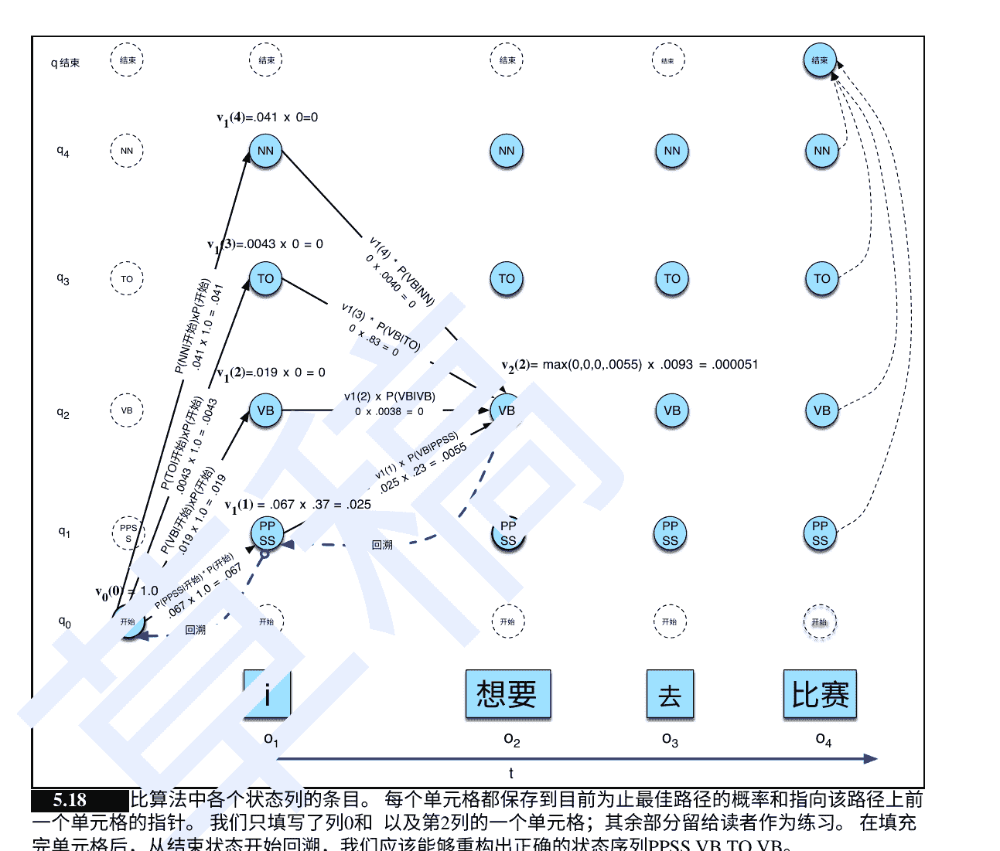

图5.18 Viterbi算法中各个状态列的条目。每个单元格都保存到目前为止最佳路径的概率和指向该路径上一个单元格的指针。我们只填写了列0和第1列以及第2列的一个单元格；其余部分留给读者作为练习。在填充完单元格后，从结束状态开始回溯，我们应该能够重构出正确的状态序列PPSS VB TO VB。

在图5.18中，通过将开始状态（1.0）的先前概率、从开始状态到该单元格标记的转移概率以及给定该单元格标记的单词的观测可能性相乘，计算出每个单元格的trellis列。事实证明，其中三个单元格为零（因为单词“我”不能是NN、TO或VB）。接下来，每个单元格在当前列中都会更新为从上一列中的最大概率路径。我们只展示了VB单元格的值。该单元格获取四个值中的最大值；在这种情况下，其中三个值为零（因为在上一列中没有值）。剩余的值乘以相关的转移概率，并取（微不足道的）最大值。在这种情况下，最终值0.000051来自上一列的PPSS状态。

读者应该填写图5.18中剩下的网格，并回溯以重建正确的状态序列PPSS VB TO VB。

### 5.5.4 将隐马尔可夫模型算法扩展到三元组

我们之前提到，实际使用的HMM标注器在我们迄今为止描述的简化标注器中有许多复杂性。一个重要的缺失特性与标签上下文有关。在上述标注器中，我们假设标签出现的概率仅依赖于前一个标签：

> $$(5.39) \qquad P(t_1^n) \approx \prod_{i=1}^n P(t_i|t_{i-1})$$

大多数现代HMM标注器实际上使用更多的历史信息，让一个标签的概率依赖于前两个标签：

> $$(5.40) \qquad P(t_1^n) \approx \prod_{i=1}^n P(t_i|t_{i-1}, t_{i-2})$$

除了在标注决策之前增加窗口外，像Brants (2000)这样的最先进的HMM标注器还通过添加对下一个句子结束位置的依赖来知道句子的结束位置，使用一个特殊的“序列结束”标记 $t_{n+1}$。这给出了词性标注的以下方程：

> $$(5.41) \qquad \hat{t}_1^n = \underset{t_1^n}{\mathrm{argmax}} P(t_1^n|w_1^n) \approx \underset{t_1^n}{\mathrm{argmax}} \left[ \prod_{i=1}^n P(w_i|t_i)P(t_i|t_{i-1}, t_{i-2}) \right] P(t_{n+1}|t_n)$$

使用(5.41)标注任何句子时，上下文中使用的三个标签将超出句子的边界，因此不会与常规单词匹配。这些标签，$t_{-1}$, $t_0$, 和 $t_{n+1}$，都可以设置为一个特殊的“句子边界”标签，该标签被添加到标签集中。这要求传递给标注器的句子必须有句子边界标记，如第3章所讨论的。

(5.41) 存在一个大问题，即数据稀疏性。测试集中的任何特定序列 of tags $t_{i-2}, t_{i-1}, t_i$ 可能在训练集中从未出现。这意味着我们无法仅通过计数的最大似然估计来计算标签三元概率，如公式5.42所示：

> $$(5.42) \qquad P(t_i|t_{i-1}, t_{i-2}) = \frac{C(t_{i-2}, t_{i-1}, t_i)}{C(t_{i-2}, t_{i-1})} :$$

为什么不呢？因为在任何训练集中，这些计数中的许多将为零，我们将错误地预测给定的标签序列永远不会出现！我们需要一种方法来估计 $P(t_i|t_{i-1}, t_{i-2})$，即使序列 $t_{i-2}, t_{i-1}, t_i$ 在训练数据中从未出现。

解决这个问题的标准方法是通过组合更可靠但较弱的估计器来估计概率。例如，如果我们从未见过标签序列PRP VB TO，那么我们无法从该频率计算P(TO | PRP, VB)，但我们仍然可以依赖于二元概率P(TO | VB)，甚至是一元概率P(TO)。每个概率的最大似然估计可以通过以下计数从语料库中计算得出：

```
(5.43) 三元组概率 \( \hat{P}(t_i | t_{i-1}, t_{i-2}) = \frac{C(t_{i-2}, t_{i-1}, t_i)}{C(t_{i-2}, t_{i-1})} \)
(5.44) 二元概率 \( \hat{P}(t_i | t_{i-1}) = \frac{C(t_{i-1}, t_i)}{C(t_{i-1})} \)
(5.45) 单字 \( \hat{P}(t_i) = \frac{C(t_i)}{N} \)
```

这三个估计器应该如何组合以估计三元组概率 $P(t_i|t_{i-1},t_{i-2})$？最简单的组合方法是线性插值。在线性插值中，我们通过对单字、双字和三字概率进行加权求和来估计概率 $P(t_i|t_{i-1},t_{i-2})$：

```
(5.46) \( P(t_i|t_{i-1},t_{i-2}) = \lambda_1 \hat{P}(t_i|t_{i-1},t_{i-2}) + \lambda_2 \hat{P}(t_i|t_{i-1}) + \lambda_3 \hat{P}(t_i) \)
```

我们需要 $\lambda_1 + \lambda_2 + \lambda_3 = 1$，确保得到的P是一个概率分布。这些 $\lambda$ 应该如何设置？一种好的方法是删除插值，开发由Jelinek和Mercer（1980）提出。在删除插值中，我们逐步从训练语料库中删除每个三元组，并选择 $\lambda$ 以最大化其余语料库的似然度。删除的思想是设置 $\lambda$ 的方式，以便对未见数据进行泛化，并且不过度拟合训练语料库。图5.19给出了Brants（2000）对标签三元组的删除插值算法的版本。

- 插值删除

Brants（2000）在Penn Treebank上使用三元组HMM标注器实现了96.7%的准确率。Weischedel等人（1993）和DeRose（1988）也报告了超过96%的HMM标注准确率。（Thede和Harper，1999）提供了一些对三元组HMM模型的增强，包括将单词的似然度条件化于相邻的单词和标签。

到目前为止，我们所见过的HMM标注器都是在手动标记的数据上进行训练的。Kupiec(1992)、Cutting等人(1992a)以及其他人表明，也可以使用EM算法在未标记的数据上训练HMM标注器，我们将在第6章介绍该算法。这些标注器仍然以一个词典开始，该词典列出了可以分配给哪些词的标签；然后EM算法学习每个标签的词似然函数和标签转移概率。然而，Merialdo(1994)的实验证明，即使只有少量的训练数据，一个在手动标记的数据上训练的标注器也比通过EM训练的标注器效果更好。因此，通过EM训练的“纯HMM”标注器是可能最适合于没有可用的训练数据的情况，例如为没有先前手动标记的数据的语言进行标记。

```
函数 DELETED-INTERPOLATION(语料库)返回 λ₁, λ₂, λ₃
    λ₁ ← 0
    λ₂ ← 0
    λ₃ ← 0
    对于每个三元组 t₁, t₂, t₃，如果 f(t₁, t₂, t₃) > 0，则取以下三个值中的最大值，根据情况 C(t)
    - (C(t₁, t₂, t₃) - 1) / (C(t₁, t₂) - 1): 增加 λ₃ 通过 C(t₁, t₂, t₃)
    情况 (C(t₂, t₃) - 1) / (C(t₂) - 1): 增加 λ₂ 通过 C(t₁, t₂, t₃)
    情况 (C(t₃) - 1) / (N - 1): 通过 C(t₁, t₂, t₃) 增加 λ₁
    结束
    归一化 λ₁, λ₂, λ₃
    返回 λ₁, λ₂, λ₃
```

5.19 设置组合单元格、双元格和三元格标签概率权重的删除插值算法。如果分母为0，则将该情况的结果定义为0。N是语料库中的总标记数。参考Brants (2000)。

## 5.6 基于转换的标记

基于转换的标记，有时被称为Brill标记，是基于转换的学习（TBL）方法的一个实例（Brill, 1995），并从规则和随机标记器中汲取灵感。与基于规则的标记器类似，TBL基于规则来指定应该分配给哪些单词的标签。但与随机标记器类似，TBL是一种机器学习技术，其中规则是从数据中自动归纳出来的。与一些但不是所有的HMM标记器类似，TBL是一种监督学习技术；它假设存在在一个预标记的训练语料库。

塞缪尔等人（1998年）提供了一个有用的类比来理解TBL范式，他们将其归功于特里·哈维。想象一位艺术家正在画一幅白房子绿色修饰的画，背景是蓝天。假设画面中大部分是天空，因此大部分是蓝色。艺术家可能会先使用一支非常宽的画笔，将整个画布涂成蓝色。接下来，她可能会换一支稍微小一点的白色画笔，将整个房子涂成白色。她只需要涂满整个房子，不用担心棕色的屋顶，或者蓝色的窗户，或者绿色的山墙。接下来，她拿起一支较小的棕色画笔，涂在屋顶上。现在，她拿起一支小画笔蘸上蓝色的颜料，给房子上的窗户涂上蓝色。最后，她拿起一支非常细的绿色画笔，给山墙上的修饰涂上绿色。画家从一支宽刷开始，覆盖了很多画布，但是涂了很多颜色需要重新涂漆的区域。下一层涂料覆盖的画布面积较少，但也会犯较少的“错误”。每一层使用更细的刷子，纠正的画面较少，但也会犯较少的错误。TBL算法与这位画家使用的方法有些相似。TBL算法有一组标记规则。首先，使用最广泛的规则对语料库进行标记，即适用于大多数情况的规则。然后选择稍微更具体的规则，改变一些原始标记。接下来是更窄的规则，改变较少数量的标记（其中一些可能是之前改变过的标记）。

### 5.6.1 如何应用TBL规则

让我们来看一下Brill（1995）标注器使用的规则之一。在规则应用之前，标注器会为每个单词标上最可能的标记。我们从标记过的语料库中获取这些最可能的标记。例如，在Brown语料库中，race最有可能是一个名词：

```
P(NN|race) = .98
P(VB|race) = .02
```

这意味着我们上面看到的两个例子都将被编码为NN。在第一种情况下，这是一个错误，因为NN是错误的标签：

```
(5.47) is/VBZ expected/VBN to/TO race/NN tomorrow/NN
```

在第二种情况下，这个 race被正确标记为NN：

```
(5.48) the/DT race/NN for/IN outer/JJ space/NN
```

在选择最可能的标签之后，Brill的标注器应用其转换规则。恰好Brill的标注器学到了一个规则，该规则正好适用于这种错误标记的race：

- 当前标签为TO时，将NN更改为VB

在以下情况下，这个规则将会将race/NN更改为race/VB，因为它之前是to/TO：

```
(5.49) 预计/VBN 参加比赛/NN → 预计/VBN 参加比赛/VB
```

### 5.6.2 如何学习TBL规则

Brill的TBL算法有三个主要阶段。首先，它将每个单词标记为最可能的标签。然后，它检查每个可能的转换，并选择导致最改进标记的转换。最后，它根据这个规则重新标记数据。最后两个阶段会重复进行，直到达到某个停止准则，例如与上一次相比改进不足。请注意，第二阶段要求TBL知道每个单词的正确标签；也就是说，TBL是一种监督学习算法。

TBL过程的输出是一个有序的转换列表；然后，这些转换构成了可以应用于新语料库的“标记过程”。原则上，可能的转换集是无限的，因为我们可以想象出诸如“如果前一个单词是“IBM”，并且单词“the”在其之前出现了17到158个单词，则将NN转换为VB”的转换。但是TBL需要考虑每一个可能的转换，为了在算法的每一次迭代中选择最佳的一个。因此，算法需要一种限制转换集合的方法。这是通过设计一组小型的模板（抽象转换）来实现的。每个允许的转换都是模板的一个实例化。Brill的模板集列在图5.20中。图5.21详细介绍了该算法学习转换的细节。

- 前（后）一个单词被标记为 z。
- 前（后）两个单词被标记为 z。
- 前（后）两个单词中的一个被标记为 z。
- 前（后）三个单词中的一个被标记为 z。
- 前一个单词被标记为 z，后一个单词被标记为 w。
- 前（后）一个单词被标记为 z，前（后）两个单词被标记为 w。

5.20 Brill (1995) 的模板。每个模板都以“当：将标记 a 更改为标记 b 时...”开始。变量 a, b, z 和 w 范围涵盖了词性的部分。

图5.21的核心是两个函数GET BEST TRANSFORMATION和GET BEST INSTANCE。GET BEST TRANSFORMATION被调用时带有一个潜在模板的列表；对于每个模板，它调用GET BEST INSTANCE。GET BEST INSTANCE通过填充标签变量 a, b, z和 w的具体值，迭代地测试每个模板的所有可能实例。

实际上，有很多方法可以使算法更加高效。例如，可以以数据驱动的方式提供模板和实例化的转换；只有在某个特定词的标记改进时，才可能建议一个转换实例。通过将训练语料库中的单词按潜在转换进行预索引，还可以使搜索更加高效。Roche和Schabes (1997a) 展示了如何通过将每个规则转换为有限状态转换器并组合所有转换器来加速标记器。

图5.6.2展示了Brill原始标注器学到的一些规则。

## 5.7 评估和错误分析

在像HMM POS标注器这样的统计模型中，概率来自于它所训练的语料库。我们在第4.3节中看到，为了训练像标注器或 N-grams这样的统计模型，我们需要留出一个训练集。训练集或训练语料库的设计需要仔细考虑。如果训练语料库过于特定于任务或领域，概率可能过于狭窄，不能很好地推广到非常不同的领域中的句子标注。但是，如果训练语料库过于通用，概率可能无法充分反映任务或领域。

对于评估 N-grams模型，我们在第4.3节中说过，我们需要将语料库分成一个独立的训练集、测试集和第二个测试集，称为开发测试集。我们在训练集上训练我们的标注器。然后我们使用开发测试集（也称为开发测试集）来调整一些参数，并且通常决定 devtest 我们先确定最佳模型是什么。然后一旦我们确定了我们认为是最佳模型的模型，我们在（迄今为止未见过的）测试集上运行它，以查看其性能。我们可能使用80%的数据进行训练，并将10%用于开发测试和测试。为什么我们需要一个与最终测试集不同的开发测试集？因为如果我们在开发阶段使用最终测试集来计算所有实验的性能，我们将调整各种更改和参数以适应该集合。我们在最终测试集上的最终错误率将会是乐观的：它会低估真实的错误率。

固定的训练集、开发集和测试集的问题在于为了节省大量的训练数据，测试集可能不足以代表整体。

因此，更好的方法是在训练和测试中都使用我们的所有数据。这怎么可能呢？这个想法是使用交叉验证。在交叉验证中，我们随机选择训练集和测试集的划分，训练我们的标注器，然后计算测试集上的错误率。然后我们用不同的随机选择的训练集和测试集重复这个过程。我们重复这个抽样过程10次，然后对这10次运行取平均，得到一个平均错误率。这被称为10折交叉验证。

交叉验证唯一的问题在于因为所有的数据都用于测试，我们需要整个语料库是盲目的；我们不能检查任何数据来提出可能的特征，一般来说也无法了解正在发生的情况。但是查看语料库对于设计系统非常重要。因此，常见的做法是创建一个固定的训练集和测试集，然后在训练集中进行10折交叉验证，但在测试集中以正常的方式计算错误率。

一旦我们有了一个测试集，标注器通过将其对测试集的标注与人工标注的黄金标准测试集进行比较来进行评估，评估基于准确率：标注器与黄金标准一致的测试集中所有标签的百分比。大多数当前的标注算法对于像Penn Treebank集这样的简单标签集的准确率约为96-97%。这些准确率是针对单词和标点符号的；仅针对单词的准确率会更低。

97%好吗？由于标签集和任务不同，标签的性能可以与下限基准和上限基准进行比较。设定的一种方法是天花板是为了看人类在任务上表现如何。例如，Marcus等人（1993年）发现人类注释者在宾州树库布朗语料库版本中的标签上达成了约96-97%的一致。这表明黄金标准可能有3-4%的误差范围，并且达到100%的准确性是没有意义的（模拟最后的3%只是模拟噪音）。事实上，Ratnaparkhi（1996年）表明，导致他的标注器出现问题的标注歧义正是人类在训练集中标注不一致的地方。然而，Voutilainen（1995年，第174页）的两个实验发现，当人类被允许讨论标签时，他们对100%的标签达成了共识。

- 人类天花板：当使用人类黄金标准来评估一个分类算法时，检查标准上人类的一致率。

标准基线，由Gale等人（1992b）建议（在稍微不同的词义消歧上下文中），是选择最可能的单字标签。

```
函数 TBL(语料库)返回转换队列
    INITIALIZE-WITH-MOST-LIKELY-TAGS(语料库)
    直到 满足结束条件为止 do
        模板 ← GENERATE-POTENTIAL-RELEVANT-TEMPLATES
        最佳转换 ← GET-BEST-TRANSFORM(语料库,模板)
        APPLY-TRANSFORM(最佳转换,语料库)
        ENQUEUE(最佳转换规则, 转换队列)
    结束
    返回(转换队列)

函数 GET-BEST-TRANSFORM(语料库,模板)返回 转换
    对于每个模板在模板中
        (实例,分数) ← GET-BEST-INSTANCE(语料库,模板)
        如果 (分数 > 最佳转换分数) 则 最佳转换 ← (实例,分数)
    返回(最佳转换)

函数 GET-BEST-INSTANCE(语料库, 模板)返回转换
    对于从标签 ← 从标签₁到标签ₙ 执行
        对于到标签 ← 从标签₁到标签ₙ 执行
            对于位置 ← 从 1到语料库大小 执行
                如果 (正确标签(位置) == 到标签 && 当前标签(位置) == 从标签)
                    好转换数量(当前标签(位置−1))++
                否则如果 (正确标签(位置)== 从标签 && 当前标签(位置)== 从标签)
                    坏转换数量(当前标签(位置−1))++
            结束
            最佳-Z ← ARGMAX_{t} (好的转换数量(t) -坏的转换数量(t))
            如果(好的转换数量(最佳-Z) -坏的转换数量(最佳-Z) > 最佳实例得分)那么
                最佳规则 ← “如果前一个标签是最佳-Z，则将标签从 from-tag更改为 to-tag”
                最佳得分 ← 好的转换数量(最佳-Z) -坏的转换数量(最佳-Z)
    返回(最佳)

过程 APPLY-TRANSFORM(转换,语料库)
    对于位置从 1到语料库大小做
        如果 (当前标签(位置)==最佳规则的起始标签) && (当前标签(位置−1)==最佳规则的前一个标签))
            当前标签(位置) ← 最佳规则的目标标签
```

5.21 Brill (1995) TBL算法用于学习标记。获得最佳实例的部分需要根据其他转换模板进行更改，而不仅仅是“如果前一个标签是X，则将标签从X更改为Y”。

| # | 从 | 到 | 条件 | 例子 |
|---|----|----|------|------|
| 1 | NN | VB | 前一个标签是TO | to/TO race/NN → VB |
| 2 | VBP | VB | 前三个标签中的一个是MD | might/MD vanish/VBP → VB |
| 3 | NN | VB | 前两个标签中的一个是MD | might/MD not reply/NN → VB |
| 4 | VB | NN | 前两个标签中的一个是DT | |
| 5 | VBD | VBN | 前三个标签中的一个是VBZ | |

5.22 Brill (1995) 的前20个非词汇化转换。每个有歧义的词的最可能标签。每个词的最可能标签可以从一个手工标记的语料库中计算出来（可能与正在评估的标签器的训练语料库相同）。

最频繁类别基线：始终将分类器与至少与训练集中最频繁类别基线一样好的基线进行比较（将每个标记分配给在训练集中最常出现的类别）。

自Harris (1962) 以来的标记算法融入了这种标签频率直觉。Charniak等人 (1993) 表明，这种基线算法在87个标签的Brown标签集上达到90-91%的准确率；Toutanova等人 (2003) 表明，一个更复杂的版本，加上未知词模型，在45个标签的Treebank标签集上达到93.69%的准确率。

在比较模型时，使用统计测试（在任何统计课程或社会科学教材中介绍）来确定两个模型之间的差异是否显著是很重要的。Cohen (1995) 是一个关于人工智能统计研究方法的有用参考文献。Dietterich (1998) 专注于比较分类器的统计测试。在统计比较词性标注器等序列模型时，使用配对测试是很重要的。常用的配对测试包括

- 配对测试
- 句子的匹配t检验
- 配对t检验
- MAPSSWE
- 麦克纳马检验

用于评估词性标注器的配对测试包括Wilcoxon符号秩检验、配对t检验以及匹配检验的版本。Segment Word Error (MAPSSWE) 测试最初应用于语音识别单词错误率以及McNemar测试。

### 5.7.1 错误分析

为了改进任何模型，我们需要了解它出了什么问题。分析一个词性标注器等分类器的错误是通过混淆矩阵或列联表来完成的。对于一个N分类任务的混淆矩阵是一个N×N的矩阵，其中单元格（x, y）包含了模型将正确分类为x的项目被错误分类为y的次数。例如，下表显示了Franz (1996) 的HMM标记实验中混淆矩阵的一部分。

行标签表示正确的标记，列标签表示标记器的假设标记，每个单元格表示整体标记错误的百分比。因此，总错误中有4.4%是将VBD错误标记为VBN。常见错误已经突出显示。

|      | IN | JJ  | NN | NNP | RB  | VBD | VBN |
|------|----|-----|----|----|-----|-----|-----|
| **IN** | -  | .2  |    | .7 |     |     |     |
| **JJ** | .2 | -   | **3.3** | 2.1 | 1.7 | .2  | **2.7** |
| **NN** |    | 8.7 | -  |    |     |     | .2  |
| **NNP** | .2 | **3.3** | **4.1** | -  | .2  |     |     |
| **RB** | **2.2** | 2.0 | .5 |    | -   |     |     |
| **VBD** |    | .3  | .5 |    |     | -   | **4.4** |
| **VBN** |    | **2.8** |    |    |     | **2.6** | -   |

上面的混淆矩阵以及Franz (1996)、Kupiec (1992) 和Ratnaparkhi (1996) 中的相关错误分析表明，当前标签面临一些重大问题。错误是：

1.  NN与NNP与JJ：这些在名词前很难区分。区分专有名词对于信息提取和机器翻译尤为重要。
2.  RP与RB与IN：所有这些都可以出现在动词后的卫星序列中。
3.  VBD与VBN与JJ：区分这些对于部分解析很重要（分词用于找到被动语态），以及正确标记名词短语的边缘。

像这样的错误分析是任何计算语言学应用的关键部分。错误分析可以帮助发现错误，找到训练数据中的问题，并且最重要的是，在解决问题时帮助开发新的知识或算法。

## 5.8 词性标注的高级问题

### 5.8.1 实际问题：标签不确定性和分词

当一个词在多个标签之间存在歧义，并且无法或非常困难地消除歧义时，就会出现标签不确定性。在这种情况下，一些标注器允许使用多个标签。这在Penn Treebank和British National Corpus中都是如此。常见的标签不确定性包括形容词与过去式与过去分词（JJ/VBD/VBN）之间的区别，以及形容词与名词作为前置修饰语（JJ/NN）之间的区别。

在训练和评分词性标注器时，对于具有这些不确定标签的语料库，有3种处理标签不确定性的方法：

1.  以某种方式将不确定标签替换为只有一个标签。
2.  在测试中，如果标注器给出了正确的标签，则将其视为正确标记的不确定标记。在训练中，只选择一个标签来表示单词。
3.  将不确定的标签视为一个复杂的标签。

第二种方法可能是最明智的，尽管大多数先前发表的结果似乎使用了第三种方法。例如，将这种第三种方法应用于Penn Treebank Brown语料库将导致一个更大的标签集，包括85个标签，而不是45个，但是额外的40个复杂标签只覆盖了百万词语料库中的121个词实例。

大多数标注算法假设已经对标签进行了分词处理。第3章讨论了句子末尾句号与单词内部句号（如etc.）的分词问题。分词的另一个作用是词的拆分。Penn Treebank和British National Corpus将缩写词和's-所有格从其词干中分开处理：would/MD n't/RB children/NNS 's/POS

### 5.8.2 未知词

> 人们从不使用的词——
> 可能只有我知道它们
> 石川啄木 1885–1912

hapax legomena

我们讨论过的所有标记算法都需要一个列出每个词可能的词性的词典。但是，即使是最大的词典也不会包含每个可能的单词，正如我们在第7章中看到的那样。专有名词和缩写词经常被创造出来，甚至新的普通名词和动词以惊人的速度进入语言中。因此，为了构建一个完整的标记器，我们不能总是依靠词典来提供信息。我们需要一些方法来猜测一个未知单词的标签。

最简单的未知单词算法是假设每个未知单词在所有可能的标签中都是模糊的，概率相等。然后标注器必须完全依赖上下文的词性三元组来建议正确的标签。稍微复杂一些的算法基于这样一个思想：未知单词的标签分布与训练集中只出现一次的单词的标签分布非常相似，这个思想由Baayen和Sproat（1996）以及Dermatas和Kokkinakis（1995）提出。这些只出现一次的单词被称为hapax legomena（单数形式为hapax legomenon）。例如，未知单词和hapax legomena在很多方面都相似，它们都最有可能是名词，其次是动词，但很不可能是限定词或感叹词。因此，对于一个未知单词，其概率P(wi|ti)是由训练集中所有只出现一次的单词的分布的平均值决定的。在第4章的Good-Turing算法中，使用“我们曾经见过一次的事物”作为“我们从未见过的事物”的估计器将会非常有用。

然而，大多数未知词算法利用了更强大的信息源：单词的形态学。例如，以-s结尾的单词很可能是复数名词（NNS），以-ed结尾的单词往往是过去分词（VBN），以-able结尾的单词往往是形容词（JJ），等等。即使我们从未见过一个单词，我们也可以利用其形态学形式的事实来猜测其词性。除了形态学知识，正字法信息也非常有帮助。例如，以大写字母开头的单词很可能是专有名词（NP）。连字符的存在也是一个有用的特征；在布朗树库版本中，连字符的单词很可能是形容词（JJ）。这种JJs的普遍存在是由于树库的标注说明，规定如果前置修饰语中包含连字符，则应标记为JJ。

这些特征如何组合和在词性标注器中使用？一种方法是为每个特征训练单独的概率估计器，假设它们相互独立，并将概率相乘。Weischedel等人（1993）构建了这样一个模型，基于四种特定的形态和正字特征。他们使用了3个屈折结尾（-ed，-s，-ing），32个派生结尾（如-ion，-al，-ive和-ly），4个大写字母的值，取决于一个词是否是句子开头（+/-大写，+/-开头），以及该词是否有连字符。对于每个特征，他们训练了给定标签的特征概率的最大似然估计，然后通过假设独立性并相乘来组合这些特征以估计未知词的概率：

> (5.50) $$P(w_i|t_i) = p(\text{未知词}|t_i) * p(\text{大写}|t_i) * p(\text{结尾/连字符}|t_i)$$

另一种基于HMM的方法，由Samuelsson（1993）和Brants（2000）提出，以数据驱动的方式概括了这种形态学的使用。在这种方法中，不是手动预先选择某些后缀，而是考虑所有单词的所有最后字母序列。他们考虑了长度为i的后缀，计算每个后缀给定标签i的概率：

> (5.51) $$P(t_i|l_{n-i+1}\ldots l_n)$$

这些概率使用逐渐变短的后缀进行平滑处理。大写和小写单词分别保留了后缀树。

一般来说，大多数未知词模型试图捕捉未知词不太可能是封闭类词（如介词）的事实。Brants通过仅计算在训练集中频率≤10的单词的后缀概率来建模这一事实。在Thede和Harper（1999）的HMM标记模型中，这一事实是通过仅在开放类词上进行训练来建模的。

请注意，（5.51）给出了p(t_i|w_i)的估计；由于对于HMM标记方法，我们需要似然p(w_i|t_i)，可以使用贝叶斯逆推（即使用贝叶斯规则和计算两个先验概率P(t_i)和P(t_i|l_{n-i+1}...l_n)）从（5.51）中推导出来。除了对未知词使用大写信息外，Brants（2000）还通过为每个标记添加一个大写特征来对已知词进行标记。因此，他实际上计算的是概率P(t_i,c_i|t_{i-1},c_{i-1},t_{i-2},c_{i-2})，而不是（5.44）中的P(t_i|t_{i-1},t_{i-2})。这相当于每个标记都有一个大写和小写版本，从而将标记集的大小增加了一倍。

一个非HMM的未知词检测方法是Brill（1995）使用TBL算法，其中允许的模板在正字法上进行定义（单词的前N个字母，单词的后N个字母等）。然而，最近的未知词处理方法将这些特征以第三种方式结合起来：通过使用最大熵（MaxEnt）模型，例如由Ratnaparkhi（1996）和McCallum等人（2000）首次引入的最大熵马尔可夫模型（MEMM），我们将在第6章中学习。最大熵方法是一种基于对数线性的分类方法之一，其中包含许多特征。为了标记单词，计算了所有特征，并在基于多项式逻辑回归的模型中将所有特征组合在一起。Toutanova等人(2003)的标记器中的未知词模型使用了从Ratnaparkhi(1996)扩展的特征集，其中每个特征表示一个词的属性，包括诸如：

- 单词包含数字
- 单词包含大写字母
- 单词包含连字符
- 单词全为大写
- 单词包含特定前缀（长度≤4的前缀集合）
- 单词包含特定后缀（长度≤4的后缀集合）
- 单词全为大写并且包含数字和破折号（例如CFC-12）
- 单词全为大写并且在3个单词内后跟Co.、Inc.等

Toutanova等人（2003）发现这个最后的特征，实现了一个简单的公司名称检测器，特别有用。3个单词后跟类似Co.或Inc.的单词。请注意，Ratnaparkhi（1996）模型忽略了所有计数小于10的特征。对于中文标注，Tseng等人（2005b）也应用了对数线性模型。中文单词非常短（每个未知词约2.4个字符，而英文为7.7个字符），但Tseng等人（2005b）发现，形态特征仍然大大提高了对未知词的标注性能。例如，对于未知词中的每个字符和每个词性标记，他们添加了一个二进制特征，指示该字符是否在任何训练集词中与该标记一起出现过。中文和英文的未知词还存在一个有趣的分布差异。虽然英文的未知词往往是专有名词（在WSJ中，未知词的41%是NP），但在中文中，大多数未知词是普通名词和动词（在中文树库5.0中为61%）。这些比例与德语相似，并且似乎是由于中文和德语中合成作为一种形态学手段的普遍性所致。

### 5.8.3 其他语言的词性标注

正如前一段所提到的，词性标注算法也已经应用于许多其他语言。在某些情况下，这些方法在没有大幅修改的情况下也能很好地工作；Brants（2000）在德语NEGRA语料库（96.7%）上展示了与英语Penn Treebank相同的性能。但是，在处理高度屈折或粘着语言时，需要进行一些增强和改变。

这些语言的一个问题就是单词的数量很大，与英语相比。回顾第3章，像土耳其语（以及在某种程度上是混合粘着-屈折语言的匈牙利语）这样的粘着语言是指单词包含长字符串的语素，其中每个语素具有相对较少的表层形式，因此通常可以在表面文本中清楚地看到这些语素。例如，Megyesi（1999）给出了一个匈牙利语单词的典型例子，意思是‘他们的命中’。

```
(5.52) tal'álataiknak
```
talál -at -a -i -k -nak
hit/find 名词化 他的 所有格复数 他们的 dat/gen
“他们的命中”

同样，下面的列表摘自Hakkani-T`ur等人（2002），展示了从根词 uyu-（“睡觉”）在土耳其中可以生成的一些词语：

- uyuyorum '我正在睡觉'
- uyuduk '我们睡觉了'
- uyuman '你的睡觉'
- uyutmak '使某人入睡'
- uyuyorsun '你正在睡觉'
- uyumadan '不睡觉'
- uyurken '当某人在睡觉时'
- uyutturmak '使某人使另一个人入睡'

这些产生词汇的过程为这些语言带来了大量的词汇。例如，Oravec和Dienes（2002）展示了一个25万词的英语语料库有大约19,000个不同的词（即词类型）；同样大小的匈牙利语料库有近50,000个不同的词。即使在更大的语料库中，这个问题仍然存在；请注意下表中来自Hakkani-T`ur等人（2002）的土耳其语数据，土耳其语的词汇量比英语大得多，并且即使在1000万词的情况下，土耳其语的词汇量增长速度也比英语快。

| 语料库大小 | 土耳其 | 英语 |
|------------|--------|------|
| 100万个词  | 106,547| 33,398|
| 1000万个词 | 417,775| 97,734|

当HMM算法直接应用于合成语言时，大词汇量似乎会导致标记性能的显著下降。例如，Oravec和Dienes（2002）应用了与Brants（2000）相同的HMM软件（称为'TnT'），在英语和德语上都达到了96.7%的准确率，但在匈牙利语上只达到了92.88%的准确率。已知词汇的性能（98.32%）与英语结果相当；问题在于未知词汇的性能：匈牙利语为67.07%，而具有相似数量的英语训练数据的未知词汇的性能约为84-85%。Hajic（2000）在其他许多语言（包括捷克语、斯洛文尼亚语、爱沙尼亚语和罗马尼亚语）中也注意到了同样的问题；通过添加词典，这些标记器的性能得到了极大的改善，从而提供了对未知词汇更好的模型。总之，在标记高度屈折和合成语言时，一个困难是对未知词汇的标记。

与此类语言相关的第二个问题是单词形态中编码的大量信息。在英语中，关于单词句法功能的大量信息是通过词序或相邻的功能词来表示的。在高度屈折语言中，诸如格（主格、宾格、属格）或性别（阳性、阴性）等信息是标记在单词本身上的，而词序在标记句法功能方面的作用较小。由于标记通常用作其他自然语言处理算法（如解析或信息提取）的预处理步骤，因此这种形态学信息对于提取非常重要。这意味着土耳其语或捷克语的词性标注输出需要包含有关每个单词的格和性别的信息，以便与英语中不带格或性别的词性标注一样有用。

因此，对于粘着和高度屈折语言，标签集通常比我们在英语中看到的50-100个标签要大得多。在这种丰富的标签集中，标签是形态标签的序列，而不是单个的原始标签。将这样的标签从标签集分配给单词意味着我们同时解决了词性标注和形态消歧的问题。Hakkani-T¨ur等人（2002）给出了土耳其语的以下标签示例，其中单词 *izin* 有三个可能的形态/词性标签（和意义）：

1.  需要清理地上的痕迹。
地板上的痕迹应该清理掉。  iz +名词+单数+属格+非人称
2.  你的手指上留下了痕迹。
你的指纹留在上面了。  iz +名词+单数+属格+第二人称+主格
3.  你需要获得许可才能进入。
你需要一份许可才能进入。  izin +名词+单数+属格+非人称+主格

使用像名词+单数+属格+非人称+主格这样的形态分析序列作为词性标记，当然会大大增加词性的数量。我们可以在MULTEXT-East标记的英语、捷克语、爱沙尼亚语、匈牙利语、罗马尼亚语和斯洛文尼亚语语料库中清楚地看到这一点（Dimitrova等，1998年；Erjavec，2004年）。
Hajic（2000）为这些语料库给出了以下标签集大小：

| 语言       | 标签集大小 |
|------------|------------|
| 英语       | 139        |
| 捷克语     | 970        |
| 爱沙尼亚语 | 476        |
| 匈牙利语   | 401        |
| 罗马尼亚语 | 486        |
| 斯洛文尼亚语 | 1033      |

由于标签集如此庞大，通常需要对每个单词进行形态分析，以生成可能的形态标签序列列表（即可能的词性标签列表）。然后，标注器的作用是在这些标签中进行消歧。形态分析可以以多种方式进行。

Hakkani-T¨ur等人（2002）对土耳其语形态分析的模型基于我们在第3章中介绍的双层形态学。对于捷克语和MULTEXT-East语言，Hajic（2000）和Hajic和Hladka（1998）为每种语言使用一个固定的外部词典，该词典编译出每个单词的所有可能形式，并列出每个词形的可能标签。形态分析还在很大程度上有助于解决未知词的问题，因为形态分析器可以接受未知的词干并正确分割词缀。

鉴于这样的形态分析，可以使用各种方法进行标记本身。Hakkani-T¨ur等人（2002）提出的土耳其模型使用了标记序列的马尔可夫模型。该模型为标记序列分配了概率，例如
`izin+Noun+A3sg+Pnon+Nom`
通过从训练集中计算标记转移概率来计算。其他模型使用类似于英语的技术。
Hajic（2000）和Hajic和Hladka（1998）例如，使用对于MULTEXT-East语言的对数线性指数标记器，Oravec和Dienes（2002）和Dz’eroski等人（2000）使用TnT HMM标记器（Brants，2000），等等。

### 5.8.4 结合标注器

我们描述的各种词性标记算法也可以组合使用。标记器组合的最常见方法是在同一句子上并行运行多个标记器，然后通过投票或通过训练另一个分类器来选择在给定上下文中信任哪个标记器的输出。例如，Brill和Wu（1998）通过高阶分类器通过投票结合了一元、HMM、TBL和最大熵标记器，并显示出比四个分类器中最好的分类器略有提升。一般来说，只有当标记器具有互补错误时，这种组合才有用，因此组合研究通常从检查错误是否确实来自不同的标记器开始。另一种选择是串联标记器。Hajić等人（2001）将这种选择应用于捷克语，使用基于规则的方法来删除每个单词的一些不可能的标记可能性，然后使用HMM标记器从剩余标记中选择最佳序列。

## 5.9 高级：拼写的噪声信道模型

在第5.5节中介绍的贝叶斯推理模型对于标记有另一种解释：作为噪声信道模型的实现，这是语音识别和机器翻译中的一个关键工具。

在本节中，我们介绍这个噪声信道模型，并展示如何将其应用于纠正拼写错误的任务。噪声信道模型在Microsoft Word和许多搜索引擎中被使用，并且通常是纠正任何类型的单词拼写错误的最广泛使用的算法，包括非单词拼写错误和真实单词拼写错误。

回想一下，非单词拼写错误是指不是英语单词的错误（例如recieve for receive），我们可以通过简单地查找字典中不存在的单词来检测这些错误。我们在第3.10节中看到，对于某些拼写错误，可以通过查找与拼写错误的单词具有较小编辑距离的单词来找到候选纠正。

在本章中，我们所见到的贝叶斯模型和噪声信道模型将为我们提供一种更好的方法来找到这些更正。此外，我们将能够使用噪声信道模型进行上下文拼写检查，这是纠正实际单词拼写错误的任务，如下所示：

他们大约在十五分钟内离开去她的房子。
这项研究主要由约翰·布莱克进行。

由于这些错误是真实单词，我们不能仅通过标记不在字典中的单词来找到它们，也不能仅仅使用编辑距离来纠正它们。但请注意，在候选更正周围的单词中，在大约十五分钟内形成了一个比原始单词序列更有可能的单词序列。噪声信道模型将通过N-gram模型来实现这个想法。

噪声信道模型的直觉（见图5.23）是将拼写错误的单词视为通过噪声传递而被“扭曲”的正确拼写单词。通过传递噪声来扭曲的正确拼写单词。

## 5.23 噪声信道模型
在噪声信道模型中，我们想象我们看到的表面形式实际上是通过噪声信道传递的原始单词的“扭曲”形式。解码器通过该信道的模型将每个假设传递，并选择与表面噪声单词最匹配的单词。

通信信道。该信道通过字母的替换或其他变化引入“噪音”，使得很难识别出“真实”的单词。我们的目标是建立信道的模型。在拥有该模型的情况下，我们通过将语言中的每个单词通过我们的噪声信道模型传递，并观察哪个单词与拼写错误的单词最接近来找到真实的单词。

这个噪声信道模型，就像我们之前看到的HMM标注架构一样，是贝叶斯推理的一个特例。我们看到一个观察值 O（一个拼写错误的单词）和我们的任务是找到生成这个拼写错误的单词 w。在词汇表 V 中的所有可能单词中，我们希望找到使得 P(w|O) 最大的单词 w，即：

```
$$\hat{w} = \arg\max_{w \in V} P(w|O)$$
```

正如我们在词性标注中看到的那样，我们将使用贝叶斯规则来解决这个问题（注意，与标注一样，我们可以忽略分母）：

```
$$\hat{w} = \arg\max_{w \in V} \frac{P(O|w)P(w)}{P(O)} = \arg\max_{w \in V} P(O|w)P(w)$$
```

总结一下，噪声信道模型认为我们有一个真实的底层单词 w，我们有一个噪声的信道将单词修改为一些可能的错误拼写形式。噪声信道产生任何特定观察序列 O 的概率由 P(O|w) 建模。可能隐藏单词的概率分布由 P(w) 建模。在我们看到一些观察到的拼写错误 O 后，最有可能的单词可以通过将单词先验 P(w) 和观察似然 P(O|w) 的乘积计算出来，并选择乘积最大的单词。

让我们应用噪声通道方法来纠正非单词拼写错误。这种方法首先由Kernighan等人（1990）建议；他们的程序 correct，接受 Unix spell 程序拒绝的单词，生成一个潜在正确的单词列表。

根据公式5.54对单词进行排名，并选择排名最高的单词。我们将把算法应用于示例拼写错误 acress。该算法有两个阶段：提出候选纠正和对候选进行评分。

为了提出候选纠正，Kernighan等人做出了合理的（Damerau, 1964）简化假设，即正确的单词与错误的单词只有一个插入、删除、替换或转置的差异。候选单词列表是通过对打字错误应用任何单一转换来生成的，该转换会产生一个大型在线词典中的单词。对acress应用所有可能的转换将得到图5.24中的候选单词列表。

| 错误 | 更正 | 正确字母 | 错误字母 | 位置(字母#) | 类型 |
|------|------|----------|----------|-------------|------|
| actress | actress | t | - | 2 | 删除 |
| actress | cress | - | a | 0 | 插入 |
| actress | caress | ca | ac | 0 | 转置 |
| actress | access | c | r | 2 | 替换 |
| actress | across | o | e | 3 | 替换 |
| actress | acres | - | s | 5 | 插入 |
| actress | acres | - | s | 4 | 插入 |

图5.24 错误acress的候选更正和产生错误的转换（参考Kernighan等人（1990））。‘-’表示空字母。

算法的第二阶段通过方程5.54对每个更正进行评分。让 i 表示拼写错误（拼错的单词），让 c 范围在候选更正集合 C 上。然后最可能的更正是：

```
ĉ = argmax_c P(t|c) P(c)
    似然度          先验
```

每个更正的先验概率 P(c)是单词c在上下文中的语言模型概率；出于教学目的，在本节中我们将做出简化假设，即这是单字概率 P(c)，但在实际的拼写更正中，这会扩展到三元组或四元组概率。让我们使用Kernighan等人的语料库（1990年），这是4400万个单词的1988年AP新闻语料库。由于在这个语料库中，单词 actress出现了4400万次中的1343次，单词 acres出现了2879次，等等，所以得到的单字先验概率如下：

| c | 频率(c) | P(c) |
|---|---------|------|
| actress | 1343 | .0000315 |
| cress | 0 | .000000014 |
| caress | 4 | .000001 |
| access | 2280 | .000058 |
| across | 8436 | .00019 |
| acres | 2879 | .000065 |

我们如何估计 \( P(t|c) \)? 模拟实际通道的准确概率（即计算单词被打错的准确概率）非常困难，因为这需要知道打字员是谁，他们是左撇子还是右撇子，以及许多其他因素。幸运的是，我们可以通过查看简单的局部上下文因素来得到一个相当合理的估计值，因为预测插入、删除、转置的最重要因素是正确字母本身的身份，字母的拼写错误方式以及周围的上下文。例如，字母 m 和 n 经常互相替代；这部分是关于它们的身份的事实（这两个字母的发音相似，它们在键盘上相邻），部分是关于上下文的事实（因为它们发音相似，它们出现在类似的上下文中）。Kernighan等人（1990）使用了这种简单模型。他们估计了例如 acress 替代 across 的概率，只需在一些大型错误语料库中计算字母 e 被字母 o 替代的次数即可。这由一个混淆矩阵表示，它是一个 26 × 26 的方阵，表示错误的数量。

混淆矩阵

一个字母错误地使用了另一个字母的次数。例如，标记为的单元格 [o,e] 在替换混淆矩阵中表示了 e 被替换为 o 的次数。标记为的单元格 [t,s] 在插入混淆矩阵中表示了 t 在 s 之后插入的次数。混淆矩阵可以通过将一组拼写错误与正确的拼写进行编码，然后计算不同错误发生的次数来计算（Grudin, 1983）。Kernighan等人（1990）使用了四个混淆矩阵，每个矩阵对应一种单个错误类型：

-   删除[x,y]包含了在训练集中，正确单词中的字符 xy 被输入为 x 的次数。
- 插入[x,y]包含了在训练集中，正确单词中的字符 x 被输入为 xy 的次数。
- 替换[X,Y]X被输入为Y的次数。
- 转置[X,Y]XY被输入为YX的次数。

请注意，他们选择将插入和删除的概率条件化为前一个字符；他们也可以选择条件化为后一个字符。使用这些矩阵，他们估计了P(T|C)如下（其中CP是单词C的第P个字符）：

```
P(T|C) = 
\begin{cases}
\text{计数} CP_{-1}, CP_{-1} \text{，如果删除} \\
\text{计数} CP_{-1}, TP_{-1} \text{，如果插入} \\
\text{计数} CP, TP \text{，如果替换} \\
\text{计数} CP_{-1} CP, TP_{-1} TP \text{，如果转置} \\
\end{cases}
```

图5.25显示了每个潜在修正的最终概率；单字先验乘以似然（使用公式5.56和混淆矩阵计算）。最后一列显示了“归一化百分比”。

| c | 频率(c) | P(c) | P(t\|c) | P(t\|c)P(c) | % |
|---|---|---|---|---|---|
| actress | 1343 | .0000315 | .000117 | 3.69 × 10^{-9} | 37% |
| cress | 0 | .00000014 | .00000144 | 2.02 × 10^{-14} | 0% |
| caress | 4 | .0000001 | .00000164 | 1.64 × 10^{-13} | 0% |
| access | 2280 | .000058 | .000000209 | 1.21 × 10^{-11} | 0% |
| across | 8436 | .00019 | .0000093 | 1.77 × 10^{-9} | 18% |
| acres | 2879 | .000065 | .0000321 | 2.09 × 10^{-9} | 21% |
| acres | 2879 | .000065 | .0000342 | 2.22 × 10^{-9} | 23% |

图5.25 每个候选修正的排名。请注意，最高排名的单词不是 actress 而是 acres（表格底部的两行），因为 acres 可以通过两种方式生成。完整的 del[]、ins[]、sub[] 和 trans[] 混淆矩阵在 Kernighan 等人（1990）中给出。

这个贝叶斯算法的实现将 acres 预测为正确的单词（总归一化百分比为45%），将 actress 预测为第二可能的单词。

不幸的是，算法在这里出错了：从上下文中可以清楚地看出作者的意图：... 她被称为“杰出而多才多艺的女演员，她的时尚和魅力的结合定义了她的形象。.. ”。周围的词语清楚地表明 actress 而不是农田是作者想要表达的词。这就是为什么在实践中，我们在噪声信道模型中使用三元组（或更大）语言模型，而不是一元组。检查一下 P（c）的二元组模型是否正确解决了这个问题，留给读者作为练习10。

正如我们所描述的算法需要手动标注的数据来训练混淆矩阵。Kernighan 等人（1990）使用的另一种方法是通过迭代使用这个拼写错误修正算法来计算混淆矩阵本身。迭代算法首先用相等的值初始化矩阵；因此，任何字符被删除的可能性相等，任何字符被替换为其他字符的可能性也相等，等等。接下来，在一组拼写错误上运行拼写错误修正算法。给定与其更正对应的错别字集合，现在可以重新计算混淆矩阵，再次运行拼写算法，以此类推。这个巧妙的方法实际上是重要的 EM 算法（Dempster 等人，1977）的一个实例，我们将在第6章中讨论。

## 5.9.1 上下文拼写错误纠正
正如我们上面提到的，噪声信道方法也可以应用于检测和纠正真实单词拼写错误，导致英语中的实际单词错误。这可能是由于打字错误（插入、删除、转置）而意外产生一个真实单词（例如，there for three），或者是因为作者替换了一个同音或近音的错误拼写（例如，dessert for desert，或者 piece for peace）。纠正这些错误的任务也被称为上下文敏感的拼写纠正。一些研究表明，25%至40%的拼写错误是有效的英语单词（Kukich, 1992）；Kukich 的一些例子包括：

- 他们将在大约十五分钟内离开去她的房子。
- 系统的设计和构建将需要超过一年的时间。
- 他们能给他留言吗？
- 这项研究主要由约翰·布莱克进行。

我们可以通过为句子中的每个单词生成一个候选拼写集合 (Mays et al., 1991) 来扩展噪声信道模型，以处理真实世界的拼写错误。候选集合包括单词本身，以及通过排版修改（插入、删除、替换字母）或来自同音词列表生成的每个英语单词。然后算法选择每个单词的拼写，使整个句子的概率最高。也就是说，给定一个句子 W = {w1, w2, ..., wk, ..., wn}，其中 wk 有替代拼写 wk′, wk″ 等，我们使用最大化 P(W)的拼写来选择这些可能的拼写之一，使用 N-gram语法计算 P(W)。

更近期的研究集中在改进通道模型 P(t|c)，例如通过加入语音信息或允许更复杂的错误 (Brill和Moore, 2000; Toutanova和Moore, 2002)。对于语言模型 P(c)的最重要改进是使用非常大的上下文，例如使用Google在2006年公开发布的非常大的5-gram集合 (Franz和Brants, 2006)。有关噪声通道模型的详细解释和Python实现，请参阅Norvig (2007)；本章末尾还有更多的指引。

## 5.10 总结
本章介绍了词性和词性标注的概念。主要思想有：

-   语言通常有一小部分封闭类词汇，这些词汇通常非常频繁，通常作为功能词，并且在其词性标注中可能非常模糊。开放类词汇通常包括各种名词，动词，形容词。有许多基于40到200个标签的词性编码方案。
-   词性标注是将词序列中的每个词赋予一个词性标签的过程。基于规则的标注器使用手写规则来区分标签的歧义。HMM标注器选择使得词的似然度和标签序列概率乘积最大化的标签序列。用于标注的其他机器学习模型包括最大熵和其他对数线性模型、决策树、基于内存的学习和基于转换的学习。
-   HMM标注器中的概率是在手工标注的训练语料库上训练的，使用删除插值法结合不同的N-gram级别，并使用复杂的未知词模型。
-   给定一个HMM和一个输入字符串，使用维特比算法解码出最优的标签序列。
-   通过将标注器在测试集上的输出与人工标签进行比较来评估标注器。错误分析可以帮助确定标注器性能不佳的领域。

# 参考文献和历史注释
最早实施的词性分配算法可能是Zellig Harris的Transformations and Discourse Analysis Project (TDAP)中的解析器的一部分，该项目于1958年6月至1959年7月在宾夕法尼亚大学实施（Harris, 1962）。以前的自然语言处理系统使用了带有词性信息的词典，但没有被描述为执行词性消歧。作为其解析的一部分，TDAP通过14条手写规则进行词性消歧，这些规则使用了词性标签序列，预示了所有现代算法，并且按照词的标签相对频率的顺序运行。解析器/标注器最近已经重新实现，并由Joshi和Hopely（1999）以及Karttunen（1999）进行了描述，他们指出解析器基本上是以级联有限状态转换器的方式实现的（非常现代化）。

在TDAP解析器之后，是Klein和Simmons（1963）的计算语法编码器（CGC）。CGC有三个组成部分：词典、形态学分析器和上下文消歧器。这个小型的1500个词的词典包括了无法在简单的形态学分析器中解释的特殊词汇，包括功能词以及不规则的名词、动词和形容词。形态学分析器使用屈折和派生后缀来确定词性类别。一个词通过词典和形态学分析器后会产生一个候选的词性集合。然后使用一组500个上下文规则来消歧这个候选集合，依赖于周围无歧义词的岛屿。例如，一个规则说，在冠词和动词之间，唯一允许的序列是形容词-名词、名词-副词或名词-名词。CGC算法在将30个标签应用于《科学美国人》和儿童百科全书的文章时报告了90%的准确率。

TAGGIT标注器（Greene和Rubin, 1971）基于Klein和Simmons（1963）系统，使用相同的架构，但增加了字典的大小和标签集的大小（达到87个标签）。例如，以下示例规则表明在第三人称单数动词（VBZ）之前，一个词x不太可能是复数名词（NNS）：

```
x VBZ → not NNS
```

TAGGIT标注器被应用于布朗语料库，并且根据Francis和Kučera（1982，第9页）的说法，“准确标注了77%的语料库”（布朗语料库的其余部分是手动标注的）。

20世纪70年代，兰卡斯特-奥斯陆/卑尔根（LOB）语料库被编制为布朗语料库的英国英语等价物。它使用CLAWS标注器（Mar-shall, 1983, 1987; Garside, 1987）进行标注，这是一种概率算法，可以看作是HMM标注方法的近似。该算法使用标签二元概率，但不是存储每个标签的词似然度，而是将标签标记为罕见（P(tag|word)<.01）或不常见（P(tag|word)<.10），或通常频繁 (P(标签|词) > .10),

Church (1988)的概率PARTS标注器非常接近完整的HMM标注器。它扩展了CLAWS的思想，为每个词/标签组合分配了完整的词汇概率，并使用维特比解码来找到标签序列。然而，与CLAWS标注器一样，它存储了给定词的标签的概率：

```
(5.57)            P(标签|词) * P(标签|前n个标签)
```

而不是像HMM标注器那样使用给定标签的词的概率：

```
(5.58)            P(词|标签) * P(标签|前n个标签)
```

后来的标注器明确引入了隐马尔可夫模型的使用，通常使用EM训练算法（Kupiec，1992；Merialdo，1994；Weischedel et al., 1993），包括使用可变长度的马尔可夫模型（Schutze and Singer，1994）。
最近的标记算法，如HMM和TBL方法，是机器学习分类器，它们根据当前单词、相邻词性或单词以及正字法和形态特征等未知词特征来估计句子的最佳标记序列。已经使用了许多种类的分类器来组合这些特征，包括决策树(Jelinek等，1994；Magerman，1995a)，最大熵模型(Ratnaparkhi，1996)，其他对数线性模型(Franz，1996)，基于内存的学习 (Daelemans等，1996年)，以及线性分离器网络（SNOW）(Roth和Ze-lenko，1998年)。大多数机器学习模型在使用相似特征时似乎达到了相对相似的性能，大约在华尔街日报语料库的Treebank 45标签集上达到了96-97%的准确率。截至本章撰写时，WSJ Treebank任务上表现最好的已发表模型是一个使用相邻单词和标签信息以及复杂的未知词模型的对数线性标注器，准确率达到了97.24% (Toutanova等，2003年)。大多数这样的模型是有监督的，尽管开始有关于无监督模型的研究（Schutze，1995年；Brill，1997年；Clark，2000年；Banko和Moore，2004年；Goldwater和Griffiths，2007年）。对于词性的历史感兴趣的读者应该参考语言学历史的著作，如Robins（1967年）或Koerner和Asher（1995年），尤其是后者中的Householder（1995年）的文章。Sampson（1987年）和Garside等（1997年）详细介绍了Brown和其他标签集的来源和构成。有关词性标注的更多信息可以在van Halteren（1999年）中找到。

自至少Blair (1960)以来，拼写错误检测和纠正的算法已经存在。大多数早期算法都基于类似Soundex的相似性键，如在第82页的练习中讨论的算法（Odell和Russell，1922年；Knuth，1973年）。Damerau (1964)提出了一种基于字典的错误检测算法；从那时起，大多数错误检测算法都基于字典。Damerau还提出了一种适用于单个错误的纠正算法。从那时起，大多数算法都依赖于动态规划，始于Wagner和Fischer (1974)。Ku-kich (1992)是关于拼写错误检测和纠正的权威调查文章。

现代算法基于统计或机器学习算法，如Kashyap和Oommen (1983)以及Kernighan等人 (1990)的研究。拼写的最新方法包括对噪声信道模型的扩展（Brill和Moore，2000年；Toutanova和Moore，2002年），以及许多其他机器学习架构。

# 练习

5.1 在以下使用Penn Treebank标签集标记的句子中找到一个标记错误：

- a. 我/PRP 需要/VBP 从/IN 亚特兰大/NN 的/DT 航班/NN
- b. 这个/DT 航班/NN 提供/VB 晚餐/NNS 吗/VBZ
- c. 我/PRP 有/VB 一个/DT 住/VBG 在/IN 丹佛/NNP 的朋友/NN
- d. 你能/VBP 列出/VB 非停靠/JJ 下午/NN 航班/NNS

5.2 使用Penn Treebank标记集为以下来自Damon Runyon短篇小说的句子中的每个单词进行标记。你可以忽略标点符号。其中一些很难；尽力而为。

- a. 这是一个美好的夜晚。
- b. 这个赌博游戏在Fifty-second Street的一个车库里结束。
- c. ………………没有人会买她卖的报纸。
- d. 他是一个高个子、瘦瘦的家伙，长着一张长长的、悲伤的、凶恶的脸，还有一种悲伤的声音。
- e. ……………………我坐在Mindy's餐厅里吃gefillte鱼，这是一种我非常喜欢的菜，……
- f. 当一个男人和一个女人开始互相窥视时，你就在那里。

5.3 现在将你在上一个练习中的标签与一个或两个朋友的答案进行比较。你在哪些单词上最不同意？为什么？

5.4 现在使用图5.2中更详细的Brown标签集对练习2中的句子进行标记。

5.5 在图5.21中实现TBL算法。创建少量模板，并在任何已标记词性的训练集上训练标记器。

5.6 实现“最有可能的标签”基准。找到一个已标记词性的训练集，并使用它来计算每个单词使得 p(t|w)最大的标签。你需要实现一个简单的分词器来处理句子边界。首先假设所有未知单词都是NN，并计算已知和未知单词的错误率。现在至少编写5条规则来更好地标记未知单词，并展示错误率的差异。

## 第172章 第5节. 词性标注

5.7 回想一下，Church（1988）标注器不是一个HMM标注器，因为它包含了给定单词的标签的概率：

$$P(标签|词) * P(标签|前n个标签)$$

而不是使用给定标签的单词的可能性，就像HMM标注器一样：

$$P(词|标签) * P(标签|前n个标签)$$

作为一个思维实验，构造一个句子，一组标签转移概率和一组词性标签概率，以展示HMM标注器可以比Church标注器产生更好的答案的一种方式，以及另一个例子，其中Church标注器更好。

5.8 构建一个HMM标注器。这需要（1）你已经实现了本章和第6章的维特比算法，（2）你有一个带有词性信息的词典，和（3）你要么有（a）一个带有词性标注的语料库，要么有（b）一个前向后向算法的实现。如果你有一个带有标注的语料库，直接在手工标注的数据上训练HMM标注器的转移和观测概率。如果你有一个未标注的语料库，使用前向后向算法进行训练。

5.9 现在在一个小的手动标记的测试集上运行你的算法。找到五个错误并分析它们。

5.10 在一个大的语料库上计算二元语法，并重新估计图5.25中显示的拼写纠正概率，给出正确的序列…被称为一个“杰出而多才多艺的女演员，她的机智和魅力的结合定义了她的形象。…”.一个二元语法是否更喜欢正确的单词女演员？

5.11 阅读Norvig（2007）并实现他建议的扩展之一到他的Python噪声信道拼写检查器。

# 第6章 隐马尔可夫和最大熵模型

> Numquam ponenda est pluralitas sine necessitat  
‘除非必要，否则不应提出多元性’  
威廉·奥卡姆


亚历山大·普希金的诗歌小说，尤金·奥涅金，在19世纪早期连载，讲述了年轻的花花公子奥涅金，他拒绝了年轻的塔蒂亚娜的爱情，与朋友伦斯基决斗，以及他后来对这两个错误的悔恨。但这部小说主要因其风格和结构而受到喜爱，而不是其情节。在其他有趣的结构创新中，这部小说以一种现在被称为奥涅金体的形式写成，是一种不寻常的抑扬格四音步诗体，具有特殊的押韵方案。这些元素导致了其翻译成其他语言时的复杂性和争议。许多翻译都是用诗歌形式进行的，但纳博科夫以严格的直译方式将其翻译成了英文散文。它的翻译问题以及直译和诗歌翻译之间的紧张关系引发了许多评论（例如参见霍夫斯塔德（1997））。

1913年，马尔可夫提出了一个较少争议的问题，关于普希金的文本：我们能否利用文本中的频率计数来帮助计算下一个字母是元音的概率。在本章中，我们介绍了两个重要的统计模型，用于处理文本和语音，它们都是马尔可夫模型的后代。其中一个是隐马尔可夫模型（HMM）。另一个是最大熵模型（MaxEnt），特别是马尔可夫相关的最大熵马尔可夫模型（MEMM）。所有这些都是机器学习模型。我们已经涉及了机器学习的一些方面；事实上，在前一章中，我们简要介绍了隐马尔可夫模型，并在之前的章节中介绍了N-gram模型。在本章中，我们对这两个重要模型进行了更全面和正式的介绍。

HMM和MEMM都是序列分类器。一个序列分类器或序列标记器是一个模型，其任务是为序列中的每个单元分配某个标签或类别。我们在第3章中学习的有限状态转换器是一种非概率性的序列分类器，例如将单词序列转换为形态素序列。HMM和MEMM通过成为概率性序列分类器来扩展这个概念；给定一个单元序列（单词、字母、形态素、句子等），它们的任务是计算可能标签的概率分布并选择最佳的标签序列。

我们已经看到了一个重要的序列分类任务：词性标注，其中需要为序列中的每个单词分配一个词性标签。序列标记任务在语音和语言处理中经常出现，如果我们考虑到语言在许多表示层面上都是序列，这一点并不奇怪。除了词性标注之外，在本书中我们还将看到这些序列模型在语音识别（第9章）、句子分割和字素到音素转换（第8章）、部分解析/分块（第13章）以及命名实体识别和信息提取（第22章）等任务中的应用。

本章大致分为两个部分：隐马尔可夫模型，然后是最大熵马尔可夫模型。我们对隐马尔可夫模型的讨论扩展了我们对HMM词性标注的讨论。我们在下一节开始介绍马尔可夫链，然后详细概述HMM和前向算法以及维特比算法，并最后介绍了用于无监督（或半监督）学习隐马尔可夫模型的重要EM算法。

在本章的后半部分，我们逐渐介绍最大熵马尔可夫模型，从统计学中可能已经熟悉的技术开始：线性回归和逻辑回归。接下来我们介绍MaxEnt。MaxEnt本身不是一个序列分类器；它用于为单个元素分配一个类别。最大熵的名称来自于这样一个思想：分类器找到了遵循奥卡姆剃刀原则的概率模型，即最简单（最少约束；具有最大熵）但仍与某些特定约束一致。最大熵马尔可夫模型是将MaxEnt扩展到序列标注任务的一种方法，添加了诸如维特比算法等组件。

尽管本章介绍了最大熵（MaxEnt）分类器，但我们不会总体上专注于非顺序分类。非顺序分类将在后面的章节中进行讨论，介绍了类似于高斯混合模型（第9章）以及朴素贝叶斯和决策列表分类器（第20章）的分类器。

## 6.1 马尔可夫链

隐马尔可夫模型是语音与语言处理中最重要的机器学习模型之一。为了正确定义它，我们首先需要介绍马尔可夫链，有时也称为观测马尔可夫模型。马尔可夫链和隐马尔可夫模型都是第2章中有限自动机的扩展。

回想一下，有限自动机由一组状态和基于输入观察结果的状态转换组成。加权有限状态自动机是有限自动机的简单扩展，其中每个弧都与一个概率相关联，表示该路径被选择的可能性有多大。离开一个节点的所有弧上的概率必须总和为1。

马尔可夫链是加权自动机的一种特殊情况，其中输入序列唯一确定自动机将经过的状态。由于无法表示固有的模糊问题，马尔可夫链只适用于为明确的序列分配概率。

加权有限状态自动机

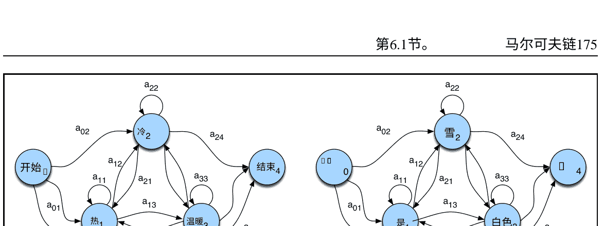

**图6.1** 的马尔可夫链（a）和单词的马尔可夫链（b）。马尔可夫链由结构、状态之间的转换以及起始和结束状态来指定。

图6.1a展示了一个用于为天气事件序列分配概率的马尔可夫链，其中词汇包括热，冷和雨天。图6.1b展示了另一个简单的马尔可夫链示例，用于为单词序列 $w_1...w_n$ 分配概率。这个马尔可夫链应该很熟悉；实际上它代表了一个二元语言模型。给定图6.1中的两个模型，我们可以为词汇表中的任何序列分配概率。我们很快就会介绍如何做到这一点。

首先，让我们更加正式一些。我们将马尔可夫链视为一种概率图模型；一种表示概率假设的图形方式。马尔可夫链由以下组件指定：

- $Q = q_1q_2...q_N$：一组 $N$ 个状态
- $A = a_{01}a_{02}...a_{N1}...a_{NN}$：一个转移概率矩阵 $A$，每个 $a_{ij}$ 表示从状态 $i$ 转移到状态 $j$ 的概率，使得 $\sum_{j=1}^{N} a_{ij} = 1 \quad \forall i$ $q_0, q_F$
- 一个特殊的开始状态和结束（最终）状态与观察结果无关联。

图6.1显示我们将状态（包括开始和结束状态）表示为图中的节点，将转移表示为节点之间的边。马尔可夫链对这些概率做出了重要的假设。在一阶马尔可夫链中，特定状态的概率仅依赖于前一个状态：

**马尔可夫假设：** $P(q_i|q_1…q_{i-1}) = P(q_i|q_{i-1})$

请注意，因为每个 $a_{ij}$ 表示概率 $p(q_j|q_i)$，概率的规律要求从给定状态出发的出边的值必须总和为1：

```
$$\sum_{j=1}^{n} a_{ij} = 1 \quad \forall i$$
```

有时候，马尔可夫链使用的是另一种表示方法，它不依赖于起始或结束状态，而是明确地表示初始状态和接受状态的分布：

接受输入并不依赖于起始或结束状态，而是明确地表示初始状态和接受状态的分布：

```
π = π1, π2, ..., πN 初始概率分布 over states. π_i 是马尔可夫链以状态 i开始的概率。. 一些状态 j 可能有 π_j = 0，表示它们不能作为初始状态。. 此外，∑_{i=1}^{n} π_i = 1 QA = {q_x, q_y...} 一个合法接受状态的集合 QA ⊂ Q
```

因此，状态1作为第一个状态的概率可以表示为 a01 或者 π1。 请注意，因为每个 π_i 表示的是概率 p(q_i|START)，所有的 π 概率必须加起来等于1：

```
(6.3) \quad \sum_{i=1}^{n} \pi_i = 1
```

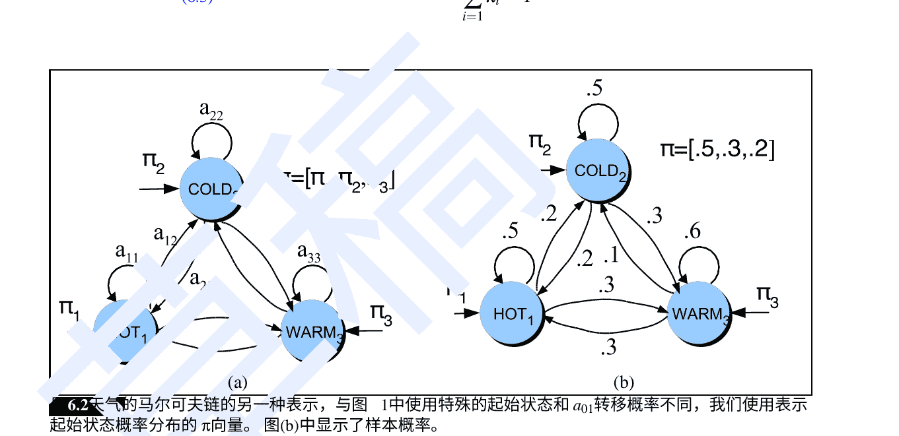

在继续之前，请使用图6.2b中的样本概率计算以下序列的概率：

(6.4) 热 热 热
(6.5) 冷 热 冷 热

这些概率的差异告诉你关于图6.2b中编码的现实世界天气事实的什么？

## 6.2 隐马尔可夫模型

当我们需要计算一系列在世界中可以观察到的事件的概率时，马尔可夫链非常有用。然而，在许多情况下，我们感兴趣的事件可能在世界中无法直接观察到。例如，在词性标注（第5章）中，我们没有观察到世界中的词性标签；我们看到的是单词，并且必须从单词序列中推断出正确的标签。我们将词性标签称为“隐藏”的原因是它们不可观察。相同的架构将在语音识别中出现；在这种情况下，我们将在世界中看到声学事件，并且必须推断出作为声学事件的潜在因果源的“隐藏”单词的存在。隐马尔可夫模型（HMM）允许我们同时讨论“观察到的”和“隐藏的”

我们认为事件（如输入中看到的单词）和隐藏事件（如词性标签）是我们概率模型中的因果因素。

为了说明这些模型，我们将使用Jason Eisner（2002a）提出的一个任务。想象一下，你是2799年的气候学家，研究全球变暖的历史。你找不到2007年夏季巴尔的摩，马里兰州的天气记录，但你找到了Jason Eisner的日记，其中列出了Jason每天吃了多少冰淇淋。我们的目标是利用这些观察结果来估计每天的温度。我们将简化这个天气任务，假设只有两种天气情况：冷天（C）和热天（H）。因此，Eisner的任务如下：给定一系列观察 O，每个观察都是一个整数，表示某一天吃的冰淇淋数量，找出导致Jason吃冰淇淋的正确的“隐藏”天气状态序列 Q。

让我们从对隐马尔可夫模型的正式定义开始，重点关注它与马尔可夫链的区别。一个 **HMM** 由以下组件指定：

| 组件 | 描述 |
| :--- | :--- |
| $Q = q_1q_2...q_N$ | 一组 $N$ 个状态 |
| $A = a_{01}a_{02}..a_{nF}$ | 一个转移概率矩阵 $A$，每个 $a_{ij}$ 表示从状态 $i$ 转移到状态 $j$ 的概率，满足 $\sum_{j=1}^{n} a_{ij} = 1$  $\forall i$ $O = o_1o_2...o_T$ | 一系列 $T$ 个观测值，每个观测值从词汇表 $V = v_1, v_2, ..., v_V$ 中抽取。 |
| $B = b_i(o_t)$ | 一系列观测概率，也称为发射概率，每个表示观测 $o_t$ 从状态 $i$ 生成的概率。 |
| $q_0, q_F$ | 一个特殊的开始状态和结束（最终）状态它们与观察结果无关，连同转移概率 $a_{01}a_{02}..$ 从开始状态中选择 $a_{0n}$ 出来，然后选择 $a_{1F}$，然后选择 $a_{2F}$...最后选择 $a_{nF}$ 进入结束状态。 |

正如我们在马尔可夫链中所指出的，有时候用于HMM的另一种表示方式不依赖于起始或结束状态，而是表示分布。

明确指定初始状态和接受状态。在本教材中，我们不会使用π符号，但你可能会在文献中看到它：

```
π = π₁, π₂, ..., πₙ 初始概率分布 over states. πᵢ是马尔可夫链以状态 i开始的概率。一些状态 j可能有 πⱼ =0，表示它们不能作为初始状态。此外，Σᵢ=₁ⁿ πᵢ = 1 QA = {qₓ, qᵧ...} 一个合法接受状态的集合 QA ⊂ Q
```

一阶隐马尔可夫模型实例化了两个简化假设。首先，与一阶马尔可夫链一样，特定状态的概率仅依赖于前一个状态：

(6.6) 马尔可夫假设：P(qi|q₁...qᵢ₋₁) = P(qi|qᵢ₋₁)

其次，输出观测i的概率仅依赖于产生观测的状态qᵢ，而不依赖于其他状态或其他观测：

(6.7) 输出独立性：P(oᵢ|q₁...qᵢ...qₜ, o₁...oᵢ...oₜ) = P(oᵢ|qᵢ)

图6.3展示了一个冰淇淋任务的样本HMM。两个隐藏状态（H和C）对应于热天和冷天，而观测（来自字母表 O = {1,2,3}）对应于Jason在某一天吃的冰淇淋数量。

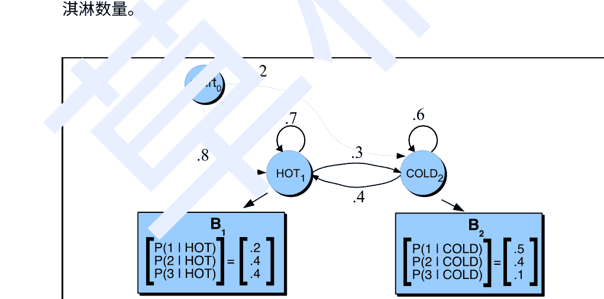

6.3 用于将Jason吃的冰淇淋数量（观测值）与天气（H或C，隐藏变量）相关的隐马尔可夫模型。在这个例子中，我们不使用终止状态，而是允许状态1和2都是最终（接受）状态。

- 遍历HMM
- Bakis网络

请注意，在图6.3中的HMM中，任意两个状态之间都存在（非零）转移概率。这样的HMM被称为全连接或遍历HMM。然而，有时候我们的HMM中许多状态之间的转移概率为零。例如，在从左到右（也称为 Bakis）的HMM中，状态转移从左到右进行，如图6.4所示。在Bakis HMM中，没有从高编号状态到低编号状态的转移。

(或者更准确地说，从高编号状态到低编号状态的任何转换概率为零)。Bakis HMM通常用于建模时间过程，如语音；我们将在第9章中看到更多相关内容。

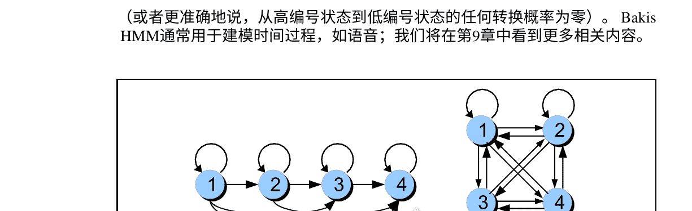

6.4 4状态的隐马尔可夫模型；左边是从左到右(Bakis)的HMM，右边是完全连接的(遍历)HMM。在Bakis模型中，未显示的所有转换概率为零。

现在我们已经了解了HMM的结构，我们转向使用它们进行计算的算法。Rabiner (1989)的一篇有影响力的教程，基于1960年代Jack Ferguson的教程，引入了隐马尔可夫模型应该被描述为三个基本问题的思想：

> **问题1 (似然度)：** 给定一个HMM λ=(A,B)和一个观测序列 O，确定似然度 P(O|λ)。
> **问题2 (解码)：** 给定一个观测序列 O和一个HMM λ=(A,B)，发现最佳的隐藏状态序列 Q。
> **问题3 (学习)：** 给定一个观测序列 O和HMM中的状态集合，学习HMM参数 A和 B。

我们已经在第5章中看到了问题 (2) 的一个例子。在接下来的三节中，我们更正式地介绍这三个问题。

## 6.3 计算似然度：前向算法

我们的第一个问题是计算特定观测序列的似然度。例如，给定图6.2b中的HMM，序列3 1 3的概率是多少？
更正式地说：

> 计算可能性：给定一个HMM λ=(A,B)和一个观察序列 O，确定可能性 P(O|λ)。

对于一个马尔可夫链，其中表面观察与隐藏事件相同，我们可以通过跟随标记为3 1 3的状态并沿弧线上的概率相乘来计算3 1 3的概率。对于一个隐马尔可夫模型，情况并不那么简单。我们想要确定类似3 1 3的冰淇淋观察序列的概率，但我们不知道隐藏状态序列是什么！

让我们从一个稍微简单一些的情况开始。假设我们已经知道天气，并且想要预测Jason会吃多少冰淇淋。这是许多HMM任务中的一个有用部分。对于给定的隐藏状态序列（例如热 热 冷），我们可以轻松计算3 1 3的输出可能性。

让我们看看如何。首先，回想一下对于隐马尔可夫模型，每个隐藏状态只产生一个观测值。因此，隐藏状态序列和观测序列具有相同的长度。¹

在给定这种一对一映射以及在公式6.6中表达的马尔可夫假设的情况下，对于一个特定的隐藏状态序列 $Q = q_0, q_1, q_2, ..., q_T$ 和一个观测序列 $O = o_1, o_2, ..., o_T$ ，观测序列的可能性为：

$(6.8)$ $$P(O|Q) = \prod_{i=1}^{T} P(o_i|q_i)$$

对于我们的冰淇淋观测3 1 3来自一个可能的隐藏状态序列hot hot cold的前向概率计算如下（图6.5显示了这个过程的图形表示）：

$(6.9)$ $$P(3\ 1\ 3|\text{hot hot cold}) = P(3|\text{hot}) \times P(1|\text{hot}) \times P(3|\text{cold})$$

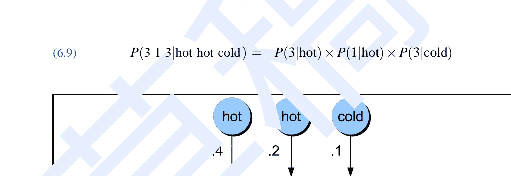

当然，我们实际上并不知道隐藏状态（天气）序列是什么。我们需要计算冰淇淋事件3 1 3的概率，通过对所有可能的天气序列进行加权求和。首先，让我们计算处于特定天气序列 $Q$ 并生成特定冰淇淋事件序列 $O$ 的联合概率。一般来说，这是：

$(6.10)$ $$P(O, Q) = P(O|Q) \times P(Q) = \prod_{i=1}^{n} P(o_i|q_i) \times \prod_{i=1}^{n} P(q_i|q_{i-1})$$

我们的冰淇淋观测3 1 3和一个可能的隐藏状态序列hot hot cold的联合概率计算如下（图6.6显示了此过程的图形表示）：现在我们知道如何计算具有特定隐藏状态序列的观测的联合概率，我们可以通过对所有可能的隐藏状态序列求和来计算观测的总概率：

P(O) = Σ_Q P(O, Q) = Σ_Q P(O|Q)P(Q)

对于我们的特定情况，我们将对8个三事件序列进行求和：冷 冷 冷, 冷 冷 热, 热 热 冷, ... 即：
P(3 1 3) = P(3 1 3, 冷 冷 冷) + P(3 1 3, 冷 冷 热) + P(3 1 3, 热 热 冷) + ...

对于具有 N 个隐藏状态和 T 个观测的HMM，存在 N^T 个可能的隐藏序列。对于实际任务，其中 N 和 T 都很大，N^T 是一个非常大的数，因此我们无法通过计算每个隐藏状态序列的单独观测概率然后将它们相加来计算总观测概率。

我们使用一种高效的算法，而不是使用这样一个极其指数级的算法。这种算法称为前向算法，时间复杂度为 O(N^2 T)。前向算法是一种动态规划算法，即使用表格来存储中间值，以便在构建观测序列的概率时使用。前向算法通过对可能生成观测序列的所有可能隐藏状态路径的概率求和来计算观测概率，但通过将每个路径隐式地折叠到单个前向网格中，可以高效地进行计算。

图6.7显示了计算给定隐藏状态序列 hot hot cold 的 3 1 3 的概率的前向网格的示例。
前向算法网格的每个单元格 α_t(j) 表示在看到前 t 个观测之后，在自动机 λ 的条件下，处于状态 j 的概率。每个单元格 α_t(j) 的值是通过对每条可能导致该单元格的路径的概率求和来计算的。形式上，每个单元格表示以下概率：

α_t(j) = P(o1, o2… ot, qt = j|λ)

6.7 冰淇淋事件的总观测概率的前向细胞图 3 1 3。隐藏状态用圆圈表示，观测用方块表示。未填充的白色圆圈表示非法转换。该图展示了两个时间步骤上两个状态的 α_t(j) 的计算。每个单元格中的计算遵循公式 6.15：α_t(j) = Σ_{i=1}^{N} α_{t-1}(i) a_{ij} b_j(o_t)。每个单元格中表示的结果概率为公式6.14：α_t(j) = P(o1,o2...ot,qt=j|λ)。

这里 q_t = j 表示“序列中第t个状态为状态j的概率”。我们通过对所有通向当前单元格的路径的扩展求和来计算这个概率。对于给定时间t的状态 q_j，值 α_t(j) 的计算如下：

α_t(j) = Σ_{i=1}^{N} α_{t-1}(i) a_{ij} b_j(o_t)

在计算时间t的前向概率时，公式6.15中乘以的三个因子是扩展之前路径的结果：

- α_{t-1}(i): 从上一个时间步骤的前向路径概率计算
- a_{ij}: 从前一个状态 q_i 到当前状态 q_j 的转移概率
- b_j(o_t): 给定当前状态 j 的观测符号 o_t 的状态观测概率

考虑图6.7中的计算 α_2(1)，即在状态1的时间步骤2生成部分观察 3 1 的前向概率。这是通过以下方式计算的：通过两条路径扩展时间步骤1的α概率，每个扩展包括上述三个因子：α₁(1)×P(H|H)×P(1|H) 和 α₁(2)×P(H|C)×P(1|H)。图6.8展示了计算新单元格中值的另一种可视化方法，用于进行归纳步骤。

6.8 简化计算单个元素 α_t(i) 在网格中通过加权求和所有先前值 α_{t-1} 乘以它们的转移概率 a 并乘以观测概率 b_i(o_{t+1})。对于HMM的许多应用，许多转移概率为0，因此并非所有先前状态都会对当前状态的前向概率有贡献。隐藏状态用圆圈表示，观测值用方块表示。阴影节点包含在计算 α_t(i) 的概率中。起始和结束状态未显示。

```
function FORWARD(observations of len T, state-graph of len N) returns forward-prob
    创建一个概率矩阵 forward[N+2, T]
    对于每个状态 s 从 1 到 N 执行                     ;初始化步骤
        forward[s, 1] ← a_{0,s} * b_s(o_1)
    对于每个时间步骤 t 从 2 到 T 执行               ;递归步骤
        对于每个状态 s 从 1 到 N 执行
            forward[s, t] ← Σ_{s'=1}^{N} forward[s', t-1] * a_{s',s} * b_s(o_t)
    forward[qF, T] ← Σ_{s=1}^{N} forward[s, T] * a_{s,qF}      ;终止步骤
    返回 forward[qF, T]
```

## 6.9 算法
我们使用符号 forward[s,t] 来表示 α_t(s)。

我们给出了前向算法的两个形式化定义；图6.9中的伪代码和以下的定义递归：

1.  初始化:
    (6.16) α₁(j) = a₀ⱼb_j(o₁)  1 ≤ j ≤ N

2.  递归（因为状态0和F是非发射状态）：
    $$\alpha_t(j) = \sum_{i=1}^{N} \alpha_{t-1}(i)a_{ij}b_j(o_t); \quad 1 \leq j \leq N, 1 < t \leq T$$

3.  终止：
    $$P(O|\lambda) = \alpha_T(q_F) = \sum_{i=1}^{N} \alpha_T(i)a_{iF}$$

## 6.4 解码：维特比算法

对于任何包含隐藏变量的模型，例如HMM，确定某个观测序列的潜在源变量序列的任务被称为解码任务。在冰淇淋领域，给定一个冰淇淋观测序列 3 1 3 和一个HMM，解码器的任务是找到最佳的隐藏序列——天气序列（H H H）。更正式地说，

**解码**：给定一个HMM $\lambda = (A, B)$ 和一个观测序列 $O = o_1, o_2, ..., o_T$，找到最可能的状态序列 $Q = q_1q_2q_3 ... q_T$。

我们可以提出以下方法来找到最佳序列：对于每个可能的隐藏状态序列（HH H, HHC, HCH, 等等），我们可以运行前向算法并计算给定隐藏状态序列的观测序列的可能性。然后我们可以选择具有最大观测可能性的隐藏状态序列。从前一节可以清楚地看出，我们无法这样做，因为状态序列的数量呈指数增长！

相反，HMM的最常见解码算法是维特比算法。像前向算法一样，维特比是一种**动态规划**，并且利用动态规划网格进行计算。维特比算法也与另一个动态规划变种——第3章的最小编辑距离算法非常相似。

图6.10展示了计算最佳隐藏状态序列的维特比网格的示例，观测序列为 3 1 3。思路是从左到右处理观测序列，填充网格。维特比网格的每个单元格 $v_t(j)$ 表示在观测到前 $t$ 个观测值并经过最可能的状态序列 $q_0, q_1, ..., q_{t-1}$ 后，HMM处于状态 $j$ 的概率，给定自动机 $\lambda$。

每个单元格 $v_t(j)$ 的值通过递归地选择可能导致该单元格的最佳路径来计算。形式上，每个单元格表示以下概率：

$$v_t(j) = \max_{q_0,q_1,\ldots,q_{t-1}} P(q_0,q_1\ldots q_{t-1}, o_1,o_2 \ldots o_t, q_t = j|\lambda)$$

请注意，我们通过对所有可能的前一个状态序列取最大值来表示最可能的路径 $\max_{q_0,q_1,...,q_{t-1}}$。与其他动态规划算法一样，维特比算法递归地填充每个单元格。鉴于我们已经计算出在时间 $t-1$ 处于每个状态的概率，我们通过计算维特比概率来选择导致当前单元格的路径的最可能的扩展。对于给定时间 $t$ 的状态 $q_j$，计算值 $v_t(j)$ 如下：

(6.20) $$v_t(j) = \max_{i=1}^{N} v_{t-1}(i) a_{ij} b_j(o_t)$$

在时间 $t$ 计算维特比概率时，使用方程式6.20中的三个因素来扩展先前的路径，即：

- $v_{t-1}(i)$: 从上一个时间步骤计算得到的前一个维特比路径概率
- $a_{ij}$: 从前一个状态 $q_i$ 到当前状态 $q_j$ 的转移概率
- $b_j(o_t)$: 给定当前状态 $j$ 的观测符号 $o_t$ 的状态观测概率

6.10 计算通过隐藏状态空间的最佳路径的维特比网格，用于冰淇淋吃掉的事件 3 1 3。隐藏状态用圆圈表示，观测值用方块表示。白色（未填充）圆圈表示非法转换。该图显示了两个时间步骤中两个状态的 $v_t(j)$ 的计算。每个单元格中的计算遵循公式6.20: $v_t(j) = \max_{1 \leq i \leq N} v_{t-1}(i) a_{ij} b_j(o_t)$。每个单元格中的结果概率表示为公式6.19: $v_t(j) = P(q_0, q_1, \ldots, q_{t-1}, o_1, o_2, \ldots, o_t, q_t = j | \lambda)$。

图6.11显示了维特比算法的伪代码。请注意，维特比算法与前向算法相同，只是它在先前的路径上取 max 值。

```
函数 VITERBI(长度为 T的观测序列，长度为 N的状态图)返回最佳路径
创建路径概率矩阵viterbi[N+2,T]
对于每个状态 s从1到N执行以下操作            ; 初始化步骤
    viterbi[s,1] ← a_{0,s} * b_s(o_1)
    backpointer[s,1] ← 0
对于每个时间步骤 t从 2到 T执行以下操作。    ;递归步骤
    对于每个状态s从1到N执行
        viterbi[s,t] ← max_{s'=1}^N viterbi[s',t-1]*a_{s',s}*b_s(o_t)
        backpointer[s,t] ← argmax_{s'=1}^N viterbi[s',t-1]*a_{s',s}
viterbi[qF,T] ← max_{s=1}^N viterbi[s,T]*a_{s,qF}    ;终止步骤
backpointer[qF,T] ← argmax_{s=1}^N viterbi[s,T]*a_{s,qF}  ;终止步骤
通过跟随回溯指针从后向前返回状态的路径
```

## 6.11 维特比算法
维特比算法用于找到最优的隐藏状态序列。给定观测序列和HMM λ=(A,B), 该算法返回通过HMM的状态路径，使观测序列具有最大可能性。请注意，状态0和 qF是非发射状态。

维特比算法与前向算法的关键区别在于，维特比算法在每一步选择最大概率路径，而前向算法采用求和。还要注意，维特比算法有一个前向算法没有的组成部分：回溯指针。这是因为前向算法需要产生一个观测概率，而维特比算法必须产生一个概率，还有最可能的状态序列。我们通过跟踪导致每个状态的隐藏状态路径（如图6.12所示），然后在最后回溯到最佳路径的开始（维特比回溯）。

### 维特比回溯

最后，我们可以给出维特比递归的正式定义如下：

1. 初始化：

    (6.21) \[ v_1(j) = a_{0j}b_j(o_1) \quad 1 \leq j \leq N \]
    (6.22) \[ bt_1(j) = 0 \]

2. 递归(回忆状态0和 qF是非发射的)：

    (6.23) \[ v_t(j) = \max_{i=1}^N v_{t-1}(i) a_{ij} b_j(o_t); \quad 1 \leq j \leq N, 1 < t \leq T \]
    (6.24) \[ bt_t(j) = \underset{i=1}{\operatorname{argmax}}^N v_{t-1}(i) a_{ij} b_j(o_t); \quad 1 \leq j \leq N, 1 < t \leq T \]

3. 终止：

    (6.25) 最佳分数： \[ P^* = v_T(q_F) = \max_{i=1}^N v_T(i) * a_{iF} \]
    (6.26) 回溯的开始： \[ q_T^* = bt_T(q_F) = \underset{i=1}{\operatorname{argmax}}^N v_T(i) * a_{iF} \]

6.12 维特比回溯 当我们将每个路径扩展到一个新状态以考虑下一个观察值时，我们会保留一个指向将我们带到该状态的最佳路径的回溯指针（用破碎的蓝线表示）。

## 6.5 训练HMMs：前向-后向算法

我们转向HMMs的第三个问题：学习HMM的参数，即A 和 B矩阵。形式上，

**学习**：给定一个观察序列 O和HMM中可能的状态集合，学习HMM的参数 A 和 B。

这样一个学习算法的输入将是一个未标记的观察序列 O和潜在隐藏状态的词汇表 Q。因此，对于冰淇淋任务，我们将从一个观察序列 O = {1,3,2,...}开始，以及隐藏状态的集合 H和 C。对于词性标注任务，我们将从一个观察序列 O = {w₁,w₂,w₃,...}开始，以及一组隐藏状态NN, NNS, VBD, IN,...等等。

### 前向-后向 Baum-Welch 算法

HMM训练的标准算法是前向-后向或 Baum-Welch算法（Baum, 1972），它是期望最大化或 EM算法（Dempster et al., 1977）的一种应用。该算法将让我们训练HMM的转移概率 A和发射概率 B。

让我们首先考虑训练马尔可夫链而不是隐马尔可夫模型的简单情况。由于马尔可夫链中的状态是可观察的，我们可以在观察序列上运行模型，并直接看到我们通过模型的哪条路径，以及每个观察符号由哪个状态生成。当然，马尔可夫链没有发射概率 B（或者我们可以将马尔可夫链视为退化的隐马尔可夫模型，其中所有观察符号的概率为1.0，其他符号的概率为0）。因此，我们只需要训练转移概率矩阵 A 的概率。

我们通过计算转移发生的次数来获得特定转移状态 i 和 j 之间的最大似然估计概率，我们可以称之为 C(i \rightarrow j)，然后通过总次数对其进行归一化，即所有转移次数的总和，从状态 i 开始：

$$a_{ij} = \frac{C(i \rightarrow j)}{\sum_{q \in Q} C(i \rightarrow q)}$$

在马尔可夫链中，我们可以直接计算这个概率，因为我们知道我们所处的状态。对于隐马尔可夫模型，我们无法直接从观测序列中计算这些次数，因为我们不知道在给定输入的情况下通过机器的哪个状态路径。鲍姆-韦尔奇算法使用两个巧妙的直觉来解决这个问题。第一个想法是迭代地估计这些次数。我们将从转移和观测概率的估计开始，然后使用这些估计概率来推导出更好的概率。第二个想法是通过计算观测的前向概率，然后将该概率分配给所有对该前向概率有贡献的不同路径，从而获得我们的估计概率。

为了理解算法，我们需要定义一个与前向概率相关的有用概率，称为后向概率。

**后向概率** β 是指在时间 t+1 到结束时，给定我们在时间 t 处于状态 i（当然也给定了自动机 λ）：

$$\beta_t(i) = P(o_{t+1}, o_{t+2} \ldots o_T | q_t = i, \lambda)$$

它以类似于前向算法的方式递归计算：

1. 初始化：

    $$\beta_T(i) = a_{i,F}, \quad 1 \leq i \leq N$$

2. 递归（再次，因为状态0和 q_F 是非发射的）：

    $$\beta_t(i) = \sum_{j=1}^{N} a_{ij} b_j(o_{t+1}) \beta_{t+1}(j), \quad 1 \leq i \leq N, 1 \leq t < T$$

3. 终止：

    $$P(O|\lambda) = \alpha_T(q_F) = \beta_1(0) = \sum_{j=1}^{N} a_{0j} b_j(o_1) \beta_1(j)$$

图6.13展示了向后归纳步骤。

6.13 加权求和所有连续值 β_t(i) 来计算 β_{t+1}(j)，其中权重由转移概率 a_{ij} 和观测概率 b_j(o_{t+1}) 决定。未显示起始和结束状态。

我们现在可以理解如何利用前向和后向概率来计算转移概率 a_{ij} 和观测概率 b_i(o_t)，即使通过机器的实际路径是隐藏的。

让我们首先展示如何通过(6.27)的变体来估计â_{ij}的方法：

(6.32) $$ \hat{a}_{ij} = \frac{\text{从状态 } i \text{ 到状态 } j \text{ 的预期转换次数}}{\text{从状态 } i \text{ 的预期转换次数}} $$

我们如何计算分子？以下是直观理解。假设我们对于在观察序列的特定时间 t中发生给定的转换 i→j的概率有一些估计。如果我们对于每个特定的时间 t都知道这个概率，我们可以对所有时间 t求和，以估计转换 i→j的总计数。更正式地说，让我们定义概率 ξ_t为在时间 t处于状态 i且在时间 t+1处于状态 j的概率，给定观察序列和模型：

(6.33) $$ ξ_t(i,j) = P(q_t = i, q_{t+1} = j | O, λ) $$

为了计算 ξ_t，我们首先计算一个类似于 ξ_t的概率，但是不同之处在于包括了观测的概率；请注意与方程式6.33中的 O的不同条件：

(6.34) 不完全 ξ_t(i,j) = P(q_t = i, q_{t+1} = j, O | λ)

图6.14展示了计算不完全 ξ_t 所需的各种概率：所讨论弧的转移概率，弧之前的 α概率，弧之后的 β概率，以及弧后紧接着的符号的观测概率。这四个概率相乘得到不完全 ξ_t 的结果如下：6.14 在时间 \(t\) 处于状态 \(i\) 和在时间 \(t+1\) 处于状态 \(j\) 的联合概率。该图显示了需要组合以产生 \( P(q_t = i, q_{t+1} = j, O|\lambda)\) 的各种概率：α和β概率，转移概率 \( a_{ij} \) 和观测概率 \( b_j(o_{t+1})\)。根据Rabiner (1989)。

$$ (6.35) \quad \text{not-quite-}\xi_t(i,j) = \alpha_t(i) a_{ij} b_j(o_{t+1}) \beta_{t+1}(j) $$

为了计算 \(\xi_t\) 从 not-quite-\(\xi_t\) 中，根据概率法则，我们需要除以 \( P(O|\lambda)\)，因为：

$$ (6.36) \quad P(X|Y,Z) = \frac{P(X,Y|Z)}{P(Y|Z)} $$

给定模型的观测概率就是整个话语的前向概率（或者也可以是整个话语的后向概率！），可以通过多种方式计算：

$$ (6.37) \quad P(O|\lambda) = \alpha_T(N) = \beta_T(1) = \sum_{j=1}^N \alpha_t(j) \beta_t(j) $$

因此，\(\xi_t\) 的最终方程式为：

$$ (6.38) \quad \xi_t(i,j) = \frac{\alpha_t(i) a_{ij} b_j(o_{t+1}) \beta_{t+1}(j)}{\alpha_T(N)} $$

从状态 \(i\) 到状态 \(j\) 的预期转换次数是所有 \(t\) 的 \(\xi_t\) 的总和。对于我们在 (6.32) 中对 \( a_{ij} \) 的估计，我们只需要一个额外的东西：从状态 \(i\) 的总预期转换次数。我们可以通过对状态 \(i\) 的所有转换求和来得到这个值。这是 \( a_{ij} \) 的最终公式：

$$ (6.39) \quad \hat{a}_{ij} = \frac{\sum_{t=1}^{T-1} \xi_t(i,j)}{\sum_{t=1}^{T-1} \sum_{j=1}^N \xi_t(i,j)} $$

我们还需要一个重新计算观测概率的公式。这是给定状态 \(j\) 的观测词汇 \(V\) 中给定符号 \(v_k\) 的概率：

我们将通过尝试计算来实现这一点：

$$ (6.40) \quad b_j(v_k)=\frac{\text{在状态 } j \text{ 下观察到符号 } v_k \text{ 的预期次数}}{\text{在状态 } j \text{ 中的预期次数}} $$

为此，我们需要知道在时间 \(t\) 处于状态 \(j\) 的概率，我们将其称为 \(\gamma_t(j)\):

$$ (6.41) \quad \gamma_t(j) = P(q_t = j | O, \lambda) $$

再次，我们将通过包括观察序列在概率中来计算这一点：

$$ (6.42) \quad \gamma_t(j) = \frac{P(q_t = j, O | \lambda)}{P(O | \lambda)} $$

如图6.15所示，(6.42)的分子只是前向概率和后向概率的乘积：

$$ (6.43) \quad \gamma_t(j) = \frac{\alpha_t(j)\beta_t(j)}{P(O|\lambda)} $$

我们准备好计算 \(b\)。对于分子，我们对所有时间步骤 \(t\) 中的观察 \(o_t\) 是我们感兴趣的符号 \(v_k\) 进行求和。对于分母，我们对所有时间步骤 \(t\) 中的 \(\gamma_t(j)\) 进行求和。结果将是我们处于状态 \(j\) 并且看到符号 \(v_k\) 的次数的百分比（符号 \(\sum_{t=1, s.t. o_t=v_k}^{T} \gamma_t(j)\) 表示“对所有时间 \(t\) 进行求和，其中时间 \(t\) 的观察结果是 \(v_k\)”）：

$$ \hat{b}_j(v_k) = \frac{\sum_{t=1, s.t. O_t=v_k}^T \gamma_t(j)}{\sum_{t=1}^T \gamma_t(j)} $$

现在我们有了（6.39）和（6.44）中的方法，可以从观察序列 \(O\) 中 re-estimate 转移 \(A\) 和观察 \(B\) 的概率，假设我们已经有了先前的 \(A\) 和 \(B\) 的估计。

这些重新估计构成了迭代前向-后向算法的核心。

前向-后向算法从HMM的一些初始估计开始参数 \(\lambda=(A,B)\)。然后我们迭代运行两个步骤。与EM（期望最大化）算法的其他情况一样，前向-后向算法有两个步骤：期望步骤（E步骤）和最大化步骤（M步骤）。

```
函数 FORWARD-BACKWARD (长度为 T 的观察结果，输出词汇表 V，隐藏状态集合 Q) 返回 HMM=(A,B)
初始化 A 和 B
迭代直到收敛
E步
γ_t(j) = \frac{α_t(j) β_t(j)}{P(O|λ)} \quad ∀ t 和 j
ξ_t(i,j) = \frac{α_t(i) a_{ij} b_j(o_{t+1}) β_{t+1}(j)}{α_T(N)} \quad ∀ t, i, 和 j
M步
â_{ij} = \frac{\sum_{t=1}^{T-1} ξ_t(i,j)}{\sum_{t=1}^{T-1} \sum_{j=1}^N ξ_t(i,j)}
ŷ_j(v_k) = \frac{\sum_{t=1, s.t. O_t=v_k}^T γ_t(j)}{\sum_{t=1}^T γ_t(j)}
返回 A, B
```

## 6.16 后向算法

虽然原则上前向-后向算法可以完全无监督地学习 \(A\) 和 \(B\) 参数，但实际上初始条件非常重要。因此，该算法通常会提供额外的信息。例如，对于语音识别，实际上HMM结构往往是手动设置的，只有发射（$B$）和（非零）$A$转移概率是从一组观察序列$O$中训练的。第9章的第9.7节还将讨论如何在语音识别中推导出初始$A$和$B$估计。我们还将看到，对于语音，前向-后向算法可以扩展到非离散输入（“连续观测密度”）。

## 6.6 最大熵模型：背景

现在我们转向第二个概率机器学习框架，称为最大熵建模，简称为MaxEnt。MaxEnt更为人知的是多项式逻辑回归。

本章的目标是介绍MaxEnt在序列分类中的应用。回顾一下，序列分类或序列标注的任务是为某个序列中的每个元素分配一个标签，例如为一个单词分配一个词性标签。最常见的MaxEnt序列分类器是最大熵马尔可夫模型，简称为MEMM，在第6.8节中介绍。但在我们看到MaxEnt作为序列分类器的应用之前，我们需要介绍非序列分类。

分类的任务是接收一个单一的观察值，提取描述该观察值的一些有用特征，然后基于这些特征将观察值分类为一组离散类别之一。概率分类器比这稍微多做一些；除了分配一个标签或类别之外，它还给出观察值属于该类别的概率；实际上，对于给定的观察值，概率分类器给出了所有类别的概率分布。

这种非连续的分类任务在语音和语言处理中经常出现。例如，在文本分类中，我们可能需要决定一封电子邮件是否应该被分类为垃圾邮件。在情感分析中，我们需要确定一个句子或文档是否表达了积极或消极的观点。在许多任务中，我们需要知道句子的边界在哪里，因此我们需要将句号字符（'.'）分类为句子边界或非句子边界。我们将在本书中看到更多需要分类的例子。

**对数线性分类器**

MaxEnt属于指数或对数线性分类器家族。MaxEnt通过从输入中提取一些特征，线性组合它们（即将每个特征乘以权重然后相加），然后出于我们将在下面看到的原因，将这个和作为指数。

让我们进一步阐述这个直觉。假设我们有一些输入$x$（也许是需要标记的单词，或者是需要分类的文档）从中我们提取一些特征。用于标记的一个特征可能是这个单词以-ing结尾或者前一个单词是'the'。对于每个这样的特征$f_i$，我们有一些权重$w_i$。

给定特征和权重，我们的目标是为单词选择一个类别（例如词性标记）。MaxEnt通过选择最有可能的标记来实现这一点；给定观察到的情况$x$，一个特定类别$c$的概率是：

$$ (6.45) \quad p(c|x)=\frac{1}{Z}\exp(\sum_{i}w_{i}f_{i}) $$

这里 $Z$ 是一个归一化因子，用于使概率正确地总和为1；通常情况下， $\exp (x) = e^x$。正如我们稍后将看到的，这是一个在各种方面简化了的方程；例如，在实际的MaxEnt模型中，特征 $f$ 和权重 $w$ 都依赖于类别 $c$ （即，我们将为不同的类别有不同的特征和权重）。

为了解释MaxEnt分类器的细节，包括归一化项的定义 $Z$ 和指数函数的直观理解，我们首先需要了解线性回归，它为使用特征进行预测奠定了基础，以及逻辑回归，它是我们介绍指数模型的入门。我们在接下来的两个部分中涵盖了这些领域。已经掌握这些回归知识的读者可能想跳过接下来的两个部分。然后在第6.7节中，我们介绍了MaxEnt分类器的细节。最后，在第6.8节中，我们展示了如何在最大熵马尔可夫模型（MEMM）中使用MaxEnt分类器进行序列分类。

### 6.6.1 线性回归

在统计学中，当输出是实值时，我们使用回归一词来表示将一些输入特征映射到某个输出值的任务；当输出是离散类别集合之一时，我们使用分类一词。

你可能已经在统计课上熟悉了线性回归。这个想法是，我们给定一组观察值，每个观察值都与一些特征相关联，我们想要预测每个观察值的某个实值结果。让我们来看一个关于预测房价的例子。Levitt和Dubner（2005）表明，房地产广告中使用的词语可以作为房屋售价高于或低于要价的良好预测因素。例如，他们发现，房地产广告中出现诸如 *fantastic*、 *cute* 或 *charming* 等词语的房屋往往以较低的价格售出，而出现诸如 *maple* 和 *granite* 等词语的房屋往往以较高的价格售出。他们的假设是，房地产经纪人使用模糊的积极词语如 *fantastic* 来掩盖房屋中缺乏任何具体积极特质的事实。仅出于教学目的，我们在图6.17中创建了虚假数据。

| 模糊形容词的数量 | 超过要价出售的房屋数量 |
| :---: | :---: |
| 4 | 0 |
| 3 | $1000 |
| 2 | $1500 |
| 2 | $6000 |
| 1 | $14000 |
| 0 | $18000 |

6.17 房产广告中，关于模糊形容词（奇妙的，可爱的，迷人的）的数量以及房屋售价超过要价的金额的一些虚构数据。

图6.18显示了这些数据点的图表，x轴表示特征（形容词的数量），y轴表示价格。我们还绘制了一条回归线，这条线最好地拟合了观察到的数据。任何一条线的方程都是 $y = mx + b$；如图所示，这条线的斜率为 $m = -4900$，截距为16550。我们可以将这条线的两个参数（斜率m和截距b）看作是一组权重，我们用它们将我们的特征（在这种情况下是x，形容词的数量）映射到我们的输出值（在这种情况下是价格）上。我们可以使用 $w$ 来表示这个线性函数的权重，如下所示：

```
价格 = $w_0 + w_1 \times \text{形容词数量}$
```

因此，方程式6.46给出了一个线性函数，让我们能够估计任意数量形容词的销售价格。例如，对于一个有5个形容词的房子，我们预计它的售价会是多少？

当我们使用多个特征时，线性模型的真正威力就显现出来了（技术上我们称之为多元线性回归）。例如，最终的房价可能取决于许多因素，如当月的平均抵押贷款利率、市场上未售出的房屋数量以及许多其他因素。我们可以将每个因素都编码为一个变量，每个因素的重要性将成为该变量上的权重，如下所示：

```
价格 = $w_0 + w_1 \times \text{形容词数量} + w_2 \times \text{抵押利率} + w_3 \times \text{未售出房屋数量}$
```

在语音与语言处理中，我们经常将这些预测因素，如形容词数量或抵押利率，称为特征。我们用这些特征的向量来表示每个观测（即每个待售房屋）。假设一所房屋的广告中有1个形容词，抵押利率为6.5%，城市中有1万套未售出的房屋。该房屋的特征向量将为 $f = (1, 6.5, 10000)$。假设我们之前学习到的用于此任务的权重向量为 $w = (w_0, w_1, w_2, w_3)$。然后，对于这所房子的预测值将通过将每个特征乘以其权重来计算：

$$ (6.48) \quad 价格 = 权重_0 + \sum_{i=1}^{N} 权重_i \times 特征_i $$

一般来说，我们会假装有一个额外的特征特征$_0$，其值为1，一个截距特征，这样可以使方程相对于那个讨厌的权重$_0$更简单，因此一般我们可以表示线性回归估计值的值为：

$$ (6.49) \quad 线性回归: \quad y = \sum_{i=0}^{N} 权重_i \times 特征_i $$

通过将两个向量的每个元素逐个相乘并求和来创建一个标量的过程被称为点积。 回想一下，点积两个向量向量$a$和向量$b$之间的点积被定义为：

$$ (6.50) \quad 点积: \quad \text{向量} a \cdot \text{向量} b = \sum_{i=1}^{N} a_i b_i = a_1 b_1 + a_2 b_2 + \cdots + a_n b_n $$

因此，方程6.49等同于权重向量和特征向量之间的点积：

$$ (6.51) \quad y = w \cdot f $$

在语音和语言处理中，向量点积经常出现；我们经常使用点积符号来避免混乱的求和符号。

**线性回归中的学习**

我们如何学习线性回归的权重？ 直观上，我们希望选择使得估计值 $y$ 尽可能接近训练集中实际值的权重。

考虑训练集中的特定实例 $x^{(j)}$（我们将使用上标表示训练实例），该实例在训练集中具有观察标签 $y^{(j)}_{obs}$。 我们的线性回归模型对 $y^{(j)}$ 的预测值如下：

$$ (6.52) \quad y^{(j)}_{\text{预测}} = \sum_{i=0}^{N} w_i \times f_i^{(j)} $$

我们希望选择整个权重集合 $W$，以使预测值 $y^{(j)}$ 与观察值之间的差异最小。预测值和观察值之间的差异，并且我们希望最小化差异的绝对值（因为我们不希望一个示例中的负距离抵消另一个示例中的正差异），因此为了简单起见（和可微性），我们最小化差异的平方。 因此，我们要最小化的总值，我们称之为平方和误差，是这个成本函数的值当前权重集合 $W$：

$$ (6.53) \quad \text{成本}(W) = \sum_{j=0}^{M} \left( y^{(j)}_{\text{预测值}} - y^{(j)}_{\text{观察值}} \right)^2 $$

我们不会在这里详细介绍选择最小化平方和误差的最佳权重集合的细节。但是，简而言之，事实证明，如果我们将整个训练集放入一个矩阵 $X$，其中矩阵的每一行由与每个观察值相关联的特征向量 $x^{(i)}$ 组成，并将所有观察值 $y$ 放入一个向量 $\vec{y}$，那么存在一个闭合形式的公式，用于计算最优权重值 $W$，以最小化成本($W$)：

$$ W = (X^{T}X)^{-1}X^{T}\vec{y} $$

这个方程的实现在统计软件包（如SPSS或R）中广泛可用。

### 6.6.2 逻辑回归

线性回归是我们在预测实值结果时所需的。但在语音和语言处理中，我们更常见的是进行分类，其中我们试图预测的输出 $y$ 只能取小的一组离散值之一。

考虑最简单的二元分类情况，我们希望对某个观察值 $x$ 进行分类，判断其是否属于类别（真）或不属于类别（假）。换句话说， $y$ 只能取值1（真）或0（假），我们希望一个分类器能够利用 $x$ 的特征并返回真或假。此外，我们希望模型不仅仅返回0或1的值，还能给出一个特定观察值属于类别0或1的概率。这很重要，因为在大多数实际任务中，我们将此分类器的结果传递给其他分类器以完成某些任务。由于我们很少完全确定观察值属于哪个类别，我们宁愿在此阶段不做出硬性决策，排除所有其他类别。相反，我们希望尽可能多地向后继分类器传递信息：整个类别集合，以及我们为每个类别分配的概率值。

我们能否修改我们的线性回归模型以便用于这种概率分类？假设我们只是尝试训练一个线性模型来预测概率，如下所示：

$$ P(y=true|x) = \sum_{i=0}^{N} \text{权重}_{i} \times \text{特征}_{i} = w \cdot f $$

我们可以通过将每个训练观察分配目标值为 $y=1$（如果它属于该类别）和目标值为 $y=0$（如果它不属于该类别）来训练这样的模型。每个观察值 $x$ 都有一个特征向量 $f$， 我们将训练权重向量 $w$ 以最小化预测误差从1（对于属于该类别的观察）或0（对于不属于该类别的观察）。训练后，我们可以通过将权重向量与该观察的特征进行点积来计算给定观察的类别的概率。

这个模型的问题在于没有强制输出是一个合法的概率，即介于0和1之间。表达式 $\sum_{i=0}^{N} w_i \times f_i$ 产生从 -∞ 到 ∞ 的值。我们如何解决这个问题？假设我们保持线性预测器 w·f，但是不再预测概率，而是预测两个概率的比值。具体来说，假设我们预测在类别中的概率与不在类别中的概率的比值。这个比值被称为赔率。如果一个事件发生的概率为0.75，不发生的概率为0.25，我们说发生的赔率是0.75/0.25 =3。我们可以使用线性模型来预测 y 为真的赔率:

$$ \frac{p(y = true)|x}{1 - p(y = true)|x} = w·f $$

最后这个模型接近：概率的比值可以在0到 ∞ 之间。但是我们需要方程的左边在 -∞ 和 ∞ 之间。我们可以通过取这个概率的自然对数来实现这一点:

$$ \ln \left( \frac{P(y = true|x)}{1 - P(y = true|x)} \right) = w·f $$

**对数几率函数**

现在左手和右手都在 -∞ 和 ∞ 之间。左边的函数（对数几率）被称为对数几率函数:

$$ \text{对数几率}(P(x)) = \ln \left( \frac{P(x)}{1 - P(x)} \right) $$

**回归逻辑**

在回归模型中，我们使用线性函数来估计概率的对数几率，这被称为逻辑回归。如果线性函数正在估计对数几率，那么逻辑回归中的实际公式是什么概率 \(P(y = true)\)? 你应该在这里停下来，使用方程式6.58并应用一些简单的代数来解决概率 \(P(y = true)\)。希望当你解决了 \(P(y = true)\) 时，你得到了以下推导:

$$ \ln \left( \frac{P(y = true|x)}{1 - P(y = true|x)} \right) = w·f \\ \frac{p(y = true|x)}{1 - p(y = true|x)} = e^{w·f} \\ p(y = true|x) = (1 - p(y = true|x)) e^{w·f} \\ p(y = true|x) = e^{w·f} - p(y = true|x) e^{w·f} \\ p(y = true|x) + p(y = true|x) e^{w·f} = e^{w·f} \\ p(y = true|x) (1 + e^{w·f}) = e^{w·f} \\ p(y = true|x) = \frac{e^{w·f}}{1 + e^{w·f}} $$

一旦我们有了这个概率，我们可以很容易地陈述观察结果不属于该类别的概率，即 \(p(y=false|x)\)，因为两者必须相加等于1:$$ p(y = false | x) = \frac{1}{1 + e^{w \cdot f}} $$

以下是使用显式求和符号的方程式：

$$ p(y = true | x) = \frac{\exp(\sum_{i=0}^{N} w_i f_i)}{1 + \exp(\sum_{i=0}^{N} w_i f_i)} $$

$$ p(y = false | x) = \frac{1}{1 + \exp(\sum_{i=0}^{N} w_i f_i)} $$

我们可以用稍微不同的方式来表示概率 \( P(y = true | x) \)，即通过将(6.61)中的分子和分母除以 \( e^{-w \cdot f} \)：

$$ p(y = true | x) = \frac{e^{w \cdot f}}{1 + e^{w \cdot f}} $$

$$ = \frac{1}{1 + e^{-w \cdot f}} $$

### 逻辑函数

这些最后的方程现在以所谓的逻辑函数的形式呈现，（给出逻辑回归其名称的函数）。逻辑函数的一般形式是：

$$ \frac{1}{1 + e^{-x}} $$

逻辑函数将值从 \( -\infty \) 和 \( \infty \) 映射到0和1之间。同样，我们可以表达 \( P(y = false | x) \) 以使概率之和为一：

$$ p(y = false | x) = \frac{e^{-w \cdot f}}{1 + e^{-w \cdot f}} $$

### 6.6.3 逻辑回归：分类

给定一个特定的观察结果，我们如何决定它属于哪个类别（'true'还是'false'）？这是分类的任务，也称为推理。显然，正确的类别是具有更高概率的类别。因此，如果满足以下条件，我们可以确定地说我们的观察结果应该被标记为'true'：

$$ p(y = true | x) > p(y = false | x) $$
$$ \frac{p(y = true | x)}{p(y = false | x)} > 1 $$
$$ \frac{p(y = true | x)}{1 - p(y = true | x)} > 1 $$

并从方程6.60中替换赔率比：

$$ e^{w \cdot f} > 1 $$
$$ w \cdot f > 0 $$

### 6.6.4 高级：逻辑回归中的学习

或者用显式求和符号表示：

因此，为了确定观察结果是否属于该类别，我们只需要计算线性函数，并查看其值是否为正；如果是，则观察结果属于该类别。

更高级的一点：方程 \(\sum_{i=0}^{N} w_i f_i = 0\) 是一个超平面的方程（将线的概念推广到 \(N\) 维度）。方程 \(\sum_{i=0}^{N} w_i f_i > 0\) 因此是位于该超平面上方的 \(N\) 维空间的一部分。因此，我们可以将逻辑回归函数视为学习一个将空间中属于该类别（'真'）的点与不属于该类别的点分开的超平面。

在线性回归中，学习的目标是选择权重 \(w\) 以最小化训练集上的平方误差之和。相比之下，在逻辑回归中，我们通常使用条件最大似然估计。这意味着我们选择使得在训练数据中观察到的 \(y\) 值的概率最高的参数 \(w\)。换句话说，对于每个训练观察值 \(x\)，我们希望选择以下权重：

我们希望为整个训练集选择最优权重：

通常我们使用对数似然：

更明确地说：

这个方程很复杂，所以我们通常采用一个方便的表示技巧。请注意，如果 \(y=0\)，第一项就会消失，而如果 \(y=1\)，第二项就会消失：

现在，如果我们代入 (6.66) 和 (6.68) ，我们得到：

(6.70) \(\sum_{i=0}^{N} w_i f_i > 0\)

(6.71) \(\hat{w} = \argmax_w P(y^{(i)}|x^{(i)})\)

(6.72) \(\hat{w} = \argmax_w \prod_i P(y^{(i)}|x^{(i)})\)

(6.73) \(\hat{w} = \argmax_w \sum_i \log P(y^{(i)}|x^{(i)})\)

(6.74) \(\hat{w} = \argmax_w \sum_i \log \begin{cases} P(y^{(i)} = 1|x^{(i)}) & \text{对于 } y^{(i)} = 1 \\ P(y^{(i)} = 0|x^{(i)}) & \text{对于 } y^{(i)} = 0 \end{cases}\)

(6.75) \(\hat{w} = \argmax_w \sum_i y^{(i)} \log P(y^{(i)} = 1|x^{(i)}) + (1 - y^{(i)}) \log P(y^{(i)} = 0|x^{(i)})\)

$$\hat{w} = \arg\max_w \sum_i y^{(i)} \log \frac{1}{1 + e^{-w \cdot f}} + (1 - y^{(i)}) \log \frac{e^{-w \cdot f}}{1 + e^{-w \cdot f}}$$

根据(6.76)，找到使对数似然函数最大化的权重是一个在凸优化领域中被称为的问题。在最常用的算法中，有类似于L-BFGS的拟牛顿方法，以及梯度上升、共轭梯度和各种迭代缩放算法(Darroch和Ratcliff, 1972; Della Pietra等，1997; Malouf, 2002)。常用的算法包括类似L-BFGS的拟牛顿方法，以及梯度上升、共轭梯度和各种迭代缩放算法(Darroch和Ratcliff, 1972; Della Pietra等，1997; Malouf, 2002)。这些学习算法可以在各种MaxEnt建模工具包中找到，但是它们过于复杂，无法在此处进行定义；有兴趣的读者可以参考本章末尾建议的机器学习教材。

## 6.7 最大熵建模

我们上面展示了如何使用逻辑回归将观测值分类为两个类别之一。但是在语言处理中，大多数情况下出现的分类问题涉及更多的类别（例如词性类别集合）。逻辑回归也可以用于具有许多离散值的函数的定义。在这种情况下，它被称为多项式逻辑回归。

正如我们之前提到的，多项式逻辑回归在语音中被称为最大熵和语言处理（参见第6.7.1节关于名称“最大熵”背后的直觉）。

用于计算最大熵分类器的类别概率的方程是上述方程6.63-6.64的一般化。让我们假设目标值 \(y\) 是一个可以取 \(C\) 个不同值的随机变量，对应于类别 \(c_1, c_2, ..., c_C\)。我们在本章前面说过，在最大熵模型中，我们估计 \(y\) 是特定类别 \(c\) 的概率为：

$$ p(c|x) = \frac{1}{Z} \exp \sum_i w_i f_i $$

现在让我们对这个示意方程添加一些细节。首先，我们将详细说明归一化因子 \(Z\)，将特征数指定为 \(N\)，并使权重的值依赖于类别 \(c\)。最终方程为：

$$ p(c|x) = \frac{\exp \left( \sum_{i=0}^{N} w_{ci} f_i \right)}{\sum_{c' \in C} \exp \left( \sum_{i=0}^{N} w_{c'i} f_i \right)} $$

请注意，归一化因子 \(Z\) 仅用于将指数函数转化为真正的概率；

$$ Z = \sum_{c \in C} p(c|x) = \sum_{c' \in C} \exp \left( \sum_{i=0}^N w_{c'i} f_i \right) $$

我们需要再做一个改变才能看到最终的最大熵方程。到目前为止，我们一直假设特征 \( f_i \) 是实值的。然而，在语音和语言处理中，使用二值特征更为常见。只取值为0和1的特征也被称为指示函数。一般来说，我们的特征使用的是观测和我们考虑分配的类别的某个属性的指示函数。因此，在最大熵中，我们经常使用的是 \( f_i(c, x) \) 的符号，表示给定观测 \(x\) 的特征 \(i\) 对于特定类别 \(c\) 的特征值。

计算给定 \( x \) 属于类别 \( c \) 的概率的最终方程为：

$$ p(c|x) = \frac{\exp \left( \sum_{i=0}^N w_{ci} f_i(c, x) \right)}{\sum_{c' \in C} \exp \left( \sum_{i=0}^N w_{c'i} f_i(c', x) \right)} $$

为了更清楚地理解二进制特征的使用，让我们看一些词性标注任务的示例特征。假设我们正在为词 \( race \) 分配一个词性标签，该词来自于(6.81)，重复自(5.36)：

(6.81) Secretariat/NNP is/BEZ expected/VBN to/TO race/?? tomorrow/

目前，我们只进行分类，而不是序列分类，所以让我们只考虑这个单词。我们将在第6.8节讨论如何对整个词序列进行标注。

我们想知道是否将类别 \( VB \) 分配给 \( race \)（或者分配其他类别，如 \( NN \)）。一个有用的特征，我们称之为 \( f_1 \)，是当前单词是 \( race \) 的事实。因此，我们可以添加一个二进制特征，如果是这种情况，则为真：

$$ f_1(c, x) = \begin{cases} 1 & \text{如果 } word_i = \text{"race"} \ \& \ c = \text{NN} \\ 0 & \text{否则} \end{cases} $$

另一个特征是前一个单词是否具有标签 \( TO \)：

$$ f_2(c, x) = \begin{cases} 1 & \text{如果 } t_{i-1} = \text{TO} \ \& \ c = \text{VB} \\ 0 & \text{否则} \end{cases} $$

另外两个词性标注特征可能关注单词的拼写和大小写方面：

$$ f_3(c, x) = \begin{cases} 1 & \text{如果后缀}(word_i) = \text{"ing"} \ \& \ c = \text{VBG} \\ 0 & \text{否则} \end{cases} $$

$$ f_4(c,x) = \begin{cases} 1 & \text{如果是小写}(word_i) \ \& \ c = \text{VB} \\ 0 & \text{否则} \end{cases} $$

由于每个特征都依赖于观察的属性和被标记的类，例如，我们需要单独的特征来表示 race 和 VB 之间的关联，或者前一个 TO 和 NN 之间的关联：

$$ f_5(c,x) = \begin{cases} 1 & \text{如果 } word_i = \text{"race"} \ \& \ c = \text{VB} \\ 0 & \text{否则} \end{cases} $$

$$ f_6(c,x) = \begin{cases} 1 & \text{如果 } t_{i-1} = \text{TO} \ \& \ c = \text{NN} \\ 0 & \text{否则} \end{cases} $$

这些特征中的每一个都有一个对应的权重。因此，权重 \(w_1\) 表示单词 race 对于标签 VB 的提示有多强，权重 \(w_2\) 表示前一个标签 TO 对于当前单词是 VB 的提示有多强，以此类推。

|      | f1 | f2 | f3 | f4 | f5 | f6 |
|------|----|----|----|----|----|----|
| VB f | 0  | 1  | 0  | 1  | 1  | 0  |
| VB w |    | .8 |    | .01 | .1 |    |
| NN f | 1  | 0  | 0  | 0  | 0  | 1  |
| NN w | .8 |    |    |    |    | -1.3 |

图6.19 示例特征值和标签单词 race 的权重。

假设两个类别 VB 和 NN 的特征权重如图6.19所示。假设当前输入观察为 race，则 x。我们现在可以使用公式6.80计算 \( P(NN|x) \) 和 \( P(VB|x) \)：

$$ P(NN|x) = \frac{e^{.8}e^{-1.3}}{e^{.8}e^{-1.3} + e^{.8}e^{.01}e^{.1}} = .20 $$

$$ P(VB|x) = \frac{e^{.8}e^{.01}e^{.1}}{e^{.8}e^{-1.3} + e^{.8}e^{.01}e^{.1}} = .80 $$

请注意，当我们使用MaxEnt进行分类时，MaxEnt自然地给出了一个类别的概率分布。如果我们想进行硬分类并选择最佳类别，我们可以选择具有最高概率的类别，即：

$$ \hat{c} = \arg\max_{c \in C} P(c|x) $$

MaxEnt中的分类因此是（布尔）逻辑回归中分类的一般化。在布尔逻辑回归中，分类涉及构建一个线性表达式将类别中的观察结果与非类别中的观察结果分开。相比之下，MaxEnt中的分类涉及为每个类别构建一个单独的线性表达式。

但是，正如我们稍后在第6.8节中将看到的那样，我们通常不使用MaxEnt进行硬分类。通常，我们希望将MaxEnt用作序列分类的一部分，其中我们不仅仅希望为一个单元找到最佳类别，而是希望找到最佳的整个序列。对于这个任务，利用每个单独单元的整个概率分布是有用的，以帮助找到最佳序列。实际上，即使在许多非序列应用中，类别的概率分布也比硬选择更有用。

到目前为止，我们描述的特征仅表示一个观察结果的单一二进制属性。但是，创建表示单词属性组合的更复杂特征通常是有用的。某些类型的机器学习模型，如支持向量机（SVM），可以自动建模原始属性之间的相互作用，但在MaxEnt中，任何类型的复杂特征都必须手动定义。例如，以大写字母开头的单词（如 Day）更有可能是专有名词（NNP）而不是普通名词（例如在表达式 United Nations Day 中）。但是，以大写字母开头并且出现在句子开头的单词（前一个单词是 <s>），如 Day after day...，并不更有可能是专有名词。即使每个属性已经是原始特征，MaxEnt也不会对它们的组合建模，因此需要手动将这些布尔属性的组合编码为特征：

$$ f_{125}(c,x) = \begin{cases} 1 & \text{如果 } word_{i-1} = \text{<s>} \ \& \ \text{isupperfirst}(word_i) \ \& \ c = \text{NNP} \\ 0 & \text{否则} \end{cases} $$

成功使用MaxEnt的关键是设计合适的特征和特征组合。

### 学习最大熵模型

学习MaxEnt模型可以通过对第6.6.4节中描述的逻辑回归学习算法的推广来完成；正如我们在(6.73)中看到的，我们希望找到最大化 M 个训练样本的对数似然的参数 \(w\)：

(6.85) \( \hat{w} = \argmax_w \sum_i \log P(y^{(i)}|x^{(i)}) \)

与二元逻辑回归一样，我们使用一些凸优化算法来找到最大化该函数的权重。

简要说明：MaxEnt训练的一个重要方面是对正则化权重进行平滑处理。正则化的目标是惩罚大的权重；事实证明，否则MaxEnt模型将学习到非常高的权重，从而过度拟合训练数据。正则化在训练中通过改变优化的似然函数来实现。我们优化以下函数，而不是(6.85)中的优化：

(6.86) \( \hat{w} = \argmax_w \sum_i \log P(y^{(i)}|x^{(i)}) - \alpha R(w) \)

其中 \(R(w)\) 是用于惩罚大权重的正则化项。通常情况下，将正则化项 \(R(w)\) 设为权重值的二次函数：

(6.87) $$ R(w) = \sum_{j=1}^{N} w_{j}^{2} $$

减去权重的平方将导致更偏好较小的权重：

(6.88) $$ \hat{w} = \underset{w}{\operatorname{argmax}} \sum_{i} \log P\left(y^{(i)} \mid x^{(i)}\right) - \alpha \sum_{j=1}^{N} w_{j}^{2} $$

事实证明，这种正则化相当于假设权重符合均值为 \(\mu = 0\) 的高斯分布。在高斯或正态分布中，离均值越远的值，其概率越低（按差方 \(\sigma\) 进行缩放）。通过在权重上使用高斯先验，我们表明权重更倾向于取零值。权重 \(w_{j}\) 的高斯分布为：

(6.89) $$ \frac{1}{\sqrt{2 \pi \sigma_{j}^{2}}} \exp \left(-\frac{\left(w_{j}-\mu_{j}\right)^{2}}{2 \sigma_{j}^{2}}\right) $$

如果我们将每个权重乘以权重的高斯先验，那么我们将最大化以下约束：

(6.90) $$ \hat{w} = \underset{w}{\operatorname{argmax}} \prod_{i}^{M} P\left(y^{(i)} \mid x^{(i)}\right) \times \prod_{j=1}^{N} \frac{1}{\sqrt{2 \pi \sigma_{j}^{2}}} \exp \left(-\frac{\left(w_{j}-\mu_{j}\right)^{2}}{2 \sigma_{j}^{2}}\right) $$

在对数空间中，当 \(\mu = 0\) 时，对应于

(6.91) $$ \hat{w} = \underset{w}{\operatorname{argmax}} \sum_{i} \log P\left(y^{(i)} \mid x^{(i)}\right) - \sum_{j=1}^{N} \frac{w_{j}^{2}}{2 \sigma_{j}^{2}} $$

与方程6.88具有相同的形式。

关于MaxEnt学习的细节有大量的文献资料；请参阅本章末尾的指引以获取更多详细信息。

### 6.7.1 为什么我们称之为最大熵？

为什么我们将多项式逻辑回归模型称为MaxEnt或最大熵模型？让我们在词性标注的背景下解释这个解释的直觉。假设我们想要为单词 *zzfish*（我们为此例子创造的一个词）分配一个标签。什么是概率标记模型（跨单词的词性标记分布）最少假设、不加任何约束的模型？直观上来说，它将是均等概率分布：

| NN  | JJ  | NNS | VB  | NNP | IN  | MD  | UH  | SYM | VBG | POS | PRP | CC  | CD  | ... |
| :-- | :-- | :-- | :-- | :-- | :-- | :-- | :-- | :-- | :-- | :-- | :-- | :-- | :-- | :-- |
| \(\frac{1}{45}\) | \(\frac{1}{45}\) | \(\frac{1}{45}\) | \(\frac{1}{45}\) | \(\frac{1}{45}\) | \(\frac{1}{45}\) | \(\frac{1}{45}\) | \(\frac{1}{45}\) | \(\frac{1}{45}\) | \(\frac{1}{45}\) | \(\frac{1}{45}\) | \(\frac{1}{45}\) | \(\frac{1}{45}\) | \(\frac{1}{45}\) | \(\frac{1}{45}\) |

## 6.8 最大熵马尔可夫模型

现在假设我们有一些带有词性标签的训练数据，并且从这些数据中我们只学到了一个事实：zzfish的可能标签集合是NN、JJ、NNS和VB（所以zzfish是一个类似fish的词，但也可以是形容词）。
基于这个约束条件，但不做任何进一步的假设的标注模型是什么？由于这些中必须有一个是正确的标签，我们知道

(6.92) $$P(NN)+P(JJ)+P(NNS)+P(VB)=1$$

由于我们没有更多的信息，一个不做进一步假设的模型会简单地给这些词分配相等的概率：

| NN | JJ | NNS | VB | NNP | IN | MD | UH | SYM | VBG | POS | PRP | CC | CD | ... |
| :---: | :---: | :---: | :---: | :---: | :---: | :---: | :---: | :---: | :---: | :---: | :---: | :---: | :---: | :---: |
| 1/4 | 1/4 | 1/4 | 1/4 | 0 | 0 | 0 | 0 | 0 | 0 | 0 | 0 | 0 | 0 | ... |

在第一个例子中，我们想要一个关于45个词性的无信息分布，在这种情况下，我们想要一个关于4个词性的无信息分布，事实证明，在所有可能的分布中，等概率分布具有最大的熵。回顾第4.10节，随机变量x的分布的熵计算如下：

(6.93) $$H(x)=-\sum_{x}P(x)\log_{2}P(x)$$

在随机变量的所有值具有相同概率的等概率分布比具有更多信息的分布具有更高的熵。
因此，在所有四个变量上的分布中，分布$$\{ \frac{1}{4}, \frac{1}{4}, \frac{1}{4}, \frac{1}{4} \}$$具有最大熵。（为了对此有直观感受，使用公式6.93计算一些其他分布的熵，例如分布$$\{ \frac{1}{4}, \frac{1}{2}, \frac{1}{8}, \frac{1}{8} \}$$，并确保它们都低于等概率分布。）

MaxEnt建模的直觉是，我们正在构建的概率模型应该遵循我们对其施加的任何约束，但在这些约束之外，它应该遵循奥卡姆剃刀原则，即做出尽可能少的假设。

让我们在标记示例中添加一些更多的约束。假设我们查看了我们标记的训练数据，并注意到在10次中有8次，zzfish被标记为某种普通名词，要么是NN，要么是NNS。我们可以将其视为指定特征'单词是zzfish且$$t_i$$=NN或$$t_i$$=NNS'。现在，我们可能希望修改我们的分布，以便将我们的概率质量的$$\frac{8}{10}$$分配给名词，即现在我们有2个约束。

$$P(NN)+P(JJ)+P(NNS)+P(VB)=1$$
$$P(\text{单词是} zzfish \text{且} t_i=\text{NN} \text{或} t_i=\text{NNS})=\frac{8}{10}$$
但不做进一步的假设（保持JJ和VB等概率，以及NN和NNS等概率）。

| NN | JJ | NNS | VB | NNP | ... |
| :---: | :---: | :---: | :---: | :---: | :---: |
| 4/10 | 1/10 | 4/10 | 1/10 | 0 | ... |

现在假设我们对 zzfish 没有更多的信息。但我们注意到在训练数据中，对于所有英语单词（不仅仅是 zzfish），动词（VB）以20个词为1个词出现。现在我们可以添加这个约束（对应于特征_i = VB）：

$$ P(NN) + P(JJ) + P(NNS) + P(VB) = 1 $$
$$ P(\text{单词是 zzfish 且 } i = \text{NN 或 } i = \text{NNS}) = \frac{8}{10} $$
$$ P(VB) = \frac{1}{20} $$

得到的最大熵分布如下：

| NN | JJ | NNS | VB |
|----|----|-----|----|
| 4/10 | 3/20 | 4/10 | 1/20 |

总之，最大熵的直觉是通过不断添加特征来构建分布。每个特征都是一个指示函数，它选择训练观察的子集。对于每个特征，我们在总体分布上添加一个约束，指定该子集的分布应与我们在训练数据中观察到的经验分布相匹配。然后，我们选择与这些约束相符的最大熵分布。Berger等人（1996）将寻找这个分布的优化问题描述如下：

> 从一组允许的概率分布中选择一个模型，选择具有最大熵H(p)的模型 p* ∈ C：
> 
> $$ p^* = \arg\max_{p \in \mathcal{C}} H(p) $$

现在我们得出重要的结论。Berger等人（1996）表明，这个优化问题的解恰好是一个多项式逻辑回归模型的概率分布，其权重W maximize the likelihood of the training data! 因此，多项式逻辑回归的指数模型，当根据最大似然准则训练时，也找到了受特征函数约束的最大熵分布。

我们在讨论MaxEnt时指出，基本的MaxEnt模型本身不是一个序列分类器。相反，它用于将单个观察结果分类为一组离散类别，例如文本分类（选择匿名文本的可能作者，或将电子邮件分类为垃圾邮件），或者决定句子是否以句号结尾的任务。

在本节中，我们转向最大熵马尔可夫模型（MEMM），它是基本最大熵分类器的扩展，使其可以应用于

为什么我们希望在MaxEnt上构建一个序列分类器，就像我们在HMM上做的那样？这样的分类器可能比HMM更好吗？

考虑一下HMM方法来进行词性标注。HMM标注模型基于形式为 $P(tag|tag)$ 和 $P(word|tag)$ 的概率。这意味着如果我们想将一些知识源纳入标注过程中，我们必须找到一种将知识编码到这两个概率之一的方法。但是许多知识源很难适应这些模型。例如，我们在第5.8.2节中看到，对于标记未知单词，有用的特征包括大写字母、连字符的存在、单词结尾等等。没有简单的方法来适应类似的概率。

$P(大写|标签), P(连字符|标签), P(后缀|标签)$, 等等，都可以转化为HMM模型。我们在前一节中给出了这种直观的初始部分，当我们讨论应用最大熵到词性标注时。词性标注绝对是一个序列标注任务，但我们只讨论了给单个词分配词性标签。

我们如何将这个单个的局部分类器转化为一个通用的序列分类器呢？在对每个词进行分类时，我们可以依赖当前词的特征，周围词的特征，以及之前词的分类器的输出。例如，最简单的方法是从左到右运行我们的局部分类器，首先对句子中的第一个词进行硬分类，然后是第二个词，依此类推。在对每个词进行分类时，我们可以依赖之前词的分类器的输出作为一个特征。例如，我们在标注单词race时看到，前一个词的标签是一个有用的特征；前一个词是TO时，race是VB的很好指示，而前一个词是DT时，race是NN的很好指示。这种严格的从左到右的滑动窗口方法已经在各种应用中显示出令人惊讶的好结果。

虽然可以用这种方式进行词性标注，但这种简单的从左到右的分类器有一个重要的缺陷：它在移动到下一个词之前对每个词都做出了一个确定的决策。这意味着分类器无法利用后面的词来提前做出决策。回想一下，在隐马尔可夫模型中，我们不需要在每个词上做出一个确定的决策；我们使用维特比解码来找到整个句子中最优的词性标记序列。

最大熵马尔可夫模型（MEMM）通过将维特比算法与最大熵相结合，使我们能够实现相同的优势。让我们再次看看词性标注。将MEMM与HMM进行比较，可以更容易地理解MEMM。记住，在使用HMM建模最可能的词性标记序列时，我们依赖于贝叶斯规则，计算 $P(W|T)P(W)$ 而不是直接计算 $P(T|W)$：

(6.95) $$\hat{T} = \arg\max_T P(T|W) = \arg\max_T P(W|T)P(T) = \arg\max_T \prod_i P(word_i|tag_i) \prod_i P(tag_i|tag_{i-1})$$

也就是说，我们所描述的HMM是一个生成模型，它优化了似然度 $P(W|T)$，我们通过结合似然度和先验 $P(T)$ 来估计后验。

相比之下，在MEMM中，我们直接计算后验 $P(T|W)$。因为我们直接训练模型来区分可能的标签序列，所以我们将MEMM称为一种判别模型而不是生成模型。在MEMM中，我们将概率分解如下：

(6.96) $$\hat{T} = \arg\max_T P(T|W) = \arg\max_T \prod_i P(\text{标签}_i | \text{单词}_i, \text{标签}_{i-1})$$

因此，在MEMM中，我们不再有一个单独的模型来估计似然和先验概率，而是训练一个单一的概率模型来估计 $P(\text{标签}_i | \text{单词}_i, \text{标签}_{i-1})$。我们将使用最大熵来估计最后一部分的概率，即给定前一个标签、观察到的单词以及我们想要包含的任何其他特征，估计每个局部标签的概率。

我们可以从图6.20中看到HMM与MEMM在POS标注任务上的直觉，该图重复了第5章中图5.12a的HMM模型，并添加了一个新的MEMM模型。请注意，HMM模型包括每个转移和观察的不同概率估计，而MEMM则给出每个隐藏状态的一个概率估计，即给定前一个标签和观察到的单词，下一个标签的概率。


图6.21强调了MEMM相对于HMM的另一个优势，这在图6.20中没有显示：与HMM不同，MEMM可以以任何有用的输入观测特征为条件。在HMM中，这是不可能的，因为HMM是基于似然的，因此需要计算每个观测特征的似然概率。

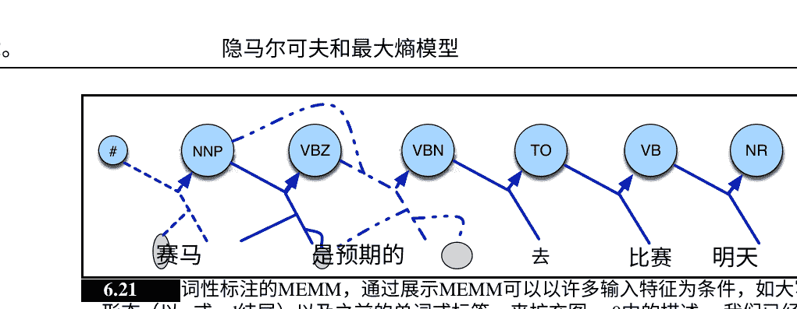

更正式地说，在HMM中，我们计算给定观测的状态序列的概率为：

$$P(Q|O) = \prod_{i=1}^{n} P(o_i|q_i) \times \prod_{i=1}^{n} P(q_i|q_{i-1})$$

在MEMM中，我们计算给定观测的状态序列的概率为：

$$P(Q|O) = \prod_{i=1}^{n} P(q_i|q_{i-1}, o_i)$$

然而，在实践中，MEMM还可以在右侧条件上考虑比HMM更多的特征，因此通常我们会在右侧条件上考虑更多的因素。
为了估计从状态 q' 到状态 q 产生观测 o 的转移的个别概率，我们构建一个最大熵模型如下：

$$P(q|q', o) = \frac{1}{Z(o, q')} \exp\left( \sum_{i} w_i f_i(o, q) \right)$$

### 6.8.1 MEMMs中的解码和学习

与HMM类似，MEMM使用维特比算法来执行解码（推理）任务。具体而言，这涉及用适当的值填充一个 N × T 数组，用于 P(t_i|t_{i-1}, word_i)，并在进行过程中维护回溯指针。与HMM维特比算法一样，当表格填充完毕后，我们只需从最后一列的最大值开始回溯指针，以获取所需的标签集。与HMM样式的维特比应用相比，唯一需要改变的是如何填充每个单元格。回顾一下公式6.23，维特比方程的递归步骤计算时间 t 的状态 j 的维特比值为：

$$v_t(j) = \max_{i=1}^{N} v_{t-1}(i) a_{ij} b_j(o_t); 1 ≤ j ≤ N, 1 < t ≤ T$$

这是HMM的实现

(6.101) $$v_t(j) = \max_{i=1}^{N} v_{t-1}(i) P(s_j|s_i) P(o_t|s_j) \quad 1 \leq j \leq N, 1 < t \leq T$$

MEMM对这个后面的公式只需要稍微修改，用直接的后验概率替换先验概率和似然概率：

(6.102) $$v_t(j) = \max_{i=1}^{N} v_{t-1}(i) P(s_j|s_i, o_t) \quad 1 \leq j \leq N, 1 < t \leq T$$

图6.22展示了一个应用于Jason Eisner的日记中的冰淇淋任务的MEMM的Viterbi网格的示例。回想一下，这个任务是从Jason Eisner的日记中观察到的冰淇淋数量来推断隐藏的天气（热或冷）。图6.22展示了抽象的Viterbi概率计算，假设我们有一个为我们计算 P(s_i|s_{i-1}, o_i)的MaxEnt模型。

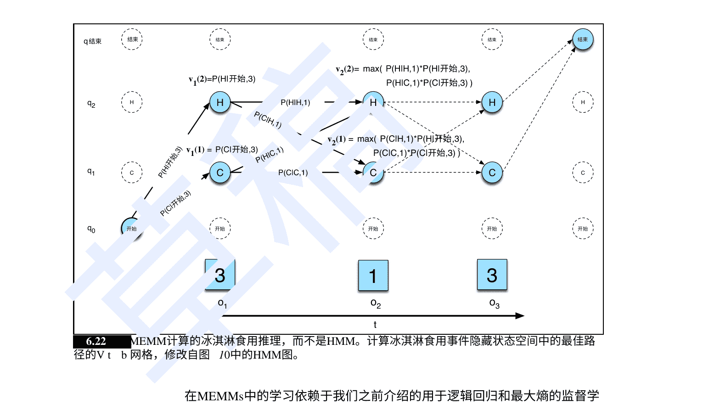

在MEMMs中的学习依赖于我们之前介绍的用于逻辑回归和最大熵的监督学习算法。给定一系列观测值、特征函数和相应的隐藏状态，我们训练权重以最大化训练语料库的对数似然。与HMMs一样，也可以以半监督模式训练MEMMs，例如当训练数据的标签序列在某种程度上缺失或不完整时：可以使用EM算法的一种版本来实现这个目的。

## 6.9 总结

本章介绍了两个重要的概率序列分类模型：隐马尔可夫模型和最大熵马尔可夫模型。 这两个模型在语音和语言处理中被广泛使用。

- 隐马尔可夫模型（HMMs）是一种将一系列观测值与解释这些观测值的隐藏类别或隐藏状态相关联的方法。
- 给定观测序列，发现隐藏状态序列的过程被称为解码或推断。 维特比算法通常用于解码。
- HMM的参数是转移概率矩阵A和观测概率矩阵B。 这两者可以使用Baum-Welch或前向-后向算法进行训练。
- MaxEnt模型是一种分类器，通过计算观测的一组加权特征的指数函数的概率来为观测分配一个类别。
- MaxEnt模型可以使用凸优化领域的方法进行训练，尽管本教材不提供详细信息。
- 最大熵马尔可夫模型或MEMM是MaxEnt的序列模型增强，利用维特比解码算法。
- MEMM可以通过将MaxEnt训练与EM的一个版本相结合来进行训练。

# 参考文献和历史注释

正如我们在第4章末尾讨论的那样，马尔可夫链首先由马尔可夫（1913年，2006年）在普希金的《叶甫盖尼·奥涅金》中使用，用于预测下一个字母是元音还是辅音。

隐马尔可夫模型是由鲍姆和普特里于普林斯顿的国防分析研究所开发的（鲍姆和佩特里，1966年；鲍姆和伊根，1967年）。

维特比算法首次应用于语音和语言处理，是由文茨尤克（1968年）在语音识别的背景下提出的，但是克鲁斯卡尔（1983年）称其具有“多次独立发现和发表的卓越历史”。克鲁斯卡尔和其他人至少提供了以下独立发现的算法变体，在四个不同领域发表：

| 引用 | 领域 |
| --- | --- |
| 维特比（1967年） | 信息论 |
| Vintsyuk（1968年） | 语音处理 |
| Needleman和Wunsch（1970年） | 分子生物学 |
| Sakoe和Chiba（1971年） | 语音处理 |
| Sankoff（1972年） | 分子生物学 |
| Reichert等（1973年） | 分子生物学 |
| Wagner和Fischer（1974年） | 计算机科学 |

现在，将动态规划应用于语音和语言处理中的任何概率最大化问题的标准术语是维特比。对于非概率性问题（例如最小编辑距离），通常使用术语动态规划。Forney Jr.（1973年）是一篇早期的调查论文，探讨了维特比算法在信息和通信理论背景下的起源。

我们对隐马尔可夫模型应该被刻画为三个基本问题的想法的介绍是根据Rabiner（1989年）的一篇有影响力的教程建模的，该教程本身是基于20世纪60年代IDA的Jack Ferguson的教程。
Jelinek (1997)和Rabiner和Juang (1993)对前向-后向算法在语音识别问题中的应用给出了非常完整的描述。Jelinek(1997)还展示了前向-后向算法与EM之间的关系。还可以参考其他教材中关于HMM的描述，如Manning和Schütze (1999)。Durbin等人 (1998)介绍了将HMM等概率模型应用于蛋白质和核酸序列的生物学问题。Bilmes (1997)是关于EM的教程。虽然自20世纪中叶以来，逻辑回归和其他对数线性模型已经在许多领域中使用，但最大熵/多项式逻辑回归在自然语言处理中的应用可以追溯到IBM在1990年代初的工作(Berger等人，1996; Della Pietra等人，1997)。这项早期工作引入了最大熵形式主义，提出了一种学习算法(改进的迭代缩放算法)，并提出了正则化的使用。随后出现了许多最大熵的应用。有关最大熵模型的正则化和平滑的进一步讨论，请参阅
(inter alia) 陈和罗森菲尔德 (2000), 古德曼 (2004), 和杜迪克和沙皮尔(2006).

尽管本章的第二部分侧重于MaxEnt风格的分类，但在语音和语言处理中还使用了许多其他分类方法。朴素贝叶斯 (Duda et al., 2000) 经常被用作一个很好的基准方法（通常能产生足够好的实用结果）；我们将在第20章中介绍朴素贝叶斯。支持向量机 (Vapnik, 1995) 在文本分类和各种序列处理应用中取得了成功。

决策列表在词义区分中被广泛使用，决策树(Breiman et al., 1984; Quinlan, 1986) 在语音处理的许多应用中被使用。关于监督机器学习方法的良好参考资料包括Duda et al. (2000), Hastie et al. (2001), 和Witten和Frank (2005)。

最大熵马尔可夫模型（MEMMs）由Ratnaparkhi（1996）和McCallum等人（2000）引入。
有许多序列模型可以增强MEMM，例如条件随机场（CRF）（Lafferty等，2001；Sutton和McCallum，2006）。此外，还有各种将最大间隔方法（支持向量机分类器的基本原理）推广到序列任务的方法。

# 第7章 语音学

> （在导演乔治·库克要求教导1964年电影《窈窕淑女》的主演雷克斯·哈里森如何表现得像一个语音学家时：）
> 
> “我的直接回答是，‘我没有一个会唱歌的男仆和三个会唱歌的女仆，但我会告诉你作为助理教授我能做什么。’”
> 
> 彼得·拉德福吉德在他的讣告中引用，洛杉矶时报，2004年

关于教授儿童阅读的“整体语言”和“拼音法”方法之间的辩论，乍一看似乎是一个纯粹的现代教育辩论。然而，像许多现代辩论一样，这个辩论重新演绎了一个重要的历史辩证法，这种情况下是在书写系统中。最早独立发明的书写系统（苏美尔、汉字、玛雅）主要是形意文字：一个符号代表一个完整的词。但是从最早的阶段开始，我们可以发现，大多数这样的系统都包含音节或音素书写系统的元素，其中符号用于表示构成单词的音素。因此，苏美尔的符号发音为ba，意思是“定量”，也可以纯粹作为音素/ba/使用。即使是现代的中文，虽然主要是形意文字，也使用基于音素的字符来拼写外来词。纯粹基于声音的书写系统，无论是音节（如日语的平假名或片假名）、字母（如本书中使用的罗马字母）还是辅音（如闪族书写系统），通常可以追溯到这些早期的形音文字系统，往往是两种文化的融合。因此，阿拉伯、亚拉姆、希伯来、希腊和罗马的书写系统都源自一个被认为是由西方闪族雇佣兵从埃及象形文字的一种草书形式改编而来的西闪族文字。日本的假名音节表是从一组用于表示声音的汉字的草书形式修改而来的。这些汉字本身在中国被用来音译佛教经典中的梵文。这些经典在唐朝传入中国。

无论其起源如何，基于声音的书写系统中隐含的一个观点是，口语由更小的语音单元组成，这是支撑我们所有现代音韵学理论的原始理论。将语音和单词分解为更小的单元的这个想法也是现代语音识别算法（将声学波形转录为文本单词序列）和语音合成或文本转语音（将文本单词序列转换为声学波形）的基础。

在本章中，我们从计算的角度介绍语音学。语音学是研究语言声音的学科，它研究人类发音器官如何产生声音，声音如何在声学上实现，以及如何将这种声学实现数字化和处理。

我们从语音识别和文本转语音系统的一个关键要素开始：单词如何以称为音素的个别语音单元来发音。

## 第7.1节 语音声音和音标转写

语音识别系统需要为每个可以识别的单词拥有一个发音，而文本到语音系统需要为每个可以发音的单词拥有一个发音。本章的第一部分将介绍用于描述这些发音的音标。然后，我们介绍了音韵学的两个主要领域，即发音语音学，研究语音声音是如何由口腔中的发音器官产生的，以及声学音韵学，研究语音声音的声学分析。

我们还简要涉及音位学，这是语言学中描述不同环境中不同实现方式的系统化方式，以及这种声音系统与其他语法的关系。在这样做时，我们关注建模语音中的关键事实，即变异性；不同环境中的音素发音方式不同。

单词发音的研究是语音学的一部分，语音学是研究世界各种语言中使用的语音的学科。我们将单词的发音建模为代表音素或音段的符号串。音素是语音的一种表现形式。一个音素是一个语音单位；音素用语音符号表示，这些符号在字母语言（如英语）中与字母有些相似。

本节概述了英语（尤其是美式英语）的不同音素，展示了它们是如何产生和如何符号化的。我们将使用两种不同的字母表来描述音素。国际音标（IPA）是一个不断发展的标准，最初由国际音标协会于1888年开发，旨在记录所有人类语言的声音。IPA不仅仅是一个字母表，还是一套根据转录需求而有所不同的转录原则，因此同一句话可以根据IPA的原则以不同的方式转录。ARPAbet（Shoup，1980）是另一个音标字母表，专门为美式英语设计，使用ASCII符号；它可以被看作是IPA的美式英语子集的便利ASCII表示。ARPAbet符号经常在非ASCII字体不方便的应用程序中使用，例如在线发音词典。由于ARPAbet在计算表示发音时非常常见，我们将在本书的其余部分中依赖它而不是IPA。图7.1和图7.2显示了用于转录辅音和元音的ARPAbet符号，以及它们的IPA等效符号。

许多IPA和ARPAbet符号与英语和许多其他语言的正字法中使用的罗马字母等效。例如，ARPAbet音素 [p] 表示 platypus、puma和pachyderm的辅音音素，表示 leopard的中间音素，或表示 antelope的结尾音素。然而，总的来说，

> 1 电话音素 [ux] 在美国英语中很少见，通常不用于语音识别/合成。它用于表示在20世纪70年代末（Labov，1994）起至少在美国西部和北部城市方言中出现的前置音素 [uw]。这种前置首次由Moon Zappa（Zappa和Zappa，1982）模仿和录制的“山谷女孩”语音公开。

然而，对于大多数说话者来说，在像 dude这样的单词中，[uw] 仍然比 [ux] 更常见。

| ARPAbet符号 | 国际音标符号 | 单词 | ARPAbet转录 |
| :--- | :--- | :--- | :--- |
| [p] | [p] | 香菜 | [p aa r s l iy] |
| [t] | [t] | 茶 | [t iy] |
| [k] | [k] | 烹饪 | [k uh k] |
| [b] | [b] | 海湾 | [b ey] |
| [d] | [d] | 莳萝 | [d ih l] |
| [g] | [g] | 大蒜 | [g aa r l ix k] |
| [m] | [m] | 薄荷 | [m ih n t] |
| [n] | [n] | 肉豆蔻 | [n ah t m eh g] |
| [ng] | [ŋ] | 烘焙 | [b ey k ix ng] |
| [f] | [f] | 面粉 | [f l aw axr] |
| [v] | [v] | 丁香 | [k l ow v] |
| [th] | [θ] | 厚 | [th ih k] |
| [dh] | [ð] | 那些 | [dh ow z] |
| [s] | [s] | 汤 | [s uw p] |
| [z] | [z] | 鸡蛋 | [eh g z] |
| [sh] | [ʃ] | 南瓜 | [s k w aa sh] |
| [zh] | [ʒ] | 仙人掌 | [ae m b r ow zh ax] |
| [ch] | [tʃ] | 樱桃 | [ch eh r iy] |
| [jh] | [dʒ] | 罐子 | [jh aa r] |
| [l] | [l] | 甘草 | [l ih k axr ix sh] |
| [w] | [w] | 猕猴桃 | [k iy w iy] |
| [r] | [r] | 米饭 | [r ay s] |
| [y] | [j] | 黄色 | [y eh l ow] |
| [h] | [h] | 蜜糖 | [h ah n iy] |
| **较少常用的音素和异音** | | | |
| [q] | [ʔ] | 哎哟 | [q ah q ow] |
| [dx] | [ɾ] | 黄油 | [b ah dx axr] |
| [nx] | [ṉ] | 获胜者 | [w ih nx axr] |
| [el] | [ɫ] | 桌子 | [t ey b el] |

7.1 ARPAbet符号用于英语辅音的转录，带有IPA等效符号。请注意，一些较少见的符号，如闪音 [dx]，鼻音闪音 [nx]，喉塞音 [q] 和音节辅音，主要用于狭义转录。

英语正字法和音素之间的映射相对而言是不透明的；在不同的语境中，一个字母可以代表非常不同的音。英语字母 c 对应于单词 cougar 中的音素 [k]，但在单词 cell 中对应的是音素 [s]。除了出现为 c 和 k 之外，音素 [k] 还可以作为单词 fox 中的一部分出现为 x (fox [f aa k s])，作为 ck 出现为单词 jackal 中的一部分 ([jh ae k el])，以及作为 cc 出现为单词 raccoon 中的一部分 ([r ae k uw n])。许多其他语言，例如西班牙语，在其声音-正字法映射方面要比英语透明得多。

| ARPAbet 符号 | 国际音标 符号 | 单词 | ARPAbet 转录 |
| :--- | :--- | :--- | :--- |
| [iy] | [i] | lily | [l ih l iy] |
| [ih] | [ɪ] | lily | [l ih l iy] |
| [ey] | [eɪ] | 雏菊 | [d ey z iy] |
| [eh] | [ɛ] | 钢笔 | [p eh n] |
| [ae] | [æ] | 翠菊 | [ae s t axr] |
| [aa] | [ɑ] | 罂粟 | [p aa p iy] |
| [ao] | [ɔ] | 兰花 | [ao r k ix d] |
| [uh] | [ʊ] | 木头 | [w uh d] |
| [ow] | [oʊ] | 莲花 | [l ow dx ax s] |
| [uw] | [u] | 郁金香 | [t uw l ix p] |
| [ah] | [ʌ] | 毛茛 | [b ah dx axr k ah p] |
| [er] | [ɝ] | 鸟 | [b er d] |
| [ay] | [aɪ] | 鸢尾花 | [ay r ix s] |
| [aw] | [aʊ] | 向日葵 | [s ah n f l aw axr] |
| [oy] | [ɔɪ] | 土壤 | [s oy l] |
| **减少和不常见的音素** |  |  |  |
| [ax] | [ə] | 莲花 | [l ow dx ax s] |
| [axr] | [ɚ] | 希瑟 | [h eh dh axr] |
| [ix] | [ɨ] | 郁金香 | [t uw l ix p] |
| [ux] | [ʉ] | 朋友 | [d ux d] |

7.2 ARPAbet符号用于英语元音的转录，带有IPA对应物。注意再次列出较少见的音素和简化元音（见第4节）；例如，[ax] 是简化的元音 schwa，[axr] 是对应于 [er] 的简化元音，[ix] 是对应于 [iy] 的简化元音。

## 7.2 发音语音学

如果不了解每个音素的产生方式，ARPAbet音素列表就没有用处。因此，我们转向发音语音学，研究音素的产生方式，因为口腔、喉咙和鼻子中的各种器官会改变从肺部流出的气流。

### 7.2.1 声音器官

声音是通过空气的快速运动产生的。人类口语中的大多数声音是通过从肺部通过气管（技术上称为气管）然后从口腔或鼻子排出空气来产生的。当空气通过气管时，它通过喉部，通常称为亚当的苹果或声带箱。喉部包含两个小的肌肉褶皱，声带（非技术性地称为声带），可以一起或分开移动。这两个褶皱之间的空间称为声门。如果褶皱紧密在一起（但声门不关闭），当空气通过它们时会振动；如果它们相距很远，它们就不会振动。声带紧闭并振动产生的声音被称为有声音的；没有声带振动的声音被称为无声音的或清音的。

有声音的声音包括 [b], [d], [g], [v], [z] 和所有英语元音，其中无声音的包括 [p], [t], [k], [f], [s] 和其他声音。

鼻音：口腔和鼻腔作为共鸣腔体；英语的鼻音包括 m, n, 和 ng。

辅音：音素分为两大类：辅音和元音。两种声音都是通过空气在口腔、喉咙或鼻腔中的运动形成的。辅音是通过某种方式限制或阻塞空气流动，并且可以是有声的或无声的。元音的阻塞较少，通常是有声的，并且通常比辅音更响亮和持久。这些术语的技术用法与常规用法非常相似；[p]、[b]、[t]、[d]、[k]、[g]、[f]、[v]、[s]、[z]、[r]、[l]等是辅音；[aa]、[ae]、[ao]、[ih]、[aw]、[ow]、[uw]等是元音。半元音（例如 [y] 和 [w]）具有元音和辅音的一些特性；它们像元音一样有声，但像辅音一样短暂且不是音节的一部分。

### 7.2.2 辅音：发音位置

因为辅音是通过某种方式限制气流而产生的，所以辅音可以通过限制的位置来区分：最大限度限制的位置被称为辅音的发音位置。发音位置，如图所示图7.4经常被用于自动语音识别，作为将音素分组为等价类的有用方法：

**唇音：** 主要限制是通过两唇闭合形成的辅音具有双唇的发音位置。在英语中，这些包括 [p]（如 possum），[b]（如 bear）和 [m]（如 marmot）。英语的唇齿音 [v] 和 [f] 是通过下唇压在上排牙齿上，让空气从上排牙齿间流过而产生的。

**牙齿音：** 通过舌头贴在牙齿上产生的声音是牙齿音。英语中的主要牙齿音是 [th] 的音，如 thing，或 [dh] 的音，如 this，这些音是通过舌尖稍微夹在牙齿之间，舌头放在牙齿后面产生的。

**齿龈音：** 齿龈嵴是口腔顶部位于上牙后面的部分。大多数美式英语的说话者通过舌尖贴在齿龈嵴上来发出 [s]、[z]、[t] 和 [d] 这些音。冠音通常用来指牙齿音和齿龈音。

**腭音：** 口腔顶部（腭）从齿龈后方急剧上升。腭擦音 [sh]（shrimp）、[ch]（china）、[zh]（Asian）和 [jh]（jar）是用舌刃贴在这个上升的腭后部产生的。

**齿龈腭音：** 齿龈腭音 [y] 的发音是通过将舌头的前部靠近硬腭来产生的。

**软腭：** 软腭或软腭是位于口腔最后部分的可移动肌肉瓣。声音 [k]（back）、[g]（beg）和 [ng]（sing）是通过将舌头后部紧贴软腭来产生的。

**声门：** 声门塞音 [q]（国际音标 [ʔ]）是通过关闭声门（将声带靠拢）来产生的。

### 7.2.3 辅音：发音方式

辅音还可以通过气流限制的方式来区分，例如是否完全停止气流或只是部分阻塞等。这种发音特征被称为辅音的发音方式。发音位置和发音方式的组合通常足以唯一确定一个辅音。以下是英语辅音的主要发音方式：

- **塞音：** 塞音是一种完全阻塞短时间内的辅音。这种阻塞后面跟着一个爆炸声，因为空气被释放出来。阻塞的时间被称为闭塞，爆炸被称为释放。英语中有声的塞音，如 [b]，[d] 和 [g]，以及无声的塞音，如 [p]，[t] 和 [k]。塞音也被称为爆破音。一些计算系统使用更窄（详细）的转录风格，对塞音的闭塞和释放部分有单独的标签。例如，在ARPAbet的一个版本中，[p]，[t] 或 [k] 的闭塞部分分别表示为 [pcl]，[tcl] 或 [kcl]，而符号 [p]，[t] 和 [k] 仅用于表示塞音的释放部分。在另一个版本中，符号 [pd]，[td]，[kd]，[bd]，[dd]，[gd] 用于表示未释放的塞音（单词或短语末尾的塞音通常没有爆炸释放），而 [p]，[t]，[k] 等用于表示具有闭塞和释放的正常塞音。国际音标使用特殊符号标记未释放的塞音： [p̚]，[t̚] 或 [k̚]。在本章中，我们不会使用这些窄的转录风格；我们将始终使用 [p] 表示具有闭塞和释放的完整塞音。
- **鼻音：** 鼻音 [n]、[m] 和 [ŋ] 是通过降低软腭并允许空气进入鼻腔产生的。
- **擦音：** 在擦音中，气流被收窄但并未完全切断。由于收窄而产生的湍流气流产生了特征性的“嘶嘶”声。英语唇齿擦音 [f] 和 [v] 是通过将下唇压在上牙齿上，在上牙齿之间产生受限制的气流。齿擦音 [th] 和 [dh] 允许空气在舌头和牙齿之间流动。齿龈擦音 [s] 和 [z] 是通过舌头贴在齿龈脊上，迫使空气经过牙齿边缘产生的。腭擦音 [sh] 和 [zh] 中，舌头位于齿龈脊的后部，迫使空气通过舌头形成的凹槽。较高音调的擦音（在英语中为 [s]、[z]、[sh] 和 [zh]）被称为“咝音”。
- **塞擦音：** 紧接着摩擦音的音素被称为塞擦音；这包括英语 [ch] (chicken) 和 [jh] (giraffe)。
- **近音：** 在近音中，两个发音器官靠得很近，但不足以引起湍流气流。在英语中，[y] (yellow)，舌头靠近上颚但不足以引起湍流气流。在英语中，[w] (wood)，舌头的后部靠近软腭。美式英语的 [r] 可以通过至少两种方式发音；只用舌尖伸出并靠近上颚，或者整个舌头靠近上颚。[l] 的发音是通过舌尖贴在齿龈或牙齿上，舌头的一侧或两侧降低以允许空气流过。[l] 被称为侧音因为舌头的两侧下降。
- **闪音：** 闪音或 flap [dx]（或国际音标 [ɾ]）是舌头迅速触碰齿龈嵴的动作。单词 lotus ([l ow dx ax s]) 中间的辅音在大多数美式英语方言中是闪音；许多英国方言的说话者在这个单词中会用 [t] 代替闪音。

### 7.2.4 元音

与辅音一样，元音的特征可以通过发音器官的位置来描述。元音的三个最相关的参数是所谓的元音舌位高度，大致对应舌头最高部分的高度，元音前后位置，表示这个高点是口腔道前部还是后部，以及嘴唇的形状（圆唇或非圆唇）。图7.5展示了不同元音的舌头位置。

例如，在元音 [iy] 中，舌头的最高点位于口腔的前部。相比之下，在元音 [uw] 中，舌头的高点位于口腔的后部。舌头向前抬起的元音称为前元音；舌头向后抬起的元音称为后元音。请注意，虽然 [ih] 和 [eh] 都是前元音，但 [ih] 的舌头比 [eh] 更高。舌头最高点相对较高的元音称为高元音；舌头最高点为中等或较低值的元音称为中元音或低元音。

图7.6显示了不同元音的元音舌位高度的示意性特征。它是示意性的，因为抽象属性 height 只与实际舌位粗略相关；实际上，它更准确地反映了声学事实。请注意，图表中有两种元音：一种以点表示舌位高度，另一种以矢量表示。在元音的发音过程中，舌位发生明显变化的元音是一个双元音。英语特别丰富的双元音。

元音的第二个重要发音器官维度是唇形。某些元音发音时嘴唇要圆起来（就像吹口哨时的嘴唇形状）。这些圆唇元音包括 [uw]，[ao] 和 [ow]。

## 音节

辅音和元音组合形成一个音节。关于音节的定义还没有完全达成一致；粗略地说，一个音节是一个类似元音（或响音）的声音，以及与之最紧密相关的一些周围辅音。单词 “dog” 有一个音节，[d ow g]；而单词 “camp” 有两个音节，[k ae m] 和 [p]。我们称音节核心的元音为“核”。

可选的起始辅音或一组辅音称为“起始”。如果起始有多个辅音（如单词 “strike” [str ay k]），我们称其为“复杂起始”。

韵尾是核后面的可选辅音或辅音序列。因此，[d] 是 “dog” 的起始，而 [g] 是韵尾。韵腹或韵尾是核后面的可选辅音或辅音序列。因此，[d] 是 “dog” 的起始，而 [g] 是韵尾。韵腹或韵尾是核心加尾音。图7.7展示了一些样例音节结构。

自动将单词分解为音节的任务称为音节化，将在第11.4节中讨论。

音节结构也与语言的音位规则密切相关。音位规则一词表示语言中一个音素可以跟随另一个音素的限制。例如，英语对声母的组合有严格的限制；例如，序列 [zdr] 不能成为合法的英语音节声母。音位规则可以通过列举音节位置的限制来表示，也可以通过创建可能的音素序列的有限状态模型来表示。还可以创建一个概率音位规则，通过对音素序列进行训练 N-gram语法。

## 词汇重音和弱元音

在美式英语的自然句子中，某些音节比其他音节更突出。这些被称为重音音节，与此相关的语言标记被称为音高重音。突出的词或音节被认为具有音高重音。音高重音有时也被称为句子重音，尽管句子重音可能只指句子中最突出的重音。

通过音量更大、持续时间更长、音高变化或以上任意组合，重音音节可能更突出。由于重音在意义上起着重要作用，准确理解为什么说话者选择重音某个音节是非常复杂的，我们将在第8.3.2节详细讨论这个问题。但是在发音词典中通常会表示一个重要因素。这个词汇重音因素被称为词汇重音。如果单词被重音，具有词汇重音的音节会更响亮或持续时间更长。例如，单词 parsley 的重音在第一个音节，而不是第二个音节。因此，如果单词 parsley 在句子中接受音高重音，第一个音节会更强烈。

在国际音标中，我们在音节前面写上符号 ['] 来表示它具有词汇重音（例如 ['p aa r s l iy]）。这种词汇重音的差异会影响一个词的意义。例如，单词 content 可以是名词或形容词。当单独发音时，这两个意义的发音不同，因为它们有不同的重读音节（名词发音为 ['k aa n t eh n t]，形容词发音为 [k ah n 't eh n t]）。

## 弱化元音

非重读的元音可以进一步减弱为弱化元音。最常见的弱化元音是 schwa ([ax])。英语中的弱化元音没有完整的形式；发音动作不如完整元音那样完整。因此，口腔的形状相对中性；舌头既不特别高也不特别低。例如，parakeet 中的第二个元音是 schwa：[p ae r ax k iyt]。

虽然弱元音是最常见的减元音，但至少在某些方言中，并不是唯一的减元音。Bolinger (1981) 提出美式英语有三个减元音：一个减中元音 [ə]，一个减前元音 [i]，一个减圆元音 [u]。完整的ARPAbet包括其中两个，即弱元音 [ax] 和 [ix] ([i])，以及一个带有r音的弱元音 [axr]（通常称为 schwar），尽管 [ix] 在计算应用中通常被省略 (Miller, 1998)，而 [ax] 和 [ix] 在许多英语方言中正在合并 (Wells, 1982年，第167-168页)。

并非所有无重音的元音都会减少；任何元音，尤其是双元音，在无重音位置上都可以保持其完整的音质。例如，元音 [iy] 可以出现在重音位置，如单词 eat [iy t]，也可以出现在无重音位置，如单词 carry [k ae r iy]。

一些计算机ARPAbet词典明确标记了像弱元音（如ə）这样的减少元音。但是一般来说，预测减少需要了解词典之外的知识（韵律环境、语速等），我们将在下一节中看到。因此，其他ARPAbet版本标记了重音，但没有标记重音如何影响减少。例如，CMU词典（CMU, 1993）用数字0（无重音）、1（重音）或2（次重音）标记每个元音。因此，单词 counter被列为[K AW1 N T ER0]，单词 table被列为[T EY1 B AH0 L]。次重音被定义为是低于主重音但高于无重音元音的一种重音级别，例如单词 dictionary[D IH1 K SH AH0 N EH2 R IY0]

## 7.3 音韵类别和发音变异

> 请原谅我，当我亲吻天空
> 吉米·亨德里克斯，紫雾
> 请原谅我，当我亲吻这个家伙
> 同样歌词的常见误听

如果每个单词都以固定的音素串发音，而且每个音素在所有语境和所有说话者中发音都相同，语音识别和语音合成任务将变得非常容易。然而，单词和音素的实现因许多因素而大不相同。图7.8展示了美国英语电话对话的手工转录Switchboard语料库中单词because和about的发音的广泛变化样本（Greenberg等，1996年）。

| because | | about | |
| --- | --- | --- | --- |
| ARPAbet | % | ARPAbet | % |
| b iy k ah z | 27% | ax b aw | 32% |
| b ix k ah z | 14% | ax b aw t | 16% |
| k ah z | 7% | b aw | 9% |
| k ax z | 5% | ix b aw | 8% |
| b ix k ax z | 4% | ix b aw t | 5% |
| b ih k ah z | 3% | ix b ae | 4% |
| b ax k ah z | 3% | ax b ae dx | 3% |
| k uh z | 2% | b aw dx | 3% |
| k s | 2% | b ae | 3% |
| k ix z | 2% | b aw t | 3% |
| k ih z | 2% | ax b aw dx | 3% |
| b iy k ah zh | 2% | ax b ae | 3% |
| b iy k ah s | 2% | b aa | 3% |
| b iy k ah | 2% | b ae dx | 3% |
| b iy k aa z | 2% | ix b aw dx | 2% |
| ax z | 2% | ix b aa t | 2% |

图7.8 英语会话电话语音的手工转录Switchboard语料库中最常见的16种发音（Godfrey et al., 1992; Greenberg et al., 1996）的 because 和 about。

我们如何对这种广泛的变化进行建模和预测？一个有用的工具是假设说话者心中所表示的是抽象的类别。

## 第226章 第7节. 语音学

相比于所有详细的音素细节，语言学家更喜欢使用音位。例如，考虑一下单词 tunafish 和 starfish 中 [t] 的不同发音。在 tunafish 中，[t] 是带气音的。带气音是在闭塞音结束和下一个元音发声之前的一段无声时间。由于声带不振动，带气音听起来像是在 [t] 和元音之间的一股气流。相比之下，[t] 在 [s] 之后是不带气音的；因此，在 starfish ([s t aa r f ih sh]) 中的 [t] 是不带气音的。

在 [t] 闭合后没有无声期。这种 [t] 的实现变化是可预测的：每当 [t] 在英语中开始一个单词或未减音音节时，它是送气的。对于 [k] 也存在同样的变化；在 Jimi Hendrix 的歌词中，[k] 经常被误听为 [g]，因为 [k] 和 [g] 都是不送气的。²

还有其他 [t] 的上下文变体。例如，当 [t] 出现在两个元音之间时，特别是当第一个元音受到强调时，它通常发音为轻音 [tap]。请记住，轻音是一种有声音，舌头的顶部卷起并迅速敲击齿槽嵴。因此，单词 buttercup 通常发音为 [b ah d x axr k uh p] 而不是 [b ah t axr k uh p]。[t] 的另一种变体出现在齿音 [t th] 之前。在这里，[t] 变成了齿音化（国际音标 [ t̪ ]）。也就是说，舌头不再与齿槽嵴形成闭合，而是触碰到牙齿的后部。

在语言学和语音处理中，我们使用抽象类来捕捉所有这些 [t] 的相似之处。最简单的抽象类称为音素，以及在不同的上下文中，其不同的表现称为异音。我们传统上会在斜杠内写音素。所以在上面的例子中，/t/ 是一个音素，其异音包括（在国际音标中）[tʰ]、[r] 和 [ t̪ ]。图7.3总结了 /t/ 的一些异音。在语音合成和识别中，我们使用像 ARPAbet 这样的音素集来近似表示抽象音素单位的概念，并使用 ARPAbet 音素表示发音词典。因此，图7.1中列出的异音倾向于用于狭义的分析转录，而在语音识别或合成系统中使用较少。出于这个原因，图7.1中列出的异音倾向于用于狭义的分析转录，而在语音识别或合成系统中使用较少。

| 国际音标 | ARPAbet | 描述 | 环境 | 例子 |
|----------|---------|------|------|------|
| tʰ | [t] | 送气音 | 在词的开头位置 | tunafish |
| t | | 不送气音 | 在 [s] 后或减少的音节中 | starfish |
| ? | [q] | 喉塞音 | 词末或元音后 [n] 之前 | kitten |
| ?t | [qt] | 喉塞音 t | 有时在词末 | cat |
| r | [dx] | 轻敲 | 在元音之间 | butter |
| t̪ | [tcl] | 未发音的 t | 在辅音之前或词末 | fruitcake |
| t | | 齿音 t | 在齿音辅音之前 ([θ]) | eighth |
| | | 删除的 t | 有时在词末 | past |

**图7.9 英语 /t/ 的一些异音.**

变异比图7.3所示更为常见。影响变异的一个因素是，语音变得更加自然和口语化，说话速度更快，声音更加缩短、减少和混合在一起。这种现象被称为减音或假音化。例如，同化是

> ² ARPAbet 没有标记送气音的方式；在国际音标中，送气音标记为 [ʰ]，所以在国际音标中，单词 tunafish 会被转写为 [tʰunəfiʃ]。

## 第7.3节。音韵类别和发音变异 227

**软腭化**
改变一个片段，使其更像一个相邻的片段。在牙齿化过程中，[t] 在牙齿辅音 [T] 之前变为 [t_] 是一种同化的例子。跨语言的一种常见同化类型是软腭化，当狭窄部位移动到比正常位置更接近腭部，因为后面的音段是软腭或齿龈-软腭音。在最常见的情况下，/s/ 变为 [sh]，/z/ 变为 [zh]，/t/ 变为 [ch]，/d/ 变为 [jh]。我们在图7.8中的一个例子中看到了软腭化的情况，发音为 [b iy k ah zh]，因为后面的单词是 you've。在 Switchboard 语料库中，lemma you (you, your, you've 和 you'd) 极有可能引起软腭化。在 Switchboard 语料库中，lemma you (you, your, you've 和 you'd) 极有可能引起软腭化。

**删除** 删除在英语中非常常见。我们在上面看到了删除最后一个 /t/ 的例子，在单词 about 和 it 中。删除最后的 /t/ 和 /d/ 已经得到了广泛的研究。/d/ 比 /t/ 更容易被删除，而且在辅音前更容易被删除 (Labov, 1972)。图7.3显示了来自 Switchboard 语料库的软腭化和最后的 /t/ 删除的例子。

| 短语 | 软腭化 词汇 | 缩写 | 短语 | 最后的 /t/ 删除 词汇 | 缩写 |
|---|---|---|---|---|---|
| 设置你的 | s eh t y ow r | s eh ch er | 找到他 | f ay n d h ih m | f ay n ix m |
| 还没有 | n aa t y eh t | n aa ch eh t | 而且我们 | ae n d w iy | eh n w iy |
| 你做了吗 | d ih d y uw | d ih jh y ah | 起草 | d r ae f t dh iy | d r ae f dh iy |

图7.10 Switchboard 语料库中的软腭化和最终 t/d 删除的示例。

一些 t/d 的例子可能是声门化而不是完全删除。

### 7.3.1 音标特征

音素只能以非常粗略的方式来模拟上下文效应。许多音韵过程，如同化和删除，最好通过邻近上下文的更精细的发音事实来建模。图7.3显示了在 [h]、[dh] 和 [w] 之前 /t/ 和 /d/ 的删除；我们不想列出所有可能影响删除的后续音素，而是希望概括地说 /t/ 经常在“辅音前”删除。类似地，弱化可以被看作是一种声音同化，即无声 /t/ 在有声元音或滑音之间变成有声塔普 [dx]。

与其列举每个可能的元音或滑音，我们更愿意说翻转发生在‘靠近元音或有声音段’的地方。最后，前面有鼻音 [n]、[m] 和 [ng] 的元音，通常会获得后面元音的一些鼻音特质。在这些情况下，一个音素受到相邻音素（鼻音、辅音、有声音）的发音影响。这些变化发生的原因是在语音产生过程中，语音发音器官（舌头、嘴唇、软腭）的运动是连续的，并且受到动量等物理约束的影响。因此，一个发音器官可能在一个音素期间开始运动，以便及时到达下一个音素的位置。当一个音素的实现受到相邻音素的发音运动的影响时，我们称其受到共同发音的影响。共同发音是发音器官的运动

**共同发音**
预测下一个声音，或者坚持上一个声音的运动。
我们可以通过使用独特特征来捕捉引起共同发音的不同音素的一般性规律独特特征。特征（通常）是二进制变量，用于表达关于音素组的一些概括。例如，特征 [voice] 为真

有声音（元音，[n]，[v]，[b] 等）的声音我们说它们是 [+voice]，而无声音的声音是 [-voice]。这些发音特征可以借鉴我们之前描述的发音位置和方式的发音观念。常见的发音位置特征包括 [+labial]（[p, b, m]），[+coronal]（[ch d dh jh l n r s sh t th z zh]）和 [+dorsal]。发音方式特征包括 [+辅音]（或者 [+元音]），[+连音]，[+响音]。对于元音，特征包括 [+高]，[+低]，[+后]，[+圆] 等。独特特征用于将每个音素表示为特征值矩阵。存在许多不同的独特特征集；对于大多数计算目的来说，这些特征集都是完全足够的。图7.11显示了一个部分特征集中一些音素的值。

| 音节 | 音 | 辅音 | 擦音 | 鼻音 | 高 | 回去 | round | 紧音 | 声音 | 唇音 | 舌音 | 舌面 |
|------|----|------|------|------|----|------|-------|------|------|------|------|------|
| b | - | + | - | - | - | - | + | + | + | - | - | - |
| p | - | + | - | - | - | - | - | + | - | + | - | - |
| iy | + | + | - | - | - | + | - | - | + | - | - | - |

图7.11 从 Chomsky 和 Hall (1968) 简化的部分音素特征矩阵。Syl 代表音节；son 代表音韵；cons 代表辅音。

这些显著特征的一个主要用途是捕捉电话的自然发音类别。正如我们将看到的，在合成和识别中，我们经常需要构建电话在特定上下文中的行为模型。但是我们很少有足够的数据来模拟每个可能的左右上下文电话对电话行为的影响。因此，我们可以将相关特征 ([voice], [nasal] 等) 作为上下文的有用模型；该特征可以作为电话的一种回退模型。在语音识别中的另一个用途是构建发音特征检测器，并使用它们来帮助电话检测的任务；例如，Kirchhoff 等人 (2002) 构建了以下一组多值发音特征的神经网络检测器，并将其用于改进德语语音识别中的电话检测：

| 特征 | 数值 | 特征值 |
|------|------|--------|
| 语音 | +声音，-声音，静音 | 方式 停止音，元音，侧音，鼻音，摩擦音，静音 |
| 位置 | 唇音，齿龈音，硬腭音，软腭音 | 声门位置 声门，高音，中音，低音，静音 |
| 前后 | 前音，后音，无，静音 | 圆唇化 +圆唇，-圆唇，无，静音 |

### 7.3.2 预测音标变异

对于语音合成和识别，我们需要能够表示抽象类别与其表面形式之间的关系，并且能够根据抽象类别和话语的上下文预测表面形式。在早期的音韵学研究中，一个音素与其异音之间的关系通过编写音韵规则来捕捉。以下是传统符号表示法中关于颤音的音韵规则（Chomsky 和 Halle，1968 年）：

```
(7.1) / { t d } / → [dx] / V __ V
```

在这种表示法中，表面音位出现在箭头的右侧，而音标环境由下划线（）周围的符号表示。简单

类似这样的规则在语音识别和合成中都会使用，当我们想为一个词生成多个发音时；在语音识别中，这通常被用作选择一个词的最可能的单一发音的第一步（见第 10.5.3 节）。然而，总的来说，这些简单的“乔姆斯基-哈勒”类型的规则之所以不能很好地告诉我们何时使用给定的表面变体，有两个原因。首先，变异是一个随机过程；即使在相同的环境中，有时会发生拍打，有时不会。其次，许多与音标环境无关的因素对于这个预测任务很重要。因此，语言学研究和语音识别/合成都依赖于统计工具来预测一个词的表面形式，通过显示哪些因素导致了例如在特定上下文中 /t/ 的拍打。

### 7.3.3 影响语音变异的因素

影响语音变异的一个重要因素是语速，一般来说-语速通常以每秒音节数来衡量。语速在说话者之间和同一说话者之间都有所不同。在快速语音中，许多种语音减少过程更为常见，包括弱化、元音减少以及最后的 /t/ 和 /d/ 的删除（Wolfram，1969）。可以通过转录（通过计算区域转录中的单词或音节数量，并除以秒数）或使用信号处理指标（Morgan 和 Fosler-Lussier，1989）来计算每秒音节数（或每秒单词数）。影响变异的另一个因素是词频或可预测性。最后的 /t/ 和 /d/ 的删除在非常常见的词中特别容易发生，比如“and”和“just”（Labov，1975；Neu，1980）。当两个包围该音段的词是一个搭配时，删除的可能性也更大（Bybee，2000；Gregory 等，1999；Zwicky，1972）。在频繁出现的词和短语中，[t] 音更容易被软腭化。给定前一个词的条件概率较高的词更有可能出现减少的元音、删除的辅音和弱化（Bell 等，2003；Gregory 等，1999）。
其他语音、音韵和形态学因素也会影响变异。例如，/t/ 比 /d/ 更容易被闪音化；并且与音节、音步和词边界之间存在复杂的相互作用（Rhodes，1992）。正如我们将在第 8 章中讨论的那样，语音被分为称为语调短语或呼吸组的单元。语调短语的开头或结尾的单词更长，更不容易被减少。至于形态学，事实证明，如果单词的结尾是英语的过去时结束音 /t/ 或 /d/，则删除的可能性较小（Guy，1980）。例如，在 Switchboard 中，与单词 turned（30% /d/ 删除）相比，单词 around（73% /d/ 删除）更容易发生删除，尽管这两个单词的频率相似。
变异还受到说话者的心理状态的影响。例如，单词 the 可以发音为完整的元音 [dh iy] 或减少的元音 [dh ax]。当说话者不流利并且遇到“计划问题”时，更有可能用完整的元音 [iy] 发音；一般来说，如果说话者不知道接下来要说什么，他们更有可能使用完整的元音而不是减少的元音（Fox Tree 和 Clark，1997；Bell 等，2003；Keating 等，1994）。
社会语言学因素如性别、阶级和方言也会影响发音变体。北美英语通常分为八个方言区域（北部、南部、新英格兰、纽约/中大西洋、北中部、南中部、西部、加拿大）。南方方言的说话者在一些带有元音 [ay] 的单词中使用单元音或接近单元音 [aa] 或 [ae]。

**社会语言学**

**方言**

### ### 非裔美国人方言英语

土地，西部，加拿大）。南方方言的说话者在一些带有元音 [ay] 的单词中使用单元音或接近单元音 [aa] 或 [ae]。在这些方言中，大米的发音为 [r aa s]。非裔美国人的方言英语（AAVE）与美国南部英语共享许多元音，还有一些具有特定发音的单词，例如 [b ih d n ih s] 表示 business 和 [ae k s] 表示 ask。对于年长的说话者或不来自美国西部或中西部的人来说，caught 和 cot 有不同的元音（分别为 [k ao t] 和 [k aa t]）。年轻的美国人说话者或来自西部的人发音相同的两个单词 cot 和 caught；在这些方言中，除了在 [r] 之前，通常不区分 [ao] 和 [aa] 这两个元音。对于大多数非美国和一些美国的英语方言（例如澳大利亚英语）的说话者来说，Mary（[m ey r iy]），marry（[m ae r iy]）和 merry（[m eh r iy]）的发音都不同。大多数美国人发音这三个单词都相同，为 [m eh r iy]。

### ### 注册风格

大多数说话者同时使用两种形式；正如 Labov（1966）所示，他们在更正式的场合使用 [ih ng]，在更随意的场合使用 [ih n]。Wald 和 Shopen（1981）发现男性比女性更倾向于使用非标准形式 [ih n]，男性和女性在与女性交谈时更倾向于使用更多的标准形式 [ih ng]，而男性（但不是女性）在与朋友交谈时倾向于转换为 [ih n]。当他们与朋友交谈时，大多数男性（但不是女性）倾向于转换为 [ih n]。

这些预测变异的结果很多都依赖于对音素转录语料库进行逻辑回归的技术，这是一种在音素变异分析中有着悠久历史的技术（Cedergren 和 Sankoff，1974），尤其是使用 VARBRUL 和 GOLDVARB 软件（Rand 和 Sankoff，1990）。

最后，特定音素的详细声学实现非常受其相邻音素的协同作用的影响。在介绍声学语音学之后，我们将在接下来的章节（第 8.4 节和第 10.3 节）中回顾这些细致的音素细节。

## 7.4 声学语音学和信号

我们将从对声学波形及其数字化的简要介绍开始，概述频率分析和频谱的概念。这将是一个非常简要的概述；鼓励感兴趣的读者参考本章末尾的参考文献。

### 7.4.1 波

声学分析基于正弦和余弦函数。图7.12显示了一个正弦波的图形，特别是函数：
```
(7.2)  y = A * sin(2πft)
```
其中我们将振幅A设置为1，频率f设置为每秒10个周期。

从基本数学中可以得知，波的两个重要特征是其频率和振幅。频率是波每秒重复的次数，即周期的次数。我们通常用每秒周期来衡量频率。图7.12中的信号在0.5秒内重复了5次，因此每秒10个周期。每秒周期通常称为赫兹（缩写为Hz），因此图7.12中的频率可以描述为10赫兹。正弦波的振幅A是Y轴上的最大值。

周期波的周期T被定义为完成一个周期所需的时间，定义为：
```
(7.3)  T = 1/f
```
从图7.12中我们可以看到每个周期持续十分之一秒，因此T = .1秒。

### 7.4.2 语音声波

让我们从假设的波转向声波。语音识别器的输入，就像人耳的输入一样，是一系列复杂的气压变化。这些气压变化显然源于说话者，并且是由空气通过声门并从口腔或鼻腔排出的特定方式引起的。我们通过绘制随时间变化的气压来表示声波。有一个比喻有时有助于理解这些图表，就是想象一个垂直的板，它阻挡了气压波（可能是放在说话者嘴前的麦克风中，或者放在听者耳朵中的鼓膜上）。该图表测量了在该板上空气分子的压缩或稀疏（解压缩）的程度。图7.13显示了从Switchboard电话语音语料库中提取的元音[iy]的一个短波形段，其中有人说‘她刚生了个孩子’。

图7.13 元音[iy]的波形，将在图中展示。y轴表示高于和低于正常大气压力的空气压力水平。x轴表示时间。请注意，波形会定期重复。

让我们探索一下在图7.13中显示的声波的数字表示是如何构建的。处理语音的第一步是将模拟表示（首先是气压，然后是麦克风中的模拟电信号）转换为数字信号。这个模拟到数字的转换过程有两个步骤：采样和量化。通过在特定时间测量其幅度来对信号进行采样；采样率是每秒采样的样本数。为了准确测量波形，每个周期至少需要两个样本：一个测量波形的正部分，一个测量波形的负部分。每个周期超过两个样本会增加幅度的准确性，但少于两个样本会完全错过的频率。因此，可以测量的最大频率波形的频率是采样率的一半（因为每个周期需要两个样本）。对于给定的采样率，这个最大频率被称为奈奎斯特频率。

### 奈奎斯特频率

人类语音中的大部分信息在奈奎斯特频率低于10,000赫兹的频率；因此，完全准确需要20,000赫兹的采样率。但是电话语音经过交换网络的滤波，只有低于4,000赫兹的频率才能通过电话传输。因此，8,000赫兹的采样率对于像Switchboard语料库这样的电话带宽语音是足够的。

### 电话带宽

16,000赫兹的采样率（有时称为宽带）通常用于麦克风语音。即使是8,000赫兹的采样率，每秒的语音也需要8000个幅度测量值，因此高效地存储幅度测量值非常重要。它们通常以整数形式存储，可以是8位（取值范围为-128至127）或16位（取值范围为-32768至32767）。将实数表示为整数的过程称为量化，因为存在最小的粒度（量子大小），所有比这个量子大小更接近的值都被表示为相同的值。

一旦数据被量化，它就以各种格式存储。这些格式的一个参数是采样率和采样大小，如上所述；电话语音通常以8 kHz采样并存储为8位样本，而麦克风数据通常以16 kHz采样并存储为16位样本。这些格式的另一个参数是通道数量。对于立体声数据或双方对话，我们可以将两个通道存储在同一个文件中，或者将它们存储在不同的文件中。最后一个参数是每个样本是线性存储还是压缩存储。用于电话语音的一种常见压缩格式是μ-law（通常写作u-law，但仍然发音为mu-law）。像μ-law这样的对数压缩算法的直觉是，人类听觉对小强度的敏感性比大强度更高；对数在保持小值的准确性的同时，会在大值上引入更多误差。

线性（未对数化）值通常被称为线性PCM值（PCM代表脉冲编码调制）。用于将线性PCM样本值x压缩为8位μ律的方程式如下（其中μ=255表示8位）：
```
F(x) = \frac{sgn(s)\log(1+\mu|s|)}{\log(1+\mu)}
```
有许多标准文件格式可用于存储结果数字化的波形文件，例如Microsoft的WAV、Apple的AIFF和Sun的AU，所有这些格式都有特殊的头部；还使用简单的无头部的“原始”文件。例如，.wav格式是Microsoft的多媒体文件RIFF格式的子集；RIFF是一种通用格式，可以表示一系列嵌套的数据块和控制信息。图7.14显示了一个带有单个数据块和格式块的简单.wav文件：

图7.14 Microsoft波形文件头格式，假设简单文件只有一个块。在这个字节的头部之后是数据块。

### 7.4.3 频率和振幅；音高和响度

声波，像所有的波一样，可以用频率、振幅和我们之前介绍的纯正弦波的其他特征来描述。在声波中，这些特征不像正弦波那样简单测量。让我们来考虑频率。请注意图7.13中的波形虽然不完全是正弦波，但它是周期性的，并且在我们捕捉到的38.75毫秒(.03875秒)的图中有10个波形重复。因此，这个波形段的频率是10/.03875或258赫兹。

这个周期性的258赫兹波形是从哪里来的？它来自声带的振动速度；由于图7.13中的波形来自元音[iy]，所以它是有声音的。回想一下，声音是由声带的规律性开合引起的。当声带打开时，空气从肺部向上推动，形成高压区域。当声带关闭时，来自肺部的压力消失。

因此，当声带振动时，我们期望在振幅中看到规律的峰值，就像在图7.13中看到的那样，每个主要峰值对应声带的张开。声带振动的频率，或者复合波的频率，被称为波形的基频，通常缩写为F0。

在一个音高轨迹中绘制F0随时间的变化。图7.15显示了一个短问题的音高轨迹，在波形下方表示“三点钟？”注意问题结束时F0的上升。

图7.13中的垂直轴测量空气压力变化的程度；压力是单位面积上的力，以帕斯卡（Pa）为单位。垂直轴上的高值（高振幅）表示在该时间点上有更多的气压，零正值表示正常（大气）气压，而负值表示低于正常气压（稀疏）。

除了在任意时间点的振幅值之外，我们通常还需要知道某个时间范围内的平均振幅，以便给我们一些关于气压平均位移的概念。但是我们不能只是取范围内的振幅值的平均值；正值和负值会（大部分）相互抵消，使我们得到接近零的数字。相反，我们通常使用RMS（均方根）振幅，它在求平均之前对每个数字进行平方（使其为正），然后在最后取平方根。

公式 (7.5) RMS振幅：\[ \sqrt{\frac{\sum_{i=1}^{N} x_i^2}{N}} \]

功率信号的功率与振幅的平方成正比。如果声音的样本数为 \(N\)，则功率为：
公式 (7.6) 功率：\[ \frac{1}{N} \sum_{i=1}^{n} x[i]^2 \]

与其说是功率，我们更常用声音的强度来描述，这也是正常化到人类听觉阈值的功率，并以分贝为单位进行测量。如果P0是听觉阈值压力\(= 2 \times 10^{-5}\)帕斯卡，那么强度定义如下：

强度是指将功率标准化到人类听觉阈值的过程，并以分贝为单位进行测量。如果 \(P_0\) 是听觉阈值压力 \(= 2 \times 10^{-5}\) 帕斯卡，那么强度定义如下：
公式 (7.7) 强度：\[ 10 \log_{10} \frac{1}{N P_0^2} \sum_{i=1}^{n} x_i^2 \]

图7.16显示了来自CallHome语料库的句子“这是一部长电影吗？”的强度图，再次显示在波形图下方。

两个重要的感知属性，音高和响度，与频率有关音高和强度。声音的音高是基频的心理感觉或知觉相关；一般来说，如果声音的基频较高，我们会感知它的音高较高。我们说“一般”是因为这种关系不是线性的，因为人类听觉对不同频率有不同的敏感度。粗略地说，人类对100Hz到1000Hz之间的音高感知最准确，在这个范围内，音高与频率呈线性相关。人类听觉对1000 Hz以上的频率表示不太准确，在这个范围之上，音高与频率呈对数相关。对数表示意味着高频之间的差异被压缩，因此不太准确地被感知。有各种心理声学模型来衡量音高感知尺度。一个常见的模型是梅尔刻度 (Stevens et al., 1937; Stevens and Volkmann, 1940)。梅尔是一个定义音高的单位，使得在音高上感知上等距离的声音对之间相隔相同数量的梅尔。梅尔频率 m 可以从原始声学频率计算如下：
```
$$m = 1127 \ln(1 + \frac{f}{700})$$
```
当我们介绍语音识别中使用的MFCC表示时，我们将在第9章回顾梅尔刻度。

声音的响度是功率的知觉相关。因此，振幅较大的声音被感知为更响，但这种关系并不是线性的。首先，正如我们在定义μ-律压缩时提到的，人类在低功率范围内具有更高的分辨率；耳朵对小功率差异更敏感。其次，功率、频率和感知响度之间存在复杂的关系；某些频率范围内的声音被感知为比其他频率范围内的声音更响。

存在多种算法用于自动提取F₀。稍微滥用术语，这些算法被称为音高提取算法。例如，自相关方法音高提取将信号与自身在不同的偏移量上进行相关性计算。给出最高相关性的偏移量即为信号的周期。其他音高提取方法基于我们将在第9章中讨论的倒谱特征。有各种公开可用的音高提取工具包；例如，Praat提供了一个增强的自相关音高跟踪器（Boersma和Weenink，2005）。

### 7.4.4 从波形解释音素

通过对波形进行视觉检查可以学到很多东西。例如，元音相对容易辨认。回想一下，元音是带声音的；元音的另一个特性是它们倾向于较长，并且相对较响（正如我们在图7.16的强度图中所看到的）。时间上的长度直接体现在x轴上，而响度与（振幅的平方）有关，体现在y轴上。我们在前一节中看到，声音是通过振幅的规则峰值来实现的，就像我们在图7.13中看到的那样，每个主要峰值对应于声带的张开。图7.17显示了短语“她刚生了一个孩子”的波形。我们已经用单词和音素标签标记了这个波形。请注意，图7.17中的六个元音，[iy]，[ax]，[ae]，[ax]，[ey]，[iy]，都有规则的振幅峰值，表明有声音。

图7.17 从Switchboard语料库（对话4325）的句子“她刚刚生了个宝宝”的波形图。说话者是女性，在1991年时年龄为20岁，这大致是录音制作的时间，并且说的是美国英语的南中部方言。

对于一个包含闭合和释放的塞音，我们经常可以看到一段寂静或接近寂静的时间，然后是一个轻微的振幅爆发。我们可以在图7.17中看到[b]在宝宝中的两个[b]都有这种情况。

在波形图中，另一个常常很容易辨认的音素是摩擦音。回想一下，摩擦音，尤其是像[sh]这样的尖锐摩擦音，是由于气流通道狭窄引起的嘈杂、湍流的气流。产生的嘶嘶声具有非常嘈杂、不规则的波形。这在图7.17中可以在某种程度上看到；在图7.18中更加清晰，我们放大了只有第一个词she的部分。

### 7.4.5 谱和频域

虽然一些广义的语音特征（如能量、音高和声音的存在，停顿闭合或摩擦音）可以直接从波形中解释，但大多数计算应用，如语音识别（以及人类听觉处理）是基于声音的不同表示形式，即其组成频率。傅里叶分析的洞察力是，每个复杂的波形都可以表示为许多不同频率的正弦波的总和。考虑图7.19中的波形。这个波形是通过将两个正弦波形（一个频率为10 Hz，一个频率为100 Hz）相加而创建的（在Praat中）。

图7.19 将两个正弦波形相加而创建的波形，一个频率为 10 Hz（注意半秒窗口中的5次重复）和一个频率为 100 Hz，两者振幅均为 1。

我们可以用一个频谱来表示这两个组成频率。这个频谱是一个信号的每个频率分量及其振幅的表示。图7.20显示了图7.19的频谱。频率（Hz）在x轴上，振幅在y轴上。请注意图中有两个尖峰，一个在10 Hz处，另一个在100 Hz处。因此，频谱是原始波形的另一种表示方式，我们使用频谱作为研究声波在特定时间点的组成频率的工具。

现在让我们来看一下语音波形的频率分量。图7.21显示了单词 “had” 的元音[ae]的波形的一部分，从图7.17中剪切出来的句子中。

请注意图中有一个复杂的波形，大约重复了十次；但是还有一个较小的重复波形，每个较大的模式中重复了四次（注意每个重复波形内部的四个小峰）。复杂波形具有大约234赫兹的频率（我们可以通过大约0.0427秒内重复大约10次来计算出这一点，10个周期/0.0427秒=234赫兹）。然后较小的波形的频率应该是较大波形的大约四倍，即大约936赫兹。然后仔细观察，你可以看到许多936赫兹波形的峰上有两个小波。这个最小波形的频率应该是936赫兹波形的大约两倍，即1872赫兹。

图7.22显示了图7.21中的波形的平滑频谱，通过离散傅里叶变换（DFT）计算得到。

我们之前在时域中通过观察图7.21中的波形注意到，图7.22显示了大约930赫兹、1860赫兹和3020赫兹附近的显著频率分量，以及许多其他较低幅度的频率分量。这前两个分量正是我们在时域中观察到的。

### 为什么频谱有用？

事实证明，在频谱中容易看到的这些频谱峰值非常具有不同音素的特征；音素具有特征频谱“签名”。就像化学元素在燃烧时会发出不同波长的光，使我们能够通过观察光的频谱来检测星星中的元素一样，我们可以通过观察波形的频谱来检测不同音素的特征签名。这种使用频谱信息对于人类和机器语音识别都是至关重要的。在人类听觉中，耳蜗或内耳用于计算传入波形的频谱。同样，语音识别中使用的各种声学特征作为HMM观测都是频谱信息的不同表示。

### 频谱图

让我们来看看不同元音的频谱。由于一些元音随时间变化，我们将使用一种称为声谱图的不同类型的图形。虽然频谱显示了波在某一时刻的频率成分，但声谱图是一种表示波的方式。设想一下构成波形的不同频率随时间变化的方式。x轴表示时间，就像波形一样，但是y轴现在表示赫兹中的频率。频谱图上的一个点的黑暗程度对应频率分量的振幅。非常黑暗的点具有高振幅，亮点具有低振幅。因此，频谱图是一种可视化三个维度（时间x频率x振幅）的有用方法。

图7.23显示了3个美式英语元音[ih]，[ae]和[ah]的频谱图。请注意，每个元音在不同频率带上都有一组黑色条纹，每个元音略有不同的频带。每个条纹代表了我们在图7.21中看到的相同类型的频谱峰值。

### 共振峰

每个黑色条（或谱峰）被称为一个共振峰。正如我们将在下面讨论的那样，一个共振峰是由声道特别放大的频带。由于不同的元音是在声道处于不同位置时产生的，它们会产生不同类型的放大或共振。让我们来看看前两个共振峰，称为F1和F2。请注意，F1，最靠近底部的黑色条在这3个元音中的位置是不同的；对于[ih]来说很低（大约在470Hz左右），对于[ae]和[ah]来说稍高一些（大约在800Hz左右）。相比之下，F2，第二个黑色条从底部的频率最高的是[ih]，中间的是[ae]，最低的是[ah]。我们可以在连续的语音中看到相同的共振峰，尽管减少和粗糙共振的过程使它们更难以观察。图7.24显示了“她刚生了一个宝宝”的频谱图，其波形在图7.17中显示。[ax]的F1和F2（以及F3）在just的音素中非常清晰，[ae]的F1和F2在had的音素中非常清晰，[ey]的F1和F2在baby的音素中非常清晰。

图7.24 说话“她刚生了个孩子”的声波图在图 7.17 中显示。我们可以将谱图视为一系列谱（时间切片），如图 7.22 所示，依次排列。注意

光谱表示可以提供什么具体线索来识别电话？首先，由于不同的元音在特定位置具有共振峰，谱图可以用来区分不同的元音。我们已经看到样本波形中的[ae]具有930 Hz、1860 Hz和3020 Hz的共振峰。考虑到在图7.17中语句开头的元音[iy]，其谱图如图7.25所示。[iy]的第一个共振峰为540 Hz，比[ae]的第一个共振峰要低得多，而第二个共振峰（2581 Hz）要比[ae]的第二个共振峰要高得多。

图7.25 平滑的（LPC）频谱，用于元音[iy]的开始，她刚生了一个孩子。请注意，第一个共振峰（540 Hz）比图 7.22 中的[ae]的第一个共振峰要低得多，而第二个共振峰（2581 Hz）比[ae]的第二个共振峰要高得多。

前两个共振峰（称为F1和F2）的位置在确定元音的身份中起着重要作用，尽管共振峰在说话者之间仍然有所不同。较高的共振峰更多地是由说话者声道的一般特征引起的，而不是由个别元音引起的。共振峰还可以用于识别鼻音[n]、[m]和[ng]，以及液体音[l]和[r]。

### 7.4.6 源-滤波器模型

为什么不同的元音有不同的频谱特征？正如我们之前简要提到的那样，共振腔是口腔中形成共振的原因。源-滤波模型是通过模拟声门（源）产生的脉冲如何被声道（滤波器）塑造来解释声音的声学特性的一种方法。

每当我们有一个波动，比如由声门脉冲引起的空气振动，这个波动也会有谐波。谐波是另一个波动其频率是基波的倍数。因此，例如，115 Hz的声门褶振动会产生230 Hz、345 Hz、460 Hz等谐波（其他波动）。一般来说，这些波动的振幅会比基波频率的波动要小很多。

然而，事实证明，声道充当了一种滤波器或放大器；实际上，任何腔体（如管道）都会导致某些频率的波被放大，而其他频率则被阻尼。这种放大过程是由腔体的形状引起的；给定的形状将导致特定频率的声音共振，从而被放大。因此，通过改变腔体的形状，我们可以导致不同的频率被放大。

现在，当我们发出特定的元音时，实质上是通过将舌头和其他发音器官放置在特定位置来改变声道腔体的形状。结果是不同的元音会导致不同的谐波被放大。因此，通过不同的声道位置传递相同基频的波将导致不同的谐波被放大。

我们可以通过观察口腔的形状与相应的频谱之间的关系来看到这种放大的结果。图7.26显示了三个元音的声道位置和典型的频谱。共振峰是声道恰好放大特定谐波频率的位置。

## 7.5 音标资源

计算工作可以利用各种各样的音标资源。其中一个关键资源是发音词典。这些在线音标词典提供每个单词的音标转录。为每个单词提供音标转录。英语有三个常用的在线词典：CELEX、CMUdict和PRONLEX词典；对于其他语言，LDC发布了埃及阿拉伯语、德语、日语、韩语、普通话和西班牙语的发音词典。所有这些词典都可以用于语音识别和合成工作。

CELEX词典（Baayen等，1995）是最丰富注释的词典。它包含了《牛津高级学习者词典》（1974）中的所有单词。

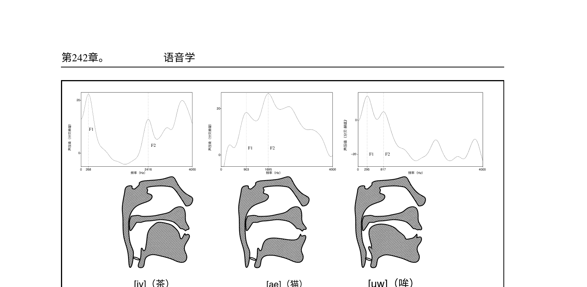

（41,000个词条）和《朗文当代英语词典》（1978）（53,000个词条），总共包含160,595个词形的发音。它（英式而非美式）的发音使用了一个名为SAM的IPA的ASCII版本进行音标标注。除了基本的音标信息，如音素字符串、音节划分和每个音节的重音级别，每个单词还带有形态、词性、句法和频率信息的注释。CELEX（以及CMU和PRON-LEX）表示三个重音级别：主重音、次重音和无重音。例如，单词dictionary的一些CELEX信息包括多个发音（'dIk-S@n-rI和'dIk-S@-n@-rI，对应于ARPABET [dih k sh ax n r ih]和[d ih k sh ax n ax r ih]），以及每个发音的CV-结构（[CVC][CVC][CV]和[CVC][CV][CV][CV]），单词的频率，它是一个名词，以及它的形态结构（diction+ary）。

自由的CMU发音词典（CMU，1993年）有大约125,000个单词的发音。它使用了一个39个音素的ARPAbet衍生音素集。转录是音位的，因此不像表示任何表面缩减（如flapping或reduced vowels）那样，它用数字0（无重音）1（重音）或2（次重音）标记每个元音。因此，单词tiger被列为[T AY1 G ER0]，单词table被列为[T EY1 B AH0 L]，单词dictionary被列为[D IH1 K SH AH0 N EH2 R IY0]。字典没有音节化，尽管核心元音是隐含标记的（编号）。

PRONLEX词典（LDC，1995年）是为语音识别而设计的，包含90,694个单词的发音。它涵盖了多年来在华尔街日报和Switchboard语料库中使用的所有单词。PRONLEX的优点是它包含了许多专有名词（20,000个，而CELEX只有约1,000个）。对于实际应用来说，名字很重要，它们既频繁又困难；我们将在第8章中讨论如何获取名字的发音。

另一个有用的资源是一个带有对应音素字符串的音频语料库，在这个语料库中，一系列的波形被手动标记了对应的音素字符串。英语中的两个重要的音素语料库是TIMIT语料库和Switchboard转录项目语料库。

TIMIT语料库（NIST，1990）是德州仪器（TI），麻省理工学院（MIT）和SRI之间的联合项目。它是一个包含6300个朗读句子的语料库，每个句子来自630个说话者，每个说话者有10个句子。这6300个句子是从2342个预先设计的句子中抽取出来的，其中一些句子被选择为具有特定方言特征，其他句子则是为了最大化音素二音段的覆盖范围。语料库中的每个句子都经过音素手动标记，音素序列与句子的波形自动对齐，然后手动校正自动音素边界（Seneff和Zue，1988）。结果是一个时间对齐的转录；一个转录，其中每个时间对齐转录在波形中，转录中的电话与开始和结束时间相关联；我们在图7.17中展示了一个时间对齐的转录的图形示例。TIMIT的电话集，以及Switchboard转录项目语料库中的电话集，比ARPAbet的最小音素版本更详细。特别是，这些语音转录使用了图7.1和图7.2中提到的各种缩减和罕见的电话；[dx]音 [q]音 [ax]音 [ix]音 [axr]音 [hv]音的有声变体，以及用于闭塞音（[dcl]、[tcl]等）和释放音（[d]、[t]等）的单独电话。图7.5显示了一个示例转录。

| 她 | 有 | 你的 | 黑暗的 | 西装 | 在油腻的 | 洗涤 | 水中 | 全年sh iy |
|----|----|------|--------|------|----------|------|------|-----------|
| hv ae | dcl jh axr | dcl d aa r | kcl s ux q en | gcl g r iy s ix | w aa sh q | w aa dx dxr | q aa l y | ix axr |

注意[hæd]中[d]的软腭化，[dɑrk]中未释放的最后一个停顿，[sj :t]中最后一个[t]的声门化，[wɔ:tər]中[t]的轻拍。TIMIT语料库还包括每个音素的时间对齐（未显示）。

TIMIT基于朗读语音，而更近期的Switchboard转录项目语料库则基于Switchboard会话语音语料库。这个带有音标注的部分包含了大约3.5小时的从各种对话中提取出来的句子（Greenberg等，1996）。与TIMIT一样，每个标注的话语都包含了时间对齐的转录。Switchboard转录以音节级别进行时间对齐，而不是音素级别；因此，一个转录由一系列音节组成，每个音节在相应的波形文件中具有起始和结束时间。图7.28显示了Switchboard转录项目中的一个示例，短语为they’re kind of in between right now:

| 0.470 | 0.640 | 0.720 | 0.900 | 0.953 | 1.279 | 1.410 | 1.630 |
|-------|-------|-------|-------|-------|-------|-------|-------|
| dh er | k aa  | n ax  | v ih m| b ix  | t w iy n | r ay | n aw  |

7.28 Switchboard短语的音标转录他们现在有点夹在中间 注意在they’re和of中的元音减弱，以及在kind和right中的尾音删除，以及音节重组（of的[v]作为in的开头附着）。时间以从句子开始到每个音节开始的秒数给出。

还可以获得其他语言的音标转录语料库；德语的基尔语料库是常用的，中国社会科学院（Li等，2000）转录的各种普通话语料库也是常用的。

## 7.6 高级：发音和手势音韵学

除了词典和语料库等资源外，还有许多有用的音标软件工具。其中最通用的是免费的Praat软件包（Boersma和Weenink，2005），它包括频谱和声谱图分析、音高提取和共振峰分析，以及用于自动化的嵌入式脚本语言。它可在Microsoft、Macintosh和UNIX环境中使用。

我们在第7.3.1节中看到，我们可以使用显著特征来捕捉跨音素类的一般性。这些一般性主要是发音的（尽管有些，比如[尖锐]和元音高度特征，主要是声学的）。这个发音在语音产生中的基础的想法在更复杂的发音音韵学中被用到，其中发音手势是的基础的音韵抽象（Browman和Goldstein，1986，1992）。发音手势被定义为参数化的动力学系统。由于语音产生需要舌头、嘴唇、声门等协调行动，发音音韵学将语音表达表示为一系列可能重叠的发音手势。图7.29显示了所需的手势（或手势分数）的顺序单词发音的产生 *pawn*[p aa n]。嘴唇首先闭合，然后声门打开，然后舌体向咽喉壁后移动以发出元音[aa]，软腭下降以发出鼻音，最后舌尖闭合在齿槽脊上。图中的线表示相位相位的手势。通过这样的手势表示，[aa]元音中的鼻音可以通过手势的时序来解释；软腭在舌尖完全闭合之前下降。

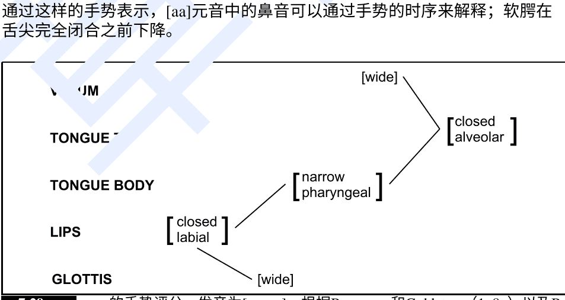

发音学的直觉是，手势评分作为一组隐藏状态，很可能比离散的音素序列更好地捕捉到语音的连续性。此外，使用发音手势作为基本单位可以帮助建模相邻手势的细粒度协同效应。

当我们介绍二音素（第8.4节）和三音素（第10.3节）时，我们将进一步探索。最近在语音识别中出现了计算实现的发音学，使用发音手势而不是音素作为底层表示或隐藏变量。由于多个发音器官（舌头、嘴唇等）可以同时移动，使用手势作为隐藏变量意味着多层隐藏表示。图7.6显示了Livescu和Glass（2004b）以及Livescu（2005）的工作中使用的发音特征集；图7.6显示了如何将音素映射到该特征集的示例。

| 特征 | 描述 | 值 = 意义 |
| --- | --- | --- |
| LIP-LOC | 嘴唇的位置 | LAB = 唇音（中性位置）；PRO = 伸出（圆唇）；DEN = 齿音 LIP-O |
| LIP-O PEN | 嘴唇的张开程度 | CL = 闭合；CR = 关键（唇齿摩擦音）；NA = 窄（例如，[w], [uw]）；WI = 宽（其他所有声音） |
| TT-LOC | 舌尖位置 | DEN = 齿间音（[th], [dh]）；ALV = 齿龈音（[t], [n]）；P-A = 腭齿龈音（[sh]）；RET = 卷舌音（[r]） TT-OPEN |
|  | 舌尖开口程度 | CL = 闭合（塞音）；CR = 关键（摩擦音）；NA = 窄（[r], 齿龈滑音）；M-N = 中窄；MID = 中等；WI = 宽 |
| TB-LOC | 舌体位置 | PAL = 腭音（例如 [sh], [y]）；VEL = 软腭音（例如 [k], [ng]）；UVU = 悬雍垂音（中性位置）；PHA = 咽音（例如 [aa]） T |
| B-OPEN | 舌体开口程度 | CL = 闭合（停止）；CR = 关键（例如在 “legal”中的摩擦音[g]）；NA = 窄（例如[y]）；M-N = 中窄；MID = 中等；WI = 宽 |
| VEL | 腭椎肌的状态 | CL = 闭合（非鼻音）；OP = 开放（鼻音） |
| GLOT | 声门的状态 | CL = 闭合（声门停止音）；CR = 关键（有声音）；OP = 开放（无声音） |
| **7.30** | **声音学的发音特征集 (Livescu, 2005)** |  |

| 音素 | LIP-LOC | LIP-OPEN | TT-LOC | TT-OPEN | TB-LOC | TB-OPEN | VEL | GLOT |
| --- | --- | --- | --- | --- | --- | --- | --- | --- |
| aa | LAB | W | ALV | W | PHA | M-N | CL(.9),OP(.1) | CR |
| ae | LAB | W | ALV | W | VEL | W | CL(.9),OP(.1) | CR |
| b | LAB | CR | ALV | M | UVU | W | CL | CR |
| f | DEN | CR | ALV | M | VEL | M | CL | OP |
| n | LAB | W | ALV | CL | UVU | M | OP | CR |
| s | LAB | W | ALV | CR | UVU | M | CL | OP |
| uw | PRO | N | P-A | W | VEL | N | CL(.9),OP(.1) | CR |
| **7.31** | **Livescu (2005): 从音素到基础目标发音特征值的映射示例。请注意有些值是概率性的。** |  |  |  |  |  |  |  |

## 7.7 总结

本章介绍了音系学和计算音系学的许多重要概念。

- 我们可以用称为音素的单位来表示单词的发音。表示音素的标准系统是国际音标或IPA。英语最常见的计算系统是ARPAbet，它方便地使用ASCII符号。
- 音素可以通过发音器官的运动方式来描述；辅音根据其发音位置和方式以及发声来定义，元音根据其高度、后缘性和圆唇性来定义。
- 一个音素是对不同语音实现的一种概括或抽象。
- 音位规则表达了一个音素在给定语境中的实现方式。
- 语音声音也可以通过声学方式来描述。声波可以通过频率、振幅或它们的知觉相关性，音高和响度来描述。
- 一个声音的频谱描述了它不同的频率成分。虽然一些语音学特性可以从波形中识别出来，但人类和机器都依赖于光谱分析来进行音素检测。
- 一个频谱图是一个随时间变化的频谱的绘图。元音通过称为共振峰的特征谐波来描述。
- 发音词典广泛可用，用于语音识别和语音合成，包括英语的CMU词典和英语、德语和荷兰语的CELEX词典。其他词典可从LDC获取。
- 音标转录的语料库是构建自然语言中音素变异和减少的计算模型的有用资源。

# 参考文献和历史注释

语音学的主要见解可以追溯到公元前800年至公元150年的语言学家们。他们发明了发音位置和方式的概念，研究了声带发声的声门机制，并理解了同化的概念。欧洲科学直到2000多年后的19世纪末才赶上印度的语音学家们。希腊人对语音有一些基本的了解；例如，在柏拉图的《泰阿泰图斯》和《克拉提卢斯》中，他们区分元音和辅音，以及塞音和连音。斯多亚学派发展了音节的概念，并意识到可能的词汇音位约束。12世纪的一位未知冰岛学者利用了音位的概念，为冰岛语提出了一个音位写作系统，包括长度和鼻音的变音符号。

但他的文本直到1818年才出版，而且在斯堪的纳维亚以外几乎没有人知道（Robins, 1967）。语音学的现代时代通常被认为是从Sweet开始的，他在他的《语音学手册》（1877）中提出了本质上的音素。他还设计了一种用于转录的字母表，并区分了宽转录和窄转录，提出了许多最终被纳入国际音标的想法。Sweet被认为是他那个时代最好的实践语音学家；他进行了第一次用于语音目的的科学记录，并推进了发音描述的艺术水平。他也因为与人相处困难而臭名昭著，这一特点在舞台角色亨利·希金斯中得到了很好的体现，这个角色是乔治·伯纳德·肖（George Bernard Shaw）以他为原型创作的。

这个音素首先由波兰学者Baudouin de Courtenay命名，他在1894年发表了他的理论。

对于对转录和发音语音学有进一步兴趣的学生，应该参考一本介绍性的语音学教材，如Ladefoged (1993) 或Clark和Yallop (1995)。Pullum和Ladusaw (1996) 是国际音标中每个符号和变音符号的综合指南。关于英语口语中的减少和其他语音过程的详细信息，可以参考Shockey (2003)。Wells (1982) 是英语方言的权威性3卷资料。

许多关于声学语音学的经典见解在1950年代末或1960年代初已经发展起来；其中一些亮点包括声谱图技术（Koenig等，1946）、源-滤波器理论和发音与声学之间的映射等理论见解（Fant, 1960; Stevens等, 1953; Stevens和House, 1955; Heinz和Stevens, 1961; Stevens和House, 1961）、元音共振峰F1xF2空间（Peterson和Barney, 1952）、对重音的语音性质以及使用持续时间和强度作为线索（Fry, 1955）、以及关于电话感知问题的基本理解（Miller和Nicely, 1955; Liberman等, 1952）。Lehiste (1967) 是关于声学语音学的经典论文集。Gunnar Fant的许多开创性论文已经收集在Fant (2004) 中。

关于声学语音学的优秀教材包括Johnson (2003) 和 (Ladefoged, 1996)。(Coleman, 2005) 从语言学的角度介绍了声学处理以及其他语音处理问题。(Stevens, 1998) 阐述了一种有影响力的语音音素产生理论。有很多本书从信号处理和电气工程的角度来讨论语音问题。在计算语音学问题方面，涵盖最广泛的是 (Huang等, 2001)， (O’Shaughnessy, 2000) 和 (Gold和Morgan, 1999)。关于数字信号处理的优秀教材是Lyons (2004)。

有许多用于声学语音分析的软件包。可能最广泛使用的是Praat (Boersma和Weenink, 2005)。许多与计算有关的语音学论文可以在《美国声学学会杂志》（JASA）、《计算机语音与语言》以及《语音通信》中找到。

# 练习

7.1 找出以下单词在ARPAbet转录中的错误：
a. “three” [dh r i]
b. “sing” [s ih n g]
c. “eyes” [ay s]
d. “study” [s t uh d i]
e. “though” [th ow]
f. “planning” [p pl aa n ih ng]
g. “slight” [s l iy t]

7.2 将以下颜色词的发音从IPA转换为ARPABet（如果你认为你的发音与此不同，请做个注释！）：

+   a. [rɛd] b. [blu] c. [ɡrin] d. [ˈjɛloʊ] e. [blæk] f. [waɪt] g. [ˈɔrɪndʒ] h. [ˈpɜrpḷ] i. [pjus] j. [toʊp]

7.3 Ira Gershwin的歌词Let's Call the Whole Thing Off中谈到了单词“either”的两种发音（除了本章开头给出的番茄和土豆的例子之外）。用ARPABET转录Ira Gershwin对“either”的两种发音。

7.4 用ARPABET转录以下单词：

+   a. dark b. suit c. greasy d. wash e. water

7.5 选择一个你喜欢的波形文件。一些例子可以在教科书网站上找到。下载PRAAT软件，并使用它将波形文件转录为单词级别的ARPABet音素，使用Praat帮助播放每个波形文件的片段，并查看波形文件和频谱图。

7.6 录制自己发出五个英语元音的声音：[aa]，[eh]，[ae]，[iy]，[uw]。找出每个元音的F1和F2。

# 第8章 语音合成

而且计算机的智能水平一直在不断提高：科学家告诉我们，很快它们将能够与我们交流。（我指的是‘计算机’：我怀疑科学家们是否能够与我们交流。）

戴夫·巴里

1769年，在维也纳，沃尔夫冈·冯·肯普伦为女皇玛丽亚·特蕾莎建造了著名的机械土耳其人，一个由装满齿轮的木箱和坐在箱子后面的机器人模型组成的国际象棋自动机。土耳其人在欧洲和美洲巡回演出数十年，击败了拿破仑·波拿巴特，甚至与查尔斯·巴贝奇下棋。如果不是因为这个事实，即它是一个骗局，里面藏着一个人类棋手，机械土耳其人可能已经成为早期人工智能的成功之一。

- 语音合成
- 文本转语音
- TTS

也许不太为人所知的是，冯·肯佩伦是一位非常多的产的发明家，他在1769年至1790年间还制造了一台绝对不是骗局的设备：第一台完整句子的语音合成器。他的设备包括一个风箱来模拟肺部，一个橡胶嘴口和一个鼻孔，一个簧片来模拟声带，各种哨子用于摹拟摩擦音。还有一个小辅助风箱来提供爆破音的气流。通过用双手移动杠杆，打开和关闭各种开口，并调整柔软的皮革‘声道’，可以产生不同的辅音和元音。

两个多世纪后，我们不再用木头、皮革和橡胶来制造语音合成器，也不再需要训练有素的人类操作员。现代的语音合成任务，也称为文本到语音或TTS，是产生语音（声学从文本输入中生成波形）。

现代语音合成具有广泛的应用。合成器与语音识别器一起用于基于电话的与人进行对话的代理人中（参见第23章）。合成器在非对话应用中也很重要，例如为盲人朗读的设备，或者在视频游戏或儿童玩具中使用。最后，语音合成可以用于帮助患有神经系统疾病的患者，例如天体物理学家史蒂芬·霍金，他因患有肌萎缩侧索硬化症而失去了声音的使用能力，通过键入给语音合成器并由合成器发出声音来进行交流。语音合成中的最先进系统可以在非常广泛的输入情况下实现非常自然的语音，尽管最好的系统仍然倾向于听起来呆板，并且在使用的声音方面有限。

语音合成的任务是将以下文本映射到如下形式的波形:

```
(8.1) PG&E将于4月20日提交日程安排。
```

到以下形式的波形:## 第8章 语音合成


语音合成系统通过两个步骤来执行这个映射，首先将输入文本转换为音素的内部表示，然后将这个内部表示转换为波形。我们将第一步称为文本分析，第二步称为波形合成（尽管这些步骤也有其他名称）。该句子的内部表示示例如图8.1所示。请注意，缩写PG&E被展开为单词P G AND E，数字20被展开为 twentieth，每个单词都有一个音素序列，并且还有韵律和短语信息（*），我们稍后会定义。

| P | G | 和 | 我们将 | 文件 | 日程表 | 在 | 四月 | 二十日pi yj |
|---|---|---|---|---|---|---|---|---|
| h iy ae n d iy w ih l | ay s k eh jh ax | z aa r ey p r ih | l t w eh n th iy ax th | L-L% |

虽然文本分析算法相对标准，但有三种广泛不同的波形合成范式：串联合成，共振峰合成和发音合成。大多数现代商业TTS系统的架构基于串联合成，其中语音样本被切割、存储在数据库中，并组合和重新配置以创建新的句子。因此，我们将在本章的大部分内容中重点介绍串联合成，尽管我们将在本章末尾简要介绍共振峰合成和发音合成。

图8.2展示了TTS架构，用于连接单元选择合成，使用两步 hourglass 隐喻 of Taylor (2008)。在接下来的章节中，我们将研究这个架构中的每个组件。

## 8.1 文本规范化

为了生成音素的内部表示，原始文本首先需要进行预处理或规范化，以各种方式进行处理。我们需要将输入文本分成句子，并处理缩写、数字等的特殊情况。考虑以下来自Enron语料库（Klimt和Yang，2004）的文本中的困难：

“他说，信用额度的增加帮助B.C. Hydro在截至3月31日的一年内实现了约10亿美元的净收入记录。这个数字不包括如果Powerex确定其任何客户账户无法收回，可能发生的任何减记。然而，Cousins坚称所有债务都将被收回：‘我们继续追讨欠款，我们期望得到我们出售的电力的报酬。’”

文本规范化的第一个任务是句子分词。为了将这段话分割成独立的话语进行合成，我们需要知道第一个句子在3月31日之后的句点结束，而不是在B.C.的句点结束。我们还需要知道在单词 collected 之后有一个句子结束，尽管标点符号是冒号而不是句点。第二个规范化任务是处理非标准词。非标准词包括数字、缩写、缩写等等。例如，3月31日需要发音为三十一日，而不是三月三一；$1亿需要发音为十亿美元，其中单词美元出现在单词十亿之后。

### 8.1.1 句子分词

我们在上面看到了两个例子，句子分词很困难，因为句子边界不总是由句号指示，有时可以由标点符号如冒号指示。另一个问题是当缩写词结束一个句子时，缩写词的最后一个句号起着双重作用：

> (8.2) 他说信用额度的增加帮助了B.C. Hydro在截至3月31日的一年内实现了约10亿美元的创纪录净收入。

> (8.3) 然而，考辛斯坚称所有债务都将被收回：“我们继续追讨欠款，并且我们期望得到我们出售的电费的支付。”(8.4) 这个团队包括J. M. Freeman博士和T. Boone Pickens Jr。

句子分词的一个关键部分是句号消歧；我们在第3章中看到了一个简单的Perl脚本来进行句号消歧。大多数句子分词算法比这个确定性算法稍微复杂一些，特别是通过机器学习方法进行训练，而不是手工构建。我们通过手动标记训练集的句子边界，然后使用任何监督式机器学习方法（决策树、逻辑回归、支持向量机等）来训练一个分类器来标记句子边界的决策。

更具体地说，我们可以将输入文本分词为由空格分隔的标记，然后选择包含以下三个字符之一的任何标记！, . or? （或可能还包括 :）。在手动标记了这些标记的语料库之后，我们训练一个分类器来对这些标记内部的潜在句子边界字符进行二元决策（EOS（句子结束）与非EOS）。

这样的分类器的成功取决于为分类提取的特征。让我们考虑一些特征模板，假设我们有一小部分标记为句子边界的训练数据，用于消除这些候选句子边界字符的歧义：

- 前缀（候选词前面的部分）
- 后缀（候选词后面的部分）
- 前缀或后缀是否为缩写词（来自列表）
- 候选词前面的词
- 候选词后面的词
- 候选词前面的词是否为缩写词
- 候选词后面的词是否为缩写词

考虑以下例子：

(8.5) ANLP公司主席Smith博士辞职。

根据这些特征模板，句号的特征值为 .在词 Corp .中（8.5）中的特征值为：

```
PreviousWord = ANLP           NextWord = 主席
Prefix = Corp                Suffix = NULL
PreviousWordAbbreviation = 1 NextWordAbbreviation = 0
```

如果我们的训练集足够大，我们还可以寻找关于句子边界的词汇线索。例如，某些词可能倾向于出现在句子的开头或结尾。因此，我们可以添加以下特征：

- 概率[候选出现在句子末尾]
- 概率[候选后面的词出现在句子开头]

最后，虽然上述大部分特征相对独立于语言，但我们可以使用特定于语言的特征。例如，在英语中，句子通常以大写字母开头，这暗示了以下特征：

- 候选的大小写：大写、小写、全大写、数字
- 候选后面的词的大小写：大写、小写、全大写、数字

同样，我们可以有特定的缩写子类，例如尊称或头衔（例如，博士，先生，将军），公司标识（例如，公司，股份有限公司），或月份名称（例如，一月，二月）。

任何机器学习方法都可以应用于训练EOS分类器。逻辑回归和决策树是两种非常常见的方法；逻辑回归可能具有稍高的准确性，尽管我们在图8.3中展示了一个决策树的示例，因为读者更容易看到特征是如何使用的。

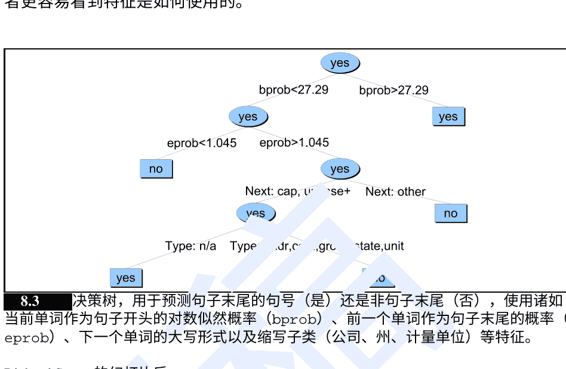

8.3 决策树，用于预测句子末尾的句号（是）还是非句子末尾（否），使用诸如当前单词作为句子开头的对数似然概率（bprob）、前一个单词作为句子末尾的概率（eprob）、下一个单词的大写形式以及缩写子类（公司、州、计量单位）等特征。

Richard Sproat的幻灯片后。

### 8.1.2 非标准词

文本规范化的第二步是规范化非标准词。非标准词是像数字或缩写这样的标记，需要在发音之前将其扩展为英文单词序列。

这些非标准词的困难之处在于它们通常非常模糊。例如，数字 1750可以根据上下文以至少三种不同的方式发音：

十七五十：（在 “1750年的欧洲经济” 中）
一七五零：（在 “密码是1750” 中）
一千七百五十：（在 “1750美元” 中）

类似的歧义也会出现在罗马数字中，比如 IV（可以发音为四、第四，或者作为字母 I v 的意思（即·静脉内·）），或者 2/3（可以发音为两个三分之二、二月三号，或者两个斜杠三）。

除了数字之外，各种非标准词汇由字母组成。非标准词汇有三种类型，包括缩写词、字母序列和首字母缩写词。缩写词通常通过展开来发音；因此 Jan 1 发音为一月一号，Wed 发音为星期三。字母序列如 UN、DVD、PC和 IBM的发音是逐个发音每个字母（IBM因此发音为爱比艾马）。首字母缩写词如IKEA、MoMA、NASA和 UNICEF的发音就像是单词一样；MoMA发音为姆欧马。存在歧义。这里也发生了；应该 Jan 被读作一个单词（名字 Jan）或者展开为月份 January？

这些不同类型的数字和字母非标准单词可以总结如图8.1.2所示。每种类型都有特定的实现（或实现方式）。例如，一年 NYER通常以配对的方式读取，每对数字被读作整数（例如，seventeen fifty表示1750），而美国邮政编码 NZIP 通常以串行的方式读取，作为一系列单个数字（例如，nine four one one zero表示 94110）。

类型 BMONEY处理了像 $3.2 billion这样的表达式，必须以单词dollars结尾读出，如three point two billion dollars。

对于字母缩写NSWs，我们有类别EXPN用于像 N.Y.这样的缩写，它们被扩展，LSEQ用于作为字母序列发音的缩略词，以及ASWD用于作为单词发音的缩略词。

| 类别 | 类型 | 说明 | 示例 |
| :--- | :--- | :--- | :--- |
| ALPHA | EXPN | 缩写 | adv, N.Y., mph, gov't |
| ALPHA | LSEQ | 字母序列 | DVD, D.C., PC, UN, IBM |
| ALPHA | ASWD | 读作单词 | 宜家，未知词语/姓名 |
| 数字 | 数词 | 数字（基数） | 12, 45, 1/2, 0.6 |
| 数字 | NORD | 数字（序数） | 5月7日，第三，比尔·盖茨三世 |
| 数字 | NTEL | 电话（或部分） | 212-555-4523 |
| 数字 | NDIG | 数字作为数字 | 101号房间 |
| 数字 | NIDE | 标识符 | 747, 386, I5, pc110, 3A |
| 数字 | NADDR | 数字作为街道地址 | 747, 386, I5, pc110, 3A |
| 数字 | NZIP | 邮政编码或邮政信箱 | 91020 |
| 数字 | NTIME | 一个（复合）时间 | 3.20, 11:45 |
| 数字 | NDATE | 一个（复合）日期 | 2/28/05, 28/02/05 |
| 数字 | NYER | 年(年份) | 1998年，80年代，1900年代，2008年 |
| 货币 | 货币 | 货币（美元或其他） | $3.45，港币$300，Y20,200，$200K |
| 货币 | BMONEY | 货币兆/亿/十亿 | $34.5亿 |
| 货币 | PRCT | 百分比 | 75% 3.4% |

> > 8.4 规范化中的一些非标准词类型，选自Sproat等人的表1（2001年）；未列出的类型包括URL、电子邮件和某些复杂的标点符号用法。

处理非标准词至少需要三个步骤：分词以分隔并识别潜在的非标准词，分类将其标记为图8.1.2中的一种类型，扩展将每种类型转换为一串标准词。

在分词步骤中，我们可以通过空格对输入进行分词，然后假设任何不在发音词典中的词都是非标准词。更复杂的分词算法还可以处理一些字典中已经包含的缩写。例如，CMU字典中包含了缩写（因此是不正确的）的发音，如st、mr、mrs，以及星期和月份的缩写，如mon、tues、nov、dec等。因此，除了未知词汇，我们还需要标记这些缩写以及单个字符作为潜在的非标准词汇。分词算法还需要将由两个标记组成的词进行分割，例如2-car或RVing。可以通过简单的启发式方法来分割单词，例如在破折号处分割，或在小写字母变为大写字母时分割。

下一步是分配一个NSW类型；许多类型可以通过简单的正则表达式进行检测。例如，可以通过以下正则表达式检测到NYER：

```
/(1[89][0-9][0-9])|(20[0-9][0-9])/
```

对于其他类别，编写规则可能更加困难，因此更强大的选择是使用具有许多特征的机器学习分类器。为了区分字母 ASWD、 LSEQ和 EXPN类别，例如，我们可能希望对组成字母进行特征提取。因此，短小的全大写单词（IBM, US）可能是LSEQ，带有单引号的较长全小写单词（gov't, cap'n）可能是 EXPN，而带有多个元音字母的全大写单词（NASA, IKEA）可能更有可能是 ASWD。

另一个非常有用的特征是相邻单词的身份。考虑模糊的字符串，例如3/4，它可以是一个 NDATE三月四日或者一个NUM三分之四。NDATE可能在前面有单词 on，在后面有单词 of，或者在周围的单词中有单词Monday。相比之下， NUM示例可能在前面有另一个数字，或者在后面有像 mile和inch这样的单词。类似地，罗马数字如 VII在前面有 Chapter、part或者Act时倾向于是 NORD（第七），但在附近出现单词king或Pope时是 NUM（第七）。这些上下文单词可以手动选择作为特征，也可以通过机器学习技术（如第8章的决策列表算法）进行学习。

通过构建一个单一的机器学习分类器，我们可以实现最大的功率。例如，(Sproat等人, 2001)的NSW分类器使用了136个特征，包括基于字母的特征，如‘全大写’，‘有两个元音’，‘包含斜杠’和‘令牌长度’，以及用于判断周围上下文中是否存在某些词的二进制特征，如 Chapter，on或king。

Sproat等人（2001）还包括一个基于规则的初步分类器，该分类器使用手写的正则表达式来对许多NSW进行分类。这个初步分类器的输出被用作主分类器中的另一个特征。

为了构建这样一个主分类器，我们需要一个手工标记的训练集，其中每个令牌都被标记了其NSW类别；Sproat等人（2001）制作了这样一个手工标记的数据库。在拥有这样一个标记的训练集的情况下，我们可以使用任何监督式机器学习算法来构建分类器。

从形式上讲，我们可以将这个任务建模为在给定观察序列的情况下产生最可能的标签序列 T的目标：

```
(8.6)			$T^* = \argmax_T P(T|O)$
```

估计这个概率的一种方法是通过决策树。例如，对于每个观察到的标记 $o_i$，以及每个可能的NSW标签 $t_j$，决策树产生后验概率 $P(t_j|o_i)$。如果我们做出错误但简化的假设，即每个标记决策都独立于其邻居，我们可以使用树来预测最佳的标签序列$T = argmax_T P(T|O)$：

```
$\hat{T} = \argmax_T P(T|O)$
```

$$ \approx \prod_{i=1}^{m} \underset{t}{\operatorname{argmax}} P(t|o_i) $$

处理NSWs的第三步是将其扩展为普通单词。一种NSW类型，EXPN，非常难以扩展。这些是缩写词和首字母缩写词，如NY。通常，必须使用缩写词词典来扩展它们，并通过在下一节讨论的同音异义消歧算法来处理任何歧义。

其他NSW类型的扩展通常是确定性的。许多扩展是微不足道的；例如，LSEQ扩展为一个单词序列，每个字母对应一个单词，ASWD扩展为它自己，NUM扩展为表示基数的单词序列，NORD扩展为表示序数的单词序列，NDIG和NZIP都扩展为一个单词序列，每个数字对应一个单词。

其他类型稍微复杂一些；NYER扩展为两对数字，除非年份以00结尾，此时四个年份读作基数。（2000读作两千）或者使用百位数的方法（例如，1800读作十八hundred）。NTEL可以扩展为一个数字序列；另外，最后四位数字可以读作成对的数字，每对数字读作一个整数。也可以以尾数单位的形式读取，其中数字被读取从最后一个非零数字开始连续读取，然后跟着适当的单位（例如，876-5000读作八七六五千）。NDATE、MONEY和NTIME的展开留作读者的练习（1）-（4）。

当然，这些展开方式很多是方言特定的。在澳大利亚英语中，电话号码中的33通常读作双三。其他语言在非标准词归一化方面也存在额外的困难。例如，在法语或德语中，除了上述问题之外，归一化可能还取决于词的形态属性。在法语中，短语 l fille（一个女孩）被归一化为 une fille，但 l garçon（一个男孩）被归一化为 un garçon。

同样，在德语中，Heinrich IV（亨利四世）可以被归一化为 Heinrich der Vierte、Heinrich des Vierten、Heinrich dem Vierten 或 Heinrich den Vierten，这取决于名词的语法格（Demberg，2006年）。

### 8.1.3 同形异义词消歧

在前一节中，我们的NSW算法的目标是确定每个NSW要发音的标准单词序列。但有时候，即使是确定如何发音标准单词也很困难。这对于同形异音词来说尤其真实，同形异音词是指拼写相同但发音不同的单词。

use、live和bass的一些例子：
- (8.8) It’s no use (/y uw s/) to ask to use (/y uw z/) the telephone.
- (8.9) Do you live (/l ih v/) near a zoo with live (/l ay v/) animals?
- (8.10) I prefer bass (/b ae s/) fishing to playing the bass (/b ey s/) guitar.

法语同形异音词包括 fils（有两种发音[fis]‘儿子’和[fɪl]‘线’），或者 fier 的多种发音（‘骄傲’或‘相信’），以及 est（‘是’或‘东方’）（Divay and Vitale, 1997）。

幸运的是，在词形消歧任务中，英语（以及类似的法语和德语）中的两种形式的同形异义词往往具有不同的词性。例如，上面两种形式的“use”分别是名词和动词，而两种形式的“live”分别是动词和名词。图8.5展示了一些有趣的名词-动词和形容词-动词同形异义词之间的发音关系。

### 8.5 同音异义词之间的系统关系：最后辅音（名词/s/与动词/z/），重音转移（名词开头与动词结尾重音），以及最后元音的减弱在-ate名词/形容词中。

| 最终发声 | 重音转移 | -ate结尾元音 |
| :--- | :--- | :--- |
| 名词 (/s/) 动词 (/z/) | 名词 (初音节重音) 动词 (终音节重音) | N/A (最终/ax/) 动词 (最终/ey/) |
| use y uw s y uw z | record r eh1 k axr0 d r ix0 k ao1 r d | estimate eh s t ih m ax t eh s t ih m ey t |
| close k l ow s k l ow z | insult ih1 n s ax0 l t ix0 n s ah1 l t | 分开 s eh p ax r ax t s eh p ax r ey t |
| 房子 h aw s h aw z | 目标 aa1 b j eh0 k t ax0 b j eh1 k t | 适度 m aa d ax r ax t m aa d ax r ey t |

事实上，Liberman和Church（1992）在4400万字的AP新闻中显示，许多最常见的同音异义词仅通过使用词性就可以消除歧义（按顺序最常见的15个同音异义词是：use, increase, close, record, house, contract, lead, live, lives, protest, survey, project, separate, present, read）。因此，由于词性的知识足以消除许多同音异义词的歧义，在实践中，我们通过存储由词性标记的这些同音异义词的不同发音，并运行词性标注器来选择给定上下文中同音异义词的发音。

然而，有一些同音异义词，两种发音都属于同一词性。我们在上面看到了“bass”的两种发音（鱼和乐器）。其他例子包括“lead”（因为有两种名词发音，/l iy d/（拴绳或限制）和/l eh d/（金属））。我们还可以将某些缩写词（如NSW消歧）的消歧任务视为同音异义词消歧。例如，“Dr.”在“doctor”和“drive”之间有歧义，“St.”在“Saint”或“street”之间有歧义。最后，还有一些单词在大小写上有区别，例如“polish” / “Polish”，这些只在句子开头或全大写文本中是同音异义词。

在实践中，这些无法通过词性解析来解决的同音异义词通常在TTS系统中被忽略。或者，我们可以尝试使用我们将在第20章介绍的词义消歧算法来解决它们，例如Yarowsky（1997）的决策列表算法。

## 8.2 音韵分析

合成的下一个阶段是从文本分析中获取标准化的单词字符串，并为每个单词生成发音。这里最重要的组成部分是一个大型发音词典。仅仅使用词典是不够的，因为运行文本中总是包含词典中不存在的单词。例如Black等人（1998年）在Penn华尔街日报树库的第一部分上使用了一本英国英语词典，即OALD词典。在这一部分的39923个单词（标记）中，有1775个单词标记（4.6%）不在词典中，其中943个是唯一的（即943个类型）。这些未见过的单词标记的分布如下：

| 名字 | 未知的 | 打字错误和其他 |
|------|--------|----------------|
| 1360 | 351    | 64             |
| 76.6%| 19.8%  | 3.6%           |

因此，词典需要增加的两个主要领域是处理名字和其他未知单词。我们将在下一节讨论词典，然后是名字，然后转向处理其他未知单词的字素到音素规则。

### 8.2.1 字典查找

音标词典在第7.5节的第8章中引入。最广泛使用的TTS之一是免费提供的CMU发音词典（CMU,1993），其中包含约120,000个单词的发音。这些发音大致上是音位的，使用了一个39个音素的ARPAbet派生音素集。音位转录意味着，CMU dict不像标记表面缩减音[ax]或[ix]那样，而是用重音标记0（无重音）、1（重音）或2（次重音）标记每个元音。

因此，0重音的（非双元音）元音通常对应于[ax]或[ix]。大多数单词只有一个发音，但大约8,000个单词有两个甚至三个发音，因此这些发音中标记了一些音标缩减。该词典没有划分音节，尽管核心元音是通过（编号的）元音隐含标记的。图8.2.1显示了一些示例发音。

| 先决条件 | AE2 N T IH0 S IY1 D AH0 N T S | 巴基斯坦 | P AE2 K IH0 S T AE1 N IY0 |
| 张 | CH AE1 NG | 桌子 | T EY1 B AH0 L |
| 字典 | D IH1 K SH AH0 N EH2 R IY0 | 托洛茨基 | T R AA1 T S K IY2 |
| 晚餐 | D IH1 N ER0 | 沃尔特 | W AO1 L T ER0 |
| 午餐 | L AH1 N CH | 华尔兹 | W AO1 L T S IH0 NG |
| 麦克法兰 | M AH0 K F AA1 R L AH0 N D | 华尔兹(2) | W AO1 L S IH0 NG |

8.6 发音词典的一些示例发音。

CMU词典是为语音识别而设计的，而不是为合成使用；因此它不指定用于合成的多个发音中的哪一个，不标记音节边界，并且因为它将词典的词头大写，所以不区分例如 US 和 us （形式 US有两个发音[AH1 S]和[Y UW1 EH1 S]。

这个拥有110,000个词的UNISYN词典，可供研究目的免费使用，解决了许多问题，因为它是专为合成而设计的（Fitt, 2002）。UNISYN提供音节划分、重音和一些形态边界。此外，UNISYN中的发音也可以用几十种英语方言之一来阅读，包括美式英语、英式RP、澳大利亚英语等。UNISYN使用了稍微不同的音素集合；以下是一些例子：

```
进行:   { g * ou }.> i ng >
先行词: { * a n .t^ i .s ~ ii .d n ! t }> s >
词典:    { d * i k . sh @ .n~ e .r ii }
```

### 8.2.2 姓名

如上面的错误分析所示，名称是语音合成中的一个重要问题。这些名称可以分为个人名称（名字和姓氏）、地理名称（城市、街道和其他地名）和商业名称（公司和产品名称）。仅对于个人名称，Spiegel（2003）根据Donnelly和其他家庭名单的估计，美国仅有大约两百万个不同的姓氏和十万个名字。两百万是一个非常大的数字；比CMU词典的整体大小大一个数量级。因此，大多数大规模的TTS系统都包含一个大型的姓名发音词典。正如我们在图8.2.1中看到的，CMU词典本身包含了各种各样的姓名；特别是它包括了来自贝尔实验室关于美国个人姓名频率的旧估计中最常见的五万个姓氏的发音，以及六千个名字。

-   walters = walter+s
-   lucasville = lucas+ville
-   abelson = abel+son

其他的发音可能是通过韵律类比来创建的。如果我们有名字Trotsky的发音，但没有名字Plotsky的发音，我们可以用/pl/替换Trotsky的初始/tr/来得到Plotsky的发音。

像这样的技术，包括形态分解、类比形成以及将未见过的名称映射到字典中已有的拼写变体（Fackrell和Skut，2004），在名称发音方面取得了一些成功。然而，总体而言，名称发音仍然困难。许多现代系统通过下一节中描述的字素到音素方法来处理未知名称，通常通过构建两个预测系统，一个用于名称，一个用于非名称。Spiegel（2003, 2002）总结了许多关于专有名词发音的问题。

### 8.2.3 字素到音素

一旦我们扩展了非标准词并在发音词典中查找了它们，我们就需要发音剩下的未知词。将一系列字母转换为一系列音素的过程称为字素到音素转换，有时缩写为g2p。字素到音素的工作因此，算法的目标是将一个字母字符串如 cake 转换为一个电话字符串如 [K EY K]。

最早的字素到音素转换算法是手工编写的规则，使用了第7章中的Chomsky-Halle音韵重写规则格式的Eq. 7.1。这些规则通常被称为 字母到音素 或LTS规则，并且仍然在一些系统中使用。LTS规则按顺序应用，只有在早期规则的上下文不适用时，后续（默认）规则才适用。一个简单的发音规则对于字母 $c$ 可能如下所示：

```
(8.11)       $c$  →  [k] / ___ {a,o}V      ; 上下文相关
(8.12)       $c$  →  [s]             ; 上下文无关
```

实际规则必须更加复杂（例如，$c$ 在 cello 或 concerto 中也可以发音为[ch]）。更复杂的是用于确定重音的规则，对于英语来说这是非常困难的。考虑Allen等人（1987）中的众多重音规则之一，其中符号 $X$ 表示所有可能的音节开头：(8.13) $V$ →[+stress] / $X$  $C^*$ {Vshort  $C$ $C$?|V} {Vshort  $C^*$|V} 这个规则表示以下两种情况：

+   1. 在一个音节之前的元音上加重音，该音节后面是一个包含短元音和0个或多个辅音的弱音节（例如，困难）
+   2. 在一个音节之前的元音上加重音，该音节后面是一个以元音结尾的弱音节（例如，牛至）

虽然一些现代系统仍然使用这种复杂的手写规则，但大多数系统通过依赖基于机器学习的自动或半自动方法来实现更高的准确性。这种现代的概率音素到字母的问题首先由Lucassen和Mercer（1984）正式化。给定一个字母序列 $L$ ，我们正在寻找最可能的音素序列 $P$：

```
(8.14)                  $\hat{P}$ = argmax$_P P(P|L)$
```

概率方法假设有一个训练集和一个测试集；这两个集合都是来自字典的单词列表，每个单词都有一个拼写和一个发音。下面的子章节将展示如何使用流行的决策树模型来估计这个概率 $P(P|L)$ 可以被训练和应用于产生未知单词的发音。

### 为训练集找到字母到音素的对齐

大多数字母到音素的算法假设我们有一个对齐，告诉我们每个字母对应的音素。我们需要为训练集中的每个单词都有这个对齐。有些字母可能对应多个音素（例如， $x$ 经常对应 k s ），而其他字母可能根本不对应任何音素，比如 cake 中的最后一个字母在下面的对齐中：

L: c  a  k  e
   |  |  |  |
P: K EY K ϵ

一种找到这种字母到音素对齐的方法是（Black et al., 1998）的半自动方法。他们的算法是半自动的，因为它依赖于一个手写的列表，列出了每个字母可以实现的允许的音素。 这里是字母 c和 e的允许列表：c: k ch s sh t-s e e: ih iy er ax ah eh ey uw ay ow y-uw oy aa 为了为训 练集中的每个单词生成对齐，我们使用这个允许列表来匹配所有字母，并且对于训练集中的每个单词，我们找到符合允许列表的发音和拼写之间的所有对齐。从这个大的对齐列表中，我们通过对所有单词的所有对齐求和，计算每个字母与每个音素（或多音素或 e）对齐的总数。通过这些计数，我们可以进行归一化，得到每个音素 pi和每个字母 lj的概率 P(pi|lj):

```
(8.15) $$P(p_i|l_j) = \frac{\text{count}(p_i, l_j)}{\text{count}(l_j)}$$
```

现在我们可以使用维特比算法将这些概率重新对齐到音素上，为每个单词生成最佳（维特比）对齐，其中每个对齐的概率只是所有单个音素/字母对齐的乘积。

通过这种方式，我们可以为训练集中的每对特定的对 (P,L)生成一个好的对齐 A。

### 选择测试集的最佳电话字符串

给定一个新单词 w，我们现在需要将其字母映射到一个电话字符串中。为了做到这一点，我们将首先在对齐的训练集上训练一个机器学习分类器，如决策树。分类器的任务是查看单词的一个字母并生成最可能的电话。

除了对齐的字母 l本身，我们在这个决策树中应该使用哪些特征？显然，如果我们查看周围字母的窗口，我们可以更好地预测电话；例如，考虑字母 a。在单词 cat中，a的发音是 AE。但是在我们的单词 cake中，a的发音是 EY，因为 cake有一个结尾的 e；因此，知道是否有一个结尾的 e是一个有用的特征。通常，我们查看 k个前面的字母和 k个后面的字母。

另一个有用的功能是正确识别先前的电话。了解这一点将使我们能够将一些音位信息纳入我们的概率模型中。当然，我们无法知道先前电话的真实身份，但我们可以通查看我们的模型预测的先前电话来近似这一点。为了做到这一点，我们需要从左到右运行我们的决策树，逐个生成电话。总之，在最常见的决策树模型中，每个电话的概率 pi是从一窗口的k前面和k后面的字母以及最近产生的k电话中估计出来的。图8.7显示了这个从左到右的过程的草图，指示了决策树用于决定与单词中的字母对应的字母的特征。正如这个图所示，我们可以通过将重音预测整合到电话预测中，通过增加我们的电话集合中的重音信息来实现这一点。我们可以通过每个元音字母都有两个副本（例如 AE和 AE1），或者甚至可能有三个重音级别（AE0，AE1和 AE2），就像我们在CMU词典中看到的那样。我们还希望将其他特征添加到决策树中，包括单词的词性标签（大多数词性标注器甚至为未知单词提供词性标签的估计）以及前一个元音是否重音。

此外，字素到音素的决策树还可以包括其他更复杂的特征。例如，我们可以使用字母类别（大致对应于辅音、元音、液体等）。此外，对于某些语言，我们需要了解下一个单词的特征。例如，法语有一种称为连音（连音）的现象，其中某些单词的最后一个音的实现取决于下一个单词以及它是以辅音还是元音开头。例如，法语单词六可以发音为[sis]（在j’en veux six‘我要六个’中），[siz]（在六个孩子中），[si]（在六个女孩中）。

最后，大多数合成系统构建两个独立的字母到音素的决策树，一个用于未知的个人姓名，另一个用于其他未知的单词。对于发音个人姓名来说，使用额外的特征来指示姓名最初来自哪种外语是有帮助的。这些特征可以是基于字母序列的外语分类器的输出（不同语言具有特征字母 N-gram序列）。


8.7 字母转换为音素的过程，显示了从左到右进行决策的过程，为字母 s 做出决策。决策树使用的特征显示为蓝色。我们已经展示了上下文窗口 k=3；在真实的TTS系统中，窗口大小可能会更大，比如5。

决策树是一种条件分类器，根据字形序列计算具有最高条件概率的音素字符串。更近期的字形到音素转换使用了联合分类器，其中隐藏状态是称为图音的音素和字形的组合；请参考本章末尾的参考文献。

## 8.3 韵律分析

语言分析的最后阶段是韵律分析。在诗歌中，词语的韵律指的是诗歌的韵律结构的研究。然而，在语言学和语言处理中，我们使用韵律一词来指代语言的语调和韵律方面的研究。更具体地说，韵律被Ladd（1996）定义为“使用超音段特征来传达句子级语用意义的使用”。超音段一词意味着在音段或音素的水平之上，并且特别指声学特征的使用，如F0持续时间和能量，独立于音素字符串。

通过句子级的语用意义，Ladd指的是与句子及其话语或外部语境之间关系有关的多种意义。例如，韵律可以用来标记话语结构或功能，比如陈述和疑问之间的区别，或者将对话划分为片段或子对话的方式。韵律还用于标记显著性，例如指示特定单词或短语的重要性或显著性。最后，韵律在表达情感和情绪意义方面被广泛使用，比如表达快乐、惊讶或愤怒。

在接下来的几节中，我们将介绍韵律的三个方面，每个方面对于语音合成都很重要：韵律突出、韵律结构和音调。韵律分析通常分为两个部分。首先，我们计算文本的韵律突出、结构和音调的抽象表示。对于单元选择合成，这就是文本分析组件需要做的全部。对于二音节和HMM合成，我们还需要进行一步，即从这些韵律结构中预测持续时间和F0值。

### 8.3.1 韵律结构

口语句子在某种意义上具有韵律结构，即一些单词似乎自然地组合在一起，而一些单词似乎在它们之间有明显的断裂或分离。通常，韵律结构是用韵律短语来描述的，这意味着一个话语具有类似于句法短语结构的韵律短语结构。例如，在句子我想去伦敦，但是只能买到法国的票中，似乎有两个主要的语调短语，它们的边界出现在逗号处。此外，在第一个短语中，似乎还有一组较小的韵律短语边界（通常称为中间短语）将单词分割如下我想 |去 |伦敦。

韵律短语对语音合成有许多影响；短语的最后一个元音比平常要长，我们经常在语调短语后插入一个停顿，并且，正如我们将在第8.3.6节中讨论的那样，从一个语调短语的开始到结束，F0通常会略微下降，而在一个新的语调短语的开始时重新设置。

实际的短语边界预测通常被视为二元分类任务，我们给出一个单词，然后决定是否在其后放置一个韵律边界。一个简单的边界预测模型可以基于确定性规则。一个非常高精度的规则是我们在句子分割中看到的：在标点符号后插入一个边界。另一个常用的规则是在内容词后面的功能词之前插入一个短语边界。

更复杂的模型基于机器学习分类器。为了为分类器创建一个训练集，我们首先选择一个语料库，然后标记语料库中的每个韵律边界。进行韵律边界标记的一种方法是使用像ToBI或Tilt（见第8.3.4节）这样的语调模型，让人工标注者听录音并用理论定义的边界事件标记转录。然而，由于韵律标记非常耗时，通常会使用纯文本的替代方法。在这种方法中，人工标注者只看训练语料库的文本部分，忽略语音。标注者会在单词之间的任何连接处标记一个可能合理出现韵律边界的位置，如果这个话语被说出来的话。

给定一个标记的训练语料库，我们可以训练一个决策树或其他分类器，在每个单词之间的交叉点上进行二元（边界 vs. 非边界）决策（Wang 和 Hirschberg, 1992; Ostendorf 和 Veilleux, 1994; Taylor 和 Black, 1998）.

常用于分类的特征包括：

-   长度特征：短语往往长度相等，因此我们可以使用各种提示短语长度的特征（Bachencko 和 Fitzpatrick, 1990; Grosjean 等, 1979; Gee 和 Grosjean, 1983）。
    -   话语中的单词和音节总数
    -   距离句子开头和结尾的交叉点的距离（以单词或音节计）
    -   距离上一个标点符号的单词数

-   相邻的词性和标点符号：
    -   在连接点周围的一组单词的词性标记。通常使用连接点前后的两个单词。
    -   后续标点符号的类型

韵律结构和句法结构之间也存在相关性，将在第12章、第13章和第14章（Price等, 1991年）中介绍。因此，像Collins（1997年）这样的鲁棒解析器可以用来标记具有粗略句法信息的句子，从中我们可以提取句法特征，例如以该单词结尾的最大句法短语的大小（Ostendorf和Veilleux, 1994年；Koehn等, 2000年）。

### 8.3.2 韵律突出

在任何口语表达中，有些单词的发音比其他单词更突出。突出的单词对听者来说更加显著；说话者可以通过大声说出、说得慢一些（因此持续时间更长）或者在单词中变化F0（使其更高或更可变）来使单词更加显著。

我们通常通过将一个语言标记与突出的词相关联来捕捉突出的核心概念，这个标记被称为音高重音。突出的词被认为是承载（与之相关联）音高重音的词。因此，音高重音是口语表达中一个词在上下文中的音韵描述的一部分。音高重音与我们在第7章中讨论的重音有关。

一个词的重读音节是音高重音的实现位置。换句话说，如果说话者决定通过给单词加上音高重音来突出一个单词，重音将出现在单词的重读音节上。

下面的例子展示了用大写字母表示的重音词，重读音节用粗体表示（更响亮、更长的音节）：（8.16）我有点惊讶地听到它被描述为积极的。请注意，功能词往往不带有音高重音，而大多数内容词都带有重音。这是更一般的事实的特例，即非常信息丰富的词（内容词，尤其是新的或意外的词）往往带有重音（Ladd，1996；Bolinger，1972）。

到目前为止，我们一直假设我们只需要在重音和非重音单词之间进行二元区分。实际上，我们通常需要进行更细致的区分。例如，短语中的最后一个重音通常被认为比其他重音更突出。这个突出的最后一个重音被称为核重音或清晰重音。像核重音这样的强调重音通常用于语义目的，例如表示一个词是句子的语义焦点（见第21章）或者一个词在某种程度上是对或重要的。这样的强调词通常以大写字母或在短信、电子邮件或《爱丽丝梦游仙境》中用**星号**标记；以下是后者的一个例子：

(8.17) ‘我知道一定会发生一些有趣的事情，’她对自己说，重音比仅仅

二元的情况更复杂的另一种方式是，有些单词可能比通常的重音不那么突出。我们在第7章中介绍了功能词通常在语音上非常简化的概念。

最后一个复杂性是，口音可以根据与之相关的调式而有所不同；例如，具有特别高音调的口音与具有特别低音调的口音具有不同的功能；我们将在第8.3.4节中看到这是如何在ToBI模型中建模的。

暂时忽略调式，我们可以总结为语音合成系统可以使用多达四个重要级别：强调重音、音高重音、无重音和减弱。然而，在实践中，许多实现系统只使用其中两个或三个级别。

让我们看看一个两级系统如何工作。在两级系统中，音高重音预测是一个二元分类任务，我们给出一个单词，我们必须决定它是否有重音。

由于内容词往往有重音，而功能词很少有重音，最简单的重音预测系统就是给所有内容词加重音，而不给功能词加重音。在大多数情况下，需要更好的模型。

原则上，口音预测需要复杂的语义知识，例如理解一个词在话语中是新的还是旧的，它是否被对比使用，以及一个词包含多少新信息。早期的模型利用了所有这些信息的复杂语言模型（Hirschberg，1993年）。但是，Hirschberg和其他人通过使用简单而强大的特征与这些复杂的语义相关联，展示了更好的预测结果。

例如，新的或不可预测的信息往往会被重音化，可以通过使用强大的特征如N-grams或TF*IDF来建模（Pan和Hirschberg，2010）。

## 第266章 语音合成

2000年；Pan和McKeown, 1999年）。一个词的一元概率 \(P(w_i)\) 和它的二元概率 \(P(w_i|w_{i-1})\) 都与重音相关；一个词的概率越高，它被重音的可能性就越低。类似地，一种被称为TF*IDF的信息检索度量 \(TF*IDF\)(Term-Frequency/Inverse-Document Frequency; 见第23章)是一个有用的重音预测器。TF*IDF捕捉了一个词在特定文档 \(d\) 中的语义重要性，通过降低那些在一些大型背景语料库中出现在许多不同文档中的词的权重，该语料库包含 \(N_d\) 个文档。TF*IDF有各种版本；其中一个版本可以如下形式地表达，假设 \(N_w\) 是词 \(w\) 在文档 \(d\) 中的频率，\(k\) 是包含词 \(w\) 的语料库中的总文档数：

\(TF*IDF(w) = N_w \times \log(\frac{N}{k})\)

对于在训练集中出现足够次数的单词，可以使用重音比例特征，它模拟了一个单词被重音的概率。一个单词的重音比例等于该单词被重音的估计概率，如果该概率与0.5显著不同，则等于0.5。

更正式地说，

\[ \text{重音比例 }(w) = \begin{cases} \frac{k}{N} & \text{如果 } B(k,N,0.5) \leq 0.05 \\ 0.5 & \text{否则} \end{cases} \]

其中 \(N\) 是单词 \(w\) 在训练集中出现的总次数，\(k\) 是它被重音的次数，\(B(k,n,0.5)\) 是在成功和失败的概率相等的情况下，在 \(n\) 次试验中有 \(k\) 次成功的概率 (Nenkova et al., 2007; Yuan et al., 2005)。

诸如词性、\(N\)-gram、TF*IDF和重音比等特征可以在决策树中结合起来预测重音。虽然这些强大的特征相对有效，但重音预测仍然存在一些问题，仍然是研究的主题。

例如，在形容词-名词或名词-名词复合词中，很难预测哪个词应该重音。确实存在一些规律；例如，形容词-名词组合词如“新卡车”很可能在右边的词上有重音 (新卡车)，而名词-名词复合词如“树医”很可能在左边有重音。但是这些规则的许多例外使得名词复合词的重音预测变得相当复杂。例如，名词-名词复合词“苹果蛋糕”重音在第一个词上，而名词-名词复合词“苹果派”或“市政厅”重音在第二个词上 (Liberman和Sproat, 1992年; Sproat, 1994年, 1998a年)。

另一个复杂性与节奏有关；一般来说，说话者避免将重音放得太近 (这种现象被称为冲突) 或者太远 (间隔)。因此，“城市大厅”和“停车场”结合为“城市大厅停车场”，重音向前移动到“城市”以避免与“停车场”的重音冲突 (Liberman和Prince, 1977年)。

其中一些节奏约束可以通过使用更适合序列建模的机器学习技术来建模。可以通过从左到右运行决策树分类器通过句子，并使用前一个单词的输出作为特征，或者使用更复杂的机器学习模型，如条件随机场 (CRFs) (Gregory和Altun, 2004年) 来实现。

### 8.3.3 调整

具有相同突出和短语模式的两个话语仍然可以通过具有不同的调式来在韵律上有所不同。话语的调式是其升降的变化。随时间变化的F0调音的一个非常明显的例子是英语中陈述句和是非问句之间的区别。同一句子可以通过F0的最后上升来表示是非问句，或者通过F0的最后下降来表示陈述语调。图8.8显示了相同单词作为问句或陈述句时的F0轨迹。请注意，问句在结尾处上升；这通常被称为问句上升。下降陈述的语调被称为最终下降。

事实证明，英语在表达意义方面使用了非常广泛的音调。除了这个众所周知的用于是非问句的升调外，一个包含由逗号分隔的名词列表的英语短语通常在每个名词后面都有一个称为连续升调的短暂升调。英语还有特定的音调来表达矛盾、惊讶等等。

英语中意义和音调之间的映射非常复杂，像ToBI这样的语言学韵律理论只是开始发展出复杂的模型。因此，在实践中，大多数合成系统只区分两种或三种音调，比如连续升调（在逗号处）、疑问升调（在问号处，如果问题是是非问句）和最终下降（其他情况）。

### 8.3.4 更复杂的模型：ToBI

虽然当前的合成系统通常使用简单的韵律模型，如上面讨论的模型，但最近的研究集中在开发更复杂的模型。我们在这里简要讨论一下ToBI和Tilt模型。

#### ToBI

最广泛使用的韵律语言模型之一是ToBI（音调和句法标注）模型（Silverman et al., 1992; Beckman and Hirschberg, 1994; Pitrelli et al., 1994）。它创建一个关于语调和音高理论，它解释了音高、音调和边界。ToBI的突出音和音调模型基于图8.4中显示的5个音高重音和4个边界音调。
ToBI中的话语由一系列语调短语组成，每个语调短语以四个边界音调之一结尾。

#### 边界音调

边界音调用于表示边界音调。

### 8.9 转录系统中的重音和边界音标签（Beckman和Ayers，1994；Beckman和Hirschberg，1994）

| 音高重音      | 边界音调         |
| :------------ | :--------------- |
| H* 高峰重音   | L-L% “最终下降”：美式英语的“陈述轮廓” |
| L* 低重音     | L-H% 连续上升 |
| L*+H 舀起重音 | H-H% “疑问上升”：典型的是非问题轮廓 |
| L+H* 上升峰重音 | H-L% 最终水平高原（高原因为H-引起后面的“上升”） |
| H+!H* 下降   |                  |

话语最后的音调方面在第8.3.3节中讨论。话语中的每个单词可以选择与五种类型的音高重音之一相关联。每个语调短语由一个或多个中间短语组成。这些短语也可以用各种边界音调标记，包括%H高初始边界音调，用于标记特别高的短语在说话者的音高范围内，以及最终短语重音 H-和 L-。

#### 断点指标

断点指标（前面已经讨论过）2用于标记单词之间的不连贯或停顿，这种停顿比中间短语小，而1用于正常的短语内部单词边界。图8.10显示了ToBI转录的音调、正字法和短语层次。

#### 层次

我们可以看到同一个句子以两种不同的语调模式朗读。在（a）中，单词Marianna以高H*重音发音，句子具有陈述性边界音调L-L%。在（b）中，单词Marianna以低L*重音发音，问句边界音调为H-H%。ToBI的一个目标是表达不同类型的重音所代表的不同含义。因此，例如，L*重音给句子增加了一个惊讶的含义（即，带有‘你真的是在说Marianna吗？’的内涵）。（Hirschberg和Pierre humbert，1986；Steedman，2003）。

已经提出了许多语言的ToBI模型，例如日语的J TOBI系统（Venditti, 2005）；参见Jun（2005）。

#### 其他语调模型

Tilt模型（Taylor, 2000）类似于ToBI，使用音调事件（如重音和边界音调）的序列。但是Tilt不使用ToBI风格的离散音素类别。相反，每个事件都由表示重音的F0形状的连续参数建模。

与ToBI不同，Tilt韵律事件不是给予每个事件一个类别标签，而是由一组三个声学参数来描述：持续时间、振幅和倾斜参数。这些声学参数是在一个已经手动标记了音高重音（a）和边界音调（b）的语料库上进行训练的。人工标记指定了承载重音或音调的音节；然后对声学参数进行训练。

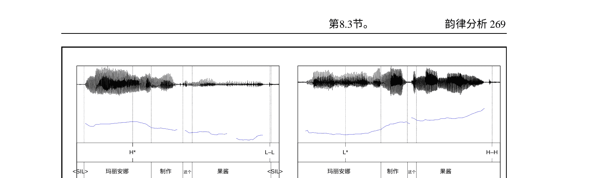

### 8.10 Beckman用两种不同的语调模式朗读的相同句子，并用ToBI进行转录。(a)显示了H*重音和典型的美式英语陈述句末尾的下降L-L%。(b)显示了L*重音，以及典型的美式英语是非问句的上升H-H%。


### 8.11 Tilt模型 (Taylor, 2000) 中事件的示意图。每个音高重音 (a) 和边界音调 (b) 都与音节核心 s 对齐。

从波形文件中自动提取。图8.11显示了Tilt表示的示例。Tilt中的每个重音都被视为具有（可能为零的）上升部分，直到达到峰值，然后是（可能为零的）下降部分。自动重音检测器在波形文件中找到每个重音的起始点、峰值和结束点，从而确定上升和下降部分的持续时间和幅度。倾斜参数是一个事件的F0斜率的抽象描述，通过比较上升和下降的相对大小来计算。倾斜值为1.0表示上升，-1.0表示下降，0表示上升和下降相等，-0.5表示上升和下降更大的重音，依此类推：

```
倾斜 = (倾斜振幅 + 倾斜持续时间) / 2
      = (|A上升| - |A下降| + D上升 - D下降) / (|A上升| + |A下降| + D上升 + D下降)
(8.19)
```

### 8.3.5 从韵律标签计算持续时间

到目前为止，文本分析过程的结果是一串带有单词注释的音素字符串，重要单词上标有音高重音，并标记了适当的边界音调。对于我们将在第8.5节中描述的单元选择合成方法来说，这是文本分析组件的足够输出。

对于二音节合成以及其他方法（如共振峰合成），我们还需要指定每个片段的持续时间和F0值。

音素的持续时间有很大的变化。其中一部分持续时间与音素本身的特性有关。例如，元音通常比辅音长得长；在电话语音的Switchboard语料库中，音素[aa]的平均持续时间为118毫秒，而[d]的平均持续时间为68毫秒。但音素的持续时间也受到各种上下文因素的影响，可以通过基于规则或统计方法进行建模。

最著名的基于规则的方法是Klatt（1979）的方法，它使用规则来模拟语音的平均或“上下文中性”持续时间如何在上下文中延长或缩短，同时保持在最小持续时间 \(d_{min}\) 以上。每个Klatt规则都与一个持续时间乘法因子相关联；以下是一些示例：

- 预停顿延长：在停顿之前的音节中的元音或音节辅音被延长1.4倍。
- 非短语末尾缩短：非短语末尾的音段缩短0.6倍。短语末尾的后元音液体和鼻音被延长1.4倍。
- 非重读音节缩短：非重读音段更容易被压缩，因此它们的最小持续时间 \(d_{min}\) 减半，并且大多数音段缩短0.7倍。
- 重音延长：带重音的元音会延长1.4倍。
- 辅音群中的缩短：辅音后面跟着一个辅音会缩短0.5倍。
- 预浊音缩短：在无声砰音前元音会缩短0.7倍。

给定 \(N\) 因子权重 \(f\)，Klatt公式用于计算音素的持续时间：

```
$$d = d_{min} + \prod_{i=1}^{N} f_i \times (\bar{d} - d_{min})$$
```

更近期的机器学习系统使用Klatt手写规则作为定义特征的基础，例如使用以下特征：

- 左右上下文音素的身份
- 当前音素的词汇重音和重音值
- 在音节、单词、短语中的位置
- 后面的停顿

然后，我们可以训练机器学习分类器，如决策树或sum-of-products模型（van Santen，1994，1997，1998），将这些特征组合起来预测段的最终持续时间。

### 8.3.6 从韵律标签计算F0

对于二音节、发音、HMM和共振峰合成，我们还需要指定每个片段的F0值。对于像ToBI或Tilt这样的音调序列模型，可以通过为每个音调重音和边界指定F0目标点来生成F0。整个句子的F0轮廓可以通过在这些目标点之间进行插值来创建（Anderson等，1984年）。

为了指定目标点，我们需要描述它是什么（F0值）以及它发生的时间（音节中的峰值或谷值发生的确切时间）。目标点的F0值通常不以赫兹为单位进行指定。相反，它们是相对于音高范围定义的。说话者的音高范围是在特定话语中使用的最低频率（基线频率）和话语中的最高频率（顶线）之间的范围。在某些模型中，目标点是相对于一条线来指定的，这条线被称为参考线。

例如，我们可以编写一个规则，指定话语的开头有一个目标点为50%（在基线和顶线之间的中间位置）。在Jilka等人（1999）的基于规则的系统中，H*音调的目标点为100%（顶线），L*音调的目标点为0%（基线）。L+H*音调有两个目标点，分别为20%和100%。最终边界音调H-H%和L-L%在120%和-20%处分别为超高和超低。

其次，我们还必须准确指定重音音节中的目标点应用位置，这被称为重音对齐。在Jilka等人的基于规则的系统中。（1999年），再次，H*重音在发音部分的60%位置对齐重音音节（尽管IP-初始重音在音节中稍晚一些，而IP-最终重音在音节中稍早一些）。

不必手动编写这些规则，可以自动学习从音高重音序列到F0值的映射。例如，Black和Hunt（1996年）使用线性回归为每个音节分配目标值。对于带有音高重音或边界音调的每个音节，他们预测三个目标值，分别位于音节的开头、中间和结尾。他们训练了三个单独的线性回归模型，分别用于音节中的三个位置。特征包括：

- 当前音节以及前两个和后两个音节的重音类型
- 当前音节和周围音节的词汇重音
- 到短语开头和短语结尾的音节数
- 到短语结束的重音音节数

这样的机器学习模型需要一个标记为重音的训练集；有许多这样的韵律标记的语料库存在，尽管目前还不清楚这些模型在未知语料库上的泛化能力如何。

最后，F0计算模型必须模拟音高在句子中的下降趋势；这种话语中音高的微弱下降被称为下降；图8.12显示了一个例子。

下降的确切性质是一个广泛研究的课题；在一些模型中，通过允许基线（或基线和顶线）在话语中缓慢下降来处理它。在类似ToBI的模型中，F0的这种下降被建模为两个独立的过程：

速率组件：除了下降，某些高音调被标记为携带下降下降。每个下降的高重音都会导致音调范围被压缩，从而导致每个这样的重音的顶线降低。

### 8.3.7 文本分析的最终结果：内部表示

文本分析的最终输出是我们所谓的内部表示 of the输入文本句子。对于单元选择合成，内部表示可以简单地是一个电话字符串，并带有韵律边界和突出音节的指示，如图8.1所示。对于二音节合成以及非连续合成算法，内部表示还必须包括每个音素的持续时间和F0值。

图8.13显示了来自FESTIVAL (Black et al., 1999)二音节语音合成系统的一些示例TTS输出，用于句子“你真的想看到全部吗？”这个输出，加上图8.14中显示的F0值，将成为第8.4节中描述的波形合成组件的输入。这里的持续时间是由CART风格的决策树(Riley, 1992)计算的。

表格内容（来自FESTIVAL系统的TTS输出分析）：

| 列1 | 列2 | 列3 | 列4 | 列5 | 列6 | 列7 | 列8 | 列9 | 列10 | 列11 |
| :--- | :--- | :--- | :--- | :--- | :--- | :--- | :--- | :--- | :--- | :--- |
| do | 你 | H* | 真的 | 想要 | 去 | 看见 | L* | 全部 | 的 | L- H% |
| 你真的想看见全部吗？ | 110 | 110 | 50 | 50 | 75 | 64 | 57 | 82 | 57 | 50 | 72 | 41 | 43 | 47 | 54 | 130 | 75 | 90 | 44 | 62 |
| 图8.13 FESTIVAL (Black等，1999年) 生成器对句子的输出“你真的想看见全部吗？” | | | | | | | | | | | | | | | | | | | |

注：表格下方文字为‘图8.14中显示了F0轮廓。感谢Paul Taylor提供的图。’

正如上面所建议的，确定句子的正确韵律模式是困难的，因为需要真实世界的知识和语义信息来知道哪些音节需要重音，以及应用哪种调式。这种信息很难从文本中提取出来，因此韵律模块通常旨在产生输入文本的“中性陈述”版本，假设句子应该以默认方式发音，不涉及话语历史或真实世界事件。这是TTS中语调常常听起来“生硬”的主要原因之一。

## 8.4 二音素波形合成

我们现在准备看看如何将内部表示转化为波形。我们将介绍两种类型的合成方法：本节中的二音素合成和下一节中的单元选择合成。

回想一下，对于二音素合成，我们的内部表示如图8.13和图8.14所示，由一系列音素组成，每个音素都与持续时间和一组F0目标相关联。

二音素串联合成模型通过从预先录制的二音素数据库中选择和串联单元来生成波形。二音素是从一个音素的中间大致到下一个音素的中间的类似音素的单元。二音素串联合成可以通过以下步骤来描述：

训练：
1. 录制一个单一的说话者说出每个二音节的例子。
2. 从语音中剪切出每个二音节，并将所有二音节存储在一个二音节数据库中。

合成：
1. 从数据库中获取与所需音素序列相对应的二音节序列。
2. 连接二音节，在边界处进行一些轻微的信号处理。
3. 使用信号处理来改变二音节序列的韵律（f0、持续时间）以达到所需的韵律。

我们倾向于使用二音节而不是单音节进行连接合成，因为共同发音现象。在第7章中，我们将共同发音定义为移动-发音器官为了预测下一个声音而进行的运动，或者是从上一个声音持续的运动。由于共同发音，每个音素在前一个和后一个音素的影响下略有不同。因此，如果我们只是简单地将音素连接在一起，边界处会出现非常大的不连续性。

在一个二音素中，我们通过在单元内包含到下一个音素的转换来建模这种协同发音。例如，二音素[w-eh]包括从[w]音素到[eh]音素的转换。因为二音素是从一个音素的中间到下一个音素的中间定义的，所以当我们连接二音素时，我们是连接音素的中间部分，而音素的中间部分往往不受上下文的影响。图8.15显示了元音[eh]的开始和结束比中间部分更具运动性的直觉。

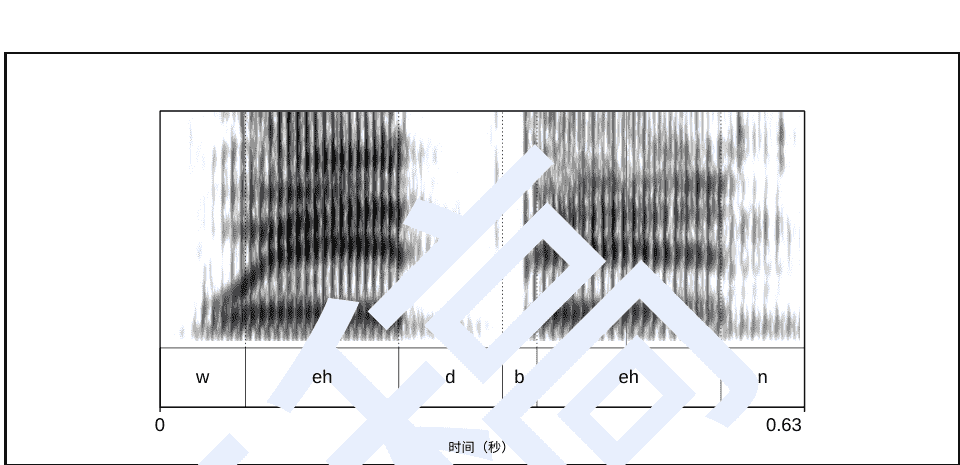

### 8.15 环境中的元音[eh]，在单词“wed”和“ban”中。注意在[eh]的开始和结束处的第二共振峰（F2）的差异，但在中间的相对稳定状态部分的蓝线上。

### 8.4.1 构建二音素数据库

构建二音素数据库有六个步骤：

1. 创建一个二音清单
2. 招募一个说话者
3. 为每个二音创建一个说话者要读的文本
4. 记录说话者朗读每个二音
5. 分割、标记和标记二音
6. 剪切二音

我们需要一个系统的二音清单是什么？如果我们有43个音素（例如AT&T的Olive等人的系统（1998年）），那么理论上有43² = 1849种可能的二音组合。并非所有这些二音都能够实际发生。例如，英语的音位约束排除了一些组合；像[h]、[y]和[w]这样的音素只能出现在元音前。此外，一些二音系统如果电话之间没有可能的共同发音，例如连续的无声塞音之间的沉默，就不会存储二音。因此，Olive等人（1998年）的43个音素系统只有1162个二音，而不是理论上可能的1849个二音集合。

语音人才：接下来我们招募我们的演讲者，通常被称为语音人才。二音素数据库...这位演讲者的语音被称为语音；商业系统通常有多个语音，比如一个男性和一个女性的语音。
现在我们将为语音人才创建一段要说的文本，并记录每个二音素。在录制二音素时，最重要的是尽可能保持一致；如果可能的话，它们应该具有恒定的音高、能量和持续时间，这样它们就可以在没有明显断点的情况下容易地拼接在一起。我们通过将要录制的每个二音素包含在一个载体短语中来实现这一点。通过将二音素放在其他音素的中间，我们可以避免末尾延长或初始音素效应使任何二音素比其他音素更响亮或更安静。我们将需要不同的载体短语来处理辅音-元音、元音-辅音、音素-静音和静音-音素序列。例如，一个辅音元音序列如[b aa]或[b ae]可以嵌入在音节[t aa]和[m aa]之间：

-   暂停 t aa b aa m aa 暂停
-   暂停 t aa b ae m aa 暂停
-   暂停 t aa b eh m aa 暂停
...

如果我们有一个早期的合成器声音，我们通常会用那个声音大声读出提示，并让我们的配音人员在提示后重复。这是保持每个二音素的发音一致的另一种方法。还有一个非常重要的是使用高质量的麦克风和一个安静的房间或者更好的是一个录音棚。

一旦我们录制了语音，我们需要标记和分割组成每个二音素的两个音素。通常通过在强制对齐模式下运行语音识别器来完成。在强制对齐模式下，语音识别器被告知确切的音素序列；它的任务只是在波形中找到确切的音素边界。语音识别器在找到音素边界方面并不完全准确，因此通常需要手动校正自动音素分割。

现在我们有两个音素（例如[b aa]）带有手动校正的边界。我们有两种方法可以为数据库创建/b-aa/二音素。一种方法是使用规则来决定将二音素边界放置在音素中的位置。例如，对于塞音，我们将二音素边界放置在音素的30%位置。对于大多数其他音素，我们将二音素边界放置在音素的50%位置。

最优耦合

一种更复杂的找到二音素边界的方法是存储整个两个音素，并等到我们知道要与之连接的音素之后再截取二音素。在这种方法中，被称为最优耦合，我们取两个（完整、未截取的）二音素，我们需要连接它们，并为每个二音素的每个切割点检查每个可能的切割点，选择使第一个二音素的最后一个帧在声学上与下一个二音素的结束帧最相似的两个切割点（Taylor和Isard，1991；Conkie和Isard，1996）。声学相似性可以通过使用倒谱相似性来衡量，在第9.3节中定义。

## 8.4.2 二音素拼接和TD-PSOLA用于韵律

我们现在准备看到合成一个单独的话语的剩余步骤。假设我们已经完成了话语的文本分析，因此得到了一个二音素和韵律目标的序列，并且我们还从二音素数据库中获取了适当的二音素序列。接下来，我们需要将二音素连接在一起，然后调整二音素序列的韵律（音高、能量和持续时间），以匹配中间表示的韵律要求。

给定两个二音素，我们需要做什么才能成功地将它们连接起来？如果两个二音素边缘的波形在连接处非常不同，会产生可察觉的点击声。因此，我们需要对两个二音素的边缘应用窗函数，以使连接处的样本具有低或零振幅。

此外，如果两个二音素都是有声的，我们需要确保这两个二音素是基频同步连接的。这意味着第一个二音素的基频周期必须与第二个二音素的基频周期对齐；否则，在连接处产生的单个不规则基频周期会被感知到。

TD-PSOLA

现在，给定我们连接的二音素序列，我们如何修改基频和持续时间以满足我们的韵律要求？事实证明，有一种非常简单的算法可以做到这一点，称为 TD-PSOLA（时域基频同步重叠相加）。

正如我们刚才所说的，基频同步算法是指我们在每个基频周期或时刻执行某些操作。对于这种算法来说，准确的基频标记非常重要：即准确测量每个基频脉冲或时刻发生的位置。一个时刻可以通过最大声门压力瞬间或声门闭合瞬间来定义。注意基频标记或时刻之间的区别。

音高标记

音高跟踪检测和音高跟踪。音高跟踪在每个特定时间点给出F0（声门的平均周期每秒）的值，该值在一个邻域内进行平均。音高标记找到每个振动周期中声带达到某个特定点（时刻）的确切时间点。

电声声门图 (EGG)
喉音图 (Lx)

时刻标记可以通过两种方式进行。传统的方式，也是最准确的方式，是使用电声声门图或EGG（通常也称为喉音图或 Lx）。EGG是一种装在（外部的）说话者颈部附近的设备通过亚当的苹果发送微弱电流。通过测量声带之间的阻抗来检测声门是开放还是闭合。一些现代合成数据库仍然使用EGG进行录制。使用EGG的问题是它必须附在说话者身上，而他们正在录制数据库。尽管EGG并不特别侵入性，但这仍然很烦人，并且EGG必须在录制过程中使用；它不能用于标记已经收集到的语音。现代时刻检测器现在已经接近EGG不再在大多数商业TTS引擎中使用的准确水平。时刻检测的算法包括Brookes和Loke（1999），Veldhuis（2000）。

给定一个带有时刻标签的语料库，TD-PSOLA的直觉是我们可以通过提取每个音高周期的帧（窗口化，以避免帧具有尖锐边缘），然后通过简单地重叠和添加窗口化的音高周期帧以各种方式重新组合这些帧来修改波形的音高和持续时间（我们将在第9.3.2节介绍窗口的概念）。我们通过提取帧、以某种方式操纵它们，然后通过叠加信号来重新组合它们的思想被称为叠加和添加（OLA）。

叠加和添加 (OLA)

算法；TD-PSOLA是叠加和添加的一种特殊情况，其中帧是音高同步的，并且整个过程在时域中进行。例如，为了给一个二音段分配特定的持续时间，我们可能希望延长录制的主要二音段。使用TD-PSOLA延长信号，我们简单地插入一些音高同步帧的额外副本，实质上是复制信号的一部分。图8.16展示了这个直觉。


8.16 TD-PSOLA用于时长修改。可以复制个别的基音同步帧来延长信号（如图所示），也可以删除帧来缩短信号。

TD-PSOLA还可以用于改变已录制的二音素的F0值，从而得到更高或更低的值。为了增加F0，我们从原始录制的二音素信号中提取每个基音同步帧，将帧放置得更加接近（重叠），重叠的信号量由所需周期和频率决定，然后将重叠的信号相加以产生最终信号。但请注意，通过将所有帧靠拢，我们使信号在时间上变短！因此，为了在保持时长恒定的情况下改变音高，我们需要添加重复的帧。

图8.17显示了这个直观的过程；在这个图中，我们明确显示了提取的基音同步帧，它们被重叠和相加；请注意，帧被靠拢在一起（增加音高），同时还添加了额外的帧以保持时长恒定。

## 8.5 单元选择（波形）合成

二音素波形合成存在两个主要问题。首先，存储的二音素数据库必须通过信号处理方法（如PSOLA）进行修改以产生所需的韵律。对存储的语音进行任何形式的信号处理都会在语音中留下痕迹，使语音听起来不自然。其次，二音素合成仅捕捉到单个相邻音素的协同发音。但是，对语音实现有更多全局影响，包括更远的音素，音节结构，附近音素的重音模式，甚至是词级影响。

因此，现代商用合成器基于一种称为单元选择合成的二音素合成的泛化。与二音素合成类似，单元选择合成是一种串联合成算法。它与经典的二音素合成有两个不同之处：

单元选择合成

1.  在二音素合成中，数据库存储每个二音素的一个副本，而在单元选择中，单元数据库很长，包含每个二音素的多个副本。
2.  在二音素合成中，串联单元的韵律通过PSOLA或类似算法进行修改，而在单元选择中，对串联单元不进行（或最小程度的）信号处理。

单元选择的优势在于大型单元数据库。在足够大的数据库中，我们要合成的话语的整个单词或短语可能已经存在于数据库中，从而为这些单词或短语产生极其自然的波形。此外，在我们无法找到大块并不得不退回到单个二音素的情况下，每个二音素有如此多的副本使得我们更有可能找到一个非常自然的二音素。

单元选择的架构可以总结如下。我们有一个大型的单元数据库；让我们假设这些是二音素（尽管也可以使用其他类型的单元，如半音素、音节或半音节）。我们还有一个目标“内部表示”的特征描述，即一个音素字符串和特征，如重音值、单词标识、F0信息，如图8.1所述。

合成器的目标是从数据库中选择与目标表示相对应的最好的二音素单元序列。我们所说的“最佳”序列是什么意思？直观地说，最佳序列应该满足以下条件：

- 我们选择的每个二音素单元都完全符合目标二音素的规格要求（如F0、重音水平、音素邻居等）
- 每个二音素单元与其相邻单元平滑连接，没有可察觉的断裂。

当然，在实践中，我们无法保证会有一个完全符合我们规格的单元，并且我们很难找到一个每个连接都是不可察觉的单元序列。因此，在实践中，单元选择算法实现了这些约束的梯度版本，并尝试找到至少最小化目标成本和连接成本的单元序列：

目标成本 $T(u_t, s_t)$: 目标规格与潜在单元的匹配程度
连接成本 $J(u_t, u_{t+1})$: 潜在单元 $u_t$ 与其潜在邻居 $u_{t+1}$ 的连接程度（感知上）

T和J值以成本的形式表示，高值表示匹配和连接不好（Hunt and Black, 1996a）。

从形式上来说，单元选择合成的任务是在给定一系列 s 到 T目标规范的情况下，从数据库中找到最小化这些成本之和的序列到 T单元：

$$
(8.21)
\hat{U} = \underset{U}{\mathrm{argmin}} \sum_{t=1}^{T} T(s_t, u_t) + \sum_{t=1}^{T-1} J(u_t, u_{t+1})
$$

在我们转向解码和训练任务之前，让我们更详细地定义目标成本和连接成本。

目标成本衡量单元与目标二音素规范的匹配程度。我们可以将每个二音素目标的规范视为一个特征向量；这里是三个样本向量，分别对应三个目标二音素规范，使用维度（特征）如音节是否重读和二音素在语调短语中的位置：

| 目标二音素规范 | 特征 |
| :--- | :--- |
| /ih-t/ | +重音, 短语内部, 高F0, 内容词 |
| /n-t/ | -重音, 短语末尾, 高F0, 功能词 |
| /dh-ax/ | -重音, 短语开头, 低F0, 词'the' |

我们希望目标规范与单元之间的距离是这些维度上单元与规范之间的差异的某个函数。假设对于每个维度 p, 我们可以得出一些子成本。像重音这样的二元特征的子成本可能是1或0。像F0这样的连续特征的子成本可能是规范F0和单元F0之间的差异（或对数差异）。由于某些维度对于语音感知比其他维度更重要，我们还希望对每个维度进行加权。将所有这些子成本组合起来的最简单方法就是假设它们是独立且可加的。

使用这个模型，给定目标/单元对的总目标成本是每个特征/维度的所有子成本的加权和：

$$
T(s_t, u_j) = \sum_{p=1}^{P} w_p T_p(s_t[p], u_j[p])
$$

目标成本是根据所需的二音素规范和数据库中的一个单元来计算的函数。相比之下，连接成本是根据数据库中的两个单元来计算的函数。连接成本的目标是在连接完全自然时低（0），而在连接会引起感知或不协调时高。我们通过测量将要连接的两个单元的声学相似性来实现这一点。如果两个单元的能量、F0和频谱特征非常相似，它们很可能会很好地连接。因此，与目标成本一样，我们通过求加权子成本的和来计算连接成本：

$$
J(u_t, u_{t+1}) = \sum_{p=1}^{P} w_p J_p(u_t[p], u_{t+1}[p])
$$

经典的Hunt和Black（1996b）算法中使用的三个子成本是连接点处的倒谱距离，以及对数功率和F0的绝对差异。我们将在第9.3节介绍倒谱。

此外，如果要连接的两个单元 $u_t$ 和 $u_{t+1}$ 在单元数据库中是连续的二音素（即它们在原始语音中相邻），那么我们将连接成本设置为0： $J(u_t, u_{t+1}) = 0$ 。这是单元选择合成的一个重要特征，因为它鼓励从数据库中选择大的自然单元序列。

我们如何找到最小化目标和连接成本之和的最佳单元序列，如公式8.21所示？标准方法是将单元选择问题视为隐马尔可夫模型。目标单元是观察输出，数据库中的单元是隐藏状态。我们的工作是找到最佳的隐藏状态序列。我们将使用维特比算法来解决这个问题，就像我们之前看到的那样。

图 8.18 选择中的解码过程。该图显示了单词“s x”的目标（规范）二音素序列，以及我们必须搜索的可能数据库二音素单元集合。以最小化目标和连接成本之和的最佳（维特比）路径以粗体显示。

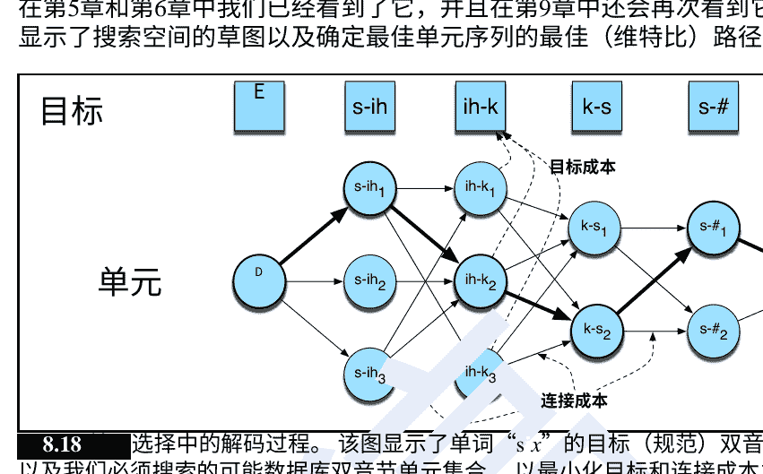

连接成本和目标成本的权重通常是手动设置的，因为权重的数量很小（大约为20），机器学习算法并不总能达到人类的性能。系统设计师听取系统生成的完整句子，并选择使得听起来合理的权重值。然而，确实存在各种自动权重设置算法。其中许多算法假设我们有两个句子之间的某种声学距离函数，可能基于倒谱距离。例如，Hunt和Black（1996b）的方法从单元选择数据库中保留了一组测试句子。对于这些测试句子中的每一个，我们取出单词序列并合成一个句子波形（使用训练数据库中其他句子的单元）。现在我们将合成句子的声学特征与真实人类句子的声学特征进行比较。现在我们有一系列合成句子，每个句子都与其人类对应句子的距离函数相关联。现在我们使用基于这些距离的线性回归来设置目标成本权重，以最小化距离。

还有更高级的方法来分配目标和连接成本。例如，我们通过查看两个单元的特征来计算它们之间的目标成本，通过对特征成本进行加权求和，并选择最低成本的单元。另一种方法（新读者可能需要在学习下一章介绍的语音识别技术后再回来）是将目标单元映射到某个声学空间，然后在该声学空间中找到与目标接近的单元。例如，Donovan和Eide（1998）、Donovan和Woodland（1995）的方法中，所有的训练单元都使用语音识别中描述的决策树算法进行聚类。决策树基于上述相同的特征，但是对于每组特征，我们沿着决策树向下走到包含具有这些特征的单元簇的叶节点。这些单元簇可以使用高斯模型进行参数化，就像语音识别一样，这样我们就可以将一组特征映射到概率分布中。通过倒谱系数值，因此可以轻松计算目标与数据库中的单元之间的距离。至于连接成本，更复杂的度量方法利用了特定连接可能的可感知性（Wouters和Macon， 1998; Syrdal和Conkie， 2004; Bulyko和Ostendorf， 2001）。

## 8.6 评估

语音合成系统通过人类听众进行评估。开发一个良好的自动度量合成评估的度量标准，可以消除昂贵且耗时的人工听觉实验的需求，仍然是一个开放且令人兴奋的研究课题。

可懂度
语音合成系统的最小评估度量是可懂度：人类听众正确解释合成话语的单词和含义的能力。进一步的度量是质量：对语音的自然性，流畅性或清晰度的抽象度量。质量或清晰度的语音。

流畅性

最本地的可理解性度量测试听者区分两个音素的能力。诊断韵测试（DRT）（Voiers et al., 1975）测试初始辅音的可理解性。它基于96对易混淆的押韵词，这些词只在一个语音特征上有所不同，例如（密集/紧张）或债券/池塘（在发声上有所不同）或平均/敲打或脖子/甲板（在鼻音上有所不同），等等。对于每一对词，听者听到其中一个词，并指出他们认为是哪个词。然后，正确答案的百分比被用作可理解性度量。修正修正韵测试（MRT）（House et al., 1965）是一项类似的测试，基于不同的一组词汇。MRT 300个单词，由50组6个单词组成。每个6个单词的集合在初始或最后的辅音上有所不同（例如， went, sent, bent, dent, tent, rent或bat, bad, back, bass, ban, bath）。听众再次听到一个单词，并必须从一个封闭的单词列表中识别出来；正确识别的百分比再次被用作可懂度指标。

诊断韵测试 (DRT)

载体短语

由于上下文效应非常重要，DRT和MRT单词都嵌入在如下的载体短语中：

现在我们将再次说出<word>。

为了测试比单个音素更大的单元，我们可以使用语义上不可预测的句子（SUS）（Beno^it et al., 1996）。这些是由简单的词性模板构建的句子，如DET ADJ NOUN VERB DET NOUN，并在槽位中插入随机的英文单词，以生成如下的句子

不确定的牛排关掉了鱼。

像DRT/MRT和SUS这样的可懂度度量标准旨在排除上下文在测量可懂度中的作用。虽然这使我们能够仔细控制系统的可懂度，但这种没有上下文或语义可预测的句子并不适合TTS在大多数商业应用中的使用。因此，在商业应用中，我们通常使用模拟所需应用的情境来测试可懂度；大声朗读地址，朗读新闻文本等等。

# 参考文献和历史注释

正如我们在本章开头提到的，语音合成是语音与语言处理的最早领域之一。18世纪出现了许多关于发音过程的物理模型，包括上面提到的冯·肯佩伦模型，以及1773年哥本哈根的克拉岑斯坦使用风琴管的元音模型。

但是，语音合成的现代时代可以明确地说是在20世纪50年代初到来的，当时三种主要的波形合成范式已经被提出（共振峰合成、发音合成和串联合成）。
串联合成似乎是由贝尔实验室的哈里斯（1953年）首次提出的，他实际上是将对应于音素的磁带片段拼接在一起。哈里斯的提议实际上更像是单元选择合成而不是二音素合成，因为他建议存储每个音素的多个副本，并提出使用连接成本（选择与相邻单元之间过渡最平滑的单元）。哈里斯的模型基于音素而不是二音素，导致由于协同发音而产生问题。彼得森等人（1958年）添加了许多单元选择合成的基本思想，包括使用二音素、具有不同语调的每个二音素的多个副本的数据库，以及每个单元标有语调特征，包括F0、重音和持续时间，并使用基于F0和相邻单元之间的共振峰距离的连接成本。他们还提出了微连接技术，如对波形进行窗口处理。然而，彼得森等人（1958年）的模型纯粹是理论性的，直到1960年代和1970年代才实现了串联合成，首次实现了二音素合成（迪克森和马克西，1968年；奥利弗，1977年）。后来的二音素系统包括较大的单元，如辅音簇（奥利弗和利伯曼，1979年）。现代单元选择合成，包括非均匀长度的大单元的概念和目标成本的使用，是由Sag-isaka（1988年）、Sagisaka等人（1992年）发明的。Hunt和Black（1996b）将该模型形式化，并在ATR CHATR系统（Black和Taylor，1994年）的背景下将其呈现在本章中。通过聚类自动生成合成单元的想法最早是由中岛和滨田（1988年）发明的，但是## 第284章 语音合成

主要由（Donovan, 1996）开发，通过将决策树聚类算法从语音识别中引入。许多单元选择创新发生在ATT NextGen合成器中（Syrdal et al., 2000; Syrdal and Conkie, 2004）。

在本章中，我们主要关注连接合成，但还有其他两种合成范式：共振峰合成，其中我们尝试构建生成人工频谱的规则，特别是共振峰；和关节合成，其中我们尝试直接模拟声道和关节过程的物理学。

共振峰合成器最初受到模仿人类语音的尝试的启发，通过生成人工频谱图。Haskins Laboratories Pattern Playback Machine通过在移动的透明带上绘制频谱图案，并使用反射来过滤波形的谐波，生成声波（Cooper et al., 1951）；其他早期的共振峰合成器包括Lawrence（1953）和Fant（1951）。也许最著名的共振峰合成器是Klatt共振峰合成器及其后续系统，包括MITalk系统（Allen et al., 1987），以及Digital Equipment Corporation的DECtalk中使用的Klattalk软件（Klatt, 1982）。详细信息请参阅Klatt（1975）。

发音合成器试图通过模拟开放管道的声道物理学来合成语音。代表性的模型，早期和稍微更新的模型包括Stevens等人（1953），Flanagan等人（1975），Fant（1986）。更多细节请参见Klatt（1975）和Flanagan（1972）。

TTS的文本分析组件的开发稍晚一些，因为技术是从自然语言处理的其他领域借鉴来的。早期合成系统的输入不是文本，而是音素（通过打孔卡输入）。

似乎第一个将文本作为输入的文本到语音系统是Umeda和Teranishi的系统（Umeda等人, 1968; Teranishi和Umeda, 1968; Umeda, 1976）。该系统包括一个词汇化的解析器，用于分配韵律边界，以及重音和强调；Coker等人（1973）的扩展添加了额外的规则，例如去重轻动词和探索发音模型。这些早期的TTS系统使用发音词典进行单词发音。为了扩展到更大的词汇量，早期基于共振峰的TTS系统（如MITalk（Allen等人, 1987））使用字母到音素的规则而不是词典，因为计算机内存太昂贵，无法存储大型词典。

现代字素到音素模型源自于Lucassen和Mercer（1984）的早期概率字素到音素模型，最初是在语音识别的背景下提出的。然而，这种机器学习模型的广泛使用被推迟了，因为早期的个别证据表明手写规则比Sejnowski和Rosenberg（1987）的神经网络效果更好。Damper等人（1999）的仔细比较表明，机器学习方法总体上更优越。许多这样的模型利用类比发音（Byrd和Chodorow, 1985; Daelemans和van den Bosch, 1997; Marchand和Damper, 2000）或潜在类比（Bellegarda, 2005）；也提出了HMMs（Taylor, 2005）。最新的工作利用了联合字素模型，其中隐藏变量是音素-字素对，概率模型基于联合概率而不是条件概率（Deligne等人, 1995; Luk和Damper, 1996; Galescu和Allen, 2001; Bisani和Ney, 2002; Chen, 2003）。

关于韵律有大量文献。除了上面描述的ToBI和TILT模型之外，其他重要的计算模型还包括Fujisaki模型（Fujisaki和Ohno, 1997）。IViE（Grabe, 2001）是ToBI的扩展，专注于标记不同的英语变体（Grabe et al., 2000）。关于语调结构的单位（韵律短语（Beckman and Pierhumbert, 1986），语调单元（Du Bois et al., 1983）或音调单元（Crystal, 1969））以及它们与从句和其他句法单元的关系也存在很多争议。（Chomsky and Halle, 1968; Langendoen, 1975; Streeter, 1978; Hirschberg and Pierrehumbert, 1986; Selkirk, 1986; Nespor and Vogel, 1986; Croft, 1995; Ladd, 1996; Ford and Thompson, 1996; Ford et al., 1996）。语音合成最令人兴奋的新范式之一是HMM合成，首次由Tokuda等人（1995b）提出，并在Tokuda等人（1995a）、Tokuda等人（2000）和Tokuda等人（2003）中详细阐述。另请参阅Taylor（2008）对HMM合成的教材摘要。

有关TTS评估的更多细节，请参阅Huang等人（2001）和Gibbon等人（2000）。有关评估的其他描述可以在年度语音合成竞赛Blizzard Challenge（Black和Tokuda, 2005; Bennett）中找到。

最近的语音合成研究主要集中在生成情感语音（Cahn, 1990; Bulut等人, 2002; Hamza等人, 2004; Eide等人, 2004; Lee等人, 2006; Schroder, 2006, 等等）。

在Allen等人（1987）中描述了两个经典的文本到语音合成系统（MITalk系统）和Sproat（1998b）（贝尔实验室系统）。最近的教材包括Dutoit（1997）、Huang等人（2001）、Taylor（2008）以及Alan Black的在线讲座笔记，网址为http://festvox.org/festtut/notes/festtut_toc.html。有影响力的论文集包括van Santen等人（1997）、Sagisaka等人（1997）、Narayanan和Alwan（2004）。会议出版物出现在主要的语音工程会议（INTERSPEECH、IEEE ICASSP）以及语音合成研讨会中。期刊包括语音通信、计算机语音与语言、IEEE音频、语音和语言处理交易以及ACM音频和语音处理交易。

# 练习

- 8.1 实现处理 MONEY的文本规范化例程，即将像$45, $320和$4100这样的美元金额映射为单词（可以直接编写代码或设计FST）。如果一个数字有多种发音方式，你可以选择你最喜欢的方式。
- 8.2 实现处理 NTEL的文本规范化例程，即处理像555-1212, 555-1300等七位数电话号码。你应该使用配对和尾部单元的发音方法来处理最后四位数字。对于最后四位数字，你可以使用配对和尾部单元的发音方法。（你可以编写代码或设计FST）。
- 8.3 实现处理 DATE类型的文本规范化例程，参见图8.1.2。
- 8.4 实现处理 NTIME类型的文本规范化例程，参见图8.1.2。
- 8.5 （由Alan Black建议）。下载免费的Festival语音合成器。增加词典以正确发音你班上每个人的名字。
- 8.6 下载Festival合成器。使用你自己的声音录制和训练一个双音合成器。

# 第9章 自动语音识别

当弗雷德里克还是个小男孩时，他表现得非常勇敢和大胆，他的父亲认为他应该学习一些与航海有关的职业。不幸的是，我是他的保姆，所以我被指派将这个有前途的男孩学徒绑定到一个飞行员身上 — 对于一个勇敢的男孩来说，这样的生活并不糟糕，尽管肯定不是一个高贵的职业，虽然我是一个保姆，但你可能找不到比让你的孩子成为飞行员更好的选我是一个愚蠢的保姆，总是在操纵着危险的船只，由于听力不好，我没有听清楚指令；误解了我的指示，它们在我的脑海中打转，我将这个有前途的男孩学徒绑定到了一个海盗身上。

> 《悲惨世界》，吉尔伯特和沙利文，1877年

可惜，保姆露丝的这个错误导致弗雷德里克长时间当海盗，并且由于21岁生日和闰年的微妙复杂性，差多点了63年的学徒期。这个错误在吉尔伯特和沙利文的风格中是相当自然的；正如露丝后来指出的，“这两个词太相似了！”是的，说话语言的理解是一项困难的任务，人类在这方面与我们所做的表现一样出色是非常了不起的。自动语音识别（ASR）研究的目标是通过构建从声学信号到一串词语的系统来计算地解决这个问题。自动语音理解（ASU）将这个目标扩展到对句子的某种理解，而不仅仅是单词。

任何说话者在任何环境下自动转录语音的一般问题仍然远未解决。但是近年来，ASR技术已经发展到在某些有限领域中可行的程度。一个主要的应用领域是人机交互。虽然许多任务更适合使用视觉或指向界面，但语音有潜力成为比键盘更好的界面，适用于需要完整自然语言交流或不适合使用键盘的任务。这包括需要操作物体或控制设备的双手忙碌或眼睛忙碌的应用。另一个重要的应用领域是电话，语音识别已经在口语对话系统中使用，用于输入数字，识别接受来电的“是”，获取飞机或火车信息以及呼叫路由（“请转会计部”，“请找雷吉教授”）。在某些应用中，结合语音和指向的多模式界面比没有语音的图形用户界面更高效（Cohen等, 1998）。最后，ASR应用于口述，即由单个特定说话者的长篇独白的转录。口述在法律等领域很常见，也是增强交流的重要组成部分（计算机与由于无法打字或无法说话而导致的某些残疾的人之间的交互）。盲人弥尔顿著名地口述《失乐园》给他的女儿，亨利·詹姆斯在手部重复性应力伤害后口述他的后期小说。

在转向架构细节之前，让我们讨论一下语音识别任务的一些参数。语音识别任务的一个变化维度是词汇量。如果我们需要识别的不同单词数量较少，语音识别就会更容易。因此，具有两个单词词汇量的任务（例如是与否检测）或具有十一个单词词汇量的任务（例如识别数字序列，在数字识别任务中被称为数字任务）相对较容易。另一方面，具有大词汇量的任务（例如转录人与人之间的电话对话或转录广播新闻）更加困难，这些任务的词汇量达到64,000个单词或更多。

变化的第二个维度是语音的流利程度、自然程度或对话程度。孤立词识别更容易，每个词之间都有一定的停顿，而连续语音识别更难，其中单词相互连续并且必须进行分割。连续语音任务本身的难度差异很大。例如，与机器交流的语音识别比人与人之间的语音识别要容易得多。也就是说，识别人类与机器交流的语音，无论是朗读出来的语音（模拟口述任务），还是与语音对话系统交流相对容易。识别两个人对话的语音，在对话式语音识别中，例如转录商务会议或电话对话，要困难得多。似乎当人类与机器交谈时，他们会简化自己的语言，说得更慢更清晰。

变化的第三个维度是信道和噪声。听写任务（以及语音识别的许多实验室研究）都是使用高质量的头戴式麦克风完成的。头戴式麦克风消除了使用桌面麦克风时发生的失真问题，因为说话者的头部会移动。任何类型的噪声都会使识别变得更困难。因此，在安静的办公室中识别说话者要比在开着窗户的嘈杂的汽车上识别说话者容易得多。

变异的最后一个维度是口音或说话者特征。如果说话者使用标准方言，或者一般来说与系统训练数据匹配的方言，语音更容易被识别。因此，对于外语口音的语音或儿童的语音（除非系统专门针对这些类型的语音进行了训练），识别会更困难。

表9.1显示了在不同的ASR任务上，最先进的系统的错误单词百分比（词错误率，或WER，定义在第330页）的大致情况。

| 任务 | 词汇 | 错误率% |
|---|---|---|
| 数字 | 11（零到九，零） | 0.5 |
| 华尔街日报朗读的语音 | 5,000 | 3 |
| 华尔街日报朗读的语音 | 20,000 | 3 |
| 广播新闻 | 64,000+ | 10 |
| 电话对话语音（CTS） | 64,000+ | 20 |

**表9.1** 大约在2006年报告的各种任务上ASR的粗略词错误率（错误识别的词的百分比）；广播新闻和CTS的错误率基于特定的训练和测试场景，应该作为大致数值；对于不同定义的任务，错误率可能相差一倍。

噪声和口音的变化会大大增加错误率。在强烈的日本口音或西班牙口音的英语中，单词错误率报告为同一任务上本地说话者的3到4倍（Tomokiyo, 2001）。添加10dB的信噪比（SNR）的汽车噪声会使错误率增加2到4倍。

总的来说，随着语音识别性能的不断提高，这些错误率每年都在下降。据估计，在过去十年中，性能每年提高约10%（Deng和Huang, 2004），这是由于算法改进和摩尔定律的结合。

虽然我们在本章中描述的算法适用于各种语音任务，但我们选择将本章重点放在一个关键领域的基础知识上：大词汇连续语音识别（LVCSR）。大词汇一般指系统的词汇量大约为20,000到60,000个单词。我们之前看到，连续意味着单词自然地连在一起。此外，我们将讨论的算法通常是与说话人无关的；也就是说，它们能够识别从未接触过的人的语音。

LVCSR的主要范式是HMM，我们将在本章重点讨论这种方法。前几章介绍了HMM语音识别中使用的大多数核心算法。第7章介绍了关键的音素和音韵概念，如音素、音节和语调。第5章和第6章介绍了贝叶斯规则、隐马尔可夫模型（HMM）、维特比算法和Baum-Welch训练算法的使用。第4章介绍了N-gram语言模型和困惑度度量。在本章中，我们首先概述了HMM语音识别的体系结构，然后简要介绍了用于特征提取和提取重要MFCC特征的信号处理，并引入了高斯声学模型。然后，我们继续介绍了在ASR上下文中Viterbi解码的工作原理，并对ASR的训练过程进行了完整的总结，称为嵌入式训练。最后，我们介绍了词错误率，这是标准的评估指标。下一章将继续讨论一些高级ASR主题。

## 9.1 语音识别架构

语音识别的任务是将声学波形作为输入，并生成一个单词字符串作为输出。基于HMM的语音识别系统使用噪声信道的隐喻来看待这个任务。噪声信道模型的直觉（见图9.2）将声学波形视为字符串的“噪声”版本，即通过噪声通信信道传输的版本。这个频道引入了“噪音”，使得识别“真实”的单词字符串变得困难。我们的目标是建立一个模型来描述这个频道，以便我们可以弄清楚它是如何修改这个“真实”的句子，从而恢复它。

嘈杂信道模型的洞察力在于，如果我们知道信道是如何扭曲源语句的，我们可以通过将语言中的每个可能的句子都通过我们的嘈杂信道模型运行，并查看是否与输出匹配，从而找到正确的源语句。然后，我们选择与输出最匹配的源语句作为我们期望的源语句。

实现嘈杂信道模型如图9.2所示需要解决两个问题。首先，为了选择与嘈杂输入最匹配的句子，我们需要一个完整的度量标准来衡量“最佳匹配”。由于语音变化如此大，一个声学输入句子永远不会完全匹配我们对该句子的任何模型。正如我们在之前的章节中所建议的，我们将使用概率作为我们的度量标准。这使得语音识别问题成为贝叶斯推断的特殊情况，一种自Bayes（1763）的工作以来已知的方法。贝叶斯推理或贝叶斯分类在20世纪50年代成功应用于语言问题，如光学字符识别（Bledsoe和Browning, 1959）以及作者归属任务，如Mosteller和Wallace（1964）关于联邦党人论文作者身份的开创性工作。我们的目标是将各种概率模型结合起来，得到给定候选源句子的嘈杂声学观察序列的概率的完整估计。然后，我们可以在所有句子的空间中进行搜索，并选择具有最高概率的源句子。

其次，由于所有英语句子的集合非常庞大，我们需要一种高效的算法，不仅能搜索所有可能的句子，而且只搜索那些有很好匹配可能性的句子。这是解码或搜索问题，我们已经在第5章和第6章中使用HMM的Viterbi解码算法进行了探讨。由于语音识别中的搜索空间非常庞大，高效的搜索是任务的重要部分，我们将重点关注搜索的几个方面。

在本介绍的其余部分中，我们将回顾我们在第5章中介绍的用于词性标注的概率或贝叶斯模型。然后，我们将介绍现代基于HMM的自动语音识别系统的各个组成部分。

回想一下，语音识别中概率噪声通道架构的目标可以总结如下：

> “在给定一些声学输入O的情况下，哪个句子是语言L中所有句子中最有可能的？”

我们可以将声学输入\(O\)视为一系列单独的“符号”或“观测值”（例如，通过每10毫秒切割输入，并用该切片的能量或频率的浮点值表示每个切片）。然后，每个索引表示一些时间间隔，连续的\(o_i\)表示输入的时间上连续的切片（注意，大写字母表示符号序列，小写字母表示单个符号）：

\[ O = o_1, o_2, o_3, \ldots, o_t \]

同样地，我们将一个句子视为由一串单词组成的字符串：

\[ W = w_1, w_2, w_3, \ldots, w_n \]

这两个都是简化的假设；例如，将句子分成单词有时候过于细分（我们希望对单词组进行建模而不是单个单词），有时候又过于粗分（我们需要处理形态学）。通常在语音识别中，一个单词由正字法定义（在将每个单词映射为小写后）：\(oak\)被视为与\(oaks\)不同的单词，但是助动词\(can\)（“你能告诉我……”）被视为与名词\(can\)（“我需要一罐……”）相同的单词。

我们上面的直觉的概率实现可以表示为：

\[ \hat{W} = \underset{W \in \mathcal{L}}{\text{argmax}} P(W|O) \]

回想一下，函数\(\text{argmax}_x f(x)\)的意思是“使得f(x)最大的x”。方程式9.3保证给出最优的句子\(W\)；现在我们需要让方程式运作起来。也就是说，对于给定的句子\(W\)和声学序列\(O\)，我们需要计算\(P(W|O)\)。回想一下，对于任意的概率\(P(x|y)\)，我们可以使用贝叶斯规则将其分解如下：

\[ P(x|y) = \frac{P(y|x)P(x)}{P(y)} \]

我们在第5章中看到，我们可以将(9.4)代入(9.3)中，如下所示：

\[ \hat{W} = \underset{W \in \mathcal{L}}{\text{argmax}} \frac{P(O|W)P(W)}{P(O)} \]

(9.5)右侧的概率大部分比\(P(W|O)\)更容易计算。例如，\(P(W)\)，即单词字符串本身的先验概率是由第4章的\(N\)-gram语言模型估计的。而且我们将在下面看到，\(P(O|W)\)也很容易估计。但是，声学观察序列的概率\(P(O)\)更难估计。幸运的是，我们可以像在第5章中看到的那样忽略\(P(O)\)。为什么呢？因为我们在所有可能的句子上进行最大化，我们将计算\(\frac{P(O|W)P(W)}{P(O)}\)对于语言中的每个句子。但是\(P(O)\)对于每个句子都没有改变！对于每个潜在的句子，我们仍然在检查相同的观察\(O\)，这些观察必须具有相同的概率\(P(O)\)。因此：

\[ \hat{W} = \underset{W \in \mathcal{L}}{\text{argmax}} \frac{P(O|W)P(W)}{P(O)} = \underset{W \in \mathcal{L}}{\text{argmax}} P(O|W)P(W) \]

总结起来，给定某个观察序列O，最有可能的句子 W可以通过计算每个句子的两个概率的乘积来得到，并选择乘积最大的句子。语音识别器的一般组件计算这两个项的名称为 P(W)的先验概率，由语言模型计算。而 P(O|W)的观察概率 likelihood由声学模型计算。

(9.7) \[ \hat{W} = \underset{W \in \mathcal{L}}{\text{argmax}} \ P(O|W) \ P(W) \]

语言模型 (LM) 先验 P (W) 表示给定的单词字符串是英语源句子的可能性有多大。我们已经在第4章中看到了如何通过使用 N-gram语法来计算这样的语言模型先验 P (W)。回想一下， N-gram语法可以通过计算来为句子分配一个概率：

(9.8) \[ P(w_1^n) \approx \prod_{k=1}^{n} P(w_k | w_{k-N+1}^{k-1}) \]

本章将展示我们在第6章中介绍的HMM如何用于构建一个声学模型 (AM) ，该模型计算出概率 P (O|W)。在给定AM和LM概率的情况下，可以通过搜索算法将概率模型操作化，以计算给定声学波形的最大概率单词字符串。

图9.3显示了HMM语音识别器在处理单个话语时的组件，指示了先验和似然的计算。该图以三个阶段展示了识别过程。在特征提取或信号处理阶段，声学波形被采样成帧 (通常为10、15或20毫秒) ，然后转换为频谱特征。因此，每个时间窗口由大约39个特征的向量表示，这些特征表示了频谱信息以及能量和频谱变化的信息。第9.3节对特征提取过程进行了 (不幸地) 简要概述。

在声学建模或电话识别阶段，我们计算给定语言单元 (单词、电话、电话的子部分) 的观察到的频谱特征向量的可能性。例如，我们使用高斯混合模型 (GMM) 分类器来计算与电话或子电话对应的每个HMM状态q的给定特征向量在该电话p (o| q) 下的可能性。简化地说，这个阶段的输出可以看作是一系列概率向量的序列，每个时间帧都有一个概率向量，每个概率向量都包含每个电话或子电话单元在该时间生成声学特征向量观察的可能性。

最后，在解码阶段，我们将声学模型 (AM) (由声学可能性序列和HMM词发音字典组成) ，与语言模型 (LM) (通常是一个N-gram语法) 结合起来，输出最可能的单词序列。正如我们将在第9.2节中看到的，HMM词典是一个单词发音列表，每个发音由一串电话表示。然后，每个单词可以被看作是一个HMM，其中电话 (有时是子电话) 是HMM中的状态，高斯似然估计器为每个状态提供HMM输出的似然函数。大多数ASR系统使用维特比算法进行解码，通过各种复杂的增强技术加快解码速度，例如修剪、快速匹配和树状词典。

## 9.3 (简化的)语音识别器解码单个句子的示意架构。实际的识别器更复杂，因为需要各种修剪和快速匹配来提高效率。这个架构仅用于解码；我们还需要一个单独的架构来训练参数。

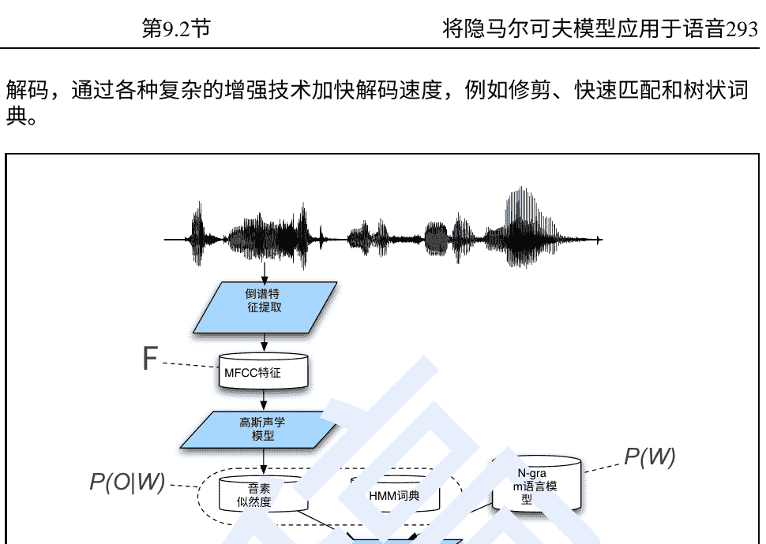

## 9.2 将隐马尔可夫模型应用于语音

现在让我们来看看如何将HMM模型应用于语音识别。我们在第6章中看到，隐马尔可夫模型由以下组件特征化：

| 组件 | 描述 |
| :--- | :--- |
| $Q = q_1 q_2 \dots q_N$ | 一组状态 |
| $A$ (一个 $n \times n$ 转移概率矩阵) | 每个 $a_{ij}$ 表示从状态 $i$ 转移到状态 $j$ 的概率，即 $\sum_{j=1}^{N} a_{ij} = 1 \ \forall i$ |
| $O = o_1 o_2 \dots o_N$ | 一组观测值，每个观测值都来自于一个词汇表 $V = v_1, v_2, ..., v_V$ |
| $B = b_i(o_t)$ | 一组观测概率：也称为发射概率，每个概率表示一个观测值 $o_t$ 从状态 $i$ 生成的概率。 |
| $q_0, q_{end}$ | 一个特殊的开始和结束状态，它们与观测值无关。 |

# 第294章. 自动语音识别

此外，该章节介绍了用于解码HMM的维特比算法，以及用于训练HMM的鲍姆-韦尔奇或前向-后向算法。HMM范式的所有这些方面在ASR中起着至关重要的作用。我们从讨论状态、转移和观测如何映射到语音识别任务开始。我们将在第9.6节中回顾Viterbi解码在ASR中的应用。处理口语的鲍姆-韦尔奇算法的扩展在第9.4节和第9.7节中介绍。

回想一下我们在本书中早期看到的HMM示例。在第5章中，HMM的隐藏状态是词性，观测是单词，解码任务是将单词序列映射到词性序列。在第6章中，HMM的隐藏状态是天气，观测是“冰淇淋消费”，解码任务是从冰淇淋消费序列中确定天气序列。对于语音，隐藏状态可以是音素、音素部分或单词，每个观测是关于波形在某一时刻的频谱和能量的信息，解码过程将这个声学信息序列映射到音素和单词。

语音识别的观测序列是一系列声学特征向量。每个声学特征向量表示特定时间点上不同频段中的能量等信息。我们将在第9.3节中讨论这些观测的性质，但现在我们只需注意每个观测由一个包含39个实值特征的向量组成，表示频谱信息。观测通常每10毫秒进行一次，因此1秒的语音需要100个频谱特征向量，每个向量长度为39。

隐马尔可夫模型的隐藏状态可以用多种方式来建模语音。对于像数字识别这样的小任务（识别由零到九的10个数字单词）或者是非识别（识别两个单词是和否），我们可以构建一个隐藏状态对应整个单词的HMM。然而，对于大多数更大的任务，HMM的隐藏状态对应类似音素的单元，而单词是这些音素单元的序列。

让我们从描述一个HMM模型开始，其中HMM的每个状态对应一个单个音素（如果你忘记了音素是什么，请回到第7章的定义中再看一遍）。在这样的模型中，一个单词的HMM由一系列HMM状态连接在一起。图9.4显示了一个基本的音素状态HMM的结构示意图，用于单词 *six*。

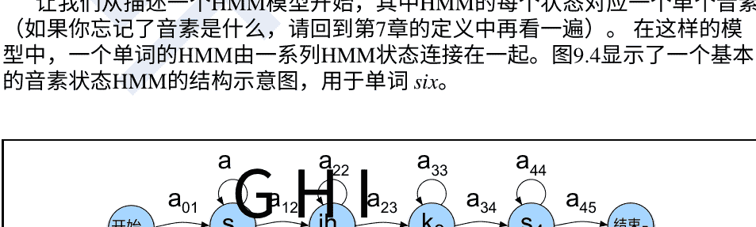

> > 图9.4 了一个单词 *six*的HMM，包括四个发射状态、两个非发射状态和转移概率A。观测概率 B没有显示出来。

请注意，图9.4中只存在某些音素之间的连接。在第6章中描述的HMM中，状态之间存在任意的转移；任何状态都可以转移到任何其他状态。这在第5章中用于词性标注的HMM中也是原则上成立的；尽管某些标记之间的转移概率很低，但任何标记原则上，可以遵循任何其他标签。与其他HMM应用不同，语音识别的HMM模型不允许任意转换。相反，它们基于语音的顺序性对转换施加了严格的限制。除非是特殊情况，否则语音的HMM不允许状态之间的转换回到之前的状态；换句话说，状态只能转换到自身或者后续状态。正如我们在第6章中所看到的，这种从左到右的HMM结构被称为Bakis网络。

用于语音的最常见模型，如图9.4所示，更加受限，只允许状态转换到自身（自环）或者单个后续状态。使用自环允许一个音素重复以覆盖可变数量的声学输入。音素持续时间差异很大，取决于音素的特征、说话者的语速、音素上下文和词语的韵律突出程度。观察Switchboard语料库，音素[aa]的长度从7毫秒到387毫秒（1到40帧）不等，而音素[z]在某些话语中的持续时间从7毫秒到超过1.3秒（130帧）不等！因此，自环允许一个状态重复多次。

对于非常简单的语音任务（识别少量单词，如10个数字），使用HMM状态来表示一个音素就足够了。然而，在一般的LVCSR任务中，需要更精细的表示。这是因为音素可以持续超过1秒，即超过100帧，但这100帧在声学上并不相同。音素的频谱特性和能量量级在音素之间变化很大。例如，回顾第7章，塞音有一个闭合部分，其声学能量很小，然后是一个释放爆破。

同样，双元音是元音，其F1和F2变化显著。图9.5显示了单词“Ike”中两个音素随时间变化的频谱特性的大幅变化，ARPAbet [ay k]。

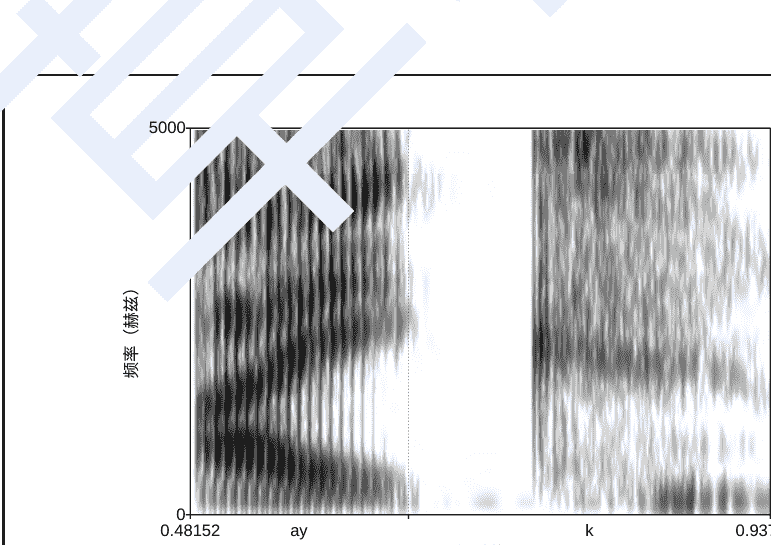

为了捕捉关于音素随时间的非均匀性的事实，在LVCSR中，我们通常用多个HMM状态来建模一个音素。最常见的配置是使用三个HMM状态，即开始、中间和结束状态。因此，每个音素由3个发射HMM状态组成，而不是一个（两端还有两个非发射状态），如图9.6所示。通常将单词模型或音素模型保留用于指代整个5个状态的音素HMM，并使用HMM状态一词。（或简称为状态）指的是每个3个独立子音HMM状态。

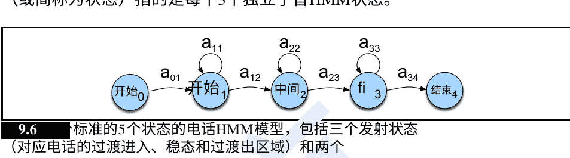

使用这些更复杂的电话模型构建整个单词的HMM，我们只需将图9.4中单词模型的每个电话替换为一个3状态的电话HMM。我们将每个电话模型的非发射开始和结束状态替换为直接过渡到前一个和后一个电话的发射状态，整个单词只剩下两个非发射状态。图9.7显示了扩展后的单词。

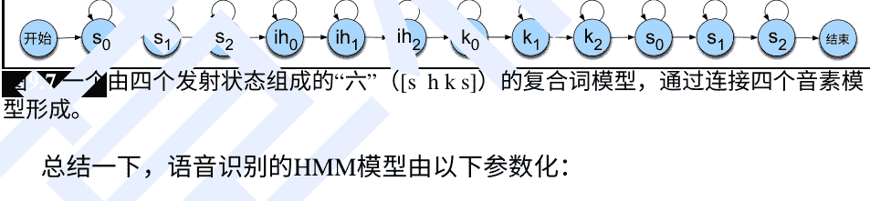

总结一下，语音识别的HMM模型由以下参数化:

-   $Q = q_1 q_2 \ldots q_N$：一组与子音对应的状态
-   一个转移概率矩阵$A$，表示每个子音进行自循环或转到下一个子音的概率。
-   $B = b_i(o_t)$：一组观测概率，也称为发射概率，表示从子音状态$i$生成倒谱特征向量（观测）的概率。

从另一个角度看，概率$A$和状态$Q$共同表示一个词典：一组单词的发音，每个发音由一组子音组成，子音的顺序由转移概率$A$指定。

我们现在已经介绍了用于表示语音识别中的音素和单词的HMM状态的基本结构。在本章后面的部分，我们将看到HMM单词模型的进一步增强，如图9.7所示，例如使用利用音素上下文的三音素模型，以及使用特殊音素来建模静音。首先，

## 9.3 特征提取：MFCC向量

本节中，我们的目标是描述如何将输入波形转换为一系列声学特征向量，每个向量表示信号中一个小时间窗口的信息。虽然有许多可能的特征表示方法，但在语音识别中，最常见的是MFCC（梅尔频率倒谱系数）。

这些基于倒谱的重要思想。我们将倒谱我们首先从第7.4.2节重复处理模拟语音波形的过程。

回想一下，处理语音的第一步是将模拟表示（首先是气压，然后是麦克风中的模拟电信号）转换为数字信号。这个过程称为模拟到数字转换，包括两个步骤：采样和量化。通过在特定时间测量其幅度来对信号进行采样；采样率是每秒采样数。为了准确测量波形，每个周期至少需要两个样本：一个测量波形的正部分，一个测量波形的负部分。每个周期超过两个样本会增加幅度的准确性，但少于两个样本会完全错过波形的频率。因此，能够测量的最大频率波形的频率是采样率的一半（因为每个周期需要两个样本）。对于给定的采样率，这个最大频率被称为奈奎斯特频率。人类语音中的大部分信息都在低于10,000 Hz的频率范围内；因此，对于完全准确的测量，需要20,000 Hz的采样率。

奈奎斯特频率

但是电话语音经过交换网络的滤波，只有低于4,000 Hz的频率被传输到电话中。因此，8,000 Hz的采样率对于类似Switchboard语料库的电话带宽语音是足够的。16000 Hz的采样率（有时称为宽带）通常用于麦克风语音。即使是8,000赫兹的采样率，每秒的语音也需要8000个幅度测量值，因此高效地存储幅度测量值非常重要。它们通常以整数形式存储，可以是8位（取值范围为-128至127）或16位（取值范围为-32768至32767）。将实数表示为整数的过程称为量化，因为存在最小的粒度（量子大小），所有比这个量子大小更接近的值都被表示为相同的值。

我们将数字化量化波形中的每个样本称为 x[n]，其中 n是时间的索引。现在我们有了数字化的、量化的表示波形，我们准备提取MFCC特征。这个过程的七个步骤在图9.8中显示，并在以下各节中分别描述。

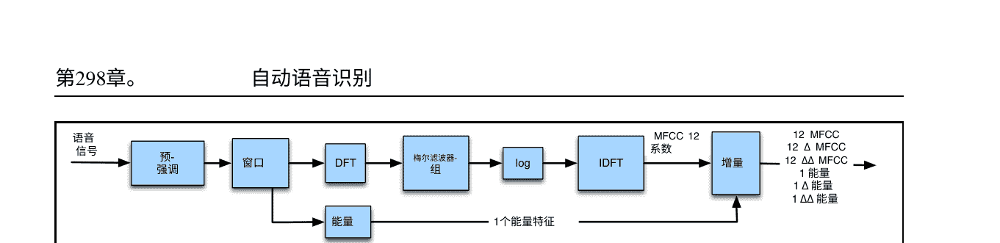

### 9.3.1 预加重

MFCC特征提取的第一阶段是增强高频能量的数量。事实证明，如果我们观察像元音这样的有声片段的频谱，低频比高频有更多的能量。这种频率上的能量下降（称为频谱倾斜）是由于其性质引起的。声门脉冲的增强高频能量使得这些更高的共振峰的信息更容易被声学模型获取，并提高了音素检测的准确性。

这种预加重是通过使用一个滤波器来完成的。图9.9展示了第一作者在预加重之前和之后对单个元音[aa]的频谱切片的示例。

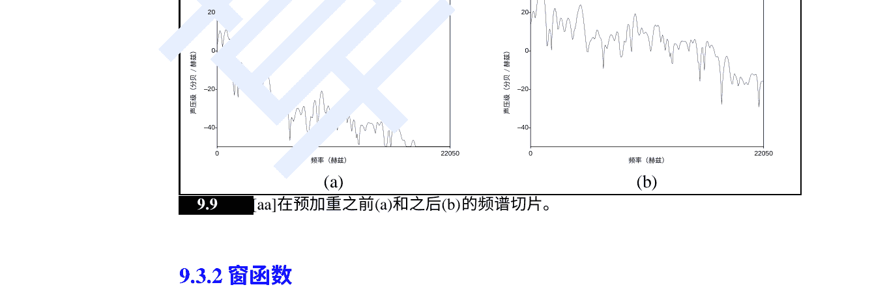

> 对于已经学过信号处理的学生：这种预加重滤波器是一个一阶高通滤波器。在时域中，输入为 x[n] ，且0.9 ≤ α ≤ 1.0，则滤波器方程为 y[n] = x[n] - α x[n-1]。

### 9.3.2 窗函数

回想一下，特征提取的目标是提供能够帮助我们构建音素或子音素分类器的频谱特征。因此，我们不希望从整个话语或对话中提取我们的频谱特征，因为频谱变化非常快。从技术上讲，我们说语音是一个非平稳信号，这意味着它的统计特性在时间上不是恒定的。相反，我们希望提取频谱从一个小的窗口中提取特征，该窗口描述了一个特定的子音，并且我们可以（粗略地）假设信号是静止的（即其统计特性在该区域内是恒定的）。我们将通过使用一个在某个区域内非零而在其他地方为零的窗口，沿着语音信号运行该窗口，并提取该窗口内的波形来实现这一点。

我们可以通过三个参数来描述这样的窗口处理过程：窗口的宽度（以毫秒为单位），连续窗口之间的偏移量，以及窗口的形状。我们将从每个窗口中提取的语音称为帧，并且我们将帧的毫秒数称为帧大小，左边缘之间的毫秒数称为连续窗口之间的毫秒数称为帧移。

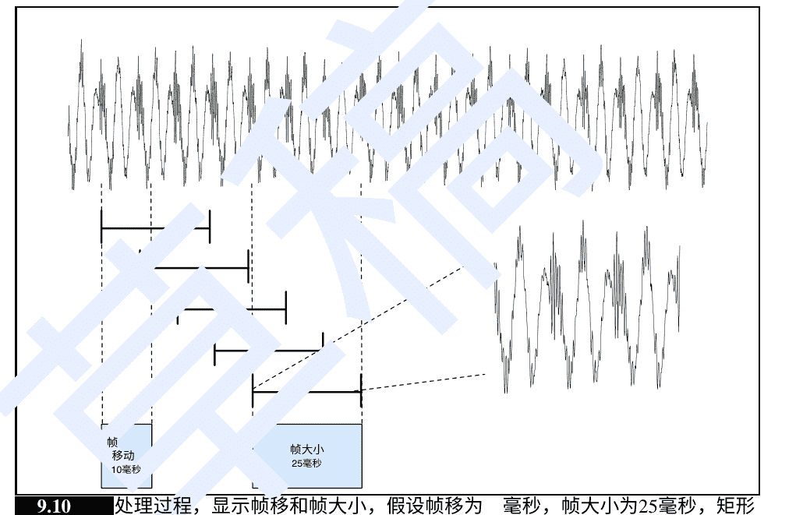

> 9.10 处理过程，显示帧移和帧大小，假设帧移为 毫秒，帧大小为25毫秒，矩形窗口。B yan P llom的一幅图后。

通过将信号在时间 n，s[n]处的值与时间 n，w[n]处的窗口值相乘，进行信号的提取：

```
y[n] = w[n]s[n]
```

图9.10表明这些窗口形状是矩形的，因为提取的窗口信号看起来与原始信号一样。事实上，最简单的窗口是矩形窗口。然而，矩形窗口可能会导致问题，因为它会在边界处突然截断信号。当我们进行傅里叶分析时，这些不连续性会导致问题。因此，在MFCC提取中，更常用的窗口是汉明窗口，它会在窗口边界处将信号值收缩至零，避免不连续性。图9.11显示了这两个窗口；方程如下（假设窗口长度为 L帧）：

```
(9.10) 矩形 $w[n] = \begin{cases} 1 & 0 \leq n \leq L-1 \\ 0 & \text{否则} \end{cases}$
```

```
(9.11) 汉明 $w[n] = \begin{cases} 0.54 - 0.46 \cos(\frac{2\pi n}{L}) & 0 \leq n \leq L-1 \\ 0 & \text{否则} \end{cases}$
```

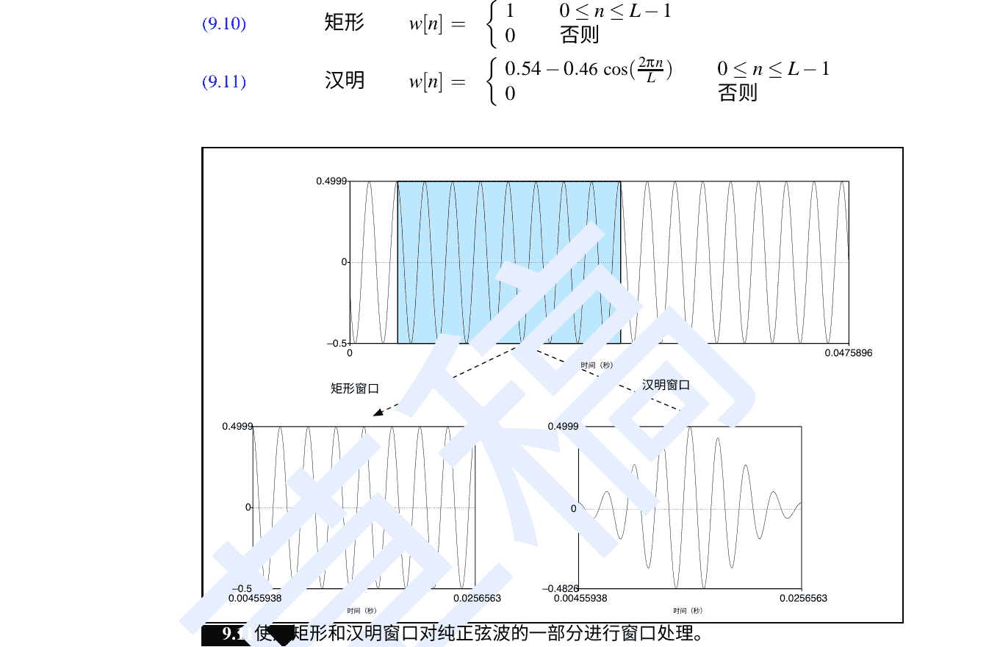

### 9.3.3 离散傅里叶变换

下一步是提取窗口信号的频谱信息；我们需要知道信号在不同频带上包含多少能量。提取离散时间（采样）信号的离散频带的频谱信息的工具是离散傅里叶变换（DFT）。

DFT的输入是一个窗口信号 $x[n]...x[m]$，而输出，对于每一个 $N$离散频带，是一个复数 $X[k]$表示原始信号中该频率分量的幅度和相位。如果我们将幅度绘制在频率上，我们可以可视化在第7章中介绍的频谱。例如，图9.12显示了一个25毫秒的汉明窗口信号及其通过DFT计算得到的频谱（附加了一些平滑处理）。

我们不会在这里介绍DFT的数学细节，只是要注意傅里叶分析通常依赖于欧拉公式：

```
(9.12) $e^{j\theta} = \cos\theta + j\sin\theta$
```

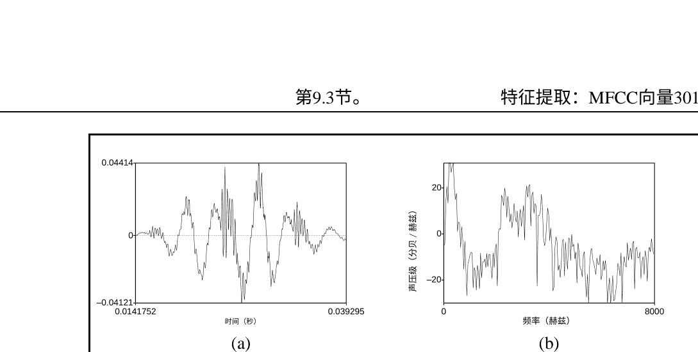

对于那些已经学过信号处理的学生，DFT的定义如下：

```
$$X[k] = \sum_{n=0}^{N-1} x[n] e^{-j2\pi kn/N}$$
```

计算DFT的常用算法是快速傅里叶变换或 FFT。这种DFT的实现非常高效，但只适用于N的值是2的幂次方。

### 9.3.4 梅尔滤波器组和对数

FFT的结果将提供每个频率带的能量信息。然而，人类听觉在所有频率带上的敏感度并不相同。在辨识特征提取过程中，模拟人类听觉的这种特性可以提高语音识别性能。MFCCs中使用的模型形式是将DFT输出的频率通过第7章提到的梅尔刻度进行变换。

梅尔 (et al., 1937; Stevens and Volkmann, 1940) 是一个音高单位，其定义为在听觉上等距离的音对之间相隔相等数量的梅尔。在赫兹和梅尔之间的映射在1000赫兹以下是线性的，在1000赫兹以上是对数的。梅尔频率 m可以通过以下方式从原始声学频率计算得到：

```
$$\text{梅尔}(f) = 1127 \ln(1 + \frac{f}{700})$$
```

在MFCC计算过程中，这个直觉是通过创建一组滤波器来实现的，这些滤波器从每个频带收集能量，其中10个滤波器在1000赫兹以下以线性间隔排列，其余的滤波器在1000赫兹以上以对数方式排列。图9.13显示了实现这个想法的三角滤波器组。

最后，我们对每个梅尔频谱值取对数。总体上，人类对信号水平的响应是对数的；在高振幅下，人类对振幅的微小差异不太敏感，而在低振幅下则更敏感。此外，使用对数可以使特征估计对输入的变化不太敏感（例如由于说话者的嘴巴离麦克风的距离变近或变远而引起的功率变化）。

## 9.13 滤波器组，取自Davis和Mermelstein（1980）。每个三角滤波器从给定的频率范围收集能量。滤波器在1000 Hz以下线性间隔，1000 Hz以上对数间隔。

这样可以使特征估计对输入的变化不太敏感（例如由于说话者的嘴巴离麦克风的距离变近或变远而引起的功率变化）。

### 9.3.5 倒离散傅里叶变换：倒谱

虽然单独使用梅尔频谱作为电话检测的特征表示是可能的，但频谱也存在一些问题，我们将在后面看到。因此，MFCC特征提取的下一步是计算倒谱。

倒谱具有许多有用的处理优势，也显著改善了语音识别性能。

一种思考倒谱的方式是将其视为一种有用的分离源和滤波器的方法。回顾第7.4.6节，语音波形是通过特定基频的声门源波形通过声道传递而形成的，由于其形状的不同，具有特定的滤波特性。但是声门源的许多特征（基频、声门脉冲的细节等）对于区分不同的音素并不重要。相反，对于音素检测来说，最有用的信息是滤波器，即声道的切位置。如果我们知道声道的形状，我们就会知道正在产生哪个音素。这表明，用于音素检测的有用特征将找到一种方法来解卷积（分离）源和滤波器，并仅显示声道滤波器。事实证明，倒谱是实现这一目标的一种方法。

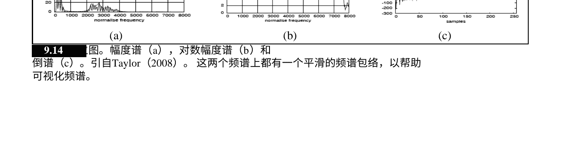

9.14 图。幅度谱（a），对数幅度谱（b）和倒谱（c）。引自Taylor（2008）。这两个频谱上都有一个平滑的频谱包络，以帮助可视化频谱。

为了简单起见，让我们忽略MFCC的预加重和梅尔变换，只看倒谱的基本定义。倒谱可以被看作是频谱的对数的频谱。这可能听起来令人困惑。但让我们从简单的部分开始：频谱的对数。也就是说，倒谱从标准幅度谱开始，例如 Taylor（2008）中的元音的幅度谱（图9.14 (a)）。然后我们取对数，即用对数替换幅度谱中的每个幅度值，如图9.14 (b) 所示。下一步是将对数频谱可视化为一个波形。换句话说，考虑图9.14 (b) 中的对数频谱。让我们想象去掉告诉我们这是一个频谱（x轴上的频率）的轴标签，并想象我们正在处理一个只有时间在x轴上的正常语音信号。现在我们能对这个“伪信号”的频谱说些什么呢？注意这个波中有一个高频重复的成分：每1000个点中大约重复8次的小波，频率约为120 Hz。这个高频成分是信号的基频引起的，在信号的每个谐波处有小峰。此外，这个“伪信号”中还有一些较低频率的成分；例如，包络或共振峰结构在窗口中有大约四个大峰，频率要低得多。

图9.14(c)展示了倒谱：我们一直在描述的频谱的对数频谱。这个倒谱（倒谱这个词是由频谱的前几个字母颠倒而成的）在x轴上显示了样本。这是因为通过对对数频谱进行频谱分析，我们已经离开了频谱的频率域，回到了时域。事实证明，倒谱的正确单位是样本。

检查这个倒谱，我们可以看到在120附近确实有一个大的峰值，对应于F0，代表声门脉冲。在x轴的较低值处还有其他各种组成部分。这些代表声道滤波器（舌头和其他发音器官的位置）。因此，如果我们有兴趣检测音素，我们可以只使用较低的倒谱值。如果我们有兴趣检测音高，我们可以使用较高的倒谱值。

为了MFCC提取的目的，我们通常只取前12个倒谱系数的值。这12个倒谱系数将仅代表关于声道滤波器的信息，与声门源的信息完全分离。

事实证明，倒谱系数具有非常有用的特性，即不同系数的方差往往是不相关的。这在频谱上并不成立，不同频带的谱系数是相关的。倒谱特征不相关的事实意味着，正如我们将在下一节中看到的那样，高斯声学模型（高斯混合模型或GMM）不必表示所有MFCC特征之间的协方差，这极大地减少了参数的数量。

对于那些有信号处理经验的人来说，倒谱更正式地定义为信号的幅度谱的对数幅度的逆DFT，因此对于一个窗口化的语音帧 x[n]：

(9.15) c[n] = \sum_{n=0}^{N-1} log \left( \sum_{n=0}^{N-1} x[n] e^{-j\frac{2\pi}{N}kn} \right) e^{j\frac{2\pi}{N}kn}

### 9.3.6 增量和能量

通过前一节中的逆离散傅里叶变换提取倒谱，每帧得到12个倒谱系数。接下来我们添加第13个特征：帧的能量。能量与音素的身份相关，因此对于音素检测是一个有用的线索（元音和破擦音比较有能量，而塞音等则较少）。帧中的能量是帧是在时间上对帧中样本的功率求和；因此，对于一个窗口中的信号 x 从时间样本 t1 到时间样本 t2，能量为：

(9.16) 能量 = \sum_{t=t_1}^{t_2} x^2[t]

关于语音信号的另一个重要事实是它在帧与帧之间是不恒定的。这种变化，例如共振峰在转换时的斜率，或者从闭塞到爆破的变化的性质，可以为电话的识别提供有用的线索。因此，我们还添加了与倒谱特征随时间变化相关的特征。我们通过为每个13个特征（12个倒谱特征加上能量）添加一个增量或速度特征，以及一个双增量或加速度特征来实现这一点。每个13个增量特征表示相应倒谱/能量特征在帧之间的变化，而13个双增量特征表示相应增量特征在帧之间的变化。计算增量的一种简单方法就是计算帧之间的差异；因此，对于特定倒谱值 c(t) 在时间 t 处的增量值 d(t) 可以估计为：

(9.17) d(t) = \frac{c(t+1) - c(t-1)}{2}

然而，与这种简单估计相比，更常见的是使用更复杂的斜率估计方法，利用更广泛的帧上下文。

### 9.3.7 总结：MFCC

在将能量、增量和双增量特征添加到12个倒谱特征之后，我们最终得到39个MFCC特征：

- 12个倒频谱系数
- 12个增量倒频谱系数
- 12个双倍增量倒频谱系数
- 1个能量系数
- 1个增量能量系数
- 1个双倍增量能量系数
- 39个MFCC特征

## 9.4 计算声学可能性

上一节展示了我们如何从音频文件中提取代表光谱信息的MFCC特征，并在每10毫秒产生一个39维向量。现在我们准备好了解如何计算给定HMM状态的这些特征向量的可能性。回想一下第6章中，这个输出可能性是通过HMM的概率函数来计算的。给定一个单独的状态 $q_i$ 和一个观察 $o_t$，在 $B$ 矩阵中的观察可能性给出了 $p(o_t|q_i)$，我们称之为 $b_t(i)$。

在第5章中，用于词性标注的每个观测值 $o_t$ 都是一个离散符号（一个单词），我们可以通过计算在训练集中给定标签生成给定观测值的次数来计算观测值给定词性标签的可能性。但是对于语音识别，MFCC向量是实值数；我们无法通过计算每个这样向量出现的次数（因为每个向量可能是唯一的）来计算给定状态（电话）生成MFCC向量的可能性。

在解码和训练中，我们需要一个能够计算实值观测值上的观测可能性函数 $p(o_t|q_i)$。在解码中，我们给定一个观测值 $o_t$，并且我们需要为每个可能的HMM状态计算概率 $p(o_t|q_i)$，以便我们可以选择最可能的状态序列。一旦我们有了这个观测可能性，为了修改 Baum-Welch 算法的 Ch. 6 以将其作为训练 HMMs 的一部分，我们需要弄清楚如何修改 B 函数。

### 9.4.1 向量量化

使 MFCC 向量看起来像我们可以计数的符号的一种方法是构建一个映射函数，将每个输入向量映射到少量的符号之一。然后，我们可以通过计数这些符号来计算概率，就像在词性标注中计算单词一样。将输入向量映射为离散的量化符号的这个想法被称为向量量化或 **VQ** (Gray, 1984)。虽然向量量化对于现代 LVCSR 系统中的声学模型来说过于简单，但它是一个有用的教学步骤，并在 ASR 的各个领域中起着重要作用，因此我们将其用于开始我们的声学建模讨论。

在向量量化中，我们通过将每个训练特征向量映射到少量的类别来创建小的符号集，然后用离散的符号表示每个类别。更正式地说，向量量化系统由一个码本、一个聚类算法和一个距离度量所特征化。

- 码本：一个码本是可能的类别列表，构成一个词汇。
- 原型向量 $V = \{v_1, v_2, ..., v_n\}$。对于码本中的每个符号 $v_k$，我们列出一个原型向量，码字也称为码字，它是一个特定的特征向量。例如，如果我们可以选择使用256个码字，我们可以用0到255之间的值来表示每个向量；（这被称为8位VQ，因为我们可以用一个单独的8位值来表示每个向量）。这256个值中的每一个都将与一个原型特征向量相关联。

通过使用一个聚类算法将训练集中的所有特征向量聚类到256个类别中来创建码本。 然后我们从聚类中选择一个代表性的特征向量，并将其作为该聚类的原型向量或码字。

K-means聚类经常被使用，但我们不会在这里定义聚类；详细描述请参见Huang等人（2001年）或Duda等人（2000年）的论文。

一旦我们建立了码本，对于每个输入的特征向量，我们将其与256个原型向量中的每一个进行比较，选择最接近的一个（通过某种距离度量），并用该原型向量的索引替换输入向量。 图9.15显示了这个过程的示意图。

VQ的优点在于，由于类别是有限的，对于每个类别v_k，我们可以计算它由给定的HMM状态/子音生成的概率，只需在某个训练集上标记为该状态时计算它出现的次数，并进行归一化。


#### 距离度量

聚类过程和解码过程都需要一个距离度量或者失真度量，它指定了两个声学特征向量的相似程度。 距离度量用于构建聚类，为每个聚类找到原型向量，并将输入向量与原型进行比较。

##### 欧氏距离

声学特征向量的最简单距离度量是欧氏距离。欧氏距离是在N维空间中两个向量定义的两点之间的距离。 实际上，我们使用“欧氏距离”这个词组，尽管我们实际上经常使用欧氏距离的平方。 因此，给定长度为D的向量 x 和向量 y，它们之间的（欧氏距离的平方）定义为：

(9.18) d_euclidean(x, y) = ∑_{i=1}^{D} (x_i - y_i)^2

欧几里得距离（9.18中描述，并在图9.16中显示为二维）也被称为平方和误差，也可以使用向量转置运算符表示：

(9.19) $d_{\text{欧几里得}}(x, y) = (x - y)^T (x - y)$

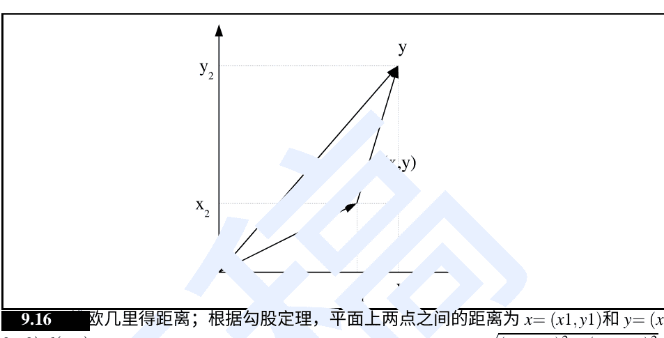

9.16 欧几里得距离；根据勾股定理，平面上两点之间的距离为 $x=(x1, y1)$ 和 $y=(x2, y2)$，$d(x,y) = \sqrt{(x1 - x2)^2 + (y1 - y2)^2}$。

欧几里得距离度量假设特征向量的每个维度都同等重要。但实际上，每个维度的方差都非常不同。如果一个维度倾向于具有很大的方差，那么我们希望在距离度量中给它更少的权重；低方差维度上的大差异应该比高方差维度上的大差异更重要。稍微复杂一些的距离度量，马氏距离，考虑了不同的每个维度的方差。

##### 马哈拉诺比斯距离

如果我们假设声学特征向量的每个维度 $i$ 的方差为 $\sigma_i^2$，则马哈拉诺比斯距离为：

(9.20) $d_{\text{马哈拉诺比斯}}(x, y) = \sum_{i=1}^{D} \frac{(x_i - y_i)^2}{\sigma_i^2}$

对于那些在线性代数方面有更多背景的读者，这是马哈拉诺比斯距离的一般形式，其中包括一个完整的协方差矩阵（协方差矩阵将在下面定义）：

(9.21) $d_{\text{马哈拉诺比斯}}(x, y) = (x - y)^T \Sigma^{-1} (x - y)$

总之，在解码语音信号时，为了计算给定HMM状态 $q_j$ 的特征向量 $o_t$ 的声学似然度，我们计算特征向量与每个N个码字之间的欧氏距离或马哈拉诺比斯距离，选择最接近的码字，得到码字索引 $v_k$。然后，我们在HMM中定义的预计算 $B$ 似然度矩阵中查找给定HMM状态 $j$ 的码字索引 $v_k$ 的似然度：

由于向量量化(VQ)很少被使用，我们不在这里给出修改EM算法以处理VQ数据的方程式；相反，我们将在下一节中介绍连续输入参数的EM训练时，再讨论这个问题。

### 9.4.2 高斯概率密度函数

向量量化具有计算非常简单且需要很少存储空间的优点。尽管有这些优点，向量量化并不是语音的好模型。少量码字无法捕捉到语音信号的广泛变化。语音并不是一个分类的、符号化的过程。

因此，现代语音识别算法不使用向量量化来计算声学似然度。相反，它们基于对实值连续输入特征向量直接计算观测概率。这些声学模型基于计算连续输入特征向量上的概率密度函数(pdf)。

迄今为止，计算声学可能性最常见的方法是高斯混合模型 (GMM) pdfs，尽管神经网络、支持向量机 (SVMs) 和条件随机场 (CRFs) 也被使用。让我们从最简单的高斯概率估计器开始，逐渐构建更复杂的模型。

#### 单变量高斯分布

高斯分布，也被称为正态分布，是基本统计学中熟悉的钟形曲线函数。高斯分布是一个由均值或平均值和方差参数化的函数，方差描述了离均值的平均扩散或离散程度。我们将使用 μ表示均值，使用 σ²表示方差，给出高斯函数的以下公式：

$$f(x|\mu, \sigma) = \frac{1}{\sqrt{2\pi\sigma^2}}exp(-\frac{(x-\mu)^2}{2\sigma^2})$$

从基本统计学中回忆起，随机变量 X的均值是 X的期望值。对于离散变量 X，这是 X值的加权和（对于连续变量，这是积分）：

$$\mu = E(X) = \sum_{i=1}^{N} p(X_i)X_i$$

随机变量 X的方差是离均值的加权平方平均偏差：

$$\sigma^2 = E[(X - E(X))^2] = \sum_{i=1}^{N} p(X_i)(X_i - E(X))^2$$

当高斯函数被用作概率密度函数时，曲线下的面积被限制为等于一。然后，随机变量的概率通过计算曲线下的面积，可以计算随机变量在任何特定值范围内的概率。图9.18显示了高斯分布区间下的概率。

我们可以使用单变量高斯概率密度函数来估计特征向量的一个维度由特定的HMM状态 $j$ 生成的概率，假设观测特征向量的（这个维度的）可能值 $o_t$ 是正态分布。换句话说，我们将观测似然函数表示为一个高斯函数 $b_j(o_t)$ 对于声学向量的一个维度，我们将其假设为一个高斯函数。暂时将我们的观测作为一个实数（一个倒谱特征），并假设每个HMM状态 $j$ 都有与之关联的均值 $\mu_j$ 和方差 $\sigma_j^2$，我们通过高斯概率密度函数的方程计算似然 $b_j(o_t)$：

$b_j(o_t) = \frac{1}{\sqrt{2\pi\sigma_j^2}} exp\left( -\frac{(o_t - \mu_j)^2}{2\sigma_j^2} \right) \tag{9.26}$

方程式9.26向我们展示了如何计算单个声学观测在状态 $j$ 中的单变量高斯分布下的似然概率 $b_j(o_t)$。我们现在可以在HMM解码中使用这个概率。

但是首先我们需要解决训练问题：我们如何计算每个HMM状态 $q_i$ 的高斯分布的均值和方差？让我们先想象一个更简单的情况，即完全标记的训练集，其中每个声学观测都标记有产生它的HMM状态。在这样的训练集中，我们可以通过对每个与状态 $i$ 对应的值取平均值来计算每个状态的均值，如方程式(9.27)所示。方差可以通过每个观测与均值之间的平方误差之和来计算，如方程式(9.28)所示。

$\hat{\mu}_i = \frac{1}{T} \sum_{t=1}^T o_t \quad \text{s.t.} \ q_t \text{ 是状态 i} \tag{9.27}$

$\hat{\sigma}_j^2 = \frac{1}{T} \sum_{t=1}^T (o_t - \mu_i)^2 \quad \text{s.t.} \ q_t \text{ 是状态 i} \tag{9.28}$

但是由于状态在HMM中是隐藏的，我们不知道确切地哪个观测向量 $o_t$ 是由哪个状态产生的。我们想要做的是将每个观测向量 $o_t$ 分配给每个可能的状态 $i$，按照HMM在时间 $t$ 处于状态 $i$ 的概率进行比例分配。幸运的是，我们已经知道如何进行这种比例分配；在第6章中，状态 $i$ 在时间 $t$ 处的概率被定义为 $\xi_t(i)$，我们已经看到如何使用前向和后向概率来计算 $\xi_t(i)$ 作为Baum-Welch算法的一部分。Baum-Welch是一个迭代算法，我们需要迭代地进行概率计算 $\xi_t(i)$，因为获得更好的观测概率 $b$ 也将帮助我们更加确定在某个时间处于某个状态的概率 $\xi$。

因此，我们给出了计算更新的均值和方差 $\hat{\mu}$ 和 $\hat{\sigma}^2$ 的方程：

$\hat{\mu}_i = \frac{\sum_{t=1}^T \xi_t(i) o_t}{\sum_{t=1}^T \xi_t(i)} \tag{9.29}$

$\hat{\sigma}_i^2 = \frac{\sum_{t=1}^T \xi_t(i) (o_t - \mu_i)^2}{\sum_{t=1}^T \xi_t(i)} \tag{9.30}$

然后，在隐马尔可夫模型的前向-后向（Baum-Welch）训练中使用了第9.29和第9.30等式。正如我们将看到的，$\mu_i$ 和 $\sigma_i$ 的值首先被设置为某个初始估计值，然后重新估计直到收敛。

#### 多元高斯分布

第9.26等式展示了如何使用高斯分布来计算单个倒谱特征的声学似然度。由于声学观测是一个39个特征的向量，我们需要使用多元高斯分布，它允许我们为一个39维向量分配概率。一个单变量高斯分布由均值 μ 和方差 σ² 定义，而一个多元高斯分布由维度为D的均值向量 \(\vec{\mu}\) 和协方差矩阵 Σ 定义，如下所示。正如我们在前一节中讨论的，对于LVCSR中的典型倒谱特征向量，D为39：

(9.31) \[ f(\vec{x}|\vec{\mu}, \Sigma) = \frac{1}{(2\pi)^{\frac{D}{2}}|\Sigma|^{\frac{1}{2}}} \exp \left( -\frac{1}{2}(x - \mu)^T \Sigma^{-1} (x - \mu) \right) \]

协方差矩阵Σ捕捉了每个维度的方差以及任意两个维度之间的协方差。

再次回顾基本统计知识，两个随机变量X和Y的协方差是它们与均值的平均偏差乘积的期望值：

(9.32) \[ \text{Cov}(X, Y) = E[(X - E(X))(Y - E(Y))] = \sum_{i=1}^{N} p(X_i, Y_i)(X_i - E(X))(Y_i - E(Y)) \]

因此，对于给定的HMM状态，具有均值向量 \(\mu_j\) 和协方差矩阵 \(\Sigma_j\)，以及给定的观测向量 \(o_t\)，多元高斯概率估计为：

(9.33) \[ b_j(o_t) = \frac{1}{(2\pi)^{\frac{D}{2}}|\Sigma_j|^{\frac{1}{2}}} \exp \left( -\frac{1}{2}(o_t - \mu_j)^T \Sigma_j^{-1} (o_t - \mu_j) \right) \]

协方差矩阵 \(\Sigma_j\) 表示每对特征维度之间的方差。假设我们简化地假设不同维度的特征不相关，即特征向量的不同维度之间没有相关性。在这种情况下，我们可以简单地为每个特征维度保留一个不同的方差。事实证明，保留每个维度的单独方差等效于具有对角协方差矩阵。

对角线：非零元素仅出现在矩阵的主对角线上。这样的对角协方差矩阵的主对角线包含每个维度的方差，\(\sigma_1^2, \sigma_2^2, ...\sigma_D^2\)；

让我们看一些多元高斯分布的示例，重点关注完全协方差矩阵与对角协方差矩阵的作用。我们将探索一个只有2个维度的简单多元高斯分布，而不是ASR中典型的39个维度。图9.19显示了两个维度中的三个不同的多元高斯分布。最左边的图显示了一个具有对角协方差矩阵的高斯分布，其中两个维度的方差相等。图9.20显示了与图9.19中的高斯分布对应的3个等高线图；每个图都是通过高斯分布的切片。图9.20中最左边的图显示了对角等方差高斯分布的切片。切片是圆形的，因为X和Y方向上的方差相等。

图9.19中的中间图显示了一个具有对角协方差矩阵的高斯分布，但方差不相等。从这个图中可以清楚地看出，尤其是从# 第312章。自动语音识别

在协方差矩阵的非对角线上：

如图9.20所示的等高线切片显示，在一个维度上的方差比另一个维度大3倍以上。

图9.19和图9.20中的最右边的图显示了一个具有非对角协方差矩阵的高斯分布。请注意图9.20中的等高线图与两个坐标轴不对齐，而其他两个图中是对齐的。因此，在一个维度上知道一个值可以帮助预测另一个维度上的值。

因此，具有非对角协方差矩阵可以用来建模多个维度中特征值之间的相关性。

具有完整协方差矩阵的高斯分布比具有对角协方差矩阵的高斯分布更具有建模声学似然性的能力。事实上，使用具有完整协方差矩阵的高斯分布比使用具有对角协方差矩阵的高斯分布在语音识别性能上更好。但是，具有完整协方差矩阵的高斯分布存在两个在实践中使用困难的问题。首先，计算速度较慢。完整协方差矩阵具有 $D^2$ 个参数，而对角协方差矩阵只有 $D$ 个参数。这在实际自动语音识别系统中会导致速度上的显著差异。其次，完整协方差矩阵具有更多的参数，因此需要更多的数据来训练，而对角协方差矩阵则需要更少的数据。使用对角协方差模型意味着我们可以节省空间。

使用我们的参数来处理其他事物，如三音素（上下文相关音素），将在第10.3节介绍。
因此，实际上大多数自动语音识别系统使用对角协方差。 在本节的剩余部分中，我们将假设对角协方差。
因此，Eq. 9.33可以简化为（9.34）中的版本，其中我们只需保留每个维度的均值和方差，而不是协方差矩阵。Eq. 9.34描述了如何估计给定HMM状态j的D维特征向量o_t的似然 b(o_t)。使用对角协方差多元高斯分布。

(9.34)
$$ b_j(o_t) = \prod_{d=1}^{D} \frac{1}{\sqrt{2\pi\sigma_{jd}^2}} exp\left( -\frac{1}{2} \frac{(o_{td} - \mu_{jd})^2}{\sigma_{jd}^2} \right) $$

训练对角协方差多元高斯分布是对训练单变量高斯分布的简单推广。我们将使用相同的Baum-Welch训练，其中我们使用 ξ(i) 的值来告诉我们在时间t处于状态 i 的可能性。 实际上，我们将使用与（9.30）中相同的方程，只是现在我们处理的是向量而不是标量；观测值 o_t 是一个倒谱特征向量，均值向量 μ 是一个倒谱均值向量，方差向量 σ_i^2 是一个倒谱方差向量。

(9.35)
$$ \hat{\mu}_i = \frac{\sum_{t=1}^{T} \xi_t(i) o_t}{\sum_{t=1}^{T} \xi_t(i)} $$

(9.36)
$$ \hat{\sigma}_i^2 = \frac{\sum_{t=1}^{T} \xi_t(i) (o_t - \mu_i)(o_t - \mu_i)^T}{\sum_{t=1}^{T} \xi_t(i)} $$

### 高斯混合模型

前一小节展示了我们可以使用多元高斯模型为声学特征向量观测分配一个似然分数。 这将每个特征向量的维度建模为一个正态分布。 但是，特定的倒谱特征可能具有非常非正态的分布；假设正态分布可能是一个过于强大的假设。 因此，我们经常使用加权混合多元高斯模型来建模观测似然，而不是使用单个多元高斯模型。这样的模型被称为高斯混合模型或GMM。

方程9.37显示了GMM函数的方程；得到的函数是M个高斯函数的和。图9.21展示了高斯混合模型如何建模任意函数的直观理解。

(9.37)
$$ f(x|\mu, \Sigma) = \sum_{k=1}^{M} c_k \frac{1}{\sqrt{2\pi|\Sigma_k|}} exp\left[ (x - \mu_k)^T \Sigma_k^{-1} (x - \mu_k) \right] $$

方程式9.38显示了输出似然函数的定义 b_j(o_t)

(9.38)
$$ b_j(o_t) = \sum_{m=1}^{M} c_{jm} \frac{1}{\sqrt{2\pi|\Sigma_{jm}|}} exp\left[ (o_t - \mu_{jm})^T \Sigma_{jm}^{-1} (o_t - \mu_{jm}) \right] $$

9.21 由3个高斯混合逼近的任意函数。

让我们来训练GMM似然函数。这可能看起来很难做到；如果我们事先不知道哪个混合物应该解释每个分布的哪个部分，我们怎么训练GMM模型呢？回想一下，即使我们不知道哪个状态解释了每个输出，我们仍然可以训练单个多元高斯分布，只需使用Baum-Welch算法告诉我们每个时间点的每个状态 j的可能性。事实证明，对于GMMs也可以使用相同的技巧；我们可以使用Baum-Welch告诉我们某个混合物解释观察的概率，并迭代更新这个概率。

我们使用上面的 ξ函数来帮助我们计算状态概率。类比于这个函数，让我们定义 ξ_{tm}(j)为在时间t时处于状态 j的概率。其中第 m个混合成分解释了输出观测 o_t的情况。我们可以按照以下方式计算 ξ_t m(j):

$$ \xi_{tm}(j) = \frac{\sum_{i=1}^N \alpha_{t-1}(j) a_{ij} c_{jm} b_{jm}(o_t) \beta_t(j)}{\alpha_T(F)} $$

现在，如果我们有之前一次Baum-Welch迭代的 ξ值，我们可以使用以下方程重新计算均值、混合权重和协方差:

$$ \hat{\mu}_{im} = \frac{\sum_{t=1}^T \xi_{tm}(i) o_t}{\sum_{t=1}^T \sum_{m=1}^M \xi_{tm}(i)} $$
$$ \hat{c}_{im} = \frac{\sum_{t=1}^T \xi_{tm}(i)}{\sum_{t=1}^T \sum_{k=1}^M \xi_{tk}(i)} $$
$$ \hat{\Sigma}_{im} = \frac{\sum_{t=1}^T \xi_{tm}(i) (o_t - \mu_{im}) (o_t - \mu_{im})^T}{\sum_{t=1}^T \sum_{k=1}^M \xi_{tm}(i)} $$

### 9.4.3 概率、对数概率和距离函数

到目前为止，我们给出的所有声学建模方程都使用了概率。然而，事实证明，对数概率（或logprob）比概率更容易处理。比概率更容易处理。因此，在语音识别（和相关领域）的实践中，我们计算对数概率而不是概率。

我们不能使用概率的一个主要原因是数值下溢。例如，要计算整个句子的似然度，我们需要将许多小的概率值相乘，每个10毫秒的帧都有一个概率值。将许多概率相乘会导致越来越小的数值，从而导致下溢。像小数这样的数值的对数.00000001 = 10^-8，另一方面，像 -8 这样的数字很容易处理。使用对数概率的第二个原因是计算速度。我们不再相乘概率，而是相加对数概率，而相加比相乘更快。对数概率在使用高斯模型时特别高效，因为我们可以避免指数运算。

因此，例如对于单个多元对角协方差高斯模型，我们不再计算：

$$b_j(o_t) = \prod_{d=1}^D \frac{1}{\sqrt{2\pi\sigma_{jd}^2}} \exp\left( -\frac{1}{2} \frac{(o_{td} - \mu_{jd})^2}{\sigma_{jd}^2} \right)$$

我们将计算

$$\log b_j(o_t) = -\frac{1}{2} \sum_{d=1}^D \left[ \log(2\pi) + \sigma_{jd}^2 + \frac{(o_{td} - \mu_{jd})^2}{\sigma_{jd}^2} \right]$$

通过对方程进行一些变换，我们可以重写这个方程并提取出一个常数C:

$$\log b_j(o_t) = C - \frac{1}{2} \sum_{d=1}^D \frac{(o_{td} - \mu_{jd})^2}{\sigma_{jd}^2}$$

其中C可以预先计算：

$$C = -\frac{1}{2} \sum_{d=1}^D \left( \log(2\pi) + \sigma_{jd}^2 \right)$$

总之，在对数域中计算声学模型意味着更简单的计算，其中大部分可以预先计算以提高速度。敏锐的读者可能已经注意到方程（9.45）看起来非常像马氏距离的方程（9.20）。实际上，思考高斯对数概率的一种方式就是将其视为加权距离度量。

对于那些有微积分知识的读者，关于高斯概率密度函数的进一步说明。尽管观测似然的方程（如（9.26））是基于高斯概率密度函数的使用，但它们返回的值并不是严格意义上的概率；实际上可能大于1。这是因为我们计算的是在一个点上的观测似然值，而不是在一个区域上的积分。虽然高斯概率密度函数曲线下的总面积被限制为1，但在任意点上的实际值可能大于1。（想象一个非常高而瘦的高斯曲线；在中心点上的值可能大于1，尽管曲线下的面积仍然是1）。如果我们在一个区域上进行积分，我们将每个点乘以它的宽度dx，这将使值降低到1以下。高斯估计不是真正的概率这个事实对于选择最可能的HMM状态并不重要，因为我们在比较不同的高斯函数，每个函数都缺少这个dx因子。316章

实际上，在任何点上的值可能大于1。（想象一个非常高而瘦的高斯曲线；在中心点上的值可能大于1，尽管曲线下的面积仍然是1.0）。如果我们在一个区域上进行积分，我们将每个点乘以它的宽度 $dx$，这将使值降低到1以下。高斯估计不是真正的概率这个事实对于选择最可能的HMM状态并不重要，因为我们在比较不同的高斯函数，每个函数都缺少这个dx因子。

总结一下，最近几个小节介绍了用于语音识别中声学训练的高斯模型。从简单的一元高斯开始，我们首先扩展到多元高斯以处理多维声学特征向量。然后我们介绍了对角协方差简化的高斯模型，接着介绍了高斯混合模型（GMMs）。

## 9.5 词典和语言模型

由于之前的章节已经广泛讨论了 $N$-gram语言模型（第4章）和发音词典（第7章），在本节中我们只是简要回顾一下给读者。

用于大词汇连续语音识别的语言模型往往是三元模型甚至四元模型；有很好的工具包可以构建和操作它们（Stolcke, 2002; Young et al., 2005）。对于大词汇应用，很少使用二元模型和一元语法。然而，由于三元模型需要大量的空间，对于内存受限的应用（如手机），语言模型往往使用较小的上下文（或使用压缩技术）。正如我们将在第24章中讨论的那样，一些简单的对话应用利用其有限的领域使用非常简单的有限状态或加权有限状态语法。

词典只是单词的列表，每个单词都有一个表示为音素序列的发音。像CMU字典（CMU, 1993）这样的公开可用的词典可用于提取常用于LVCSR的64,000个词汇。大多数单词只有一个发音，尽管一些单词（如同音词和常用功能词）可能有多个发音；大多数LVCSR系统中每个单词的平均发音数量似乎在1到2.5之间。第10章的第10.5.3节讨论了发音建模的问题。

## 9.6 搜索和解码

我们现在非常接近描述完整语音识别器的所有部分了。我们已经展示了如何提取帧的倒谱特征，以及如何计算该帧的声学似然度 $b_j(o_t)$。我们还知道如何表示词汇知识，即每个单词HMM由一系列音素模型组成，每个音素模型由一组子音素状态组成。最后，在第4章中，我们展示了如何使用使用 $N$-gram构建单词可预测性模型。

在本节中，我们展示如何结合所有这些知识来解决问题解码解码：将所有这些概率估计器组合起来产生最有可能的单词字符串。我们可以将解码问题表述为：“给定一串声学观测，我们应该如何选择具有最高后验概率的单词字符串？”

回顾一下本章开头的语音识别的噪声信道模型。在这个模型中，我们使用贝叶斯规则，结果是最好的单词序列是最大化两个因素的乘积，即语言模型先验和声学似然：

$$\hat{W} = \underset{W \in \mathcal{L}}{\mathrm{argmax}} \ P(O|W) \ P(W)$$

现在我们已经定义了声学模型和语言模型，我们准备看看如何找到这个最大概率的单词序列。不过，事实证明，我们需要对Eq. 9.47进行修改，因为它依赖于一些不正确的独立性假设。回想一下，我们训练了一个多元高斯混合分类器来计算特定声学观测（一帧）在特定状态（子音素）下的似然。通过计算每个声学帧的单独分类器，并将这些概率相乘得到整个单词的概率，我们严重低估了每个子音素的概率。这是因为帧之间存在很大的连续性；如果我们考虑声学上下文，我们对给定帧的期望会更大，因此可以给它分配更高的概率。因此，我们必须重新权衡这两个概率。

我们通过添加一个语言模型缩放因子或 LMSF来实现这一点，也称为语言权重。这个因子是语言模型概率 $P(W)$的指数。因为 $P(W)$小于1，而LMSF大于1（在许多系统中为5到15之间），这会导致LM概率的值减小：

$$\hat{W} = \underset{W \in \mathcal{L}}{\mathrm{argmax}} P(O|W)P(W)^{LMSF}$$

以这种方式重新加权语言模型概率 $P(W)$需要我们进行一次更改。这是因为 $P(W)$作为插入单词的惩罚也会产生副作用。在均匀语言模型的情况下，这一点最容易理解，其中词汇量为 $|V|$的每个单词具有相等的概率 $\frac{1}{|V|}$。在这种情况下，一个有 $N$个单词的句子对于每个单词都有 $\frac{1}{|V|}$的语言模型概率，总共会有 $\frac{1}{|V|}$的 $N$次方的惩罚。如果句子中的单词越多（即 $N$越大），则会多次乘以这个 $\frac{1}{|V|}$惩罚乘数，句子的概率就越低。因此，如果（平均而言）语言模型概率减小（导致更大的惩罚），解码器会更喜欢较少但更长的单词。如果语言模型概率增加（更大的惩罚），解码器会更喜欢更多但更短的单词。因此，我们使用LMSF来平衡声学模型的同时，也会减小插入单词的惩罚。

单词插入惩罚

为了抵消这一点，我们需要单独添加一个单词插入惩罚：

(9.49) $$\hat{W} = \underset{W \in \mathscr{L}}{\mathrm{argmax}} P(O|W)P(W)^{LMSF} WIP^N$$

由于在实践中我们使用对数概率，我们的解码器的目标是:

(9.50) $$\hat{W} = \underset{W \in \mathscr{L}}{\mathrm{argmax}} \log P(O|W) + LMSF \times \log P(W) + N \times \log WIP$$

现在我们有了一个要最大化的方程，让我们看看如何解码。解码器的工作是同时将话语分割成单词并识别每个单词。这个任务的难度在于变化，无论是单词在音素方面的发音方式，还是音素在声学特征方面的表达方式。

为了直观地了解问题的难度，想象一下语音识别任务的大大简化版本，其中解码器会得到一系列离散的音素。在这种情况下，我们会完全准确地知道每个音素是什么，但解码仍然很困难。例如，尝试从Switchboard语料库的（手工标记的）音素序列中解码以下句子（不要提前看！）：

> [ay d ih s hh er d s ah m th ih ng ax b aw m uh v ih ng r ih s en l ih]

答案在脚注中。<sup>2</sup>这个任务很难，部分原因是因为协同发音和快速说话（例如，[d]代表“just”中的第一个音素！）。但是这也很难，因为语音和英语书写不同，没有表示词边界的空格。真正的解码任务是非常困难的，我们必须同时识别音素和识别和分割单词。

对于解码，我们将从第6章介绍的维特比算法开始，在数字识别领域中，这是一个简单的任务，词汇量为11（数字一到九加零和oh）。

回想一下语音识别的HMM模型的基本组成部分：

$$Q = q_1 q_2 \ldots q_N$$ 一组与子音对应的状态
一个转移概率矩阵A，表示每个子音进行自循环或转到下一个子音的概率。

Q和A一起实现了一个发音词典，对于系统能够识别的每个单词，都有一个HMM状态图结构。

$$B = b_i(o_t)$$ 一组观测概率，也称为发射概率，表示从子音状态i生成倒谱特征向量（观测）的概率。

每个单词的HMM结构来自单词发音的词典。
通常我们使用现成的发音词典，比如在第7章中描述的免费的CMUdict词典。回顾一下第295页，单词的HMM结构在语音识别中，每个单词的HMM结构是由电话HMM的简单串联组成，每个电话由3个子电话状态组成，每个状态恰好有两个转移：自循环和到下一个电话的循环。因此，在我们的数字识别器中，每个数字单词的HMM结构简单地通过从词典中获取电话串，将每个电话扩展为3个子电话，并进行串联来计算。此外，我们通常在每个单词的末尾添加一个可选的静音电话，以允许单词之间的停顿。我们通常从某个版本的ARPA-bet中定义状态集合 Q，其中包括静音电话，并扩展为每个电话创建三个子电话。

HMM的The A and B矩阵是通过Baum-Welch算法在嵌入式训练过程中进行训练的，我们将在第9.7节中描述。现在我们假设这些概率已经训练好。

图9.22显示了数字识别的结果HMM。请注意，我们添加了非发射的起始和结束状态，每个单词的末尾到结束状态的转换，以及从结束状态返回到起始状态的转换，以便处理数字序列。还要注意每个单词末尾的可选静音音素。

在许多数字情况下（电话号码或信用卡号码），数字识别器通常不使用单词概率，因为每个数字可能具有相等的出现概率。但是在图9.22中，我们已经将转移概率包含在每个单词中，主要是为了展示在其他类型的识别任务中可能存在的这些概率。碰巧的是，有些情况下数字概率确实很重要，比如地址（通常以0或00结尾）或在一些数字被认为是幸运的文化中，比如中国的幸运数字‘8’。现在我们有了一个HMM，我们可以使用与第6章介绍的前向算法和维特比算法相同的方法。让我们看看如何使用前向算法生成 $P(O|W)$，给定一个单词序列 $W$ 的情况下，观察序列 $O$ 的可能性；我们将使用单词‘五’来说明。为了计算这个可能性，我们需要对所有可能的状态序列求和；假设‘五’有状态[f]、[ay]和[v]，一个包含10个观察的序列包括以下许多序列：

```
f ay ay ay ay v v v v v
f f ay ay ay ay v v v v
f f f f ay ay ay ay v v
f f ay ay ay ay ay ay v v
f f ay ay ay ay ay ay ay v
f f ay ay ay ay ay v v v
...
```

前向算法在$O(N^2T)$时间内高效地对这么多序列求和。

让我们快速回顾一下前向算法。它是一种动态规划算法，即一种在构建观察序列的概率时使用表格存储中间值的算法。前向算法通过对所有可能生成观察序列的路径的概率求和来计算观察概率。

前向算法网格的每个单元 $\alpha_t(j)$ 或 $forward[t, j]$ 表示在观察到前 $t$ 个观测值后，处于状态 $j$ 的概率，给定自动机 $\lambda$。

Figure 9.22. 用于数字识别任务的HMM。词典指定了音素序列，每个音素HMM由三个子音素组成，每个子音素都具有高斯发射概率模型。将这些组合起来，并在每个单词的末尾添加一个可选的静音，得到整个任务的一个HMM。注意从结束状态到开始状态的转换，以允许任意长度的数字序列。

每个单元 α_t(j) 的值通过对可能导致该单元的每条路径的概率求和来计算。形式上，每个单元表示以下概率：

(9.51) α_t(j) = P(o1, o2 ... o_t, q_t = j | λ)

这里 q_t = j 表示“序列中第 t 个状态为状态 j 的概率”。我们通过对所有通向当前单元格的路径的扩展求和来计算这个概率。对于给定时间 t 的状态 q_j，值 α_t(j) 的计算如下：

(9.52) α_t(j) = Σ_{i=1}^{N} α_{t-1}(i) a_{ij} b_j(o_t)

在扩展先前路径以计算时间 t 的前向概率时，乘以方程式9.52中的三个因素：

- α_{t-1}(i)：从上一个时间步骤的前向路径概率计算
- a_{ij}：从前一个状态 q_i 到当前状态 q_j 的转移概率
- b_j(o_t)：给定当前状态 j 的观测符号 o_t 的状态观测概率

该算法在图9.23中描述。

```
函数 FORWARD(长度为 T 的观测序列 observations, 长度为 N 的状态图 state-graph) 返回前向概率 forward-prob

为每个状态 s 从 1 到 N 创建概率矩阵 forward[N+2, T], 执行以下操作:                  ; 初始化步骤
    forward[s,1] <- a_{0,s} * b_s(o_1)
对于每个时间步骤 t 从 2 到 T 执行                           ; 递归步骤
    对于每个状态 s 从 1 到 N 执行
        forward[s,t] <- Σ_{s'=1}^{N} forward[s', t-1] * a_{s',s} * b_s(o_t)
forward[q_F, T] <- Σ_{s=1}^{N} forward[s, T] * a_{s,q_F}    ; 终止步骤
返回 forward[q_F, T]
```

算法9.23 用于计算给定单词模型的观测序列的似然度。a[s, s'] 是从当前状态 s 到下一个状态 s' 的转移概率，而 b[s', o_t] 是给定时 s' 的观测似然度。观测似然度 b[s', o_t] 由声学模型计算。

让我们来看一下在简化的HMM上运行前向算法的跟踪，给定10个观测值；假设帧间隔为10毫秒，总共为100毫秒。HMM的结构在图9.24的左侧垂直显示，然后是前向网格的前3个时间步。完整的网格在图9.6中显示，同时给出了每个帧的观测概率向量的B值。这些概率可以由任何声学模型（如GMM或其他模型）计算得出；在这个例子中，我们手动创建了简单的值以供教学目的使用。

现在让我们转向解码的问题。回想一下我们在第6章中对HMM的描述中提到的维特比解码算法。维特比算法以时间 O(N^2 T) 的复杂度返回最可能的状态序列（这与最可能的单词序列不同，但通常是一个足够好的近似）。

Viterbi网格的每个单元格，v_t(j) 表示HMM在看到第一个 t 观测值并通过最可能的状态序列 q_1... 后处于状态 j 的概率。给定自动机 λ，每个单元格 q_{t-1} 表示以下概率：计算每个单元格 v_t(j) 的值是通过递归地选择可能导致该单元格的最有可能路径来完成的。形式上，每个单元格表示以下概率：

(9.53) v_t(j) = P(q_0, q_1 ... q_{t-1}, o_1, o_2 ... o_t, q_t = j | λ)

与其他动态规划算法类似，Viterbi算法通过递归地填充每个单元格。假设我们已经计算出在每个时间点上处于每个状态的概率 t-1，我们通过选择最有可能的扩展来计算Viterbi概率。

|   | 1 | 2 | 3 | 4 | 5 | 6 | 7 | 8 | 9 | 10 |
|---|---|---|---|---|---|---|---|---|---|----|
| V | 0 | 0 | 0.008 | 0.0093 | 0.0114 | 0.00703 | 0.00345 | 0.00306 | 0.00206 | 0.00117 |
| AY | 0 | 0.04 | 0.054 | 0.0664 | 0.0355 | 0.016 | 0.00676 | 0.00208 | 0.000532 | 0.000109 |
| F | 0.8 | 0.32 | 0.112 | 0.0224 | 0.00448 | 0.000896 | 0.000179 | 4.48e-05 | 1.12e-05 | 2.8e-06 |
| 时间 | 1 | 2 | 3 | 4 | 5 | 6 | 7 | 8 | 9 | 10 |
| B | f 0.8 | f 0.8 | f 0.7 | f 0.4 | f 0.4 | f 0.4 | f 0.4 | f 0.5 | f 0.5 | f 0.5 |
|   | ay 0.1 | ay 0.1 | ay 0.3 | ay 0.8 | ay 0.8 | ay 0.8 | ay 0.8 | ay 0.6 | ay 0.5 | ay 0.4 |
|   | v 0.6 | v 0.6 | v 0.4 | v 0.3 | v 0.3 | v 0.3 | v 0.3 | v 0.6 | v 0.8 | v 0.9 |
|   | p 0.4 | p 0.4 | p 0.2 | p 0.1 | p 0.1 | p 0.1 | p 0.1 | p 0.1 | p 0.3 | p 0.3 |
|   | iy 0.1 | iy 0.1 | iy 0.3 | iy 0.6 | iy 0.6 | iy 0.6 | iy 0.6 | iy 0.5 | iy 0.5 | iy 0.4 |

图9.25 five的前向网格，包括3个发射状态 (f, ay, v)，以及非发射的起始和结束状态 (未显示)。表的下半部分给出了每个帧的观测 o 的一部分 B观测概率向量(o|q)对于每个音素 q。为了教学目的， B值是手动创建的。该表假设了图9.4中所示的 five的HMM结构，每个发射状态具有0.5的循环概率。

通往当前单元格的路径之一。对于给定的状态 q_j 在时间 t，计算值 v_t(j) 如下：

(9.54) v_t(j) = max_{i=1}^{N} v_{t-1}(i) a_{ij} b_j(o_t)

在时间 t 计算维特比概率时，乘以方程式9.54中的三个因素来扩展先前的路径，得到的结果如下：

- v_{t-1}(i) 是上一个时间步骤的维特比路径概率
- a_{ij} 从前一个状态 q_i 到当前状态 q_j 的转移概率
- b_j(o_t) 是给定当前状态 j 的观测符号 o_t 的状态观测概率

图9.26展示了维特比算法，该算法在第6章中已经介绍过。回顾一下，维特比算法的目标是找到最佳的状态序列 q = (q_1 q_2 q_3 . . . q_T)，给定观测集合 o= (o_1 o_2 o_3 . . . o_T)。它还需要找到这个状态序列的概率。请注意，维特比算法与前向算法相同，只是它在前一个路径概率上取最大值，而前向算法取和。

```
函数 VITERBI（长度为 T 的观察值，长度为 N 的状态图）返回最佳路径。

创建一个路径概率矩阵viterbi[N+2,T]对于
每个状态 s 从 1 到 N 执行以下操作。；初始化步骤
    viterbi[s,1] ← a_{0,s} * b_s(o_1) （对于1）
    backpointer[s,1] ← 0
对于每个时间步骤 t 从 2 到 T 执行以下操作。；递归步骤
    对于每个状态s从1到N执行
        viterbi[s,t] ← max_{s'=1}^N viterbi[s',t-1] * a_{s',s} * b_s(o_t)
        backpointer[s,t] ← argmax_{s'=1}^N viterbi[s',t-1] * a_{s',s}
viterbi[q_F,T] ← max_{s=1}^N viterbi[s,T] * a_{s,q_F} ；终止步骤
backpointer[q_F,T] ← argmax_{s=1}^N viterbi[s,T] * a_{s,q_F} ；终止步骤
通过跟随回溯指针从后向前返回到状态的路径
```

算法9.26 维特比算法用于寻找最优隐藏状态序列。给定一个观测序列和一个HMM（由A和B矩阵定义），该算法返回分配给观测序列的最大的状态路径。a[s',s] 是从前一个状态s'到当前状态s的转移概率，b_s(o_t) 是给定观测值o_t时状态s的观测概率。注意，状态0和 F 是非发射的起始和结束状态。

图9.27显示了与图9.24中的前向传播图相对应的维特比传播图的前三个时间步的计算。我们再次使用了虚构的倒谱观测概率；在这里，我们还遵循常见的惯例，不显示左上角的零单元格。请注意，第三列中间的单元格是维特比和前向之间唯一不同的地方。图9.6显示了完整的传播图。

请注意维特比算法和前向算法在这个（虚构的）例子中的最终值之间的差异。前向算法给出了观测序列的概率为0.00128，这是通过求和最后一列得到的。维特比算法给出了给定最佳路径的观测序列的概率，这是通过维特比矩阵得到的，为0.000493。维特比概率比前向概率要小得多，这是我们应该预期的，因为维特比来自于一条路径，而前向概率是所有路径的总和。

维特比解码器的真正有用之处当然在于其解码字符串的能力。为了进行跨词解码，我们需要将只有词内状态转换的A矩阵与从一个词的结尾到另一个词的开头的跨词概率转换相结合。图9.22中的数字HMM模型表明我们可以将每个单词视为独立的，并且只使用一元概率。更高阶的N-gram更加常见。

例如，图9.29显示了数字HMM与二元概率的增强能力。

|   | 1 | 2 | 3 | 4 | 5 | 6 | 7 | 8 | 9 | 10 |
|---|---|---|---|---|---|---|---|---|---|----|
| V | 0 | 0 | 0.008 | 0.0072 | 0.00672 | 0.00403 | 0.00188 | 0.00161 | 0.000667 | 0.000493 |
| AY | 0 | 0.04 | 0.048 | 0.0448 | 0.0269 | 0.0125 | 0.00538 | 0.00167 | 0.000428 | 8.78e-05 |
| F | 0.8 | 0.32 | 0.112 | 0.0224 | 0.00448 | 0.000896 | 0.000179 | 4.48e-05 | 1.12e-05 | 2.8e-06 |
| 时间 | 1 | 2 | 3 | 4 | 5 | 6 | 7 | 8 | 9 | 10 |

图9.27 五的维特比网格计算的前3个时间步骤A转移概率显示在左边缘；B观测概率显示在图6中。在这个计算中，我们做出了一个简化的假设，即在状态1（音素[f]）中开始的概率为1.0。

| B | f 0.8 | f 0.8 | f 0.7 | f 0.4 | f 0.4 | f 0.4 | f 0.4 | f 0.5 | f 0.5 | f 0.5 |
|---|---|---|---|---|---|---|---|---|---|----|
| | ay 0.1 | ay 0.1 | ay 0.3 | ay 0.8 | ay 0.8 | ay 0.8 | ay 0.8 | ay 0.6 | ay 0.5 | ay 0.4 |
| | v 0.6 | v 0.6 | v 0.4 | v 0.3 | v 0.3 | v 0.3 | v 0.3 | v 0.6 | v 0.8 | v 0.9 |
| | p 0.4 | p 0.4 | p 0.2 | p 0.1 | p 0.1 | p 0.1 | p 0.1 | p 0.1 | p 0.3 | p 0.3 |
| | iy 0.1 | iy 0.1 | iy 0.3 | iy 0.6 | iy 0.6 | iy 0.6 | iy 0.6 | iy 0.5 | iy 0.5 | iy 0.4 |

图9.28 五的10帧维特比网格，包括3个发射状态（f, ay, v），以及非发射的起始和结束状态（未显示）。表的下半部分给出了每帧观测o的B观测概率向量，对于每个音素q，p(o|q)。B值是为教学目的手动创建的。该表假设了图9.4中所示的五的HMM结构，每个发射状态具有0.5的回环概率。

这样一个多词解码任务的HMM网格的示意图如图9.30所示。单词内的转移与图9.27中所示完全相同。但是现在在单词之间我们添加了一个转移。这条弧上的转移概率不是来自每个单词内部的A矩阵，而是来自语言模型P(W)。

一旦针对话语计算出整个维特比网格，我们可以从最可能的状态开始，沿着回溯指针向后追踪，得到最可能的状态序列，从而得到最可能的单词序列。图9.31展示了从最佳状态开始向后追踪指针的过程，最终通过w2、wN和w1，得到最终的单词序列w1wN…w2。

维特比算法比指数运行的前向算法更高效，用于每个可能的单词字符串。尽管如此，它仍然很慢，现代语音识别的许多研究都集中在加速解码过程上。

cess. 例如，在大词汇识别中，当算法从一个状态列扩展路径到下一个状态列时，我们不考虑所有可能的单词。相反，在每个时间步骤，我们会剪枝低概率路径，并且不将其扩展到下一个状态列。

通常，这种剪枝是通过波束搜索（Lowerre，1968）来实现的。在波束搜索中，在每个时间 t，我们首先计算最佳（最可信）状态/路径 D 的概率。然后，我们通过某个固定的阈值剪除比 D 更差的状态。

波束宽度 阈值 (波束宽度) θ。 我们可以在概率和负对数概率领域讨论波束搜索。 在概率领域中，任何概率小于 θ * D 的路径/状态都会被剪枝；在负对数领域中，任何代价大于 θ + D 的路径都会被剪枝。 波束搜索通过在每个时间步骤保持一个活跃列表来实现。 当移动到下一个时间步骤时，只有从这些单词出发的转换才会被扩展。

通过进行波束搜索近似，可以显著提高解码速度，但会降低解码性能。 Huang等人 (2001) 建议波束大小应为搜索空间的5-10%，因此不考虑90-95%的状态。 因为在实践中，大多数维特比的实现都使用波束搜索，所以一些文献使用术语“波束搜索”或“同步时间波束搜索”来代替维特比。

图9.31 HMM网格中的维特比回溯。回溯从最终状态开始，并从中得到最佳电话字符串，从而得到一个单词字符串。

## 9.7 嵌入式训练

现在我们转向了解如何训练基于HMM的语音识别系统。 我们已经看到了一些训练的方面。在第4章中，我们展示了如何训练语言模型。在第9.4节中，我们看到了如何通过扩展EM算法来训练GMM声学模型，以处理均值、方差和权重的训练。 我们还看到了如何训练后验AM分类器，如SVM或神经网络，尽管对于神经网络，我们还没有看到如何获得每个帧都标记有音素身份的训练数据。

在本节中，我们通过展示这种增强的EM训练算法如何适应整个声学模型训练过程来完善HMM训练的整个图景。

回顾一下，声学模型的三个组成部分如下：

- Q = q_1q_2...q_N 表示为一组状态的子音素。
- 一个子音素过渡概率矩阵 A，每个 i, j 表示每个子音素自循环或进入下一个子音素的概率。**一起，Q和A实现** 一个发音词典，一个HMM状态图结构，用于系统能够识别的每个单词。
- B = b_i(o_t) 一组观测概率，也称为发射概率，表示从子音素状态 i 生成倒谱特征向量（观测）的概率。

我们将假设发音词典以及每个单词的基本HMM状态图结构预先指定为我们在图9.7和图9.22中看到的简单线性HMM结构。一般来说，语音识别系统不会尝试学习单词HMM的结构。因此，我们只需要训练 B 矩阵，并且我们需要训练 A 矩阵中非零（自循环和下一个子音素）转换的概率。矩阵 A 中的所有其他概率都设置为零且不会改变。

最简单的训练方法是手工标注的孤立词训练，我们根据手工对齐的训练数据为每个单词训练分离的 B 和 A 矩阵，我们得到了一个数字训练语料库，其中每个发音数字的实例都存储在一个波形文件中，并且每个单词和音素的开始和结束都经过手工分割。有了这样一个手工标注的数据库，我们可以通过简单地计数训练数据来计算 B 高斯观测概率和 A 转移概率！A 转移概率对每个单词都是特定的，但是如果相同的音素出现在多个单词中，B 高斯观测概率将是共享的。

不幸的是，手工分割的训练数据在连续语音的训练系统中很少使用。一个原因是使用人工手工标注音素边界非常昂贵；标注每小时语音需要长达400倍的实际时间（即400个标注小时）。另一个原因是人类在小于音素的单元的音素标注方面做得不好；人们很难一致地找到子音素的边界。ASR系统在找到边界方面并不比人类更好，但是它们的错误至少在训练集和测试集之间是一致的。

因此，语音识别系统会训练嵌入在整个句子中的每个音素HMM，并且分割和音素对齐会在训练过程中自动完成。因此，整个声学模型训练过程被称为嵌入式训练。然而，手动音素分割仍然在一些方面发挥作用，例如用于启动判别式（SVM；非高斯）似然估计器的初始系统，或用于音素识别等任务。

为了训练一个简单的数字系统，我们需要一个包含口语数字序列的训练语料库。为了简单起见，假设训练语料库被分成单独的波形文件，每个文件包含一系列口语数字。对于每个波形文件，我们需要知道正确的数字序列。因此，我们将每个波形文件与一个关联起来。## 第328章 自动语音识别

转录（一串单词）。我们还需要一个发音词典和一个音素集，定义了一组（未经训练的）音素HMM。通过转录、词典和音素HMM，我们可以为每个句子构建一个“整个句子”HMM，如图9.32所示。

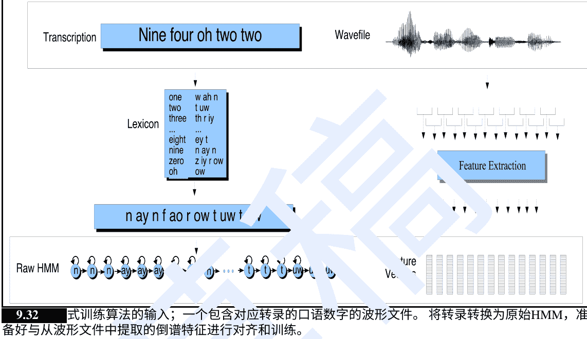

我们现在准备为HMM训练转移矩阵A和输出似然估计器B。基于Baum-Welch的嵌入式训练范式的优点是，这是我们所需的所有训练数据。特别是，我们不需要音标转录的数据。我们甚至不需要知道每个单词的起始和结束位置。Baum-Welch算法将对单词和音素的所有可能分割进行求和，使用$\xi_j(t)$表示在时间$t$处于状态$j$并生成观察序列$O$的概率。

然而，我们需要转移和观察概率的初始估计值$a_{ij}$和$b_j(o_t)$。最简单的方法是使用平坦启动。在平坦启动中，我们首先将任何我们希望成为“结构上为零”的HMM转换设置为零，例如从后续音素到前面音素的转换。在Baum-Welch中，$\gamma$概率计算包括$a_{ij}$的先前值，因此这些零值永远不会改变。然后，我们使所有其他（非零）HMM转换具有相等的概率。因此，每个状态的两个转换（自环和转换到下一个子音素）的概率都为0.5。对于高斯分布，平坦开始将每个高斯分布的均值和方差初始化为全局均值和方差。

现在，我们对 $A$ 和 $B$ 概率有了初始估计。对于标准的高斯HMM系统，我们现在在Baum-Welch算法上运行多次迭代。

整个训练集。每次迭代都会修改HMM参数，当系统收敛时停止。在每次迭代中，如第6章所讨论的那样，我们计算每个句子在给定初始A和B概率的情况下的前向和后向概率，并使用它们重新估计A和B概率。我们还应用了前一节中讨论的各种对EM的修改，以正确更新多元高斯分布的均值和方差。我们将在第10章的第10.3节中讨论如何修改嵌入式训练算法来处理混合高斯分布。总结起来，基本的嵌入式训练过程如下所示：

## 给定：音素集、发音词典和转录的波形文件

1.  为每个句子构建一个“整句”HMM，如图9.32所示。
2.  将A概率初始化为0.5（用于回环或正确的下一个子音）或为零（对于所有其他转换）。
3.  通过将每个高斯分布的均值和方差设置为整个训练集的全局均值和方差，初始化B概率。
4.  运行多次Baum-Welch算法的迭代。

Baum-Welch算法作为嵌入式训练过程的组成部分被重复使用。通过使用前向-后向算法对所有可能经过状态i的路径进行求和，Baum-Welch计算出在时间t时处于状态i的概率 $\xi_t(i)$。在时间t时，通过发射符号o来发射符号i，计算出在状态i的概率 $b_i(o_t)$。这样可以累积计数以重新估计从通过状态j的所有路径发射符号o_t的发射概率 $b_j(o_t)$。但是，Baum-Welch本身可能耗时较长。有一种高效的近似方法可以利用维特比算法进行Baum-Welch训练。在维特比训练中，不是通过求和来累积计数。通过一个状态j在时间t的所有路径，我们通过选择Viterbi（最可能的）路径来近似。因此，我们不是在嵌入式训练的每一步中运行EM算法，而是反复运行Viterbi算法。以这种方式在训练数据上运行Viterbi算法被称为强制Viterbi对齐或者只是强制对齐。在Viterbi训练中（与Viterbi不同通过在测试集上解码，我们知道要将哪个单词字符串分配给每个观察序列，因此我们可以通过适当设置$a_{i,j}$来“强制”维特比算法通过某些单词。因此，强制维特比是常规维特比解码算法的简化版本，因为它只需要找出正确的状态（子音）序列，而不需要发现单词序列。结果是一个强制对齐：与训练观察序列对应的最佳状态路径。现在，我们可以使用这个HMM状态到观察的对齐来累积计数以重新估计HMM参数。我们之前看到，强制对齐也可以用于其他语音应用，比如文本转语音，只要我们有一个单词转录和一个我们想要找到边界的波形文件。

从维特比对齐中重新训练（非混合）高斯模型的方程如下：

$$
\hat{\mu}_i = \frac{1}{T} \sum_{t=1}^{T} o_t \quad \text{s.t. } q_t \text{ 是状态 } i
$$

$$
\hat{\sigma}_i^2 = \frac{1}{T} \sum_{t=1}^{T} (o_t - \mu_i)^2 \quad \text{s.t. } q_t \text{ 是状态 } i
$$

我们已经在第310页上看到了这些方程，作为（9.27）和（9.28），当时我们正在“想象一个完全标记的训练集”的更简单的情况。事实证明，这种强制维特比算法也用于混合模型（如HMM/MLP或HMM/SVM系统）的嵌入式训练。我们从一个未经训练的MLP开始，使用其嘈杂的输出作为HMM的B值，对训练数据进行强制维特比对齐。由于MLP是随机的，所以这种对齐会有很多错误。现在，这种（相当错误的）维特比对齐为我们提供了一个带有音素标签的特征向量标记。我们使用这个标记来重新训练MLP。在强制对齐中采取的转移次数可以用来估计HMM的转移概率。我们继续进行神经网络训练和维特比对齐的这个爬坡过程，直到HMM参数开始收敛。

## 9.8 评估：词错误率

**词错误** 语音识别系统的标准评估指标是词错误率。词错误率基于识别器返回的单词字符串（通常称为假设的单词字符串）与正确或参考转录之间的差异。在计算词错误之前，需要根据正确的转录计算假设字符串和正确字符串之间的最小编辑距离，如第3章所述。这个计算的结果将是将正确字符串和假设字符串之间映射所需的最小单词替换、单词插入和单词删除的数量。然后，词错误率（WER）定义如下（请注意，由于方程式包括插入，错误率可能大于100%）：

$$
\text{词错误率} = 100 \times \frac{\text{插入} + \text{替换} + \text{删除}}{\text{正确转录中的总词数}}
$$

我们有时也会谈论句子错误率（SER），它告诉我们至少有一个错误的句子的数量：

$$
\text{句子错误率} = 100 \times \frac{\text{至少有一个单词错误的句子数}}{\text{总句子数}}
$$

**对齐** 间的对齐的示例 来自CALLHOME语料库的话语，显示用于计算词错误率的计数：

| 参考 (REF) | i LEFT THE portable PHONE UPSTAIRS last night |
| 假设 (HYP) | i GOT IT TO the FULLEST i LOVE TO portable FORM OF STORES last night |
| 评估 (Eval) | I I S D S S S I S S |

这个话语有六个替换，三个插入和一个删除：

$$
\text{词错误率} = 100 \times \frac{6+3+1}{13} = 76.9\%
$$

实现最小编辑距离和计算词错误率的标准方法是一个名为 sclite的免费脚本，可从国家标准和技术研究所（NIST）（NIST，2005）获得。sclite接收一系列参考（手工转录的黄金标准）句子和相应的假设句子。除了执行对齐和计算词错误率之外， sclite还执行许多其他有用的任务。例如，它提供有关错误分析的有用信息，例如显示哪些单词经常被错误识别为其他单词的混淆矩阵，并提供经常插入或删除的单词的摘要统计信息。如果句子被标记为说话者ID ， sclite还会按说话者提供错误率，以及有用的统计信息，如句子错误率，即句子的百分比

### 句子错误率

至少有一个单词错误。

最后，sclite可以用来计算显著性测试。假设我们对ASR系统进行了一些更改，并发现我们的词错误率降低了1%。为了知道我们的更改是否真正改进了情况，我们需要进行统计测试，以确保这1%的差异不仅仅是由于偶然原因。用于确定两个词错误率是否不同的标准统计测试是匹配对句子分段词错误（MAPSSWE）测试，该测试也可以在sclite中找到（尽管有时也使用McNemar测试）。

### 麦克纳马检验

MAPSSWE测试是一种参数化测试，它考虑了两个系统产生的单词错误数的差异，平均分布在多个片段上。这些片段可能非常短，也可能长达整个话语；一般来说，我们希望有最大数量的（短）片段，以证明正态性假设并获得最大功率。该测试要求一个片段中的错误在另一个片段中是统计独立的。由于ASR系统倾向于使用三元语言模型，因此可以通过将片段定义为两个识别器都正确识别的单词（或转换/话语边界）两侧的区域来近似计算。

这是一个来自NIST (2007b) 的例子，有四个区域：

```
参考：|它是|最好的|时代之最差|它它是
系统A：|它的|它是|最好的|时代之最差|或者|它它是
系统B：|它是|最好的||时代之最差|它它是
```

在区域I中，系统A有2个错误（一个删除和一个插入），系统B没有错误；在区域III中，系统A有1个错误（替换），系统B有2个错误。让我们定义一个表示两个系统错误差异的变量序列Z如下：

$$
Z = N_A^i - N_B^i, \quad i=1,2,\cdots,n
$$
其中 $n$ 是段的数量，$N_A^i$ 是系统A在段落i上的错误数量，$N_B^i$ 是系统B在段落i上的错误数量。

例如，在上面的例子中，Z值的序列是 {2,−1,−1,1}。直观地说，如果两个系统完全相同，我们期望差异的平均值，即 Z值的平均值，为零。如果我们将差异的真实平均值称为 $\mu_z$，我们想知道是否 $\mu_z =0$。紧随原始提案和Gillick和Cox（1989）的符号，我们可以从我们有限的样本中估计真实平均值为 $\hat{\mu}_z = \sum^n_{i=1} Z_i/n$。$Z_i$ 的方差估计如下：

$$
\sigma_z^2 = \frac{1}{n-1} \sum_{i=1}^n (Z_i - \hat{\mu}_z)^2
$$

(9.57)

让

$$
W = \frac{\hat{\mu}_z}{\sigma_z/\sqrt{n}}
$$

(9.58)

对于足够大的$n$ (>50)，W将近似地服从单位方差的正态分布。零假设为$H_0 : \mu_z = 0$，如果$2 * P(Z \geq |w|) \leq 0.05$（双尾）或 $P(Z \geq |w|) \leq 0.05$（单尾）。其中 $Z$ 是标准正态分布而 $w$ 是实际值 $W$；这些概率可以在标准正态分布表中查找。

我们能否改进作为度量的词错误率？ 比如说，如果有一些东西不会给每个词都赋予相同的权重，也许会更看重像星期二这样的内容词，而不是像一个或的这样的功能词。 虽然研究人员普遍认为这是个好主意，但在ASR的每个应用中达成一致的度量标准却很困难。 然而，对于对话系统来说，期望的语义输出更加明确，一种被称为概念错误率的度量标准已经被证明非常有用，在第24章的第851页将进行讨论。

## 9.9 总结

与第4章和第6章一起，本章介绍了解决“大词汇连续语音识别”问题的基本算法。

-   语音识别器的输入是一系列声学波形。 波形、频谱图和频谱是用来理解信号中信息的可视化工具之一。
-   在语音识别的第一步中，声波被采样、量化，并转换为某种谱表示；常用的谱表示是梅尔倒谱或MFCC，它为每个输入帧提供了一个特征向量。
-   GMM声学模型用于估计每个帧的特征向量的音素似然度（也称为观测似然度）。
-   解码或搜索或推理是找到与输入观测序列匹配的模型状态的最优序列的过程。（这个过程有三个术语是因为语音识别在本质上是跨学科的，它从多个领域借用了其隐喻；解码来自信息论，搜索和推理来自人工智能）。
-   我们介绍了两种解码算法：时间同步的维特比解码（通常使用剪枝实现，然后称为波束搜索）和堆栈或A*解码。这两种算法的输入是一系列倒谱特征向量、GMM声学模型和N-gram语言模型，并产生一串单词。
-   嵌入式训练范式是训练语音识别器的常规方法。给定一个具有手工构建的发音结构的初始词典，它将训练HMM转移概率和HMM观测概率。

# 参考文献和历史注释

第一台识别语音的机器可能是一个名为“Radio Rex”的商业玩具，它在20世纪20年代销售。Rex是一个塑料狗，当释放500 Hz的声能时，它会移动（通过弹簧）。由于500 Hz大致是“Rex”中元音[eh]的第一个共振峰，所以当人们叫它时，这只狗似乎会过来（David和Selfridge，1962年）。

到了1940年代末和1950年代初，已经建立了一些机器语音识别系统。早期的贝尔实验室系统可以识别来自单个说话者的任意10个数字（Davis等，1952年）。该系统有10个依赖于说话者的存储模式，每个数字对应一个模式，每个模式大致表示数字中的前两个元音形态。通过选择与输入具有最高相关系数的模式，他们实现了97-99%的准确率。Fry（1959年）和Denes（1959年）在伦敦大学学院建立了一个基于类似模式识别原理的音素识别器，可以识别四个元音和九个辅音。Fry和Denes的系统是第一个使用音素转移概率来约束识别器的系统。

20世纪60年代末和70年代初出现了一些重要的范式转变。首先是一些特征提取算法，包括高效的快速傅里叶变换（FFT）（Cooley和Tukey，1965），将倒谱处理应用于语音（Oppenheim等，1968），以及用于语音编码的线性预测编码（LPC）的发展（Atal和Hanauer，1971）。其次是处理拉伸和压缩输入信号的几种方法，以处理说话速度和段长度的差异，以与存储的模式进行匹配或者压缩输入信号以处理说话速度和段长度的差异，以与存储的模式进行匹配。解决这个问题的自然算法是动态规划，正如我们在第6章中看到的，该算法被多次重新发明以解决这个问题。第一个应用于语音处理的是Vintsyuk（1968），尽管他的结果没有被其他研究人员接受，并且被Velichko和Zagoruyko（1970）以及Sakoe和Chiba（1971）（和（1984））重新发明。之后不久，Itakura（1975）将这个动态规划的思想与之前仅用于语音编码的LPC系数相结合。结果系统提取了传入单词的LPC特征，并使用动态规划将其与存储的LPC模板进行匹配。非概率性地使用动态规划将模板与传入语音进行匹配被称为动态时间规整。

这个时期的第三个创新是HMM的兴起。隐藏马尔可夫模型似乎在1972年左右独立应用于语音的两个实验室。一个应用起源于统计学家的工作，特别是普林斯顿国防分析研究所的鲍姆和同事对HMM及其在各种预测问题上的应用（Baum和Petrie，1966；Baum和Eagon，1967）的研究。詹姆斯贝克在CMU攻读研究生期间得知了这项工作，并将该算法应用于语音处理（Baker，1975）。独立地，Frederick Jelinek，Robert Mercer和Lalit Bahl（借鉴了他们在信息理论模型研究中受Shannon（1948）工作影响的研究）在IBM Thomas J. Watson研究中心将HMM应用于语音（Jelinek等，1975）。IBM和贝克的系统非常相似，特别是在本章描述的贝叶斯框架的使用方面。一个早期的区别是解码算法；贝克的DRAGON系统使用维特比（动态规划）解码，而IBM系统应用了Jelinek的堆栈解码算法（Jelinek，1969）。然后贝克在创立语音识别公司Dragon Systems之前短暂加入了IBM团队。到本世纪末，HMM方法在语音识别领域完全占据主导地位；事实上，IBM实验室是将统计模型扩展到自然语言处理的推动力量，包括基于类别的N-gram，基于HMM的词性标注，统计机器翻译以及熵/困惑度作为评估指标的使用。

HMM的使用逐渐在语音社区中传播开来。一个原因是由美国国防部高级研究计划局（ARPA）赞助的一些研究和开发项目。第一个为期五年的计划始于1971年，并在Klatt（1977）中进行了评估。这个第一个计划的目标是基于少数发言人、受限的语法和词汇表（1000个词）以及不到10%的语义错误率来构建语音理解系统。

资助了四个系统，并相互进行了比较：系统开发公司（SDC）的系统、Bolt、Beranek & Newman（BBN）的HWIM系统、卡内基梅隆大学的Hearsay-II系统和卡内基梅隆的Harpy系统（Lowerre，1968）。Harpy系统使用了Baker的基于HMM的DRAGON系统的简化版本，并且是经过测试的系统中最好的一个，根据Klatt的说法，它是唯一一个达到ARPA项目最初目标的系统（在简单任务上的语义准确率达到94%）。

从1980年代中期开始，ARPA资助了许多新的语音研究项目。第一个是“资源管理”（RM）任务（Price等，1988年），与早期的ARPA任务一样，涉及到对读出的语音（说话者读出由1000个词汇构成的句子）进行转录（识别），但现在还包括了一个涉及说话者无关的识别组件。后来的任务包括对从华尔街日报（WSJ）上读出的句子进行识别，最初使用的是5000个词汇的有限系统，最后使用的是无限词汇的系统（实际上大多数系统使用约60000个词汇）。后来的语音识别任务从读出的语音转向了更自然的领域；广播新闻领域（LDC，1998年；Graff，1997年）（对实际新闻广播进行转录，包括一些非常困难的段落，如街头采访）以及Switchboard、CALLHOME、CALLFRIEND和Fisher领域（Godfrey等，1992年；Cieri等，2004年）（朋友或陌生人之间的自然电话对话）。空中交通信息

## 比赛

系统（ATIS）任务（Hemphill等，1990年）是一个早期的语音理解任务，其目标是通过回答关于潜在航空公司、时间、日期等问题来模拟帮助用户预订航班。

ARPA的每个任务都涉及大约每年一次的比赛，在比赛中所有的ARPA资助的系统以及来自北美和欧洲的许多其他“志愿者”系统在单词错误率或语义错误率方面相互评估。在早期的评估中，盈利性公司通常不参与竞争，但最终许多公司（尤其是IBM和ATT）定期参与竞争。ARPA的竞争导致了实验室之间技术的广泛借鉴，因为很容易看出哪些想法在前一年提供了错误减少，并且很可能是HMM范式传播到几乎每个主要语音识别实验室的重要因素。ARPA计划还产生了一些有用的数据库，最初设计用于每次评估的系统的训练和测试（TIMIT，RM，WSJ，ATIS，BN，CALLHOME，Switchboard，Fisher），但后来可供一般研究使用。

### 说话人识别

语音研究除了语音识别之外还涉及许多领域；我们在第7章已经看到了计算音韵学，在第8章中看到了语音合成，而在第24章中我们将讨论口语对话系统。另一个重要领域是说话人识别验证说话人和说话人验证，我们在这种情况下识别说话人（例如在通过电话访问个人信息时用于安全）（Reynolds和Rose，1995；Shriberg等，2005；Doddington，2001）。这个任务与语言识别相关，在这个任务中我们会得到一个波形文件并且需要识别出正在说话的语言；这对于自动将呼叫者转接到会说适当语言的人工操作员非常有用。

关于语音识别有许多教材和参考书，对于希望更深入了解本章内容的读者来说，以下是一些不错的选择：Huang等人（2001）是迄今为止最全面和最新的参考书，强烈推荐。Jelinek（1997）、Gold和Morgan（1999）以及Rabiner和Juang（1993）是很好的综合教材。最后两本教材还讨论了该领域的历史，与Levinson（1995）的综述论文一起，对本章的简短历史讨论产生了影响。我们对前向-后向算法的描述是根据Rabiner（1989）的模型，我们还受到了另一篇有用的教程论文Knill和Young（1997）的影响。语音识别领域的研究经常出现在年度INTER-SPEECH会议的论文集中（该会议在交替年份被称为ICSLP和EUROSPEECH），以及年度IEEE国际声学、语音和信号处理会议（ICASSP）中。期刊包括Speech Communication、Computer Speech and Language、IEEE Transactions on Audio, Speech, and Language Processing和ACM Transactions on Speech and Language Processing。

# 练习
- 9.1 分析第330页上“um the phone is I left the…”的错误识别转录中的每个错误。对于每个错误，根据你的最佳猜测，判断它是由信号处理问题、发音建模问题、词典大小问题、语言模型问题还是解码搜索中的修剪问题引起的。
- 9.2 在实践中，语音识别器使用 logprob 对数概率进行所有概率计算，而不是实际概率。这有助于避免非常小的概率下溢，同时也使得维特比算法非常高效，因为所有概率乘法可以通过添加对数概率来实现。重新编写第323页上维特比算法的伪代码，以使用logprobs而不是概率。
- 9.3 现在修改第323页上维特比算法，以实现第325页上描述的波束搜索。提示：你可能需要添加代码来检查给定状态是否在单词的末尾。
- 9.4 最后，修改第323页上维特比算法的伪代码，实现回溯指针数组的更详细的实现。
- 9.5 使用HTK或Sonic等公开可用的教程构建数字识别器。
- 9.6 使用上述数字识别器并转储句子的电话似然。现在拿出你实现的维特比算法，并展示你可以成功解码这些似然。

# 第10章 语音识别：高级主题
不幸的是，他们的声纹机器非常粗糙。它只能区分几个频率，并通过无法解读的斑点来表示振幅。但它从未被用于如此重要的工作。

> 阿列克桑德尔·索尔仁尼琴，《第一圈》，第505页

中国古代科举考试持续了近1300年，从606年开始，直到1905年废除。在巅峰时期，来自中国各地的数百万人竞争高级政府职位，通过参加统一考试。在首都进行的最后一部分考试中，候选人将被锁在考场内长达九天九夜，回答有关历史、诗歌、儒家经典和政策的问题。

自然，所有这些数百万候选人并没有全部出现在首都。相反，考试分为不同的阶段；通过当地一天的考试后，候选人可以参加每年两次的省级考试，只有在省会通过了考试后，候选人才有资格参加都城和宫廷的考试。

这个选择有能力官员的算法是多阶段搜索的一个例子。最终的9天过程需要太多的资源（无论是空间还是时间）来检查每个候选人。相反，该算法使用一个更简单、不那么密集的1天过程来得出一个初步的潜在候选人列表，并且只对这个列表应用最终的测试。

科举算法也可以应用于语音识别。我们希望能够在语音识别过程中应用非常昂贵的算法，比如4-gram、5-gram，甚至是基于解析器的语言模型，或者能够看到未来或过去两到三个音素的上下文相关的音素模型。但是对于任何给定的波形，可能有大量的潜在转录句子，而将这些强大的算法应用于每个候选人是太昂贵的（无论是时间、空间还是两者兼而有之）。

相反，我们将介绍多通道解码算法，其中高效但较笨的解码算法会产生潜在候选人的短列表，然后由较慢但更聪明的算法重新评分。我们还将介绍上下文相关的声学模型，这是其中一个更聪明的知识源，在大词汇量语音识别中非常重要。我们还将简要介绍判别式训练和变异建模这两个重要主题。

## 10.1 多通道解码：$N$个最佳列表和格子
前一章应用了Viterbi算法进行HMM解码。然而，Viterbi解码器有两个主要限制。首先，Viterbi解码器实际上并没有计算出给定输入声学的最有可能的单词序列。相反，它计算的是给定输入最有可能的状态序列（即，音素或子音素）。更正式地说，回想一下，观测序列$O$的真实似然是通过前向算法对所有可能路径求和计算的：

(10.1) $$P(O|W) = \sum_{S \in S_1^T} P(O,S|W)$$

维特比算法通过使用最佳路径的概率来近似这个总和:

(10.2) $$P(O|W) \approx \max_{S \in S_1^T} P(O,S|W)$$

事实证明，这个维特比近似并不太糟糕，因为最有可能的电话序列通常与最有可能的单词序列相对应，但并不总是。考虑一个语音识别系统，其词典中每个单词都有多个发音。假设正确的单词序列包括一个具有非常多发音的单词。由于离开每个单词起始弧的概率必须总和为1.0，通过这个多发音HMM单词模型的每个发音路径的概率都会小于通过只有一个发音路径的单词的路径。因此，由于维特比解码器只能跟随其中一个发音路径，它可能会忽略这个具有多个发音的单词，而选择一个只有一个发音路径的错误单词。实质上，维特比近似惩罚具有多个发音的单词。

维特比解码器的第二个问题是，它无法或者很昂贵地利用许多有用的知识源。例如，我们定义的维特比算法无法充分利用比二元语法更复杂的任何语言模型。这是因为前面提到的事实，例如三元语法违反了动态规划不变性。

回想一下，这个不变性是一个简化（但不正确）的假设，即如果整个观察序列的最佳路径恰好经过状态$q_{-i}$，那么这个最佳路径必须包括从起始状态到$q_{-i}$的最佳路径。由于三元语法允许一个词的概率基于前两个词，所以最佳的三元概率路径可能经过一个词但不包括到达该词的最佳路径。如果一个特定的词$w_{-x}$在给定$w_{-y}$、$w_{-z}$的情况下具有较高的三元概率，但是相反，到达$w_{-y}$的最佳路径不包括$w_{-z}$（即对于所有$q$，$P(w_{-y}|w_{-q}, w_{-z})$都很低），那么就可能出现这种情况。像SCFG这样的高级概率语言模型也违反了相同的动态规划假设。

对于这些问题，有两种解决方案与维特比解码相关。最常见的方法是修改维特比解码器，返回多个潜在的话语，而不仅仅是最佳的一个，然后使用其他高级语言模型或发音建模算法对这些多个输出进行重新排序（Schwartz和Austin, 1991; Soong和Huang, 1990; Murveit等, 1993）。第二种解决方案是采用完全不同的解码算法，例如堆栈解码器或A*解码器（Jelinek, 1969; Jelinek等, 1975）。我们从本节开始介绍多通道解码，然后再回到堆栈解码。在多通道解码中，我们将解码过程分为两个阶段。在第一阶段，我们使用快速、高效的知识源或算法进行非最优搜索。因此，例如，我们可以使用一个简单但时间和空间效率高的语言模型，如二元模型，或者使用简化的声学模型。在第二次解码中，我们可以在减少的搜索空间上应用更复杂但更慢的解码算法。这些阶段之间的接口是一个N个最佳列表或单词格子。

多通道解码的最简单算法是修改维特比算法，以返回给定语音输入的N个最佳句子（词序列）。假设例如，使用双字语法与N个最佳维特比算法一起返回最高概率的1000个句子，每个句子都有其AM概率和LM先验分数。现在可以将这个1000个最佳列表传递给更复杂的语言模型，如三字语法。这个新的LM用于用新的三字语法LM概率替换每个假设句子的双字语法LM分数。这些先验可以与每个句子的声学概率相结合，生成每个句子的新后验概率。因此，使用这个更复杂的概率对句子进行重新评分和重新排序。

更复杂的概率。图10.1展示了这个算法的直观理解。

有许多算法可以增强维特比算法以生成N-Best假设。事实证明，没有多项式时间的可接受算法来找到最可能的N个假设（Young, 1984）。然而，有一些近似（非可接受）的算法；我们将介绍其中之一，Schwartz和Chow（1990）的“Exact N-Best”算法。在Exact N-Best中，每个状态不再维护单个路径/回溯，而是为每个状态维护多达N条不同的路径。但我们希望确保这些路径对应于不同的词路径；我们不希望将我们的N个路径浪费在映射到相同单词的不同状态序列上。为了做到这一点，我们为每个路径保留单词历史，即当前单词/状态之前的整个单词序列。如果具有相同单词历史的两条路径同时到达一个状态，我们合并这些路径并求和路径概率。为了保留N个最佳单词序列，所得到的算法需要O(N)倍的正常维特比时间。当我们介绍统计机器翻译的解码时，我们将再次看到路径的合并，这被称为假设重组。

| 排名 | 路径 | AM对数概率 | LM对数概率 |
| --- | --- | --- | --- |
| 1. | 这是一个自然而然有些神秘的领域 | -7193.53 | -20.25 |
| 2. | 这是一个自然而然有些神秘的领域 | -7192.28 | -21.11 |
| 3. | 这是一个并不真的神秘的领域 | -7221.68 | -18.91 |
| 4. | 这种情况自然而然有些神秘 | -7189.19 | -22.08 |
| 5. | 这是一个自然而然有些神秘的领域 | -7198.35 | -21.34 |
| 6. | 这是一个并不真的神秘的领域 | -7220.44 | -19.77 |
| 7. | 这种情况自然而然有些神秘 | -7205.42 | -21.50 |
| 8. | 所以这是一个自然而然有些神秘的领域 | -7195.92 | -21.71 |
| 9. | 这种情况并不真的神秘 | -7217.34 | -20.70 |
| 10. | 这是一个并不真的神秘的领域 | -7226.51 | -20.0 |

10.2 广播新闻语料库中产生的 -best列表示例，由CU-HTK BN系统生成（感谢Phil Woodland）。对数概率使用以10为底的对数；语言模型缩放因子（LMS）为5。

这些算法的任何结果都是一个 $N$-最佳列表，就像图10.1所示。在图10.1中，正确的假设恰好是第一个，但当然使用 $N$-最佳列表的原因是这并不总是发生。在 $N$-最佳列表中的每个句子还附带有一个声学模型概率和一个语言模型概率。这使得第二阶段的知识源可以用一个改进的估计值替换其中的两个概率之一。

一个 $N$-最佳列表的问题是，当 $N$很大时，列出所有的句子非常低效。另一个问题是 $N$-最佳列表并没有给出我们在第二次解码器中所希望的那么多的信息。例如，我们可能希望对每个单词假设都有不同的声学模型信息，以便我们可以为该单词重新应用一个新的声学模型。或者我们可能希望为每个单词提供不同的起始和结束时间，以便我们可以应用一个新的持续时间模型。

因此，第一遍解码器的输出通常是一个更复杂的单词格表示，称为单词格(Murveit等, 1993; Aubert和Ney, 1995)。单词格是一个有向图，有效地表示了更多关于可能的单词序列的信息。1在某些系统中，图中的节点是单词，弧是单词之间的转换。在其他系统中，弧表示单词假设，节点是时间点。让我们使用后一种模型，因此每个弧都包含了关于单词假设的大量信息，包括起始时间和结束时间、声学模型和语言模型的概率、音素序列（单词的发音）甚至音素持续时间。图10.3显示了与图10.1中的 $N$-最佳列表对应的示例格。请注意，格中包含了许多不同的链接（记录），对应于同一个单词，每个链接的起始或结束时间略有不同。这样的格子不是从 $N$-最佳列表中产生的；相反，在第一遍解码期间，通过包括每个时间点上活跃（在波束中）的一些单词假设来生成格子。

> 1 实际上，ASR网络并不是数学中常见的格子，因为它不需要具备真正格子的特性（即成为一个具有特定属性的偏序集，例如每对元素都有唯一的上界）。实际上它只是一个图，但是习惯上称之为格子。

实际上，每个在格子中的单词假设都会分别与其声学模型的可能性和语言模型的概率相结合，这使得我们能够通过格子中的任何路径进行重新评分，无论是使用更复杂的语言模型还是更复杂的声学模型。与N个最佳列表一样，重新评分的目标是用一个不同的话语替换掉1-最佳话语，这个话语在第一次解码时可能得分较低。为了使这个第二次知识源能够达到完美的词错误率，实际上正确的句子必须在格子或N个最佳列表中。如果正确的句子不在其中，重新评分的知识源就无法找到它。因此，在使用格子或N个最佳列表时，考虑基准格子的错误率（Woodland等人，1995；Ortmanns等人，1997）是很重要的：这是从格子中得到的下限词错误率。格子错误率是我们选择具有最低词错误率的格子路径（句子）时得到的词错误率。因为它依赖于选择路径的完美知识，所以我们称之为oracle错误率，因为我们需要一些Oracle告诉我们选择哪个句子/路径。

#### 格点密度
另一个重要的格点概念是格点密度，即参考转录中的边数除以单词数。格点中的边数除以参考转录中的单词数。正如我们在图10.3中所看到的那样，真实的格点通常非常密集，每个单词的假设有许多稍微不同的开始和结束时间的副本。由于这种密度，格点通常会被修剪。

除了修剪，格点通常会简化为另一种更简化的类型

#### 词图
称为词图或有限状态机的格点类型，尽管通常仍然被称为词格。在这些词图中，时间信息被移除，相同单词的多个重叠副本被合并。单词的时间被隐含在图的结构中。此外，声学模型的似然信息被移除，只保留语言模型的概率。结果得到的图是一个加权有限状态自动机，是 $N$-gram语言模型的自然扩展；图10.3对应的词图如图10.4所示。实际上，这个词图可以作为另一个解码过程的语言模型。由于这样的词图语言模型大大限制了搜索空间，可以使用一个复杂的声学模型，而这个声学模型在第一次解码中速度太慢无法使用。

当我们需要表示格子中各个单词的后验概率时，会使用最终类型的格子。事实证明，在语音识别中，我们几乎从不看到任何东西的真实后验概率，尽管语音识别的目标是计算具有最大后验概率的句子。这是因为在语音识别的基本方程中，我们忽略了分母在我们的最大化中：

```
(10.3) $$\hat{W}=\underset{W\in \mathscr{L}}{\mathrm{argmax}}\frac{P(O|W)P(W)}{P(O)}=\underset{W\in \mathscr{L}}{\mathrm{argmax}} P(O|W)P(W)$$
```

似然和先验的乘积不是话语的后验概率。它甚至不是一个概率，因为它不一定在0和1之间。它只是一个分数。为什么我们没有真实概率很重要吗？原因是没有真实概率，我们可以选择最佳假设，但我们无法知道它有多好。也许最佳假设仍然很糟糕，我们需要要求用户重复。如果我们有一个单词的后验概率，它可以用作置信度度量，因为后验是绝对而不是相对的度量。置信度度量是语音识别器可以给出的度量，用于指示识别器对返回的单词字符串的可靠性。我们将在第24章中讨论置信度的使用。

为了计算一个单词的后验概率，我们需要对话语中的所有不同单词假设进行归一化处理。在每个点上，我们需要知道哪些单词在竞争或混淆。展示这些单词混淆序列的网络被称为混淆网络。混淆网络（有时也叫格网、香肠，或者压缩的网络）由一系列单词位置组成。每个位置都有一组互斥的单词假设。该网络表示通过从每个位置选择一个单词可以创建的句子集合。

请注意，与格或词图不同，构建混淆网络的过程实际上会添加原始格子中不存在的路径。混淆网络除了计算置信度之外还有其他用途。最初，混淆网络被提出用于最小化词错误率，重点是通过最大化改善单词后验概率而不是句子可能性。最近，混淆网络已被用于训练区分单词的判别分类器。

粗略地说，混淆网络是通过将格子中的不同假设路径与彼此对齐来构建的。计算每个单词的后验概率是通过首先对通过单词的所有路径求和，然后通过所有竞争单词的概率之和进行归一化。有关详细信息，请参阅Mangu等人（2000），Evermann和Woodland（2000），Kumar和Byrne（2002），Doumpiotis等人（2003b）。

像SRI-LM（Stolcke, 2002）这样的标准公开可用的语言建模工具包（http://www.speech.sri.com/projects/srilm/）和HTK语言建模工具包（Young et al., 2005）（http://htk.eng.cam.ac.uk/）可以用于生成和操作格子、N个最佳列表和混淆网络。

还有许多其他类型的多阶段搜索，例如前向-后向搜索算法（不要与用于HMM参数设置的前向-后向算法混淆）（Austin et al., 1991）执行简单的前向搜索，然后进行详细的后向（即时间反转）搜索。

## 10.2 A*（'堆栈'）解码
A*解码算法允许我们使用完整的前向概率，避免了维特比近似。 A*解码还允许我们使用任意的语言模型。 因此，A*是一种一次性的多通道解码替代方案。

A*解码算法是对树进行最佳优先搜索，隐式地定义了语言中允许的单词序列。 考虑图10.6中以左侧的START节点为根的树。 这棵树的每个叶子节点定义了语言中的一个句子；即通过连接从START到叶子节点的路径上的所有单词形成的句子。我们不会显式地表示这棵树，但堆栈解码算法隐式地使用这棵树作为结构化解码搜索的一种方式。

该算法从树的根部开始向叶子节点进行搜索，寻找最高概率路径，从而得到最高概率的句子。 当我们从根部向叶子节点前进时，离开给定单词节点的每个分支代表可能跟随当前单词的单词。 这些分支中的每一个都有一个概率，它表示在迄今为止我们所见到的句子部分的条件概率。 此外，我们将使用前向算法为每个单词分配产生观察到的声学数据某部分的可能性。

因此，A*解码器必须找到从根部到叶子节点的路径（单词序列），该路径具有最高概率，其中路径概率被定义为其语言模型概率（先验）与其与数据的声学匹配（似然）的乘积。 它通过保持一个部分路径（即句子前缀）的优先队列来实现这一点。在优先队列中，每个元素都有一个分数，弹出操作返回具有最高分数的元素。A*解码算法迭代地选择最佳前缀，计算该前缀的所有可能的下一个单词，并将这些扩展的句子添加到队列中。图10.7显示了完整的算法。

让我们考虑一个简化的例子，A*解码器在一个波形上工作，正确的转录是“如果音乐是爱的食物”。图10.8显示了解码器从根节点检查长度为一的路径后的搜索空间。 使用快速匹配来选择可能的下一个单词。 快速匹配是一类启发式算法之一，旨在高效地减少可能的后续单词数量，通常通过计算某种正向概率的近似值来实现（有关快速匹配的进一步讨论，请参见下文）。

在我们的例子中，我们已经完成了快速匹配，选择了一个可能的下一个词子集，并为每个词分配一个得分。单词Alice得分最高。我们还没有确切说明得分是如何工作的。

图10.9a展示了搜索的下一个阶段。我们已经扩展了Alice节点。这意味着Alice节点不再在队列中，但它的子节点在。请注意，现在标记为“if”的节点实际上比Alice的任何子节点都有更高的得分。图10.9b显示了在扩展“if”节点、移除它并将“if music”、“if muscle”和“if messy”添加到队列后搜索的状态。

我们明确希望对一个假设的评分标准与其概率相关。实际上，对于一个由声学字符串 \( y_1^j \) 给定的单词字符串 \( w_1^i \)，其得分应该是先验概率和似然概率的乘积：

\[ P(y_1^j | w_1^i) P(w_1^i) \]

然而，得分不能是这个概率，因为对于较长的路径而言，概率会比较小。这是由于概率的一个简单事实所导致的。

能力和子串；任何字符串的前缀必须比该字符串本身的概率更高（例如，P（START the…）将大于P（START the book））。因此，如果我们将概率作为分数，A*解码算法将会卡在单词假设上。

相反，我们使用A*评估函数（Nilsson, 1980; Pearl, 1984）\( f^*(p) \)，给定一个部分路径p: \( f^*(p) = g(p) + h^*(p) \)

- \( g(p) \)是从话语的开始到部分路径p的结束的得分。这个g函数可以通过给定声学到目前为止的概率来很好地估计p的（即，作为P(O|W)P(W)的单词字符串W的概率）。
- \( h^*(p) \)是部分路径到话语结束的最佳得分扩展的估计。

找到一个对\( h^* \)的良好估计是一个未解决且有趣的问题。一个非常简单的方法是选择一个与句子中剩余单词数量相关的\( h^* \)的估计（Paul, 1991）。稍微聪明一点的方法是估计剩余帧的每帧期望似然，并将其乘以剩余时间的估计。这个期望似然可以通过在训练集中对每帧的似然进行平均来计算。有关详细讨论，请参阅Jelinek（1997）。

## 树形结构的词典

我们上面提到过，A*和其他各种两阶段解码算法都需要使用快速匹配来快速找到词典中哪些单词可能与声学输入的某部分匹配。许多快速匹配算法都基于使用树形结构的词典，该词典存储了发音方法，以便可以共享以相同音序开始的单词的前向概率计算。树形结构的词典最初是由Klovstad和Mondshein（1975）提出的；使用它的快速匹配算法包括Gupta等人（1988）、Bahl等人（1992）在A*解码的上下文中，以及Ney等人（1992）和Nguyen和Schwartz（1999）在Viterbi解码的上下文中。图10.10显示了Sphinx-II识别器（Ravishankar，1996）中的一个树形结构的词典的示例。每个树根代表以该上下文相关电话开头的所有单词的第一个音素（电话上下文可能在单词边界上保留或不保留），每个叶子与一个单词相关联。

## 10.3 上下文相关声学模型：三音素

在我们在第9.4节中讨论了HMM架构如何应用于ASR时，我们展示了如何为每个音素创建一个HMM，其中的三个发射状态对应于音素的开始、中间和结束。因此，我们用自己的GMM来表示每个子音素（“[eh]的开始”，“[t]的开始”，“[a e]的中间”）。

使用固定的GMM来表示像“[eh]的开始”这样的子音素存在问题。问题在于，音素根据两侧的音素而变化很大。这是因为在语音产生过程中，发音器官（舌头、嘴唇、软腭）的运动是连续的，并且受到动量等物理约束的影响。因此

## 第348章 语音识别：高级主题

共同发音

一个发音器官可能在一个音素期间开始移动，以便及时到达下一个音素。在第7章中，我们将词“协同发音”定义为发音器官的运动。预测下一个声音，或者从上一个声音中持续的运动。图10.11显示了由于相邻音素环境而产生的共同发音，用于元音[eh]。

为了模拟一个音素在不同环境中表现出的显著变化，大多数LVCSR系统用上下文相关（CI音素）HMM取代了上下文无关的概念。用上下文相关或CD音素来代替。最常见的上下文相关类型是三音素模型。三音素模型是一个三音素HMM（Schwartz et al., 1985; Deng et al., 1990）。三音素模型表示特定左右上下文中的一个音素。例如，三音素[y-eh+l]表示“[eh]前面是[y]，后面是[l]”。一般来说，[a-b+c]表示“[a]前面是[b]，后面是[c]”。在没有完整三音素上下文的情况下，我们将使用[a-b]表示“[b]前面是[a]”，[b+c]表示“[b]后面是[c]”。

上下文相关的音素捕捉到了一个重要的变化源，并且是现代自动语音识别系统的关键部分。但是无限制的上下文相关性也引入了我们在语言建模中看到的同样问题：训练数据稀疏性。我们尝试训练的模型越复杂，我们观察到的每个音素类型的观测次数就越少。对于一个包含50个音素的音素集，原则上我们需要50^3或者125,000个三音素。实际上，并不是每个三个音素的序列都是可能的（英语似乎不允许像[ae-eh+ow]或[m-j+t]这样的三音素序列）。Young等人（1994）发现在20K华尔街日报任务中需要55,000个三音素。但是他们发现这些三音素中只有18,500个，即不到一半，实际上出现在WSJ训练数据的SI84部分中。

绑定状态

由于数据稀疏性的问题，我们必须减少需要训练的三音素参数数量。最常见的方法是将一些上下文聚类在一起，并将上下文相同的子音素绑定在一起。

聚类（Young和Woodland，1994）。例如，一个以其左侧为[n]的音素的开头可能与一个以其左侧为[m]的音素的开头非常相似。因此，我们可以将[m-eh+d]和[n-eh+d]三音素的第一个（开头）子音素绑定在一起。将两个状态绑定在一起意味着它们共享相同的高斯模型。因此，我们只为[m-eh+d]和[n-eh+d]三音素的第一个子音素训练一个高斯模型。同样，事实证明，左上下文音素[r]和[w]对后续音素的初始子音素产生类似的影响。

例如，图10.12显示了元音[iy]前面的辅音[w]，[r]，[m]和[n]。注意在[w]和[r]之后，[iy]的开头有类似的F2上升。请注意[m]和[n]的开头相似；正如第7章所指出的，鼻音共振峰的位置在说话者之间变化很大，但是这位说话者（第一作者）的鼻音共振峰（N2）大约在1000 Hz左右。

图10.13显示了聚类算法学习到的三音素绑定的示例。每个混合高斯模型被各种三音素HMM的子音状态共享。

我们如何决定将哪些上下文聚类在一起？最常见的方法是使用决策树。对于每个音素的每个状态（子音），都会构建一个单独的树。图10.14显示了来自/ih/音素第一个（开始）状态的示例树，修改自Odell（1995年）。我们从树的根节点开始，有一个包含（开始状态的）所有以/ih/为中心的三音素的大簇。在每个节点

在树中，我们通过提问有关上下文的问题，将当前簇分成两个较小的簇。例如，图10.14中的树首先将初始簇分成左侧有鼻音的一个簇，和没有鼻音的一个簇。当我们从根节点向下移动时，每个簇都会逐渐分裂。图10.14中的树将所有开始状态的/ih/三音素分成5个簇，标记为A-E。

决策树中使用的问题是关于左边或右边的音素是否具有某种语音特征的问题，这种特征是在第7章中介绍的。图10.3显示了一些决策树问题；请注意，元音和辅音有不同的问题。真实的树会有更多的问题。

图10.14中的决策树是如何训练的？树是从根节点向下生长的。在每次迭代中，算法考虑每个可能的问题q和树中的每个节点n。对于每个问题，它考虑新的分割如何影响训练数据的声学似然度。算法计算当前训练数据的声学似然度与基于问题q分割后的新似然度之间的差异。算法选择给出最大似然度的节点n和问题q。然后，该过程迭代进行，直到每个叶节点具有最小阈值数量的示例为止。

我们还需要修改我们在第9.7节中看到的嵌入式训练算法，以处理与上下文相关的音素，并处理混合高斯。在这两种情况下，我们使用了一个更复杂的过程，涉及克隆和使用额外的EM迭代，如在Young等人（1994）中描述。

| 特征 | 音素 |
|------|------|
| 停止 | b d g k p t |
| 鼻音 | m n ng |
| 摩擦音 | ch dh f jh s sh v z zh |
| 流音 | l r w y |
| 元音 | aa ae ah ao aw ax axr ay eh er ey ih ix iy ow oy uh uw |
| 前元音 | ae eh ih ix iy |
| 中央元音 | aa ah ao axr er |
| 后元音 | ax ow uh uw |
| 高元音 | ih ix iy uh uw |
| 圆唇元音 | ao ow oy uh uw w |
| 降元音 | ax axr ix |
| 清辅音 | ch f hh k p s sh t th |
| 冠状的 | ch d dh jh l n r s sh t th z zh |

10.15 Jelinek (1995) 使用的语音特征决策树问题示例。

为了训练上下文相关模型，例如，我们首先使用标准的嵌入式训练过程来训练上下文无关模型，使用多次EM迭代，为每个单音节的每个子音素生成单独的单高斯模型，例如/aa/， /ae/等。然后，我们克隆每个单音节模型，即为每个潜在的三音节模型制作相同的模型副本，每个副本都有其3个高斯子状态。转移矩阵不被克隆，而是为每个单音节的所有三音节模型克隆绑定在一起。然后，我们再次运行EM迭代，并重新训练三音节高斯模型。现在，对于每个单音节，我们使用第350页描述的聚类算法将所有上下文相关的三音节进行聚类，以获得一组绑定状态簇。

对于这个聚类，选择一个典型的状态作为示例，并将其余状态与之绑定。我们使用相同的克隆过程来学习高斯混合模型。我们首先使用嵌入式训练和多次EM迭代来学习每个绑定三音素状态的单混合高斯模型，如上所述。然后，我们将每个状态克隆（分割）为2个相同的高斯模型，微调每个模型的值，并再次运行EM来重新训练这些值。然后，我们将这两个混合模型分割成四个，微调它们，并重新训练。我们一直持续进行，直到每个状态中的观测数据有适当数量的混合模型。

通过按照图10.16所示的方式连续应用这两个克隆和重新训练过程，可以创建一个完整的上下文相关的GMM三音素模型。

## 10.4 辨别式训练

我们所提出的Baum-Welch和嵌入式训练模型用于训练HMM参数（A和B矩阵），其基于最大化训练数据的似然度。与最大似然估计（MLE）相比，还有一种替代方法。重点不在于将最佳模型拟合到数据上，而是在于区分出最佳模型和其他模型从所有其他模型中区分出模型。这样的训练过程包括最大互信息估计（MMIE）（Woodland和Povey，2002），使用神经网络/支持向量机分类器（Bourlard和Morgan，1994）以及其他技术，如最小分类错误训练（Chou等，1993; McDermott和Hazen，2004）或最小贝叶斯风险估计（Doumpiotis等，2003a）。我们总结了第一种方法，即MMIE。

### 10.4.1 最大互信息估计

回想一下，在最大似然估计（MLE）中，我们训练我们的声学模型参数（$A$和$B$）以最大化训练数据的似然。考虑一个特定的观察序列$O$，以及一个特定的HMM模型$M_k$对应于单词序列$W_k$，其中$W' \in \mathcal{L}$是所有可能的句子。因此，MLE准则最大化

$$ \mathcal{F}_{MLE}(\lambda) = P_{\lambda} (O|M_k) $$

由于我们在语音识别中的目标是对尽可能多的句子进行正确的转录，因此我们希望平均而言，正确的单词序列$W_k$的概率要高，肯定要高于所有错误的单词序列$W_{j s.t. j=k}$的概率。但是上述MLE准则并不能保证这一点。因此，我们希望选择一些其他的准则，让我们选择将正确模型的概率最大化的模型$\lambda$，即最大化$P_{\lambda} (M_k|O)$。最大化单词序列的概率而不是观察序列的概率被称为条件最大似然估计或CMLE：

$$ \mathscr{F}_{\text{CMLE}}(\lambda) = P_{\lambda}(M_k|O) $$

使用贝叶斯定理，我们可以表示为

$$ \mathscr{F}_{\text{CMLE}}(\lambda) = P_{\lambda}(M_k|O) = \frac{P_{\lambda}(O|M_k)P(M_k)}{P_{\lambda}(O)} $$

现在让我们通过对所有可能生成它的序列求和，来扩展 $P_{\lambda}(O)$ 观测序列的总概率是观测似然在给定单词序列的情况下的所有单词字符串的加权和:

$$ P(O) = \sum_{W \in \mathcal{L}} P(O|W)P(W) $$

因此，方程式10.6的完整展开是:

$$ \mathscr{F}_{\text{CMLE}}(\lambda) = P_{\lambda}(M_k|O) = \frac{P_{\lambda}(O|M_k)P(M_k)}{\sum_{M \in \mathcal{L}} P_{\lambda}(O|M)P(M)} $$

在标准命名法中，CMLE通常被称为最大互信息估计（MMIE），这有点令人困惑。这是因为如果我们假设语言模型概率的每个句子W在声学训练期间是恒定的（固定的），那么最大化后验概率 $P(W|O)$和最大化互信息$I(W,O)$是等价的，这通常是我们所做的假设。

因此，从这里开始，我们将把这个标准称为MMIE标准，而不是CMLE标准，所以这里是方程式10.8的重新表述:

$$ \mathscr{F}_{\text{MMIE}}(\lambda) = P_{\lambda}(M_k|O) = \frac{P_{\lambda}(O|M_k)P(M_k)}{\sum_{M \in \mathcal{L}} P_{\lambda}(O|M)P(M)} $$

简而言之，MMIE估计的目标是最大化(10.9)，而不是(10.4)。现在，如果我们的目标是最大化 $P_{\lambda}(M_k|O)$，我们不仅需要最大化(10.9)的分子，还需要最小化分母。注意，我们可以重写分母，以明确它包括一个等于我们试图最大化的模型的项和其他所有模型的项:

$$ P_{\lambda}(M_k|O) = \frac{P_{\lambda}(O|M_k)P(M_k)}{P_{\lambda}(O|M_k)P(M_k) + \sum_{i \neq k} P_{\lambda}(O|M_i)P(M_i)} $$

因此，为了最大化 $P_{\lambda}(M_k|O)$，我们需要逐步改变 $\lambda$，使其增加正确模型的概率，同时减少每个错误模型的概率。因此，使用MMIE进行训练明显实现了将正确序列与所有其他序列区分开的重要目标。

MMIE的实现非常复杂，在这里我们不讨论它，除了提到它依赖于一种称为扩展Baum-Welch的Baum-Welch训练变体，该变体最大化(10.9)而不是(10.4)。简要地说，我们可以将其视为一个两步算法；首先，我们使用标准的MLE Baum-Welch来计算训练语句的前向后向计数。然后我们计算另一个前向后向传递

使用所有其他可能的语句，并从计数中减去这些语句。当然，计算这个完整的分母在计算上非常昂贵，因为它需要在所有训练数据上运行完整的识别过程。回想一下，在正常的EM中，我们不需要在训练数据上运行解码，因为我们只是试图最大化正确单词序列的可能性；在MMIE中，我们需要计算所有可能的单词序列的概率。由于复杂的语言模型，解码非常耗时。因此，在实践中，MMIE算法通过对出现在词网格中的路径求和来估计分母，作为对所有可能路径的近似。

CMLE首次由N`adas (1983) 提出，而MMIE由Bahl等人 (1986) 提出，但实际上降低词错误率的实际实现要晚得多；有关详细信息，请参见Woodland和Povey (2002) 或Normandin (1996)。

### 10.4.2 基于后验分类器的声学模型

思考判别式训练的另一种方式是在帧级别选择一个判别性的分类器。因此，尽管高斯分类器是迄今为止最常用的声学似然分类器，但也可以使用自然具有判别性或后验估计的分类器，例如神经网络或支持向量机（SVM）。

后验分类器（神经网络或SVM）通常与HMM架构集成在一起，通常被称为HMM-SVM或HMM-MLP混合方法（Bourlard和Morgan，1994）。

SVM或MLP方法（如高斯模型）估计了在单个时间点上与倒谱特征向量相关的概率。与高斯模型不同，后验方法通常使用更大的声学信息窗口，依赖于相邻时间段的倒谱特征向量。因此，典型的声学MLP或SVM的输入可能是当前帧以及前四帧和后四帧的特征向量，即总共9个倒谱特征向量，而不是高斯模型使用的单个特征向量。由于它们具有如此广泛的上下文，SVM或MLP模型通常使用音素而不是子音素或三音素，并为每个音素计算后验概率。

因此，SVM或MLP分类器计算了给定观测向量的状态j的后验概率，即P(qj|ot)。（也可以考虑上下文，但暂时忽略它）。但是，我们在HMM中需要的观测似然概率，贝叶斯规则可以帮助我们看到如何从一个计算另一个网络正在计算：

> $$p(q_j|o_t) = \frac{P(o_t|q_j)p(q_j)}{p(o_t)}$$

我们可以按照以下方式重新排列项：

> $$\frac{p(o_t|q_j)}{p(o_t)} = \frac{P(q_j|o_t)}{p(q_j)}$$

方程 (10.12) 右侧的两个项可以直接从后验分类器计算得到；分子是SVM或MLP的输出，分母是给定状态的总概率，对所有观测进行求和（即，对所有 t 的 ξ_j(t) 求和）。因此，虽然我们无法直接计算 P(o_t|q_j)，但我们可以使用 (10.12) 来计算 p(o_t|q_j) p(o_t)，这被称为缩放似然（除以观测概率）。实际上，缩放似然和常规似然一样好，因为观测概率 p(o_t) 在识别过程中是常数，并且在方程中不会对我们造成伤害。

用于训练SVM或MLP后验音素分类器的监督训练算法要求我们知道每个观测 o_t 的正确音素标签 q_j。我们可以使用与高斯模型相同的嵌入式训练算法；我们从一些初始版本的分类器和训练句子的单词转录开始。我们对训练数据进行强制对齐，生成一个音素字符串，然后重新训练分类器，并进行迭代。

## 10.5 建模变异

正如我们在本章开头提到的，变异是成功的语音识别面临的最大障碍之一。我们提到的变异是由说话者的声音特征或方言引起的，也是由体裁（如即兴演讲与朗读演讲）引起的，还有由环境（如嘈杂环境与安静环境）引起的。处理这种变异是现代研究的一个重要课题。

### 10.5.1 环境变异和噪声

环境变化在语音文献中受到了最多的关注，已经提出了许多处理环境噪声的技术。

频谱减法加性噪声

例如，频谱减法用于对抗加性噪声。加性噪声噪声是来自引擎、风或冰箱等外部声源的恒定噪声，可以将其建模为在时间域中仅添加到语音波形中以产生观察到的信号的噪声信号。在频谱减法中，我们估计非语音区域的平均噪声，然后从语音信号中减去这个平均值。有趣的，说话者经常通过增加他们的振幅、F0和共振峰频率来补偿高背景噪声水平。由于噪声引起的语音产生的这种变化被称为朗巴特效应，以Etienne Lombard在1911年首次描述它而命名。

朗巴特效应

> > 朗巴特效应是由Etienne Lombard在1911年首次描述的（Junqua, 1993年）。

倒谱均值归一化

其他噪声鲁棒性技术，如倒谱均值归一化被用于卷积噪声处理卷积噪声，由于通道特性（如不同的麦克风）引入的噪声。在这里，我们计算倒谱在时间上的平均值，并从每个帧中减去它；平均倒谱模拟了麦克风和房间声学的固定频谱特性（Atal, 1974）。

最后，一些短暂的非语言声音，如咳嗽、大声呼吸和喉咙清理，或环境声音，如蜂鸣声、电话铃声和门关上的声音，可以被明确地建模。对于这些非语言声音，我们创建一个特殊的音素，并将只包含该音素的单词添加到词典中。然后我们可以使用正常的Baum-Welch训练来训练这些音素，只需修改训练数据转录以包含这些新的非语言“单词”的标签（Ward, 1989）。这些单词也需要添加到语言模型中；通常只需允许它们出现在任何单词之间。

## 10.5.2 说话者和方言适应：由于说话者之间的差异引起的变化

语音识别系统通常被设计为与说话者无关，因为收集足够的训练数据来构建一个针对单个用户的系统很少实际可行。但是，在我们有足够的数据来构建针对特定说话者的系统的情况下，它们的功能比针对说话者无关的系统更好。这是有道理的；如果我们能够保证测试数据更像训练数据，我们就可以减少变异性并提高模型的精度。

虽然很少有足够的数据来训练一个单独的说话者，但我们有足够的数据来为两个重要的说话者群体训练单独的模型：男性和女性。由于女性和男性具有不同的声道和其他声学和语音特征，我们可以按性别分割训练数据，并为男性和女性分别训练独立的声学模型。然后，当收到一个测试句子时，我们使用性别检测器来确定它是男性还是女性，并切换到相应的声学模型。

基于倒谱特征的二进制GMM分类器可以构建性别检测器。大多数LVCSR系统中使用了这种与性别相关的声学建模。

尽管我们很少有足够的数据来训练特定的说话人，但有一些技术可以很快地将声学模型适应到新的说话人上。例如，MLLR（最大似然线性回归）技术（Leggetter和Woodland，1995）用于将高斯声学模型适应到来自新说话人的少量数据上。这个想法是使用少量数据来训练一个线性变换，以扭曲高斯分布的均值。近年来，MLLR和其他类似的说话人适应技术一直是ASR性能改进的主要来源之一。

MLLR算法从训练好的声学模型和来自新说话人的小型适应数据集开始。适应集合可以只有3个句子或10秒的语音。这个想法是学习一个线性变换矩阵（W）和一个偏置向量（ω）转换声学模型高斯分布的均值。如果一个高斯分布的旧均值是μ，那么新均值的方程为：

(10.13) \(\hat{\mu} = W\mu + \omega\)

在最简单的情况下，我们可以学习一个全局转换并将其应用于每个高斯模型。因此，声学似然的结果方程只有非常轻微的修改：

(10.14) \(b_j(o_t) = \frac{1}{\sqrt{2\pi|\Sigma_j|}} \exp\left(-\frac{1}{2}(o_t - (W\mu_j + \omega))^T\Sigma_j^{-1}(o_t - (W\mu_j + \omega))\right)\)

通过使用线性回归来最大化自适应数据集的似然度来学习转换。我们首先在自适应集上运行前向-后向对齐。

通过计算状态占用概率 ξ_j(t)来计算 W。然后，通过解决涉及 ξ_j(t)的一组同时方程来计算W。如果有足够的数据可用，还可以学习更多的转换。

MLLR是说话人自适应的线性转换方法之一，是三种主要的说话人自适应方法之一；另外两种方法是MAP自适应和说话人聚类/说话人空间方法。有关说话人自适应的全面调查，请参阅Woodland（2001），其中涵盖了这三个类别。

MLLR和其他说话者适应算法也可以用来解决LVCSR中的另一个大误差来源，即外国口音或方言口音说话者的问题。当测试集说话者说一种与（通常标准的）训练集不同的方言或口音（例如西班牙口音的英语或南方口音的普通话）时，词错误率会上升。在这种情况下，我们可以从10个说话者中选择一些句子作为适应集，并将其作为一个群体进行适应，创建一个解决方言或口音中存在的任何特征的MLLR转换（Huang等，2000年; Tomokiyo和Waibel，2001年; Wang等，2003年; Zheng等，2005年）。另一种有用的说话者适应技术是控制说话者的不同声道长度。信号中存在着与说话者声道长度有关的线索；例如，声道较长的说话者往往具有较低的共振峰。

因此，可以检测和归一化声道长度，这个过程称为 VTLN（声道长度归一化）；有关详细信息，请参见尾注。

## 10.5.3 发音建模：因流派而异的变化

我们在本章开头说过，与识别朗读语音相比，识别对话语音对ASR系统来说更难。这种差异的原因是什么？是词汇的差异吗？语法的差异？是说话者本身的原因吗？也许这是实验中使用的麦克风或电话的特点。

似乎没有这些原因。在一个著名的实验中，Weintraub等人（1996年）比较了自然对话语音和朗读语音的ASR性能，控制了可能的因果因素的影响。实验室里的一对对话者在电话上进行了自发的对话。然后，Weintraub等人（1996年）手动转录了对话，并邀请参与者回到实验室，通过相同的电话线将自己的转录给对方听，就好像他们在口述一样。自然对话和朗读对话都被记录下来。现在，Weintraub等人（1996年）有了两个来自相同转录的语音语料库；一个是原始的自然对话，一个是朗读语音。在这两种情况下，说话者、实际的词语和麦克风都是相同的；唯一的区别是语音的自然性或流畅性。他们发现朗读语音要比对话语音容易得多（WER=29%），由于说话者、词语和信道都是受控的，这种差异必定可以在声学模型或发音词典中建模。

Saraclar等人（2000年）测试了这个假设，即这种对话语音的困难是由于发音的改变，即词典中的音素字符串与人们实际说的不匹配。回顾第7章，像Switchboard这样的对话语料库包含了许多不同的单词发音，（例如“because”的12种不同发音和数百种“the”的发音）。Saraclar等人（2000年）在一个oracle实验中显示，如果告诉Switchboard识别器每个单词使用哪个发音，错误率将从47%降至27%。

如果知道使用哪个发音可以提高准确性，那么我们是否可以通过简单地为每个单词添加更多的发音来改善识别呢？

不幸的是，事实证明，即使将多个发音表示为高效的发音HMM（Cohen，1989），添加多个发音也效果不佳。添加额外的发音会增加更多的混淆性；如果单词“of”的常见发音是单元音[ax]，那么它现在与单词“a”非常容易混淆。多个发音的另一个问题是使用维特比解码。正如我们在第338页所说，维特比解码器找到最佳的音素串，而不是最佳的单词串，因此偏向于具有多个发音的单词。最后，使用多个发音来模拟共同发音效果可能是不必要的，因为CD音素（三音素）已经非常擅长模拟由邻近音素引起的语境效应，如弹音和元音缩减（Jurafsky等，2001年）。

相反，大多数当前的LVCSR系统每个单词使用非常少的发音。通常的做法是从多发音词典开始，其中的发音可以在字典中找到，也可以通过第7章中描述的音韵规则生成。然后，在训练集上运行强制维特比音素对齐，使用这个词典。对齐的结果是训练语料库的音标转录，显示使用了哪个发音以及每个发音的频率。然后，我们将相似的发音合并（例如，如果两个发音只在一个音素替换上有所不同，我们选择更频繁的发音）。然后，我们为每个单词选择最大似然发音。对于频繁出现的单词，如果有多个高频发音，一些系统会选择多个发音，并在词典中注释这些发音的概率；这些概率用于计算声学似然度（Cohen，1989年；Hain等，2001年；Hain，2002年）。

寻找一种更好的方法来处理发音变异仍然是一个未解决的研究问题。一个有希望的途径是关注影响发音的非语音因素。例如，高度可预测的单词，或者在语调短语的开头或结尾，或者在语调不流畅之后，发音会有很大的不同（Jurafsky等，1998年；Fosler-Lussier和Morgan，1999年；Bell等，2003年）。

Fosler-Lussier（1999年）通过使用这些因素来预测使用哪种发音，减少了单词错误。在发音建模方面，另一个令人兴奋的研究方向是使用动态贝叶斯网络来建模产生语音减少的复杂重叠（Livescu和Glass，2004b，2004a）。

发音建模中的另一个重要问题是处理未知单词。在基于网络的应用程序中，例如电话接口到网络，识别器词典必须自动增加数百万个未知单词的发音，特别是在网络上出现的姓名。像第8.2.3节中描述的字素到音素技术被用来解决这个问题。

## 10.6 元数据：边界、标点和语调

到目前为止，我们描述的语音识别过程的输出只是一串原始单词。考虑以下样本黄金标准转录（即，假设完美的单词识别）对话的一部分（Jones等，2003年）：是的，实际上，我在这里属于一个健身房，一个Gold's Gym，嗯，我尽量每周锻炼五天，我通常这样做，嗯，你在健身房里做什么类型的锻炼？

将上述困难的转录与以下更清晰的版本进行比较：

> A：是的，我在这里属于一个健身房。Gold's Gym。我尽量每周锻炼五天。我通常这样做。
> B：你在健身房里做什么类型的锻炼？

原始转录没有区分发言者，没有标点符号或大写字母，并且语调散布在单词之间。许多研究表明，这种原始转录对人们阅读更困难（Jones等，2003年，2005年），并且在转录文本上添加逗号等标点符号可以提高信息提取算法的准确性（Makhoul等，2005年；Hillard等，2006年）。后处理ASR输出涉及以下任务：

**语音分割（说话人日志）：** 许多语音任务涉及多个说话者，例如电话对话、商务会议和新闻报道（有多个广播员）。语音分割是将语音文件按说话者分割，并将转录的部分分配给相关的说话者，就像上面的A:和 B:标签一样。

**句子边界检测：** 我们在第3章和第8章讨论了将语音分割成句子的任务（句子分割）。但是对于这些任务，我们已经添加了像句号这样的标点符号来帮助我们；从语音中我们没有标点符号，只有单词。从语音中进行句子分割的额外困难在于转录的单词可能会有错误，但是它的优势在于可以使用韵律特征（如停顿和句末语调）作为线索。

**大小写恢复：** 干净的转录中的单词需要以大写字母开头的句子开头，缩写词全部大写等。大小写恢复是为一个单词分配正确大小写的任务，通常被视为HMM分类任务，类似于词性标注，具有隐藏状态，如全小写、首字母大写、全部大写等。

**标点符号检测：** 除了分割句子外，我们还需要选择句末标点符号（句号、问号、感叹号），并插入逗号和引号等。

**不流畅性检测：** 不流畅性可以从转录中删除以提高可读性，或者至少用逗号或字体变化标记出来。由于标准识别器实际上不在其转录中包含不流畅性（如词片段），不流畅性检测算法也可以在避免可能导致的错误识别单词方面发挥重要作用。

让我们稍微详细地看一下其中的一些任务。

句子分割可以被建模为一个二元分类任务，其中每个单词之间的边界被判断为句子边界或句子内部。这样的分类器可以使用类似于第8.3.1节中讨论的句子分割的特征，例如每个候选边界周围的单词和词性标记，或者长度特征，例如与先前找到的边界的距离。

我们还可以利用韵律特征，尤其是停顿持续时间、词语持续时间（记住句子末尾的词语会延长），以及音高变化。

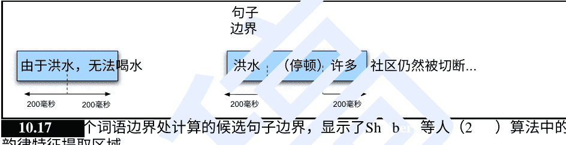

图10.17显示了示例句子中的候选边界位置。 常见的提取特征包括：

- 停顿特征：候选边界处的词语间停顿持续时间。
- 持续时间特征：候选边界之前的音素和韵脚（核心加尾音）的持续时间。由于某些音素本身比其他音素更长，每个音素都被归一化为该音素的平均持续时间。
- F0特征：边界处的音高变化；句子边界通常具有音高重置（音高突变），而非边界更有可能在边界处保持连续音高。 另一个有用的F0特征是前边界词语的音高范围；句子通常以最后的下降结束（第8.3.3节），接近说话者的F0基线。

对于标点符号的检测，使用类似于句子边界检测的特征，但有多个隐藏类别（逗号、句末问号、引号、无标点符号），而不仅仅是两个。

对于这两个任务，可以通过将句子分割建模为一个HMM，其中隐藏状态对应于句子边界或非边界决策，而不是简单的二元分类器，可以融入序列信息。当我们介绍第24.5.2节中的对话行为检测时，我们将更详细地描述如何结合韵律和词汇特征的方法。

### 不流畅修复

回顾第12.8.1节，对话中的不流畅或修复包括以下现象：例如填充词（或填充停顿）：但是，嗯，那太荒谬了，单词片段

| 不流畅类型 | 示例 |
| :--- | :--- |
| 填充停顿 | 但是，**嗯**，那太荒谬了 |
| 单词片段 | |
| 重复 | 一个人去了一个**垃- 垃圾场** |
| 重新开始 | **这只是一个改变，改变位置** |
| | **我觉得这很奇怪** |

图10.18中的ATIS句子显示了重新开始和填充词 uh，显示了开始编辑阶段的中断点。


检测不流畅的方法与检测句子边界非常相似；分类器在每个词边界处进行决策，使用文本和韵律特征进行训练。常用的HMM和CRF分类器，并且特征与边界检测的特征非常相似，包括相邻单词和词性标签，词边界处的停顿持续时间，词和边界之前的音素持续时间，边界间的音高差异等等。

为了检测片段，使用了用于检测语音质量的特征 (Liu, 2004)，如抖动，即音高周期中的扰动测量 (Rosenberg, 1971)，频谱倾斜，即频谱的斜率 (见第9.3.1节)，以及开放比例，即声门周期中声带开放的部分的百分比 (Fant, 1997)。

## 10.7 人类的语音识别

人类在语音识别方面当然比机器更擅长；目前的机器在清晰语音上大约比人类差五倍，而在嘈杂语音上差距似乎在增大。

人类的语音识别与ASR算法有一些共同之处。我们之前提到过，信号处理算法如PLP分析 (Hermansky, 1990) 实际上是受到人类听觉系统的特性启发的。此外，人类的词汇访问属性 (从心理词典中检索单词的过程) 也适用于ASR模型：频率、并行处理和基于线索的处理。例如，与ASR中的 N-gram语言模型一样，人类的词汇访问对单词频率敏感。高频率的口语词汇比低频率的词汇更快地被访问或者需要更少的信息。它们被成功地识别出来。

在噪声环境中，高频词比低频词更容易被识别，或者当只有单词的部分被呈现时（Howes, 1957; Grosjean, 1980; Tyler, 1984, 等等）。与ASR模型类似，人类的词汇访问是并行的：多个单词同时处于活跃状态（Marslen-Wilson和Welsh, 1978; Salasoo和Pisoni, 1985, 等等）。

最后，人类的语音感知是基于线索的：语音输入通过在许多不同层次上整合线索来解释。人类的音素感知结合了声学线索，如共振峰结构或发声的精确时机（Oden和Massaro, 1978; Miller, 1994），视觉线索，如唇部运动（McGurk和Macdonald, 1976; Massaro和Cohen, 1983; Massaro, 1998），以及词汇线索，如音素所在单词的身份（Warren, 1970; Samuel, 1981; Connine和Clifton, 1987; Connine, 1990）。例如，在通常被称为恢复效应的情况下，Warren（1970）采用了一个语音样本，并用咳嗽替换了一个音素（例如，在legislature中的[s]）。Warren发现，听取结果磁带的受试者通常会听到整个单词legislature，包括[s]，并将咳嗽视为背景。

### 麦格尓克效应

在McGurk效应中，（McGurk和MacDonald, 1976）表明，视觉输入可以干扰音素感知，导致我们感知到完全不同的音素。他们向受试者展示了一个人说音节 ga的视频，其中音频信号被替换为另一个人说音节 ba。受试者报告听到了类似 da的声音。你可以在网络上的视频演示中亲自尝试一下，例如访问http://www.haskins.yale.edu/featured/hears/mcgurk.html。

### 词关联

人类语音感知中的其他线索包括词关联（如果最近听到了一个语义相关的词，其他词的访问速度会更快）和重复启动（如果刚刚听到了某个词，该词的访问速度会更快）。这些结果的直觉被纳入了第4章中讨论的最新语言模型，例如Kuhn和De Mori（1990）的缓存模型，该模型模拟了重复启动，或者Rosenfeld（1996）的触发模型以及Coccaro和Jurafsky（1998）和Bellegarda（1999）的LSA模型，这些模型模拟了词关联。Cole和Rudnicky（1983）提醒我们，关于上下文对词和音素处理的影响的许多洞见实际上是由William Bagley（1901）发现的。Bagley通过在爱迪生的留声机圆筒上记录语音，修改它并呈现给受试者来获得他的结果，包括音素恢复效应的早期版本。Bagley的结果被遗忘，直到很久以后才重新发现。2

当前ASR模型与人类语音识别之间的一个区别是模型的时间进程。ASR算法的性能对于解码搜索来说非常重要，它需要优化整个话语。这意味着解码器在句子结束时返回的最佳句子假设可能与句子中间时的当前最佳假设非常不同。相比之下，有大量证据表明人类处理是在线的：人们逐步分割将语音和话语转化为单词，并在听到时为其分配一个解释。例如，Marslen-Wilson（1973）研究了紧密的跟读者：能够以短至250毫秒的延迟跟读（重复）一段话语的人。Marslen-Wilson发现，当这些跟读者犯错时，这些错误在句法和语义上都存在。在上下文中，这些结果在语义上是合适的，表明在这250毫秒内进行了词分割、解析和解释。Cole (1973)和Cole and Jakimik (1980)在他们对发现发音错误的研究中也发现了类似的效果。这些结果导致了人类语音知觉的心理模型（如Cohort模型（Marslen-Wilson和Welsh, 1978）和计算TRACE模型（McClelland和Elman, 1986））关注于词选择和分割的时间过程。例如，TRACE模型是一个基于独立计算单元组织成三个层次（特征、音素和词）的连接主义交互激活模型。每个单元代表对其在输入中的存在的假设。单元通过输入并行激活，并且激活在单元之间流动；不同层次上的单元之间的连接是兴奋性的，而单个层次上的单元之间的连接是抑制性的。因此，一个词的激活会轻微地抑制其他所有词。

我们关注的是人类和机器语音识别之间的相似之处；同时也存在许多不同之处。特别是，已经证明了许多其他线索在人类语音识别中起到了作用，但尚未成功地集成到ASR中。其中最重要的缺失线索类别是韵律。举一个例子，Cutler和Norris（1988），Cutler和Carter（1987）指出，大多数多音节的英语单词标记在初始音节上有重音，这表明在他们的音节划分策略（MSS）中应该使用重音作为单词划分的线索。另一个区别是人类词汇访问表现出邻近效应（一个词的邻近词是与之相似的词的集合）。

具有大量频率加权邻居的单词比邻居较少的单词访问速度较慢（Luce等，1990）。目前的ASR模型通常不关注这种单词级别的竞争。

## 10.8 摘要

- 我们介绍了两种先进的解码算法：多通道（N最佳或格）解码算法和堆栈或 A*解码。
- 高级声学模型基于上下文相关的三音素而不是音素。由于完整的三音素集合太大，我们使用了一较小数量的自动聚类的三音素。
- 声学模型可以适应新的说话者。
- 发音变异是人类语音识别中的一个错误源，但目前的技术无法成功处理。

# 参考文献和历史注释

请参考前一章节以了解相关的语音识别历史。请注意，尽管堆栈解码等同于人工智能中开发的A*搜索，但堆栈解码算法是独立于信息理论文献中开发的。364章节。

> A*搜索

## 语音识别：高级主题

请注意，虽然堆栈解码等同于人工智能中开发的A*搜索，但堆栈解码算法是独立于信息理论文献中开发的。有关声道长度归一化的有用参考文献包括（Cohen et al.,1995; Wegmann et al., 1996; Eide and Gish, 1996; Lee and Rose, 1996; Welling et al.,2002; Kim et al., 2004）。

当前语音识别研究中有许多涉及到HMM模型的替代方案。这些新的架构包括新的图模型（动态贝叶斯网络，因子HMM等）（Zweig, 1998; Bilmes, 2003; Livescu等，2003; Bilmes和Bartels, 2005; Frankel等，2007），以及试图用基于片段的识别器（尝试检测可变长度的片段（音素））替换基于帧的HMM声学模型（对每个帧做出决策）（Digilakis, 1992; Ostendorf等，1996; Glass, 2003）。基于新的地标的识别器和基于语音学的识别器专注于使用独特的声学或语音学特征（分别）（Niyogi等，1998; Livescu, 2005; Hasegawa-Johnson和et al, 2005; Juneja和Espy-Wilson, 2003）。有关元数据研究的概述，请参见Shriberg（2005）。Shriberg（2002）和Nakatani和Hirschberg（1994）是关于语音和词汇的计算研究的语料库研究，重点是语音中的不流畅性的声学和词汇特性。关于从语音中进行句子分割的早期论文包括Wang和Hirschberg（1992），Ostendorf和Ross（1997）。关于句子分割的最新工作，请参见Shriberg等（2000），Liu等（2006a）。关于标点符号检测，请参见Kim和Woodland（2001），Hillard等（2006）。关于语音和词汇的Honal和Schultz（2003, 2005），Lease等（2006），以及共同解决多个元数据提取任务的一些论文（Heeman和Allen, 1999; Liu等，2005, 2006b）。

# 练习

10.1 在第345页上实现图10.7中的堆栈解码算法。选择一个非常简单的h*函数，例如估计句子中剩余单词的数量。

10.2 修改第9.23章的前向算法，使用图10.10中的树形词典（第347页）。

10.3 许多ASR系统，包括Sonic和HTK系统，使用一种不同的维特比算法，称为令牌传递维特比算法（Young等，1989年）。阅读这篇论文并实现这个算法。

# 第11章 计算音韵学

> *bidakupadotigolabubidakutupiropadotigolabutupirobidaku...*
词分割刺激（Saffran等，1996a年）

回顾第7章，音韵学是语言学中描述不同环境中声音不同实现方式的领域，以及这个声音系统与语法的其他部分的关系。本章介绍了计算音韵学，即在音韵理论中使用计算模型。

计算音韵学的一个重点是计算模型的音韵表示，以及如何使用音韵模型将表面音韵形式映射到基础音韵表示。（非计算的）音韵理论中的模型是生成的；模型的目标是表示基础形式如何生成表面音韵形式。在计算中，我们通常更关注音韵分析的另一个问题：从表面形式到基础结构的转换。这项任务的一个主要工具是有限状态自动机，它在两个模型家族中被使用：有限状态音韵学和优选理论。

一种相关的音韵分析任务是音节化：将音素序列分配给音节结构的任务。除了理论上的兴趣，音节化在语音合成的诸如发音词典设计等方面也被证明是一个有用的实用工具。因此，我们总结了一些音节化的实用算法。

最后，我们在本章的剩余部分讨论了音韵和形态表示的学习问题。

## 11.1 有限状态音韵学

第3章表明，拼写规则可以通过转换器来实现。音韵规则可以以相同的方式实现为转换器；事实上，Johnson（1972）和Kaplan和Kay（1981）关于有限状态模型的最初工作是基于音韵规则而不是拼写规则的。有许多不同的计算音韵模型，它们以各种方式使用有限自动机来实现音韵规则。我们将首先描述Kosken niemi（1983）的双层形态学，这在第3章中首次提到。让我们从直觉开始，通过观察图11.1中的转换器，该转换器模拟了（11.1）中的简化闪烁规则：

(11.1) `/t/ → [dx] / V — V`

图11.1中的转换器接受任何包含正确翻转的字符串

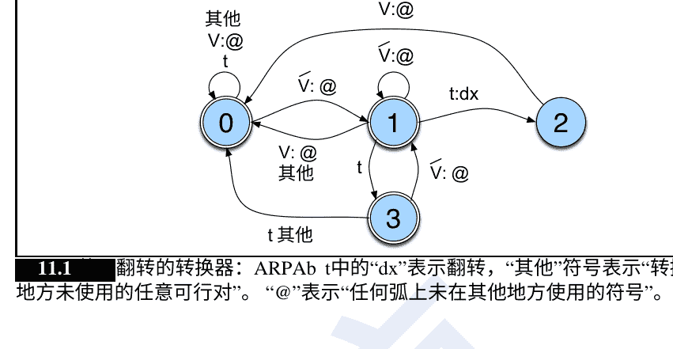

11.1 翻转的转换器：ARPA b 中的“dx”表示翻转，“其他”符号表示“转换器中其他地方未使用的任意可行对”。“@”表示“任何弧上未在其他地方使用的符号”。

在一些位置（重读元音后，非重读元音前），并拒绝不发生翻转或在错误环境中发生翻转的字符串。我们之前见过转换器和规则；双层形态学的直觉是扩充规则符号以更自然地对应转换器。我们通过开始讨论规则排序的概念来激发他的想法。在传统的音韵系统中，许多不同的音韵规则适用于词汇形式和表层形式之间。有时这些规则会相互作用；一个规则的输出会影响另一个规则的输入。在转换器系统中实现规则交互的一种方法是以级联方式运行转换器。例如，考虑处理英语名词复数后缀-s所需的规则。这个后缀在[s]、[sh]、[z]、[zh]、[ch]或[jh]之后发音为[ix z]（因此peaches发音为[p iy ch ix z]，foxes发音为[f ae k s ix z]），在有声音后发音为[z]（猪的发音为[p ih g z]，并且在无声音后面的[s]（猫的发音为[kae t s]）。我们通过编写音韵规则来建模这种变化，以在不同的语境中实现形态素。我们首先需要选择这三种形式之一([s], [z], [ix z])作为后缀的“词汇”发音；我们之所以选择[z]，只是因为它简化了规则的编写。接下来我们编写两个音韵规则。其中一个规则，类似于第63页的E插入拼写规则，在词素末尾的擦音后面插入一个[ix]，然后再插入复数词缀[z]。另一个规则确保在无声辅音后正确实现-s后缀为[s]。

(11.2)  ϵ → ix / [+sibilant] ^ —— z #
(11.3)  z → s / [-voice] ^ —— #

这两个规则必须被排序；规则（11.2）必须在规则（11.3）之前应用。这是因为（11.2）的环境包括z，并且规则（11.3）改变了z。考虑在词汇形式fox与复数-s连接时运行这两个规则：

- 词汇形式:       f aa k ^ z
- 应用（11.2）:   f aa k s ^ ix z
- （11.3）不适用: f aa k s ^ ix z

> ¹出于教学目的，这个例子错误地假设影响闪音的因素纯粹是语音的，而且是非随机的。

如果去声规则（11.3）先排序，我们会得到错误的结果。这种情况，其中一个规则破坏了另一个规则的环境，被称为出血：²

- 词汇形式: f aa k s ^ z
- (11.3)适用: f aa k s ^ s
- (11.2)不适用: f aa k s ^ s

正如第3章所建议的，这些规则可以由一个转换器表示。由于规则是有序的，转换器也需要有序。例如，如果它们被放置在一个级联中，第一个转换器的输出将成为第二个转换器的输入。

许多规则可以以这种方式级联在一起。正如第3章所讨论的，运行一个级联，特别是具有许多级别的级联，可能会很难处理，因此通常会通过组合各个转换器来替换为一个更复杂的单一转换器。

Koskenniemi在第3章中简要介绍的两级形态学方法是解决规则排序问题的另一种方式。Koskenniemi（1983）观察到语法中的大多数音韵规则是相互独立的；规则之间的feeding和bleeding关系并不是常见的。因此，Koskenniemi提出音韵规则应该并行运行而不是串行运行。

在存在规则交互（喂养或出血）的情况下，我们通过稍微修改一些规则来处理。Koskenniemi的双层规则可以被视为一种对词汇-表面映射的合法性进行声明性约束的方式。

双层规则还与传统的音韵规则不同，它们通过使用四种不同的规则运算符明确地编码了强制性或可选性；⇔规则对应于传统的强制性音韵规则，而⇒规则实现了可选规则：

| 规则类型       | 解释                                     |
| -------------- | ---------------------------------------- |
| a:b ⇔ c __     | 在上下文c中，a总是被实现为b              |
| a:b ⇒ c __     | 在上下文c中，a可以被实现为b              |
| a:b ⇔ c .      | 在上下文c中，a必须被实现为b且仅在其他地方不出现 |
| a:b /⇐ c __    | 在上下文中，a从未被实现为b               |

两级规则的最重要直觉和让它们避免馈送和出血的机制是它们能够在两个层次上表示约束的能力。

这是基于使用冒号（“:”）的，这在第3章中简要提到过。符号 a:b 表示一个词汇 a 映射到一个表面形式 b。因此 a:b ⇔ c: __ 表示 a 在词汇 c 之后实现为 b。相比之下， a:b ⇔ c __ 表示 a 在表面形式 c 之后实现为 b。如第3章所讨论的，没有冒号的符号 c 等同于 c:c，表示一个词汇 c 映射到一个表面形式 c。

图11.2展示了双层方法如何避免对ix插入和z去声规则进行排序的直观理解。思想是z去声规则将一个词汇z插入映射到一个表层z，ix规则引用词汇z。


模拟这个约束的双层规则如下所示：

(11.4)  e:ix  ⇔ [+sibilant]: ^ — z:#
(11.5)  z:s  ⇔ [-voice]: ^  #

正如第3章所讨论的，有编译算法可以根据规则创建自动机。Kaplan和Kay（1994）给出了这些算法的一般推导，而Antworth（1990）给出了一个特定于两级规则的推导。对应于这两个规则的自动机分别显示在图11.3和图11.4中。图11.3基于第3章的图3.17；请参阅第64页以了解该自动机的工作原理的提醒。请注意，在图11.3中，复数形态素由z:表示，表示约束是关于词汇而不是表面z的。

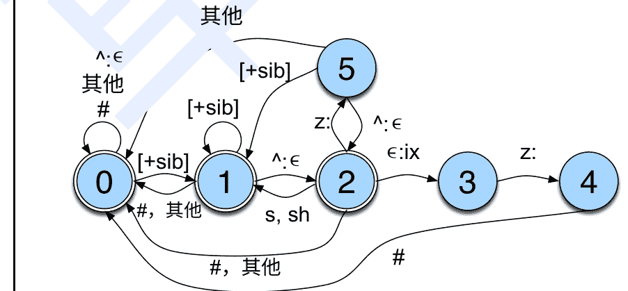

11.3i 规则 2的转换器。该规则可以在形态素以s b lant结尾，并且下一个形态素是词尾z时插入/ ix/。

图11.5展示了两个自动机在输入[f aa k s ^ z]上并行运行的情况。请注意，两个自动机都假设默认映射^:ε用于去除形态边界，并且两个自动机都以接受状态结束。

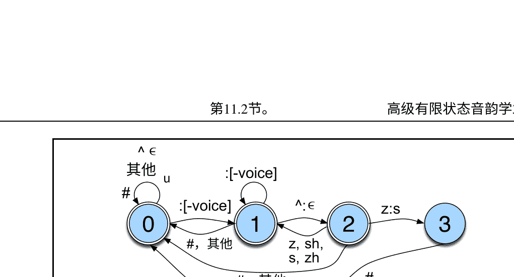


## 11.2 高级有限状态音韵学

### 11.2.1 和谐

有限状态音韵学模型也被应用于更复杂的音韵和形态现象。让我们考虑一种有限状态模型，用于描述加利福尼亚州的Yawelmani方言中三个音韵规则的复杂交互。⁴

首先，尤库茨语（像许多其他语言，包括土耳其语和匈牙利语）具有元音和谐。元音和谐是一个过程，其中一个元音会改变其形式以与相邻的元音相似。在尤库茨语中，后缀元音会改变其形式，以与前面的词干元音在后缀和圆唇方面保持一致。也就是说，如果词干元音是/u/，那么前元音/i/将出现为后元音[u]。这个和谐规则适用于后缀和词干元音具有相同高度的情况（例如，/u/和/i/都是高音，/o/和/a/都是低音）。

> ³这些规则最初是在传统的乔姆斯基和哈勒（1968）格式中由基斯伯斯（1969）根据纽曼（1944）的实地工作制定的。
> ⁴来自Cole和Kisseberth（1995年）的例子。为了教学简化，一些系统的部分，如元音未规定，已被删除（Archangeli，1984年）。

|          | 高词干     |             | 低词干     |             |
|----------|------------|-------------|------------|-------------|
|          | 词汇       | 表面形式    | 词汇       | 表面形式    |
| **和谐** | dub+hìn    | dubhun “纠缠” | bok’+al    | bok’ol “可能吃” |
| **无和谐** | xìl+hìn    | xìlhìn “牵着手” | xat’+al    | xat’al “可能找到” |

第二个相关规则，降低，使长高元音变为低元音； /u:/ 变为 [o:], /i:/ 变为[e:], 而第三个规则，缩短，缩短了闭音节中的长元音：

| 降低                     | 缩短             |
|--------------------------|------------------|
| ?u:t’+it → ?o:t’ut “偷，被动式过去时” | s:ap+hìn → saphin |
| mi:k’+it → me:k’+it “吞咽，被动式过去时” | sudu:k+hìn → sudokhun |

这三个Yokuts规则必须有序，就像插入ix和去声z的规则必须有序一样。在降低之前，必须先进行调音，因为词汇形式中的/u:/会导致/i/在表面形式 [?o:t’ut]之前变成 [u]。在缩短之前，必须先进行降低，因为/sudu:k+hin/中的/u:/会降低为 [o]；如果在缩短之后进行排序，它将在表面上出现为 [u]。

Yokuts数据可以被建模为三个级联规则，或者在两级形式主义中被建模为三个并行规则；图11.6展示了这两种架构 (Goldsmith, 1993; Lakoff, 1993; Karttunen, 1998)。就像之前介绍的两级示例一样，规则通过有时参考词汇上下文，有时参考表层上下文来工作；将规则写下留给读者作为练习4。

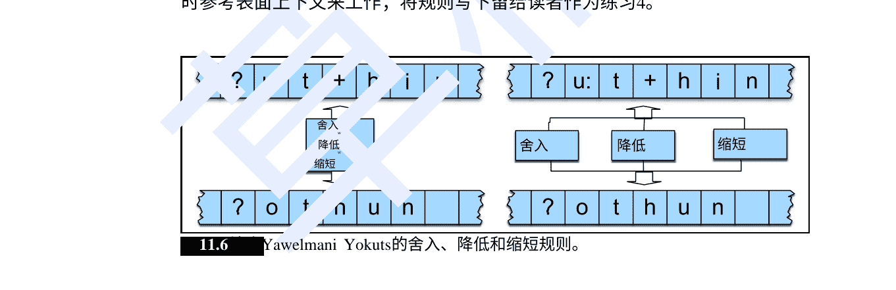

### 11.2.2 模板形态学

有限状态的音韵学和形态学模型也被提出用于Semitic语言（如阿拉伯语、希伯来语和叙利亚语）中常见的非连续形态学（在第52页讨论）。

有许多计算有限状态的非连续形态学实现。其中许多借鉴了McCarthy (1981) 的CV方法，其中像/katab/这样的单词由三个独立的形态素表示；一个由辅音组成的根形态素 (ktb) ，一个由元音组成的元音形态素 (a) ，以及一个CV模式形态素（有时称为binyan或CV骨架） (CVCVC)。McCarthy将这些形态素表示在三个独立的形态层上 (Goldsmith, 1976)。

例如，Kay（1987）提出的一种有影响力的模型使用单独的磁带来表示麦卡锡的每个层次。Kay模型的一个高级直觉如图11.7所示，该模型使用四个磁带而不是两个磁带进行读取。


这种多磁带模型的复杂之处在于设计一台能够正确对齐磁带上各个字符串的机器；Kay提出binyan磁带可以作为对齐的一种指导。Kay的直觉导致了一些更加完整的塞米特语形态的有限状态模型；请参阅本章末尾有关这些模型的详细信息，以及基于新的有限状态操作的替代方案。

## 11.3 计算优选理论

在传统的音韵演变中，我们给出了一个基础的词汇形式和一个表面形式。然后，音韵系统由一系列规则组成，这些规则将基础形式映射到表面形式。最优理论（OT）(Prince and Smolensky, 1993)提供了一种基于过滤而不是转换的音韵演变观点。OT模型包括两个函数(GEN和EVAL)和一组排名违规约束(CON)。给定一个基础形式，GEN函数产生所有可能的表面形式，甚至包括那些对于输入来说不可能是合法表面形式的形式。然后，EVAL函数按照约束的排名顺序将这些表面形式应用于每个约束。选择最符合约束的表面形式。

让我们简要介绍一下OT，使用一些Yawlemani数据，然后转向计算分支。除了上面讨论的有趣的元音和谐现象外，Yawelmani还有一些音韵约束，禁止连续出现辅音序列；不允许在表面词中出现三个连续的辅音（CCC）。然而，有时一个词包含两个连续的语素，这样的语素

> ⁶通过Yawelmani的例子，对OT的解释主要参考了Archangeli（1997）和Jennifer Cole在1999年LSA语言学研究所的讲座。

第一个以两个辅音结尾，第二个以一个辅音开头（或反之亦然）。语言是如何解决这个问题的？事实证明，Yawelmani要么删除其中一个辅音，要么在中间插入一个元音。

如果一个词干以C结尾，它的后缀以CC开头，那么后缀的第一个C会被删除（这里的“+”表示词素边界）：

```
C删除： C → ∅ / C + __ C
```

例如，简化一些，CCVC“被动结果修饰”词素 hne:l 如果前一个词素以辅音结尾，则会删除初始的C。因此，在 diyel “guard” 之后，我们会得到形式 diyel-ne:l-a w，“guard - 被动结果修饰 - 地点”。

如果一个词干以CC结尾，而后缀以C开头，语言会插入一个元音来打破前两个辅音:

```
元音插入：∅ → V / C __ C + C
```

例如，在词根 ?ilk- “唱歌” 后面跟着以辅音C开头的后缀 -hin 时，会插入 i，形成 ?il ik-hin “唱过”，但是在后面跟着以元音V开头的后缀 -en 时，比如 ?ilken “将要唱”，就不会插入 i。

Kisseberth (1970)提出这两个规则具有相同的功能：避免连续三个辅音。让我们用音节结构的术语重新表述这一点。恰好Yawelmani音节只能是CVC或CV的形式；复杂的声母或韵母，即多个辅音，是不允许的。由于表面上不允许CVCC音节，当CVCC词根出现时，必须重新划分音节。

表面。从音节划分的角度来看，这些插入和删除都是为了使Yawelmani单词能够正确划分音节。以下是没有变化、插入和删除的重新划分的例子：

| 基础表面形态音节划分词义 | | |
| :--- | :--- | :--- |
| ?ilk-en | ?il.ken | “将唱歌” |
| ?ilk-hin | ?i.lik.hin | “唱” |
| | diyel-hnil-aw di.yel.ne:.law | “守卫 - 被动修饰 - 位置” |

优选理论的直觉是直接表示这种音节结构的约束，而不是使用特定的插入和删除规则。其中一个约束条件，*COMPLEX，表示“没有复杂的开头或结尾”。

另一类约束要求表面形式与底层形式完全相同。因此，FAITHV表示“不要删除或插入元音”，而FAITHC表示“不要删除或插入辅音”。给定一个底层形式，GEN函数生成所有可能的表面形式（即，每个可能的段落插入和删除与每个可能的音节化），并通过使用这些（可违反的）约束来由EVAL函数进行排名。这个想法是，虽然一般来说插入和删除是不被推荐的，在某些语言和情况下，它们比违反其他约束更受欢迎，比如音节结构的约束。图11.8显示了架构。


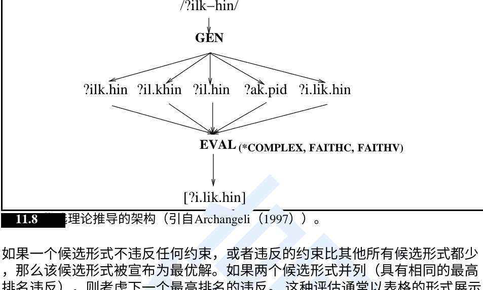

如果一个候选形式不违反任何约束，或者违反的约束比其他所有候选形式都少，那么该候选形式被宣布为最优解。如果两个候选形式并列（具有相同的最高排名违反），则考虑下一个最高排名的违反。这种评估通常以表格的形式展示，称为表格（复数形式为tableaux）。左上角的单元格显示输入，约束按照等级顺序列在顶行，可能的输出沿着最左列。如果一个形式违反了一个约束，相关的单元格包含*；*!*！表示致命违反，导致候选形式被淘汰。对于不相关的约束（因为已经违反了更高级别的约束），单元格被阴影覆盖。

+   * 包含*；
* *！表示致命违反，导致候选形式被淘汰。对于不相关的约束（因为已经违反了更高级别的约束），单元格被阴影覆盖。

| | /皮尔克欣/ | *C复杂 | F信仰C | F信仰V |
|---|---|---|---|---|
| 皮尔克欣 |  | *! |  |  |
| 皮尔克欣 |  | *! |  |  |
| 皮尔克欣 |  |  | *! |  |
| **皮利克欣** | ✓ |  |  | * |
| 帕克皮德 |  |  | *! |  |

优选理论推导的一个吸引之处在于约束被假定为跨语言的概括。也就是说，所有语言都被假定为具有某种忠实性的版本，对简单音节有一定偏好等等。语言在约束的排序上有所不同；因此，英语可能将F信仰C排得比*C复杂更高。（我们如何知道这一点？）

### 11.3.1 优选理论的有限状态转换器模型

现在我们已经概述了优选理论的语言学动机，让我们转向计算上的影响。我们将探讨两个方面：通过有限状态模型实现OT，以及OT的随机版本。

虽然有无限多个候选者，但传统上只显示“接近”的候选者；在下面的表格中，我们只显示了输出帕克皮德，以明确表明即使是非常不同的表层形式也应包括在内。

# 优选理论中的推导是否可以通过有限状态转换器来实现？

Frank和Satta（1998）在Ellison（1994）的基础工作之后，证明了（1）如果GEN是一个正则关系（例如假设输入不包含某种类型的上下文无关树），并且（2）如果任何约束的允许违反次数有一定的有限界限，那么可以通过有限状态手段计算出OT推导。这第二个约束是相关的，因为OT的一个特性我们还没有提到：如果两个候选者恰好违反相同数量的约束，那么获胜的候选者是在相关约束中违反次数最少的那个。

实现OT作为有限状态系统的一种方法是由Karttunen（1998）在上述工作和Hammond（1997）的基础上研究出来的。在Karttunen的模型中，GEN被实现为一个有限状态转换器，它接收一个底层形式并生成一组候选形式。例如，在上面的音节化示例中，GEN将生成所有与输入具有辅音删除或元音插入变体的字符串，以及它们的音节化形式。

每个约束都被实现为一个过滤器转换器，只允许通过满足约束的字符串。对于合法的字符串，转换器就像是一个恒等映射。例如，*COMPLEX将通过一个转换器来实现，将任何输入字符串映射为它自身，除非输入字符串的开头或结尾有两个辅音，否则将映射为null。

然后，约束可以按照级联的方式放置，其中高级别的约束首先运行，如图11.9所示。

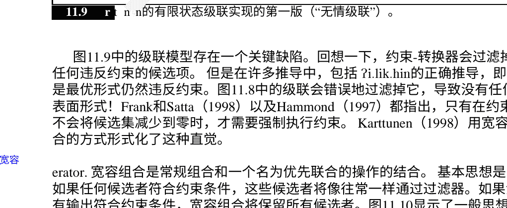

图11.9中的级联模型存在一个关键缺陷。回想一下，约束-转换器会过滤掉任何违反约束的候选项。但是在许多推导中，包括 ?i.lik.hin的正确推导，即使是最优形式仍然违反约束。图11.8中的级联会错误地过滤掉它，导致没有任何表面形式！Frank和Satta（1998）以及Hammond（1997）都指出，只有在约束不会将候选集减少到零时，才需要强制执行约束。Karttunen（1998）用宽容组合的方式形式化了这种直觉。

## 组合宽容

erator. 宽容组合是常规组合和一个名为优先联合的操作的结合。基本思想是，如果任何候选者符合约束条件，这些候选者将像往常一样通过过滤器。如果没有输出符合约束条件，宽容组合将保留所有候选者。图11.10显示了一般思想；

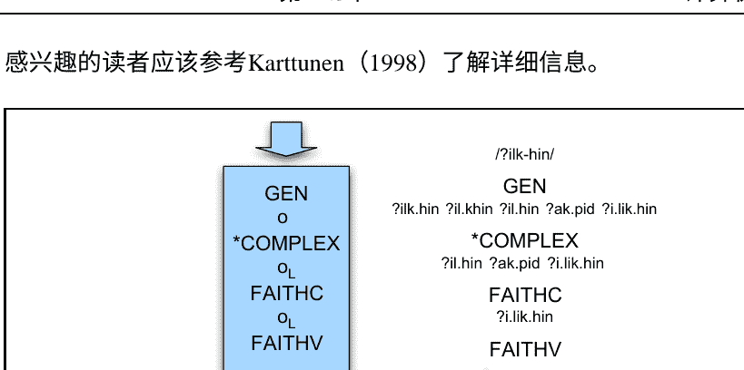

感兴趣的读者应该参考Karttunen（1998）了解详细信息。

### 11.3.2 优选理论的随机模型

经典的OT并不适用于处理我们在第7.3节中看到的这种变异，因为它为每个输入分配一个最和谐的输出。处理变异需要更动态的约束排序概念。我们在那一节中提到了社会语言学中的变异模型，其中使用逻辑回归来结合语音、语境和社会因素，以预测特定语音变体的概率。这种变异感觉的一部分可以通过概率增强来吸收到优选理论框架中。

其中一种增强是随机OT（Boersma和Hayes，2001）。在随机OT中，每个约束都与连续尺度上的一个值相关联。与排名顺序不同，连续尺度上的每个约束都与一个值相关联。连续尺度提供了排名无法提供的一点：两个约束的相对重要性或权重可以与它们之间的距离成比例。图11.11显示了这样一个连续尺度的草图。


约束之间的距离如何在评估中发挥作用？随机OT对约束的值做了进一步的假设。与图11.11中的每个约束具有固定值不同，它具有以固定值为中心的高斯分布的值，如图11.12所示。在评估时，通过与每个约束相关的高斯分布的均值和方差来绘制约束的值（选择点），并具有由高斯分布的均值和方差定义的概率。

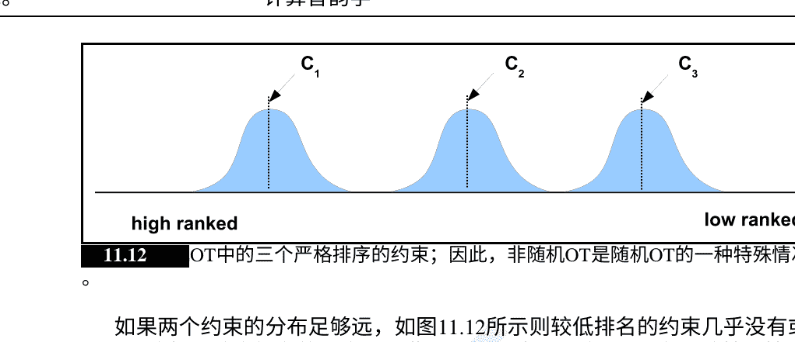

11.12 OT中的三个严格排序的约束；因此，非随机OT是随机OT的一种特殊情况。如果两个约束的分布足够远，如图11.12所示则较低排名的约束几乎没有或没有可能超过较高排名的约束。因此，随机OT将非随机OT作为一种特殊情况包括在内。

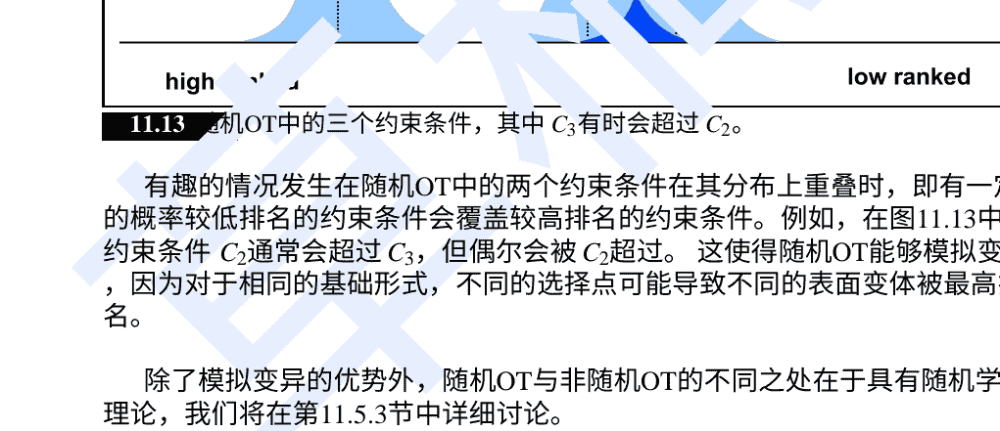

11.13 随机OT中的三个约束条件，其中$C_3$有时会超过$C_2$。有趣的情况发生在随机OT中的两个约束条件在其分布上重叠时，即有一定的概率较低排名的约束条件会覆盖较高排名的约束条件。例如，在图11.13中，约束条件$C_2$通常会超过$C_3$，但偶尔会被$C_3$超过。这使得随机OT能够模拟变异，因为对于相同的基础形式，不同的选择点可能导致不同的表面变体被最高排名。除了模拟变异的优势外，随机OT与非随机OT的不同之处在于具有随机学习理论，我们将在第11.5.3节中详细讨论。我们可以将随机OT本身视为第6章中一般线性模型的特例。

## 11.4 音节划分

音节划分音节划分，即将一系列音素分割成音节的任务，在各种语音应用中非常重要。在语音合成中，音节对于预测重音等韵律因素很重要；音素的实现也取决于其在音节中的位置（开音节[l]的发音与闭音节[l]的发音不同）。在语音识别中，音节划分已被用于构建以音节而不是音素表示发音的识别器。音节划分可以帮助发现错误。

通过找到无法划分音节的单词，发音词典可以帮助标注语料库的音节边界，用于语料库语言学研究。音节划分在理论生成音韵学中也起着重要作用。

音节划分是一个困难的计算任务的一个原因是没有完全一致的音节边界定义。不同的在线音节划分词典（如CMU和CELEX词典）有时会选择不同的音节划分。事实上，正如Ladefoged (1993) 指出的那样，有时候甚至不清楚一个单词有多少个音节；一些单词 (meal, teal, seal, hire, fire, hour) 可以被视为有一个音节或两个音节。

与语音和语言处理相关的大部分工作，音节器可以基于手写规则或从手工标记的训练集中进行机器学习。在设计任一种音节化器时，我们可以使用哪些知识？一种可能的约束是最大起始原则，它指出当在元音 (V) 之前的词中出现一系列辅音 (VCCV) 时，尽可能多的辅音（在语言的其他约束条件下）应该被划分到第二个音节的起始部分，而不是第一个音节的尾部。因此，最大起始原则更倾向于将音节划分为V.CCV，而不是VC.CV或VCC.V。

因此，在一个音节C1C2VC3C4中，核心V将是最具音高的元素，辅音C2将比核心更具音高。因此，在一个音节C1C2VC3C4中，核心V将是最具音高的元素，辅音C2将比C1和辅音C3比辅音C4更音韵。

Goldwater和Johnson (2005) 基于最大起始和音韵排序实现了一个简单的基于规则的与语言无关的分类器。在两个音节核之间的辅音群中，音韵约束音节边界要么在最低音韵的辅音之前，要么在最低音韵的辅音之后。将音韵与最大起始结合起来，他们的解析器预测音节边界在最低音韵的辅音之前。他们表明，这个简单的音节器在英语和德语中正确地将86-87%的多音节单词音节化。

虽然这个错误率并不令人不满意，并且还有进一步的语言学和一些心理学证据表明这些原则在音节结构中起到了作用，但是最大起始和音韵排序似乎有例外。例如，在英语中，像spell这样的单词中的音节初始辅音群/sp st sk/中，较不音韵的/p/出现在较音韵的/s/和元音之间，违反了音韵排序 (Blevins, 1995)。如果没有一种方法来排除在特定语言中不允许的起始辅音群，比如英语中的/kn/，那么音韵排序加上最大起始就会错误地预测像weakness这样的单词的音节化为wea.kness而不是weak.ness。此外，其他约束似乎也很重要，包括音节是否重读（重读音节往往有更复杂的尾音），形态边界的存在与否，甚至是单词的拼写 (Titone和Connine, 1997; Treiman等, 2002)。

# 第378章。 计算音韵学

为了实现更高的性能，需要使用这些特定于语言的知识。最常用的基于规则的音节划分器是基于Kahn（1976）的论文，由Fisher（1996）实现。Kahn算法利用特定于语言的信息，以允许的英语初始聚类列表，允许的英语结束聚类列表和“普遍不良”聚类列表的形式。该算法接受音素字符串以及其他信息（如单词边界和重音），并在音素之间分配音节边界。音节根据三个规则逐步建立起来，如图11.14所示。规则1在每个音节段上形成核，规则2a将起始辅音附加到核上，规则2b将尾辅音附加到核上。8规则2a和2b使用合法起始辅音序列列表（包括例如[b]，[b l]，[b r]，[b y]，[ch]，[d]，[d r]，[d w]，[d y]，[f]，[f l]，[f r]，[f y]，[g]，[g l]，[g r]，[g w]等）和合法尾聚类列表。英语中有很多尾辅音聚类；其中一些较长（4个辅音）的聚类包括：

+   k s t s  l f t h s  m f s t  n d t h s  n k s t  r k t s  r p t s
k s t h s  l k t s  m p f t  n t s t  n k t s  r l d z  r s t s
l t s t  m p s t  n t t h s  n k t h s  r m p t h  r t s t

该算法还接受一个参数，指示语音的速度或正式程度；语音越快或越非正式，基于进一步的规则，就会发生更多的音节重组，我们还没有展示这些规则

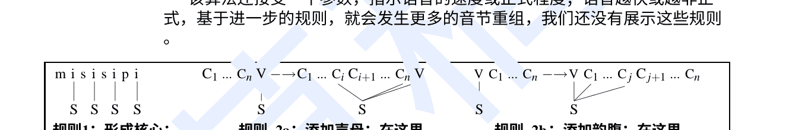

|  | C₁...CₙV → C₁...CᵢCᵢ₊₁...CₙV | V C₁...Cₙ → V C₁...CⱼCⱼ₊₁...Cₙ |
| --- | --- | --- |
| m i s i s i p i | S S S S | S S S S |
| 规则1：形成核心：<br>将S与每个[+音节-音标]片段相关联 | 规则 2a：添加声母：在这里<br>Cᵢ₊₁...Cₙ是一个允许的初始辅音群，但CᵢCᵢ₊₁...Cₙ不是 | 规则 2b：添加韵腹：在这里<br>C₁...Cⱼ是一个允许的韵腹辅音群但C₁...CⱼCⱼ₊₁不是 |
| 11.14 Kahn（1976）的前三个音节化规则。规则2b可能不适用于词边界。 |  |  |

我们可以应用机器学习方法，而不是手写规则，使用一个手动音节化的词典作为监督训练集。例如，CELEX音节化词典在第7.5节中讨论的方法经常被用于这种方式，选择一些词作为训练集，并保留其他词作为开发测试和测试集。统计分类器可以用于预测音节化，包括决策树（van den Bosch，1997），加权有限状态转换器（Kiraz和M¨obius，1998）和概率上下文-无关文法（Seneff等，1996；M¨uller，2002，2001；Goldwater和Johnson，2005）。

例如，Kiraz和M¨obius（1998）算法是一个加权有限状态转换器，它在一系列音素中插入一个音节边界（类似于第3章中看到的词素边界）。一个加权FST（Pereira等，1994）是一个简单的增强-有限转换器的实现，其中每个弧都与一个概率和一对符号相关联。概率表示该路径被选择的可能性；离开一个节点的所有弧上的概率必须总和为1。

8请注意，规则2a在规则2b之前的事实可以看作是最大起始的一种实现。

将这些音节连接在一起形成一个FST，在韵尾之后插入一个音节标记。Kiraz和M`obius（1998）根据训练集中的频率计算路径权重；每个路径（例如核心[iy]）的频率/被分配一个权重1/f。将频率转换为成本的另一种方法是使用对数概率。图11.15显示了一个简化的样本自动机，来自Kiraz和M`obius（1998）。我们仅为一些核心显示了权重。每个可能的起始音节、核心音节和韵尾的弧线都来自一个语言相关的列表，类似于Kahn算法中使用的列表。

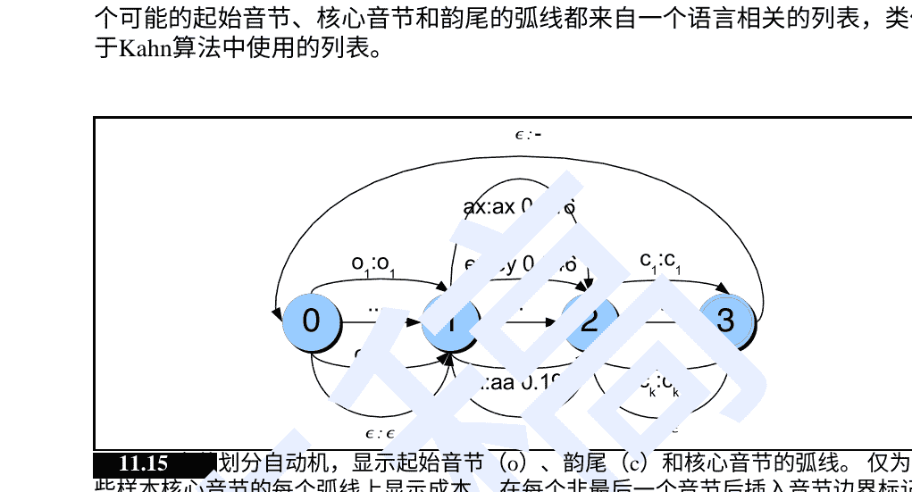

11.15 划分自动机，显示起始音节（o）、韵尾（c）和核心音节的弧线。仅为一些样本核心音节的每个弧线上显示成本。在每个非最后一个音节后插入音节边界标记“-”。ps代表ϵ。简化自K az和M`ob s（998）。

图11.15中显示的自动机可以用于将输入序列（如音标表示的单词[w iy k n eh s]）映射为包含音节标记“-”的输出序列：[w iy k - n eh s]。如果一个单词有多个可能的合法音节划分，那么维特比算法用于选择通过有限状态转换器的最可能路径，从而得到最有可能的划分。例如，德语单词“Fenster”（窗户）有三种可能的音节划分：[fɛns-te]<74>、[fɛn-ste]<75>和[fɛnst-e]<87>（带有角括号的代表成本）。

他们的音节划分器根据训练集中音节开头和结尾的频率选择了最低成本的音节划分 fɛns-te。请注意，由于形态结构对音节划分也很重要，因此可以在形态分析转换器之后放置Kiraz和M`obius（1998）的音节划分转换器，以便音节划分可以受到形态结构的影响。

基于概率上下文无关文法（PCFGs）的最新音节划分器可以模拟音节之间更复杂的层次性概率依赖关系（Seneff等，1996年；M`uller，2002年，2001年；Goldwater和Johnson，2005年）。与van den Bosch（1997年）等其他机器学习方法一起，现代统计音节划分方法的单词准确率约为97-98%，并且音节结构的概率模型也被证明可以预测无意义单词的可接受性（Coleman和Pierrehumbert，1997年）。

音节划分还有其他几个方向。其中之一是使用无监督机器学习算法（Ellison，1992年；M`uller等，2000年；Goldwater和Johnson，2005年）。另一个是使用其他音节划分的线索，如音位变体。

## 11.5 学习音韵学和形态学

机器学习的音韵结构是计算语言学中一个活跃的研究领域，超越了前一节讨论的音节结构的归纳。监督学习的工作基于一个明确标记为诱导音韵（或形态）结构的训练集。无监督学习试图在没有标记的训练数据的情况下诱导音韵或形态结构。让我们来看看学习的三个代表性领域：学习音韵规则，学习形态规则和学习OT约束排序。

### 11.5.1 学习音韵规则

在本节中，我们简要总结了一些早期关于学习音韵规则的文献，通常以两级音韵学的有限状态模型或经典的Chomsky-Halle规则为基础。

Johnson（1984）提供了一个用于音韵规则归纳的最早的计算算法。他的算法适用于形式为(11.8) $a \rightarrow b/C$ 的规则。

在 $C$ 周围的片段的特征矩阵在哪里 $C$。约翰逊算法建立了一套约束方程系统，这些方程必须满足，通过考虑正上下文，即所有上下文 $C_i$ 中出现表面上的 $b$ 的情况，以及所有负上下文 $C_j$ 中出现表面上的 $a$ 的情况。Touretzky等人（1990）以各种方式扩展了约翰逊的工作，包括处理插入和删除规则。

Gildea和Jurafsky（1996）的算法旨在诱导表示我们之前讨论过的两级规则的转换器。Gildea和Juraf-sky的有监督算法是在基础形式和表面形式的配对上进行训练的。例如，他们试图学习英语flapping规则（仅关注音韵环境，忽略社会和其他因素）。因此，训练集包括基础/表面对，其中基础是/t/，表面是flap [dx]，或者基础是/t/，表面是[t]，如下所示：flapping

| 非拍翼黄油 |
| --- |
| /b ah t axr/ → [b ah dx axr] 停止 /s t aa p/ → [s t aa p] 米 /m iy t axr/ → [m iy dx axr] 猫 /k ae t/ → [k ae t] 该算法基于OSTIA |

（Oncina等，1993年），这是一个通用的学习算法，用于在第59页上定义的子序列转换器。Gildea和Jurafsky表明，单独使用OSTIA算法对于学习音韵转换器来说过于普遍，即使给定了大量的基础形式/表面形式对。例如，给定25,000个基础/表面对，像上面的例子一样，算法最终得到了图11.16(a)中巨大且不正确的自动机。然后，Gildea和Jurafsky通过学习偏好来增强了与领域无关的OSTIA系统，这些偏好是特定的。自然语言音韵学。例如，他们添加了一个忠实度偏差，即在表面上，潜在的音段倾向于以相似的方式实现（即在所有事物相等的情况下，潜在的/p/很可能出现为表面[p]）。他们通过使用Levenshtein距离对潜在的和表面的字符串进行对齐，从而在OSTIA中开始实现这一点。他们还添加了关于语音特征（元音与辅音，减少与非减少元音等）的知识。总的来说，添加这些偏差使得OSTIA能够学习图11.16(b)中的自动机，以及其他音韵规则（如德语辅音弱化）的正确自动机。

这个音韵学学习实验说明了成功的学习需要两个组成部分：一个适应一些经验数据的模型和关于模型结构的一些先验知识或偏见。

最近的学习工作要么集中在形态学学习上，要么集中在OT约束的排序上，而不是在规则和约束的归纳上，并将在接下来的两节中讨论。

### 11.5.2 学习形态学

我们在第3章中讨论了有限状态转换器在形态分析中的应用。一般来说，这些形态分析器是手工构建的，并且具有相对较高的准确性，尽管也有一些关于监督机器学习形态分析器的工作（van den Bosch，1997）。然而，最近的工作集中在无监督的自动引导形态结构的方法上。无监督（或弱监督）学习问题具有实际应用，因为有许多语言尚未存在手工构建的形态分析器或形态分割的训练语料库。此外，语言结构的可学习性是语言学中一个被广泛讨论的科学问题；无监督的形态学习可能有助于我们理解语言学习的可能性。

无监督形态学归纳的方法采用了各种启发式或线索来进行适当的形态学解析。早期的方法都是基于分割的；给定一个词汇语料库，它们尝试使用各种无监督的启发式方法将每个词分割成词干和词缀。例如，最早的工作假设在一个单词中存在形态素边界，这个边界是在单词的后面字母存在很大不确定性的地方(Harris, 1954, 1988; Hafer and Weiss, 1974)。例如，图11.17显示了一个存储单词car、care、cars、cares、cared等的trie。

请注意，图11.17中的树中有一些节点具有较大的分支因子（在car和care之后）。如果我们考虑根据目前在trie中的路径预测下一个字母的任务，我们可以说这些点具有较高的条件熵；有许多可能的延续。虽然这是一个有用的启发式方法，但它并不足够；在这个例子中，我们需要一种方法来排除形态素car和care作为单词careful的一部分；这需要一套复杂的阈值。

另一类基于分割的形态归纳方法侧重于全局优化整个语法的单一准则，即最小描述长度（MDL）。MDL原则在语言学中被广泛使用，并且我们将在第14章中再次见到它。我们试图学习一些数据的最优概率模型的思想。对于任何提议的模型，我们可以为整个数据集分配一个似然度。我们还可以使用提议的模型为这些数据分配一个压缩长度（对于概率模型，我们可以使用压缩长度与熵相关的直觉，我们可以从对数概率中估计熵）。我们还可以为提议的模型本身分配一个长度。MDL原则认为选择使数据长度和模型长度之和最小的模型。这个原则通常从贝叶斯的角度来看；如果我们试图从所有模型M中学习出最佳模型M对于某些数据D，其具有最大的后验概率P（M | D），我们可以使用贝叶斯规则来表示最佳模型 $\hat{M}$ 为：

$(11.9)\hat{M} = \argmax_{M} P(M|D) = \argmax_{M} \frac{P(D|M)P(M)}{P(D)} = \argmax_{M} P(D|M)P(M)$

因此，最佳模型是使两个术语最大化的模型：数据的可能性 $P(D|M)$和模型的先验概率 $P(M)$。MDL原则可以被视为说，模型的先验项应与模型的长度相关。MDL方法用于分割归纳首先由de Marcken(1996)和Brent (1999)提出，以及Kozakov (1997)；让我们从Goldsmith (2001)的最新实例总结。MDL直觉可以从Goldsmith启发的图11.18的示例中看出。

正如我们在图11.18中所看到的，使用形态结构可以用更少的字母表示词典。当然，这个例子并不能真正代表形态表示的复杂性，因为实际上并不是每个词都可以与每个词缀组合。表示稍微更复杂的一种方法是使用签名。签名是可以与特定词干一起出现的后缀的列表。这里是来自Goldsmith（2001）的一些示例签名：

| 签名 | 例子 |
| :--- | :--- |
| NULL.ed.ing.s | remain remained remaining remains |
| NULL.s | cow cows |
| e.ed.es.ing | notice noticed notices noticing |

MDL的Goldsmith（2001）版本考虑了每个词分解为词干和后缀的所有可能分割。然后，它选择整个语料库的分割集合，以共同最小化语料库的压缩长度和模型的长度。模型的长度是词缀、词干和签名长度的总和。通过使用模型为语料库分配概率，并使用该概率计算语料库给定模型的交叉熵来计算语料库的长度。

虽然仅基于词干和词缀统计的方法（如MDL）在形态学学习中取得了相当大的成功，但它们也存在一些限制。例如，Schone和Jurafsky（2000年，2001年）在错误分析中指出，MDL有时会不适当地分割有效的词缀（例如将单词ally分割为all+y），或者无法分割有效但非生产性的词缀（无法识别dir和dirty之间的关系）。他们认为这些问题源于缺乏语义或句法知识的缺乏，并展示了如何使用相对简单的语义特征来解决这些问题。Schone和Jurafsky（2000）算法使用trie来生成“潜在词缀变体对”（PPMV），这些词仅在潜在词缀上有所不同。对于每一对词，他们使用第23章的潜在语义分析（LSA）算法计算词之间的语义相似度。LSA是一种无监督的词相似度模型，直接从上下文中的词分布中引导出来。Schone和Jurafsky（2000）表明，仅使用语义相似度至少与MDL一样好地预测了形态结构。下表显示了PPMV之间基于LSA的相似度；在这个例子中，只有与形态相关的词之间的相似度较高。

| PPMV | 得分 | PPMV | 得分 | PPMV | 得分 | PPMV | 得分 |
| :--- | :--- | :--- | :--- | :--- | :--- | :--- | :--- |
| ally/all | 6.5 | dirty/dirt | 2.4 | car/care | -0.14 | car/care | -.096 |
| car/cars | 5.6 | rate/rating | 0.97 | car/caring | -0.71 | ally/all | -1.3 |

Schone和Jurafsky（2001）扩展了算法以学习前缀和环绕-缀，并结合了其他有用的特征，包括句法和其他邻近词上下文的影响（Jacquemin，1997），以及PPMV之间的Levenshtein距离（Gaussier，1999）。

到目前为止，我们提到的算法都集中在学习正则形态学的问题上。Yarowsky和Wicentowski（2000）专注于学习不规则形态学的更复杂问题。他们的想法是用概率地对齐一个屈折形式（例如英语 *took* 或西班牙语 *juegan*）与每个潜在词干（例如英语 *take* 或西班牙语 *jugar*）进行对齐。他们基于对齐的算法的结果是一个屈折-词根映射，其中既有可选的词干变化，也有后缀，如下表所示：

| | 英语 | | 西班牙语 | |
| :--- | :--- | :--- | :--- | :--- |
| **词根变化** | **词缀** | **词根变化** | **词缀** |
| take -> took | ake -> ook | +∅ | jugar -> juega | gar -> eg | +a |
| taking | e -> ∅ | +ing | jugar -> jugamos | ar -> ∅ | +amos |
| skip -> skipped | ∅ -> p | +ed | tener -> tienen | ener -> ien | +en |

Yarowsky和Wicentowski（2000）算法需要比诱导规则形态学算法更多的信息。特别是它假设了对语言的规则屈折词缀和开放类词干的知识，并且这些都可以通过MDL或其他算法来诱导。给定一个屈折形式，Yarowsky和Wicentowski（2000）算法使用各种知识源来加权考虑潜在的词干，包括屈折形式和潜在词干的相对频率，词汇上下文的相似性以及它们之间的Levenshtein距离。

### 11.5.3 优选理论中的学习

让我们以对在优选理论中解决学习问题的工作的简要概述作为结论。大多数关于OT学习的工作都假设约束已经给定，任务是学习排序。学习排序的两种算法已经详细研究了两种算法：Tesar和Smolensky（2000）的约束降级算法和Boersma和Hayes（2001）的渐进学习算法。

约束降级算法做出了两个假设：我们知道语言的所有可能OT约束，并且每个表面形式都用其完整的解析和基础形式进行注释。 算法的直觉是，每个表面观察都给我们关于约束排序的隐含证据。

给定基础形式，我们可以使用GEN算法隐式形成竞争者集合。 现在我们可以构建一组由正确的观察到的语法形式和每个竞争者组成的对。 学习者必须找到一个约束排序，它优先选择观察到的学习赢家而不是每个（未观察到的）竞争者失败者。 因为给定了一组约束条件，我们可以使用标准的OT解析架构来确定每个获胜者或失败者违反了哪些约束。 例如，考虑学习算法已经观察到了候选者1，但是当前的约束排序更喜欢候选者2，如下所示（此示例和以下表格修改自Boersma和Hayes（2001））：

| /基础形式/ | C1 | C2 | C3 | C4 | C5 | C6 | C7 | C8 |
| :--- | :---: | :---: | :---: | :---: | :---: | :---: | :---: | :---: |
| 候选者1（学习观察） | *! | ** | * | | * | | | * |
| 👉 候选者2（学习者的输出） | | * | * | * | | * | | * |

给定这样一组获胜者/失败者对，约束降级算法需要降级每个被候选者2违反的约束，直到观察到的形式（候选者1）被优先选择。 算法首先取消两个候选者之间相同违反的任何标记：

| /基础形式/ | C1 | C2 | C3 | C4 | C5 | C6 | C7 | C8 |
| :--- | :---: | :---: | :---: | :---: | :---: | :---: | :---: | :---: |
| 候选者1（学习观察） | *! | ** | * | | * | | | * |
| 👉 候选者2（学习者的输出） | | * | * | * | | * | | * |

这些约束被推入层次结构中，直到它们被失败者违反的约束所支配。 该算法将约束分为层次，并尝试找到一个较低的层次将约束移入其中。 这里展示了这种直觉的简化，C1和C2被移动到C8以下。

| /基础形式/ | C3 | C4 | C5 | C6 | C7 | C8 | C1 | C2 |
| :--- | :---: | :---: | :---: | :---: | :---: | :---: | :---: | :---: |
| 👉 候选1（学习观察） | | | | * | | | * | * |
| 候选2（学习者的输出） | | *! | | * | | | | |

### 渐进学习算法

它通过能够从自由变异的情况中学习来推广约束降级。回顾第11.3节，随机OT中的每个约束与连续尺度上的排序值相关联。排序值被定义为构成约束的高斯分布的均值。GLA的目标是为每个约束分配一个排名值。该算法是对约束降级算法的简单扩展，并且在最后一步之前完全遵循相同的步骤。在将约束降级到较低层次之内时，通过学习观察（候选1）违反的每个约束的排名值略微减少，并且通过学习者输出（候选2）违反的每个约束的排名值略微增加，如下所示：

| /基础形式/ | C1 | C2 | C3 | C4 | C5 | C6 | C7 | C8 |
| :--- | :---: | :---: | :---: | :---: | :---: | :---: | :---: | :---: |
| 候选1（学习观察） | *! → | * → | | | | → | | |
| 候选2（学习者的输出） | | | | ← * | | | | |

## 11.6 摘要

本章介绍了语音学和计算音韵学的许多重要概念。

-   转换器可以用来模拟音韵规则，就像在第3章中用于模拟拼写规则一样。双层形态学是一种关于形态/音韵的理论，它将音韵规则建模为词汇和表面形式之间的有限状态的良好性约束。
-   最优理论是一种关于音韵完整性的理论；有计算实现，并与转换器有关。
-   存在用于音节化的计算模型，可以在音素串中插入音节边界。
-   存在许多用于学习音韵和形态规则的算法，包括有监督和无监督的算法。

# 参考文献和历史注释

计算音韵学是一个相对较新的领域。将音韵规则建模为正则关系的想法可以追溯到Johnson（1972）的工作，他证明了任何不允许规则应用于其自身输出的音韵系统（即不具有递归规则的系统）都可以用正则关系（或有限状态转换器）建模。当时提出的几乎所有音韵规则都具有这个特性（除了一些具有整数特征的规则，如早期重音和音调规则）。不幸的是，Johnson的洞察力没有引起学术界的注意，而是由Ronald Kaplan和Martin Kay独立发现；有关双层形态学历史的其他内容请参见第3章。Karttunen（1993）提供了一个关于双层形态学的教程介绍，其中包含比我们更多的高级细节。

能够在这里呈现的，关于有限状态形态学的权威文本是Beesley和Karttunen (2003)。语音学的其他FSA模型包括Bird和Ellison (1994)。早期处理类似阿拉伯语的模板形态学的计算有限状态模型包括Katja和Koskenniemi (1988), Kornai (1991), Bird和Ellison (1994) 以及Beesley (1996)。基于Kay (1987) 模型的扩展包括Kiraz (1997, 2000, 2001)。基于对有限状态演算的扩展的最新模型包括Beesley和Karttunen (2000)。

优选理论由Prince和Smolensky开发，并作为技术报告流传 (Prince和Smolensky, 1993)，直到十多年后才发表 (Prince和Smolensky, 2004)。OT中广泛的有限状态文献选集包括Eisner (1997, 2000b, 2002b)，Gerdemann和van Noord (2000)，以及Rigg-le (2005)。

最近关于音韵学学习的研究集中在一些新领域。其中一个是学习语言中允许的词内序列的音韵约束，包括概率性的 (Coleman和Pierrehumbert, 1997; Fisch等, 2000; Bailey和Hahn, 2001; Hayes和Wilson, 2007; Albright, 2007) 以及非概率性的音韵约束 (Hayes, 2004; Prince和Tesar, 2004; Tesar和Prince, 2007)。相关任务是在观察到的表层形式和约束集合的情况下学习基础形式和音韵变化。许多无监督的学习基础形式的算法基于约束满足方法，通过检查交替的表层形式提出可能的基础形式集合，然后迭代地排除可能的基础形式 (Tesar和Prince, 2007; Alderete等, 2005; Tesar, 2006a, 2006b)。Jarosz (2006, 2008) 的最近无监督最大似然学习词典和语法 (MLG) 模型在使用期望最大化 (EM) 算法的OT的概率版本中学习基础形式和约束排序，该算法在第6章中描述。

事实上，除了Jarosz (2008) 的这个概率模型，以及本章前面描述的随机OT，计算语音学的最新研究还集中在具有加权约束的模型上，包括谐波语法和最大熵模型。例如，谐波语法是优选理论的扩展 (或者更准确地说是优选理论最初发展出来的理论)，其中形式的优选被定义为最大化的和谐。和谐由加权约束的总和定义 (Smolensky和Legendre, 2006)。与其使用OT风格的排名，谐波理论更像是第6章中的对数线性模型。最近的计算研究包括将最大熵模型 (Goldwater和Johnson, 2003) 和Pater等人 (2007) 以及Pater (2007) 的谐波语法相关模型应用于OT。

词语分割是计算语言学中最早的问题之一，模型可以追溯到Harris (1954年)。在许多现代模型中，贝叶斯模型是其中之一，如Brent (1999年) 和Goldwater等人 (2006年)。词语分割问题在计算发展心理语言学中也很重要；最近的代表性研究包括Christiansen等人 (1998年)、Kuhl等人 (2003年)、Thiessen和Saffran (2004年) 和Thiessen等人 (2005年)。形态识别的最新研究包括Baroni等人 (2002年)、Clark (2002年) 和Albright和Hayes (2003年)。

对于对音韵学有进一步兴趣的读者，可以参考音韵学教材，如

# 练习

11.1 为规则（11.3）构建一个自动机。

11.2 加拿大英语的一个方言与大多数美国英语方言之间的一个区别被称为加拿大提升。Bromberger和Halle（1989年）请注意，一些加拿大英语方言在无声辅音前的重读位置将/aɪ/提升为[ʌɪ]，将/aʊ/提升为[ʌʊ]。一个简化版本的规则只涉及/aɪ/可以表述为：

(11.10) $$ /aɪ/ \rightarrow [ʌɪ]/ \_ \_ \_ \begin{bmatrix} C \\ \text{无声} \end{bmatrix} $$

这个规则与弱化规则有一个有趣的互动。在一些加拿大大方言中，单词rider和writer的发音不同：rider发音为[raɪɾɚ]，而writer发音为[ɹʌɪɾɚ]。编写一个正确模拟这种区别的提升规则和弱化规则的两级规则和自动机。您可以根据需要进行简化假设。

11.3 编写英语过去时（过去式）后缀-d的发音词条，以及根据前文情况表达其发音差异的两级规则。不用担心拼写规则。（提示：确保正确处理单词add、pat、bake和bag的过去时发音。）

11.4 为Yawl Yokuts的和谐、缩短和降低现象编写两级规则，这些现象在第369页介绍。确保你的规则能够并行运行。

# 第12章 英语的形式语法

语法研究具有悠久的历史；梵语的巴尼尼文法写于两千多年前，至今仍被用于梵语教学。相比之下，杰夫·普卢姆在最近的一次演讲中指出，“大多数受过教育的美国人对英语语法的认识几乎都是错误的”。在本章中，我们初步尝试解决一些关于语法和句法知识的空白，并介绍一些可用于捕捉这些知识的形式机制。

## 句法

单词“句法”来自希腊语 s′yntaxis，意思是“一起设置”或者“排列”，指的是单词之间的排列方式。在前几章中，我们已经看到了各种句法概念。第2章介绍的正则语言提供了一种简单的表示单词顺序的方式，第4章展示了如何计算这些单词序列的概率。第5章表明词性类别可以作为单词的等价类。本章和接下来的章节将介绍超越这些简单概念的复杂句法和语法概念。在本章中，我们介绍了三个主要的新概念：短语结构、语法关系和子范畴化与依存。

组成性的基本思想是，一组单词可以作为一个单元或短语的行为，称为成分。例如，我们将看到一组称为名词短语的单词经常作为一个单元；名词短语包括像“她”或“迈克尔”这样的单词，以及像“这座房子”、“俄罗斯山”和“一个经过风雨的破旧的”这样的短语。

三层结构。本章将介绍上下文无关文法的使用，这种形式将允许我们对这些成分事实进行建模。

语法关系是对传统语法中的主语和宾语等相关概念的形式化。在下面的句子中，名词短语“她”是主语，而“一个巨大的早餐”是宾语：(12.1) 她吃了一个巨大的早餐。

子范畴化和依存关系是指词语和短语之间的某种关系。例如，动词 *want* 后面可以跟随一个不定式，如“我想飞往底特律”，或者一个名词短语，如“我想要一次飞往底特律的航班”。但是动词 *find* 不能后跟不定式（*I found to fly to Dallas*）。这些是关于动词的子范畴化事实。

正如我们将看到的，我们到目前为止讨论的句法机制都不能很容易地捕捉到这些现象。它们可以通过基于上下文无关文法的语法更自然地建模。上下文无关文法因此成为自然语言（以及计算机语言）句法的许多形式模型的基础。因此，它们是许多计算应用的重要组成部分，包括语法检查、语义解释、对话理解和机器翻译。它们足够强大，可以表达句子中单词之间的复杂关系，同时又足够可计算，以便存在用于解析句子的高效算法（正如我们将在第13章中看到的）。在第14章中，我们将展示在上下文无关文法中添加概率可以给我们提供一个消歧模型，并且还有助于模拟人类解析的某些方面。

除了对语法形式主义的介绍，本章还对英语语法进行了简要概述。我们选择了一个相对简单的领域，即空中交通信息系统（ATIS）领域（Hemphill等，1990年）。ATIS系统是帮助预订航班的口语系统的早期示例。用户通过与系统对话来尝试预订航班，指定像“我想从亚特兰大飞往丹佛”这样的约束。美国政府在1990年代初资助了许多不同的研究机构来收集数据并构建ATIS系统。本章中我们将模拟的句子来自用户查询系统的语料库。

## 12.1 成分句法

英语中的单词是如何组合在一起的？考虑名词短语，一个序列至少包含一个名词的单词。以下是一些名词短语的例子（感谢达蒙·拉尼恩）：

| 列1 | 列2 |
| --- | --- |
| 哈利·赫斯 | 像明迪的这样的高级场所 |
| 百老汇的警察 | 他进入热盒的原因 |
| 他们 | 来自布鲁克林的三个派对我们如何 |

知道这些单词是如何组合在一起的（或者说“形成成分”）？一个证据是它们都可以出现在类似的句法环境中，例如在动词之前。

> 来自布鲁克林的三个派对 到达 ...
> 像明迪的这样的高级场所吸引. . .
> 百老汇的警察喜欢. . .
> 他们坐着

但是，虽然整个名词短语可以出现在动词之前，但对于构成名词短语的每个单词来说并非如此。 以下不是英语的语法句子（回想一下，我们用星号（*）标记不是英语语法句子的片段）：

*   * 从到达. . .
*   * 作为吸引. . .
*   * 这是. . .
*   * 地点是. . .

因此，要准确描述英语中这些单词的顺序，我们必须能够说出像“名词短语可以出现在动词之前”这样的话。

对于成分性的其他证据来自所谓的前置或后置结构。例如，介词短语 on September seventeenth 可以放置在以下示例中的多个不同位置，包括前置在开头，后置在末尾：

On September seventeenth，我想从亚特兰大飞往丹佛
我 想从亚特兰大飞往丹佛 on September seventeenth
我 想从亚特兰大飞往丹佛 on September seventeenth

但是，虽然整个短语可以放置在不同位置，但组成短语的单词不能改变位置：

*   * 九月份，我想从亚特兰大飞往丹佛
*   * 我想从亚特兰大九月份飞往丹佛
*   * 我想在九月份从亚特兰大飞往丹佛第十七

第12.6节将给出基于上下文无关文法能够模拟递归结构的其他动机。 参见 Radford（1988）以获取更多单词组作为单个成分行为的示例。

## 12.2 上下文无关文法

在英语和其他自然语言中，用于建模成分结构的最常用的数学系统是上下文无关文法，或 CFG。上下文无关文法也被称为短语结构文法，该形式与 Backus-Naur 形式或 BNF 等价。 基于成分结构构建语法的想法可以追溯到心理学家威廉·温特（1900年），但直到 Chomsky（1956年）和独立的 Backus 才被形式化。(1959). 一个上下文无关文法由一组规则或产生式组成，每个规则表达了语言符号可以如何组合和排序在一起的方式，词汇表和一个词汇表的单词和符号。 例如，以下产生式表达一个名词短语（或 NP）可以由一个专有名词或一个限定词后跟一个名词短语组成（名词短语）；一个名词短语可以是一个或多个名词。

```
NP → Det Nominal
NP → ProperNoun
Nominal → Noun | Nominal Noun
```

上下文无关规则可以进行层次嵌套，因此我们可以将前面的规则与其他规则结合起来，如下所示，这些规则表达了关于词汇的事实：

```
Det → a
Det → the
Noun → flight
```

在 CFG 中使用的符号分为两类。对应于语言中的单词（“the”，“nightclub”）的符号被称为终结符号；词典是引入这些终结符号的规则集。表示这些符号的聚类或概括的符号被称为非终结符。在每个上下文无关规则中，箭头（→）右侧是一个有序列表，包含一个或多个终结符和非终结符，而箭头左侧是一个表示某个聚类或概括的单个非终结符符号。请注意，在词典中，与每个单词相关联的非终结符是其词汇类别或词性，在第5章中进行了定义。

CFG 可以从两个方面来看：作为生成句子的设备，以及作为给定句子分配结构的设备。我们在第3章中讨论有限状态转换器时也看到了这种双重性。作为生成器，我们可以将箭头读作“用右侧的符号串重写左侧的符号”。

```
所以从符号开始： NP
我们可以使用规则 NP → Det Nominal 将 NP 重写为： Det Nominal
然后是规则 Nominal → Noun： Det Noun
最后通过规则 Det → a 和 Noun → flight，得到： a flight
```

我们说字符串 “a flight” 可以由非终结符 NP 推导出来。因此，CFG 可以用来生成一组字符串。这个规则扩展的序列被称为字符串的推导。通常用一个解析树来表示推导（通常倒置，根在顶部）。图12.1显示了这棵树这个推导的表示。

在图12.1中显示的解析树中，我们可以说节点 NP 支配树中的所有节点 (Det, Nominal, Noun, a, flight)。我们还可以进一步说，它立即支配着节点 Det 和 Nominal。由 CFG 定义的形式语言是从起始符指定的起始符号派生出的字符串的集合。每个文法必须有一个指定的起始符号，通常称为 S。由于上下文无关文法通常用于定义句子，S 通常被解释为“句子”节点，从 S 派生出的字符串集合是某个简化版本的英语中的句子集合。 让我们在规则列表中添加一些更高级的规则来扩展 S，还有一些其他的规则。其中一个是表达了一个句子可以由一个名词短语后跟一个动词短语组成：

### 动词短语

```
S → NP VP   我更喜欢早上的航班
```

英语中的动词短语由动词后面跟着各种其他东西组成；例如，一种动词短语由动词后面跟着一个名词短语组成：

```
VP → Verb NP   我更喜欢早上的航班
```

或者动词短语可以由动词后面跟着一个名词短语和一个介词短语组成：

```
VP → Verb NP PP   早上离开波士顿
```

或者动词后面可以跟着一个介词短语：

```
VP → Verb PP   星期四离开
```

介词短语通常由介词后面跟着一个名词短语组成。例如，在 ATIS 语料库中，一种非常常见的介词短语用于表示位置或方向：

```
PP → Prep NP   从洛杉矶
```

PP 中的名词短语不一定是一个位置；介词短语经常与时间和日期一起使用，以及与其他名词一起使用；它们可以是任意复杂的。以下是来自 ATIS 语料库的十个例子：

| 左 | 右 |
|---|---|
| 去西雅图 | 在明尼阿波利 |
| 斯的这些航班上 | 关于芝加哥的地面交通 |
| 星期三 | 在晚上的联合航空公司的往返航班上 |
| 航班上 | 在七月九日的AP五十七 |
|  | 在纳什维尔停留 |

图12.2给出了一个样本词典，图12.3总结了我们迄今为止看到的语法规则，我们将其称为 L₀。 请注意，我们可以使用或符号 | 来表示非终结符具有可选的扩展。 我们可以使用这个语法来生成这种“ATIS语言”的句子。 我们从 S 开始，将其扩展为 NP VP，然后选择 NP 的一个随机扩展（假设为 1），和 VP 的一个随机扩展（假设为 Verb NP），依此类推，直到我们生成字符串 “I prefer a morning flight”。图12.4显示了表示完整推导的句法分析树。

有时候，用一种更紧凑的格式表示句法分析树更方便括号表示法称为括号表示法，基本上与 LISP 树表示相同；以下是图12.4的括号表示法：

(12.2) [S [NP [Pro I]] [VP [V prefer] [NP [Det a] [Nom [N morning] [Nom [N flight]]]]]]

像这样的 CFG 定义了一个形式语言。我们在第2章中看到，形式语言是一组字符串。可以通过语法推导出的句子（单词的字符串）属于由该语法定义的形式语言，并称为语法正确的句子。不能通过给定的形式语法推导出的句子不属于由该语法定义的语言，并称为语法错误的。这是一个困难的“在”和“外”的界限刻画了所有形式语言，但只是对自然语言的工作方式进行了非常简化的模型。这是因为确定一个给定的句子是否属于给定的自然语言（比如英语）通常取决于上下文。在语言学中，使用形式语言来建模自然语言被称为生成语法，因为语言是由语法生成的可能句子的集合来定义的。

### 12.2.1 上下文无关文法的正式定义

我们通过一个快速的形式描述来总结本节，介绍了一个无上下文文法及其生成的语言。一个无上下文文法 G 由四个参数 N, Σ, R, S（严格来说是一个4元组）定义：

-   N 是一组非终结符（或变量）
-   Σ 是一组终结符（与 N 不相交）
-   R 是一组规则或产生式，每个产生式的形式为 A → β，其中 A 是一个非终结符，β 是来自无限字符串集合 (Σ∪N)* 的字符串
-   S 是一个指定的起始符号

在本书的其余部分，当讨论无上下文文法的形式属性时（而不是解释关于英语或其他语言的特定事实），我们将遵循以下约定。

| 符号 | 含义 |
|---|---|
| A, B, S 等大写字母 | 非终结符 |
| S | 起始符号 |
| α, β, γ 等小写希腊字母 | 从 (Σ∪N)* 中选择的字符串 |
| u, v, w 等小写罗马字母 | 终结符的字符串 |

语言是通过派生的概念来定义的。如果一个字符串可以通过一系列规则应用重写为另一个字符串，则称其为派生。更正式地说，根据 Hopcroft 和 Ullman（1979）的定义，如果 A → β 是 P 的一个产生式，α 和 γ 是集合 (Σ∪N)* 中的任意字符串，那么我们称 αAγ 直接派生 αβγ，或 αAγ ⇒ αβγ。

## 12.3 英语的一些语法规则

在本节中，我们介绍英语短语结构的几个方面；为了保持一致，我们将继续关注 ATIS 领域的句子。由于空间限制，我们的讨论必然局限于重点内容。强烈建议读者参考一本好的英语参考语法，如 Huddleston 和 Pullum（2002）。

### 12.3.1 句子级结构

在小的语法 L₀ 中，我们只提供了一个句子级的构造，用于像 I prefer a morning flight 这样的陈述句。英语句子有很多构造方式，但其中四种特别常见和重要：陈述结构、祈使结构、是非问句结构和疑问句结构。

陈述结构的句子具有主语名词短语后跟动词短语的形式，例如“我喜欢早上的航班”。具有这种结构的句子有很多不同的用法，我们将在第24章中详细介绍。以下是来自 ATIS 领域的一些例子：

- 航班应该是明天上午11点
- 回程航班应该在晚上7点左右离开
- 我想坐经济舱折扣舱位的航班
- 我想要从安大略飞往芝加哥的航班
- 我计划在七月一日晚上六点半左右出发

带有命令结构的祈使句通常以动词短语开头，并且没有主语。它们被称为祈使句，因为它们几乎总是用于命令和建议；在 ATIS 领域，它们是对系统的命令。

- 显示最低票价
- 给我显示最便宜的午餐票价
- 给我从纽约到拉斯维加斯抵达的周日航班
- 列出五点到七点之间的所有航班
- 给我显示所有在早上十点之前出发并且有头等舱票价的航班
- 请列出从夏洛特到长滩在午餐时间之后抵达的航班
- 给我显示最后一班离开的航班

我们可以用另一条规则来建模这个句子结构 S 的扩展：

```
S → VP
```

是非问句带有是非问句结构的句子通常（虽然不总是）用于提问（因此得名），以助动词开头，后跟主语 NP，后跟 VP。以下是一些例子（请注意，第三个例子实际上不是一个问题，而是一个命令或建议；第24章将讨论这些问题形式的使用，以执行不同的语用功能，如询问、请求或建议。）

1.  这些航班中有没有停靠站？
2.  美国航空公司的1825航班提供晚餐吗？
3.  你能给我关于联合航空公司的同样信息吗？

这是规则：

```
S → Aux NP VP
```

我们将要研究的句子级结构中最复杂的是各种 **wh-结构**。它们之所以被称为 **wh-短语**，是因为它们的成分之一是一个 **wh-短语**，也就是包含一个 **wh-词**（*who, whose, when, where, what, which, how, why*）。这些可以广泛分为两类句子级结构。wh-主题-疑问结构与陈述结构相同，只是第一个名词短语包含一些wh-词。

1.  有哪些航空公司从伯班克飞往丹佛？
2.  哪些航班在中午后从伯班克起飞并在下午六点前抵达丹佛？
3.  哪些航班提供早餐？
4.  这些航班中哪些航班在纳什维尔有最长的中转时间？

这里有一个规则。练习10讨论了构成 Wh-NP 的成分的规则。

```
S → Wh-NP VP
```

在 **wh-非主语疑问句** 结构中，wh-短语不是句子的主语。因此，句子中包括另一个主语。在这些类型的句子中，助动词出现在主语 NP 之前，就像是 yes-no-question 结构中一样。这里是一个例子，后面跟着一个样例规则：

你们有从伯班克飞往塔科马华盛顿的航班吗？

```
S → Wh-NP Aux NP VP
```

像 **wh-非主语疑问句** 这样的结构包含了所谓的 **长距离依赖**，因为 Wh-NP *what flights* 与谓词之间相隔很远，表明它在 VP 中与主动词 have 有语义关联。 在一些与上述语法规则兼容的解析和理解模型中，像 flights 和 have 之间的远距离依赖被视为语义关系。 在这种模型中，确定 flights 是 have 的参数是在语义解释过程中完成的。 在其他解析模型中，flights 和 have 之间的关系被视为句法关系，并且语法被修改以在动词之后插入一个称为 trace 或空类别的小标记。

当我们介绍 Penn Treebank 时，我们将回到这样的空类别模型，参见第408页。

在这里，我们不会尝试对其他句子级结构进行建模，比如 topicalization 或其他前置结构。 在 Penn Treebank 中，主题化（也被视为远距离依赖）是为了语篇目的而将短语放在句子开头。

> 星期二，我想从底特律飞往圣彼得堡

### 12.3.2 从句和句子

在我们继续之前，我们应该澄清文法中的 S 规则的状态。S 规则旨在解释作为话语基本单位的独立句子。然而，正如我们将看到的那样，S 也可以出现在文法规则的右侧，因此可以嵌入到更大的句子中。

显然，作为话语单位，成为一个 S 还需要更多的要素。将句子结构（即 S 规则）与其他部分的文法区分开的概念是它们在某种意义上是完整的。 这样，它们对应于传统文法中形成从句的概念，通常被描述为形成完整的思想。 使这个‘完整思想’的概念更加精确的一种方式是说一个 S 是解析树下的一个节点，在该节点下，S 的主动词具有所有的论元。 我们稍后会定义动词论元，但现在让我们看一下图12.4中的 I prefer a morning flight 的树的示例。 动词 prefer 有两个论元：主语 I 和宾语 a morning flight。 其中一个论元出现在 VP 节点下方，但另一个论元，主语 NP，只出现在 S 节点下方。

### 12.3.3 名词短语

我们 L₀ 语法介绍了英语中出现频率最高的三种名词短语类型：代词、专有名词和 NP → Det Nominal 结构。虽然代词和专有名词在某种程度上也可能很复杂，但本节的重点是最后一种类型，因为那里才是句法复杂性的主要部分。 我们可以将这些名词短语视为由一个中心名词（名词短语中的核心）以及可以出现在中心名词之前或之后的各种修饰语构成。让我们仔细看看各个部分。

##### 限定词

名词短语可以以简单的词汇限定词开头，如下面的例子所示：在英语名词短语中，限定词的作用也可以由更复杂的表达式来填充，如下所示：联合航空的航班联合航空的飞行员工会丹佛市长的母亲的取消的航班。在这些例子中，限定词的角色由一个包含名词短语和一个's作为所有格标记的所有格表达式来填充，如下面的规则所示。

```
限定词 → 名词短语 's
```

这个规则是递归的（因为一个名词短语可以以一个限定词开始），这将帮助我们建模上面的后两个例子，其中一系列所有格表达式作为限定词。

在英语中，也有一些情况下限定词是可选的。例如，如果修饰的名词是复数形式，限定词可以省略：（12.5）给我看从旧金山到丹佛的平日航班。正如我们在第5章中看到的那样，质量名词也不需要限定词。回想一下，质量名词通常（并不总是）涉及到一种被视为物质的东西（包括例如水和雪），不带有不定冠词“a”，并且不倾向于复数形式。许多抽象名词都是质量名词（音乐，作业）。在ATIS领域中的质量名词包括早餐，午餐和晚餐：（12.6）这个航班供应晚餐吗？

练习4要求读者用CFG形式表示这个事实。

## 名词短语

名词短语结构紧跟限定词，并包含任何前置和后置的名词修饰语。如语法所示 $\mathcal{L}_0$，在其最简单的形式中，名词短语可以由一个单独的名词组成。

```
名词短语 → 名词
```

正如我们将看到的，这个规则还为捕捉更复杂的名词短语结构提供了基础。

## 在头名词之前

在名词短语中，头名词之前可以出现多种不同类型的词类（即“后置限定词”）。这些包括基数词、序数词，以及量词。基数词的例子：

- 基数词
- 序数词
- 量词

- 两个朋友
- 一个站

序数词包括第一、第二、第三等等，还有像下一个、最后一个、过去的、其他的和另一个这样的词：

第一个
最后一次飞行
第二天
又一次美国飞行
第二段

一些量词（许多，（a）少数，几个）只与复数可数名词连用：
许多车费
量词很多和一点只与不可数名词连用。

形容词出现在量词之后，名词之前。

一张头等舱车票
一次直达航班
最长中转时间
最早的午餐航班

## 形容词短语

形容词还可以组成一个被称为形容词短语或AP的短语。
AP可以在形容词之前有一个副词（有关形容词和副词的定义，请参见第5章）：
最便宜的车费

我们可以将所有前置修饰语的选项组合成一个规则，如下所示：

```
NP → (Det) (Card) (Ord) (Quant) (AP) NP
```

这个简化的名词短语规则具有更平坦的结构，因此比大多数现代生成语法理论所假设的要简单；正如我们将在第12.4节中看到的那样，平坦的结构经常用于计算应用中的简化（事实上，对于名词短语的内部成分结构没有普遍认可的共识）。
请注意使用括号“（）”来标记可选成分。一个带有一组括号的规则实际上是两个规则的简写，一个带有括号，一个没有。

## 在头名词之后

头名词后面可以跟着后修饰语。在英语中，有三种常见的名词后修饰语：

- 介词短语
- 非限定性从句
- 相对从句

例如：
所有从克利夫兰起飞的航班
任何在上午十一点之后到达的航班
一趟提供早餐的航班

介词短语后置修饰语在ATIS语料库中特别常见，因为它们用于标记航班的起点和终点。以下是一些示例，插入括号以显示每个介词短语的边界；请注意，多个介词短语可以连在一起：

> 任何停留点/对于Delta七五一/
所有航班/从克利夫兰//到纽瓦克/
到达/在圣何塞//七点前/
一次预订/在六零六航班上//从坦帕//到蒙特利尔/

这是一个新的名词规则，用于解释后置名词短语：

```
名词 → 名词 介词短语
```

## 第12.3节。英语401的一些语法规则

### 非限定

非限定后置修饰语的三种最常见类型是动名词（-ing）、-ed和不定式形式。
动名词短语后置修饰语之所以被称为动名词短语后置修饰语，是因为它们由以动名词形式（-ing）开头的动词短语组成。在下面的例子中，动词短语恰好只有动词后面的介词短语，但一般来说，这个动词短语可以包含任何内容（也就是说，与动名词动词在语义和句法上兼容的任何内容）。
任何一个[在星期四离开/任何航班/在上午十一点后到达/航班/在相互之间相隔三十分钟内到达]

我们可以如下定义具有动名词短语后置修饰语的名词，利用一个新的非终结符动名词动词短语：

```
名词 → 名词 动名词动词短语
```

我们可以通过复制所有的VP产生式，将规则应用于GerundVP成分，将GerundV替换为V。

```
GerundVP → GerundV NP | GerundV PP | GerundV | GerundV NP PP
```

然后可以定义GerundV为：

```
GerundV → being | arriving | leaving | ...
```

下面斜体的短语是两种常见的非定式从句的例子，即不定式和-ed形式：
最后一班飞机到达波士顿
我需要吃晚饭
这个航班使用的是哪架飞机？

### 关系代词

后置定语从句（更准确地说是限制性定语从句）是一个从句，通常以关系代词（最常见的是that和who）开头。
在以下示例中，关系代词作为嵌入动词的主语（是一个主语关系）：

- 一趟提供早餐的航班
- 早上出发的航班
- 抵达圣何塞约晚上十点的美国航班
- 离开十点半的那一趟

我们可以添加以下规则来处理这些情况：

```
NP → NP 关系从句
关系从句 → (谁|那) 动词短语
```

关系代词也可以作为嵌入动词的宾语，如下例所示；我们留给读者作为练习编写更复杂的这类关系从句的语法规则。

各种后置修饰语可以组合，如下面的例子所示：

- 一次航班[从凤凰城到底特律] [星期一晚上出发]
- 我需要一次航班[到西雅图] [从巴尔的摩出发] [在明尼阿波利斯停留]
- 晚上的航班[从纳什维尔到休斯顿] [提供晚餐]
- 一个朋友[住在丹佛] [想要来华盛顿特区看我]

### 在名词短语之前

修改并出现在 *NP* 之前的词类被称为前限定词。其中许多这些与数量或数量有关；一个常见的前限定词是全部：

- 所有航班
- 所有航班
- 所有直达航班

图12.5中给出的示例名词短语展示了当这些规则结合时产生的一些复杂性。

### 12.3.4 一致性

在第三章中，我们讨论了英语的屈折形态。回想一下，在英语中，大多数动词在现在时态中可以出现两种形式：用于第三人称单数主语的形式 (the flight does)，以及用于其他所有类型主语的形式 (all the flights do, I do)。第三人称单数（3sg）形式通常在末尾加上 -s，而非第三人称单数形式则不加。以下是一些例子，再次使用动词do，并带有不同的主语：

- 这些航班中有[NP全部提供头等舱服务]吗？
- 这个航班上我能得到晚餐吗？
- 你从波士顿到沃思堡有航班吗？
- 这个航班在达拉斯停靠吗？

这里有更多的例子，其中动词是离开：

- 早上有哪些航班离开？
- 从匹兹堡有哪个航班离开？

只要有一个动词有一个名词作为它的主语，就会出现这种协议现象。 请注意，主语与动词不一致的句子是不符合语法的：
*[哪个航班]早上离开？
*[NP你]从波士顿到福斯沃斯有航班吗？
*[NP这个航班]在达拉斯停靠吗？

我们如何修改语法来处理这些协议现象？一种方法是扩展我们的语法，使用多组规则，一组规则用于第三人称单数主语，另一组规则用于非第三人称单数主语。例如，处理这些是非问题的规则如下：

```
S → Aux NP VP
```

我们可以用以下两个规则替换它：

```
S → 第三人称单数助动词 第三人称单数名词短语 VP
S → 非第三人称单数助动词 非第三人称单数名词短语 VP
```

然后我们可以添加像这样的词汇规则：

```
第三人称单数助动词 → does | has | can | ...
非第三人称单数助动词 → do | have | can | ...
```

但我们还需要为第三人称单数名词短语和非第三人称单数名词短语添加规则，通过为NP的每个规则制作两个副本。虽然代词可以是第一、第二或第三人称，但完整的词汇名词短语只能是第三人称，所以我们只需要区分单数和复数（处理第一和第二人称代词留作练习）：

```
第三人称单数名词短语 → 冠词 单数名词短语
非第三人称单数名词短语 → 冠词 复数名词短语
单数名词短语 → 单数名词
复数名词短语 → 复数名词
单数名词 → 航班 | 票价 | 美元 | 预订 | ...
复数名词 → 航班 | 票价 | 美元 | 预订 | ...
```

这种处理数目一致性的方法的问题在于它会使语法的大小加倍。每个涉及名词或动词的规则都需要有一个“单数”版本和一个“复数”版本。不幸的是，主谓一致只是冰山一角。我们还必须引入规则的副本，来捕捉头名词及其限定词在数目上的一致性：
这个航班
那些航班
*这些航班
*那个航班

### 格
主格
宾格
性别一致性

名词的格也需要进行规则扩增；例如英语代词有主格（I, she, he, they）和宾格（me, her, him, them）。对于这些，我们将需要每个NP和N规则的新版本。在德语或法语等语言中，这些问题变得更加复杂，不仅有像英语一样的数目一致性，还有性别一致性。我们在第三章中简要提到，名词的性别必须与其修饰的形容词和限定词的性别一致。这为语言的规则集增加了另一个乘数。

第16章将介绍一种处理这些一致性问题的方法，而不会使语法的规模变得庞大，通过有效地将语法的每个非终结符与特征结构和统一化相结合。但对于许多实际的计算语法，我们只是依赖于CFG并且尽量使用大量的规则。

### 12.3.5 动词短语和子范畴化

动词短语由动词和其他成分组成。在我们迄今为止构建的简单规则中，这些其他成分包括NP和PP以及两者的组合：

```
VP → 动词
VP → 动词 名词短语  更喜欢早上的航班
VP → 动词 名词短语 介词短语  早上离开波士顿
VP → 动词 介词短语  星期四离开
```

动词短语可以比这个复杂得多。许多其他类型的成分可以跟在动词后面，比如整个嵌入句。这些是：

- 补语从句

```
你 [VP [V 说 [S 有两个最便宜的航班]]]
你 [VP [V 说 [S 你有一张两百六十六美元的机票]]]
[VP [V 告诉] [NP 我] [S 如何从费城机场到市中心]]
我 [VP [V 认为 [S 我想乘坐九点半的航班]]]
```

这是一个规则：

```
VP → 动词 S
```

VP的另一个潜在成分是另一个VP。这在像want、would like、try、intend、need这样的动词中经常发生：

我想要 [VP 从密尔沃基飞往奥兰多]
嗨，我想要 [VP 安排三个航班]
你好，我正在尝试 [VP 找到下午两点后从匹兹堡到丹佛的航班]

回想一下第五章，动词后面也可以跟着粒子，这些粒子类似于介词，但与动词结合形成像take off这样的短语动词。这些粒子通常被认为是动词的一个组成部分，而其他的动词后元素则不是；短语动词被视为由两个词组成的单独动词。

虽然动词短语可以有许多可能的成分，但并不是每个动词都与每个动词短语兼容。例如，动词want可以与名词短语补语一起使用（我想要一次飞行...），也可以与不定式动词短语补语一起使用（我想要飞往...）。相比之下，像find这样的动词不能接受这种类型的动词短语补语。（*我发现飞往达拉斯）。

动词与不同类型的补语兼容的观念非常古老；传统语法将动词分为及物动词（如find），它们带有直接宾语名词短语（我找到了一次飞行），以及不及物动词（如disappear），它们不带直接宾语（*我消失了一次飞行）。

传统语法将动词分为这两个类别（及物和不及物），并对动词进行子范畴化处理（transi-及不及物动词），现代语法将其细分为多达100个子类别。（实际上，许多这种子类别化框架的标签集已经存在；请参见Macleod等人（1998）的COMLEX标签集，Sanfilippo（1993）的ACQUILEX标签集，以及第16章的进一步讨论）。

我们说像find这样的动词对一个名词短语进行子类别化，而像want这样的动词可以对一个名词短语或一个非定式动词短语进行子类别化。

我们也称这些成分称为动词的补语（因此我们使用了句子补语这个术语）。所以我们说want可以接受一个动词短语补语。这些可能的补语集合被称为动词的子类别化框架。另一种方式是谈论动词与其他成分之间的关系，可以将动词视为逻辑谓词，将成分视为谓词的逻辑参数。因此，我们可以将这种谓词-参数关系视为find（我，一架飞机），或者want（我，飞行）。在第17章中，我们将更多地讨论动词和论元的这种观点，以及动词语义的谓词演算表示。

| 帧 | 动词 | 例子 |
| :--- | :--- | :--- |
| ∅ | 吃，睡觉 | 我吃了 |
| NP | 更喜欢，找到，离开 | 找到[NP 匹兹堡到波士顿的航班] |
| NP NP | 展示，给予 | 展示[NP] [NP 匹兹堡有航班的航空公司] |
| PP-from PP-to | 飞行，旅行 | 我想要从波士顿到费城飞行 |
| NP PP-with | 帮助，加载 | 你能帮助[NP] [PP 订一次航班] |
| VP-to | 偏爱，想要，需要 | 我更倾向于 [VP-to 乘坐联合航空] |
| VP-bare | 可以，愿意，可能 | 我可以 [VP-bare 从波士顿出发] |
| S | 的意思 | 这是否意味着 [S AA在波士顿有一个中转站]？ |

图12.6 示例动词的子类别框架。注意动词可以为特定类型的动词短语进行子类别化，例如动词短语。

### 12.3.6 助动词

被称为助动词或辅助动词的动词子类具有特定的句法约束。这些约束可以看作是一种子范畴化。助动词包括情态动词can、could、may、might、must、will、would、shall和should，以及完美助动词have、进行时助动词be和被动助动词be。每个这些动词对后面动词的形式都有限制，并且每个都必须按特定顺序组合。

情态动词对一个VP进行子类化，其头动词是一个裸词干；例如，早上可以去，将试图找到一趟航班。完美动词have进行子类化，用于一个VP，其头动词是过去分词形式：已经预订了3趟航班。进行时动词be进行子类化，其头动词是动名词分词：正在从亚特兰大出发。被动动词be进行子类化，其头动词是过去分词：被恶劣天气延误了。

一个句子可以有多个助动词，但它们必须按照特定的顺序出现：情态 < 完美 < 进行时 < 被动。以下是一些多个助动词的例子：

- 情态 完美：可能已经成为一个竞争者
- 情态 被动：将会结婚
- 完美 进行时：一直在宴会
- 情态 完美 被动：可能一直被阻止

助动词通常被视为动词，例如想要，似乎或打算，它们对特定类型的VP补语进行子范畴化。因此能够将被列入词典中作为一个带裸词干的动词短语补语。在捕捉助动词之间的排序约束的一种方式是，在系统语法中常用的一种方式是引入一个特殊的成分，称为动词群，其子成分包括所有的助动词以及主要动词。一些排序约束也可以用不同的方式捕捉。例如，情态动词没有进行时或分词形式，因此它们永远不会允许在进行时或被动be或完成have之后出现。练习8要求读者编写助动词的语法规则。

被动结构具有一些与其他助动词不同的特性。一个重要的区别是语义上的区别；非主动被动（主动）句子的主语通常是动词描述的事件的语义角色（我阻止了一场灾难）。被动句子的主语通常是事件的承受者或患者（一场灾难被阻止了）。这将在第18章进一步讨论。

### 12.3.7 协调

这里讨论的主要短语类型可以与像和一样的连词连接起来，或者，和，但是，以形成相同类型的更大结构。例如，一个并列的名词短语可以由两个其他名词短语用连词分隔而成：
请重复[NP [NP the flights] 和 [NP the costs]]
我需要知道[NP [NP the aircraft] 和 [NP the flight number]]
这是一个允许这些结构的规则：

```
NP → NP 和 NP
```

请注意，通过连词形成并列短语的能力通常被用作组成性的的测试。考虑以下与上述例子不同的例子，它们缺少第二个限定词。
请重复[NP [NP 航班] 和 [NP 费用]]
我需要知道[NP [NP 飞机] 和 [NP 航班号]]
这些短语可以并列是我们一直在使用的名词短语存在的证据。这是一个新的规则：

```
名词短语 → 名词短语 和 名词短语
```

以下例子说明了涉及动词短语和句子的并列关系。
你有哪些航班[VP [VP 离开丹佛] 和 [VP 抵达旧金山]]
[S [S 我对从达拉斯到华盛顿的航班感兴趣] 和 [S 我也对去巴尔的摩感兴趣]]
VP和S的连接词规则与上述NP的规则相同。

```
VP → VP 和 VP
S → S 和 S
```

由于所有主要的短语类型都可以以这种方式连接，因此也可以更一般地表示这种连接事实；一些语法形式主义（如Gazdar等，1985年）通过以下元规则来实现这一点：

$$X \rightarrow X\text{和}X$$

这个元规则简单地说明任何非终结符都可以与相同的非终结符连接，从而得到相同类型的成分。当然，变量 $X$必须被指定为代表任何非终结符而不是非终结符本身的变量。

## 12.4 树库

在本章中，我们迄今为止探索的类型的无上下文语法规则原则上可以用于为任何句子分配一个解析树。这意味着可以构建一个语法上注释的语料库，其中每个句子都带有句法解析树。这样一个带有句法注释的语料库被称为树库。树库在解析中起着重要的作用，我们将在第13章中看到，并在各种经验研究句法现象中起着重要作用。

通过使用解析器（如下两章中所述的解析器）自动解析每个句子，然后使用人类（语言学家）手动校正解析结果，已经创建了各种各样的树库。宾夕法尼亚树库项目（我们在第5章中介绍的词性标记集）已经从英语的布朗、交换机、ATIS和华尔街日报语料库中产生了树库，以及阿拉伯语和中文的树库。其他树库包括捷克语的布拉格依赖树库，德语的Negra树库和英语的Susanne树库。

### 12.4.1 示例：宾州树库项目

图12.7展示了来自宾州树库的Brown和ATIS部分的句子。¹请注意词性标签的格式差异；在处理树库时，这种小差异很常见，必须加以处理。宾州树库的词性标签集在第5章中定义。使用LISP风格的括号表示法来表示树是非常常见的，类似于我们在(12.2)中看到的方括号表示法。对于不熟悉它的人，我们在图12.8中展示了一个标准的节点和线树表示。

图12.9展示了来自华尔街日报的一棵树。这棵树展示了宾州树库的另一个特点：使用traces (-NONE- 节点)来标记长距离依存。

移动句法依存或句法移动。例如，引语通常跟在像说这样的引语动词后面。但在这个例子中，引语“We have to wait until we have collected on those assets”出现在词组he said之前。只包含空 $^s$((S
  (NP-SBJ (DT 那个)
          (JJ 冷的) (, ,)
          (JJ 空的) (NN 天空))
  (VP (VBD 是)
      (ADJP-PRD (JJ 满的)
               (PP (IN 有)
                   (NP (NN 火)
                       (CC 和)
                       (NN 光)))))
  (. .)))

((S
  (NP-SBJ 那个/DT 航班/NN )
  (VP 应该/MD
      (VP 到达/VB
          (PP-TMP 在/IN
              (NP 十一/CD 上午/RB ))
          (NP-TMP 明天/NN )))))

12.7 Brown (a)和ATIS (b)语料库的LDC Treebank3版本的解析句子。

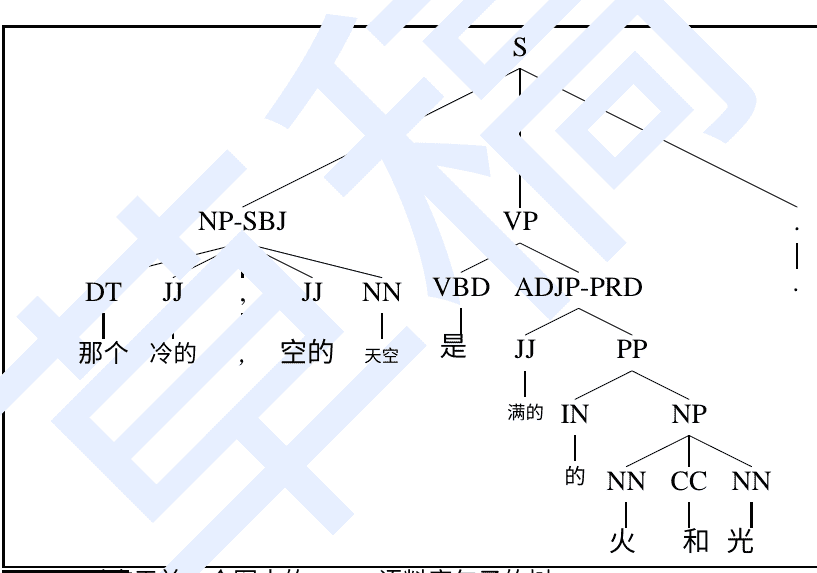

12.8 于前一个图中的Brown语料库句子的树。
节点-NONE-用于标记说话位置之后的位置，引用句子经常出现在这里。这个空节点（在Treebanks II和III中）用索引2标记，就像句子开头的引用S一样。这种共指可能使一些解析器更容易恢复这个前置或主题化的引语是动词说的补语的事实。类似的-NONE-节点用于标记在动词等待之前没有句法主语的事实；相反，主语是较早的NP我们。同样，它们都与索引1共指。

Penn Treebank II和Treebank III版本添加了进一步的信息，以便更容易恢复谓词和论元之间的关系。某些短语用标记表示短语的语法功能（作为表面主题、逻辑主题、分裂、非VP谓词），无论它出现在特定的文本类别（标题、标题）中，还是它的语义功能（时间短语、位置）。

```
 ( S ( `` `` )
    (S-TPC-2
      (NP-SBJ-1 (PRP 我们) )
      (VP (MD 会)
        (VP (VB 有)
          (S
            (NP-SBJ (-NONE- *-1) )
            (VP (TO 去)
              (VP (VB 等待)
                (SBAR-TMP (IN 直到)
                  (S
                    (NP-SBJ (PRP 我们) )
                    (VP (VBP 收集)
                      (VP (VBN 完成)
                        (PP-CLR (IN 在)
                          (NP (DT 那些) (NNS 资产) ) ) ) ) ) ) ) ) ) )
    ( , , ) ( `` `` )
    (NP-SBJ (PRP 他) )
    (VP (VBD 说)
      (S (-NONE- *T*-2) ) )
    ( . ) ) )
```

12.9 来自LDC Penn Treebank的华尔街日报部分的一个句子。注意空-NONE-节点的使用。

(Marcus et al., 1994; Bies et al., 1995). 图12.9显示了 -SBJ(表面主语)和 -TMP(时间短语)标签的示例。图12.8还显示了 -PRD标签，用于非VP谓词（图12.8中的一个是ADJP）。图12.20显示了标签 -UNF在 NP-UNF中的意思是“未完成或不完整的短语”。

### 12.4.2 使用树库作为语法

树库中的句子隐含地构成了语言的语法。例如，我们可以从图12.7和图12.9中获取三个解析句子，并提取其中的每个CFG规则。为了简单起见，让我们去掉规则后缀（-SBJ等）。得到的语法如图12.10所示。

用于解析Penn Treebank的语法相对平坦，导致规则非常多且非常长。例如，在扩展VP的大约4,500个不同规则中，有单独的规则用于任意长度的PP序列，以及每个可能的动词参数排列：

```
VP → VBD PP
VP → VBD PP PP
VP → VBD PP PP PP
VP → VBD PP PP PP PP
VP → VB ADVP PP
VP → VB PP ADVP
```

| 语法 | 词汇表 |
| :--- | :--- |
| $S \rightarrow NP\ VP$ 。 | $PRP \rightarrow$ 我们\|他 |
| $S \rightarrow NP\ VP$ | $DT \rightarrow$ 那\|那个\|那些 |
| $S \rightarrow$ " $S$ " , $NP\ VP$ . | $JJ \rightarrow$ 冷 \| 空 \| 满 |
| $S \rightarrow$ -NONE- | $NN \rightarrow$ 天空\|火\|光\|飞行\|明天 |
| $NP \rightarrow DT\ NN$ | $NNS \rightarrow$ 资产 |
| $NP \rightarrow DT\ NNS$ | $CC \rightarrow$ 和 |
| $NP \rightarrow NN\ CC\ NN$ | $IN \rightarrow$ 的\|在\|直到\|上 |
| $NP \rightarrow CD\ RB$ | $CD \rightarrow$ 十一 |
| $NP \rightarrow DT\ JJ , JJ\ NN$ | $RB \rightarrow$ 上午 |
| $NP \rightarrow PRP$ | $VB \rightarrow$ 到达\|有\|等待 |
| $NP \rightarrow$ -NONE- | $VBD \rightarrow$ 被说\|被说 |
| $VP \rightarrow MD\ VP$ | $VBP \rightarrow$ 有 |
| $VP \rightarrow VBD\ ADJP$ | $VBN \rightarrow$ 收集 |
| $VP \rightarrow VBD\ S$ | $MD \rightarrow$ 应该 \| 会 |
| $VP \rightarrow VBN\ PP$ | $TO \rightarrow$ 到 |
| $VP \rightarrow VB\ S$ | |
| $VP \rightarrow VB\ SBAR$ | |
| $VP \rightarrow VBP\ VP$ | |
| $VP \rightarrow VBN\ PP$ | |
| $VP \rightarrow TO\ VP$ | |
| $SBAR \rightarrow IN\ S$ | |
| $ADJP \rightarrow JJ\ PP$ | |
| $PP \rightarrow IN\ NP$ | |

12.10 图 2.7和图2.9的三个树库句子中提取的CFG语法规则和词汇条目的示例。

VP → ADVP VB PP

以及更长的规则，例如：

VP → VBP PP PP PP PP PP ADVP PP

这来自于斜体标记的VP:

> （12.7）这主要是因为我们从秋季的足球到冬季的举重再到春季的足球。

成千上万的NP规则之一是：

```
NP → DT JJ NN
NP → DT JJ NNS
NP → DT JJ NN NN
NP → DT JJ JJ NN
NP → DT JJ CD NNS
NP → RB DT JJ NN NN
NP → RB DT JJ JJ NNS
NP → DT JJ JJ NNP NNS
NP → DT NNP NNP NNP NNP JJ NN
NP → DT JJ NNP CC JJ JJ NN NNS
NP → RB DT JJS NN NN SBAR
NP → DT VBG JJ NNP NNP CC NNP
NP → DT JJ NNS , NNS CC NN NNS NN
```

NP → DT JJ JJ VBG NNP NNP FW NNP
NP → NP JJ , JJ ‘’ SBAR ‘’ NNS

例如，最后两个规则来自以下两个NP：

(12.8) [DT The] [JJ state-owned] [JJ industrial] [VBG holding] [NN company] [NNP Instituto] [NNP Nacional] [FW de] [NNP Industria]

(12.9) [NP Shearson’s] [JJ easy-to-film], [JJ black-and-white] “[SBAR Where We Stand]” [NNS 广告]

从这个角度来看，宾夕法尼亚树库III华尔街日报语料库，包含约100万个单词，也有约100万个非词汇规则标记，包括约17,500个不同的规则类型。

关于树库语法的各种事实，比如它们的大量平面规则，对概率解析算法提出了问题。因此，通常会对从树库中提取的语法进行各种修改。我们将在第14章进一步讨论这些问题。

### 12.4.3 搜索树库

在树库中搜索特定语法现象的示例通常很重要，无论是用于语言学研究还是用于回答关于计算应用的分析问题。但是，用于文本搜索的正则表达式和用于网络搜索的词语布尔表达式都不是足够的搜索工具。所需要的是一种能够指定解析树中节点和链接约束的语言，以便搜索特定模式。

不同工具中存在各种这样的树搜索语言。Tgrep (Pito, 1993) 和 TGrep2 (Rohde, 2005) 是用于搜索树库的公开可用工具，它们使用类似的语言来表达树约束。我们将描述TGrep2使用的较新语言，参考在线手册 (Rohde, 2005)。

在 tgrep 或 TGrep2中的模式由一个节点的规范组成，可能后面跟着其他节点的链接。然后可以使用节点规范来返回以该节点为根的子树。例如，模式

```
NP
```

返回以NP为根的语料库中的所有子树。节点可以通过名称、斜杠内的正则表达式或这些的析取来指定。例如，我们可以使用Penn Treebank符号表示单数或复数名词 (NN 或 NNS)，如下所示：

```
/NNS?/       NN | NNS
```

一个节点可以是单词 bush，或者以字符串 tree结尾，可以表示为：

```
/tree$/ | bush
```

tgrep/TGrep2模式的强大之处在于能够指定有关链接的信息。运算符 < 表示立即支配；因此，以下模式匹配立即支配PP的NP。

```
NP < PP
```

关系 <<用于指定优势；此模式匹配支配一个PP的NP:

```
NP << PP
```

因此，先前的模式将匹配以下任一树:

```
(12.10) (NP (NP (NN reinvestment))
         (PP (IN of)
         (NP (NNS dividends))))
```

```
(12.11) (NP (NP (DT the) (JJ austere) (NN company) (NN dormitory))
         (VP (VBN run)
         (PP (IN by) (NP (DT a) (JJ prying) (NN caretaker))))))
```

用于标记线性优先级。以下模式匹配紧接在JJ之后、紧跟着PP的NP，例如在上述(12.11)中匹配支配the austere company dormitory的NP: ²

```
NP < JJ . VP
```

在 tgrep/TGrep2表达式中，每个关系都被解释为指向第一个或根节点。因此，例如以下表达式表示一个在PP之前并支配S的NP:

```
NP . PP < S
```

如果我们想要指定PP支配S，我们可以使用括号如下:

```
NP . (PP < S)
```

图12.11给出了TGrep2的主要链接操作。

### 12.4.4 头部和头部查找

我们之前非正式地建议，句法成分可以与一个词汇 head; N是一个 NP的头部，V是一个 VP的头部。这个每个成分都有一个头部的想法可以追溯到Bloomfield (1914)。它在诸如Head-Driven Phrase Structure Grammar (Pollard和Sag，1994 ) 的语言形式主义中起着核心作用，并且随着词汇化语法 (第14章) 的兴起，在计算语言学中变得非常流行。

在一个简单的词汇头模型中，每个上下文无关规则都与一个头部相关联 (Charniak, 1997; Collins, 1999)。头部是短语中在语法上最重要的词。头部沿着解析树向上传递；因此，解析树中的每个非终端都带有一个词，它是它的词汇头部。

图12.12展示了Collins (1999) 的一个示例，其中每个非终结符都带有其头部的注释。“工人们将袋子倒入一个箱子”是WSJ句子的缩写形式。

为了生成这样的树，每个CFG规则必须被扩展以识别一个右侧成分作为头部子节点。节点的头词是

² 线性优先级的定义在 tgrep和 TGrep2之间略有不同。更多细节请参阅Rohde (2005)。

图12.11 Rohde (2005)总结的TGrep2链接。

| 链接 | 解释 |
| --- | --- |
| A < B | A是B的父节点（直接支配）。 |
| A > B | A是B的子节点。 |
| A <N B | B是A的第N个子节点（第一个子节点是 <1）。 |
| A >N B | A是B的第N个子节点（第一个子节点是 >1）。 |
| A <, B | 与A <1 B同义。 |
| A >, B | 与A >1 B同义。 |
| A <-N B | B是A的倒数第N个子节点（最后一个子节点是 <-1）。 |
| A >-N B | A是B的倒数第N个子节点（最后一个子节点是 >-1）。 |
| A <- B | B是A的最后一个子节点（与A <-1 B同义）。 |
| A >- B | A是B的最后一个子节点（与A >-1 B同义）。 |
| A <` B | B是A的最后一个子节点（也与A <-1 B同义）。 |
| A >` B | A是B的最后一个子节点（也与A >-1 B同义）。 |
| A <: B | B是A的唯一子节点 |
| A >: B | A是B的唯一子节点 |
| A << B | A支配B（A是B的祖先节点）。 |
| A >> B | A被B所主导（A是B的后代）。 |
| A <<, B | B是A的最左后代。 |
| A >>, B | A是B的最左后代。 |
| A <<` B | B是A的最右后代。 |
| A >>` B | A是B的最右后代。 |
| A <<: B | 从A到B存在一条单一的下降路径。 |
| A >>: B | 从B到A存在一条单一的下降路径。 |
| A . B | A紧挨着B。 |
| A , B | A紧随B。 |
| A .. B | A在B之前。 |
| A ,, B | A在B之后。 |
| A $ B | A是B的姐妹（且A = B）。 |
| A $. B | A是B的姐妹且紧挨着B。 |
| A $, B | A是B的姐妹且紧随B。 |
| A $.. B | A是B的姐妹且在B之前。 |
| A $,, B | A是B的姐妹并且跟随B。 |

设置为其头部子节点的头词。 选择这些头部子节点对于教科书上的例子很简单（NN是NP的头部），但对于大多数短语来说是复杂且有争议的。（补语to或动词应该是无限动词短语的头部？）现代语法学理论通常包括一个定义头部的组成部分（例如，Pollard和Sag，1994）。

大多数实际的计算系统使用了一种替代的头部查找方法。 与其在语法本身中指定头部规则，不如在特定句子的树的上下文中动态地识别头部。 换句话说，一旦句子被解析，就会遍历生成的树，为每个节点添加适当的头部标记。大多数当前的系统依赖于一组简单的手写规则，例如Collins（1999）中针对Penn Treebank语法的实用规则，但最初由Magerman（1995b）开发。 例如，他们用于找到NP头部的规则如下所示Collins（1999，238）：

- * 如果最后一个词标记为POS，则返回最后一个词。
- 否则，从右到左搜索第一个子节点，该子节点是NN、NNP、NNPS、NX、POS或JJR。
- 否则，从左到右搜索第一个子节点，该子节点是NP。
- 否则，从右到左搜索第一个子节点，该子节点是$、ADJP或PRN。
- 否则，从右到左搜索第一个子节点，该子节点是CD。
- 否则，从右到左搜索第一个子节点，该子节点是JJ、JJS、RB或QP。
- 否则返回最后一个单词。

图12.13展示了选择的其他规则。例如，对于形式为VP VP → Y1 ··· Yn的规则，算法将从 Y1 ··· Yn的左侧开始寻找第一个类型为TO的 Yi； 如果找不到TO，则会寻找第一个类型为VBD的 Yi； 如果找不到VBD，则会寻找一个VBP，依此类推。有关更多详细信息，请参见Collins(1999)。

| 父节点 | 方向 | 优先列表 |
|--------|------|----------|
| ADJP | 左 | NNS QP NN $ ADVP JJ VBN VBG ADJP JJR NP JJS DT FW RBR RBS SBAR RB |
| ADVP | 右 | RB RBR RBS FW ADVP TO CD JJR JJ IN NP JJS NN |
| PRN | 左 | |
| PRT | 右 | RP |
| QP | 左 | $ IN NNS NN JJ RB DT CD NCD QP JJR JJS |
| S | 左 | TO IN VP S SBAR ADJP UCP NP |
| SBAR | 左 | WHNP WHPP WHADVP WHADJP IN DT S SQ SINV SBAR FRAG |
| VP | 左 | TO VBD VBN MD VBZ VB VBG VBP VP ADJP NN NNS NP |

图12.13 Collins (1999) 中的选定头规则。 头规则集通常被称为头渗透表。

## 12.5 语法等价性和正常形式

形式语言被定义为（可能是无限的）一组单词字符串。 这表明我们可以通过询问它们是否生成相同的字符串来询问两个语法是否等价。

相同的字符串集合。事实上，可能存在两个不同的上下文无关语法生成相同的语言。

我们通常区分两种语法等价性：弱等价性和强等价性。如果两个语法生成相同的字符串，并且它们为每个句子分配相同的短语结构（仅允许非终端符号的重命名），则这两个语法是强等价的。如果两个语法生成相同的字符串，但不为每个句子分配相同的短语结构，则这两个语法是弱等价的。

## 标准形式

有时候，拥有一个文法的标准形式是很有用的，其中每个产生式采用特定的形式。例如，如果一个上下文无关文法在乔姆斯基标准形式(CNF) (乔姆斯基，1963) 中，它是ε-自由的，并且如果此外每个产生式要么是 $A \rightarrow B C$ 的形式，要么是 $A \rightarrow a$ 的形式。也就是说，每个规则的右侧要么有两个非终结符，要么有一个终结符。乔姆斯基标准形式的文法是二叉分支的，即具有二叉树结构（直到词汇节点）。我们将在第13章的CKY解析算法中利用这个二叉分支属性。

### 乔姆斯基标准形式

### 二叉分支

任何文法都可以转换为一个弱等价的乔姆斯基标准形式文法。例如，一个形式为

```
$A \rightarrow B C D$
```

可以转换为以下两个CNF规则（练习11要求读者制定完整算法）：

```
$A \rightarrow B X$
$X \rightarrow C D$
```

有时使用二叉分支实际上可以产生更小的语法。例如，可能被描述为以下内容的句子：

```
VP → VBD NP PP*
```

在Penn Treebank中，这些句子由以下一系列规则表示：

- VP → VBD NP PP
- VP → VBD NP PP PP
- VP → VBD NP PP PP PP
- VP → VBD NP PP PP PP PP
- ...

但也可以通过以下两个规则的语法生成：

```
VP → VBD NP PP
VP → VP PP
```

通过使用形式为 $A \rightarrow A B$ 的规则，通过一系列可能无限的符号B来生成符号A被称为Chomsky-adjunction。

### Chomsky-adjunction

## 12.6 有限状态和上下文无关文法

我们在第12.1节中认为，适当的语法模型需要能够表示关于从属关系、子范畴化和依赖关系的复杂相互关系，而至少需要上下文无关语法的能力来实现这一点。但是为什么我们不能只使用有限状态方法来捕捉这些句法事实呢？对于这个问题的答案至关重要，因为正如我们将在第13章中看到的那样，当从正则语言切换到上下文无关语言时，处理速度会付出相当大的代价。

这个问题有两个答案。第一个是数学的；我们将在第15章中展示，根据某些假设，英语（和其他自然语言）中存在的某些句法结构使它们不是正则语言。第二个答案更主观，与表达能力的概念有关；即使有限状态方法能够处理所讨论的句法事实，它们通常不以使概括明显、产生可理解的形式主义或产生立即在后续语义处理中使用的结构的方式来表达它们。

数学上的反对意见将在第15章中更详细地讨论，但我们在这里简要回顾一下。我们在第2章中提到，描述正则语言的有限状态机和正则表达式有一个完全等价的替代方案，称为正则文法。正则文法中的规则是上下文无关文法规则的一种受限形式，因为它们是右线性或左线性形式的。例如，在右线性文法中，规则的形式都是 $A \to w$ or $A \to wB$，即非终结符要么扩展为终结符串，要么扩展为终结符串后跟一个非终结符。这些规则看起来非常像本章中一直在使用的规则，那么它们不能做什么呢？它们不能表达递归中心嵌入规则，如下所示，其中一个非终结符被重写为自身，被（非空）字符串包围：

```
(12.12) $A \Rightarrow^* \alpha A \beta$
```

换句话说，如果生成 $L$ 的语法没有任何中心嵌入递归形式（Chomsky，1959 a; Bar-Hillel等，1961; Nederhof，2000），则可以由有限状态机生成语言。直观地说，这是因为语法规则中的非终结符符号总是在规则的右边缘或左边缘，可以进行迭代处理而不是递归处理。这样的中心嵌入规则需要处理人工问题，如语言 $a^n b^n$，或者用于实际问题，例如检查编程和标记语言中正确匹配的分隔符。事实证明，在英语中没有绝对正确的例子，但以下示例可以让你了解问题的味道。

- (12.13) 行李到达了。
- (12.14) 乘客托运的行李到达了。
- (12.15) 被暴风雨延误的乘客托运的行李到达了。

至少在理论上，这种嵌套可以继续下去，尽管处理这些例子变得越来越困难，幸运的是在教科书之外这种情况相当罕见。

## 第418章。 英语的形式语法

像这样的例子。第15章将讨论这个问题以及相关问题，即上下文无关文法是否能够胜任任务。

那么在句法分析中没有有限状态方法的作用吗？快速回顾本章中用于名词短语的规则以及Penn树库语法中使用的规则，可以发现其中相当一部分可以通过有限状态方法处理。考虑以下名词组的规则，即前置和名词组名词短语的名词部分:

名词 → (限定词) (基数词) (序数词) (数量词) (形容词短语)名词

假设我们将这个规则的前置元素转换为终结符，这个规则实际上是右线性的，并且可以被有限状态机捕捉。事实上，可以自动构建一个正则文法，它是给定上下文无关文法的近似；请参考本章末尾的参考文献。因此，对于许多实际目的而言，不需要匹配句法和语义规则，有限状态规则就足够了。

## 12.7 依存语法

在本章中，我们专注于上下文无关文法，因为许多可用的树库和解析器产生这些类型的句法表示。但在一类称为依存文法的文法形式中，这些文法变得非常重要。

在语音和语言处理中，成分和短语结构规则并不起任何基本作用。相反，一个句子的句法结构纯粹是用词和这些词之间的二元语义或句法关系来描述的。

依存语法常常借鉴了特斯尼埃（1959）的工作，并且依存关系的概念可能最早由早期计算语言学家大卫·海斯使用。但是这种词汇依存的语法概念实际上比相对较新的短语结构或组成关系的语法更古老，并且其根源可以追溯到古希腊和印度的语言传统。事实上，传统语法中“将句子解析为主语和谓语”的概念是基于词汇关系而不是成分关系。


图12.14展示了使用J`arvinen和Tapanainen（1997）以及Karls-son等人（1995b）的依存语法形式主义对句子“我给了他我的地址”进行解析的示例。请注意，这里没有非终结符或短语节点；每个链接都是解析树在两个词汇节点之间保持（用特殊的<ROOT>节点增强）。这些链接是从大约35个关系的固定库中绘制的，其中大多数大致表示语法功能或非常一般的语义关系。

其他基于依存的计算语法，如 **Link Grammar** (Sleator并且Temperley, 1993) 使用不同但大致重叠的链接。表12.15显示了J`arvinen和Tapanainen (1997) 中使用的一些关系：

| 依存 | 描述 |
| :--- | :--- |
| **主语** | 句法主语 |
| **宾语** | 直接宾语（包括句子补语） |
| **间接宾语** | 介词补语 |
| **介词宾语** | 介词的补语 |
| **补语** | 谓语名词（系动词的补语） |
| **时间** | 时间状语 |
| **地点** | 地点状语 |
| **属性** | 前置修饰（定语）名词（所有格等） |
| **修饰** | 名词后置修饰语（介词短语等） |

正如我们将在第14章中看到的那样，依赖形式主义的一个优点是单词对其依赖项具有强大的预测解析能力。知道动词的身份通常是决定哪个名词可能是主语或宾语的一个非常有用的线索。依赖语法研究人员认为纯粹的依赖语法的主要优点之一是其能够处理具有相对自由的语序的语言。例如，像捷克语这样的语言的词序比英语更加灵活；一个宾语可能出现在位置副词或补语之前或之后。

短语结构语法需要一个单独的规则来表示这样一个状语短语可能出现的每个可能位置在解析树中。依赖语法只需要一个表示特定状语关系的链接类型。因此，依赖语法抽象出了词序变化，仅表示解析所需的信息。

有许多计算实现的依存语法；链接语法（Sleator和Temperley, 1993）和约束语法（Karlsson等, 1995b）是易于获取的广泛覆盖的英语依存语法和解析器。依存语法也经常用于其他语言。例如，Hajic (1998) 描述了用于捷克语的50万词的布拉格依存树库，该库已用于训练概率依存解析器（Collins等, 1999）。

### 12.7.1 依存关系与中心词之间的关系

读者可能已经注意到图12.14中的依存图与图12.12中的中心结构之间的相似之处。实际上，可以通过使用中心规则从上下文无关解析中自动导出（未标记的）依存图；这是来自Xia和Palmer (2001) 的算法：

1.  使用头部渗透表标记短语结构中每个节点的中心子节点。
2.  在依赖结构中，使每个非头子节点的头依赖于头子节点的头。

该算法应用于图12.16中的解析树将产生图12.17中的依赖结构。

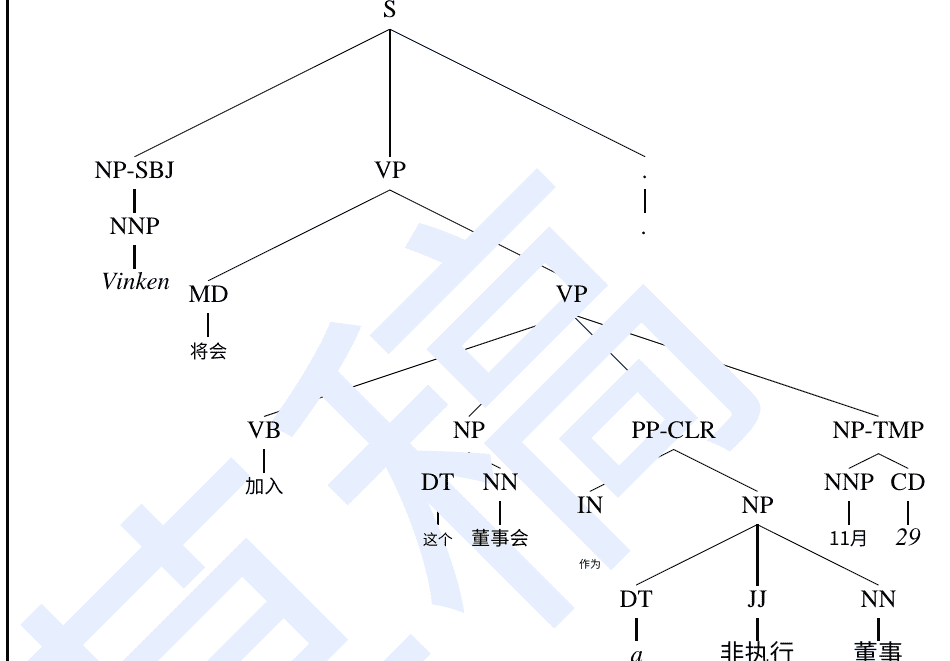

图12.16 来自宾夕法尼亚树库3的华尔街日报组件的短语结构树

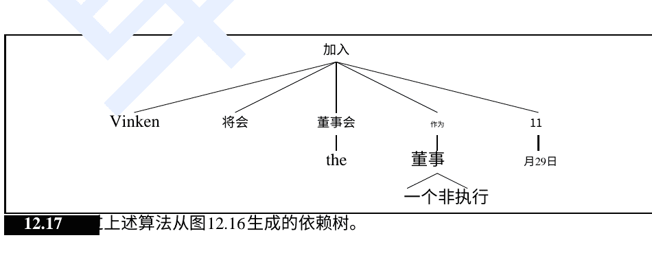

12.17 上述算法从图12.16生成的依赖树。

当我们在第14章讨论词头和依赖关系时，我们将回到头部化解析的讨论，并在第16章介绍头部特征和子范畴化时再次讨论。

### 12.7.2 类别语法

范畴语法是一种早期的词汇化语法模型 (Adjukiewicz, 1935; Bar-Hillel, 1953)。在本节中，我们将简要介绍一种重要的范畴语法扩展，即组合范畴语法 (CCG) (Steedman, 1996, 1989, 2000)。范畴语法有两个组成部分。范畴词典将每个单词与一个句法和语义范畴相关联。组合规则允许函数和参数进行组合。有两种类型的范畴：函数和参数。参数（如名词）具有简单的类别，如N。动词或限定词充当函数。例如，限定词可以被视为将其右侧的N应用于产生NP的函数。使用X/Y和X\Y运算符构建此类复杂范畴。X/Y表示从Y到X的函数，即与其右侧的Y组合以产生X的内容。因此，限定词接收类别NP/N：与其右侧的N组合以产生NP的内容。及物动词可能具有类别VP/NP；与其右侧的NP组合以产生VP的内容。像give这样的双及物动词可能具有类别 (VP/NP) /NP；与其右侧的NP组合以产生及物动词。最简单的组合规则只是将X/Y与其右侧的Y组合以产生X，或将X\Y与其左侧的Y组合以产生X。

考虑简单句子哈利吃苹果来自Steedman (1989)。不要使用原始的VP类别，让我们假设一个有限动词短语像吃苹果有类别 (S\NP)；它与左边的NP结合产生一个句子。哈利和苹果都是NP。吃是一个有限及物动词，它与右边的NP结合产生一个有限VP：(S\NP) /NP。S的推导如下：（12.16）哈利吃苹果

```
NP → (S\NP)/NP → NP → S\NP → S
```

现代范畴语法包括更复杂的组合规则，用于协调和其他复杂现象，还包括语义类别和句法类别的组合。有关有用参考资料的指针，请参阅本章末尾。

## 12.8 口语法

书面英语的语法和口语英语的语法在许多方面有共同之处，但也存在一些差异。本节简要介绍了口语英语句法的一些特点。我们通常用术语“话语”而不是“句子”来表示口语的单位。

语言。图12.18展示了一些展示了口语语法的ATIS话语样本。

这是用于转录语音语料库进行语音识别的标准转录风格。逗号“,”表示短暂停顿，每个句号“。”表示长暂停。片段（不完整的单词，如 wha- 表示不完整的 what）用破折号标记，方括号“[smack]”标记非语言事件（嘴唇咂嘴，呼吸等等)

这些话语与书面英语句子有很多不同之处。其中一个是词汇统计学；例如，口语英语中的代词比书面英语要多得多；口语句子的主语几乎总是代词。口语句子通常由短语或片段组成（例如一种方式或下午四点左右），这在书面英语中不太常见。口语句子具有语音、韵律和声学特征，而书面话语当然没有；我们将在第8章中详细讨论这些特征。最后，口语句子具有各种各样的不流畅现象（犹豫、修复、重新开始等），将在下面讨论。

### 12.8.1 断续和修复

也许最显著的句法特征是区分口语和书面语言的现象，个别称为不流畅现象，集体称为修复现象。

不流畅现象包括使用“嗯”和“呃”这些词，词的重复，重新开始等和单词片段。图12.19中的ATIS句子显示了重新开始和使用 uh 的示例。这里的重新开始发生在说话者开始询问单程航班时。然后她停下来纠正自己，重新开始询问单程票价。


段落单程航班被称为 **reparandum**，替换序列单程票价被称为 **repair**。中断点，在这个点上，说话者中断原始单词序列的地方，这里发生在单词航班之后。

在编辑阶段，我们经常看到被称为编辑术语的术语，例如你知道，我的意思是，嗯，和嗯。

词语嗯和嗯（有时称为填充停顿或填充词）通常在语音识别词典和语法中，被视为常规词语。

像 *wha-* 和 *betwee-* 在图12.18中的不完整词语被称为片段。片段对于语音识别系统来说非常有问题，因为它们经常错误地与前面或后面的词语连接在一起，导致词语分割错误。

语言不流畅现象非常普遍。在Switchboard Treebank语料库中，有一个统计发现超过两个词的句子中有37%存在语言不流畅的情况。事实上，词语嗯是Switchboard中最常见的词语之一。对于像语音理解这样的应用，我们的目标是构建输入句子的意义，因此检测这些重新开始可能是有用的，以便删除演讲者可能认为是“更正”的词语。例如，在上面的句子中，如果我们能够检测到有一个重新开始，我们可以只删除被修复的部分，并解析剩余的句子部分：

> 美国航空公司提供任何单程航班吗？单程票价为160美元吗？

语音不流畅如何与句子的成分结构相互作用？Hindle(1983)表明，修复通常与中断点之前的成分具有相同的结构。因此，在上面的例子中，修复是一个名词短语，修复对象也是一个名词短语。这意味着如果能够自动找到中断点，通常也可以自动检测修复对象的边界。

语音不流畅与句法结构之间还存在其他相互作用。例如，当主语名词短语后面出现语音不流畅时，修复总是重复主语，但不重复前面的话语标记。如果修复发生在助动词或主要动词之后，动词和主语（几乎）总是一起重复（Fox和Jasperson，1995年）。

### 12.8.2 用于口语的树库

像Switchboard这样的口语语料库使用了增强符号来处理口语现象，如语调不连续。图12.20显示了Switchboard句子（12.17）的解析树。这个句子展示了Treebank如何标记语调不连续；方括号用于分隔整个修复区域，包括修复前言、编辑阶段和修复部分。加号符号标记了修复前言的结束。

> （12.17）但是我没有[任何，+{嗯，}任何]真正的想法

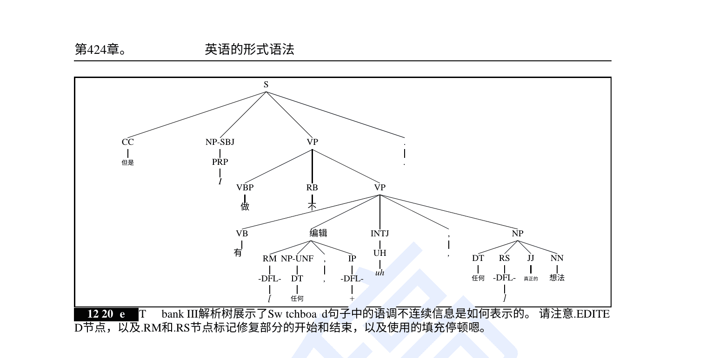

图12.20：bank Ⅲ解析树展示了Switchboard句子中的语调不连续信息是如何表示的。请注意.EDITE D节点，以及.RM和.RS节点标记修复部分的开始和结束，以及使用的填充停顿嗯。

## 12.9 语法和人类处理

人们在语言的心理处理中使用无上下文文法吗？很难找到明确的证据证明他们确实这样做。例如，一些早期实验要求被试判断句子中哪些单词更紧密相关（Levelt，1970），发现他们的直觉分组与句法成分相对应。其他实验者通过让被试在听句子的同时听不同时间的短“点击”来研究听觉理解中成分的作用。Fodor和Bever（1965）发现被试经常将点击错误地听成成分边界。他们认为成分是一种“知觉单元”，抵制中断。不幸的是，点击范式存在严重的方法论问题（例如，Clark和Clark（1977）进行了讨论）。

所有这些早期研究的一个更广泛的问题是它们没有控制成分通常既是语义单元又是句法单元的事实。因此，正如将在第18章进一步讨论的那样，一个奇怪的块是一个成分（一个NP），同时也是一个语义单元（具有某些属性的BLOCK对象）。因此，显示人们注意到成分边界的实验可能只是测量语义事实而不是句法事实。

因此，有必要找到一个不是语义单元的成分的证据。此外，由于有许多基于词汇依赖的非成分理论的语法，找到不能被解释为词汇事实的证据是很重要的；也就是说，不基于特定词汇的成分的证据。关于成分性的一系列实验来自Kathryn Bock和她的同事。例如，Bock和Loebell（1990）通过研究使用特定句法成分（例如，特定类型的动词短语，如V NP PP) 的主语是否更有可能在后续句子中使用该成分。换句话说，他们询问使用成分是否会在后续句子中引导其使用。正如我们在之前的章节中看到的，引导是测试心理结构存在的常见方法。Bock和Loebell依赖于英语的双及物转换。双及物动词是可以接受两个论元的动词，例如 give:

(12.18) 富有的寡妇给了 [NP教堂] [NP她的梅赛德斯车]。动词 give 允许另一种可能的子范畴化框架，称为介词性间接宾语，其中间接宾语以介词短语的形式表示: (12.19) 富有的寡妇给了 [NP她的梅赛德斯车] [PP给教堂]。

正如我们在第406页讨论的那样，除了 give之外，许多动词都有这样的变化 (send, sell等等；参见Levin (1993) 对许多不同变化模式的总结)。Bock和Loebell利用这些变化，给被试者展示一张图片，并要求他们用一句话描述它。这张图片旨在引发像 give或 sell这样的动词，例如展示一个男孩递给老师一个苹果的事件。由于这些动词有变化，被试者可能会说男孩给了老师一个苹果或男孩给了老师苹果。

在描述图片之前，被试被要求大声朗读一个无关的“引导”句子；这些引导句子要么具有V NP NP结构，要么具有V NP PP结构。关键是，尽管这些引导句子与双宾结构句子具有相同的成分结构，但它们的语义并不相同。例如，这些引导句子可能是介词位置的，而不是与格的: (12.20) IBM移动[NP一台更大的计算机] [PP到西尔斯商店]。

Bock和Loebell发现，刚刚阅读了一个V NP PP句子的被试在描述图片时更有可能使用V NP PP结构。这表明使用特定的成分引导了后续对该成分的使用，因此该成分必须在心理上被表示才能引导和被引导。

在最近的研究中，Bock和她的同事继续发现了这种成分结构的证据。

## 12.10 总结

本章通过上下文无关文法介绍了一些句法的基本概念。

- 在许多语言中，连续的词组成一个短语，可以用上下文无关文法 (也称为短语结构文法) 来建模。
- 一个上下文无关文法由一组规则或产生式组成，这些规则用一组非终结符和一组终结符表示。形式上，一个特定的上下文无关语言是可以从一个特定的上下文无关文法推导出的字符串集合。

生成语法是语言学中用于模拟自然语言语法的传统术语。
英语中有许多句子级的语法结构；陈述句、祈使句、一般疑问句和特殊疑问句是四种非常常见的类型，可以用上下文无关规则来建模。
一个英语名词短语可以有限定词、数字、量词和形容词短语在名词前面，名词前面可以跟着一些后修饰语；动名词短语、不定式短语和过去分词短语是常见的可能性。
英语中的主语与主谓动词在人称和数上保持一致。
动词可以通过它们所期望的补语类型进行子分类。简单的子分类包括及物动词和不及物动词；大多数语法包括比这些更多的类别。
口语中句子的对应物通常被称为话语。话语可能不流畅，包含像“嗯”和“啊”这样的填充停顿、重启和修复。
已解析句子的树库存在于许多英语流派和许多语言中。可以使用树搜索工具搜索树库。
任何上下文无关文法都可以转换为乔姆斯基范式，在这个范式中，每个规则的右侧要么有两个非终结符，要么有一个终结符。
上下文无关文法比有限状态自动机更强大，但是仍然可以用有限状态自动机近似表示上下文无关文法。
有一些证据表明成分在人类语言处理中起着作用。

# 参考文献和历史注释

> > “den sprachlichen Ausdruck f'ur die willkürliche Gliederung einer Gesammt-vorstellung in ihre in logische Beziehung zueinander gesetzten Bestandteile”
> “the linguistic expression for the arbitrary division of a total idea into its constituent parts placed in logical relations to one another”
> Wundt’s (1900:240) definition of the sentence; the origin of the idea of phrasal constituency, cited in Percival (1976).

根据Percival (1976) 的说法，将句子分解为层次结构的构成部分的想法出现在开创性心理学家Wilhelm Wundt (Wundt, 1900) 的Völkerpsychologie中。 Wundt对成分的概念被Leonard Bloomfield在他的早期著作An Introduction to the Study of Language (Bloomfield, 1914) 中引入到语言学中。到他后来的著作 Language (Bloomfield, 1933) 时，当时被称为“即时成分分析”的方法已经成为美国句法研究的一种成熟方法。相比之下，传统的欧洲语法，从古典时期开始，定义了单词之间的关系，而不是成分之间的关系，欧洲的句法学家保留了对这种依存语法的重视。
美国结构主义提出了一些关于即时成分的具体定义，以寻找“发现过程”为目标；这是一种描述语言句法的方法论算法。总的来说，这些尝试捕捉到“即时成分的主要标准是组合行为是否像简单单元一样”（Bazell，1966年，第284页）。最著名的具体定义是Harris关于分布相似性和个别单元的想法，以及可替代性测试。基本上，该方法通过尝试用简单结构替换可能的成分来将一个结构分解为成分 - 如果一个简单形式（比如“man”）可以替换一个更复杂的集合（比如“intense young man”）中的一个构造，那么“intense young man”很可能是一个成分。Harris的测试是关于成分是一种等价类的直觉的开头。

这个关于层次性组成的第一个形式化概念是在Chomsky（1956）中定义的短语结构语法，并在Chomsky（1957）和Chomsky（1975）中进一步扩展和争论。从那时起，大多数生成语言学理论至少部分基于上下文无关文法或其推广（例如Head-Driven Phrase Structure Grammar（Pollard和Sag，1994），Lexical-Functional Grammar（Bresnan，1982），Government and Binding（Chomsky，1981）和Construction Grammar（Kay和Fillmore，1999），等等）；这些理论中的许多使用了称为X-bar X-bar schemata的模式化上下文无关模板，这些模板还依赖于句法头的概念。

在Chomsky最初的工作之后不久，上下文无关文法被Backus（1959）和Naur等人（1960）在他们对ALGOL编程语言的描述中重新发现；Backus（1996）指出他受到Emil Post的产生式的影响，而Naur的工作则是独立于他（Backus）的。在这之后的早期工作中，许多自然语言处理的计算模型都基于上下文无关文法，因为早期开发了有效解析这些文法的算法（参见第13章）。

正如我们已经注意到的，基于上下文无关规则的语法并不普遍存在。为了处理长距离依赖关系，设计了各种扩展CFG的类。我们之前注意到，一些语法将长距离依赖项视为语义上相关但句法上不相关的；表层句法不表示长距离链接（Kay和Fillmore，1999；Culicover和Jackendoff，2005）。但是还有其他选择。一种扩展形式是树相邻语法（TAG）（Joshi，1985）。树相邻语法中的主要数据结构是树，而不是规则。树有两种类型；初始树和辅助树。初始树可以表示简单的句子结构，而辅助树用于在树中添加递归。树通过称为替换和附加的两个操作进行组合。附加工作用于处理长距离依赖关系。有关更多详细信息，请参阅Joshi（1985）。将讨论一种名为词汇化树相邻语法的树相邻语法扩展（第14章）。树相邻语法是在第15章中介绍的一类轻度上下文敏感语言的成员。

我们在第408页提到了处理长距离依赖的另一种方法，基于使用空范畴和共指。宾夕法尼亚树库使用了这个模型，它在各种树库语料中借鉴了扩展标准理论和极简主义（Radford, 1997）。

基于词关系而不是短语结构的语法的代表性例子包括Mel`~cuk（1979）的依存语法，Hudson（1984）的词语法和Karlsson等人（1995b）的约束语法。

有多种算法可以构建一个近似CFG的正则语法（Pereira and Wright, 1997; Johnson, 1998a; Langendoen and Langsam, 1987; Nederhof, 2000; Mohri and Nederhof, 2001）。

对英语语法感兴趣的读者应该获取三本大型英语参考语法之一：Huddleston和Pullum（2002），Biber等人（1999）和Quirk等人（1985）。另一个有用的参考资料是McCawley（1998）。

有许多关于句法的优秀入门教材，从不同的角度进行介绍。

Sag等人（2003年）是一本从生成角度介绍句法的入门书籍，重点关注短语结构、统一性和头驱动短语结构语法中的类型层次结构。

Van Valin和La Polla（1997年）是一本从功能角度介绍句法的入门书籍，重点关注跨语言数据和句法结构的功能动机。

参见Bach（1988年）的基本范畴语法介绍。Lambek（1958年）、Dowty（1979年）和Ades和Steedman（1982年）等人介绍了范畴语法的各种扩展；Oehrle等人（1988年）的其他论文对扩展进行了概述。Steedman（1989年，2000年）介绍了组合范畴语法；参见Steedman和Baldridge（2007年）的教程介绍。第18章讨论了语义组合的问题。

# 练习

12.1 为以下ATIS短语绘制树结构：
a. 达拉斯
b. 从丹佛
c. 下午五点后
d. 到达华盛顿
e. 早班航班
f. 所有夜间航班
g. 星期四
h. 单程票价
i. 丹佛是否有延误

12.2 为以下ATIS句子绘制树结构：
a. 美国航空公司是否在早上五点到六点之间有航班？
b. 我想乘坐美国航空公司的航班。
c. 请重复一遍。
d. 美国航空公司的487航班有头等舱吗？
e. 我需要从费城到亚特兰大的航班。
f. 从亚特兰大到丹佛的票价是多少？
g. 费城到达拉斯有美国航空公司的航班吗？

### 12.3 增加语法规则，处理代词。正确处理人和格。

### 12.4 修改名词短语语法，正确建模质量名词及其一致性属性。

### 12.5 如果我们的语法形式不允许括号，那么页面400上的规则会扩展为多少种NP？

### 12.6 假设语法中有许多不同的子范畴化的VP规则，如12.3.5节所述，以及不同的子范畴化动词规则，如带有NP补语的动词规则。如果我们想正确处理像你有的最早的航班这样的例子，那么后置名词性定语从句的规则（12.7）需要如何修改？请记住，在这样的例子中，代词that是动词get的宾语。你的规则应该允许这个名词短语，但应该正确排除不合语法的S*I get。

### 12.7 你的解决方案是否正确地模拟了NP我能得到的最早的航班？那么我认为我妈妈想要我为她预订的最早的航班是什么？提示：这种现象被称为长距离依赖。

### 12.8 编写表达英语助动词的规则；例如你可以有一个规则带裸茎的动词VP补语→can。

### 12.9 像Fortune's office或my uncle's marks这样的NP被称为所有格或属格名词短语。可以通过将子NP像Fortune's或my uncle's视为以下头名词的限定词来建模所有格名词短语。为英语所有格写语法规则。你可以将's视为一个单独的词（即，假设's之前总是有一个空格）。

### 12.10 第397页讨论了需要一个Wh-NP成分。最简单的Wh-NP之一是Wh-pronouns（谁，谁的，哪个）。Wh-words what和which可以是限定词：你要哪四个？，你在杜克大学有什么学分？为不同类型的Wh-NP编写规则。

### 12.11 编写一个算法，将任意上下文无关文法转换为Chomsky正规形式。

# 第13章 使用上下文无关文法进行解析

> > 只有两种探索和发现真理的方法存在和可能。一种从感官和具体事物迅速前进到最后一般的公理，然后从中…推导和发现中间公理。另一种通过不断上升和逐渐构建公理，最终达到最一般的公理。
> —— 弗朗西斯·培根，新工具第一卷.19 (1620)

我们在第三章中将解析定义为识别输入字符串并为其分配结构的组合。因此，句法分析是识别句子并为其分配句法结构的任务。本章重点介绍了上下文无关文法（Ch.12中描述的那种文法）分配的结构类型。然而，由于它们基于纯声明性形式主义，上下文无关文法并没有指定如何计算给定句子的解析树。因此，我们需要指定使用这些文法生成树的算法。本章介绍了三种最常用的解析算法，用于自动为输入句子分配完整的上下文无关（短语结构）树。

这种类型的解析树在诸如文字处理系统中的语法检查等应用中直接有用：无法解析的句子可能存在语法错误（或者至少很难阅读）。然而，解析树通常作为语义分析（如第18章所述）的重要中间表示阶段，因此在问题回答和信息提取等应用中起着重要作用。例如，要回答这个问题 *1800年之前有哪些书是由英国女作家写的？* 我们需要知道句子的主语是什么书，并且通过副词短语“British women authors”来帮助我们确定用户想要的是一本书的列表（而不是作者的列表）。

在介绍任何解析算法之前，我们首先描述一些激励标准算法的因素。首先，我们重新审视了用于解析和识别的搜索隐喻，该隐喻在第2章中介绍了有限状态自动机，并讨论了自顶向下和自底向上的搜索策略。然后，我们讨论了歧义问题在句法处理中再次出现的情况，以及它如何最终使基于回溯的简单方法变得不可行。

接下来的章节介绍了Cocke-Kasami-Younger (CKY)算法 (Kasami, 1965; Younger, 1967)，Earley算法 (Earley, 1970) 和图表解析方法 (Kay, 1982; Kaplan, 1973)。这些方法都结合了自底向上和自顶向下解析的见解，并利用动态规划来高效处理。

## 13.1 解析作为搜索

第2章和第3章表明，找到有限状态自动机的正确路径，或者找到输入的正确转换，可以看作是一个搜索问题。对于有限状态自动机，搜索是通过机器上所有可能路径的空间进行的。在句法分析中，解析器可以被视为在可能的解析树空间中搜索，以找到给定句子的正确解析树。就像可能路径的搜索空间由自动机的结构定义一样，可能解析树的搜索空间由语法定义。考虑以下ATIS句子：(13.1) 预订那个航班。

图13.1介绍了ℒ₁语法，它由上一章的ℒ₀语法加上一些额外的规则组成。根据这个语法，这个例子的正确解析树应该是图13.2中显示的那个。

我们如何使用 ℒ₁来为图13.2中的示例分配解析树？解析搜索的目标是找到所有以起始符号 S 为根，并且恰好覆盖输入中的单词的树。无论我们选择哪种搜索算法，都有两种约束可以帮助指导搜索。一组约束来自数据，即输入句子本身。无论最终的解析树如何，我们知道必须有三个叶子，并且它们必须是单词书,那个,和飞行。第二种约束来自语法。我们知道无论最终的解析树如何，它必须有一个根，该根必须是起始符号 \(S\)。

这两个约束条件是贝肯在本章开始时提出的，它们导致了大多数解析器的两种搜索策略：自顶向下或目标导向搜索，以及自底向上或数据导向搜索。这些约束条件不仅仅是搜索策略。它们反映了西方哲学传统中的两个重要观点：理性主义传统强调先验知识的使用，经验主义传统强调我们面前的数据。

### 13.1.1 自顶向下解析

自顶向下解析器通过尝试从根节点 \(S\)开始构建来搜索解析树。向下到叶子节点。让我们考虑一下自顶向下解析器探索的搜索空间，假设它同时构建所有可能的树。算法首先假设输入可以由指定的起始符号 \(S\)推导出来。下一步是找到所有以 \(S\)开头的树的顶部，通过查找所有左侧有 \(S\)的语法规则。在图13.1中的语法中，有三个扩展 \(S\)的规则，因此图13.1.1中的搜索空间的第二层有三棵部分树。

我们接下来扩展这三棵新树的成分，就像我们最初扩展的那样扩展 \(S\)。第一棵树告诉我们可以期望一个 \(NP\)后面跟着一个 \(VP\)，第二棵树期望一个 \(Aux\)后面跟着一个 \(NP\)和一个 \(VP\)，第三棵树则期望一个单独的 \(VP\)。为了适应页面上的搜索空间，我们在图13.1.1的第三层只展示了每棵树最左侧叶子节点扩展所得到的一部分树。在搜索空间的每一层，我们使用规则的右侧来提供解析器的新期望集合，然后用这些期望集合递归生成其余的树。树会向下生长，直到最终到达树底部的词性类别。在这一点上，叶子节点未能匹配输入中的所有单词的树可以被拒绝，留下那些表示成功解析的树。在图13.1.1中，只有第三层的第五棵解析树（扩展了规则 \(VP \rightarrow Verb\ NP\)）最终会匹配输入句子预订那个航班。

### 13.1.2 自底向上解析

自底向上解析是已知的最早的分析算法（最早由Yngve（1955）提出），并且在常用于计算机语言的移位-规约分析器中使用（Aho和Ullman，1972）。在自底向上分析中，解析器从输入的单词开始，并尝试从单词向上构建树，再次逐个应用语法规则。如果解析器成功构建了以开始符号S为根的覆盖所有输入的树，则解析成功。图13.1.2显示了自底向上的搜索空间，从句子预订那个航班开始。解析器首先在词典中查找每个输入单词，并构建带有每个单词词性的三棵部分树。但是单词预订是有歧义的；它可以是名词或动词。因此，解析器必须考虑两组可能的树。图13.1.2中的前两个层次显示了搜索空间的初始分叉。

然后，第二层中的每棵树都会被展开。在左侧的解析中（其中book被错误地认为是一个名词），Nominal → Noun规则被应用于两个名词（book和flight）。这个相同的规则也适用于唯一的名词（飞行）在右边，产生第三层的树。一般来说，解析器通过寻找解析过程中某些规则的右侧可能适合的位置，将一个层扩展到下一个层。这与之前的自顶向下解析器形成对比，后者通过应用规则来扩展树，当它们的左侧与未扩展的非终端匹配时。

因此，在第四层中，在第一和第三次解析中，序列Det Nominal被识别为NP → Det Nominal规则的右侧。在第五层中，将book解释为名词的搜索空间已被修剪。这是因为这个解析无法继续：语法中没有右侧为Nominal NP的规则。搜索空间的最后一层（未在图13.1.2中显示）包含了正确的解析（参见图13.2）。

### 13.1.3 比较自顶向下和自底向上解析

这两种架构各有优势和劣势。自顶向下的策略从生成只能导致一个 S 的树开始，从而不会浪费时间探索无法导致 S 的树。这意味着它也不会探索无法在某个 S 为根的树中找到位置的子树。相比之下，自底向上的策略会大量生成那些无法导致 S 或与其邻居相匹配的树。

自顶向下的方法有其自身的低效性。虽然它不会浪费时间在不导致一个 S 的树上，但它确实在与输入不一致的 S 树上花费了相当多的努力。请注意，在图13.1.1中第三层的六棵树中，前四棵树都有无法匹配单词 book 的左分支。这些树中没有一棵可能用于解析这个句子。自顶向下的解析器的这个弱点源于它们在检查输入之前生成树。另一方面，自底向上的解析器从不建议至少在输入中局部有依据的树。

## 13.2 歧义

> > 有一天早上，我穿着睡衣打了一只大象。他是怎么进入我的睡衣的，我不知道。
> 
> 格劳乔·马克思（Groucho Marx），《动物饼干》（*Animal Crackers*），1930年

对于解析器来说，歧义可能是最严重的问题。第5章介绍了词性歧义和词性消歧的概念。在本节中，我们介绍了一种在解析中出现的句法结构引起的新型歧义，称为结构歧义。当语法为一个句子分配多个可能的解析时，就会出现结构歧义。

适当的语法会为一个句子分配多个可能的解析。格劳乔·马克思（Groucho Marx）作为斯波尔丁船长的著名台词是有歧义的，因为短语“在我的睡衣里”既可以是由大象为首的名词短语的一部分，也可以是由“打”为首的动词短语的一部分。

结构歧义有很多形式。两种常见的歧义是附着歧义和协调歧义。

如果一个特定的成分可以被附加，那么一个句子就具有附加歧义。可以在解析树的多个位置附加。上面的Groucho Marx句子是一个PP附加歧义的例子。各种类型的状语短语也容易产生这种歧义。例如，在下面的例子中，动名词短语“飞往巴黎”可以是一个动名词句子的一部分，其主语是“埃菲尔铁塔”，或者它可以使修饰由“看到”引导的动词短语的附加语。

并列歧义中，可以连接不同的短语组合通过像“和”这样的连词进行连接。例如，短语“老人和女人”可以被括号分组为“[/老人/和/女人/]”，指的是“老人”和“女人”，或者可以被括号分组为“[/老人/和/女人/]”，这种情况下只有男人是老的。这些歧义在真实句子中以复杂的方式相互结合。例如，一个总结新闻的程序需要能够解析类似于布朗语料库中的以下句子：

> (13.3) 今天，肯尼迪总统把其他白宫事务推到一边，全身心地投入到他将在明晚通过全国电视和广播向美国人民发表的柏林危机讲话中。

这个句子有许多歧义，尽管它们在语义上是不合理的，但需要仔细阅读才能看出来。最后一个名词短语可以被解析为[/nationwide [/television and radio/]/]或[[/nationwide television/] and radio/]。推到一边的直接宾语应该是其他白宫事务，但也可以是奇怪的短语[/other White House business to devote all his time and attention to working/]（即类似于肯尼迪肯定/他打算提出一个新的预算来解决赤字问题/的结构）。然后，短语/on the Berlin crisis address he will deliver tomorrow night to the American people可以作为修饰动词pushed的附加语。像/over nationwide television and radio这样的介词短语可以附加到更高级的动词短语或名词短语上（例如，它可以修饰people或night）。

对于自然语言句子来说，存在许多不合理的解析是一个非常令人讨厌的问题，影响了所有的解析器。最终，大多数自然语言处理系统需要通过一种称为句法消歧的过程从众多可能的解析中选择正确的解析。不幸的是，在句法处理过程中，有效的消歧算法通常需要统计、语义和语用知识，这些知识在句法处理过程中不容易获得（利用这些知识的技术将在第14章和第18章介绍）。缺乏这些知识，我们只能选择简单地返回给定输入的所有可能的解析树。不幸的是，从强大、高度歧义、广泛覆盖的语法（如Penn Treebank语法）中生成所有可能的解析是有问题的（参见第12章的描述）。原因在于某些输入可能存在潜在的指数级解析数。考虑下面的ATIS示例：

> (13.4) 给我看一下从旧金山到丹佛的UA 386航班的餐食。

递归 VP →VP PP和名词 →名词 PP规则与句子末尾的三个介词短语共同产生了14个句法分析树。例如从旧金山可能是由show引导的VP的一部分（这将产生一个奇怪的解释，即展示是从旧金山发生的）。Church和Patil（1982）表明，这种类型的句子的解析数量以指数速度增长，与算术表达式的括号化数量相同。

即使一个句子不含歧义（即最终只有一个解析结果），由于局部歧义，解析仍可能低效。局部歧义发生当句子的某个部分存在歧义，即具有多个解析结果，即使整个句子没有歧义时，也会出现局部歧义。例如，句子预订那个航班当解析器看到第一个单词 *Book* 时，它无法确定它是动词还是名词，直到后来才能确定。因此，它必须考虑两种可能的解析。

## 13.3 面对歧义的搜索

为了充分理解局部和全局歧义对句法分析的问题，让我们回顾一下我们之前对自顶向下和自底向上分析的描述。在那里，我们做出了一个简化的假设，即我们可以并行地探索所有可能的解析树。因此，图13.1.1和图13.1.2中搜索的每一层都显示了前一层解析树的并行扩展。虽然直接实现这种方法是可能的，但通常需要不切实际的大量内存来存储构建的解析树空间。这一点尤其真实，因为现实的语法比我们一直在使用的小型语法更加歧义。

探索复杂搜索空间的一种常见替代方法是使用基于议程的回溯策略，例如在第2章和第3章中用于实现各种有限状态机。回溯方法通过逐步系统地探索一个状态来逐步扩展搜索空间。选择的状态基于简单的系统策略，如深度优先或广度优先方法，或者基于更复杂的方法，利用概率和语义考虑。当给定的策略到达与输入不一致的树时，搜索将继续返回到议程上的未探索选项。

这种策略的净效果是解析器单心地追求树，直到它们在返回处理早期生成的树之前成功或失败。

不幸的是，典型语法中的普遍歧义导致任何回溯方法都无法容忍的低效率。回溯解析器通常会为输入的某些部分构建有效的树，然后在回溯过程中将它们丢弃，只发现它们必须重新构建。考虑在找到（13.5）中的 NP的解析时涉及的自顶向下回溯过程：（13.5）从印第安纳波利斯到休斯顿的航班在NWA上首选的完整解析如图13.7中的底部树所示。虽然这个短语有很多解析，但我们在这里关注的是在检索这个单一首选解析的路径上所花费的重复工作量。

典型的自顶向下、深度优先、从左到右的回溯策略会导致无法覆盖所有输入的小型解析树。这些连续的失败会触发回溯事件，从而导致逐步覆盖更多输入的解析。通过自顶向下的方法到达正确解析的树序列如图13.7所示。

这个图清楚地说明了回溯方法中出现的工作重复的情况。除了最顶层的组件外，最终树的每个部分都会被多次派生。在动词短语或句子级别引入歧义的情况下，对这个简单示例的工作量当然会被放大。请注意，尽管这个例子是针对自顶向下解析的，底部向上解析也存在类似的浪费努力的例子。

## 13.4 动态规划解析方法

前一节介绍了标准自底向上或自顶向下解析器由于歧义而遇到的一些问题。幸运的是，有一类算法可以解决这些问题。动态规划再次为解决这个问题提供了一个框架，就像它在最小编辑距离、维特比和前向算法中帮助我们一样。回想一下，动态规划方法系统地填充子问题的解决方案表。完成后，这些表包含解决整个问题所需的所有子问题的解决方案。

在解析的情况下，这些表用于存储在发现时输入中每个成分的子树。效率的提高源于这样一个事实，即这些子树只需发现一次，然后在所有需要该成分的解析中使用。这解决了重新解析的问题（子树被查找，而不是重新解析），并部分解决了歧义问题（动态规划表隐式存储了所有可能的解析，通过存储所有具有链接的成分来使解析能够被重建）。正如我们之前提到的，最广泛使用的三种方法是Cocke-Kasami-Younger (CKY)算法，Earley算法和图表解析。

### 13.4.1 CKY解析

让我们从检查CKY算法的一个主要要求开始研究它：与CKY算法一起使用的语法必须处于乔姆斯基范式 (CNF) 中。回顾第12章，CNF中的语法受到以下规则的限制：$A \rightarrow B\, C$， 或 $A \rightarrow w$. 也就是说，每个规则的右侧必须扩展为两个非终结符或一个终结符。还要记住，将语法限制为CNF不会导致任何表达能力的损失，因为任何上下文无关语法都可以转换为CNF。

让我们从将通用CFG转换为以CNF表示的过程开始。假设我们处理的是一个ϵ-free语法，在任何通用语法中，我们需要处理三种情况：右侧混合终结符和非终结符的规则，右侧只有一个非终结符的规则，以及右侧长度大于两个的规则。

混合终结符和非终结符的规则的修复方法是简单地引入一个仅涵盖原始终结符的新虚拟非终结符。例如，一个不定式动词短语的规则，如 INF-VP →to VP，将被替换为两个规则 INF-VP →TO VP和TO → to。

右侧只有一个非终结符的规则被称为单元产生式。单元通过将原始规则的右侧重写为它们最终导致的所有非单元产生式规则的右侧，可以消除产生式。更正式地说，如果通过一系列一个或多个单元产生式，A ⇒ B，并且B → γ是我们语法中的非单元产生式，则对于语法中的每个这样的规则，我们添加A → γ，并且丢弃所有中间的单元产生式。正如我们将在我们的玩具语法中看到的那样，这可能导致语法的大幅扁平化，并且导致终结符在生成的树中占据相当高的层级。

右侧长度超过2的规则通过引入新的非终结符来规范化，将较长的序列分布在几个新规则中。例如，如果我们有一个规则如下
```
A → B C γ
```
我们用一个新的非终结符替换最左边的非终结符对，并在以下新规则中引入一个新的产生式结果。
```
X1 → B C
```
```
A → X1 γ
```
对于较长的右侧，我们只需重复此过程，直到有问题的规则被长度为2的规则为止。替换最左边的非终结符对的选择纯粹是任意的；任何导致二元规则的系统方案都可以满足要求。

在我们当前的语法中，规则 S →Aux NP VP将被两个规则替换，即S →X1 VP和X1 →Aux NP。整个转换过程可以总结如下：

1.  将所有符合要求的规则无变化地复制到新的语法中，
2.  将规则中的终结符转换为虚拟非终结符，
3.  转换单元产生式，
4.  将所有规则二元化并添加到新的语法中。

| L1 语法 | L1在CNF中 |
| :--- | :--- |
| S → NP VP | S → NP VP |
| S → Aux NP VP | S → X1 VP |
| S → VP | X1 → Aux NP |
| NP → Pronoun | S → Book \| Include \| Prefer |
| NP → ProperNP | S → Verb NP |
| NP → Det Nominal | S → X2 PP |
| NP → Noun | S → Verb PP |
| NP → NP Noun | S → VP PP |
| VP → Verb | NP → I \| she \| me |
| VP → Verb NP | NP → TWA \| Houston |
| VP → Verb NP PP | NP → Det Nominal |
| VP → Verb PP | NP → Book \| flight \| meal \| money |
| VP → VP PP | NP → NP PP |
| PP → Prep NP | VP → Book \| Include \| Prefer |
| | VP → Verb NP |
| | VP → X2 PP |
| | X2 → Verb NP |
| | VP → Verb PP |
| | VP → VP PP |
| | PP → Prep NP |

图13.8 L1语法及其转换为CNF。

图13.8显示了将整个转换过程应用于之前在第432页引入的L1语法的结果。请注意，这个图没有显示原始的词汇规则；因为这些原始的词汇规则已经在CNF中，它们都保持不变到新的语法中。然而，图13.8显示了消除单元产生式的过程中，实际上创建了新的词汇规则的各个位置。例如，所有原始的动词在转换后的语法中都被提升为VP和S。

### CKY 识别

现在我们的语法已经转换成了CNF，每个非终结符节点在词性级别上方的句法树中将有正好两个子节点。一个简单的二维矩阵可以用来编码整个树的结构。更具体地说，对于一个长度为n的句子，我们将使用一个（n+1）×（n+1）的上三角矩阵的上半部分进行处理。这个矩阵中的每个单元格[i,j]包含一个表示跨越输入的位置i到j的所有组成部分的终结符集合。由于我们的索引方案从0开始，自然而然地将索引视为指向输入单词之间的间隙（如0 Book 1 that 2 flight 3）。因此，表示整个输入的单元格位于矩阵的位置[0,n]。

由于我们的语法是在CNF中，表中的非终结符条目恰好有两个子节点进行解析。因此，对于每个由条目[i,j]表示的成分，在表中必须有一个输入位置k，可以将其分成两部分，使得i<k<j。因此，对于每个由条目 [ i, j]表示的成分，在表中必须有一个输入位置 k，可以将其分成两部分，使得i < k < j。给定这样一个位置 k，第一个成分 [i,k]必须位于行 i的某个位置的左侧，并且第二个条目 [k,j]必须位于其下方，沿着列 j。

为了更具体，考虑以下示例及其完成的解析矩阵，如图13.9所示。

> (13.6) 通过休斯顿预订航班。

矩阵中的超对角线行包含输入中每个单词的词性。在超对角线上方的后续对角线包含覆盖输入中所有增长长度的组成部分。

鉴于这一切，CKY识别只是填充解析表格的问题。为了做到这一点，我们将按自底向上的方式进行，以便在填充任何单元格 [i, j]时，包含可能对此条目有贡献的部分的单元格（即左侧和下方的单元格）已经被填充。有几种方法可以做到这一点；正如图13.9的右侧所示，图13.10中给出的算法按列填充上三角矩阵，从左到右逐列工作。然后，每列从底部到顶部填充。这种方案确保在任何时间点，我们都拥有所需的所有信息（在左侧，因为所有左侧的列已经被填充，在下方，因为我们从底部到顶部填充）。它还反映了在线解析，因为从左到右填充列对应于逐个处理每个单词。

算法中的最外层循环在图13.10中给出，它迭代遍历列，第二个循环迭代遍历行，从底部向上。最内层循环的目的是遍历所有可能将跨越 i到 j的子字符串分割成两部分的位置。当 k遍历字符串可以分割的位置时，我们考虑的单元格对会向右沿着第 i行移动，并向下沿着第j列. 图13.11展示了填充单元格 [i, j] 的一般情况。在每次这样的分割时，算法会考虑两个单元格的内容是否可以以语法规则允许的方式进行组合。如果存在这样的规则，则将其左侧的非终结符输入表格。

图13.12展示了在读取单词Houston后，表格第5列的五个单元格是如何填充的。箭头指出正在使用的两个跨度用于向表格添加条目。请注意，单元格 [0,5] 中的操作表示此输入存在三种不同的解析方式，一种是PP修饰flight，一种是修饰booking，还有一种间接捕获原始VP → Verb NP PPrule中的第二个参数的解析方式，现在使用VP → X2 PPrule间接捕获。

事实上，由于我们当前的算法将非终结符的集合作为单元格条目进行操作，因此在表格中不会包含相同非终结符的多个副本；在处理 [0,5] 时发现的第二个S和VP将不会产生任何影响。我们将在下一节中重新讨论这种行为。

### CKY解析

图13.10中给出的算法是一个识别器，而不是一个解析器；为了成功，它只需在单元格 [0,N] 中找到一个S。为了将其转变为能够返回给定输入的所有可能解析的解析器，我们将对算法进行两个简单的更改：第一个更改是增加表格中的条目，使得每个非终结符与从中导出它的表格条目配对（大致如图13.12所示）；第二个更改是允许将相同非终结符的多个版本输入到表格中（如图13.12所示）。通过这些更改，完成的表格包含了给定输入的所有可能解析。返回任意单个解析的方法是从单元格 [0,n] 中选择一个S，然后从表格中递归检索其组成成分。

当然，返回给定输入的所有解析可能会产生相当大的成本。正如我们之前所看到的，与给定输入相关联的解析可能有指数级数量。在这种情况下，返回所有解析将不可避免地产生指数级的成本。期待第14章，我们还可以通过进一步增加表格以包含每个条目的概率来考虑检索给定输入的最佳解析。检索最可能的解析包括在完成的解析表上运行适当修改的维特比算法（第5章）的版本。

13.11 在CKY表中[i, j]单元格的所有方法。

## CKY实践

最后，我们应该注意的是，虽然限制为CNF在理论上不会造成问题，但在实践中确实会带来一些非平凡的问题。显然，就目前而言，我们的解析器没有返回与我们友好的句法学家给出的语法一致的树。除了让我们的语法开发人员不开心之外，转换为CNF还会使任何基于语法的语义分析方法变得复杂。

解决这些问题的一种方法是保留足够的信息，以便在解析的后处理步骤中将我们的树转换回原始语法。对于长度大于2的规则使用的转换来说，这是微不足道的。只需删除新的虚拟非终结符并提升它们的子节点即可恢复原始树。

对于单元产生式，直接修改基本CKY算法以处理它们比存储恢复正确树所需的信息更方便。练习3要求你进行这个改变。其中许多

### 使用上下文无关文法进行解析

13.12 取单词that后填充最后一列

### 13.4.2 Earley算法

与CKY算法实现的自底向上搜索相比，Earley算法（Earley, 1970）使用动态规划实现了自顶向下搜索，这是在13.1.1节中讨论过的一种类型。Earley算法的核心是一次从左到右的遍历，填充一个称为图表的数组，该数组有N+1个条目。对于句子中的每个单词位置，图表包含一个表示到目前为止已生成的部分解析树的状态列表。与CKY算法一样，索引表示输入中单词之间的位置（如0 Book 1 that 2 flight 3）。在句子结束时，图表紧凑地编码了输入的所有可能解析。每个可能的子树只表示一次，因此可以被所有需要它的解析共享。

每个图表条目中包含的个体状态包含三种类型的信息：与单个语法规则对应的子树，关于完成该子树的进度的信息，以及子树相对于输入的位置。我们将在状态的语法规则的右侧使用 • 来表示识别的进度。生成的结构称为带点的规则。状态相对于输入的位置将由两个数字表示，表示状态的开始位置和点的位置。

考虑以下示例状态，这些状态将是Earley算法在解析过程中创建的状态之一：（13.7）预订那个航班。

```
S → • VP, [0,0]
NP → Det • Nominal, [1,2]
VP → V NP •, [0,3]
```

第一个状态，其点位于其组成部分的左侧，表示自上而下的预测对于这种特定类型的 S。第一个0表示此状态预测的组成部分应该从输入的开头开始；第二个0反映了点位于开头的事实。第二个状态，在处理这个句子的后期阶段创建，表示一个 NP 从位置1开始，成功解析了一个 Det，并且接下来期望一个 Nominal。第三个状态，其点位于其两个组成部分的右侧，表示成功发现了与整个输入相对应的树，该树对应一个跨越整个输入的 VP。

Earley解析器的基本操作是按照从左到右的顺序遍历图表中的 N+1 个状态集合，处理每个集合中的状态。在每个步骤中，根据状态的状态，应用下面描述的三个运算符之一。在每种情况下，都会将新状态添加到图表中当前或下一个状态集合的末尾。该算法始终向前移动，随着移动进行添加；状态永远不会被删除，一旦算法继续前进，就不会回溯到先前的图表条目。在最后一个图表条目的状态列表中存在一个状态 S → α•, [0,N]，表示成功解析。图13.13给出了完整的算法。

```
函数 EARLEY-PARSE(单词，语法 ) 返回 图表

ENQUEUE ((γ → •S, [0,0]), chart[0])
for i ← from 0 to LENGTH(words) do
  for each state in chart[i] do
    if INCOMPLETE ?(state) and
         NEXT-CAT(state) 不是一个词性 then
      PREDICTOR (state)
    elseif INCOMPLETE ?(state) and
             NEXT-CAT(state) 是一个词性      then
      SCANNER (state)
    else
      COMPLETER (state)
    end
  end
  return(chart)

procedure PREDICTOR ((A → α •B β, [i, j]))
  for each (B → γ) in GRAMMAR-RULES-FOR(B, grammar) do
    ENQUEUE ((B → •γ, [j, j]), chart[j])
结束

过程 SCANNER ((A → α •B β, [i, j]))
  如果 B ⊂ PARTS-OF-SPEECH(word[j])那么
    将((B → word[j], [j, j+1]), chart[j+1])入队

过程 COMPLETER ((B → γ •, [j, k]))
  对于每个 (A → α •B β, [i, j])在 chart[j]中
    将((A → α B •β, [i, k]), chart[k])入队
  结束

过程 ENQUEUE (state, chart-entry)
  如果 state不在chart-entry中
    则将(state, chart-entry)压入栈中
  结束

13.13 Earley算法
```

下面的三个部分详细描述了用于处理图表中的状态的三个运算符。每个运算符都以一个状态作为输入，并从中派生新的状态。只要这些新状态尚未存在于图表中，它们就会被添加到图表中。PREDICTOR和COMPLETER将状态添加到正在处理的图表条目中，而SCANNER 将状态添加到下一个图表条目中。

### 预测器

正如其名称所示，PREDICTOR的工作是在解析过程中生成自上而下的期望，并创建新的状态。PREDICTOR应用于具有紧随其点的非终结符的任何状态，该非终结符不是一个词类。这个应用程序会为语法提供的每个替代扩展创建一个新的状态。这些新状态被放置在与生成状态相同的图表条目中。它们在输入的结束点开始和结束。

例如，将PREDICTOR应用于状态 \(S \rightarrow \bullet VP, [0, 0]\)，将导致将以下五个状态添加到第一个图表条目中。

```
VP → • 动词, [0, 0]
VP → • 动词 名词短语, [0, 0]
VP → • 动词 名词短语 介词短语, [0, 0]
VP → • 动词 介词短语, [0, 0]
VP → • 动词短语 介词短语, [0, 0]
```

### 扫描仪

当一个状态在点的右边有一个词性类别时，调用SCANNER来检查输入并将与特定词性的预测相对应的状态合并到图表中。这是通过在预测的输入类别上提前一个点，从输入状态创建一个新状态来实现的。请注意，与CKY不同，Earley使用自上而下的输入来帮助处理词性的歧义性；只有那些由某个现有状态预测的单词的词性才会进入图表。

回到我们的例子，当状态 \(VP \rightarrow \bullet 动词 NP, [0, 0]\)被处理时，扫描器在输入中查找当前单词，因为点后面的类别是一个词性。然后它注意到*book*可以是一个动词，符合当前状态的期望。这导致创建了一个新的状态动词 → *book*•, [0, 1]。然后将这个新状态添加到当前正在处理的图表条目之后。

名词意义上的*book*从未进入图表，因为在输入的这个位置上没有任何规则预测它。

我们应该注意，我们的版本的扫描器和预测器与算法的原始形式 (Earley, 1970) 稍有不同。这些终结符在语法中被预测器和扫描器一样对待。在这种方法中，像 \(VP \rightarrow \bullet 动词 NP, [0, 0]\)这样的状态会触发与其左侧为动词的任何规则相对应的预测状态。在我们当前的例子中，状态动词 → • *book*会被预测。原始的扫描器随后会遇到这个预测状态，并将当前输入标记与预测标记进行匹配，结果是一个新的状态，点被推进，动词 → *book*•。

> 不幸的是，这种方法对于具有大型词汇表的应用来说并不实用，因为在预测到该类时，表示给定词类中的每个单词的状态将立即输入到图表中。在我们当前的示例中，表示状态的状态除了 *book* 之外，还会添加每个已知动词的状态。因此，我们的 PREDICTOR 版本不会创建表示对个别词汇项的预测的状态。尽管图表中没有预测它们的状态，但 SCANNER 通过显式插入表示已完成的词汇项的状态来弥补这一点。

### 完成者

当状态的点到达规则的右端时，将应用 COMPLETER。这种状态的存在表示解析器已成功地在输入的某个跨度上发现了特定的语法类别。COMPLETER 的目的是找到并推进所有先前创建的正在寻找此类别语法类别的状态，以此位置在输入中。然后，通过复制旧状态，将点推进到预期类别上，并将新状态安装在当前图表条目中，从而创建新状态。

在当前的例子中，当状态 \(NP \rightarrow Det \ Nominal \bullet\), [1,3] 被处理时，COMPLETER 会寻找以位置1结束且期望一个 \(NP\) 的不完整状态。它找到了状态 \(VP \rightarrow Verb \bullet NP\), [0,1] 和 \(VP \rightarrow Verb \bullet NP \ PP\), [0,1]。这导致了新的完整状态 \(VP \rightarrow Verb \ NP \bullet\), [0,3] 和新的不完整状态 \(VP \rightarrow Verb \ NP \bullet PP\), [0,3] 被添加到图表中。

### 一个完整的例子

图13.14显示了在对 Ex.13.7 进行完整处理过程中创建的状态序列；每一行表示参考的状态编号、虚线规则、起始和结束点，以及最后将该状态添加到图表中的函数。算法通过在图表中添加一个自上而下对 \(S\) 的期望来开始。这是通过向 Chart[0] 中添加一个虚拟状态 \(\gamma \rightarrow \bullet S\), [0,0] 来实现的。当处理该状态时，它会传递给 PREDICTOR，从而创建代表每种可能类型的 \(S\) 的三个状态，并且通过传递方式为所有这些树的左角创建状态。当达到状态 \(VP \rightarrow \bullet Verb\), [0,0] 时，调用 SCANNER 并读取第一个单词。表示 *Book* 的动词意义的状态被添加到 Chart[1] 的条目中。请注意，当处理后续的句子开头的 \(VP\) 状态时，SCANNER 将再次被调用。然而，由于它们与图表中已存在的动词状态相同，因此不会添加新的状态。

当 Chart[0] 的所有状态都被处理完毕后，算法会继续处理 Chart[1]，在那里它找到了表示动词意义的状态 *book*。这是一个完整的状态，其点位于其组成部分的右侧，因此将其传递给 COMPLETER。COMPLETER 然后找到了先前存在的四个期望在输入中此时出现的动词的 \(VP\) 状态。这些状态被复制并且它们的点被推进，并添加到 Chart[1] 中。对应于不及物 \(VP\) 的完成状态随后导致创建一个表示祈使句的 \(S\)。或者，及物动词短语中的点导致创建三个预测不同形式的 \(NP\) 的状态。状态 \(NP \rightarrow \bullet Det \ Nominal\), [1,1] 导致 SCANNER 读取单词 *that* 并将相应的状态添加到 Chart[2] 中。

转到图表[2]，算法找到表示决定词义的状态 *that* 的。这个完整的状态导致了 \(NP\) 状态中点的进展在图表[1]中预测，并且也对各种名词的预测。这些原因中的第一个导致了最后一次调用SCANNER来处理单词flight。最后转向图表[3]，表示flight的状态的存在导致了一个NP、一个及物VP和一个S的完成。在最后一个图表条目中存在的状态S → VP•, [0,3]表示成功解析的发现。将这个例子与之前给出的CKY例子进行对比是有用的。尽管

| 状态/标题 | 产生式 | 范围 | 描述 |
|----------|--------|------|------|
| 图表[0] |  |  |  |
| S0 | γ → •S | [0,0] | 虚拟起始状态 |
| S1 | S → •NP VP | [0,0] | 预测器 |
| S2 | S → •Aux NP VP | [0,0] | 预测器 |
| S3 | S → •VP | [0,0] | 预测器 |
| S4 | NP → •代词 | [0,0] | 预测器 |
| S5 | NP → •专有名词 | [0,0] | 预测器 |
| S6 | NP → •Det Nominal | [0,0] | 预测器 |
| S7 | VP → •动词 | [0,0] | 预测器 |
| S8 | VP → •动词 名词短语 | [0,0] | 预测器 |
| S9 | VP → •动词 名词短语 介词短语 | [0,0] | 预测器 |
| S10 | VP → •动词 介词短语 | [0,0] | 预测器 |
| S11 | VP → •VP PP | [0,0] | 预测器 |
| 图表[1] |  |  |  |
| S12 | 动词 → book • | [0,1] | 扫描器 |
| S13 | VP → 动词 • | [0,1] | 完成器 |
| S14 | VP → 动词 •NP | [0,1] | 完成器 |
| S15 | VP → 动词 •NP PP | [0,1] | 完成器 |
| S16 | VP → 动词 •PP | [0,1] | 完成器 |
| S17 | S → VP • | [0,1] | 完成器 |
| S18 | VP → VP •PP | [0,1] | 完成器 |
| S19 | NP → •代词 | [1,1] | 预测器 |
| S20 | NP → •专有名词 | [1,1] | 预测器 |
| S21 | NP → •Det Nominal | [1,1] | 预测器 |
| S22 | PP → •准备 NP | [1,1] | 预测器 |
| 图表[2] |  |  |  |
| S23 | Det → 那 • | [1,2] | 扫描仪 |
| S24 | NP → Det •名词短语 | [1,2] | 完成者 |
| S25 | 名词短语 → •Noun | [2,2] | 预测器 |
| S26 | 名词短语 → •名词名词 | [2,2] | 预测器 |
| S27 | 名词短语 → •名词介词短语 | [2,2] | 预测器 |
| 图表[3] |  |  |  |
| S28 | Noun → 航班 • | [2,3] | 扫描仪 |
| S29 | 名词短语 → 名词 • | [2,3] | 完成者 |
| S30 | NP → 限定词名词 • | [1,3] | 完成者 |
| S31 | 名词短语 → 名词 •名词 | [2,3] | 完成者 |
| S32 | 名词短语 → 名词 •介词短语 | [2,3] | 完成者 |
| S33 | VP → 动词名词 • | [0,3] | 完成者 |
| S34 | VP → 动词名词 •介词短语 | [0,3] | 完成者 |
| S35 | PP → •准备 NP | [3,3] | 预测器 |
| S36 | S → 动词短语 • | [0,3] | 完成者 |
| S37 | VP → VP •PP | [0,3] | 完成者 |

图3.14 Earley解析期间创建的图表条目 Book that flight。每个条目显示状态、起始点和结束点以及将其放入图表的函数。

### 使用上下文无关文法进行解析

| 图表[1] | S12 | 动词 → book • | [0,1] | 扫描仪 |
| 图表[2] | S23 | Det → that • | [1,2] | 扫描仪 |
| 图表[3] | S28 | Noun → flight • | [2,3] | 扫描仪 |
| S29 | Nominal → Noun • | [2,3] | (S28) |
| S30 | NP → Det Nominal • | [1,3] | (S23, S29) |
| S33 | VP →动词 NP • | [0,3] | (S12, S30) |
| S36 | S → VP • | [0,3] | (S33) |

13.15 参与最终解析的状态 Book that flight 的包括结构解析信息。

Earley设法避免为名词sense of book添加条目，但它的整体行为显然比CKY更加随意。这种随意性来自Earley所做的纯自上而下的预测。练习6要求你通过消除一些不必要的预测来改进算法。

### 从图表中检索解析树

与CKY算法一样，Earley算法的这个版本是一个识别器而不是解析器。有效的句子将在图表中留下状态 S → α•, [0, N]。为了从图表中检索解析，每个状态的表示必须增加一个额外的字段，用于存储生成其组成部分的已完成状态的信息。

填写这些字段所需的信息可以通过对COMPLETER函数进行简单的更改来收集。请记住，当点号后面的成分在正确位置被发现时，COMPLETER通过推进现有的不完整状态来创建新的状态。唯一需要的更改是让COMPLETER将旧状态的指针添加到新状态的成分状态列表中。然后，从图表中检索一个句法树只是简单地遵循从最终图表条目中表示完整的 S开始的指针。图13.15显示了一个经过适当更新的COMPLETER生成的参与此示例最终解析的图表条目。

### 13.4.3 Chart解析

在CKY算法和Earley算法中，事件发生的顺序（添加条目到表格，读取单词，进行预测等）由构成这些算法的过程静态确定。不幸的是，基于当前信息动态确定事件发生的顺序通常是必要的，出于各种原因。幸运的是，由Martin Kay提出的chart parsing方法他和他的同事（Kaplan, 1973; Kay, 1982）允许更灵活地确定图表条目的处理顺序。这是通过使用明确的议程来实现的。在这个方案中，当状态（在这种方法中称为边）被创建时，它们被添加到一个议程中，该议程根据一个单独指定的策略进行排序，该策略与主要的解析算法分开。这可以被看作是我们之前多次见过的状态空间搜索的另一个实例。FSA和FST识别在第2章和第3章中使用的解析算法使用简单的静态策略的议程，而第9章中描述的A*解码算法则由一个根据概率排序的议程驱动。

图13.16展示了一个基于这种方案的通用解析器的版本。算法的主要部分由一个单循环组成，该循环从议程的前端移除一个边，处理它，然后继续处理议程中的下一个条目。当议程为空时，解析器停止并返回图表。因此，用于对议程中的元素排序的策略决定了创建进一步边和进行预测的顺序。

```
函数 CHART-PARSE（单词，语法，议程策略）返回图表
    INITIALIZE（图表，议程，单词）
    当议程不为空
        当前边  ← POP(议程)
        PROCESS-EDGE(当前边)
    返回（图表）
过程 PROCESS-EDGE(边)
    ADD-TO-CHART(边)
    如果 INCOMPLETE？（边）
        FORWARD-FUNDAMENTAL-RULE(边)
    否则
        BACKWARD-FUNDAMENTAL-RULE(边)
    MAKE-PREDICTIONS (边)
过程 FORWARD-FUNDAMENTAL-RULE( (A → α • B β, [i, j]))
    对于每个 (B → γ •, [j, k]) 在图表
        ADD-TO-AGENDA (A → α B • β, [i, k])
过程 BACKWARD-FUNDAMENTAL-RULE((B → γ •, [j, k]))
    对于每个(A → α • B β, [i, j])在图表
        ADD-TO-AGENDA (A → α B • β, [i, k])
过程 ADD-TO-CHART(edge)
    如果 edge还没有在图表中
        将 edge添加到图表中
过程 ADD-TO-AGENDA(edge)
    如果 edge还没有在议程中
        APPLY(议程策略, edge, 议程)
```

在这种方法中，处理边缘的关键原则是Kay所称的基本规则的图表解析。基本规则规定，当图表中包含两个相邻的边缘，其中一个边缘提供了另一个边缘所需的成分时，应创建一个新的边缘，跨越原始边缘并包含提供的材料。更正式地说，基本规则规定如下：如果图表包含两个边缘 A → α • B β, [i, j] 和 B → γ •, [j, k]，那么我们应该将新的边缘 A → α B • β [i, k] 添加到图表中。很明显，基本规则是CKY算法和Earley算法中基本的表填充操作的概括。

当从议程中移除一条边并传递给PROCESS-EDGE过程时，基本规则在图13.16中被触发。请注意，基本规则本身并没有指定触发处理的两条边中的哪一条。PROCESS-EDGE通过检查问题边是否完成来处理这两种情况。如果它完成了，则算法会在图表中向前查找以查看是否可以推进任何现有边；如果它不完整，则会在图表中向后查找以查看是否可以通过任何后续现有边推进。

指定算法的下一部分是基于正在处理的边进行预测的方法。在图表分析中，进行预测有两个关键组成部分：触发预测的事件和预测的性质。这些组成部分根据我们是采用自上而下还是自下而上的策略而有所不同。与Earley算法类似，自上而下的预测是由输入到图表中的不完整边引发的期望触发的；自下而上的预测是由发现完成的成分引发的。图13.17说明了这两种策略如何集成到图表分析算法中。

```
过程 MAKE-PREDICTIONS (edge)
    如果自顶向下且不完整?(edge)
        TD-PREDICT (edge)
    否则如果自底向上且完整?(edge)
        BU-PREDICT (edge)

过程 TD-PREDICT ((A → α • B β, [i, j]))
    对于每个(B → γ) 在语法中执行
        ADD-TO-AGENDA(B → • γ, [j, j])

过程 BU-PREDICT ((B → γ •, [i, j]))
    对于每个(A → B β) 在语法中
        ADD-TO-AGENDA(A → B • β, [i, j])
```

图13.17 图表解析算法

显然，我们省略了许多必须指定的簿记细节，以将这种方法转化为真正的解析器。必须解决的细节包括如何启动INITIALIZE过程，何时以及如何读取单词，图表的组织方式以及指定议程策略。事实上，在描述这里的方法时，Kay将其称为算法模式，而不是算法。算法模式更准确地指定了整个解析器家族，而不是任何特定的解析器。练习7要求您通过实现各种图表解析器来探索一些可用的选择。

## 13.5 部分解析

许多语言处理任务不需要复杂的完整解析树来处理所有输入。对于这些任务，可以对输入句子进行部分解析或浅层解析。例如，信息提取系统通常不会从文本中提取所有可能的信息；它们只是识别和分类文本中可能包含有价值信息的部分。同样，信息检索系统可能选择根据其中找到的一部分成分对文本进行索引。部分解析有许多不同的方法。有些方法使用类似第3章中讨论的FST级联来生成类似树状表示的结构。这些方法通常生成比我们在本章和前一章中讨论的树更平坦的树。这种平坦性源于FST级联方法通常推迟可能需要语义或上下文因素的决策，例如介词短语的附加、协调歧义和名词复合分析。然而，目的是生成将输入中的所有主要成分连接起来的解析树。

部分解析的另一种替代风格被称为块分析。块分析是识别和分类句子中的平面、非重叠片段的过程，这些片段对应于大多数广泛覆盖的语法中的主要词类。这个集合通常包括名词短语、动词短语、形容词短语和介词短语；换句话说，它们对应于内容词类。当然，并不是所有的应用都需要识别所有这些类别；事实上，最常见的块分析任务只是在文本中找到所有的基本名词短语。

由于块分析的文本缺乏层次结构，一个简单的括号标记法足以表示给定示例中块的位置和类型。下面的例子说明了一个典型的括号标记法。

```
(13.8) [NP 早晨的航班] [ PP 从] [ NP 丹佛] [ VP 已经到达。 ]
```

这种括号表示法清楚地说明了在分块中涉及的两个基本任务：找到不重叠的块的范围，并为发现的块分配正确的标签。

请注意，在这个例子中，所有的单词都包含在某个块中。在所有的分块应用中，并非都是这种情况。通常，任何输入中的许多单词都不属于任何块，例如在搜索其输入中的基本 NP 的系统中，如下所示：

```
(13.9) [NP 早晨的航班] 从 [ NP 丹佛] 已经到达。
```

对于任何给定系统，构成句法基本短语的细节因句法理论的不同以及短语是否来自树库而有所不同。尽管如此，在大多数系统中都遵循一些标准指南。首先，给定类型的基本短语不会递归地包含任何相同类型的成分。消除这种递归类型的问题后，我们需要确定非递归短语的边界。在大多数方法中，基本短语包括短语的核心词以及任何前核心词成分内部的材料中，至关重要的是排除任何后置材料。从主要类别中自动删除后置修饰语可以消除附着歧义的需要。请注意，排除确实会导致某些奇怪的现象，例如PP和VP通常仅由它们的头部组成。因此，我们之前的例子，从印第安纳波利斯到休斯顿的NWA航班，简化为以下内容：(13.10) [NP一次航班] [PP从] [NP印第安纳波利斯] [PP到] [NP休斯顿] [PP上] [NP NWA]

### 13.5.1 有限状态基于规则的分块

我们正在考虑的句法基本短语可以通过有限状态自动机（或有限状态规则，或正则表达式）来描述，这些内容在第2章和第3章中讨论。在基于有限状态规则的分块中，一组规则是手工制作的，以捕捉任何特定应用程序中感兴趣的短语。在大多数基于规则的系统中，分块是从左到右进行的，从句子的开头找到最长匹配的块，然后继续处理之前识别出的块之后的第一个词。该过程将持续到句子的末尾。这是一个贪婪的过程，并不能保证对于任何给定的输入都能找到最佳的全局分析。

对这些块规则的主要限制是它们不能包含任何递归；规则的右侧不能直接或间接引用规则旨在捕获的类别。换句话说，形式为NP → Det Nominal的规则是可以的，但是形如Nominal → Nominal PP的规则是不可以的。考虑以下从Abney (1996) 改编的示例块规则。

```
NP → (Det) Noun* Noun
NP → Proper-Noun
VP → Verb
VP → Aux Verb
```

将这些规则转化为单个有限状态转换器的过程与我们在第3章中介绍的用于捕获英语的拼写和音韵规则的过程相同。为每个规则创建相应的有限状态转换器，然后将它们联合在一起形成一个可以确定化和最小化的单个机器。

正如我们在第三章中看到的，有限状态方法的一个主要优点是能够使用之前的转换器的输出作为后续转换器的输入，形成级联。在部分解析中，这种技术可以用来更接近真正的上下文无关解析器的输出。在这种方法中，首先使用一组初始的转换器，如上所述，找到一部分句法基本短语的子集。然后，这些基本短语作为输入传递给进一步的转换器，用于检测越来越大的成分，如介词短语、动词短语、从句和句子。考虑以下规则，再次改编自Abney (1996)。

```
FST_2 PP → IN NP
FST_3 S → PP* NP PP* VP PP*
```

将这两个机器与之前的规则集合相结合，得到一个三机器级联。将这个级联应用于例子13.8的结果如图13.18所示。

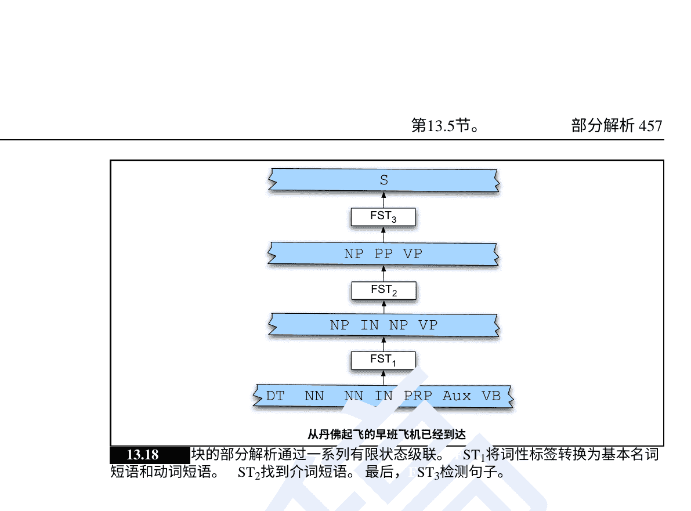

### 13.5.2 基于机器学习的块分析方法

与词性标注一样，除了基于规则的处理外，还可以使用监督式机器学习技术使用带注释的数据作为训练集来训练块分析器。如前面在第6章中所述，我们可以将该任务视为顺序分类问题，其中分类器被训练以按顺序标记输入的每个元素。任何标准的分类器训练方法都适用于这个问题。在开创这一方法的工作中，Ramshaw和Marcus（1995）使用了第5章中描述的基于转换的学习方法。

在这种方法中，关键的第一步是找到一种能够适应顺序分类的分块过程的视角。一种特别有成果的方法是将分块视为类似于词性标注的标记任务（Ramshaw和Marcus，1995年）。在这种方法中，一个小标记集同时编码了输入中块的分割和标记。这种方法的标准方式被称为IOB标记，并通过引入标记来表示每个块的开始（B）和内部（I）部分，以及输入中不属于任何块的元素（O）。

根据这个方案，标记集的大小为(2n+1)，其中n是要分类的类别数。下面的例子展示了将第13.8节上的括号表示法重新构建为标记任务的方式：(13.11) The B_NP 早上 I_NP 航班 I_NP 来自 B_PP 丹佛 B_NP 有 B_VP 到达 I_VP。

只有基本名词短语标记的相同句子说明了 O 标记的作用。(13.12) The O 早上 B_NP 航班 I_NP I_NP 来自 O 丹佛 B_NP 有 O 到达 O。

请注意，在这个方案中没有明确编码块结束的标记；任何块的结尾在从I或B到B或O标签的任何转换中都是隐含的。这种编码反映了一个观念，即在顺序标记单词时，通常比较容易（至少在英语中）检测到新块的开始，而不容易知道块何时结束。毫不奇怪，还有许多其他标记方案以微妙不同的方式表示块，包括一些明确标记组成部分的结尾。Tjong Kim Sang和Veenstra（1999）描述了这种基本标记方案的三种变体，并研究了它们在各种分块任务中的性能。


图13.19 顺序分类器的分块方法。分块器在句子上滑动一个上下文窗口，并在进行过程中对单词进行分类。此时，分类器正试图标记航班。从上下文中派生的特征通常包括单词、词性标记以及先前分配的块标记。

在这种标记方案下，构建一个分块器包括训练一个分类器，用标签集中的IOB标签之一为输入句子的每个单词进行标记。当然，训练需要包含感兴趣短语的训练数据，并用适当的类别进行标记。直接的方法是注释一个代表性的语料库。不幸的是，注释工作既昂贵又耗时。事实证明，找到用于分块的这种数据的最佳地方是现有的树库，例如在第12章中描述的Penn Treebank。

这样的树库为每个语料库句子提供了完整的句法分析，允许从句法分析成分中提取基本句法短语。要找到我们感兴趣的短语，我们只需要知道语料库中适当的非终端名称。找到块边界需要找到头部，然后包括头部左侧的材料，忽略右侧的文本。这在某种程度上容易出错，因为它依赖于第12章中描述的头部查找规则的准确性。

从树库中提取出训练语料库后，我们现在必须将训练数据转化为对训练分类器有用的形式。在这种情况下，每个输入可以表示为从环绕该词的上下文中提取的特征集。要分类的词。使用一个窗口，该窗口在被分类的词之前和之后扩展两个词，似乎提供了合理的性能。从该窗口中提取的特征包括：单词本身，它们的词性，以及窗口中前面输入的块标记。

图13.19用之前给出的例子说明了这个方案。在训练过程中，分类器将被提供一个由12个特征值组成的训练向量；决策点右侧的两个单词、它们的词性和块标记、待标记的单词及其词性、后面的两个单词及其词性，最后是正确的块标记，在这种情况下是I_NP。在分类过程中，分类器会给出相同的向量，但不包含答案，并从其标签集中分配最合适的标签。

### 13.5.3 评估分块系统

与评估词性标注器类似，块标注器的评估也是通过将块标注器的输出与人工注释者提供的黄金标准答案进行比较来进行的。然而，与词性标注不同，逐字准确度的度量是不够的。相反，块标注器使用信息检索领域借用的精确度、召回率和F度量来进行评估。

精确度精确度衡量系统提供的块的百分比是正确的。这里的正确意味着块的边界和块的标签都是正确的。因此，精确度定义为：精确度 = 系统给出的正确块的数量 / 系统给出的总块数

召回率召回率衡量系统正确识别的输入中实际存在的块的百分比。召回率定义为：召回率 = 系统给出的正确块的数量 / 文本中实际存在的总块数

F-度量 F-度量 (van Rijsbergen, 1975) 提供了将这两个度量结合为一个度量的方法。F-度量定义为：

```
Fβ = ( (β² + 1) * P * R ) / ( β² * P + R )
```

β参数用于根据应用程序的需求不同地加权考虑召回率和精确度的重要性。当 β > 1时，偏重于召回率，而当 β < 1时，偏重于精确度。当 β = 1时，精确度和召回率平衡；这有时被称为 F1 或只是 F：

```
F1 = 2 * P * R / (P + R)
(13.13)
```

F-measure来自于精确率和召回率的加权调和平均。一组数字的调和平均是倒数的算术平均值的倒数：

```
HarmonicMean(a1, a2, ..., an) = n / (1/a1 + 1/a2 + ... + 1/an)
(13.14)
```

因此，F-measure是 F = 1 / ( (α / P) + ((1-α) / R) ) 或者当 β² = (1-α)/α 时 F = ( (β² + 1) * P * R ) / ( β² * P + R )

目前最好的系统在基于NP的分块任务上达到了约0.96的F-measure。基于学习的系统旨在找到更完整的基本短语集，如图13.20所示，其F-measure在0.92到0.94的范围内。学习方法的确切选择似乎对这些结果影响不大；各种机器学习方法基本上实现了相同的结果（Cardie等，2000年）。在这个任务上，基于FST的系统在F-measure方面的范围从0.85到0.92。

限制当前系统性能的因素包括在测试期间用于提供系统特征的词性标注器的准确性，从解析树中提取块的过程中引入的训练数据的不一致性，以及解决涉及连词的歧义的困难。考虑以下涉及前置修饰语和连词的示例。

(13.16) [NP晚到和晚点]在冬天很常见。
(13.17) [NP晚到]和[NP取消]在冬天很常见。

在第一个例子中，晚到被晚到和晚点共享，形成一个长的基本名词短语。在第二个例子中，晚到不共享，只修饰晚到，因此形成两个基本名词短语。区分这两种情况以及类似情况需要访问当前块分析器无法获得的语义和上下文信息。

| 标签 | 类别 | 比例 (%) | 例子 |
| --- | --- | --- | --- |
| NP | 名词短语 | 51 | 最常取消的航班 |
| VP | 动词短语 | 20 | 可能不会到达 |
| PP | 介词短语 | 20 | 到休斯顿 |
| ADVP | 副词短语 | 4 | 更早 |
| SBAR | 从属从句 | 2 | 那个 |
| ADJP | 形容词短语 | 2 | 迟到 |

图13.20 2000年CONLL共享任务中使用最频繁的基本短语。这些块对应于宾州树库中包含的主要类别。

## 13.6 总结

本章介绍的两个主要思想是解析和部分解析。以下是我们关于这些思想的主要要点总结：

- 解析可以被视为一个搜索问题。
- 对于这个搜索，有两种常见的架构隐喻：自顶向下（从根节点开始，向下生长到输入词）和自底向上（从词语开始，向上生长到根节点）。
- 歧义结合子树的重复解析对于简单的回溯算法造成问题。
- 如果语法分配给一个句子多个可能的解析，则该句子在结构上具有歧义。
- 常见的结构歧义包括PP-附加、协调歧义和名词短语括号歧义。
- 动态规划解析算法使用部分解析表来高效解析有歧义的句子。CKY算法、Earley算法和Chart解析算法都使用动态规划来解决子树重复解析问题。
- CKY算法将其语法限制为乔姆斯基范式；Earley和Chart解析器接受无限制的上下文无关文法。
- 许多实际问题，包括信息提取问题，可以在不进行完全解析的情况下解决。
- 部分解析和分块是识别文本中浅层句法成分的方法。
- 高准确度的部分解析可以通过基于规则或基于机器学习的方法来实现。

# 参考文献和历史注释

> > 在这个领域，人们独立工作时同一技术的并行发现非常不寻常。
>
> 嗯，也许并不不寻常，如果多重发现是常态的话（见第13页）。但是，肯定有足够多的并行出版物，这个历史将在给出每个算法的特征性早期提及时，更倾向于简洁；有兴趣的读者可以参考Aho和Ullman（1972）的著作。

自底向上的解析似乎是由Yngve（1955）首次描述的，他提供了一种广度优先的自底向上解析算法作为机器翻译过程的一部分的示例。自上而下的解析和翻译方法至少由Glennie（1960）、Irons（1961）和Kuno和Oettinger（1963）描述（可能是独立的）。动态规划解析再次具有独立发现的历史。根据Martin Kay（个人通信），John Cocke在1960年首次实现了包含CKY算法根源的动态规划解析器。后来的工作扩展和形式化了该算法，并证明了它的时间复杂度（Kay，1967；Younger，1967；Kasami，1965）。相关的良好-WFST形成的子字符串表（WFST）似乎是由Kuno（1965）独立提出的，作为存储解析过程中所有先前计算结果的数据结构。基于Cocke的工作的推广，类似的数据结构已经由Kay（1967）和Kay（1973）独立描述。将动态规划应用于自上而下的解析在Earley的博士论文中进行了描述。(Earley, 1968, 1970)。Sheil (1976)证明了WFST和Earley算法的等价性。Norvig (1991)表明，动态规划提供的效率可以通过在简单的自顶向下解析器周围包装记忆化操作（如LISP）来捕捉。

虽然通过有限状态自动机级联进行解析在解析的早期历史中很常见（Harris, 1962），但很快就转向了完整的CFG解析。Church (1980)主张将有限状态语法作为自然语言理解的处理模型；其他早期的有限状态解析模型包括Ejerhed (1988)。Abney (1991)认为浅层解析在实际中起着重要的作用。最近关于浅层解析的许多工作将机器学习应用于学习这些模式的任务；例如，参见Ramshaw和Marcus (1995)，Argamon等人(1998)，Munoz等人(1999)。

解析算法的经典参考书是Aho和Ullman（1972）；尽管该书的重点是计算机语言，但大多数算法已经应用于自然语言。一本好的编程语言教材，如Aho等人（1986），也是有用的。

# 练习

- 13.1 实现将任意上下文无关文法转换为CNF的算法。将你的程序应用于 $\mathcal{L}_1$ 文法。
- 13.2 实现CKY算法，并使用你转换的 $\mathcal{L}_1$ 文法进行测试。
- 13.3 重写第13.10页上给出的CKY算法，使其能够接受包含单元产生式的文法。
- 13.4 通过修改COMPLETER的伪代码，增强图表中的解析树检索功能，从而改进Fig. 13.13中的Earley算法。
- 13.5 实现上一练习中增强的Earley算法。使用 $\mathcal{L}_1$ 文法在一个测试句子上进行检查。
- 13.6 修改Earley算法，以更好地利用自底向上的信息，减少无用的预测。
- 13.7 尝试将CKY和Earley算法重新构建为图表解析范式。
- 13.8 讨论部分解析与完全解析的相对优势和劣势。
- 13.9 使用第13.5节中给出的例子，实现一个更广泛的名词组有限状态语法，并在一些名词短语上进行测试。如果有在线词典和词性标注可用，则使用它；如果没有，则手动构建一个更受限制的系统。
- 13.10 讨论如何增强解析器以处理可能不正确的输入，例如拼写错误或语音识别错误。

# 第14章 统计解析

> > 两条路在一片树林中分岔，而我——
> 我选择了那条少有人走的路...
> 罗伯特·弗罗斯特，《未选择的道路》

Damon Runyon的短篇小说中的角色愿意对“任何命题”下注，正如Runyon在《Sarah Brown小姐的田园诗》中所说的关于Sky Masterson的，从连续获得A牌的概率到一个人能否从二垒投掷花生到本垒的赔率。这里有一个关于语言处理的道德：凭借足够的知识，我们可以计算出几乎任何事情的概率。最后两章介绍了复杂的句法结构模型及其解析。在本章中，我们展示了可以构建句法知识的概率模型，并在高效的概率解析器中使用其中的一些概率知识。

概率解析的一个关键用途是解决消歧问题。回顾第13章，平均而言，句子在句法上往往存在很大的歧义，这是由于诸如协调歧义和附着歧义等问题所导致的。CKY和Earley解析算法可以以高效的方式表示这些歧义，但无法解决它们。概率解析器提供了一个解决方案：计算每个解释的概率，并选择最可能的解释。因此，由于歧义的普遍存在，用于自然语言理解任务（主题角色标注、摘要、问答、机器翻译）的大多数现代解析器都必须是概率的。

概率语法和解析器的另一个重要用途是语言建模，用于语音识别。我们看到，N-gram语法在语音识别中用于预测即将出现的单词，帮助限制声学模型搜索单词。更复杂的概率语法的概率版本可以为语音识别器提供额外的预测能力。当然，人类与语音识别器面临着相同的歧义问题，有趣的是心理学实验表明人们在人类语言处理任务中使用类似这些概率语法的方法（例如人类阅读或语音理解）。

最常用的概率语法是概率上下文无关文法（PCFG），它是上下文无关文法的概率增强版本，其中每个规则都与一个概率相关联。我们在下一节介绍PCFG，展示如何在手工标注的树库语法上进行训练，以及如何进行解析。我们介绍了PCFG的最基本的解析算法，它是我们在第13章中看到的CKY算法的概率版本。

然后，我们展示了一些改进基本概率模型的方法（在树库语法上训练的PCFGs）。改进训练的一种方法是改变非终结符名称的一种方法。通过使非终结符有时更具体，有时更一般，我们可以得到一个具有更好概率模型的语法，从而提高解析分数。PCFG的另一种增强方法是添加更复杂的条件因素，扩展PCFG以处理概率的子范畴化信息和概率的词汇依赖关系。

最后，我们描述了用于评估解析器的标准PARSEVAL指标，并讨论了一些关于人类解析的心理学结果。

## 14.1 概率上下文无关文法

上下文无关文法的最简单增强是概率上下文无关文法（PCFG），也称为随机上下文无关文法（SCFG），最初由 Booth (1969) 提出。回想一下，上下文无关文法 G 是由四个参数 (N, Σ, R, S) 定义；概率上下文无关文法也是由四个参数定义的，只是对 R中的每个规则进行了轻微的增强：

- N 是一组非终结符（或变量）
- Σ 是一组终结符（与 N不相交）
- R 是一组规则或产生式，每个规则的形式为 A → β [p]，其中 A 是一个非终结符，β是来自无限字符串集合 (Σ ∪ N)*的符号串，而 p是介于0和1之间的数，表示 P(β|A)
- S 是一个指定的起始符号

也就是说，PCFG 通过在 R中的每个规则上增加一个条件概率来与标准 CFG 不同：
A → β [p]
这里的p表示给定的非终结符A扩展为序列β的概率。也就是说，p是给定扩展β在左侧非终结符A的条件概率。我们可以将这个概率表示为 P(A → β)，或者表示为 P(A → β|A)，或者表示为 P(RHS|LHS)。

因此，如果我们考虑一个非终结符的所有可能扩展，它们的概率之和必须为1：
Σ_{β} P(A → β) = 1

| 语法 | 概率 | 词汇表 | 概率 |
| :--- | :--- | :--- | :--- |
| S → NP VP | [.80] | Det → that | [.10] |
| S → Aux NP VP | [.15] | Det → a | [.30] |
| S → VP | [.05] | Det → the | [.60] |
| NP → 代词 | [.35] | Noun → book | [.10] |
| NP → 专有名词 | [.30] | Noun → flight | [.30] |
| NP → Det Nominal | [.20] | Noun → meal | [.15] |
| NP → 名词短语 | [.15] | Noun → money | [.05] |
| 名词性短语 → 名词 | [.75] | Noun → 航班 | [.40] |
| 名词性短语 → 名词性短语 名词 | [.20] | Noun → 晚餐 | [.10] |
| 名词性短语 → 名词性短语 介词短语 | [.05] | 动词 → 预订 | [.30] |
| 动词性短语 → 动词 | [.35] | 动词 → 包括 | [.30] |
| 动词性短语 → 动词 名词短语 | [.20] | 动词 → 更喜欢 | [.40] |
| 动词性短语 → 动词 名词短语 介词短语 | [.10] | 代词 → 我 | [.40] |
| 动词性短语 → 动词 介词短语 | [.15] | 代词 → 她 | [.05] |
| 动词性短语 → 动词 名词短语 名词短语 | [.05] | 代词 → 我 | [.15] |
| VP → VP PP | [.15] | 代词 → 你 | [.40] |
| PP → 介词 名词 | [1.0] | 专有名词 → 休斯顿 | [.60] |
| | | 专有名词 → NWA | [.40] |
| | | 助动词 → 做 | [.60] |
| | | 助动词 → 能 | [.40] |
| | | 介词 → 从 | [.30] |
| | | 介词 → 到 | [.30] |
| | | 介词 → 在 | [.20] |
| | | 介词 → 附近 | [.15] |
| | | 介词 → 通过 | [.05] |

图14.1 展示了一个PCFG：一个概率上增强了 $\mathcal{L}_1$迷你英语CFG语法和词汇表。请注意，每个非终结符的所有扩展的概率之和为1。还请注意，这些概率是为了教学目的而编制的。在任何真实的语法中，每个非终结符都有很多更多的规则，因此任何特定规则的概率往往会更小。

一致性 如果一个PCFG的所有句子的概率之和等于1，则称其为一致的。某些类型的递归规则会导致语法不一致，因为对于某些句子会产生无限循环的推导。例如，一个规则 $S \rightarrow S$ 的概率为1，会导致由于永不终止的推导而丢失概率质量。有关一致和不一致语法的更多细节，请参阅Booth和Thompson（1973）。

PCFGs如何使用？ PCFG可以用于估计与句子及其解析树相关的多个有用概率，包括特定解析树的概率（在消歧中有用）和句子或句子片段的概率（在语言建模中有用）。让我们看看这是如何工作的。

### 14.1.1 用于消歧的PCFGs

PCFG为每个句子的每个解析树（即每个推导）分配一个概率。这个属性在消歧中很有用。例如，考虑图14.2中显示的句子“预订晚餐航班”的两个解析。左边的合理解析意味着“预订提供晚餐的航班”。然而，右边的荒谬解析可能意味着“代表‘晚餐’预订航班”。类似结构的句子“你能为约翰预订航班吗？”的意思是“你能代表约翰预订航班吗？”

特定解析 T的概率被定义为解析树 T中每个非终端节点扩展所使用的所有规则的概率的乘积（其中每个规则 i可以表示为 $LHS_i \rightarrow RHS_i$）：
$$P(T,S) = \prod_{i=1}^{n} P(RHS_i|LHS_i)$$

结果概率 $P(T,S)$既是解析和句子的联合概率，也是解析的概率 $P(T)$。这怎么可能是真的？首先，根据联合概率的定义：
$$P(T,S) = P(T)P(S|T)$$

但是由于解析树包含句子的所有单词，$P(S|T)$等于1。因此：
$$P(T,S) = P(T)P(S|T) = P(T)$$

在推导中，可以通过将每个树在图14.2中的概率相乘来计算每个树的概率。例如，图14.2a中左树（称为Tleft）和右树（图14.2b或Tright）的概率可以按以下方式计算：
$$P(T_{left}) = .05*.20*.20*.20*.75*.30*.60*.10*.40 = 2.2 \times 10^{-6}$$
$$P(T_{right}) = .05*.10*.20*.15*.75*.75*.30*.60*.10*.40 = 6.1 \times 10^{-7}$$

我们可以看到，图14.2(a)中左侧（可传递）树的概率要比右侧的双及物树高得多。因此，选择具有最高PCFG概率的解析树是一个正确的消歧算法。

让我们形式化这种选择具有最高概率的解析树是进行消歧的正确方法的直观。考虑给定句子S的所有可能解析树。单词串S被称为S上任何解析树的产出。因此，输出
$$\hat{T}(S) = \underset{T \text{ s.t. } S=yield(T)}{\text{argmax}} P(T|S)$$

根据定义，条件概率P(T|S)可以重写为P(T,S)/P(S)，从而得到：
$$\hat{T}(S) = \underset{T \text{ s.t. } S=yield(T)}{\text{argmax}} \frac{P(T,S)}{P(S)}$$

由于我们对同一句子的所有解析树进行最大化，对于每棵树来说，P(S)都是一个常数，因此我们可以将其消除：
$$\hat{T}(S) = \underset{T \text{ s.t. } S=yield(T)}{\text{argmax}} P(T,S)$$

此外，由于我们上面已经证明P(T,S) = P(T)，选择最可能的解析树的最终方程简化为选择具有最高概率的解析树：
$$\hat{T}(S) = \underset{T \text{ s.t. } S=yield(T)}{\text{argmax}} P(T)$$

### 14.1.2 用于语言建模的PCFGs

PCFG的第二个属性是它为构成句子的单词字符串分配概率。这在语言建模中非常重要，无论是用于语音识别、机器翻译、拼写纠正、增强交流还是其他应用。一个明确的句子的概率是P(T,S) = P(T)或者仅仅是该句子的单一解析树的概率。一个模棱两可的句子的概率是该句子的所有解析树的概率之和：
$$ P(S) = \sum_{T \text{ s.t. } S=\text{yield}(T)} P(T,S) $$
$$ = \sum_{T \text{ s.t. } S=\text{yield}(T)} P(T) $$

PCFG的另一个对语言建模有用的特性是它们能够为句子的子字符串分配概率。例如，假设我们想要知道在已经看到的所有单词 $w_1, ..., w_{i-1}$ 之后，下一个单词 $w_i$ 的概率。这个的一般公式是：
$$ P(w_i | w_1, w_2, ..., w_{i-1}) = \frac{P(w_1, w_2, ..., w_{i-1}, w_i, ...)}{P(w_1, w_2, ..., w_{i-1}, ...)} $$

我们在第四章中看到了一个简单的近似方法，使用 $N$-grams，只依赖于最后一个或两个单词而不是整个上下文；因此，bigram近似会给我们带来：
$$ P(w_i | w_1, w_2, ..., w_{i-1}) \approx \frac{P(w_{i-1}, w_i)}{P(w_{i-1})} $$

但是 $N$-gram模型只能利用几个单词的上下文，这意味着它忽略了潜在有用的预测线索。考虑从Chelba和Jelinek（2000）的以下句子中预测after之后的单词：(14.13) the contract ended with a loss of 7 cents after trading as low as 9 cents。一个trigram语法必须从单词7 cents中预测after，而很明显，动词 ended和主语 contract将是有用的预测因素，PCFG-based解析器可以帮助我们利用它们。事实上，PCFGs允许我们在等式14.11中对整个上下文进行条件化。我们将在第14.9节中详细介绍如何使用PCFGs和PCFGs的扩展作为语言模型的细节。

> (14.13) the contract ended with a loss of 7 cents after trading as low as 9 cents

总结一下，本节和前一节已经表明，PCFG可以应用于句法分析中的消歧和语言建模中的词预测。这两个应用都需要我们能够计算给定句子 $S$ 的句法树 $T$ 的概率。接下来的几节将介绍一些计算这个概率的算法。

## 14.2 概率CKY解析PCFGs

PCFG的句法分析问题是为给定的句子 $S$ 生成最可能的句法树 $\hat{T}$，即
$$ \hat{T}(S) = \arg\max_{T \text{ s.t. } S=\text{yield}(T)} P(T) $$

计算最可能的句法树的算法是解析的标准算法的简单扩展；CKY和Earley算法都有概率版本。大多数现代概率句法分析器都基于概率CKY算法，首次由Ney（1991）描述。

与CKY算法一样，我们将假设概率CKY算法中的PCFG处于乔姆斯基范式。回顾一下第416页上的内容，CNF语法限制了规则的形式为 A → B C 或 A → w。也就是说，每个规则的右侧要么扩展为两个非终结符，要么扩展为一个终结符。对于CKY算法，我们将每个句子表示为单词之间的索引。因此，一个例句如下：
# (14.15) 通过休斯顿预订航班。
假设每个单词之间的索引如下：
# (14.16) ①预订 ②航班 ③通过 ④休斯顿 ⑤

使用这些索引，CKY解析树中的每个组成部分都被编码为一个二维矩阵。具体来说，对于长度为n的句子和包含V个非终结符的语法，我们使用一个大小为 (n+1) × (n+1) 的上三角矩阵。对于CKY算法，每个单元格 table[i, j] 包含一个可以跨越从 i 到 j 的单词序列的组成部分列表。对于概率CKY算法，更简单的思考方式是将每个单元格中的组成部分视为具有最大长度V的第三个维度。这个第三个维度对应于可以放置在该单元格中的每个非终结符，而单元格的值则是该非终结符/组成部分的概率，而不是一个组成部分列表。总之，在这个 (n+1) × (n+1) × V 矩阵中，每个单元格 [i, j, A] 表示跨越输入的位置 i 到 j 的组成部分 A 的概率。

图14.3给出了这个概率CKY算法的伪代码，扩展了图13.10中的基本CKY算法。

```
函数 PROBABILISTIC-CKY (words, grammar) 返回最可能的解析和其概率
对于 j ← from 1 to LENGTH (words) do
    对于所有 { A | A → words[j] ∈ grammar }
        table[j-1, j, A] ← P (A → words[j])
    对于 i ← from j-2 downto 0 do
        对于 k ← i+1 to j - 1 do
            对于所有 { A | A → BC ∈ grammar 和 table[i, k, B] > 0 和 table[k, j, C] > 0 }
                如果 (table[i, j, A] < P (A → BC) × table[i, k, B] × table[k, j, C])
                    table[i, j, A] ← P(A → BC) × table[i, k, B] × table[k, j, C]
                    back[i, j, A] ← {k, B, C}
返回 构建树(后退 [1, LENGTH(单词), S]), 表 [1, LENGTH(单词), S]
```

14.3 CKY算法用于在Chomsky正规形式下的PCFG语法中找到字符串的最大概率解析，其中有 n 个单词和 m 个规则。后退是用于恢复最佳解析的后指针数组。构建树函数留给读者作为练习。

与CKY算法类似，如图14.3所示的概率CKY算法需要一个Chomsky正规形式的语法。将概率语法转换为CNF还需要修改概率，以使每个解析在新的CNF语法下的概率保持不变。练习2要求您修改第13章中的转换为CNF的算法，以正确处理规则概率。

在实践中，我们更常使用一个处理单元产生式的广义CKY算法，而不是将它们转换为CNF。回想一下，练习3要求你在CKY中进行这个改变；练习3要求你将这个改变扩展到概率CKY。

让我们看一个概率CKY图的例子，使用以下已经转换为CNF的迷你语法：

| 左侧规则 | 右侧规则 |
|----------|----------|
| S → NP VP .80 | Det → the .50 |
| NP → Det N .30 | Det → a .40 |
| VP → V NP .20 | N → meal .01 |
| V → includes .05 | N → flight .02 |

给定这个语法，图14.4展示了这个句子在概率CKY解析中的第一步：(14.17)


## 14.3 学习PCFG规则概率

PCFG规则概率从哪里来？有两种方法可以学习语法规则的概率。最简单的方法是使用树库，即已解析句子的语料库。回想一下，在第12章中，我们介绍了树库的概念和常用的Penn Treebank（Marcus等，1993），这是由语言数据联盟分发的包含英语、中文和其他语言的解析树集合。给定一个树库，可以通过计算每个非终结符扩展出现的次数然后进行归一化来计算每个扩展的概率。

> (14.18)    \(P(\alpha \rightarrow \beta|\alpha) = \frac{\text{Count}(\alpha \rightarrow \beta)}{\sum_{\gamma} \text{Count}(\alpha \rightarrow \gamma)} = \frac{\text{Count}(\alpha \rightarrow \beta)}{\text{Count}(\alpha)}\)

如果我们没有树库，但我们有一个（非概率性的）解析器，我们可以通过首先使用解析器解析一个句子的语料库来生成我们计算PCFG规则概率所需的计数。如果句子是一义的，那就像这样简单：解析语料库，为解析中的每个规则递增一个计数器，然后进行归一化以获得概率。

但等等！由于大多数句子是多义的，即具有多个解析，我们不知道在哪个解析中计数规则。相反，我们需要为每个句子的每个解析保持单独的计数，并通过出现在解析中的概率对这些部分计数进行加权。但要获得这些解析概率以加权规则，我们需要已经有一个概率解析器。

解决这个先有鸡还是先有蛋的问题的直觉是通过逐步改进我们的估计值，从具有相等规则概率的解析器开始，解析句子，计算每个解析的概率，使用这些概率来加权计数，然后重新估计规则概率，如此循环，直到我们的概率收敛。计算这个的标准算法被称为内外算法，并且

内外算法

由Baker（1979）提出，作为Ch. 6中前向-后向算法的一般化。与前向-后向类似，内外算法是EM（期望-最大化）算法的一种特殊情况，因此有两个步骤：期望步骤和最大化步骤。

期望步骤

最大化步骤

最大化步骤。有关算法的完整描述，请参阅Lari和Young（1990）或Manning和Schütze（1999）。算法的完整描述。

使用内外算法估计语法规则概率实际上是内外算法的一种有限使用。内外算法实际上不仅可以设置规则概率，甚至可以诱导语法规则本身。然而，事实证明，语法归纳是如此困难，以至于仅靠内外算法无法成为一个非常成功的语法归纳器；有关其他语法归纳算法的指针，请参阅尾注。

## 14.4 PCFGs的问题

虽然概率上下文无关文法是上下文无关文法的自然扩展，但它们作为概率估计器存在两个主要问题：

独立性假设差：CFG规则对概率施加了独立性假设，导致对解析树的结构依赖建模不佳。

缺乏词汇条件：CFG规则不对特定单词的句法事实进行建模，导致在子范畴歧义、介词附加和坐标结构歧义方面存在问题。

由于这些问题，大多数当前的概率解析模型使用某种增强版本的PCFG，或以某种方式修改基于树库的文法。在接下来的几节中，我们将更详细地讨论这些增强方法。

### 14.4.1 独立性假设忽略了规则之间的结构依赖关系

让我们更详细地看看这些问题。回想一下，在CFG中，非终结符的扩展与上下文无关，即与解析树中附近的其他非终结符无关。同样，在PCFG中，像 \(NP \rightarrow Det \ N\) 这样的特定规则的概率也与树的其余部分无关。根据定义，一组独立事件的概率是它们概率的乘积。这两个事实解释了为什么在PCFG中，我们通过仅乘以每个非终结符扩展的概率来计算树的概率。

不幸的是，这种CFG独立性假设导致了概率估计不准确。这是因为在英语中，节点扩展的选择实际上可能取决于解析树中节点的位置。例如，在英语中，结果表明，作为句法主语的名词短语更有可能是代词，而作为句法宾语的名词短语更有可能是非代词（例如，专有名词或限定词+名词序列），如Switchboard语料库中的这些名词短语的统计数据所示（Francis等，1999年）：¹

|          | 代词 | 非代词 |
|----------|------|--------|
| 主语     | 91%  | 9%     |
| 宾语     | 34%  | 66%    |

不幸的是，在PCFG中无法表示这种上下文差异的概率。考虑将非终结符 \(NP\) 扩展为代词或限定词+名词的两种情况。我们应该如何设置这两个规则的概率？如果我们将它们的概率设置为它们在Switchboard语料库中的总体概率，那么这两个规则的概率大约相等。

```
NP -> DT NN .28
NP -> PRP .25
```

> ¹ 来自31,021个陈述句的主语分布；来自7,489个句子的宾语分布。
这种倾向是由于在句子中使用主语位置来实现话题或旧信息引起的（Givón，1990）。代词是谈论旧信息的一种方式，而非代词（“词汇”名词短语）通常用于引入新的指称。我们将在第21章更详细地讨论新旧信息。

因为PCFG不允许规则概率依赖于周围的上下文，所以我们只能得到这个相等的概率；没有办法捕捉到在主语位置，NP → PRP的概率应该增加到0.91，而在宾语位置，NP →DT NN的概率应该增加到0.66的事实。

如果将扩展NP的概率（例如，NP → PRP）与扩展词汇NP的概率（例如，N P →DT NN）与NP是主语还是宾语有关联，那么这些依赖关系可以被捕捉到。第14.5节将介绍父节点注释的技术，用于添加这种条件。

### 14.4.2 对词汇依赖关系的敏感性不足

PCFGs的第二类问题是它们对解析树中的单词缺乏敏感性。单词在PCFGs中起着一定的作用，因为解析概率包括给定词性的单词的概率（例如，从规则如V → sleep，NN →book等）。

但事实证明，词汇信息在语法的其他地方也很有用，比如在解决介词短语附着（PP）的歧义性时。由于英语中的介词短语可以修饰名词短语或动词短语，当解析器遇到一个介词短语时，它必须决定将其附着到树的哪个位置。考虑以下例子：（14.19）工人们把袋子倒进一个箱子里。

图14.5展示了这个句子的两种可能的解析树；左边的是正确的解析；图14.6展示了介词附着问题的另一个视角，表明解决图14.5中的歧义等同于决定将介词短语附着到NP节点还是VP节点的其余部分树中；我们说正确的解析需要VP附着，而错误的解析意味着NP附着。

VP附着 NP附着 解析意味着NP附着。

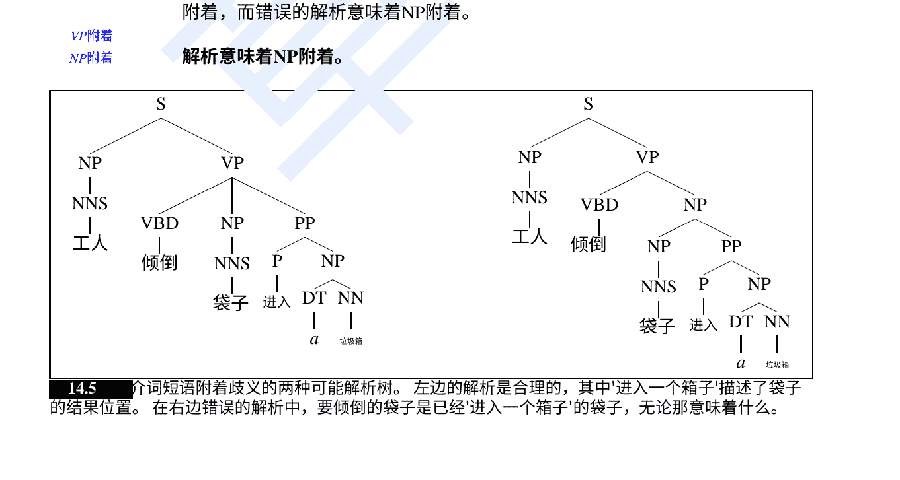

14.5 介词短语附着歧义的两种可能解析树。左边的解析是合理的，其中'进入一个箱子'描述了袋子的结果位置。在右边错误的解析中，要倾倒的袋子是已经'进入一个箱子'的袋子，无论那意味着什么。

为什么PCFG不能处理PP附着的歧义？请注意，图14.5中的两个句法树几乎具有完全相同的规则；它们的唯一区别在于左侧的句法树具有以下规则：

$$VP \rightarrow VBD \ NP \ PP$$

而右侧的句法树具有以下规则：

$$VP \rightarrow VBD \ NP$$
$$NP \rightarrow NP \ PP$$

根据这些概率的设置方式，PCFG将始终倾向于优先选择NP附着或VP附着。恰好在英语中，NP附着稍微更常见，因此如果我们在语料库上训练这些规则概率，我们可能总是倾向于NP附着，导致我们对这个句子进行错误分析。

但是假设我们将概率设置为优先选择VP附着的情况下，我们将对以下需要NP附着的句子进行错误分析：现在，我们将对以下需要NP附着的句子进行错误分析：(14.20)渔民捕捉了大量的鲱鱼

输入句子中的哪些信息让我们知道(14.20)需要NP附着，而(14.19)需要VP附着？

应该清楚的是，这些偏好来自动词、名词和介词的身份。似乎动词dumped和介词into之间的亲和力大于名词sacks和介词into之间的亲和力，从而导致VP附着。另一方面，在(14.20)中，tons和of之间的亲和力大于caught和of之间的亲和力，导致NP附着。

因此，为了得到这些例子的正确解析，我们需要一个模型，以某种方式增加PCFG概率，以处理这些词汇依赖。

协调歧义是另一种情况，词汇依赖是选择正确解析的关键。图14.7显示了Collins(1999)的一个例子，短语dogs in houses and cats有两种解析。因为从语义上讲，dogs是cats的更好的连词（因为狗不能装进猫里），所以解析为

> /在[房子]里的狗和猫/在直觉上是不自然的，应该被排除。然而，图14.7中的两个解析具有完全相同的PCFG规则，因此PCFG将为它们分配相同的概率。

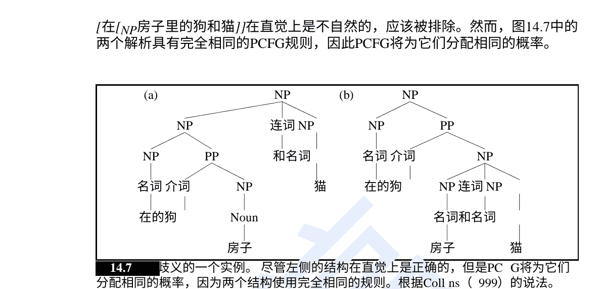

总之，在本节和上一节中，我们已经展示了概率上下文无关文法无法建模重要的结构和词汇依赖关系。在接下来的两节中，我们将概述当前用于增强PCFGs以处理这两个问题的方法。

## # 14.5 通过分割和合并非终结符来改进PCFGs

让我们从PCFGs的两个问题中的第一个问题开始：它们无法建模结构依赖关系，例如主语位置的NP倾向于代词，而宾语位置的NP倾向于具有完整的词汇（非代词）形式。我们如何扩展PCFG以正确地建模这个事实？一个想法是将NP非终结符分为两个版本：一个用于主语，一个用于宾语。

父母注释

拥有两个节点（例如，NP主语和NP宾语）将使我们能够正确地建模它们不同的分布特性，因为我们将为规则NP主语→PRP和规则NP宾语→PRP分别有不同的概率。

实现这种分割直觉的一种方法是进行父节点注释（约翰-儿子，1998b），我们在解析树中为每个节点注释其父节点。因此，作为句子主语的节点NP将被注释为NP^S，而直接宾语NP将被注释为NP^VP，其父节点为VP。图14.8展示了一个由父节点注释短语非终结符（如NP和VP）的语法生成的树的示例。

除了拆分这些短语节点外，我们还可以通过拆分预终结词性节点（Klein和Manning，2003b）来改进PCFG。例如，不同类型的副词（RB）倾向于出现在不同的句法位置：最

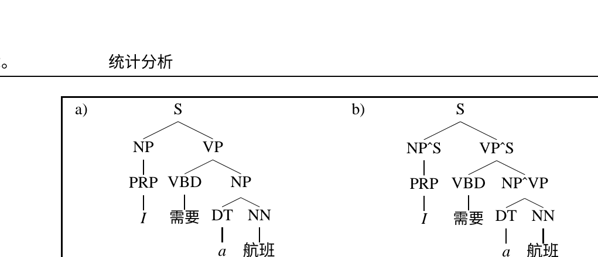

14.8 的PC G解析树（a）和具有父节点注释的非终端节点的解析树（b）。解析树（b）中的所有非终端节点（除了部分-语音节点）都已经用其父节点的标识进行了注释。

具有ADVP父节点的常见副词是也和 now，具有VP父节点的副词是 n't和 ot，具有NP父节点的副词是 only和 just。因此，添加类似RB^ADVP、RB^VP和 RB^NP的标签可以有助于改进PCFG建模。

同样，宾州树库标签IN用于标记各种各样的语音部分，包括从属连词（while, as, if），补语化词（that,for）和介词（of, in, from）。其中一些差异可以通过父节点注释来捕捉（从属连词出现在S下面，介词出现在PP下面），而其他差异则需要特别拆分预终端节点。图14.9显示了Klein和Manning（2003b）的一个示例，即使父节点注释的语法也会错误地将works解析为to see if advertising works中的名词。拆分预终端节点以允许if优先选择一个句子补语，从而得到正确的动词解析。

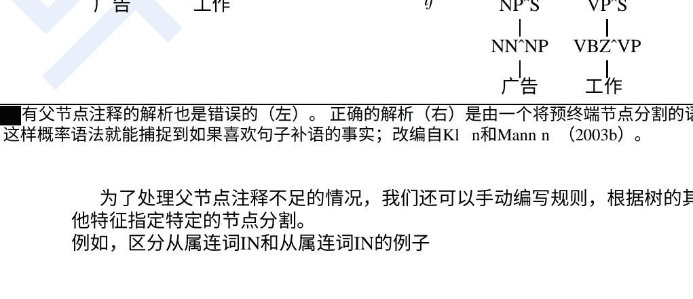

14.9 有父节点注释的解析也是错误的（左）。正确的解析（右）是由一个将预终端节点分割的语法生成的，这样概率语法就能捕捉到如果喜欢句子补语的事实；改编自KI n和Mann n（2003b）。

为了处理父节点注释不足的情况，我们还可以手动编写规则，根据树的其他特征指定特定的节点分割。例如，区分从属连词IN和从属连词IN的例子

tion IN，两者都可以有相同的父节点，我们可以编写以树的其他方面为条件的规则，例如词汇身份（可能是一个补语的词素，作为从属连词）。

节点分裂并非没有问题；它增加了语法的大小，从而减少了每个语法规则可用的训练数据量，导致过拟合。因此，对于特定的训练集，将其分裂到正确的粒度级别非常重要。虽然早期的模型涉及手写规则来尝试找到最佳数量的规则（Klein和Manning，2003b），但现代模型会自动搜索最佳分裂。Petrov等人的分裂和合并算法（2006年）

例如，它从一个简单的X-bar语法开始，然后交替地分裂非终结符，并合并非终结符，找到最大化训练集树库的注释节点集合的可能性。截至本文撰写时，Petrov等人（2006年）算法在Penn Treebank上的性能是已知解析算法中最好的。

## 14.6 概率化的词汇化CFGs

前一节展示了一个简单的概率CKY算法用于解析原始PCFGs，如果通过自动分割和合并重新设计语法规则符号，可以实现极高的解析准确性。

在本节中，我们讨论了一种替代模型系列，其中我们修改解析器的概率模型以允许词汇化规则。词汇化解析器的结果包括著名的Collins解析器（Collins, 1999）和Charniak解析器（Charniak, 1997）。

这两个解析器都是公开可用的，并且在自然语言处理中被广泛使用。

我们在第12章的第12.4.4节中看到，句法成分可以与词汇头相关联，并且我们定义了一个词汇化语法，其中每个非终端都带有其词汇头。

树中的规则如$VP \rightarrow VBD\ NP\ PP$将被扩展为：

(14.21) \qquad $VP(倾倒) \rightarrow VBD(倾倒)\ NP(袋子)\ PP(进入)$

在标准的词汇化语法中，我们实际上进行了进一步的扩展，头标签将头词的词性标签与非终结符号关联起来。因此，每个规则都通过每个组成部分的头词和头标签进行词汇化，形成了词汇化规则的格式，如下所示：

(14.22) $VP(倾倒,VBD) \rightarrow VBD(倾倒,VBD)\ NP(袋子,NNS)\ PP(进入,IN)$

我们在图14.10中展示了一个带有头标签的词汇化解析树，该树是从图12.12扩展而来的。为了生成这样的词汇化树，每个PCFG规则必须被扩充，以确定一个右侧组成部分作为头子节点。节点的头词设置为其头子节点的头词，头标签设置为头词的词性标签。回想一下，我们在图12.13中给出了一组手写规则，用于识别特定组成部分的头部。

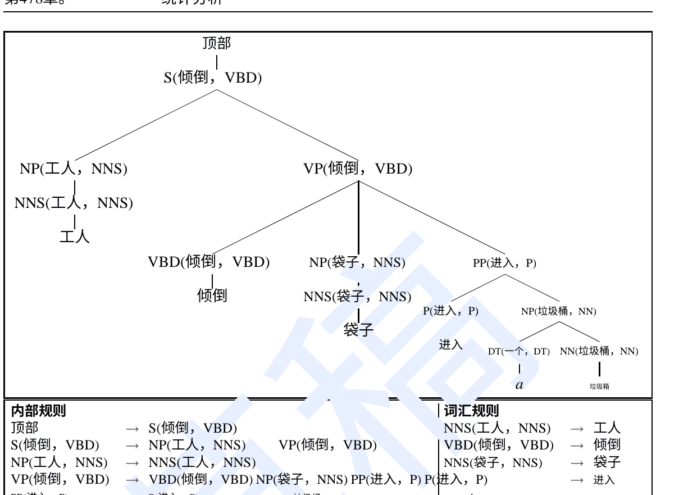

| 内部规则 |
| --- |
| 顶部 → S(倾倒, VBD) |
| S(倾倒, VBD) → NP(工人, NNS) VP(倾倒, VBD) |
| NP(工人, NNS) → NNS(工人, NNS) |
| VP(倾倒, VBD) → VBD(倾倒, VBD) NP(袋子, NNS) PP(进入, P) |
| PP(进入, P) → P(进入, P) |
| NP(垃圾桶, NN) → DT(一个, DT) NN(垃圾桶, NN) |

| 词汇规则 |
| --- |
| NNS(工人, NNS) → 工人 |
| VBD(倾倒, VBD) → 倾倒 |
| NNS(袋子, NNS) → 袋子 |
| P(进入, P) → 进入 |
| DT(一个, DT) → 一个 |
| NN(垃圾桶, NN) → 垃圾箱 |

图14.10 一个包含头标签的词汇化树，来自Collins（999）的WSJ句子的改编。下面我们展示了用于此解析树所需的PCFG规则，左侧为内部规则，右侧为词汇规则。

一个自然的方式来思考词汇化语法就像是父节点注释，即一个简单的上下文无关语法，每个规则都有很多个副本，每个可能的头词/头标签对应一个副本。以这种方式思考概率化的词汇化上下文无关语法会导致图14.10中树下面显示的一组简单的PCFG规则。请注意，图14.10显示了两种类型的规则：词汇规则，用于表示将预终结符扩展为单词，以及内部规则，用于表示其他规则扩展。我们需要在词汇化语法中区分这些类型的规则，因为它们与非常不同的概率相关联。词汇规则是确定性的，即概率为1.0，因为词汇化的预终结符如NN(bin,NN)只能扩展为单词bin。但是对于内部规则，我们需要估计概率。

假设我们将概率化的词汇化CFG视为一个非常大的CFG，只是恰好有很多非常复杂的非终结符，并从最大似然估计中估计每个规则的概率。因此，使用方程式14.18，对于规则P(VP(dumped, VBD) → VBD(dumped, VBD) NP(sacks, NNS) P(into, P))的MLE估计将是：

> > 计数 \( (V P(dumped, V BD) \rightarrow V BD(dumped, V BD) NP(sacks, NNS) PP(into, P)) \) / 计数 \( (V P(dumped, V BD)) \)

但是我们无法获得像(14.23)中那样的好的计数估计，因为它们非常具体：我们很不可能看到由dumped引导的动词短语，其具有由sacks引导的一个NP参数和由into引导的一个PP参数的许多（甚至没有）实例。换句话说，像这样完全词汇化的PCFG规则的计数将过于稀疏，大多数规则的概率将为零。

词汇化解析的想法是做一些进一步的独立性假设，以便我们可以估计概率

> > \( P(V P(倾倒, V BD) \rightarrow V BD(倾倒, V BD) NP(袋, NNS) PP(进入, P)) \)

将其视为较小独立概率估计的乘积，我们可以获得合理的计数。下一节总结了柯林斯解析方法之一。

### ## 14.6.1 Collins解析器

现代统计解析器在它们所做的独立性假设方面有所不同。在本节中，我们描述了柯林斯（1999）模型1的简化版本，但还有其他值得了解的解析器；请参阅本章末尾的摘要。

柯林斯解析器的第一个直觉是将每个（内部）CFG规则的右侧视为由一个头非终结符组成，以及头部左侧的非终结符和头部右侧的非终结符。在抽象层面上，我们对这些规则的理解如下：

> > \( LHS \rightarrow L_n L_{n-1} ... L_1 H R_1 ... R_{n-1} R_n \)

由于这是一个词汇化的语法，像\( L_1 \)或\( R_3 \)或\( H \)或\( LHS \)实际上是表示类别及其头部和头部标签的复杂符号，如VP（dumped, VP）or NP（sacks, NNS）。

现在，我们不再计算这个规则的单个MLE概率，而是通过一个简洁的生成故事来分解这个规则，这是所谓的Collins Model 1的一个简化版本。这个新的生成故事是，给定左侧，我们首先生成规则的头部，然后逐个从内部向外部生成头部的从属成分。每个生成步骤都有自己的概率。

我们还将在规则的左右边缘添加一个特殊的STOP非终结符；这个非终结符将使模型知道何时停止在给定侧生成从属成分。我们将在头部的左侧生成从属成分，直到在头部的左侧生成STOP，然后移动到头部的右侧并开始在那里生成从属成分，直到生成STOP为止。所以这是好像我们正在生成一个规则，增加如下：

(14.26) $P(VP(\text{倾倒}, V\text{ 过去式}) \to \text{停止} V\text{ 过去式}(\text{倾倒}, V\text{ 过去式}) NP(\text{袋}, \text{名词复数}) PP(\text{进入}, \text{介词}) \text{停止})$

让我们看看这个增强规则的生成故事。 我们将使用三种概率：生成头部的概率$P_H$，生成左侧依赖的概率$P_L$，以及生成右侧依赖的概率$P_R$。

- 1) 首先，用概率P(H|LHS) = P(VBD(倾倒,VBD) | VP(倾倒,V BD))生成头部VBD(倾倒,VBD)


- 2) 然后，用概率生成左侧依赖（由于没有左侧依赖，所以是停止）P(停止|VP(倾倒,VBD) VBD(倾倒,VBD))


- 3) 然后以概率生成右依赖的名词短语(袋子,名词复数) $P_r(\text{名词短语}(\text{袋子},\text{名词复数}) | \text{动词短语}(\text{倾倒},\text{动词过去式}), \text{动词过去式}(\text{倾倒},\text{动词过去式}))$


- 4) 然后以概率生成右依赖的介词短语(进入,介词) $P_r(\text{介词短语}(\text{进入},\text{介词}) | \text{动词短语}(\text{倾倒},\text{动词过去式}), \text{动词过去式}(\text{倾倒},\text{动词过去式}))$


- 5) 最后以概率生成右依赖的停止符号 $P_r(\text{停止符号} | \text{动词短语}(\text{倾倒},\text{动词过去式}), \text{动词过去式}(\text{倾倒},\text{动词过去式}))$


总结，这个规则的概率为:

(14.27) $P(VP(\text{倾倒}, V\text{ 过去式}) \to \text{动词过去式}(\text{倾倒},\text{动词过去式}) \text{名词短语}(\text{袋子},\text{名词复数}) \text{介词短语}(\text{进入},\text{介词}) \text{停止})$

被估计为：

(14.28) $P_H(VBD | VP, \text{倾倒}) \times P_L(STOP | VP, VBD, \text{倾倒}) \times P_R(NP(\text{袋子}, NNS) | VP, VBD, \text{倾倒}) \times P_R(PP(\text{进入}, P) | VP, VBD, \text{倾倒}) \times P_R(STOP | VP, VBD, \text{倾倒})$

这些概率中的每一个都可以从比(14.28)中的完整概率要小得多的数据中估计出来。例如，组成概率$P_R(NP(\text{袋子}, NNS) | VP, VBD, \text{倾倒})$的最大似然估计为：$Count(VP(\text{倾倒}, VBD) \text{在右边的某个地方有 } NNS(\text{袋子}) \text{作为一个子节点}) / Count(VP(\text{倾倒}, VBD))$ (14.29)

这些计数比复杂计数（如（14.28）中的计数）更不容易受到稀疏性问题的影响。更一般地，如果我们用 h 表示一个带有标签的头词，l 表示左边的一个词+标签，r 表示右边的一个词+标签，那么整个规则的概率可以表示为：

- 1. 以概率 $P_H(hw, ht|P, hw, ht)$ 生成短语头 $H(hw, ht)$
- 2. 以总概率生成头部左侧的修饰语：

$$\prod_{i=1}^{n+1} P_L(L_i(lw_i, lt_i)|P, H, hw, ht)$$

这样，$L_{n+1}(lw_{n+1}, lt_{n+1}) = STOP$，一旦生成了 STOP 标记，我们就停止生成。
- 3. 以总概率在头部右侧生成修饰语：

$$\prod_{i=1}^{n+1} P_R(R_i(rw_i, rt_i)|P, H, hw, ht)$$

这样，我们就可以停止生成 STOP 令牌了，只要满足 $R_{n+1}(rw_{n+1}, rt_{n+1}) = STOP$。

### 14.6.2 高级：Collins解析器的更多细节

实际的Collins解析器模型比前一节中介绍的简单模型更复杂（在几个方面）。Collins模型1还包括一个距离特征。因此，计算 $P_L$ 和 $P_R$ 的方式如下：

(14.30) $P_L(L_i(lw_i, lt_i)|P, H, hw, ht)$

(14.31) $P_R(R_i(rw_i, rt_i)|P, H, hw, ht)$

Collins模型1还考虑了一个距离特征：

(14.32) $P_L(L_i(lw_i, lt_i)|P, H, hw, ht, distance_L(i-1))$

(14.33) $P_R(R_i(rw_i, rt_i)|P, H, hw, ht, distance_R(i-1))$

距离度量是一个关于单词序列的函数在前一个修饰语下方（即已经在左边生成的每个修饰语非终端的单词）。图14.11，改编自Collins（2003），展示了概率的计算 $P(R_2(rh_2, rt_2)|P, H, hw, ht, distance_R(1))$：

这个距离度量的最简单版本只是一个由两个二进制特征组成的元组基于这些先前依赖的表面字符串：（1）字符串长度为零吗？（即没有生成先前的单词吗？）（2）字符串中是否包含动词？

Collins模型2添加了更复杂的特征，对每个动词的子范畴化框架进行条件建模，并区分论元和附加语。

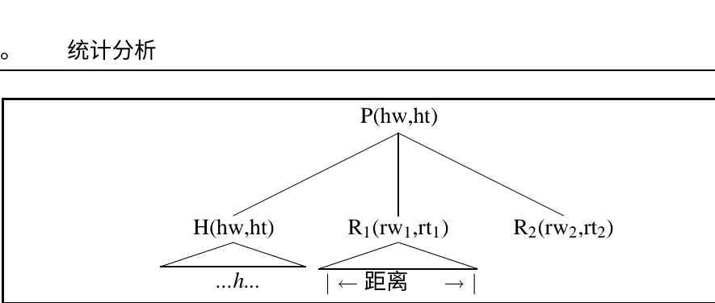

最后，平滑对于统计解析器来说与N-gram模型一样重要。对于词汇化解析器尤其如此，因为（即使使用Collins或其他独立性假设的方法）词汇化规则仍然会对训练中可能永远不会出现的许多词汇进行条件建模。

考虑概率 $P_R(R_i(rw_i, rt_i)|P, hw, ht)$。如果一个特定的右侧成分从不与这个头部出现，我们该怎么办？Collins模型通过插值三个回退模型来解决这个问题：完全词汇化（以头词为条件），回退到只有头标签，以及完全未词汇化：

| 回退级别 | $P_R(R_i(rw_i, rt_i)|...)$ | 例子 |
| :--- | :--- | :--- |
| 1 | $P_R(R_i(rw_i, rt_i)|P, hw, ht)$ | $P_R(NP (\text{袋子}, NNS)|VP, VBD, \text{倾倒})$ |
| 2 | $P_R(R_i(rw_i, rt_i)|P, ht)$ | $P_R(NP(\text{袋子}, NNS)|VP)$ |
| 3 | $P_R(R_i(rw_i, rt_i)|P)$ | $P_R(NP(\text{sacks}, NNS)|VP)$ |

类似的回退模型也被构建用于 $P_L$ 和 $P_H$。虽然我们使用了词语‘回退’，但实际上这些不是回退模型，而是插值模型。上述三个模型是线性插值的，其中 $e_1$，$e_2$ 和 $e_3$ 是上述三个回退模型的最大似然估计：

(14.34) $P_R(...) = \lambda_1 e_1 + (1 - \lambda_1)(\lambda_2 e_2 + (1 - \lambda_2) e_3)$

根据Bikel等人(1997)的方法，$\lambda_1$和$\lambda_2$的值被设置为实现Witten-Bell折扣(Witten and Bell, 1991)。在Collins模型中，未知词汇通过将测试集中的任何未知词替换为特殊的UNKNOWN词标记，并将训练集中出现次数少于6次的任何词替换为特殊的UNKNOWN词标记来处理。在预处理步骤中，Ratnaparkhi（1996）标注器为测试集中的未知词汇分配了一个词性标记；所有其他词汇则在解析过程中被标记为句法的一部分。Collins模型的解析算法是概率CKY的扩展；详见Collins（2003）。将CKY算法扩展以处理基本的词汇概率是留给读者的一个练习。

## 14.7 评估解析器

评估解析器和语法的标准技术称为PARSE-VAL度量，这些技术是基于Black等人（1991）提出的，基于我们在之前章节中看到的信号检测理论的相同思想。PARSEVAL度量的直觉是衡量假设解析树中的成分与手工标记的黄金参考解析树中的成分有多相似。因此，PARSEVAL假设我们对测试集中的每个句子都有一个人工标记的“黄金标准”解析树；我们通常从类似于Penn Treebank的树库中获取这些黄金标准解析树。对于测试集中的一个给定句子的假设解析树C_h，如果参考解析树C_r中存在一个具有相同起始点、结束点和非终结符号的成分，则将其标记为“正确”。

我们可以像在前一章中对块分析一样，测量精确度和召回率。

标记召回率：= (假设解析中正确的成分数) / (参考解析中正确的成分数)

标记精确度：= (假设解析中正确的成分数) / (假设解析中总的成分数)

与其他精确度和召回率的用法一样，我们通常报告一个单一的数字，即F-度量(van Rijsbergen, 1975)：F-度量的定义如下：

$$ F_{\beta} = \frac{(\beta^{2}+1)PR}{\beta^{2}P + R} $$

β参数用于根据应用程序的需求不同地加权考虑召回率和精确度的重要性。当 β > 1时，偏重于召回率，而当β < 1时，偏重于精确度。当 β = 1时，精确度和召回率平衡；这有时被称为 F β=1 或只是 F1：

(14.35) $$ F_{1} = \frac{2PR}{P + R} $$

F-度量源于精确度和召回率的加权调和平均数。回想一下，一组数字的调和平均数是倒数与算术平均数的倒数之间的关系：

(14.36) $$ HarmonicMean(a_{1},a_{2},a_{3},a_{4},...,a_{n}) = \frac{n}{\frac{1}{a_{1}}\frac{1}{a_{2}}\frac{1}{a_{3}}...\frac{1}{a_{n}}} $$

因此，F-measure是

(14.37) $$ F = \frac{1}{\frac{1}{\alpha P} \times \frac{1}{(1-\alpha)R}} \quad \text{或者} \quad \left(\text{当} \beta^{2} = \frac{1-\alpha}{\alpha} \text{时}\right) \quad F = \frac{(\beta^{2}+1)PR}{\beta^{2}P + R} $$

我们还使用了一个新的度量标准，交叉括号，用于每个句子 s：

## 统计分析

交叉括号：参考解析中存在((A B) C)这样的括号结构，但假设解析中存在(A (BC) )这样的括号结构的成分数。

截至撰写本文时，训练和测试在《华尔街日报》树库上的现代解析器的性能略高于90%的召回率，90%的精确度，并且每个句子约有1%的交叉括号成分。

为了比较使用不同语法的解析器，PARSEVAL指标包括一个规范化算法，用于删除可能是特定于语法的信息（助动词，前不定式“to”等），并计算简化的得分。 有兴趣的读者可以参考Black等人（1991年）的研究。 PARSEVAL指标的规范公开可用的实现称为 **evalb**（Sekine和Collins，1997年）。

你可能会想为什么我们不通过测量正确解析的句子数量来评估解析器，而是通过测量成分准确性。 我们使用成分的原因是测量成分可以给我们提供更精细的指标。这在长句子中尤其明显，大多数解析器无法得到完美的解析。如果我们只测量句子准确性，我们将无法区分大部分成分错误的解析和只有一个成分错误的解析。

然而，成分并不总是解析器评估的最佳领域。例如，使用PARSEVAL指标要求我们的解析器以与黄金标准完全相同的格式生成树。 这意味着，如果我们想要评估一个生成不同样式解析（依存解析或LFG特征结构等）的解析器，例如对Penn Treebank（或对生成树库格式的另一个解析器）进行评估，我们需要将输出解析映射到生成树库格式。 相关问题是成分可能不是我们最关心的层次。 我们可能更关心解析器在恢复语法依赖关系（主语、宾语等）方面的表现，这可以为我们提供更好的度量语义理解的指标。 为了这些目的，我们可以使用基于测量标记依赖关系的精确度和召回率的替代评估指标，其中标签表示语法关系（Lin，1995； Carroll等，1998； Collins等，1999）。 例如，Kaplan等（2004）通过将解析树转换为依赖表示形式，比较了Collins（1999）解析器和Xerox XLE解析器（Riezler等，2002），后者生成更丰富的语义表示。

## 14.8 高级：判别式重新排序

到目前为止，我们所见过的解析模型，如PCFG解析器和Collins词法解析器，都是生成式解析器。 这意味着这些解析器中实现的概率模型通过为生成过程中解析器可能做出的每个选择分配概率，给出了生成特定句子的概率。

生成式模型具有一些重要的优势；它们易于使用最大似然进行训练，并且给出了不同证据来源如何组合的明确模型。但是生成式解析模型也使得将任意类型的信息纳入概率模型变得困难。这是因为概率是基于句子的生成派生；很难添加不局限于特定PCFG规则的特征。

例如，考虑如何表示关于树结构的全局事实。英语中的解析树倾向于向右分支；因此，我们希望我们的模型在其他条件相等的情况下，给更右分支的树分配更高的概率。此外，重要成分（具有大量单词的成分）倾向于出现在句子的后面。或者，我们可能希望将解析概率条件化于全局事实，如说话者的身份（也许某些说话者更有可能使用复杂的关系从句或被动语态）。或者，我们可能希望将解析概率条件化于跨句子的复杂话语因素。这些全局因素中的任何一种都不容易纳入我们所考虑的生成式模型中。一个简单的模型，例如使每个非终结符依赖于解析树到目前为止的右分支程度，或使每个NP非终结符对说话者或作者在前面句子中使用的关系从句数量敏感，将导致计数过于稀疏。

我们在第6章中讨论了这个问题，这些全局特征的需求促使我们使用对数线性（MEMM）模型而不是HMM进行POS标注。对于解析，有两类判别模型：动态规划方法和使用判别重排序的两阶段解析模型。我们将在本节的其余部分讨论判别重排序；有关判别动态规划方法的指引，请参阅本章末尾。

在判别重排序系统的第一阶段，我们可以运行一个正常的统计解析器，就像我们之前描述的那样。但是，我们修改解析器，使其产生一个带有概率的解析排名列表，而不仅仅是产生最佳解析。我们称这个解析排名列表为N最佳列表（最佳列表是在讨论语音识别的多通道解码模型时首次引入的）。有多种方法可以修改统计解析器以产生一个N最佳解析列表；有关文献的指引，请参阅本章末尾。对于训练集和测试集中的每个句子，我们运行这个N最佳解析器，并产生一组N解析/概率对。在训练集和测试集中的每个句子中，我们运行这个N最佳解析器，并产生一组N解析/概率对。

最佳解析列表

判别式重新排序模型的第二阶段是一个分类器，它将这些句子与它们的N解析/概率对作为输入，提取一些大量的特征，并从N个最佳列表中选择最佳解析。我们可以使用任何类型的重新排序分类器，例如在第6章中介绍的对数线性分类器。

可以使用各种各样的特征进行重新排序。一个重要的特征是由第一阶段统计解析器分配的解析概率。其他特征可能包括树中的每个CFG规则，平行连词的数量，每个成分的重量，解析树的右分支程度，各种树片段出现的次数，树中相邻非终结符的二元组等等。

两阶段架构存在一个弱点：完整的准确率。第一阶段最佳解析的准确率决定了架构的准确率 N-最佳列表。这是因为重新排序的方法只是选择了 N- 最佳解析中的一个；即使我们选择了列表中最好的解析，如果正确的解析不在列表中，我们也无法获得100%的准确率！因此，考虑到 N- 最佳列表的上限准确率或者-acle准确率（通常用 F-度量来衡量）是很重要的。 特定 N-最佳列表的上限准确率（F-度量）是我们选择具有最高准确率的解析时获得的准确率（F-度量）。我们将其称为上限准确率，因为它依赖于选择解析的完美知识（就像来自神谕一样）。当然，只有当 N-最佳 F-度量高于 1-最佳 F-度量时，实施判别式重新排序才有意义。幸运的是，这种情况经常发生；例如，Charniak (2000) 解析器在 Penn Treebank 的第23节上的 F-度量为0.897，但是 Charniak和Johnson (2005) 算法生成的50个最佳解析的上限 F-度量要高得多，为0.968。

## 14.9 高级：基于解析器的语言建模

我们之前说过，统计解析器可以利用比 N-gram更长的距离信息，这表明它们在语言模型-预测方面可能做得更好。事实证明，如果我们有大量的训练数据，4-gram或5-gram语法仍然是进行语言建模的最佳方式。

但是在数据不足以支持如此庞大的模型的情况下，基于解析器的语言模型开始得到发展，这些模型具有更高的准确性 N-gram模型。

语言建模的两个常见应用是语音识别和机器翻译。在这些应用中，使用统计解析器进行语言建模的最简单方法是通过一个两阶段算法来实现，该算法在前一节和第10.1节中讨论过。在第一阶段，我们运行一个正常的语音识别解码器或机器翻译解码器，使用一个正常的 N-gram语法。但是，我们修改解码器，不仅仅产生单个最佳的转录或翻译句子，而是生成一个排名 N-最佳的转录/翻译句子列表，每个句子都附带其概率（或者，作为替代，一个格子）。

然后在第二阶段，我们运行我们的统计解析器，并为 N个最佳列表或格子中的每个句子分配一个解析概率。然后根据这个解析概率重新排列句子，并选择最佳的句子。这个算法可以比使用简单的三元语法更好地工作。例如，在使用这个两阶段架构从华尔街日报中识别口语句子的任务上，Charniak (2001) 解析器分配的概率相对于在4000万个单词上计算的简单三元语法，将词错误率提高了约2个百分点。我们可以直接使用解析器分配的解析概率，或者将其与原始的 N-gram概率线性组合。

对于语音识别，与两遍架构相比，一种替代方法是修改解析器以严格从左到右运行，以便它可以逐步给出概率。句子中下一个单词的可能性。这将允许解析器直接适应第一次解码过程，并完全避免第二次解码。虽然存在一些基于解析器的从左到右的语言建模算法（Stolcke，1995; Jurafsky et al., 1995; Roark, 2001; Xu et al., 2002），但可以说，基于解析器的统计语言模型仍处于早期阶段。

## 14.10 人类解析

当人们进行解析时，我们讨论的这种概率解析模型也被使用吗？这个问题涉及到一个叫做人类句子处理的领域。最近的研究表明，人类应用概率解析算法至少有两种方式，尽管对于细节仍存在争议。

一类研究表明，当人类阅读时，一个词的可预测性似乎会影响阅读时间；可预测性更高的词会被更快地阅读。一种定义可预测性的方法是使用简单的二元测量。例如，Scott和Shillcock（2003）让参与者在监视眼动的同时阅读句子。他们构建了一些句子，其中一些句子的动词-名词组合具有较高的二元概率（如（14.38a）），而其他句子的动词-名词组合具有较低的二元概率（如（14.38b））。

-   (14.38)
    a)高概率：避免混淆的一种方法是在假期期间进行更改；
    b)低概率：避免被发现的一种方法是在假期期间进行更改；

他们发现，一个词的二元可预测性越高，参与者注视该词的时间越短（初始注视持续时间）。

虽然这个结果只提供了 N-gram概率的证据，但是最近的实验表明，给定前一句子的句法解析的情况下，即将出现的单词的概率也能预测单词的阅读时间Hale (2006), Levy (2007)。

有趣的是，概率对阅读时间的影响也被证明在形态结构上存在；识别一个单词的时间受到单词熵和单词形态范式的熵的影响Moscoso del Prado Martín et al. (2004b)。

第二类研究探讨了人类如何消除具有多种可能解析的句子，表明人类更倾向于选择更有可能的解析方式。这些研究通常依赖于一类特定的临时歧义句子，称为garden-path句子。这些句子最早由Bever(1970)描述，它们巧妙地构造出具有三个特性的句子，使得人们很难解析：

-   1.  它们在暂时性地产生歧义：这个句子本身没有歧义，但是它的开头部分有歧义。
-   2.  在开头部分的两个或多个解析中，有一种解析对人类的解析机制来说更可取。
-   3.  但是对于这个句子来说，不可取的解析才是正确的解析。

这三个属性的结果是，人们会被“引入歧途”，走向错误的解析，当他们意识到这是错误的时候会感到困惑。有时候这种困惑是非常明显的，就像Bever的例子(14.39)一样；事实上，这个句子非常难解析，读者通常需要被展示正确的结构。在正确的结构中，raced是一个修饰The horse的简化定语从句的一部分，意思是“那匹马[从谷仓旁边跑过]摔倒了”；这个结构也存在于句子“通过Berlitz方法教授的学生到了法国后表现更差”中。(14.39) The horse raced past the barn fell.

在Marti Hearst的例子(14.40)中，主语经常错误地将动词houses误解为一个名词(将复杂的houses解析为一个名词短语，而不是一个名词短语和一个动词)。有时候，花园路径句子引起的混淆非常微妙，只能通过阅读时间的轻微增加来衡量。因此，在例子(14.41)中，读者经常将解决方案错误地解析为forgot的直接宾语，而不是作为嵌套句子的主语。这种错误解析是微妙的，只有在实验参与者阅读单词was时花费的时间比对照组句子长时才能注意到。这种在单词was处的“迷你花园路径”效应表明，受试者选择了直接宾语解析，并且现在在意识到他们处于一个句子补语中，他们必须重新分析或重新排列他们的解析。

> > (14.40) 这个综合体容纳了已婚和单身学生及其家庭。

> > (14.41) 学生忘记了解答在书的后面。

似乎在这些对特定（错误）解析的偏好中起作用，但至少有一个因素似乎是句法概率，特别是词汇化的（子范畴化）概率。例如，动词忘记接受直接宾语（VP → V NP）的概率高于接受句子补语（VP → V S）的概率；这种差异导致读者在忘记后期望一个直接宾语，并在遇到句子补语时感到惊讶（阅读时间更长）。相比之下，一个更喜欢句子补语的动词（如希望）不会导致额外的阅读时间。

同样，(14.40)中的花园小径可能是由于 P(房屋|名词) > P(房屋|动词)和 P(复杂|形容词) > P(复杂|名词)，而(14.39)中的花园小径至少部分是由于减少的关系从句构造的低概率引起的。

除了语法知识，人类解析还受到许多其他因素的影响，我们将在后面进行描述，包括资源限制（如内存限制，在第15章中讨论），主题结构（如动词是否期望语义主体或患者，在第19章中讨论）和话语约束（第21章）。

## 14.11 总结

本章概述了概率解析的基础，重点是概率上下文无关文法和概率词汇化的上下文无关文法。

-   • 概率语法为句子或词组分配概率，同时试图捕捉比N-gram语法更复杂的句法信息。
    Ch. 4中的N-gram语法。
-   • 概率上下文无关文法（PCFG）是一种上下文无关文法，其中每个规则都带有选择该规则的概率的注释。每个PCFG规则都被视为条件独立；因此，句子的概率是通过将句子的每个规则的概率相乘来计算的。
-   • 概率CKY（Cocke-Kasami-Younger）算法是CKY解析算法的概率版本。还有其他解析器的概率版本，如Earley算法。
-   • PCFG概率可以通过在已解析的语料库中进行计数或通过解析语料库来学习。内外算法是处理正在解析的句子具有歧义性的一种方法。
-   • 原始的PCFG在规则之间存在独立性假设不足，并且缺乏对词汇依赖的敏感性。
-   • 解决这个问题的一种方法是分割和合并非终结符（自动或手动）。
-   • 概率化词汇化CFG是解决这个问题的另一种方法，其中基本的PCFG模型为每个规则增加了一个词汇头。规则的概率可以根据词汇头或附近的头进行条件化。
-   • 基于词汇化PCFG的解析器（如Charniak和Collins解析器）基于对概率CKY解析的扩展。
-   • 解析器使用三个指标进行评估：标记召回率，标记精确度和交叉括号。
-   • 基于花园路径句子和其他在线句子处理实验的证据表明，人类解析器使用某种概率语法信息。

# 参考文献和历史注释

概率上下文无关文法的许多形式属性最早由Booth（1969）和Salomaa（1969）研究出来。Baker（1979）提出了无监督训练PCFG概率的内外算法，并使用CKY风格的解析算法计算内部概率。Jelinek和Lafferty（1991）扩展了CKY算法以计算前缀的概率。Stolcke（1995）在适应Earley算法与PCFG一起使用时借鉴了这两个算法。从20世纪90年代初开始，许多研究人员致力于向PCFG添加词汇依赖关系，并使PCFG规则概率对周围的句法结构更敏感。例如，Schabes等人（1988）和Schabes（1990）提出了关于头部使用的早期工作。许多关于词汇依赖性使用的论文最早在1990年6月的DARPA语音和自然语言研讨会上发表。Hindle和Rooth（1990）的一篇论文将词汇依赖性应用于介词短语的附着问题；在后来的一篇论文的问题环节中，Ken Church建议将这种方法应用于完整的解析（Marcus，1990）。早期关于这种概率CFG解析与概率依赖信息的工作包括Magerman和Marcus（1991），Black等人（1992），Bod（1993）和Jelinek等人（1994），以及上述讨论的Collins（1996），Charniak（1997）和Collins（1999）。其他最近的PCFG解析模型包括Klein和Manning（2003a）和Petrov等人（2006）。

这项早期的词汇概率工作最初导致了解决特定解析问题的工作，比如介词短语附着，使用的方法包括转换基于学习的方法（TBL）（Brill和Resnik，1994），最大熵

(Ratnaparkhi等，1994) ，基于记忆的学习 (Zavrel和Daelemans，1997) ，对数线性模型 (Franz，1997) ，使用头部之间的语义距离的决策树 (从WordNet计算) (Stetina和Nagao，1997) ，以及Boosting (Abney等，1999b) 。

另一个方向将词汇概率解析工作扩展到除PCFG之外的其他语法的概率建模，例如概率TAG语法 (Resnik，1992; Schabes，1992) ，基于在第12章中讨论的TAG语法的概率LR解析 (Briscoe和Carroll，1993) ，以及概率链接语法 (Laferty等，1992) 。一种概率解析的方法称为 [Supertagging]超标签

通过使用非常复杂的标签，将词性标注的概念扩展到解析过程中，实际上这些标签是词汇化解析树的片段 (Bangalore和Joshi，1999; Joshi和Srinivas，1994) ，基于Schabes等人的词汇化TAG语法 (1988年) 。例如，名词purchase在名词复合词中的第一个名词 (可能位于由名词主导的小树的左侧) 与第二个名词 (可能位于右侧) 具有不同的标签。超级标记也已应用于CCG解析和HPSG解析 (Clark和Curran，2004a; Matsuzaki等，2007; Blunsom和Baldwin，2006) 。CC G的非超级标记统计解析器包括Hockenmaier和Steedman (2002年) 。

Goodman (1997), Abney (1997), 和 Johnson et al. (1999) 对基于特征的语法的概率处理进行了早期讨论。最近关于构建基于特征的语法形式主义的统计模型的其他工作包括 Riezler et al. (2002), Kaplan et al. (2004), 和 Toutanova et al. (2005) 。

我们之前提到，判别式解析方法可以分为动态规划方法和判别式重排序方法这两个大类。请记住，判别式重排序方法需要 N个最佳解析。基于A*搜索的解析器可以通过继续搜索第一最佳解析来轻松生成 N个最佳解析列表 (Roark, 2001)。像本章描述的动态规划算法一样，可以通过消除动态规划并使用大规模剪枝 (Collins, 2000; Collins and Koo, 2005; Bikel, 2004)，或者通过新算法 (Jime´nez and Marzal, 2000; Gildea and Jurafsky, 2002; Charniak and Johnson, 2005; Huang and Chiang, 2005)，其中一些算法是从语音识别算法中改编而来，例如 Schwartz and Chow (1990) (见第10.1节)。与之相反，在动态规划方法中，不是输出然后对 N个最佳解析进行重排序，而是将解析紧凑地表示在一个图表中，并且直接从图表中应用对数线性和其他方法进行解码。这些现代方法包括 Johnson (2001), Clark and Curran (2004b), 和 Taskar et al. (2004)。

其他重新排序的发展包括改变优化准则 (Titov和 Henderson, 2006年) 。

另一个重要的最近研究领域是依存句法分析；算法包括Eisner的双词算法 ( Eisner, 1996b, 1996a, 2000a) ，最大生成树方法 (使用在线学习) (McDonald等，2005年，2005年) ，以及基于构建解析器动作分类器的方法 (Kudo和Matsumoto, 2002年; Yamada和Matsumoto, 2003年; Nivre等，2006年; Titov和Henderson, 2007年) 。通常区分投射和非投射依赖。非投射

依赖关系是指依赖线交叉的情况；这在英语中并不常见，但在许多自由词序的语言中非常常见。非-

非投射依赖

投影依赖算法包括McDonald等人（2005年）和Nivre（2007年）。Klein-Manning解析器结合了依赖性和从属关系信息（Klein和Manning，2003c）。

Manning和Sch`utze（1999年）对概率解析有广泛的覆盖。Collins（1999年）的论文包括对该领域的非常易读的调查和介绍-他的解析器。

语法归纳领域与统计解析密切相关，解析器通常作为语法归纳算法的一部分使用。最早的语法归纳统计作品之一是Horning（1969年），他证明了可以在没有负面证据的情况下归纳出PCFG。早期的现代概率语法工作表明仅仅使用EM是不够的（Lari和Young，1990年；Carroll和Charniak，1992年）。最近的概率工作，如Yuret（1998年）、Clark（2001年）、Klein和Manning（2002年）和Klein和Manning（2004年），在Klein（2005年）和Adriaans和van Zaanen（2004年）中有总结。自那个总结以来的工作包括Smith和Eisner（2005年）、Haghighi和Klein（2006年）以及Smith和Eisner（2007年）。

# 练习

-   14.1 实现CKY算法。
-   14.2 修改第13章中的算法，以正确处理规则概率转换为CNF。确保生成的CNF为每个解析树分配相同的总概率。
-   14.3 回想一下，练习3要求您更新CKY算法，直接处理单元产生式，而不是将它们转换为CNF。将此更改扩展到概率CKY。
-   14.4 填写图14.4中概率CKY图的其余部分。
-   14.5 草拟如何扩展CKY算法以处理词汇化概率。
-   14.6 实现您的词汇化扩展的CKY算法。
-   14.7 实现Sec. 14.7中描述的PARSEVAL指标。然后使用一个树库或创建自己的手动检查的解析测试集。现在使用您的CFG（或其他）解析器和语法，解析测试集并计算标记召回率，标记精确度和交叉括号。

## 第15章
特征和统一

> FRIAR FRANCIS: 如果你们中任何人知道任何内在的障碍，导致你们不能结合，我要求你们在灵魂上表达出来。

威廉·莎士比亚，无事生非

从还原主义的角度来看，过去几百年来自然科学的历史可以被看作是试图通过较小的基本元素的联合作用来解释较大结构行为的努力。在生物学中，遗传性质被基因的作用所解释，而基因的性质又被DNA的作用所解释。在物理学中，物质被还原为原子，然后再次被还原为亚原子粒子。还原主义的吸引力并没有逃脱计算语言学的注意。在本章中，我们介绍了语法类别如 $VPto$, $Sthat$, $Non3sg Aux$ 或 $3sgNP$ 以及语法规则的概念

$S\rightarrow NP\ VP$ 应该被视为对象，可以具有复杂的属性。这些属性中的信息由约束表示，因此这些模型通常被称为基于约束的形式主义。

为什么我们需要一种更精细的方式来表示和放置语法范畴的约束？一个问题出现在第12章，我们看到天真的模型对于一致和子范畴化等语法现象可能导致过度生成的问题。例如，为了避免不合语法的名词短语，如这些航班和动词短语消失了一架航班，我们不得不创建大量的原始语法范畴，如 $Non3sgVPto$, $NPmass$, $3sgNP$ 和 $Non3sgAux$。这些新的范畴反过来导致了语法规则数量的激增，以及语法的普遍性的相应丧失。基于约束的表示方案将允许我们表示关于数量和人称、一致性、子范畴化以及语义范畴（如质量/计数）的细粒度信息。

基于约束的形式主义在本章中有其他优势，我们不会涵盖，例如能够模拟比上下文无关文法更复杂的现象，以及能够高效方便地计算句法表示的语义。

简要考虑一下这种方法在语法数目的情况下如何工作。
正如我们在第12章中看到的，像这个航班和那些航班这样的名词短语可以根据它们是单数还是复数来区分。如果我们将一个名为NUMBER的属性与$NP$类别的适当成员关联起来，就可以捕捉到这种区别。有了这种能力，我们可以说这个航班是$NP$类别的成员，并且其NUMBER属性的值为单数。同样的属性可以以同样的方式用于区分单数和

## 15.1 特征结构

编码我们所考虑的属性的最简单方法之一是通过使用特征结构。这些只是特征-值对的集合，其中特征是从某个有限集合中选择的不可分析的原子符号，而值可以是原子符号或特征结构本身。这种特征结构可以用下面这种称为属性-值矩阵的图表来表示

```
AVM:

[ 特征1  值1
  特征2  值2
  ...
  特征n  值n ]
```

为了具体说明，考虑上面讨论的数属性。为了捕捉这个属性，我们将使用符号 NUMBER 来指定这个语法属性，并使用英语中可能的值 sg 和 pl (在第3章中介绍)。一个由这个单一特征组成的简单特征结构可以如下所示：

```
[ NUMBER  sg ]
```

添加一个额外的特征值对来捕捉人称的语法概念导致以下特征结构：

```
[ NUMBER  sg
  PERSON  3 ]
```

接下来，我们可以通过使用 CAT特征来编码与该结构对应的成分的语法类别。例如，我们可以使用以下结构来指示这些特征与名词短语相关联：

```
[ CAT  NP
  NUMBER  sg
  PERSON  3 ]
```

该结构可用于表示第12章中引入的 *3sgNP* 类别，以捕捉名词短语的受限子类。相应的复数版本的该结构将如下所示：

```
[ CAT  NP
  NUMBER  pl
  PERSON  3 ]
```

请注意，这最后两个结构的 CAT和 PERSON特征的值保持不变。这说明了特征结构的使用方式既可以保留核心的语法类别集合，又可以在单个类别的成员之间进行区分。

正如前面提到的，特征不仅限于原子符号作为它们的值；它们还可以有其他特征结构作为它们的值。当我们希望将一组特征-值对捆绑在一起以进行类似处理时，这是特别有用的。作为这一点的例子，考虑到 NUMBER和 PERSON特征经常被合并在语法主语必须在其数和人称属性上与它们的谓词一致。这种合并可以通过引入一个包含 NUMBER和 PER-SON特征-值对的特征结构作为其值的AGREEMENT特征来捕捉。将这个特征引入到我们的第三人称单数名词短语中会产生以下类型的结构。

```
[ CAT  NP
  AGREEMENT  [ NUMBER  sg
                PERSON  3 ] ]
```

在这种安排下，我们可以通过测试它们的AGREEMENT特征的值的相等性来测试两个成分的NUMBER和 PERSON特征的值的相等性。

能够使用特征结构作为值的能力直接导致了特征路径的概念。特征路径只是通过特征结构的一系列特征导向特定值的序列。例如，在最后一个特征结构中，我们可以说⟨AGREEMENT NUMBER⟩路径导向值 *sg*，而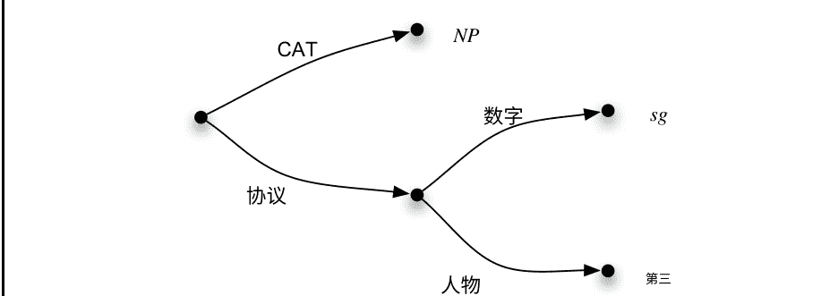

<一致性人物>路径导致值为第三。这种路径的概念自然地引出了另一种图形化表示特征结构的方式，如图15.1所示，正如我们将在第15.4节中看到的那样，这种方式暗示了它们将如何被实现。在这些图表中，特征结构被描绘为有向图，其中特征出现为带标签的边，值出现为节点。

虽然这种路径的概念在许多情况下都很有用，但我们在这里引入它是为了帮助解释另一种重要的特征结构：那些包含一些特征结构作为值的特征结构。这种特征结构将被称为可重入结构。我们在这里考虑的，不是两个特征可能具有相等值的简单想法，而是它们确切地共享相同的特征结构（或图中的节点）。如果我们从图中的路径角度思考，这两种情况可以清楚地区分开来。在简单相等的情况下，两条路径导致图中的不同节点，锚定相同但不同的结构。在可重入结构的情况下，两个特征路径实际上导致结构中的同一节点。

图15.2展示了一个可重入的简单示例。在这个结构中，<头部 主语 一致性>路径和<头部 一致性>路径导致相同的位置。我们的AVM图中将使用添加数字索引来表示这样的共享结构，以表示要共享的值。图15.2中的特征结构的AVM版本将使用PATR-II系统（Shieber, 1986）的符号表示，基于Kay（1979）：

```
        CAT  S
        ┌────────────────────────────────────┐
        │      协议 1    ┌[数字 sg ]┐      │
头部 ───┤                │人称    第三│      │
        │                └          ┘      │
        │      主题    [协议 1    ]        │
        └────────────────────────────────────┘
```

正如我们将看到的，这些简单的结构使我们能够以令人惊讶的简洁而优雅的方式表达语言的普遍规律。

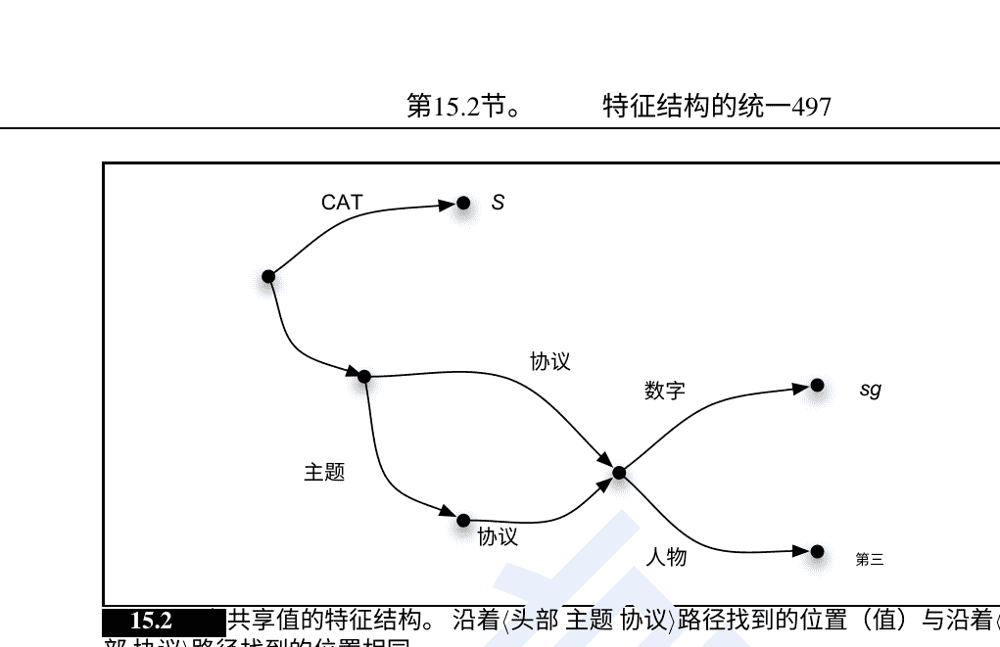

15.2 共享值的特征结构。沿着<头部 主题 协议>路径找到的位置（值）与沿着<头部 协议>路径找到的位置相同。

## 15.2 特征结构的统一

正如前面所指出的，如果我们不能对特征结构进行合理高效且强大的操作，那么特征结构将没有多大用处。正如我们将展示的，我们需要执行的两个主要操作是合并两个结构的信息内容和拒绝不兼容的结构的合并。幸运的是，一种称为统一的单一计算技术足以满足这两个目的。本节的大部分内容将通过一系列示例说明统一如何实例化合并且兼容性的概念。统一算法及其实现的讨论将推迟到第15.4节。

```
[ 数字 sg ] ∪ [ 数字 sg ] = [ 数字 sg ]
```

正如这个方程所示，统一是一个二元运算（在这里表示为 ∪ ），它接受两个特征结构作为参数，并在成功时返回一个特征结构。在这个例子中，统一被用来执行一个简单的相等性检查。统一成功是因为每个结构中相应的NUMBER特征在值上是一致的。在这种情况下，由于原始结构是相同的，输出与输入相同。下面类似的检查失败，因为两个结构中的NUMBER 特征具有不兼容的值。

```
[ 数字 sg ] ∪ [ 数字 pl ] 失败!
```

这个下一个统一示例展示了统一中兼容性概念的一个重要方面。

```
[ 数字 sg ] ∪ [ 数字 [] ] = [ 数字 sg ]
```

在这种情况下，这些特征结构被认为是兼容的，因此可以合并，尽管给定的NUMBER特征是不同的。第二个结构中的[]值表示该值未指定。具有此[]值的特征可以成功匹配到另一个结构中相应特征的任何值。因此，在这种情况下，第一个结构中的值sg可以与第二个结构中的[]值匹配，正如输出所示，这种统一的结果是一个具有由更具体、非空值提供的值的结构。

下一个例子说明了统一的合并方面之一。

```
[ 数字 sg ] ⊑ [ 人物 第三 ] = [ 数字 sg
                        人称    第三 ]
```

在这里，统一的结果是将原始的两个结构合并为一个更大的结构。这个更大的结构包含了每个原始结构中存储的所有信息的并集。虽然这是一个简单的例子，但重要的是要理解为什么这些结构被判断为是兼容的：它们是兼容的，因为它们不包含明确不兼容的特征。它们各自包含对方没有的特征-值对并不是统一失败的原因。

我们现在将考虑一系列涉及更复杂的可重入结构的情况。下面的例子说明了一个等式检查在第一个参数中存在可重入结构的情况下变得复杂。

```
[ 协议 1   ┌ 数字 sg
           │ 人称    第三
主题  └ 协议 1   □ ]
⊑   [ 主题  ─ 一致性   [ 人物     第三
                        数字 sg ] ]
=   [ 协议 1   □  ┌ 数字 sg
                │ 人称    第三
主题       └ 协议 1   □ ]
```

这个例子中的重要元素是两个输入结构中的主题特征。这些特征的统一成功是因为通过跟随 1数值索引在第一个参数中找到的值与直接存在于第二个参数中的值相匹配。请注意，单独看，第一个参数中的一致性特征的值对统一的成功没有影响，因为第二个参数在顶层缺少一致性特征。它只有一致性特征的值与主题特征共享时才变得相关。

下面的例子说明了统一的复制能力。

```
(15.1) [ 协议    1 ]
       [ 主题 [ 协议 1   □ ] ]
⊓
= [ 协议 1 □  ┌一致性   ┌人物  第三┐┐
             │数字 sg ┘┘
主题   └协议     □ ┌人物  第三┐┐
                  └数字 sg ┘┘]
```

在这里，通过第二个参数的〈主题 协议〉路径找到的值被复制到第一个参数中的相应位置。此外，第一个参数的协议特征会接收一个值，作为将其与〈主题 协议〉路径末尾的值链接的副作用。

下一个例子演示了实际共享值与仅具有相同外观值之间的重要区别。

```
(15.2) [ 协议     ┌数字 sg ]
       [ 主题     └协议     数字 sg ] ]
⊓
= [ 协议   ┌数字 sg ]
  [ 主题     └一致性   ┌数字 sg
                 人称   3 ]] ]
```

在第一个参数中，〈主题 协议〉路径末尾的值和〈协议〉路径末尾的值是相同的，但并不共享。两个参数的主题特征的统一将第二个参数中的人物信息添加到结果中。然而，由于没有将协议特征链接到〈主题 协议〉路径，因此此信息不会添加到协议特征的值中。

```
[ 协议 1   □ ┌数字 sg
           人称   3 ]] ]
⊑ [ 主题   ┌协议 1   □] ]
= [ 协议   ┌数字 sg
         人称   3 ]
主题   └一致性   ┌数字 PL
                 人物   3 ]] ]
失败！
```

按顺序进行特征处理，我们首先发现这些示例中的特征成功匹配。然而，当我们转到主题特征时，我们发现在各自的（主题 一致性 数字）路径中找到的值不同，导致统一失败。

直观地说，统一两个特征结构会产生一个更具体（具有更多信息）或与任一输入特征结构相同的新特征结构。我们说一个不太具体（更抽象）的特征结构包含一个等于或更具体的特征结构。包含关系由运算符 ⊏ 表示。特征结构 F 包含特征结构 G（F ⊏ G）当且仅当：

1. 对于特征 x 在 F 中，F(x) ⊏ G(x)（其中 F(x) 表示“特征结构 F 的特征 x 的值”）。
2. 对于 F 中的所有路径 p 和 q，如果 F(p) = F(q)，则 G(p) = G(q) 也成立。

例如，考虑以下特征结构：

```
(15.3) [数字 sg]
(15.4) [人物 3]
(15.5) [数字 sg; 人称 3]
(15.6) [CAT 动词短语; 一致性 1; 主题 [协议 1]]
(15.7) [CAT 动词短语; 一致性 1; 主题 [协议 [人物 3; 数字 sg]]]
```

它们之间存在以下包含关系：

-   15.3 ⊏ 15.5
-   15.4 ⊏ 15.5
-   15.6 ⊏ 15.7

包含关系是一个部分排序；存在一些特征结构对既不相互包含也不相互被包含：

-   15.3 ⊏ 15.4
-   15.4 ⊏ 15.3

由于每个特征结构都被空结构[]所包含，特征结构之间的关系可以被定义为一个半格。统一可以被定义以包含关系半格为基础。给定两个特征结构F和G，F ⊔ G被定义为最一般的特征结构H，使得F ⊆ H和G ⊆ H。由于由包含关系定义的信息排序是一个半格，统一操作是单调的（Pereira和Shieber，1984年；Rounds和Kasper，1986年；Moshier，1988年）。这意味着如果某个描述对于一个特征结构是真实的，与另一个特征结构统一会导致仍然满足原始描述的特征结构。因此，统一操作是可结合的；给定一组有限的特征结构进行统一，我们可以以任何顺序检查它们并获得相同的结果。

总结一下，统一是一种实现不同约束条件下知识整合的方法。给定两个兼容的特征结构作为输入，它产生包含输入中所有信息的最一般的特征结构。给定两个不兼容的特征结构，它会失败。

## 15.3 语法中的特征结构

我们引入特征结构和统一的主要目的是为了优雅地表达句法约束，这些约束仅仅使用上下文无关文法的机制很难表达。因此，我们的下一步是指定一种将特征结构和统一操作整合到语法规范中的方法。这可以通过为规则的组成部分指定特征结构的附加信息，并使用适当的统一操作来表达对这些组成部分的约束来实现。从语法的角度来看，这些附加信息将用于实现以下目标：

-   将复杂的特征结构与词汇项和语法类别的实例相关联
-   根据其组成部分的特征结构，指导更大语法成分的特征结构的组合
-   强制执行语法结构的特定部分之间的兼容性约束

我们将使用以下符号来表示语法增强，这些增强将使我们能够实现所有这些目标，基于Shieber（1986）中描述的PATR-II系统：

```
β₀ → β₁···βₙ
{一组约束}
```

指定的约束具有以下形式之一。

```
⟨β_i 特征路径⟩ = 原子值
⟨β_i 特征路径⟩ = ⟨β_j 特征路径⟩
```

符号（β_i 特征路径）表示与规则的上下文无关部分的 β_i组件相关联的特征结构路径。第一种约束的规定是给定路径末端的值必须与指定的原子值统一。第二种形式规定了两个给定路径末端的值必须可统一。

为了说明这些约束的使用，让我们回到本章开头提出的解决数目一致性问题的非正式解决方案。

S → NP VP
仅当NP的数与VP的数相等时。

使用新的符号表示法，这个规则现在可以表示为以下形式。

S → NP VP
⟨名词短语 数目⟩ = ⟨动词短语 数目⟩

请注意，在规则中存在两个或更多相同句法类别的成分的情况下，我们会用下标来区分它们，如动词短语 → 动词 名词短语1 名词短语2。

从符号表示法中退一步，重要的是要注意，在这种方法中，上下文无关规则的简单生成性质已经被这种增强改变了。普通的上下文无关规则基于简单的连接概念；一个名词短语后跟一个动词短语是一个句子，或者生成地说，要生成一个句子，我们只需要将一个名词短语与一个动词短语连接起来。在新的方案中，这种连接必须伴随着一个成功的统一操作。这自然地引出了关于统一操作的计算复杂性以及它对这个新语法的生成能力的影响的问题。这些问题将在第15章中讨论。

-   上下文无关文法规则的元素将与特征约束相关联。这反映了从原子语法类别到具有属性的更复杂类别的转变。
-   与单个规则相关联的约束可以引用与它们附加的规则部分相关的特征结构。

下面的章节介绍了统一约束在四个有趣的语言现象中的应用：一致性、语法头、子范畴化和长距离依赖。

### 15.3.1 一致性

如第12章所讨论的，一致性现象在英语中出现在许多不同的地方。本节说明了如何使用统一来捕捉英语一致性现象的两种主要类型：主谓一致和限定词-名词一致。我们将在本讨论中使用以下ATIS句子作为示例来说明这些现象。

> (15.8) 这个航班提供早餐。
> (15.9) 这个航班供应早餐吗？
> (15.10) 这些航班供应早餐吗？

请注意，上述用于强制主语-动词一致的约束条件存在缺陷，因为它忽略了人称特征。下面的约束条件解决了这个问题，它利用了一致性特征。

S → NP VP
⟨名词短语 一致性⟩ = ⟨动词短语 一致性⟩

例子15.9和15.10说明了主语动词-一致的一个小变化。在这些是非问句中，主语名词短语必须与助动词一致，而不是与句子的主要动词一致，后者以非定式形式出现。这个一致性约束可以通过以下规则处理。

S → Aux NP VP
⟨Aux 一致性⟩ = ⟨NP 一致性⟩

名词短语中限定词和名词的一致性以类似的方式处理。基本任务是允许上述表达式，但阻止限定词和名词在数量特征上冲突的不需要的*this flights和those flight表达式。再次，强制执行这个约束的逻辑位置是将各个部分组合在一起的语法规则。

名词短语 → 限定词 名词性成分
⟨限定词 一致性⟩ = ⟨名词性成分 一致性⟩
⟨名词短语 一致性⟩ = ⟨名词性成分 一致性⟩

这个规则说明了限定词的一致性特征必须与名词性成分的一致性特征统一，并且名词短语的一致性特征也必须与名词性成分统一。

在表达强制执行主谓和冠词-名词一致性所需的约束之后，我们现在必须填写其余的机制，以使这些约束起作用。具体而言，我们必须考虑参与这些约束的各种成分（Aux、VP、NP、Det和Nominal）如何获得其各种一致性特征的值。

我们可以开始注意到，我们的约束涉及词汇和非词汇成分。更简单的词汇成分，如Aux和Det，直接从词汇表中获得其各自一致性特征的值，如下所示的规则。

Aux → do
⟨Aux 一致性 数⟩=pl
⟨Aux 一致性 人称⟩=3rd

Aux → does
⟨Aux 一致性 数⟩=sg
⟨Aux 一致性 人称⟩=3rd

回到我们的第一个 S 规则，让我们首先考虑 VP 成分的一致性特征。这个 VP 的成分结构由以下规则指定。

VP → 动词 名词短语

很明显，这个成分的一致性约束必须基于它的成分动词。与之前的词汇条目一样，这个动词可以直接从词汇表中获取其一致性特征值，如下所示的规则。

动词 → serve
⟨动词 一致性 数⟩ = pl

动词 → serves
⟨动词 一致性 数⟩ = sg
⟨动词 一致性 人称⟩ = 第三人称

唯一剩下的就是规定父 VP 的一致性特征受限于其动词成分的一致性特征相同。

VP → 动词 名词短语
⟨VP 一致性⟩ = ⟨动词 一致性⟩

换句话说，非词汇语法成分可以从其组成成分中获取至少一部分特征的值。

相同的技术适用于剩余的 NP 和名词类别。这些类别的一致性特征的值是从名词 flight 和 flights 派生出来的。

名词 → flight
⟨名词 一致性 数⟩ = sg

名词 → flights
⟨名词 一致性 数⟩ = pl

名词性成分特征可以被限制为与其组成名词具有相同的值。

名词性成分 → 名词
⟨名词性成分 一致性⟩ = ⟨名词 一致性⟩

请注意，本节只是浅尝辄止地介绍了英语一致性系统，其他语言的一致性系统可能比英语复杂得多。

### 15.3.2 头特征

为了解释名词短语、名词性成分和动词短语等组成性语法成分如何具有一致性特征，前一节引入了从短语结构子节点向父节点复制特征结构的概念。事实证明，这是约束性语法中一个更一般的现象的具体实例。具体来说，大多数语法类别的特征是从其中一个子节点复制到父节点。提供特征的子节点被称为短语的头部，复制的特征被称为头部特征。

这个头部的概念，首次在第12.4.4节中引入，对于基于约束的语法起着重要作用。考虑一下上一节中的以下三个规则。

VP → 动词 名词短语
⟨VP 一致性⟩ = ⟨动词 一致性⟩

名词短语 → 限定词 名词性成分
⟨限定词 一致性⟩ = ⟨名词性成分 一致性⟩
⟨名词短语 一致性⟩ = ⟨名词性成分 一致性⟩

名词性成分 → 名词
⟨名词性成分 一致性⟩ = ⟨名词 一致性⟩

在这些规则中，提供一致性特征结构给其父节点的成分是短语的头部。更具体地说，动词是动词短语的头部，名词性成分是名词短语的头部，名词是名词性成分的头部。因此，我们可以说一致性特征结构是一个头部特征。我们可以通过将一致性特征结构放在一个头部特征下，并将该特征向上复制，来重写我们的规则以反映这些概括，如下所示的约束条件。

(15.11) VP → 动词 名词短语
⟨动词短语 头部⟩ = ⟨动词 头部⟩

(15.12) 名词短语 → 限定词 名词性成分
⟨名词短语 头部⟩ = ⟨名词性成分 头部⟩
⟨限定词 头部 一致性⟩ = ⟨名词性成分 头部 一致性⟩

(15.13) 名词性成分 → 名词
⟨名词性成分 头部⟩ = ⟨名词 头部⟩

同样，引入这些特征的词汇条目现在必须反映出这个头部概念，如下所示。

名词 → flights
⟨名词 头部 一致性 数⟩ = pl

动词 → serves
⟨动词 头部 一致性 数⟩ = 单数
⟨动词 头部 一致性 人称⟩ = 第三人称

### 15.3.3 选择限制

回想一下，子范畴化是指动词对它们允许出现的参数模式要求严格。在第12章中，为了防止与动词和动词短语不匹配的非语法句子的生成，我们被迫将动词的类别分成多个子类别。然后，这些更具体的动词类别被用于定义它们允许出现的特定动词短语，如下所示。

带S-comp的动词 → think
VP → 带S-comp的动词 S

显然，这种方法引入了与解决数字问题类似的不受欢迎的类别扩散。避免这种扩散的正确方法是引入特征结构来区分类别的各个成员。这个目标可以通过将一个名为 SUBCAT的原子特征与词汇表中的每个动词关联起来来实现。例如，在词汇表中， serves的及物版本可以被分配以下特征结构。

动词 → serves
⟨动词 头部 一致性 数⟩ = 单数
⟨动词 头部 SUBCAT⟩ = trans

特征 SUBCAT是语法中其他部分的信号，表明这个动词只能出现在带有单个名词短语论元的动词短语中。通过在语法中的所有动词短语规则中添加相应的约束来强制执行这个约束，如下所示。

VP → 动词
⟨动词短语 头部⟩ = ⟨动词 头部⟩
⟨VP 头部 子范畴⟩ = 不及物

VP → 动词 名词短语
⟨动词短语 头部⟩ = ⟨动词 头部⟩
⟨VP 头部 子范畴⟩ = 及物

VP -> 动词 名词 名词
⟨动词短语 头部⟩ = ⟨动词 头部⟩
⟨VP 头部 子类⟩ = 双及物

这些规则中的第一个一致性约束规定动词短语从其动词成分中获取其头部特征，而第二个约束规定了该 SUBCAT 特征的值必须是什么。任何试图使用不合适的动词短语的尝试都将失败，因为 VP 的 SUBCAT 特征的值将无法与第二个约束中给定的原子符号统一。请注意，这种方法要求英语中的每个 50-100 个动词短语框架具有唯一的符号。这是一种有些笨拙的方法，因为这些不可分析的 SUBCAT 符号不直接编码动词期望接受的参数的数量或类型。要理解这一点，请注意不能简单地查看词典中动词的条目并知道其子范畴化框架是什么。相反，您必须间接使用 SUBCAT 特征的值作为指向语法中可以接受所讨论的动词的动词短语规则的指针。

一种更优雅的解决方案，更好地利用了特征结构的表达能力，允许动词条目直接指定所需的参数的顺序和类别类型。下面的条目用于 serves 的示例，其中动词的子类特征表示其对象和补语的列表。

```
动词 -> serve
⟨动词 头部 一致数⟩ = 单数
⟨动词 头部 子类 第一个 类别⟩ = 名词短语
⟨动词 头部 子类 第二个⟩ = 结束
```

该条目使用第一个特征来说明第一个动词后的论元必须是一个名词短语；第二个特征的值表示该动词只期望一个论元。像 leaves the morning 这样有两个论元的动词将具有以下类型的条目。

```
动词 -> leaves
⟨动词 头部 一致数⟩ = 单数
⟨动词 头部 子类 第一个 类别⟩ = 名词短语
⟨动词 头部 子类 第二个 类别⟩ = 介词短语
⟨动词 头部 子类 第三个⟩ = 结束
```

当然，这种方案是一种相当复杂的编码列表的方式；也可以使用第 15.6 节中定义的类型的概念来更清晰地定义列表类型。

现在，各个动词短语规则必须检查它们的动词所指定的元素是否存在，就像下面的及物规则一样。

```
(15.14)      VP -> 动词 NP

⟨VP 头⟩ = ⟨动词 头⟩
⟨VP 头 子类 第一个 类别⟩ = ⟨名词短语 类别⟩
⟨VP 头 子类 第二个⟩ = 结束
```

这个规则的第二个约束说明了动词的 SUBCAT 列表的第一个元素的类别必须与紧随动词之后的成分的类别匹配。第三个约束进一步说明了这个动词短语规则只期望一个单一的参数。

## 特征和统一

## 子范畴框架

我们之前的例子显示了动词的相当简单的子范畴结构。事实上，动词可以有相当复杂的子范畴框架（例如，NP PP, NP NP 或 NP S），这些框架可以由许多不同的短语类型组成。

为了列出英语动词可能的子范畴框架列表，我们首先需要一个可以构成这些框架的可能短语类型列表。图 15.3.3 显示了一个用于构建动词子范畴框架的可能短语类型的简短列表；这个列表是从 FrameNet 项目中用于创建动词子范畴框架的列表修改而来（Johnson, 1999; Baker 等, 1998），并包括用于动词的特殊主语（如 there 和 it）以及对象和补语的短语类型。

为了在统一语法中使用图 15.3.3 中的短语类型，每个短语类型可以使用特征来描述。例如，形式 VPto，它是由 want 进行子范畴化的，可以表示为：

```
动词 -> want

⟨动词 头部 子范畴 第一个 类别⟩ = VP
⟨动词 头部 子范畴 第一个 形式⟩ = 不定式
```

英语中的 50 到 100 个可能的动词子范畴化框架可以被描述为从这些短语类型中提取的列表。例如，这是一个两个补语的例子 want。我们可以使用这个例子来演示两种不同的表示方法。首先，列表可以用尖括号表示 ⟨ 和 ⟩。其次，我们可以将词汇条目表示为一个单一的特征结构，而不是使用带有路径方程的重写规则注释：

```
⎡ORTH want
CAT    动词

      ⎡CAT VP
头部   ⎢        ⎤
      ⎣头部  VFORM 不定式 ⎦
SUBCAT 〈 ⎡CAT NP⎤, ⎡        ⎤〉
              ⎣头部  ⎦ ⎣VFORM 不定式⎦
```

即使组合了一组有限的短语类型，也会得到一个非常庞大的可能的子范畴化框架集。此外，每个动词都允许许多不同的子范畴化框架。图 15.4 提供了动词“ask”的一组子范畴化模式，其中包括来自 BNC 的例子：

存在许多综合的子范畴化框架标签集，例如 COMLEX 集（Macleod 等, 1998 年），其中包括动词、形容词和名词的子范畴化框架，以及 ACQUILEX 动词子范畴化的标签集（Sanfilippo, 1993）。许多子类化框架标签集还添加了其他关于补语的信息，例如指定没有明确主语的较低动词短语中隐含主语的身份；这被称为控制信息。例如，Tommy promised Ruth to go（至少在某些方言中）意味着 Tommy 会去，而 Tommy persuaded Ruth to go 意味着 Ruth 会去。

| 类别 | 类型 | 描述 | 例子 |
|---|---|---|---|
| 名词短语类型 | There | 非指代性 there | There is much to learn |
| | it | 非指代性 it | It seems obvious my idea is |
| | NP | 名词短语 | When he was telling this story |
| 介词短语类型 | PP | 介词短语 | Using terms to convey their message |
| | Ping | 动名词短语 | Blamed for not intervening |
| | | 小品词 | Turn it off |
| 动词短语类型 | VPbrst | 裸干动词短语 | She can discuss it |
| | VPto | 带 to 的不定式动词短语 | Why do you want to know? |
| | VPwh | 疑问-动词短语 | Worth considering how to write |
| | VPing | 动名词动词短语 | I would consider using it |
| 补语从句类型 | Sfin | 有限从句 | Insisted that the situation was unsatisfactory |
| | Swh | 疑问从句 | It tells us where we are |
| | Sif | 是否/如果从句 | Asking if Aristophanes depicted one |
| | Sing | 动名词从句 | Seeing some attention being paid |
| | Sthat | 带 that 的从句 | Knowing that they themselves were relatively unhealthy |
| | Sfor-to | for-to 从句 | Waiting for him to say something |
| | Sbrst | 裸干从句 | Ordered his sermons to be published |
| 其他类型 | AjP | 形容词短语 | Considering it likely |
| | Quo | 引用 | Asking "what was it like?" |

图 15.3 一组潜在的短语类型，可以组合成一组潜在的动词子类别框架。修改自 FrameNet 标签集（Johnson, 1999; Baker 等, 1998）。这些样本句子片段来自英国国家语料库。

| 子类别 | 例子 |
|---|---|
| Quotation | Ask ["What was it like?"] |
| NP | Ask [a question] |
| Swh | Ask [what industries you are interested in] |
| PP | Ask [to tell you] |
| PP | This means asking [to leave home] |
| VPto | Ask [to see a girl named Evelyn] |
| NP Sif | Ask [him] [if he can do it] |
| NP NP | Ask [myself] [a question] |
| NP Swh | Ask [him] [why he took leave] |

图 15.4 ask 的一组样本子类化模式，来自于 BNC 的例子。

动词的多个可能的子类别框架中，有些可以部分地通过动词的语义来预测；例如，许多转移动词（如 give, send, carry）可预测地采用两个子类别框架 NP NP 和 NP PP：

*   NP NP: give FAA administrator James Busey a [letter]
*   NP PP: write a letter to the chairman of the military committee

这些动词类别之间的子类别框架关系被称为论证结构变化，在第 19 章中将进行讨论。第 14 章将介绍建模动词通常在不同的子类别框架中有偏好的概率。

## 其他词类的子类别化

尽管子类别化的概念，或者常常被称为价，最初是为动词设计的，但最近的研究集中在许多其他类型的单词展示类似价行为的事实上。考虑以下介词 while 和 during 的对比用法。

*   (15.15) Fasten your seatbelt while flying.
*   (15.16) *Fasten your seatbelt during flying.
*   (15.17) Fasten your seatbelt during the flight.
*   (15.18) *Fasten your seatbelt while the flight.

尽管这些单词之间存在明显的相似之处，但它们对其论证提出了不同的要求。将这些差异表示出来留作读者的练习。

许多形容词和名词也有子范畴化框架。以下是一些使用形容词 apparent, aware 和 unimportant 以及名词 assumption 和 question 的例子：

*   It is apparent [Sfin that the kitchen is the only room...]
*   It is apparent [PP from the way she put her hand on him]
*   Aware [Sfin that he may have offended someone]
*   It is unimportant [Swhether to accept a little]
*   Assumption [Sfin that the method had been adopted]
*   Question [Swhether the authorities might have decided]

参见 Macleod 等人 (1998) 和 Johnson (1999) 对名词和形容词的子范畴化框架的描述。

动词对其主语和补语都表达了子范畴化约束。例如，我们需要表示这样一个词汇事实，即动词 seem 可以以 Sfin 作为其主语（That she was affected seems obvious），而动词 paint 则不行。可以使用 SUBJECT 特征来表示这些约束。

### 15.3.4 长距离依赖

到目前为止，我们开发的子范畴模型有两个组成部分。每个主要词都有一个 SUBCAT 特征，其中包含它所期望的补语列表。


然后，像 (15.15) 中的 VP 规则一样，将 SUBCAT 列表中的每个期望的补语与实际的成分匹配。当动词的补语实际上在动词短语中时，这种机制运作良好。

然而，有时候，动词的补语虽然被动词子范畴化，但与其谓词之间存在长距离关系。以下是一些长距离依赖的例子：

*   What cities does Continental serve?
*   Do you have flights from Boston to Baltimore?
*   When does that flight leave Atlanta?

在第一个例子中，成分 what cities 是由动词 service 子范畴化的，但因为这个句子是一个 wh-非主语疑问句，所以宾语位于句子的前面。回顾第 12 章，一个（简单的）短语结构规则用于 wh-非主语疑问句可能是以下形式：

```
S -> Wh-NP Aux NP VP
```

现在我们有了特征，我们可以扩充这个短语结构规则，要求 Aux 和 NP 达成一致（因为 NP 是主语）。但我们还需要一种方法来扩充规则，告诉它 Wh-NP 应该填充 VP 中的某个子范畴化槽位。这种远距离依赖的表示是一个相当困难的问题，因为填充其子范畴化要求的动词可能与填充者相距甚远。例如，在下面这个（虚构的）句子中，wh-短语 which flight 必须填充动词 book 的子范畴化要求，尽管中间还有两个动词（want 和 have）：Which flight did you want me to have you book?

在统一语法中表示远距离依赖的许多解决方案都涉及保持一个列表，通常称为 gap list，实现为一个特征 GAP。这个填充词（例如 flight）被放在间隙列表中，并最终必须与某个动词的子范畴框架统一。有关这种策略的解释，请参见 Sag 和 Wasow（1999），以及对必须对长距离依赖建模的许多其他复杂性的讨论。

## 15.4 实现统一

如前所述，统一运算符接受两个特征结构作为输入，并在成功时返回一个合并的特征结构，如果两个输入不兼容，则返回一个失败信号。输入特征结构被表示为有向无环图（DAGs），其中特征被表示为有向边上的标签，特征值可以是原子符号或 DAGs。正如我们将看到的，运算符的实现是一个相对简单的递归图匹配算法，适当地调整以满足统一的各种要求。粗略地说，算法循环遍历一个输入中的特征，并尝试找到对应的特征在另一个中。如果所有相应的特征值匹配，则统一成功。如果不匹配，则统一失败。毫不奇怪，递归是由于需要正确匹配那些具有特征结构作为其值的特征。

该算法的一个显著特点是，它不是构造一个新的特征结构，而是破坏性地改变参数，使得最终它们指向完全相同的信息。因此，成功调用统一运算符的结果是参数的适当修改版本。正如下一节所讨论的，该算法的破坏性特质需要对我们一直假设的特征结构作为有向无环图的简单图版本进行某些次要扩展。

### 15.4.1 统一数据结构

为了方便算法的破坏性合并方面，我们在用于表示输入特征结构的有向无环图中添加了一些小的复杂性；特征结构使用带有额外边缘或字段的有向无环图来表示。具体来说，每个特征结构由两个字段组成：内容字段和指针字段。内容字段可以为空，也可以包含普通的特征结构。类似地，指针字段可以为空，也可以包含指向另一个特征结构的指针。如果有向无环图的指针字段为空，则有向无环图的内容字段包含要处理的实际特征结构。另一方面，如果指针字段非空，则指针的目标表示要处理的实际特征结构。统一的合并方面将通过在处理过程中改变有向无环图的指针字段来实现。

为了了解这个工作原理，让我们考虑下面熟悉的特征结构的扩展 DAG 表示。

```
(15.19) \[ \begin{array}{ll} \text{Number} & sg \\ \text{Person} & 3 \end{array} \]
```

图 15.5 展示了这个扩展表示的图形形式。请注意，扩展表示包含了顶层特征的内容和指针链接，以及每个嵌入特征结构一直到原子值。

在介绍统一算法的细节之前，让我们用以下简单的例子来说明使用这个扩展 DAG 表示的方法。图 15.6 显示了这个统一的原始扩展表示的参数。

```
(15.20) \[ \begin{array}{ll} \text{Number} & sg \end{array} \] \sqcup \[ \begin{array}{ll} \text{Person} & 3 \end{array} \] = \[ \begin{array}{ll} \text{Number} & sg \\ \text{Person} & 3 \end{array} \]
```

从基本层面上看，这个统一结果是创建一个包含两个原始参数信息并集的新结构。通过扩展符号，我们可以看到统一是通过对原始参数进行一些添加和对结构之间的一些指针进行更改来完成的，以便最终它们包含相同的内容。在这个例子中，首先向第一个参数添加一个 PERSON 特征，并通过填充给它一个值来完成。

将其指针字段与第二个参数中适当位置的指针连接起来，如图 15.7 所示。

然而，这个过程还没有完成。从图 15.7 可以清楚地看出，第一个参数现在包含了所有正确的信息，但第二个参数却没有；它缺少一个 Number 特征。当然，我们可以在这个参数中添加一个 Number 特征，并将其指向第一个参数中的适当位置。这个改变将使得这两个参数在统一化方面都具有正确的信息。

不幸的是，这个解决方案是不够的，因为它不能满足我们的要求，即这两个参数必须真正地统一。由于这两个参数在顶层上并没有完全统一，所以将来涉及其中一个参数的统一化将不会在另一个参数中显示出来。解决这个问题的方法很简单，就是将第二个参数的指针字段设置为指向第一个参数。这样做后，对任何一个参数的将来更改都会立即反映在两个参数中。最终改变的结果如图 15.8 所示。

### 15.4.2 统一算法

我们一直在引导的统一算法在图 15.9 中展示。这个算法接受使用扩展 DAG 表示的两个特征结构作为输入，并返回其中一个参数的修改版本，或者在特征结构不兼容的情况下返回失败信号。

这个算法的第一步是获取两个参数的真实内容。请记住，如果扩展特征结构的指针字段非空，则通过指针字段中的指针找到该结构的真实内容。

变量 $f1$ 和 $f2$ 是这个指针跟随过程的结果，通常称为解引用。

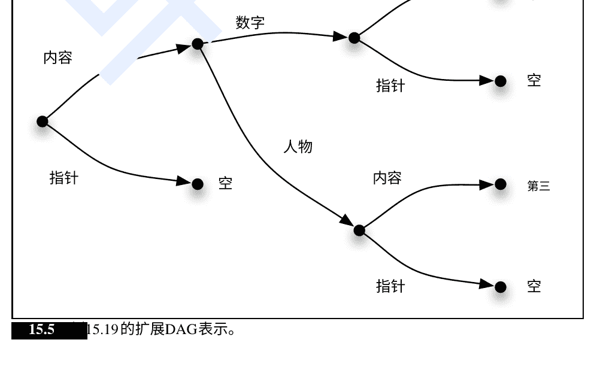

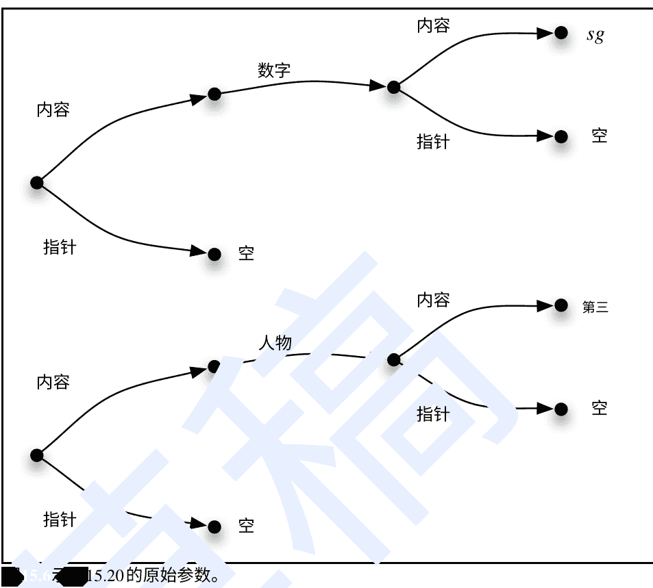

图 15.6 15.20 的原始参数。

与所有递归算法一样，在继续进行涉及原始参数的递归调用之前，下一步是测试各种递归基本情况。在这种情况下，有三种可能的基本情况：

*   参数相同
*   一个或两个参数为空值
*   参数非空且不相同

如果结构相同，则将第一个指针设置为第二个指针，并返回第二个指针。重要的是要理解为什么在这种情况下进行指针更改。毕竟，由于参数相同，返回任何一个似乎足够。对于单个统一来说，这可能是正确的，但请记住，我们希望两个参数对统一运算符进行真正的统一。指针更改是必要的，因为我们希望参数真正相同，这样任何后续将信息添加到一个参数的统一都会添加到两个参数。

在其中一个参数为空的情况下，空参数的指针字段将被更改为指向另一个参数，然后返回。结果是两个结构现在指向相同的值。

如果前面的测试都不成立，则有两种可能性：它们是非相同的原子值，或者它们是非相同的复杂结构。前者会导致算法返回失败信号。在后一种情况下，需要进行递归调用以确保这些复杂结构的组成部分是兼容的。在这个实现中，递归的关键是循环遍历第二个参数 $f2$ 的所有特征。这个循环尝试将 $f2$ 中每个特征的值与 $f1$ 中相应的特征进行统一。在这个循环中，如果在 $f2$ 中遇到一个在 $f1$ 中缺失的特征，就会向 $f1$ 添加一个特征，并给它赋值 NULL。然后，处理将继续，就好像该特征一开始就存在一样。如果每一个统一操作都成功，则将 $f2$ 的指针字段设置为 $f1$，完成结构的统一，并将 $f1$ 作为统一的值返回。

为了说明这个算法，让我们通过以下例子来演示。

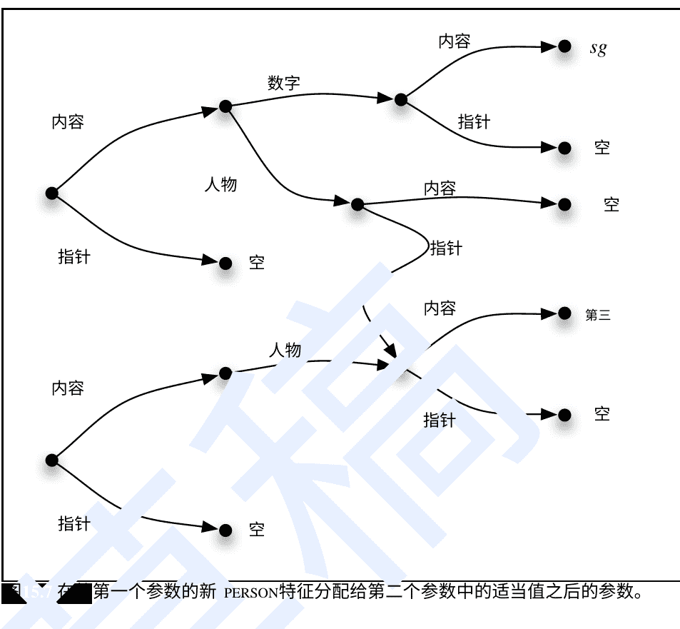

在参数不兼容的情况下，该案例会导致算法返回失败信号。

```
(15.21)  [ AGREEMENT  ] [ NUMBER sg  ]
            [ SUBJECT   ] [ [ AGREEMENT  ] [] ]
      ∪  [ SUBJECT   ] [ AGREEMENT  [ PERSON 3 ] ]
```

图 15.10 显示了用于此统一的参数的扩展表示。这些原始参数既不相同，也不为空，也不是原子的，因此进入主循环。在循环 $f2$ 的特征时，算法会导致对 $f1$ 和 $f2$ 的相应 SUBJECT 特征的值进行递归统一的尝试。

```
[ AGREEMENT  ] [] ∪ [ AGREEMENT  [ PERSON 3 ] ]
```

这些参数也是非相同的，非空的，非原子的，因此再次进入循环，进而递归检查 AGREEMENT 特征的值。

```
[ NUMBER sg  ] ∪ [ PERSON 3 ]
```

在循环第二个参数的特征时，发现第一个参数缺少 PERSON 特征。因此，将一个以 NULL 值初始化的 PERSON 特征添加到第一个参数。这实际上将之前的统一更改为以下内容。

```
[ [ NUMBER sg  ] ∪ [ PERSON 3 ]
  [ PERSON  空 ] ]
```

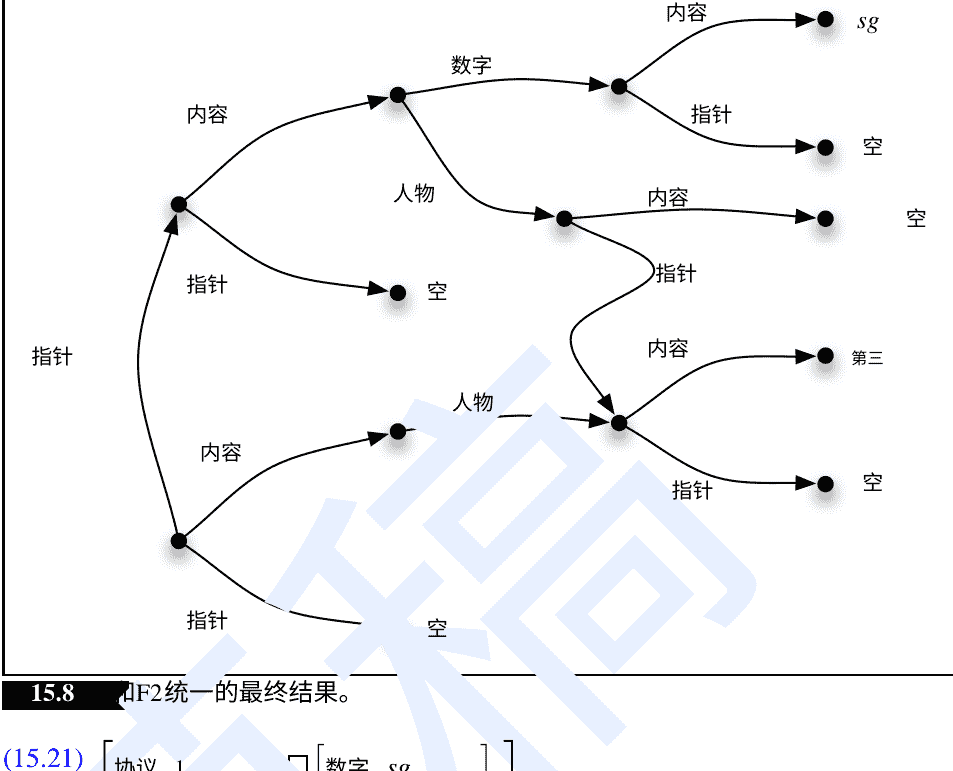

**图 15.8 $f1$ 和 $f2$ 统一的最终结果。**

函数 UNIFY(f1-orig, f2-orig)返回f-结构或失败
f1 ← 解引用 f1-orig的内容
f2 ← 解引用 f2-orig的内容
如果 f1 和 f2 相同则
    f1.pointer ← f2
    返回 f2
否则如果 f1 为空则
    f1.pointer ← f2
    返回 f2
否则如果 f2 为空则
    f2.pointer ← f1
    返回 f1
否则如果 f1 和 f2 都是复杂特征结构则
    f2.pointer ← f1
    对于每个 f2-feature 在 f2 中执行
        f1-feature ← 在 f1 中找到或创建相应的特征
        如果 UNIFY(f1-feature.value, f2-feature.value)返回失败则
            返回失败
    返回 f1
否则返回失败

在创建了这个新的人物特征之后，下一个递归调用导致了在第一个参数中的新特征的 NULL值与第二个参数中的第三个值的统一。 由于在任何递归的层次上都没有更多的特征需要在 f2参数中检查，每个对UNIFY的递归调用都会返回。 结果如图15.11所示。


## 15.5 使用统一约束进行解析

现在我们已经拥有了将特征结构和统一集成到解析器中所需的所有要素。 幸运的是，统一的无序性质使我们在解析器中可以在很大程度上忽略实际的搜索策略。 一旦我们将统一约束与文法的上下文无关规则关联起来，并将特征结构与搜索的状态关联起来，就可以使用第13章中描述的任何标准搜索算法。

当然，这留下了相当大范围的可能的实现策略。 例如，我们可以简单地像之前一样解析，使用上下文无关的组件的规则，然后在事后为生成的树构建特征结构，过滤掉包含统一失败的解析。 虽然这种方法最终只会产生符合规范的结构，但它未能利用统一的能力来减少解析过程中解析器的搜索空间的大小。

下一节将描述一种更好地利用统一能力的方法，通过直接将统一约束集成到Earley解析过程中，允许不符合规范的结构在被提出时立即被消除。正如我们将看到的，这种方法对基本的Earley算法只需要进行最小的更改。

然后我们简要地考虑了一种基于统一的解析方法，它进一步远离了标准的上下文无关方法。

### 15.5.1 将统一集成到Earley解析器中

我们在将特征结构和统一集成到Earley算法中有两个目标：使用特征结构为解析的成分提供更丰富的表示，并阻止违反统一约束的非法成分进入图表。正如我们将看到的，通过对第448页上给出的原始Earley方案进行相当小的改动，可以实现这些目标。

第一个改动涉及原始代码中使用的各种表示形式。回想一下，Earley算法通过使用一组未装饰的上下文无关语法规则，将数据结构（称为图表）填充为一组状态。在解析结束时，构成该图表的状态表示了输入的所有可能解析。

因此，我们首先通过改变上下文无关语法规则和图表中的状态的表示来进行修改。

规则被修改，除了它们当前的组成部分外，还包括最终的结构 f1 和 f2 在结尾处。

包括从它们的统一约束中派生的特征结构。更具体地说，我们将使用与规则列出的约束来构建特征结构，表示为一个DAG，在解析过程中与该规则一起使用。

考虑以下带有统一约束的上下文无关规则。

```
S → NP VP
(NP 头部一致 ) = (VP 头部一致 )
(S头部) = (VP头部)
```

将这些约束转换为特征结构会得到以下结构：

```
[ S  [头部 1 □] 
 NP [头部  [一致 2  □]]
 VP [头部 1 □ [一致 2  □]]]
```

在这个推导中，我们通过首先为上下文无关规则的每个部分创建顶层特征，例如 S、NP和VP，在这种情况下，将各种约束组合成一个单一结构。然后，我们通过遵循约束中的路径方程。 请注意，这只是一种纯符号转换； DAG和约束方程包含相同的信息。 然而，将约束统一在一个特征结构中，使其以可以直接传递给我们的统一算法的形式存在。

第二个变化涉及用于表示Earley图中部分解析的状态。 原始状态包含用于使用的上下文无关规则，表示规则已完成的点的位置，状态的开始和结束位置，以及表示状态的已完成子部分的其他状态的列表。 对于这组字段，我们只需添加一个额外的字段来包含与状态对应的特征结构的DAG。 请注意，当PREDICTOR首次使用规则创建状态时，与状态相关联的DAG将只包含从规则中检索到的DAG。 例如，当PREDICTOR使用上述 Srule将一个状态输入到图表中时，上述给定的DAG将是其初始DAG。 我们将像下面这样表示这样的状态，其中 Dag表示上述给定的特征结构。

```
S → • NP VP, [0, 0], [], Dag
```

鉴于这些表示性的增加，我们可以继续改变算法本身。 最重要的变化涉及到当通过扩展现有状态创建新状态时发生的操作，这发生在COM-PLETERroutine中。 回想一下，当一个完成的成分被添加到图表中时，会调用COMPLETER。 它的任务是尝试找到并扩展与新完成成分兼容的现有状态。 因此，COMPLETER是一个通过从其他两个状态中组合信息来创建新状态的函数，因此是应用统一操作的可能地方。

更具体地说，COMPLETER通过找到一个现有状态，其•可以由新完成的状态推进，将一个新状态添加到图表中。 当紧随其后的成分的类别与新完成的成分的类别匹配时，可以推进•。 为了适应特征结构的使用，我们可以通过统一与新完成状态相关联的特征结构与正在推进的特征结构的适当部分来改变这个方案。 如果这个统一成功，那么新状态的DAG将接收统一的结构并进入图表。 如果失败，那么不会有新状态进入图表。 对COMPLETER的适当修改如图15.12所示。

在解析短语That flight的上下文中考虑这个过程，在这个过程中，That已经被看到，如下状态所示。

```
NP → Det•Nominal[0, 1], [S_Det], Dag_1
```

现在考虑解析器已经处理了flight并随后产生了以下状态的情况。

```
Nominal → Noun•,[1,2],[SNoun],Dag2
```

```
Dag2
NOMINAL  [头部  1  □]
NOUN     [头部  1  □  协议  [NUMBER  SG]]
```

为了推进NPrule，解析器将在Dag2的NOMINAL特征下找到的特征结构与NP的Dag1的NOMINAL特征下找到的特征结构进行一致化。与原始算法一样，创建一个新的状态来表示已经推进了现有状态的事实。这个新状态的DAG被赋予了由这个一致化产生的DAG。

对原始算法的最终更改涉及对图表中已包含的状态进行检查。在原始算法中，ENQUEUE函数拒绝将与图表中已存在的状态完全相同的状态输入到图表中。

‘完全相同’意味着相同的规则，具有相同的起始和结束位置，以及相同的•位置。正是这个检查使得算法能够避免与左递归规则相关的无限递归问题，等等。

当然，问题在于我们的状态现在更加复杂，因为它们与复杂的特征结构相关联。在原始标准下看起来相同的状态现在可能是不同的，因为它们关联的DAG可能不同。解决这个问题的一种方法是扩展身份检查以包括与状态相关联的DAG，但事实证明我们可以改进这个解决方案。

改进的动机源于身份检查的动机。它的目的是防止将一个状态无谓地添加到图表中，因为这个状态对解析的影响已经由一个已存在的状态完成。换句话说，我们希望防止图表中出现任何会重复其他状态最终要完成的工作的状态。当然，对于相同的状态，这显然是成立的，但事实证明对于图表中的状态来说，它也适用于比正在考虑的新状态更一般的状态。

考虑图表中包含以下状态的情况，其中Dag对Det没有任何限制。

```
NP → •Det NP,[i,i],[],Dag
```

这样一个状态只是表示它期望在位置i处有一个Det，并且任何Det都可以。

现在考虑解析器想要将一个与此相同的新状态插入到图表中，唯一的区别是它的DAG将Det限制为单数。在这种情况下，虽然所讨论的状态不相同，但是将新状态添加到图表中将不会有任何作用，因此应该防止这种情况发生。

为了看清楚这一点，让我们考虑所有的情况。如果新的状态被添加，那么随后的一个单数Det将匹配两个规则并且都前进。由于特征的统一，两者都会有表示它们的Det是单数的DAG，最终的结果是图表中的重复状态。另一方面，如果遇到复数 Det，则新状态将拒绝并不前进，而旧规则将前进，进入图表中的一个新状态。另一方面，如果新状态未放置在图表中，则随后的复数或单数 Det将与更一般的状态匹配并推进它，导致图表中添加一个新状态。请注意，这使我们处于与将新状态输入图表完全相同的情况，唯一的例外是避免了重复。总之，没有什么值得做的。

通过将比图表中已有状态更具体的状态输入图表。幸运的是，之前介绍的包含关系的概念为我们提供了一种形式化的方式来讨论特征结构之间的泛化和特化关系。这表明修改 ENQUEUE 的正确方法是检查新创建的状态是否被图表中的任何现有状态包含。如果是，则不允许其进入图表。更具体地说，如果一个新状态在其规则、起始和结束位置、子部分和 • 位置方面与现有状态完全相同，则如果其 DAG 被现有状态的 DAG 包含（即如果 $Dag_{old} \sqsubseteq Dag_{new}$），则不会将其输入图表。对原始 Earley ENQUEUE 过程的必要更改如图 15.12 所示。

### 复制的需求

在UNIFY-STATE过程中对COPYDAG的调用需要一些详细说明。请回忆一下，Earley算法（以及动态规划方法）的一个优点是，一旦状态被输入到图表中，它们可以作为不同推导的一部分被反复使用，包括最终不能成功解析的推导。这种能力是图表中已经存在的状态不会根据其进展而更新的原因，而是被复制然后更新，保留原始状态以便在进一步的推导中再次使用。

在UNIFY-STATE中对COPYDAG的调用是为了保持这种行为，因为我们的统一算法具有破坏性。如果我们简单地统一现有状态相关的DAG，那些状态将被统一所改变，因此不能以相同的形式供后续使用。

COMPLETER函数。请注意，无论统一是否成功，这都会产生负面影响，因为在任何情况下，原始状态都会被改变。

让我们考虑一下，在下面的例子中，如果没有调用COPYDAG，早期的统一尝试失败会发生什么。

> (15.22) 给我看早班航班。

假设我们的解析器对于及物动词 show的及物和双宾语版本具有以下条目，以及以下及物和双宾语动词短语规则。

```
动词 → show
〈动词 头部 补语 第一个范畴〉=名词短语
〈动词 头部 补语 第二个范畴〉=名词短语
〈动词 头部 补语 第三个范畴〉=结束

VP → 动词 NP
〈动词短语 头部〉=〈动词 头部〉
〈动词短语 头部 补语 第一个范畴〉=〈名词短语 范畴〉
〈VP头子类第二〉=结束

VP → 动词 名词 名词
```

```
⟨动词短语 头部⟩ = ⟨动词 头部⟩
⟨VP头子类第一类别⟩ = ⟨NP₁类别⟩
⟨VP头子类第二类别⟩ = ⟨NP₂类别⟩
⟨VP头子类第三⟩ = 结束
```

当单词我被读取时，表示及物动词短语的状态将被完成，因为其点已经移动到末尾。因此，COMPLETER将会调用在尝试将这个完整的状态输入到图表之前，先统一状态 这将会失败，因为这两个规则的SUBCAT结构无法统一。 这当然正是我们想要的，因为这个版本的sho w是双及物的。 不幸的是，由于我们的统一算法的破坏性质，我们已经改变了与表示show的状态相关联的DAG，以及与VP相关联的DAG，从而破坏了它们在后面正确的动词短语规则中的使用。因此，为了确保状态可以在多个推导中再次使用，必须在涉及它们的任何统一之前复制与状态相关联的DAG。

所有这些复制都可能非常昂贵。因此，已经开发了许多替代技术，试图最小化这种成本 (Pereira, 1985; Kart-tunen and Kay, 1985; Tomabechi, 1991; Kogure, 1990) 。 Kiefer et al. (1999b) 和 Pennand Munteanu (2003) 描述了一套相关技术，用于加速大型基于统一的解析系统。

```
函数 EARLEY-PARSE(单词，语法) 返回 图表
一个ADDTOCHART((γ → • S, [0, 0], dagγ), chart[0])
对于 i从 0到 LENGTH(words)做
    对于每个 state在 chart[i]中做
        如果 INCOMPLETE?(state)并且
            NEXT-CAT(state) 不是一个词性 then
            PREDICTOR (state)
        elseif INCOMPLETE?(state) and
            NEXT-CAT(state) 是一个词性 then
            SCANNER (state)
        else
            COMPLETER (state)
        end
    end
return(chart)

过程 PREDICTOR ((A → α • B β, [i, j], dagA))
    对于每个 (B → γ)在 GRAMMAR-RULES-FOR(B, grammar)中做
        ADDTOCHART((B → • γ, [j, j], dagB), chart[j])
    结束

过程 SCANNER ((A → α • B β, [i, j], dagA))
    如果 B ∈ PARTS-OF-SPEECH(word[j])则
        ADDTOCHART((B → word[j]•, [j, j+1], dagB), chart[j+1])

过程 COMPLETER ((B → γ •, [j, k], dagB))
    对于每个 (A → α • B β, [i, j], dagA)在 chart[j]中
        如果 new-dag ← UNIFY-STATES(dagB, dagA, B) =失败！
        ADDTOCHART((A → α B • β, [i,k],new-dag), chart[k])
    结束

过程 UNIFY-STATES(dag1, dag2, cat)
    dag1-cp ← COPY-DAG(dag1)
    dag2-cp ← COPY-DAG(dag2)
    UNIFY(FOLLOW-PATH(cat, dag1-cp), FOLLOW-PATH(cat, dag2-cp))

过程 ADDTOCHART(state, chart-entry)
    if state is not subsumed by a state in chart-entry then
        PUSH-ON-END(state, chart-entry)
    结束
```

图 15.12 Earley算法以包括统一化。

### 15.5.2 基于统一的解析

在解析中使用统一的更激进方法可以通过观察一种替代的增强语法规则的方式来解释。考虑以下我们在本章中一直使用的S规则。

```
S → NP VP
⟨NP HEAD AGREEMENT⟩ = ⟨VP HEAD AGREEMENT⟩
⟨S HEAD⟩ = ⟨VP HEAD⟩
```

改变这个规则的上下文无关部分的一个有趣方法是改变其语法类别的指定方式。特别地，我们可以将规则的部分关于语法的信息放在特征结构中，而不是放在规则的上下文无关部分中。这种方法的典型实例将给我们以下规则（Shieber ,1986）。

```
X0 → X1 X2
⟨X0 猫⟩ = S
⟨X1 猫⟩ = NP
⟨X2 猫⟩ = VP
⟨X1 头部一致⟩ = ⟨X2 头部一致⟩
⟨X0 头部⟩ = ⟨X2 头部⟩
```

仅关注规则的无上下文组件，该规则现在简单地说明X0成分由两个组件组成，并且X1成分紧挨着 $X_2$成分的左边。关于这些组成部分的实际类别的信息被放在规则的特征结构中；在这种情况下，表示 $X_0$是一个 $S$， $X_1$是一个 $NP$， $X_2$是一个 $VP$。修改Earley算法以处理这种符号变化是微不足道的。它只需要查看与规则相关联的DAG中的 CAT特征，而不是在规则的上下文无关组成部分中寻找成分的类别。

当然，由于这两个规则包含完全相同的信息，这种改变是否有任何好处并不清楚。为了看到这种改变的潜在好处，考虑以下规则。

$$\begin{aligned}
&X_0 \rightarrow X_1 X_2\n&\quad\langle X_0 \text{ CAT}\rangle = \langle X_1 \text{ CAT}\rangle\n&\quad\langle X_2 \text{ CAT}\rangle = PP\[10pt]
&X_0 \rightarrow X_1 \text{ 和 } X_2\n&\quad\langle X_1 \text{ CAT}\rangle = \langle X_2 \text{ CAT}\rangle\n&\quad\langle X_0 \text{ CAT}\rangle = \langle X_1 \text{ CAT}\rangle
\end{aligned}$$

第一条规则是试图概括我们已经看到的各种规则，例如 $NP \rightarrow NP PP$和 $VP \rightarrow VP PP$。它只是陈述了任何类别都可以跟在介词短语后面，并且生成的成分与原始成分具有相同的类别。类似地，第二条规则试图概括规则，例如 $S \rightarrow S \text{ and } S$, $NP \rightarrow NP \text{ and } NP$等等。它表明任何成分都可以与相同类别的成分并列，从而产生相同类型的新类别。这些规则的共同之处在于它们使用了具有受限但未指定类别的短语结构规则，这是我们旧的规则格式无法实现的。

当然，由于这些规则依赖于使用 CAT特征，它们的效果可以通过简单地枚举规则的各种实例来近似表示。新方法更有说服力的一个案例是由于存在包含不容易使用任何现有句法类别来描述的成分的语法规则或结构。

考虑以下来自WSJ（Jurafsky，1992）的英语HOW-MANY结构的例子。

1.  它开得多早？
2.  它有多深？
3.  你的利润有多纸质？
4.  我们多快就忘记了。
5.  你们中有多少人能说出三个著名的运动布兰查德？

正如这些例子所示，HOW-MANY结构有两个组成部分：词汇项 $how$和一个在句法上相当难以描述的词汇项或短语。我们在这里感兴趣的是第二个元素。正如这些例子所示show可以是形容词、副词或某种量化短语（尽管并非所有这些类别的成员都能产生语法结果）。显然，更好的描述第二个元素的方式是作为一个标量概念，可以使用特征结构来捕捉约束，如下所示的规则。

```
X0 → X1 X2
⟨X1 ORTH⟩ = ⟨how⟩
⟨X2 SEM⟩ = ⟨SCALAR⟩
```

像这样的规则的完整描述涉及语义，因此必须等到第17章。这里的关键点是，通过使用特征结构，语法规则可以以一种不使用句法类别概念的方式对其成分施加约束。

当然，处理这种规则需要对我们的解析方案进行一些改变。到目前为止，我们考虑的所有解析方法都是基于输入中各个成分的句法类别。更具体地说，它们是基于预测的类别和已找到的类别之间的简单原子匹配。例如，考虑图15.12中所示的COMPLETER函数的操作。该函数在图表中搜索可以由新完成的状态推进的状态。它通过将新完成状态的类别与现有状态中紧随其后的成分的类别进行匹配来实现这一点。显然，当没有这样的类别可供参考时，这种方法将遇到麻烦。

解决COMPLETER的这个问题的方法是在图表中搜索与新完成状态的DAG相一致的状态。这消除了状态或规则必须具有类别的任何要求。类似地，可以通过使PREDICTOR以与预测状态的 • 之后的成分相一致的方式向图表状态中添加状态来更改PREDICTOR。练习6要求您对图15.12中的伪代码进行必要的更改，以实现这种解析风格。练习7要求您考虑这些改变的一些影响，特别是与预测相关的影响。

## 15.6 类型和继承

> 我很惊讶古代和现代作家没有给予遗传法则更大的重要性... 亚历克西斯·德·托克维尔《论美国的民主》，1840

到目前为止，我们介绍的基本特征结构存在两个问题，导致了对形式主义的扩展。第一个问题是没有办法对特征的值进行约束。例如，我们隐含地假设NUMBER属性只能取sg和pl作为值。但在我们当前的系统中，例如，没有任何东西可以阻止NUMBER的值为3rd或feminine：

```
[NUMBER  FEMININE]
```

这个问题导致许多基于统一的语法理论添加了各种机制来约束特征的可能值。例如，形式统一语法（FUG）（Kay，1979，1984，1985）和词汇功能语法（LFG）（Bresnan，1982）专注于如何防止类似sneeze这样的不及物动词与直接宾语（Marin sneezed Toby）统一。FUG通过添加一个特殊的原子none来解决了这个问题，该原子不允许统一。

通过添加连贯性条件来指定特征不应该被填充。广义短语结构语法（GPSG）（Gazdar等，1985年，1988年）添加了一类特征共现限制，以防止名词具有某些动词属性。

简单特征结构的第二个问题是没有办法捕捉它们之间的概括。例如，在第506页的子范畴化部分描述的许多类型的英语动词短语共享许多特征，以及许多动词的子范畴化框架的许多种类。句法学家正在寻找表达这些普遍性的方法。

解决这两个问题的一般解决方案是使用类型。用于统一语法的类型系统具有以下特点：

1.  每个特征结构都由一个类型标记。
2.  相反，每种类型都有适用条件，用于表达哪些特征是适用的以及它们可以采用哪些类型的值。
3.  这些类型被组织成一个类型层次结构，更具体的类型继承更抽象类型的属性。
4.  统一操作被修改为统一特征结构的类型，除了统一属性和值。

类型特征结构在这种类型特征结构系统中，类型是一种新的对象类，就像标准特征结构中的属性和值一样。类型分为两种：简单类型（也称为原子类型）和复杂类型。让我们从简单类型开始。简单类型是像sg或pl这样的原子符号（我们将使用粗体表示所有类型），并替代标准特征结构中使用的简单原子值。所有类型都组织成多继承的类型层次结构（一种称为格的部分顺序）。图15.13显示了新类型agreement的类型层次结构，它将是可以作为AGREE特征值的原子对象类型。

在图15.13中的层次结构中，第三个是一种子类型，而3-sg是一种子类型既是第三人称又是单数类型可以在类型层次结构中统一；任何两个类型的统一是比这两个输入类型更具体的最一般类型。因此：3rd ⊓ sg = 3sg

```
第一人称 ⊓ 复数 = 第一复数
第一人称 ⊓ 代词 = 第一人称
第三人称 ⊓ 第一人称 = 未定义
```

两个没有定义统一器的类型的统一是未定义的，尽管也可以使用符号⊥显式表示此失败类型（Ait-Kaci, 1984年）。

第二种类型是复杂类型，它指定了：

-   适用于该类型的一组特征
-   这些特征的值的限制（以类型表示）
-   值之间的等式约束

考虑一个简化...

```
[动词
同意    agr
VFORM   vform]
```

相比之下，名词类型可能会被定义为具有同意特征但没有VFORM特征：

```
[名词
同意    agr]
```

统一操作对于带类型特征结构来说是增强的，除了要求两个结构的类型统一外，还要求组成特征的值统一。

| 动词 | | 动词 | | 动词 | |
| --- | --- | --- | --- | --- | --- |
| 同意 | 第一 | 同意 | 单数 | 同意 | 第一单数 |
| VFORM | 动名词 | VFORM | 动名词 | VFORM | 动名词 |

复杂类型也是类型层次结构的一部分。复杂类型的子类型继承了父类型的所有特征，以及对其值的约束。例如，San-filippo (1993) 使用类型层次结构来编码词汇的层次结构。图15.14显示了该层次结构的一小部分，该部分模拟了接受句子补语的各种动词的子类；它们分为及物动词（接受直接宾语：（询问自己是否已经更好地了解）和不及物动词（先生问我是否想骑）。类型trans-comp-cat将引入所需的直接宾语，并限制其为名词短语类型，而像sbase-comp-cat这样的类型将引入基本形式（裸干）补语，并限制其vform为基本形式。

### 15.6.1 高级：类型扩展

-   **默认值：** 通过允许使用默认值来扩展类型特征结构。
    默认系统主要用于前一节中描述的词汇类型层次结构中，以编码对它们的一般化和子规则例外情况。在早期版本的默认一致性中，操作是依赖于顺序的，基于优先级联合操作 (Kaplan，1987)。更近期的架构是无序的 (Lascarides和Copestake，1997; Young和Rounds，1993)，与Reiter的默认逻辑 (Reiter，1980) 相关。
-   **词汇规则：** 许多基于统一的语法理论，包括HPSG (Pollard和Sag，1987年，1994年) 和LFG (Bresnan，1982年)，除了继承之外还使用了另一种机制来捕捉词汇概括：词汇规则。词汇规则 (Jackendoff，1975年)通过允许规则自动扩展一个减少了冗余的词汇表，从而表达词汇概括。有关示例，请参见Pollard和Sag (1994年)，有关复杂性问题，请参见Carpenter (1991年)，有关高效实现，请参见Meurers和Minnen (1997年)。相反，参见Krieger和Nerbonne (1993年) 关于使用类型层次结构替代词汇规则。

类型还可以用来表示从属关系。像页面505上的（15.12）规则使用了普通的短语结构规则模板，并通过路径方程添加了特征。相反，可以将整个短语结构规则表示为一种类型。为了做到这一点，我们需要一种表示成分的方式。一种方法是按照Sag和Wasow（1999）的方法，采用一个名为DTRS（“daughters”）的特征的类型短语，其值是一个短语列表。例如，短语I love New York可以具有以下表示（仅显示DTRS特征）：

### 15.6.2 统一的其他扩展

除了类型之外，还有许多其他的统一扩展，包括路径不等式（Moshier, 1988; Carpenter, 1992; Carpenter and Penn,1994）、否定（Johnson, 1988, 1990）、集合值特征（Pollard and Moshier, 1990）和析取（Kay, 1988, 1990）、集合值特征（**Pollard and Moshier, 1990**）和析取（**Kay, 1979年; Kasper和Rounds, 1986年**）。在一些统一系统中，这些操作被纳入到特征结构中。Kasper和Rounds (1986年)和其他人则将它们实现为一个单独的元语言，用于描述特征结构。这个想法源自Pereira和Shieber (1984年)的工作，以及Kaplan和Bresnan (1982年)的早期工作，他们都区分了用于描述特征结构的元语言和实际的特征结构本身。

-   路径不等式
-   否定
-   集合值特征
-   析取

描述可以使用否定和析取来描述一组特征结构（即，某个特征不能包含某个值，或者可以包含一组值中的任意一个），但符合描述的实际特征结构不会具有否定或者不相交的值。

到目前为止，所描述的统一语法没有消歧机制。最近在统一语法中的许多工作都集中在这个消歧问题上，特别是通过使用概率增强来解决。请参阅历史部分以获取重要参考资料。

## 15.7 概要

本章介绍了特征结构和统一操作，用于将它们组合在一起。

-   特征结构是一组特征-值对，其中特征是从某个有限集合中提取的不可分析的原子符号，值可以是原子符号或特征结构。它们可以表示为属性-值矩阵（AVMs）或有向无环图（DAGs），其中特征是有向的带标签边，特征值是图中的节点。
-   统一是一种既用于合并信息（合并两个特征结构的信息内容），又用于比较信息（拒绝合并不兼容特征的操作）。
-   短语结构规则可以与特征结构和表达规则成分的特征结构之间关系的特征约束一起使用。子范畴化约束可以表示为对动词（或其他谓词）头部的特征结构。动词所指定的子范畴化元素可以出现在动词短语中，也可以作为长距离依赖实现。
-   特征结构可以被类型化。由此产生的类型化特征结构对给定特征可以采用的值施加约束，并且还可以被组织成类型层次结构以捕捉类型之间的概括。

# 参考文献和历史注释

语言学理论中使用特征最初来自音韵学。安德森（1985）认为雅各布森（1939）是第一个在理论中使用特征（称为显著特征）的本体论类型，借鉴了特征在特鲁贝茨科伊（1939）和其他人之前的使用。特征在语义学中的使用很快出现；有关组成分析在语义学中的历史，请参见第19章。语法中的特征在20世纪50年代已经得到很好的确立，并且由乔姆斯基（1965）推广。

语言学中的统一操作由凯（1979）（特征结构统一）和科尔默劳尔（1970年，1975年）（术语统一）独立开发（见第13页）。两者都在进行机器翻译，并寻找一种可逆的组合语言信息的形式化方法。科尔默劳尔最初的Q系统是一种自底向上的解析器，基于一系列包含逻辑变量的重写规则，用于英法机器翻译系统。重写规则是可逆的，以便它们可以同时用于解析和生成。

Colmerauer, Fernand Didier, Robert Pasero, Philippe Roussel, 和 Jean Trudel de-signed the Prolog language based on extended Q-systems to full unification based on the resolution principle of Robinson (1965), and implemented a French analyzer based on it (Colmerauer and Roussel, 1996). The modern use of Prolog and term unification for natural language via Definite Clause Grammars was based on Colmerauer’s (1975) metamorphosis grammars, and was developed and named by Pereira and Warren (1980). Meanwhile Martin Kay and Ron Kaplan had been working with Augmented Transition Network (ATN) grammars. An ATN is a Recursive Transition Network (RTN) in which the nodes are augmented with feature registers. In an ATN analysis of a passive, the first NP would be assigned to the subject register, then when the passive verb was encountered, the value would be moved into the object register. In order to make this process reversible, they restricted assignments to registers so that certain registers could only be filled once, that is, couldn’t be overwritten once written. They thus moved toward the concepts of logical variables without realizing it. Kay’s original unification algorithm was designed for feature structures rather than terms (Kay, 1979年)。第15.5节中给出的将统一性引入到Earley风格方法中的方法基于Shieber (1985b)。

有关统一性的清晰介绍，请参见Shieber (1986)，有关统一性的多学科调查，请参见Knight (1989)。

继承和适当性条件最早由Bobrow和Webber (1980) 在KL-ONE知识表示系统 (Brachman和Schmolze, 1985) 的扩展背景下提出。许多研究人员采用了简单的继承而没有适当性条件；早期用户包括Jacobs (1985, 1987)。A`it-Kaci (1984) 从逻辑编程社区借用了统一性中的继承概念。特征结构的类型化，包括继承和适当性条件，由Calder (1987)，Pollard和Sag (1987) 以及Elhadad (1990) 独立提出。类型化的特征结构由King (1989) 和Carpenter (1992) 进行了形式化。关于在语言学中使用类型层次结构的文献非常丰富，特别是用于捕捉词汇概括的文献；除了前面讨论过的论文外，有兴趣的读者还应该参考Evans和Gazdar (1996) 对DATR语言的描述，该语言旨在定义用于语言知识表示的继承网络，Fraser和Hudson (1992) 对依存语法中继承的使用，以及Daelemans等人 (1992) 的一般概述。通过类型化特征结构实现基于约束的语法的形式化和系统包括使用TDL语言的PAGE系统 (Krieger和Sch`afer, 1994)，ALE (Carpenter和Penn, 1994)，ConTroll (G`otz等, 1997) 和LKB (Copestake, 2002)。

Kiefer等人 (1999a)，Mal-out等人 (2000) 和Munteanu和Penn (2004) 讨论了统一分析中的效率问题。

基于统一的语法理论包括词汇功能语法(LFG) (Bresnan, 1982)，头驱动短语结构语法 (HPSG) (Pollard和Sag，1987,1994)，构式语法 (Kay和Fillmore,1999) 和统一范畴语法 (Uszkoreit,1986)。

最近关于统一语法的计算工作主要集中在概率增强上，用于消除歧义。关键的相关论文包括Abney (1997)，Goodman (1997)，Johnson等人 (1999)，Riezler等人 (2000)，Geman和Johnson (2002)，Riezler等人 (2002,2003)，Kaplan等人 (2004)，Miyao和Tsujii (2005)，Toutanova等人 (2005)，Ninomiya等人 (2006) 和Blunsom和Baldwin (2006)。

# 练习

15.1 绘制与示例15.1-15.2中给出的AVM相对应的DAG。

15.2 考虑以下BERP示例，重点关注它们对代词的使用的。

-   我想花很多钱。
-   告诉我关于Chez-Panisse的事情。
-   我想带她去吃饭。
-   她不喜欢意大利菜。

假设这些代词都属于类别 Pro，编写带有统一约束的词汇和语法条目，阻止以下示例。

-   * 我想花很多钱。
-   * 告诉我关于Chez-Panisse的事情。
-   * 我想带她去吃饭。
-   * 她不喜欢意大利菜。

15.3 绘制与示例15.3到15.7中的特征结构对应的包含最一般特征结构[]的子类半格的图片。

15.4 考虑以下例子。

-   绵羊在咩咩叫。
-   绵羊在咩咩叫。

为单词 the, sheep, 和 baaaaing 创建适当的词汇条目。 证明你的条目允许正确为这些例子的主语以及它们的各个部分分配一个值给 NUMBER特征。

15.5 创建表达在第510页上显示的 while和 during的不同SUBCAT框架的特征结构。

15.6 修改图15.12中显示的伪代码，使其执行在第524页上描述的更激进的基于统一的解析。

15.7 考虑Shieber（1985b）提出的以下有问题的语法。

```
S → T
⟨T F⟩ = a

T1 → T2 A
⟨T1 F⟩ = ⟨T2 F F⟩

S → A
A → a
```

使用你修改过的 PREDICTOR从上一个练习中展示进入图表的第一个 S状态，然后描述PREDICTOR在后续迭代中显示的任何问题行为。 讨论问题的原因以及如何解决它。

15.8 使用列表方法来表示动词的子范畴化框架，展示语法如何处理任意数量的动词子范畴化框架。

只有以下两个 VP规则。更具体地说，展示必须添加到这些规则中的约束条件才能使其工作。

```
$VP \to 动词$
```

```
$VP \to VP X$
```

解决这个问题涉及到对动词的子范畴化框架进行递归遍历。这是一个困难的问题；如果你卡住了，可以参考Shieber (1986)。

15.9 第530页展示了如何使用类型化特征结构来表示组成关系。使用该符号表示第505页上展示的规则15.12、15.13和15.14。

# 第16章 语言与复杂性

> 这是那只担心那只杀死那只吃了麦芽的猫的狗，它躺在杰克建的房子里。

儿歌，杰克建的房子

> 这是老鼠咬死了猫，猫咬死了狗的麦芽。

维克多·H·英格维（1960年）

音乐喜剧和喜剧歌剧中的许多幽默来自于将主要角色纠缠在复杂的情节转折中。卡西尔达是普拉萨-托罗公爵的女儿，在吉尔伯特和沙利文的《船夫》中，她爱上了她父亲的侍从路易斯。不幸的是，卡西尔达发现自己已经在六个月大的时候（通过代理）与“巴拉塔利亚国王陛下的婴儿儿子和继承人”结婚。揭示出这个婴儿儿子被大检察官带走，并由威尼斯的一位“非常体面的船夫”抚养成为一名船夫。船夫有一个同龄的孩子，从来记不住哪个孩子是哪个，所以卡西尔达处于一个令人不羡慕的境地，正如她所说的那样，“与两个船夫中的一个结婚，但无法确定是哪一个”。作为安慰，大检察官告诉她，“这种复杂情况经常发生”。

幸运的是，在自然语言中并不经常发生这样的复杂情况。或者说呢？事实上，有些句子非常复杂，很难理解，比如上面的Yngve句子，或者这个句子：

“参议员投票支持的共和党人受到了她的指责，他们试图削减所有退役军人的福利”。

研究这样的句子，更一般地理解自然语言中出现的复杂程度，是语言处理的一个重要领域。复杂性在决定我们何时需要使用特定的形式机制方面起着重要作用，例如。形式机制，如有限自动机、马尔可夫模型、转换器、音韵重写规则和上下文无关文法，可以根据它们的能力或等效地根据现象的复杂性来描述。

### 能力

### 复杂性

它们可以描述的。本章介绍了乔姆斯基层次结构，这是一个理论工具，可以用来比较这些不同形式机制的表达能力或复杂性。有了这个工具，我们总结了关于自然语言语法的正确形式能力的论证，特别是英语，但也包括一种有趣的瑞士德语方言，它具有称为交叉序列依赖的有趣的句法特性。这个特性已被用来论证上下文无关语法不足以对自然语言的形态和句法进行建模。

除了将复杂性作为理解自然语言和形式模型之间关系的度量标准外，复杂性领域还关注使个别结构或句子难以理解的因素。例如，我们之前看到某些嵌套或中心嵌入的句子对人们来说很难处理。了解什么使一些句子对人们的处理困难是理解人类分析的重要组成部分。

## 16.1 乔姆斯基层次

自动机、上下文无关文法和音韵重写规则之间有什么关系？它们的共同之处在于每个都描述了一个形式语言，我们已经看到它是由有限字母表上的字符串组成的集合。但是我们可以使用这些形式化方法编写的语法的生成能力是不同的。一个语法是如果一个语言可以定义另一个语言无法定义的语言，则它具有更大的生成力或复杂性。例如，我们将展示上下文无关文法可以用来描述无法用有限状态自动机描述的形式语言。

生成力

可以构建一种文法层次结构，其中由更强大的文法描述的语言集合包含了由较弱的文法描述的语言集合。存在许多可能的层次结构；在计算语言学中最常用的是乔姆斯基层次结构 (Chom-斯基，1959a)包括四种类型的文法：图16.1展示了乔姆斯基层次结构中的四种文法以及一个有用的第五种类型，即轻度上下文敏感语言。

乔姆斯基层次结构

从最强大到最弱的语言生成能力的减少通常可以通过对语法规则的书写方式施加约束来实现。图16.2展示了扩展的乔姆斯基层次结构中的五种语法类型，这些类型是由规则形式上的约束所定义的。在这些例子中，A是一个单一的非终结符，α、β和γ是任意的终结符和非终结符符号的字符串。除非明确禁止，它们可以为空。x是一个任意的终结符符号的字符串。

图灵等价的、类型0或无限制的语法在规则形式上没有任何限制，除了左侧不能是空字符串ε。任何（非空）字符串都可以被写成另一个字符串（或ε）。类型0的语法特征化了可枚举递归语言，即那些可以被图灵机列举（枚举）的字符串。

上下文敏感的上下文敏感的语法规则可以将非终结符A在上下文αAβ中重写为任何非空符号串。它们可以以 αAβ → αγβ 的形式或以 A → γ / α__β 的形式书写。我们在音韵规则的Chomsky-Halle表示中 (Chomsky和Halle，1968) 看到了后一种版本，如下所示的flapping规则：

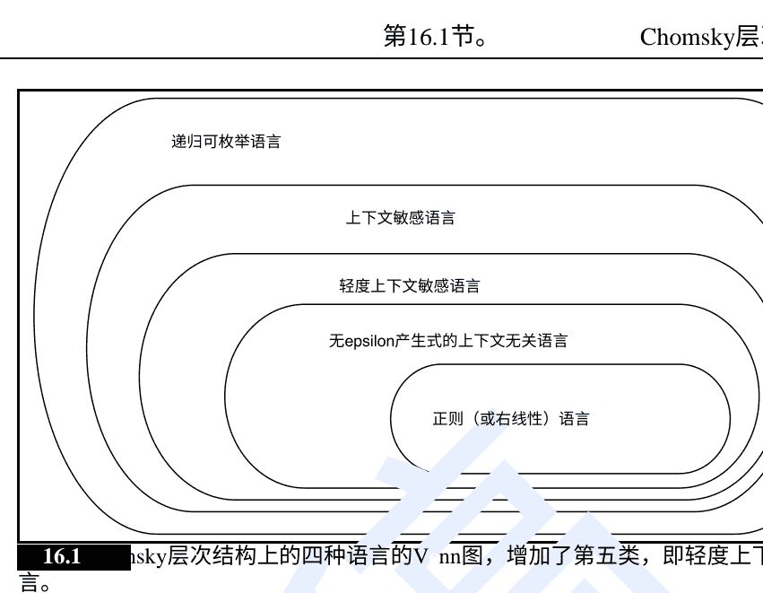

| 类型常用名称 | 规则骨架 | 语言学示例 |
| :--- | :--- | :--- |
| 0 图灵等价 | α → β，使得 α = ε | HPSG, LFG, 极简主义 |
| 1 上下文敏感 | αAβ → αγβ，使得 γ = ε | TAG, CCG |
| - 轻度上下文敏感 | | |
| 2 上下文无关 | A → γ | 短语结构语法 |
| 3 正则 | A → xB 或 A → x | 有限状态自动机 |
表注：16.2 乔姆斯基层次，通过轻度上下文敏感语法进行扩展。

> /t/ → [dx] / V _ V

尽管这些规则的形式似乎是上下文敏感的，但第7章表明，没有递归的音韵规则系统实际上与正则语法的能力相等。

在上下文敏感语法中，将符号串 δ 重写为另一个符号串 φ 的一种“非递减”方式来概念化规则；使得 φ 至少有与 δ 一样多的符号。

上下文无关 我们在第12章中学习了上下文无关文法。上下文无关规则允许任何一个单个的非终结符被重写为任何终结符和非终结符的字符串。一个非终结符也可以被重写为 ε，尽管我们在第12章中没有使用这个选项。

正则文法等价于正则表达式。也就是说，给定的正则语言可以通过我们在第2章中讨论的类型的正则表达式或正则文法来描述。正则文法可以是右线性的 左线性 或左线性。右线性文法中的规则左侧只有一个非终结符，在右侧最多只有一个非终结符。如果右侧有一个非终结符，则它必须是字符串中的最后一个符号。左线性文法的右侧是反转的（右侧必须以（最多）一个非终结符开头）。所有的正则语言都有一个左线性和一个右线性文法。在我们的讨论中，我们只考虑右线性文法。

例如，考虑以下正则（右线性）文法：

```
S → aA
S → bB
A → aS
B → bbS
S → ε
```

它是正则的，因为每个规则的左侧都是一个单个的非终结符，每个右侧最多只有一个（最右边的）非终结符。以下是语言中的一个示例推导：

```
S ⇒ aA ⇒ aaS ⇒ aabB ⇒ aabbbS ⇒ aabbbaA ⇒ aabbbaaS ⇒ aabbbaa
```

我们可以看到每次S扩展时，它要么产生 aaS要么产生 bbbS；因此读者应该确信这个语言对应于正则表达式 (aa∪bbb)*。

我们不会介绍一个语言是正则的当且仅当它由一个正则文法生成的证明；这个证明最早由Chomsky和Miller(1958)证明，并且可以在Hopcroft和Ullman(1979)和Lewis和Papadimitriou(1988)等教科书中找到。直觉是由于非终结符总是在规则的右边或左边，它们可以迭代处理而不是递归处理。

有用的语言和语法的第五类是轻度**上下文敏感的语法和轻度上下文敏感的语言。** 轻度上下文敏感的语言是上下文敏感语言的一个真子集，并且是上下文无关语言的一个真超集。轻度上下文敏感语言的规则可以用多种方式描述；事实上，各种语法形式，包括树邻接语法 (Joshi, 1985)，头语法Pollard (1984)，组合范畴语法 (CCG) (Steedman, 1996, 2000) 以及一种特定版本的极简主义语法 (Stabler, 1997)，都是弱等价的 (Joshi等, 1991)。

## 16.2 如何判断一个语言不是正则的

我们如何知道在给定问题中使用哪种类型的规则？我们可以使用正则表达式来编写英语的语法吗？还是我们需要使用上下文无关规则甚至上下文敏感规则？事实证明，对于形式语言，有决定这一点的方法。也就是说，我们可以确定给定的形式语言是否可以用正则表达式表示，或者是否需要上下文无关语法等等。

因此，如果我们想要知道自然语言的某个部分（比如英语的音韵学，或者土耳其语的形态学）是否可以由某个类别的语法表示，我们需要找到一个能够模拟相关现象的形式语言，并确定哪种语法类别适用于这种形式语言。

我们为什么要关心（比如）英语的句法是否可以由正则语言表示呢？一个主要原因是我们想知道在编写英语的计算语法时应该使用哪种类型的规则。如果英语是正则的，我们将编写正则表达式，并使用高效的自动机来处理这些规则。如果英语是上下文无关的，我们将编写上下文无关规则，并使用CKY算法来解析句子，等等。

关心的另一个原因是它告诉我们一些关于自然语言不同方面的形式属性的信息；了解一种语言的复杂性‘存放’在哪里是很有意义的；一个语言的音韵系统是否比句法系统更简单，或者某种形态系统是否本质上比另一种形态系统更简单。例如，如果我们能够证明英语的音韵学可以由有限状态机捕捉而不是传统上使用的上下文敏感规则，那将是一个强有力且令人兴奋的论断；这意味着英语音韵学具有相当简单的形式属性。事实上，这一点已经由Johnson（1972）证明，并有助于引导第3章和第4章中关于有限状态方法的现代研究工作。

### 16.2.1 泵引理

证明一个语言是正则的最常见的方法是实际构建一个正则表达式来表示该语言。在这样做时，我们可以依赖于正则语言在并集、连接、Kleene闭包、补集和交集下的封闭性。我们在第二章中看到了并集、连接和Kleene闭包的例子。因此，如果我们可以独立地为语言的两个不同部分构建一个正则表达式，我们可以使用并集运算符来构建整个语言的正则表达式，从而证明该语言是正则的。

有时我们想要证明一个给定的语言是不是正则的。用于做这个的一个非常有用的工具是泵引理。这背后有两个直觉引理。（我们对泵引理的描述参考了Lewis和Papadimitriou（1988）以及Hopcroft和Ullman（1979）。）首先，如果一个语言可以由一个有限状态的有限自动机建模，我们必须能够用有限的内存决定任何字符串是否属于该语言。这个内存的量对于不同的自动机可能是不同的，但对于给定的自动机，它不能因为不同的字符串而变得更大（因为给定的自动机有固定数量的状态）。

因此，内存需求不必与输入的长度成正比。这意味着，例如像 \(a^n b^n\) 这样的语言不太可能是正则的，因为我们需要一种方法来记住 \(n\) 是什么，以确保 \(a\) 和 \(b\) 的数量相等。第二个直觉依赖于一个事实，即如果一个正则语言有任何长字符串（比自动机的状态数更长），那么该语言中必须存在某种循环。我们可以利用这个事实来证明，如果一个语言没有这样的循环，那么它就不是正则的。

让我们考虑一个语言 \(L\) 和相应的确定性有限状态自动机 \(M\)，它有

个状态。考虑一个长度为N的输入字符串。机器从状态 q₀开始；在看到1个符号后，它将处于状态 q₁；在看到 N个符号后，它将处于状态 q_n。换句话说，长度为 N的字符串将经过 N+1个状态（从 q₀到 q N）。但是自动机中只有 N个状态。这意味着至少有两个沿着接受路径的状态（称为 q_i和 q_j）是相同的。换句话说，在从初始状态到最终状态的接受路径上，必须存在一个循环。图16.3展示了这一点的示例。设 x为机器从初始状态 q₀到循环的开始 q_i之间读取的符号串。设 y为机器在循环中读取的符号串。设 z为从循环的结束（q_j）到最终接受状态（q N）的符号串。

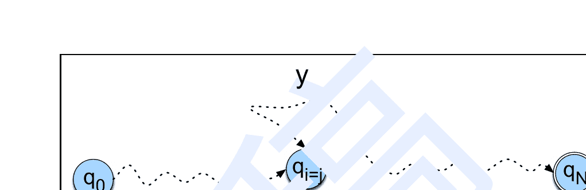

### 16.3 具有 N个状态的机器接受一个字符串 xyz of N个符号

该机器接受这三个符号字符串的连接，即xyz。但是如果机器接受 xyz，它必须接受 xz！这是因为机器可以跳过处理 xz的循环。此外，机器还可以无限次绕过循环；因此它还必须接受 xy z、 xyyz、 xyyyz等形式的字符串 xy^n z，其中 n ≥ 0。

我们给出的泵引理版本是针对无限正则语言的简化版本；还可以提出更强的版本，适用于有限语言，但这个版本给出了这类引理的味道：

> 泵引理。假设 L是一个无限正则语言。那么存在字符串 x、 y和 z，使得 y = ϵ 且 xy^n z ∈ L，其中 n ≥ 0。

泵引理指出，如果一个语言是正则的，那么就存在某个字符串 y可以适当地“泵动”。但这并不意味着如果我们可以泵动某个字符串 y，那么该语言一定是正则的。非正则语言也可能有可以被泵动的字符串。因此，该引理不用于证明一个语言是正则的。

相反，它用于证明一个语言不是正则的，通过展示在某个语言中不存在可以以适当方式被泵动的字符串。让我们使用泵引理来证明语言 a^n b^n（即由一系列 as后跟相同数量的 bs组成的语言）不是正则的。我们必须证明任何可能的字符串 s我们选择都不能被分成三个部分 x, y,和 z，使得 y可以被泵动。给定一个随机字符串 s来自 a^n b^n，我们可以区分三种分割 s的方式，并且证明无论我们选择哪种方式，我们都无法找到一些可以被泵动的 y：

-   1. y仅由 a和s组成。（这意味着 x也是全部 a，而 z包含全部的s。

bs，可能前面有一些 as。但是如果 y 是全部 as，那意味着 $xy^n z$ 比 $xyz$ 有更多的 as。但这意味着它比 bs 有更多的 as，因此不能成为语言 $a^n b^n$ 的成员！

-   2. y 仅由 bs组成。这里的问题与情况1类似；如果 y 是全部 bs，那意味着 $xy^n z$ 比 $xyz$ 有更多的 bs，因此比 as 有更多的 bs。

-   3. y 由 as 和 bs组成（这意味着 x 只有 as，而 z 只有 bs）。这意味着 xyz 必须在 as 之前有一些 bs，因此也不能成为语言 $a^n b^n$ 的成员！ bs！

因此，没有字符串可以被分成 $a^n b^n$ 的方式，以至于 y can be pumped，因此 $a^n b^n$ 不是一个正则语言。 但是，虽然 $a^n b^n$ 不是一个正则语言，它是一个上下文无关语言。事实上，模拟 $a^n b^n$ 的上下文无关文法只需要两个规则！它们如下：

```
S → a S b
S → ε
```

这是一个使用该文法推导出句子 aabb 的示例解析树：


对于上下文无关语言，也有一个泵引理，可以用于判断一个语言是否是上下文无关的；完整的讨论可以在Hopcroft和Ullman（1979）以及Partee等人（1990）中找到。

### 16.2.2 英语和其他自然语言是否是正则语言？

> > “生意怎么样？”我问道。
> “糟糕透了。”弗里茨得意地笑了。“要么我在下个月搞定一笔新交易，要么我去当个舞男，”
> “要么……要么…………，”我纠正道，出于职业习惯。
> “我现在说的英语很糟糕，”弗里茨得意地说道。“莎莉说也许她会给我上几节课。”
> 克里斯托弗·伊舍伍德，《莎莉·鲍尔斯》，摘自《柏林告别》，1935年

# 第16章 语言与复杂性

考虑一个形式化的英语语言模型，将其建模为一组由单词组成的字符串。这种语言是否是正则语言？一般认为，像英语这样的自然语言，在这种观点下，不是正则语言，尽管大多数尝试证明这一点的证明都是众所周知的不正确的。

经常以非正式方式提出的一种论证是，英语的数目一致性无法由正则语法捕捉，因为在类似以下句子中，主语和动词之间的距离可能是无限的：(16.1)你的教授说她认为哪个问题是无法解决的？

(16.2) 你的教授说哪些问题是无法解决的？

事实上，一个简单的正则语法可以模拟数目一致性，正如Pullum和Gazdar（1982）所示。这是他们用来模拟这些句子的正则（右线性）语法：

```
S → 你的教授说哪个问题 T
S → 你的教授说哪些问题 U
T → 她认为 T | 你认为 T | 是无法解决的
U → 她认为 U | 你认为 U | 是无法解决的
```

因此，一个正则语法可以模拟英语的一致性。这个语法并不优雅，而且在语法规则的数量上会有巨大的爆炸，但这与英语的规则性与非规则性无关。

Mohri和Sproat（1998）指出，以前尝试的证明中的另一个常见缺陷是，语言L包含Chomsky层次结构中位置P'的子集L'并不意味着语言L也位于位置P'。例如，一个正则语言可以作为一个上下文无关语言的真子集。

因此，以下两种语言都是上下文无关的

(16.3) $L_1 = \{a^n b^n : n \in N\}$

(16.4) $L_2 = \{w w^R : w \in \Sigma^*\}$

然而，$L_1$和$L_2$都包含在正则语言$L$中

(16.5) $L = \{a^p b^q : p, q \in N\}$

因此，一个语言$L$包含一个非常复杂的子语言并不意味着该语言的整体复杂性。

根据泵引理，有正确的证明表明英语（或者更准确地说，“英语单词字符串集合作为一个形式语言”）不是一个正则语言。例如，Partee等人（1990）的证明是基于一类著名的中心嵌套结构的句子（Yngve，1960）；以下是这些句子的一个变体：猫喜欢吞拿鱼。

追逐猫的狗喜欢金枪鱼。

咬了老鼠的猫追逐的狗喜欢金枪鱼。

被大象钦佩的咬了老鼠的猫追逐的狗喜欢金枪鱼。

随着复杂度的增加，这些句子变得越来越难理解。暂时假设英语的语法允许无限嵌套。然后为了证明英语不是规则语言，我们需要证明具有这样句子结构的语言与某个非规则语言同构。由于每个前置的名词短语必须有其关联的动词，这些句子的形式为：

(the + 名词)n(及物动词)n-1喜欢金枪鱼。

证明的思路是通过将英语与正则表达式相交来生成这些结构的句子。然后我们将使用泵引理证明所得到的语言不是规则的。

为了构建一个简单的正则表达式，我们可以与英语相交以产生这些句子，我们定义了名词组（A）和动词（B）的正则表达式：

- A = {猫，狗，老鼠，大象，袋鼠，...}
B = {追逐，咬，欣赏，吃，交朋友，...}

现在，如果我们将正则表达式 /A* B* 喜欢吞拿鱼/ 与英语（视为一组字符串）相交，得到的语言是：

```
L = x^n y^{n-1} 喜欢吞拿鱼 , x ∈ A, y ∈ B
```

可以通过泵引理（见练习2）证明这个语言L是非正则的。由于英语与正则语言的交集不是正则语言（因为正则语言在交集下是封闭的），所以英语也不是正则语言。

这个证明存在一个众所周知的缺陷，或者至少是一个过于强烈的假设，即这些结构可以无限嵌套。英语句子显然受到某个有限长度的限制；也许我们可以安全地说，所有的英语句子都不超过十亿个词。如果句子集合是有限的，那么所有的自然语言显然都是有限状态的。这是关于自然语言形式复杂性的所有这类证明的一个缺陷。我们暂时忽略这个异议，因为方便地想象英语有无限多个句子可以帮助我们理解有限英语的特性。这个证明的一个更令人担忧的潜在缺陷是它依赖于这样一个假设，即这些对象的双重相对化在语法上是严格的（即使很难处理）。Karlsson（2007）的研究表明，虽然某些类型的中心嵌套是语法正确的，但这些对象的双重相对化实际上是不合语法的。无论如何，像这样的句子在嵌套几次后就变得非常困难，很难理解。我们将在第16.4节回到这个问题。

## 16.3 自然语言是否是上下文无关的？

前一节论证了英语（作为一组字符串）似乎不是一个正则语言。接下来要问的自然问题是英语是否是上下文无关的语言。这个问题最早由乔姆斯基（1956年）提出，并且有一个有趣的历史；已经发表了许多著名的试图证明英语和其他语言不是上下文无关的论文，除了两篇之外，所有的论文都被证明是错误的。这两个正确（或者至少尚未被证伪）的论证之一来自瑞士德语方言的句法；另一个来自班巴拉语的形态，班巴拉语是一种在马里和邻国使用的西北曼德语言（Culy，1985年）。

有兴趣的读者可以参考普卢姆（1991年，第131-146页）对不正确和正确证明的极为风趣的历史；本节将简要总结基于瑞士德语的正确证明之一。

所有正确的参数和大部分不正确的参数都利用了以下语言的特点，以及具有类似特性的语言，这些语言都不是上下文无关的：

```
(16.6) \{xx | x \in \{a, b\}*\}
```

该语言由包含两个相同字符串连接的句子组成。下面的相关语言也不是上下文无关的：

```
(16.7) a^n b^m c^n d^m
```

使用上下文无关语言的泵引理可以证明这些语言的非上下文无关性质。

试图证明自然语言不是上下文无关语言的努力是通过展示自然语言具有这些语言的一个特性，称为交叉序列依赖性。在交叉序列依赖性中，单词或更大的结构按从左到右的顺序相关，如图16.5所示。具有任意长交叉序列依赖性的语言可以映射到xx语言。


成功的证明，由Huybregts（1984）和Shieber（1985a）独立提出（正如我们在科学中多次发现的普遍现象一样；参见第13页），表明苏黎世方言的瑞士德语具有交叉序列约束，使得该语言的某些部分等价于非上下文自由语言 a^n b^m c^n d^m。直觉上，瑞士德语允许一个句子由一串与格名词后跟一串宾格名词，再跟一串带与格的动词，最后跟一串带宾格的动词组成。

我们将遵循Shieber（1985a）提出的证明版本。首先，他指出瑞士德语允许动词及其论元以交叉序列的方式排序。假设下面所示的所有示例句子都以字符串“*Jan s'ait das*”(“Jan says that”)开头：

(16.8) ... 更 *em Hans* *es huus* *h'alfed aastriiche*. ...我们 Hans/DAT 这个 house/ACC helped paint. “...我们帮助Hans油漆房子。”

请注意语义依赖的交叉序列性质：两个名词都在两个动词之前，*em Hans*(Hans)是 *h'alfed*(helped)的参数，而*es huus*(房子)是 *aastriiche*(paint)的参数。此外，名词和动词之间存在交叉序列的格依赖关系； *h'alfed*(helped)需要与格，*em Hans*是与格，而 *aastriiche*(paint)需要宾格，*es huus*(房子)是宾格。

Shieber指出，这种格标记甚至可以出现在像以下这样的三重嵌套的交叉子句中：

(16.9) ... *mer d'chind* *em Hans es huus* *haend wele laa* *h'älfe aastriiche.* ... we the children/ACC Hans/DAT 这个 house/ACC 有 wanted to let help paint. “...我们一直想让孩子们帮助汉斯粉刷房子。”

Shieber指出，在这样的句子中，所有与格名词短语都在所有宾格名词短语之前，所有与格-词类V都在所有宾格-词类V之前是可以接受的。

```
(16.10) Jan s'ait das mer (d'chind)* (em Hans)* es huus haend wele laa* h'älfe* aastriiche.
```

让我们将上述正则表达式称为R。由于它是一个正则表达式（你可以看到它只有串联和Kleene星号），它必须定义一个正则语言，因此我们可以将R与瑞士德语相交，如果结果是上下文无关的，那么瑞士德语也是上下文无关的。

但事实证明，瑞士德语要求需要与之配合的动词数量（*h'älfe*）必须等于与之配合的与格名词短语（*em Hans*）的数量，对于与格名词短语也是如此。此外，任意数量的动词可以出现在这种类型的从句中（受限于性能约束）。这意味着与瑞士德语相交的这个正则语言是以下语言：

```
(16.11) L = Jan s'ait das mer (d'chind)^n (em Hans)^m es huus haend wele (laa)^n (h'älfe)^m aastriiche.
```

但这个语言的形式是 *wa^nb^mxc^nd^m*y，这不是上下文无关的！因此我们可以得出结论，瑞士德语不是上下文无关的。

## 16.4 复杂性与人类处理

我们之前曾提到，用来证明英语不是有限状态的句子（如“中心嵌套”句子）很难理解。如果你是瑞士德语的说话者（或者你有一个朋友是），你会注意到瑞士德语中的长串行句子也很难理解。事实上，正是普卢姆和加兹达尔（1982）指出，那些在各种证明英语不是上下文无关的构造类型似乎在人类处理系统中引起了巨大的困难。…

这将我们带到了第二个使用这个术语的地方——复杂性。在前一节中，我们谈到了语言的复杂性。在这里，我们转向一个既是心理学又是计算机科学问题的问题：一个句子的复杂性。为什么有些句子很难理解？这能告诉我们关于计算过程的任何信息吗？

有很多因素会使一个句子难以理解。例如，我们在第14章中看到，如果一个词是不可预测的，即具有低的N-gram概率或低的解析概率，那么它会被读得更慢。我们还在第14章中看到了花园路径句子，其中歧义可能导致困难；如果有多个可能的解析，人类读者（或听者）有时会选择错误的解析，导致在切换回另一个解析时出现二次阅读。影响句子难度的其他因素包括不合理的含义和糟糕的书写。

另一种困难似乎与人类记忆限制有关，而这种特定的复杂性（通常称为“语言复杂性”或“句法复杂性”）与前一节中的形式语言复杂性有着有趣的关系。

考虑一下 Gibson（1998）提出的这些句子，它们在人们阅读时会引起困难（我们将使用 # 表示句子引起极端处理困难）。在每种情况下，（ii）的例子比（i）的例子要复杂得多：

- (16.12) (i) 猫喜欢金枪鱼。
(ii) # 猫狗老鼠山羊舔咬追逐喜欢金枪鱼。

- (16.13) (i) 孩子损坏了照片，这些照片是摄影师在派对上遇到的教授拍摄的。
(ii) # 照片是摄影师在派对上遇到的教授拍摄的，被孩子损坏了。

- (16.14) (i) 经理雇佣的员工偷办公用品让高管感到担忧。
(ii) # 高管雇佣的经理让员工偷办公用品的事实让他们担忧。

对这类句子最早的研究发现它们都表现出嵌套或中心嵌入的特点（Chomsky, 1957; Yngve, 1960; Chomsky and Miller, 1963; Miller and Chomsky, 1963）。也就是说，它们都包含了一个句法类别A嵌套在另一个类别B中，并被其他词（X和Y）包围的例子：

```
[B X [A] Y]
```

在上述每个例子中，部分 (i) 具有零个或一个嵌套，而部分 (ii) 具有两个或更多的嵌套。例如，在上述的(16.12ii)中，有三个嵌套的简化关系从句：

```
(16.15) # [s 猫 [s 狗 [s 老鼠 [s 大象 赞赏] 咬] 追赶] 喜欢 金枪鱼].
```

在 (16.13ii) 中，定语从句“教授在派对上遇见的”嵌套在“摄影师”和“拍摄”之间。定语从句“摄影师 ... 拍摄”然后嵌套在“照片”和“被孩子损坏”之间。

```
(16.16) # 照片 [ 摄影师 [ 教授在派对上遇见的 ] 拍摄 ] 被孩子损坏.
```

这些嵌套结构的困难并不是由于不合语法，因为在复杂句子 (16.12ii)-(16.14 ii) 中使用的结构与简单句子 (16.12i)-(16.14i) 中使用的结构相同。简单句子和复杂句子之间的区别似乎与嵌套的数量有关。但是没有一种自然的方式可以编写允许 N个嵌套但不允许 N +1个嵌套的语法。

相反，这些句子的复杂性似乎是一种处理现象；关于人类解析机制的某个事实无法处理这种多重嵌套的句子，无论是在英语还是其他语言中 (Cowper, 1976 ; Babyonyshev和Gibson, 1999) 。

这些句子的困难似乎与内存限制有关。早期的形式语法学家认为这可能与解析器处理嵌套有关。例如， Yngve (1960) 认为人类解析器基于一个有限大小的堆栈，并且解析器需要在堆栈上存储的不完整短语结构规则越多，句子就越复杂。

Miller和Chomsky (1963) 假设自嵌套结构特别困难。自嵌套结构包含一个语法类别 A嵌套在另一个 A的示例中，并被其他单词 (x和 y以下)包围；这样的结构可能很困难，因为基于堆栈的解析器可能会混淆堆栈上的两个规则副本。


这些早期模型的直觉很重要，尽管我们不再认为复杂性问题与实际堆栈有关。例如，我们现在知道具有相同嵌入数量的句子之间存在复杂性差异，例如主题提取关系从句 (16.17ii) 和宾语提取关系从句 (16.17i) 之间的著名差异：

(16.17) (i) [s 记者 [s' 谁 [s 袭击了参议员 ]] 承认错误 ]。
(ii) [s 记者 [s' 谁 [s 袭击了参议员 ]] 承认错误 ]。

宾语提取关系从句更难处理，例如通过阅读所需的时间和其他因素来衡量 (MacWhinney, 1977年, 1982年; MacWhinney和Csaba Pléh, 1988年; Ford , 1983年; Wanner和Maratsos, 1978年; King和Just, 1991年; Gibson, 1998年 ) 。事实上，Karlsson (2007年) 已经证明

研究表明，中心嵌套的语法性很大程度上取决于被嵌套的特定句法结构（例如，相对子句与对象的双重相对化）。对于老式的基于堆栈的模型来说，另一个问题是篇章因素可能会使一些双重嵌套的相对子句更容易处理，例如下面的双重嵌套例子：

> (16.18) 这些照片[是摄影师[我在派对上遇到的]拍摄的]，效果非常好。

这种结构看起来较为简单的原因是其中一个嵌套的名词短语是单词“我”；像“我”和“你”这样的代词似乎更容易处理，可能是因为它们不引入新的实体到篇章中。

解释这些数据的一种人类解析模型是依存局部性理论（Gibson, 1998, 2003）。DLT的直觉是，宾语关系从句很难处理，因为它们有两个名词出现在任何动词之前。读者必须在不知道这两个名词将如何适应句子的情况下坚持住它们。

更具体地说，DLT提出，整合一个新的单词 $w$ 的处理成本与 $w$ 和正在整合的单词$w$句法项目之间的距离成正比。距离不仅以单词计算，还要考虑同时在记忆中保存多少个新的短语或话语参照。因此，如果在预测该单词之后有许多中间的新话语参照，则该单词的记忆负荷会更高。因此，DLT预测，如果其中一个名词短语是在话语中已经活跃的代词，那么一系列名词短语的处理会更容易，这解释了（16.18）。

总之，这些“中心嵌套”和其他示例的复杂性似乎与记忆有关，尽管与40年前最初认为的解析堆栈大小的直接关联不同。理解这些记忆因素与第14章提到的统计解析因素之间的关系是一个令人兴奋的研究领域，目前才刚刚开始研究。

## 16.5 摘要

本章介绍了两个不同的复杂性概念：形式语言的复杂性和人类句子的复杂性。

- 语法可以通过它们的生成能力来表征。如果一个语法能够定义另一个语法不能定义的语言，则它的生成能力或复杂性更高。乔姆斯基层次是基于语法生成能力的一种层次结构。它包括图灵等价、上下文敏感、上下文无关和正则语法。
- 泵引理可以用来证明一个给定的语言不是正则的。英语不是一个正则语言，尽管使英语非正则的句子恰好是人们难以解析的句子。尽管多年来一直试图证明相反，但英语似乎是一个上下文无关的语言。瑞士德语的句法和形态学相比之下，班巴拉语不是上下文无关的，似乎需要稍微上下文敏感的语法。
- 某些中心嵌套的句子对人们来说很难解析。许多理论都认为这种困难在某种程度上是由于人类解析器的记忆限制引起的。

# 参考文献和历史注释

乔姆斯基（1956年）首次提出了有限状态自动机或上下文无关文法是否足以捕捉英语句法的问题。他在那篇论文中提到英语句法包含了“用短语结构难以解释的例子”，这是他发展语法转换的动机之一。

乔姆斯基的证明基于语言 {xx^R : x ∈ {a,b}*}。x^R表示“x的反转”，因此该语言的每个句子由一串a和b后面跟着该串的反转或“镜像”组成。这种语言不是正则的；Partee等人（1990年）通过与正则语言 aa*bb aa*的交集证明了这一点。结果语言是 a^n b^2 a^n；读者可以通过使用泵引理来证明这不是正则的（练习3）。

Chomsky的证明表明英语具有镜像特性，依赖于以下英语句法结构的多重嵌套，其中 S1, S2, ..., Sn 是英语的陈述句,

- 如果 S1, 那么 S2
- 要么 S3, 要么 S4
- 说 S5 的那个人今天要来了

详见Chomsky (1956)了解详情.

Pullum (1991, pp. 131–146)是关于自然语言非上下文无关性研究的权威历史研究。关于证明自然语言非上下文无关的早期尝试的历史总结可参考Pullum和Gazdar (1982)。泵引理最初由Bar-Hillel等人(1961)提出，他们还提供了关于有限状态和上下文无关语言的闭包和可决定性属性的一些重要证明。更多细节，包括上下文无关语言的泵引理(也是由Bar-Hillel等人(1961)提出)可在自动机理论教材中找到，如Hopcroft和Ullman (1979)。

Yngve的想法是，如果人类解析器是有限状态的，那么可以解释中心嵌套句子的困难。这个想法在Church（1980）的硕士论文中得到了采纳。他证明了实现这个想法的有限状态解析器也可以解释许多其他语法和心理语言学现象。虽然认知建模领域已经转向更复杂的复杂模型，但Church的工作可以看作是语音和语言处理中有限状态模型的回归的开始，这一特点贯穿了1980年代和1990年代。

还有其他一些看待复杂性的方式我们在这里没有空间讨论。其中一个问题语言处理是否是NP完全的。$NP$完全 $\textbf{complete}$ 是一类被怀疑难以处理的问题的名称。Bar\'af\'fan等人（1987）证明了关于自然语言识别和解析的$NP$完全性的复杂性结果。除此之外，他们还展示了

1.  在一些基于统一形式主义（如词汇-功能语法）的句子识别问题中，保持潜在无限长度句子的词汇和一致性特征的歧义性是一个NP完全问题。
2.  双层形态分析（甚至只是词汇和表面形式之间的映射）也是NP完全的。

最近的研究还开始将处理复杂性与信息论度量（如科尔莫戈洛夫复杂度）联系起来（Juola，1999年）。
最后，最近的研究还研究了不同类型的概率语法的表达能力，例如，加权上下文无关文法（其中每个规则都有一个权重）和概率上下文无关文法（其中非终结符的规则权重之和必须为1）具有相同的表达能力（Smith和Johnson，2007年；Abney等，1999a；Chi，1999年）。

# 练习

16.1 语言 $a^n b^2 a^n$ 是否是上下文无关的？

16.2 使用泵引理来证明这个语言不是正则的：
$L = x^n y^{n-1}$ 喜欢吞拿鱼 $,x \in A, y \in B$

16.3 Partee et al. (1990)证明了这个语言 $xx^R, x \in {a, b}^*$ 不是正则的，通过与正则语言 $aa^* bbaa^*$ 的交集。得到的语言是 $a^n b^2 a^n$。使用泵引理来证明这个语言不是正则的，完成了对 $xx^R, x \in {a, b}^*$ 不是正则的证明。

16.4 为这个语言构建一个上下文无关文法
$L = \{ xx^R | x \in {a, b}^* \}$

# 第17章 表示意义

> > 我伊舍梅尔 这一切肯定不是没有意义的。
> 赫尔曼·梅尔维尔，白鲸

这里介绍的语义方法以及接下来的四章详细阐述的方法是基于一种观念，即语言表达的意义可以用形式结构来捕捉，我们将其称为意义表示。

相应地，用于指定这些表示的语法和语义的框架将被称为意义表示语言。这些意义表示在早期章节中介绍的音韵、形态和句法表示中起着类似的作用。

当原始语言输入或者从中派生的任何结构都不能满足所需的语义处理时，就需要意义表示的需求。更具体地说，我们需要的是能够连接语言输入和涉及语言输入意义的非语言世界知识的表示。为了说明这个概念，考虑以下需要对自然语言进行某种形式的语义处理的日常语言任务：

- 回答考试中的论述题
- 通过阅读菜单决定在餐厅点什么
- 通过阅读手册学习使用新软件
- 意识到自己被侮辱了
- 按照食谱操作

仅仅拥有我们迄今讨论过的音韵、形态和句法表示是无法在这些任务上取得很大进展的。相反，它们需要访问将任务中涉及的语言元素与成功完成任务所需的非语言世界知识相连接的表示。例如，执行上述任务所需的一些世界知识包括以下内容：

- 回答和评分论文问题需要关于问题主题、学生所需知识水平以及通常如何回答此类问题的背景知识。
- 阅读菜单并决定点什么，给出关于晚餐去哪里的建议，按照食谱做菜，以及生成新的食谱都需要关于食物、其制备方法、人们喜欢吃什么以及餐厅的了解。
- 通过阅读手册学习使用软件，或者给出关于如何做同样事情的建议，需要对当前计算机、具体软件的了解。

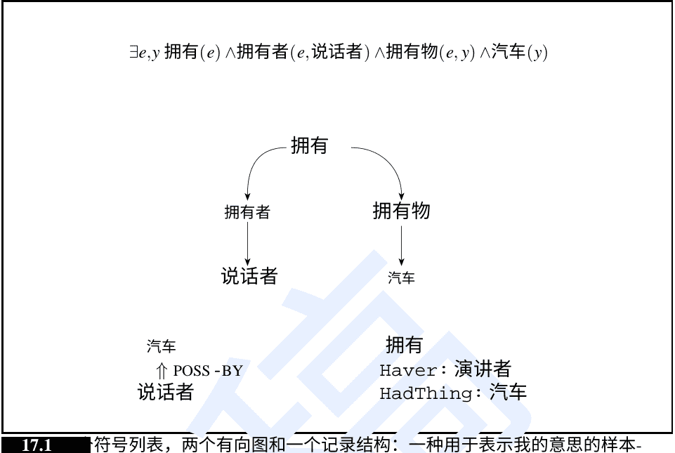

17.1 符号列表，两个有向图和一个记录结构：一种用于表示我的意思的样本-化表示。我有一辆车。

有关软件的问题，类似的软件应用程序和对用户的了解一般。

在这里提出的表征方法以及在接下来的四章中详细阐述的方法中，我们假设语言表达式具有由用于表示这种日常常识世界的东西组成的意义表示。创建这种表示并将其分配给语言输入的过程称为语义分析。

语义分析
为了使这些概念更加具体，考虑图17.1，它展示了使用四种代表性的意义表示语言对句子“我有一辆车”进行样本意义表示。第一行示例了一个用一阶逻辑表示的句子，这将在第17.3节中详细介绍；中间的图是一个语义网络的示例，将在第17.5节中进一步讨论；第三行包含一个概念依赖图，在第19章中详细讨论，并在第17.5节和第22章中再次讨论的是一个基于框架的表示。

虽然这些方法之间存在非平凡的差异，但在抽象层面上，它们都共享一个共同的基础，即意义表示由一组符号或表示词汇组成的结构。当适当地排列时，这些符号结构被认为对应于某种情况中的对象、对象的属性和对象之间的关系。在这种情况下，所有四种表示都使用与说话者、汽车以及表示一个拥有另一个的关系相对应的符号。

重要的是要注意，在这四种方法中，这些表示可以从至少两个不同的角度来看待：作为特定语言输入“我有一辆车”的意义表示，以及作为状态的表示。

## 17.1 表示的计算要求

我们首先考虑为什么需要意义表示以及它们对我们有什么作用。为了聚焦这个讨论，我们将更详细地考虑给游客提供关于餐馆的建议的任务。在这个讨论中，我们假设我们有一个计算机系统，可以接受游客的口语查询，并通过使用相关领域知识库构建适当的回答。一系列的例子将用来介绍意义表示必须满足的一些基本要求，以及在设计这样的意义表示过程中不可避免地出现的一些复杂情况。在这些例子中，我们将考察请求的意义表示在满足请求的过程中必须发挥的作用。

### 17.1.1 可验证性

让我们首先考虑以下简单问题：

### (17.1) Maharani提供素食吗？

这个例子说明了意义表示的最基本要求：必须能够使用表示来确定句子的意义与我们所知的世界之间的关系。换句话说，我们需要能够确定我们表示的真实性。第17.2节详细探讨了这个主题。暂时假设我们可以赋予计算系统比较或匹配表达式意义表示与知识库中表示的能力，即其关于世界的信息存储。

### 知识库

在这个例子中，让我们假设这个问题的含义包含了一个命题“Maharani提供素食”的含义作为一个组成部分。目前，我们将简单地将这个表示解释为：

```
(17.2) 提供(Maharani,素食)
```

这个输入的表示将与关于一组餐馆的知识库进行匹配。如果系统在其知识库中找到与输入命题匹配的表示，它可以返回肯定的答案。否则，如果它对本地餐馆的了解是完整的，它必须说不，或者如果有理由相信它的知识是不完整的，它必须说它不知道。

### 可验证性

这个概念被称为可验证性，它涉及到系统比较一个表示描述的状态与知识库中某个世界中的状态的能力。描述的状态与知识库中某个世界中的状态相对应。

### 17.1.2 明确的表示

语义学的领域，就像我们研究过的其他领域一样，受到歧义的影响。具体而言，根据其出现的情况，个别语言表达可以合法地被赋予不同的意义表示。考虑以下来自 BERP 语料库的例子：
(17.3) 我想在离 ICSI 近的地方吃饭。

根据动词 eat 的允许的论元结构，这个句子可以表示说话者想在附近的地方吃饭，或者在 Godzilla 作为说话者的解释下，说话者可能想要吞噬附近的地方。系统对这个请求生成的答案将取决于选择哪个解释作为正确的解释。

由于这样的歧义在所有语言的所有体裁中都很常见，需要一些手段来确定某些解释比其他解释更可取（或者更不可取）。引起这种歧义的各种语言现象以及处理它们的技术将在接下来的四章中详细讨论。

然而，在本章中，我们关注的是我们的意义表示与歧义的关系，而不是我们可能得出正确解释的方式。由于我们对语言输入的语义内容进行推理和行动，输入的意义的最终表示应该没有任何歧义。因此，无论原始输入中存在任何歧义，一个关键问题是计算机的意义表示语言应该支持只有一个明确解释的表示。

意义表示语言应该支持只有一个明确解释的表示。

### 模糊性

与歧义密切相关的概念是模糊性。与歧义一样，模糊性根据其意义表示可能使得确定如何处理特定输入变得困难。然而，模糊性不会导致多个表示。以以下请求为例：
(17.4) 我想吃意大利食物。

尽管使用短语“意大利食品”可能为餐厅顾问提供足够的信息以提供合理的建议，但它仍然相当模糊关于用户真正想吃什么。因此，对于某些目的来说，对这个短语的模糊表示可能是合适的，而对于其他目的来说，可能需要更具体的表示。因此，对于一个意义表示语言来说，支持保持一定程度的模糊性的表示将是有利的。请注意，区分歧义和模糊性并不总是容易的。 Zwicky和Sadock（1975）提供了一套有用的测试，可以用作诊断工具。

### 17.1.3 规范形式

单个句子可以被赋予多个含义的观念导致了应该被赋予相同意义表示的不同输入的相关现象。考虑以下表达（17.1）的替代方式：
(17.5) Maharani有素食菜肴吗？
- (17.6) 马哈拉尼餐厅有素食吗？
- (17.7) 马哈拉尼餐厅供应素食吗？
- (17.8) 马哈拉尼餐厅提供素食吗？

考虑到这些替代方案使用不同的词汇并具有广泛变化的句法分析，我们可以合理地期望它们具有明显不同的意义表示。然而，这种情况对于我们确定表示的真实性来说是不可取的，因为它会产生不良后果。如果系统的知识库只包含一个有关该事实的表示，那么除了一个替代方案外，所有其他替代方案的底层表示都无法产生匹配。

当然，我们可以将所有可能的相同事实的替代表示都存储在知识库中，但这将导致大量与保持这样的知识库一致性相关的问题。

摆脱这个困境的方法是基于以下事实：由于每个替代方案给出的答案在所有情况下都应该是相同的，我们可以说它们在给出餐厅推荐时至少意味着相同的事情。换句话说，在这个领域，我们可以合理地考虑将这些请求的底层命题赋予相同的意义表示。采取这种方法将确保我们对于是/否问题的简单方案仍然有效。

意思相同的输入应该具有相同的意义表示，这被称为规范形式的原则。这种方法极大地简化了各种推理任务，因为系统只需要处理一个可能涵盖广泛表达的意义表示，这样简化了各种推理任务。当然，规范形式会使语义分析的任务变得复杂。要理解这一点，注意上面给出的选择使用完全不同的词汇和语法来指代素食和餐馆对待素食的方式。更具体地说，为了将所有这些请求分配到相同的表示，我们的系统必须得出结论，在这个上下文中，素食、素食菜肴和素食食物指的是同一件事，这里使用的“having”和“serving”同样等效，并且这些请求的不同句法解析都与相同的意义表示兼容。

能够为如此多样化的输入分配相同的表示是一项艰巨的任务。幸运的是，单词义项之间和语法结构之间存在一些系统性的意义关系，可以利用这些关系使得这个任务变得可行。考虑一下在这些例子中，单词“食物”、“菜肴”和“饭食”的含义问题。稍微反思一下，或者查看一下字典，就会发现这些单词有相当多的不同用法。然而，它也揭示了至少有一个意义是它们共享的。如果一个系统有能力选择这个共享的意义，那么就可以为包含这些单词的短语分配相同的意义表示。

一般来说，我们说这些单词都有各种不同的词义，其中一些词义与彼此同义。在上下文中选择正确的词义的过程被称为词义消歧，或者类比词义标注。进行词性标注。同义词、词义标注以及与词义相关的其他主题将在第19章和第20章中进行讨论。在这里只需说，输入可能使用不同的词语，并不妨碍对它们赋予相同的意义。

就像不同词语之间存在系统性关系一样，句法分析在赋予句子意义方面也存在类似的关系。具体来说，不同的句法分析往往具有相似的意义，至少在某种程度上是有系统关联的。请考虑以下一对例子：
(17.9) 马哈拉尼供应素食菜肴。
(17.10) 素食菜肴由马哈拉尼供应。

尽管这些例子中的serve的参数位置不同，我们仍然可以将马哈拉尼和素食菜肴在这两个例子中赋予相同的角色，这是因为我们对主动和被动句式结构之间的关系有所了解。具体而言，我们可以利用主语和直接宾语在这些结构中出现的位置来将马哈拉尼赋予为服务者的角色，将素食菜肴赋予为被服务的角色，尽管它们在表面位置上有所不同。语法在构建意义表示方面的确切作用将在第18章中进行讨论。

### 17.1.4 推理和变量

继续讨论意义表示应该满足的计算目的，我们应该考虑更复杂的请求，例如：
(17.11) 素食主义者可以在Maharani餐厅吃饭吗？

在这里，强制我们的系统为这个请求分配与之前的例子相同的表示形式是错误的。这个请求得到与其他请求相同的答案的事实并不是因为它们意味着相同的事情，而是因为素食主义者吃什么和素食餐厅提供什么之间存在着常识上的联系。这是世界的事实，而不是任何特定语言规律的事实。这意味着基于规范形式和简单匹配的方法将无法给我们一个合适的答案。所需要的是一种将这个请求的意义表示与知识库中表示的世界事实相连接的系统化方法。

### 推理
我们将使用术语“推理”来泛指系统根据输入的意义表示和背景知识的存储来得出有效结论的能力。系统必须能够对不在知识库中明确表示但从已有命题中逻辑推导出的命题的真实性做出结论。

现在考虑以下稍微复杂的请求：
(17.12) 我想找一家可以提供素食的餐厅。
与我们之前的例子不同，这个请求没有提及任何特定的餐厅。用户表示他们想要关于一个未知且未命名的餐厅提供素食的信息。由于这个请求没有提及任何特定的餐厅，我们之前提倡的简单匹配方法是行不通的。相反，回答这个请求需要一种涉及变量使用的更复杂的匹配方法。我们可以将包含这些变量的表示形式解释如下：
```
(17.13) 服务(x,素食)
```
只有当变量 x 可以被知识库中的某个已知对象替换，且整个命题能够匹配时，才能成功匹配此命题。替代变量的概念可以用来满足用户的请求。当然，这个简单的例子只是暗示了使用这些变量所涉及的问题。可以说，语言输入中包含了各种不确定引用的实例，因此对于任何意义表示语言来说，能够处理这种表达方式是至关重要的。

### 17.1.5 表达能力

最后，一个有用的意义表示方案必须足够表达广泛的主題范围。当然，理想的情况是拥有一个能够充分表示任何合理的自然语言表达意义的单一意义表示语言。虽然这可能太过理想化了。

## 17.2 模型论语义学

最后两节关注了对于意义表征的各种期望以及自然语言传达意义的一些方式。我们还没有正式地讨论过意义表征语言的特点，使它们能够完成我们所期望的所有工作。特别是，我们可能希望有一种保证，这些表征能够完成我们所要求的工作：从纯粹的形式化表征到告诉我们一些世界事物的表征之间的桥梁。

### 模型
为了看到我们如何提供这样的保证，让我们从大多数意义表征方案共享的基本概念开始。它们共同具有的特点是能够表示对象、对象的属性和对象之间的关系。这种观点可以通过模型的概念来形式化。基本思想是一个模型是一个形式化的构造，代表着我们试图表示的世界中的特定状态。在意义表示语言中的表达将以系统的方式映射到模型的元素中。如果模型准确地捕捉到我们对世界中某个状态的相关事实，那么意义表示和模型之间的系统映射提供了意义表示和所考虑的世界之间的必要桥梁。

正如我们将看到的，模型为意义表示语言中的表达提供了一种令人惊讶的简单而强大的方式。在我们开始之前，让我们介绍一些术语。意义表示的词汇由两部分组成：非逻辑词汇和逻辑词汇。非逻辑词汇包括用于表示世界的对象、属性和关系的开放集合的名称。这些以谓词、节点、链接上的标签或槽中的标签的形式出现在各种方案中。逻辑词汇由提供在给定意义表示语言中组合表达式的形式手段的符号、运算符、量词、链接等封闭集合组成。

我们将要求每个非逻辑词汇的元素在模型中都有一个指示。通过指示，我们只是指每个非逻辑词汇的元素对应模型中的一个固定明确定义的部分。让我们从对象开始，这是大多数表示方案中最基本的概念。模型的领域只是表示的应用程序或事态的一部分的对象集合。应用程序中的每个不同概念、类别或个体都表示领域中的一个唯一元素。因此，领域在形式上是一个集合。请注意，并不是领域的每个元素在我们的意义表示中都有一个对应的概念；领域中可以存在没有被提及或构思的元素是完全可以接受的。

我们也不要求领域的元素在意义表示中具有单一的指示概念；领域中的一个给定元素可能具有几个不同的表示它的表示，例如玛丽.阿贝的妻子，或罗伯特的母亲。
我们可以通过表示具有该属性的那些域元素来捕捉对象的属性；也就是说，属性表示集合。同样，对象之间的关系表示有序列表或元组的集合，这些有序列表或元组参与相应的关系。因此，属性和关系的这种方法是外延的；例如，红色的表示是我们认为是红色的事物的集合，已婚的表示只是已婚的域元素对的集合。总结一下：
- 对象表示域的元素
- 属性表示域的元素的集合
- 关系表示域的元素的元组的集合

我们还需要一个额外的元素来使这个方案起作用。我们需要一个系统地将我们的意义表示映射到相应的表示的映射。更正式地说，我们需要一个将意义表示的非逻辑词汇映射到模型中适当表示的函数。我们将这样的映射称为解释。

为了使这些概念更具体，让我们回到第四章介绍的餐厅领域。假设我们的应用程序涉及特定的一组餐厅顾客和餐厅，以及关于顾客喜好和不喜欢的各种事实，以及关于餐厅的事实，如它们的菜系、典型费用和噪音水平。

为了开始填充我们的领域\(\mathcal{D}\)，让我们假设在当前的情况下，我们正在处理由非逻辑符号\(Matthew\)、\(Franco\)、\(Katie\)和\(Caroline\)指定的四个顾客。这四个符号将表示4个唯一的领域元素。我们将使用常量\(a\)、\(b\)、\(c\)和\(d\)来代表这些领域元素。请注意，我们故意使用无意义的、非助记符号的名称来强调我们对这些实体的了解必须来自模型的形式属性，而不是符号的名称。

接下来，让我们假设我们的应用程序包括三家餐馆，分别是\(Frasca\)、\(Med\)和\(Rio\)，在我们的意义表示中，它们代表了领域元素\(e\)、\(f\)和\(g\)。最后，让我们假设我们正在处理三种菜系，分别是意大利菜、墨西哥菜和异国风味菜，在我们的模型中，它们分别代表了\(i\)、\(j\)和\(k\)。
在填充了领域之后，让我们继续讨论我们认为在这种特定情况下是真实的属性和关系。假设在我们的应用程序中，我们需要表示一些餐馆的属性，比如有些餐馆很吵或者很贵。像吵闹这样的属性表示了我们领域中已知为吵闹的餐馆的子集。两个位置的关系概念，比如哪些餐馆个别顾客喜欢，表示了领域中对象的有序对或元组。

同样，由于我们决定在我们的模型中将菜系表示为对象，我们也可以将哪些餐馆提供哪些菜系表示为一组元组。使用这种方案的一个特定情况如图17.2所示。

| 领域 | $D = \{a, b, c, d, e, f, g, h, i, j\}$<br>$a, b, c, d$ 代表顾客<br>$e, f, g$ 代表餐厅<br>$h, i, j$ 代表菜系 |
| 属性 | 嘈杂的 = $\{e, f, g\}$<br>Frasca, Med和Rio是嘈杂的 |
| 关系 | 喜欢 = $\{\langle a, f\rangle, \langle c, f\rangle, \langle c, g\rangle, \langle b, e\rangle, \langle d, f\rangle, \langle d, g\rangle\}$<br>马修喜欢Med<br>凯蒂喜欢Med和Rio<br>弗兰科喜欢Frasca<br>卡罗琳喜欢Med和Rio |
| 服务 | 服务 = $\{\langle e, j\rangle, \langle f, i\rangle, \langle e, h\rangle\}$<br>Med提供多样化的服务<br>Rio提供墨西哥菜<br>Frasca提供意大利菜 |

在给定这个简单的方案之后，我们可以通过简单地查阅相应模型中的适当的解释来确定几乎任何早期图17.1中显示的表示的含义。例如，一个声称\(Matthew\)喜欢\(Rio\)或者\(The\) \(Med\)提供意大利菜的表示可以通过将意义表示中的对象映射到相应的领域元素来进行评估，并将意义表示中的任何链接、谓词或槽位映射到模型中的相应关系。更具体地说，一个表示断言Matthew喜欢Frasca可以通过首先使用我们的解释函数将符号Matthew映射到其指称a，将Frasca映射到e，将Likes关系映射到适当的元组集合来验证。然后，我们只需检查该元组集合中是否存在元组<a, e>。如果在模型中存在该元组，我们可以得出结论Matthew喜欢Frasca是真的，如果不存在，则不能得出结论。

这一切都相当简单，我们只是使用集合和集合上的操作来将表达式与我们的意义表示联系起来。当然，更有趣的部分是当我们考虑更复杂的例子时，比如下面的例子：
(17.14) 凯蒂喜欢里约，马修喜欢地中海。
- (17.14) 凯蒂喜欢里约，马修喜欢地中海。
- (17.15) 凯蒂和卡罗琳喜欢同样的餐馆。
- (17.16) 弗兰科喜欢吵闹、昂贵的餐馆。
- (17.17) 并不是每个人都喜欢弗拉斯卡。

显然，我们用于联系表示意义的简单方案对于这些例子是不够的。对于这些例子来说，合理的意义表示不会直接映射到个体、属性或关系。相反，它们涉及到诸如连词、相等、量化变量和否定等复杂情况。为了确定这些陈述是否与我们的模型一致，我们需要将它们分解，评估各个部分，然后根据整体的意义来确定整体的意义，具体取决于整体是如何组装的细节。

考虑上面给出的第一个例子。像这样的典型意义表示将包括两个不同的命题，表达个体顾客的偏好，并与某种隐含或显式的连接运算符相连。显然，我们的模型没有编码所有顾客和餐厅的成对偏好的关系，也不需要。我们从我们的模型中知道，马修喜欢梅德，而凯蒂喜欢里约（也就是说，我们知道元组<a, f>和<c, g>是由Likes关系表示的集合的成员）。我们真正需要知道的是如何处理连接运算符的语义在我们的模型中，如果我们假设英语单词and的最简单语义，那么整个陈述在我们的模型中每个组成部分都为真的情况下为真。在这种情况下，由于适当的元组存在，因此两个组成部分都为真，因此整个句子为真。因此，整个句子为真。

在这个例子中，我们隐含地提供了所谓的真值条件语义，为假设的合取操作符在某个意义表示中提供了一种确定复合表达式真值的方法。也就是说，我们提供了一种通过查询模型来确定复杂表达式真值的方法，通过查询真值表来确定运算符的意义。在图17.1中显示的各种表示在一定程度上是真值条件的，因为它们对于我们如何从部分的意义中评估复杂句子的意义给出了一个形式化的规范。特别是，我们需要了解所使用的意义表示方案的整个逻辑词汇的语义。

请注意，尽管这种情况发生的具体细节取决于所使用的特定意义表示的细节，但很明显，评估这些示例的真值条件不涉及任何超出我们讨论的简单集合操作。在下一节中，我们将在一阶逻辑的语义背景下讨论这些问题。

## 17.3 一阶逻辑

一阶逻辑（FOL）是一种灵活、易于理解和可计算的方法，用于表示满足第17.1节中给出的许多知识表示语言的要求的知识。具体而言，它为可验证性、推理性和表达性要求提供了一个可靠的计算基础，以及一个可靠的模型论语义。

此外，FOL的一个吸引人的特点是它对于如何表示事物几乎没有具体的承诺。正如我们将看到的，它所做的具体承诺是相当容易接受的，并且与之前提到的许多方案共享；所表示的世界由对象、对象的属性和对象之间的关系组成。

本节的其余部分首先介绍了FOL的基本语法和语义，描述了FOL在事件表示中的应用，然后讨论了FOL与其他表示方法之间的联系。

### 17.3.1 一阶逻辑的基本要素

我们将以自底向上的方式探索FOL，首先研究其各种原子元素，然后展示如何将它们组合起来创建更大的意义表示。

公式 → 原子公式
| 公式连接词 公式
| 量词 变量 ,... 公式
| ¬公式
| (公式 )
原子公式 → 谓词 (项 ,...)
项 → 函数 (项 ,...)
| 常量
| 变量
连接词 → ∧ | ∨ | ⇒
量词 → ∀ | ∃
常量 → A | 素食 | Maharani ...
变量 → x | y | ...
谓词 → 服务 | 附近 | ...
函数 → 位置 | 菜系 | ...

## 17.3 上下文无关文法规范的一阶逻辑表示的句法。改编自Russell和Norvig (1995)

句法。图17.3提供了一个完整的上下文无关文法，用于我们将要使用的特定FOL的句法，将成为我们本节的路线图。

## 术语

对象。如图17.3所示，FOL提供了三种表示这些基本构建块的方式：常量、函数和变量。 这些设备中的每一个都可以被看作是在考虑的世界中命名或指向一个对象的方式。

## 常量

FOL中的常量指的是所描述的世界中的具体对象。这样的常量通常被描绘为单个大写字母，如A和B，或者单个大写单词，常常让人想起专有名词，如Maharani和Harry。与编程语言的常量一样，FOL常量指的是确切的一个对象。 然而，对象可以有多个指向它们的常量。

## 函数

FOL中的函数对应于通常用英语表示为所有格的概念，例如Frasca的位置。 这样的表达式的FOL翻译可能如下所示。

```
(17.18) LocationOf(Frasca)
```

FOL函数在语法上与单参数谓词相同。 然而，重要的是要记住，虽然它们具有谓词的外观，但它们实际上是术语，因为它们引用唯一的对象。 函数提供了一种方便的方式来引用特定的对象，而无需将其与命名常量关联起来。这在许多命名对象（如餐馆）将与其关联的唯一概念（如位置）的情况下特别方便。

### 17.3.2 变量和量词

现在我们已经具备了回到我们之前关于变量的讨论所需的所有工具。如上所述，在FOL中，变量有两种用法：用于指代特定的匿名对象和泛指集合中的所有对象。这两种用法是通过使用称为量词的运算符实现的。这两种

在FOL中，基本运算符是存在量词，用 ∃表示

∀是全称量词，发音为“对于所有”。

在英语中，存在量词的需要通常通过不定名词短语的存在来表示。考虑以下例子：(17.23) 在ICSI附近有一家供应墨西哥食品的餐厅。

在这里，我们提到的是一个具有特定属性的匿名对象。以下是对这样一个短语意义的合理表示：

```
(17.24) ∃x Restaurant(x) ∧ Serves(x, MexicanFood)
           ∧ Near(LocationOf(x), LocationOf(ICSI))
```

这个句子开头的存在量词告诉我们如何解释这个句子中的变量 x 的上下文。简单来说，它表示对于这个句子为真，必须至少存在一个对象，如果我们将其替换为变量 x，得到的句子仍然为真。例如，如果 AyCaramba 是 ICSI 附近的一家墨西哥餐厅，那么将 AyCaramba 替换为 x 会得到以下逻辑公式：

```
(17.25) Restaurant(AyCaramba) ∧ Serves(AyCaramba, MexicanFood)
          ∧ Near(LocationOf(AyCaramba), LocationOf(ICSI))
```

根据 ∧ 运算符的语义，如果这个句子的三个组成原子公式都为真，那么这个句子将为真。而这些原子公式将为真，如果它们存在于系统的知识库中或者可以从知识库中的其他事实推导出来。

普遍量词的使用也可以基于已知对象替换的解释变量。普遍量词的替换语义字面上来说，∀运算符表示对于所讨论的逻辑公式，将知识库中的任何对象替换为普遍量化变量应该得到一个真实的公式。这与 ∃运算符形成鲜明对比，后者只要求句子有一个有效的替换才为真。

考虑以下例子：

(17.26) 所有素食餐厅都提供素食。

对于这个句子的合理表示可能是以下之一：

```
(17.27) ∀x VegetarianRestaurant(x) ⇒ Serves(x, VegetarianFood)
```

对于这个句子为真，必须对于每个已知对象替换为 x 的情况，结果都是一个真实的句子。我们可以将所有可能的替换分为由素食餐厅组成的对象集合和由其他一切组成的集合。让我们首先考虑替换对象实际上是素食餐厅的情况；这样一个替换将导致以下句子：

```
(17.28) VegetarianRestaurant(Maharani) ⇒ Serves(Maharani, VegetarianFood)
```

如果我们假设我们知道结论从句是真的，

(17.29) Serves(Maharani, VegetarianFood)

那么整个句子必须是真的。前提和结论都是 True，因此根据图17.4的前两行，句子本身可以是 True。当然，对于所有可能的 Terms代表素食餐厅的替换，这个结果都是一样的。

请记住，对于这个句子来说，它必须对所有可能的替换都是真的。当我们考虑来自非素食餐厅集合的替换时会发生什么？考虑将非素食餐厅（如Ay Caramba's）替换为变量 x:

(17.30) VegetarianRestaurant(AyCaramba) ⇒ Serves(AyCaramba, VegetarianFood)

由于蕴含条件为 False，我们可以从图17.4中确定该句子始终为 True，再次满足∀约束。

请注意，即使如此，Ay Caramba仍然提供素食，而不一定是素食餐厅。还要注意，尽管我们选择了这些例子，但这种推理方式对可以替代 x的对象没有暗示性的分类限制。换句话说，x没有限制为餐厅或与之相关的概念。考虑以下替换:

(17.31) VegetarianRestaurant(Carburetor) ⇒ Serves(Carburetor, VegetarianFood)

在这种无关紧要的替换下，前提仍然为false，因此规则仍然为true。

回顾一下，在逻辑公式中，变量必须是存在量词（∃）或全称量词（∀）量化的。为了满足存在量化的变量，必须存在至少一个替换使得句子为真。在全称量化的句子中，必须对所有可能的替换都为真。

### 17.3.3 Lambda符号

完成我们对 FOL的讨论，我们还需要一个叫做Lambda符号表示法 (Church, 1940) 的最后一个元素。这种符号提供了一种从完全指定的 FOL公式中抽象出来的方式，对于语义分析非常有用。lambda 符号扩展了 FOL的语法，包括以下形式的表达式:

(17.32) λx.P(x)

这些表达式由希腊符号 λ，后跟一个或多个变量，后跟一个使用这些变量的 FOL公式组成。

这些 λ-表达式的有用之处在于能够将它们应用于逻辑术语，从而产生新的 FOL表达式，其中形式参数变量被绑定到指定的术语。这个过程被称为 λ-约简，并且包括一个简单的文本替换 λ变量与指定的 FOL术语，随后移除 λ。以下表达式说明了应用的过程

λ-约简对常量 A 的 λ-表达式的应用，然后对该表达式进行 λ-约简。

```
(17.33) λx.P(x)(A)
P(A)
```

这种技术的一个重要且有用的变体是将一个 λ-表达式用作另一个的主体，如下所示的表达式：

```
(17.34) λx.λy.Near(x,y)
```

这个相当抽象的表达式可以解释为某物与另一物体之间的状态是近的。以下表达式说明了使用嵌套 λ-表达式进行单一 λ-应用和后续约简的过程：

```
(17.35) λx.λy.Near(x,y)(Bacaro)
λy. Near(Bacaro, y)
```

这里的重要一点是，结果表达式仍然是一个 λ-表达式；第一个约简绑定了变量 x 并移除了外层 λ，从而揭示了内部表达式。正如预期的那样，这个结果 λ-表达式可以反过来应用于另一个术语，从而得到一个完全指定的逻辑公式，如下所示：

```
(17.36) λy. Near(Bacaro, y)(Centro)
Near(Bacaro, Centro)
```

这种通用技术，称为柯里化²（Schönfinkel，1924），是将具有多个参数的谓词转换为一系列单参数谓词的一种方式。

正如我们将在第18章中看到的，λ-表示法提供了一种当谓词的参数不都作为谓词的子节点出现在一个解析树中时的方法。

### 17.3.4 一阶逻辑的语义

在 FOL 知识库中，所表示的各种对象、属性和关系之间的关联是通过它们与被建模的外部世界中的对象、属性和关系的对应关系来获得其含义的。我们可以通过在第17.2节介绍的模型论方法来实现这一点。请记住，这种方法使用简单的集合论概念，将意义表示中的表达式与被建模的事态之间提供一个真值条件映射。我们可以通过遍历图17.3中的所有元素，并指定每个元素应如何解释，来将这种方法应用于 FOL。

我们可以首先断言，我们世界中的对象、FOL 术语表示域中的元素，并且原子公式要么表示为属性的域元素集合，要么表示为关系的元素元组集合。以以下示例为例：

> ²柯里化是标准术语，尽管Heim和Kratzer（1998）提出了一个有趣的论点，认为 Schönfinkelization 比柯里化更好，因为Curry后来在Schönfinkel的工作基础上进行了扩展。

(17.37) Centro靠近Bacaro。

在FOL中捕捉这个例子的含义涉及识别与句子中的各种语法元素相对应的术语和谓词，并创建捕捉单词和句法所暗示的关系的逻辑公式。对于这个例子，这样的努力可能会得到以下结果：

```
(17.38)        Near(Centro, Bacaro)
```

这个逻辑公式的含义基于当前模型中由谓词Near表示的关系所表示的元组中是否包含由术语Centro和Bacaro表示的域元素。

涉及逻辑连接词的公式的解释基于公式中组成部分的含义与它们所包含的连接词的含义。图17.4给出了图17.3中显示的每个逻辑运算符的解释。

| P | Q | ¬P | P ∧ Q | P ∨ Q | P ⇒ Q |
| :--- | :--- | :--- | :--- | :--- | :--- |
| False | False | True | False | False | True |
| False | True | True | False | True | True |
| True | False | False | False | True | False |
| True | True | False | True | True | True |

逻辑连接词 ∧(和)和 ¬(非)的语义相对直接，与相应的英文术语的某些意义相关。

然而，值得指出的是， ∨(或)运算符在与相应的英文单词不同的方式上不是析取的，而 ⇒ (蕴含)运算符只是基于某些常识概念的蕴含或因果关系。

我们需要解决的最后一部分涉及变量和量词。回想一下，在我们的基于集合的模型中没有变量，只有域中的元素和它们之间的关系。通过使用之前在563页引入的替换的概念，我们可以为涉及变量的公式提供基于模型的解释。公式涉及 ∃是真的，如果存在一种变量替换的术语，导致在模型中为真的公式。涉及 ∀ 的公式必须在所有可能的替换下为真。

### 17.3.5 推理

在第17.1节中给出的意义表示语言的最重要的要求之一是它应该支持推理——即能够向知识库中添加有效的新命题，或者确定知识库中未明确包含的命题的真实性。本节简要讨论了 modus ponens，这是 FOL 提供的最广泛实现的推理方法。在第21章中将讨论 modus ponens 在话语推理中的应用。

Modus ponens 是一种熟悉的推理形式，对应于通常被称为 if-then 推理的内容。我们可以抽象地定义 modus ponens 如下：

其中 α 和 β 应被视为 FOL 公式:

```
α ⇒ β
─────
β
```

这样的模式表明，线下的公式可以通过某种形式的推理从线上的公式中推导出来。Modus ponens 简单地说明了如果蕴含规则的左侧为真，则可以推导出规则的右侧。在接下来的讨论中，我们将把蕴含式的左侧称为前提，右侧称为结论。

作为使用 modus ponens 的典型示例，考虑以下示例，其中使用了上一节的规则:

```
VegetarianRestaurant(Leaf)
∀x VegetarianRestaurant(x) ⇒ Serves(x, VegetarianFood)
──────────────────────────────────────────────────────
Serves(Leaf, VegetarianFood)
```

在这里，公式VegetarianRestaurant(Leaf)与规则的前提匹配，因此我们可以使用 modus ponens 推断 Serves(Leaf, VegetarianFood)。

### 正向链接

Modus ponens可以通过两种方式实际应用：正向链接和反向链接。在正向链接系统中，Modus ponens被精确地使用刚刚描述的方式。当个别事实被添加到知识库中时，Modus ponens被用于触发所有适用的蕴含规则。在这种安排中，一旦新的事实被添加到知识库中，就会找到并应用所有适用的蕴含规则，每个规则都会导致将新的事实添加到知识库中。这些新命题反过来可以用于触发适用于它们的蕴含规则。该过程持续进行，直到无法推导出更多事实为止。正向链接方法的优点是，在需要时知识库中将存在事实，因为从某种意义上说，所有推理都是提前完成的。这可以大大减少回答后续查询所需的时间，因为它们应该都是简单的查找。这种方法的缺点是可能推断和存储永远不会需要的事实。产生系统，它们在认知建模研究中广泛使用，是具有附加控制知识的前向链接推理系统，该知识用于控制哪些规则应该被触发。

### 生产系统

反向链接在反向链接中，使用倒置的推理法来证明特定的命题，称为查询。第一步是通过确定查询公式是否为真来判断它是否存在于知识库中。如果不存在，则下一步是在知识库中搜索适用的蕴含规则。适用的规则是指规则的结论与查询公式匹配。如果存在这样的规则，则如果其中任何一个规则的前提条件可以被证明为真，则可以证明查询为真。毫不奇怪，这可以通过反向链接将前提条件作为新的查询进行递归地执行。Prolog编程语言是一种实现这种策略的反向链接系统。

为了看看这是如何工作的，让我们假设我们被要求验证命题的真实性 Serves(Leaf, VegetarianFood)，假设上述事实已经给出在(17.40)行。由于它在知识库中不存在，因此启动了一个适用规则的搜索，结果是给定的规则。 替换后，我们的下一个任务是证明规则的前提条件，即VegetarianRestaurant( Leaf)，这当然是我们所给出的事实之一。

请注意，必须明确区分通过向后链接从查询到已知事实的推理和通过从已知结果向后推理到未知前提的推理。 具体来说，通过向后推理，我们指的是如果规则的结果已知为真，则假设前提也将为真。 例如，假设我们知道 Serves(Leaf ,VegetarianFood)是真的。 由于这个事实与我们的规则的结果相匹配，我们可能会向后推理得出结论VegetarianRestaurant(Leaf)。

虽然向后推理是一种合理的推理方法，但向后推理是一种无效的，尽管经常有用的，合理推理的形式。 从结果到前因的合理推理被称为绑架，正如我们将在第21章中看到的那样 在分析扩展的话语时，绑架经常用于解释许多人所做的推理。

虽然正向和反向推理是合理的，但都不是完全的。 这意味着存在一些无法通过仅使用这些方法的系统找到的有效推理 。 幸运的是，有一种叫做消解的替代推理技术是合理且完全的。 不幸的是，基于消解的推理系统比正向或反向推理系统更加计算昂贵。 实际上，因此，大多数系统使用某种形式的链接，并且对知识库开发人员施加了编码知识的负担，以便进行必要的推理。

## 17.4 事件和状态的表示

我们需要在语言中捕捉的大部分语义都由表示状态和事件的表达式组成。 粗略地说，状态是一段时间内保持不变的条件或属性，而事件表示事态的变化。 对于这两者的表示可以涉及许多参与者、道具、时间和地点。

到目前为止，我们所使用的事件和状态的表示都由单个谓词组成，谓词的参数数量与与之相关的例子中的角色数量相同。 例如，表示 “Leaf serves vegetarian fare” 的表达式由一个谓词和用于表示提供服务的实体和被提供的物品的参数组成。

```
(17.41)          Serves(Leaf,VegetarianFare)
```

这种方法简单地假设表示动词含义的谓词与动词的句法子范畴框架中的参数数量相同。 不幸的是，这种方法存在四个问题，使其在实践中应用起来很困难：

### 表示意义

- 确定任何给定事件的正确角色数量
- 表示与事件相关联的角色的事实
- 确保所有正确的推理都可以直接从事件的表示中推导出来
- 确保不能从事件的表示中推导出任何错误的推理

通过考虑一系列事件的表示，我们将探讨这些以及其他相关问题。本讨论将重点关注以下动词 eat 的示例：(17.42) 我吃了。

(17.43) 我吃了一个火鸡三明治。

(17.44) 我在我的办公桌上吃了一个火鸡三明治。

(17.45) 我在我的办公桌上吃了。

(17.46) 我吃了午饭。

(17.47) 我吃了一个火鸡三明治作为午餐。

(17.48) 我在我的办公桌上吃了一个火鸡三明治作为午餐。

显然，像吃这样的谓词动词的变量参数数量是一个棘手的问题。虽然我们希望认为所有这些示例都表示相同类型的事件，但 FOL 中的谓词具有固定的 arity—它们接受固定数量的参数的数量。

一种可能的解决方案是通过语法处理这些示例的方式来提出的。例如，在第 16 章中给出的解决方案是为动词允许的每个参数配置创建一个子范畴框架。这种方法的语义类似是创建所需数量的不同的 eating 谓词来处理 eat 的所有方式。这种方法将为 (17.42) 到 (17.48) 提供以下类型的表示。

```
Eating1(说话者)
Eating2(说话者, 火鸡三明治)
Eating3(说话者, 火鸡三明治, 桌子)
Eating4(说话者, 桌子)
Eating5(说话者, 午餐)
Eating6(说话者, 火鸡三明治, 午餐)
Eating7(说话者, 火鸡三明治, 午餐, 桌子)
```

这种方法只是回避了 Eating 谓词应该有多少个参数的问题，通过为每个子范畴化框架创建不同的谓词来解决。

不幸的是，这种方法代价相当高。除了谓词的暗示性名称外，没有任何东西将这些事件联系在一起，尽管它们之间存在明显的逻辑关系。具体来说，如果 (17.48) 为真，则所有其他示例也为真。同样，如果 (17.47) 为真，则 (17.42)、(17.43) 和 (17.46) 也必须为真。仅凭这些谓词本身无法建立这样的逻辑连接。此外，我们期望一个常识知识库包含像“吃”和相关概念（如“饥饿”和“食物”）之间的逻辑连接。

解决这些问题的一种方法涉及使用所谓的**意义公设**。考虑以下示例公设：

```
(17.49) ∀w,x,y,z 吃₇(w,x,y,z) ⇒ 吃₆(w,x,y)
```

这个假设明确地将我们的两个谓词的语义联系在一起。其他假设可以被创建来处理各种逻辑关系以及它们与其他相关概念之间的连接。

虽然这种方法在小领域中可能有效，但显然存在可扩展性问题。一个更合理的方法是说，(17.42) 到 (17.48) 都引用了同一个谓词，其中一些参数在一些表面形式中缺失。根据这种方法，在谓词的定义中包含与其一起出现的尽可能多的参数。采用类似于“吃₇”的谓词结构作为例子，我们可以得到一个具有四个参数的谓词，分别表示吃者、被吃的东西、被吃的餐食和吃的地点。下面的公式将捕捉我们例子的语义：

```
∃w,x,y 吃 (说话者, w,x,y)
∃w,x 吃 (说话者,火鸡三明治, w,x)
∃w 吃 (说话者,火鸡三明治, w,桌子)
∃w,x 吃 (说话者, w,x,桌子)
∃w,x 吃 (说话者, w,午餐, x)
∃w 吃 (说话者,火鸡三明治,午餐, w)
吃(说话者,火鸡三明治,午餐,桌子)
```

这种方法直接得出这些公式之间的明显逻辑关系而不需要使用意义假设。具体而言，所有以基本术语作为参数的句子在逻辑上暗示了以存在性绑定变量作为参数的公式的真实性。

不幸的是，这种方法至少有两个明显的缺陷：它承诺太多，并且不允许我们区分事件。作为它承诺太多的一个例子，考虑我们如何通过(17.46)到(17.48)来适应午餐补充说明；我们向吃饭谓词添加了第三个参数，即正在吃的餐。这个参数的存在隐含着所有的吃饭事件都与一顿饭相关联（即早餐、午餐或晚餐）。更具体地说，在上述例子中，存在量化的餐参数变量说明每个吃饭事件都与某个正式的餐相关联。这显然是愚蠢的，因为一个人当然可以独立地吃东西，而不必与一顿饭相关联。

为了看到这种方法如何未能正确区分事件，请考虑以下公式。

```
∃w,x 吃 (说话者, w,x,桌子)
∃w,x 吃 (说话者, w,午餐, x)
∃w,x 吃 (说话者, w,午餐,桌子)
```

如果我们知道前两个公式是指同一个事件，我们可以将它们合并成第三个表示。不幸的是，根据当前的表示，我们无法判断是否可能。我在我的桌子上吃饭和我吃午餐这两个独立的事实不能让我们得出我在我的桌子上吃午餐的结论。显然，这种方法缺乏对特定事件的引用方式。

## 事件变量

如果我们使用具体化来将事件提升为可以进行量化的实体，我们可以解决这些问题。为了实现这一目标，我们可以简单地添加一个事件变量作为任何事件的表示中的第一个参数。考虑在这种方法下对（17.48）的表示。

```
(17.50) ∃e 吃 (e, 说话者, 火鸡三明治, 午餐, 桌子)
```

现在，变量e给我们一个对所讨论事件的把握。如果我们需要对这个事件进行其他断言，我们可以通过这个变量来实现。例如，如果我们随后确定这个吃事件发生在星期二，我们可以如下断言：

```
(17.51) ∃e 吃 (e, 说话者, 火鸡三明治, 午餐, 桌子) ∧ 时间 (e, 星期二)
```

## Davidsonian

以这种方式表示的事件通常被称为**Davidsonian**事件表示，这是在哲学家唐纳德·戴维森（Donald Davidson）引入该技术后的命名（Davidson, 1967）。

这种方法仍然存在一个问题，即决定每个谓词的固定语义角色，并通过附加的谓词来捕捉其他辅助事实。例如，在（17.51）中，我们将事件的位置作为“吃”谓词的第四个参数捕捉，而将时间捕捉为时间关系。

我们可以通过捕捉所有事件参数和附加关系来消除这种二分法。

```
(17.52) ∃e 吃(e) ∧ 吃者(e, 说话者) ∧ 被吃(e, 火鸡三明治) ∧ 餐(e, 午餐) ∧ 地点(e, 桌子) ∧ 时间(e, 星期二)
```

这种表示风格将事件的表示简化为一个代表事件本身的单一参数。其他所有内容都通过附加的谓词来捕捉。这种类型的表示通常被称为新达维德森式事件表示(Parsons, 1990)。总结一下，在新达维德森式的事件表示方法中：

## 新达维德森式

- 对于给定的表面谓词，不需要指定固定数量的参数；而是可以根据输入中出现的角色和填充物来添加任意多个角色和填充物。
- 在输入中提到的角色数量不会超过所假设的角色数量。
- 在不需要意义假设的情况下，满足紧密相关示例之间的逻辑连接。

### 17.4.1 表示时间

在我们对事件的讨论中，我们没有认真解决所代表事件所发生的时间的问题。这种信息的表示时间逻辑以有用的形式表示这种信息是时间逻辑的领域。本讨论将用于介绍时间逻辑的最基本问题，以及人类语言传达时间信息的简要讨论，其中包括时态逻辑，动词时态传达时间信息的方式等。

时态逻辑。关于时间表达的稳健表示和分析方法的更详细讨论在第22章中提出。

时间的最直接理论认为时间不可避免地向前流动，并且事件与时间中的点或区间相关联，就像时间线上一样。基于这些概念，可以在时间线上对不同的事件进行排序。更具体地说，我们可以说一个事件在另一个事件之前，如果时间的流动从第一个事件导向第二个事件。在大多数理论中，伴随这些概念的是当前时刻的概念。将这个概念与时间排序关系的概念相结合，得到过去、现在和未来的熟悉概念。

毫不奇怪，有很多用于表示这种时间信息的方案。这里介绍的方案是一个相当简单的方案，它在我们一直追求的具体化事件的FOL框架内。考虑以下例子：

- (17.53) 我到达了纽约。
- (17.54) 我正在到达纽约。
- (17.55) 我将到达纽约。

这些句子都指的是同一种事件，唯一的区别在于动词的时态。在我们目前用于表示事件的方案中，这三个句子将共享以下表示，其中缺乏任何时间信息：

```
(17.56) ∃e Arriving(e) ∧ Arriver(e, Speaker) ∧ Destination(e, NewYork)
```

动词时态提供的时间信息可以通过对事件变量 e 进行陈述性附加信息来利用。具体来说，我们可以添加表示与事件对应的时间间隔、事件的结束点以及将此结束点与动词时态指示的当前时间相关联的时间谓词。这种方法为我们的到达示例提供了以下表示：

```
(17.57) ∃e,t,te 到达(e) ∧ 到达者(e,说话者) ∧ 目的地(e,纽约) ∧ 时间间隔(e,t) ∧ 结束点(t,te) ∧ 在(te,现在)
(17.58) ∃e,t,te 到达(e) ∧ 到达者(e,说话者) ∧ 目的地(e,纽约) ∧ 时间间隔(e,t) ∧ 属于(t,现在)
(17.59) ∃e,t,te 到达(e) ∧ 到达者(e,说话者) ∧ 目的地(e,纽约) ∧ 时间间隔(e,t) ∧ 结束点(t,te) ∧ 在(现在,te)
```

这种表示引入了一个变量来代表与事件相关的时间间隔，以及一个变量来代表该间隔的结束。这个两个参数谓词在表示第一个时间点参数在时间上先于第二个时间点参数；常量现在指的是当前时间。对于过去的事件，时间间隔的结束点必须在当前时间之前。同样，对于未来的事件，当前时间必须在事件的结束之前。对于正在发生的事件，当前时间包含在事件间隔内。

不幸的是，简单动词时态与时间点之间的关系并不是直接的。考虑以下例子：
> (17.60) 好的，我们在10点从旧金山飞往波士顿。
> (17.61) 1390航班现在已经到达登机口。

在第一个例子中，动词“飞”的现在时态用于指代未来事件，而在第二个例子中，将来时态用于指代过去事件。

当我们考虑其他动词时态时，会出现更多的复杂情况。考虑以下例子：
> (17.62) 1902航班迟到了。
> (17.63) 1902航班已经迟到了。

尽管两者都指代过去的事件，但以相同的方式表示它们似乎是错误的。第二个例子似乎在背景中隐藏着另一个未命名的事件（例如，当发生其他事情时，1902航班已经迟到了）。为了解释这种现象，Reichenbach（1947）引入了参考点的概念。在我们简单的时间方案中，当前时刻被等同于话语的时间，并被用作事件发生的参考点（之前、在、之后）。在Reichenbach的方法中，参考点的概念与话语时间和事件时间分开。以下例子说明了这种方法的基本原理：
> (17.64) 当玛丽的航班起飞时，我吃午饭。
> (17.65) 当玛丽的航班起飞时，我已经吃过午饭了。

在这两个例子中，吃饭事件已经发生在过去，即在发言之前。然而，第一个例子中的动词时态表明吃饭事件开始于航班起飞时，而第二个例子表明吃饭在航班起飞之前已经完成。因此，根据莱辛巴赫的术语，起飞事件指定了参考点。这些事实可以通过断言与吃饭事件和起飞事件相关的额外约束来解释。在第一个例子中，参考点在吃饭事件之前，而在第二个例子中，吃饭在参考点之前。图17.5以主要的英语时态说明了莱辛巴赫的方法。练习6要求你用FOL表示这些例子。

这次讨论主要集中在过去、现在和未来的广义概念上，以及它们如何通过各种英语动词时态来表示。当然，语言还有许多其他更直接和更具体的方式来传达时间信息，包括使用各种各样的时间表达方式，如下面的ATIS示例所示：
> (17.66) 我想在早上6:45去。
> (17.67) 请在中午左右。
> (17.68) 下午稍晚，大约在6点。

正如我们将在第22章中看到的那样，对于信息提取和问答应用来说，这类时间表达的语法具有相当大的实际重要性。最后，我们应该注意到，这些例子中反映出了一种系统性的概念组织。特别是，在英语中，时间表达经常用空间术语来表达，正如这些例子中的at、in、somewhere和near的不同用法所示（Lakoff和Johnson，1980；Jackendoff，1983）。这样的隐喻组织，其中一个领域以另一个领域的术语系统地表达，将在第19章中详细讨论。

### 17.4.2 语态

在上一节中，我们讨论了如何表示事件的时间与描述它的话语的时间的方式。在本节中，我们将讨论“体”的概念。涉及一系列相关主题，包括事件是否已经结束或正在进行，是否被概念化为发生在某个时间点或一段时间内，以及世界上的任何特定状态是否因此而产生。基于这些和相关概念，事件表达通常被分为四个一般类别，如下面的例子所示：

- 静态：我知道我的登机口。
- 活动：约翰在飞行。
- 完成：莎莉预订了她的航班。
- 成就：她找到了她的登机口。

尽管这个分类的最早版本是由亚里士多德讨论的，但这里介绍的版本是由文德勒（1967）提出的。在下面的讨论中，我们将简要描述每个类别，并介绍一些用于识别每种类型示例的诊断技术，这些技术是Dowty（1979）提出的。

静态表达式表示事件参与者具有特定的属性或状态。因此，它们可以被看作是在一个时间点上捕捉世界的一个方面。考虑以下ATIS示例。

> (17.69) 我喜欢10:06到达的840航班。
> (17.70) 我需要最便宜的票价。
> (17.71) 我有一张662美元的往返票。
> (17.72) 我想坐头等舱。

在这些示例中，由主语表示的事件参与者可以被视为在特定时间点上经历某种事情。无论体验者之前是否处于相同的状态，或者将来是否处于相同的状态，都没有具体说明。

有许多用于识别状态的诊断测试。例如，当使用进行时形式时，状态动词明显奇怪。
> (17.73) *我正在需要这一天最便宜的票价。
> (17.74) *我正想要头等舱。

我们应该注意，在这些以及后续的例子中，我们使用*来表示一个更广泛的不合规的概念，可能包括语义和句法因素。

当用作祈使句时，状态动词也很奇怪。
> (17.75) *需要最便宜的票价!

最后，状态动词不容易被像deliberately和carefully这样的副词修饰。
> (17.76) *我故意喜欢10:06到达的840航班。
> (17.77) *我小心地喜欢10:06到达的840航班。

活动表达式描述参与者进行的没有特定结束点的事件。与状态动词不同，活动被认为是在一段时间内发生的，并且因此不与单个时间点相关联。考虑以下例子：
> (17.78) 她开了一辆马自达。
> (17.79) 我住在布鲁克林。

这些例子都指定了主语参与或曾经参与动词指定的活动一段时间。

与状态动词不同，活动表达式在进行时和祈使句形式中都是可以的。
> (17.80) 她正住在布鲁克林。
> (17.81) 开驾驶马自达!

然而，与状态动词一样，活动表达式在使用时间表达式进行时间修饰时是奇怪的。
> (17.82) *我一个月内住在布鲁克林。
> (17.83) *她一个小时内开了一辆马自达。

然而，它们可以成功地与时间副词for一起使用，如以下示例所示：
> (17.84) 我在布鲁克林住了十年。
> (17.85) 她开了一个小时马自达。

完成表达式描述具有自然终点和结果在特定状态中。考虑以下例子：
> (17.86) 我一个月内建了一座房子。
> (17.87) 她在一分钟内画了一个圆。

可以使用多种诊断方法来区分完成事件和活动。考虑以下例子，其中使用了单词“停止”作为测试。
> (17.88) 我停止住在布鲁克林。
> (17.89) 她停止为我预订航班。

在第一个例子中，这是一个活动，可以安全地得出结论我住在布鲁克林，即使这个活动结束了。然而，从第二个例子中，不能得出结论她预订了她的航班，因为活动在预期状态实现之前停止了。因此，尽管停止一个活动意味着该活动已经发生，但停止一个完成事件表明该事件没有成功。

活动和完成也可以通过它们如何被各种时间副词修饰来区分。考虑以下例子：
> (17.90) *我在布鲁克林住了一年。
> (17.91) 她在一分钟内预订了一次航班。

一般而言，完成可以被时间表达式修饰，而简单活动则不能。

成就表达式与完成类似。与完成类似，它们导致一种状态。考虑以下例子：
> (17.92) 她找到了她的登机口。
> (17.93) 我到达了纽约。

与完成不同，成就事件被认为是瞬间发生的，并且不与任何特定的活动相关联。更具体地说，这些例子中的事件可能在之前经历了长时间的搜索或旅行事件，但与“找到”和“到达”直接对应的事件被构想为点而不是区间。

这些事件的点状性质对于它们如何被时间调整具有影响。特别是，请考虑以下例子：
> (17.94) 我在纽约住了一年。
> (17.95) *我到达纽约几分钟。

与活动和完成表达不同，成就不能被“for”副词修饰。

通过使用单词“stop”，成就也可以与完成区分开，就像我们之前做的那样。请考虑以下例子：
> (17.96) 我停止预订我的航班。
> (17.97) *我停止到达纽约。

正如我们之前所看到的，使用“stop”与完成表达式会导致无法达到预期的状态。然而，请注意，结果表达式是完全正确的。另一方面，使用“stop”与成就例子是不可接受的。

我们应该注意，由于完成和成就都是导致状态的事件，它们有时被描述为单一时态类别的子类型。这个组合类别的成员被称为有目标事件。

在继续之前，我们应该提出两点关于这个分类方案的观点。第一点是事件表达可以很容易地从一个类别转移到另一个类别。考虑以下例子：
> (17.98) 我飞行。
> (17.99) 我飞行到纽约。

第一个例子是一个简单的活动；它没有自然的终点，也不能被时间表达式在时间上进行修改。另一方面，第二个例子显然是一个完成事件，因为它有一个终点，导致特定的状态，并且可以在所有完成事件可以的方式上进行时间上的修改。显然，一个事件的分类不仅仅由动词决定，而是由上下文中整个表达式的语义决定。

第二点是，虽然这样的分类通常很有用，但它们并不能解释为什么自然语言中表达的事件会落入这些特定类别。我们将在第19章重新讨论这个问题，我们将概述Dowty（1979）提出的一种表征方法，该方法解释了这些类别。

## 17.5 相关的表示方法

多年来，已经发明了相当数量的表征方案，用于捕捉自然语言处理系统中的语言表达的含义。

## 语义网络

## 框架

除了 FOL之外，最广泛使用的方案是语义网络和框架，有时也被称为槽填充表示。

在语义网络中，对象被表示为图中的节点，对象之间的关系由命名链接表示。在基于框架的系统中，对象被表示为类似于第16章中讨论的特征结构，当然，也可以自然地表示为图形。在这种方法中，特征被称为槽，这些槽的值或填充物可以是原子值或其他嵌入式框架。下图说明了如何在基于框架的方法中捕捉以下示例。
> (17.100) 我相信玛丽吃了英国食物。

现在广泛认可的是，这些方法中表示的意义原则上可以相对容易地转化为等价的 FOL语句。困难在于，在许多这些方法中，语句的语义是以过程方式定义的。也就是说，意义是由解释它的系统对其进行的操作而产生的。下一节将描述一种更有原则性的方法，将 FOL的形式能力与语义网络的直观吸引力结合起来。

### 17.5.1 描述逻辑

描述逻辑可以被看作是更好地理解和指定早期结构化网络表示的语义，并提供一个特别适合某些领域建模的概念框架。

从形式上讲，术语“描述逻辑”指的是一系列与 FOL的不同子集对应的逻辑方法。对描述逻辑的表达能力进行各种限制，以确保各种关键推理的可处理性。然而，我们在这里关注的是描述逻辑的建模方面，而不是计算复杂性问题。

在使用描述逻辑对应用领域进行建模时，重点是表示关于类别、属于这些类别的个体以及这些个体之间可能存在的关系的知识。构成特定应用领域的类别或概念称为其术语表。包含术语的知识库的部分传统上被称为 TBox ；这与包含关于个体事实的 ABox形成对比。

术语通常被组织成一种层次结构，称为本体，它捕捉类别之间的子集/超集关系。

为了说明这种方法，让我们回到我们之前的烹饪领域，其中包括餐厅、菜肴和顾客等概念。我们在FOL中使用一元谓词（如Restaurant(x)）来表示这些概念；DL的等价物简单地省略了变量，因此与餐厅概念对应的类别简单地写作Restaurant。为了捕捉某个特定域元素（如Frasca）是餐厅的概念，我们只需简单地断言Restaurant(Frasca)，就像在FOL中那样。这些类别的语义与之前在第17.2节中介绍的方式完全相同：像Restaurant这样的类别只是表示是餐厅的域元素集合。

## 第580章 表示意义

可以在相关的层次之间提供层次关系，也可以为我们的概念提供完整的定义，然后依靠这些定义来推断层次关系。选择这些方法之间的区别取决于所得到的类别的使用方式以及为许多自然发生的类别制定精确定义的可行性。我们将在在这里讨论第一种选择，并在本节后面回到定义的概念。

## 包含关系

要直接指定一个层次结构，我们可以断言子概念之间的包含关系在术语中适当的概念之间。包含关系通常写作 $C \sqsubseteq D$，读作 $C$ 被 $D$ 包含；也就是说，类别 $C$ 的所有成员也是类别 $D$ 的成员。毫不奇怪，这个关系的形式语义由一个简单的集合关系提供；任何属于 $C$ 所表示的集合的域元素也属于 $D$ 所表示的集合。

继续我们的餐厅主题，将以下语句添加到TBox中断言所有餐厅都是商业机构，而且还有各种类型的餐厅。

- (17.101) 餐厅 ⊑ 商业机构
- (17.102) 意大利餐厅 ⊑ 餐厅
- (17.103) 中餐厅 ⊑ 餐厅
- (17.104) 墨西哥餐厅 ⊑ 餐厅

传统上，这样的本体通常使用图表来说明，如图17.6所示，其中包含了表示类别的节点之间的链接来表示包含关系。

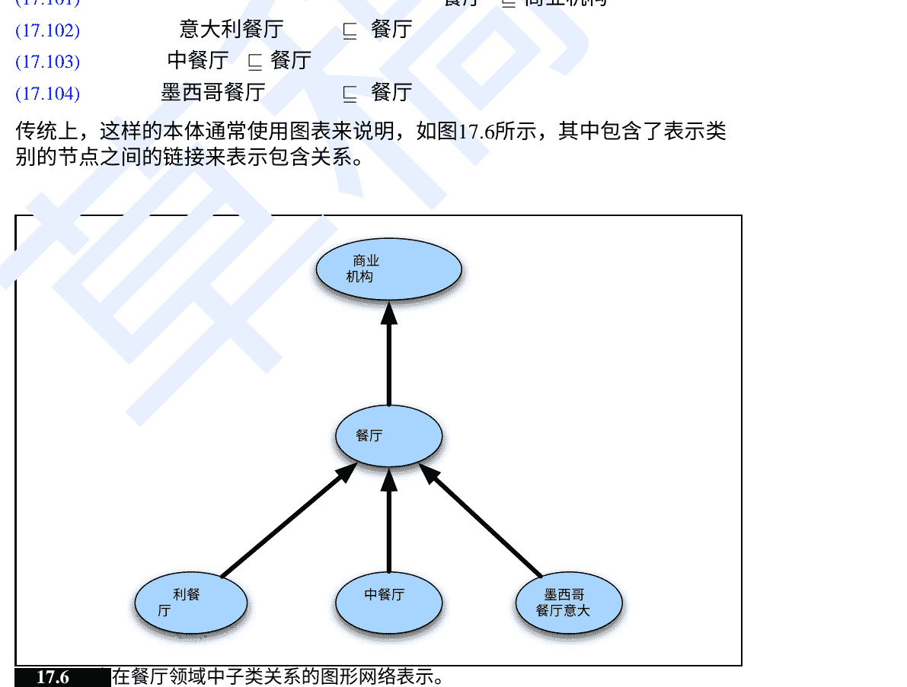

然而需要注意的是，正是像这样的网络图的模糊性激发了描述逻辑的发展。例如，从这个图中我们无法确定给定的类别集合是否是穷尽的或者是不相交的。也就是说，我们无法确定这是否是我们在领域中要处理的所有餐厅类型，或者是否还有其他类型的餐厅。我们也无法确定一个个体餐厅是否只能属于这些类别中的一个，或者例如一个餐厅既可以是意大利餐厅又可以是中餐厅。上面给出的描述逻辑陈述在其含义上更加透明；它们只是断言了类别之间的子类关系，并不对覆盖范围或互斥性做出任何声明。

如果一个应用程序需要覆盖和不相交的信息，那么它需要明确说明。捕捉这种信息的最简单方法是通过否定和析取运算符的使用。例如，以下断言将告诉我们中国餐厅不能同时也是意大利餐厅。

(17.105) 中国餐厅 ⊑ ¬意大利餐厅

通过析取，可以指定一组子概念覆盖一个类别，如下所示：

(17.106) 餐厅 ⊑ (意大利餐厅 ⊔ 中国餐厅 ⊔ 墨西哥餐厅)

当然，像图17.6中给出的层次结构一样，我们对其中的概念几乎一无所知。我们当然不知道什么使一个餐厅成为餐厅，更不用说意大利餐厅、中国餐厅或昂贵的餐厅了。需要的是关于属于任何这些类别的成员的其他断言。

在描述逻辑中，这些陈述以描述的概念与领域中其他概念之间的关系形式出现。与其在结构化网络表示中的起源保持一致，描述逻辑中的关系通常是二元的，并且通常被称为角色或角色关系。

为了了解这些关系是如何工作的，让我们考虑一下本章前面讨论过的一些关于餐厅的事实。我们将使用 hasCuisine关系来捕捉餐厅提供的食物种类的信息，使用hasPriceRange关系来捕捉特定餐厅的价格水平。我们可以使用这些关系来对我们的各种餐厅类别做出更具体的描述。让我们从我们的ItalianRestaurant概念开始。作为第一个近似，我们可以说一些不受争议的事情，比如意大利餐厅提供意大利菜。为了捕捉这些概念，让我们首先向我们的术语中添加一些新的概念，以表示各种菜系。

- MexicanCuisine ⊑ Cuisine
- ItalianCuisine ⊑ Cuisine
- ChineseCuisine ⊑ Cuisine
- VegetarianCuisine ⊑ Cuisine
- ExpensiveRestaurant ⊑ Restaurant
- ModerateRestaurant ⊑ Restaurant
- CheapRestaurant ⊑ Restaurant

接下来，让我们修改之前的ItalianRestaurant版本，以捕捉菜肴信息。

(17.107) ItalianRestaurant ⊑ Restaurant ⊓ ∃hasCuisine.ItalianCuisine

正确阅读这个表达式的方式是， Italian-Restaurant类别中的个体既属于 Restaurant类别，也属于一个未命名的类别，该类别由存在性子句定义——这是提供意大利菜肴的实体集合。在 FOL中，等价的陈述是：

```
(17.108) $\forall xItalianRestaurant (x) \rightarrow Restaurant(x)$
$\qquad\qquad\qquad\qquad\quad\wedge(\exists yServes(x,y)\wedge ItalianCuisine (y))$
```

这个 FOL翻译应该清楚地说明了上述DL断言的含义和不含义。特别是，它们并不表示分类为意大利餐厅的领域实体不能从事其他关系，比如昂贵，甚至提供中餐。而且至关重要的是，它们对于我们知道提供意大利菜肴的领域实体并没有提供太多信息。实际上，检查 FOL翻译可以清楚地表明，我们不能根据它们的特征推断出任何新实体属于这个类别。

我们能做的是推断出关于餐厅的新事实，我们明确告诉它们是这个类别的成员。当然，根据某些特征推断个体的类别成员资格是一项常见且关键的推理任务，我们需要支持。这将使我们回到在术语中创建分层结构的另一种方法：实际上以必要和充分的条件的形式提供我们正在创建的类别的定义。在这种情况下，我们可以明确为意大利餐厅提供一个定义，即那些提供意大利美食的餐厅，以及中等价格范围的餐厅。

```
(17.109) \quad 意大利餐厅 \quad \equiv \quad 餐厅 \quad \sqcap \exists 有菜系.意大利菜
(17.110) \quad 中等价格餐厅 \equiv \quad 餐厅 \quad \sqcap 有价格范围.中等价格
```

虽然我们之前的陈述提供了这些类别成员资格的必要条件，但这些陈述提供了必要和充分的条件。

最后，让我们考虑一下素食餐厅这个外表上相似的情况。显然，素食餐厅是那些提供素食菜肴的餐厅。但是它们不仅仅提供素食，那就是它们唯一提供的。我们可以通过在我们之前对VegetarianRestaurants的描述中添加一个额外的限制来满足这种约束，形式为一个普遍量词，如下所示：

```
(17.111) \quad VegetarianRestaurant \equiv Restaurant
\qquad\qquad\qquad\qquad\qquad\quad \sqcap \exists hasCuisine.VegetarianCuisine
\qquad\qquad\qquad\qquad\qquad\quad \sqcap \forall hasCuisine.VegetarianCuisine
```

## 推理

与描述逻辑关注类别、关系和个体的焦点相呼应的是对逻辑推理的一种处理焦点，它是对受限的逻辑推理子集的强调。 DL推理系统强调的是包含和实例检查这两个紧密耦合的问题，而不是使用FOL允许的全部推理范围。

包含关包含关系，作为一种推理形式，是确定一个超级基于术语中断言的事实，确定两个概念之间是否存在集合/子集关系。相应地，实例检查任务是确定一个个体是否可以成为成员。在我们对个体和术语的已知事实的基础上，确定个体是否可以成为特定类别的成员。超越简单地检查术语中明确陈述的包含关系，支持包含和成员关系的推理机制必须明确使用关于术语的关系信息进行推理。

回到我们的餐厅领域，让我们使用以下语句添加一种新类型的餐厅：

```
OliveGarden ⊑ ModerateRestaurant ⊓ ∃hasCuisine.ItalianCuisine
```

根据这个断言，我们可以问OliveGarden餐厅是否可以被归类为意大利餐厅或素食餐厅。更准确地说，我们可以向我们的推理系统提出以下问题：

1. 橄榄园 ⊑ 意大利餐厅
2. 橄榄园 ⊑ 素食餐厅

第一个问题的答案是肯定的，因为橄榄园符合我们为意大利餐厅类别指定的标准：它是一个餐厅，因为我们明确将其分类为中等餐厅，这是餐厅的子类型，并且它满足了has.Cuisine类限制，因为我们直接断言了这一点。

第二个问题的答案是否定的。回想一下，我们对素食餐厅的标准包含两个要求：它必须提供素食，而且只能提供素食。我们目前对橄榄园的定义在这两个方面都不符合，因为我们没有断言任何关系表明橄榄园提供素食，而我们已经断言的关系hasCuisine.ItalianCuisine与第二个标准相矛盾。

基于基本的包含推理的相关推理任务是根据术语中的类别的事实推导出术语的隐含层次结构。这个任务大致对应于在术语中的概念对上重复应用包含运算符。给定我们当前的陈述集合，可以推断出图17.7中显示的扩展层次结构。你应该确信这个图包含了所有且仅包含了根据我们当前的知识应该存在的包含链接。

请注意，尽管包含是关于概念和类别的，但实例检查是确定特定个体是否可以被归类为特定类别的任务。这个过程根据关系和显式的分类陈述所知的给定个体的信息与当前术语中所知的信息进行比较。然后返回个体可以属于的最具体的类别列表。

作为一个分类问题的例子，考虑一个我们被告知是一家餐厅并提供意大利菜的场所。

1. 餐厅 (Gondolier)
2. hasCuisine(Gondolier, ItalianCuisine)

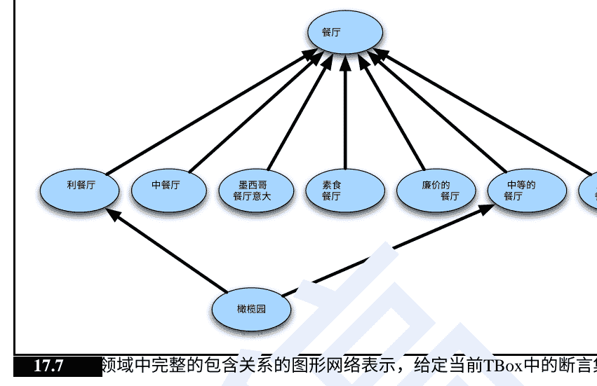

在这里，我们被告知术语Gondolier所表示的实体是一家餐厅，并提供意大利食品。根据这些新信息和我们当前TBox的内容，我们可能合理地想知道这是否是一家意大利餐厅，一家素食餐厅，或者是否价格适中。

假设之前给出的定义性陈述，我们确实可以将Gondolier归类为意大利餐厅。也就是说，我们获得的关于它的信息符合成为该类别成员所需的必要和充分条件。就像OliveGarden类别一样，这个个体也不符合VegetarianRestaurant的规定条件。最后，Gondolier也可能是一家价格适中的餐厅，但我们目前无法确定，因为我们对它的价格一无所知。这意味着根据我们目前的知识，对于查询ModerateRestaurant(Gondolier)的答案将是错误的，因为它缺少所需的hasPriceRange关系。

用于实际应用的包括包含关系、实例检查以及其他类型的推理的实现，取决于所使用的描述逻辑的表达能力。然而，对于即使是适度强大的描述逻辑，主要的实现技术都是基于可满足性方法，而这些方法又依赖于本章前面介绍的基于模型的语义。

## OWL和语义Web

描述逻辑最重要的角色之一是作为语义Web发展的一部分。语义Web是一个持续的努力，旨在提供一种形式化地规范Web内容的语义的方式（Fensel等，2003年）。这一努力的一个关键组成部分涉及创建和部署各种感兴趣的应用领域的本体。用于表示这些知识的意义表示语言是Web本体语言（OWL）（McGuinness和van Harmelen, 2004). OWL体现了与

> Web本体语言

## 17.6 处理意义的替代方法

将语言输入准确地转化为由离散符号组成的形式表示来捕捉意义的观点，不出所料，引起了相当多的争议。下一节简要概述了这些争议中的一些主要关注点，但是非常不充分。

### 17.6.1 意义作为行动

在考虑到祈使句的语义时，一种相当有吸引力的方法是将意义视为行动。根据这个观点，话语被视为行动，这些话语的意义存在于听者中由于听到话语而激活的过程中。这种方法在历史上重要的SHRDLU系统的创建中得到了应用，并且被其创造者Terry Winograd (1972b)很好地总结了。

该模型的一个基本观点是，所有的语言使用都可以被看作是激活听者内部程序的一种方式。我们可以将话语看作是一个程序，间接地导致听者的认知系统中进行一系列操作。

一个更近期的语义程序模型是执行模式或x-schema。Bailey等人（1997）、Narayanan（1997a, 1997b）和Chang等人（1998）的模型。该模型的直觉是，事件的语义的各个部分，包括第575页讨论的时态因素，都基于对感觉-运动过程（如开始、迭代、启用、完成、力量和努力）进行模式化描述。该模型通过一种被称为Petri网（Murata, 1989）的概率自动机来表示事件的时态语义。模型中使用的网具有ready、process、finish、suspend和result等状态。

像杰克走到商店的例子的意义表示激活了行走事件的过程状态。像杰克走到商店的成就事件激活了结果状态。像杰克每周走到商店这样的迭代活动通过迭代激活过程和结果节点在模型中进行模拟。将感觉-运动基元作为语义描述的基础的这个想法也基于Regier（1996）关于视觉基元在学习空间介词语义的计算模型中的作用的工作。

## 17.7 摘要

本章介绍了意义的表征方法。以下是本章的一些亮点：

- 计算语言学中意义的一个主要方法涉及创建捕捉语言输入的与意义相关内容的形式化意义表示。这些表示旨在弥合从语言到世界常识知识的差距。
- 指定这些表示的语法和语义的框架被称为意义表示语言。在自然语言处理和人工智能中使用了各种各样的这种语言。
- 这种表示需要能够支持语义处理的实际计算要求。其中包括确定命题的真实性，支持明确的表示，表示变量，支持推理，以及足够表达的需求。
- 人类语言具有用于传达含义的各种特征。其中最重要的是传达谓词-论元结构的能力。
- 一阶逻辑是一种被广泛理解的计算可处理的意义表示语言，它提供了意义表示语言所需的大部分功能。
- 语义表示的重要元素，包括状态和事件，可以在一阶逻辑中捕捉到。
- 语义网络和框架可以在 FOL 框架内捕获。
- 现代的描述逻辑由有用且可计算的子集组成，是完全一阶逻辑的可计算子集。描述逻辑最突出的用途是在语义 Web 的规范中使用的 Web 本体语言（OWL）。

# 参考文献和历史注释

在自然语言处理中，最早使用声明性意义表示的计算用途是在问答系统的背景下（Green等，1961年；Raphael，1968年；Lindsey，1963年）。这些系统使用特定的表示形式来表示回答问题所需的事实。然后将问题转化为可以与知识库中的事实匹配的形式。Simmons（1965年）对这些早期工作进行了概述。

Woods（1967年）研究了在问答中使用类似FOL的表示形式，作为当时特定表示形式的替代。Woods（1973年）在里程碑式的Lunar系统中进一步发展和扩展了这些思想。有趣的是，Lunar中使用的表示形式既具有真值条件语义，也具有过程语义。Winograd（1972b）在他的SHRDLU系统中使用了基于Micro-Planner语言的类似表示形式。

在同一时期，对语言和记忆的认知建模感兴趣的研究人员一直在使用各种形式的联想网络表示进行研究。Masterman（1957年）是第一个在计算中使用语义网络的人。尽管语义网络通常归功于Quillian（1968年），但Masterman（1957年）是第一个在计算中使用类似语义网络的知识表示的人。在这个时代，语义网络框架中进行了大量的工作（Norman和Rumelhart，1975年；Schank，1972年；Wilks，1975c，1975b；Kintsch，1974年）。正是在这个时期，许多研究人员开始将Fillmore的案例角色概念（Fillmore，1968年）纳入他们的表示中。Simmons（1973年）是自然语言处理表示中最早采用案例角色的人之一。

Woods（1975年）和Brachman（1979年）的详细分析旨在弄清语义网络的实际含义，从而发展出了一些更复杂的类似网络的语言，包括KRL（Bobrow和Winograd，1977年）和KL-ONE（Brachman和Schmolze，1985年）。随着这些框架变得更加复杂和明确，人们逐渐意识到它们是与专门的索引推理过程相结合的受限变体的FOL。在Brachman和Levesque（1985年）中可以找到一些有关这方面工作的有用论文集。Russell和Norvig（1995年）描述了对这些表示努力的现代视角。

在生成时代，语言学家们努力将语义结构分配给自然语言句子的工作始于Katz和Fodor（1963）的研究。他们简单基于特征的表示的局限性以及逻辑与许多语言问题的自然契合迅速导致了各种谓词-论元结构作为首选语义表示的采用（Lakoff，1972; McCawley，1968）。Montague（1973）随后引入了真值条件模型理论框架到语言学理论中，从而在形式句法理论和各种形式语义框架之间实现了更紧密的整合。关于Montague语义学及其在语言学理论中的作用的良好介绍可以在Dowty等人（1981），Partee（1976）中找到。

将事件表示为具体对象的方法归功于Davidson（1967）。这里介绍的方法，明确地将事件参与者具象化，归功于Parsons（1990）。在知识和信念表示中使用情态运算符和的方法归功于Hintikka（1969）。Moore（1977）是第一个对这种方法进行计算使用的人。Fauconnier（1985）从认知科学的角度处理与信念和信念空间相关的各种问题。目前大多数关于时间推理的计算方法都基于Allen对时间间隔的概念（Allen，1984）。ter Meulen（1995）对时态和体貌提供了现代化的处理。

戴维斯（1990）描述了使用 FOL来表示广泛的常识领域，包括数量、空间、时间和信念。

关于逻辑和语言的最新综合性研究可以在范本-特尔梅伦（1997）的著作中找到。经典的语义学教材是莱昂斯（1977）的著作。麦考利（1993）是一本涵盖逻辑和语言各种主题的不可或缺的教材。切尔基亚和麦康奈尔-吉内特（1991）也从语言学的角度广泛涵盖了语义问题。海姆和克拉策（1998）是一本从当前生成理论的角度编写的较新的教材。

# 练习

17.1 阅读你的日报，找出三个模棱两可的句子或标题的例子。描述模棱两可的各种来源。

17.2 考虑一个领域，其中单词咖啡可以指代以下概念之一：含咖啡因或不含咖啡因的饮料，用于制作任何一种饮料的咖啡粉，以及咖啡豆本身。给出关于咖啡的以下用法哪些是模棱两可的，哪些是含糊不清的论点。

- a. 我今天已经喝了咖啡。
- b. 在回家的路上买些咖啡。
- c. 请磨一些咖啡。

17.3 下面的规则，我们给出了作为示例17.26的翻译，不是对成为素食餐厅的含义的合理定义。

```
∀x素食餐厅(x) ⇒提供(x,素食)
```

给出一个更好地定义素食餐厅的FOL规则，以其所提供的食物为基础。

17.4 为以下句子提供FOL翻译：

- a. 素食主义者不吃肉。
- b. 并非所有素食主义者吃鸡蛋。

17.5 给出证明以下断言所需的一组事实和推理：

- a. 麦当劳不是素食餐厅。
- b. 一些素食主义者可以在麦当劳就餐。

不要只是将这些事实放在在你的知识库中。展示它们可以从一些关于素食主义者和麦当劳的更一般的事实中推导出来。

17.6 为以下句子提供FOL翻译，捕捉事件之间的时间关系。

- a. 当玛丽的航班起飞时，我吃了午饭。
- b. 当玛丽的航班起飞时，我已经吃过午饭了。

17.7 给出以下示例的合理 FOL 翻译。

如果你对棒球感兴趣，洛矶队今晚比赛。

17.8 在第567页，我们给出了以下表示作为句子Centro is near Bacaro的翻译。

```
Near(Centro, Bacaro)
```

在我们的真值条件语义中，根据某个知识库的内容，这个公式要么是真的，要么是假的。就像 near这样的词的意义而言，批判这种真值条件方法。

# 第18章 计算语义学

> “那么你应该说出你的意思，”三月兔继续说道。
> “我是的，”爱丽丝匆忙回答道；“至少-至少我是说出我所说的意思-这是一样的，你知道。”
> “一点也不一样！”帽匠说。“你可以说‘我看到我吃的’和‘我吃我看到的’是一样的！"
>
> 刘易斯·卡罗尔，不可思议的爱丽丝

本章介绍了一种基于计算的原则性方法来解决语义分析的问题，即为语言表达式组合讨论的那种意义表示的过程。自动创建准确和富有表现力的意义表示必然涉及广泛的知识来源和推理技术。通常涉及的知识来源包括词义、语法结构相关的传统意义、关于话语结构的知识、关于所讨论话题的常识知识以及话语发生的情况的知识。

## 18.1 句法驱动的语义分析

本节详细介绍的方法基于组合性原则。这种方法背后的关键思想是，一个句子的意义可以从其组成部分的意义构建出来。当表面解释这个原则时，它有点不太有用。我们知道句子由单词组成，而单词是语言中的主要意义载体。看起来，这个原则只告诉我们应该从构成句子的单词的意义中组合句子的意义表示。

幸运的是，疯帽子给了我们一个关于如何使这个原则有用的提示。一个句子的意义不仅仅基于构成它的单词，还基于单词的排序和分组，以及句子中单词之间的关系。这只是另一种说法，即句子的意义部分基于其句法结构。因此，在句法驱动的语义分析中，意义表示的组合受到语法组件和关系的指导，这些语法组件和关系在第12章中讨论。

让我们首先假设输入句子的句法分析作为语义分析器的输入。图18.1展示了一个明显的流水线导向方法，直接遵循这个假设。输入首先通过解析器传递，以推导出其句法分析。然后，将此分析作为输入传递给语义分析器，以生成意义表示。请注意，尽管此图示显示了解析树作为输入，但也可以使用其他句法表示，如平坦块、特征结构或依存结构。在本章的剩余部分，我们将假设输入是树状的。

在继续之前，我们应该谈谈这个故事中的歧义角色。正如我们所见，模糊的表示可以来自多种来源，包括竞争的句法分析、模糊的词汇项、竞争的指代引用，以及我们将在本章后面看到的模糊的量词范围。在这里介绍的基于句法驱动的方法中，我们假设句法、词汇和指代的歧义不是一个问题。也就是说，我们将假设某个更大的系统能够迭代地遍历可能的模糊解释，并将它们逐个传递给这里描述的语义分析器的类型。

让我们考虑一下这样一个分析如何进行的例子：
```
(18.1) 弗兰科喜欢弗拉斯卡。
```

图18.2显示了一个简化的解析树（没有任何特征附加），以及这个例子的一个合理的意义表示。如虚线箭头所示，给定这棵树作为输入的语义分析器可能会首先检索一个从对应于动词喜欢的子树中提取骨架意义表示。然后，分析器将检索或组合与句子中的两个名词短语相对应的意义表示。然后，使用从动词获得的表示作为模板，名词短语的意义表示将用于绑定动词表示中的适当变量，从而生成整个句子的意义表示。

不幸的是，这个简化的故事存在一些严重的困难。如上所述，用于解释图18.2中的树的函数必须知道，动词承载的是最终表示所基于的模板，其对应的参数在哪里以及哪个参数填充动词的意义表示中的哪个角色。换句话说，它需要对这个特定示例及其解析树有很多具体的知识才能创建所需的意义表示。考虑到对于任何合理的语法，都存在无限多个这样的树，基于一个语义函数处理每个可能的树的任何方法都会遇到严重的问题。

幸运的是，我们以前遇到过这个问题。语言并不是通过列举允许的字符串或树来定义的，而是通过指定能够生成所需输出集的有限设备来定义的。因此，从语法导向的方法来看，语义知识的正确位置似乎是与用于生成树的有限设备集合相同：语法规则和词汇条目。这被称为规则对规则假设（Bach，1976年）。基于这种方法设计分析器将使我们回到部分的概念以及它们具有什么意义。下一节是对以下两个问题的尝试回答：

- 一个句法成分具有什么意义？
- 这些意义必须具备哪些特征，以便能够组合成更大的意义？

## 18.2 语义增强的CFG规则

与第16章中使用的方法保持一致，我们将从增强我们的上下文-无关文法规则开始，加上语义附加。这些附加是指令它们指定如何从其组成部分的含义计算构造的含义表示。抽象地说，我们的增强规则具有以下结构：

```
A → α₁ … αₙ {f(αⱼ.sem, …, αₖ.sem)}
```

基本上下文无关规则的语义附加显示在规则的句法成分的右侧 {...}。这种表示说明了分配给构造 A 的含义表示，我们将其表示为 A.sem，可以通过在 A 的组成部分的一些语义附加上运行函数 f 来计算。

有无数种方法来实例化这种规则对规则的方法。我们的语义附加可以采用任意编程语言片段的形式。然后，通过自下而上的方式将适当的片段传递给解释器，并将生成的表示存储为相关非终结符的值，从而构建给定推导的意义表示。1这种方法可以让我们创建任何我们想要的意义表示。

不幸的是，这种方法的无限制的能力也会让我们创建与上一章描述的形式逻辑表达式完全不对应的表示。此外，这种方法对于如何设计语义附加到我们的语法规则中提供的指导非常有限。

出于这些原因，通常使用更有原则的方法来实例化规则对规则的方法。在本章中，我们将介绍两种受限制的方法。第一种方法直接使用了FOL和λ演算符号，这些符号在第17章中介绍。这种方法基本上使用逻辑符号以有原则的方式指导逻辑形式的创建。第二种方法在第18.4节中描述，它基于在第16章中介绍的特征结构和统一形式。

为了开始，让我们看一个非常基本的例子和一个简化的目标语义表示。
> (18.2) 马哈拉尼关闭。

关闭(马哈拉尼)

让我们从底向上逐步解释涉及此示例推导的规则。从专有名词开始，最简单的方法是为其分配一个唯一的FOL常量，如下所示。
```
专有名词 → 马哈拉尼 {马哈拉尼}
```

支配此规则的非分支NP规则在语义上不添加任何内容，因此我们将不变地将 ProperNoun 的语义复制到NP中。
```
NP → 专有名词 {专有名词 .sem}
```

接下来是VP，动词的语义附着需要提供谓词的名称，指定其元数，并提供将参数合并到谓词中的方法。我们将使用 λ表达式来完成这些任务。
```
VP → 动词 {动词.语义}
动词 → 关闭 {λx.关闭 (x)}
```

这个附件规定动词关闭具有一元谓词关合作为它的表示。λ表示法使我们有能力不指定x变量，即关闭的实体。与我们之前的NP规则一样，主动VP规则支配下面的动词的语义简单地向上复制。向上进行时，语义附着于S规则，通过将主语NP的语义表示插入为谓词的第一个参数来将事物整合在一起。
```
S → NP VP {VP.语义(NP.语义)}
```
```
λx.Closed(x)(Maharani)
```
**关闭(马哈拉尼)**

这个例子说明了一个通用模式，这个模式将在本章中重复出现。我们的语法规则的语义附着主要由λ-规约组成，其中附着的一个元素充当函数，其余的元素充当其参数。正如我们将看到的，真正的工作在词汇表中，其中引入了大部分的意义表示。

> (18.3) 每家餐厅都关闭了。

这个例子的目标表示应该是以下内容。
```
∀x餐厅 (x) ⇒ (∃e关闭 (e) ∧ 关闭的东西 (e,x))
```

显然，这个例子中主语名词短语的语义贡献比我们之前的例子要广泛得多。在我们之前的例子中，表示主语的FOL常量只是通过单一的λ-约简插入到Closed谓词的正确位置。在这里，最终结果涉及到由NP提供的内容和由VP提供的内容的复杂交织。如果我们想要依靠λ-约简来产生我们想要的结果，我们需要做一些工作。

第一步是确定我们希望Every restaurant的意义表示是什么。让我们先假设Every调用了∀量词。核心范围这个概念传统上被称为 NP的核心范围。在这种情况下，这个名词短语的核心范围是封闭的。我们可以通过添加一个虚拟谓词 Q来捕捉这些概念，并将该谓词与限制谓词用 ⇒逻辑连接词连接起来，得到以下表达式:
```
∀x餐厅 (x) ⇒ Q(x)
```

最终，我们需要做的是用与核心范围相对应的逻辑表达式替换 Q，以使这个表达式有意义。幸运的是，λ-演算可以再次拯救我们。我们只需要允许 λ-变量范围覆盖FOL谓词和术语。下面的表达式完全捕捉了我们所需要的。
```
λQ.∀x餐厅 (x) ⇒ Q(x)
```

以下一系列的语法规则及其语义附加用于生成这种类型的 NP的期望意义表示。
```
名词短语 → 决定词 名词 {Det.Sem(Nominal.Sem)}
Det → 每个 {λP.λQ.∀xP(x) ⇒ Q(x)}
名词性 → 名词 {Noun.sem}
Noun → 餐厅 {λx.餐厅 (x)}
```

这个序列中的关键步骤涉及到 λ-规约在 NP规则中。这个规则将附加在 Det上的 λ表达式应用到 Nominal的语义附着上，而Nominal本身是一个 λ表达式。以下是这个过程中的中间步骤。
```
∀xP(x) ⇒ Q(x)(λx.Restaurant(x))
Restaurant(x)(x) ⇒ Q(x)
λQ.∀x Restaurant(x) ⇒ Q(x)
```

第一个表达式是 Det的扩展。Sem(Nominal.Sem)语义附着到 NP规则上。 第二个公式是这个 λ-规约的结果。 注意，这个第二个公式中嵌入了一个 λ应用。在原地规约这个表达式给出了最终形式。

在修订了我们的语义附着到主语名词短语部分的例子之后，让我们转向 S和 VP和动词规则，看看它们需要如何改变以适应这些修订。 让我们从 S规则开始，逐步进行。由于主语 NP的含义现在是一个 λ表达式，将其视为一个以 VP的含义作为其参数调用的函数是有意义的。 以下的附着实现了这一点。
```
S → NP VP   {NP.sem(VP.sem)}
```

请注意，我们已经从我们对这个 S规则的原始提议中颠倒了函数和参数的角色 。 需要重新审查的最后一个附着是动词 close的附着。 我们需要更新它，以提供一个适当的事件导向表示，并确保它与新的 S和 NP规则良好地接口。 以下的附着实现了这两个目标。
```
动词 → 关闭   {λx.∃e封闭(e)∧封闭的事物(e,x)}
```

这个附件通过不及物 VP成分传递给 VP成分， 保持不变。然后，根据之前给出的 S的语义附着， 将其与每个餐厅的意义表示相结合。 以下表达式说明了这个过程中的中间步骤。
```
λQ.∀x餐厅(x) ⇒ Q(x)(λy.∃e封闭(e)∧封闭的事物(e,y))
∃e封闭(e)∧封闭的事物(e,y)(x)
∀x餐厅(x) ⇒ ∃e关闭(e)∧关闭物(e,x)
```

这些步骤实现了我们将 VP的意义表示作为核心范围插入到 NP的表示中的目标 。 对于任何类型的语法工程努力，我们总是需要确保我们之前更简单的示例仍然有效。 我们需要重新审视的一个领域是我们对专有名词的表示。 让我们在之前的示例中考虑它们的上下文。

> **(18.4) 马哈拉尼关闭。**

现在， S规则期望主语 NP的语义附着是应用于 VP的语义的一个函数， 因此我们之前将专有名词表示为 FOL常量的表示方法行不通。 幸运的是，我们可以再次利用 λ-演算的灵活性来完成我们需要的表达式。
```
λx.x(Maharani)
```

这个技巧将一个简单的FOL常量转化为一个λ表达式，当它被简化时，它可以将常量注入到一个更大的表达式中。你应该通过我们的原始示例来运用所有新的语义规则，以确保你能得到以下预期的表示：
```
∃eClosed(e) ∧ ClosedThing(Maharani)
```

作为最后一个练习，让我们看看这种方法如何扩展到涉及一个及物动词短语的表达式，就像下面的例子一样。
> (18.5) 马修开了一家餐厅。

如果我们做得正确，我们应该能够指定及物动词短语、动词open和冠词a的语义附着，同时保持我们其他规则不变。

让我们从对冠词a的语义建模开始，基于我们之前对于every的附着。
```
Det → a {λP.λQ.∃xP(x) ∧ Q(x)}
```

这个规则与附件中的规则有两个不同之处。首先，我们使用存在量词∃来捕捉一个的语义。其次，我们用逻辑∧替换了⇒运算符。整体框架与λ-变量P和Q保持不变，用于稍后填充限制和核心范围。通过这个补充，我们现有的NP规则将为一个餐厅创建适当的表示：
```
λQ.∃xRestaurant(x) ∧ Q(x)
```

接下来，让我们转向动词和VP规则。有两个需要纳入基础含义表示的参数。一个参数可在及物VP规则的级别获得，第二个参数可在S规则的级别获得。让我们假设VP语义附加的形式如下。
```
VP → 动词 NP {动词.语义(名词短语.语义)}
```

这个附件假设动词的语义附着将作为一个功能器应用于其名词短语参数的语义。现在假设我们之前为量化名词短语和专有名词开发的表示将保持不变。在这些假设的基础上，下面的动词opened的附着将实现我们想要的效果。
```
动词 → opened {λw.λz.w(λx.∃eOpened(e) ∧ Opener(e, z) ∧ OpenedThing(e, x))}
```

有了这个附件，及物VP规则将将表示餐厅的变量作为opened的第二个参数，将表示opening事件的整个表达式作为餐厅的核心范围，并最后生成一个适用于我们的 S 规则的 λ表达式。与前面的例子一样，您应该逐步进行此示例，以确保您达到我们预期的意义表示。
```
∃x餐厅 (x) ∧ ∃eOpened (e) ∧ Opener (e,马修 ) ∧ OpenedThing (e,x)
```

我们为这个小语法开发的语义附着列表在图18.2中显示。第18.5节扩展了这个片段的覆盖范围，涵盖了英语中一些更重要的结构。

在这些例子中，我们介绍了三种技术，这些技术实例化了在本节开头介绍的规则对规则方法的语义分析：
1. 将复杂的、类似函数的 λ表达式与词汇项关联
2. 在非分支规则中，将语义值从子节点复制到父节点
3. 将规则的一个子节点的语义应用到其他子节点的语义中，通过 λ约简

这些技术用于说明在这个组合框架中指导语义附着设计的一般分工。一般来说，是词汇规则将量词、谓词和项引入到我们的意义表示中。语法规则的语义附着以正确的方式将这些元素组合在一起，但通常不会引入新的元素到正在创建的表示中。

| 语法规则 | 语义附着 |
| :--- | :--- |
| $S \rightarrow NP\ VP$ | $\{NP.sem(VP.sem)\}$ |
| $NP \rightarrow Det\ Nominal$ | $\{Det.sem(Nominal.sem)\}$ |
| $NP \rightarrow \text{专有名词}$ | $\{ProperNoun.sem\}$ |
| $Nominal \rightarrow Noun$ | $\{Noun.sem\}$ |
| $VP \rightarrow \text{动词}$ | $\{Verb.sem\}$ |
| $VP \rightarrow \text{动词名词短语}$ | $\{Verb.sem(NP.sem)\}$ |
| $Det \rightarrow \text{每个}$ | $\{\lambda P.\lambda Q.\forall xP(x) \Rightarrow Q(x)\}$ |
| $Det \rightarrow a$ | $\{\lambda P.\lambda Q.\exists xP(x) \wedge Q(x)\}$ |
| $Noun \rightarrow \text{餐厅}$ | $\{\lambda r.\text{餐厅}(r)\}$ |
| $ProperNoun \rightarrow Matthew$ | $\{\lambda m.m(Matthew)\}$ |
| $ProperNoun \rightarrow Franco$ | $\{\lambda f.f(\text{弗兰科})\}$ |
| $\text{专有名词} \rightarrow \text{弗拉斯卡}$ | $\{\lambda f.f(\text{弗拉斯卡})\}$ |
| $\text{动词} \rightarrow \text{关闭}$ | $\{\lambda x.\exists eClosed(e) \wedge ClosedT hing(e,x)\}$ |
| $\text{动词} \rightarrow \text{打开}$ | $\{\lambda w.\lambda z.w(\lambda x.\exists eOpened(e) \wedge Opener(e,z) \wedge Opened(e,x))\}$ |

## 18.3 量词范围的歧义和不完全规定

在上一节中开发的语法片段似乎足以处理包含两个或更多量化名词短语的示例。
> (18.6) 每个餐厅都有一个菜单。

将图18.2中给出的规则系统地应用于这个例子会产生以下完全合理的意义表示。
```
∀x 餐厅 (x) ⇒ ∃y 菜单 (y) ∧ ∃e 拥有 (e) ∧ 拥有者 (e, x) ∧ 拥有 (e, y)
```

这个公式或多或少对应于常识概念，即所有餐厅都有菜单。

不幸的是，这并不是这个例子的唯一可能解释。下面的解释也是可能的。
```
∃y 菜单 (y) ∧ ∀x 餐厅 (x) ⇒ ∃e 拥有(e) ∧ 拥有者(e, x) ∧ 拥有(e, y)
```

这个公式断言世界上存在一个菜单，并且所有的餐馆都共享它。从常识的角度来看，这似乎相当不可能，但请记住，我们的语义分析器只能访问语法中的语义附着和词汇表，以产生意义表示。当然，世界知识和上下文信息可以用来选择这两种解读，但前提是我们能够同时产生这两种解读。

这个例子说明，即使在没有句法、词汇或指代歧义的情况下，包含量化术语的表达式也可能产生歧义的表示。这被称为量词作用域问题。这两种解释之间的差异源于两个量词变量中哪一个具有外部作用域。

上一节中提出的方法无法处理这些现象。为了解决这个问题，我们需要以下能力：
- 能够高效地创建包含所有可能解读的不完全表示
- 从这个表示中生成或提取所有可能的解读
- 并能够在可能的解读中进行选择

下面的章节将概述解决前两个问题的方法。解决最后一个、最重要的问题需要使用上下文和世界知识，不幸的是这仍然是一个基本未解决的问题。

### 18.3.1 存储和检索方法

解决量词范围问题的一种方法是在我们现有的语义附着中添加一种新的符号，以便组合创建所需的含义。

## 复杂术语

在这种情况下，我们将介绍一个允许出现复杂术语的概念，该术语允许FOL表达式，如$\forall x \text{ Restaurant}(x)$，可以出现在我们通常只允许FOL术语出现的地方。形式上，复杂术语将是具有以下三部分结构的表达式：

```
⟨量词 变量 公式⟩
```

将此符号应用于我们当前的示例，我们将得到以下表示：

```
∃e 拥有 (e)  
∧拥有 (e,⟨∀x Restaurant(x)⟩)  
∧拥有(e,⟨∃y 菜单(y)⟩)
```

这种方法的目的是捕捉表达式的基本谓词论证结构，同时对各种量词在最终表示中的位置保持不可知。

正如λ表达式的情况一样，只有在我们能够提供一个算法将其转换回普通的FOL表达式时，这种符号设备才有用。这可以通过根据以下模式重写包含复杂项的任何谓词来实现：

```
P(⟨量词变量公式⟩)  
⟹  
量词变量公式 连接词 P(变量)
```

换句话说，复杂项：

-   1. 从中提取出谓词,
-   2. 用指定的变量替换,
-   3. 并通过适当的连接词将其变量、量词和公式添加到新表达式的前面。

用于将提取的公式附加到新表达式前面的连接词取决于所使用的量词类型：$\land$ 与$\exists$一起使用，$\Longrightarrow$ 与$\forall$一起使用。

这个方案如何帮助我们解决歧义问题？请注意，我们的新表示中包含两个复杂术语。我们处理它们的顺序决定了我们最终得到的两种解读中的哪一种。让我们考虑一种情况，我们从左到右处理表达式，同时将复杂术语转换为我们找到它们的形式。在这种情况下，我们首先遇到的是每个餐厅；将其转换后得到以下表达式。

```
$\forall x \text{餐厅}(x) \Rightarrow \exists e \text{ 拥有}(e) \land \text{拥有者}(e,x) \land \text{曾经拥有}(e,\langle \exists y \text{菜单}(y) \rangle)$
```

继续前进，我们接下来遇到的是一个菜单。将这个复杂术语转换后得到以下最终形式，对应于我们之前的方法无法得到的非直观解读。

```
$\exists y \text{菜单}(y) \land \forall x \text{餐厅}(x) \Rightarrow \exists e \text{ 拥有}(e) \land \text{拥有者}(e,x) \land \text{曾经拥有}(e,y)$
```

为了获得我们之前所拥有的更常识的解读，我们只需要按照另一个顺序提取复杂术语；首先是一个菜单，然后是每个餐厅。这种量词范围的方法提供了解决之前所提到的两个期望的解决方案：复杂术语提供了所有可能的基于量词的模糊解读的紧凑的未指定表示，以及将它们转换的方法提供了一种消除复杂术语并因此检索有效的FOL公式的确定性方法。通过改变消除复杂术语的顺序，我们可以恢复所有可能的解读。当然，具有 N 量词的句子将具有 O(N!)不同的基于量词的解读。

在实践中，大多数系统采用一组特定的启发式偏好规则，可以按照它们的整体可能性生成首选形式。在没有适用的偏好规则的情况下，使用与量词表面顺序相反的从左到右的量词顺序。然后，可以使用特定领域的知识来接受量化公式，或者拒绝并要求另一个公式。Alshaw (1992) 提出了一种生成合理的量词范围的全面方法。

## 18.4 基于统一的语义分析方法

正如第18.2节中所提到的，特征结构和统一运算符提供了一种有效的实现基于语法的语义分析的方法。回想一下，在第16章中，我们将复杂的特征结构与单个上下文无关文法规则配对，以编码诸如数目一致性和子范畴化等句法约束；这些约束在使用上下文无关文法直接传达时往往很尴尬或者在某些情况下根本无法传达。例如，以下规则用于捕捉英语名词短语的一致性约束。

```
名词短语 → 决定词 名词
⟨决定词 一致性⟩ = ⟨名词 一致性⟩
⟨名词短语 一致性⟩ = ⟨名词 一致性⟩
```

这样的规则同时具有两个功能：它们确保语法拒绝违反此约束的表达式，更重要的是，对于我们当前的主题，它们创建了可以与语法推导的部分相关联的复杂结构。例如，以下结构是将上述规则应用于单数名词短语的结果。

```
[协议 [ 数字 sg]]
```

我们将利用这种后一种能力来组合意义表示并将其与解析中的成分相关联。

在这种基于统一的方法中，我们的FOL表示和基于λ的语义附加被复杂的特征结构和统一方程所取代。为了了解这是如何工作的，让我们通过一系列类似于之前讨论的示例来进行说明。

在第18.2节中我们已经提到过。让我们从一个简单的不及物句子开始，主语是一个专有名词。

### (18.7) Rhumba关闭

使用事件导向的方法，这个句子的意义表示应该类似于以下内容。

```
∃e 关闭(e) ∧ 关闭(e, Rhumba)
```

我们的第一个任务是展示我们可以在特征结构框架内编码这样的表示。处理这个任务最直接的方法是简单地遵循第17章中给出的BNF风格的 FOL语句定义。这个定义的相关要素规定了 FOL公式有三种变体：由具有适当数量的项参数的谓词组成的原子公式，通过 ∧、 ∨和 ⇒运算符与其他公式连接的公式，以及由量词、变量和公式组成的量化公式。根据这个定义，我们可以用以下特征结构来捕捉这个 FOL表达式。


图18.4展示了使用在第16章引入的DAG风格符号的表达式。这个图揭示了变量的处理方式。我们将使用特征结构的路径共享功能来实现相同的目标，而不是引入显式的FOL变量。在这个例子中，事件变量 e被三条指向相同共享节点的路径捕获。

我们的下一步是将与这个例子的推导相关的统一方程与语法规则关联起来。让我们从顶部的 Srule开始。

```
$S \rightarrow NP\; VP$
$\langle S\; \text{SEM} \rangle = \langle NP\; \text{SEM} \rangle$
$\langle VP\; \text{ARG0} \rangle = \langle NP\; \text{INDEXVAR} \rangle$
$\langle \text{名词短语} \; \text{范围} \rangle = \langle \text{动词短语} \; \text{语义} \rangle$
```

第一行只是将名词短语的意义表示（在语义特征下编码）与我们的顶层句子相等。第二个方程的目的是在动词短语的意义表示中分配主语名词短语到适当的角色。更具体地说，它通过将 ARG0特征与通向名词短语语义的表示的路径统一起来，将其填充到动词短语的语义表示中。

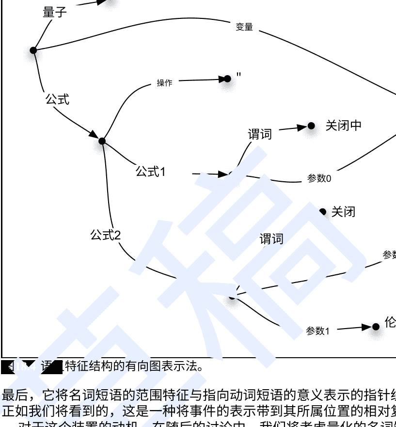

语义特征结构的有向图表示法。

最后，它将名词短语的范围特征与指向动词短语的意义表示的指针统一起来。正如我们将看到的，这是一种将事件的表示带到其所属位置的相对复杂的方式。对于这个装置的动机，在随后的讨论中，我们将考虑量化的名词短语时会变得清晰。

继续下去，让我们考虑这个推导的 NP 和 ProperNoun 部分的附件。

```
NP → 专有名词
⟨NP SEM⟩ = ⟨ProperNoun SEM⟩
⟨NP SCOPE⟩ = ⟨ProperNoun SCOPE⟩
⟨NP INDEXVAR⟩ = ⟨ProperNoun INDEXVAR⟩
```

```
ProperNoun → Rhumba
⟨ProperNoun SEM PRED⟩ = RHUMBA
⟨ProperNoun INDEXVAR⟩ = ⟨ProperNoun SEM PRED⟩
```

正如我们之前所看到的，在这种方法中，专有名词的语义并不复杂。在这里，我们只是引入一个常量，并提供一个索引变量来指向那个常量。

接下来，让我们转向对 VP和动词规则的语义附着。

```
VP →动词
<VP SEM> = <动词 SEM>
<VP ARG0> = <动词 ARG0>
```

```
动词 →闭合
<动词 SEM QUANT> = ∃
<动词 SEM FORMULA OP> = ∧
<动词 SEM FORMULA FORMULA 1 预测 > =闭合
<动词 SEM FORMULA FORMULA 1 ARG 0> = <动词 SEM VAR>
<动词 SEM FORMULA FORMULA 2 预测 > =闭合
<动词 SEM FORMULA FORMULA 2 ARG 0>= <动词 SEM VAR>
<动词 SEM FORMULA FORMULA 2 ARG 1> = <动词 ARG0>
```

对于 VP规则的附着与我们之前对非分支语法规则的处理相似。 这些统一方程只是在 VP级别上提供了适当的动词的语义片段。 相比之下，动词的统一方程引入了构成此示例核心的事件表示的大部分内容。 具体而言，它引入了量词、事件变量和构成最终表达式主体的谓词。 在FOL中，事件变量由将动词SEM VAR路径与公式主体中的谓词参数统一的方程捕获。 最后，通过 <动词 ARG0>方程，它暴露了单个缺失的参数（被关闭的实体）。 回顾一下，我们可以看到这些方程与第18.2节中的 λ表达式具有相同的基本功能；它们提供了正在创建的FOL公式的内容，并且它们用于在语法的较高级别上暴露和命名将在以后填充的外部参数。

这些最后几条规则也展示了我们已经看到多次的劳动分工；词汇规则引入了大部分语义内容，而更高级的语法规则则以正确的方式组装这些部分，而不是引入内容。
当然，就像基于 λ的方法一样，当我们看到包含量词的表达式时，情况会变得更加复杂。 为了看清楚这一点，让我们通过以下例子来说明。

### (18.8) 每个餐厅都关闭了

同样，这个表达式的意义表示应该是以下内容

```
∀x餐厅(x) ⇒ (∃e关闭(e)∧关闭了(e,x))
```

这个意义被以下特征结构所捕捉。

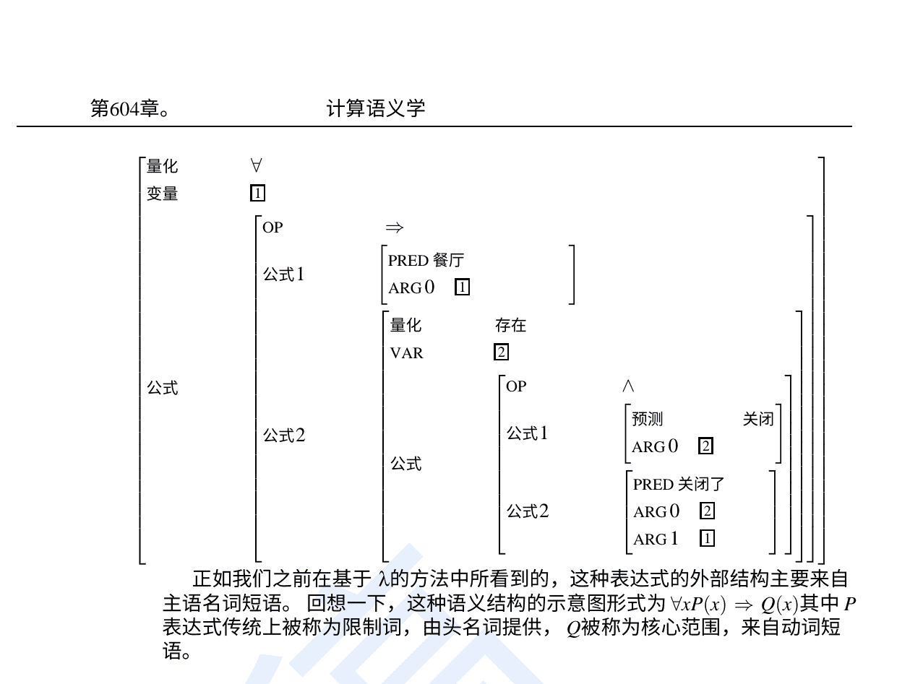

正如我们之前在基于 λ 的方法中所看到的，这种表达式的外部结构主要来自主语名词短语。回想一下，这种语义结构的示意图形式为 ∀xP(x) ⇒ Q(x) 其中 P 表达式传统上被称为限制词，由头名词提供，Q 被称为核心范围，来自动词短语。

这种结构引发了我们的语义附加的两个不同任务： VP 语义必须与主语名词短语的核心范围统一，表示该名词短语的变量必须分配给事件结构中的 ARG1 角色。 在 Every restaurant 推导中涉及以下规则来解决这两个任务 NP → Det Nominal

```
⟨ NP SEM ⟩ = ⟨ Det SEM ⟩
⟨ NP SEM VAR ⟩ = ⟨ NP INDEXVAR ⟩
⟨ NP SEM FORMULA FORMULA 1 ⟩ = ⟨ 名词性 SEM ⟩
⟨ NP SEM FORMULA FORMULA 2 ⟩ = ⟨ NP SCOPE ⟩
```

```
名词性 → 名词
⟨ 名词性 SEM ⟩ = ⟨ 名词 SEM ⟩
⟨ 名词性 INDEXVAR ⟩ = ⟨ 名词 INDEXVAR ⟩
```

```
Noun → 餐厅
⟨ 名词 SEM PRED ⟩ = ⟨ 餐厅 ⟩
⟨ 名词 INDEXVAR ⟩ = ⟨ 名词 SEM PRED ⟩
```

```
Det → 每个
⟨ Det SEM QUANT ⟩ = ∀
⟨ Det SEM FORMULA OP ⟩ = ⇒
```

作为最后一个练习，让我们通过一个及物动词短语的例子来进行讲解。

### (18.9) 弗朗哥开了一家餐厅

这个例子具有以下的意义表示。

```
∃x 餐厅(x) ∧ ∃e 开张(e) ∧ 开张者(e, 弗朗哥) ∧ 开了(e, x)
```

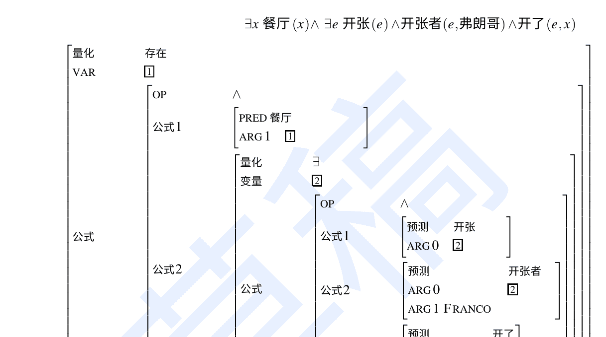

在这个例子中，我们需要解决的唯一真正新的元素是以下的及物动词短语规则。

```
VP → 动词 NP
⟨ VP SEM ⟩ = ⟨ 动词 SEM ⟩
⟨ NP SCOPE ⟩ = ⟨ VP SEM ⟩
⟨ 动词 ARG1 ⟩ = ⟨ NP INDEXVAR ⟩
```

这个规则有两个主要任务，与我们的规则相似：它必须用动词短语的语义填充目标名词短语的核心范围，并将表示目标的变量插入到动词短语的意义表示中的正确角色中。

我们刚刚描述的方法的一个明显问题是它无法生成由量词范围歧义引起的所有可能的模糊表示。
幸运的是，之前在第18.3节中描述的对于不完全指定的方法可以适用于基于统一的方法。

## 18.5 英语片段的语义附件

本节描述了英语的一个小片段的一组语义附件，其中大部分基于Core Language Engine (Alshawi, 1992)中使用的附件。
在本章的其余部分中，为了简化演示，当不需要时，我们省略了与这些规则相关的特征结构。请记住，这些特征是必需的，以确保在正确的情况下应用正确的规则。
对于本讨论来说最重要的是，它们需要确保根据它们的子范畴特征结构使用正确的动词条目。

### 18.5.1 句子

到目前为止，我们只处理了简单的陈述句。本节将扩展我们的内容，包括在第12章中首次介绍的其他句子类型：祈使句、是非问句和疑问句。让我们从考虑以下例子开始：（18.10）航班487提供午餐。

（18.11）提供午餐。
（18.12）207航班提供午餐吗？
（18.13）哪些航班提供午餐？

这些例子的意义表示都涉及在航班上供应午餐的命题。然而，它们在所述环境中所起的作用方面有所不同。更具体地说，第一个例子旨在向听众传达事实信息，第二个是要求采取行动的请求，最后两个是请求信息的请求。为了捕捉这些差异，我们将引入一组可以应用于FOL句子的运算符，就像在第17章中使用信念运算符一样。具体来说，DCL、IMP、YNQ和WHQ运算符将分别应用于陈述句、祈使句、是非问句和疑问句的FOL表示。

生成能够适当使用这些运算符的意义表示需要为每个可能的句子类型提供正确的语义附加物。
对于陈述句，我们可以简单地修改我们一直使用的基本句子规则如下：

```
S → NP VP    {DCL(NP.sem(VP.sem))}
```

以DCL运算符为首的表示的正常解释将作为一个事实陈述添加到当前的知识库中。
祈使句以动词短语开头，没有明显的主语。由于缺少主语，主动词短语的意义表示将包含一个带有未绑定λ变量的λ表达式，表示这个缺失的主语。
为了解决这个问题，我们可以通过对一个虚拟常量进行最后的λ约简，为λ表达式提供一个主语。然后，可以将IMP运算符应用于这个表示，如下所示的语义附加物中：

```
S → VP      {IMP(VP.sem(DummyYou))}
```

将此规则应用于(18.11)，得到以下表示：

```
`IMP(∃eServing(e)∧Server(e,DummyYou)∧Served(e,Lunch))`
```

如将在第24章中讨论，祈使句可以看作是一种言语行为。如在第12章中讨论的那样，是非问句由句首助动词开始，然后是主语名词短语，然后是动词短语。以下语义附件简单地忽略助动词，并且除了YNQ运算符外，构造了与相应陈述句相同的表示：

```
`S → Aux NP VP {YNQ(VP.sem(NP.sem))}`
```

使用此规则，例如（18.12），产生以下表示：

```
`YNQ(∃服务(服务员)∧服务器(服务员,Flt207)∧被服务(服务员,午餐))`
```

是-非问题应该被视为询问在当前知识库中，其命题部分是否为真或假。采用第17章中描述的语义，是-非问题可以通过确定命题是否在知识库中或可以从推断出来回答。

与是-非问题不同，主语疑问句询问的是句子主语而不是整个句子。以下附加产生一个表示，由运算符WHQ、对应于句子主语的变量和命题主体组成：

```
`S → WhWord NP VP {WHQ(NP.sem.var,VP.sem(NP.sem))}`
```

以下表示是将此规则应用于示例（18.13）的结果：

```
`WHQ(x,∃e,x服务(e)∧服务器(e,x)∧被服务(e,午餐)∧航班(x))`
```

这样的问题可以通过返回对于使得结果命题相对于当前知识库为真的主题变量的一组赋值来回答。

最后，考虑以下非主题疑问：

> > (18.14) 我怎样从明尼阿波利斯去洛杉矶？

在这种例子中，问题不是关于句子的主语，而是关于其他论证或命题整体的某个方面。在这种情况下，表示需要提供关于问题是关于什么的指示。以下附件通过将助动词的语义作为WHQ运算符的一个参数来提供这些信息：

```
$S \rightarrow WhWord\ Aux\ NP\ VP\ \ \ \{WHQ(\ WhWord.sem\ VP.sem\ (NP.sem))\}$
```

应用此规则到例子（18.14）将得到以下表示：

```
$WHQ(How, \exists e\ Going(e) \wedge Goer(e, User)$
$\wedge Origin(e, Minn) \wedge Destination(e, LongBeach))$
```

正如我们将在第24章中看到的那样，正确回答这种问题涉及到相当数量的领域特定推理。 例如，回答例子（18.14）的正确方法是搜索具有指定出发地和到达地的航班。 然而，请注意实际问题中没有提到航班或飞行。 因此，问题回答者必须应用特定于该领域的知识，以达到关于去某个地方的问题实际上是关于飞往那些地方的问题的效果。

最后，我们应该明确这个特定的附件只对没有缺失参数或嵌套从句的相对简单的疑问句有用。正如在第16章中讨论的那样，在这些问题中存在着远距离依赖，需要额外的机制来确定具体询问的内容。 Woods（1977）和Alshawi（1992）对处理非主语疑问句的一般机制进行了广泛讨论。

### 18.5.2 名词短语

正如我们已经看到的，名词短语的意义表示可以是正常的FOL术语或复杂术语。 下面的章节详细介绍了为一些最常见的英语名词短语生成意义表示所需的语义附加。 不幸的是，正如我们将看到的，英语名词短语的句法对它们的意义提供了令人惊讶地少的见解。 通常情况下，我们能做的最好的就是提供一个相当模糊的中间层次的意义表示，可以作为进一步解释过程的输入。

##### 复合名词

复合名词，也被称为名词序列，由简单的名词序列组成，如以下示例所示：（18.15）航班时间表

（18.16）夏季航班时间表

如第12章所述，该结构的句法结构可以通过正则表达式名词*来捕捉，或者通过以下上下文无关文法规则来捕捉：

```
名词性 $\rightarrow$ 名词
名词性 $\rightarrow$ 名词性 名词
```

在这些结构中，序列中的最后一个名词是短语的核心，并且以某种未指定的方式与序列中其前面的名词在语义上相关# 属格名词短语

回顾第12章，属格名词短语使用带有所有格标记的名词短语的复杂决定词，例如亚特兰大的机场和玛哈拉尼的菜单。很容易将这些词之间的关系表示为一种抽象的所有权关系。然而，稍微思考一下就会发现，一个城市和它的机场之间的关系与一个餐厅和它的菜单之间的关系几乎没有共同之处。

```
NP → 复杂限定词 名词
{∃x 名词.sem(x) ∧ GN(x, 复杂限定词.sem)}
```

因此，与复合名词一样，最好只是陈述各个成分之间的抽象语义关系。

```
复杂限定词 → NP 的    {NP.sem}
```

```
将这些规则应用于亚特兰大的机场将得到以下复合术语：
⟨∃x 是(x, 机场) ∧ GN(x, 亚特兰大)⟩
```

随后的语义解释将需要确定由关系 GN 表示的实际上是一个位置。

# 形容词短语

英语形容词可以分为两大类：前置和谓词。
以下BERP示例说明了这些类别：

> (18.17) 我不介意一个便宜的餐厅。
> (18.18) 这家餐厅很便宜。

对于前置格，一个明显的而且经常错误的对于语义附加的提议在以下规则中说明：

```
名词 → 形容词 名词
{λx 名词.sem(x) ∧ Isa(x, 形容词.sem)}
```

```
形容词 → 便宜  {便宜}
```

这个解决方案通过将形容词提供的谓词应用于表示名词的变量来修改名词的语义。对于我们的便宜餐厅示例，这产生了以下不太合理的表示：

```
λx Isa(x, 餐厅) ∧ Isa(x, 便宜)
```

**交叉语义**

这是一个被称为交叉语义的例子：短语的意义可以被看作是名词规定的类别和形容词规定的类别的交集。在这种情况下，这相当于便宜物品的类别与餐厅的类别的交集。

不幸的是，这个解决方案经常做错事。例如，考虑以下短语的意义表示：
小象、前朋友和假枪：

```
λx Isa(x, 大象) ∧ Isa(x, 小)
```

```
λx Isa(x, 朋友) ∧ Isa(x, 前)
```

```
λx Isa(x, 枪) ∧ Isa(x, 假)
```

这些表示中的每一个都有一些奇怪之处。第一个表示表明这只特定的大象是小东西的一员，这可能是不正确的。第二个例子有两个奇怪之处：它断言这个人是一个朋友，这是错误的，并且它使用了一个相当不合理的前事物的类别。同样，第三个例子断言所讨论的对象是一把枪，尽管假的意思是它不是一把枪。

对于复合名词，我们目前的组合框架内没有聪明的解决方案。因此，最好的方法是简单地记录特定类型的修改关系的状态，并假设一些进一步的程序可以通过访问额外的相关知识来用适当的表示替换这种模糊的关系（Alshawi，1992）。

```
名词 → 形容词 名词
{λx 名词.sem(x) ∧ AM(x, Adj.sem)}
```

将此规则应用于一个便宜的餐厅将得到以下公式：

```
∃x Isa(x, 餐厅) ∧ AM(x, 便宜)
```

请注意，即使这个简化的提议也会产生逻辑上不正确的表示，对于假的和前者的例子来说。在这两种情况下，它断言所讨论的对象实际上是其所属类别的成员。一般来说，解决这个问题必须基于所讨论的形容词和名词的具体语义。例如，前者的语义必须涉及某种形式的时间推理，而假的则需要能够推理概念和类别的性质。

### 18.5.3 动词短语

计算动词短语语义的一般模式依赖于函数应用的概念。在大多数情况下，附加到动词的λ表达式只是应用于动词论元的语义附着。然而，有一些情况迫使我们在某种程度上偏离这个一般模式。

#### 不定式动词短语

相当多的英语动词将某种形式的动词短语作为它们的一个论元。这使得正常的动词短语语义模式变得复杂，因为这些论元动词短语与头动词的其他论元以一种不完全明显的方式相互作用。

考虑以下例子：

# 第18章。 计算语义学

> (18.19) 我告诉Harry去Maharani。

这个例子的意义表示应该是类似以下的：

```
∃e,f,x 是 (e,告诉) ∧是 (f,去)
∧告诉者(e,说话者) ∧被告知者(e,Harry) ∧被告知的事情(e,f)
∧去者(f,Harry) ∧目的地(f,x)
```

关于这个意义表示有两个有趣的事情需要注意：第一个是它由两个事件组成，第二个是其中一个参与者，Harry，在这两个事件中扮演了角色。创建这个复杂表示的困难在于支配动词tell的动词短语，它需要类似以下的语义附着：

```
λx,y λz ∃e Isa(e, 告诉)
∧告诉者(e,z) ∧被告知者(e,x) ∧被告知的事情(e,y)
```

从语义上讲，我们可以将Tell的这个子范畴化框架解释为提供了三个语义角色：一个进行告诉的人，一个被告知的接收者，以及被传达的命题。

这个例子的困难部分在于正确地获取主动动词短语的意义表示。如图18.5所示，哈利既扮演了告诉事件的被告知者的角色，也扮演了前往事件的前往者的角色。然而，在不定式动词短语中创建前往事件时，哈利不可用。

虽然对于这个问题有几种可能的解决方案，但通常最好采用统一的方法来解决这些问题。因此，我们将从简单地将动词的语义应用于动词的其他论元的语义开始，如下所示：

```
VP → 动词 名词短语 VPto {动词.sem(名词短语.sem, VPto.sem)}
```

由于不定式动词短语结构不对其含义产生影响，我们只需将子动词短语的含义复制到不定式动词短语中。请注意，我们依赖于未见的特征结构，以确保只有正确的动词短语可以与此结构一起使用。

```
VPto → to VP {VP.sem}
```

在这个解决方案中，动词的语义附着有两个任务：将NP.sem，即行动者，合并到VPto.sem中，并将Going事件作为Telling的ToldThing合并进去。以下附着执行了这两个任务：

```
动词 → 告诉
{λx,y
λz
变量Isa(e,Telling)
∧Teller(e,z) ∧Tellee(e,x)
∧ToldT hing(e,y.variable) ∧y(x)}
```

在这种方法中，λ变量x扮演了告诉的被告角色和不定式语义的参数，现在作为λ表达式包含在变量y中。表达式y(x)表示了一个λ约简，将哈利插入到前往event中作为前往者。符号y变量，类似于复杂术语变量的符号，使我们能够访问表示前往事件的事件变量在不定式的意义表示中。

请注意，这种方法在λ约简的定义上玩快又玩松，因为它允许λ表达式作为其他λ表达式的参数，而技术上只有FOL术语才能担任该角色。这种技术类似于复杂术语的使用，它允许我们在创建意义表示时临时将复杂表达式视为术语。

### 18.5.4 介词短语

在一个相当抽象的层面上，介词短语有两个不同的功能：它们断言它们的头部与它们附着的成分之间的二元关系，并且它们向具有论元结构的成分发出信号。这两个功能支持两种不同类型的介词短语，这些介词短语根据它们的语义附着而不同。我们将考虑语法中介词短语发挥这些角色的三个位置：名词短语的修饰语，动词短语的修饰语和动词短语的论元。

#### 名词修饰介词短语

修饰介词短语表示被修饰的概念与介词短语的头部之间的二元关系，该概念是介词短语外部的。考虑以下示例及其相关的意义表示：

> (18.20) 在百老汇上的一家餐厅。

```
∃x 是(x, 餐厅) ∧在(x, 百老汇)
```

管理此示例的相关语法规则如下：

```
NP → Det Nominal
Nominal → Nominal PP
PP → P NP
```

按自下而上的方式进行，这种关系性介词的语义附着应该提供一个具有两个参数的二元谓词，如下所示：

```
P → on {λyλx On(x,y)}
```

通过这种安排，谓词的第一个参数由介词短语的头部提供，第二个参数由最终附着到的成分提供。

```
PP → P NP   {P.sem(NP.sem)}
```

这个 λ 应用结果是一个新的 λ 表达式，其中剩余的参数是内部 λ 变量。

可以使用以下名词构造来整合这个剩余的参数：

```
名词 → 名词 介词短语   {λz名词.sem(z)∧介词短语.sem(z)}
```

#### 动词短语修饰语介词短语

修改动词短语的一般方法与修改名词的方法类似。不同之处在于动词短语规则中修改的细节；介词和介词短语规则的附加部分保持不变。让我们考虑以下由下列动词短语规则控制的短语：ate dinner in a hurry

```
动词短语 → 动词短语 介词短语
```

在这个结构中，动词短语成分ate dinner的意义表示为一个 λ 表达式，其中 λ 变量代表尚未见到的主语。

```
λx∃e Isa(e,Eating)∧Eater(e,x)∧Eaten(e,Dinner)
```

介词短语的表示也是一个 λ 表达式，其中 λ 变量是 PP 语义中的第二个参数。

```
λx 在(x, <∃h 快(h) >)中
```

修饰动词短语的正确表示应该包含这两个表示的连接，其中 Eating 事件变量填充 In 表达式的第一个参数槽。此外，这个修改后的表示必须保持一个带有未绑定的 Eater 变量作为新的 λ 变量的 λ 表达式。下面的附加表达式满足所有这些要求：

```
VP → VP PP   {λyVP.sem(y)∧PP.sem(VP.sem.variable)}
```

这个附加需要进一步解释的两个方面。第一个方面涉及将组成动词短语的 λ 表达式应用于变量 y。将低 λ 表达式的变量绑定到一个新变量上，使我们能够将低变量提升到新创建的 λ 表达式的级别上。这种技术的结果是一个带有变量的新 λ 表达式，该变量在效果上扮演着原始表达式中的原始变量的角色。在这种情况下，在实际可用的参数之前，允许在分析过程中修改 λ 表达式。

这种附着的第二个显著方面涉及V P.sem.变量 nota-标记。 这种标记用于访问表示动词短语底层含义的事件变量，在这种情况下为 e。 这类似于早期介绍的复杂术语的各个部分提供访问的标记方式。

将此附着应用于当前示例，得到以下表示，适合与后续主语名词短语组合使用：

```
λy∃e Isa(e,吃)∧吃东西的人(e,y)∧被吃的东西(e,晚餐) ∧在(e, <∃匆忙(h) >)
```

#### 动词论元介词短语

这个类别中的介词短语用于表示论元在某个更大的事件结构中所扮演的角色。因此，介词本身实际上并不修改名词短语的含义。 考虑以下角色表示介词短语的例子：

> (18.21) 我需要从波士顿去达拉斯。

在这种例子中，go的论元以介词短语的形式表达。 然而，这些短语的意义表示应仅包含其头名词的未改变表示。 为了处理这个问题，论元介词短语被视为非分支语法规则一样处理；名词短语的语义附加被无改变地复制到更大短语的语义中。

```
PP → P NP    {NP.sem}
```

然后，动词短语可以将这个意义表示分配给适当的事件角色。 关于这些带有论元的介词短语如何映射到潜在的事件角色的更完整的解释将在第19章中介绍。

## 18.6 将语义集成到Earley解析器中

在第18.1节中，我们提出了一个简单的管道架构，用于语义分析器，其中完整的句法分析结果被传递给语义分析器。 这个概念的动机源于组合方法需要在进行之前进行句法分析。 然而，也有可能在句法处理过程中并行进行语义分析。这是可能的，因为在我们的组合框架中，只要所有组成部分都存在，就可以创建一个成分的意义表示。 本节描述了将语义分析集成到第13章中的Earley解析器的方法。

将语义分析集成到Earley解析器中非常直接，与在第16章中给出的将一致性集成到算法中的方法完全相同。 对原始算法需要进行三个修改：

1.  语法规则被赋予一个新的字段来包含它们的语义附加。
2.  图表中的状态被赋予一个新的字段来保存成分的意义表示。
3.  当完整的状态进入图表时，ENQUEUE函数被修改，计算并存储状态的语义字段。

```
过程   ENQUEUE（状态，图表条目）
如果   INCOMPLETE？（状态）则
    如果状态尚未在图表条目中则
        PUSH(状态，图表条目)
否则如果 UNIFY-STATE（状态）成功则
    如果 APPLY-SEMANTICS（状态）成功   则
        如果状态尚未在图表条目中则
            PUSH(状态，图表条目)

过程   APPLY-SEMANTICS（状态）
意义表示← APPLY（状态.语义附着，状态）
如果意义表示不等于失败则
    状态.意义表示  ← 意义表示
```

图18.6 修改后的ENQUEUE函数处理语义。如果状态完成并且统一成功，则ENQUEUE调用APPLY-SEMANTICS计算并存储完成状态的意义表示。

图18.6显示了修改后的ENQUEUE以创建意义表示。当ENQUEUE传递一个可以成功统一其统一约束的完成状态时，它调用APPLY-SEMANTICS计算并存储该状态的意义表示。请注意，在语义分析之前执行特征结构统一的重要性。这确保语义分析仅在有效的树上执行，并且语义分析所需的特征将存在。

与流水线方法相比，这种集成方法的主要优势在于APPLY-SEMANTICS可以以类似统一失败的方式失败。如果在创建的意义表示中发现语义不正确，则相应的状态可以被阻止进入图表。通过这种方式，在句法处理过程中可以考虑语义因素。第19章详细描述了实现这种不正确性概念的各种方式。

不幸的是，这也说明了将语义直接集成到解析器中的主要缺点之一——在最终没有对成功解析做出贡献的孤立成分上花费了相当多的精力进行语义分析。

在处理过程中，将语义引入早期是否能够弥补执行多余语义处理所涉及的成本，这个问题只能根据具体情况逐案回答。

## 18.7 成语和组合性

> 这个被称为圣罗马帝国的身体，现在仍然被称为圣罗马帝国，既不神圣，也不罗马，也不是帝国。
> 这个自称并且仍然自称为神圣罗马帝国的机构，既不神圣，也不罗马，更不是帝国。
>
> 伏尔泰², 1756年

尽管看起来无害，但组合性原则在研究真实语言时很快就会遇到麻烦。有很多情况下，一个成分的意义并不是基于其部分的意义，至少不是以直接的组合方式。考虑以下WSJ的例子：

> (18.22) 优惠券只是冰山一角。
> (18.23) SEC的指控只是冰山一角。
> (18.24) 冠状动脉搭桥手术、髋关节置换和重症监护室只是冰山一角。

在这些例子中，短语冰山一角显然与提示或冰山没有太大关系。相反，它大致意味着开始。处理这些习语结构最直接的方法是引入专门设计用于处理它们的新语法规则。这些习语规则将词汇项与语法成分混合，并引入了不从任何部分派生的语义内容。考虑以下规则作为这种方法的一个例子：

```
NP → 冰山一角
{开始 }
```

这条规则右侧的小写项意味着精确表示输入中的单词。尽管常量开始不应该过于认真地作为这个习语的意义表示，但它确实说明了这个习语的意义不是基于其任何部分的意义。请注意，当遇到这个短语时，具有这个规则的Earley风格分析器现在将产生两个解析结果：一个表示习语，一个表示组合意义。

与语法的其余部分一样，可能需要几次尝试才能正确使用这些规则。考虑以下冰山WSJ语料库的例子：

> (18.25) 这只是福特夫人冰山的一角。
> (18.26) 这些评论只描述了一个1000页冰山的一角。
> (18.27) 这10名员工只代表了冰山的一小部分。

上述规则显然不足以处理这些情况。这些例子表明，这个习语中存在一种残留的句法结构，允许一种更有希望的规则可能是以下内容：

```
NP → 冰山 NP 的 尖 NP
{开始 }
```

在这里，类别 TipNP和 IcebergNP可以具有内部名词类似的结构，允许一些形容词修饰和一些决定词的变化，同时仍然限制这些名词短语的头部为 tip和ic eberg的词汇项目。 请注意，这种句法解决方案忽略了一个棘手的问题，即修饰语mere和 1000-page似乎表明 tip和 iceberg实际上可能在成语的含义中起到一定的组合作用。 我们将在第19章回到这个话题，讨论隐喻的问题。

总结一下，处理习语至少需要对一般组合框架进行以下更改：

-   允许将词汇项目与传统的语法成分混合使用。
-   允许创建额外的习语特定成分，以处理习语的正确生产力范围。
-   允许引入与规则的任何成分无关的逻辑术语和谓词的语义附着。

这个讨论显然只是一个巨大冰山的一角。 习语比通常认为的更频繁、更有生产力，并对许多应用程序造成严重困难，包括我们将在第25章中看到的机器翻译。

## 18.8 摘要

本章探讨了句法驱动的语义分析概念。 本章的亮点包括以下主题：

-   语义分析是创建并分配给语言输入的意义表示的过程。
-   利用词典和语法中的静态知识的语义分析器可以创建与上下文无关的字面或常规意义。
-   组合性原则指出一个句子的意义可以由其部分的意义组合而成。
-   在句法驱动的语义分析中，部分是输入的句法成分。
-   使用一些符号扩展，包括λ表达式和复杂术语，可以进行组合性地创建FOL公式。
-   使用特征结构和统一提供的机制，也可以对 FOL公式进行组合性创建。
-   自然语言量词引入了一种难以组合处理的歧义。复合术语可用于紧凑地编码这种歧义。
-   习语化语言违背了组合性原则，但可以通过调整用于设计语法规则及其语义附着的技术来轻松处理。

# 参考文献和历史注释

正如前面所提到的，组合性原则传统上归功于弗雷格；詹森（1997）讨论了这一归因。在第12章中描述的范畴语法框架中，蒙塔古（1973）证明了组合性方法可以系统地应用于自然语言的一个有趣片段。规则对规则假设首次由巴赫（1976）提出。在计算方面，伍兹的LUNAR系统（Woods，1977）基于流水线式的语法-首先组合分析。Schubert和Pelletier（1982）基于Gazdar的GPSG方法（Gazdar，1981,1982；Gazdar等人，1985）开发了一种增量式规则对规则系统。Main和Benson（1983）将蒙塔古的方法扩展到问答领域。

在过于频繁的并行开发案例中，编程语言研究人员开发了基本相同的组合技术，以帮助编译器的设计。具体来说，Knuth（1968）引入了属性文法的概念，将语义结构与句法结构一一对应。因此，在本章中使用的语义附加的风格对于使用YACC风格（Johnson和Lesk，1978）的编译工具的用户来说是熟悉的。

语义文法归功于Burton（Brown和Burton，1975）。在同一时间，类似的概念包括语用文法（Woods，1977）和性能文法（Robinson，1975）。所有这些都围绕着将句法文法重新塑造以满足语义处理需求的概念。可以说，大多数现代在有限领域使用的系统都使用了某种形式的语义文法。

在第18.5节中呈现的英语片段中使用的大部分技术都是从SRI的核心语言引擎（Alshawi，1992）中改编而来的。其他一些细节则是从Woods（1977）、Schubert和Pelletier（1982）以及Gazdar等人（1985）那里改编而来的。出于必要，本章没有涵盖许多重要的主题。在存在长距离依赖的情况下，可以参考Alshawi（1992）中关于语义解释的标准间隙线程方法。ter Meulen（1995）对时态、体态和时间信息的表示提出了现代处理方法。

关于量词作用范围的方法有很多，可以在Hobbs和Shieber（1987）以及Alshawi（1992）中找到广泛的覆盖。van Lehn（1978）提出了一组人类对量词作用范围的偏好。多年来，人们已经付出了大量的努力来解释复合名词的含义。关于这个问题的语言学研究# 练习

18.1 在处理具有复杂限定词的名词短语时，页面609上给出的附件不够通用，无法处理大多数所有格名词短语。具体来说，它不能处理以下短语：

- a. 我姐姐的航班
- b. 我未婚夫的母亲的航班

18.2 开发一组语法规则和语义附件来处理谓词形容词，例如以下形式：

- a. 从纽约出发的308航班很贵。
- b. 墨菲餐厅很便宜。

18.3 本章中提供的附件都没有提供时间信息。根据第17章的概述，在一些基本规则上增加时间信息的附件。使用您的规则为以下示例创建意义表示：

- a. 299航班在9点起飞。
- b. 208航班将在3点到达。
- c. 1405航班将会晚点到达。

18.4 如第17章所述，英语中的现在时态可以用来表示现在或将来。然而，它也可以用来表达习惯性行为，如下所示：

- a. 208航班在3点钟起飞。
这可能是关于今天208航班的简单陈述，或者它可能表明这个航班每天都在3点钟起飞。为这个习惯意义创建一个FOL（一阶逻辑）的意义表示，并附上适当的语义附件。

18.5 根据第615页上的讨论，实现一种基于Earley算法的语义分析器。

18.6 有人声称大多数语法规则不需要明确列出语义附件。相反，规则的语义附件应该可以从规则的成分的语义类型推断出来。例如，如果一个规则有两个成分，其中一个是单个参数的λ表达式，另一个是常量，那么语义附件显然应该将λ表达式应用于常量。根据本章介绍的附件，这种基于类型的语义是否看起来像一个合理的想法？

18.7 向Earley分析器中添加一个简单的类型驱动语义机制，该机制是为了完成练习18.5而实现的。

18.8 在你最喜欢的网络搜索引擎上使用短语搜索，收集一小部分“冰山一角”的例子。请确保你搜索了一系列合适的例子（即不仅仅搜索“冰山一角”）。分析这些例子，并提出一组正确解释它们的语法规则。

18.9 收集一组类似的例子，用于解释习语“错过良机”。分析这些例子，并提出一组正确解释它们的语法规则。

18.10 现在有很多基于网络的自然语言问答服务，声称可以回答各种主题的问题（请参阅本书网页以获取当前服务的指引）。为某个通用领域的问题开发一个问题语料库，并使用它来评估一个或多个这些服务。报告你的结果。在应用标准评估技术进行这项任务时，你遇到了哪些困难？


# 第19章 词汇语义学

> “当我使用一个词语时”，汉普蒂·韦尔德说得相当轻蔑，“它的意思就是我选择的意思——既不多也不少。”刘易斯·卡罗尔，《爱丽丝梦游仙境》

> 如果你把狗的尾巴称为腿，它有几条腿？四条。把尾巴称为腿并不意味着它就是腿。亚伯拉罕·林肯说过

前两章主要关注整个句子的意义表示。在这些讨论中，我们做了一个简化的假设，将单词的意义表示为未经分析的符号，如EAT、JOHN或RED。但是，通过将单词的意义表示为大写字母是一个相当不令人满意的模型。在本章中，我们引入了一个更丰富的单词语义模型，借鉴了词汇语义学的语言学研究领域。

- **词素**：我们可以用词素这个词来表示特定形式（正字法或音韵学）与其含义的配对，而词典则是一个有限的词素列表。为了词汇语义学的目的，特别是为了词典和词库，我们用一个词形来表示一个词素。

- **词汇表**：一个词形或引文形式是用来表示一个词素的语法形式。通常这是基本形式；因此“地毯”是“地毯”的词形。对于“唱”，“唱，唱”的词形是“唱”。在许多语言中，不定式形式被用作动词的词形；因此在西班牙语中，睡觉‘to sleep’是词形的特定形式，如“地毯”或“唱”或“睡觉”。

从词形到词根的映射过程被称为词形还原。词形还原并不总是确定的，因为它可能取决于上下文。例如，词形“found”可以映射到词根“find”（表示‘定位’）或词根“found”（表示‘创建机构’），如下面的WSJ示例所示：
(19.1) 他看过14个棒球场和足球场，发现只有一个——私人道奇体育场——给城市带来的收入超过支出。
(19.2) 从文化角度来看，这个城市越来越显示出创办吸引东部城市居民尊重的机构的决心。

此外，词根是词性特定的；因此，词形“tables”有两个可能的词根，名词“table”和动词“table”。

进行词形还原的一种方法是通过第3章的形态分析算法。回想一下，形态分析接受一个表面形式，如“猫”并产生“猫+复数”。但是一个词元不一定与形态分析的词干相同。例如，单词“庆祝”的形态分析可能产生词干“庆祝”与词缀 -ion和 -s，而“庆祝”的词元是较长的形式“庆祝”。通常，词元可能比形态词干更大（例如，“纽约”或“呕吐”）。直觉上，我们希望在需要具有完全不同的词典条目和自己的意义表示的情况下具有不同的词元；我们期望“庆祝”和“庆祝”共享一个条目，因为它们的意义差异主要是语法上的，但不一定与“庆祝”共享一个条目。

在本章的其余部分，当我们提到一个‘单词’的意义（或多义性）时，我们通常是指一个词元而不是一个词形。现在我们已经定义了词元的位置，我们将继续介绍不同的方式来表示这个意义。在下一节中，我们将介绍词义作为表示词义的词元的一部分的概念。在接下来的几节中，我们将描述定义和表示这些意义的方式，以及介绍在第17章中定义的事件的词汇语义方面。

## 19.1 词义

在特定的语境中，一个词元的意义可以有很大的变化。考虑一下词元 *bank*的这两种用法，分别表示‘金融机构’和‘倾斜的土堆’：

> (19.3) 相反，一个 *bank*可以在客户名下的托管账户中持有投资。

> (19.4) 但是随着农业在东 *bank*蓬勃发展，河流将变得更加干涸。

我们通过说词元 *bank*具有两个意义来表示一些上下文的变化。一个意义（或词义）是一个词义的离散表示。松散地遵循词典学传统，我们将通过在词元的正字形上放置上标来表示每个意义，如 **bank**¹和**bank**²。^1

一个单词的意义之间可能没有任何特定的关系；它们共享一个正字形式可能几乎是巧合的。例如，银行的金融机构和倾斜的土堆意义似乎相对无关。在这种情况下，我们说这两个意义是同音词，并且意义之间的关系是一个的同音词关系。因此银行¹（‘金融机构’）和银行²（‘倾斜的土堆’）是的同音词。

然而，有时一个单词的意义之间存在一些语义联系。考虑以下 WSJ 的 “银行” 例子：

> (19.5) 虽然一些银行只向已婚妇女提供精子，但其他的则没有那么多限制。

^1 令人困惑的是，“词形”这个词本身非常模糊；它有时也被用来表示这些不同的意义，而不是词的引用形式。你应该准备在文献中看到这两种用法。

尽管这显然不是‘倾斜的土堆’的意思，但它同样明显不是指金融机构的促销赠品。相反，“bank”有一系列与各种生物实体的存储库相关的用途，如“blood bank”、“egg bank”和“sperm bank”。因此，我们可以称之为‘生物存储库’的第三个意义“bank³”。现在，这个新的意义“bank³”与“bank¹”有某种关系；“bank¹”和“bank³”都是可以存入和取出实体的存储库；在“bank¹”中，实体是金钱，在“bank³”中，实体是生物。当两个意义在语义上相关时，我们称之为多义性而不是同音异义。在许多多义词的情况下，意义之间的语义关系是系统化和结构化的。例如，考虑另一个“bank”的意义，如下句所示：(19.6) 银行位于纳索和威瑟斯彭的拐角处。

这个意义，我们可以称之为“银行4”，意思是类似于“属于金融机构的建筑物”。事实证明，这两种意义（一个组织和与组织相关的建筑物）在许多其他词语中也同时出现（学校，大学，医院等等）。因此，这两种意义之间存在着一种系统的关系，我们可以表示为“建筑物 ↔ 组织”。

## 转喻

这种特定的多义关系子类型通常被称为转喻。转喻是使用一个概念或实体的一个方面来指代该实体的其他方面，或者指代实体本身。因此，当我们使用短语“白宫”来指代办公室在白宫的政府机构时，我们正在进行转喻。其他常见的转喻例子包括以下意义对之间的关系：

- 作者 (简·奥斯汀写了《爱玛》) ↔ 作者的作品 (我真的很喜欢简·奥斯汀)
- 动物 (鸡在亚洲被驯化) ↔ 肉 (鸡被煮过头了)
- 树 (李子有美丽的花朵) ↔ 水果 (我昨天吃了一个腌李子)

能很有用，但没有一个确定的“相关性”阈值来判断两个意义是否被视为多义的。因此，实际上差异只是程度上的不同。这个事实使得决定一个词有多少个意义非常困难，即，是否为密切相关的用法制定独立的意义。有各种标准来决定一个词的不同用法是否应该被表示为不同的离散意义。如果两个意义具有独立的真值条件、不同的句法行为、独立的意义关系或者表现出对立的含义，我们可以认为这两个意义是离散的。

考虑以下动词 serve 的用法，来自WSJ语料库：

- 1. (19.7) 他们很少 serve 红肉，更喜欢准备海鲜、家禽或野味鸟类。
- 2. (19.8) 他在1976年和1977年担任美国驻挪威大使。
- 3. (19.9) 这次他本可以 served，过上正直的生活。

提供红肉的 serve 和服刑的 serve 显然具有不同的真值条件和预设；担任大使的 serve 具有独特的子类结构“serve as NP”。这些启发表明这些可能是三个不同的 *serve* 意义。确定两个意义是否不同的一个实用技术是将一个词的两个用法连结在一个句子中；这种对立读法的连结被称为 **zeugma**。考虑以下ATIS示例：

- 1. (19.10) 那些航班中哪些提供早餐？
- 2. (19.11) Midwest Express提供费城服务吗？
- 3. (19.12) ?Midwest Express提供早餐和费城服务吗？

我们使用(?)来标记那些在语义上不合适的例子。发明的第三个例子的奇怪之处(zeugma的一种情况)表明在“早餐”和“费城”这两个词上没有明智的方法可以使“serve”的单一意义适用。我们可以将此作为在这种情况下“serve”具有两个不同意义的证据。

词典倾向于使用许多细粒度的意义来捕捉微妙的意义差异，这是一个合理的方法，考虑到词典在帮助词汇学习者方面的传统作用。出于计算目的，我们通常不需要这些细微的区别，因此我们可能希望对意义进行分组或聚类；我们已经对本章中的一些例子做过这样的处理。

我们通常将同音异义词这个词保留给既有发音又有拼写的两个意义。对于语音识别和拼写纠正来说，一个特殊的多义词情况是同音词。同音词是与相同发音但不同拼写的词形成关联的感官，例如“木头/会”或“到/两个/也”。语音合成的一个相关问题是同音异形词（第8章）。同形异义词是与相同的书写形式但不同的发音相关的不同意义，例如这些“低音”的同形异义词：
(19.13) 来自莫拉的专业钓鱼者正在用飞钓法钓低音，而不是传统的鳟鱼。
(19.14) 帷幕拉开，愤怒的狗吠声和不祥的低音和弦响起。

我们如何定义一个词义的含义？我们可以只看字典吗？
考虑以下来自美国传统词典 (Morris, 1985) 的“正确”，“左”，“红”和“血”的定义片段。

> right *adj.* 位于右手边，尤指面对同一方向时在左边。

left *adj.* 位于身体这一侧比右侧更近。
red *n.* 血液的颜色或红宝石的颜色。
blood *n.* 在动物的心脏、动脉和静脉中循环的红色液体。

请注意这些定义中的循环性。“right”的定义直接引用了自身两次，而“left”的条目在短语“this side of the body”中含有一个隐含的自我引用，这可能意味着“left side”。“red”和“blood”的条目避免了直接自我引用，而是在它们的定义中相互引用。当然，这种循环性在所有词典定义中都是固有的；这些例子只是极端情况。对于人类来说，这样的条目仍然有用，因为词典的使用者对这些其他术语有足够的理解。

为了计算目的，定义一个意义的一种方法是利用这些词典定义的类似方法；通过与其他意义的关系来定义一个意义。例如，上述定义清楚地表明，“右”和“左”是一种相似的词形，它们在某种程度上相互交替或对立。同样，我们可以得知“红色”是一种颜色，它可以应用于血液和红宝石，而“血液”是一种液体。这种类型的意义关系体现在像 WordNet这样的在线数据库中。在具有足够大的这类关系数据库的情况下，许多应用程序能够执行复杂的语义任务（即使它们并不真正知道“右边”和“左边”的区别）。

表示意义的第二种计算方法是创建一个小的有限的语义原语集，即意义的原子单位，然后用这些原语来创建每个意义的定义。在定义事件的意义方面，这种方法特别常见，例如语义角色。

在本章中，我们将探讨这两种意义的方法。在下一节中，我们介绍各种意义之间的关系，接着讨论WordNet，一个意义关系资源。然后，我们介绍一些基于语义原语（如语义角色）的意义表示方法。

## 19.2 词义之间的关系

本节探讨了一些词义之间的关系，重点介绍了一些已经得到重要计算研究的关系：同义关系、反义关系、上位词关系，以及其他关系（如部分整体关系）的简要介绍。

### 19.2.1 同义和反义

当两个不同词（词元）的两个意义的含义相同或几乎相同时，我们称这两个意义为同义词。同义词包括以下几对：

- 沙发/长椅
- 呕吐/吐出
- 榛子/榛果
- 汽车/汽车

更正式地定义同义词（针对词而不是意义）是，如果两个词在任何句子中可以相互替换而不改变句子的真值条件，则它们是同义词。在这种情况下，我们经常说这两个词具有相同的命题意义。

虽然一些词对之间的替换，如“汽车/汽车”或“水/H₂O”是保真的，但这些词在意义上仍然不完全相同。事实上，可能没有两个词在意义上完全相同，如果我们将同义词定义为在所有语境中具有相同的意义和内涵，那么可能没有绝对的同义词。除了命题意义之外，区分这些词的其他意义方面也很重要。例如，“H₂O”在科学语境中使用，在徒步旅行指南中使用是不合适的；这种体裁上的差异是这个词的一部分意义。实际上，词语“同义词”通常用来描述近似或粗略的同义关系。

在本章中，我们将定义同义关系（以及其他关系，如下位词和部分词）作为意义之间的关系，而不是词之间的关系。通过考虑词语“大”和“大”的用处，我们可以看到这一点。在以下ATIS句子中，这些词似乎是同义词，因为我们可以在任何一个句子中交换“大”和“大”而保持相同的意义：
(19.15) 那架飞机有多大？
(19.16) 我会乘坐大型还是小型飞机？

但请注意以下WSJ句子，我们不能将“大”替换为“大的”：
(19.17) 例如，尼尔森小姐成为本杰明的一种大姐姐。
(19.18) ?例如，尼尔森小姐成为本杰明的一种大姐姐。

这是因为“大的”一词有一种表示年长或成熟的意义，而“大”则缺乏这种意义。因此，我们可以方便地说“大”和“大的”的某些意义是（几乎）同义词，而其他意义则不是。

同义词是具有相同或相似含义的词。反义词则相反，是指具有相反含义的词，例如以下词语：

- 长/短
- 大/小
- 快/慢
- 冷/热
- 暗/亮
- 上升/下降
- 上/下
- 内/外

很难给出反义词的正式定义。如果两个意义定义了二元对立关系或位于某个尺度的两端，则它们可以是反义词。这适用于“长/短”、“快/慢”或“大/小”，它们位于长度或大小尺度的两端。另一组反义词是反向词，它们描述了相反方向的某种变化或运动，例如“上升/下降”或“上/下”。

从一个角度来看，反义词有着非常不同的意义，因为它们是相反的。从另一个角度来看，它们有着非常相似的意义，除了在一个尺度上的位置或方向之外，它们几乎共享所有意义的方面。因此，自动区分同义词和反义词可能是困难的。

### 19.2.2 上位词

如果第一个意义更具体，表示另一个意义的子类，则它被称为下义词。例如，“汽车”是“车辆”的下义词；“狗”是“动物”的下义词，“芒果”是“水果”的下义词。相反地，我们说“车辆”是“汽车”的上义词，“动物”是“狗”的上义词。不幸的是，这两个词（上义词和下义词）非常相似，因此容易混淆；因此，常常使用词语“超级词”来代替上义词。

我们可以通过这样更正式地定义上下位关系，即上位词所表示的类包含下位词所表示的类。因此，“动物”类包括所有“狗”，而“移动动作”类包括所有“行走动作”。上下位关系也可以通过蕴涵来定义。根据这个定义，意义 A 是意义 B 的下位词，如果所有 A 都是 B。

| 上位词 | 车辆 | 水果 | 家具 | 哺乳动物 |
| :--- | :--- | :--- | :--- | :--- |
| 下位词 | 汽车 | 芒果 | 椅子 | 狗 |

因此，成为 A蕴涵成为 B，或者对于所有的x，A(x) ⇒ B(x)。上下位关系通常是传递关系；如果A是B的下位词，B是C的下位词，则A是C的下位词。

下位词的概念与计算机科学、生物学和人类学中的其他概念密切相关。

本体论通常指通过对领域或微观世界进行分析而得出的一组不同的对象。分类学是对本体论元素的特定排列方式。将本体论转化为类似树状的类包含结构。通常，对于分类学，存在一组超越其组成类包含关系的规范约束。例如，词元“hound”、“mutt”和“puppy”都是“dog”的下位词，“golden retriever”和“poodle”也是，但从所有这些对中构建一个分类学会显得奇怪，因为每种情况下激发关系的概念是不同的。相反，我们通常使用词语“分类学”来讨论“poodle”和“dog”之间的上位词关系；根据这个定义，分类学是上位词的一个子类型。

### 19.2.3 语义领域

到目前为止，我们已经看到了同义词、反义词、上位词和下位词之间的关系。另一个非常常见的关系是部分-整体关系。一个“腿”是一个“椅子”；一个“轮子”是“车”的一部分。我们说“轮子”是“车”的一个部分，“车”是“轮子”的整体。但是有一种更一般的方式来思考意义关系和词义。到目前为止，我们定义的关系是两个意义之间的二元关系，语义领域一个语义领域是一个更整合或整体化的模型，它涉及来自单一领域的整个词汇集合之间的关系。考虑以下词汇集合：

- 预订、航班、旅行、购买、价格、成本、票价、费用、餐食、飞机

我们可以断言这个列表中的许多单词之间存在着个别的词汇关系，如下位关系、同义关系等。然而，得到的关系集合并不能完全解释这些单词之间的关系。显然，它们都是相对于一致的常识背景信息来定义的，涉及到航空旅行。这种背景知识已经在各种框架下进行了研究，被称为**框架**（Fillmore, 1985）、**模型**（Johnson-Laird, 1983）或**脚本**（Schank and Albelson, 1977），并在许多计算框架中起着核心作用。

我们将在第19.4.5节中讨论FrameNet项目（Baker et al., 1998），该项目旨在为这种框架知识提供强大的计算资源。在FrameNet表示中，框架中的每个单词都是相对于该框架来定义的，并与其他框架单词共享意义方面的特征。

## 19.3 WordNet：一个词汇关系数据库

英语意义关系最常用的资源是WordNet词库数据库（Fellbaum, 1998年）。WordNet由三个独立的数据库组成，每个数据库分别| 序号 | 描述 |
| :--- | :--- |
| 1 | 在WordNet中，名词“bass”有8个意义。 |
| 2 | 1. 低音¹ - （音乐范围的最低部分） |
| 3 | 2. 低音²，低音部分¹ - （复调音乐中的最低部分） |
| 4 | 3. 低音³，男低音¹ - （拥有最低音域的成年男性歌手） |
| 5 | 4. 鲈鱼¹，低音⁴ - （鲈科盐水鱼的瘦肉） |
| 6 | 5. 淡水鲈鱼¹，低音⁵ - （北美各种淡水鱼，尤其是黑鲈属的瘦肉） |
| 7 | 6. 低音⁶，低音声¹，男低音² - （最低的成年男性歌唱声音） |
| 8 | 7. 低音⁷ - （乐器家族中音域最低的成员） |
| 9 | 8. 低音⁸ - （任何可食用的海洋和淡水的多刺鳍鱼类的非技术名称） |
| 10 | 形容词“低音”在WordNet中有1个意义。 |
| 11 | 1. 低音¹，深沉的⁶ - （具有低音域的声音或乐器） |
| 12 | “低沉的声音”；”低音声音比男中音声音低”；”低音单簧管” |

图19.1 低音的WordNet 3.0条目的一部分。

对于名词和动词，还有一个用于形容词和副词；封闭类词不包括在内。每个数据库由一组带有一组注释的词元组成。 WordNet 3.0版本有117,097个名词，11,488个动词，22,141个形容词，和4,601个副词。平均名词有1.23个意义，平均动词有2.16个意义。 可以通过网络访问WordNet，也可以下载并在本地访问。

典型名词和形容词 *bass* 的词条部分如图19.1所示。请注意，名词有八个意义，形容词只有一个意义，每个意义都有一个词汇表风格的定义（称为词条 **gloss** ），一个该意义的同义词列表（称为一个**synset**），有时还有用法示例（对形容词意义进行了展示）。与词典不同，WordNet不表示发音，因此无法区分发音为[b ae s]的 **bass⁴**，**bass⁵**和 **bass⁸**与发音为[b eys]的其他意义。

WordNet意义的近义词集合称为 **synset** （即同义词集合）；synset是WordNet中的一个重要基元。Bass的词条包括类似的同义词集合，如 *bass¹*, *deep⁶* 或 *bass⁶*, *bass voice¹*, *basso²*。我们可以将同义词集合看作是表示的一种方式一个我们在第17章中讨论的类型概念。因此，WordNet不使用逻辑术语来表示概念，而是将它们表示为可以用来表达概念的词义列表。这是另一个词义集的例子：

+   {傻瓜¹，笨蛋²，骗子¹，受骗者⁹，替罪羊¹，容易上当的人¹，受害者¹，易受骗的人¹，笨蛋²}

这个词义集的解释将其描述为一个易受骗和容易被利用的人。因此，包含在词义集中的每个词条都可以用来表达这个概念。像这样的词义集实际上构成了与WordNet条目相关联的词义，因此在WordNet中，参与大多数词义关系的是词义集，而不是词形、词元或个别词义。现在让我们转向这些词义关系，其中一些在图19.2和图19.3中有所说明。WordNet的下位词关系对应于在第628页讨论的直接下位关系。每个同义词集通过直接上位词和下位词关系与其直接更一般和更具体的同义词集相关联。可以遵循这些关系以产生更一般或更具体的同义词集的更长链。图19.4显示了 bass³和 bass⁷的上位词链。在这个层次结构的描述中，越来越一般的同义词集在连续缩进的行上显示。第一个链条从一个人类低音歌手的概念开始。它的直接上位词是对应于歌手的通用概念的同义词集。按照这个链条最终会导致诸如表演者和人这样的概念。第二个链条从乐器开始，有一条完全不同的路径最终导致乐器、设备和物体等概念。这两条路径最终在非常抽象的同义词集整体、单位处相交，然后一起前进到实体，这是名词层次结构的顶部（根）（在WordNet中，这个根通常被称为唯一的起始者）。

唯一的起始者

## 19.4 事件参与者：语义角色和选择限制

词汇意义的一个重要方面与事件的语义有关。当我们在第17章讨论事件时，我们介绍了谓词-论元结构对于表示事件的重要性，以及使用Davidsonian事件实例化将每个参与者与事件本身区分开来。在本节中，我们转向表示这些事件参与者或论元的意义。我们介绍了对事件谓词的论元的两种语义约束：语义角色和选择限制。我们从一个称为的语义角色的特定模型开始。

```
意义3
低音, 低音声 --
(一个成年男性歌手, 声音最低)
=> 歌手, 演唱者, 发声者
    => 音乐家, 乐器演奏者, 演奏者
        => 表演者, 艺术家
    => 表演者
        => 人, 个体, 某人...
            => 有机体, 生物
                => 生物, 有机体
                    => 整体, 单位
                        => 物体, 实物
                            => 物质实体
                                => 实体
                                    => 因果代理, 原因, 因果机构
                                    => 物质实体
                                        => 实体

意义7
低音 --
(一组乐器中音域最低的成员)=> 乐器, 器具=> 设备

    => 工具, 仪器
        => 人造物, 人工制品
            => 整体, 单位
                => 物体, 实物
                    => 物质实体
                        => 实体
```

> 图19.4 两个不同意义的词条“低音”的下义链。 请注意，这些链完全不同，只在非常抽象的层面上汇合“整体，单位”。

### 19.4.1 语义角色

考虑一下我们在第17章中如何表示类似于这样的句子的论证意义:

+   (19.19) Sasha打破了窗户。
    (19.20) Pat打开了门。

这两个句子的新达维森事件表示将是:

```
∃e,x,y 是 (e,打破 ) ∧ 打破者 (e,Sasha) 
   ∧ 被打破的物体(e,y) ∧ 是(y,窗户)
∃e,x,y 是 (e,打开) ∧ 打开者(e,Pat)
   ∧ 被打开的物体(e,y) ∧ 是(y,门)
```

| 主题角色 | 定义 |
| :--- | :--- |
| 代理人 | 一个事件的自愿因果者 |
| 经历者 | 一个事件的经历者 |
| 力量 | 事件的非自愿因果者 |
| 主题 | 事件最直接受影响的参与者 |
| 结果 | 事件的最终产品 |
| 内容 | 命题事件的内容 |
| 工具 | 事件中使用的工具 |
| 受益人 | 事件的受益人 |
| 来源 | 转移事件对象的起源 |
| 目标 | 转移事件对象的目的地 |

图19.5 常用的语义角色及其定义。

在这个表示中，动词 *break* 和 *open* 的主语角色分别是 Breaker 和 Opener。这些深层角色对于每种可能的类型都是特定的事件的类型；Breaking 事件有 Breakers，Opening 事件有 Openers，Eating 事件有 Eaters，等等。

如果我们要能够回答问题，进行推理，或者对这些事件进行任何进一步的自然语言理解，我们需要对这些参数的语义有一些了解。打破者和开启者有一些共同之处。它们都是有意识的行动者，通常是有生命力的，并且对其事件负有直接的因果责任。

主题角色是捕捉打破者和吃者之间语义共性的一种尝试。我们说这两个动词的主语是代理人。因此，代理人是代表诸如“有意识的因果关系”等抽象概念的主题角色。类似地，这两个动词的直接宾语，即被打破的物体和被打开的物体，都是原型上无生命的物体，它们在某种程度上受到动作的影响。这些参与者的主题角色是主题。

主题角色是最古老的语言模型之一，最早由印度语法学家梵语文在公元前7至4世纪提出。它们的现代形式归功于菲尔莫尔（1968年）和格鲁伯（1965年）。尽管没有普遍认可的主题角色集合，图19.5和图19.6列出了一些在各种计算论文中使用过的主题角色，以及大致的定义和示例。

### 19.4.2 语态转换

计算系统使用主题角色和语义角色的主要原因是作为一种浅层语义语言，使我们能够进行简单的推理，这是从纯粹的表面词语字符串甚至是解析树中不可能实现的。例如，如果一个文档说公司 A 收购了公司 B，我们想知道这是否回答了问题“公司 B 被收购了吗？”尽管这两个句子的表面语法非常不同。同样，这种浅层语义可能作为机器翻译中有用的中间语言。

因此，主题角色在帮助我们概括不同的表面实现时起到了作用。

| 主题角色 | 例子 |
| :--- | :--- |
| 代理人 | 服务员把汤洒了。 |
| 经历者 | 约翰头疼。 |
| 力量 | 风把商场的碎片吹到我们的院子里。 |
| 主题 | 只有在本杰明·富兰克林打破冰之后... |
| 结果 | 法国政府建造了一个标准尺寸的棒球场... |
| 内容 | 莫娜问“你在超市见过玛丽安吗？” |
| 工具 | 他转向偷猎鲶鱼，用一个令人震惊的装置使它们昏迷... |
| 受益人 | 每当安·卡拉汉为她的老板预订酒店... |
| 来源 | 我从波士顿飞来。 |
| 目标 | 我开车去波特兰。 |

谓词论元的实现。例如，虽然 AGENT通常被实现为句子的主语，但在其他情况下， THEME可以是主语。 考虑一下这个动词 break的可能论元实现：

+   (19.21) 约翰打破了窗户。
    (19.22) 约翰用一块石头打破了窗户。
    (19.23) 那块石头打破了门。
    (19.24) 那扇窗户破了。
    (19.25) 那扇窗户被约翰打破了。

上面的例子表明， break（至少）具有可能的论元 AGENT、 THEME和 INSTRUMENT. 一个动词所带的论元的集合通常被称为thematic grid、 θ-grid或case frame .我们可以看到，其中有（在其中之一其他）对于这些论证的实现，有以下可能性打破：

+   主动者主语,主题宾语
+   主动者:主语 ,主题:宾语 ,工具:介词短语
+   工具 :主语, 主题 :宾语
+   主题 :主语

事实证明，许多动词允许它们的主题角色在不同的句法位置上实现。 例如，像给这样的动词可以以两种不同的方式实现主题目标论证：

+   (19.26) a. 多丽丝给了这本书给了凯瑞。
    代理人 主题 目标
    b. 多丽丝给了凯瑞这本书。
    代理人 目标 主题

动词替换
替换使役
与格替换

这些多重论证结构的实现(即打破可以以主动者、工具或主题作为主语，而可以以主题和目标的任意顺序实现)被称为动词交替或语态交替。这种交替正如我们之前所展示的给予，这种与特定语义一起发生的与格替换似乎是发生的动词类别，包括“具有未来意义的动词”（提前，分配，提供，欠），“发送动词”（转发，递交，邮寄），“投掷动词”（踢，传，扔）等。Levin（1993）是一本列出了大量英语动词所属的语义类别和它们参与的各种替换的参考书。这些动词类别列表已经被纳入在线资源VerbNet（Kipper等，2000）中。

### 19.4.3 语义角色的问题

在主题角色层面上表示意义似乎是处理诸如使役替换之类复杂情况的有用方法。但尽管有这种潜在的好处，制定一套标准的角色集合非常困难，同样难以对AGENT， THEME或 INSTRUMENT等角色进行形式化定义。例如，试图定义角色集合的研究人员经常发现他们需要将 AGENT或 THEME这样的角色分解为许多具体的角色。 Levin和Rappaport Hovav（2005）总结了许多这样的情况，例如似乎至少有两种INSTRUMENTS，可以作为主语出现的中介仪器和不能作为主语出现的使能仪器：（19.27）

厨师用新的小工具打开了罐子。
新的小工具打开了罐子。(19.28)
雪莉用叉子吃了切片的香蕉。
*叉子吃了切片的香蕉。

除了碎片化问题之外，还有一些情况我们希望推理和概括语义角色，但有限的离散角色列表不允许我们这样做。

最后，正式定义语义角色被证明非常困难。 考虑一下AGENT角色；大多数AGENT都是有生命力、有意愿、有知觉、有因果关系的，但是任何一个名词短语可能不具备所有这些属性。

语义角色通用化
原型-施事
原型-受事

这些问题导致大多数研究采用了替代的语义角色模型。 其中一种模型是基于定义抽象的通用语义角色，它们抽象了具体的角色。例如，PROTO-AGENT和PROTO-PATIENT是通用化的，表达大致类似施事和受事含义的角色。 这些角色的定义不是通过必要和充分条件来确定的，而是通过一组伴随着更类似施事或更类似受事含义的启发式特征来确定的。 因此，一个参数显示出类似施事属性（意图性、意愿性、因果性等）的程度越大，该参数被标记为原型-施事的可能性就越大。 一个参数显示出类似受事属性（状态改变、受其他参与者影响、相对于其他参与者静止等）的程度越大，该参数被标记为原型-受事的可能性就越大。

除了使用原型角色，许多计算模型通过定义特定于某个动词或名词的语义角色来避免主题角色的问题。

### 19.4.4 提案库

普遍称为 PropBank的Proposition Bank是一个包含语义角色标注的句子资源。被注释了语义角色。 英文的PropBank标注了Penn TreeBank中的所有句子；还有一个中文的PropBank标注了Penn Chinese TreeBank中的句子。由于定义一个通用的主题角色集合的困难，PropBank中的语义角色是针对每个动词义项定义的。 因此，每个动词义项的每个义项都有一个特定的角色集合，这些角色只用数字而不是名称来表示： Arg0, Arg1, Arg2等等。一般来说， Arg0用于表示 PROTO-AGENT, Arg1用于表示 PROTO-PATIENT; 其他角色的语义对于每个动词义项是具体的。 因此，一个动词的 Arg2很可能与另一个动词的Arg2没有任何共同之处。

这里是一些稍微简化的PropBank词条，每个动词都有一个意义 agree和fall: 每个角色的定义（“其他实体同意”，“下降的数量”）是为了人类阅读而设计的非正式注释，而不是正式定义。

### (19.29) 框架集 agree.01

+   Arg0: 同意者
+   Arg1: 命题
+   Arg2: 其他实体同意
+   例1: [Arg0这个团体]同意 [Arg1除非它得到了 Georgia Gulf的同意，否则不会提出要约].
+   例2: [ArgM-TMP通常] [Arg0约翰]同意 [Arg2玛丽] [Arg1在每件事上].

### (19.30) fall.01 “向下移动”

+   Arg1: 逻辑主语，受伤者，下降的物体
+   Arg2: 下降的程度，下降的数量
+   Arg3: 起始点
+   Arg4: 结束点，参数1的结束状态
+   ArgM-LOC: 中等
+   Ex1: [Arg1 销售 ]下降 [Arg4至2.512亿美元] [Arg3从2.787亿美元].
+   Ex1: [Arg1 平均垃圾债券]下降 [Arg24.2%].

请注意， fall没有Arg0角色，因为 fall的正常主语是一个 PROTO -PATIENT .

PropBank语义角色在恢复浅层语义信息方面非常有用。 考虑动词 increase:

### (19.31) increase.01“逐渐上升”

+   Arg0: 增加的原因
+   Arg1: 正在增加的物体
+   Arg2: 增加的数量，EXT或MNR
+   Arg3: 起始点
+   Arg4: 结束点

PropBank语义角色标注将允许我们推断以下三个例子中事件结构的共性，即在每种情况下，大水果公司是AGENT，香蕉的价格是THEME，尽管表面形式不同。

+   (19.32) [Arg0 大水果公司 ] 增加了 [ Arg1 香蕉的价格]。
+   (19.33) [Arg1 香蕉的价格] 再次被 [Arg0 大水果公司 ] 增加。
+   (19.34) [Arg1 香蕉的价格] 增加了 [Arg2 5%]。

### 19.4.5 FrameNet

虽然在不同句子中推断出具有增加的语义共性是有用的，但如果我们能在更多情况下进行这样的推断，跨不同动词和名词之间，那将更加有用。例如，我们想提取这三个句子之间的相似性：

+   (19.35) [Arg1 香蕉的价格] 增加了 [Arg2 5%]。
+   (19.36) [Arg1 香蕉的价格] 上涨了 [Arg2 5%]。
+   (19.37) 香蕉的价格上涨了 [Arg25%]。

请注意，第二个例子使用了不同的动词上涨，而第三个例子使用了名词而不是动词上涨。我们希望有一个系统能够识别出香蕉的价格上涨了，上涨的幅度是 5%，无论5%是作为动词增加的宾语还是作为名词上涨的修饰语。

FrameNet项目是另一个语义角色标注项目，旨在解决这些问题（Baker等，1998年；Lowe等，1997年；Ruppenhofer等，2006年）。在PropBank项目中，角色是针对单个动词的，而在FrameNet项目中，角色是针对一个frame的。一个frame是一个类似于脚本的结构，它实例化了一组特定帧的语义角色，称为帧元素。每个词都唤起一个帧，并描绘了帧及其元素的某个方面。例如，在一个尺度上改变位置的帧定义如下：该帧由表示物品在尺度上的位置变化（属性）的词组成，从一个起始点（初始值）到一个结束点（最终值）。该帧中的一些语义角色（帧元素），分为核心角色和非核心角色，定义如下（定义来自FrameNet标注指南（Ruppenhofer等，2006））。| 角色       | 描述                                                         |
|------------|--------------------------------------------------------------|
| 一个属性   | ATTRIBUTE是物品所具有的标量属性。                           |
| DIFFERENCE | 物品在尺度上改变位置的距离。                                 |
| 最终状态   | 描述了在属性值改变后，项目的状态作为一个独立的断言。         |
| 最终值     | 项目结束的位置。初始状态描述了属性值改变前项目的状态作为一个独立的断言。 |
| 初始值     | 项目从中移动的刻度上的初始位置。                             |
| 项目       | 在刻度上具有位置的实体。                                     |
| 值范围     | 刻度的一部分，通常由其端点标识，属性的值在其中波动。         |

| 角色       | 描述                                                         |
|------------|--------------------------------------------------------------|
| 持续时间   | 变化发生的时间长度。                                         |
| 速度       | 值的变化速率。                                               |
| 组         | 在指定方式下，项目在组中改变属性的值。以下是一些例句：       |

- (19.38) [ITEM 石油]价格上涨 [ATTRIBUTE 价格上涨2%]。
- (19.39) [ITEM 它]增加到每月1天 [FINAL STATE 拥有它们]。
- (19.40) [ITEM 微软股票]下跌到7 5/8 [FINAL VALUE 的价值]。
- (19.41) [ITEM 结肠癌发病率]在男性中下降了50% [GROUP 中]。
- (19.42) 稳定增长 [INITIAL VALUE 从9.5开始] [FINAL VALUE 到14.3] [ITEM 在股息中]。
- (19.43) [DIFFERENCE 5%] [ITEM 股息] 增加 ...

从这些例句中可以看出，帧包括目标词如上升，下降和增加。事实上，完整的帧由以下单词组成：


FrameNet还编码了帧与帧元素之间的关系。帧可以从彼此继承，并且不同帧中的帧元素之间的概括也可以通过继承来捕捉。帧之间的其他关系，如因果关系，也被表示出来。因此，有一个在尺度上的位置变化帧与在尺度上的位置变化帧通过因果关系相连，但是它添加了一个AGENT角色，并且用于因果示例，如下所示：

(19.44) [AGENT 他们]提高了[ITEM 他们的汽水价格][DIFFERENCE 2%]。

这两个框架共同允许理解系统提取所有动词和名词因果和非因果用法的共同事件语义。

第20章将讨论自动提取各种语义角色的方法；事实上，PropBank和FrameNet的一个主要目标是为这种语义角色标注算法提供训练数据。

### 19.4.6 选择限制

语义角色为我们提供了一种表达论元与谓词之间一些语义关系的方式。在本节中，我们转向另一种表达论证的语义约束的方式。选择限制是一种动词对其论证角色允许填充的概念类型的语义约束。考虑以下示例所关联的两个意义：(19.45) 我想在 ICSI附近吃饭。

对于这个句子，有两种可能的解析和语义解释。在合理的解释中，eat是不及物动词，短语someplace that’s close to ICSI是一个修饰语，表示吃饭事件的位置。在荒谬的解释中，eat是及物动词，短语someplace that’s close to ICSI是直接宾语，是吃饭的主题，就像下面的句子中的NP Malaysian food一样：(19.46) I want to eat Malaysian food.

我们如何知道someplace that’s close to ICSI不是这个句子的直接宾语？一个有用的线索是，吃饭事件的主题往往是可食用的东西。eat这个动词对其THEME参数的限制被称为选择限制。选择限制是一种对某些参数的语义类型的约束。

选择限制与意义相关，而不是整个词汇。我们可以在以下例子中看到词汇 serve的情况：

(19.47) 嗯，有一次他们供应了来自新西兰的绿唇贻贝。

(19.48) 哪些航空公司服务丹佛？

例子 (19.47) 说明了 serve的烹饪意义，通常将其THEME限制为某种食物。例子 (19.48) 说明了 serve的提供商业服务的意义，它将THEME限制为某种适当的位置类型。我们将在第20章中看到，选择限制与意义相关的事实可以用作帮助词义消歧的线索。

选择限制的具体性各不相同。例如，动词imagine对其 AGENT角色有严格要求（限制为人类和其他有生命的实体），但对其 THEME角色几乎没有语义要求。而另一方面，像diagonalize这样的动词对其THEME角色的填充物有非常具体的约束：它必须是一个矩阵，而形容词 odorless的参数则受限于可能具有气味的概念：

1. (19.49) 在排练中，我经常要求音乐家们想象一场网球比赛。
2. (19.50) 氡是一种无色气体，无法被人类感知到。
3. (19.51) 对角化矩阵是找到其特征值。

这些例子说明了我们需要表示选择限制的概念集是相当开放的（如矩阵、能够具有气味等）。这将选择限制与其他表示词汇知识的特征（如词性）区分开来，后者数量相当有限。

### 表示选择限制

捕捉选择限制的语义的一种方法是使用和扩展第17章的事件表示。回想一下，一个事件的新达维德森表示由一个代表事件的变量、表示事件类型的谓词以及表示事件角色的变量和关系组成。忽略λ结构的问题，使用语义角色而不是深层事件角色，像吃这样的动词的语义贡献可能如下所示：

```
∃e,x,y 吃 (e) ∧ 代理 (e,x) ∧ 主题 (e,y)
```

通过这种表示，我们所知道的关于 y，作为主题的填充物，是它与一个通过主题关系与吃事件相关联。为了规定 y 必须是可食用的选择限制，我们只需添加一个新的术语来表示这一点：

```
∃e,x,y 吃 (e) ∧ 代理 (e,x) ∧ 主题 (e,y) ∧ 是 (y, 可食物 )
```

当遇到像吃一个汉堡包这样的短语时，语义分析器可以形成以下类型的表示：

```
∃e,x,y 吃 (e) ∧ 吃者 (e,x) ∧ 主题 (e,y) ∧ 是 (y, 可食物 ) ∧ 是一个(y,汉堡)
```

这种表示是完全合理的，因为 y 在类别汉堡中的成员资格与其在类别可食物中的成员资格一致，假设知识库中有一组合理的事实。相应地，吃一个起飞这样的短语表示是不合法的，因为在类别起飞这样的事件类别中的成员资格与在类别可食物中的成员资格不一致。

虽然这种方法能够充分捕捉到选择限制的语义，但是它的直接使用存在两个实际问题。首先，使用 FOPC 来执行强制选择限制的简单任务是过度的。有更简单的形式主义可以以更少的计算成本完成这项工作。第二个问题是这种方法假设了一个关于构成选择限制的概念的大型逻辑知识库。不幸的是，尽管正在开发这样的常识知识库，但目前还没有一个具备所需范围的知识库。

一个更实际的方法是用 WordNet 的同义词集来陈述选择限制，而不是逻辑概念。每个谓词只需指定一个 WordNet 同义词集

意义1
汉堡包，牛肉汉堡 --
(一种在面包上放有炸碎牛肉的煎饼)
=> 三明治
   => 快餐食品
      => 菜单
         => 营养品，滋养品，营养...
            => 食物，营养物
               => 物质
                  => 物体
                     => 物理实体
                        => 实体

19.7 WordNet的证据表明汉堡包是可食用的。

作为其每个参数的选择限制。如果角色填充词是该同义词集的下义词（从属词），则意义表示是良好的。

例如，对于我们的一个汉堡包的例子，我们可以将动词吃的THEME角色的选择限制设置为同义词集{食物，营养物}，其解释为任何可以被动物代谢以提供能量和构建组织的物质：幸运的是，图19.7中显示的汉堡包的上位词链表明汉堡包确实是食物。再次强调，角色的填充物不一定完全匹配限制的同义词集，只需要将同义词集作为其上位词之一即可。

我们可以将这种方法应用于 THEME动词 imagine、lift和 diagonalize之前讨论过的角色。让我们将 imagine的 THEME限制为同义词集 {实体}，将lift的 THEME限制为 {物理实体}，并将diagonalize限制为 {矩阵}。这种安排正确地允许imagine a hamburger和lift a hamburger，同时也正确地排除了diagonalize a hamburger。

当然，WordNet不太可能有与指定英语所有可能单词的选择限制完全相关的同义词集；也可以使用其他分类系统。此外，可以从语料库中自动学习选择限制。在第20章中，我们将回顾选择限制，并引入对选择参数放置概率偏好而不是严格确定性约束的扩展selectional preferences。

## 19.5 原始分解

在本章的开头，我们说过定义一个词的一种方法是将其意义分解为一组原始的语义元素或特征。我们在讨论有限的主题角色列表（代理人、患者、工具等）时，看到了这种方法的一个方面。现在我们转向对这种模型（称为原始分解或成分分析）如何应用于所有单词的意义的简要讨论。Wierzbicka（1992年，1996年）表明，这种方法至少可以追溯到像笛卡尔和莱布尼茨这样的大陆哲学家。

### 语义特征

这可以通过使用语义特征来表示，这些特征是表示某种原始意义的符号：

- 母鸡 +女性，+鸡，+成年
- 公鸡 -女性，+鸡，+成年
- 小鸡 +鸡，-成年

许多关于分解语义的研究，特别是在计算文献中，都集中在动词的意义上。考虑以下动词的例子杀：

- (19.52) 吉姆杀死了他的植物。
- (19.53) 吉姆做了某事导致他的植物不再活着。

从一个真值条件（ “命题语义” ）的角度来看，这两个句子具有相同的意义。在假设这种等价性的情况下，我们可以表示杀的意义为：

```
(19.54) 杀(x,y) ⇔导致(x,变成不(活着(y))))
```

因此使用像做、导致、变成不和活着这样的语义原语。事实上，已经有一组潜在的语义基元被用来解释第19.4.2节中讨论的一些动词变化（Lakoff, 1965; Dowty, 1979）。考虑以下例子。

- (19.55) 约翰打开了门。⇒ (导致(约翰(变成(打开(门)))))
- (19.56) 门打开了。⇒ (成为(打开(门)))
- (19.57) 门是打开的。⇒ (打开(门))

分解方法断言，与打开相关的是一个单一的类似状态的谓词，它贯穿所有这些例子。这些例子的意义差异来自于这个单一谓词与原语导致的组合和成为。虽然这种对原始分解的方法可以解释状态和动作之间的相似性，或者因果和非因果谓词之间的相似性，但它仍然依赖于有很多像 open这样的谓词。更激进的方法选择将这些谓词也进行分解。一种对动词谓词进行分解的方法是概念依存（CD），它是一组十个原始谓词，如图19.8所示。下面是一个示例句子及其CD表示。动词 brought被翻译成两个原始谓词 ATRANS和 PTRANS，以表示服务员既将支票实际交给了玛丽，又将其控制权交给了她。请注意，CD还将一组固定的语义角色与每个原始谓词关联起来，以表示动作中的各个参与者。

- (19.58) 服务员给玛丽带来了账单。

```
∃x,y Atrans(x) ∧ Actor(x,服务员) ∧ Object(x,账单) ∧ To(x,玛丽)
∧Ptrans(y) ∧ Actor(y,服务员) ∧ Object(y,账单) ∧ To(y,玛丽)
```

| 原始的 | 定义 |
| --- | --- |
| ATRANS | 从一个实体到另一个实体的抽象所有权或控制的转移。 |
| PTRANS | 物体从一个位置到另一个位置的物理转移 |
| MTRANS | 实体之间或实体内部的心理概念的转移。 |
| MBUILD | 在实体内部创建新信息。 |
| PROPEL | 将物体移动的物理力的应用。 |
| MOVE | 动物通过身体部位的整体运动。 |
| INGEST | 动物吸收物质。 |
| EXPEL | 将物体从动物体内排出。 |
| SPEAK | 发出声音的行为。 |
| ATTEND | 集中感官的行为。 |

19.8 概念依赖原语。

还有一些涵盖不仅仅是简单名词和动词的语义原语。以下列表来自Wierzbicka (1996)：

- **名词**: 我,你,某人,某物,人们
- **心理谓词**: 思考,知道,想要,感觉,看,听
- **言语**: 说
- **限定词和量词**: 这个;相同的;其他一个两个;许多（很多）,全部,一些,更多
- **行动和事件**: 做,发生
- **评估者**: 好 , 坏
- **描述符**: 大 , 小
- **时间**: 当 , 之前 , 之后
- **空间**: 哪里 , 下面 , 上面 ,
- **部分和分类**: 部分(的),种类(的)
- **运动，存在，生活**: 移动有,生活
- **元谓词**: 不,能,非常
- **句间连接词**: 如果,因为,像
- **空间**: 远,近,侧,内部,这里
- **时间**: 很长时间,很短时间,现在
- **想象和可能性**: 如果.会,能,也许

由于很难提出一组能够表示所有可能意义的基元，大多数当前的计算语言学工作不使用语义基元。相反，大多数计算工作倾向于使用第19.2节中的词汇关系来定义单词。

## 19.6 高级概念：隐喻

隐喻我们使用隐喻来引用和推理一个概念或领域，使用的是那些意义来自完全不同领域的词语和短语。

隐喻类似于转喻，我们在第19.1节中介绍了将一个概念或实体的一个方面用来指代实体的其他方面的用法。

> (19.59) 作者（简·奥斯汀写了《爱玛》）↔作者的作品（我真的很喜欢简·奥斯汀）。其中一个多义词的两个意义之间存在系统的关系。相比之下，在隐喻中，两个完全不同的意义领域之间存在系统的关系。

隐喻无处不在。考虑以下WSJ句子：

> (19.60) 这并不吓到Digital，它通过挖走IBM中档机器的客户，已经成为世界第二大计算机制造商。

动词 *scare* 的意思是'引起恐惧'或'使失去勇气'。为了使这个句子有意义，必须是这样的情况：公司可以像人一样体验恐惧或勇气。当然，他们并不会，但我们确实谈论它们并对它们进行推理。因此，我们可以说，这种使用 *scare* 是基于一种隐喻，它使我们将公司视为一个人，我们将其称为公司作为人的隐喻。

这个隐喻既不新颖，也不特定于 *scare* 的使用。相反，这是一种相当常规的思考公司的方式，并激发了以下WSJ示例中 *resuscitate*、*hemorrhage* 和 *mind* 的使用：

> (19.61) 富卡工业公司表示，它帮助复苏的Triton Group Ltd.已经开始收购富卡股份。
> (19.62) 而福特公司则在大量亏损；其损失在1980年将达到15.4亿美元。
> (19.63) 但是，如果它改变了主意，那么它将出于投资原因这样做，文件中说道。

这些例子中的每一个都反映了基本的公司作为人隐喻的详细使用。前两个例子将其扩展到使用健康的概念来表达公司的财务状况，而第三个例子则将思维归因于公司，以捕捉公司战略的概念。

诸如公司作为人的隐喻等隐喻构建被称为常规隐喻。Lakoff和Johnson（1980）认为，我们每天遇到的许多隐喻表达都是由这些简单常规模式中的相对较少数量所激发的。

## 19.7 总结

本章涵盖了与词汇项相关的意义范围广泛的问题。以下是其中的亮点：

- 词汇语义学是对词汇的意义进行研究，以及词汇之间的系统意义相关联。
- 词义是词汇意义的所在；定义和意义关系是在词义层面上定义的，而不是整个词形。
- 同音异义是不相关的意义之间共享形式的关系，而多义是相关的意义之间共享形式的关系。
- 同义是不同词汇具有相同意义的关系。
- 下义关系是在类包含关系中的词汇之间存在的。
- 语义领域用于捕捉从单一领域中提取的词汇组之间的语义连接。
- WordNet是一个大型的英语词汇关系数据库。
- 语义角色通过对动词类别中相似角色进行概括，抽象出深层语义角色的具体细节。
- 主题角色是基于一个有限列表的语义角色模型。其他语义角色模型包括每个动词的语义角色列表和原始代理/原始患者，这两者都在 PropBank 中实现，并且每个框架角色列表在 FrameNet中实现。
- 语义选择限制允许单词（特别是谓词）对其论元词的语义属性施加约束。
- 原始分解是表示单词含义的另一种方式，以有限的子词素集合为基础。

# 参考文献和历史注释

Cruse（2004）是一本关于词汇语义学的有用的入门语言学文本。Levin和Rappaport Hovav（2005）是一份研究调查，涵盖了论证实现和语义角色。Lyons（1977）是另一本经典参考书。描述词汇语义计算工作的集合可以在Pustejovsky和Bergler（1992），Saint-Dizier和Viegas（1995）以及Klavans（1995）中找到。

关于WordNet的最全面的工作集合可以在Fellbaum（1998）中找到。已经有很多努力将现有的词典用作词汇资源。最早的之一是Amsler（1980, 1981）使用的Merriam Webster词典。Longman's Dictionary of Contemporary English的机器可读版本也被使用过（Boguraev和Briscoe, 1989）。有关多义性表示的计算方法，请参见Pustejovsky（1995），Pustejovsky和Boguraev（1996），Martin（1986）和Copestake和Briscoe（1995），等等。Pustejovsky的生成词典理论，特别是他关于*qualia*的理论。

词的*qualia*结构，是解释词在上下文中动态系统多义性的另一种方式。

正如我们之前提到的，主题角色是最古老的语言模型之一，最早由印度语法学家潘尼尼在公元前7至4世纪之间提出。现代的表述归功于菲尔莫尔（1968年）和格鲁伯（1965年）。菲尔莫尔的工作对自然语言处理的工作产生了重大而直接的影响，因为早期的语言理解工作使用了菲尔莫尔案例角色的某个版本（例如，西蒙斯（1973年，1978年，1983年））。菲尔莫尔将这项工作扩展到了FrameNet项目的描述见Baker等人（1998年），Narayanan等人（1999年）和Baker等人（2003年）。
关于选择限制作为表征语义合法性的方式的研究始于Katz和Fodor（1963年）。McCawley（1968年）首次指出选择限制不能仅限于有限的语义特征列表，而必须从更大的无限制世界知识库中获取。

Lehrer（1974年）是关于语义领域的经典著作。关于这个主题的更近期的论文可以在Lehrer和Kittay（1992年）中找到。
使用语义基元来定义词义的方法可以追溯到Leibniz；在语言学中，对语义的成分分析的关注是由Hjelmslev（1969年）引起的。
有关成分分析工作的综述，请参阅Nida（1975年）。
Wierzbicka（1996年）长期以来一直是语言语义学中基元使用的主要倡导者；
Wilks（1975a）也提出了类似的论点，支持在机器翻译和自然语言理解中使用基元。
另一个重要的工作是Jackendoff的概念语义学研究（1983年，1990年），该研究也应用于机器翻译（Dorr，1993年，1992年）中。

计算方法用于解释隐喻的方法包括基于约定和基于推理的方法。基于约定的方法编码了关于一小部分常规隐喻的具体知识。然后在理解过程中使用这些表示来用适当的隐喻意义替换一个意义。(Norvig, 1987; Martin, 1990; Hayes and Bayer, 1991; Veale and Keane, 1992; Jones and McCoy, 1992).
基于推理的方法避免了表示隐喻约定，而是通过一般推理能力来建模比喻语言处理，而不是作为一个特定的与语言相关的现象。(Russell, 1976; Carbonell, 1982; Gentner, 1983; Fass, 1988, 1991, 1997).

关于隐喻的一系列有影响力的论文可以在Ortony (1993)中找到。
Lakoff和Johnson（1980）是关于概念隐喻和转喻的经典著作。
Russell（1976）提出了最早的计算隐喻方法之一。DeJong和Waltz（1983）、Wilks（1978）和Hobbs（1979b）的早期工作可以找到。最近的计算隐喻分析工作可以在Fass（1988, 1991, 1997）、Martin（1990）、Veale和Keane（1992）、Iverson和Helmreich (1992), Chandler (1991), 和 Martin (2006) 中找到。Martin (1996) 提供了一份关于隐喻和其他形象语言的计算方法的调查报告。Gries 和 Stefanowitsch (2006) 是一本关于基于语料库的隐喻方法的最新论文集。

# 练习

- **19.1** 从你选择的字典中收集三个普通非技术英语单词的定义，你认为这些定义在某种程度上有缺陷。解释缺陷的性质以及如何解决它。
- **19.2** 详细描述以下集合之间的相似性和差异：词素的定义：模仿,合成,人工,假, 和模拟。
- **19.3** 检查WordNet (或您选择的某个字典) 中这些词素的条目。它对您的分析有多好反映出来?
- **19.4** 名词 bar在WordNet中列出了6个不同的意义。使用本章中给出的同音异义和多义的定义对这些意义进行分类。对于任何多义的意义，提供一个关于这些意义如何相关的论证。
- **19.5** 使用图19.6中显示的角色集，将以下WSJ示例中的各种动词参数分配给它们适当的主角色。
    a. 强烈的热量使公路弯曲了大约三英尺。
    b. 他用沙哑的声音对她的眼睛表达了他的爱意，融化了她的冷漠。
    c. 但是在19世纪90年代，作为一个重要的联合太平洋运输中心的明戈，现在已经消失得所剩无几，只剩下了谷仓。
- **19.6** 使用WordNet，描述动词 “喝”、 “亲吻” 和 “写” 的适当选择限制。
- **19.7** 收集一小部分动词 “喝”、 “亲吻” 和 “写” 的例子，并分析你的选择限制的效果如何。
- **19.8** 考虑以下来自 (McCawley， 1968) 的例子：
    > 我的邻居有三个孩子。
    > ？ 我的丰满的邻居有三个孩子。
    第二个例子的不正确意味着什么，涉及到成分如何满足或违反选择限制?
- **19.9** 从你的日报中找一些关于商业、体育或政治的文章。在这些文章中，尽可能多地识别出常规隐喻的用法。用于表达这些隐喻的词汇中，有多少在WordNet或您最喜欢的词典中直接反映了这种隐喻。
- **19.10** 考虑以下示例：
    > 股票交易所不会公开发言，但一位发言人表示今天将举行新技术产品的新闻发布会。
    假设股票交易所不是可以直接说话的事物，从隐喻或转喻的角度来解释这个短语是合理的。
- **19.11** 选择一个同时出现在FrameNet和PropBank中的英语动词。比较和对比该动词的FrameNet和PropBank表示中的论元。

# 第20章 计算词汇语义学

> 获得一个正确的意义比一船珍珠更好，解决一个疑问就像桶底掉出来一样。
> 袁枚（1785年） （阿瑟·韦利翻译）

洛杉矶以其高速公路而闻名的沥青主要出现在其高速公路上。但在城市的中心有另一块沥青地，即拉布雷亚沥青坑，这块沥青保存了来自更新世冰河时代的数百万年的化石骨骼。其中一个化石是剑齿虎，或者是剑齿虎，以其长长的犬齿而闻名。大约五百万年前，一个完全不同的剑齿虎叫做袋剑齿虎生活在阿根廷和南美其他地区。袋剑齿虎是有袋动物，而剑齿虎是胎盘哺乳动物，但它们都有着相同的长上颌犬齿，并且像剑齿虎一样，下颌有一个保护性的骨翼。这两种哺乳动物的相似之处是并行或趋同进化的许多例子之一，在特定的环境中导致不同物种进化出非常相似的结构（Gould，1980年）。

上下文的作用在于相似性，不仅仅适用于生物学上的有机体，还适用于词语。假设我们想要确定两个单词的意思是否相似。毫不奇怪，意思相似的单词通常出现在相似的上下文中，无论是在语料库中（具有相似的邻近词或句子中的句法结构），还是在字典和词典中（具有相似的定义，或在词库层次结构中相邻）。因此，上下文的相似性是检测语义相似性的重要方式。语义相似性在包括信息检索、问题回答、摘要生成、文本分类、自动作文评分和抄袭检测在内的各种应用中起着重要作用。

在本章中，我们介绍了与计算词义或计算词汇语义相关的一系列主题。与第19章的主题序列大致相同，我们将介绍与词义、词之间的关系以及带有谓词的主题结构相关的计算任务。我们将看到在每个主题中上下文和意义的相似性起着重要作用。

我们从词义消歧开始，这是一项检查上下文中的词标记并确定每个词的意义的任务。词义消歧在计算语言学中有着悠久的历史，正如我们将看到的，鉴于许多词义的隐晦性质，这是一项非常复杂的任务。然而，有一些强大的算法可以在一定合理的假设下实现高水平的准确性。这些算法中的许多依赖于上下文相似性来帮助选择正确的意义。

这将自然地引导我们考虑计算词相似性和其他词之间的关系，包括上位词、下位词和部分整体在第19章中介绍的WordNet关系。我们将介绍基于语料库相似性的方法，以及基于结构化资源（如WordNet）的其他方法。

最后，我们描述了用于语义角色标注的算法，也被称为格角色或主题角色分配。这些算法通常使用从句法分析中提取的特征，将语义角色（如施事者、主题和工具）分配给句子中的短语，针对特定的谓词。

## 20.1 词义消歧：概述

我们在第18章对组合语义分析器的讨论基本上忽略了词汇歧义的问题。现在应该清楚，这是一种不合理的方法。如果没有一些方法来选择输入中单词的正确意义，词典中大量的同音异义词和多义词将很快使任何方法在竞争解释的雪崩中不堪重负。

选择单词的正确意义的任务被称为词义消歧（WSD）。消除词义歧义有可能改善许多自然语言处理任务。正如我们将在第25章中看到的，机器翻译是一个词义歧义可能导致严重问题的领域；其他领域包括问答、信息检索和文本分类。WSD在这些和其他应用中的利用方式因应用的特定需求而有很大差异。这里介绍的讨论忽略了这些应用特定的差异，重点放在作为独立任务的WSD系统的实现和评估上。

在它们最基本的形式中，WSD算法以一个上下文中的单词作为输入，同时还有一个固定的潜在单词意义清单，并返回该用法的正确单词意义。输入的性质和意义清单都取决于任务。对于从英语到西班牙语的机器翻译，英语单词的意义标签清单可能是不同的西班牙语翻译的集合。如果我们的任务是语音合成，意义清单可能被限制为具有不同发音的同音异义词，例如bass和bow。如果我们的任务是医学文章的自动索引，意义标签清单可能是MeSH（医学主题词表）词典中的词条集合。

当我们在孤立地评估WSD时，我们可以使用像WordNet或LDOCE这样的词典/词典资源中的意义集合。图20.1显示了一个关于单词bass的示例，它可以指的是一种乐器或一种鱼。

| 西班牙WordNet Sense | Roget   | 上下文中的目标词                                                                 |
|----------------------|---------|----------------------------------------------------------------------------------|
| 低音4                | 鲈鱼    | 鱼 /昆虫 ...鱼类如太平洋鲑鱼和斑纹低音和...                                      |
| 低音4                | 鲈鱼    | 鱼 /昆虫 ...制作烟熏低音或鲜鱼片...                                              |
| 低音7                | 低音    | 音乐 ...自雷·布朗以来最令人兴奋的爵士低音手...                                   |
| 低音7                | 低音    | 音乐 ...他之所以弹低音是因为他不需要独奏...                                      |

图 20.1 低音的意义标签库的可能定义。

有用的是区分通用WSD任务的两个变体。在词汇样本任务中，选择了一小部分预选的目标词，以及每个词的一些词典中的意义清单。由于词汇和意义的集合很小，通常使用监督机器学习方法来处理词汇样本任务。对于每个词，可以选择一些语料库实例（上下文句子），并用正确的目标词义进行手动标记。然后可以使用这些标记的示例来训练分类器系统。然后可以使用这样训练过的分类器来标记上下文中的未标记目标词。词义消歧的早期工作仅关注这种类型的词汇样本任务，构建了针对单词（如line、interest或plant）消除歧义的特定于单词的算法。

全词任务相比之下，在全词任务中，系统会提供整个文本和一个词汇表，其中包含每个词条的意义清单，并要求对文本中的每个内容词进行消歧。全词任务与词性标注非常相似，只是标签集更大，因为每个词形都有自己的标签集。这个更大的标签集导致了严重的数据稀疏问题；很可能没有足够的训练数据来覆盖测试集中的每个词。此外，考虑到合理大小的词典中多义词的数量，基于为每个术语训练一个分类器的方法不太实用。

在接下来的几节中，我们将探讨各种机器学习范式在词义消歧中的应用。我们首先介绍监督学习，然后介绍系统如何进行标准评估。然后我们转向各种处理完全监督训练数据不足的方法，包括基于词典的方法和自举技术。最后，在第20.7节中我们介绍了分布式词语相似性的必要概念后，我们在第20.10节中回到了无监督方法解决语义消歧的问题。

## 20.2 监督式词义消歧

如果我们有手动标记了正确词义的数据，我们可以使用一种有监督学习的方法来解决语义消歧问题。从文本中提取对预测特定词义有帮助的特征，然后训练一个分类器来给出这些特征对应的正确词义。训练的输出是一个能够给出上下文中未标记单词的词义标签的分类器系统。

对于词汇样本任务，有各种各样为个别单词标记了正确词义的语料库，其中包括上下文句子和目标单词的正确词义。这些包括包含了4,000个以 line作为名词， hard作为形容词和 serve作为动词的词义标记示例的line-hard-serve语料库（Leacock等，1993年），以及包含了2,369个以 interest作为名词的词义标记示例的 inter-est语料库（Bruce和Wiebe，1994年）。SENSEVAL项目还产生了许多这样的词义标记的词汇样本语料库（SENSEVAL-1包含了来自HECTOR词典和语料库的34个单词（Kilgarriff和Rosenzweig，2000年； Atkins，1993年）， SENSEVAL-2和SENSEVAL-3分别包含了73个和57个目标单词（Palmer等，2001b年； Kilgarriff，2001年））。对于训练全词消歧任务，我们使用了一个语义一致性语料库，其中每个句子中的每个开放类词都标有其词义，来自特定的词典或同义词词典。一个常用的语料库是SemCor，它是Brown语料库的一个子集，包含超过234,000个单词，这些单词被手动标记了WordNet的词义(Miller et al., 1993; Landes et al., 1998)。此外，已经为SENSEVAL的全词任务构建了带有词义标记的语料库。SENSEVAL-3的英语全词测试数据包括2081个标记的内容词标记，来自WSJ和Brown语料库的5000个总词数(Palmer et al., 2001b)。

### 20.2.1 提取用于监督学习的特征向量

监督训练的第一步是提取一组有用的特征，这些特征可以预测词义。正如Ide和V´eronis (1998b)指出的，所有现代词义消歧算法的基本思想最早是在机器翻译的背景下由Weaver (1955)提出的：

> 如果一个人逐个检查书中的单词，就像透明面具上有一个宽度为一个单词的孔，那么很明显无法逐个确定单词的含义。[…] 但是如果将透明面具上的缝隙加长，直到不仅可以看到中心单词，还可以看到中心单词两侧的N个单词，那么如果N足够大，就可以明确地确定中心单词的含义。[…] 实际问题是：“N的最小值是多少，至少在可接受的情况下，能够选择正确的中心单词含义？”

为了从这样的窗口中提取有用的特征，首先对包含窗口的句子进行了最少量的处理。这种处理方法因方法而异，但通常包括词性标注、词形还原或词干提取，以及在某些情况下进行句法分析以揭示诸如核心词和依赖关系等信息。然后可以从这个丰富的输入中提取与目标单词相关的上下文特征。由数字或非数值组成的特征向量用于编码这种语言信息的输入值通常用于大多数机器学习算法。

通常从这些相邻上下文中提取两类特征：搭配特征和词袋特征。一个搭配是一个词或短语与目标词有一个特定位置关系（即，恰好在右边一个词，或者恰好在左边4个词，等等）。因此，搭配特征编码信息关于目标词左侧或右侧的具体位置。为这些上下文词提取的典型特征包括词本身、词的词根形式和词的词性。这些特征能够有效地编码局部词汇和语法信息，通常能够准确地分离出给定的意义。

作为这种特征编码的一个例子，考虑以下WSJ句子中需要消除歧义的词*bass*的情况：
(20.1) **一位电吉他和贝斯手站在一边，不真正参与场景，只是对外国人的一种认可。**
一个共现特征向量，从目标词的左右两个词窗口中提取，由词本身和它们各自的词性组成，即
`[w_{i-2}, POS_{i-2}, w_{i-1}, POS_{i-1}, w_{i+1}, POS_{i+1}, w_{i+2}, POS_{i+2}]`
将产生以下向量：
`[吉他, NN, 和, CC, 手, NN, 站, VB]`

第二种特征类型包括关于相邻词袋词的词袋信息。词袋意味着一个无序的词集，忽略它们的确切位置。最简单的词袋模型方法通过一个特征向量来表示目标词的上下文，每个二进制特征表示一个词汇是否在上下文中出现。这个词汇表通常是在训练语料库中预先选择的一些有用的子集。在大多数词义消歧应用中，围绕目标词的上下文区域通常是一个小的对称固定大小的窗口，目标词位于中心位置。词袋模型特征能够有效捕捉目标词所出现的话语的一般主题。这反过来又倾向于识别出特定领域的词义。我们通常不使用停用词作为特征，并且可能还限制词袋模型只考虑一小部分常用内容词。

例如，从WSJ语料库中抽取的一组包含最常见的12个内容词的词袋向量将具有以下有序的词特征集合：
`[钓鱼,大,声音,球员,飞,竿,磅,双,跑,弹奏,吉他,乐队]`
使用这些词特征，窗口大小为10，例子（20.1）将被表示为以下二进制向量：
`[0,0,0,1,0,0,0,0,0,0,1,0]`

我们将在第23章重新讨论词袋技术，我们将看到它构成了现代搜索引擎中的向量空间模型的基础。

大多数词义消歧方法都使用词组和词袋特征，可以将它们合并成一个长向量，或者通过为每个特征类型构建一个独立的分类器，并以某种方式将它们组合起来。

### 20.2.2 朴素贝叶斯和决策列表分类器

给定训练数据和提取的特征，任何有监督的机器学习范式都可以用来训练一个词义分类器。在这里，我们将限制我们的讨论在朴素贝叶斯和决策列表方法上，因为它们在词义消歧方面已经有了相当多的研究工作，并且在之前的章节中尚未介绍。

**朴素贝叶斯分类器** 朴素贝叶斯分类器对于词义消歧（WSD）的方法基于以下假设：从可能的词义集合中选择特征向量f的最佳词义s等价于选择给定该向量的最可能的词义。换句话说：
`\hat{s} = \arg\max_{s \in S} P(s|\vec{f})`
几乎总是如此，直接收集这个方程的合理统计数据将会很困难。为了看清楚这一点，考虑一个简单的二进制词袋向量定义在一个包含20个词汇的词汇表上，将会有2^{20}个可能的特征向量。我们很难找到任何语料库能够充分训练这种特征向量。为了解决这个问题，我们首先按照通常的贝叶斯方式重新表述问题，如下所示：
(20.4) `\hat{s} = \underset{s\in S}{\mathrm{argmax}} \frac{P(\vec{f}|s)P(s)}{P(\vec{f})}`
即使这个方程也不够有用，因为可用的数据将特定向量 \(\vec{f}\) 与每个意义 \(s\) 相关联的数据也太稀疏。然而，在标记的训练集中，关于上下文中特定意义的个体特征-值对的信息更加丰富。因此，我们可以做出独立性假设，这个假设给予了这种方法其名称，并且在词性标注、语音识别和概率解析中为我们提供了良好的服务——天真地假设特征之间是相互独立的。假设特征在给定单词意义的条件下是条件独立的，得到以下近似值 \(P(\vec{f}|s)\):
(20.5) `P(\vec{f}|s) \approx \prod_{j=1}^{n} P(f_j|s)`
换句话说，我们可以通过给定一个意义的情况下，估计整个向量的概率，通过其各个特征给定该意义的概率的乘积。由于 \(P(\vec{f})\) 对于所有可能的意义都是相同的，它不会影响意义的最终排名，因此我们得到了以下关于**WSD**的朴素贝叶斯分类器的公式：
(20.6) `\hat{s} = \underset{s\in S}{\mathrm{argmax}} P(s) \prod_{j=1}^{n} P(f_j|s)`
根据这个方程，训练一个朴素贝叶斯分类器包括估计每个概率。(20.6) 首先需要估计每个意义的先验概率 \(P(s)\)。我们可以通过在带有标记的训练语料库中计算意义 \(ts_i\) 出现的次数并除以目标词 \(w_j\) 的总次数（即每个词义的实例总数之和）来获得该概率的最大似然估计。即：
(20.7) `P(s_i) = \frac{\mathrm{count}(s_i, w_j)}{\mathrm{count}(w_j)}`
我们还需要知道每个单独特征的概率 \(P(f_j|s)\)。这些的最大似然估计为：
(20.8) `P(f_j|s) = \frac{\mathrm{count}(f_j, s)}{\mathrm{count}(s)}`
因此，如果一个词组特征，比如 \([w_{i-2} = \mathrm{guitar}]\) 在 sense bass¹ 中出现了 3 次，并且 sense bass¹ 本身在训练中出现了 60 次，MLE 估计值为 \(P(f_j|s) = 0.05\)。二进制词袋特征以类似的方式处理；我们只需计算给定词汇项与每个可能意义一起出现的次数，并除以每个意义的计数。

| 规则 | 感知 |
|------|------|
| 鱼在窗口内 | ⇒ 低音¹ |
| 斑纹低音 | ⇒ 低音¹ |
| 吉他在窗口内 | ⇒ 低音² |
| 低音手 | ⇒ 低音² |
| 钢琴在窗口内 | ⇒ 低音² |
| 男高音在窗口内 | ⇒ 低音² |
| 鲈鱼 | ⇒ 低音¹ |
| 演奏/V低音 | ⇒ 低音² |
| 河流在窗口内 | ⇒ 低音¹ |
| 小提琴在窗口内 | ⇒ 低音² |
| 鲑鱼在窗口内 | ⇒ 低音¹ |
| 弹低音 | ⇒ 低音² |
| 低音是 | ⇒ 低音¹ |

## 20.2 将鱼的意义与音乐意义区分的简化决策列表 (Yarowsky, 1997)。

有了必要的估计值，我们可以通过应用公式20.6将单词的意义分配给上下文中的单词。更具体地说，我们提取上下文中的目标单词，提取指定的特征，计算每个意义的 P(s)∏_{j=1}^n P(f_j|s) 的得分，并返回与最高得分相关联的意义。请注意，在实践中，即使对于得分最高的意义，由于涉及到的各种乘法，产生的概率也会非常低；将所有内容映射到对数空间，并执行加法是通常的解决方案。

使用简单的最大似然估计器意味着在测试中，当目标词与训练中没有共现的词共现时，它的所有意义都将获得零的概率。因此，平滑对整个任务至关重要。朴素贝叶斯方法通常使用第4章中讨论的简单拉普拉斯（加一或加k）平滑来进行语义消歧。

朴素贝叶斯和其他一些分类器的一个问题是，人们很难检查它们的工作原理并理解它们的决策。决策列表和决策树是一种更透明的方法，适合进行检查。决策列表分类器在大多数编程语言中等同于简单的case语句。在决策列表分类器中，一系列测试被应用于每个目标词特征向量。每个测试都表示特定的意义。如果测试成功，则返回与该测试相关联的意义。如果测试失败，则应用序列中的下一个测试。这将继续进行，直到列表的末尾，其中默认测试只返回多数意义。

图20.2展示了一个用于区分鱼的感觉和音乐感的决策列表的一部分。第一个测试表示，如果单词鱼在输入上下文中出现，则 bass¹ 是正确答案。如果没有出现，则依次查询后续的测试，直到有一个返回true；与case语句一样，在列表的末尾包含了一个返回true的默认测试。

学习决策列表分类器包括根据训练数据的特征生成和排序单个测试。有很多种方法可以用来创建这样的列表。

可以用多种方法来创建这样的列表。在Yarowsky (1994) 用于二元同音异义识别的方法中，每个个体特征-值对构成一个测试。我们可以通过计算给定特征的意义的对数似然来衡量特征表示特定意义的程度。两个意义的对数似然比告诉我们一个特征在意义之间的区分能力：

(20.9) $$ \left| \log \left( \frac{P(\text{意义}_1|F_i)}{P(\text{意义}_2|F_i)} \right) \right| $$

然后，通过根据对数似然比对测试进行排序，从这些测试中创建决策列表。按顺序检查每个测试，并返回相应的意义。这种训练方法与标准决策列表学习算法有很大的不同。有关这些方法的详细信息和理论动机，请参阅Rivest (1987) 或Russell和Norvig (1995)。

## 20.3 WSD 评估、基准和上限

评估诸如WSD之类的组件技术始终是一项复杂的任务。从长远来看，我们主要关注它们在一些端到端应用中，如信息检索、问题回答或机器翻译中的性能改进程度。评估嵌入端到端应用程序中的组件NLP任务被称为外在评估、基于任务的评估或端到端评估。

> **外在评估**

**in vivo** or *in vivo evaluation*. 只有通过外部评估，我们才能判断诸如WSD这样的技术是否在某个真实任务上实际改善了性能。

然而，外部评估要更加困难和耗时，因为它们需要与完整的工作系统进行集成。此外，外部评估可能只告诉我们关于WSD在特定应用环境中的情况，并不能推广到其他应用。

因此，WSD系统通常是通过内部评估来开发和评估的。

> **内部评估**

**体外评估**

在内部评估或体外评估中，我们将WSD组件视为一个独立的系统独立于任何特定应用的运行。在这种评估方式中，系统要么使用精确匹配的准确率来评估：即在测试集中与手动标记的语义标签完全相同的单词的百分比；要么使用标准的精确度和召回率指标，如果系统被允许跳过对某些实例进行标记。

> **准确率**

如果系统被允许跳过对某些实例进行标记，那么可以使用标准的精确度和召回率指标来评估。

一般来说，我们使用来自相同语义标记语料库的留存数据进行评估，这些语料库用于训练，例如上面讨论的SemCor语料库，或者由SENSEVAL努力产生的各种语料库。

许多感知评估的方面已经由SENSEVAL / SEMEVAL努力进行了标准化 (Palmer等，2006年; Kilgarriff和Palmer, 2000年)。该框架为各种语言中的所有单词和词汇样本任务提供了训练和测试材料以及感知库。

无论我们执行哪个WSD任务，我们理想情况下需要两个额外的度量来评估我们的表现如何：一个基准度量来告诉我们我们的表现如何，与相对简单的方法相比，以及一个上限来告诉我们离最佳性能有多近。

## 最常见的意义

最简单的基准是选择每个单词的最常见的意义（Gale et al., 1992b）从标记语料库中的意义中选择第一个意义，对于WordNet来说，这对应于选择第一个意义启发式，因为WordNet中的意义通常按照从最常见到最不常见的顺序排列。WordNet的意义频率来自上述SemCor语义标记语料库。

不幸的是，许多WordNet的意义在SemCor中并不存在；因此，这些未见过的意义在那些存在的意义之后任意排序。例如，名词*plant*的四个WordNet意义如下：

| 频率 | 同义词集 | 术语 |
| :--- | :--- | :--- |
| 338 | plant¹, works, industrial plant | 用于进行工业劳动的建筑物 |
| 207 | plant², flora, plant life | 一种缺乏运动能力的生物 |
| 2 | plant³ | 秘密种植以供他人发现的物品 |
| 0 | plant⁴ | 一个位于观众席的演员，他的表演是排练过的，但对观众来说似乎是自然而然的 |

最常见的意义基准可以相当准确，因此通常被用作默认值，当监督算法的训练数据不足时，用来提供一个词义。第二个常用的基准是Lesk算法，在下一节中讨论。

人类之间的标注者一致性通常被认为是词义消歧评估的上限。通过比较两个人类标注者在相同数据上按照相同标注指南进行标注的结果来衡量人类一致性。使用WordNet风格的词义库的许多全词语料库的上限（标注者一致性）似乎在75%到80%之间（Palmer等人，2006年）。对于更粗粒度的、通常是二进制的词义库，一致性接近90%（Gale等人，1992b年）。

虽然使用手工标记的测试集是目前评估的最佳方法，但标记大量数据仍然非常昂贵。对于监督方法，我们无论如何都需要这些数据进行训练，因此标记大量数据的努力似乎是合理的。

但对于像我们将在第20.10节中讨论的无监督算法来说，最好有一种避免手工标记的评估方法。

## 伪词

伪词的使用是一种简化的评估方法（Gale等，1992a; Schütze，1992a）。伪词是通过连接两个随机选择的单词（例如，香蕉和门）创建的人工词。测试集中两个单词的每个出现都被新的连接替换，从而创建一个新的“词”，现在在香蕉和门之间具有歧义。“正确的意义”由原始单词定义，因此我们可以应用我们的消歧算法并像往常一样计算准确性。总的来说，伪词给出了一个过于乐观的性能度量，因为它们比一般的多义词更容易消歧。这是因为真实单词的不同意义往往相似，而伪词通常不具有语义相似性，就像同音异义词而不是多义词一样（Gaustad，2001）。Nakov和Hearst（2003）表明，通过更仔细地选择伪词，可以提高伪词评估的准确性。

## 20.4 WSD: 字典和同义词方法

基于标记语料库的监督算法是最好的感知消歧算法。然而，这种标记的训练数据昂贵且有限，监督方法在训练数据中不存在的单词上失败。因此，本节和下一节介绍了从其他来源获取间接监督的不同方法。

在本节中，我们将介绍使用字典或词库作为间接监督的方法；下一节将介绍引导方法。

### 20.4.1 Lesk算法

到目前为止，最广泛研究的基于字典的感知消歧算法是Lesk算法，实际上是一族选择与目标单词邻近词的字典解释或定义中共享最多单词的算法。

简化的Lesk 算法（Kilgarriff和Rosenzweig，2000年）。图20.3显示了算法的最简单版本，通常称为简化的Lesk算法。

```
函数 S简化 LESK（单词，句子）返回单词的最佳意义
最佳意义 ← 单词的最常见意义
最大重叠 ← 0
上下文 ← 句子中的单词集合
对于单词的每个意义在单词的意义集合中执行
签名 ← 意义的定义和示例中的单词集合
重叠 ← COMPUTE OVERLAP(签名，上下文)
如果重叠 > 最大重叠则
最大重叠 ← 重叠
最佳意义 ← 意义
结束
返回（最佳意义）
```

图20.3 的Lesk算法。COMPUTEOVERLAP函数返回两个集合之间共同的单词数，忽略功能词或停用词。原始Lesk算法以更复杂的方式定义上下文。Cop sLesk算法通过其-log P (w) 对每个重叠的单词w进行加权，并在签名中包含带标签的训练语料库数据。

作为Lesk算法工作的一个例子，考虑在以下上下文中消除词义歧义：

(20.10) 银行可以保证存款最终能够支付未来的学费，因为它投资于可调利率的抵押证券。

给定以下两个WordNet意义：

| 银行¹ 解释: | 一个接受存款并将资金投入借贷活动的金融机构例子: “他在银行兑现支票”, “那家银行持有我家的抵押贷款”银行² |
| --- | --- |
| 解释: 例子: | 倾斜的土地（尤指水体旁边的斜坡）“他们把独木舟拉上岸”, “他坐在河岸上观看水流” |

意义银行¹与(20.10)上下文中有两个（非停止）重叠的词: 存款和抵押贷款，而意义银行²没有,因此选择意义银行¹。

对于Simplified Lesk, 有许多明显的扩展。原始的Lesk算法(Lesk, 1986)稍微更加间接。与上下文单词相比,目标单词的特征与每个上下文单词的特征进行比较。例如, 考虑Lesk在短语pine cone中选择适当的cone意义的例子, 给出以下对于pine和cone的定义。

+   pine 1 种有针状叶子的常绿树
    2 因悲伤或疾病而消瘦
cone 1 收束成尖的实体
    2 无论是实心还是空心的这种形状的东西
    3 某些常绿树的果实

在这个例子中, Lesk的方法会选择cone³作为正确的意义, 因为它的词条中有两个与pine的词条中的单词重叠, 而其他词条中的单词与pine的定义没有任何重叠。总的来说, Simplified Lesk似乎比原始的Lesk效果更好。

然而, 原始方法或简化方法的主要问题是, 目标词的词典条目很短, 可能无法提供足够的重叠机会与上下文。²一种解决办法是扩展分类器中使用的单词列表, 包括与其个别意义定义不同但相关的单词。但是, 如果有类似SemCor的带有词义标记的语料库数据可用, 最好的解决方案是将标记语料库句子中的所有单词添加到该词义的特征中。该算法的这个版本, 即语料库Lesk算法是

语料库Lesk

所有Lesk变体中表现最好的是 SENSEVAL竞赛中的基准算法 (Kilgarriff和Rosenzweig, 2000; Vasilesca等, 2004)。与其仅仅计算重叠单词的数量, 语料库Lesk算法还对每个重叠单词应用权重。该权重是逆文档频率或 IDF。

逆文档频率

在第23章中引入的标准信息检索度量。IDF度量一个词在多少不同的‘文档’(在本例中是词汇和示例)中出现(第23章), 因此是一种对功能词进行折扣的方式。由于像the, of等功能词在许多文档中出现, 它们的IDF非常低, 而内容词的IDF很高。因此, Corpus Lesk使用IDF而不是停用词表。

IDF

形式上, 一个词i的IDF可以定义为

```
idfᵢ = log (Ndoc / ndᵢ) (20.11)
```

²事实上, Lesk (1986) 指出, 他的系统的性能似乎与词典条目的长度大致相关。

其中Ndoc是‘文档’（词汇和示例）的总数，nd是包含词i的这些文档的数量。

最后，可以通过添加新的类似Lesk的词袋特征来结合Lesk和监督方法。例如，可以使用WordNet中目标意义的解释和例句来计算监督词袋特征，而不是（或者除了）SemCor上下文句子中的单词。

### 20.4.2 选择限制和选择偏好

对于词义消歧的最早的知识来源之一是在第19章中定义的选择限制概念。例如，动词吃可能有一个限制，即其THEME参数必须是[+FOOD]。在早期系统中，选择限制被用来排除违反相邻单词选择限制的意义。考虑下面这对WSJ例子中的单词dish：

> (20.12) “在我们家，每个人都有自己的职业，但没有一个人的职业是洗碗，”他说。

> (20.13) 在她家的小厨房里，陈女士高效地工作，炒了几道简单的菜，包括红烧猪耳朵和青椒炒鸡肝。

这些对应于WordNet中的dish¹（通常用作容器盛放或供应食物的碟子），具有像artifact这样的上位词，以及dish²（一种特定的烹饪食物）具有像food这样的上位词。

我们在这些例子中没有感到歧义的事实可以归因于wash和stir-fry对它们的THEME语义角色所施加的选择性限制。wash所施加的限制（也许是[+可洗的]）与dish²相冲突。stir-fry的限制（[+可食用的]）与dish¹相冲突。在早期系统中，谓词通过消除与其选择性限制不匹配的意义来严格选择一个模棱两可的参数的正确意义。但是这种严格的约束条件存在一些问题。主要问题是选择性限制的违规通常发生在合乎语法的句子中，要么是因为它们是否定的，如（20.14）所示，要么是因为选择性限制被夸大了，如（20.15）所示：

> (20.14) 但是在1931年，它瓦解了，也许是因为人们意识到如果你饿了，你不能吃金子午餐。

> (20.15) 在他的两次冠军选拔赛中，库尔卡尼先生在空腹时喝水和茶，吃玻璃。

正如Hirst（1987）所观察到的那样，这些例子通常导致所有意义的消失，使语义分析停滞不前。因此，现代模型将选择限制视为偏好，而不是严格要求。尽管多年来已经有许多这种方法的实例化（例如，Wilks，1975c，1975b，1978），我们将讨论一种流行的概率或信息理论方法的成员：Resnik（1997）的选择关联模型。

选择偏好强度

Resnik首先将选择偏好强度定义为一般数量的

谓词告诉我们关于其论元的语义类的信息。例如，动词吃告诉我们关于其直接宾语的语义类的很多信息，因为它们往往是可食用的。相比之下，动词是对其直接宾语的信息较少。选择偏好强度可以通过两个分布之间的信息差来定义：预期语义类的分布 $P(c)$ (直接宾语属于类 $c$ 的可能性有多大)和特定动词的预期语义类的分布 $P(c|v)$ (特定动词 $v$ 的直接宾语属于语义类 $c$ 的可能性有多大)。这些分布之间的差异越大，动词提供给我们关于可能的对象的信息就越多。这个差异可以通过这两个分布之间的相对熵来量化，或者

## 相对熵

库尔巴克-莱布勒散度 库尔巴克-莱布勒散度（Kullback和Leibler，1951年）。库尔巴克-莱布勒或$KL$ 散度 $D(P||Q)$ 可以用来表示两个概率分布 $P$ 和 $Q$ 之间的差异，在我们讨论词语相似性时将进一步讨论在等式20.50中。

$$D(P||Q) = \sum_x P(x) \log \frac{P(x)}{Q(x)}$$

选择偏好 $S_R(v)$ 使用KL散度来表示动词 $v$ 对其参数的可能语义类的信息量，以比特为单位。

$$S_R(v) = D(P(c|v)||P(c)) = \sum_c P(c|v) \log \frac{P(c|v)}{P(C)}$$

## 关联选择性

然后，Resnik将特定类别和动词的选择关联定义为该类对动词的一般选择性偏好的相对贡献：

$$A_R(v,c) = \frac{1}{S_R(p)} P(c|v) \log \frac{P(c|v)}{P(C)}$$

因此，选择性关联是一个概率度量，用于衡量谓词与支配谓词的类之间的关联强度。Resnik通过解析语料库、计算每个谓词与每个参数词出现的次数，并假设每个词是包含该词的所有WordNet概念的部分观察来估计这些关联的概率。以下是Resnik（1996）的一个表格，显示了一些动词及其直接宾语的一些样本高和低选择性关联。

| 动词 | 直接宾语语义类别 | 关联 | 直接宾语语义类别 | 关联 |
| :--- | :--- | :--- | :--- | :--- |
| 读 | 写作 | 6.80 | 活动 | -.20 |
| 写 | 写作 | 7.26 | 商业 | 0 |
| 看见 | 实体 | 5.79 | 方法 | -0.01 |

Resnik（1998）表明这些选择性关联可以用来执行一种有限的词义消歧。粗略地说，算法选择的是

一个参数的正确意义是其祖先上位词和谓词之间具有最高的选择性关联。

虽然我们只介绍了Resnik模型的选择性偏好，但还有其他更近期的模型，使用概率方法和使用其他关系而不仅仅是直接宾语；请参阅本章末尾的简要总结。总的来说，选择性限制方法在词义消歧方面表现与其他无监督方法一样好，但不如Lesk或监督方法好。

## 20.5 最小监督WSD：自举

有监督方法和基于词典的WSD方法都需要大量的手工构建资源；一个是有监督的训练集，另一个是大型词典。

**我们可以使用引导算法，通常称为半监督学习或最小监督学习，只需要一个非常小的手工标记的训练集。最广泛模拟的WSD引导式算法是 Yarowsky算法（Yarowsky，1995年）。**

Yarowsky算法的目标是为目标词（在词汇样本任务中）学习一个分类器。该算法给出了一个小的种子集 A0，其中包含每个意义的标记实例，以及一个更大的未标记语料库 V0。该算法首先在种子集 A0上训练一个初始决策列表分类器。然后使用该分类器标记未标记语料库 V0。然后选择在 V0中最有信心的示例，将其移除并添加到训练集（现在称为 A1）。然后在 A1上训练一个新的决策列表分类器（一组新规则），并通过将分类器应用于现在较小的未标记集 V1，提取一个新的训练集 A2等等。在这个过程的每次迭代中，训练语料库增长，未标记语料库缩小。该过程重复进行，直到达到训练集上的某个足够低的错误率，或者直到未标记语料库中没有更多的示例超过阈值为止。

任何引导方法的关键在于它能够从一小组种子中创建一个更大的训练集。这需要一个准确的初始种子集和一个好的置信度度量来选择要添加到训练集中的好的新例子。

生成初始种子的一种方法是手动标记一小组示例。除了手动标记，还可以使用启发式方法自动选择准确的种子。Yarowsky（1995）使用了“每个短语一个意义”的启发式方法。

这种启发式方法依赖于某些与目标意义强相关的词语或短语不会与其他意义一起出现的直觉。Yarowsky通过选择每个意义的单个短语来定义他的种子集。作为这种技术的一个示例，考虑为“低音”的鱼和音乐意义生成种子句子。不用太多思考，我们可以认为“鱼”是“低音¹”的一个合理指示器，而“演奏”是“低音²”的一个合理指示器。图20.5显示了从WSJ中提取的“低音”示例语料库中搜索字符串“鱼”和“演奏”的部分结果。我们还可以自动提取短语，例如从中提取单词2.4 Yarowsky算法在两个阶段消除了'plant'的歧义；'?'表示未标记的观察，A和B表示标记为SENSE-A或SENSE-B的观察。'life'表示观察与词组'lf'一起出现。初始阶段（a）仅显示由词组（'lf'和'manufacturing'）标记的种子句子A0。中间阶段显示了更多的词组（'equipment', 'microscopic'等）和更多的实例已经被发现，并且已经移动到A1中，留下一个较小的未标记集合V1。图源自Yarowsky（1995）。

- 我们需要更多优秀的教师 - 目前只有六个人能够轻松地演奏自由低音提琴。
- 一把电吉他和低音提琴放在一边，不真正是场景的一部分，只是对外国人期望的一种认可。
- 当新泽西爵士乐协会在为美国爵士音乐名人堂举办的筹款活动上，下六纪念这个历史性的夜晚时，哈里·古德曼先生的兄弟和原始音乐会上的低音提琴手将与其他家庭成员一起出席观看。
- 研究人员表示，这些蠕虫在它们的生命周期的一部分中寄生在太平洋鲑鱼、条纹鲈鱼和太平洋岩鱼或鲷鱼等鱼类中。
- 一切都始于渔民们认为梅德湖中的条纹鲈鱼太瘦了。
- 虽然距离该湖的记录52磅的鲈鱼还有很大差距，但保尔森先生说：“你可以再次将这些鱼剁成片，这让人们非常非常高兴。”

图20.5：从WSJ中提取的简单相关性的bass句子样本 play 和 fish。

机器可读的词典条目，并使用词汇统计学选择种子 例如Sec. 20.7中描述的那些（Yarowsky, 1995）。

原始的Yarowsky算法还使用了第二个启发式方法，称为 One Sense Per Discourse，基于Gale等人的工作（1992c），他们注意到在文本或话语中多次出现的特定单词通常具有相同的意义。例如，Yarowsky（1995）在一个包含37,232个例子的语料库中显示，每当单词bass在话语中出现多次时，它在整个话语中只出现在fish或music的粗粒度意义上。这个启发式方法的有效性取决于意义库的细粒度，并且不适用

## 20.6 单词相似度：同义词方法

现在我们转向计算词之间存在的各种语义关系。我们在第19章中看到，这些关系包括同义关系、反义关系、下位词关系、上位词关系和部分整体关系。其中，最具计算发展并具有最多应用的是词义同义和相似性的概念。

同义关系是词之间的二元关系；两个词要么是同义词，要么不是。对于大多数计算目的，我们使用更宽松的度量标准，即词之间的相似性或语义距离。如果两个词共享更多特征，则它们更相似。意义，或者是近义词。如果两个词的共同意义元素较少，则它们之间的相似度较低，或者具有更大的语义距离。尽管我们将它们描述为词之间的关系，但同义词、相似度和距离实际上是词义之间的关系。例如，在 *bank* 的两个意义中，我们可以说金融意义与 *fund* 的一个意义相似，而河岸意义与 *slope* 的一个意义更相似。在本章的接下来几节中，我们需要计算这些关系，既涉及词也涉及词义。

计算词的相似度的能力是许多语言理解应用的有用部分。在信息检索或问题回答中，我们可能希望检索那些与查询词意思相似的文档。在摘要、生成和机器翻译中，我们需要知道两个词是否相似，以确定是否可以在特定上下文中互换使用。

在语言建模中，我们可以使用语义相似性将单词聚类为基于类别的模型。单词相似性的一个有趣的应用类别是自动评分学生答案。例如，用于自动评分的算法使用单词相似性来确定一篇文章是否与正确答案的意思相似。我们还可以将单词相似性作为算法的一部分，用于进行考试，例如多项选择词汇测试。自动进行考试在测试设计中非常有用，可以了解特定多项选择问题或考试的难易程度。有两类用于测量单词相似性的算法。本节重点介绍基于词库的算法，其中我们通过测量在线词库（如WordNet或MeSH）中两个意义之间的距离来估计单词相似性。下一节重点介绍分布式算法，其中我们通过在语料库中找到具有相似分布的单词来估计单词相似性。

基于词库的算法使用词库的结构来定义单词相似性。原则上，我们可以使用词库中的任何可用信息来衡量相似性（meronymy、glosses等）。然而，在实践中，基于词库的单词相似性算法通常只使用上位词/下位词（*is-a*或包含关系）层次结构。在WordNet中，动词和名词位于不同的上位词层次结构中，因此

基于词库的WordNet算法只能计算名词-名词相似性或动词-动词相似性；我们无法比较名词和动词，或者对形容词或其他词类进行任何操作。

## 词语相关性

Resnik（1995）和Budanitsky和Hirst（2001）在词语相似性和词语相关性之间进行了重要区分。如果两个词接近，它们就是相似的同义词或在上下文中可以粗略替换的词语。词语相关性描述了词语之间更广泛的潜在关系集合；例如，反义词具有高相关性但低相似性。词语“汽车”和“汽油”之间非常相关，但不相似，而“汽车”和“自行车”相似。因此，词语相似性是词语相关性的一个子集。总的来说，在本节中描述的五种算法并不试图区分相似性和语义相关性；为了方便起见，我们将它们称为相似性度量，尽管有些更适合被描述为相关性度量；我们将在第20.8节回到这个问题。

图 20.6 WordNet上位词层次结构的片段，显示了从nickel到coin (1), dime (2), money(5)和Richter scale (7)的路径长度。

最古老且最简单的基于词典的算法基于以下直觉：在由词典层次结构定义的图中，两个单词或意义之间的路径越短，它们越相似。因此，一个单词/意义与其父节点或兄弟节点非常相似，与网络中远离的单词不太相似。这个概念可以通过测量词典图中两个概念节点之间的边数来实现。图20.6展示了一个直觉；概念dime与nickel和coin最相似，与money较相似，与Richter scale更不相似。形式上，我们如下定义路径长度：

```
pathlen(c1, c2) = 在词库图中从词义节点c1到c2的最短路径上的边数
```

基于路径的相似度可以通过路径长度来定义，通常使用对数变换(Leacock and Chodorow, 1998)，得到以下常见的基于路径的相似度定义:

```
(20.19) sim_path(c1, c2) = -log pathlen(c1, c2)
```

对于大多数应用程序，我们没有带有词义标签的数据，因此我们需要算法给出词之间的相似度，而不是词义或概念之间的相似度。

### 基于路径长度的相似度

# 词语相似度

对于任何基于词库的算法，根据Resnik (1995)的方法，我们可以通过使用两个词的词义对来近似计算正确的相似度（这需要词义消歧）。因此，基于词义相似度，我们可以定义词的相似度如下:

```
wordsim(w1, w2) = max_{c1 ∈ senses(w1), c2 ∈ senses(w2)} sim(c1, c2)
```

基本路径长度算法假设网络中的每个链接表示一个统一的距离。实际上，这个假设是不合适的。一些链接（例如那些在WordNet层次结构中非常深的链接）通常似乎表示一个直观上较窄的距离，而其他链接（例如在WordNet层次结构中较高的链接）表示一个直观上较宽的距离。例如，在图20.6中，从镍到货币（5）的距离似乎比从镍到一个抽象词标准的距离要短得多；作为交换媒介和标准之间的链接似乎比硬币和货币之间的链接更宽。

可以通过基于层次结构深度的归一化来改进基于路径的算法（Wu和Palmer，1994），但总的来说，我们希望一种能够独立表示每个边关联距离的方法。

## 信息内容

第二类基于词库的相似度算法试图提供这样一种细粒度的度量。这些信息内容词相似度算法仍然依赖于词库的结构但也添加了从语料库中得出的概率信息。

使用与我们之前介绍的类似概念来定义软选择限制，让我们首先按照Resnik (1995)的方法定义 P(c)，作为语料库中随机选择的单词是概念 c的实例的概率（即，与每个概念相关的单词的随机变量）。这意味着

P(root) = 1，因为任何单词都被根概念所包含。直观地说，层次结构中的概念越低，其概率越低。我们通过在语料库中计数来训练这些概率；语料库中的每个单词都计为包含它的每个概念的出现次数。例如，在上图20.6中，单词 dime 的出现将计入 coin、 currency、 standard等的频率。更正式地说，Resnik计算 P(c)如下:

```
P(c) = \frac{\sum_{w \in words(c)} count(w)}{N}
```

其中，words(c)是概念 c所包含的单词集合，N是语料库中同时存在于词典中的单词总数。

图20.7来自Lin (1998b)，展示了WordNet概念层次结构的一个片段，同时增加了概率 P(c)。

现在我们需要两个额外的定义。首先，根据基本信息论，我们将概念 c的信息内容 (IC) 定义为:

```
IC(c) = -log P(c)
```

### 最低公共上位词 LCS

其次，我们定义两个概念的最低公共上位词 (LCS):

图 20.7 WordNet概念层次结构的一个片段，显示了附加到每个概念的概率 P(c)，改编自Lin (1998b) 的图。

LCS(c1,c2) =最低公共上位词，即在层次结构中同时包含 c1和c2的最低节点

现在有多种方法可以使用节点的信息内容来衡量单词的相似度。最简单的方法最早由Resnik（1995）提出。我们将两个单词之间的相似度与它们的共同信息相关联；两个单词的共同信息越多，它们越相似。Resnik提出通过两个节点的最低公共上位词的信息内容来估计共同信息的数量。更正式地说，Resnik相似度度量为：

```
sim_{resnik}(c_1, c_2) = -\log P(LCS(c_1, c_2))
```

Lin (1998b)通过指出相似度度量方法需要不仅仅衡量A和B之间共同信息的数量，还需要考虑A和B之间的差异。例如，他指出除此之外，A和B之间的差异越大，它们之间的相似度就越低。总结起来：

- 共同性：A和B之间共同信息越多，它们之间的相似度越高。
- 差异性：A和B之间信息的差异越大，它们之间的相似度越低。

Lin将A和B之间的共同性定义为陈述A和B之间共同信息的信息内容：

```
IC(共同信息(A,B))
```

他将A和B之间的差异定义为

```
IC(描述(A,B)) - IC(共同信息(A,B))
```

其中description(A,B)描述了A和B。在对相似性进行一些额外假设的基础上，Lin证明了以下定理：

相似性定理：A和B之间的相似性由以下比率来衡量：用于陈述A和B的共同性所需的信息量与完全描述A和B所需的信息量之间的比率：

```
(20.26)  $$\mathrm{sim}_{\mathrm{Lin}}(A, B) = \frac{\log P(\mathrm{common}(A, B))}{\log P(\mathrm{description}(A, B))}$$
```

将这个想法应用到词典领域，Lin在对Resnik的假设进行轻微修改的基础上表明，两个概念之间的共同信息是最低公共上位词LCS(c1,c2)中信息的两倍。在上述词典概念的信息内容定义中，最终的Lin相似性函数是：

```
(20.27)  $$\mathrm{sim}_{\mathrm{Lin}}(c_1, c_2) = \frac{2 \times \log P(\mathrm{LCS}(c_1, c_2))}{\log P(c_1) + \log P(c_2)}$$
```

例如，使用simlin，Lin（1998b）展示了图20.7中的hill和coast之间的相似度为：

```
(20.28)  $$\mathrm{sim}_{\mathrm{Lin}}(\mathrm{hill}, \mathrm{coast}) = \frac{2 \times \log P(\mathrm{geological\_formation})}{\log P(\mathrm{hill}) + \log P(\mathrm{coast})} = 0.59$$
```

尽管与Lin完全不同的方式推导出来，并且以距离的形式表达，而不是相似度函数，但已经证明Jiang-Conrath距离与所有基于词典的方法一样或更好：

```
(20.29)  $$\mathrm{dist}_{\mathrm{JC}}(c_1, c_2) = 2 \times \log P(\mathrm{LCS}(c_1, c_2)) - (\log P(c_1) + \log P(c_2))$$
```

通过取倒数，可以将distjc转化为相似度。最后，我们描述了一种基于字典的方法，这是Lesk算法的扩展，用于词义消歧，如第20.4.1节所述。我们将其称为字典方法而不是同义词方法，因为它使用了解释，这通常是字典而不是同义词的属性（尽管WordNet确实有解释）。与Lesk算法类似，这个扩展的Gloss Overlap，或者扩展的Lesk度量（Banerjee和Pedersen，2003）的观点是，如果两个概念/义项在同义词中的解释中包含重叠的词，则它们是相似的。我们将从为两个解释定义一个重叠函数开始。考虑这两个概念及其解释：

- 绘图纸：专门用于绘图的纸张
- 贴花：将设计从特制纸张转移到木材、玻璃或金属表面的艺术。

对于在两个解释中都出现的每个n个词组，Extended Lesk会增加一个得分为n²的分数（由于短语长度和它们在语料库中的频率之间的Zipfian关系，关系是非线性的；较长的重叠很少，因此应该给予更重的权重）。在这里，重叠的短语是纸张和特制准备，总相似度得分为1+²+2*2=5。

给定这样一个重叠函数，当比较两个概念（同义词集）时，Extended Lesk不仅查找它们的解释之间的重叠，还查找这两个概念的上位词、下位词、部分词和其他关系的解释之间的重叠。例如，如果我们只考虑下位词，并定义gloss(hypo(A))为A的所有下位词义的解释的串联，那么两个概念A和B之间的总相关性可能是：

```
相似度(A,B) = 重叠(gloss(A), gloss(B)) + 重叠(gloss(hypo(A)), gloss(hypo(B))) + 重叠(gloss(A), gloss(hypo(B))) + 重叠(gloss(hypo(A)), gloss(B))
```

假设RELS是我们比较词汇网关系的可能集合；假设基本的重叠度量如上所述，我们可以定义扩展Lesk重叠度量为：

```
(20.30) \( sim_{\text{eLesk}}(c_1, c_2) = \sum_{r,q \in \text{RELS}} \text{重叠}(\text{gloss}(r(c_1)), \text{gloss}(q(c_2))) \)
```

```
sim_{\text{path}}(c_1, c_2) = -\log \text{pathlen}(c_1, c_2)

sim_{\text{Resnik}}(c_1, c_2) = -\log P(\text{LCS}(c_1, c_2))

sim_{\text{Lin}}(c_1, c_2) = \frac{2 \times \log P(\text{LCS}(c_1, c_2))}{\log P(c_1) + \log P(c_2)}

sim_{\text{jc}}(c_1, c_2) = \frac{1}{2 \times \log P(\text{LCS}(c_1, c_2)) - (\log P(c_1) + \log P(c_2))}

sim_{\text{eLesk}}(c_1, c_2) = \sum_{r,q \in \text{RELS}} \text{重叠}(\text{gloss}(r(c_1)), \text{gloss}(q(c_2)))
```

## 图20.8总结了本节中描述的五种相似度测量方法

公开可用的wordnet：Similarity软件包实现了所有这些以及其他基于词库的词语相似度测量方法，详见Pedersen等人(2004)。

### 评估基于词库的相似度

哪种相似度测量方法最好？单词相似度度量有两种评估方法。一种内在方法是计算算法给出的单词相似度分数与人类分配的单词相似度评分之间的相关系数；鲁本斯坦和古德诺夫（1965）对65个单词对进行了人类评分，米勒和查尔斯（1991）对30个单词对进行了人类评分。另一种更外在的评估方法是将相似度度量嵌入到某个最终应用中，例如检测错用词（真词拼写错误）（Budanitsky和Hirst，2006；Hirst和Budanitsky，2005），或其他

自然语言处理应用，如词义消歧（Patwardhan等，2003；McCarthy等，2004），并评估其对端到端性能的影响。所有这些评估都表明，所有上述度量方法表现相对良好，其中Jiang-Conrath相似度和Extended Lesk相似度是两种最佳方法，具体取决于应用场景。

## 20.7 单词相似度：分布式方法

前一节展示了如何计算词库中任意两个义项之间的相似度，以及通过扩展，计算词库层次结构中任意两个词之间的相似度。但是，当然并不是每种语言都有这样的词库。即使对于我们拥有这些资源的语言，基于词库的方法也存在一些限制。显而易见的限制是，词库通常缺乏单词，尤其是新的或领域特定的单词。此外，基于词库的方法只有在词库中存在丰富的下位词知识时才有效。虽然对于名词我们拥有这样的知识，但对于动词来说，下位词信息往往更加稀缺，而对于形容词和副词则根本不存在。

最后，基于词库的方法更难以比较不同层次的单词，比如名词和动词。

出于这些原因，已经开发出了能够从语料库中自动提取同义词和其他词汇关系的方法。在本节中，我们介绍这种分布式方法，它可以直接应用于为自然语言处理任务提供词汇相关性度量。分布式方法还可以用于自动生成词库，以自动填充或增加在线词库（如WordNet）中的新同义词，以及如第20.8节所述的其他关系，如下位词和部分整体关系。

分布式方法的直觉是一个词的意义与其周围的词的分布有关；正如Firth（1957）所说：“你可以通过它的伴侣来认识一个词！”。考虑以下例子，由Lin（1998a）从（？）修改：

- 桌子上有一瓶 tezgüino。
- 每个人都喜欢 tezgüino。
- 喝tezgüino会让你醉。
- 我们用玉米制作 tezgüino。

出现 tezgüino的上下文表明它可能是一种由玉米制成的发酵酒。分布式方法试图通过表示tezgüino的上下文特征来捕捉这种直觉，这些特征可能与类似的词（如 beer、liquor、tequila等）的特征重叠。例如，这些特征可能是出现在 drunk之前、出现在 bottle之后或是 likes的直接宾语。

## 特征向量

我们可以将一个单词w表示为一个特征向量，就像我们在第20.2节中看到的词袋特征一样。例如，假设我们在词典V中有一个表示每个单词N的二进制特征fi。特征wi表示单词vi的附近，并且在某个上下文窗口中，如果w和vi出现在一些上下文中，则取值为1，否则为0。我们可以将单词w的含义表示为特征向量。

# 向量

$\vec{w} = (f_1, f_2, f_3, \cdots, f_N)$

如果$w=tezguino$，$v_1=bottle$，$v_2=drunk$，$v_3=matrix$，则来自上述语料库的$w$的共现向量为：

$\tilde{w} = (1, 1, 0, \cdots)$

给定由这种稀疏特征向量表示的两个单词，我们可以应用向量距离度量，并说如果两个向量在这个度量下接近，则这两个单词是相似的。图20.7展示了关于四个单词杏子, 菠萝, 数字和信息的向量相似性的直观理解。基于这四个单词的含义，我们希望有一个度量标准来显示杏子和菠萝是相似的，数字和信息是相似的，并且其他四个配对产生低相似性。

对于每个单词，图20.7显示了从布朗语料库中在两行上下文中出现的单词计算得出的（二进制）单词共现向量的一个简短部分（8维）。读者应该确信，杏子和菠萝的向量确实比杏子和信息的向量更相似。

出于教学目的，我们展示了特别擅长区分的上下文词。请注意，由于词汇量很大（10,000-100,000个词）并且大多数词在任何语料库中都不会彼此接近，真实向量非常稀疏。

|     | 艺术 | 煮沸 |     |     |     |     | 数据 | 功能 | 大 | 糖 | 总结 | 水 | 杏 |
|-----|------|------|-----|-----|-----|-----|------|------|----|----|------|----|----|
| 菠萝 | 0    | 1    | 0   | 0   | 1   | 1   | 0    |      |    |    |      |    | 1  |
| 数字 | 0    | 0    | 1   | 1   | 1   | 0   | 1    |      |    |    |      |    | 0  |
| 信息 | 0    | 0    | 1   | 1   | 1   | 0   | 1    |      |    |    |      |    | 0  |

20.7 从布朗语料库计算得到的四个词的共现向量，仅显示了8个（手动选择的）维度（出于教学目的显示区分）。请注意，`la` 出现在所有上下文中，而`a ts`在任何上下文中都不会出现；真实向量将非常稀疏。

现在我们有了一些直觉，让我们继续研究这些度量的细节。指定分布相似度度量需要指定三个参数：（1）如何定义共现项（即什么算作邻居），（2）如何加权这些项（二进制？频率？互信息？）和（3）我们使用什么向量距离度量（余弦？欧氏距离？）。让我们在接下来的三个小节中分别看看这些要求。

### 20.7.1 定义单词的共现向量

在我们的示例特征向量中，我们使用了特征 $w$ 出现在单词 $v_j$ 的邻近位置。 也就是说，对于一个词汇大小为 $N$ 的词汇表，每个词 $w$ 都有 $N$ 个特征，指定了词汇元素 $v_j$ 是否出现在邻近位置。 邻近位置的范围从一个小窗口的单词（每边只有一两个单词）到非常大的窗口的 $\pm 500$ 个单词。 例如，在一个最小的窗口中，我们可能有两个对于词汇表中的每个单词 \(v_j\)，单词 \(v_k\) 紧接在单词 w 之前出现，单词 \(v_k\) 紧接在单词 w 之后出现。

为了使这些上下文更高效，我们经常忽略非常频繁的词汇，这些词汇往往不具有很强的区分性，例如功能词如一个，是，这，的，1，2 等等。这些被移除的词汇称为停用词或停用词表。

即使去除了停用词，在处理非常大的语料库时，这些共现向量往往非常大。与使用邻居中的每个单词不同，Hindle (1990) 建议选择与目标单词在某种语法关系或依赖关系中出现的单词。Hindle 认为，与同一个动词具有相同语法关系的名词可能是相似的。例如，单词茶、水和啤酒都是动词“喝”的常见直接宾语。单词参议院、国会、小组和立法机构往往是动词“考虑”、“投票”和“批准”的主语。

Hindle 的直觉源于 Harris (1968) 的早期工作，他提出：

> 实体的含义以及它们之间的语法关系的含义与这些实体相对于其他实体的组合限制有关。

自那时以来，已经出现了各种各样的 Hindle 的想法的实现。一般来说，在这些方法中，大型语料库中的每个句子都被解析，并提取出依赖关系解析。我们在第 12 章中看到了由依赖关系解析器产生的语法关系列表，包括名词-动词关系，如主语、宾语、间接宾语，以及名词-名词关系，如所有格、ncomp 等。下面的句子将导致显示的依赖关系集合：

- (20.32) 我发现了干柑橘：
发现（主语我） 我（发现的主语）
柑橘（发现的宾语） 柑橘（干的形容词修饰）
干的（柑橘的形容词修饰）

由于每个单词可以与其他单词有各种不同的依赖关系，我们需要扩充特征空间。现在，每个特征都是一个单词和一个关系的配对，所以我们不再有一个由 N 个特征组成的向量，而是有一个由 \(N \times R\) 个特征组成的向量，其中 R 是可能的关系数量。图20.10显示了一个这样的向量的示例原理图，取自 Lin (1998a)，用于单词 cell。作为每个属性的值，我们显示了该特征与 cell 共现的频率；下一节将讨论每个属性使用什么值和权重。

由于完全解析非常昂贵，通常使用一个块分析器或浅层解析器，其类型在第13.5节中定义，目的是仅提取一小部分关系，如主语、直接宾语和特定介词的介词宾语 (Curran, 2003)。

### 20.7.2 上下文关联度量

现在我们已经对单词上下文向量的特征或维度有了一个定义，我们准备讨论应该与这些特征关联的值。这些值通常被认为是权重或关联的度量之间的目标词 w和给定特征 f之间的关联度。在图20.7的例子中，我们的关联度度量是每个特征的二进制值，如果相关单词在上下文中出现，则为1，否则为0。在图20.10的例子中，我们使用了更丰富的关联度度量，即特定上下文特征与目标词共现的相对频率。

| 特征 | 频率 |
|------|------|
| subj-of, 吸收 | 1 |
| subj-of, 适应 | 1 |
| subj-of, 行为 | 1 |
| pobj-of, 内部 | 16 |
| pobj-of, 进入 | 30 |
| nmod-of, 异常 | 3 |
| nmod-of, 贫血 | 8 |
| nmod-of, 架构 | 1 |
| obj-of, 攻击 | 6 |
| obj-of, 叫 | 11 |
| obj-of, 来自 | 3 |
| obj-of, 装饰 | 2 |
| nmod, 细菌 | 3 |
| nmod, 身体 | 2 |
| nmod, 骨髓 | 2 |

20.10 cell的共现向量，来自Lin (1998a)，显示语法功能（依赖）特征。每个属性的值都是一个64万词的语料库中的频率计数，由早期版本的MINIPAR解析。

频率或概率无疑是比仅仅使用二进制值更好的关联度度量；经常与目标词共现的特征更有可能成为单词含义的良好指示器。让我们为实现概率关联度度量定义一些术语。对于目标词 w，其共现向量的每个元素都是一个特征 f，由关系 f和相关单词 w'组成；我们可以表示f= (关系, 相关单词)。例如，图20.10中单词细胞的一个特征是 f= (obj-of, attack) = (obj-of, attack)。给定目标词w的特征f的概率是

$$
(20.33)
P(f|w) = \frac{\mathrm{count}(f, w)}{\mathrm{count}(w)}
$$

同样，联合概率 P(f, w)的最大似然估计为：

$$
(20.34)
P(f, w) = \frac{\mathrm{count}(f, w)}{\sum_{w'} \mathrm{count}(w')}
$$

P(w) 和 P(f) 的计算方式类似。因此，如果我们简单概率定义为关联度的度量，它将如下所示：

$$
(20.35)
\mathrm{assoc}_{\mathrm{prob}}(w, f) = P(f|w)
$$

然而，事实证明，简单概率并不像更复杂的词相似度关联方案那样有效。

为什么频率或概率不是衡量词与上下文特征之间关联性的好指标？直观地说，如果我们想知道哪些上下文是 apricot和 pineapple共享的，而不是 digital和 information共享的，那么像 the、 it或 they这样经常出现在各种词语中的词汇是无法提供良好区分的，它们对于任何特定的词语都没有信息价值。我们希望上下文词汇对于目标词语具有特别的信息价值。因此，我们需要一个权重或关联度的度量，询问特征与目标词共现的频率是否比随机情况更高。正如Curran (2003)所指出的那样，这种权重也适用于寻找良好的搭配词组，因此用于衡量上下文词语的语义相似度的关联度度量与寻找词组的关联度度量完全相同。关联度度量用于衡量上下文词语的语义相似度，与寻找词组的关联度度量完全相同。

最重要的关联度度量之一是由Church和Hanks (1989, 1990)首次提出的，基于互信息的概念。随机变量 X和 Y之间的互信息

$$
I(X, Y) = \sum_{x} \sum_{y} P(x, y) \log_2 \frac{P(x, y)}{P(x)P(y)}
$$

点对点互信息(Fano, 1961)^3是衡量两个事件 x和 y发生的频率，与它们独立发生的预期相比：

$$
I(x, y) = \log_2 \frac{P(x, y)}{P(x)P(y)}
$$

我们可以将这种直觉应用于共现向量，通过定义目标词 w和特征 f之间的逐点互信息关联：

$$
\text{assoc}_{\text{PMI}}(w, f) = \log_2 \frac{P(w, f)}{P(w)P(f)}
$$

PMI度量的直觉是，分子告诉我们两个词一起出现的频率（假设我们使用上述的MLE计算概率）。分母告诉我们，如果它们各自独立出现，我们预计两个词会共现多少次，因此它们的概率可以简单相乘。因此，这个比值给出了目标词和特征共现的估计值，比我们预期的随机共现更多。

由于 f本身由两个变量 r和 w'组成，因此在这个模型中有一个轻微的变体，由Lin (1998a)提出，它对 P(f)的期望值进行了稍微不同的分解；我们将其称为Lin关联度测量assocLin，不要与我们在前一节中讨论的WordNet测量simLin：

$$
\text{assoc}_{\text{Lin}}(w, f) = \log_2 \frac{P(w, f)}{P(w)P(r|w)P(w'|w)}
$$

对于assocPMI和assocLin，我们通常只使用单词的特征 f 如果assoc值为正数，我们通常只使用单词w的特征，因为负的PMI值（意味着事物不太可能与我们预期的几率一样频繁地共现）在训练语料库不是非常庞大的情况下往往不可靠（Dagan et al., 1993; Lin, 1998a）。此外，当我们使用关联加权特征来比较两个目标单词时，我们只使用与两个目标单词共现的特征。

Hindle（1990）的图20.11显示了原始频率计数和PMI风格关联之间的差异，对于一些动词 drink的直接宾语。

^3 Fano实际上使用短语互信息来指代我们现在称之为点对点互信息的概念，而使用短语互信息的期望来指代我们现在称之为互信息的概念；术语互信息仍经常用来表示点对点互信息。

| 对象 | 计数 | PMI 关联 | 对象 | 计数 | PMI 关联 |
| :--- | :--- | :--- | :--- | :--- | :--- |
| 一堆啤酒 | 2 | 12.34 | 葡萄酒 | 2 | 9.34 |
| 茶 | 2 | 11.75 | 水中 | 7 | 7.65 |
| 百事可乐 | 2 | 11.75 | 任何事物 | 3 | 5.15 |
| 香槟 | 4 | 11.75 | 很多 | 3 | 5.15 |
| 液体 | 2 | 10.53 | 它 | 3 | 1.25 |
| 啤酒 | 5 | 10.20 | <一些数量 | > 2 | 1.22 |

最成功的词语相似度关联度量之一试图捕捉与互信息相同的直觉，但使用 t-检验统计量来衡量关联度比机会更频繁的程度 这个度量是由Manning和Schütze（1999年，第5章）提出的用于词组检测，然后由Curran和Moons（2002年），Curran（2003年）应用于词语相似度。

t-检验统计量计算观察值和期望值之间的差异，通过方差进行归一化。值越高的 $t$，我们越有可能拒绝观察值和期望值相同的零假设。

$$
t = \frac{\bar{x} - \mu}{\sqrt{\frac{s^2}{N}}}
$$

当应用于词语之间的关联时，零假设是两个词语是独立的，因此 $P(f, w) = P(f)P(w)$正确地模拟了两个词语之间的关系。 我们想知道实际的MLE概率 $P(f, w)$与这个零假设值有多大差异，通过方差进行归一化。注意与上述PMI度量中与产品模型的比较的相似性。方差 $s^2$可以通过期望概率 $P(f)P(w)$（参见Manning和Schütze（1999年））来近似。忽略 $N$（因为它是常数），Curran（2003年）的结果t-检验关联度量如下：

$$
\text{assoc}_{\text{t-test}}(w, f) = \frac{P(w, f) - P(w)P(f)}{\sqrt{P(f)P(w)}}
$$

请参阅历史部分，了解对单词相似性进行测试的各种加权因子的概要。

### 20.7.3 定义两个向量之间的相似度

从前面的部分，我们现在可以计算目标单词的共现向量，每个共现特征都由一个关联度量加权，从而给出目标单词的分布式定义。

为了定义两个目标单词 $v$和 $w$之间的相似性，我们需要一种度量方法，用于获取两个这样的向量并给出向量相似性的度量。向量距离的最简单的两个度量可能是曼哈顿距离和欧几里得距离。图20.12展示了两个二维向量 $\vec{a}$和 $\vec{b}$之间欧几里得距离和曼哈顿距离的直观理解。曼哈顿距离，也称为Levenshtein距离或L1范数，是

$$
(20.42) \text{距离曼哈顿} (\vec{x},\vec{y}) = \sum_{i=1}^{N} |x_i - y_i|
$$

欧几里德距离，也称为L2范数，在第9章中介绍：

$$
(20.43) \text{距离欧几里德} (\vec{x},\vec{y}) = \sqrt{\sum_{i=1}^{N} (x_i - y_i)^2}
$$

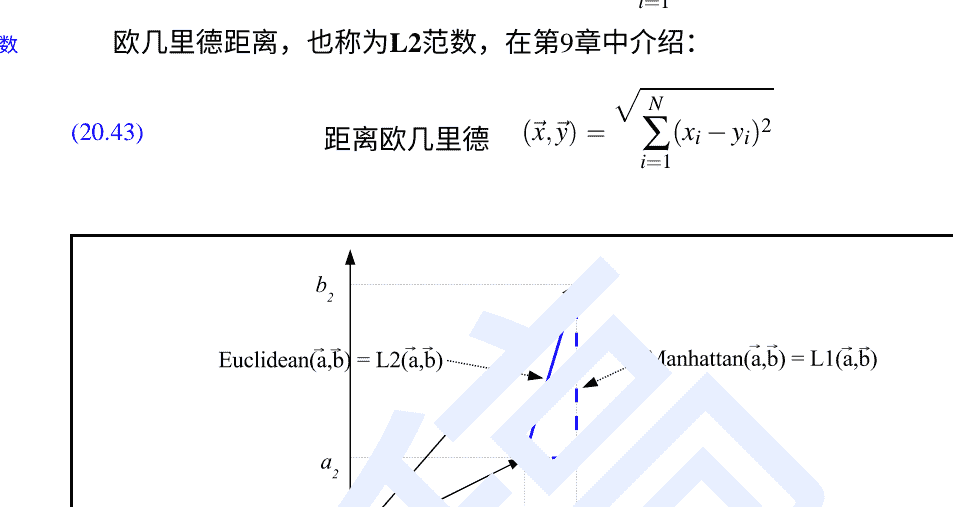

20.12 两个向量的欧几里德距离和曼哈顿距离度量为 $\vec{a}= (a1, a2)$ 和 $\vec{b}= (b1, b2)$，只是为了给读者一个关于向量之间距离的图形直观感受；这些特定的度量通常不用于词相似性。更多关于距离度量的内容请参见第9章。

尽管欧几里德距离和曼哈顿距离度量为向量相似性和距离提供了很好的几何直观感受，但这些度量很少用于词相似性。这是因为这两个度量对极端值非常敏感。

与这些简单的距离度量不同，单词相似性是基于信息检索和信息理论中的相关度量。信息检索方法似乎对单词相似性效果更好，因此我们将在本节中定义一些这样的方法。

让我们从图20.7中对相似性度量的直觉开始，其中两个二进制向量之间的相似性仅仅是这两个单词共同特征的数量。如果我们假设特征向量是一个二进制向量，我们可以定义这样的相似性度量。

- 二进制向量
- 点积
- 内积

这样的相似性度量可以使用线性代数中的点积或内积运算符来定义。线性代数：

$$
(20.44) \text{sim}_{\text{dot-product}}(\vec{v}, \vec{w}) = \vec{v} \cdot \vec{w} = \sum_{i=1}^{N} v_i \times w_i
$$

然而，在大多数情况下，正如我们在前一节中所看到的，向量的值并不是二进制的。在本节的其余部分中，让我们假设共现向量的条目是目标词与每个特征之间的关联值。换句话说，让我们将具有N个特征f1.. fN的目标词w的向量定义为：

$$
(20.45) \vec{w} = (\text{assoc}(w, f_1), \text{assoc}(w, f_2), \text{assoc}(w, f_3), \ldots, \text{assoc}(w, f_N))
$$

## 向量长度

现在我们可以将具有定义为关联的值的向量应用于sim-dot-product，以获得加权值之间的点积相似度。然而，这个原始点积作为相似度度量有一个问题：它偏好长向量。向量长度的定义如下：

$$
|\vec{v}| = \sqrt{\sum_{i=1}^{N} v_i^2}
$$

向量可能更长，因为它具有更多的非零值，或者因为每个维度具有更高的值。这些事实都会增加点积。事实证明，这两者都可能是词频的副产品。来自非常频繁的单词的向量将具有更多的非零共现关联值，并且可能在每个维度上具有更高的值（即使使用控制频率的关联权重）。因此，原始点积偏好频繁出现的单词。我们需要修改点积以对向量长度进行归一化。最简单的方法就是将点积除以两个向量的长度。这个归一化点积实际上与两个向量之间的夹角的余弦相同。余弦或归一化点积相似度度量因此为：

$$
\text{sim}_{\text{cosine}}(\vec{v},\vec{w}) = \frac{\vec{v}\cdot\vec{w}}{|\vec{v}||\vec{w}|} = \frac{\sum_{i=1}^{N} v_i \times w_i}{\sqrt{\sum_{i=1}^{N} v_i^2} \sqrt{\sum_{i=1}^{N} w_i^2}}
$$

因为我们已经将向量转换为单位长度，所以余弦度量与欧几里德距离或曼哈顿距离不同，不再对来自高频词的长向量敏感。余弦值的范围从指向相同方向的向量为1，到正交的向量（没有共同项）为0，到指向相反方向的向量为-1，尽管实际值往往是正数。

让我们讨论从信息检索中得出的另外两个相似度度量。

### Jaccard / Tanimoto / min/max

该度量最初是为二进制向量设计的。Grefenstette（1994）将其扩展为加权关联向量如下：

$$
\text{sim}_{\text{Jaccard}}(\vec{v},\vec{w}) = \frac{\sum_{i=1}^{N} \min(v_i, w_i)}{\sum_{i=1}^{N} \max(v_i, w_i)}
$$

Grefenstette/Jaccard函数的分子使用min函数，实质上计算重叠特征的（加权）数量（因为如果任一向量对于某个属性的关联值为零，结果将为零）。分母可以看作是一个归一化因子。

### Dice

非常相似的度量，Dice度量，同样从二进制向量扩展到加权关联向量；Curran（2003）的一个扩展使用Jaccard的分子，但使用作为分母归一化因子的两个向量中非零条目的总加权值。

$$
\text{sim}_{\text{Dice}}(\vec{v},\vec{w}) = \frac{2 \times \sum_{i=1}^{N} \min(v_i, w_i)}{\sum_{i=1}^{N} (v_i + w_i)}
$$assoc_prob(w, f) = P(f|w)                           (20.35)
assoc_PMI(w, f)  = log₂[P(w,f) / (P(w)P(f))]       (20.38)
assoc_Lin(w, f)  = log₂[P(w,f) / (P(w)P(r|w)P(w'|w))] (20.39)
assoc_t-test(w, f) = [P(w,f) - P(w)P(f)] / sqrt[P(f)P(w)] (20.41)

sim_cosine(v, w)  = (v·w) / (|v||w|) = (Σᵢ₌₁ᴺ vᵢ×wᵢ) / sqrt(Σᵢ₌₁ᴺ vᵢ² Σᵢ₌₁ᴺ wᵢ²) (20.47)
sim_Jaccard(v, w) = (Σᵢ₌₁ᴺ min(vᵢ,wᵢ)) / (Σᵢ₌₁ᴺ max(vᵢ,wᵢ))   (20.48)
sim_Dice(v, w)    = (2×Σᵢ₌₁ᴺ min(vᵢ,wᵢ)) / (Σᵢ₌₁ᴺ (vᵢ+wᵢ))      (20.49)
sim_JS(v||w)      = D(v| (v+w)/2 ) + D(w| (v+w)/2 )               (20.52)

## 20.13 词语相似度

目标词 w 与特征 f 之间的关联度量，以及词共现向量 v 和 w 之间的向量相似度度量。

最后，有一类基于信息论的分布相似度度量方法（Pereira等，1993; Dagan等，1994, 1999; Lee，1999），也是基于条件概率关联度量 P(f|w)。这些模型的直觉是，两个向量 v 和 w 在它们的概率分布 P(f|w) 和 P(f|v) 相似的程度上也是相似的。比较两个概率分布 P 和 Q 的基础是 Kullback-Leibler 散度或 KL 散度或相对熵（Kullback和 Leibler，1951）：

D(P||Q) = Σₓ P(x) log [P(x)/Q(x)]

- KL散度
- Jenson-Shannon散度

不幸的是，当 Q(x)=0 和 P(x)=0 时，KL散度是未定义的，这是一个问题，因为这些词分布向量通常非常稀疏。一种替代方法（Lee，1999）是使用 Jensen-Shannon 散度，它表示每个分布与两个分布均值的差异，并且不会出现这个问题的零值：

JS(P||Q) = D(P| (P+Q)/2 ) + D(Q| (P+Q)/2 )

用向量 v 和 w 重新表述，

sim_JS(v||w) = D(v| (v+w)/2 ) + D(w| (v+w)/2 )

图20.13总结了我们设计的关联度和向量相似度的度量。有关其他向量相似度度量的概述，请参见历史部分。

最后，让我们来看一些分布式词相似度的结果。下面是对“希望”和“简要”不同词性的十个最相似的词，使用在线依存关系相似度工具（Lin，2007）派生；该工具使用所有minipar语法关系定义共现向量，使用 assoc_Lin 关联度度量和 Lin（1998a）的向量相似度度量。

- 希望 (N):乐观 0.141, 机会 0.137, 期望 0.137, 前景 0.126, 梦想 0.119, 愿望 0.118, 恐惧 0.116, 努力 0.111, 自信 0.109, 承诺 0.108
- 希望 (V):想要 0.158, 希望 0.140, 计划 0.139, 说 0.137, 相信 0.135, 思考 0.133, 同意 0.130, 想知道 0.130, 尝试 0.127, 决定 0.125
- 简要 (N):法律简要 0.139, 宣誓书 0.103, 提交 0.0983, 请愿 0.0865, 文档 0.0835, 论证 0.0832, 信件 0.0786, 反驳 0.0778, 备忘录 0.0768, 文章 0.0758
- 简要 (A):长 0.256, 长达一小时 0.191, 短 0.174, 延长 0.163, 频繁 0.163, 最近 0.158, 短暂 0.155, 长达一周 0.149, 偶尔 0.146

### 20.7.4 评估分布式单词相似度

分布相似性可以通过与基于词典的相似性相同的方式进行评估；我们可以将其与人类相似性得分进行内在比较，或者作为端到端应用的一部分进行外在评估。除了词义消歧和滑稽用词检测之外，相似性度量还被用作考试和论文评分系统的一部分（Landauer等，1997），或者参加托福多项选择考试（Landauer和Dumais，1997；Turney等，2003）。

分布算法也经常通过与黄金标准词典进行第三种内在方式的评估。这种比较可以直接使用单个词典（Grefenstette，1994；Lin，1998a），也可以使用精确度和召回率度量对一组词典进行比较（Curran和Moens，2002）。设S为在词典中被定义为相似的词的集合，可以通过处于相同的同义词集中，或者可能共享相同的上位词，或者处于上位词-下位词关系中来定义。设S'为某个算法分类为相似的词的集合。我们可以定义精确度和召回率为：

> (20.53) 精确度 = $\frac{|S \cap S'|}{|S'|}$ 召回率 = $\frac{|S \cap S'|}{|S|}$

Curran (2003)使用词典比较了多种分布式算法，并发现Dice和Jaccard方法在向量相似度的度量上表现最佳，而t-test在关联度的度量上表现最佳。因此，最佳度量方法会使用t-test加权关联度，并使用Dice或Jaccard方法来度量向量相似度。

## 20.8 下义词和其他词关系

相似性只是词语之间的一种语义关系。正如我们在第19章中讨论的那样，WordNet和MeSH都包括上位词/下位词关系，许多其他语言的词典，如中文的CiLin，也包括这种关系。WordNet还包括反义词关系、部分整体关系和其他关系。因此，如果我们想知道两个词义是否由这些关系之一相关联，并且这些词义出现在WordNet或MeSH中，我们可以直接查找它们。但由于许多词语不在这些资源中，因此能够自动学习新的上位词和部分整体关系非常重要。

自动学习词语关系的许多工作都基于 Hearst（1992）首次提出的一个关键见解，即特定词汇-句法模式的存在可以指示两个名词之间的特定语义关系。考虑以下由 Hearst 从 Groliers 百科全书中提取的句子：

(20.54) 琼脂是一种由红藻（如凝胶藻）混合物制备而成的物质，用于实验室或工业用途。

Hearst指出，大多数人类读者可能不知道 Gelidium 是什么，但他们可以很容易地推断出它是一种红藻的一种（即上位词），无论那是什么。她建议使用以下词汇-句法模式：

(20.55) $NP_{0}例如NP_{1}{,NP_{2}...,(和|或)NP_{i}},i \geq 1$

意味着以下语义

(20.56) $\forall NP_{i}, i \geq 1, 下位词 (NP_{i}, NP_{0})$

使我们能够推断

> (20.57) 下位词 (Gelidium, 红藻)

| 模式 | 示例 |
| :--- | :--- |
| $NP\{,NP\}*\{,\}(和|或)其他NP_{H}$ | ...庙宇、宝库和其他重要的市政建筑。 |
| $NP_{H}$ 例如 $\{NP,\}*$(或|和) $NP$ | 红藻，例如Gelidium |
| 这样的 $NP_{H}$ 例如 $\{NP,\}*$(或|和) $NP$ | 由Herrick、Goldsmith和Shakespeare等作者创作 |
| $NP_{H} \{,\}包括 $\{NP,\}*$(或|和) $NP$ | 所有普通法国家，包括加拿大和英国 |
| $NP_{H} \{,\}特别是 $\{NP,\}*$(或|和) $NP$ | ...大多数欧洲国家，尤其是法国、英国和西班牙 |

> 图20.14 构建的词汇-句法模式用于寻找上位词（Hearst，1992年，1998年）

图20.14展示了Hearst（1992年，1998年）提出的五种模式，用于推断上位词关系；我们将 $NP_{H}$ 显示为父词/下位词。还有许多其他尝试使用这些模式提取不同的WordNet关系；有关更多详细信息，请参见历史部分。

当然，基于模式的方法的覆盖范围受可用模式的数量和准确性的限制。不幸的是，一旦找到了明显的例子，手动创建模式的过程就变得困难而缓慢。

幸运的是，我们已经看到了解决这类问题的方法。我们可以使用信息提取中常见的自举方法来找到新的模式（Riloff，1996年；Brin，1998年），这也是前面第20.5节中描述的Yarowsky方法的关键。

在关系模式发现中使用自举的关键洞察是，在一个大语料库中，我们可以期望涉及某个关系的词以多种不同的模式出现。因此，至少在理论上，我们只需要从一小部分精确的模式开始，就可以获得一组涉及给定关系的种子词。然后可以使用这些词在一个大语料库中查询同时包含这两个术语的句子，以某种依赖关系；然后可以从这些新句子中提取新的模式。该过程可以重复进行，直到模式集足够大为止。

作为这个过程的一个例子，考虑之前使用Hearst的简单模式集发现的术语“红藻”和“Gelidium”。在使用这些作为查询术语进行简单的Google搜索的结果中，有以下例子：（20.58）红藻的一个例子是Gelidium。

从这样一个句子中删除种子词，并用简单的通配符替换它们是最原始的模式生成方法。在这种情况下，将模式“One example of a * is *”提交给Google，目前可以得到近50万个结果，包括以下示例:

> (20.59) 一个玻色子的例子是光子。

我们还可以通过解析提取的句子并将通配符放入解析树中提取稍微复杂一些的模式。

引导式方法成功的关键是避免语义漂移，这种漂移往往在反复应用引导式方法时发生。我们离原始种子词或模式越远，就越有可能遇到与我们最初想要发现的意义完全不同的模式。当我们在第22章讨论信息抽取的引导式方法时，我们将看到处理这种漂移的方法。

与引导式方法相反，使用大型词汇资源如WordNet作为训练信息的来源，其中每个WordNet上位词/下位词对告诉我们这种关系中有哪些词，我们训练一个分类器来帮助找到展示这种关系的新词。

例如，Snow等人（2005年）的这个上位词学习算法依赖于WordNet来帮助学习大量的弱上位词模式，并将它们在4个步骤中结合在一个监督分类器中：

1. 收集所有在上位词/下位词关系中的WordNet名词概念对 c_i, c_j。
2. 对于每个名词对，收集所有出现两个名词的句子（在一个600万词的语料库中）。
3. 解析句子并从解析树中自动提取每个可能的Hearst风格词汇-句法模式。
4. 将大量的模式作为特征用于逻辑回归分类器。
5. 给定测试集中的一对名词，提取特征并使用分类器确定名词对是否由上位词/下位词关系相关。

这个算法自动学习到的四个新模式包括：

# 第682章 第20章. 计算词汇语义学

名词短语动词喜欢 名词短语 名词短语动词称为 名词短语 名词短语 是一个 名词短语动词 名词短语, 一个 名词短语 动词同位语):

Snow等人 (2005) 随后通过使用这些模式作为弱特征，结合逻辑回归分类器，展示了良好的上位词检测性能。

使用WordNet帮助解决上位词问题的另一种方法是将任务建模为选择将未知词语插入到一个完整层次结构中的位置。可以在不使用词汇-句法模式的情况下完成这一点。例如，我们可以使用相似性分类器（使用分布信息或形态信息）来找到层次结构中与未知词语最相似的词语，使用类似K最近邻的方法将新词插入到那里（Tseng, 2003）。或者我们可以将上位词标记的任务视为类似于命名实体标记的标记任务。Ciaramita和Johnson (2003) 采用了这种方法，使用26个超义标签，这些标签来自WordNet的26个广泛类别的“词典编纂者”标签。(人物,地点,事件,数量,等)。他们使用的特征包括周围的词性标记、词的二元和三元特征、拼写和形态特征，并应用多类感知器分类器。

寻找部分整体关系似乎比下位词更困难；以下是Girju等人(2003)的一些例子：

- (20.60) 汽车的邮件信使在 <PART>邮车</PART> 里忙于工作，当<WHOLE>火车</WHOLE>行驶时。
- (20.61) 透过 <PART>车</PART> 的 <WHOLE>侧门</WHOLE>，可以看到移动的风景。

部分整体关系很难找到，因为表征它们的词汇-句法模式非常模糊。例如，表示部分整体关系的两种最常见模式是英语的所有格结构[NP1 of NP2]和[NP1’s NP2]，这些结构还表示许多其他含义，如拥有；有关讨论和可能的算法，请参见Girju等人(2003, 2006)。

学习单词之间的个体关系是生成词库的重要组成部分。在生成词库中，我们将词语相似度的估计与上位词或其他关系相结合，构建整个本体论或词库。例如，Caraballo (1999, 2001) 的两步词库生成算法首先应用自下而上的聚类算法，将语义上相似的词语分组成一个无标签的词层次结构。回顾第20.10节中提到的自上而下聚类，我们首先为每个词语分配一个独立的聚类。然后，以自下而上的方式逐步合并最相似的两个聚类，我们可以使用任何语义相似度度量，例如前一节中描述的分布度量之一。在第二步中，给定无标签的层次结构，算法使用基于模式的下位词分类器为每个词语聚类分配一个上位词标签。有关词库生成的更多最新工作，请参阅历史部分。

## 20.9 语义角色标注

在本章中，我们将讨论的最后一个任务是将单词的含义与句子的含义联系起来。这是语义角色标注的任务，有时也被称为主题角色标注，案例角色分配，甚至是浅层语义解析。语义角色标注是自动找到句子中每个谓词的语义角色的任务。更具体地说，这意味着确定句子中哪些成分是给定谓词的语义论元，然后确定每个论元的适当角色。语义角色标注有潜力提高任何语言理解任务的性能，尽管迄今为止，它的主要应用是在问答和信息提取方面。

当前的语义角色标注方法基于监督式机器学习，因此需要访问足够数量的训练和测试材料。在过去几年中，FrameNet和PropBank资源在这方面发挥了作用。也就是说，它们被用来指定什么算作谓词，定义任务中使用的角色集，并提供训练和测试数据。SENSEVAL-3评估使用了FrameNet，而2004年和2005年的CONLL评估则基于PropBank。

以下示例展示了两种努力的不同表示方式。请回忆FrameNet（20.62）使用大量特定框架元素作为角色，而PropBank（20.63）则使用较少的编号参数标签，可以解释为动词特定标签。

(20.62) [你] COGNIZER 不能[责怪]TARGET [程序]EVALUEE [无法识别它]REASON
(20.63) [旧金山检查员]ARG0 发布 目标ARG1 [特别版]ARGM-TMP [昨天]ARGM-TMP

图20.15概述了一个简化的语义角色标注算法。在对语义角色分析的最早研究（Simmons, 1973）之后，大多数语义角色标注的工作都是通过解析句子开始的。通常使用公开可用的广覆盖解析器（如Collins（1996）或Charniak（1997））为输入字符串分配一个解析。图20.16显示了上述（20.63）的解析。然后遍历结果解析以找到所有带有谓词的单词。对于每个谓词，再次遍历树以确定解析中的每个成分在与该谓词相关时扮演的角色（如果有的话）。首先，通过将成分描述为与谓词相关的一组特征来进行判断。然后，将这个特征集传递给经过适当训练的分类器，并进行适当的分配。

让我们更详细地看一下Gildea和Jurafsky（2000年, 2002年）提出的简单特征集，这些特征已经被纳入了大多数角色标注系统中。我们将从图20.16中提取第一个 NP，即 NP-SBJ成分“旧金山检查员”。

- 在这种情况下，主要的谓词是 issued。对于PropBank，谓词总是动词；FrameNet还有名词和形容词谓词。

```
函数 SEMANTICROLELABEL (words) 返回带标签的树
解析 ← PARSE(words)
对于解析中的每个谓词，执行以下操作
    对于解析中的每个节点，执行以下操作
        特征向量 ← EXTRACTFEATURES (节点，谓词，解析)
        CLASSIFY NODE (节点，特征向量，解析)
```

> 图20.15 通用的语义角色标注算法。CLASSIFYNODE组件可以是一个简单的 -of-N分类器，它为语义角色（或非角色成分的NONE）分配一个语义角色。CLASSIFYNODE可以通过标记数据（如 FrameNet 或 PropBank）进行训练。

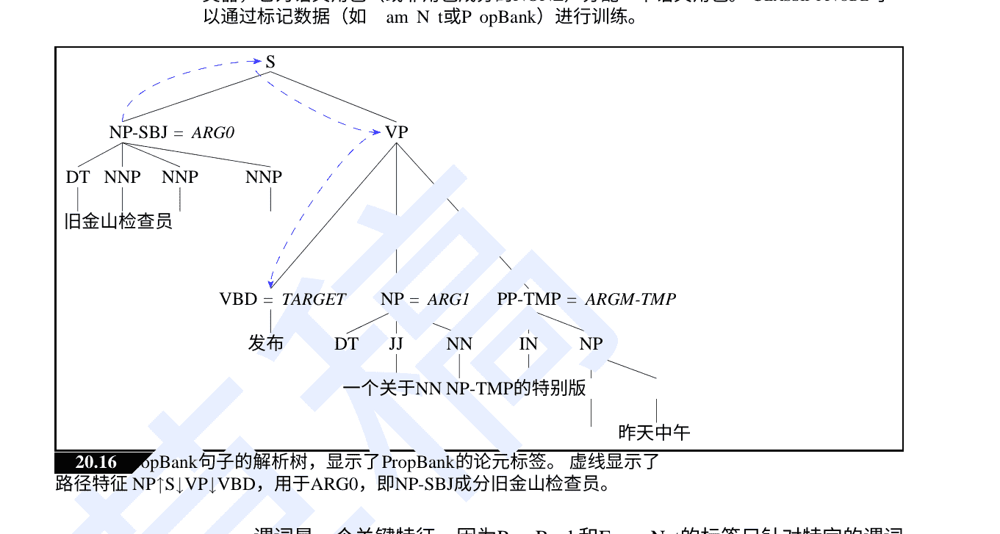

> 图20.16 PropBank句子的解析树，显示了PropBank的论元标签。虚线显示了路径特征 NP|S|VP|VBD，用于ARG0，即NP-SBJ成分“旧金山检查员”。

谓词是一个关键特征，因为PropBank和FrameNet的标签只针对特定的谓词定义。

- 短语类型是 NP（或 NP-SBJ）这只是解析树中支配该成分的解析节点的名称。一些语义角色倾向于出现为 NP，其他角色则出现为 S或 PP等等。
- 成分的头词是“检查员”。可以使用标准的头规则计算成分的头词，例如在第12章和图12.13中给出的规则。某些头词（例如代词）对可能填充的语义角色有很强的限制。
- 成分的头词词性是 NNP。
- 从成分到谓词的解析树路径。这条路径在图20.16中由虚线表示。根据（Gildea和Jurafsky，2000）的方法，我们可以使用简单的线性表示路径，NP↑ S↓VP↓VBD。↑ and ↓分别表示向上和向下在树中的移动。该路径是作为许多语法功能之间的紧凑表示非常有用，关于成分和谓词之间的关系。
- 成分所在从句的语态，在这种情况下是主动语态（与被动语态相对）。被动句倾向于在语义角色与表面形式之间具有明显不同的连接方式，与主动句不同。
- 成分相对于谓词的二进制线性位置，可以是在之前或之后。
- 谓词的子范畴化。从第12章可以回忆起，动词的子范畴化是出现在动词短语中的预期论元集合。我们可以通过使用短语结构规则来提取这些信息扩展谓词的直接父节点；VP → NP PP对于图20.16中的谓词。

语义角色标注系统通常提取许多其他特征，例如命名实体标签（知道成分是 LOCATION还是 PERSON很有用），或者路径特征的更复杂版本（上半部分或下半部分，特定节点是否出现在路径中），成分的最右边或最左边的词等等。

我们现在有一组观察结果，就像下面的例子一样，每个都有一个特征向量；我们按照上述顺序显示了这些特征（请记住，大多数观察结果的值为 NONE，而不是例如 ARG0，因为大多数短语结构树的成分不承担语义角色）：

```
ARG0: [issued, NP, Examiner, NNP, NP↑S↓VP↓VBD, active, before, VP → NP PP]
```

就像我们在词义消歧中看到的那样，我们可以将这些观察结果分为训练集和测试集，使用训练样本在任何监督式机器学习算法中，并构建一个分类器。在标准评估中，支持向量机（SVM）和最大熵分类器在这个任务上取得了良好的结果。一旦训练完成，分类器可以用于未标记的句子，为句子中的每个成分提供一个角色建议。更准确地说，输入句子被解析，并采用类似于之前描述的训练过程。

为了提高效率，一些角色标注算法会将分类过程分为多个阶段进行：

- 修剪：根据简单规则，一些成分被排除在可能的角色考虑范围之外，以加快执行速度。
- 识别：对每个节点进行二元分类，判断其是否为待标注的 ARG（非 NONE）。
- 分类：对前一阶段标记为 ARG的所有成分进行一对N分类。

所有语义角色标注系统都需要处理一些复杂情况。FrameNet和PropBank中的成分必须是不重叠的。因此，如果系统错误地将两个重叠的成分标记为参数，它需要决定哪个是正确的。此外，成分的语义角色并不是独立的；由于PropBank不允许多个相同的参数，将一个成分标记为 ARG0会大大增加另一个成分的概率为非 ARG0的概率。被标记的成分ARG1。这两个问题都可以通过基于格子或N-最佳重新评分的两阶段方法来解决，这在第9章中有所讨论：让分类器为每个成分分配多个标签，每个标签都有一个概率，并使用第二个全局优化步骤来选择最佳的标签序列。

除了使用解析作为输入之外，还可以通过应用用于命名实体提取或部分解析的分块技术，直接从原始（或词性标注的）文本中进行语义角色标注。这些技术在生物信息学等领域特别有用，因为在这些领域中，基于典型新闻文本训练的句法解析器很难表现良好。

最后，语义角色标注系统通常通过要求每个论元标签必须分配给完全正确的词序列或解析成分来进行评估。然后可以计算精确度、召回率和F-度量。可以使用一个简单的基于规则的系统作为基准，例如将谓词之前的第一个名词短语标记为ARG0，将谓词之后的第一个名词短语标记为ARG1，并在动词短语是被动语态时进行交换。

## 20.10 高级：无监督语义消歧

让我们简要回顾一下WSD任务。建立每个单词的词义标注的大型语料库是昂贵且困难的。因此，无监督的词义消歧方法是一个令人兴奋且重要的研究领域。

在无监督的方法中，我们不使用人为定义的词义。相反，每个单词的‘词义’集合是从训练集中的每个单词实例自动创建的。让我们介绍Schrutze的无监督词义消歧方法的简化版本。在Schrutze的方法中，我们首先通过分布上下文特征向量来表示训练集中每个单词实例，这些特征向量是我们在第20.7节中定义的特征向量的轻微推广。（正因为如此，我们在介绍了词相似度之后才转向无监督的词义消歧。）

正如第20.7节中所述，我们将一个单词w表示为基于其邻近单词频率的向量。例如，对于给定的目标单词（类型）w，我们可以选择在w的任何实例的25个单词内最频繁出现的1000个单词。这1000个单词成为向量的维度。让我们定义fi表示单词i在单词w的上下文中出现的频率。我们定义单词向量w⃗（对于给定的w的标记（观察））为：

```
w⃗ = (f1, f2, f3, ..., f1000)
```

到目前为止，这只是我们在第20.7节中看到的分布上下文的一个版本。我们还可以使用稍微复杂一些的分布上下文。例如，Schrutze将一个单词w的上下文向量定义为不是这个一阶向量，而是通过其二阶共现来定义。也就是说，单词w的上下文向量是通过获取w的上下文中的每个单词x，对于每个x计算其单词向量x⃗，然后取向量x⃗的质心（平均值）来构建的。

让我们看看如何在无监督的词义消歧中使用这些上下文向量（无论是一阶还是二阶）。在训练中，我们只需要3个步骤：

1.  对于语料库中的每个单词w的标记wi，计算一个上下文向量c。
2.  使用一个聚类算法将这些单词标记的上下文向量c聚类成预定义数量的组或簇。每个簇定义了w的一个词义。
3.  计算每个簇的向量质心。每个向量质心sj是表示w的那个词义的词义向量。

由于这是一个无监督算法，我们不会为每个w的这些'词义'命名；我们只是称之为w的第j个词义。现在我们如何消除特定的标记t of w的歧义？再次，我们有三个步骤：

1.  计算上下文向量c，如上所述。
2.  检索所有词义向量sj for w。
3.  将t分配给与最接近t的词义向量sj所表示的词义。

聚类算法和向量之间的距离度量。幸运的是，聚类是一个经过广泛研究的问题，有许多标准算法可以应用于结构化为数值向量的输入（Duda和Hart，1973）。语言应用中经常使用的一种技术被称为凝聚聚类。在这种技术中，每个N训练实例都被初始化-最初分配给自己的簇。然后以自下而上的方式形成新的簇，通过连续合并最相似的两个簇。这个过程一直持续下去，直到达到指定的簇数，或者在簇之间达到某个全局的好度量。在训练实例数量过大的情况下，可以对原始训练集进行随机抽样，以达到类似的结果。

我们如何评估无监督的词义消歧方法？通常情况下，最好的方法是进行外部或体内评估，在这种评估中，词义消歧算法嵌入在某个端到端系统中。内在评估也可能有用，如果我们有一种将自动派生的词义类别映射到一些手工标注的黄金标准集的方法，这样我们就可以将手工标注的测试集与由我们的无监督分类器标记的集合进行比较。做这种映射的一种方法是将每个词义簇映射到一个预定义的词义，通过选择（在某个训练集中）与该簇重叠的单词标记最多的词义。另一种方法是考虑测试集中所有单词对，对于每个单词对，测试系统和手工标注是否将两个成员放入同一个簇中。

# 参考文献和历史注释

词义消歧可以追溯到数字计算机的最早应用之一。我们在上面看到了Warren Weaver (1955) 关于通过查看单词周围的一个小窗口来消除歧义的建议，这是在机器翻译的背景下提出的。在这个早期阶段提出的其他概念包括使用词典来消歧义（Masterman，1957年），贝叶斯模型的监督训练用于消歧（Madhu和Lytel，1965年），以及聚类在词义分析中的使用（Sparck Jones，1986年）。

在早期面向人工智能的自然语言处理系统的背景下，对消歧义进行了大量的工作。虽然这类自然语言分析系统大多数都具有某种形式的词汇消歧能力，但其中一些努力将词义消歧作为更大的焦点。最有影响力的努力包括Quillian（1968年）和Simmons（1973年）的语义网络，Wilks对Preference Semantics的工作（Wilks，1975c，1975b，1975a），以及Small和Rieger（1982年）和Riesbeck（1975年）对基于词的理解系统的工作。Hirst的ABSITY系统（Hirst和Charniak，1982年；Hirst，1987年，1988年）采用了一种基于语义网络的标记传递技术，代表了这一类型中最先进的系统。与这些主要符号化方法一样，大多数连接主义方法对词义消歧都依赖于具有手工编码表示的小型词典（Cottrell，1985年；Kawamoto，1988年）。

在认知科学和心理语言学领域，对于意义消歧的工作已经进行了大量的研究。恰如其名，它通常被称为词汇歧义消解。Small等人（1988）从这个角度提出了各种论文。

最早实施强大的经验方法来进行意义消歧的是Kelly和Stone（1975），他们指导了一个团队，手工制作了1790个有歧义的英语单词的一套消歧规则。Lesk（1986）是第一个使用机器可读词典进行词义消歧的人。Wilks等人（1996）描述了对机器可读词典使用的广泛探索。解决词典意义过于细粒度或缺乏适当组织的问题，已经提出了聚类词义模型，如Dolan（1994）、Peters等人（1998）、Chen和Chang（1998）、Mihalcea和Moldovan（2001）、Aguirre和de Lacalle（2003）、Chklovski和Mihalcea（2003）、Palmer等人（2004）、McCarthy（2006）、Navigli（2006）、Snow等人（2007）；用于训练聚类算法的聚类词义语料库包括Palmer等人（2006）和OntoNotes（Hovy等人，2006）。

对消歧义的监督式机器学习方法的现代兴趣始于Black（1988），他将决策树学习应用于这个任务。这些方法需要大量的标注文本，因此人们开始研究引导式方法的使用（Hearst，1991；Yarowsky，1995）。如何权衡和结合不同证据来源的问题在Ng和Lee（1996），McRoy（1992）和Stevenson和Wilks（2001）中得到了探讨。

在半监督方法中，最近的选择偏好模型包括Li和Abe（1998），Ciaramita和Johnson（2000），McCarthy和Carroll（2003），Light和Greiff（2002）。Diab和Resnik（2002）提出了一种基于两种语言的平行语料库的半监督消歧算法。例如，法语单词catastrophe在某些情况下可能被翻译为英语单词disaster，而在另一种情况下可能被翻译为英语单词tragedy，这可以用来消除这两个英语单词的歧义（即选择相似的disaster和tragedy的意义）。Abney（2002，2004）探讨了Yarowsky算法的数学基础及其与协同训练的关系。最常见的意义启发式算法是一种非常强大的方法，但需要大量的有监督训练数据。麦卡锡等人（2004）提出了一种无监督的方法，根据第20.6节中定义的同义词相似度度量来自动估计最常见的意义。在研究词义的聚类中，最早的尝试是由斯帕克·琼斯（1986）提出的。泽尼克（1991）成功地将标准信息检索聚类算法应用于这个问题，并提供了基于检索性能改进的评估。关于聚类的更广泛的最近工作可以在彼得森和布鲁斯（1997）以及舒兹（1997, 1998）的著作中找到。

一些算法尝试利用句子中所有单词的相互消歧能力，通过多次遍历（凯利和斯通，1975）利用易于消歧的单词，或者通过并行搜索（科威等，1992；维罗尼斯和艾德，1990）。

最近的工作集中在利用网络来训练词义消歧的训练数据，可以是无监督的（Mihalcea和Moldovan，1999），也可以是利用志愿者标记数据的（Chklovski和Mihalcea，2002）。

Resnik（2006）描述了词义消歧的潜在应用。最近的一个应用是改进机器翻译（Chan等，2007；Carpuat和Wu，2007）。

Agirre和Edmonds（2006）是一本综合性的编辑专著，总结了词义消歧的最新技术。Ide和Veronis（1998a）对词义消歧的历史进行了全面回顾，涵盖了1998年之前的研究。Ng和Zelle（1997）从机器学习的角度提供了更加专注的综述。Wilks等（1996）描述了词典和语料库实验，并详细介绍了早期研究的情况。

我们讨论的分布式词相似度模型源于20世纪50年代的语言学和心理学研究。在20世纪50年代的语言学理论中，意义与上下文中词的分布相关的观点非常普遍；甚至在之前就有著名的Firth (1957)和Harris (1968)的原则，Joos (1950)就已经提出了语言学家对一个语素的‘意义’的定义…就是它在上下文中与其他所有语素出现的条件概率的集合。

在心理学中，有一个相关的观点，即一个词的意义可以被建模为欧几里得空间中的一个点，而两个词之间的意义相似性可以被建模为这些点之间的距离，这个观点是由Osgood等人(1957)提出的。这些思想在计算框架中的应用最早是由Sparck Jones (1986)提出的，并成为信息检索的核心原则，从而在语音和语言处理中得到了更广泛的应用。

有各种各样的其他加权和词相似度计算方法。在本章中未讨论的最大类别的方法是信息论方法的变体和细节，如Jensen-Shannon散度、KL散度和α-偏斜散度，我们简要介绍了这些方法（Pereira等，1993年; Dagan等，1994年，1999年; Lee，1999年，2001年）；还有来自Hindle（1990年）和Lin（1998a年）的其他度量。替代范式包括共现检索模型（Weeds，2003年; Weeds和Weir，2005年）。Manning和Schrutze（1999年，第5章和第8章）提供了共现度量和其他相关相似度度量。常用的加权互信息是加权互信息（Fung和McKeown，1997年），其中点间互信息由联合概率加权。在信息检索中，TF/IDF权重被广泛使用，我们将在第23章中看到。参见Dagan（2000年），Mohamed和Hirst（2005年）、Curran（2003年）和Weeds（2003年）对分布相似性进行了很好的总结。语义相似性的另一种向量空间模型，潜在语义索引（LSI）或潜在语义分析（LSA），使用奇异值分解来降低向量空间的维度。降低向量空间维度的目的是发现更高阶的规律（Deerwester等，1990年）。我们已经讨论过Schrutze（1992b），这是另一种基于奇异值分解的语义相似性模型。关于其他词汇关系和词库归纳的最新文献非常丰富。Grefenstette（1994年）系统地探索了分布词相似性在词库归纳中的应用。广泛使用各种分布聚类算法来发现语义相似的词汇组合，包括硬聚类（Brown等，1992年）、软聚类（Pereira等，1993年）以及新算法如聚类委员会（CBC）（Lin和Pantel，2002年）。对于特定的关系，Lin等人（2003年）应用手工制作的模式来寻找反义词，目的是改进同义词检测。第20.7节中的分布词相似性算法经常错误地将高相似性分配给反义词。Lin等人（2003年）表明，出现在模式“从X到Y”或“X或Y”中的词往往是反义词。Girju等人（2003年，2006年）通过学习关于两个名词的语义超类的概括，改进了部分整体关系的提取。Chklovski和Pantel（2004年）使用手工制作的模式来提取诸如“strength”的细粒度动词关系。最近的研究工作集中在通过结合不同的关系提取器进行词库归纳。例如，Pantel和Ravichandran（2004年）扩展了Caraballo的相似性和下位词组合算法，而Snow等人（2006年）整合了多个关系提取器来计算最可能的词库结构。最近关于相似性的研究集中在使用网络，例如依赖于维基百科的Strube和Ponzetto（2006年）、Gabrilovich和Markovitch（2007年）；这种基于网络的工作也与无监督信息提取密切相关；参见第22章和Etzioni等人（2005年）等参考文献。

虽然语义角色标注不如词相似性或词义消歧那样古老，但在计算语言学中有着悠久的历史。最早关于语义角色标注的工作（Simmons，1973）首先使用ATN解析器解析句子。然后，每个动词都有一组规则，规定了如何将解析映射到语义角色。这些规则主要参考了语法功能（主语、宾语、特定介词的补语），但也检查了词组内部的特征，如核心名词的生命力。2000年后，随着FrameNet和PropBank项目创建了足够大且一致的数据库，该领域的统计工作得到了复兴，从而使训练和测试成为可能。在角色标注中使用的许多流行特征在Gildea和Jurafsky（2002）、Chen和Rambow（2003）、Surdeanu等人（2003）、Xue和Palmer（2004）、Pradhan等人（2003, 2005）中有定义。为了避免对大量标记的训练集的需求，最近的研究集中在无监督的语义角色标注方法上（Swier和Stevenson，2004）。上述的语义标注工作侧重于对语料库中每个句子标记语义角色。语义角色标注的另一种方法是通过无监督学习在语料库上学习词汇的学习，以了解动词可能属于的语义角色的种类或论证交替模式（Stevenson和Merlo，1999；Schulte im Walde，2000；Merlo和Stevenson，2001；Merlo等，2001；Grenager和Manning，2006）。

# 练习

20.1 从任何报纸或杂志中收集一小部分长度不同的例句语料库。使用WordNet或任何标准词典，确定每个句子中开放类词的意义数量。每个句子有多少个不同的意义组合？这个数字似乎随着句子长度的变化而变化吗？

20.2 使用WordNet或标准参考词典，为语料库中的每个开放类词标记其正确的标签。选择正确的意义是否总是一项直截了当的任务。报告您遇到的任何困难。

20.3 使用相同的语料库，分离参与所有动词-主语和动词-宾语关系的单词。在这些关系中，参与的单词是否经常可以仅通过关于关系中的单词的信息进行消歧？

20.4 在单词eat和find之间，您预计哪个在基于选择限制的意义消歧中更有效？为什么？

20.5 使用您喜欢的词典，在短语Time flies like an arrow上模拟页面659上描述的原始Lesk词重叠消歧算法。假设单词按顺序从左到右进行消歧，并且之前的决策结果在后续过程中使用。

20.6 构建你之前练习的解决方案的实现。使用WordNet，在页面659上实现原始Lesk词重叠消歧算法在短语时间如箭一般上。

20.7 实现并尝试使用决策列表感知消歧系统。作为一个模型，使用图20.2中显示的特征类型。使用像WEKA这样的公开可用的决策列表软件包（或参见Russell和Norvig（1995）了解有关自己实现决策列表学习的更多细节）。为了方便评估您的系统，您应该获取一个免费提供的带有语义标记的语料库。

20.8 评估公开可用的Wordnet::Similarity包中的两种或三种相似性方法（Pedersen等，2004）。您可以通过手动标记一些单词对的相似度得分，并查看算法如何近似您的手动标签来完成此操作。

20.9 实现一个可以采用不同的关联度和向量相似度度量的分布式词相似度算法。现在从图20.13中评估两种关联度度量和两种向量相似度度量。同样，您可以通过手动标记一些词对并查看算法如何近似您的手动标签来完成此操作。

初步证明。

未发表的作品 ©2008年Pearson Education, Inc. 将由Pearson Prentice Hall出版, Pearson Education, Inc., 新泽西州上塞德尔河。版权所有。使用这个未发表的作品的许可仅授予通过Melinda_Haggerty@prenhall.com注册的个人，用于不超过一个学期的教学目的。

# 第21章
计算话语

> 格雷西: 哦，是的...然后琼斯夫妇有婚姻问题，我哥哥被雇来看守琼斯夫人。乔治: 嗯，我想她是一个非常有魅力的女人。
格雷西: 是的，我哥哥日夜看着她六个月。
乔治: 那后来发生了什么?
格雷西: 她最终离婚了。
乔治: 琼斯夫人?
格雷西: 不，是我哥哥的妻子。
乔治·伯恩斯和格雷西·艾伦在《售货员》中

奥森·威尔斯的电影《公民凯恩》在许多方面具有开创性，也许最重要的是它的结构。这部关于虚构的传媒大亨查尔斯·福斯特·凯恩生活的故事，电影并不按照凯恩的生活顺序进行。相反，电影从凯恩的死亡开始，（著名地低声说着“玫瑰花蕾”），并围绕着对他的生活进行闪回的结构进行。电影结构不必线性地遵循真实时间线的新颖想法，为20世纪的电影摄影术展示了不同种类的连贯叙事结构的无限可能性和影响。

但连贯的结构不仅仅是关于电影或艺术的事实。在本书的这一部分，我们主要关注在词语或句子层面上运作的语言现象。但就像电影一样，语言通常不是由孤立的、无关的句子组成，而是由相互关联、结构化、连贯的句子组成。我们将这样一个连贯结构化的句子组称为一段话语。

你现在正在阅读的章节是一个话语的例子。事实上，这是一种特定类型的话语: 独白。独白的特点是有一个发言者（这里将包括作家在内），和一个听者（类似地，包括读者）。在独白中，沟通只在一个方向上进行，即从发言者到听者。

阅读完这一章后，你可以与朋友进行一次关于它的对话，这将包括更自由的交流。这样的话语被称为对话，具体而言，是人与人之间的对话。在这种情况下，每个参与者定期轮流充当发言者和听者。与典型的独白不同，对话通常包含许多不同类型的交际行为: 提问、回答、纠正等等。

你还可以用计算机进行一些目的，比如预订航班或火车票，与计算机进行对话。这种使用人机对话进行人机交互的方式，或称为HCI，具有一些特点。与正常的人际对话有所不同，部分原因是现今计算机系统参与自由、无约束对话的能力有限。

虽然这三种形式的话语处理问题有共同之处，但它们在许多方面存在差异，因此通常使用不同的技术来处理它们。

# 第694章 计算话语

话语处理问题在这三种形式中都很常见，但它们在许多方面存在差异，因此通常使用不同的技术来处理它们。本章重点介绍常用于解释独白的技术；有关对话代理和其他对话的技术将在第24章中描述。

语言中存在着许多在话语层面上运作的现象。考虑例子（21.1）中的话语。

> (21.1) 铁皮人去了翡翠城见奥兹巫师，并请求一个心脏。在他请求之后，铁皮人等待巫师的回应。

诸如 *he* 和 *it* 等代词代表什么？毫无疑问，读者很容易明白 *he* 代表的是铁皮人，而不是绿野镇；*it* 代表的是心脏，而不是绿野镇。此外，读者清楚地知道巫师和绿野镇巫师是同一个实体，铁皮人和铁皮人是同一个实体。

但是自动进行这种消歧是一项困难的任务。决定代词和其他名词短语所指的目标的目标被称为共指消解。共指消解对于信息提取、摘要和对话代理非常重要。事实上，事实证明，几乎任何可想象的语言处理应用都需要确定代词和相关表达的指示方法。

除了代词和其他名词之间的关系之外，还有其他重要的语篇结构。考虑以下新闻段落的摘要任务：

> (21.2) 第一联合公司仍在与严重问题作斗争。根据佩恩韦伯的行业内部人士，他们的总裁约翰·R·乔治乌斯计划明天宣布退休。

我们可能想要提取以下摘要：

> (21.3) 第一联合公司总裁约翰·R·乔治乌斯计划明天宣布退休。

为了构建这样一个摘要，我们需要知道第二句话是两者中更重要的，并且第一句话是从属于它的，只是提供背景信息。在话语中，句子之间的这种关系被称为连贯关系，并且确定话语句子之间的连贯结构是一项重要的话语任务。

由于连贯性也是一篇好文章的特性，自动检测连贯关系对于衡量文本质量的任务也很有用，例如自动作文评分。在自动作文评分中，短学生作文通过确保作文的内部连贯性以及将其内容与源材料和手工标记的高质量作文进行比较来分配一个等级。连贯性还用于评估自然语言生成系统的输出质量。

话语结构和共指在深层次上相关。注意，为了执行上述摘要，系统必须正确地将 *First Union Corp* 识别为它们的指称（而不是 *Paine Webber*，例如）。同样，确定话语结构可以帮助确定共指。

# 连贯性

让我们通过讨论文本的连贯性来结束这个介绍。假设您已经收集了一组任意的、形式良好且独立可解释的话语，例如，通过从本书的前几章中随机选择一句话。您有一个话语吗？几乎肯定没有。原因是这些话语在并列时不会展现出连贯性。考虑一下，例如，(21.4)和(21.5)之间的差异。

(21.4) 约翰藏了比尔的车钥匙。他喝醉了。
(21.5) ?? 约翰藏了比尔的车钥匙。他喜欢菠菜。

尽管大多数人认为(21.4)是相当平凡的，但他们发现(21.5)很奇怪。为什么会这样呢？与(21.4)一样，构成(21.5)的句子是良好形式的，容易解释的。相反，似乎有什么问题是句子并列的事实。听者可能会问，例如，藏起别人的车钥匙与喜欢菠菜有什么关系。通过提出这个问题，听者质疑了段落的连贯性。

或者，听者可以尝试构建一个解释，使其连贯，例如，猜测也许有人给约翰提供了菠菜，以换取藏起比尔的车钥匙。事实上，如果我们考虑一个我们已经知道这一点的背景，这段话现在听起来好多了！为什么会这样呢？这个猜测使听者能够将约翰喜欢菠菜与他藏起比尔的车钥匙联系起来，这可以解释这两个句子是如何连接的。听者试图确定这样的联系的事实表明，建立连贯性是篇章理解的一部分的需要。

# 连贯关系

在第（21.4）段中，或者在我们的新模型中的第（21.5）段中，第二个句子为读者提供了第一个句子的解释或原因。这些例子表明，一个连贯的篇章必须在其话语之间有有意义的连接，像解释这样的连接通常被称为连贯关系，并且将在第21.2节中介绍。

让我们通过考虑Grosz等人（1995a）的以下两个文本来介绍连贯性的第二个方面：

+   (21.6) a. 约翰去他最喜欢的音乐店买钢琴。
    b. 他多年来经常光顾这家店。
    c. 他为自己终于能买到钢琴感到兴奋。
    d. 他到达时，店已经关门了。

+   (21.7) a. 约翰去他最喜欢的音乐店买钢琴。
    b. 这是约翰多年来经常光顾的一家店。
    c. 他为自己终于能买到钢琴感到兴奋。
    d. 当约翰到达时，它正在关闭。

虽然这两个文本只是在句子中如何实现两个实体（约翰和商店）方面有所不同，但（21.6）中的话语在直觉上比（21.7）中的话语更连贯。正如Grosz等人（1995a）指出的那样，这是因为（21.6）中的话语明确地描述了一个人，约翰，描述他的行为和感受。相比之下，在（21.7）中，首先关注的是约翰，然后是商店，然后回到约翰，然后再回到商店。它缺乏第一个话语的“关于性”。这些例子表明，为了使话语连贯，它必须与其所涉及的实体展示出某种关系，以一种专注的方式引入它们并跟随它们。这种连贯性可以称为基于实体的连贯性，我们将在第21.6.2节介绍基于实体的连贯性的中心模型。在本章的其余部分，我们将研究话语结构和话语实体的各个方面。我们从第21.1节开始，介绍文档的简单话语结构：将文档分割为线性序列的多段落段落。在第21.2节中，我们将介绍更细粒度的话语结构，即连贯关系，并给出一些解释这些关系的算法。最后，在第21.3节中，我们转向实体，描述了解释引用表达式（如代词）的方法。

## 21.1 话语分割

我们所研究的第一种话语任务是文本或话语的全局或高级结构的近似。许多文本类型与特定的传统结构相关联。学术文章可能被分为摘要、引言、方法、结果、结论等部分。报纸报道通常被描述为具有倒金字塔结构，其中开头段落包含最重要的信息。医生按照标准的SOAP格式（主观、客观、评估、计划）口述病人报告，分为四个部分。自动确定大型话语的所有这些类型的结构是一个困难且尚未解决的问题。但是某些类型的话语结构检测算法是存在的。本节介绍了一种这样的算法，用于更简单的话语分割问题；将文档分割成线性子主题序列。这种分割算法无法找到复杂的分层结构。尽管如此，线性话语分割对于信息检索非常重要，例如自动将电视新闻广播或长篇新闻报道分割成一系列故事以找到相关故事，或者对于需要确保正确摘要不同文档段落的文本摘要算法，或者对于从单个话语段落中提取信息的信息提取算法。

在接下来的两个部分中，我们介绍了无监督和有监督的算法来进行话语分割。

### 21.1.1 无监督话语分割

让我们考虑将文本分割成代表原始文本的多段落单元的任务。正如我们上面提到的，这个任务通常被称为线性分割，以区别于推导出更复杂的分层话语结构的任务。给定原始文本，分割器的目标可能是分配子主题分组，例如Hearst（1997）为以下21段科学新闻文章定义的分组。

+   - 1-3 介绍-在太空中寻找生命
    - 4-5 月球的化学成分
    - 6-8 早期地月接近如何塑造了月球
    - 9-12 月球如何帮助地球上的生命进化
    - 13 地月系统的不可能性
    - 14-16 二进制/三进制星系使生命变得不太可能
    - 17-18 非二进制/三进制系统的低概率
    - 19-20 有助于生命的地球太阳的特性
    - 21 总结

一类重要的无监督算法用于线性话语分段任务，依赖于连贯性的概念（Halliday and Hasan, 1976）。连贯性是使用某些语言设备将文本单元链接或联系在一起。词汇连贯性是指两个单元之间的词语关系，例如使用相同的词、同义词或上位词。例如，在（21.8ab）中，单词房子、铺瓦和我在两个句子中都出现，这表明它们作为话语是相互关联的：

> (21.8) 在冬天之前，我建了一个烟囱，并且给我的房子的侧面铺了瓦... 因此，我有一个紧密的铺瓦和抹灰的房子

在例子（21.9）中，两个句子之间的词汇凝聚由水果和梨子以及苹果之间的上位词关系表示。

> (21.9) 削皮、去核并切片梨子和苹果。将水果加入煎锅中。

还有一些非词汇凝聚关系，比如在Woodhouses和them之间使用的指代（我们将在第21.6节中详细定义和讨论指代）：

> (21.10) Woodhouses在那里首先是有影响力的。所有人都仰视他们。

除了两个词之间的单个词汇凝聚示例外，我们还可以有一个凝聚链，其中凝聚由一整个相关词序列表示：(21.11) 削皮、去核并切片梨子和苹果。将水果加入煎锅中。当它们变软时...

连贯性和凝聚力经常被混淆；让我们来回顾一下它们的区别。凝聚力是指文本单元之间的联系或连接方式。凝聚关系就像是一种胶水，将两个单元组合成一个单元。连贯性是指两个单元之间的意义关系。连贯关系解释了不同文本单元的意义如何结合起来共同构建一个话语的意义。

基于凝聚力的分割方法的直觉是，子主题中的句子或段落彼此之间具有凝聚力，但与相邻子主题中的段落没有凝聚力。因此，如果我们测量每个相邻句子之间的凝聚力，我们可能会在子主题边界处看到一个凝聚力的“下降”。

让我们来看一个基于凝聚力的方法，即TextTiling算法（Hearst, 1997年）。该算法有三个步骤：分词、词汇得分确定和边界识别。在分词阶段，输入中的每个以空格分隔的单词都转换为小写，功能词列表中的单词被排除，剩下的单词进行形态学词干处理。词干处理后的单词被分组为长度为 w=20（使用等长的伪句子而不是真实句子）的伪句子。

现在我们来看看伪句子之间的每个间隙，并计算该间隙上的词汇连贯得分。词汇连贯得分定义为间隙前伪句子中单词与间隙后伪句子中单词的平均相似度。我们通常在间隙的每一侧使用一个长度为 k=10的伪句子块。为了计算相似度，我们从间隙前的块创建一个词向量 b，并从间隙后的块创建一个向量 a，其中向量的长度为 N（文档中非功能词的总数），词向量的第 i个元素是单词 w_i的频率。现在我们可以通过余弦（=归一化点积）相似度来计算相似度，该相似度在第20章的方程20.47中定义，此处重写：

余弦相似度$(\vec{b}, \vec{a}) = \frac{\vec{b} \cdot \vec{a}}{||\vec{b}|| ||\vec{a}||} = \frac{\sum_{i=1}^{N} b_i \times a_i}{\sqrt{\sum_{i=1}^{N} b_i^2} \sqrt{\sum_{i=1}^{N} a_i^2}}$ (21.12)

这个相似度分数（衡量伪句 $i-k$ 与句子 $i$ 到 $i+k+1$ 的相似程度）是针对每个间隙 $i$ 计算的。让我们看一下图21.1中的例子，其中 $k=2$。图21.1a显示了四个伪句的示意图。每个20个词的伪句中可能有多个真实句子；我们展示了每个伪句中的两个真实句子。该图还指示了连续伪句之间的点积计算。因此，例如在第一个伪句中，由句子1和2组成，单词A出现两次，B出现一次，C出现两次，依此类推。第一个和第二个伪句之间的点积为这两个向量之间的余弦是多少，假设所有未显示的单词计数为零？

最后，我们计算每个间隙的深度得分，衡量间隙处的‘相似度山谷’的深度。深度得分是从山谷两侧的峰值到山谷的距离；在图21.1(b)中，这将是 $(y_{a_1} - y_{a_2}) + (y_{a_3} - y_{a_2})$。在任何比截断阈值（如 $k-\sigma$，即比平均山谷深度深一个标准差）更深的山谷处分派边界。与使用这些深度得分阈值不同，最近的基于凝聚力的分段器使用分裂聚类（Choi, 2000; Choi et al., 2001）；有关更多信息，请参阅本章末尾。

# ### 21.1.2 监督话语分割

我们现在已经看到了一种在没有手动标记的段落边界的情况下进行段落分割的方法。然而，对于某些类型的段落分割任务来说，获取带有边界标记的训练数据相对容易。考虑一下广播新闻的口语段落分割任务。为了对广播或电视节目进行摘要，我们首先需要确定新闻报道之间的边界。这是一个简单的段落分割任务，并且有训练数据集存在手动标记的新闻故事边界。同样，对于像讲座或演讲这样的独白的语音识别，我们经常希望自动将文本分成段落。对于段落分割的任务，找到带标签的文本是微不足道的。可以从网络（用 `<p>` 标记）或其他来源获取训练数据。

各种类型的分类器都被用于这种有监督的话语分割。例如，我们可以使用二元分类器（SVM，决策树）在任意两个句子之间进行是非边界决策。我们还可以使用序列分类器（HMM，CRF），更容易地融入顺序约束。

有监督分割中的特征通常是无监督分类中使用的特征的超集。我们当然可以使用一致性特征，如词重叠、词余弦、LSA、词链、指代等。

一个关键的附加特性，通常用于监督分割的是存在于话语标记或提示词。话语标记是一个词或短语，用于标识话语结构的功能。话语标记在本章中将起到重要作用。对于广播新闻分割的目的，重要的话语标记可能包括像“晚上好，我是<人名>”，这种短语通常出现在广播开始时，或者像“加入”，这个词通常出现在“现在加入我们的是<人名>”这个短语中，这个短语经常出现在特定片段的开头。类似地，提示短语“即将到来”经常出现在片段的末尾（Reynar, 1999; Beeferman et al., 1999）。

话语标记往往非常领域特定。例如，对于从华尔街日报分割报纸文章的任务，词语“incorporated”是一个有用的特征，因为华尔街日报的文章通常以全名“XYZ Incorporated”介绍一家公司，但后来只使用“XYZ”。对于分割房地产广告的任务，Manning (1998) 使用了话语提示特征，如“下一个词是一个社区名吗？”、“前一个词是一个电话号码吗？”甚至

# ### 21.1.3 评估话语分割

话语分割通常通过在人工标记了边界的测试集上运行算法来进行评估。通过使用 $WindowDiff$（Pevzner和Hearst，2002年）或 $P_k$（Beeferman等，1999年）指标，计算算法的性能与自动和人工边界标签的比较。

通常我们不使用精确度、召回率和F-度量来评估分割，因为它们对近似匹配不敏感。使用标准的F-度量，如果我们的算法在分配每个边界时偏离了一个句子，它的得分会和一个完全没有正确位置的算法一样糟糕。

Both WindowDiff and $P_k$ assign partial credit. 我们将介绍WindowDiff，因为它是对 $P_k$ 的最新改进。

WindowDiff通过在假设分割上滑动一个长度为 $k$ 的探针窗口，将参考（人工标注的）分割与假设分割进行比较。在假设字符串的每个位置，我们将落在探针窗口内的参考边界数 ($r_i$) 与落在探针窗口内的假设边界数 ($h_i$) 进行比较。算法会惩罚任何满足 $r_i \neq h_i$ 的假设，即 $|r_i - h_i| \neq 0$。窗口大小 $k$ 设置为参考字符串中平均分割长度的一半。图21.2显示了计算的示意图。

更正式地说，如果 $b(i,j)$ 是文本中位置 $i$ 和 $j$ 之间的边界数，$N$ 是文本中的句子数：

$$(21.13) \quad \text{WindowDiff}(ref, hyp) = \frac{1}{N - k} \sum_{i=1}^{N-k} (|b(ref_i, ref_{i+k}) - b(hyp_i, hyp_{i+k})| \neq 0)$$

WindowDiff返回一个介于0和1之间的值，其中0表示所有边界都被正确分配。

## 21.2 文本连贯性

前一节展示了连贯性装置，如词汇重复，可以用来在话语中找到结构。然而，仅仅存在这样的装置并不能满足话语必须满足的更强要求，即连贯性。

我们在介绍中简要介绍了连贯性。在本节中，我们将更详细地介绍文本连贯性的含义以及确定连贯性的计算机机制。我们将重点关注连贯性关系，并将实体连贯性保留在第21.6.2节中讨论。

回顾一下介绍中(21.14)和(21.15)之间的区别。

**(21.14)** 约翰藏了比尔的车钥匙。他喝醉了。

**(21.15)** ?? 约翰藏了比尔的车钥匙。他喜欢菠菜。

之所以(21.14)更连贯，是因为读者可以建立两个话语之间的联系，第二个话语为第一个话语提供了一个潜在的原因或解释。对于(21.15)，这种联系更难建立。话语中的可能连接可以被指定为一组连贯性关系。霍布斯（Hobbs）（1979a）提出了一些这样的关系，下面给出了其中几个。

术语 $S_0$ 和 $S_1$ 表示两个相关句子的含义。

**结果：** 推断 $S_0$ 所断言的状态或事件会导致 $S_1$ 所断言的状态或事件。

**(21.16)** 锡人被雨淋湿了。他的关节生锈了。

**解释：** 推断 $S_1$ 所断言的状态或事件会导致 $S_0$ 所断言的状态或事件。

**(21.17)** 约翰藏起了比尔的车钥匙。他喝醉了。

**并行：** 从 $S_0$ 的断言中推断出 $p(a_1, a_2, ...)$，从 $S_1$ 的断言中推断出 $p(b_1, b_2, ...)$，其中 $a_i$ 和 $b_i$ 是相似的，对于所有的 $i$。

**(21.18)** 稻草人想要一些大脑。锡人想要一颗心。

**详细说明：** 从 $S_0$ 和 $S_1$ 的断言中推断出相同的命题 $P$。

**(21.19)** 多萝西来自堪萨斯。她住在堪萨斯大草原中间。

**场合：** 可以从 \(S_0\) 的断言中推断出状态的改变，其最终状态可以从 \(S_1\) 推断出来，或者可以从 \(S_1\) 的断言中推断出状态的改变，其初始状态可以从 \(S_0\) 推断出来。

> (21.20) 多萝西拿起了油罐。她给铁皮人的关节上油。

我们还可以通过考虑连贯关系之间的层次结构来讨论整个篇章的连贯性。考虑段落 (21.21)。

(21.21) 约翰去银行存他的工资支票。(S1) 然后他坐火车去比尔的汽车经销商那里。(S2) 他需要买一辆车。(S3) 他现在工作的公司附近没有任何公共交通工具。(S4) 他还想和比尔谈谈他们的垒球联赛。(S5)

直观地说，段落(21.21)的结构不是线性的。该篇文章似乎主要讨论了S1和S2句子中描述的事件序列，而S3和S5句子与S2直接相关，S4与S3直接相关。这些句子之间的连贯关系导致了图21.3所示的篇章结构。

树中的每个节点代表一组局部连贯的从句或句子，称为话语段。粗略地说，可以将话语段视为句子语法中的成分类似物。

既然我们已经看过连贯性的例子，我们可以更清楚地看到连贯关系如何在摘要或信息提取中发挥作用。例如，通过详述关系而连贯的话语通常由一个总结句子后跟一个或多个添加细节的句子组成，如第21.19段所示。尽管这段中有两个描述事件的句子，但详述关系告诉我们这两个句子描述的是同一个事件。因此，详述关系的自动标注可以告诉信息提取或摘要系统合并这两个句子的信息，并生成一个单一的事件描述，而不是两个。

### 21.2.1 修辞结构理论

另一个被广泛使用的连贯关系理论是修辞结构理论（RST），这是一个关于文本组织的模型，最初是提出的。用于文本生成研究（Mann和Thompson，1987年）。

RST基于一组23个修辞关系，这些关系可以在话语中的文本段之间存在。大多数关系是在两个文本段之间（通常是从句或核心句）进行的，一个核心和一个卫星。核心是更加核心的单元，更加符合作者的目的，并且可以独立解释；卫星则不太核心，通常只能与核心相关解释。作者的目的，以及通常只能与核心相关解释。

证据考虑证据关系，其中卫星提供了支持核心中所表达的命题或情况的证据：（21.22）凯文一定在这里。他的车停在外面。

RST关系通常以图形方式表示；非对称的核心-卫星关系用箭头表示，箭头指向核心。

在最初的（Mann和Thompson，1987）的表述中，RST关系通过对核心和卫星的一组约束来形式化定义，这些约束与作者（W）和读者（R）的目标和信念有关，并且对读者（R）产生影响。例如，证据关系定义如下：

| 关系名称: | 证据 |
| :--- | :--- |
| 对N的约束: | R可能不相信N到令W满意的程度 |
| 对S的约束: | R相信S或将认为其可信 |
| 对N+S的约束: | R理解S会增加R对N的信任 |
| 效果: | R对N的信任增加 |

在RST和相关理论和实现中有许多不同的修辞关系集合。例如，RST TreeBank（Carlson等，2001）定义了78个不同的关系，分为16个类别。下面是一些常见的RST关系，其定义改编自Carlson和Marcu（2001）。

详细说明: 有各种不同类型的详细说明关系；在每种关系中，卫星提供有关核心内容的进一步信息：[N公司没有详细说明，] [S引用竞争原因]

归属: 卫星为核
心中的报告性言语实例提供归属来源。

[S分析师估计，] [N美国商店的销售额在该季度也下降了]

对比: 这是一种多核心关系，其中两个或更多个核心在某个重要维度上进行对比：

[N牧师情绪非常糟糕，] [N但喇嘛很开心。]

列表: 在这种多核心关系中，给出了一系列核心，没有对比或明确的比较：

[N比利·琼斯是船员；] [N长约翰是军需官]

## 背景
卫星为解释核心提供了上下文：

正如我们在Hobbs连贯关系中所看到的那样，RST关系可以按层次组织成整个话语树。图21.4显示了Marcu（2000a）对Scientific American杂志中（21.23）文本的一个示例。

> (21.23) 由于其远离太阳的轨道-比地球远50%-和薄薄的大气层，火星经历了寒冷的天气条件。表面温度通常在赤道附近平均约为摄氏零下60度（华氏零下76度），并且在极地附近可能下降到摄氏零下123度。只有在热带纬度的正午太阳才足够温暖，可以偶尔融化冰，但以这种方式形成的任何液态水都会因为低大气压而几乎瞬间蒸发。

请参考本章末尾的指向其他连贯关系理论和相关语料库的指针，以及第23章关于RST和类似连贯关系应用于摘要的内容。

### 21.2.2 自动连贯性分配
给定一系列句子，我们如何自动确定它们之间的连贯关系？无论我们使用RST、Hobbs还是其他许多关系集合之一（请参考本章末尾），我们都将这个任务称为连贯关系分配。

如果我们把任务从两个句子之间分配关系扩展到提取表示整个篇章的树或图的更大目标，通常会使用术语篇章解析。

这两个任务都非常困难，仍然是未解决的开放性研究问题。尽管如此，已经提出了各种方法，在本节中，我们描述了基于提示短语的浅层算法。在下一节中，我们将概述一种更复杂但不太健壮的基于推理的算法。

### 一个基于浅层线索短语的连贯性提取算法有三个阶段：
- 1. 在文本中识别线索短语
- 2. 使用线索短语将文本分割成话语段
- 3. 使用线索短语对每个连续的话语段之间的关系进行分类。

我们之前说过，线索短语（或话语标记或线索词）是一个词或短语，用于信号话语结构，特别是通过连接话语段。在第21.1节中，我们提到了线索短语或特征，如加入我们现在是<人物>（用于广播新闻分割）或下一个词是一个邻居的名字（用于房地产广告分割）。为了提取连贯关系，我们依赖于称为连接词的线索短语，这些线索短语通常是连词或副词，

它们给我们提供了关于段落之间连贯关系的“线索”。 例如，连接词“因为”强烈暗示了段落（21.24）中的“解释”关系。

> (21.24)约翰因为喝醉了，所以藏起了比尔的车钥匙。

其他类似的提示短语包括虽然,但是,例如,然而,用,和和。 话语标记在这些话语使用和非- 话语相关的句子使用之间可能存在很大的歧义。 例如，单词用可以作为一个提示短语，如(21.25)中所示，或者作为(21.26)中的句子使用¹:

> (21.25)由于其远离的轨道，火星表现出寒冷的天气条件

> (21.26)我们可以用普通望远镜看到火星。

一旦我们有了句子边界，可以通过简单的正则表达式对提示短语的话语与句子使用进行一些简单的消歧。 例如，如果单词由于或然而被大写并且位于句子开头，它们往往是话语标记。 如果逗号之前有单词因为或在哪里，它们往往是话语标记。 更完整的消歧需要使用第20章的WSD技术和许多其他特征。 如果有语音可用，例如，话语标记通常具有不同类型的音调重音，而不是句子使用( Hirschberg andLitman, 1993)。

确定正确的连贯关系的第二步是将文本分割成话语段. 话语段通常对应于从句或句子，尽管有时它们比从句更小. 许多算法通过使用整个句子来近似分割，使用图3.22（第71页）的句子分割算法，或者使用第8.1.1节的算法.

然而，从句或类似从句的单元更适合作为话语段的大小，正如我们在Sporleder和Lapata（2004）的以下示例中所看到的:
(21.27) [我们无法获胜] [但我们必须继续努力] (对比)
(21.28) [在这些温度下操作的能力是有优势的], [因为设备需要较少的热绝缘] (解释)

将这些类似从句分割成段落的一种方法是使用基于个别提示短语的手写分割规则. 例如，如果提示短语因为出现

如果句子开头并最终跟随逗号（如（21.29）中所示），它可能开始一个与逗号后的从句相关的片段（以逗号结束）。如果因为在句子中间出现，它可能将句子分为前面和后面的话语片段（如（21.30）中所示）。这些情况可以通过基于标点符号和句子边界的手写规则来区分。

> (21.29) 由于大气压力低，任何液体水都会立即蒸发

> (21.30) 任何液体水都会立即蒸发由于大气压力低。

如果有句法分析器可用，我们可以编写更复杂的分割规则，利用句法短语。

连贯性提取的第三步是自动分类每对相邻片段之间的关系。我们可以再次为每个话语标记编写规则，就像确定话语片段边界时所做的那样。因此，一条规则可以指定以句子开头的分割是一个卫星，在逗号后面跟随核心片段的 CAUSE 关系。

总的来说，基于规则的连贯性提取方法并不能达到非常高的准确性。部分原因是因为提示短语具有歧义性；例如，因为既可以表示原因也可以表示证据，但也可以表示对比、反义、让步等等。我们需要除了提示短语本身之外的其他特征。但是，基于规则的方法存在一个更深层次的问题，即许多连贯关系根本不是由提示短语来表示的。例如，在 Carlson 等人的 RST 语料库中，Marcu 和 Echihabi 发现 238 个对比关系中只有 61 个有明确的提示短语，而在 307 个解释-证据关系中只有 79 个有明确的提示短语。相反，许多连贯关系是通过更隐含的线索来表示的。例如，下面的两个句子处于对比关系，但第二个句子并没有明确的对比或者但是连接词开头：

> (21.31) 40家公司计划在截至3月31日的一年内筹集60亿美元，而上一财年资本市场筹集的资金仅为27亿美元

> (21.32) 在甘地上台之前的1984财年，只筹集到8.1亿美元

如果没有线索短语，我们如何提取话语段之间的连贯关系？我们当然可以使用许多隐含线索。考虑以下两个话语段：
(21.33) 我不想要一辆卡车；我更喜欢一辆敞篷车。

这些段落之间的对比关系通过它们的句法平行结构、第一个段落中的否定词以及 convertible 和 truck 之间的词汇并列关系来表示。但是，这些特征中的许多都是相当词汇化的，需要大量参数，而目前存在的标记连贯关系数据量很小，无法对其进行训练。

这表明使用引导自动标记更大的语料库的连贯关系，然后用这些更昂贵的特征来训练。我们

可以通过依赖于非常强烈的明确线索的话语标记来实现这一点特定关系。例如因此是 RESULT的一个明确信号，换句话说说是 SUMMARY的一个例子，是ELABORATION的一个例子，其次是CONTINUATION的一个例子。我们编写正则表达式来提取围绕这些提示短语的话语段对，并删除提示短语本身。不包含提示短语的结果句对被用作这些连贯关系的监督训练集。

在给定这个标记的训练集的情况下，可以使用任何监督机器学习方法。例如，Marcu和Echihabi (2002) 仅基于词对特征 (w1, w2) 使用朴素贝叶斯分类器，其中第一个词 w1出现在第一个话语段中，第二个词 w2出现在后续段中。这个特征捕捉了像convertible/truck这样的词汇关系。Sporleder和Lascarides (2005) 还包括其他特征，包括左侧和右侧话语段中的单词、词性或词干化的单词。例如，他们发现像 other、still和not这样的词被特征选择作为 CONTRAST的良好线索。像 so、indeed和undoubtedly这样的词被选择为 RESULT的线索。

## 21.3 参考解析

> > 甚至坚决爱国的坎特伯雷大主教斯蒂甘德也发现这是明智的-''
> '发现什么？'鸭子说。
> '发现了，'老鼠生气地回答道：'当然知道“它”是什么意思。'
> '我很清楚“它”是什么意思，当我发现一件东西时，'鸭子说：'通常是一只青蛙或一条虫子。问题是，大主教发现了什么？
>
> 刘易斯·卡罗尔，《爱丽丝梦游仙境》

为了解释任何话语的句子，我们需要知道谈论的是谁或什么实体。考虑以下段落：

(21.34) 自2004年以来，Megabucks银行公司的首席财务官维多利亚·陈的薪水增长了20%，达到130万美元，因为这位37岁的女性还成为了总部位于丹佛的金融服务公司的总裁。自从她从竞争对手Lotsabucks来到Megabucks已经过去了十年。在这段话中，划线

的短语被演讲者用来表示一个名叫维多利亚·陈的人。我们将这种使用语言表达式如her或Victoria Chen来表示一个实体或个体的方式称为参考。在接下来的几节中

在本章中，我们研究了参考解析的问题。参考解析是确定哪些语言表达式指代哪些实体的任务。

我们首先定义一些术语。用于进行参考的自然语言表达式称为指称表达式，被指称的实体称为指代。因此，在(21.34)中，Victoria Chen和她是指称表达式，而Victoria Chen是它们的指代。（为了区分指称表达式和它们的指代，我们会斜体表示前者。）作为一种方便的简写，我们有时会说一个指称表达式指称一个指代，例如，我们可能会说她指称

Victoria Chen。然而，读者应该记住我们真正的意思是说说话者通过说出她来执行指称行为。用于指称同一实体的两个指称表达式被称为共指；

因此维多利亚·陈和她在段落（21.34）中共指。还有一个术语用于许可使用另一个表达方式的引用表达式，就像提到约翰允许后续使用the引用约翰一样。 我们称之为约翰的先行词 的。对先前引入到话语中的实体的引用被称为回指，使用的引用表达式被称为回指的。在段落 （21.34）中，代词她和她的以及定冠词短语这位37岁的因此是回指的。

自然语言为说话者提供了多种指称实体的方式。 假设你的朋友有一辆1961 年的福特猎鹰汽车，你想引用它。根据操作的话语背景，你可能会说它，这个 ，那个，这辆车，那个 汽车，这辆车，福特，猎鹰，或者我朋友的车，还有很多其他可能性。 然而，在任何情境下，你都不能自由选择这些替代方案之间的任何一个。 例如 ，如果听者对你朋友的车没有先前的了解，它之前没有被提到过，并且不在话语参与者（即，情境背景）的周围环境中，你不能简单地说它或猎鹰。 话语的。

之所以如此，是因为每种指代表达方式都对说话者认为指代物在听者信念集合中所占位置的不同信号进行编码。这些信念的一个子 集在听者正在进行的话语的心理模型中具有特殊地位，我们称之为一个话语模型（Webber, 1978）。话语模型包含了在话语中被引用的实 体的表示以及它们参与的关系。因此，一个系统要成功地解释（或产生）指代表达式，需要两个组成部分：一种用于构建随着动态变化的 话语而演变的话语模型的方法，以及一种用于将各种指代表达方式编码的信号与听者的信念集合之间进行映射的方法，后者包括这个话语模 1978）。话语模型包含了在话语中被引用的实体的表示以及它们参与的关系。 因此，一个系统要成功地解释（或产生）指代表达式，需要两个组成部 分：一 种用于构建随着动态变化的话语而演变的话语模型的方法，以及一种用于将各 种指代表达方式编码的信号与听者的信念集合之间进行映射的方法，后者包括 这个话语模型。

我们 将以两个基本操作来讨论话语模型。 当一个指称在话语中首次提到时，我们称其为被激发到模型中的表示。在随后 的提及中，这个表示被访问。 从模型中。这些操作和关系在图21.5中有所说明。正如我们将在第21.8节中看 到的，话语模型在共指算法的评估中起着重要的作用。

我们 现在准备介绍两个参考解析任务：共指消解和代词照应消解。共指消 解是找到文本中指称同一实体的任务，即找到共指的表达式。 我们称共指的表达式集合为共指链。例如，在处理(21.34)时，共指消解算法需 要找到四个共指链： 共指链 例如，在处理(21.34)时，共指消解算法需要找到四个共指链：

- 1. {Victoria Chen,自1994年以来担任Megabucks银行公司首席财务官,她,37岁,这家总 部位于丹佛的金融服务公司的总裁,她}
- 2. {Megabucks银行公司,这家总部位于丹佛的金融服务公司, Megabucks }

因此，共指消解需要找到话语中的所有指称表达式，并将它们分组成共指链。相比之下，代词照应消解是找到单个代词的先行词的任务；例如，给定代词她，我们的任务是确定她的先行词是Victoria Chen。因此，代词照应消解可以看作是共指消解的一个子任务。在下一节中，我们介绍不同类型的参考现象。然后，我们提供了各种参考解析算法。代词照应在语音与语言处理中受到了广泛关注，因此我们将介绍三种代词处理算法：Hobbs算法、Centering算法和

一个对数线性（最大熵）算法。然后我们给出了一个更一般的共指消解任务的算法。我们将看到这些算法中的每一个都专注于解决对实体或个体的引用。然而，重要的是要注意，话语中确实包括对实体以外的许多其他类型的指代。考虑一下在例子（21.35）中的可能性，改编自Webber（1991）。

> （21.35）根据道格的说法，苏刚刚买了一辆1961年的福特猎鹰。

- a. 但是后来证明是谎言。
- b. 但是那是假的。
- c. 那让我觉得形容这种情况的方式很有趣。
- d. 那给苏带来了财务问题。

在（21.35a）中，that的指称是一个言语行为（见第24章），在（21.35b）中是一个命题，在（21.35c）中是一种描述方式，在（21.35d）中是一个事件。该领域正在等待解释这些类型的指代的稳健方法的发展。

2 尽管从技术上讲，有些回指并非指代关系的情况；有关更多讨论，请参阅van Deemter和Kibble（2000）。

## 21.4 参考现象
自然语言提供的指称现象集合非常丰富。在本节中，我们简要介绍了几种基本的指称现象，概述了五种类型的指称表达式：不定名词短语，定名词短语，代词，指示代词和名称。然后，我们总结了这些指称表达式用于编码给定和新信息的方式，同时引入了两种复杂化解折问题的指称对象类型：推理和泛指。

### 21.4.1 五种引用表达式
不定名词短语不定指称将新实体引入到话语环境中。最常见的不定指称形式是由冠词a（或an）标记，但也可以由诸如some甚至冠词this的量词标记：

> (21.36)
> (a) 马丁夫人非常友善，送给戈达德夫人一只漂亮的鹅.
> (b) 有一天他去找她，带了一些核桃.
> (c) 今天我看到了这辆漂亮的福特猎鹰。

这样的名词短语引发了一个满足给定描述的新实体的表示进入话语模型。

不定冠词a不表示实体是否对说话者可识别，这在某些情况下导致了特定/非特定的歧义。例如(21.36a)只有特定的解读，因为说话者心中有一只特定的鹅，特别是马丁夫人送的那只。另一方面，在句子(21.37)中，两种解读都是可能的。

> (21.37) 我要去肉店买一只鹅。

也就是说，说话者可能已经挑选好了鹅（具体的），或者只是计划挑选一只符合她口味的鹅（非具体的）。

确定性名词短语确定性参照用于指代听者可以识别的实体。实体可以被听者识别，因为它在文本中已经被提及，因此已经在话语模型中表示：

> (21.38) 它涉及一匹我已经卖给一位军官的白色种马。但是这匹白色种马的血统并没有完全确定。

或者，实体可以被识别，因为它包含在听者对世界的信念集合中，或者对象的唯一性被描述本身暗示，这种情况下它会将指代的表示激发到话语模型中，如（21.39）所示：

> (21.39) 我在《纽约时报》上读到了这个。

代词 另一种明确引用的形式是代词化，如例 (21.40) 所示。

> (21.40) 艾微笑着，愉快地聊着，尽可能地 她 能，

### 显著性
使用代词引用的限制比使用完整明确名词短语的限制更强，要求所指对象在话语模型中具有很高的激活度或显著性。 代词通常（但并不总是）指的是在进行中的话语中最多只有一两个句子之前引入的实体，而明确名词短语通常可以引用更早的内容。 这可以通过句子 (21.41d) 和 (21.41d') 之间的差异来说明。

- (21.41)
- a. 约翰去了鲍勃的派对，并停在了一辆经典的福特猎鹰旁边。
- b. 他进去和鲍勃聊了一个多小时。
- c. 鲍勃告诉他他最近订婚了。
- d. ?? 他还说他昨天买了它。
- d.' 他还说他昨天买了猎鹰。

当到达最后一句时，猎鹰不再具有所需的显著性程度，无法进行代词引用。

### 前指
代词 也可以参与前指，就像在例子 (21.42) 中一样。

它们的指示物在引入之前就被提及,就像例子 (21.42) 中一样。

> (21.42) 甚至在她看到它之前，多萝西每天都在想着翡翠城。

在这里，代词她和它都在引入它们的指示物之前出现。

代词还出现在量化的上下文中，被认为是被约束的，就像例子 (21.43) 中一样。

> (21.43) 每个舞者都把她的左臂向前伸。

在相关的解读中，她不是指上下文中的某个女人，而是像一个变量一样被量化表达式每个舞者约束。 在本章中，我们不关注代词的被约束解释。

指示代词像 this和 that，与简单的定冠词 it有些不同。 它们可以单独出现，也可以作为限定词，例如this ingredient， that spice。 This和 that在词汇意义上有所不同；近指示代词 (this，近指示代词，表示字面上或隐喻上的接近，而远指示代词 that表示字面上或隐喻上的距离（时间上更远，如下面的例子）：

> (21.44) 我刚买了一本梭罗的瓦尔登湖。 我五年前买了一本。 那本已经很破旧了；这本状态要好得多。

请注意，这个名词短语是有歧义的；在口语中，它可以是不定的，如 (21.36) ，也可以是定的，如 (21.44) 。

名称名称是一种非常常见的指称表达形式，包括人名、组织机构和地点，正如我们在第22.1节中将要讨论的命名实体中所看到的那样。 名称可以用来指称话语中的新旧实体: (21.45)
- a. 伍德豪斯小姐确实没有给他公正评价。

b. 国际商业机器公司向亚马逊寻求专利赔偿；IBM之前曾起诉其他公司。

### 21.4.2 信息状态

我们之前指出，同样的指称表达形式（例如许多不定式名词短语）可以用来引入新的指称对象，而其他表达形式（例如许多定式名词短语或代词）可以用来指代先前的指称对象。研究不同指称形式如何用于提供新信息或旧信息的这个想法被称为信息状态或信息结构。

有多种理论表达了不同类型的指称形式与话语中指称对象的信息性或显著性之间的关系。例如，给定性层级(Gundel et al., 1993)是一个表示不同指称表达所用来表示的六种信息状态的尺度：

给定性层级：
点中的类型 > 激活的 > 熟悉的 > 可识别的 > 指称的 > 唯一地 > 焦可识别的
{它} > {那个 这个 这个 N} > {那个 N} > {这个 N} > {不定冠词这个 N} > {一个 N}

可访问性尺度Ariel(2001)的相关可访问性尺度基于一个观点，即更显著的指称对象对听者来说更容易想起，因此可以用更少的语言材料来指称。相反，不太显著的实体需要更长更明确的指称表达来帮助听者恢复指称对象。

- 以下展示了一个从低到高可访问性的示例比例尺：
全名 >长确定描述 >短确定描述 >姓氏 >名字 >远指示代词 >近指示代词 >名词短语 >重读代词 >非重读代词

请注意，可访问性与长度相关，不可访问的名词短语往往较长。事实上，如果我们在一段话语中跟随一个共指链，我们通常会发现较长的名词短语（例如带有关系从句的长确定描述）出现在话语的早期，而较短的名词短语（例如代词）出现在话语的后期。

基于（Prince, 1992）的工作，另一个视角是根据两个交叉的二分法来分析信息状态：接受者状态和话语状态。一个指称的接受者状态表达了它是否对听者而言是已知的，或者是否是新的。话语状态表示指称是否在话语中被提及过。

指称表达形式与信息状态之间的关系可能很复杂；我们以下总结了三个这样的复杂因素（使用不可推断的、泛指和非指称形式）：

不可推断的：在某些情况下，指称表达并不指称在文本中明确提及的实体，而是与一个已提及的实体有推理关系的实体。这样的指称为不可推断的、桥接推理或中介(Haviland和Clark，1974；Prince，1981；Nissim等，2004)。考虑句子（21.46）中的表达式一扇门和发动机。

> （21.46）今天我差点买了一辆1961年的福特猎鹰，但是一扇门有一个凹痕，发动机听起来有点吵。

不定冠词短语一扇门通常会引入一个新的门到话语背景中，但在这种情况下，听者需要推断出更多的信息：它不仅仅是任何一扇门，而是Falcon的其中一扇门。同样，定冠词短语the engine通常假设之前已经提到过一个引擎或者引擎是唯一可识别的。在这里，没有明确提到引擎，但听者会进行桥接推理来推断出指代的是之前提到的Falcon的引擎。

泛指：另一种不明确指代文本中实体的表达方式是泛指引用。考虑例子（21.47）。

> （21.47）我对购买Mac笔记本感兴趣。它们非常时尚。

在这里，它们指的不是特定的笔记本电脑（甚至是特定的一组笔记本电脑），而是一般的Mac笔记本电脑类别。类似地，代词你可以在以下例子中泛指使用：（21.48）在三月份在博尔德你必须穿外套。

非指代用法：最后，一些非指代形式与指代表达式有一种令人困惑的表面相似之处。例如，除了其指代用法之外，单词 it还可以用于多余的情况，例如it is raining，在成语中，例如 hit it off，或者在特定的句法情况下，例如 clefts(21.49a)或extraposition (21.49b)：

> (21.49) (a)是弗罗多携带了戒指。(b)是好的弗罗多携带了戒指。

## 21.5 代词照应解析的特征

现在我们转向解决代词参照的任务。一般来说，这个问题可以表述如下。我们给出一个单独的代词（he, him, she, her, it，有时 they/them），以及前文的上下文。我们的任务是在这个上下文中找到代词的先行词。我们提出了三个系统来完成这个任务；但首先，我们总结了可能参照物的有用约束。

我们从五个相对固定的形态句法特征开始，这些特征可以用来过滤可能的指称：数、人称、性别和绑定理论约束。

数目一致性：指称表达式和它们的指称在数目上必须一致；对于英语来说，这意味着要区分单数和复数的指称。

英语中，she/her/he/him/his/it是单数，we/us/they/them是复数，而 you在数目上不确定。一些关于数目一致性约束的例子：

约翰有一辆福特猎鹰。它是红色的。约翰有三辆福特猎鹰。它们是红色的。*约翰有一辆福特猎鹰。它们是红色的。*约翰有三辆福特猎鹰。它是红色的。

我们不能总是强制执行非常严格的语法数目一致性概念，因为有时语义上复数的实体可以用它或它们来指称: (21.50) IBM昨天宣布了一款新的机器翻译产品。他们已经研究了20年。

人称一致: 英语区分三种人称: 第一人称、第二人称和第三人称。代词的先行词在数上必须与代词一致。
第一人称代词(我，我，我的)必须有第一人称的先行词(我，我或我的)。
第二人称代词(你或你的)必须有第二人称的先行词(你或你的)。
第三人称代词(他，她，他们，他，她，他们，他的，她的，他们的)必须有第三人称的先行词(上述之一或任何其他名词短语)。

性别一致: 指示物也必须与推断表达式指定的性别一致。英语第三人称代词区分男性(他，他，他的)，女性(她，她的)和非人称(它)性别。与某些语言不同，英语男性和女性代词性别仅适用于有生命的实体; 无生命实体始终是非人称/中性的。一些例子: (21.51) 约翰有一辆福特。他很有魅力。(他=约翰，而不是福特)

> (21.52) 约翰有一辆福特。它很吸引人。(它=福特，不是约翰)

绑定理论约束: 当一个指称表达式和一个可能的先行名词短语在同一个句子中出现时，参考关系也可能受到句法关系的约束。例如，在以下所有句子中的代词都受到方括号中指示的约束。

> (21.53) 约翰给自己买了一辆新福特。[自己=约翰]
(21.54) 约翰给他买了一辆新福特。[他=约翰]
(21.55) 约翰说比尔给他买了一辆新福特。[他=比尔]
(21.56) 约翰说比尔给自己买了一辆新福特。[自己=比尔]
(21.57) 他说他给约翰买了一辆新福特。[他=约翰; 他=约翰]

反身

英语代词如自己、她自己和他们自己被称为反身代词。
过于简化情况，反身代词与包含它的最直接从句的主语指代同一事物(例如21.53)，而非反身代词则不能与该主语指代同一事物(例如21.54)。这个规则仅适用于最直接从句的主语，如例句(21.55)和(21.56)所示，代词与更高层句子的主语之间存在相反的指代模式。另一方面，像约翰这样的完整名词短语不能与最直接从句的主语或更高层的主语指代同一事物(例如21.57)。

绑定理论

这些约束通常被称为绑定理论(Chomsky, 1981)，而且相当复杂的版本已经被提出。约束的完整陈述需要参考语义和其他因素，并且不能仅仅以句法配置来表述。尽管如此，在本章后面讨论的算法中，我们将假设对于句内指代的限制，采用简单的句法解释。

选择限制：动词对其论元施加的选择限制（参见第19章）可能会导致消除指代，如例句（21.58）所示。

(21.58) 约翰开车绕着车库转了几个小时后，把他的车停在了车库里。

对于 it，即车和车库，都有可能成为其指代对象。然而，动词 drive 要求其直接宾语表示可以驾驶的东西，如汽车、卡车或公共汽车，而不是车库。因此，代词作为 drive 的宾语的事实将可能的指代对象限制为车。选择限制可以通过存储与代词相关的动词和潜在指代对象之间的概率依赖的字典来实现。

最近性：接下来，我们转向用于预测代词指代对象的特征，这些特征不那么确定。最近话语中引入的实体比之前话语中引入的实体更加显著。因此，在例句（21.59）中，代词 it 更有可能指代吉姆的地图而不是医生的地图。

(21.59) 医生在船长的箱子里找到了一张古老的地图。吉姆在书架上发现了一张更古老的地图，它描述了一个岛屿。

语法角色：许多理论指定了一个由表示它们的表达式的语法位置排序的实体显著性层次结构。这些通常将出现在主语位置的实体视为比出现在宾语位置的实体更显著，而后者又比出现在后续位置的实体更显著。

诸如(21.60)和(21.61)的段落支持这样的层次结构。尽管每种情况下的第一句话表达的大致是相同的命题内容，但代词 he 的首选指称随着每种情况中的主语而变化 - 在(21.60)中是约翰，在(21.61)中是比尔。

(21.60) 比利·鲍恩斯和吉姆·霍金斯一起去了酒吧。他叫了一杯朗姆酒。
[ 他 = 比利 ]

(21.61) 吉姆·霍金斯和比利·骨头去了酒吧。他叫了一杯朗姆酒。
[ 他 = 吉姆 ]

重复提及：一些理论包含了这样一个观点，即在先前的话语中被关注的实体在随后的话语中更有可能继续被关注，因此对它们的引用更有可能成为代词化。

例如，虽然例句（21.61）中的代词的首选解释是吉姆，但例句（21.62）的最后一句中的代词可能更有可能指的是比利·骨头。

(21.62) 自从海盗船停靠以来，比利·骨头一直在想着一杯朗姆酒。他一瘸一拐地走到了老鹦鹉酒吧。吉姆·霍金斯和他一起去了。他叫了一杯朗姆酒。[ 他 = 比利 ]

并列：还有一些强烈的偏好似乎是由并列效应引起的，就像例句（21.63）中的情况一样。

(21.63) 长约翰·银与吉姆一起去了老鹦鹉。比利·骨头与他一起去了老锚旅馆。[他 = 吉姆]

上述语法角色层次将长约翰·银排名为比吉姆更重要，因此应该是他的首选指代。此外，没有语义上的理由认为长约翰·银不能成为指代。尽管如此，人们更倾向于将他指代为吉姆。

动词语义某些动词似乎在它们的论元位置上强调语义，这可能会影响后续代词的解释方式。比较句子(21.64)和(21.65)。

(21.64) 约翰给比尔打电话。他丢了笔记本电脑。

> (21.65) 约翰批评比尔。他丢了笔记本电脑。

这些例子只在第一句中使用的动词上有所不同，然而在(21.64)中，主语代词通常解释为约翰，而在(21.65)中，代词解释为比尔。有人认为这种效果是由动词的“隐含因果关系”造成的：批评事件的隐含原因被认为是其宾语，而电话事件的隐含原因被认为是其主语。这种强调导致了该论元位置上实体的更高显著性。

## 21.6 三种代词照应解析算法

### 21.6.1 代词照应基准: Hobbs算法

我们为代词照应解析提供的三个算法中，第一个是Hobbs算法。Hobbs算法（最初在Hobbs (1978) 中提出的两个算法中较简单的一个）仅依赖于句法分析器和形态学的性别和数目检查器。因此，在评估新的代词照应解析算法时，它经常被用作基准。

Hobbs算法的输入是一个待解析的代词，以及句子直到当前句子的句法分析。该算法在这些树中搜索一个先行名词短语。算法的直觉是从目标代词开始，沿着句法分析树向上走到根节点 S。对于它找到的每个 NP 或 S 节点，它会对目标左侧的节点的子节点进行从左到右的广度优先搜索。当提出每个候选名词短语时，它会检查其与代词的性别、数目和人称是否一致。如果找不到先行词，则算法会在前面的句子上执行相同的广度优先搜索。

霍布斯算法不能捕捉到所有关于代词化的约束和偏好，如上所述。然而，它通过搜索的顺序近似了绑定理论、最近性、语法角色的偏好，并通过最后的检查来约束性别、人称和数量。

搜索句法树的算法还必须指定一个语法，因为关于句法树结构的假设将影响结果。算法使用的英语片段如图21.6所示。霍布斯算法的步骤如下：

- 1. 从直接支配代词的名词短语（NP）节点开始。
- 2. 沿着树向上走，直到遇到第一个NP或句子(S)节点。将此节点称为X，并将用于到达它的路径称为p。
- 3. 以从左到右、从上到下的顺序遍历路径p左侧的X节点下的所有分支。如果在它和X之间有一个NP或S节点的任何NP节点，则将其提议为先行词。
- 4. 如果X是句子中最高的S节点，则按照最近的顺序遍历文本中之前句子的表层解析树，最近的树先遍历；每个树都按照从左到右、从上到下的顺序遍历，当遇到一个NP节点时，将其提议为先行词。如果X不是句子中最高的S节点，则继续进行第5步。
- 5. 从节点X开始，沿树向上走，直到遇到第一个NP或S节点。将这个新节点称为X，并将到达它的路径称为p。
- 6. 如果X是一个NP节点，并且到达X的路径没有经过X直接支配的名词节点，则将X作为先行词提出。
- 7. 以从左到右、从上到下的方式遍历路径p左侧的节点X下的所有分支。将遇到的任何NP节点作为先行词提出。
- 8. 如果X是一个S节点，则以从左到右、从上到下的方式遍历路径p右侧的节点X下的所有分支，但不要进入任何遇到的NP或S节点下。将遇到的任何NP节点作为先行词提出。
- 9. 转到步骤4。

证明该算法对于一个示例句子产生了正确的共指分配，留作练习2。

大多数解析器返回数字信息（单数或复数），人称信息很容易通过规则编码为第一人称和第二人称代词。 但是，英语解析器很少返回普通名词或专有名词的性别信息。 因此，实现Hobbs算法的唯一额外要求（除了解析器）是确定每个先行名词的性别的算法。

一种常见的为名词短语分配性别的方法是提取头名词，然后使用WordNet（第19章）查看头名词的上位词。 祖先像人或生物这样的词表示一个有生命的名词。 祖先像女性这样的词表示一个女性名词。 与性别相关的个人姓名列表，或者像先生这样的模式也可以使用（Cardie和Wagstaff，1999年）。

还存在更复杂的算法，例如Bergsma和Lin（2006年）的算法；Bergsma和Lin还免费提供了一个大型名词列表及其（自动提取的）性别。

### 21.6.2 一种用于指代消解的中心化算法

Hobbs算法不使用显式的话语模型表示。中心化理论（Grosz等，1995b，以下简称GJW）是一族模型，它具有显式的话语模型表示，并且包含一个额外的主张：在话语中的任何给定点上，有一个单一的实体正在“聚焦”，该实体与已经引发的所有其他实体有所区别。中心化理论已经应用于话语中的许多问题，例如基于实体的连贯性计算；在本节中，我们将看到它在指代消解中的应用。

中心化理论话语模型中跟踪的主要表示有两种。在接下来的内容中，将 $U_n$ 和 $U_{n+1}$ 视为两个相邻的话语。向后看的中心化中心 $C_b(U_n)$ 表示当前正在聚焦的实体。在 $U_n$ 之后的话语中被解释。$U_n$ 的前瞻性中心，表示为 $C_f(U_n)$ 的元素，形成一个有序列表，其中包含在 $U_n$ 中提到的实体，所有这些实体都可以作为下一个话语的 $C_b$。事实上，$C_b(U_{n+1})$ 根据定义是在 $U_{n+1}$ 中提到的 $C_f(U_n)$ 中排名最高的元素。（在话语中的第一个话语的 $C_b$ 未定义。）至于 $C_f(U_n)$ 中的实体如何排序，为了简单起见，我们可以使用下面的语法角色层次结构。³

- 主语 > 存在谓词名词 > 宾语 > 间接宾语或斜格 > 标定的副词短语

作为一种简写，我们将最高排名的前瞻性中心称为 $C_p$（即“首选中心”）

我们描述了一种基于中心化的代词解释算法，该算法由Brennan等人（1987年，以下简称BFP）提出。（另请参见Walker等人（1994年）和本章末尾的其他中心化算法）在这个算法中，代词的首选指称是根据相邻句子中前向和后向中心之间的关系计算出来的。定义了四种句间关系，这些关系取决于 $U_n$ 和 $U_{n+1}$ 之间的关系，以及 $C_b(U_{n+1})$ ， $C_b(U_n)$ 和 $C_p(U_{n+1})$ 之间的关系；这些关系如图21.7所示

|  | $C_b(U_{n+1}) = C_b(U_n)$ 或未定义 $C_b(U_n)$ | $C_b(U_{n+1}) = C_b(U_n)$ |
|---|---|---|
| $C_b(U_{n+1}) = C_p(U_{n+1})$ | 继续 | 平滑移位 |
| $C_b(U_{n+1}) = C_p(U_n)$ | 保留 | 粗糙移位 |

算法使用以下规则：

> ³这是Brennan等人（1987年）使用的层次结构的扩展形式，如下所述。

规则1: 如果 $C_f(U_n)$ 的任何元素在话语 $U_{n+1}$ 中由代词实现, 则 $C_b(U_{n+1})$ 也必须实现为代词。
规则 2: 转换状态是有序的。继续优先于保留, 保留优先于平滑移位, 平滑移位优先于粗糙移位。

在定义了这些概念和规则之后, 算法定义如下。

- 1. 为每个可能的参考分配集合生成可能的 $C_b$-$C_f$ 组合。
- 2. 根据约束进行过滤, 例如句法共指约束、选择限制、中心化规则和约束。
- 3. 按照转换顺序进行排名。

被分配的代词指代物是在规则 2 中产生最优先关系的那些, 假设没有违反规则 1 和其他共指约束 (性别、数量、句法、选择限制)。让我们逐步解释一下 (21.66) 的例子来说明算法。

(21.66) 约翰在二手车经销商那里看到了一辆漂亮的 1961 年福特猎鹰。 $(U_1)$
他把它给鲍勃看。 $(U_2)$
他买了它。 $(U_3)$

使用语法角色层次来排序 $C_f$, 对于句子 $U_1$, 我们得到:
$C_f(U_1)$: {约翰, 福特, 经销商}
$C_p(U_1)$: 约翰
$C_b(U_1)$: 未定义

句子 $U_2$ 包含两个代词: *he*, 与约翰兼容, 以及 *it*, 与福特或经销商兼容。根据定义, 约翰是 $C_b (U_2)$, 因为他是 $C_f (U_1)$ 中提到的最高排名成员 (因为他是唯一可能的指代对象) 在 $U_2$ 中。我们比较 *it* 的每个可能指代对象的结果转换。如果我们假设 *it* 指的是猎鹰, 分配将是:

$C_f(U_2)$: {约翰, 福特, 鲍勃}
$C_p(U_2)$: 约翰
$C_b(U_2)$: 约翰
结果: 继续 ($C_p(U_2)$=$C_b(U_2)$; $C_b(U_1)$ 未定义)

如果我们假设它指的是经销商, 那么分配将是:

$C_f(U_2)$: {约翰, 经销商, 鲍勃 }
$C_p(U_2)$: 约翰
$C_b(U_2)$: 约翰
结果: 继续 ($C_p(U_2)$=$C_b(U_2)$; $C_b(U_1)$ 未定义)

由于两种可能性都导致继续转换, 算法不会指明接受哪一个。为了说明的目的, 我们假设以前的 $C_f$ 列表的顺序来解决平局。因此, 我们将 *it* 解释为猎鹰而不是经销商, 将当前的话语模型表示为上面的第一种可能性。

## 第720章 计算话语

在句子 $U_3$ 中， $he$ 可以与约翰或鲍勃兼容，而 $it$ 可以与福特兼容。如果我们假设 he 指的是约翰，那么约翰就是 $C_b(U_3)$，分配将会是：

```
$C_f(U_3)$: {约翰, 福特}
$C_p(U_3)$: 约翰
$C_b(U_3)$: 约翰
结果：继续 ( $C_p(U_3)$=$C_b(U_3)$=$C_b(U_2)$)
```

如果我们假设 $he$ 指的是鲍勃，那么鲍勃是 $C_b(U_3)$ 并且分配如下：

```
$C_f(U_3)$: {鲍勃, 福特}
$C_p(U_3)$: 鲍勃
$C_b(U_3)$: 鲍勃
结果：平滑移位 ( $C_p(U_3)$=$C_b(U_3)$; $C_b(U_3)$=$C_b(U_2)$)
```

根据规则2，继续优先于平滑移位，所以约翰被正确地认为是指代对象。

中心化算法隐含地考虑了主要的显著因素，包括语法角色、最近性和重复提及的偏好。语法角色层次结构对显著性的影响是间接的，因为最终的参照分配取决于结果的转换类型。特别是，如果低级别的语法角色导致更高级别的转换，则更倾向于低级别的参照对象而不是更高级别的参照对象。因此，中心化算法可能会错误地将代词解析为低显著性的参照对象。例如，在示例 (21.67) 中，

> (21.67) 鲍勃上周开了一家新的经销店。 约翰看了看他的车场里的福特车。最终他买了一辆。

中心化算法将鲍勃分配为第三个句子中主语代词的指代 - 因为鲍勃是 $C_b(U_2)$，这个分配结果是一个继续关系，而将约翰分配给平滑转移关系。另一方面， Hobbs 算法将正确地将约翰分配为指代。

与 Hobbs 算法类似，中心化算法需要完整的句法分析以及性别的形态学探测器。

中心化理论也是实体连贯性的一个模型，因此对于其他话语应用（如摘要），它具有重要意义；请参考本章末尾的指引。

### 21.6.3 代词照应解析的对数线性模型

作为我们最终的代词照应解析模型，我们提出了一种简单的监督式机器学习方法，其中我们在一个语料库上训练一个对每个代词标记了先行词的对数线性分类器。任何监督式分类器都可以用于此目的；对数线性模型很受欢迎，但也可以使用朴素贝叶斯和其他分类器。

为了训练，系统依赖于一个手工标注的语料库，其中每个代词都与正确的先行词手工链接。系统需要提取正向和负向的指代关系示例。正向示例直接出现在训练集中。

负向示例可以通过将每个代词与其他名词短语配对来找到。 对于每个训练观察，提取特征（在下一节中讨论），并训练一个分类器来预测真实的代词-先行词对为1，不正确的代词-先行词对为0。

对于测试，就像我们在Hobbs和Centering分类器中看到的那样，对数线性分类器以一个代词（the, him, his, she, her, it, they, them, their）和当前句子及前面的句子作为输入。
为了处理非指代性代词，我们首先使用基于频繁词汇模式的手写规则过滤掉多余的代词（例如多余的“它正在下雨”）。

然后，分类器通过对当前和前面的句子进行解析（可以使用完整的解析器或简单的分块器）提取出所有潜在的先行词。 接下来，解析中的每个名词短语都被视为后面每个代词的潜在先行词。 然后，每个代词-潜在先行词对都被呈现给分类器。

## 21.6.4 特征

在代词指代消解中，常用的特征包括代词$Pro_i$和潜在指代词$NP_j$之间的严格性别匹配:

- 1. 严格性别匹配[是或否]。 如果性别严格匹配（例如男性代词$Pro_i$与男性先行词$NP_j$），则为真。
- 2. 兼容性别[真或假]。如果$Pro_i$和$NP_j$仅仅是兼容的话（例如，男性代词$Pro_i$与未知性别的先行词$NP_j$），则为真。
- 3. 严格匹配数目[真或假]。如果数目严格匹配（例如，单数代词与单数先行词），则为真。
- 4. 兼容数目[真或假]。 如果$Pro_i$和$NP_j$仅仅是兼容的话（例如，单数代词$Pro_i$与未知数目的先行词$NP_j$），则为真。
- 5. 句子距离[0, 1, 2, 3, ...]。 代词和潜在先行词之间的句子数目。
- 6. 霍布斯距离[0, 1, 2, 3, ...]。 在找到潜在先行词$NP_j$之前，霍布斯算法从代词$Pro_i$开始向后跳过的名词组数目。
- 7. 语法角色[主语，宾语，介词短语]。 潜在先行词是一个句法主语，直接宾语，或嵌入在介词短语中。
- 8. 语言形式[专有名词，确定词，不确定词，代词]。 潜在先行词$NP_j$是一个专有名词，确定描述，不确定名词短语，或代词。

图21.8显示了一些潜在先行词的样本特征值，用于最后的$He$ in $U_3$:

> > (21.68) 约翰在二手车经销商那里看到了一辆漂亮的1961年福特猎鹰。 ($U_1$)
> 他把它给鲍勃看。 ($U_2$)
> 他买了它。 ($U_3$)

分类器将学习权重，指示这些特征中哪些更有可能成为成功先行词的预测因子（例如，靠近代词，在主语位置，性别和数量一致)。因此，霍布斯和中心化算法依赖于手工构建的启发式规则来选择先行词，机器学习分类器则根据它们在训练集中的共现性学习这些不同特征的重要性。

## 21.7 共指解析

在前面的几节中，我们集中讨论了在第21.4节中概述的参考现象的一个特定子类: 人称代词, 如他、她和它。但是对于一般的共指任务, 我们需要决定任何一对名词短语是否共指。这意味着我们需要处理第21.4节中的其他类型的指称表达式, 其中最常见的是确定性名词短语和名称。 让我们回到我们的共指示例, 如下所示: (21.69) 自2004年以来, 维多利亚·陈是Megabucks银行公司的首席财务官, 她的薪水增长了20%, 达到130万美元, 同时这位37岁的女性还成为了总部位于丹佛的金融服务公司的总裁。 自从她从竞争对手Lotsabucks来到Megabucks已经过去了十年。请记住, 我们需要从这些数据中提取四个共指链。

- 1. {Victoria Chen, 自1994年以来担任Megabucks银行公司首席财务官, 她, 这家总部位于丹佛的金融服务公司的总裁, 37岁, 她}
- 2. {Megabucks银行公司, 这家总部位于丹佛的金融服务公司, Megabucks}
- 3. {她的薪水}
- 4. {Lotsabucks}

与以前一样，我们需要处理代词照应（弄清楚她指的是Victoria Chen）。我们仍然需要过滤掉非指代性代词, 比如“It has been ten years”中的虚词It, 就像我们处理代词照应一样。但是对于完整的名词短语共指, 我们还需要处理明确的名词短语, 弄清楚“37岁”与Victoria Chen是同指的, 以及“这家总部位于丹佛的金融服务公司”与Megabucks是同一家公司。我们还需要处理名称, 以意识到“Megabucks”与“Megabucks Banking Corp”是同一家公司。

共指消解的算法可以使用与代词照应相同的对数线性分类器架构。因此，我们将构建一个二元分类器，它接收一个照应词和一个潜在的先行词，并返回 true（两者是共指的）或 false（两者不是共指的）。我们将在解析算法中如下使用这个分类器。我们从左到右处理一个文档。对于每个遇到的名词短语 (NP)_j，我们将向后搜索文档，检查每个前面的名词短语 (NP)_i。对于每个潜在的先行词 (NP)_i，我们将运行我们的分类器，如果它返回 true，我们成功地将 (NP)_i 和 (NP)_j 进行共指。对于每个名词短语 (NP)_j 的过程在我们找到一个成功的先行词 (NP)_i 或到达文档的开头时终止。然后我们继续下一个照应词 (NP)_j。

为了训练我们的二元共指分类器，就像代词消解一样，我们需要一个带有标签的训练集，其中每个指代词 NP_j 都与正确的先行词手动链接起来。为了构建一个分类器，我们需要正面和负面的共指关系训练示例。一个正面示例是被标记为共指的名词短语 NP_j。我们通过将指代词 NP_j 与真实先行词 NP_i 之间出现的介于它们之间的名词短语 NP_{i+1}, NP_{i+2} 配对来获得负面示例。

接下来，我们为每个训练观察提取特征，并训练一个分类器来预测一个 (NP_j, NP_i) 对是否共指。在二元共指分类器中应该使用哪些特征？我们可以使用所有用于指代消解的特征，如数目、性别、句法位置等。但我们还需要添加新特征来处理特定于名称和定冠词短语的现象。例如，我们希望有一个表示“Megabucks”和“Megabucks Banking Corp”共享单词“Megabucks”的特征，或者表示“Megabucks Banking Corp”和“the Denver-based financial-services company”都以表示公司组织的词 (“Corp” 和 “company”) 结尾的特征。

以下是一些常用的核心指代特征，用于表示一个指代词 $NP_i$ 和一个潜在的先行词 $NP_j$ (除了页面 721 上列出的代词指代解析特征之外)：

- 1. 指代词编辑距离 [0,1,2,...]。从潜在的先行词到指代词的字符最小编辑距离。回顾第 3 章，字符最小编辑距离是将一个字符串转换为另一个字符串所需的最小字符编辑操作（插入、替换、删除）的数量。
更正式地说，$$100 \times \frac{m - (s + i + d)}{m}$$
给定先行词长度 m，以及替换次数 s，插入次数 i，和删除次数 d。
- 2. 先行词编辑距离 [0,1,2,...]。从指代词到先行词的最小编辑距离。给定指代词长度 n：$$100 \times \frac{n - (s + i + d)}{n}$$
- 3. 别名 [真或假]：Soon等人（2001）提出的一个多部分特征，需要一个命名实体标记器。如果 NP_i 和 NP_j 都是相同类型的命名实体，并且 NP_i 是 NP_j 的别名，则返回 true。别名的含义取决于类型；如果两个日期引用相同的日期，则它们是别名。对于类型为PERSON的情况，像Dr.或Chairman这样的前缀会被去除，然后检查NP是否相同。对于类型为ORGANIZATION的情况，别名函数会检查首字母缩写（例如IBM代表International Business Machines Corp）。
- 4. 同位语[真或假]：如果先行词在句法同位关系中与指代词相对应，则为真。例如，NP“Megabucks Banking Corp的首席财务官”与NP“Victoria Chen”同位。这些可以通过解析器检测到，或者通过查找逗号并要求两个NP都没有动词且其中一个是名字来进行更浅层次的检测。
- 5. 语言形式[适当的，明确的，不明确的，代词]。潜在的指示语NPj是一个适当的名字，明确的描述，不明确的NP或代词。

## 21.8 评估共指解析

评估共指的一个标准方法是模型论共指评分方案（Vilain等，1995年），最初用于MUC-6和MUC-7信息提取评估（Sundheim，1995a）。

评估基于人工标记的共指黄金标准之间的共指表达。我们可以将这个黄金信息表示为一组标识链接之间的共指表达。例如，共指表达A和共指表达B可以表示为链接A-B。如果A，B和C共指，这可以表示为两个链接A-B，B-C（或者作为A-C，B-C）。我们可以将这组正确链接称为参考或关键链接集。类似地，核心指代算法的假设或响应可以看作一组链接。

我们想要做的是计算响应链接与关键链接的准确率和召回率。但是请记住，如果实体A、B和C在关键链接中是指代的，可以通过(A-B, B-C)或(A-C, B-C)来表示。只要我们的共指系统能够正确地确定A、B和C是指代的，我们就不希望因为它在不同的链接集合中表示这个事实而对其进行惩罚。例如，假设A、B、C和D是指代的，并且这在关键链接中通过链接(A-B, B-C, C-D)表示。进一步假设一个特定的共指算法返回(A-B, C-D)。对于这个响应应该给予什么分数？

直观上，准确率应该是1（因为两个链接都正确地连接了确实是指代的表达式）。召回率应该是2/3，因为直观上需要三个链接来正确地指示4个表达式是指代的，而算法返回了其中的两个链接。这种直觉的细节在Vilain等人的算法（1995年）中得到了详细阐述，该算法基于计算关键生成的表达式的等价类数量。

## 21.9 高级：基于推理的连贯性解析

我们在本章中看到的算法，用于解决连贯性和指代的问题，仅依赖于词语提示和其他词汇和简单句法提示。但是，解决中的许多问题似乎需要更复杂的知识。考虑以下来自Winograd（1972b）的指代示例：

- (21.70) 市议会拒绝给示威者发放许可证，因为
  a. 他们担心暴力。
  b. 他们主张暴力。

确定代词“they”的正确先行词需要首先理解第二个从句是作为第一个从句的解释，并且市议会可能比示威者更有可能担心暴力，示威者可能更有可能主张暴力。更高级的连贯性解析方法可能会分配这种解释关系，并在此过程中帮助我们确定两个代词的指代。

我们可以通过依赖与每个连贯关系相关的语义约束来执行这种更复杂的连贯性解析，假设能够为每个从句分配合理的语义的解析器。

应用这些约束需要一种执行推理的方法。也许最熟悉的推理类型是演绎；回顾第17.3节，演绎的中心规则是假言推理：假言推理的规则是：

```
α ⇒ β
- α
____
β
```

假言推理的一个例子如下：

```
所有猎鹰都很快。
约翰的车是一辆猎鹰。
________________
约翰的车很快。
```

演绎是一种可靠的推理形式：如果前提是真的，那么结论必须是真的。然而，很多语言理解是基于不完全正确的推理。虽然能够进行不完全正确的推理可以扩大推理范围，但也可能导致错误的解释和误解。

一种进行这种推理的方法是逻辑溯因（皮尔斯，1955年）。演绎的中心规则是诱因推理是：

```
α ⇒ β
β
____
α
```

而演绎是正向运行蕴涵关系，诱因是反向运行蕴涵关系，从效果推理到潜在原因。 诱因的一个例子如下：

- 所有猎鹰都很快。
- 约翰的车很快。
- 约翰的车是一辆猎鹰。

显然，这可能是一个错误的推断：约翰的车可能是由另一个制造商制造的，但仍然很快。

一般来说，给定的效果β可能有许多潜在原因α_i。 我们通常不仅仅想从一个事实推理到一个可能的解释，我们想要确定其最佳解释。为此，我们需要一种比较备选诱因证明质量的方法。 这可以通过概率模型（Charniak和Goldman，1988; Charniak和Shimony，1990）或启发式策略（Charniak和McDermott，1985年，第10章）来实现，例如偏好具有最少假设或最具体解释的解释。 我们将介绍诱因解释的第三种方法，由Hobbs等人（1993）提出，它采用了一更一般的基于成本的策略，结合了概率和启发式方法的特点。 为了简化讨论，我们将在很大程度上忽略系统的成本组成部分，但要记住成本仍然是必要的。

Hobbs等人（1993年）将他们的方法应用于语言解释的广泛问题范围；在这里，我们关注的是它在建立话语连贯性方面的应用，其中使用世界和领域知识来确定最合理的连贯关系。 让我们逐步分析导致建立（21.4）段落连贯性的分析。首先，我们需要关于连贯关系本身的公理。 公理（21.71）说明可能的连贯关系是解释关系；其他关系将有类似的公理。

```
(21.71) ∀e_i, e_j 解释关系 (e_i, e_j) ⇒ 连贯关系 (e_i, e_j)
```

变量 e_i 和 e_j 表示相关联的两个话语所表示的事件（或状态）。在这个公理和下面给出的公理中，量词总是作用于它们右边的所有内容。 这个公理告诉我们，假设我们需要建立两个事件之间的连贯关系，其中一种可能性是通过假设关系是解释关系来进行推理。

解释关系要求第二个话语表达第一个句子所表达的原因和结果之间的关系。 我们可以将其表述为公理（21.72）。

```
(21.72) ∀e_i, e_j cause(e_j, e_i) ⇒ Explanation(e_i, e_j)
```

除了关于连贯关系的公理之外，我们还需要表示关于世界的一般知识的公理。 我们使用的第一个公理是，如果有人喝醉了，那么其他人就不希望那个人开车，而前者导致了后者（为了方便起见，不希望的状态用diswant谓词表示）。

```
(21.73) ∀x, y, e_i drunk(e_i, x) ⇒ ∃e_j, e_k diswant(e_j, y, e_k) ∧ drive(e_k, x) ∧ cause(e_i, e_j)
```

在我们继续之前，有几点需要注意，关于这个公理和我们将要介绍的其他公理。首先，公理（21.73）使用全称量词来绑定几个变量，基本上是说在所有某人喝醉的情况下，所有人都不希望那个人开车。虽然我们可能希望这通常是正确的，但这样的陈述仍然太强了。在Hobbs等人的系统中，处理这个问题的方式是在这样的公理的前提中包含一个额外的关系，称为一个“等等”谓词。一个“等等”谓词代表了所有其他必须为公理成立的属性，但是这些属性太过模糊无法明确陈述。因此，这些谓词不能被证明，它们只能在相应的成本下被假设。因为具有高假设成本的规则将不被优先选择，规则适用的可能性可以用这个成本来编码。由于我们选择简化我们的讨论，忽略成本，我们也“等等”谓词。

其次，每个谓词在第一个参数位置上可能有一个看起来像是“额外”变量的存在；例如，驾驶谓词有两个参数而不是一个。这个变量用于使谓词所表示的关系具体化，以便可以在其他谓词的参数位置中引用它。例如，使用变量e_k对驾驶谓词进行具体化，可以通过在“不想要”谓词的最后一个参数中引用它来表达不希望某人驾驶的想法。

接着我们之前的讨论，我们使用的第二个世界知识公理表明，如果某人不希望别人驾驶，那么他们也不希望这个人拥有他的车钥匙，因为车钥匙使某人能够驾驶。

```
(21.74) ∀x,y,e_j,e_k diswant(e_j,y,e_k) ∧ drive(e_k,x) ⇒ ∃z,e_l,e_m diswant(e_l,y,e_m) ∧ have(e_m,x,z) ∧ carkeys(z,x) ∧ cause(e_j,e_l)
```

第三个公理说，如果有人不希望别人拥有某物，他可能会把它藏起来。

```
(21.75) ∀x,y,z,e_l,e_m diswant(e_l,y,e_m) ∧ have(e_m,x,z) ⇒ ∃e_n hide(e_n,y,x,z) ∧ cause(e_l,e_n)
```

最后一个公理简单地说，因果关系是传递的，也就是说，如果e_i导致e_j并且e_j导致e_k，那么e_i导致e_k。

```
(21.76) ∀e_i,e_j,e_k cause(e_i,e_j) ∧ cause(e_j,e_k) ⇒ cause(e_i,e_k)
```

最后，我们有话语本身的内容，也就是约翰隐藏了比尔的汽车钥匙（来自比尔），

```
(21.77) hide(e1, 约翰, 比尔, ck) ∧ carkeys(ck, 比尔)
```

并且有人用代词“他”来形容醉酒；我们将用自由变量he来表示代词。

```
(21.78) drunk(e2, he)
```

现在我们可以看到，通过与话语内容以及前述公理的推理，可以在(21.4)中建立段落的连贯性。

## 第728章

解释关系。推导总结如图21.9所示；句子解释以方框形式展示。我们首先假设存在一种连贯关系，并使用公理（21.71）假设这种关系是解释关系，(21.79)解释($e_1$,$e_2$)。根据公理（21.72），这意味着我们假设 (21.80) 原因 ($e_2$,$e_1$) 成立。根据公理（21.76），我们可以假设存在一个中间原因 $e_3$，(21.81)原因($e_2$,$e_3$)∧原因($e_3$,$e_1$)。

我们可以通过扩展 (21.81) 的第一个合取式来再次重复这个过程，以获得一个中间原因 $e_4$。 (21.82)原因($e_2$,$e_4$)∧原因($e_4$,$e_3$)。

我们可以从(21.77)中的第一句话中提取出隐藏谓词，以及从(21.81)中的第二个原因谓词，并使用公理(21.75)假设约翰不想让比尔拿走他的车钥匙：(21.83)不想要(3,约翰,5)∧拥有(5,比尔,车钥匙)。

根据此，我们可以从(21.77)中的车钥匙谓词和(21.82)中的第二个原因谓词，使用公理(21.74)假设约翰不想让比尔开车： (21.84)不想要(4,约翰,6)∧驾驶(6,比尔)。

从这个公理（21.73）和第二个原因谓词 (21.82) 中，我们可以假设Bill喝醉了： (21.85) 喝醉了（是2，Bill）。

但是现在我们发现，如果我们假设自由变量 $he$被绑定到Bill，我们可以从第二个句子的解释中“证明”这个事实。因此，一致性的建立已经完成，因为我们已经确定了一个推理链，其中包括关于公理选择和代词分配的不可证明的假设，这导致原因（是2，是1），这是建立解释关系所需的。

这个推导说明了一致性建立的一个强大特性，即它能够使听者推断出发言者没有说出来的有关话语所描述的情况的信息。在这种情况下，推导需要假设John藏起了Bill的钥匙，因为他不希望他开车（可能是因为害怕他出事故或被警察拦下），而不是其他解释，比如开他的玩笑。这个原因在 (21.4) 中没有明确说明；它只是由建立一致性的推理过程触发而产生的。从这个意义上说，一个话语的意义大于其各个部分的意义之和。也就是说，一个话语通常传达的信息远远超过组成它的各个句子的解释所包含的信息。

我们现在回到(21.5)段落，下面重复为(21.87)，这段话与(21.4)段落不同之处在于缺乏连贯性，下面重复为(21.86)。(21.86) 约翰藏起了比尔的车钥匙。他喝醉了。

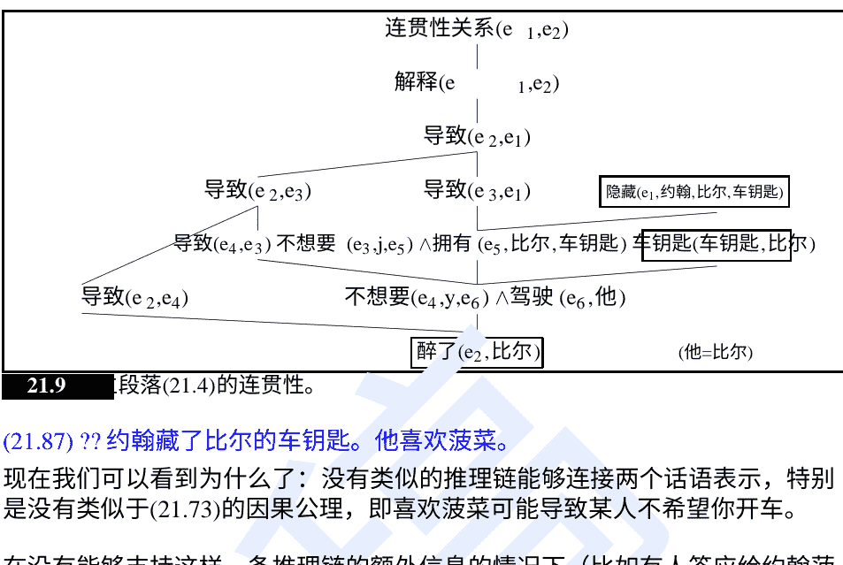

(21.87) ??约翰藏了比尔的车钥匙。他喜欢菠菜。

现在我们可以看到为什么了：没有类似的推理链能够连接两个话语表示，特别是没有类似于(21.73)的因果公理，即喜欢菠菜可能导致某人不希望你开车。

在没有能够支持这样一条推理链的额外信息的情况下（比如有人答应给约翰菠菜作为交换条件来藏比尔的车钥匙的情景），无法建立段落的连贯性。因为诱导是一种不可靠的推理形式，所以在诱导推理过程中所做的假设必须能够随后撤回，即诱导性的可废除推理是可废除的。

(21.88) 比尔的车不在这里，约翰只是在开他的玩笑。

系统将不得不撤回连接两个子句的原始推理链，并用利用隐藏事件是一个玩笑的事实来替换它。

在一个设计用于支持广泛推理的更一般的知识库中，人们希望的公理比我们用来建立(21.86)段落的连贯性的公理更一般。例如，考虑公理(21.74)，它说如果你不希望某人开车，那么你不希望他们有车钥匙。一个更一般的公理形式将会说，如果你不希望某人执行一个动作，并且一个物体使他们能够执行该动作，那么你不希望他们拥有该物体。车钥匙使某人能够开车的事实将会被单独编码，以及许多其他类似的的事实。同样，公理(21.73)说如果有人喝醉了，你不希望他们开车。我们可以用一个公理来替换它，该公理说如果有人不希望某事发生，那么他们不希望有可能导致它发生的事情。同样，人们通常不希望其他人发生车祸，而酒后驾车会导致事故的事实将会被单独编码。

尽管拥有能够揭示连贯性建立问题的计算模型非常重要，但在广泛覆盖的基础上使用这些方法仍存在很大的障碍。特别是需要编码关于世界的所有必要事实的大量公理，以及缺乏对这么多公理进行推理的强大机制，使得这些方法在实践中很不实用。

## 21.10 参考和连贯性的心理语言学研究

我们在这里总结了大量心理语言学研究的一些选择性结果；由于篇幅原因，我们在这里仅关注代词照应。大量的工作涉及人们在解释代词时使用第21.5节中描述的偏好的程度，其结果常常相互矛盾。

Clark和Sengal（1979）通过一系列阅读时间实验研究了句子的新旧对代词解释的影响。在这之后，一些研究人员对人们使用第21.5节中描述的偏好来解释代词的程度进行了研究，结果常常相互矛盾。

在接收和确认三个句子的上下文后，被试者被给予一个包含代词的目标句子。当被试者觉得他们理解了目标句子时，他们按下了 一个按钮。Clark和Sengal发现，当代词的先行词从上下文中最近的从句中唤起时，阅读时间显著缩短，而当代词的先行词从两个或三个从句中唤起时，阅读时间则较长。另一方面，从两个从句和三个从句中唤起的先行词之间没有显著差异，他们认为“最后处理的从句在工作记忆中给予了所提及实体的特权位置”。

Crawley等人（1990）将语法角色平行性偏好与语法角色偏好进行了比较，特别是对于从前一句的主语位置唤起的先行词的偏好而言。与以往的研究不同，这些偏好被混淆在一起，只考虑了主语到主语的参照效应，Crawley等人研究了宾语位置上的代词，以查看它们是否倾向于被分配给上一句的主语或宾语。他们发现，在两个任务环境中 - 一个回答问题的任务，揭示了人类如何解释代词，以及一个指代命名任务，直接确定代词的指代 - 人类主体更倾向于将代词解析为前一句的主语，而不是宾语。

然而，Smyth（1994）批评了Crawley等人的数据对于评估并行性的充分性。使用更严格要求评估并行性的数据，Smyth发现在指代命名任务中，主体主要遵循并行性偏好。该实验对于主题参照优于宾语参照的偏好提供了较弱的支持，他认为这是一种默认策略，当所讨论的句子不足够并行时。

Caramazza等人（1977年）研究了动词的“隐含因果关系”对代词消解的影响。动词被归类为具有主语偏向或宾语偏向，使用句子完成任务。被试被给予句子片段，如（21.89）。

（21.89）约翰给比尔打电话，因为他

被试提供了句子的完成，这些完成确定了他们偏爱的代词指代。对于大多数被试指示具有语法主语或宾语偏好的动词，被归类为具有该偏好。然后为每个有偏好的动词构建了一对句子：一个“一致”的句子，其中语义支持动词偏好所暗示的代词分配，以及一个“不一致”的句子，其中语义支持相反的预测。例如，句子（21.90）对于具有主语偏好的动词“打电话”是一致的，因为第二个从句的语义支持将主语约翰指派为的先行词，而句子（21.91）是不一致的，因为语义支持将宾语比尔指派为的先行词。

（21.90）约翰给比尔打电话是因为他想要一些信息。

（21.91）约翰给比尔打电话是因为他隐瞒了一些信息。

在一个指代命名任务中，Caramazza等人发现对于一致的句子，命名时间比不一致的句子要快。也许令人惊讶的是，即使在第一个从句中提到的两个人是不同性别的情况下，这个结论仍然成立，从而使得指代是明确的。

Matthews和Chodorow（1988）分析了句内指代问题和基于句法的搜索策略的预测。在一个问答任务中，他们发现句子中代词的先行词占据早期、句法深层位置时，被试表现出较慢的理解时间，而当先行词占据晚期、句法浅层位置时，理解时间较快。这个结果与Hobbs的树搜索算法中使用的搜索过程是一致的。

还有一些心理语言学的工作涉及测试中心理论的原则。在一系列的阅读时间实验中，Gordon等人（1993年）发现，当当前的向后看的中心使用完整的名词短语而不是代词来引用时，阅读时间会变慢，即使代词是有歧义的，而专有名词则没有。这种效应被他们称为“重复名称惩罚”，只在主语位置的指称中发现，这表明C<sub>b</sub>优先作为主语实现。Brennan（1995年）分析了语言形式选择与中心原则的相关性。她进行了一系列实验，其中一个人观看篮球比赛并必须向第二个人描述比赛。她发现，人类受试者倾向于在主语位置使用完整的名词短语来引用实体，然后再使用代词，即使该指称在宾语位置已经引入。

## 21.11 总结

在本章中，我们看到自然语言处理系统面临的许多问题是在句子之间进行操作的，也就是在话语层面上。下面是我们讨论的一些主要观点的总结：

- 话语和句子一样，具有层次结构。在最简单的结构检测中，我们假设一个更简单的线性结构，并对话语进行分割。
- 话语不是任意的句子集合；它们必须是连贯的。使话语连贯的因素包括句子之间的连贯关系和基于实体的连贯性。
- 已经提出了各种各样的连贯关系和修辞关系的集合。
- 用于检测这些连贯关系的算法可以使用基于表面的线索（提示短语、句法信息）。
- 话语解释要求建立一个不断演变的话语状态表示，称为话语模型，其中包含了被提及的实体的表示以及它们参与的关系。
- 自然语言提供了许多指代实体的方式。每种指代形式都会向听者发送关于如何处理它与她的话语模型和对世界的信念集相关的信号。
- 代词指代可以用于话语模型中具有足够显著性的指代。有各种词汇、句法、语义和话语因素似乎会影响显著性。
- Hobbs、Centering和Log-linear模型用于代词照应，提供了结合这些约束的不同方式。
- 完整的NP共指任务还必须处理名称和确定性NP。字符串编辑距离对于这些是一个有用的特征。
- 建立连贯性的高级算法应用了一个或多个连贯关系所施加的约束，通常会推断出说话者未说出的附加信息。不合理的逻辑推理规则可以用于执行这种推理。

# 参考文献和历史注释

在早期自然语言理解系统的基础上（Woods等人，1972a；Winograd，1972b；Woods，1978），计算方法在70年代末进行了大量关于话语的基础工作。Webber（1978，1983）的工作为话语模型中实体的表示方式和它们许可后续引用的方式提供了基本见解。她提供的许多例子至今仍然挑战着关于引用的理论。Grosz（1977a）讨论了对话参与者在话语展开过程中所保持的注意焦点。她定义了两个层次的焦点；与整个话语相关的实体被称为全局焦点，而局部焦点（即，对于特定话语最为核心的实体）被称为即时焦点。

Sidner（1979，1983）描述了一种跟踪（即时）话语焦点及其在解决代词和指示名词短语中的使用的方法。她区分了当前话语焦点和潜在焦点，潜在焦点是中心理论中向后和向前寻找中心的前身。

中心化方法的根源可以追溯到Joshi和Kuhn（1979）以及Joshi和Weinstein（1981）的论文，他们讨论了即时焦点与将当前话语整合到话语模型中所需的推理之间的关系。Grosz等人（1983）将这项工作与Sidner和Grosz的先前工作相结合。这导致了一篇关于中心化的手稿，尽管自1986年以来广泛流传，但直到Grosz等人（1995b）才发表。基于这篇手稿/论文，随后发表了一系列关于中心化的论文（Kameyama，1986; Brennan等，1987; Di Eugenio，1990; Walker等，1994; Di Eugenio，1996; Strube和Hahn，1996; Kehler，1997a，等等）。后来的一系列中心化论文收录在Walker等人（1998）的著作中，更多最新工作请参阅Poesio等人（2004）。在本章中，我们重点讨论了中心化和指代消解；See Karamanis（2003，2007），Barzilay和Lapata（2007）以及第23章中讨论的相关论文讨论了将中心化应用于基于实体的连贯性。

在语言学中，有很长的历史研究关于信息状态的研究（Chafe，1976; Prince，1981; Ariel，1990; Prince，1992; Gundel et al.，1993; Lambrecht，1994，among others）。

从Hobbs（1978）的树搜索算法开始，研究人员一直致力于基于句法的方法来在自然语言文本中鲁棒地识别参照。早期的一个系统是Lappin和Leass（1994）提出的一种基于不同句法和其他特征的加权组合，我们在第一版中详细描述了该系统。Kennedy和Boguraev（1996）描述了一个类似的系统，它不依赖于完整的句法分析器，而只需要一个识别名词短语并标记其语法角色的机制。这两种方法都使用了Alshawi（1987）的框架来整合显著性因素。Huls等人（1995）描述了一种使用这个框架来解决多模态（即语音和手势）人机界面中的参照的算法。

在Mitkov和Boguraev（1997）中可以找到关于操作系统中参考的各种方法的讨论。

基于监督学习的参考解析方法早在1994年（Connolly等，1994）、1995年（Aone和Bennett，1995）、1995年（McCarthy和Lehnert，1995）、1997年（Kehler，1997b）、1998年（Ge等，1998）等就被提出。最近，监督和无监督方法都受到了很多研究的关注，既关注了指代消解（Kehler等，2004; Bergsma和Lin，2006），也关注了完整的NP共指（Cardie和Wagstaff，1999; Ng和Cardie，2002b; Ng，2005）。对于明确的NP参考，有一般算法（Poesio和Vieira，1998; Vieira和Poesio，2000），以及专门的算法，重点是判断特定的明确的NP是否是指代的（Bean和Riloff，1999，2004; Ng和Cardie，2002a; Ng，2004）。

参考Mitkov（2002）了解关于指代消解的全面概述以及Branco等人（2002）的论文集。

使用衔接来进行线性话语分割的想法在（Halliday和Hasan，1976）的开创性工作中是隐含的，但首次被Morris和Hirst（1991）明确实现，并迅速被许多其他研究人员接受，包括（Kozima，1993; Reynar，1994; Hearst，1994，1997; Reynar，1999; Kan等人，1998; Choi，2000; Choi等人，2001; Brants等人，2002; Bestgen，2006）。Power等人（2003）研究话语结构，而Filippova和Strube（2006），Sporleder和Lapata（2004，2006）专注于段落分割。

在分割中使用提示短语的方法已经得到广泛研究，包括以下工作在文本流派和语音中都有许多研究者进行了研究（Passonneau和Litman，1993；Hirschberg和Litman，1993；Manning，1998；Kawahara等，2004）。

许多研究者提出了一组可以在话语中存在的连贯关系（Halliday和Hasan，1976；Hobbs，1979a；Longacre，1983；Mann和Thompson，1987；Polanyi，1988；Hobbs，1990；Sanders等，1992；Carlsonet al.，2001，2002；Asher和Lascarides，2003；Baldrige等，2007，等等）。在文献中提出了超过350种关系的汇编可以在Hovy（1990）中找到。

对于连贯性提取有多种方法。基于提示短语的模型在第21.2.2节中描述，这是由Daniel Marcu和他的同事们提出的（Marcu，2000b，2000a；Carlson et al.，2001，2002）。语言学话语模型（Polanyi，1988；Scha和Polanyi，1988；Polanyi et al.，2004a，2004b）是一个更加强调话语句法的框架；在这种方法中，一个话语解析树是基于从句到从句的方式构建的，类似于句子解析树是基于成分到成分的方式构建的。Corston-Oliver（1998）还探讨了句法和基于解析器的特征。最近的一项工作应用了树相邻语法形式主义来进行话语解析（Webber et al.，1999；Webber，2004）。这个模型也被用来注释Penn话语树库（Miltsakaki et al.，2004b，2004a）。参见Asher和Lascarides（2003）以及Baldrige等人（2007）关于分段话语表示结构（SDRT）的研究。Wolf和Gibson（2005）认为连贯结构包括交叉括号，使其无法表示为树，并提出了图形表示方法。

除了确定话语结构和含义外，连贯性理论还被用于解释话语层面的语言现象，包括代词消解（Hobbs，1979a；Kehler，2000），动词短语省略和间断（Pr"ust，1992；Asher，1993；Kehler，1993，1994a），以及时态解释（Lascarides和Asher，1993；Kehler，1994b，2000）。关于连贯关系和话语连接词之间关系的广泛研究可参见Knott和Dale（1994）。

# 练习

**21.1** 在句法理论的早期工作中，通过纯句法手段来表征代词化的规则。提出了一条规则，即通过从包含它的句子的句法结构中删除代词，并用先行名词短语的句法表示来替换它来解释代词。解释为什么以下句子（称为“巴赫-彼得斯”句子）对这种分析是有问题的：
(21.92) 那个值得得奖的人得到了他想要的奖品。
(21.93) 开枪射击的飞行员击中了追逐他的米格战机。在第710-713页讨论的其他类型的参照对这种分析有什么问题？

**21.2** 为第719页上的例子 (21.66) 绘制句法树，并对其应用霍布斯的树搜索算法，展示搜索中的每一步。

**21.3** 霍布斯 (1977) 引用了他的语料库中以下例子作为对他的树搜索算法有问题的例子：
> (21.94)一个大厅中的柱子位置是由河石和一个呈凸面状的青铜垫子标记的，这些河石和青铜垫子曾经作为它们的基础。
> (21.95)它们立即在记录人类从亚洲首次出现以来的物质发展的稀少遗迹中被赋予了重要地位。
> (21.96)商代时期粗糙的灰陶器被发现的遗址并没有延伸到黄河的最南端，也没有向西延伸到黄河与渭河的交汇处。(21.97)考古学家认为，薄而坚硬的黑色抛光陶器是龙山文化最明显的标志，它们呈角度的形状发展于东部。它的名称来源于山东的一个地点。它一直追溯到东北部的辽宁省。
> (21.98)他有执行国家祭天和祭地的职责：他作为封建领主和大臣所提供的服务的荣誉和物质奖励的来源，在成千上万的铭文中得到了纪念，这些铭文被接受者刻在青铜器上，最终被埋在他们的坟墓中。
在每种情况下，确定下划线代词的正确指代和算法将错误地识别的指代。讨论在每种情况下起作用的任何因素，以及解释它们所需的信息类型。

**21.4** 实现Hobbs算法。在Penn TreeBank的样本上进行测试。您需要修改算法以处理Hobbs和TreeBank语法之间的差异。

**21.5** 考虑以下来自Brennan等人 (1987) 的段落：
> (21.99) Brennan开着一辆阿尔法·罗密欧。
她开得太快了。
弗里德曼在周末和她比赛。
她去拉古纳塞卡。
确定BFP算法在最后一句中找到的代词的指代。你同意这个选择吗，还是你觉得这个例子有歧义？讨论为什么在主语位置引入一个新的名词短语，并在宾语位置使用代词化的引用，可能会导致下一句中的主语代词产生歧义。这里有哪些竞争的偏好?

**21.6** 考虑一下 (21.100a-b) 的片段，改编自Winograd (1972b)。
> (21.100) 市议会拒绝了示威者的许可证，因为
+   a. 他们担心暴力。

## 21.7 从你最喜欢的报纸中选择一篇社论专栏，并确定其中一个10-20句的话语结构。你遇到了什么问题？

你是否受到演讲者在任何地方包含的表面线索（例如，话语连接词）的帮助？

## 第22章 信息提取

> 我是一个现代少将的典范，
> 我有关于植物、动物和矿物的信息，
> 我了解英国的国王，并引用历史上的战斗
> 从马拉松到滑铁卢，按照分类的顺序...
> ——吉尔伯特和沙利文，《悲惨世界》

想象一下，你是一家追踪航空股票的投资公司的分析师。你被赋予了确定航空公司宣布票价上涨与其股票在第二天的行为之间的关系（如果有的话）的任务。关于股票价格的历史数据很容易获得，但关于航空公司公告的信息呢？要在这个任务上做出合理的工作，你至少需要知道航空公司的名称，提议的票价上涨的性质，公告的日期，可能还有其他航空公司的反应。幸运的是，这些信息存储在报告航空公司行动的新闻文章档案中，就像下面的最新例子一样。

引用高燃油价格，联合航空公司周五表示，已将票价提高了6美元，每往返航班飞往一些也由低成本航空公司服务的城市。美国航空公司，AMR公司的一个单位，发言人蒂姆瓦格纳说，立即匹配了这一举措。联合航空公司，UAL公司的一个单位，表示这一增加从周四开始适用于大多数与低成本航空公司竞争的航线，例如芝加哥到达拉斯和丹佛到旧金山。

当然，从自然发生的文本中提取姓名、日期和金额等信息是一项非常困难的任务。本章介绍了一系列技术，可以用来从文本中提取有限种类的语义内容。这个过程的信息提取（IE）将嵌入在文本中的非结构化信息转化为结构化数据。更具体地说，信息提取是一种有效的方法来填充关系数据库的内容。一旦信息被正式编码，我们可以应用数据库系统、统计分析软件和其他形式的决策支持系统提供的所有功能来解决我们试图解决的问题。

当我们继续阅读本章时，我们会发现信息抽取问题的强大解决方案实际上是本书中之前所见技术的巧妙组合。特别是在第2章和第3章中描述的有限状态方法，第4章到第6章介绍的概率模型以及第13章的句法分块方法构成了大多数当前信息抽取方法的核心。在深入介绍这些技术如何应用之前，让我们快速介绍信息抽取中的主要问题以及它们的解决方法。

大多数信息抽取任务的第一步是检测和分类文本中提到的所有专有名词，这通常被称为命名实体识别（NER）任务。

毫不奇怪，什么构成了一个专有名词以及用于分类它们的特定方案是应用程序特定的。通用的命名实体识别系统倾向于专注于在普通新闻文本中找到人名、地名和组织名；实际应用程序还可以用于检测从基因和蛋白质的名称（Settles，2005）到大学课程名称（McCallum，2005）的一切。

我们的引例中包含13个专有名词的实例，我们将其称为专有名词提及，可以被分类为组织、人物、地点、时间或数量。

在定位文本中所有专有名词提及之后，将这些提及链接或聚类成对应于提及背后实体的集合是很有用的。这是指代消解的任务，我们在第21章中介绍过，也是信息抽取中的一个重要组成部分。在我们的示例文本中，我们想知道第一句中的**United Airlines**提及和第三句中的**United**提及指的是同一个真实世界实体。这个通用的指代消解问题还包括指代消解作为一个子问题。在这种情况下，确定两个**it**的用法分别指的是**United Airlines**和**United**。

## 关系检测和分类的任务是找到并分类语义关系。

在给定的文本中发现的实体之间的关系。在大多数实际环境中，关系检测的重点是一组小的固定的二元关系。在标准系统评估中出现的通用关系包括家庭、就业、整体-部分、成员资格和地理空间关系。关系检测和分类任务是最接近填充关系数据库问题的任务。

实体之间的关系检测也与在第20章中介绍的发现词语之间的语义关系的问题密切相关。

我们的示例文本中包含3个通用关系的明确提及：*United*是*UAL*的一部分，*American Airlines*是*AMR*的一部分，*Tim Wagner*是*American Airlines*的雇员。航空业的领域特定关系包括*United*服务于芝加哥、达拉斯、丹佛和旧金山。

除了了解文本中的实体及其相互关系外，我们可能还希望找到并分类实体参与的事件；这是事件检测和分类的问题。在我们的样本文本中，关键事件是联合航空的票价上涨和美国航空随之而来的增加。此外，还有几个事件报告这些主要事件，如所示和引用的两个用法。与实体识别一样，事件检测也带来了参考解析的问题；我们需要弄清楚文本中的众多事件提及中哪些是指同一个事件。在我们的运行示例中，第二和第三句中所指的事件与第一句中的增加是相同的。

在文本中确定事件发生的时间以及它们在时间上的关系的问题引发了时间表达式识别的双重问题。

时间表达式检测告诉我们，我们的样本文本中包含了时间表达式星期五和星期四。时间表达式包括日期表达式，如星期几、月份、节假日等，以及相对表达式，包括诸如从现在开始两天或明年之类的短语。它们还包括关于钟表时间的表达式，如中午或下午3:30。

时间分析的总体问题是将时间表达式映射到具体的日历日期或每天的时间，然后使用这些时间来确定事件的时间。

它包括以下子任务。
- 将时间表达式与锚定日期或时间进行修正，通常是新闻报道中的日期线。
- 将时间表达式与文本中的事件关联起来。
- 将事件安排在一个完整和连贯的时间线上。

在我们的示例文本中，时间表达式星期五和星期四应该与文章本身相关的日期线锚定。我们还知道星期五指的是联合航空公司的公告时间，星期四指的是票价上涨生效的时间（即紧接着星期五的那个星期四）。最后，我们可以利用这些信息制作一个时间线，联合航空公司的公告在票价上涨之后，美国航空公司的公告在这两个事件之后。这种类型的时间分析在几乎所有涉及意义的自然语言处理应用中都非常有用，包括问答系统、摘要生成和对话系统。

最后，许多文本描述了在感兴趣领域中以某种频率重复出现的刻板情况。模板填充的任务是找到能唤起这些情况的文档，然后用适当的材料填充模板中的槽位。这些槽位填充器可以由直接从文本中提取的文本片段组成，也可以由通过一些额外处理从文本元素中推断出的概念组成（如时间、数量、本体中的实体等）。

我们的航空公司文本是这种典型情况的一个例子，因为航空公司经常试图提高票价，然后等待竞争对手是否跟随。在这种情况下，我们可以将联合航空标识为最先提高票价的航空公司，$6表示提高票价的金额，星期四表示票价调整的生效日期，美国航空是跟随的航空公司。我们原始航空公司故事中的一个填充模板可能如下所示。

| 领先航空公司 | 联合航空 |
| :--- | :--- |
| 金额 | $6 |
| 生效日期 | 2006-10-26 |
| 跟随者 | 美国航空 |

下面的章节将在通用新闻文本的背景下回顾每个问题的当前方法。然后，在处理生物学文本的背景下描述了这些问题的许多情况。

## 22.1 命名实体识别

大多数信息提取应用的起点是检测和分类文本中的命名实体。通过命名实体，我们指的是任何东西可以用一个适当的名称来指代的东西。这个命名实体识别的过程指的是找到构成专有名称的文本段落，然后根据其类型对所指实体进行分类的综合任务。

通用的面向新闻的NER系统专注于检测人物、地点和组织等事物。图22.1和22.2提供了典型命名实体类型及其示例的列表。专门的应用可能涉及许多其他类型的实体，包括商业产品、武器、艺术品，或者如我们将在第22.5节中看到的蛋白质、基因和其他生物实体。所有这些应用程序共享的是对专有名称的关注，以及在给定语言或体裁中这些名称被标识的特征方式，以及来自感兴趣领域的一组固定的实体类别。

顺便说一下，通过名称的信号，我们只是指名称在文本中的表示方式。例如，如果我们处理的是标准英文文本，那么文本中间的两个相邻的大写单词很可能是一个名称。此外，如果它们之前是*Dr.*或之后是*MD*，那么很可能是一个个人。相反，如果它们之前是*arrived in*或之后是*NY*，那么很可能是一个地点。请注意，这些信号包括有关专有名称及其周围上文的事实。

命名实体的概念通常被扩展到包括那些并不是实体本身，但仍然具有实际重要性并具有特征签名以示其存在的事物；例如日期、时间、命名事件和表达式时间以及测量、计数、价格和表达式数值等其他类型的时间表达式和数值表达式。我们将在第22.3节中稍后讨论其中一些。让我们重新审视之前介绍的带有命名实体标记的示例文本（使用*TIME*和*MONEY*来标记时间和货币表达式）。

引用高燃油价格，*[ORG 美国联合航空公司]*表示*[TIME 星期五]*它已经将部分城市的往返航班票价提高了*[MONEY 6美元]*，这些城市也有低成本航空公司提供服务。*[ORG 美国航空公司]*，*[ORG AMR公司]*的一个单位，发言人*[人物 Tim Wagner]*说，*[组织 United]*立即匹配了这一举措。*[ORG UAL公司]*表示，涨价从*[TIME 星期四]*开始生效，并适用于大多数与折扣航空公司竞争的航线，比如*[LOC 芝加哥]*到*[LOC 达拉斯]*和*[LOC 丹佛]*到*[LOC 旧金山]*。

如图所示，这段文字中包含13个命名实体的提及，包括5个组织、4个地点、2个时间、1个人物和1个金钱提及。这5个组织提及对应着4个独特的组织，因为*[ORG United]*和*[ORG United Airlines]*是指代同一实体的不同提及。

### 22.1.1 命名实体识别中的歧义

命名实体识别系统面临两种类型的歧义。第一种歧义是由于相同的名称可以指代同一类型的不同实体。例如，JFK可以指代前总统或他的儿子。这基本上是一个参考解析问题，解决这种歧义的方法在第21章中讨论。

第二个歧义的来源在于相同的命名实体提及可能指的是完全不同类型的实体。例如，除了人之外，JFK可能指的是纽约的机场，或者美国各地的任何一所学校、桥梁和街道。图22.3和22.4给出了这种跨类型混淆的一些例子。

| 名称 | 可能的类别 |
| :--- | :--- |
| 华盛顿 | 人物、地点、政治实体、组织、设施 |
| Downing St. | 地点、组织 |
| IRA | 人物、组织、货币工具 |
| 路易威登 | 人物、组织、商业产品 |

**图22.3** 几种专有名词相关的常见类别歧义。

*[人物 华盛顿]* 出生在詹姆斯·伯罗斯的农场上。
*[组织 华盛顿]* 在四场比赛系列中以2比1领先。
布莱尔抵达*[地点 华盛顿]*，这可能是他最后一次国事访问。
六月份，*[地理政治实体 华盛顿]*通过了一项主要的安全带法律。
*[设施 华盛顿]*已经被证明是一艘漏水的船，我每次通过都会有漏水。

**图22.4** 用名字华盛顿时的类型歧义示例。

请注意，图22.3中显示的一些歧义是完全巧合的。IRA的金融和组织用途之间没有关系，它们只是从不同来源（个人退休账户和国际阅读协会）巧合地作为首字母缩写出现。另一方面，华盛顿和Downing St.的组织用途是LOCATION-FOR-ORGANIZATION转喻的例子，如第19章所讨论的。

### 22.1.2 序列标注中的命名实体识别

解决命名实体识别问题的标准方法是将其视为逐字逐句的序列标注任务，其中分配的标签捕捉到任何检测到的命名实体的边界和类型。从这个角度来看，命名实体识别看起来非常像句法基短语分块的问题。事实上，命名实体识别的主要方法基于相同的统计序列标注技术，这些技术在第5章介绍了词性标注和第13章介绍了句法分块。

在序列标注NER的方法中，分类器被训练来给文本中的标记标签，以指示特定类型的命名实体的存在。这种方法使用了与句法分块相同的IOB编码风格。回想一下，在这个方案中，I用于标记块内的标记，B用于标记块的开始，O用于标记任何感兴趣的块之外的标记。考虑下面这个句子，它是我们的运行示例中的一部分。

(22.1) $[_{ORG}美国航空公司]$， $[_{ORG}AMR公司]$的一个单位， 发言人$[_{PERS}Tim Wagner]$表示立即匹配了这一举措。

这种括号表示法为我们提供了文本中命名实体的范围和类型。图22.5展示了一种标准的逐词IOB风格标记，捕捉了相同的信息。与句法分块一样，这种编码的标签集由每个被识别的实体类型的2个标签组成，外加一个表示不属于任何实体的O标签，或者$(2 \times N) +1$个标签。

| 词语 | 标签 |
| :--- | :--- |
| 美国的 | B_ORG |
| 航空公司 | I_ORG |
| , | O |
| a | O |
| 单位 | O |
| 的 | O |
| AMR | B_ORG |
| 公司 | I_ORG |
| , | O |
| 立即 | O |
| 匹配 | O |
| 这 | O |
| 一举措 | O |
| , | O |
| 发言人 | O |
| Tim | B_PERS |
| Wagner | I_PERS |
| 表示 | O |

**图22.5** 一个使用IOB编码的命名实体标注示例。

在使用IOB标签对我们的训练数据进行编码后，下一步是选择一组与每个输入示例（即图22.5中要标记的每个标记）相关联的特征。这些特征应该是类标签的合理预测因子，并且应该可以轻松可靠地从源文本中提取出来。请记住，这些特征不仅可以基于要分类的标记的特性，还可以基于周围窗口中的文本。

图22.6列出了在最先进的命名实体识别系统中使用的标准特征列表。我们之前在词性标注和句法基短语分块的上下文中已经见过许多这些特征。

然而，在NER的上下文中，有几个特征尤为重要。形状特征包括常见的大写、小写和首字母大写形式，以及设计用于捕捉使用数字 (A9) 和标点符号的表达式的更复杂模式。通常包括大写、小写和首字母大写形式，以及设计用于捕捉使用数字 (A9) 和标点符号的表达式的更复杂模式。(雅虎)和非典型的案例变化 (易趣)。事实证明，这个特征本身就占据了英语新闻文本中命名实体识别系统成功的相当大部分。正如我们将在第22.5节中看到的那样，形状特征也非常重要。在生物文本中，识别蛋白质和基因的名称尤为重要。图22.7描述了一些常用的形状特征值。

| 特征 | 解释 |
| :--- | :--- |
| 词汇项 | 要标记的标记 |
| | 目标词的词干形式 |
| | 目标词的正字模式 |
| 字符词缀 | 目标词和周围词的字符级词缀 |
| 词性 | 词的词性 |
| 句法块标签 | 基本短语块标签 |
| 地名词典或姓名列表 | 词在一个或多个命名实体列表中的存在 |
| 预测的标记 | 周围文本中预测词的存在 |
| 词袋/词组袋 | 出现在周围上下文中的词和/或词组 |

**图22.6** 训练命名实体识别系统中常用的特征。

| 形状 | 例子 |
| :--- | :--- |
| 小写 | cummings |
| 首字母大写 | 华盛顿 |
| 全大写 | IRA |
| 大小写混合 | eBay |
| 首字母大写带句点 | H. |
| 以数字结尾 | A9 |
| 包含连字符 | H-P |

**图22.7** 常用的形状特征。

在命名实体列表中的存在特征非常有预测性。公开和商业来源都提供了各种事物的广泛名称列表。被称为地名词典的地名列表包含数百万个条目，包含详细的地理、地质和政治信息的各种地点。美国人口普查局提供了大量的姓氏和名字列表，这些列表是根据其每十年一次的人口普查在美国得出的。类似的公司、商业产品以及各种生物和矿物等的列表也可以从各种来源获得。

这个特征通常被实现为一个二进制向量，其中每个可用的名称列表都有一个位。不幸的是，这些列表很难创建和维护，并且根据命名实体类别的不同，它们的有用性差异很大。似乎词表可以非常有效，而大量的人名和组织名列表则没有那么有益（Mikheev等，1999年）。

最后，基于上下文窗口中预测词和N-gram的存在的特征也可以提供很多信息。当它们存在时，前面和后面的头衔、尊称和其他标记，如 Rev., MD 和 Inc. 可以准确地指示实体的类别。与名称列表和词表不同，这些列表在时间上相对较短且稳定，因此易于开发和维护。

任何这些特征或特征组合的相对有用性在很大程度上取决于应用程序、体裁、媒体、语言和文本编码。例如，对于英语新闻文本来说，形状特征非常重要，但对于通过自动语音识别转录的口语文本、从博客和讨论论坛等非正式编辑的来源获取的材料以及对于像中文这样的基于字符的语言来说，形状特征几乎没有用处，因为它们没有大小写信息。因此，图22.6中给出的特征集只能被视为一个起点。

| 词语 | 词性 | 句法块标签 | 形状 | 标签 |
| :--- | :--- | :--- | :--- | :--- |
| 美国的 | NNP | B_NP | 大写 | B_ORG |
| 航空公司 | NNPS | I_NP | 大写 | I_ORG |
| , | 标点 | O | 标点 | O |
| a | DT | B_NP | 小写 | O |
| 单位 | NN | I_NP | 小写 | O |
| 的 | IN | B_PP | 小写 | O |
| AMR | NNP | B_NP | 大写 | B_ORG |
| 公司 | NNP | I_NP | 大写标点 | I_ORG |
| , | 标点 | O | 标点 | O |
| 立即 | RB | B_ADVP | 小写 | O |
| 匹配 | VBD | B_VP | 小写 | O |
| 这 | DT | B_NP | 小写 | O |
| 一举措 | NN | I_NP | 小写 | O |
| , | 标点 | O | 标点 | O |
| 发言人 | NN | B_NP | 小写 | O |
| Tim | NNP | I_NP | 大写 | B_PER |
| Wagner | NNP | I_NP | 大写 | I_PER |
| 表示 | VBD | B_VP | 小写 | O |
| . | 标点 | O | 标点 | O |

**图22.8** 添加了词性、句法块和形状特征的IOB编码示例。

一旦开发出足够的特征集，它们将从代表性的训练集中提取出来，并以适合训练机器学习的形式进行编码的序列分类器。一种标准的编码这些特征的方法是简单地在我们之前的IOB方案中添加更多的列。图22.8展示了将词性标签、句法基短语块标签和形状信息添加到我们之前示例中的结果。

### 22.1.3 评估命名实体识别

在评估命名实体识别系统时，使用了熟悉的召回率、精确率和F₁度量，这些度量在第13章中介绍过。回想一下，召回率是正确标记的响应数量与应该标记的总数量之比；精确率是正确标记的响应数量与总标记数量之比。F-度量（van Rijsbergen, 1975）提供了一种将这两个度量结合为一个单一度量的方法。

### 22.1.4 实用的命名实体识别架构

商业化的命名实体识别方法通常基于列表、规则和监督式机器学习的实用组合（Jackson和Moulinier，2002）。一种常见的方法是对文本进行多次遍历，允许一次遍历的结果影响下一次遍历。这些阶段通常首先使用具有极高精确度但召回率较低的规则。随后的阶段采用更容易出错的统计方法，并考虑第一次遍历的输出。

- 1. 首先使用高精度规则标记明确的实体提及；
- 2. 然后使用概率字符串匹配度量（如第19章所述）搜索先前检测到的名称的子字符串匹配。
- 3. 查阅应用程序特定的名称列表，以识别给定领域中可能的名称实体提及。
- 4. 最后，应用概率序列标记技术，利用前几个阶段的标记作为附加特征。

这种分阶段方法的直觉有两个方面。首先，文本中的一些实体提及对于给定实体的类别更具指示性。其次，一旦在文本中引入了一个明确的实体提及，后续的缩写版本很可能指的是同一个实体（因此是同一类型的实体）。

## 22.2 关系检测和分类

接下来，我们的任务列表中的下一个任务是能够辨别文本中存在的实体之间的关系。为了理解这意味着什么，让我们回到我们标记了所有实体的示例航空公司文本。

由于高昂的燃油价格，[ORG美国联合航空公司]表示[TIME星期五]已经将部分城市的往返航班票价提高了[MONEY 6美元]。这些城市也有低成本航空公司提供服务。[ORG美国航空公司]，[ORG AMR公司]的子公司，立即做出了相应的调整，发言人[PERS Tim Wagner]表示。[ORG美国联合航空公司]，是[ORG UAL公司]的子公司。[ORG UAL公司]表示，涨价从[TIME星期四]开始生效，并适用于大多数与折扣航空公司竞争的航线，比如[LOC芝加哥]到[LOC 达拉斯]和[LOC 丹佛]到[LOC 旧金山]。

这段文字规定了其中提到的命名实体之间的一组关系。例如，我们知道[PERS Tim Wagner]是[ORG美国航空公司]的发言人，这表明 United 是 UAL Corp. 的一个单位，而 American 是 AMR 的一个单位。这些都是二元关系，可以看作是新闻风格文本中相当频繁出现的更通用关系的实例，例如部分属于或雇佣。图22.11显示了最近标准化评估中使用的一系列通用关系的列表。³ 还可以提取更多的领域特定关系，包括航空线路的概念。例如，从这段文本中我们可以得出结论，United 有飞往芝加哥、达拉斯、丹佛和旧金山的航线。

| 关系 | 例子 | 类型 |
|------|------|------|
| 个人关系 | 个人: 婚姻关系, 母亲关系<br>组织关系: 发言人关系, 总裁关系<br>人造物品关系: 拥有关系, 发明关系, 生产关系 | 个人 → 个人<br>个人 → 组织<br>(PER \| ORG) → ART |
| 地理空间 | 接近度: 附近，在郊区<br>定向的: 东南方的 | 位置 → 位置<br>位置 → 位置 |
| 部分关系 | 组织关系: 一个单位, 父母单位<br>政治的: 并入, 收购 | 组织 → 组织<br>GPE → GPE |

**图22.11 关系及其示例和涉及的命名实体类型。**

这些关系与我们在第17章中引入的模型论概念相对应，用于基于逻辑形式的含义。也就是说，一个关系由域中元素的有序元组集合组成。在大多数标准信息提取应用中，域元素要么对应于文本中出现的命名实体，要么对应于共指消解产生的基础实体，要么对应于从域本体中选择的实体。图22.12显示了从我们的运行示例中可以提取的实体和关系的基于模型的视图。请注意，这种模型论视图还包括NER任务；命名实体识别对应于一类一元关系的识别。

### 22.2.1 监督学习方法用于关系分析

关系检测和分类的监督机器学习方法遵循一个现在应该很熟悉的方案。文本被人类分析员用从一个小的固定集合中选择的关系进行注释。然后使用这些带有注释的文本来训练系统在未见过的文本上复制类似的注释。这些注释指示了两个参数的文本范围，每个参数所扮演的角色以及涉及的关系类型。

最直接的方法将问题分解为两个子任务：检测两个实体之间是否存在关系，然后对检测到的关系进行分类。在第一阶段，训练一个分类器来对给定的命名实体对是否参与关系进行二元决策。正例直接从注释语料库中提取，而负例则从未注释关系的句内实体对中生成。

在第二阶段，一个分类器被训练来标记候选实体对之间的关系。如第6章所讨论的，决策树、朴素贝叶斯或最大熵等技术可以直接处理多类别标记。基于发现分离超平面的二元方法（如SVM）通过采用一对多的训练范式来解决多类别问题。在这种方法中，一组分类器被训练，每个分类器以一个标签作为正类，所有其他标签作为负类。最终的分类是通过将每个实例传递给所有分类器，然后从具有最高置信度的分类器中选择标签，或者返回对正响应分类器的排名顺序来执行的。

图22.13说明了在话语单元中查找和分类命名实体之间关系的基本方法。

```
函数 FIND_RELATIONS (words) 返回 关系
   关系 ← nil
   实体 ← FIND_ENTITIES (words)
   对于所有实体对 (e1, e2) 在实体中 执行
      如果 RELATED?(e1, e2)
         关系 ← 关系 + CLASSIFY_RELATION (e1, e2)
```

与命名实体识别一样，这个过程中最重要的步骤是识别出对关系分类有用的表面特征（Zhou等人，2005年）。要考虑的第一个信息来源是命名实体本身的特征。

- 两个候选参数的命名实体类型
- 两个实体类型的连接
- 参数的头词
- 每个参数的词袋

下一组特征是从正在检查的文本中的单词派生出来的。有用的思考方式是将这些特征提取自三个位置：两个候选参数之间的文本，第一个参数之前的固定窗口，以及第二个参数之后的固定窗口。在这些位置上，以下基于单词的特征已被证明是有用的。

- 实体之间的词袋和双词袋
- 相同的词干版本
- 实体之前和之后的词和词干
- 参数之间的词距离
- 参数之间的实体数量

最后，句子的句法结构可以表明其中包含的任何实体之间的许多关系。以下特征可以从各种句法分析级别中派生出来，包括基短语分块、依存分析和完整的成分分析。

- 成分结构中特定构造的存在
- 基短语路径
- 分块头的词袋
- 依存树路径
- 成分树路径
- 参数之间的树距离

利用解析树的一种方法是创建能够指示特定句法构造存在的检测器，然后将二进制特征与这些检测器关联起来。作为这一点的例子，考虑图22.14中显示的子树，它支配着名实体美国和AMR Inc.支配这两个实体的NP结构被称为同位语结构，并且通常与英语中的part-of和a-kind-of关系相关联。指示此结构存在的二进制特征在检测这些关系时很有用。

这种特征提取方法依赖于一定数量的先验语言学分析，以识别那些可能是特定预测因子的句法结构。

| 特征类别 | 特征项 | 特征值 |
|----------|----------|----------|
| **基于实体的特征** | | |
| | 实体₁类型 | 组织 |
| | 实体₁头部 | 航空公司 |
| | 实体₂类型 | 人名 |
| | 实体₂头部 | Wagner |
| | 连接类型 | 组织/人名 |
| **基于单词的特征** | | |
| | 实体之间的词袋 | {a, 单位, of, AMR, Inc., 立即, 匹配, 这个, 发言人} |
| | 实体₁之前的词 | 无 |
| | 实体₂之后的词 | 表示 |
| **句法特征** | | |
| | 成分路径 | NP ↑ NP ↑ S ↑ S ↓ NP |
| | 基本句法块路径 | NP → NP → PP → NP → VP → NP → NP |
| | 类型依赖路径 | 航空公司 ←subj 匹配 ←comp 说 →subj Wagner |

**图22.15 类 <美国航空公司, Tim Wagner> 元组时提取的特征样本。**

某些类别。另一种方法是自动编码树结构的某些方面作为特征值，并允许机器学习算法确定哪些值对哪些类别有信息量。一种简单而有效的方法是通过树使用句法路径。再次考虑之前讨论过的支配美国航空公司和AMR Inc.的树。这些参数之间的句法关系可以通过在树中从一个参数到另一个参数的路径来描述：

```
NP ↑ NP ↓ NP ↓ PP ↓ NP
```

在句法依赖树以及平坦的基短语块结构上定义的类似路径特征已被证明对关系检测和分类很有用。回想一下，在语义角色标注的上下文中，句法路径特征在第20章中占据了重要地位。

图22.15展示了在尝试对我们的示例文本中的美国航空公司和蒂姆·瓦格纳之间进行分类关系时可能提取的一些特征。

### 22.2.2 轻度监督的关系分析方法

刚才描述的有监督机器学习方法假设我们可以轻松访问大量以前注释过的材料来训练分类器。不幸的是，在许多实际环境中，这个假设是不切实际的。在没有大量注释材料的情况下提取关系信息的一种简单方法是使用正则表达式模式来匹配可能包含我们感兴趣的关系表达的文本片段。

考虑构建一个包含各种航空公司使用的中心城市表的的问题。假设我们可以访问一个允许使用通配符进行某种形式的短语搜索的搜索引擎，我们可以尝试以下查询：

```
/*在*/有一个中心
```

如果给予适量的合适材料，这样的搜索将会得到相当数量的正确答案。最近使用这种模式进行的谷歌搜索在返回集合中得到了以下相关句子。
(22.4) 怀俄明州的中西部在KCI有一个中心。
(22.5) 德尔塔在拉瓜迪亚有一个中心。
(22.6) 保加利亚航空和赫穆斯航空都在索非亚机场有一个中心。
(22.7) 美国航空在圣胡安机场有一个中心。

当然，这样的模式可能会以我们在第二章中讨论的两种方式失败：找到一些不应该找到的东西，以及找不到应该找到的东西。作为第一种错误的例子，考虑以下也包含在之前返回集合中的句子。
(22.8) 航空公司j在机场k有一个中心。
(22.9) 导管在近端有一个中心
(22.10) 星型拓扑通常在其中心有一个中心。

我们可以通过使我们提出的模式更具体来解决这些错误。在这种情况下，用命名实体类限制替换无限制通配符操作符将排除这些示例：

```
/[ORG]在[LOC]有一个中心/
```

第二个问题是我们无法知道我们是否已经找到了所有航空公司的中心，因为我们将自己限制在了这个非常具体的模式上。考虑以下我们第一个模式错过的近似情况。
(22.11) 无装饰的竞争对手easyJet在利物浦建立了一个中心...
(22.12) Ryanair也在比利时的沙勒罗瓦机场建立了一个大陆中心。

这些示例被错过是因为它们包含了导致原始模式失败的微小变化。解决这个问题有两种方法。第一种方法是将我们的模式泛化，以捕捉包含我们正在寻找的信息的这些表达式。这可以通过放宽模式以允许跳过候选文本的部分来实现。当然，这种方法很可能会引入更多我们试图通过使我们的模式更具体来消除的误报。

**引导生成**
**种子模式**
**来自一小组种子模式的结果。**

为了看到这是如何工作的，让我们假设我们已经发现Ryanair在Charleroi有一个枢纽。我们可以利用这个事实，在我们的语料库中找到其他提及这种关系的内容来发现新的模式。最简单的方法是在一定的接近度内搜索Ryanair、Charleroi和枢纽这些术语。以下是最近在Google新闻中进行搜索的结果之一。

- (22.13) 廉价航空公司Ryanair将Charleroi作为枢纽，取消了所有周末的航班。
- (22.14) Ryanair在比利时Charleroi机场的枢纽的所有航班都被停飞了。
- (22.15) Charleroi机场的一位发言人估计已经有8000名乘客受到影响。

根据这些结果，可以提取出以下模式，以在正确的位置寻找各种类型的相关命名实体。

- / [机构]，其枢纽位于[地点] /
- / [机构]在[地点]的枢纽 /
- / [地点]是[机构]的主要枢纽 /

然后可以使用这些新模式来搜索其他元组。

图22.16展示了整体引导式方法的示意图。这个图表显示了模式和种子的双重性质，使得该过程可以从一个小的种子元组集合或一组种子模式开始。这种引导式和基于模式的关系抽取方法与第20章讨论的提取下位词和部分整体词汇关系的技术密切相关。

当然，实际实现这种方法还有很多技术细节需要解决。以下是一些关键问题之一。

- 表示搜索模式
- 评估发现模式的准确性和覆盖范围
- 以及评估发现元组的可靠性

模式通常以捕捉以下四个因素的方式表示。

- 第一个实体提及之前的上下文
- 实体提及之间的上下文
- 在第二次提及之后的上下文
- 模式中参数的顺序

上下文可以被捕获为正则表达式模式或特征向量类似于之前描述的基于机器学习方法。 无论哪种情况，它们都可以定义在字符串、词级标记或句法和语义结构上。 一般来说，正则表达式方法往往非常具体，产生高精度的结果；而基于特征的方法则更能忽略上下文中可能无关紧要的元素。

我们下一个问题是如何评估新发现的模式和元组的可靠性。 请记住，通常情况下，我们无法获得给出正确答案的注释材料。 因此，我们必须依赖初始种子模式和/或元组的准确性进行黄金标准评估，并确保在学习新模式时不发生任何重大的语义漂移。

**语义漂移**
元组。 当错误的模式导致错误的元组的引入时，就会发生语义漂移，这些错误的元组又会导致问题模式的创建。为了看到这一点，考虑以下例子。
(22.16) 悉尼在环形码头有一个渡轮中心。
如果将这个表达式作为一个正例接受，就会引入元组 (悉尼,环形码头)。 基于这个元组的模式可能会进一步将错误传播到数据库中。

在评估一个新的提议模式时，需要平衡两个因素：模式在当前元组集合中的性能和模式在文档集合中产生的匹配数量的生产力。

更正式地说，给定一个文档集合 𝒟，一个当前的元组集合 𝑇，和一个提议的模式 𝑝，我们需要跟踪三个因素。

- 命中：在查找 𝒟时与 𝑝匹配的 𝑇中的元组集合；
- misses：在查看 𝒟时， 𝑇中错过的元组集合 𝑝；
- finds：在 𝒟中找到的元组的总集合 𝑝。

下面的方程平衡了这些考虑因素（Riloff和Jones，1999年）。

```
Conf_RlogF(P) = 命中_P / (命中_P + 错过_P) × log(找到)
```

将这个度量视为概率是有用的，因此我们需要对其进行归一化。一种简单的方法是跟踪开发集中置信度的范围，并将其除以先前观察到的最大置信度（Agichtein和Gravano，2000年）。

我们可以通过结合来自所有在 𝒟中匹配该元组的模式 𝑃′的支持证据来评估对一个新提议的元组的置信度（Agichtein和Gravano，2000年）。结合这些证据的一种方法是使用噪声或技术。假设一个给定的元组由 P 中的一部分模式支持，每个模式都有自己的置信度如上所述进行评估。在噪声或模型中，我们有两个基本假设。首先，对于一个提议的元组来说，如果它是错误的，那么它的所有支持模式都必须是错误的，其次，它们各自的失败源都是独立的。如果我们将置信度测量松散地视为概率，那么任何单个模式 p 失败的概率为1 – Conf(p)；一个元组的所有支持模式都错误的概率是它们各自失败概率的乘积，从而得到我们对一个新元组的置信度的以下方程。

```
Conf(t) = 1 - ∏_{p∈P} [1 - Conf(p)]
```

噪声或模型的独立假设非常强大。如果模式的故障模式不独立，则该方法将高估元组的置信度。通常通过设置非常高的阈值来补偿这种高估，以接受新元组。

在引导过程迭代时，我们可以动态评估对新元组和模式的信心。为了防止系统从目标关系漂移，设置保守的新模式和元组接受阈值应该是有帮助的。

尽管在公开可用的资源上还没有针对这种关系提取风格的标准化评估，但该技术已经在从开放源材料（最常见的是从Web）快速填充关系表方面获得了广泛认可 (Etzioni等，2005年)。

### 22.2.3 评估关系分析系统

评估关系检测系统有两种独立的方法。在第一种方法中，重点是系统在给定文本中如何找到和分类所有关系提及。在这种方法中，使用标记和未标记的召回率、精确度和F-度量来评估系统与人工注释的金标准关系的测试集。标记的精确度和召回率要求系统正确分类关系，而未标记的方法只是衡量系统检测相关实体的能力。

第二种方法侧重于从文本中提取元组，而不是关系提及。在这种方法中，系统不需要检测每个关系的每个提及才能正确评分。相反，最终评估是基于系统完成时占据数据库的元组集合。也就是说，我们想知道系统是否能发现Ryan Air在Charleroi有一个枢纽；我们并不关心它发现了多少次。

这种方法通常用于评估无监督方法，如上一节所讨论的那种方法。在这些评估中，人类分析师只需检查系统生成的元组集合。精确度只是由人类专家判断的所有生成的正确元组占所有生成的元组的比例。

回忆在这种方法中仍然是一个问题。显然，手动搜索可能从一个潜在的大型文本中提取出的所有关系是非常昂贵的。

F-度量定义如下：

```
$$F_\beta = \frac{(\beta^2 + 1)PR}{\beta^2 P + R}$$
```

$\beta$参数用于根据应用程序的需求不同地加权考虑召回率和精确度的重要性。当 $\beta > 1$时，偏重于召回率，而当 $\beta < 1$时，偏重于精确度。当 $\beta = 1$时，精确度和召回率平衡；这有时被称为 $F_{\beta=1}$或只是 $F_1$：

```
$$F_1 = \frac{2PR}{P + R}$$
```

与句法分块一样，重要的是区分应用级别上用于衡量性能的指标和训练过程中使用的指标。在应用层面上，在实际命名实体检测中，评估的指标包括准确率和召回率。另一方面，使用IOB编码方案时，学习算法试图优化标签级别的性能。这两个级别的性能可能会有很大的差异；因为在任何给定的文本中，绝大多数标签都不属于任何实体，所以简单地为每个标记发出一个O标签可以得到相当高的标签级别性能。

最近标准化评估中表现出色的系统在实体级别的F-度量值约为0.92，对于人名和地点，约为0.84，对于组织机构（Sang和De Meulder，2003）。

# 第750章 信息抽取

| 描述 | 表示 |
|------|------|
| 领域 | $D = \{a,b,c,d,e,f,g,h,i\}$ |
| United, UAL, American Airlines, AMR | $a,b,c,d$ |
| Tim Wagner | $e$ |
| 芝加哥, 达拉斯, 丹佛和旧金山 | $f,g,h,i$ |
| 课程 | |
| United, UAL, American和AMR是组织 | $Org = \{a,b,c,d\}$ |
| Tim Wagner是一个人 | $Pers = \{e\}$ |
| 芝加哥, 达拉斯, 丹佛和旧金山是地方 | $Loc = \{f,g,h,i\}$ |
| 关系 | |
| United是UAL的一个单位 | $PartOf = \{\langle a,b \rangle, \langle c,d \rangle\}$ |
| American是AMR的一个单位 | $OrgAff = \{\langle c,e \rangle\}$ |
| Tim Wagner为美国航空公司工作 | $服务 = \{\langle a,f \rangle, \langle a,g \rangle, \langle a,h \rangle, \langle a,i \rangle\}$ |

```
/*在*/有一个中心
```

如果给予适量的合适材料，这样的搜索将会得到相当数量的正确答案。最近使用这种模式进行的谷歌搜索在返回集合中得到了以下相关句子。(22.4)怀俄明州的中西部在KCI有一个中心。
(22.5) 德尔塔在拉瓜迪亚有一个中心。
(22.6) 保加利亚航空和赫穆斯航空都在索非亚机场有一个中心。
(22.7) 美国航空在圣胡安机场有一个中心。

当然，这样的模式可能会以我们在第二章中讨论的两种方式失败：找到一些不应该找到的东西，以及找不到应该找到的东西。作为第一种错误的例子，考虑以下也包含在之前返回集合中的句子。(22.8) 航空公司j在机场k有一个中心。
(22.9) 导管在近端有一个中心
(22.10) 星型拓扑通常在其中心有一个中心。

我们可以通过使我们提出的模式更具体来解决这些错误。在这种情况下，用命名实体类限制替换无限制通配符操作符将排除这些示例：

```
/[ORG]在[LOC]有一个中心/
```

第二个问题是我们无法知道我们是否已经找到了所有航空公司的中心，因为我们将自己限制在了这个非常具体的模式上。考虑以下我们第一个模式错过的近似情况。
(22.11) 无装饰的竞争对手easyJet在利物浦建立了一个中心...
(22.12) Ryanair也在比利时的沙勒罗瓦机场建立了一个大陆中心。

这些示例被错过是因为它们包含了导致原始模式失败的微小变化。解决这个问题有两种方法。第一种方法是将我们的模式泛化，以捕捉包含我们正在寻找的信息的这些表达式。这可以通过放宽模式以允许跳过候选文本的部分来实现。当然，这种方法很可能会引入更多我们试图通过使我们的模式更具体来消除的误报。

引导生成
种子模式
来自一小组种子模式的结果。

为了看到这是如何工作的，让我们假设我们已经发现Ryanair在Charleroi有一个枢纽。我们可以利用这个事实，在我们的语料库中找到其他提及这种关系的内容来发现新的模式。最简单的方法是在一定的接近度内搜索Ryanair、Charleroi和枢纽这些术语。以下是最近在Google新闻中进行搜索的结果之一。

- (22.13) 廉价航空公司Ryanair将Charleroi作为枢纽，取消了所有周末的航班。
- (22.14) Ryanair在比利时Charleroi机场的枢纽的所有航班都被停飞了。
- (22.15) Charleroi机场的一位发言人估计已经有8000名乘客受到影响。

根据这些结果，可以提取出以下模式，以在正确的位置寻找各种类型的相关命名实体。

- / [机构]，其枢纽位于[地点] /
- / [机构]在[地点]的枢纽 /
- / [地点]是[机构]的主要枢纽 /

然后可以使用这些新模式来搜索其他元组。
图22.16展示了整体引导式方法的示意图。这个图表显示了模式和种子的双重性质，使得该过程可以从一个小的种子元组集合或一组种子模式开始。这种引导式和基于模式的关系抽取方法与第20章讨论的提取下位词和部分整体词汇关系的技术密切相关。

当然，实际实现这种方法还有很多技术细节需要解决。以下是一些关键问题之一。

- • 表示搜索模式
- - 评估发现模式的准确性和覆盖范围
- - 以及评估发现元组的可靠性

模式通常以捕捉以下四个因素的方式表示。

- - 第一个实体提及之前的上下文
- - 实体提及之间的上下文
- - 在第二次提及之后的上下文
- - 模式中参数的顺序

上下文可以被捕获为正则表达式模式或特征向量类似于之前描述的基于机器学习方法。 无论哪种情况，它们都可以定义在字符串、词级标记或句法和语义结构上。 一般来说，正则表达式方法往往非常具体，产生高精度的结果；而基于特征的方法则更能忽略上下文中可能无关紧要的元素。

我们下一个问题是如何评估新发现的模式和元组的可靠性。 请记住，通常情况下，我们无法获得给出正确答案的注释材料。 因此，我们必须依赖初始种子模式和/或元组的准确性进行黄金标准评估，并确保在学习新模式时不发生任何重大的语义漂移。

语义漂移
元组。 当错误的模式导致错误的元组的引入时，就会发生语义漂移，这些错误的元组又会导致问题模式的创建。为了看到这一点，考虑以下例子。
(22.16) 悉尼在环形码头有一个渡轮中心。如果将这个表达式作为一个正例接受，就会引入元组 (悉尼,环形码头)。 基于这个元组的模式可能会进一步将错误传播到数据库中。

在评估一个新的提议模式时，需要平衡两个因素：模式在当前元组集合中的性能和模式在文档集合中产生的匹配数量的生产力。

更正式地说，给定一个文档集合 𝒟，一个当前的元组集合 𝑇，和一个提议的模式 𝑝，我们需要跟踪三个因素。

- - 命中：在查找 𝒟时与 𝑝匹配的 𝑇中的元组集合；
- - misses：在查看 𝒟时， 𝑇中错过的元组集合 𝑝；
- - finds：在 𝒟中找到的元组的总集合 𝑝。

下面的方程平衡了这些考虑因素（Riloff和Jones，1999年）。

```
(22.17)		Conf RlogF (P) = 命中 / (中P命中P +错过P) × log (找到)
```

将这个度量视为概率是有用的，因此我们需要对其进行归一化。一种简单的方法是跟踪开发集中置信度的范围，并将其除以先前观察到的最大置信度（Agich tein和Gravano，2000年）。

我们可以通过结合来自所有在 𝒟中匹配该元组的模式 𝑃′的支持证据来评估对一个新提议的元组的置信度（Agichtein和Gravano，2000年). 结合这些证据的一种方法是使用噪声或技术。假设一个给定的元组由 P 中的一部分模式支持，每个模式都有自己的置信度如上所述进行评估。在噪声或模型中，我们有两个基本假设。首先，对于一个提议的元组来说，如果它是错误的，那么它的所有支持模式都必须是错误的，其次，它们各自的失败源都是独立的。如果我们将置信度测量松散地视为概率，那么任何单个模式 p 失败的概率为1 – Conf(p)；一个元组的所有支持模式都错误的概率是它们各自失败概率的乘积，从而得到我们对一个新元组的置信度的以下方程。

```
Conf(t) = 1 - ∏_{p∈P} [1 - Conf(p)]
```

噪声或模型的独立假设非常强大。如果模式的故障模式不独立，则该方法将高估元组的置信度。通常通过设置非常高的阈值来补偿这种高估，以接受新元组。

在引导过程迭代时，我们可以动态评估对新元组和模式的信心。为了防止系统从目标关系漂移，设置保守的新模式和元组接受阈值应该是有帮助的。

尽管在公开可用的资源上还没有针对这种关系提取风格的标准化评估，但该技术已经在从开放源材料（最常见的是从Web）快速填充关系表方面获得了广泛认可 (Etzioni等，2005年)。

### 22.2.3 评估关系分析系统

评估关系检测系统有两种独立的方法。在第一种方法中，重点是系统在给定文本中如何找到和分类所有关系提及。在这种方法中，使用标记和未标记的召回率、精确度和F-度量来评估系统与人工注释的金标准关系的测试集。标记的精确度和召回率要求系统正确分类关系，而未标记的方法只是衡量系统检测相关实体的能力。

第二种方法侧重于从文本中提取元组，而不是关系提及。在这种方法中，系统不需要检测每个关系的每个提及才能正确评分。相反，最终评估是基于系统完成时占据数据库的元组集合。也就是说，我们想知道系统是否能发现Ryan Air在Charleroi有一个枢纽；我们并不关心它发现了多少次。

这种方法通常用于评估无监督方法，如上一节所讨论的那种方法。在这些评估中，人类分析师只需检查系统生成的元组集合。精确度只是由人类专家判断的所有生成的正确元组占所有生成的元组的比例。

回忆在这种方法中仍然是一个问题。显然，手动搜索可能从一个潜在的大型文本中提取出的所有关系是非常昂贵的。例如，对于像Web这样的大规模数据集合，一种解决方案是根据第23章（Etzion等，2005）中所述，在不同精度级别上计算召回率。当然，这并不是真正的召回率，因为我们是根据发现的正确元组数量来衡量，而不是根据理论上可从文本中提取的元组数量来衡量。

另一种可能性是在问题上评估召回率，其中有大量资源包含正确答案的全面列表。例如，关于位置的地名词典，关于电影的互联网电影数据库（IMDB），关于书籍的亚马逊。这种方法的问题在于，它根据可能比关系抽取系统使用的文本集合更全面的数据库来衡量召回率。

## 22.3 时间和事件处理

到目前为止，我们的重点一直是提取有关实体及其相互关系的信息。然而，在大多数文本中，实体是在描述它们参与的事件过程中引入的。在文本中找到和分析事件，以及它们在时间上的关系，对于提取文本内容的更完整图像至关重要。这种时间信息在问答和摘要等应用中尤为重要。

在问答中，系统是否检测到正确答案可能取决于从问题和潜在答案文本中提取的时间关系。作为一个例子，考虑以下示例问题和潜在答案文本。

> 航空公司作为一个整体上次提高票价是什么时候？

> 上周，达美航空将数千个票价提高了10美元，大多数大型网络竞争对手立即匹配了这一增加。（日期：2007年7月2日）。

这段代码确实提供了一个答案，但提取它需要时间推理来锚定短语“上周”，将该时间与“提高”事件联系起来，并最终将“匹配”事件的时间与之联系起来。

以下章节介绍了识别时间表达式的方法，找出这些表达式所指的时间，检测事件并将时间与事件关联起来。

### 22.3.1 时间表达式识别

绝对时间表达式 时间表达式是指绝对时间点、相对时间、持续时间和这些时间的集合。绝对时间表达式是指可以直接映射到日历日期、时间或两者。相对时间表达式通过其他参考点（如上周）映射到特定时间。持续时间以不同粒度的时间跨度（秒、分钟、天、周、世纪等）表示。图22.17提供了每个类别中一些示例时间表达式。

从句法上讲，时间表达式是具有时间属性的句法结构。

| 绝对 | 相对 | 持续时间 |
| :--- | :--- | :--- |
| 1916年4月24日 | 昨天 | 四小时 |
| 77年的夏天 | 下个学期 | 三周 |
| 上午10:15 | 从昨天开始的两周 | 六天 |
| 2006年第三季度 | 上个季度 | 过去三个季度 |
| **22.17** | 相对和持续时间表达式的示例。 | |

| 类别 | 例子 |
| :--- | :--- |
| Noun | 早上，中午，晚上，冬天，黄昏，黎明 |
| 专有名词 | 一月、星期一、日子、复活节、犹太新年、斋月、越南新年 |
| 形容词 | 最近的，过去的，年度的，前任的 |
| 副词 | 每小时的，每天的，每月的，每年的 |
| **22.18** | 词汇触发器的例子。 |

词汇触发器 词汇触发器作为它们的头部。在最广泛使用的注释方案中，词汇触发器可以是名词、专有名词、形容词和副词；完整的时间表达式由它们的短语投射组成：名词短语、形容词短语和副词短语。图22.18提供了来自这些类别的词汇触发器的例子。

最广泛使用的注释方案源自TIDES标准（Ferro等，2005年）。这里介绍的方法基于TimeML的努力（Pustejovsky等，2005年）。TimeML提供了一个XML标签TIMEX3，以及各种属性用于注释时间表达式。下面的例子说明了这个方案的基本用法（忽略了额外的属性，我们将在22.3.2节中根据需要讨论）。

> 上周由UALCorp的联合航空公司发起的一次票价上涨被竞争对手在周末进行了匹配，这是过去两周内的第二次成功的票价上涨。

时间表达式识别任务包括找到与这些时间表达式对应的所有文本段的开始和结束。尽管在英语中有无数种组合时间表达式的方式，但实际上，用于生成时间短语的时间触发词集合是静态的，并且用于生成时间短语的结构是相当传统的。这些事实表明，我们已经研究过的任何主要的寻找和分类文本段的方法都应该是成功的。最近的评估中已经成功采用了以下三种方法。

- 基于部分解析或分块的基于规则的系统
- 基于标准逐词IOB编码的统计序列分类器
- 基于组成成分的分类，用于语义角色标注

基于规则的方法用于时间表达式识别，使用自动机级联识别逐渐复杂的模式。由于时间表达式仅限于一组固定的标准句法类别，因此这些系统大多使用基于模式的方法来识别句法块。也就是说，首先对标记词性，然后使用前一阶段的结果逐渐识别更大的块。

与通常的部分解析方法唯一的区别是时间表达式必须包含时间词汇触发器。因此，模式必须包含特定的触发词（例如二月），或者表示类别的模式（例如月份）。图22.19以Perl编写的基于规则的系统的一个小片段说明了这种方法。序列标记方法与用于句法块的第13章中介绍的方案完全相同。使用三个标签 I, O和 B来标记在TIMEX3标签界定的时间表达式中的内部、外部或开始的标记。在这个方案中，示例22.3.1将被标记如下。

| A 车费 增加 | 发起 | 最后 周 | 通过 UAL 公司的... |
| :--- | :--- | :--- | :--- |
| O O O | O | B I | O O O |

如预期，从标记和训练统计序列标记器中提取上下文中的特征。与句法分块和命名实体识别一样，可以应用任何常规的统计序列方法。图22.20列出了机器学习方法中用到的标准特征。

| 特征 | 解释 |
|------|------|
| 标记 | 要标记的目标标记 |
| 目标周围窗口中的标记 | 字符形状特征 |
| 形状 | 目标和窗口单词的词性 |
| POS | 目标和窗口单词的词性 |
| 块标记 | 目标和窗口中的单词的基短语块标记 |
| 词汇触发器 | 在时间术语列表中的存在 |

基于成分的方法结合了分块和逐词标记的特点。在这种方法中，通过自动手段生成完整的成分解析。然后，对生成树中的节点逐个进行分类，判断其是否包含时间表达式。这个任务通过使用带有注释的训练数据训练二元分类器来完成，使用了与IOB样式训练中使用的许多相同的特征。这种方法通过将分割问题交给句法分析器来将分类问题与分割问题分离开来。之前提到过，这个选择的动机是因为在当前可用的训练材料中，时间表达式仅限于来自一组固定句法类别的句法成分。因此，允许句法分析器解决问题的分割部分是有意义的。

在标准评估中，时间表达式识别器使用通常的召回率、精确度和F-度量进行评估。在最近的评估中，基于规则和统计的系统在性能上达到了大致相同的水平，最佳系统在严格的完全匹配标准下达到了约0.87的F-度量。根据与黄金标准时间表达式的重叠程度的宽松标准，最佳系统达到了0.94的F-度量。4

所有这些方法都面临着一些主要困难，包括实现合理的覆盖范围、正确识别时间表达式的范围以及处理触发误报的表达式。误报问题源于将时间触发词作为专有名词的一部分。例如，以下所有示例都可能导致基于规则或统计标记器产生误报。

> (22.19) 《1984》讲述了温斯顿·史密斯在他所生活的极权主义国家中的堕落故事。

> (22.20) Edge准备加入Bono一起演唱U2经典歌曲 Sunday Bloody Sunday.

```
perl
# 昨天/今天/明天
$string =~ s/( ($OT+(早|更早|更晚?)$CT+\s+)?(($OT+这$CT+\s+)?$OT+天$CT+\s+$OT+(之前|之后)$CT+\s+)?$OT+$TEReIDayExpr$CT+(\s+$OT+(早上|下午|晚上|夜晚)$CT+)?) /<TIMEX2 TYPE=\"DATE\">$1<\/TIMEX2>/gio;

$string =~ s/ ($OT+\w+$CT+\s+)
<TIMEX2 TYPE=\"DATE\"[^>]*> ($OT+(今天|今晚)$CT+)<\/TIMEX2>/$1$2/gso;

# 这个/那个 (早上/下午/晚上/夜晚)
$string =~ s/( ($OT+(早|更早|更晚?)$CT+\s+)? $OT+(这个|那个|每个|这个$CT+\s+$OT+(下一个|上一个|接下来))$CT+\s*$OT+(早上|下午|晚上|夜晚) $CT+(\s+$OT+此后$CT+)?) /<TIMEX2 TYPE=\"DATE\">$1<\/TIMEX2>/gosi;

```

**22.19 MITRE的TempEx时间标记系统的Perl代码片段。**

**22.20 训练IOB风格时间表达式标记器的典型特征。**

<TIMEX3 id=t1 type="DATE" value="2007-07-02" functionInDocument="CREATION_TIME">2007年7月2日 </TIMEX3> UAL Corp的美国联合航空公司上周发起的一次票价上涨被竞争对手在<TIMEX3 id="t2" type="DATE" value="2007-W26" anchorTimeID="t1">周末</TIMEX3>进行了匹配，这是第二次成功的票价上涨<TIMEX3 id="t4" type="DURATION" value="P2W" anchorTimeID="t1">两周内</TIMEX3>。

**22.21 TimeML标记包括时间表达式的标准化值。**

> (22.21) Black September在1973年3月试图在纽约市引爆三辆汽车炸弹。

### 22.3.2 时间归一化

识别时间表达式通常紧随着归一化任务。时间归一化是指将时间映射到特定的时间点或持续时间的过程。表达通常对应于日历日期或一天中的时间（或两者兼有）。持续时间主要包括时间长度，但在有信息可用时，还可以包括持续时间的起始点和结束点的信息。

使用ISO 8601标准的VALUE属性捕获时间表达式的规范化表示(ISO8601, 2004)。为了说明这个方案的一些方面，让我们回到我们之前的例子，在图22.21中重新复制，并添加了值属性。

这个文本的日期是2007年7月2日。这种表达式的ISO表示形式是YYYY-MM-DD，或者在这种情况下是2007-07-02。我们样本文本中时间表达式的编码都是基于这个日期的，并且作为VALUE属性的值显示在这里。让我们逐个考虑这些时间的表达式。

| 单位 | 模式 | 样本值 |
| :--- | :--- | :--- |
| 完全指定的日期 | YYYY-MM-DD | 1991-09-28 |
| 周 | YYYY-nnW | 2007-27W |
| 周末 | PnWE | P1WE |
| 24小时制时间 | HH:MM:SS | 11:13:45 |
| 日期和时间 | YYYY-MM-DDTHH:MM:SS | 1991-09-28T11:00:00 |
| 财务季度 | Qn | 1999-3Q |
| **22.22** | 各种时间和持续时间的ISO模式示例。 | |

依次表达式。正文中的第一个时间表达式指的是一年中的特定周。在ISO标准中，周从01到53编号，一年中的第一周是具有该年第一个星期四的那一周。这些周使用模板YYYY-Wnn表示。我们文档日期的ISO周是第27周，因此上值表示为‘2007-W26’。

下一个时间表达是周末。ISO周从星期一开始，因此，周末发生在一周的末尾，并完全包含在一个星期内。周末被视为持续时间，因此VALUE属性的值必须是一个长度。持续时间使用模式Pnx表示，其中n是表示长度的整数，x表示单位，例如P3Y表示三年或P2D表示两天。在这个例子中，一个周末被表示为P1WE。在这种情况下，还有足够的信息将这个特定的周末作为特定周的一部分。这样的信息被编码在ANCHORTIMEID属性中。最后，短语两周也表示为持续时间P2W。

ISO 8601标准和各种时间注释标准还有很多内容，这里无法一一介绍。图22.22描述了其他时间和持续时间的基本表示方式。有关更多详细信息，请参阅（ISO8601, 2004；Ferro等，2005；Pustejovsky等，2005）。

目前大多数处理时间归一化的方法都采用基于规则的方法，这些方法将语义分析过程与匹配特定时间表达式的模式关联起来。这是在第18章中介绍的一种领域特定的规则到规则组合方法的具体实例。在这种方法中，成分的含义是从其部分的含义计算出来的，而用于执行此计算的方法是特定于正在创建的成分的。这里唯一的区别是语义组合规则涉及简单的时间算术，而不是 λ-演算附件。

为了规范时间表达式，我们需要四种类型的规则。

- 完全限定的时间表达式
- 绝对时间表达式
- 相对时间表达式
- 持续时间

完全限定的日期表达式

完全限定的日期表达式包含年、月和日，以某种约定的形式。必须检测表达式中的单位，然后将其放置在相应的ISO模式中的正确位置。以下模式规范了在类似于April 24, 1916的表达式中使用的完全限定的时间表达式。

```
FQTE → 月份 日期 , 年份 { 年份.val — 月份.val — 日期.val }
```

在这个规则中，非终结符月份,日期和年份表示已经被识别和分配语义值的成分，通过 *.val表示进行访问。这个FQTE成分的值在进一步处理中可以通过FQTE.val进行访问。

在真实文本中，完全合格的时间表达式相对较少。新闻文章中的大多数时间表达式都是不完整的，并且只是隐含地锚定，通常是相对于文章的日期线，我们将其称为文档的时间锚点。相对简单的时间表达式，如今天,昨天,或明天的值都可以相对于这个时间锚点计算。对于今天的语义过程只是分配了锚点，而对于明天和昨天的附加操作分别在锚点上加一天和减一天。当然，考虑到我们对月份、星期、日期和时间的循环性表示，我们的时间算术过程必须使用适合所使用时间单位的模算术。

## 时间锚点

不幸的是，即使是简单的表达式，如周末或星期三也会引入相当复杂的情况。在我们当前的例子中，周末明显指的是文档日期之前的那个星期的周末。但这并不总是如此，如下例子所示。

> (22.22) 从昨天开始在天港进行的随机安全检查将至少持续到周末。

在这种情况下，表达式周末指的是包含锚定日期的那个星期的周末（即即将到来的周末）。表达这一信息的信息来自于继续的时态，以及周末所控制的动词。

相对时间表达式使用类似于今天和昨天的时间算术来处理。为了说明这一点，考虑一下我们例子中的上周表达式。根据文档日期，我们可以确定文章的ISO周是第27周，所以上周只是当前周减去1。

再次，即使是这样简单的结构在英语中也可能存在歧义。解决涉及到下一个和最后一个的表达式必须考虑到与问题中最近的单位的锚定日期之间的距离。例如，诸如下周五这样的短语可以指的是紧接着的下一个星期五，或者是在那之后的星期五。决定因素与参考时间的接近程度有关。离文档日期越近的星期五，短语下周五跳过最近的星期五的可能性就越大。这些歧义通过将语言和领域特定的启发式编码到时间附件中来处理。

将高度特异的时间程序与特定的时间结构相关联的需求解释了在时间表达式识别中广泛使用基于规则的方法。即使在使用高性能统计方法进行时间识别时，规则模式仍然需要用于规范化。尽管构建这些模式可能是繁琐且充满例外的，但似乎可以相对快速地创建出在新闻领域中提供良好覆盖的模式集合（Ahn等，2005年）。

| 特征 | 解释 |
| :--- | :--- |
| 字符词缀 | 目标词的字符级前缀和后缀 |
| 名词化后缀 | 名词化的字符级后缀（例如 -tion） |
| 词性 | 目标词的词性 |
| 轻动词 | 二进制特征，表示目标受轻动词控制 |
| 主语句法类别 | 句子主语的句法类别 |
| 词形学词干 | 目标词的词干形式 |
| 动词根 | 名词化的动词基础的根形式 |
| Wordnet上位词 | 目标的上位词集合 |
| **22.23** | 用于规则和统计方法中常用的特征 |

最后，许多时间表达式是与文本中提到的事件相关联的，而不是直接与其他时间表达式相关联的。考虑以下例子。

> (22.23) 风暴过后一周，捷蓝航空发布了其客户权益法案。

为了确定捷蓝航空发布其客户权益法案的时间，我们需要确定风暴事件的时间，然后将该时间通过时间表达式一周后进行修改。在下一节中，我们将回到这个问题，讨论事件检测。

### 22.3.3 事件检测和分析

事件检测和分类的任务是在文本中识别事件提及然后将这些事件分配给各种类别。对于这个任务，事件提及是指任何表示可以分配给时间的特定点或时间间隔的事件或状态的表达式。下面是示例22.3.1中的所有事件的标记。

[事件引用]高燃油价格，联合航空公司[事件表示]周五已经[事件提高]部分城市的往返航班票价6美元，这些城市也由低成本航空公司提供服务。美国航空公司，AMR Corp.的一个单位，立即[事件匹配][事件此举]，发言人Tim Wagner[事件表示]。联合航空公司，UAL Corp.的一个单位，[事件表示][事件此增加]于周四生效，并且[事件适用于]大多数与折扣航空公司竞争的航线，例如从芝加哥到达拉斯和丹佛到旧金山。

在英语中，大多数事件提及对应于动词，而大多数动词引入事件。然而，正如我们从例子中可以看到的，情况并非总是如此。事件可以由名词短语引入，例如the move和the increase，而一些动词则未能引入事件，例如短语动词took effect，它指的是事件开始而不是事件本身。类似地，像 make、 take和have这样的轻动词通常无法表示事件。在这些情况下，动词只是为直接宾语所表示的事件提供句法结构，例如took a flight。

基于规则和统计机器学习方法都已应用于事件检测问题。这两种方法都利用表面信息，如词性信息、特定词汇项的存在以及时态信息。图22.23说明了当前事件检测和分类系统中使用的关键特征。

在文本中检测到事件和时间表达后，下一个逻辑任务是使用这些信息将事件安排到完整的时间线中。这样的时间线对于问答和摘要等应用非常有用。这个雄心勃勃的任务是当前研究的重点，但超出了当前系统的能力范围。

一个相对简单但仍然有用的任务是对文本中提到的事件和时间表达进行部分排序。这样的排序可以提供与真实时间线相同的许多好处。这样一个部分排序的例子是确定在我们的样本文本中，美国航空公司的票价增加发生在联合航空公司的票价增加之后。确定这样的排序可以被视为一种二元关系的检测和分类任务，类似于前面描述的任务（第22.2节）。

解决这个问题的当前方法试图识别出Allen在第17章中讨论的13种时间关系的子集，如图22.24所示。最近的评估工作集中在检测文本中的时间表达、文档日期和事件提及之间的之前、之后和期间关系（Verhagen等，2007年）。大多数表现最好的系统采用了统计分类器，这些分类器是在TimeBank语料库上进行训练的（Pustejovsky等，2003c年）。

### 22.3.4 TimeBank

正如我们在其他任务中所看到的，拥有我们感兴趣的类型和关系的文本注释非常有用。这些资源既有助于基于语料库的语言学研究，也有助于训练系统执行自动的TimeBank标记。TimeBank语料库包含了大量我们在本节中讨论的信息的文本注释（Pustejovsky等，2003c）。该语料库的当前版本（TimeBank 1.2）由来自各种来源的183篇新闻文章组成，包括Penn TreeBank和PropBank收集的文章。

TimeBank语料库中的每篇文章都在TimeML注释中明确注释了时间表达和事件提及（Pustejovsky等，2003a）。除了时间表达和事件，TimeML注释还提供了事件和时间表达之间的时间链接，指定了它们之间的关系性质。考虑以下示例句子及其对应的标记，选自TimeBank文档中的一部分（见图22.25）。

> > (22.24) 三角洲航空股价飙升33%，创下财年第一季度的纪录，与行业盈利下降的趋势背道而驰。

如注释所示，这段文本包含三个事件和两个时间表达式。这些事件都属于发生类别，并被赋予了唯一的标识符，以便在进一步的注释中使用。时间表达式包括文章的创建时间，作为文档时间，以及文本中的一个单一时间表达式。

除了这些注释外，TimeBank还提供了4个链接，用于捕捉文本中事件和时间之间的时间关系。以下是为此示例注释的句内时间关系。

- 飙升在财年第一季度## 22.24 艾伦的13种可能的时间关系。

`TIMEX3 tid="t57" type="DATE" value="1989-10-26" functionInDocument="CREATION_TIME"> 10/26/89 </TIMEX3>
达美航空公司的收益 `EVENT eid="e1" class="OCCURRENCE">飙升</EVENT> 33\% 创下了纪录，在 `TIMEX3 tid="t58" type="DATE" value="1989-Q1" anchorTimeID="t57">财政第一季度 </TIMEX3>, `EVENT eid="e3" class="OCCURRENCE">逆势</EVENT> 行业趋势向 `EVENT eid="e4" class="OCCURRENCE">下降</EVENT> 的利润。`

## 22.25 TimeBank语料库的例子。

-   飙升e1是在1989-10-26之前t57
-   飙升e1与猛犬的同时发生3
-   下降 e4 包括 飙升 e1

TimeBank使用的13种时间关系基于Allen（Allen, 1984）在图22.24中介绍的关系。

## 22.4 模板填充

许多文本包含事件的报告，可能是事件的序列，这些事件通常对应于世界中相当常见的、典型的情况。这些抽象情境脚本可以被描述为脚本，因为它们由子事件、参与者、角色和道具的原型序列组成（Schank和Abelson，1977）。在语言处理中明确表示这些脚本可以帮助我们讨论的许多IE任务。特别是，这些脚本提供的强烈期望可以促进实体的正确分类，将实体分配到角色和关系中，最关键的是，推断出填补未说之事的内容。

在它们最简单的形式中，这样的脚本可以表示为模板，由固定的一组插槽组成，它们的值为插槽填充器，属于特定的类别。模板填充的任务是找到调用特定脚本的文档，然后从文本中提取填充器并将其填充到相关模板的插槽中。这些插槽填充器可以由直接从文本中提取的文本片段组成，也可以由通过一些附加处理从文本元素中推断出的概念组成（时间、数量、本体中的实体等）。

我们原始航空故事中的一个填充模板可能如下所示。

| 票价提高尝试: | 领先航空公司：联合航空： |
| --- | --- |
| 金额： | $6 |
| 生效日期: | 2006-10-26 |
| 跟随者： | 美国航空： |

请注意，通常情况下，此示例中的插槽填充器都对应于各种类型的可检测命名实体（组织、金额和时间）。这表明模板填充应用程序应依赖于由命名实体识别、时间表达和共指算法提供的标签来识别候选插槽填充器。

下一节将描述一种直接的方法，使用序列标注技术来填充插槽。第22.4.2节然后描述了一个设计用于解决更复杂的模板填充任务的系统，该系统基于有限状态转换器的级联使用。

### 22.4.1 统计方法应用于模板填充

一个令人惊讶的有效方法是将模板填充简单地视为统计序列标注问题。 在这种方法中，系统被训练为将一系列标记为特定插槽的潜在填充物。 有两种基本方法来实现这种方法：第一种是为每个要填充的插槽训练单独的序列分类器，然后将整个文本发送到每个标记器；另一种方法是训练一个大的分类器（通常是HMM），为要识别的每个插槽分配标签。 我们将在这里重点介绍前一种方法；我们将在第24章讨论单个大分类器的方法。

在每个槽位一个分类器的方法下，槽位被对应分类器识别出的文本片段填充。与本章前面描述的其他信息抽取任务一样，各种统计序列分类器都已应用于此问题，都使用了常规特征集：标记、标记形状、词性标记、句法块标记和命名实体标记。

在这种方法中，存在多个非相同的文本片段可能被标记为相同的槽位标签。这种情况可能以两种方式出现：使用不同的指代表达式引用相同实体的竞争片段，或者代表真正不同假设的竞争片段。在我们的样本文本中，我们可能期望将片段United, United Airlines标记为LEAD AIRLINE。这些选择并不矛盾，引用消解技术在第21章中介绍的方法可以提供解决方案的途径。

当一个文本包含给定槽位的多个预期类型的实体时，就会出现真正的竞争假设。在我们的例子中，美国联合航空公司和美国航空公司都是航空公司，根据它们与训练数据中的示例的相似性，两者都有可能被标记为LEAD AIRLINE。一般来说，大多数系统只选择具有最高置信度的假设。当然，这种置信度启发式方法的实现取决于所采用的序列分类器的风格。

基于马尔可夫的方法只是选择具有最高概率标签的片段（Freitag和McCallum，1999年）。

已经使用了各种注释集合来评估这种模板填充方法，包括工作公告集合，会议论文集合，餐厅指南和生物文本。经常使用的集合是CMU研讨会公告语料库，这是从网络中检索到的485个研讨会公告的集合，其中的槽位被注释为SPEAKER, LOCATION, START TIME和ENDTIME。在这个数据集上的最先进的F-measure范围从开始和结束时间槽位的约.98，到演讲者槽位的最高.77（Roth和Yih，2001年；Peshkin和Pfefer，2003年）。

尽管这些结果令人印象深刻，但它们与任务的受限性以及所采用的技术同样有关。三个强大的任务约束对此成功做出了贡献。首先，在大多数评估中，集合中的所有文档都是相关且同质的，即它们已知包含感兴趣的槽位。其次，这些文档都相对较小，几乎没有空间容纳可能错误填充槽位的干扰段落。最后，目标输出仅由一小段插槽组成，这些插槽应该用文本片段填充。

### 22.4.2 有限状态模板填充系统

在Message Understanding Conferences (MUC) (Sundheim, 1993)中引入的任务是由美国政府组织的信息提取评估的一系列，它们代表了一个相当复杂的模板填充问题。考虑以下从Grishman和Sundheim（1995）的MUC-5材料中选择的句子。

> Bridgestone Sports Co. 周五表示，它已经与当地的一个公司和一个日本贸易公司在台湾成立了一家合资企业，生产高尔夫球杆并运往日本。

这家合资企业名为Bridgestone Sports Taiwan Co.，注册资本为2000万新台币，将于1990年1月开始生产每月2万只铁和“金属木”球杆。

MUC-5评估任务要求系统生成描述合资企业参与者、结果公司及其预期活动、所有权和注册资本的层次链接模板。图22.26显示了FASTUS系统（Hobbs等，1997年）生成的结果结构。请注意，ACTIVITY槽的填充者本身是一个带有要填充的槽的模板。

FASTUS系统根据一系列转换器生成上述模板，其中每个语言处理级别从文本中提取一些信息，并传递给下一个更高级别，如图22.27所示。大多数系统大多数基于有限自动机的这些级别，尽管在实践中，大多数完整系统在技术上都不是有限状态的，要么是因为个别自动机与特征寄存器相结合（如FASTUS），要么是因为它们仅用作完整解析器的预处理步骤（例如，Gaizauskas等，1995年；Weischedel，1995年），或者与基于统计方法的其他组件结合使用（Fisher等，1995年）。

| 号码 | 步骤 | 描述 |
|------|------|------|
| 1 | 标记化： | 将字符输入流转换为一个标记序列。 |
| 2 | 复杂词汇： | 识别多词短语、数字和专有名词。 |
| 3 | 基本短语： | 将句子分割为名词组、动词组和小品词。 |
| 4 | 复杂短语： | 识别复杂名词组和复杂动词组。 |
| 5 | 语义模式： | 识别语义实体和事件，并插入到模板中。 |
| 6 | 合并： | 合并来自文本不同部分的对同一实体或事件的引用。 |

> 22.27 FASTUS中的处理级别（Hobbs等，1997）。每个级别提取特定类型的信息，然后传递给更高级别。

让我们根据Hobbs等人(1997)和Appelt等人(1995)的描述，概述每个级别的 FASTUS实现。在标记化之后，第二级别识别类似于set up和joint venture的多词短语，以及类似于Bridgestone Sports Co.的名称。命名实体识别器是一个转换器，由一组大型的特定映射组成，用于处理常见的命名实体集合。

以下是对表演组织名称建模的典型规则，例如旧金山交响乐团和加拿大歌剧公司。虽然这些规则是用上下文无关的语法编写的，但没有递归，因此它们可以自动编译成有限状态转换器。

```
表演者-组织  →  （前置位置）表演者名词+表演组织后缀
前置位置  →  地点名称|国籍
地点名称  →  城市|地区
表演组织后缀  →  乐团，公司
表演者名词  →  交响乐团，歌剧
国籍  →  加拿大，美国，墨西哥
城市  →  旧金山，伦敦
```

第二阶段还可以将序列如四十二转换为相应的数值（回顾第8章中对此问题的讨论）。

第三个 FASTUS阶段实现了分块，并使用类似第13章中讨论的有限状态规则生成基本的句法块，如名词组、动词组等。

FASTUS基本短语识别器的输出如图22.28所示；请注意使用了一些领域特定的基本短语，如公司和地点。

回想一下，第13章描述了如何将这些基本短语组合成更复杂的名词组和动词组。这是在FASTUS的第4阶段完成的，通过处理连词和测量短语的附加来实现。

每月生产20,000个铁和“金属木”球杆，以及介词短语：

| 短语类型 | 短语 |
| --- | --- |
| 公司 | Bridgestone Sports Co. |
| 动词组 | 说 |
| 名词组 | 星期五 |
| 名词组 | 它 |
| 动词组 | 建立了 |
| 名词组 | 一个合资企业 |
| 介词 | 在 |
| 地点 | 台湾 |
| 介词 | 与 |
| 名词组 | 一家当地公司 |
| 连词 | 和 |
| 名词组 | 一家日本贸易公司 |
| 动词组 | 生成 |
| 名词组 | 高尔夫球杆 |
| 动词组 | 被运送 |
| 介词 | 到 |
| 地点 | 日本 |

> 22.28 FASTUS基本短语提取器第3阶段的输出，使用Appelt和Isaacs (1997)描述的有限状态规则。

| 模板/槽 | 值 |
| --- | --- |
| 1 | RELATIONSHIP: TIE-UP<br>ENTITIES: "Bridgestone Sports Co."<br>"一个当地的公司"<br>"一个日本贸易公司" |
| 2 | ACTIVITY: 生产<br>PRODUCT: "高尔夫球杆" |
| 3 | RELATIONSHIP: 绑定-上<br>JOINT VENTURE COMPANY: "Bridgestone Sports Taiwan Co."<br>AMOUNT: NT$20000000 |
| 4 | ACTIVITY: 生产<br>COMPANY: "Bridgestone Sports Taiwan Co."<br>STARTDATE: 期间 1990年1月 |
| 5 | ACTIVITY: 生产<br>PRODUCT: "铁和‘金属木’球杆" |

> 22.29 第5阶段生成的五个部分模板。这些模板将通过第6阶段的合并算法合并，生成在第766页上显示的最终模板。

第4阶段的输出是一个复杂名词组和动词组的列表。第5阶段接收此列表，忽略未被分块为复杂组的所有输入，识别复杂组中的实体和事件，并将识别出的对象插入到模板的适当位置。实体和事件的识别是通过手工编码的有限状态自动机完成的，其转换基于特定的复杂短语类型，通过特定的头词或特定特征（如公司、货币或日期）注释。

以新闻报道的第一句为例，根据以下两个正则表达式实现语义模式（其中NG表示名词组，VG表示动词组）。

-   NG(公司/公司) VG(建立) NG(合资企业)与NG(公司/公司)
-   VG(生产) NG(产品)

第二个句子实现了上述第二个模式以及以下两个模式:

-   NG(公司) VG-被动(大写)于NG(货币)
-   NG(公司) VG(开始) NG(活动) 在/于NG(日期)

处理这两个句子的结果是图22.29中显示的五个草稿模板集合。然后，这五个模板必须合并为图22.26中显示的单一分层结构。合并算法决定两个活动或关系结构是否足够一致，以便可能描述相同的事件，并在是的情况下合并它们。合并算法还必须执行如第21章所述的引用解析。

## 22.5 高级：生物医学信息提取*

从生物医学期刊文章中提取信息近年来已成为一个重要的应用领域。 这项工作的动机主要来自生物学家，自从现代基因组学的出现以来，他们发现自己面临着领域内出版物数量的巨大增加 - 对于许多科学家来说，跟上相关文献几乎是不可能的。 图22.30充分展示了这些科学家面临的问题的严重性。 显然，能够自动从这些来源中提取和聚合有用信息的应用将对研究人员大有裨益。

在生物医学领域，信息提取的应用领域正在不断增长，作为构建大型基因组和相关信息数据库的辅助工具。如果没有基于信息提取的协助工具，许多手动构建数据库的努力将需要数十年才能完成，这个时间跨度太长而无法发挥作用（Baumgartner等，2007年）。

这种应用的一个很好的例子是MuteXt系统。 该系统针对两种命名实体类型——蛋白质突变和两种非常特定的蛋白质类型，即G-偶联蛋白受体和核激素受体。 MuteXt系统用于构建一个从2008个文档中提取信息的数据库； 如果手工构建，将是一项耗时且昂贵的工作。

G-蛋白偶联受体的突变与一系列疾病相关，包括糖尿病、眼底色素变性和视网膜色素变性，因此，即使是这种简单的文本挖掘系统也可以明确地应用于缓解人类的痛苦。


> 22.30 Medline数据库中文章数量从1986年到2004年呈指数增长（数据来自（Cohen和Hersh，2004））。

生物学家和生物信息学家最近提出了更多创新性的文本挖掘系统的用途，其中输出永远不打算供人类查看，而是作为高通量分析的一部分使用 - 这些实验方法产生了大量的数据点，而这在二十年前是难以想象的，并且作为使用基因组数据存储库中的数据的技术的一部分。Ng（2006）对这方面的工作进行了回顾和深入分析。

### 22.5.1 生物命名实体识别

生物领域中的信息提取任务具有比新闻风格文本更广泛的相关实体类型范围。图22.31和下面的例子仅展示了生物医学领域NER系统的命名实体类别的一小部分多样性。

> [组织血浆] [基因BNP] 浓度在[群体柔道]和[群体马拉松]组中均高于[群体对照]，并与[解剖左室]质量以及减速时间呈正相关。

几乎所有在第22.1节中描述的技术都已应用于生物医学NER问题，特别关注基因/蛋白质识别问题。

| 语义类别 | 示例 |
|---|---|
| 细胞系 | T98G, HeLa细胞, 中国仓鼠卵巢细胞, CHO细胞 |
| 细胞类型 | 原始T淋巴细胞, 自然杀伤细胞, NK细胞 |
| 化学物质 | 柠檬酸, 1,2-二碘戊烷, C |
| 药物 | 环孢素A, CDDP |
| 基因/蛋白质 | 白色, HSP60, 蛋白激酶C, L23A |
| 恶性肿瘤 | 癌症, 乳腺肿瘤 |
| 医学/临床概念 | 肌萎缩性脊髓侧索硬化症 |
| 小鼠品系 | LAFT, AKR |
| 突变 | C10T, Ala64 → Gly |
| 人群 | 柔道组 |

> 22.31 医学NLP中已识别的命名实体的语义类别示例。注意许多示例之间的表面相似性。

由于基因名称可能具有的各种形式，这项任务特别困难：白色，胰岛素，BRCA1，ether a go-go，以及乳腺癌相关1都是基因的名称。基因名称识别算法的选择似乎不如特征选择重要；典型的特征集包括单词形状和上下文特征，如前面讨论的；此外，有时还会将基于知识的特征，例如使用类似BRCA1基因的序列的Google搜索结果数量来决定字符串 BRCA1是否是对基因的引用，纳入到统计系统中。

令人惊讶的是，使用大量公开可用的基因名称列表并没有对基因/蛋白质NER系统的性能产生普遍贡献（Yeh等，2005年），事实上可能会降低性能（Baumgartner等，2006年）。基因名称通常由多个标记组成（例如，乳腺癌相关1）。基因名称的长度对NER系统的性能有明显影响（Kinoshita等，2005年；Yeh等，2005年），任何能够正确确定多个标记名称边界的技术似乎都能提高性能。为此，使用缩写-定义检测算法（Schwartz和Hearst，2003年）是常见的，因为许多这样的名称在某个时候会出现作为缩写或符号定义。

基础名词组块分析器在这方面也很有用，一些启发式规则（Kinoshita等，2005年）也可以起到意外的作用。

### 22.5.2 基因归一化

在文本中识别出所有生物实体的提及后，下一步是将它们映射到数据库或本体中的唯一标识符。这个任务在基因方面得到了最深入的研究，被称为基因规范化。其中一些问题的复杂性来自于自然语言文本中特定实体名称的高度变异；该问题的性质最早由Cohen等人(2002)确定。在那项工作中，使用了来自描述性语言学的标准发现过程来确定哪些基因名称的变异可以忽略，哪些不能忽略。最近，Morgan等人(2007)展示了社区特定基因命名约定的语言特征如何影响这个任务的复杂性，尤其是对基因的规范化。

基因归一化尝试对不同物种进行处理。基因归一化可以被视为一种词义消歧任务，介于有针对性的WSD任务和全词WSD任务之间。

解决这个问题的一个重要方向是将命名实体映射到生物医学本体，特别是基因本体（Ashburner等，2000年）。这被证明是相当具有挑战性的；基因本体中的术语往往很长，有许多可能的词汇和句法形式，并且有时需要大量的推理。

### 22.5.3 生物角色和关系

在文本中找到和归一化所有生物实体的提及是确定实体在文本中所扮演角色的初步步骤。最近研究的重点是通过发现和分类文本中实体之间的表达二元关系来完成这一点，并确定和分类实体在文本中与中心事件相关的角色。这两个任务大致对应于在第22.2节中描述的对实体对之间的关系进行分类的任务，以及在第20章中介绍的语义角色标注任务。

考虑以下表达实体之间二元关系的示例文本。

> (22.25) 这些结果表明，预处理与[TREATMENT TJ-135]一起可以改善由con A引起的[DISEASE hepatitis]。

> (22.26) [DISEASE 子宫恶性间叶混合瘤]随后 [TREATMENT 放射治疗]

这些示例中的每一个都断言了一种疾病和一种治疗之间的关系。在第一个示例中，这种关系可以被归类为治愈。在第二个示例中，该疾病是所提到的治疗的结果。Rosario和Hearst（2004）提出了一种用于分类7种疾病-治疗关系的系统。在这项工作中，成功应用了一系列基于HMM的生成模型以及一种判别性神经网络模型。

更一般地，广泛应用了基于规则和统计的方法来解决诸如此类的二元关系识别问题。其他广泛研究的生物医学关系识别问题的示例包括基因及其生物功能（Blaschke等，2005），基因和药物（Rindflesch等，2000），基因和突变（Rebholz-Schuhmann等，2004），以及蛋白质-蛋白质相互作用（Rosario和Hearst，2005）。

现在考虑下面的例子，它对应于语义角色标注问题的风格。

> (22.27) [THEME 全长cPLA2]在体外被[AGENT p42丝裂原活化蛋白（MAP）激酶]以化学计量学的方式磷酸化...磷酸化的主要位点通过氨基酸测序鉴定为[site Ser505]

这段文本中核心的磷酸化事件有三个语义角色与之相关：事件的因果AGENT，被磷酸化的实体THEME，以及事件的位置SITE。问题是要识别出在输入中扮演这些角色并为它们分配正确的角色标签的成分。请注意，这个例子中包含了一个进一步的复杂性，即第二个事件 mention phosphorylation 必须被识别为与第一个 phosphorylated 指代同一事物，以便正确捕捉 SITE 角色。在生物医学领域中，语义角色标注的困难主要源于这些文本中名词化的过多。名词化词如磷酸化通常比其动词等效词提供更少的句法线索来标识它们的论元，从而使得识别任务更加困难。进一步的复杂性在于不同的语义角色论元通常作为同一个或主导的名词成分的一部分出现。为了看清楚这一点，请考虑以下例子。

+   (22.28) 浮动基质中的成纤维细胞受到血清刺激不会导致 [TARGET [ARG1 ERK] 转位]到 [ARG3 细胞核]，并且血清激活ERK信号通路上游成员MEK和Raf的活性降低，
+   (22.29) 用Western blotting和免疫细胞化学方法研究了RelA/p65的转位。COX-2抑制剂SC236通过抑制[TARGET [ARG3 核] 转位]来直接起作用于[ARG1 RelA/p65]。
+   (22.30) 经过紫外线处理后，Mcl-1蛋白合成被阻断，现有的Mcl-1蛋白质库被蛋白酶体迅速降解，并且[ARG1 [ARG2 细胞质] Bcl-xL] [TARGET 转位]到 [ARG3 线粒体]。

每个例子中都包含将论元与其他论元或目标谓词本身捆绑在一起的成分。例如，在第二个例子中，成分核转位同时表示 TARGET 和 ARG3 角色。

这些语义角色类似的问题已经应用了基于规则和统计的方法。与关系发现和命名实体识别一样，算法的选择并不比特征的选择重要，其中许多特征是从准确的句法分析中得出的。然而，由于生物文本没有大规模的树库可用，我们只能使用在通用新闻文本上训练的现成解析器。

当然，这个过程中引入的错误可能会抵消我们从句法特征中获得的任何优势。因此，一个重要的研究领域围绕着将通用句法工具适应到这个领域中（Blitzer等，2006）。在这个领域中，关系和事件提取应用通常具有极其有限的焦点。这样做的动机是即使是范围狭窄的系统也可以为工作中的生物科学家的生产力做出贡献。一个极端的例子是之前讨论的RLIMS-P系统。它只处理动词 phosphorylate 和相关的名词化 phosphorylization。然而，这个系统成功地用于生成一个被研究界广泛使用的大型在线数据库。

随着生物医学信息提取应用的目标变得更加雄心勃勃，BioNLP应用类型的范围也相应变得更加广泛。计算词汇语义学和语义角色标注（Verspoor等，2003年; Wattarujeekrit等，2004年; Ogren等，2004年; Kogan等，2005年; Cohen和Hunter，2006年），摘要（Lu等，2006年）和问答都是生物医学领域的活跃研究课题。像BioCreative这样的共享任务继续为命名实体识别、问答和关系提取提供大规模数据集的来源。

提取和文档分类（Hirschman和Blaschke，2006年）以及各种信息提取任务的不同方法的效益的头对头评估的场所。

## 22.6 摘要

本章探讨了一系列从文本中提取有限语义内容的技术。大多数技术可以归类为检测问题，然后是分类问题。

+   - 通过统计序列标注技术，可以识别和分类命名实体。
    - 当有标注的训练数据可用时，可以使用监督学习方法来检测和分类实体之间的关系；当只有少量种子元组或种子模式可用时，可以使用轻度监督引导方法。
    - 通过统计学习和基于规则的方法，可以检测和规范化时间表达式，从而促进对时间的推理。
    - 规则和统计方法可用于检测、分类和排序事件的时间。TimeBank语料库可以促进对时间分析系统的训练和评估。
    - 模板填充应用程序可以识别文本中的典型情境，并将文本中的元素分配给表示为固定槽集的角色。
    - 信息提取技术在处理生物领域的文本中被证明特别有效。
    - 脚本、计划和目标...

# 参考文献和历史注释

关于信息提取的最早工作是在Frump系统的背景下进行的，主要解决模板填充任务（DeJong, 1982a）。后来的工作受到了美国政府赞助的MUC会议的推动（Sundheim, 1991, 1992, 1993, 1995b）。Chinchor等人（1993）描述了MUC-3和MUC-4会议中使用的评估技术。Hobbs（1997）部分归功于麻省大学CIRCUS系统（Lehnert等人，1991）在MUC-3中的成功，这也是FASTUS系统的灵感来源之一。SCISOR系统是另一个基于级联和语义期望的系统，在MUC-3中表现良好（Jacobs和Rau，1990）。

由于将系统从一个领域重用或移植到另一个领域的困难，注意力转向了为这些系统自动获取知识的问题。最早的监督学习方法在Cardie（1993）中描述。Cardie（1994），Riloff（1993），Soderland等人（1995），Huffman（1996）和Freitag（1998）。

这些早期的学习工作主要集中在自动化知识获取过程，主要针对有限状态规则系统。他们的成功，以及早期基于HMM的自动语音识别方法的成功，导致了基于序列标记的统计系统的发展。早期将HMM应用于IE问题的努力包括Bikel等人（1997,1999）和Freitag和McCallum（1999）的工作。

随后的努力证明了一系列统计方法的有效性，包括MEMMs（McCallum等人，2000），CRFs（Lafferty等人，2001）和SVMs（Sassano和Utsuro，2000；McNamee和Mayfield，2002）。

在这个领域的进展继续受到与共享基准数据集的正式评估的刺激。中期的MUC评估被2000年至2007年定期举行的自动内容提取（ACE）计划评估所取代。6这些评估主要关注命名实体识别、关系检测和时间表达检测与规范化任务。其他信息抽取评估包括2002年和2003年的CoNLL语言无关命名实体识别共享任务（Sang, 2002; Sang and De Meulder, 2003），以及2007年的SemEval任务，涉及时间分析（Verhagen et al., 2007）和人物搜索（Artiles et al., 2007）。

信息抽取的范围不断扩大，以满足对新型信息的不断增长的需求。我们尚未讨论的一些新兴信息抽取任务包括性别分类（Koppel et al., 2002）、情绪（Mishne and de Rijke, 2006）、情感和观点（Qu et al., 2004）。

用户生成的内容
社交媒体

这项工作的很大一部分涉及用户生成的内容在社交媒体的背景下如博客、讨论论坛、新闻组等。这个领域的研究结果已成为最近一些研讨会和会议的焦点（Nicolov等，2006年；Nicolov和Glance，2007年）。

# 练习

+   22.1 开发一组正则表达式来识别图22.7中描述的字符形状特征。
+   22.2 使用您选择的统计序列建模工具包，开发和评估一个NER系统。
+   22.3 本章提供的IOB标记方案并不是唯一的。例如，可以添加一个E标记来标记实体的结束，或者B标记只用于相邻实体之间存在歧义的情况。为您的NER系统提出一组新的IOB标记。进行实验，并将其性能与本章介绍的方案进行比较。
+   22.4 艺术作品的名称（书籍、电影、视频游戏等）与我们在本章讨论的命名实体种类有很大的不同。收集一个列表，从网络来源（例如gutenberg.org, amazon.com, imdb.com等）收集特定类别的艺术作品名称。分析您的列表，并举例说明其中的名称可能对本章所描述的技术产生问题。
+   22.5 根据您在上一练习中收集的名称类别，开发一个特定的命名实体识别系统。在可能包含这些命名实体实例的文本集合上评估您的系统。
+   22.6 缩写扩展是将短语与特定缩写关联起来的过程，可以通过简单的关系分析来实现。基于本章描述的关系分析方法开发一个系统，以填充缩写扩展的数据库。如果您专注于英文三字缩写（TLAs），您可以通过将其与维基百科的TLA页面（en.wikipedia.org/wiki/Category:Lists_of_TLAs）进行比较来评估系统的性能。
+   22.7 收集一组有关某个相关领域（体育、商业、计算机科学、语言学等）的知名人物的维基百科传记条目语料库。开发一个可以提取这些文章主题的职业时间线的系统。例如，Peter Norvig的维基百科条目可能会得到以下排序：Sun, Harlequin, Junglee, NASA, Google; David Beckham的条目可能是：Manchester United, Real Madrid, Los Angeles Galaxy。
+   22.8 较新的电子邮件和日历应用程序中的一个有用功能是将与电子邮件中的事件（医生预约、会议计划、派对邀请等）相关的时间表达式与特定的日历条目关联起来。收集一组包含与事件规划相关的时间表达式的电子邮件语料库。这些表达式与我们在本章中讨论的新闻文本中常见的表达式有何区别？
+   22.9 开发和评估一个能够识别出你的电子邮件语料库中出现的时间表达式的识别系统。
+   22.10 设计一个能够将这些表达式归一化到足够程度以插入标准日历应用程序中的系统。
+   22.11 获取CMU研讨会公告语料库，并使用22.4节中提到的任何技术之一开发一个模板填充系统。分析你的系统在这个语料库上的表现与最新技术结果相比如何。
+   22.12 开发一个新的模板，涵盖标准新闻来源经常报道的情况。仔细描述你的插槽，以插槽填充者的实体类型为基础。在这个练习中，你的第一步应该是获取一个足够大的故事语料库，以实例化你的模板。
+   22.13 根据你的语料库，开发一种在语料库中注释相关插槽的方法，以便它可以作为训练语料库。你的方法应该涉及一些手工注释，但不应仅基于手工注释。
+   22.14 重新训练你的系统，并分析它在你的新领域中的功能如何。
+   22.15 物种识别是生物医学信息提取应用中的一个关键问题，例如文档路由和分类。但对于基因规范化问题的真实版本来说，这尤为重要。构建一个在文档级别上工作的物种识别系统，使用您选择的机器学习或基于规则的方法。作为黄金标准数据，使用BioCreative基因规范化数据（biocreative.sourceforge.net）。
+   22.16 构建或借用一个针对文本中基因和基因产品提及的命名实体识别系统。作为开发数据，使用BioCreative基因提及语料库（biocreative.sourceforge.net）。
+   22.17 构建一个基因规范化系统，将基因提及识别系统的输出映射到适当的数据库条目。使用BioCreative基因规范化数据作为您的开发和测试数据，确保您的系统无法访问元数据中的物种识别信息。

# 第23章 问答和摘要

> ‘好吧’，深思说道。‘伟大问题的答案是...’
> ‘是的！’
> ‘关于生命、宇宙和一切...’深思说道。
> ‘是的！’
> ‘是...’
> ‘是的..!! ...？’
> ‘四十二’，深思庄严而平静地说道...
>
> 道格拉斯·亚当斯，《银河系漫游指南》

> 我读过《战争与和平》...它是关于俄罗斯的...
>
> 伍迪·艾伦，《没有羽毛》

因为在互联网上通常有大量的文本信息，或者在专门的收集中，如PubMed，甚至在我们的笔记本电脑的硬盘上，语言处理这些天最重要的用途是帮助我们查询和从这些大型存储库中提取含义。如果我们对我们要寻找的内容有非常结构化的想法，我们可以使用前一章的信息提取算法。

但是很多时候，我们需要的信息最好用更不正式的方式用词或句子来表达，我们想要找到一个特定的答案事实，或者一个特定的文档，或者介于两者之间的东西。

在本章中，我们介绍了问答（QA）和摘要（summarization）的任务，这些任务通常是为了回应用户用自然语言查询表达的信息需求而产生特定的短语、句子或短段落。在研究这些主题时，我们还将涵盖信息检索（IR）领域的亮点，即返回与特定自然语言查询相关的文档的任务。IR是一个完整的领域，我们在这里只是简要介绍一下，但这对于理解QA和摘要是必不可少的。

在本章中，我们专注于所有这些子领域背后的一个核心思想，即通过直接从文档或类似于Web的文档集合中提取段落来满足用户的信息需求。

+   - 信息检索（IR）是一个非常广泛的领域，涵盖了与各种媒体的存储、分析和检索相关的各种主题，包括文本、照片、音频和视频（Baeza-Yates和Ribeiro-Neto，1999年）。
    - 本章我们只关注对文本文档的存储和检索，以响应用户基于单词的信息查询。
    - 在第23.1节中，我们介绍了向量空间模型，其中的某些变体在大多数当前系统中使用，包括大多数网络搜索引擎。

与其让用户阅读整个文档，我们通常更愿意给出一个简洁的短答案。研究人员从计算语言学的早期开始就一直在尝试自动化这个问题回答的过程（Simmons，1965年）。

最简单的问题回答形式是处理事实型问题。顾名思义，事实型问题的答案是可以在短文本字符串中找到的简单事实。以下是这种类型问题的典型示例。

+   - (23.1) 谁创办维珍航空公司？
    - (23.2) 自闭症发病的平均年龄是多少？
    - (23.3) 苹果电脑公司总部在哪里？

这些问题中的每一个都可以直接通过包含人名、时间表达式或地点的文本字符串来回答。因此，事实型问题是那些答案可以在短时间内找到的问题，它们对应于一个特定且容易描述的类别，通常是我们在第22章中讨论的某种命名实体。这些答案可以在网络上找到，或者在一些较小的文本集合中找到。例如，一个系统可以通过在特定公司网站上的文档中搜索答案来回答关于公司产品线的问题，或者在内部文档集合中搜索答案。关于回答这些问题的有效技术在第23.2节中有描述。

有时候，我们寻求的信息范围超过了一个单一的事实，但又不及整个文档。在这种情况下，我们可能需要一个文档或一组文档的摘要。文本摘要的目标是生成一个包含重要或相关信息的缩写版本的文本。例如，我们可能希望生成一篇科学文章的摘要，一组电子邮件线程的摘要，一篇新闻文章的标题，或者生成网页中的短片段。

像Google这样的搜索引擎会返回给用户每个检索到的文档的描述。例如，图23.1显示了Google总结查询“德国表现主义Brücke”的前四个文档的一些示例片段。为了生成这些不同类型的摘要，我们将介绍用于摘要单个文档的算法，以及用于从不同的文本来源组合信息生成多个文档摘要的算法。

最后，我们转向一个领域，它试图通过借鉴摘要技术来回答更复杂的问题，例如以下问题：（23.4）Celia Cruz是谁？

+   - (23.5) 什么是哈吉？
    - (23.6) 在患有急性发热疾病的儿童中，使用对乙酰氨基酚或布洛芬的单药物治疗能够降低发热的疗效如何？

这些问题的答案不仅仅是简单的命名实体字符串。相反，它们涉及可能很长的连贯文本，将一系列相关事实编织在一起，以产生一部传记、一个完整的定义、当前事件的摘要，或者对特定医疗干预的临床结果进行比较。除了这些答案中的复杂性和风格差异之外，进入这些答案的事实可能是上下文、用户和时间相关的。


图 23.1 Google的前4个片段德国表现主义Brücke。

目前的方法通过拼凑起来回答这些复杂问题，这些问题来自于总结更长的文档。相关的文本段落来自于总结更长的文档。例如，我们可以从公司报告、一系列医学研究期刊文章或一系列相关新闻文章或网页中提取文本段落来构建答案。响应用户查询而对文本进行摘要的这个想法被称为基于查询的摘要或聚焦摘要，并将在第23.5节中探讨。

最后，我们将在第24章中讨论问题在扩展对话中的作用；本章仅关注对单个查询的回应。

## 23.1 信息检索

信息检索（IR）是一个涵盖广泛主题的快速发展领域与各种媒体的存储和检索相关。本节的重点是文本文档的存储以及对用户请求信息的后续检索。在本节中，我们的目标仅是对信息检索技术进行足够的概述，为后续关于问题回答和总结的章节奠定基础。对于对信息检索更感兴趣的读者，可以参考本章末尾的参考文献。

大多数当前的信息检索系统基于一种极端的组合语义版本，其中文档的含义仅存在于其包含的单词集合中。回顾一下第19章开头的疯帽子的名言，在这些系统中，“我看到什么就吃什么”和“我吃到什么就看到什么”意思完全相同。构成句子的单词的顺序和组成对于确定其含义没有任何作用。因为它们忽略了句法信息，所以这些方法通常被称为词袋模型。

在继续之前，我们需要介绍一些新的术语。在信息检索中，文档是指系统中索引的文本单元，可供检索。根据应用程序的不同，文档可以指任何东西，从直观的概念，如报纸文章或百科全书条目，到更小的单元，如段落和句子。在基于网络的应用程序中，它可以指一个网页，一个页面的一部分，或整个网站。集合是指一组文档。术语用于满足用户请求。术语是指出现在集合中的词汇项，但也可能包括短语。最后，查询表示用户的信息需求表示为一组术语。

我们将详细讨论的特定信息检索任务被称为自由检索。在这个任务中，假设一个无援助的用户向检索系统提出一个查询，然后系统返回一组可能有用的文档，可能是有序的。高层架构如图23.2所示。


图 23.2 信息检索系统的高层架构。

### 23.1.1 向量空间模型

在信息检索的向量空间模型中，文档和查询被表示为表示出现在集合中的术语（单词）的特征向量（Salton，1971）。
每个特征的值称为术语权重，通常是文档中该术语频率的函数，以及其他因素。术语在文档中的频率以及其他因素。
例如，我们在网络上找到的炸鸡食谱中，四个术语鸡肉,炸,油, 和胡椒的出现频率分别为8、2、7和4。因此，如果我们仅使用简单的术语频率作为权重，并假设我们只假装这4个词在整个集合中出现，并且我们按照上述顺序放置特征，则该文档的向量（称为 \(j\)）将是：
更一般地，我们将一个文档的向量表示为 \(d_j\)

\[\vec{d}_j = (8, 2, 7, 4)\]

\[\vec{d}_j = (w_{1,j}, w_{2,j}, w_{3,j}, \cdots, w_{n,j})\]

其中 \(\vec{d}_j\) 表示特定的文档，向量包含整个集合中每个出现的 \(N\) 个术语的权重特征；\(w_{2,j}\) 因此指的是文档 \(j\) 中术语2的权重。

我们也可以用同样的方式表示一个查询。例如，一个查询 \(q\) 为炸鸡的表示如下：

\[\vec{q} = (1,1,0,0)\]

更一般地说，

\[\vec{q} = (w_{1,q}, w_{2,q}, w_{3,q}, \cdots, w_{n,q})\]

注意，\(N\)，向量中的维数，是整个集合中的术语总数。这可以是成千上万个单词，即使（通常情况下）我们不考虑一些功能词在可能的术语集合中。但是，当然，一个查询甚至一个长文档不能包含很多这些成千上万个术语。因此，查询和文档向量的大部分值将为零。因此，在实践中，我们实际上并不存储所有的零（我们使用哈希和其他稀疏表示）。

现在考虑一个不同的文档，一个煮鸡肉的食谱;这里的计数是：

\[\vec{d}_k = (6,0,0,0)\]

直观上，我们希望查询q 炸鸡与文档 \(d_j\) (炸鸡食谱)匹配，而不是文档 \(d_k\) (煮鸡食谱)。简要地看一下特征，这可能是事实;查询和炸鸡食谱都有单词炸和鸡，而煮鸡食谱则缺少单词炸。

将用于表示文档和查询的特征视为多维空间中的维度是有用的，其中特征权重用于定位该空间中的文档。当用户的查询被转换为向量时，它表示该空间中的一个点。靠近查询的文档可以被认为比远离查询的文档更相关。

图23.3显示了一个图形示例，绘制了所有三个向量的前两个维度（鸡和炸）。请注意，如果我们通过向量之间的角度来衡量相似性，那么q与dj比dk更相似，因为q和dj之间的角度更小。

在基于向量的信息检索中，我们通常使用余弦度量而不是实际角度。在第20章中介绍的余弦度量，而不是实际角度。我们通过向量之间的余弦来衡量两个文档之间的距离。当两个文档完全相同时，它们的余弦值为1；当它们正交（没有共同的词）时，它们的余弦值为0。余弦的方程为：

\[sim(\vec{q}, \vec{d}_j) = \frac{\sum_{i=1}^{N} w_{i,q} \times w_{i,j}}{\sqrt{\sum_{i=1}^{N} w_{i,q}^2} \times \sqrt{\sum_{i=1}^{N} w_{i,j}^2}}\] (23.7)

回顾第20章，另一种思考余弦的方式是将其视为归一化的点积。也就是说，余弦是两个向量的点积除以...## 23.3 检索的向量模型的图形说明

检索的向量模型的图形说明，显示了前两个维度（'炸'和'鸡'），假设我们在文档中使用原始频率作为特征权重。

两个向量的长度。这是因为余弦的分子是点积：

$$ \text{点积} (\vec{x}, \vec{y}) = \vec{x} \cdot \vec{y} = \sum_{i=1}^{N} x_i \times u_i $$

而余弦的分母包含了两个向量的长度的项；回忆一下，向量的长度被定义为：

$$ |\vec{x}| = \sqrt{\sum_{i=1}^{N} x_i^2} $$

将文档和查询表示为向量的这种特征提供了自适应检索系统的所有基本部分。文档检索系统可以简单地接受用户的查询，为其创建一个向量表示，将其与表示所有已知文档的向量进行比较，并对结果进行排序。结果是一个按与查询的相似度排序的文档列表。

关于表示的进一步说明；将文档表示为词项权重的向量特征使我们能够将文档集合作为一个（稀疏）权重矩阵来看待，其中 \( w_{i,j} \) 表示词项 \( i \) 在文档 \( j \) 中的权重。这个权重矩阵通常被称为词项-文档矩阵。在这个观点下，矩阵的列代表集合中的文档，行代表术语。上述两个食谱文档的术语-文档矩阵（仅使用原始术语频率计数作为术语权重）如下：

$$ A = \begin{pmatrix} 8 & 6 \\ 2 & 0 \\ 7 & 0 \\ 4 & 0 \end{pmatrix} $$

### 23.1.2 术语加权

在上面的示例中，我们假设术语权重设置为文档中术语的简单频率计数。 这是我们在实践中所做的简化。 用于分配文档和查询向量中的术语权重的方法对检索系统的效果有巨大影响。 在确定有效的术语权重方面，有两个关键因素。 我们已经看到了第一个因素，即术语频率，它以最简单的形式表示文档中术语的原始频率（Luhn, 1957年）。 这反映了一个直觉，即在文档中频繁出现的术语可能比不经常出现的术语更强烈地反映其含义，并且应该具有更高的权重。

第二个因素用于给只出现在少数文档中的单词赋予更高的权重。 只出现在少数文档中的术语对于区分这些文档与整个集合中的其他文档是有用的，而在整个集合中频繁出现的术语则不那么有帮助。 逆文档频率（Inverse document frequency，简称IDF）是一种分配更具有区分性的单词更高权重的方法（Sparck Jones, 1972）。

$$ \text{idf}_i = \log\left(\frac{N}{n_i}\right) $$

将词频与IDF相结合，得到一种称为 **tf-idf** 加权的方案：

$$ w_{i,j} = tf_{i,j} \times idf_i $$

在tf-idf加权中，文档 \( j \) 中词项 \( i \) 的权重是其在 \( j \) 中的总频率与其在整个语料库中的逆文档频率的乘积（有时还对词频取对数）。 因此，tf-idf更偏好在当前文档 \( j \) 中频繁出现但在整个语料库中罕见的词语。 让我们再次重复带有tf-idf权重的查询-文档比较的余弦公式。 我们稍微修改一下公式，因为正如我们之前提到的，任何查询或文档向量的大多数值都为零。 这意味着在实践中，我们不会遍历所有（大多数为零）维度来计算余弦值。 相反，我们只计算存在的词语，如下所示的tf-idf加权余弦公式用于查询 \( q \) 和文档 \( d \) 之间的比较：

$$ \text{sim}(\vec{q}, \vec{d}) = \frac{\sum_{w \in q,d} tf_{w,q} tf_{w,d} (idf_w)^2}{\sqrt{\sum_{q_i \in q} (tf_{q_i, q} idf_{q_i})^2} \times \sqrt{\sum_{d_i \in d} (tf_{d_i, d} idf_{d_i})^2}} $$

在几乎所有向量空间检索模型中，使用这种tf-idf加权方案为文档分配术语权重，虽然有一些细微的变化。

### 23.1.3 术语选择和创建

到目前为止，我们一直假设在一个集合中出现的词语恰好是用来索引该集合中的文档的。这个假设上有两个常见的变化，涉及到词干处理和停用词列表。

词干化词干化，正如我们在第3章中讨论的那样，是将一个词的形态变体合并在一起的过程。例如，如果不进行词干化处理，术语 process，processing 和 processed 将被视为在一个按词-文档矩阵中具有不同项和单独的词频的不同项；而进行词干化处理后，它们将被合并为一个单一的术语 process，并具有一个总的频率计数。使用词干化的主要优势在于它允许一个特定的查询词匹配包含该词的任何形态变体的文档。在英文文档集合的检索中，经常使用的是 Porter 词干化器（Porter, 1980），它在第3章中有所描述。

这种方法的一个问题是它丢弃了有用的区别。例如，考虑在包含词 stocks 和 stockings 的文档和查询上使用 Porter 词干化器。在这种情况下，Porter 词干化器将这些表面形式减少为单个术语 stock。当然，这样做的结果是关于股票价格的查询将返回关于袜子的文档，而关于袜子的查询将找到关于股票的文档。此外，我们可能不希望将词 Illustrator 转换为 illustrate，因为大写形式 Illustrator 往往指的是软件包。因此，大多数现代网络搜索引擎需要使用更复杂的词干化方法。

第二种常见的技术涉及使用停用词列表，这解决了哪些单词应该允许进入索引的问题。停用词列表只是一个高频词列表这些高频词被从文档和查询的表示中消除。通常给出这种策略的两个动机：高频、封闭类术语被认为没有太多的语义权重，因此不太可能对检索有帮助；而且消除它们可以节省倒排索引文件中的大量空间，倒排索引文件用于将术语映射到包含它们的文档。使用停用词列表的缺点是，它使得搜索包含停用词的短语变得困难。例如，在 Frakes 和 Baeza-Yates（1992）中提出的常见停用词列表将短语 to be or not to be 简化为短语 not。

### 23.1.4 评估信息检索系统

用于衡量排名检索系统性能的基本工具是我们在之前设置中使用的精确度和召回率度量。在这里，我们假设返回的项目可以分为两类：与我们目的相关的项目和不相关的项目。因此，精确度是返回的文档中相关文档的比例，而召回率是所有可能相关的文档中包含在返回集合中的比例。更正式地说，假设我们对给定的信息请求返回了总共 T 个排名文档，其中的一个子集 R 包含相关文档，而一个不相交的子集 N 包含不相关的文档。

剩余的无关文件，最后假设整个集合中有 $U$ 个与此特定请求相关的文件。鉴于这一切，我们可以定义我们的精确度和召回率测量为：

(23.13) $$ \text{精确度} = \frac{|R|}{|T|} $$

(23.14) $$ \text{召回率} = \frac{|R|}{|U|} $$

不幸的是，这些指标并不足以衡量一个系统在返回的文件中的性能。也就是说，如果我们要比较两个排名检索系统的性能，我们需要一个更倾向于将相关文件排名较高的指标。上述简单的精确度和召回率与排名无关；我们需要调整它们以捕捉系统在将相关文件排名较高方面的表现。在信息检索中，实现这一目标的两种标准方法是绘制精确度/召回率曲线和以各种方式平均精确度测量。

| 排名 | 类型 | 精度 | 召回率 |
| :--- | :--- | :--- | :--- |
| 1 | R | 1.0 | .11 |
| 2 | N | .50 | .11 |
| 3 | R | .66 | .22 |
| 4 | N | .50 | .22 |
| 5 | R | .60 | .33 |
| 6 | R | .66 | .44 |
| 7 | N | .57 | .44 |
| 8 | R | .63 | .55 |
| 9 | N | .55 | .55 |
| 10 | N | .50 | .55 |
| 11 | R | .55 | .66 |
| 12 | N | .50 | .66 |
| 13 | N | .46 | .66 |
| 14 | N | .43 | .66 |
| 15 | R | .47 | .77 |
| 16 | N | .44 | .77 |
| 17 | N | .44 | .77 |
| 18 | R | .44 | .88 |
| 19 | N | .42 | .88 |
| 20 | N | .40 | .88 |
| 21 | N | .38 | .88 |
| 22 | N | .36 | .88 |
| 23 | N | .35 | .88 |
| 24 | N | .33 | .88 |
| 25 | R | .36 | 1.0 |

名计算的排名特定精度和召回率值，当我们逐步通过一组排名的文档时计算。

让我们依次考虑这些方法，使用图23.4中给出的数据。该表提供了按排名计算的排名特定精度和召回率值，当我们逐步通过一组排名的项目时计算。也就是说，精度数字是在给定排名处看到的相关文档的比例，而召回率是在相同排名处找到的相关文档的比例。在这个例子中，召回率的测量是基于整个集合中有9个相关文档的查询。请注意，当遇到相关项时，召回率是非递减的，当找到非相关文档时，它保持不变。另一方面，精度上下跳动，当找到相关文档时增加，否则减少。

获取这种类型数据的一种常见方法是使用从一组查询中收集的数据，在单个图上绘制精确度和召回率。为了做到这一点，我们需要一种方法来对一组查询中的召回率和精确度值进行平均。这样做的标准方法是在11个固定召回率水平（从0到100，步长为10）上绘制平均精确度值。当然，正如我们之前的表格所示，我们不太可能在我们的评估集中对所有（或任何）查询的这些确切水平上有数据点。因此，我们将使用插值精确度值来表示从11个召回率值开始的精确度值。我们拥有的数据点。这是通过选择在我们计算的任何召回水平上达到的最大精度值来实现的。换句话说，

(23.15) $$ \text{IntPrecision}(r) = \max_{i>=r} \text{精确度}(i) $$

请注意，这种插值方案不仅可以让我们对一组查询的性能进行平均，还可以以合理的方式平滑原始数据中的不规则精确度值。这种特定的平滑方法旨在通过将被测量的精确度与更高水平的召回率达到的最大精确度值进行比较，给予系统最大的利益。我们之前示例的插值数据点如下表所示，并在图23.5中绘制。

| 插值精确度 | 召回率 |
|---|---|
| 1.0 | 0.0 |
| 1.0 | .10 |
| .66 | .20 |
| .66 | .30 |
| .66 | .40 |
| .63 | .50 |
| .55 | .60 |
| .47 | .70 |
| .44 | .80 |
| .36 | .90 |
| .36 | 1.0 |

图23.4的插值数据点。

通过比较这样的曲线，我们可以比较两个系统或方法的曲线。显然，在所有召回值上精确度更高的曲线更受青睐。然而，这些曲线也可以提供对系统整体行为的洞察。在左侧精确度更高的系统可能更偏向于精确度而不是召回率，而更偏向于召回率的系统在更高的召回水平上会更高（向右）。

评估排名检索系统的第二种流行方法被称为平均准确率（MAP）。在这种方法中，我们再次遍历排名列表，并仅在遇到相关项时记录精确度。对于单个查询，我们将这些单个精确度测量值在返回集合上的某个固定截断点上求平均。更正式地说，如果我们假设R是大于等于r的相关文档集合，则单个查询的平均准确率为：

(23.16) $$ \frac{1}{|R_r|} \sum_{d \in R_r} \text{精确度}_r(d) $$

其中，精确度_r(d)是在找到文档d的排名处测量的精确度。对于一组查询，我们对这些平均值进行平均，得到我们的平均平均精确度度量。将这种技术应用于图23.5中的数据，得到此单个检索的MAP度量为0.6。

MAP的优点在于提供了一个可以用来比较竞争系统或方法的单一明确度量。请注意，MAP倾向于偏好在高排名处提供相关文档的系统。当然，这实际上并不是一个问题，因为这是我们在检索系统中寻找的重要部分之一。但由于该度量基本上忽略了召回率，它可能偏好于那些调整为返回小型文档集且对其高度自信的系统，而不是试图通过达到更高召回率水平来更全面地获取文档的系统。

自1992年以来，美国政府赞助的TREC（Text REtrieval Conference）评估每年举行一次，为各种信息检索任务和技术的评估提供了严格的测试基准。TREC为训练和测试提供了大量的文档集，以及统一的评分系统。培训材料包括一组文档和一组查询（在TREC中称为主题）以及相关性判断。多年来，TREC的子任务包括问题回答，中文和西班牙语的信息检索，交互式信息检索，语音和视频检索等。

详细信息请参阅Voorhees和Harman（2005年）。有关所有会议的详细信息可以在国家标准与技术研究所网站上的TREC页面找到。

### 23.1.5 同音异义词和同义词

由于向量空间模型仅基于简单术语的使用，因此考虑各种词汇语义现象可能对模型产生的影响是有用的。考虑一个包含单词canine的查询，这个单词有着类似于tooth和dog的意义。一个包含canine的查询将被判断为与使用这两个意义之一的文档相似。然而，鉴于用户可能只对其中一个意义感兴趣，包含另一个意义的文档将被判断为不相关。因此，同音异义词和多义词可能会通过导致系统返回与用户信息需求不相关的文档来降低准确性。

现在考虑一个由词元dog组成的查询。这个查询将被判断为与频繁使用词语dog的文档接近，但可能无法匹配使用近义词如canine的文档，以及使用下位词如Malamute的文档。因此，同义词和下位词可能会导致检索系统错过相关文档，从而降低召回率。

请注意，断言多义性降低精确度，同义词降低召回率是不准确的，因为如我们在第789页讨论的那样，这两个度量都是相对于一个固定的截断值。因此，由于多义性而超过截断值的每个非相关文档都会占据固定大小的返回集合中的一个位置，从而可能将一个相关文档推到阈值以下，从而降低召回率。同样，由于同义词而错过一个文档时，返回集合中会为一个非相关文档打开一个位置，可能也会降低精确度。

这些问题自然而然地引出了一个问题，即词义消歧是否能够帮助信息检索。目前的证据在这一点上是褒贬不一的，一些实验报告使用类似消歧技术取得了收益（Schütze和Pedersen，1995），而其他实验报告要么没有收益，要么性能下降（Krovetz和Croft，1992；Sanderson，1994；Voorhees，1998）。

### 23.1.6 改进用户查询

改进检索性能的最有效方法之一是找到一种改进用户查询的方法。本节介绍的技术在这个任务上已经被证明是有效的，但程度不同。

相关反馈

在向量空间模型中，改进检索性能最有效的方法是使用相关反馈（Rocchio，1971）。在这种方法中，用户向系统提出一个查询，并获得一小小组检索到的文档。然后要求用户指定哪些文档与他们的需求相关。然后根据用户检查的相关和非相关文档中的词项分布重新构建用户的原始查询。然后将这个重新构建的查询作为一个新的查询传递给系统，并将新的结果展示给用户。通常，在这种技术的单次迭代之后，会看到巨大的改进。

这种技术的实现基础直接来自于向量模型的一些基本几何直觉。特别是，我们希望将表示用户原始查询的向量推向被认为是相关的文档，并远离被判断为不相关的文档。这可以通过将表示相关文档的平均向量添加到原始查询中，并减去表示不相关文档的平均向量来实现。

更正式地说，假设q_i表示用户的原始查询，R是原始查询返回的相关文档数，S是不相关文档数，相关和不相关集合中的文档分别表示为\vec{r}和\vec{s}。此外，假设β和γ的取值范围为0到1，并且β+γ=1。在这些假设下，以下是一个标准的相关反馈更新公式：

$$ \vec{q}_{i+1} = \vec{q}_i + \frac{\beta}{R} \sum_{j=1}^{R} \vec{r}_j - \frac{\gamma}{S} \sum_{k=1}^{S} \vec{s}_k $$

这个公式中的因子β和γ代表可以通过实验调整的参数。直观地说，β表示新向量应该被推向相关文档的程度，而γ表示它应该远离非相关文档的程度。Salton和Buckley（1990）报告了β = .75和γ = .25的良好结果。

我们应该注意，评估使用相关反馈的系统是相当棘手的。特别是，在第一个重新构建的查询检索到的文档中通常会看到巨大的改进。这并不奇怪，因为它包括用户在第一轮中告诉系统相关的文档。避免这种膨胀的首选方法是仅计算对于没有在任何先前轮次中向用户显示的文档的原始集合，即所谓的剩余集合的召回率和准确率。这通常会导致系统的原始性能低于使用第一个查询实现的性能，因为现在已经消除了最相关的文档。然而，这是一种有效的技术，用于比较不同的相关反馈机制。

改进查询的另一种方法集中在构成查询向量的术语上。在查询扩展中，用户的原始查询通过添加与原始术语同义或相关的术语来扩展。查询扩展是一种提高召回率的技术，可能会牺牲精度。例如，查询史蒂夫·乔布斯可以通过添加诸如苹果、麦金塔和个人电脑等术语来扩展。

词库

要添加到查询中的术语来自于一个词库。可以在适当的领域中，可以使用手工构建的资源，如WordNet或UMLS作为查询扩展的词库。但是通常这些词库不适用于收集，而是我们进行词库生成，自动生成一个词库

生成词库

从收集的文档中自动进行。我们可以通过对收集中中的单词进行聚类来实现这一点，这种方法被称为术语聚类。回想一下我们对其进行的描述

术语聚类

在术语-文档矩阵中，矩阵的列代表文档，行代表术语。因此，在词库生成中，可以对行进行聚类，形成同义词集合，然后将其添加到用户的原始查询中，以提高其召回率。用于聚类的距离度量可以是简单的余弦距离，也可以是第20章中讨论的其他词相关性的分布方法之一。

词库可以从整个文档集合中生成一次（Crouch和Yang，1992），也可以从原始查询的返回集合中动态生成类似同义词的术语集合（Attar和Fraenkel，1977）。请注意，这种第二种方法需要更多的工作量，因为实际上为每个查询返回的文档生成了一个小型词库，而不是为整个集合生成一次。

## 23.2 事实型问答

在许多情况下，用户希望获得特定的信息片段，而不是整个文档或文档集合。我们将返回用户问题的特定信息片段的任务称为问答。

如果信息是一个简单的事实，并且特别是这个事实与一个

因此，事实型问题回答系统的任务是通过从Web或其他文档集合中找到可能包含问题答案的短文段落，重新格式化它们并呈现给用户来回答问题。图23.7显示了一些示例事实型问题及其答案。

由于事实型问题回答是基于信息检索技术来找到这些段落，因此它面临与信息检索相同的困难。也就是说，事实型问题回答的根本问题是问题提出的方式与答案在文本中表达的方式之间存在差距。考虑一下来自TREC问题回答任务的以下问题/答案对：用户问题：什么公司销售最多的贺卡？

潜在的文档答案：Hallmark仍然是最大的贺卡制造商。
在这里，用户使用口语短语销售最多而文档段落| 问题 | 答案 |
| --- | --- |
| 卢浮宫博物馆位于哪里？ | 在法国巴黎 |
| 有限合伙的缩写是什么？ | L.P. |
| 奥丁的乌鸦叫什么名字？ | Huginn和Muninn |
| 中国使用什么货币？ | 人民币 |
| 杏仁糖使用什么种类的坚果？ | 杏仁 |
| Max Roach演奏什么乐器？ | 鼓 |
| 阿尔及利亚的官方语言是什么？ | 阿拉伯语 |
| 科罗拉多大学波尔得分校的电话号码是多少？ | (303)492-1411 |
| 一英石等于多少磅？ | 14 |
| 23.7 | 样本事实型问题及其答案。 |

使用名义最大的制造商。 解决问题和答案形式之间可能的不匹配的解决方案在于能够强大地处理问题和候选答案文本，以便可以执行问题和假定答案之间的相似度度量。 正如我们将看到的，这个过程涉及到我们在之前章节中介绍的许多技术，包括有限形式的形态分析、词性标注、句法分析、语义角色标注、命名实体识别和信息检索。

由于在大量文本数据上使用这些相对昂贵的自然语言处理技术，如解析或角色标注是不切实际的，问答系统通常使用信息检索方法首先检索一小部分潜在文档。 然后，最昂贵的技术在这些较少数量的候选相关文本上进行第二次处理 。

图23.8显示了现代事实型问答系统的三个阶段：问题处理、段落检索和排序、以及答案处理。

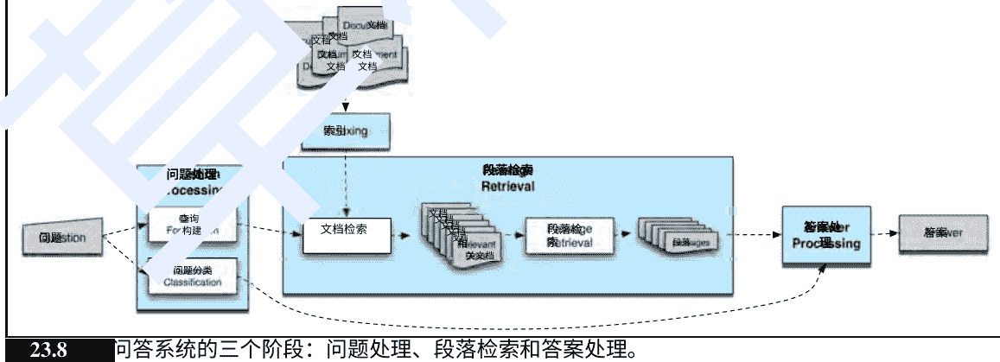

23.8 问答系统的三个阶段：问题处理、段落检索和答案处理。

### 23.2.1 问题处理

问题处理阶段的目标是从问题中提取两个内容：适用于信息检索系统的关键词查询和答案类型，即构成问题合理答案的实体的规范。

## 查询构建

查询构建的过程与其他信息检索查询的处理非常相似。我们的目标是从问题中创建一个关键词列表，形成一个信息检索查询。

要形成的确切查询取决于问题回答应用程序。如果将问题回答应用于Web，我们可以简单地从问题中的每个单词创建一个关键词，让Web搜索引擎自动删除任何停用词。通常，我们会省略问题中的疑问词（如在哪里，什么时候等）。或者，关键词可以仅由问题中的名词短语中的术语形成，应用停用词列表来忽略功能词和高频低内容动词。

当问题回答应用于较小的文档集时，例如回答有关公司信息页面的问题，我们仍然使用信息检索引擎来为我们搜索文档。但是对于这个较小的文档集，我们通常需要应用查询扩展。在Web上，对于一个问题的答案可能以许多不同的形式出现，因此如果我们使用问题中的单词进行搜索，我们可能会找到以相同形式书写的答案。相比之下，在较小的公司页面集中，答案可能只出现一次，而且确切的措辞可能与问题看起来完全不同。

因此，查询扩展方法可以添加查询词，希望能匹配答案的特定形式。

因此，我们可以将问题中的所有词的形态变体添加到查询中，同时还可以应用基于词库的或其他查询扩展算法（在前一节中讨论过）来获取更大的关键词集合。

许多系统使用WordNet作为词库，而其他系统则依赖于专门为问答设计的特定词库。

在对Web进行查询时，有时会采用另一种查询形式化方法，即对查询应用一组查询重构规则。这些规则会重新表述查询，使其看起来像可能的陈述性答案的子字符串。例如，问题“激光是什么时候发明的？”会被重构为“激光是在什么时候发明的”；问题“国王谷在哪里？”可能会被重构为“国王谷位于”。我们可以对查询应用多个这样的规则，并将所有生成的重构查询传递给Web搜索引擎。以下是Lin（2007）提供的一些手写重构规则示例：

> (23.17) wh-词A动词 B →... A动词+ed B
> (23.18) A在哪里 →A位于

## 问题分类

问题处理中的第二个任务是根据预期的答案类型对问题进行分类。例如，像“谁创办了维珍航空”这样的问题期望的答案类型是人物。像“加拿大哪个城市人口最多？”这样的问题期望的答案类型是城市。这个任务被称为问题分类或答案类型识别。

如果我们知道问题的答案类型，我们可以避免查看整个文档集中的每个句子或名词短语来寻找答案，而是只关注，例如，人物或城市。了解答案类型对于呈现答案也很重要。

像“什么是棱镜”这样的定义问题可能使用简单的答案模板，如“棱镜是...”而对于一个传记问题的答案，如“周恩来是谁？”可能使用一个特定于传记的模板，可能从人物的国籍开始，然后是他们的出生日期和其他传记信息。

正如上面的一些例子所示，我们可以从Ch. 22中描述的一组命名实体（如PERSON, LOCATION, 和ORGANIZATION）中提取问题分类器的可能答案类型集合。通常，我们会使用更丰富的答案类型集合。这些更丰富的标签集通常是层次化的，因此我们通常称之为答案类型分类或问题本体。这样的分类体系可以通过半自动和动态的方式构建，例如从WordNet（Harabagiu et al., 2000; Pasca, 2003）中，或者可以手动设计。

图23.2.1显示了一个手动构建的本体，即Li和Roth（2005）的层次化标签集。在这个标签集中，每个问题可以用粗粒度的标签（如HUMAN）或细粒度的标签（如HUMAN:DESCRIPTION, HUMAN:GROUP, HUMAN:IND等）标记。其他系统中也使用类似的标签；类型HUMAN:DESCRIPTION通常被称为传记问题，因为回答需要提供被问人的简要传记，而不仅仅是姓名。

问题分类器可以通过手写规则、通过监督机器学习或者两者结合来构建。例如，Webclopedia QA Typology包含了276条手写规则，与大约180种答案类型相关联（Hovy等人，2002年）。用于检测答案类型的正则表达式规则，例如BIOGRAPHY（假设问题已经进行了命名实体标记）可能是：

> (23.19) 谁 {是 |是 |是 |是}人物

然而，大多数现代问题分类器都基于监督机器学习技术。这些分类器是在已经手动标记了答案类型的问题数据库上进行训练的，例如Li和Roth的语料库（2002年）。用于分类的典型特征包括问题中的单词、每个单词的词性以及问题中的命名实体。

通常问题中的一个单词会提供关于答案类型的额外信息，并且它的身份会被用作一个特征。这个单词有时被称为问题的头部单词或答案类型单词，并且可以被定义为问题的wh-word之后第一个名词短语的头部单词；在下面的例子中，头部单词用粗体表示：

> (23.20) 中国的哪个**城市**有最多的外国金融公司？
> (23.21) 加利福尼亚州的**州花**是什么？

最后，使用问题中单词的语义信息通常会有所帮助。问题中每个单词的WordNet同义词集ID可以作为一个特征，每个单词的上位词和下位词的ID也可以作为一个特征。

| 标签 | 例子 |
| --- | --- |
| 缩写 | 有限合伙制的缩写是什么？ |
| abb | 方程E=mc2中的“c”代表什么？ |
| exp | （图片中该行例子显示不完整） |
| 描述 | 丹宁是什么？ |
| definition | 丹宁是什么？ |
| 描述 | 加拿大国歌的歌词是什么？ |
| 方式 | 如何去除衣物上的锈迹？ |
| 原因 | 泰坦尼克号沉没的原因是什么？ |
| 实体 | （空） |
| 动物 | 奥丁的乌鸦叫什么名字？ |
| 身体 | 你的身体的哪个部位包含着胼胝体？ |
| 颜色 | 彩虹由哪些颜色组成？ |
| 创造性 | 在哪本书中可以找到阿拉丁的故事？ |
| 货币 | 中国使用的是什么货币？ |
| 疾病/药物 | Salk疫苗可以预防什么？ |
| 事件 | 哪场战争涉及到查普特佩克战役？ |
| 食物 | 杏仁糖中使用了哪种坚果？ |
| 乐器 | Max Roach演奏什么乐器？ |
| 语言 | 阿尔及利亚的官方语言是什么？ |
| 字母 | 西班牙的冷水龙头上有哪个字母？ |
| 其他 | 亚瑟王的剑叫什么名字？ |
| 植物 | 有哪些芳香的白色攀爬玫瑰花？ |
| 产品 | 什么是最快的计算机？ |
| 宗教 | 哪个宗教拥有最多成员？ |
| 运动 | 玛雅人玩的球类游戏叫什么名字？ |
| 物质 | 飞机使用什么燃料？ |
| 符号 | 氮的化学符号是什么？ |
| 技术 | 最好的去除壁纸的方法是什么？ |
| 术语 | 爱尔兰语中怎么说“奶奶”？ |
| 车辆 | 布莱船长的船叫什么名字？ |
| 单词 | 骰子的单数形式是什么？ |
| 人类 | 孔子是谁？ |
| 描述 | 道琼斯指数中的主要公司有哪些？ |
| 群体 | 谁是第一位进行太空行走的俄罗斯宇航员？ |
| 头衔 | 维多利亚女王在印度方面的头衔是什么？ |
| 地点 | （空） |
| 城市 | 美洲最古老的首都是哪个？ |
| 国家 | 哪个国家与其他国家接壤最多？ |
| 山 | 非洲最高峰是什么？ |
| 其他 | 利物浦流经哪条河？ |
| 州 | 哪些州没有州所得税？ |
| 数字 | （空） |
| code | 科罗拉多大学的电话号码是多少？ |
| 计数 | 第二次世界大战中有多少士兵死亡？ |
| 日期 | 什么是节礼日的日期？ |
| 距离 | 毛泽东的1930年代长征有多长？ |
| 金钱 | 1963年麦当劳汉堡的价格是多少？ |
| 顺序 | 上海在世界城市人口中排名第几？ |
| 其他 | 墨西哥的人口是多少？ |
| 时期 | 石器时代的平均预期寿命是多少？ |
| 百分比 | （空） |
| 速度 | 密西西比河的速度是多少？ |
| 温度 | 一艘航天器必须以多快的速度才能逃离地球的引力？ |
| 大小 | 阿根廷的大小是多少？ |
| 重量 | 一英石等于多少磅？ |

料库。一个问题可以用粗粒度的标签（如人类或数字）或细粒度的标签（如人类：描述，人类：群体，人类：个体等）进行标记。

一般来说，对于像人物、地点和时间这样的简单问题类型，问题分类的准确率相对较高；而对于原因和描述问题的检测可能要困难得多。

### 23.2.2 段落检索

在问题处理阶段创建的查询接下来用于查询信息检索系统，可以是一个针对专有索引文档集的通用IR引擎，也可以是一个网络搜索引擎。 这个文档检索阶段的结果是一组文档。

尽管文档集通常按相关性排序，但排名靠前的文档可能不是问题的答案。 这是因为文档不是根据问答系统的目标进行排序的合适单位。

一个高度相关且较大的文档，如果没有明显回答问题，就不是进一步处理的理想候选选项。

因此，下一阶段是从检索到的文档集中提取一组潜在的答案段落。 段落的定义必然依赖于系统，但典型的单元包括章节、段落和句子。 例如，我们可以对返回的所有文档运行类似第21章讨论的段落分割算法，并将每个段落视为一个片段。

我们接下来进行 **段落检索** 。 在这个阶段，我们首先过滤掉不包含潜在答案的段落，然后根据它们包含答案的可能性对其余的段落进行排名。 这个过程的第一步是在检索到的段落上运行一个命名实体或答案类型分类。从问题中确定的答案类型告诉我们预期在答案中看到的可能的答案类型（扩展命名实体）。 因此，我们可以过滤掉不包含任何正确类型实体的文档。

然后对剩下的段落进行排名；可以通过手工规则或使用机器学习技术进行监督训练。 无论哪种情况，排名都是基于从潜在大量答案段落中相对较小的一组特征，这些特征可以轻松高效地提取出来。 其中比较常见的特征有：

- 在段落中，正确类型的命名实体数量
- 在段落中，问题关键词的数量
- 在段落中出现的最长的问题关键词序列
- 从中提取段落的文档排名
- 原始查询关键词之间的接近程度：对于每个段落，确定包含该段落中的关键词的最短跨度。 更喜欢包含更多关键词的较小跨度 (Pasca, 2003;Monz, 2004) 。
- 段落与问题之间的 $N$-gram重叠：计算问题中的 $N$-gram和答案段落中的 $N$-gram的数量。更喜欢与问题具有更高 $N$-gram重叠的段落 (Brill et al., 2002) 。

对于从网络上进行问答，我们可以依靠网络搜索来为我们进行段落提取，而不是从返回的所有文档中提取段落。 我们通过使用由网络搜索引擎生成的片段作为返回的段落来完成此操作。例如，图23.10显示了从Google搜索引擎返回的前5个文档的一些片段，用于查询“韩国何时发明了可移动金属印刷术？”


### 23.2.3 答案处理

问答的最后阶段是从段落中提取出具体的答案，以便向用户呈现类似于“美国当前人口为3亿”的答案。

两类算法已应用于答案提取任务，一类基于答案类型模式提取，另一类基于N-gram平铺。

在答案处理的模式提取方法中，我们使用有关预期答案类型的信息以及正则表达式模式。例如，对于具有人类答案类型的问题，我们在候选段落或句子上运行答案类型或命名实体标记器，并返回标有类型 HUMAN的实体。因此，在以下示例中，下划线标出的命名实体是从候选答案段落中提取出来作为 HUMAN和 DISTANCE-QUANTITY 问题的答案：

> “谁是印度的总理”
> 印度总理**曼莫汉·辛格**曾告诉左翼领导人，这项协议不会重新谈判。

> “珠穆朗玛峰有多高？”
> 珠穆朗玛峰的官方高度为**29035英尺**

不幸的是，对于一些问题，例如 DEFINITION问题，答案通常不属于特定的命名实体类型。对于某些问题，我们使用手写的正则表达式模式来帮助提取答案，而不是使用答案类型。这些模式在一个段落中包含多个相同命名实体类型的情况下也很有用。图23.2.3 显示了Pasca（2003）用于定义问题的问题短语（QP）和答案短语（AP）的一些模式。

23.11 一些用于定义问题的答案提取模式（Pasca，2003）。

| 模式 | 问题 | 答案 |
|------|------|------|
| <AP> 例如 <QP> | 什么是自闭症？ | 发育障碍如自闭症 |
| <QP> (一个 <AP>) | 什么是火山口？ | 长谷火山口，一个长19英里的火山口 |

这些模式对于每种问题类型都是具体的，可以手动编写或自动学习。

例如，Ravichandran和Hovy（2002），Echihabi等人（2005）的自动模式学习方法利用了我们在第20章和第22章介绍的基于模式的关系提取方法（Brin，1998；Agichtein和Gravano，2000）。模式学习方法的目标是学习特定答案类型（如 YEAR-OF-BIRTH）与问题的特定方面之间的关系，在这种情况下是我们想要的人的出生年份的名字。因此，我们试图学习一些对于两个短语之间关系的好线索的模式（PERSON-NAME/YEAR-O F-BIRTH，或 TERM-TO-BE-DEFINED/DEFINITION等）。因此，这个任务与第20章介绍的WordNet同义词集之间的上位词/下位词关系的学习任务非常相似，或者与第22章中的ACE关系的学习任务相似。下面是应用于问题-答案关系提取的算法草图：

1.  对于两个术语之间的关系（即人名→出生年份），我们从一个手工构建的正确对列表开始（例如，“甘地：1869年”，“莫扎特：1756年”等）。
2.  现在用这些对的实例（例如，“甘地”和“1869年”等）查询网络，并检查返回的前X个文档。
3.  将每个文档分成句子，并仅保留包含两个术语的句子（例如，人名-姓名和出生-年份）。
4.  提取表示两个术语之间和周围出现的单词和标点符号的正则表达式模式。
5.  保留所有具有足够高精度的模式。

在第20章和第22章中，我们讨论了衡量模式准确性的各种方法。在问题-答案模式匹配中使用的一种方法是保留高精度的模式。通过仅使用问题术语而不是答案术语进行查询（即仅查询“甘地”或“莫扎特”），来测量准确性。然后我们在文档的句子上运行结果模式，并提取出一个出生日期。

由于我们知道了正确的出生日期，我们可以计算出这个模式产生正确出生日期的百分比。这个百分比就是模式的精确度。
对于出生年份答案类型，这种方法学习的模式如下：

```
<姓名>（<出生日期>-<日期>）
<姓名>（<出生日期>-<日期>）
<姓名>出生于<出生日期>
```

这两种方法，即命名实体检测和问题-答案模式提取，对于答案提取仍然不够。并不是每个关系都由明确的周围词语或标点符号来表示，而且答案段落中经常出现多个相同的命名实体类型。最成功的答案提取方法是将所有这些方法结合起来，将它们与其他信息一起作为特征输入到一个分类器中，对候选答案进行排序。我们使用命名实体、模式甚至只是查看从段落检索返回的每个句子来提取潜在答案，并使用具有以下特征的分类器对它们进行排序：

- **答案类型匹配**:如果候选答案包含具有正确答案类型的短语，则为True。
- **模式匹配**:匹配候选答案的模式的身份。
- **匹配的问题关键词数量**:候选答案中包含的问题关键词的数量。
- **关键词距离**:候选答案与查询关键词之间的距离（以平均单词数或与候选答案在同一句法短语中出现的关键词数来衡量）。
- **新颖性因素**:如果候选答案中至少有一个单词是新颖的（即不在查询中），则为True。
- **同位语特征**:如果候选答案是包含许多问题术语的同位语，则为True。可以通过问题术语与候选答案之间最多三个单词和一个逗号的分隔来近似（Pasc a, 2003）。
- **标点符号位置**:如果候选答案紧接着逗号、句号、引号、分号或感叹号，则为True。
- **问题术语序列**：最长的问题术语序列的长度出现在候选答案中。

回答提取的另一种方法，仅用于网络搜索，基于N-gram平铺，有时被称为基于冗余的方法(Brill et al., 2002; Lin, 2007)。这种简化的方法从网络搜索引擎返回的片段开始，这些片段由重新构造的查询生成。在方法的第一步中，N-gram挖掘，提取片段中出现的每个一元组、二元组和三元组并加权。权重是N-gram出现的片段数量的函数以及返回它的查询重构模式的权重。在N-gram过滤步骤，根据它们与预测的答案类型的匹配程度对N-grams进行评分。这些分数是通过为每个答案类型构建的手写过滤器计算的。最后，一个N-gram平铺算法将重叠的N-gram片段连接起来形成更长的答案。标准的贪婪方法是从得分最高的候选者开始，然后尝试将每个其他候选者与该候选者拼接在一起。将得分最高的拼接添加到候选者集合中，移除得分较低的候选者，并继续该过程直到构建出一个单一的答案。

### 23.2.4 事实型答案评估

已经采用了各种各样的技术来评估问答系统。到目前为止，最有影响力的评估框架是由TREC问答赛首次引入的。

TREC中使用的主要度量标准是一种内在或体外评估指标，称为平均倒数排名（MRR）。与信息检索一样在Sec. 23.1中描述的任务中，MRR假设存在一组已经由人工标记的带有正确答案的测试问题。MRR还假设系统返回一个包含答案的短排名列表，或包含答案的段落。然后，根据第一个正确答案的倒数排名对每个问题进行评分。例如，如果系统返回了5个答案，但前3个是错误的，因此最高排名的正确答案是第4个，那么该问题的倒数排名分数将是1/4。返回集中不包含任何正确答案的问题被分配为零。然后，系统的得分是集合中每个问题的得分的平均值。更正式地说，对于返回M个排名答案的系统在由N个问题组成的测试集的评估，MRR定义为：

```
(23.22) $$\text{MRR} = \frac{\sum_{i=1}^{N} \frac{1}{\text{排名}_i}}{N}$$
```

## 23.3 摘要

到目前为止，在本章中我们所描述的算法提供给用户的是整个文档（信息检索）或者是一个简短的事实回答短语（事实型问题回答）。但有时候用户希望得到介于这两个极端之间的东西：例如文档或一组文档的摘要。

摘要

文本文本摘要是将最重要的信息提炼出来的过程以便为特定任务和用户生成缩略版本（根据Mani和Maybury（1999）的定义进行调整）。当前研究的重点包括以下重要类型的摘要：

-   任何文档的大纲
-   科学文章的摘要
-   新闻文章的标题
-   在搜索引擎结果页面上对网页进行摘要
-   （口头）商务会议的行动项或其他摘要
-   电子邮件线程的摘要
-   用于生成简化或压缩文本的压缩句子
-   通过总结多个文档来回答复杂问题

这种总结目标通常通过它们在两个维度上的位置来描述：

-   单个文档 与 多个文档 总结
-   通用总结与查询焦点总结

单个文档总结

在单个文档总结中，我们提供一个单个文档并生成一个摘要。因此，单个文档总结在生成标题或大纲等情况下使用，最终目标是描述单个文档的内容。

多个总结文档

在多个文档总结中，输入是一组文档，我们的目标是对整个组的内容进行概括。当我们总结一系列关于同一事件的新闻报道，或者我们希望综合和压缩同一主题的网络内容时，我们可能会使用多个文档总结。

通用摘要

一个通用摘要是指我们不考虑特定的用户或特定的信息需求；摘要只是简单地提供文档中的重要信息。相比之下，在查询聚焦摘要中，也称为聚焦摘要，基于主题的摘要和用户聚焦摘要，是根据用户查询生成的摘要。我们可以将查询聚焦摘要视为对用户问题的一种较长的非事实型回答。

在本节的其余部分，我们对自动文本摘要系统的架构进行简要概述；接下来的几节将详细介绍。

提取

文本摘要器的一个关键架构维度是它们是生成摘要还是生成提取。最简单的摘要类型是提取，它是通过从要摘要的文档中选择（提取）短语或句子并将它们粘贴在一起形成的。相比之下，摘要使用不同的词语来描述文档的内容。我们将通过著名的林肯的葛底斯堡演讲来说明摘要和摘要之间的区别，如图23.12所示。图23.13显示了演讲的摘要，然后是演讲的摘要。

> 一般来说，对于这样一个简短的演讲，人们可能不需要摘要，但是对于教学目的，简短的文本使得更容易看出摘要与原文的对应关系。 对于将现代技术应用于葛底斯堡演讲的有趣替代方法，请见Norvig（2005）。

> 八十七年前，我们的父辈在这个大陆上创立了一个新的国家，它孕育于自由，并致力于所有人生而平等的信条。现在，我们正处于一场伟大的内战中，测试着这个国家，或者任何一个以这样的方式构建并致力于这样的国家，是否能够长久存在。我们在这场战争的一个伟大战场上相遇。我们来到这片战场的一部分，作为那些在这里献出生命的人的最后安息之地。我们应该这样做是完全合适和正确的。但是，从更广义上讲，我们不能将这片土地奉献...我们不能将其神圣化...我们不能将其神圣化...这片土地。在这里奋斗的勇敢的人，无论是活着的还是死去的，都使它超越了我们微薄的力量，无法增加或减少。世界将很少注意到我们在这里说了什么，也不会长时间记住，但它永远不会忘记他们在这里所做的。 相反，我们活着的人应该在这里致力于他们在这里战斗到目前为止所取得的未完成的工作。 我们在这里致力于我们面前的伟大任务...从这些受尊敬的死者那里，我们加深对他们所献身事业的热爱；我们在这里高度决心，这些死者不会白白牺牲；这个国家，在上帝的庇佑下，将获得新的自由诞生；人民的政府，由人民，为人民，不会从地球上消失。

## 23.12 葛底斯堡演讲。亚伯拉罕·林肯，1863年。

摘自葛底斯堡演讲：

七十年前，我们的祖先在这片大陆上创立了一个新的国家，她以自由为基础，她的宗旨是所有人生而平等。现在我们正处于一场伟大的内战中，这场战争正在考验这个国家能否长久存在。我们在这场战争的一个重要战场上相聚。我们来到这片战场的一部分来致敬。但是在这里奋斗过的勇敢的生者和死者，已经使这片土地远远超越了我们微薄的力量所能增添或减损的。我们从这些光荣的死者身上汲取了更加坚定的信念，为了他们献出了最后的全部力量，我们要保证这个政府是人民的，由人民的，为人民的，不会从地球上消失。

葛底斯堡演讲摘要：

亚伯拉罕·林肯的这次演讲是为了纪念在葛底斯堡战役中牺牲的士兵。它提醒部队，他们所战斗的是美国自由的未来。

图23.12 从葛底斯堡演讲中提取与摘要（摘要来自Mani (2001) ）。

大多数当前的文本摘要器都是抽取式的，因为抽取比摘要更容易；向更复杂的抽象式摘要转变是最近研究的一个关键目标。

文本摘要系统，事实证明，自然语言生成系统也是如此，通常通过解决以下三个问题来描述：

1.  内容选择：从我们要总结的文档中选择哪些信息。我们通常做出简化假设，即提取的粒度是句子或从句。因此，内容选择主要包括选择要提取到摘要中的句子或从句。
2.  信息排序：如何对提取的单元进行排序和结构化。
3.  句子实现：在新的上下文中使提取的单元流畅的清理工作。

在接下来的几节中，我们将展示这些组件在三个总结任务中的应用：单一文档总结、多个文档总结和查询聚焦总结。

### 23.3.1 单个文档摘要

让我们首先考虑构建单一文档的抽取式摘要的任务。假设被抽取的单元是句子级别的，这个任务的三个总结阶段是：

1.  内容选择：从文档中选择要抽取的句子
2.  信息排序：选择一个顺序将这些句子放入摘要中
3.  句子实现：清理句子，例如从每个句子中删除非必要的短语，将多个句子合并为一个句子，或者修复连贯性问题。


我们首先描述基本的摘要技术，其中只有一个组成部分：内容选择。事实上，许多单个文档摘要器没有信息排序组件，只是按照原始文档中出现的顺序排序提取的句子。此外，我们暂时假设句子在提取后不会被组合或清理，尽管我们稍后会简要提到如何进行这样的处理。

### 无监督内容选择

内容选择提取句子的内容选择任务通常被视为一个分类任务。分类器的目标是用二进制标签（重要与不重要或值得提取与不值得提取）为文档中的每个句子进行标记。我们首先介绍一些无监督的句子分类算法，然后在下一节中转向监督算法。

最简单的无监督算法基于一个早期总结者（Luhn, 1958）的直觉，即选择具有更多显著或信息丰富的单词的句子。包含更多信息丰富单词的句子往往更值得提取。显著性通常通过计算主题签名来定义，主题签名是一组显著或主题性术语，每个术语的显著性得分大于某个阈值θ。主题性术语的签名术语，每个术语的显著性得分大于某个阈值θ。

显著性可以用简单的词频来衡量，但是词频存在一个问题，即一个词在英语中可能具有很高的概率，但对于特定文档来说并不特别相关。因此，像tf-idf或对数似然比这样的加权方案更常被使用。

回顾一下第786页，tf-idf方案对当前文档中频繁出现但在整个文档集合中很少出现的词给予较高的权重，这表明该词对于该文档特别相关。对于要评估的句子中出现的每个术语i，我们计算其在当前文档j中的出现次数tfi,j，并乘以整个集合中的逆文档频率idfi：

```
权重 (wi) = tfi,j × idfi
```

### 对数似然比

一种更好的性能方法是找到信息词对数似然比(LLR)。一个词的对数似然比通常被称为λ(w)，是在假设两个语料库中的概率相等的情况下，在输入和背景语料库中同时观察到w的概率与在假设输入和背景语料库中w的概率不同的情况下同时观察到 w的概率之比。有关对数似然比及其计算方法的详细信息，请参见Dunning（1993）、Moore（2004）和Manning和Sch¨utze（1999）。

对于对数似然比，数量 −2 log(λ)在渐近情况下可以很好地近似为 χ²分布，这意味着如果 −2log(λ) > 10.8，则表示一个词在输入中出现的频率显著高于背景语料库（在 α = 0.001的情况下）。Lin和Hovy（2000）首次提出对数似然比特别适用于选择摘要的主题签名。因此，具有对数似然比的词权重通常定义如下：

```
权重(权i) = { 1 如果 −2 对数(λ(权i)) > 10 否则为0。
```

方程式23.24用于为句子中的每个单词设置权重为1或0。句子si的得分然后是其非停用词的平均权重：

```
权重 (si) = ∑_{权∈si} 权重(权) / |{权|权 ∈ si}|
```

摘要算法计算每个句子的权重，然后按得分对所有句子进行排序。提取的摘要包括排名靠前的句子。

这个阈值LLR算法所属的算法族被称为基于质心的摘要算法，因为我们可以将一组签名术语视为伪句子，它是文档中所有句子的“质心”，我们正在寻找尽可能接近这个质心句子的句子。

一种常见的替代对数似然比/质心方法的方法是使用一个不同的句子中心模型。这些其他基于中心性的方法类似于上面描述的质心方法，它们的目标是对输入句子进行排名。从代表文档中的信息的中心性角度来看。 但是，与仅仅根据是否包含显著词汇对句子进行排名不同，基于中心性的方法计算每个候选句子与其他句子之间的距离，并选择平均距离较近的句子。 为了计算中心性，我们可以将每个句子表示为长度为的词袋向量。 N如第20章所述。 对于每一对句子 x和 y，我们根据上述公式23.12计算tf-idf加权余弦。

然后，将输入中的每个 k句子分配一个中心性分数，该分数是它与所有其他句子的平均余弦值：

```
(23.26)          中心性   $(x) = \frac{1}{K} \sum_{y} tf-idf余弦  (x,y)$
```

句子根据这个中心性得分进行排名，选择在所有句子中具有最高平均余弦相似度的句子，即最像其他句子的句子，作为最具代表性或最具话题性的句子。

还可以扩展这个中心性得分，使用更复杂的基于图的中心性度量方法，如PageRank (Erkan and Radev, 2004)。

### 基于修辞分析的无监督摘要

我们上面介绍的内容提取的句子抽取算法仅依赖于一个浅层特征，即词汇显著性，忽略了可能的更高层次的线索，如话语信息。在本节中，我们简要总结了一种将更复杂的话语知识纳入摘要任务的方法。

我们将描述的摘要算法利用了连贯关系，例如RST（修辞结构理论）关系，这些关系在第21章中有描述。回想一下，RST关系通常用卫星和核心来表示；核心句更有可能适合用于摘要。例如，考虑以下两段来自《科学美国人》杂志文本的段落，这些段落在第21.2.1节中介绍过：

> 由于其远离太阳的轨道 - 比地球远50% - 和薄薄的大气层，火星经历了寒冷的天气条件。 表面温度通常在赤道附近平均约为华氏-70度，并且在极地附近可能降至摄氏-123度。

> 只有热带纬度的正午太阳足够温暖，可以偶尔融化冰，但由于低气压，以这种方式形成的任何液态水几乎会立即蒸发。 尽管大气层中含有少量水，有时会形成水冰云，但大多数火星天气都涉及吹拂的尘土或二氧化碳。

本段落中的前两个话语单元通过RST JUSTIFICATION关系相关联，如图23.15所示，第一个话语单元为第二个话语单元提供了理由。因此，第二个单元（“火星经历了寒冷的天气条件”）是核心，并更好地捕捉了文档的这一部分内容。

我们可以通过首先应用在第21章中讨论的一种话语解析器来计算每个话语之间的连贯关系，从而将这种直觉用于摘要单元。一旦将句子解析为连贯关系图或解析树，我们可以通过递归地提取文本的显著单元来利用核心单元对摘要的重要性的直觉。

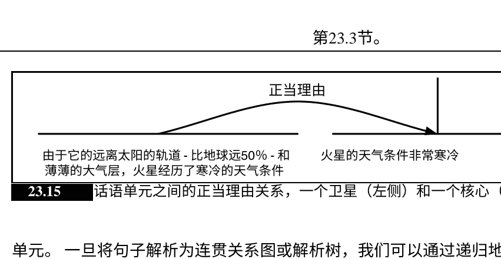

## 23.15 话语单元之间的正当理由关系，一个卫星（左侧）和一个核心（右侧）

考虑图23.16中的连贯解析树。树中每个节点的显著性可以递归地定义如下：

-   基本情况：叶节点的显著单元是叶节点本身
-   递归情况：中间节点的显著单元是其直接核心子节点的并集

根据这个定义，篇章单元（2）是整个文本中最显著的单元（因为跨越单元1-8的根节点具有跨越单元1-6的核心，而单元2是跨越单元1-6的核心。）

如果我们按照节点的高度对每个篇章单元进行排序，我们可以为单元分配一个部分排序的显著性；Marcu（1995）的算法为这个篇章分配了以下部分排序：

> (23.27) 2 > 8 > 3 > 1,4,5,7 > 6

有关如何计算这个部分排序的详细信息，请参见Marcu（1995，2000b），以及Teufel和Moens（2002）中使用修辞结构的另一种方法。

### 监督内容选择

虽然使用主题签名进行无监督内容选择是一种非常有效的方法，但主题签名只是找到值得提取的句子的一个线索。还有许多其他线索，包括上面讨论的类似中心性和PageRank方法的替代显著性方法，以及句子在文档中的位置（文档开头或结尾的句子往往更重要），每个句子的长度等等。我们希望有一种方法可以权衡和结合所有这些线索。

衡量和结合证据的最佳原则方法是监督机器学习。对于监督机器学习，我们需要一个与人工创建的摘要提取配对的训练集，例如Ziff-Davis语料库(Marcu, 1999)。由于这些是摘要，所以摘要中的每个句子都是从文档中提取的。这意味着我们可以为文档中的每个句子分配一个标签；如果它出现在摘要中，则为 1 ，如果没有，则为 0。要构建我们的分类器，我们只需要选择能够预测好句子的特征进行提取。

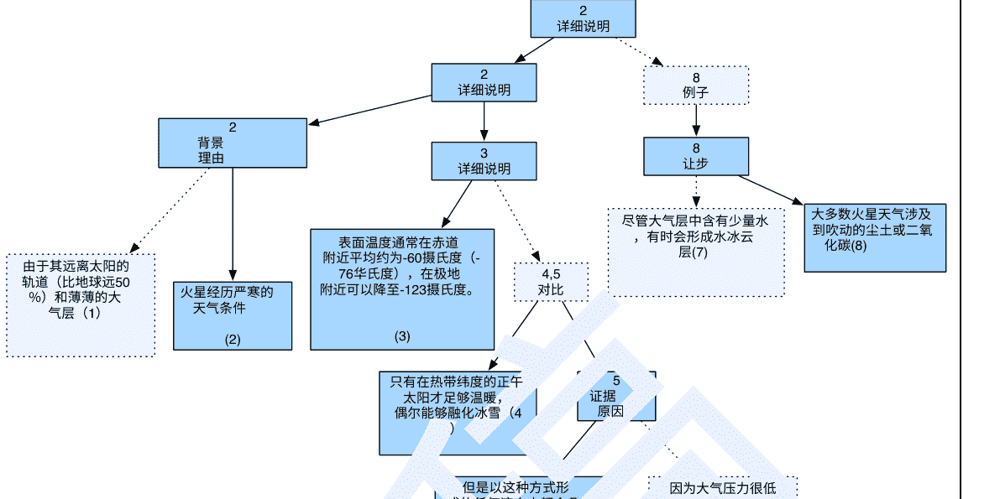

23.16 30 上文本的话语树 粗体链接将节点与其核心子节点连接起来；虚线将节点与卫星子节点连接起来。参考Ma c（ 000a）。

出现在摘要中。图23.17显示了句子分类中常用的一些特征。

我们的训练文档中的每个句子都有一个标签（如果该句子不在该文档的训练摘要中，则为0，否则为1），以及一组提取的特征值，就像图23.17中的那些一样。然后，我们可以训练我们的分类器来估计这些标签对于未知数据；例如，像朴素贝叶斯或最大熵这样的概率分类器将计算给定一组特征的情况下，特定句子是否值得提取的概率；然后我们可以提取任何概率大于0.5的句子：

```
(23.28) P(值得提取(句子)|特征1,特征2,特征3,...特征n)
```

我们描述的算法有一个问题：它要求我们对每个文档都有一个仅由提取的句子组成的训练摘要。如果我们能放宽这个限制，我们就可以将该算法应用于更广泛的摘要-文档对，例如会议论文或期刊文章及其摘要。幸运的是，事实证明，当人类撰写摘要时，即使目标是撰写抽象摘要，他们经常使用来自文档的短语和句子来组成摘要。但他们不仅仅使用提取的句子；他们经常将两个句子合并为一个句子，或者改变句子中的一些词，或者完全写一个新的抽象句子。这是一个来自人类摘要的提取句子的例子，尽管在最终的人类摘要中进行了修改，但显然是一个应该被标记为值得提取的文档句子：

| 特征 | 描述 |
| :--- | :--- |
| **位置** | 句子在文档中的位置。例如，Hovy和Lin（1999）发现，在大多数报纸文章中，最值得提取的句子是标题句子。在Ziff-Davis语料库中，他们检查了下一个最有信息量的是段落的第一句话。<br><br>2（P1S1），然后是第3段（P3S1）的第一句话；因此，从最具信息量的开始的序数句位置列表如下：<br>T1，P2S1，P3S1，P4S1，P1S1，P2S2，.<br>..位置，就像几乎所有的摘要特征一样，它严重依赖于文体。在《华尔街日报》的文章中，他们发现最重要的信息出现在以下句子中：<br>T1，P1S1，P1S2,... |
| **提示短语** | 包含诸如总结、结论或本文的句子更有可能被提取。这些提示短语非常依赖于文体。例如，在英国上议院的法律摘要中，短语 *it seems to me that* 是一个有用的提示短语。（Hachey和Grover，2005年）。 |
| **单词信息性** | 包含更多来自主题签名的句子，如前一节所述，更具提取价值。 |
| **句子长度** | 非常短的句子很少适合提取。通常我们通过使用基于截断的二进制特征来捕捉这个事实（如果句子超过5个单词，则为真）。 |
| **凝聚力** | 回顾第21章，一个词汇链是一系列在话语中出现的相关词汇。包含更多词汇链中的术语的句子通常具有提取价值，因为它们表明了一个持续的主题。<br>（Barzilay和Elhadad，1997年）。这种凝聚力也可以通过基于图的方法进行计算（Mani和Bloedorn，1999年）。上述基于PageRank图的句子中心度量也可以看作是一种连贯性度量（Erkan和Radev，2004年）。 |


(23.29)人类摘要：本文确定了理想的多传感器气体监测器的理想特征，并列出了目前可用的不同型号。

(23.30)原始文档句子：本部分列出了可携式多传感器气体监测器的理想特征和不同型号。

### 对齐

因此，一个重要的初步阶段是将每个培训文档与其摘要进行对齐，目标是找出文档中哪些句子（完全或大部分）包含在摘要中。一种简单的对齐算法是找到源文档和摘要句子中最长公共子序列的非停用词;或者可以计算最小编辑距离，或者可以使用更复杂的知识源，如WordNet。最近的工作集中在更复杂的对齐算法上，例如使用HMMs（Jing，2002; Daumé III和Marcu，2005，等等）。

鉴于这样的对齐算法，内容选择的监督方法可以利用平行语料库中的文档和人工摘要，例如带有摘要的学术论文（Teufel和Moens，2002年）。

### 句子简化

一旦一组句子被提取和排序，单文档摘要的最后一步是句子实现。句子实现的一个组成部分是句子压缩或句子简化。以下示例取自Jing（2000年）从人工摘要中选取的示例显示，人工摘要者在表达摘要中的提取句子时选择了消除一些形容词修饰语和从属从句：

（23.31）原句：当它在新的电视机上出现时，V芯片将为父母提供一种新的、潜在的革命性设备，用于屏蔽他们不希望孩子看到的节目。

（23.32）人工简化的句子：V芯片将为父母提供一种设备，用于屏蔽他们不希望孩子看到的节目。

句子简化的最简单算法使用规则来选择要修剪或保留的句子的部分，通常通过对句子运行解析器或部分解析器来实现。Zajic等人（2007年）、Conroy等人（2006年）和Vanderwende等人（2007a年）提出的一些代表性规则删除了以下内容：

| 类型 | 示例 |
| --- | --- |
| 同位语 | 28岁的艺术家Rajam当时住在费城，他在城市杂志的背后找到了灵感。 |
| 归属从句 | 叛军同意与政府官员进行谈判，国际观察员周二表示。 |
| 介词短语/名实体 | 没有具 除非鲑鱼种群增加到可持续数量，否则华盛顿的商业捕鱼限制将不会解除。 |
| 初始副词 | “例如”，“另一方面”，“事实上”，“此时” |

更复杂的句子压缩模型基于监督式机器学习，其中使用一组平行语料库和其人工摘要来计算特定单词或解析节点被修剪的概率。请参阅本章末尾的指向这一广泛的最新文献的指针。

## 23.4 多文档摘要

当我们将摘要技术应用于一组文档而不是单个文档时，我们称之为多文档摘要。

多文档摘要特别适用于基于网络的应用程序，例如通过结合来自不同新闻报道的信息来构建新闻事件的摘要，或者通过提取多个文档中的组件来找到复杂问题的答案。

虽然多文档摘要远未解决，但即使是当前的技术也可以用于信息查找任务。McKeown等人（2005）例如，给予人类实验参与者与人类摘要、自动生成的摘要或无摘要的文档，并要求参与者在限定时间内进行事实收集任务。参与者需要回答关于新闻事件的三个相关问题；阅读自动摘要的受试者给出了更高质量的答案。

多文档摘要算法基于之前介绍的三个步骤。在许多情况下，我们假设我们从一组要进行摘要的文档开始，然后需要进行内容选择、信息排序和句子生成，如下三节和图23.18所述。


### 23.4.1 多文档摘要中的内容选择

在单一文档摘要中，我们使用了有监督和无监督的方法进行内容选择。对于多文档摘要，有监督的训练集较少，我们更加关注无监督的方法。

单一文档和多文档摘要任务的主要区别在于当我们使用多个文档时存在更多的冗余。一组文档可能在单词、短语和概念上有显著的重叠，除了可能每篇文章独有的信息。虽然我们希望摘要中的每个句子都与主题相关，但我们不希望摘要由一组相同的句子组成。

因此，多文档摘要的算法侧重于在选择摘要句子时避免冗余。当将新的句子添加到已提取句子的列表中时，我们需要一种方法来确保句子与已提取的句子不过度重叠。

避免冗余的一个简单方法是在选择要提取的句子的评分中明确包含一个冗余因子。冗余因子基于候选句子与已经提取到摘要中的句子之间的相似性；如果一个句子与摘要太相似，它将受到惩罚。

**MMR 最大边际相关性**

例如，MMR（最大边际相关性）评分系统Carbonell Goldstein和Goldstein等人（1998年，2000年）包括以下惩罚项，用于表示一个句子与已经提取到摘要Summary中的句子集之间的相似性，其中λ是一个可以调整的权重，Sim是某个相似性函数：

```
(23.33) MMR惩罚因子(s) = λ max_{s_i ∈ Summary} Sim(s, s_i)
```

一种替代MMR方法的方法是将聚类算法应用于文档中的所有句子，以生成一些相关句子的聚类，然后从每个聚类中选择一个（质心）句子作为摘要。

通过添加MMR或聚类方法来避免冗余，我们还可以在内容选择阶段而不是在句子实现阶段进行句子简化或压缩。将简化融入架构的常见方法是在输入语料库中的每个句子上运行各种句子简化规则（第23.3.1节）。结果将是输入句子的多个版本，每个版本具有不同程度的简化。例如，以下句子：前民主党全国委员会财务主任理查德·沙利文在参议院筹款调查的第二天在证人席上面对共和党人的更尖锐的质询。

可能会产生不同的缩写版本：

-   理查德·沙利文面对尖锐的质疑。
-   理查德·沙利文在共和党人面前面临尖锐的质疑
-   理查德·沙利文在参议院筹款调查期间面对共和党人的尖锐质疑
-   理查德·沙利文在参议院筹款调查中面对共和党人的尖锐质疑

这个扩展的语料库现在被用作内容提取的输入。冗余方法，如聚类或MMR，将仅选择每个原始句子的（最佳长）单一版本。

### 23.4.2 多文档摘要中的信息排序

抽取式摘要器的第二阶段是信息的排序或结构化，我们必须决定如何将提取的句子连接成一个连贯的顺序。回想一下，在单文档摘要中，我们可以使用原始文章的顺序来处理这些句子。这对于大多数多文档应用来说是不合适的，尽管如果许多或所有提取的句子恰好来自一篇文章，我们当然可以应用它。

对于从新闻故事中提取的句子，一种技术是使用与故事相关的日期，这种策略被称为时间顺序。事实证明纯粹的时间顺序可能会产生缺乏连贯性的摘要；可以通过对稍大的句子块而不是单个句子进行排序来解决这个问题；参见Barzilay等人（2002年）。

然而，信息排序最重要的因素可能是连贯性。回想一下第21章中有助于话语连贯性的各种手段。其中之一是句子之间有合理的连贯关系；因此，我们可以偏好在摘要中产生合理的连贯关系的排序。连贯性的另一个方面与衔接和词汇链有关；例如，我们可以偏好具有更多局部衔接的排序。连贯性的最后一个方面是指代；连贯的话语是指以连贯的模式提及实体。我们可以偏好具有连贯的实体提及模式的排序。

所有这些类型的连贯性都被用于信息排序。例如，我们可以使用词汇连贯性作为排序启发式方法，通过将每个句子与包含相似词的句子排序在一起。这可以通过定义每对句子之间的标准tf-idf余弦距离，并选择最小化相邻句子之间平均距离的整体顺序来实现（Conroy等人，2006），或者通过构建跨句子的可预测词序列模型（Soricut和Marcu，2006）。

基于共指的连贯性算法也利用了Centering的直觉。回想一下，Centering算法基于每个话语段落都有一个显著的实体，即焦点。Centering理论提出了焦点的某些句法实现（例如作为主语或宾语）和这些实现之间的特定转换（例如，如果同一实体是相邻句子的主语），可以创建一个更连贯的话语。因此，我们可以偏好转换实体提及之间是首选的排序方式。

例如，在Barzilay和Lapata（2005，2007）的基于实体的信息方法中，对摘要的训练集进行了解析和标记以进行共指。然后，可以自动提取并表示实体实现的结果序列到实体网格实体网格。图23.19显示了一个简化版本的解析摘要和提取的网格。可以从实体网格中训练特定实体转换的概率模型（即{主语, 宾语, 斜格, -}）。例如，转换{斜格, 宾语, 主语, 主语}表示在话语中新实体通常首先以斜格或宾语位置引入，然后才出现在主语位置。

1.  [司法部]正在对[微软公司]进行[反垄断审判]。
2.  [微软]宾被指控试图强行进入[市场]斜 [自己的产品]主竞争力不足以取代[已建立的品牌]宾。
3.  [这个案件]围绕着[微软]积极施压[Netscape]合并[浏览器软件]的证据。
4.  [微软]主声称[它的策略]主是常见的且经济上有益的。

23.19 总结（显示主语（S），宾语（O）或斜格（X）位置的实体）和从中提取的实体网格 改编自Barzilay和Lapata（2005）。

详细信息请参阅Barzilay和Lapata（2007）。
将所有这些方法视为通过句子对或句子序列之间的局部连贯性得分为一系列句子分配连贯性得分的一般方法。然后，句子之间的单个一般转换得分可以结合词汇连贯性和基于实体的连贯性。一旦我们有了这样的评分函数，选择优化所有这些局部成对距离的排序就被认为是非常困难的。给定一组句子之间的一组成对距离，找到这些句子的最佳排序等同于非常困难的问题，如循环排序和旅行推销员问题。²因此，句子排序等同于被称为NP-complete的困难问题类。虽然确切解决困难，但已经应用了许多良好的近似方法来解决NP-complete问题，这些方法已应用于信息排序任务。有关相关证明和近似技术，请参阅Althaus等人（2004），Knight（1999a），Cohen等人（1999），Brew（1992）。

在上述模型中，信息排序任务与内容提取完全分离。另一种方法是同时学习这两个任务，从而得到一个既选择句子又排序句子的模型。例如，在Barzilay和Lee（2004）的HMM模型中，隐藏状态对应于文档内容主题，观测值对应于句子。例如，在地震的报纸文章中，隐藏状态（主题）可能是地震的强度、地点、救援工作和伤亡人数。他们应用聚类和HMM归纳来诱导这些隐藏状态和它们之间的转换。例如，这里有三个来自位置聚类的句子：

(23.34)雅典地震研究所表示，地震的震中位于首都南方380公里（238英里）处。

(23.35)巴基斯坦西北边境省的地震学家表示，地震的震中位于省会白沙瓦以北约250公里（155英里）处。
(23.36)一位地震学家表示，地震的震中位于省会 昆明以西北约60公里（35英里）处，距离北京西南约2,200公里（1,300英里）。

HMM的学习结构隐含地表示了信息排序的事实，例如在HMM转移概率中提到“伤亡”先于“救援工作”。

总之，我们已经看到了基于时间顺序的信息排序，基于连贯性的信息排序，以及从数据中自动学习的排序。在下一节关于查询聚焦摘要的部分，我们将介绍一种最终的方法，根据预先定义的不同查询类型的排序模板来指定信息排序。

## 句子生成

虽然在句子排序过程中可以考虑到篇章连贯性，但是生成的句子仍然可能存在连贯性问题。例如，正如我们在第21章中所看到的那样，当一个指称在篇章中出现多次时，较长或更具描述性的名词短语会出现在较短、简化或代词形式之前。
但是我们选择的句子排序可能不符合这种连贯性偏好。

例如，在图23.20中的原始摘要中，加粗的名字出现的顺序是不连贯的；全名美国总统乔治·W·布什只在缩写形式布什被介绍之后才出现。

解决这个问题的一种可能方法是在句子生成阶段应用一个指代消解算法来提取名字，并应用一些简单的清理重写规则，如下所示：

(23.37)第一次提及时使用全名，后续提及只使用姓氏。

(23.38)对于第一次提及，使用修改后的形式，但是从任何后续提及中删除同位语或前修饰语。

图23.20中的重写摘要展示了这些规则的应用方式；一般来说，这些方法将依赖于高准确度的共指消解。

> 原始摘要：
> 总统顾问们并不责怪奥尼尔，但他们长期以来一直认识到，对经济团队进行重组将有助于表明乔治·W·布什正在尽一切努力改善情况。美国总统乔治·W·布什在星期五推出了对财政部长保罗·奥尼尔和首席经济顾问劳伦斯·林赛的调整，这是他的政府在2004年选举之前应对不景气经济的首次重组。
>
> 重写摘要：
> 总统顾问们并不责怪财政部长保罗·奥尼尔，但他们长期以来一直认识到，对经济团队进行重组将有助于表明美国总统乔治·W·布什正在尽一切努力改善情况。布什在星期五推出了对奥尼尔和白宫经济顾问劳伦斯·林赛的调整，这是他的政府在2004年选举之前应对不景气经济的首次重组。

23.20 enkova和McKeown（2003）中重写引用

最近的研究还专注于比提取的句子更细粒度的实现，通过使用句子融合算法来组合短语或从句从不同的句子中合并为一个新的句子。 Barzilay和McKeown（2005）的句子融合算法解析每个句子，使用解析的多序列对齐找到共同信息的区域，构建具有重叠信息的融合格点，并通过线性化来自格点的单词字符串创建一个融合句子。

**句子融合**

### 23.5 问答遇见摘要：专注摘要

正如本章开头所提到的，大多数有趣的问题不是事实性问题。用户需求需要比单个短语提供更长、更丰富的答案。例如，虽然一个定义问题可以用短语回答，如“自闭症是一种发育障碍”或“火山口是一个火山口”，但用户可能需要更多的信息，如下所示的空心菜的定义：

空心菜（Ipomoea aquatica）是一种半水生叶菜，其特点是长而中空的茎和矛形或心形的叶子，广泛种植于亚洲作为叶菜。叶子和茎经常被炒菜或加入咸味酱料中炒制，或用于煮汤。其他常见名称包括早晨荣蔬菜、空心菜（马来语）、莴苣莽（越南语）、通菜（广东话）和空心菜（普通话）。

它与菠菜无关，但与甘薯和旋花密切相关。

在医学等领域中，也可以提出复杂的问题，例如关于特定药物干预的问题：

(23.39) 在患有急性发热疾病的儿童中，对于单一药物治疗（扑热息痛或布洛芬）降低发热的疗效如何？

对于这个医学问题，我们希望能够提取以下类型的答案，可能会给出提取来源的文档ID，并对结果的可信度进行一些估计：

> 当两种药物以大致相等的剂量给予时，布洛芬提供了更大的降温和更长的退热时间，而不是对乙酰氨基酚。(PubMedID: 1621668, 证据强度: A)

问题可能更加复杂，比如来自文档理解会议年度摘要竞赛的这个问题：

(23.40) 哪些地方的偷猎者危害了野生动物，哪些野生动物受到了威胁，采取了哪些措施来防止偷猎？

当一个事实型答案可能在单个文档或网页的一个短语中找到时，这些复杂问题往往需要更长的答案，这些答案是从许多文档或页面中综合得出的。

因此，摘要技术通常用于构建这些复杂问题的答案。但与上面介绍的摘要算法不同，为复杂问题回答而生成的摘要必须与某个用户问题相关。当对文档进行摘要以回答某个用户查询或信息需求时，我们称之为**目标查询焦点摘要** 或者有时只是**专注于总结**。（术语基于主题的总结和用户关注的总结也被使用。）因此，查询关注的摘要实际上是对用户问题或信息需求的一种较长的非事实性回答。

**代码片段**

一种查询关注的摘要是一个**片段**，这种类型的摘要是网络搜索引擎返回给用户以描述每个检索到的文档。像谷歌这样的搜索引擎会返回给用户查询关注的单个文档的摘要。摘要是查询关注的单个文档的聚焦摘要。但是，由于对于复杂的查询，我们将需要从多个文档中汇总信息，因此我们需要总结多个文档。

事实上，进行查询关注的总结的最简单方法是稍微修改我们在前一节中介绍的多文档总结算法，以利用查询。例如，在内容选择阶段对所有返回的文档的句子进行排名时，我们可以要求任何提取的句子必须包含至少一个与查询重叠的单词。或者我们可以将与查询的余弦距离作为句子提取中的相关特征之一。我们可以将这种查询关注的总结方法描述为一种自底向上、领域无关的方法。

进行查询聚焦摘要的另一种方法是额外利用自上而下或信息提取技术，为不同类型的复杂问题构建特定的内容选择算法。 因此，我们可以专门构建一个针对上述引入的高级问题，如定义问题、传记问题、某些医学问题，我们使用面向查询的摘要生成器。在每种情况下，我们使用自上而下的期望来指导我们提取哪种类型的句子，以确定好的定义、传记或医学答案。

例如，一个术语的定义通常包含有关该术语的属和种的信息。属是该词的上位词或超级词；因此，一个像句子“哈吉是一种仪式”是一种属句。物种提供了术语的重要附加属性，使其与属词的其他下义词区分开来；一个例子是“伊斯兰历的第十二个月开始了年度朝觐”。在定义中可能出现的其他信息包括同义词、词源、子类型等等。

为了构建对定义问题的抽取式答案，我们需要确保抽取包含属种信息、物种信息和其他一般信息的句子。同样，一个好的人物传记包含人物的出生/死亡、名声因素、教育、国籍等信息；我们需要抽取包含每种信息的句子。总结应用药物解决医学问题的研究结果的医学答案需要包含问题（医学状况）、干预（药物或程序）和结果（研究结果）等信息。

图23.21展示了一些定义、人物传记和医学干预问题的示例谓词。

**定义属种**
|  |  |
|---|---|
| **物种** | 哈吉是一种仪式<br>每年的哈吉开始于伊斯兰历的第十二个月 |
| **同义词** | 朝觐或麦加朝圣是伊斯兰教的中心职责 |
| **子类型** | Qiran、Tamattu'和Ifrad是三种不同类型的朝觐 |
**传记日期**
|  |  |
|---|---|
| **国籍** | 在1968年4月4日被暗杀<br>出生于佐治亚州亚特兰大 |
| **教育** | 作为博士生进入波士顿大学 |
**药物疗效**
|  |  |
|---|---|
| **人群** | 37名年龄在2到12岁之间的健康儿童 |
| **问题** | 急性、并发、发热疾病 |
| **干预** | 对乙酰氨基酚（10毫克/千克） |
| **结果** | 当两种药物以近似相等剂量给予时，布洛芬提供了更大的降温效果和更长的解热持续时间，胜过对乙酰氨基酚 |

回答某些复杂问题，必须提取一些不同类型的信息示例。

在每种情况下，我们使用第22章的信息提取方法来找到特定的句子，用于属种和物种（用于定义），或者日期、国籍和教育（用于传记），或者问题、干预和结果（用于医学问题）。然后，我们可以使用标准的领域无关内容选择算法来找到其他好的句子添加进来。

典型的架构包括Blair-Goldensohn等人（2004）的定义提取系统中所示的四个步骤（见图23.22）。输入是一个定义问题 T，要检索的文档数量 N，以及答案的长度 L（以句子为单位）。

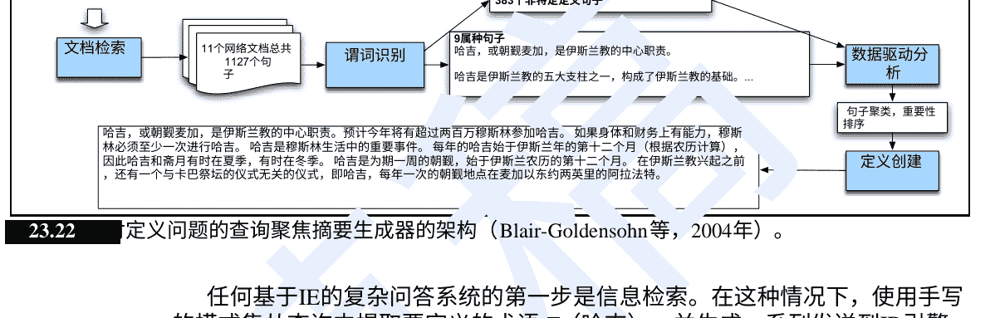

任何基于IE的复杂问答系统的第一步是信息检索。在这种情况下，使用手写的模式集从查询中提取要定义的术语 T（哈吉），并生成一系列发送到IR引擎的查询。同样，在传记系统中，提取的将是姓名，并传递给IR引擎。返回的文档被分成句子。

在第二阶段，我们应用分类器为每个句子标记适当的领域类别集合。对于定义问题，Blair-Goldensohn等人（2004年）使用了四个类别：属，种，其他定义或其他。第三个类别，其他定义，用于选择可能添加到摘要中的其他句子。这些分类器可以基于第22章介绍的任何信息提取技术，包括手写规则或监督机器学习。

在第三阶段，我们可以使用在通用（非-查询焦点）多领域摘要内容选择部分中描述的方法，将额外的句子添加到我们的答案中，这些句子可能不属于特定的信息提取类型。例如，对于定义问题，我们会检查所有被分类为其他定义的句子，并从中选择一组相关的句子。这种选择可以通过质心方法来完成，我们为每个句子形成一个TF-IDF向量，找到所有向量的质心，然后选择与质心最近的K个句子。或者我们可以使用一种避免冗余的方法，例如对向量进行聚类，并从每个聚类中选择最佳句子。

因为这种类型或特定领域的查询焦点摘要器，我们还可以使用特定领域的信息排序方法，例如使用固定的手工模板。对于传记问题，我们可以使用以下模板：

(23.41) <名字>是 <为什么有名>。她出生于 <出生日期>在<出生地点>。她 <教育>。<描述性句子>。<描述性句子>。

在内容选择阶段选择的各种句子或短语可以适应这个模板。这些模板也可以更抽象一些。例如，对于定义，我们可以先放置一个属种句子，然后按其显著性分数排序的其余句子。

## 23.6 摘要评估

与机器翻译等其他语音和语言处理领域一样，摘要有各种各样的评估指标，需要人工注释的指标，以及完全自动的指标。³

正如我们在其他任务中所看到的那样，我们可以通过外在的（基于任务的）或内在的（与任务无关的）方法来评估一个系统。我们在第23.4节中描述了一种外在的多文档摘要评估方法，在该方法中，被试被要求执行有时间限制的事实收集任务，并被提供完整的文档以及没有摘要、人工摘要或自动生成的摘要。被试需要回答关于新闻事件的三个相关问题。对于以查询为焦点的单文档摘要（例如生成网页摘要的任务），我们可以通过仅查看摘要来衡量不同的摘要算法对人类在判断文档是否与查询相关/不相关的任务上的影响。

最常见的内在摘要评估指标是一种自动方法，称为ROUGE（Recall-Oriented Understudy for Gisting Evaluation）（Lin和Hovy，2003年; 林, 2004年）。ROUGE受到用于评估机器翻译输出的BLEU度量的启发，与BLEU类似，通过测量候选摘要与人工生成的摘要（参考文献）之间的N-gram重叠量来自动评分机器生成的候选摘要。

回想一下，BLEU是通过计算假设和参考翻译之间不同长度的重叠N-gram的平均值来计算的。在ROUGE中，与之相反，N-gram的长度是固定的；ROUGE-1使用unigram重叠，而ROUGE-2使用bigram重叠。我们选择定义ROUGE-2；所有其他ROUGE-N度量的定义如下。ROUGE-2是候选摘要与人工参考摘要集之间的bigram召回率的度量：

```
(23.42) ROUGE2 = \frac{\sum_{S \in \{\text{参考摘要}\}} \sum_{\text{二元} \in S} \text{Count}_{\text{match}}(\text{二元})}{\sum_{S \in \{\text{参考摘要}\}} \sum_{\text{二元} \in S} \text{Count}(\text{二元})}
```

³ 我们在这里关注整个摘要算法的评估，忽略子组件的评估，例如信息排序，尽管可以参考（Lapata, 2006）中关于使用Kendall’s τ的信息排序度量。

# 第23章 问答和摘要

函数 `CountMatch(bigram)` 返回候选摘要和参考摘要集合中共现的最大二元组数。ROUGE-1 与之相同，只是计算的是一元组而不是二元组。

请注意，ROUGE 是一种召回导向的度量，而 BLEU 是一种精确导向的度量。这是因为（23.42）的分母是参考摘要中二元组的总数。相比之下，在 BLEU 中，分母是候选摘要中 N 元组的总和。因此，ROUGE 测量的是候选摘要中有多少人工参考摘要的二元组被覆盖，而 BLEU 测量的是候选翻译中有多少二元组出现在人工参考翻译中。

ROUGE 的变种包括：

*   ROUGE-L：它衡量了参考摘要和候选摘要之间的最长公共子序列。
*   ROUGE-S 和 ROUGE-SU：衡量参考摘要和候选摘要之间的跳跃二元组的数量。跳跃二元组是按照句子顺序排列的一对单词，但允许出现任意数量的其他单词。

虽然 ROUGE 是最常用的自动基准线，但它不像 BLEU 对机器翻译那样适用于摘要。这是因为人类摘要者似乎对包含在摘要中的句子有很小分歧，即使人类之间的重叠也很低。人类选择提取哪些句子的差异促使了人类评估方法，这些方法试图更加关注意义。一种度量方法，金字塔方法，是一种衡量候选摘要和参考摘要之间共享的意义单位数量的方法，并且通过重要性对意义单位进行加权；在更多人类摘要中出现的意义单位被赋予更高的权重。这些意义单位被称为摘要内容单元（SCU），它们是次句义单位，大致对应于命题或连贯的命题片段。在金字塔方法中，人类对每个参考摘要和候选摘要中的摘要内容单元进行标注，然后计算重叠度量。让我们看一个来自 Nenkova 等人（2007年）的例子，展示了如何在六个人类摘要的句子中标注两个摘要内容单元。我们首先展示人类摘要中的句子，索引由一个字母（对应于6个人类摘要之一）和一个数字（句子在人类摘要中的位置）组成：

A1. 涉及 GM 和 VW 的工业间谍案始于 GM 子公司 Adam Opel 的员工 Jose Ignacio Lopez 被 VW 聘为生产总监。
B3. 然而，他在一系列事件中离开 GM 去了 VW，德国法官将其描述为“可能是有史以来最大的工业间谍案”。
C6. 他于1993年3月离开 GM，转投 VW。
D6. 这个问题源于对通用汽车公司（GM）的古怪而有远见的巴斯克出生的采购总监何塞·伊格纳西奥·洛佩斯·德·阿里奥图拉和洛佩斯的七位商业同事的招募的指控。
E1. 1993年3月16日，随着日本汽车进口配额到期还有两年，著名的成本削减者伊格纳西奥·洛佩斯·德·阿里奥图拉离开了他在欧宝汽车公司（General Motor's Opel）的采购总监职位，成为大众汽车公司的采购和生产总监。
F3. 1993年3月，洛佩兹和其他七名通用汽车高管一夜之间转到了大众汽车。

标注员首先识别出类似的句子，就像上面那些句子一样，然后标记 SCU。上述句子中下划线和斜体的词组导致了以下两个 SCU，每个 SCU 都有一个与其出现在摘要中的次数相对应的权重（第一个 SCU 的权重为6，第二个 SCU 的权重为3）：

SCU1 (w=6): 洛佩兹离开通用汽车去了大众汽车
*   A1. 雇佣了 GM 的员工 Jose Ignacio Lopez，被 VW 所接纳
*   B3. 他离开了 GM 去 VW
*   C6. 他离开了 GM 去 VW
*   D6. GM 的招聘... Jose Ignacio Lopez
*   E1. Agnacio Lopez De Arrioritura，离开了他的工作...在 General Motors Opel...成为 Volkswagens........主管
*   F3. Lopez....GM....转到了 VW

SCU2 (w=3): Lopez 在1993年3月换了雇主
*   C6. 在1993年3月
*   E1. 在1993年3月16日
*   F3. 在1993年3月

一旦注释完成，给定摘要的信息量可以通过其 SCUs 的权重之和与具有相同数量 SCUs 的最佳摘要的权重之比来衡量。有关更多详细信息和文献指引，请参阅本章末尾。

评估摘要的标准基准是随机句子基准、领先句子基准和 Lead-N 句子基准。假设我们正在评估长度为 N 个句子的摘要，随机基准只选择 N 个随机句子，而领先基准选择前 N 个句子。领先句子方法是一个相当强大的基准，许多提出的摘要算法都无法超越它。

## 23.7 摘要

*   信息检索的主要模型将文档和查询的含义表示为词袋。
*   向量空间模型将文档和查询视为大型多维空间中的向量。在这个模型中，文档和查询之间的相似度，或者其他文档之间的相似度，可以通过向量之间的夹角的余弦来衡量。
*   事实型问答系统的主要组成部分包括问题分类模块，用于确定答案的命名实体类型，一个检索模块，用于识别相关段落，以及一个答案处理模块，用于提取和格式化最终答案。
*   事实性问题的答案可以通过平均倒数排名（MRR）来评估。
*   摘要可以是抽象的或提取的；大多数当前的算法是提取式的。
*   摘要算法的三个组成部分包括内容选择、信息排序和句子生成。
*   当前的单文档摘要算法主要关注于句子提取，依赖于诸如在话语中的位置、词的信息性、提示短语和句子长度等特征。
*   多文档摘要算法通常对文档句子进行简化。
*   在多文档摘要中，避免冗余非常重要；通常通过添加类似 MMR 的冗余惩罚项到句子提取中来实现。
*   多文档摘要中的信息排序算法通常基于保持连贯性。
*   以查询为焦点的摘要可以通过对通用摘要算法进行轻微修改或使用信息提取方法来完成。

# 参考文献和历史注释

Luhn（1957年）通常被认为是首次提出基于内容的文档完全自动索引的概念。多年来，康奈尔大学的 Salton 的 SMART 项目（Salton，1971年）开发或评估了信息检索中的许多重要概念，包括向量模型、词项加权方案、相关反馈以及余弦作为相似度度量。使用逆文档频率进行词项加权的概念归功于 Sparck Jones（1972年）。相关反馈的最初概念归功于 Rocchio（1971年）。

我们没有涵盖的向量模型的替代方案是由 Robinson 和 Sparck Jones（1976年）首次证明有效的概率信息检索模型。请参阅 Crestani 等人（1998年）和 Manning 等人（2008年）的第11章，了解信息检索中的概率模型。

Manning 等人（2008年）是一本关于信息检索的综合性现代教材。良好但稍旧的教材包括 Baeza-Yates 和 Ribeiro-Neto（1999年）以及 Frakes 和 Baeza-Yates（1992年）；较旧的经典教材包括 Salton 和 McGill（1983年）和 van Rijsbergen（1975年）。该领域的许多经典论文可以在 Sparck Jones 和 Willett（1997年）中找到。当前的工作发表在 ACM 信息检索专业兴趣小组（SIGIR）的年度会议论文集中。美国国家标准与技术研究所（NIST）自20世纪90年代初以来一直在进行名为文本信息检索和提取的年度评估项目，称为文本检索会议（TREC）；TREC 的会议论文集包含了这些标准化评估的结果。该领域的主要期刊是《美国信息科学学会杂志》、《ACM 信息系统汇刊》、《信息处理与管理》和《信息检索》。

问答是20世纪60年代和70年代自然语言处理系统最早的任务之一（Green et al., 1961; Simmons, 1965; Woods et al., 1972b; Lehnert, 1977），但是这个领域在几十年间处于休眠状态，直到对 Web 进行查询的需求再次引起关注。美国政府赞助的 TREC（文本检索会议）问答赛道始于1999年，从那时起，各种各样的事实型和非事实型系统每年都在评估中竞争。参见本章的参考文献和 Strzalkowski 和 Harabagiu（2006）的一系列最新研究论文。

文本摘要研究始于 Luhn（1958）关于抽取式自动生成摘要的工作，重点关注表面特征如词频，以及 Edmunson（1969）后续的工作，将位置特征纳入考虑。基于术语的特征也在化学文摘服务（Pollock 和 Zamora, 1975）的早期自动摘要应用中使用。20世纪70年代和80年代出现了许多基于人工智能方法的方法，如脚本（DeJong, 1982b）、语义网络（Reimer 和 Hahn, 1988），或人工智能和统计方法的组合（Rau 等, 1989）。

Kupiec 等人（1995年）关于使用监督机器学习训练句子分类器的工作导致了许多用于句子提取的统计方法。在世纪之交，Web 的增长自然而然地引起了对多文档摘要和查询聚焦摘要的兴趣。

对于摘要器的主要组成部分，自然存在着各种各样的算法。我们描述的简单无监督对数线性内容选择算法是从 Nenkova 和 Vanderwende 的 SumBasic 算法（2005年）简化而来的，Vanderwende 等人（2007b）和 Radev 等人（2000年）的质心算法。用于信息排序的一些算法使用了实体连贯性，包括 Kibble 和 Power（2000年），Lapata（2003年），Karamanis 和 Manurung（2002年），Karamanis（2003年），Barzilay 和 Lapata（2005年, 2007年）。用于结合多个连贯性线索和搜索最佳排序的算法包括基于线性规划的 Althaus 等人（2004年）算法，Mellish 等人（1998年）和 Karamanis 和 Manurung（2002年）的遗传算法，以及基于 IDL 表达式的 Soricut 和 Marcu（2006年）算法。Karamanis（2007年）表明，基于修辞关系的连贯性添加并没有改善句子排序。有关评估信息排序方法，请参阅 Lapata（2006年, 2003年），Karamanis 等人（2004年），Karamanis（2006年）。

句子压缩是一个非常流行的研究领域。早期的算法专注于使用句法知识来消除不重要的单词或短语（Grefenstette, 1998; Mani et al., 1999; Jing, 2000）。最近的研究集中在使用监督式机器学习，其中使用一组平行语料库和其人工摘要来计算特定单词或解析节点被修剪的概率。方法包括使用最大熵（Riezler et al., 2003）、噪声信道模型和同步上下文无关文法（Galley and McKeown, 2007; Knight and Marcu, 2000; Turner and Charniak, 2005; Daumé III and Marcu, 2002）、整数线性规划（Clarke and Lapata, 2007）以及大间隔学习（McDonald, 2006）。这些方法依赖于各种特征，特别是句法或解析知识（Jing, 2000; Dorr et al., 2003; Siddharthan 等人（2004年），Galley 和 McKeown（2007年），Zajic 等人（2007年），Conroy 等人（2006年），Vanderwende 等人（2007a年），还包括了连贯性信息（Clarke 和 Lapata, 2007年）。最近的替代方法能够在没有这些类型的平行文档/摘要语料库的情况下运行（Hori 和 Furui, 2004年；Turner 和 Charniak, 2005年；Clarke 和 Lapata, 2006年）。

请参阅 Daumé III 和 Marcu（2006年）的最新贝叶斯模型，用于查询聚焦摘要。

有关摘要评估的更多信息，请参阅 Nenkova 等人（2007年），Passonneau 等人（2005年）和 Passonneau（2006年）有关金字塔方法的详细信息，van Halteren 和 Teufel（2003年）和 Teufel 和 van Halteren（2004年）有关相关语义覆盖评估方法的信息，以及 Lin 和 Demner-Fushman（2005年）有关摘要评估和问题回答之间的链接。从2001年开始，NIST 的一个项目，即文档理解会议（DUC），每年都会对摘要算法进行评估。这些包括单个文档、多个文档和查询聚焦摘要；年度研讨会的论文可以在线获取。

Mani 和 Maybury（1999年）是关于总结的经典论文的权威收集。Sparck Jones（2007年）是一篇很好的最新综述，而 Mani（2001年）是标准教材。

## 改写检测

改写检测是与提高召回率相关的重要任务。在问答和总结中避免冗余，以及在文本蕴含等任务中非常相关。有关检测改写技术的代表性论文，请参阅 Lin 和 Pantel（2001年），Barzilay 和 Lee（2003年），Pang 等（2003年），Dolan 等（2004年），Quirk 等（2004年）。

## 分类

与信息检索和总结相关的另一个任务是文本分类任务，即将新文档分配给预先存在的一组文档类别。标准方法是使用监督机器学习在一组已标记为正确类别的文档上训练分类器。文本分类的一个非常重要的应用是垃圾邮件检测。

## 垃圾邮件检测

# 练习

*   23.1 对基于网络的问答系统进行一些错误分析。选择10个问题并将它们分别输入两个不同的搜索引擎。分析错误（例如，哪些问题两个系统都无法回答；哪种类型的问题一个系统表现更好；是否有一种类型的问题只能从片段中回答等）。
*   23.2 阅读 Brill 等人（2002）的论文，并重新实现 AskMSR 系统的简化版本。

# 第24章 对话和会话代理

C: 我想让你告诉我圣路易斯队的队员名字。
A: 我告诉你。Who's on first, What's on second, I Don't Know is on third。
C: 你知道那些家伙的名字吗？
A: 是的。
C: 那么，谁在一垒？
A: 是的。
C: 我是说一垒的那个家伙的名字。
A: 谁。
C: 第一垒上的那个家伙。
A: 第一垒上是谁。
C: 那你问我干嘛。我为什么要回答你。
A: 我不是在问你 - 我是在告诉你。第一垒上是谁。
谁在第一垒 - 巴特·阿伯特和卢·卡斯特洛的版本
一个古老的滑稽标准。

奇幻文学中充满了被赋予魔力和说话能力的无生命物体。从奥维德的雕像《皮格马利翁》到玛丽·雪莱的《弗兰肯斯坦》，从曹雪芹的《石头记》到白雪公主的镜子，创造出某物然后与之交谈，这种情景令人深感感动。传说米开朗基罗在完成他的雕塑《摩西》后，觉得它如此栩栩如生，于是轻轻拍了一下它的膝盖，并命令它说话。也许这并不令人惊讶。语言一直是人类和智慧的标志，而对话或对话是最基本和特权的方式。

对话是语言领域。它是我们作为孩子学习的第一种语言，对于我们大多数人来说，无论是订购午餐还是购买菠菜，参加商务会议还是与家人交谈，预订航班还是抱怨天气，这都是我们最常使用的语言。

本章介绍了对话代理中的基本结构和算法。对话代理通常通过语音而不是文本进行交流，因此它们也被称为口语对话系统或口语语言系统。这些程序通过口头自然语言与用户进行交流，以安排旅行、回答有关天气或体育的问题、路由电话呼叫、充当通用电话助手或执行更复杂的任务。

这些任务中的许多涉及电话通信，并涉及移动环境，可能没有大屏幕和键盘可用（Cohen 和 Oviatt，1994年）。因此，与旅行相关的应用非常常见。事实上，旅行规划和管理自从早期有影响力的 GUS 系统用于计划航空旅行（Bobrow 等，1977年）以来一直是对话系统的关键关注点。最近，在航空交通信息系统（ATIS）（Hemphill 等，1990年）和通信员（Walker，2001年）程序下建立许多用于预订航班的口语语言系统。

我们将在本章中以旅行领域为例（正如我们在第12章中使用它来讨论 ATIS 句子的语法规则）。图24显示了来自 Xu 和 Rudnicky（2000）的一个通信系统的示例对话。

S1: 你好。您已经联系到[通信员]。告诉我你的全名
U2: 嗨，我想星期二早上飞往西雅图
S3: 星期二，八月十一日早上去西雅图。你的全名是什么?
U4: /约翰·多伊/
S5: 你好，[约翰]，很高兴再次听到你的声音。现在你可以向我寻求帮助。
S6: 好的。让我看看，我有一班联合航空公司的航班，早上十点四十五分从匹兹堡起飞，下午一点五十七分到达西雅图。可以吗?
U7: 是的
S8: 你会从西雅图返回匹兹堡吗?
U9: 不，我要去洛杉矶
S10: 前往洛杉矶。在哪个日期
U11: 抱歉，我们能回到之前的话题吗?
S12: 对于第一段行程，你将乘坐联合航空1446次航班，于明天上午十点四十五分从匹兹堡出发，下午一点五十七分抵达西雅图。你想要乘坐这个航班吗?
U13: 实际上，我想在星期三出发
S14: 有一个星期三的航班。
S15: 我有一个上午十点四十五分从匹兹堡出发，下午一点五十七分抵达西雅图的航班。可以吗?
U16: 是的

## 24.1 领域：来自 Xu 和 Rudnicky（2000）的用户（U）和通信系统（S）之间的成功对话片段。

另一个有前途的领域是自动呼叫路由。呼叫路由系统将来电引导到电话呼叫中心，并将呼叫转接给适当的人员。呼叫路由对话系统通常会开始询问用户开放性问题，例如“我可以帮助您吗？”（Gorin 等，1997），或者“我可以为您转接电话吗？”（Chu-Carroll 和 Carpenter，1999）。图24显示了 AT&T How May I Help You（HMIHY）系统（Gorin 等，1997）的示例对话。

S: 我可以帮助您吗？
U: 你能告诉我去东京的费用吗？
S: 您想知道通话的费用吗？
U: 是的，没错
S: 请稍等，我会提供费率信息。

S: 我可以帮助您吗？
U: 芝加哥的区号是多少？
S: 您想要一个区号。
U: （沉默）
S: 芝加哥的区号是312。

## 24.2 路由域：用户（U）和 AT&T How May I Help You（HMIHY）系统（S）之间的两个对话（Gorin 等，1997年）。

一个与电话领域非常不同的领域是自动化辅导系统。图24显示了 ITSPOKE 对话系统（Litman 和 Silliman，2004年）的一部分，它使用 Why2-Atlas 基于文本的辅导系统作为其辅导后端（VanLehn 等，2002年）。

> S: 我不明白。地球附近的所有物体受到哪种力的作用？
U: 嗯，重力的力量
S: 很好。除了地球的引力之外，释放后人、钥匙和电梯还有其他的力作用吗？
U: 不
S: 是的。因此，请记住，在释放后，人、钥匙和电梯上的唯一力量是重力。如果只有重力作用于物体，它会移动还是保持静止？
U: 它会移动
S: 很好。不仅人、钥匙和电梯在移动，它们只受到重力的作用。当一个物体下落且只受到重力作用时，它被称为什么？
U: 自由落体

## 24.3 领域：Litman 和 Silliman（2004）的学生用户（U）和 ITSPOKE 系统（S）之间的对话的一部分。

第24.1节首先总结了关于人类对话的事实，包括回合和话语、言语行为、基础、对话结构和会话含义。接下来的几节介绍了口语语言系统的组成部分和一些评估指标。然后我们在第24.5节和第24.6节转向更复杂的信息状态和马尔可夫决策过程对话代理模型，并在一些高级主题上进行了总结，如 BDI（信念-欲望-意图）范式。

## 24.1 人类对话的特性

人类之间的对话是一种复杂而复杂的共同活动。由于我们当前技术的限制，人与机器之间的对话比这些人类对话简单得多且受限。然而，在我们尝试设计一个与人类对话的对话代理之前，了解人类如何相互对话是至关重要的。

在本节，我们讨论了人与人之间对话的一些特性，这使其与我们迄今为止所见过的（基于文本的）话语有所不同。主要区别在于对话是两个（或更多）交流者之间的一种共同活动。这个基本事实有许多分支；对话是由连续的轮次构建起来的，每个轮次由发言者和听者的共同行动组成，并且听者对发言者的意图进行特殊推断，称为会话含义。

### 24.1.1 轮次和轮流

对话的特点是轮流发言；发言者 A 说一些话，然后发言者 B 说话。

## 第828章 对话和会话代理

然后是发言者A，依此类推。如果拥有一个轮次（或者“占用讲坛”）是一种需要分配的资源，那么轮次是如何分配的过程呢？演讲者如何知道何时是适当的时机来贡献他们的轮次？

事实证明，对话和语言本身都以一种能够有效处理这个资源分配问题的方式进行结构化。支持这一点的一个证据来源是正常人类对话中话语的时机。虽然演讲者在说话时可以互相重叠，但平均而言，重叠的总量非常小，可能不到5%（Levinson，1983年）。此外，轮次之间的时间间隔通常不超过几百毫秒，考虑到一个演讲者需要几百毫秒来计划话语的运动程序，这个时间非常短。因此，演讲者必须在前一个发言者结束讲话之前准确地计划何时开始他们的下一次话语。

为了实现这一点，自然对话必须以这样的方式设置，以便（大部分时间）人们可以迅速确定下一个应该说话的人，以及确切的时间他们应该说话。这种转换行为通常在对话分析（CA）领域中研究。在一篇关键的对话分析论文中，Sacks等人（1974）认为，至少在美式英语中，转换行为受一组转换规则的控制。这些规则适用于转换相关位置（TRP），即语言结构允许发生话语转换的位置。以下是从Sacks等人（1974）简化的转换规则的版本：

- (24.1) 转换规则。在每个转换相关位置的每个话语中：
    a. 如果在这个话语中，当前发言者选择A作为下一个发言者，则A必须接下来发言。
    b. 如果当前发言者不选择下一个发言者，任何其他发言者可能接下来发言。
    c. 如果没有人接下来发言，当前发言者可以接下来发言。

规则（24.1）对对话建模有一些重要的含义。首先，子规则（24.1a）意味着有一些话语可以明确选择下一个发言者。其中最明显的是问题，发言者选择另一个发言者回答问题。类似问题-回答的两部分结构被称为邻接对（Schegloff，1968）或对话对（Harris, 2005）。其他邻接对包括问候后问候，夸奖后跟着贬低，请求后跟着同意。我们将看到这些配对和它们所设定的对话期望在对话建模中起着重要作用。

子规则（24.1a）对沉默的解释也有影响。虽然沉默可以发生在任何一方之后，但在邻接对的两个部分之间的沉默是有意义的沉默。例如，Levinson（1983）引用了Atkinson和Drew（1979）的这个例子；括号中标注了停顿的长度（以秒为单位）：

> (1.0)
A: 是或不是？
(1.5)
A: 嗯？
B: 不是。

### 24.1.2 语言作为行动：语言行为

前一节显示了对话由一系列轮次组成，每个轮次由一个或多个话语组成。维特根斯坦（1953）提出的对话关键见解，由奥斯汀（1962）进一步完善，即对话中的话语是说话者正在执行的一种行动。

在表演性中，一个话语是一种行为的想法特别清晰。像下面这样的句子：
(24.3) 我将这艘船命名为泰坦尼克号。
(24.4) 我支持这个提议。
(24.5) 我打赌明天会下雪，五美元。

例如，当由适当的权威发出时，(24.3) 的效果是改变世界的状态（使船的名称为泰坦尼克号），就像任何行为都可以改变世界的状态一样。像命名或支持这样执行这种类型的动作的动词被称为表演性动词，奥斯汀称这些类型的动作为语言行为。奥斯汀的工作之所以具有如此广泛的影响力，是因为言语行为不限于这个小小的表演性动词类别。奥斯汀的观点是，在真实的言语情境中，任何句子的表达都构成三种类型的行为：

- 言内行为：以特定含义说出一句话。
- 言外行为：在说出一句话时提问、回答、承诺等行为。
- 言后行为：在说出一句话时（通常是有意地）对听话者的情感、思想或行为产生某种影响。

例如，奥斯汀解释说，例句 (24.6) 的言外行为可能是抗议的言语行为，而对听话者的影响可能是阻止听话者做某事，或者让听话者感到恼火。

(24.6) 你不能那样做。

术语言语行为通常用于描述言外行为而不是其他两种行为。塞尔（1975b）在修改奥斯汀的分类法时，提出所有言语行为可以分为五个主要类别之一：

- **断言：** 将说话者承诺某事情是真实的（暗示、提出、发誓、吹嘘、总结）。
- **指令：** 说话者试图让听话者做某事（要求、命令、请求、邀请、建议、乞求）。
- **承诺：** 说话者承诺未来采取某种行动（承诺、计划、发誓、打赌、反对）。
- **表达：** 表达说话者对某种事态的心理状态（感谢、道歉、欢迎、哀叹）。
- **宣言：** 通过话语实现世界的不同状态（包括上述许多履行例子；我辞职、你被解雇）。

### 24.1.3 语言作为共同行动：基础

前一节提出了每个轮次或话语都可以视为说话者的一种行动。但对话不是一系列无关的独立行为。相反，对话是说话者和听话者共同完成的行为。共同行动的一个含义是，与独白不同，说话者和听话者必须不断地建立共同基础（Stalnaker, 1978），即双方共同相信的事物的集合。达成共同基础的需要意味着听话者必须理解说话者的话语，并明确表达听话者已经理解了说话者的意思和意图。

正如克拉克（1996）所指出的，人们对非语言行为也需要有一个结束或基础。例如，为什么一个设计良好的电梯按钮在被按下时会亮起？因为这表明电梯乘客已成功呼叫电梯。克拉克在诺曼（1988）之后将这种需要结束的需求表述如下：

> 结束原则。执行动作的代理人需要证据，足以证明他们已成功执行该动作。

当听者需要表明说话者未能成功执行某个动作时，基础也很重要。如果听者在理解上有问题，她必须向说话者表明这些问题，以便最终实现相互理解。

如何实现结束？克拉克和谢弗（1989）提出了每个联合语言行为或贡献都有两个阶段的想法，称为呈现和接受。呈现是第一阶段，说话者向听者呈现了一种话语，执行了一种言语行为。在接受阶段，听者必须对话语进行基础，向说话者表明是否理解。

听者（称她为B）可以使用什么方法来理解说话者A的话语？Clark和Schaefer（1989）讨论了五种主要的方法，按照从最弱到最强的顺序：

- **持续关注：** B表明她继续关注并且对A的演讲感到满意。
- **下一个贡献：** B开始对下一个相关的贡献进行讨论。
- **确认：** B点头或说类似的继续者，比如嗯-嗯，是的，或者类似的评估很棒。
- **演示：** B演示她理解A的意思的全部或部分，例如通过重新表述A的话语，或者通过协作完成A的话语。
- **展示：** B逐字逐句地展示A的演讲。

让我们在图24.4中的人类旅行代理和人类客户之间的对话中寻找基础的例子。我们将在本章中回顾这个对话，以指导我们设计一个机器旅行对话代理。

> C₁: ……我需要在五月份旅行。
A₁: 那么，在五月份的哪一天你想要旅行？
C₂: 好的，我需要参加一个会议，从12号到15号。
A₂: 你要飞往哪个城市？
C₃: 西雅图。
A₃: 你想要什么时间离开匹兹堡？
C₄: 嗯，我觉得没有太多直达航班的选择。
A₄: 对的。今天有三个直达航班。
C₅: 它们是什么？
A₅: 第一个航班在上午10点离开匹兹堡，12:05到达西雅图。第二个航班在下午5:55离开匹兹堡，8点到达西雅图。最后一个航班在晚上8:15离开匹兹堡，10:28到达西雅图。
C₆: 好的，我会选择前一天晚上的5点左右的航班，也就是11号。
A₆: 11号？好的。下午5:55离开匹兹堡，8点到达西雅图，美国航空115号航班。
C₇: 好的。

图24.4 旅行代理（A）和客户（C）之间的对话片段。

话语A₁，代理人在五月份重复了一遍，在下面以粗体重复显示，显示了最强的接地形式，即听者通过逐字重复说话者的一部分话语来显示他们的理解：

> C₁：…… 我需要在五月份旅行。
A₁：**那么，在五月份的哪一天你想旅行？**

这个特定的片段中没有一个示例是一个确认，但在另一个片段中有一个示例：

> C：他想从波士顿飞往
A：嗯嗯
C：到巴尔的摩华盛顿国际机场

这里的嗯嗯是一个继续者，通常也被称为回应或者确认标记。继续者是一个（短）可选的话语，用于承认对方话语的内容，不需要对方的确认（Yngve, 1970; Jefferson, 1984; Schegloff, 1982; Ward和Tsunahara, 2000）。

在克拉克和谢弗的第三种方法中，发言人开始进行他们相关的下一个贡献。我们在图24.4的对话中看到了许多这方面的例子，例如发言人提问，听者回答。我们在上面提到了这些邻接对的例子，其他例子包括提议后跟着接受/拒绝，道歉后跟着接受/拒绝，传票后跟着回答等等。

在一种更微妙但非常重要的接地行为中，发言人可以将这种方法与前一种方法相结合。例如，请注意每当客户回答问题时，代理人会用“和”开始下一个问题。“和”表示代理人成功理解了上一个问题的答案：

> 那么，在五月份的哪一天你想要旅行？
...
你要飞往哪个城市？
...
你想要什么时间离开匹兹堡？

正如我们将在第24.5节中看到的，接地和贡献的概念可以与言语行为相结合，以给出更复杂的对话行为模型；这些更复杂的模型被称为对话行为。

在人机对话中，接地与在人类对话中一样重要。下面的例子来自Cohen等人（2004），它们展示了当机器没有适当地接地时，听起来是多么不自然。使用好的使得（24.7）比（24.8）更自然地回应用户的拒绝：
(24.7) 系统：你想再查看一些个人资料吗？
用户：不。
系统：好的，接下来是什么？
(24.8) 系统：你想再查看一些个人资料吗？
用户：不。
系统：接下来是什么？

事实上，这种缺乏接地可能会导致错误。Stifelman等人（1993）和Yankelovich等人（1995）发现，当对话系统没有明确的确认时，人类会感到困惑。

### 24.1.4 对话结构

我们已经看到对话是如何由邻接对和贡献来结构化的。在这里，我们将简要讨论对话的整体组织的一个方面：对话的开场白。例如，电话对话的开场白往往具有4个部分的结构（Clark, 1994; Schegloff, 1968, 1979）：
第一阶段：进入对话，具有召唤-回应邻接对
第二阶段：身份确认
第三阶段：建立共同意愿进行对话
第四阶段：通常由呼叫者提出第一个话题。

这四个阶段出现在克拉克（1994）的这段短暂的任务导向型对话的开头。

| 阶段 | 说话者和话语 |
| :--- | :--- |
| 1 | A₁： (给B打电话) |
| 1,2 | B₁： 本杰明·霍洛威 |
| 2 | A₁： 我是多元狂热学院的德怀特教授的秘书 |
| 2,3 | B₁： 哦，是的 - |
| 4 | A₁： 嗯：m．关于词汇学*研讨会* |
| 4 | B₁： *是的 * |

通常接电话的人先说话是很常见的（因为呼叫者的铃声作为邻接对的第一部分），但呼叫者提出第一个话题，就像上面呼叫者关于“词汇学研讨会”的例子一样。呼叫者通常提出第一个话题，当接听者提出第一个话题时会引起困惑，这在克拉克（1994）的英国电话查询服务中有一个例子：顾客：（打电话）

> 操作员：电话查询，需要查询哪个城镇？
顾客：你能给我一个电话号码吗：Smithson女士的电话号码？
操作员：是的，请问这是哪个城镇？
顾客：Huddleston。
操作员：是的。再说一遍名字？
顾客：Smithson女士。

在上面的对话中，操作员在她的第一句话中提出了话题（需要查询哪个城镇？），这让打电话的人感到困惑，他忽略了这个话题并提出了自己的话题。打电话的人期望自己提出话题的事实解释了为什么用于呼叫路由或目录信息的对话代理通常使用非常开放的提示，例如我能帮你什么忙？ 或者我可以为您转接电话吗？？而不是像需要查询哪个城镇？这样的指示性提示。开放式提示允许打电话的人陈述自己的话题，减少由于顾客困惑而引起的识别错误。

对话还有许多其他类型的结构，包括对话结束的复杂性和预先序列的广泛使用。我们将在第24.7节讨论基于连贯性的结构。

### 24.1.5 对话含义

我们已经看到对话是一种共同的活动，演讲者根据一个系统的框架产生对话，这些对话的贡献包括执行一种动作的展示阶段和基于对话者先前动作的接受阶段。到目前为止，我们只谈论了对话的‘基础设施’。但是到目前为止，我们还没有谈到在对话中从说话者传达给听话者的实际信息。

虽然第17章展示了我们如何从句子中计算出意义，但事实证明，在对话中，贡献的意义往往比仅仅从单词中分配的组合意义要广泛得多。这是因为推理在对话中起着至关重要的作用。对话的解释不仅仅依赖于句子的字面意义。考虑客户的回应从图24.4中的示例对话中重复的C₂：

> A₁：那么，您想在五月的哪一天出行？
C₂：好的，我需要参加一个会议，会议从12号到15号。

请注意，客户实际上没有回答这个问题。客户只是陈述他在某个时间有一个会议。由语义解释器生成的这个句子的语义仅仅提到了这个会议。是什么让代理人推断出客户提到这个会议以便告知代理人出行日期？

现在考虑对话样本中的另一个话语，这是代理人说的：

> A₄：...今天有三个直达航班。

如果今天有七个直达航班，这个陈述仍然是正确的，因为如果有七个某物，根据定义也有三个。但是代理人在这里的意思是今天只有三个，而不是更多的直达航班。客户如何推断出代理人的意思是只有三个直达航班？

这两种情况有一些共同之处；在这两种情况下，说话者似乎期望听话者得出某些推论；换句话说，说话者传达了比所说的话中所包含的更多信息。这些例子被Grice（1975年，1978年）指出，作为他关于会话含义的理论的一部分。含义是指一类特定的被许可的推理。Grice提出，使听话者能够得出这些推论的原因是会话受到一组准则的指导，这些准则是在解释会话语话时起到指导作用的一般启发式方法。他提出了以下四个准则：

- **数量准则：** 提供与所需信息一样多的信息：
    1. 在当前交流目的下，使你的贡献尽可能提供所需的信息。
    2. 不要使你的贡献比所需的更具信息性。
- **质量准则：** 尽量让你的贡献是真实的：
    1. 不要说你认为是假的话。
    2. 不要说你没有足够证据支持的话。
- **相关性准则：** 保持相关性。
- **言语方式准则：** 明确：
    1. 避免表达的模糊性。
    2. 避免歧义。
    3. 简洁（避免冗长）
    4. 有序

这是因为数量原则（具体来说是数量1）让听者知道三个直达航班并不意味着七个直达航班。这是因为听者假设说话者遵循质量准则，因此如果说话者的意思是七个直达航班，她会说七个直达航班（“提供所需的信息”）。相关性原则是让代理人知道客户想在第12天出行的原因。代理人假设客户遵循相关性准则，因此只有在对话中的这一点上会提到会议才会有意义。最自然的推断是，会议的相关性是指客户希望代理人理解他的出发时间在会议时间之前。

## 24.2 基本对话系统

我们现在已经了解了人类对话的一些方面，尽管如我们将会看到的那样，并不是人机对话中的每个方面都被模拟出来。因此，让我们转向商业应用中使用的口语对话系统。图24.5显示了一个典型的对话系统架构。它有六个组件。语音识别和理解组件从输入中提取含义，而生成和TTS组件则将含义映射到语音。对话管理器控制整个过程，同时任务管理器具有关于任务领域（如航空旅行）的知识。我们将在下一节中逐个介绍这些组件。然后我们将在接下来的章节中探讨更复杂的研究系统。

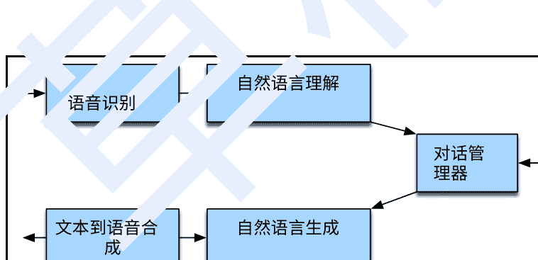
图24.5 对话代理组件架构。

### 24.2.1 ASR 组件

ASR（自动语音识别）组件接收音频输入，通常来自电话，或来自PDA或桌面麦克风，并返回一个转录的单词字符串，如第9章所讨论的。

ASR系统的各个方面可以针对会话代理进行优化。例如，我们在第9章中讨论的大词汇语音识别器专注于转录任何主题的任何句子，使用任何英语单词。但对于依赖特定领域的对话系统来说，这没有太大用处。能够转录如此多样的句子并没有太大意义。语音识别器需要能够转录的句子只是那些可以被自然语言理解组件理解的句子。因此，商业对话系统通常使用基于有限状态语法的非概率性语言模型。这些语法通常是手写的，并指定系统理解的所有可能的回应。我们将在第24.3节中看到VoiceXML系统的一个手写语法示例。这种基于语法的语言模型也可以从用于自然语言理解的统一语法（Rayner等，2006）自动编译。

因为用户对系统的说话与系统刚刚说的内容有关，对话代理中的语言模型通常依赖于对话状态。例如，如果系统刚刚问用户“你从哪个城市出发？”，ASR语言模型可以被限制为只包含城市名称，或者类似于‘我想从[CITYNAME]出发’的句子。这些对话状态特定的语言模型通常由手写的有限状态（甚至是上下文无关）语法组成，如上面所讨论的，每个对话状态对应一个语法。

在某些系统中，理解组件更强大，系统能够理解的句子更多。在这种情况下，我们可以使用一个与对话状态相关的 N-gram语言模型，其概率也是根据对话状态进行调整的，而不是使用有限状态语法。

无论我们使用有限状态、上下文无关还是 N-gram语言模型，我们都将这样的对话状态依赖语言模型称为限制性语法。当系统希望限制用户对系统的最后一次话语进行回应，可以使用限制性语法。当系统希望允许用户有更多选择时，可以将这种状态特定的语言模型与更通用的语言模型混合使用。正如我们将看到的，选择这些策略之间的差异可以根据用户被允许的主动性进行调整。对话中的语音识别，以及在许多其他应用程序中，如听写，演讲者的身份在许多话语中保持不变。这意味着随着系统从用户那里获得更多的语音，可以应用诸如MLLR和VTLN（第9章）的说话者自适应技术来改善识别。在对话系统中嵌入ASR引擎还要求ASR引擎具有实时响应，因为用户不愿意接受长时间的暂停才能得到回应。对话系统还通常要求ASR系统为一个句子返回一个置信度值，这个值可以用于决定是否要求用户确认回答。

### 24.2.2 NLU 组件

对话系统的自然语言理解（NLU）组件必须生成适合对话任务的语义表示。自从GUS系统（Bobrow等，1977年）以来，许多基于语音的对话系统都基于第15章讨论的框架和槽语义。例如，一个旅行系统的目标是帮助用户找到合适的航班，它会有一个包含有关航班信息的框架；因此，像“显示我从波士顿到旧金山的周二早上的航班”这样的句子可能对应以下填充的框架（来自Miller等人（1994年））：

- 展示：
航班：
    出发地：
        城市：波士顿
        日期：
            星期几：周二
        时间：
            一天中的时间段：早上
    目的地：
        城市：旧金山

NLU组件是如何生成这个语义表示的？一些对话系统使用带有语义附加的通用统一语法，例如在第18章介绍的核心语言引擎。解析器生成一个句子的意义，从中提取出槽填充器（Lewin等，1999年）。

其他对话系统依赖于更简单的领域特定语义分析器，例如语义语法。语义语法是一个CFG，其中规则的左侧对应于所表达的语义实体，如下面的片段所示：

| 非终结符 | 产生式 |
| :--- | :--- |
| 展示 | -> 展示给我 \| 我想要 \| 我能看到... |
| 出发时间范围 | -> (之后 \| 大约 \| 之前) 小时 \| 早上 \| 下午 \| 晚上 |
| 小时 | -> 一 \| 二 \| 三 \| 四... \| 十二 (AMPM) |
| 航班 | -> (a) 航班 \| 航班 |
| 上午下午 | -> 上午 \| 下午 |
| 起点 | -> 从城市 |
| 目的地 | -> 到城市 |
| 城市 | -> 波士顿 \| 旧金山 \| 丹佛 \| 华盛顿 |

这些语法采用上下文无关语法或递归转换网络的形式（Issar和Ward，1993; Ward和Issar, 1994），因此可以由任何标准的CFG解析算法解析，例如在第13章中介绍的CKY或Earley算法。CFG或RTN解析的结果是对输入字符串进行层次化标记的：

| 展示 | 航班 | 起点 | 目的地 | 出发日期 | 出发时间 |
| :--- | :--- | :--- | :--- | :--- | :--- |
| 显示我从波士顿到旧金山的航班，时间是星期二 | | 到城市 | | 早上 | |

由于语义语法节点（如起点）对应于框架中的插槽，因此插槽填充器几乎可以直接从上述解析结果中读取。只需将填充器转换为某种规范形式即可（例如，如第15章中所讨论的，日期可以规范化为DD:MM:YY形式，时间可以规范化为24小时制等）。

语义语法方法被广泛使用，但无法处理歧义，并且需要手工编写的语法，这可能既昂贵又耗时。可以通过向语法添加概率来解决歧义问题；其中一种概率语义语法系统是TINA系统（Seneff，1995），如图24.6所示；请注意句法和语义节点名称的混合。TINA中的语法规则是手工编写的，但解析树节点的概率是通过修改后的SCFG方法进行训练的，该方法在第14章中有描述。

一种概率的替代语义语法方法，也避免了手工编码语法，是Pieraccini等人（1991）提出的语义HMM模型。

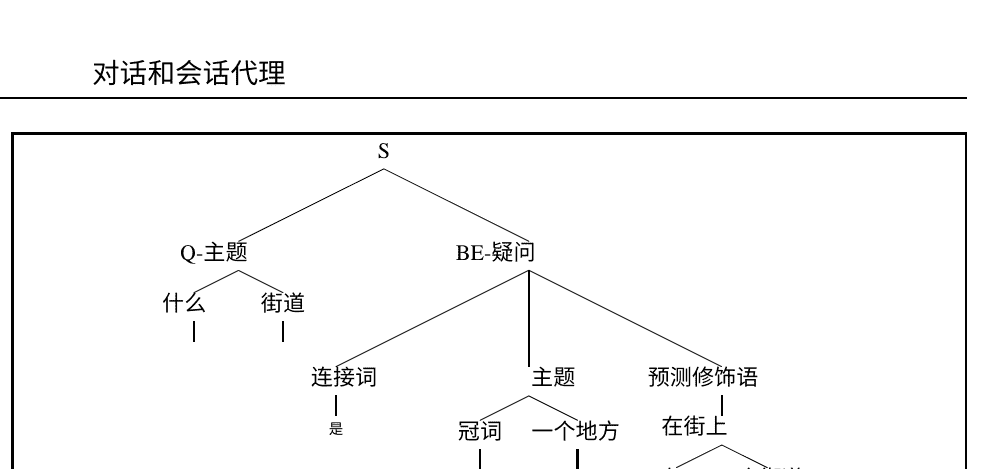

### 24.2.3 生成和TTS组件

会话代理的生成组件选择要向用户表达的概念，计划如何用文字表达这些概念，并为单词分配任何必要的语调。然后，TTS组件接收这些单词及其语调注释，并合成波形，如第8章所述。

生成任务可以分为两个任务：要说什么和如何说。内容规划器模块解决了第一个任务，决定向用户表达什么内容，是否提问，提供答案等等。对话系统的内容规划组件通常与对话管理器合并，我们将在下面返回到它。

语言生成模块解决了第二个任务，选择表达意义所需的句法结构和单词。语言生成模块有两种实现方式。在最简单和最常见的方法中，要向用户说的句子中的所有或大部分单词都是预先指定的。

这种方法被称为基于模板的生成，这些模板生成的句子通常被称为提示。虽然大部分单词在模板中是固定的，模板可以包含一些由生成器填充的变量，如下所示：你想什么时候离开CITY-ORIG?

你会从CITY-DEST返回CITY-ORIG吗?

语言生成的第二种方法依赖于自然语言生成领域的技术。 在这种方法中，对话管理器构建要表达的话语的意义表示，并将此意义表示传递给完整的生成器。 这样的生成器通常有三个组件，句子规划器、表层实现器和韵律分配器。该体系结构的草图如图24.8所示。有关自然语言生成系统及其在对话中的使用的更多信息，请参见Reiter和Dale（2000）。

在当前系统中常见的手动设计的提示中，必须实现一些重要的对话和篇章约束。

像任何篇章一样，对话需要连贯性。 例如，正如Cohen等人（2004）所示，手动构建的系统提示中使用篇章标记和代词使得（24.14）中的对话比（24.13）中的对话更自然:

- (24.13) 请说出数据。
...
请说出开始时间。
...
请说出持续时间。
...
请说出主题。

- (24.14) 首先，告诉我日期。
...
接下来，我需要开始的时间。
...
谢谢。<暂停>现在，它应该持续多久？
...
最后，我只需要一个简短的描述...

对话连贯的另一个重要情况是当特定提示需要反复对用户说时。在这些情况下，对话系统通常使用逐渐缩短的提示，即逐渐缩短的提示。 下面是Cohen等人（2004）的一个例子，展示了一系列（手动设计的）逐渐缩短的提示:

- (24.15) 系统：现在，第一个要添加到您的监视列表的公司是什么？
- 呼叫者：思科
- 系统：下一个公司名称是什么？ （或者，您可以说“完成”。）
- 呼叫者：IBM
- 系统：告诉我下一个公司名称，或者说“完成”。
- 呼叫者：英特尔
- 系统：下一个？
- 呼叫者：美国在线。
- 系统：下一个？
- 来电者：...

生成过程中的其他限制更加具体，与口语对话有关，并且涉及人类记忆和注意力过程的事实。例如，当人类被提示给出特定回答时，如果建议的回答是他们听到的最后一件事，那么他们的记忆负担就会减轻。因此，正如Cohen等人(2004)指出的那样，提示“要再次听到列表，请说‘重复列表’”对用户来说比“说‘重复列表’来再次听到列表”更容易。

同样，呈现长列表的查询结果（例如，潜在的航班或电影）可能会给用户带来负担。因此，大多数对话系统都有内容规划规则来处理这个问题。例如，在Mercury旅行规划系统（Seneff, 2002）中，有一个规则规定，如果要向用户描述超过三个航班，系统将只列出可用的航空公司，并明确描述最早的航班。

### 24.2.4 对话管理器

对话系统的最后一个组件是对话管理器，它控制对话的架构和结构。对话管理器从ASR/NLU组件接收输入，维护某种状态，与任务管理器进行接口交互，并将输出传递给NLG/TTS模块。

我们在第2章的ELIZA中看到了一个非常简单的对话管理器，其架构是一个简单的读取-替换-打印循环。系统读取一个句子，对句子应用一系列文本转换，然后将其打印出来。没有保留状态；转换规则只知道当前的输入句子。除了能够与任务管理器交互之外，现代对话管理器在对话的状态保持和对话结构建模的能力上与ELIZA的管理器非常不同。

最常见的对话管理器架构有四种。最简单且商业化程度最高的架构，有限状态和基于框架的架构，在本节中进行了讨论。后续章节将讨论更强大的信息状态对话管理器，包括基于马尔可夫决策过程的概率版本的信息状态管理器，以及更经典的基于计划的架构。

最简单的对话管理器架构是有限状态管理器。例如，想象一个简单的航空旅行系统，其工作是询问用户出发城市、目的地城市、时间以及是否是往返旅行。图24.9展示了这样一个系统的示例对话管理器。有限状态自动机的状态对应于对话管理器向用户提问的问题，弧对应于动作。

根据用户的回答来采取行动。该系统完全控制与用户的对话。它向用户提出一系列问题，忽略（或误解）用户对系统问题的非直接回答，然后继续下一个问题。

系统主动 以这种方式控制对话的系统被称为系统主动或单一主动系统。我们说在对话中控制对话的发言者具有主动权；在正常的人际对话中，主动权在参与者之间来回转移（Walker and Whittaker，1990）。有限单主动有限状态对话管理器架构的优点是系统始终知道用户正在回答的问题。这意味着系统可以使用特定于此问题答案的语言模型来准备语音识别引擎。知道用户将要谈论的内容也使自然语言理解引擎的任务更容易。大多数有限状态系统还允许通用命令。通用命令是可以在对话中的任何位置说的命令；除了刚刚提出的问题的答案之外，每个对话状态都能识别通用命令。常见的通用命令包括帮助，它提供给用户一个（可能是特定状态的）帮助信息，重新开始（或主菜单），它将用户返回到某个指定的主起始状态，并且某种命令来纠正系统对用户上一条语句的理解（San-Segundo等，2001）。

具有普遍性的系统主动有限状态对话管理器可能足够处理非常简单的任务，例如在电话上输入信用卡号码、姓名和密码。

纯系统主动的有限状态对话管理器架构可能过于复杂。

单一主动系统也可以由用户控制，这种情况下被称为用户主动系统。纯用户主动系统通常用于无状态数据库查询系统，用户向系统提出单个问题，系统将其转换为SQL数据库查询，并返回一些数据库的结果。

然而，即使对于一个相对简单的口语对话旅行代理系统，也有一些限制。问题在于纯系统主动系统要求用户准确回答系统提出的问题。但这可能会使对话变得尴尬和烦人。用户经常需要能够说出不完全是对系统单个问题的回答的内容。例如，在旅行计划的情况下，用户经常希望用复杂的句子表达他们的旅行目标，这可能同时回答多个问题，如图24中的通勤者示例（24.16）或ATIS示例（24.17）所示。

> (24.16) 嗨，我想星期二早上飞往西雅图

> (24.17) 我想要一张从密尔沃基到奥兰多的单程机票，下午五点以后离开，星期三。

一个有限状态对话系统，通常无法处理这些种类的话语，因为它要求用户按照问题的提问顺序回答每个问题。当然，从理论上讲，可以创建一个有限状态架构，其中有一个单独的状态来回答用户陈述可能回答的每个问题的子集，但这将导致状态数量的巨大爆炸，使得这个架构难以概念化。

因此，大多数系统避免纯系统主动的有限状态方法，而是使用一种允许在对话中的各个点之间切换系统和用户主动权的架构。混合主动权在对话中，系统和用户之间的主动权可以在不同的点之间转移。一种常见的混合主动权对话架构依赖于框架本身的结构来引导对话。这些基于框架或表单的对话管理器向用户提问以填充帧中的插槽，但允许用户通过提供填充帧中其他插槽的信息来引导对话。每个插槽可能与以下类型的问题相关联：

| 插槽 | 问题 |
|------|------|
| 出发城市 | “您从哪个城市出发？” |
| 目的地城市 | “您要去哪里？” |
| 出发时间 | “您想什么时候出发？” |
| 到达时间 | “您想什么时候到达？”因此 |

，基于帧的对话管理器需要向用户提问，填充用户指定的任何插槽，直到获得足够的信息来执行数据库查询，然后将结果返回给用户。如果用户恰好一次回答两个或三个问题，系统必须填充这些插槽，然后记住不再向用户询问与这些插槽相关的问题。并非每个插槽都需要有相关的问题，因为对话设计者可能不希望用户被问题淹没。尽管如此，系统必须能够填充这些插槽，如果用户恰好指定了它们。这种形式填充的对话管理器消除了有限状态管理器对用户指定信息顺序的严格限制。

虽然一些领域可以用一个单一的框架来表示，但是其他领域，比如旅行领域，似乎需要处理多个框架的能力。为了处理可能的用户问题，我们可能需要具有一般路线信息的框架（例如，像从波士顿到旧金山有哪些航空公司飞行的问题），以及关于机票价格的信息（例如，像我必须停留多少天才能获得合理的机票价格的问题）或者关于汽车或酒店预订的信息。

由于用户可能会在不同的框架之间切换，系统必须能够确定给定输入应该填充哪个框架的哪个插槽，并将对话控制切换到该框架。由于用户可能会在不同的框架之间切换，系统必须能够确定给定输入应该填充哪个框架的哪个插槽，并将对话控制切换到该框架。

由于需要动态切换控制，基于帧的系统通常被实现为产生式规则系统。不同类型的输入导致不同的产生式触发，每个产生式可以灵活地填充不同的帧。然后，产生式规则可以根据诸如用户输入和一些简单的对话历史（例如系统上一次提出的问题）等因素来切换控制。Mercury航班预订系统（Seneff和Polifroni，2000；Seneff，2002）使用一个大型的“对话控制表”来存储200-350个规则，涵盖了请求帮助的规则，确定用户是否在列表中引用航班的规则（“我要那个上午九点的航班”），以及决定首先向用户描述哪些航班的规则。

既然我们已经看到了基于帧的架构，让我们回到我们对会话主动性的讨论。在同一个代理中，可以允许系统主动性、用户主动性和混合主动性的交互。我们之前说过，主动性指的是在任何时刻谁控制对话。短语混合主动性通常有两种用法。它可以表示系统或用户可以以各种方式任意地接管或放弃主动性（Walker和Whittaker，1990；Chu-Carroll和Brown，1997）。这种混合主动性在当前对话系统中很难实现。在基于表单的对话系统中，术语混合主动性用于更有限的转换类型，根据ASR中使用的提示类型（开放式与指令式）和语法类型来操作。一个开放式提示是指系统

给用户很少的限制，允许用户以任何方式回应，如下所示：

我可以帮你吗？

指令提示 指令提示是明确告诉用户如何回答的提示：

如果你接受电话，请说是；否则，请说否。

限制性语法（第24.2.1节）是一种语言模型，它严格限制了ASR系统，只能识别给定提示的正确回答。

我们可以像图24.10中所示的那样将它们结合起来，根据Singh等人（2002年）和其他人的研究，定义为基于表单的对话系统中使用的主动性。

| 语法 | 开放式 | 指令 |
| :--- | :--- | :--- |
| 限制性 | 没有意义 | 系统主动性 |
| 非限制性 | 用户主动性 | 混合主动性 |
| **24.10** | Singh等人（2002年）的操作定义。 | |

在系统主动性交互中，使用指令提示和限制性语法；用户被告知如何回答，ASR系统只能识别提示的回答。在用户主动性中，用户被给予开放式提示，语法必须能够识别任何类型的回答，因为用户可能说任何话。最后，在混合主动性交互中，系统给用户一个指令-

具有特定建议回应的提示性提示，但非限制性语法允许用户在提示范围之外回应。
通过这种方式将主动性定义为提示和语法类型的属性，允许系统在不同用户和交互中动态更改其主动性类型。
新手用户或语音识别错误率较高的用户可能会更好地受到系统的主动性服务。
专家用户或那些说话更容易识别的用户可能会在混合或用户主动性交互中表现良好。我们将在第24.6节中看到如何使用机器学习技术来选择主动性。

### 24.2.5 对话管理器错误处理:确认/拒绝

在对话系统中，听错是一类特别重要的问题，因为语音识别的错误率非常高。
因此，对话系统确保正确理解用户输入非常重要。 通常有两种方法来实现这一点：与用户确认理解和拒绝系统可能误解的话语。

可以采用多种策略与用户进行确认。 一个系统使用明确确认策略向用户直接提问以确认他们的理解。 以下是旅行规划系统中明确确认的两个例子。 (粗体) 确认问题都是是非问题，一个使用单个句子，另一个是在陈述句后面加上一个标签问题 (像“对吗？”或“不是吗？”)：

S: 你想从哪个城市出发?
U: 巴尔的摩。
**S: 你想从巴尔的摩出发吗？**
U: 是的。
U: 我想在九月二十一日早上从科罗拉多州丹佛飞往纽约市，乘坐联合航空公司的航班。
**S: 那我们来看看。 我看到你要从科罗拉多州丹佛飞往纽约，在九月二十一日。 是这样吗？**
U: 是的

一个使用隐式确认策略的系统，而不是直接提问的策略使用上述的演示或显示基础策略，通过重复回答用户所说的内容来确认

U: 我想去柏林
**S: 你想什么时候去柏林？**
U2: 嗨，我想星期二早上飞往西雅图
**A3: 在八月十一日星期二早上去西雅图旅行**
你的全名是什么?

显式和隐式确认具有互补的优势 显式确认使用户更容易纠正系统的错误识别，因为用户可以简单地回答‘不’来否认确认问题 但显式确认会让对话变得尴尬并增加对话的长度 (Danieli和Gerbino，1995；Walker等，

1998年）。上述明确的确认对话片段听起来不自然且明显非人类；隐式确认则更符合会话的自然性。确认只是系统必须表达的一种对话行为中的一种。

另一种选择是拒绝。语音识别系统会拒绝一个话语-通过给用户一个提示，比如对不起，我没听懂。有时候，发言会被多次拒绝。这可能意味着用户使用的语言系统无法理解。因此，当发言被拒绝时，系统通常会采取渐进提示或逐步详细说明的策略(Yankelovich等，1995年; Weinschenk和Barker, 2000年)如Cohen等人(2004年)的例子所示:

> > 系统: 你想什么时候离开？
> 来电者: 嗯，我需要赶上第一场世界大赛之前到达纽约。
> 系统: <拒绝>。抱歉，我没听清楚。请说出您想要离开的月份和日期。
> 来电者: 我想在十月十五日出发。

在这个例子中，与其只是重复“您想什么时候离开？”，拒绝提示给予来电者更多关于如何表达一个系统能理解的话语的指导。这些你可以说的帮助信息对于提高系统的理解能力非常重要（Bohus和Rudnicky，2005年）。如果来电者的话语再次被拒绝，提示可以反映这一点（“我仍然没听清楚”），并给予来电者更多的指导。

错误处理的另一种策略是快速重新提示，即系统-当系统只是简单地说“对不起？”或者“你说什么？”来拒绝一个话语时。只有当呼叫者的话语第二次被拒绝时，系统才开始应用渐进提示。Cohen等人（2004）总结了一些实验，显示用户非常喜欢快速的重新提示作为第一级错误提示。

## 24.3 VoiceXML

VoiceXML（Voice Extensible Markup Language）是一种基于XML的对话设计语言，由W3C发布，也是各种语音标记语言（如SALT）中最常用的一种。VoiceXML（或vxml）的目标是创建简单的音频对话，使用ASR和TTS，并在基于框架的架构中处理非常简单虽然VoiceXML在商业环境中比学术环境更常见，但它是学生了解对话系统设计问题的一种很好的方式。语音与语言处理

VoiceXML文档包含一组对话，每个对话可以是一个表单或一个菜单。我们将限制介绍表单；有关VoiceXML的更多信息，请参见http://www.voicexml.org/。图24.11中的VoiceXML文档定义了一个名为'transport type'的表单，其中只有一个字段。该字段有一个附加的提示，请选择航空公司、酒店或租车，可以传递给TTS系统。它还有一个语法（语言模型），该语法被传递给语音识别引擎，以指定识别器允许识别的单词。在## 24.11 只有一个字段的最小VoiceXML脚本。用户被提示，然后将响应重复回来。

```xml
<form>
  <field name="transporttype">
    <prompt>
      请选择航空公司、酒店或租车。
    </prompt>
    <grammar type="application/x-nuance-gsl">
      [airline hotel "rental car"]
    </grammar>
  </field>
  <block>
    <prompt>
      你选择了<value expr="transporttype"/>。
    </prompt>
  </block>
</form>
```

在图24.11的示例中，语法由三个单词的析取组成 airline, hotel, 和 rental car。

一个 `<form>` 通常由一系列 `<field>` 组成，还有一些其他命令。每个字段都有一个名称（在图24.11中的字段名称为 transporttype），这也是用户响应将被存储的变量的名称。与字段关联的提示通过 `<prompt>` 命令指定。

与字段关联的语法通过 `<grammar>` 命令指定。VoiceXML支持多种指定语法的方式，包括XML语音语法、ABNF和商业标准，如Nuance GSL。在下面的示例中，我们将使用Nuance GSL格式。

VoiceXML解释器按照文档顺序遍历表单，重复选择表单中的每个项目。如果有多个字段，解释器将按顺序访问每个字段。解释顺序可以通过各种方式进行更改，我们将在后面看到。图24.12中的示例显示了一个包含三个字段的表单，用于指定航班的起始地、目的地和日期。

示例的序言显示了两个全局默认的错误处理方式。如果用户在提示后没有回答（即，静音超过超时阈值），VoiceXML解释器将播放 `<noinput>` 提示。如果用户说了些什么，但它不符合该字段的语法，VoiceXML解释器将播放 `<nomatch>` 提示。在此类失败后，重新询问用户问题以获取响应是正常的。由于这些例程可以从任何字段调用，因此确切的提示每次都会有所不同，VoiceXML提供了一个 `<reprompt>` 命令，它将重复提示导致错误的字段。

这个表单的三个字段展示了VoiceXML的另一个特性，即 `<filled>` 标签。当用户填写完字段后，解释器会立即执行 `<filled>` 标签。在这里，这个特性被用来给用户确认他们的输入。

最后一个字段， departdate，展示了VoiceXML的另一个特性，即 type属性。VoiceXML 2.0规定了七种内置的语法类型，boolean、currency、date、digits、number、phone和time。由于这个字段的类型是date，一个数据特定的语言模型（语法）将自动传递给语音识别器，所以我们不需要在这里明确指定语法。

```xml
<noinput>
对不起，我没有听到你说话。 <reprompt/>
</noinput>

<nomatch>
对不起，我没听懂。<reprompt/>
</nomatch>

<form>
  <block>       欢迎来到航空旅行顾问。</block>
  <field name="origin">
    <prompt>         您想从哪个城市出发？</prompt>
    <grammar type="application/x-nuance-gsl">
      [ (旧金山) 丹佛 (纽约) 巴塞罗那]
    </grammar>
    <filled>
      <prompt>好的，从 <value expr="origin"></prompt>
    </filled>
  </field>
  <field name="destination">
    <prompt>您想去哪个城市？                               </prompt>
    <grammar type="application/x-nuance-gsl">
      [ (旧金山) 丹佛 (纽约) 巴塞罗那]
    </grammar>
    <filled>
      <prompt>     好的，到 <value expr="destination">      </prompt>
    </filled>
  </field>
  <field name="departdate" type="date">
    <prompt>您想什么日期出发？</prompt>
    <filled>
      <prompt>     好的，关于 <value expr="departdate">      </prompt>
    </filled>
  </field>
  <block>
    <prompt>好的，我知道你从 <value expr="origin">
                            到 <value expr="destination"> 在 <value expr="departdate">
    </prompt>
    发送信息预订航班...
  </block>
</form>
```

图24.12 包含3个字段的VoiceXML脚本，确认每个字段并处理noinput和nomatch情况。

图24.13给出了一个最终的例子，展示了混合主动性。 在混合主动性对话中，用户可以选择不回答系统提出的问题。例如，他们可能回答一个不同的问题，或者使用一个长句子一次填写多个插槽。这意味着VoiceXML解释器不能再按顺序评估表单的每个字段；它需要跳过已设置值的字段。这是通过一个 guard condition 来实现的，它是一个测试，阻止访问字段。对于一个字段来说，默认的 guard condition 是检查字段的表单项变量是否有值，如果有值，则不解释该字段。

图24.13还展示了一个更复杂的语法使用。这个语法是一个CFG语法，有两个重写规则，命名为 Flight 和 City。Nuance GSL语法形式使用括号 `()` 表示连接，方括号 `[]` 表示选择。因此，像 (24.18) 这样的规则意味着 wantsentence 可以扩展为 i want to fly 或 i want to go，Airports 可以扩展为 san francisco 或 denver。

```
(24.18)  Wantsentence (i want   to [fly go])
```

```xml
<noinput> 对不起，我没听清楚。<reprompt/></noinput>
<nomatch> 对不起，我没听懂。<reprompt/></nomatch>
<form>
  <grammar type="application/x-nuance-gsl">
    <![CDATA[
    Flight ( ?[
      (i [wanna (want to)]  [fly go])
      (i'd like to  [fly go])
      ([(i wanna)(i'd like a)] flight)
    ]
    [
      ([离开出发]城市:x){<起点$x>}
      ([ (?去)(到达)]城市:x){<目的地$x>}
      ([离开出发]城市:x
       [(?去)(到达)]城市:y){<起点$x><目的地$y>}
    ]
    ?请
    )
    城市 [ [ (旧金山)(sfo) ]{return("旧金山，加利福尼亚")}
               [ (丹佛)(den) ]{return("丹佛，科罗拉多")}
               [ (西雅图)(stx) ]{return("西雅图，华盛顿")}
    ]
    ]]>
  </grammar>
  <initial name="init">
    <prompt> 欢迎来到咨询师。你的旅行计划是什么？ </prompt>
  </initial>
  <field name="起点">
    <prompt> 你想从哪个城市出发？ </prompt>
    <filled>
      <prompt>好的，从<value expr="origin"></prompt>
    </filled>
  </field>
  <field name="destination">
    <prompt> 你想去哪个城市？ </prompt>
    <filled>
      <prompt>好的，到<value expr="destination"></prompt>
    </filled>
  </field>
  <block>
    <prompt>好的，我知道你从<value expr="origin">到<value expr="destination">。</prompt>发送信息以预订航班...
  </block>
</form>
```

图24.13 混合主动的VoiceXML对话。语法允许指定起始城市、目的地城市或两者的句子。用户可以通过指定起始城市、目的地城市或两者来回应初始提示。

语法规则可以递归地引用其他语法规则，因此在图24.13中的语法中，我们可以看到 Flight 引用了 City 规则。

VoiceXML语法采用带有可选语义附件的CFG语法形式。语义附件通常是一个文本字符串（例如“丹佛，科罗拉多”）或一个槽和一个填充器。我们可以在 City 规则的语义附件中看到前者的示例（每行末尾的 return 语句），它传递了城市和州名。Flight 规则的语义附件显示了后一种情况，其中槽（<origin>或<destination>或两者）用从 City 规则中的变量 x 传递的值填充。因为图24.13是一个混合主动语法，所以语法必须适用于任何一个领域。这是通过将航班的展开式作为一个析取来完成的；注意它允许用户仅指定起始城市、目的城市或两者都指定。

## 24.4 对话系统设计与评估

### 24.4.1 设计对话系统

对话系统开发者如何选择对话策略、架构、提示信息、错误信息等？这个过程通常被称为 **VUI**（语音用户界面）设计。Gould和Lewis（1985）的以用户为中心的设计原则是：

- 1. **研究用户和任务：** 通过与用户的访谈、对类似系统的调查以及对相关人机对话的研究，了解潜在用户和任务的性质。
- 2. **构建模拟和原型：** 在Wizard-of-Oz系统（WOZ）或PNAMBIC（不要注意幕后的人）系统中，用户与他们认为是软件系统的东西进行交互，但实际上是一个人操作者（“巫师”）在某种伪装的界面软件后面（例如Gould等人，1983年；Good等人，1984年；Fraser和Gilbert，1991年）。在实施之前，可以使用WOZ系统来测试架构；只需要准备好界面软件和数据库。巫师的语言输出可以通过文本到语音系统或仅通过文本交互来伪装。巫师很难精确模拟真实系统的错误、限制或时间约束；因此WOZ研究的结果有些理想化，但仍然可以提供有关领域问题的有用初步想法。
- 3. **迭代地对用户进行设计测试：** 嵌入式用户测试的迭代设计循环在系统设计中至关重要(Nielsen, 1992年; Cole等人, 1994年, 1997年; Yankelovich等人, 1995年; Landauer, 1995年)。例如Stifelman等人(1993年)构建了一个最初需要用户按键中断系统的系统。他们在用户测试中发现用户尝试中断系统(插话)，提出了建议-建议对系统进行重新设计，以识别重叠的语音。迭代方法对于设计引导用户以规范方式回应的提示也很重要，例如在特定情况下使用受限制形式的提示（Oviatt等，1993年）或者使用指令性提示而不是开放性提示（Kamm，1994年；Cole等，1993年）。在这个阶段还可以使用模拟；与对话系统进行交互的用户模拟可以帮助测试界面的脆弱性或错误（Chung，2004年）。

有关对话界面设计的更多信息，请参阅Cohen等人（2004年），Harris（2005年）

### 24.4.2 对话系统评估

我们在上面提到过，在对话系统设计中，用户测试和评估至关重要。通过让用户与对话系统进行交互来执行任务，然后让他们填写问卷，可以计算出用户满意度评分（Shriberg等人，1992年；Polifroni等人，1992年；Stifelman等人，1993年；Yankelovich等人，1995年；Möller，2002年）。例如，图24.14显示了Walker等人（2001年）使用的多项选择题；将回答映射到1到5的范围内，然后对所有问题进行平均，得到总体用户满意度评分。

在每次系统更改后进行完整的用户满意度研究通常在经济上是不可行的。因此，拥有与人类满意度相关性很好的性能评估启发式方法通常很有用。已经研究了许多这样的因素和启发式方法。对这些因素进行分类的一种方法是基于一个最佳对话系统应该允许用户以最少的问题（最小化成本）实现他们的目标（最大化任务成功）。然后我们可以研究与这两个标准相关的度量标准。

**任务完成成功：** 任务成功可以通过评估总体解决方案的正确性来衡量。对于基于帧的架构，这可能是填充了正确值的插槽的百分比，或者完成的子任务的百分比（Polifroni等，1992年）。由于不同的对话系统可能应用于不同的任务，因此很难在此度量上进行比较，因此Walker等人（1997年）建议使用Kappa系数，κ，来计算一个完成分数，该分数经过归一化以考虑偶然一致性，并更好地实现跨系统比较。

**效率成本：** 效率成本是衡量系统帮助用户的效率的指标。可以通过对话的总经过时间（以秒为单位），总转数或系统转数的数量，或查询的总数（Polifroni等，1992年）来衡量。其他指标包括系统非响应的数量，以及“转向修正比率”：仅用于纠正错误的系统或用户转数与总转数的比率（Danieli和Gerbino，1995年；Hirschman和Pao，1993年）。

**质量成本：** 质量成本衡量了影响用户对系统感知的其他交互方面。其中一种衡量指标是ASR系统未能返回任何句子的次数，或者ASR拒绝提示的次数。类似的衡量指标包括用户不得不插入（中断系统）的次数，或者用户未能及时回应时播放的超时提示的次数。其他质量指标关注系统对用户的理解和回应的程度。这可以包括系统的问题、回答和错误消息的不恰当性（冗长或模糊）（Zue等，1989年），或者每个问题、回答或错误消息的正确性（Zue等，1989年；Polifroni等，1992年）。一个非常重要的质量成本是概念准确性或概念错误率，它衡量了语义概念的百分比，NLU组件正确返回的。对于框架-基于架构，可以通过计算填充了正确含义的插槽的百分比来衡量。例如，如果句子“我想在奥斯汀5:00到达”被错误识别为具有语义“DEST-CITY: 波士顿，时间: 5:00”，概念准确性将为50%（两个插槽中有一个错误）。

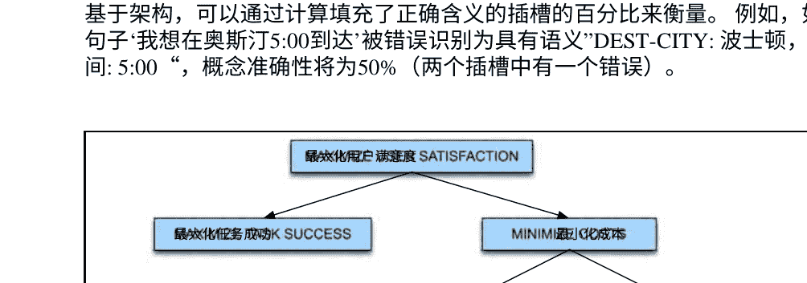

这些成功和成本指标应该如何组合和加权？一种方法是PARADISE算法（对话系统评估范式），它将多元回归应用于这个问题。该算法首先使用类似于图24.14中的问卷为每个对话分配用户满意度评分。然后，一组成本和成功因素，如上所述，被视为一组独立因素；多元回归用于训练每个因素的权重，衡量其在解释用户满意度方面的重要性。图24.15显示了PARADISE实验所假设的特定性能模型。每个框与我们在前一页总结的一组因素相关。得到的度量可以用于比较完全不同的对话策略；使用PARADISE等方法进行的评估表明，任务完成和概念准确性可能是用户满意度的最重要预测因素；参见Walker等人（1997, 2001, 2002）。

已经提出了各种各样的评估指标和分类法，用于描述口语对话系统的质量（Fraser, 1992; Möller, 2002, 2004; Delgado and Araki, 2005, inter alia）。

## 24.5 信息状态与对话行为

到目前为止，我们介绍的基本基于框架的对话系统只能进行有限的领域特定对话。这是因为基于框架的对话系统中的语义解释和生成过程仅基于填充槽所需的信息。为了能够用于除了表单填充应用之外的更多用途，对话代理需要能够做出决策，例如判断用户是否提出了问题，提出了建议或拒绝了建议，并且需要能够将用户的话语与实际情况联系起来，提出澄清问题并建议计划。这表明，对话代理需要在言语行为和联系方面具有复杂的解释和生成模型，以及比仅仅是槽列表更复杂的对话上下文表示。

在本节中，我们将概述一种更高级的对话管理架构，它允许使用这些更复杂的组件。这个模型通常被称为信息状态架构（Traum和Larsson，2003年，2000年），尽管我们将宽泛地使用这个术语来包括像Allen等人（2001年）这样的架构。一种概率性架构，可以看作是信息状态方法的扩展，马尔可夫决策过程模型，将在下一节中描述。术语信息状态架构实际上是一个涵盖了许多不同的朝着更复杂代理的努力；在这里，我们假设一个由5个组件组成的结构：

- 信息状态（‘话语背景’或‘心智模型’）
- 对话行为解释器（或‘解释引擎’）
- 对话行为生成器（或‘生成引擎’）
- 一组更新规则，这些规则在解释对话行为时更新信息状态，并包括生成对话行为的规则。
- 一个控制结构，用于选择要应用的更新规则

术语信息状态旨在非常抽象，可能包括诸如话语背景和两个说话者的共同基础、说话者的信念或意图、用户模型等等。关键是，信息状态旨在比有限状态对话管理器中的静态状态更复杂的概念；当前状态包括许多变量的值、话语背景和其他不容易通过有限网络中的状态编号建模的元素。

对话行为是言语行为的扩展，它整合了基于接地理论的思想，在下一小节中将更详细地定义。解释引擎将语音作为输入，并确定句子语义和适当的对话行为。对话行为生成器将对话行为和句子语义作为输入，并生成文本/语音作为输出。

最后，更新规则使用对话行为中的信息修改信息状态。这些更新规则是上述基于框架的对话系统中使用的产生规则的一般化（Seneff和Polifroni，2000，等）。
一种称为选择规则的更新规则子集用于生成对话行为。
例如，一个更新规则可能会说，当解释引擎识别到一个断言时，信息状态应该用断言中的信息进行更新，并且需要向信息状态中添加一个执行接地行为的义务。当识别到一个问题时，一个更新规则可能会指定需要回答这个问题。我们可以将更新规则和控制结构的组合称为行为代理(Allen et al., 2001)，如图24.16所示。虽然信息状态模型的直觉非常简单，但细节可能非常复杂。信息状态可能涉及丰富的话语模型，如话语表示理论或用户信念、欲望和意图的复杂模型（我们将在第24.7节中回顾）。在这里，我们不会描述一个特定的实现，而是将重点放在下几节中的对话行为解释和生成引擎以及通过马尔可夫决策过程实现的概率信息状态架构上。

## 24.14 满意度调查，改编自Walker等人（2001年）。

| 指标 | 问题 |
|------|------|
| TTS性能 | 系统是否容易理解？ |
| ASR性能 | 系统是否理解你说的话？ |
| 任务的易度 | 是否容易找到你想要的消息/航班/火车？ |
| 交互速度 | 系统与用户的交互速度是否适当？ |
| 用户专业知识 | 你知道在每个时刻可以说什么吗？ |
| 系统回应 | 系统是否经常反应迟缓，回复你的速度很慢？ |
| 预期行为 | 系统是否按照你的预期工作？ |
| 未来使用 | 你认为你会在这个未来使用这个系统吗？ |

2这个名字来自于儿童书籍《绿野仙踪》（Baum，1900年），在这本书中，巫师原来只是一个由一个人控制的模拟。

### 24.5.1 对话行为

对话行为

对话步骤

正如我们上面所暗示的，奥斯汀最初定义的言语行为并不模拟对话的关键特征，如接地、贡献、邻接对等。为了捕捉这些对话现象，我们使用了言语行为的扩展，称为对话行为（Bunt, 1994）（或对话移动或对话步骤）（Power, 1979; Carletta et al., 1997b）。对话行为通过与这些其他对话功能相关的内部结构扩展了言语行为（Allen and Core, 1997; Bunt, 2000）。

已经提出了各种各样的对话行为标记集。图24.17显示了用于Verbmobil双边调度领域的一个非常特定于领域的标记集，在该领域中要求发言者计划在将来的某个日期举行会议。请注意，它具有许多非常特定于领域的标记，例如SUGGEST，用于当有人提议特定的日期进行会面时，以及ACCEPT和REJECT，用于接受或拒绝日期的提议。因此，它既包含了Clark贡献讨论的演示和接受阶段的元素，也包含了第830页上讨论的元素。

还有一些更一般和与领域无关的对话行为标记集。在DAMSL（多层对话行为标记）架构中，受到Clark和Schaefer（1989）、Allwood等人（1992）和（Allwood，1995）的工作启发，每个话语都被标记为两种类型的功能，即前瞻性功能（如言语行为功能）和后瞻性功能（如接地和回答），后者“回顾”对话者之前的话语（Allen和Core，1997；Walker等人，1996；Carletta等人，1997a；Core等人，1999）。

Traum和Hinkelman（1992）提出，构成对话行为的核心言语行为和基础行为可以适应更丰富的对话行为层次结构。图24.5.1显示了他们提出的四个层次的行为类型，其中两个中间层对应于DAMSL对话行为（基础行为和核心言语行为）。

这两个新层次包括交替发言行为和一种称为论证关系的连贯关系类型。

这些行为形成了一个层次结构，即在更高层次上执行一个行为（例如核心言语行为）必然执行一个较低层次的行为（发言）。我们将在本节的后面看到对话行为在生成中的使用，并将返回。

| 标签 | 例子 |
|------|------|
| 谢谢 | 谢谢 |
| 问候 | 你好丹 |
| 介绍 | 我又来了 |
| 再见 | 好的再见 |
| 请求评论 | 那看起来怎么样? |
| 建议 | 从六月十三日到十七日 |
| 拒绝 | 星期五我整天都有安排 |
| 接受 | 星期六听起来不错 |
| 请求建议 | 对你来说，一周中哪一天比较好? |
| 初始化 | 我想和你约个时间 |
| 给出理由 | 因为我下午有会议 |
| 反馈 | 好的 |
| 故意的 | 让我在日历上查一下 |
| 确认 | 好的，那太棒了 |
| 澄清 | 好的，你是指23号星期二吗? |
| 离题 | /我们可以一起吃午饭/, 然后吃很多冰淇淋 |
| 激励 | 我们应该去拜访我们在慕尼黑的子公司 |
| 垃圾 | 哎呀，我。 |

24.17 Verbmobil中使用的8个高级对话行为，总共抽象出3个更具体的对话行为。示例来自Jekat等人（1995年）。

| 行为类型 | 样本行为 |
|----------|----------|
| 交替对话 | 接管对话, 保持对话, 释放对话, 分配对话 |
| 接地 | 确认, 修复, 继续 |
| 核心言语行为 | 通知, 疑问, 接受, 请求, 提供 |
| 论证 | 详细说明, 总结, 问答, 澄清 |

24.18 对话行为类型，参考Traum和Hinkelman (1992)。

关于连贯性和对话结构的问题在第24.7节中讨论。

### 24.5.2 解释对话行为

我们如何进行对话行为解释，决定给定输入是一个问题，一个陈述，一个建议（指令），还是一个确认？也许我们可以仅仅依赖表面句法？我们在第12章中看到，英语中的是非问句具有助动词倒装（助动词在主语之前），陈述句具有陈述句法（无助动词倒装），命令没有句法主语：

（24.19） 是否问句
早餐会在USAir 1557上供应吗？

- 陈述：我不在乎午餐
- 命令：给我看从密尔沃基到奥兰多的航班。不幸

是的，正如阿伯特和卡斯特洛在本章开头著名的《谁在先》表演中清楚地表明的那样，从表面形式到言语行为的映射是复杂的。
例如，下面的ATIS话语看起来像是一个是-否-疑问的意思类似于你能给我一个列表吗？：

> （24.20） 你能给我一个从亚特兰大到波士顿的航班列表吗？

然而，实际上，这个人对系统是否能够给出一个列表不感兴趣；这个话语是一种礼貌的请求，意思是更像是请给我一个列表。因此，表面上看起来像是一个问题的东西实际上可能是一个请求。同样，表面上看起来像是一个陈述实际上可能是一个问题。非常常见的确认问题（Carletta等人，1997b； Labov和Fanshel，1977），用于询问对话者确认她拥有特权知识的某事。确认具有陈述的表面形式：

| | | |
| :--- | :--- | :--- |
| A | 开放选择 | 我想安排一次我将要去洛杉矶的旅行。 |
| | | 下下周开始。 |
| B | 保持 | 好的，让我查一下你的个人资料，我马上就来。 |
| | [暂停] | |
| B | 确认 | **你说你想下周出行？** |
| A | 接受 | 嗯，是的。 |

使用表面陈述来提问，或使用表面问题来发出请求的话语被称为间接言语行为。

为了解决这些对话行为的歧义，我们可以将对话行为解释建模为一个监督分类任务，对话行为标签作为隐藏类别进行检测。我们在一个语料库上训练分类器，其中每个话语都被手动标记了对话行为。用于对话行为解释的特征来自对话上下文和行为的微语法（Goodwin，1996）（其特征词汇、语法和韵律属性）：

- 词汇、语法和韵律属性：

1.  **词语和搭配**：请或者你能否是一个请求的好线索，通过对话特定的 N-gram 语法进行检测。
2.  **韵律**：升调是一个好的疑问的线索，而陈述性话语（如陈述句）在结尾有最终的降调：音高在结尾处下降。话语。响度或重音可以帮助区分是的那是一个同意和是的那是一个回应我们可以提取声学相关性的韵律特征，如 F0、持续时间和能量。
3.  **对话结构**：一个是的在提议之后可能是一个同意；一个是的在通知之后可能是一个回应。借鉴邻接对的思想（**Schegloff，1968；Sacks et al.，1974**），我们可以将对话结构建模为对话行为的二元组。

形式上，我们的目标是找到具有最高后验概率 \( P(d|o) \) 的对话行为 \( d^* \)，给定一个句子的观察结果。

```
\[
d^* = \argmax_{d} P(d|o) = \argmax_{d} \frac{P(d)P(o|d)}{P(o)} = \argmax_{d} P(d)P(o|d)
\]
(24.21)
```

通过做一些简化的假设（即句子的韵律和单词序列是独立的，对话行为的先验可以通过给定前一个对话行为的条件来建模），我们可以估计对话行为 \( d \) 的观测概率，如式（24.22）所示：

```
(24.22)     P(o|d) =   P(f|d)P(W|d)
(24.23)         d* = argmax P(d|d_{i-1})P(f|d)P(W|d)
                    d
```

```
(24.24)     P(W|d) =   ∏ P(w_i|w_{i-1}...w_{i-N+1}, d)
                    i=2
```

训练韵律预测器来计算 P(f|d)经常使用决策树。例如，Shriberg等人（1998）基于声学特征（如话语结束时F0的斜率，话语中不同位置的平均能量以及各种归一化的持续时间测量）构建了一个CART树来区分四种对话行为：陈述（S）、是非问句（QY）、陈述疑问句（QD）和特殊疑问句（Qw）。图24.19显示了决策树，它给出了给定一组声学特征f的对话行为的后验概率 P(d| f)。请注意，树的右侧S和QY之间的差异是基于特征norm f0 diff（平均F0的结束和倒数第二个区域之间的归一化差异），而底部左侧的Qw和QD之间的差异是基于utt grad，它测量整个话语中的F0斜率。

由于决策树产生了一个后验概率 P(d|f)，而方程式(24.23)需要一个似然概率 P(f|d)，我们需要通过贝叶斯反演（除以先验概率 P(d)将其转化为似然概率）来处理决策树的输出；我们在第10.4.2节中在语音识别中使用SVM和MLP代替高斯分类器时也看到了这个过程。在所有简化的假设下，选择对话行为标签的结果方程式将是：

```
d* = argmax P(d)P(f|d)P(W|d)
        d
(24.25)    = argmax P(d|d_{i-1}) P(d|f)/P(d) ∏ P(w_i|w_{i-1}...w_{i-N+1}, d)
        d                 i=2
```

### 24.5.3 检测修正行为

除了通用对话行为解释之外，我们可能还想构建特定行为的专用检测器。让我们考虑一个这样的检测器，用于识别用户对系统错误的更正。如果对话系统错误地识别了一个话语（通常是由于ASR错误的结果）用户通常会通过重复自己或重新表达话语来纠正错误。对话系统需要识别出用户正在进行纠正，并进一步与用户互动，以确定用户试图纠正什么。

不幸的是，纠正比普通句子更难识别。 Swerts等人（2000年）发现，在TOOT对话系统中，纠正被错误识别的次数是非纠正的两倍（以WER为单位）。其中一个原因是

24.19 Shriberg等人(1998)的决策树对声明性问题(QD)、陈述句(S)、是-否问题(QY)和wh问题(QW)进行分类。树中的每个节点显示四个概率，按照QD、S、QY、QW的顺序，其中最可能的四个概率被显示为节点的标签。请注意，问题比陈述句更短（连续语音帧），QY在末尾上升（末尾梯度），而QD在话语中始终上升（话语梯度）。

超清晰发音 说话者使用一种非常不同的韵律风格，称为超清晰发音，用于纠正。在超清晰发音中，话语的某些部分具有夸张的能量、持续时间或F0轮廓，例如我说的是巴尔的摩，不是波士顿（Wade等，1992年；Oviatt等，1998年；Levow，1998年；Hirschberg等，2001年）。

说话者使用各种策略进行纠正；Swerts等人（2000年）将这些策略归类为重复（REP）、释义（PAR）、添加内容（ADD）和省略内容（OMIT），如图24.5.3所示。他们发现大多数纠正是重复和省略，而不是释义。

已经应用了各种机器学习分类器来检测纠正行为。有用的特征包括词汇信息（像“不”，“纠正”，“我不”，脏话），韵律和超清晰发音特征（F0范围增加，暂停持续时间增加，词语持续时间增加，通常通过前一句的值进行归一化），表示话语长度的特征，ASR特征（置信度，语言模型概率）以及各种对话特征（Levow，1998年；Hirschberg等，2001年；Bulyko等，2005年）。

除了纠错检测之外，对话代理还需要适当的控制或更新规则在对话管理器中（Bulyko等，2005年）。

### 24.5.4 生成对话行为：确认和拒绝

决定生成哪些对话行为比对话行为解释收到的关注要少得多。Stent（2002年）是对话行为生成的一个最新模型

24.20 TOOT系统的对话片段，标记为修正类型，来自Swerts等人（2000）。

| 转向 | 纠错类型 |
|------|----------|
| S 您想在一周的哪一天离开？ |  |
| S 对不起，我没有听到您的任何消息。请告诉我您的出发日期 |  |
| U 嗯，明天 | NA |
| S 您可以说出发日期。例如，您可以说“今天”或“明天”。或者您可以说“星期一”，“星期二”，“星期三”... |  |
| U 明天 | REP |
| S 您可以说出发日期。例如，您可以说“今天”或“明天”。或者您可以说“星期一”，“星期二”，“星期三”... |  |
| U 星期六 | PAR |
| S 您想在星期六离开吗？ |  |
| U 是的 |  |
| S 您想几点离开？ |  |
| U 上午八点 |  |
| S 你想在晚上十点左右离开吗 | 省略 |
| U 上午八点 |  |
| S 你想在晚上十点左右离开吗 | 省略 |
| U 不 |  |
| S 您想几点离开？ |  |
| U 上午八点 | 添加 |

图 24.21 执行转换行为的语言，来自Stent (2002)。

| 提示 | 转换行为信号 |
|------|----------------|
| 嗯 | 保持转换，接管转换，释放转换 |
| <嘴唇咂嘴>, <点击>, 所以，嗯，保持转换，接管转换 |  |
| 你知道，是这样的 | 分配转换 |

在TRIPS系统中（Allen等人，2001），基于对话行为（第855页）和将在第24.7节中描述的BDI模型。Stent使用一组用于内容规划的更新规则。其中一条规则是，如果用户刚刚释放了转换，系统可以执行接管转换行为。另一条规则是，如果系统需要为用户总结一些信息，那么它应该使用ASSERT对话行为，并将该信息作为语义内容。然后，使用自然语言生成系统的标准技术将内容映射为单词（参见例如，Reiter和Dale（2000））。生成话语后，信息状态（话语上下文）将根据其单词、句法结构、语义形式和语义和对话行为结构进行更新。我们将在第24.7节中简要介绍一些建模和规划问题，这使得生成成为一个艰巨的持续研究工作。

Stent表明，在对话生成中一个关键问题是转换行为，而这在单一文本生成中是不会发生的。图24.5.4展示了各种语言形式的转换行为的一些例子，来自她对Monroe语料库中对话行为的标记。

对话行为生成的许多工作的重点是生成确认和拒绝行为，这在第24.2.5节中有所讨论。由于这个任务通常是通过概率方法来解决的，我们将从这里开始讨论，但会在下一节继续。

例如，早期的对话系统倾向于固定选择明确的确认与隐含的确认，而最近的系统将如何确认更像是对话行为生成任务，其中确认策略是自适应的，会从句子到句子进行变化。

各种因素可以包含在信息状态中，然后用作特征传递给分类器来做出这个决策。例如，ASR系统分配给话语的置信度可以用于显式确认置信度较低的句子（Bouwman等，1999年；San-Segundo等，2001年；Litman等，1999年；Litman和Pan，2002年）。回顾一下第10.1页，置信度是语音识别器可以分配给其对句子的转录的度量，以指示对该转录的信心程度。置信度通常是从话语的声学对数似然中计算出来的（概率越大表示置信度越高），但也可以使用韵律特征来进行置信度预测。例如，前面有较长停顿的话语，或者具有较大F0波动的话语，或者持续时间较长的话语很可能被错误识别（Litman等，2000年）。

确认中的另一个常见特征是犯错误的代价。因此，例如在实际预订航班或在账户中转移资金之前，明确的确认是常见的（Kamm，1994；Cohen等，2004）。

当ASR的置信度非常低，或者最佳解释在语义上非常不完整时，系统也可以选择拒绝一个话语，以此相对确定用户的输入根本没有被识别。因此，系统可能具有三个层次的置信度；在某个置信度阈值以下，话语被拒绝。超过阈值时，明确确认。如果置信度甚至更高，则话语被隐式确认。

与其拒绝或确认整个话语，能够只澄清系统未理解的部分将是很好的选择。如果系统能够在比话语更细粒度的级别上分配置信度，它可以通过澄清子对话来澄清这些个别元素。

> 澄清

最近关于生成对话行为的大部分工作都是在马尔可夫决策过程框架内进行的，因此我们接下来将转向这个领域。

## 24.6 马尔可夫决策过程架构

信息状态方法对话架构的一个基本见解是，会话行为的选择在动态上依赖于当前的信息状态。前一节讨论了对话系统如何根据上下文改变确认和拒绝策略。例如，如果自动语音识别（ASR）或自然语言理解（NLU）的置信度较低，我们可能会选择进行明确的确认。如果置信度较高，我们可能会选择隐含的确认，甚至决定不进行确认。使用动态策略可以让我们选择最大化对话成功的行动，同时将成本最小化。根据某种奖励或成本优化来改变对话系统的行动是将对话建模为马尔可夫决策过程的基本直觉。这个模型扩展了信息状态

> 马尔可夫决策过程

通过在当前状态下决定正确动作的概率方式来建模。

马尔可夫决策过程或 MDP由一组状态 S和一个代理器可以处于的状态集合，代理器可以采取的动作集合 A以及代理器在状态中采取动作时获得的奖励R(a,s)。在考虑这些因素的基础上，我们可以计算出一个策略π，该策略指定了代理器在给定状态S时应该采取的最佳动作A，以获得最好的奖励。为了理解这些组件，我们需要查看一个教程示例，其中状态空间极为简化。因此，我们将回到简单的帧与槽世界，查看从Levin等人（2000）那里获取的教学MDP实现。他们的教程示例是一个“日-月”对话系统，其目标是通过与用户进行尽可能短的交互来获取正确的日和月的值。

原则上，MDP的状态可以包含关于对话的任何可能信息，例如到目前为止的完整对话历史。使用这样丰富的状态模型将使可能的状态数量异常庞大。因此，通常选择一种对状态进行建模的模型，该模型仅编码了一组更有限的信息，例如当前帧中槽的值，最近向用户提问的问题，用户最近的回答，ASR的置信度等等。对于日期和月份的示例，让我们将系统的状态表示为两个槽day和month的值。总共有411个状态（366个带有日期和月份的状态（包括闰年），12个只有月份但没有日期的状态（d=0, m=1,2,...12），31个只有日期但没有月份的状态（m=0, d=1,2,...31），以及一个特殊的初始状态s_i和最终状态s_f。

MDP对话系统的动作可能包括生成特定的语言行为，或者执行数据库查询以获取信息。以日期和月份为例，Levin等人（2000）提出了以下动作：

-   - $a_d$：询问日期的问题
-   $a_m$：询问月份的问题
-   $a_{dm}$：询问日期和月份的问题
-   $a_f$：最终动作，提交表单并终止对话。

由于系统的目标是以最短的交互获得正确答案，因此系统的一种可能的奖励函数将整合三个项：

```
(24.26) 
 R = -(w_i n_i + w_e n_e + w_f n_f)
```

项 n_i 表示与用户的交互次数，n_e 表示错误的次数，n_f 表示填充的插槽数（0、1或2），并且 w_s 是权重。

最后，对话策略 π 指定在哪个状态下应用哪些动作。考虑两种可能的策略：（1）分别询问日期和月份，以及（2）同时询问它们。这可能会生成图24.22中显示的两个对话。在策略1中，对于没有日期/没有月份的状态，指定的动作是询问日期，而对于我们有日期但没有月份的31个状态中的任何一个，指定的动作是询问月份。在策略2中，对于没有日期/没有月份的状态，指定的动作是提出开放性问题（哪个日期），以获取日期和月份。这两种策略有不同的优势；开放式提示可以导致较短的对话，但可能会导致更多错误，而指示性提示较慢但更少出错。

因此，最优策略取决于权重 w 的值，也取决于误差## 24.22 月份和日期的两种策略

引自Levin等人（2000年）。

ASR组件的速率。让我们称之为 \(p_d\)，识别器在指令提示后解释月份或日期值时出错的概率。在开放提示后解释月份或日期值时出错的（可能更高的）概率我们称之为 \(p_o\)。图24.22中第一个对话的奖励因此为 \(-3 \times w_i + 2 \times p_d \times w_e\)。图24.22中第二个对话的奖励为 \(-2 \times w_i + 2 \times p_o \times w_e\)。因此，当改进的错误率证明了更长的交互时，即 \(p_d - p_o > \frac{w_i}{2}\) 时，指令提示策略1比策略2更好。

在我们迄今为止看到的例子中，只有两种可能的动作，因此可能的策略数量很少。一般来说，可能的动作、状态和策略数量非常大，因此找到最优策略 \(\pi^*\) 的问题更加困难。

马尔可夫决策理论与经典强化学习为我们提供了思考这个问题的方法。首先，从图24.22中进行推广，我们可以将任何特定的对话视为状态空间中的轨迹：

\(s_1 \rightarrow a_1, r_1, s_2 \rightarrow a_2, r_2, s_3 \rightarrow a_3, r_3 \cdots\)

最佳策略 \(\pi^*\) 是那个在所有轨迹上具有最大预期奖励的策略。给定状态序列的预期奖励是多少？给序列分配效用或奖励的最常见方法是使用折扣奖励。在这里我们计算序列的预期累积奖励 \(Q\) 是各个状态的效用的折扣和：

> 折扣奖励

\(Q([s_0, a_0, s_1, a_1, s_2, a_2, \cdots]) = R(s_0, a_0) + \gamma R(s_1, a_1) + \gamma^2 R(s_2, a_2) + \cdots,\)

折扣因子 \(\gamma\) 是一个介于0和1之间的数字。这使得代理更关心当前奖励而不是未来的奖励；未来奖励越多，其价值越被折扣。

在给定这个模型的情况下，可以证明对于从特定状态采取特定行动的期望累积奖励 \(Q(s, a)\) 满足以下递归方程，称为贝尔曼方程：

> 贝尔曼方程

\(Q(s, a) = R(s, a) + \gamma \sum_{s'} P(s'|s, a) \max_{a'} Q(s', a')\)

## 第24.6节 马尔可夫决策过程架构

贝尔曼方程的含义是，对于给定的状态/行动对，期望累积奖励是当前状态的即时奖励加上所有可能的下一个状态 s' 的期望折扣效用，乘以移动到该状态 s' 的概率，并假设一旦到达该状态，我们采取最优行动 a'。

方程式24.29使用了两个参数。我们需要一个模型 P(s'|s,a)，即给定状态/动作对 (s,a) 导致新状态 s' 的可能性。我们还需要一个良好的估计 R(s,a)。如果我们有大量标记的训练数据，我们可以简单地从标记计数中计算这两个值。例如，对于标记的对话，我们可以简单地计算在给定状态 s 下，我们处于该状态的次数以及我们采取行动 a 以达到状态 s' 的次数，从而估计 P(s'|s,a)。同样地，如果我们对每个对话都有手动标记的奖励，我们可以建立一个 R(s,a) 的模型。

- 值迭代

鉴于这些参数，事实证明有一种迭代算法可以解决贝尔曼方程并确定正确的Q值，即值迭代算法(Sutton和Barto, 1998; Bellman, 1957)。我们不会在这里介绍，但请参阅Russell和Norvig (2002) 的第17章，了解算法的详细信息以及关于马尔可夫决策过程的更多信息。

我们如何获得足够的标记训练数据来设置这些参数？这在任何实际问题中都是令人担忧的，因为状态的数量非常大。过去已经应用了两种方法。第一种方法是仔细手动调整状态和策略，以便只有很少数量的状态和策略需要自动设置。在这种情况下，我们可以构建一个对话系统，通过生成随机对话来探索状态空间。然后可以从这些对话的语料库中设置概率。第二种方法是构建一个模拟用户。用户与系统进行数百万次交互，系统从这个语料库中学习状态转移和奖励概率。

第一种方法是由Singh等人 (2002年) 采用的，使用真实用户在一个小的状态空间中设置参数。他们使用强化学习来做出一小组最佳策略决策。他们的NJFun系统学会了选择行动，这些行动在主动性（系统、用户或混合）和确认策略（显式或无）方面有所变化。系统的状态由7个特征的值来确定，包括正在处理的帧中的哪个槽（1-4），ASR的置信度值（0-5），当前槽问题被问了多少次，是否使用了限制性或非限制性语法等。仅使用7个特征和少量属性的结果导致了一个小的状态空间（62个状态）。每个状态只有2个可能的行动（系统主动性与用户主动性在提问时，显式与不显式确认在接收答案时）。他们与真实用户一起运行了系统，创建了311个对话。每个对话都有一个非常简单的二进制奖励函数；如果用户完成了任务（在新泽西地区找到指定的博物馆、剧院、品酒活动），则为1，否则为0。该系统成功地学会了一个良好的对话策略（大致上，从用户主动性开始，然后在重新询问属性时转向混合或系统主动性；只在较低的置信度值下进行确认；然而，对于不同的属性，主动性和确认策略是不同的）。他们证明了他们的策略在各种客观指标上实际上比文献中报道的许多手工设计的策略更成功。

Levin等人 (2000年) 采用了模拟用户策略，在ATIS任务中使用了他们的MDP模型结合强化学习。他们的模拟用户是一个生成式随机模型，根据系统的当前状态和动作，生成用户回应的帧槽表示。模拟用户的参数是从ATIS对话语料库中估计得到的。然后，模拟用户与系统进行了数万次对话，从而得到了最优的对话策略。

虽然MDP架构提供了一种强大的建模对话行为的新方法，但它依赖于一个有问题的假设，即系统实际上知道自己处于什么状态。当然，在很多方面这是不正确的；系统永远不知道用户的真实内部状态，甚至对话中的状态可能会被语音识别错误所掩盖。最近放松这个假设的尝试依赖于部分可观察的马尔可夫决策过程，或者POMDPs（有时发音为'pom-deepez'）。在POMDP中，我们将用户输出建模为从另一个隐藏变量生成的观察信号。MDPs和POMDPs也存在与计算复杂性和模拟相关的问题，这些问题并不能反映真实的用户行为；请参尾注获取参考资料。

## 24.7 高级：基于计划的对话代理

最早的对话代理行为模型之一，也是最复杂的之一，基于使用AI规划技术。例如，罗切斯特TRIPS代理人（Allen等，2001）模拟在紧急情况下提供帮助，规划在模拟紧急情况下如何提供救护车或人员的位置和方式。用于从A点到B点获取救护车的规划算法也可以应用于对话。由于沟通和对话只是世界中理性行动的特殊情况，这些行动可以像其他行动一样进行规划。因此，寻求获取一些信息的代理人可以提出询问对话者信息的计划。听到一句话的代理人可以通过运行规划器的‘反向’来解释一个言语行为，使用推理规则推断对话者可能会有什么计划导致他们说出他们说的话。

BDI

使用计划以这种方式生成和解释句子需要规划者具有良好的信念、欲望和意图（BDI）模型，以及对话者的模型。基于计划的对话模型通常被称为BDI模型。
Allen、Cohen、Perrault及其同事和学生在一系列有影响力的论文中首次引入了对话的BDI模型，展示了如何生成（Cohen和Perrault，1979）和解释（Perrault和Allen，1980；Allen和Perrault，1980）言语行为。同时，Wilensky（1983）引入了基于计划的理解模型作为解释故事的一部分任务。在另一个相关的研究领域中，Grosz及其同事和学生展示了如何使用类似的意图和计划概念将话语结构和连贯性的思想应用于对话。

### 24.7.1 基于推理的解释和生成

让我们首先概述计划驱动的理解和生成的思想。一个基于计划的代理人如何作为人类旅行代理人来理解句子C₂？

下面是对话的重复部分：

- $C_1$：我需要在五月份旅行。
- $A_1$：那么，您想在五月的哪一天出行？
- $C_2$：好的，我需要参加一个会议，会议从12号到15号。

格赖斯原则可以用来推断客户的会议与航班预订相关。系统可能知道在进行会议之前（至少在网络会议之前）的一个前提条件是在会议所在的地方。到达一个地方的一种方式是乘飞机前往，而预订航班是乘飞机前往的前提条件。系统可以按照这个推理链进行推断，推测用户想要在12日之前乘飞机。

接下来，考虑我们的基于计划的代理人如何作为人类旅行代理人来生成对话中的句子$A_1$。规划代理人会推理出为了帮助客户预订航班，它必须了解足够的关于航班的信息来进行预订。它推理出只知道月份（五月）不足以指定出发或返回日期的信息。获取所需的日期信息的最简单方法是询问客户。

在本节的其余部分中，我们将详细阐述使用Perrault和Allen在谓词演算中对信念和欲望的形式化定义进行理解和生成的草图轮廓。关于信念的推理是通过受Hintikka（1969）启发的多个公理模式来完成的。我们将“$S$相信命题 $P$”表示为两个参数的谓词 $B(S, P)$，其中包括诸如 $B(A, P) \land B(A, Q) \Rightarrow$的公理模式。

知识被定义为“真实的信念”；$S$知道$P$将被表示为 $KNOW(S, P)$，定义为$KNOW(S, P) \equiv P \land B(S, P)$。

欲望理论依赖于谓词$WANT$。如果一个代理$S$希望$P$为真，我们称之为$WANT(S,P)$，或简写为$W(S,P)$。$P$可以是一个状态或执行某些动作。因此，如果$ACT$是一个动作的名称，$W(S, ACT(H))$表示$S$希望$H$执行$ACT$。$WANT$的逻辑依赖于其自己的一组公理模式，就像信念的逻辑一样。

BDI模型还需要对行动和规划进行公理化；其中最简单的是基于一组基于简单AI规划的行动模式。模型STRIPS（Fikes和Nilsson，1971）。每个行动模式都有一组参数，对每个变量的类型有约束，并且由三个部分组成：

- 前提条件：执行该行动必须已经为真。
- 效果：作为执行动作的结果而变为真的条件。
- 主体：必须在执行动作中实现的部分有序目标状态集合。

例如，在旅行领域中，代理人 $A$为客户 $C$预订航班 $F1$的动作可能具有以下简化定义：

## **预订航班(A,C,F)：**

- 约束：代理人(A) ∧ 航班(F) ∧ 客户(C)
- 前提条件：知道(A,离开日期(F)) ∧ 知道(A,离开时间(F)) ∧ 知道(A,出发地(F)) ∧ 知道(A,航班类型(F)) ∧ 知道(A,目的地(F)) ∧ 有座位(F) ∧ W(C,(预订(A,C,F))) ∧ ...
- 效果：预订航班(A,C,F)
- 主体：预订(A,F,C)

同样的STRIPS动作规范可以用于言语行为。IN-FORM是告知听者某个命题的言语行为，基于格赖斯（1957）的观点，即演讲者仅仅通过使听者相信演讲者希望他们知道某事来告知听者某事：

## **INFORM(S,H,P)：**

- 约束条件：说话者(S) ∧ 听话者(H) ∧ 命题(P)
- 前提条件：知道(S,P) ∧ W(S, INFORM(S, H, P))
- 效果：知道(H,P)
- 主体：B(H,W(S,知道(H,P)))

REQUEST是指示性言语行为，用于请求听话者执行某些动作：

## **REQUEST(S,H,ACT)：**

- 约束条件：说话者(S) ∧ 听话者(H) ∧ ACT(A) ∧ H是ACT的代理人
- 前提条件：W(S,ACT(H))
- 效果：W(H,ACT(H))
- 主体：B(H,W(S,ACT(H)))

现在让我们看看基于计划的对话系统如何解释这个句子：

C₂：我需要参加一个从12日到15日的会议。

我们假设系统具有上述提到的BOOK-FLIGHT计划。此外，我们还需要关于会议和到达会议地点的知识，以MEETING、FLY-TO和TAKE-FLIGHT计划的形式，大致如下所示：

## **会议（P，L，T1，T2）：**

- 约束条件：人（P）∧ 地点（L）∧ 时间（T1）∧ 时间（T2）∧ 时间（TA）
- 前提条件：在（P，L，TA）
- 在（TA，T1）之前
- 主体：...

## **飞往（P，L，T）：**

- 约束条件：人（P）∧ 地点（L）∧ 时间（T）
- 效果：在（P，L，T）
- 主体：乘飞机（P，L，T）

## **乘飞机 (P, L, T) :**

- 约束条件：人 (P) ∧地点 (L) ∧时间 (T) ∧航班 (F) ∧代理 (A)
- 前提条件：预订航班 (A, P, F)
- 目的地时间 (F) = T
- 目的地地点 (F) = L
- 主体： ...

现在假设一个NLU模块为客户的话语返回一个语义，其中（除其他内容外）包括以下语义内容：

## **会议 (P, ? L, T1, T2)**

- 约束条件：P = 客户 ∧T1 = 5月12日 ∧T2 = 5月15日

我们的基于计划的系统现在有两个已建立的计划，一个来自于这个话语的会议计划，另一个来自于之前话语的预订航班计划。系统会隐含地使用Grice的相关性直觉来尝试将它们连接起来。由于预订航班是起飞的先决条件，系统可能会假设（推断）用户正在计划一次起飞。由于起飞是FLY-TO的一部分，系统进一步推断出一个FLY-TO计划。最后，由于FLY-TO的效果是会议的先决条件，系统可以统一所有这些计划的人员、地点和时间。结果将是系统知道客户希望在5月12日之前到达目的地。

让我们转向我们的第二个例子的细节：

C1：我需要在五月份旅行。
A1：那么，您想在五月的哪一天出行？

基于计划的代理如何知道要问问题A1？这个知识来自于BOOK-FLIGHT计划，其前提是代理知道各种航班参数，包括出发日期和时间、起始和目的地城市等等。话语C1包含起始城市和关于出发日期的部分信息；代理需要请求其余的信息。基于计划的代理将使用类似REQUEST-INFO的动作模式来表示询问信息问题的计划（简化自Cohen和Perrault（1979））：

`REQUEST-INFO(A,C,I):`
- 约束：代理 (A)       ∧ 客户(C)
- 前提条件：知道(C,I)
- 效果：       知道(A,I)
- 主体：       B(C,W(A,知道(A,I)))

因为REQUEST-INFO的效果与BOOK-FLIGHT的每个前提条件匹配，代理可以使用REQUEST-INFO来获取缺失的信息。

### 24.7.2 对话的意图结构

在第21.2节中，我们介绍了一个观点，即话语的各个片段之间存在相关性，如解释或详述，这些相关性描述了话语片段之间的信息关系。BDI方法对话语解释引发了另一种关于连贯性的观点，这在对话中尤为相关。

# **第868章 对话和会话代理**

## **意图结构**

意图方法（Grosz和Sidner，1986）。根据这种方法，对话的连贯性在于其意图结构，即基于计划的发言者意图。
每个发言背后都有一个基于计划的意图。
这些意图在模型中被实例化，假设每个话语都有一个由发起者持有的基本目的，称为话语目的（DP）。话语中的每个片段都有一个相应的目的，称为话语片段目的（DSP），它在实现整体DP中起到作用。可能的DPs/DSPs包括意图让某个代理人执行某个物理任务，或者让某个代理人相信某个事实。

与信息账户中使用的更大的连贯关系集相反，Grosz和Sidner只提出了两种这样的关系：支配和满足-优先。如果满足DSP2的目的是为了提供DSP1的一部分满足，则DSP1支配DSP2。如果必须在DSP2之前满足DSP1，则DSP1满足-优先DSP2。

> C1：我需要在五月份旅行。
> A1：那么，在五月份的哪一天你想旅行？
> C2：好的，我需要参加一个会议，会议从12号到15号。
> A2：你要飞往哪个城市？
> C3：西雅图。
> A3：你想从匹兹堡出发的时间是什么时候？
> C4：嗯，我觉得没有很多直达航班的选择。
> A4：对，今天有三个直达航班。
> C5：它们是什么？
> A5：第一班飞机在早上10点离开匹兹堡，他们的时间是下午12点05分到达西雅图。第二班飞机在下午5点55分离开匹兹堡，晚上8点到达西雅图。最后一班飞机在晚上8点15分离开匹兹堡，晚上10点28分到达西雅图。
> C6：好的，我会在前一天晚上的5点左右乘坐航班，也就是11号。
> A6：11号吗？好的。下午5点55分离开匹兹堡，晚上8点到达西雅图，美国航空115号航班。
> C7：好的。

图24.23 对话片段，客户（C）和旅行代理（A）之间的对话（与图 重复）。

考虑之前我们看到的客户（C）和旅行代理（A）之间的对话，如图24.23所示。在合作的过程中，呼叫者和代理成功地找到了适合呼叫者需求的航班。实现这个共同目标需要满足一个顶层的对话意图，如下所列的I1，以及满足I1的几个中间意图，如I2-I5所列：

- I1: (意图 C (意图 A (A 找到 C 的航班)))
- I2: (意图 A (意图 C (告诉 C 出发日期 A)))
- I3: (意图 A (意图 C (告诉 C 目的地城市 A)))
- I4: (意图 A (意图 C (告诉 C 出发时间 A)))
- I5: (意图 C (意图 A (A 找到 C 的直达航班)))

意图 I2-I5 都是从属于意图 I1，因为它们都是为了满足实现意图 I1 的前提条件而采取的。这在下面的支配关系中得到了体现：

I1 支配 I2 ∧I1 支配 I3 ∧I1 支配 I4 ∧I1 支配 I5

此外，意图 I2 和 I3 需要在意图 I5 之前满足，因为代理需要知道出发日期和目的地才能开始列出直达航班。这在下面的满足先行关系中得到了体现：

I2 满足先行 I5 ∧I3 满足先行 I5

支配关系导致了图24.24所示的话语结构。每个话语段都与其DP/DSP所代表的意图编号相对应。

意图及其关系基于其在呼叫者推断的整体计划中的角色，形成了一种连贯的话语。我们假设呼叫者和代理人拥有第866页上描述的BOOK-FLIGHT计划。该计划要求代理人了解出发时间和日期等信息。正如我们在上面讨论的那样，代理人可以使用第867页的REQUEST-INFO行动方案向用户询问这些信息。

子话语段也被称为子对话；DS2和DS3在段落中特别是信息共享(Chu-Carroll和Carberry，1998)知识先决条件子对话（Lochbaum等，1990；Lochbaum，1998），因为它们是由代理发起的，以帮助满足更高级目标的先决条件。

推断对话中的有意结构的算法与推断对话行为的算法类似，可以使用BDI模型（例如，Litman，1985；Grosz和Sidner，1986；Litman和Allen，1987；Carberry，1990；Passonneau和Lit-man，1993；Chu-Carroll和Carberry，1998）或基于提示短语的机器学习架构（Reichman，1985；Grosz和Sidner，1986；Hirschberg和Litman，1993），韵律（Hirschberg和Pierrehumbert，1986；Grosz和Hirschberg，1992；Pierrehumbert和Hirschberg，1990；Hirschberg和Nakatani，1996）和其他提示。

## 24.8 概要

对话代理是一种重要的语音和语言处理应用，已经在商业上广泛使用。对这些代理的研究在很大程度上依赖于对人类对话或会话实践的理解。

# 参考文献和历史注释

- 对话系统通常由5个组件组成：语音识别、自然语言理解、对话管理、自然语言生成和语音合成。它们还可能具有特定任务的任务管理器。
- 用于对话代理的对话架构包括有限状态系统、基于框架的生成系统以及高级系统，如信息状态、马尔可夫决策过程和信念-欲望-意图（BDI）模型。
- 转换、基础、对话结构、暗示和主动性是必须在对话代理中处理的关键人类对话现象。
- 对话中的言语是一种行为；这些行为被称为言语行为或对话行为。存在用于生成和解释这些行为的模型。

早期的语音和语言处理工作很少关注对话的研究。用于模拟偏执狂代理PARRY的对话管理器（Colby等，1971年）稍微复杂一些。与ELIZA类似，它基于一个产生式系统，但ELIZA的规则仅基于用户先前句子中的单词，而PARRY的规则还依赖于表示其情绪状态的全局变量。此外，当对话转向其妄想时，PARRY的输出有时会使用类似脚本的语句序列。例如，如果PARRY的愤怒变量很高，他将从一组“敌对”的输出中进行选择。如果输入提到他的妄想主题，他将增加他的恐惧变量的值，然后开始表达与他的妄想相关的语句序列。

更复杂的对话管理器的出现等待着对人际对话的更好理解。对人际对话性质的研究开始在20世纪70年代和80年代积累。Conversation Analysis社区（Sacks等，1974年；Jefferson，1984年；Schegloff，1982年）开始研究对话的交互性质。Grosz的（1977b）论文通过引入对话结构的研究，发现“以任务为导向的对话具有与执行任务的结构密切相似的结构”（第27页），从而对对话的计算研究产生了重要影响。Sidner与她一起进行了关于意图和注意力结构的研究。Lochbaum等人（2000年）对对话中意图结构的作用进行了很好的最新总结。BDI模型将早期的人工智能规划工作（Fikes和Nilsson，1971年）与言语行为理论（Austin，1962年；Gordon和Lakoff，1971年；Searle，1975a年）结合起来，首次由Cohen和Perrault（1979年）提出，展示了如何生成言语行为。Perrault和Allen（1980年）以及Allen和Perrault（1980年）将该方法应用于言语行为解释。在Schankian传统中，Wilensky（1983年）开发了基于计划的理解模型的同时工作。

对话行为解释的概率模型受到语言学研究的启发，该研究侧重于语调的话语意义（Sag和Liberman，1975年；Pierrehumbert, 1980年），通过Conversation Analysis对微语法的研究（例如Goodwin, 1996年），通过Hinkelman和Allen (1989年) 等工作，展示了词汇和短语线索如何集成到BDI模型中，并在20世纪90年代的一些语音和对话实验室中得到了进一步研究（Waibel, 1988年；Daly和Zue, 1992年；Kompeet al., 1993年；Nagata和Morimoto, 1994年；Woszczyna和Waibel, 1994年；Reithingeret al., 1996年；Kita等, 1996年；Warnke等, 1997年；Chu-Carroll, 1998年；Stolcke等, 1998年；Taylor等, 1998年；Stolcke等, 2000年）。

现代对话系统借鉴了20世纪80年代和90年代许多不同实验室的研究。对话模型作为协作行为的概念在20世纪80年代末和90年代被引入，包括共同语境的概念（Clark和Marshall, 1981年）、参考作为协作过程的概念（Clark和Wilkes-Gibbs, 1986年）、联合意图模型（Levesque等, 1990年）和共享计划模型（Grosz和Sidner, 1980年）。

与此领域相关的是对话中主动性的研究，研究对话控制如何在参与者之间转移（Walker和Whittaker, 1990年；Smith和Gordon, 1997年；Chu-Carroll和Brown, 1997年）。

围绕世纪之交，AT&T和贝尔实验室进行了大量的对话研究，包括MDP对话系统的早期工作以及关于提示短语、韵律、拒绝和确认的基础性工作。

对话行为和对话动作的研究涉及多个来源，包括HCRC的Map Task（Carletta等, 1997b），以及James Allen及其同事和学生的工作，例如Hinkelman和Allen (1989)，展示了词汇和短语线索如何被整合到语言行为的BDI模型中，还有Traum (2000)，Traum和Hinkelman (1992)，以及Sadek (1991) 的工作。

最近在对话方面的学术研究主要集中在多模态应用（Johnston等, 2007；Niek raz和Purver, 2006等），信息状态模型（Traum和Larsson, 2003, 2000），以及包括POMDPs（Roy等, 2000；Young, 2002；Lemon等, 2006；Williams和Young, 2005, 2000）在内的强化学习架构上。在MDPs和POMDPs方面的工作主要关注计算复杂性（目前只能在具有有限槽位的较小领域中运行），以及改进模拟以使其更能反映真实用户行为。替代算法包括SMDPs（Cuay'ahuil等, 2007）。有关强化学习的一般介绍，请参阅Russell和Norvig (2002) 以及Sutton和Barto (1998) 的著作。

近年来，基于VoiceXML的对话系统得到了广泛的商业应用。一些更复杂的系统也已经部署。以Clarissa为例，这是第一个在太空中使用的口语对话系统，是一个语音启用的程序导航器，被国际空间站的宇航员使用（Rayner和Hockey, 2004; Aist等, 2002）。许多研究集中在汽车中更平凡的应用上，例如Weng等(2006)。在将这些对话系统嵌入实际应用中的重要技术挑战中，端点检测（判断说话者是否停止说话）(Ferrer等, 2003)和噪声鲁棒性技术是很重要的。

关于对话系统的良好调查包括Harris(2005)，Cohen等人(2004)，McTear(2002, 2004)，Sadek和De Mori(1998)，Delgado和Araki(2005)，以及Allen(1995)中的对话章节。

# 练习

**24.1** 列出本章开头的《谁在先》例子中对话行为的误解。

**24.2** 为一个用于检查银行余额和在自动取款机上取款的对话管理器编写一个有限状态自动机。

**24.3** 通常通过表面线索（如显著的沉默）来表示不喜欢的回应（例如拒绝请求）。试着注意下一次你或其他人说出不喜欢的回应，并写下这个话语。回应中还有哪些线索可以用来检测不喜欢的回应？考虑非语言线索，如眼神和身体动作。

**24.4** 当被问到他们不确定答案的问题时，人们会通过类似其他不喜欢的回应的线索显示他们的不自信。试着注意一些对问题不确定的回答。有哪些线索？如果你在这方面有困难，请阅读Smith和Clark（1993）并特别留意他们提到的线索。

**24.5** 构建一个用于提供世界各地当前时间的VoiceXML对话系统。系统应该询问用户城市和时间格式（24小时制等），并返回当前时间，正确处理时区。

**24.6** 基于文本输入实现一个小型的航空旅行帮助系统。您的系统应该从用户那里获取关于他们想要乘坐的特定航班的约束条件，用自然语言表达，并在屏幕上显示可能的航班。做出简化的假设。您可以构建一个简单的航班数据库，或者您可以使用网络上的航班信息系统作为后端。

**24.7** 扩展您之前的系统，使其能够通过VoiceXML支持语音输入。（或者，描述您需要进行的用户界面更改，以使其能够通过电话语音工作）。主要的区别是什么？

**24.8** 设计一个简单的对话系统，用于通过电话检查您的电子邮件。在VoiceXML中实现。

**24.9** 在一些潜在用户上测试你的电子邮件阅读系统。选择第24.4.2节中描述的一些度量标准，并评估你的系统。

# 第25章 机器翻译

> 翻译的过程在其本质上涵盖了人类理解和社会交流的整个秘密...

归功于汉斯-格奥尔格·加达默

> 什么是翻译？在一个盘子上
一个诗人苍白而炫目的头颅，
一只鹦鹉的尖叫，一只猴子的喋喋不休，
以及对死者的亵渎。

纳博科夫，论翻译《尤金·奥涅金》

> 适当的词语放在适当的位置

乔纳森·斯威夫特

翻译机器 MT

本章介绍了机器翻译（MT）的技术，即使用计算机来自动化翻译过程的一部分或全部。使用计算机来自动化翻译过程的一部分或全部，称为机器翻译（MT）。翻译在其完整性上是一项困难、迷人且极富人类特色的努力，就像人类创造力的任何其他领域一样丰富。考虑以下摘录自18世纪小说《红楼梦》第45章的结尾，作者是曹雪芹（曹，1792年），用普通话转录：

> 带雨滋在窗上千年报柴。.. 有听见窗外猪哨响
也这上，雨声细离来。

图25.1显示了大卫·霍克斯对这段话的英文翻译，标有E₁-E₄的句子。为了方便阅读，我们没有给出中文，而是显示了每个中文单词的英文注释用小写字母表示。蓝色的单词是没有翻译成英文的中文单词，或者是中文中没有的英文单词。我们在两种语言中大致对应的单词之间显示了对齐线。

考虑一下这个翻译涉及的一些问题。首先，英文和中文的文本在结构和词汇上非常不同。这四个英文句子（注意蓝色的句号）对应一个很长的中文句子。两个文本的词序非常不同，我们可以通过图25.1中的许多交叉对齐线看出来。英文比中文多很多单词，我们可以通过蓝色标记的大量英文单词看出来。这些差异中的许多是由两种语言之间的结构差异引起的。例如，因为中文很少标记动词的体态或时态，英文翻译中有额外的词，如as, turned to和had begun，霍克斯不得不决定将中文的头翻译为penetrated，而不是说was penetrating或者had penetrated。中文的冠词比英文少，这解释了为什么有很多蓝色的the。中文也使用更少的

图25.1 《红楼梦》中的一段中文，中文单词用英文解释表示，解释以小写字母表示。对齐线将“中文”单词与其英文翻译之间画出。斜体字是未翻译成英文的中文单词，或者是原始中文中没有的英文单词。

代词，所以Hawkes不得不在英文翻译中插入她和她的。

文体和文化差异是翻译者面临的另一个困难。与英文名字不同，中文名字由有意义的常规内容词组成。Hawkes选择使用音译（黛玉）来翻译主要人物的名字，但是将仆人的名字按照意义翻译（香菱，晴雯）。为了让不熟悉中国床帘的英文读者理解，Hawkes将麻（‘curtain’）翻译为她的床帘。词组竹尖山叶在中文中很优雅，因为这样的四字词组是文人散文的特点，但是如果逐字翻译成英文会很尴尬，所以Hawkes只使用了竹子和香蕉。

这种翻译显然需要对源语言和输入文本有深入而丰富的理解，以及对目标语言有复杂、诗意和创造性的掌握。自动执行中文到英文之类截然不同语言之间的高质量文学翻译的问题迄今为止太难完全自动化了。

然而，即使是英语和法语这样相似的语言之间的非文学翻译也可能很困难。这是加拿大议会会议记录Hansards语料库中的一句英语句子，附带其法语翻译：

> 英语：经过两年的过渡期，新的矿泉水食品法令于1988年4月1日生效。具体而言，它对质量一致性和纯度保证提出了更严格的要求。
法语：在1988年4月1日过渡期后，新的食品法令生效，其中包括对矿泉水等的规定。
两年的时间。主要要求在质量上更加稳定，并且保证纯度。

> 法语解释：关于食品的新法令，涉及到矿泉水等等，于1988年4月1日开始生效，经过两年的过渡期后，要求首先在质量上更加一致，并且保证纯度。

尽管英语和法语之间在结构和词汇上有很多重叠，但是这种翻译，就像文学翻译一样，仍然需要处理词序的差异（例如，两年过渡期后的短语位置）和结构的差异（例如，英语使用名词 “requirements” ，而法语使用动词 “exige” ）。
‘要求’。

尽管如此，这种翻译要容易得多，目前的机器翻译模型可以处理许多非文学翻译任务，包括：（1）只需要粗略翻译的任务，（2）需要人工后编辑的任务，以及（3）限于小型子语言领域的任务，其中可以实现完全自动高质量翻译（FAHQT）。

在网络上获取信息是一种任务，粗略的翻译仍然可能有用。假设你今天早上去市场，看到当地加勒比杂货店有些可爱的香蕉（一种香蕉）你想知道如何烹饪它们。你上网搜索，找到了以下食谱：

| 橙子香蕉 | 适合6人 |
| --- | --- |
| 3个熟透的香蕉 | 2汤匙融化的黄油 |
| 1杯橙汁 | 5汤匙红糖或白糖 |
| 1/8茶匙肉豆蔻粉 | 1汤匙橙皮屑 |
| 1汤匙肉桂粉（可选） | |
| 剥去香蕉的皮，切成两半，然后沿着长度切开。用黄油涂抹烤盘。将香蕉放入烤盘中，用融化的黄油浇在上面。在一个深碗中，将橙汁与糖、姜、肉豆蔻和橙皮屑混合在一起。倒在香蕉上，以325 °F烘烤。前15分钟，保持香蕉覆盖，再烘烤10或15分钟，揭开香蕉。 | |

机器翻译引擎产生了以下翻译：

| 橙子中的香蕉 | 适合6个人 |
| --- | --- |
| 3个香蕉成熟 | 2汤匙融化的黄油 |
| 1杯橙汁 | 5汤匙红糖或白糖 |
| 1/8茶匙肉豆蔻粉末 | 1汤匙橙子磨碎 |
| 1汤匙肉桂粉（可选） | |
| 剥香蕉，切成一半，然后沿着切开。用玛琪琳涂抹一个烤盘或瓷盘。放入香蕉并用融化的黄油淋在上面。在一个深碗中，将橙汁与糖、姜、肉豆蔻和橙子磨碎混合在一起。倒在香蕉上，然后在350°F下烘烤。前15分钟，盖住香蕉，再烘烤10到15分钟，揭开香蕉。 | |

虽然这个翻译还存在很多混淆（是给香蕉还是给山-脉？我们应该使用什么样的锅？什么是 *ralladura*? ），但可能已经足够了，也许在查阅一两个单词后，可以对厨房中的新购买有一个基本的想法！

机器翻译系统还可以用于加快人工翻译过程，通过生成一份初稿翻译，然后由人工翻译员在后期进行修订。后期编辑这种MT使用模式特别适用于大量工作和需要快速反馈的工作，比如软件手册的本地化翻译。严格来说，以这种方式使用的系统是进行计算机辅助人工翻译（CAHT或CAT），而不是（完全自动的）机器翻译。这种MT使用模式特别适用于大量工作和需要快速反馈的工作，比如软件手册的本地化翻译。

本地化市场。

天气预报是一个可以建模的子语言领域的例子。在这个领域中，即使没有后期编辑，也可以直接使用原始MT输出。天气预报由诸如“今天和星期四多云有阵雨”的短语组成，或者“星期五的天气：晴朗”。这个领域的词汇量有限，只有几种基本短语类型。歧义很少，可以根据上下文使用词类和语义特征（如“星期几”、“地点”或“时间点”）轻松消除歧义。其他类似子语言的领域包括设备维护手册、航空旅行查询、预约安排和餐厅推荐。

子语言

机器翻译的应用也可以通过翻译的数量和方向来描述。像计算机手册的翻译这样的本地化任务需要一对多的翻译（从英语到多种语言）。全球非英语使用者访问英语网络信息也需要一对多的翻译。相反，对于需要理解其他语言写成的网络内容要点的英语读者来说，一对多的翻译（到英语）也是相关的。

一对多的翻译在像欧盟这样的环境中是相关的，该环境需要互相翻译的23种官方语言（截至本文撰写时）。在我们转向机器翻译系统之前，我们首先在第25.1节总结了语言之间的关键差异。然后在第25.2节中介绍了三种经典的MT模型：直接、转移和中间语。然后在第25.3-25.8节中详细研究了现代统计机器翻译，并在第25.9节讨论了评估。

## 25.1 为什么机器翻译如此困难？

我们开始这一章节时，提到了一些使得将《红楼梦》从中文翻译成英文变得困难的问题。在本节中，我们将更详细地讨论翻译的困难之处。我们将讨论语言之间的相似性或差异性，包括我们可以以一般方式建模的系统性差异，以及必须逐个处理的特殊和词汇差异。这些语言之间的差异被称为翻译差异，了解其原因将有助于我们构建克服这些差异的模型（Dorr，1994年）。

翻译差异

当你意外地接收到一段外语广播时，它似乎是一片混乱，完全不像你日常生活中熟悉的语言。但是在这种混乱中存在着一些模式，实际上，人类语言的某些方面似乎是普遍的，适用于每一种语言。

### 25.1.1 类型学

许多普遍性是由人类作为一种交际系统的功能角色所产生的。在这个混乱中存在着一些模式，实际上，人类语言的某些方面似乎是普遍的，适用于每一种语言。许多普遍性是由人类作为一种交际系统的功能角色所产生的。例如，每种语言似乎都有用于指称人的词汇，用于谈论女性、男性和儿童、吃和喝、礼貌与否。其他普遍性则更加微妙；例如，第5章提到，每种语言似乎都有名词和动词。

即使语言不同，这些差异通常具有系统结构。对系统性的跨语言相似性和差异的研究被称为语言类型学(Croft (1990), Comrie (1989))。本节概述了关于跨语言相似性和差异的一些语言类型学事实。

从形态学角度来看，语言通常可以根据两个维度的变异来进行描述。第一个维度是每个词的形态素数量，从孤立语言到分析语言像越南语和粤语这样的语言，每个词通常只有一个音节，到像西伯利亚尤皮克语（“爱斯基摩”）这样的多音节语言，一个单词可能有很多音节，相当于英语中的一个完整句子。第二个维度是词素的可分割程度，从像土耳其语（在第3章中讨论）这样的语言的语素相对清晰的边界，到像俄语这样的融合语言，其中一个单词可能是一个完整的句子。词缀可能合并多个词素，例如单词stolom中的-om（表示仪器、单数和第一屈折）。

从句法上看，语言在动词、主语和宾语的基本词序上可能有显著差异。例如，德语、法语、英语和普通话都是SVO（主语-动词-宾语）语言。这意味着动词倾向于出现在主语和宾语之间。相比之下，印地语和日语是SOV语言，意味着动词倾向于出现在基本从句的末尾，而爱尔兰语、阿拉伯语和圣经希伯来语是VSO语言。两种语言共享基本的词序类型通常还具有其他相似之处。例如，SVO语言通常有前置词，而SOV语言通常有后置词。

例如，在以下的SVO英语句子中，动词 adores后面跟着它的论元VPlistening to music，动词 listening后面跟着它的论元PPto music，介词 to后面跟着它的论元 music。相比之下，在下面的日语例子中，这些顺序都被颠倒了；两个动词都被它们的论元前置，而后置词跟随着它的论元。

> (25.1) 英语：他喜欢听音乐日语：他 喜欢 我听 的很喜欢 是 音乐 去听 崇拜

另一个重要的类型学变异维度涉及到论元结构和谓词与其论元的连接，比如头标记和依赖标记语言之间的差异（Nichols，1986）。头标记语言倾向于在头部上标记头与其依赖之间的关系。标记语言倾向于在非头部上标记关系。依赖标记语言倾向于在非头部上标记关系。例如，匈牙利语用词缀（A）标记所有格关系在头名词（H）上，而英语则在（非头部）所有者上标记它：## 第878章 机器翻译

### (25.2) 英语:

```
the man-A’s H house
az ember H ház-A a
这个 man house-his
```

在连接方面的类型变化也可以与事件的概念属性如何映射到具体词汇有关。Talmy (1985) 和 (1991) 指出，语言可以通过动作的方向和方式是否标记在动词上还是在“卫星”上（粒子、介词短语或状语短语）来进行描述。

例如，一个从洞穴中漂出的瓶子在英语中会用粒子 out标记方向，而在西班牙语中方向会标记在动词上：

### (25.3) 英语: 瓶子漂出去了。

```
La botella salió flotando。
The 瓶子 出去 漂浮。
```

### 卫星框架

动词框架语言在动词上标记运动的方向（留给卫星来标记运动的方式），比如西班牙语 acercarse‘接近’，alcan-zar‘到达’，entrar‘进入’，salir‘离开’。卫星框架语言在卫星上标记运动的方向（留给动词来标记运动的方式），比如英语crawl out，float off，jump down，walk over to，run after。像日语、泰米尔语以及罗曼语、闪米特语和玛雅语系中的许多语言一样，是动词框架的；而中文以及非罗曼语系的印欧语言如英语、瑞典语、俄语、印地语和波斯语，则是卫星框架的 (Talmy, 1991; Slobin,1996)。

最后，语言在与它们可以省略的事物相关的类型学维度上存在差异。许多语言要求我们在谈论话语中给出的指称时使用明确的代词。然而，在其他语言中，我们有时可以完全省略代词，如下面的西班牙语示例所示，使用在第21章中介绍的/0-符号表示：

### (25.4) [El jefe]i dio con un libro. Øi Mostró a un descifrador ambulante.

[老板]找到了一本书。[他]把它给一个流浪的解码器看。

### Pro-drop

可以以这种方式省略代词的语言被称为 pro-drop语言。

### 指代密度

即使在可以省略代词的语言中，省略的频率也存在明显的差异。例如，日语和中文往往比西班牙语省略得更多。我们将这个维度称为指称密度；倾向于使用更多省略的语言 名词比使用更多零的名词具有更高的指代密度。需要听者进行更多推理工作以恢复先行词的指代稀疏语言，如中文或日语，被称为冷语言。更加明确和

### 热语言

> 使听者更容易的语言被称为热语言。术语热和冷来自马歇尔·麦克卢汉（1964）对热媒体（如电影）和冷媒体（如漫画）的区分，前者为观众提供了许多细节，后者需要读者进行更多推理工作来填补表达 (Bickel, 2003)。

从一个卫星框架到另一个卫星框架的翻译也会带来问题。

每个类型学维度在不同的语言之间进行翻译时都可能引起问题。显然，像英语这样的SVO语言到像日语这样的SOV语言的翻译需要进行大量的结构重排，因为所有成分在句子中的位置都不同。从一个卫星框架到另一个卫星框架的翻译也会带来问题。

### 25.1.2 其他结构差异

许多语言之间的结构差异基于类型学上的差异。然而，其他一些差异只是特定语言或语言对的特有的独特差异。例如，在英语中，名词短语的默认顺序是形容词在名词之前，但在法语和西班牙语中，形容词通常跟在名词之后。

> 西班牙语绿巫婆 (25.5) 绿巫婆 英语“绿巫婆” 法语蓝色房子 蓝色房子 “蓝色房子”

中文的关系从句结构与英文的关系从句结构非常不同，使得长句子的中文翻译非常复杂。语言特定的构造很多。例如，英语有一个特殊的句法结构，涉及到词语 there，通常用于在故事中引入一个新场景，如 *there burst into the room three men with guns*。为了让你了解这些差异是多么微小但又至关重要，可以考虑日期。日期不仅以各种格式出现——在英式英语中通常是DD/MM/YY，在美式英语中是MM/DD/YY，在日语中是YYMMDD——而且日历本身也可能不同。例如，在日语中，日期通常相对于当前天皇即位的开始，而不是基督教纪元的开始。

### 25.1.3 词汇差异

词汇差异也在翻译中造成了巨大困难。我们在第20章中看到，英语源语言中的单词 *bass* 在西班牙语中可以表示为鱼 *lubina* 或乐器 *bajo*。因此，翻译常常需要解决与词义消歧义相同的问题，这两个领域密切相关。

在英语中，单词 *bass* 是同音异义词；这两个意义上的单词在语义上没有密切关联，因此我们需要消除歧义才能进行翻译。即使在多义词的情况下，如果目标语言没有完全相同类型的多义性，我们通常也需要消除歧义。例如，英语单词 *know* 是多义的；它可以指知道一个事实或命题（我知道雪是白色的），也可以指对一个人或地点的熟悉（我认识乔恩·斯图尔特）。事实证明，翻译这些不同的意义需要使用不同的法语动词，包括动词 *connaître* 和 *savoir*。*Savoir* 通常与句子补语一起使用，表示对事实或命题的知识或心理表征。

> 像往常一样，这个概括也有例外，比如英语中的 *galore* 和法语中的 *gros*；此外，在法语中，一些形容词可以在名词之前出现，具有不同的含义；*mauvaise route* ‘bad road, badly-paved road’ 与 *mauvaise route* ‘wrong road’ (Waugh, 1976)。

或者口头补充，以表明对如何做某事的了解（例如，WordNet 3.0 的第1、2、3义项）。Connaître通常与名词短语补语一起使用，表示对人、实体或地点的熟悉或了解（例如，WordNet 3.0 的第4、7义项）。类似的区别也存在于德语、中文和许多其他语言中：

> (25.6)英语：我知道他刚买了一本书。
(25.7)法语：Je sais qu'il vient d'acheter un livre.

(25.8)英语：我认识约翰。
(25.9)法语：Je connais Jean.

savoir/connaître的区别对应于不同的WordNet义项组。
然而，有时目标语言会做出一些在细粒度词典中甚至没有被认可的区别。例如，德语使用两个不同的词来区分英语中称为“墙”的东西：Wand表示建筑物内部的墙，而Mauer表示建筑物外部的墙。同样，英语使用“brother”一词来表示任何男性兄弟，而日语和中文则分别有不同的词来表示“哥哥”和“弟弟”（中文分别为“哥哥”和“弟弟”）。

除了这些区别之外，词汇差异也可能是语法上的。例如，一个词在目标语言中可能最适合翻译为不同的词性。许多英语句子涉及到动词like必须使用副词gern来翻译成德语；因此，她喜欢唱歌对应她唱歌很喜欢（她唱歌喜欢地）。

在翻译中，我们可以将语义消歧视为一种具体化的过程；我们必须在目标语言中使模糊的词如know或bass更加具体。这种具体化在语法差异中也非常常见。有时候，一种语言对词的选择施加了更多的语法限制。例如，法语和西班牙语在形容词上标记性别，因此将英语翻译成法语需要指定形容词的性别。英语在代词中区分性别，而汉语则不区分；因此，将汉语的第三人称单数代词他翻译成英语（he, she或it）需要确定原始指代者是谁。在日语中，因为没有is的单一词，译者必须根据主语是否有生命来选择iru或aru。

语言在词汇上划分概念空间的方式可能比这个一对多的翻译问题更复杂，导致多对多的映射。例如，图25.2总结了Hutchins和Somers（1992）讨论的一些复杂性，涉及英语的腿、脚和爪与法语的腿、脚和爪等等。

> 词汇鸿沟

此外，一种语言可能存在词汇空缺，即没有任何词或短语可以填补。解释性脚注可以用另一种语言表达一个词的意思。例如，日语没有一个单词表示隐私，英语没有一个单词表示日本的「孝顺」或中文的「孝」（我们用笨拙的短语「孝顺」来代替）。

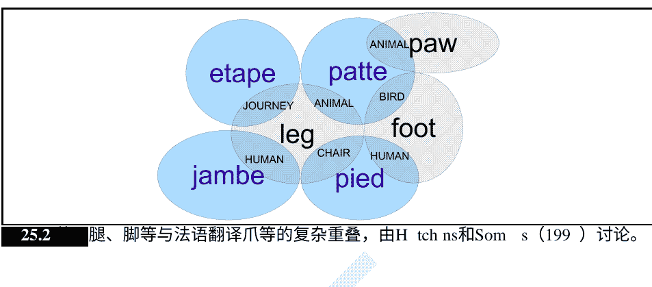

## 25.2 古典机器翻译与Vauquois三角

接下来的几节介绍了机器翻译的经典预统计架构。实际系统往往涉及这三种架构的元素组合；因此，每种架构最好被视为算法设计空间中的一个点，而不是实际算法。

在直接翻译中，我们逐字逐句地处理源语言文本，逐个翻译每个单词。直接翻译使用一个大型双语词典，其中每个条目都是一个负责翻译一个单词的小程序。在转换方法中，我们首先解析输入文本，然后应用规则将源语言解析结构转换为目标语言解析结构。然后，我们从解析结构生成目标语言句子。在中间语言方法中，我们将源语言文本分析为某种抽象的意义表示，称为中间语言。然后，我们从这种中间语言表示生成目标语言。

### Vauquois三角形
一种常见的方法是使用Vauquois三角形来可视化这三种方法如图25.3所示。三角形显示了从直接方法到转移方法再到交互语言方法所需的分析深度的增加（在分析和生成的两端都需要）。此外，它还显示了随着我们沿着三角形上升，从直接级别（几乎所有知识都是每个单词的转移知识）到转移级别（仅针对解析树或语义角色的转移规则）再到交互语言级别，所需的转移知识的减少。

在接下来的几节中，我们将看到这些算法如何解决图25.2中所示的四个翻译示例中的一些问题。

### 25.2.1 直接翻译
在直接翻译中，我们逐字逐句地处理源语言文本，同时进行翻译。除了浅层形态分析外，我们不使用任何中间结构；每个源词直接映射到某个目标词。因此，直接翻译是基于一个大型双语词典的；词典中的每个条目都可以被视为一个小程序，其工作是翻译一个单词。在单词被翻译后，可以应用简单的重新排序规则，例如在从英语翻译成法语时将形容词放在名词后面。

直接方法的指导直觉是，我们通过逐步将源语言文本转化为目标语言文本来进行翻译。虽然纯粹的直接方法不再使用，但这种转化的直觉仍然贯穿于所有现代系统，无论是统计还是非统计的。

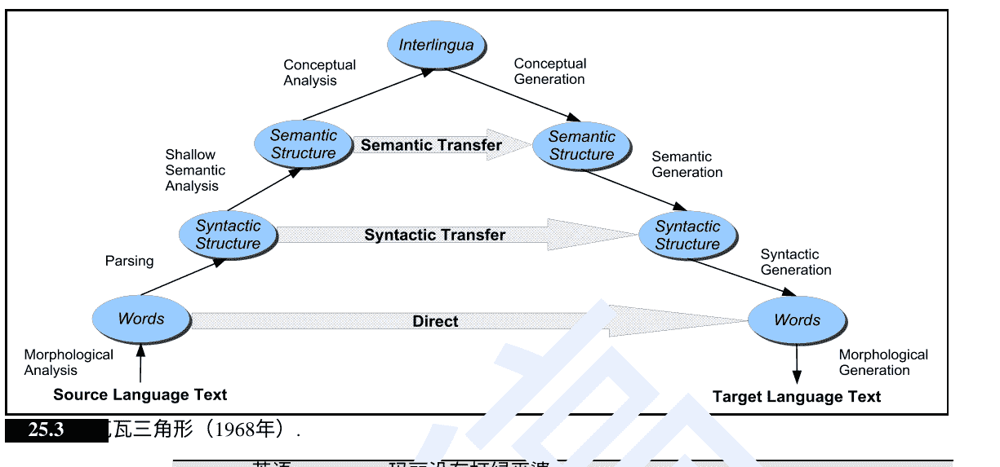

## 25.3 瓦三角形（1968年）

| 源语言 | 句子 | 对应翻译 |
| :--- | :--- | :--- |
| 英语 | 玛丽没有打绿巫婆 | 玛丽亚不 dio 一个耳光 a 她 巫婆 绿色的<br>玛丽 不是 给予 a 打 去 这个 巫婆 绿色 |
| 英语 | 这个星期绿巫婆在家 | 这个 星期 是 那个 绿色的 巫婆 到 家。<br>这个 周 是 这个 绿色的 巫婆 在 房子 |
| 英语 | 他喜欢听音乐 | 他 喜欢 我 听 的很喜欢 是<br>他 音乐 去 听 崇拜 |
| 中文 | 成龙 到 香港 去 | 成龙 去 香港 去 |
| 中文 | 成龙去了香港 | 成龙 去了 香港 去 |

## 25.4 章中使用的例句

让我们来看一个简化的直接系统在我们的第一个例子上进行翻译，从英语到西班牙语：

(25.10) 玛丽没有打绿巫婆

玛丽亚 不 dió 一个 耳光 a 她 巫婆 绿色的

玛丽 不是 给予 a 打 去 这个 巫婆 绿色

图25.5中概述的四个步骤将如图25.6所示进行。第2步假设双语词典将英语中的短语dar una bofetada a翻译为西班牙语中的slap。本地重新排序的第3步需要将形容词-名词的顺序从green witch切换到bruja verde。一些排序规则和词典的组合将处理英语中的否定和过去时态didn't。这些词典条目可能非常复杂；图25.7显示了早期直接英俄系统的一个示例词典条目。

```
函数 DIRECT TRANSLATE MUCH/MANY(单词)返回 俄语翻译

如果前面的单词是如何返回сколько

否则如果前面的单词是如何返回столько же

否则如果单词是很多

如果前面的单词是非常返回无

否则如果后面的单词是名词返回много

否则/* 单词是很多 */

如果前面的单词是介词且后面的单词是名词返回многи

否则返回много
```

## 25.7 Hitch ns (1986年, 第133页) 对Panov 1960的讨论中改编的将很多和很多翻译成俄语的过程。 注意与用于词义消歧的决策列表算法的相似之处。

虽然直接方法可以处理我们的简单西班牙语示例，并且可以处理单词重新排序，但它没有解析组件，实际上也没有关于源语言或目标语言中短语或语法结构的任何知识。因此，它无法可靠地处理较长距离的重新排序，或涉及短语或更大结构的重新排序。即使在与英语非常相似的语言中，例如德语，副词如今（'today'）出现在不同的位置，并且主语（例如，die grüne Hexe）可以出现在主动词之后，如图25.8所示。

在中文中（目标介词短语通常在动词前出现）和英文中（目标介词短语必须在动词后出现）之间发生了类似的重新排序，如图25.9所示。

最后，当我们从SVO语言翻译成SOV语言时，会发生更复杂的重新排序，就像我们在Yamada和Knight（2002）的英日翻译示例中看到的那样：


25.8 文翻译成德文时需要进行复杂的重新排序。德文通常将副词放在句子的开头位置，而英文更自然地将其放在后面。德文的动词时态通常出现在句子的第二个位置，导致主语和动词倒装。


25.9 的目标介词短语通常在动词前出现，不像英文那样。

(25.11) 他喜欢听音乐
他 喜欢我听 的很喜欢 是
他 音乐 去 听 崇拜

这三个例子表明直接方法过于关注单词，为了处理真实的例子，我们需要在机器翻译模型中添加短语和结构知识。我们将在下一节中详细阐述这个直觉。

### 25.2.2 转移

正如第25.1节所示，语言在结构上存在系统性差异。进行机器翻译的一种策略是通过克服这些差异，改变输入的结构使其符合目标语言的规则。这可以通过应用对比知识来实现，即了解两种语言之间的差异。

### 对比知识

两种语言之间的差异使用这种策略的系统被称为基于转换模型的系统。

### 转换模型

转换模型假设源语言已经被解析，并且在生成阶段实际创建输出句子。因此，根据这个模型，机器翻译包括三个阶段：分析、转换和生成，其中转换桥接了源语言解析器的输出和目标语言生成器的输入之间的差距。

值得注意的是，用于机器翻译的解析可能与其他目的所需的解析不同。例如，假设我们需要将 “John saw the girl with the binoculars” 翻译成法语。解析器不需要费心弄清楚介词短语的附着位置，因为两种可能性都会导致相同的法语句子。

一旦我们解析了源语言，我们将需要语法转换和词汇转换的规则。语法转换规则将告诉我们如何修改源解析树以使其类似于目标解析树。


### 25.10 简单的转换，重新排列形容词和名词

图25.10为形容词-名词重新排序等简单情况提供了直观感受；我们将一个适用于描述英语短语的解析树转换为一个适用于描述西班牙语句子的解析树。这些语法转换是将一棵树结构映射到另一棵树结构的操作。这种转换方法和规则可以应用于我们的例子玛丽没有打绿巫婆。除了这个转换规则，我们还需要假设形态处理能够确定didn't由 do-PAST和 not组成，并且解析器将PAST特征附加到VP上。然后通过在双语词典中查找进行词汇转换，将 do移除，将ot改为o，并将 slap转换为短语dar una bofetada a，同时稍微重新排列解析树，如图25.11所示。

### 语法转换


### 25.11 进一步的转换方法示意图。

对于从像英语这样的SVO语言到像日语这样的SOV语言的翻译，我们需要更复杂的转换，将动词移到句末，将介词变为后置词等等。这样规则的一个示例如图25.12所示。图25.13展示了一些转换规则的非正式示意图。转换系统可以基于比纯句法分析更丰富的结构。

例如，一个基于转换的中英文翻译系统可能需要处理图25.9中所示的事实，即在中文中，填充语义角色GOAL的PP（例如“去商店”在 “I went to the store” 中）倾向于出现在动词之前，而在英语中，这些目标PP必须出现在动词之后。为了构建一个处理这种相关PP顺序差异的转换，中文的解析必须包括语义结构，以区分BENEFACIVE PP（必须出现在动词之前）和DIRECTION以及LOCATIVE PP（倾向于出现在动词之前）以及RECIPIENT PP（出现在动词之后）（Li and Thompson, 1981）。我们在第20章讨论了如何进行这种语义角色标注。以这种方式使用语义角色通常被称为语义转换；一个简单的这种转换

### 语义转换

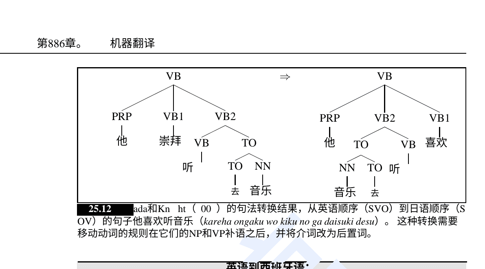

25.12 Ada和Knight (00) 的句法转换结果，从英语顺序 (SVO) 到日语顺序 (SOV) 的句子他喜欢听音乐 (*kareha ongaku wo kiku no ga daisuki desu*)。这种转换需要移动动词的规则在它们的NP和VP补语之后，并将介词改为后置词。

| 序号 | 规则描述 |
| :--- | :--- |
| 1 (英语到西班牙语) | NP → 形容词₁名词₂ ⇒ NP → 名词₂形容词₁ |
| 2 (中文到英语) | VP → PP[+Goal] V ⇒ VP → V PP[+Goal] |
| 3 (英语到日语) | VP → V NP ⇒ VP → NP V |
| 4 (英语到日语) | PP → P NP ⇒ PP → NP P |
| 5 (英语到日语) | NP → NP₁ 关系从句₂ ⇒ NP → 关系从句₂ NP₁ |

25.13 对一些转换的非正式描述。在图 中显示。

除了句法转换外，基于转移的系统还需要具有词汇转移规则。词汇转移通常基于双语词典，就像直接机器翻译一样。词典本身也可以用来处理词汇歧义问题。例如，英语单词 home 在德语中有许多可能的翻译，包括 nach Hause (表示回家) Heim (表示家) 在德语中有许多可能的翻译，包括 nach Hause (表示回家) Heim (表示家) 一个家庭游戏), Heimat(在家乡, 家乡, 或精神家园),和 zu Hause(在家的意义上). 在这种情况下，短语在家很有可能被翻译为 zu Hause，因此双语词典可以列出这个翻译习惯用语。

### 25.2.3 在经典机器翻译中结合直接和转换方法

尽管转换隐喻提供了处理比直接方法更复杂的源语言现象的能力，但我们发现上述简单的SVO → SOV规则是不够的。在实践中，我们需要将两种语言的丰富词汇知识与句法和语义特征相结合的混乱规则。我们简要地看到了一个将 slap 更改为 dar una bofetada a 的规则的示例。

### 25.2.4 中间语言思想：使用意义

转换模型的一个问题是它需要一组不同的转换规则用于每对语言。这对于像欧盟这样的多对多多语言环境中的翻译系统来说显然是次优的。这表明了对翻译性质的不同看法。与其直接将源语言句子的单词转换为目标语言，跨语言直觉是将翻译视为提取输入的含义，然后用目标语言表达该含义的过程。如果能够做到这一点，MT系统可以不需要对比知识，仅仅依赖于用于标准解释器和生成器的相同句法和语义规则。所需的知识量将与系统处理的语言数量成正比，而不是成平方。

中间语这个方案假设存在一个意义表示，或者中间语，以一种与语言无关的规范形式，就像我们在第17章中看到的语义表示一样。这个想法是让中间语以相同的方式表示所有意思上“相同”的句子，而不管它们所处的语言是什么。在这个模型中，翻译通过对来自语言X的输入进行深度语义分析，生成从中间语到语言Y的输出来进行。

我们可以使用什么样的表示方案作为中间语？谓词演算，或者诸如最小递归语义之类的变体，是一种可能性。语义

| 事件 | 拍打 |
| --- | --- |
| 施事者 | MARY |
| 时态 | 过去 |
| 极性否定 |  |
| 主题 | 女巫 |
| 确定性 | 定 |
| 属性 | [有 -颜色 绿色] |

25.14 语表示Mary没有打绿色的女巫。

将其分解为某种原子语义基元是另一种方法。我们将通过一个简单的基于事件的表示来说明第三种常见方法，在该表示中，事件通过一小组固定的语义角色与其参数相关联。无论我们使用逻辑还是其他事件表示，我们都需要指定事件的时间和体貌属性，还需要表示实体之间的非事件关系，例如绿色和女巫之间的具有颜色关系。图25.2.4显示了一个可能的跨语言表示，用于Mary没有打绿色的女巫作为一个统一风格的特征结构。

我们可以使用第18章和第20章的语义分析器技术从源语言文本中创建这些跨语言表示；使用语义角色标注器发现Mary和打事件之间的AGENT关系，或者女巫和打事件之间的THEME关系。我们还需要对名词修饰关系进行消歧，以识别绿色和女巫之间的关系是具有颜色关系，并且我们需要发现该事件具有否定极性（来自于didn't一词）。因此，跨语言需要比转换模型更多的分析工作，转换模型只需要句法分析（或最多是浅层语义角色标注）。但是生成现在可以直接从跨语言进行，无需进行句法转换。

除了不进行句法转换外，跨语言系统也不使用词汇转换规则。回想一下我们之前的问题，是否将know翻译成法语的savoir或connaître。在做出这个决定时，大部分处理工作与将其翻译成法语的目标无关；德语、西班牙语和中文都有类似的区别，而且将know消歧为诸如HAVE-A-PROPOSITION-IN-MEMORY和BE-ACQUAINTED-WITH-ENTITY等概念对于其他需要词义的自然语言理解应用也很重要。因此，通过在跨语言中使用这些概念，可以使用通用语言处理技术和模块来完成翻译过程的更大部分，并且可以消除或至少减少与英法翻译任务相关的处理，如图25.3所示。

互译模型有其自身的问题。例如，为了从日语翻译成中文，通用互译语必须包括诸如ELDER-BROTHER和YOUNGER-BROTHER等概念。使用这些相同的概念从德语翻译成英语将需要大量不必要的消歧。此外，通过互译语承诺所涉及的额外工作需要对领域的语义进行详尽分析并形式化为本体。

## 25.3 统计机器翻译

机器翻译的三种经典架构（直接翻译、转换翻译和互译）都提供了使用哪种表示和执行哪些步骤来进行翻译的答案。但是，还有另一种方法来解决翻译问题：关注结果而不是过程。从这个角度来看，让我们考虑一下一个句子作为另一个句子的翻译意味着什么。

这是一个翻译哲学家们思考了很多的问题。很遗憾，共识似乎是，严格来说，一个语言中的句子无法成为另一种语言中的翻译。例如，一个没有羊的文化无法真正地将希伯来语*adonai roi*（‘主是我的牧者’）翻译成该文化的语言。一方面，我们可以用目标语言写出清晰的内容，但会损失原文的忠实度，类似于主会照顾我。另一方面，我们可以忠实于原文，但会导致目标语言读者难以理解，类似于主对我来说就像是照顾有绵羊般毛发的动物的人。再举一个例子，如果我们将日语短语*fukaku hansei shite orimasu*翻译成我们道歉，我们就没有忠实于原文的意思，但如果我们翻译成我们深刻反思（我们过去的行为，我们做错了什么，如何避免下次出现问题），那么我们的输出就不清楚或尴尬了。这些问题不仅出现在特定文化概念上，而且还出现在一种语言中使用隐喻、结构、词汇或时态而在另一种语言中没有确切对应的情况下。

因此，真正的翻译，既忠实于源语言，又在目标语言中作为话语是有时不可能的。如果你打算继续进行翻译，你必须妥协。这正是翻译者在实践中所做的：他们产生的翻译在这两个标准上都做得相当好。

这为我们提供了如何进行机器翻译的线索。我们可以将翻译的目标建模为产生一个最大化某个价值函数的输出，该函数代表了忠实性和流畅性的重要性。统计机器翻译是一类方法的名称，它通过构建忠实性和流畅性的概率模型，然后将这些模型结合起来选择最可能的翻译。如果我们选择忠实性和流畅性的乘积作为我们的质量指标，我们可以将从源语言句子 S到目标语言句子T的翻译建模为：

```
最佳翻译^ T = argmax_T 忠实度(T,S) 流畅度(T)
```

这个直观的方程明显类似于我们在第5章中看到的贝叶斯噪声信道模型和第9章中看到的语音拼写模型。让我们完美地类比并形式化统计机器翻译的噪声信道模型。

首先，在本章的其余部分，我们将假设我们正在从外语句子 \(F = f_1, f_2, ..., f_m\)翻译成英语。对于一些例子，我们将使用法语作为外语，对于其他例子，我们将使用西班牙语。但在每种情况下，我们都是将其翻译成英语(当然，统计模型也适用于从英语翻译出来)。在概率模型中，最佳的英语句子\(E = e_1, e_2, ..., e_l\)是其概率 \(P(E|F)\)最高的那个。 按照噪声信道模型的惯例，我们可以通过贝叶斯规则重新写成：

\[\hat{E} = argmax_{E} P(E|F) \]
\[= argmax_{E} \frac{P(F|E)P(E)}{P(F)}\]
\[= argmax_{E} P(F|E)P(E)\] (25.12)

我们可以忽略分母 \(P(F)\)在argmax中，因为我们选择的是最佳的英文句子对于一个固定的外语句子 \(F\)，因此 \(P(F)\)是一个常数。 得到的噪声信道方程表明我们需要两个组成部分：一个翻译模型 \(P(F|E)\)，和一个语言模型 \(P(E)\)。


注意，将噪声信道模型应用于机器翻译需要我们反向思考，如图25.15所示。我们假装外语（源语言）输入 \(F\)必须翻译是某个英文的损坏版本。

(目标语言)句子 \(E\)，我们的任务是发现隐藏的(目标语言)句子 \(E\)生成我们的观察句子 \(F\)。

统计机器翻译的噪声信道模型因此需要三个组成部分来从法语句子 \(F\)翻译成英语句子 \(E\)：

- 一个语言模型计算 \(P(E)\)
- 一个翻译模型计算 \(P(F|E)\)
- 一个解码器，给定 \(F\)并产生最有可能的 \(E\)在这三个组成部分

中，我们已经介绍了语言模型 \(P(E)\) in第4章。 统计机器翻译系统基于与语音识别和其他应用相同的 \(N\)-gram语言模型。 语言模型组件是单语的，因此获取训练数据相对容易。

因此，接下来的几节将集中讨论另外两个组成部分，即翻译模型和解码算法。

## 25.4 P(F|E): 基于短语的翻译模型

翻译模型的任务是给定一个英语句子 \(E\)和一个外语句子 \(F\)，为 \(E\)生成 \(F\)分配一个概率。 虽然我们可以估计这些概率


通过考虑短语的行为，现代统计机器翻译通过思考每个单词的翻译方式，基于直觉计算这些概率的更好方法是将整个短语作为一个单位进行翻译和移动。基于短语的直觉
统计机器翻译使用短语（词序列）以及单个词作为翻译的基本单位。


有各种各样的基于短语的模型；在本节中，我们将概述Koehn等人（2003）的模型。我们将使用一个西班牙语的例子，看看基于短语的模型如何计算概率P（Maria no di´o una bofetada a la bruja verde|Mary did not slap the green witch）。
基于短语的翻译的生成过程有三个步骤。首先，我们将英语源词分组成短语$\bar{e}_1, \bar{e}_2 ... \bar{e}_I$。然后，我们将每个英语短语$\bar{e}_i$翻译成一个西班牙语短语$\bar{f}_j$。最后，每个西班牙语短语都可以（可选地）重新排序。
基于短语的翻译概率模型依赖于翻译概率和失真概率。因子$\phi (\bar{f}_j|\bar{e}_i)$是从英语短语$\bar{e}_i$生成西班牙语短语$\bar{f}_j$的翻译概率。西班牙语的重新排序

## 失真

短语的重新排序是通过失真概率 d 完成的。 统计机器翻译中的失真。翻译中的失真指的是西班牙语句子中一个单词的位置与英语句子中的位置不同（‘失真’）；因此，它是衡量两种语言中短语位置之间距离的一种度量。基于短语的机器翻译中的失真概率指的是两个连续的英语短语在西班牙语中被一定长度的西班牙语单词分隔的概率。更正式地说，失真由参数化的 d(ai − bi−1) 表示，其中 ai 是由第 i 个英语短语 ¯ei 生成的外语（西班牙语）短语的起始位置， bi−1 是由第 i−1 个英语短语 ¯ei−1 生成的外语（西班牙语）短语的结束位置。 我们可以使用一个非常简单的失真概率，即将某个小常数 α 提升到失真的幂。

这个失真模型通过给予较大的失真越来越低的概率来惩罚大的失真。

基于短语的机器翻译的最终翻译模型是：

```
P(F|E) = ∏_{i=1}^{I} φ(¯f_i, ¯e_i) d(ai − bi−1)
```

让我们考虑以下特定的短语集合作为我们的例句:

| 位置 | 1 | 2 | 3 | 4 | 5 |
| --- | --- | --- | --- | --- | --- |
| 英语 | 玛丽 | 没有 | 打 |  | 绿色女巫 |
| 西班牙语 | 玛丽亚 | 没有 | dio una bofetada a la | bruja verde |  |

由于每个短语都直接按顺序跟随（在这个例子中没有移动，不像 (25.16) 中的德语例子），失真都是1，概率也是如此。

P(F|E) 可以计算为：

```
P(F|E) = P(Maria, Mary) × d(1) × P(no|did not) × d(1) × P(dió una bofetada|slap) × d(1) × P(a la|the) × d(1) × P(bruja verde|green witch) × d(1)
```

为了使用基于短语的模型，我们还需要两样东西。 我们需要一个解码模型，这样我们就可以从一个表面的西班牙语字符串转换为一个隐藏的英语字符串。 我们还需要一个训练模型，这样我们就可以学习参数。 我们将在第25.8节介绍解码算法。 让我们先转向训练。

我们如何学习简单的基于短语的翻译概率模型在 (25.14) 中？ 需要训练的主要参数集是短语翻译概率集合 φ(¯f_i, ¯e_i).

这些参数以及扭曲常数 α，如果我们有一个大型的双语训练集，其中每个西班牙语句子都与一个英语句子配对，并且我们确切地知道西班牙语句子中的哪个短语被英语句子中的哪个短语翻译，那么这些参数可以被设置。 我们称这样的映射为短语对齐.

## 短语对齐

具体使用哪些短语取决于训练过程中发现的短语，如第25.7节所述；因此，例如，如果我们的训练数据中没有看到短语绿色女巫，我们将不得不独立翻译绿色和女巫.

上面的短语表显示了该句子的隐式对齐，例如绿色女巫与bruja verde对齐。如果我们有一个大型的训练集，每个句子对都标有这样的短语对齐，我们可以计算每个短语对出现的次数，并进行归一化以获得概率：

```
(25.16)
φ(f⃗,e⃗) = count(f⃗,e⃗) / ∑_{f⃗} count(f⃗,e⃗)
```

## 短语翻译表

## 词对齐

我们可以将每个短语对(f⃗,e⃗)以及其概率φ(f⃗,e⃗)存储在一个大型的短语翻译表中。可惜，我们没有大型的手工标注的短语对齐训练集。但事实证明，我们可以从另一种称为词对齐的对齐中提取短语。词对齐与短语对齐不同，因为它准确地显示了每个短语中哪个西班牙词与哪个英语词对齐。我们可以以多种方式可视化词对齐。图25.17和图25.18分别显示了一个图形模型和一个对齐矩阵，用于词对齐。


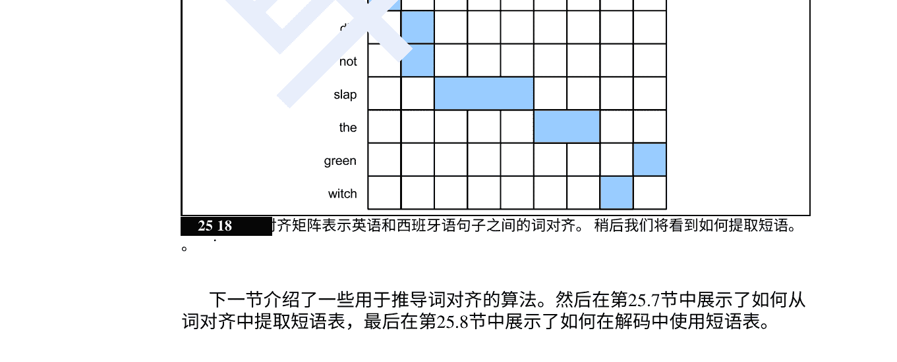

下一节介绍了一些用于推导词对齐的算法。然后在第25.7节中展示了如何从词对齐中提取短语表，最后在第25.8节中展示了如何在解码中使用短语表。

## 25.5 机器翻译中的对齐

## 词对齐

所有的统计翻译模型都基于一个词对齐的思想。一个词对齐是在一组平行句子中源语言单词和目标语言单词之间的映射关系。图25.19展示了英语句子 *And the program has been implemented* 和法语句子 *Le programme a été mis en application* 之间的对齐可视化。目前，我们假设我们已经知道英文文本中的哪些句子与法文文本中的哪些句子对齐。

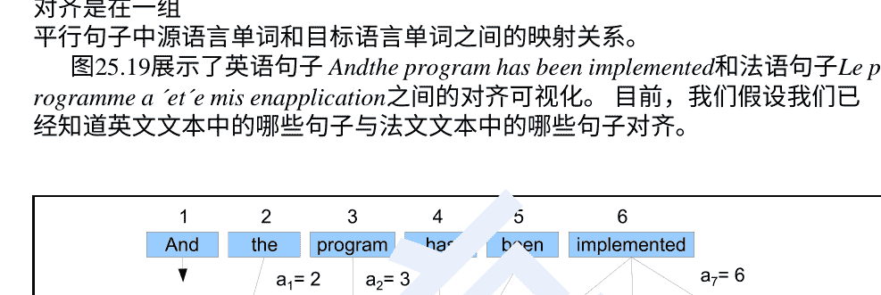

原则上，英语和法语单词之间可以有任意的对齐关系。但是我们将要介绍的词对齐模型（IBM模型1和3以及HMM模型）提出了一个更严格的要求，即每个法语单词只能来自一个英语单词；这与图25.19一致。这个假设的一个优点是我们可以通过给出法语单词来自的英语单词的索引号来表示对齐。因此，我们可以将图25.19中展示的对齐表示为 $A = 2, 3, 4, 5, 6, 6, 6$。这是一个非常可能的对齐。相比之下，一个非常不可能的对齐可能是 $A = 3, 3, 3, 3, 3, 3, 3$。

## 虚假的单词

我们将对这个基本对齐思想进行一项补充，即允许在外语句子中出现一些不与英语句子中的任何单词对齐的单词。我们通过假设在位置0处存在一个空的英语单词 $e_0$ 来对这些单词进行建模。在外语句子中不在英语句子中的单词，称为虚假的单词，可以由 $e_0$ 生成。图25.20显示了虚假的西班牙语单词与英语的对齐。对于英语的空$^3$


虽然上述对齐的简化模型不允许多对一或多对多的对齐，但我们将讨论更强大的翻译模型，允许这样的对齐。这里有两个示例对齐；在图25.21中，我们可以看到一个对齐

$^3$ 虽然这个特定的 $a$ 可能与英语的 *slap* 对齐，但有很多没有其他可能对齐位置的虚假单词的情况。

这是一对多的对齐；每个法语单词不对齐到一个英语单词，尽管每个英语单词对齐到一个法语单词。


25.21
英语句子和法语句子之间的对齐，其中每个法语单词不对齐到一个英语单词，但每个英语单词对齐到一个法语单词。改编自Brown等人（1993年）。

图25.22显示了一个更复杂的例子，其中多个英语单词不共同对齐到法语单词sont d'émunis。这样的短语对齐对于短语机器翻译是必要的，但事实证明它们不能直接由IBM模型1、模型3或HMM词对齐算法生成。


25.22
英语句子和法语句子之间的对齐，其中英语和法语单词之间存在多对多的对齐。改编自Brown等人（1993年）。

### 25.5.1 IBM模型1

在本节中，我们将描述两个对齐模型：IBM模型1和HMM模型（我们还将在高级部分中简要介绍基于生育率的IBM模型3）。
两者都是统计对齐算法。对于基于短语的统计机器翻译，我们仅使用对齐算法来找到一个句对（F，E）的最佳对齐，以帮助提取一组短语。但是这些词对齐算法也可以用作翻译模型P（F，E）。正如我们将看到的，对齐和翻译之间的关系可以表示如下：

```
P(F|E) = Σ_A P(F,A|E)
```

我们将从IBM模型1开始，它被称为IBM研究人员在一篇开创性论文中提出的五个模型中的第一个和最简单的模型（Brown等，1993）。
下面是IBM模型1的生成故事，说明我们如何从英语句子E=e₁, e₂, ..., eI生成一个西班牙语句子F=f₁, f₂, ..., fJ，其中I是英语句子的长度：

1. 选择一个西班牙语句子的长度J，即F=f1, f2, ..., fJ。
2. 现在选择一个英语和西班牙语之间的对齐A=a₁, a₂, ..., aJ。

## 3. 现在对于西班牙语句子中的每个位置 $j$，选择一个对应的西班牙语单词 $f_j$，通过将对齐的英语单词翻译为西班牙语来实现。图25.23显示了这个生成过程的可视化。

让我们看看这个生成故事如何为从英语句子$E$生成西班牙语句子$F$分配概率 $P(F|E)$。 我们将使用以下术语：

- $e_{a_j}$ 是对齐到西班牙语单词 $f_j$ 的英语单词。
- $t(f_x, e_y)$ 是将英语单词 $e_y$ 翻译为西班牙语单词 $f_x$ 的概率（即 $P(f_x|e_y)$）。

即 $P(f_x|e_y)$。 我们将从第3步开始逆向推导。假设我们已经知道长度$J$和对齐 $A$，以及英语源 $E$。西班牙语句子的概率为：
$$P(F|E, A) = \prod_{j=1}^{J} t(f_j|e_{a_j})$$

现在让我们形式化生成故事的步骤1和2。这是概率 $P(A|E)$，即在英语句子 $E$ 条件下，一个长度为 $J$ 的对齐 $A$ 的概率。IBM模型1假设每个对齐都是等可能的（非常简化的假设）。一个长度为 $I$ 的英语句子和一个长度为 $J$ 的西班牙语句子之间有多少种可能的对齐方式？ 再次假设每个西班牙语单词必须来自 $I$ 个英语单词（或者1个NULL单词），有 $(I+1)^{J}$ 种可能的对齐方式。 模型1还假设选择长度 $J$ 的概率是某个小常数 $\epsilon$。 选择长度 $J$ 然后选择任意一个 $(I+1)^{J}$ 种可能的对齐方式的联合概率是：
$$P(A|E) = \frac{\epsilon}{(I+1)^{J}}$$

我们可以将这些概率组合如下：
$$P(F,A|E) = P(F|E,A) \times P(A|E)$$
$$= \frac{\epsilon}{(I+1)^J} \prod_{j=1}^J t(f_j|e_{a_j})$$

这个概率，$P(F,A|E)$，是通过特定对齐生成西班牙语句子 $F$ 的概率。为了计算生成$F$的总概率 $P(F|E)$，我们只需对所有可能的对齐求和：
$$P(F|E) = \sum_A P(F,A|E) = \sum_A \frac{\epsilon}{(I+1)^J} \prod_{j=1}^J t(f_j|e_{a_j})$$

方程式25.20展示了Model 1的生成概率模型，它为每个可能的西班牙语句子分配一个概率。为了找到一对句子 $F$ 和 $E$ 之间的最佳对齐，我们需要使用这个概率模型进行解码。事实证明，对于Model 1，计算最佳（维特比）对齐的多项式算法非常简单，因为每个单词的最佳对齐与周围单词的最佳对齐决策是独立的。
$$\hat{A} = \argmax_A P(F,A|E) = \argmax_A \frac{\epsilon}{(I+1)^J} \prod_{j=1}^J t(f_j|e_{a_j}) = \argmax_{a_j} t(f_j|e_{a_j}) \quad 1 < j < J$$

模型1的训练是通过EM算法完成的，我们将在第25.6节中介绍。

### 25.5.2 HMM对齐

现在我们已经看到了模型1，应该清楚它做出了一些令人震惊的简化假设。其中最严重的一个假设是所有对齐都是等可能的。这是一个错误的假设的一个方面是对齐通常会保持局部性；在英语中，相邻的单词通常与相邻的西班牙语单词对齐。例如，如果我们回顾一下图25.17中的西班牙语/英语对齐，我们可以看到这种相邻对齐的局部性。

HMM对齐模型通过将每个对齐决策条件化为先前的决策来捕捉这种局部性。让我们看看这是如何工作的。HMM对齐模型基于我们在许多章节中已经看到的熟悉的HMM模型。与IBM模型1一样，我们试图计算 $P(F,A|E)$。HMM模型基于使用链式法则对这个概率进行重组，如下所示：
$$P(f_1^J, a_1^J|e_1^I) = P(J|e_1^I) \times \prod_{j=1}^J P(f_j, a_j|f_1^{j-1}, a_1^{j-1}, e_1^I)$$
$$= P(J|e_1^I) \times \prod_{j=1}^J P(a_j|f_1^{j-1},a_1^{j-1},e_1^I) \times P(f_j|f_1^{j-1},a_1^j,e_1^I)$$

通过这种重组，我们可以将 $P(F,A|E)$ 看作是从三种类型的概率计算得到的：长度概率 $P(J|e_1^I)$，对齐概率 $P(a_j|f_1^{j-1},a_1^{j-1},e_1^I)$，和一个词典概率 $P(f_j|f_1^{j-1},a_1^j,e_1^I)$。

我们做出以下简化假设：
$$P(a_j|f_1^{j-1},a_1^{j-1},e_1^I) = P(a_j|a_{j-1},I)$$
$$P(f_j|f_1^{j-1},a_1^j,e_1^I) = P(f_j|e_{a_j})$$

最后，我们假设长度概率可以近似为 $P(J|I)$。因此，HMM对齐的概率模型是：
$$P(f_1^J,a_1^J|e_1^I) = P(J|I) \times \prod_{j=1}^J P(a_j|a_{j-1},I)P(f_j|e_{a_j})$$

为了得到西班牙语句子的总概率 $P(f_1^J|e_1^I)$，我们需要对所有对齐进行求和：
$$P(f_1^J|e_1^I) = P(J|I) \times \sum_{A} \prod_{j=1}^J P(a_j|a_{j-1},I)P(f_j|e_{a_j})$$

正如我们在本节开始时所建议的，我们已经将对齐概率 $P(a_j|a_{j-1},I)$ 条件化为前一个对齐的单词，以捕捉对齐的局部性。让我们暂时将这个概率重新表述为 $P(i|i',I)$，其中 $i$ 表示西班牙语句子中连续对齐状态的绝对位置在英语句子中。我们希望这些概率不仅依赖于绝对单词位置 $i$ 和 $i'$，而且还依赖于单词之间的跳跃宽度；跳跃宽度是它们位置之间的距离 $i - i'$。这是因为我们的目标是捕捉到‘生成相邻西班牙语单词的英语单词很可能是相邻的’的事实。因此，我们不想为每个绝对单词位置保留单独的概率例如 $P(7|6,15)$ 和 $P(8|7,15)$。相反，我们通过使用跳跃宽度的非负函数来计算对齐概率：
$$P(i|i',I) = \frac{c(i - i')}{\sum_{i''=1}^I c(i'' - i')}$$

让我们看看这个HMM模型如何给出我们的英语-西班牙语句子的特定对齐概率；我们稍微简化了句子。因此，我们简化的句子 $Maria\ di\ o\ una\ bofetada\ a\ la\ bruja\ verde$ 的概率 $P(F,A|E)$ 是以下因子的乘积：

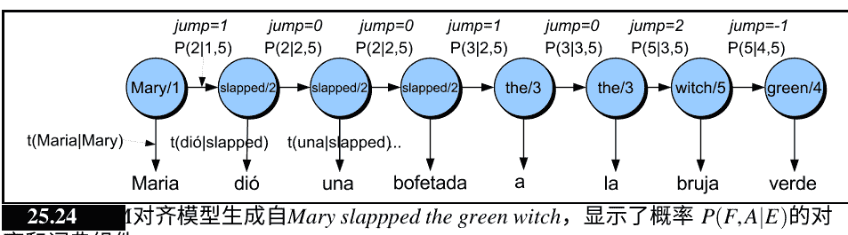

**图25.24：** 对齐模型生成自 Mary slapped the green witch，显示了概率 $P(F,A|E)$ 的对齐和词典组件。
$$P(F, A|E) = P(J|I) \times P(Maria|Mary) \times P(2|1, 5) \times t(dió|slapped) \times P(2|2, 5) \times T(una|slapped) \times P(2|2, 5) \times ...$$
(25.28)

基本的HMM对齐模型也有更复杂的增强方法。这些方法包括在英文源语言中添加空词，用于与不与英文词对齐的西班牙语词对齐，或者在对齐过程中以前一个目标词的词类作为条件：前一个目标词的词类为 $C(e_{a_{j-1}})$ (Och和Ney，2003；Toutanova等，2002)。

HMM对齐模型的主要优势在于对于解码和训练都有着成熟的算法。对于解码，我们可以使用第5章和第6章介绍的维特比算法来找到一句话对的最佳（维特比）对齐。对于训练，我们可以使用鲍姆-韦尔奇算法，如下一节所总结的。

## 25.6 训练对齐模型

所有的统计翻译模型都是使用一个大型的平行语料库进行训练的。一个平行语料库，也称为平行文本或双语文本，是一种同时提供两种语言的文本。例如，加拿大会的会议记录同时保存有法语和英语两种语言的版本。每个在议会中发表的句子都会被翻译，从而产生一本同时包含两种语言的连续文本。这些连续文本被称为 **Hansards**，以该英国出版商的名字命名。

类似地，香港Hansards语料库包含了香港特别行政区立法会的会议记录同时包含英语和中文两种语言。这两个语料库都包含数千万到数亿个单词。联合国提供了其他平行语料库。可以使用文学翻译来创建平行语料库，但这在机器翻译领域并不常见，部分原因是因为获取小说的法律权益很困难，但主要原因是，正如我们在本章开头所看到的，翻译小说非常困难，而且翻译结果并不是非常逐字逐句的。因此，统计系统往往是基于非常逐字逐句的翻译（如Hansards）进行训练的。

训练的第一步是将语料库分割成句子。这个任务被称为句子分割或句子对齐。最简单的方法是对齐句子仅基于句子中的单词或字符长度，而不考虑单词内容。直觉是，如果我们在平行文本的每种语言中看到一个长句子大致在相同的位置，我们可能会怀疑这些句子是翻译。这种直觉可以通过动态规划算法来实现。更复杂的算法还利用了有关单词对齐的信息。在训练MT模型之前，句子对齐算法在平行语料库上运行。那些没有对齐到任何内容的句子被丢弃，剩下的对齐句子可以用作训练集。有关句子分割的更多详细信息，请参阅本章末尾的指南。

一旦我们完成了句子对齐，我们的训练算法的输入是一个由句子对组成的语料库 $\{(F_s, E_s): s=1...S\}$。对于每个句子对 $(F_s, E_s)$的目标是学习对齐 $A = a_i^J$和组成部分的概率 (对于模型1，以及HMM模型的词典和对齐概率)。

### 25.6.1 用于训练对齐模型的EM算法

如果每个句子对 $(F_s, E_s)$已经手动标记了完美的对齐，学习模型1或HMM参数将是微不足道的。例如，为了在模型1中获得最大似然估计的翻译概率 $t(verde, green)$，我们只需计算 $green$对 $verde$的对齐次数，并通过总计数进行归一化。

但是当然，我们事先不知道对齐情况；我们只有每个对齐的概率。回想一下，方程式25.19表明，如果我们已经对模型1的参数有良好的估计，我们可以使用它来计算对齐的概率 $P(F, A|E)$。给定 $P(F, A|E)$，我们可以通过归一化来生成对齐的概率：
$$P(A|E, F) = \frac{P(A, F|E)}{\sum_{A}P(A, F|E)}$$

因此，如果我们对模型1的参数有一个粗略的估计，我们可以计算每个对齐的概率。然后，我们不再从 (未知的) 完美对齐中估计概率，而是从每个可能的对齐中估计概率，并将这些估计按照每个对齐的概率加权组合。例如，如果有两种可能的对齐，一种概率为0.9，另一种概率为0.1，我们将分别从这两种对齐中单独估计参数，并以0.9和0.1的权重混合这两个估计。

因此，如果我们已经有了模型1的参数，我们可以通过使用这些参数计算每个可能对齐的概率，并使用对齐的加权和重新估计模型1的参数。这种迭代改进概率估计的思想是我们在第6章中介绍的EM算法的一个特例，也是我们在第9章中用于语音识别的算法。回想一下，当我们有一个无法直接优化的变量时，我们使用EM算法。在这种情况下，隐藏变量就是对齐。

但是我们可以使用EM算法来估计参数，从这些估计中计算对齐，使用对齐来重新估计参数，以此类推！

让我们通过一个由Knight (1999b)启发的例子来进行演示，使用简化版本的Model 1，其中我们忽略了NULL单词，并且只考虑了一部分对齐（忽略了英语单词与西班牙语单词不对齐的情况）。因此，我们计算简化概率 $P(A,F|E)$如下：
$$P(A,F|E) = \prod_{j=1}^{J} t(f_j|e_{a_j})$$

这个例子的目的只是为了直观地介绍应用EM到这个任务中；实际的Model 1训练细节会有所不同。

EM训练的直觉是，在E步骤中，我们根据隐藏变量（对齐）对参数的期望计算 $t$ 的期望计数，而在M步骤中，我们根据这些计数计算 $t$ 概率的最大似然估计。

让我们来看看在一个包含两个句子的语料库上进行EM训练的几个阶段：
绿色房子 房子
casa verde la casa

两种语言的词汇表分别为 $E = \{\text{绿色, 房子, 这}\}$ 和 $S = \{\text{casa, la, verde}\}$。我们将从均匀概率开始：

| t(casa\|绿色) = 1/3 | t(verde\|绿色) = 1/3 | t(la\|绿色) = 1/3 |
| :--- | :--- | :--- |
| t(casa\|房子) = 1/3 | t(verde\|房子) = 1/3 | t(la\|房子) = 1/3 |
| t(casa\|这) = 1/3 | t(verde\|这) = 1/3 | t(la\|这) = 1/3 |

现在让我们来逐步介绍EM的步骤：

**E步骤1:** 计算所有词对 $(f_j, e_a)$ 的期望计数 $E[\text{count}(t(f,e))]_j$

**E步骤1a:** 我们首先需要计算 $P(a,f|e)$，通过乘以所有的 $t$ 概率，按照公式25.29

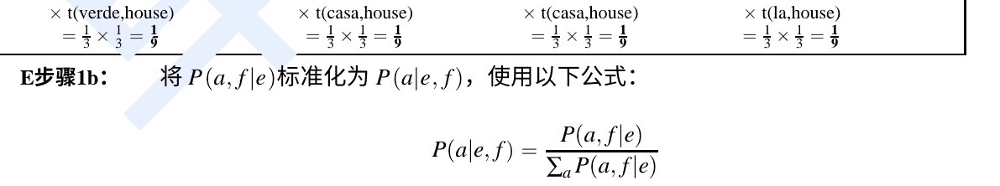

**E步骤1b:** 将 $P(a,f|e)$ 标准化为 $P(a|e,f)$，使用以下公式：
$$P(a|e,f) = \frac{P(a,f|e)}{\sum_{a} P(a,f|e)}$$

每个对齐的 $P(a|f,e)$ 的结果如下：


**E步骤1c:** 通过将每个计数乘以 $P(a|e, f)$ 来计算预期（分数）计数

| tcount(casa\|green) = $ \frac{1}{2} $ | tcount(verde\|green) = $ \frac{1}{2} $ | tcount(la\|green) = 0 | total(green) = 1 |
| :--- | :--- | :--- | :--- |
| tcount(casa\|house) = $ \frac{1}{2} + \frac{1}{2} $ | tcount(verde\|house) = $ \frac{1}{2} $ | tcount(la\|house) = $ \frac{1}{2} $ | total(house) = 2 |
| tcount(casa\|the) = $ \frac{1}{2} $ | tcount(verde\|the) = 0 | tcount(la\|the) = $ \frac{1}{2} $ | total(the) = 1 |

**M步骤1:** 通过将tcounts归一化为总和为一来计算MLE概率参数。

| t(casa\|green) = $ \frac{1/2}{1} = \frac{1}{2} $ | t(verde\|green) = $ \frac{1/2}{1} = \frac{1}{2} $ | t(la\|green) = $ \frac{0}{1} = 0 $ |
| :--- | :--- | :--- |
| t(casa\|house) = $ \frac{1}{2} = \frac{1}{2} $ | t(verde\|house) = $ \frac{1/2}{2} = \frac{1}{4} $ | t(la\|house) = $ \frac{1/2}{2} = \frac{1}{4} $ |
| t(casa\|the) = $ \frac{1/2}{1} = \frac{1}{2} $ | t(verde\|the) = $ \frac{0}{1} = 0 $ | t(la\|the) = $ \frac{1/2}{1} = \frac{1}{2} $ |

¹请注意，每个正确的翻译在概率上都比初始分配增加了；例如，翻译 casa 为 house的概率从 $ \frac{1}{3} $ 增加到 $ \frac{1}{2} $。

**E步骤2a:** 我们再次通过乘以所有的 $t$ 概率来重新计算 $P(a, f|e)$，按照公式 25.29

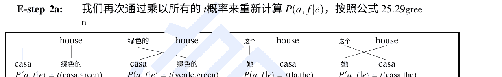

请注意，现在两个正确的对齐比两个错误的对齐的概率更高。 将第二轮和更多的 E 步和 M 步留给读者作为练习 6。

我们已经证明 EM 可以用于学习简化版本的 Model 1 的参数。 然而，我们直观的算法要求我们枚举所有可能的对齐。 对于一个很长的句子，枚举所有可能的对齐将非常低效。 幸运的是，在实践中有一个非常高效的 Model 1 的 EM 版本，它可以高效地隐含地求和所有的对齐。

我们还使用EM算法，以Baum-Welch算法的形式，来学习HMM模型的参数。

## 25.7 用于基于短语的机器翻译的对称化对齐

我们需要Model 1或HMM对齐的原因是为了在训练集上构建词对齐，以便我们可以提取对齐的短语对。

不幸的是，HMM（或Model 1）对齐对于提取西班牙短语和英语短语的对是不够的。 这是因为在HMM模型中，每个西班牙单词必须由一个英语单词生成；我们不能从多个英语单词生成一个西班牙短语。 因此，HMM模型无法将源语言中的一个多词短语与目标语言中的一个多词短语进行对齐。

然而，我们可以通过一种通常称为对称化的方法，将HMM模型扩展到为一对句子 $(F,E)$生成短语对短语的对齐。首先，我们训练两个独立的HMM对齐器，一个是英语到西班牙语的对齐器，另一个是西班牙语到英语的对齐器。然后我们使用这两个对齐器对 $(F,E)$进行对齐。我们可以以巧妙的方式将这些对齐结果组合起来，得到将短语映射到短语的对齐结果。

为了将这些对齐结果组合起来，我们首先取两个对齐结果的交集。交集只包含两个对齐结果一致的位置，因此具有高精度的对齐单词。我们还可以分别计算这两个对齐结果的并集。并集中会有很多不太准确的对齐单词。然后我们可以构建一个分类器，从并集中选择单词，并逐步将其添加回这个最小交集对齐结果中。


**图25.25：** 英语到西班牙语和西班牙语到英语对齐结果的交集，产生高精度的对齐结果。然后可以从两个对齐结果中扩展出点，产生类似于图6所示的对齐结果。根据Ko hn (003b)。

图25.26显示了一个结果对齐的示例。请注意，它不允许在两个方向上进行多对一的对齐。我们现在可以收集所有与这个词对齐一致的短语对。一致的短语对是指所有单词只与彼此对齐，而不与任何外部单词对齐的短语对。图25.26还显示了一些与对齐一致的短语。

一旦我们从整个训练语料库中收集到所有对齐的短语对，我们可以计算短语翻译概率的最大似然估计。

|  | Maria | no | dió | una | a | la | bruja | verde |
|---|---|---|---|---|---|---|---|---|
| Mary | ✅ |  |  |  |  |  |  |  |
| did |  |  |  |  |  |  |  |  |
| not |  | ✅ |  |  |  |  |  |  |
| slap |  |  | ✅ | ✅ | ✅ | ✅ |  |  |
| the |  |  |  |  |  |  |  |  |
| green |  |  |  |  |  |  |  | ✅ |
| witch |  |  |  |  |  |  | ✅ | ✅ |

右侧注释：(玛丽亚, 玛丽), (没有, 没有), (slap, di'ó una bofetada), (绿色, green), (a la, the), (bruja, witch), (Maria no, Mary did not), (没有di'ó una bofetada, did not slap), (dió una bofetada a la, slap the), (bruja verde, 绿巫婆), (a la bruja verde, 绿巫婆)...

25.26 更好的短语对齐结果，通过从图的交集对齐开始，并使用Och和Ney(2003)的算法从并集对齐中添加点来计算。在右边，一些与此对齐一致的短语，根据Koehn(2003b)。

一个特定的配对如下:

```
(25.30)  φ(f,e) = \frac{count(f,e)}{\sum_{f} count(f,e)}
```

现在，我们可以将每个短语 (f,e) 和其概率 φ(f,e) 存储在一个大的短语翻译表中。下一节讨论的解码算法可以使用这个短语翻译表来计算翻译概率。

## 25.8 基于短语的统计机器翻译的解码

统计机器翻译系统的另一个组成部分是解码器。回想一下，解码器的任务是根据翻译和语言模型的乘积，将一个外语（西班牙语）源句子 F 转化为最佳（英语）翻译 E。

```
(25.31)  $\hat{E} = \underset{E \in \text{英文}}{\text{argmax}} \quad P(F|E) \quad P(E)$
*翻译模型*  *语言模型*
```

找到最大化翻译和语言模型概率的句子是一个搜索问题，解码因此是一种搜索。机器翻译中的解码器基于最佳优先搜索，这是一种启发式或有启发性的搜索；这些搜索算法受到问题领域知识的启发。最佳优先搜索算法根据评估函数 f(n) 选择要探索的搜索空间中的节点 n。机器翻译解码器是一种特定类型的最佳优先搜索的变体，称为 A* 搜索。

A*搜索最初由IBM（Brown等，1995年）用于机器翻译，基于IBM早期在语音识别中的A*搜索工作（Jelinek，1969年）。正如我们在第10.2节中讨论的那样，由于历史原因，A*搜索及其变体是常见的。

堆栈解码在语音识别中通常称为堆栈解码，在机器翻译中有时也称为堆栈解码。

让我们从图25.27开始，介绍机器翻译中堆栈解码的通用版本。基本思想是维护一个priority queue(传统上称为堆栈)，其中包含所有部分翻译假设及其分数。

```
函数 STACK DECODING（源句子） 返回 目标句子
用一个空假设初始化堆栈
循环执行
    从堆栈中弹出最佳假设 h
    如果 h 是一个完整的句子，则返回 h
    对于每个可能的扩展 h' of h
        为 h'分配一个分数
        将 h' 推入堆栈
```

25.27 翻译的堆栈解码的通用版本。通过选择一个单词或短语进行翻译来扩展假设。我们将在图 30中看到一个更详细的算法版本。

现在让我们更详细地描述堆栈解码。虽然最初的IBM统计解码算法是针对基于单词的统计机器翻译的，但我们将描述其在公开可用的MT解码器Pharaoh (Koehn, 2004)中应用于基于短语的解码。

为了限制解码中的搜索空间，我们不希望搜索所有英语句子的空间；我们只想考虑那些可能是F的翻译的句子。为了帮助减少搜索空间，我们只想考虑那些包含可能是F中单词或短语的翻译的句子。我们通过搜索前一节中描述的短语翻译表，为F中所有可能的短语寻找所有可能的英语翻译来实现这一点。

图25.28显示了从Koehn (2003a, 2004)中绘制的可能翻译选项的样本格。每个选项都包括一个西班牙语单词或短语，英语翻译以及短语翻译概率φ。我们需要搜索这些组合来找到最佳的翻译字符串。

现在让我们以非正式的方式通过图25.29中的堆栈解码示例，从左到右生成Mary di’o una bofetada a la bruja verde的英文翻译。暂时假设只有一个堆栈，并且没有剪枝。

我们从空假设开始作为初始搜索状态，在这个状态下我们选择了没有西班牙语单词并且没有生成英文翻译单词。现在我们通过选择每个可能生成英文句子开头短语的源词或短语来扩展这个假设。图25.29a显示了搜索的第一层。例如，顶部状态表示英文句子以Mary开头，西班牙语单词Maria已经被覆盖（第一个单词的星号标有M）。每个状态还与一个成本相关联，下面将讨论。另一个

| 玛丽亚 | 不 | dió | 一个 | 耳光 | a | 她 | 巫婆 | 绿色的 |
|--------|----|-----|------|------|---|----|------|--------|
| 玛丽 | 不是 | 给 | a | 打 | 去 | 这个 | 巫婆 | 绿色的 |
|  | 没有 |  | 一巴掌 | 去 |  |  | 绿巫婆 |  |
|  | 不 |  | 打 | 到 |  |  |  |  |
|  | 没有给 |  |  | 去 |  |  |  |  |
|  |  |  |  | 这个 |  |  |  |  |
|  |  |  | 打 |  |  | 女巫 |  |  |

## 25.28 定句子中，可能的英文单词和短语翻译的格子图，取自整个对齐的训练集。引自Ko hn (003a)

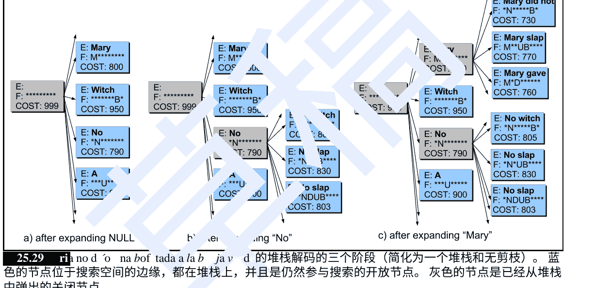

## 25.29 ri no d ’o na bof tada a la b ja v d 的堆栈解码的三个阶段（简化为一个堆栈和无剪枝）。蓝色的节点位于搜索空间的边缘，都在堆栈上，并且是仍然参与搜索的开放节点。灰色的节点已经从堆栈中弹出的关闭节点。

在这个层次上的状态表示英文翻译以单词No开头，并且西班牙语的no已经被覆盖。这是队列中最低成本的节点，所以我们将其从队列中弹出，并将其所有扩展重新加入队列。现在状态Mary是最低成本的，所以我们扩展它；Mary did not现在是迄今为止最低成本的翻译，所以将是下一个要扩展的。然后，我们可以继续扩展搜索空间，直到我们有覆盖整个西班牙语句子的状态（假设），然后我们可以从这个状态中直接读取英文翻译。

我们提到，每个状态都与一个成本相关联，正如我们将在下面看到的那样，该成本用于指导搜索，成本将当前成本与未来成本的估计值结合起来。当前成本是假设中到目前为止已经翻译的短语的总概率，即翻译、失真和语言模型概率的乘积。对于部分翻译的短语集合 S= (F,E)，这

```
(25.32) \quad \text{成本}(E, F) = \prod_{i \in S} \phi(\vec{f}_i, \vec{e}_i) d(a_i - b_{i-1}) P(E)
```

未来成本是我们对翻译剩余西班牙语句子的成本的估计。通过结合这两个因素，状态成本给出了通过当前节点的搜索路径的最终完整翻译句子Epassing的总概率的估计。仅基于当前成本的搜索算法倾向于选择在开头具有少量高概率单词的翻译，而牺牲了具有更高整体概率的翻译。⁴对于未来成本，计算所有可能翻译的真实最小概率太昂贵了。相反，我们通过忽略失真成本来近似计算这个成本，只需找到具有最小的语言模型和翻译模型成本乘积的英语短语序列，这可以通过维特比算法轻松计算。

这个解码过程的草图表明，我们搜索整个可能的英文翻译的状态空间。但是我们不可能承担扩展整个搜索空间的代价，因为状态太多了；与语音识别不同，机器翻译中对扭曲的需求意味着每个可能的英文单词排序都有（至少）一个不同的假设！⁵

## 束搜索修剪

因此，机器翻译解码器和语音识别解码器一样，都需要一些修剪。Pharaoh和类似的解码器使用了一种束搜索修剪的版本。就像我们在语音识别和概率解析的解码中看到的那样。回想一下，在束搜索修剪中，每次迭代我们只保留最有希望的状态，并修剪掉不太可能的（高成本）状态（即‘超出搜索束’的状态）。我们可以修改图25.29中所示的搜索序列，每次搜索的每个层次都修剪掉所有不好的（高成本）状态，并只扩展最佳状态。实际上，在Pharaoh中，我们不仅扩展最佳状态，还扩展束内的所有状态；因此，Pharaoh在技术上是束搜索而不是最佳优先搜索或A*搜索。

更正式地说，在搜索的每个层次，我们会维护一个状态的堆栈（优先队列）。堆栈只能容纳n个条目。在搜索的每个层次，我们会拓展堆栈上的所有状态，将它们推入堆栈，按照成本对它们进行排序，保留最好的n个条目并删除其余的条目。

我们还需要进行最后的修改。在语音中，我们只使用一个堆栈进行堆栈解码，而在机器翻译中，我们将使用多个堆栈，因为我们不能轻易地比较翻译不同数量外文单词的假设的成本。因此，我们将使用m个堆栈，其中堆栈m包含覆盖m个外文单词的所有假设。当我们通过选择要翻译的短语来扩展假设时，我们将新状态插入到覆盖外文单词数量正确的堆栈中。然后，我们将在每个堆栈内部使用波束搜索，每个堆栈只保留n个假设。图25.30展示了波束搜索堆栈解码的最终多堆栈版本。

⁴ 我们在语音识别中看到了与A*搜索相同类型的代价函数，其中我们使用了A*评估函数：f*(p) = g(p) + h*(p)。

⁵ 事实上，正如Knight（1999a）所示，即使在IBM Model 1中使用了二元语言模型，解码也等同于被称为NP-complete的困难问题类别。

函数 束搜索堆栈解码器 (源句子) 返回 目标句子

初始化 hypothesisStack[0..nf]
将初始空假设推入 hypothesisStack[0]
对于 i <- 0 到 nf-1
    对于每个 hyp 在 hypothesisStack[i] 中
        对于每个可以从 hyp 派生出的每个 new hyp
            nf[new_hyp] <- new hyp 覆盖的外文单词数量
            将 new hyp 添加到 hypothesisStack[nf[new_hyp]]
            修剪 hypothesisStack[nf[new_hyp]]
在 hypothesisStack[nf] 中找到最佳假设 best hyp
通过回溯返回导致 best hyp 的最佳路径

## 25.30 波束搜索多栈解码算法

波束搜索多栈解码算法，改编自(Ko hn, a)。为了效率，大多数解码器不会在每个状态中存储完整的外语和英语句子，需要我们回溯以找到从初始状态到最终状态的状态路径，以便生成完整的英语目标句子。

在解码中还有一些其他问题需要处理。所有解码器都试图通过重新组合假设来限制搜索空间中的指数爆炸.. 我们在 **Exact N-Best** 第10.1节的算法中，我们可以合并任意两个足够相似的假设（覆盖相同的外语单词，具有相同的最后两个英语单词，并且具有相同的最后一个外语短语的结束位置）。此外，事实证明，短语机器翻译的解码器优化的函数与我们在方程式25.31中提出的函数略有不同。实际上，我们需要添加另一个因素，用于惩罚过短的句子。因此，解码器实际上选择了最大化的句子：

```
(25.33) $
\hat{E} = \underset{E \in \text{英文}}{\text{argmax}} \underbrace{P(F|E)}_{\text{翻译模型}} \underbrace{P(E)}_{\text{语言模型}} \underbrace{\omega^{\text{长度}(E)}}_{\text{短句惩罚}}$

这个最终方程式与语音识别中的词插入惩罚在方程式9.49中的使用非常相似。
```

## 25.9 机器翻译评估

评估翻译质量是一项非常主观的任务，对于方法论的分歧很普遍。尽管如此，评估是必不可少的，评估方法论的研究从机器翻译的早期就起到了重要作用（Miller和Beebe-Center，1958年）。广义上讲，翻译可以从两个维度进行评估，对应于第25.3节中讨论的忠实度和流畅度。

### 25.9.1 使用人工评估者

最准确的评估使用人工评定员在每个维度上评估每个翻译。例如，在流畅度维度上，我们可以询问MT输出（目标翻译文本）的可懂性、清晰度、可读性或自然度如何。
有两种广泛的方法可以使用人工评定员回答这些问题。一种方法是给评定员一个评分标准，例如从1（完全不可理解）到5（完全可理解），并要求他们对MT输出的每个句子或段落进行评分。我们可以为流畅度的任何方面使用不同的评分标准，例如清晰度、自然度或风格。第二类方法更少依赖参与者的有意识决策。例如，我们可以测量评定员阅读每个输出句子或段落所需的时间。更清晰或更流畅的句子应该阅读起来更快或更容易。我们还可以使用填空任务（Taylor, 1953, 1957）来衡量流畅度。

填空

填空任务是阅读心理研究中经常使用的度量标准。评分者看到一个输出句子，其中一个词被空格替换（例如，每8个词可能被删除）。评分者必须猜测缺失的单词的身份。填空任务的准确性，即评分者猜测缺失单词的平均成功率，通常与机器翻译输出的可理解性或自然性相关。

信息性

是否在机器翻译输出中有足够的信息来执行某些任务的问题。例如，我们可以给评估者关于源句子或文本内容的多项选择题。评估者只根据机器翻译输出回答这些问题。正确答案的百分比是一个信息性得分。

编辑成本 后编辑

另一组度量指标试图评估翻译的整体质量，结合流畅性和忠实度。例如，用于后编辑机器翻译输出的典型评估指标是将机器翻译输出后编辑成良好翻译所需的编辑成本。
例如，我们可以测量纠正输出至可接受水平所需的单词数量、时间量或按键次数。

### 25.9.2 自动评估：Bleu

虽然人类对机器翻译输出进行最佳评估，但进行人工评估非常耗时，需要数天甚至数周。拥有一个可以相对频繁地运行以快速评估潜在系统改进的自动度量标准非常有用。为了方便起见，我们愿意让度量标准比人工评估差得多，只要它与人类判断有一定的相关性即可。

## 第910章 第25节。 机器翻译

事实上，有许多这样的启发式方法，例如 **Bleu**, **NIST**, **TER**,精确率和召回率, 和 **METEOR**(参见本章末尾的参考文献)。 这些自动度量的直觉源于米勒和比比-中心 (1958) 的观点，他们指出好的机器翻译输出应该与人类翻译非常相似。

在自动语音识别领域，我们通过单词错误率来定义‘非常相似’，即与人类转录之间的最小编辑距离。 但在翻译中，我们不依赖于单一的人类翻译，因为一个源句子可以有多种合法的翻译方式。 一个非常好的机器翻译输出可能看起来像一个人类翻译，但与另一个人类翻译非常不同。 因此，机器翻译度量通常要求我们在测试集中有多个人类翻译的每个句子。 这可能看起来很耗时，但希望可以重复使用这个翻译后的测试集来评估新的想法。

现在给定一个测试集中的机器翻译输出句子，我们计算机器翻译输出与人类句子之间的翻译接近度。 如果平均而言，机器翻译输出更接近人类翻译，则将其排名较高。 这些度量标准在何种程度上被视为“翻译接近度”存在差异。

在本节的其余部分，让我们详细介绍其中一种度量标准，即**Bleu**度量标准，紧密遵循Papineni等人 (2002年) 的原始介绍。 在**Bleu**中，我们通过与人类翻译的*N*-gram重叠数量的加权平均来对每个机器翻译输出进行排名。

图25.31展示了一个直观的例子，来自于一句中文源句子的两个候选翻译（Papineni等人，2002年），并展示了三个参考人类翻译的源句子。 请注意，候选翻译1与参考翻译相比，共享更多单词（以蓝色显示）。

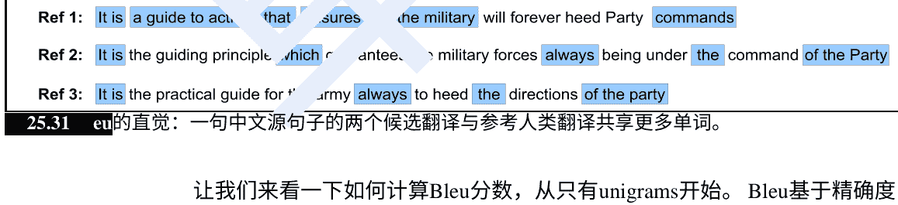

让我们来看一下如何计算Bleu分数，从只有unigrams开始。 Bleu基于精确度。 一个基本的unigram精确度度量是计算候选翻译（MT输出）中出现在某个参考翻译中的单词数，并除以候选翻译中的总单词数。 如果候选翻译有10个单词，其中6个单词至少在一个参考翻译中出现，那么我们的精确度就是6/10 = 0.6。 遗憾的是，使用简单的精确度存在一个缺陷：它奖励具有额外重复单词的候选翻译。 图25.32展示了一个由多个单词 *the*组成的病态候选句子的示例。 由于候选中的每个7个（相同的）单词都出现在一个参考翻译中，unigram精确度将是7/7！

为了避免这个问题，Bleu使用了一个修改后的**N-gram**精度度量。 我们

Candidate: the the the the the the the
Reference 1: the cat is on the mat
Reference 2: there is a cat on the mat

25.32 病态的例子，展示了为什么Bleu使用了一个修改后的精度度量。单字精度将会非常高（7/7）。修改后的单字精度适当地较低（2/7）。

首先计算一个词在任何一个参考翻译中出现的最大次数。然后，每个候选词的计数都会被这个最大参考计数所截断。因此，在图25.32的例子中，修改后的单字精度为2/7，因为参考1的最大次数是2个s。回到图25.32中的中文例子，候选1的修改后的单字精度为17/18，而候选2的修改后的单字精度为8/14。

我们同样计算高阶N-gram的修改精度。候选1的修改二元精度为10/17，候选2的修改二元精度为1/13。读者应该在图25.31上自行核对这些数字。

为了计算整个测试集的分数，Bleu首先为每个句子计算N-gram匹配，并将所有候选句子的剪切计数相加，然后除以测试集中候选N-gram的总数。因此，修改精度分数为：

```
(25.34) pₙ = Σ_{c∈{候选}} Σ_{n-gram∈c} Count_{clip}(n-gram) / Σ_{c'∈{候选}} Σ_{n-gram'∈c'} Count(n-gram')
```

Bleu使用一元、二元、三元和四元，通过取它们的几何平均值来组合这些修改N-gram精度。

此外，Bleu还会对过短的候选翻译进行进一步惩罚。请考虑与图25.31中的参考文献1-3相比较的候选翻译。由于这个候选翻译非常短，且所有单词都出现在某个翻译中，它的修改后的一元精确度被夸大为2/2。通常，我们通过将精确度与召回率结合来处理这些问题。但正如我们上面讨论的那样，我们不能在多个人类翻译中使用召回率，因为召回率要求（错误地）认为好的翻译必须包含每个翻译中的许多N-gram。相反，Bleu对整个语料库进行了简洁度惩罚。设c为候选翻译语料库的总长度。我们通过对每个候选句子的最佳匹配长度求和来计算该语料库的有效参考长度r。然后，简洁度惩罚是r/c的指数。总结如下：

```
BP = { 1          如果 c > r
       { e^{(1-r/c)} 如果 c ≤ r
```(25.35) $\text{Bleu} = \text{BP} \times \exp \left(\frac{1}{N} \sum_{n=1}^{N} \log p_{n}\right)$

虽然像Bleu（或NIST、METEOR等）这样的自动度量在快速评估潜在的系统改进方面非常有用，并且在许多情况下与人类判断相匹配，但它们也有一定的局限性需要考虑。首先，它们中的许多关注非常局部的信息。考虑将图25.31中的短语稍微移动一下，以产生一个类似的候选选项: 确保军队是行动的指南，始终遵守党的命令。这个句子的Bleu分数与候选项1相同，尽管人类评分员会给它一个较低的分数。

此外，自动度量在比较具有完全不同架构的系统时可能表现不佳。因此，例如Bleu在评估商业系统（如Systran）与基于N-gram的统计系统的输出，或者在评估人工辅助翻译与机器翻译（Callison-Burch等，2006）时，已知表现不佳（即与人类对翻译质量的判断不一致）。我们可以得出结论，自动度量在评估单个系统的增量改变或比较具有非常相似架构的系统时最为适用。

## 25.10 高级: 用于机器翻译的句法模型

最早的统计机器翻译系统（如IBM模型1、2和3）是基于单词作为基本单元的。我们在之前的章节中描述的基于短语的系统改进了这些基于单词的系统，通过使用更大的单元来捕捉更大的上下文，并提供更自然的表示语言差异的单元。

机器翻译的最新研究集中在将研究重点进一步提升到Vauquois层次结构的更高层次，从简单的短语到更大和层次化的句法结构。事实证明，仅仅约束每个短语与传统解析器分配的句法边界相匹配是行不通的（Yamada和Knight, 2001年）。相反，现代方法试图为不同语言中的一对句子分配并行的句法树结构，目的是通过对树进行重新排序操作来翻译句子。这些并行结构的数学模型被称为转换语法。这些转换语法可以被看作是我们在第885页介绍的句法转换系统的显式实现，但基于现代统计基础。

同步语法 转导语法（也称为同步语法）描述了一个结构相关的语言对-两种语言之间的对应句子对。从生成的角度来看，我们可以将转导语法视为生成两种语言中对齐的句子对。从形式上讲，转导语法是我们在第三章中看到的有限状态转换器的一种概括。有许多用于机器翻译的转导语法和形式体系，其中大多数是上下文无关语法在两种语言情境下的概括。让我们来考虑一种最广泛使用的机器翻译模型之一，即倒置转导语法（ITG）。

转导倒置语法 在ITG语法中，每个非终结符生成两个独立的字符串。这些规则有三种类型。像下面这样的词汇规则：

```
N → witch / bruja
```

在一个流中生成单词 witch，在第二个流中生成 bruja。一个方括号中的非终结符规则，如：

```
S → [NP VP]
```

生成两个独立的流，每个流包含 NP VP。一个尖括号中的非终结符，如：

```
Nominal → <Adj N>
```

生成两个独立的流，其中一个流中的顺序为 Adj N，另一个流中的顺序为 N Adj。

图25.33展示了一个带有一些简单规则的示例语法。请注意，每个词汇规则派生出不同的英语和西班牙语词串，方括号中的规则([])生成两个相同的非终结符右侧，尖括号中的规则(<>)生成西班牙语中不同的顺序。

因此，ITG解析树是一个跨越两个观察到的句子的单一联合结构。

> (25.36) (a) [S [NP玛丽] [VP没有 [VP打了一个耳光 [PP [NP这个 [Nom绿色女巫]]]]]] (b) [S [NP Mar′ia] [VP没有 [VP打了一个耳光 [PP一个 [NP这个 [Nom绿色女巫]]]]]]

解析中的每个非终结符派生出两个字符串，一个用于每种语言。因此，我们可以将这两个句子在一个解析中可视化，其中尖括号表示 Adj N 短语绿巫婆和绿巫婆在两种语言中的生成顺序相反：

> [S [NP玛丽 / Mar′ia] [VP没有 / no [VP打 / 给了一巴掌 [PP ε / 一个 [NP这个 / la <Nom 巫婆 / bruja 绿色 / verde>]]]]]

有许多相关类型的同步语法，包括同步上下文无关语法 (Chiang, 2005)、多文本语法 (Melamed, 2003)、词汇化的ITG（Melamed，2003；Zhang and Gildea，2005）和同步树相邻和树插入语法（Shieber and Schabes，1992；Shieber，1994b；Nesson et al.，2006）。例如，Chiang（2005）的同步CFG系统学习了捕捉汉语关系从句出现在其头部左侧，而英语关系从句出现在其头部右侧的层次规则对：

> ⟨① 的，那个    ①⟩

通过对齐平行解析树的其他翻译模型包括（Wu，2000年；Yamada和Knight，2001年；Eisner，2003年；Melamed，2003年；Galley等，2004年；Quirk等，2005年；Wu和Fung，2005年）

## 25.11 高级：IBM模型3和基于生育的对齐

开创性的IBM论文开始了统计机器翻译的工作，提出了五个翻译模型。我们在第25.5.1节中看到了IBM的模型1。模型3、4和5都使用了重要的概念生育。我们将在本节介绍模型3；我们的描述受到Kevin Knight的精彩教程（Knight，1999b）的影响。模型3比模型1具有更复杂的生成模型。从英语句子\(E = e_1, e_2, ..., e_l\)的生成模型有5个步骤：

- 1. 对于每个英文单词\(e_i\)，我们选择一个叫做 \(\textbf{fertility}\) \(\phi_i\)的值。这个值表示单词的数量。从\(e_i\)生成的（零个或多个）西班牙语单词，并且仅依赖于\(e_i\)。
- 2. 我们还需要从空的英语单词生成西班牙语单词。回想一下，我们之前将其定义为虚假的单词。与其为每个NULL，我们将以不同的方式生成虚假的单词。每次我们生成一个英文单词时，我们会考虑（以一定的概率）生成一个虚假的单词（来自NULL）。
- 3. 我们现在知道每个英语单词生成多少个西班牙语单词。因此，对于这些西班牙潜在单词中的每一个，通过翻译其对齐的英语单词来生成它。与模型1一样，翻译将仅基于英语单词。通过将NULL单词翻译成西班牙语来生成虚假的西班牙语单词。
- 4. 将所有非虚词移动到西班牙句子的最终位置。
- 5. 将虚词插入西班牙句子中剩余的空位。

图25.34显示了模型3生成过程的可视化。模型3比模型1具有更多的参数。最重要的是\(\textbf{n}\)、\(\textbf{t}\)、\(\textbf{d}\)和\(\textbf{p1}\)概率。一个词\(e\)的生育概率\(\phi_i\)由\(\textbf{p1}\)表示。

这个\(\phi\)与短语翻译中使用的\(\phi\)无关。

参数$n$。因此，我们将使用$n$（$1|green$）表示英语$green$产生一个西班牙词的概率，n（2|green）表示英语green产生两个西班牙词的概率，n（0|did）表示英语did不产生西班牙词的概率，依此类推。与IBM模型1一样，模型3具有翻译概率。

接下来，表达英语单词在西班牙句子中结束的位置的概率是以扭曲概率为条件的英语和西班牙语句子长度。扭曲概率d(1,3,6,7)表示英语单词e_1与西班牙单词f_3对齐的概率，假设英语句子长度为6，西班牙句子长度为7。

正如我们上面所提到的，模型3不使用像n(1|NULL)或n(3|NULL)这样的繁殖概率来决定从英语NULL生成多少个虚假的外语单词。相反，每次模型3生成一个真实单词时，它以概率p_1生成一个虚假的目标句子单词。这样，较长的源句子将自然地生成更多的虚假单词。图25.35展示了使用这些参数的模型3生成故事的5个步骤的稍微详细版本。

转换到法语到英语翻译的任务，图25.36显示了从Brown等人（1993）学到的一些法语-英语翻译的参数。注意，通常情况下，英文中的he翻译成法语的冠词le，但有时它的翻译概率为0，表示法语中不使用冠词。相反，注意到farmers偏好翻译成agriculteurs和les，这表明法语中倾向于使用冠词而英语不使用。

- 1. 对于每个英文单词e_i，1 < i < I，我们根据概率选择一个fertility φ_i(φ_i|e_i)。
- 2. 使用这些fertility和p_1，确定spurious Spanish words的数量 φ_0，从而确定m。
- 3. 对于每个i，0 < i < I 对于每个k，1 < k < φ_i
   选择一个西班牙语词 τ_ik 以概率 t(τ_ik, e_i)
- 4. 对于每个i，1 < i < I
   对于每个k，1 < k < φ_i
   选择一个目标西班牙位置 π_ik 以概率 d(π_ik, i, I, J)
- 5. 对于每个k，1 < k < φ_0
   从可用的西班牙插槽中选择一个目标西班牙位置 π_0k，总概率为 1/φ_0!

25.35 英语句子生成西班牙句子的Model 3生成故事。请记住，我们不是在从英语翻译成西班牙语；这只是噪声通道模型的生成组件。改编自Knight (1999b)。

| f | t(f|e) | φ | n(φ|e) | f | t(f|e) | φ | n(φ|e) | f | t(f|e) | φ | n(φ|e) |
|---|---|---|---|---|---|---|---|---|---|---|---|
| le | 0.497 | 1 | 0.746 | agriculteurs | 0.442 | 2 | 0.731 | ne | 0.497 | 2 | 0.735 |
| la | 0.207 | 0 | 0.254 | les | 0.418 | 1 | 0.228 | pas | 0.442 | 0 | 0.154 |
| les | 0.155 | | | cultivateurs | 0.046 | 0 | 0.039 | non | 0.029 | 1 | 0.107 |
| l' | 0.086 | | | producteurs | 0.021 | | | rien | 0.011 | | |
| ce | 0.018 | | | | | | | | | | |
| cette | 0.011 | | | | | | | | | | |

25.36 Brown等人 (1993年) 法英翻译系统的Model 3参数示例，针对三个英语单词。请注意，农民和不是可能具有的生育能力。

现在我们已经看到了Model 3的生成故事，让我们来建立模型分配的概率方程。该模型需要分配一个概率 P(F|E)生成西班牙语句子 F从英语句子 E 的概率。就像我们在Model 1中所做的那样，我们将首先展示模型如何给出概率 P(F, A|E)，通过特定对齐 A生成句子 F的概率。然后，我们将对所有对齐求和，得到总概率 P(F|E)。

为了计算 P(F, A|E)，我们需要乘以主要的三个因素 n, t, 和 d，用于生成单词，将其翻译成西班牙语，并将其移动。因此，对 P(F, A|E)的第一次尝试是：

```
(25.37) \prod_{i=1}^{I} n(\phi_i|e_i) \times \prod_{j=1}^{J} t(f_j|e_{a_j}) \times \prod_{j=1}^{J} d(j|a_j, I, J)
```

但是 (25.37) 本身是不够的；我们需要添加用于生成虚假单词的因素，将它们插入到可用的位置，并且与多个单词对齐的方式（排列）的因素。方程式25.38给出了IBM Model 3的真正最终方程，这是Knight对原始公式的修改。我们不会详细介绍这些额外因素，但鼓励相互之间的交流。感兴趣的读者可以查看Brown等人（1993）中的原始演示和Knight（1999b）中方程的非常清晰的解释。

```
$$P(F,A|E) = \binom{J - \phi_0}{\phi_0} p_0^{J - 2\phi_0} p_1^{\phi_0} \times \frac{1}{\phi_0!} \times \prod_{i=0}^I \phi_i! \times \prod_{i=1}^I n(\phi_i|e_i) \times \prod_{j=1}^J t(f_j|e_{a_j}) \times \prod_{j:a_j=0}^J d(j|a_j,I,J)$$
```

再次，为了得到西班牙语句子的总概率，我们需要对所有可能的对齐进行求和：

```
$$P(F|E) = \sum_A P(F,A|E)$$
```

我们还可以更明确地说明我们如何对齐进行求和（并强调可能的对齐数量之巨大），通过以下方式表达这个公式，其中我们通过指定对齐的英语词$a_j$来指定对齐的外语句子中的每个J个词：

```
$$P(F|E) = \sum_{a_1=0}^J \sum_{a_2=0}^J \cdots \sum_{a_J=0}^I P(F,A|E)$$
```

### 25.11.1 模型3的训练

给定一个平行语料库，为IBM模型3训练翻译模型意味着为参数$n$，$d$，$t$和$p_1$设置值。正如我们在模型1和HMM模型中指出的，如果训练语料库是手动标注的，并且具有完美的对齐，那么获得最大似然估计将是简单的。考虑一个词像did的概率$n(0|did)$具有零繁殖力。我们可以通过在对齐的语料库中计算did对齐到空的次数，并通过did的总计数进行归一化来估计这个概率。我们可以对翻译概率进行类似的处理。为了训练失真概率$d(1,3,6,7)$，我们同样地在语料库中计算英语单词$e_1$映射到西班牙语单词$f_3$的次数，这些英语句子的长度为6，对齐到西班牙语句子的长度为7。让我们称这个计数函数为dcount。我们还需要一个归一化因子；

```
$$(25.39) \quad d(1,3,6,7) = \frac{dcount(1,3,6,7)}{\sum_{i=1}^I dcount(i,3,6,7)}$$
```

最后，我们需要估计$p_1$。再次，我们查看语料库中的所有对齐句子；假设在西班牙语句子中总共有$N$个单词。根据每个句子的对齐，我们确定总共有$S$个西班牙语单词是虚假的，即与英语NULL对齐。因此，西班牙语中的单词数为$N - S$。这些句子是由真实的英语单词生成的。在这些西班牙单词之后，我们生成了一个虚假的单词。因此，概率p为1/(N - S)。当然，我们没有Model 3的手动对齐。我们需要使用EM算法来同时学习对齐和概率模型。对于Model 1和HMM模型，有一种高效的训练方法，可以不需要显式地对所有对齐求和。不幸的是，对于Model 3，我们实际上需要计算所有可能的对齐。对于一对真实的句子，包含20个英文单词和20个西班牙单词，并且允许NULL和允许多样性，可能的对齐方式非常多（确定可能对齐的确切数量留作练习7）。相反，我们通过只考虑最佳的几种对齐方式来进行近似。为了找到最佳的对齐方式而不必查看所有对齐方式，我们可以使用迭代或引导方法。在第一步中，我们训练简单的IBM Model 1或2，如上所述。然后，我们使用这些Model 2的参数来评估P(A|E,F)，从而找到引导Model 3的最佳对齐方式。有关详细信息，请参阅Brown et al. (1993)和Knight (1999b)。

## 25.12 高级：用于机器翻译的对数线性模型

虽然统计机器翻译最初是基于噪声信道模型，但最近的许多工作通过对数线性模型将语言模型和翻译模型结合起来，在其中我们直接搜索具有最高后验概率的句子：

(25.40)
$$\hat{E} = \arg\max_{E} P(E|F)$$

这是通过对 P(E|F)建模来实现的，其中包括一组特征函数 M，每个函数都有一个参数λ。然后，翻译概率为：

(25.41)
$$P(E|F) = \frac{\exp[\sum_{m=1}^{M} \lambda_m h_m(E,F)]}{\sum_{E'}\exp[\sum_{m=1}^{M} \lambda_m h_m(E',F)]}$$

因此，最佳句子为：
$$\hat{E} = \arg\max_{E} P(E|F)$$
$$(25.42)$$
$$= \arg\max_{E} \exp[\sum_{m=1}^{M} \lambda_m h_m(E,F)]$$

在实践中，噪声信道模型的因素（语言模型 P(E)和翻译模型 P(F|E)）仍然是对数线性模型中最重要的特征函数，但该架构的优势在于允许任意其他特征；常见的特征集包括：

- 语言模型 P(E)
- 翻译模型 P(F|E)
- **反向翻译模型** P(E|F),
- 词汇化版本的翻译模型,
- 词惩罚,
- 短语惩罚
- 未知词惩罚.

更多细节请参见Foster (2000)、Och和Ney (2002, 2004)。MT的对数线性模型可以使用标准的最大互信息准则进行训练。然而，在实践中，对数线性模型通常是直接优化像Bleu这样的评估指标进行训练的，这种方法被称为最小错误率训练（MERT）（Och, 2003; Chou et al., 1993）。

# 参考文献和历史注释

关于翻译过程和目标的模型的研究可以追溯到公元四世纪的圣杰罗姆 (Kelley, 1979)。自从17世纪以来，人们一直在追求逻辑语言的发展，这些语言不受人类语言的缺陷影响，可以正确推理和传达真理，从而也可以用于翻译 (Hutchins, 1986)。

在电子计算机诞生几年后的20世纪40年代末，机器翻译的想法被认真提出 (Weaver, 1955)。1954年，第一个机器翻译系统原型的公开演示 (Dostert, 1955) 在媒体上引起了极大的兴奋 (Hutchins, 1997)。接下来的十年见证了众多想法的蓬勃发展，预示着后来的大部分发展。但是这项工作超前于时代-例如，由于缺乏磁盘的发展，没有好的方法来存储词典信息，因此实现受到了限制。

由于高质量的机器翻译一直难以实现 (Bar-Hillel, 1960)，在形式和计算语言学这些新领域中，人们越来越一致地认识到需要更好的评估和更基础的研究，这在1966年著名的ALPAC（自动语言处理咨询委员会）报告中达到了顶峰 (Pierce et al., 1966)。这导致在20世纪60年代中期，机器翻译的资金大幅削减。随着机器翻译研究失去了学术的可信度，机器翻译与计算语言学协会将机器翻译从其名称中删除。然而，一些机器翻译开发者坚持不懈地改进他们的系统，并逐渐获得更多的客户。特别是由Peter Toma最初开发的Systran系统已经不断改进了40年。最早它被用于信息获取，例如美国空军用于俄文文件；1976年，欧洲共同体采用了英法版，用于创建各种行政文件的初步和可后期编辑的翻译。另一个早期成功的机器翻译系统是M´et´eo，它将天气预报从英文翻译成法文；顺便说一下，它最初的实现（1976年）使用了“Q-systems”，这是一个早期的统一模型。

上世纪70年代末，机器翻译再次引起了学术界的兴趣热潮。其中一股潮流尝试应用于故事理解和知识工程开发的基于意义的技术 (Carbonell等, 1981)。有广泛的讨论。

在上世纪80年代末和90年代初，有关语言间思想的讨论广泛进行（Tsujii，1986；Nirenburg等，1992；Ward，1994；Carbonell等，1992）。与此同时，机器翻译的使用量不断增加，这得益于全球化、政府要求将所有文件翻译成多种官方语言以及文字处理软件和个人电脑的普及。

现代统计方法开始在上世纪90年代初得到应用，这得益于大型双语语料库的开发和互联网的发展。早期，一些研究人员证明可以从双语语料库中提取对齐的句子对（Kay和Röscheisen，1988，1993；Warwick和Russell，1990；Brown等，1991；Gale和Church，1991，1993）。最早的算法利用了句子中的词作为对齐模型的一部分，而其他算法则完全依赖于句子长度等其他线索。

同时，IBM团队直接利用语音识别算法（其中许多算法最初就是在IBM开发的！）提出了基于IBM统计模型的candide系统（Brown等，1990年，1993年）。这些论文描述了概率模型和参数估计过程。解码算法从未公开发表，但在一项专利申请中有所描述（Brown等，1995年）。IBM的工作对研究界产生了巨大影响，到本世纪之交，大部分机器翻译的学术研究都是基于统计方法的。公开可用的工具包的开发极大地简化了进展，特别是从约翰霍普金斯大学语言和语音处理中心的1999年暑期研究工作坊中扩展的工具，包括由Franz开发的GIZA++对齐工具。

## GIZA++

Josef Och通过扩展GIZA工具包(Och和Ney, 2003)来实现IBM模型1-5以及HMM对齐模型。

大多数早期的实现都集中在IBM模型3上，但研究人员很快转向基于短语的模型。虽然最早的基于短语的翻译模型是IBM模型4(Brown等人，1993)，但现代模型源自Och(1998)关于对齐模板的工作。关键的基于短语的翻译模型包括Marcu和Wong(2002)，Zens等人(2002)，Venugopal等人(2003)，Koehn等人(2003)，Tillmann(2003) Och和Ney (2004), Deng和Byrne (2005), 和Kumar和Byrne (2005),其他关于MT解码的工作包括Wang和Waibel (1997)的A*解码器和Germann等人 (2001)的解码器，以及Wu (1996)的二叉分支随机转导语法的多项式时间解码器。

## MOSES

最近的开源机器翻译工具包是基于短语的MOSES系统（Koehn等，2006年；Koehn和Hoang，2007年；Zens和Ney，2007年）。MOSES是由PHARAOH公开可用的基于短语的堆栈解码器发展而来，由Philipp Koehn开发（Koehn，2004年，2003b年），它扩展了A*解码器（Och等，2001年）和Brown等人（1995年）以及扩展了上述EGYPT工具。

现代研究仍在进行句子和单词对齐方面；更近期的算法包括Moore（2002年，2005年），Fraser和Marcu（2005年），Callison-Burch等人（2005年），Liu等人（2005年）。

机器翻译评估的研究开始得相当早。Miller和Beebe-Center（1958年）提出了一些基于心理语言学的方法。这些包括使用填空和香农任务来衡量可懂性，以及作为与人类翻译的编辑距离的度量的直觉，这是所有现代自动评估指标（如Bleu）的基础。ALPAC报告包括由John Carroll进行的早期评估研究，该研究具有极大的影响力（Pierce等，1966年，附录10）。Carroll提出了区分忠实度和可懂性的不同度量，并让评分者在9点量表上主观评分。关于评估的最新研究集中在提出自动评估指标上，包括在第25.9.2节中讨论的Bleu的工作（Papineni等，2002年），以及类似的度量指标，如NIST（Doddington，2002年），TER（翻译错误率）（Snover等，2006年），精确度和召回率（Turian等，2003年）以及METEOR（Banerjee和Lavie，2005年）。

关于机器翻译早期历史的良好调查是Hutchins（1986）和（1997）。Hutchins和Somers（1992）的教科书丰富地展示了语言现象的例子和历史上有意义的机器翻译系统的总结。Nirenburg等人（2002）是一本经典阅读的综合集合。Knight（1999b）是统计机器翻译的优秀教程介绍。

关于机器翻译的学术论文发表在标准的自然语言处理期刊和会议上，以及《机器翻译》杂志和各种会议的论文集，包括由国际机器翻译协会组织的MT Summit，其三个地区分会（美洲机器翻译协会-AMTA，欧洲机器翻译协会-EAMT和亚太机器翻译协会-AAMT）的个别会议，以及机器翻译中的理论和方法问题会议（TMI）。

# 练习

- 25.1 随机选择第12章中描述英语句法事实的段落 a) 描述并说明你最喜欢的外语在这方面的区别。 b) 解释机器翻译系统如何处理这种差异。
- 25.2 选择一本你了解的外语小说。抄写第一页的短句。现在查找该句子在英文翻译中的表达。 a) 为原文和翻译分别绘制句法分析树。 b) 为原文和翻译分别绘制依存结构。 c) 绘制原文和翻译共享的意义的格表示。 d) 这个练习对于机器翻译的中间表示有何启示？
- 25.3 版本1（针对以英语为母语的人）：考虑以下句子：这些谎言就像他们的父亲所生产的谎言；像山一样庞大，公开，明显。
亨利四世第一部，第二幕，第二场将这个句子翻译成现代白话英语的某种方言，比如纽约时报社论的风格，经济学家的观点，或者你最喜欢的电视脱口秀主持人的风格。
第二版（面向其他语言的母语使用者）：将以下句子翻译成你的母语。
有一天晚上，我的朋友汤姆刚搬进了一套新公寓，在厨房里看到一只小强在躲来躲去。
- 现在，无论是哪个版本：
a) 描述你是如何进行翻译的：你执行了哪些步骤？你按什么顺序进行的？哪些步骤花费了最多的时间？
b) 你能写一个使用相同方法进行翻译的程序吗？为什么能或者不能？
c) 对你来说，哪些方面最困难？对于机器翻译系统来说，它们也很困难吗？
d) 对于机器翻译系统来说，哪些方面最困难？对人类来说，它们也很困难吗？
e) 哪种模型最适合描述你的翻译过程的各个方面（直接翻译、转换翻译、中间语翻译还是统计翻译）？
f) 现在将你的翻译与朋友或同学的翻译进行比较。有什么不同？为什么翻译不同？
- 25.4 在任何机器翻译系统中输入一个句子，看看它输出什么。 a) 列出翻译中的问题。 b) 按严重程度对这些问题进行排序。 c) 对于最严重的两个问题，提出可能的根本原因。
- 25.5 构建一个非常简单的直接机器翻译系统，将某种你至少有一定了解的语言翻译成英语（或者翻译成你相对流利的语言），步骤如下。首先，在源语言中找到一些好的测试句子。将其中一半作为开发测试集，另一半作为未见过的测试集。接下来，获取这两种语言的双语词典（对于许多语言，可以在网络上找到有限的词典，这对本练习来说足够了）。你的程序应该通过在词典中查找其翻译来翻译每个单词。你可能需要实现一些词干处理或简单的形态分析。接下来，检查你的输出，并对开发测试集进行初步的错误分析。错误的主要来源是什么？
为纠正翻译错误编写一些通用规则。如果你有一个英文输出的词性标注器，你可能想在英文输出上运行一下，然后看看你的系统在测试集上的运行情况。
- 25.6 继续对第901页的EM示例进行计算，执行第二轮和第三轮的E步骤和M步骤。
- 25.7 (源自Knight (1999b)) 一个20个词的英文句子和一个20个词的西班牙文句子之间有多少可能的Model 3对齐，允许NULL和fertility?

# 参考文献

- 缩写和符号：
AAAAI 人工智能国家会议论文集
ACL 计算语言学协会年会论文集
CLS 芝加哥语言学协会年度区域会议论文集
COGSCI 认知科学协会年会论文集
COLINGX 国际计算语言学会议论文集
EMNLP 经验方法在自然语言处理中的会议论文集
EUROSPEECH 欧洲语音通信与技术会议论文集
INTERSPEECH 年度INTERSPEECH会议论文集
ICPhS 国际语音学会议论文集
ICSLP 口语处理国际会议论文集
IEEE ICASSP 声学、语音和信号处理国际会议论文集
NAACL-HLT ACL/Human Language Technology会议北美分会论文集
IJCAI 人工智能国际联合会议论文集

Abney, S. (1996). 通过有限状态级联进行部分解析自然语言工程, 2.
Abney, S. P. (1991). 通过块进行解析. In Berwick, R. C., Abney, S. P. and Tenny, C. (Eds.), 基于原则的解析: 计算和心理语言学, pp. 257–278. Kluwer, Dordrecht.
Abney, S. P. (1997). 随机属性值语法. 计算语言学, 23(4), 597–618.
Abney, S. P. (2002). Bootstrapping. In ACL-02.
Abney, S. P. (2004). 理解Yarowsky算法. 计算语言学, 30(3), 365–395.
Abney, S. P., McAllester, D. A., and Pereira, F. C. N. (1999a). 关联概率语法和自动机. In ACL-99.
Abney, S. P., Schapire, R. E., and Singer, Y. (1999b). 应用于标记和PP附加的提升. In EMNLP/VLC-99, College Park, MD, pp. 38–45.
Ades, A. E. and Steedman, M. (1982). 关于词序的问题. 语言学和哲学, 4, 517–558.
Adjkiewicz, K. (1935). Die syntaktische Konnexiät. Studia Philosophica, 1, 1–27. 英文翻译“Syntactic Connexion” by H. Weber in McCall, S. (Ed.) Polish Logic, pp. 207–231, Oxford University Press, Oxford, 1967.
Adriaans, P. and van Zaanen, M. (2004). 计算语法归纳对语言学家的影响. Grammars; special issue with the theme "Grammar Induction", 7, 57–68.
Agichtein, E. and Gravano, L. (2000). Snowball: 从大规模纯文本集合中提取关系. In Proceedings of the 5th ACM International Conference on Digital Libraries.
Agirre, E. and de Lacalle, O. L. (2003). 聚类 WordNet词义. In RANLP 2003.
Agirre, E. and Edmonds, P. (Eds.). (2006). 词义消歧-算法和应用. Kluwer.
Ahn, D., Adafre, S. F., and de Rijke, M. (2005). 从开放领域文本中提取时间信息: 一项比较性探索. In 第5届荷比尔信息检索研讨会 (DIR '05) 论文集中.
Aho, A. V., Sethi, R., and Ullman, J. D. (1986). 编译器: 原理、技术和工具. Addison-Wesley, 阅读, MA.
Aho, A. V. and Ullman, J. D. (1972). 解析、翻译和编译的理论. 第1卷. Prentice-Hall.
A`it-Kaci, H. (1984). 基于偏序类型演算的格论方法. 博士学位论文, 宾夕法尼亚大学.
Aist, G., Dowding, J., Hockey, B. A., and Hieronymus, J. L. (2002). 一种智能程序助手用于宇航员培训和支持. In ACL-02, 费城, 宾夕法尼亚州.
Albright, A. (2000). 7). 我拿着多少个语法? 发现单词类别之间的音韵差异. In WCCFL 26, 第34-42页.
Albright, A. and Hayes, B. (2003). 英语过去时态中的规则与类比: 一项计算/实验研究. 认知, 90, 119-161.
Alderete, J., Brasoveanu, A., Merchant, N., Prince, A., and Tesar, B. (2005). 对比分析有助于学习音韵基础形式. In WCCFL 24, 第34-42页.
Algoet, P. H. and Cover, T. M. (1988). 一个关于Shannon-McMillan-Breiman 定理的三明治证明. 概率学年鉴, 16(2), 899–909.
Allen, J. (1984). 走向行动和时间的一般理论. 人工智能, 23(2), 123–154.
Allen, J. (1995). 自然语言理解. Benjamin Cummings, Menlo Park, CA. 第二版.
Allen, J. and Core, M. (1997). DAMSL 草案: 多层次对话行为标记. 未发表的手稿.
Allen, J., Ferguson, G., and Stent, A. (2001). 一个更加真实的对话系统的架构. In IUI '01: 智能用户界面国际会议论文集, 圣菲, 新墨西哥州, 第1-8页. ACM Press.
Allen, J. and Perrault, C. R. (1980). 分析话语中的意图. 人工智能, 15, 143–178.
Allen, J., Hunnicut, M. S., and Klatt, D. H. (1987). 从文本到语音: MITalk系统. 剑桥大学出版社.
Allwood, J. (1995). 一种基于活动的语用学方法. 哥德堡理论语言学论文, 76.
Allwood, J., Nivre, J., and Ahlsén, E. (1992). 关于语义和语用学的反馈. 语用学杂志, 9, 1–26.
Alshawi, H. (1987). 语言解释的记忆和上下文. 剑桥大学出版社.

Alshawi, H. (Ed.). (1992). 核心语言引擎. MIT出版社.
Althaus, E., Karamanis, N., and Koller, A. (2004). 计算局部连贯的篇章. In ACL-04.
Amsler, R. A. (1980). 麦克米伦-韦伯斯特口袋词典的结构. 德克萨斯大学奥斯汀分校博士论文,德克萨斯州.
Amsler, R. A. (1981). 英语名词和动词的分类 In ACL-81, 斯坦福, 加利福尼亚, 第133-138页. ACL.
Anderson, M. J., Pierrehumbert, J. B., and Liberman, M. Y. (1984). 利用句法信息改进语调短语. In IEEE ICASSP-84, 第2.8.1-2.8.4页.
Anderson, S. R. (1985). 二十世纪的音韵学. 剑桥大学出版社.
Antworth, E. L. (1990). PC-KIMMO: 一个用于形态分析的双层处理器. 语言学夏季学院, 达拉斯, 德克萨斯州.
Aone, C. and Bennett, S. W. (1995). 评估自动化和手动获取指代消解策略. In ACL-95, 剑桥, 麻省, 第122-129页.
Appelt, D. E., Hobbs, J. R., Bear, J., Israel, D., Kameyama, M., Kehler, A., Martin, D., Myers, K., and Tyson, M. (1995). SRI International FASTUS系统MUC-6测试结果和分析. In 第六届信息理解会议(MUC-6), 旧金山, 第237-248页. Morgan Kaufmann.
Appelt, D. E. and Israel, D. (1997). ANLP-97教程: 构建信息提取系统. 可在www.ai.sri.com/~appelt/ie-tutorial / 上找到.
Archangeli, D. (1984). Yawelmani语语音学和形态学中的不完全规范化. MIT博士论文.
Archangeli, D. (1997). 优选理论: 1990年代语言学导论. In Archangeli, D. and Langendoen, D. T. (Eds.), 优选理论: 概述. Blackwell, Oxford.
Arens, Y., Granacki, J., and Parker, A. (1987). 长名词序列的短语分析. In ACL-87, 斯坦福, 加利福尼亚, 第59-64页. ACL.
Argamon, S., Dagan, I., and Kry molowski, Y. (1998). 一种基于记忆的学习浅层自然语言模式的方法. In COLING/ACL-98, 蒙特利尔, 第67-73页.
Ariel, M. (2001). 及性理论: 概述. In Sanders, T., Schilperoord, J., and Spooren, W. (Eds.), 文本表示: 语言学和心理语言学方面, 第29-87页. Benjamins.
Ariel, M. (1990). 访问名词短语的先行词. Routledge.
Artiles, J., Gonzalo, J., and Sekine, S. (2007). SemEval-2007 WePS评估: 为网络人物搜索任务建立基准. In 第四届国际语义评估研讨会 (SemEval-2007), 布拉格, 捷克共和国, 第64-69页.
Ashburner, M., Ball, C. A., Blake, J. A., Botstein, D., Butler, H., Cherry, J. M., Davis, A. P., Dolinski, K., Dwight, S. S., Eppig, J. T., Harris, M. A., Hill, D. P., Issel-Tarver, L., Kasarskis, A., Lewis, S., Matese, J. C., Richardson, J. E., Ringwald, M., Rubin, G. M., and Sherlock, G. (2000). 基因本体论: 生物学的统一工具自然遗遗传学, 25(1), 25–29.
Asher, N. (1993). 在话语中引用抽象对象. SLAP 50, Dordrecht, Kluwer.
Asher, N. and Lascarides, A. (2003). 会话逻辑. 剑桥大学出版社.
Atal, B. S. (1974). 线性预测特征对于自动说话人识别和验证的有效性. 美国声学学会杂志, 55(6), 1304–1312.
Atal, B. S. and Hanauer, S. (1971). 通过预测语音波形进行语音分析和合成. 美国声学学会杂志, 50, 637–655.
Atkins, S. (1993). 用于计算机辅助语料库词汇学的工具: Hector项目. Acta Linguistica Hungarica, 41, 5–72.
Atkinson, M. and Drew, P. (1979). Order in Court. Macmillan, 伦敦.
Attar, R. and Fraenkel, A. S. (1977). 全文检索系统中的本地反馈. ACM期刊, 24(3), 398–417.
Aubert, X. and Ney, H. (1995). 使用单词图的大词汇连续语音识别. In IEEE ICASSP, Vol. 1, pp. 49–52.
Austin, J. L. (1962). 怎样用言语做事. 哈佛大学出版社.
Austin, S., Schwartz, R., and Placeway, P. (1991). 前向-后向搜索算法. In IEEE ICASSP-91, Vol. 1, pp. 697–700.
Aylett, M. P. (1999). 随机超音段 - 冗余、韵律结构和音节持续时间之间的关系. In ICIPS-99, 旧金山, 加利福尼亚州.
Aylett, M. P. and Turk, A. (2004). 平滑信号冗余假设: 解释自发语音中冗余、韵律突出和持续时间之间关系的功能性解释. 语言和言语, 47(1), 31–56.
Baayen, R. H., Piepenbrock, R., and Gulikers, L. (1995). The CELEX词汇数据库 (第2版) [CD-ROM]. 语言学数据联盟, 宾夕法尼亚大学[分销商], 费城, 宾夕法尼亚州.
Baayen, R. H., Lieber, R., and Schreuder, R. (1997). 单纯名词的形态复杂性. 语言学, 35(5), 861–877.
Baayen, R. H. and Sproat, R. (1996). 估计低频形态模糊形式的词汇先验. 计算语言学, 22(2), 155–166.
Babyonyshev, M. and Gibson, E. (1999). 日语嵌套结构的复杂性. 语言, 75(3), 423–450.
Bacchiani, M. and Roark, B. (2003). 无监督语言模型自适应. In IEEE ICASSP-03, 第224-227页.
Bacchiani, M., Roark, B. and Saraclar, M. (2004). 使用MAP估计和感知器算法的语言模型自适应. In HLT-NAACL-04, 第21-24页.
Bach, E. (1976). 经典转换语法的扩展. In 语言元理论问题 (1976年会议论文集). 密歇根州立大学.
Bach, E. (1988). 范畴语法作为语言理论. In Oehrle, R. T., Bach, E. and Wheeler, D. W. (Eds.) 的范畴语法和自然语言结构, 第17-34页. D. Reidel, Dordrecht.
Bachenko, J. and Fitzpatrick, E. (1990). A computational grammar of discourse-neutral prosodic phrasing in English. Computational Linguistics, 16(3), 155–170.

# 参考文献

Backus, J. W. (1959). The syntax and semantics of the proposed international algebraic language of the Zurich ACM-GAMM Conference. In Information Processing: Proceedings of the International Conference on Information Processing, Paris, pp. 125–132. UNESCO.

Backus, J. W. (1995). Transcript of question and answer session. In Wexelblat, R. L. (Ed.), History of Programming Languages, p. 162. Academic Press.

Bacon, F. (1620). Novum Organum. Annotated edition edited by Thomas Fowler published by Clarendon Press, Oxford, 1889.

Baeza-Yates, R. 与 Ribeiro-Neto, B. (1999). 现代信息检索. ACM出版社, 纽约.

Bagley, W. C. (1900–1901). 口语句子的感知: 语言心理学研究. The American Journal of Psychology, 12, 80–130.

Bahl, L. R., Brown, P. F., de Souza, P. V., 与 Mercer, R. L. (1986). 用于语音识别的最大互信息估计隐藏马尔可夫模型参数. In IEEE ICASSP-86, 东京, pp. 49–52.

Bahl, L. R., de Souza, P. V., Gopalakrishnan, P. S., Nahamoo, D., 与 Picheny, M. A. (1992). 使用音素模型的连续语音识别的快速匹配. In IEEE ICASSP-92, 旧金山, CA, pp. I.17–20.

Bahl, L. R. 与 Mercer, R. L. (1976). 通过统计决策算法进行词性分配. In Proceedings IEEE International Symposium on Information Theory, pp. 88–89.

Bahl, L. R., Jelinek, F., 与 Mercer, R. L. (1983). 一种最大似然方法用于连续语音识别. IEEE模式分析与机器智能, 5(2), 179–190.

Bailey, D., Feldman, J., Narayanan, S., 与 Lakoff, G. (1997). 建模体现的词汇发展. 在 COGSCI-97, 斯坦福, 加利福尼亚, pp. 19–24. Lawrence Erlbaum.

Bailey, T. 与 Hahn, U. (2001). 词类似性的感知: 对词的处理的段落概率和长度的影响. 记忆与语言杂志, 44, 568–591.

Baker, C. F., Fillmore, C. J., 与 Cronin, B. (2003). Framenet 数据库的结构. 国际词汇学杂志, 16:3, 281–296.

Baker, C. F., Fillmore, C. J., 与 Lowe, J. B. (1998). The Berkeley FrameNet 项目. 在COLING/ACL-98, 蒙特利尔, 加拿大, pp. 86–90.

Baker, J. K. (1979). 可训练的语法用于语音识别. 在 Klatt, D. H. 与 Wolf, J. J. (Eds.), Speech Communication Papers for the 97th Meeting of the Acoustical Society of America, pp. 547–550.

Baker, J. K. (1975). DRAGON 系统 – 概述. IEEE Transactions on Acoustics, Speech, and Signal Processing, ASSP-23(1), 24–29.

Baker, J. K. (1975/1990). 用于自动语音理解的随机建模. 在 Waibel, A. 与 Lee, K.-F. (Eds.), Readings in Speech Recognition, pp. 297–307. Morgan Kaufmann, Los Altos. 最初出现在 Speech Recognition, Academic Press, 1975.

Baldridge, J., Asher, N., 与 Hunter, J. (2007). 对无限制文本的注释和鲁棒性解析的话语结构. Zeitschrift für Sprachwissenschaft. 即将出版。

Banerjee, S. 与 Lavie, A. (2005). METEOR: 一种自动的与人类判断相关性更好的机器翻译评估度量. 在 ACL Workshop on Intrinsic and Extrinsic Evaluation Measures for MT and/or Summarization. 会议论文中。

Banerjee, S. 与 Pedersen, T. (2003). 扩展的词汇重叠作为语义相关性的度量. 在IJCAI 2003, pp. 805–810.

Bangalore, S. 与 Joshi, A. K. (1999). 超标记: 一种近似解析的方法. 计算语言学, 25(2), 237–265.

Banko, M. 与 Moore, R. C. (2004). 无监督词性标注的研究. 在 COLING-04中。

Bar-Hillel, Y. (1953). 一种用于句法描述的准算术符号. 语言, 29, 47–58. 收录于 Y. Bar-Hillel. (1964). 语言和信息: 关于它们的理论和应用的选集, Addison-Wesley 1964, 61–74.

Bar-Hillel, Y. (1960). 语言自动翻译的现状. 在 Alt, F. (Ed.) Advances in Computers 1, pp. 91–163. Academic Press.

Bar-Hillel, Y., Perles, M., 与 Shamir, E. (1961). 关于简单短语结构语法的形式属性. Zeitschrift für Phonetik, Sprachwissenschaft und Kommunikationsforschung, 14, 143–172. 重印于 Y. Bar-Hillel. (1964). 语言与信息: 关于它们的选择性论文及其应用. Addison-Wesley 1964, 116–150.

Baroni, M., Masiasek, J., 与 Trost, H. (2002). 基于正字法和语义相似性的无监督发现形态相关词. 在Proceedings of ACL SIG-PHON, Philadelphia, PA.

Barton, Jr., G. E., Berwick, R. C., 与 Ristad, E. S. (1987). 计算复杂性和自然语言. MIT Press.

Barzilay, R. 与 Elhadad, M. (1997). 使用词汇链进行文本摘要. 在Proceedings of the ACL Workshop on Intelligent Scalable Text Summarization, pp. 10–17.

Barzilay, R., Elhadad, N., 与 McKeown, K. R. (2002). 在多文档新闻摘要中的推理策略. 人工智能研究杂志, 17, 35–55.

Barzilay, R. 与 Lapata, M. (2005). 建模局部连贯性: 基于实体的方法. 在ACL-05, pp. 141–148.

Barzilay, R. 与 Lapata, M. (2007). 建模局部连贯性: 基于实体的方法. 计算语言学. 即将出版。

Barzilay, R. 与 Lee, L. (2003). 学习改写: 一种无监督的多序列对齐方法. 在HLT-NAACL-03, pp. 16–23.

Barzilay, R. 与 Lee, L. (2004). 捕捉漂移: 概率内容模型及其应用于生成和摘要. 在HLT-NAACL-04, pp. 113–120.

Barzilay, R. 与 McKeown, K. R. (2005). 用于多文档新闻摘要的句子融合. 计算语言学, 31(3), 297–328.

Bates, R. (1997). 矫正官员: 约翰·基德能拯救尤利西斯. Lingua Franca, 7(8). 十月.

Bauer, L. (1983). 英语词汇构成. 剑桥大学出版社.

Baum, L. F. (1900). 绿野仙踪. 可在Project Gutenberg上找到。

Baum, L. E. (1972). 一种不等式和相关的极大化技术，用于概率函数的统计估计和马尔可夫过程的概率函数。在 Hisha, O. (Ed.), Inequalities III: Proceedings of the Third Symposium on Inequalities, University of California, Los Angeles, pp. 1-8. Academic Press.

Baum, L. E. 与 Eagon, J. A. (1967). 一种不等式及其在概率函数的统计估计和生态模型中的应用。美国数学学会通报, 73(3), 360-363.

Baum, L. E. 与 Petrie, T. (1966). 有限状态马尔可夫链的概率函数的统计推断。数理统计学年鉴, 37(6), 1554-1563.

Baumgartner, Jr., W. A., Cohen, K. B., Fox, L., Acquaah-Mensah, G. K., 与 Hunter, L. (2007). 手动筛选对基因组数据库的注释是不够的。生物信息学, 23, i414-i48.

Baumgartner, Jr., W. A., Lu, Z., Johnson, H. L., Caporaso, J. G., Paquette, J., Lindemann, A., White, E. K., Medvedeva, O., Cohen, K. B., 与 Hunter, L. (2006). 生物医学文本中概念识别的综合方法。在 BioCreative 2006会议论文集中。

Bayes, T. (1763). 《机会学说中的问题解决论文》，第53卷。重印于贝叶斯的两篇论文的复制品, Hafner Publishing Company, 纽约, 1963年。

Bazell, C. E. (1952/1966). 结构语言学中的对应谬误。在 Hamp, E. P., Householder, F. W., 与 Austerlitz, R. (Eds.) 的英语系成员研究, 伊斯坦布尔大学 (3), 重印于语言学读本 II (1966), 第271-298页. 芝加哥大学出版社, 芝加哥.

Bean, D. 与 Riloff, E. (1999). 基于语料库的非指代名词短语识别。在 ACL-99, 第373-380页。

Bean, D. 与 Riloff, E. (2004). 无监督学习的上下文角色知识用于共指消解。在 HLT-NAACL-04中。

Becker (1975). 短语词典。在 Schank, R. 与 Nash-Webber, B. L. (Eds.), Theoretical Issues in Natural Language Processing. ACL, Cambridge, MA.

Beckman, M. E. 与 Ayers, G. M. (1997). ToBI标注指南。

Beckman, M. E. 与 Hirschberg, J. (1994). ToBI标注约定。手稿，俄亥俄州立大学。

Beckman, M. E. 与 Pierrehumbert, J. B. (1986). 英语和日语的语调结构。Phonology Yearbook, 3, 255-310.

Beeferman, D., Berger, A., 与 Lafferty, J. D. (1999). 文本分割的统计模型。机器学习, 34(1), 177-210.

Beesley, K. R. (1996). 阿拉伯语有限状态形态分析和生成。在 COLING-96, 哥本哈根, pp. 89-94.

Beesley, K. R. 与 Karttunen, L. (2000). 非连续有限状态形态学。在 ACL SIG-PHON会议上，卢森堡, pp. 50-59.

Beesley, K. R. 与 Karttunen, L. (2003). 有限状态形态学。斯坦福大学CSLI出版社。

Bell, A., Jurafsky, D., Fosler-Lussier, E., Girand, C., Gregory, M. L., 与 Gildea, D. (2003). 语音中的不流畅、可预测性和话语位置对词形变异的影响。英语对话。美国声学学会杂志，113(2), 1001-1024。

Bellegarda, J. R. (2000). 在统计语言建模中利用潜在语义信息。IEEE会议记录, 89(8), 1279-1296。

Bellegarda, J. R. (1999). 使用多跨度统计语言模型的语音识别实验。在 IEEE ICASSP-99中, pp. 717-720。

Bellegarda, J. R. (2005). 无监督的、语言无关的基于字素到音素的转换通过潜在类比。语音通信, 46(2), 140-152。

Bellman, R. (1957). 动态规划。普林斯顿大学出版社，新泽西州普林斯顿。

Bennett, C. (2005). 基于语料库的大规模合成器的评估: 来自2005年风暴雪挑战赛的结果和经验教训。在 EUROSPEECH-05中。

Benoit, C., Grice, M., 与 Hazan, V. (1996). SUS测试: 一种用于评估文本到语音合成智能性的方法，使用语义上不可预测的句子。语音通信, 18(4), 381-392。

Berger, A., Della Pietra, S. A., 与 Della Pietra, V. J. (1996). 一种自然语言处理的最大熵方法。计算语言学, 22(1), 39-71。

Berger, A. 与 Miller, R. (1998). 即时语言建模。在 IEEE ICASSP-98, Vol. II, pp. 705-708。

Bergsma, S. 与 Lin, D. (2006). 基于路径的代词消解引导。在 COLING/ACL 2006, 悉尼, 澳大利亚, pp. 33-40。

Bestgen, Y. (2006). 使用潜在语义分析改进文本分割: 对Choi、Wiener-Hastings和Moore (2001)的重新分析。计算语言学, 32(1), 5-12。

Bever, T. G. (1970). 语言结构的认知基础。在 Hayes, J. R. (Ed.) 的《认知与语言发展》中, pp. 279-352. Wiley。

Biber, D., Johansson, S., Leech, G., Conrad, S., 与 Finegan, E. (1999). 口语和书面英语的朗文语法。Pearson ESL, Harlow。

Bickel, B. (2003). 话语和句法的指称密度。语言, 79(2), 708-736。

Bies, A., Ferguson, M., Katz, K., 与 MacIntyre, R. (1995). Treebank II风格Penn Treebank的括号指南项目。

Bikel, D. M. (2004). Collins解析模型的复杂性。计算语言学, 30(4), 479-511。

Bikel, D. M., Miller, S., Schwartz, R., 与 Weischedel, R. (1997). Nymble: 一个高性能的学习名称查找器。在 ANLP-97会议论文集中, pp. 194-201。

Bikel, D. M., Schwartz, R. 与 Weischedel, R. (1999). 一种学习名字含义的算法。机器学习, 34, 211-231。

Bilmes, J. 与 Bartels, C. (2005). Graphical model architectures for speech recognition. IEEE Signal Processing Magazine, 22(5), 89–100.

Bird, S. 与 Ellison, T. M. (1994). One-level phonology: Autosegmental representations and rules as finite automata. 计算语言学, 20(1).

Bird, S. 与 Loper, E. (2004). NLTK: The Natural Language Toolkit. In Proceedings of the ACL 2004 demonstration session, Barcelona, Spain, pp. 214–217.

Birnbaum, L. 与 Selfridge, M. (1981). 自然语言的概念分析. 在 Schank, R. C. 与 Riesbeck, C. K. (Eds.), Inside Computer Understanding: Five Programs plus Miniatures, pp. 318–353. Lawrence Erlbaum.

Bisani, M. 与 Ney, H. (2002). 关于字母到音素转换的联合多字模型的研究. 在 ICSLP-02, Vol. 1, pp. 105–108.

Black, A. W. 与 Taylor, P. (1994). CHATR: 一个通用的语音合成系统. 在 COLING-94, 京都, Vol. II, pp. 983–986.

Black, A. W. 与 Hunt, A. J. (1996). 使用线性回归从 ToBI 标签生成 F0 轮廓. 在 ICSLP-96, Vol. 3, pp. 1385–1388.

Black, A. W., Lenzo, K., 与 Pagel, V. (1998). 构建通用字母到音素规则的问题. 在第3届ESCA语音合成研讨会上, 澳大利亚Jenolan Caves.

Black, A. W., Taylor, P., 与 Caley, R. (1996-1999). Festival语音合成系统. 手册和源代码可在 www.cstr.ed.ac.uk/projects/festival.html 获得.

Black, A. W. 与 Tokuda, K. (2005). Blizzard Challenge-2005: 在常见数据集上评估基于语料库的语音合成. 在 EUROSPEECH-05.

Black, E., Abney, S. P., Flickinger, D., Gdaniec, C., Grishman, R., Harrison, P., Hindle, D., Ingria, R., Jelinek, F., Klavans, J. L., Liberman, M. Y., Marcus, M. P., Roukos, S., Santorini, B., 与 Strzalkowski, T. (1991). 一种定量比较英语语法覆盖范围的程序. 在DARPA语音和自然语言工作坊中, 加利福尼亚州太平洋格罗夫, 第306-311页. Morgan Kaufmann.

Black, E. (1988). 一个计算辨别英语词义的实验. IBM研究与开发杂志, 32(2), 185-194.

Black, E., Jelinek, F., Lafferty, J. D., Magerman, D. M., Mercer, R. L., 与 Roukos, S. (1992). 走向基于历史的语法: 使用更丰富的模型进行概率解析. 在DARPA语音和自然语言工作坊中, Harriman, NY, 第134-139页. Morgan Kaufmann.

Blair, C. R. (1960). 一个纠正拼写错误的程序. 信息与控制, 3, 60-67.

Blair-Goldensohn, S., McKeown, K. R., 与 Schlaikjer, A. H. (2004). 回答定义性问题: 一种混合方法. 在 Maybury, M. T. (Ed.), 新的问题回答方向, pp. 47–58. AAAI Press.

Blaschke, C., Leon, E. A., Krallinger, M., 与 Valencia, A. (2005). BioCreative评估任务2的评估. BMC生物信息学, 6(2).

Bledsoe, W. W. 与 Browning, I. (1959). 机器模式识别和阅读. 在1959年东部联合计算机会议论文集, pp. 225–232. Academic.

Blei, D. M., Ng, A. Y., 与 Jordan, M. I. (2003). 潜在狄利克雷分配. 机器学习研究杂志, 3(5), 993–1022.

Blevins, J. (1995). 音韵理论手册. 在 Goldsmith, J. (Ed.), 音韵理论中的音节. Blackwell, Oxford.

Blitzer, J., McDonald, R., 与 Pereira, F. C. N. (2006). 使用结构对应学习进行领域自适应. 在会议论文集上的经验方法会议, 悉尼, 澳大利亚.

Bloomfield, L. (1914). 语言学研究导论. Henry Holt and Company, New York.

Bloomfield, L. (1933). 语言. 芝加哥大学出版社, 芝加哥.

Blunsom, P. 与 Baldwin, T. (2006). 通过超标记进行多语言深度词汇习得. 在 EMNLP 2006.

Bobrow, D. G., Kaplan, R. M., Kay, M., Norman, D. A., Thompson, H., 与 Winograd, T. (1977). GUS, 一个基于框架的对话系统. 人工智能, 8, 155–173.

Bobrow, D. G. 与 Winograd, T. (1977). KRL 知识表示语言概述. 认知科学, 1(1), 3–46.

Bobrow, R. J. 与 Webber, B. L. (1980). 用于句法/语义处理的知识表示. 在 AAAI-80, 斯坦福, 加利福尼亚, 第316–323页. Morgan Kaufmann.

Bock, K. 与 Loebel, I. H. (1990). 构建句子. 认知, 35, 1–39.

Bod, R. (1993). 使用注释语料库作为随机语法. 在 EACL-93, 第37–44页.

Boersma, P. 与 Hayes, B. (2001). 渐进学习算法的实证测试. 语言学研究, 32, 45–86.

Boersma, P. 与 Weenink, D. (2005). Praat: 用计算机进行语音学研究 (版本 4.3.14). [计算机程序]. 检索于 2005年5月26日, 网址: http://www.praat.org/.

Boguraev, B. 与 Briscoe, T. (编者). (1989). 自然语言处理的计算词典学. Longman, 伦敦.

Bohus, D. 与 Rudnicky, A. I. (2005). 抱歉, 我没听清楚! - 非理解错误和恢复策略的研究. 在 SIGdial-2005, 里斯本, 葡萄牙.

Bolinger, D. (1972). 口音是可以预测的 (如果你是个心灵-读者). 语言, 48(3), 633–644.

Bolinger, D. (1981). 两种元音, 两种节奏. 印第安纳大学语言学俱乐部.

Booth, T. L. (1969). 形式语言的概率表示. 在1969年第十届IEEE开关与自动机理论年会论文集中, 第74-81页.

Booth, T. L. 与 Thompson, R. A. (1973). 将概率测度应用于抽象语言. IEEE计算机交易, C-22(5), 442-450.

Boser, B. E., Guyon, I. M. 与 Vapnik, V. N. (1992). 一种用于最优边界分类器的训练算法. 在 COLT '92中, 第144-152页.

Bourlard, H. 与 Morgan, N. (1994). 连接主义语音识别: 一种混合方法. Kluwer出版社.

Bouwman, G., Sturm, J. 与 Boves, L. (1999). 在阿德里项目中开发的荷兰列车时刻表信息系统中引入置信度测量. 在 IEEE ICASSP-99中, 第493-496页.

## 928 参考文献

Brachman, R. J. (1979). 关于语义网络的认识论地位。在 Findler, N. V. (Ed.), *Associative Networks: Representation and Use of Knowledge by Computers*, pp. 3–50. Academic Press.

Brachman, R. J. and Levesque, H. J. (Eds.). (1985). *知识表示读物*. Morgan Kaufmann.

Brachman, R. J. 和 Schmolze, J. G. (1985). KL-ONE 知识表示系统概述。*认知科学*, 9(2), 171–216.

Branco, A., McEnery, T., and Mitkov, R. (2002). *Anaphora Processing*. John Benjamins.

Brants, T. (2000). TnT: 一个统计词性标注器。在 *应用自然语言处理第六届会议论文集*, 西雅图, 华盛顿州, 第224-231页. Morgan Kaufmann.

Brants, T., Chen, F., and Tsochantaridis, I. (2002). 基于主题的文档分割与概率潜在语义分析。在 *信息与知识管理第十一届国际会议CIKM '02*上, 第211-218页.

Breiman, L., Friedman, J. H., Olshen, R. A., and Stone, C. J. (1984). *分类与回归树*. Wadsworth & Brooks, Pacific Grove, CA.

Brennan, S. E. (1995). 在话语中集中注意力。*语言与认知过程*, 10, 137–167.

Brennan, S. E., Friedman, M. W., and Pollard, C. (1987). 代词的中心化方法。在 *斯坦福大学的ACL-87*上, 第155-162页.

Brent, M. R. (1999). 一种高效、概率上可靠的分词和词发现算法。 *机器学习*, 34(1–3), 71–105.

Bresnan, J. (Ed.). (1982). *语法关系的心理表示*. MIT出版社.

Bresnan, J. and Kaplan, R. M. (1982). 引言：语法作为语言的心理表示。 在 Bresnan, J. (Ed.), *语法关系的心理表示*. MIT出版社.

Brew, C. (1992). 揭开谜底：为摇摇晃晃的机器翻译生成。在 *COLING-92*, pp. 610–616.

Brill, E. (1995). 基于转换的错误驱动学习和自然语言处理：一个词性标注案例研究。 *计算语言学*, 21(4), 543–566.

Brill, E. (1997). 无监督学习词性标注消歧规则的研究。未发表的手稿。

Brill, E., Dumais, S. T., and Banko, M. (2002). 对AskMSR问答系统的分析。 在 *EMNLP 2002*, pp. 257–264.

Brill, E. and Moore, R. C. (2000). 用于噪声信道拼写纠正的改进错误模型。 在 *ACL-00*, 香港, pp. 286–293.

Brill, E. and Resnik, P. (1994). 一种基于规则的介词短语附着消歧方法。 在 *COLING-94*, 京都, pp. 1198–1204.

Brill, E. and Wu, J. (1998). 用于改进词义消歧的分类器组合方法。 在 *COLING/ACL-98*, 蒙特利尔, 加拿大, pp. 191–195.

布林, S. (1998). 从互联网中提取模式和关系。在《世界范围内的网络和数据库国际研讨会论文集》（LNCS 编号1590），第172-183页。 斯普林格出版社。

布里斯科, T. 和 卡罗尔, J. (1993). 基于统一的语法对自然语言（语料库）进行概率LR解析。 *计算语言学*, 19(1), 25-59.

布罗姆伯格, S. 和 哈勒, M. (1989). 为什么音韵学不同。 *语言研究*, 20, 51-70.

布鲁克斯, D. M. 和 洛克, H. P. (1999). 模拟声道中的能量流动，应用于声门闭合和开放检测。 在 *IEEE ICASSP-99*, 第213-216页。

Broschart, J. (1997). 为什么汤加语做得不一样。 *语言类型学*, 1, 123–165.

Browman, C. P. and Goldstein, L. (1986). 走向一个发音学的研究。 *音韵学年鉴*, 3, 219–252.

Browman, C. P. and Goldstein, L. (1992). 发音学: 一个概述。 *音韵学*, 49, 155–180.

Browman, C. P. and Goldstein, L. (1989). 发音手势作为音韵单位。 *音韵学*, 6, 201–250.

Browman, C. P. and Goldstein, L. (1995). 动力学和发音学。在 Port, R. and v. Gelder, T. (Eds.), *Mind as Motion: Explorations in the Dynamics of Cognition*, pp. 175–193. MIT Press.

布朗, J. S. 和 伯顿, R. R. (1975). 多重知识表达式用于教程推理。 在 Bobrow, D. G. 和 Collins, A. (Eds.), *表征和理解*, pp. 311–350. 学术出版社。

布朗, P. F., Cocke, J., Della Pietra, S. A., Della Pietra, V. J., Jelinek, F., Lai, J. C., and Mercer, R. L. (1995). 自然语言翻译的方法和系统。 美国专利 5,477,451.

布朗, P. F., Cocke, J., Della Pietra, S. A., Della Pietra, V. J., Jelinek, F., Lafferty, J. D., Mercer, R. L., and Roossin, P. S. (1990). 一种统计机器翻译方法。 *计算语言学*, 16(2), 79–85.

布朗, P. F., 德拉皮特拉, S. A., 德拉皮特拉, V. J., 莱, J. C., 和 默瑟, R. L. (1992). 对英语熵的上界估计。 *计算语言学*, 18(1), 31–40.

布朗, P. F., 德拉皮特拉, S. A., 德拉皮特拉, V. J., 和 默瑟, R. L. (1993). 统计机器翻译的数学模型-参数估计。 *计算语言学*, 19(2), 263–311.

布朗, P. F., 德拉皮特拉, V. J., 德索萨, P. V., 莱, J. C., 和 默瑟, R. L. (1992). 基于类别的自然语言 n-gram模型。 *计算语言学*, 18(4), 467–479.

布朗, P. F., 赖, J. C., 和 默瑟, R. L. (1991). 在平行语料库中对齐句子。在 *ACL-91*, 伯克利, 加利福尼亚州, pp. 169–176.

布鲁斯, R. 和 韦伯, J. (1994). 使用可分解模型进行词义消歧。在 *ACL-94*, 拉斯克鲁塞斯, 新墨西哥州, pp. 139–145.

布达尼茨基, A. 和 赫斯特, G. (2001). WordNet中的语义距离: 五种度量的实验性、应用导向评估。在 *NAACL 2001 Workshop on WordNet and Other Lexical Resources*, 匹兹堡, 宾夕法尼亚州的会议论文集。

布达尼茨基, A. 和 赫斯特, G. (2006). 评估基于WordNet的词汇语义相关性度量。 *计算语言学*, 32(1), 13–47.

Bulut, M., Narayanan, S. S., 和 Syrdal, A. K. (2002). 使用连接合成器的表达性语音合成。在 *ICSLP-02*。

Bulyko, I., Kirchhoff, K., Ostendorf, M., 和 Goldberg, J. (2005). 在口语对话系统中的错误敏感响应生成。*语音通信*, 45(3), 271–288.

Bulyko, I. 和 Ostendorf, M. (2001). 使用加权有限状态转换器的剪接成本进行语音合成单元选择。在 *EUROSPEECH-01*, Vol. 2, pp. 987–990.

Bulyko, I., Ostendorf, M., 和 Stolcke, A. (2003). 利用类依赖混合物从网络文本源中获得更多的对话语音语言建模。在 *HLT-NAACL-03*, Edmonton, Canada, Vol. 2, pp. 7–9.

Bunescu, R. C. 和 Mooney, R. J. (2005). 一种用于关系抽取的最短路径依赖核函数。在 *人类语言技术和自然语言处理的会议*上，第724-731页。

Bunt, H. (1994). 上下文和对话控制。*思想*, 3, 19–31。

Bunt, H. (2000). 动态解释和对话理论。第2卷。在 Taylor, M. M., Neel, F., 和 Bouwhuis, D. G. (Eds.), *多模式对话的结构*, 第139-166页。阿姆斯特丹的John Benjamins出版社。

Bybee, J. L. (2000). 词汇的音系学证据来自词汇扩散。在 Barlow, M. 和 Kemmer, S. (Eds.), *基于使用的语言模型*, 第65-85页。CSLI, 斯坦福。

Byrd, R. J. 和 Chodorow, M. S. (1985). 使用在线词典寻找押韵词和未知词的发音。在 *ACL-85*, pp. 277–283。

Cahn, J. E. (1990). 合成语音中的情感生成。在 *Journal of the American Voice I/O Society*, Vol. 8, pp. 1–19。

Calder, J. (1987). 自然语言处理的类型统一。在 Kahn, G., MacQueen, D., 和 Plotkin, G. (Eds.), *Categories, Polymorphism, and Unification*. 爱丁堡大学认知科学中心, 苏格兰爱丁堡。

Callison-Burch, C., Osborne, M., 和 Koehn, P. (2006). 重新评估BLEU在机器翻译研究中的作用。在 *EACL-06*。

Callison-Burch, C., Talbot, D., 和 Osborne, M. (2005). 基于词和句子对齐的统计机器翻译并行语料库。在 *ACL-05*, 第176-183页。

Cao, X. (1792). *红楼梦（又名石头记）的故事*. 伦敦企鹅经典出版社. 首次于1792年在中文中出版，由David Hawkes翻译成英文，并于1973年由企鹅出版社出版。

Caraballo, S. A. (1999). 从文本中自动构建一个上位词标记的名词层次结构。 在 *ACL-99*, College Park, MD.

Caraballo, S. A. (2001). 从文本中自动获取上位词标记的名词层次结构。 博士论文, 布朗大学.

Caramazza, A., Grober, E., Garvey, C., 和 Yates, J. (1977). 指代代词的理解。*口头学习和口头行为杂志*, 16, 601–609。

Carberry, S. (1990). *自然语言对话中的计划识别*. MIT出版社.

Carbonell, J. (1982). 隐喻：自然语言理解中不可避免的现象。在 Lehnert, W. G. 和 Ringle, M. (Eds.), *自然语言处理的策略*, pp. 415–434. Lawrence Erlbaum.

Carbonell, J., Cullingford, R. E., 和 Gershman, A. V. (1981). 走向基于知识的机器翻译。*IEEE模式分析和机器智能交易*, 3(4), 376–392.

Carbonell, J. 和 Goldstein, J. (1998). 使用MMR，基于多样性的重新排序文档和生成摘要。在 *SIGIR 1998*, 第335-336页。

Carbonell, J., Mitamura, T., 和 Nyberg, E. H. (1992). KANT的观点：对纯转移（和纯规则、纯统计等）的批评。在 *国际机器翻译理论和方法论问题会议*中。

Cardie, C. 和 Wagstaff, K. (1999). 名词短语共指作为聚类。在 *EMNLP/VLC-99*, 马里兰大学学院公园。

Cardie, C. (1993). 基于案例的知识获取方法，用于领域特定句子分析。在 *AAAI-93*, 第798-803页。AAAI出版社。

Cardie, C. (1994). 领域特定知识获取用于概念句子分析。 博士论文, 马萨诸塞大学阿默斯特分校, 马萨诸塞州. 作为CMPSCI技术报告94-74可获得。

Cardie, C., Daelemans, W., Nedellec, C., and Sang, E. T. K. (Eds.). (2000). *第四届计算语言学习会议论文集*, 里斯本, 葡萄牙.

Carletta, J., Dahlbäck, N., Reithinger, N., and Walker, M. A. (1997a). 自然语言处理中的对话编码标准技术报告。 报告编号167, Dagstuhl研讨会。Dagstuhl研讨会报告编号9706。

Carletta, J., Isard, A., Isard, S., Kowtko, J. C., Doherty-Sneddon, G., and Anderson, A. H. (1997b). 对话结构编码方案的可靠性。 *计算语言学*, 23(1), 13–32.

Carlson, L. 和 Marcu, D. (2001). 话语标记手册。技术报告 ISI-TR-545, ISI.

Carlson, L., Marcu, D., 和 Okurowski, M. E. (2001). 在修辞结构理论框架下构建一个话语标记语料库。在 *SIGDIAL会议论文集*中。

Carlson, L., Marcu, D., 和 Okurowski, M. E. (2002). 在修辞结构理论框架下构建一个话语标记语料库。在 van Kuppevelt, J. 和 Smith, R. (Eds.), *Current Directions in Discourse and Dialogue*. Kluwer.

Carpenter, B. (1991). 基于范畴的生成语法和基于头驱动的短语结构语法与词汇规则。*计算语言学*, 17(3), 301–313.

Carpenter, B. (1992). *类型特征结构的逻辑*. 剑桥大学出版社.

Carpenter, B. and Penn, G. (1994). 属性逻辑引擎用户指南版本2.0.1。 技术报告, 卡内基梅隆大学.

## 930 参考文献

Carpuat, M. and Wu, D. (2007). 利用词义消歧改进统计机器翻译。在 *EMNLP/CoNLL 2007*, 捷克共和国布拉格, 第61-72页。

Carroll, G. and Charniak, E. (1992). 从语料库中学习概率依赖语法的两个实验。 技术报告CS-92-16, 布朗大学.

Carroll, J., Briscoe, T., and Sanfilippo, A. (1998). 解析器评估: 一项调查和一个新提议。在 *LREC-98*, 西班牙格拉纳达, 第447-454页.

Cedergren, H. J. 和 Sankoff, D. (1974). 可变规则: 性能作为能力的统计反映。*语言*, 50(2), 333–355.

Chafe, W. L. (1976). 给定性、对比性、确定性、主题、话题和观点。在 Li, C. N. (Ed.), *Subject and Topic*, pp. 25–55. Academic Press.

Chan, Y. S., Ng, H. T., 和 Chiang, D. (2007). 词义消歧改善了统计机器翻译。 在 *ACL-07*, Prague, Czech Republic, pp. 33–40.

Chandiok, J. (1976). M 'ETEO': 一个用于公众天气预报自动翻译的操作系统。*Meta*, 21, 127–133.

钱德勒, S. (1991). 隐喻理解: 对心理词汇的联系-主义方法的启示。*隐喻和符号活动*, 6(4), 227–258.

张, N., 吉尔迪亚, D., 和 纳拉亚南, S. (1998). 一个动态的时态组合模型。在 *COGSCI-98*, 麦迪逊, WI, pp. 226-231. 劳伦斯埃尔巴姆.

查尼亚克, E. (1993). *统计语言学习*. MIT 出版社.

查尼亚克, E. 和 约翰逊, M. (2005). 从粗到细的n-best parsing和MaxEnt判别重排序。在 *ACL-05*, 安阿伯.

查尼亚克, E. 和 希蒙尼, S. E. (1990). 基于成本的推理的概率语义。在 Dietterich, T. G. (Ed.), *AAAI-90*, pp. 106–111. MIT出版社.

Charniak, E. (1997). 基于上下文无关文法和词汇统计的统计句法分析。 在 *AAAI-97*, Menlo Park, pp.598–603. AAAI Press.

Charniak, E. (2000). 一种最大熵启发式解析器。在 *NAACL 2000*, 西雅图, 华盛顿, pp. 132–139.

Charniak, E. (2001). 用于语言模型的立即头部解析。 在 *ACL-01*, 图卢兹, 法国.

Charniak, E. 和 Goldman, R. (1988). 语义解释的逻辑。在 *ACL-88*, 纽约布法罗.

Charniak, E., Hendrickson, C., Jacobson, N. 和 Perkowitz, M. (1993). 词性标注的方程。在 *AAAI-93*, 华盛顿特区, pp. 784–789. AAAI Press.

Charniak, E. 和 McDermott, D. (1985). *人工智能导论*. Addison Wesley.

Chelba, C. 和 Jelinek, F. (2000). 结构化语言建模。*计算机语音和语言*, 14, 283–332.

Chen, J. N. 和 Chang, J. S. (1998). 基于信息检索技术的MRD意义的主题聚类。 *计算语言学*, 24(1), 61–96.

Chen, J. 和 Rambow, O. (2003). 使用深度语言特征进行语义参数的识别和标记。 在 *EMNLP 2003*, pp. 41–48.

Chen, S. F. (2003). 用于字素到音素转换的条件和联合模型。 在 *EUROSPEECH-03*.

Chen, S. F. 和 Goodman, J. (1996). 关于语言建模的经验研究。 在 *ACL-96*, Santa Cruz, CA, pp. 310–318.

陈, S. F. 和 古德曼, J. (1998). 关于平滑技术在语言建模中的实证研究。 技术报告TR-10-98, 哈佛大学计算机科学组。

陈, S. F. 和 古德曼, J. (1999). 关于语言建模中平滑技术的实证研究。 *计算机语音与语言*, 13 (3), 359-394。

陈, S. F. 和 罗森菲尔德, R. (2000). ME模型平滑技术的调查。*IEEE Transactions on Speech and Audio Processing*, 8 (1), 37-50.

陈, S. F., 塞默尔, K. 和 罗森菲尔德, R. (1998). 使用非标准化指数模型进行语言建模的主题适应。在 *IEEE ICASSP-98*, 第681-684页. IEEE。

池, Z. (1999). 概率上下文无关文法的统计特性。*计算语言学*, 25 (1), 131-160.

Chiang, D. (2005). 一种基于层次短语的统计机器翻译模型。 在 *ACL-05*, 安阿伯, MI, pp.263–270.

Chierchia, G. and McConnell-Ginet, S. (1991). *Meaning and Grammar*. MIT Press.

Chinchor, N., Hirschman, L., and Lewis, D. D. (1993). 评估消息理解系统: 对第三届消息理解会议的分析。 *计算语言学*, 19(3), 409–449.

Chklovski, T. and Mihalcea, R. (2003). 利用人类标注者的一致性和不一致性进行词义消歧。在 *RANLP 2003*.

Chklovski, T. and Mihalcea, R. (2002). 用开放心智词汇专家构建一个带有词义标记的语料库。 在 *ACL-02 Workshop on Word Sense Disambiguation: Recent Successes and Future Directions*, pp. 116–122.

Chklovski, T. 和 Pantel, P. (2004). 动词海洋: 从网络中挖掘细粒度语义动词关系。 在 *EMNLP 2004*, 第25-26页.

Choi, F. Y. Y. (2000). 领域无关线性文本分割的进展。 在 *NAACL 2000*, 第26-33页.

Choi, F. Y. Y., Wiemer-Hastings, P., 和 Moore, J. (2001). 潜在语义分析用于文本分割。 在 *EMNLP 2001*, 第109-117页.

Chomsky, N. (1956). 语言描述的三个模型。*IRE信息论汇刊*, 2(3), 113–124.

Chomsky, N. (1956/1975). *语言学理论的逻辑结构*. Plenum.

Chomsky, N. (1957). *句法结构*. Mouton, The Hague.

Chomsky, N. (1959a). 关于语法的某些形式属性。 *信息与控制*, 2, 137–167.

Chomsky, N. (1959b). 对B. F. Skinner的“语言行为”进行评论。 *语言*, 35, 26–58.

Chomsky, N. (1963). 语法的形式属性。在 Luce, R. D., Bush, R., and Galanter, E. (Eds.), *数学心理学手册*, Vol. 2, pp. 323–418. Wiley.

Chomsky, N. (1965). *句法理论的方面*. MIT Press.

参考文献 931

乔姆斯基, N. (1969). 奎因的经验假设。在戴维森, D. 和辛蒂卡, J. (编者), 词语和异议。关于W. V.奎因的著作的论文, 第53-68页。德里德, D. Reid el.

乔姆斯基, N. (1981). 政府与约束的讲座。福里斯, 多德赫特.

乔姆斯基, N. 和哈勒, M. (1968). 英语的声音模式. 哈珀和罗.

乔姆斯基, N. 和米勒, G. A. (1958). 有限状态语言. 信息与控制, 1, 91-112.

乔姆斯基, N. 和米勒, G. A. (1963). 自然语言形式分析导论. 在卢斯, R. D., 布什, R. 和加兰特, E. (编者), 数学心理学手册, 第2卷, 第269-322页。Wiley.

周, W., 李, C.-H. 和 蒋, B. H. (1993). 基于最小错误率训练的 n 最佳字符串模型. 在IEEE ICASSP-93, 第2652-655页.

克里斯蒂安森, M. H., 艾伦, J., 和 塞登伯格, M. S. (1998). 使用多个线索学习分割语音：一个连接主义模型. 语言与认知过程, 13(2), 221–268.

朱-卡罗尔, J. (1998). 对话交互中的话语行为识别的统计模型. 在朱-卡罗尔, J. 和格林, N. (编者), 将机器学习应用于话语处理. 来自1998年AAAI春季研讨会的论文. 技术报告 SS-98-01, 门洛帕克, 加利福尼亚州, 第 12–17 页。AAAI 出版社.

Chu-Carroll, J. 和 Brown, M.K. (1997). 在协作对话交互中跟踪初始倡议. 在ACL/EACL-97, 马德里, 西班牙, 第262-270页.

Chu-Carroll, J. 和 Carberry, S. (1998). 在规划对话中进行协作响应生成. 计算语言学, 24 (3), 355-400 .

Chu-Carroll, J. 和 Carpenter, B. (1999). 基于向量的自然语言呼叫路由. 计算语言学, 25 (3), 361-388 .

Chung, G. (2004). 使用模拟开发灵活的口语对话系统. 在ACL-04, 巴塞罗那, 西班牙. Church, A. (1940). 一个简单类型理论的表述.《符号逻辑杂志》, 5, 56–68.

Church, K. W. (1983). 短语结构分析：利用音位约束的方法. 博士学位论文, MIT.

Church, K. W. (1988). 一个用于无限制文本的随机部分程序和名词短语解析器. 在第二届应用自然语言处理会议, 第136-143页.

Church, K. W. 和 Gale, W. A. (1991). 增强的Good-Turing和删除估计方法对英语双字母概率的比较. 计算机语音与语言, 5, 19–54.

Church, K. W., Gale, W. A., 和 Kruskal, J. B. (1991). 附录A：Good-Turing定理. 在《计算机语音与语言》(Church和Gale, 1991)中, 第19-54页.

Church, K. W., Hart, T., 和 Gao, J. (2007). 使用Golomb编码压缩三元语言模型. 在EMNLP/CoNLL 2007, 第199-207页.

Church, K. W. 和 Patil, R. (1982). 处理句法歧义. 美国计算语言学杂志, 8(3-4), 139-149.

Church, K. W. (1980). 关于自然语言处理中的内存限制。硕士论文，MIT。由Indiana University Linguistics Club分发。

Church, K. W. 和 Hanks, P. (1989). 词联想规范，互信息和词典编纂. 在ACL-89, 温哥华, B.C., 第76-83页.

Church, K. W. 和 Hanks, P. (1990). 词联想规范，互信息和词典编纂. 计算语言学, 16(1), 22-29.

Ciaramita, M. 和 Johnson, M. (2000). 用贝叶斯网络解释歧义：学习动词选择偏好. 在 COLING-00, 第187-193页.

Ciaramita, M. 和 Johnson, M. (2003). 在WordNet中对未知名词进行超感标记. 在 EMNLP-2003, 第168-175页.

Cieri, C., Miller, D., 和 Walker, K. (2004). Fisher语料库：下一代语音文本的资源. 在 LREC-04.

Clark, A. (2000). 通过上下文分布聚类诱导句法类别. 在 CoNLL-00.

Clark, A. (2001). 使用分布聚类无监督诱导随机上下文无关文法. 在CoNLL-01.

克拉克, A. (2002). 基于记忆的形态学学习与随机转换器. 在 ACL-02, 费城, 宾夕法尼亚州, 第513-520页.

克拉克, H. H. 和福克斯树, J. E. (2002). 在自发说话中使用嗯和嗯. 认知, 84, 73–111.

克拉克, H. H. 和森加尔, C. J. (1979). 寻找名词和代词的指称. 记忆与认知, 7, 35–41.

克拉克, H. H. (1994). 在生成中的话语. 在格恩斯巴赫, M. A. (Ed.), 心理语言学手册. 学术出版社.

克拉克, H. H. (1996). 使用语言. 剑桥大学出版社.

克拉克, H. H. 和克拉克, E. V. (1977). 心理学和语言. 哈考特布雷斯乔万诺维奇.

Clark, H. H. 和 Marshall, C. (1981). 明确的参考和共同知识. 在 Joshi, A. K., Webber, B. L., 和 Sag, I. (Eds.), Elements of discourse understanding, pp. 10-63. 剑桥.

Clark, H. H. 和 Schaefer, E. F. (1989). 对话的贡献. 认知科学, 13, 259–294.

Clark, H. H. 和 Wilkes-Gibbs, D. (1986). 作为一种协作过程的指代. 认知, 22, 1-39.

Clark, J. 和 Yallop, C. (1995). 语音学和音韵学导论. Blackwell, 牛津. 第二版. Clark, S. 和 Curran, J. R. (2004a). 对于广泛覆盖的CCG分析，超级标记的重要性. 在 COLING-04, pp. 282–288.

Clark, S. 和 Curran, J. R. (2004b). 使用CCG和对数线性模型解析WSJ. 在 ACL-04, 第104-111页.

Clarke, J. 和 Lapata, M. (2006). 句子压缩模型：跨领域、训练需求和评估指标的比较. 在COLING/ACL 2006, 第377-384页.

Clarke, J. 和 Lapata, M. (2007). 使用语篇约束建模压缩. 在EMNLP/CoNLL 2007, 布拉格, 第667-677页.

Clarkson, P. R. 和 Rosenfeld, R. (1997). 使用CMU-Cambridge工具包进行统计语言建模. 在EUROSPEECH-97, 第1卷, 第2707-2710页.

CMU (1993). 卡内基梅隆大学词典v0.1. 卡内基梅隆大学.

Coccaro, N. 和 Jurafsky, D. (1998). 在统计语言建模中更好地整合语义预测器的方向. 在ICSLP-98, 悉尼, 第6卷, 第2403-2406页.

Cohen, J., Kamm, T., 和 Androu, A. (1995). 语音识别中的声道归一化: 补偿系统性说话人变异. 美国声学学会杂志, 97(5), 3246-3247.

Cohen, K. B. 和 Hunter, L. (2006). 对PAS-Bio生物动词论证结构的批判性评论. BMC生物信息学, 7(增刊3).

Cohen, K. B., Dolbey, A., Mensah, A. G., 和 Hunter, L. (2002). 基因名称中的对比和变异. 在生物医学领域的ACL研讨会自然语言处理中, 第14-20页.

Cohen, K. B. 和 Hunter, L. (2004). 自然语言处理和系统生物学. 在Dubitzky, W. 和 Azuaje, F. (Eds.). 人工智能方法和工具用于系统生物学, pp.147-174. Springer.

Cohen, M. H. (1989). 语音识别的音韵结构. 博士论文, 加利福尼亚大学伯克利分校. Cohen, M. H., Giangola, J. P., 和 Balogh, J. (2004). 语音用户界面设计. Addison-Wesley, 波士顿. Cohen, P. R. (1995). 人工智能的经验方法. MIT Press.

Cohen, P. R., Johnston, M., McGee, D., Oviatt, S. L., Clow, J., 和 Smith, I. (1998). 多模态交互的效率案例研究. 在ICSLP-98, 悉尼, Vol.2, pp.249-252.

Cohen, P. R. 和 Oviatt, S. L. (1994). 语音在人机交流中的作用. 在Roe, D. B. 和 Wilpon, J. G. (Eds.). 人机语音通信, pp.34-75. National Academy Press, 华盛顿. D.C.

Cohen, P. R. 和 Perrault, C. R. (1979). 基于计划的言语行为理论的要素. Cognitive Science, 3(3), 177-212.

Cohen, W. W., Schapire, R. E., 和 Singer, Y. (1999). 学习如何排序事物. Journal of Artificial Intelligence Research, 10,243-270.

Coker, C., Umeda, N., 和 Browman, C. P. (1973). 从普通英语文本中自动合成. IEEE Transactions on Audio and Electroacoustics, 21(3), 293-298.

Colby, K. M., Weber, S., 和 Hilf, F. D. (1971). 人工偏执. 人工智能, 2(1), 1-25.

Cole, J. S. 和 Kisseberth, C. W. (1995). 限制多级约束评估. Rutgers Optimality Archive ROA-98. Cole, R. A., Novick, D. G., Vermeulen, P. J. E., Sutton, S., Fanty, M., Wessels, L. F. A., de Villiers, J. H., Schalkwyk, J., Hansen, B., 和 Burnett, D. (1997). 用于进行美国人口普查的口语对话系统实验. 语音通信, 23, 243-260.

Cole, R. A. (1973). 听力错误检测: 我们在语音中听到的内容的度量. 感知与心理物理学, 13, 153-156.

Cole, R. A. 和 Jakimik, J. (1980). 语音感知模型. 在Cole, R. A. (Ed.). 流利语音的感知和产出, pp.133-163. Lawrence Erlbaum. Cole, R. A., Novick, D. G., Burnett, D., Hansen, B., Sutton, S., 和 Fanty, M. (1994). 自动收集美国人口普查的方法. 在IEEE ICASSP-94, 澳大利亚阿德莱德, 第一卷, pp.93-96. IEEE.

Cole, R. A., Novick, D. G., Fanty, M., Sutton, S., Hansen, B., 和 Burnett, D. (1993). 口语语言系统的快速原型开发:2000年人口普查项目. 在国际口语对话研讨会论文集, 早稻田大学, 日本东京.

Cole, R. A. 和 Rudnick, A. I. (1983). 语音感知有什么新进展? William Chandler Bagley的研究和思想. Psychological Review, 90(1), 94-101.

Coleman, J. (2005). 介绍语音与语言处理. 剑桥大学出版社

Coleman, J. 和 Pierrehumbert, J. B. (1997). 随机音韵语法和可接受性. 在ACL SIGPHON会议论文中

Collins, M. 和 Koo, T. (2005). 自然语言解析的判别式重排序. 计算语言学, 31(1),25-69.

Collins, M. (1996). 基于二元词汇依赖的新统计分析器. 在ACL-96, 圣克鲁斯, 加利福尼亚, pp.184-191.

Collins, M. (1997). 三个生成的、词汇化的模型用于统计分析. 在ACL/EACL-97, 西班牙马德里, pp.16-23.

Collins, M. (1999). 基于头驱动的统计模型用于自然语言分析. 博士论文, 宾夕法尼亚大学, 费城.

Collins, M. (2000). 用于自然语言分析的判别式重新排名. 在ICML 2000, 斯坦福, 加州, pp.175-182.

Collins, M. (2003). 基于头驱动的统计模型用于自然语言分析. 计算语言学, 29(4), 589-637.

Collins, M., Hajic, J., Ramshaw, L. A., 和 Tillmann, C. (1999). 用于捷克语的统计分析器. 在ACL-99, College Park, 麻省, pp.505-512.

Colmerauer, A. (1970). Les systèmes-q ou un formalisme pour analyser et synthétiser des phrases sur ordinateur. 内部出版物43, Département d’informatique de l’Université de Montréal.

Colmerauer, A. (1975). Les grammaires de métamorphose GIA. 内部出版物, Groupe Intelligence artificielle, Faculté des Sciences de Luminy, Université Aix-Marseille II, 法国, 1975年11月. 英文版, Metamorphosis grammar. 在L. Bol, (Ed.), Natural Language Communication with Computers, Lecture Notes in Computer Science 63, Springer Verlag, 柏林, 1978年, pp.133-189.

Colmerauer, A. 和 Roussel, P. (1996). The birth of Prolog. 在Bergin Jr., T. J. 和 Gibson, Jr., R. G. (Eds.), History of Programming Languages – II, pp.331-352. ACM Press/Addison-Wesley, 纽约.

Comrie, B. (1989). 语言普遍性和语言类型学. Blackwell, Oxford. 第二版.

Conkie, A. 和 Isard, S. (1996). 最佳二音节耦合. 在van Santen, J. P. H., Sproat, R., Olive, J. P., and Hirschberg, J. (Eds.), Progress in Speech Synthesis. Springer.

Connine, C. M. (1990). 句子上下文和词汇知识对语音处理的影响. 在Ahlmann, G. T. M. (Ed.). Cognitive Models of Speech Processing, pp. 281-294. MIT Press.

Connine, C. M. 和 Clifton, C. (1987). 在语音知觉中交互使用词汇信息... Journal of Experimental Psychology: Human Perception and Performance, 13, 291-299.

康纳利, D., 汉堡, J. D., 和 戴, D. S. (1994). 一种机器学习方法用于指代消解. 在新方法语言处理国际会议(NeMLaP)的论文集中.

康罗伊, J. M., 施莱辛格, J. D., 和 戈尔德斯坦, J. (2006). 经典的任务导向摘要：回归基础. 在 DUC-06中.

库利, J. W. 和 图基, J. W. (1965). 一种复杂傅里叶级数的机器计算算法. 计算数学, 19(90), 297-301.

库珀, F. S., 利伯曼, A. M., 和 博斯特, J. M. (1951). 可听和可见模式的相互转换作为语音感知研究的基础. 国家科学院的论文集, 37(5), 318-325.

Copestake, A. (2002). 实现类型特征结构语法. CSLI, 斯坦福, 加利福尼亚.

Copestake, A. 和 Briscoe, T. (1995). 半生产性多义词和意义扩展. 语义学杂志, 12(1), 15-68.

Core, M., Ishizaki, M., Moore, J. D., Nakatani, C., Reithinger, N., Traum, D. R., 和 Tutiya, S. (1999). 第三次讨论资源倡议. 技术报告No.3-CC-TR-99-1, 千叶语料库项目, 日本千叶.

Corston-Oliver, S. H. (1998). 识别修辞关系的语言学相关性. 在关于话语关系和话语标记的研讨会, pp.8-14.

Cottrell, G. W. (1985). 一种基于连接主义的词义消歧方法. 罗切斯特大学博士论文, 罗切斯特, 纽约. 1989年由Pitman出版的修订版发表在同名期刊上.

Cover, T. M. 和 King, R. C. (1978). 一种收敛的赌博估计英语语的方法. IEEE信息论杂志, 24(4), 413-421.

Cover, T. M. 和 Thomas, J. A. (1991). 信息论要素. Wiley.

Cowie, J., Guthrie, J. A., 和 Guthrie, L. M. (1992). 使用模拟退火的词汇消歧方法. 在 COLING-92, 法国南特, 第359-365页.

Cowper, E. A. (1976). 句子复杂性的约束：一个句法处理模型. 布朗大学博士论文, 普罗维登斯, 罗德岛.

Crawley, R. A., Stevenson, R. J., 和 Kleinman, D. (1990). 在代词解释中使用启发式策略. 心理语言学研究杂志, 19, 245-264.

Crestani, F., Lemas, M., Rijsbergen, C. J. V., 和 Campbell, I. (1998). “这个文件相关吗？……可能性”：信息检索中概率模型的调查. ACM 计算调查, 30(4), 528-552.

Croft, W. (1990). 类型学和普遍性. 剑桥大学出版社.

Croft, W. (1995). 语调单元和语法结构. 语言学, 33, 839-882.

Crouch, C. J. 和 Yang, B. (1992). 自动统计词库构建实验. 在 SIGIR-92, 丹麦哥本哈根, 丹麦, pp.77-88. ACM.

Cruse, D. A. (2004). 语言中的意义：语义学和语用学导论. 牛津大学出版社, 牛津. 第二版.

Crystal, D. (1969). 英语的韵律系统和语调. 剑桥大学出版社.

Cuayáhuitl, H., Renals, S., Lemon, O., 和 Shimodaira, H. (2007). 使用半-马尔可夫决策过程的分层对话优化. 在 INTERSPEECH-07.

Culicover, P. W. 和 Jackendoff, R. (2005). 更简单的句法. 牛津大学出版社.

Cullingford, R. E. (1981). SAM. In Schank, R. C. 和 Riesbeck, C. K. (Eds.). Inside Computer Understanding: Five Programs plus Miniatures, pp.75-119. Lawrence Erlbaum.

Culotta, A. 和 Sorensen, J. (2004). 用于关系抽取的依存树核方法. 在 ACL-04.

Culy, C. (1985). 班巴拉语词汇的复杂性. 语言学与哲学, 8, 345-351.

Curran, J. R. (2003). 从分布到语义相似性. 爱丁堡大学博士论文. Curran, J. R. 和 Moens, M. (2002). 自动词库提取的改进. 在 ACL-02会议无监督词汇获取研讨会论文集, 费城, 宾夕法尼亚州, 第59-66页.

Cutler, A. (1986). Forebear是一个同音异义词：词汇韵律不限制词汇访问. 语言与言语, 29, 201-219.

Cutler, A. 和 Carter, D. M. (1987). 英语词汇中强重音音节的占主导地位. 计算机语音与语言, 2, 133-142.

Cutler, A. 和 Norris, D. (1988). 在词汇访问中，强音节的作用在分割中实验心理学杂志：人类感知与表现, 14, 113-121.

Cutting, D., Kupiec, J., Pedersen, J., 和 Sibun, P. (1992a). 一个实用的词性标注器. 在第三届应用自然语言处理会议上, pp.133-140.

Cutting, D., Karger, D. R., Pedersen, J., 和 Tukey, J. W. (1992b). 散点/聚集：一种基于聚类的大型文档集浏览方法. 在 SIGIR-92, 丹麦哥本哈根, 丹麦, pp.318-329. ACM.

Daelemans, W. 和 van den Bosch, A. (1997). 与语言无关的数据导向的字素到音素转换. 在van Santen, J. P. H., Sproat, R., Olive, J. P., 和 Hirschberg, J. (Eds.), 语音合成进展, 第77-89页. Springer.

Daelemans, W., Zavrel, J., Berck, P., 和 Gillis, S. (1996). MBT：一个基于内存的词性标注器生成器. 在 Ejerhed, E. 和 Dagan, I. (Eds.), 第四届大型语料库研讨会论文集, 第14-27页.

Daelemans, W., Smedt, K. D., 和 Gazdar, G. (1992). 自然语言处理中的继承. 计算语言学, 18(2), 205-218.

Dagan, I. (2000). 上下文词相似度. 在 Dale, R., Moisl, H., 和 Somers, H. (Eds.), 自然语言处理手册：处理文本语言的技术和应用. Marcel Dekker.

# 参考文献

Dagan, I., Lee, L., and Pereira, F. C. N. (1999). 基于相似性的共现概率模型。 机器学习, 34(1–3), 43–69.

de Marcken, C. (1996). 无监督语言习得. 博士论文, 麻省理工学院.

Dagan, I., Marcus, S., and Markovitch, S. (1993). 从稀疏数据中估计上下文词相似度。 在ACL-93, 俄亥俄州哥伦布, 第164–171页。

de Tocqueville, A. (1840). 美国的民主. Doubleday, 纽约. 由George Lawrence于1966年翻译.

Dagan, I., Pereira, F. C. N., and Lee, L. (1994). 基于相似性的词共现概率估计。 在ACL-94, 新墨西哥州拉斯克鲁塞斯, 第272–278页。

Deerwester, S., Dumais, S. T., Furnas, G. W., Landauer, T. K., 和 Harshman, R. (1990). 通过潜在语义分析进行索引-分析. 美国信息科学学会杂志, 41, 391–407.

Daly, N. A. and Zue, V. W. (1992). 对读和自发语音中的F0进行统计和语言分析。 在ICSLP-92, 第1卷， 第763–766页。

DeJean, H. 和 Tjong Kim Sang, E. F. (2001). 介绍CoNLL-2001共享任务: 子句识别. 在CoNLL-2001会议论文集中.

Damerau, F. J. (1964). 一种计算机检测和纠正拼写错误的技术。 ACM通信,7(3), 171–176.

DeJong, G. F. (1982a). FRUMP系统概述. 在Lehnert, W. G. 和Ringle, M. H. (编者),自然语言处理策略, 第149–176页. Lawrence Erlbaum.

DeJong, G. F. (1982b). FRUMP系统概述. 在Lehnert, W. G. 和Ringle, M. H. (编者),自然语言处理策略, 第149–176页. Lawrence Erlbaum,新泽西.

Damerau, F. J. 和 Mays, E. (1989). 未检测到的打字错误的检查。信息处理和管理, 25(6), 659–664.

Damper, R. I., Marchand, Y., Adamson, M. J., 和 Gustafson, K. (1999). 评估英语语音合成系统的发音组件：不同方法的性能比较。 计算机语音和语言, 13(2),155–176.

DeJong, G. F. 和 Waltz, D. L. (1983). 理解新颖的语序。 计算机和应用数学, 9.

Delgado, R. L.-C. 和 Araki, M. (2005). 口语、多语种和多模态对话系统. Wiley.

Deligine, S., Yvon, F., 和 Bimbot, F. (1995). 使用联合多元组进行音标转录的可变长度序列匹配。 在EUROSPEECH-95, 马德里。

Della Pietra, S. A., Della Pietra, V. J., 和 Lafferty, J. D.(1997). 诱导随机场的特征。 IEEE Transactions on Pattern Analysis and Machine Intelligence, 19(4),380–393.

Dang, H. T. (2006). DUC 2006概述。 在 DUC-06.

Danie li, M. 和 Gerbino, E. (1995). 评估口语语言系统中对话策略的度量标准。 在1995年AAAI春季研讨会上的经验方法在话语解释和生成中, 斯坦福, 加利福尼亚, 第34–39页。 AAAI出版社, 门洛帕克, 加利福尼亚。

Darroch, J. N. 和 Ratcliff, D. (1972). 广义迭代缩放用于对数线性模型。 数理统计学年鉴, 43(5), 1470–1480.

Demberg, V. (2006). 用于德语语音合成系统的字母到音素转换。 Diplomarbeit Nr. 47, Universit`atStuttgart.

Daumé III, H. 和 Marcu, D. (2002). 用于文档压缩的噪声信道模型。在 ACL-02中。

Demetriou, G., Atwell, E., 和 Souter, C. (1997). 大规模语义学对语音识别的支持。在EUROSPEECH-97, pp. 2755–2758.

Daumé III, H. 和 Marcu, D. (2005). 词语和短语对齐的归纳方法用于自动文档摘要。 计算语言学, 31(4), 505–530.

Dempster, A. P., Laird, N. M., 和 Rubin, D. B. (1977). 通过 EM算法从不完整的数据中获得最大似然估计。 Journal of the Royal Statistical Society, 39(1), 1–21.

Daumé III, H. 和 Marcu, D. (2006). 贝叶斯查询聚焦摘要。 在COLING/ACL 2006, 悉尼, 澳大利亚。

David, Jr., E. E. 和 Selfridge, O. G. (1962). 计算机的眼睛和耳朵。 IRE(无线电工程师学会)会议论文集, 50, 1093–1101.

Denes, P. (1959). 伦敦大学机械语音识别器的设计和运行 。 Journal of the British Institution of Radio Engineers, 19(4), 219–234. 与伴随论文（Fry 1959）一起出现。

戴维森, D. (1967). 行动句子的逻辑形式。在雷施尔, N. (Ed.),决策和行动的逻辑. 匹兹堡大学出版社。

Deng, L., Lennig, M., Seitz, F., 和 Mermelstein, P. (1990). 使用上下文相关的音素隐马尔可夫模型进行大词汇识别。 计算机语音和语言， 4, 345-357。

Di Eugenio, B. (1996). 意大利主语的话语功能:一个中心化方法。在 COLING-96, 哥本哈根, 第352-357页。

Diab, M. 和 Resnik, P. (2002). 一种使用平行语料库进行无监督词义标记的方法。在 ACL-02, 第255-262页。

Dietterich, T. G. (1998). 用于比较监督分类学习算法的近似统计检验。神经计算, 10(7), 1895-1924。

Digilakis, V. (1992).基于分段的连续语音识别的谱动态随机模型。博士论文, 波士顿大学。

Dimitrova, L., Ide, N. M., Petkevic, V., Erjavec, T., Kaalep, H. J., 和 Tufis, D. (1998). Multext-East: 六种中东欧语言的平行和可比辞典和语料库。在COLING/ACL-98, 加拿大蒙特利尔。

Divay, M. 和 Vitale, A. J. (1997). 英语和法语的字素-音素转换算法: 数据库搜索和语音合成的应用。计算语言学, 23(4), 495-523。

Dixon, N. 和 Maxey, H. (1968). 使用分段装配的二音节方法对连续语音进行终端模拟合成。IEEE Transactions on Audio and Electroacoustics, 16(1), 40-50.

Doddington, G. (2001). 基于个体差异的说话人识别。在EUROSPEECH-01, 布达佩斯, 第2521-2524页。

Doddington, G. (2002). 使用n-gram共现统计量自动评估机器翻译质量。在HLT-01。

Dolan, W. B. (1994). 词义消歧: 聚类相关义项。在 COLING-94, 京都, 日本, 第712-716页。ACL.

Dolan, W. B., Quirk, C., 和 Brockett, C. (2004). 无监督构建大规模释义语料库: 利用大规模并行新闻资源。在 COLING-04。

Donovan, R. E. (1996). 可训练语音合成。博士学位论文, 剑桥大学工程系。

Donovan, R. E. and Eide, E. M. (1998). IBM可训练语音合成系统。在ICSLP-98, 悉尼。

Donovan, R. E. and Woodland, P. C. (1995). 基于HMM的语音合成器的改进。在EUROSPEECH-95, 马德里, 第1卷, 第573-576页。

Dorr, B. (1992). 在跨语言机器翻译中使用词汇语义。机器翻译杂志, 7(3), 135-193.

Dorr, B. (1993).机器翻译。MIT出版社。

Dorr, B. (1994).机器翻译的差异: 一个形式化的描述和提出的解决方案。计算语言学, 20(4), 597-633.

Dorr, B., Zajic, D., and Schwartz, R. (2003). 修剪机: 一种解析和修剪的标题生成方法。在HLT-NAACL文本摘要研讨会上, pp. 1-8.

Dostert, L. (1955). Georgetown-I.B.M.实验。在语言机器翻译中的机器翻译: 十四篇论文, pp.124-135. MIT出版社。

Doumpeiotis, V., Tsakalidis, S., and Byrne, W. (2003a). 判别式训练用于分段最小贝叶斯风险解码。在IEEE ICASSP-03.

Doumpeiotis, V., Tsakalidis, S., and Byrne, W. (2003b). 格子分割和最小贝叶斯风险判别式训练。在EUROSPEECH-03.

Downing, P. (1977). 关于英语复合名词的创造和使用。语言, 53(4), 810-842.

Dowty, D. R. (1979).词义和蒙塔古语法。D. Reidel, Dordrecht.

Dowty, D. R., Wall, R. E., and Peters, S. (1981).蒙塔古语义导论。D. Reidel, Dordrecht.

Du Bois, J. W., Schuetze-Coburn, S., Cumming, S., and Paolino, D. (1983). 话语转录概述。在Edwards, J. A. and Lampert, M. D. (Eds.), Talking Data: Transcription and Coding in Discourse Research, pp. 45-89. 劳伦斯·埃尔鲍姆。

杜达, R.O., 哈特, P.E.和斯托克, D.G. (2000). 模式分类。Wiley-Interscience出版。

杜达, R.O.和哈特, P.E. (1973). 模式分类和场景分析。约翰·威利和儿子, 纽约。

杜迪克, M.和沙皮尔, R.E. (2006). 最大熵分布估计与广义正则化。在卢·戈西, G.和西蒙, H.U. (编), COLT 2006, 柏林, pp.123-138. 斯普林格-威尔当。

邓宁, T. (1993). 准确的统计方法用于惊讶和巧合。计算语言学, 19(1), 61-74。

Durbin, R., Eddy, S., Krogh, A., and Mitchison, G. (1998). 生物序列分析。剑桥大学出版社。

Dutoit, T. (1997).文本到语音合成简介。Kluwer.

D'zeroski, S., Erjavec, T., and Zavrel, J. (2000). 斯洛文尼亚的形态句法标注: 评估词性标注器和标注集。In LREC-00, 巴黎, pp. 1099-1104.

Earley, J. (1968).一种高效的上下文无关语法分析算法。博士论文, 卡内基梅隆大学, 匹兹堡, PA.

Earley, J. (1970). 一种高效的上下文无关语法分析算法。ACM通信, 6(8), 451-455. 重印于Grosz et al. (1986).

Echihabi, A., Hermjakob, U., Hovy, E. H., Marcu, D., Melz, E., 和 Ravichandran, D. (2005). 如何选择一个答案字符串? 在Strzalkowski, T. 和 Harabagiu, S. (Eds.),文本问答的进展. Kluwer.

Edmundson, H. (1969). 自动提取的新方法。ACM杂志, 16(2), 264-285.

Eide, E. M. 和 Gish, H. (1996). 一种参数化的声道长度归一化方法。在IEEE ICASSP-96, 亚特兰大, GA, pp. 346-348.

Eide, E. M., Bakis, R., Hamza, W., 和 Pitrelli, J. F. (2004). 朝着合成表达性语音的方向。在Narayanan, S. S. 和Alwan, A. (Eds.),文本到语音合成: 新范例和进展. Prentice Hall.

Eisner, J. (1996a). 依赖语法的概率模型的实证比较。技术报告IRCS-96-11, 认知科学研究所, 宾夕法尼亚大学。

Eisner, J. (1996b). 依赖解析的三个新的概率模型: 一次探索。在COLING-96中, 哥本哈根, pp. 340-345。

Eisner, J. (1997). 原始最优性理论中的高效生成。在 ACL/EACL-97中，西班牙马德里, pp. 313-320.

Eisner, J. (2000a). 双词法及其立方时间解析算法。在Bunt, H.和Nijholt, A. (Eds.)，概率和其他解析技术的进展, pp. 29-62. Kluwer.

Eisner, J. (2000b). 在Optimality理论中的方向约束评估。在 COLING-00, 德国Saarbrücken, pp. 257-263.

Eisner, J. (2002a). 用于教授前向-后向算法的交互式电子表格。在ACL教学NLP和CL的有效工具和方法研讨会上, p. 10-18.

Eisner, J. (2002b). Optimality理论中的理解和编译。在 ACL-02, 费城, pp. 56-63.

Eisner, J. (2003). 学习非同构树映射进行机器翻译。在 ACL-03.

Ejerhed, E. I. (1988). 通过有限和随机方法在无限制文本中找到从句。在应用自然语言处理的第二次会议上, pp. 219-227.

Elhadad, M. (1990). 功能统一语法中的类型。在 ACL-90, 匹兹堡, 宾夕法尼亚州, 第157-164页。

Ellison, T. M. (1992). 音韵结构的机器学习。西澳大学博士论文。

Ellison, T. M. (1994). 优选理论中的音韵派生。在 COLING-94, 京都, 第1007-1013页。

Erjavec, T. (2004). Multext-east版本3: 多语言形态句法规范, 词典和语料库。在 LREC-04, 第1535-1538页。ELRA。

Erkan, G.和Radev, D. (2004). Lexrank: 基于图的文本摘要中的重要性。人工智能研究杂志 (JAIR), 22, 457-479页。

Etzioni, O., Cafarella, M., Downey, D., Popescu, A.-M., Shaked, T., Soderland, S., Weld, D. S., 和 Yates, A. (2005). 无监督的网络命名实体提取: 一项实验研究。人工智能, 165(1), 91-134.

Evans, N. (2000). 世界语言中的词类。在 Booij, G., Lehmann, C., 和 Mugdan, J. (Eds.),形态学: 关于屈折和词形成的手册, pp. 708-732. Mouton, Berlin.

Evans, R. 和 Gazdar, G. (1996). DATR: 一种用于词汇知识表示的语言。计算语言学, 22(2), 167-216.

Evermann, G. 和 Woodland, P. C. (2000). 使用单词后验概率的大词汇解码和置信度估计。在IEEE ICASSP-00, 伊斯坦布尔, 第三卷, 第1655-1658页。

Fackrell J. 和 Skut, W. (2004). 通过建模拼写变化来改善姓名的发音词典覆盖率。在第5届语音合成研讨会论文集。

Fano, R. M. (1961).信息传输: 通信的统计理论. MIT出版社。

Fant, C. G. M. (1951). 语音交流研究。Ing. Vetenskaps Akad. 斯德哥尔摩, 瑞典, 24, 331-337。

Fant, G. (2004).语音声学和语音学. Kluwer.

Fant, G. M. (1960). 语音产生的声学理论. Mouton。

Fant, G. M. (1986). 声门流量: 模型和交互。语音学杂志, 14, 393-399.

Fant, G. M. (1997). 连续语音中的声源。语音通信, 22(2-3), 125-139.

Fass, D. (1988). 集体语义学: 自然语言的语义。博士论文, 新墨西哥州立大学, 拉斯克鲁塞斯, 新墨西哥州. CRL报告编号MCCS-88-118.

Fass, D. (1991). met*: 一种通过计算机区分隐喻和转喻的方法。计算语言学, 17(1).

Fass, D. (1997). 转喻和隐喻处理. Ablex出版, 格林威治, 康涅狄格州。

Fass, D., Martin, J. H., 和 Hinkelman, E. A. (编者). (1992). 计算智能: 非字面语言的特刊, 第8卷. Blackwell, Cambridge, MA.

Fauconnier, G. (1985). 心理空间: 自然语言中的意义构建的方面. MIT Press.

Fellbaum, C. (编者). (1998). WordNet: 一个电子词汇数据库. MIT Press.

Fensel, D., Hendler, J. A., Lieberman, H., 和 Wahlster, W.(编者). (2003). 旋转语义网络: 将世界范围的网络发挥到极致. MIT Press, Cambridge, MA.

Ferrand, L., Shriberg, E., 和 Stolcke, A. (2003). 一种基于韵律的话语结束检测方法, 不需要语音识别。在IEEE ICASSP-03.

Ferro, L., Gerber, L., Mani, I., Sundheim, B., 和 Wilson, G.(2005). Tides 2005标准用于时间表达的注释。技术报告, MITRE.

Fikes, R. E. 和 Nilsson, N. J. (1971). STRIPS: 一个新的应用定理证明解决问题的方法。人工智能, 2, 189-208.

Filippova, K. 和 Strube, M. (2006). 使用基于语言学的特征进行段落边界识别。在EMNLP 2006中。

Fillmore, C. J. (1968). 为案例提出理由。在 Bach, E. W. 和 Harms, R. T. (Eds.),语言学理论中的普遍性, pp. 1-88. Holt, Rinehart & Winston.

Fillmore, C. J. (1985). 框架和理解的语义。Quaderni di Semantica, VI(2), 222-254.

Fillmore, C. J., Kay, P., 和 O'Connor, M. C. (1988). 正则性和习惯用法在语法结构中的应用: 以Let Alone为例语言, 64(3), 510-538.

Finin, T. (1980). 名词复合词的语义解释. 在 AAAI-80, 斯坦福, 加利福尼亚, 第310-312页。

Firth, J. R. (1957). 语言学理论概要 1930-1955. 在语言分析研究中, 菲尔索菲学会, 牛津. 重印于Palmer, F. (ed.) 1968. J.R. Firth的选集论文. Longman, Harlow.

Fisher, D., Soderland, S., McCarthy, J., Feng, F., 和 Lehnert, W. G. (1995). UMass系统在MUC-6中的描述. 在第六届信息理解会议 (MUC-6), 旧金山, 第127-140页. MorganKaufmann.

费舍尔, W. (1996). tsylb2 软件和文档..

菲特, S. (2002). Unisyn 词典. http://www.cstr.ed.ac.uk/projects/unisyn/.

弗拉纳根, J. L. (1972). 语音分析、合成和感知. Springer.

弗拉纳根, J. L., 石坂, K., 和 Shipley, K. L. (1975). 从声带和声道的动态模型合成语音. 贝尔系统技术杂志, 54(3), 485–506.

福多尔, J. A. 和 Bever, T. G. (1965). 语言单位的心理实际性. 语言学习和语言行为杂志, 4, 414–420.

Ford, C., Fox, B., 和 Thompson, S. A. (1996). 在构建对话时的实践语用学, 6, 427–454.

Ford, C. 和 Thompson, S. A. (1996). 对话中的交互单元：句法、语调和语用资源用于管理对话的方式. 在 Ochs, E., Schegloff, E. A. 和 Thompson, S. A. (Eds.), 交互与语法, pp. 134–184. 剑桥大学出版社.

Ford, M. (1983). 通过句子获得局部解析复杂度的方法. 言语学习和言语行为杂志, 22, 203–218.

Forney Jr., G. D. (1973). 维特比算法. IEEE 会议记录, 61(3), 268–278.

Fosler-Lussier, E. (1999). 多层决策树用于静态和动态发音模型. 在 EUROSPEECH-99, 布达佩斯.

Fosler-Lussier, E. 和 Morgan, N. (1999). 说话速度和词语可预测性对会话发音的影响. 语音通信, 29(2-4), 137–158.

Foster, D. W. (1989). Elegy by W.S.: A Study in Attribution. Associated University Presses, Cranbury, NJ.

Foster, D. W. (1996). Primary culprit. 纽约, 29(8), 50–57. 2月26日.

Foster, G. (2000). 最大熵/最小差异翻译模型. 在 ACL-00, 香港.

Fox, B. 和 Jasperson, R. (1995). 英语对话修复的句法探索. 在 Davis, P. (Descriptive and Theoretical Modes in the Alternative Linguistics, pp.77–134. John Benjamins, 阿姆斯特丹. 即将出版.

Fox Tree, J. E. 和 Clark, H. H. (1997). 将“the”发音为“thee”以表示说话问题. 认知, 62, 151–167.

Frakes, W. B. 和 Baeza-Yates, R. (1992). 信息检索：数据结构和算法. Prentice Hall.

Francis, H. S., Gregory, M. L., 和 Michaelis, L. A. (1999). 词汇主题是否异常？ 在 CLS-99. 芝加哥大学.

Francis, W. N. (1979). 一个标记的语料库 - 问题和前景. 在 Greenbaum, S., Leech, G., 和 Svartvik, J. (Eds.), Studies in English linguistics for Randolph Quirk, pp. 192–209. Longman.

Francis, W. N. 和 Kučera, H. (1982). 英语使用的频率分析. 霍顿·米夫林. 波士顿.

Frank, R. 和 Satta, G. (1998). 最优理论和约束可违反性的生成复杂性. 计算语言学, 24(2), 307–315.

Frankel, J., Wester, M., 和 King, S. (2007). 使用动态贝叶斯网络进行发音特征识别. 计算机语音与语言, 21(4), 620–640.

Franz, A. 和 Brants, T. (2006). 我们所有的n-gram都属于你. http://googleresearch.blogspot.com/2006/08/all-our-n-gram-are-belong-to-you.html.

Franz, A. (1996). 自然语言处理中的自动歧义消解. Springer-Verlag, Berlin.

Franz, A. (1997). 独立假设被认为是有害的. 在 ACL/EACL-97, 西班牙马德里, 第182-189页.

Fraser, A. 和 Marcu, D. (2005). ISI参与了罗马尼亚-英语对齐任务. 在 ACL Workshop on Building and Using Parallel Texts, 第91-94页.

Fraser, N. M. (1992). 交互式系统的评估. 在 Gibbon, D., Moore, R., 和 Winski, R. (Eds.), Handbook on Standards and Resources for Spoken Language Systems, 第564-615页. Mouton de Gruyter, Berlin.

Fraser, N. M. 和 Gilbert, G. N. (1991). 模拟语音系统. Computer Speech and Language, 5, 81-99.

Fraser, N. M. 和 Hudson, R. A. (1992). 词汇继承语法. 计算语言学, 18(2), 133–158.

Freitag, D. (1998). 多策略学习用于信息提取. 在 ICML 1998, Madison, WI, pp. 161–169.

Freitag, D. 和 McCallum, A. (1999). 使用HMM和收缩的信息提取. 在 AAAI-99机器学习用于信息检索研讨会.

Friedl, J. E. F. (1997). 掌握正则表达式. O'Reilly.

Frisch, S. A., Large, N. R., 和 Pisoni, D. B. (2000). 词类类似度的感知: 非词的处理受到分段概率和长度的影响. 记忆与语言, 42, 481–496.

Fromkin, V. 和 Ratner, N. B. (1998). 语音产生. 在 Gleason, J. B. 和 Ratner, N. B. (Eds.), 心理语言学. Harcourt Brace, Fort Worth, TX.

Fry, D. B. (1955). 持续时间和强度作为语言重音的物理相关性. 美国声学学会杂志, 27, 765–768.

Fry, D. B. (1959). 机械语音识别的理论方面. 英国无线电工程师学会杂志, 19(4), 211–218. 与伴侣论文一起出现 (Denes 1959).

Fujisaki, H. 和 Ohno, S. (1997). 比较和评估在研究语音基频轮廓方面的模型. 在 声调：理论模型和应用的ESCA研讨会中.

Fung, P. 和 McKeown, K. R. (1997). 使用嘈杂的平行语料库进行跨语言组的技术词汇和术语翻译辅助. 机器翻译, 12(1-2), 53–87.

Gabrilovich, E. 和 Markovitch, S. (2007). 使用基于维基百科的显式语义分析计算语义相关性. 在 IJCAI-07中.

Gaizauskas, R., Wakao, T., Humphreys, K., Cunningham, H., 和 Wilks, Y. (1995). 谢菲尔德大学： 描述LaSIE系统在MUC-6中的使用情况. 在 第六届消息理解会议（MUC-6）中，旧金山， pp. 207–220. Morgan Kaufmann.

Gale, W. A. 和 Church, K. W. (1990). 语言上下文的估计过程： 糟糕的估计比没有估计更糟糕. 在 COMPSTAT： 计算统计学会议, 第69-74页.

Gale, W. A. 和 Church, K. W. (1991). 一个用于对齐双语语料库中句子的程序. 在 ACL-91, 加利福尼亚大学伯克利分校, 第177-184页.

Gale, W. A. 和 Church, K. W. (1993). 一个用于对齐双语语料库中句子的程序. 计算语言学, 19, 75-102.

Gale, W. A. 和 Church, K. W. (1994). 在 Oostdijk, N. 和 de Haan, P. (Eds.) 的基于语料库的语言研究, 第189-198页. Rodopi, Amsterdam.

Gale, W. A., Church, K. W. 和 Yarowsky, D. (1992a). 关于词义消歧的统计方法的工作. 在 Goldman, R. (Ed.) 的1992年AAAI秋季研讨会: 概率方法在自然语言中的应用.

Gale, W. A., Church, K. W. 和 Yarowsky, D. (1992b). 估计词义消歧程序性能的上下界. 在 ACL-92, 纽瓦克, 德拉瓦州, 第249-256页.

Gale, W. A., Church, K. W., 和 Yarowsky, D. (1992c). 每个话语一个意义. 在 DARPA语音和自然语言研讨会中, 第233-237页. Morgan Kaufmann.

Gale, W. A., Church, K. W., 和 Yarowsky, D. (1993). 一种在大语料库中消除词义歧义的方法. 计算机与人文学, 26, 415-439.

Gale, W. A. 和 Sampson, G. (1995). Good-turing频率估计无需泪水. 量化语言学杂志, 2, 217-237.

Galescu, L. 和 Allen, J. (2001). 使用联合N-gram模型进行字素和音素之间的双向转换. 在 第4届ISCA语音合成教程和研究工作坊中.

Galley, M., Hopkins, M., Knight, K., 和 Marcu, D. (2004). 一个翻译规则中有什么? 在 HLT-NAACL-04.

Galley, M. 和 McKeown, K. R. (2007). 用于句子压缩的词汇化马尔可夫语法. 在 NAACL-HLT 07, Rochester, NY, pp. 180–187.

Garrett, M. F. (1975). 句子生成的分析. 在 Bower, G. H. (Ed.), 学习和动机的心理学, Vol. 9. Academic.

Garside, R. (1987). CLAWS词标记系统. 在 Garside, R., Leech, G., 和 Sampson, G. (Eds.), 英语的计算分析, pp. 30–41. Longman, 伦敦.

Garside, R., Leech, G., 和 McEnery, A. (1997). 语料库标注. Longman, 伦敦和纽约.

Gaussier, E. (1999). 从屈折词汇中无监督学习派生形态. 在 ACL-99.

Gaustad, T. (2001). 基于统计语料库的词义消歧: 伪词 vs. 真正的多义词. 在 ACL/EACL 2001 – 学生研究研讨会, pp. 255–262.

Gazdar, G. (1981). 无限依赖和坐标结构. 语言研究, 12(2), 155–184.

Gazdar, G. (1982). 短语结构语法. 在 Jacobson, P. 和 Pullum, G. K. (Eds.), 句法表示的本质, pp. 131–186. Reidel, Dordrecht.

Gazdar, G., Klein, E., Pullum, G. K., and Sag, I. A. (1985). 广义短语结构语法. Blackwell, Oxford.

Gazdar, G. and Mellish, C. (1989). LISP中的自然语言处理. Addison Wesley.

Gazdar, G., Pullum, G. K., Carpenter, B., Klein, E., Hukari, T. E., and Levine, R. D. (1988). 类别结构. 计算语言学, 14(1), 1–19.

Ge, N., Hale, J., 和 Charniak, E. (1998). 一种统计方法解决指代消解问题. 在 第六届大型语料库研讨会上, 第161-171页.

Gee, J. P. 和 Grosjean, F. (1983). 性能结构: 一种心理语言学和语言学评估. 认知心理学, 15, 411-458.

Geman, S. 和 Johnson, M. (2002). 动态规划用于解析和估计基于随机统一的语法. 在 ACL-02, 第279-286页.

Gentner, D. (1983). 结构映射: 一个类比的理论框架. 认知科学, 7, 155-170.

Genzel, D. 和 Charniak, E. (2002). 文本中的熵率恒定性. 在 ACL-02.

Genzel, D. 和 Charniak, E. (2003). 句子的熵变化和句法树作为句子数量的函数. 在 EMNLP 2003.

Gerdemann, D. 和 van Noord, G. (2000). 有限状态最优性理论中的近似和精确性. 在 ACL SIGPHON会议上.

Germann, U., Jahr, M., Knight, K., Marcu, D., 和 Yamada, K. (2001). 用于机器翻译的快速解码和最优化解码. 在 ACL-01, pp. 228-235.

Gershman, A. V. (1977). 英语名词组的概念分析. 在 IJCAI -77, Cambridge, MA, pp. 132–138.

Gibbon, D., Mertins, I., 和 Moore, R. (2000). 多模态和口语对话系统手册: 资源、术语和产品评估. Kluwer, Dordrecht.

Gibson, E. (1998). 语言复杂性: 句法依赖的局部性. 认知, 68, 1–76.

吉布森, E. (2003). 句子理解, 语言复杂性. 在 纳德尔, L. (编), 认知科学百科全书, 第1137-1141页. 自然出版集团, 纽约, 纽约.

吉尔, D. (2000). 句法类别, 跨语言变异和通用语法. 在 沃格尔, P. M. 和 康里, B. (编), 词类类型学方法, 第173-216页. 莫顿.

吉尔迪亚, D. 和 霍夫曼, T. (1999). 基于主题的语言模型使用EM. 在 EUROSPEECH-99, 布达佩斯, 第2167-2170页.

吉尔迪亚, D. 和 朱拉夫斯基, D. (1996). 学习偏见和音韵规则归纳. 计算语言学, 22(4), 497–530.

Gildea, D. 和 Jurafsky, D. (2000). 语义角色的自动标注. 在 ACL-00, 香港, 第512-520页.

Gildea, D. 和 Jurafsky, D. (2002). 语义角色的自动标注. 计算语言学, 28(3), 245-288.

Gillick, L. 和 Cox, S. (1989). 在比较语音识别算法时的一些统计问题. 在 IEEE ICASSP-89, 第532-535页.

Girju, R., Badulescu, A., 和 Moldovan, D. (2006). 部分-整体关系的自动发现. 计算语言学, 31(1).

Girju, R., Badulescu, A., 和 Moldovan, D. (2003). 学习自动发现部分-整体关系的语义约束. 在 HLT-NAACL-03, 加拿大埃德蒙顿, 第1-8页.

Giv'on, T. (1990). 语法: 一种功能性类型学介绍. 约翰·本雅明, 阿姆斯特丹.

Glass, J. (2003). 基于分段的概率框架语音识别. 计算机语音和语言, 17(1-2), 137-152.

Glennie, A. (1960). 关于语法机器和通用编译器的构建. 技术报告编号2, Contr. NR 049-141, 卡内基梅隆大学 (当时是卡内基研究所技术), 匹兹堡, 宾夕法尼亚州.

Godfrey, J., Holliman, E., and McDaniel, J. (1992). SWITCHBOARD: 用于研究和开发的电话语音语料库. 在 IEEE ICASSP-92, 旧金山, 第517-520页.

Gold, B. and Morgan, N. (1999). 语音和音频信号处理. Wiley出版社.

Golding, A. R. 和 Roth, D. (1999). 一种基于筛选的上下文敏感拼写纠正方法. 机器学习, 34(1-3), 107-130. 机器学习和自然语言的特刊.

Golding, A. R. (1997). 一种基于贝叶斯的混合方法用于上下文敏感的拼写纠正. 在 第三届非常大的语料库研讨会上, 波士顿, 马萨诸塞州, pp. 39-53.

Golding, A. R. 和 Schabes, Y. (1996). 结合基于三元组和基于特征的方法用于上下文敏感的拼写纠正. 在 ACL-96, 圣克鲁斯, 加利福尼亚州, pp. 71-78.

Goldsmith, J. (1976). 自动分段音韵学. 博士论文, 麻省理工学院.

Goldsmith, J. (1993). 哈蒙音韵学. 在 Goldsmith, J. (Ed.), 最后的音韵规则, pp. 21-60. 芝加哥大学出版社, 芝加哥.

戈德史密斯, J. (2001). 自然语言的无监督学习的形态学. 计算语言学, 27, 153-198.

戈德斯坦, J., 米塔尔, V., 卡尔博内尔, J., 和坎特罗维茨, M. (2000). 通过句子提取的多文档摘要. 在 ANLP/NAACL 自动摘要研讨会上的论文.

戈德沃特, S. 和 格里菲斯, T. L. (2007). 一种完全贝叶斯的无监督词性标注方法. 在 ACL-07, 捷克共和国布拉格.

戈德沃特, S., 格里菲斯, T. L., 和 约翰逊, M. (2006). 无监督词分割中的上下文依赖关系. 在 COLING/ACL 2006, 澳大利亚悉尼.

Goldwater, S. 和 Johnson, M. (2003). 使用最大熵模型学习 OT 约束排名. 在 斯德哥尔摩变体优化理论研讨会上, pp. 111-120. 斯德哥尔摩大学出版社.

Goldwater, S. 和 Johnson, M. (2005). 无监督学习音节结构的表征偏见. 在 计算自然语言学习会议 (CoNLL-2005) 上.

Good, I. J. (1953). 物种的种群频率和种群参数的估计. Biometrika, 40, 16-264.

Good, M. D., Whiteside, J. A., Wixon, D. R., and Jones, S. J. (1984). 构建用户导出的界面. ACM通信, 27(10), 1032-1043.

古德曼, J. (1997). 概率特征语法. 在 国际解析技术研讨会的论文中.

古德曼, J. (2004). 指数先验用于最大熵模型. 在 ACL-04中.

古德曼, J. (2006). 在语言模型中取得了一点进展: 扩展版. 技术报告 MSR-TR-2001-72, 微软研究院机器学习与应用统计学小组, Redmond, WA.

古德温, C. (1996). 透明视觉. 在 Ochs, E., Schegloff, E. A., 和 Thompson, S. A. (Eds.), 交互与语法, 第370-404页. 剑桥大学出版社.

戈登, D. 和 Lakoff, G. (1971). 会话前提. 在 CLS-71, 第200-213页. 芝加哥大学. 重印于 Peter Cole 和 Jerry L. Morgan (Eds.), 言语行为: 句法和语义学第3卷, Academic, 1975.

Gordon, P. C., Grosz, B. J., 和 Giliom, L. A. (1993). 代词、名字和话语中心化. 认知科学, 17(3), 311-347.

Gorin, A. L., Riccardi, G., 和 Wright, J. H. (1997). 我可以怎么帮你?. 语音通信, 23, 113-127.

G'otz, T., Meurers, W. D., 和 Gerdemann, D. (1997). Con-Troll 手册. Tech. rep., Seminar f'ur Sprachwissenschaft, Universit'at T'ubingen.

Gould, J. D., Conti, J., 和 Hovanyecz, T. (1983). 使用模拟听写打字机撰写信件. ACM通信, 26(4), 295-308.

Gould, J. D. 和 Lewis, C. (1985). 设计可用性: 关键原则和设计师的想法. ACM通信, 28(3), 300-311.

Gould, S. J. (1980). 熊猫的拇指. Penguin Group, 伦敦.

Grabe, E., Post, B., Nolan, F., 和 Farrar, K. (2000). 英国英语四个变体中的音高重音实现. 语音学杂志, 28, 161-186.

Grabe, E. (2001). IViE标签指南.

Graff, D. (1997). 1996年广播新闻语音和语言模型语料库. 在 DARPA 语音识别研讨会, Chantilly, VA, pp. 11-14. Morgan Kaufmann.

格雷, R. M. (1984). 矢量量化. IEEE交易论文 声学、语音和信号处理, ASSP-1(2), 4-29.

格林, B. F., 沃尔夫, A. K., 乔姆斯基, C., 和 劳弗里, K. (1961). 棒球: 一个自动问答系统. 在 西部联合计算机会议19的论文集中, 第219-224页. 重印于 Grosz等人 (1986).

格林伯格, S., 艾利斯, D., 和 霍伦巴克, J. (1996). 从Switchboard语料库的语音转录中获得的口语语言见解. 在 ICSLP-96, 费城, 宾夕法尼亚州, 第524-527页.

格林, B. B. 和 鲁宾, G. M. (1971). 英语的自动语法标注. 布朗大学语言学系, 罗得岛普罗维登斯市.

Grefenstette, G. (1994). 自动同义词发现的探索. Kluwer, Norwell, MA.

Grefenstette, G. (1998). 生成智能电报文本缩减, 为盲人提供音频扫描服务. 在 AAAI 1998年春季智能文本摘要研讨会上, 第102-108页.

Grefenstette, G. (1999). 分词. 在 van Halteren, H. (Ed.), 句法词类标记. Kluwer.

## 940年参考文献

- Gregory, M. L. and Altun, Y. (2004年)。使用条件随机场预测会话语音中的音高重音。在ACL-04中。
- Gregory, M. L., Raymond, W. D., Bell, A., Fosler-Lussier, E. and Jurafsky, D. (1999年)。词汇产生中的搭配强度和上下文可预测性的影响。在CLS-99中，第151-166页。芝加哥大学，芝加哥。
- Grenager, T. and Manning, C. D. (2006年)。无监督发现统计动词词典。在EMNLP 2006中。
- Grice, H. P. (1957). 意义。哲学评论, 67, 377–388. 重印于语义学, 由Danny D. Steinberg和Leon A. Jakobovits (1971)编辑, 剑桥大学出版社, 第53-59页。
- Grice, H. P. (1975). 逻辑与对话。在Cole, P. and Morgan, J. L. (Eds.)的言语行为：句法和语义学卷-3, 第41-58页。学术出版社。
- Grice, H. P. (1978). 对逻辑和对话的进一步注释。在Cole, P. (Ed.)的语用学：句法和语义学卷9, 第113-127页。学术出版社。
- Gries, S. T. and Stefanowitsch, A. (Eds.). (2006). 基于语料库的隐喻和转喻方法。德格鲁伊特出版社。
- Grishman, R. and Sundheim, B. (1995). MUC-6评估的设计。在第六届信息理解会议 (MUC-6) 中, 旧金山, pp. 1–11. Morgan Kaufmann.
- Grosjean, F. (1980). 口语词识别过程和门控范式.感知与心理物理学, 28, 267–283.
- Grosjean, F., Grosjean, L., and Lane, H. (1979). 沉默的模式: 句子生成中的性能结构.认知心理学, 11, 58–81.
- Grosz, B. J. and Hirschberg, J. (1992). 话语结构的一些语调特征. 在 ICSLP-92, Vol. I, pp.429–432.
- Grosz, B. J. (1977a). 在对话理解系统中焦点的表示和使用. 在 IJCAI-77, 第67-76页. Morgan Kaufmann. 重印于Grosz等人(1986).
- Grosz, B. J. (1977b).对话理解中焦点的表示和使用. 加州大学伯克利分校博士论文.
- Grosz, B. J., Joshi, A. K., and Weinstein, S. (1983). 提供英语中定冠词短语的统一解释. 在ACL-83, 第44-50页.
- Grosz, B. J., Joshi, A. K., and Weinstein, S. (1995a). Centering: 一个模拟话语局部连贯性的框架. 计算语言学, 21(2), 203–225.
- Grosz, B. J., Joshi, A. K., and Weinstein, S. (1995b). Centering: 一个模拟话语的局部连贯性的框架. 计算语言学, 21(2).
- Grosz, B. J. and Sidner, C. L. (1980). 计划话语. 在 Cohen, P. R., Morgan, J., and Pollack, M. E. (Eds.),意图在交流中, pp. 417–444. MIT Press.
- Grosz, B. J. and Sidner, C. L. (1986). 注意力, 意图, 和话语的结构. 计算语言学, 12(3), 175–204.
- Grosz, B. J., Sparck Jones, K., and Webber, B. L. (Eds.). (1986). 自然语言处理读物. Morgan Kaufmann, Los Altos, CA.
- Gruber, J. S. (1965).词汇关系研究. 博士论文, 麻省理工学院.
- Grudin, J. T. (1983). 初学者和熟练者转录打字的错误模式。在Cooper, W. E. (Ed.),Cognitive Aspects ofSkilled Typewriting, pp. 121–139. Springer-Verlag.
- Guindon, R. (1988). 用户-顾问对话中对话结构的多学科视角。在Guindon, R. (Ed.),Cognitive Science And Its Applications For Human-Computer Interaction, pp. 163–200. Lawrence Erlbaum.
- Gundel, J. K., Hedberg, N., and Zacharski, R. (1993). 认知状态和话语中指称表达的形式。语言, 69(2), 274–307.
- Gupta, V., Lennig, M., and Mermelstein, P. (1988). 在大词汇识别中的快速搜索策略美国声学学会杂志, 84(6), 2007–2017.
- Gupta, V., Lennig, M., and Mermelstein, P. (1992). 用于非常大词汇语音识别的语言模型 计算机语音和语言, 6, 331–344.
- Gusfield, D. (1997). 字符串、树和序列上的算法：计算机科学和计算生物学. 剑桥大学出版社.
- Guy, G. R. (1980). 群体和个体的变异：最终停止删除的案例. 在 Labov, W. (Ed.),在时间和空间中定位语言, pp. 1–36 . 学术.
- Habash, N., Rambow, O., and Kiraz, G. A. (2005). 阿拉伯方言的形态分析和生成. 在计算塞米特语言的ACL研讨会上, pp.17–24.
- Hachey, B. and Grover, C. (2005). 用于法律文本摘要的句子提取. 在 IJCAI-05, 第1686-1687页.
- Hafer, M. A. and Weiss, S. F. (1974). 通过字母后缀变体进行词分割. 信息存储和检索,10(11-12), 371–385.
- Haghight, A. and Klein, D. (2006). 基于原型的语法归纳. 在 COLING/ACL 2006, 第881-888页.
- Hain, T. (2002). ASR中的隐式发音建模. 在ISCA发音建模研讨会论文集中.
- Hain, T., Woodland, P. C., Everman, n., and Povey, D. (2001). CU-HTK系统用于电话会话语音转录的新特性。 在IEEE ICASSP-01, 盐湖城, 犹他州.
- Hajiˇc, J. (1998年). 构建一个句法注释语料库：布拉格依赖树库, 第106-132页. 卡罗林纳大学出版社，布拉格/普拉哈.
- Hajiˇc, J. (2000年). 形态标记：数据与词典的比较. 在NAACL 2000. 西雅图.
- Hajiˇc, J and Hladk´a, B. (1998年). 标记屈折语言：为丰富、结构化的标记集预测形态类别. 在COLING/ACL-98, 加拿大蒙特利尔.
- Hajiˇc, J., Krbec, P., Kvˇetoˇn, P., Oliva, K. and Petkeviˇc, V. (2001年). 规则和统计的串行组合：捷克标记案例研究. 在 ACL-01 , 法国图卢兹.
- Hakkani-T¨ur, D., Oflazer, K. and T¨ur, G. (2002年). 对粘着语言的统计形态消歧. 《计算机与人文学报》, 36(4).
- Hale, J. (2006). 对于句子的其余部分存在不确定性. 《认知科学》, 30(4), 609–642.
- Hall, K. and Johnson, M. (2003)。使用高效的优先自底向上解析进行语言建模。在IEEE ASRU-03, pp.507–512。
- Halliday, M. A. K. (1985)。《功能语法导论》。Edward Arnold, 伦敦。
- Halliday, M. A. K. and Hasan, R. (1976)。《英语连贯性》。朗曼, 伦敦。英语语言系列, 题号9。
- Hammond, M. (1997)。OT中的解析。另一个标题“解析音节：计算化建模OT”。Rutgers Optimal-ity Archive RO A-222-1097。
- Hamza, W., Bakis, R., Eide, E. M., Picheny, M. A., and Pitrelli, J. F. (2004). IBM表达性语音合成系统。在 ICSLP-04, 韩国济州岛。
- Hankamer, J. (1986). 有限状态形态学和从左到右的音韵学。在第五届西海岸形式语言学会议论文集, 第29-34页。
- Hankamer, J. and Black, H. A. (1991). 计算形态学的当前方法。未发表手稿。
- Harabagiu, S., Pasca, M., and Maiorano, S. (2000). 开放域文本问答的实验。在COLING-00, 德国萨尔布吕肯。
- Harris, C. M. (1953). 关于语音构建模块的研究。美国声学学会杂志, 25(5), 962–969。
- Harris, R. A. (2005)。语音交互设计：打造新的对话式语音系统。.摩根·考夫曼。
- Harris, Z. S. (1946)。从语素到话语。语言, 22(3), 161–183。
- Harris, Z. S. (1954)。分布结构。词, 10, 146–162。重印于J.Fodor和J. Katz, 语言结构：语言哲学读物, Pr entice-hall, 1964年, 以及Z. S. Harris, 结构和转换语言学论文, Riedel, 多德雷赫特, 1970年, 775–794。
- Harris, Z. S. (1962)。句子结构的字符串分析。莫顿, 海牙。
- Harris, Z. S. (1968). 语言的数学结构. 约翰·威利.
- Harris, Z. S. (1988). 语言和信息.. 哥伦比亚大学出版社.
- Hasegawa-Johnson, M. et al. (2005). 基于地标的语音识别：2004年约翰霍普金斯暑期研讨会报告。在IEEE ICASSP-05.
- Hastie, T., Tibshirani, R., and Friedman, J. H. (2001).统计学习的要素. Springer.
- Haviland, S. E. and Clark, H. H. (1974). 有什么新鲜事吗? 作为理解过程的获取新信息. 口头学习和口头行为杂志, 13, 512–521.
- Hearst, M. A. (1991). 名词同形异义词消歧。在滑铁卢大学新牛津英语词典和文本研究中心第7届年会论文集, 牛津, 第1-第19页.
- Hearst, M. A. (1992). 从大型文本语料库中自动获取下义词。在 COLING-92, 法国南特。
- Hearst, M. A. (1994). 多段落的说明性文本分割。在 ACL-94, 第9-第16页.
- Hearst, M. A. (1997). Texttiling：将文本分割成多个段落主题段落。计算语言学, 23,33–64.
- Hearst, M. A. (1998). 自动发现WordNet关系。在Fellbaum, C. (Ed.),Wordnet: An Electronic LexicalDatabase. MIT Press s.
- Heeman, P. A. (1999). POS标签和决策树用于语言建模。在EMNLP/VLC-99, College Park, MD, pp.129–137.
- Heeman, P. A. and Allen, J. (1999). 语音修复，语调短语和话语标记：对口语对话者话语的建模。计算语言学, 25(4 ).
- Heikkilä, J. (1995). 基于TWOL的英语词典和特征系统。在Karlsson, F., Voutilainen, A., Heikkilä, J., and Anttila, A. (Eds.),Constraint Grammar: A Language-Independent System for Parsing Unrestricted Text, pp. 103–131. Mouton de Gr uyter, Berlin.
- Heim, I. and Kratzer, A. (1998). 生成语法中的语义.. Blackwell Publishers, Malden, MA.
- Heinz, J. M. and Stevens, K. N. (1961). 关于无声摩擦音的特性.美国声学学会杂志, 33, 589–596.
- Hemphill, C. T., Godfrey, J., and Doddington, G. (1990). ATIS口语系统试点语料库。在DARPA语音和自然语言研讨会, Hid-den Valley, PA, 第96–101页. Morgan Kaufmann.
- Herm ansky, H. (1990). 语音的感知线性预测(PLP) 分析美国声学学会杂志, 87(4), 1738–1752.
- Hillard, D., Huang, Z., Ji, H., Grishman, R., Hakkani-Tür, D., Harper, M., Ostendorf, M., and Wang, W. (2006). 对语音的自动逗号预测对词性/名词标注的影响. 在IEEE/ACL 06 Workshop on Spoken Lan-guage Technology, 阿鲁巴.
- Hindle, D. (1983). 句法非流畅的确定性解析. 在 ACL-83, pp .123–128.
- Hindle, D. and Rooth, M. (1990). 结构歧义和词汇关系.在DARPA Speech and Natural Language Workshop, Hidden Valley, PA, pp. 257–262. Mor-gan Kaufmann.
- Hindle, D. and Rooth, M. (1991). 结构歧义和词汇关系. 在 ACL-91, 伯克利, CA, pp. 229–236.
- Hindle, D. (1990). 从谓词-论元结构中的名词分类。在 ACL-90, 匹兹堡, 宾夕法尼亚州, 第268-275页。
- Hinkelman, E. A. and Allen, J. (1989). 关于言语行为歧义的两个限制。 在 ACL-89, 加拿大温哥华, 第212-219页。

## 942 参考文献

- Hirschberg, J. and Litman, D. J. (1993). 关于线索短语消歧的实证研究。Computational Linguistics, 19(3), 501-530.
- Hirschberg, J. (1993年)。从文本中预测语调突出的语境中的音高重音。人工智能，63 (1-2)，305-340。
- Hirschberg, J. and Litman, D. J. (1993年)。关于消除线索短语歧义的实证研究。计算语言学，19 (3)，501-530。
- Hirschberg, J., Litman, D. J. and Swerts, M. (2001年)。在口语对话系统中自动识别用户更正。在NAACL 2001中。
- Hirschberg, J. and Nakatani, C. (1996年)。关于给出方向的独白中的语篇段落的韵律分析。在ACL-96，圣克鲁斯，加利福尼亚州，第286-293页。
- Hirschberg, J. and Pierrehumbert, J. B. (1986). 话语的语调结构。在ACL-86，纽约，pp.136-144。
- Hirschman, L. and Blaschke, C. (2006). 在生物学中的文本挖掘评估。在Ananiadou, S. and McNaught, J. (Eds.), Text Mining for Biology and Biomedicine, 第9章，pp. 213-245. Artech House, Norwood, MA。
- Hirschman, L. and Pao, C. (1993). 口语语言系统中错误的代价。在EUROSPEECH-93, pp. 1419-1422。
- Hirst, G. (1987). 语义解释和歧义的解决。剑桥大学出版社。
- Hirst, G. (1988年)。通过传播激活和极化词汇解决词汇歧义。在Small, S.L., Cottrell, G.W. and Tanenhaus, M.K. (Eds.)，词汇歧义解决：来自心理语言学，神经心理学和人工智能的观点，第73-108页。MorganKaufmann。
- Hirst, G. and Budanitsky, A. (2005年)。通过恢复词汇连贯性来纠正真实单词拼写错误。自然语言工程，11，87-111。
- Hirst, G. and Charniak, E. (1982年)。词义和格槽消歧。在AAAI-82，第95-98页。
- Hjelmslev, L. (1969年)。语言理论导论。威斯康星大学出版社。由Francis J. Whitfield翻译；原始丹麦语版1943年。
- Hobbs, J. R. (1977年)。来自已发表文本的38个难以捉摸的先行词示例。技术报告77-2，纽约市立大学计算机科学系。
- Hobbs, J. R. (1978年)。解决代词引用问题。语言，44，311-338。收录于Grosz等人 (1986年) 的文章中。
- Hobbs, J. R. (1979a)。连贯性和共指。认知科学，3，67-90。
- Hobbs, J. R. (1979b)。隐喻、隐喻模式和选择性推理。技术报告204，SRI。
- Hobbs, J. R. (1990年)。文学与认知。CSLI讲座笔记21。
- Hobbs, J. R., Appelt, D. E., Bear, J., Israel, D., Tayler, M., Stickel, M. E. and Tyson, M. (1997年)。FASTUS：一个用于从自然语言文本中提取信息的级联有限状态转换器。在Roche, E. and Schabes, Y. (Eds.)的有限状态语言处理，第383-406页。麻省理工学院出版社。
- Hobbs, J. R. and Shieber, S. M. (1987年)。一种生成量词作用域的算法。计算语言学，13 (1)，47-55。
- Hobbs, J. R., Stickel, M. E., Appelt, D. E. and Martin, P. (1993年)。解释为诱因。人工智能，63，69-142。
- Hockenmaier, J. and Steedman, M. (2002年)。生成模型用于组合范畴语法的统计解析。在ACL-02，费城，宾夕法尼亚州。
- Hofstadter, D. R. (1997年)。Le ton beau de marot。基础图书。
- Holmes, D. I. (1994年)。作者归属。计算机与人文学科，28，87-106。
- Honal, M. and Schultz, T. (2003年)。使用噪声通道方法纠正自发语音中的不流畅。在EUROSPEECH-03中。
- Honal, M. and Schultz, T. (2005). 对识别的自发语音进行自动去除，快速适应个体化的语音中的语气停顿。在IEEE ICASSP-05。
- Hopcroft, J. E. and Ullman, J. D. (1979). 自动机理论、语言和计算导论。Addison-Wesley, 雷丁, 麻萨诸塞州。
- Hori, C. and Furui, S. (2004). 语音摘要：通过词提取和评估方法进行处理的方法。IEICE 信息与系统交易, 87, 15–25。
- Horning, J. J. (1969). 语法推理的研究。博士学位论文, 斯坦福大学。
- House, A. S., Williams, C. E., Hecker, M. H. L., and Kryter, K. D. (1965). 发音测试方法：使用封闭回答集进行辅音区分。美国声学学会杂志, 37, 158–166。
- Householder, F. W. (1995). Dionysius Thrax, the technai, and Sextus Empiricus. In Koerner, E. F. K. and Asher, R. E. (Eds.), Concise History of the Language Sciences, pp. 99–103. Elsevier Science, Oxford。
- Hovy, E., Hermjakob, U., and Ravichandran, D. (2002). A question/answer typology with surface text patterns. In HLT-01。
- Hovy, E. H. (1990). Parsimonious and profligate approaches to the question of discourse structure relations. In Proceedings of the Fifth International Workshop on Natural Language Generation, Dawson, PA, pp. 128–136。
- Hovy, E. H. and Lin, C.-Y. (1999). Automated text summarization in SUMMARIST. In Mani, I. and Maybury, M. T. (Eds.), Advances in Automatic Text Summarization, pp. 81–94. MIT Press。
- Hovy, E. H., Marcus, M. P., Palmer, M., Ramshaw, L. A., and Weischedel, R. (2006). Ontonotes: 90%的解决方案。在HLT-NAACL-06。
- Howes, D. (1957). 关于英语单词的可懂性和出现频率之间的关系。美国声学学会杂志, 29, 296–305。
- Huang, C., Chang, E., Zhou, J., and Lee, K.-F. (2000). 基于发音字典适应的音调建模用于大词汇量的普通话语音识别。在ICSLP-00, 中国北京。
- Huang, L. and Chiang, D. (2005). 更好的k-best解析。在IWPT-05, pp. 53–64。
- Huang, X., Acero, A., and Hon, H.-W. (2001). 口语处理：理论、算法和系统开发指南。Prentice Hall, Upper Saddle River, NJ。

# 参考文献

- Huddleston, R. 和 Pullum, G. K. (2002). 英语语法 剑桥. 剑桥大学出版社.
- Hudson, R. A. (1984). 词汇语法. Blackwell, 牛津.
- Huffman, D. A. (1954). 顺序切换电路的综合. 富兰克林学院杂志, 3, 161–191. 继续在第4卷中.
- Huffman, S. (1996). 从示例中学习信息提取模式. 在Wertmer, S., Riloff, E., 和 Scheller, G. (Eds.), Connectionist, Statistical, 和 Symbolic Approaches to Learning Natural Language Processing, pp. 246–260. Springer, 柏林.
- Huls, C., Bos, E., 和 Classen, W. (1995). 指示性和回指性表达的自动指代resolution. 计算语言学, 21(1), 59–79.
- 亨特, A. J. 和布莱克, A. W. (1996a). 使用大型语音数据库的连接式语音合成系统中的单元选择. 在IEEE ICASSP-96, 亚特兰大, 佐治亚州, 第1卷, 第373–376页. IEEE.
- 亨特, A. J. 和布莱克, A. W. (1996b). 使用大型语音数据库的连接式语音合成系统中的单元选择. 在IEEE ICASSP-96, 第1卷, 第373–376页.
- 哈钦斯, J. (1997). 从最初的构想到第一次演示: 机器翻译的初期年代. 1947–1954. 一个年表. 机器翻译, 12, 192–252.
- 哈钦斯, W. J. 和萨默斯, H. L. (1992). 机器翻译导论. 学术出版社.
- Hutchins, W. J. (1986). 机器翻译: 过去、现在、未来. Ellis Horwood, Chichester, England.
- Huybregts, R. (1984). 上下文无关短语结构语法的弱不足之处. 在de Haan, G., Trommele, M., and Zonneveld, W. (Eds.), Van Perif erie naar Kern. Foris, Dordrecht. Cited in Pullum (1991).
- Ide, N. M. and Veronis, J. (Eds.). (1998a). 计算语言学: 关于词义消歧的特刊, Vol. 24. MIT Press.
- Ide, N. M. and Véronis, J. (1998b). 引言: 关于词义消歧的特刊. 计算语言学, 24(1), 1–40.
- 艾伦, E. T. (1961). 一种面向语法的ALGOL 60编译器. ACM通信, 4, 51–55.
- ISO8601(2004). 数据元素和交换格式的信息交换日期和时间表示. 技术报告, 国际标准化组织 (ISO).
- Issar, S. 和 Ward, W. (1993). Cmu的鲁棒口语理解系统. 在Eurospeech 93, pp. 2147–2150.
- Itakura, F. (1975). 最小预测残差原则应用于语音识别. IEEE声学交流杂志, 语音和信号处理, ASSP-32, 67–72.
- Iverson, E. 和 Helmreich, S. (1992). Metallel: 一种综合的非字面短语解释方法. 计算智能, 8(3).
- Iyer, R. M. 和 Ostendorf, M. (1999a). 在语言中建模长距离依赖关系: 主题混合与动态缓存模型. IEEE Transactions on Speech and Audio Processing, 7.
- Iyer, R. M. 和 Ostendorf, M. (1999b). 用于组合多领域数据的n-gram语言模型的相关性加权. 计算机语音和语言, 13(3), 267–282.
- Iyer, R. M. 和 Ostendorf, M. (1997). 将领域外估计转换为改进领域内语言模型. 在EUROSPEECH-97, pp. 1975–1978.
- Jaccard, P. (1908). Nouvelles recherches sur la distribution florale. Bulletin de la Société Vaudoise des Sciences Naturelles, 44, 223–227.
- 贾卡德, P. (1912). 高山植物区的分布新植物学家, 11, 37–50.
- 杰克恩多夫, R. (1975). 词汇中的形态和语义规则语言, 51(3), 639–671.
- 杰克恩多夫, R. (1983). 语义和认知. 麻省理工学院出版社.
- 杰克恩多夫, R. (1990). 语义结构. 麻省理工学院出版社.
- 杰克逊, P. 和穆林尼尔, I. (2002). 在线应用的自然语言处理: 文本检索、提取和分类约翰·本杰明出版公司.
- 雅各布斯, P. (1985). 基于知识的语言生成方法. 加利福尼亚大学伯克利分校博士论文, 加利福尼亚州伯克利市, CA. 作为加利福尼亚大学伯克利分校计算机科学部门技术报告可用. #86/254.
- Jacobs, P. (1987). 基于知识的自然语言生成- 技术人工智能, 33, 325–378.
- Jacobs, P. S. and Rau, L. F. (1990). SCISOR: 一种从在线新闻中提取信息的系统. ACM通信, 33(11), 88–97.
- Jacquemin, C. (1997). 从术语和语料库中猜测形态学. 在SIGIR 1997, 费城, PA, pp. 156–165.
- Jakobson, R. (1939). 关于辅音的音位分类的观察. 在Blancquaert, E. and P´ee, W.(Eds.), ICPhS-39, 根特, pp. 34–41.
- Janssen, T. M. V. (1997). 组合性. 在van Benthem, J.and ter Meulen, A. (Eds.). 逻辑与语言手册, 第7章, pp. 417–473. 北荷兰, 阿姆斯特丹.
- Jarosz, G. (2006). 基于优化理论的基础和概率无监督学习的丰富性. 在ACL SIGPHON会议论文集, 纽约, NY, pp. 50–59.
- Jarosz, G. (2008). 限制性和音韵语法和词汇学习. 在CLS 43. 即将出版.
- Järvinen, T.和Tapanainen, P. (1997). 英语依赖解析器. 技术报告TR-1, 通用语言学系, 赫尔辛基大学, 赫尔辛基.
- Jefferson, G. (1984). 关于系统部署的说明标记‘yeah’和‘mm hm’. 语言学论文, 17 (2), 197–216.
- Jeffreys, H. (1948). 概率论. Clarendon Press, 牛津. 第二版第3.23节.
- Jekat, S., Klein, A., Maier, E., Maleck, I., Mast, M. 和 Quantz, J. (1995). 动词移动中的对话行为. Verbmobil–报告–65–95.
- Jelinek, F. (1969). 使用堆栈的快速顺序解码算法. IBM研究与开发杂志, 13, 675–685.
- Jelinek, F. (1976). 基于统计方法的连续语音识别. IEEE会议论文集, 64(4), 532–557.
- Jelinek, F. (1988). 关于自然语言处理系统评估的第一次研讨会发言. 1988年12月7日.
- **Jelinek, F. (1990). 自组织语言建模用于语音识别。** 在Waibel, A.和Lee, K.-F. (Eds.)的语音识别读物, pp. 450–506. Morgan Kaufmann,洛斯阿尔托斯。 最初在1985年作为IBM技术报告分发。
- **约翰逊, M. (1998b). 语言树表示的PCFG模型。** 计算语言学，24(4), 613-632页。
- **Jelinek, F. (1997). 语音识别的统计方法。** 麻省理工学院出版社。
- **约翰逊, M. (2001). 标注和解析模型的联合和条件估计。** 在 *ACL-01*, 第314-321页。
- **Jelinek, F. 和Lafferty, J. D. (1991年)。** 通过随机上下文无关文法计算初始子串生成的概率。计算语言学，17 (3), 315-323。
- **约翰逊, M.，格曼，S.，卡农, S.，迟, Z.，和里兹勒, S (1999). 用于随机“统一化”语法的估计器。** 在 *ACL-99*, 第535-541页。
- **Jelinek, F., Lafferty, J. D., Magerman, D. M., Mercer, R. L., Ratnaparkhi, A., 和Roukos, S. (1994年)。** 使用隐藏推导模型的决策树解析。在ARPA人类语言技术研讨会上，普兰斯伯勒，新泽西州，pp. 272-277。摩根考夫曼。
- **约翰逊, S. C. 和莱斯克, M. E. (1978). 语言发展工具。** 贝尔系统技术杂志, 57(6), 2155–2175.
- **约翰逊, F. 和Mercer, R. L. (1980年)。** 从稀疏数据中插值估计马尔可夫源参数。在Gelsema, E. S.和Kanal, L. N. (Eds.), *Pattern Recognition in Practice* 研讨会论文集，pp. 381-397。北荷兰，阿姆斯特丹。
- **约翰逊, W. E. (1932). 概率：演绎和归纳问题 (附录)。** 心智，41(164), 421–423.
- **Jelinek, F., Mercer, R. L., 和 Bahl, L. R. (1975). 设计一个语言统计解码器用于连续语音的识别。** *IEEE信息论*, *IT-21*(3), 250–256.
- **约翰逊-莱尔德, P. N. (1983). 心智模型。** 哈佛大学出版社, 麻省剑桥.
- **Jiang, J. J. 和 Conrath, D. W. (1997). 基于语料库统计和词汇分类的语义相似性。** 在 *ROCLING* X, 台湾.
- **约翰逊, M., Ehlen, P., Gibbon, D., 和刘, Z. (2007). 多模态演示仪表板。** 在 *NAACL HLT 2007* 研讨会 *Bridging the Gap* 中。
- **Jilka, M., Mohler, G., 和 Dogil, G. (1999). 基于ToBI的美式英语语调生成规则。** 语音通信, 28(2), 83–108.
- **琼斯, D. A., Gibson, E., 沈, W., 格拉姆恩, N., 赫尔佐格, M., 雷诺兹, D. A., 和韦恩斯坦, C. (2005). 测量机器生成文本的人类可读性: 语音识别和机器翻译的三个案例研究。** 在 *IEEE ICASSP-05*, pp. 18–23.
- **Jim´enez, V. M. 和 Marzal, A. (2000). 加权和随机上下文无关文法的n最佳解析树的计算。** 在模式识别进展: 国际IAPR联合研讨会 *SSPR 2000* 和 *SPR2000*, 西班牙阿利坎特, pp. 183–192. Springer.
- **Jing, H. (2000). 用于自动文本摘要的句子缩减。** 在 *ANLP 2000*, 西雅图, pp. 310–315.
- **Jones, D. A., Wolf, F., Gibson, E., Williams, E., Fedorenko, E., Reynolds, D. A., 和 Zissman, M. (2003). 测量自动语音转文本的可读性。** 在 *EUROSPEECH-03*, pp. 1585–1588.
- **Jing, H. (2002). 使用隐马尔可夫模型分解人工写作摘要。** 计算语言学, 28(4), 527–543.
- **Jones, M. A. 和 McCoy, K. (1992). 透明动机隐喻生成。** 在 Dale, R., Hovy, E. H., R"osner, D., 和 Stock, O. (Eds.), *自然语言生成的方面*, Lecture Notes in Artificial Intelligence 587, pp. 183–198. Springer Verlag, Berlin.
- **Johnson, C. D. (1972). 音韵学形式方面的描述.** *Mouton, The Hague*. 语言学分析专著 No. 3.
- **Jones, M. P. 和 Martin, J. H. (1997). 使用潜在语义分析的上下文拼写纠正。** 在第5届应用自然语言处理会议 (*ANLP'97*), 华盛顿特区, pp. 166–173.
- **Johnson, C. (1999). FrameNet注释的句法和语义原则，版本1。** 技术报告 TR-99-018, ICSI, Berkeley, CA.
- **Joos, M. (1950). 语言设计的描述。** 美国声学学会杂志, 22, 701–708.
- **Johnson, K. (2003). 声学和听觉音韵学.** *Blackwell*, Oxford. 第二版.
- **Joshi, A. K., Vijay-Shanker, K., and Weir, D. J. (1991). 轻度上下文敏感语法形式的收敛性。** 在 Sells, P., Shieber, S., and Wasow, T. (Eds.), *自然语言处理的基础问题*, pp. 31–81. MIT Press.
- **Johnson, M. (1984). 一种特定音韵规则的发现过程。** 在 *COLING-84*, Stanford, CA, pp. 344–347.
- **Joshi, A. K. (1985). 树相邻语法：提供合理结构描述所需的上下文敏感性有多少?** 在 Dowty, D. R., Karttunen, L., and Zwicky, A.(Eds.), *自然语言解析*, pp. 206–250. 剑桥大学出版社。
- **Johnson, M. (1988). 属性-值逻辑与语法理论.** *CSLI讲义*. *Chicago University Press*, Chicago.
- **约翰逊, M. (1990). 用经典的一阶逻辑表达分离和否定特征约束。** 在 *ACL-90*, 匹兹堡，宾夕法尼亚州，第173-79页。
- **约翰逊, M. (1998a). 使用左角语法转换有限状态近似约束语法。** 在 *COLING/ACL-98*, 蒙特利尔，第619-623页。
- **Joshi, A. K. 和 Hopely, P. (1999). 古代的解析器。** 在 Kornai, A. (Ed.), *语言的扩展有限状态模型*, pp. 6–15. 剑桥大学出版社。
- **Joshi, A. K. 和 Kuhn, S. (1979). 中心逻辑：实体中心句子表示在自然语言推理中的作用。** 在 *IJCAI-79*, 第435-439页。
- **Joshi, A. K. 和 Srinivas, B. (1994). 消歧义超级词性 (或超级标签) ：几乎解析。** 在 *COLING-94*, 京都, 第154-160页。
- **Joshi, A. K. 和 Weinstein, S. (1981). 推理的控制：篇章结构的一些方面的作用 - 中心化。** 在 *IJCAI-81*, 第385-387页。
- Jun, S.-A. (编). (2005). 韵律类型学和转录：一种统一的方法. 牛津大学出版社.
- Juneja, A. 和 Espy-Wilson, C. (2003). 使用概率音素特征层次结构和支持向量机的语音分段. 在 IJCNN 2003.
- Junqua, J.C. (1993). 隆巴德反射及其对人类听众和自动语音识别的作用. 美国声学学会杂志, 93 (1), 510-524.
- Juola, P. (1999). 测量语言复杂性. 在第四届概念结构、话语和语言会议 (CSDL-4) 上介绍, 佐治亚州.
- Jurafsky, D., Ward, W., Jianping, Z., Herold, K., Xiuyang, Y., 和 Sen, Z. (2001). 哪种发音变异对三音素模型来说很难建模? 在 IEEE ICASSP-01, 盐湖城, 犹他州, 第1卷, 第577-580页.
- Jurafsky, D. (1992). 人类句子理解的在线计算模型：语言知识的表示和使用理论. 博士论文, 加利福尼亚大学伯克利分校, 加利福尼亚州. 作为加利福尼亚大学伯克利分校计算机科学部技术报告92/676可获取.
- Jurafsky, D., Bell, A., Fosler-Lussier, E., Girand, C., 和 Raymond, W. D. (1998). 在 Switchboard 中减少英语功能词. 在 ICSLP-98, 悉尼, 第7卷, 第3111-3114页.
- Jurafsky, D., Bell, A., Gregory, M. L., 和 Raymond, W. D. (2001). 单词之间的概率关系：来自词汇产出减少的证据. 在 Bybee, J. L. 和 Hopper, P. (Eds.), Frequency and the Emergence of Linguistic Structure, 第229-254页. Benjamins, 阿姆斯特丹.
- Jurafsky, D., Wooters, C., Tajchman, G., Segal, J., Stolcke, A., Fosler, E., 和 Morgan, N. (1994). 伯克利餐厅项目. 在 ICSLP-94, 横滨, 日本, 第2139-2142页.
- Jurafsky, D., Wooters, C., Tajchman, G., Segal, J., Stolcke, A., Fosler, E., 和 Morgan, N. (1995). 使用随机上下文无关文法作为语言模型进行语音识别. 在 IEEE ICASSP-95, 第18卷, 第19页. IEEE.
- Kager, R. (2000). 优选理论. 剑桥大学出版社.
- Kahn, D. (1976). 基于音节的英语音韵学概论. MIT 博士论文.
- Kameyama, M. (1986). 中心化中的属性共享约束. 在 ACL-86, 纽约, 第200-206页.
- Kamm, C. A. (1994). 语音应用的用户界面. 在 Roe, D. B. 和 Wilpon, J. G. (Eds.), 人机语音通信, 第422-442页. 国家科学院出版社, 华盛顿特区.
- Kan, M. Y., Klavans, J. L., 和 McKeown, K. R. (1998). 线性分割和分割显著性. 在 Proc. 6th Workshop on Very Large Corpora (WVLC-98), 蒙特利尔, 加拿大, pp. 197-205.
- Kaplan, R. M., Riezler, S., King, T. H., Maxwell, J. T., Vasserman, A., 和 Crouch, R. (2004). 浅层和深层随机解析的速度和准确性. 在 HLT-NAACL-04, 波士顿, 马萨诸塞州, pp. 193-241. Algorithmics Press, 纽约.
- Kaplan, R. M. (1987). 计算心理语言学的三种诱惑. 在 Whitelock, P., Wood, M. M., Somers, H. L., Johnson, R., 和 Bennett, P. (Eds.), 语言学理论和计算机应用, pp. 149-188. 学术出版社, 伦敦.
- Kaplan, R. M. 和 Bresnan, J. (1982). 词汇功能语法: 一种用于语法表示的形式系统. 在 Bresnan, J. (Ed.), 语法关系的心理表示, pp. 173-281. MIT Press.
- Kaplan, R. M. 和 Kay, M. (1981). 音韵规则和有限状态转换器. 在美国语言学学会年会上发表的论文, 纽约.
- Kaplan, R. M. 和 Kay, M. (1994). 音韵规则系统的正则模型. 计算语言学, 20(3), 331-378.
- Karamanis, N. (2003). 用于描述性文本结构的实体连贯性. 博士论文, 爱丁堡大学.
- Karamanis, N. (2006). 在两个新领域中评估句子连贯性的中心化方法. 在 HLT-NAACL-06.
- Karamanis, N. (2007). 通过本地修饰关系补充实体连贯性以进行信息排序. 逻辑、语言和信息学杂志, 即将出版.
- Karamanis, N. 和 Manurung, H. M. (2002). 使用连续性原则的随机文本结构化. 在 INLG 2002, pp. 81-88.
- Karamanis, N., Poesio, M., Mellish, C., 和 Oberlander, J. (2004). 使用可靠注释语料库评估基于中心化度量的连贯性文本结构化. 在 ACL-04.
- Karlsson, F. (2007). 对从句的多重中心嵌套的约束. 语言学杂志, 43, 365-392.
- Karlsson, F., Voutilainen, A., Heikkilä, J., 和 Anttila, A. (1995a). 约束语法 — 一种语言无关的解析无限制文本的系统. Mouton de Gruyter, 柏林.
- Karlsson, F., Voutilainen, A., Heikkilä, J., 和 Anttila, A. (Eds.). (1995b). 约束语法: 一种语言无关的解析无限制文本的系统. Mouton de Gruyter, 柏林.
- Karttunen, L., Chanod, J., Grefenstette, G., 和 Schiller, A. (1996). 用于语言工程的正则表达式. 自然语言工程, 2(4), 305-238.
- Karttunen, L. (1983). KIMMO: 一个通用的形态处理器. 在 Texas Linguistics Forum 22, pp. 165-186.
- Karttunen, L. (1993). 有限状态约束. 在 Goldsmith, J. (Ed.), The Last Phonological Rule, pp. 173-194. 芝加哥大学出版社.
- Karttunen, L. (1998). 在计算音韵学中正确处理最优性. 在 FSNLP '98 会议论文集. 国际有限状态方法在自然语言处理中的研讨会, Bilkent University, Ankara, Turkey, pp. 1-12.
- Karttunen, L. (1999). 对 Joshi 的评论. 在 Kornai, A. (Ed.) 的《扩展有限状态语言模型》中, 第16-18页. 剑桥大学出版社.
- Karttunen, L. 和 Kay, M. (1985). 使用二叉树进行结构共享. 在 ACL-85, 芝加哥, 第133-136页. ACL.
- Kasami, T. (1965). 一种用于上下文无关语言的高效识别和语法分析算法. 技术报告 AFCRL-65-758, 空军剑桥研究实验室, Bedford, MA.

## 946 参考文献

- Kashyap, R. L. 和 Oommen, B. J. (1983). 使用概率方法进行拼写纠正. *模式识别通讯*, 2, 147–154.
- Kasper, R. T. 和 Rounds, W. C. (1986). 特征结构的逻辑语义. 在 *ACL-86*, 纽约, 第257-266页.
- Kataja, L. 和 Koskenniemi, K. (1988). Semitic morphology的有限状态描述. 在 *COLING-88*, 布达佩斯, pp. 313–315.
- Katz, J. J. 和 Fodor, J. A. (1963). 一个语义理论的结构. *语言*, 39, 170–210.
- Katz, S. M. (1987). 从稀疏数据中估计语言模型组件的概率. *IEEE Transactions on Acoustics, Speech, and Signal Processing*, 35(3), 400–401.
- Kawahara, T., Hasegawa, M., Shitaoka, K., Kitade, T., 和 Nanjo, H. (2004). 使用无监督学习的假定话语标记自动索引讲座演示. *语音和音频处理, IEEE交易*, 12(4), 409–419.
- Kawamoto, A. H. (1988). 模糊词的分布表示及其在连接主义网络中的解决. 在 Small, S. L., Cottrell, G. W. 和 Tanenhaus, M. (Eds.) 的《词汇歧义消解》中, 第195–228页. Morgan Kaufman.
- Kay, M. (1967). 强大解析器的实验. 在 *Proc. 2eme Conference Internationale sur le Traitement Automatique des Langues*, Grenoble.
- Kay, M. (1973). MIND系统. 在 Rustin, R. (Ed.) 的《自然语言处理》中, 第155–188页. Algorithmics Press, 纽约.
- Kay, M. (1979). 功能语法. 在 *BLS-79*, 伯克利, 加利福尼亚州, 第142-158页.
- Kay, M. (1982). 算法模式和数据结构在句法处理中. 在 Allen, S. (Ed.). *文本处理: 文本分析和生成, 文本类型学和归属*, pp. 327–358. Almqvist 和 Wiksell, 斯德哥尔摩.
- Kay, M. (1984). 功能统一语法: 一种形式化机器翻译的方法. 在 *COLING-84*, 斯坦福, 加利福尼亚, pp. 75–78.
- Kay, M. (1985). 在功能统一语法中的解析. 在 Dowty, D. R., Karttunen, L., 和 Zwicky, A. (Eds.), *自然语言解析*, pp. 251–278. 剑桥大学出版社.
- Kay, M. (1987). 非连续有限状态形态学. 在 *EACL-87*, 哥本哈根, 丹麦, pp. 2–10.
- Kay, M. 和 Rösscheisen, M. (1988). 文本翻译对齐. 技术报告 P90-00143, 施乐帕洛阿尔托研究中心, 帕洛阿尔托, 加利福尼亚州.
- Kay, M. 和 Rösscheisen, M. (1993). 文本翻译对齐. *计算语言学*, 19, 121–142.
- Kay, P. 和 Fillmore, C. J. (1999). 语法结构和语言普遍性: What's X Doing Y? 结构. *语言*, 75(1), 1–33.
- Kazakov, D. (1997). 使用遗传算法无监督学习 naive 形态学. 在 *ECML/Mlnet Workshop on Empirical Learning of Natural Language Processing Tasks*, Prague, pp. 105–111.
- Keating, P. A., Byrd, D., Flemming, E. 和 Todaka, Y. (1994). 使用美国英语的TIMIT语料库对单词和音段变异进行语音分析. *语音通信*, 14, 131–142.
- Kehler, A. (1993). 建立连贯性对省略和指代消解的影响. 在 *ACL-93*, 俄亥俄州哥伦布, pp. 62–69.
- Kehler, A. (1994a). 共同话题和连贯情境: 在语篇推理背景下解释省略. 在 *ACL-94*, 新墨西哥州拉斯克鲁塞斯, pp. 50–57.
- Kehler, A. (1994b). 时间关系: 参考还是语篇连贯? 在 *ACL-94*, 新墨西哥州拉斯克鲁塞斯, pp. 319–321.
- Kehler, A. (1997a). 关于代词解释的中心理论的现有理论: 一项批判性评估. *计算语言学*, 23(3), 467–475.
- Kehler, A. (1997b). 在信息提取中的概率共指. 在 *EMNLP 1997*, 罗得岛, 第163-173页.
- Kehler, A. (2000). 连贯性、参考和语法理论. CSLI出版社.
- Kehler, A., Appelt, D. E., Taylor, L., and Simma, A. (2004). 谓词-论元频率对代词解释的(非)实用性. 在 *HLT-NAACL-04*.
- Keller, F. (2004). 熵率原则作为处理工作量的预测器: 与眼动数据的评估. 在 *EMNLP 2004*, 巴塞罗那, 第317-324页.
- Keller, F. and Lapata, M. (2003). 使用网络获取未见的二元组频率. *计算语言学*, 29, 459-484.
- Kelly, L. G. (1979). 真正的翻译者: 西方翻译理论与实践的历史. St. Martin's Press, 纽约.
- Kelly, E. F. 和 Stone, P. J. (1975). 计算机识别英语词义. 北荷兰, 阿姆斯特丹.
- Kennedy, C. 和 Boguraev, B. (1996). 每个人的指代: 没有解析器的代词指代消解. 在 *COLING-96*, 哥本哈根, 第113-118页.
- Kernigan, M. D., Church, K. W., 和 Gale, W. A. (1990). 基于噪声信道模型的拼写纠正程序. 在 *COLING-90*, 赫尔辛基, 第II卷, 第205-211页.
- Kibble, R. 和 Power, R. (2000). 文本规划和代词化的综合框架. 在 *INLG 2000*, 第77-84页.
- Kiefer, B., Krieger, H.-U., Carroll, J., 和 Malouf, R. (1999a). 一袋有用的技术, 用于高效和稳健的解析. 在 *ACL-99*, 第535-541页.
- Kiefer, B., Krieger, H.-U., Carroll, J., 和 Malouf, R. (1999b). 一袋有用的技术, 用于高效和稳健的解析. 在 *ACL-99*, College Park, MD, 第473-480页.
- Kilgarriff, A. (2001). 英语词汇样本任务描述. 在 *Proceedings of Senseval-2: 第二届国际Workshop on Evaluating Word Sense Disambiguation Systems*, Toulouse, France, 第17-20页.
- Kilgarriff, A. 和 Palmer, M. (Eds.). (2000). *Computing and the Humanities: SENSEVAL专题*, 第34卷. Kluwer.
- Kilgarriff, A. 和 Rosenzweig, J. (2000). 英语SENSEVAL的框架和结果. *计算机与人文学*, 34(1-2).
- Kim, D., Gales, M., Hain, T. 和 Woodland, P. C. (2004). 使用vtln进行广播新闻转录. 在 *ICSLP-04*, 济州岛, 韩国南部.
- Kim, J. 和 Woodland, P. C. (2001). 在标点生成和语音识别的综合系统中使用韵律. 在 *EUROSPEECH-01*, pp. 2757–2760.
- King, J. 和 Just, M. A. (1991). 句法处理中的个体差异: 工作记忆的作用. *记忆与语言*, 30, 580–602.
- King, P. (1989). 一个用于头驱动短语结构语法的逻辑形式. 博士论文, 曼彻斯特大学.
- Kinoshita, S., Cohen, K. B., Ogren, P. V., and Hunter, L. (2005). BioCreAtIvE Task 1A: 带有随机标记器的实体识别. *BMC生物信息学*, 6(1).
- Kintsch, W. (1974). 记忆中的意义表示. Wiley, 纽约.
- Kipper, K., Dang, H. T., and Palmer, M. (2000). 基于类别的动词词典构建. 在 *AAAI-00*, 奥斯汀, 德克萨斯州.
- Kiraz, G. A. (1997). 将具有规则特征的正则形式编译成有限状态自动机. 在 *ACL/EACL-97*, 马德里, 西班牙, 第329-336页.
- Kiraz, G. A. (2000). 多层非线性形态学使用多带有限自动机: 以叙利亚和阿拉伯语为例的案例研究. *计算语言学*, 26(1), 77–105.
- Kiraz, G. A. (2001). *计算非线性形态学, 重点关注闪米特语言*. 剑桥大学出版社.
- Kiraz, G. A. and Möbius, B. (1998). 使用加权有限状态转换器进行多语言音节划分. 在 *第3届ESCA语音合成研讨会论文集中*, Jenolan Caves, pp. 59–64.
- Kirchhoff, K., Fink, G. A., and Sagerer, G. (2002). 结合声学和发音特征信息进行鲁棒语音识别. *语音通信*, 37, 303–319.
- Kisseberth, C. W. (1969). 关于音韵学的抽象性: 来自Yawelmani的证据. *语言学论文*, 1, 248–282.
- Kisseberth, C. W. (1970). 关于音韵规则的功能统一性. *语言研究*, 1(3), 291–306.
- Kita, K., Fukui, Y., Nagata, M., and Morimoto, T. (1996). 概率对话模型的自动获取. 在 *ICSLP-96*, 费城, PA, 第1卷, 第196–199页.
- Klatt, D. H. (1975). 词初辅音聚类中的声音起始时间、摩擦和吸气. *言语和听觉研究杂志*, 18, 686–706.
- Klatt, D. H. (1982). Klattalk文本转语音系统. *IEEE ICASSP-82*, 第1589–1592页.
- Klatt, D. H. (1977). ARPA语音理解项目综述. *美国声学学会杂志*, 62(6), 1345–1366.
- Klatt, D. H. (1979). 按规则合成英语句子中的片段持续时间. 在 Lindblom, B. E. F. 和 Öhman, S. (Eds.), *语音通信研究的前沿*, pp. 287–299. 学术出版社.
- Klavans, J. L. (Ed.). (1995). *词汇知识的表示和获取: 多义性、歧义性和生成性*. AAAI出版社, Menlo Park, CA. AAAI技术报告 SS-95-01.
- Kleene, S. C. (1951). 事件在神经网络和有限自动机中的表示. 技术报告 RM-704, RAND Corporation. RAND研究备忘录.
- Kleene, S. C. (1956). 在神经网络和有限自动机中表示事件. 在 Shannon, C. 和 McCarthy, J. (Eds.), *Automata Studies*, pp. 3–41. 普林斯顿大学出版社, Princeton, NJ.
- Klein, D. (2005). 自然语言结构的无监督学习. 博士论文, 斯坦福大学.
- Klein, D. and Manning, C. D. (2001). Parsing and hypergraphs. 在 *第七届解析技术研讨会上*.
- Klein, D. and Manning, C. D. (2002). 用于改进语法归纳的生成式成分-上下文模型. 在 *ACL-02*.
- Klein, D. and Manning, C. D. (2003a). A*解析: 快速精确的Viterbi解析选择. 在 *HLT-NAACL-03*.
- Klein, D. and Manning, C. D. (2003b). 准确的非词汇化解析. 在 *HLT-NAACL-03*.
- Klein, D. and Manning, C. D. (2003c). 使用分解模型进行快速准确的自然语言解析. 在 Becker, S., Thrun, S., 和 Obermayer, K. (Eds.), *Advances in Neural Information Processing Systems 15*. MIT Press.
- Klein, D. and Manning, C. D. (2004). 基于语料库的句法结构归纳: 依赖性和组成性模型. 在 *ACL-04* 中.
- Klein, S. and Simmons, R. F. (1963). 对英语单词进行语法编码的计算方法. *计算机协会杂志*, 10(3), 334–347.
- Klimt, B. and Yang, Y. (2004). Enron语料库: 用于电子邮件分类研究的新数据集. 在 *欧洲机器学习会议的论文中*, 第217–226页. 斯普林格出版社.
- Klovstad, J. W. 和 Mondschein, L. F. (1975). CASPERS语音分析系统. *IEEE声学、语音和信号处理*, ASSP-23(1), 118–123.
- Kneser, R. (1996). 使用可变上下文长度的统计语言建模. 在 *ICSLP-96*, 费城, PA, Vol. 1, pp. 494–497.
- Kneser, R. 和 Ney, H. (1993). 用于基于类别的统计语言建模的改进聚类技术. 在 *EUROSPEECH-93*, pp. 973–976.
- Kneser, R. 和 Ney, H. (1995). 用于m-gram语言建模的改进回退. 在 *IEEE ICASSP-95*, Vol. 1, pp. 181–184.
- Knight, K. (1989). 统一化: 一项多学科调查. *ACM计算调查*, 21(1), 93–124.
- Knight, K. (1999a). 在单词替换翻译模型中的解码复杂性. *计算语言学*, 25(4), 607–615.
- Knight, K. (1999b). 统计机器翻译教程练习册. 为1999年JHU夏季研讨会准备的手稿.
- Knight, K. and Marcu, D. (2000). 基于统计的摘要-第一步: 句子压缩. 在 *AAAI-00*, pp. 703–710.
- Knill, K. and Young, S. J. (1997). 语音与语言处理中的隐马尔可夫模型. 在 Young, S. J. and Bloothooft, G. (Eds.), *基于语料库的语言和语音处理方法*, pp. 27–68. Kluwer, Dordrecht.

## 948 参考文献

- Knott, A. 和 Dale, R. (1994). 使用语言现象来激发一组连贯关系. *语篇过程*, 18(1), 35-62.
- Knuth, D. E. (1968). 上下文无关语言的语义. *数学系统理论*, 2(2), 127-145.
- Knuth, D. E. (1973). *排序和搜索：计算机编程艺术第3卷*. Addison-Wesley, 阅读, MA.
- Koehn, P. 和 Hoang, H. (2007). 分解的翻译模型. 在 *EMNLP/CoNLL 2007*.
- Koehn, P. (2003a). 名词短语翻译. 博士论文, 南加州大学.
- Koehn, P. (2003b). Pharaoh: 一种基于短语的统计机器翻译模型的波束搜索解码器: 用户手册和描述.
- Koehn, P. (2004). Pharaoh: 一种基于短语的统计机器翻译模型的波束搜索解码器. 在 *AMTA 2004* 的论文集中.
- Koehn, P., Abney, S. P., Hirschberg, J., 和 Collins, M. (2000). 利用句法信息改善语调短语. 在 *IEEE ICASSP-00* 中.
- Koehn, P., Hoang, H., Birch, A., Callison-Burch, C., Federico, M., Bertoldi, N., Cowan, B., Shen, W., Moran, C., Zens, R., Dyer, C., Bojar, O., Constantin, A., 和 Herbst, E. (2006). Moses: 用于统计机器翻译的开源工具包. 在 *ACL-07*, 布拉格. 演示会议.
- Koehn, P., Och, F. J., 和 Marcu, D. (2003). 基于短语的统计翻译. 在 *HLT-NAACL-03*, 第48-54页.
- Koenig, W., Dunn, H. K., Y., L., 和 Lacy (1946). 声音光谱图. *美国声学学会杂志*, 18, 19-49.
- Koerner, E. F. K. 和 Asher, R. E. (编者). (1995). *简明语言科学史*. Elsevier Science, Oxford.
- Kogan, Y., Collier, N., Pakhomov, S., 和 Krauthammer, M. (2005). 朝语义角色标注和医学文献信息抽取迈进. 在 *AMIA 2005研讨会论文集*, 第410-414页.
- Kogure, K. (1990). 战略性的惰性增量复制图统一. 在 *COLING-90*, Helsinki, 第223-228页.
- Kompe, R., Kießling, A., Kuhn, T., Mast, M., Niemann, H., Nöth, E., Ott, K., 和 Batliner. A. (1993). 韵律主导的对话系统接管: 一个韵律引导的对话系统. 在 *EUROSPEECH-93*, 柏林, 第3卷, 第2003-2006页.
- Koppel, M., Argamon, S., 和 Shimoni, A. R. (2002). 自动分类作者性别的书面文本. *文学和语言计算*, 17(4), 401-412.
- Kornai, A. (1991). *形式音韵学*. 斯坦福大学博士论文, 斯坦福大学, 加利福尼亚州.
- Koskenniemi, K. (1983). *双层形态学: 一个通用的词形识别和生成的计算模型*. Tech. rep. Publication No. 11, 通用语言学系, 赫尔辛基大学.
- Koskenniemi, K. 和 Church, K. W. (1988). 复杂性, 两层形态学, 和芬兰语. 在 *COLING-88*, 布达佩斯, pp. 335-339.
- Kozima, H. (1993). 基于词语相似性的文本分割. 在 *ACL-93*, pp. 286-288.
- Krieger, H.-U. 和 Nerbonne, J. (1993). 基于特征的继承网络用于计算词典. 在 Briscoe, T., de Paiva, V., 和 Copestake, A. (Eds.), *继承、默认值和词典*, 第90-136页. 剑桥大学出版社.
- Krieger, H.-U. 和 Schäfer, U. (1994). TDL — 一种用于HPSG的类型描述语言. 第1部分: 概述. 技术报告. RR-94-37, DFKI, Saarbrücken.
- Krovetz, R. (1993). 将形态视为推理过程. 在 *SIGIR-93*, 第191-202页. ACM.
- Krovetz, R. (1998). 一个篇章中的多个意义. 在 *ACL-SIGLEX SENSEVAL* 研讨会论文集中.
- Krovetz, R. 和 Croft, W. B. (1992). 词汇歧义和信息检索. *ACM信息系统交易*, 10(2), 115-141.
- Kruskal, J. B. (1983). 序列比较概述. 在 Sankoff, D. 和 Kruskal, J. B. (Eds.) 的《时间扭曲, 字符串编辑和大分子: 序列比较的理论与实践》中, 第1-44页. Addison-Wesley, Reading, MA.
- Kudo, T. 和 Matsumoto, Y. (2002). 使用级联分块的日语依存分析. 在 *CoNLL-02* 中, 第63-69页.
- Kuhl, P. K., F.-M. T. 和 Liu, H.-M. (2003). 婴儿的外语经验：短期接触和社交互动对语音学习的影响. *《国家科学院》的论文*, 100, 9096-9101页.
- Kuhn, R. 和 De Mori, R. (1990). 基于缓存的语言模型用于语音识别. *《IEEE模式分析与机器智能交易》*, 12(6), 570-583页.
- Kukich, K. (1992). 自动纠正文本中的单词的技术. *ACM计算调查*, 24(4), 377-439.
- Kullback, S. 和 Leibler, R. A. (1951). 关于信息和充分性. *数理统计学年鉴*, 22, 79-86.
- Kumar, S. 和 Byrne, W. (2002). 基于风险的格子切割用于分段最小贝叶斯风险解码. 在 *ICSLP-02*, 丹佛, 科罗拉多州.
- Kumar, S. 和 Byrne, W. (2005). 用于统计机器翻译的本地短语重排序模型. 在 *HLT-EMNLP-05* 中.
- Kuno, S. (1965). 预测分析器和路径消除技术. *ACM通信*, 8(7), 453-462.
- Kuno, S. 和 Oettinger, A. G. (1963). 多路径句法分析器. 在 Popwell, C. M. (Ed.), *Information Processing 1962: Proceedings of the IFIP Congress 1962*, Munich, pp. 306-312. North-Holland. Reprinted in Grosz et al. (1986).
- Kupiec, J. (1992). 使用隐马尔可夫模型的鲁棒词性标注. *计算机语音与语言*, 6, 225-242.
- Kupiec, J., Pedersen, J., 和 Chen, F. (1995). 可训练的文档摘要生成器. 在 *SIGIR 1995*, pp. 68-73.
- Kučera, H. (1992). 语言的数学. 在 *The American Heritage Dictionary of the English Language*, pp. xxxi-xxxiii. Houghton Mifflin, Boston.
- Kučera, H. 和 Francis, W. N. (1967). *现代美国英语的计算分析*. 布朗大学出版社, 普罗维登斯, RI.
- Labov, W. (1966). *纽约市英语的社会分层*. 应用语言学中心, 华盛顿特区.

## 950 参考文献

Labov, W. (1972). 语言规则的内部演变. 在Stockwell, R. P. 和 Macaulay, R. K. S. (编者), 语言变化和生成理论, 第101-171页. 印第安纳大学出版社, 布卢明顿.

Labov, W. (1975). 语言结构的数量研究. 宾夕法尼亚语言变化和变异工作论文集第1卷第3期. 美国地区调查, 费城, 宾夕法尼亚.

Labov, W. (1994). 语言变化的原则: 内部因素. 布莱克韦尔, 牛津.

Labov, W. 和 Fanshel, D. (1977). 治疗性话语. 学术出版社.

Ladd, D. R. (1996). 语调音韵学. 剑桥语言学研究所. 剑桥大学出版社.

Ladefoged, P. (1993). 语音学课程. Harcourt Brace Jovanovich. 第三版.

Ladefoged, P. (1996). 声学语音学要素. 芝加哥大学, 芝加哥, 伊利诺伊州. 第二版.

Lafferty, J. D., Sleator, D., 和 Temperley, D. (1992). 语法三元组: 一个概率模型的链接语法. 在1992年AAAI秋季研讨会论文集: 自然语言的概率方法.

Lafferty, J. D., McCallum, A., 和 Pereira, F. C. N. (2001). 条件随机场: 用于分段和标记序列数据的概率模型. 在ICML 2001, 斯坦福大学, 加利福尼亚州.

Lakoff, G. (1965). 关于句法不规则性的本质. 博士论文, 印第安纳大学. 发表于 Irregularity in Syntax. 霍尔特、莱因哈特和温斯顿, 纽约, 1970.

Lakoff, G. (1972). 语言学和自然逻辑. 在 Davidson, D. 和 Harman, G. (Eds.), Semantics for Natural Language, pp. 545–665. D. Reidel, 多德雷赫特.

Lakoff, G. (1993). 认知音韵学. 在 Goldsmith, J. (Ed.), The Last Phonological Rule, pp. 117–145. 芝加哥大学出版社, 芝加哥.

Lakoff, G. 和 Johnson, M. (1980). 我们生活的隐喻. 芝加哥大学出版社, 芝加哥, 伊利诺伊州.

Lambek, J. (1958). 句子结构的数学. 美国数学月刊, 65(3), 154–170.

Lambrecht, K. (1994). 信息结构和句子形式. 剑桥大学出版社.

Landauer, T. K. (Ed.). (1995). 计算机的问题: 有用性、可用性和生产力. 麻省理工学院出版社.

Landauer, T. K. and Dumais, S. T. (1997). 柏拉图的问题的解决方案: 潜在语义分析理论的知识获取、归纳和表示. 心理学评论, 104, 211–240.

Landauer, T. K., Laham, D., Rehder, B., and Schreiner, M. E. (1997). 在不使用词序的情况下，可以多好地推导出段落的含义: 潜在语义分析与人类的比较. 在 COGSCI-97中, 斯坦福大学, pp. 412–417. 劳伦斯·厄尔鲍姆.

Landes, S., Leacock, C., and Tengi, R. I. (1998). 构建语义一致性. 在 Fellbaum, C. (Ed.), WordNet: An Electronic Lexical Database, pp. 199–216. MIT Press.

Langendoen, D. T. (1975). 有限状态解析短语结构语言和语法中调整规则的状态. 语言研究, 6(4), 533–554.

Langendoen, D. T. and Langsam, Y. (1987). 关于设计用于分析短语结构语言的有限转换器. 在 Manaster-Ramer, A. (Ed.), Mathematics of Language, pp. 191–235. John Benjamins, Amsterdam.

Lapata, M. (2003). 概率文本结构化: 句子排序实验. 在 ACL-03, 日本札幌, pp. 545–552.

Lapata, M. (2006). 自动评估信息顺序. 计算语言学, 32(4), 471–484.

Lappin, S. and Leass, H. (1994). 一种代词照应解析算法. 计算语言学, 20(4), 535–561.

Lari, K. and Young, S. J. (1990). 使用内外算法估计随机上下文无关文法. 计算机语音与语言, 4, 35–56.

Lascarides, A. and Asher, N. (1993). 时间解释, 话语关系和常识蕴涵. 语言学和哲学, 16(5), 437–493.

Lascarides, A. and Copestake, A. (1997). 约束框架中的默认表示. 计算语言学, 25(1), 55–106.

劳尔, M. (1995). 语料库统计与名词复合词相遇. 在 ACL-95, 马萨诸塞州剑桥, 第47-54页.

劳伦斯, W. (1953). 从信息率低的信号合成语音. 在 Jackson, W. (Ed.), 通信理论, 第460-469页. 巴特沃斯.

LDC (1993). LDC目录: CSR-I (WSJ)完整版. 宾夕法尼亚大学. www.ldc.upenn.edu/Catalog/LDC93S6A.html.

LDC (1995). COMLEX英语发音词典版本0.2 (COMLEX 0.2). 语言数据联盟.

LDC (1998). LDC目录: Hub4项目. 宾夕法尼亚大学. www.ldc.upenn.edu/Catalog/LDC98S71.html 或 www.ldc.upenn.edu/Catalog/Hub4.html.

Leacock, C. 和 Chodorow, M. S. (1998). 结合本地上下文和WordNet相似度进行词义识别. 在 Fellbaum, C. (Ed.), WordNet: An Electronic Lexical Database, pp. 265–283. MIT Press.

Leacock, C., Towell, G., 和 Voorhees, E. M. (1993). 基于语料库的统计语义解析. 在 ARPA Human Language Technology Workshop 的论文集中, pp. 260–265.

Lease, M., Johnson, M., 和 Charniak, E. (2006). 识别会话语音中的不流利之处. IEEE Transactions on Audio, Speech and Language Processing, 14(5), 1566–1573.

Lee, L. 和 Rose, R. C. (1996). 使用高效的频率扭曲过程进行说话人归一化. 在 ICASSP96, pp. 353–356.

Lee, L. (1999). 分布相似度的度量. 在 ACL-99, 第25-32页.

Lee, L. (2001). 关于偏斜散度在统计语言分析中的有效性. 在 人工智能和统计学, 第65-72页.

Lee, S., Bresch, E., Adams, J., Kazemzadeh, A., 和 Narayanan, S. S. (2006). 使用快速磁共振成像技术研究情感语音发音. 在 ICSLP-06.

Leech, G., Garside, R., 和 Bryant, M. (1994). CLAWS4: 英国国家语料库的标注. 在 COLING-94, Kyoto, 第622-628页.

Lees, R. (1970). 英语名词复合词的语法分析问题. 在 Bierwitsch, M. 和 Heidolph, K. E. (Eds.), 语言学进展, 第174-187页. Mouton, The Hague.

Leggetter, C. J. 和 Woodland, P. C. (1995). 最大似然线性回归用于说话人自适应的 HMMs. 计算机语音和语言, 9(2), 171–186.

Lehiste, I. (编). (1967). 声学音韵学读物. MIT 出版社.

Lehnert, W. G. (1977). 关于问题回答的概念理论. 在 IJCAI-77, pp. 158–164. Morgan Kaufmann.

Lehnert, W. G., Cardie, C., Fisher, D., Riloff, E., 和 Williams, R. (1991). CIRC US系统在MUC-3中的描述. 在 Sundheim, B. (编), 第三届消息理解会议, pp. 223–233.

Lehrer, A. (1974). 语义领域和词汇结构. 北荷兰，阿姆斯特丹.

Lehrer, A. and Kittay, E. (Eds.). (1992). 框架，领域和对比: 语义和词汇组织的新论文. 劳伦斯埃尔巴姆.

Lemon, O., Georgila, K., Henderson, J., and Stuttle, M. (2006). 一种展示对话策略强化学习的ISU对话系统: TALK in-car system中的通用槽填充. 在 EACL-06中.

Lerner, A. J. (1978). 我居住的街道. Da Capo Press, 纽约.

Lesk, M. E. (1986). 使用可机读词典的自动语义消歧: 如何区分松果和冰淇淋圆锥. 在第五届国际系统文档会议上，多伦多, 加拿大, 第24-26页. ACM.

Levelt, W. J. M. (1970). 一种研究句法关系的缩放方法. 在 d'Arcals, G. B. F. 和 Levelt, W. J. M. (Eds.) 的《心理语言学进展》中，第109-121页. 北荷兰，阿姆斯特丹.

Levelt, W. J. M. (1983). 语音监控和自我修复. 认知, 14, 41–104.

Levenshtein, V. I. (1966). 能够纠正删除、插入和反转的二进制码. 控制论与控制理论, 10(8), 707-710. 原文发表于《苏联科学院学报》163(4): 845-848 (1965).

Levesque, H. J., Cohen, P. R., and Nunes, J. H. T. (1990). 关于共同行动. 在 AAAI-90中，波士顿，马萨诸塞州, 第94-99页. Morgan Kaufmann.

Levi, J. (1978). 复杂名词的句法和语义. 学术出版社.

Levin, B. (1993). 英语动词类别和变化: 初步调查. 芝加哥大学出版社, 芝加哥.

Levin, B. and Rappaport Hovav, M. (2005). 论实现. 剑桥大学出版社.

Levin, E., Pieraccini, R., and Eckert, W. (2000). 用于学习对话策略的人机交互随机模型. IEEE语音和音频处理交易, 8, 11–23.

Levin, L., Gates, D., Lavie, A., and Waibel, A. (1998). 基于领域动作的中间语言用于任务导向对话的机器翻译. 在 ICSLP-98, 悉尼, 第1155-1158页.

Levinson, S. C. (1983). 语用学. 剑桥大学出版社.

Levinson, S. E. (1995). 自动语音识别中的结构方法. IEEE会议论文集, 73(11), 1625–1650.

Levitt, S. D. 和 Dubner, S. J. (2005). 奇点经济学. Morrow.

Levow, G.-A. (1998). 人机对话中的口语纠正的特征化和识别. 在 COLING-ACL, pp. 736–742.

Levy, R. (2007). 基于期望的句法理解. 认知. 即将出版.

Lewin, I., Becket, R., Boye, J., Carter, D., Rayner, M. 和 Wirén, M. (1999). 用于口语对话系统的语言处理: 浅层解析足够吗?. 在 访问口语音频中的信息: ESCA ETRW研讨会论文集, 剑桥, 1999年4月19日和20日, pp. 37–42.

Lewis, H. 和 Papadimitriou, C. (1988). 计算理论要素. Prentice-Hall. 第二版.

Li, A., Zheng, F., Byrne, W., Fung, P., Kamm, T., Yi, L., Song, Z., Ruhi, U., Venkataramani, V., 和 Chen, X. (2000). CASS: 一个普通话自发语音的音标转录语料库. 在 ICSLP-00, 中国北京, 第485-488页.

Li, C. N. 和 Thompson, S. A. (1981). 汉语普通话: 一个功能参考语法. 加利福尼亚大学出版社.

Li, H. 和 Abe, N. (1998). 使用词典和MDL原则推广格框架. 计算语言学, 24(2), 217–244.

Li, X. 和 Roth, D. (2002). 学习问题分类器. 在 COLING-02, 第556-562页.

Li, X. 和 Roth, D. (2005). 学习问题分类器: 语义信息的作用. 自然语言工程, 第11卷(4).

Liberman, A. Y., Delattre, P. C., 和 Cooper, F. S. (1952). 选定刺激变量在无声塞音感知中的作用. 美国心理学杂志, 第65期, 第497-516页.

Liberman, A. Y. 和 Church, K. W. (1992). 文本分析和文本转语音合成中的单词发音. 在 Furui, S. 和 Sondhi, M. M. (编者), 语音信号处理的进展, 第791-832页. Marcel Dekker.

Liberman, A. Y. 和 Prince, A. (1977). 关于重音和语言节奏的研究. 语言学研究, 8, 249–336.

Liberman, A. Y. 和 Sproat, R. (1992). 英语中修改名词短语的重音和结构. 在 Sag, I. A. 和 Szabolcsi, A. (Eds.), 词汇问题, pp. 131–181. CSLI, 斯坦福大学.

Lidstone, G. J. (1920). 关于贝叶斯拉普拉斯公式在归纳或后验概率中的一般情况的注释. Faculty of Actuaries的交易, 8, 182–192.

Light, M. 和 Greiff, W. (2002). 选择偏好的归纳和使用的统计模型. 认知科学, 87, 1–13.

Lin, C.-Y. (2004). ROUGE: 自动摘要评估包. 在 ACL 2004文本摘要分会上.

Lin, C.-Y. 和 Hovy, E. (2000). 自动获取文本摘要的主题签名. 在 COLING-00, pp. 495–501.

Lin, C.-Y. 和 Hovy, E. H. (2003). 使用N-gram共现统计自动评估摘要. 在 HLT-NAACL-03，加拿大埃德蒙顿.

Lin, D. (1995). 一种基于依赖关系的评估方法广覆盖解析器. 在 IJCAI-95，蒙特利尔，pp. 1420-1425.

Lin, D. (1998a). 相似词的自动检索和聚类. 在 COLING/ACL-98，蒙特利尔，pp. 768-774.

Lin, D. (1998b). 一种信息论的相似度定义. 在 ICML 1998，旧金山，页码296-304.

Lin, D. (2007). 基于依赖的词相似度演示. http://www.cs.ualberta.ca/~lindek/demos.htm.

Lin, D. 和 Pantel, P. (2001). 发现问题回答的推理规则. 自然语言工程, 7(4), 343-360.

Lin, D. 和 Pantel, P. (2002). 从文本中发现概念. 在 COLING-02，页码1-7.

Lin, D., Zhao, S., Qin, L., 和 Zhou, M. (2003). 识别分布相似词语中的同义词. 在 IJCAI-03，页码1492-1493.

Lin, J. 和 Demner-Fushman, D. (2005). 评估摘要和答案: 同一枚硬币的两面? 在 ACL 2005工作坊上对机器翻译和摘要的度量进行探索.

Lin, J. (2007). 探索基于冗余的事实型问题回答的原则. ACM信息系统交易.

Lindblom, B. E. F. (1990). 解释语音变异: H&H理论的概述. 在 Hardcastle, W. J 和 Marchal, A. (Eds.), 语音产生和语音建模, pp. 403-439. Kluwer.

Lindsey, R. (1963). 推理记忆作为理解自然语言的基础的机器. 在 Feigenbaum, E. 和 Feldman, J. (Eds.), 计算机与思维. pp. 217-233. 麦格劳希尔.

Litman, D. J. (1985). 计划识别和话语分析: 理解对话的综合方法. 罗切斯特大学博士论文, 罗切斯特, 纽约.

Litman, D. J. 和 Allen, J. (1987). 对话中子对话的计划识别模型. 认知科学, 11, 163-200.

Litman, D. J. 和 Pan, S. (2002). 设计和评估自适应口语对话系统. 用户建模和用户-自适应交互, 12 (2-3), 111-137.

Litman, D. J. 和 Silliman, S. (2004). Its spoke: 智能辅导口语对话系统. 在 HLT-NAACL-04中.

Litman, D. J., Swerts, M. 和 Hirschberg, J. (2000). 利用韵律线索预测自动语音识别性能. 在 NAACL 2000中.

Litman, D. J., Walker, M. A., 和 Kearns, M. (1999). 在对话级别上自动检测语音识别的差劲. 在 ACL-99, College Park, MA, pp. 309-316.

Liu, Y., Chawla, N. V., Harper, M. P., Shriberg, E., 和 Stolcke, A. (2006a). 在语音中学习不平衡数据进行句子边界检测的研究. 计算机语音与语言, 20(4), 468-494.

Liu, Y., Shriberg, E., Stolcke, A., Hillard, D., Ostendorf, M., 和 Harper, M. (2006b). 通过自动检测句子边界和语言障碍来丰富语音识别. IEEE Transactions on Audio, Speech, and Language Processing, 14(5), 1526-1540.

Liu, Y., Shriberg, E., Stolcke, A., Peskin, B., Ang, J., Hillard, D., Ostendorf, M., Tomalin, M., Woodland, P. C., 和 Harper, M. P. (2005). 在耳朵计划中的结构化元数据研究. 在 IEEE ICASSP-05中.

Liu, Y. (2004). 使用会话语音的声学-韵律特征进行词片段识别. 在 HLT-NAACL-03学生研究研讨会中，第37-42页.

Liu, Y., Liu, Q., 和 Lin, S. (2005). 用于词对齐的对数线性模型. 在 ACL-05中，第459-466页.

Livescu, K., Glass, J., 和 Bilmes, J. (2003). 使用动态贝叶斯网络进行语音识别的隐藏特征建模. 在 EUROSPEECH-03中.

Livescu, K. (2005). 基于特征的发音建模用于自动语音识别. 博士论文, 麻省理工学院.

Livescu, K. and Glass, J. (2004a). 基于特征的发音建模用于语音识别. 在 HLT-NAACL-04, 波士顿, 马萨诸塞州.

Livescu, K. and Glass, J. (2004b). 基于特征的发音建模与可训练的异步概率. 在 ICSLP-04, 济州岛, 韩国.

Lochbaum, K. E. (1998). 一个协作规划模型的意图结构. 计算语言学, 24(4), 525-572.

Lochbaum, K. E., Grosz, B. J., and Sidner, C. L. (1990). 支持通信的计划模型: 初步报告. 在 AAAI-90, 波士顿, 马萨诸塞州, 第485-490页. Morgan Kaufmann.

Lochbaum, K. E., Grosz, B. J., and Sidner, C. L. (2000). 话语结构和意图识别. 在 Dale, R., Somers, H. L., 和 Moisl, H. (Eds.), 自然语言处理手册. Marcel Dekker.

Longacre, R. E. (1983). 话语语法. Plenum Press.

Lowe, J. B., Baker, C. F., 和 Fillmore, C. J. (1997). 一个基于框架语义的语义标注方法. 在 ACL SIGLEX Workshop on Tagging Text with Lexical Semantics, Washington, D.C., pp. 18-24.

Lowerre, B. T. (1968). The Harpy语音识别系统. 博士论文, Carnegie Mellon University, Pittsburgh, PA.

Lu, Z., Cohen, B. K., 和 Hunter, L. (2006). 通过基因本体注释找到GeneRIFs. 在 PSB 2006, pp. 52-63.

Lucassen, J. 和 Mercer, R. L. (1984). 一种基于信息论的自动确定音素基本形式的方法. 在 IEEE ICASSP-84, 第9卷, 第304-307页.

Lu, L. P., Pisoni, D. B., 和 Goldfinger, S. D. (1990). 口语词的相似邻域. 在 Altmann, G. T. M. (Ed.), 语音处理的认知模型, 第122-147页. MIT Press.

Luhn, H. P. (1957). 一种统计方法用于机械化编码和搜索文学信息. IBM研究与开发杂志, 1(4), 309-317.

Luhn, H. P. (1958). 文献摘要的自动创建. IBM研究与开发杂志, 2(2), 159-165.

# 参考文献

- Luk, R. W. P. 和 Damper, R. I. (1996). 英语的随机音标转录. *计算机语音和语言*, 10(2), 133-153.
- Lyons, J. (1977). *语义学*. 剑桥大学出版社.
- Lyons, R. G. (2004). *理解数字信号处理*. Prentice Hall, 第二版.
- Macleod, C., Grishman, R., 和 Meyers, A. (1998). *COMLEX语法参考手册版本3.0*. 语言数据联合会.
- MacWhinney, B. (1977). 起始点. *语言*, 53, 152-168.
- MacWhinney, B. (1982). 基本句法过程. 在 Kuczaj, S. (Ed.), *语言习得：卷1，句法和语义学*, pp.73-136. Lawrence Erlbaum.
- MacWhinney, B. 和 Csaba Pléh (1988). 匈牙利的限制性关系从句处理. *认知*, 29, 95-141.
- Madhu, S. 和 Lytel, D. (1965). 一种用于解决非语法歧义的优势指标技术. *机械翻译*, 8(2), 9-13.
- Magerman, D. M. (1995a). 用于解析的统计决策树模型. 在 *ACL-95*, pp.276-283.
- Magerman, D. M. (1995b). 用于解析的统计决策树模型. 在 *ACL-95*.
- Magerman, D. M. 和 Marcus, M. P. (1991). Pearl: 一个概率图解析器. 在 *EACL-91*, 德国柏林.
- Main, M. G. 和 Benson, D. B. (1983). 自然语言问答程序的指示语义. *美国计算语言学杂志*, 9(1), 11-21.
- Makhoui, J., Baron, A., Bulyko, I., Nguyen, L., Ramshaw, L. A., Stallard, D., Schwartz, R., and Xiang, B. (2005). 语音识别和标点对信息提取性能的影响. 在 *INTERSPEECH-05*, 里斯本, 葡萄牙, 第57-60页.
- Makkai, A. (1972). *英语中的习语结构*. Mouton, 海牙.
- Malouf, R., Carroll, J., and Copestake, A. (2000). 高效的特征结构操作，无需编译. *自然语言工程*, 6(1).
- Malouf, R. (2002). 最大熵参数估计算法的比较. 在 *CoNLL-2002*, 第49-55页.
- Mangu, L. 和 Brill, E. (1997). 自动规则获取用于拼写纠正. 在 *ICML 1997*, 纳什维尔, TN, 第187-194页.
- Mangu, L., Brill, E. 和 Stolcke, A. (2000). 在语音识别中找到共识：最小化词错误和其他混淆网络应用. *计算机语音和语言*, 14(4), 373-400.
- Mani, I. (2001). *自动摘要*. John Benjamins.
- Mani, I 和 Bloedorn, E. (1999). 总结相关文档的相似性和差异. *信息检索*, 1(1-2), 35-67.
- Mani, I., Gates, B., 和 Bloedorn, E. (1999). 通过修订来改进摘要. 在 *ACL-99*, 第558-565页.
- Mani, I. 和 Maybury, M. T. (1999). *自动文本摘要的进展*. MIT出版社.
- Mann, W. C. 和 Thompson, S. A. (1987). 修辞结构理论：一种文本组织理论. 技术报告 RS-87-190, 信息科学研究所.
- Manning, C. D. (1998). 重新思考文本分割模型：一项信息提取案例研究. 技术报告 SULTRY-98-07-01, 悉尼大学.
- Manning, C. D., Raghavan, P., 和 Schütze, H. (2008). *信息检索导论*. 剑桥大学出版社.
- Manning, C. D. 和 Schütze, H. (1999). *统计自然语言处理的基础*. MIT出版社.
- Marchand, Y. 和 Damper, R. I. (2000). 通过类比改进发音的多策略方法. *计算语言学*, 26(2), 195-219.
- Marcu, D. (1995). 篇章树是文本中重要性的良好指标. 在 Mani, I. 和 Maybury, M. T. (Eds.) 的《自动文本摘要的进展》中，剑桥，马萨诸塞州, pp.123-136. MIT Press.
- Marcu, D. (1999). 用于摘要研究的大规模语料库的自动构建. 在 *SIGIR 1999* 中，加利福尼亚大学伯克利分校，pp.137-144.
- Marcu, D. (2000a). 无限制文本的修辞分析：一种基于表面的方法. *计算语言学*, 26(3), 395-448.
- Marcu, D. (Ed.). (2000b). *篇章分析和摘要的理论与实践*. MIT Press.
- Marcu, D. 和 Echihabi, A. (2002). 一种无监督的识别篇章关系的方法. 在 *ACL-02* 中，pp.368-375.
- Marcu, D. 和 Wong, W. (2002). 一种基于短语的联合概率模型，用于统计机器翻译. 在 *EMNLP2002*, 第133-139页.
- Marcus, M. P. (1990). 第9节总结：自动获取语言结构. 在 *DARPA 语音与自然语言研讨会*, Hidden Valley, PA, 第249-250页. Morgan Kaufmann出版社.
- Marcus, M. P., Kim, G., Marcinkiewicz, M. A., MacIntyre, R., Bies, A., Ferguson, M., Katz, K., 和 Schasberger, B. (1994). 宾夕法尼亚树库：注释谓词论元结构. 在 *ARPA 人类语言技术研讨会*, Plainsboro, NJ, 第114-119页. Morgan Kaufmann出版社.
- Marcus, M. P., Santorini, B., 和 Marcinkiewicz, M. A. (1993). 构建一个大规模的英语标注语料库：宾夕法尼亚树库. *计算语言学*, 19(2), 313-330.
- Markov, A. A. (1913). 试图对“尤金·奥涅金”小说的文本进行统计研究，以说明链式样本之间的依赖关系. *圣彼得堡帝国科学院公报*, 7, 153-162. 英文翻译：莫里斯·哈勒, 1956年.
- Markov, A. A. (2006). 翻译的经典文本：A.A.马尔科夫，关于样本链的统计研究的例子，尤金·奥涅金. *Science in Context*, 19(4), 591-600. 由David Link翻译.
- Marshall, I. (1983). 在LOB语料库中，不需要全局句法分析即可选择语法词类. *计算机与人文学*, 17, 139-150.
- Marshall, I. (1987). 使用概率方法进行标签选择. 在 Garside, R., Leech, G., and Sampson, G. (Eds.) 的《英语的计算分析》中, pp. 42–56. Longman, London.
- Marslen-Wilson, W. and Welsh, A. (1978). 在连续语音中词识别过程中的交互作用和词汇访问处理. *认知心理学*, 10, 29–63.
- Marslen-Wilson, W. (1973). 非常短的延迟下的语言结构和语音阴影效应. *Nature*, 244, 522–523.
- Marslen-Wilson, W., Tyler, L. K., Waksler, R., 和 Older, L. (1994). 英语心理词典中的形态和含义. *心理学评论*, 101(1), 3–33.
- Martin, J. H. (1986). 多义词的习得. 在 *ICML 1986*, 加利福尼亚州尔湾, pp. 198–204.
- Martin, J. H. (1990). *隐喻解释的计算模型*. 人工智能的视角. 学术出版社.
- Martin, J. H. (1996). 计算方法对比喻语言的应用. *隐喻和象征活动*, 11(1), 85–100.
- Martin, J. H. (2006). 对语境影响隐喻处理的合理分析. 在 Gries, S. T. 和 Stefanowitsch, A. (Eds.), *基于语料库的隐喻和转喻方法*. Mouton de Gruyter.
- Massaro, D. W. (1998). *感知说话的面孔：从语音知觉到行为原则*. MIT Press.
- Massaro, D. W. and Cohen, M. M. (1983). 评估和整合视觉和听觉信息在语音知觉中. *实验心理学杂志：人类知觉和表现*, 9, 753–771.
- Masterman, M. (1957). 句法和语义中的词典. *机械翻译*, 4(1), 1–2.
- Matsuzaki, T., Miyao, Y., and ichi Tsujii, J. (2007). 高效hpsg解析与超标记和cfg-过滤. 在 *IJCAI-07*.
- Matthews, A. and Chodorow, M. S. (1988). 代词消解-在两个从句的句子中：歧义、先行词位置和嵌套深度的影响. *记忆和语言杂志*, 27, 245–260.
- Mays, E., Damerau, F. J., 和 Mercer, R. L. (1991). 基于上下文的拼写纠正. *信息处理和管理*, 27(5), 517–522.
- McCallum, A., Freitag, D., 和 Pereira, F. C. N. (2000). 最大熵马尔可夫模型用于信息提取和分割. 在 *ICML 2000*, pp. 591–598.
- McCallum, A. (2005). 信息提取: 从非结构化文本中提取结构化数据. *ACM Queue*, 48–57.
- McCallum, A., Freitag, D., 和 Pereira, F. C. N. (2000). 最大熵马尔可夫模型用于信息提取和分割. 在 *ICML 2000*, pp. 591–598.
- McCarthy, D. (2006). 关联WordNet词义以进行词义消歧. 在 *ACL研讨会上理解意义*.
- McCarthy, D. 和 Carroll, J. (2003). 使用自动获取的选择偏好来消除名词、动词和形容词的歧义. *计算语言学*, 29(4), 639–654.
- McCarthy, D., Koeling, R., Weeds, J., 和 Carroll, J. (2004). 在未标记的文本中找到主要的词义. 在 *ACL-04*, pp. 279–286.
- McCarthy, J. J. (1981). 非连续形态的韵律理论. *语言研究*, 12, 373–418.
- McCarthy, J. F. 和 Lenat, W. G. (1995). 使用决策树进行共指消解. 在 *IJCAI-95*, 加拿大蒙特利尔, pp. 1050–1055.
- McCawley, J. D. (1968). 语义在语法中的作用. 在 Bach, E. W. 和 Harms, R. T. (编者), *语言学中的普遍性*, 第124-169页. 霍尔特，莱恩哈特和温斯顿.
- McCawley, J. D. (1978). 你可以插入中缀的地方. 在 Bell, A. 和 Hooper, J. B. (编者), *音节和音段*, 第213-221页. 北荷兰，阿姆斯特丹.
- McCawley, J. D. (1993). *语言学家一直想知道的逻辑(第2版)*. 芝加哥大学出版社，芝加哥，伊利诺伊州.
- McCawley, J. D. (1998). *英语的句法现象*. 芝加哥大学出版社，芝加哥.
- McClelland, J. L. 和 Elman, J. L. (1986). 交互式的语音感知过程: TRACE 模型. 在 McClelland, J. L., Rumelhart, D. E., 和 PDP 研究组(Eds.), *Parallel Distributed Processing Volume 2: Psychological and Biological Models*, pp. 58–121. MIT 出版社.
- McCulloch, W. S. 和 Pitts, W. (1943). 神经活动中内在的思维逻辑演算. *Bulletin of Mathematical Biophysics*, 5, 115–133. Reprinted in *Neurocomputing: Foundations of Research*, ed. by J. A. Anderson and E Rosenfeld. MIT 出版社 1988.
- McDermott, E. 和 Hazen, T. (2004). 最小分类错误训练实时连续语音识别的地标模型. 在 *IEEE ICASSP-04*.
- McDonald, D. B. (1982). 理解名词复合. 博士论文, 卡内基梅隆大学, 匹兹堡, 宾夕法尼亚州. CMU技术报告CS-82-102.
- McDonald, R., Pereira, F. C. N., Ribarov, K., 和 Hajič, J. (2005). 使用跨度树算法的非投射依存句法分析. 在 *HLT-EMNLP-05* 中.
- McDonald, R. (2006). 具有软句法约束的判别式句子压缩. 在 *EACL-06* 中.
- McDonald, R., Crammer, K., 和 Pereira, F. C. N. (2005). 在线大边界训练依存句法分析器. 在 *ACL-05*, 安阿伯, 页码 91–98.
- McGuiness, D. L. 和 van Harmelen, F. (2004). *OWL网络本体概述*. 技术报告 20040210, 万维网联盟.
- McGurk, H. 和 MacDonald, J. (1976). 听到嘴唇和看到声音. *自然*, 264, 746–748.
- McKeown, K. R., Passonneau, R., Elson, D., Nenkova, A., 和 Hirschberg, J. (2005). 摘要有帮助吗? 基于任务的多文档摘要评估. 在 *SIGIR 2005*, 巴西萨尔瓦多.
- McLuhan, M. (1964). *理解媒体: 人的延伸*. 新美国图书馆, 纽约.
- McNamee, P. 和 Mayfield, J. (2002). 无需语言特定资源的实体提取. 在 *计算自然语言学习会议论文集 (CoNLL-2002)*, 台北, 台湾.
- McRoy, S. (1992). 使用多个知识源进行词义区分. *计算语言学*, 18(1), 1–30.
- McTear, M. F. (2002). 口语对话技术：实现对话界面. *ACM计算调查*, 34(1), 90–169.
- McTear, M. F. (2004). *口语对话技术*. *Springer Verlag*, 伦敦.
- Mealy, G. H. (1955). 一种合成时序电路的方法. *贝尔系统技术杂志*, 34(5), 1045–1079.
- Megyesi, B. (1999). 改进brill的词性标注器用于粘聚性语言. 在 *EMNLP/VLC-99, College Park, MA*.
- Melamud, I. D. (2003). 多文本语法和同步解析器. 在 *HLT-NAACL-03*.
- Mellish, C., Knott, A., Oberlander, J., and O'Donnell, M. (1998). 使用随机搜索进行文本规划的实验. 在 *INLG 1998, pp. 98–107*.
- Mel'cuk, I. A. (1979). *依赖句法研究*. Karoma 出版社，安阿伯.
- Merialdo, B. (1994). 使用概率模型对英文文本进行标记化. *计算语言学*, 20(2), 155–172.
- Merlo, P. and Stevenson, S. (2001). 基于论元结构的统计分布自动动词分类. *计算语言学*, 27(3), 373–408.
- Merlo, P., Stevenson, S., Tsang, V., and Allaria, G. (2001). 自动动词分类的多语言范式. 在 *ACL-02, pp. 207–214*.
- Merton, R. K. (1961). 科学发现中的单例和多例. *美国哲学会会议*, 105(5), 470–486.
- Mears, W. D. 和 Minnen, G. (1997). 在HPSG中对词汇规则的计算处理作为词汇条目中的协变. *计算语言学*, 23(4), 543–568.
- Mihalcea, R. 和 Moldovan, D. (2001). 自动生成粗粒度WordNet. 在 *NAACL Word-Net和其他词汇资源研讨会*.
- Mihalcea, R. 和 Moldovan, D. (1999). 一种自动生成语义标记语料库的方法. 在 *AAAI会议论文集*, pp. 461–466.
- Mikheev, A. (2003). 文本分割. 在 *Mitkov, R. (Ed.), 牛津计算语言学手册*. 牛津大学出版社，牛津.
- Mikheev, A., Moens, M., and Grover, C. (1999). 无需词表的命名实体识别. 在 *EACL-99, 第1-8页*.
- Miller, C. A. (1998). 语音合成中的发音建模. 技术报告 IR CS 98-09, 宾夕法尼亚大学认知科学研究所, 费城, 宾夕法尼亚.
- Miller, G. A. 和 Nicely, P. E. (1955). 对一些英语辅音的感知混淆分析. *美国声学学会杂志*, 27, 338–352.
- Miller, G. A. 和 Beebe-Center, J. G. (1958). 评估翻译质量的一些心理方法. *机器翻译*, 3, 73–80.
- Miller, G. A. 和 Charles, W. G. (1991). 语义相似性的上下文相关. *语言和认知过程*, 6(1), 1–28.
- Miller, G. A. 和 Chomsky, N. (1963). 语言用户的有限模型. 在 Luce, R. D., Bush, R. R., 和 Galanter, E.(编者), *数学心理学手册, 第二卷*, 第419–491页. 约翰·威利.
- Miller, G. A., Leacock, C., Tengi, R. I., 和 Bunker, R. T. (1993). 语义一致. 在 *ARPA人类语言技术研讨会*, 第303–308页.
- Miller, G. A. 和 Selfridge, J. A. (1950). 言语背景和有意义材料的回忆. *美国心理学杂志*, 63, 176–185.
- Miller, J. L. (1994). 关于语音类别的内部结构：进展报告. *认知*, 50, 271–275.
- Miller, S., Bobrow, R. J., Ingria, R., 和 Schwartz, R. (1994). 自然语言的隐藏理解模型. 在 *ACL-94*, 拉斯克鲁塞斯, NM, 第25–32页.
- Miller, S., Fox, H., Ramshaw, L. A., 和 Weischedel, R. (2000). 一种从文本中提取信息的新闻的统计解析方法. 在 *NACL CL 2000*, 西雅图, WA, 第226–233页.
- Miller, S., Stallard, D., Bobrow, R. J., 和 Schwartz, R. (1996). 一种完全统计的自然语言界面方法. 在 *ACL-96*, 圣克鲁斯, CA, 第55–61页.
- Mitsakaki, E., Prasad, R., Joshi, A. K., 和 Webber, B. L. (2004a). 注释话语连接词及其参数. 在 *NAACL/HLT研讨会论文集：Frontiers in Corpus Annotation*的会议论文中.
- Mitsakaki, E., Prasad, R., Joshi, A. K., 和 Webber, B. L. (2004b). 宾夕法尼亚话语树库. 在 *LREC-04* 中.
- Mishne, G. 和 de Rijke, M. (2006). MoodViews：博客情绪分析工具. 在 Nicolov, N., Salvetti, F., Liberman, M. Y., 和 Martin, J. H. (Eds.), *Computational Approaches to Analyzing Weblogs: Papers from the 2006 Spring Symposium*, Stanford, Ca. AAAI.
- Mitkov, R. (2002). *指代消解*. Longman.
- Mitkov, R. and Boguraev, B. (Eds.). (1997). *ACL-97研讨会论文集关于实际操作因素在无限制文本中的鲁棒指代消解*, 马德里, 西班牙.
- Miyao, Y. and Tsujii, J. (2005). 概率消歧模型用于广覆盖HPSG解析. 在 *ACL-05, 第83–90页*.
- Mohammad, S. and Hirst, G. (2005). 分布式度量作为语义相关性的代理. 已提交.
- Mohri, M. and Nederhof, M. J. (2001). 通过转换正则近似上下文无关文法. 在 Juncu, J.-C. 和 van Noord, G. (Eds.), *语言和语音技术的鲁棒性*, 第153–163页. Kluwer.
- Mohri, M. (1996). 有限状态自动机理论在自然语言处理中的一些应用. *自然语言工程*, 2(1), 61–80.
- Mohri, M. (1997). 有限状态转换器在语言和语音处理中的应用. *计算语言学*, 23(2), 269–312.
- Mohri, M. (2000). 用于顺序转换器的最小化算法. *理论计算机科学*, 234, 177–201.
- Mohri, M. and Sproat, R. (1998). 关于计算语言学中的一个常见谬误. 在 Suominen, M., Arppe, A., Airola, A., Heinäki, O., Miestamo, M., Määttä, U., Niemi, J., Pitkänen, K. K., and Sinnemäki, K. (Eds.), *A Man of Measure: Festschrift in Honour of Fred Karlsson on this 60th Birthday*, pp. 432–439. SKY语言学杂志, 第19卷, 2006年.
- Möller, S. (2002). 基于口语对话系统的电话服务质量新分类. 在 *第三届SIGdial讨论会上的论文集*, 第142-153页.
- Möller, S. (2004). *电话口语对话系统的质量*. Springer.

Montague, R. (1973). 在 Thomason, R. (Ed.) 的《形式哲学：Richard Montague 选集》中，第 247-270 页。耶鲁大学出版社，康涅狄格州新黑文。

Monz, C. (2004). 用于问答的最小跨度加权检索。在信息检索问答的 SIGIR 研讨会上，第 23-30 页。

Moore, E. F. (1956). 关于顺序机器的思维实验。在 Shannon, C. 和 McCarthy, J. (Eds.) 的《自动机研究》中，第 129-153 页。普林斯顿大学出版社，新泽西州普林斯顿。

摩尔, R. C. (1977). 关于知识和行动的推理。在 IJCAI-77, 第 223-227 页。

摩尔, R. C. (2002). 快速准确地对齐双语语料库的句子。在机器翻译：从研究到实际用户（美洲机器翻译协会第 5 届会议，加利福尼亚州蒂伯龙），第 135-244 页。

摩尔, R. C. (2004). 关于对数似然比和罕见事件的显著性。在 EMNLP 2004，巴塞罗那，第 333-340 页。

摩尔, R. C. (2005). 用于双语词对齐的判别框架。在 HLT-EMNLP-05, 第 81-88 页。

摩根, A. A., 韦尔纳, B., 科伦贝, J. B., 阿伦斯, R., 科洛西奥, M. E., 和赫希曼, L. (2007). 评估人类基因和蛋白质提及规范化到唯一标识符。在太平洋生物计算研讨会，第 281-291 页。

Morgan, N. 和 Fosser-Lussier, E. (1989). 结合多个估计器的说话速度。在 IEEE ICASSP-89。

Morris, J. 和 Hirst, G. (1991). 通过词库关系计算的词汇凝聚力作为文本结构的指标。计算语言学, 17(1), 21-48.

Morris, W. (编). (1985). 美国传统词典（第二学院版）。霍顿·米夫林。

Moscoso del Prado Martín, F., Bertram, R., Halko, T., Schreuder, R., 和 Baayen, R. H. (2004a). 形态学家族大小在形态丰富的语言中的情况：芬兰语与荷兰语和希伯来语的比较。实验心理学杂志：学习、记忆和认知, 30, 1271-1278.

Moscoso del Prado Martín, F., Kostic, A., 和 Baayen, R. H. (2004b). 将这些位组合起来：对形态处理的信息论视角。认知, 94(1), 1-18.

Moshier, M. A. (1988). 扩展到统一语法用于描述编程语言。博士论文，密歇根大学，安娜堡，密歇根州。

Mosteller, F. 和 Wallace, D. L. (1964). 推理和争议的作者：《联邦党人》。斯普林格出版社。第二版于 1984 年出版，名为《应用贝叶斯和经典推理》。

Müller, K. (2001). 自动检测音节边界结合树库和括号化语料库训练的优势。在 ACL-01, 法国图卢兹。

Müller, K. (2002). 概率上下文无关文法用于音韵学。在 ACL SIGPHON 会议上，费城，宾夕法尼亚州，第 79-86 页。

Müller, K., Möbius, B., 和 Prescher, D. (2000). 使用多元聚类法引导概率音节类别。在 ACL-00 上，第 225-232 页。

Munoz, M., Punyakanok, V., Roth, D., 和 Zimak, D. (1999). 一种学习浅层解析的方法。在 EMNLP/VLC-99, College Park, MD, 第 168-178 页。

Munteanu, C. 和 Penn, G. (2004). 通过非统计索引优化类型特征结构语法解析。在 ACL-04 上，巴塞罗那，西班牙，第 223-230 页。

Murata, T. (1989). Petri 网：属性、分析和应用。IEEE 会议论文集, 77(4), 541-576.

Murveit, H., Butzberger, J. W., Digalakis, V. V., 和 Weintraub, M. (1993). 使用 SRI 的解密语音识别系统进行大词汇听写：渐进搜索技术。在 IEEE ICASSP-93, Vol. 2, pp. 319-322. IEEE.

Nádas, A. (1983). 语音识别中一个训练问题的决策理论表述以及无条件与条件最大似然训练的比较。IEEE Transactions on Acoustics, Speech, and Signal Processing, 31(4), 814-817.

Nádas, A. (1984). IBM 语音识别系统中语言模型的概率估计。IEEE Transactions on Acoustics, Speech, Signal Processing, 32(4), 859-861.

Nagata, M. 和 Morimoto, T. (1994). 迈向对话的统计建模的第一步，以预测下一句话的言语行为类型。语音通信, 15, 193-203.

Nakajima, S. 和 Hamada, H. (1988). 基于上下文导向聚类的自动合成单元生成。在 IEEE ICASSP-88, pp. 659-662.

Nakatani, C. 和 Hirschberg, J. (1994). 关于自发语音中修复线索的基于语料库的研究。美国声学学会杂志, 95(3), 1603-1616.

Nakov, P. I. 和 Hearst, M. A. (2003). 基于类别的伪词。在 HLT-NAACL-03, 加拿大埃德蒙顿。

Nakov, P. I. 和 Hearst, M. A. (2005). 使用搜索引擎页面点击作为 n-gram 频率的代理的研究。在 RANLP-05（自然语言处理的最新进展）会议论文集，保加利亚，保罗韦茨。

Narayanan, S. S. 和 Alwan, A. (编). (2004). 文本转语音合成：新范式和进展。Prentice Hall。

Narayanan, S. (1997a). 基于知识的动作表示（KARMA）。加州大学伯克利分校博士论文。

Narayanan, S. (1997b). 说话就像走路一样：口头体态的计算模型。在 COGSCI-97, 斯坦福大学，加利福尼亚州, 548-553 页。

Narayanan, S., Fillmore, C. J., Baker, C. F., 和 Petruck, M. R. L. (1999). Framenet 遇见语义 Web：一种 DAML+OIL 框架表示。在 AAAI-02。

Naur, P., Backus, J. W., Bauer, F. L., Green, J., Katz, C., McCarthy, J., Perlis, A. J., Rutishauser, H., Samelson, K., Vauquois, B., Wegstein, J. H., van Wijngaarden, A., 和 Woodger, M. (1960). 关于算法语言 ALGOL 60 的报告。ACM 通信, 3(5), 299-314。在 CACM 6:1, 1-17, 1963 年修订。

Nederhof, M. J. (2000). 关于上下文无关语言的正则近似的实验。计算语言学, 26(1), 17-44.

Needleman, S. B. 和 Wunsch, C. D. (1970). 一种适用于搜索两个蛋白质氨基酸序列相似性的通用方法。Journal of Molecular Biology, 48, 443-453.

Nenkova, A. 和 Vanderwende, L. (2005). 频率对摘要的影响。技术报告 MSR-TR-2005-101, 微软研究，雷德蒙德，华盛顿州。

Nenkova, A., Brenier, J. M., Kothari, A., Calhoun, S., Whitten, L., Beaver, D., 和 Jurafsky, D. (2007). 记忆还是预测：会话语音中的突出标记。在 NAACL-HLT 07 中。

Nenkova, A. 和 McKeown, K. R. (2003). 对命名实体的引用：一个语料库研究。在 HLT-NAACL-03 中，第 70-72 页。

Nenkova, A., Passonneau, R. 和 McKeown, K. R. (2007). 金字塔方法：在摘要评估中融入人类内容选择变异。ACM TSLP, 4(2).

Nespor, M. 和 Vogel, I. (1986). 韵律音韵学。Foris, Dordrecht.

Nesson, R., Shieber, S. M., 和 Rush, A. (2006). 概率同步树插入语法的归纳用于机器翻译。在第 7 届美洲机器翻译协会会议（AMTA2006），波士顿，麻省。

Neu, H. (1980). 在美国英语中对 t/d/ 删除的约束排序：一个统计分析。在 Labov, W. (Ed.), Locating Language in Time and Space, pp. 37-54. Academic Press.

Newell, A., Langer, S., 和 Hickey, M. (1998). 自然语言处理在替代和辅助交流中的作用。自然语言工程, 4(1), 1-16.

Newman, S. (1944). 加利福尼亚州的 Yokuts 语。维京基金人类学出版物 2, 纽约。

Ney, H., Essen, U., 和 Kneser, R. (1994). 关于结构化概率依赖性在随机语言建模中的应用。计算机语音和语言, 8, 1-38.

Ney, H., Haeb-Umbach, R., Tran, B.-H., 和 Oerder, M. (1992). 改进了用于 10000 词连续语音识别的波束搜索。在 IEEE ICASSP-92, 旧金山，加利福尼亚州，第 1.9-12 页。IEEE。

Ney, H. (1991). 用于连续语音识别中上下文无关文法的动态规划解析。IEEE 信号处理, 39(2), 336-340.

Ng, H. T. 和 Lee, H. B. (1996). 整合多个知识源以消除词义歧义：一个基于示例的方法。在 ACL-96, 圣克鲁斯，加利福尼亚州，第 40-47 页。ACL。

Ng, H. T. 和 Zelle, J. (1997). 基于语料库的自然语言处理中的语义解释方法。AI Magazine, 18(4), 45-64.

Ng, S.-K. (2006). 将文本挖掘与数据挖掘相结合。在 Ananiadou, S. 和 McNaught, J. (Eds.), Text mining for biology and biomedicine. Artech House Publishers.

Ng, V. (2004). 学习名词短语的指代性以改进共指消解：表示和优化问题。在 ACL-04。

Ng, V. (2005). 机器学习用于共指消解：从局部分类到全局排序。在 ACL-05。

Ng, V. 和 Cardie, C. (2002a). 识别指代性和非指代性名词短语以改进共指消解。在 COLING-02。

Ng, V. 和 Cardie, C. (2002b). 改进机器学习方法用于共指消解。在 ACL-02。

Nguyen, L. 和 Schwartz, R. (1999). 用于基于语法的搜索的单树方法。在 IEEE ICASSP-99, 第 613-616 页。IEEE。

尼科尔斯, J. (1986). 头标记和从属标记语法。语言, 62(1), 56-119。

尼科洛夫, N. 和格兰斯, N. (编). (2007). 第一届国际网络日志和社交媒体会议（ICWSM），科罗拉多州博尔德。

尼科洛夫, N., 萨尔维蒂, F., 利伯曼, M. Y. 和马丁, J. H. (编). (2006). 计算分析博客的方法：2006 年春季研讨会论文，斯坦福，加利福尼亚。AAAI。

尼达, E. A. (1975). 意义的成分分析：语义结构导论。海牙，莫顿。

尼克斯拉斯, J. 和普弗, M. (2006). 用于会议理解的多模态话语本体论。在 Renals, S. 和 Bengio, S. (Eds.), 机器学习与多模态交互：第二届国际研讨会 MLMI 2005，修订选定论文，计算机科学讲座笔记中的第 3689 号，第 162-173 页。Springer-Verlag。

Nielsen, J. (1992). 可用性工程生命周期。IEEE 计算机, 25(3), 12-22.

Niesler, T. R., Whittaker, E. W. D., 和 Woodland, P. C. (1998). 词性和自动派生的基于类别的语言模型在语音识别中的比较。在 IEEE ICASSP-98, Vol. 1, pp. 177-180。

Niesler, T. R. 和 Woodland, P. C. (1996). 一个可变长度的基于类别的 n-gram 语言模型。在 IEEE ICASSP-96，亚特兰大，GA, Vol. I, pp. 164-167。IEEE。

Niesler, T. R. 和 Woodland, P. C. (1999). 在一个基于类别的语言模型中建模词对关系。在 IEEE ICASSP-99, pp. 795-798。IEEE。

Nilsson, N. J. (1980). 人工智能原理。Morgan Kaufmann，加利福尼亚洛斯阿尔托斯。

Ninomiya, T., Tsuruoka, Y., Miyao, Y., Taura, K., 和 Tsujii, J. (2006). 快速且可扩展的 HPSG 解析。Traitement automatique des langues (TAL), 46(2).

Nirenburg, S., Carbonell, J., Tomita, M., 和 Goodman, K. (1992). 机器翻译：基于知识的方法。Morgan Kaufmann。

Nirenburg, S., Somers, H. L., 和 Wilks, Y. (编). (2002). 机器翻译读物。MIT 出版社。

Nissim, M., Dingare, S., Carletta, J., 和 Steedman, M. (2004). 对话中信息状态的注释方案。在 LREC-04, 里斯本。

NIST (1990). TIMIT 声学-语音连续语音语料库。国家标准与技术研究所语音光盘 1-1.1。NIST 订单号 PB91-505065。

NIST (2005). 语音识别评分工具包（SCTK）版本 2.1。可在 http://www.nist.gov/speech/tools/ 上获取。

NIST (2007a). ACE 2007（ACE07）评估计划：评估 ACE 实体、值、时间表达式、关系和事件的检测和识别。未发表。

NIST (2007b). 匹配对句子段词错误（MAPSSWE）测试。http://www.nist.gov/speech/tests/sigtests/mapsswe.htm。

Nivre, J. (2007). 增量非投射依赖解析。在 NAACL-HLT'07。

Nivre, J., Hall, J., 和 Nilsson, J. (2006). MaltParser：一种数据驱动的依存句法分析器生成器。在 LREC-06, pp. 2216–2219。

Niyogi, P., Burges, C., 和 Ramesh, P. (1998). 使用支持向量机进行显著特征检测。在 IEEE ICASSP-98。

Norman, D. A. (1988). 日常物品的设计。基础图书。

Norman, D. A. 和 Rumelhart, D. E. (1975). 认知探索。Freeman，旧金山，加利福尼亚州。

Normandin, Y. (1996). 最大互信息估计的隐马尔可夫模型。在 Lee, C.-H., Soong, F. K., 和 Paliwal, K. K. (Eds.), 自动语音和说话人识别, pp. 57–82. Kluwer。

Norvig, P. (1987). 文本理解的推理统一理论。加州大学伯克利分校博士论文，加州伯克利，加州。作为加州大学伯克利分校计算机科学部门技术报告 #87/339 提供。

Norvig, P. (1991). 自动记忆化技术及其在上下文无关解析中的应用。计算语言学, 17(1), 91-98.

Norvig, P. (2005). 葛底斯堡幻灯片演示。http://norvig.com/Gettysburg/

Norvig, P. (2007). 如何编写一个拼写纠正器。http://www.norvig.com/spell-correct.html.

Och, F. J. (2003). 统计机器翻译中的最小错误率训练。在 ACL-03, 第 160-167 页。

Och, F. J. 和 Ney, H. (2002). 用于统计机器翻译的判别式训练和最大熵模型。在 ACL-02, 第 295-302 页。

Och, F. J. 和 Ney, H. (2003). 各种统计对齐模型的系统比较。计算语言学, 29(1), 19-51.

Och, F. J. 和 Ney, H. (2004). 用于统计机器翻译的对齐模板方法。计算语言学, 30(4), 417-449.

Oviatt, S. L., Cohen, P. R., Wang, M. Q., 和 Gaston, J. (1993). 一种基于模拟的设计复杂自然语言系统的研究策略。在 DARPA 语音和自然语言研讨会上，普林斯顿，NJ，第 3 页。Morgan Kaufmann。

Oviatt, S. L., MacEachern, M., 和 Levow, G.-A. (1998). 在人机错误解决过程中预测超清晰语音。语音通信, 24, 87-110。

Packard, D. W. (1973). 古希腊计算机辅助形态分析。在 Zampolli, A. 和 Calzolari, N. (Eds.), 计算和数学语言学：国际计算语言学会议论文集，比萨，第 343-355 页。Leo S. Olschki。

Palmer, M., Dang, H. T., 和 Fellbaum, C. (2006). 手工和自动化的细粒度和粗粒度语义区分。自然语言工程, 13(2), 137–163。

Palmer, M., Babko-Malaya, O., 和 Dang, H. T. (2004). 不同应用的不同语义粒度。在 HLT-NAACL 可扩展自然语言理解研讨会，波士顿，马萨诸塞州，pp. 49–56。

Palmer, M., Fellbaum, C., Cotton, S., Delfs, L., 和 Dang, H. T. (2001a). 英语任务：所有单词和动词词汇样本。在 SENSEVAL-2：第二届国际词义消歧评估研讨会系统，图卢兹，法国。

Palmer, M., Fellbaum, C., Cotton, S., Delfs, L., 和 Dang, H. T. (2001b). 英语任务：全词和动词词汇样本。在 Proceedings of Senseval-2：Second International Workshop on Evaluating Word Sense Disambiguation Systems, Toulouse, France, pp. 21–24。

Palmer, M. 和 Finin, T. (1990). Workshop on the evaluation of natural language processing systems. Computational Linguistics, 16(3), 175–181。

Palmer, M., Kingsbury, P., 和 Gildea, D. (2005). The proposition bank: An annotated corpus of semantic roles. Computational Linguistics, 31(1), 71–106。

Palmer, M., Ng, H. T., 和 Dang, H. T. (2006). Evaluation of WSD systems. In Agirre, E. 和 Edmonds, P. (Eds.), Word Sense Disambiguation: Algorithms and Applications. Kluwer。

Pan, S. 和 Hirschberg, J. (2000). Modeling local context for pitch accent prediction. In ACL-00, Hong Kong, pp. 233–240。

Pan, S. 和 McKeown, K. R. (1999). 词信息性自动音高建模。在 EMNLP/VLC-99。

Pang, B., Knight, K., 和 Marcu, D. (2003). 基于句法的多个翻译对齐：提取释义和生成新句子。在 HLT-NAACL-03, pp. 102–109。

Pantel, P. 和 Ravichandran, D. (2004). 自动标记语义类别。在 HLT-NAACL-04，波士顿，麻省。

Papineni, K., Roukos, S., Ward, T., 和 Zhu, W.-J. (2002). BLEU：一种用于自动评估机器翻译的方法。在 ACL-02，费城，宾夕法尼亚州。

Parsons, T. (1990). 英语语义中的事件。MIT Press。

Partee, B. H. (编). (1976). 蒙塔古语法。学术出版社。

Partee, B. H., ter Meulen, A., 和 Wall, R. E. (1990). 语言学中的数学方法。克卢韦尔，多德雷赫特。

帕斯卡，M. (2003). 从大型文本集合中进行开放领域的问题回答。CSLI。

帕索诺，R. (2006). 用于语义和语用注释的集合值项目（MASI）的一致性测量。在 LREC-06 中。

帕索诺，R., Nenkova, A., McKeown, K. R., 和 Sigleman, S. (2005). 在 DUC 2005 中应用金字塔方法。在文档理解会议（DUC 05）的论文集中。

帕索诺，R. 和 Litman, D. J. (1993). 基于意图的分段：人类可接受性和与语言相关性的相关性。在 ACL-93，俄亥俄州哥伦布，第 148-155 页。

Pater, J. (2007). 渐进学习和收敛。语言研究。即将出版。

Pater, J., Potts, C., 和 Bhatt, R. (2007). 具有线性规划的语义分解。未发表的手稿。

Patwardhan, S., Banerjee, S., 和 Pedersen, T. (2003). 使用语义相关性度量进行词义消歧。在第四届国际智能文本处理和计算语言学会议上，pp. 241–257. Springer。

Paul, D. B. (1991). 用于最优 A* 搜索和线性化搜索的算法。在 IEEE ICASSP-91, Vol. 1, pp. 693–696。IEEE。

Pearl, J. (1984). 启发式算法。Addison-Wesley, Reading, M.

Pearl, J. (1988). 智能系统中的概率推理：可信推理网络。Morgan Kaufmann。

Pedersen, T. 和 Bruce, R. (1997). 在未标记的文本中区分词义。在 EMNLP 1997, Providence, RI。

Pedersen, T., Patwardhan, S., 和 Michelizzi, J. (2004). WordNet::Similarity – 测量概念相关性。在 HLT-NAACL-04。

皮尔斯，C. S. (1955). 演绎和归纳。在布克勒，J. (编). 皮尔斯的哲学著作，第 150-156 页。多佛书籍，纽约。

佩恩，G. 和蒙特亚努，C. (2003). 一种基于制表的解析方法，可以减少复制。在 ACL 第 41 届年会，日本札幌。

Percival, W. K. (1976). 关于立即成分分析的历史来源。在麦考利，J. D. (编). 句法和语义学第 7 卷，语言学地下的笔记，第 229-242 页。学术出版社。

佩雷拉，F. C. N. (1985). 一种基于统一的语法形式的结构共享表示。在 ACL-85，芝加哥，第 137-144 页。

Pereira, F. C. N., Riley, M. D., 和 Sproat, R. (1994). 加权有理转换及其在人类语言处理中的应用。在 ARPA 人类语言技术研讨会。Plainsboro, NJ, pp. 262–267. Morgan Kaufmann。

Pereira, F. C. N. 和 Shieber, S. M. (1984). 语法形式主义的语义视为计算机语言。在 COLING-84, Stanford, CA, pp. 123–129。

Pereira, F. C. N. 和 Shieber, S. M. (1987). Prolog 和自然语言分析。第 10 卷 CSLI 讲义。芝加哥大学出版社。芝加哥。

# 参考文献

Pereira, F. C. N., Tishby, N., 和 Lee, L. (1993). 英语单词的分布式聚类。 在 ACL-93, 俄亥俄州哥伦布市, pp.183–190

Pereira, F. C. N. 和 Warren, D. H. D. (1980). 定义子句语法用于语言分析-形式主义的调查和与增强转换网络的比较。人工智能, 13(3), 231–278.

Pereira, F. C. N. 和 Wright, R. N. (1997). 短语结构语法的有限状态近似法。 在Roche, E. 和 Schabes, Y. (Eds.),有限状态语言处理, pp. 149–174. MIT Press.

Perrault, C. R. 和 Allen, J. (1980). 基于计划的间接言语行为分析。 美国计算语言学杂志, 6(3-4), 167–182.

Peshkin, L. 和 Pfefer, A. (2003). 贝叶斯信息提取-网络。 在第十八届国际人工智能联合会议中。

Peters, W., Peters, I., 和 Vossen, P. (1998). EuroWordNet中的自动感知聚类。 在 LREC-98, 西班牙格拉纳达, pp. 447–454.

彼得森, G. E. 和巴尼, H. L. (1952). 在元音研究中使用的控制方法。美国声学学会杂志, 24, 175–184.

彼得森, G. E., 王, W. S.-Y., 和西弗森, E. (1958). 语音合成中的分割技术。 美国声学学会杂志, 30(8), 739–742.

彼得森, J. L. (1986). 关于未检测到的打字错误的注释。ACM通信, 29(7), 633–637.

彼得罗夫, S., 巴雷特, L., 蒂博, R., 和克莱因, D. (2006). 学习准确、紧凑和可解释的树注释。在COLING/ACL 2006中, 悉尼, 澳大利亚, 第433–440页。

Pevzner, L. 和 Hearst, M. A. (2002). 对文本分割评估指标的批评和改进计算语言学, 28(1), 19–36.

Pieraccini, R., Levin, E., 和 Lee, C.-H. (1991). 在ATIS任务中概念结构的随机表示 在DARPA语音和自然语言研讨会上的论文集,Pacific Grove, CA, pp. 121–124. Morgan Kaufmann.

Pierce, J. R., Carroll, J. B., et al. (1966). 语言和机器: 计算机在翻译和语言学中的应用. AL- PAC报告 ..国家科学院, 国家研究委员会, 华盛顿, DC.

Pierre, I. (1984). 对名词复合词的再思考 在COLING-84, Stanford, CA, pp. 509–516.

Pierrehumbert, J. B. 和 Hirschberg, J. (1990). 在话语解释中 , 语调轮廓的含义。 在Cohen, P. R., Morgan, J., 和 Pollack , M. (Eds.),Intentions inCommunication, pp. 271–311. MIT 出版社。

Pierrehumbert, J. B. (1980).英语语调的音韵学和音韵学。 博士论文, MIT。

Pito, R. (1993). Tgrepdoc man page..

Pitrelli, J. F., Beckman, M. E., 和 Hirschberg, J. (1994). 在ToBI框架中评估韵律转录标记的可靠性。 在 ICSLP-94, Vol. 1, pp. 123–126.

Plotkin, J. B. 和 Nowak, M. A. (2000). 语言演化和信息论。 Journal of Theoretical Biology,205(1), 147–159.

Poesio, M., Stevenson, R., Di Eugenio, B., 和 Hitzeman, J. (2004). Centering: 一个参数化理论及其实例化。计算语言学, 30(3), 309–363.

Poesio, M. 和 Vieira, R. (1998). 基于语料库的确定性描述使用的研究。 计算语言学, 24(2),183–216.

Polanyi, L., Culy, C., van den Berg, M., Thione, G. L., 和Ahn, D. (2004a). 一种基于规则的话语解析方法。 在SIGDIAL 会议论文集中。

Polanyi, L., Culy, C., van den Berg, M., Thione, G. L., 和Ahn, D. (2004b). 句子结构和话语解析。 在ACL04话语标注研讨会上。

Polanyi, L. (1988). 一个关于话语结构的形式模型。语用学杂志, 12.

Polifroni, J., Hirschman, L., Seneff, S., 和 Zue, V. W. (1992). 在评估交互式口语系统的实验中。 在DARPA语音和自然语言研讨会上，Harriman, NY, 第28-33页。Morgan Kaufmann.

Pollard, C. (1984). 广义短语结构语法、头语法和自然语言。斯坦福大学博士论文。

Pollard, C. 和 Moshier, M. A. (1990). 统一集合的部分描述 。 在Hanson, P. P. (Ed.),Information, Language, and Cognition, 第285-322页。 University of BritishColumbia Press, 温哥华。

Pollard, C. 和 Sag, I. A. (1987). 基于信息的句法和语义：卷 1： 基础..University ofChicago Press, 芝加哥。

Pollard, C. 和 Sag, I. A. (1994).基于头驱动短语结构语法.芝加哥大学出版社.芝加哥.

Pollock, J. J. 和 Zamora , A. (1975). 化学文摘服务的自动摘要研究.化学信息与计算机科学, 15(4), 226–232.

Porter, M. F. (1980). 一种后缀剥离算法. 程序, 14(3), 130–127.

Power, R. (1979). 有目的对话的组织方式.语言学, 17, 105–152.

Power, R., Scott, D., 和 Bouayad-Agha, N. (2003). 文档结构.计算语言学, 29(2), 211–260.

Pradhan, S., Hacioglu, K., Ward, W., Martin, J. H., 和 Jurafsky, D. (2003). 语义角色解析: 为非结构化文本添加语义结构. In数据挖掘国际会议(ICDM-2003)的论文集中.

Pradhan, S., Ward, W., Hacioglu, K., Martin, J. H., 和 Jurafsky, D. (2005). 使用不同的句法视角进行语义角色标注. In ACL-05, 密歇根州安娜堡.

Price, P. J., Fisher, W., Bernstein, J., 和 Pallet, D. (1988). 用于连续语音识别的DARPA 1000词资源管理数据库. InIEEE ICASSP-88, 纽约,Vol. 1, pp. 651–654.

Price, P. J., Ostendorf, M., Shattuck-Hufnagel, S., and Fong, C. (1991). 在句法消歧中使用韵律《美国声学学会杂志》, 90(6).

Prince, A. and Smolensky, P. (1993). 最优理论：生成语法中的约束交互。 出现在科学报告CU-CS-696-93, 计算机科学系，科罗拉多大学波尔德分校，以及TEch. rep. TR-2, Rutgers Center for Cognitive Science, Rutgers University，新布朗斯维克，新泽西州, 1993年4月。

Prince, A. and Smolensky, P. (2004).最优理论： 生成语法中的约束交互。Blackwell.

Prince, A. and Tesar, B. (2004). 学习音位分布。在Kager, R., Pater, J., and Zonneveld, W. (Eds.), *Constraints in Phonological Acquisition*, pp. 245–291. 剑桥大学出版社。

- Prince, E. (1981). 朝向给定-新信息的分类学研究。在Cole, P. (Ed.),*Radical Pragmatics*, pp. 223–255. Academic Press。

- Prince, E. (1992). ZPG 信件： 主题、确定性和信息状态。在Thompson, S.和Mann, W. (Eds.), 话语描述：对筹款文本的多样化分析, pp. 295–325. John Benjamins, Philadelphia/Amsterdam.

Pr’ust, H. (1992).关于话语结构、VP照应和Gapping的博士论文，阿姆斯特丹大学。

Pullum, G. K.和Gazdar, G. (1982). 自然语言和上下文无关语言。 语言学和哲学, 4, 471–504。

- 普卢姆, G.K. (1991). 伟大的爱斯基摩词汇骗局.芝加哥大学，芝加哥，伊利诺伊州。

- 普卢姆, G.K.和拉杜索, W.A. (1996). 语音符号指南. 芝加哥大学，芝加哥，伊利诺伊州。第二版。

普斯特约夫斯基, J. (1995). 生成词典.麻省理工学院出版社。

普斯特约夫斯基, J.和伯格勒, S. (编辑). (1992). 词汇语义学和知识表示.人工智能讲义.柏林，斯普林格出版社。

- 普斯特约夫斯基, J.和博古拉耶夫, B. (编辑). (1996). 词汇语义学：多义性问题. 牛津大学出版社，牛津。

- 普斯特约夫斯基, J., 卡斯塔诺, J., 英格里亚, R., 索尔, R., 盖佐斯卡斯, R., 塞策, A.和卡茨, G. (2003). TimeML：文本中事件和时间表达的强大规范.在第五届计算语义国际研讨会 (IWCS-5) 论文中。

- Pustejovsky, J., Hanks, P., Saur í , R., See, A., Gaizauskas, R., Setzer, A., Radev, D., Sundheim, B., Day, D., Ferro, L., and L aza, M. (2003). TIMEBANK语料库.在语料库语言学2003年会议,第647-656页。UCREL技术论文编号16。

- Pustejovsky, J., Hanks, P., Saur, R., See, A., Gaizauskas, R., S etzer, A., Radev, D., Sundheim, B., Day, D., Ferro, L., and L aza, M. (2003). TIMEBANK语料库.在语料库语言学2003年会议,第647-656页。

- Pustejovsky, J., Ingria, R., Sauri, R., Castano, J., Littman, J., Gaizauskas, R., Setzer, A., Katz, G., and Mani, I. (2005). *The Specification Language TimeML*,第27章。牛津，牛津，英格兰。

- Qu, Y., Shanahan, J., 和 Wiebe, J. (编者). (2004). 在文本中探索态度和情感:来自2004年春季研讨会的论文,斯坦福大学,加利福尼亚州.AAAI。

- Quillian, M. R. (1968). 语义记忆. 在 Minsky, M. (编者), 语义信息处理, 第227-270页. MIT Press.

Quinlan, J. R. (1986). 决策树的归纳. 机器学习, 1, 81-106。

- Quirk, C., Brockett, C., 和 Dolan, W. B. (2004). 单语机器翻译用于释义生成. 在 *EMNLP* 2004, 第142-149页。

- Quirk, C., Menezes, A., 和 Cherry, C. (2005). 依赖树翻译：句法相关的短语SMT. 在 *ACL-05*。

- Quirk, R., Greenbaum, S., Leech, G., 和 Svartvik, J. (1985). 英语语法综合. Longman, 伦敦。

- Rabin, M. O. 和 Scott, D. (1959). 有限自动机及其决策问题. *IBM研究与开发杂志*, 3(2), 114–125。

- Rabiner, L. R. (1989). 隐马尔可夫模型及语音识别中的应用教程和选定应用.*IEEE会议*, 77(2), 257–286。

- Rabiner, L. R. 和 Juang, B. H. (1993). 语音识别基础. Prentice Hall。

- Radev, D., Blair-Goldensohn, S., 和 Zhang, Z. (2001). 在单一和多文档摘要中的实验使用MEAD. 在 *DUC-01*, 新奥尔良, LA。

- Radev, D., Jing, H., 和 Budzikowska, M. (2000). 多个文档的摘要： 聚类、句子提取和评估。 在*ANLP-NAACL Workshop on Automatic Summarization*, 西雅图, 华盛顿州。

- Radford, A. (1988). 转换语法： 第一 门课程. 剑桥大学出版社。

- Radford, A. (1997).句法理论和英语结构：一种极简主义方法.剑桥大学出版社。

Ramshaw, L. A. 和 *Marcus, M. P.* (1995). 使用基于转换的学习的文本分块。 在*Proceedings of theThird Annual Workshop on Very Large Corpora*,第82-94页。

- Rand, D. 和 Sankoff, D. (1990).Goldvarb: Macintosh上的可变规则应用。 可在http://ww w.crm.umontreal.ca/ sankoff/GoldVarb Eng.html.

Raphael, B. (1968). SIR：一个用于语义信息检索的计算机程序。在明斯基 (Minsky) , M. (Ed.), 语义信息处理, 第33 -145页. MIT出版社。

- Ratnaparkhi, A. (1996). 最大熵词性标注器。 在*EMNLP 1996*, 费城, 宾夕法尼亚州,第133-142页。

- Ratnaparkhi, A., Reynar, J. C., and Roukos, S. (1994). 用于介词短语附着的最大熵模型。 在*ARPA人类语言技术研讨会*, 普莱恩斯伯勒, 新泽西州, 第250-255页。

- Rau, L. F., Jacobs, P. S., and Zernik, U. (1989). 使用语言知识获取的信息提取和文本摘要。信息处理和管理, 25(4) , 419-428页。

- Ravichandran, D. 和 Hovy, E. H. (2002). 学习表面文本模式用于问答系统。 在 *ACL-02*,费城, PA, pp. 41–47。

- Ravishankar, M. K. (1996). 语音识别的高效算法。博士论文, 计算机科学学院, 卡内基梅隆大学, 匹兹堡。作为CMUCS技术报告CMU-CS-96-143可获取。

- Rayner, M. 和 Hockey, B. A. (2003). 在语音理解架构中透明地结合基于规则和数据驱动方法。 在 *EACL-03*, 布达佩斯, 匈牙利。

Rayner, M. 和 Hockey, B. A. (2004). 在语音启用的过程浏览器中无副作用的对话管理。 在*ICSLP-04* , pp. 2833–2836。

- Rayner, M., Hockey, B. A., 和 Bouillon, P. (2006). 将语言学应用于语音识别.CSLI。

Rebholz-Schuhmann, D., Marcel, S., Albert, S., Tolle, R., Casari, G., 和 Kirsch, H. (2004). 从Medline中自动提取突变，并与OMIM进行交叉验证. Nucleic Acids Research, 32(1), 135–142.

Reeves, B. 和 Nass, C. (1996). 媒体方程：人们如何对待计算机、电视和新媒体，就像对待真实的人和地方一样. 剑桥大学出版社。

Regier, T. (1996). 人类的语义潜力. MIT出版社。

Reichenbach, H. (1947). 符号逻辑的要素. Macmillan, 纽约.

Reichert, T. A., Cohen, D. N., 和 Wong, A. K. C. (1973). 一个应用信息论于基因突变和多肽序列匹配的例子. 理论生物学杂志, 42, 245–261.

Reichman, R. (1985). 让计算机像你和我一样说话. MIT出版社。

Reimer, U. 和 Hahn, U. (1988). 文本浓缩作为知识库抽象. 在 CAIA-88, pp. 14–18.

Reiter, E. 和 Dale, R. (2000). 构建自然语言生成系统. 剑桥大学出版社。

Reiter, R. (1980). 默认推理的逻辑. 人工智能, 13, 81–132.

Reithinger, N., Engel, R., Kipp, M., 和 Klesen, M. (1996). 为语音到语音翻译系统预测对话行为。 在 ICSLP-96, 费城, 宾夕法尼亚州, 第2卷, 第654-657页.

Resnik, P. (1992). 作为统计自然语言处理框架的概率树相邻语法。 在第14届国际计算语言学会会议, 法国南特, 第418-424页.

Resnik, P. (1995). 使用信息内容评估分类中的语义相似性。 在国际人工智能联合会议(IJCAI-95), 第448-453页.

Resnik, P. (1996). 选择性约束: 信息论模型及其计算实现. 认知, 61, 127-159.

Resnik, P. (1997). 选择偏好和意义消歧。 在ACL SIGLEX Workshop on Tagging Text with Lexical Semantics, Washington, D.C., pp. 52–57中.

Resnik, P. (1998). WordNet和基于类的概率。 在Fellbaum, C. (Ed.), WordNet: An Electronic Lexical Database. MIT Press中.

Resnik, P. (2006). 自然语言处理应用中的词义消歧. 在Agirre, E. and Edmonds, P. (Eds.), Word SenseDisambiguation: Algorithms and Applications. Kluwer.

Reynar, J. C. (1994). 一种自动找到主题边界的方法. 在 ACL-94, pp. 27–30中.

Reynar, J. C. (1999). 用于主题分割的统计模型。 在ACL/EACL-97, 第357-364页.

雷诺兹, D. A. 和罗斯, R. C. (1995). 使用高斯混合说话人模型的鲁棒文本无失说话人识别。 IEEE Transactions on Speech and Audio Processing, 3(1), 72-83.

罗兹, F. L. (1929). 电话的起源. 哈珀和兄弟, 纽约.

罗兹, R. A. (1992). 美国英语中的振动. 在Dressler, W. U., Prinzhorn, M., 和 Rennison, J. (Eds.), 第7届国际音韵学会议, 第217-232页. Rosenberg and Sellier, 图林.

Riesbeck, C. K. (1975). 概念分析. 在 Schank, R. C. (Ed.), 概念信息处理, 第83-156页. 美国爱尔兹维尔, 纽约.

Riesbeck, C. K. (1986). 从概念分析器到直接内存访问解析: 概述. 在认知科学1中的进展, 第236-258页. Ellis Horwood, Chichester.

Riezler, S., King, T. H., Crouch, R., and Zaenen, A. (2003). 使用歧义打包和随机消歧方法进行词法-功能语法的统计句子压缩. 在HLT-NAACL-03, 加拿大埃德蒙顿.

Riezler, S., Prescher, D., Kuhn, J., and Johnson, M. (2000). 使用对数线性度量和em训练的基于约束的语法的词汇化随机建模. 在ACL-00, 香港.

Riezler, S., King, T. H., Kaplan, R. M., Crouch, R., III, J. T. M., and Johnson, M. (2002). 使用词法-功能语法和判别估计技术解析华尔街日报. 在ACL-02, 费城, 宾夕法尼亚.

Riggle, J. (2005). 竞争者和学习. 在WCCF L 23, 第101-114页.

莱利, M. D. (1992). 基于树的语音合成模型. 在Bailly, G.和 Beniot, C. (Eds.), Talking Machines: Theories, Models and Designs中. 北荷兰, 阿姆斯特丹.

Riloff, E. (1993). 自动构建信息提取任务的词典. 在AAAI-93, 华盛顿特区, pp. 811–816.

Riloff, E. (1996). 从未标记的文本中自动生成提取模式. 在AAAI-96, pp. 117–124.

Riloff, E.和Jones, R. (1999). 通过多级引导学习信息提取的词典. 在AAAI-99, pp. 474–479.

Rindflesch, T. C., Tanabe, L., Weinstein, J. N.,和Hunter, L. (2000). EDGAR: 从生物医学文献中提取药物, 基因和关系. 在Pacific Symposium on Biocomputing, pp. 515–524.

Rivest, R. L. (1987). 学习决策列表. 机器学习, 2(3), 229–246.

Roark, B. (2001). 概率自顶向下解析和语言建模. 计算语言学, 27(2), 249–276.

Roark, B. and Sproat, R. (2007). 计算方法对形态和句法的处理. 牛津大学出版社.

Robins, R. H. (1967). 语言学简史. 印第安纳大学出版社, 布卢明顿.

Robinson, J. A. (1965). 基于解析原理的面向机器的逻辑计算机协会杂志, 12, 23-41.

Robinson, J. J. (1975). 性能语法. 在Reddy, D. R. (Ed.), 语音识别: 在1974年IEEE研讨会上发表的邀请论文, pp. 401–427. 学术出版社.

Robinson, S. E. and Sparck Jones, K. (1976). 搜索词的相关加权. 美国信息科学协会杂志, 27, 129–146.

Rocchio, J. J. (1971). 信息检索中的相关反馈. 在The SMART Retrieval System: Experiments in Automatic Indexing, 第324-336页. Prentice Hall.

Roche, E.和Schabes, Y. (1997). 确定性词性标注与有限状态转换器。 在Roche, E.和Schabes, Y. (Eds.) 的Finite-State Language Processing, 第205-239页. MIT Press.

## 962 参考文献

Roche, E. 和 Schabes, Y. (1997年)。介绍。在 Roche, E. 和 Schabes, Y. (Eds.) 的 Finite-State Language Processing，第 1-65 页。MIT Press。

Rohde, D.L.T. (2005年)。Tgrep2 用户手册。

Rosario, B. 和 Hearst, M.A. (2004年)。在生物科学文本中分类语义关系。在 Proceedings of ACL 2004，第 430-437 页。

Rosario, B. 和 Hearst, M. A. (2005). 多路关系分类：应用于蛋白质相互作用。在 HLT-EMNLP-05。

Rosenberg, A. E. (1971). 声门脉冲形状对自然元音质量的影响。美国声学学会杂志, 49, 583–590.

Rosenfeld, R. (1996). 自适应统计语言建模的最大熵方法。计算机语音和语言, 10, 187–228.

Roth, D. 和 Yih, W. (2001). 通过命题算法进行关系学习：信息提取案例研究。在国际人工智能联合会议论文集 (IJCAI), pp. 1257–1263.

Roth, D. 和 Zelenko, D. (1998). 使用线性分离器网络的词性标注。在 COLING/ACL-98, 蒙特利尔, 加拿大, 第 1136–1142 页。

Rounds, W. C. 和 Kasper, R. T. (1986). 一种用于表示语言信息的记录结构的完整逻辑演算。在 Proceedings of the 1st Annual IEEE Symposium on Logic in Computer Science, 第 38–43 页。

Roy, N., Pineau, J. 和 Thrun, S. (2000). 机器人的口语对话管理。在 ACL-00, 香港。

Rubenstein, H. 和 Goodenough, J. B. (1965). 同义词的上下文相关性。ACM 通讯, 8(10), 第 627–633 页。

Ruppenhofer, J., Ellsworth, M., Petruck, M. R. L., Johnson, C. R., 和 Scheffczyk, J. (2006). FrameNet ii: 扩展的理论和实践。版本 1.3, http://www.icsi.berkeley.edu/framenet/.

Russell, S. 和 Norvig, P. (1995). 人工智能：一种现代方法。Prentice Hall。

Russell, S. 和 Norvig, P. (2002). 人工智能：一种现代方法。Prentice Hall。第二版。

Russell, S. W. (1976). 计算机理解隐喻-ically used verbs。美国计算语言学杂志, 2. 微缩胶片 44.

Ryder, M. E. (1994). 有序混乱：对英语名词-名词复合词的解释。加州大学出版社，伯克利。

Sacks, H., Schegloff, E. A., 和 Jefferson, G. (1974). 一个简单的对话转换组织的最简单系统。语言, 50(4), 696–735.

Sadek, D. 和 De Mori, R. (1998). 与计算机的口语对话系统。在 De Mori, R. (Ed.), Spoken Dialogues With Computers。学术出版社, 伦敦。

Sadek, M. D. (1991). 对话行为是合理的计划。在 ESCA/ETR 多模式对话结构研讨会, pp. 19–48.

Saffran, J. R., Newport, E. L., 和 Aslin, R. N. (1996a). 8 个月大婴儿的统计学习。科学, 274, 1926–1928.

Saffran, J. R., Newport, E. L., 和 Aslin, R. N. (1996b). 词分割：分布线索的作用。记忆与语言杂志, 35, 606–621.

Sag, I. A. 和 Liberman, M. Y. (1975). 间接言语行为的语调消歧。在 CLS-75, pp. 487–498. 芝加哥大学。

Sag, I. A. 和 Wasow, T. (编者). (1999). 句法理论：一个形式化介绍。CSLI 出版社, 斯坦福, 加利福尼亚。

Sag, I. A., Wasow, T., 和 Bender, E. M. (编者). (2003). 句法理论：一个形式化介绍。CSLI 出版社, 斯坦福, 加利福尼亚。

Sagisaka, Y. (1988). 通过规则进行语音合成，使用最佳的非均匀合成单元选择。在 IEEE ICASSP-88, pp. 679–682.

Sagisaka, Y., Kaiki, N., Iwahashi, N., and Mimura, K. (1992). Atr – v-talk 语音合成系统。在 ICSLP-92, Banff, Canada, pp. 483–486.

Sagisaka, Y., Campbell, N., and Higuchi, N. (Eds.). (1997). 计算韵律：处理自发语音的计算模型。Springer.

Saint-Dizier, P. and Viegas, E. (Eds.). (1995). 计算词汇语义学。Cambridge University Press。

Sakoe, H. and Chiba, S. (1971). 连续语音识别的动态规划方法。在 Proceedings of the Seventh International Congress on Acoustics, Budapest, Vol. 3, pp. 65–69. Akademiai Kiado。

Sakoe, H. 和 Chiba, S. (1984). 动态规划算法优化口语识别。IEEE 交易-声学、语音和信号处理, ASSP-26(1), 43–49.

Salasoo, A. 和 Pisoni, D. B. (1985). 知识来源在口语识别中的相互作用。记忆与语言杂志, 24, 210–231.

Salomaa, A. (1969). 概率和加权语法。信息与控制, 15, 529–544.

Salomaa, A. (1973). 形式语言。学术出版社。

Salton, G. (1971). SMART 检索系统：自动文档处理实验。Prentice Hall。

Salton, G. 和 Buckley, C. (1990). 通过相关反馈改善检索性能。信息处理和管理, 41, 288–297.

Salton, G. 和 McGill, M. J. (1983). 现代信息检索导论。麦格劳-希尔, 纽约, 纽约。

Sampson, G. (1987). 替代语法编码系统。在 Garside, R., Leech, G., 和 Sampson, G. (Eds.). 英语的计算分析, pp. 165–183. Longman, 伦敦和纽约。

Sampson, G. (1996). 进化语言理解。Cassell, 伦敦。

Samuel, A. G. (1981). 音素恢复：从一种新方法中获得的见解。实验心理学杂志：一般, 110, 474–494.

Samuel, K., Carberry, S., 和 Vijay-Shanker, K. (1998). 从特征中计算对话行为的基于转换的学习。在 Chu-Carroll, J. 和 Green, N. (Eds.). 将机器学习应用于话语处理。来自 1998 AAAI 春季研讨会的论文, pp. 90–97. 技术报告 SS-98-01。

Samuelsson, C. (1993). 基于贝叶斯推理的完全基于形态标记的标记。在第 9 届北欧计算语言学会议 NODALIDA-93 中。斯德哥尔摩。

Samuelsson, C. and Reichl, W. (1999). 从词性统计中提取的用于大词汇量语音识别的基于类别的语言模型。在 IEEE ICASSP-99 中，第 537-540 页。IEEE。

San-Segundo, R., Montero, J. M., Ferreiros, J., Córdoba, R., 和 Pardo, J. M. (2001). 在西班牙铁路信息系统中设计确认机制和错误恢复技术。在第 2 届 SIGdial 研讨会关于话语和对话，丹麦奥尔堡的论文集中。

Sanderson, M. (1994). 词义消歧和信息检索。在 SIGIR-94, 爱尔兰都柏林, 第 142-151 页。ACM。

Sanfilippo, A. (1993). LKB 编码的词汇知识。在 Briscoe, T., de Paiva, V., 和 Copestake, A. (Eds.) 的 Inheritance, Defaults, and the Lexicon, 第 190-222 页。剑桥大学出版社。

Sang, E. F. T. K. (2002). 介绍 conll-2002 共享任务: 语言无关的命名实体识别。在 CoNLL-2002 会议论文集中, 第 155-158 页。台北，台湾。

Sang, E. F. T. K. 和 De Meulder, F. (2003). 介绍 conll-2003 共享任务: 语言无关的命名实体识别。在 Daelemans, W. 和 Osborne, M. (Eds.) 的 Proceedings of CoNLL-2003, 第 142-147 页。埃德蒙顿，加拿大。

Sankoff, D. (1972). 在删除-插入约束下匹配序列。美国国家科学院, 69, 4-6。

Santorini, B. (1990). Penn Treebank 项目的词性标注指南。第三版修订，第二次印刷。

Saraclar, M., Nock, H., and Khudanpur, S. (2000). 通过在语音模型中共享高斯密度来进行发音建模。计算机语音与语言, 14(2), 137-160。

Sassano, M. and Utsuro, T. (2000). 在监督学习中的命名实体块识别技术用于日语命名实体识别。在 COLING-00, 德国萨尔布吕肯, pp. 705-711。

Scha, R. and Polanyi, L. (1988). 用于语篇的增强上下文无关文法。在 COLING-88, 布达佩斯, pp. 573-577。

Schabes, Y. (1990). 词汇化语法的数学和计算方面。博士论文, 宾夕法尼亚大学, 费城, 宾夕法尼亚州。

Schabes, Y. (1992年)。随机词汇化树附加语法。在第 14 届国际计算语言学会议上, 法国南特, 第 426-433 页。

Schabes, Y., Abeillé, A. 和 Joshi, A. K. (1988年)。使用“词汇化”语法的解析策略：应用于树附加语法。在 COLING-88, 布达佩斯, 第 578-583 页。

Schachter, P. (1985年)。词类系统。在 Shopen, T. (Ed.), 语言类型学和句法描述, 第 1 卷, 第 3-61 页。剑桥大学出版社。

Schank, R. C. (1972年)。概念依赖：自然语言处理的理论。认知心理学, 第 3 卷, 第 552-631 页。

Schank, R. C. 和 Abelson, R. P. (1977). 脚本、计划、目标和理解。Lawrence Erlbaum。

Schank, R. C. 和 Abelson, R. P. (1977). 脚本、计划、目标和理解。Lawrence Erlbaum。

Schank, R. C. 和 Riesbeck, C. K. (Eds.). (1981). 计算机理解内部：五个程序加上细微。Lawrence Erlbaum。

Schegloff, E. A. (1968). 对话开头的排序。美国人类学家, 70, 1075-1095。

Schegloff, E. A. (1979). 电话对话开头的识别和认知。在 Psathas, G. (Ed.), 日常语言: 民族方法论研究, pp. 23-78. Irvington。

Schegloff, E. A. (1982). 话语作为一种互动成就: 一些使用“uh huh”和其他插入句子之间的东西。在 Tannen, D. (Ed.), 分析话语: 文本和对话, pp. 71-93. 乔治城大学出版社, 华盛顿特区。

Schone, P. 和 Jurafsky, D. (2000). 使用潜在语义分析的无知识词形归纳。在计算自然语言学习会议论文集 (CoNLL-2000) 中。

Schone, P. 和 Jurafsky, D. (2001). 无知识词形归纳的知识。在 NAACL 2001 中。

Schönfinkel, M. (1924). 关于数学的构建块逻辑。数学年鉴, 92, 305-316。英文翻译出现在从 Frege 到 Gödel: 数学逻辑的源头书, 哈佛大学出版社, 剑桥, MA, 1967年。

Schröder, M. (2006). 在合成语音中表达激活程度。IEEE 音频、语音和语言处理, 14(4), 1128-1136。

Schubert, L. K. and Pelletier, F. J. (1982). 从英语到逻辑：“常规”逻辑翻译的上下文无关计算。美国计算语言学杂志, 8(1), 27-44。

Schulte im Walde, S. (2000). 根据动词的替换行为进行语义聚类。在 COLING-00 中, 德国 Saarbrücken, pp. 747-753。

Schütze, H. (1992a). 上下文空间。在 Goldman, R. (Ed.) 的 Proceedings of the 1992 AAAI Fall Symposium on Probabilistic Approaches to Natural Language。

Schütze, H. (1992b). 意义的维度。在 Supercomputing’92 的会议中, 第 787-796 页。IEEE, IEEE Press。

Schütze, H. (1995). 分布式词性标注。在 EACL-95 中。

Schütze, H. (1997). 语言学习中的歧义消解：计算和认知模型。CSLI 出版物, 斯坦福, 加利福尼亚。

Schütze, H. (1998). 自动词义区分。计算语言学, 24 (1), 97-124。

Schütze, H. 和 Pedersen, J. (1995). 基于词义的信息检索。在第四届年度文档分析和信息检索研讨会中, 拉斯维加斯, 第 161-175 页。

Schütze, H. 和 Singer, Y. (1994). 使用可变内存马尔可夫模型进行词性标注。在 ACL-94, 拉斯克鲁塞斯, 新墨西哥州, 第 181-187 页。

Schützenberger, M. P. (1977). 关于顺序函数的一种变体。理论计算机科学, 4, 47-57。

Schwartz, A. S. 和 Hearst, M. A. (2003). 一种在生物医学文本中识别缩写定义的简单算法。在太平洋生物计算研讨会上, 第 8 卷, 第 451-462 页。

Schwartz, R. 和 Austin, S. (1991). 比较几种近似算法以找到多个 (N-BEST) 句子假设。在 icassp91, 多伦多, 第 1 卷, 第 701-704 页。

Schwartz, R. 和 Chow, Y.-L. (1990). N-best 算法: 一种高效准确的找到 N 个最可能的句子假设的过程。在 IEEE ICASSP-90, 第 1 卷, 第 81-84 页。

Schwartz, R., Chow, Y.-L., Kimball, O., Roucos, S., Krasnow, R., 和 Makhoul, J. (1985). 上下文相关建模用于连续语音的声学语音识别。在 IEEE ICASSP-85, 第 3 卷, 第 1205-208 页。IEEE。

Scott, M. 和 Shillcock, R. (2003). 眼动揭示了阅读过程中词汇概率的在线计算。

Searle, J. R. (1975a). 间接言语行为。在 Cole, P. 和 Morgan, J. L. (Eds.), Speech Acts: Syntax and Semantics Volume 3, 第 59-82 页。Academic Press。

Searle, J. R. (1975b). 言语行为分类学。在 Gunderson, K. (Ed.), Language, Mind and Knowledge, Minnesota Studies in the Philosophy of Science, Vol. VII, pp. 344–369. 明尼苏达大学出版社, 阿姆斯特丹。也出现在 John R. Searle, Expression and Meaning: Studies in the Theory of Speech Acts, 剑桥大学出版社, 1979。

Searle, J. R. (1980). 心智、大脑和程序。行为和脑科学, 3, 417-457。

Sejnowski, T. J. 和 Rosenberg, C. R. (1987). 学习发音英文文本的并行网络。复杂系统, 1(1), 145–168。

Sekine, S. 和 Collins, M. (1997). evalb 软件。http://cs.nyu.edu/cs/projects/proteus/evalb。

Selkirk, E. (1986). 关于句子音韵中的派生领域。音韵学年鉴, 3, 371–405。

Seneff, S. (1995年)。TINA: 一种用于口语应用的自然语言系统。计算语言学, 18 (1), 62–86。

Seneff, S. (2002年)。MERCURY 航班预订系统中的响应规划和生成。计算机语音与语言, 口语生成专题, 16 (3-4), 283–312。

Seneff, S., Lau, R. 和 Meng, H. (1996年)。ANGIE: 基于形态音韵模型的语音分析新框架。在 ICSLP-96 中。

Seneff, S. 和 Polifroni, J. (2000年)。MERCURY 航班预订系统中的对话管理。在 ANLP/NAACL 会议上的对话系统研讨会, 西雅图。

Seneff, S. 和 Zue, V. W. (1988). TIMIT 数据库的转录和对齐。在夏威夷瓦胡岛举行的第二届高级人机界面通过口语语言研讨会的论文集中。

Senellart, J., Dienes, P., 和 Váradi, T. (2001). 新一代 systran 翻译系统。在 MT Summit 8 中。

Settles, B. (2005). ABNER: 一个用于自动标记基因、蛋白质和其他实体名称的开源工具。生物信息学, 21(14), 3191–3192。

Seuss, D. (1960). 一条鱼两条鱼红鱼蓝鱼。兰登书屋, 纽约。

Shannon, C. E. (1938). 继电器和开关电路的符号分析。美国电气工程师学会, 57, 713–723。

Shannon, C. E. (1948). 一个关于通信的数学理论。贝尔系统技术杂志, 27(3), 379–423。在下一卷中继续。

Shannon, C. E. (1951). 印刷英语的预测和熵。贝尔系统技术杂志, 30, 50–64。

Sheil, B. A. (1976). 关于上下文无关解析的观察。SMIL: 统计语言学方法, 1, 71–109。

Shieber, S. M. (1985a). 反对自然语言的上下文无关性的证据。语言学与哲学, 8, 333–343。

Shieber, S. M. (1985b). 使用限制扩展基于复杂特征的形式主义的解析算法。在 ACL-85, 芝加哥, pp. 145–152。

Shieber, S. M. (1986). 基于统一性的语法导向方法简介。语言和信息研究中心斯坦福大学, 斯坦福, 加利福尼亚。

Shieber, S. M. (1994a). 受限图灵测试的教训。ACM 通信, 37(6), 70–78。

Shieber, S. M. (1994b). 限制同步树相邻语法的弱生成能力。计算智能, 10(4), 371–385。

Shieber, S. M. and Schabes, Y. (1992). 生成和同步树相邻语法。计算智能, 7(4), 220–228。

Shockey, L. (2003). 英语口语的声音模式。Blackwell, 牛津。

Shoup, J. E. (1980). 语音识别的音韵学方面。在 Lea, W. A. (Ed.), 语音识别趋势, pp.125–138. Prentice-Hall。

Shriberg, E. (2002). `errr` 是人类的：语音失流畅的生态学和声学。国际音标学会杂志, 31(1), 153–169。

Shriberg, E. (2005). 自发语言：人们真正说话的方式，以及工程师为什么应该关心。在 INTERSPEECH-05, 里斯本, 葡萄牙。

Shriberg, E., Ferrer, L., Kajarekar, S., Venkataraman, A., and Stolcke, A. (2005). 建模韵律特征序列用于说话人识别。语音通信, 46(3-4), 455–472。

Shriberg, E., Stolcke, A., Hakkani-Tür, D., 和 Tür, G. (2000). 基于韵律的语音自动分割为句子和主题。语音通信, 32(1-2), 127–154。

Shriberg, E. (1994). 语音失流畅理论的初步研究。博士论文, 加利福尼亚大学伯克利分校, 加利福尼亚州。(未发表)。

Shriberg, E., Bates, R., Taylor, P., Stolcke, A., Jurafsky, D., Ries, K., Coccaro, N., Martin, R., Meteer, M. 和 Van Ess-Dykema, C. (1998). 韵律能帮助自动分类对话行为吗？语言和语音 (韵律和对话专题), 41(3-4), 439–487。

## 964 参考文献

Schütze, H. 和 Singer, Y. (1994). 使用可变内存马尔可夫模型进行词性标注。在 ACL-94, 拉斯克鲁塞斯, 新墨西哥州, 第 181-187 页。

Schützenberger, M. P. (1977). 关于顺序函数的一种变体。理论计算机科学, 4, 47-57。

Schwartz, A. S. 和 Hearst, M. A. (2003). 一种在生物医学文本中识别缩写定义的简单算法。在太平洋生物计算研讨会上, 第 8 卷, 第 451-462 页。

Schwartz, R. 和 Austin, S. (1991). 比较几种近似算法以找到多个 (N-BEST) 句子假设。在 icassp91, 多伦多, 第 1 卷, 第 701-704 页。

Schwartz, R. 和 Chow, Y.-L. (1990). N-best 算法: 一种高效准确的找到 N 个最可能的句子假设的过程。在 IEEE ICASSP-90, 第 1 卷, 第 81-84 页。

Schwartz, R., Chow, Y.-L., Kimball, O., Roucos, S., Krasnow, R., 和 Makhoul, J. (1985). 上下文相关建模用于连续语音的声学语音识别。在 IEEE ICASSP-85, 第 3 卷, 第 1205-208 页。IEEE。

Scott, M. 和 Shillcock, R. (2003). 眼动揭示了阅读过程中词汇概率的在线计算。

Searle, J. R. (1975a). 间接言语行为。在 Cole, P. 和 Morgan, J. L. (Eds.), Speech Acts: Syntax and Semantics Volume 3, 第 59-82 页。Academic Press。

Searle, J. R. (1975b). 言语行为分类学。在 Gunderson, K. (Ed.), Language, Mind and Knowledge, Minnesota Studies in the Philosophy of Science, Vol. VII, pp. 344–369. 明尼苏达大学出版社, 阿姆斯特丹。也出现在 John R. Searle, Expression and Meaning: Studies in the Theory of Speech Acts, 剑桥大学出版社, 1979。

Searle, J. R. (1980). 心智、大脑和程序。行为和脑科学, 3, 417-457。

Sejnowski, T. J. 和 Rosenberg, C. R. (1987). 学习发音英文文本的并行网络。复杂系统, 1(1), 145–168。

Sekine, S. 和 Collins, M. (1997). evalb 软件。http://cs.nyu.edu/cs/projects/proteus/evalb。

Selkirk, E. (1986). 关于句子音韵中的派生领域。音韵学年鉴, 3, 371–405。

Seneff, S. (1995年)。TINA: 一种用于口语应用的自然语言系统。计算语言学, 18 (1), 62–86。

Seneff, S. (2002年)。MERCURY 航班预订系统中的响应规划和生成。计算机语音与语言, 口语生成专题, 16 (3-4), 283–312。

Seneff, S., Lau, R. 和 Meng, H. (1996年)。ANGIE: 基于形态音韵模型的语音分析新框架。在 ICSLP-96 中。

Seneff, S. 和 Polifroni, J. (2000年)。MERCURY 航班预订系统中的对话管理。在 ANLP/NAACL 会议上的对话系统研讨会, 西雅图。

Seneff, S. 和 Zue, V. W. (1988). TIMIT 数据库的转录和对齐。在夏威夷瓦胡岛举行的第二届高级人机界面通过口语语言研讨会的论文集中。

Senellart, J., Dienes, P., 和 Váradi, T. (2001). 新一代 systran 翻译系统。在 MT Summit 8 中。

Settles, B. (2005). ABNER: 一个用于自动标记基因、蛋白质和其他实体名称的开源工具。生物信息学, 21(14), 3191–3192。

Seuss, D. (1960). 一条鱼两条鱼红鱼蓝鱼。兰登书屋, 纽约。

Shannon, C. E. (1938). 继电器和开关电路的符号分析。美国电气工程师学会, 57, 713–723。

Shannon, C. E. (1948). 一个关于通信的数学理论。贝尔系统技术杂志, 27(3), 379–423。在下一卷中继续。

Shannon, C. E. (1951). 印刷英语的预测和熵。贝尔系统技术杂志, 30, 50–64。

Sheil, B. A. (1976). 关于上下文无关解析的观察。SMIL: 统计语言学方法, 1, 71–109。

Shieber, S. M. (1985a). 反对自然语言的上下文无关性的证据。语言学与哲学, 8, 333–343。

Shieber, S. M. (1985b). 使用限制扩展基于复杂特征的形式主义的解析算法。在 ACL-85, 芝加哥, pp. 145–152。

Shieber, S. M. (1986). 基于统一性的语法导向方法简介。语言和信息研究中心斯坦福大学, 斯坦福, 加利福尼亚。

Shieber, S. M. (1994a). 受限图灵测试的教训。ACM 通信, 37(6), 70–78。

Shieber, S. M. (1994b). 限制同步树相邻语法的弱生成能力。计算智能, 10(4), 371–385。

Shieber, S. M. and Schabes, Y. (1992). 生成和同步树相邻语法。计算智能, 7(4), 220–228。

Shockey, L. (2003). 英语口语的声音模式。Blackwell, 牛津。

Shoup, J. E. (1980). 语音识别的音韵学方面。在 Lea, W. A. (Ed.), 语音识别趋势, pp.125–138. Prentice-Hall。

Shriberg, E. (2002). `errr` 是人类的：语音失流畅的生态学和声学。国际音标学会杂志, 31(1), 153–169。

Shriberg, E. (2005). 自发语言：人们真正说话的方式，以及工程师为什么应该关心。在 INTERSPEECH-05, 里斯本, 葡萄牙。

Shriberg, E., Ferrer, L., Kajarekar, S., Venkataraman, A., and Stolcke, A. (2005). 建模韵律特征序列用于说话人识别。语音通信, 46(3-4), 455–472。

Shriberg, E., Stolcke, A., Hakkani-Tür, D., 和 Tür, G. (2000). 基于韵律的语音自动分割为句子和主题。语音通信, 32(1-2), 127–154。

Shriberg, E. (1994). 语音失流畅理论的初步研究。博士论文, 加利福尼亚大学伯克利分校, 加利福尼亚州。(未发表)。

Shriberg, E., Bates, R., Taylor, P., Stolcke, A., Jurafsky, D., Ries, K., Coccaro, N., Martin, R., Meteer, M. 和 Van Ess-Dykema, C. (1998). 韵律能帮助自动分类对话行为吗？语言和语音 (韵律和对话专题), 41(3-4), 439–487。

- Shriberg, E., Wade, E., and Price, P. J. (1992). 使用口语系统进行人机问题解决 (SLS)：影响性能和用户满意度的因素。在DARPA语音和自然语言研讨会上，哈里曼，纽约，第49-54页。 Morgan Kaufmann。
- Siddharthan, A., Nenkova, A., and McKeown, K. R. (2004). 句法简化以改善多文档摘要中的内容选择。在COLING-04，第896页。
- Sidner, C. L. (1979). 走向英语话语中的确定性回指理解的计算理论。技术报告537，麻省理工学院人工智能实验室，剑桥，马萨诸塞州。
- Sidner, C. L. (1983). 关注确定性回指理解中的理解。在Brady, M.和Berwick, R. C. (编辑)，计算话语模型，第267-330页。麻省理工学院出版社。
- Sills, D. L. and Merton, R. K. (编辑). (1991). 社会科学引语。麦克米伦，纽约。
- Silverman, K., Beckman, M. E., Pitrelli, J. F., Ostendorf, M., Wightman, C. W., Price, P. J., Pierrehumbert, J. B., and Hirschberg, J. (1992). ToBI: 一个标准的英语语调标记。在ICSLP-92, Vol. 2, pp. 867–870。
- Simmons, R. F. (1965). 通过计算机回答英语问题：一项调查。ACM通讯, 8(1), 53–70。
- Simmons, R. F. (1973). 语义网络：它们的计算和用于理解英语句子。在Schank, R. C.和Colby, K. M. (Eds.), 思维和语言的计算机模型, pp. 61–113. W.H. Freeman and Co., San Francisco。
- 西蒙斯, R. F. (1978). 基于规则的英语计算。在Waterman, D. A.和Hayes-Roth, F. (Eds.), Pattern-Directed Inference Systems. 学术出版社。
- 西蒙斯, R. F. (1983). 来自英语的计算。普林斯顿大学出版社。
- 辛格, S. P., 利特曼, D. J., 科恩斯, M., 和沃克, M. A. (2002). 通过强化学习优化对话管理：njfun系统的实验。人工智能研究杂志(JAIR), 16, 105–133。
- 斯利特, D.和坦珀利, D. (1993). 用链接法解析英语。在第三届国际解析技术研讨会上，蒂尔堡，荷兰/杜尔布伊，比利时。
- Slobin, D. I. (1996). 两种旅行方式。在Shibatani, M. 和 Thompson, S. A. (Eds.), 语法结构：其形式和含义, 第195-220页。Clarendon Press, Oxford。
- Small, S. L., Cottrell, G. W., 和 Tanenhaus, M. (Eds.). (1988). 词汇歧义消解。Morgan Kaufman。
- Small, S. L. 和 Rieger, C. (1982). 使用Word Experts进行解析和理解。在Lehmann, W. G.和Ringle, M. H. (Eds.), 自然语言处理策略, 第89-147页。劳伦斯埃尔巴姆。
- Smith, D. A. 和 Eisner, J. (2007). 使用熵先验进行特征丰富的依赖解析器引导。在EMNLP/CoNLL 2007, 布拉格, 第667-677页。
- Smith, N. A. 和 Eisner, J. (2005). 使用对比估计引导无监督语法归纳。在爱丁堡的IJCAI语法推理应用研讨会上，第73-82页。
- Smith, N. A. 和 Johnson, M. (2007). 加权和概率上下文无关文法具有相同的表达能力。计算语言学。即将出版。
- Smith, R. W. 和 Gordon, S. A. (1997). 变量主动性对人机口语自然语言对话中的语言行为的影响。计算语言学, 23(1),141–168。
- Smith, V. L. 和 Clark, H. H. (1993). 关于回答问题的过程。记忆与语言杂志, 32, 25–38。
- Smolensky, P. 和 Legendre, G. (2006). 谐波思维。麻省理工学院出版社。
- Smrz, O. (1998). 功能性阿拉伯语形态学。博士论文，布拉格查尔斯大学。
- Smyth, R. (1994). 语法决定不明确代词解析。心理语言学研究杂志, 23, 197–229。
- Snover, M., Dorr, B., Schwartz, R., Micciulla, L., and Makhoul, J. (2006). 一项关于翻译编辑率的研究，带有目标人工注释。在AMTA-2006。
- Snow, R., Jurafsky, D., and Ng, A. Y. (2005). 学习句法-自动上位词发现的模式。在Saul, L. K., Weiss, Y., and Bottou, L. (Eds.), NIPS 17, pp. 1297–1304. MIT Press。
- Snow, R., Jurafsky, D., and Ng, A. Y. (2006). 从异构证据中诱导语义分类学。在COLING/ACL 2006。
- Snow, R., Prakash, S., Jurafsky, D., and Ng, A. Y. (2007). 学习合并词义。在EMNLP/CoNLL 2007, pp. 1005–1014。
- Soderland, S., Fisher, D., Aseltine, J., and Lehnert, W. G. (1995). CRYSTAL: 引导概念词典。在IJCAI-95, 蒙特利尔, pp. 1134–1142。
- Soon, W. M., Ng, H. T., and Lim, D. C. Y. (2001). 一种机器学习方法来解决名词短语的指代消解。计算语言学, 27(4), 521–544。
- Soong, F. K. 和 Huang, E.-F. (1990). 基于树格的快速搜索，用于在连续语音识别中找到N个最佳句子假设。在Proceedings DARPA Speech and Natural Language Processing Workshop, Hidden Valley, PA, pp. 705–708。也在IEEE ICASSP-91的论文集中，705-708。
- Soricut, R. 和 Marcu, D. (2006). 使用基于效用训练的连贯性模型的话语生成。在COLING/ACL 2006, pp. 803–810。
- Sparck Jones, K. (1972). 对术语特异性的统计解释及其在检索中的应用。《文献学杂志》, 28(1), 11–21。
- Sparck Jones, K. (1986). 同义词和语义分类。爱丁堡大学出版社, 爱丁堡。1964年博士论文再版。
- Sparck Jones, K. (2007). 自动摘要：现状。《信息处理与管理》, 43(6),1449–1481。
- Sparck Jones, K. 和 Galliers, J. R. (编辑). (1996). 评估自然语言处理系统。
- Sparck Jones, K. 和 Willett, P. (编辑). (1997). 信息检索读物。Morgan Kaufmann, 旧金山, 加利福尼亚。
- Spiegel, M. F. (2002). 语音技术应用中的专有名词发音。在IEEE Workshop on Speech Synthesis会议论文集中, pp. 175–178。
- Spiegel, M. F. (2003). 用于语音技术应用的专有名词发音。国际语音技术杂志, 6(4), 419–427。
- Sporleder, C. and Lapata, M. (2004). 自动段落识别：跨语言和领域的研究。在EMNLP 2004。
- Sporleder, C. and Lapata, M. (2006). 自动段落识别：跨语言和领域的研究。 ACM语音与语言处理交易 (TSLP), 3(2)。
- Sporleder, C. and Lascarides, A. (2005). 利用语言线索分类修辞关系。在最近自然语言处理进展会议 (RANLP-05), 保加利亚。
- Sproat, R. (1993). 形态学与计算。 MIT出版社。
- Sproat, R. (1994). 用于文本到语音的英语名词短语预测。计算机语音与语言, 8, 79–94。
- Sproat, R. (1998a). 文本分析中的进一步问题。 在 Sproat, R. (Ed.) 的多语言文本到语音合成：贝尔实验室方法, pp. 89–114. Kluwer, Dordrecht。
- Sproat, R. (Ed.). (1998b). 多语言文本到语音合成：贝尔实验室方法。 Kluwer, Dordrecht。
- Sproat, R., Black, A. W., Chen, S. F., Kumar, S., Ostendorf, M., and Richards, C. (2001). 非标准词的规范化。 计算机语音与语言, 15(3), 287–333。
- Sproat, R., Shih, C., Gale, W. A., 和 Chang, N. (1996). 一个用于中文的随机有限状态词分割算法。 计算语言学, 22(3), 377–404。
- Stabler, E. (1997). 派生极简主义。 在 Retoré, C. (Ed.), 计算语言学的逻辑方面, pp. 68–95. Springer。
- Stalnaker, R. C. (1978). 断言。 在 Cole, P. (Ed.), 语用学：句法和语义学第9卷, pp. 315–332. AcademicPress。
- Stanners, R. F., Neiser, J., Hernon, W. P., 和 Hall, R. (1979). 用于形态相关词的记忆表示。 口头学习和口头行为杂志, 18, 399–412。
- Steedman, M. (1989). 组成和协调在一个组合语法中的作用。 在 Baltin, M. R. 和 Kroch, A. S. (Eds.) 的 *Alternative Conceptions of Phrase Structure*, pp. 201–231. 芝加哥大学, 芝加哥。
- Steedman, M. (1996). 表层结构和解释。 麻省理工学院出版社。 语言研究调查专著, 30。
- Steedman, M. (2000). 句法过程。 麻省理工学院出版社。
- Steedman, M. (2003). 英语语调的信息结构语义。
- Steedman, M. 和 Baldridge, J. (2007). 组合范畴语法。 在 Borsley, R. 和 Borjars, K. (Eds.) 的 *Non-Transformational Syntax*. Blackwell。
- Stent, A. (2002). 用于生成口语对话贡献的对话行为模型。 计算机语音与语言, 口语生成专题, 16(3-4)。
- Stetina, J. and Nagao, M. (1997). 基于语义词典的语料库PP附加歧义解决。 在 周杰伦和教堂, K. W. (Eds.) 的第五届大型语料库研讨会上, 北京, 中国, 第66-80页。
- Stevens, K. N., Kasowski, S., and Fant, G. M. (1953). 声道的电气模拟。 美国声学学会杂志, 25(4), 734–742。
- Stevens, K. N. (1998). 声学语音学。 MIT Press。
- Stevens, K. N. and House, A. S. (1955). 发展一个关于元音发音的定量描述。 美国声学学会杂志, 27, 484–493。
- 史蒂文斯, K. N. 和豪斯, A. S. (1961). 元音产生的声学理论和一些相关影响。 言语和听觉研究杂志, 4, 303–320。
- 史蒂文斯, S. S. 和沃尔克曼, J. (1940). 音高与频率的关系：修订刻度。 美国心理学杂志, 53(3), 329–353。
- 史蒂文斯, S. S., 沃尔克曼, J., 和纽曼, E. B. (1937). 一种用于心理音高测量的刻度。 美国声学学会杂志, 8, 185–190。
- 斯蒂文森, M. 和威尔克斯, Y. (2001). 知识源在词义消歧中的相互作用。 计算语言学, 27(3), 321–349。
- Stevenson, S. 和 Merlo, P. (1999). 使用语法特征分布的自动动词分类化。 在 *EACL-99*, 挪威的卑尔根, 第45-52页。
- Stifelman, L. J., Arons, B., Schmandt, C., 和 Hulteen, E. A. (1993). VoiceNotes：一个手持语音界面的笔记本。 在人机交互因素：INTERCHI '93 会议论文集, 阿姆斯特丹, 第179-186页。 ACM。
- Stolcke, A. (1995). 一种高效的概率上下文无关解析算法, 计算前缀概率。 计算语言学, 21(2), 165-202页。
- Stolcke, A. (1998). 基于熵的修剪回退语言模型。 在 *DARPA 广播新闻转录和理解研讨会*, 弗吉尼亚州兰斯唐, 第270-274页。
- Stolcke, A. (2002). SRILM - 一个可扩展的语言建模工具包。 在 *ICSLP-02*, 丹佛, CO。
- Stolcke, A., Ries, K., Coccaro, N., Shriberg, E., Bates, R., Jurafsky, D., Taylor, P., Martin, R., Meteer, M., and Van Ess-Dykema, C. (2000). 对话行为建模用于自动标注和识别对话语音。 计算语言学, 26, 339–371。
- Stolcke, A., Shriberg, E., Bates, R., Coccaro, N., Jurafsky, D., Martin, R., Meteer, M., Ries, K., Taylor, P., and Van Ess-Dykema, C. (1998). 对话行为建模用于对话语音。 在 Chu-Carroll, J. 和 Green, N. (Eds.) 中, 应用机器学习进行话语处理。 来自 1998 AAAI 春季研讨会的论文。 技术报告 SS-98-01, 斯坦福, CA, pp. 98–105. AAAI Press。
- Stolcke, A. 和 Shriberg, E. (1996). 用于语音流畅性的统计语言建模。 在 *IEEE ICASSP-96*, 亚特兰大, GA, Vol. 1, pp. 405–408. IEEE。
- Stolz, W. S., Tannenbaum, P. H., 和 Carstensen, F. V. (1965). 英语语法编码的随机方法。 *Communications of the ACM*, 8(6), 399–405。
- Streeter, L. (1978). 短语边界感知的声学决定因素。 *Journal of the Acoustical Society of America*, 63, 1582–1592。
- Strube, M. 和 Ponzetto, S. P. (2006). 使用维基百科计算语义相关性。 在 AAAI-06, pp. 1419–1424。
- Strube, M. 和 Hahn, U. (1996). 功能中心化。 在 ACL-96, 圣克鲁斯, 加利福尼亚州, 第270-277页。
- Strzalkowski, T. 和 Harabagiu, S. (编辑). (2006). 开放域问题回答的进展。 Springer。
- Sundheim, B. (编辑). (1991). 第三届信息理解会议论文集。
- Sundheim, B. (编辑). (1992). 第四届信息理解会议论文集。
- Sundheim, B. (编辑). (1993). 第五届信息理解会议论文集 (MUC-5), 巴尔的摩, 马里兰州。 Morgan Kaufmann。
- Sundheim, B. (1995a). MUC-6评估结果概述。 在第六届信息理解会议论文集 (MUC-6), 哥伦比亚, 马里兰州, 第13-31页。
- Sundheim, B. (编辑). (1995b). 第六届消息理解会议论文集。
- Surdeanu, M., Harabagiu, S., Williams, J., 和 Aarseth, P. (2003). 使用谓词-论元结构进行信息提取。 在 ACL-03, 第8-15页。
- Sutton, C. 和 McCallum, A. (2006). 条件随机场引论。 在Getor, L.和Taskar, B. (编辑).统计关系学习导论。 MIT出版社。
- Sutton, R. S. 和 Barto, A. G. (1998). 强化学习导论。 Bradford Books (MIT Press)。
- Sweet, H. (1877). 语音学手册。 Clarendon Press, Oxford。
- Swerts, M., Litman, D. J., 和 Hirschberg, J. (2000). 口语对话系统中的更正。 在 ICSLP-00, 北京, 中国。
- Swier, R. 和 Stevenson, S. (2004). 无监督的语义角色标注。在EMNLP 2004, 第95-102页。
- Syrdal, A. K. 和 Conkie, A. (2004). 基于数据驱动的感知联接成本。 在第五届ISCA语音合成研讨会的论文集中。
- Syrdal, A. K., Wightman, C. W., Conkie, A., Stylianou, Y., Beutnagel, M., Schroeter, J., Strom, V., 和 Lee, K.-S. (2000). AT&T NEXTGEN合成系统中的基于语料库的技术。在 ICSLP-00, 北京。
- Talmy, L. (1985). 词汇化模式：词汇形式中的语义结构。在Shopen, T. (Ed.), *Language Typology and Syntactic Description*, Volume 3中。 剑桥大学出版社。最初出现在UC Berkeley认知科学项目报告第30号， 1980年。
- Talmy, L. (1991). 实现路径：事件合并的类型学。在BLS-91, 加利福尼亚大学伯克利分校, 第480-519页。
- Taskar, B., Klein, D., Collins, M., Koller, D., 和 Manning, C. D. (2004). 最大边界解析。在 EMNLP 2004。
- Taylor, P. (2000). 使用倾斜模型的语调分析和合成。美国声学学会杂志, 107(3), 1697–1714。
- Taylor, P. (2005). 用于字素到音素转换的隐马尔可夫模型。在INTERSPEECH-05, 里斯本, 葡萄牙, 第1973-1976页。
- Taylor, P. (2008). 文本到语音合成。手稿。
- Taylor, P. and Black, A. W. (1998). 从词性序列中分配短语断点。 计算机语音和语言, 12, 99-117。
- Taylor, P. and Isard, S. (1991). 自动二音段分割。在EUROSPEECH-91, 热那亚, 意大利。
- Taylor, P., King, S., Isard, S., and Wright, H. (1998). 语调和对话上下文作为语音识别的约束条件。语言和语音, 41(3-4), 489-508。
- Taylor, W. L. (1953). 填空程序：一种衡量可读性的新工具。新闻学季刊, 30, 415–433。
- Taylor, W. L. (1957). 填空可读性分数作为理解和能力的指标。应用心理学杂志, 4, 19–26。
- terMeulen, A. (1995). 自然语言中的时间表示。 MIT出版社。
- Teranishi, R. and Umeda, N. (1968). 在语音合成实验中使用发音字典。在第六届国际声学大会上, 日本东京, pp. B155–158。
- Tesar, B. (2006a). 学习中的对比特征的可靠性。 *认知科学*, 30(5), 863–903。
- Tesar, B. (2006b). 从范式信息中学习。
- Tesar, B. and Prince, A. (2007). 使用音位规则学习音韵变化。在CLS 39, 第200-213页。
- Tesar, B. and Smolensky, P. (2000). 优选理论中的学习。 MIT出版社。
- Tesnière, L. (1959). 结构句法要素。 Librairie C. Klincksieck, 巴黎。
- Teufel, S. and van Halteren, H. (2004). 通过事实分析评估信息内容: 人工注释和稳定性。在EMNLP 2004, 巴塞罗那。
- Teufel, S. and Moens, M. (2002). 总结科学文章: 关于相关性和修辞地位的实验。计算语言学, 28(4), 409–445。
- Thede, S. M. 和 Harper, M. P. (1999). 一个二阶隐马尔可夫模型用于词性标注。在 ACL-99, College Park, MA, pp. 175–182。
- Thiessen, E. D., Hill, E. A., 和 Saffran, J. R. (2005). 婴儿导向的语言有助于词分割。婴儿期, 7, 53–71。
- Thiessen, E. D. 和 Saffran, J. R. (2004). 谱倾斜作为婴儿和成年人词分割的线索。感知和心理物理学, 66(2), 779–791。
- Thompson, K. (1968). 正则表达式搜索算法。ACM通信, 11(6), 419–422。
- Tillmann, C. (2003). 一种用于统计机器翻译的投影扩展算法。在EMNLP 2003, 日本札幌。
- Titone, D. 和 Connie, C. M. (1997). 口语处理中的音节化策略: 来自音韵启动的证据。心理研究, 60(4), 251–263。
- Titov, I. 和 Henderson, J. (2006). 在解析重新排序中的损失最小化。在EMNLP 2006。
- Titov, I. 和 Henderson, J. (2007). 一种用于生成依赖解析的潜变量模型。在 IWPT-07。
- Tjong Kim Sang, E. F. 和 Veenstra, J. (1999). 表示文本块。在EACL 1999会议论文集中, 第173-179页。
- Tokuda, K., Kobayashi, T., 和 Imai, S. (1995a). 使用动态特征从HMM生成语音参数。在IEEE ICASSP-95。

# 参考文献

- Tokuda, K., Masuko, T., 和 Yamada, T. (1995b). 从连续混合HMM中生成语音参数的算法，带有动态特征。在EURO SPEECH-95, 马德里。
- Tokuda, K., Yoshimura, T., Masuko, T., Kobayashi, T., and Kitamura, T. (2000). 基于HMM的语音合成的语音参数生成算法。 In IEEE ICASSP-00.
- Tokuda, K., Zen, H., and Kitamura, T. (2003). 基于HMM的轨迹建模，明确静态和动态特征之间的关系。 In EUROSPEECH-03.
- Tomabechi, H. (1991). 准破坏性图统一。 在ACL-91, 加利福尼亚大学伯克利分校, pp. 315–322。
- Tomokiyo, L. M. (2001). 识别非母语语音：表征和适应非母语使用在语音识别中。
- Tomokiyo, L. M. and Waibel, A. (2001). 非母语语音的适应方法。 In Proceedings of Multilinguality in Spoken Language Processing, Aalborg, Denmark.
- Touretzky, D. S., Elvgren III, G., and Wheeler, D. W. (1990). 音韵规则归纳：一种架构解决方案。在COGSCI-90, 第348-355页。
- Toutanova, K., Manning, C. D., Flickinger, D., 和 Oepen, S. (2005). 使用Redwoods语料库的随机HPSG解析消歧。语言与计算研究, 3 (1), 83-105页。
- Toutanova, K., Ilhan, H. T., 和 Manning, C. D. (2002). 基于HMM的统计词对齐模型的扩展。在EMNLP 2002, 第87-94页。
- Toutanova, K., Klein, D., Manning, C. D., 和 Singer, Y. (2003). 具有循环依赖网络的特征丰富的词性标注。在HLT-NAACL-03。
- Toutanova, K. 和 Moore, R. C. (2002). 发音模型用于改进拼写纠正。在 ACL-02, 费城, 宾夕法尼亚州, 第144-151页。
- Traum, D. R. (2000). 对话行为分类的20个问题。Journal of Semantics, 17(1).
- Traum, D. R. 和 Hinkelman, E. A. (1992). 任务导向口语对话中的对话行为。Computational Intelligence:非字面语言的计算方法专题, 8(3).
- Traum, D. R. 和 Larsson, S. (2000). 信息状态和对话管理在Trindi对话移动引擎工具包中。Natural Language Engineering, 6(3), 323-340, 97–114.
- Traum, D. R. 和 Larsson, S. (2003). 信息状态对话管理方法。在van Kuppevelt, J. 和 Smith, R. (Eds.), 当前和新的话语和对话方向. Kluwer.
- Treiman, R., Bowey, J., 和 Bourassa, D. (2002). 英语母语儿童将口语单词分割成音节与成年人相比。《实验儿童心理学杂志》, 83, 213–238.
- Trubetskoi, N. S. (1939). 《布拉格语言学圈论文集》第7卷, Vol. 7 of Travaux du cercle linguistique de Prague. 1969年出版由Christane A. M. Baltaxe翻译为《音韵学原理》, 加利福尼亚大学出版社。
- Tseng, H. (2003). 对中文未知词进行语义分类在 ACL-03, 第72–79页。
- Tseng, H., Chang, P., Andrew, G., Jurafsky, D., 和 Manning, C. D. (2005a). 条件随机场词分割器。在第四届SIGHAN中文语言处理研讨会的论文中。
- Tseng, H., Jurafsky, D., and Manning, C. D. (2005b). 形态-语言特征有助于跨语言变体的未知词性标注。在第四届SIGHAN中文语言处理研讨会的论文中。
- Tsujii, J. (1986). 机器翻译的未来方向。在COLING-86, Bonn, pp. 655–668.
- Turian, J. P., Shen, L., and Melamed, I. D. (2003). 机器翻译及其评估的评估。在MT Summit IX, 新奥尔良, LA的论文中。
- Turing, A. M. (1936). 关于可计算数的论文，附带一个应用于决策问题。伦敦数学学会的论文, 42, 230–265. 1936年向学会报告，但在1937年发表。第43卷中的更正, 544–546.
- 图灵, A. M. (1950). 计算机与智能心灵, 59, 433–460.
- 特纳, J. 和查尼亚克, E. (2005). 用于句子压缩的有监督和无监督学习。在 ACL-05, pp. 290–297.
- 特尼, P., 利特曼, M., 比格姆, J., 和施奈德, V. (2003). 组合独立模块以解决多项选择同义词和类比问题。在 RANLP-03会议论文集中, 保加利亚, pp. 482-489.
- 泰勒, L. K. (1984). 初始队列的结构: 证据来自门控。感知与心理物理学, 36(5), 417–427.
- 梅田, N., 马图伊, E., 铃木, T., 和大村, H. (1968). 使用模拟声道合成童话故事。在第六届国际声学大会, 日本东京, pp. B159–162.
- 梅田, N. (1976). 文本到语音合成的语言规则。IEEE会议论文集, 64(4), 443–451.
- 尤瑟尔, A.P. (1954). 机械发明的历史。哈佛大学出版社。
- 乌斯科雷特, H. (1986). 范畴统一语法。在COLING-86, 波恩, 第187-194页。
- 范本特姆, J. 和特尔梅伦, A. (编). (1997). 逻辑与语言手册。麻省理工学院出版社。
- 范登特米特, K. 和基布尔, R. (2000). 关于共指: MUC和相关注释方案中的共指。计算语言学, 26 (4), 629-637。
- 范登博斯, A. (1997). 学习发音书面词汇: 归纳语言学习研究。马斯特里赫特大学博士论文, 荷兰马斯特里赫特大学。
- 范哈尔特伦, H. 和特夫尔, S. (2003). 检查人类摘要之间的共识: 关于事实分析的初步实验。在HLT-NAACL-03文本摘要研讨会上。
- van Halteren, H. (编). (1999). 句法词类标注。克卢韦尔, 多德雷赫特。
- van Lehn, K. (1978). 确定英语量化词的范围. 硕士论文, 麻省理工学院, 剑桥, 麻省。麻省理工学院技术报告 AI-TR-483.
- van Rijsbergen, C. J. (1975). 信息检索. 巴特沃斯, 伦敦.
- van Santen, J. P. H. (1994). 在文本转语音合成中分配片段时长.计算机语音与语言, 8, 95–128.
- van Santen, J. P. H. (1997). 片段时长和语音节奏. 在 Sagisaka, Y., Campbell, N., 和 Higuchi, N. (编), 计算韵律：处理自发语音的计算模型. Springer.
- van Santen, J. P. H. (1998). 时序. 在 Sproat, R. (编). 多语言文本转语音合成: 贝尔实验室方法, pp. 115–140. 克卢韦尔, 多德雷赫特.
- van Santen, J. P. H. 和 Sproat, R. (1998). 方法和工具. 在 Sproat, R. (Ed.), 多语言文本到语音合成: 贝尔实验室的方法, 第7-30页. Kluwer, Dordrecht.
- van Santen, J. P. H., Sproat, R., Olive, J. P., 和 Hirschberg, J. (Eds.). (1997). 语音合成的进展. Springer.
- Van Son, R. J. J. H., Koopmans-van Beinum, F. J., 和 Pols, L. C. W. (1998). 效率作为自然语言语音的组织原则. 在 ICSLP-98, 悉尼.
- Van Son, R. J. J. H. 和 Pols, L. C. W. (2003). 语音有多高效？. 语音学研究所的论文集, 25, 171–184.
- Van Valin, Jr., R. D. 和 La Polla, R. (1997). 句法: 结构, 意义和功能.
- Vanderwende, L. (1994). 自动解释名词序列的算法. 在 COLING-94, 京都, 第782–788页.
- Vanderwende, L., Suzuki, H., Brockett, C., 和 Nenkova, A. (2007a). 超越 sumbasic: 以任务为中心的摘要与句子简化和词汇扩展. 信息处理与管理, 43(6), 1606–1618.
- Vanderwende, L., Suzuki, H., Brockett, C., 和 Nenkova, A. (2007b). 超越 sumbasic: 以任务为中心的摘要与句子简化和词汇扩展. 信息处理与管理, 专题: 摘要, 43(6).
- VanLehn, K., Jordan, P. W., Rosé, C., Bhembe, D., Böttner, M., Gaydos, A., Makatchev, M., Pappuswamy, U., Ringenberg, M., Roque, A., Siler, S., Srivastava, R., and Wilson, R. (2002). Why2-Atlas的架构: 一个用于定性物理论文写作的辅导员. 在智能辅导系统的会议论文中.
- Vapnik, V. N. (1995). 统计学习理论的本质. Springer-Verlag.
- Vasilescu, F., Langlais, P., and Lapalme, G. (2004). 评估用于消除歧义的lesk方法的变体. 在 LREC-04, 葡萄牙里斯本, 第633-636页. ELRA.
- Vauquois, B. (1968). 形式语法和机器翻译中的识别和转换算法综述. 在 IFIP Congress 1968, 爱丁堡, 第254-260页.
- Veale, T. 和 Keane, M. T. (1992). 概念脚手架: 一个基于空间的隐喻理解表示. 计算智能, 8(3), 494–519.
- Veblen, T. (1899). 有闲阶级理论. Macmillan Company, 纽约.
- Veldhuis, R. (2000). 一致的音高标记. 在 ICSLP-00, 北京, 中国.
- Velichko, V. M. 和 Zagoruyko, N. G. (1970). 自动识别200个单词. 国际人机研究杂志, 2, 223–234.
- Venditti, J. J. (2005). 日语语调的j tobi模型. 在 Jun, S.-A. (Ed.), 韵律类型学和转录: 一个统一的方法. 牛津大学出版社.
- Vendler, Z. (1967). 语言学在哲学中. 康奈尔大学出版社, 纽约州伊萨卡市.
- Venugopal, A., Vogel, S., 和 Waibel, A. (2003). 从对齐模型中提取有效的短语翻译. 在 ACL-03, 第319-326页.
- Verhagen, M., Gaizauskas, R., Schilder, F., Hepple, M., Katz, G., 和 Pustejovsky, J. (2007). Semeval-2007任务15: Tempeval时间关系识别. 在第四届语义评估国际研讨会(SemEval-2007), 捷克共和国布拉格, 第75-80页.
- Veronis, J. 和 Ide, N. M. (1990). 利用从机器可读词典中提取的非常大的神经网络进行词义消歧. 在 COLING-90, 芬兰赫尔辛基, 第389-394页.
- Verspoor, C. M., Joslyn, C., 和 Papcun, G. J. (2003). 基因本体论作为生物自然语言处理应用的词汇语义知识来源. 在 SIGIR'03 Workshop on Text Analysis and Search for Bioinformatics, 多伦多, 加拿大.
- Vieira, R. 和 Poesio, M. (2000). 一个基于经验的处理确定性描述的系统. 计算语言学, 26(4), 539–593.
- Vilain, M., Burger, J. D., Aberdeen, J., Connolly, D., 和 Hirschman, L. (1995). 一个模型论的共指评分方案. 在 MUC6 '95: Message Understanding的第六届会议上.
- Vintsyuk, T. K. (1968). 动态规划的语音辨别. 控制论, 4(1), 52–57. 俄罗斯控制论4(1):81-88 (1968).
- 维特比, A. J. (1967). 卷积码的误码界和一种渐近最优的解码算法. IEEE信息论杂志, IT-13(2), 260–269.
- 沃尔斯, W., 夏普利, A., 和赫姆索斯, C. (1975). 语音可信性的诊断评估研究报告. 研究报告 AFCRL-72-0694.
- 冯·诺伊曼, J. (1963). 汇编著作集: 第五卷. 麦克米兰公司, 纽约.
- 沃尔希斯, E. M. (1998). 使用WordNet进行文本检索. 在 Fellbaum, C. (Ed.), WordNet: 电子词汇数据库, pp. 285–303. MIT出版社.
- 沃尔希斯, E. M. 和哈曼, D. K. (2005). TREC: 信息检索中的实验和评估. MIT出版社.
- 沃尔希斯, E. M. 和泰斯, D. M. (1999). TREC-8问答赛的评估. TREC-8研讨会论文集.
- Voutilainen, A. (1995). 形态消歧. 在 Karlsson, F., Voutilainen, A., Heikkilä, J.和 Anttila, A. (Eds.), Constraint Grammar: 一种语言无关的解析系统, pp. 165–284. Mouton deGruyter, 柏林.
- Voutilainen, A. (1999). 手工制作的规则. 在 van Halteren, H. (Ed.), Syntactic Wordclass Tagging, pp. 217–246. Kluwer, Dordrecht.
- Wade, E., Shriberg, E.和 Price, P. J. (1992). 影响语音识别的用户行为. 在 ICSLP-92, pp. 995–998.
- Wagner, R. A.和Fischer, M. J. (1974). 字符串到字符串的更正问题。计算机协会杂志，21，168–173。
- Waibel, A. (1988). 韵律和语音识别.Morgan Kaufmann.
- Wald, B. and Shopen, T. (1981). 研究人员对社会语言学变量 (ING) 的指南。在Shopen, T. and Williams, J. M.(Eds.),Style and Variables in English, pp. 219–249. Winthrop Publishers.
- Walker, M. A., Fromer, J. C., and Narayanan, S. S. (1998). 学习最佳对话策略：一个用于电子邮件的口头对话代理的案例研究。在COLING/ACL-98, Montreal,Canada, pp. 1345–1351.
- Walker, M. A., Iida, M., and Cote, S. (1994). 日本的话语和中心化过程。 计算语言学, 20(2).
- 沃克, M. A., 乔西, A. K., 和普林斯, E. (编). (1998). 话语中心化。牛津大学出版社。
- 沃克, M. A., 卡姆, C. A., 和利特曼, D. J. (2001). 朝着开发通用的可用性模型与PARADISE。自然语言工程：口语对话系统最佳实践专刊, 6 (3).
- 沃克, M. A., 利特曼, D. J., 卡姆, C. A., 和阿贝拉, A. (1997). PARADISE：评估口语对话代理的框架。在ACL/EACL-97, 西班牙马德里, 第271–280页.
- 沃克, M. A., 迈尔, E., 艾伦, J., 莱塔, J., 康顿, S., 弗拉米亚, G., 赫什伯格, J., 伊萨德, S., 石崎, M., 莱文, L., 卢伯福伊, J., 特朗姆, D. R., 和惠特克, S. (1996). 宾夕法尼亚多标注编码方案：草案注释手册. www.cis.upenn.edu/~ircs/discourse-tagging /newcoding.html。
- 沃克, M. A., 帕索诺, R., 鲁德尼基, A. I., 阿丁, J., 博兰德, J., 布拉特, E., 加罗福洛, J., 赫什曼, L., 勒, A., 李, S., 纳拉亚苏, S., 帕西内里, K., 佩洛姆, B., 波利弗尼, J., 波拉塔米亚诺斯, A., 普拉布, P., 鲁德尼基, A. I., 桑德斯, G., 森-内夫, S., 斯托拉德, D., 和惠特克, S. (2002). DARPA Communicator中的跨站点评估: 2000年6月 数据收集。提交.
- Walker, M. A. 和 Rambow, O. (2002). 口语生成 计算机语音与语言, 特刊: 口语生成, 16(3-4), 273–281.
- Walker, M. A. 和 Whittaker, S. (1990). 对话中的混合主动性：关于话语分割的研究. 在ACL-90, 匹兹堡, PA, pp. 70–78.
- Walker, M. A. et al. (2001). DARPA Communicator中的跨站点评估: 2000年6月数据收集。提交的论文.
- Wang, M. Q. 和 Hirschberg, J. (1992). 自动分类的语调短语边界. 计算机语音和语言, 6(2), 175–196.
- Wang, Y. Y. 和 Waibel, A. (1997). 统计机器翻译中的解码算法. 在ACL/EACL-97, pp. 366–372.
- Wang, Z., Schultz, T., 和 Waibel, A. (2003). 对非母语语音音频模型自适应技术的比较. 在IEEE ICASSP, 第1卷, 第540–543页.
- Wanner, E. 和 Maratsos, M. (1978). 一种ATN方法用于理解 . 在Halle, M., Bresnan, J., 和 Miller, G. A.(Eds.),语言学理论和心理现实, 第119–161页. MIT Press.
- Ward, N. (1994). 一种连接主义语言生成器. Ablex.
- Ward, N . 和 Tsukahara, W. (2000). 在英语和日语中提示回应的韵律特征. Journal of Pragmatics, 32, 1177-1207.
- Ward, W. (1989). 用于语音识别的非语言声音建模. 在HLT '89: 语音和自然语言研讨会, Cape Cod, MA, 第47-50页.
- Ward, W. 和 Issar, S. (1994). cmu口语理解系统的最新改进。在ARPA人类语言技术研讨会上，普兰斯伯勒 ，新泽西州。
- Warnke, V., Kompe, R., Niemann, H.和Nöth, E. (1997). 使用韵律特征和语言模型的综合对话行为分割和分类。在EUROSPEECH-97中, 第1卷, 第207-210页.
- Warren, R. M. (1970). 感知恢复缺失的语音声音。 科学, 167, 392-393.
- Warwick, S.和Russell, G. (1990). 双语对照和双语词典编纂。在EURALEX第4届国际大会上。
- Wattarujeeekrit, T., Shah, P. K.和Collier, N. (2004). PAS-Bio：分子生物学中的事件提取的谓词-论元结构。 BMC生物信息学, 5 (155)。
- 沃, L. R. (1976). 词序的语义学和范式学语言, 52(1), 82–107 .
- 韦弗, W. (1949/1955). 翻译. 在洛克, W. N. 和布思, A. D. (编者),语言的机器翻译, pp.15–23. 麻省理工学院出版社. 从 韦弗在1949年写的备忘录中重新印刷.
- 韦伯, B. L. (2004). D-LTAG: 将词汇化的TAG扩展到篇章.认知科学, 28(5), 751–79.
- 韦伯, B. L., 诺特, A., 斯通, M., 和乔希, A. K. (1999). 篇章关系: 一个使用词汇化TAG的结构和预设的解释。在 ACL-99, College Park, MD,pp. 41–48.
- 韦伯, B. L. (1978). 关于话语照应的形式化方法. 哈佛大学 博士论文.
- 韦伯, B. L. (1983). 那么我们现在可以谈论什么呢? . 在布雷迪, M. 和伯里克, R. C. (编者), 话语计算模型, 第331–371页.麻省理工学院出版社. 重印 于Grosz等人(1986).
- 韦伯, B. L. (1991). 结构和示意在话语指示的解释中的作用 。语言与认知过程,6(2), 107–135.
- 韦伯, D. J., Black, H. A., 和麦康奈尔, S. R. (1988). AM-PLE：一个探索形态学的工具. 技术报告.学术计算的偶发出版物 No. 12. 夏季语言学研究所, 达拉斯.
- 韦伯, D. J. 和曼恩, W. C. (1981). 计算机辅助方言适应的前景.美国计算语言学杂志, 7, 165–177.. 摘自1979年夏季语言学研究所语言学笔记特刊1.
- Weeds, J. (2003). 词汇分布相似度的度量和应用. 英国萨塞克斯大学博士论文.
- Weeds, J. 和 Weir, D. J. (2005). 共现检索: 词汇分布相似度的通用框架. 计算语言学, 31(4), 439–476.
- Wegmann, S., McAllaster, D., Orloff, J., 和 Peskin, B. (1996). 对话电话语音的说话人归一化。在 IEEE ICASSP-96, 亚特兰大, 佐治亚州.

Weinschenk, S. 和 Barker, D. T. (2000)。设计有效的语音界面。Wiley。
Weintraub, M., Taussig, K., Hunicke-Smith, K. 和 Snodgras, A. (1996)。说话风格对LVCSR性能的影响。在ICSLP-96, 费城, PA, 第16-19页。
Weischedel, R. (1995)。BBN: PLUM系统的描述，用于MUC-6。在第六届消息理解会议 (MUC-6) 中, 旧金山，第55-70页。摩根考夫曼。
Weischedel, R., Meteer, M., Schwartz, R., Ramshaw, L. A. 和 Palmucci, J. (1993)。通过概率模型应对歧义和未知词汇。计算语言学, 19 (2), 359-382。
Weizenbaum, J. (1966). ELIZA – 一种用于研究人与机器之间自然语言交流的计算机程序。ACM通信, 9(1), 36–45.
Weizenbaum, J. (1976). 计算机能力与人类理性：从判断到计算。W.H. Freeman and Company, 旧金山。
Welling, L., Ney, H., and Kanthak, S. (2002). 通过声道归一化实现说话者自适应建模。IEEE Transactions on 语音和音频处理, 10, 415–426.
Wells, J. C. (1982). 英语口音。剑桥大学出版社。
Weng, F., Varges, S., Raghunathan, B., Ratiu, F., Pon-Barry, H., Lathrop, B., Zhang, Q., Scheideck, T., Bratt, H., Xu, K., Purver, M., Mishra, R., Raya, M., Peters, S., Meng, Y., Cavedon, L., and Shriberg, E. (2006). Chat: 用于汽车任务的对话助手。在ICSLP-06, pp. 1061–1064.
Wierzbicka, A. (1992). 语义学、文化和认知：大学人类概念的文化特定配置。牛津大学出版社。
Wierzbicka, A. (1996). 语义学：原理和普遍性。牛津大学出版社。
Wilensky, R. (1983). 规划与理解：人类推理的计算方法。Addison-Wesley。
Wilensky, R. and Arens, Y. (1980). PHRAN：基于知识的自然语言理解器。在 ACL-80, 费城, PA, pp. 117–121。
Wilks, Y. (1975a). 一个智能的英语分析器和理解器。ACM通讯, 18(5), 264–274。
Wilks, Y. (1975b). 偏好语义。在Keenan, E. L. (Ed.), 自然语言的形式语义, pp. 329–350. 剑桥大学出版社。
Wilks, Y. (1975c). 一种偏好的、寻找模式的语义用于自然语言推理。人工智能, 6(1), 53–74。
Wilks, Y. (1978). 使偏好更加积极。人工智能, 11(3), 197–223。
Wilks, Y., Slater, B. M., 和 Guthrie, L. M. (1996). 电子词典：字典、计算机和意义。MIT出版社。
Williams, J. D. 和 Young, S. J. (2000). 部分可观察马尔可夫决策过程用于口语对话系统。计算机语音和语言, 21(1), 393–422。
Williams, J. D. 和 Young, S. J. (2005). 扩展POMDPs用于对话管理：“summary pomdp”方法。在IEEE ASRU-05。
Winograd, T. (1972a). 理解自然语言。认知心理学, 3(1), 1–191. 由Academic Press于1972年重印为一本书。
Winograd, T. (1972b). 理解自然语言。Academic Press。
Wise, B., Cole, R. A., van Vuuren, S., Schwartz, S., Snyder, L., Ngampratipatpong, N., Tuantranont, J., 和 Pellom, B. (2007). 通过虚拟导师学习阅读: 促进识字的基础。在 Kinzer, C. 和 Verhoeven, L. (Eds.), 通过技术促进互动识字教育：促进识字环境。Lawrence Erlbaum。
Witten, I. H. 和 Bell, T. C. (1991). 零频率问题：估计自适应文本压缩中新事件的概率。IEEE信息论杂志, 37(4), 1085–1094。
Witten, I. H. 和 Frank, E. (2005). 数据挖掘：实用机器学习工具和技术。Morgan Kaufmann. 第2版。
Wittgenstein, L. (1953). 哲学研究。由Anscombe, G.E.M. 翻译。Blackwell, Oxford。
Wolf, F. 和 Gibson, E. (2005). 表达话语连贯性：基于语料库的分析。计算语言学, 31(2), 249–287。
Wolfram, W. A. (1969). 底特律黑人言语的社会语言学描述。应用语言学中心, 华盛顿特区。
Woodland, P. C., Leggetter, C. J., Odell, J. J., Valtchev, V., 和 Young, S. J. (1995). 1994年HTK大词汇语音识别系统。在IEEE ICASSP中。
Woodland, P. C. 和 Povey, D. (2002). 用于语音识别的大规模判别式训练隐藏马尔可夫模型。计算机语音与语言, 16, 25–47。
Woodland, P. C. (2001). 连续密度HMM的说话人自适应：一项综述。在Juncqua, J.-C. 和 Wellekens, C. (Eds.), ‘适应方法用于语音识别’, Sophia-Antipolis, France。
Woods, W. A. (1967). 一个问答系统的语义。哈佛大学博士论文。
Woods, W. A. (1973). 自然语言理解的进展。在AFIPS国家会议的论文集中, 第441-450页。
Woods, W. A. (1975). 链接的含义：语义网络的基础。在Bobrow, D. G. 和 Collins, A. M. (Eds.) 中, 表征与理解：认知科学研究, 第35-82页。学术出版社。
Woods, W. A. (1977). 自然英语中的月球岩石：自然语言问答的探索。在Zampolli, A. (Ed.) 的语言结构处理, 第521-569页. 北荷兰, 阿姆斯特丹。
Woods, W. A. (1978). 自然语言问答中的语义和量化。在Yovits, M. (Ed.) 的计算机进展, 第17卷, 第2-87页。学术出版社。
Woods, W. A., Kaplan, R. M., and Nash-Webber, B. L. (1972a). 月球科学自然语言信息系统：最终报告。技术报告2378, Bolt, Beranek和Newman, Inc., 剑桥, 马萨诸塞州。
Woods, W. A., Kaplan, R. M. 和 Nash-Webber, B. L. (1972b)。月球科学自然语言信息系统：最终报告。BBN报告2378。

Woszczyna, M. 和 Waibel, A. (1994)。推断口语语言结构。在ICSLP-94，日本横滨，pp. 847-850。
Wouters, J. 和 Macon, M. (1998)。连接语音合成的距离度量的感知评估。在ICSLP-98，悉尼，pp. 2747-2750。
吴, D. (1992)。自然语言解释的概率基础的自动推理。加州大学伯克利分校博士论文，伯克利，加利福尼亚州。UCB/CSD 92-692。
吴, D. (1996). 一种用于统计机器翻译的多项式时间算法。在 ACL-96, 圣克鲁斯, 加利福尼亚州, 第152-158页。
吴, D. (2000). 使用随机逆转换语法在平行文本中进行词和成分的括号和对齐。在Veronis, J. (Ed.), 平行文本处理: 对齐和使用翻译语料库。Kluwer, 多德雷赫特。
吴, D. 和 冯, P. (2005). 用于从准可比语料库中挖掘平行句子的逆转换语法约束。在IJCNLP-2005, 济州, 韩国。
吴, Z. 和 帕尔默, M. (1994). 动词语义和词汇选择。在 ACL-94, 拉斯克鲁塞斯, 新墨西哥州, 第133-138页。
温特, W. (1900). Völkerpsychologie: 一项关于语言、神话和习俗发展规律的研究。W. 恩格尔曼, 莱比锡: 第二卷: 语言, 第二部分。
夏, F. 和 帕尔默, M. (2001). 将依赖结构转换为短语结构。在 HLT-01, 圣地亚哥, 第1-5页。
Xu, P., Chelba, C., 和 Jelinek, F. (2002). 关于结构化语言建模的更丰富的句法依赖研究。在 ACL-02, 第191-198页。
Xu, W. 和 Rudnicky, A. I. (2000). 使用议程的基于任务的对话管理。在ANLP/NAACL对话系统研讨会, 新泽西州Somerset, 第42-47页。
Xue, N. 和 Palmer, M. (2004). 用于语义角色标注的特征校准。在EMNLP 2004。
Xue, N. 和 Shen, L. (2003). 中文分词作为LMR标记。在第2届SIGHAN中文语言处理研讨会论文集, 日本札幌。
Yamada, H. 和 Matsumoto, Y. (2003). 支持向量机的统计依赖分析。在Noord, G. V. (Ed.), IWPT-03, 第195-206页。
Yamada, K. 和 Knight, K. (2001). 基于语法的统计翻译模型。在 ACL-01, 法国图卢兹。
Yamada, K. 和 Knight, K. (2002). 基于语法的解码器统计机器翻译。在 ACL-02, 宾夕法尼亚州费城。
Yankelovich, N., Levow, G.-A., 和 Marx, M. (1995). 设计-语音行为: 语音用户界面中的问题。在人机交互计算系统: CHI '95会议论文集, 科罗拉多州丹佛, 第369-376页. ACM。
Yarowsky, D. 和 Wicentowski, R. (2000). 多模态对齐下的最小监督形态分析。在ACL-00, 香港, 第207-216页。
Yarowsky, D. (1994). 用于词义歧义消解的决策列表: 在西班牙语和法语中的口音恢复应用。在 ACL-94, 新墨西哥州拉斯克鲁塞斯, 第88-95页. ACL。
Yarowsky, D. (1995). 无监督词义消歧方法与监督方法相媲美。在 ACL-95, 麻省剑桥, 第189-196页。
Yarowsky, D. (1997). 在文本到语音合成中的同音异义词消歧。在van Santen, J. P. H., Sproat, R., Olive, J. P., and Hirschberg, J. (Eds.), Progress in Speech Synthesis, pp. 157–172. Springer。
Yeh, A., Morgan, A., Colosimo, M. E., and Hirschman, L. (2005). BioCreative任务1A: 基因提及发现评估。BMC Bioinformatics, 6(1)。
Yngve, V. H. (1955). 句法和多义问题。在Locke, W. N. and Booth, A. D. (Eds.), Machine Translation of Languages, pp. 208–226. MIT Press。
Yngve, V. H. (1960). 语言结构的模型和假设。美国哲学学会会议记录, 104, 444–466。
Yngve, V. H. (1970). 关于插话的获取。在 CLS-70, 第567-577页。芝加哥大学。
Young, M. and Rounds, W. C. (1993). 非单调排序的逻辑语义。在 ACL-93, 哥伦布, OH, 第209-215页。
Young, S. J. (1984). 从连接词DP识别算法中生成多个解决方案。声学研究所, 6(4), 第351-354页。
Young, S. J., Odell, J. J., and Woodland, P. C. (1994). 基于树的状态绑定用于高准确度声学建模。在人类语言技术研讨会论文集, 第307-312页。
Young, S. J., Russell, N. H., and Thornton, J. H. S. (1989). 令牌传递: 用于连接语音识别系统的简单概念模型。技术报告 CUED/F-INFENG/TR.38, 剑桥大学工程学院. 剑桥, 英格兰。
Young, S. J. 和 Woodland, P. C. (1994). 在基于HMM的连续语音识别中的状态聚类。计算机语音与语言, 8(4), 369–394。
Young, S. J. (2002). 设计口语对话系统的统计方法。Tech. rep. CUED/F-INFENG/TR.433, 剑桥大学工程系, 剑桥, 英国。
Young, S. J., Evermann, G., Gales, M., Hain, T., Kershaw, D., Moore, G., Odell, J. J., Ollason, D., Povey, D., Valtchev, V., 和 Woodland, P. C. (2005). HTK Book. 剑桥大学工程系。
Younger, D. H. (1967). 上下文无关语言的识别和解析时间为 n³。Information and Control, 10, 189–208。
Yuan, J., Brenier, J. M., 和 Jurafsky, D. (2005). 语调重音预测: 流派和说话人的影响。在EUROSPEECH-05。
Yuret, D. (1998). 使用词汇吸引力发现语言关系。MIT博士论文。
Yuret, D. (2004). 一个朴素贝叶斯WSD系统的一些实验。在 Senseval-3: 第三届国际文本语义分析系统评估研讨会中。
Zajic, D., Dorr, B., Lin, J., 和 Schwartz, R. (2007). 多候选减少: 句子压缩作为文档摘要任务的工具。信息处理与管理, 43(6), 1549–1570。
Zappa, F. 和 Zappa, M. U. (1982). Valley girl. 来自Frank Zappa专辑Ship Arriving Too Late To Save A Drowning Witch。
Zavrel, J. 和 Daelemans, W. (1997). 基于记忆的学习: 使用相似性进行平滑处理。在ACL/EACL-97, 马德里, 西班牙, 第436–443页。

Zens, R. 和 Ney, H. (2007). 用于机器翻译的高效短语表表示法及其在在线机器翻译和语音翻译中的应用。在NAACL-HLT 07, 罗切斯特, 纽约, 第492-499页。
Zens, R., Och, F. J., 和 Ney, H. (2002). 基于短语的统计机器翻译。在KI 2002, 第18-32页。
Zernik, U. (1987). 语言习得策略: 从上下文中的例子中学习短语。博士论文, 加利福尼亚大学洛杉矶分校, 计算机科学系, 加利福尼亚洛杉矶矶。
Zernik, U. (1991)。Train1与train2: 在语料库中标记词义。在词汇获取: 利用在线资源构建词典, 第91-112页。劳伦斯·埃尔鲍姆。
张, H. 和 吉尔迪亚, D. (2005)。用于对齐的随机词汇化逆转换语法。在 ACL-05, 安阿伯, 密歇根州。
郑, Y., Sproat, R., 顾, L., Shafran, I., 周, H., 苏, Y., Jurafsky, D., 斯塔尔, R., 和 尹, S.-Y. (2005)。上海口音普通话的口音检测和语音识别。在InterSpeech 2005, 里斯本, 葡萄牙。
周, G. 和 Lua, K. (1998)。词联想和MI触发的语言建模。在COLING/ACL-98, 蒙特利尔, 加拿大, 第1465-1471页。
Zhou, G., Su, J., Zhang, J., 和 Zhang, M. (2005). 在关系抽取中探索各种知识。在ACL-05, 安阿伯, 密歇根州, 第427-434页。
Zhu, X. 和 Rosenfeld, R. (2001). 利用互联网改进三元语言模型。在IEEE ICASSP-01, 盐湖城, 犹他州, 卷I, 第533-536页。
Zue, V. W., Glass, J., Goodine, D., Leung, H., Phillips, M., Polifroni, J., 和 Seneff, S. (1989). VOYAGER口语系统的初步评估。在DARPA Speech and Natural Language Workshop, 开普科德, 马萨诸塞州, 第160-167页。Morgan Kaufmann。
Zweig, G. (1998)。具有动态贝叶斯网络的语音识别。加州大学伯克利分校博士论文。
Zwicky, A. (1972)。关于非正式语音。在CLS-72中, 第607-615页。芝加哥大学。
Zwicky, A. 和 Sadock, J. (1975)。歧义测试及其失败方法。在Kimball, J. (编辑) 的语法和语义4, 第1-36页。学术出版社。

索引

+   λ-约简 565
统一运算符 498
* 373
. 283, 688, 823
.wav格式 233
# 61
^ 140
De Moulder, F., 13, 746, 775
ISO8601., 758, 759
Schulte im Walde, S., 691
Tjong Kim Sang, E. F., 458
^ 140
10折交叉验证, 155
( )(可选成分), 400
→ (派生), 3922
表示有限字母表符号, 288
作为有限状态自动机中的状态转移函数, 28
- 有限状态自动机中的转换. 32
#, 61
^, 61
*(RE Kleene *), 20
+(RE Kleene +), 20
. (RE任意字符), 20
\ (RE或符号) 21
§ (RE行尾). 21
(优先级符号). 21
[ (RE字符选择). 19
\B (RE非词边界), 21
( RE词边界), 21
] (RE字符选择), 19
^ (RE行首), 21
[^] (单字符否定), 19
∃（存在），563
∀（对于所有）, 564
⇒（蕴含）, 567
λ表达式, 565
λ约简, 565
∧（和）, 563
¬（非）, 563
∨（或）, 567
2001: A Space Odyssey, 1
3sg, 403
4元组, 395
, (短暂停顿), 421
, (长暂停), 421
[] (非语言事件), 421
Ait-Kaci, H., 527, 532
A* 解码器, 339
与维特比相比, 344
用于信息排序的摘要, 823
+ 伪代码, 345
A*评估函数, 346
A* 搜索, 363
A*搜索
在机器翻译中, 907
A-D转换, 232, 297
Aarseth, P., 690
AB测试, 283
缩写扩展, 253
推理, 569, 725
Abe, N., 688
Abeillé, A., 490, 491
Abell, A., 851, 852
Abelson, R.P., 764
Aberdeen, J., 724, 852
Abney, S., 456
Abney, S.P., 264, 462, 483, 484, 491, 532, 550, 688
ABox, 579
ABSITY, 688
绝对时间表达式, 755
绝对折扣, 109
摘要
在文本摘要中，802
在ASR中的加速功能, 304
重音比率, 266
重音音节, 224
接受
通过有限状态自动机, 27
接受状态, 27
可访问性比例, 712
访问参考, 708
成就表达式, 577
成就表达式, 575
准确性
作为词性标注的度量, 155
在WSD中, 656
宾格, 404
宾格, 404
Acero, A., 247, 285, 306, 326, 335
成就表达式, 577
成就表达式, 575, 577
ACL, 15
声学模型, 292
声学模型, 292
基于帧, 364
基于片段, 364
声学建模, 292
性别相关, 356
Acquaah-Mensah, G.K., 769, 773
+ 缩写词
在TTS中, 253
动作模式，865
在波束搜索中的活跃列表，326
主动语态句子，407
活动表达式，575，576
特定检索，782
特定检索，782，784
Adafre, S.F., 760
Adams, J., 285
Adamson, M.J., 284
适应语言模型，111
ASR中的说话人，356
加一，98
加一平滑，98
加性噪声，355
MT中的充分性，909
A des, A.E., 428
邻接对，828
形容词短语，400
形容词短语，400，426
形容词，125，400
Adjukiewicz, K., 420
TAG中的附加，427
Adriaans, P., 492
副词，126, 400
星期几编码为名词而不是，126
程度，126
方向，126
定位，126
方式，126
时间，126
词缀，47
塞音，221
非洲裔美国方言英语，230
作为主题角色的代理人，633
聚类，687
粘着语言，877
形态学，48
Agichtein, E., 753, 799
Aguirre, E., 688, 689
一致，52, 402, 403
决定词-名词，502, 503
数量，404
处理语法规模的爆炸，404
主谓，426, 502, 503
Ahlsén, E., 854
Ahn, D., 734, 760

## 976 索引

Aho, A. V., 434, 461, 462
Aist, G., 871
Albelson, R. P., 11, 629
Albert, S., 772
Albright, A., 387
Alderete, J., 387
Algoet, P. H., 115
ALGOL, 427
算法搜索, 345
MT 的波束搜索堆栈解码器, 908
自底向上的解析, 434
Brill 标注器, 154
用于摘要的质心, 823
图表解析, 452
CKY, 440
Corpus Lesk, 658, 659
决策列表分类器, 655
Earley, 447
扩展的 Gloss Overlap, 668
扩展的 Lesk, 668
前向, 183, 321
前向-后向, 192
Good-Turing 平滑, 101
Hobbs 树搜索算法用于代词消解, 716
IBM 模型 1, 895
IBM 模型 3, 914
Jiang-Conrath 词相似度, 668
Kneser-Ney折扣, 109
Lesk, 658
Lin关联度, 674
Lin词相似度, 668
用于机器翻译的对数线性模型, 918
最小编辑距离, 76
用于问题回答的N-gram平滑, 800
朴素贝叶斯分类器, 653
命名实体识别, 745
基于路径长度的相似度, 665
点互信息, 674
概率CKY, 469
Resnik词相似度, 667
语义角色标注, 684
简化版Lesk, 658
Soundex, 82
堆解码器, 345
用于机器翻译的堆解码, 905
SumBasic, 823
用于词相似度的t检验, 675
TBL, 154
TextTiling, 697
自顶向下的解析, 433

无监督词义消歧, 687
维特比, 184, 186, 323
Yarowsky, 662
算法模式, 454
对齐, 74
在TTS中强制, 275
在MT中的HMM, 897
在ASR中, 330
在字母到音素规则中, 260
最小成本, 75
从重音到音节, 271
在提取式摘要中的句子, 809
在MT中的短语, 892
在MT中的句子, 899
字符串, 74
通过最小编辑距离, 75
在MT中的单词, 893
对齐模板, 920
在WSD中的全词任务, 651
Allaria, G., 691
Allen, J., 12, 16, 260, 284, 285, 364, 387, 587, 764, 853, 854, 859, 864, 869-871
音位, 226
音位规则, 246
Allwood, J., 854
字母表在定义形式语言时, 30
Alshawi, H., 600, 606, 608, 611, 619, 733
交替, 属分类, 425
变化, 510
Althaus, E., 813, 823
Altun, Y., 266
齿音, 220
AI
歧义, 4
歧义, 4, 461
布朗语料库中的词性数量 137
附件, 436
协调, 436, 461, 474
对话行为, 856
以鸭子为例, 4
同形异义词, 256
在语义分析中, 590
在意义表示中, 554
在形态学中, 67
在命名实体识别中, 741
词汇, 650
局部, 437
名词短语括号, 461
关于指称表达式, 709
词性, 133

在PCFG中, 467
PP-附加, 461
介词短语附加, 473
解析, 4
标签解析, 133
特定/非特定, 710
言语行为, 5, 856
句法, 4
用于区分模糊性的测试, 555
词义, 650
模棱两可, 4
美国结构主义, 427
信号的振幅, 231
RMS, 234
Amsler, R. A., 645
类比推理和隐喻, 646
指代, 708
指代消解, 709
正则表达式中的锚点, 21, 41
Anderson, A. H., 854, 856, 871
Anderson, M. J., 271
Anderson, S. R., 531
Andreou, A., 364
Andrew, G., 81
Ang, J., 364
答案类型, 794
答案类型识别, 795
答案类型分类, 795
先行词, 708
反义词, 628
Anttila, A., 135, 137, 139, 418, 419, 428
Antworth, E. L., 55, 64, 65, 67, 81, 368
Aone, C., 733
AP, 400
Appelt, D. E., 726, 733, 766-768, 774
苹果 AIFF, 233
类型的适用条件 (也见类型特征结构), 527
近音, 221
阿拉伯语, 215
埃及语, 241
Araki, M., 852, 871
亚拉姆语, 215
Archangeli, D., 369, 371, 373
有向图中的弧, 27
Arens, R., 771
Arens, Y., 620
Argamon, S., 462, 775
argmax, 140, 291
Ariel, M., 712, 733

## 978 索引

亚里士多德, 123, 575
Arity, 570
Arons, B., 832, 850
ARPA, 334
N-gram的ARPA格式, 108
ARPAbet, 245
文章（词性）, 127
发音学, 218, 218
发音学, 244
发音合成, 284
人工智能领域的创立, 10
Artiles, J., 775
Aseltine, J., 775
Ashburner, M., 772
Asher, N., 734
Asher, R. E., 170
Aslin, R. N., 365, 382
Aspect, 575
方面计算模型, 585
送气音, 226
ASR, 287
置信度, 342, 860
解码重新组合假设, 340
神经网络用于, 354
ASR架构HMM-MLP混合, 354
自信的, 83
同化, 226
同化, 226
关联, 672
用于单词相似度的度量, 672
概率作为度量, 673
Atal, B.S., 333, 355
ATIS, 335, 390, 393, 396, 421, 437, 502
Atkins, S., 651
Atkinson, M., 828
ATN, 参见增强转换网络
原子类型, 527
ATRANS, 642
附件歧义, 436
Attar, R., 792
属性语法, 619
属性值矩阵, 494
Atwell, E., 113
Aubert, X., 340, 341
增强交流, 12, 84
增强转换网络, 531
Austin, J.L., 829, 870
Austn, S., 339, 343
作者归属, 121
作者归属, 121

自动语音理解, 287
自动机, 27
自动机, 有限状态, 见有限状态自动机
助动词, 125, 126, 128, 406
Ayers, G. M., 268
Aylett, M. P., 118, 119
Baayen, R. H., 79, 81, 126, 158, 241, 487
Babbage, C., 249
Babko-Malaya, O., 688
Babyonyshev, M., 547
Bacchiani, M., 111
Bach, E., 428, 591, 619, 734
Bach-Peters句子, 734
Bachenko, J., 264
backchannel, 831
N-gram平滑中的回退, 104
回溯在最小编辑距离中, 77
备份作为解决非确定性的方法, 33
Backus, J. W., 10, 391, 427
Backus-Naur形式, 391
向后链接, 568
向后查找中心, 718
向后概率, 188
Bacon, F., 431
Badulescu, A., 682, 690
Baeza-Yates, R., 779, 786, 822
生成包, 121
词袋, 653
WSD中的特征, 652
在IR中, 781
Bagley, W. C., 362
Bahl, L. R., 119, 139, 334, 339, 347, 354
Bailey, D., 585
Bailey, T., 387
烘焙比赛, 335
烘焙语音识别比赛, 335
Baker, C. F., 508, 509, 629, 637, 646
Baker, J. K., 119, 334, 471, 490
Bakis网络, 178, 295
Bakis, R., 285
Balashek, S., 10, 333
Baldridge, J., 428, 734
Baldwin, T., 491, 532
Ball, C. A., 772
Balogh, J., 832, 840, 841, 846, 850, 860, 871
Banerjee, S., 668, 670, 921
Bangalore, S., 491

Banko, M., 170, 797, 800, 824
Bar-Hillel, Y., 417, 420, 549, 919
Barge-in, 850, 851
barge-in, 851
Barker, D. T., 846
Barney, H. L., 247
Baron, A., 359
Baroni, M., 387
Barrett, L., 477, 490
Bartels, C., 364
Barto, A. G., 863, 871
Barton, Jr., 81, 550
Barzilay, R., 733, 809, 812–815, 823, 824
baseline用于词性标注评估的, 155
最常见的意义, 657
选择第一个意义, 657
基线频率, 271
Bates, R., 84, 857, 858, 871
Batliner, A., 871
Bauer, F. L., 10, 427
Bauer, L., 56
Baum, L. E., 104, 187, 212, 334
Baum, L. F., 850
Baum-Welch算法, 见前向后向算法
Baumgartner, Jr., 769, 771
Bayer, S., 646
Bayes, T., 139, 290
贝叶斯, 290
贝叶斯推断, 139, 164, 290
Bazell, C. E., 427
BBN, 334
BDI, 864
束搜索, 325, 326
在MT中, 907
束宽度, 326
束宽度, 326
Bean, D., 733
承担音高重音, 224, 264
Bear, J., 766, 767, 774
Beaver, D., 266
Becker, 620
Becket, R., 837
Beckman, M. E., 267, 268, 285
Beebe-Center, J. G., 908, 910, 920
Beeferman, D., 699, 700
Beesley, K. R., 70, 81, 387
信念逻辑, 865
Bell, A., 119, 229, 358
Bell, T. C., 120, 482
Bellegarda, J. R., 113, 284, 362
Bellman方程, 862

Bellman, R., 74, 863
Bender, E. M., 428
Bennett, C., 285
Bennett, S. W., 733
Benoît, C., 282
Benson, D. B., 619
Berck, P., 170
Berger, A., 13, 112, 207, 213, 699, 700
Bergler, S., 645
Bergsma, S., 718, 733
Berkeley 餐厅项目, 89
Bernstein, J., 334
Bertram, R., 79
Berwick, R. C., 81, 550
Bestgen, Y., 733
Beutnagel, M., 284
Bever, T. G., 424, 487
Bhattacharya, R. C., 487
Bhembé, D., 827
Biber, D., 428
Bickel, B., 878
Biddulph, R., 10, 333
Bies, A., 408, 410
Bigham, J., 679
Bigram, 88
bigram, 88
Bikel, D. M., 482, 491, 775
bilabial, 220
Bilmes, J., 213, 364
Bimbot, F., 284
二叉分支, 416
二叉分支, 416
二叉树, 416
用于单词相似度的二进制向量, 676
绑定理论, 714
binyan, 370
Birch, A., 920
Bird, S., 16, 387
Birnbaum, L., 620
Bisani, M., 284
Bitext, 899
位用于测量熵的方法, 114
Black, A. W., 254, 255, 258, 261, 264, 271, 272, 279–281, 283, 285
Black, E., 483, 484, 490, 688
Black, H. A., 80
Blair, C. R., 170
Blair-Goldensohn, S., 818, 823
Blake, J. A., 772
Blaschke, C., 772, 774
Bledsoe, W. W., 11, 290
出血, 367
Blei, D. M., 13
BLEU与ROUGE相比, 819, 820

Bleu, 909
Blevins, J., 377
Blitzer, J., 773
Blizzard Challenge, 285
blocks world, 111
Blodorn, E., 809, 823
Bloomfield, L., 413, 426
Blunsom, P., 491, 532
BNC, 94, 见British National Corpus, 157
BNF (Backus-Naur Form), 391
Bobrow, D. G., 587, 825, 836
Bobrow, R. J., 532, 837, 839
Bock, K., 424
Bod, R., 490
STRIPS计划的主体, 865
Boersma, P., 236, 244, 247, 375, 385
Boguraev, B., 645, 733
Bohus, D., 846
Bojar, O., 920
Boland, J., 852
Bollinger, D., 224, 265
Bolnaparte, N., 249
BOOK-FLIGHT, 866
在IE中的自举, 751
Booth, T. L., 464, 465, 490
自举, 662
生成种子, 62
用于WSD的自举, 662
Borst, J. M., 284
Bos, E., 733
Boser, B. E., 13
Bostoin, D., 772
Bottner, M., 827
自下而上, 431, 433, 460
自下而上的解析, 434
Bouayad-Agha, N., 733
Bouillon, P., 836
Bound, 711
限定代词, 711
边界词调, 267
Bourassa, D., 377
Bourlard, H., 351, 354
Bouwman, G., 860
Boves, L., 860
Bowey, J., 377
Boye, J., 837
Brachman, R. J., 532, 587
括号表示法, 395
括号表示法, 395
Brants, A., 733
Brants, T., 120, 149–151, 159–162, 168, 733
Brasoveanu, A., 387
Bratt, E., 852
Bratt, H., 871
Break index, 268

呼吸转录, 422
Breiman, L., 213
Brenier, J. M., 266
Brennan, S. E., 718, 731, 733, 735
Brent, M. R., 383, 387
Bresch, E., 285
Bresnan, J., 11, 427, 527, 529, 530, 532
Brew, C., 813
桥接推理, 712
Brill标注器, 135
Brill, E., 135, 151, 154, 155, 159, 163, 168, 170, 171, 343, 490, 797, 800, 824
Brin, S., 680, 799
Briscoe, T., 484, 491, 645
英国国家语料库使用C5标签集进行标注, 130
广播新闻话语分割, 698
语音识别, 334
Brockett, C., 810, 823, 824
Bromberger, S., 388
Brookes, D. M., 276
Broschart, J., 125
Browsman, C. P., 244, 284
布朗语料库, 85, 86, 94, 130, 135, 152, 155, 169
POS标签集, 130
Brown, J. S., 619
Brown, M. K., 844, 871
Brown, P. F., 13, 86, 111, 118, 354, 690, 894, 895, 904, 915–918, 920
Browning, I., 11, 290
Bruce, R., 651, 689
Bryant, M., 94
Buckley, C., 791
Budanitsky, A., 171, 665, 669
Budzikowska, M., 823
Bulut, M., 285
Bulyko, I., 112, 282, 359, 858
Bunescu, R. C., 750
Bunker, R. T., 652
Bunt, H., 854
Burger, J. D., 724, 733
Burgess, C., 364
Burnett, D., 850
Burton, R. R., 619
Butler, H., 772
Butzberger, J. W., 339, 340
Bybee, J. L., 229
Byrd, D., 229
Byrd, R. J., 284
Byrne, W., 243, 343, 351, 920
缓存语言模型, 112
Cafarella, M., 690, 754, 755# 980 索引

Cahn, J. E., 285
Calder, J., 532
Caley, R., 272
Calhoun, S., 266
Callison-Burch, C., 912, 920
Campbell, I., 822
Campbell, N., 285
加拿大大升调, 388
Candide, 920
Canon, S., 491, 532
规范形式, 556
粤语, 877
Cao, X., 873
Caporaso, J. G., 771
Caraballo, S. A., 682
Caramazza, A., 730
Carberry, S., 151, 869
Carbonell, J., 646, 811, 919, 920
Cardie, C., 460, 620, 717, 733, 774, 775
基数, 399
Carletta, J., 713, 854, 856, 887
Carlson, L., 13, 703, 706, 734
Carpenter, B., 527–553, 826
Carpuat, M., 689
TS中的载体短语, 275, 282
Carroll, G., 492
Carroll, J., 484, 491, 524, 532, 670, 688, 689
Carroll, J. B., 919, 921
Carstensen, F. V., 139
Carter, D., 837
Carter, D. M., 363
Casari, G., 772
级联, 65
级联, 26, 367
转换器, 10, 65, 65
case作为IE特征, 742
案例框架, 634
区分大小写正则表达式搜索, 19
名词性案例, 404
Castano, J., 756, 759
Castao, J., 762
先行词, 711
范畴语法, 420, 420, 428, 619
Cavedon, L., 871
cd, 参见概念依赖
CD电话, 348
Cedergren, H. J., 230
天花板 用于词性标注的评估, 155
人类, 155
CELEX, 81, 126, 241
有限状态自动机的磁带上的单元, 27

中心嵌入, 542
中心嵌入, 417, 536, 542, 546, 549
中心化信息排序的算法摘要, 813
代词的中心化算法分辨率, 720
心理测试, 731
中心化理论, 718
代词的中心化算法, 718
基于实体的一致性模型, 718
摘要中内容选择的句子的中心性, 805
质心, 823
倒谱系数不相关, 303
倒谱距离在TTS中, 280
倒谱均值归一化, 355
倒谱, 302
倒谱, 297, 333
和谐矩阵, 303
增量特征, 304
正式定义, 303
在TTS中, 280
CFG, 0, 399
乘法概率, 489
Chafe, W.L., 733
Chan, Y.S., 689
Chandious, J., 919
Chandler, S., 646
Chang, E., 357
Chang, J.S., 688
Chang, N., 81, 585
Chang, P., 81
存储波形中的通道, 232
Chanod, J., 70
Charles, W. G., 669
Charniak parser, 477
Charniak, E., 16, 118, 119, 156, 364, 413, 477, 486, 490–492, 683, 688, 726, 733, 823, 824
Chart, 447
图表 在解析中, 447
图表解析, 452
图表解析 基本规则, 453
Chawla, N. V., 364
Chelba, C., 468, 487
Chen, F., 733, 823
Chen, J., 690

Chen, J. N., 688
Chen, S. F., 89, 112, 120, 213, 254, 255, 284
Chen, X., 243
Cherry, C., 914
Chi, Z., 491, 532, 550
Chiang, D., 491, 689, 913, 914
Chiba, S., 213, 333
Chierchia, G., 587
Chinchor, N., 774
中文, 215, 873, 878, 880
词性标注, 160
词语分割, 70
Chklovski, T., 688–690
Chodorow, M. S., 284, 665, 731
Choi, F. Y. Y., 698, 733
Chomsky 附加, 416
Chomsky层次, 536, 548
Chomsky正规形式, 416, 426, 469
Chomsky, C., 586, 823
Chomsky, N., 9, 10, 12, 63, 83, 119, 228, 285, 369, 389, 391, 416, 417, 427, 531, 536, 538, 544, 546, 547, 549, 714
Chomsky-附加, 416
Chou, W., 351, 919
Chow, Y.-L., 339, 348, 491
Christiansen, M. H., 387
时间顺序, 812
Chu-Carroll, J., 826, 844, 869, 871
Chung, G., 850
分块, 455
分块, 455
Church, A., 565
Church, K. W., 12, 81, 86, 100, 102, 103, 113, 119, 120, 139, 155, 164–167, 170–172, 257, 259, 380, 437, 462, 549, 657, 663, 674, 920, 931
CI电话, 348
Ciaramita, M., 682, 688
Cieri, C., 334
前缀, 47
CIRCUS, 620, 774
引文形式, 623
公民凯恩, 693
CKY算法, 431, 461, 463
概率, 489
澄清子对话, 860
Clarissa, 871
Clark, A., 170, 387, 492
Clark, E. V., 424
Clark, H. H., 85, 229, 424, 713, 730, 830, 832, 833, 854, 871, 872
Clark, J., 247
Clark, S., 49
Clarke, J., 823, 824
Clarkson, P. R., 109
语调冲突 (prosodic), 266
基于类别的N-gram, 111
基于类别的N-gram, 111, 111
Classen, W., 733
分类, 199
分类逻辑回归, 199
分类与回归对比, 194
从句, 398
倒装句, 713
TTS中由于连接不良而产生的点击声, 276
点击研究, 424
Clifton, C., 362
Clinton, W., 122

小辞, 48
小辞, 48, 51
术语起源, 123
小辞化, 48
声学建模中状态的克隆, 350
封闭类, 124
封闭词汇, 94
封闭词汇, 97
封闭, 40
停顿, 221
Clow, J., 287
填空任务用于评估翻译, 909
聚类 N-gram, 111
聚类, 306
在词义消歧中的应用, 689
K-means, 306
委员会聚类, 690
CMLE. 见条件最大似然估计, 353
CMU, 225, 242, 258, 316
CNF, 416
共现一阶, 686
二阶, 686
共同发音, 273
共同发音, 227
作为三音素声学模型的动机, 348
Coccaro, N., 113, 362, 857, 858, 871
耳蜗, 239
耳蜗, 239
Cocke, J., 13, 904, 920
Cocke-Kasami-Younger 算法 概率性的, 489
coda 音节, 223
codebook 在VQ中, 305
codeword 在VQ中, 305
Cohen, B. K., 773
Cohen, D. N., 213
Cohen, J., 364
Cohen, K.B., 769-771, 773
Cohen, M. H., 358, 832, 840, 841, 846, 850, 860, 871
Cohen, M. M., 362
Cohen, P. R., 12, 156, 287, 825, 850, 864, 867, 870, 871
Cohen, W. W., 813
连贯性, 695
连贯性 与凝聚力不同, 697
关系, 695, 701
关系的汇编, 734
LFG中的连贯性条件, 527
凝聚力 与连贯性不同, 697
在话语中, 697
词汇, 697
连贯链, 697
Coker, C., 284
Colby, K.M., 870
冷语言, 878
Cole, J. S., 369, 371
Cole, R. A., 9, 362, 363, 850
Coleman, J., 247, 379, 387
COLING, 15
协作完成, 831
收集在IR中, 782
Collier, N., 773
Collins解析器, 477
Collins, M., 264, 413-415, 419, 474, 475, 477-479, 481, 482, 484, 490-492, 683
搭配, 652
搭配特征, 652
complementizers, 128
table of, 128
Complete, 569
completeness in FOL, 569
complex onsets, 372
Complex question, 781
Complex types, 527
complex types, 527
Complexity, 599
complexity, 535, 536, 546, 548
caused by memory limitations, 549
center-embedding, 536, 546, 549
generative power, 548
Swiss German, 544
componential analysis, 641
composition transducer, 58, 79, 367
compound nominals, 608
semantic attachments, 608
Compounding, 48
compression, 231
Computational Grammar Coder (CGC), 169
computational lexical semantics, 649
computational phonology, 365, 365
计算机辅助人类翻译, 877
康莱, B., 877
串联, 41
串联作为基本有限状态自动机操作, 40
串联形态学, 52
概念准确性, 851
概念依赖, 552, 642
语义一致性, 651
条件独立性, 489
条件最大似然估计, 200
条件最大似然估计, 352
条件随机场, 214, 266
康登, S., 854
自信度 ASR, 342, 860
在关系抽取中的关系, 754
混淆矩阵在噪声通道拼写中
康基, A., 275, 282, 284
连接词, 705
康宁, C. M., 362, 377
CoNNL, 15
康纳利, D., 724, 733
康拉德, S., 428
康拉斯, D. W., 668
康罗伊, J. M., 810, 813, 823
一致的, 465
辅音, 219
恒定的熵率假设, 118
康斯坦丁, A., 920
常数在FOL中, 562
成分, 389, 417
成分的证据, 391
成分, 405, 425
不是成分的书名, 389
成分可能性自动词标记系统, 见CLAWS和标签集
约束统一特征作为, 493
约束降级, 385
约束语法, 135, 419, 428
基于约束的形式主义, 493
构造语法, 427, 620
内容规划器, 839
内容选择, 804
无上下文, 537
无上下文语法, 395, 425
参见CFG, 391
和乔姆斯基层次, 537
乔姆斯基范式, 416
有限状态近似, 426, 428
发明, 427
非终结符号, 392
产生式, 391
规则, 391
语义附加, 591
终结符号, 392
弱等价和强等价, 416
无上下文语言, 425
上下文敏感语法, 536, 537
上下文敏感拼写纠正, 167
Conti, J., 850
错误分析的相关表, 156
连续上升, 267
连续器, 831
连续语音, 288

连续语音识别 288
在机器翻译中的对比知识, 884
贡献, 830
控制, 509
常规隐喻, 644
对话, 825
对话分析, 828, 871
对话行为, 854
对话代理, 1
对话代理, 8, 825
在其中的确认, 832
对话蕴涵, 834
对话移动, 854
对话语音, 288
凸优化, 201
卷积噪声, 353
库利, J. W., 333
库珀, F.S., 247, 284
坐标名词短语, 407
协调歧义, 436
协调歧义, 474
科佩斯塔克, A., 529, 532, 645
系动词, 128
科尔多瓦, R., 842, 860
核心语言引擎, 606, 619
核心, M., 854
共指, 708
共指链, 708
共指消解, 708
冠音, 220
语料库, 85
语料库, 85

公司作为个人隐喻, 644
语料库, 85
语料库, 85
ATIS, 335, 393
BNC, 94, 157
广播新闻, 334
布朗, 85, 86, 94, 130, 135, 152, 155, 169
CASS普通话音标, 243
fisher, 334
汉萨兹, 899
香港汉萨兹, 899
基尔德语, 243
LOB, 169
MULTEXT-East, 162
正则表达式搜索内部, 18
资源管理, 334
交换机, 85, 86, 225, 229, 231, 232, 242, 243, 297, 318, 335, 423
交换机音标, 243
TimeBank, 762

TIMIT, 243
华尔街日报, 97, 334
Ziff-Davis, 807, 809
Corpus Lesk, 659
更正行为检测, 857
Corston-Oliver, S. H., 734
余弦, 783
余弦, 822
作为相似度量, 783
向量之间的余弦相似度量, 677
Cote, S., 718, 733
Cotton, S., 13, 651, 652
Cottrell, G. W., 688
可数名词, 125
计数器 将低值视为零, 160
协方差矩阵, 311
对角线, 311
Cover, T. M., 113–115, 118
Cowan, B., 920
Cowie, J., 689
Cowper, E. A., 547
Cox, S., 332
Crammer, K., 491
Crawley, R. A., 730
Crestani, F., 822
CRF, 214
Croft, W., 285, 877
Croft, W. B., 790
Cronin, B., 646
交叉括号, 484
交叉熵, 116
交叉熵, 116
交叉序列依赖, 535, 544
交叉验证, 155
10折交叉验证, 155
Crouch, C. J., 792
Crouch, R., 484, 491, 532, 823
Cruse, D. A., 645
Crystal, D., 285
Csaba Pléh, 547
Cuayáhuitl, H., 871
提示短语, 705
提示短语句子使用, 705
提示词作为话语分割的特征, 699
Culicover, P. W., 427
Cullingford, R. E., 11, 919
Culotta, A., 750
Cully, C., 544, 734
Cumming, S., 285
Cunningham, H., 766
Curran, J. R., 491, 672, 674, 675, 677, 679, 689
Currying, 566
Cutler, A., 124, 363
Cutting, D., 150, 687
CV 骨架, 370
波中的周期, 231
每秒周期, 231
每秒周期, 231
捷克语, 162
d IBM Model 3 中的参数, 914
Daelemans, W., 170, 284, 460, 491, 532
Dagan, I., 462, 674, 677, 678, 689
Dahlbäck, N., 854
Dale, R., 734, 840, 859
Daly, N. A., 871
Damerau, F. J., 73, 165, 168, 170
Damper, R. I., 284
DAMSL, 854
Dang, H. T., 13, 635, 651, 652, 656, 657, 688
Danieli, M., 845, 851
Darroch, J. N., 201
数据导向搜索, 433
日期 完全合格, 759
日期规范化, 837
双宾动词替换, 635
Daumé III, H., 809, 823, 824
David, Jr., 333
Davidson, D., 572, 587
Davidsonian, 572
Davis, A. P., 772
Davis, E., 587
Davis, K. H., 10, 333
Davis, S., 302
Day, D., 13, 762
Day, D. S., 733
de Courtenay, B., 247
决策列表, 171, 653, 655
学习, 655
决策树 在 WSD 中的使用, 688
声明, 830
陈述性的, 396, 426
陈述性约束, 367
陈述句结构, 396
倾斜, 271
解码器, 184
解码器, 184
解码, 184, 317
解码, 145, 184, 290, 292, 317
A*, 看 A* 解码器
作为搜索, 290
波束搜索, 325

动态规划,见维特比算法
机器翻译,使用IBM模型1, 897
多次通过, 339
N最好, 339
剪枝, 325
堆栈,见 A* 解码器
维持比,见维特比算法, 145, 184
词格, 340
推理的一种推论, 725
深层角色, 633
Deerwester, S., 690
默认对, 61
默认值, 529
可废弃的推理, 729
定义子句语法, 531
明确的参考, 710
程度副词, 126
Dejean, H., 13
DeJong, G. F., 646, 774, 823
Delattre, P. C., 247
删除插值, 150
删除, 227
Delfs, L., 13, 651, 652
Delgado, R. L.-C., 852, 871
Deligne, S., 284
Della Pietra, S. A., 13, 86, 118, 201, 207, 213, 894, 895, 904, 915-918, 920
Della Pietra, V. J., 13, 86, 111, 118, 201, 207, 213, 690, 894, 895, 904, 915-918, 920
增量特征, 304, 304
Demberg, V., 256
Demetriou, G., 113
Demner-Fushman, D., 824
Dempster, A. P., 104, 167, 187
Denes, P., 333
Deng, L., 289, 348
Deng, Y., 920
指示, 558
齿音, 220
依赖, 417
语法, 418
词汇, 474
关系, 390
依赖语法, 418
依赖标记语言, 直接的, 395
派生的, 79
Dermatas, E., 158
DeRose, S. J., 135, 137, 139, 150
Det, 392
限定词, 126, 127, 392, 399, 426
确定性算法, 28
确定性有限状态自动机, 32
开发测试集, 92, 153
开发集, 92
开发测试, 153
De Jong, N. H., 79
de Lacalle, O. L., 688
de Marcken, C., 383
De Mori, R., 112, 362, 871
de Rijke, M., 760, 775
de Souza, P. V., 111, 347, 354, 690
de Villiers, J. H., 850
DFSA, 32, 41
DFT, 300
Diab, M., 688
Diagnostic Rhyme Test, 282
对角协方差矩阵, 311
方言变体, 229
对话对, 828
对话, 825
对话, 825
与独白相比, 693
信息状态模型, 853
对话行为, 829, 854
确认, 831
回应, 831
继续, 831
更正, 857
对话行为问题检测, 857
对话管理器, 841
设计, 850
有限状态自动机, 841
基于框架, 843
对话结构 有意图的, 868
对话系统, 1
对话系统设计, 850
评估, 850
Diathesis变化, 635
Dice相似度度量, 677
Dienes, P., 161, 162, 887
Dietterich, T. G., 156
差异程序, 77
Digalakis, V. V., 339, 340
Digilakis, V., 364
数字发音 配对方法, 254
数字化, 232, 297## 984 索引
- 数字任务ASR, 288
- Dmitrova, L., 162
- Dingare, S., 713
- 二音节, 273
- 二音节合成与单元选择相比, 278
- 双元音, 222
- 双元音术语起源, 123
- 直接翻译, 881
- 有向图作为FSA的表示, 27
- 方向副词, 126
- 指令, 830
- 指令提示, 844
- 指令提示, 850
- 直接推导, 395
- 消歧, 67, 135
- 同形异义词, 256
- 用于PCFG的概率上下文无关文法, 465
- 句号, 251
- 概率解析的作用, 463
- 句法, 437
- 通过PCFG, 467
- 词义, 649
- 折扣, 99
- 折扣, 99, 100
- 折扣奖励, 862
- 折扣, 99
- 折扣, 99
- 话语, 693
- 话语上下文在参考解析中的角色, 708
- 模型, 708
- 目的, 868
- 分段, 702
- 目的, 868
- 话语标记, 705
- 话语标记作为话语分割的特征, 699
- 话语解析, 704
- 话语目的, 868
- 话语段目的, 868
- 话语分割, 696
- 话语分割广播新闻, 698
- 发现过程, 427
- 离散傅里叶变换, 300
- 辨别式训练在自动语音识别中, 351
- 辨别式与生成式模型, 209
- 语无休止, 85, 360, 422, 422
- 语无休止的, 426
- 析取, 530
- 析取, 41
- 在特征结构中, 530
- 在正则表达式中的管道, 21
- 正则表达式中的方括号, 19
- 不推荐的回应, 829, 872
- 远离, 711
- 距离, 481
- 编辑距离, 74
- 欧几里得距离, 307, 676
- 马哈拉诺比斯距离, 307
- 曼哈顿距离, 675
- 机器翻译中的失真或畸变, 892
- 距离度量, 306
- 距离度量, 306
- 显著特征, 227
- 失真度量, 306
- IBM模型3中的失真概率, 915
- 机器翻译中的失真, 891, 892
- 分布相似性, 427
- 双及物动词, 425
- 双及物动词转换, 425
- Divay, M., 256
- 语言之间的差异在机器翻译中, 876
- Dixon, N., 283
- Di Eugenio, B., 733
- 文档在信息检索中, 782
- 文档理解会议, 824
- Doddington, G., 335, 390, 825, 921
- Dogil, G., 271
- Doherty-Sneddon, G., 854, 856, 871
- Dolan, W. B., 688, 824
- Dolbey, A., 771
- Dolinski, K., 772
- Dolittle, Doctor, 27
- 领域, 558
- 支配的话语关系, 868
- 支配, 393
- 句法中的支配, 392
- Donovan, R. E., 281, 284
- Dorr, B., 646, 810, 823, 876, 921
- Dostert, L., 919
- 点积, 196, 784
- 点积, 676
- 虚线规则, 447
- 虚线规则, 447
- 双三角特征, 304
- Doumpiotis, V., 343, 351
- Dowding, J., 871
- Downey, D., 690, 754, 755
- Downing, P., 620
- 在ToBI中下降, 272
- Dowty, D. R., 428, 575, 578, 587, 642
- DP, 868
- Dragon Systems, 334
- 红楼梦, 873
- Drew, P., 828
- DRT, 282
- DSP, 868
- Dubner, S. J., 194
- DUC, 824
- 鸭子作为歧义的例子, 4
- Duda, R. O., 213, 306, 687
- Dudík, M., 213
- Dumais, S. T., 679, 690, 797, 800, 824
- Dunn, H. K., 10, 247
- Dunning, T., 805
- 持续时间在TTS中, 277
- 时间表达, 755
- Durbin, R., 213
- Dutoit, T., 285
- Du Bois, J. W., 285
- Dwight, S. S., 772
- Dyer, C., 920
- 动态规划, 74, 146, 213, 431, 439, 461
- 正向算法作为, 181
- 不变量, 338
- Viterbi作为, 184
- 动态时间规整, 333
- Džeroski, S., 162
- Di Eugenio, B., 733
- E步骤（期望步骤）在EM中, 192
- E. E., 333
- EACL, 15
- Eagon, J. A., 212, 334
- Earley算法与语义分析集成, 615
- Earley算法, 431, 461, 518
- Earley, J., 431, 447, 449, 462
- Earnest重要性, 72
- Eberlein, J., 773
- Echihabi, A., 706, 707, 799
- Eckert, W., 861–863
- Eddy, S., 213
- 编辑成本后编辑MT的, 909
- 编辑距离, 74
- 最小, 74
- 编辑术语, 423
- Edmonds, P., 689
- Edmunson, H., 823

## 986 索引
- STRIPS计划的影响, 865
- EGG（电喉图）, 276
- EGYPT, 920
- Ehlen, P., 871
- Eide, E. M., 281, 285, 364
- Eisner, J., 177, 387, 491, 492, 914
- Ejerhed, E. I., 462
- 阐述（作为连贯关系）, 701
- 电喉图, 276
- Elhadad, M., 532, 809
- Elhadad, N., 812
- ELIZA, 7
- 实现, 26
- 示例对话, 25
- Ellis, D., 225, 243
- Ellison, T. M., 374, 379, 387
- Ellsworth, M., 637
- Elman, J. L., 363
- Elson, D., 810
- Elvgen III, G., 380
- EM, 104, 167
- E步骤, 192
- 在训练MEMM中, 211
- M步骤, 192
- EM算法, 187
- 嵌入式训练, 327
- 嵌入式训练, 327, 355
- 嵌入动词, 401
- 发射概率, 145, 177, 293, 296, 318, 327
- EMNLP, 15
- 经验主义者, 433
- 经验主义者, 433
- 空类别, 398
- 附着词, 51
- 帧中的能量, 304
- EngCG, 135, 137
- Engel, R., 871
- 英语, 878
- 边界, 382
- 最小描述长度, 382
- 困惑度, 114
- 英语的熵, 117
- 形态学范式的熵, 79
- 与热力学的关系, 10
- 相对熵, 661, 678
- 熵率, 115
- 概率, 115
- 恒定性假设, 118
- 音高脉冲, 276
- 高音检测, 276
- J. T. Eppig, 772
- 遍历隐马尔可夫模型, 178
- T. Erjavec, 162
- G. Erkan, 806, 809
- 分析错误, 156
- C. Espy-Wilson, 364
- U. Essen, 113
- 爱沙尼亚语, 162
- O. Etzioni, 690, 754, 755
- 等, 364, 919, 921
- 欧几里得距离, 306, 676
- 尤金·奥涅金, 119, 173, 212
- 欧拉, 300
- 欧拉公式, 300
- EUROSPEECH, 16
- 优化理论中的EVAL, 372
- EVALB, 484
- 评估解析器, 483
- 评估, 91
- 10折交叉验证, 155
- 机器翻译的适应性, 909
- 基线, 155
- 最频繁的类别, 156
- 摘要中的基线, 821
- 机器翻译中的Bleu, 909
- 上限, 155
- 填空任务, 909
- 比较模型, 97
- 共指消解, 724
- 交叉验证, 155
- 开发测试集, 92, 153
- 开发集, 92, 153
- 对话系统, 850
- 使用话语分割P_k, 700
- 使用话语分割WindowDiff, 700
- 分布式相似度, 679
- 错误分析, 156
- 外部的, 95, 656
- 机器翻译的忠实度, 909
- 机器翻译的流畅度, 909
- 人类上限, 155, 657
- 体外的, 656
- 体内的, 95
- Kendall's τ, 819
- 匹配对句子分段词错误(MAPSSWE), 156, 331
- 平均意见分数, 283
- 机器翻译的METEOR, 910
- 模型论共指评分方案, 724
- 最频繁的类别基线, 156
- 机器翻译, 908
- MUC共指, 724
- 命名实体识别, 744
- N-gram的, 91
- 通过困惑度的N-gram, 95
- 摘要的, 819
- 机器翻译的精确度和召回率, 910
- 伪词, 657
- 摘要中的金字塔方法, 820
- 关系检测, 754
- 相关反馈, 791
- 摘要的ROUGE, 819
- 测试集, 91
- 在测试集上训练, 92
- 训练集, 91
- 选择, 153
- TTS, 282
- 无监督的词义消歧, 687
- 词相似度, 669
- 词义消歧系统, 656
- 评估机器翻译的TER, 910
- Evans, N., 125, 126
- Evans, R., 532
- 事件检测和分类, 738, 761
- 事件变量, 572
- 事件表示, 569
- Evermann, G., 316, 343, 358
- 证据, 703
- 唤起一个指代, 708
- 存在句, 129
- 扩展, 393, 397
- 期望步骤, 471
- 期望步骤中的EM, 192
- 期望最大化, 187
- 解释（作为连贯关系）, 701
- 明确确认, 845
- 指数分类器, 193
- 表达能力, 830
- 表达能力
- 意义表示, 557
- 扩展词汇重叠, 668
- 扩展Lesk, 668
- 提取在文本摘要中, 802
- 前置, 713
- 外部评估, 95
- 外部评估, 656
- 眼动仪, 487
- F (F-度量), 459, 483, 745
- f*, 346
- F0, 233
- F-度量, 459, 483
- 在NER中, 744
- F.-M., 387
- Fackrell, J., 259
- 事实性问题, 780
- FAHQT, 875, 875
- 失败状态, 30
- 失败类型, 527
- 失败类型, 527
- FAITHC, 372
- 机器翻译中的忠实度, 889
- 音韵学中的忠实度, 373, 380
- FAITHV, 372
- 假阴性, 23
- 假阳性, 23
- Fano, R. M., 674
- Fanshel, D., 856
- Fant, C. G. M., 284
- Fant, G., 247
- Fant, G. M., 247, 284, 361
- Fanty, M., 850
- Farrar, K., 285
- 波斯语, 878
- Fass, D., 620, 646
- 快速傅里叶变换, 301, 333
- ASR解码中的快速匹配, 344
- 快速匹配, 345
- FASTUS, 766
- Fauconnier, G., 587
- 可行对, 61
- 特征显著性, 227
- 光谱特征提取, 292
- 形态学特征, 53
- 语音特征, 227
- 特征结构协议, 495
- 可重入, 496
- 特征共现限制, 527
- 特征路径, 495
- 特征结构, 404
- 数字, 494
- CAT, 495
- 作为DAGs, 511
- 约束特征值, 527
- DAG内容字段, 512
- DAG指针字段, 512
- 描述与实例的区别, 530
- 析取, 530
- 需要类型化, 526
- 否定, 530
- 路径不等式, 530
- 可重入, 498
- 集合值特征, 530
- 特征结构, 494
- 特征向量, 297
- 特征向量, 652
- 用于分布式词相似度, 670
- 在IR中, 782
- 在WSD中, 652
- 特征发音, 244
- 在线性回归中, 195
- 语音学, 244
- 联邦党人论文, 11, 121
- Federico, M., 920
- Fedorenko, E., 359
- Feldman, J., 585
- Feldman, L. B., 79
- Fellbaum, C., 13, 629, 645, 651, 652, 688
- Feng, F., 766
- Fensel, D., 584
- Ferguson, G., 853, 859, 864
- Ferguson, J., 179
- Ferreiros, J., 842, 860
- Ferrer, L., 335, 871
- Ferro, L., 13, 756, 759, 762
- 翻译在机器翻译中, 914
- FFT, 301, 333
- 准确性在机器翻译中, 909
- FIFO, 37, 41
- Fikes, R. E., 865, 870
- 文件格式.wav, 233
- Filippova, K., 733
- 填充暂停, 85, 423, 426
- 填充词, 511
- 填充词, 85, 423
- Fillmore, C. J., 12, 427, 508, 509, 532, 587, 620, 629, 633, 637, 645, 646
- 最后下降, 267
- 最后下降, 267
- 最终降低, 856
- 最终状态, 27
- Finegan, E., 428
- Finin, T., 83, 620
- 有限自动机, 80
- 有限状态近似到CFG, 428
- 有限状态自动机, 26
- 有限状态自动机, 17, 26, 27, 27, 40, 41
- 转换, 32
- 接受, 27
- 接受状态, 27
- 非确定性识别中的议程, 33
- 连接, 40
- 将非确定性转换为确定性, 38
- 确定性, 32, 41
- 确定性识别, 29
- 确定性识别, 28
- 对话管理器, 841
- 识别失败, 29
- 最终状态, 27
- 对于英语货币短语, 31
- 对于英语名词屈折, 54
- 交集, 67
- Kleene闭包作为基本组合操作, 40
- Moore vs. Mealy机器, 80
- 非确定性, 32, 41
- 非确定性识别, 33, 35
- 通过识别, 27
- 通过拒绝, 28
- 搜索和非确定性识别, 36
- 汇聚状态, 30
- 起始状态, 27
- 状态转换表, 28
- 状态, 27
- 并集作为基本操作组合, 40
- 加权, 144, 174, 378
- 有限状态形态学, 60
- 有限状态转换器, 46, 57, 57, 79, 386
- 和OT, 374
- 作为生成器, 57
- 作为识别器, 57
- 作为集合关系器, 57
- 作为翻译器, 57
- 级联, 10, 65
- 闭包属性, 58
- 组合, 58
- epsilon, 58
- 机器学习, 380
- 非确定性, 67
- 其他, 64
- 正则关系, 58
- 双层形态学, 65
- 联合, 58
- Fink, G. A., 228
- 先进先出, 37
- first order co-occurrence, 686
- 一阶逻辑, 见FOL
- 一阶马尔可夫链, 175
- Firth, J. R., 670, 689
- Fischer, M. J., 74, 170, 213
- fish复数形式, 45
- Fisher, D., 620, 766, 774, 775
- Fisher, W., 334, 378
- Fitt, S., 258
- Fitzpatrick, E., 264
- Flammia, G., 854
- Flanagan, J. L., 284
- flap (语音学), 222, 226
- flapping, 228
- 平坦启动, 328
- 平坦启动, 328
- Flemming, E., 229
- Flickinger, D., 483, 484, 491, 532
- 流利性在机器翻译中, 909
- 流利性在机器翻译中, 889
- Fodor, J. A., 424, 587, 646, 660
- FOL, 552, 5
- ∃(存在), 563
- ∀(对于所有), 564
- ⇒(蕴含), 567
- ∧(和), 563, 567
- ¬(非), 563, 567
- ∨(或), 567
- 以及可验证性, 561
- 常量, 562
- 表达能力, 561
- 函数, 562
- 推理, 561
- 术语, 562
- 变量, 562
- 折叠(在交叉验证中), 155
- Fong, C., 264
- NLP中的食物冰淇淋, 177
- 强制对齐, 329
- 用于TTS的强制对齐, 275
- Ford, C., 285
- Ford, M., 547
- 基于表单的, 843
- 形式语言, 30, 41, 395, 536
- 用于饮料机, 31
- 共振峰, 239
- 共振峰合成, 284
- Forney Jr., 213
- 前向算法, 181
- 前向算法, 74, 183
- 在堆栈解码中的使用, 344
- 前向链接, 568
- 前瞻中心, 718
- 前向网格, 181
- 前向-后向算法, 187, 213, 310, 343, 471
- 在GMM中的应用, 314
- 前向-后向搜索, 343
- 前进-后退算法, 192
- 前进算法, 183, 321
- Fosler, E., 90, 见 Fosler-Lussier, E., 487
- Fosler-Lussier, E., 229, 358
- Foster, D. W., 121, 122
- Foster, G., 919
- Fox, B., 285, 423
- Fox, H., 839
- Fox, L., 769
- Fox Tree, J. E., 85, 229
- Fraenkel, A. S., 792
- 片段
- 转录, 421
- 单词, 422, 423
- 单词片段, 85
- Frakes, W. B., 786, 822
- 帧, 299
- 帧语义, 629, 637
- 帧元素, 637
- 帧偏移, 299
- 帧大小, 299
- 基于帧和槽的语义, 836
- 基于帧的, 843
- 基于帧的声学模型, 364
- FrameNet, 629, 637
- 帧, 578
- 帧, 836
- Francis, H. S., 472
- Francis, W. N., 11, 85, 94, 123, 130, 134, 135, 169
- Frank, E., 213
- Frank, R., 374
- Frankel, J., 364
- Franz, A., 120, 156, 168, 170, 491
- Fraser, A., 920
- Fraser, N. M., 532, 850, 852
- 自由语序, 419
- Freitag, D., 159, 213, 765, 775
- 法语, 877
- 同形异义词, 256
- 频率信号的, 231
- 摩擦音, 221
- Friedl, J. E. F., 42
- Friedman, J. H., 213
- Friedman, M. W., 718, 733, 735
- Frisch, S. A., 387
- Fromer, J. C., 845
- Fromkin, V., 78
- 前置[uw]音, 216
- Frump, 774
- Fry, D. B., 247, 333
- FSA, 26, 见 有限状态自动机
- FST, 57, 见 有限状态转换器
- 作为序列分类器, 173
- 投影, 59
- Fujisaki, 285
- Fujisaki, H., 285
- Fukui, Y., 871
- 完全列表假设, 78
- 完全限定日期表达式, 759
- 全连接HMM, 178
- 功能词, 125, 168
- 功能语法, 428
- 函数在FOL中, 562
- 基频, 233
- 基频, 233
- 基本规则, 453
- 基本规则的图表解析, 453
- Funeral Elegy, 122
- Fung, P., 243, 689, 914
- Furnas, G. W., 690
- Furui, S., 824
- 融合语言, 877
- g, 346
- G. D., 213
- G. E., 81, 550
- Gavrilovich, E., 690
- Gaizauskas, R., 13, 762, 766, 775
- Gale, W. A., 81, 86, 100, 102, 103, 119, 120, 155, 164–167, 170, 171, 657, 663, 920, 931
- Gales, M., 316, 343, 364
- Galescu, L., 284
- Galley, M., 823, 914
- Galliers, J. R., 95
- Gao, J., 113, 120
- Gap list, 511
- gap-threading and semantic analysis, 619
- García, P., 380
- García, P., 380
- Garden-path, 487
- garden-path sentences, 487, 490
- Garofolo, J., 852
- Garrett, M. F., 78

- Garside, R., 94, 123, 130, 136, 139, 169, 170
- Garvey, C., 730
- Gaston, J., 850
- Gates, B., 823
- 高斯分布, 308
- 声学似然估计, 308
- 混合模型, 313
- 权重先验, 205
- 高斯混合模型, 308, 313
- Gaussier, E., 384
- Gastad, T., 657
- Gazdar, G., 16, 408, 527, 532, 542, 546, 549, 619
- 地名词典, 742
- Gdaniec, C., 483, 484
- Ge, N., 733
- Gee, J. P., 264
- Geman, S., 491, 532
- 优造理论中的GEN, 372
- 词性标记中的性别, 52
- 性别一致, 404
- 性别一致, 404
- 性别相关的声学建模, 356
- 基因归一化, 771
- 广义语义角色, 635
- 生成, 393
- 基于模板的生成, 840
- 生成语法, 395
- 生成语法, 395, 426
- 与形式语言的关系, 31
- 生成词典, 645
- 生成能力, 536, 548
- 生成句法, 428
- 生成器, 392
- 通用摘要, 802
- 通用性, 713
- 属格名词短语, 429
- Gentner, D., 646
- 属种

- 在定义问题中, 817
- Genzel, D., 118, 119
- Georgila, K., 871
- Gerber, L., 756, 759
- Gerbino, E., 845, 851
- Gerdemann, D., 387, 532
- German, 241, 877
- Germann, U., 920
- Gershman, A. V., 620, 919
- Gerund, 50
- 动名词, 50, 401
- 动名词, 426
- 动名词后修饰语, 401
- 手势分数, 244
- 手势分数, 244
- 手势, 244
- 手势发音, 244
- Giangola, J. P., 832, 840, 841, 846, 850, 860, 871
- Gibbon, D., 285, 871
- Gibson, E., 359, 546-548, 734
- Gil, D., 125
- Gilbert和Sullivan, 72, 287
- Gilbert, G. N., 850
- Gildea, D., 13, 112, 229, 358, 380, 381, 491, 585, 683, 684, 690, 914
- Gilliom, L. A., 731
- Gillis, S., 170
- Girand, C., 229, 358
- Girju, R., 682, 690
- Gish, H., 364
- 给定性层次, 712
- Givón, T., 472
- GIZA++, 920
- Glance, N., 775
- Glass, J., 245, 358, 364, 851
- Glennie, A., 461
- Gloss, 630
- 声门, 221
- 声门, 221
- 声门, 218
- GMM, 308
- 协方差矩阵, 303
- GMM (高斯混合模型), 313
- 目标导向搜索, 433
- Godfrey, J., 85, 225, 334, 335, 390, 825
- Godzilla, 作为说话者, 639
- Gold Standard测试集, 155
- Gold, B., 247, 335
- Goldberg, J., 858
- Goldfinger, S. D., 363
- Golding, A. R., 171
- Goldman, R., 726
- Goldsmith, J., 370, 383
- Goldstein, J., 810, 811, 813, 823
- Goldstein, L., 244
- Goldwater, S., 170, 377-379, 387
- 威尼斯的金童, 72
- Gonzalo, J., 775
- Good, I. J., 101
- Good, M. D., 850
- Good-Turing平滑, 101
- Goodenough, J. B., 669
- Goodine, D., 851
- Goodman, J., 89, 112, 120, 213, 491, 532
- Goodman, K., 920
- Goodwin, C., 856, 871
- Gopalakrishnan, P. S., 347
- 戈登, D., 870
- 戈登, P. C., 731
- 戈登, S. A., 871
- 戈林, A. L., 826
- 戈茨, T., 532
- 古尔德, J. D., 850
- 古尔德, S. J., 649
- 政府与绑定, 427
- 格拉贝, E., 285
- 梯度上升, 201
- 渐进学习算法, 385
- 格拉夫, D., 334
- 语法约束, 419
- 构造, 427
- 依存, 418
- 政府与绑定, 427
- 头驱动短语结构(HPSG), 413, 427
- 词汇功能(LFG), 427
- 链接, 419
- 树相邻, 427
- 概率, 491
- 语法二叉分支, 416
- 范畴, 420, 420
- CCG, 421, 538
- 检查, 431
- 组合范畴, 421, 538
- 等价性, 415
- generative, 395
- Head, 538
- 层次结构, 536
- 倒装转录, 912
- Minimalist, 538
- 正则, 537
- 强等价性, 416
- 系统性, 407
- TAG, 538
- 树相邻, 538
- 弱等价性, 416
- Grammar Rock, 123
- 语法轻度上下文敏感, 538
- 语法关系, 390
- 语法句子, 395
- Granacki, J., 620
- Granoien, N., 359
- Grapheme-to-phoneme, 259
- Graphone, 284
- Gravano, L., 753, 799
- Gray, R. M., 305
- 贪婪的RE模式, 22
- 希腊语, 215
- Green, B. F., 586, 823
- Green, J., 10, 427
- Greenbaum, S., 49, 127, 428
- Greenberg, S., 225, 243
- Greene, B. B., 137, 169
- 问候, 129
- Grefenstette, G., 70, 71, 81, 677, 679, 690, 823
- Gregory, M. L., 119, 229, 266, 358, 472
- Greiff, W., 688
- Grenager, T., 691
- grep, 17, 18, 42
- Grice, H. P., 834, 866
- Grice, M., 282
- Gricean maxims, 834
- Gries, S. T., 646
- Griffiths, T. L., 170, 387
- Grishman, R., 359, 364, 405, 483, 484, 508, 510, 766
- Grober, E., 730
- Grollers, 680
- Grosjean, F., 264, 362
- Grosjean, L., 264
- Grosz, B. J., 12, 16, 695, 718, 731–733, 868–871
- grounding

- five kinds of, 831
- grounding contributions, 830
- Grover, C., 743, 809
- Gruber, J. S., 633, 645
- Grudin, J. T., 166
- Gu, L., 357
- Gulikers, L., 81, 126, 241
- Gundel, J. K., 712, 733
- Gupta, V., 120, 347
- Gusfield, D., 77, 81
- Gustafson, K., 284
- Guthrie, J. A., 689
- Guthrie, L. M., 688, 689
- Guy, G. R., 229
- Guyon, I. M., 13
- h*, 346
- H* 语调重音, 268
- Habash, N., 81
- Hachey, B., 809
- Hacioglu, K., 690
- Haeb-Umbach, R., 347
- Hafer, M. A., 382
- Haghighi, A., 492
- Hahn, U., 387, 733, 823
- Häikiö, T., 79
- Hain, T., 316, 343, 358, 364
- Hajič, J., 13, 161–163, 419, 484, 491, 492
- Hakkani-Tür, D., 360, 364
- Hakkani-Tür, D., 161, 162, 359, 364
- Hakwing, S., 249
- HAL 9000, 1
- Hale, J., 487, 733
- Hall, J., 491
- Hall, K., 486
- Hall, R., 78
- Halle, M., 63, 228, 285, 369, 388, 536
- Halliday, M. A. K., 407, 697, 733, 734
- Hamada, H., 283
- Hamilton, A., 121
- Hamming, 299
- Hammond, M., 374
- Hamza, W., 285
- Hanauer, S., 333
- Hankamer, J., 80
- Hanks, P., 13, 674, 762
- Hansards语料库, 899
- Hansen, B., 850
- hapax legomena, 101, 158
- hapax legomenon, 101, 158
- Hapsburg, M. T., 249
- Harabagiu, S., 690, 795, 823
- hard decisions

- avoiding them, 197
- Harman, D. K., 790
- harmonic, 241
- Harmonic Grammar, 387
- and log-linear models, 387
- harmonic mean, 459, 483
- harmony, 369, 387
- in Harmonic Grammar, 387
- Harper, M. P., 150, 159, 364
- Harris, C. M., 283
- Harris, R. A., 828, 850, 871
- Harris, Z. S., 10, 137, 156, 169, 382, 387, 462, 672, 689
- Hart, P. E., 213, 306, 687
- Hart, T., 113, 120
- Harvey, T., 151
- Hasan, R., 697, 733, 734
- Hasegawa, M., 700, 734
- Hasegawa-Johnson, M., 364
- Hastie, T., 213
- Haviland, S. E., 713
- Hayes, B., 375, 385, 387
- Hayes, E., 646
- Hays, D., 418
- Hazan, V., 282
- Hazen, T., 351
- 头部, 413, 477
- 标签, 477
- 头部特征, 505
- 头部语法, 538
- 头名词, 426
- 头标签, 477
- 头驱动短语结构

- 语法（HPSG）, 413, 427
- 头标记语言, 877
- Hearst, M. A., 112, 488, 657, 662, 680, 688, 697, 699, 700, 733, 771, 772
- 希伯来语, 2
- Hecker, M.H.L., 2
- Hecker语料库, 82
- Hecker, M.H.L., 2
- Heedberg, N., 71, 733
- Heeman, P.A., 120, 364
- Heemsoth, C., 282
- Heikilla, J., 13, 135, 139, 418, 419, 428
- Heim, I., 566, 587
- Hein, J.M., 24, 104
- 保留, 92
- 赫尔姆赖希, S., 646
- Hen菲尔, C.T., 335, 390, 825
- Henderson, J., 491, 871
- Hendler, J.A., 584
- Hendrik森, C., 156
- 亨里克斯, J., 225
- 赫普尔, M., 762, 775
- 赫尔布斯特, E., 920
- 赫尔曼斯基, H., 361
- 赫尔姆雅科布, U., 795, 799
- 赫南, W.P., 78
- 赫罗德, K., 358
- 赫兹作为测量单位, 231
- 赫尔佐格, M., 359
- 希基, M., 84
- 在HMM中的隐藏事件, 144
- 隐藏马尔可夫模型, 见HMM, 839
- Hieronymus, J. L., 871
- Higgins, H., 247
- Higuchi, N., 285
- Hilf, F. D., 870
- Hill, D. P., 772
- Hill, E. A., 387
- Hillard, D., 359, 364
- Hindi, 877, 878
- Hindle, D., 423, 483, 484, 490, 672, 674, 675, 689
- Hinkelman, E. A., 620, 854, 855, 871
- Hintikka, J., 587, 865
- Hirschberg, J., 264, 265, 267, 268, 285, 364, 705, 734, 810, 854, 857–860, 869
- Hirschman, L., 724, 771, 774, 850–852
- Hirst, G., 171, 660, 665, 669, 688, 689, 733
- Hitzeman, J., 733
- Hjelmslev, L., 646
- Hladká, B., 162
- HMM, 144, 177, 289
- 接受状态, 178
- 对齐, 用于机器翻译, 897
- 克隆, 350
- 删除插值, 150
- 遍历, 178
- 用于摘要中的对齐, 809
- 用于语音合成的对齐, 285
- 正式定义, 144, 177, 293
- 全连接, 178
- 语音识别中的历史, 334
- 说明性示例, 294
- 初始分布, 178
- 单个隐藏状态的多个观测, 839
- 观测概率, 145, 177, 293, 296, 318, 327
- 观测, 145, 177, 293
- 词性标注器, 135
- 音素模型, 296
- 半隐马尔可夫模型, 838, 839
- 状态, 145, 177, 293, 296, 318, 327
- 绑定状态, 348
- 转移概率, 145, 177, 293, 296, 318, 327
- 三元词性标注, 149
- 隐马尔可夫模型词性标注简化假设, 140
- 隐马尔可夫模型状态, 296
- 隐马尔可夫模型合成, 285
- 隐马尔可夫模型标注器, 135
- 隐马尔可夫模型-多层感知机混合, 354
- Hoang, H., 920
- Hobbs算法, 716
- Hobbs树搜索算法用于代词消解, 716, 717
- Hobbs, J. R., 12, 619, 646, 701, 716, 726, 733-735, 766, 767, 774
- Hockenmaier, J., 491
- Hockey, B. A., 836, 839, 871
- Hofmann, T., 112
- Hofstadter, D. R., 173
- Hollenback, J., 225, 243
- Holliman, E., 85, 225, 334
- Holmes, D. I., 122
- Holonym, 629
- Homograph, 626
- 同形异义词, 256
- 同音异义词, 624
- 同音异义词, 624
- 同音词, 790
- 同音词, 626
- Hon, H.-W., 247, 285, 306, 326, 335
- Honal, M., 364
- 命令语义附件, 606
- 蕴涵, 834
- 蕴涵, 834
- 隐式确认, 845
- 体外, 656
- 体外评估, 656
- 体内, 656
- 体内评估, 95, 656
- 不定冠词, 399
- 不定参照, 710
- 指示函数, 202
- 间接宾语, 425
- 间接言语行为, 856
- 推理, 199, 557
- 推理
- 香港汉斯德语料库, 899
- Hopcroft, J. E., 38, 39, 42, 81, 395, 538, 539, 541, 549
- Hopely, P., 10, 169
- Hopkins, M., 914
- Hori, C., 824
- Horning, J. J., 492
- 热门语言, 878
- TTS的沙漏隐喻, 250
- House, A. S., 247, 282
- Householder, F. W., 170
- Hovanyecz, T., 850
- Hovy, E., 795, 805
- Hovy, E. H., 688, 734, 799, 809, 819
- Howes, D., 362
- Huang, C., 357
- Huang, E.-F., 339
- Huang, L., 491
- Huang, X., 247, 285, 289, 306, 326, 335
- Huang, Z., 359, 364
- Huddleston, R., 396, 428
- Hudson, R. A., 428, 532
- Huffman, D. A., 80
- Huffman, S., 775
- Hukari, T. E., 527
- Huls, C., 733
- Hulteen, E. A., 832, 850
- HUM, 839
- 人类句子处理, 487
- 人类解析, 487
- 人类句子处理, 487
- 人类句子处理, 487
- Humphreys, K., 766
- 数位百位数, 256
- 匈牙利语, 162, 877
- 词性标注, 160
- Hunnicke-Smith, K., 357
- Hunnicut, M. S., 260, 284, 285
- Hunt, A. J., 271, 279-281, 283
- Hunter, J., 734
- Hunter, L., 769-773
- Hutchins, J., 919, 921
- Hutchins, W. J., 880, 881, 883, 887, 919, 921
- Huybregts, R., 544
- 超清晰发音, 858
- 上位词, 628
- 上位词和信息内容, 667
- 和WordNet超义, 682
- 作为词汇凝聚力, 697
- 自举, 681
- 扩展WordNet, 681
- 在扩展Lesk中, 669
- 关系归纳, 680
- 词汇-句法模式, 680
- 超平面, 逻辑回归, 200
- 发音不清, 226
- 发音不清, 226
- 下义词, 628
- 下义词以及WordNet超义词, 682
- 关系归纳, 680
- hyponym, 扩展WordNet, 681
- Hz作为测量单位, 231
- IBM, 119
- IBM聚类, 111
- IBM模型1, 895
- IBM模型3, 914
- IBM Thomas J. Watson研究中心, 11, 12, 119, 334
- ICASSP, 16
- 冰淇淋, 177
- 一二迂井, J., 491
- ICSLP, 16
- Ide, N. M., 162, 652, 689
- IDF, 659, 785, 785, 822
- IDF词权重, 785
- 习语, 553, 617
- 以及组合语义, 617
- 如果-那么推理, 567
- Iida, M., 718, 733
- III, J. T. M., 484, 491, 532
- Ilhan, H. T., 899
- 言语行为, 829
- 言语力量, 829
- 言语力量, 829
- Imai, S., 285
- 立即支配, 393
- 祈使句, 396, 396## 990 索引

- 桥接, 712
- 在FOL中, 567
- 可推断的指称和桥接推理, 712
- 无限使用有限手段, 30
- 不定式, 390, 405, 426
- 中缀, 47
- 屈折, 48
- 屈折的, 79
- INFORM, 866
- 信息内容词相似度, 666
- 信息提取, 737
- 信息提取, 455, 461
- 信息检索, 781
- 信息检索, 79
- 信息状态, 712
- 信息结构, 712
- 信息论, 113
- 信息状态架构, 853
- 信息性

- 在机器翻译中, 909
- Ingria, R., 483, 484, 756, 759, 762, 837, 839
- 倡议, 842
- 倡议, 871
- 混合, 843
- 单一, 842
- 系统, 842
- 内耳, 239
- 内积, 676
- 输入形式, 45
- 内外, 471
- 内外算法, 490
- 实例检查, 583
- 可懂性

- 用于TTS评估, 282
- 声音强度, 234
- 意图结构, 868
- 意图结构, 868
- 感叹词, 129
- 国际语, 887
- 国际语, 887
- 中间短语, 263
- 在ToBI中, 268
- 中间语义表示, 555
- 中间磁带, 62
- CFG解析中的内部规则, 478
- 国际音标, 216, 245
- 国际空间站, 8, 871
- 插值Kneser-Ney, 110
- 插值Kneser-Ney

- 折扣, 109
- 插值精度, 788
- N-gram插值平滑, 104
- 解释, 559
- 中断点, 361
- 中断点, 423
- 交集, 903
- 交集转换器, 79
- 交叉语义, 610
- 语调短语, 263
- 语调单元, 285
- 不及物动词, 426
- 不及物动词, 405
- 内在评估, 95
- 逆向文档频率, 785
- 逆向文档频率, 659
- 见 IDF
- 转换器的倒置, 58
- 倒置转换语法, 912
- IOB标记, 457
- Iolanthe, 72
- 国际音标, 216, 245
- IR, 见信息检索
- 和WSD, 790
- 特征向量, 782
- IDF术语加权, 785
- 概率模型, 822
- 术语, 782
- 术语频率, 785
- 术语加权, 782, 785, 822
- 向量空间模型, 782
- Irons, E. T., 461
- 不规则动词, 49
- Isard, A., 854, 856, 871
- Isard, S., 275, 854, 856, 871
- Ishizaka, K., 284
- Ishizaki, M., 854
- ISO 8601, 758
- 孤立词, 288
- 孤立词识别, 288
- 孤立语言, 877
- Israel, D., 766–768, 774
- Issar, S., 837
- Issel-Tarver, L., 772
- Itakura, F., 333
- 迭代缩放, 201
- ITG, 见倒置转换语法
- Iverson, E., 646
- Iwahashi, N., 283
- Iyer, R. M., 111
- Jaccard相似度度量, 677
- Jaccard, P., 677
- Jackendoff, R., 427, 529, 575, 646
- Jackson, P., 746
- Jacobs, P., 532
- Jacobs, P. S., 774, 823
- Jacobson, N., 156
- Jacquemin, C., 384
- Jahr, M., 920
- Jakimik, J., 363
- Jakobson, R., 531
- Janssen, T. M. V., 619
- 日语, 215, 241, 877, 878, 880
- Jarosz, G., 387
- Järvinen, T., 418, 419
- Jasperson, R., 423
- Jay, J., 121
- Jefferson, G., 828, 832, 856, 870
- Jeffreys, H., 98, 100, 119
- Jekat, S., 855
- Jelinek, F., 13, 104, 119, 120, 150, 170, 213, 334, 335, 339, 345, 346, 364, 468, 483, 484, 487, 490, 904, 920
- Jenson-Shannon 散度, 678
- Ji, H., 359, 364
- Jiang, J. J., 668
- Jiang-Conrath 距离, 668
- Jianping, Z., 358
- Jilka, M., 271
- Jiménez, V. M., 491
- Jing, H., 809, 810, 823
- Jitter, 361
- Johansson, S., 428
- Johnson, C., 508–510
- Johnson, C. D., 80, 365, 386, 539
- Johnson, C. R., 637
- Johnson, H. L., 771
- Johnson, K., 247
- Johnson, M., 364, 377–380, 387, 428, 475, 484, 486, 491, 530, 532, 550, 575, 644, 646, 682, 688
- Johnson, S. C., 619
- Johnson, W. E., 98, 100, 119
- Johnson-Laird, P. N., 629
- Johnston, M., 287, 871
- Join cost, 279
- 联合意图, 871
- 联合概率, 466
- Jones, D. A., 359
- Jones, M. A., 646
- Jones, M. P., 171
- Jones, R., 753
- Jones, S. J., 850
- Joos, M., 689
- Jordan, M. I., 13
- Jordan, P. W., 827
- Joshi, A. K., 10, 13, 169, 427, 490, 491, 538, 695, 718, 733, 734
- Joslyn, C., 773
- 乔伊斯, J., 84
- 朱昂, B. H., 11, 213, 335, 351, 919
- 跳跃宽度

- 在MT中, 898
- 君, S.-A., 268
- Juneja, A., 364
- Junqua, J. C., 355
- Juola, P., 550
- Jurafsky, D., 81, 90, 113, 119, 160, 229, 266, 357, 358, 362, 380-384, 487, 491, 525, 681-684, 688, 690, 857, 858, 871
- Just, M. A., 547
- K-means聚类, 306
- Kaalep, H. J., 162
- Kager, R., 388
- Kahn, D., 378
- Kaiki, N., 283
- Kajarekar, S., 335
- Kameyama, M., 733, 766, 767, 774
- Kamm, C. A., 850-852, 860
- Kamm, T., 243, 364
- Kan, M. Y., 733
- Kanthak, S., 364
- Kantrowitz, M., 811
- Kaplan, R. M., 11, 12, 39, 67, 81, 365, 368, 431, 452, 484, 491, 529, 530, 532, 732, 823, 825, 836
- Karamanis, N., 733, 813, 823
- Karger, D. R., 687
- Karlsson, F., 135, 137, 139, 418, 419, 428, 543, 547
- Karttunen, L., 10, 70, 81, 169, 370, 374, 375, 386, 387, 524
- Kasami, T., 431, 461
- Kasarskis, A., 772
- Kashyap, R. L., 170
- Kasowski, S., 247, 284
- Kasper, R. T., 501, 530
- Kataja, L., 387
- Katz回退, 105

- 细节, 106
- Katz, C., 10, 427
- Katz, G., 756, 759, 762, 775
- Katz, J. J., 587, 646, 660
- Katz, K., 408, 410
- Katz, S. M., 103, 105
- Kawahara, T., 700, 734
- Kawamoto, A. H., 688
- Kay, M., 11, 12, 39, 67, 81, 365, 368, 371, 387, 431, 452, 461, 496, 524, 527, 530, 531, 825, 836, 920
- Kay, P., 427, 532, 620
- Kazakov, D., 383
- Kazemzadeh, A., 285
- Keane, M. T., 646
- Kearns, M., 844, 860, 863
- Keating, P. A., 229
- Keeler, A., 733, 734, 767
- Keller, F., 112, 119
- Kelley, L. G., 919
- Kelly, E. F., 688, 689
- Kendall's τ, 819
- Kennedy, C., 733
- Kernighan, M. D., 164-167, 170
- Kershaw, D., 316, 343
- IR中的关键词, 68
- Khudanpur, S., 357
- Kibble, R., 709, 823
- Kiefer, B., 524, 532
- Kießling, A., 871
- Kilgarriff, A., 13, 651, 656, 658, 659
- Kim, D., 364
- Kim, G., 408, 410
- Kim, J., 364
- Kimball, O., 348, 3
- King, J., 547
- King, P., 532
- King, R. C., 118
- King, S., 364, 871
- King, T. H., 484, 491, 532, 823
- Kingsbury, P., 13
- Kinoshita, S., 771
- Kintsch, W., 11, 587
- Kipp, M., 871
- Kircher, K., 635
- Kiraz, G. A., 81, 378, 379, 387
- Kirchhoff, K., 228, 858
- Kirsch, H., 772
- Kisseberth, C. W., 369, 372
- Kita, K., 871
- Kitade, T., 700, 734
- Kitamura, T., 285
- Kitta, y, E., 646
- KL散度, 678
- KL-ONE, 587
- Klatt共振器合成器, 284
- Klatt, D. H., 260, 270, 284, 285, 334
- Klavans, J. L., 483, 484, 645, 733
- Kleene *, 20
- 匹配零个字符的狡猾性, 20
- Kleene +, 20
- Kleene ne, S. C., 9, 18, 42
- Klein, A., 855
- Klein, D., 156, 160, 170, 475-477, 490-492
- Klein, E., 408, 527, 619
- Klein, J., 122
- Klein, S., 137, 169
- Kleinman, D., 730
- Klesen, M., 871
- Klimt, B., 250
- Klovstad, J. W., 347
- Kneser, R., 110, 113, 120
- Kneser-Ney折扣, 109
- Knight, K., 532, 813, 823, 824, 883, 886, 901, 907, 912, 914, 916-918, 920-922
- Knill, K., 335
- Knott, A., 734, 823
- 知识库, 554
- 知识库, 555
- Knuth, D. E., 82, 170, 619
- Kobayashi, T., 285
- Koehn, P., 264, 891, 903-906, 908, 912, 920
- Koeling, R., 670, 689
- Koenig, W., 10, 247
- Koerner, E. F. K., 170
- Kogan, Y., 773
- Kogure, K., 524
- Kokkinakis, G., 158
- Koller, A., 813, 823
- Koller, D., 491
- Kompe, R., 871
- Koo, T., 491
- Koopmans-van Beinum, F. J., 118
- Koppel, M., 775
- 韩语, 241
- Kornai, A., 387
- Koskenniemi, K., 61, 81, 365, 367, 387
- Kostic, A., 487
- Kothari, A., 266
- Kowtko, J. C., 854, 856, 871
- Kozima, H., 733
- Krallinger, M., 772
- Krasnwer, M., 348
- Kratzer, A., 566, 587
- Krauthammer, M., 773
- Krbec, P., 163
- Krieger, H.-U., 524, 529, 532
- KRL, 587
- Krogh, A., 213
- Krovetz, R., 68, 664, 790
- Kruskal, J. B., 102, 146, 212
- Krymolowski, Y., 462
- Kryter, K. D., 282
- Kučera, H., 11, 85, 86, 94, 123, 130, 134, 135, 169
- Kudo, T., 491
- Kuhl, P. K., 387
- Kuhn, J., 532
- Kuhn, R., 112, 362
- Kuhn, S., 733
- Kuhn, T., 871
- Kukich, K., 72, 84, 167, 170
- Kullback, S., 661, 678

## 992 索引

- Kullback-Leibler 散度, 661
- Kumar, S., 254, 255, 343, 920
- Kuno, S., 461
- Kupiec, J., 150, 156, 170, 823
- Květoň, P., 163
- L* 语调重音, 268
- L+H* 语调重音, 268
- L., 10, 247
- L1 范数, 675
- L2 范数, 676
- 标记精确度, 483
- 标记召回率, 483
- 唇位, 220
- 唇齿音, 220
- Labov, W., 216, 227, 229, 230, 856
- Lacy, 10, 247
- Ladd, D. R., 263, 265, 285
- Ladefoged, P., 222, 223, 242, 247, 377
- Ladusaw, W. A., 247
- Lafferty, J. D., 13, 170, 201, 213, 214, 490, 491, 699, 700, 775, 920
- Laham, D., 679
- Lai, J. C., 86, 111, 118, 690, 904, 920
- Laird, N. M., 104, 167, 187
- Lakoff, G., 370, 575, 585, 587, 642, 644, 646, 870
- Lambda符号, 565
- Lambek, J., 428
- Lambrecht, K., 733
- Lancaster UCREL, 130
- Landauer, T. K., 679, 690, 850
- Landes, S., 652
- Lane, H., 264
- Langendoen, D. T., 285, 428
- Langer, S., 84
- Langlais, P., 659
- Langsam, Y., 428
- 语言形式化, 41
- 某些绵羊的语言, 27
- 正则, 38
- 语言识别, 335
- 语言模型, 292
- 语言模型, 83, 292, 463
- 自适应, 111
- 机器翻译用, 890
- PCFG, 467
- 语言模型缩放因子, 317
- 语言普遍性, 877
- Lapalme, G., 659
- Lapata, M., 112, 705, 733, 813, 814, 819, 823, 824
- 拉普拉斯平滑, 98
- Lappin, S., 733
- 语调失误, 266
- Large, N. R., 387
- Lari, K., 471, 492
- Larsson, S., 853, 871
- 喉头图, 276
- 喉头, 218
- Lascarides, A., 529, 707, 734
- 后进先出, 37
- 潜在语义分析, 384, 690
- 用于N-gram平滑, 113
- 用于拼写错误纠正, 171
- 潜在语义索引, 690
- 用于N-gram平滑, 113
- 侧面声音, 222
- Lathrop, B., 871
- 格子, 340
- 捏, 343
- 格子密度, 341
- 格子错误率, 341
- Lau, R., 378, 379
- Lauer, M., 620
- Lauer, K., 586, 823
- Lavie, A., 921
- Lawrence, W., 284
- Lazo, M., 13, 762
- La Polla, R., 428
- LCS, 666
- LDC, 471
- LDC., 97, 242, 334
- Le, A., 852
- Leacock, C., 651, 652, 665
- 在总结中的前导句基线, 821
- 闰年, 287
- Lease, M., 364
- Leass, H., 733
- Lede, 696
- Lee, C.-H., 351, 837, 838, 919
- Lee, H. B., 688
- Lee, K.-F., 357
- Lee, K.-S., 284
- Lee, L., 364, 678, 689, 690, 813, 824
- Lee, S., 285, 852
- Leech, G., 49, 94, 123, 127, 130, 136, 170, 428
- Lees, R., 620
- left-linear, 537
- left-linear grammar, 537
- Legendre, G., 387
- Leggetter, C. J., 341, 356
- Lehiste, I., 247
- Lehnert, W. G., 11, 620, 733, 766, 774, 775, 823
- Lehrer, A., 646
- Leibler, R. A., 661, 678
- Lemas, M., 822
- Lemma, 623
- lemma, 85
- versus wordform, 85
- Lemmatization, 46, 623
- Lemon, O., 871
- lenient composition, 374
- Lennig, M., 120, 347, 348
- Lenzo, K., 258, 261
- Leon, E. A., 772
- Lerner, A. J., 47
- Lesk Corpus, 659
- Extended, 668
- Simplified, 658
- Lesk algorithm, 658
- Lesk, M. E., 619, 659, 688
- letter-to-sound rules, 260
- Leung, H., 851
- Levelt, W. J. M., 361, 422, 424
- Levenshtein distance, 74, 675
- Levenshtein, V. I., 74
- Levesque, H. J., 587, 871
- Levi, J., 620
- Levin, B., 425, 635, 645
- Levin, E., 837, 838, 861-863
- Levin, L., 854
- Levine, R. D., 527
- Levinson, S. C., 828
- Levinson, S. E., 335
- Levitt, S. D., 194
- Levow, G.-A., 829, 832, 846, 850, 858
- Levy, R., 487
- Lewin, I., 837
- Lewis, C., 850
- Lewis, D. L., 774
- Lewis, H., 38, 39, 42, 81, 538, 539
- Lewis, S., 772
- 词素, 623
- 词汇category, 392
- cohesion, 697
- dependency, 464, 474
- gap, 880
- head, 490
- rule, 529
- stress, 224
- tags, seepart-of-speech
- tape, 60
- 词汇访问, 361
- 词汇歧义消解, 688
- 词汇数据库, 629
- 词汇依赖, 474
- 词汇缺口, 880
- 有限状态形态学中的词汇层次, 60
- 在CFG解析中的词汇规则, 478捕捉词汇的一般化 529
词汇样本 651
词汇样本在WSD中的任务 651
词汇语义 623
重音 224
词汇磁带 60
在IE中的词汇触发器 756
词汇功能语法 550
词汇功能语法(LFG) 427
词汇化语法 477
词汇-句法模式 680
词汇表 391
作为词汇列表 623
定义为 54
树结构 347
在形态分析中的使用 53
LFG 11
Li, A. 243
Li, C. N. 885
Li, H. 688
Li, X. 795, 796
连音 262
Liberman, A. M. 247, 284
Liberman, M. Y. 257, 259, 266, 271, 283, 483, 484, 775, 870
Lidstone, G. J. 98, 100
Lieber, R. 79
Lieberman, H. 584
LIFO 37, 41
Light, M. 688
可能性 140
Lim, D. C. Y. 723
Lin关联度量 674
Lin相似度 668
Lin, C.-Y. 805, 809, 819
Lin, D. 484, 666–668, 670, 672–674, 679, 689, 690, 718, 733, 824
Lin, J. 794, 800, 810, 823, 824
Lin, S. 920
Lindblom, B. E. F. 118
Lindemann, A. 771
Lindsey, R. 586
线性插值用于N-gram 104
线性预测编码 见LPC
线性回归 194, 196
多个 195
设置权重 196
线性分割 696
语言数据联盟 471
语言话语模型 734
语言知识
为什么需要，2
语言学家，firing，83
链接语法，419
嘴唇哑嘴转录，421
字面意义，553
字面意义，589
Litman, D. J., 705, 734, 827, 844, 851, 852, 857–860, 863, 869
Littman, J., 756, 759
Littman, M., 679
Liu, H.-M., 387
Liu, Q., 920
Liu, Y., 361, 364, 920
Liu, Z., 871
Livescu, K., 245, 358, 364
LM, 83
LMSF, 317
LOB语料库，169
局部歧义，437
局部歧义，437
本地化，876
位置副词，126
Lochbaum, K. E., 869, 870
言语行为，829
Loebell, H., 424
Loebner奖，7
Lofting, H., 27
日志
语音压缩，232
对数似然比，805
对数概率，107
对数线性分类器，193
逻辑连接词，563
逻辑词汇，558
逻辑函数，199
逻辑回归，198
逻辑回归，193
条件最大似然估计，200
逻辑函数中的logit函数，201
多项式，201
设置权重，200
logit函数，198
对数概率，336
对数概率，336
对数概率 (对数概率)，315
Loke, H. P., 276
Lombard效应（Lombard语音），355
长距离依赖，511
长距离依赖，608
长距离依赖，397, 408
Longacre, R. E., 734
前瞻作为解决非确定性的方法，33
Loper, E., 16
响度，235
Lowe, J. B., 508, 509, 629, 637, 646
下磁带，61
Lowerre, B. T., 325, 334
最低公共上位词，666
LSA, 参见潜在语义分析
LSI, 参见潜在语义索引
LTS, 参见字母到音素
Lu, Z., 771, 773
Lua, K., 113
Lucassen, J., 260, 284
Luce, P. A., 363
Luhn, H. P., 785, 804, 822, 823
Luk, R. W. P., 284
Lunar, 586, 619
Luperfoy, S., 854
LVCSR, 289
Lx (喉音图)，276
Lyons, J., 587, 645
Lyons, R. G., 247
Lytel, D., 688
M步（最大化步骤）在EM中，192
麦克唐纳德，J., 362
麦克埃切恩，M., 858
机器，见有限状态自动机
机器学习，173
应用于文档分类，824
机器可读字典在WSD中，688
机器状态与搜索状态相对，33
机器翻译，1, 873
机器翻译，见MT
麦金太尔，R., 408, 410
麦克劳德，C., 405, 508, 510
麦康，M., 282
麦奎尼，B., 547
马德胡，S., 688
麦迪逊，J., 121
马格曼，D. M., 170, 414, 490
马哈拉诺比斯距离，307
迈尔，E., 854, 855
迈恩，M. G., 619
迈奥拉诺，S., 795
马卡切夫，M., 827
马库尔，J., 348, 359, 921
马凯，A., 620
马来克，I., 855
马洛夫，R., 201, 524, 532
普通话，241, 873, 877
曼古，L., 171, 343
曼哈顿距离，675

## 994 索引

- Mani, I., 756, 759, 802, 803, 809, 823, 824
- Mann, W. C., 80, 703, 734
- 方式副词, 126
- 发音方式, 221
- Manning, C. D., 16, 81, 156, 160, 170, 213, 471, 475–477, 490–492, 532, 675, 689, 691, 699, 734, 805, 822, 899
- Manurung, H. M., 823
- MAPSSWE, 156
- Maratsos, M., 547
- Marcel, S., 772
- Marchand, Y., 284
- Marcinkiewicz, M. A., 13, 123, 130, 155, 408, 410, 471
- Marcu, D., 13, 703, 704, 706, 707, 734, 799, 807–809, 813, 823, 824, 891, 914, 920
- 马库斯, M. P., 13, 123, 130, 155, 408, 410, 457, 462, 471, 483, 484, 490, 688
- 马库斯, S., 674
- 词义消歧的标记传递, 688
- 马尔可夫, 88
- 假设, 88
- 链, 119, 144
- 模型, 88
- 历史, 119
- 马尔可夫假设, 175
- 马尔可夫链, 174
- 接受状态, 176
- 一阶, 175
- 形式定义, 175
- 初始分布, 176
- N-gram作为, 175
- 起始和结束状态, 175
- 状态, 175
- 转移概率, 175
- 马尔可夫决策过程, 860
- 马尔可夫模型形式定义, 175
- 马尔可夫, A. A., 119, 173, 212
- 马尔科维奇, S., 674, 690
- 马歇尔, C., 871
- 马歇尔, I., 139, 169
- 马斯伦-威尔逊, W., 78, 362, 363
- 马丁, D., 767
- 马丁, J. H., 171, 620, 645, 646, 690, 775
- 马丁, P., 726
- 马丁, R., 857, 858, 871
- 马蒂娜, R., 871
- 马克思, G., 436
- Marzal, A., 491
- 质量名词, 125
- Massaro, D. W., 362
- Mast, M., 855, 871
- Masteman, M., 586, 688
- Masuko, T., 285
- Matsumoto, J., 387
- Matsumoto, Y., 491
- Matsuzaki, T., 491
- Matthews, A., 731
- Matui, E., 284
- 最大边缘方法, 214
- MaxEnt, 193, 201
- 高斯先验, 205
- 学习, 204
- 规范化因子 Z, 201
- 正则化, 205
- 为什么称为最大熵, 205
- Maxey, H., 283
- Maxim, 834
- 方式的最大化, 834
- 质量的最大化, 834
- 数量的最大化, 834
- 相关性的最大化, 834
- maxim, 834
- 最大边缘相关性, 811
- 最大化步骤, 471
- EM中的最大化步骤, 192
- 最大熵马尔可夫模型, 见MEMM
- 最大熵建模, 193
- 最大熵建模直觉, 205
- 最大似然估计, 见MLE
- 最大似然线性回归, 356
- 最大边界方法, 214
- 最大匹配, 70
- 最大匹配, 70
- 最大互信息估计, 353
- 最大起始, 377
- maxmatch, 70
- Maxwell, J. T., 484, 491, 532
- Mayan, 878
- Maybury, M. T., 802, 824
- Mayfield, J., 775
- Mays, E., 73, 168
- Mcallaster, D., 364
- McAllester, D. A., 550
- Mccallum, A., 159, 213, 214, 738, 765, 775
- Mccarthy, D., 670, 688, 689
- Mccarthy, J., 10, 427, 766
- Mccarthy, J. F., 733
- Mccarthy, J. J., 370
- Mccawley, J. D., 47, 428, 587, 646, 647
- Mcclelland, J. L., 363
- Mcconel, S. R., 80
- Mcconnell-Ginet, S., 587
- Mccoy, K., 646
- Mcculloch, W. S., 9, 42
- Mcculloch-Pitts神经元, 42
- Mcdaniel, J., 85, 225, 334
- Mcdermott, D., 726
- Mcdermott, E., 351
- Mcdonald, D. B., 620
- Mcdonald, R., 491, 492, 773, 823
- Mcenery, A., 123, 130, 136, 170
- Mcenery, T., 733
- Mcgee, D., 287
- Mcgill, M. J., 822
- Mcguiness, D. L., 584
- Mcgurk效应, 362
- Mcgurk, H., 362
- Mckeown, K. R., 265, 689, 733, 810, 812, 815, 818, 820, 823, 824
- Mcluhan, M., 878
- Mcnamee, P., 775
- Mcnemar检验, 156, 331
- Mcroy, S., 688
- Mctear, M. F., 871
- MDL, 382
- MDP, 861
- Mealy机器和Moore机器, 80
- Mealy, G. H., 80
- Mean, 308
- Mean average precision, 789
- mean opinion score, 283
- Mean reciprocal rank, 801
- meaning as action, 585
- Meaning as action, 585
- Meaning postulates, 571
- Meaning representation languages, 551
- meaning representation languages, 553
- Meaning representations, 551
- meaning representations as sets of symbols, 552
- early uses, 586
- Mechanical Turk, 249
- mediated referent, 712
- Medvedeva, O., 771
- Megyesi, B., 160
- Mel, 301
- mel frequency cepstral coefficients, 297
- mel scale, 235
- Melamed, I. D., 913, 914, 921
- Mel’cuk, I. A., 428
- Mellish, C., 16, 823
- Mellish, E., 799
- MEMM, 208
- 作为判别模型, 209
- 与HMM相比, 209
- 用于POS标注中的未知词, 159
- 推理(解码), 210
- 学习, 211
- 维特比解码, 210
- 内存限制, 549
- Menezes, A., 914
- Meng, H., 378, 379
- Meng, Y., 871
- Mensah, A. G., 771
- Mercer, R. L., 13, 86, 104, 118, 119, 139, 150, 168, 170, 260, 284, 334, 339, 354, 490, 894, 895, 904, 915–918, 920
- Merchant, N., 387
- Merinaldo, B., 150, 170
- Merlo, P., 691
- Mermelstein, P., 120, 302, 347, 348
- 微语法, 856
- 微软
  - WAV格式, 233
- 微软Word, 171
  - 正则表达式中的, 17
- Mihalcea, R., 688, 689
- Mikheev, A., 81, 743
- 轻度上下文敏感语法, 537, 538
- Miller, C. A., 224
- Miller, D., 334
- Miller, G. A., 92, 119, 247, 538, 546, 547, 652, 669, 908, 910, 920
- Miller, J. L., 362
- Miller, R., 112
- Miller, S., 482, 775, 837, 839
- Miltsakaki, E., 13, 734
- Mimura, K., 283
- 最小/最大相似度度量, 677
- 极简语法, 538
- 最小描述长度, 382
- 最小编辑距离, 74
- 最小编辑距离, 74, 184, 330
  - 和维特比, 146
  - 示例, 76
  - 在摘要中的应用, 809
- 最小错误率训练, 919
- 最小冗余假设, 78
- 修改的N-gram精度, 910
- 修改的韵律测试, 282
- 推理
  - 法, 567, 725
- Moens, M., 675, 679, 743, 807, 811
- Mohammad, S., 689
- Mohler, G., 271
- Mohri, M., 57, 59, 60, 67, 81, 428, 542
- Moldovan, D., 682, 688–690
- Møller, S., 850, 852
- Mondschein, L. F., 347
- 独白作为一种话语类型, 693
- 单调的, 501
- 蒙塔古语义学, 587
- Montague, R., 587, 619
- Montero, J. M., 842, 860
- Monz, C., 797
- Mooney, R. J., 750
- Moore机器和Mealy机器, 80
- Moore, E. F., 80
- Moore, G., 316, 343
- Moore, J., 698, 733
- Moore, J. D., 854
- Moore, R., 285
- Moore, R. C., 168, 170, 587, 805, 920
- Moran, C., 920
- Morgan, A., 771
- Morgan, A. A., 771
- Morgan, N., 90, 229, 247, 335, 351, 354, 358, 487
- Morimoto, T., 871
- 语素, 47
- 语素边界, 61
- 语素, 79
- 土耳其语中的例子, 46
- 词形类, 123
- 词形家族大小, 79
- 词形分析, 45
- 词形分析, 79
- 英语的有生产的词缀需要, 46
- 土耳其语的证据必要性, 46
- 目标, 53
- 要求, 53
- 词形识别, 56
- 词形规则, 45
- 形态学, 79
- 粘着性, 48
- CELEX词典, 81
- 附着, 48, 51
- 复合, 48
- 连接, 52
- 派生, 48
- 派生的, 50
- Meronym, 629
- meronym
  - 提取的困难, 682
- Meronymy, 629
- MERT
  - 用于机器翻译的训练, 919
- Mertins, I., 285
- Merton, R. K., 14, 617
- MeSH (医学主题词), 650
- ASR中的网格, 343
- 消息理解会议, 766
- 元数据, 360
- 变形语法, 11
- 隐喻, 643
- 隐喻, 553
  - 和类比推理, 646
  - 计算方法, 646
- 元规则, 408
- Meteer, M., 150, 159, 170, 857, 858, 871
- METEOR, 910, 921
- 转喻, 625
  - 在命名实体识别中的转喻, 741
- Meurers, W. D., 529, 532
- Meyers, A., 405, 508, 510
- MFCC, 297
- Micciulla, L., 921
- Michaelis, L. A., 472
- Michelizzi, J., 669, 691
- 微观规划器, 586
- 最小编辑距离, 76
- Minnen, G., 529
- Minsky, M., 10
- Mishne, G., 775
- Mishra, R., 871
- MITalk, 285
- Mitamura, T., 920
- Mitchison, G., 213
- Mitkov, R., 733
- Mittal, V., 811
- 混合主动性, 843
- Miyao, Y., 491, 532
- MLE
  - 替代方案, 351
  - 对于N-grams, 88
  - 对于N-grams的直觉, 89
- MLLR, 356
- MMIE, 353
- MMR, 811
- Möbius, B., 274
- Möbius, B., 378, 379
- 情态, 128
- 情态逻辑, 587
- 情态运算符, 587
- 情态动词, 128, 406
- 模型, 558
- 模型
  - 意味着电话HMM, 296
- 屈折, 48
- 非连续, 370
- 根和模式, 52
- 模板, 52, 370
- 层次, 370
- 在词性标注中使用未知词的词形规则, 158, 79
- 莫里斯, J., 733
- 莫里斯, W., 626
- MOS（平均意见分数）, 283
- Mossos del Prado Martín, F., 79, 487
- MOSES, 920
- Moshier, M. A., 501, 530
- 最常见的意义, 657
- Mosteller, F., 11, 121, 139, 290
- Moulinier, I., 746
- 移动，对话, 854
- MRR, 801
- MRT, 282
- MT, 873
  - 和日期, 879
  - 和网络, 875
  - 解码
  - 重新组合假设, 908
  - 失真概率, 891
  - 差异, 876
  - 忠诚度, 889
  - 流畅度, 889
  - 国际语言, 887
  - 问题, 888
  - 跳跃宽度, 898
  - 词汇差异和, 880
  - 基于短语的, 891
  - 后编辑, 876
  - 子语言, 876
  - 转换模型, 884
  - 转换示例, 886
  - 翻译概率, 891
  - 有用的领域, 875
- MUC, 766, 774
- MUC核心指代评估, 724
- Müller, K., 378, 379
- 多文档摘要, 810
- 多项式逻辑回归, 201
- 多项式逻辑回归, 193
- 多重发现, 13, 81
- 多文档摘要, 802
- 多元线性回归, 195
- Munoz, M., 462
- Munteanu, C., 524, 532
- Murata, T., 585
- Murveit, H., 339, 340
- 互信息, 674
- 迈尔斯, K., 767

n
IBM Model 3 中的参数, 914
N最好的, 339
N最好的列表, 485
N-gram, 88
- 绝对折扣, 109
- 适应, 111
- 加一平滑, 98
- 应用, 84
- ARPA格式, 108
- 作为近似, 88
- 作为生成器, 93
- 作为马尔可夫链, 175
- 回退, 105
- 详细信息, 106
- 缓存语言模型, 112
- 剑桥-CMU工具包, 109
- 基于类别的, 111
- 方程, 88
- 示例, 90
- 在QA中过滤, 801
- 为莎士比亚, 93
- Good-Turing平滑, 101
- 历史, 119
- IBM聚类, 111
- 插值, 103
- Katz回退, 105
- Kneser-Ney折扣, 109
- 在中, 107
- 在QA中挖掘, 801
- 标准化, 90
- 对对话行为序列, 856
- 参数估计, 89
- 对语料库的敏感性, 92
- 跳过, 113, 820
- 平滑, 97
- SRILM工具包, 109
- 测试集, 91
- 在QA中平铺, 801
- 计算之前的分词, 86
- 基于主题的, 112
- 训练集, 91
- 触发器, 113
- 未知词, 94
- 可变长度, 113
- N-gram平铺, 800
- Nádas, A., 118, 119, 354
- Nagao, M., 491
- Nagata, M., 871
- Nahamoo, D., 347
- 朴素贝叶斯分类器, 653
  - 训练, 654
  - 在WSD中的使用, 653
- Nakajima, S., 283
- Nakatani, C., 364, 854, 869
- Nakov, P. I., 112, 657
- 名称
  - Soundex, 82
- 命名实体, 739
  - 命名实体类型列表, 740
  - 提及, 738
- 命名实体识别器, 767
- 命名实体识别, 737, 739
  - 名称和地名词典, 743
  - 作为未知词, 258
  - 人口普查列表, 743
  - 检测原始语言, 262
  - 在TTS中, 259
  - TTS中的发音, 259
  - 在摘要中的重写, 814
- Nanjo, H., 700, 734
- Narayanan, S., 585, 646
- Narayanan, S. S., 285, 845, 852
- 鼻音, 219, 221
- 鼻腔, 219
- Nash-Webber, B. L., 732, 823
- Nass, C., 8
- 自然语言与形式语言对比, 31
- Naur, P., 10, 427
- Navigli, R., 688
- Nederhof, M. J., 417, 428
- Needleman, S. B., 213
- 否定, 530
- 负词性, 129
- Neiser, J., 78
- Nenkova, A., 266, 810, 815, 820, 823, 824
- Neo-Davidsonian, 572
- NER, 737
- Nerbonne, J., 529
- Nespom, M., 285
- Nesson, R., 914
- 嵌套, 536
- Neu, H., 229
- Newell, A., 84
- 换行符, 24
- Newman, E. B., 235, 301
- Newman, S., 369
- Newport, E. L., 365, 382
- Ney, H., 13, 110, 113, 120, 284, 340, 341, 347, 364, 469, 899, 904, 919, 920
- NFSA, 32, 41
- Ng, A. Y., 13, 681, 682, 688, 690
- Ng, H. T., 656, 657, 688, 689, 723
- Ng, S.-K., 770
- Ng, V., 733
- Ngampatipatpong, N., 9

- Nguyen, L., 347, 359
- Nicely, P. E., 247
- Nichols, J., 877
- Nicolov, N., 775
- Nida, E. A., 646
- Niekasz, J., 871
- Nielsen, J., 850
- Niemann, H., 871
- Niesler, T. R., 111, 113
- Nilsson, J., 491
- Nilsson, N. J., 346, 865, 870
- Ninomiya, T., 532
- Nirenburg, S., 920, 921
- Nissim, M., 713
- NIST
    - 用于机器翻译评估, 910, 919
- NIST, 13, 77, 243, 334
- Nivre, J., 491, 492, 854
- Niyogi, P., 364
- Nock, H., 357
- 节点作为有限状态自动机状态的术语，与搜索状态相对应, 33
- Noisy channel, 289
- noisy channel model, 291
    - for MT, 889
    - for speech, 289
    - for spelling, 163
- Noisy-or, 754
- Nolan, F., 285
- Nominalization as example of a morphological process, 392
- 主格, 404
- 主格, 404
- 非连接形态, 52
- 非确定性有限状态自动机, 32
- 非限定后置修饰语, 401
- 非逻辑词汇, 558
- 非投射依存, 491
- 非标准词在TTS中, 253
- 非平稳, 298
- 非终结符, 392, 393, 425
    - FUG中没有, 5
- Noordman, L. G. M., 734
- 正态分布, 308
- 正常形式, 416
- 正常形式, 415, 416
- 归一化日期, 837
- 时间, 758
- 概率归一化, 88
- 归一化点积, 677
- Norman, D. A., 11, 587, 825, 830, 836
- Normandin, Y., 354
- Norris, D., 363
- Norvig, P., 16, 42, 84, 168, 172, 462, 562, 587, 646, 656, 691, 802, 863, 871
- Nöth, E., 871
- 名词, 125
    - 抽象, 125, 399
    - 普通, 125
    - 计数, 125
    - 星期几编码为, 126
- 质量, 125, 399
- 适当, 125
- 名词类, 52
- 名词组, 418
- 名词组, 418
- 名词短语, 390
- 名词短语, 389, 392, 393, 426
- 属格, 609
- 名词-名词复合词
    - 重音在, 266
- 名词-名词序列, 608
- Novick, D. G., 850
- Nowak, M. A., 119
- NP, 392, 393
- NP附着, 473
- NP完全, 813
- LFG的NP完全性, 550
- 自然语言解析的NP完全性, 550
- 两级
    - 形态学的NP完全性, 550
- 核心重音, 265
- 核心范围, 594
- 核心, 703
- 音节核心, 223
- 数量, 426, 493
- 数词, 126
- 数值表达式, 740
- Nunes, J. H. T., 871
- Nyberg, E. H., 920
- 奈奎斯特频率, 232, 297
- Ndeltec, C., 460
- O'Connor, M. C., 620
- O'Donnell, M., 823
- O'Shaughnessy, D., 247
- Oberlander, J., 823
- object, syntactic, 390
    - frequency of pronouns as, 472
- obligatory rules, 367
- observation likelihood, 148, 182, 185, 292, 321, 322
- observations
    - in HMM, 144
- Occasion (as coherence relation), 702
- Och, F. J., 13, 891, 899, 904, 919, 920
- OCR, 72
- Odden, D., 388
- Odds, 198
- Odell, J. J., 341, 348–352
- Odell, M. K., 82, 170
- Oden, G. C., 362
- Oehrle, R. T., 428
- Oepen, S., 491, 532
- Oerder, M., 347
- Oettinger, A. G., 461
- Ofilazer, K., 81, 161, 162
- Ogburn, W. F., 14
- Ogren, P. V., 771, 773
- Ohno, S., 285
- Okurowski, M. E., 13, 703, 706, 734
- OLA (overlap-and-add), 276
- old information, and word order, 472
- Older, L., 78
- Oliva, K., 163
- Olive, J. P., 274, 283, 285
- Ollason, D., 316, 343
- Olshen, R. A., 213
- Omura, H., 284
- on-line handwriting recognition, 72
- 人类语音处理的在线性质, 362
    - 在线句子处理实验, 490
- Oncina, J., 380
- 每个短语一个意义, 662
- 每个短语一个意义的约束, 662
- 每个篇章一个意义, 663
- 音节的开始, 223
- 本体论, 57, 629
- OntoNotes, 688
- Ommen, B. J., 170
- 词汇外 (out of vocabulary) 词汇, 95
- 词汇外率, 95
- 开放类别, 124
- 开放提示, 844
- 开放配额, 361
- 开放词汇系统中的未知词汇, 95
- 操作列表, 74
- 操作符优先级, 22, 220
- Openheim, A. V., 333
- 光学字符识别, 72
- 最佳耦合, 275
- 最优性理论, 371, 373
    - 通过FST实现, 374, 375
- 可选规则, 367
- 决定词的可选性, 399
- 在语法中使用 ()，400
- 使用 ? 在正则表达式中, 19
- Oracle 准确性, 486
- ORace 错误率, 341
- 口腔道, 219
- Oravec, C., 161, 162
- 序数, 399
- Orloff, J., 364
- 正字规则, 45, 53, 63
- 正字法不透明, 217
- 透明, 217
- Ortmanns, S., 341
- Ortony, A., 646
- Osborne, M., 912, 920
- Osgood, C. E., 689
- Ostendorf, M., 111, 112, 254, 255, 264, 267, 282, 359, 364, 858
- OSTIA, 380
- OT, 371
- 其他, 64
- Ott, K., 871
- Overlap-and-add, 276
- Oviatt, S. L., 287, 825, 850, 858
- p-次序转换器, 60, 60
- p1
    - IBM Model 3 中的参数, 914
- 帕卡德, D. W., 80
- 帕格尔, V., 258, 261
- 数字发音的配对方法, 254
- 配对t检验, 156
- 配对检验, 156
- 帕霍莫夫, S., 773
- 腭音, 220
- 腭化, 227
- 腭, 220
- 腭-齿槽音, 220
- 托盘, D., 334
- 帕尔默, D. D., 71, 81
- 帕尔默, M., 13, 83, 419, 635, 651, 652, 656, 657, 666, 688, 690
- 帕尔穆奇, J., 150, 159, 170
- 潘, S., 265, 860
- 庞, B., 824
- 潘特尔, P., 690, 824
- 包, C., 851
- 保利诺, D., 285
- 帕帕迪米特里乌, C., 38, 39, 42, 81, 538, 539
- 帕普坎, G. J., 773
- 帕皮尼尼, K., 852
- Pappuswamy, U., 827
- Paquette, J., 771
- PARADISE, 852
- 段落分割, 699
- 并列 (作为连贯关系), 701
- 并行语料库, 899
- 平行文本, 899
- 并行性作为解决非确定性的方法, 33
- 释义检测, 824
- 父级注释, 475
- Parker, A., 620
- PARRY, 870
- 解析树, 392, 394
- 解析语料库, 490
- 解析器评估, 483
- 解析, 45, 460
    - 歧义, 436
    - 作为搜索, 432
    - 自底向上, 433, 434
    - 图表, 440, 452
    - 分块, 455
    - CYK, 440, 469
    - 由于内存限制的复杂性限制, 547
    - CYK, 440
    - 自嵌套的困难, 547
    - Earley, 440, 447
    - 历史, 461
    - 形态, 45
    - 部分, 455
    - 概率CKY, 469
    - 浅层, 455
    - 句法, 431
    - 自顶向下, 433, 433
    - 自顶向下与自底向上的比较, 435
    - 良好形成的子字符串表, 461
    - 解析和语法, 396
- Parsons, T., 572, 587
- 词性, 123, 392
    - 形容词, 125
    - 副词, 126
    - 封闭类, 124, 126
    - 问候, 129
    - 感叹词, 129
    - 否定, 129
    - 名词, 125
    - 开放类, 124
    - 助词, 126
    - 所有格与人称代词的区别, 124
    - 动词的子类, 125
    - 动词和名词之间微妙的区别, 125
    - 词性的有用性
    - 动词, 125
- 词性标注器
    - CLAWS, 130
    - ENGTWOL, 137
    - HMM, 135
- 词性标注器
    - PARTS, 170
    - 基于规则的, 135
    - 随机的, 135
- 词性标注器
    - TAGGIT, 169
    - TBL或Brill, 151
- 词性标注, 124, 133
    - 准确性, 155
    - 副词 that, 138
    - 歧义和, 133
    - Brown语料库中的歧义数量, 137
    - 错误分析, 157
    - 和形态分析, 160
    - Brill或TBL规则模板的示例来自, 153
    - 补语 that, 139
    - 错误分析的列联表或混淆矩阵, 156
    - 决策树, 170
    - 区分过去式和分词, 157
    - 早期算法, 137
    - 评估, 155
    - 短语, 157
    - Gold标准, 155
    - 历史, 169
    - 人类在此任务中的表现, 155
    - 匈牙利语, 160
    - 在粘附语言中的应用, 161
    - 对数线性分析, 170
    - 最大熵,
    - 为度量标准, 155
    - SNOW, 170
    - TBL或Brill, 规则学习在152
    - TBL或Brill, 示例应用, 152
    - TBL或Brill, 示例转换, 155
    - 土耳其语, 160
    - 单字基准线, 155
    - 处理未知词, 158
    - 使用形态学, 158
    - 使用子类别信息, 137
- 整体-部分关系, 629
- Partee, B. H., 16, 541, 542, 549, 550, 587
- 部分解析, 455
- 部分解析, 455, 460
- 分词
    - -ing 在英语中, 50
- 粒子, 126, 126, 405
- 表格, 127
- 部分, 170
- Pasca, M., 795, 797, 799, 800
- 段落检索, 797
- 被动助动词, 406
- Passonneau, R., 734, 810, 820, 824, 852, 869
- 过去分词 VP, 426
- Pastizzo, M., 79
- Pater, J., 387
- 路径不等式, 530
- 基于路径长度的相似度, 665
- Patil, R., 437
- PATR-II, 496
- 模式
    - 作为正则表达式的目标搜索, 18
- Patwardhan, S., 669, 670, 691
- Paul, D. B., 345, 346
- PCFG, 463, 464, 489
    - 用于消歧, 465
    - 缺乏词汇敏感性, 473
    - 词汇化, 490
    - 解析概率, 466
    - 独立性差的假设, 472
    - 规则概率, 464
    - 在语言建模中的使用, 467
- PCM (脉冲编码调制), 308
- pdf, 308
- 珍珠, J., 13, 346
- 佩德森, J., 150, 687, 790, 823
- 佩德森, T., 668-670, 689, 691
- 皮尔斯, C. S., 725
- 佩蒂埃, F. J., 619
- 佩洛姆, B., 9, 852
- 宾夕法尼亚树库, 155, 408, 471
    - 短语的词性标记, 157
    - 标记集, 130, 131
- 宾夕法尼亚, G., 524, 530, 532
- 每个字母的熵, 118
- 每个单词的熵, 115
- 完美的
    - -ed/-ed形式在英语中, 50
- 完美的助动词, 406
- 性能语法, 619
- 表演性的, 829
- 周期消歧义, 251
- 波的周期, 231
- Perkowitz, M., 156
- Perl语言, 17, 18
- Perles, M., 417, 549
- Perlis, A. Jr., 10, 427
- 言语行为, 829
- 困惑度, 95, 117
- 困惑度, 92
    - 作为加权平均分支因子, 96
    - 通过交叉熵定义, 117
- Perrault, C. R., 12, 864, 867, 870
- 人, 495
- 人称代词, 128
- Peskin, L., 765
- Peskin, B., 364
- Peters, I., 688
- Peters, S., 587, 734, 871
- Peters, W., 688
- Peterson, G. E., 247, 283
- Peterson, J. L., 73
- Petkevic, V., 162, 163
- Petri网, 585
    - 作为意义表示, 585
- Petrie, T., 212, 334
- Petrov, S., 477, 490
- Petruck, M. R. L., 637, 646
- Pevzner, L., 700
- Pfeifer, A., 765
- PHARAOH, 920
- Phillips, M., 851
- 电话, 216
- 电话模型, 296
- 电话识别, 292
- 电话, 上下文相关 (CD), 348
- 电话, 无上下文 (CI), 348
- Chomsky-Halle重写格式, 536
- 强制性, 367
- 可选的, 367
- 音韵学
    - 发音, 244
- 音韵规则, 223
- PHRAN, 620
- 短语对齐, 895
- 短语动词, 126, 405
- 短语对齐, 892
- 短语惩罚
    - 在MT中, 919
- 短语翻译表, 893, 904
- 基于短语的MT, 891, 891
- 短语结构语法, 391, 425, 427
- Picheny, M. A., 285, 347
- Piepenbrock, R., 81, 126, 241
- Pieraccini, R., 837, 838, 861-863
- Pierce, J. R., 919, 921
- Pierre, I., 620
- Pierrehumbert, J. B., 267, 268, 271, 285, 379, 387, 869, 870
- 压缩的格子, 343
- Pineau, J., 871
- 管道, 21
- Pisoni, D. B., 362, 363, 387
- 音高, 235
- 音高, 235
    - 在二音素TTS中的变化, 277
- 音高重音, 224, 264
- 音高重音和句子重音, 224
- ToBI, 267
- 音高提取, 235
- 音高标记, 276
- 音高范围, 271
- 音高轨迹, 233
- 音高跟踪, 276
- TTS中的音高同步连接, 276
- Pito, R., 412
- Pitrelli, J. F., 267, 285
- PNAMBIC, 850
- Poesio, M., 733, 823
- 点互信息, 674
- Polanyi, L., 734
- Polifroni, J., 844, 850-853
- 礼貌
    - 通过计算机和对计算机的礼貌, 8
- 礼貌标记, 129
- Pollard, C., 413, 414, 427, 529, 530, 532, 538, 718, 733, 735
- Pollock, J. J., 823
- Pols, L. C. W., 118
- 多义性, 625
- 多义性和IR, 790
- 多合成语言, 877
- POMDP, 864, 871
- Pon-Barry, H., 871
- Ponzetto, S. P., 690
- Popescu, A.-M., 690, 754, 755
- Porter词干提取器, 68, 79
    - 在IR中的使用, 786
- Porter, M. F., 56, 68, 82, 786
- POS, 123
    - 词性标注, 参见词性标注
- 所有格, 48, 429
    - NP, 128
    - 代词, 128
- Post, B., 285
- 后编辑, 876
- 后编辑, 876
- 后编辑机器翻译输出, 909
- 后置限定词, 399
- 后置修饰语, 400, 426
- 后置, 391
- 后置结构, 391
- 后置介词, 877
- Potamianos, A., 852
- Potts, C., 387
- Povey, D., 316, 343, 351, 354, 358
- 功率, 535
    - 信号功率, 234
- Power, R., 733, 823, 854
- PP, 393
- praat, 236, 237, 244
- Prabhu, P., 852
- Pradhan, S., 690
- 语法, 619
- Prakash, S., 688
- Prasad, R., 13, 73
- 优先级, 421
- 优先级运算符, 2
- 精确度, 459
- 精确度, 459
    - 用于机器翻译评估, 910, 921
    - 在NER中, 744
- 修改的N-gram, 在MT中, 910
- STRIPS计划的前提条件, 865
- 前决定词, 402
- 谓词, 405
- 谓词论元关系, 405
- 偏好语义, 688
- 前缀, 47, 79
- 前置的, 391
- 前置的结构, 391
- 介词, 126, 126
- 介词短语, 语义附着, 613
- 介词性与格, 425
- 介词短语, 391, 393, 393, 400
    - 附着, 473
    - 语义获取, 585
    - 英语表, 127
- Prescher, D., 379, 532
- 现在时态, 402
- Preterite, 49
- 前向路径, 概率, 182, 321
- 前向Viterbi路径, 概率, 148, 185, 322
- Price, P. J., 264, 267, 334, 850, 858
- Primary Colors, 122
- 启动, 425
- 重复, 78
- 原始分解, 641
- Prince, A., 266, 371, 387
- Prince, E., 712, 713, 733
- 组合原则, 619
- 组合原则, 589
- 组合原则, 589
- 先验概率, 140, 292
- 优先队列, 344
- 优先联合, 529
- 丢弃语言, 878
- 概率CKY, 469
- 概率CKY算法, 469
- 上下文无关语法, 见PCFG
- 概率模型在IR中, 822
- 概率密度函数, 308
- 概率密度函数, 308
- 过程作为意义表示, 585
- 前缀, 51
- 生成系统, 568
- 规则, 391, 425
- 产性, 49
- 产性形态不存储所有可能的英语单词形式的论据, 46
- 进行时, 50
- 进行时助动词, 406
- 进行时提示, 846
- FST的投影, 59
- Prolog, 568
- 突出, 264
- 突出, 225
- 提示, 840
- 提示设, 850
- 代词参照, 711
- 代词, 126, 128
    - 和旧信息, 472
    - 绑定, 711
    - 指示代词, 711
    - 口语英语中更高的频率, 422
    - 人称, 128
    - 所有格, 128
    - 表格, 129
    - wh-, 128
- 发音词典, 241
    - ELEX, 241
    - CMU, 242
    - RONLEX, 242
- PropBank, 636
- 专有名词, 125
- 命题意义, 627
- 韵律短语, 263
- 韵律, 263
- 韵律重音音节, 224
- 减少元音, 224
- PROTO-AGENT, 635
- PROTO-PATIENT, 635
- 原型向量, 在VQ中, 305
- 近端, 711
- 修剪, 325
- Prüst, H., 734
- 伪词, 657
- PTAG, 491
- PTRANS, 642
- Pullum, G. K., 247, 389, 396, 408, 428, 527, 542, 544, 546, 549, 619
- 泵引理, 539, 540, 549
    - 用于上下文无关语言, 541, 549
- 标点符号, 作为IE中的特征, 742
- Punyakanok, V., 462## 1002 索引

- 紫雾, 225
- Purver, M., 871
- 普希金, A., 173
- Pustejovsky, J., 13, 645, 756, 759, 762, 775
- 金字塔方法, 820
- q₀作为起始状态, 28
- Q-系统, 11
- 秦, L., 690
- 曲, Y., 775
- Qualia结构, 645
- 质量用于TTS评估, 282
- 量词, 399, 400, 426
- 量词, 563
- 量化, 232, 297
- 模拟信号的量化, 232
- Quantz, J., 855
- 拟牛顿优化, 201
- 查询, 782
- 查询扩展, 792
- 改进, 791
- 在IR中, 782
- 查询扩展, 792
- 问题重述在问答中, 794
- 基于查询的摘要, 781
- 查询聚焦摘要, 802, 816
- 问题自动检测, 857
- 事实型, 780
- 问答, 1
- 问答事实型问题, 780
- 问题重述, 794
- 问答任务, 730
- 问题分类, 795
- 问题本体, 795
- 问题上升, 267
- 问题上升, 267
- 问题, 397
- 队列在广度优先搜索中的使用, 37
- Quillian, M.R., 11, 587, 688
- Quinlan, J.R., 213
- Quirk, C., 824, 914
- Quirk, R., 49, 127, 42
- R.D., 428
- Rabin, M.O., 42
- Rabiner, L.R., 11, 179, 190, 191, 213, 33, 5
- Radev, D., 13, 762, 806, 809
- Radford, A., 391, 428
- Radio Rex, 333
- Raghavan, P., 16, 822
- Raghunathan, B., 871
- Rambow, O., 81, 690, 840
- Ramesh, P., 364
- Ramshaw, L.A., 150, 159, 170, 359, 419, 457, 462, 484, 688, 839
- Rand, D., 230
- 在摘要中的随机句子基线, 821
- 范围在正则表达式中, 19
- Raphael, B., 586
- Rapid reprompting, 846
- Rappaport Hovav, M., 635, 645
- 稀疏化, 231
- Ratcliff, D., 201
- 语速, 229
- 理性主义者, 433
- 理性主义传统, 433
- Ratiu, F., 871
- Ratnaparkhi, A., 155, 156, 159, 160, 170, 213, 482, 490, 491
- Ratner, N. B., 78
- Rau, L. F., 774, 823
- Ravichandran, D., 690, 795, 799
- Ravishankar, M. K., 347
- Raymond, W. D., 119, 229, 358
- Rayner, M., 836, 837, 839, 871
- RE, 17
- 读出的语音（与对话语音相对）288
- 阅读时间, 487
- 阅读时间实验, 730
- 房地产广告房价预测因素, 194
- 真实拼写错误, 73
- Rebholz-Schuhmann, D., 772
- 回忆, 459
- 回忆, 459
- 用于机器翻译评估, 910, 921
- 在命名实体识别中, 744
- 识别通过有限状态自动机, 27
- 在机器翻译中重新组合假设, 908
- 在语音中, 340
- 矩形, 299
- 递归, 391
- 中心嵌套, 417
- 可递归枚举, 536
- 降低元音, 224
- 减少语音学, 224, 226
- 可重入结构, 496, 498
- Reeves, B., 8

- 参考, 707
- 参考绑定代词, 711
- 后指, 711
- 确定的, 710
- 泛指, 713
- 不确定的, 710
- 代词的, 711
- 解析, 707
- 中心算法, 718, 720
- Hobbs树搜索算法, 716, 717
- 心理学研究, 730
- 参考线, 271
- 参考点, 574
- 参考解析, 707
- 指代物, 707
- 指代物访问, 708
- 唤起, 708
- 介导, 712
- 指代命名任务, 730
- 指称密度, 878
- 指称表达式, 707
- 反身代词, 714
- 改写, 831
- Regier, T., 585
- 寄存器社会语言学, 230
- RE模式中的寄存器替代, 25
- 回归线, 195
- 回归与分类, 194
- 正则表达式, 17
- 正则表达式, 17, 18, 41
- 返回文档行, 18
- 替代, 25
- 正则语法, 537
- 和乔姆斯基层次, 537
- 正则语言, 26
- 正则语言, 26, 38
- 证明英语不是正则语言, 543
- 泵引理, 540
- 正则关系, 58
- 正则集合, 38
- 规则动词, 49
- 最大熵学习中的正则化, 204
- Rehder, B., 679
- Reichenbach, H., 574
- Reichert, T. A., 213
- Reichl, W., 120
- Reichman, R., 869
- Reimer, U., 823
- Reiter, E., 840, 859
- Reiter, R., 529
- Reithinger, N., 854, 871

- 拒绝, 846
- 拒绝, 860
- 通过有限状态自动机, 28
- 关系检测和分类, 738
- 相对时间表达式, 755
- 相对熵, 661
- 相对频率, 89
- 相对频率, 89
- 相对代词, 401
- 释放停止, 221
- 相关反馈, 791
- 相关反馈, 791, 822
- 评估, 791
- 更新公式, 791
- Renals, S., 871
- 修复, 422
- 在对话中, 360, 422, 423
- 修复作为语无伦次, 426
- 修复项, 423
- 修复项, 423, 423
- 重复名称惩罚, 731
- 重复解析子树, 461
- 重复作为语无伦次的词重复, 422
- 重复启动, 362
- 请求, 866
- 重新评分, 339
- 剩余收集, 791
- 剩余收集, 791
- Resnik相似度, 667
- Resnik, P., 490, 491, 660, 661, 665-667, 688, 689
- 解析, 569
- 解决, 133
- 资源管理, 334
- 重新开始, 422
- 和语无伦次, 422
- 重新开始作为语无伦次, 426
- 限制, 594
- 限制性语法, 836
- 限制性关系从句, 401
- 结果 (作为连贯关系), 701
- 反向翻译模型, 918
- 重写, 392
- Reynar, J. C., 491, 699, 733
- Reynolds, D. A., 335, 359
- 修辞关系, 703
- 修辞结构理论, 见 RST
- Rhodes, F. L., iv
- Rhodes, R. A., 229
- 韵律音节, 223
- Riau印尼语, 125
- Ribarov, K., 491, 492
- Ribeiro-Neto, B., 779, 822
- Riccardi, G., 826
- 丰富的转录, 360
- Richards, C., 254, 255
- Richardson, J. E., 772
- Rieger, C., 688
- Ries, K., 857, 858, 871
- Riesbeck, C. K., 11, 620, 688
- Riezler, S., 484, 491, 532, 823
- Riggle, J., 387
- 右线性, 537
- right-linear grammar, 537
- Rijsbergen, C. J. V., 822
- Riley, M. D., 272, 378
- Riloff, E., 620, 680, 733, 753, 774, 775
- rime syllable, 223
- Rindfleisch, T. C., 772
- Ringenberg, M., 827
- Ringwald, M., 772
- Ristad, E. S., 81, 550
- Rivest, R. L., 656
- RMS amplitude, 234
- Roark, B., 81, 111, 487, 491
- Robins, R. H., 170, 246
- Robinson, J. A., 531
- Robinson, J. J., 619
- Robinson, S. E., 822
- Rocchio, J. J., 791, 822
- Roche, E., 81, 153
- Rochester, N., 10
- Rohde, D. L. T., 412-414
- Romanian, 162
- Roossin, P. S., 13, 920
- root-and-pattern morphology, 52
- Rooth, M., 490
- Roque, A., 827
- Rosario, B., 772
- Röscheisen, M., 920
- Rosé, C., 827
- Rose, R. C., 335, 364
- Rosenberg, A. E., 361
- Rosenberg, C. R., 284
- Rosenfeld, R., 109, 112, 113, 213, 362
- Rosenzweig, J., 651, 658, 659
- Ross, K., 364
- Roth, D., 170, 171, 462, 765, 795, 796
- ROUGE, 819
- compared to BLEU, 819, 820
- ROUGE-1, 819
- ROUGE-2, 819
- ROUGE-L, 820
- ROUGE-S, 820
- ROUGE-SU, 820
- Roukos, S., 170, 348, 483, 484, 490, 491, 910, 921
- 圆唇元音, 223
- Rounds, W. C., 501, 529, 530
- Roussel, P., 531
- Roy, N., 871
- RST, 702, 806
- 原始公式, 703
- 解析, 706
- TreeBank, 703
- Rubenstein, H., 669
- Rubin, D. B., 104, 167, 187
- Rubin, G. M., 137, 169, 772
- Rudnický, A. I., 362, 826, 846, 852
- Ruhi, U., 243
- 规则词法, 529
- 规则操作符, 367
- 基于规则的, 135
- 规则对规则假设, 619
- 规则对规则假设, 591
- 规则, 425
- 上下文无关, 391
- 扩展, 392, 397
- 示例英语, 393
- 使用()表示可选成分, 400
- 点标记, 447
- 可选的, 367
- 正字法, 53, 63
- 音韵, 228
- 编译成FSTs, 368
- 排序, 366
- 双层, 367
- 音韵和转换器, 365
- 拼写, 53, 63
- Rumelhart, D. E., 11, 587
- Ruppenhofer, J., 637
- Rush, A., 914
- Russell, G., 920
- Russell, N. H., 364
- Russell, R. C., 82, 170
- Russell, S., 16, 42, 84, 562, 587, 656, 691, 863, 871
- Russell, S. W., 646
- 俄语, 877, 878
- Rutishauer, H., 10, 427
- Ryder, M. E., 620
- S, 393
- Sacks, H., 828, 856, 870
- Sadek, D., 871
- Sadek, M. D., 871
- Sadock, J., 555
- Saffran, J. R., 365, 382, 387
- Sag, I. A., 408, 413, 414, 427, 428, 511, 527, 529, 530, 532, 619, 870
- Sagerer, G., 228
- Sagisaka, Y., 283, 285
- Saint-Dizier, P., 645

- Sakoe, H., 213, 333
- Salasoo, A., 362
- 显著性在话语模型中, 711
- Salomaa, A., 80, 490
- Salton, G., 782, 791, 822
- Salvetti, F., 775
- Samelson, K., 10, 427
- 采样, 297
- 采样, 297
- 用于聚类, 687
- 采样模拟波形, 232
- 采样率, 297
- 采样率, 232, 297
- Sampson, G., 102, 103, 120, 170
- Samuel, A. G., 362
- Samuel, K., 151
- Samuelsson, C., 120, 159
- San-Segundo, R., 842, 860
- Sanders, G., 852
- Sanders, T. J. M., 734
- Sanderson, M., 790
- Sanfilippo, A., 405, 484, 509, 529
- Sang, E. F. T. K., 13, 746, 775
- Sang, E. T. K., 460
- Sankoff, D., 213, 230
- Santorini, B., 13, 123, 130-132, 155, 408, 471, 483, 484
- Saraclar, M., 111, 357
- Sassano, M., 775
- 卫星, 703
- 卫星, 878
- 以卫星为主的语言, 878
- 满意度优先话语关系, 868
- Satta, G., 374
- Saur´i, R., 13
- Sauri, R., 756, 759
- Saur, R., 762
- 香肠, 用于ASR, 343
- 缩放似然, 355
- 缩放似然, 355
- SCFG, 参见PCFG, 464
- Sch`onkinkelization, 566
- Scha, R., 734
- Schabes, Y., 81, 153, 171, 490, 491, 914
- Schachter, P., 126
- Schaefer, E. F., 830, 854
- Schafer, R. W., 333
- Sch`afer, U., 532
- Schalkwyk, J., 850
- Schank, R. C., 11, 587, 629, 764
- Schapire, R. E., 213, 491, 813
- Schasberger, B., 408, 410
- Scheffczyk, J., 637
- Schegloff, E. A., 828, 832, 856, 870
- Scheideck, T., 871
- Schilder, F., 762, 775
- Schiller, A., 70
- Schlakjer, A. H., 818
- Schlesinger, J. D., 810, 813, 823
- Schmandt, C., 832, 850
- Schmolze, J. G., 532, 587
- Schone, P., 382-384
- Schönkinkel, M., 566
- Schoolhouse Rock, 123
- Schreiner, M. E., 679
- Schreuder, R., 79
- Schroder, M., 285
- Schroeter, J., 284
- Schubert, L. K., 619
- Schuetze-Coburn, S., 285
- Schultz, T., 357, 364
- Schütze, H., 16, 170, 213, 471, 492, 657, 675, 686, 689, 690, 790, 805, 822
- Schwa, 224
- schwa, 224
- Schwartz, A. S., 771
- Schwartz, R., 150, 159, 170, 339, 343, 347, 348, 359, 482, 491, 775, 810, 823, 837, 839, 921
- Schwartz, S., 9
- SCISOR, 774
- sclite, 331
- sclite package, 77
- Scott, D., 42, 733
- Scott, M., 487
- script, 629
- Scripts, 764
- SCU, 820
- SDC, 334
- SDRT (Segmented Discourse Representation Theory), 734
- 搜索, 42, 460
- A*, 363
- 作为非确定性识别的隐喻, 35
- MT中的波束, 907
- 广度优先, 37, 41
- 图片搜索, 37
- 注意事项, 38
- 数据导向, 433
- 深度优先, 36, 37
- 注意事项, 37
- FIFO, 37
- 先进先出, 37
- 前后向, 343
- 目标导向, 433
- 在ASR中, 290
- 后进先出, 37
- LIFO, 37
- 多次通过, 343
- 解析为, 432
- 广度优先的队列, 37
- 深度优先的堆栈, 36
- 搜索策略, 41
- 非确定性识别中的搜索状态, 33
- Searle, J.R., 7, 830, 870
- 次重音, 225
- See, A., 13, 762
- 在IE中的种子模式, 751
- Segal, J., 90, 487
- 基于分段的声学模型, 364
- 分段或音素, 216
- 分割中文词, 70
- 最大匹配, 70
- 句子, 70
- 单词, 47, 69
- Seidenberg, M. S., 387
- Seitz, F., 348
- Sejnowski, T. J., 284
- Sekine, S., 484, 775
- 选择关联, 661
- 选择偏好强度, 660
- 选择限制, 639
- 选择限制违规和WSD, 660
- 选择限制, 640
- 自嵌入, 547
- Selfridge, J. A., 92
- Selfridge, M., 620
- Selfridge, O. G., 333
- Selkirk, E., 285
- 语义分析语法驱动, 590
- 语义网络, 552
- 语义分析, 552, 589
- 语义分析期望驱动, 620
- 语法驱动, 589
- 基于单词, 620
- 语义分析器, 590
- 语义分析器, 590, 615
- 语义附着, 591
- 语义一致性, 651
- 语义距离, 664
- 语义漂移在IE中, 753
- 语义特征, 642
- 语义领域, 629
- 语义语法, 619
- 语义网络用于词义消歧, 688
- 语义网络, 578
- 语义网络起源, 587
- 语义处理, 551
- 语义关系IE的列表, 747
- 语义角色标注, 683
- 语义转换在机器翻译中, 885
- 语义上不可预测的句子, 282
- 语义学, 551
- 框架和槽, 836
- 在具体化中的接地, 585
- 半隐马尔可夫模型, 838, 839
- 半格, 501
- 半元音, 220
- Sen, Z., 358
- Seneff, S., 243, 378, 379, 837, 838, 841, 844, 850–853
- Senellart, J., 887
- Sengal, C. J., 730
- 词义词, 624
- 词义准确度, 656
- SENSEVAL和WSD评估, 656
- SENSEVAL语料库, 651
- 句子, 426
- 句子中心性在摘要中, 805
- 句子完成任务, 730
- 句子压缩, 810
- 句子错误率, 331
- 句子融合, 815
- 句子分割, 70
- 在机器翻译中, 899
- 句子简化, 810
- 句子分词, 251
- 句子中的从句, 705
- 从句, 404
- 序列分类器, 173
- 作为FST, 173
- 序列转换器, 59
- 数字发音的串行方法, 254
- 集值特征, 530
- Sethi, R., 462
- Settles, B., 738
- Setzer, A., 756, 759, 762
- Seuss, D., 455
- Seymore, K., 112
- Shafran, I., 357
- Shah, P. K., 773
- Shaked, T., 690, 754, 755
- 莎士比亚
- N-gram逼近, 93
- 作者归属, 122
- 词频统计, 86
- 浅层解析, 455
- 浅层解析, 455
- Shamir, E., 417, 549
- Shanahan, J., 775
- Shannon, C. E., 9, 80, 92, 117, 119, 334
- 形状在IE中的特征, 742
- 共享计划, 871
- Sharpely, A., 282
- Shattuck-Hufnagel, S., 264
- Shaw, G. B., 247
- sheep language, 27
- Sheil, B. A., 462
- Shen, L., 81, 921
- Shen, W., 359, 920
- Sherlock, G., 772
- Shieber, S. M., 7, 16, 496, 501, 524, 530, 532–534, 544, 545, 619, 914
- Shih, C., 81, 274
- Shillcock, R., 487
- Shimodaira, H., 871
- Shimoni, A. R., 775
- Shimony, S. E., 726
- Shipley, K. L., 284
- Shitaoaka, K., 700, 734
- Shnayder, V., 679
- Shockey, L., 247
- Shopen, T., 230
- Shoup, J. E., 216
- SHRDLU, 11, 586
- Shriberg, E., 85, 335, 360, 361, 364, 422, 850, 857, 858, 871
- 尖音声音, 221
- Sibun, P., 150
- Siddharthan, A., 823
- Sidner, C. L., 12, 732, 868–871
- Sigelman, S., 824
- 信号处理, 292
- 签名术语, 805
- 签名, 383
- 显著性检验
- Kendall's τ, 819
- 显著的沉默, 828
- 显著的沉默, 828
- Siler, S., 827
- Silliman, S., 827
- Sills, D. L., 617
- Silverman, K., 267
- Simma, A., 733
- Simmons, R. F., 12, 137, 169, 586, 587, 620, 645, 683, 688, 690, 780, 823
- 简单的Good-Turing平滑, 102
- 简单类型, 527
- 简化的Lesk, 658
- Singer, Y., 156, 160, 170, 491, 813
- Singh, S. P., 844, 863
- 单个文档摘要, 802
- 单一倡议, 842
- 单例在作者识别中, 122
- 单例事件, 101
- 单例N-gram, 101
- 单数, 402
- 单数词缀, 48
- 奇异值分解在IR中, 690
- 有限状态机中的汇集状态, 30
- 情境背景, 708
- Sivertsen, E., 283
- 跳过二元组, 820
- 跳过N-gram, 113
- Skut, W., 259
- Slator, B. M., 688, 689
- Sleator, D., 419, 491
- 口误, 78
- Slobin, D. I., 878
- 槽填充表示, 578
- 斯洛文尼亚语, 162
- Small, S. L., 688
- SMART, 822
- SMDP, 871
- Smedt, K. D., 532
- Smith, D. A., 492
- Smith, I., 287
- Smith, N. A., 492, 550
- Smith, R. W., 871
- Smith, V. L., 872
- Smolensky, P., 371, 385, 387
- 平滑, 98
- 平滑, 97, 98
- 绝对折扣, 109
- 加一, 98
- 回退, 105
- Katz回退的细节, 106
- 折扣, 99
- 用于HMM POS标记, 150
- Good-Turing, 101
- 插值, 103
- Katz回退, 105
- Kneser-Ney折扣, 109
- 拉普拉斯, 98
- 线性插值, 104
- 简单Good-Turing, 103
- Smrž, O., 81
- Smyth, R., 730
- 片段, 816
- 片段, 780
- Snodgrass, A., 357

索引

## 索引 1007

Snover, M., 921
SNOW算法, 170
Snow, R., 681, 682, 688, 690
Snyder, L., 9
社交媒体, 775
发音中的社会语言学因素, 229
Soderland, S., 766, 775
Somers, H. L., 880, 881, 887, 921
Song, Z., 243
响度, 377
响度层次, 377
Soon, W. M., 723
Soothing, F. K., 339
Sorensen, J., 750
Soricut, R., 813, 823
声音推理, 725
Soundex, 82
源-滤波器模型, 241
Souter, C., 113
SOV语言, 877
空间
作为常规字符, 18
垃圾邮件检测, 824
西班牙语, 241
Sparck Jones, K., 16, 95, 688, 689, 785, 822, 824
稀疏数据, 97
说话人自适应, 356
说话人识别, 335
说话人独立, 289
说话人验证, 335
物种
在定义问题中, 817
频谱
特征, 292
频谱减法, 355
频谱倾斜, 298, 361
频谱图, 239
频谱, 237
语音
电话带宽, 232
宽带, 232
语音行为, 829, 830
语音错误, 78
语音识别
声学模型训练, 326, 327
架构, 289
连续的, 288
历史, 333
孤立词, 288
噪声信道模型, 290
修剪, 325
说话人无关, 289
词分割, 318
语音合成, 249
语音合成, 参见 TTS
拼写纠正
N-gram的使用, 84
拼写错误纠正
上下文相关, 73
EM, 167
孤立词, 73
噪声信道模型, 165
检测上下文相关, 73
形态学, 73
非词, 72
通过N-gram的真实词, 167
检测和纠正概述, 72
真实词, 73
社会角色, 72
拼写规则
英语辅音加倍, 50
拼写规则, 53, 63
Spiegel, M.F., 259
分割, 475
分割和合并, 477
口语对话系统, 825
口语英语, 语法, 421
口语语言系统, 825
Spooren, W.P.M., 734
Sporleder, C., 705, 707, 733
Sproat, R., 39, 55, 56, 81, 158, 254, 255, 266, 285, 357, 371, 378, 542
虚假单词在机器翻译中, 914
虚假单词在机器翻译中, 894
SRILM工具包, 109
Srinivas, B., 491
Srivastava, R., 827
Stabler, E., 538
堆栈
深度优先搜索, 36
堆栈解码器, 请参见A*解码器
堆栈解码, 905
Stallard, D., 359, 839, 852
Stallnaker, R. C., 830
Stanners, R. F., 78
Starr, R., 357
起始状态, 27
起始符号, 393
状态
接受状态, 27
最终状态, 27
在有限状态自动机中, 27
状态空间搜索, 35
状态转移表
有限状态自动机, 28
状态
表示, 569
静止, 299
静止随机过程, 116
统计范式崛起, 111
统计显著性
用于ASR的MAPSSWE, 156, 331
麦克尼马尔检验, 156, 331
配对t检验, 156
用于序列模型的Wilcoxon符号秩检验, 156
统计与符号范式, 10
x表达式, 575
状态表达式, 575
Steedman, M., 268, 421, 428, 491, 538, 713
Stefanowitsch, A., 646
词干, 47
词干提取, 79, 786
和形态分析, 46
信息检索中的词干提取, 68
Stent, A., 853, 858, 859, 864
Stetina, J., 491
Stevens, K. N., 247, 284
Stevens, S. S., 235, 301
Stevenson, M., 688
Stevenson, R., 733
Stevenson, R. J., 730
Stevenson, S., 690, 691
Stickel, M. E., 726
Stifelman, L. J., 832, 850
随机OT, 375
Stockham, T. G. J., 333
斯多葛学派, 123
Stolcke, A., 85, 90, 109, 112, 113, 120, 316, 335, 343, 360, 364, 487, 490, 857, 858, 871
Stolz, W. S., 139
Stone, C. J., 213
Stone, M., 734
Stone, P. J., 688, 689
停顿 (辅音), 221
停用词表, 786
停用词, 672
Stork, D. G., 213, 306
石头记, 873
Streeter, L., 285
重音词汇, 224
次重音, 225
字符串, 395
- 定义为一系列符号，18
- 字符串距离，74
Strom, V., 284
语法的强等价性，416
Strube, M., 690, 733
结构歧义，436
- 结构上有歧义的，461
Strzalkowski, T., 483, 484, 823
Sturm, J., 860
Stuttle, M., 871
风格
- 在语音变异中，230
Stylianou, Y., 284
苏，J.，748
苏，Y.，357
子类别化，390, 405, 417, 426, 464, 506, 510
- 变化，425
子类别化框架，405, 425, 508
- 为...进行子类别化，405
子对话，869
- 知识前提条件，869
主语，句法，390, 397, 402, 426
代词的频率，472
主谓一致
通过统一，495
- 主谓一致，403
通过统一，498
子语言，876
子序列转换器，59
可替代性，427
在TAG中的替代，427
正则表达式的替代，25
包含关系，580
- 包含关系，582
统一中的包含关系，500
子类型，527
Suci, G. J., 689
后缀，47, 79
乘积和，270
平方和误差，196
SumBasic，823
摘要，823
- 通用的，802
- 多文档，802
- 单文档，802
- 通过句子中心性，805
摘要内容单元，820
Sundheim, B., 13, 724, 756, 759, 762, 766, 774
上位词，628
超义，682
- 支持向量机，参见SVM
超音段，263
Surdeanu, M., 690
表面形式，45
- 有限状态形态学的表面层，60
- 表面带，61
SUS（语义上不可预测句子），282
Sutton, C., 214
Sutton, R. S., 863, 871
Sutton, S., 850
铃木, H., 810, 823
铃木, T., 284
Svartvik, J., 49, 127, 428
SVM, 204
SVO语言，877
瑞典语，878
甜, H., 246
Swerts, M., 857–860
Swier, R., 690
瑞士德语交叉串联约束，544
Switchboard转录项目，243
Switchboard语料库，85, 86, 225, 229, 231, 232, 242, 297, 318, 335
音节划分，223, 373, 376
- 最大起始原则，377
音节，223
- 重音，224
- 尾音，223
- 核心，223
- 起始音，223
- 突出的，224
- 韵脚，223
- 韵，223
- 音节复杂的尾音，372
- 复杂的起始音，372
符号vs统计范式，10
对称化，903
同步语法，912
同义词，627
- 同义词和IR，790
同义词集，630
句法消歧，437
句法移动，408
句法转换，885
句法，389
术语起源，123
Syrdal, A. K., 282, 284, 285
- 系统主动性，842
系统语法，407
- t
IBM Model 3中的参数，914
t-检验
用于词相似度，675
T., 387
表，373
在最优理论中的表，373
TAG, 427, 491
标注器, 见词性标注器
- CLAWS, 130
标注, 见词性标注
- 标签, 133
TAGGIT, 169
标签, 见标签集或词性标注器/标注
标签集, 123
- Brown, 130
- C5, 130
- C5和Penn Tree bank的区别, 132
- Penn Treebank和Brown的区别, 132
- 英语, 130
- Penn Treebank的历史, 132
- Penn Treebank, 130, 131
- Penn Treebank标签表, 131
Tajchman, G., 90, 487
取第一个意义, 657
Talbot, D., 920
Talmy, L., 878
泰米尔语, 878
Tanabe, L., 772
Tanenhaus, M., 688
Tanimoto相似度度量, 677
Tannenbaum, P. H., 139, 689
敲击（语音学）, 222, 226
Tapanainen, P., 418, 419
有限状态自动机中的带子, 27
图片, 28
锥形提示, 840
目标成本, 279
目标点, 271
Tarte Tatin的食谱, 697
Taskar, B., 491
tau Yih, W., 765
Taura, K., 532
Taussig, K., 357
分类学, 629
Taylor, L., 733
Taylor, P., 250, 264, 268, 269, 272, 275, 283–285, 302, 303, 857, 858, 871
Taylor, W. L., 909
TBL, 151, 171
绘画隐喻, 151
TBox, 579
TD-PSOLA, 276, 277
technai, 123
电话带宽, 297
电话带宽语音, 232
Telic eventualities, 578
Temperley, D., 419, 491
模板在IE中, 764
模板、在TBL中, 153
基于模板的生成, 840
模板填充, 739
模板形态学, 52, 370
时间表达隐喻, 575
时间副词, 126
时间分析, 738
时间锚点, 760
时间表达式, 740
- 绝对, 755
- 相对, 755
时间表达式识别, 738
时间逻辑, 573
时间归一化, 758
时间推理, 587
Tengi, R. I., 652
时态逻辑, 573
ter Meulen, A., 16, 541, 542, 549, 550, 587, 619
Teranishi, R., 284
术语
在描述逻辑中, 579
在FOL中, 562
Tesar, B., 385, 387
Tesnière, L., 418
测试集, 91
- 开发, 92
- 如何选择, 92
Teufel, S., 807, 810, 824
文本分析（TTS阶段）, 250
文本分类, 824
文本规范化在TTS中, 250
文本摘要, 802, 823
文本转语音, 249
文本转语音合成, 见TTS
文本平铺, 697
TF*IDF, 266
tf-idf, 785
The Pirates of Penzance, 287
Thede, S. M., 150, 159
主题网格, 634
主题角色, 633
- 主题角色, 632
- 和语态交替, 635
- 例子, 633
- 在MT中, 888
- 标记, 683
- 问题, 635
- 主题, 633
- 主题, 作为主题角色, 633
那里, 129
词库, 687
- 用于IR中的查询扩展, 792
词库生成, 792
词库归纳, 682
Thibaux, R., 477, 490
Thiessen, E. D., 387
Thione, G. L., 734
第三人称, 402
Thomas, D. S., 14
Thomas, J. A., 113–115, 118
Thompson, H., 825, 836
Thompson, K., 42
Thompson, R. A., 465
Thompson, S. A., 285, 703, 734, 885
Thornton, J. H. S., 364
Thrax, D., 123
Thrun, S., 871
Tibshirani, R., 213
Tice, D. M., 13
HMM中的绑定状态, 348
tier
- of ToBI transcript, 268
tier, morphological, 370
Tillmann, C., 419, 484, 920
Tilt model, 268
- tilt parameter in, 268
- tilt parameter in Tilt model, 268
time
- representation of, 572
Time-aligned transcription, 243
time-synchronous beam search, 326
TimeBank, 762
TIMIT, 243
基于转换的标注器, 135
转换和话语分析项目（TDAP）, 10, 169
转移概率, 148, 182, 185, 321, 322
有限状态自动机中的转换, 27
及物动词, 405, 426
文学翻译的困难, 874
翻译的不可能性, 889
翻译差异, 876
翻译模型, 890
翻译概率, 891
Traum, D.R., 853-855, 871
TREC, 790, 823
树邻接语法（TAG）, 427
- 附加在内, 427
- 概率, 491
- 替换, 427
树邻接语法, 538
树形词典, 347
树库, 408, 471
Treim, R., 377
格子维特比, 148
trie模型, 113
三元组, 91
三音素
语音识别的HMM模型, 348
Trost, H., 387
Trubetskoy, N., 531
真值条件语义学, 561
Sakalidis, S., 343, 351
Tsang, V., 691
Tseng, H., 81, 160, 682
Tsochatzaridis, I., 733
Tsujii, J., 532, 920
Tsukahara, W., 832
Tsurooka, Y., 532
TTS, 249
- 二音素, 273
- 二音素与单元选择, 278
- HMM, 285
- 沙漏隐喻, 250
- 单元选择, 278
Tuantranont, J., 9
Tufis, D., 162
Tukey, J.W., 333, 687
调音, 267
- 调音最后下降, 267
- 问题上升, 267
- 调连续上升, 267
Tur, G., 161, 162, 360, 364
Turian, J. P., 921
图灵等价, 537
图灵机, 42, 536
- 作为有限自动机的起源, 42
图灵测试, 6, 7
图灵, A.M., 6, 9, 80
土耳其机械, 249
土耳其, A., 119
土耳其语, 877
- 每个词的形态素, 46
- 词数, 46
- 词性标注, 160
- 真的很长的词, 46
转弯, 827
转弯校正比, 851
交替发言, 827
特尼, J., 823, 824
特尼, P., 679
图蒂亚, S., 854
两级形态学, 79, 365, 367, 386
可行对, 61
词汇磁带, 60
- 表面磁带, 60
规则, 367
- 和最优理论, 374
- 编译成FST, 368
双层形态学
- 可行对, 61
泰勒, L.K., 78, 362
0型语法, 536
类型层次结构, 527
- 用于agr的示例, 528
- 用于子范畴化框架的示例, 529
类型特征结构, 527
- 适当性条件为了, 527
- 原子类型, 527
- 复杂类型, 527
- 失败类型, 527
- 简单类型, 527
- 子类型, 527
- 它们到底有什么用呢？, 527
类型, 527
类型词, 86
类型学, 877
- 语言类型学, 877
泰森, M., 766, 767, 774
UCREL, 130
Ueiffing, N., 920
uh
- filled pause, 361, 422
- uh as filled pause, 423
Ullman, J. D., 38, 39, 42, 81, 395, 434, 461, 462, 538, 539, 541, 549
um
- filled pause, 422
- um as filled pause, 423
Umeda, N., 284
UMLS, 792
ungrammatical sound, 226
ungrammatical sentences, 395
unification, 497
- [], 498
- algorithm, 513
- grammar, 501
- negation in, 530
- path inequalities in, 530
- set-valued features in, 500
- subsumption in, 500
unification grammars, 404
union, 40
Unique beginner, 631
unit production, 441
Unit selection synthesis, 278
Universal, 842
universal of language, 877
UNIX, 17
UNKt, 95
unknown word penalty in MT, 919
unknown words
- in N-grams, 95
- in POS tagging, 158
- open and closed-class words, 159
- 使用大写字母，159
- 使用形态学，158
- 使用最大熵，159
无限制, 536
无声音, 219
上卷, 60
用户生成内容, 775
用户主动性, 842
以用户为中心的设计, 850
Usher, A. P., iv
Uszkoreit, H., 532
Utsuro, T., 775
话语, 85, 421, 829
V(词汇), 164
模糊性, 555
- 模糊性与歧义区分的测试, 555
价位, 510
Valencia, A., 772

## 1008 索引- Valtchev, V., 316, 341, 343
- 值迭代, 863
- van Benthem, J., 587
- van Deemter, K., 709
- Van Ess-Dykema, C., 857, 858, 871
- van Halteren, H., 170, 824
- van Harmelen, F., 584
- van Lehn, K., 619
- van Noord, G., 387
- van Rijsbergen, C. J., 459, 483, 744, 822
- van Santen, J. P. H., 39, 270, 274, 285
- van Vuuren, S., 9
- van Wijngaarden, A., 10, 427
- van Zaanen, M., 492
- Vanderwende, L., 620, 810, 823
- VanLehn, K., 827
- van den Berg, M., 734
- van den Bosch, A., 284, 378, 379, 381
- Van Son, R. J. H., 118
- Van Valin, Jr., 428
- Vapnik, V. N., 13, 213
- Váradi, T., 887
- Varges, S., 871
- 变量, 562
- 变量存在量化, 565
- 普遍量化, 565
- 变长N-gram, 113
- FOL中的变量, 562
- 方差, 308
- 变异社会语言学, 229
- Vasilescu, F., 659
- Vasserman, A., 484, 491, 532
- Vauquois三角形, 881
- Vauquois, B., 10, 427, 882
- Veale, T., 646
- Veblen, T., 72
- 向量长度, 784
- 向量长度, 677, 784
- 向量模型, 822
- 向量量化, 305
- 向量空间模型, 782
- 向量空间模型, 779, 782, 821
- Veenstra, J., 458
- Veilleux, N., 264
- 软腭音, 221
- Veldhuis, R., 276
- Velichko, V.M., 333
- 速度特征, 304
- 软腭, 221
- Venditti, J.J., 268
- Vendler, Z., 575
- Venkataraman, A.
- Venkataramani, V., 243
- Venugopal, A., 920
- 动词, 125
- 情态动词, 128, 406
- 短语动词, 126
- 动词替换, 635
- 动词组, 407
- 动词短语, 393, 404
- 语义附加, 611
- 动词为主的语言, 878
- 动词copula, 128
- 不规则动词, 49
- 英语中的不规则动词, 49
- 主要动词, 49
- 情态动词, 49
- 主要动词, 49
- 子类, 125
- Verhagen, M., 762, 775
- 可验证性, 554
- Vermeulen, P. J. E., 850
- Veronis, J., 689
- Véronis, J., 652
- Verspoor, C. M., 773
- 顶点, 27
- 有向图中的顶点, 27
- Vidal, E., 380
- Viegas, E., 645
- Vieira, R., 733
- 越南语, 877
- Vijay-Shanker, K., 151, 538
- Vilain, M., 724
- Vintsyuk, T. K., 146, 212, 213, 333
- Vitale, A. J., 256
- Viterbi在MEMM中的解码, 210
- Viterbi用于对话中的语义, 839
- Viterbi trellis, 148
- 维特比算法, 74, 184
- 维特比算法和堆栈解码器, 344
- 维特比回溯, 186
- 维特比算法修改练习, 336
- 维特比算法用于字音转换, 261
- 维特比算法用于POS标注, 145
- 维特比算法历史, 213
- 维特比算法在HMM对齐中, 899
- 维特比算法在单元选择合成中, 280
- 维特比算法限制, 338
- 维特比近似, 338
- 维特比回溯, 186
- 维特比训练, 329
- 维特比, A.J., 213
- 维特比算法, 147, 186, 323
- 词汇作为标记计数的函数增长, 86
- 声带, 见声带褶皱, 218
- 声道, 219
- 声带, 见 声帘
- 声带, 218
- 声道, 219
- Vogel, I., 285
- Vogel, S., 920
- Voice, 275
- Voice talent, 274
- voiced sound, 219
- voiceless sound, 219
- VoiceXML, 846
- Voiers, W., 282
- Volkmann, J., 235, 301
- von Kempelen, W., 249
- von Neumann, J., 42
- Voorhees, E. M., 13, 651, 790
- Vossen, P., 688
- Voutilainen, A., 135, 137-139, 155, 418, 419, 428
- 元音, 219
- 元音后面, 222
- 元音前面, 222
- 元音和谐, 369
- 元音高度, 222
- 元音高, 222
- 元音低, 222
- 元音中, 222
- 元音减少, 224
- 元音圆唇, 222
- 元音和谐, 369
- VP附加, 473
- VQ(向量量化), 305
- VSO语言, 877
- VTLN, 357
- VUI, 850
- vxml, 846
- W. A., 769, 771
- Wade, E., 850, 858
- Wagner, R. A., 74, 170, 213
- Wagstaff, K., 717, 733
- Wahlster, W., 584
- Waibel, A., 357, 871, 920
- Wakao, T., 766
- Waksler, R., 78
- Wald, B., 230
- Walker, K., 334
- Walker, M. A. et al., 825
- Walker, M. A., 718, 733, 840, 842, 844, 845, 851, 852, 854, 860, 863, 871
- 华尔街日报语音识别, 334
- Wall, R. E., 16, 541, 542, 549, 550, 587
- Wallace, D. L., 11, 121, 139, 290
- Waltz, D. L., 646
- Wang, M. Q., 264, 364, 850
- Wang, W., 359, 364
- Wang, W. S.-Y., 283
- Wang, Y. Y., 920
- Wang, Z., 357
- Wanner, E., 547
- BDI模型中的WANT(), 865
- Ward, N., 832, 920
- Ward, T., 910, 921
- Ward, W., 356, 358, 690, 837
- Warnke, V., 871
- Warping, 333
- Warping, 333
- Warren, D. H. D., 11, 531
- Warren, R. M., 362
- Warwick, S., 920
- Wasow, T., 428, 511, 530
- Wattarujeeckrit, T., 773
- Waugh, L. R., 879
- 波形文件格式, 233
- 波形合成（TTS 阶段）, 250
- 文法的弱等价性, 416
- Weaver, W., 652, 687, 919
- Web本体语言, 584
- 书籍网站, xxv
- Webber, B. L., 13, 16, 532, 708, 709, 732, 734
- Weber, D. J., 80
- Weber, S., 870
- Weeds, J., 670, 689, 690
- Weenink, D., 236, 244, 247
- Wegmann, S., 364
- Wegstein, J. H., 10, 427
- 加权的, 144
- 加权有限状态自动机, 144, 174
- 加权FSA, 174
- 加权FST, 378
- 加权互信息, 689
- 加权转换器, 378
- Weinschenk, S., 846
- Weinstein, C., 359
- Weinstein, J. N., 772
- Weinstein, S., 695, 718, 733
- Weintraub, M., 339, 340, 357
- Weir, D. J., 538, 689
- Weischedel, R., 150, 159, 170, 482, 688, 766, 775, 839
- Weiss, S. F., 382
- Weizenbaum, J., 7, 17, 25
- Weld, D. S., 690, 754, 755
- well-formed substring table, 461
- well-formedness constraint, 386
- Welling, L., 364
- Wellner, B., 771
- Wells, J. C., 224, 247
- Welsh, A., 362, 363
- Weng, F., 871
- Wessels, L. F. A., 850
- Wester, M., 364
- WFST, 461
- Wh, 128
- wh-非主语问题, 397
- wh-非主语问题, 511
- 语义附件, 607
- wh短语, 397, 397
- wh代词, 128
- wh问题, 396, 426
- wh主语问题, 397
- 语义附件, 607
- Wh词, 397
- wh词, 397
- Wheeler, D. W., 380, 428
- White, E. K., 771
- Whiteside, J. A., 850
- Whittaker, E. W. D., 111
- Whittaker, S., 842, 844, 852, 854, 871
- Whitton, L., 266
- Wicentowski, R., 384
- 宽带, 297
- 宽带语音, 232
- Wiebe, J., 651, 775
- Wiener-Hastings, P., 698, 733
- Wierzbicka, A., 641, 643, 646
- Wightman, C. W., 267, 284
- Wilcoxon符号秩检验, 156
- 通配符正则表达式, 20
- Wilde, O., 72
- Wilensky, R., 11, 620, 864, 870
- Wilkes-Gibbs, D., 871
- Wilks, Y., 11, 587, 620, 646, 660, 688, 689, 766, 921
- Willett, P., 822
- Williams, C. E., 282
- Williams, E., 359
- Williams, J., 690
- Williams, J. D., 871
- Williams, R., 620, 774
- Wilson, C., 387
- Wilson, G., 756, 759
- Wilson, R., 827
- Winnow算法, 170
- Winograd, T., 11, 585–587, 725, 732, 735, 825, 836
- Wirén, M., 837
- Wise, B., 9
- Witten, I. H., 120, 213, 482
- Wittgenstein, L., 829
- Wixon, D. R., 850
- Wizard-of-Oz, 850
- Wolf, A. K., 586, 823
- Wolf, F., 359, 734
- Wolfram, W. A., 229
- Wong, A. K. C., 213
- Wong, W., 920
- Woodger, M., 10, 427
- Woodland, P. C., 111, 113, 281, 316, 341, 343, 348–352, 354, 356–358, 364
- Woods, W. A., 12, 586, 587, 608, 619, 732, 823
- Wooters, C., 90, 487
- 词边界正则表达式符号用于, 21
- 词类别, 参见词性, 123
- 词封闭类, 124
- 莎士比亚作品中的词数量, 86
- 词定义, 84
- 语音识别中的词错误评估, 330
- 词片段, 85, 422
- 词函数, 125, 168
- 英语中有多少个词, 86
- 词网格, 340
- 词开放类, 124
- 词预测, 83
- 词标点符号作为, 85
- 词标记, 86
- 词类型, 86
- 匈利语、土耳其其语和英语中的词类型, 161
- 词对齐, 894
- 词对齐, 894
- 在机器翻译中的词对齐, 893
- 词联想, 362
- 词边界, 61
- 词错误, 330
- 词错误率, 288
- 词语法, 428
- 自动语音识别中的词图, 342
- 词插入惩罚, 317
- 词插入惩罚, 317
- 机器翻译中的词惩罚, 919
- 词相关性, 665
- 词分割, 69
- 词义, 624
- 词义消歧, 556
- 词义消歧, 650, 参见 WSD
- 词义, 556
- 词相似度, 664
- 词标记, 69
- 词形, 85
- 词形和词元, 623
- 与词元相对, 85
- WordNet, 629, 630, 809
- Wordnet::Similarity, 669, 691
- 世界知识, 551
- Woszczyna, M., 871
- Wouters, J., 282
- WOZ, 见 Wizard-of-Oz系统
- Wright, H., 871
- Wright, J. H., 826
- Wright, R. N., 428
- WSD, 649, 650, 687
- WSD面向AI的努力, 688
- WSD全词任务, 651
- WSD引导, 662, 688
- WSD连接主义方法, 688
- WSD决策列表方法, 653, 655
- WSD决策树方法, 688
- WSD评估, 656
- WSD历史, 689
- WSD在IR中, 790
- WSD在机器翻译中, 876
- WSD词汇样本任务, 651
- WSD选择限制的局限性, 660
- WSD朴素贝叶斯方法, 653
- WSD稳健方法, 688
- WSD监督式机器学习, 688
- WSD无监督式机器学习, 686
- WSD使用词袋特征, 652
- WSD词组特征的使用, 652
- WSD使用可机读的词典, 688, 689
- WSD使用选择性关联, 661
- Wu, D., 620, 689, 914, 920
- Wu, J., 163
- Wu, Z., 666
- Wundt, W., 391, 426
- Wunsch, C. D., 213
- X-bar模式, 427
- X模式, 585
- Xia, F., 419
- Xiang, B., 359
- Xiuyang, Y., 358
- Xu, K., 871
- Xu, P., 487
- Xu, W., 826
- Xue, N., 81, 690
- Y., 10, 247
- Yale AI学院, 11
- Yallop, C., 247
- Yamada, H., 491
- Yamada, K., 883, 886, 912, 914, 920
- Yamada, T., 285
- Yang, B., 792
- Yang, Y., 250
- Yankelovich, N., 829, 832, 846, 850
- Yarowsky算法, 662
- Yarowsky, D., 155, 171, 257, 384, 655–657, 662, 663, 688
- Yates, A., 690, 754, 755
- Yates, J., 730
- Yawelmani, 369, 371
- Yeh, A., 771
- 是非问题, 397
- 是非问题, 396, 403, 426, 855
- 语义附加, 607
- Yi, L., 243
- 产出, 467
- Yngve, V. H., 434, 461, 542, 546, 547, 832
- Yokuts, 369
- Yonkers赛马场, 114
- Yoon, S.-Y., 357
- Yoshimura, T., 285
- Young, M., 529
- Young, S. J., 316, 335, 339, 343, 348–350, 352, 364, 471, 492, 871
- Younger, D. H., 431, 461
- Yuan, J., 266
- Yupik, 877
- Yuret, D., 492, 660
- Yvon, F., 284
- 在最大熵中的归一化因子, 201
- Zacharski, R., 712, 733
- Zajic, D., 810, 823
- Zamora, A., 823
- Zappa, F., 216
- Zappa, M. U., 216
- Zavrel, J., 162, 170, 491
- Zelenko, D., 170
- Zelle, J., 689
- Zen, H., 285
- Zens, R., 920
- Zernik, U., 620, 689, 823
- zeugma, 626
- Zhang, H., 914
- Zhang, J., 748
- Zhang, M., 748
- Zhang, Q., 871
- Zhang, Z., 823
- Zhao, S., 690
- Zheng, F., 243
- Zheng, Y., 357
- Zhou, G., 113, 748
- Zhou, H., 357
- Zhou, J., 357
- Zhou, M., 690
- Zhu, W.-J., 910, 921
- Zhu, X., 112
- Ziff-Davis语料库, 807, 809
- Zimak, D., 462
- Zissman, M., 359
- Zhu, V. W., 243, 850, 851, 871
- Zweig, G., 364
- Zwicky, A., 229, 555